# BACKEND_SPEC — NexDrop Workspace

## Table of Contents

1. [System Overview](#1-system-overview)
2. [Backend Scope](#2-backend-scope)
3. [Domain Model](#3-domain-model)
4. [Database Schema](#4-database-schema)
5. [Entity Relationships](#5-entity-relationships)
6. [Enums](#6-enums)
7. [API Conventions](#7-api-conventions)
8. [Authentication](#8-authentication)
9. [Workspace APIs](#9-workspace-apis)
10. [Project APIs](#10-project-apis)
11. [Folder APIs](#11-folder-apis)
12. [Page APIs](#12-page-apis)
13. [Board APIs](#13-board-apis)
14. [Column APIs](#14-column-apis)
15. [Row APIs](#15-row-apis)
16. [Subtask APIs](#16-subtask-apis)
17. [Relation and Blocked-By APIs](#17-relation-and-blocked-by-apis)
18. [Kanban Transition Rules](#18-kanban-transition-rules)
19. [Saved Views](#19-saved-views)
20. [Comments / Mentions](#20-comments--mentions)
21. [Attachments](#21-attachments)
22. [Config Documents](#22-config-documents)
23. [Secret Documents](#23-secret-documents)
24. [Import / Export](#24-import--export)
25. [Notifications](#25-notifications)
26. [Favorites / Recent](#26-favorites--recent)
27. [Search](#27-search)
28. [RBAC / Permissions](#28-rbac--permissions)
29. [Audit Logs](#29-audit-logs)
30. [Realtime Events](#30-realtime-events)
31. [Error Codes](#31-error-codes)
32. [TypeScript Contract Interfaces](#32-typescript-contract-interfaces)
33. [API ↔ Database Mapping](#33-api--database-mapping)
34. [Frontend ↔ API Mapping](#34-frontend--api-mapping)
35. [Index Strategy](#35-index-strategy)
36. [Transaction Requirements](#36-transaction-requirements)
37. [Concurrency / Race Conditions](#37-concurrency--race-conditions)
38. [Security Requirements](#38-security-requirements)
39. [Backend Implementation Order](#39-backend-implementation-order)
40. [Open Questions](#40-open-questions)
41. [Backend Readiness Checklist](#41-backend-readiness-checklist)

---

## 1. System Overview

### 1.1 What the product is

**All-in-One Workspace** (shipped under the names `Nekotic Workspace` / NexDrop —
`src/config/app.ts:3-4`) is a single navigation surface over seven things that are normally seven
products. The PRD states the constraint plainly in `WS-OVW-01`: one surface over
Project / Folder / File / Task / QA / API Doc / Config / Discussion, where *a write to one source is
visible to every related tool immediately*. Everything below is that sentence made into a schema.

Six subsystems, and they are not independent — each one is addressed through the one before it:

| # | Subsystem | What it is | Grounding |
| --- | --- | --- | --- |
| 1 | **Drive tree** | One self-referential tree of *nodes*. Five kinds — `project`, `folder`, `document`, `board`, `file` — sharing one id space, one slug-based URL, one owner, one archive/trash lifecycle and one access chain. Every other subsystem hangs off a node. | `src/types/node.ts:24` `DriveNodeType`; `src/types/node.ts:48-78` `DriveNodeBase`; canon T-06 |
| 2 | **Block documents** | A page is an ordered array of typed blocks — 14 `BlockType` values collapsing into 9 interfaces — with autosave, pin, lock, duplicate, move, archive, delete, and full version history. Config documents and secret documents are the same node lifecycle with a different editor. | `src/types/document.ts:4-18`; PRD `WS-DOC-05`; canon T-18, T-20, T-22 |
| 3 | **Board engine, four views** | One board owns one schema (7 `ColumnType`s) and one record set. Table, Kanban, Calendar and Gantt are **projections of the same rows, never copies**. Saved views carry filters, sorts, grouping and column presentation. | `src/types/board.ts:7-14`, `:270` `BoardViewType`, `:331-380` `SavedView`; PRD `BD-COR-07` — "Table / Kanban / Calendar / Timeline are projections, never copies" |
| 4 | **Config and secret documents** | A config document is raw text in one of 15 `ConfigFormat`s with versioned history. A secret document is a list of keys whose values are encrypted at rest, masked in every listing, and revealable only by a privileged role — with every reveal and copy written to the workspace audit trail. | `src/types/devtools.ts:22-37`, `:97`; PRD `DV-CFG-22`, `DV-SEC-23`; canon T-20 – T-25 |
| 5 | **Collaboration** | Threaded comments (two levels, mentions encoded `@[Name](usr_id)`), watches on rows / documents / boards, a per-recipient notification inbox, My Work, global search, favourites and recent. | `src/types/collab.ts`; `docs/COLLABORATION.md`; canon T-33 – T-35 |
| 6 | **Governance** | Four cumulative roles, 39 permission keys, access rules that flow down the tree with per-node overrides, three narrowing layers (trashed / frozen / locked) that can only ever *take away*, and an append-only audit log. | `src/types/permission.ts:8`, `:30-77`; `src/lib/permissions/`; PRD `SY-RBC-42`, `SY-INH-43`, `SY-AUD-41`; canon §2.10 |

The scope boundary is itself a requirement. `SY-POS-45`: every feature must serve **Organize /
Connect / View**, and Workflow Automation, API Gateway and Email Client are *explicitly out of
scope*. That is why §1.4 stops where it does.

### 1.2 The current state: a complete frontend against a modelled server

There is a finished Next.js 16 App Router frontend — 470 TypeScript files under `src/`, 764 unit
tests, coverage thresholds enforced at 80 % (`vitest.config.mts`) — and **there is no server at
all**. `next.config.ts:6` sets `output: "export"`, so the application compiles to static HTML and
JavaScript and is currently published to GitHub Pages under `basePath: "/Nekotic-Workspace"`
(`src/config/base-path.ts:8`).

Everything the backend will own is presently an **in-process mock** under `src/services/` — 17
files, 4 455 lines, module-level `Map`s that die with the browser tab. A hard refresh loses every
change.

**This mock is not a stub. It is a model, and it was written to be one.** The frontend's own words:

> In-memory board backend. It is deliberately shaped like the HTTP API that replaces it: reads and
> writes are async, every write returns the authoritative record, and the row id sequence lives
> *here* — the client never invents a `TASK-00n`.
> — `src/services/board-service.ts:55-61`

> The honest caveat: there is no server here. This module reads the same process's stores, so it is
> a faithful *model* of the check a real API must make, not a substitute for it.
> — `src/services/authz.ts:29-33`

#### 1.2.1 What "a faithful model" buys the backend developer

This is the single most useful fact in this document, so it is spelled out. The mock already
imposes, on itself, six properties that a real API must have. **They are not aspirations; they are
enforced by the shipped tests.** A backend that reproduces them needs no negotiation with the
frontend team.

| Property the mock already has | Where it lives | What it means for you |
| --- | --- | --- |
| **Every call is async and takes an `AbortSignal`.** Aborting rejects with `cancelled`, never a network error. | `src/services/backend.ts:13-32`; C-12 | The cancellation contract is settled. A disconnected client is not an error to log. |
| **Every write returns the authoritative record**, and the stores replace optimistic state with the response. | `src/services/board-service.ts:55-61`; `src/hooks/use-async-resource.ts:86-89` `setData`; C-10 | No `204` where an object is expected. No "refetch after write" round trip. |
| **The row-id sequence lives on the server side of the seam.** The optimistic placeholder is literally `` `${prefix}-…` `` with an ellipsis. | `src/store/board-store.ts:363-366`; `src/types/board.ts:239-240` — "assigned by the backend, never derived on the client" | `custom_id` is a per-board counter you own, monotonic, never reissued (C-02, `BD-RID-10`). |
| **The caller is resolved, never declared.** The permission model refuses to take a role as an argument. | `src/services/authz.ts:24-28` — "A role the client sends is a claim, not a fact" | Identity, role, IP and clock come from the session and the socket. Delete `userId`, `role`, `actor`, `owner`, `grantedBy` from every request body (C-09). |
| **One error shape, and the code is load-bearing.** Eight `AppErrorCode` values; `use-embedded-board.ts:140` branches on `error.code === "not_found"`, `errors.ts:31` derives `isRetryable` from the code. | `src/types/async.ts:2-20`; `src/services/errors.ts` | The error envelope in §7.4 is not a proposal. Changing it breaks shipped branches. |
| **Partial success is reported, never silent.** `requested === applied.length + skipped.length` is asserted by test. | `src/services/board-service.ts:958-965` | Bulk and import are `200` responses carrying a report, not `4xx`. |

#### 1.2.2 What the frontend fakes, and therefore what you own outright

| Faked today | Where | Becomes |
| --- | --- | --- |
| The current user — a hardcoded constant imported by **33 files** | `src/mock/users.ts:3-9` | A session. **See §8: authentication is greenfield.** |
| The whole drive tree, workspaces, membership, trash, access rules | `src/mock/tree.ts`, `src/mock/workspaces.ts`, `src/mock/access.ts`, seeded at module load | `nodes`, `workspaces`, `workspace_members`, `trash_entries`, `access_rules` |
| Ids: `nextId(prefix)` — one process-global base-36 counter | `src/services/backend.ts:4-10` | `UUID PRIMARY KEY DEFAULT gen_random_uuid()` (C-01) |
| The clock: a frozen `MOCK_NOW` used as a *written* value | `src/config/app.ts:10` | `now()`, `TIMESTAMPTZ` (C-03) |
| The audit log, written **by the client** | `src/store/permission-store.ts:71`, `:99` | Rows written by the endpoint that performs the action, inside its transaction (canon §3.23) |
| Attachment bytes and file blobs — `Map<assetId, Blob>` handing out object URLs that die with the tab | `src/services/file-service.ts:35-37`; `src/services/comment-service.ts:209-219` | S3-compatible object storage + short-lived signed URLs (OQ-75) |
| Link unfurling — a title synthesised from the URL slug | `src/services/link-service.ts:15` | A server-side, SSRF-guarded fetch (E-118) |
| Notification fan-out, done inside `commentService.add` | `src/services/comment-service.ts:223` | The same fan-out, in the same transaction as the comment insert (E-120) |
| Realtime — an in-process bus, because `REALTIME_ENDPOINT` is `null` | `src/config/app.ts:65-69` | One WebSocket per workspace, Redis pub/sub for fan-out (E-138) |

The `REALTIME_ENDPOINT: string | null = null` line is worth pausing on: the socket seam is already
cut. Setting that constant to a URL is the whole client-side change.

### 1.3 The target stack, and why it is deliberately small

**Four moving parts. No more.**

| Part | Role | Why it is here |
| --- | --- | --- |
| **PostgreSQL** | The single source of truth. 39 tables (canon §1.1). JSONB for the two structures that are always read whole — `board_rows.cells` and `board_columns.config` — with generated columns and GIN indexes for the lenses that are actually queried. `tsvector` + GIN for search rather than a separate index store. | Every hard question in this product is a foreign-key question: cascade on row delete, cascade on comment delete, quota accounting, orphan collection (canon §1.3.4). Postgres answers all of them in one engine. |
| **One backend service** | Sixteen **modules** inside one deployable: `identity`, `workspace`, `drive`, `boards`, `views`, `templates`, `documents`, `devtools`, `files`, `relations`, `collab`, `search`, `insights`, `system`, `governance`, `realtime` (C-14). | The frontend's own layering is already this: `services/` is one seam, and a permission check crosses drive + board + document + governance in a single call (`src/services/authz.ts:36-53`). Splitting that across network boundaries would turn one `authorize()` into a distributed transaction. |
| **Redis** | Pub/sub fan-out for the WebSocket across service instances; short-lived cache (permission resolution, `/config`); rate-limit token buckets; idempotency-key records. **No queue, no job broker, no primary data.** | Realtime needs cross-instance fan-out and nothing else does. Redis losing its whole dataset must cost a reconnect, never a record. |
| **S3-compatible object storage** | File bytes only, addressed by `file_assets.storage_key`. Uploads go **directly** to the store through a presigned `PUT`; downloads and thumbnails are short-lived signed URLs minted per response. | `WS-FIL-06` says object storage explicitly. Bytes never traverse the API service, so a 100 MB upload does not occupy a request worker. |

**Plus one dependency that is not a moving part.** A **KMS** (the cloud provider's, or a Vault
transit engine) holds one master key that wraps the per-workspace data key for secret encryption
(canon OQ-65: envelope encryption, AES-256-GCM, ciphertext + IV + tag in the row). It is not listed
above because it stores no application state and is on no read path but `POST /nodes/{nodeId}/secrets/{secretId}/reveal`
(E-103). It appears in the topology diagram for completeness.

**And what is deliberately absent** — this is a decision, not an omission (canon scope statement,
ground rule 8):

> No Kafka. No microservices. No CQRS. No event sourcing. No GraphQL. No API gateway.

The reasoning is the product's own shape. There are 140 endpoints over 39 tables serving one
frontend. The heaviest write in the system is a cross-board bulk move touching two boards in one
transaction (E-077); the heaviest read is one board's snapshot (E-047). Neither is a scale problem
that a message bus solves, and both are correctness problems that a single ACID transaction solves.
`SY-POS-45` puts "API Gateway" on the explicit out-of-scope list for the *product*; the same
judgement applies to its infrastructure.

### 1.4 Runtime topology

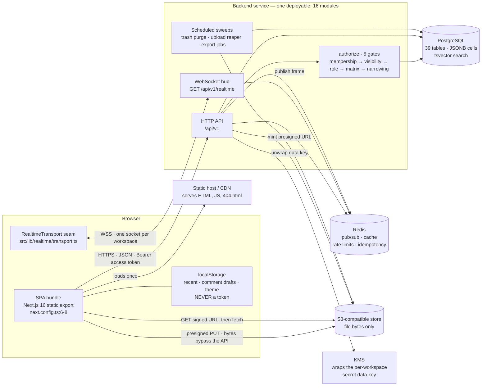
```mermaid
graph LR
  subgraph browser["Browser"]
    spa["SPA bundle<br/>Next.js 16 static export<br/>next.config.ts:6-8"]
    rt["RealtimeTransport seam<br/>src/lib/realtime/transport.ts"]
    ls["localStorage<br/>recent · comment drafts · theme<br/>NEVER a token"]
  end

  cdn["Static host / CDN<br/>serves HTML, JS, 404.html"]

  subgraph service["Backend service — one deployable, 16 modules"]
    http["HTTP API<br/>/api/v1"]
    authz["authorize · 5 gates<br/>membership → visibility → role → matrix → narrowing"]
    ws["WebSocket hub<br/>GET /api/v1/realtime"]
    sweep["Scheduled sweeps<br/>trash purge · upload reaper · export jobs"]
  end

  pg[("PostgreSQL<br/>39 tables · JSONB cells<br/>tsvector search")]
  redis[("Redis<br/>pub/sub · cache<br/>rate limits · idempotency")]
  s3[("S3-compatible store<br/>file bytes only")]
  kms["KMS<br/>wraps the per-workspace<br/>secret data key"]

  spa -->|"loads once"| cdn
  spa -->|"HTTPS · JSON · Bearer access token"| http
  spa -->|"presigned PUT · bytes bypass the API"| s3
  spa -->|"GET signed URL, then fetch"| s3
  rt <-->|"WSS · one socket per workspace"| ws
  spa --- ls

  http --> authz
  authz --> pg
  http --> pg
  http --> redis
  http -->|"mint presigned URL"| s3
  http -->|"unwrap data key"| kms
  ws --> redis
  http -->|"publish frame"| redis
  sweep --> pg
  sweep --> s3
```

Four things the diagram is asserting, each of which is a decision:

1. **The SPA talks to exactly one API origin.** It is a static bundle; it has no server-render path
   and therefore no server-side session. §8 is written against that fact.
2. **File bytes never pass through the API service.** Upload is a presigned `PUT` straight to the
   object store (E-110/E-111); download is a signed URL (E-116/E-117). The API mints URLs and
   accounts for quota; it does not proxy bytes.
3. **Redis is between the API and the socket, not between the API and the database.** A frame is
   published to Redis and delivered by whichever instance holds the subscriber's socket. Nothing
   reads its primary state from Redis.
4. **The permission decision is one function, called first.** `authorize()` runs five gates in
   order — membership, visibility, effective role, matrix/ownership, then the trashed/frozen/locked
   narrowing — before any state is read or written. The frontend models exactly this and names the
   three gates its model omits (`src/services/authz.ts:36-53`, and OQ-16 – OQ-22).

### 1.5 What the backend inherits as already-decided

A backend developer should not re-open any of these. Each is either shipped frontend behaviour or a
canon decision made on top of it.

| Decision | Where it is settled |
| --- | --- |
| UUID primary keys; `TASK-001` is a separate `custom_id` column | C-01, C-02 |
| `TIMESTAMPTZ` + ISO 8601 for instants; `DATE` + `YYYY-MM-DD` for date-only, **never converted through UTC** | C-03, C-04, `src/lib/calendar.ts:1-16`. See §7.12. |
| No `any` in any contract; every dynamic value is a discriminated union | C-05, and `src/types/` contains none |
| Every JSONB column has a named TypeScript interface documenting its structure | C-06 |
| Optional (`x?: T`) and nullable (`x: T \| null`) are different and are not collapsed | C-08, `src/types/board.ts:76-79` vs `:223` |
| Enum members on the wire are the exact frontend string literal, casing included — `longText`, `permission_denied`, `into-self`, `my-work` | C-13, canon §2.0 |
| One `nodes` table with a `kind` discriminant and five 1:1 side tables | canon §1.3.1 |
| `cells` as JSONB on the row, not an EAV `cell_values` table | canon §1.3.2 |
| Select options inside `board_columns.config`, not a `select_options` table | canon §1.3.3 |
| One `file_assets` table plus four typed join tables — **not** a polymorphic owner pair | canon §1.3.4 |
| Task / Bug / QA / API-catalogue are **board templates**, not tables. No chapter may introduce one. | canon §1.3.5 |
| Success responses carry no envelope; errors are `{ "error": AppError }` | canon §6.2, §7.3–7.4 below |
| Cursor pagination everywhere it paginates; no `page` or `offset` parameter exists in this API | canon §6.3, §7.6 below |

---

---

## 2. Backend Scope

### 2.1 In scope

The backend owns every piece of state that must survive a browser refresh, be seen by a second
person, or be refused to a third. Concretely, the sixteen modules of C-14, serving the 140 endpoints
of canon §3 over the 39 tables of canon §1.1, plus four cross-cutting obligations that belong to no
single module:

| Cross-cutting obligation | Why it is the backend's | Grounding |
| --- | --- | --- |
| **Every permission decision, re-checked server-side.** The frontend gate is UX. | "Frontend permissions are UX only — a hidden button says 'this is not for you' before a request is refused; it is not a boundary, and the backend still has to re-check every key." | `README.md` § Governance; `src/lib/permissions/evaluate.ts:24-25`; P-09 |
| **Identity, role, IP and the clock.** Resolved from the session and the socket, never read from a request body. | "A role the client sends is a claim, not a fact." | `src/services/authz.ts:24-28`; C-09; OQ-16 – OQ-21 |
| **Every server-assigned identifier**: node ids, row ids, `custom_id`/`displayId`, column ids, option ids, view ids, comment ids, asset ids, audit ids. | The client mints `tmp_`/`new_`/`acl_` placeholders and swaps them for the response. | `src/store/board-store.ts:360-366`; canon C-01, C-02 |
| **Every audit row.** Written by the endpoint that performs the action, inside its transaction. There is no audit write endpoint and no chapter may add one. | "The service exposes `record` and `list`, and nothing else… so no screen can grow an Edit button that quietly works." | `src/services/audit-service.ts:14-20`; canon §3.23 |

### 2.2 Explicitly NOT in scope — the frontend-only concerns

The frontend audit found seven categories of state and behaviour that live in the browser **and must
stay there**. Each is listed with the exact module that owns it, so nobody builds an endpoint for
it by accident.

| # | Concern | Lives in | Why it is not backend state |
| --- | --- | --- | --- |
| 1 | **Grid selection** — the cell cursor `range`, `editing` cell, `drawerRowId`, `isDragSelecting`, `selectedRowIds`, the shift-click anchor `lastSelectedRowId`, `renamingColumnId`, `detailCell` | `src/store/grid-store.ts:45-81` | Every field is ephemeral interaction state. `reset()` is called on **every board change** (`src/hooks/use-board.ts:23-28`), and `useBulkActions` filters stale ids out before any write (`use-bulk-actions.ts:54`). Persisting a selection would mean persisting a cursor position that is already gone by the time it lands. |
| 2 | **Drag state** — `draggingNodeId`, `isFileDrag` | `src/store/dnd-store.ts:5-25` | Kept out of the workspace store deliberately: "it changes on every drag gesture and no data component should re-render because of it" (`:15-18`). The *result* of a drag is a `POST /nodes/{nodeId}/move` (E-026); the gesture is not. |
| 3 | **Virtualisation** — the visible row window, overscan band, measured row offsets, scroll position | `src/hooks/use-virtual-rows.ts:35-78`; `src/components/board/table/table-grid.tsx:58`; `src/components/board/gantt/gantt-board.tsx:49` | It is a rendering strategy over a page of rows the API already returned. The API's unit is a cursor page (§7.6), not a viewport. |
| 4 | **Theme** | `src/lib/theme.ts:11-27`; `localStorage["nexdrop-theme"]` | Applied by a pre-hydration boot script so the first paint is correct; `<html class="dark">` is the source of truth, **not the stored value** (`:19-24`). A server round trip cannot happen before first paint in a static export, so a server-stored theme would flash. |
| 5 | **Sidebar collapse** | `src/store/workspace-store.ts:140`, `:254`, `:914-916`; driven by `useResponsiveSidebar` below `SIDEBAR_COLLAPSE_BREAKPOINT = 1024` (`src/config/app.ts:20-24`) | It is set by the **viewport**, not by a click, whenever the window is narrow. A server-held value would be overwritten by the next resize. See the carve-out in §2.2.1. |
| 6 | **Client-side presentational formatting** — byte sizes (`formatBytes`), relative time (`12m ago`), the `en-GB` date rendering, cell display truncation, calendar grid construction | `src/lib/format.ts:7`, `:29`; `src/lib/cell-display.ts`; `src/lib/calendar.ts:283-364` | These are locale and viewport decisions. `Intl` formatters are cached per locale (`calendar.ts:283-293`) precisely because the locale is a *parameter*, not a stored value. **See the boundary in §2.2.2 — some prose genuinely is the server's.** |
| 7 | **Client-side spreadsheet and document generation** — XLSX read/write, CSV/TSV parsing, ZIP, PDF writing | `src/lib/xlsx.ts:1-12`, `src/lib/csv.ts:1-6`, `src/lib/zip.ts`, `src/lib/pdf.ts` | Import parses the file **in the browser** and posts a parsed `ImportSource` as JSON (`src/types/system.ts:67-74`); export builds the bytes entirely client-side and never calls a service (`src/hooks/use-board-export.ts:20-27`). The API therefore accepts and returns JSON, never `multipart/form-data`, for import and view/selection export (§7.11). |

Also not backend state, and grouped here so the list is exhaustive:

| Concern | Where | Note |
| --- | --- | --- |
| Tree expansion (`expandedIds`), node multi-select, `previewNodeId` | `src/store/workspace-store.ts:112-120` | Navigation state. |
| Intent hand-offs: `rowRequest`, `renameRequestId`, `titleFocusNodeId` | `src/store/workspace-store.ts:118-140` | "Create → land the caret in the name" is a UI hand-off between two components, not a record. |
| Feedback toasts (`Feedback`, `pushFeedback`) | `src/store/workspace-store.ts:100-104` | Rendered from the response the API already returned. |
| **Role preview** (`previewAs`) | `src/store/permission-store.ts:47-51` | *"Role preview is not a session switch. It narrows what the interface offers; it does not re-authenticate, and a reload clears it"* (`docs/GOVERNANCE.md:359-360`). **Do not build a server-side impersonation mode** — see OQ-21. If a role is ever declared on the wire, the server applies `min(serverResolvedRole, declaredRole)` and never `max`. |
| The simulation panel — forced network / permission / empty / upload / save failures and latency profiles | `src/services/simulation.ts:9-73` | Exists so every error branch in the UI is reachable. **None of it ships and the API needs no equivalent.** |
| Eight UI-only enums that never cross the wire: `ViewMode`, `SortKey`, `ImportStep`, `DocumentActionId`, `SaveStatus`, `NotificationTab`, `BodySegmentKind`, `SmartViewId` | canon §2.10, closing note | In particular the API filters notifications by `reason`, **never by tab name** (OQ-90). |
| `Recent` — an LRU of 10 `EntityRef`s | `localStorage["nexdrop-recent"]`, `src/store/recent-store.ts:9-18` | "kept in this browser only". Canon's position: it stays there (OQ-96). |
| Comment drafts | `localStorage["nexdrop-comment-draft:<key>"]`, `src/hooks/use-comment-draft.ts:5-17` | Same. Canon's position: it stays there (OQ-97). |

**One invariant worth stating in a security review:** nothing else is persisted in the browser. No
auth token, no user id, no board data, no draft document content, and — stated as a design
invariant in two places — **no secret plaintext** (`src/hooks/use-secret-document.ts:48-55`,
`src/hooks/use-secret-editor.ts:92-105`). §8 is designed not to break that.

#### 2.2.1 The carve-out: preferences whose *value* persists even though the *interaction* does not

Three of the concerns above have a persisted-value half that canon has already reserved a table for.
Read this before concluding "the backend stores nothing about the UI".

| Value | Table | Status |
| --- | --- | --- |
| Per-viewer column widths and collapsed-group state on a board view | `board_view_preferences` (T-16) | **RECOMMENDATION**, OQ-46. Filters and sorts stay **shared** — they are what a named view *is*. Widths and collapse are per viewer. |
| Sidebar collapse, drive view mode (`grid`/`list`), drive sort key and direction | `user_ui_preferences` (T-37) | **RECOMMENDATION**, OQ-98. Not built until OQ-98 is answered; until then the client keeps them and nothing breaks. |
| Recent, comment drafts | *no table* | Canon's position under OQ-96 / OQ-97 is that both stay in `localStorage`. |

The distinction is the useful one: **the grid's cursor is never persisted; a column the user
widened is.** `collapsedByView` and `collapsedParentsByView` are keyed by view id so collapsed
groups survive a view switch (`src/store/grid-store.ts:50-56`) — that is exactly the shape T-16
would take.

#### 2.2.2 The boundary inside "formatting": what the server *does* render

Item 6 above is the easiest one to get wrong in both directions. The rule:

**The client renders values. The server renders sentences about history.**

| Server-rendered — a stored string | Grounding |
| --- | --- |
| `AuditEvent.detail` — "One sentence. The UI never renders a raw audit payload" | `src/types/audit.ts:37-38` |
| `AuditEvent.target` — "Human label of the thing acted on — never an id, never a payload" | `src/types/audit.ts:35-36` |
| `ActivityEntry.summary` — "Human sentence fragment: `changed Status`, `created TASK-001`" | `src/types/board.ts:501-502` |
| `AppNotification` pre-rendered title and body, frozen at creation because a notification is a historical statement | canon T-35, OQ-79 |
| `UserSummary.initials` and `accentColor` — served fields, not derived | `src/types/user.ts:8-11`; `src/mock/users.ts:3-17` |

| Client-rendered — never sent as a string | Grounding |
| --- | --- |
| `1.4 MB` from `sizeBytes` | `src/lib/format.ts:7-19` |
| `12m ago` from an ISO instant | `src/lib/format.ts:29` |
| `27 Aug 2026` from a `YYYY-MM-DD` day key, in `en-GB` | `src/lib/calendar.ts:57`, `:300-317` |
| Cell truncation under `compact` / `wrap` / `full` | `src/types/board.ts:316-326`; `src/lib/cell-display.ts` |

Sending a formatted byte count or a relative time would freeze a viewport decision into a record and
would go stale the moment the tab stayed open.

### 2.3 Module priority

**How the bands are defined.**

- **P0** — the shell does not boot, or boots into a refusal, without it. `AppShell` mounts
  `WorkspaceGuard` and nothing inside a workspace renders until membership is settled
  (`src/components/layout/app-shell.tsx:49-52`, `src/components/workspace/workspace-guard.tsx:10-27`).
- **P1** — the shell boots and P0 surfaces work, but a numbered PRD feature is dead.
- **P2** — the feature degrades gracefully into behaviour the frontend already handles, or it is a
  `RECOMMENDATION` whose OQ is still open.

| Module | Band | Owns | What breaks without it | Endpoints (canon §3) | Tables |
| --- | --- | --- | --- | --- | --- |
| `identity` | **P0** | Authentication, session, the caller. Directory reads. | **Everything.** 33 files import a hardcoded user (`src/mock/users.ts:3`); no request can name an actor. See §8. | E-001 – E-006 | T-01, T-02, T-37 |
| `workspace` | **P0** | Tenancy, membership, roles, storage quota, invitations. | `WorkspaceGuard` renders the refusal screen for everyone. "Not a member" is not "viewer" (`src/lib/workspace-access.ts:4-14`). | E-007 – E-019 | T-03, T-04, T-05 |
| `drive` | **P0** | The node tree, slugs, path resolution, move/duplicate/rename, favourites, archive, soft delete. | Every route resolves a slug chain against the tree (`src/app/(workspace)/drive/[[...path]]/page.tsx`). Boards, pages, config and secret documents all render **inside** `/drive/<path>`. | E-020 – E-035 | T-06, T-07 |
| `governance` | **P0** | `authorize()`, access rules, capability sets, the permission catalogue, the audit log. | Not "no permissions" — **no safe read at all**. The tree endpoint is pruned by visibility before it is returned (E-020, `src/lib/tree.ts:297-320`). | E-040 – E-046, E-136, E-137 | T-08, T-36 |
| `boards` | **P0** | Board aggregate, columns, rows, cells, `custom_id` counter, row activity. | `BD-COR-07`, the product's centre. Table view is the default surface of every board node. | E-047 – E-073 | T-10 – T-12, T-14 |
| `views` | **P0** | Saved views: type, filters, sorts, grouping, column presentation. | A board must have **at least one view** — E-081 refuses the delete that would leave zero (`VIEW_LAST_REMAINING`). A board with no views cannot render. | E-078 – E-083 | T-15, T-16 |
| `documents` | **P0** | Block pages, autosave, pin, lock. | `WS-DOC-05`. Document nodes exist in the seeded tree from the first frame; opening one without this module is a 404 on a node the sidebar is showing. | E-091 – E-094 | T-18, T-19 |
| `templates` | **P0** *(built-ins)* / **P2** *(user-authored)* | The four built-in blueprints as seed rows; instantiation. | Board creation takes a `templateId` (`src/store/workspace-store.ts` `createBoard`), so the four seeds are P0. Saving a board **as** a template (E-089/E-090) is `RECOMMENDATION` under OQ-47 → P2. | E-087, E-088 *(P0)*; E-089, E-090 *(P2)* | T-17 |
| `files` | **P1** | Presigned uploads, quota accounting, previews, text/spreadsheet save, downloads, signed URLs, link unfurl. | `WS-FIL-06` and the whole `/files` route. File **nodes** still list from `drive`, so the tree is intact; their bytes are not. | E-110 – E-118 | T-27 – T-32 |
| `collab` | **P1** | Comments, mentions, watches, notifications — and the transactional fan-out. | `CO-CMT-26`, `CO-MEN-27`, `CO-WAT-28`, `CO-NOT-29`. The bell renders zero; the drawer's comment tab is empty. | E-119 – E-132 | T-33 – T-35 |
| `system` | **P1** | Trash console, bulk actions, import/export, version history across pages/config/secrets. | `SY-BLK-34` … `SY-VER-39`. `/trash` and `/archive` render empty; multi-select loses its action bar. Node soft-delete itself is `drive` (E-032), so nothing is lost, only unrecoverable through the UI. | E-036 – E-039, E-074 – E-077, E-084 – E-086, E-095 – E-098 | T-09, T-38, T-39 |
| `devtools` | **P1** | Config documents, secret documents, encryption, reveal/copy/rotate, the secret access trail, environments. | `DV-CFG-22`, `DV-SEC-23`, `DV-ENV-21`. **Ship it complete or not at all**: a half-built secret store with an unaudited reveal is worse than no secret store. | E-099 – E-109 | T-20 – T-26 |
| `search` | **P1** | Global full-text search across 8 result kinds, permission-funnelled before scanning. | `CO-SCH-31`. `⌘K` opens an empty dialog. The cheap drive quick-find (E-035) is a separate `drive` endpoint and survives (OQ-94). | E-133 | *(tsvector columns on existing tables; no table of its own)* |
| `insights` | **P1** — *land it first among P1* | Dashboard aggregates and My Work. | `SY-DSH-44`, `CO-MYW-30`. **`/` redirects to `/dashboard`**, so this is the app's landing screen; without it the first thing a user sees is an error panel rather than the onboarding state. | E-134, E-135 | *(projections; canon §1.2 — no tables)* |
| `realtime` | **P1** — *with one P0 frame* | The WebSocket hub and Redis fan-out. | **RT-05 `permission.changed` is not optional**: without it a revoked user keeps a loaded board on screen until they reload (`src/hooks/use-access-sync.ts:74-83`; canon §7.1). The other frames are convergence, not correctness. The seam already exists — `REALTIME_ENDPOINT` is `null` (`src/config/app.ts:65-69`) and unknown frame types are ignored by the client (`src/types/realtime.ts:14`), so frames can ship one at a time. | E-138 | *(none — Redis pub/sub)* |
| `relations` | **P2** | The `board_row_relations` projection, the bulk relation resolver, backlinks. | `DV-REL-24`. A relation cell renders its stored id and a deleted target renders `[Deleted Item]` with an unlink action, so the degradation is already designed. The `task` built-in template ships a "Blocked by" relation column, which would render empty. | E-071, E-072 | T-13 |

**A delivery note that follows from the table, not an opinion.** The eight P0 entries are not eight
milestones — they are one. `authorize()` needs membership (`workspace`), the ancestor chain
(`drive`) and the node's lock state (`documents`) in a single read; the drive tree endpoint is
pruned by `governance` before it returns; a board node without `views` cannot render. The smallest
shippable slice is: **sign in → list workspaces → read the pruned tree → open one board with one
view → edit one cell → see it after a refresh.** Everything in P1 hangs off that slice, and every
P1 module can be added without a client release except `realtime`, which needs one constant changed.

### 2.4 Two scope questions the frontend does not settle

**OPEN QUESTION (OQ-42) — are import parsing and export generation client-side by design, or by
absence of a server?**
**Evidence** — the frontend parses `.xlsx`/`.csv`/`.tsv` in the browser
(`src/lib/xlsx.ts:1-12`, `src/lib/csv.ts:1-6`) and posts an already-parsed `ImportSource`
(`src/types/system.ts:67-74`); export builds XLSX, CSV and PDF bytes entirely client-side and never
calls a service (`src/hooks/use-board-export.ts:20-27`, `src/lib/pdf.ts`). `IMPORT_MAX_ROWS = 5 000`
(`src/config/app.ts:48`) is a ceiling a browser can hold; `SY-EXP-36` asks for 5 000 rows to Excel
in under 2 s, which a browser meets.
**Recommendation** — keep parsing and small-scope generation in the browser. The API accepts JSON
for `POST /boards/{boardId}/import/plan` and `/import` (E-084, E-085) and returns `ExportOutcome`
for `view` and `selection` scope; only **whole-board export** (E-086, `board` scope) becomes an
async `ExportJob` writing to object storage with a signed URL, because that is the only case where
the row count is unbounded.
**Impact if wrong** — if the server must parse, `POST /import/plan` gains a `multipart/form-data`
variant and the whole §7.11 "JSON only" rule gains an exception. Contained, but it changes the
content-type contract.

**OPEN QUESTION (OQ-29) — `ExportOutcome.omittedColumns` implies column-level permissions that
exist nowhere.**
**Evidence** — export drops columns the viewer may not read *before* any writer sees them
(`src/hooks/use-board-export.ts:20-27`, `selectExportColumns(..., { canViewSensitive })`), and
`SY-EXP-36` states "a column the caller may not read is removed from the exported file". But the
39-key catalogue has **no column-scoped key** (`src/types/permission.ts:30-77`), and `canViewSensitive`
is derived in the client from a name heuristic.
**Recommendation** — do not introduce column-level ACLs. Treat "sensitive" as a board-schema
property the backend can evaluate, and resolve it with OQ-48 (column roles are name heuristics, not
schema) rather than by extending the permission catalogue.
**Impact if wrong** — if real column-level permissions are required, `access_rules` gains a
`column_id` scope and every board read grows a per-column filter. That is a schema change in the
hottest read path in the product.

---

---

## 3. Domain Model

### 3.0 How to read this section

This section names the aggregates, draws their boundaries and states their invariants. It does not
draw the schema — §5 does that, and the schema chapter carries the columns. Every claim here is
either an **EXISTING REQUIREMENT** (the frontend at `/Users/chikarin/Projects/NexDrop/Gen fe` or the
PRD settles it, cited `path:line`) or a **RECOMMENDATION** carrying the canon **OQ id** that reserves
the decision. Table names, enum members and endpoint ids are canon's (`spec/canon.md` §1, §2, §3) and
are not re-litigated here.

---

### 3.1 The single most important idea in this system

> **A board owns one schema and one set of records. A view owns nothing but presentation.**

This is not a design preference. It is already how the frontend is built, and building the backend
any other way breaks it.

**EXISTING REQUIREMENT.** There is exactly one record store per board and exactly one query over it.
`src/lib/board-view.ts:15-21` states the rule in the file header:

> *"A view never owns records — it describes how to read the board's. Schema (name, type, config)
> lives on the column and is shared by every view. Presentation (order, width, visibility) is per
> view, so hiding a column in the table cannot change what Kanban or Calendar show."*

and `src/lib/board-view.ts:190-193` states the mechanism:

> *"The single query the whole board runs: filters, then search, then sort. Table, Kanban, Calendar
> and Timeline all consume the row ids it returns."*

`queryRowIds` (`src/lib/board-view.ts:194-236`) is that one query. It takes `rowsById`, `rowOrder`,
the active `SavedView` and a search string, and returns `readonly string[]` — row ids. Table, Kanban,
Calendar and Gantt are **projection functions over those ids**, not stores:

| Surface | Component | What it projects the same ids through |
| --- | --- | --- |
| Table | `src/components/board/table/table-grid.tsx` | `resolveColumns` order + width + visibility |
| Kanban | `src/components/board/views/kanban-board.tsx` | `groupByColumnId` buckets over the select column's options |
| Calendar | `src/components/board/views/calendar-board.tsx` | `dateColumnId` → a day key per row (`src/lib/board-calendar.ts`) |
| Gantt | `src/components/board/gantt/gantt-board.tsx` | `dateColumnId` + `endDateColumnId` → a bar (`src/lib/board-gantt.ts`) |

**What this settles for the backend, permanently.**

1. There is **no per-view record table**. No `kanban_cards`, no `calendar_events`, no `gantt_tasks`,
   no `timeline_bars`. A view is a row in `board_views` (T-15) and nothing else.
2. Switching a view is a **client-side re-projection of rows already loaded**. It issues no write and
   needs no endpoint. E-078…E-082 write view *configuration*; they never touch `board_rows`.
3. A schema write (`board_columns`) is visible to **every** view of the board. A presentation write
   (`board_views`) is visible to **that view only**. The split is exactly:

   | Operation | Writes | Visible to | Endpoint |
   | --- | --- | --- | --- |
   | Rename column, change type, change config, add/delete/reorder column | `board_columns` | every view | E-052…E-060 |
   | Resize, hide/show, reorder, sort, filter, group, row height, display mode, Gantt zoom | one `board_views` row | that view only | E-080 |
   | Per-viewer width and collapse state | `board_view_preferences` | that viewer only | E-083 (RECO, OQ-46) |

4. Deleting a column must **prune every view of the board in the same transaction** (E-054). The
   frontend's `pruneView` (`src/lib/board-view.ts:288-334`) drops filters, sorts, `columnOrder`,
   `hiddenColumnIds`, `columnDisplay`, `columnWidths`, `groupByColumnId`, `dateColumnId` and
   `endDateColumnId` that name a column the schema no longer has. The backend performs the same
   pruning server-side; a view carrying a dead reference is a spec defect.
5. Realtime follows the same shape. `board.schema.changed` (RT-10) carries `{ boardId }` and nothing
   else; the client refetches the whole schema, which is C-11 ("a schema response is a **complete
   array**, never a delta", `src/store/board-store.ts:698`).

#### 3.1.1 The corollary: QA, Task, Bug and API Catalogue are board *templates*, not domains

**EXISTING REQUIREMENT.** `src/lib/board-templates.ts:12-18`:

> *"A template is inert data: `instantiateTemplate` deep-copies everything it hands out, so a board
> can add, rename or delete columns without the template it came from ever changing — the acceptance
> criterion for DV-TMP-19."*

There is **no `tasks` table, no `bugs` table, no `qa_cases` table and no `api_endpoints` table**
(canon §1.2, §1.3.5). `task`, `bug`, `qa` and `apiDocs` are four seed rows in `board_templates`
(T-17). A board created from one is an ordinary board from the moment it exists.

The evidence that this is a hard rule and not a convenience:

- **The product reads a board by what it became, not by what it was made from.** `isQaBoard`
  (`src/lib/dashboard.ts:92-99`) does not look at `templateId`. It asks whether the board's status
  column offers an option labelled `passed` or `failed`. The comment at
  `src/lib/dashboard.ts:87-91` is explicit: *"Template id is not enough: a board created from the QA
  template and then reshaped should follow what it became, not what it was made from."*
- **Cross-template queries address columns by *role*, never by id.** `lensesFor`
  (`src/lib/my-work.ts:59-68`) picks the assignee / due / status columns by matching the column
  *name* against `/assign|owner|tester|responsible/i`, `/due|deadline/i` and `/status|result|state/i`.
  A board with no column for a role *contributes nothing* to the widget that needs it rather than
  guessing (`src/lib/my-work.ts:14-21`).
- **`SearchResultKind`'s `api` / `bug` / `qa` buckets are a read-time projection.**
  `src/services/search-service.ts:39-43` is a three-entry map from template id to result kind. It is
  a lens on `boards.template_id`, not a schema.
- **`BoardNode.templateId` is a bare `string`, "for reference only"** (`src/types/node.ts:110-111`,
  `src/types/board.ts:414-415`).
- **A template-specific rule is a warning, never a constraint.** The API-documentation board's
  duplicate-endpoint check (`DV-API-20`, `src/components/board/api-duplicate-banner.tsx`) is *"warned
  in amber, never blocked"* — a validation a dedicated `api_endpoints` table would be forced to make
  an error.

**A writer who feels the pull toward a typed table for one of these four is looking at a template
column list.** Document the template row, not a table.

---

### 3.2 The aggregate hierarchy

Six aggregates. Indentation is containment; a `→` marks a reference that crosses an aggregate
boundary and is therefore an id, never an embedded object.

- **Workspace** — the tenant boundary. `workspaces` (T-03)
  - `plan`, `badge`, `color`, `slug`, `used_bytes` counter
  - **Member** — `workspace_members` (T-04), `(workspace_id, user_id)` → `WorkspaceRole` + `joined_at`
    - → `users` (T-01) — soft-deactivated, never hard-deleted
    - `workspace_invitations` (T-05) — pending email invite → role, token hash, expiry *(RECO, OQ-04)*
  - `environments` (T-26) — the shared deployment label list, `SelectOption`-shaped (DV-ENV-21)
  - `board_templates` (T-17) — four built-in seed rows plus this workspace's own
  - **Node tree** — `nodes` (T-06). One table, discriminated by `kind`. The drive.
    - `project` — `status`, `color`, `description`
    - `folder` — `color`
    - `document` — `document_kind` ∈ `page | config | secret`, `icon`, pin and lock state
      - `page` → **Document** content: `documents` (T-18) + `document_versions` (T-19)
      - `config` → **Config** content: `config_documents` (T-20) + `config_versions` (T-21)
      - `secret` → **Secret** container: `secret_documents` (T-22)
        - `secrets` (T-23) — one key per row, `value_encrypted BYTEA`
        - `secret_rotations` (T-24) — *that* a key rotated. **No value column, ever.**
        - `secret_access_events` (T-25) — per-secret reveal / copy / rotate trail
    - `board` — `board_kind`, `template_id`
      - → **Board** content: `boards` (T-10)
    - `file` — `file_kind`, `extension`, `mime_type`, `size_bytes`
      - → `file_nodes` (T-28) → `file_assets` (T-27)
    - `node_favorites` (T-07) — per user, not a flag on the node *(OQ-07)*
    - `trash_entries` (T-09) — restore metadata for a deleted subtree
    - `access_rules` (T-08) — see **Governance**
  - **Board** — `boards` (T-10). The single source of truth for records.
    - **Columns** — `board_columns` (T-11): `type`, `position`, `width`, `hidden`, `is_primary`,
      `config` JSONB
      - **Options** — `SelectConfig.options[]` **inside** `board_columns.config`, not a table *(canon §1.3.3)*
        - `availability` — a `ConditionGroup` tree per option
        - `transitionRules.transitions` — keyed by option id, reserved key `"__empty__"`
        - `completedOptionIds` — which options mean "finished"
    - **Rows** — `board_rows` (T-12): `custom_id`, `sequence`, `parent_row_id`, `position`, `revision`
      - **Cells** — `board_rows.cells` JSONB, `Record<columnId, CellValue>` *(canon §1.3.2)*
      - subtask containment — `parent_row_id`, self-referential, same board *(OQ-33)*
    - **Relations** — `board_row_relations` (T-13): a projection of relation cells so backlinks are
      an indexed query. Written in the same transaction as the cell.
    - **Views** — `board_views` (T-15): `type`, filters, sorts, grouping, column presentation
      - `board_view_preferences` (T-16) — per-viewer overrides *(RECO, OQ-46)*
    - **Activity** — `row_activity` (T-14): one entry per write, however many fields it touched
    - `import_jobs` (T-38), `export_jobs` (T-39) *(RECO, OQ-41 / OQ-42)*
  - **Collaboration**
    - **Comments** — `comments` (T-33): body, decomposed target, `parent_id`, resolve and tombstone
      columns
      - **Mentions** — `comments.mentioned_user_ids`, parsed server-side from `@[Name](usr_id)`.
        **Not a table.**
      - `comment_attachments` (T-30) → `file_assets`
    - **Watches** — `watches` (T-34): `(user_id, target_kind, target_node_id, target_row_id)` + `since`
    - **Notifications** — `notifications` (T-35): one row **per recipient**, fan-out on write
    - **Favourites** — `node_favorites` (T-07), listed under the node tree because it keys a node
    - **Recents** — *not a table.* `localStorage` under `nexdrop-recent` *(OQ-96)*
    - **Activity** — `row_activity` (T-14), listed under Board because it keys a row
  - **Governance**
    - **Roles** — `WorkspaceRole`, four members, cumulative. Not a table: the matrix is code
      (`src/lib/permissions/roles.ts:77-96`).
    - **Permissions** — the 39-key `PermissionKey` catalogue. **Not a table**: static config served
      from E-045 so both sides agree (canon §1.2).
    - **Access grants** — `access_rules` (T-08): one grant, on one node, for one subject
    - **Audit** — `audit_events` (T-36): append-only. **No write endpoint exists and no chapter may
      add one** (canon §3.23).
  - `user_sessions` (T-02), `user_ui_preferences` (T-37) — keyed by user, not by workspace

---

### 3.3 Aggregate by aggregate

#### 3.3.1 Workspace — the tenant boundary

**Root.** `workspaces` (T-03). **Contents.** `workspace_members`, `workspace_invitations`,
`environments`, `board_templates` (the workspace's own), and — transitively — every `nodes` row.

**Boundary.** A workspace is the outermost gate. Crossing it is not a permission question, it is an
existence question.

**Invariants.**

| # | Invariant | Grounding |
| --- | --- | --- |
| W-1 | **"Not a member" is not "viewer".** A workspace the caller is not a member of answers identically to one that does not exist: `WORKSPACE_NOT_FOUND`, `404`, `not_found`. | `src/lib/workspace-access.ts:4-14`; canon §4.3 |
| W-2 | **The workspace never loses its last admin.** `isLastAdmin` (`src/lib/workspace-access.ts:85-88`) guards leave (`:106-119`), remove (`:122-138`) and demote. E-014/E-015/E-016 all refuse with `WORKSPACE_LAST_ADMIN`, `409`. | `src/lib/workspace-access.ts:84-157` |
| W-3 | **The creator becomes admin in the same write.** E-008 inserts `workspaces` and `workspace_members` in one transaction. There is no window in which a workspace has no administrator. | `src/lib/workspace-access.ts:212-238` |
| W-4 | `workspaces.slug` is globally unique. Single tenant; there is no tenant table. | *(OQ-02, position taken in canon §8.8)* |
| W-5 | `workspaces.used_bytes` is maintained **transactionally** with every `file_assets` insert and delete, with `SELECT … FOR UPDATE`. It is never recomputed by aggregate on read. An upload that would exceed `StorageQuota.totalBytes` is refused with `QUOTA_EXCEEDED`, `507`. | canon §1.4, §8.8 (OQ-05); `src/types/workspace.ts:5-10` |
| W-6 | `StorageQuota.totalBytes` comes from static per-plan service config, not a `plans` table. Three tiers with fixed quotas cannot drift if they are not rows. | canon §1.2 *(OQ-06)* |
| W-7 | Leaving the workspace you are standing in switches you out in the same write (E-016). | `src/lib/workspace-access.ts:106-119` |

**Transaction rule.** Workspace creation, membership change and workspace deletion each land as one
transaction. A membership change additionally emits `permission.changed` (RT-05) with
`nodeId: null` — because a role change re-resolves access on **every** node in the workspace.

#### 3.3.2 Member — the person inside the tenant

**Root.** `workspace_members` (T-04). It is a join row with state, not a link table: it carries
`role` and `joined_at`, and `WorkspaceMember` is the shape the API returns (`src/types/user.ts:22-25`).

**Boundary.** `users` (T-01) lives *outside* the workspace aggregate. One person may hold membership
in many workspaces with a different role in each. `workspace_members` is the only place a role is
stored.

**Invariants.**

| # | Invariant | Grounding |
| --- | --- | --- |
| M-1 | **A user is soft-deactivated, never hard-deleted.** `users.is_active = false`. The directory endpoint (E-006) returns deactivated members flagged `isActive: false` so an old assignment still renders a name. | `src/types/user.ts:14-20`; `src/mock/users.ts:41-58` |
| M-2 | Role comes from `workspace_members`, resolved from the **session**. A role in a request body is a claim, not a fact. | C-09; `src/services/authz.ts:24-27` |
| M-3 | `WorkspaceRole` order **is** the rank, ascending: `viewer < member < manager < admin`. `roleRank` is `WORKSPACE_ROLES.indexOf(role)`. | `src/types/permission.ts:10-20` |
| M-4 | Roles are **cumulative**: each role is the one below it plus what it adds. Viewer holds **zero** keys by construction, not by omission. | `src/lib/permissions/roles.ts:16, 84-96` |
| M-5 | Ownership is a **separate axis**, not a fifth role. It escalates five keys (`node.rename`, `node.delete`, `node.archive`, `file.delete`, `document.lock`) on the things you made, and only from `member` upward. | `src/lib/permissions/roles.ts:99-108`; `src/lib/permissions/evaluate.ts:71-74` |

**RECOMMENDATION.** `workspace_invitations` (T-05) models the flow implied by
`WorkspaceMember.joinedAt`, which the frontend carries but never produces *(OQ-04)*. E-013 creates
one; E-019 consumes it and inserts the `workspace_members` row in the same transaction.

#### 3.3.3 Node tree — the drive

**Root.** `nodes` (T-06). **One table, discriminated by `kind`**, with the shared column set as real
columns and the per-kind extras as nullable columns (canon §1.3.1). Content lives in five 1:1 side
tables keyed by `node_id`: `boards`, `documents`, `config_documents`, `secret_documents`,
`file_nodes`.

**Boundary.** The node is the **unit of addressing, routing, permission and lifecycle**. Content is
entered through its node and then addressed by its own id (P-04): `GET /nodes/{nodeId}/board`
returns the snapshot including `board.id`, and every board sub-resource then hangs off
`/boards/{boardId}`.

**Invariants.**

| # | Invariant | Grounding |
| --- | --- | --- |
| N-1 | `children` is **DERIVED** from `parent_id` and is never stored. | `src/types/node.ts:149-151` |
| N-2 | `slug` is unique among **live siblings, across kinds**. A trashed row is excluded so a restore never collides. Minted once at creation, re-uniquified only on **move**, never re-minted on rename. | `src/store/workspace-store.ts:472-490`; canon §8.8 *(OQ-09 / OQ-10)* |
| N-3 | Only `project` and `folder` are containers. `isContainer` (`src/types/node.ts:146-147`) is the whole rule. A document or board under a leaf is refused: `NODE_NOT_CONTAINER`, `409` — *"Pages can only live inside folders."* | `src/store/workspace-store.ts:748-753` |
| N-4 | **Move rejects four ways**, and they are distinct outcomes, not one error: `same-parent`, `into-self`, `into-descendant`, `invalid-target`. `same-parent` is a no-op the caller should treat as success. | `src/lib/tree.ts:170-197` |
| N-5 | **Archiving is inherited and is not the same as being archived.** A node under an archived ancestor is *frozen*: every write is refused and it **cannot be thawed on its own**. A node archived in its own right is read-only but still offers Restore. `inheritedArchiveOf` looks at `path.slice(0, -1)` — the own flag is deliberately not read. | `src/lib/archive.ts:30-45`; `src/lib/permissions/evaluate.ts:56-62, 79-85` |
| N-6 | `archiveSourceOf` walks **root-first** so the **outermost** archived ancestor is the one reported and the one whose Restore ends the freeze. E-034 therefore lists only the outermost archived node per subtree. | `src/lib/archive.ts:19-28` |
| N-7 | Delete is soft: `deleted_at` + `deleted_by`, never a boolean. `isTrashed` on the wire is `deleted_at IS NOT NULL`. Deleting **detaches the whole subtree**, so permanently deleting a folder cannot take an already-deleted child with it. | canon §1.4; `src/types/system.ts:164-169` |
| N-8 | A trashed node accepts **nothing but `node.delete`**. `can()` returns false for every other key. | `src/lib/permissions/evaluate.ts:79-81` |
| N-9 | Restore walks `originalAncestorIds` root-first for the deepest surviving container and reports `isRelocated` when the original parent is gone. This is a `200` outcome, never an error. | `src/types/system.ts:171-188`; canon §4.3 |
| N-10 | **Visibility pruning is subtree-wide.** `collectAllowed` skips a node *and its whole subtree* when the predicate fails: *"a file inside a folder the viewer cannot open must not surface in search results just because the file itself carries no restriction of its own."* | `src/lib/tree.ts:296-320` |
| N-11 | `is_shared` is **DERIVED**: true when any `access_rules` row exists on the node. | canon §1.3.1 |
| N-12 | `blockCount`, `excerpt`, `itemCount`, `openCount` are **DERIVED** projections kept in sync by the owning module. `summarize()` is the exact payload for a page. | `src/services/document-service.ts:148-171` |
| N-13 | `is_favorite` is **per user**, resolved from `node_favorites` for the caller — not a column on the node. | canon §8.8 *(OQ-07)* |

**Why one table and not five.** Every node variant shares one column set (`DriveNodeBase`,
`src/types/node.ts:48-78`), one routing key, one permission chain and one archive/trash lifecycle;
`resolvePath`, `collectAllowed`, `moveNode`, `cloneNode` and `effectiveAccess` all take `DriveNode`
without narrowing (`src/lib/tree.ts:15-320`, `src/lib/permissions/inheritance.ts:91-120`); and
`UNIQUE (parent_id, slug)` must hold **across kinds**, which a split schema cannot express.

**OPEN QUESTION (OQ-56)** — three copies of `isArchived`
**What is unclear.** `DriveNodeBase.isArchived?` (`src/types/node.ts:66`), `DocumentNode.isArchived`
(required, `:103`) and `WorkspaceDocument.isArchived` (`src/types/document.ts:129`) are three fields
holding the same fact, and `summarize()` copies the document's value onto the node
(`src/services/document-service.ts:168`). Nothing declares which one is canonical.
**Evidence.** The freeze resolver reads the **node** chain and only the node chain
(`src/lib/archive.ts:37-45` → `findPathToId` over `DriveNode[]`). `documentCapabilities`
(`src/lib/permissions/evaluate.ts:135-141`) reads the **document** copy. The two never disagree in
the mock only because `summarize` runs on every save.
**Recommendation.** **The node owns it.** One column, `nodes.archived_at TIMESTAMPTZ NULL`.
`WorkspaceDocument.isArchived` and `DocumentNode.isArchived` are both projections of
`nodes.archived_at IS NOT NULL`, computed on read. `PUT /nodes/{nodeId}/archive` (E-030) is the only
writer.
**Impact if wrong.** Two writable copies drift; a page that is archived on one surface and editable
on another is a data-integrity bug that only shows up as "the lock didn't take".

**OPEN QUESTION (OQ-12)** — duplicating a container
**What is unclear.** E-027 duplicates recursively. `cloneNode` (`src/lib/tree.ts:200-230`) mints a
fresh id for every descendant but copies **tree metadata only** — it never reaches into `boards`,
`documents`, `config_documents` or `secret_documents`. Whether a duplicated project carries its
boards' rows, its pages' blocks, or its secrets' values is undecided.
**Evidence.** `documentService.duplicate` exists and copies blocks
(`src/services/document-service.ts:313`), so per-node content duplication is already modelled for
one kind. Nothing equivalent exists for boards or secrets. `SecretEntry` deliberately has no `value`
field at all (`src/types/devtools.ts:68-73`).
**Recommendation.** Duplicate content for `project`, `folder`, `document(page)`, `board` and `file`
(the asset is referenced, not re-uploaded — one `file_assets` row, two `file_nodes` rows).
**Refuse to duplicate a `secret` node**, and refuse the whole operation if the subtree contains one,
with `409` `PERMISSION_DENIED`-adjacent copy. Copying ciphertext silently doubles the blast radius of
a leak and produces a second rotation history that no audit trail explains.
**Impact if wrong.** Either duplicating a project silently produces empty boards, or it silently
clones every production secret in it.

#### 3.3.4 Board — records, schema, views

**Root.** `boards` (T-10), keyed to exactly one `nodes` row (`node_id UNIQUE NOT NULL`).

**Contents.** `board_columns`, `board_rows`, `board_views`, `board_view_preferences`,
`board_row_relations`, `row_activity`, `import_jobs`, `export_jobs`.

**Boundary.** The board is a **consistency boundary for the record set and its schema**. A column
write and the cell rewrites it causes are one transaction. A row write and its `row_activity` entry
and its `board_row_relations` projection are one transaction. Two boards are two boundaries — the
one operation that spans both, `bulkMove` (E-077), is explicitly *"one transaction over **both**
boards"* and needs `row.delete` on the source **and** `row.create` on the target *(OQ-17)*.

**Invariants.**

| # | Invariant | Grounding |
| --- | --- | --- |
| B-1 | **`displayId` is minted by the backend, never derived on the client.** `boards.next_sequence` is monotonic and only increases: deleting `TASK-005` never re-issues `005`. `formatRowId(prefix, sequence)` pads to 3 and grows past it. | `src/types/board.ts:240-243`; `src/lib/row-id.ts:1-15`; `src/services/board-service.ts:65-68` |
| B-2 | `row_id_prefix` matches `^[A-Z]{1,6}$` — upper-case letters only, capped at six. | `src/lib/row-id.ts:9-20`; `ROW_ID_PREFIX_INVALID` |
| B-3 | **The cell's `kind` may legitimately disagree with its column's `type`.** A conversion preserves an unparseable value as `CellValue.text` rather than dropping it. The API must not normalise the tag away. | `src/types/board.ts:214-218`; canon §2.5 |
| B-4 | The frontend writes an **explicit empty `CellValue` of the column's kind**, never `null` or an absent key. Rows are dense by construction. | `src/lib/cell-values.ts:20-36` `emptyCellFor` |
| B-5 | **One write bumps `revision` once, however many cells it touched.** `updateCells` builds a `touched` map keyed by row id and increments once per row. | `src/services/board-service.ts:500-520` |
| B-6 | **Cell writes are last-write-wins plus a `ConflictNotice`. Never `409`.** Three exact properties: a missing `baseRevisions[rowId]` never conflicts; `base < current.revision` conflicts while equal-or-greater does not; **at most one notice per row per call**, raised by the first edit that touches it. | `src/services/board-service.ts:504-512` |
| B-7 | The **primary column** titles every record. It can never be hidden and never be deleted. `hidden` is *silently ignored* on it, not rejected. | `src/types/board.ts:178-179`; `src/lib/board-schema.ts:98-99` |
| B-8 | Column names de-duplicate silently: `Notes`, `Notes 2`, `Notes 3`. Two names collide when they differ only in case and punctuation. | `src/lib/board-schema.ts:150-179` |
| B-9 | Column `width` is clamped, never rejected: `[MIN_COLUMN_WIDTH, MAX_COLUMN_WIDTH]`, rounded. | `src/lib/board-schema.ts:70-72` |
| B-10 | Column `position` is **densely renumbered `0..n-1`** on reorder. View order is a separate array on `board_views.column_order`. | `src/lib/board-schema.ts:163-167`; `src/lib/board-view.ts:263-280` |
| B-11 | **Select options live inside `board_columns.config`.** Three sibling structures reference option ids by value — `completedOptionIds`, `transitionRules.transitions`, and each option's `availability` tree — so splitting them out puts one atomic configuration across two tables with no FK able to protect any reference. | canon §1.3.3; `src/types/board.ts:120-138` |
| B-12 | `"__empty__"` is a **reserved option id** standing for the empty bucket on both sides of a transition. It must be rejected as a user-authored id: `OPTION_ID_RESERVED`, `400`. | `src/lib/transition-rules.ts:27-32` |
| B-13 | Creating an option **dedupes by trimmed, case-folded label and returns the existing option with `200`** — never `409`. Colour is chosen client-side by cycling the eight-colour palette and sent in the request. | canon §3.7 E-058; `src/store/board-store.ts:844-851` |
| B-14 | Deleting an option leaves the orphaned id in `cells`. The frontend renders it as unknown, not deleted, so the backend **must not prune cells silently**. | canon §1.3.3 |
| B-15 | **Transition rules are not permission.** *"Permission answers 'may this person edit Status at all'; a transition rule answers 'may Status go from here to there'. Both are checked, separately, before a drop is written."* | `src/lib/transition-rules.ts:22-25` |
| B-16 | **Containment is not Relation.** `parentRowId` is containment; a "blocked by" dependency is a *relation column* holding row ids. *"The two live side by side and never read each other's data."* | `src/lib/board-hierarchy.ts:12-16` |
| B-17 | Deleting a parent row **lifts its children to top level**; it never cascades. E-065 returns the lifted children so the client reconciles. | canon §3.8 E-065 |
| B-18 | **Backlinks are derived, never stored.** *"Nothing is stored for a backlink: it is derived by asking which rows point here, so the two directions can never disagree."* `board_row_relations` is an index over the cells, written in the same transaction as the cell — not a second copy of the truth. | `src/components/board/drawer/backlinks-panel.tsx:14-18` |
| B-19 | **Archived records are frozen, not deleted.** They are excluded from every view by default and are read-only until restored. `includeArchived` is the one switch. `bulkArchive` (E-075) is the only call that may target an archived row; `bulkDelete` (E-076) may too. | `src/lib/board-view.ts:183-187`; `src/lib/archive.ts:52-53` |
| B-20 | **A bulk response accounts for every id sent**: `requested === applied.length + skipped.length`. *"A bulk write that silently drops a record is worse than one that refuses."* Partial success is a `200`, never an error body. | `src/services/board-service.ts:957-965` |
| B-21 | One activity entry per write, however many fields it touched — *"'changed Status and Due Date' is one line in the timeline with two changes under it rather than two competing lines at the same second."* | `src/types/board.ts:489-495`; `src/services/board-service.ts:526-531` |
| B-22 | A view carries **at least one** per board: E-081 refuses the delete that would leave zero (`VIEW_LAST_REMAINING`, `409`). | canon §3.10 |
| B-23 | `id` and `boardId` are **forcibly preserved** against a view patch (E-080). | canon §3.10 |
| B-24 | Listing boards is **derived from the tree and must never seed or read a board's rows** — *"a 5.000-record board is not built just to name it."* | `src/services/board-service.ts:1232-1245` |
| B-25 | A date-only cell is a `YYYY-MM-DD` day key and **must never be converted through UTC**. *"A due date is a square on a calendar, not a moment."* | `src/lib/calendar.ts:1-24`; C-04 |

**OPEN QUESTION (OQ-48)** — the board's column *roles* are name heuristics, and canon's generated
columns depend on them
**What is unclear.** Canon §1.3.2 requires four generated columns on `board_rows` — `due_date DATE`,
`due_at TIMESTAMPTZ`, `status_option_id TEXT`, `assignee_ids UUID[]` — *"each derived from the column
the board designates for that role"*. **Nothing in the frontend stores such a designation.**
**Evidence.** `lensesFor` (`src/lib/my-work.ts:59-68`) resolves the three roles at read time by
regex over the column *name* (`/assign|owner|tester|responsible/i`, `/due|deadline/i`,
`/status|result|state/i`), with `fallbackToFirst` true for assignee and status and **false** for due
(*"'Found on' and 'Executed on' are history, not work that is due"*, `:63-64`). `Board` carries
`primaryColumnId` and nothing else role-shaped (`src/types/board.ts:412-427`).
**Recommendation.** Add three nullable columns to `boards`: `assignee_column_id`, `due_column_id`,
`status_column_id`, each `UUID NULL REFERENCES board_columns(id) ON DELETE SET NULL`. Populate them
at board creation from the template, and **seed them by running the existing regex once at
migration**, so no board changes behaviour on the day the backend lands. `PATCH /boards/{boardId}`
(E-050) gains them. The generated columns then read a designated id instead of a name. Keep the
regex as the *fallback* when a designation is null, so a board created before the field existed
still contributes to My Work.
**Impact if wrong.** If the roles stay name-based, the generated columns cannot exist (a generated
column may not depend on another table), so My Work, the deadline dashboard and every date filter
become a full scan of `cells` JSONB across every board the caller can see. If the roles become
*only* schema-based with no fallback, every board whose column is called "Owner" silently drops out
of My Work on the day of the cutover.

**OPEN QUESTION (OQ-15)** — rows are deleted permanently while nodes get a 30-day trash
**What is unclear.** `DELETE /nodes/{nodeId}` (E-032) soft-deletes into `trash_entries` with a 30-day
retention. `DELETE /boards/{boardId}/rows/{rowId}` (E-065) and `bulkDelete` (E-076) are permanent.
Whether that asymmetry is intended is not stated anywhere.
**Evidence.** `board_rows` carries `archived_at` (`src/types/board.ts:250-254`) but no `deleted_at`;
canon §1.4 lists `deleted_at` on `nodes`, `comments` and `board_rows` — so canon expects the column
to exist even though no endpoint sets it. Archive is presented to the user as the reversible
operation and Delete as the terminal one (`src/components/board/table/row-actions-menu.tsx`).
**Recommendation.** Keep the asymmetry and make it explicit: `board_rows.deleted_at` exists and
E-065 sets it, but rows are **not** surfaced in `/workspaces/{workspaceId}/trash` and are swept on
the same nightly job at the same 30-day horizon. This gives support a recovery path without adding a
"Record trash" surface the product does not have.
**Impact if wrong.** If rows really are hard-deleted, `row_activity`, `comments`, `watches`,
`notifications` and `board_row_relations` all need cascade semantics decided at once, and a
mis-clicked bulk delete of 200 records is unrecoverable.

#### 3.3.5 Collaboration

**Root.** There is no single root. Comments, watches and notifications are three peer aggregates
that all address their target through one shape, `EntityRef` (`src/types/collab.ts:16-26`).

**The shared address.** `refKey` (`src/lib/entity-ref.ts:21-23`) is the only place in the codebase
that knows the format:

| `kind` | `targetKey` grammar | Segments |
| --- | --- | --- |
| `row` | `row:<boardId>:<rowId>` | 3 |
| `document` / `board` / `project` / `folder` / `file` | `<kind>:<nodeId>` | 2 |

**RECOMMENDATION.** Store the target **decomposed** — `target_kind`, `target_node_id`,
`target_board_id`, `target_row_id`, `target_label` — and *serialise* `targetKey` on the way out
exactly as `refKey` does. A single opaque text key makes `ON DELETE CASCADE`, permission joins and
every My Work / search query a `LIKE`.

**Invariants.**

| # | Invariant | Grounding |
| --- | --- | --- |
| C-1 | **Replies never nest past one level.** A reply to a reply re-parents to the root. `parent_id` therefore always points at a root comment or is null. | `src/types/collab.ts:60-64`; canon §3.19 E-125 |
| C-2 | **`mentionedUserIds` is parsed server-side** from `@[Name](usr_id)` in the body. A client-supplied list is ignored. | canon §3.19 E-120; `src/lib/mentions.ts` |
| C-3 | **Posting a comment is one transaction**: the comment + auto-watch the author + mention notifications + watcher notifications + the `row_activity` entry + the realtime frame. *"Posting is also the only place a notification is created for collaboration, which is what keeps the inbox consistent with what was actually said."* | `src/services/comment-service.ts:15-22` |
| C-4 | Delete is a **tombstone**, not a row removal, so replies do not orphan. Own comment at `member`, anyone else's at `manager`. | canon §3.19 E-122 *(OQ-24)* |
| C-5 | **Resolution is a thread property.** `is_resolved` / `resolved_by` / `resolved_at` live on the **root** comment only; resolving a reply is `COMMENT_RESOLVE_NOT_ROOT`, `409`. | canon §8.8 *(OQ-80)* |
| C-6 | **Only `row`, `document` and `board` are watchable** — *"a file or folder has no activity stream"*. Anything else is refused with `validation`. | `src/types/collab.ts:85-86`; `src/lib/entity-ref.ts:64-69` |
| C-7 | **A notification is one row per recipient**, fanned out on write. `list()` only ever returns the signed-in user's inbox; `notification.created` (RT-03) is delivered **only** to its `recipientId`. | `src/types/collab.ts:101-105`; `src/store/notification-store.ts:112` |
| C-8 | **Tabs are a projection of `reason`, not a second field** — *"one notification can never disagree with the tab it lands in."* The API filters by `reason`; the four-to-five mapping (`following` → `watch` + `comment`) stays in the frontend. | `src/lib/notifications.ts:3-13` *(OQ-90)* |
| C-9 | **`EntityRef.label` is frozen on `notifications` and resolved live everywhere else.** A notification is a historical statement; a comment target is not. The label is **untrusted display text, never an authorisation input** — visibility is re-resolved server-side before any list is returned. | canon §1.4, §8.8 *(OQ-79)*; `src/lib/permissions/visibility.ts:252-268` |
| C-10 | The unread badge is **server-computed** (E-132), so it is not "unread among the ones we loaded". | canon §3.21 *(OQ-91)* |
| C-11 | `markRead` **silently ignores ids outside the caller's own inbox** — it does not error. | canon §3.21 E-130 |
| C-12 | **Recent is not server state.** Per-device by nature; stays in `localStorage` under `nexdrop-recent`. Comment drafts likewise, under `nexdrop-comment-draft:<key>`. | `src/store/recent-store.ts:9-18`; `src/hooks/use-comment-draft.ts:5-17` *(OQ-96 / OQ-97)* |
| C-13 | **Favourites are per user**, a row in `node_favorites`, not a flag on the node. | canon §8.8 *(OQ-07)* |
| C-14 | Row activity stores **both** the rendered `changes` (returned to the client) and an internal `raw_changes` (never returned). *"The timeline reads these — it never sees, and never renders, a raw payload."* | `src/types/board.ts:479-482`; canon §8.8 *(OQ-51)* |

#### 3.3.6 Governance

**Root.** None — governance is a *cross-cutting* aggregate: `access_rules` keys a node,
`audit_events` keys a workspace, and roles and permissions are code, not rows.

**The two axes, never merged.**

- **ACCESS** answers *"may this person see this node at all"*. Resolved through the tree by
  `effectiveAccess` (`src/lib/permissions/inheritance.ts:91-120`).
- **CAPABILITY** answers *"what may they do with it"*. Resolved by `can`
  (`src/lib/permissions/evaluate.ts:69-87`) from the effective role plus the key.

**Invariants.**

| # | Invariant | Grounding |
| --- | --- | --- |
| G-1 | **Access flows down the tree; the deepest rule wins.** `matchIn` walks the chain root→node and keeps the last match, so the most specific node wins. At one node a **user-scoped rule beats a role-scoped rule**. The workspace role is the floor. | `src/lib/permissions/inheritance.ts:55-79, 91-120`; canon §8.8 *(OQ-22)* |
| G-2 | `explicit` vs `override` is one question: **does the rule written here agree with what would have flowed down**. | `src/lib/permissions/inheritance.ts:114-119` |
| G-3 | **At most one rule per `(node, subject)`.** Writing replaces. A duplicate would make resolution order-dependent. | canon §3.5 E-042 |
| G-4 | Clearing the last rule on a node makes it **inherit again**. | canon §3.5 E-043 |
| G-5 | Three modes and no more: `inherit`, `workspace`, `restricted`. *"The point is that an ordinary person can look at a folder and say what it does. Anything finer belongs in the role matrix."* | `src/types/node.ts:3-15` |
| G-6 | **Three narrowing layers only ever take away**: trashed, frozen, locked. `READ_ONLY_KEYS = { board.export, workspace.audit.view, secret.reveal }` pass through all three. | `src/lib/permissions/evaluate.ts:29-33, 69-87` |
| G-7 | **A lock stops content writes and never the unlock itself.** `CONTENT_WRITE_KEYS` is the twelve-key set a lock closes; `document.lock` is not in it. | `src/lib/permissions/evaluate.ts:36-49, 84` |
| G-8 | **`CapabilitySet` is a projection of the catalogue, not a parallel truth** — *"so `capabilities.edit` and `can('row.update')` can never disagree."* `edit` resolves to a *different key per node kind*. | `src/lib/permissions/evaluate.ts:108-132` |
| G-9 | **The frontend gate is not security.** *"It decides what the UI offers; the backend decides what actually happens, and must re-check every one of these keys."* | `src/lib/permissions/evaluate.ts:24-26` |
| G-10 | **A refusal names nothing.** *"A refusal that reads 'Finance is restricted' hands the name of a private folder to the one person who was told they may not have it."* `not_found` and "you may not see it" answer identically. | `src/lib/permissions/evaluate.ts:155-163`; canon §4.2 |
| G-11 | **`previewAs` may only narrow.** A preview role that outranks the caller's real role is `PREVIEW_ROLE_ESCALATES`, `400`. | canon §4.3 *(OQ-21)* |
| G-12 | **Moving a node is a permission change.** It relocates the node under a different access chain, so E-026 emits `permission.changed` (RT-05). | canon §7.1 |
| G-13 | **The audit log is append-only by construction.** *"The service exposes `record` and `list`, and nothing else. There is no update path and no delete path, so no surface can offer one."* No write endpoint exists and no chapter may add one. | `src/types/audit.ts:4-10`; canon §3.23 |
| G-14 | `audit_events.ip` is **stamped by the backend off the socket. The client never sends one.** Same for `secret_access_events.ip`. | `src/types/audit.ts:32-33`; `src/types/devtools.ts:106-107` |
| G-15 | `audit_events.target` is the **human label** of the thing acted on — never an id, never a payload. `detail` is one sentence **written by the service** (SY-ACT-40). The structured payload goes to a separate, never-returned `context` column. | `src/types/audit.ts:35-38`; canon §5.3 `AuditContext` *(OQ-25)* |
| G-16 | **Refusals are recorded as carefully as successes.** A denied secret reveal writes its audit rows **before** the refusal is returned. Severity defaults to `error` on a denial, `info` otherwise. | `src/services/devtools-service.ts:342-345, 370-396` |
| G-17 | `copy` has **no permission key of its own** — it is gated by `secret.reveal` and audited as a reveal. *"Copying is a read of plaintext, so it files under reveal. Only an actual write to the stored value is a rotation."* | `src/services/devtools-service.ts:384-387` |
| G-18 | The 39-key catalogue is **static config served from the backend** (E-045), not a table. `PermissionModule` is **derived from the key's first segment, never declared beside it** — *"a key can therefore never be filed under a module it does not belong to."* | `src/lib/permissions/catalog.ts:8-14`; canon §1.2 |
| G-19 | `audit_events.action` is *"the permission key wherever one governs it"*, but the field is typed `string`, not `PermissionKey` — some actions have no key. | `src/types/audit.ts:26-30` |

---

### 3.4 Derived, never stored

These are read-time projections. A chapter that adds a column for one of them has introduced a
second truth that will drift.

| Field | Derived from | Grounding |
| --- | --- | --- |
| `DriveNode.children` | `nodes.parent_id` | `src/types/node.ts:149-151` |
| `DriveNode.isTrashed` | `nodes.deleted_at IS NOT NULL` | canon §1.4 |
| `DriveNode.isArchived` | `nodes.archived_at IS NOT NULL` | *(OQ-56 above)* |
| `DriveNode.isShared` | `EXISTS (SELECT 1 FROM access_rules WHERE node_id = …)` | canon §1.3.1 |
| `DriveNode.isFavorite` | `node_favorites` for the calling user | *(OQ-07)* |
| `NodeState` | `deleted_at` → ancestor `archived_at` → own `archived_at` → active | canon §2.4 *(OQ-11)* |
| `DocumentNode.blockCount`, `.excerpt` | `documents.blocks` | `src/services/document-service.ts:160-171` |
| `BoardNode.itemCount`, `.openCount` | `board_rows` | canon §1.3.1 |
| `WorkspaceDocument.isLocked` | `documents.locked_by IS NOT NULL` | `src/services/document-service.ts:229-234` |
| `Board.name`, `Document.title`, `ConfigDocument.name`, `SecretDocument.name` | `nodes.name` | canon §8.8 *(OQ-30)* |
| `Backlink[]` | indexed query over `board_row_relations` | `backlinks-panel.tsx:14-18` |
| `SearchResultKind` ∈ `api\|bug\|qa` | `boards.template_id` at read time | `src/services/search-service.ts:39-43` |
| `MyWorkWidget[]`, `DashboardSummary` | scans over `board_rows` the caller may see | `src/services/my-work-service.ts:18-25` |
| `CellAttachment.url`, `.thumbnailUrl`, `FileNode.previewUrl` | short-lived signed URLs minted per response, **never accepted on write** | `src/types/board.ts:206-207`; canon §8.8 *(OQ-75)* |
| `ResolvedAccess.source`, `.inheritedRole`, `.inheritedFrom` | the ancestor chain | `src/lib/permissions/inheritance.ts:127-167` |
| `CapabilitySet` | `can()` over the catalogue | `src/lib/permissions/evaluate.ts:121-132` |
| `AuditPage.total`, `.bySeverity` | facets over the **whole filtered set**, not the page | `src/types/audit.ts:50-55` |

### 3.5 Transaction boundaries

One statement per boundary. A chapter specifying one of these operations must reproduce the list.

| Operation | Must land atomically | Endpoint |
| --- | --- | --- |
| Create workspace | `workspaces` + `workspace_members` (creator as admin) | E-008 |
| Delete node | `nodes.deleted_at` on the whole subtree + `trash_entries` row with the resolved ancestor chain and human path | E-032 |
| Restore | `trash_entries` delete + `nodes.deleted_at = NULL` on the subtree + slug re-uniquification | E-037 |
| Delete column | `board_columns` delete + `cells` key prune on every row + `pruneView` on every `board_views` row of the board | E-054 |
| Convert column | `board_columns.type` + `board_columns.config` + a rewrite of that key on every row | E-057 |
| Write cells | `board_rows.cells` + `revision + 1` + one `row_activity` entry per row + `board_row_relations` upsert for relation cells | E-066 |
| Delete row | `board_rows` + lift children to `parent_row_id = NULL` + `board_row_relations` prune | E-065 |
| Bulk move | source `board_rows` delete + target `board_rows` insert, **one transaction over both boards** | E-077 |
| Import | column creation + column removal + every row insert — *"all land or none do"* | E-085 |
| Post comment | `comments` + author auto-watch + mention `notifications` + watcher `notifications` + `row_activity` + realtime frame | E-120 |
| Reveal / copy secret | `secret_access_events` row **and** `audit_events` row, **before** the response — allowed or denied alike | E-103, E-104 |
| Rotate secrets | whole-list replace of `secrets` in the given order + one `secret_rotations` row per key touched + audit | E-102 |
| Complete upload | `file_assets` insert + `workspaces.used_bytes` increment (`FOR UPDATE`) + optional `nodes` + `file_nodes` insert | E-111 |
| Any access write | `access_rules` write + `audit_events` row + `permission.changed` frame | E-041, E-042, E-043 |

---

---

## 4. Database Schema

One PostgreSQL database, 39 tables (canon §1.1). This part documents the core of it: the six tables
that every other table hangs off — `users`, `user_sessions`, `workspaces`, `workspace_members`,
`workspace_invitations` — and the two that make the drive a drive: `nodes` and `access_rules`.
Everything else in the registry either points at a node, points at a workspace member, or is
content keyed by `node_id`.

**Conventions that bind every table in the specification.**

*Primary keys.* Every table has `id UUID PRIMARY KEY DEFAULT gen_random_uuid()`. No exceptions, no
composite primary keys, no serial integers (canon C-01). A join table like `workspace_members` still
gets a surrogate `id`; its `(workspace_id, user_id)` pair becomes a `UNIQUE` constraint, not the key.
This is not decoration: `AccessRule.id` is a wire field the frontend addresses
(`DELETE /nodes/{nodeId}/access-rules/{ruleId}`, E-043) and `src/store/permission-store.ts:63` mints
one for every grant, so surrogate keys are already in the contract.

*Business identifiers.* A human-facing identifier — `TASK-001`, a workspace slug, a node slug — is a
separate column and never the primary key (canon C-02). `board_rows.custom_id` is the canonical
example: `src/types/board.ts:240` records that it is *"assigned by the BACKEND, never derived on the
client"*, and `BD-RID-10` requires that deleting `TASK-005` never re-issues `005`. A `custom_id` is
therefore a value the server owns, unique within its scope, and independently mutable — a slug can be
re-uniquified on a move (E-026) while the row's `id` never moves. In this part the `custom_id`
pattern appears twice, both times under a different name because the frontend named them:
`workspaces.slug` (globally unique) and `nodes.slug` (unique among live siblings).

*Time.* Every instant is `TIMESTAMPTZ` in the database and ISO 8601 on the wire — `nowIso()` at
`src/services/backend.ts:64-66` produces `2026-08-27T09:30:00.000Z` and nothing in `src/types/`
carries any other instant format (canon C-03). A date-only value is `DATE` in the database and
`YYYY-MM-DD` on the wire, and **must never be converted through UTC** (canon C-04) — the frontend
maintains an entire date-key layer for exactly this reason (`src/lib/calendar.ts:1-24`, *"A due date
is a square on a calendar, not a moment"*). No table in this part holds a date-only value; every
timestamp here is a real instant.

*Naming.* Tables are `snake_case` plural. Columns are `snake_case`. The API converts to `camelCase`
at the boundary, because the frontend is uniformly `camelCase` — `parent_id` ships as `parentId`,
`is_active` as `isActive`. Enum types are `snake_case` (`workspace_role`, `node_access_mode`) but
their **values are the frontend string literals verbatim, casing included** (canon C-13, §2.0):
`CREATE TYPE node_kind AS ENUM ('project','folder','document','board','file')`. Nothing normalises
`longText` to `long_text` anywhere in the schema, so no mapping layer exists that could drift.

*Soft delete.* Soft deletion is `deleted_at TIMESTAMPTZ NULL` plus `deleted_by UUID NULL`, never a
boolean (canon §1.4). It applies to exactly three tables in the whole schema: `nodes`, `comments` and
`board_rows`. `isTrashed` on the wire is `deleted_at IS NOT NULL`. Everything else is hard-deleted,
and the hard deletes are deliberate: a `workspace_members` row that is soft-deleted is a membership
that half exists, and `src/lib/workspace-access.ts:4-14` is explicit that *"not a member" is not
"viewer"* — a half-membership is precisely the fallback that file exists to prevent. Archiving uses
the same shape one level up: `archived_at` / `archived_by`, never `is_archived BOOLEAN`, so the
Archive listing (E-034) can order by when the freeze happened and the audit trail knows who did it.

*Actor columns.* Every mutable table carries `created_at` and `updated_at`. Where a human actor
exists, it also carries `created_by` and `updated_by` referencing `users(id)`. These are resolved
**from the session, never from the request body** (canon C-09): `src/services/authz.ts:24-27` states
the rule — *"A role the client sends is a claim, not a fact, and an endpoint that trusts one is not
enforcing anything."* `users` itself has no `created_by` (a person is not created by another person
in any flow the frontend models), and `user_sessions` has none for the same reason.

*Users are never hard-deleted.* `src/types/user.ts:14-17` — *"Members removed from the workspace
stay resolvable so their name still renders — flagged inactive, never dropped"* — and
`src/mock/users.ts:41-58` ships two fixtures (`usr_former_thanh`, `usr_former_quyen`) that exist only
to exercise it. Consequently **every foreign key to `users(id)` is `ON DELETE RESTRICT`**. The
deletion path is `users.is_active = false`, which is a normal `UPDATE`. Declaring `CASCADE` on a user
FK would be declaring an outcome the product has decided never to produce.

*JSONB.* Every JSONB column in the specification ships with its structure as a named TypeScript
interface in the same chapter (canon C-06). **No table in this part has a JSONB column.** Every
per-kind extra on `nodes` is a real, typed, nullable column, so it can carry a `CHECK`, be indexed,
and be validated by the database rather than by hope. That is a deliberate choice and it is defended
under `nodes` below.

*No `any`.* Every wire contract in this part is a closed discriminated union or a concrete scalar
(canon C-05).

**The shape of this part.**

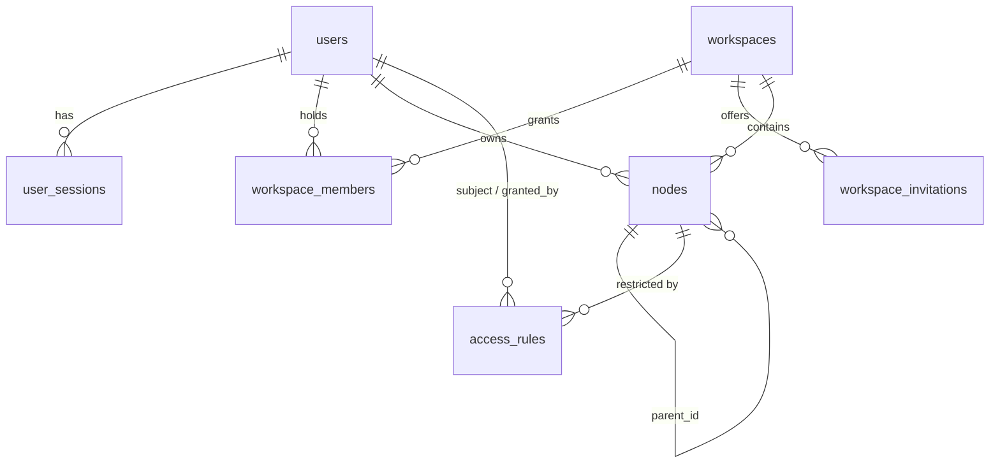
```mermaid
erDiagram
    users ||--o{ user_sessions : "has"
    users ||--o{ workspace_members : "holds"
    workspaces ||--o{ workspace_members : "grants"
    workspaces ||--o{ workspace_invitations : "offers"
    workspaces ||--o{ nodes : "contains"
    users ||--o{ nodes : "owns"
    nodes ||--o{ nodes : "parent_id"
    nodes ||--o{ access_rules : "restricted by"
    users ||--o{ access_rules : "subject / granted_by"
```

Two axes run through every one of these tables and are never merged
(`src/lib/permissions/visibility.ts:15-33`):

- **ACCESS** — *may this person see this node at all.* Decided by `nodes.access_mode` walked root →
  node, with `access_rules` supplying the grants and `nodes.owner_id` as the standing safety net.
- **CAPABILITY** — *what may they do once they are looking.* Decided by `workspace_members.role`
  through the role matrix, narrowed by `access_rules` on the chain, then narrowed again by trashed /
  frozen / locked state.

*"a Viewer who is granted a restricted folder **sees it** and edits nothing, a Manager who is not
granted it **does not see it**, whatever their role"* (`visibility.ts:20-27`). Merging the two would
make "high enough role" a way into a folder somebody deliberately shut. No table in this part may be
read as if it answered both questions at once.

---

### Table: `users`

**Purpose** — One person, once, for the whole installation. Every name, avatar and initial rendered
anywhere in the product resolves here: a node's owner, a cell's assignee, a comment's author, an
audit event's actor. It is deliberately global rather than per-workspace, because one person is in
several workspaces and their identity must not fork.

**Who creates a record** — Sign-up (`POST /auth/login`'s registration sibling) or acceptance of a
workspace invitation (E-019). Both are **RECOMMENDATION** territory: the frontend has no
authentication surface at all — `src/mock/users.ts:3-9` hardcodes `CURRENT_USER` and every store
reads it directly (canon OQ-01, severity *blocking*). No other path creates a user; in particular
E-013 (`POST /workspaces/{workspaceId}/members`) creates a `workspace_invitations` row, not a user.

**Lifetime** — Permanent. A user is **never hard-deleted**. Removal from a workspace deletes the
`workspace_members` row; leaving the product sets `is_active = false` and `deactivated_at`, and every
projection keeps rendering the name flagged inactive (`DirectoryUser.isActive`,
`src/types/user.ts:18-20`). E-006 (`GET /workspaces/{workspaceId}/directory`) **includes deactivated
members on purpose**, so a board cell assigned to somebody who left still renders a person instead of
an id.

**Columns**

| Column | PostgreSQL Type | Nullable | Default | Unique | Description |
| ------ | --------------- | -------- | ------- | ------ | ----------- |
| `id` | `UUID` | no | `gen_random_uuid()` | PK | Surrogate key. Ships as `UserSummary.id`. |
| `email` | `CITEXT` | no | — | yes | Login identity and the address an invitation is sent to. `CITEXT` because `Khanh@x.io` and `khanh@x.io` are one person; `src/mock/users.ts:6` stores it lowercase but nothing enforces case anywhere. |
| `name` | `TEXT` | no | — | no | Display name. `UserSummary.name`. |
| `avatar_url` | `TEXT` | yes | `NULL` | no | `UserSummary.avatarUrl`. **Optional, not nullable, on the wire** (canon C-08): omit the key when the column is `NULL`, never send `null` — `src/types/user.ts:10` declares `avatarUrl?: string`. |
| `accent_color` | `TEXT` | yes | `NULL` | no | `UserSummary.accentColor`. A CSS custom-property reference such as `var(--kind-image)` (`src/mock/users.ts:13-16`). Assigned once at creation from the palette and then stable, because a person's colour changing under them is a bug, not a feature. Optional on the wire. |
| `password_hash` | `TEXT` | yes | `NULL` | no | **RECOMMENDATION** (OQ-01). Argon2id. `NULL` for a user who has only ever authenticated through a future SSO path, so the column can never be read as "no password means any password". |
| `timezone` | `TEXT` | yes | `NULL` | no | **RECOMMENDATION** (OQ-92). IANA zone name. Nothing in this part reads it; it is declared here because "today" and "overdue" have to be computed against *somebody's* midnight and the My Work / dashboard chapter owns that decision. |
| `is_active` | `BOOLEAN` | no | `true` | no | `DirectoryUser.isActive`. False means deactivated, and every projection keeps resolving the row. |
| `deactivated_at` | `TIMESTAMPTZ` | yes | `NULL` | no | When `is_active` went false. Paired with the flag so the two cannot disagree (see the check constraint). |
| `last_login_at` | `TIMESTAMPTZ` | yes | `NULL` | no | **RECOMMENDATION** (OQ-01). Updated by E-001. Not on the wire. |
| `created_at` | `TIMESTAMPTZ` | no | `now()` | no | — |
| `updated_at` | `TIMESTAMPTZ` | no | `now()` | no | Touched by E-005. |

`initials` is **not a column.** `UserSummary.initials` (`src/types/user.ts:9`) is a two-letter
fallback rendered when `avatarUrl` is absent, and it is a pure function of `name`. Storing it creates
a second copy that a rename can leave stale; deriving it server-side on the projection cannot. Derive
it with the same two-word rule `badgeFor` uses for workspace badges
(`src/lib/workspace-access.ts:167-177`): first letters of the first two words, upper-cased, falling
back to the first two characters of a single word.

```sql
-- documentation only
CREATE TABLE users (
  id              UUID PRIMARY KEY DEFAULT gen_random_uuid(),
  email           CITEXT      NOT NULL,
  name            TEXT        NOT NULL,
  avatar_url      TEXT,
  accent_color    TEXT,
  password_hash   TEXT,
  timezone        TEXT,
  is_active       BOOLEAN     NOT NULL DEFAULT true,
  deactivated_at  TIMESTAMPTZ,
  last_login_at   TIMESTAMPTZ,
  created_at      TIMESTAMPTZ NOT NULL DEFAULT now(),
  updated_at      TIMESTAMPTZ NOT NULL DEFAULT now()
);
```

**Primary Key** — `id`.

**Foreign Keys** — none. `users` is a root table; it is the thing everything else points at.

**Unique Constraints**

| Constraint | Columns | Why |
| --- | --- | --- |
| `users_email_uniq` | `(email)` | One account per address. `CITEXT` makes it case-insensitive without a functional index. Violated → `MEMBER_ALREADY_EXISTS` on invite acceptance, or the registration equivalent. |

**Indexes**

| Index | Definition | Query it serves |
| --- | --- | --- |
| `users_pkey` | `(id)` | Every join from `nodes.owner_id`, `workspace_members.user_id`, `access_rules.subject_user_id`, `comments.author_id`, `audit_events.actor_id`. |
| `users_email_uniq` | `UNIQUE (email)` | E-001 login by address; E-013 invite by address (`invite-member-dialog.tsx` filters candidates by `person.isActive && !isWorkspaceMember(...)`). |

No index on `name` and none on `is_active`. There is no server-side query that filters users by
either: the directory (E-006) is workspace-scoped and driven from `workspace_members`, and every
name filter in the product — the mention picker, the invite combobox, the access dialog's candidate
list — runs client-side over the already-loaded directory
(`src/components/permissions/node-access-dialog.tsx:99-115`). An index with no query behind it is a
write cost with no reader.

**Check Constraints**

| Constraint | Rule | Why |
| --- | --- | --- |
| `users_name_not_blank` | `char_length(btrim(name)) > 0` | A blank name renders as an empty avatar with no fallback. |
| `users_deactivation_consistent` | `(is_active = true AND deactivated_at IS NULL) OR (is_active = false AND deactivated_at IS NOT NULL)` | The flag and its timestamp are one fact. Two columns that can disagree eventually do. |

**Relationships**

| Cardinality | To | Through |
| --- | --- | --- |
| 1-N | `user_sessions` | `user_sessions.user_id` |
| N-N | `workspaces` | `workspace_members` (join carries `role`, `joined_at`) |
| 1-N | `nodes` | `nodes.owner_id`, plus `created_by` / `updated_by` / `archived_by` / `deleted_by` / `locked_by` |
| 1-N | `access_rules` | `access_rules.subject_user_id` and `access_rules.granted_by` |
| 1-N | everything with an actor | `comments.author_id`, `audit_events.actor_id`, `board_rows.created_by`, `secret_rotations.rotated_by`, … |

**APIs that use it**

| # | Endpoint | Reads / writes | Permission |
| --- | --- | --- | --- |
| E-001 | `POST /auth/login` | reads `email`, `password_hash`; writes `last_login_at` | — (RECO, OQ-01) |
| E-004 | `GET /me` | reads the session's user | session |
| E-005 | `PATCH /me` | writes `name`, `avatar_url`, `accent_color`, `timezone`; returns `UserSummary` | session |
| E-006 | `GET /workspaces/{workspaceId}/directory` | joins `workspace_members` → `users`, returns `DirectoryUser[]` **including `isActive: false` rows** | membership |
| E-015 | `DELETE /workspaces/{workspaceId}/members/{userId}` | does **not** touch `users`; deletes the membership only | `workspace.member.manage` |

Every write returns the authoritative record — no `204` where the frontend expects an object
(canon C-10), because the stores replace optimistic state with the response.

**Errors**

`AUTH_INVALID_CREDENTIALS` (401 / `permission_denied`) — the same message for a wrong address and a
wrong password, so the endpoint cannot be used to enumerate accounts. `AUTH_RATE_LIMITED`
(429 / `validation`, `isRetryable: true`, carries `retryAfterSeconds`).

---

### Table: `user_sessions`

**Purpose** — One refresh-token family per device, so a session can be revoked without revoking every
other device, and so a stolen refresh token is detectable. Access tokens are short-lived and are not
stored; only the refresh family is a row.

**Who creates a record** — E-001 (`POST /auth/login`). E-003 (`POST /auth/refresh`) rotates the
family: it marks the presented row `revoked_at` and inserts its successor with the same `family_id`.

**Lifetime** — Until `expires_at`, until E-002 revokes it, or until a replay revokes the whole family.
A nightly sweep hard-deletes rows past `expires_at + 30 days`; the grace window exists so a support
question about "why was I logged out" is answerable.

**RECOMMENDATION** (canon OQ-01, severity *blocking*) — **the entire table.** *"There is no
authentication, session or token model anywhere in the frontend."* `src/types/` contains no
credential, session, token, refresh token, OAuth identity or login-audit type. Canon §8.8 takes the
position: session-cookie auth against `users`, short-lived access token plus a rotating refresh
family here, identity resolved from the session and never from a request body.

**Columns**

| Column | PostgreSQL Type | Nullable | Default | Unique | Description |
| ------ | --------------- | -------- | ------- | ------ | ----------- |
| `id` | `UUID` | no | `gen_random_uuid()` | PK | One issued refresh token. |
| `user_id` | `UUID` | no | — | no | Who it authenticates. |
| `family_id` | `UUID` | no | — | no | Constant across every rotation on one device. Revoking a family logs out that device and nothing else. |
| `refresh_token_hash` | `BYTEA` | no | — | yes | SHA-256 of the token. The token itself is never stored, so a database dump is not a set of live sessions. |
| `issued_at` | `TIMESTAMPTZ` | no | `now()` | no | — |
| `expires_at` | `TIMESTAMPTZ` | no | — | no | Absolute expiry of this token. |
| `revoked_at` | `TIMESTAMPTZ` | yes | `NULL` | no | Set on rotation, on logout, and on replay detection. |
| `replaced_by_id` | `UUID` | yes | `NULL` | no | The successor row. Present exactly when the row was retired by a normal rotation. |
| `user_agent` | `TEXT` | yes | `NULL` | no | Recorded for the "your devices" surface a future release will want. Never returned to anyone but the owner. |
| `ip_address` | `INET` | yes | `NULL` | no | Taken from the socket, never from a header the client controls (canon C-09). |
| `last_used_at` | `TIMESTAMPTZ` | yes | `NULL` | no | Updated on each successful refresh. |
| `created_at` | `TIMESTAMPTZ` | no | `now()` | no | — |

**Primary Key** — `id`.

**Foreign Keys**

| Column | References | ON DELETE | Reason |
| --- | --- | --- | --- |
| `user_id` | `users(id)` | `RESTRICT` | Users are never hard-deleted; `RESTRICT` makes an accidental one fail loudly instead of silently destroying the only record of which devices held a session. Deactivation revokes sessions explicitly, in the same transaction, which is a write the audit log can see. |
| `replaced_by_id` | `user_sessions(id)` | `SET NULL` | The successor may be swept before its predecessor's grace window closes. Losing the pointer is harmless; blocking the sweep is not. |

**Unique Constraints**

| Constraint | Columns | Why |
| --- | --- | --- |
| `user_sessions_token_uniq` | `(refresh_token_hash)` | Two rows with one token hash would make replay detection ambiguous. |

**Indexes**

| Index | Definition | Query it serves |
| --- | --- | --- |
| `user_sessions_token_uniq` | `UNIQUE (refresh_token_hash)` | E-003: look up the presented token in one probe. |
| `user_sessions_family_idx` | `(family_id) WHERE revoked_at IS NULL` | Replay response: revoke every live row in the family in one statement. |
| `user_sessions_user_idx` | `(user_id, revoked_at)` | E-002 logout-everywhere; deactivating a user. |
| `user_sessions_expiry_idx` | `(expires_at)` | The nightly sweep. |

**Check Constraints**

| Constraint | Rule | Why |
| --- | --- | --- |
| `user_sessions_window_valid` | `expires_at > issued_at` | A session that expires before it is issued is a clock bug the database can catch. |
| `user_sessions_no_self_replace` | `replaced_by_id IS NULL OR replaced_by_id <> id` | — |

**Relationships** — N-1 to `users`. Self-referential 1-1 chain through `replaced_by_id` within a
`family_id`.

**APIs that use it** — E-001 (insert), E-002 (revoke the presented family), E-003 (rotate).
E-003 is the security-critical one: if the presented `refresh_token_hash` resolves to a row whose
`revoked_at IS NOT NULL`, that is a replay — **revoke the entire `family_id`** and answer
`AUTH_REFRESH_REUSED` (401 / `permission_denied`). This runs in one transaction with
`SELECT … FOR UPDATE` on the matched row, so two concurrent refreshes cannot both succeed.

**Errors** — `AUTH_REQUIRED` (401), `AUTH_SESSION_EXPIRED` (401), `AUTH_REFRESH_REUSED` (401), all
mapping to `AppErrorCode` `permission_denied` per canon §4.2.

**Realtime** — none. A revocation reaches an open tab as a `401` on its next call, which the frontend
already maps through `toAppError` (`src/services/errors.ts:52-64`).

---

### Table: `user_ui_preferences`

Canon T-37. **RECOMMENDATION, deferred — OQ-98.** Do not build this until OQ-98 is
answered; nothing breaks while it does not exist.

**Purpose** — the handful of settings that describe how one person likes to look at the
product, as opposed to what the product contains. Today they live in the zustand store and
nowhere else: `isSidebarCollapsed` (`src/store/workspace-store.ts:226`, `:916`), the drive's
`viewMode` of `grid` or `list` (`:118`, `:247`, `:451`) and the drive's sort key and
direction. Because the store is memory-only, every one of them resets on reload — which is
the whole argument for the table, and also the reason its absence is survivable.

**Who creates a record** — upsert on first write, by the owner and nobody else. There is no
create endpoint; E-141 `PUT /me/preferences/{scope}` writes the row or makes it.

**How long it lives** — as long as the user. Cascades on user delete. Never expires, never
archives; a stale preference is simply the last thing that person chose.

**How it is deleted** — only with the user row. There is deliberately no "reset my
preferences" endpoint: the client already knows every default, so a reset is a `PUT` of the
defaults, not a `DELETE`.

**Columns**

| Column | PostgreSQL Type | Nullable | Default | Unique | Description |
| ------ | --------------- | -------- | ------- | ------ | ----------- |
| `user_id` | `UUID` | no | — | composite | Who this is for. |
| `scope` | `TEXT` | no | — | composite | Which surface: `sidebar`, `drive`. Deliberately not an enum — a new surface must not need a migration to be remembered. |
| `preferences` | `JSONB` | no | `'{}'::jsonb` | no | The values. Structure documented below, per scope. |
| `updated_at` | `TIMESTAMPTZ` | no | `now()` | no | |

**`preferences` JSONB — the complete contract, one variant per `scope`**

```ts
/** scope = "sidebar" */
interface SidebarPreferences {
  readonly isCollapsed: boolean;
}

/** scope = "drive" */
interface DrivePreferences {
  readonly viewMode: "grid" | "list";
  readonly sortKey: "name" | "updatedAt" | "createdAt" | "size";
  readonly sortDirection: "asc" | "desc";
}
```

Every field is optional on read: an unknown key is ignored and a missing key falls back to
the client's own default, so shipping a new preference never requires a backfill and never
breaks an older client.

**Primary Key** — `(user_id, scope)`. A natural composite rather than a surrogate `id`: the
pair *is* the identity, and a surrogate would permit two rows to disagree about one scope.

**Foreign Keys**

| Column | References | ON DELETE | Why that behaviour |
| --- | --- | --- | --- |
| `user_id` | `users(id)` | `CASCADE` | A preference about how to render a workspace is meaningless without the person whose preference it is. |

**Unique Constraints** — the primary key covers it.

**Indexes** — the primary key only. Every read is `WHERE user_id = $1`, bounded to a handful
of rows.

**Checks** — `CHECK (jsonb_typeof(preferences) = 'object')`, so a scalar or an array cannot
be written where the client will index by key.

**Delete Behavior** — hard delete with the user. Not soft-deleted: there is no audit
interest in what somebody's sidebar used to look like.

**Relationships** — N-1 to `users`. Deliberately **not** workspace-scoped: the sidebar is
collapsed or it is not, whichever workspace is open, and scoping it per workspace would make
one person's sidebar flicker between two states as they switch.

**APIs that use it** — E-140 `GET /me/preferences` returns every scope as one map (one
round trip at boot, before first paint). E-141 `PUT /me/preferences/{scope}` replaces one
scope. Both are session-scoped; neither takes a `userId`, because reading or writing
somebody else's preferences is not a thing this API can express.

**OPEN QUESTION (OQ-98)** — whether these should be server state at all. The cost is one
write per sidebar toggle; the benefit is that a second device opens the way the first was
left. The recommendation is yes for `drive` and yes for `sidebar`, and no for anything that
changes as fast as a scroll position.

---

### Table: `workspaces`

**Purpose** — The tenant boundary. Everything else in the schema is scoped to exactly one workspace,
and membership of a workspace is the outermost gate in the permission model
(`src/lib/workspace-access.ts:4-14`). It also carries the switcher's presentation — badge and colour —
and the storage counter the quota is checked against.

**Who creates a record** — E-008 (`POST /workspaces`). **The creator becomes an admin in the same
write**, not in a follow-up: `src/lib/workspace-access.ts:212-238` states why — *"a workspace whose
creator has to be added afterwards has a moment where nobody can administer it, and a failure in
between leaves one that nobody can ever administer."* The `workspaces` insert and the
`workspace_members` insert are one transaction or the endpoint has a failure mode that produces an
unadministrable tenant.

**Lifetime** — Until E-011 (`DELETE /workspaces/{workspaceId}`), which is a **hard delete** and takes
the whole tenant with it through `ON DELETE CASCADE`: nodes, members, invitations, access rules,
boards, documents, secrets, environments, audit events. There is no workspace trash. This matches the
frontend, which drops the tree and the bin outright (`src/store/workspace-store.ts:338-360`).

**Columns**

| Column | PostgreSQL Type | Nullable | Default | Unique | Description |
| ------ | --------------- | -------- | ------- | ------ | ----------- |
| `id` | `UUID` | no | `gen_random_uuid()` | PK | — |
| `name` | `TEXT` | no | — | no | `Workspace.name`. 1–60 characters (`WORKSPACE_NAME_MAX = 60`, `src/lib/workspace-access.ts:196`). |
| `description` | `TEXT` | yes | `NULL` | no | `Workspace.description?`. ≤ 280 characters (`WORKSPACE_DESCRIPTION_MAX`, `:197`). **Optional on the wire** — omit the key when `NULL`. |
| `slug` | `TEXT` | no | — | yes | `Workspace.slug`, *"URL-safe identifier, unique across the tenant"* (`src/types/workspace.ts:17`). Minted by `uniqueSlug(slugify(name), taken)` (`:234`). **Globally unique** — canon OQ-02 position: single tenant, no tenant table above the workspace. |
| `plan` | `workspace_plan` | no | `'free'` | no | `free` \| `team` \| `enterprise` (`src/types/workspace.ts:3`). A new workspace starts `free` (`:235`). |
| `badge` | `TEXT` | no | — | no | 1–2 characters shown on the switcher tile. Derived from the name by `badgeFor` when the caller supplies none, else the caller's value upper-cased and truncated to 2 (`:236`). |
| `color` | `TEXT` | no | — | no | CSS colour for the tile. Cycles the `TILE_COLORS` palette when unspecified (`:180-187, :237`). |
| `used_bytes` | `BIGINT` | no | `0` | no | `StorageQuota.usedBytes`. **A transactionally maintained counter, never an aggregate computed on read** (canon §1.4). Incremented by E-111 in the same transaction as the `file_assets` insert; decremented when an asset is destroyed. |
| `storage_limit_bytes` | `BIGINT` | yes | `NULL` | no | Per-workspace override of the plan quota. `NULL` means "use the plan's quota from service config" — canon §1.2 is explicit that there is **no `plans` table**: three tiers with fixed quotas, static service config, *"not a row that can drift"*. `StorageQuota.totalBytes` on the wire is `COALESCE(storage_limit_bytes, quota_for(plan))` (OQ-06). |
| `created_at` | `TIMESTAMPTZ` | no | `now()` | no | **RECOMMENDATION** — `Workspace` carries no timestamps (canon OQ-02 position: add them). |
| `updated_at` | `TIMESTAMPTZ` | no | `now()` | no | Touched by E-010. |
| `created_by` | `UUID` | no | — | no | The creator. Not a fifth role and not an ownership grant — canon OQ-03 position: **four roles**, and creator-ness is an attribute. It exists so "who made this tenant" is answerable. |

`members` and `storage` are **not columns.** `Workspace.members: readonly WorkspaceMember[]` and
`Workspace.storage: StorageQuota` (`src/types/workspace.ts:24-25`) are composed by the API: `members`
from `workspace_members ⋈ users`, `storage` from `used_bytes` and the plan quota. E-009 returns them
embedded because that is the frontend's shape; they are not stored embedded.

```sql
-- documentation only
CREATE TYPE workspace_plan AS ENUM ('free', 'team', 'enterprise');

CREATE TABLE workspaces (
  id                  UUID PRIMARY KEY DEFAULT gen_random_uuid(),
  name                TEXT           NOT NULL,
  description         TEXT,
  slug                TEXT           NOT NULL,
  plan                workspace_plan NOT NULL DEFAULT 'free',
  badge               TEXT           NOT NULL,
  color               TEXT           NOT NULL,
  used_bytes          BIGINT         NOT NULL DEFAULT 0,
  storage_limit_bytes BIGINT,
  created_at          TIMESTAMPTZ    NOT NULL DEFAULT now(),
  updated_at          TIMESTAMPTZ    NOT NULL DEFAULT now(),
  created_by          UUID           NOT NULL REFERENCES users(id) ON DELETE RESTRICT
);
```

**Primary Key** — `id`.

**Foreign Keys**

| Column | References | ON DELETE | Reason |
| --- | --- | --- | --- |
| `created_by` | `users(id)` | `RESTRICT` | Users are never hard-deleted. `RESTRICT` states the invariant in the schema rather than trusting every future code path to remember it. |

**Unique Constraints**

| Constraint | Columns | Why |
| --- | --- | --- |
| `workspaces_slug_uniq` | `(slug)` | The slug addresses the workspace. Two workspaces sharing one makes a URL ambiguous. Violated → `WORKSPACE_SLUG_TAKEN` (409 / `conflict`). The API should not race for it: mint with `uniqueSlug` semantics inside the insert transaction and retry once on conflict. |

**Indexes**

| Index | Definition | Query it serves |
| --- | --- | --- |
| `workspaces_pkey` | `(id)` | Every scoped read in the product. |
| `workspaces_slug_uniq` | `UNIQUE (slug)` | Resolving a workspace from a URL segment; the uniqueness check on E-008 / E-010. |

E-007 (`GET /workspaces`) does **not** scan this table. It is driven from
`workspace_members (user_id)` — see that table's indexes. `visibleWorkspaces`
(`src/lib/workspace-access.ts:45-50`) is explicit that filtering a full list in the component would
leave *"every other consumer — a URL, a keyboard shortcut, a stale link — reading the full one"*, so
the server-side read starts at membership and joins outward.

**Check Constraints**

| Constraint | Rule | Why |
| --- | --- | --- |
| `workspaces_name_length` | `char_length(btrim(name)) BETWEEN 1 AND 60` | `validateWorkspaceName` (`src/lib/workspace-access.ts:200-207`). |
| `workspaces_description_length` | `description IS NULL OR char_length(description) <= 280` | `WORKSPACE_DESCRIPTION_MAX`. |
| `workspaces_badge_length` | `char_length(badge) BETWEEN 1 AND 2` | *"Short mark rendered in the switcher tile (1–2 chars)"* (`src/types/workspace.ts:20`). |
| `workspaces_slug_shape` | `slug ~ '^[a-z0-9]+(-[a-z0-9]+)*$'` | Matches `slugify` output (`src/lib/utils.ts:60-70`). |
| `workspaces_used_bytes_non_negative` | `used_bytes >= 0` | A negative counter means a double decrement; catch it at the write. |
| `workspaces_storage_limit_positive` | `storage_limit_bytes IS NULL OR storage_limit_bytes > 0` | — |

**Relationships**

| Cardinality | To | Through |
| --- | --- | --- |
| N-N | `users` | `workspace_members` |
| 1-N | `workspace_members`, `workspace_invitations`, `nodes`, `access_rules`, `environments`, `board_templates` (user-authored), `audit_events`, `trash_entries` | each table's `workspace_id`, all `ON DELETE CASCADE` |

**APIs that use it**

| # | Endpoint | Behaviour | Permission |
| --- | --- | --- | --- |
| E-007 | `GET /workspaces` | Only workspaces the caller is a member of. Never the full list. | session |
| E-008 | `POST /workspaces` | Insert + creator's admin membership in **one transaction** | session |
| E-009 | `GET /workspaces/{workspaceId}` | Returns `Workspace` with `members` and `storage` composed | membership |
| E-010 | `PATCH /workspaces/{workspaceId}` | `name`, `description`, `badge`, `color`, `plan` | `workspace.manage` |
| E-011 | `DELETE /workspaces/{workspaceId}` | Hard delete, cascade | `workspace.delete` |
| E-017 | `GET /workspaces/{workspaceId}/storage` | `{ usedBytes, totalBytes }` from `used_bytes` + plan quota | membership |
| E-110 | `POST /workspaces/{workspaceId}/uploads` | Reads `used_bytes` and the quota **before** issuing a presigned URL | `file.upload` |
| E-111 | `POST /uploads/{uploadId}/complete` | `UPDATE workspaces SET used_bytes = used_bytes + $n` under `SELECT … FOR UPDATE`, in the same transaction as the asset insert | `file.upload` |

**Transaction rule for `used_bytes`** (canon §1.4, OQ-05 position): every mutation of the counter
takes `SELECT used_bytes FROM workspaces WHERE id = $1 FOR UPDATE` first. Two concurrent uploads that
each read the pre-increment value would both pass the quota check and both write, and the workspace
would end up over its limit with no error anywhere. Over quota → `QUOTA_EXCEEDED`
(507 / `upload_failed`).

**Errors** — `WORKSPACE_NOT_FOUND` (404 / `not_found`) covers both an unknown workspace **and one the
caller is not a member of**; they answer identically so a URL cannot be used to learn which
workspaces exist (`src/lib/workspace-access.ts:60-66`). `WORKSPACE_SLUG_TAKEN` (409),
`QUOTA_EXCEEDED` (507).

**Realtime** — E-010 and E-011 emit no dedicated frame. A membership change emits `permission.changed`
(RT-05) with `nodeId: null`; see `workspace_members`.

**OPEN QUESTION (OQ-02) — destructive-delete confirmation.**
**What is unclear** — whether E-011 must require the caller to re-type the workspace name.
**Evidence** — PRD `WS-ARC-02` (`PRD_FSD_All_in_One_Workspace_45_Detailed.md:12`) requires exactly
that for a **project** with active members: *"Xóa Project đang có thành viên làm việc: Bắt buộc nhập
lại tên Project để xác nhận."* It says nothing about a workspace. The frontend's
`deleteWorkspace` (`src/store/workspace-store.ts:338-360`) takes no confirmation argument at all.
**Recommendation** — treat the PRD rule as a client-side gate for projects (E-032 on a node of kind
`project`) and add nothing to the wire for it, since the backend cannot verify that a human typed
anything. For E-011, which destroys a tenant, require `workspace.delete` — already Admin-only — and
audit it at `error` severity. Do not invent a `confirmName` body field: it is theatre the server
cannot enforce.
**Impact if wrong** — if the confirmation is meant to be server-verified, a scripted call can destroy
a workspace that the UI would have made somebody type a name to destroy.

---

### Table: `workspace_members`

**Purpose** — The join between a person and a tenant, carrying the role that person holds there. It is
**the outermost gate**: before any question about a folder, a board or an access rule, there is *are
you in this workspace at all* (`src/lib/workspace-access.ts:4-14`). The absence of a row is not a
`viewer` row — *"'Not a member' is not 'viewer'"* — and the schema must never be read as if a missing
row had a default.

**Who creates a record** — E-008 (the creator, as `admin`, in the workspace's own transaction) and
E-019 (`POST /invitations/{token}/accept`). E-013 does **not** create one; it creates a
`workspace_invitations` row. E-014 (`PATCH .../members/{userId}`) updates `role` on an existing row.

**Lifetime** — Until E-015 (removed by an admin) or E-016 (`DELETE .../members/me`, leaving). Both are
**hard deletes**. There is no soft-deleted membership, because a soft-deleted membership is exactly
the "somebody who holds no role but is not absent" state the module exists to make impossible. The
person survives in `users` with `is_active` untouched, so every cell, comment and audit row that
names them still renders.

**Columns**

| Column | PostgreSQL Type | Nullable | Default | Unique | Description |
| ------ | --------------- | -------- | ------- | ------ | ----------- |
| `id` | `UUID` | no | `gen_random_uuid()` | PK | Surrogate key per canon C-01, even though the natural key is the pair below. |
| `workspace_id` | `UUID` | no | — | (composite) | — |
| `user_id` | `UUID` | no | — | (composite) | — |
| `role` | `workspace_role` | no | `'member'` | no | `viewer` \| `member` \| `manager` \| `admin` — **the declaration order is the rank** (`src/types/permission.ts:8-20`; `roleRank` is `WORKSPACE_ROLES.indexOf(role)`). Ship the enum values in that order so `roleRank` is reproducible server-side. |
| `joined_at` | `TIMESTAMPTZ` | no | `now()` | no | `WorkspaceMember.joinedAt` (`src/types/user.ts:24`). |
| `invited_by` | `UUID` | yes | `NULL` | no | Who invited them. `NULL` for the workspace creator, who invited nobody. |
| `created_at` | `TIMESTAMPTZ` | no | `now()` | no | Equal to `joined_at` in practice; kept for uniformity with every other mutable table. |
| `updated_at` | `TIMESTAMPTZ` | no | `now()` | no | Touched by a role change. |
| `updated_by` | `UUID` | yes | `NULL` | no | Who last changed the role, from the session (canon C-09). `NULL` until the first change. |

`WorkspaceMember` on the wire extends `UserSummary` — the API composes
`users ⋈ workspace_members` and flattens. Note it carries **no `workspaceId`**
(`src/types/user.ts:22-25`): it is always read in the context of one workspace, as `Workspace.members`
or as the body of E-012.

```sql
-- documentation only
CREATE TYPE workspace_role AS ENUM ('viewer', 'member', 'manager', 'admin');

CREATE TABLE workspace_members (
  id           UUID PRIMARY KEY DEFAULT gen_random_uuid(),
  workspace_id UUID           NOT NULL REFERENCES workspaces(id) ON DELETE CASCADE,
  user_id      UUID           NOT NULL REFERENCES users(id)      ON DELETE RESTRICT,
  role         workspace_role NOT NULL DEFAULT 'member',
  joined_at    TIMESTAMPTZ    NOT NULL DEFAULT now(),
  invited_by   UUID           REFERENCES users(id) ON DELETE RESTRICT,
  created_at   TIMESTAMPTZ    NOT NULL DEFAULT now(),
  updated_at   TIMESTAMPTZ    NOT NULL DEFAULT now(),
  updated_by   UUID           REFERENCES users(id) ON DELETE RESTRICT,

  CONSTRAINT workspace_members_pair_uniq UNIQUE (workspace_id, user_id)
);
```

**Primary Key** — `id`.

**Foreign Keys**

| Column | References | ON DELETE | Reason |
| --- | --- | --- | --- |
| `workspace_id` | `workspaces(id)` | `CASCADE` | A membership of a workspace that no longer exists is not a fact about anything. E-011 is intended to take the tenant and everything scoped to it. |
| `user_id` | `users(id)` | `RESTRICT` | Users are never hard-deleted (`src/types/user.ts:14-17`). `RESTRICT` turns an accidental hard delete into a failed statement instead of a silent mass un-membering. |
| `invited_by` | `users(id)` | `RESTRICT` | Same reason; this is history. |
| `updated_by` | `users(id)` | `RESTRICT` | Same reason. |

**Unique Constraints**

| Constraint | Columns | Why |
| --- | --- | --- |
| `workspace_members_pair_uniq` | `(workspace_id, user_id)` | One membership per person per workspace. The frontend's `withMember` already treats a repeat add as a role change rather than a second row (`src/lib/workspace-access.ts:244-259`); the constraint is what lets the API implement that as `INSERT … ON CONFLICT (workspace_id, user_id) DO UPDATE SET role = …`. It is also the target of a composite FK from `access_rules` — see that table. |

**Indexes**

| Index | Definition | Query it serves |
| --- | --- | --- |
| `workspace_members_pair_uniq` | `UNIQUE (workspace_id, user_id)` | **Gate 1 on every single request**: "is this caller a member of this workspace, and with what role". This is the hottest index in the schema — `SY-RBC-42` budgets p99 < 10 ms at the middleware. One probe, covering, no heap fetch if `role` is included. |
| `workspace_members_user_idx` | `(user_id)` | E-007 (`GET /workspaces`) — the workspaces this person is in. |
| `workspace_members_admin_idx` | `(workspace_id) WHERE role = 'admin'` | The last-admin check (below). Partial, because it is only ever asked about admins. |

Recommended covering form: `UNIQUE (workspace_id, user_id) INCLUDE (role)` so gate 1 is an
index-only scan.

**Check Constraints** — none beyond the enum and the FKs. The last-admin rule is **not** a check
constraint: it is a cross-row invariant over a filtered set, which `CHECK` cannot express, and it has
to be enforced transactionally anyway.

**The last-admin invariant** — **EXISTING REQUIREMENT.** `src/lib/workspace-access.ts:84-162` defines
it once and reads it from three directions, and the API must refuse all three:

| Endpoint | Refusal | Frontend rule |
| --- | --- | --- |
| E-014 demoting the last admin | `WORKSPACE_LAST_ADMIN` (409 / `conflict`) | `canChangeRole` (`:149-162`) |
| E-015 removing the last admin | `WORKSPACE_LAST_ADMIN` | `canRemoveMember` (`:122-146`) |
| E-016 the last admin leaving | `WORKSPACE_LAST_ADMIN` | `canLeaveWorkspace` (`:106-119`) |

*"A workspace with no administrator cannot be repaired from inside it — the members who are left can
neither invite anyone nor promote anyone, which is a shape the product should never be able to reach
by accident"* (`:98-105`).

**Transaction.** The check and the write are one transaction, and the check must lock:

```
BEGIN;
  SELECT user_id FROM workspace_members
    WHERE workspace_id = $ws AND role = 'admin'
    FOR UPDATE;                       -- locks the admin set, not just one row
  IF the result is exactly [$target] THEN raise WORKSPACE_LAST_ADMIN;
  <the demotion / removal / departure>
COMMIT;
```

Without `FOR UPDATE` over the admin set, two concurrent demotions of the two remaining admins each
see one other admin, each pass, and the workspace ends with none. This is the one place in this part
where a race produces an unrecoverable state, so it is worth the lock.

`canRemoveMember` also refuses `actorId === targetId` with *"Use Leave workspace to take yourself out
— removing is for other people."* (`:122-132`) — E-015 must reject a self-target and point at E-016,
because E-016 does something extra that E-015 does not (below).

**E-016 does two things in one write.** `removeMember` (`src/store/workspace-store.ts:388-408`):
when the person leaving is the caller *and* the workspace they are leaving is the one they are
standing in, the response also switches them to another workspace they hold — *"there is no frame in
which the app is showing a tree they no longer hold."* The API expresses this by returning `204` and
letting the client re-read E-007, but the server-side obligation is the same: publish
`permission.changed` before the response returns.

**Relationships**

| Cardinality | To | Notes |
| --- | --- | --- |
| N-1 | `workspaces` | — |
| N-1 | `users` | — |
| — | `access_rules` | A user-scoped rule *should* name a member, but there is deliberately **no FK** enforcing it. See `access_rules` → Foreign Keys. |

**APIs that use it**

| # | Endpoint | Behaviour | Permission |
| --- | --- | --- | --- |
| E-007 | `GET /workspaces` | Drives the whole read | session |
| E-012 | `GET /workspaces/{workspaceId}/members` | `WorkspaceMember[]`, `users ⋈ workspace_members` | membership |
| E-013 | `POST /workspaces/{workspaceId}/members` | Creates a `workspace_invitations` row, returns `WorkspaceInvitation`. Does **not** insert here. | `workspace.member.manage` |
| E-014 | `PATCH /workspaces/{workspaceId}/members/{userId}` | Role change; last-admin guarded | `workspace.member.manage` |
| E-015 | `DELETE /workspaces/{workspaceId}/members/{userId}` | Removal; last-admin guarded; self-target refused | `workspace.member.manage` |
| E-016 | `DELETE /workspaces/{workspaceId}/members/me` | Leaving; last-admin guarded | membership |
| E-019 | `POST /invitations/{token}/accept` | Inserts the row and consumes the invitation, one transaction | authenticated |
| — | *every request* | Gate 1: membership + role, before any node is touched | — |

**Errors** — `WORKSPACE_LAST_ADMIN` (409 / `conflict`), `MEMBER_NOT_FOUND` (404 / `not_found`),
`MEMBER_ALREADY_EXISTS` (409 / `conflict`), `WORKSPACE_NOT_FOUND` (404) for a caller who is not a
member.

**Realtime** — every write here publishes **RT-05 `permission.changed`** with
`{ workspaceId, nodeId: null, userIds }` (canon §7.1). `nodeId` is `null` precisely because the change
is workspace membership rather than one node. The frame carries **ids only**: *"a frame announcing a
revocation must not be the thing that leaks what was revoked"* (`src/types/realtime.ts:20-25`).
Without it, a demoted user keeps a loaded board on screen until they reload
(`src/hooks/use-access-sync.ts`), and RT-05 is therefore not optional. The same event must bust any
server-side authorization cache keyed by `(workspaceId, userId)`.

**Audit** — every write here is an `audit_events` row in the same transaction:
module `workspace`, action `workspace.member.manage`, severity `warn`.

---

### Table: `workspace_invitations`

**Purpose** — A pending offer of membership to an email address that may not yet have a `users` row.
It exists because E-013 has to be able to invite somebody who has never signed in, and because
`WorkspaceMember.joinedAt` implies a moment of joining that nothing in the frontend models.

**Who creates a record** — E-013 (`POST /workspaces/{workspaceId}/members`), which returns
`WorkspaceInvitation`, not `WorkspaceMember`.

**Lifetime** — Until accepted (E-019 sets `accepted_at` and inserts the membership in one
transaction), revoked, or expired. Rows are kept after acceptance as evidence of who invited whom; a
sweep hard-deletes rows more than 90 days past `expires_at` that were never accepted.

**RECOMMENDATION** — the whole table (canon OQ-04). *"The invitation flow implied by
`WorkspaceMember.joinedAt` is unmodelled."* The frontend's invite dialog adds an existing directory
user straight into `Workspace.members` (`src/lib/workspace-access.ts:244-259`); there is no pending
state anywhere in `src/`. The interface `WorkspaceInvitation`
`{ id, workspaceId, email, role, invitedBy, expiresAt, acceptedAt }` is added by canon §5.3.

**Columns**

| Column | PostgreSQL Type | Nullable | Default | Unique | Description |
| ------ | --------------- | -------- | ------- | ------ | ----------- |
| `id` | `UUID` | no | `gen_random_uuid()` | PK | — |
| `workspace_id` | `UUID` | no | — | (composite) | — |
| `email` | `CITEXT` | no | — | (composite) | Address invited. Deliberately not an FK to `users`: the invitee may not exist yet. |
| `role` | `workspace_role` | no | `'member'` | no | The role the membership will be created with. |
| `token_hash` | `BYTEA` | no | — | yes | SHA-256 of the invitation token. The token is emailed and never stored, exactly as with refresh tokens. |
| `invited_by` | `UUID` | no | — | no | From the session. |
| `expires_at` | `TIMESTAMPTZ` | no | — | no | **RECOMMENDATION**: 14 days. Served to the client from `GET /config` (E-139) so the two sides cannot disagree. |
| `accepted_at` | `TIMESTAMPTZ` | yes | `NULL` | no | Set by E-019. Non-null means consumed. |
| `accepted_by` | `UUID` | yes | `NULL` | no | The `users` row that accepted — which may have been created by the acceptance itself. |
| `revoked_at` | `TIMESTAMPTZ` | yes | `NULL` | no | An admin withdrawing the invitation. |
| `created_at` | `TIMESTAMPTZ` | no | `now()` | no | — |
| `updated_at` | `TIMESTAMPTZ` | no | `now()` | no | — |

**Primary Key** — `id`.

**Foreign Keys**

| Column | References | ON DELETE | Reason |
| --- | --- | --- | --- |
| `workspace_id` | `workspaces(id)` | `CASCADE` | An invitation to a destroyed workspace cannot be accepted and has no meaning. |
| `invited_by` | `users(id)` | `RESTRICT` | History. |
| `accepted_by` | `users(id)` | `RESTRICT` | History. |

**Unique Constraints**

| Constraint | Columns | Why |
| --- | --- | --- |
| `workspace_invitations_token_uniq` | `(token_hash)` | One token, one invitation. |
| `workspace_invitations_pending_uniq` | `(workspace_id, email) WHERE accepted_at IS NULL AND revoked_at IS NULL` | At most one live invitation per address per workspace. A second invite to the same address is `MEMBER_ALREADY_EXISTS` (409), matching *"Already a member or already invited"* in canon §4.3. Partial, so re-inviting somebody whose earlier invitation expired is allowed. |

**Indexes**

| Index | Definition | Query it serves |
| --- | --- | --- |
| `workspace_invitations_token_uniq` | `UNIQUE (token_hash)` | E-019: resolve a token in one probe. |
| `workspace_invitations_pending_uniq` | partial unique, above | E-018 (`GET .../invitations`) filtered to live rows; the duplicate-invite check on E-013. |
| `workspace_invitations_expiry_idx` | `(expires_at) WHERE accepted_at IS NULL` | The sweep. |

**Check Constraints**

| Constraint | Rule | Why |
| --- | --- | --- |
| `workspace_invitations_not_both_terminal` | `NOT (accepted_at IS NOT NULL AND revoked_at IS NOT NULL)` | An invitation cannot be both accepted and withdrawn. |
| `workspace_invitations_accepted_pair` | `(accepted_at IS NULL) = (accepted_by IS NULL)` | The two are one fact. |
| `workspace_invitations_window` | `expires_at > created_at` | — |

**Relationships** — N-1 to `workspaces`; N-1 to `users` twice (`invited_by`, `accepted_by`); 1-1 with
the `workspace_members` row it produces, though the link is not stored — the membership's
`invited_by` carries the same person and that is sufficient.

**APIs that use it** — E-013 (insert), E-018 (`GET /workspaces/{workspaceId}/invitations`, gated on
`workspace.member.manage`), E-019 (`POST /invitations/{token}/accept`, authenticated).

E-019 is one transaction: resolve the token, assert `accepted_at IS NULL AND revoked_at IS NULL AND
expires_at > now()`, create or find the `users` row, insert `workspace_members`, set `accepted_at` /
`accepted_by`, write the audit row, publish RT-05. Any failure rolls all of it back — a consumed
invitation with no membership behind it is unrecoverable from the UI.

**Errors** — `INVITATION_INVALID` (404 / `not_found`) for a token that is unknown, consumed, revoked
**or expired**; all four answer identically so a token cannot be probed for its state.
`MEMBER_ALREADY_EXISTS` (409) on a duplicate invite.

**Realtime** — E-019 publishes RT-05 (`permission.changed`, `nodeId: null`), because a new member's
visible tree just changed from nothing to something.

---

### Table: `nodes`

**Purpose** — The drive tree, and the spine of the whole product. Every addressable thing lives here
as one row: a project, a folder, a block page, a config document, a secret document, a board, a file.
Routing resolves against it (`resolvePath`), permissions resolve against it (`visibleTree`,
`effectiveAccess`), archiving and trashing are lifecycle states on it, and the five content tables —
`boards`, `documents`, `config_documents`, `secret_documents`, `file_nodes` — are 1:1 side tables
keyed by `node_id`.

**Who creates a record** — E-024 (`POST /workspaces/{workspaceId}/nodes`, one endpoint with `kind` in
the body), E-027 (`POST /nodes/{nodeId}/duplicate`, recursively), E-111 (`POST /uploads/{uploadId}/complete`
when `createDriveNode` is true — canon OQ-74 position: default `true` for drive and document-block
uploads, `false` for board cells and comments).

**Lifetime** — Three states and a purge. Active → archived (`archived_at`, reversible via E-031) →
trashed (`deleted_at`, E-032, which **detaches the whole subtree**) → hard-deleted by E-038, E-039 or
the 30-day retention sweep (canon OQ-14 position; `TRASH_RETENTION_DAYS = 30`,
`src/config/app.ts:42`). Restoring walks the recorded ancestor chain for the deepest surviving
container (E-037), which is why deletion is soft and detaching rather than a cascade.

#### Why one table

**DECIDED (canon §1.3.1): a single `nodes` table**, discriminated by `kind`, with the shared column
set as real columns and the per-kind extras as nullable columns.

Every node variant already shares one column set (`DriveNodeBase`, `src/types/node.ts:48-78`), one
routing key, one permission chain and one archive/trash lifecycle, and `parent_id` is
**self-referential across kinds** — a board sits inside a folder sits inside a project. Five tables
would mean a five-way `UNION` on every tree walk, every ancestor chain, every access resolution and
every breadcrumb. `resolvePath`, `collectAllowed`, `moveNode`, `cloneNode` and `effectiveAccess` all
take `DriveNode` without narrowing (`src/lib/tree.ts:15-320`,
`src/lib/permissions/inheritance.ts:91-120`). And `UNIQUE (parent_id, slug)` must hold **across
kinds** — a folder and a board cannot both be `payment` under the same parent — which a split schema
cannot express at all.

**And no JSONB for the extras.** The per-kind fields are eleven typed scalars, not an open bag:
`color`, `description`, `project_status`, `document_kind`, `icon`, `board_kind`, plus the four derived
counters and `excerpt`. As real columns they carry `CHECK` constraints that make an invalid shape
impossible (a project with no status, a board with no `board_kind`), and `project_status` is a
Postgres enum rather than a string somebody can typo. As JSONB none of that is available and the
whole benefit — one row per node — is unchanged. Canon C-06 would also require an interface per
variant, which is five interfaces describing columns that could simply be columns.

#### Columns

| Column | PostgreSQL Type | Nullable | Default | Unique | Description |
| ------ | --------------- | -------- | ------- | ------ | ----------- |
| `id` | `UUID` | no | `gen_random_uuid()` | PK | `DriveNode.id`. |
| `workspace_id` | `UUID` | no | — | (composite) | `DriveNode.workspaceId`. Denormalised onto every node — it is on the frontend type too (`src/types/node.ts:54`) — because every listing, search and quota query is workspace-scoped and none of them should have to walk to the root to find out where they are. Kept honest by a composite FK (below). |
| `parent_id` | `UUID` | yes | `NULL` | (composite) | `DriveNode.parentId`. `NULL` means the workspace root. Self-referential. |
| `kind` | `node_kind` | no | — | no | `project` \| `folder` \| `document` \| `board` \| `file`. Ships as `node.kind`. **This is canon's one rename**: the frontend calls the type `DriveNodeType` and the field `type` (`src/types/node.ts:24`); the wire field is `kind` on a table called `nodes`, and the five members are unchanged (canon §2.1). |
| `name` | `TEXT` | no | — | no | `DriveNode.name`. |
| `slug` | `TEXT` | no | — | (composite) | `DriveNode.slug` — *"URL-safe segment, unique among siblings — the routing key"* (`src/types/node.ts:51-52`). Minted once at creation by `uniqueSlug(slugify(name), siblingSlugs)`; **not re-minted on rename**, re-uniquified **only on move** (canon OQ-09 / OQ-10 position). |
| `owner_id` | `UUID` | no | — | no | `DriveNode.owner` (a `UserSummary`, joined on read). Ownership is a **separate axis from role** (`src/types/permission.ts:3-7`): it escalates five keys on your own things and it always admits you to a restricted node (`src/lib/permissions/visibility.ts:76-93`). |
| `access_mode` | `node_access_mode` | no | `'inherit'` | no | `inherit` \| `workspace` \| `restricted`. On the wire it is `accessMode?`, and **absent means `inherit`** (`src/types/node.ts:77`, `accessModeOf` at `visibility.ts:47-50`) — so the API omits the key when the column is `'inherit'`. Applies to **every kind**, files included, not only containers. |
| `archived_at` | `TIMESTAMPTZ` | yes | `NULL` | no | `isArchived` on the wire is `archived_at IS NOT NULL`. A timestamp rather than a boolean so E-034 can order the archive listing and the audit trail knows when. |
| `archived_by` | `UUID` | yes | `NULL` | no | From the session. |
| `deleted_at` | `TIMESTAMPTZ` | yes | `NULL` | no | `isTrashed` on the wire is `deleted_at IS NOT NULL` (canon §1.4). |
| `deleted_by` | `UUID` | yes | `NULL` | no | From the session. Feeds `TrashEntry.deletedBy`. |
| `color` | `TEXT` | yes | `NULL` | no | Required for `project` (`ProjectNode.color: string`), optional for `folder` (`FolderNode.color?`), and must be `NULL` for the other three. The asymmetry is real and is in the type (`src/types/node.ts:84` vs `:91`). |
| `description` | `TEXT` | yes | `NULL` | no | `ProjectNode.description?`. Projects only. |
| `project_status` | `project_status` | yes | `NULL` | no | `active` \| `paused` \| `archived` (`src/types/node.ts:46`). Required for `project`, `NULL` otherwise. See the open question below — it overlaps `archived_at`. |
| `document_kind` | `document_kind` | yes | `NULL` | no | `page` \| `config` \| `secret`. **Absent means `page`** (`documentKindOf`, `src/types/node.ts:144`), so the API omits the key when the column is `'page'`, exactly as the mock factory does (`src/mock/factory.ts:169-172`). Documents only. It selects which side table holds the content: `documents`, `config_documents` or `secret_documents`. |
| `icon` | `TEXT` | yes | `NULL` | no | `DocumentNode.icon` — an emoji. Required for `document`. |
| `board_kind` | `board_kind` | yes | `NULL` | no | `kanban` \| `table` \| `timeline` \| `doc`. Required for `board`. **A presentation hint, stored as given and never validated against `BoardViewType`** — the two vocabularies genuinely differ and canon OQ-31 takes the position that they stay apart. |
| `is_pinned` | `BOOLEAN` | no | `false` | no | `DocumentNode.isPinned`. Canon OQ-30 position: **the node owns it**, and `documents` projects it rather than duplicating it. |
| `locked_at` | `TIMESTAMPTZ` | yes | `NULL` | no | `isLocked` is `locked_at IS NOT NULL`. A lock closes the content-write key set and nothing else (`src/lib/permissions/evaluate.ts:36-49, 84`). |
| `locked_by` | `UUID` | yes | `NULL` | no | `WorkspaceDocument.lockedBy` (`src/types/document.ts:128`). **From the session, never from the request body** (canon OQ-60). Kept beside `locked_at` so the two cannot drift. |
| `block_count` | `INTEGER` | yes | `NULL` | no | `DocumentNode.blockCount`. **Derived, denormalised, maintained by the `documents` module** in the same transaction as a save — `DocumentSummaryPatch` (`src/services/document-service.ts:148-170`) is exactly this projection. |
| `excerpt` | `TEXT` | yes | `NULL` | no | `DocumentNode.excerpt` (first ~120 characters of the blocks) and `FileNode.excerpt?` (plain-text head of a text-like file). One column, two producers, same meaning: the body text search and the listing subtitle both read it (`src/services/search-service.ts:145-146`). |
| `item_count` | `INTEGER` | yes | `NULL` | no | `BoardNode.itemCount`. Denormalised counter, maintained by the `boards` module. |
| `open_count` | `INTEGER` | yes | `NULL` | no | `BoardNode.openCount`. Same. |
| `search_vector` | `tsvector` | no | generated | no | `GENERATED ALWAYS AS (to_tsvector('simple', coalesce(name,'') \|\| ' ' \|\| coalesce(excerpt,''))) STORED`. Canon §1.2: there is deliberately **no separate `search_index` table**; `tsvector` columns with GIN indexes live on `documents`, `board_rows`, `comments` and `nodes`. |
| `created_at` | `TIMESTAMPTZ` | no | `now()` | no | `DriveNode.createdAt`. |
| `updated_at` | `TIMESTAMPTZ` | no | `now()` | no | `DriveNode.updatedAt`. Touched by rename, move, content save, archive, restore. |
| `created_by` | `UUID` | no | — | no | Equal to `owner_id` at creation; they diverge if ownership is ever transferred. |
| `updated_by` | `UUID` | yes | `NULL` | no | From the session. |

**Five wire fields that are NOT columns**, and must not become columns:

| Wire field | Where it comes from |
| --- | --- |
| `children` | **Derived** from `parent_id` (canon §1.3.1; `childrenOf`, `src/types/node.ts:150-151`). Storing it is storing the tree twice. |
| `isFavorite` | **Per user**, from `node_favorites (user_id, node_id)` (T-07, canon OQ-07 position). The frontend models it as a plain boolean on the node (`src/types/node.ts:58`), which is wrong for a multi-user server: two people starring the same board would fight over one column. Documented in a later part. |
| `isShared` | **Derived**: true when any `access_rules` row exists on the node (canon §1.3.1). |
| `isTrashed` / `isArchived` | Derived from `deleted_at` / `archived_at`. Both stay on the wire because the frontend reads them (`src/types/node.ts:56-70`). |
| `templateId` (boards) | Projected from `boards.template_id` by the 1:1 join. `BoardNode.templateId` is a bare `string`, *"for reference only"* (`src/types/node.ts:110-111`), and one source of truth beats two. The join is cheap — `boards.node_id` is unique-indexed — and it does not read a board's rows, which is what E-048 forbids. |
| `previewUrl` / `thumbnailUrl` (files) | **Minted per response** as short-lived signed URLs, never stored and never accepted on write (canon OQ-75 position). The frontend's values are session object URLs that die with the tab. |
| `kind`, `extension`, `mimeType`, `sizeBytes`, `version` (files) | From `file_nodes` → `file_assets` (T-27/T-28), not from `nodes`. |
| `state` | `NodeState`, derived on read, never stored. See below. |

**`NodeState`** (canon §2.4) — a derived, read-only, additive field. It is not a column; it is
computed per node per request, and its precedence is exactly the frontend's:

```ts
/** Derived on read. Never a stored column. Precedence is top to bottom. */
type NodeState =
  | "trashed"    // deleted_at IS NOT NULL — accepts nothing but node.delete
  | "frozen"     // an ANCESTOR is archived — every write refused, and the node
                 // cannot be thawed on its own
  | "archived"   // this node's own archived_at — read-only, but Restore is offered
  | "active";
```

`frozen` reads the **ancestors only** and deliberately not the node's own flag
(`src/lib/permissions/evaluate.ts:57-62`, `src/lib/archive.ts:30-45`): *"you can always restore the
thing you are standing on, but a page inside an archived project cannot be thawed on its own."*
E-031 must refuse a restore on a node with an archived ancestor — `NODE_ARCHIVE_INHERITED`
(409 / `conflict`).

```sql
-- documentation only
CREATE TYPE node_kind        AS ENUM ('project', 'folder', 'document', 'board', 'file');
CREATE TYPE node_access_mode AS ENUM ('inherit', 'workspace', 'restricted');
CREATE TYPE document_kind    AS ENUM ('page', 'config', 'secret');
CREATE TYPE board_kind       AS ENUM ('kanban', 'table', 'timeline', 'doc');
CREATE TYPE project_status   AS ENUM ('active', 'paused', 'archived');

CREATE TABLE nodes (
  id             UUID PRIMARY KEY DEFAULT gen_random_uuid(),
  workspace_id   UUID             NOT NULL,
  parent_id      UUID,
  kind           node_kind        NOT NULL,
  name           TEXT             NOT NULL,
  slug           TEXT             NOT NULL,
  owner_id       UUID             NOT NULL REFERENCES users(id) ON DELETE RESTRICT,
  access_mode    node_access_mode NOT NULL DEFAULT 'inherit',

  archived_at    TIMESTAMPTZ,
  archived_by    UUID REFERENCES users(id) ON DELETE RESTRICT,
  deleted_at     TIMESTAMPTZ,
  deleted_by     UUID REFERENCES users(id) ON DELETE RESTRICT,

  color          TEXT,
  description    TEXT,
  project_status project_status,
  document_kind  document_kind,
  icon           TEXT,
  board_kind     board_kind,
  is_pinned      BOOLEAN          NOT NULL DEFAULT false,
  locked_at      TIMESTAMPTZ,
  locked_by      UUID REFERENCES users(id) ON DELETE RESTRICT,

  block_count    INTEGER,
  excerpt        TEXT,
  item_count     INTEGER,
  open_count     INTEGER,

  search_vector  tsvector GENERATED ALWAYS AS (
                   to_tsvector('simple', coalesce(name, '') || ' ' || coalesce(excerpt, ''))
                 ) STORED,

  created_at     TIMESTAMPTZ NOT NULL DEFAULT now(),
  updated_at     TIMESTAMPTZ NOT NULL DEFAULT now(),
  created_by     UUID NOT NULL REFERENCES users(id) ON DELETE RESTRICT,
  updated_by     UUID          REFERENCES users(id) ON DELETE RESTRICT,

  CONSTRAINT nodes_id_workspace_uniq UNIQUE (id, workspace_id),
  CONSTRAINT nodes_workspace_fk FOREIGN KEY (workspace_id)
    REFERENCES workspaces(id) ON DELETE CASCADE,
  CONSTRAINT nodes_parent_fk FOREIGN KEY (parent_id, workspace_id)
    REFERENCES nodes(id, workspace_id) ON DELETE CASCADE
);
```

**Primary Key** — `id`.

**Foreign Keys**

| Column(s) | References | ON DELETE | Reason |
| --- | --- | --- | --- |
| `workspace_id` | `workspaces(id)` | `CASCADE` | E-011 destroys the tenant and everything scoped to it. A node whose workspace is gone is unreachable by every endpoint in the API — there is no route to it that does not start at a workspace. |
| `(parent_id, workspace_id)` | `nodes(id, workspace_id)` | `CASCADE` | Two jobs in one constraint. (a) **A child can never be in a different workspace from its parent** — a plain `parent_id → nodes(id)` FK permits it, and one cross-tenant node makes `visibleTree` return another tenant's subtree. The composite form makes it impossible, which is why `nodes_id_workspace_uniq` exists. (b) The cascade is what makes a purge one statement. The three endpoints that hard-delete a node — E-038 (purge one trash entry), E-039 (empty trash), E-011 (delete workspace) — all intend the whole subtree to go, and all three compute reclaimed bytes and write their audit row **before** issuing the delete. **No other code path may issue `DELETE FROM nodes`.** Everything else is `UPDATE … SET deleted_at = now()`. |
| `owner_id` | `users(id)` | `RESTRICT` | The owner is the standing safety net into a restricted node (`visibility.ts:87-93`): *"Somebody has to be able to get back into a folder they shut."* Losing the owner silently would strand the node behind the admin recovery console. Users are deactivated, never deleted, so this never fires — which is the point of declaring it. |
| `archived_by`, `deleted_by`, `locked_by`, `created_by`, `updated_by` | `users(id)` | `RESTRICT` | History. Every one of these appears in a `TrashEntry`, a banner or an audit row. |

**Unique Constraints**

Slug uniqueness is **per sibling set, scoped by workspace at the root, and excludes trashed rows**
(canon §1.3.1). It needs two partial unique indexes rather than one constraint, because in Postgres
`NULL` parent ids are all distinct from one another and would not collide:

| Index | Definition | Why |
| --- | --- | --- |
| `nodes_slug_child_uniq` | `UNIQUE (parent_id, slug) WHERE parent_id IS NOT NULL AND deleted_at IS NULL` | `resolvePath` walks the chain and takes the **first** match (`src/lib/tree.ts:48-57`), so two siblings sharing a slug makes the loser permanently unreachable and every link to it silently opens the other. `src/store/workspace-store.ts:472-480` documents exactly this: *"the loser becomes unreachable and every link to it silently opens the other."* |
| `nodes_slug_root_uniq` | `UNIQUE (workspace_id, slug) WHERE parent_id IS NULL AND deleted_at IS NULL` | Root-level siblings are scoped by workspace, not by a parent that does not exist. |
| `nodes_id_workspace_uniq` | `UNIQUE (id, workspace_id)` | Not a business rule — the target of the composite parent FK above. Zero extra cost: `id` is already unique. |

`deleted_at IS NULL` in both predicates is load-bearing. A trashed node is **detached** from the tree
(`src/lib/trash.ts:6-13`, *"Deleting detaches"*), so it is not a sibling of anything any more, and if
it kept its slug reserved a restore into a parent that has since gained a node with the same name
would deadlock: the restore has nowhere legal to land. Excluding trashed rows means E-037 must
**re-uniquify the slug on restore** against the live siblings of the target parent, exactly as E-026
does on move.

**Indexes**

| Index | Definition | Query it serves |
| --- | --- | --- |
| `nodes_pkey` | `(id)` | Every `GET /nodes/{nodeId}` (E-022) and every ancestor-chain step. |
| `nodes_parent_idx` | `(parent_id) WHERE deleted_at IS NULL` | E-023 `GET /nodes/{nodeId}/children`; the downward subtree CTE for archive/move/delete impact. |
| `nodes_workspace_kind_idx` | `(workspace_id, kind) WHERE deleted_at IS NULL` | E-020 `GET /workspaces/{workspaceId}/tree` — one flat scan of the workspace, nested in memory, no CTE. Also E-048 `GET /workspaces/{workspaceId}/boards`, which filters `kind = 'board'` and **must never seed or read a board's rows** (`src/services/board-service.ts:1234-1246`). |
| `nodes_owner_idx` | `(workspace_id, owner_id) WHERE deleted_at IS NULL` | "Things I own" — the owner-escalation path and any future ownership-transfer console. |
| `nodes_archived_idx` | `(workspace_id, archived_at DESC) WHERE archived_at IS NOT NULL AND deleted_at IS NULL` | E-034 `GET /workspaces/{workspaceId}/archive`, which returns **only the outermost archived node per subtree** — the index finds the candidates, the ancestor walk filters them. |
| `nodes_trash_idx` | `(workspace_id, deleted_at DESC) WHERE deleted_at IS NOT NULL` | E-036 trash listing, newest-deleted first (`sortTrash`, `src/lib/trash.ts:140-143`), and the nightly retention sweep on `deleted_at < now() - interval '30 days'`. |
| `nodes_restricted_idx` | `(workspace_id) WHERE access_mode = 'restricted' AND deleted_at IS NULL` | E-046 `GET /workspaces/{workspaceId}/restricted-nodes`, the admin recovery console (`restrictedNodesOf`, `visibility.ts:270-291`). Partial and tiny — most workspaces have a handful of restricted nodes. **This read is itself audited at `warn`** (canon OQ-26). |
| `nodes_search_idx` | `GIN (search_vector)` | E-133 global search, which produces the `document`, `file` and `place` buckets from node `name` and `excerpt` (`src/services/search-service.ts:137-161`). |
| `nodes_name_trgm_idx` | `GIN (lower(name) gin_trgm_ops) WHERE deleted_at IS NULL` | E-035 `GET /workspaces/{workspaceId}/nodes/search?q=` — drive quick-find. Its semantics are **substring**, not full-text: `searchNodes` does `name.toLowerCase().includes(needle)` (`src/lib/tree.ts:278-295`), which `tsvector` cannot answer. `pg_trgm` can. |

**Check Constraints**

| Constraint | Rule | Why |
| --- | --- | --- |
| `nodes_no_self_parent` | `parent_id IS NULL OR parent_id <> id` | The trivial cycle. The non-trivial one cannot be a check constraint — see below. |
| `nodes_name_not_blank` | `char_length(btrim(name)) > 0` | `renameNode` refuses an empty name (`src/store/workspace-store.ts:484-485`); the database refuses it too. |
| `nodes_slug_shape` | `slug ~ '^[a-z0-9]+(-[a-z0-9]+)*$' AND char_length(slug) BETWEEN 1 AND 72` | Matches `slugify` (`src/lib/utils.ts:53-70`: lowercase, diacritics stripped, `đ`→`d`, non-alphanumerics collapsed to `-`, edges trimmed, capped at 60) plus room for `uniqueSlug`'s `-2`… suffix (`:73-80`). |
| `nodes_project_shape` | `kind <> 'project' OR (color IS NOT NULL AND project_status IS NOT NULL)` | `ProjectNode.color: string` and `status: ProjectStatus` are both required (`src/types/node.ts:80-86`). |
| `nodes_document_shape` | `kind <> 'document' OR icon IS NOT NULL` | `DocumentNode.icon: string` is required (`:99`). |
| `nodes_board_shape` | `kind <> 'board' OR board_kind IS NOT NULL` | `BoardNode.boardKind: BoardKind` is required (`:109`). |
| `nodes_extras_confined` | `(kind = 'project' OR description IS NULL AND project_status IS NULL) AND (kind IN ('project','folder') OR color IS NULL) AND (kind = 'document' OR (document_kind IS NULL AND icon IS NULL AND is_pinned = false AND locked_at IS NULL)) AND (kind = 'board' OR (board_kind IS NULL AND item_count IS NULL AND open_count IS NULL)) AND (kind = 'document' OR block_count IS NULL)` | A file with a `board_kind` is data that no reader knows how to interpret; the single-table decision is only safe if the discriminant is actually enforced. |
| `nodes_lock_pair` | `(locked_at IS NULL) = (locked_by IS NULL)` | One fact, two columns. |
| `nodes_archive_pair` | `(archived_at IS NULL) = (archived_by IS NULL)` | Same. |
| `nodes_delete_pair` | `(deleted_at IS NULL) = (deleted_by IS NULL)` | Same. |
| `nodes_counts_non_negative` | `coalesce(block_count, 0) >= 0 AND coalesce(item_count, 0) >= 0 AND coalesce(open_count, 0) >= 0 AND coalesce(open_count, 0) <= coalesce(item_count, 0)` | A board with more open records than records is a counter that has drifted; fail the write that caused it rather than rendering it. |

#### Containment: which kinds may hold children

**EXISTING REQUIREMENT.** `isContainer(node)` is `kind IN ('project','folder')`
(`src/types/node.ts:146-147`), and it is the only definition — `childrenOf` returns `[]` for
everything else (`:150-151`). The frontend refuses a document under a leaf with *"Pages can only live
inside folders"* (`src/store/workspace-store.ts:752`) and a board with *"Boards can only live inside
folders"* (`:803`); `moveNode` refuses a drop on a non-container with `invalid-target`
(`src/lib/tree.ts:182-186`).

The backend enforces the same rule on **E-024** and **E-026**:

```
parent must be NULL (workspace root) OR a live node with kind IN ('project','folder')
otherwise → NODE_NOT_CONTAINER (409 / conflict)  on create
         → NODE_MOVE_INVALID_TARGET (409 / conflict) on move
```

PRD `WS-FLD-03` confirms the content set: *"Folder có thể chứa: Folder con, Document, Board, File,
Config Document, Secret Document"* — and config and secret documents are `document_kind` values, not
new kinds. This is **not** a check constraint, because it is a rule about the *parent's* row, which
`CHECK` cannot reach. It is a guard inside the same transaction as the write, under the same lock as
the cycle check.

#### Cycle prevention on move

**EXISTING REQUIREMENT.** PRD `WS-FLD-03` edge case: *"Kéo Folder cha vào chính Folder con của nó:
Chặn thao tác và báo lỗi cấu trúc vòng lặp"* — dragging a parent folder into one of its own
descendants is blocked and reported as a cycle error. The frontend implements it in `moveNode`
(`src/lib/tree.ts:170-197`) and the rejections are a closed enum,
`MoveRejection = "same-parent" | "into-self" | "into-descendant" | "invalid-target"`
(**kebab-case**, canon §2.3). The client's rejection is UX only; the backend must re-check.

Each rejection maps to one error reason (canon §4.3):

| `MoveRejection` | Reason | HTTP / code | Frontend message (`src/store/workspace-store.ts:977-988`) |
| --- | --- | --- | --- |
| `same-parent` | `NODE_MOVE_SAME_PARENT` | 409 / `conflict` | "Item is already in that folder" — *a no-op the caller should treat as success* |
| `into-self` | `NODE_MOVE_INTO_SELF` | 409 / `conflict` | "A folder cannot be moved into itself" |
| `into-descendant` | `NODE_MOVE_INTO_DESCENDANT` | 409 / `conflict` | "A folder cannot be moved into one of its own subfolders" |
| `invalid-target` | `NODE_MOVE_INVALID_TARGET` | 409 / `conflict` | "That destination cannot hold items" |

**The check the backend must perform.** Note the direction: the frontend walks **down** from the node
(`isDescendantOf`, `src/lib/tree.ts:147-156`) because it already holds the whole tree in memory. The
backend must walk **up** from the target — the answer is identical and the cost is bounded by depth
(≤ 10 in practice) instead of by subtree size.

```
FUNCTION moveNode(actor, nodeId, targetParentId):

  # 0. Serialise structural writes for this workspace. Two moves that each pass
  #    their own check can still produce a cycle: A→B and B→A, concurrently,
  #    both legal in isolation, both illegal together. There is no constraint
  #    that can catch this after the fact, so it must not be allowed to happen.
  BEGIN TRANSACTION
  pg_advisory_xact_lock(hash(node.workspace_id))

  node := SELECT * FROM nodes WHERE id = nodeId FOR UPDATE
  IF node IS NULL OR node.deleted_at IS NOT NULL:
      REJECT NODE_NOT_FOUND

  # 1. Gate 1 and gate 2 before anything structural is considered.
  REQUIRE membership(actor, node.workspace_id)
  REQUIRE visible(actor, nodeId)              AND visible(actor, targetParentId)
  REQUIRE capability(actor, nodeId, "node.move")
  REQUIRE node.deleted_at IS NULL             ELSE NODE_TRASHED_READ_ONLY
  REQUIRE no archived ancestor of nodeId      ELSE NODE_FROZEN_BY_ANCESTOR

  # 2. The trivial cases, in the frontend's order.
  IF targetParentId == nodeId:            REJECT NODE_MOVE_INTO_SELF
  IF node.parent_id  == targetParentId:   REJECT NODE_MOVE_SAME_PARENT

  # 3. The target must be able to hold children, and be in the same workspace.
  IF targetParentId IS NOT NULL:
      target := SELECT * FROM nodes WHERE id = targetParentId FOR UPDATE
      IF target IS NULL
         OR target.deleted_at IS NOT NULL
         OR target.workspace_id <> node.workspace_id
         OR target.kind NOT IN ('project', 'folder'):
              REJECT NODE_MOVE_INVALID_TARGET

      # 4. THE CYCLE CHECK. Walk root-ward from the target. If the node being
      #    moved appears anywhere on that chain, the target is inside the node,
      #    and the move would detach a subtree into itself: the rows survive,
      #    every walk from the root stops finding them, and the whole branch is
      #    silently orphaned. Bounded by depth, so it cannot be expensive.
      ancestors := ancestorChainOf(targetParentId)     # [target, parent, …, root]
      IF nodeId IN ancestors:
              REJECT NODE_MOVE_INTO_DESCENDANT

      # 5. Depth guard — see below. Never a product limit; a runaway stop.
      IF depthOf(targetParentId) + 1 + heightOf(nodeId) > MAX_TREE_DEPTH:
              REJECT NODE_MOVE_INVALID_TARGET

  # 6. Re-uniquify the slug against the NEW siblings (canon OQ-10). The slug is
  #    minted once at creation and never re-minted on rename, but a move can
  #    land it beside a sibling that already holds it, and the partial unique
  #    index would refuse the write.
  newSlug := uniqueSlug(node.slug, liveSiblingSlugsOf(targetParentId))

  # 7. Compute who loses sight of it BEFORE the write, so the response can say
  #    so (moveVisibilityImpact, src/lib/permissions/visibility.ts:313-333).
  impact := visibilityImpact(node, targetParentId)

  UPDATE nodes
     SET parent_id = targetParentId, slug = newSlug,
         updated_at = now(), updated_by = actor.id
   WHERE id = nodeId

  writeAuditEvent(module: "node", action: "node.move", severity: "info", actor)
  COMMIT

  publish RT-11 node.changed { workspaceId, nodeId, change: "moved" }
  publish RT-05 permission.changed { workspaceId, nodeId, userIds: impact.losing ∪ impact.gaining }
  RETURN MoveNodeResponse
```

The ancestor chain, as documentation SQL:

```sql
-- documentation only. Root-ward from :target_id, cycle-safe, depth-bounded.
WITH RECURSIVE chain(id, parent_id, depth) AS (
    SELECT n.id, n.parent_id, 0
      FROM nodes n
     WHERE n.id = :target_id
  UNION ALL
    SELECT n.id, n.parent_id, chain.depth + 1
      FROM nodes n
      JOIN chain ON n.id = chain.parent_id
     WHERE chain.depth < 64            -- runaway stop, not a product rule
)
SELECT id FROM chain;
```

`UNION ALL` with an explicit `depth` bound rather than bare recursion: if the data ever *did* contain
a cycle, an unbounded CTE would spin until the statement timeout, and the bound turns that into a
fast, diagnosable failure. On PostgreSQL 14+, `CYCLE id SET is_cycle USING path` expresses the same
protection declaratively; either is acceptable, neither is optional.

**Why `pg_advisory_xact_lock` and not a constraint.** A cycle is a property of a *set* of rows, and
PostgreSQL has no constraint that can express one — no `CHECK`, no `EXCLUDE`, no trigger that is
race-free without a lock. The alternatives are `SERIALIZABLE` isolation for the whole endpoint (which
makes every move retryable and every unrelated concurrent write a potential serialisation failure) or
a per-workspace advisory lock held for the length of the transaction. Moves are rare, human-paced,
and PRD `WS-FLD-03` budgets 300 ms for one, so a workspace-wide lock costs nothing real. Take the
same lock in E-024 (create), E-032 (trash) and E-037 (restore) — every write that changes the shape
of the tree — so the invariant holds across all of them and not only against other moves.

**Depth.** **EXISTING REQUIREMENT** — PRD `WS-FLD-03`: *"Hỗ trợ độ sâu cây thư mục tối thiểu 10 cấp
không giới hạn node"* — at least 10 levels, **unbounded node count**. The frontend imposes no depth
limit anywhere: `findNodeById`, `findPathToId`, `flattenTree` and `visibleTree` all recurse without a
bound (`src/lib/tree.ts`, `src/lib/permissions/visibility.ts:211-237`). **RECOMMENDATION** —
`MAX_TREE_DEPTH = 64`, six times the PRD's floor, enforced only as the runaway stop above. It is not a
product limit and must not be described to users as one; it exists so a corrupted parent chain fails
in milliseconds instead of consuming a connection. Serve it from `GET /config` (E-139) if any client
ever needs to know it. The ancestor chain being ≤ 64 rows is also what makes the "walk up from the
target" strategy correct to prefer over "walk down from the node", whose cost is the size of the
subtree and therefore unbounded by the PRD's own "không giới hạn node".

#### Ordering of siblings

**EXISTING REQUIREMENT, and there is no stored order.** The drive grid sorts client-side —
`sortNodes(visibleChildren, sort)` with `SortState` from the store
(`src/hooks/use-drive-location.ts:54`, `src/lib/tree.ts:255-276`): containers first by
`TYPE_WEIGHT` (project, folder, document, board, file), then by `name` / `updatedAt` / `size` /
`type`. `SortKey` and `ViewMode` are drive-listing-only and `ViewMode` is explicitly **UI, never
persisted server-side** (canon §2.6). Drag-and-drop in the tree re-parents and nothing else: the drag
payload is `{ nodeId, type, name }` (`src/lib/dnd.ts:5-9`) and the drop calls
`moveNode(dragId, parentId)` (`src/components/tree/arborist-tree.tsx:25-30`). There is no reorder
endpoint in canon §3.3 and no `position` column on `nodes`.

**RECOMMENDATION** — E-020 and E-023 return children in a deterministic order —
`(container_first, lower(name), id)` — matching `sortNodes` with the default
`{ key: "name", direction: "asc" }` (`src/store/workspace-store.ts:234`). `id` is the tiebreaker so
two siblings with the same name never swap between requests. The client re-sorts anyway; the point is
that pagination and diffing are stable. If manual sibling ordering is ever wanted it is an additive
schema change (`position NUMERIC` plus a reorder endpoint), not a change to anything documented here.

#### The `DriveNode` wire projection

```ts
/** Shared by all five variants. src/types/node.ts:48-78. */
interface DriveNodeBase {
  readonly id: string;               // nodes.id
  readonly name: string;             // nodes.name
  readonly slug: string;             // nodes.slug
  readonly parentId: string | null;  // nodes.parent_id
  readonly workspaceId: string;      // nodes.workspace_id
  readonly owner: UserSummary;       // users ⋈ nodes.owner_id
  readonly createdAt: string;        // nodes.created_at, ISO 8601
  readonly updatedAt: string;        // nodes.updated_at, ISO 8601
  readonly isFavorite: boolean;      // EXISTS(node_favorites WHERE user_id = session.user)
  readonly isTrashed: boolean;       // nodes.deleted_at IS NOT NULL
  readonly isShared: boolean;        // EXISTS(access_rules WHERE node_id = nodes.id)
  readonly isArchived?: boolean;     // nodes.archived_at IS NOT NULL; omitted when false
  readonly accessMode?: NodeAccessMode; // nodes.access_mode; omitted when 'inherit'
}
```

`isArchived?` and `accessMode?` are **optional, not nullable** (canon C-08). Omit the key; never send
`null`. `accessModeOf` reads `node.accessMode ?? "inherit"` (`visibility.ts:47-50`) and
`isArchivedNode` reads `node.isArchived === true` (`src/lib/archive.ts:13`), so an explicit `null`
would be a type error on a `readonly accessMode?: NodeAccessMode` field.

Note the one narrowing the frontend already performs: `DocumentNode.isArchived: boolean` is
**required**, not optional (`src/types/node.ts:103`), unlike the base. Emit it always for documents.

#### Access resolution — what `nodes` and `access_rules` do together

**EXISTING REQUIREMENT**, `src/lib/permissions/visibility.ts:109-174`. Access gates the **path**, not
the node. Walk root → node, carrying one boolean:

```
admits(node, inherited):
  switch node.access_mode:
    case 'workspace':  return isMember                       # opens back up, from here down
    case 'restricted': return isMember AND hasGrantOn(node)  # stops the flow
    default:           return inherited                      # 'inherit' passes it through
```

with

```
hasGrantOn(node, subject):
  if subject is the node's owner:                     return true   # the safety net
  if an access_rules row on this node names them:     return true
  if an access_rules row on this node names the workspace role they hold: return true
  return false
```

Consequences the schema has to support and a chapter must not soften:

- **A restricted node takes its whole subtree with it.** `visibleTree` prunes once from the root
  carrying the decision (`visibility.ts:197-240`), and `collectAllowed` does the same for flat reads
  (`src/lib/tree.ts:297-320`): *"a file inside a folder the viewer cannot open must not surface in
  search results just because the file itself carries no restriction of its own."* Every list
  endpoint — search, favourites, relation pickers, My Work — reads the pruned tree, not the raw one.
- **`workspace` mode widens downward and cannot punch back up** through a restriction above it
  (`visibility.ts:109-120`): a tree cannot render a child whose parent is missing, and showing one
  anyway would leak the name of the folder it sits in.
- **The refusal names nothing.** `not_found` and "you may not see it" answer identically (canon §4.2),
  and `DENIED_REASON` (`evaluate.ts:162-163`) is deliberately name-free: *"A refusal that reads
  'Finance is restricted' hands the name of a private folder to the one person who was told they may
  not have it."* `NodeVisibility.deniedAt` exists for the server's own bookkeeping and is **never**
  serialised to the refused caller (`visibility.ts:137-145`).
- **The one deliberate bypass** is E-046, gated on `workspace.permission.manage`, returning names and
  paths and no content, and audited (`visibility.ts:270-278`).

**Capability**, the second axis, then narrows (`evaluate.ts:69-87`), in this exact order:
role matrix (or owner escalation, which requires `roleRank >= member`) → **trashed** (a trashed node
accepts nothing but `node.delete`) → **frozen** (an archived ancestor refuses every write) →
**locked** (refuses the content-write key set). `READ_ONLY_KEYS = { board.export,
workspace.audit.view, secret.reveal }` pass through all three (`evaluate.ts:29-33`).

#### Relationships

| Cardinality | To | Through |
| --- | --- | --- |
| N-1 | `workspaces` | `workspace_id` |
| 1-N | `nodes` (self) | `parent_id` — the tree |
| N-1 | `users` | `owner_id`, plus five actor columns |
| 1-N | `access_rules` | `access_rules.node_id` |
| 1-N | `node_favorites` | per-user star (T-07) |
| 1-1 | `boards` | `boards.node_id UNIQUE NOT NULL`, when `kind = 'board'` |
| 1-1 | `documents` | `documents.node_id UNIQUE NOT NULL`, when `kind = 'document' AND document_kind = 'page'` |
| 1-1 | `config_documents` | `config_documents.node_id` PK, when `document_kind = 'config'` |
| 1-1 | `secret_documents` | `secret_documents.node_id` PK, when `document_kind = 'secret'` |
| 1-1 | `file_nodes` | `file_nodes.node_id` PK, when `kind = 'file'` |
| 1-N | `trash_entries` | restore metadata for a deleted subtree (T-09) |
| 1-N | `comments`, `watches`, `notifications` | via their decomposed target columns |

The five side tables are `ON DELETE CASCADE` from `nodes`, which is what makes the purge one
statement. A trash → restore round trip must **not** touch them: *"Deleting a document must not delete
its content. Trash detaches the node subtree; content stays keyed by `nodeId` and comes back intact on
restore."*

#### APIs that use it

| # | Endpoint | Behaviour | Permission |
| --- | --- | --- | --- |
| E-020 | `GET /workspaces/{workspaceId}/tree` | Nested `DriveNode[]`, **subtree-wide pruning** by visibility | membership |
| E-021 | `GET /workspaces/{workspaceId}/nodes/resolve?path=a/b/c` | `DriveLocation` — node + ancestors + children + `isNotFound`. Resolves slugs against the **pruned** tree, so a restricted node is *missing*, not disabled | membership |
| E-022 | `GET /nodes/{nodeId}` | `DriveNode` + `CapabilitySet` | visibility |
| E-023 | `GET /nodes/{nodeId}/children` | `DriveNode[]` | visibility |
| E-024 | `POST /workspaces/{workspaceId}/nodes` | Insert. `kind` in the body. Container check, slug minting, side-table row, all one transaction | `node.create` (+ `board.create` / `document.create` by kind) |
| E-025 | `PATCH /nodes/{nodeId}` | Rename. **The slug is not re-minted** (OQ-09) | `node.rename` |
| E-026 | `POST /nodes/{nodeId}/move` | The algorithm above | `node.move` |
| E-027 | `POST /nodes/{nodeId}/duplicate` | Recursive copy, content included, `isFavorite`/`isShared` reset (`cloneNode`, `src/lib/tree.ts:203-217`), name suffixed `" (copy)"`, slug re-uniquified (OQ-12) | `node.create` |
| E-028/E-029 | `PUT`/`DELETE /nodes/{nodeId}/favorite` | Writes `node_favorites`, **not** `nodes` | visibility |
| E-030 | `PUT /nodes/{nodeId}/archive` | Sets `archived_at`, `archived_by` | `node.archive` |
| E-031 | `DELETE /nodes/{nodeId}/archive` | Clears them. **Refused when an ancestor is archived** | `node.archive` |
| E-032 | `DELETE /nodes/{nodeId}` | Soft delete; **detaches the whole subtree**; writes the `trash_entries` row with `originalAncestorIds` and `originalPath` resolved *now, while the ancestors still exist* (`src/lib/trash.ts:49-51`) | `node.delete` |
| E-033 | `GET /workspaces/{workspaceId}/favorites` | Joins `node_favorites` | membership |
| E-034 | `GET /workspaces/{workspaceId}/archive` | Outermost archived node per subtree only | membership |
| E-035 | `GET /workspaces/{workspaceId}/nodes/search?q=` | `SearchHit[]`, name substring only, cheap | membership |
| E-037 | `POST /trash/{entryId}/restore` | Clears `deleted_at` down the subtree, re-parents to the deepest surviving ancestor, re-uniquifies the slug, reports `isRelocated` | `node.delete` |
| E-040–E-046 | access endpoints | Read `access_mode`; write it on E-041 | `node.access.manage` |
| E-047, E-091, E-099, E-101, E-113, E-114 | content entry points | *"Content is entered through its node, then addressed by its own id"* (canon P-04) | visibility |

**Transaction rules.**

- E-024, E-026, E-032, E-037 all take the per-workspace advisory lock. They are the four writes that
  change the shape of the tree.
- E-024 inserts the node **and** its side-table row in one transaction. A board node with no `boards`
  row is a 404 on a URL the sidebar is already showing.
- E-032 marks the subtree in one `UPDATE` driven by a downward recursive CTE, writes the
  `trash_entries` row, and writes the audit event — all or nothing.
- E-038 / E-039 compute reclaimed bytes from `file_assets` reachable through the subtree, decrement
  `workspaces.used_bytes` under `FOR UPDATE`, write the audit row, **then** `DELETE FROM nodes` and
  let the cascade do the rest.

**Errors** — `NODE_NOT_FOUND` (404 / `not_found`, and it is also the answer for a node the caller may
not see), `NODE_SLUG_CONFLICT` (409), `NODE_MOVE_SAME_PARENT` / `INTO_SELF` / `INTO_DESCENDANT` /
`INVALID_TARGET` (409), `NODE_NOT_CONTAINER` (409), `NODE_KIND_MISMATCH` (409 — the node exists but is
not the kind this route addresses, e.g. `GET /nodes/{id}/board` on a folder),
`NODE_ARCHIVE_INHERITED` (409), `NODE_TRASHED_READ_ONLY` (403), `NODE_FROZEN_BY_ANCESTOR` (403),
`NODE_LOCKED` (403), `PERMISSION_DENIED` (403).

**Realtime** — **RT-11 `node.changed`** `{ workspaceId, nodeId, change: "created" | "renamed" |
"moved" | "archived" | "trashed" | "restored" }` on every drive-tree write, so a second tab's sidebar
converges without polling (canon §7.2, OQ-99). **RT-05 `permission.changed`** additionally on E-041
and on E-026, because a move relocates a node under a different access chain and is *"a permission
change wearing the costume of a drag"* (`visibility.ts:293-302`). Both frames carry **ids only**; the
receiver refetches.

**Audit** — E-024, E-025, E-026, E-030/E-031, E-032, E-037, E-038 each write one `audit_events` row in
their own transaction, module `node`. Access-mode changes are module `workspace`, action
`workspace.permission.manage`, severity `warn` (`src/store/permission-store.ts:71-78`).

**OPEN QUESTION (OQ-56) — `project_status` overlaps `archived_at`, and three copies of `isArchived`.**
**What is unclear** — `ProjectStatus` has an `archived` member (`src/types/node.ts:46`) while
archiving is separately expressed by `isArchived` on the base type, and `DocumentNode.isArchived` and
`WorkspaceDocument.isArchived` are two further copies of the same fact.
**Evidence** — `ProjectStatus` is declared, seeded (`src/mock/factory.ts:35`, `src/mock/tree.ts:271`)
and **never read by any component** — `grep ProjectStatus src/` returns only the declaration, the
factory and the type import. `setNodeArchived` writes `isArchived` and never touches `status`
(`src/store/workspace-store.ts:592-611`). PRD `WS-ARC-02` lists the project lifecycle as
`Active / Archived / Restored / Moved to Trash`, which is the node lifecycle, not a fourth field.
**Recommendation** — `archived_at` is the single source of truth for the freeze, for every kind
including projects. Keep `project_status` as a **product** status (`active` / `paused`) that is
orthogonal to archiving, and have the API **reject `project_status = 'archived'` on write** with
`VALIDATION_FAILED`, returning it only if a legacy row holds it. Do not duplicate `isArchived` onto
`documents`; the document reads the node's timestamp.
**Impact if wrong** — a project can report `paused` on its own screen while being frozen by the drive,
or `archived` in one place and active in another, and the Archive listing (which reads the node,
`src/components/collections/archive-page.tsx:33`) will disagree with whatever reads `status`.

---

### Table: `access_rules`

**Purpose** — One grant, written on one node, for one subject (a person or a role), naming the role
that subject holds from that node downward. This is the entire storage behind `SY-INH-43` permission
inheritance and behind the `restricted` access mode. Nothing is copied down the tree: restricting a
folder with ten thousand descendants writes **one row**, and access is *resolved* by walking root →
node (`src/lib/permissions/visibility.ts:29-33`).

Canon names this table `access_rules` (T-08), matching the frontend's `AccessRule`
(`src/types/permission.ts:136-144`).

**Who creates a record** — E-042 (`PUT /nodes/{nodeId}/access-rules`), which is an **upsert by
`(node, subject)`: it replaces any existing rule for the same subject**. Also E-041 as a side effect:
switching a node to `restricted` **grants the actor first**, in the same transaction, because
*"Something you cannot see is something you cannot reopen"* (`src/hooks/use-node-access.ts:62-65,
118-134`). And E-024 writes none — a new node inherits.

**Lifetime** — Until E-043 (`DELETE /nodes/{nodeId}/access-rules/{ruleId}`), which is a **hard
delete**; clearing the last rule on a node makes it inherit again. Cascades away with the node
(E-038) and with the workspace (E-011). Deliberately **not** deleted when the subject leaves the
workspace — see the open question.

**Columns**

| Column | PostgreSQL Type | Nullable | Default | Unique | Description |
| ------ | --------------- | -------- | ------- | ------ | ----------- |
| `id` | `UUID` | no | `gen_random_uuid()` | PK | `AccessRule.id`. Addressed directly by E-043, so it is a wire value, not an internal key. |
| `workspace_id` | `UUID` | no | — | (composite) | Denormalised for the two-level index the resolver walks. Kept honest by a composite FK to `nodes(id, workspace_id)`. |
| `node_id` | `UUID` | no | — | (composite) | `AccessRule.nodeId`. The node the rule is **written on** — which is exactly what distinguishes `explicit` from `inherited` in the read model. |
| `subject_kind` | `access_subject_kind` | no | — | no | `user` \| `role` (`src/types/permission.ts:132-134`). |
| `subject_user_id` | `UUID` | yes | `NULL` | (partial) | Set when `subject_kind = 'user'`. |
| `subject_role` | `workspace_role` | yes | `NULL` | (partial) | Set when `subject_kind = 'role'`. *"Roles cover everyone holding them; users are exact"* (`:131`). |
| `role` | `workspace_role` | no | — | no | The role the subject holds **from this node downward**. Not the subject's workspace role — that is the floor this replaces. |
| `granted_at` | `TIMESTAMPTZ` | no | `now()` | no | `AccessRule.grantedAt`. |
| `granted_by` | `UUID` | no | — | no | `AccessRule.grantedBy` — a user id on the wire, not a `UserSummary` (`:143`). From the session (canon C-09). |

`AccessSubject` is a discriminated union on the wire and two mutually exclusive nullable columns in
the database — a shape the check constraint below makes airtight:

```ts
/** src/types/permission.ts:131-144. No `any`; exactly two branches. */
type AccessSubject =
  | { readonly kind: "user"; readonly userId: string }
  | { readonly kind: "role"; readonly role: WorkspaceRole };

interface AccessRule {
  readonly id: string;
  readonly nodeId: string;
  readonly subject: AccessSubject;
  readonly role: WorkspaceRole;
  readonly grantedAt: string;   // ISO 8601
  readonly grantedBy: string;   // users.id
}
```

```sql
-- documentation only
CREATE TYPE access_subject_kind AS ENUM ('user', 'role');
CREATE TYPE access_source       AS ENUM ('workspace', 'inherited', 'explicit', 'override');

CREATE TABLE access_rules (
  id              UUID PRIMARY KEY DEFAULT gen_random_uuid(),
  workspace_id    UUID                NOT NULL,
  node_id         UUID                NOT NULL,
  subject_kind    access_subject_kind NOT NULL,
  subject_user_id UUID REFERENCES users(id) ON DELETE RESTRICT,
  subject_role    workspace_role,
  role            workspace_role      NOT NULL,
  granted_at      TIMESTAMPTZ         NOT NULL DEFAULT now(),
  granted_by      UUID                NOT NULL REFERENCES users(id) ON DELETE RESTRICT,

  CONSTRAINT access_rules_node_fk FOREIGN KEY (node_id, workspace_id)
    REFERENCES nodes(id, workspace_id) ON DELETE CASCADE,

  CONSTRAINT access_rules_subject_exclusive CHECK (
    (subject_kind = 'user' AND subject_user_id IS NOT NULL AND subject_role    IS NULL) OR
    (subject_kind = 'role' AND subject_role    IS NOT NULL AND subject_user_id IS NULL)
  )
);
```

`access_source` is declared here because it is the vocabulary the read model uses; it is **not** a
column. `AccessSource` is derived per request by comparing what a node's own rule says with what
would have arrived from above (`inheritance.ts:108-119`).

**Primary Key** — `id`.

**Foreign Keys**

| Column(s) | References | ON DELETE | Reason |
| --- | --- | --- | --- |
| `(node_id, workspace_id)` | `nodes(id, workspace_id)` | `CASCADE` | A grant on a node that no longer exists grants nothing, and the composite form guarantees the rule and the node agree about which workspace they are in. The cascade also means E-038 purging a subtree cannot leave behind rules that would silently re-apply if an id were ever reused. |
| `subject_user_id` | `users(id)` | `RESTRICT` | **Deliberately not `CASCADE`.** Users are never hard-deleted, so this never fires — but declaring `CASCADE` would declare an intent the product does not have: the governance audit's own recommendation is to *keep* the rows when somebody leaves, because *"they are audit evidence and make re-invites predictable"*. A cascade would silently destroy exactly that evidence the moment anybody ran a hard delete. |
| `granted_by` | `users(id)` | `RESTRICT` | History. "Who granted this and when" is the first question asked about an unexpected grant. |

**No FK to `workspace_members`.** A `(workspace_id, subject_user_id) → workspace_members(workspace_id,
user_id)` composite FK is expressible — the unique constraint it needs already exists — and it is
still the wrong constraint. With `CASCADE` it would delete grants when somebody leaves; with
`RESTRICT` it would make removing a member fail whenever they hold a grant anywhere in the tree.
Membership is instead enforced **at the API layer** on E-042, and the frontend already says the
sentence: *"Nobody matching '{query}' is a member of this workspace. Invite them in Workspace
settings first."* (`src/components/permissions/node-access-dialog.tsx:100-115`) — *"Folder access is
downstream of workspace membership and never a way around it."*

**Unique Constraints**

| Index | Definition | Why |
| --- | --- | --- |
| `access_rules_node_user_uniq` | `UNIQUE (node_id, subject_user_id) WHERE subject_kind = 'user'` | **At most one rule per (node, subject).** This is a correctness constraint, not hygiene: `matchIn` takes the **first** matching rule within a node (`inheritance.ts:63-76`), so a duplicate would make resolution order-dependent — the same person could resolve to `member` or `manager` depending on physical row order. The frontend's store already guarantees it by replacing on write (`src/store/permission-store.ts:86`); the database must too. |
| `access_rules_node_role_uniq` | `UNIQUE (node_id, subject_role) WHERE subject_kind = 'role'` | Same rule for the role-scoped branch. Two partial indexes rather than one, because the two subject columns are mutually exclusive and a single index over both would treat `(node, NULL)` pairs as distinct. |

These are what let E-042 be `INSERT … ON CONFLICT (node_id, subject_user_id) WHERE subject_kind =
'user' DO UPDATE SET role = EXCLUDED.role, granted_at = now(), granted_by = EXCLUDED.granted_by`. Note
this keeps the rule's `id` **stable**, where the frontend's store mints a fresh id on every write
(`permission-store.ts:63`). Stable is better: E-043 addresses a rule by id, and the frontend re-reads
the whole list after every write anyway (canon C-11), so nothing depends on the id changing.

**Indexes**

| Index | Definition | Query it serves |
| --- | --- | --- |
| `access_rules_pkey` | `(id)` | E-043. |
| `access_rules_node_user_uniq` / `_node_role_uniq` | partial uniques, above | The hot path: given the ancestor chain of a node, fetch every rule written on any node in it. `WHERE node_id = ANY(:chain)`. |
| `access_rules_workspace_node_idx` | `(workspace_id, node_id)` | Mirrors the frontend's own index shape — rules are keyed `Record<workspaceId, Record<nodeId, AccessRule[]>>` (`src/store/permission-store.ts:21-31`) — and serves the bulk load when a request resolves several nodes at once (a tree read, a search funnel). |
| `access_rules_subject_idx` | `(subject_user_id) WHERE subject_kind = 'user'` | "Which nodes is this person explicitly granted", needed to compute the `userIds` payload of **RT-05** when a node's access mode changes, and to answer OQ-02's ghost-row cleanup. |

**Check Constraints**

| Constraint | Rule | Why |
| --- | --- | --- |
| `access_rules_subject_exclusive` | see the DDL above | The discriminated union, in the database. Without it a row can name both a person and a role, and `sameSubject` (`inheritance.ts:24-28`) would key it two ways. |

**Relationships**

| Cardinality | To | Notes |
| --- | --- | --- |
| N-1 | `nodes` | The node the rule is written on |
| N-1 | `users` | `subject_user_id` (when user-scoped) and `granted_by` |
| N-1 | *a role* | `subject_role` is an enum value, not a row — there is no `roles` table (below) |
| derived | `nodes.isShared` | `EXISTS(SELECT 1 FROM access_rules WHERE node_id = nodes.id)` |

#### How the rules are read

**EXISTING REQUIREMENT**, `src/lib/permissions/inheritance.ts:40-120`. The chain is walked
**root → node, so the last match is always the most specific one** (`:40-43`). Within one node, a rule
naming the **person** outranks one naming their **role** — *"the more specific subject wins, exactly
as the deeper node does"* (`:50-54`). The workspace role is the floor under all of it.

```
effectiveAccess(node, subject):
  base      := subject's workspace_members.role   (or 'viewer' for a role-subject)
  chain     := [root, …, parent, node]            # ordered, root first
  inherited := deepest match in chain[0 .. -2]
  own       := match on chain[-1]

  if own is null:
      return inherited ? (inherited.role, source = 'inherited', origin = inherited.node)
                       : (base,           source = 'workspace', origin = null)

  wouldHave := inherited?.role ?? base
  return (own.role,
          source = own.role == wouldHave ? 'explicit' : 'override',
          origin = own.node)
```

Canon OQ-22 position: **deepest node wins**; at one node a user-scoped rule beats a role-scoped rule;
the workspace role is the floor. The PRD's `SY-INH-43` edge case says *"Xung đột quyền giữa Group và
User: Áp dụng mức quyền cao hơn (Union of permissions)"* — union, not deepest — and the code does
deepest. Canon has decided; do not re-litigate it in a chapter.

**Resolving the chain in SQL.** The same recursive CTE as the cycle check, then one indexed fetch:

```sql
-- documentation only
WITH RECURSIVE chain(id, parent_id, depth) AS (
    SELECT id, parent_id, 0 FROM nodes WHERE id = :node_id
  UNION ALL
    SELECT n.id, n.parent_id, chain.depth + 1
      FROM nodes n JOIN chain ON n.id = chain.parent_id
     WHERE chain.depth < 64
)
SELECT r.*, c.depth
  FROM access_rules r
  JOIN chain c ON c.id = r.node_id
 WHERE r.subject_user_id = :user_id
    OR (r.subject_kind = 'role' AND r.subject_role = :caller_role)
 ORDER BY c.depth DESC;   -- depth 0 is the node itself; DESC gives node-first
```

Because the chain is depth-bounded, this is a handful of index probes, which is what makes
`SY-INH-43`'s *"Duyệt cây quyền hạn kế thừa < 50ms khi truy vấn"* achievable without a materialised
path. If profiling ever says otherwise, the alternative is an `ancestor_ids UUID[]` column on `nodes`
with a GIN index — one array containment instead of a CTE, paid for by rewriting the whole subtree on
every move. Do not add it speculatively.

#### The read model E-040 returns

`resolveAccess` (`inheritance.ts:127-167`) emits **one row per workspace member**, plus a row of its
own for every role-scoped rule anywhere on the chain — *"a grant that covers a group is never
invisible just because it names no one"* (`:136-138`) — sorted by `roleRank` **descending** (`:166`).

```ts
/** E-040 → NodeAccessResponse.entries[]. src/types/permission.ts:160-171. */
interface ResolvedAccess {
  readonly subject: AccessSubject;
  readonly role: WorkspaceRole;
  readonly source: AccessSource;              // workspace | inherited | explicit | override
  readonly origin: AccessOrigin | null;       // node the rule is written on; null = workspace default
  readonly inheritedRole: WorkspaceRole | null;
  readonly inheritedFrom: AccessOrigin | null;
}
interface AccessOrigin { readonly nodeId: string; readonly name: string; }
```

Badge copy, so a chapter does not invent its own: `workspace` → "Workspace role", `inherited` →
"Inherited", `explicit` → "Explicit", `override` → "Override" (`inheritance.ts:170-175`).

The seeded fixtures that exercise every branch are `src/mock/access.ts:24-53`: Duc is `manager` on
*Development* and taken back down to `member` on *Backend* (**override**); Lan is explicitly `member`
on *Backend* where she would have inherited `member` anyway (**explicit**); *Marketing* carries a
role-scoped grant lifting every `viewer` to `member`.

#### APIs that use it

| # | Endpoint | Behaviour | Permission |
| --- | --- | --- | --- |
| E-040 | `GET /nodes/{nodeId}/access` | `{ accessMode, inheritedFrom, entries: ResolvedAccess[] }`, sorted by `roleRank` desc | `node.access.manage` |
| E-041 | `PUT /nodes/{nodeId}/access-mode` | Writes `nodes.access_mode`. **When switching to `restricted`, insert a grant for the actor first, in the same transaction** | `node.access.manage` |
| E-042 | `PUT /nodes/{nodeId}/access-rules` | Upsert by `(node, subject)` | `node.access.manage` |
| E-043 | `DELETE /nodes/{nodeId}/access-rules/{ruleId}` | Hard delete; the last one removed makes the node inherit again | `node.access.manage` |
| E-044 | `GET /nodes/{nodeId}/capabilities` | `CapabilitySet`, derived from the resolved role | visibility |
| E-046 | `GET /workspaces/{workspaceId}/restricted-nodes` | The admin recovery console. Names and paths, **no content**, audited at `warn` | `workspace.permission.manage` |
| — | *every read of a node* | Gate 2 (visibility) and gate 3 (capability) both consult this table | — |

`node.access.manage` is a **Manager** key, not an Admin one (`src/lib/permissions/roles.ts:44-47`):
*"Restricting a folder is structural, not administrative: a project lead shuts their own folder
without waiting on a workspace admin. It only ever applies to a folder they can already see, so it
hands out nothing."*

**Transaction** — E-041 switching to `restricted` is two writes that must not be separable: the
actor's grant and the mode change. `useNodeAccess.setMode` does them in that order for exactly this
reason (`src/hooks/use-node-access.ts:118-140`) — *"Grant before restricting, not after: the order is
what makes it impossible to lock yourself out with one dropdown."* On a server the order matters less
than the atomicity, but do both: a crash between them must not leave a restricted node with no grants.

**Errors** — `PERMISSION_DENIED` (403, name-free copy per canon §4.4 rule 3), `NODE_NOT_FOUND` (404)
for a node the caller may not see, `MEMBER_NOT_FOUND` (404) when E-042 names a non-member,
`VALIDATION_FAILED` (400) when the subject union is malformed.

**Realtime** — every write here publishes **RT-05 `permission.changed`**
`{ workspaceId, nodeId, userIds }` (canon §7.1). `userIds` is the set of people whose resolved access
actually changed: for a user-scoped rule, that one person; for a role-scoped rule, every member
holding that role; for a mode change, the symmetric difference of the visible sets computed the way
`moveVisibilityImpact` computes it (`visibility.ts:313-333`). The frame carries **no resource
content** — *"a frame announcing a revocation must not be the thing that leaks what was revoked"*
(`src/types/realtime.ts:20-25`). The same event must invalidate any server-side authorization cache
keyed by `(workspaceId, userId)`: *revocation that takes effect on the next cache expiry is not
revocation.*

**Audit** — every write here is an `audit_events` row in the same transaction: module `workspace`,
action `workspace.permission.manage`, severity **`warn`**, `target` = the node name, `detail` = a
sentence naming the subject and the new role. The frontend already writes exactly this on both paths
(`src/store/permission-store.ts:71-78` for a grant, `:99-106` for a clear), with copy of the form
*"{subject} set to {Role} on this item."* and *"{subject} now inherits access instead of holding it
here."*

**OPEN QUESTION (OQ-02) — rules naming somebody who has left the workspace.**
**What is unclear** — whether removing a member should delete their `access_rules` rows.
**Evidence** — `withoutMember` (`src/lib/workspace-access.ts:261-263`) removes the membership and
touches no rules. `roleOf` returns `null` for a non-member (`visibility.ts:66-73`), so a **role-scoped**
rule stops matching them at once; a **user-scoped** rule still matches by id and `hasGrantOn` would
still admit them — but `VisibilityInput.isMember` is false and `nodeVisibility` refuses at
`visibility.ts:161` before that is ever reached. Net effect today: harmless, but the rows persist and
would silently re-activate on a re-invite.
**Recommendation** — keep the rows (they are audit evidence and make re-invites predictable), but
(a) filter non-members out of the `ResolvedAccess` entries E-040 returns, so the dialog does not list
ghosts, and (b) make membership authoritative in gate 1, so a rule can never be the thing that lets
somebody back in.
**Impact if wrong** — deleting them loses the record of who was granted what and when; keeping them
without gate 1 being authoritative silently restores access on re-invite to a folder nobody
re-shared.

---

### Table: `trash_entries`

Canon T-09.

**Purpose** — everything needed to put a deleted subtree back, recorded at the moment of
deletion rather than reconstructed at the moment of restore. The frontend's `TrashEntry`
(`src/types/system.ts:171-180`) carries the deleted node, who deleted it and when, the
ancestor chain it hung from, and `originalPath` — a human string like `Development /
Backend`, resolved at deletion **so it survives its ancestors being purged**. That last
field is the reason this is a table and not a query: by the time somebody opens the trash,
the folder the node came from may itself be gone, and a path computed on read would be a
path to nowhere.

**Who creates a record** — E-032 `DELETE /nodes/{nodeId}`, in the same transaction that sets
`nodes.deleted_at` on the subtree. Exactly one entry per delete **gesture**, written for the
subtree root only: deleting a folder of forty pages produces one trash entry, not forty,
because one gesture is what the user will want to undo.

**How long it lives** — 30 days from `deleted_at`, then the subtree is purged and the entry
goes with it. Restoring removes the entry immediately.

**How it is deleted** — three ways, all of them removing the row: restore (E-034), explicit
purge (E-035), and the retention sweep. The row is never soft-deleted; a trash entry about a
trash entry is not a thing.

**Columns**

| Column | PostgreSQL Type | Nullable | Default | Unique | Description |
| ------ | --------------- | -------- | ------- | ------ | ----------- |
| `id` | `UUID` | no | `gen_random_uuid()` | PK | |
| `workspace_id` | `UUID` | no | — | no | Denormalised from the node so the trash list is one indexed read, and so the entry is still scoped after its ancestors are purged. |
| `node_id` | `UUID` | no | — | yes | The subtree root. Unique: a node is in the trash once or not at all. |
| `deleted_by` | `UUID` | no | — | no | Projected into `TrashEntry.deletedBy` as a `UserSummary`. |
| `deleted_at` | `TIMESTAMPTZ` | no | `now()` | no | Start of the retention clock. Must equal `nodes.deleted_at` for the same node. |
| `purge_after` | `TIMESTAMPTZ` | no | `deleted_at + interval '30 days'` | no | Stored rather than computed, so changing the retention policy does not silently re-date everything already in the bin. |
| `original_parent_id` | `UUID` | yes | — | no | Where it hung. Null when it was a workspace-root node. **Not** an FK — see below. |
| `original_ancestor_ids` | `UUID[]` | no | `'{}'` | no | `TrashEntry.originalAncestorIds`, root first. Plain array, not an FK set: these ids are a *record of the past*, and half of them may no longer resolve. |
| `original_path` | `TEXT` | no | — | no | `Development / Backend`, resolved at deletion. The reason the table exists. |

**Primary Key** — `id`.

**Foreign Keys**

| Column | References | ON DELETE | Why that behaviour |
| --- | --- | --- | --- |
| `workspace_id` | `workspaces(id)` | `CASCADE` | Deleting a workspace purges its bin with it. |
| `node_id` | `nodes(id)` | `CASCADE` | The entry describes the node; purging the node purges the entry, in one statement. |
| `deleted_by` | `users(id)` | `RESTRICT` | Users are deactivated, never hard-deleted (T-01), so this never fires — it is there to make that invariant enforceable rather than assumed. |

`original_parent_id` and `original_ancestor_ids` carry **no** foreign key, deliberately. They
are history, and a `RESTRICT` on them would make deleting an old folder impossible while
anything remembered living in it; a `CASCADE` would erase the record of where something came
from at exactly the moment that record becomes hard to reconstruct. Restore resolves them at
read time and falls back when they no longer exist — which is precisely what
`RestoreOutcome.isRelocated` reports (`src/types/system.ts:182-188`).

**Unique Constraints** — `trash_entries_node_uniq UNIQUE (node_id)`.

**Indexes**

| Index | Type | Serves |
| --- | --- | --- |
| `trash_entries_pkey` | btree, unique | |
| `trash_entries_node_uniq` | btree, unique | the restore and purge paths, which address by node |
| `trash_entries_list_idx (workspace_id, deleted_at DESC)` | btree | E-033, the trash list — the only read anyone paginates |
| `trash_entries_sweep_idx (purge_after)` | btree | the retention job, which asks one question of the whole table |

**Checks** — `CHECK (purge_after > deleted_at)`.

**Delete Behavior** — hard delete, always.

**Relationships** — 1-1 with the `nodes` row it points at, for as long as that row is
soft-deleted. N-1 to `workspaces` and to `users`.

**APIs that use it** — E-032 writes it, E-033 `GET /workspaces/{workspaceId}/trash` lists
it, E-034 `POST /nodes/{nodeId}/restore` reads and removes it, E-035 purges. `RestoreOutcome`
is assembled from this row plus a live lookup of `original_parent_id`: when that parent is
gone the node lands at the workspace root and `isRelocated` is true, which is the one case
the UI must explain rather than merely report.

---

### Roles and permissions are code, not tables

**DECIDED (canon §1.2).** There is no `roles` table and no `permission_definitions` table, and no
chapter may add one.

**`WorkspaceRole` is a Postgres enum**, `('viewer','member','manager','admin')`, and **the
declaration order is the rank**: `roleRank` is `WORKSPACE_ROLES.indexOf(role)`
(`src/types/permission.ts:10-20`). Declare the enum in that order and `roleRank` is reproducible in
SQL with `array_position(enum_range(NULL::workspace_role), role)`.

**The 39 permission keys are static service config**, not rows. `PERMISSION_KEYS`
(`src/types/permission.ts:31-78`) is a `const` array; `PermissionModule` is **derived from the key's
first segment, never declared beside it** (`src/lib/permissions/catalog.ts:8-14`) — *"a key can
therefore never be filed under a module it does not belong to."* The catalogue's labels and summaries
are UI copy in the same file. E-045 (`GET /permissions/catalog`) serves
`PermissionDefinition[]` from that config so both sides agree, and there is no write endpoint for it.

**The role matrix is cumulative and lives in one function.** `src/lib/permissions/roles.ts:84-96`
accumulates: viewer holds **zero** keys (*"the viewer column of the matrix is empty by construction
rather than by omission"*, `:11-16`), member adds 10, manager adds 21, admin adds 8 — 39 total. A
role's set is *"the one below it plus what it adds, so a permission can never be granted to Member and
withheld from Manager by accident."*

**Owner escalation is a set of five keys, not a role.** `OWNER_ESCALATIONS = { node.rename,
node.delete, node.archive, file.delete, document.lock }` (`roles.ts:102-108`), and it applies **only
from `member` upward**: `owns && OWNER_ESCALATIONS.has(key) && roleRank(role) >= roleRank("member")`
(`evaluate.ts:72-74`). A Viewer who owns a node gets no escalation. Ownership therefore needs no table
either — it is `nodes.owner_id`.

Storing any of this would create a second copy of a rule the code already owns, and the two would
drift the first time a key was added. Canon §1.2 is explicit: *"The 39-key catalogue is static config
shipped from the backend, not a table."*

---

#### Chapter notes — divergences, decisions and traps

1. **`node_access_grants` → `access_rules`.** The brief for this part asked for a table called
   `node_access_grants`. Canon §1.1 T-08 names it **`access_rules`**, matching the frontend's
   `AccessRule` interface (`src/types/permission.ts:136-144`) and the endpoint paths E-042 / E-043
   (`/nodes/{nodeId}/access-rules`). I followed canon. If the brief's name was deliberate, it needs to
   change in canon first, along with two endpoint paths and one domain-interface name.

2. **Scope boundary with the next part.** I documented `users`, `user_sessions`, `workspaces`,
   `workspace_members`, `workspace_invitations`, `nodes` and `access_rules` — every table canon
   assigns to the `identity`, `workspace` and `drive` modules except `node_favorites` (T-07) and
   `user_ui_preferences` (T-37), which the brief assigns to a later part along with recents. If
   another part also covers `user_sessions` (T-02) or `workspace_invitations` (T-05), delete one copy;
   both are canon **RECOMMENDATION** tables (OQ-01, OQ-04) and a backend developer cannot implement
   login or membership without them, so I judged a duplicate cheaper than a gap.

3. **`nodes.template_id` does not exist.** `BoardNode.templateId` is projected from
   `boards.template_id` by the 1:1 join, on the grounds that the frontend types it as a bare `string`
   *"for reference only"* (`src/types/node.ts:110-111`) and one source of truth beats two. If the
   `boards` chapter assumes a denormalised copy on `nodes`, reconcile in favour of the join — E-048
   forbids reading a board's **rows**, not its `boards` row.

4. **`locked_at` / `locked_by` live on `nodes`.** Canon OQ-30's position says the node owns
   `isLocked`, so I put the actor and timestamp beside it rather than splitting one fact across two
   tables. The `documents` chapter must project `lockedBy` from `nodes`, not store its own copy.

5. **User FKs are `ON DELETE RESTRICT` throughout**, including `access_rules.subject_user_id`, where
   `spec/audit/governance.md:1132-1170` sketches `ON DELETE CASCADE`. The cascade contradicts that
   same document's own recommendation to keep the rows as audit evidence, and users are never
   hard-deleted anyway, so `RESTRICT` states the real invariant. Flagging it because the fact sheet's
   DDL and this part's DDL differ on that one word.

6. **`nodes` has no `position` column.** No manual sibling ordering exists anywhere in the frontend:
   drag-and-drop re-parents only, and the drive grid sorts client-side. If a later part introduces one,
   it is additive and does not affect anything documented here.

7. **No new OQ ids were minted.** The two open questions raised in this part cite existing canon ids
   (OQ-56 for the archive-representation overlap, OQ-02 for orphaned grants). The `project_status`
   ambiguity is genuinely new material but sits inside OQ-56's territory rather than needing an id of
   its own; if the editor disagrees, it wants a fresh id appended to canon §8.2.

### 4.10 The board engine — what these tables are, and how they fit

Six tables carry the whole board engine: `boards` (T-10), `board_columns` (T-11), `board_rows`
(T-12), `board_row_relations` (T-13), `board_views` (T-15) and `board_templates` (T-17). Two more
tables sit beside them and belong to other chapters: `row_activity` (T-14, the `boards` module) and
`board_view_preferences` (T-16, the `views` module).

Three canon decisions shape everything below, and none of them is re-opened here:

| Decision | Where | Consequence for this chapter |
| --- | --- | --- |
| Cell values live in `board_rows.cells JSONB`. There is no `cell_values` table. | canon §1.3.2 | §4.16 reproduces the trade-off analysis in full. |
| Select options live in `board_columns.config JSONB`. There is no `select_options` / `board_column_options` table. | canon §1.3.3 | §4.13 documents the option as a JSONB object with its full interface. |
| `task` / `bug` / `qa` / `apiDocs` are rows in `board_templates`. There is no `tasks`, `bugs`, `qa_cases` or `api_endpoints` table. | canon §1.3.5 | §4.20 documents the template; no chapter may add a typed table for the four. |

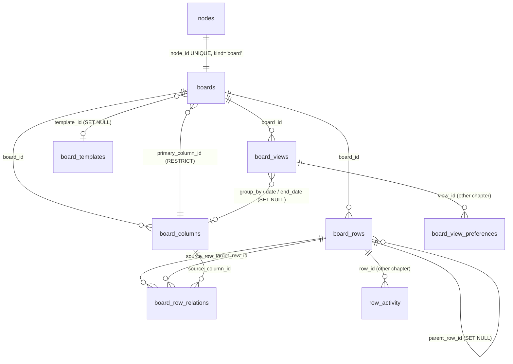
```mermaid
erDiagram
    nodes ||--|| boards : "node_id UNIQUE, kind='board'"
    boards ||--o{ board_columns : "board_id"
    boards ||--o{ board_rows : "board_id"
    boards ||--o{ board_views : "board_id"
    boards }o--|| board_columns : "primary_column_id (RESTRICT)"
    boards }o--o| board_templates : "template_id (SET NULL)"
    board_rows ||--o{ board_rows : "parent_row_id (SET NULL)"
    board_rows ||--o{ board_row_relations : "source_row_id"
    board_rows ||--o{ board_row_relations : "target_row_id"
    board_columns ||--o{ board_row_relations : "source_column_id"
    board_views }o--o| board_columns : "group_by / date / end_date (SET NULL)"
    board_views ||--o{ board_view_preferences : "view_id (other chapter)"
    board_rows ||--o{ row_activity : "row_id (other chapter)"
```

The shape of the aggregate is fixed by the frontend and must not be re-derived: `Board` carries
`columns` and `views` inline (`src/types/board.ts:412-427`), `BoardSnapshot` is
`{ board, rows, people, nextCursor }` (`src/types/board.ts:430-436`), and a schema response is a
complete array rather than a delta (canon C-11, `src/store/board-store.ts:698`).

---

### 4.11 Table: `boards`

**Purpose** — the board aggregate: one row per drive node of kind `board`. It owns the two things a
board has that a node does not — the record-id prefix and the atomic sequence counter that mints
`TASK-001` — plus the pointer to the column that titles every record. Everything a board *contains*
(columns, rows, views) hangs off this row.

**Who creates a record** — `POST /workspaces/{workspaceId}/nodes` with `kind: "board"` (E-024),
in the same transaction that inserts the `nodes` row. When the request names a `templateId`, the
same transaction also instantiates the template's columns and views (§4.20). Nothing else creates a
board: `GET /workspaces/{workspaceId}/boards` (E-048) is explicitly forbidden from seeding one
(`src/services/board-service.ts:1234-1246` — "listing them never seeds").

**Lifetime** — exactly as long as its node. Trashing the node (E-032) is a soft delete on `nodes`
and leaves this row untouched, so a restore (E-037) brings the board back whole. The row is hard
deleted only when the node is purged — `DELETE /trash/{entryId}` (E-038), `DELETE
/workspaces/{workspaceId}/trash` (E-039) or the 30-day retention sweep (canon OQ-14 position) —
through `ON DELETE CASCADE` from `nodes`.

**Columns**

| Column | PostgreSQL Type | Nullable | Default | Unique | Description |
| ------ | --------------- | -------- | ------- | ------ | ----------- |
| `id` | `uuid` | no | `gen_random_uuid()` | PK | Board identity. Wire field `board.id`. Kept alongside `node_id` on purpose (canon OQ-30). |
| `node_id` | `uuid` | no | — | yes | The drive node the board is addressed by. Wire field `board.nodeId` (`src/types/board.ts:417`). |
| `workspace_id` | `uuid` | no | — | no | Tenant key, denormalised from `nodes.workspace_id` so board-scoped reads never walk the tree. Wire field `board.workspaceId` (`src/types/board.ts:418`). |
| `row_id_prefix` | `text` | no | — | no | `TASK`, `BUG`, `QA`, `API`. Upper-case letters only, 1–6 of them (`normalizePrefix`, `src/lib/row-id.ts:18-20`). Seeded from the template. |
| `primary_column_id` | `uuid` | no | — | no | The one column that titles a record. Wire field `board.primaryColumnId`. |
| `next_sequence` | `bigint` | no | `0` | no | The atomic record-id counter. Monotonic, never decremented, never reset. See §4.11.1. |
| `template_id` | `uuid` | yes | `NULL` | no | The template this board was generated from — **for reference only** (`src/types/board.ts:414-415`). Projected onto the wire as the template's `builtin_id` when it has one, so `board.templateId === "apiDocs"` keeps working (`src/lib/api-catalog.ts:28-40`). |
| `assignee_column_id` | `uuid` | yes | `NULL` | no | **RECOMMENDATION** (OQ-48). The column that plays the assignee role. See §4.16.4. |
| `due_column_id` | `uuid` | yes | `NULL` | no | **RECOMMENDATION** (OQ-48). The column that plays the due-date role. |
| `status_column_id` | `uuid` | yes | `NULL` | no | **RECOMMENDATION** (OQ-48). The column that plays the status role. |
| `created_at` | `timestamptz` | no | `now()` | no | C-03. |
| `updated_at` | `timestamptz` | no | `now()` | no | Bumped by every column, view and board write — the frontend does exactly this (`src/services/board-service.ts:580, 657, 803`). |
| `created_by` | `uuid` | no | — | no | From the session, never the body (C-09). |

`boards` has **no `name` column.** Canon's position on OQ-30 is that the node owns `name`,
`isPinned`, `isLocked` and `isArchived`, and that they are *projected* onto the board rather than
duplicated. `board.name` on the wire is `nodes.name`. See the note at the end of this file.

**Primary Key** — `id`.

**Foreign Keys**

| Column | References | ON DELETE | Why that behaviour |
| --- | --- | --- | --- |
| `node_id` | `nodes(id)` | `CASCADE` | A board has no life outside the tree. Purging the node must purge the board, its columns, its rows and its views in one statement — anything else leaves an unreachable aggregate holding storage and quota. |
| `workspace_id` | `workspaces(id)` | `CASCADE` | Tenant deletion (E-011) removes everything in the tenant. |
| `primary_column_id` | `board_columns(id)` `DEFERRABLE INITIALLY DEFERRED` | `RESTRICT` | E-054 already refuses to delete the primary column (`COLUMN_PRIMARY_PROTECTED`, `src/services/board-service.ts:687-690`). `RESTRICT` is the database saying the same thing, so a bug in the service cannot decapitate a board. Deferred because `boards` and its first `board_columns` row are inserted in the same transaction and reference each other. |
| `template_id` | `board_templates(id)` | `SET NULL` | The template is reference data. Deleting a user-authored template (E-090) must never delete or freeze the boards made from it — a board "can add, rename, retype and delete columns and must never be constrained by the template it came from" (canon §1.3.5). |
| `created_by` | `users(id)` | `RESTRICT` | Users are soft-deactivated, never hard-deleted (T-01), so this can never fire; `RESTRICT` documents the invariant. |
| `assignee_column_id`, `due_column_id`, `status_column_id` | `board_columns(id)` | `SET NULL` | Deleting the due-date column must degrade My Work to "this board contributes nothing", exactly as the name heuristic does today (`src/lib/my-work.ts:99-110`), not fail the delete. |

**Unique Constraints**

- `UNIQUE (node_id)` — one board per node. This is what makes `GET /nodes/{nodeId}/board` (E-047) a
  single-row lookup and what canon OQ-30 requires.

**Indexes**

| Index | Serves |
| --- | --- |
| `boards_pkey (id)` | Every `/boards/{boardId}/…` route (E-049 … E-086). |
| `UNIQUE (node_id)` | E-047 `GET /nodes/{nodeId}/board`; the board-id ↔ node-id resolution the frontend does today (`src/services/board-service.ts:120-126`). |
| `(workspace_id)` | E-048 `GET /workspaces/{workspaceId}/boards`; the workspace-wide scans behind search (E-133) and My Work (E-134). |
| `(template_id) WHERE template_id IS NOT NULL` | `SearchResultKind`'s `api` / `bug` / `qa` buckets, derived from `boards.template_id` at read time (`src/services/search-service.ts:39-43`). |

**Check Constraints**

- `row_id_prefix ~ '^[A-Z]{1,6}$'` — the exact output of `normalizePrefix`
  (`src/lib/row-id.ts:9, 18-20`). Violation → `ROW_ID_PREFIX_INVALID` (400 / `validation`).
- `next_sequence >= 0`.

**Relationships**

- 1-1 with `nodes` (`node_id` unique).
- 1-N `board_columns`, `board_rows`, `board_views` — all `ON DELETE CASCADE` from here.
- N-1 `board_templates` (many boards from one template).
- N-1 `workspaces`.

**APIs that use it**

| # | Endpoint | Permission | Transaction | Realtime | Errors |
| --- | --- | --- | --- | --- | --- |
| E-024 | `POST /workspaces/{workspaceId}/nodes` (`kind: "board"`) | `node.create` + `board.create` | One: `nodes` + `boards` + template columns + template views | RT-11 `node.changed` (`created`) | `NODE_NOT_CONTAINER`, `NODE_SLUG_CONFLICT`, `ROW_ID_PREFIX_INVALID` |
| E-047 | `GET /nodes/{nodeId}/board` → `BoardSnapshot` | visibility | read-only | — | `NODE_NOT_FOUND`, `NODE_KIND_MISMATCH` |
| E-048 | `GET /workspaces/{workspaceId}/boards` → `BoardDescriptor[]` | membership | read-only, **must not read rows** | — | `WORKSPACE_NOT_FOUND` |
| E-049 | `GET /boards/{boardId}` → `Board` | visibility | read-only | — | `BOARD_NOT_FOUND` |
| E-050 | `PATCH /boards/{boardId}` → `Board` | `board.manage` (+ `node.rename` when `name` is present) | One: `boards` + `nodes.name` | RT-10 `board.schema.changed`, RT-11 `node.changed` (`renamed`) | `BOARD_NOT_FOUND`, `ROW_ID_PREFIX_INVALID` |

**Frontend callers** — `boardService.getBoard` (`src/services/board-service.ts:229-242`) behind
`useBoardStore.loadBoard`; `boardService.listBoards` (`:1238-1246`) behind
`useRelationIndex` (`src/hooks/use-relation-index.ts:35-73`) and the relation column's target
picker (`src/components/board/cells/relation-cell.tsx:104-106`).

#### 4.11.1 The record-id counter — `next_sequence`

**EXISTING REQUIREMENT.** The counter lives on `boards`, as one `bigint` column. Canon T-10 and
canon §1.4 ("Counters") both settle this: there is **no `board_row_sequences` table**, and there is
no Postgres `SEQUENCE` object per board.

Allocation, verbatim, inside the same transaction as the row insert:

```sql
-- documentation only
UPDATE boards
   SET next_sequence = next_sequence + 1
 WHERE id = $1
RETURNING next_sequence;                 -- the new row's `sequence`
```

For a batch (import E-085, bulk move E-077) the same statement adds `N` and the service hands out
the returned block, so one import lands as `TASK-042 … TASK-141` with no gaps
(`src/services/board-service.ts:1183-1214`).

Four rules, all grounded, all non-negotiable:

1. **`MAX(sequence) + 1` is forbidden.** "Two simultaneous creates must never produce `TASK-005`
   twice" — `docs/BOARD.md:266-269` names this a blocking backend requirement.
2. **The counter only increases.** Deleting `TASK-005` never hands `005` to the next record. The
   frontend service does exactly `record.sequence += 1` and never inspects the row set
   (`src/services/board-service.ts:290-293, 304`); the type comment says it outright — "Numeric part
   of the display id; monotonic per board, **never reused**" (`src/types/board.ts:242-243`). Canon
   restates it on E-062.
3. **The `UPDATE … RETURNING` takes a row lock on the board**, which is also the lock that serialises
   the batch. That lock is the reason the counter is a column here rather than a separate table:
   every row-creating write already touches this row, so a `board_row_sequences` table would add a
   join and a second lock to buy nothing.
4. **The client never invents an id.** An optimistic row carries `` `${prefix}-…` `` with
   `sequence: 0`, `revision: 0`, `isPending: true`, and is replaced in place by `replaceRow` when the
   response arrives (`src/store/board-store.ts:368-375`, `src/lib/board-records.ts:128-145`).

`displayId` is unique **per board**, not globally: two boards may both hold `TASK-001`. A cross-board
bulk move (E-077) gives the moved records **new** ids from the destination board's counter and does
not carry the source id (`src/services/board-service.ts:1133-1144`).

**OPEN QUESTION (OQ-43) — may `rowIdPrefix` change after records exist?**
**Evidence** — `normalizePrefix` is exported (`src/lib/row-id.ts:18`) but nothing in
`src/components/**` or `src/store/**` calls it; the prefix is read from the template once, at board
creation (`prefixForBoard`, `src/mock/board.ts:69-71`). `custom_id` is stored per row, so changing
`boards.row_id_prefix` would leave existing records on the old prefix. Canon lists `rowIdPrefix` as
patchable on E-050 but takes no position on the rewrite.
**Recommendation** — accept the patch only while `next_sequence = 0`. Past that, refuse with
`ROW_ID_PREFIX_INVALID` and offer an explicit rewrite job that updates every `custom_id`, writes one
`row_activity` entry per board (not per row), and re-emits RT-10.
**Impact if wrong** — one board carrying two prefixes; `extractRowReferences`
(`src/lib/row-id.ts:37-43`) silently stops linking the old ones, and every `TASK-nnn` written into a
comment body before the rename dead-ends.

---

### 4.12 Table: `board_columns`

**Purpose** — one column of one board: its name, its type, where it sits, how wide it is by default,
whether it is hidden, whether it titles the record, and the whole of its per-type configuration.
It is the board's *schema*, shared by every view — "schema lives on the column and is shared by every
view; presentation is per view" (`src/lib/board-view.ts:15-21`).

**Who creates a record** — `POST /boards/{boardId}/columns` (E-052); the board-creation transaction
when a template is instantiated (E-024, §4.20); `POST /boards/{boardId}/columns/{columnId}/duplicate`
(E-055); and `POST /boards/{boardId}/import` (E-085), which may create columns for unmatched source
columns inside the import transaction.

**Lifetime** — hard delete. `DELETE /boards/{boardId}/columns/{columnId}` (E-054) removes the row,
strips the column's key from every record's `cells`, prunes every view that referenced it, and drops
the matching `board_row_relations` edges — all in one transaction. There is no soft delete and no
trash for a column. Cascades away with its board.

**Columns**

| Column | PostgreSQL Type | Nullable | Default | Unique | Description |
| ------ | --------------- | -------- | ------- | ------ | ----------- |
| `id` | `uuid` | no | `gen_random_uuid()` | PK | Column identity. **Cells are keyed by this value** (`board_rows.cells`), as are every view's `columnOrder`, `columnWidths`, `columnDisplay`, `hiddenColumnIds`, filters and sorts. |
| `board_id` | `uuid` | no | — | no | Owning board. |
| `name` | `text` | no | — | no | Display name. Unique per board case- and punctuation-insensitively (`normalizeColumnName`, `src/lib/board-schema.ts:151-153`). |
| `type` | `column_type` | no | — | no | Enum: `text`, `longText`, `select`, `date`, `user`, `attachment`, `relation` — the frontend literals verbatim, `longText` **not** normalised to `long_text` (canon §2.0). |
| `position` | `int` | no | — | no | 0-based, densely renumbered across the whole schema on every insert, move and delete (`reposition`, `src/lib/board-schema.ts:202-206`). |
| `width` | `int` | no | `180` | no | The *schema default* width. `280` for the primary column. Clamped to `[88, 720]` (`src/lib/board-schema.ts:10-13, 70-72`). A view may override it per viewer; see §4.19. |
| `hidden` | `boolean` | no | `false` | no | The *schema* hidden flag. A view can only add hiding on top of it, never remove it (`resolveColumns`, `src/lib/board-view.ts:34`). |
| `is_primary` | `boolean` | no | `false` | no | The one column that titles a record. Never hidden, never deleted, never duplicated into a second primary (`src/services/board-service.ts:610-612`). |
| `config` | `jsonb` | no | `'{}'::jsonb` | no | `ColumnConfigByType[type]` — the discriminated branch named by `type`. Fully specified in §4.12.1. |
| `created_at` | `timestamptz` | no | `now()` | no | |
| `updated_at` | `timestamptz` | no | `now()` | no | |

**Primary Key** — `id`.

**Foreign Keys**

| Column | References | ON DELETE | Why that behaviour |
| --- | --- | --- | --- |
| `board_id` | `boards(id)` | `CASCADE` | A column has no meaning without its board; purging the board must take the schema with it in one statement. |

**Unique Constraints**

- `UNIQUE (board_id, position) DEFERRABLE INITIALLY DEFERRED` — positions are dense `0..n-1`
  (E-056 renumbers the whole list). Deferred because a reorder rewrites several rows in one
  statement and passes through transiently duplicate positions.
- `UNIQUE (board_id, lower(regexp_replace(name, '[^A-Za-z0-9]', '', 'g')))
   WHERE regexp_replace(name, '[^A-Za-z0-9]', '', 'g') <> ''` — mirrors `normalizeColumnName`
  exactly. The partial predicate matters: a name made only of punctuation normalises to the empty
  string, and `findColumnByName` returns `undefined` for an empty needle
  (`src/lib/board-schema.ts:161`), so two such columns are legal in the frontend and must stay legal
  here. Creation de-duplicates silently to `Notes`, `Notes 2`, … (`uniqueColumnName`,
  `src/lib/board-schema.ts:170-180`), so this index is a guard, not the mechanism;
  `COLUMN_NAME_CONFLICT` is raised only where the caller demanded an exact name.
- `UNIQUE (board_id) WHERE is_primary` — exactly one primary column per board.

**Indexes**

| Index | Serves |
| --- | --- |
| `board_columns_pkey (id)` | Every `/columns/{columnId}` route (E-053 … E-060). |
| `(board_id, position)` | E-051 `GET /boards/{boardId}/columns`; the ordered column list inside every `BoardSnapshot` (E-047). |
| `UNIQUE (board_id) WHERE is_primary` | Resolving `boards.primary_column_id` and the row title for E-069, E-071, E-072. |
| `(board_id, type) WHERE type = 'relation'` | The backlink and relation-index writers (§4.17) need every relation column of a board without scanning the schema. |

**Check Constraints**

- `width BETWEEN 88 AND 720` — `MIN_COLUMN_WIDTH` / `MAX_COLUMN_WIDTH`
  (`src/lib/board-schema.ts:10-11`). E-053 clamps rather than refuses, so this can only fire on a
  service bug.
- `position >= 0`.
- `NOT (is_primary AND hidden)` — `patchColumn` refuses to hide the primary
  (`src/lib/board-schema.ts:99`) and `resolveColumns` refuses to honour it if one ever got through
  (`src/lib/board-view.ts:34`). E-053 **silently ignores** `hidden` on the primary column rather
  than erroring, so this constraint also can only fire on a service bug.
- `jsonb_typeof(config) = 'object'`.

The full `config`-matches-`type` rule is **not** a check constraint. It is validated at the API
boundary against the per-type JSON schema in §4.12.1, because expressing seven mutually exclusive
object shapes with nested condition trees as a `CHECK` is unreadable and unmaintainable. Violation →
`COLUMN_TYPE_CONFIG_MISMATCH` (400 / `validation`).

**Relationships**

- N-1 `boards`.
- 1-N `board_row_relations` (as `source_column_id`) — relation columns only.
- 0-1 `boards` (as `primary_column_id`, `assignee_column_id`, `due_column_id`, `status_column_id`).
- Referenced by `board_views` through three FK columns and six JSONB payloads (§4.19).
- Referenced by `board_rows.cells` by key — **an untyped reference**. There is no FK from a JSONB
  key to `board_columns.id`, so E-054 must prune the orphaned keys in its own transaction. Canon
  §1.3.2 names this as the one real cost of the JSONB decision.

**APIs that use it**

| # | Endpoint | Permission | Transaction | Realtime | Errors |
| --- | --- | --- | --- | --- | --- |
| E-051 | `GET /boards/{boardId}/columns` → `BoardColumn[]` | visibility | read-only | — | `BOARD_NOT_FOUND` |
| E-052 | `POST /boards/{boardId}/columns` → `BoardColumn` | `board.column.create` | One: insert + renumber the rest | RT-10 | `COLUMN_TYPE_CONFIG_MISMATCH`, `COLUMN_NAME_CONFLICT` |
| E-053 | `PATCH /boards/{boardId}/columns/{columnId}` → `BoardColumn` | `board.column.update` | One row | RT-10 | `COLUMN_NOT_FOUND`, `COLUMN_TYPE_CONFIG_MISMATCH`, `CONDITION_TREE_TOO_DEEP`, `OPTION_ID_RESERVED` |
| E-054 | `DELETE /boards/{boardId}/columns/{columnId}` → `BoardColumn[]` | `board.column.delete` | One: delete + renumber + strip the key from every row's `cells` + bump each row's `revision` + prune every view + delete the relation edges | RT-10, RT-07 per touched row | `COLUMN_NOT_FOUND`, `COLUMN_PRIMARY_PROTECTED` |
| E-055 | `POST /boards/{boardId}/columns/{columnId}/duplicate` → `DuplicateColumnResponse` | `board.column.create` | One: insert at `position + 1` + copy every cell value + bump each row's `revision` | RT-10, RT-07 | `COLUMN_NOT_FOUND` |
| E-056 | `POST /boards/{boardId}/columns/reorder` → `BoardColumn[]` | `board.column.update` | One: dense renumber `0..n-1` | RT-10 | `COLUMN_NOT_FOUND` |
| E-057 | `POST /boards/{boardId}/columns/{columnId}/convert` → `ConvertColumnResponse` | `board.column.update` | One: retype + reset `config` to the type default + rewrite every cell | RT-10, RT-07 | `COLUMN_NOT_FOUND`, `COLUMN_CONVERT_UNSUPPORTED` |
| E-058 – E-060 | select-option routes | `board.column.update` | One `config` rewrite | RT-10 | see §4.13 |

**Frontend callers** — `boardService.createColumn` / `updateColumn` / `reorderColumn` /
`deleteColumn` / `duplicateColumn` / `convertColumn`
(`src/services/board-service.ts:555-756`), all behind `useBoardStore`; the Options & rules dialog
(`src/components/board/config/select-column-dialog.tsx`); the column menu in
`src/components/board/table/table-grid.tsx`.

#### 4.12.1 `board_columns.config` — the complete JSONB contract

The branch is selected by the row's `type`. This is the frontend's `ColumnConfigByType`
(`src/types/board.ts:162-170`) verbatim; no field is added and none is dropped.

```ts
/** Discriminated by `board_columns.type`. Exactly one branch is valid per row. */
interface ColumnConfigByType {
  readonly text: TextConfig;
  readonly longText: LongTextConfig;
  readonly select: SelectConfig;
  readonly date: DateConfig;
  readonly user: UserConfig;
  readonly attachment: AttachmentConfig;
  readonly relation: RelationConfig;
}

/** `{}` is the whole default. `placeholder` is declared and never written today (OQ-54). */
interface TextConfig {
  readonly placeholder?: string;
}

/** Turning a long-text column into numbered steps: `B1: …`, `T2: …`. */
interface StepNumbering {
  readonly enabled: boolean;
  /** Letters before the number — `B`, `T`, `Step `. May be empty. */
  readonly prefix: string;
  /** The number the first step takes. */
  readonly start: number;
  /** What follows the number — `:` or `.`. */
  readonly separator: string;
}

interface LongTextConfig {
  /** Preferred editor height in text rows. Default 4. */
  readonly rows: number;
  readonly stepNumbering?: StepNumbering;
}

interface SelectConfig {
  /** Ordered. The array index IS the option's position — see §4.13. */
  readonly options: readonly SelectOption[];
  readonly isMulti: boolean;
  /** What the dropdown does with an unavailable option. Default `"disabled"`. */
  readonly unavailableBehavior?: UnavailableOptionBehavior;   // "disabled" | "hidden"
  /** Option ids that mean "finished". Subtask progress counts against these. */
  readonly completedOptionIds?: readonly string[];
  readonly transitionRules?: TransitionRules;                  // §4.14
}

interface DateConfig {
  /** False → the cell is a calendar day. True → an instant. Governs C-04 vs C-03. */
  readonly includesTime: boolean;
}

interface UserConfig {
  readonly isMulti: boolean;
}

interface AttachmentConfig {
  readonly maxFiles: number;                                   // default 10
}

interface RelationConfig {
  /** Target board id. `null` means "this board" (`relation-cell.tsx:104-106`). */
  readonly boardId: string | null;
  /** Column whose value labels each chip. `null` falls back to the primary column. */
  readonly displayColumnId: string | null;
  readonly isMulti: boolean;
}
```

**Defaults minted for a new column** (`DEFAULT_CONFIG`, `src/lib/board-schema.ts:36-44`) — the
service writes these, the client never sends them:

| `type` | `config` written on create |
| --- | --- |
| `text` | `{}` |
| `longText` | `{ "rows": 4 }` |
| `select` | `{ "options": [], "isMulti": false }` |
| `date` | `{ "includesTime": false }` |
| `user` | `{ "isMulti": false }` |
| `attachment` | `{ "maxFiles": 10 }` |
| `relation` | `{ "boardId": null, "displayColumnId": null, "isMulti": true }` |

A `longText` column with no `stepNumbering` reads as
`{ enabled: false, prefix: "", start: 1, separator: ":" }` (`src/lib/step-numbering.ts:29-34`); the
default is resolved on read, not stored.

**Patch semantics.** `ColumnPatch.config` is **shallow-merged** over the stored object
(`patchColumn`, `src/lib/board-schema.ts:102`), not replaced. `PATCH …/columns/{columnId}` (E-053)
therefore accepts `{"config": {"isMulti": true}}` on a select column without resending the options
array. Two rules follow:

1. The merge is one level deep. Sending `{"config": {"options": [...]}}` replaces the **whole**
   options array — which is exactly how the Options & rules dialog commits, as one draft
   (`src/components/board/config/select-column-dialog.tsx:80-92`).
2. Unknown keys are rejected, and a key belonging to a different branch is rejected
   (`COLUMN_TYPE_CONFIG_MISMATCH`). The frontend never sends a config for a type the column is not.

**Conversion resets `config`.** `POST …/convert` (E-057) writes `defaultConfigFor(newType)` and
discards the old branch entirely (`retypeColumn`, `src/lib/board-schema.ts:209-220`;
`src/services/board-service.ts:734`). Options, transition rules and availability trees are gone the
moment a select column becomes text — which is why the endpoint offers `?dryRun=true`.

**Size ceiling — RECOMMENDATION (OQ-38).** `config` is capped at **64 KB** serialised. See §4.15 for
the condition-tree limits inside it.

---

### 4.13 Select options — stored inside `board_columns.config.options`

**There is no `board_column_options` table.** Canon §1.3.3 decides this and the decision is not
re-opened here. The reasoning, restated: options are never read without their column, and three
sibling structures inside the same `config` reference option ids by value — `completedOptionIds`,
`transitionRules.transitions` (keyed by option id, with the reserved key `"__empty__"`) and each
option's own `availability` condition tree — so splitting the options into a table would put one
atomic configuration across two tables with no foreign key able to protect any of those references.
A commit that renames an option and rewrites its transition row would become two statements that can
half-apply.

```ts
interface SelectOption {
  /** Immutable identity. Everything keys off this: cells, `completedOptionIds`,
   *  `transitionRules.transitions` (keys and targets) and condition values. */
  readonly id: string;
  /** Display only. Renaming an option changes nothing else. */
  readonly label: string;
  readonly color: SelectColor;          // gray|blue|green|amber|red|violet|cyan|pink
  /** Switched off in column settings — never selectable, whatever a record holds. */
  readonly isDisabled?: boolean;
  /** Extra gate: offered only while this holds against the record being edited.
   *  Null or absent means "always offered". §4.15. */
  readonly availability?: ConditionGroup | null;
}
```

**The option's position is its index in the `options` array.** There is no `position` field, and
adding one would be wrong: the array order is already load-bearing in three places, and a second
ordering key could disagree with it.

- `cellSortKey` sorts a select cell by the option's **index** in `config.options`, because "select
  sorts by option order, which is the meaningful one for statuses"
  (`src/lib/cell-values.ts:148-155`).
- `linearTransitions` reads the column's own order as a pipeline — each status may reach the next
  (`src/lib/transition-rules.ts:186-207`).
- Kanban builds one bucket per option, in array order, from the **schema** rather than from the
  records, so a status with no records still gets a column (`docs/BOARD.md`, "Group (`VW-GRP-17`)").

Reordering options is therefore an ordinary `config` rewrite through E-053, not a `/reorder` route.

**Option ids — the rules**

| Rule | Detail | Grounding |
| --- | --- | --- |
| Immutable once minted | Renaming an option must never re-mint its id. Everything that references it references the id. | `src/lib/board-hierarchy.ts:130-137` — "nothing here reads a label, so renaming Done to Shipped changes nothing" |
| Column-scoped by construction | UI-minted ids are `opt_<columnId>_<base36 counter>` "because two columns sharing one is a collision waiting to happen" | `src/components/board/config/select-column-dialog.tsx:70-80` |
| Server-minted ids | E-058 mints its own when the client sends none. Any collision-free string is legal; the frontend never parses an option id. | `src/services/board-service.ts:773` |
| Template ids are kept verbatim | `status_0 … status_4`, `env_0 … env_2`, `method_0 …` survive instantiation unchanged (§4.20). | `src/lib/board-templates.ts:20-22, 422-454` |
| `"__empty__"` is reserved | It is the transition table's key for the empty bucket. A user-authored option may never take it. | `EMPTY_OPTION_KEY`, `src/lib/transition-rules.ts:28` |
| Unique within the column | Enforced at the API boundary on every `config` write. | — |

Violation of the reserved id → `OPTION_ID_RESERVED` (400 / `validation`).

**Colour** is picked client-side by cycling the palette — `SELECT_COLORS[options.length % 8]`, order
`blue, green, amber, red, violet, cyan, pink, gray` (`src/lib/board-schema.ts:25-34, 225-227`) — and
sent in the request. The backend stores what it is given, validated against the eight `SelectColor`
members, and never recomputes it (canon §1.3.3).

**`isDisabled`** is the first and cheapest of the three availability gates: an option switched off in
column settings is never selectable, whatever a record already holds. The refusal string is the
constant `"Turned off in column settings"` (`src/lib/select-availability.ts:82-90`).

**Availability** is the `ConditionGroup` in §4.15. `null` and absent are the same thing, and an
*empty* group is also the same thing — "no conditions means no gate"
(`isConditionGroupEmpty`, `src/lib/conditions.ts:112-117`).

#### 4.13.1 Option lifecycle endpoints

| # | Endpoint | Behaviour | Permission |
| --- | --- | --- | --- |
| E-058 | `POST /boards/{boardId}/columns/{columnId}/options` → `SelectOption` | **Dedupes by trimmed, case-folded label and returns the existing option with `200`. Never `409`.** | `board.column.update` |
| E-059 | `PATCH …/options/{optionId}` → `SelectOption` | Label, colour, `isDisabled`, `availability`. The id is never re-minted. | `board.column.update` |
| E-060 | `DELETE …/options/{optionId}` → `SelectOption[]` | Removes the option and cascades inside `config`. **Cells keep the orphaned id.** | `board.column.update` |

**E-058's dedupe rule is an EXISTING REQUIREMENT**, not a nicety: "Two users typing 'Blocked' at the
same moment must end up with one option. Contract: `POST` returns the existing option when the label
already exists (200, not 409)" (`docs/BOARD.md:297-300`). The match is
`option.label.toLowerCase() === label.trim().toLowerCase()` (`findOptionByLabel`,
`src/lib/board-schema.ts:231-237`). Implement it as `SELECT … FOR UPDATE` on the column row, then
scan `config.options`, then insert — the column row lock is what makes two concurrent creates agree.

**E-060's cascade, in the same `config` rewrite** — the frontend already does all of this locally,
so the backend must match it exactly:

1. Remove the option from `options`.
2. Remove its id from `completedOptionIds`.
3. `pruneTransitionRules` — drop the option's key from `transitions` **and** drop it from every
   other key's target list (`src/lib/transition-rules.ts:256-268`).
4. Drop every `Condition` in every remaining option's `availability` whose `value` or `values` names
   the deleted id (`select-column-dialog.tsx:178-190`).
5. **Do not touch `board_rows.cells`.** Records keep the orphaned option id. `cellText` falls back to
   the cell's `text` when no id resolves (`src/lib/cell-values.ts:93-99`) and the frontend renders
   the value as unknown, not as deleted. Canon E-060 states this outright: "cells keep the orphaned
   id; the frontend renders it as unknown, not deleted."

Errors: `SELECT_COLUMN_NOT_FOUND` (404 — missing **or not of type `select`**), `OPTION_NOT_FOUND`
(404), `OPTION_ID_RESERVED` (400), `CONDITION_TREE_TOO_DEEP` (400).

---

### 4.14 Transition rules — stored inside `board_columns.config.transitionRules`

**Storage decision, per canon §1.3.3: a JSONB member of `SelectConfig`, not its own table.** The
transition table is keyed by option id and its targets are option ids, so it is part of the same
atomic configuration as the options themselves. A separate table would need every write to span two
tables with no FK protecting the option references — the exact failure canon §1.3.3 rules out.

```ts
interface TransitionRules {
  /** Off by default. With `false`, every move is permitted. */
  readonly enabled: boolean;
  /** Only value today. Left open for a future deny-list. */
  readonly mode: "allow-list";
  /** fromKey → the keys it may move to. Keys and targets are option ids,
   *  plus the sentinel "__empty__" on BOTH sides. */
  readonly transitions: Readonly<Record<string, readonly string[]>>;
}
```

Absent config reads as `{ enabled: false, mode: "allow-list", transitions: {} }`
(`NO_TRANSITION_RULES`, `src/lib/transition-rules.ts:35-39`).

**Evaluation — the backend must reproduce this exactly** (`evaluateTransition`,
`src/lib/transition-rules.ts:102-133`). The move is **allowed** when any of these hold:

1. `enabled === false`. A board behaves like a plain Kanban until someone opts in.
2. `from === to` — a move that changes nothing.
3. `!isGoverned(from) || !isGoverned(to)`, where `isGoverned(k)` is `Object.hasOwn(transitions, k)`.
   **A key the table does not mention is ungoverned and unrestricted.** This is what makes adding a
   new status safe: "an allow-list that silently strands every new status would be a trap"
   (`src/lib/transition-rules.ts:55-61`).
4. `transitions[from]` contains `to`.

Otherwise it is refused, and the refusal names both ends *and* where the record can go instead:
`` `${column.name} cannot go straight from X to Y. X can move to A, B.` `` — or
`` `… X has no permitted moves.` `` when the source's list is empty
(`src/lib/transition-rules.ts:120-132`). That sentence is the `message` on the error; the API returns
it verbatim so the UI shows it unchanged.

Two details that are easy to get wrong:

- **The source key is the record's *first* option id**, or `"__empty__"` when the cell is empty
  (`currentKey`, `src/lib/select-availability.ts:56-62`).
- **Clearing a status is always legal.** Only *arriving* somewhere is gated
  (`src/lib/board-write-rules.ts:74`).

**Where it is enforced — RECOMMENDATION (canon R-03 on the board fact sheet).** Today
`guardCellEdits` is client-side only; `board-service.updateCells` does not call it
(`src/services/board-service.ts:484-535`). The backend **must** run the same gate on:

| Endpoint | Why |
| --- | --- |
| E-066 `PATCH /boards/{boardId}/rows/cells` | The table cell editor, the drawer field, the Kanban drop and a clipboard paste are all this one call (`src/lib/board-write-rules.ts:6-13`). |
| E-074 `POST /boards/{boardId}/rows/bulk/update` | Bulk edit writes the same values across a selection. |
| E-085 `POST /boards/{boardId}/import` | An import must not be able to place a record in a status no drag could reach. |
| E-077 `POST /boards/{boardId}/rows/bulk/move` | Cross-board move re-reads values into the destination's columns. |

Without it the workflow is advisory and any direct API call bypasses it. Refusal →
`TRANSITION_NOT_ALLOWED` (409 / `conflict`).

**Validation on write** — every key and every target must be either an existing option id of the
same column or `"__empty__"`; `mode` must be `"allow-list"`. Reject anything else with
`COLUMN_TYPE_CONFIG_MISMATCH`. This is not a database constraint; it is boundary validation, because
the referenced ids live in a sibling key of the same JSONB document.

**Who may edit** — `board.column.update`, checked server-side. Rationale straight from the code: "a
member who may write a Status cell is not thereby entitled to rewrite the workflow that governs every
card on the board" (`src/services/board-service.ts:636-645`). Below that permission the editor
renders **read-only rather than hidden** — "the rule that refuses your drag is worth being able to
look up" (`src/components/board/config/transition-rules-editor.tsx:29-37`) — so `GET
/boards/{boardId}/columns` (E-051) must return `transitionRules` to any caller with visibility.

**None of this is permission.** "May this user edit Status at all" is answered separately, before any
of it, by `row.update` (`src/lib/select-availability.ts:24-29`).

---

### 4.15 Conditional select availability — the `ConditionGroup` / `Condition` JSONB schema

Stored at `board_columns.config.options[i].availability`. Fully specified, no `any`, references
option ids and never labels.

```ts
type ConditionOperator =
  | "is" | "isNot" | "contains" | "notContains"
  | "isAnyOf" | "isNoneOf"
  | "before" | "after" | "on"
  | "isEmpty" | "isNotEmpty";

/** One test against one column of the record being evaluated. */
interface Condition {
  /** Stable within the tree. Used by the editor to patch and remove. */
  readonly id: string;
  /** A `board_columns.id` on THIS board. */
  readonly columnId: string;
  readonly operator: ConditionOperator;
  /**
   * Read the way the target column reads it:
   *   select   → a SelectOption.id      (never a label)
   *   user     → a users.id
   *   date     → `YYYY-MM-DD`           (a calendar day, never an instant — C-04)
   *   relation → a board_rows.id
   *   text     → free text
   * Empty string when the operator's arity is "none".
   */
  readonly value: string;
  /** The list for `isAnyOf` / `isNoneOf`. Single-value operators ignore it. */
  readonly values?: readonly string[];
}

type ConditionConjunction = "and" | "or";

/** Conditions plus nested groups, combined by one conjunction.
 *  Nesting is what makes `A and (B or C)` expressible without a second shape. */
interface ConditionGroup {
  readonly id: string;
  readonly conjunction: ConditionConjunction;
  readonly conditions: readonly Condition[];
  readonly groups: readonly ConditionGroup[];
}
```

**`ConditionOperator` is NOT a superset of `FilterOperator`**, despite the comment at
`src/types/board.ts:20-23`. `FilterOperator` uniquely has `onOrBefore` and `onOrAfter`;
`ConditionOperator` uniquely has `isAnyOf`, `isNoneOf` and `on`. Two enums ship, as the code has them
(canon §2.5, OQ-37).

**Operators offered per column type** (`OPERATORS_BY_TYPE`, `src/lib/conditions.ts:65-73`). A
condition naming an operator its column does not offer is rejected with `VALIDATION_FAILED`.

| Column type | Legal operators |
| --- | --- |
| `text`, `longText` | `is`, `isNot`, `contains`, `notContains`, `isEmpty`, `isNotEmpty` |
| `select` | `is`, `isNot`, `isAnyOf`, `isNoneOf`, `isEmpty`, `isNotEmpty` |
| `user` | `is`, `isNot`, `isEmpty`, `isNotEmpty` |
| `date` | `before`, `after`, `on`, `isEmpty`, `isNotEmpty` |
| `attachment` | `isEmpty`, `isNotEmpty` |
| `relation` | `contains`, `isEmpty`, `isNotEmpty` |

**Value arity** (`valueArityFor`, `src/lib/conditions.ts:82-86`): `isEmpty` / `isNotEmpty` → none;
`isAnyOf` / `isNoneOf` → list, read from `values` and falling back to `[value]` when `values` is
absent or empty (`needlesOf`, `:135-138`); everything else → single.

**Evaluation semantics — the backend must reproduce all six** (`evaluateCondition`,
`src/lib/conditions.ts:196-250`; `evaluateConditionGroup`, `:258-273`):

1. **A condition pointing at a deleted column returns `true`** — it is ignored, not failed closed
   (`:196-198`). This is load-bearing: "a deleted column must not silently lock every option."
2. **An empty group is satisfied.** Nested empty groups are filtered out before combining, and a
   group whose every child filtered out is also satisfied (`:262, 271`).
3. `date` comparisons are **calendar days**, computed from `iso.slice(0, 10)`
   (`dayNumber`, `:129-132`). An unparsable bound returns `true` (permissive); a `null` cell value
   returns `false`. **No UTC conversion ever happens** (C-04).
4. Identity cells (`select`, `user`, `relation`) match the **stored id first, the rendered label
   second**, both case-folded (`matchesIdentity`, `:145-158`). A rule written by the builder (an id)
   and one written by hand (a name) therefore agree.
5. Everything else compares `cellText(...).toLowerCase()`.
6. `or` → `results.some`; anything else → `results.every`.

**The refusal string.** `describeConditionGroup` renders the tree to one human line — `QA Status is
Passed and Reviewer is not empty` — resolving option ids to labels and user ids to names, and
wrapping nested groups in parentheses (`src/lib/conditions.ts:278-321`). The explanation the API
returns is `` `Requires ${describeConditionGroup(...)}` ``
(`src/lib/select-availability.ts:92-101`). Error → `OPTION_UNAVAILABLE` (409 / `conflict`).

**The three gates, in order** (`resolveOptionAvailability`, `src/lib/select-availability.ts:69-117`).
The backend runs the same three, in the same order, on every write path listed in §4.14:

| # | Gate | `reason` | Explanation |
| --- | --- | --- | --- |
| 1 | `option.isDisabled` | `disabled` | `"Turned off in column settings"` |
| 2 | `availability` does not hold for this record | `condition` | `` `Requires ${describeConditionGroup(...)}` `` |
| 3 | a transition rule forbids arriving here from the record's current option | `transition` | the verdict sentence from §4.14 |

`unavailableBehavior` decides only what the *dropdown* does with a failed option — `"disabled"`
(default) keeps it greyed, `"hidden"` drops it (`visibleOptions`, `:127-131`). It never affects
whether a write is accepted.

**OPEN QUESTION (OQ-38) — how deep may a `ConditionGroup` nest, and how large may a `config` be?**
**Evidence** — `ConditionGroup.groups` is unbounded recursion (`src/types/board.ts:59-64`);
`evaluateConditionGroup`, `cloneConditionGroup` (`src/lib/board-templates.ts:474-483`) and
`describeConditionGroup` all recurse without a depth guard; nothing in `src/config/app.ts` caps a
column config.
**Recommendation** — cap at **depth 5**, **50 conditions across the whole tree**, and a **64 KB**
serialised `board_columns.config`. Validate on write, before the shallow merge, and refuse with
`CONDITION_TREE_TOO_DEEP` (400 / `validation`) or `REQUEST_TOO_LARGE` (413). Depth 5 comfortably
exceeds every tree any template or UI produces — the built-in `task` rule is depth 1 with one
condition (`whenEmpty`, `src/lib/board-templates.ts:118-125`).
**Impact if wrong** — a hand-crafted `config` write becomes a stack-overflow and a CPU denial of
service against every reader of the board, because the tree is evaluated once per option per record
per render.

---

### 4.16 Table: `board_rows`

**Purpose** — one record on one board. It carries its own business identifier (`TASK-042`), its
place in the board's order, its parent when it is a subtask, its optimistic-concurrency token, its
archive state, and all of its cell values as one JSONB document.

**Who creates a record** — `POST /boards/{boardId}/rows` (E-062), `POST
/boards/{boardId}/rows/{rowId}/duplicate` (E-064), `POST /boards/{boardId}/import` (E-085) and the
destination half of `POST /boards/{boardId}/rows/bulk/move` (E-077). Every one of them allocates
`sequence` from `boards.next_sequence` (§4.11.1); the client never invents an id.

**Lifetime** — soft delete, per canon §1.4 (`deleted_at` + `deleted_by` on `nodes`, `comments` and
`board_rows`). `DELETE /boards/{boardId}/rows/{rowId}` (E-065) and `POST …/rows/bulk/delete` (E-076)
set `deleted_at`; the retention sweep hard-deletes afterwards. **Deleting a parent never cascades to
its children** — they are lifted to the top level (`parent_row_id → NULL`, `revision + 1`) and the
response carries them so the client reconciles. Rows also cascade away with their board when the
board's node is purged.

**Columns**

| Column | PostgreSQL Type | Nullable | Default | Unique | Description |
| ------ | --------------- | -------- | ------- | ------ | ----------- |
| `id` | `uuid` | no | `gen_random_uuid()` | PK | Record identity. Wire field `row.id`. |
| `board_id` | `uuid` | no | — | no | Owning board. |
| `sequence` | `bigint` | no | — | no (composite) | The numeric part of the business id. Monotonic per board, **never reused** (§4.11.1). Wire field `row.sequence`. |
| `custom_id` | `text` | no | — | no (composite) | `TASK-042`. Written by the service as `` `${board.row_id_prefix}-${lpad(sequence, 3, '0')}` ``; numbers past the padding simply grow (`formatRowId`, `src/lib/row-id.ts:13-15`). **Never the primary key** (C-02). Wire field `row.displayId`. |
| `parent_row_id` | `uuid` | yes | `NULL` | no | Parent record in the subtask hierarchy. A subtask is a full record — its own id, status, assignee, attachments, comments and history — so the parent stores a pointer, never a nested copy (`src/types/board.ts:255-263`). |
| `position` | `numeric` | no | — | no | Fractional index giving the board its order (canon OQ-34). See §4.16.3. |
| `cells` | `jsonb` | no | `'{}'::jsonb` | no | `Record<columnId, CellValue>`. The whole of §4.17. |
| `revision` | `bigint` | no | `1` | no | Optimistic-concurrency token. **One bump per write, however many cells that write touched** (`src/services/board-service.ts:514-519`). Wire field `row.revision`. |
| `archived_at` | `timestamptz` | yes | `NULL` | no | SY-ARC-37. Non-null means frozen: readable, keeps its history, refuses edits until restored. Wire field `row.archivedAt`. |
| `deleted_at` | `timestamptz` | yes | `NULL` | no | Soft delete (canon §1.4). Absent from the wire; a deleted row is simply not returned. |
| `deleted_by` | `uuid` | yes | `NULL` | no | From the session. |
| `created_at` | `timestamptz` | no | `now()` | no | |
| `updated_at` | `timestamptz` | no | `now()` | no | |
| `created_by` | `uuid` | no | — | no | Wire field `row.createdBy`. There is deliberately no `updated_by` — the frontend has none (OQ-35); the actor of the last write is in `row_activity`. |
| `due_date` | `date` | yes | `NULL` | no | Indexed projection. §4.16.4. |
| `due_at` | `timestamptz` | yes | `NULL` | no | Indexed projection. **A separate column from `due_date`, never a widening of it** (C-04, OQ-32). |
| `status_option_id` | `text` | yes | `NULL` | no | Indexed projection. |
| `assignee_ids` | `uuid[]` | no | `'{}'` | no | Indexed projection. |
| `search_vector` | `tsvector` | yes | `NULL` | no | GIN-indexed full text over the record's textual cells; canon §1.2 puts the index on the row rather than in a `search_index` table. |

`isPending` (`src/types/board.ts:265`) is client-only and is never stored or accepted.

**Primary Key** — `id`.

**Foreign Keys**

| Column | References | ON DELETE | Why that behaviour |
| --- | --- | --- | --- |
| `board_id` | `boards(id)` | `CASCADE` | A record has no life outside its board. |
| `(parent_row_id, board_id)` | `board_rows(id, board_id)` | `SET NULL (parent_row_id)` | Two behaviours in one constraint. **`SET NULL` implements "children are lifted to the top level, never cascade-deleted"** exactly (`detachOrphans`, `src/services/board-service.ts:460-470`; E-065's `DeleteRowResponse` carries the lifted children so the client reconciles). **The composite target makes `ROW_PARENT_CROSS_BOARD` a database guarantee** rather than a service check: with `UNIQUE (id, board_id)` on this table, a parent on another board simply has no matching row. Requires PostgreSQL 15+ for the column-scoped `SET NULL`. |
| `created_by` | `users(id)` | `RESTRICT` | Users are never hard-deleted (T-01), so old assignments still render a name. |
| `deleted_by` | `users(id)` | `RESTRICT` | Same. |

**Unique Constraints**

- `UNIQUE (board_id, sequence)` — the counter's guarantee, written down.
- `UNIQUE (board_id, custom_id)` — `TASK-042` is unique per board. Two different boards may both
  hold `TASK-001`; canon does not make display ids globally unique (OQ-95).
- `UNIQUE (id, board_id)` — carries no information of its own; it exists **only** so the composite
  parent FK above can target it.

Both `(board_id, sequence)` and `(board_id, custom_id)` include soft-deleted rows on purpose: a
number that has been issued is spent, deleted or not.

**Indexes**

| Index | Serves |
| --- | --- |
| `board_rows_pkey (id)` | E-063, E-064, E-065, E-067, E-070, E-072, E-073. |
| `(board_id, position, id) WHERE deleted_at IS NULL AND archived_at IS NULL` | E-047 and E-061 — the default read. Keyset pagination is on `(position, id)` (canon §6.3), and archived records are hidden from every view by default (`src/types/board.ts:251-254`). |
| `(board_id, position, id) WHERE deleted_at IS NULL` | E-061 with `includeArchived=true`; E-075 `bulk/archive`, the one call that may target archived rows. |
| `(parent_row_id) WHERE parent_row_id IS NOT NULL` | E-068 `GET …/rows/{rowId}/subtasks`; the cycle-check recursive CTE on E-067; the lift-to-top-level update on E-065. |
| `UNIQUE (board_id, custom_id)` | E-069 row search — `TASK 7` and `task-7` both resolve to `TASK-007` (`matchesRowId`, `src/lib/row-id.ts:46-62`); inline `TASK-001` references in comment bodies (OQ-95). |
| `GIN (cells jsonb_path_ops)` | Reaching inside `cells` for a server-side filter that no projection column covers. |
| `GIN (search_vector)` | E-069 primary-column substring search; E-133 global search over records. |
| `(board_id, due_date) WHERE deleted_at IS NULL AND archived_at IS NULL` | E-134 My Work (`dueToday`, `overdue`), E-135 the deadline dashboard. |
| `(board_id, status_option_id)` | E-135 the task and QA dashboards. |
| `GIN (assignee_ids)` | E-134 "assigned to me" across every board in the workspace. |

**Check Constraints**

- `sequence > 0`.
- `custom_id ~ '^[A-Z]{1,6}-[0-9]+$'` — the shape `formatRowId` produces.
- `parent_row_id IS DISTINCT FROM id` — self-parenting. The service refuses first with
  `ROW_PARENT_SELF` ("A record cannot be its own parent", `src/services/board-service.ts:384`); the
  constraint is the backstop.
- `jsonb_typeof(cells) = 'object'`.
- `position` is not constrained; it is a dense-ordered `numeric` with no meaningful bounds.

**Cycles are not expressible as a check constraint.** `PUT /boards/{boardId}/rows/{rowId}/parent`
(E-067) must walk the chain with a recursive CTE inside the write transaction and refuse with
`ROW_PARENT_CYCLE` — message `` `${parent.displayId} is already under ${row.displayId}` ``
(`src/services/board-service.ts:389-391`). The same walk enforces the depth cap
(`ROW_PARENT_TOO_DEEP`); canon's position on OQ-33 is **depth 5**, which the frontend does not
enforce ("no depth limit", `src/lib/board-hierarchy.ts:6-12`) and which the API therefore owns alone.

**Relationships**

- N-1 `boards`.
- 1-N self, through `parent_row_id` (containment). Adjacency list, not nested sets: every helper in
  `src/lib/board-hierarchy.ts` walks `parentRowId` alone.
- 1-N `board_row_relations` as source and as target (dependency). **Containment and relation "live
  side by side and never read each other's data"** (`src/lib/board-hierarchy.ts:14-18`).
- 1-N `row_activity` (T-14), `comments` (T-33), `cell_attachments` (T-29), `watches` (T-34).

**APIs that use it**

| # | Endpoint | Permission | Transaction | Realtime | Errors |
| --- | --- | --- | --- | --- | --- |
| E-047 | `GET /nodes/{nodeId}/board` → `BoardSnapshot` | visibility | read-only | — | `NODE_NOT_FOUND` |
| E-061 | `GET /boards/{boardId}/rows?cursor=&limit=&includeArchived=` → `RowPage` | visibility | read-only | — | `BOARD_NOT_FOUND` |
| E-062 | `POST /boards/{boardId}/rows` → `BoardRow` | `row.create` | One: bump `next_sequence`, insert, index relations, write activity | RT-06 `row.created` | `PARENT_ROW_NOT_FOUND`, `BOARD_ROW_LIMIT_EXCEEDED` |
| E-063 | `GET …/rows/{rowId}` → `BoardRow` | visibility | read-only | — | `ROW_NOT_FOUND` |
| E-064 | `POST …/rows/{rowId}/duplicate` → `BoardRow` | `row.create` | One | RT-06 | `ROW_NOT_FOUND` |
| E-065 | `DELETE …/rows/{rowId}` → `DeleteRowResponse` | `row.delete` | One: soft-delete + lift children + drop relation edges | RT-09 `row.deleted`, RT-07 per lifted child | `ROW_NOT_FOUND` |
| E-066 | `PATCH /boards/{boardId}/rows/cells` → `UpdateCellsResponse` | `row.update` | One over every touched row. **Always `200`; last-write-wins plus `ConflictNotice[]`; never `409`** | RT-07 per row | `ROW_ARCHIVED_READ_ONLY`, `CELL_VALUE_KIND_INVALID`, `DATE_VALUE_INVALID`, `TRANSITION_NOT_ALLOWED`, `OPTION_UNAVAILABLE` |
| E-067 | `PUT …/rows/{rowId}/parent` → `BoardRow` | `row.move` | One + recursive CTE | RT-07 | `PARENT_ROW_NOT_FOUND`, `ROW_PARENT_SELF`, `ROW_PARENT_CYCLE`, `ROW_PARENT_CROSS_BOARD`, `ROW_PARENT_TOO_DEEP` |
| E-068 | `GET …/rows/{rowId}/subtasks` → `BoardRow[]` | visibility | read-only | — | `ROW_NOT_FOUND` |
| E-069 | `GET /boards/{boardId}/rows/search?q=&limit=` → `BoardRow[]` | visibility | read-only | — | `BOARD_NOT_FOUND` |
| E-073 | `PATCH …/rows/{rowId}/position` → `BoardRow` | `row.move` | One | RT-07 | `ROW_NOT_FOUND` |
| E-074 – E-077 | bulk update / archive / delete / move | `row.update` / `row.archive` / `row.delete` / both | One each; E-077 spans **both** boards | RT-07 / RT-08 / RT-09 / RT-09 + RT-06 | `BULK_TARGET_BOARD_SAME`, `BULK_TARGET_NOT_A_BOARD` |
| E-085 | `POST /boards/{boardId}/import` → `ImportOutcome` | `board.import` | **One**: column creation, column removal and row inserts all land or none do | RT-06 batched, RT-10 | `IMPORT_ROW_LIMIT_EXCEEDED`, `IMPORT_MAPPING_UNRESOLVED` |

**Frontend callers** — `useBoardStore.addRow` / `editCells` / `setRowParent` / `removeRow` /
`bulkUpdate` (`src/store/board-store.ts`); `boardService.*` (`src/services/board-service.ts:1383-1415`);
`useSubtasks` and `src/components/board/drawer/subtask-panel.tsx` for the hierarchy;
`src/components/board/cells/relation-cell.tsx:127` for E-069.

#### 4.16.1 The concurrency contract

`revision` is the token, and it is **never used to refuse a cell write**. Canon §6.4 and
`src/services/board-service.ts:484-535` settle the policy: last-write-wins plus a notice.

`PATCH /boards/{boardId}/rows/cells` takes `baseRevisions: Record<rowId, number>` and reproduces
three properties exactly (`:504-512`):

1. A missing `baseRevisions[rowId]` **never** conflicts.
2. `base < current.revision` conflicts; equal or greater does not.
3. **At most one notice per row per call**, raised by the first edit that touches that row.

The stale write is *applied*, `revision` is bumped once, and the collision is reported as
`ConflictNotice { id, rowId, columnId, message }` with
`` message = `${displayId} changed elsewhere — your edit was kept` ``. The response carries the
authoritative rows so the client reconciles rather than guesses
(`reconcileRows`, `src/lib/board-records.ts:109-116`). `CONCURRENCY_CONFLICT` exists in the error
registry and is explicitly **never** used for cell writes.

#### 4.16.2 Archive

`archived_at` is a timestamp, not a boolean (`isRowArchived` tests for a non-empty string,
`src/lib/archive.ts:52-53`). Archived means frozen, not hidden away: the record stays readable and
keeps its history, and every write path is closed until it is restored
(`ROW_ARCHIVED_READ_ONLY`, 409).

- Archived rows are excluded from every view by default and from every dashboard tally (E-135).
- `POST …/rows/bulk/archive` (E-075) is **the one call that may target archived rows**; `bulk/delete`
  (E-076) may too, because "archiving freezes edits, not removal"
  (`src/services/board-service.ts:1058`).
- `bulkUpdate` (E-074) skips them, reporting each as `BulkSkip { reason: "archived" }`.
- Archiving a parent does **not** cascade to its subtasks (canon OQ-33 position).
- Re-archiving something already archived is a no-op that writes no activity entry
  (`src/services/board-service.ts:1034-1043`).

#### 4.16.3 Ordering — `position numeric`

**RECOMMENDATION (OQ-34), position taken by canon §8.8.** `rowOrder` in the frontend is "the array
the server sent" (`docs/BOARD.md:295-298`); an explicit key is needed for manual reordering and for
concurrent inserts.

- Append: `COALESCE(MAX(position), 0) + 1` within the board.
- Insert after row *R*: the midpoint of *R*'s position and the next row's, or `R + 1` at the end.
- **A new subtask is filed directly after its parent's last descendant**, so the board's own order
  already reads as the tree even before a view nests it (`lastDescendantOf`,
  `src/services/board-service.ts:322-352`). That is an ordering rule and it needs a fractional index
  to be expressible at all.
- `numeric` is arbitrary-precision, so midpoints never run out. Renormalise the board to dense
  integers when any denominator exceeds ~40 digits; the operation is a single ordered `UPDATE` and
  emits one RT-10.

Keyset pagination sorts on `(position, id)`; `id` breaks the tie so the cursor is total.

#### 4.16.4 The indexed projections — `due_date`, `due_at`, `status_option_id`, `assignee_ids`

Canon §1.3.2 requires these four columns so that filtering, My Work and the dashboard do not have to
reach into `cells`. Each is derived from the column the board designates for that role.

`due_date` and `due_at` are **two columns, not one**. Which one is written is decided by the due
column's `DateConfig.includesTime`: `false` → the calendar day goes to `due_date` and `due_at` stays
`NULL`; `true` → the instant goes to `due_at` and `due_date` stays `NULL`. **A date-only value is
never widened into an instant** (C-04, canon OQ-32 position; `src/lib/calendar.ts:1-24` — "A due date
is a square on a calendar, not a moment").

`status_option_id` is the record's **first** option id in the status column, or `NULL` — the same
value `currentKey` uses as the transition source (`src/lib/select-availability.ts:56-62`) and the
same one `statusOf` reads for My Work (`src/lib/my-work.ts:127-137`).

`assignee_ids` is the assignee column's `userIds`, in order.

They are maintained by the service **inside the same statement that writes `cells`** — the one
`UPDATE` on E-066 sets `cells`, `revision`, `updated_at` and all four projections together, so they
can never lag. They are also rewritten by E-053 (a `DateConfig.includesTime` flip moves a value
between `due_date` and `due_at`), E-057 (conversion), E-054 (the role column deleted → `NULL`) and
E-050 (a role reassignment rewrites the whole board's projections in one pass).

**OPEN QUESTION (OQ-48) — which column plays which role?**
**Evidence** — the frontend picks by **name heuristic**, not schema: `ASSIGNEE_NAMES =
/assign|owner|tester|responsible/i`, `DUE_NAMES = /due|deadline/i`, `STATUS_NAMES =
/status|result|state/i` (`src/lib/my-work.ts:82-84`), with a deliberate asymmetry — assignee and
status fall back to the first column of that type, the due date does **not**, "because 'Found on' and
'Executed on' are history, not work that is due" (`src/lib/my-work.ts:120-123`). A second, competing
definition of "done" exists as a hard-coded English label table, `DONE_LABELS`
(`src/lib/my-work.ts:87-100`), beside the configured `completedOptionIds` (OQ-49).
**Recommendation** — store the three role pointers explicitly on `boards`
(`assignee_column_id`, `due_column_id`, `status_column_id`, all `NULL`-able, `ON DELETE SET NULL`),
default them at board creation by running the existing heuristic once, and expose them on E-050 so a
board owner can correct a guess. A board with a `NULL` role contributes nothing to the widgets that
need it — exactly what the heuristic already does when it finds no match.
**Impact if wrong** — the projections are indexed on a column the product did not mean, and My Work
silently shows the wrong records; worse, renaming a column ("Due date" → "Target") would today change
which records are overdue, with no write and no audit entry to explain it.

---

### 4.17 Cell values — `board_rows.cells JSONB`

**DECIDED (canon §1.3.2): `cells jsonb NOT NULL DEFAULT '{}'` holding `Record<columnId, CellValue>`.
There is no `cell_values` table.** This section reproduces the trade-off in full, as canon requires,
and then specifies the JSONB shape of every variant.

#### 4.17.1 The trade-off, reproduced

| Axis | `cells JSONB` on the row (**CHOSEN**) | `cell_values` row-per-cell |
| --- | --- | --- |
| **Read one board** | One row per record. `GET /nodes/{nodeId}/board` returns the whole set (`src/services/board-service.ts:229-241`). | N×M rows to fetch and pivot in the application. |
| **A 5 000-row read** | 5 000 rows, each ~1–3 KB — one index scan on `(board_id, position, id)`. | A 5 000-row × 12-column board is **60 000 rows per page load**, plus the pivot. |
| **Partial updates** | One `UPDATE` per row. N edits on one row = **one** `revision + 1`, which is the documented contract (`src/services/board-service.ts:500-520`). | N upserts. The "one revision per write, not per cell" rule needs a row-level lock on `board_rows` anyway, so the table buys nothing and costs a round of upserts. |
| **Type safety** | Native. The tagged union is stored as written, and a cell's `kind` may legitimately disagree with its column's `type` after a conversion — the `text` escape hatch survives (`src/types/board.ts:214-218`). | Needs a `kind` column beside the column's `type` **and** a nullable value column per branch — seven of them — or a JSONB value column, which is the same problem one join further away. |
| **Column delete / duplicate / convert** | Rewrites `cells` on every row: one statement per row, already the frontend's model (`src/services/board-service.ts:691-756`). | `DELETE WHERE column_id = …` is genuinely cheaper. **This is the one axis EAV wins.** |
| **Query-ability: filter / sort on a column** | GIN `jsonb_path_ops` on `cells`, plus the four projection columns of §4.16.4 for the lenses the product actually queries. Filtering and sorting are client-side today (`docs/BOARD.md:301-306`). | Native btree per column. Better for ad-hoc server-side query — the axis to revisit if OQ-36 lands as a full query DSL. |
| **Indexing** | One GIN index covers every key; four btree/GIN indexes cover the hot paths. | One btree per `(column_id, value)` — more indexes, each narrower. |
| **Sparse boards** | An absent key is an absent cell. But the frontend writes an explicit **empty `CellValue` of the column's kind**, never `null` (`emptyCellFor`, `src/lib/cell-values.ts:24-36`; used on every insert, `src/services/board-service.ts:537-539`), so rows are dense by construction and the sparsity advantage is theoretical. | Genuinely sparse. |
| **Referential integrity on `column_id`** | None. Orphaned keys must be pruned by the same transaction that drops a column (E-054). | A real FK to `board_columns`. |
| **Row size** | A 12-column record is ~1–3 KB. The TOAST threshold is 2 KB, so wide boards will TOAST — fine for whole-row reads, bad for single-cell reads, and **there are no single-cell reads** (canon P-03 forbids the route). | n/a |
| **Migration cost if we are wrong** | `jsonb_each` → insert. Mechanical, one pass. | The reverse is a pivot, also mechanical. |

The decisive fact is the access pattern: the row is always read whole and always written whole.
`BoardSnapshot` ships every row; `reconcileRows` overwrites by id
(`src/lib/board-records.ts:109-116`). An EAV table would be normalising data that is never queried
one cell at a time.

#### 4.17.2 The stored shape of every variant

```ts
/**
 * Cell values are tagged with their own kind rather than inferred from the
 * column. A converted column can therefore keep the text it could not parse
 * instead of dropping the user's data.  src/types/board.ts:219-230
 */
type CellValue =
  | { readonly kind: "text";       readonly value: string }
  | { readonly kind: "longText";   readonly value: string }
  | { readonly kind: "select";     readonly optionIds: readonly string[];        readonly text?: string }
  | { readonly kind: "date";       readonly iso: string | null;                  readonly text?: string }
  | { readonly kind: "user";       readonly userIds: readonly string[];          readonly text?: string }
  | { readonly kind: "attachment"; readonly attachments: readonly CellAttachment[]; readonly text?: string }
  | { readonly kind: "relation";   readonly rowIds: readonly string[];           readonly text?: string };

/** A file attached to a record. Metadata only — the board never holds bytes. */
interface CellAttachment {
  readonly id: string;              // = file_assets.id (T-27)
  readonly name: string;
  readonly mimeType: string;
  readonly sizeBytes: number;
  /** Minted per response as a short-lived signed URL. NEVER accepted on write. */
  readonly url: string | null;
  readonly thumbnailUrl: string | null;
  readonly uploadedBy?: string;     // users.id
  readonly createdAt?: string;      // ISO 8601
}

/** The whole cells document. Keys are board_columns.id values. */
type BoardRowCells = Readonly<Record<string, CellValue>>;
```

| `kind` | Stored JSON | Empty value written on insert | Empty test |
| --- | --- | --- | --- |
| `text` | `{"kind":"text","value":"…"}` | `{"kind":"text","value":""}` | `value.trim().length === 0` |
| `longText` | `{"kind":"longText","value":"…"}` — newlines preserved | `{"kind":"longText","value":""}` | `value.trim().length === 0` |
| `select` | `{"kind":"select","optionIds":["status_4"]}` — **ids, never labels** | `{"kind":"select","optionIds":[]}` | `optionIds.length === 0 && !text` |
| `date` | `{"kind":"date","iso":"2026-08-27"}` or a full instant | `{"kind":"date","iso":null}` | `iso === null && !text` |
| `user` | `{"kind":"user","userIds":["usr_…"]}` | `{"kind":"user","userIds":[]}` | `userIds.length === 0 && !text` |
| `attachment` | `{"kind":"attachment","attachments":[…]}` | `{"kind":"attachment","attachments":[]}` | `attachments.length === 0` — **`text` is deliberately not consulted** |
| `relation` | `{"kind":"relation","rowIds":["…uuid…"]}` — target row ids | `{"kind":"relation","rowIds":[]}` | `rowIds.length === 0 && !text` |

(`emptyCellFor` / `isCellEmpty`, `src/lib/cell-values.ts:24-64`.)

#### 4.17.3 Five rules the backend must not break

1. **A cell's `kind` may legitimately disagree with its column's `type`, and the API must not
   normalise it away** (canon §2.5). `cellOf` reads a mismatched value as *empty* rather than
   erroring (`src/lib/cell-values.ts:43-46`), so a schema change racing an edit can never crash a
   reader. Validate only that `kind` is a `ColumnType` member — `CELL_VALUE_KIND_INVALID` (400)
   otherwise.
2. **`text` is opaque payload. Do not strip it, do not normalise it, do not re-parse it
   server-side.** It holds the original string the target type could not parse, so a conversion, an
   import or a paste never destroys the user's data
   (`parseTextIntoCell`, `src/lib/cell-conversion.ts:25-82`). It is cleared only when the cell is
   written with a value that parses. `cellEquals` compares `text` as part of structural identity
   (`src/lib/cell-values.ts:167-193`), and optimistic rollback is guarded on exact equality — so a
   server-side rewrite of `text` would break rollback, not just tidiness.
3. **`date.iso` is stored as the string the client sent.** Do not coerce it inside the JSONB. A date
   column may or may not carry a time (`DateConfig.includesTime`), and `withDayKey` deliberately
   preserves the time component when only the day changes (`src/lib/calendar.ts:143-148`). The
   indexed form lives in `due_date` / `due_at` (§4.16.4), never in the document. Malformed →
   `DATE_VALUE_INVALID` (400).
4. **Only `assetId` is persisted for an attachment.** `url` and `thumbnailUrl` are minted per
   response as short-lived signed URLs and are **never accepted on write** (canon OQ-75;
   `src/types/board.ts:206-207` — "session URL; null once the session ends"). The authoritative
   attachment record is `cell_attachments` (T-29); the JSONB carries the ordered reference.
5. **Cells are dense.** Every insert writes an explicit empty value for every column
   (`emptyCells`, `src/services/board-service.ts:537-539`), and E-054 deletes the key rather than
   nulling it. Never write `null` as a cell value.

---

### 4.18 Table: `board_row_relations`

**Purpose** — the indexed projection of every relation cell, so a backlink is one indexed query
rather than a scan of every board. The authoritative, ordered list stays in
`board_rows.cells[columnId].rowIds`; this table is written in the same transaction and never read as
the source of truth.

**Who creates a record** — the same transaction as any write that touches a relation cell: E-066,
E-074, E-062, E-064, E-077, E-085 and E-057 (a conversion into or out of `relation`). Never a
client; there is no endpoint that writes this table directly.

**Lifetime** — bound to its three referents. Deleting the source row, the source column or the
target row deletes the edge by cascade. It is never soft-deleted: a projection with a tombstone
would be two states to keep in step.

**Columns**

| Column | PostgreSQL Type | Nullable | Default | Unique | Description |
| ------ | --------------- | -------- | ------- | ------ | ----------- |
| `id` | `uuid` | no | `gen_random_uuid()` | PK | Edge identity. Not exposed on the wire. |
| `source_row_id` | `uuid` | no | — | no (composite) | The record whose cell holds the link. |
| `source_column_id` | `uuid` | no | — | no (composite) | The relation column the link was written in. **This column is the relation's "type"** — see below. |
| `target_row_id` | `uuid` | no | — | no (composite) | The record pointed at. |
| `target_board_id` | `uuid` | no | — | no | Denormalised from the target row so a cross-board permission filter does not need a join back to `board_rows`. |
| `position` | `int` | no | — | no | The link's index inside `rowIds`. The frontend reads `rowIds` **in order** and renders chips in that order. |
| `created_at` | `timestamptz` | no | `now()` | no | |

**There is no `type` column, and no chapter may add one.** Canon §2.9 reserves `RelationType` and
deliberately does not define it: the frontend has no such enum, and inventing one would violate
ground rule 3. **A relation's meaning is its source column.** "Blocked by" is a relation *column*
named "Blocked by", shipped by the `task` template (`col_blocks`,
`src/lib/board-templates.ts:188`); `bug` and `apiDocs` ship "Related task" (`col_task`); `qa` ships
"Related bug". `source_column_id` therefore carries exactly the information a `type` column would,
with a foreign key protecting it and with the user free to add a fourth kind of link by adding a
fourth column. Introducing a typed edge kind requires resolving **OQ-45** first.

Equally: **containment is not relation.** `board_rows.parent_row_id` is the subtask hierarchy and
never appears here. "TASK-003 blocked by TASK-002 is a dependency, TASK-001 containing TASK-002 is
containment. The two live side by side and never read each other's data"
(`src/lib/board-hierarchy.ts:14-18`, restated for Gantt at `src/lib/board-gantt.ts:29-32`).

**Primary Key** — `id`.

**Foreign Keys**

| Column | References | ON DELETE | Why that behaviour |
| --- | --- | --- | --- |
| `source_row_id` | `board_rows(id)` | `CASCADE` | The projection has no meaning without the cell it projects. |
| `source_column_id` | `board_columns(id)` | `CASCADE` | E-054 removes the column's key from every record's `cells`; the edges must go in the same transaction or the backlink panel keeps showing a column that no longer exists. |
| `target_row_id` | `board_rows(id)` | `CASCADE` | **The edge dies; the id in the JSONB cell does not.** Canon OQ-44's position: leave the dangling id in `cells.rowIds` so `[Deleted Item]` keeps rendering and the record's history stays honest (`src/lib/cell-values.ts:22, 117-122`). A "clean up dangling links" maintenance action is the right fix, never a silent rewrite. |
| `target_board_id` | `boards(id)` | `CASCADE` | Redundant with the target row's cascade; present so the denormalised column cannot outlive its board. |

**Unique Constraints**

- `UNIQUE (source_row_id, source_column_id, target_row_id)` — one edge per link. A cell that lists
  the same target twice collapses to one edge; the JSONB keeps the duplicate, because the JSONB is
  what the user wrote.

**Indexes**

| Index | Serves |
| --- | --- |
| `board_row_relations_pkey (id)` | Maintenance only. |
| `(source_row_id, source_column_id, position)` | Rewriting one cell's edges: delete-by-source then insert, in `position` order. |
| `(target_row_id)` | **E-072 `GET /boards/{boardId}/rows/{rowId}/backlinks`** — "an indexed query, never a scan". This index is the entire reason the table exists. |
| `(target_board_id, target_row_id)` | E-071 `GET /boards/{boardId}/relation-index?ids=` — one request per target board, never one per cell, filtered by read access on the target board's node. |

**Check Constraints**

- `position >= 0`.
- `source_row_id <> target_row_id` is **not** constrained: a record legitimately may reference itself
  in a relation column, and nothing in the frontend forbids it.

**Relationships**

- N-1 `board_rows` twice (source and target) — an N-N join table between records, **cross-board by
  design**: `RelationConfig.boardId` names the target board and `null` means "this board"
  (`src/components/board/cells/relation-cell.tsx:104-106`).
- N-1 `board_columns` (source column).

**APIs that use it**

| # | Endpoint | Permission | Transaction | Realtime | Errors |
| --- | --- | --- | --- | --- | --- |
| E-072 | `GET /boards/{boardId}/rows/{rowId}/backlinks` → `Backlink[]` | visibility | read-only | — | `ROW_NOT_FOUND` |
| E-071 | `GET /boards/{boardId}/relation-index?ids=` → `RelationTarget[]` | visibility **on the target board's node** | read-only | — | `BOARD_NOT_FOUND` |
| E-066, E-074, E-062, E-064, E-077, E-085, E-057, E-054 | writers | as per the owning endpoint | the edge rewrite is part of the owning transaction | the owning frame | — |

**Backlinks are derived, never stored twice.** There is no mirrored value on the target record:
"Nothing is stored for a backlink: it is derived by asking which rows point here, so the two
directions can never disagree" (`src/components/board/drawer/backlinks-panel.tsx:14-19`). Canon's
position on OQ-44 confirms it — no mirroring, dangling ids preserved.

`Backlink` and `RelationTarget` are the two read shapes (canon §5.3):

```ts
interface RelationTarget {
  readonly rowId: string;
  readonly displayId: string;
  readonly title: string;        // the target board's primary column, as text
  readonly boardId: string;
  readonly boardName: string;
}

interface Backlink {
  readonly boardId: string;
  readonly boardNodeId: string;
  readonly boardName: string;
  readonly columnName: string;   // the relation column the link was written in
  readonly rowId: string;
  readonly displayId: string;
  readonly title: string;
}
```

E-071 must filter its results by the caller's read access on the **target** board's node and return
the surviving subset. The frontend degrades gracefully: until every referenced board has answered,
`relationResolved` is false and an unresolved id renders as *unknown*, never as `[Deleted Item]`
(`src/lib/cell-values.ts:14-22, 117-122`; `src/hooks/use-relation-index.ts:21-24`). A filtered-out
row therefore leaks nothing.

**Frontend callers** — `src/components/board/drawer/backlinks-panel.tsx:21`
(`boardService.listBacklinks`); `src/hooks/use-relation-index.ts:51`
(`boardService.relationIndex`, one call per distinct target board).

---

### 4.19 Table: `board_views`

**Purpose** — a saved way of reading the board: type, filters, sorts, grouping, date anchors and
column presentation. A view never owns records — "switching views never copies data; a view just
describes how to read it" (`src/types/board.ts:330-333`). Views are **shared per board**, and their
order is the board's, not the reader's (canon E-082).

**Who creates a record** — `POST /boards/{boardId}/views` (E-079), where `from` copies an existing
view — that is how "duplicate" works; and the board-creation transaction, which turns each
`TemplateView` into a full `SavedView` (§4.20).

**Lifetime** — hard delete through `DELETE /boards/{boardId}/views/{viewId}` (E-081), **refused when
it would leave the board with zero views** (`VIEW_LAST_REMAINING`, 409 — "A board needs at least one
view", `src/services/board-service.ts:887-892`). Cascades away with the board.

**Columns**

| Column | PostgreSQL Type | Nullable | Default | Unique | Description |
| ------ | --------------- | -------- | ------- | ------ | ----------- |
| `id` | `uuid` | no | `gen_random_uuid()` | PK | View identity. **Forcibly preserved against a patch** (E-080). |
| `board_id` | `uuid` | no | — | no | Owning board. **Also forcibly preserved against a patch** (`src/services/board-service.ts:800-802`). |
| `name` | `text` | no | — | no | Tab label. Not unique — duplicating names the copy `` `${source.name} copy` `` (`src/store/board-store.ts:967-975`) and nothing enforces more. |
| `type` | `board_view_type` | no | — | no | Enum: `table`, `kanban`, `calendar`, `gantt`. |
| `position` | `int` | no | — | no | Tab-strip order, dense `0..n-1`, rewritten by E-082. |
| `filters` | `jsonb` | no | `'[]'::jsonb` | no | `ViewFilter[]`. §4.19.1. |
| `filter_conjunction` | `text` | no | `'and'` | no | `and` \| `or` — "all of" / "any of". |
| `sorts` | `jsonb` | no | `'[]'::jsonb` | no | `ViewSort[]`, multi-level: earlier entries win, later ones break ties. |
| `hidden_column_ids` | `jsonb` | no | `'[]'::jsonb` | no | `string[]` of `board_columns.id`. |
| `column_order` | `jsonb` | no | `'[]'::jsonb` | no | `string[]`. Ids missing from it fall back to schema `position` — appended after every explicitly ordered column (`src/lib/board-view.ts:40`). |
| `column_widths` | `jsonb` | no | `'{}'::jsonb` | no | `Record<columnId, number>`. The shared default; a viewer may override it (T-16). |
| `column_display` | `jsonb` | no | `'{}'::jsonb` | no | `Record<columnId, CellDisplayMode>`. **A column missing from the map is `compact`.** §4.19.2. |
| `row_height` | `text` | no | `'medium'` | no | `short` \| `medium` \| `tall`. Table only. |
| `group_by_column_id` | `uuid` | yes | `NULL` | no | Grouping column for the table and Kanban. Kanban *is* grouping, so it is required there. |
| `hide_empty_groups` | `boolean` | no | `false` | no | Forced `false` for Kanban on read — Kanban always shows empty buckets (`src/hooks/use-board-view.ts:136-160`). |
| `date_column_id` | `uuid` | yes | `NULL` | no | Calendar's anchor; the Gantt's start anchor. |
| `end_date_column_id` | `uuid` | yes | `NULL` | no | The Gantt's end anchor. |
| `subtask_display` | `text` | no | `'nested'` | no | `nested` \| `flat` \| `hidden`. Per view, so one view can nest subtasks while another lists every record flat. |
| `gantt_zoom` | `text` | no | `'week'` | no | `week` \| `month` \| `quarter` — **plus the legacy `day`**. See below. |
| `show_dependencies` | `boolean` | no | `true` | no | Draw the "blocked by" connectors. Off is a legitimate way to read a plan. |
| `created_at` | `timestamptz` | no | `now()` | no | |
| `updated_at` | `timestamptz` | no | `now()` | no | |
| `created_by` | `uuid` | no | — | no | |

**`gantt_zoom` and the legacy `"day"` — mandatory** (canon §2.6). A saved view may still hold
`"day"`, a per-day scale that was removed (`src/types/board.ts:272-281`). The API **accepts `"day"`
on write and on read and coerces it to `"week"`**; it never rejects it. Store it as `text` with
`CHECK (gantt_zoom IN ('week','month','quarter','day'))` — **not** as a Postgres enum that refuses
`'day'`, which would need a data migration first.

**Primary Key** — `id`.

**Foreign Keys**

| Column | References | ON DELETE | Why that behaviour |
| --- | --- | --- | --- |
| `board_id` | `boards(id)` | `CASCADE` | A view has no meaning without its board. |
| `group_by_column_id` | `board_columns(id)` | `SET NULL` | This *is* `pruneView` for this field: "the view survives the deletion instead of rendering against a column that is gone" (`src/lib/board-view.ts:282-287`). A Kanban view whose grouping column was deleted must still open. |
| `date_column_id` | `board_columns(id)` | `SET NULL` | Same. |
| `end_date_column_id` | `board_columns(id)` | `SET NULL` | Same. |
| `created_by` | `users(id)` | `RESTRICT` | Users are never hard-deleted. |

The six JSONB payloads that also hold column ids — `filters`, `sorts`, `column_order`,
`hidden_column_ids`, `column_widths`, `column_display` — **cannot** be protected by a foreign key.
E-054 must prune all six in its own transaction, reproducing `pruneView`
(`src/lib/board-view.ts:288-334`) exactly. A view persisted holding a dead column id is a spec
defect.

**Unique Constraints**

- `UNIQUE (board_id, position) DEFERRABLE INITIALLY DEFERRED` — dense tab order; deferred because
  E-082 rewrites the whole strip in one statement.

**Indexes**

| Index | Serves |
| --- | --- |
| `board_views_pkey (id)` | E-080, E-081, E-083. |
| `(board_id, position)` | E-078 `GET /boards/{boardId}/views`; the `views` array inside every `Board` (E-047, E-049). |
| `(group_by_column_id)`, `(date_column_id)`, `(end_date_column_id)` | Required by the three FKs so E-054's `SET NULL` does not sequential-scan every view in the workspace. |

**Check Constraints**

- `position >= 0`.
- `filter_conjunction IN ('and','or')`.
- `row_height IN ('short','medium','tall')`.
- `subtask_display IN ('nested','flat','hidden')`.
- `gantt_zoom IN ('week','month','quarter','day')`.
- `jsonb_typeof(filters) = 'array'` and the same for `sorts`, `hidden_column_ids`, `column_order`;
  `jsonb_typeof(column_widths) = 'object'` and the same for `column_display`.

**`VIEW_TYPE_REQUIRES_COLUMN` is a write-time validation, not a check constraint.** Kanban needs
`group_by_column_id` and calendar needs `date_column_id` (canon §4.3), but E-054's `SET NULL` can
null either of them *after* the view was validly written, and the view must survive that. So: refuse
the write that would create or patch a view into that state (400 / `validation`); tolerate the state
when a column delete produced it, and let the view render its empty-state.

**Relationships**

- N-1 `boards`.
- N-1 `board_columns` three times, and by reference through six JSONB payloads.
- 1-N `board_view_preferences` (T-16) — the per-viewer companion, below.

**APIs that use it**

| # | Endpoint | Permission | Transaction | Realtime | Errors |
| --- | --- | --- | --- | --- | --- |
| E-078 | `GET /boards/{boardId}/views` → `SavedView[]` | visibility | read-only | — | `BOARD_NOT_FOUND` |
| E-079 | `POST /boards/{boardId}/views` → `SavedView` | `board.view.manage` | One | RT-10 | `VIEW_TYPE_REQUIRES_COLUMN`, `COLUMN_NOT_FOUND` |
| E-080 | `PATCH /boards/{boardId}/views/{viewId}` → `SavedView` | `board.view.manage` | One | RT-10 | `VIEW_NOT_FOUND`, `VIEW_TYPE_REQUIRES_COLUMN` |
| E-081 | `DELETE /boards/{boardId}/views/{viewId}` → `SavedView[]` | `board.view.manage` | One: delete + renumber | RT-10 | `VIEW_NOT_FOUND`, `VIEW_LAST_REMAINING` |
| E-082 | `POST /boards/{boardId}/views/reorder` → `SavedView[]` | `board.view.manage` | One: dense renumber | RT-10 | `VIEW_NOT_FOUND` |
| E-083 | `PUT /boards/{boardId}/views/{viewId}/preferences` → `ViewPreferences` | visibility | One (writes T-16, not this table) | — | `VIEW_NOT_FOUND` |
| E-054 | `DELETE …/columns/{columnId}` | `board.column.delete` | Prunes every view in the same transaction | RT-10 | — |

**Frontend callers** — `boardService.createView` / `updateView` / `reorderView` / `deleteView`
(`src/services/board-service.ts:790-898`) behind `useBoardStore.createView`, `patchView`,
`reorderView`, `deleteView`, `setColumnWidth`, `setColumnDisplay`, `setColumnHidden`,
`setColumnOrder` (`src/store/board-store.ts:229-257, 943-1120`);
`src/components/board/config/view-tabs.tsx` and `view-config-bar.tsx` for the controls;
`resolveColumns` (`src/lib/board-view.ts:24-41`) for the merge.

#### 4.19.1 `SavedViewConfig` — the full JSONB interface

The six JSONB columns above are one logical document. `SavedViewConfig` names it, so a chapter
reading `filters jsonb` never has to guess:

```ts
type BoardViewType   = "table" | "kanban" | "calendar" | "gantt";
type FilterConjunction = "and" | "or";
type SortDirection   = "asc" | "desc";
type CellDisplayMode = "compact" | "wrap" | "full";
type RowHeight       = "short" | "medium" | "tall";
type SubtaskDisplay  = "nested" | "flat" | "hidden";
type GanttZoom       = "week" | "month" | "quarter";     // "day" accepted on the wire, coerced

type FilterOperator =
  | "isNotEmpty" | "isEmpty" | "contains" | "notContains"
  | "is" | "isNot" | "before" | "after" | "onOrBefore" | "onOrAfter";

/** board_views.filters — one element per condition. */
interface ViewFilter {
  readonly id: string;
  readonly columnId: string;      // board_columns.id on THIS board
  readonly operator: FilterOperator;
  /** Interpreted by the column's type: an option id OR label for select, a
   *  user id OR name for user, `YYYY-MM-DD` for date, free text otherwise. */
  readonly value: string;
}

/** board_views.sorts — multi-level; earlier entries win, later ones break ties. */
interface ViewSort {
  readonly columnId: string;
  readonly direction: SortDirection;
}

/**
 * The complete presentation payload of a saved view. Every member maps to one
 * `board_views` column; the six marked JSONB are stored as documents, the rest
 * as scalars. This interface is the contract for all of them together.
 */
interface SavedViewConfig {
  readonly filters: readonly ViewFilter[];                            // jsonb
  readonly filterConjunction: FilterConjunction;
  readonly sorts: readonly ViewSort[];                                // jsonb
  readonly hiddenColumnIds: readonly string[];                        // jsonb
  readonly columnOrder: readonly string[];                            // jsonb
  readonly columnWidths: Readonly<Record<string, number>>;            // jsonb
  /** Absent key = "compact". Only text/longText columns are flexible. */
  readonly columnDisplay?: Readonly<Record<string, CellDisplayMode>>; // jsonb
  readonly rowHeight: RowHeight;
  readonly groupByColumnId: string | null;
  readonly hideEmptyGroups: boolean;
  readonly dateColumnId: string | null;
  readonly endDateColumnId: string | null;
  readonly subtaskDisplay?: SubtaskDisplay;                           // default "nested"
  readonly ganttZoom?: GanttZoom;                                     // default "week"
  readonly showDependencies?: boolean;                                // default true
}

/** The wire shape: identity + config. `id` and `boardId` are forcibly preserved
 *  against any patch (src/services/board-service.ts:800-802). */
interface SavedView extends SavedViewConfig {
  readonly id: string;
  readonly boardId: string;
  readonly name: string;
  readonly type: BoardViewType;
}
```

**Defaults a fresh view is created with** (`src/services/board-service.ts:827-843`) — the service
writes these, the client sends only `name`, `type` and optionally `from`:
`filters: []`, `filterConjunction: "and"`, `sorts: []`, `hiddenColumnIds: []`, `columnOrder: []`,
`columnWidths: {}`, `rowHeight: "medium"`, `groupByColumnId: null`, `hideEmptyGroups: false`,
`dateColumnId: null`, `endDateColumnId: null`.

**Which view type consumes which field** — the backend validates against this and nothing else:

| Field | table | kanban | calendar | gantt |
| --- | :-: | :-: | :-: | :-: |
| `filters`, `filterConjunction`, `sorts` | ✔ | ✔ | ✔ | ✔ |
| `hiddenColumnIds`, `columnOrder` | ✔ | ✔ | ✔ | ✔ |
| `columnWidths`, `columnDisplay`, `rowHeight` | ✔ | — | — | — |
| `groupByColumnId` | ✔ | **required** | — | — |
| `hideEmptyGroups` | ✔ | forced `false` | — | — |
| `dateColumnId` | — | — | **required** | start anchor |
| `endDateColumnId` | — | — | — | end anchor |
| `subtaskDisplay` | ✔ | ✔ | ✔ | ✔ |
| `ganttZoom`, `showDependencies` | — | — | — | ✔ |

(`src/hooks/use-board-view.ts:126-160`; `src/components/board/config/view-config-bar.tsx:82-136`;
`src/components/board/gantt/gantt-board.tsx:82-83`. The Gantt's task-panel width is local component
state, not `columnWidths` — `gantt-board.tsx:73`.)

**Companion table (owned by the views chapter): `board_view_preferences` (T-16, OQ-46, E-083).**
`(view_id, user_id)` → per-viewer overrides for column widths and collapse state, with the shared
view providing the defaults. Canon's position on OQ-46: `board_views` is shared and governed by
`board.view.manage`; **filters and sorts stay shared — they are what a named view *is*.** The merge
point is already a single function on the client (`resolveColumns`), so the split is contained. The
problem it solves is real and named in the source: column widths currently live on the shared view,
so one person's resize reaches everyone (`docs/BOARD.md:378-382`).

#### 4.19.2 Why column display modes live on the saved view, not on the column

**EXISTING REQUIREMENT — the frontend decided this, and the schema follows it.**

`CellDisplayMode` (`compact` | `wrap` | `full`) is stored in `board_views.column_display`, a
`Record<columnId, CellDisplayMode>`. There is deliberately **no `display_mode` column on
`board_columns`**. The reason is written into the type itself:

> "Per-column display mode. Presentation, so it sits beside `columnWidths` rather than on the schema:
> one saved view can read Step in full while another keeps it to a line, without either changing what
> the column *is*. A column missing from the map is `compact`."
> — `src/types/board.ts:347-353`

The concrete case is a QA board. "Steps to reproduce" is a paragraph. The **Triage** view wants one
line per record so a hundred defects fit on a screen; the **Execution** view wants the whole step
text in place so a tester can read it without opening a drawer. Both are reading the same column of
the same board at the same moment. A mode stored on the column would force one of those two readers
to lose, and the loser's only recourse would be to edit shared schema — a change that would reach
everyone on the board.

Four supporting facts make this the schema-correct split, not just a UI preference:

1. **The split is already codified.** `resolveColumns(board, view)` is the one merge point:
   effective width is `view.columnWidths[id] ?? column.width` (clamped), effective hidden is
   `!isPrimary && (view.hiddenColumnIds.has(id) || column.hidden)` — the view can only *add* hiding
   on top of the schema's, never remove it (`src/lib/board-view.ts:24-41`). `columnDisplay` joins
   `columnWidths`, `columnOrder` and `hiddenColumnIds` on the per-view side of exactly that line.
2. **It is read only through the view.** `table-grid.tsx:132` reads
   `view?.columnDisplay ?? EMPTY_DISPLAY` and nothing else in the codebase reads it; it is written
   only by `useBoardStore.setColumnDisplay`, which patches the view
   (`src/store/board-store.ts:1062-1073`). There is no code path in which a column would supply one.
3. **It has no effect on most types.** Only `text` and `longText` are flexible; chips, dates, avatars
   and file thumbnails are laid out rather than flowed, so a second line would show nothing more
   (`isFlexibleColumn`, `src/lib/cell-display.ts:60-69`). A schema field that is meaningless for five
   of seven column types is not schema.
4. **It is table-only.** Kanban, calendar and Gantt never consult it. A field on `board_columns`
   would be a schema property that three of four view types ignore.

The same argument settles `columnWidths`, `columnOrder`, `hiddenColumnIds`, `rowHeight` and
`subtaskDisplay` — all per view. `board_columns.width` and `board_columns.hidden` remain as the
*schema defaults* a view starts from, which is why both exist in both places and why the merge is
directional.

**Consequence for E-054.** Because `column_display` is keyed by column id inside a JSONB document, a
column delete must strip its key in the same transaction — "a view that still names a deleted column
is a view carrying a dead reference" (`src/lib/board-view.ts:298-303`).

---

### 4.19.3 Table: `board_view_preferences`

Canon T-16. **RECOMMENDATION, deferred — OQ-46.**

**Purpose** — the part of a saved view that is one person's, split out from the part that is
everybody's. Today `SavedViewConfig` holds `columnWidths` and `columnDisplay` alongside
`filters` and `sorts` on the same shared row (`src/types/board.ts:346-353`), which means
dragging a column edge edits a view your colleagues are reading. This table is the
recommended fix, and the split it draws is the whole of the recommendation:

| Stays on `board_views` (shared) | Moves here (per viewer) |
| --- | --- |
| `filters`, `filterConjunction`, `sorts`, `groupByColumnId`, `hideEmptyGroups`, `hiddenColumnIds`, `columnOrder`, `dateColumnId`, `endDateColumnId`, `rowHeight` | `columnWidths`, `columnDisplay`, collapsed-group state |

Filters and sorts stay shared because they are **what a named view is** — "Open bugs, newest
first" stops meaning anything if each viewer's copy filters differently. A column's width is
not part of that meaning.

**Who creates a record** — upsert by the viewer, on their first width drag or group collapse
in that view. Never created eagerly: a person who never resizes anything never gets a row.

**How long it lives** — until the view or the user goes. No expiry.

**How it is deleted** — cascaded from either side. There is no explicit delete endpoint;
writing an empty `preferences` object is the reset, and the row may then be reaped or left,
indifferently.

**Columns**

| Column | PostgreSQL Type | Nullable | Default | Unique | Description |
| ------ | --------------- | -------- | ------- | ------ | ----------- |
| `view_id` | `UUID` | no | — | composite | |
| `user_id` | `UUID` | no | — | composite | |
| `preferences` | `JSONB` | no | `'{}'::jsonb` | no | Structure below. |
| `updated_at` | `TIMESTAMPTZ` | no | `now()` | no | |

**`preferences` JSONB — the complete contract**

```ts
interface BoardViewPreferences {
  /** Column id → pixel width. A column absent from the map uses the view's own. */
  readonly columnWidths?: Readonly<Record<string, number>>;
  /** Column id → display mode. Absent means `compact`, as on the shared view. */
  readonly columnDisplay?: Readonly<Record<string, CellDisplayMode>>;
  /** Group keys the viewer has folded shut. Never persisted shared. */
  readonly collapsedGroupKeys?: readonly string[];
}
```

Every key is optional and every unknown key is ignored, so the client resolves a column's
width as *viewer override → view value → schema `width`* and always finds an answer. A
column id that no longer exists is dropped on read rather than erroring: schema changes must
not make somebody's view unreadable.

**Primary Key** — `(view_id, user_id)`.

**Foreign Keys**

| Column | References | ON DELETE | Why that behaviour |
| --- | --- | --- | --- |
| `view_id` | `board_views(id)` | `CASCADE` | An override of a deleted view is not an override. |
| `user_id` | `users(id)` | `CASCADE` | |

**Unique Constraints** — the primary key.

**Indexes** — the primary key. Reads are always `(view_id, user_id)`; nothing lists this
table.

**Checks** — `CHECK (jsonb_typeof(preferences) = 'object')`.

**Delete Behavior** — hard delete, cascaded from both parents.

**Relationships** — N-1 to `board_views`, N-1 to `users`. Because it is keyed on the **view**
and not on the board, a person who has widened a column in "All bugs" has not widened it in
"My bugs" — which matches how the two views already differ in every other respect.

**APIs that use it** — E-083 `PUT /views/{viewId}/preferences` writes it; the values ride out
on the view read (E-080/E-081) already merged, so the client never has to make two calls or
know the merge rule. **This endpoint does not require `board.view.manage`** — that is the
point of the split. Membership plus read access on the board is enough to move your own
column edge, where editing the shared view is not.

**OPEN QUESTION (OQ-46)** — whether to make the split at all, or to leave widths shared and
accept that resizing edits everyone's view. The recommendation is to split, and to ship the
merge on the read side first so the client never learns about two sources.

---

### 4.20 Table: `board_templates`

**Purpose** — a board blueprint: the columns and views a new board starts with, plus its record-id
prefix. The four built-ins (`task`, `bug`, `qa`, `apiDocs`) are **seed rows in this table**, not
constants in backend source. `columns` and `views` are JSONB because a template is inert data that is
deep-copied at instantiation and never queried per column.

**Who creates a record** — the four built-ins by seed migration with `is_builtin = true` and
`workspace_id = NULL`. User-authored templates by `POST
/workspaces/{workspaceId}/board-templates` (E-089, `board.template.manage`, **RECOMMENDATION**,
OQ-47) — "save a board as a template".

**Lifetime** — `DELETE /board-templates/{templateId}` (E-090), **refused on a built-in**. Deleting a
user template nulls `boards.template_id` on every board made from it (`SET NULL`) and changes nothing
else about those boards. Built-ins are never deleted; a workspace's own templates cascade away with
the workspace.

**Columns**

| Column | PostgreSQL Type | Nullable | Default | Unique | Description |
| ------ | --------------- | -------- | ------- | ------ | ----------- |
| `id` | `uuid` | no | `gen_random_uuid()` | PK | Template identity (C-01). |
| `builtin_id` | `text` | yes | `NULL` | yes | `task` \| `bug` \| `qa` \| `apiDocs` for the four seeds, `NULL` otherwise. **This is what the wire's `templateId` carries for a built-in**, so `board.templateId === "apiDocs"` keeps working (`src/lib/api-catalog.ts:28-40`, `src/services/search-service.ts:39-43`). |
| `workspace_id` | `uuid` | yes | `NULL` | no | `NULL` for the built-ins, which every workspace sees. Set for user-authored templates. |
| `is_builtin` | `boolean` | no | `false` | no | Guards E-090 and marks the seed rows. |
| `name` | `text` | no | — | no | `Task board`, `Bug board`, `QA / QC board`, `API documentation`. |
| `description` | `text` | no | `''` | no | One line, shown in the template picker. |
| `row_id_prefix` | `text` | no | — | no | `TASK`, `BUG`, `QA`, `API`. Copied to `boards.row_id_prefix` at instantiation. |
| `primary_column_id` | `text` | no | — | no | A **template-local** column id (`col_title`, `col_endpoint`), not a UUID and not a foreign key — template column ids are remapped at instantiation. |
| `columns` | `jsonb` | no | `'[]'::jsonb` | no | `BoardTemplateColumn[]`. Below. |
| `views` | `jsonb` | no | `'[]'::jsonb` | no | `TemplateView[]`. Below. |
| `created_at` | `timestamptz` | no | `now()` | no | |
| `updated_at` | `timestamptz` | no | `now()` | no | |
| `created_by` | `uuid` | yes | `NULL` | no | `NULL` for the seeds. |

**Primary Key** — `id`.

**Foreign Keys**

| Column | References | ON DELETE | Why that behaviour |
| --- | --- | --- | --- |
| `workspace_id` | `workspaces(id)` | `CASCADE` | A workspace's own templates go with it. `NULL` (built-in) is never affected. |
| `created_by` | `users(id)` | `RESTRICT` | Users are never hard-deleted. |

**Unique Constraints**

- `UNIQUE (builtin_id)` — one row per built-in.
- `UNIQUE (workspace_id, lower(name)) WHERE workspace_id IS NOT NULL` — **RECOMMENDATION**: two
  templates with the same name in one workspace are a picker the user cannot read. The frontend has
  no user-template UI, so this rule is proposed, not observed (OQ-47).

**Indexes**

| Index | Serves |
| --- | --- |
| `board_templates_pkey (id)` | E-088, E-090; the `boards.template_id` join. |
| `UNIQUE (builtin_id)` | Resolving the wire value `"apiDocs"` back to a row. |
| `(workspace_id) WHERE workspace_id IS NOT NULL` | E-087 `GET /workspaces/{workspaceId}/board-templates` — built-ins plus this workspace's own. |

**Check Constraints**

- `row_id_prefix ~ '^[A-Z]{1,6}$'`.
- `is_builtin = (builtin_id IS NOT NULL)` — the two flags cannot disagree.
- `NOT (is_builtin AND workspace_id IS NOT NULL)` — a built-in belongs to no workspace.
- `jsonb_typeof(columns) = 'array' AND jsonb_typeof(views) = 'array'`.

**Relationships**

- 1-N `boards` through `boards.template_id` (`SET NULL`).
- N-1 `workspaces`, nullable.

**APIs that use it**

| # | Endpoint | Permission | Transaction | Realtime | Errors |
| --- | --- | --- | --- | --- | --- |
| E-087 | `GET /workspaces/{workspaceId}/board-templates` → `BoardTemplate[]` | membership | read-only | — | `WORKSPACE_NOT_FOUND` |
| E-088 | `GET /board-templates/{templateId}` → `BoardTemplate` | membership | read-only | — | `not_found` |
| E-089 | `POST /workspaces/{workspaceId}/board-templates` → `BoardTemplate` | `board.template.manage` | One | — | `BOARD_NOT_FOUND`, `VALIDATION_FAILED` |
| E-090 | `DELETE /board-templates/{templateId}` | `board.template.manage` | One | — | `not_found`, `conflict` on a built-in |
| E-024 | `POST /workspaces/{workspaceId}/nodes` (`kind: "board"`, `templateId`) | `node.create` + `board.create` | One: node + board + every column + every view | RT-11 | `not_found` |

**Frontend callers** — `templateById` / `BOARD_TEMPLATES` (`src/lib/board-templates.ts:408-419`)
behind the template picker; `useCreateBoard` (`src/hooks/use-create-board.ts:22-35`);
`prefixForBoard` (`src/mock/board.ts:69-71`).

#### 4.20.1 The two JSONB payloads

```ts
/**
 * A column as a template declares it. Identical to `BoardColumn` except that
 * `id` is a template-local string (`col_status`), not a UUID: real ids are
 * minted at instantiation. `config` is the same discriminated union as
 * `board_columns.config` (§4.12.1), option ids included.
 */
type BoardTemplateColumn = {
  readonly id: string;                       // template-local, e.g. "col_status"
  readonly name: string;
  readonly position: number;
  readonly width: number;
  readonly hidden: boolean;
  readonly isPrimary: boolean;
} & {
  [T in ColumnType]: { readonly type: T; readonly config: ColumnConfigByType[T] };
}[ColumnType];

/** A view as a template declares it — ids are minted when it is instantiated.
 *  Every optional field is defaulted at instantiation, not stored. */
interface TemplateView {
  readonly name: string;
  readonly type: BoardViewType;
  readonly groupByColumnId?: string;         // template-local column id
  readonly dateColumnId?: string;
  readonly endDateColumnId?: string;
  readonly hiddenColumnIds?: readonly string[];
  readonly sorts?: readonly ViewSort[];
  readonly filters?: readonly ViewFilter[];
}
```

#### 4.20.2 Instantiation — the exact contract

**A template is inert data. Instantiating one deep-copies its schema, so editing the board it
produced can never reach back** (`src/types/board.ts:396-399`; the catalogue is deep-`Object.freeze`d
at module load, `src/lib/board-templates.ts:459-471`, so an accidental in-place write fails loudly).
Canon §1.3.5 makes this a hard rule: the board a template produced is an ordinary board that can add,
rename, retype and delete columns and must never be constrained by the template it came from.

Inside the E-024 transaction:

1. **Mint a fresh UUID for every template column.** Insert them into `board_columns` with `position`
   taken from the template, `width` / `hidden` / `is_primary` copied, and `config` deep-copied.
2. **Keep every select option id verbatim** — `status_0 … status_4`, `env_0 … env_2`,
   `method_0 …`. `instantiateColumns` copies option objects without re-minting their ids
   (`src/lib/board-templates.ts:434-441`), and three sibling structures inside the same `config`
   reference them: `completedOptionIds`, `transitionRules.transitions` (keys **and** target arrays)
   and each option's `availability` conditions. Re-minting would mean rewriting all three; keeping
   them costs nothing, because an option id is a column-scoped string inside a JSONB document, not a
   database row, and C-01 does not reach it.
3. **Remap every template-local *column* id to the new UUID**, in all seven places it can appear:
   `boards.primary_column_id`; each view's `groupByColumnId`, `dateColumnId`, `endDateColumnId` and
   `hiddenColumnIds`; each view's `sorts[].columnId` and `filters[].columnId`; and — easy to miss —
   **`Condition.columnId` inside every option's `availability` tree**. The `task` template's "Done"
   option is gated on `col_blocks` being empty (`whenEmpty("status_4_rule", "col_blocks")`,
   `src/lib/board-templates.ts:118-125, 148-157`), and a missed remap there silently disables the
   rule, because a condition pointing at an unknown column evaluates to `true` (§4.15, rule 1).
4. **Deep-copy every nested structure**: each option object, each `availability` `ConditionGroup`
   recursively including `Condition.values` arrays (`cloneConditionGroup`,
   `src/lib/board-templates.ts:474-483`), `completedOptionIds`, and the `transitions` map with each
   target array copied.
5. **Turn each `TemplateView` into a full `board_views` row**, defaulting everything the template
   omits: `filterConjunction: "and"`, `columnOrder: []`, `columnWidths: {}`, `columnDisplay: {}`,
   `rowHeight: "medium"`, `hideEmptyGroups: false`, `subtaskDisplay: "nested"`,
   `ganttZoom: "week"`, `showDependencies: true`, and `null` for any unset anchor
   (`src/mock/board.ts:73-96`).
6. **Order the views so the node's `boardKind` opens first.** The matching view is hoisted to
   `position 0` (`src/mock/board.ts:98-99`), and the tree's legacy `timeline` kind maps onto the
   `gantt` view type (`VIEW_TYPE_BY_BOARD_KIND`, `src/services/board-service.ts:76-81`).
7. **Copy `row_id_prefix`** to `boards.row_id_prefix`, and set `boards.template_id` — for reference
   only.

#### 4.20.3 The four built-ins, as seed data

| `builtin_id` | `name` | `row_id_prefix` | primary column | Notable config |
| --- | --- | --- | --- | --- |
| `task` | Task board | `TASK` | `col_title` (text) | Status with 5 options; `completedOptionIds: ["status_4"]`; a seeded, **disabled** transition table; **"Done" gated on `Blocked by` being empty** via `availability`. Views: All records (table), Board (kanban on `col_status`), Schedule (calendar on `col_due`), Roadmap (gantt `col_start` → `col_due`). |
| `bug` | Bug board | `BUG` | `col_title` "Summary" | Severity; Status with 6 options and `completedOptionIds: ["status_4","status_5"]`; a seeded ladder — nothing jumps from New straight to Verified; Environment from the shared list. |
| `qa` | QA / QC board | `QA` | `col_title` "Test case" | Result with `completedOptionIds: ["result_1"]` (Passed); Suite; Environment; evidence attachment. |
| `apiDocs` | API documentation | `API` | `col_endpoint` (text) | Method with a colour per verb (`METHOD_OPTIONS`); Domain; Auth; Environment. |

(`src/lib/board-templates.ts:129-406`.) Two vocabularies are defined **once** and shared:
`ENVIRONMENT_OPTIONS` = Development / Staging / Production with ids `env_0 … env_2` and
`PRODUCTION_OPTION_ID = "env_2"` (`:26-36`); `METHOD_OPTIONS` = GET / POST / PUT / PATCH / DELETE
(`:39-49`). The environment list is also a workspace table (T-26, DV-ENV-21, OQ-63); the template's
copy is a snapshot taken at instantiation and diverges freely afterwards, like every other part of a
template.

All four ship their transition tables with `enabled: false` — "a board should behave exactly as it
always has until someone opts into the rules" (`src/lib/board-templates.ts:103-113`).

**No typed tables for the four.** There is no `tasks`, `bugs`, `qa_cases` or `api_endpoints` table,
and canon §1.3.5 forbids adding one. The evidence that this is a hard rule rather than a convenience:
the dashboard reads a board as QA **by what it became** — its status column offering a `passed` or
`failed` option — and explicitly not by template id, because "a board created from the QA template
and then reshaped should follow what it became" (`src/lib/dashboard.ts:86-96`). And the API board's
duplicate-endpoint rule is "warned in amber, **never blocked**" (`DV-API-20`) — a validation a
dedicated table would have to make an error.

---

### Chapter notes — divergences, decisions and traps

Four places where I followed canon over my own reading, plus one place where canon disagrees with
itself. None of them changed what I wrote; all of them are worth a pass before the document ships.

1. **Table names.** My brief named `row_relations`, `saved_views` and `board_column_options`. Canon's
   registry names them `board_row_relations` (T-13), `board_views` (T-15) and — for the third — no
   table at all, because canon §1.3.3 decides select options live in `board_columns.config`. I
   followed canon in all three cases. §4.13 documents the option as a fully specified JSONB object so
   the brief's content requirement (id, label, colour, position, disabled flag, availability rule) is
   still answered in full; the answer to "position" is that the array index *is* the position, and
   that this is load-bearing in three places.

2. **`board_rows.version` vs `revision`.** My brief said `version`; the frontend field is `revision`
   (`src/types/board.ts:249`) and canon T-12 says `revision`. I used `revision` everywhere.

3. **Canon contradicts itself about `boards.name`.** Canon T-10 lists `name` as a column on `boards`;
   canon §8.8's position on OQ-30 says the node owns `name` and that it is "**projected**, not
   duplicated". I followed §8.8, because it is the explicit decision and T-10 is a one-line summary.
   Consequence worth confirming: E-050 `PATCH /boards/{boardId}` lists `name` as patchable, so that
   field writes through to `nodes.name` inside the board's transaction and needs `node.rename` in
   addition to `board.manage`. If the editor prefers a duplicated `boards.name`, §4.11 and E-050's
   permission line both need changing.

4. **Canon says the four projection columns on `board_rows` are "generated columns … maintained by
   Postgres" (§1.3.2).** They cannot be literal `GENERATED ALWAYS AS` columns: the expression would
   have to know *which* column id plays the due-date role on *this* board, and that is per-board row
   data, not a constant, so the expression is not immutable. I documented them as projections
   maintained by the service inside the same statement that writes `cells` (§4.16.4), which produces
   the same guarantee — they can never lag a cell write — without requiring an impossible DDL. A
   `BEFORE INSERT OR UPDATE` trigger reading `boards` is the equivalent alternative if the editor
   prefers the invariant enforced below the service.

5. **`board_rows` soft delete.** Canon §1.4 puts `deleted_at` / `deleted_by` on `board_rows`, so I
   included them. The frontend hard-deletes records — "records have no trash of their own"
   (`src/services/board-service.ts:1049`) — and canon's own OQ-15 asks whether that asymmetry with
   the 30-day node trash is intended, taking no position. If OQ-15 resolves as "records really are
   permanent", the two columns come out of §4.16 and E-065/E-076 become hard deletes; nothing else in
   this chapter changes, because the composite parent FK's `SET NULL` already produces the
   lift-to-top-level behaviour either way.

### Shared preface — the decomposed target, used by three tables

`comments` (T-33), `watches` (T-34) and `notifications` (T-35) all point at the same
thing through the same five columns. It is written once here and referenced from each
table rather than re-explained three times.

**EXISTING REQUIREMENT.** The frontend addresses every collaboration target through one
shape, `EntityRef` (`src/types/collab.ts:16-26`), and identifies it with one string,
`refKey` (`src/lib/entity-ref.ts:21-23`) — the only place in the codebase that knows the
format:

```ts
export function refKey(ref: EntityRef): string {
  return ref.kind === "row"
    ? `row:${ref.boardId ?? ref.nodeId}:${ref.rowId}`
    : `${ref.kind}:${ref.nodeId}`;
}
```

| `kind` | `targetKey` grammar | Example |
| --- | --- | --- |
| `row` | `row:<boardId>:<rowId>` | `row:brd_nd_bug_tracker:brd_nd_bug_tracker_row_7` |
| `document` / `board` / `project` / `folder` / `file` | `<kind>:<nodeId>` | `document:nd_engineering_handbook` |

**DECISION — store it decomposed, generate the string.** `targetKey` is never a column
and never a primary key. Five real columns carry it:

| Column | PostgreSQL Type | Meaning |
| --- | --- | --- |
| `target_kind` | `entity_kind` | `EntityKind` (§2.3): `project`, `folder`, `board`, `document`, `file`, `row` |
| `target_node_id` | `UUID` | The drive node that addresses the target — the routing anchor |
| `target_board_id` | `UUID` | Non-null only when `target_kind = 'row'` |
| `target_row_id` | `UUID` | Non-null only when `target_kind = 'row'` |
| `target_label` | `TEXT` | Display snapshot of the target's name at write time |

Reason, in one sentence: `ON DELETE CASCADE`, the permission funnel, the My Work
`mentioned` query and the global search join are all foreign-key questions, and a single
opaque text key turns every one of them into a `LIKE`.

The API serialises `targetKey` back into every response exactly as `refKey` does, so the
frontend's React keys, its `Map<targetKey, …>` stores and its realtime routing
(`src/store/watch-store.ts:21`, `src/hooks/use-comments.ts:59`) keep working unchanged.

**Two check constraints hold on every table that carries these columns:**

```sql
CHECK ((target_kind = 'row') = (target_row_id   IS NOT NULL))
CHECK ((target_kind = 'row') = (target_board_id IS NOT NULL))
```

**`target_label` is untrusted display text, never an authorisation input.** It is a copy
of the target's name taken at write time, and the frontend already treats a stale label
as a disclosure risk: it re-resolves every notification against the tree the reader can
see *now* and drops items whose node is gone or no longer visible
(`src/hooks/use-notifications.ts:58-64` → `keepVisibleRefs`,
`src/lib/permissions/visibility.ts:252-268` — *"the resource is gone, and its name is
still on screen"*). **The backend must apply that filter server-side and never rely on
the client dropping them.**

Per canon §1.4, the label is **resolved live on read** on `comments` and `watches`, and
**frozen at creation** on `notifications` — a notification is a historical statement
(OQ-79).

---

### Table: `comments`

**Purpose** — One comment or reply on one target, for every target kind the workspace
has. A record and a page share the same thread model, the same reply rules and the same
mention fan-out, so there is one table and not one per surface
(`src/services/comment-service.ts:15-22`). It is also the only place a collaboration
notification is created, which is what keeps the inbox consistent with what was actually
said.

**Who creates a record** — `POST /comments` (E-120), called by the record drawer
(`src/components/board/drawer/row-drawer.tsx:266`) and the document page
(`src/components/document/document-page.tsx:139-143`) through
`useComments().post` (`src/hooks/use-comments.ts:78-107`). The actor is the session
user; `author_id` is never read from the body (C-09).

**Lifetime** — **Soft delete.** `deleted_at` / `deleted_by` are set by E-122 and the row
stays, because `buildThreads` promotes an orphan reply to a root
(`src/lib/comments.ts:67-87`) — a hard delete of a root would silently restructure a live
thread into what reads as data corruption. A soft-deleted comment is returned as a
tombstone when it has replies and omitted when it has none. Hard deletion happens only by
cascade: purging the target node from trash, hard-deleting the target row (E-065), or
deleting the workspace.

**Columns**

| Column | PostgreSQL Type | Nullable | Default | Unique | Description |
| ------ | --------------- | -------- | ------- | ------ | ----------- |
| `id` | `UUID` | no | `gen_random_uuid()` | PK | C-01. |
| `workspace_id` | `UUID` | no | — | no | Tenant scope. Every search and every list is workspace-scoped before it is node-scoped. |
| `target_kind` | `entity_kind` | no | — | no | See the shared preface. |
| `target_node_id` | `UUID` | no | — | no | Routing anchor and the permission join key. |
| `target_board_id` | `UUID` | yes | `NULL` | no | Non-null iff `target_kind = 'row'`. |
| `target_row_id` | `UUID` | yes | `NULL` | no | Non-null iff `target_kind = 'row'`. |
| `target_label` | `TEXT` | no | — | no | Display snapshot. Re-resolved live on read; kept for forensics when the target is gone. |
| `parent_id` | `UUID` | yes | `NULL` | no | The **root** this replies to. `NULL` on a root. Never points at a reply. |
| `author_id` | `UUID` | no | — | no | Session user at post time. |
| `body` | `TEXT` | no | — | no | Raw body, mentions encoded as `@[Name](usr_id)`. Stored exactly as sent, trimmed. |
| `body_plain` | `TEXT` | no | — | no | `plainBody(body)` — mention tokens flattened to `@Name` (`src/lib/mentions.ts:133-135`). Written by the service in the same statement; the search index and the notification preview both read it. |
| `mentioned_user_ids` | `UUID[]` | no | `'{}'` | no | Parsed **server-side** from `body` by the regex at `src/lib/mentions.ts:13`; de-duplicated, first-appearance order. A client-supplied list is ignored (E-120). |
| `search_tsv` | `tsvector` | no | generated | no | `GENERATED ALWAYS AS (to_tsvector('simple', body_plain)) STORED`. |
| `created_at` | `TIMESTAMPTZ` | no | `now()` | no | C-03. |
| `updated_at` | `TIMESTAMPTZ` | no | `now()` | no | Any write to the row. On the wire as `updatedAt`. |
| `edited_at` | `TIMESTAMPTZ` | yes | `NULL` | no | Set the first time the **body** changes after posting, and refreshed on every later edit. `isEdited` on the wire is `edited_at IS NOT NULL`. |
| `resolved_at` | `TIMESTAMPTZ` | yes | `NULL` | no | Thread resolution. Only ever set where `parent_id IS NULL` (OQ-80). |
| `resolved_by` | `UUID` | yes | `NULL` | no | Session user who resolved it. |
| `deleted_at` | `TIMESTAMPTZ` | yes | `NULL` | no | Soft delete (canon §1.4 — never a boolean). |
| `deleted_by` | `UUID` | yes | `NULL` | no | Session user who deleted it. |

There is **no** `is_edited BOOLEAN` and **no** `is_resolved BOOLEAN` column: canon §1.4
forbids a boolean where a timestamp answers both "whether" and "when". Both booleans are
derived on read, so the frontend contract (`Comment.isEdited`,
`src/types/collab.ts:54-55`) is unchanged.

**No JSONB column.** The target is decomposed into typed columns precisely so it can be
joined, cascaded and permission-filtered; the body is prose, not structure.

**Primary Key** — `id`.

**Foreign Keys**

| Column | References | ON DELETE | Reason |
| --- | --- | --- | --- |
| `workspace_id` | `workspaces(id)` | `CASCADE` | A deleted tenant leaves nothing behind. |
| `target_node_id` | `nodes(id)` | `CASCADE` | A node purged from trash takes its threads. A thread whose `refKey` no longer routes anywhere is unreachable by construction, so keeping it only preserves the target's name (a leak surface, §preface). |
| `target_board_id` | `boards(id)` | `CASCADE` | Same, one level down. Redundant with the node cascade in practice; kept so the constraint, not a convention, guarantees it. |
| `target_row_id` | `board_rows(id)` | `CASCADE` | Rows are hard-deleted (E-065), and a comment on a record that no longer exists has no drawer to render in. **Note the asymmetry with nodes, which get a 30-day trash — OQ-15.** |
| `parent_id` | `comments(id)` | `SET NULL` | Matches the frontend exactly: `buildThreads` promotes an orphan reply to a root rather than dropping it (`src/lib/comments.ts:72-84`). Because delete is soft, this only ever fires on a purge. `CASCADE` here would delete a colleague's reply as a side effect of removing the root. |
| `author_id` | `users(id)` | `RESTRICT` | Users are soft-deactivated, never hard-deleted (T-01), so the author always renders. `RESTRICT` makes a future hard delete fail loudly instead of erasing authorship. |
| `resolved_by` | `users(id)` | `RESTRICT` | Same. |
| `deleted_by` | `users(id)` | `RESTRICT` | Same. |

**Unique Constraints** — none. Two identical bodies posted twice by the same author are
two comments; idempotency is the client's `upsertComment` by id
(`src/lib/comments.ts:23-39`), not a database constraint.

**Check Constraints**

```sql
CHECK ((target_kind = 'row') = (target_row_id   IS NOT NULL))
CHECK ((target_kind = 'row') = (target_board_id IS NOT NULL))
CHECK (parent_id IS DISTINCT FROM id)                              -- no self-parent
CHECK (resolved_at IS NULL OR parent_id IS NULL)                   -- resolution is a thread property
CHECK ((resolved_at IS NULL) = (resolved_by IS NULL))
CHECK ((deleted_at  IS NULL) = (deleted_by  IS NULL))
CHECK (edited_at IS NULL OR edited_at >= created_at)
```

Two rules that a `CHECK` cannot express and the service must therefore enforce:

1. **`parent_id` must reference a root.** A `CHECK` cannot subquery. The service reproduces
   `rootIdFor` (`src/services/comment-service.ts:149-156`) verbatim: an unknown parent is
   `COMMENT_NOT_FOUND` (404); a parent that is itself a reply **silently re-parents to
   that reply's root** and is not an error (E-125 — "a reply to a reply re-parents to the
   root"). The result is that `parent_id` is always null or a root.
2. **A comment needs a body or an attachment.** `length(btrim(body)) > 0` OR at least one
   `comment_attachments` row — a cross-table condition. Enforced at E-120 and E-121 with
   `COMMENT_EMPTY` (400 / `validation`): *"A comment needs a message or an attachment"* on
   create, *"A comment cannot be emptied"* on edit
   (`src/services/comment-service.ts:106-111`, `:178-183`).

**Indexes**

| Index | Query it serves |
| --- | --- |
| `comments_thread_idx (target_node_id, target_kind, target_row_id, created_at ASC, id ASC)` | E-119 — one thread, oldest-first, keyset-paged on `(created_at, id)` (§6.3). Also the drawer's comment-count badge (`commentService.countFor`, `:60-62`). |
| `comments_replies_idx (parent_id, created_at ASC, id ASC) WHERE parent_id IS NOT NULL` | E-125 — replies of one root, and the per-root reply count on `CommentPage`. |
| `comments_mentions_idx GIN (mentioned_user_ids)` | E-134 My Work `mentioned` widget — `WHERE mentioned_user_ids @> ARRAY[$me]`, replacing the frontend's full-catalogue scan (`src/services/comment-service.ts:65-75`). |
| `comments_search_idx GIN (search_tsv)` | E-133 global search, `comment` group. The permission funnel runs first and yields a visible node-id set, so the scan is `target_node_id = ANY($visible) AND search_tsv @@ …` (`src/services/search-service.ts:116-131`). |
| `comments_target_row_idx (target_row_id) WHERE target_row_id IS NOT NULL` | Backs the `board_rows` cascade so a bulk row delete (E-076) does not sequential-scan `comments` once per row. |

**Relationships**

- **N-1** to `users` (`author_id`, `resolved_by`, `deleted_by`).
- **N-1** to `nodes`, `boards`, `board_rows` — the decomposed target.
- **1-N** self-referential, exactly **two levels deep**: a root has many replies; a reply
  has none. Enforced at write time, not at render time.
- **1-N** to `comment_attachments`.
- **N-1** to `workspaces`.
- **No** foreign key from `notifications` to `comments`. A notification is a historical
  statement with a frozen title and body (OQ-79); deleting the comment must not delete or
  rewrite the notification that announced it.

**APIs that use it**

| # | Endpoint | Permission | Notes |
| --- | --- | --- | --- |
| E-119 | `GET /comments?targetKind=&targetNodeId=&targetBoardId=&targetRowId=&cursor=&limit=` | visibility on the target | `CommentPage`, roots first, each with a reply count (OQ-83). |
| E-120 | `POST /comments` | `comment.create` | One transaction — see below. |
| E-121 | `PATCH /comments/{commentId}` | author only | Sets `edited_at`, recomputes `mentioned_user_ids` and `body_plain`. |
| E-122 | `DELETE /comments/{commentId}` | `comment.delete` | Own comment at `member`, anyone else's at `manager` (OQ-24). Returns the tombstone. |
| E-123 | `POST /comments/{commentId}/resolve` | `comment.resolve` | Root comments only (OQ-80). |
| E-124 | `DELETE /comments/{commentId}/resolve` | `comment.resolve` | |
| E-125 | `GET /comments/{commentId}/replies?cursor=&limit=` | visibility on the target | |
| E-133 | `GET /workspaces/{workspaceId}/search` | membership | `comment` group; snippet from `body_plain`. |
| E-134 | `GET /me/work` | session | `mentioned` widget. |

**Page shape (RECOMMENDATION — canon §5.5 names `CommentPage` without defining it):**

```ts
/** E-119, E-125. Oldest-first, keyset on (created_at ASC, id ASC) — §6.3. */
interface CommentPage {
  readonly items: readonly Comment[];
  readonly nextCursor: string | null;
  /** Root comment id → number of non-deleted replies. Roots only. */
  readonly replyCounts: Readonly<Record<string, number>>;
}
```

**Transaction — E-120 is one transaction, in this order** (mirroring
`src/services/comment-service.ts:100-146`):

1. Validate: trimmed body non-empty **or** at least one attachment, else `COMMENT_EMPTY`.
2. Resolve `parent_id` through `rootIdFor`.
3. `INSERT` the comment; `INSERT` its `comment_attachments` rows.
4. **Auto-watch the author** — upsert into `watches` (§`watches`). This runs *before* the
   fan-out so the author is already a watcher and is then excluded from the `comment`
   notification by `exceptUserId`.
5. Fan out notifications (§`notifications`).
6. `INSERT` a `row_activity` entry with `kind = 'commented'` when the target is a row.
7. `COMMIT`, then publish **RT-01 `comment.created`** to every subscriber with that
   `targetKey` open.

The realtime frame is published **after commit**, never inside it: a frame for a write
that rolls back is a phantom the client dedups by id but cannot un-render.

**Errors** — `COMMENT_NOT_FOUND` (404), `COMMENT_EMPTY` (400), `COMMENT_NOT_AUTHOR` (403,
*"You can only edit your own comments"* / *"Reply instead to add to the thread."*),
`COMMENT_ALREADY_RESOLVED` (409), `COMMENT_RESOLVE_NOT_ROOT` (409), `NODE_NOT_FOUND` /
`ROW_NOT_FOUND` (404), `PERMISSION_DENIED` (403).

**Realtime** — RT-01 `comment.created` on E-120; RT-02 `comment.updated` on E-121, E-122,
E-123 and E-124. Both carry `{ targetKey, comment }`, which is the one place canon lets a
frame carry content — the receiver already holds visibility on that `targetKey` to be
subscribed at all (OQ-100).

> **OPEN QUESTION (OQ-81) — does the PRD's "keep the edit history" require a
> `comment_revisions` table?**
> **Evidence** — the PRD edge case for `CO-CMT-26` says *"Gắn nhãn '(đã chỉnh sửa)' và
> lưu lại lịch sử sửa"*. The frontend keeps only `updatedAt` + `isEdited`
> (`src/types/collab.ts:52-55`) and exposes no way to read prior revisions;
> `commentService.edit` overwrites the body in place
> (`src/services/comment-service.ts:189-195`). Canon's 39-table registry has no such table.
> **Recommendation** — follow canon and do **not** add a table now. If the requirement is
> confirmed, it is one append-only child table (`comment_id`, `body`, `edited_by`,
> `edited_at`) and one `INSERT` on the existing E-121 transaction; nothing in this chapter
> changes.
> **Impact if wrong** — the history is unrecoverable, because it was never written. It
> cannot be back-filled from data that does not exist.

> **OPEN QUESTION (OQ-84) — does editing a comment notify people newly mentioned in the edit?**
> **Evidence** — `edit` recomputes `mentionedUserIds`
> (`src/services/comment-service.ts:192`) but only `add` calls `fanOut` (`:141`). A person
> named for the first time in an edit is never notified today.
> **Recommendation** — on E-121, diff `mentioned_user_ids` before and after and emit a
> `mention` notification only for ids that are **newly** present. Never re-notify someone
> already named, and never emit a `comment` notification on an edit.
> **Impact if wrong** — either people are pulled into threads silently, or every typo fix
> re-pings the thread.

> **OPEN QUESTION (OQ-85) — mentioning somebody who cannot see the target.**
> **Evidence** — the PRD for `CO-MEN-27` requires the system to prompt for an access
> grant. The frontend does none of it: `mentionCandidates` filters on `isActive` only
> (`src/lib/mentions.ts:80`) and `fanOut` notifies every mentioned id unconditionally
> (`:224-235`) — the recipient's inbox then drops the item
> (`src/hooks/use-notifications.ts:58-64`), so they are pinged into a void.
> **Recommendation** — on E-120, resolve each mentioned user's visibility of
> `target_node_id`. Still create the comment and still store the id in
> `mentioned_user_ids`, but **do not create a notification the recipient cannot act on**,
> and return `unreachableMentions: UserSummary[]` on the response so the UI can offer to
> grant access. Do **not** filter the mention picker by node access — that turns the
> picker into an access-mapping oracle.
> **Impact if wrong** — the PRD requirement is unmet and mentions silently fail; or the
> picker leaks who can see what.

---

### Not a table: `comment_mentions`

**Canon settles this and it is not re-litigated here.** The 39-table registry (§1.1) has
no `comment_mentions` and no generic `mentions` table, and §1.2 does not list one among
the tables that deliberately do not exist either — it simply is not in the schema. A
mention is a **projection of the comment body**, stored on the comment itself.

**EXISTING REQUIREMENT — the storage format.** A mention lives *inside* the body as
`@[Display Name](user_id)`. The regex source is `src/lib/mentions.ts:13`:

```
@\[([^\]]{1,64})\]\(([A-Za-z0-9_-]{1,64})\)
```

Group 1 is the label (1–64 characters, anything but `]`), group 2 the user id (1–64
characters, `A-Za-z0-9_-` only). `extractMentionIds` (`:94-103`) de-duplicates through a
`Set` and preserves first-appearance order; `plainBody` (`:133-135`) flattens the token to
`@Name` for previews and search.

**What replaces the table:** `comments.mentioned_user_ids UUID[] NOT NULL DEFAULT '{}'`
with a `GIN` index.

**Why an array column and not a join table** — the honest trade-off:

| Axis | `mentioned_user_ids UUID[]` (CHOSEN) | `comment_mentions (comment_id, user_id)` |
| --- | --- | --- |
| Write cost | Zero extra statements. The array is computed in the same `INSERT`/`UPDATE` that writes the body. | One `DELETE` + N `INSERT`s per edit, because an edit rewrites the whole set. |
| "Comments mentioning me" (E-134) | `WHERE mentioned_user_ids @> ARRAY[$me]`, one GIN probe. | A join, marginally better selectivity. |
| Referential integrity on the user id | **None.** A mention id that never was a user, or was one and is now hard-deleted, stays in the array. | An FK to `users`. **This is the one axis the join table wins.** |
| Consistency with the body | Guaranteed: both are written by the same statement from the same parse. | Two writes that can disagree if one fails. |
| Deriving the set | Always re-derivable from `body` — the array is a cache, never the source of truth. | Same, but the cache is a table. |

The integrity gap is bounded in practice: `users` rows are soft-deactivated and never
hard-deleted (T-01), so a dangling id can only arise from a body that was never a real
mention — and the fan-out already resolves each id against the directory before creating a
notification, dropping anything unknown. That is cheaper than a join table whose only job
is to re-state what the body already says.

**Consequences a writer must honour:**

- `mentioned_user_ids` is **derived server-side on every write** (E-120, E-121). A
  client-supplied list is ignored — canon E-120 states this explicitly. A client that
  could name recipients could notify anyone in the workspace about a comment they cannot
  read.
- The mention picker (`GET /workspaces/{workspaceId}/directory`, E-006) returns
  `DirectoryUser[]` **including deactivated members flagged `isActive: false`**, and the
  composer filters them out client-side (`src/lib/mentions.ts:80`) — *"former members are
  resolvable but not mentionable"*. The backend must not remove deactivated members from
  the directory; old mentions still have to render a name.
- Rendering is `parseBody` (`src/lib/mentions.ts:109-130`), which tokenises mentions and
  `TASK-001`-style record references **in one pass, in document order**. The backend never
  renders a body; it stores the raw string and the flattened `body_plain`.

---

### Table: `watches`

Canon T-34. The brief calls this `resource_watches`; the canonical name is `watches`, and
every chapter uses it.

**Purpose** — Who follows what (`CO-WAT-28`). One row per (person, thing they follow).
Watches are stored per user, exactly as a backend would, so the comment fan-out can ask
"who should hear about this?" without the UI assembling a recipient list
(`src/services/watch-service.ts:8-14`).

**Who creates a record** — `PUT /me/watches` (E-127) from the watch button on the board
toolbar (`src/components/board/board-toolbar.tsx:136`), the record drawer header
(`src/components/board/drawer/row-drawer.tsx:157`) and the document header
(`src/components/document/document-header.tsx:142`); **and** implicitly by E-120, which
auto-watches the comment author. The `user_id` is always the session user — canon P-06
puts the whole collection under `/me` and the user id is never a path or body parameter
(C-09, OQ-19).

**Lifetime** — **Hard delete.** Unwatching (E-128) removes the row; there is nothing to
tombstone. Cascades from `users`, `nodes`, `boards` and `board_rows`. **Trashing a node
keeps the watch** so a restore restores the follow, but E-126 filters trashed and
no-longer-visible targets out of the response (OQ-87).

**Columns**

| Column | PostgreSQL Type | Nullable | Default | Unique | Description |
| ------ | --------------- | -------- | ------- | ------ | ----------- |
| `id` | `UUID` | no | `gen_random_uuid()` | PK | C-01. The natural key is a `UNIQUE` constraint, not the PK. |
| `user_id` | `UUID` | no | — | composite | The follower. Session user only. |
| `target_kind` | `entity_kind` | no | — | composite | Constrained to the three watchable kinds. |
| `target_node_id` | `UUID` | no | — | composite | |
| `target_board_id` | `UUID` | yes | `NULL` | no | Non-null iff `target_kind = 'row'`. |
| `target_row_id` | `UUID` | yes | `NULL` | composite | |
| `target_label` | `TEXT` | no | — | no | Display snapshot; re-resolved live on read. |
| `since` | `TIMESTAMPTZ` | no | `now()` | no | **"Watching since", not "first ever watched"** — rewritten on every re-watch (`src/services/watch-service.ts:81`, `:114`). |

No `workspace_id`: unlike `comments` and `notifications`, a watch always has a non-null
`target_node_id`, and the node carries the workspace. Adding a redundant copy would create
a second thing to keep in step across a node move.

No JSONB column.

**Primary Key** — `id`.

**Foreign Keys**

| Column | References | ON DELETE | Reason |
| --- | --- | --- | --- |
| `user_id` | `users(id)` | `CASCADE` | A watch has no meaning without its follower, and it is private to them — nobody else can read it, so nothing is lost by removing it. |
| `target_node_id` | `nodes(id)` | `CASCADE` | The PRD edge case for `CO-WAT-28` is explicit: *"Tài nguyên bị xóa: Tự động gỡ khỏi danh sách Following"*. A `targetKey` naming a purged private resource must not stay readable by the follower. |
| `target_board_id` | `boards(id)` | `CASCADE` | Same. |
| `target_row_id` | `board_rows(id)` | `CASCADE` | Same; rows are hard-deleted. |

**Unique Constraints**

```sql
UNIQUE (user_id, target_kind, target_node_id, target_row_id)
```

This is the frontend's storage shape made a constraint: `Map<userId, Map<targetKey,
WatchEntry>>` (`src/services/watch-service.ts:17`). `target_row_id` is `NULL` for a
document or board watch, and Postgres treats `NULL`s as distinct in a unique index — so
the constraint must be declared `UNIQUE NULLS NOT DISTINCT`, or `target_row_id` must be
defaulted to the all-zero UUID. **Use `NULLS NOT DISTINCT`** (PostgreSQL 15+); a sentinel
UUID is a value that means "no value", which is the bug the null was there to prevent.

E-127 is an **upsert**: `ON CONFLICT … DO UPDATE SET since = now(), target_label =
EXCLUDED.target_label`. Watching something twice is idempotent and refreshes `since`.

**Check Constraints**

```sql
CHECK (target_kind IN ('row', 'document', 'board'))                 -- WatchKind
CHECK ((target_kind = 'row') = (target_row_id   IS NOT NULL))
CHECK ((target_kind = 'row') = (target_board_id IS NOT NULL))
```

The first is `WatchKind` (`src/types/collab.ts:86`) — *"Only these three can be watched — a
file or folder has no activity stream."* Attempting to watch a `project`, `folder` or
`file` is **rejected, not ignored**: `WATCH_TARGET_UNSUPPORTED`, 400 / `validation`,
message `` `A ${kind} has no activity to follow` `` (`src/services/watch-service.ts:72-76`).
The button hides itself for unsupported targets (`src/hooks/use-watch.ts:38`), so a request
that reaches this check came from something other than the UI.

**Indexes**

| Index | Query it serves |
| --- | --- |
| The `UNIQUE` constraint's index `(user_id, target_kind, target_node_id, target_row_id)` | E-126 `GET /me/watches` (leading `user_id`), and the E-127 upsert conflict target. |
| `watches_target_idx (target_kind, target_node_id, target_row_id)` | **The fan-out**: "who watches this target, except the actor?" — run inside the E-120 transaction (`watchService.watchersOf`, `:93-103`). Also backs the four cascades. |

**Relationships**

- **N-1** to `users`.
- **N-1** to `nodes`, `boards`, `board_rows`.
- **N-N** between `users` and watchable targets, with `since` as the edge attribute.
- No relationship to `notifications`: a watch decides *who* gets a `comment` notification,
  but the notification row does not point back at the watch that produced it.

**APIs that use it**

| # | Endpoint | Permission | Notes |
| --- | --- | --- | --- |
| E-126 | `GET /me/watches` | session | Returns `WatchEntry[]`, filtered to targets the caller can still see. |
| E-127 | `PUT /me/watches` | visibility on the target | Body is an `EntityRef`. Returns the caller's **full list**, which the store re-indexes wholesale (`src/store/watch-store.ts:67-103`). |
| E-128 | `DELETE /me/watches` | session | Same response contract. |
| E-120 | `POST /comments` | `comment.create` | Auto-watch, then read `watchersOf` — both inside the one transaction. |

`watchersOf` is **internal and must never be exposed as an endpoint.** It answers "who is
watching this?", which is a list of people's interests in a resource — a privacy leak with
no product surface asking for it.

**Auto-watch is a hard requirement, not a nicety.** `docs/COLLABORATION.md:176-177`:
*"Commenting on something starts following it. Without that rule the Following tab stays
empty for everybody who never found the button."*

**Errors** — `WATCH_TARGET_UNSUPPORTED` (400), `NODE_NOT_FOUND` / `ROW_NOT_FOUND` (404),
`PERMISSION_DENIED` (403 — the caller must be able to see what they follow).

**Realtime** — none. A watch is private to one person and there is no second surface in
the same session that needs to converge. The optimistic toggle with rollback
(`src/store/watch-store.ts:67-103`) is the whole consistency story.

> **OPEN QUESTION (OQ-88) — which non-comment events notify watchers?**
> **Evidence** — the PRD for `CO-WAT-28` promises notifications on *"đổi status, có
> comment mới, cập nhật deadline"*. The frontend only ever fans out on a **new comment**;
> the `watch` reason exists **only in seed data** (`src/mock/collab.ts:216-225`), and the
> watch button's own tooltip says only *"You get notified about new comments here"*
> (`src/components/collab/watch-button.tsx:51-53`).
> **Recommendation** — emit a `watch` notification to watchers, excluding the actor, when a
> watched row's **status** column changes, when its **due-date** column changes, and when a
> watched **document is saved** (E-092). Identify "status" and "due" through the same
> column lenses My Work uses (`src/lib/my-work.ts:57-67`, OQ-48) so the two surfaces cannot
> disagree about what a status column is. Debounce per `(watcher, target)` — see OQ-91.
> **Impact if wrong** — either the Following tab only ever shows comments and the PRD
> promise is unmet, or every cell edit on a busy board floods every watcher's inbox.

---

### Table: `notifications`

Canon T-35. **One row per recipient — fan-out on write.**

**Purpose** — One person's inbox item (`CO-NOT-29`). A notification is a **historical
statement**: `title` and `body` are fully rendered strings stored on the row, not
templates, and its target label is frozen at creation (OQ-79). Fan-out happens on write,
one row per recipient, so `list` can only ever return the signed-in user's inbox and the
unread badge is a count of rows rather than a derived guess
(`src/services/notification-service.ts:8-15`).

**Who creates a record** — Never a client. Rows are inserted by the endpoint performing
the action, inside its transaction. Today exactly one endpoint does: **E-120
`POST /comments`**, through the fan-out at `src/services/comment-service.ts:223-250`.
Three more producers are owed and unbuilt (OQ-89): `assigned`, `watch` and `system`.

**Lifetime** — Lives until purged. There is no delete, no dismiss and no archive in the
frontend — read state is the only mutation (`src/types/collab.ts:112`). Cascades from
`users` (the recipient) and `workspaces`; `target_node_id` cascades from `nodes` so an
inbox cannot outlive the thing it names. **RECOMMENDATION (OQ-91):** purge read
notifications after 90 days by a nightly sweep; never purge an unread one.

**Columns**

| Column | PostgreSQL Type | Nullable | Default | Unique | Description |
| ------ | --------------- | -------- | ------- | ------ | ----------- |
| `id` | `UUID` | no | `gen_random_uuid()` | PK | C-01. |
| `workspace_id` | `UUID` | no | — | no | **Required**, because a `system` notice has no target at all and would otherwise be unscoped. |
| `recipient_id` | `UUID` | no | — | no | Whose inbox. The leading column of every read. |
| `reason` | `notification_reason` | no | — | no | `mention`, `assigned`, `comment`, `watch`, `system` (§2.9). The four UI tabs are a projection of this and nothing else. |
| `actor_id` | `UUID` | no | — | no | Who caused it. Non-nullable, matching `AppNotification.actor` (`src/types/collab.ts:106`). |
| `title` | `TEXT` | no | — | no | Fully rendered at write time, e.g. `` `${author.name} mentioned you` ``. Never a template, never an i18n key. |
| `body` | `TEXT` | no | — | no | Rendered preview. For a comment: `plainBody`, whitespace collapsed, trimmed, truncated to **140 characters** with a trailing `…` (`src/services/comment-service.ts:25`, `:47-50`). |
| `target_kind` | `entity_kind` | yes | `NULL` | no | All five target columns are `NULL` together for a `system` notice. |
| `target_node_id` | `UUID` | yes | `NULL` | no | |
| `target_board_id` | `UUID` | yes | `NULL` | no | |
| `target_row_id` | `UUID` | yes | `NULL` | no | |
| `target_label` | `TEXT` | yes | `NULL` | no | **Frozen at creation** (OQ-79) — the one table where the label is not re-resolved on read. |
| `created_at` | `TIMESTAMPTZ` | no | `now()` | no | Sort key, newest first. |
| `read_at` | `TIMESTAMPTZ` | yes | `NULL` | no | `isRead` on the wire is `read_at IS NOT NULL`. The frontend contract is unchanged and the "when" comes free. |
| `context` | `JSONB` | yes | `NULL` | no | **RECOMMENDATION (OQ-89/OQ-91).** Structured ids the rendered sentence deliberately omits. Never returned to the client, never rendered. Interface below. |

There is no `is_read BOOLEAN` (canon §1.4) and **no `tab` column**: the tabs are a
projection of `reason`, so a notification can never disagree with the tab it lands in
(`src/lib/notifications.ts:4-6`).

#### `notifications.context` — the JSONB structure, one variant per notification type

**RECOMMENDATION, not an existing requirement.** The frontend has no `payload` field:
`title` and `body` are pre-rendered and that contract must not change
(`src/types/collab.ts:101-113`). This column exists for the same reason
`audit_events.context` does — coalescing (OQ-91) needs to know *which comment* produced a
row, and the unbuilt `assigned` / `watch` / `system` producers (OQ-89) need somewhere to
put ids without polluting the sentence. It is **discriminated on `kind`, matching
`reason` one-for-one, and contains no `any`** (C-05).

```ts
import type { WorkspaceRole } from "./permission";

/** notifications.context. Never returned by any endpoint; investigation and
 *  coalescing only. `kind` always equals the row's `reason`. */
export type NotificationContext =
  | {
      readonly kind: "mention";
      /** The comment whose body named the recipient. */
      readonly commentId: string;
      /** Root of the thread; equal to `commentId` when the comment is a root. */
      readonly rootCommentId: string;
      /** `refKey` of the target, as the frontend stores it. */
      readonly targetKey: string;
    }
  | {
      readonly kind: "comment";
      readonly commentId: string;
      readonly rootCommentId: string;
      readonly targetKey: string;
      /** Why this person is here: they follow the target. */
      readonly viaWatchSince: string;
    }
  | {
      readonly kind: "assigned";
      readonly boardId: string;
      readonly rowId: string;
      /** The user-typed column the assignee lens resolved to (OQ-48). */
      readonly columnId: string;
      readonly displayId: string;
    }
  | {
      readonly kind: "watch";
      readonly nodeId: string;
      readonly boardId: string | null;
      readonly rowId: string | null;
      /** What changed on the watched thing (OQ-88). */
      readonly trigger: "status" | "due" | "document_saved";
      /** Set for `status` and `due`; the column the lens resolved to. */
      readonly columnId: string | null;
    }
  | {
      readonly kind: "system";
      readonly notice: SystemNotice;
    };

/** The machine-readable half of a `system` notice (OQ-89). */
export type SystemNotice =
  | { readonly code: "storage_quota"; readonly usedBytes: number; readonly totalBytes: number }
  | { readonly code: "role_changed"; readonly roleBefore: WorkspaceRole; readonly roleAfter: WorkspaceRole }
  | { readonly code: "membership_removed"; readonly workspaceName: string }
  | { readonly code: "deadline"; readonly boardId: string; readonly rowId: string; readonly dueDate: string };
```

`SystemNotice.deadline.dueDate` is a **date-only `YYYY-MM-DD` string** and must never be
converted through UTC (C-04, `src/lib/calendar.ts:1-24`). "Deadline tomorrow" is a square
on a calendar, not an instant.

**Primary Key** — `id`.

**Foreign Keys**

| Column | References | ON DELETE | Reason |
| --- | --- | --- | --- |
| `workspace_id` | `workspaces(id)` | `CASCADE` | A deleted tenant leaves no inboxes behind. |
| `recipient_id` | `users(id)` | `CASCADE` | An inbox belongs to exactly one person and is readable by nobody else. |
| `actor_id` | `users(id)` | `RESTRICT` | The actor's name is rendered into `title`, but the row still joins to `users` for the avatar and accent colour. Users are soft-deactivated (T-01), so this never fires in normal operation. |
| `target_node_id` | `nodes(id)` | `CASCADE` | An inbox must not outlive the resource it names — the stale label is the leak (`src/lib/permissions/visibility.ts:245-252`). |
| `target_board_id` | `boards(id)` | `CASCADE` | Same. |
| `target_row_id` | `board_rows(id)` | `CASCADE` | Same. |

**No foreign key to `comments`.** Deleting a comment must not delete the notification that
announced it; the notification is a statement about the past. The link is carried in
`context.commentId`, deliberately without referential integrity.

**Unique Constraints** — **none.** Being notified twice is two facts, not a violation.
Deduplication is a *coalescing* decision (OQ-91), not a constraint: within a short window a
second `comment` notification for the same `(recipient_id, reason, target, actor_id)`
**updates the existing unread row's `created_at` and `body`** instead of inserting.
**`mention` is never coalesced** — being named twice is two distinct asks.

**Check Constraints**

```sql
-- All five target columns are present together, or absent together.
CHECK (num_nonnulls(target_kind, target_node_id, target_label) IN (0, 3))
CHECK ((target_kind = 'row') = (target_row_id   IS NOT NULL))
CHECK ((target_kind = 'row') = (target_board_id IS NOT NULL))
-- Only a system notice may route nowhere (src/types/collab.ts:109-110).
CHECK (reason = 'system' OR target_node_id IS NOT NULL)
CHECK (read_at IS NULL OR read_at >= created_at)
CHECK (context IS NULL OR context->>'kind' = reason::text)
CHECK (length(title) > 0)
```

The last-but-one check is what keeps the JSONB honest: a `context` whose `kind` disagrees
with the row's `reason` is the exact drift a JSONB column invites, and it is one line to
forbid.

**Indexes**

| Index | Query it serves |
| --- | --- |
| `notifications_inbox_idx (recipient_id, created_at DESC, id DESC)` | E-129 with **no** `reason` filter — the **All** tab. Also the keyset cursor (§6.3). |
| `notifications_reason_idx (recipient_id, reason, created_at DESC, id DESC)` | E-129 with `reason` — the **Mentions**, **Assigned** and **Following** tabs. |
| `notifications_unread_idx (recipient_id, reason) WHERE read_at IS NULL` | E-132 `unread-count` (total and per-reason), and E-131 `read-all` collecting the caller's unread ids. Partial, so it stays small as read history grows. |
| `notifications_coalesce_idx (recipient_id, reason, target_node_id, target_row_id, actor_id) WHERE read_at IS NULL` | The coalescing probe on insert (OQ-91). **RECOMMENDATION** — build it only with the coalescing rule. |
| `notifications_target_idx (target_node_id) WHERE target_node_id IS NOT NULL` | Backs the `nodes` cascade, and the server-side visibility filter that drops items for nodes the reader can no longer see. |

**Relationships**

- **N-1** to `users` twice — `recipient_id` (the inbox) and `actor_id` (who caused it).
- **N-1** to `nodes`, `boards`, `board_rows` — the decomposed target, all nullable.
- **N-1** to `workspaces`.
- **1-N from one event**: one comment produces *N* notification rows, one per recipient.
  There is no shared "event" row; fan-out on write is the model, and it is what makes the
  read path a single-table index scan on `(recipient_id, …)`.

#### The four frontend tabs, and exactly which query serves each

**EXISTING REQUIREMENT.** The tabs are a projection of `reason`
(`src/lib/notifications.ts:7-13`, `NOTIFICATION_TABS` at `:20-25`). The API filters by
`reason` and **never** by tab name — the mapping stays in the frontend (OQ-90), so the
projection cannot drift server-side.

| Tab (`NotificationTab`) | Label | Reasons | Request | Index used | `WHERE` |
| --- | --- | --- | --- | --- | --- |
| `all` | All | *(no filter)* | `GET /me/notifications?cursor=&limit=` | `notifications_inbox_idx` | `recipient_id = $me` |
| `mentions` | Mentions | `mention` | `GET /me/notifications?reason=mention&cursor=&limit=` | `notifications_reason_idx` | `recipient_id = $me AND reason = 'mention'` |
| `assigned` | Assigned | `assigned` | `GET /me/notifications?reason=assigned&cursor=&limit=` | `notifications_reason_idx` | `recipient_id = $me AND reason = 'assigned'` |
| `following` | Following | `watch`, `comment` | `GET /me/notifications?reason=watch&reason=comment&cursor=&limit=` | `notifications_reason_idx` | `recipient_id = $me AND reason IN ('watch','comment')` |

**`reason` is a repeatable query parameter, OR-combined** — **RECOMMENDATION**, because
`following` maps to a two-element set (`TAB_REASONS.following = ["watch", "comment"]`,
`src/lib/notifications.ts:12`) and canon's E-129 signature (`?reason=`) does not say how a
set is expressed. Repeating the parameter avoids inventing a comma-splitting rule that
would then need escaping. An unknown `reason` value is `VALIDATION_FAILED` (400), not a
silent empty page.

**Ordering is `created_at DESC, id DESC` on every tab** (`newestFirst`,
`src/services/notification-service.ts:24-26`).

**The badges.** `unreadByTab` computes all four counts in one pass over the loaded inbox
(`src/lib/notifications.ts:44-62`), which makes the badge *"unread among the ones we
loaded"* — the exact drift OQ-91 names. E-132 fixes it server-side:

```ts
/** E-132. Server-computed, so the bell badge is not a count of what happened to load. */
interface UnreadCountResponse {
  /** Total unread in this inbox — the bell badge. Equals the `all` tab's badge. */
  readonly unreadCount: number;
  /** Per-reason unread, so the four tab badges are exact without loading the inbox.
   *  The frontend sums `watch + comment` for the Following badge, using the same
   *  TAB_REASONS map it already owns. */
  readonly byReason: Readonly<Record<NotificationReason, number>>;
}
```

A single index-only scan over `notifications_unread_idx` produces every number in that
object. **RECOMMENDATION** for `byReason`; `unreadCount` is required by canon's E-132.

`NotificationPage` (E-129, E-130, E-131) is `{ items, nextCursor, unreadCount }` —
canon §3.21 — so every mutation of read state returns a fresh, authoritative badge.

**APIs that use it**

| # | Endpoint | Permission | Notes |
| --- | --- | --- | --- |
| E-129 | `GET /me/notifications?reason=&cursor=&limit=` | session | Per the table above. |
| E-130 | `POST /me/notifications/read` | session | **Ids outside the caller's own inbox are ignored, not applied** (`src/services/notification-service.ts:43-48`) — not a 403, not a 404. Returns `NotificationPage`. |
| E-131 | `POST /me/notifications/read-all` | session | Scoped server-side to the caller. |
| E-132 | `GET /me/notifications/unread-count` | session | |
| E-120 | `POST /comments` | `comment.create` | The only wired producer today. |

**Transaction — the comment fan-out, exactly** (`src/services/comment-service.ts:223-250`).
Three rules to preserve verbatim:

```
mentioned := set(comment.mentioned_user_ids) − { comment.author_id }
for each id in mentioned                                → INSERT (reason='mention')
for each id in watchersOf(target) − { comment.author_id }:
    if id ∈ mentioned: continue                         → hears about it exactly once
    else                                                → INSERT (reason='comment')
```

1. **The author is never notified** — excluded from both loops.
2. **A mentioned watcher gets only the `mention`**, never both.
3. The author's **auto-watch runs before the fan-out**, so it cannot self-notify.

All of it is in the E-120 transaction. **RT-03 `notification.created` is published after
commit and only to the row's `recipient_id`** — the frontend already drops frames for
anyone else (`src/store/notification-store.ts:112`), but the server must not send them at
all (canon §7.1).

**Errors** — `NOTIFICATION_NOT_FOUND` (404) only when a single notification is addressed;
E-130 silently ignores foreign ids. `RATE_LIMITED` (429) on the read endpoints.

**Realtime** — RT-03 `notification.created` (recipient only); RT-04 `notification.read`
carrying **only the ids actually scoped to that recipient**, so a client cannot learn that
an id it guessed exists.

> **OPEN QUESTION (OQ-89) — nothing emits `assigned`, `watch` or `system` notifications.**
> **Evidence** — all three reasons exist in the enum (`src/types/collab.ts:97`), own tabs
> (`src/lib/notifications.ts:11-12`) and have seed rows (`src/mock/collab.ts:189-235`), but
> no code path emits one; the board's cell-edit path writes an activity entry
> (`src/services/board-service.ts:531`) and no notification. The single `system` seed is
> attributed to a real colleague (`src/mock/collab.ts:226-235`), which is wrong for a
> machine notice, and `AppNotification.actor` is non-nullable.
> **Recommendation** — (a) `assigned`: when the **assignee-lens** user column
> (`src/lib/my-work.ts:57-67`, OQ-48) gains a user id, emit one row per newly added
> assignee, excluding the actor; emit nothing on removal. (b) `watch`: see OQ-88.
> (c) `system`: reserve a synthetic actor row in `users` (`usr_system`, name "NexDrop", the
> workspace's own avatar) so the non-nullable contract holds without attributing machine
> notices to a colleague. Note that a `system` notice lands in **All only**, because
> `system` is in no other tab's reason list — so a deadline reminder should be emitted as
> `assigned`, not `system`, or it will never be seen where the work is.
> **Impact if wrong** — the Assigned and Following tabs are permanently empty in production
> while the fixtures show them populated, which reads as a regression; or every machine
> notice appears to come from a random teammate.

> **OPEN QUESTION (OQ-91) — retention, coalescing and paging.**
> **Evidence** — `emit` creates one row per recipient per event with no coalescing
> (`src/services/notification-service.ts:88-109`) and the inbox is unpaginated
> (`:28-33`). Ten comments on a watched record produce ten rows for every watcher.
> **Recommendation** — cursor-page at 50 (canon §6.3); coalesce as described above with a
> window of 15 minutes, never for `mention`; purge **read** notifications after 90 days,
> never an unread one. Store `context` so the coalescing probe can tell "another comment on
> the same thread" from "a different thread".
> **Impact if wrong** — a busy thread makes the inbox unusable and the bell badge
> meaningless. Retrofitting coalescing after users have unread history is messy, because
> the rows to merge are already distinct facts on screen.

---

### Table: `node_favorites`

Canon T-07. The brief calls this `favorites`; the canonical name is `node_favorites`.

**Purpose** — One person starring one node (`CO-FAV-32`). Favouriting is **per user**, not
a flag on the node, so two people cannot fight over one star (OQ-07, position taken in
canon §8.8). The Favorites page adds no second list: it groups what the tree already
knows, *"which is why un-starring here updates the sidebar and the drive grid in the same
frame"* (`src/components/collections/favorites-page.tsx:16-22`).

**Who creates a record** — `PUT /nodes/{nodeId}/favorite` (E-028), from the star button
(`src/components/shared/favorite-star.tsx:55-72`), the drive toolbar
(`src/components/drive/drive-toolbar.tsx:81`) and the file table
(`src/components/files/file-table.tsx:147-148`). The user is the session user.

**Lifetime** — **Hard delete.** `DELETE /nodes/{nodeId}/favorite` (E-029) removes the row.
Cascades from `users` and `nodes`. **Trashing a node keeps the row**, so restoring it
restores the star; E-033 filters trashed nodes out of the response, matching
`isVisible` at `src/components/collections/favorites-page.tsx:35-36`.

**Columns**

| Column | PostgreSQL Type | Nullable | Default | Unique | Description |
| ------ | --------------- | -------- | ------- | ------ | ----------- |
| `id` | `UUID` | no | `gen_random_uuid()` | PK | C-01. |
| `user_id` | `UUID` | no | — | composite | Whose star. Session user only. |
| `node_id` | `UUID` | no | — | composite | The starred node — any of the five `NodeKind` values. |
| `created_at` | `TIMESTAMPTZ` | no | `now()` | no | When it was starred. Not currently rendered; it is the only way to ever offer "recently starred" without a migration. |

No `workspace_id`: the node carries it, and a favourite cannot exist without its node.

No JSONB column.

**Primary Key** — `id`.

**Foreign Keys**

| Column | References | ON DELETE | Reason |
| --- | --- | --- | --- |
| `user_id` | `users(id)` | `CASCADE` | Private to one person; nothing is lost by removing it with them. |
| `node_id` | `nodes(id)` | `CASCADE` | A star on a purged node is unroutable, and the row would keep no useful information — unlike a comment, it carries no content. |

**Unique Constraints**

```sql
UNIQUE (user_id, node_id)
```

E-028 is an upsert against this constraint (`ON CONFLICT DO NOTHING`), so starring twice
is a no-op and both E-028 and E-029 are idempotent — which is what lets the frontend's
optimistic toggle (`src/store/workspace-store.ts:454-470`) retry safely.

**Check Constraints** — none. Every `NodeKind` is starrable: the Favorites page groups all
five (`GROUP_ORDER`, `src/components/collections/favorites-page.tsx:24`), so there is no
kind to exclude.

**Indexes**

| Index | Query it serves |
| --- | --- |
| The `UNIQUE` index `(user_id, node_id)` | E-033 `GET /workspaces/{workspaceId}/favorites` (leading `user_id`), the E-028 conflict target, the E-029 delete, and the `isFavorite` projection when reading a subtree for one viewer (`user_id = $me AND node_id = ANY($ids)`). |
| `node_favorites_node_idx (node_id)` | Backs the `nodes` cascade. Without it, deleting a project with 400 descendants sequential-scans this table 400 times. |

**Relationships**

- **N-N** between `users` and `nodes`, with no edge attributes beyond `created_at`.
- **N-1** to `users`; **N-1** to `nodes`.

`DriveNode.isFavorite` (`src/types/node.ts:58`) is a **DERIVED** boolean on the wire —
`EXISTS (SELECT 1 FROM node_favorites WHERE user_id = $me AND node_id = n.id)` — computed
per viewer, never stored on `nodes`. Two viewers reading the same node get different
values for the same field, which is exactly the point.

**APIs that use it**

| # | Endpoint | Permission | Notes |
| --- | --- | --- | --- |
| E-028 | `PUT /nodes/{nodeId}/favorite` | visibility | `204`. Idempotent. |
| E-029 | `DELETE /nodes/{nodeId}/favorite` | visibility | `204`. Idempotent. |
| E-033 | `GET /workspaces/{workspaceId}/favorites` | membership | `DriveNode[]`, pruned by visibility and excluding trashed nodes and archived pages. |
| E-020 / E-022 / E-023 | tree and node reads | visibility | Project `isFavorite` for the calling viewer. |

The permission is **visibility, not `node.rename` or any write key**: starring changes
nothing about the node and is invisible to everyone else, so a Viewer may star what a
Viewer may see.

**Errors** — `NODE_NOT_FOUND` (404) — which is also the answer when the caller may not see
the node, per canon §4.2.

**Realtime** — none. A favourite is private to one person; a second tab converges on its
next tree read. Emitting RT-11 `node.changed` for a star would broadcast one person's
private list to every subscriber on that node.

---

### Not a table: `recent_resources`

**Canon settles this** (§1.2): `recent_entries` is one of the eight explicitly-not-tables.
*"Per-device by nature; stays in `localStorage` under `nexdrop-recent`."* (OQ-96)

**EXISTING REQUIREMENT — the evidence.** `src/store/recent-store.ts:9-18`:

> Recent (CO-REC-33). A least-recently-used list of the last {@link RECENT_LIMIT} places
> visited, **kept in this browser only**. It is a navigation convenience, so best-effort
> storage is the right trade: a blocked storage API costs the history, nothing else.

- Storage key `nexdrop-recent`, `RECENT_LIMIT = 10` (`src/config/app.ts:36`).
- Every read is defensive: a non-array parse, or an entry that does not shape-check, is
  **dropped rather than trusted** (`src/store/recent-store.ts:42-65`).
- Every write is wrapped in `try/catch` and failing silently is the designed behaviour
  (`:67-73`).
- `visit(ref)` is called by `useOpenEntity` on every navigation
  (`src/hooks/use-entity-navigation.ts` — *"Every open also records a Recent visit"*).

**Why it is not a table.** A Recent list answers "where was I just now?" on *this device*.
Making it server state means one write per navigation for every user — the highest-volume
write in the product — to produce a list that is wrong the moment the person switches
laptops mid-task, and that carries a denormalised label with the same leak surface as the
inbox (`src/lib/permissions/visibility.ts:245-252`) but none of the inbox's reason to
exist. The frontend already re-resolves it against the visible tree, so no server-side
filter is being skipped.

**If it is ever promoted (RECOMMENDATION, deferred, OQ-96)** it is one table with the
shared target columns plus `visited_at TIMESTAMPTZ`, `UNIQUE (user_id, target_kind,
target_node_id, target_row_id) NULLS NOT DISTINCT`, an upsert on visit that rewrites
`visited_at`, an index on `(user_id, visited_at DESC)`, and a trigger or periodic sweep
trimming each user to `RECENT_LIMIT` rows. Nothing about the wire shape (`RecentEntry` —
`{ ref, visitedAt }`, `src/types/collab.ts:184-187`) changes, because the frontend already
speaks it. **Do not build it until product asks for cross-device Recent.**

---

### Decision: attachments — one `file_assets` table plus typed join tables

**Canon §1.3.4 settles this and it is reproduced here, not re-litigated.**

**Decision.** `file_assets` (T-27) holds the bytes' metadata exactly **once**. Four typed
reference tables record *where* an asset is used: `file_nodes` (T-28, the tree),
`cell_attachments` (T-29), `comment_attachments` (T-30), `document_asset_refs` (T-31).
There is **no** polymorphic `attachments (owner_kind, owner_id)` table.

**Reasoning (one sentence).** A polymorphic `(owner_kind, owner_id)` pair cannot carry a
foreign key, and every operation that matters here — cascade on row delete, cascade on
comment delete, quota accounting for `StorageQuota.usedBytes`, orphan collection — is
exactly a foreign-key question.

**The trade-off, in full.** The alternative was real: the files fact sheet proposed a
single `asset_references (asset_id, owner_kind, owner_id, owner_slot)` table.

| Axis | `file_assets` + 4 typed join tables (CHOSEN) | One polymorphic `asset_references` |
| --- | --- | --- |
| Referential integrity on the owner | An FK per table: `board_rows`, `comments`, `nodes`. The database refuses an orphan. | **None.** `owner_id` is a bare UUID that could name anything or nothing. |
| Cascade on owner delete | Free. Deleting a comment takes its `comment_attachments` rows with it. | A trigger per owner kind, or a sweep job. Every new owner kind is a new trigger somebody forgets. |
| Adding a fifth owner kind | A new table and a migration. **This is the one axis the polymorphic table wins.** | Add a value to the `CHECK`. |
| The "slot" column | Typed per table: `column_id TEXT` on cells, `block_id TEXT` on document refs, absent on comments. Each is exactly what that owner needs. | One nullable `owner_slot TEXT` that means three different things depending on `owner_kind`, and nothing at all for the fourth. |
| Quota accounting (`StorageQuota.usedBytes`) | `SUM(size_bytes)` over `file_assets` for the workspace, once. Identical either way — which is the point of separating the object from its references. | Identical. |
| Orphan collection | `file_assets` with no row in any of the four — a four-way `NOT EXISTS`, each index-backed. | One `NOT EXISTS`, marginally simpler. |
| Query "everything attached to this record" | One index scan on `cell_attachments (row_id)`. | An index scan on `(owner_kind, owner_id)` — same cost, one more equality. |
| What the frontend already believes | Three divergent shapes — `CellAttachment` (`src/types/board.ts:201-212`), `CommentAttachment` (`src/types/collab.ts:30-37`), `FileAsset` (`src/types/file.ts:7-19`) — and one explicit rule: a cell attachment *"does **not** create a file node beside the board"* (`src/types/board.ts:198-200`). The **reference** differs by owner; the **object** does not. | The same three shapes, projected from one table by a `CASE` on `owner_kind`. |

**Binaries live in object storage. Never in PostgreSQL.**

This is not a preference. No table in this schema has a `BYTEA` or `TEXT` column holding
file bytes, base64 or otherwise. `file_assets.storage_key` is an S3-compatible object key
and the bytes are behind it. The reasons, stated once so no chapter re-opens it:

- **Backups and WAL.** A 100 MB upload written to a table is 100 MB of WAL, replicated to
  every standby and rewritten into every base backup. Restore time becomes a function of
  how many screenshots people attached.
- **Streaming and range requests.** A PDF viewer and a video player both need range
  requests. Postgres has no answer to `Range: bytes=…` that is not "read the whole
  `BYTEA` into memory first".
- **Signed URLs.** `url` and `thumbnailUrl` are minted per response as short-lived signed
  URLs (OQ-75) and never accepted on write. The object store issues them; the database
  cannot.
- **The one exception is not a file.** `secrets.value_encrypted BYTEA` (T-23) holds a
  ciphertext of a few dozen bytes, not an uploaded object, and it is deliberately never
  selected on a list read.

**Consequences a writer must honour** (canon §1.3.4):

- Only `assetId` is persisted in cells, blocks and comments. `url` and `thumbnailUrl` are
  **minted per response** and never accepted on write — `src/types/board.ts:206-207`
  describes today's values as *"session URL; null once the session ends"*, which cannot be
  stored.
- `file_assets.size_bytes` is the **single source** for the workspace quota counter
  `workspaces.used_bytes`. One number cannot be computed from three blob stores (OQ-78).

---

### Table: `file_assets`

Canon T-27. Owned by the `files` module; documented here because the collaboration tables
reference it and the brief asks for `storage_key`, `mime`, `size` and `uploaded_by` in one
place.

**Purpose** — The stored object, independent of where it is referenced from
(`src/types/file.ts:6`). One row per uploaded blob. It is the only place a byte count
lives, which is what makes `StorageQuota.usedBytes` a single sum rather than a
reconciliation.

**Who creates a record** — `POST /uploads/{uploadId}/complete` (E-111), after the client
has `PUT` the bytes to the presigned target issued by E-110. Never created by a direct
client write; the row exists only once the object has landed.

**Lifetime** — Lives while any reference to it lives. Deleted by an **orphan sweep**: a
row with no `file_nodes`, `cell_attachments`, `comment_attachments` or
`document_asset_refs` referring to it, and older than a grace window, is deleted along with
its object and `workspaces.used_bytes` is decremented in the same transaction. Hard delete;
there is no tombstone for bytes that are gone.

**Columns**

| Column | PostgreSQL Type | Nullable | Default | Unique | Description |
| ------ | --------------- | -------- | ------- | ------ | ----------- |
| `id` | `UUID` | no | `gen_random_uuid()` | PK | Also the `assetId` on the wire, and the `id` of `CellAttachment` and `CommentAttachment`. |
| `workspace_id` | `UUID` | no | — | no | Quota scope. |
| `name` | `TEXT` | no | — | no | Original filename as uploaded. |
| `extension` | `TEXT` | no | `''` | no | Lower-cased, no dot. `''` when the name has no dot (`extensionOf`, `src/lib/node-visuals.ts:211-214`). |
| `mime_type` | `TEXT` | no | `'application/octet-stream'` | no | The **declared** type, sniffed and cross-checked on E-111 (OQ-70). |
| `size_bytes` | `BIGINT` | no | — | no | The single source for the quota counter. |
| `kind` | `file_kind` | no | — | no | `FileKind` (§2.3), derived server-side from `extension` (`src/lib/node-visuals.ts:162-209`), defaulting to `other`. |
| `storage_key` | `TEXT` | no | — | yes | The S3-compatible object key. **The bytes are here, never in this table.** |
| `thumb_key` | `TEXT` | yes | `NULL` | no | Derivative object key, images only (OQ-71). |
| `checksum` | `TEXT` | yes | `NULL` | no | SHA-256 of the object, recorded at E-111 for integrity and future dedupe. |
| `owner_id` | `UUID` | no | — | no | Who uploaded it — **the `uploaded_by` the brief asks for**, named `owner_id` because `FileAsset.owner` is the wire field (`src/types/file.ts:14`). |
| `folder_id` | `UUID` | yes | `NULL` | no | Destination folder for drive uploads; `NULL` for a workspace-level upload and for cell/comment attachments (`src/types/file.ts:17-18`). |
| `created_at` | `TIMESTAMPTZ` | no | `now()` | no | |
| `updated_at` | `TIMESTAMPTZ` | no | `now()` | no | Bumped by E-115 (text content save). |

No JSONB column.

**Primary Key** — `id`.

**Foreign Keys**

| Column | References | ON DELETE | Reason |
| --- | --- | --- | --- |
| `workspace_id` | `workspaces(id)` | `CASCADE` | Deleting a tenant releases its storage; the sweep deletes the objects. |
| `owner_id` | `users(id)` | `RESTRICT` | The uploader is rendered in the file metadata panel (`src/lib/file-metadata.ts:9-19`, the Owner row) and must keep resolving. |
| `folder_id` | `nodes(id)` | `SET NULL` | Deleting the folder must not destroy an asset a board cell or a comment still references. The asset becomes workspace-level, exactly as `folderId: null` already means. |

**Unique Constraints** — `UNIQUE (storage_key)`. Two rows pointing at one object would let
one orphan sweep delete bytes another row still claims.

**Check Constraints**

```sql
CHECK (size_bytes > 0)                      -- FILE_EMPTY is refused before this row exists
CHECK (length(storage_key) > 0)
CHECK (extension = lower(extension))
```

The **size ceiling is not a check constraint.** Canon's position on OQ-69 is that 100 MB is
the API and storage contract and the client pre-check is served from `GET /config` (E-139)
*"so the two cannot disagree"*. A `CHECK (size_bytes <= 104857600)` would make raising the
limit a migration. E-110 validates size, extension and quota **before** issuing the
presigned target; E-111 re-validates the landed object.

**Indexes**

| Index | Query it serves |
| --- | --- |
| `UNIQUE (storage_key)` | Idempotent E-111 completion, and the sweep's object lookup. |
| `file_assets_quota_idx (workspace_id)` | The `StorageQuota` recomputation (a reconciliation job, not a read path — `workspaces.used_bytes` is maintained transactionally, canon §1.4). |
| `file_assets_folder_idx (folder_id) WHERE folder_id IS NOT NULL` | E-113 `GET /folders/{nodeId}/files`, and the `SET NULL` on folder delete. |

**Relationships**

- **1-1** to `file_nodes` (a drive file).
- **1-N** to `cell_attachments`, `comment_attachments`, `document_asset_refs` — one object
  can be referenced from many places, which is precisely why the reference is not a column
  on the asset.
- **N-1** to `users` (`owner_id`), `workspaces`, `nodes` (`folder_id`).

**APIs that use it** — E-110 (`POST /workspaces/{workspaceId}/uploads`), E-111
(`POST /uploads/{uploadId}/complete` — inserts the row **and** increments
`workspaces.used_bytes` in the same transaction), E-112 (abort), E-113, E-114, E-115,
E-116, and **E-117 `GET /assets/{assetId}/url`**, which is how a cell, a block or a comment
turns a stored `assetId` into a short-lived signed URL (OQ-75). E-117's permission is
*visibility on any owner*: the caller must be able to see at least one of the places the
asset is referenced from, which is a four-way `EXISTS` across the join tables.

**Errors** — `ASSET_NOT_FOUND` (404), `FILE_EMPTY` (400), `FILE_TOO_LARGE` (400),
`FILE_TYPE_REJECTED` (400), `FILE_CONTENT_TYPE_MISMATCH` (400), `UPLOAD_NOT_FOUND` (404),
`UPLOAD_INCOMPLETE` (422), `UPLOAD_STORAGE_UNAVAILABLE` (502), `QUOTA_EXCEEDED` (507).

---

### Table: `comment_attachments`

Canon T-30. `(comment_id, asset_id)`.

**Purpose** — Which stored objects are attached to which comment. Nothing else: name, MIME
type and size all live on `file_assets`, so a file attached to a comment and the same file
in the drive are one object with one size, counted once against the quota.

**Who creates a record** — `POST /comments` (E-120), in the same transaction as the
comment. The client uploads first (E-110 + E-111 with `createDriveNode: false`, canon
OQ-74) and posts the resulting `assetId`s with the comment body.

**Lifetime** — Deleted by cascade when the comment is hard-deleted, and by nothing else.
**Attachments are immutable after posting**: `commentService.edit` takes only a body
(`src/services/comment-service.ts:159-164`) and the remove button is rendered only in the
composer, never on a posted comment
(`src/components/comments/comment-attachments.tsx:9-11`, `:40`). Soft-deleting a comment
(E-122) does **not** delete these rows; the tombstone renders with `attachments: []` and
the rows are collected when the comment is purged.

**Columns**

| Column | PostgreSQL Type | Nullable | Default | Unique | Description |
| ------ | --------------- | -------- | ------- | ------ | ----------- |
| `id` | `UUID` | no | `gen_random_uuid()` | PK | C-01. |
| `comment_id` | `UUID` | no | — | composite | The owning comment. |
| `asset_id` | `UUID` | no | — | composite | The stored object. |
| `position` | `INT` | no | `0` | no | Order the attachments were submitted in, so the chips render in the order the author added them. Densely renumbered `0..n-1` on insert. |
| `created_at` | `TIMESTAMPTZ` | no | `now()` | no | |

No `uploaded_by`: the uploader is `file_assets.owner_id`, and duplicating it here would let
the two disagree.

No JSONB column.

**Primary Key** — `id`.

**Foreign Keys**

| Column | References | ON DELETE | Reason |
| --- | --- | --- | --- |
| `comment_id` | `comments(id)` | `CASCADE` | A reference cannot outlive the thing that holds it. This is the cascade a polymorphic table could not have. |
| `asset_id` | `file_assets(id)` | `RESTRICT` | An asset must not be deletable while a comment still shows it. Assets are removed by the orphan sweep, which checks this table first — `RESTRICT` turns a sweep bug into an error instead of a broken thumbnail. |

**Unique Constraints** — `UNIQUE (comment_id, asset_id)`. Attaching the same object twice
to one comment is a duplicate chip, not a feature.

**Check Constraints** — `CHECK (position >= 0)`.

**Indexes**

| Index | Query it serves |
| --- | --- |
| `UNIQUE (comment_id, asset_id)` | Loading a thread's attachments — `WHERE comment_id = ANY($ids)` on E-119 and E-125, one query for the whole page rather than one per comment. |
| `comment_attachments_asset_idx (asset_id)` | The orphan sweep's `NOT EXISTS`, E-117's owner check, and the `RESTRICT` enforcement. |

**Relationships** — **N-N** between `comments` and `file_assets`, with `position` as the
edge attribute. **N-1** to each.

**APIs that use it** — E-120 (create), E-119 / E-125 (read, projected into
`Comment.attachments`), E-117 (mint a signed URL per asset), E-122 (the tombstone hides
them).

**Wire projection.** `CommentAttachment` (`src/types/collab.ts:30-37`) is assembled from
the join plus `file_assets`:

```ts
interface CommentAttachment {
  readonly id: string;          // = file_assets.id — the assetId, never the join-row id
  readonly name: string;        // file_assets.name
  readonly mimeType: string;    // file_assets.mime_type
  readonly sizeBytes: number;   // file_assets.size_bytes
  /** Short-lived signed URL, minted per response. `null` when the caller may
   *  not read the object. Never accepted on write (OQ-75). */
  readonly url: string | null;
}
```

**Security rules that carry over from the drive path and must be enforced here too:**

- The same `MAX_UPLOAD_BYTES` and extension allow-list as every other upload. Today the
  comment path calls neither: `addFiles` calls `onAttach` directly
  (`src/components/comments/comment-composer.tsx:69-80`), bypassing `validateUpload`
  (`src/lib/file-validation.ts:28-78`) — **OQ-73**, flagged `security` in canon.
- `image/svg+xml`, `text/html` and `application/xhtml+xml` are **never served inline**
  (`NON_RENDERABLE_TYPES`, `src/lib/attachments.ts:29`): *"rendering uploaded markup in the
  app's own origin is how an upload becomes stored XSS."* The signed URL for these types
  carries `Content-Disposition: attachment`.
- A comment upload sets `createDriveNode: false` (OQ-74) — a comment attachment is never a
  drive node, so a folder does not fill with `Screenshot 2026-08-27.png`.
- Gate on **`comment.create`**, not `file.upload`: the upload is part of posting a comment.

---

### Table: `cell_attachments`

Canon T-29. `(row_id, column_id, asset_id)` + uploader + timestamp. Owned by `files`;
summarised here because it is the third owner in the attachment decision and the brief asks
for the polymorphism trade-off to be complete.

**Purpose** — A board attachment is owned by the **record**, not by the tree
(`src/types/board.ts:198-200`). This table is the indexed projection of every
`CellValue { kind: "attachment" }` in `board_rows.cells`, written in the same transaction
as the cell.

**Who creates a record** — E-066 `PATCH /boards/{boardId}/rows/cells`, when the batch
writes an attachment cell. **Lifetime** — cascades from `board_rows`; a row delete takes
its attachment references, and the assets are then collected by the orphan sweep.

| Column | PostgreSQL Type | Nullable | Default | Unique | Description |
| ------ | --------------- | -------- | ------- | ------ | ----------- |
| `id` | `UUID` | no | `gen_random_uuid()` | PK | |
| `row_id` | `UUID` | no | — | composite | |
| `column_id` | `TEXT` | no | — | composite | The attachment column's id **inside `board_columns`**, stored as text because it is also a JSONB key in `cells`. |
| `asset_id` | `UUID` | no | — | composite | |
| `uploaded_by` | `UUID` | no | — | no | Denormalised from the session at write time, because `CellAttachment.uploadedBy` is on the wire (`src/types/board.ts:209`) and the cell JSON carries it. |
| `created_at` | `TIMESTAMPTZ` | no | `now()` | no | `CellAttachment.createdAt`. |

**FKs** — `row_id → board_rows(id) ON DELETE CASCADE` (a record's evidence dies with the
record); `asset_id → file_assets(id) ON DELETE RESTRICT` (same reason as
`comment_attachments`); `uploaded_by → users(id) ON DELETE RESTRICT`. There is **no** FK on
`column_id`: canon §1.3.2 accepts that `cells` has no referential integrity on column ids
and requires the same transaction that drops a column to prune the orphans — this table is
pruned there too, by E-054.

**Unique** — `UNIQUE (row_id, column_id, asset_id)`.
**Indexes** — the unique index (serves "attachments of this record"), plus
`cell_attachments_asset_idx (asset_id)` for the orphan sweep and E-117.
**Relationships** — N-N between `board_rows` and `file_assets`, keyed additionally by
column.
**APIs** — E-066 (write), E-047 / E-061 / E-063 (read, projected into the cell), E-117.

---

### Table: `file_nodes`

Canon T-28. `node_id` (PK) → `asset_id` + `version`.

**Purpose** — A drive file is an asset that **also** has a place in the tree. This is the
1:1 side table that joins the two, and it is why `nodes` can stay one table across five
kinds (canon §1.3.1).

| Column | PostgreSQL Type | Nullable | Default | Unique | Description |
| ------ | --------------- | -------- | ------- | ------ | ----------- |
| `node_id` | `UUID` | no | — | PK | The drive node. Canon T-28 makes this the primary key — the documented exception to C-01 for 1:1 side tables, shared with `config_documents` and `secret_documents`. |
| `asset_id` | `UUID` | no | — | no | The stored object. |
| `version` | `INT` | no | `1` | no | Bumped by E-115 `PUT /nodes/{nodeId}/file/content`. Rendered as the Version metadata row. |

**FKs** — `node_id → nodes(id) ON DELETE CASCADE` (the side table is part of the node);
`asset_id → file_assets(id) ON DELETE RESTRICT` (a node must never point at a deleted
object).
**Indexes** — the PK, plus `file_nodes_asset_idx (asset_id)` for the sweep and the
`RESTRICT`.
**Relationships** — **1-1** `nodes` ↔ `file_nodes`; **N-1** to `file_assets` (a saved-as
copy can share an object).
**APIs** — E-111 (when `createDriveNode: true`), E-113, E-114, E-115, E-116.

---

### `document_asset_refs` — specified in the `documents` chapter

Canon T-31. Written out in full further down this section, under
[Table: `document_asset_refs`](#table-document_asset_refs) — the table belongs to the
`files` module but its only writer is the document save path, so it is documented beside
what writes it. `(node_id, block_id, asset_id)`, unique on all three; `node_id → nodes(id)
ON DELETE CASCADE`, `asset_id → file_assets(id) ON DELETE RESTRICT`. That `RESTRICT` is what
answers **OQ-72**: an image block's file cannot be deleted while the block references it.

---

### Table: `uploads`

Canon T-32.

**Purpose** — one in-flight upload, from the moment the server issues a presigned target to
the moment the bytes are accounted for. It exists because the browser `PUT`s straight to
object storage and the backend never sees the body: without a row written **before** the
presigned URL is handed out, there is no record that an upload was authorised, no way to
know a half-finished object in the bucket is garbage, and no way to charge the bytes to a
workspace quota after the fact. This table is what makes the direct-to-storage path
auditable rather than merely fast.

It has no frontend counterpart, and that is deliberate. `UploadTask` and `UploadStatus`
(`src/types/file.ts:29-47`) describe the **client's** queue — `queued`, `uploading`,
`success`, `error`, `cancelled`, plus a `progress` float the server can never observe. The
server's `state` is a different, smaller thing and the two must not be conflated.

**Who creates a record** — E-110 `POST /workspaces/{workspaceId}/uploads`, and nothing else.
It validates before issuing anything: size against `MAX_UPLOAD_BYTES` (25 MB,
`src/lib/file-validation.ts:4`), extension against `ALL_ACCEPTED_EXTENSIONS` (`:14`), and the
workspace's remaining quota against `expected_size_bytes`. A request that fails validation
creates no row and issues no URL.

**How long it lives** — until completed, aborted, or expired. `expires_at` is the presigned
URL's own expiry; a row still `pending` past it is dead by definition. Completed rows are
kept for a short window as the audit trail of who uploaded what, then reaped — the durable
record of the file is `file_assets`, not this.

**How it is deleted** — by the reaper, which sweeps `expires_at < now() AND state = 'pending'`,
marks them `expired` and deletes any orphaned object from storage. E-112 aborts one
explicitly. Never deleted by a user-facing delete of the resulting file.

**Columns**

| Column | PostgreSQL Type | Nullable | Default | Unique | Description |
| ------ | --------------- | -------- | ------- | ------ | ----------- |
| `id` | `UUID` | no | `gen_random_uuid()` | PK | The `uploadId` the client echoes back to E-111. |
| `workspace_id` | `UUID` | no | — | no | Which quota this is drawn against. |
| `actor_id` | `UUID` | no | — | no | Who authorised it. Survives into `file_assets.owner_id` on completion. |
| `storage_key` | `TEXT` | no | — | yes | The object key the presigned `PUT` targets. Server-minted, never derived from the client's file name — see Checks. |
| `file_name` | `TEXT` | no | — | no | The original name, kept for the eventual `file_assets.name`. |
| `expected_size_bytes` | `BIGINT` | no | — | no | Claimed by the client, verified against the stored object on complete. |
| `expected_mime_type` | `TEXT` | no | — | no | Claimed. Not trusted — see Checks. |
| `destination_kind` | `upload_destination` | no | — | no | `drive`, `cell`, `comment`, `document`. Decides which join table E-111 writes. |
| `destination_node_id` | `UUID` | yes | — | no | Folder, document node, or null for a workspace-root drive upload. |
| `destination_row_id` | `UUID` | yes | — | no | Set for `cell`. |
| `destination_column_id` | `UUID` | yes | — | no | Set for `cell`. |
| `destination_comment_id` | `UUID` | yes | — | no | Set for `comment`. |
| `state` | `upload_state` | no | `'pending'` | no | `pending`, `completed`, `aborted`, `expired`. Four states, none of them the client's five. |
| `asset_id` | `UUID` | yes | — | no | Set by E-111. Null while pending. |
| `created_at` | `TIMESTAMPTZ` | no | `now()` | no | |
| `expires_at` | `TIMESTAMPTZ` | no | — | no | The presigned URL's expiry, mirrored so the sweep is an index scan and not a call to storage. |
| `completed_at` | `TIMESTAMPTZ` | yes | — | no | |

**Primary Key** — `id`.

**Foreign Keys**

| Column | References | ON DELETE | Why that behaviour |
| --- | --- | --- | --- |
| `workspace_id` | `workspaces(id)` | `CASCADE` | |
| `actor_id` | `users(id)` | `RESTRICT` | Users deactivate rather than delete; the constraint holds the invariant. |
| `asset_id` | `file_assets(id)` | `SET NULL` | The asset outlives the upload record and may be deleted independently; losing the back-reference must not delete the audit row. |

The four `destination_*` columns carry **no** foreign keys. The destination is validated at
E-110 and again at E-111, and a folder deleted mid-upload should make the completion fail
loudly with a 404 rather than make the row un-writable at the database level.

**Unique Constraints** — `uploads_storage_key_uniq UNIQUE (storage_key)`. Two rows pointing
at one object would let one upload's completion consume the other's bytes.

**Indexes**

| Index | Type | Serves |
| --- | --- | --- |
| `uploads_pkey` | btree, unique | E-111 and E-112, which address by id |
| `uploads_storage_key_uniq` | btree, unique | the uniqueness above |
| `uploads_sweep_idx (expires_at) WHERE state = 'pending'` | btree, partial | the reaper. Partial, because completed rows are the overwhelming majority and none of them is ever swept |
| `uploads_actor_idx (actor_id, state)` | btree | "what is this person uploading right now", and the per-user concurrency cap |

**Checks**

- `CHECK (expected_size_bytes > 0 AND expected_size_bytes <= 26214400)` — the 25 MB ceiling
  as a database constraint, not only as an application rule, so no future code path can
  issue a URL for more.
- `CHECK (expires_at > created_at)`.
- `CHECK ((state = 'completed') = (asset_id IS NOT NULL))` — a completed upload has an
  asset; a pending one does not. This is the invariant every consumer of the table assumes.
- `CHECK (destination_kind <> 'cell' OR (destination_row_id IS NOT NULL AND destination_column_id IS NOT NULL))`
  and the equivalent for `comment` and `document`.

**MIME and extension are validated, not trusted.** The extension check at E-110 is a
pre-filter only. On E-111 the server sniffs the stored object's leading bytes and compares
them to `expected_mime_type`; a mismatch aborts the upload and deletes the object. An
extension alone never decides what a file is — a `.png` whose magic bytes say otherwise is
rejected, and `storage_key` is server-minted precisely so a crafted file name can never
influence where bytes land.

**Delete Behavior** — hard delete by the reaper. Not soft-deleted; the durable record is
`file_assets` plus the `audit_events` row E-111 writes.

**Relationships** — N-1 to `workspaces` and `users`; 0-1 to `file_assets`. One `uploads` row
becomes at most one `file_assets` row, and then at most one row in exactly one of
`file_nodes`, `cell_attachments`, `comment_attachments` or `document_asset_refs`, chosen by
`destination_kind`.

**APIs that use it** — E-110 creates, E-111 `POST /uploads/{uploadId}/complete` finalises
(verifies the object, creates `file_assets`, writes the destination join row and increments
`workspaces.used_bytes`, all in one transaction), E-112 `DELETE /uploads/{uploadId}` aborts.
The quota increment belongs to E-111 and to nothing else: counting the bytes at E-110 would
charge for uploads that never happened.

---

### Table: `row_activity`

Canon T-14. The brief calls this `activity_logs`; the canonical name is `row_activity`.

**Purpose** — One record's history (`SY-ACT-40`), rendered at write time. **One call is one
entry however many fields it touched** — the PRD edge case requires exactly this:
*"Thay đổi nhiều trường cùng lúc: Gộp chung vào 1 record log duy nhất"*. So *"changed
Status and Due Date"* is one line in the drawer timeline with two changes under it, never
two lines racing for the same second (`src/services/board-service.ts:156-161`).

**Who creates a record** — Never a client. Written by the endpoint performing the write,
inside its transaction: E-062 and E-064 (`created`), E-066 and E-074 (`updated`), E-075
(`archived` / `restored`), E-077 (`moved`), E-085 (`imported`), E-120 (`commented`).
There is **no** `POST /activity` and no chapter may add one.

**Lifetime** — Retained for the life of the record. Cascades from `board_rows`, so
deleting a record deletes its history; **archiving does not** (OQ-52). No soft delete: an
entry the user can neither edit nor remove has nothing to tombstone.

**Columns**

| Column | PostgreSQL Type | Nullable | Default | Unique | Description |
| ------ | --------------- | -------- | ------- | ------ | ----------- |
| `id` | `UUID` | no | `gen_random_uuid()` | PK | C-01. |
| `board_id` | `UUID` | no | — | no | Denormalised from the row, so the E-070 route (`/boards/{boardId}/rows/{rowId}/activity`) validates board and row in one predicate. |
| `row_id` | `UUID` | no | — | no | The record. |
| `kind` | `activity_kind` | no | — | no | `ActivityKind` (§2.5): `created`, `updated`, `commented`, `attached`, `archived`, `restored`, `imported`, `moved`. |
| `actor_id` | `UUID` | no | — | no | Session user. |
| `summary` | `TEXT` | no | — | no | Human sentence **fragment**, rendered server-side: `changed Status`, `changed 3 fields`, `created TASK-001`, `commented on TASK-004`, `moved TASK-011 from Frontend Sprint`. |
| `changes` | `JSONB` | no | `'[]'` | no | `FieldChange[]` — already rendered to the text the column displays. Interface below. |
| `raw_changes` | `JSONB` | yes | `NULL` | no | Typed `CellValue` before/after per column id. **Never returned by any endpoint** (OQ-51). Interface below. |
| `created_at` | `TIMESTAMPTZ` | no | `now()` | no | Sort key, newest first. |

#### `row_activity.changes` — the JSONB structure

**EXISTING REQUIREMENT.** The payload shape is `FieldChange[]` and nothing else.
`src/lib/activity.ts:6-13` is explicit: *"Nothing here ever reaches for a payload, because
there is no payload to reach for: the user is never shown a serialised audit blob."*

```ts
/** row_activity.changes. Already rendered to the text the column displays. */
interface FieldChange {
  /** The column's name **at the time of the write**, not resolved live. */
  readonly columnName: string;
  /** Rendered `from`. `""` means empty; the UI renders "—". */
  readonly from: string;
  /** Rendered `to`. */
  readonly to: string;
}

type RowActivityChanges = readonly FieldChange[];
```

**`from` and `to` are rendered server-side at write time**, by the equivalent of
`describeEdits` (`src/services/board-service.ts:194-217`) with a `CellContext` that
resolves user ids to names and relation row ids to display ids (`:183-192`). That is the
only moment the column definition, its select options and the directory are all in hand —
a value rendered later against a renamed option would rewrite history.

A field whose rendered `from` equals its rendered `to` is **not recorded** (`:210`), so a
no-op write produces an entry with zero changes rather than a false one. `editSummary`
(`:221-225`): zero changes → the fallback sentence; one → `` `changed ${columnName}` ``;
more → `` `changed ${n} fields` ``.

#### `row_activity.raw_changes` — the JSONB structure

**RECOMMENDATION (OQ-51), position taken in canon §8.8:** *"Store both: rendered `changes`
(returned) and internal `raw_changes` (never returned)."*

```ts
import type { CellValue } from "./board";   // the discriminated union, never `any`

/** row_activity.raw_changes. Internal. The only path to a record-level rollback. */
interface RawFieldChange {
  readonly columnId: string;
  /** Absent-before is `null`; an empty cell is an empty `CellValue` of the
   *  column's kind, which is what `emptyCellFor` writes — the two are different. */
  readonly from: CellValue | null;
  readonly to: CellValue | null;
}

type RowActivityRawChanges = readonly RawFieldChange[];
```

`raw_changes` is `NULL` for entries that carry no field diff (`created`, `commented`,
`imported`, `moved`), and never returned by E-070.

**Primary Key** — `id`.

**Foreign Keys**

| Column | References | ON DELETE | Reason |
| --- | --- | --- | --- |
| `board_id` | `boards(id)` | `CASCADE` | Redundant with the row cascade; declared so the guarantee is a constraint. |
| `row_id` | `board_rows(id)` | `CASCADE` | The history is the record's. A record that no longer exists has no drawer to render its timeline in, and rows are hard-deleted (E-065). |
| `actor_id` | `users(id)` | `RESTRICT` | *"Thanh changed Status: Doing → Done"* must keep naming Thanh. Users are soft-deactivated (T-01). |

**Unique Constraints** — none. Two writes in the same second are two entries, and that is
the point of `(created_at DESC, id DESC)` being the sort key.

**Check Constraints**

```sql
CHECK (jsonb_typeof(changes) = 'array')
CHECK (raw_changes IS NULL OR jsonb_typeof(raw_changes) = 'array')
CHECK (length(summary) > 0)
```

**Indexes**

| Index | Query it serves |
| --- | --- |
| `row_activity_row_idx (row_id, created_at DESC, id DESC)` | E-070 `GET /boards/{boardId}/rows/{rowId}/activity?cursor=&limit=` — the drawer timeline, keyset-paged. |
| `row_activity_actor_idx (board_id, actor_id, created_at DESC)` | **RECOMMENDATION** — only build it when a "what did this person do on this board" surface exists. It has no query today. |

The second row is listed to be explicit that it is **not** being created: canon's rule is
that every index names the query it serves, and this one names a query that does not exist
yet.

**Relationships**

- **N-1** to `board_rows`, `boards`, `users`.
- **No** relationship to `comments`. A `commented` entry records *that* a comment was
  posted, in the record's own language; it does not link to the comment row. Deleting the
  comment must not rewrite the record's history.
- **No** relationship to `audit_events`. See the next section.

**APIs that use it**

| # | Endpoint | Permission | Notes |
| --- | --- | --- | --- |
| E-070 | `GET /boards/{boardId}/rows/{rowId}/activity?cursor=&limit=` | visibility | `ActivityPage` = `{ items: ActivityEntry[], nextCursor }` (§6.3 — no `total`). Newest first. |

**The synthesised `created` entry.** `listActivity` returns stored entries **plus** a
`created` entry built from `row.createdAt` / `row.createdBy`
(`src/services/board-service.ts:921-943`). The backend writes a real `created` row at
E-062 instead, so the synthesis disappears; E-070 must still guarantee that the oldest
entry of every record is a `created` one, back-filled for rows that predate the table.

**A correction the backend must NOT reproduce.** `noteActivity`
(`src/services/board-service.ts:911-918`) silently skips the entry when the board is not
loaded in the current tab, and writes nothing at all for a document target. Its own comment
says a real backend writes it server-side regardless (`:906-910`). So: **always** write the
`commented` entry for a row target, inside the E-120 transaction. **Never** write row
activity for a document target — a page's history is version history (E-095), not a row
stream.

**Transaction** — every entry is inserted in the same transaction as the write it
describes. A rollback takes the entry with it, which is the correct behaviour for a
"what happened to this record" log: nothing happened.

**Realtime** — none of its own. The row frame that accompanies the write (RT-06 `row.created`,
RT-07 `row.updated`, RT-08 `row.archived`) is the signal; a client with the drawer open
refetches E-070. Adding an `activity.created` frame would carry rendered cell text across a
permission boundary, which canon §7.2 forbids on principle.

**Errors** — `BOARD_NOT_FOUND` (404), `ROW_NOT_FOUND` (404), `PERMISSION_DENIED` (403).

---

### Table: `audit_events`

Canon T-36. The brief calls this `audit_logs`; the canonical name is `audit_events`.

**Purpose** — The workspace security trail (`SY-AUD-41`). Who did what, from where, to
what, and whether it was allowed. It is **evidence**, not a feed: timestamps are absolute,
targets are human labels, details are sentences, and the whole table is append-only by
construction (`src/types/audit.ts:4-10`).

**Who creates a record** — Never a client. **There is no write endpoint for the audit log,
and no chapter may add one** (canon §3.23). Rows are written by the endpoint performing the
action, inside its transaction. The service surface is two calls — `record` and `list` —
*"so no screen can grow an Edit button that quietly works"*
(`src/services/audit-service.ts:14-20`).

**Lifetime** — Append-only and never updated. Purged only by a retention sweep running as
a separate, privileged role (OQ-27). Cascades from `workspaces`.

**Columns**

| Column | PostgreSQL Type | Nullable | Default | Unique | Description |
| ------ | --------------- | -------- | ------- | ------ | ----------- |
| `id` | `UUID` | no | `gen_random_uuid()` | PK | Opaque, server-minted. |
| `workspace_id` | `UUID` | no | — | no | Every read is workspace-scoped and gated on `workspace.audit.view`. |
| `at` | `TIMESTAMPTZ` | no | `now()` | no | **Absolute, never relative** — *"an audit row is evidence"* (`src/lib/audit.ts:51-54`). Rendered as `26 Aug 2026 · 16:20`. |
| `module` | `audit_module` | no | — | no | The 8 `PermissionModule` values plus `system` (§2.2). |
| `action` | `TEXT` | no | — | no | **Free-form dotted string, constrained by convention to be a `PermissionKey` where one governs the event.** `auditActionLabel` looks it up in the catalogue and otherwise humanises the tail after the first dot: `system.retention.sweep` → *"Retention sweep"* (`src/lib/audit.ts:42-49`). |
| `actor_id` | `UUID` | no | — | no | From the session. **Never from the request body** (C-09). |
| `actor_name` | `TEXT` | no | — | no | Denormalised, so the row still reads if the user record ever changes or goes. |
| `actor_email` | `TEXT` | no | — | no | Same. Also what `search` matches on. |
| `ip` | `INET` | no | — | no | **Stamped by the backend off the socket. The client never sends one** (`src/services/audit-service.ts:276-285`). |
| `severity` | `audit_severity` | no | — | no | `info` / `warn` / `error`. **Independent of `outcome`** — see the policy table. |
| `target` | `TEXT` | yes | `NULL` | no | The **human label** of the thing acted on. *Never an id, never a payload* (`src/types/audit.ts:35-36`). `NULL` for events with no subject (a session start). |
| `detail` | `TEXT` | yes | `NULL` | no | **One sentence, written by the service.** *"The UI never renders a raw audit payload"* (`:37-38`). |
| `outcome` | `audit_outcome` | no | `'allowed'` | no | `allowed` / `denied`. |
| `context` | `JSONB` | yes | `NULL` | no | Structured ids the sentence deliberately omits. **Never returned by any endpoint.** Interface below. |

#### `audit_events.context` — the JSONB structure

**RECOMMENDATION (OQ-25).** The frontend never renders it; it exists so an investigation
can reach the ids the human sentence omits. Discriminated on `kind`, no `any`:

```ts
import type { PermissionKey, WorkspaceRole } from "./permission";

/** audit_events.context. Never rendered, never returned. Investigation only. */
export type AuditContext =
  | { readonly kind: "node"; readonly nodeId: string;
      /** Root → node at the time of the action. */
      readonly ancestorIds: readonly string[] }
  | { readonly kind: "access_rule"; readonly nodeId: string;
      readonly subject:
        | { readonly kind: "user"; readonly userId: string }
        | { readonly kind: "role"; readonly role: WorkspaceRole };
      readonly roleBefore: WorkspaceRole | null;
      readonly roleAfter: WorkspaceRole | null }
  | { readonly kind: "membership"; readonly targetUserId: string;
      readonly roleBefore: WorkspaceRole | null;
      readonly roleAfter: WorkspaceRole | null }
  | { readonly kind: "secret"; readonly nodeId: string; readonly secretId: string;
      /** Key name only. The value never enters the audit trail. */
      readonly secretKey: string }
  | { readonly kind: "bulk"; readonly boardId: string;
      readonly requested: number; readonly applied: number; readonly skipped: number }
  | { readonly kind: "denial"; readonly permissionKey: PermissionKey;
      /** Which gate refused. Never returned to the caller. */
      readonly gate: "membership" | "visibility" | "capability" | "trashed" | "frozen" | "locked" }
  | { readonly kind: "comment"; readonly commentId: string; readonly targetNodeId: string;
      readonly wasAuthor: boolean }
  | { readonly kind: "system"; readonly job: string };
```

**The invariant the frontend forces on this column: no secret value, no cell value, no
block content and no file bytes may ever be written into `detail` or `context`.**
`target` is a label; `detail` is a sentence (`src/types/audit.ts:35-38`).

**Primary Key** — `id`.

**Foreign Keys**

| Column | References | ON DELETE | Reason |
| --- | --- | --- | --- |
| `workspace_id` | `workspaces(id)` | `CASCADE` | The trail is the tenant's; deleting the tenant deletes it. |
| `actor_id` | `users(id)` | `RESTRICT` | **The trail must never lose its actor.** `actor_name` and `actor_email` are denormalised as a second line of defence, but `RESTRICT` makes an attempt to erase a user who has audit history fail loudly instead of quietly orphaning evidence. |

**No FK to `nodes`, `boards`, `board_rows` or `comments`.** Deliberate, and the opposite of
every other table in this chapter: an audit row must survive the deletion of what it
describes. *"Moved to Trash with 2 items under it"* is exactly the row you need after the
purge. That is why `target` is a denormalised label and the ids live in `context` without
referential integrity.

**Unique Constraints** — none. Two identical actions a second apart are two events.

**Check Constraints**

```sql
CHECK (length(action) > 0 AND action LIKE '%.%')      -- dotted key, always
CHECK (length(actor_name) > 0)
CHECK (context IS NULL OR jsonb_typeof(context) = 'object')
```

There is **no** check tying `severity` to `outcome`. The seed proves they are independent:
`file.upload` appears with `severity: 'error'` and `outcome: 'allowed'`
(`src/services/audit-service.ts:107-115`) — an allowed action that failed technically.

**Append-only, enforced in the database and not only in the service:**

```sql
-- documentation only
REVOKE UPDATE, DELETE ON audit_events FROM app_user;
GRANT  INSERT, SELECT  ON audit_events TO   app_user;
-- plus a BEFORE UPDATE OR DELETE trigger that RAISEs, so a future migration
-- cannot quietly re-grant it. The retention sweep runs as a different role.
```

The page states the promise where somebody would look for the button:
*"Append-only · entries cannot be edited or deleted"*
(`src/components/audit/audit-page.tsx:58-62`). A promise the database does not enforce is a
comment.

**Indexes**

| Index | Query it serves |
| --- | --- |
| `audit_events_page_idx (workspace_id, at DESC, id DESC)` | E-136 with no filters, and the keyset cursor. Offset paging cannot survive a live-appending log. |
| `audit_events_module_idx (workspace_id, module, at DESC, id DESC)` | E-136 `?module=` — the module dropdown. |
| `audit_events_actor_idx (workspace_id, actor_id, at DESC, id DESC)` | E-136 `?actorId=`. |
| `audit_events_severity_idx (workspace_id, severity, at DESC, id DESC)` | E-136 `?severity=`, and the `bySeverity` facet counts. |
| `audit_events_search_idx GIN (to_tsvector('simple', coalesce(target,'') \|\| ' ' \|\| coalesce(detail,'') \|\| ' ' \|\| action \|\| ' ' \|\| actor_name \|\| ' ' \|\| host(ip)))` | E-136 `?search=`. The frontend's `matchesSearch` spans **actor name, raw action, humanised action label, target, detail and IP** (`src/lib/audit.ts:67-79`), and the tests assert a partial-IP hit — so `ip` must be in the index. |
| `audit_events_retention_idx (workspace_id, at) WHERE severity <> 'error' AND outcome = 'allowed'` | The retention sweep (OQ-27), which must never touch a denial or an error. |

**Filters are AND-combined; `"all"` and absent are equivalent**
(`src/services/audit-service.ts:306-311`).

**Relationships**

- **N-1** to `workspaces` and `users`.
- **Deliberately unrelated to everything else.** The lack of foreign keys to the subjects
  is the design, not an omission.

**APIs that use it**

| # | Endpoint | Permission | Notes |
| --- | --- | --- | --- |
| E-136 | `GET /workspaces/{workspaceId}/audit?module=&severity=&actorId=&search=&from=&to=&cursor=&limit=` | `workspace.audit.view` | `AuditPage` = `{ events, total, bySeverity, nextCursor }`. Default `limit` = `AUDIT_PAGE_SIZE = 40` (`src/config/app.ts:56-57`). |
| E-137 | `GET /workspaces/{workspaceId}/audit/export` | `workspace.audit.view` | CSV stream. **The export is itself audited at `warn`** (OQ-27). |

**`total` and `bySeverity` are facets over the WHOLE filtered set, not the page.**
`src/services/audit-service.ts:320-322` counts `matched`, not `matched.slice(0, limit)`,
and `src/types/audit.ts:52-53` says so in a comment: *"Matches before the limit was
applied, so the table can say 'of N'."* Two extra aggregate queries per request, both
served by the filter indexes above.

Denied reads are themselves audited: the seed carries a refused `workspace.audit.view`
(`src/services/audit-service.ts:228-237`) — **attempting to read the audit log is an
audited event.**

**Severity policy, as practised** (`docs/GOVERNANCE.md:225-226`, seed data,
`tests/audit.test.ts:119-130`):

| Situation | Severity | Outcome |
| --- | --- | --- |
| Any denial | `error` (the default when `outcome = 'denied'`) | `denied` |
| Privileged read of plaintext (`secret.reveal`, allowed) | `warn` | `allowed` |
| Any access-rule write (`workspace.permission.manage`) | `warn` | `allowed` |
| Membership or role change (`workspace.member.manage`) | `warn` | `allowed` |
| Bulk or irreversible destruction (`row.delete`, `board.column.delete`, `node.delete`) | `warn` | `allowed` |
| Routine allowed action | `info` | `allowed` |
| Technical failure of an allowed action | `error` | `allowed` |

**Transactionality — two different rules, and getting them wrong loses the evidence:**

- **Allowed actions:** `INSERT` the audit row in the **same transaction** as the mutation,
  so a rollback takes the row with it. An audit row for a write that did not happen is
  worse than none.
- **Refusals:** write on an **autonomous connection, outside the aborted transaction**,
  or the denial record rolls back with the refusal it was recording. This is the whole
  point of `src/services/devtools-service.ts:341-345`: *"Recorded even when refused: a
  denied attempt is worth auditing"*, and `:358-361`: *"A refusal nobody can see is not a
  control."*

**Realtime** — none, and none should be added. An audit frame would push security events to
whoever happens to be connected; the log is read deliberately, through a gated endpoint.

**Errors** — `PERMISSION_DENIED` (403) with the copy *"The audit log is open to workspace
admins"* / *"Your role does not hold 'Read the audit log'."*; `WORKSPACE_NOT_FOUND` (404)
for a workspace the caller is not a member of.

> **OPEN QUESTION (OQ-27) — audit retention and export.**
> **Evidence** — there is no audit retention period anywhere in the frontend.
> `TRASH_RETENTION_DAYS = 30` (`src/config/app.ts:41-42`) is the **trash** window and is
> unrelated; the only retention signal in the audit domain is the seeded
> `system.retention.sweep` event, whose `target` is `"Trash"`
> (`src/services/audit-service.ts:187-196`) — it describes the trash sweep, not an audit
> sweep. Meanwhile the audit page asserts permanence in writing.
> **Recommendation** — retain 12 months on paid plans and 90 days on `free`; **never purge
> a row with `severity = 'error'` or `outcome = 'denied'` before 24 months**; expose E-137
> as a CSV export gated on `workspace.audit.view` and audit the export itself at `warn`.
> Whatever is chosen must be stated in-product, because the page currently promises
> permanence.
> **Impact if wrong** — too short and a breach investigation has no trail; too long and a
> retention sweep that deletes rows contradicts the "cannot be deleted" promise the UI
> makes on screen.

> **OPEN QUESTION (OQ-25) — which actions must emit an audit row?**
> **Evidence** — the fixture trail defines 19 `(module, action)` pairs
> (`src/services/audit-service.ts:44-248`) but only **two** emitters are wired in `src/`:
> access-rule writes (`src/store/permission-store.ts:71-78`, `:99-106`) and secret
> reveal/rotate (`src/services/devtools-service.ts:382-394`). Node deletes, archives,
> member changes, imports, exports and column deletes all appear in the seed and none of
> them call `auditService.record`.
> **Recommendation** — audit **every** action whose permission key is held only from
> `manager` or `admin` (29 of the 39), plus `node.share`, plus **every denial of any key**.
> Do **not** audit ordinary `row.update` / `comment.create` traffic at `info`: `row_activity`
> already covers it, and mixing the two makes the log unreadable at volume.
> **Impact if wrong** — under-auditing loses the trail for exactly the actions the log
> exists for; over-auditing buries 9 error rows in 88,000 info rows and the severity filter
> stops being useful.

> **OPEN QUESTION (OQ-26) — which privileged reads must themselves be audited?**
> **Evidence** — the frontend audits a *refused* `workspace.audit.view` but not a
> successful one, and `src/components/workspace/workspace-restricted-tab.tsx:56-60`
> promises that *"granting yourself access is recorded in the audit log"* — the grant is,
> the **listing** of restricted folders is not.
> **Recommendation** — audit these at `warn`: a successful `workspace.audit.view` (E-136),
> the restricted-node recovery list (E-046), any node's access list (E-040), the audit
> export (E-137), and every `secret.reveal` (E-103, already done).
> **Impact if wrong** — an admin can enumerate every restricted folder in the workspace and
> leave no trace, which undercuts the justification the recovery console is built on.

---

### `row_activity` vs `audit_events` — why these are two tables

They look similar — an actor, a timestamp, a thing acted on, a sentence — and merging them
is the most tempting simplification in this schema. It is wrong, for six independent
reasons. Any one of them would be enough.

**1. They answer different questions for different people.**
`row_activity` answers *"what happened to TASK-042?"* and is read by whoever can see the
record — a Viewer included, through E-070 with plain visibility. `audit_events` answers
*"who did something sensitive in this workspace, and were they allowed to?"* and is read
only by a holder of `workspace.audit.view` (E-136), which lands at **admin**. One table
would mean either exposing security events to every Viewer or hiding record history behind
an admin key.

**2. Their lifetimes are opposite.**
`row_activity` **cascades** from `board_rows`: delete the record and its history goes,
because a timeline with no drawer to render in is dead weight. `audit_events` deliberately
has **no foreign key** to its subject and must survive the purge — *"Moved to Trash with 2
items under it"* is exactly the row an investigation needs after the trash is empty. A
single table cannot both cascade and survive.

**3. Their mutability rules are opposite.**
`audit_events` is append-only enforced at the database grant level: `REVOKE UPDATE, DELETE`
plus a raising trigger, with retention purges running as a different role. `row_activity`
is an ordinary table that a row delete cascades through. Applying the audit grants to
record history would make deleting a record impossible; applying the record rules to the
audit trail would void the append-only promise the UI makes in writing.

**4. Their write-on-failure rules are opposite.**
A refused action writes an `audit_events` row on an **autonomous connection outside the
aborted transaction**, because a denial that rolls back is a control nobody can see. A
refused action writes **no** `row_activity` at all — nothing happened to the record.
One table would need both behaviours selected by a column, which is a table pretending to
be two.

**5. Their volume and retention are orders of magnitude apart.**
`row_activity` is one row per record write: the highest-volume write path in the product,
retained for the life of the record. `audit_events` is a few dozen rows a day at most, by
design — OQ-25's recommendation explicitly excludes routine `row.update` traffic *"because
mixing them makes the audit log unreadable at volume"*. Merging them buries the nine error
rows the log exists for under eighty-eight thousand info rows and the severity filter stops
being useful.

**6. Their payloads carry different things and are bound by different rules.**
`row_activity.changes` holds **rendered cell values** — `Doing → Done`, a person's name, a
record's display id — because the drawer renders them. `audit_events.detail` is *"one
sentence, never a payload"* and `context` is bound by an explicit invariant: **no secret
value, no cell value, no block content, no file bytes, ever**
(`src/types/audit.ts:35-38`). Merging the tables would put a column whose purpose is to
carry cell values next to a column whose purpose is to never carry one.

**What belongs in each, as a rule a developer can apply without asking:**

| | `row_activity` (T-14) | `audit_events` (T-36) |
| --- | --- | --- |
| **Scope** | One board record | One workspace |
| **Question** | What happened to this record? | Who did something sensitive, and were they allowed? |
| **Read permission** | Visibility on the board node (E-070) | `workspace.audit.view` (E-136) |
| **Written for** | Every record write: create, cell edit, archive, restore, move, import, comment | Manager/admin-gated actions, `node.share`, every denial (OQ-25) |
| **Written for a refusal?** | No | **Yes**, on an autonomous connection |
| **Actor** | Board writer | Any caller, including anonymous-ish system jobs (`system.retention.sweep`, ip `127.0.0.1`) |
| **Records the IP?** | No | **Yes**, `INET`, stamped off the socket |
| **Records the outcome?** | No — a failed write leaves nothing | **Yes**, `allowed` / `denied` |
| **Severity?** | No | **Yes**, and independent of outcome |
| **Payload** | `changes` = rendered `FieldChange[]`, plus internal `raw_changes` | `detail` = one sentence, plus internal `context` (ids only, never values) |
| **FK to its subject** | `row_id → board_rows ON DELETE CASCADE` | **None, on purpose** |
| **Mutability** | Ordinary table | `REVOKE UPDATE, DELETE` + raising trigger |
| **Retention** | Life of the record | 12 months / 90 days, denials 24 months (OQ-27) |
| **Cursor sort** | `(created_at DESC, id DESC)` | `(at DESC, id DESC)` |
| **Facets** | None | `total` + `bySeverity` over the whole filtered set |

**The overlap, stated honestly.** Some actions write to both: deleting twelve records in one
bulk call writes twelve `row_activity` rows (one per record — except that the records are
gone, so in practice the cascade removes them) **and** one `audit_events` row with
`action: 'row.delete'`, `severity: 'warn'`, `target: 'Backend Roadmap'`,
`detail: '12 records deleted in one action.'` and `context: { kind: 'bulk', … }`
(`src/services/audit-service.ts:76-84`). That is not duplication: one is the record's
autobiography, the other is the workspace's security ledger, and only the second one
survives.

---

#### Chapter notes — divergences, decisions and traps

These are places where the brief, canon and the frontend did not line up. **In every case
canon was followed** and the note is recorded here rather than resolved in the body.

1. **`comment_mentions` does not exist.** The brief asked for `comment_mentions` "or the
   generic `mentions` table per canon". Canon's 39-table registry (§1.1) contains neither,
   and §1.2 does not list one among the deliberate non-tables either — it is simply absent.
   I followed canon: mentions live in `comments.mentioned_user_ids UUID[]` with a GIN
   index, documented under "Not a table: `comment_mentions`" with the array-vs-join-table
   trade-off written out. If the editor wants a fortieth table, canon §1.1 has to change
   first, and the count in §9 with it.

2. **`notifications` has no JSONB payload in the frontend.** The brief asked for
   "the payload JSONB interface, one variant per notification type". Canon and the
   frontend are explicit that there is none: `title` and `body` are fully rendered strings
   stored on the row, *"no `payload`, no i18n key, no variable bag"*
   (`src/types/collab.ts:101-113`, collab fact sheet §4.1). I did not change the rendering
   contract. I added a **nullable `context JSONB`**, clearly marked **RECOMMENDATION**,
   typed as `NotificationContext` with exactly one variant per `NotificationReason`, on the
   same precedent as `audit_events.context` (which canon T-36 does name). It is never
   returned by any endpoint. It is justified by two open questions canon already reserves —
   OQ-89 (the three unbuilt producers need somewhere to put ids) and OQ-91 (coalescing
   needs to know which comment produced a row). **If the editor prefers a strictly
   canon-literal `notifications`, delete the `context` column, the `NotificationContext`
   interface, the `context->>'kind' = reason` check and the coalescing index; nothing else
   in this chapter depends on them.**

3. **`recent_resources` is not a table.** Canon §1.2 puts `recent_entries` in
   `localStorage` under `nexdrop-recent` (OQ-96). Documented as a non-table with the
   evidence and with the shape it would take if promoted, but not added to the schema.

4. **`is_edited BOOLEAN` → `edited_at TIMESTAMPTZ`.** The collab fact sheet's proposed
   schema has `is_edited boolean NOT NULL DEFAULT false`; the brief asked for `edited_at`.
   Canon T-33 says only "resolve and soft-delete columns" and canon §1.4 forbids a boolean
   where a timestamp is available ("Never a boolean"). I used `edited_at` and derived
   `isEdited` on read, so the frontend contract (`Comment.isEdited`) is unchanged. Same
   reasoning for `resolved_at` / `deleted_at`, which canon already states.

5. **`comment_attachments` size ceiling.** The collab fact sheet proposed
   `CHECK (size_bytes <= 26214400)` (25 MB, from `src/lib/file-validation.ts:4`). Canon's
   position on OQ-69 is that **100 MB** is the API contract and the client pre-check is
   served from `GET /config` "so the two cannot disagree". I therefore put no ceiling in a
   `CHECK` at all — a limit in a constraint makes raising it a migration — and put the
   enforcement in E-110/E-111 reading the configured value. Also: `comment_attachments`
   carries no `name` / `mime_type` / `size_bytes` of its own (canon T-30 is
   `(comment_id, asset_id)`); those live on `file_assets`.

6. **`watches` has no `workspace_id`.** The collab fact sheet's `comments` carries one and
   its `watches` does not; I kept that asymmetry and gave the reason in the body (a watch
   always has a non-null `target_node_id`, which carries the workspace; a notification may
   not, so it keeps its own). If a future `GET /me/watches?workspaceId=` is added, the
   join is `watches → nodes`.

7. **`UNIQUE … NULLS NOT DISTINCT` is load-bearing** on `watches`. Canon T-34 states the
   unique key as `(user_id, target_kind, target_node_id, target_row_id)`, and
   `target_row_id` is `NULL` for document and board watches. Without `NULLS NOT DISTINCT`
   (PostgreSQL 15+) that constraint enforces nothing for two of the three watchable kinds.
   This is worth a line in the deployment prerequisites: **the schema requires
   PostgreSQL 15 or later.**

8. **`file_nodes.node_id` as a primary key is a stated exception to C-01.** Canon T-28
   ("`node_id` (PK)") and T-20/T-22 do the same for 1:1 side tables, so C-01's "no
   exceptions" and the registry disagree on their face. I followed the registry for the
   side tables and C-01 everywhere else (surrogate `id` plus a `UNIQUE` on the natural
   key). Worth one sentence in §0 so nineteen writers do not each decide it separately.

9. **Attachment tables span two chapters.** `file_assets` (T-27), `file_nodes` (T-28),
   `cell_attachments` (T-29) and `document_asset_refs` (T-31) are `files`-module tables and
   the files chapter will also cover them. They are here because the brief asked for the
   attachment decision and the polymorphism trade-off in full, and because
   `comment_attachments` is unreadable without them. **If the files chapter documents them
   at greater depth, cut `file_nodes` and `document_asset_refs` from this part and keep the
   decision section, `comment_attachments` and `cell_attachments`** — the latter two are
   the ones a collaboration developer reaches for.

This part covers the `documents` module (T-18, T-19), the `devtools` module's content
tables (T-20 … T-25) and the one `files` table that belongs to a document rather than to
the drive (T-31). It closes with the encryption-at-rest architecture for secrets and with
two deliberate non-tables.

Canon bindings this part inherits without re-litigating: C-01 (UUID PKs), C-03/C-04
(instants vs dates), C-05 (no `any`), C-06 (every JSONB column gets a named interface),
C-07 (`readonly` everywhere), C-08 (optional ≠ nullable), C-09 (identity from the session),
C-10 (every write returns the authoritative record), §1.4 (soft delete, audit columns,
`position`, counters).

**Enum types this part uses.** `config_format` (15 members, §2.8), `secret_action`
(`reveal`, `copy`, `rotate`, §2.8), `audit_outcome` (`allowed`, `denied`, §2.2). All are
Postgres `ENUM` types whose values are the frontend literals verbatim (§2.0). `block_type`
(14 members) and `code_language` (8 members) are **not** Postgres enums — they are tags
inside a JSONB document and are enforced by the write-time validator described in
§"Validating `blocks` on write".

**Columns these tables deliberately do not own.** Per canon OQ-30, the node owns `name`,
`isPinned`, `isLocked` and `isArchived`; per §1.3.1 the node also carries the derived
`blockCount` and `excerpt`. Nothing below duplicates them:

| Wire field | Stored where | Written by |
| --- | --- | --- |
| `WorkspaceDocument.title`, `ConfigDocument.name`, `SecretDocument.name` | `nodes.name` | E-025, and E-092 in the same transaction as the block write |
| `DocumentNode.icon` | `nodes.icon` | E-024 at creation (`page → 📄`, `config → ⚙️`, `secret → 🔐`, `src/hooks/use-create-document.ts:14-18`), E-092 thereafter |
| `WorkspaceDocument.isPinned` | `nodes.is_pinned` | E-093 |
| `WorkspaceDocument.isLocked` / `lockedBy` | `nodes.locked_by`, `nodes.locked_at` — `isLocked` is derived as `locked_by IS NOT NULL` | E-094 |
| `WorkspaceDocument.isArchived` | `nodes.archived_at` | E-030 / E-031 |
| `WorkspaceDocument.owner` | `nodes.owner_id` | E-024 |
| `DocumentNode.blockCount`, `DocumentNode.excerpt` | `nodes.block_count`, `nodes.excerpt` | E-092, in the same transaction (`DocumentSummaryPatch`, `src/services/document-service.ts:149-171`) |
| `ConfigDocument.environmentOptionId`, `SecretEntry.environmentOptionId` → the label and colour behind the id | `environments` (T-26) | E-106 … E-109 |

`environments` (T-26) is referenced by two foreign keys below but is documented with the
rest of the `devtools` reference data, not here.

---

### Table: `documents`

**Purpose** — the content of one block-based page (WS-DOC-05): the ordered block array,
its monotonic `version`, and the flattened text the search index and the node excerpt are
derived from. It is the 1:1 content side table for a `nodes` row whose `kind` is `document`
and whose `documentKind` is `page`; config and secret pages are the same node kind with a
different content table (§1.3.1, `src/types/node.ts:41-44`).

**Who creates a record** — E-024 `POST /workspaces/{workspaceId}/nodes` when
`kind: "document"` and `documentKind` is absent or `"page"`, in the same transaction that
inserts the node. E-027 `POST /nodes/{nodeId}/duplicate` creates a second row by deep copy.
No other endpoint inserts one.

**Lifetime** — as long as its node. The row is **never** soft-deleted and has no
`deleted_at`: trashing a page is a soft delete on `nodes` (`deleted_at`), so this row
survives untouched and comes back intact on restore. That is an existing requirement —
the frontend's delete path calls `trashNode`, never `documentService.remove`
(`src/hooks/use-document-actions.ts:114-121`; `documentService.remove` exists at
`src/services/document-service.ts:298` and no component calls it). The row dies only when
the node row is hard-deleted by a permanent purge (E-038, E-039, or the nightly sweep at
`TRASH_RETENTION_DAYS = 30`, `src/config/app.ts:42`), through `ON DELETE CASCADE`.

**Columns**

| Column | PostgreSQL Type | Nullable | Default | Unique | Description |
| ------ | --------------- | -------- | ------- | ------ | ----------- |
| `id` | `UUID` | no | `gen_random_uuid()` | PK | `WorkspaceDocument.id`. Kept alongside `node_id` per OQ-30 so board and document sub-resources can hang off their own aggregate id (P-04). |
| `node_id` | `UUID` | no | — | yes | The drive node this page is addressed by. `WorkspaceDocument.nodeId`, the routing key every documents endpoint takes. |
| `workspace_id` | `UUID` | no | — | no | `WorkspaceDocument.workspaceId`. Denormalised from `nodes.workspace_id` and immutable — a page cannot move between workspaces (E-026 rejects `invalid-target` across tenants). Present so search (E-133) and quota scans do not join `nodes`. |
| `blocks` | `JSONB` | no | `'[]'::jsonb` | no | The whole ordered block array, `Block[]`. Structure below. |
| `plain_text` | `TEXT` | no | `''` | no | **RECOMMENDATION.** The server-side equivalent of `documentPlainText(blocks)` (`src/lib/blocks.ts:333-354`), recomputed on every write. Feeds `search_vector` and `nodes.excerpt`. Never returned on the wire. |
| `search_vector` | `TSVECTOR` | no | `GENERATED ALWAYS AS (to_tsvector('english', plain_text)) STORED` | no | **RECOMMENDATION** (OQ-93). Canon §1.2 puts a `tsvector` column with a GIN index on `documents` rather than a separate `search_index` table. |
| `version` | `INTEGER` | no | `1` | no | `WorkspaceDocument.version`. Incremented by exactly 1 per non-folded save (`src/services/document-service.ts:211`). The optimistic-concurrency token for `expectedVersion` (OQ-57). |
| `created_at` | `TIMESTAMPTZ` | no | `now()` | no | `WorkspaceDocument.createdAt`. |
| `updated_at` | `TIMESTAMPTZ` | no | `now()` | no | `WorkspaceDocument.updatedAt`. Server-set on every save; never accepted from the body. |
| `created_by` | `UUID` | no | — | no | The author of the first block array. The wire's `owner` comes from `nodes.owner_id`, not from this column. |
| `updated_by` | `UUID` | no | — | no | Session user of the most recent save (C-09). |

```sql
-- Documentation of intent, not a migration.
CREATE TABLE documents (
  id            UUID PRIMARY KEY DEFAULT gen_random_uuid(),
  node_id       UUID NOT NULL UNIQUE REFERENCES nodes(id) ON DELETE CASCADE,
  workspace_id  UUID NOT NULL REFERENCES workspaces(id) ON DELETE CASCADE,
  blocks        JSONB NOT NULL DEFAULT '[]'::jsonb,
  plain_text    TEXT NOT NULL DEFAULT '',
  search_vector TSVECTOR NOT NULL
                GENERATED ALWAYS AS (to_tsvector('english', plain_text)) STORED,
  version       INTEGER NOT NULL DEFAULT 1,
  created_at    TIMESTAMPTZ NOT NULL DEFAULT now(),
  updated_at    TIMESTAMPTZ NOT NULL DEFAULT now(),
  created_by    UUID NOT NULL REFERENCES users(id) ON DELETE RESTRICT,
  updated_by    UUID NOT NULL REFERENCES users(id) ON DELETE RESTRICT,

  CONSTRAINT documents_version_positive CHECK (version > 0),
  CONSTRAINT documents_blocks_is_array  CHECK (jsonb_typeof(blocks) = 'array'),
  CONSTRAINT documents_never_blockless  CHECK (jsonb_array_length(blocks) >= 1),
  CONSTRAINT documents_block_ceiling    CHECK (jsonb_array_length(blocks) <= 5000)
);
```

#### The `blocks` JSONB structure

`BlockType` has 14 members that collapse into 9 interfaces (§2.8,
`src/types/document.ts:4-110`). This is the exact stored shape — no wrapper object, no
`position` field, no nesting. Order is array order.

```ts
/** src/types/document.ts:4-18. Fourteen tags, nine payload shapes. */
type BlockType =
  | "heading1" | "heading2" | "heading3" | "paragraph" | "quote"
  | "checklist" | "bulletList" | "numberedList"
  | "code" | "image" | "attachment" | "link" | "table" | "embed";

/** src/types/document.ts:20-28. Code BLOCKS only. Not `ConfigFormat` (15 members). */
type CodeLanguage =
  | "plaintext" | "typescript" | "javascript" | "json"
  | "sql" | "bash" | "python" | "go";

interface BlockBase {
  /** Client-minted, opaque, unique WITHIN this document only — never a UUID.
   *  Real values seen in the frontend: `blk_3`, `blk_<nodeId>_1`, `pin_1`. */
  readonly id: string;
}

interface TextBlock extends BlockBase {
  readonly type: "heading1" | "heading2" | "heading3" | "paragraph" | "quote";
  readonly text: string;
}

interface ChecklistBlock extends BlockBase {
  readonly type: "checklist";
  readonly text: string;
  readonly isChecked: boolean;
}

interface ListBlock extends BlockBase {
  readonly type: "bulletList" | "numberedList";
  readonly text: string;
  /** No ordinal is stored. Numbered-list numbers are derived at render time by
   *  counting consecutive `numberedList` blocks
   *  (src/components/document/block-editor.tsx:29-38). */
}

interface CodeBlock extends BlockBase {
  readonly type: "code";
  /** `code`, NOT `text`. `blockText()` special-cases it (src/lib/blocks.ts:93-104). */
  readonly code: string;
  readonly language: CodeLanguage;
}

/** One picture inside an image block. A block holds as many as were added. */
interface DocumentImage {
  /** The only persisted reference. `null` only for seeded content that never
   *  had an asset (src/types/document.ts:59-60). */
  readonly assetId: string | null;
  /** MINTED PER RESPONSE as a short-lived signed URL (OQ-75). Never accepted on
   *  write, never stored: the frontend's value is a `blob:` object URL that dies
   *  with the tab (src/services/file-service.ts:247-267). */
  readonly url: string;
  readonly alt: string;
}

interface ImageBlock extends BlockBase {
  readonly type: "image";
  /** A gallery, not one image (src/components/document/blocks/image-block.tsx:38-53). */
  readonly images: readonly DocumentImage[];
  /** One caption shared by the whole gallery. */
  readonly caption: string;
}

interface AttachmentBlock extends BlockBase {
  readonly type: "attachment";
  readonly assetId: string | null;
  /** name / sizeBytes / mimeType are RESOLVED FROM `file_assets` ON READ when
   *  `assetId` is non-null; the stored copy is a fallback for seeded content. */
  readonly name: string;
  readonly sizeBytes: number;
  readonly mimeType: string;
}

interface LinkBlock extends BlockBase {
  readonly type: "link";
  readonly url: string;
  /** Produced by the server-side unfurl E-118, never invented by the client
   *  (src/services/link-service.ts:15-37). Stored as returned. */
  readonly title: string;
  readonly description: string;
  readonly siteName: string;
}

interface TableBlock extends BlockBase {
  readonly type: "table";
  readonly hasHeaderRow: boolean;
  /** Rectangular: every row carries the same number of cells. Plain strings —
   *  no column types, no widths, no cell ids (src/lib/blocks.ts:71-75). */
  readonly rows: readonly (readonly string[])[];
}

/** DV-EMB-25: two ids and nothing else. Writes go to the source board, so an
 *  embed is a pointer, never a copy of the board's records
 *  (src/components/document/blocks/embed-block.tsx:31-37). */
interface EmbedBlock extends BlockBase {
  readonly type: "embed";
  readonly boardNodeId: string | null;
  readonly viewId: string | null;
}

type Block =
  | TextBlock | ChecklistBlock | ListBlock | CodeBlock
  | ImageBlock | AttachmentBlock | LinkBlock | TableBlock | EmbedBlock;

/** The stored column type. */
type DocumentBlocksJson = readonly Block[];
```

#### Why `blocks JSONB` and not a `document_blocks` table

**DECIDED: JSONB on the document row**, matching canon T-18. The trade-off, in the shape
canon §1.3.2 uses for cells:

| Axis | `blocks JSONB` on the row (CHOSEN) | `document_blocks`, one row per block |
| --- | --- | --- |
| Read a page | One row. `GET /nodes/{nodeId}/document` returns the whole document; the editor renders the whole array (`src/components/document/block-editor.tsx`). | N rows plus an ORDER BY on every page load. |
| Write an edit | One `UPDATE`. The save API is whole-document by construction: `DocumentDraft` is `{ title, icon, blocks }` (`src/types/document.ts:137-141`) and `save` replaces `blocks` outright (`src/services/document-service.ts:205-212`). **There is no per-block endpoint anywhere in the frontend**, and P-03 forbids adding one. | Diff the array against the stored rows on every 500 ms debounce, then insert/update/delete/renumber. All of that to serve a client that only ever sends the whole array. |
| Ordering | Array order. No `position` column exists in the frontend and none is needed; every structural operation is an array transform (`insertBlockAt`, `moveBlock`, `mergeWithPrevious`, `src/lib/blocks.ts:117-328`). | A `position` column, densely renumbered on every reorder — and a reorder is one keystroke (Alt+↑). |
| Block ids as keys | Opaque, client-minted, unique **within a document only** (`blk_3`, `pin_1`). Perfectly adequate as JSON object keys. | Poor row keys. Either mint a server UUID per block and translate on every read/write, or accept a non-unique natural key. |
| Version snapshots | A snapshot is the same array, copied (`DocumentVersion.blocks`, `src/types/system.ts:196`). One column copy. | Every snapshot re-materialises N rows into a separate versions table anyway — so the normalised form exists only for the live copy. |
| Finding which asset a block references | Not answerable from the JSONB cheaply. **This is the axis the row-per-block model wins.** It is bought back by `document_asset_refs` (T-31), which is exactly the projection GC and quota need. | Native. |
| Full-text search | `plain_text` + `search_vector`, one generated column. | Aggregate N rows per document per query. |
| Referential integrity on `assetId` | None inside the JSONB. `document_asset_refs` carries the FK. | Native. |
| Row size | A 50-block page is ~10–40 KB and will TOAST. Fine: the only read is whole-document. | n/a |
| Migration if wrong | `jsonb_array_elements` → insert, one pass. | Reverse is `jsonb_agg`, also one pass. |

#### Validating `blocks` on write

The union is not enforceable by a Postgres `CHECK` beyond shape, so the service validates
before the `UPDATE`. Every failure is `BLOCK_TYPE_PAYLOAD_MISMATCH` (400, `validation`)
except where noted:

1. `blocks` is an array with at least one element — a document is never blockless
   (`src/lib/blocks.ts:139-147`). Violation → `BLOCK_TYPE_PAYLOAD_MISMATCH`.
2. Every element has a non-empty string `id`, and ids are unique within the array.
3. `type` is one of the 14 `BlockType` members; anything else is rejected, never stored.
4. The payload matches the branch: `code` carries `code` **and** a `language` from the
   8-member `CodeLanguage` union (not `ConfigFormat`); `checklist` carries `isChecked`;
   `table.rows` is rectangular; `image.images` is an array; `embed` carries exactly
   `boardNodeId` and `viewId`.
5. `assetId` values, where non-null, resolve to a `file_assets` row the caller may read.
   An unresolvable id is dropped from `document_asset_refs` but **kept in the block**, so
   the frontend's "no longer available" rendering still fires
   (`src/components/document/blocks/attachment-block.tsx:46-56`).
6. Block count ≤ 5 000 and serialised size ≤ 1 MB → `DOCUMENT_TOO_LARGE` (400). See the
   open question below.
7. `url` on an image block and `url`/`thumbnailUrl` anywhere else are **ignored on write**
   (OQ-75). A `blob:` string is never persisted.

**OPEN QUESTION (OQ-58)** — the document size ceiling is undefined.
**Evidence** — PRD `WS-DOC-05` targets "< 500 ms for a 50-page document"; the diff engine
degrades to "delete everything / add everything" past 2 000 lines
(`src/lib/diff.ts:11-21`); nothing in the frontend caps block count or payload size.
**Recommendation** — 5 000 blocks and 1 MB serialised, both served from `GET /config`
(E-139) so the client cannot disagree, both refused with `DOCUMENT_TOO_LARGE`.
**Impact if wrong** — one pasted document multiplies through every version snapshot
(up to the history cap), every excerpt recompute and every diff, and the page-load metric
fails silently on one workspace.

**Primary Key** — `id`.

**Foreign Keys**

| Column | References | ON DELETE | Why that behaviour |
| --- | --- | --- | --- |
| `node_id` | `nodes(id)` | `CASCADE` | Content cannot outlive its address. Trash is a soft delete on `nodes` (§1.4), so the cascade never fires on a trash — only on a permanent purge, which is precisely when the content must go too. This is what makes "deleting a document must not delete its content" true without a second flag. |
| `workspace_id` | `workspaces(id)` | `CASCADE` | Deleting a workspace (E-011) removes its content. The value is immutable, so the FK is a tenancy assertion. |
| `created_by`, `updated_by` | `users(id)` | `RESTRICT` | Users are soft-deactivated (`is_active`), never hard-deleted (T-01), so `RESTRICT` asserts that invariant instead of silently orphaning authorship. |

**Unique Constraints** — `UNIQUE (node_id)`. One page per node; it is what makes
`GET /nodes/{nodeId}/document` a single-row lookup and what canon OQ-30 requires.

**Indexes**

| Index | Query it serves |
| --- | --- |
| `documents_pkey (id)` | Sub-resource routing by document id. |
| `UNIQUE (node_id)` | E-091, E-092, E-095, E-096, E-097 — every documents endpoint enters by node id (P-04). |
| `GIN (search_vector)` | E-133 global search over page bodies. |
| `(workspace_id)` | The search permission funnel, which scopes by workspace **before** scanning (E-133), and the workspace purge. |

No index on `blocks` itself. Asset lookups go through `document_asset_refs` (T-31); that
is what it exists for.

**Check Constraints** — `version > 0`; `jsonb_typeof(blocks) = 'array'`;
`jsonb_array_length(blocks) >= 1` (never blockless); `jsonb_array_length(blocks) <= 5000`.
The 1 MB byte ceiling is enforced in the service, not as a `CHECK`, because a size check
over a TOASTed value on every write is a worse trade than one length check in code.

**Relationships**

| Cardinality | To | Note |
| --- | --- | --- |
| 1–1 | `nodes` | Enforced by `UNIQUE (node_id)`. The node owns identity, name, icon, pin, lock, archive and trash; this table owns content. |
| 1–N | `document_versions` | Snapshots, newest first. |
| 1–N | `document_asset_refs` | One row per (block, asset) pair referenced by an image or attachment block. |
| N–1 | `workspaces`, `users` ×2 | — |

**APIs that use it**

| # | Endpoint | Permission | Transaction | Frontend caller | Errors |
| --- | --- | --- | --- | --- | --- |
| E-091 | `GET /nodes/{nodeId}/document` → `WorkspaceDocument` | visibility | read-only | `documentService.get` → `useDocument` (`src/hooks/use-document.ts`) | `DOCUMENT_NOT_FOUND`, `NODE_KIND_MISMATCH` |
| E-092 | `PUT /nodes/{nodeId}/document` → `WorkspaceDocument` | `document.update` (Manager+, `src/lib/permissions/roles.ts:59`) | one transaction: validate blocks → `UPDATE documents` → `UPDATE nodes` (name, icon, block_count, excerpt, updated_at) → `INSERT document_versions` (or fold) → rewrite `document_asset_refs` | `useAutosave` → `saveScheduler` → `documentService.save` | `DOCUMENT_LOCKED` (409), `DOCUMENT_VERSION_CONFLICT` (409), `DOCUMENT_TOO_LARGE` (400), `BLOCK_TYPE_PAYLOAD_MISMATCH` (400), `NODE_TRASHED_READ_ONLY`, `NODE_FROZEN_BY_ANCESTOR`, `PERMISSION_DENIED` |
| E-093 | `PUT /nodes/{nodeId}/document/pin` | `document.update` | writes `nodes.is_pinned` only; returns the projected `WorkspaceDocument` | `useDocumentActions` | `PERMISSION_DENIED` |
| E-094 | `PUT /nodes/{nodeId}/document/lock` | `document.lock` **or** the node's owner | writes `nodes.locked_by`/`locked_at` from the session, never the body (OQ-60) | `useDocumentActions` | `PERMISSION_DENIED` |
| E-097 | `POST /nodes/{nodeId}/versions/{versionId}/restore` | `document.version.restore` | goes through the E-092 path, so a locked page refuses a restore for exactly the reason it refuses an edit (`src/services/document-service.ts:122-135`) | `useVersionHistory` | `VERSION_NOT_FOUND`, `DOCUMENT_LOCKED` |
| E-027 | `POST /nodes/{nodeId}/duplicate` | `node.create` + `document.create` | one transaction: copy node → copy `documents` row with **fresh block ids**, resetting pin, lock, archive and `version: 1` (`src/services/document-service.ts:243-267`) | `useDocumentActions` | `NODE_NOT_CONTAINER`, `PERMISSION_DENIED` |
| E-133 | `GET /workspaces/{workspaceId}/search` | membership | read-only, GIN scan behind the permission funnel | `searchService` | — |

**Save semantics E-092 must reproduce** (all existing requirements):

- A blank title is **coerced, not rejected**: `title.trim().length > 0 ? title : "Untitled"`
  (`src/services/document-service.ts:207`).
- `version` increments by exactly 1 and `updatedAt` is server-set
  (`src/services/document-service.ts:210-211`).
- A locked page refuses with `conflict("This page is locked", "Unlock it before saving
  further changes.")` → 409 `DOCUMENT_LOCKED` (`src/services/document-service.ts:192-194`).
  Locking narrows `edit` and `upload` and leaves reading and commenting alone
  (`src/lib/permissions/evaluate.ts:135-141`; `src/components/document/document-page.tsx:137-143`).
- `expectedVersion` is optional: stale → 409 `DOCUMENT_VERSION_CONFLICT`; absent →
  last-write-wins (canon OQ-57).
- The whole draft arrives in one call. The client's save pipeline guarantees the last edit
  reaches the server, flushes on disposal, and treats an abort as `cancelled` rather than an
  error (`src/lib/save-scheduler.ts:56-122`; C-12).

**Realtime** — none. No frame in §7 covers document content; RT-11 `node.changed` carries
only `created | renamed | moved | archived | trashed | restored`, and a save is none of
those. A second tab converges on its next read. See OQ-99.

---

### Table: `document_versions`

**Purpose** — one full snapshot of a page per version (SY-VER-39): the title and block
array as they stood, the author, and the `+3 −1 lines` summary the history list renders
without opening a diff. Snapshots, never deltas, "so restoring never has to replay a chain"
(`src/services/document-service.ts:63-69`).

**Who creates a record** — E-092 `PUT /nodes/{nodeId}/document`, inside the same
transaction as the block write. E-097 (restore) creates one too, because a restore is a
save. Nothing else writes here, and there is no endpoint that edits or deletes a version.

**Lifetime** — bounded by the retention rule below and by its document: `ON DELETE CASCADE`
from `documents`, which itself only dies on a permanent purge. Rows are hard-deleted by
the retention sweep; a version is never soft-deleted, because a history with tombstones in
it is not a history anyone can read.

**Columns**

| Column | PostgreSQL Type | Nullable | Default | Unique | Description |
| ------ | --------------- | -------- | ------- | ------ | ----------- |
| `id` | `UUID` | no | `gen_random_uuid()` | PK | `DocumentVersion.id`, `VersionEntry.id`. |
| `document_id` | `UUID` | no | — | no | Owning document. |
| `version` | `INTEGER` | no | — | with `document_id` | `DocumentVersion.version`. The value `documents.version` held **after** the save this snapshot records. |
| `title` | `TEXT` | no | — | no | The title at that version — a genuine snapshot, not a projection, because `nodes.name` moves on and `DocumentVersion.title` is what a restore writes back (`src/types/system.ts:195`). |
| `blocks` | `JSONB` | no | — | no | Full `Block[]` snapshot. Same structure as `documents.blocks`; the interface above is the contract for both columns. |
| `summary` | `TEXT` | no | — | no | `+3 −1 lines`, or `no line changes`, prefixed `renamed · ` when the title also changed (`src/services/document-service.ts:99-109`; `describeDiff`, `src/lib/diff.ts:87-93`). Computed server-side over `documentLines`, never sent by the client. |
| `is_autosave` | `BOOLEAN` | no | `false` | no | Written by the debounce rather than by a person. Drives the fold rule. |
| `author_id` | `UUID` | no | — | no | `DocumentVersion.author`. From the session (C-09). |
| `created_at` | `TIMESTAMPTZ` | no | `now()` | no | `DocumentVersion.createdAt`. |
| `updated_at` | `TIMESTAMPTZ` | no | `now()` | no | Moves when a fold rewrites this row in place; equals `created_at` otherwise. |

#### Snapshot strategy — what triggers one

**EXISTING REQUIREMENT.** A version is cut on every successful save
(`src/services/document-service.ts:214`). Left alone that is far too often: the page
debounce is `AUTOSAVE_DEBOUNCE_MS = 500` (`src/lib/autosave.ts:3`), so twenty half-second
pauses would consume the entire retained history.

**Canon position (OQ-59): fold consecutive autosaves by the same author.** The config
service already implements exactly this and the page service does not
(`src/services/devtools-service.ts:160-187`). Port it verbatim:

```
foldsIn = isAutosave
       && head exists
       && head.is_autosave = true
       && head.author_id = session user
```

- `foldsIn` → **rewrite the head row in place**: same `id`, same `version`, new `blocks`,
  new `title`, new `summary` (recomputed against the *pre-fold head's* blocks, not against
  the previous document, `src/services/devtools-service.ts:181`), new `updated_at`.
  `documents.version` does **not** advance.
- otherwise → `INSERT` a new row at `documents.version + 1`, and advance
  `documents.version`.

A manual save (⌘S / the Save button) always starts a new version, and so does another
author's edit landing in between. This requires `isAutosave?: boolean` on the E-092 request
body — see Chapter notes.

A **version-1 entry is seeded** the first time a history is read, so the list is never
empty (`src/services/document-service.ts:72-90`). Prefer writing it at creation (E-024)
instead, so a read is never a write.

#### Retention

**EXISTING REQUIREMENT** — `VERSION_HISTORY_LIMIT = 20`, oldest dropped
(`src/config/app.ts:62-63`, applied at `src/services/document-service.ts:111`). The limit is
server-owned and served from `GET /config` (E-139).

**Canon position (OQ-59):** "generously capped for pages … never drop the first or the
current version." Concretely, after each insert:

1. Never delete the row with the lowest `version` (the page's origin).
2. Never delete the head.
3. Delete the oldest remaining rows until the count is at or below the cap.

**OPEN QUESTION (OQ-59)** — the cap number for pages.
**Evidence** — the frontend ships 20 (`src/config/app.ts:63`); config history is uncapped
in the same codebase (`src/services/devtools-service.ts:186`), which is an inconsistency
the two services never reconciled.
**Recommendation** — 200 per document, with folding in place. Twenty was chosen when every
debounce cut a version; once autosaves fold, 200 is roughly a year of deliberate edits for
an active page and costs a few megabytes.
**Impact if wrong** — too low and the useful history is gone by lunchtime and PRD
`SY-VER-39` is met in letter only; too high and a 1 MB page pins 200 MB of snapshots that
nothing prunes.

**Primary Key** — `id`.

**Foreign Keys**

| Column | References | ON DELETE | Why that behaviour |
| --- | --- | --- | --- |
| `document_id` | `documents(id)` | `CASCADE` | A snapshot of a document that no longer exists is unreadable and unrestorable. The parent only dies on a permanent purge, so the cascade is the purge finishing its job. |
| `author_id` | `users(id)` | `RESTRICT` | The author is part of the record. Users are deactivated, not deleted (T-01), so this asserts the invariant. |

**Unique Constraints** — `UNIQUE (document_id, version)`. One row per version number. A
fold does not violate it: the fold rewrites the *same row* at the *same* version
(`src/services/devtools-service.ts:163, 176, 185`), it does not insert a second one.

**Indexes**

| Index | Query it serves |
| --- | --- |
| `document_versions_pkey (id)` | E-096, E-097, E-098 — fetch or restore one version. |
| `UNIQUE (document_id, version DESC)` | E-095 `GET /nodes/{nodeId}/versions` — the cursor page on `(version DESC)` (§6.3), and the "is the head a foldable autosave by me?" lookup on every save. |

**Check Constraints** — `version > 0`; `jsonb_typeof(blocks) = 'array'`;
`jsonb_array_length(blocks) >= 1`.

**Relationships** — N–1 to `documents` (the aggregate root); N–1 to `users`. There is no
relationship to `config_versions` or `secret_rotations`: three subjects, three tables, one
read model (canon T-19/T-21/T-24, resolving OQ-77).

**APIs that use it**

| # | Endpoint | Permission | Transaction | Frontend caller | Errors |
| --- | --- | --- | --- | --- | --- |
| E-095 | `GET /nodes/{nodeId}/versions?cursor=&limit=` → `VersionPage` of `VersionEntry` | visibility | read-only | `useVersionHistory`, only while the dialog is open (`src/hooks/use-version-history.ts:22-31`) | `DOCUMENT_NOT_FOUND` |
| E-096 | `GET /nodes/{nodeId}/versions/{versionId}` → `DocumentVersion` | visibility | read-only | `version-detail.tsx` | `VERSION_NOT_FOUND` |
| E-097 | `POST /nodes/{nodeId}/versions/{versionId}/restore` → `WorkspaceDocument` | `document.version.restore` | one transaction, through the E-092 save path | `useVersionHistory.restore`, which reloads the list afterwards rather than assuming what is on top (`src/hooks/use-version-history.ts:71`) | `VERSION_NOT_FOUND`, `DOCUMENT_LOCKED`, `PERMISSION_DENIED` |
| E-098 | `GET /nodes/{nodeId}/versions/{versionId}/diff?against=` → `DiffResponse` | visibility | read-only | `version-dialogs.tsx` | `VERSION_NOT_FOUND` |

**Projection to `VersionEntry`** (`src/lib/versions.ts:21-31`): `lines =
documentLines(blocks)` — the structural line form (`# `, `> `, `• `, `[x] `, fenced code,
`[image] …`, `| a | b |`, `[board] …`, `src/lib/blocks.ts:356-393`) — and
`hasSnapshot: true`.

**Restore semantics the backend must preserve** (all existing requirements,
`src/services/document-service.ts:122-135`):

- Restoring **writes forward**; it never rewinds. The new version number is
  `current + 1`, not the restored number.
- Restore inherits every rule `save` has, including the lock refusal.
- **The icon is not restored** — only `title` and `blocks`. The current icon is kept.
- The diff shown to the user is *stored version → what is on screen now*, including the
  client's unsaved draft, so the comparison target is state the server has never seen
  (`src/hooks/use-version-history.ts:16-18`). Keep the diff client-side; the server serves
  snapshots and E-098 for version-to-version comparison only.

**OPEN QUESTION (OQ-61)** — does `document.version.restore` gate restore, or is `edit` enough?
**Evidence** — the key exists and is Manager+ (`src/lib/permissions/roles.ts:61`) but no
frontend call site uses it; the dialog gates on `capabilities.edit`
(`src/components/document/document-page.tsx:160`), which a Member holds.
**Recommendation** — enforce `document.version.restore` server-side (canon E-097 already
names it) and change the client's gate to read the same key. A restore discards everything
since that version in one click; it is not an ordinary edit.
**Impact if wrong** — either Members lose an ability the UI offers them and every restore
button 403s, or a Member rolls a document back a month without holding the key the matrix
says they need.

**Realtime** — none. See OQ-99.

---

### Table: `config_documents`

**Purpose** — the content of one config document (DV-CFG-22): raw text, the language it is
written in, and the deployment label it points at. It is the 1:1 content side table for a
`nodes` row whose `documentKind` is `config`. Content is one opaque string — no blocks, no
AST, no per-line rows (`src/types/devtools.ts:39-49`).

**Who creates a record** — E-024 `POST /workspaces/{workspaceId}/nodes` with
`documentKind: "config"`, in the same transaction as the node. The author picks the
language up front, because guessing it from the name gets "Payment Service Config" wrong
(`src/hooks/use-create-document.ts:57-66`; `src/services/devtools-service.ts:196-213`).

**Lifetime** — as long as its node, exactly as `documents`: survives a trash, dies with a
purge through `ON DELETE CASCADE`. No `deleted_at`.

**Columns**

| Column | PostgreSQL Type | Nullable | Default | Unique | Description |
| ------ | --------------- | -------- | ------- | ------ | ----------- |
| `node_id` | `UUID` | no | — | PK | The drive node. **This is the primary key** — canon T-20. `ConfigDocument` carries no id of its own (`src/types/devtools.ts:40`), unlike `WorkspaceDocument`. |
| `workspace_id` | `UUID` | no | — | no | Denormalised, immutable. Scopes the environment FK check and the workspace purge without a join. |
| `format` | `config_format` | no | `'env'` | no | `ConfigDocument.format` — **the wire name is `format`, never `language`**; the UI label says "Language" (`src/types/devtools.ts:19-21`). Closed 15-member enum; an unknown value is rejected with `CONFIG_FORMAT_UNKNOWN`, never stored as free text. Default `env` matches the client's detection fallback (`src/lib/syntax/detect.ts:50-68`). |
| `environment_id` | `UUID` | no | — | no | FK into `environments` (T-26). Surfaces as `ConfigDocument.environmentOptionId` on the wire (`src/types/devtools.ts:43-44`). |
| `content` | `TEXT` | no | `''` | no | The raw text, verbatim. |
| `version` | `INTEGER` | no | `1` | no | `ConfigDocument.version`. Advances on every non-folded save. |
| `created_at` | `TIMESTAMPTZ` | no | `now()` | no | — |
| `updated_at` | `TIMESTAMPTZ` | no | `now()` | no | `ConfigDocument.updatedAt`. |
| `created_by` | `UUID` | no | — | no | — |
| `updated_by` | `UUID` | no | — | no | `ConfigDocument.updatedBy`. From the session. |

`name` is deliberately absent — it comes from `nodes.name` on every read, so a rename
cannot leave the header and the breadcrumb disagreeing about what you are looking at. The
frontend refreshes it explicitly for exactly this reason
(`src/services/devtools-service.ts:100-118`). Model it as a join, not a column.

**Content is stored and returned byte-for-byte.** The backend never formats, never
re-indents, never normalises line endings, and never rejects malformed content. Formatting
is a client concern (`src/lib/code-format.ts`), linting is JSON-only and runs on the draft
while typing (`src/hooks/use-config-document.ts:69`), and a failed format returns a reason
with **no replacement text** so a caller can never write a half-formatted document over a
good one (`src/lib/code-format.ts:152-186`). If server-side JSON validation is ever wanted
it must be advisory metadata on the response, never a rejection — otherwise a user cannot
save a half-typed file.

**Primary Key** — `node_id`.

**Foreign Keys**

| Column | References | ON DELETE | Why that behaviour |
| --- | --- | --- | --- |
| `node_id` | `nodes(id)` | `CASCADE` | Same reasoning as `documents.node_id`: trash is soft, so the cascade is the permanent purge finishing its job. |
| `workspace_id` | `workspaces(id)` | `CASCADE` | Tenant deletion. |
| `environment_id` | `environments(id)` | `RESTRICT` | E-109 must refuse deleting an environment that is still referenced, with `ENVIRONMENT_IN_USE` (409). `RESTRICT` is that rule expressed in the schema rather than only in a service check. |
| `created_by`, `updated_by` | `users(id)` | `RESTRICT` | Users are deactivated, not deleted. |

**Unique Constraints** — the primary key is the uniqueness: one config document per node.

**Indexes**

| Index | Query it serves |
| --- | --- |
| `config_documents_pkey (node_id)` | E-099, E-100, E-095 — every config endpoint enters by node id. |
| `(environment_id)` | E-109's referenced-check, and "show me every document pointing at Production". |
| `(workspace_id)` | Workspace purge; the environment-usage rollup. |

There is **no** `tsvector` on `content`. Canon §1.2 puts full-text columns on `documents`,
`board_rows`, `comments` and `nodes` only; a config document is reachable in search by its
node name. Indexing credentials-adjacent config text is a decision nobody has taken.

**Check Constraints** — `version > 0`.

**Relationships** — 1–1 to `nodes`; 1–N to `config_versions`; N–1 to `environments`,
`workspaces`, `users` ×2.

**APIs that use it**

| # | Endpoint | Permission | Transaction | Frontend caller | Errors |
| --- | --- | --- | --- | --- | --- |
| E-099 | `GET /nodes/{nodeId}/config` → `ConfigDocument` | visibility | read-only, joined to `nodes` for `name` | `devtoolsService.getConfig` → `useConfigDocument` | `DOCUMENT_NOT_FOUND`, `NODE_KIND_MISMATCH` |
| E-100 | `PUT /nodes/{nodeId}/config` → `ConfigDocument` | `document.update` (this endpoint **already enforces** in the frontend, `src/services/devtools-service.ts:148`) | one transaction: `UPDATE config_documents` → fold-or-insert `config_versions` → conditional `audit_events` row | `useConfigDocument` (autosave) and `setFormat` / `setEnvironment` | `CONFIG_FORMAT_UNKNOWN`, `ENVIRONMENT_NOT_FOUND`, `DOCUMENT_VERSION_CONFLICT`, `NODE_TRASHED_READ_ONLY`, `NODE_FROZEN_BY_ANCESTOR`, `PERMISSION_DENIED` |
| E-095…E-098 | version history family | visibility / `document.version.restore` | see `config_versions` | `ConfigVersionsDialog` | `VERSION_NOT_FOUND` |

**Request body for E-100** — `SaveConfigRequest`, mirroring `SaveConfigInput`
(`src/services/devtools-service.ts:120-135`):

```ts
interface SaveConfigRequest {
  readonly content: string;
  /** Omitted means unchanged. */
  readonly format?: ConfigFormat;
  /** Omitted means unchanged. Wire name keeps the frontend's field name. */
  readonly environmentOptionId?: string;
  /** This save came from the debounce, not from a person. Default false. */
  readonly isAutosave?: boolean;
  readonly expectedVersion?: number;
}
```

Save rules the backend must reproduce:

- The autosave debounce is **1 500 ms**, deliberately longer than a page's 500 ms:
  "code is typed in bursts with real pauses inside them" (`src/hooks/use-config-document.ts:12-21`).
- Changing the language or the environment sends the **current content** along, so the
  language and the text land in one version rather than two that disagree
  (`src/hooks/use-config-document.ts:109-139`). The endpoint must accept all three fields
  in one call.
- A completed autosave updates the loaded document but leaves the client's draft alone, so
  the response must be the authoritative record (C-10) and nothing more.

**OPEN QUESTION (OQ-62)** — a Production config change is announced as audited and nothing audits it.
**Evidence** — the confirmation dialog says "This change is recorded against your account"
(`src/components/devtools/environment-picker.tsx:102`) and the option is disabled without
`document.update`; but `saveConfig` writes no `auditService.record` call
(`src/services/devtools-service.ts:142-189`) — only secret operations do. PRD `DV-ENV-21`
requires Admin/Manager confirmation for a Production config change.
**Recommendation** — E-100 writes an `audit_events` row in the same transaction whenever
the save either sets `environment_id` to the Production environment or saves a document
already pointing at it: module `document`, action `document.update`, severity `warn`,
`target` the node name, `detail` "Environment changed to Production" or "Production config
saved", outcome `allowed`. No content in the row.
**Impact if wrong** — the product makes a compliance promise in a modal that the log
cannot keep, and a Production config change is untraceable.

**OPEN QUESTION (OQ-63)** — the Production environment has no stable identity once
environments become rows.
**Evidence** — the frontend's environment ids are derived string constants `env_0`,
`env_1`, `env_2` (`src/lib/board-templates.ts:20-37`), and the Production guard is a
literal equality check against `PRODUCTION_OPTION_ID = "env_2"` (line 37), consumed by the
picker (`src/components/devtools/environment-picker.tsx`) and by board templates. Canon
§5.3 shapes `Environment` as `{ id, workspaceId, label, color, position }` — with UUID ids
per C-01 there is nothing left for that equality check to bind to.
**Recommendation** — give `environments` a stable non-display discriminator (`slug TEXT`
with seeded values `development` / `staging` / `production`, unique per workspace) and have
the frontend guard on the slug rather than the id. Seed the three rows per workspace at
creation and refuse to delete a seeded row in v1.
**Impact if wrong** — every stored `environment_id` is fine, but the Production guard —
the confirmation dialog, the "admins only" narrowing, the audit trigger above — silently
stops guarding anything, because no id equals `"env_2"` any more.

**Realtime** — none. See OQ-99.

---

### Table: `config_versions`

**Purpose** — one full text snapshot of a config document per version (SY-VER-39), with the
`is_autosave` flag that drives the fold rule. The one behaviour this table exists to make
possible is "100 % of edits recorded" (DV-CFG-22) without a history of four hundred entries
a keystroke apart (`src/services/devtools-service.ts:125-133`).

**Who creates a record** — E-100 `PUT /nodes/{nodeId}/config`, inside the same transaction
as the content write, and E-097 (restore), which is a save. Nothing else.

**Lifetime** — cascades from `config_documents`. **Uncapped** per canon OQ-59: config
history is not pruned. A config file is small text, and the whole point of the feature is
that a change to a boot-time configuration can be found later.

**Columns**

| Column | PostgreSQL Type | Nullable | Default | Unique | Description |
| ------ | --------------- | -------- | ------- | ------ | ----------- |
| `id` | `UUID` | no | `gen_random_uuid()` | PK | `ConfigVersion.id`. **Stable across a fold** — a fold rewrites this row rather than inserting a new one (`src/services/devtools-service.ts:176`). |
| `node_id` | `UUID` | no | — | with `version` | Owning config document. |
| `version` | `INTEGER` | no | — | with `node_id` | `ConfigVersion.version`. |
| `content` | `TEXT` | no | — | no | Full snapshot, never a delta. |
| `summary` | `TEXT` | no | — | no | `+3 lines` / `−1 lines` / `12 lines` — a line-count delta, computed against the *pre-fold head's* content when folding and against the previous document otherwise (`src/services/devtools-service.ts:181, 215-222`). |
| `is_autosave` | `BOOLEAN` | no | `false` | no | `ConfigVersion.isAutosave`. **Optional on the wire, not nullable** (C-08): the field is omitted when false (`src/services/devtools-service.ts:182`), which is why the column is `NOT NULL DEFAULT false` in the DB and `isAutosave?: boolean` in TypeScript. |
| `author_id` | `UUID` | no | — | no | `ConfigVersion.author`. From the session. |
| `created_at` | `TIMESTAMPTZ` | no | `now()` | no | `ConfigVersion.createdAt`. |
| `updated_at` | `TIMESTAMPTZ` | no | `now()` | no | Advances on a fold; equals `created_at` otherwise. |

#### The fold rule, stated once

```
foldsIn = isAutosave
       && head exists
       && head.is_autosave = true
       && head.author_id = session user
```
(`src/services/devtools-service.ts:157-163`.)

- `foldsIn` → `UPDATE` the head row: same `id`, same `version`, new `content`, new
  `summary`, new `updated_at`. `config_documents.version` is unchanged.
- otherwise → `INSERT` at `config_documents.version + 1` and advance it.

A manual save always starts a new version, and so does another author's edit landing in
between. The same rule is ported to `document_versions`; the two tables must not drift.

**Primary Key** — `id`.

**Foreign Keys**

| Column | References | ON DELETE | Why that behaviour |
| --- | --- | --- | --- |
| `node_id` | `config_documents(node_id)` | `CASCADE` | A snapshot without its document cannot be read or restored; the parent only dies on a permanent purge. |
| `author_id` | `users(id)` | `RESTRICT` | The author is part of the record; users are deactivated, not deleted. |

**Unique Constraints** — `UNIQUE (node_id, version)`. This holds **despite** the fold,
because a fold rewrites the existing row at the same version number rather than inserting a
second row at it. See Chapter notes.

**Indexes**

| Index | Query it serves |
| --- | --- |
| `config_versions_pkey (id)` | E-096, E-097, E-098. |
| `UNIQUE (node_id, version DESC)` | E-095's cursor page on `(version DESC)`, and the "is the head a foldable autosave by me?" lookup on every save. |

**Check Constraints** — `version > 0`.

**Relationships** — N–1 to `config_documents`; N–1 to `users`.

**APIs that use it**

| # | Endpoint | Permission | Transaction | Frontend caller | Errors |
| --- | --- | --- | --- | --- | --- |
| E-095 | `GET /nodes/{nodeId}/versions` → `VersionPage` | visibility | read-only; returns a **copy**, never a live list (`src/services/devtools-service.ts:224-237`) | `ConfigVersionsDialog` → `useVersionHistory` | `DOCUMENT_NOT_FOUND` |
| E-096 | `GET /nodes/{nodeId}/versions/{versionId}` → `ConfigVersion` | visibility | read-only | `version-detail.tsx` | `VERSION_NOT_FOUND` |
| E-097 | `POST /nodes/{nodeId}/versions/{versionId}/restore` → `ConfigDocument` | `document.version.restore` | goes through the E-100 save path, so it cuts a **new** version rather than rewinding (`src/services/devtools-service.ts:239-250`) | `useVersionHistory.restore` | `VERSION_NOT_FOUND`, `PERMISSION_DENIED` |
| E-098 | `.../diff?against=` → `DiffResponse` | visibility | read-only | `version-dialogs.tsx` | `VERSION_NOT_FOUND` |

**Projection to `VersionEntry`** (`src/lib/versions.ts:33-43`): `lines =
content.split("\n")`, `hasSnapshot: true`.

**Realtime** — none. See OQ-99.

---

### Table: `secret_documents`

**Purpose** — the container for a set of named credentials (DV-SEC-23), and nothing else.
It holds no values, no key names and no counts; every one of those lives on `secrets`. Its
job is to give the entry list an owner that a foreign key can cascade from and a permission
check can be scoped to — "there are no per-secret permissions in this model, so the check
is per-document and the answer is all or nothing"
(`src/services/devtools-service.ts:419-422`).

**Who creates a record** — E-024 `POST /workspaces/{workspaceId}/nodes` with
`documentKind: "secret"`, in the same transaction as the node.

**Lifetime** — as long as its node: survives a trash, dies with a permanent purge through
`ON DELETE CASCADE`. Purging cascades to `secrets`, `secret_rotations` and
`secret_access_events` — see the note under each on why that is the right answer for the
first and a deliberate compliance decision for the other two.

**Columns**

| Column | PostgreSQL Type | Nullable | Default | Unique | Description |
| ------ | --------------- | -------- | ------- | ------ | ----------- |
| `node_id` | `UUID` | no | — | PK | The drive node. **Primary key** — canon T-22; `SecretDocument` carries no id of its own (`src/types/devtools.ts:84-88`). |
| `workspace_id` | `UUID` | no | — | no | Denormalised, immutable. Selects the workspace data key for envelope encryption (see below) without a join up the tree. |
| `created_at` | `TIMESTAMPTZ` | no | `now()` | no | — |
| `updated_at` | `TIMESTAMPTZ` | no | `now()` | no | Moves on every whole-list replace (E-102). |
| `created_by` | `UUID` | no | — | no | — |
| `updated_by` | `UUID` | no | — | no | Last actor to replace the list. |

`name` is projected from `nodes.name`, exactly as for config documents and for the same
reason (`src/services/devtools-service.ts:288-299`).

**Primary Key** — `node_id`.

**Foreign Keys**

| Column | References | ON DELETE | Why that behaviour |
| --- | --- | --- | --- |
| `node_id` | `nodes(id)` | `CASCADE` | Same purge semantics as the other two content tables. |
| `workspace_id` | `workspaces(id)` | `CASCADE` | A workspace deletion must take its ciphertext with it; leaving encrypted credentials behind after a tenant leaves is a data-retention failure, not a safety net. |
| `created_by`, `updated_by` | `users(id)` | `RESTRICT` | — |

**Unique Constraints** — the primary key. One secret document per node.

**Indexes** — `secret_documents_pkey (node_id)` serves E-101 … E-105 and E-095, all of
which enter by node id. `(workspace_id)` serves the purge and the workspace-wide "how many
secret documents are there" question the admin console asks.

**Check Constraints** — none. Every rule about secrets is a rule about `secrets`.

**Relationships** — 1–1 to `nodes`; 1–N to `secrets`, `secret_rotations`,
`secret_access_events`.

**APIs that use it** — every endpoint in §3.16 resolves this row first and applies the
document-level permission check before touching `secrets`. See the endpoint table under
`secrets`.

**Realtime** — none, and deliberately so: a frame announcing that a credential document
changed is a signal worth nothing to a client that must refetch through a permission check
anyway. See OQ-99, and RT-05's precedent that a frame must never be the thing that leaks
what it announces (`src/types/realtime.ts:20-25`).

---

### Table: `secrets`

**Purpose** — one named credential: its key, its **encrypted** value and the sidecar
material needed to decrypt it, plus the display fields the masked list renders. This is the
only place plaintext-derived data exists in the system, and it exists only as ciphertext.
Canon T-23 is explicit: "Never selected on a list read."

**Who creates a record** — E-102 `PUT /nodes/{nodeId}/secrets`. That is the only writer.
There is no per-secret create, update or delete endpoint: the save is a **whole-list
replacement in the order given**, which is what makes reorder, rename and delete one
operation rather than three endpoints (`src/services/devtools-service.ts:479-487`).

**Lifetime** — until the next whole-list replace removes it, or the document is purged.
Rows are **hard-deleted**, never soft-deleted: a tombstone holding ciphertext is a
credential nobody is looking at any more, which is exactly the thing that should not be
kept. The fact that a key existed and was removed survives in `secret_rotations`, which
holds no value.

**Columns**

| Column | PostgreSQL Type | Nullable | Default | Unique | Description |
| ------ | --------------- | -------- | ------- | ------ | ----------- |
| `id` | `UUID` | no | `gen_random_uuid()` | PK | `SecretEntry.id`. Stable across a rename — the editor keys rows by it so renaming does not look like delete-plus-add (`src/hooks/use-secret-editor.ts:26-33`). |
| `node_id` | `UUID` | no | — | with `key`, and with `position` | Owning secret document. |
| `key` | `TEXT` | no | — | with `node_id` | `SecretEntry.key`, e.g. `DATABASE_PASSWORD`. A business identifier, never the PK (C-02). |
| `value_encrypted` | `BYTEA` | no | — | no | AES-256-GCM ciphertext of the plaintext value. **Never selected by any list read.** |
| `value_iv` | `BYTEA` | no | — | no | The 96-bit nonce for this ciphertext. Unique per encryption operation; never reused across rows or rotations. |
| `value_auth_tag` | `BYTEA` | no | — | no | The 128-bit GCM authentication tag. A tag mismatch is a 500 `INTERNAL_ERROR`, never a "wrong value" answer. |
| `value_key_id` | `TEXT` | no | — | no | Identifies the data key generation that wrapped this ciphertext. Lets several generations coexist during a rotation. |
| `value_algorithm` | `TEXT` | no | `'AES-256-GCM'` | no | Recorded per row so an algorithm migration can be incremental and auditable rather than a flag day. |
| `environment_id` | `UUID` | no | — | no | FK into `environments`. Surfaces as `SecretEntry.environmentOptionId`. Defaults to the workspace's first environment for a newly added entry (`src/services/devtools-service.ts:38, 544`). |
| `note` | `TEXT` | yes | `NULL` | no | `SecretEntry.note` — **optional on the wire, omitted when absent** (`note?: string`, `src/types/devtools.ts:81`; `src/services/devtools-service.ts:547`). |
| `position` | `INTEGER` | no | — | with `node_id` | The stored list order. `SecretDocument.entries` is returned in this order, and E-102 rewrites it from the order in the request. |
| `rotated_by` | `UUID` | no | — | no | `SecretEntry.rotatedBy` — who last changed this entry. From the session. |
| `created_at` | `TIMESTAMPTZ` | no | `now()` | no | — |
| `updated_at` | `TIMESTAMPTZ` | no | `now()` | no | `SecretEntry.updatedAt` — the last rotation. Only advances when the entry actually changed (see below). |

```sql
-- Documentation of intent, not a migration.
CREATE TABLE secrets (
  id              UUID PRIMARY KEY DEFAULT gen_random_uuid(),
  node_id         UUID NOT NULL REFERENCES secret_documents(node_id) ON DELETE CASCADE,
  key             TEXT NOT NULL,
  value_encrypted BYTEA NOT NULL,
  value_iv        BYTEA NOT NULL,
  value_auth_tag  BYTEA NOT NULL,
  value_key_id    TEXT  NOT NULL,
  value_algorithm TEXT  NOT NULL DEFAULT 'AES-256-GCM',
  environment_id  UUID  NOT NULL REFERENCES environments(id) ON DELETE RESTRICT,
  note            TEXT  NULL,
  position        INTEGER NOT NULL,
  rotated_by      UUID NOT NULL REFERENCES users(id) ON DELETE RESTRICT,
  created_at      TIMESTAMPTZ NOT NULL DEFAULT now(),
  updated_at      TIMESTAMPTZ NOT NULL DEFAULT now(),

  CONSTRAINT secrets_key_shape     CHECK (btrim(key) <> '' AND key !~ '[\s="'']'),
  CONSTRAINT secrets_position_zero CHECK (position >= 0),
  CONSTRAINT secrets_iv_length     CHECK (octet_length(value_iv) = 12),
  CONSTRAINT secrets_tag_length    CHECK (octet_length(value_auth_tag) = 16),
  CONSTRAINT secrets_key_unique    UNIQUE (node_id, key),
  CONSTRAINT secrets_position_unique
    UNIQUE (node_id, position) DEFERRABLE INITIALLY DEFERRED
);
```

**There is no `masked_value` column.** `SecretEntry.maskedValue` is a constant — twelve
`U+2022` bullets, `MASK = "••••••••••••"` (`src/services/devtools-service.ts:35`) — minted
by the server on every read. It must **not** encode the real value's length
(`src/types/devtools.ts:76-77`), and storing it would be storing a fact about the
plaintext.

**The list read must be structurally incapable of returning ciphertext.** E-101 selects
`id, key, environment_id, note, position, rotated_by, updated_at` and nothing else.
**RECOMMENDATION:** express that in the database as well as in code — a view
`secrets_masked` over exactly those columns, with the application's ordinary role granted
`SELECT` on the view and on `secrets` only for the four sidecar columns it needs at reveal
time. A `SELECT *` in a future handler then cannot become an incident.

#### Whole-list replace (E-102) — the algorithm

`SaveSecretsRequest.entries` is `SecretDraftEntry[]` (canon §5.3):

```ts
interface SecretDraftEntry {
  /** The id of an existing secret, or null for one being added. */
  readonly id: string | null;
  readonly key: string;
  /** OMITTED where the value is untouched. Optional, never nullable (C-08). */
  readonly value?: string;
}
```

**The omitted `value` is load-bearing.** It is what lets someone rename a key, reorder the
list or delete a neighbour without a single production credential ever entering the browser
(`src/hooks/use-secret-editor.ts:16-33`; `src/services/devtools-service.ts:533-536`). The
stored ciphertext is carried forward untouched — it is **not** decrypted and re-encrypted,
because there is no reason to bring plaintext into memory for a rename.

Validation, in this order (`src/services/devtools-service.ts:488-521`):

1. `secret.rotate` on this node, resolved from the session — else `SECRET_ROTATE_DENIED`
   (403), message `Changing these secrets needs the Admin role`.
2. Every key valid: non-empty after trim and free of whitespace, `=`, `"` and `'`
   (`isValidSecretKey`, `src/lib/env-file.ts:122-124`) — else `SECRET_KEY_INVALID` (400),
   `"{key}" is not a usable name for a secret`. The rule is deliberately permissive:
   dotted, hyphenated and lowercase keys are real, and refusing one because it is
   unfashionable would make the editor useless for the config it was needed for.
3. No duplicate trimmed keys — else `SECRET_KEY_DUPLICATE` (400), `"{key}" appears twice`.
   `isConventionalSecretKey` (`/^[A-Za-z_][A-Za-z0-9_]*$/`) is a **client-side warning
   only** and must never become a server rejection (`src/lib/env-file.ts:127-129`).

Then, in one transaction:

- For each draft entry, in request order, assign `position = index`.
- Existing id → keep the row; trim the key; take the new ciphertext if `value` was
  supplied, otherwise carry the stored ciphertext, IV, tag and key id forward unchanged.
- `id: null` → insert, encrypt the supplied value, default `environment_id` to the
  workspace's first environment and `note` to `NULL`.
- `isChanged = !existing || existing.key !== key || value was supplied`. Only when changed
  do `updated_at` and `rotated_by` move (`src/services/devtools-service.ts:538-546`).
- Delete every existing row whose id is absent from the request.
- Write one `secret_rotations` row and one `secret_access_events` row per changed entry
  **and per removed entry** — "a removed secret is a rotation too — the trail has to show
  where it went" (`src/services/devtools-service.ts:554-558`) — plus one `audit_events`
  row each (canon OQ-68).

`environment_id` and `note` are carried over and are **not** writable through this endpoint
today (`src/services/devtools-service.ts:544, 547`).

**OPEN QUESTION (OQ-64)** — a secret's environment and note have no write path.
**Evidence** — both fields exist on `SecretEntry` (`src/types/devtools.ts:78, 81`), are
rendered (`src/components/devtools/secret-list.tsx:224-226, 255`) and are seeded
(`src/mock/devtools.ts:51-79`), but `saveSecrets` preserves rather than accepts them and
the editor panel has no control for either.
**Recommendation** — extend `SecretDraftEntry` with optional `environmentOptionId?: string`
and `note?: string`, omission meaning "unchanged", exactly like `value`. Changing either
counts as a change for `updated_at` and for audit, but must **not** be filed as `rotate`:
it is not a write to the stored value. File it as `document.update` in `audit_events` and
leave `secret_rotations` alone.
**Impact if wrong** — a secret created in the UI is stuck on the first environment forever
and its note can never be written; the seeded data implies a feature the app cannot perform.

**OPEN QUESTION (OQ-12)** — what happens to secrets when a container is duplicated?
**Evidence** — E-027 duplicates a container recursively "content included", and the
frontend's document duplicate copies content wholesale
(`src/services/document-service.ts:243-267`). Nothing in the frontend says what a secret
document does under a duplicate, because the frontend has no duplicate path for one.
**Recommendation** — a duplicate of a secret document copies the **keys, environments,
notes, order and nothing else**; every value is created empty and every copied entry gets a
`secret_rotations` row of kind `added`. A copy is a structure, not a credential handover.
Refuse the duplicate outright if that is unacceptable to product — but never copy
ciphertext into a node with a different access chain.
**Impact if wrong** — duplicating a project silently clones production credentials into a
folder with different permissions, and the audit trail shows a `node.create`, not a
credential distribution.

**Primary Key** — `id`.

**Foreign Keys**

| Column | References | ON DELETE | Why that behaviour |
| --- | --- | --- | --- |
| `node_id` | `secret_documents(node_id)` | `CASCADE` | Ciphertext must not outlive the container that scopes its permission check. A purge of the document is the only thing that reaches here, and it must take the values. |
| `environment_id` | `environments(id)` | `RESTRICT` | E-109 must refuse deleting a referenced environment with `ENVIRONMENT_IN_USE`. Silently repointing a production credential's label is worse than a 409. |
| `rotated_by` | `users(id)` | `RESTRICT` | "Who last rotated this" must not become null; users are deactivated, not deleted. |

**Unique Constraints**

- `UNIQUE (node_id, key)` — the duplicate-key rule enforced in the schema, not only in the
  service. The service still checks first so the error is `SECRET_KEY_DUPLICATE` (400) with
  the offending key named, rather than a constraint violation.
- `UNIQUE (node_id, position) DEFERRABLE INITIALLY DEFERRED` — a whole-list replace
  renumbers every row inside one transaction and would transiently collide against an
  immediate constraint.

**Indexes**

| Index | Query it serves |
| --- | --- |
| `secrets_pkey (id)` | E-103, E-104 — reveal or copy by secret id. |
| `UNIQUE (node_id, position)` | E-101's ordered list read — the order is the stored order (`src/types/devtools.ts:87`). |
| `UNIQUE (node_id, key)` | The duplicate check on E-102. |
| `(environment_id)` | E-109's referenced-check; "which credentials point at Production". |

**Check Constraints** — `key` non-empty after trim and free of whitespace, `=`, `"`, `'`;
`position >= 0`; `octet_length(value_iv) = 12`; `octet_length(value_auth_tag) = 16`.
There is no `CHECK` that can assert the value is encrypted — that is what the code review
rule under "Encryption at rest" is for.

**Relationships** — N–1 to `secret_documents`, `environments`, `users`. 1–N (logically, not
by FK) to `secret_rotations` and `secret_access_events`, which reference `secret_id` without
a foreign key on purpose — see those tables.

**APIs that use it**

| # | Endpoint | Permission | Transaction | Frontend caller | Errors |
| --- | --- | --- | --- | --- | --- |
| E-101 | `GET /nodes/{nodeId}/secrets` → `SecretDocument` | visibility | read-only, **masks only**; no code path returns a value (`src/services/devtools-service.ts:288-299`) | `devtoolsService.getSecrets` → `useSecretDocument` | `DOCUMENT_NOT_FOUND`, `NODE_KIND_MISMATCH` |
| E-102 | `PUT /nodes/{nodeId}/secrets` → `SecretDocument` | `secret.rotate` (Admin only) | one transaction: validate → upsert/delete rows → `secret_rotations` → `secret_access_events` → `audit_events` | `useSecretEditor.save` | `SECRET_ROTATE_DENIED` (403), `SECRET_KEY_INVALID` (400), `SECRET_KEY_DUPLICATE` (400), `NODE_TRASHED_READ_ONLY`, `NODE_FROZEN_BY_ANCESTOR` |
| E-103 | `POST /nodes/{nodeId}/secrets/{secretId}/reveal` → `RevealSecretResponse` | `secret.reveal` (Admin only) | **writes the two audit rows before returning, allowed or denied alike**, then decrypts and returns the plaintext once | `useSecretDocument.reveal` / `.copy` / `.take` | `SECRET_NOT_FOUND` (404), `SECRET_REVEAL_DENIED` (403), `SECRET_REVEAL_RATE_LIMITED` (429) |
| E-104 | `POST /nodes/{nodeId}/secrets/copy` → `CopySecretsResponse` | `secret.reveal` | one permission check, **one audit row per key**, values assembled server-side | `useSecretDocument.copyMany` | `SECRET_SELECTION_EMPTY` (400), `SECRET_NOT_FOUND`, `SECRET_REVEAL_DENIED` |
| E-095 | `GET /nodes/{nodeId}/versions` | visibility | read-only, served from `secret_rotations` | `SecretVersionsDialog` | — |

**E-103 request body** — `{ "action": "reveal" | "copy" }`. `copy` has **no permission key
of its own**: it is gated by `secret.reveal` and filed in the workspace log as
`secret.reveal`, because "copying is a read of plaintext… only an actual write to the
stored value is a rotation" (`src/services/devtools-service.ts:384-386`). The two are kept
apart in `secret_access_events.action` because they carry different risk: reveal puts a
value on a screen for thirty seconds, copy puts it on a clipboard indefinitely
(`src/types/devtools.ts:90-96`).

**E-104** returns `{ text, keys }` — `KEY=value` lines ready for the clipboard, plus the
key list so the caller can say how many without reading any value
(`src/services/devtools-service.ts:405-410`). The `.env` text quotes a value **only** where
leaving it bare would change it — leading/trailing whitespace, a newline, a `#`, or empty —
escaping `\\`, `"`, `\n`, `\r` (`src/lib/env-file.ts:131-153`). `secretIds` requires
`minItems: 1` (canon OQ-66): the frontend's "empty means every secret" default
(`src/services/devtools-service.ts:400-401`) is an unsafe wire default, and "Copy all" must
send the full id list explicitly.

**Reveal is the only door plaintext comes through**, and it is rate-limited per user
(`SECRET_REVEAL_RATE_LIMITED`, 429) with the counter in Redis. Who may open it is Admin
only — `secret.reveal` and `secret.rotate` are in the `ADMIN` addition set
(`src/lib/permissions/roles.ts:66-75`) and neither is in `OWNER_ESCALATIONS`
(`:102-108`), so **owning a secret document does not let you read it**. Canon OQ-23 settles
the PRD's "Admin/Manager" against the frontend's Admin-only in favour of the frontend.
`secret.reveal` is also in `READ_ONLY_KEYS`, so it survives the trashed / frozen / locked
narrowing layers (§2.10).

**Realtime** — none, deliberately. See `secret_documents`.

---

### Table: `secret_rotations`

**Purpose** — the append-only record that a key changed, by whom and when. It is what
`GET /nodes/{nodeId}/versions` serves for a secret document, projected into `VersionEntry`
with `hasSnapshot: false`. **It has no value column and must never acquire one.** The
frontend's history is a projection of the *current* entries
(`src/lib/versions.ts:45-62`), which means a deleted secret vanishes from its own history
and a key rotated three times shows once; this table is what fixes that (canon OQ-67).

**Who creates a record** — E-102 `PUT /nodes/{nodeId}/secrets`, one row per changed entry
and one per removed entry, inside the save transaction. Nothing else, ever. There is no
update endpoint and no delete endpoint.

**Lifetime** — append-only for the life of the secret document; cascaded away only by a
permanent purge of the node. No `UPDATE` and no `DELETE` grant on the table.

**Columns**

| Column | PostgreSQL Type | Nullable | Default | Unique | Description |
| ------ | --------------- | -------- | ------- | ------ | ----------- |
| `id` | `UUID` | no | `gen_random_uuid()` | PK | `VersionEntry.id`. |
| `node_id` | `UUID` | no | — | with `version` | Owning secret document. |
| `version` | `BIGINT` | no | — | with `node_id` | `VersionEntry.version`. A per-document counter that only increases, maintained with `SELECT … FOR UPDATE` on `secret_documents` (§1.4). Removing a key never re-issues its number. |
| `secret_id` | `UUID` | yes | `NULL` | no | The entry this concerns. **Deliberately not a foreign key** — a removal writes a row for a secret being deleted in the same transaction (`src/services/devtools-service.ts:554-558`), and the whole point is that the record outlives the row. |
| `key` | `TEXT` | no | — | no | The key **as it stood at that moment**. A snapshot, not a join, because keys are renamable and "when was `STRIPE_SECRET_KEY` last rotated" must stay answerable after it is renamed. |
| `change_kind` | `TEXT` | no | — | no | Internal only, never on the wire: `added`, `renamed`, `rotated`, `removed`. Exists so `summary` can be rendered consistently and so a credential review can filter. See Chapter notes. |
| `summary` | `TEXT` | no | — | no | `VersionEntry.summary`, rendered at write time — `rotated DATABASE_PASSWORD`, `removed SANDBOX_API_KEY`. Follows the `row_activity` precedent of storing the rendered string (canon T-14, OQ-51). |
| `rotated_by` | `UUID` | no | — | no | `VersionEntry.author`. From the session (C-09). |
| `rotated_at` | `TIMESTAMPTZ` | no | `now()` | no | `VersionEntry.createdAt`. |

**There is no `content`, `blocks`, `value`, `before` or `after` column, and no JSONB.**
That is the table's defining property, not an omission. `VersionEntry.hasSnapshot` is
returned as the literal `false` and `lines` as `[]`; the version dialog then hides View,
Compare and Restore entirely (`src/components/versions/version-list.tsx:84`) and shows the
standing notice "Rotation history only. Secret values are never held by this client, so
there is nothing here to compare or restore — reveal a value from the vault instead"
(`src/components/versions/version-dialogs.tsx:140-141`).

**Primary Key** — `id`.

**Foreign Keys**

| Column | References | ON DELETE | Why that behaviour |
| --- | --- | --- | --- |
| `node_id` | `secret_documents(node_id)` | `CASCADE` | The history is a property of the document. A purge takes it; nothing else can. |
| `rotated_by` | `users(id)` | `RESTRICT` | "By whom" is the question this table exists to answer; it must not become null. |
| `secret_id` | *(none)* | — | **No FK on purpose.** A `removed` row is written for a secret that is deleted in the same statement; a foreign key would make the correct write impossible. |

**Unique Constraints** — `UNIQUE (node_id, version)`.

**Indexes**

| Index | Query it serves |
| --- | --- |
| `secret_rotations_pkey (id)` | Fetch one entry. |
| `UNIQUE (node_id, version DESC)` | E-095's cursor page on `(version DESC)` (§6.3). |
| `(node_id, key, rotated_at DESC)` | "When was this key last rotated, and by whom" — the exact question a quarterly credential review asks, and the one the frontend's projection cannot answer after a rename. |

**Check Constraints** — `version > 0`;
`change_kind IN ('added','renamed','rotated','removed')`; `btrim(key) <> ''`.

**Relationships** — N–1 to `secret_documents` and `users`. Logically N–1 to `secrets`,
**intentionally unenforced**.

**APIs that use it**

| # | Endpoint | Permission | Transaction | Frontend caller | Errors |
| --- | --- | --- | --- | --- | --- |
| E-095 | `GET /nodes/{nodeId}/versions` → `VersionPage` of `VersionEntry`, every entry with `hasSnapshot: false` and `lines: []` | visibility | read-only | `SecretVersionsDialog` → `useVersionHistory` with `restore: null` (`src/components/versions/version-dialogs.tsx:155`) | `DOCUMENT_NOT_FOUND` |
| E-096 | `GET /nodes/{nodeId}/versions/{versionId}` | visibility | — | not called for secrets | **`VERSION_NOT_RESTORABLE`** (409) — a secret version has no snapshot and can never be read as one |
| E-097 | `POST .../restore` | — | — | not called for secrets | `VERSION_NOT_RESTORABLE` (409) |
| E-098 | `.../diff` | — | — | not called for secrets | `VERSION_NOT_RESTORABLE` (409) |
| E-102 | `PUT /nodes/{nodeId}/secrets` | `secret.rotate` | writes here in the save transaction | `useSecretEditor.save` | — |

**Realtime** — none.

---

### Table: `secret_access_events`

**Purpose** — the secret document's own trail: every reveal, copy and rotation, **allowed
and denied alike**, with who, when and from which address, and **no values**. It is what the
right-hand panel renders as `SecretAuditEntry[]`
(`src/components/devtools/secret-audit-panel.tsx`). It exists beside `audit_events` rather
than instead of it because the panel is a per-document view and the workspace log is a
per-tenant one; canon OQ-68 decides both are written, in one transaction.

**Who creates a record** — E-103 (reveal, and copy-one), E-104 (copy-many, one row per key),
E-102 (rotate, one row per changed or removed entry). Every one of those also writes an
`audit_events` row in the same transaction.

**Lifetime** — append-only. No `UPDATE`, no `DELETE` grant, no soft-delete column. Cascaded
away only by a permanent purge of the node.

**Columns**

| Column | PostgreSQL Type | Nullable | Default | Unique | Description |
| ------ | --------------- | -------- | ------- | ------ | ----------- |
| `id` | `UUID` | no | `gen_random_uuid()` | PK | `SecretAuditEntry.id`. |
| `node_id` | `UUID` | no | — | no | Owning secret document. |
| `secret_id` | `UUID` | yes | `NULL` | no | `SecretAuditEntry.secretId`. **Not a foreign key**, for the same reason as `secret_rotations.secret_id`. |
| `key` | `TEXT` | no | — | no | `SecretAuditEntry.key` — the key name at that moment, and **the only thing about the value that is ever recorded** (`src/types/audit.ts:36`). |
| `action` | `secret_action` | no | — | no | `reveal`, `copy` or `rotate` (`src/types/devtools.ts:97`). |
| `outcome` | `audit_outcome` | no | — | no | `allowed` or `denied`. **A denied attempt is recorded exactly as carefully as an allowed one** — "a refusal nobody can see is not a control" (`src/services/devtools-service.ts:343, 361`). |
| `actor_id` | `UUID` | no | — | no | `SecretAuditEntry.actor`. From the session, never the body (C-09). |
| `ip` | `INET` | no | — | no | `SecretAuditEntry.ip`. **Server-sourced from the socket, never accepted from a client** (`src/types/devtools.ts:106`; `src/types/audit.ts:32`). |
| `at` | `TIMESTAMPTZ` | no | `now()` | no | `SecretAuditEntry.at`. |

No `detail` column: the four detail strings are fixed, value-free and derived from
`(action, outcome)` at render time (`src/services/devtools-service.ts:566-571`) —
"Stored value replaced. The value itself is not recorded." / "Value placed on the clipboard
once. Not stored by the client." / "Value returned once and cleared from the client on a
timer." / "Refused: the role does not hold the permission for this action."

**The two-sink mapping, exactly as implemented** (`src/services/devtools-service.ts:363-396`):

| Operation | this table's `action` / `outcome` | `audit_events.action` | `audit_events.severity` |
| --- | --- | --- | --- |
| Reveal, allowed | `reveal` / `allowed` | `secret.reveal` | `warn` |
| Reveal, refused | `reveal` / `denied` | `secret.reveal` | `error` |
| Copy (single or bulk), allowed | `copy` / `allowed` | `secret.reveal` | `warn` |
| Copy, refused | `copy` / `denied` | `secret.reveal` | `error` |
| Rotate / rename / add / delete | `rotate` / `allowed` | `secret.rotate` | `warn` |

**Ordering matters.** On a refusal the audit rows are written **before** the 403 is
returned, and they are committed even though the request fails — so the audit write is a
separate committed transaction from the (non-existent) business write, not a rollback
casualty. On a bulk copy refusal, one row is written **per chosen key** before the single
403 (`src/services/devtools-service.ts:436-444`).

**OPEN QUESTION (OQ-68)** — `SecretAuditEntry` cannot distinguish an allowed access from a
denied one.
**Evidence** — the interface has no `outcome` field (`src/types/devtools.ts:99-108`), and
the mock smuggles the distinction into the address string as
`` `${ip} (denied)` `` (`src/services/devtools-service.ts:379`), which the panel then
renders verbatim (`src/components/devtools/secret-audit-panel.tsx:53`).
**Recommendation** — return `ip` as the bare address and add `outcome: AuditOutcome` to
`SecretAuditEntry`. The field is additive, today's client ignores it, and the panel can
then badge a denial instead of reading it out of a malformed IP.
**Impact if wrong** — either the API keeps emitting a fake IP string forever, or denials
become invisible in the one panel a security reviewer opens.

**Primary Key** — `id`.

**Foreign Keys**

| Column | References | ON DELETE | Why that behaviour |
| --- | --- | --- | --- |
| `node_id` | `secret_documents(node_id)` | `CASCADE` | The trail is a property of the document. Note the consequence: purging a secret document destroys its access trail. The workspace-level `audit_events` rows survive, and they are the compliance record (OQ-27); this table is the panel's convenience view. |
| `actor_id` | `users(id)` | `RESTRICT` | The actor is the record. |
| `secret_id` | *(none)* | — | No FK on purpose: a rotate row is written for an entry deleted in the same statement. |

**Unique Constraints** — none. Two identical reveals a second apart are two facts.

**Indexes**

| Index | Query it serves |
| --- | --- |
| `secret_access_events_pkey (id)` | — |
| `(node_id, at DESC, id DESC)` | E-105 `GET /nodes/{nodeId}/secrets/audit?cursor=&limit=` — the cursor page (§6.3). |
| `(actor_id, at DESC)` | Forensics ("everything this account revealed last Tuesday") and the fallback for the reveal throttle. The live throttle counter is in Redis; this index is what answers the question after the fact. |

**Check Constraints** — `btrim(key) <> ''`.

**Relationships** — N–1 to `secret_documents` and `users`; logically N–1 to `secrets`,
unenforced.

**APIs that use it**

| # | Endpoint | Permission | Transaction | Frontend caller | Errors |
| --- | --- | --- | --- | --- | --- |
| E-105 | `GET /nodes/{nodeId}/secrets/audit?cursor=&limit=` → `SecretAccessPage` of `SecretAuditEntry` | `secret.reveal` | read-only | `SecretAuditPanel` via `devtoolsService.listSecretAudit` | `DOCUMENT_NOT_FOUND`, `PERMISSION_DENIED` |
| E-102, E-103, E-104 | write here | see each | inside the operation's transaction | — | — |

**Realtime** — none.

---

### Table: `environments`

Canon T-26. **RECOMMENDATION — OQ-63.**

**Purpose** — the deployment-label list, defined once and pointed at from everywhere.
`ENVIRONMENT_OPTIONS` (`src/lib/board-templates.ts:28-35`) is three `SelectOption`s —
Development (cyan), Staging (amber), Production (red) — and the Bug, QA and API board
templates plus every config and secret document reference that one list rather than
re-declaring it (`docs/BOARD.md:434-441`). It is a table rather than a constant because
a workspace that deploys to four environments should not need a release to say so.

**Shape follows `SelectOption` exactly**, because the frontend renders these through the
board's own select chip and has no second control for them
(`src/components/devtools/environment-picker.tsx:17-21`).

**Who creates a record** — seeded with the three built-ins when a workspace is created;
after that, E-107 `POST /workspaces/{workspaceId}/environments`.

**How long it lives** — for the life of the workspace, unless explicitly deleted.

**How it is deleted** — E-109 `DELETE /environments/{environmentId}`, **refused while
anything still references it**. See Delete Behavior.

**Columns**

| Column | PostgreSQL Type | Nullable | Default | Unique | Description |
| ------ | --------------- | -------- | ------- | ------ | ----------- |
| `id` | `UUID` | no | `gen_random_uuid()` | PK | Projects to `SelectOption.id`. |
| `workspace_id` | `UUID` | no | — | composite | |
| `label` | `TEXT` | no | — | composite | `Development`. Case-insensitively unique per workspace. |
| `color` | `select_color` | no | `'slate'` | no | The shared `SelectColor` enum — the same one board select options use, so a chip looks the same wherever it is drawn. |
| `position` | `INTEGER` | no | — | no | Display order. Not alphabetical: Development / Staging / Production is a pipeline, and sorting it by name would read as nonsense. |
| `is_production` | `BOOLEAN` | no | `false` | no | Marks the environment that needs manage rights to select. **Load-bearing** — see below. |
| `created_at` | `TIMESTAMPTZ` | no | `now()` | no | |
| `updated_at` | `TIMESTAMPTZ` | no | `now()` | no | |

**`is_production` replaces a hard-coded id, and must.** The frontend currently identifies
Production by literal comparison against `PRODUCTION_OPTION_ID = "env_2"`
(`src/lib/board-templates.ts:36`), and gates the move behind manage rights with a
confirmation (`environment-picker.tsx:13`). Once these ids are database UUIDs that string
matches nothing, and the gate silently stops firing — a permission check that fails open.
The flag moves the decision to the server, where it can be enforced rather than compared.
**This is a required frontend change, not an optional one**, and it is the single migration
risk in this table.

**Primary Key** — `id`.

**Foreign Keys**

| Column | References | ON DELETE | Why that behaviour |
| --- | --- | --- | --- |
| `workspace_id` | `workspaces(id)` | `CASCADE` | |

**Unique Constraints** — `environments_label_uniq UNIQUE (workspace_id, lower(label))`. Two
environments called "Staging" and "staging" are one environment typed twice.

**Indexes**

| Index | Type | Serves |
| --- | --- | --- |
| `environments_pkey` | btree, unique | |
| `environments_label_uniq` | btree, unique, expression | the uniqueness above |
| `environments_list_idx (workspace_id, position)` | btree | E-106, the only list read. Bounded by construction — canon caps this list as "natural, no pagination" |

**Checks** — `CHECK (btrim(label) <> '')`. At most one production environment per workspace
is enforced by a partial unique index rather than a check:
`CREATE UNIQUE INDEX environments_prod_uniq ON environments (workspace_id) WHERE is_production`.

**Delete Behavior** — hard delete, **refused while referenced**. There is no FK to refuse it
with, because the references live inside JSONB (`board_rows.cells` for a select cell whose
column is the environment list) and in `config_documents.environment_id` and
`secrets.environment_id`. E-109 therefore counts references itself and returns `409` with the
count when it finds any. This is the one place in the schema where referential integrity is
enforced in the service rather than by a constraint, and it is called out here so it is not
mistaken for an oversight: the alternative is either a scan-based FK PostgreSQL cannot
express over JSONB, or a `SET NULL` that would silently un-label every affected record.

**Relationships** — N-1 to `workspaces`. Referenced by `config_documents.environment_id` and
`secrets.environment_id` (both real FKs, `RESTRICT`), and — softly, through JSONB — by any
board select cell whose column was seeded from this list.

**APIs that use it** — E-106 `GET /workspaces/{workspaceId}/environments` (membership;
returns `Environment[]` in `position` order), E-107 create, E-108 `PATCH`, E-109 delete. The
three writes require `workspace.manage` under OQ-63.

**OPEN QUESTION (OQ-63)** — whether the list is workspace-editable at all, or stays the three
fixed labels the frontend compiles in today. The recommendation is a table, because the
alternative makes a fourth environment a deployment; but if product says three is the answer
forever, this table collapses to seed data and `is_production` is still required.

---

### Encryption at rest for secret values

Canon OQ-65 takes the position and this section fills it in. Architecture only — no library
choices, no key-management vendor, no code.

#### The model: envelope encryption, one data key per workspace

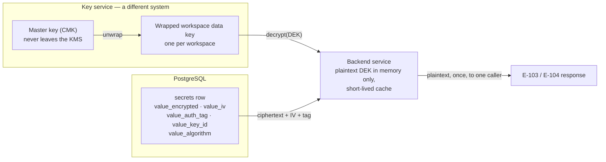
```mermaid
flowchart LR
  subgraph KMS["Key service — a different system"]
    CMK["Master key (CMK)<br/>never leaves the KMS"]
    WDEK["Wrapped workspace data key<br/>one per workspace"]
  end

  subgraph PG["PostgreSQL"]
    ROW["secrets row<br/>value_encrypted · value_iv<br/>value_auth_tag · value_key_id<br/>value_algorithm"]
  end

  APP["Backend service<br/>plaintext DEK in memory only,<br/>short-lived cache"]

  CMK -->|unwrap| WDEK
  WDEK -->|"decrypt(DEK)"| APP
  ROW -->|"ciphertext + IV + tag"| APP
  APP -->|"plaintext, once, to one caller"| REVEAL["E-103 / E-104 response"]
```

1. A **master key (CMK)** lives in the key service and never leaves it. The backend can ask
   the KMS to wrap and unwrap, and nothing else.
2. Each workspace has one **data encryption key (DEK)**, 256 bits, generated the first time
   that workspace stores a secret. The DEK is stored **wrapped by the CMK**, in the key
   service — never in PostgreSQL.
3. Values are encrypted with the workspace DEK using **AES-256-GCM**.
4. The backend holds an unwrapped DEK in memory only, behind a short TTL cache, and never
   writes it to disk, to Redis, or to a log.

Per workspace rather than per document, per canon OQ-65: a secret document is created and
purged by ordinary users, and tying key material to an object with that lifecycle turns
every node delete into a key-management event. Per workspace matches the tenancy boundary
that `secret_documents.workspace_id` already carries, and keeps the unwrap count to one per
tenant per cache window.

#### What is stored beside the ciphertext

| Column | Holds | Why it is in the row |
| --- | --- | --- |
| `value_encrypted` | AES-256-GCM ciphertext | — |
| `value_iv` | the 96-bit nonce | GCM requires a unique nonce per encryption **under the same key**; reuse is a total break. It is generated fresh for every write, including a value that happens to be unchanged, and it is per-row so no two rows can collide. |
| `value_auth_tag` | the 128-bit GCM tag | Makes tampering with a ciphertext in the database detectable rather than silently decryptable into garbage. |
| `value_key_id` | which DEK generation encrypted this row | Lets generations coexist. A key rotation re-encrypts rows in the background; until it finishes, some rows carry the old id and some the new, and decryption picks by this column instead of guessing. |
| `value_algorithm` | `AES-256-GCM` | An algorithm migration becomes incremental and auditable instead of a flag day, and a row encrypted under an algorithm the service no longer accepts fails loudly. |

**Additional authenticated data (AAD).** Every encryption binds the ciphertext to its
location: `workspace_id ‖ node_id ‖ secrets.id ‖ key`. A ciphertext copied from one row into
another — by a bad migration, a restore of the wrong dump, or somebody with SQL access —
fails authentication instead of decrypting into a valid-looking credential under a different
name.

#### The rule the whole design rests on

**The key never lives in the same store as the data.** The wrapped DEK is in the key
service; the ciphertext is in PostgreSQL. A PostgreSQL backup, a replica, a stolen volume
snapshot or a `pg_dump` in a support ticket contains **only ciphertext, IVs, tags and key
ids**, and none of it decrypts to anything. Concretely:

- No table has a column holding a DEK, wrapped or otherwise. `value_key_id` is a
  reference, not key material.
- Redis is a cache and a pub/sub bus and holds no key material and no plaintext.
- Object storage holds no secret values; a secret document has no bytes to store.
- Backups of PostgreSQL and backups of the key service have separate access controls; a
  single credential must not be able to restore both.

#### What must never happen, stated so a reviewer can check it

1. **No plaintext at rest, anywhere.** Not in `secrets`, not in `secret_rotations`, not in
   `secret_access_events`, not in `audit_events`, not in `document_versions`, not in a
   temp table, not in a queue. `secret_rotations` and `secret_access_events` have no value
   column **by design**, and adding one is a schema change that must be refused.
2. **No plaintext in logs.** Not in request logs, not in error messages, not in a stack
   trace, not in an APM span. `RevealSecretResponse` is the only carrier and it is not
   logged.
3. **No plaintext in a version snapshot.** A secret's history is `secret_rotations`,
   `hasSnapshot: false`, and that is the reason: "the client never holds the plaintext to
   snapshot — the masks it does hold would diff as identical and say nothing true"
   (`src/lib/versions.ts:45-49`).
4. **No plaintext on a read path.** E-101 returns masks; only E-103 and E-104 decrypt, both
   behind `secret.reveal`, both audited before returning, both rate-limited.
5. **No plaintext round-trip through the client.** An omitted `value` on E-102 carries the
   stored ciphertext forward; it is never decrypted to be re-encrypted.
6. **The mask is a constant.** Twelve bullets, never derived from the real length.
7. **A decryption failure is a 500 `INTERNAL_ERROR`**, never a `not_found` and never a
   plausible-looking wrong value. A GCM tag mismatch means the row or the key is wrong, and
   that is a fault, not an answer.

#### Rotation

- **DEK rotation** — generate a new DEK generation, wrap it, then re-encrypt rows in the
  background in batches, writing `value_key_id`, `value_iv`, `value_auth_tag` and
  `value_encrypted` together. It is invisible to the API and writes **no**
  `secret_rotations` rows: the credential did not change, only its wrapping.
- **CMK rotation** — re-wrap the DEKs in the key service. Nothing in PostgreSQL changes.
- **Credential rotation** — that is E-102, and it is the only one of the three that is a
  business event, an audit row and a `secret_rotations` entry.

#### Client-side handling the backend must not undermine

Grounded in `src/hooks/use-secret-document.ts`: a revealed value lives in component state
only — never `localStorage`, `sessionStorage`, a cache, a URL or a log (`:48-55`) — auto-hides
after `AUTO_HIDE_MS = 30_000` (`:12`), and every timer is cleared and every value dropped on
unmount (`:87-95`). Applying a saved document forgets every revealed value, because a save
can rename or replace any of them (`:170-178`). The backend supports this by returning the
plaintext **once**, in a response body, with `Cache-Control: no-store`, and by never
providing a bulk read that would let a client populate a page with values (E-104 returns a
clipboard blob, not a per-secret map — and the frontend never puts its result into
`revealed`, so the screen stays masked throughout, `src/hooks/use-secret-document.ts:158-198`).

---

### Table: `document_asset_refs`

**Purpose** — the projection of every image and attachment block onto the assets it
references, so "is this file still used by anything?" is one indexed query rather than a
scan over every document's JSONB. It is one of the four typed reference tables canon §1.3.4
chose instead of a polymorphic owner pair, and it is the only one that belongs to the
`documents` chapter.

**Who creates a record** — E-092 `PUT /nodes/{nodeId}/document`, which rewrites this node's
rows in the same transaction as the block write. E-027 (duplicate) writes the copy's rows.
Never written directly; there is no endpoint for it.

**Lifetime** — exactly as long as the block that references the asset. Rows are hard-deleted
and re-inserted as part of each save; the table has no independent lifecycle and no
timestamps beyond `created_at`.

**Columns**

| Column | PostgreSQL Type | Nullable | Default | Unique | Description |
| ------ | --------------- | -------- | ------- | ------ | ----------- |
| `id` | `UUID` | no | `gen_random_uuid()` | PK | — |
| `node_id` | `UUID` | no | — | with the two below | The document node whose blocks hold the reference. Keyed on the node rather than `documents.id` so the row survives a document row being replaced by a duplicate-and-swap. |
| `block_id` | `TEXT` | no | — | with the two others | The block's own id — client-minted, opaque, unique within the document only. `TEXT`, not `UUID`: real values are `blk_3`, `blk_<nodeId>_1`, `pin_1`. |
| `asset_id` | `UUID` | no | — | with the two others | The referenced `file_assets` row. |
| `created_at` | `TIMESTAMPTZ` | no | `now()` | no | When this reference first appeared. |

An `image` block is a gallery, so one `(node_id, block_id)` pair legitimately produces
several rows — one per `DocumentImage` with a non-null `assetId`. An `attachment` block
produces at most one.

**Primary Key** — `id`.

**Foreign Keys**

| Column | References | ON DELETE | Why that behaviour |
| --- | --- | --- | --- |
| `node_id` | `nodes(id)` | `CASCADE` | The reference cannot outlive the page holding it. Fires on purge only, as with the content tables. |
| `asset_id` | `file_assets(id)` | `RESTRICT` | This is the point of the table. An asset a document block still references must not be deletable out from under it; the delete path must consult this table, find the reference and refuse — or the block renders "no longer available" and nobody knows why. |

**Unique Constraints** — `UNIQUE (node_id, block_id, asset_id)`. The same asset may appear
in two different blocks of the same page (two rows), and the same block may hold two assets
(two rows), but a given pairing appears once.

**Indexes**

| Index | Query it serves |
| --- | --- |
| `document_asset_refs_pkey (id)` | — |
| `UNIQUE (node_id, block_id, asset_id)` | The rewrite on E-092: diff the desired set against the stored set for this node. |
| `(asset_id)` | "Is anything still pointing at this asset?" — the `file.delete` guard, orphan collection and the `workspaces.used_bytes` reconciliation. This is the index the table exists for. |

**Check Constraints** — `btrim(block_id) <> ''`.

**Relationships** — N–1 to `nodes`, N–1 to `file_assets`. Together with `file_nodes`,
`cell_attachments` and `comment_attachments` it forms the N–N relation between assets and
the places they are used, split into four typed tables so every one of them can carry a real
foreign key (§1.3.4).

**APIs that use it**

| # | Endpoint | Permission | Transaction | Frontend caller | Errors |
| --- | --- | --- | --- | --- | --- |
| E-092 | `PUT /nodes/{nodeId}/document` | `document.update` | rewritten in the save transaction | `documentService.save` | — |
| E-091 | `GET /nodes/{nodeId}/document` | visibility | read-only join to `file_assets`, minting a short-lived signed `url` per `DocumentImage` and resolving `name`/`sizeBytes`/`mimeType` per `AttachmentBlock` (OQ-75) | `documentService.get` | — |
| E-117 | `GET /assets/{assetId}/url` | visibility on any owner | read-only; this table is one of the four places checked to establish "any owner" | `image-block.tsx`, `attachment-block.tsx` | `ASSET_NOT_FOUND` |
| files-module deletes | — | `file.delete` | consults `(asset_id)` before removing an object | — | — |

**OPEN QUESTION (OQ-72)** — what happens to a document block when its drive file is deleted?
**Evidence** — nothing links them in the frontend. Trashing the `FileNode` removes it from
the tree and the block keeps its `assetId`, rendering "This attachment has no stored file"
or "No longer available in this session"
(`src/components/document/blocks/attachment-block.tsx:46-56`;
`src/components/document/blocks/image-block.tsx:96-102`). There is no reference count and no
warning on delete.
**Recommendation** — keep the `file_assets` row alive independently of the `file_nodes` row:
trashing a drive file removes its place in the tree, not the object. `ON DELETE RESTRICT` on
`asset_id` above enforces that a hard purge cannot remove an object a block still points at;
the purge either refuses or detaches the block first, and the two must not be left to race.
Return an "asset unavailable" marker the block can render, which the frontend already has UI
for.
**Impact if wrong** — either documents silently lose their images whenever somebody tidies
the drive, or the object store grows forever with orphans nobody can find and
`StorageQuota.usedBytes` drifts away from the truth.

**Note on the other file tables.** `file_assets` (T-27), `file_nodes` (T-28),
`cell_attachments` (T-29), `comment_attachments` (T-30) and `uploads` (T-32) are the `files`
module's, documented with that module. This chapter only needs to know that `file_assets.id`
is the target of `asset_id`, and that `file_assets.size_bytes` is the single source for the
workspace quota counter (§1.3.4).

---

### Not a table: `files`

Canon **did** separate the stored object from the places it is referenced (§1.3.4), and the
consequence is that **there is no table called `files`**. A polymorphic
`(owner_kind, owner_id)` pair cannot carry a foreign key, and every operation that matters
here — cascade on row delete, cascade on comment delete, quota accounting, orphan collection
— is exactly a foreign-key question. So: one `file_assets` table for the bytes' metadata,
and four typed reference tables for where they are used. This chapter documents
`document_asset_refs`, the reference table a page owns. No chapter may introduce a `files`
table.

### Not a table: `import_sessions`

**Canon decided no.** There is no `import_sessions` table, and one must not be added.

**Evidence — the wizard parses the spreadsheet entirely client-side.**
`useImportWizard` reads the file in the browser: `.xlsx` through `parseXlsx`
(`src/lib/xlsx.ts` — a dependency-free single-sheet reader), `.csv` / `.tsv` through
`parseDelimited` (`src/lib/csv.ts`), and only `.xlsx`, `.csv` and `.tsv` are accepted
(`src/hooks/use-import-wizard.ts:74, 131-141`). The parsed `Grid` lives in component state
(`:82`), `ImportSource` and `ImportPlan` are both `useMemo` derivations over it
(`:100-116`), and `reset()` drops all of it (`:118-129`). Nothing is uploaded and nothing is
persisted before Confirm: "everything before 'confirm' is a computation over the parsed
file: the board is not touched until the user has seen exactly which rows would fail and
chosen what should happen to them" (`:36-47`).

**What this means for the API.** Do not invent server-side spreadsheet parsing. The two
import endpoints both take **already-parsed** structures:

- **E-084 `POST /boards/{boardId}/import/plan`** takes `ImportSource` + `ColumnMapping[]`
  and returns an `ImportPlan`. Canon is explicit that the plan is "computed before anything
  is written; not persisted" — so it has no row and no id, and there is no session to
  resume. A wizard closed halfway is a wizard that starts again, which is what the frontend
  already does.
- **E-085 `POST /boards/{boardId}/import`** is **one transaction**: column creation, column
  removal and row inserts all land or none do. The two-stage client sequence — create
  columns, swap the provisional ids into the drafts, then write rows
  (`src/hooks/use-import-wizard.ts:42-47`) — collapses into that single call server-side.

**What does get a row** is `import_jobs` (T-38, module `system`): the record of a committed
run — board, actor, counts, issues, policy — so a partial import is diagnosable afterwards.
That table belongs to the `system` chapter, not this one.

**Constants the import path shares with `GET /config`** (E-139):
`IMPORT_MAX_ROWS = 5_000`, `IMPORT_ISSUE_LIMIT = 50`, `IMPORT_PREVIEW_ROWS = 8`
(`src/config/app.ts:44-51`). The row ceiling is enforced server-side with
`IMPORT_ROW_LIMIT_EXCEEDED` (400); the client's truncation is a courtesy, not the control.

---

#### Chapter notes — divergences, decisions and traps

Places where I followed canon against my own reading, or where canon's registry line and
canon's decision disagree and I had to pick one. Every one of these is a canon edit, not a
chapter edit.

1. **Three table names in my brief are not canon's.** My assignment named
   `config_document_versions`, `secret_entries` and `secret_entry_versions`. Canon T-21,
   T-23 and T-24 name them **`config_versions`**, **`secrets`** and **`secret_rotations`**.
   I used canon's names throughout. If canon is amended, three headings and roughly a dozen
   cross-references change.

2. **`node_id` as a primary key contradicts C-01.** C-01 says "Primary keys are
   `UUID PRIMARY KEY DEFAULT gen_random_uuid()`. No exceptions." T-20 and T-22 say
   `config_documents.node_id` and `secret_documents.node_id` **are** the primary key, which
   matches the frontend (`ConfigDocument` and `SecretDocument` carry no id of their own,
   unlike `WorkspaceDocument`). I followed the specific registry line: the PK is still a
   UUID, it just has no default because it is also a foreign key. C-01 should be reworded to
   "UUID primary keys; a 1:1 side table may use its owner's id as its PK."

3. **T-18 lists `title` on `documents`, and T-22 lists `name` on `secret_documents`, but
   OQ-30's position says the node owns the name.** They cannot both be right without
   duplicating a mutable field in two tables. I followed OQ-30 and projected the name from
   `nodes.name`, which is also what the frontend does explicitly for config and secret
   documents (`src/services/devtools-service.ts:100-118, 288-299`). `document_versions.title`
   stays a real column, because a version snapshot must hold the title as it stood.

4. **`config_versions` does need `UNIQUE (node_id, version)`.** The documents fact sheet
   (`spec/audit/documents.md`, §2.6) says it must not have one because a folded autosave
   reuses the version number. That is a misreading: the fold **rewrites the head row**, same
   `id` and same `version` (`src/services/devtools-service.ts:163, 176, 185`), so exactly one
   row per version number remains. Without the constraint a bug in the fold predicate
   silently produces two head versions and the history stops being a sequence.

5. **`isAutosave` is missing from `SaveDocumentRequest`.** Canon §5.4 defines it as
   "wraps `DocumentDraft` + `expectedVersion?`", but canon's own OQ-59 position — "fold
   consecutive autosaves by the same author" — is not implementable for pages without the
   flag, because the server cannot tell a debounce from a ⌘S. §5.4 should read
   "`DocumentDraft` + `expectedVersion?` + `isAutosave?`", matching `SaveConfigRequest`.

6. **`SecretAuditEntry` needs `outcome`.** Canon §5.2 lists it as an existing domain
   interface that must not be re-scoped, but as declared it cannot represent a denied
   access, which the frontend fakes by appending `" (denied)"` to the IP string. I
   documented the additive field under OQ-68 rather than reproducing the fake IP. If canon
   would rather freeze the interface, the API has to keep emitting a malformed address, and
   that should be written down as a deliberate choice.

7. **`secret_rotations.change_kind` is a new internal enumeration.** Canon §2 registers 68
   enums and forbids inventing a 69th. I kept `change_kind` as a `CHECK`-constrained `TEXT`
   column that never crosses the wire — the wire carries the rendered `summary` — precisely
   so it is not a wire enum. If canon would prefer it registered, the four values are
   `added`, `renamed`, `rotated`, `removed`.

8. **`environments` (T-26) is not documented here.** Two of my tables carry a `RESTRICT`
   foreign key into it and one open question (OQ-63) turns on a column it does not yet have.
   It belongs to whoever owns the rest of the `devtools` reference data; if nobody has it,
   it is homeless and should be assigned.

9. **Canon has no realtime frame for document, config or secret writes.** §7's RT-11
   `node.changed` covers `created | renamed | moved | archived | trashed | restored` and a
   content save is none of those, so I recorded "no frame" honestly against OQ-99 rather than
   inventing an RT-13. A second tab editing the same page converges on its next read, which
   is worth stating in §7 rather than leaving as an absence.

---

## 5. Entity Relationships

### 5.0 Reading these diagrams

Five diagrams, because one would be unreadable. Every table appears in exactly one diagram as a
**defining** entity with its columns; tables it references across a diagram boundary are drawn as
stubs with only the columns needed to show the join. **39 tables, all five diagrams together.**

Conventions:

- Names are canon's (§1.1). Column names are `snake_case`; the API converts to `camelCase` at the
  boundary.
- Types are the Postgres types. `<enum_name>` means a native Postgres `ENUM` — see §6.
- `PK` primary key · `FK` foreign key · `UK` participates in a unique constraint or partial unique
  index.
- **C-01 holds everywhere**: primary keys are UUID. Where canon names a natural key
  (`(workspace_id, user_id)`, `(user_id, node_id)`), that key is a **UNIQUE constraint**, and the
  PK is a surrogate `id UUID`. The five 1:1 content side tables are the deliberate exception canon
  makes: their PK **is** `node_id`, which is itself a UUID.
- Cardinality is real, not decorative. `||--o{` is one-to-zero-or-many; `||--||` is a true 1:1;
  `}o--||` reads right-to-left as many-to-one.

---

### 5.1 Core Workspace ERD

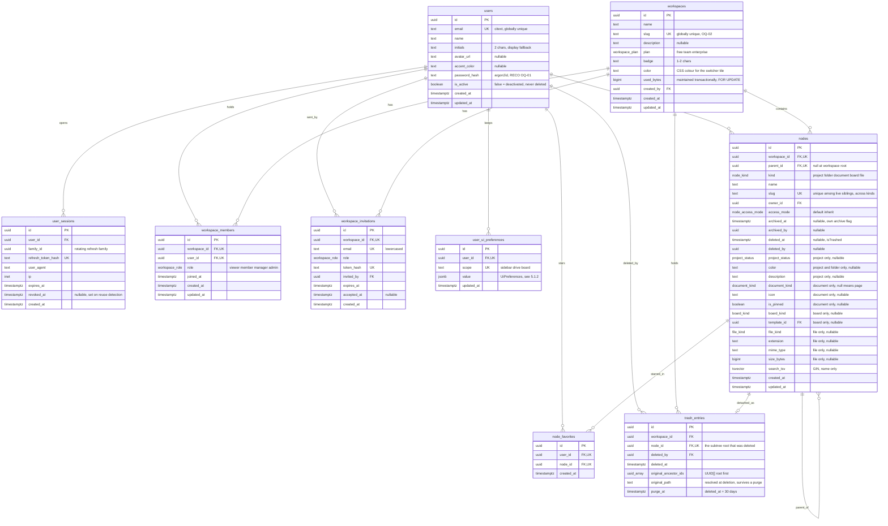
```mermaid
erDiagram
    users ||--o{ user_sessions : "opens"
    users ||--o{ workspace_members : "holds"
    users ||--o{ workspace_invitations : "sent_by"
    users ||--o{ node_favorites : "stars"
    users ||--o{ user_ui_preferences : "keeps"
    users ||--o{ nodes : "owns"
    users ||--o{ trash_entries : "deleted_by"

    workspaces ||--o{ workspace_members : "has"
    workspaces ||--o{ workspace_invitations : "has"
    workspaces ||--o{ nodes : "contains"
    workspaces ||--o{ trash_entries : "holds"

    nodes ||--o{ nodes : "parent_of"
    nodes ||--o{ node_favorites : "starred_in"
    nodes ||--o| trash_entries : "detached_as"

    users {
        uuid id PK
        text email UK "citext, globally unique"
        text name
        text initials "2 chars, display fallback"
        text avatar_url "nullable"
        text accent_color "nullable"
        text password_hash "argon2id, RECO OQ-01"
        boolean is_active "false = deactivated, never deleted"
        timestamptz created_at
        timestamptz updated_at
    }

    user_sessions {
        uuid id PK
        uuid user_id FK
        uuid family_id "rotating refresh family"
        text refresh_token_hash UK
        text user_agent
        inet ip
        timestamptz expires_at
        timestamptz revoked_at "nullable, set on reuse detection"
        timestamptz created_at
    }

    workspaces {
        uuid id PK
        text name
        text slug UK "globally unique, OQ-02"
        text description "nullable"
        workspace_plan plan "free team enterprise"
        text badge "1-2 chars"
        text color "CSS colour for the switcher tile"
        bigint used_bytes "maintained transactionally, FOR UPDATE"
        uuid created_by FK
        timestamptz created_at
        timestamptz updated_at
    }

    workspace_members {
        uuid id PK
        uuid workspace_id FK,UK
        uuid user_id FK,UK
        workspace_role role "viewer member manager admin"
        timestamptz joined_at
        timestamptz created_at
        timestamptz updated_at
    }

    workspace_invitations {
        uuid id PK
        uuid workspace_id FK,UK
        text email UK "lowercased"
        workspace_role role
        text token_hash UK
        uuid invited_by FK
        timestamptz expires_at
        timestamptz accepted_at "nullable"
        timestamptz created_at
    }

    nodes {
        uuid id PK
        uuid workspace_id FK,UK
        uuid parent_id FK,UK "null at workspace root"
        node_kind kind "project folder document board file"
        text name
        text slug UK "unique among live siblings, across kinds"
        uuid owner_id FK
        node_access_mode access_mode "default inherit"
        timestamptz archived_at "nullable, own archive flag"
        uuid archived_by "nullable"
        timestamptz deleted_at "nullable, isTrashed"
        uuid deleted_by "nullable"
        project_status project_status "project only, nullable"
        text color "project and folder only, nullable"
        text description "project only, nullable"
        document_kind document_kind "document only, null means page"
        text icon "document only, nullable"
        boolean is_pinned "document only, nullable"
        board_kind board_kind "board only, nullable"
        uuid template_id FK "board only, nullable"
        file_kind file_kind "file only, nullable"
        text extension "file only, nullable"
        text mime_type "file only, nullable"
        bigint size_bytes "file only, nullable"
        tsvector search_tsv "GIN, name only"
        timestamptz created_at
        timestamptz updated_at
    }

    node_favorites {
        uuid id PK
        uuid user_id FK,UK
        uuid node_id FK,UK
        timestamptz created_at
    }

    trash_entries {
        uuid id PK
        uuid workspace_id FK
        uuid node_id FK,UK "the subtree root that was deleted"
        uuid deleted_by FK
        timestamptz deleted_at
        uuid_array original_ancestor_ids "UUID[] root first"
        text original_path "resolved at deletion, survives a purge"
        timestamptz purge_at "deleted_at + 30 days"
    }

    user_ui_preferences {
        uuid id PK
        uuid user_id FK,UK
        text scope UK "sidebar drive board"
        jsonb value "UiPreferences, see 5.1.2"
        timestamptz updated_at
    }
```

#### 5.1.1 Keys, indexes and delete behaviour

| Table | Unique constraints | Indexes that matter | ON DELETE |
| --- | --- | --- | --- |
| `users` | `UNIQUE (email)` | — | never deleted; `is_active = false` |
| `user_sessions` | `UNIQUE (refresh_token_hash)` | `(user_id, expires_at)`; `(family_id)` for family revocation | `user_id` CASCADE |
| `workspaces` | `UNIQUE (slug)` | — | CASCADE to members, invitations, nodes |
| `workspace_members` | `UNIQUE (workspace_id, user_id)` | `(user_id)` for E-007 "workspaces I am in"; `(workspace_id, role)` partial `WHERE role = 'admin'` for the last-admin guard | `workspace_id` CASCADE; `user_id` CASCADE |
| `workspace_invitations` | `UNIQUE (token_hash)`; partial `UNIQUE (workspace_id, lower(email)) WHERE accepted_at IS NULL` | `(expires_at)` for the reaper | `workspace_id` CASCADE |
| `nodes` | partial `UNIQUE (workspace_id, COALESCE(parent_id, uuid_nil), slug) WHERE deleted_at IS NULL` | `(workspace_id, parent_id)` for children; `(workspace_id, kind)`; `(workspace_id, archived_at)` partial `WHERE archived_at IS NOT NULL`; `(workspace_id, deleted_at)` partial for trash; GIN on `search_tsv` | `parent_id` **RESTRICT** — the subtree is detached by the delete transaction, never by the database |
| `node_favorites` | `UNIQUE (user_id, node_id)` | `(user_id)` for E-033 | both CASCADE |
| `trash_entries` | `UNIQUE (node_id)` | `(workspace_id, deleted_at DESC)`; `(purge_at)` for the nightly sweep | `node_id` CASCADE — purging the node purges its entry |
| `user_ui_preferences` | `UNIQUE (user_id, scope)` | — | `user_id` CASCADE |

#### 5.1.2 The one JSONB column here

```ts
/** user_ui_preferences.value, discriminated by the `scope` column. RECOMMENDATION (OQ-98). */
type UiPreferences =
  | { readonly scope: "sidebar"; readonly isCollapsed: boolean }
  | { readonly scope: "drive"; readonly mode: ViewMode; readonly sortKey: SortKey; readonly sortDirection: SortDirection }
  | { readonly scope: "board"; readonly lastViewIdByBoardId: Readonly<Record<string, string>> };
```

`ViewMode`, `SortKey` and `SortDirection` are §6.7. The `scope` column and the discriminant inside
the JSON carry the same value; the column is what the unique index is on.

#### 5.1.3 What is easy to get wrong here

**`nodes.parent_id` is `ON DELETE RESTRICT`, not `CASCADE`.** This looks backwards and is
deliberate. Deleting a node is a *soft* delete that detaches the whole subtree by setting
`deleted_at` on every descendant in one transaction (N-7) and writing exactly **one**
`trash_entries` row for the subtree root. If `parent_id` cascaded, the permanent delete of a folder
would silently take an already-trashed child with it — which is precisely the case
`src/types/system.ts:164-169` says must not happen, because that child is the one restore has to
find a new home for.

**The slug uniqueness index must be partial and must span kinds.** `WHERE deleted_at IS NULL` is
what lets a restore succeed after a sibling with the same slug was created in the meantime
(N-2). Omitting `COALESCE(parent_id, uuid_nil)` breaks root-level uniqueness, because `NULL` is not
equal to `NULL` in a unique index. And the index must **not** include `kind`: a folder and a board
called "Payments" collide, because `resolvePath` walks segments without knowing what it will find.

**`workspace_members` is a join row with state.** It is tempting to make `(workspace_id, user_id)`
the composite PK. C-01 forbids it, and there is a practical reason too: `audit_events` and
`access_rules` reference roles and members, and a surrogate `id` gives every one of them a single FK
target. The natural key survives as the unique constraint, which is what the "at most one membership"
invariant actually needs.

**The per-kind columns on `nodes` are nullable and unenforced by the ERD.** The diagram cannot show
"`project_status` is NOT NULL when `kind = 'project'`". That is a `CHECK` constraint per kind, and
the schema chapter owns it. Reading the diagram as "every node has a `board_kind`" is the mistake.

**`trash_entries.original_path` is resolved at deletion and frozen.** `Development / Backend` is a
string computed when the delete ran, precisely so it *"survives a purge"*
(`src/types/system.ts:178-179`). Do not join it live. `original_ancestor_ids` is the ordered array
restore walks, root-first, for the deepest surviving container (N-9).

---

### 5.2 Board ERD

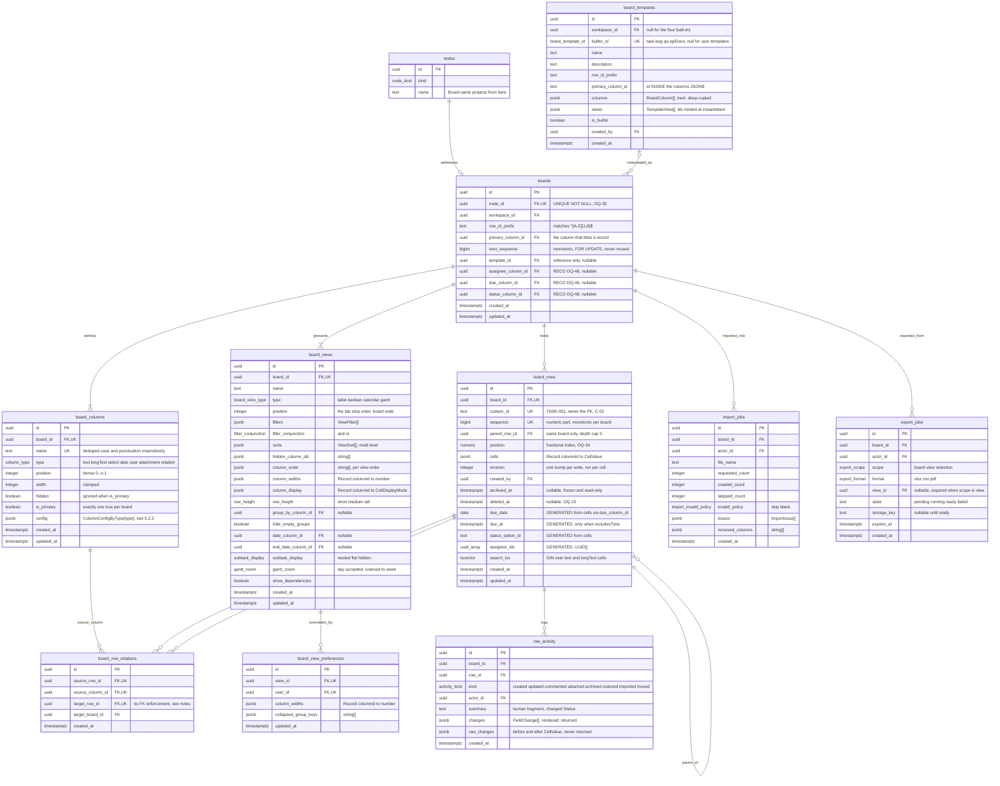
```mermaid
erDiagram
    nodes ||--o| boards : "addresses"
    board_templates |o--o{ boards : "instantiated_as"

    boards ||--|{ board_columns : "defines"
    boards ||--o{ board_rows : "holds"
    boards ||--|{ board_views : "presents"
    boards ||--o{ import_jobs : "imported_into"
    boards ||--o{ export_jobs : "exported_from"

    board_columns ||--o{ board_row_relations : "source_column"
    board_views ||--o{ board_view_preferences : "overridden_by"

    board_rows ||--o{ board_rows : "parent_of"
    board_rows ||--o{ row_activity : "logs"
    board_rows ||--o{ board_row_relations : "points_from"
    board_rows ||--o{ board_row_relations : "pointed_at_by"

    nodes {
        uuid id PK
        node_kind kind
        text name "Board.name projects from here"
    }

    board_templates {
        uuid id PK
        uuid workspace_id FK "null for the four built-ins"
        board_template_id builtin_id UK "task bug qa apiDocs, null for user templates"
        text name
        text description
        text row_id_prefix
        text primary_column_id "id INSIDE the columns JSONB"
        jsonb columns "BoardColumn[], inert, deep-copied"
        jsonb views "TemplateView[], ids minted at instantiation"
        boolean is_builtin
        uuid created_by FK
        timestamptz created_at
    }

    boards {
        uuid id PK
        uuid node_id FK,UK "UNIQUE NOT NULL, OQ-30"
        uuid workspace_id FK
        text row_id_prefix "matches ^[A-Z]{1,6}$"
        uuid primary_column_id FK "the column that titles a record"
        bigint next_sequence "monotonic, FOR UPDATE, never reused"
        uuid template_id FK "reference only, nullable"
        uuid assignee_column_id FK "RECO OQ-48, nullable"
        uuid due_column_id FK "RECO OQ-48, nullable"
        uuid status_column_id FK "RECO OQ-48, nullable"
        timestamptz created_at
        timestamptz updated_at
    }

    board_columns {
        uuid id PK
        uuid board_id FK,UK
        text name UK "deduped case and punctuation insensitively"
        column_type type "text longText select date user attachment relation"
        integer position "dense 0..n-1"
        integer width "clamped"
        boolean hidden "ignored when is_primary"
        boolean is_primary "exactly one true per board"
        jsonb config "ColumnConfigByType[type], see 5.2.2"
        timestamptz created_at
        timestamptz updated_at
    }

    board_rows {
        uuid id PK
        uuid board_id FK,UK
        text custom_id UK "TASK-001, never the PK, C-02"
        bigint sequence UK "numeric part, monotonic per board"
        uuid parent_row_id FK "same board only, depth cap 5"
        numeric position "fractional index, OQ-34"
        jsonb cells "Record columnId to CellValue"
        integer revision "one bump per write, not per cell"
        uuid created_by FK
        timestamptz archived_at "nullable, frozen and read-only"
        timestamptz deleted_at "nullable, OQ-15"
        date due_date "GENERATED from cells via due_column_id"
        timestamptz due_at "GENERATED, only when includesTime"
        text status_option_id "GENERATED from cells"
        uuid_array assignee_ids "GENERATED, UUID[]"
        tsvector search_tsv "GIN over text and longText cells"
        timestamptz created_at
        timestamptz updated_at
    }

    board_row_relations {
        uuid id PK
        uuid source_row_id FK,UK
        uuid source_column_id FK,UK
        uuid target_row_id FK,UK "no FK enforcement, see notes"
        uuid target_board_id FK
        timestamptz created_at
    }

    row_activity {
        uuid id PK
        uuid board_id FK
        uuid row_id FK
        activity_kind kind "created updated commented attached archived restored imported moved"
        uuid actor_id FK
        text summary "human fragment, changed Status"
        jsonb changes "FieldChange[], rendered, returned"
        jsonb raw_changes "before and after CellValue, never returned"
        timestamptz created_at
    }

    board_views {
        uuid id PK
        uuid board_id FK,UK
        text name
        board_view_type type "table kanban calendar gantt"
        integer position "the tab strip order, board wide"
        jsonb filters "ViewFilter[]"
        filter_conjunction filter_conjunction "and or"
        jsonb sorts "ViewSort[], multi level"
        jsonb hidden_column_ids "string[]"
        jsonb column_order "string[], per view order"
        jsonb column_widths "Record columnId to number"
        jsonb column_display "Record columnId to CellDisplayMode"
        row_height row_height "short medium tall"
        uuid group_by_column_id FK "nullable"
        boolean hide_empty_groups
        uuid date_column_id FK "nullable"
        uuid end_date_column_id FK "nullable"
        subtask_display subtask_display "nested flat hidden"
        gantt_zoom gantt_zoom "day accepted, coerced to week"
        boolean show_dependencies
        timestamptz created_at
        timestamptz updated_at
    }

    board_view_preferences {
        uuid id PK
        uuid view_id FK,UK
        uuid user_id FK,UK
        jsonb column_widths "Record columnId to number"
        jsonb collapsed_group_keys "string[]"
        timestamptz updated_at
    }

    import_jobs {
        uuid id PK
        uuid board_id FK
        uuid actor_id FK
        text file_name
        integer requested_count
        integer created_count
        integer skipped_count
        import_invalid_policy invalid_policy "skip blank"
        jsonb issues "ImportIssue[]"
        jsonb removed_columns "string[]"
        timestamptz created_at
    }

    export_jobs {
        uuid id PK
        uuid board_id FK
        uuid actor_id FK
        export_scope scope "board view selection"
        export_format format "xlsx csv pdf"
        uuid view_id FK "nullable, required when scope is view"
        text state "pending running ready failed"
        text storage_key "nullable until ready"
        timestamptz expires_at
        timestamptz created_at
    }
```

#### 5.2.1 Keys, indexes and delete behaviour

| Table | Unique constraints | Indexes that matter | ON DELETE |
| --- | --- | --- | --- |
| `boards` | `UNIQUE (node_id)` | `(workspace_id)` | `node_id` CASCADE |
| `board_columns` | `UNIQUE (board_id, id)`; app-level name dedupe (B-8), **not** a DB unique | `(board_id, position)` | `board_id` CASCADE |
| `board_rows` | `UNIQUE (board_id, custom_id)`; `UNIQUE (board_id, sequence)` | `(board_id, position, id)` — **the pagination key** (canon §6.3); `(board_id, parent_row_id)`; `(board_id, due_date)` partial `WHERE archived_at IS NULL`; GIN `(assignee_ids)`; `(board_id, status_option_id)`; GIN `jsonb_path_ops (cells)`; GIN `(search_tsv)` | `board_id` CASCADE; `parent_row_id` **SET NULL** — this is B-17, children lift to top level |
| `board_row_relations` | `UNIQUE (source_row_id, source_column_id, target_row_id)` | `(target_row_id)` — **this is the backlink query**; `(target_board_id)` | `source_row_id` CASCADE; `source_column_id` CASCADE; `target_row_id` **no FK** — see notes |
| `row_activity` | — | `(row_id, created_at DESC, id DESC)` — the pagination key | `row_id` CASCADE |
| `board_views` | `UNIQUE (board_id, position)` deferrable | `(board_id, position)` | `board_id` CASCADE; `group_by_column_id` / `date_column_id` / `end_date_column_id` **SET NULL** — mirrors `pruneView` |
| `board_view_preferences` | `UNIQUE (view_id, user_id)` | — | both CASCADE |
| `board_templates` | `UNIQUE (builtin_id)`; `UNIQUE (workspace_id, name)` for user templates | `(workspace_id)` | `workspace_id` CASCADE; built-ins have `workspace_id IS NULL` and are never deleted (E-090 refuses) |
| `import_jobs`, `export_jobs` | — | `(board_id, created_at DESC)`; `export_jobs (expires_at)` for the reaper | `board_id` CASCADE |

#### 5.2.2 `board_columns.config` — the seven JSONB branches

Discriminated by the sibling `type` column. `COLUMN_TYPE_CONFIG_MISMATCH`, `400`, when the branch
does not match. Verbatim from `src/types/board.ts:99-170`.

```ts
interface TextConfig { readonly placeholder?: string }                       // OQ-54: declared, never used

interface StepNumbering {
  readonly enabled: boolean;
  readonly prefix: string;      // "B", "T", "Step " — may be empty
  readonly start: number;       // the number the first step takes
  readonly separator: string;   // ":" or "."
}
interface LongTextConfig { readonly rows: number; readonly stepNumbering?: StepNumbering }

type SelectColor = "gray" | "blue" | "green" | "amber" | "red" | "violet" | "cyan" | "pink";
interface SelectOption {
  readonly id: string;                              // "__empty__" is RESERVED, B-12
  readonly label: string;
  readonly color: SelectColor;
  readonly isDisabled?: boolean;                    // never selectable, whatever a record holds
  readonly availability?: ConditionGroup | null;    // null or absent means always offered
}
interface Condition {
  readonly id: string;
  readonly columnId: string;
  readonly operator: ConditionOperator;
  readonly value: string;                           // option id / user id / YYYY-MM-DD / free text
  readonly values?: readonly string[];              // set operators only
}
interface ConditionGroup {
  readonly id: string;
  readonly conjunction: "and" | "or";
  readonly conditions: readonly Condition[];
  readonly groups: readonly ConditionGroup[];       // nesting, bounded by OQ-38
}
interface TransitionRules {
  readonly enabled: boolean;
  readonly mode: "allow-list";                      // one member; left open for a deny-list
  readonly transitions: Readonly<Record<string, readonly string[]>>;  // optionId -> allowed targets
}
interface SelectConfig {
  readonly options: readonly SelectOption[];
  readonly isMulti: boolean;
  readonly unavailableBehavior?: "disabled" | "hidden";
  readonly completedOptionIds?: readonly string[];  // what "finished" means, OQ-49
  readonly transitionRules?: TransitionRules;
}

interface DateConfig { readonly includesTime: boolean }   // decides due_date vs due_at, C-04
interface UserConfig { readonly isMulti: boolean }
interface AttachmentConfig { readonly maxFiles: number }
interface RelationConfig {
  readonly boardId: string | null;         // target board — a *reference*, not an FK
  readonly displayColumnId: string | null; // which column labels each chip
  readonly isMulti: boolean;
}

interface ColumnConfigByType {
  readonly text: TextConfig;
  readonly longText: LongTextConfig;
  readonly select: SelectConfig;
  readonly date: DateConfig;
  readonly user: UserConfig;
  readonly attachment: AttachmentConfig;
  readonly relation: RelationConfig;
}
```

#### 5.2.3 `board_rows.cells` — the tagged union

```ts
/** board_rows.cells is Record<columnId, CellValue>. The tag is on the VALUE, not the column. */
type CellValue =
  | { readonly kind: "text";       readonly value: string }
  | { readonly kind: "longText";   readonly value: string }
  | { readonly kind: "select";     readonly optionIds: readonly string[]; readonly text?: string }
  | { readonly kind: "date";       readonly iso: string | null;           readonly text?: string }
  | { readonly kind: "user";       readonly userIds: readonly string[];   readonly text?: string }
  | { readonly kind: "attachment"; readonly attachments: readonly CellAttachment[]; readonly text?: string }
  | { readonly kind: "relation";   readonly rowIds: readonly string[];    readonly text?: string };
```

`src/types/board.ts:219-230`. The optional `text` on five branches is **the escape hatch a conversion
writes into** (B-3): the value the target type could not parse, kept rather than dropped. A backend
that strips it deletes user data.

`CellAttachment` persists **only `id`** (the `file_assets` id). `url` and `thumbnailUrl` are minted
per response as short-lived signed URLs and are **never accepted on write**
(`src/types/board.ts:206-207`; OQ-75).

#### 5.2.4 `board_views` JSONB shapes

```ts
interface ViewFilter { readonly id: string; readonly columnId: string; readonly operator: FilterOperator; readonly value: string }
interface ViewSort   { readonly columnId: string; readonly direction: "asc" | "desc" }
// hidden_column_ids : readonly string[]
// column_order      : readonly string[]                              — ids missing fall back to schema position
// column_widths     : Readonly<Record<string, number>>
// column_display    : Readonly<Record<string, CellDisplayMode>>      — a column missing from it is "compact"
```

`src/types/board.ts:301-371`. `board_view_preferences.column_widths` is the **same shape** and
overlays it per viewer; `collapsed_group_keys` is `readonly string[]` of group keys, with the
Kanban/table ungrouped bucket carrying the reserved key from `src/lib/board-grouping.ts`.

#### 5.2.5 What is easy to get wrong here

**`board_row_relations.target_row_id` carries no foreign key, on purpose.** A relation may point at
a row on a board the *writer* can see and the *reader* cannot, and — more importantly — deleting the
target must leave the id in place. The frontend renders a dangling id as `[Deleted Item]`; canon's
position on OQ-44/OQ-45 is explicit that *"dangling ids stay in the cell"*. An FK with `CASCADE`
would delete the projection row and an FK with `RESTRICT` would refuse the delete. Both are wrong.
The projection row is swept by the same transaction that deletes the target, or left dangling and
filtered on read — never enforced by the database.

**`board_row_relations` is an index, not the truth.** The truth is
`board_rows.cells[columnId].rowIds`. The projection exists so E-072 (backlinks) is `(target_row_id)`
index lookup rather than a scan of every `cells` document in the workspace. It must be rewritten in
the **same transaction** as the cell (canon T-13). If it drifts, backlinks lie and nothing else
notices.

**`boards` has no `name` column.** Canon §8.8's position on OQ-30 is that *"the node owns `name`,
`isPinned`, `isLocked`, `isArchived` and they are **projected**, not duplicated"*. `Board.name` on
the wire (`src/types/board.ts:419`) is `nodes.name`. Renaming a board is E-025 (`PATCH /nodes/{id}`),
not E-050. The registry line for T-10 lists `name`; the position in §8.8 is the one to follow, and
that divergence is recorded in the editor notes.

**`board_rows.parent_row_id` is `ON DELETE SET NULL`, and that is the invariant, not a fallback.**
B-17 requires children to be lifted to top level. `SET NULL` is exactly that behaviour, and E-065
must **return** the lifted children so the client reconciles — the database doing the right thing is
not enough if the response does not say so.

**The four generated columns are the only indexable path into `cells`.** `due_date` and `due_at` are
**two separate columns** chosen by `DateConfig.includesTime`; a date-only value is never widened into
an instant (C-04, OQ-32). A generated column cannot reference another table, which is exactly why
OQ-48 above proposes `boards.due_column_id` — without a designation stored *on the board*, these
columns cannot be written as `GENERATED ALWAYS`.

**`board_columns` name uniqueness is application-level, not a DB constraint.** Creation de-duplicates
silently to `Notes 2` (B-8), so a unique index would turn a silent, correct behaviour into a `409`.
`COLUMN_NAME_CONFLICT` exists only for the caller who *demanded* an exact name.

**`board_views.position` is the board's order, not the reader's.** E-082's contract is *"the order is
the board's, not the reader's"*. Per-viewer state lives in `board_view_preferences`, which
deliberately holds **widths and collapse state only** — filters and sorts stay shared, because they
are what a named view *is* (canon §8.8, OQ-46).

**`gantt_zoom` must accept `'day'`.** A saved view may still hold it. The API accepts it on write and
on read and coerces to `'week'`; it never rejects it. A Postgres enum that refuses `'day'` fails on
existing data (canon §2.6).

---

### 5.3 Collaboration ERD

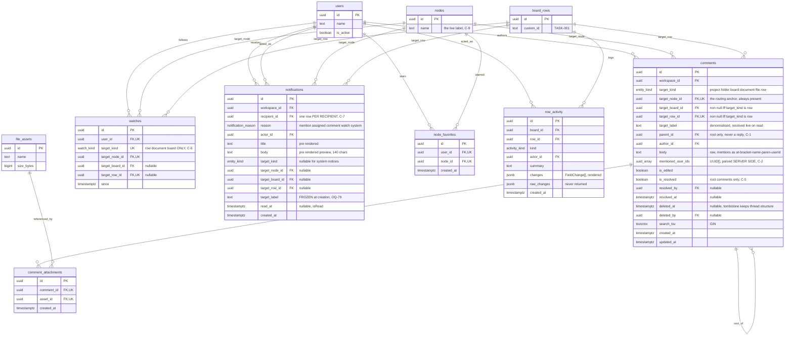
```mermaid
erDiagram
    users ||--o{ comments : "authors"
    users ||--o{ watches : "follows"
    users ||--o{ notifications : "receives"
    users ||--o{ notifications : "acted_as"
    users ||--o{ node_favorites : "stars"
    users ||--o{ row_activity : "acted_as"

    comments ||--o{ comments : "root_of"
    comments ||--o{ comment_attachments : "carries"
    file_assets ||--o{ comment_attachments : "referenced_by"

    nodes ||--o{ comments : "target_node"
    nodes ||--o{ watches : "target_node"
    nodes ||--o{ notifications : "target_node"
    nodes ||--o{ node_favorites : "starred"

    board_rows ||--o{ comments : "target_row"
    board_rows ||--o{ watches : "target_row"
    board_rows ||--o{ notifications : "target_row"
    board_rows ||--o{ row_activity : "logs"

    comments {
        uuid id PK
        uuid workspace_id FK
        entity_kind target_kind "project folder board document file row"
        uuid target_node_id FK,UK "the routing anchor, always present"
        uuid target_board_id FK "non null iff target_kind is row"
        uuid target_row_id FK,UK "non null iff target_kind is row"
        text target_label "denormalised, resolved live on read"
        uuid parent_id FK "root only, never a reply, C-1"
        uuid author_id FK
        text body "raw, mentions as at-bracket-name-paren-userid"
        uuid_array mentioned_user_ids "UUID[], parsed SERVER SIDE, C-2"
        boolean is_edited
        boolean is_resolved "root comments only, C-5"
        uuid resolved_by FK "nullable"
        timestamptz resolved_at "nullable"
        timestamptz deleted_at "nullable, tombstone keeps thread structure"
        uuid deleted_by FK "nullable"
        tsvector search_tsv "GIN"
        timestamptz created_at
        timestamptz updated_at
    }

    comment_attachments {
        uuid id PK
        uuid comment_id FK,UK
        uuid asset_id FK,UK
        timestamptz created_at
    }

    watches {
        uuid id PK
        uuid user_id FK,UK
        watch_kind target_kind UK "row document board ONLY, C-6"
        uuid target_node_id FK,UK
        uuid target_board_id FK "nullable"
        uuid target_row_id FK,UK "nullable"
        timestamptz since
    }

    notifications {
        uuid id PK
        uuid workspace_id FK
        uuid recipient_id FK "one row PER RECIPIENT, C-7"
        notification_reason reason "mention assigned comment watch system"
        uuid actor_id FK
        text title "pre rendered"
        text body "pre rendered preview, 140 chars"
        entity_kind target_kind "nullable for system notices"
        uuid target_node_id FK "nullable"
        uuid target_board_id FK "nullable"
        uuid target_row_id FK "nullable"
        text target_label "FROZEN at creation, OQ-79"
        timestamptz read_at "nullable, isRead"
        timestamptz created_at
    }

    node_favorites {
        uuid id PK
        uuid user_id FK,UK
        uuid node_id FK,UK
        timestamptz created_at
    }

    row_activity {
        uuid id PK
        uuid board_id FK
        uuid row_id FK
        activity_kind kind
        uuid actor_id FK
        text summary
        jsonb changes "FieldChange[], rendered"
        jsonb raw_changes "never returned"
        timestamptz created_at
    }

    file_assets {
        uuid id PK
        text name
        bigint size_bytes
    }

    nodes {
        uuid id PK
        text name "the live label, C-9"
    }

    board_rows {
        uuid id PK
        text custom_id "TASK-001"
    }

    users {
        uuid id PK
        text name
        boolean is_active
    }
```

#### 5.3.1 Keys, indexes and delete behaviour

| Table | Unique constraints | Indexes that matter | ON DELETE |
| --- | --- | --- | --- |
| `comments` | — | `(target_kind, target_node_id, target_row_id, created_at ASC, id ASC)` — **the thread pagination key, oldest first** (canon §6.3); `(parent_id, created_at)`; GIN `(mentioned_user_ids)` for the My Work `mentioned` widget; GIN `(search_tsv)` | `target_node_id` CASCADE; `target_row_id` CASCADE; `parent_id` **RESTRICT** — a root is tombstoned, never removed (C-4); `author_id` **RESTRICT** (users are never deleted, M-1) |
| `comment_attachments` | `UNIQUE (comment_id, asset_id)` | `(asset_id)` for orphan collection | `comment_id` CASCADE; `asset_id` RESTRICT |
| `watches` | `UNIQUE (user_id, target_kind, target_node_id, target_row_id)` | `(target_kind, target_node_id, target_row_id)` — **the fan-out query**; `(user_id)` for E-126 | all CASCADE *(OQ-87 — pruning on access loss is undecided)* |
| `notifications` | — | `(recipient_id, created_at DESC, id DESC)` — the inbox pagination key; `(recipient_id, reason, created_at DESC)` for `?reason=`; partial `(recipient_id) WHERE read_at IS NULL` for E-132 | `recipient_id` CASCADE; target FKs **SET NULL**, not CASCADE — see notes |
| `node_favorites` | `UNIQUE (user_id, node_id)` | `(user_id)` | both CASCADE |
| `row_activity` | — | `(row_id, created_at DESC, id DESC)` | `row_id` CASCADE |

#### 5.3.2 Tables that are deliberately absent from this diagram

| Not a table | Where it lives instead | Grounding |
| --- | --- | --- |
| `mentions` | `comments.mentioned_user_ids UUID[]`, GIN-indexed | `src/types/collab.ts:50` |
| `recent_entries` | `localStorage` under `nexdrop-recent`, capped at `RECENT_LIMIT = 10` | `src/store/recent-store.ts:9-18`; `src/config/app.ts:36` *(OQ-96)* |
| `comment_drafts` | `localStorage` under `nexdrop-comment-draft:<key>` | `src/hooks/use-comment-draft.ts:5-17` *(OQ-97)* |
| `notification_tabs` | a client-side projection of `reason` | `src/lib/notifications.ts:7-13` *(OQ-90)* |
| `comment_threads` | derived: roots first, replies by `parent_id` | `src/types/collab.ts:60-64` |

#### 5.3.3 What is easy to get wrong here

**`notifications` target FKs are `ON DELETE SET NULL`, while `comments` target FKs are `CASCADE`.**
These look inconsistent and are not. A comment on a deleted row has nothing to say and goes with it.
A notification is *"a historical statement"* — "Ana mentioned you in TASK-042" is still true after
TASK-042 is deleted, and `AppNotification.target` is explicitly nullable for exactly this
(`src/types/collab.ts:109-110`). The frontend already keeps items whose `target === null` and drops
items whose node is gone or no longer visible (`src/hooks/use-notifications.ts:58-64`). The backend
must apply that same visibility filter **server-side** before returning the page; relying on the
client to drop them is the leak.

**`notifications.target_label` is frozen; every other `*_label` is resolved live.** This is the one
exception canon §1.4 carves out, and it exists because a notification is a record of what was said
at a moment. Resolving it live would rewrite history when a record is renamed. Everywhere else —
`comments.target_label`, `EntityRef.label` in search and My Work — the label is re-resolved on read
and treated as **untrusted display text, never an authorisation input** (C-9).

**`watches.target_kind` is `watch_kind` (3 members), not `entity_kind` (6).** The type is narrower
on purpose: *"only these three can be watched — a file or folder has no activity stream"*
(`src/types/collab.ts:85-86`). E-127 refuses anything else with `WATCH_TARGET_UNSUPPORTED`, `400`.
Using `entity_kind` here would move a compile-time guarantee into a runtime check that someone will
forget.

**`comments.parent_id` is `RESTRICT`, not `CASCADE`, and this is what makes tombstones work.** C-4
requires a deleted root to survive so its replies do not orphan. If `parent_id` cascaded, a hard
delete of a root would silently take the thread; with `RESTRICT` the only legal operation is setting
`deleted_at`, which is what E-122 does. The response is a **tombstone `Comment`**, not `204`.

**The decomposed target is not optional.** Storing `target_key` as a single text column would make
every one of these indexes a `LIKE`, and would make `ON DELETE CASCADE` impossible. A `CHECK`
enforces the shape: `target_kind = 'row'` implies both `target_board_id` and `target_row_id` are
non-null; any other kind implies both are null. `targetKey` is *serialised* on the way out, exactly
as `refKey` builds it (`src/lib/entity-ref.ts:21-23`), so the frontend's storage keys, React keys and
realtime routing keep working unchanged.

**`comments` has no `edit_history`.** The PRD asks for one; the frontend stores none, only
`is_edited` *(OQ-81)*. Do not invent the table.

---

### 5.4 Permission ERD

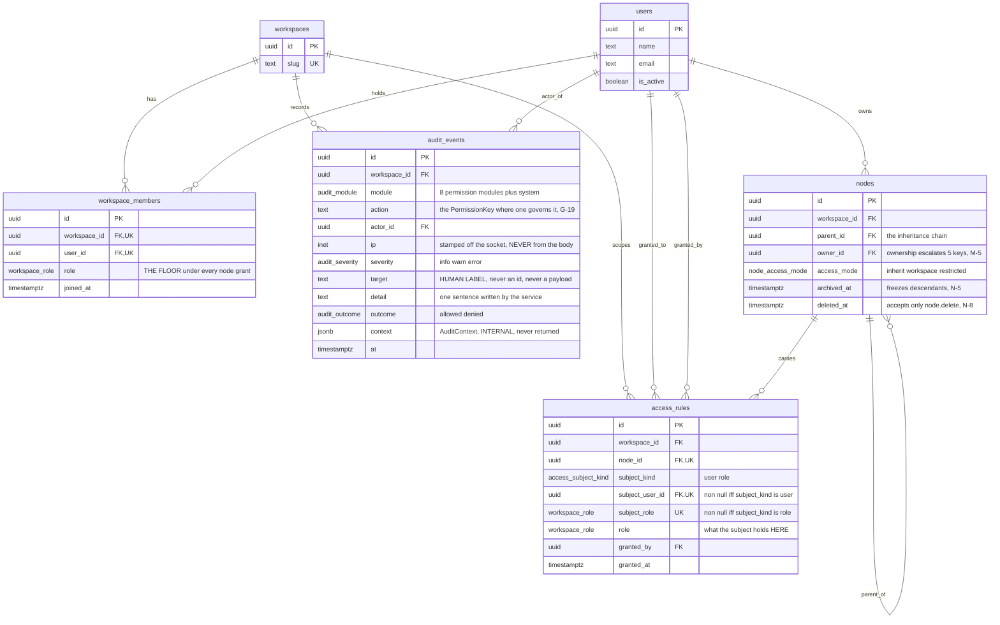
```mermaid
erDiagram
    workspaces ||--o{ workspace_members : "has"
    workspaces ||--o{ access_rules : "scopes"
    workspaces ||--o{ audit_events : "records"

    users ||--o{ workspace_members : "holds"
    users ||--o{ access_rules : "granted_to"
    users ||--o{ access_rules : "granted_by"
    users ||--o{ audit_events : "actor_of"
    users ||--o{ nodes : "owns"

    nodes ||--o{ access_rules : "carries"
    nodes ||--o{ nodes : "parent_of"

    workspaces {
        uuid id PK
        text slug UK
    }

    users {
        uuid id PK
        text name
        text email
        boolean is_active
    }

    workspace_members {
        uuid id PK
        uuid workspace_id FK,UK
        uuid user_id FK,UK
        workspace_role role "THE FLOOR under every node grant"
        timestamptz joined_at
    }

    nodes {
        uuid id PK
        uuid workspace_id FK
        uuid parent_id FK "the inheritance chain"
        uuid owner_id FK "ownership escalates 5 keys, M-5"
        node_access_mode access_mode "inherit workspace restricted"
        timestamptz archived_at "freezes descendants, N-5"
        timestamptz deleted_at "accepts only node.delete, N-8"
    }

    access_rules {
        uuid id PK
        uuid workspace_id FK
        uuid node_id FK,UK
        access_subject_kind subject_kind "user role"
        uuid subject_user_id FK,UK "non null iff subject_kind is user"
        workspace_role subject_role UK "non null iff subject_kind is role"
        workspace_role role "what the subject holds HERE"
        uuid granted_by FK
        timestamptz granted_at
    }

    audit_events {
        uuid id PK
        uuid workspace_id FK
        audit_module module "8 permission modules plus system"
        text action "the PermissionKey where one governs it, G-19"
        uuid actor_id FK
        inet ip "stamped off the socket, NEVER from the body"
        audit_severity severity "info warn error"
        text target "HUMAN LABEL, never an id, never a payload"
        text detail "one sentence written by the service"
        audit_outcome outcome "allowed denied"
        jsonb context "AuditContext, INTERNAL, never returned"
        timestamptz at
    }
```

#### 5.4.1 Keys, indexes and delete behaviour

| Table | Unique constraints | Indexes that matter | ON DELETE |
| --- | --- | --- | --- |
| `access_rules` | partial `UNIQUE (node_id, subject_user_id) WHERE subject_kind = 'user'`; partial `UNIQUE (node_id, subject_role) WHERE subject_kind = 'role'` | `(workspace_id, node_id)` — the two-level index the frontend's store already is; `(subject_user_id)` for "everything granted to this person" | `workspace_id` CASCADE; `node_id` CASCADE; `subject_user_id` CASCADE |
| `audit_events` | — | `(workspace_id, at DESC, id DESC)` — **the pagination key**; `(workspace_id, module, at DESC)`; `(workspace_id, severity, at DESC)`; `(workspace_id, actor_id, at DESC)`; GIN on a `to_tsvector(target \|\| ' ' \|\| detail)` expression for `?search=` | **none.** No `ON DELETE` anywhere: `workspace_id` and `actor_id` are `RESTRICT`. An audit row outlives the thing it describes, which is the entire point |
| `workspace_members` | `UNIQUE (workspace_id, user_id)` | partial `(workspace_id) WHERE role = 'admin'` — the last-admin guard reads this on every membership write | CASCADE |

Two constraints the diagram cannot show:

```sql
-- access_rules: the subject is exactly one of the two, never both, never neither.
CONSTRAINT subject_is_exclusive CHECK (
  (subject_kind = 'user' AND subject_user_id IS NOT NULL AND subject_role IS NULL) OR
  (subject_kind = 'role' AND subject_role    IS NOT NULL AND subject_user_id IS NULL)
)

-- audit_events: append only. Enforced by grant, not by trigger.
REVOKE UPDATE, DELETE ON audit_events FROM application_role;
```

#### 5.4.2 The JSONB column

```ts
/**
 * audit_events.context — RECOMMENDATION (OQ-25). INTERNAL. Never returned by E-136 or E-137.
 * The human-readable pair the UI renders is (target, detail); this is what an investigator needs.
 */
interface AuditContext {
  readonly requestId: string;
  readonly nodeId?: string;
  readonly boardId?: string;
  readonly rowId?: string;
  readonly subjectUserId?: string;
  readonly permissionKey?: PermissionKey;
  readonly effectiveRole?: WorkspaceRole;
  readonly userAgent?: string;
  readonly before?: Readonly<Record<string, string>>;
  readonly after?: Readonly<Record<string, string>>;
}
```

#### 5.4.3 What is easy to get wrong here

**There is no `roles` table and no `permissions` table, and there must not be.** The four roles are
`src/lib/permissions/roles.ts:77-96`; the 39 keys are `src/types/permission.ts:31-78`; the catalogue
is served from E-045 so both sides agree (G-18). Canon §1.2 lists `permission_definitions` under
"tables that deliberately do NOT exist". A role that can be edited at runtime is a different
product — see OQ-03, where the PRD's fifth "Super Admin" role is explicitly resolved as **four
roles, with workspace creation as an ownership attribute**.

**`access_rules` needs *two* partial unique indexes, not one composite.** The subject is a
discriminated union stored across two nullable columns, so a single
`UNIQUE (node_id, subject_kind, subject_user_id, subject_role)` does nothing: `NULL` is not equal to
`NULL`, so it would admit two identical role grants on one node. That matters because `matchIn`
(`src/lib/permissions/inheritance.ts:63-78`) takes the **first** match within a node, which makes
resolution order-dependent the moment a duplicate exists.

**The chain, not the node, is what resolution reads.** Gate 2 and gate 3 both need the root→node
ancestor list **in order** (`chainFor`, `src/lib/permissions/inheritance.ts:41-43`). Two options, and
the schema chapter must pick one and be consistent: a recursive CTE over `nodes.parent_id`, or a
materialised `ancestor_ids UUID[]` column. The frontend already stores an ordered ancestor list on
trash entries (`src/types/system.ts:177-178`), so an ordered array is consistent with the existing
model — and it makes the "deepest wins" rule an array index rather than a recursion.

**`audit_events` has no FK you can cascade, and `workspace_members` does.** Removing a member
removes their grants (`access_rules.subject_user_id` CASCADE) but leaves every audit row they
generated. That asymmetry is the whole reason `audit_events.actor_id` is `RESTRICT` and `users` are
never hard-deleted (M-1): the log has to be able to name a person who is no longer here.

**`audit_events.action` is `TEXT`, not the `PermissionKey` enum.** `AuditEvent.action` is typed
`string` in the frontend (`src/types/audit.ts:30`) because *"what happened, as a catalogue key **where
one exists**"* — some actions have no key. Making it an enum would refuse rows the log needs to hold.
See §6.3.

**`nodes.access_mode` is not a permission.** It is the ACCESS axis: who may *see* the node. The
CAPABILITY axis — what they may *do* — is the role matrix, and the two are resolved separately and
never merged (G-1, G-8). A node with `access_mode = 'workspace'` is visible to every member and still
read-only to a viewer.

---

### 5.5 Document ERD


```mermaid
erDiagram
    nodes ||--o| documents : "page_content"
    nodes ||--o| config_documents : "config_content"
    nodes ||--o| secret_documents : "secret_container"
    nodes ||--o| file_nodes : "file_content"

    documents ||--o{ document_versions : "snapshots"
    config_documents ||--o{ config_versions : "snapshots"

    secret_documents ||--o{ secrets : "holds"
    secret_documents ||--o{ secret_rotations : "history_of"
    secret_documents ||--o{ secret_access_events : "trail_of"

    environments ||--o{ config_documents : "labels"
    environments ||--o{ secrets : "labels"

    file_assets ||--o{ file_nodes : "stored_as"
    file_assets ||--o{ cell_attachments : "referenced_by"
    file_assets ||--o{ comment_attachments : "referenced_by"
    file_assets ||--o{ document_asset_refs : "referenced_by"
    uploads |o--o| file_assets : "produces"

    board_rows ||--o{ cell_attachments : "owns"
    board_columns ||--o{ cell_attachments : "column_of"
    comments ||--o{ comment_attachments : "carries"
    nodes ||--o{ document_asset_refs : "blocks_reference"

    nodes {
        uuid id PK
        node_kind kind
        document_kind document_kind "null means page"
        text name "title and name are ONE column, OQ-30"
        boolean is_pinned
        timestamptz archived_at
    }

    documents {
        uuid id PK
        uuid node_id FK,UK "UNIQUE NOT NULL"
        uuid workspace_id FK
        text icon "emoji"
        jsonb blocks "Block[], flat ordered array, see 5.5.2"
        uuid locked_by FK "nullable, NULL means unlocked"
        timestamptz locked_at "nullable"
        integer version "optimistic token, OQ-57"
        uuid created_by FK
        tsvector search_tsv "GIN over rendered block text"
        timestamptz created_at
        timestamptz updated_at
    }

    document_versions {
        uuid id PK
        uuid node_id FK,UK
        integer version UK
        text title "the title AT THAT VERSION"
        jsonb blocks "full snapshot, Block[]"
        text summary "plus 3 minus 1 lines"
        boolean is_autosave "drives the fold rule, OQ-59"
        uuid author_id FK
        timestamptz created_at
    }

    config_documents {
        uuid node_id PK,FK "the PK IS the node id"
        config_format format "15 members, closed"
        uuid environment_id FK
        text content "raw text, never parsed server side"
        integer version
        uuid updated_by FK
        timestamptz created_at
        timestamptz updated_at
    }

    config_versions {
        uuid id PK
        uuid node_id FK
        integer version "NOT unique, a folded autosave rewrites the head"
        text content "full snapshot"
        text summary
        boolean is_autosave
        uuid author_id FK
        timestamptz created_at
    }

    secret_documents {
        uuid node_id PK,FK "container only"
        timestamptz created_at
        timestamptz updated_at
    }

    secrets {
        uuid id PK
        uuid secret_document_id FK,UK
        text key UK "business identifier, never the PK, C-02"
        bytea value_encrypted "AES-256-GCM ciphertext, OQ-65"
        bytea nonce
        text dek_id "wrapped data key reference"
        uuid environment_id FK
        text note "nullable"
        integer position "the list order the client sends"
        uuid rotated_by FK
        timestamptz created_at
        timestamptz updated_at
    }

    secret_rotations {
        uuid id PK
        uuid secret_document_id FK
        uuid secret_id "NOT an FK, the row may be gone by design"
        text key
        uuid rotated_by FK
        timestamptz created_at
    }

    secret_access_events {
        uuid id PK
        uuid secret_document_id FK
        uuid secret_id "NOT an FK"
        text key
        secret_action action "reveal copy rotate"
        audit_outcome outcome "allowed denied, both recorded"
        uuid actor_id FK
        inet ip "stamped off the socket"
        timestamptz at
    }

    environments {
        uuid id PK
        uuid workspace_id FK,UK
        text label UK "Development Staging Production, seeded"
        select_color color
        integer position
        timestamptz created_at
    }

    file_assets {
        uuid id PK
        uuid workspace_id FK
        text storage_key UK "S3 object key"
        text name
        text extension
        text mime_type "SNIFFED, not declared, OQ-70"
        bigint size_bytes "THE source for used_bytes"
        file_kind kind
        text checksum_sha256
        uuid owner_id FK
        timestamptz created_at
        timestamptz updated_at
    }

    file_nodes {
        uuid node_id PK,FK
        uuid asset_id FK
        integer version "bumped by PUT file content"
        timestamptz updated_at
    }

    cell_attachments {
        uuid id PK
        uuid row_id FK,UK
        uuid column_id FK,UK
        uuid asset_id FK,UK
        uuid uploaded_by FK
        timestamptz created_at
    }

    comment_attachments {
        uuid id PK
        uuid comment_id FK,UK
        uuid asset_id FK,UK
        timestamptz created_at
    }

    document_asset_refs {
        uuid id PK
        uuid node_id FK,UK
        text block_id UK "the Block.id inside documents.blocks"
        uuid asset_id FK,UK
        timestamptz created_at
    }

    uploads {
        uuid id PK
        uuid workspace_id FK
        uuid actor_id FK
        text storage_key UK "the presigned PUT target"
        text file_name
        bigint expected_size_bytes
        text expected_mime_type
        boolean create_drive_node "OQ-74"
        uuid destination_folder_id FK "nullable, workspace root"
        upload_state state "pending completed aborted expired"
        uuid asset_id FK "nullable until completed"
        timestamptz expires_at
        timestamptz created_at
    }

    board_rows {
        uuid id PK
        text custom_id
    }

    board_columns {
        uuid id PK
        column_type type
    }

    comments {
        uuid id PK
    }
```

#### 5.5.1 Keys, indexes and delete behaviour

| Table | Unique constraints | Indexes that matter | ON DELETE |
| --- | --- | --- | --- |
| `documents` | `UNIQUE (node_id)` | GIN `(search_tsv)`; `(workspace_id)` | `node_id` CASCADE; `locked_by` **SET NULL** |
| `document_versions` | `UNIQUE (node_id, version)` | `(node_id, version DESC)` — the pagination key | `node_id` CASCADE |
| `config_documents` | PK is `node_id` | `(environment_id)` for `ENVIRONMENT_IN_USE` | `node_id` CASCADE; `environment_id` **RESTRICT** |
| `config_versions` | **no** `UNIQUE (node_id, version)` — a folded autosave rewrites the head at the *same* number | `(node_id, version DESC, created_at DESC)` | `node_id` CASCADE |
| `secret_documents` | PK is `node_id` | — | `node_id` CASCADE |
| `secrets` | `UNIQUE (secret_document_id, key)` | `(secret_document_id, position)`; `(environment_id)` | `secret_document_id` CASCADE; `environment_id` **RESTRICT** |
| `secret_rotations` | — | `(secret_document_id, created_at DESC)` | `secret_document_id` CASCADE |
| `secret_access_events` | — | `(secret_document_id, at DESC, id DESC)` — the pagination key for E-105 | `secret_document_id` CASCADE; append-only by grant |
| `environments` | `UNIQUE (workspace_id, label)` | `(workspace_id, position)` | `workspace_id` CASCADE |
| `file_assets` | `UNIQUE (storage_key)` | `(workspace_id, created_at DESC)`; `(checksum_sha256)` for dedupe | `owner_id` RESTRICT |
| `file_nodes` | PK is `node_id` | `(asset_id)` | `node_id` CASCADE; `asset_id` **RESTRICT** |
| `cell_attachments` | `UNIQUE (row_id, column_id, asset_id)` | `(asset_id)` for orphan collection | `row_id` CASCADE; `column_id` CASCADE; `asset_id` RESTRICT |
| `comment_attachments` | `UNIQUE (comment_id, asset_id)` | `(asset_id)` | `comment_id` CASCADE; `asset_id` RESTRICT |
| `document_asset_refs` | `UNIQUE (node_id, block_id, asset_id)` | `(asset_id)` | `node_id` CASCADE; `asset_id` RESTRICT |
| `uploads` | `UNIQUE (storage_key)` | `(expires_at)` for the reaper; `(actor_id, state)` | `workspace_id` CASCADE |

#### 5.5.2 `documents.blocks` — 14 types, 9 interfaces

```ts
type BlockType =
  | "heading1" | "heading2" | "heading3" | "paragraph" | "quote"
  | "checklist" | "bulletList" | "numberedList"
  | "code" | "image" | "attachment" | "link" | "table" | "embed";

interface TextBlock       { readonly id: string; readonly type: "heading1"|"heading2"|"heading3"|"paragraph"|"quote"; readonly text: string }
interface ChecklistBlock  { readonly id: string; readonly type: "checklist"; readonly text: string; readonly isChecked: boolean }
interface ListBlock       { readonly id: string; readonly type: "bulletList"|"numberedList"; readonly text: string }
interface CodeBlock       { readonly id: string; readonly type: "code"; readonly code: string; readonly language: CodeLanguage }
interface DocumentImage   { readonly assetId: string | null; readonly url: string; readonly alt: string }
interface ImageBlock      { readonly id: string; readonly type: "image"; readonly images: readonly DocumentImage[]; readonly caption: string }
interface AttachmentBlock { readonly id: string; readonly type: "attachment"; readonly assetId: string | null; readonly name: string; readonly sizeBytes: number; readonly mimeType: string }
interface LinkBlock       { readonly id: string; readonly type: "link"; readonly url: string; readonly title: string; readonly description: string; readonly siteName: string }
interface TableBlock      { readonly id: string; readonly type: "table"; readonly hasHeaderRow: boolean; readonly rows: readonly (readonly string[])[] }
interface EmbedBlock      { readonly id: string; readonly type: "embed"; readonly boardNodeId: string | null; readonly viewId: string | null }

type Block = TextBlock | ChecklistBlock | ListBlock | CodeBlock | ImageBlock
           | AttachmentBlock | LinkBlock | TableBlock | EmbedBlock;
```

`src/types/document.ts:4-110`. `document_versions.blocks` holds the identical shape as a full
snapshot. `BLOCK_TYPE_PAYLOAD_MISMATCH`, `400`, when the body does not match its `type`.

`ImageBlock.images[].assetId` and `AttachmentBlock.assetId` are what `document_asset_refs` projects
(one row per `(node_id, block_id, asset_id)`), so garbage collection and the quota are one query.
`DocumentImage.url` is a **minted signed URL on read** and is never accepted on write (OQ-75).

`EmbedBlock` is *"two ids, never a copy of the board's records"* (`src/types/document.ts:94`) — the
board-is-the-source-of-truth rule (§3.1) reaching into the document editor.

#### 5.5.3 What is easy to get wrong here

**`boards` and `documents` carry their own `id`; `config_documents`, `secret_documents` and
`file_nodes` do not.** This asymmetry is deliberate and is canon's position on OQ-30: *"Keep both
ids. `node_id` is `UNIQUE NOT NULL` on `boards` and `documents`."* It mirrors the frontend exactly —
`Board.id` and `Board.nodeId` both exist (`src/types/board.ts:412-418`), `WorkspaceDocument.id` and
`.nodeId` both exist (`src/types/document.ts:117-120`), while `ConfigDocument` and `SecretDocument`
carry **only** `nodeId` (`src/types/devtools.ts:39-40, 84-85`). Do not "tidy" this into consistency:
`Board.id` is the addressing key for eleven endpoints and inventing one for a config document would
be a wire change with no reader.

**Neither `boards`, `documents`, `config_documents` nor `secret_documents` has a `name` or `title`
column.** `summarize()` writes `name: document.title` onto the node
(`src/services/document-service.ts:160-171`), i.e. the node's name **is** the document title, kept in
one place. `Board.name`, `WorkspaceDocument.title`, `ConfigDocument.name` and `SecretDocument.name`
are all projections of `nodes.name`. Two writable copies of a title is the classic drift bug: rename
from the breadcrumb and rename from the page header stop agreeing.

**`config_versions` has no `UNIQUE (node_id, version)` and `document_versions` does.** A config
autosave *folds*: `isAutosave: true` rewrites the head version when that version is also an autosave
by the same author, at the same version number (E-100,
`src/services/devtools-service.ts:154-187`). A manual save always starts a new version, and so does
another author's edit landing in between. Adding the unique constraint to `config_versions` breaks
the fold; omitting it from `document_versions` admits duplicates.

**A secret's history has no snapshot, and that is a hard requirement.** `secret_rotations` has **no
value column, ever** (canon T-24). It projects into `VersionEntry` with `hasSnapshot: false`, and
such an entry *"can be read but never diffed or restored"* (`src/types/system.ts:215-220`;
`src/lib/versions.ts:43-61`). E-096 and E-097 refuse a secret version:
`VERSION_NOT_RESTORABLE`, `409`. The masks the client holds *"would diff as identical and say
nothing true"* (`src/lib/versions.ts:44-47`).

**`secret_rotations.secret_id` and `secret_access_events.secret_id` are deliberately not foreign
keys.** A rotate event is written for a secret that is being **removed in the same call** —
`saveSecrets` replaces the whole list in the given order, so a delete and its audit row land
together (`src/services/devtools-service.ts:484-487, 554-558`). An FK would refuse the write. `key`
is carried alongside so the trail stays readable after the row is gone.

**`secrets.value_encrypted` is never selected on a list read.** `SecretEntry` has no `value` field at
all, on purpose: *"plaintext only ever arrives from an explicit, permission-checked reveal, and it is
never written back into this shape"* (`src/types/devtools.ts:68-72`). `maskedValue` is a **constant
12 `U+2022` bullets, never derived from the real length** (`:76-77`) — deriving it leaks the
password length. An **omitted** `value` on E-102 means "leave the stored value untouched"
(`SecretDraftEntry`, canon §5.3).

**One `file_assets` row, four typed reference tables — not a polymorphic owner.** A
`(owner_kind, owner_id)` pair cannot carry a foreign key, and every operation that matters here —
cascade on row delete, cascade on comment delete, quota accounting, orphan collection — is exactly a
foreign-key question (canon §1.3.4). The frontend already has three divergent attachment *shapes*
(`CellAttachment`, `CommentAttachment`, `FileAsset`) over one *object*, and is explicit that a cell
attachment *"does **not** create a file node beside the board"* (`src/types/board.ts:198-200`).

**`file_assets` is `RESTRICT` from every reference table, and orphan collection is a job, not a
cascade.** Deleting the last reference does not delete the asset: `workspaces.used_bytes` must be
decremented in the same transaction as the byte deletion (W-5), and that is a sweep over
`file_assets` with no surviving row in any of the four reference tables. A cascade would delete the
row and leave the S3 object and the counter behind.

**`file_assets.mime_type` is sniffed, not declared.** `FILE_CONTENT_TYPE_MISMATCH`, `400`, when the
sniffed content contradicts the declared extension. Preview strategy is decided by **extension
first, MIME second** (E-114) — *"`xlsx` and `csv` are both 'spreadsheets', but only one of them is
readable as text"* (`src/lib/preview-strategy.ts:5-9`).

**`environments` is `RESTRICT` from both `config_documents` and `secrets`.** E-109 refuses a delete
while the label is referenced: `ENVIRONMENT_IN_USE`, `409`. The three labels are seeded
Development / Staging / Production and are `SelectOption`-shaped, mirroring
`ENVIRONMENT_OPTIONS` (`src/lib/board-templates.ts:28-37`) — which is where the same three labels
already live as select options on the Bug, QA and API templates. **The two lists must agree**: a
board's environment column and a config document's environment label are the same vocabulary
(DV-ENV-21).

---

---

## 6. Enums

### 6.1 Storage policy — DECIDED: native PostgreSQL `ENUM`

**Every enum that is stored in a column is a native Postgres `ENUM` type.** No `VARCHAR + CHECK`, no
lookup table, no integer code.

The type is named `snake_case` after the TypeScript type (`column_type`, `workspace_role`,
`node_access_mode`). **Its values are the frontend's string literals verbatim, quoted** — `longText`
stays `longText`, `apiDocs` stays `apiDocs`, `into-self` stays `into-self`. This is C-13 and canon
§2.0, and it is not negotiable: the wire value and the stored value must be identical so no mapping
layer can drift.

```sql
-- documentation only
CREATE TYPE column_type      AS ENUM ('text','longText','select','date','user','attachment','relation');
CREATE TYPE workspace_role   AS ENUM ('viewer','member','manager','admin');   -- order IS the rank
CREATE TYPE node_access_mode AS ENUM ('inherit','workspace','restricted');
```

**Why native `ENUM` and not `VARCHAR + CHECK`.**

| | Native `ENUM` | `VARCHAR + CHECK` |
| --- | --- | --- |
| One definition, many columns | `workspace_role` is used in **four** places — `workspace_members.role`, `access_rules.role`, `access_rules.subject_role`, `workspace_invitations.role`. One type, four columns. | Four `CHECK` lists to keep in step. Adding a role means finding all four. This is the failure mode the frontend already guards against in code (*"a role check scattered through a component is a rule the catalogue does not know about"*, `src/types/permission.ts:26-29`) — the database should not reintroduce it. |
| Rank ordering | `WorkspaceRole` **order is the rank, ascending** (`src/types/permission.ts:10-20`). A Postgres enum sorts in declaration order, so `ORDER BY role DESC` **is** `roleRank` — which is exactly what E-040 needs (`ResolvedAccess` sorted by `roleRank` descending, `src/lib/permissions/inheritance.ts:166`). | Needs a `CASE` expression or a rank table in every query. |
| Storage and comparison | 4 bytes, integer comparison. | Full text, collation-aware comparison. |
| Catching a typo | `'longtext'` fails at insert with a clear type error. | Fails the same way, but only if that table's `CHECK` was written correctly. |
| Discoverability | `\dT+ column_type` lists the vocabulary. The database is self-documenting. | The vocabulary is a constraint expression. |
| Adding a member | `ALTER TYPE … ADD VALUE` — non-blocking on PG 12+. Cannot run inside a transaction block with other DDL on the same type; the migration is one statement of its own. | `ALTER TABLE … DROP CONSTRAINT` + `ADD CONSTRAINT` per table, each taking a lock and rescanning. |
| Removing a member | Genuinely hard: requires a new type, a column rewrite and a swap. | Easier. |

The last row is the honest cost, and it is worth paying **because the enums here are closed
vocabularies the frontend exhaustively switches on**. `ConfigFormat` is *"deliberately not extensible
from data: it is a union, so a document cannot be saved in a language nothing can colour, and every
branch that switches on it is checked exhaustively at build time"* (`src/types/devtools.ts:13-17`).
An enum that could be removed at runtime is one the frontend cannot switch on exhaustively, which
these all are.

**The policy has exactly three exceptions, and each is justified:**

1. **An enum that only ever appears inside a JSONB document is not a Postgres type.** Postgres cannot
   type a value inside `jsonb`. `CellValueKind`, `ConditionOperator`, `ConditionConjunction`,
   `UnavailableOptionBehavior`, `SelectColor` (inside `SelectConfig.options[]`), `BlockType`,
   `CodeLanguage`, `FilterOperator`, `FilterConjunction`, `SortDirection` (inside `ViewSort`) and
   `CellDisplayMode` are validated by the **request schema validator at the API boundary** and by
   nothing else. §6.11 lists them with their JSON paths. Writing a `CHECK` with `jsonb_path_exists`
   over an array of options is unmaintainable and would be the only thing standing between the
   validator and the data — the validator is the guard.
2. **Two columns are open vocabularies and stay `TEXT`.** `audit_events.action` is *"the permission
   key **where one exists**"* and typed `string` in the frontend (`src/types/audit.ts:26-30`) — some
   audited actions have no catalogue key, and an enum would refuse rows the log must hold.
   `export_jobs.state` is a job-runner state with no frontend counterpart and no exhaustive switch.
3. **`PermissionKey` is not a Postgres type at all.** The 39 keys are static config served from
   E-045 (canon §1.2). They are never a column. `AuditContext.permissionKey` inside
   `audit_events.context` is JSONB, covered by exception 1.

**Migration rule.** Adding an enum member is `ALTER TYPE <t> ADD VALUE IF NOT EXISTS '<literal>'`, in
a migration of its own, before any code that emits it deploys. Removing one requires a data
migration first — see `gantt_zoom` in §6.7, which is the live example.

### 6.2 Type-name map

`ENUM` type names are `snake_case`; the TypeScript names are canon's (§2.1). Where canon renames a
frontend type, the alias is recorded so a reader coming from `src/types/` lands in the right place.

| TypeScript (canon) | Postgres type | Frontend name, if different |
| --- | --- | --- |
| `NodeKind` | `node_kind` | `DriveNodeType` (`src/types/node.ts:24`) — **the one rename** |
| `NodeAccessMode` | `node_access_mode` | — (the brief called it `AccessMode`) |
| `NotificationReason` | `notification_reason` | — (the brief called it `NotificationType`) |
| `ConfigFormat` | `config_format` | — (the brief called it `DocumentLanguage`) |
| `UploadState` | `upload_state` | server-side only; the client enum is `UploadStatus` |
| `NodeState` | *(none — derived)* | new, §6.5 |
| every other enum | the `snake_case` of its name | — |

---

### 6.3 Identity, tenancy and governance

```ts
type WorkspaceRole   = "viewer" | "member" | "manager" | "admin";     // order IS the rank
type WorkspacePlan   = "free" | "team" | "enterprise";
type NodeAccessMode  = "inherit" | "workspace" | "restricted";
type AccessSubjectKind = "user" | "role";
type AccessSource    = "workspace" | "inherited" | "explicit" | "override";
type Capability      = "view" | "edit" | "upload" | "delete" | "share" | "manage";
type PermissionModule =
  | "workspace" | "node" | "board" | "row" | "document" | "file" | "comment" | "secret";
type AuditSeverity   = "info" | "warn" | "error";
type AuditModule     = PermissionModule | "system";
type AuditOutcome    = "allowed" | "denied";
// PermissionKey — 39 members, canon §2.10, src/types/permission.ts:31-78
```

| Enum | Postgres | Stored at / used at | FE sends these exact strings? | Meaning |
| --- | --- | --- | --- | --- |
| `WorkspaceRole` | `workspace_role` | `workspace_members.role`, `access_rules.role`, `access_rules.subject_role`, `workspace_invitations.role`; wire on `WorkspaceMember`, `AccessRule`, `ResolvedAccess`, `EffectiveAccess` | **Yes, sends and receives.** E-014 body, E-042 body, and `previewAs` on any gated read *(OQ-21)* | The four workspace roles, cumulative. Rank is declaration order (`src/types/permission.ts:8-20`) |
| `WorkspacePlan` | `workspace_plan` | `workspaces.plan`; wire on `Workspace` | **Receives only.** No frontend surface writes it today | Drives `StorageQuota.totalBytes` from static service config, not a `plans` table *(OQ-06)* |
| `NodeAccessMode` | `node_access_mode` | `nodes.access_mode`; wire on `DriveNode.accessMode` | **Yes, sends.** E-041 `PUT /nodes/{id}/access-mode` | Three modes and no more. Absent on the wire means `inherit` (`src/types/node.ts:70-72`) |
| `AccessSubjectKind` | `access_subject_kind` | `access_rules.subject_kind`; wire as the discriminant of `AccessSubject` | **Yes, sends.** E-042 body carries `{ kind: "user", userId }` or `{ kind: "role", role }` | Which of the two nullable subject columns is populated. Guarded by `subject_is_exclusive` (§5.4.1) |
| `AccessSource` | `access_source` | **never stored.** Derived per-read on `ResolvedAccess.source` | **Receives only.** | Where the grant came from. `explicit` vs `override` is *"whether the rule agrees with what would have flowed down"* (`src/lib/permissions/inheritance.ts:114-119`) |
| `Capability` | *(no type — a JSON object shape)* | never stored. `CapabilitySet` is `Record<Capability, boolean>` on E-022 and E-044 | **Receives only.** | Six coarse flags, a **projection** of the 39-key catalogue so the two can never disagree (`src/lib/permissions/evaluate.ts:116-132`) |
| `PermissionModule` | `permission_module` (used only as the base of `audit_module`) | wire on `PermissionDefinition.module` (E-045) | **Receives only.** | **Derived from the key's first segment, never declared beside it** (`src/lib/permissions/catalog.ts:8-14`) |
| `PermissionKey` | **`TEXT`, never an enum** | static catalogue served by E-045; appears inside `audit_events.context.permissionKey` (JSONB) | **Yes, sends** — as a path/query concern only in `previewAs` flows; never as a stored value | The 39 gates. Roles are cumulative over them: viewer 0, member +10, manager +21, admin +8 (`src/lib/permissions/roles.ts:16-96`) |
| `AuditSeverity` | `audit_severity` | `audit_events.severity`; `AuditPage.bySeverity` keys | **Yes, sends** as `?severity=` on E-136 (plus the sentinel `"all"`, which is a query value, not a member) | Defaults to `error` on a denial, `info` otherwise (`src/services/audit-service.ts:296`) |
| `AuditModule` | `audit_module` | `audit_events.module` | **Yes, sends** as `?module=` on E-136 (plus `"all"`) | The 8 permission modules plus `system` for events no user initiated (`src/types/audit.ts:14-18`) |
| `AuditOutcome` | `audit_outcome` | `audit_events.outcome`, `secret_access_events.outcome` | **Receives only.** | `denied` rows are written with the same care as `allowed` ones (G-16) |

**Two query sentinels that are not enum members.** `AuditQuery` types `module`, `severity` and
`actorId` as `T | "all"` (`src/types/audit.ts:42-48`). `"all"` means *omit the filter*. It must
never be stored and must never be added to the Postgres type; the API treats an absent parameter and
`"all"` identically.

---

### 6.4 Drive

```ts
type NodeKind      = "project" | "folder" | "document" | "board" | "file";
type DocumentKind  = "page" | "config" | "secret";          // absent means "page"
type BoardKind     = "kanban" | "table" | "timeline" | "doc";
type ProjectStatus = "active" | "paused" | "archived";
type FileKind      = "image" | "document" | "spreadsheet" | "pdf" | "video"
                   | "audio" | "archive" | "code" | "other";
type MoveRejection = "same-parent" | "into-self" | "into-descendant" | "invalid-target";  // kebab
type EntityKind    = "project" | "folder" | "board" | "document" | "file" | "row";        // NodeKind + row
type WatchKind     = "row" | "document" | "board";                                        // ⊂ EntityKind
type BreadcrumbKind = NodeKind | "workspace";
type SmartViewId   = "my-work" | "favorites" | "recent" | "notifications" | "archive" | "trash";
```

| Enum | Postgres | Stored at / used at | FE sends these exact strings? | Meaning |
| --- | --- | --- | --- | --- |
| `NodeKind` | `node_kind` | `nodes.kind` | **Yes, sends.** E-024 `POST /workspaces/{id}/nodes` carries `kind` in the body; the store writes `type: "document"` today (`src/store/workspace-store.ts:773`) | The five addressable things. **See the field-name warning below.** |
| `DocumentKind` | `document_kind` | `nodes.document_kind`, nullable | **Yes, sends.** `createDocument(parentId, name, icon, documentKind = "page")` (`src/store/workspace-store.ts:744`) | Three shapes sharing routing, permissions and the pin/lock/archive lifecycle; *"only their editor differs"* (`src/types/node.ts:40-44`). **Absent means `page`** — `documentKindOf` resolves it (`:144`), so the column is nullable and the API omits the key rather than sending `null` (C-08) |
| `BoardKind` | `board_kind` | `nodes.board_kind` | **Yes, sends.** `createBoard` sets it from the template | A presentation hint on the node, **stored as-is and not validated against `BoardViewType`** *(OQ-31)*. The translation is one map: `table→table`, `kanban→kanban`, `timeline→gantt`, `doc→table` (`src/services/board-service.ts:74-79`) |
| `ProjectStatus` | `project_status` | `nodes.project_status`, nullable | **Yes, sends** on project create/update | `active` / `paused` / `archived`. Distinct from `nodes.archived_at` — this is a project *label*, not the freeze |
| `FileKind` | `file_kind` | `nodes.file_kind`, `file_assets.kind` | **Receives only** — derived server-side from the extension | Coarse classification driving icon, colour and preview strategy (`src/types/node.ts:26-36`) |
| `MoveRejection` | **never stored** | E-026 response / error mapping only | **Receives only.** | Four distinct outcomes, **kebab-case**. Each maps to its own `ErrorReason`: `NODE_MOVE_SAME_PARENT`, `NODE_MOVE_INTO_SELF`, `NODE_MOVE_INTO_DESCENDANT`, `NODE_MOVE_INVALID_TARGET`, all `409` (canon §4.3). `same-parent` is *a no-op the caller should treat as success* (`src/lib/tree.ts:177-179`) |
| `EntityKind` | `entity_kind` | `comments.target_kind`, `notifications.target_kind` | **Yes, sends.** Every `EntityRef` in an E-120 or E-127 body carries it | `NodeKind` **plus `row`** — the six things collaboration can point at (`src/types/collab.ts:6-7`) |
| `WatchKind` | `watch_kind` | `watches.target_kind` | **Yes, sends** (E-127 body is an `EntityRef`; a non-watchable kind is refused) | A **strict subset** of `EntityKind`. *"Only these three can be watched — a file or folder has no activity stream"* (`src/types/collab.ts:85-86`). A separate, narrower Postgres type, not a reuse of `entity_kind` |
| `BreadcrumbKind` | **never stored** | `BreadcrumbItem.kind` on any breadcrumb response | **Receives only.** | `NodeKind` + `workspace` for the root crumb (`src/types/breadcrumb.ts:3`) |
| `SmartViewId` | **never stored — UI only** | `src/config/app.ts:77-114`, sidebar routing | **Never crosses the wire.** | The six non-drive sidebar destinations. Each is served by a *different* endpoint (E-134, E-033, none, E-129, E-034, E-036), so the id itself is never a parameter |

**Field-name warning — `NodeKind` vs `DriveNode.type`.** Canon §2.1 renames the *type* to `NodeKind`
and names the column `nodes.kind`. The frontend's JSON field is **`type`**: `ProjectNode.type`,
`FolderNode.type`, `DocumentNode.type`, `BoardNode.type`, `FileNode.type`
(`src/types/node.ts:81, 89, 96, 108, 117`) and the five guards read `node.type === "project"` etc.
(`:138-142`). The **enum name** is `NodeKind`; the **column** is `nodes.kind`; the **wire field on
`DriveNode` must stay `type`**, or the guards and every `switch` over them break. The serialiser maps
`nodes.kind → DriveNode.type`. Recorded in the editor notes.

**`FileNode.kind` is a different field from `DriveNode.type`.** `FileNode` has *both*:
`type: "file"` (the discriminant) and `kind: FileKind` (the classification)
(`src/types/node.ts:116-118`). They are `node_kind` and `file_kind`, two types, on the same row.

---

### 6.5 `NodeState` — the one enum this specification invents

```ts
/** Derived on read. NEVER a stored column. Precedence is top to bottom. */
type NodeState =
  | "trashed"   // deleted_at IS NOT NULL — accepts nothing but node.delete
  | "frozen"    // an ANCESTOR is archived — every write refused, and the node
                //   cannot be thawed on its own
  | "archived"  // this node's own archive flag — read-only, but Restore is offered
  | "active";
```

**RECOMMENDATION** *(OQ-11)*. **Postgres storage: none.** It is computed per read.

| | |
| --- | --- |
| **Members** | Four, evaluated in the order written — the first match wins |
| **Postgres** | **No type, no column.** `trashed` is `deleted_at IS NOT NULL`; `frozen` is "an ancestor has `archived_at IS NOT NULL`"; `archived` is this node's own `archived_at IS NOT NULL`; `active` otherwise |
| **Used at** | Additive field on `DriveNode` in every node-bearing response (E-020, E-022, E-023, E-047, E-091, …) |
| **FE sends?** | **Neither.** The frontend has no such enum today and never sends it. It carries `isArchived` and `isTrashed` as booleans (`src/types/node.ts:56-70`) and resolves "frozen" separately (`src/lib/archive.ts:37-45`) |
| **Why it exists** | Chapters kept inventing prose for the combination. The wire **still carries `isArchived` and `isTrashed`**, because the frontend reads them; `state` is purely additive |
| **Precedence grounding** | `src/lib/permissions/evaluate.ts:79-85` (trashed short-circuits before frozen, frozen before locked) and `src/lib/archive.ts:30-36` (*"you can always restore the thing you are standing on, but a page inside an archived project cannot be thawed on its own"* — which is why `frozen` outranks `archived`) |

---

### 6.6 Board schema and cells

```ts
type ColumnType    = "text" | "longText" | "select" | "date" | "user" | "attachment" | "relation";
type CellValueKind = ColumnType;                                   // the tag on CellValue
type SelectColor   = "gray" | "blue" | "green" | "amber" | "red" | "violet" | "cyan" | "pink";
type ConditionOperator =
  | "is" | "isNot" | "contains" | "notContains" | "isAnyOf" | "isNoneOf"
  | "before" | "after" | "on" | "isEmpty" | "isNotEmpty";
type ConditionConjunction = "and" | "or";
type UnavailableOptionBehavior = "disabled" | "hidden";
type BoardTemplateId = "task" | "bug" | "qa" | "apiDocs";          // built-ins; see the note
type ActivityKind =
  | "created" | "updated" | "commented" | "attached"
  | "archived" | "restored" | "imported" | "moved";
```

| Enum | Postgres | Stored at / used at | FE sends these exact strings? | Meaning |
| --- | --- | --- | --- | --- |
| `ColumnType` | `column_type` | `board_columns.type` | **Yes, sends.** `createColumn(boardId, type, name, atIndex)` (`src/services/board-service.ts:555-557`), `convertColumn(boardId, columnId, type)` (`:720-724`), and `MappingTarget` `{ kind: "create", name, type }` (`src/types/system.ts:88`) | The seven cell types the table engine understands. `longText` is camelCase and **stays camelCase** |
| `CellValueKind` | **JSONB — no type** | `board_rows.cells[columnId].kind` | **Yes, sends.** Every `CellEdit.value` carries it (E-066) | Identical members to `ColumnType`. **A cell's kind may legitimately disagree with its column's type after a conversion; the API must not normalise it away** (B-3). `CELL_VALUE_KIND_INVALID`, `400`, only when the tag is not a `ColumnType` member at all |
| `SelectColor` | `select_color` | `environments.color`; and **inside JSONB** at `board_columns.config.options[].color` | **Yes, sends.** The client cycles the palette and sends the colour: `["blue","green","amber","red","violet","cyan","pink","gray"][options.length % 8]` (`src/store/board-store.ts:845-847`) | Eight palette slots. Also the type of `MyWorkItem.statusColor` and `DashboardBucket.color`, both read-only projections |
| `ConditionOperator` | **JSONB — no type** | `board_columns.config.options[].availability.conditions[].operator` | **Yes, sends** inside a `ColumnPatch.config` | The rule language for conditional select options. `CONDITION_TREE_TOO_DEEP`, `400`, past the nesting cap *(OQ-38)* |
| `ConditionConjunction` | **JSONB — no type** | `…availability.conjunction` and every nested group | **Yes, sends.** | `and` / `or`. Nesting is what makes `A and (B or C)` expressible without a second data shape (`src/types/board.ts:55-58`) |
| `UnavailableOptionBehavior` | **JSONB — no type** | `board_columns.config.unavailableBehavior` (select only, optional) | **Yes, sends.** | What the dropdown does with an option whose conditions do not hold. Absent means `disabled` — the templates set it explicitly (`src/lib/board-templates.ts:84`) |
| `BoardTemplateId` | `board_template_id` on `board_templates.builtin_id` **only** | `board_templates.builtin_id` (nullable, UNIQUE); **not** `boards.template_id`, which is a UUID FK | **Yes, sends.** `createBoard(parentId, name, templateId)` (`src/store/workspace-store.ts:793`) | The four built-ins. `boards.template_id` references `board_templates.id` (a UUID, C-01); the API projects the **slug** for a built-in and the **UUID** for a user template, which is why the wire field is typed `BoardTemplateId \| string` *(OQ-47)*. `src/services/search-service.ts:39-43` reads the built-in slugs to bucket search results |
| `ActivityKind` | `activity_kind` | `row_activity.kind` | **Receives only.** `noteActivity` is a cross-service seam the backend owns; no UI writes a kind | Eight kinds. `commented` and `attached` are written by the comment and file modules inside the comment/upload transaction (C-3), not by the board module |

**`ConditionOperator` is NOT a superset of `FilterOperator`, despite the comment saying it is.** The
doc comment at `src/types/board.ts:20-23` claims *"Deliberately a superset of `FilterOperator`"*. It
is not: `FilterOperator` uniquely has `onOrBefore` and `onOrAfter`; `ConditionOperator` uniquely has
`isAnyOf`, `isNoneOf` and `on`. **Ship two types.** *(OQ-37; canon §2.5 takes the same position.)*

**`board_templates.builtin_id` is the one place `BoardTemplateId` is a column, and it is nullable.**
C-01 requires a UUID PK. The four built-ins are seed rows with `is_builtin = true`,
`workspace_id IS NULL` and `builtin_id` set; user templates carry `builtin_id IS NULL` and a
`workspace_id`. `UNIQUE (builtin_id)` guarantees there is exactly one of each built-in in the whole
database. Canon §8.8's position on OQ-47 says *"built-ins as seed rows … user templates as
additional rows with UUID ids"*, which literally read would give the built-ins non-UUID PKs and
break C-01; this column resolves the tension without contradicting either. Recorded in the editor
notes.

---

### 6.7 Views

```ts
type BoardViewType = "table" | "kanban" | "calendar" | "gantt";
type FilterOperator =
  | "isNotEmpty" | "isEmpty" | "contains" | "notContains"
  | "is" | "isNot" | "before" | "after" | "onOrBefore" | "onOrAfter";
type FilterConjunction = "and" | "or";
type SortDirection   = "asc" | "desc";
type SortKey         = "name" | "updatedAt" | "size" | "type";   // drive listing only
type ViewMode        = "grid" | "list";                          // drive listing only, UI
type CellDisplayMode = "compact" | "wrap" | "full";
type RowHeight       = "short" | "medium" | "tall";
type SubtaskDisplay  = "nested" | "flat" | "hidden";
type GanttZoom       = "week" | "month" | "quarter";             // 'day' is a legacy value — see below
```

| Enum | Postgres | Stored at / used at | FE sends these exact strings? | Meaning |
| --- | --- | --- | --- | --- |
| `BoardViewType` | `board_view_type` | `board_views.type` | **Yes, sends.** `createView(boardId, { name, type, from })` (`src/services/board-service.ts:818-822`) | The four lenses over the same rows (§3.1). **Not the same vocabulary as `BoardKind`** *(OQ-31)* |
| `FilterOperator` | **JSONB — no type** | `board_views.filters[].operator` | **Yes, sends** in an E-080 view patch | Ten operators. `isEmpty`/`isNotEmpty` short-circuit before the value is read (`src/lib/board-view.ts:57-58`); date operators compare **calendar days, not instants** (`:111-135`) |
| `FilterConjunction` | `filter_conjunction` | `board_views.filter_conjunction` — a real column, not JSONB | **Yes, sends.** | *"All of"* vs *"any of"*. `or` means `filters.some(test)`, anything else means `every` (`src/lib/board-view.ts:219-221`) |
| `SortDirection` | **JSONB — no type** | `board_views.sorts[].direction` | **Yes, sends.** | Multi-level: earlier entries win, later ones break ties. **Empty always sinks, whichever direction the sort runs** (`src/lib/board-view.ts:157-159`) — a server-side sort must reproduce that, it is not `NULLS LAST` in one direction only |
| `SortKey` | **never stored server-side** | drive listing UI; may persist in `user_ui_preferences.value` JSONB | **Never crosses the wire today.** | Drive listing sort field. The tree endpoint (E-020) orders **containers first, then `SortKey`** (canon §6.3) |
| `ViewMode` | **never stored server-side** | drive listing UI; may persist in `user_ui_preferences.value` JSONB | **Never crosses the wire.** Marked UI-only by canon §2.6 | `grid` / `list`. A rendering choice with no server consequence |
| `CellDisplayMode` | **JSONB — no type** | `board_views.column_display[columnId]` | **Yes, sends.** | *"A column missing from the map is `compact`"* (`src/types/board.ts:352-353`) — so the map is sparse **by design** and the backend must not densify it |
| `RowHeight` | `row_height` | `board_views.row_height` — a real column | **Yes, sends.** | Uniform row height for the table |
| `SubtaskDisplay` | `subtask_display` | `board_views.subtask_display` | **Yes, sends.** | `nested` indents children under their parent; `flat` is the pre-hierarchy behaviour; `hidden` drops subtasks entirely (`src/types/board.ts:373-378`). **Per view**, so one view can nest while another lists flat |
| `GanttZoom` | `gantt_zoom` | `board_views.gantt_zoom` | **Yes, sends.** | Week is the floor. **See the legacy rule below** |

**`GanttZoom` legacy value — mandatory, and it changes the `CREATE TYPE`.** A saved view may still
hold `"day"`, a scale that was removed: *"at 44px a day, a fortnight filled the viewport and reading a
plan meant scrolling it, which is the one thing a roadmap exists to avoid"*
(`src/types/board.ts:272-281`). The API **accepts `"day"` on write and on read and coerces it to
`"week"`**; it never rejects it (`normalizeGanttZoom`). Therefore:

```sql
-- documentation only. 'day' is a legacy member the type must admit.
CREATE TYPE gantt_zoom AS ENUM ('day','week','month','quarter');
```

Do not create a type that refuses `'day'` without a data migration first (canon §2.6). The narrowing
happens at the API boundary, not in the column — which is the general shape of every legacy value
under a native-enum policy: **widen the type, narrow at the edge**.

**`board_views.filter_conjunction` and `row_height` are columns; the rest of the view's enum-valued
fields live inside JSONB.** The split is not arbitrary: a scalar that a query might ever filter on is
a column; a value that only exists inside an array or a map (`filters[]`, `sorts[]`,
`column_display{}`) is JSONB, because Postgres cannot type it there anyway (§6.1, exception 1).

---

### 6.8 System operations

```ts
type BulkActionId  = "status" | "assign" | "move" | "archive" | "restore" | "delete" | "export";
type BulkSkipReason = "archived" | "not_found";                 // snake_case; see the note
type ImportInvalidPolicy = "skip" | "blank";
type ImportStep    = "upload" | "mapping" | "validation" | "result";   // UI only
type MappingTargetKind = "ignore" | "existing" | "create";
type ExportFormat  = "xlsx" | "csv" | "pdf";
type ExportScope   = "board" | "view" | "selection";
type DiffKind      = "same" | "added" | "removed";              // deliberately no "changed"
```

| Enum | Postgres | Stored at / used at | FE sends these exact strings? | Meaning |
| --- | --- | --- | --- | --- |
| `BulkActionId` | **never stored** | the bulk-action bar; maps to E-074…E-077 and E-086 | **Never as a field.** It selects the *endpoint*, it is not a body parameter | Seven actions the selection bar offers (`src/types/system.ts:15`). `status` and `assign` are both E-074 with different `values` |
| `BulkSkipReason` | **JSONB — no type** | `BulkResult.skipped[].reason` in the E-074…E-077 response body | **Receives only.** | Why a selected record was left untouched. **snake_case.** `archived` is the rule the client can prove; per-row permission refusals *"report through this same channel rather than a second one"* (`src/types/system.ts:22-24`), so **`permission_denied` is added as a third member** rather than a parallel array (canon §2.7) |
| `ImportInvalidPolicy` | `import_invalid_policy` | `import_jobs.invalid_policy` | **Not today.** `importRows({ boardId, rows })` sends only pre-built cells (`src/services/board-service.ts:1183-1186`) — the policy is applied client-side. E-085 adds it to the body | What to do with a value the column cannot parse. **Default `skip`** *(OQ-41)* |
| `ImportStep` | **never stored — UI only** | the four-step import dialog | **Never crosses the wire.** Canon §2.7 marks it UI-only | Wizard position. There is no partial-import resume; E-085 is *"one transaction"* |
| `MappingTargetKind` | **JSONB — no type** | `ColumnMapping.target.kind` in the E-084/E-085 body | **Yes, sends.** | A tagged union *"so 'ignored', 'into an existing column' and 'into a column this import creates' cannot overlap and a half-set target cannot exist"* (`src/types/system.ts:76-84`) |
| `ExportFormat` | `export_format` | `export_jobs.format` | **Yes, sends** (E-086 body). The frontend generates the file client-side today *(OQ-42)* | Three writers over one projection (`src/lib/xlsx.ts`, `src/lib/csv.ts`, `src/lib/pdf.ts`) |
| `ExportScope` | `export_scope` | `export_jobs.scope` | **Yes, sends.** | Entire board · the current view · the selection. **`view` includes the active search term**, not only filters and sort (`src/types/system.ts:151-152`) — a backend that reproduces only the filters exports a different set |
| `DiffKind` | **JSONB — no type** | `DiffLine.kind` in the E-098 response | **Receives only.** | *"There is deliberately no `changed`; a modification is `removed` + `added`"* (canon §2.7, `src/types/system.ts:223`). A backend that emits `changed` breaks the renderer, which colours additions green and deletions red and has no third colour |

**Server-side upload state — RECOMMENDATION, not the client's enum.**

```ts
/** uploads.state. The server's view of an in-flight upload. RECOMMENDATION — no FE counterpart. */
type UploadState = "pending" | "completed" | "aborted" | "expired";
```

`upload_state` is a Postgres enum on `uploads.state` (T-32). It is **not** `UploadStatus` (§6.9),
which is the client-side queue's own vocabulary and never reaches the server. `expired` is set by the
reaper on `expires_at`; `aborted` by E-112; `completed` by E-111.

---

### 6.9 Documents, devtools and files

```ts
type BlockType =
  | "heading1" | "heading2" | "heading3" | "paragraph" | "quote"
  | "checklist" | "bulletList" | "numberedList"
  | "code" | "image" | "attachment" | "link" | "table" | "embed";          // 14 → 9 interfaces
type TextualBlockType =
  | "heading1" | "heading2" | "heading3" | "paragraph" | "quote"
  | "checklist" | "bulletList" | "numberedList";                          // the 8 with a `text` field
type CodeLanguage =
  | "plaintext" | "typescript" | "javascript" | "json" | "sql" | "bash" | "python" | "go";
type ConfigFormat =
  | "json" | "env" | "yaml" | "javascript" | "typescript" | "jsx" | "tsx"
  | "html" | "xml" | "css" | "sql" | "shell" | "dockerfile" | "nginx" | "text";
type SecretAction    = "reveal" | "copy" | "rotate";
type DocumentActionId =
  | "pin" | "unpin" | "lock" | "unlock" | "duplicate" | "move" | "archive" | "restore" | "delete";
type UploadStatus    = "queued" | "uploading" | "success" | "error" | "cancelled";   // client queue
type FilePreviewKind = "image" | "pdf" | "text" | "sheet" | "unsupported";
type SaveStatus      = "idle" | "saving" | "saved" | "error";                        // UI only
```

| Enum | Postgres | Stored at / used at | FE sends these exact strings? | Meaning |
| --- | --- | --- | --- | --- |
| `BlockType` | **JSONB — no type** | `documents.blocks[].type`, `document_versions.blocks[].type` | **Yes, sends.** Every E-092 `DocumentDraft` carries the whole array | 14 values collapsing into **9** interfaces (§5.5.2). `BLOCK_TYPE_PAYLOAD_MISMATCH`, `400`, when the body does not match its `type` |
| `TextualBlockType` | **never stored separately** | a narrowing of `BlockType`: the 8 blocks that hold a single editable `text` field | **Yes**, as part of `BlockType` | `TextualBlock["type"]` (`src/types/document.ts:113-115`). It is a *derived* union — do not create an eighth-member Postgres type |
| `CodeLanguage` | **JSONB — no type** | `documents.blocks[].language` on `code` blocks **only** | **Yes, sends.** | Eight highlighter grammars. **Not the same list as `ConfigFormat`** and must not be conflated: `CodeLanguage` is for a code *block inside a page*; `ConfigFormat` is for a config *document* |
| `ConfigFormat` | `config_format` | `config_documents.format` | **Yes, sends.** `saveConfig({ nodeId, content, format, environmentOptionId, isAutosave })` (`src/services/devtools-service.ts:142-144`) | 15 values. **Closed by design**: *"a document cannot be saved in a language nothing can colour, and every branch that switches on it is checked exhaustively at build time"* (`src/types/devtools.ts:13-17`). An unknown format is `CONFIG_FORMAT_UNKNOWN`, `400` — **never stored as free text**. The wire field is `format`, never `language`: *"it is what the field has always been called and what the stored documents carry. The UI says 'Language'"* (`:19-21`) |
| `SecretAction` | `secret_action` | `secret_access_events.action` | **Yes, sends.** `revealSecret({ nodeId, secretId, role, action })` (`src/services/devtools-service.ts:333-335`); E-103 body is `{ action: "reveal" \| "copy" }` | *"`reveal` and `copy` are both reads of plaintext and are kept apart because they carry different risk: one puts a value on a screen for thirty seconds, the other puts it on a clipboard indefinitely. `rotate` is the write"* (`src/types/devtools.ts:90-95`). **`copy` has no permission key of its own** — gated by `secret.reveal`, audited as a reveal (G-17). E-103 accepts only `reveal` and `copy`; `rotate` reaches the trail through E-102 |
| `DocumentActionId` | **never stored — UI menu** | the document actions menu | **Never crosses the wire.** | Nine menu items. It is not a wire enum, **but it is the exhaustive list of document endpoints owed**: E-093 (pin/unpin), E-094 (lock/unlock), E-027 (duplicate), E-026 (move), E-030/E-031 (archive/restore), E-032 (delete) |
| `UploadStatus` | **never stored** | `UploadTask.status` in `src/store/upload-store.ts` | **Never crosses the wire.** The server sees `uploads.state` instead | Client-side queue state. `cancelled` maps to `AppErrorCode` `cancelled` (C-12), which is *"never a response"* |
| `FilePreviewKind` | **never stored** | the discriminant of `FilePreview` in the E-114 response | **Receives only.** | Five branches. **`unsupported` is a `200` outcome, not an error** — `FilePreview { kind: "unsupported", reason }` (canon §4.3). Strategy is decided by **extension first, MIME second** (`src/lib/preview-strategy.ts:5-9`) |
| `SaveStatus` | **never stored — UI only** | the save indicator | **Never crosses the wire.** | `idle` / `saving` / `saved` / `error`. The autosave debounce's own state |

**`FilePreview.text.language` — RECOMMENDATION.** It is a bare `string` in the frontend
(`src/types/file.ts:25`). **Type it as `ConfigFormat` on the wire**, derived server-side from
`file_assets.extension`, defaulting to `"text"` *(OQ-76)*. That makes the text previewer and the
config editor share one highlighter vocabulary instead of two.

---

### 6.10 Collaboration, search and insights

```ts
type NotificationReason = "mention" | "assigned" | "comment" | "watch" | "system";
type NotificationTab    = "all" | "mentions" | "assigned" | "following";           // UI only
type SearchResultKind =
  | "document" | "api" | "bug" | "qa" | "row" | "file" | "comment" | "place";
type MyWorkWidgetId   = "assigned" | "mentioned" | "dueToday" | "overdue" | "recentlyUpdated";
type DashboardWidgetId = "task" | "qa" | "deadline";
type TaskBucketId     = "todo" | "doing" | "review" | "done";
type QaBucketId       = "passed" | "failed" | "blocked";
type DeadlineBucketId = "overdue" | "today" | "thisWeek";
type DashboardBucketId = TaskBucketId | QaBucketId | DeadlineBucketId;             // 10 values
type BodySegmentKind  = "text" | "mention" | "record";                             // UI only
```

| Enum | Postgres | Stored at / used at | FE sends these exact strings? | Meaning |
| --- | --- | --- | --- | --- |
| `NotificationReason` | `notification_reason` | `notifications.reason` | **Yes, sends** as `?reason=` on E-129 | Five reasons. **The API filters by `reason`, never by tab name** *(OQ-90)*. Note: nothing in the frontend emits `assigned`, `watch` or `system` today — only `mention` and `comment` are produced, both by the comment fan-out *(OQ-89)* |
| `NotificationTab` | **never stored — UI only** | `src/lib/notifications.ts:7-13` | **Never crosses the wire.** | The four-to-five mapping lives in the frontend: `all → null`, `mentions → [mention]`, `assigned → [assigned]`, `following → [watch, comment]`. *"Inbox tabs are a projection of `reason`, not a second field on the record — one notification can never disagree with the tab it lands in"* (`:3-6`) |
| `SearchResultKind` | **never stored** | `SearchGroup.kind` in the E-133 response | **Receives only.** | Eight buckets. `api`/`bug`/`qa` are **derived from `boards.template_id` at read time** (`src/services/search-service.ts:39-43`); `row` is every other record; `place` is a folder or project. This is the projection §3.1.1 describes — not a schema |
| `MyWorkWidgetId` | **never stored** | `MyWorkWidget.id` in the E-134 response | **Receives only.** | Five widgets, each with `items` (capped at `MY_WORK_WIDGET_LIMIT = 6`) **and** `total` (uncapped) *"so '12 of 40' stays honest"* (`src/types/collab.ts:143-144`) |
| `DashboardWidgetId` | **never stored** | `DashboardWidget.id` in the E-135 response | **Receives only.** | Three readings of the same record set — task progress, QA outcome, deadlines |
| `TaskBucketId` | **never stored** | `DashboardBucket.id` | **Receives only.** | Four buckets, each claiming a **set of lowercased status labels** (`src/lib/dashboard.ts:29-54`) — e.g. `done` claims `done, complete, completed, closed, resolved, fixed, verified, shipped, released`. *"A label no bucket claims is reported as `unmapped` rather than quietly folded into the nearest one — a count you cannot trace is worse than a gap"* (`:11-18`) |
| `QaBucketId` | **never stored** | `DashboardBucket.id` | **Receives only.** | `passed` / `failed` / `blocked`. `isQaBoard` reads the *options* for `passed` or `failed` (`src/lib/dashboard.ts:92-99`) |
| `DeadlineBucketId` | **never stored** | `DashboardBucket.id` | **Receives only.** | `overdue` / `today` / `thisWeek`, over a `DASHBOARD_WEEK_DAYS = 7` horizon. Compared **by calendar day** (`src/lib/dashboard.ts:106-120`) *(OQ-92 — which timezone defines "today" is unresolved)* |
| `DashboardBucketId` | **never stored** | the union of the three above — 10 values | **Receives only.** | A derived union, not a fourth vocabulary. Do not create a Postgres type |
| `BodySegmentKind` | **never stored — UI only** | the parsed form of a comment body | **Never crosses the wire.** | `text` / `mention` / `record`. The **raw** body is what is stored; parsing happens client-side for rendering, and server-side only to extract `mentioned_user_ids` (C-2) |

**`RelationType` — reserved and deliberately not defined.** The brief asked for one; the frontend has
no such enum, and inventing one violates ground rule 3. A relation is a **relation-type column** whose
`RelationConfig` names a target board (`src/types/board.ts:152-160`); a "blocked by" dependency is a
relation column *named* "Blocked by", shipped by the `task` template
(`src/lib/board-templates.ts:188`). Containment (`parentRowId`) and relation *"live side by side and
never read each other's data"* (`src/lib/board-hierarchy.ts:12-16`). **No chapter may introduce a
`RelationType` enum or a typed edge kind without resolving OQ-45.**

---

### 6.11 Enums that live only inside JSONB

These have **no Postgres type**. They are enforced by the request-schema validator at the API
boundary and by nothing else. Listed with the exact path so a validator author has no guessing to do.

| Enum | JSONB path | Column |
| --- | --- | --- |
| `CellValueKind` | `$.<columnId>.kind` | `board_rows.cells` |
| `SelectColor` | `$.options[*].color` | `board_columns.config` (select) |
| `ConditionOperator` | `$.options[*].availability..conditions[*].operator` | `board_columns.config` (select) |
| `ConditionConjunction` | `$.options[*].availability..conjunction` | `board_columns.config` (select) |
| `UnavailableOptionBehavior` | `$.unavailableBehavior` | `board_columns.config` (select) |
| *(the literal `"allow-list"`)* | `$.transitionRules.mode` | `board_columns.config` (select) — a **one-member union**, *"left open for a future deny-list"* (`src/types/board.ts:91-92`). Validate it as a constant, not as an enum |
| `FilterOperator` | `$[*].operator` | `board_views.filters` |
| `SortDirection` | `$[*].direction` | `board_views.sorts` |
| `CellDisplayMode` | `$.<columnId>` | `board_views.column_display` |
| `BlockType` | `$[*].type` | `documents.blocks`, `document_versions.blocks` |
| `CodeLanguage` | `$[*].language` (code blocks only) | `documents.blocks`, `document_versions.blocks` |
| `MappingTargetKind` | `$[*].target.kind` | request bodies only (E-084, E-085) |
| `BulkSkipReason` | `$.skipped[*].reason` | response bodies only |
| `DiffKind` | `$.lines[*].kind` | response bodies only |
| `PermissionKey`, `WorkspaceRole` | `$.permissionKey`, `$.effectiveRole` | `audit_events.context` (internal, never returned) |

**Two mandatory JSONB validator rules that are not "is it a member".**

1. **`board_rows.cells[columnId].kind` must not be forced to equal `board_columns.type`.** B-3. The
   validator checks the tag is a `ColumnType` *member* and stops there.
2. **`"__empty__"` is a reserved option id** and must be rejected as a user-authored
   `options[].id` — `OPTION_ID_RESERVED`, `400` (`src/lib/transition-rules.ts:27-28`). It is legal as
   a **key** inside `transitionRules.transitions`, where it stands for the empty bucket.

---

### 6.12 Enums that never reach Postgres

Canon §2 marks **8 as UI-only**. They are listed here so a chapter does not reach for a column that
should not exist.

| Enum | Why it stays in the client |
| --- | --- |
| `ViewMode` | A rendering choice with no server consequence. May persist per viewer in `user_ui_preferences.value` JSONB *(OQ-98)* |
| `SortKey` | Same |
| `ImportStep` | Wizard position. E-085 is one transaction; there is no resume |
| `DocumentActionId` | A menu, not a wire value. It is the exhaustive endpoint list, nothing more |
| `SaveStatus` | The autosave debounce's own state |
| `NotificationTab` | A projection of `reason` *(OQ-90)* |
| `BodySegmentKind` | The parsed form of a body whose **raw** form is what is stored |
| `SmartViewId` | Sidebar routing. Each destination is a different endpoint |

Plus three that are not in canon's registry at all and must not become columns: `RealtimeStatus`
(`idle`/`connecting`/`open`/`closed`, `src/types/realtime.ts:12`), `RealtimeEvent.origin`
(`local`/`remote`, `:41`) and `CaretPosition` (`start`/`end`, `src/types/document.ts:165`). All three
are transport or editor state.

---

### 6.13 The error vocabulary

Registered in §4, not here, but named so the count reconciles:

- **`AppErrorCode`** — 8 lowercase members (`permission_denied`, `not_found`, `network`,
  `validation`, `upload_failed`, `conflict`, `cancelled`, `unknown`), `src/types/async.ts:2-10`.
  **Never stored.** It is the frontend contract and is **frozen**: `use-embedded-board.ts:140`
  branches on `error.code === "not_found"` and `src/services/errors.ts:31` derives `isRetryable`
  from it. **The frontend receives these and never sends them.**
- **`ErrorReason`** — 104 SCREAMING_SNAKE members, canon §4.3. **RECOMMENDATION**, never stored,
  additive on the wire; the frontend ignores it today.

Neither is a Postgres type. Both are §4's registry.

---

### 6.14 Count reconciliation

| Group | Count | Native PG type | JSONB-only | Never stored |
| --- | --- | --- | --- | --- |
| §6.3 Identity, tenancy, governance | 11 | 7 | 1 | 3 |
| §6.4 Drive | 10 | 7 | 0 | 3 |
| §6.5 `NodeState` | 1 | 0 | 0 | 1 |
| §6.6 Board schema and cells | 8 | 3 | 5 | 0 |
| §6.7 Views | 10 | 4 | 4 | 2 |
| §6.8 System operations | 8 | 3 | 3 | 2 |
| §6.9 Documents, devtools, files | 9 | 2 | 2 | 5 |
| §6.10 Collaboration, search, insights | 10 | 1 | 0 | 9 |
| §4 `AppErrorCode` | 1 | 0 | 0 | 1 |
| **Total** | **68** | **27** | **15** | **26** |

Matching canon §9: **68 registered enums**, of which **8 are UI-only** (§6.12) leaving **60 wire
enums**. `NodeState` is the only enum this specification invents. `UploadState` (§6.8) is a
**server-side vocabulary with no frontend counterpart**, counted inside the `UploadStatus` row by
canon §2.8 and listed separately here because it *is* a Postgres type and `UploadStatus` is not.

Postgres types created: 27, plus `upload_state` = **28 `CREATE TYPE` statements**.

---

### Chapter notes — divergences, decisions and traps

These are places where I followed canon exactly and believe canon should be adjusted, or where two
parts of canon disagree and I had to pick one. None of them changed what I wrote — canon was
followed in every case.

1. **Canon §2.1 says the wire field is `node.kind`; the frontend reads `node.type`.** The rename of
   `DriveNodeType` → `NodeKind` is fine as a *type* name and as a *column* name. But
   `src/types/node.ts:81, 89, 96, 108, 117` declare the JSON field as `type`, and the five guards at
   `:138-142` plus every `switch` in `src/lib/node-visuals.ts` and `src/lib/archive.ts:56-68` read
   `node.type`. Emitting `kind` on `DriveNode` breaks all of them. I documented the enum as
   `NodeKind`, the column as `nodes.kind`, and the wire field as `type` (§6.4). Canon §2.1's phrase
   *"the wire field is `node.kind`"* should say *"the column is `nodes.kind`; the wire field stays
   `type`"*.

2. **T-10 lists `name` on `boards`; §8.8's position on OQ-30 says the node owns `name` and it is
   projected.** The same conflict exists for `documents.title` (T-18), `config_documents.name`
   (T-20) and `secret_documents.name` (T-22). I followed §8.8 — one name, on `nodes`, projected into
   all four shapes — because `summarize()` (`src/services/document-service.ts:160-171`) already
   keeps them in sync from one source and two writable copies would drift. The registry lines for
   T-10, T-18, T-20 and T-22 should drop `name`/`title`.

3. **§8.8's OQ-47 position and C-01 cannot both be read literally.** *"Four built-ins as seed rows
   with `is_builtin = true`; user templates as additional rows with UUID ids"* implies the built-ins
   have non-UUID primary keys, which C-01 forbids ("no exceptions"). I resolved it with
   `board_templates.id UUID PK` + `builtin_id board_template_id NULL UNIQUE`, and had the API project
   the slug for a built-in and the UUID for a user template — which is exactly why canon types the
   wire field `BoardTemplateId | string`. §8.8 should say *"…with a `builtin_id` naming which
   built-in it is"*.

4. **The `documents.md` fact sheet puts `kind` (`page|config|secret`) on `documents`; canon puts the
   per-kind extras on `nodes` (§1.3.1).** I followed canon: `nodes.document_kind`, nullable, absent
   meaning `page` (`src/types/node.ts:44, 144`). Chapters that inherited the fact sheet's placement
   will need correcting, because a `config` node has **no** `documents` row at all — its content is
   in `config_documents`.

5. **The `documents.md` fact sheet uses pre-canon table names** — `drive_nodes`, `secret_entries`,
   `secret_audit_events`. Canon's names are `nodes`, `secrets`, `secret_access_events`. I used
   canon's throughout. Worth a one-line warning at the top of the fact sheet so no chapter copies the
   old names out of it.

6. **Canon §1.3.2 requires four generated columns on `board_rows` "derived from the column the board
   designates for that role", and no such designation exists anywhere.** This is the only place I
   had to propose a new column to make a canon requirement implementable — `boards.assignee_column_id`
   / `due_column_id` / `status_column_id`, written up as the OQ-48 block in §3.3.4 with the existing
   regex kept as a fallback. If the editor prefers not to add them, §1.3.2's generated columns must
   be downgraded to expression indexes over a fixed column *name*, and the trade-off table's
   "Filter / sort on a column" row needs rewriting.

7. **Canon §1.4 lists `deleted_at` on `board_rows`, but no endpoint in §3 sets it** — E-065 and
   E-076 are described as deletes with no trash surface. I wrote it as the OQ-15 block (§3.3.4) and
   documented the column. Either §3.8 should say the delete is soft with a 30-day sweep and no user-
   facing trash, or §1.4 should drop `board_rows` from the soft-delete list.

8. **`environments` (T-26) and `ENVIRONMENT_OPTIONS` (`src/lib/board-templates.ts:28-37`) are the
   same three labels in two places.** The Bug, QA and API board templates ship Development / Staging
   / Production as *select options with hard-coded ids* (`env_0`, `env_1`, `env_2`, and
   `PRODUCTION_OPTION_ID = "env_2"` at `:37`), while config documents and secrets reference the
   `environments` table. DV-ENV-21 says the list is defined once. Nothing in canon says how the two
   reconcile at instantiation — whether a board created from the Bug template gets options carrying
   the workspace's `environments.id` values or the literal `env_0`/`env_1`/`env_2` seeds. I did not
   invent a rule; §5.5.3 flags that the two lists must agree. This may deserve its own OQ id.

---

## 7. API Conventions

Everything in this section binds every endpoint in every chapter. Where canon has already decided a
rule (§6, P-01 … P-10, C-01 … C-15) it is reproduced here with its grounding rather than
re-litigated.

### 7.1 Base URL and versioning

| Rule | Detail |
| --- | --- |
| **Base path** | `/api/v1`. Every path in this document is relative to it (P-01). |
| **Versioning** | A breaking change is a **new path prefix** — `/api/v2`. Never an `Accept-Version` header, never a `?version=` parameter (P-01). A version negotiated in a header is invisible in a log, in a CDN cache key and in a browser network panel. |
| **Additive changes do not bump the version** | New optional response fields, new enum members on a UI-only enum, and new realtime frame types ship inside `v1`. The client already tolerates the last of these — "Additive: unknown types are ignored" (`src/types/realtime.ts:14`). |
| **Origin** | One origin for the whole API. The SPA is a static bundle (`next.config.ts:6`) and reaches exactly one host. |
| **The client learns the origin from one constant** | Mirror `src/config/base-path.ts`, whose doc comment states the rule: *"`next.config.ts` and the client both need this… Declaring it twice is how they drift"* (`:1-7`). The API base URL gets the same treatment — one exported constant, injected at build time, never inlined at a call site. |
| **`/health`** | `GET /api/v1/health` → `HealthResponse`, unauthenticated (E-140). It is the only unauthenticated `GET`. |

### 7.2 Resource naming

| # | Rule | Example |
| --- | --- | --- |
| N-1 | Collections are **lowercase, plural, kebab-case nouns**. No underscores, no camelCase in a path segment (P-02). | `/workspaces`, `/nodes`, `/boards`, `/board-templates`, `/access-rules`, `/environments` |
| N-2 | Path parameters are `{camelCase}` and carry a **UUID** (P-02). | `/nodes/{nodeId}`, `/boards/{boardId}/rows/{rowId}` |
| N-3 | Nesting is **at most one level below the owning aggregate** (P-03). | `/boards/{boardId}/rows/{rowId}` is legal. `/boards/{boardId}/rows/{rowId}/cells/{columnId}` is **not** — cell writes are batched through E-066. |
| N-4 | **Content is entered through its node, then addressed by its own id** (P-04). `GET /nodes/{nodeId}/board` returns a snapshot carrying `board.id`; every board sub-resource then hangs off `/boards/{boardId}`. The same split applies to documents. | Grounded: the frontend derives a board id from a node id today (`src/services/board-service.ts:120-126`), and the API returns **both** so nothing re-derives either (OQ-30). |
| N-5 | A **verb is a path segment only where REST cannot express the operation**, and it is always `POST` (P-05). The complete whitelist: `/reveal`, `/convert`, `/reorder`, `/restore`, `/duplicate`, `/move`, `/resolve`, `/read-all`, `/complete`, `/accept`, `/bulk/*`, `/import`, `/import/plan`, `/export`, `/links/resolve`. | `POST /boards/{boardId}/columns/reorder` |
| N-6 | Session-scoped collections live under **`/me`** (P-06). The user id is **never** a path or body parameter. | `/me`, `/me/watches`, `/me/notifications`, `/me/work`. This is C-09 expressed in the URL grammar: today `userId` is a request parameter on watches, notifications and My Work (OQ-19), and that must not survive. |
| N-7 | Method semantics (P-07): **`PUT`** replaces a whole resource or sets a boolean sub-resource; **`PATCH`** merges a partial; **`POST`** creates or performs an action; **`DELETE`** removes or clears. | `PUT /nodes/{nodeId}/favorite` (set) · `DELETE /nodes/{nodeId}/favorite` (clear) · `PATCH /boards/{boardId}` (partial) |
| N-8 | Plural interface names are forbidden, and so are `I`-prefixes, `Dto`/`Model`/`Entity`/`Data`/`Info` suffixes, and bare `Payload` (canon §5.1). | `BoardRow`, not `IBoardRowDto`. `CreateRowRequest`, `RowPage`. |

### 7.3 The success envelope — there isn't one

**The body *is* the resource, the list, or the page object.** This is not a style preference; the
frontend's stores assign a response directly.

```jsonc
// 200 GET /api/v1/boards/9a2e.../rows/3f1c...
{
  "id": "3f1c8b1e-4a3e-4d21-9a2f-7c1d2e5b8a90",
  "boardId": "9a2e0c74-1f88-4a6b-b3d1-2f4e6a8c0d11",
  "displayId": "TASK-042",
  "sequence": 42,
  "cells": { "col_status": { "kind": "select", "optionIds": ["opt_2"] } },
  "parentRowId": null,
  "revision": 7,
  "archivedAt": null,
  "createdAt": "2026-08-27T09:30:00.000Z",
  "updatedAt": "2026-08-27T09:31:12.004Z",
  "createdBy": "1a2b3c4d-5e6f-4a7b-8c9d-0e1f2a3b4c5d"
}
```

Grounding, checked against the source rather than inferred:

- Every service returns the **bare payload** — `Promise<BoardRow>`, `Promise<WorkspaceDocument>`,
  `Promise<readonly SavedView[]>` (`src/services/board-service.ts:1383-1414`). There is no
  `{ data: … }` wrapper anywhere in `src/`.
- The async layer assigns it straight in: `setData(data)` sets the resource state to
  `successState(data)` (`src/hooks/use-async-resource.ts:86-89`), and `reconcileRows` overwrites by
  id (`src/store/board-store.ts:350-352`).
- An envelope would therefore be unwrapped in exactly one place and never used again. Envelopes earn
  their keep when responses carry cross-cutting metadata; here the only such metadata is pagination,
  and the `<Noun>Page` shapes already carry it.

Two consequences that are easy to get wrong:

1. **A list endpoint returns a bare JSON array**, not `{ "items": [...] }` — unless it paginates, in
   which case it returns the `<Noun>Page` object (§7.6).
2. **Every write returns the authoritative record** (C-10). No `204` where the frontend expects an
   object. The exceptions — the endpoints that genuinely return `204` — are `POST /auth/logout`
   (E-002), the favourite set/clear pair (E-028/E-029), member removal (E-015/E-016), invitation
   and environment deletes (E-109), permanent trash delete (E-038), upload abort (E-112) and
   workspace delete (E-011). Nothing else.

### 7.4 The error envelope

**Errors, and only errors, are wrapped:** `{ "error": AppError }`. This shape is not a proposal —
`interface BoardError { readonly error: AppError }` is declared at `src/types/board.ts:508-510` and
is the only error wrapper the frontend has.

```jsonc
// 409 PUT /api/v1/nodes/{nodeId}/document
{
  "error": {
    "code": "conflict",
    "message": "This page is locked",
    "detail": "Unlock it before saving further changes.",
    "isRetryable": false,
    "reason": "DOCUMENT_LOCKED",
    "requestId": "01JB9Z7QF3K8W2N6R4T5Y0X1M3"
  }
}
```

```ts
/** The four fields the frontend reads. EXISTING REQUIREMENT — src/types/async.ts:12-20. */
interface AppError {
  readonly code: AppErrorCode;      // one of eight; see §7.5
  readonly message: string;         // rendered to the user verbatim
  readonly detail?: string;         // OPTIONAL, not nullable — omit the key when absent
  readonly isRetryable: boolean;    // drives the "Try again" button
  // --- additive, RECOMMENDATION; the frontend ignores both today ---
  readonly reason?: ErrorReason;    // SCREAMING_SNAKE_CASE, canon §4.3 (104 values)
  readonly requestId?: string;      // §7.10
  readonly fields?: readonly FieldError[];  // only on VALIDATION_FAILED
  readonly retryAfterSeconds?: number;      // only on 429; see §7.9
}

interface FieldError {
  readonly path: string;            // JSON pointer-ish: "cells[0].value.iso"
  readonly reason: ErrorReason;
  readonly message: string;
}
```

Rules that go with it:

| # | Rule | Grounding |
| --- | --- | --- |
| E-1 | `code`, `message`, `detail?`, `isRetryable` **must not change**. `use-embedded-board.ts:140` branches on `error.code === "not_found"`; `errors.ts:31` derives the retry default from the code. | `src/services/errors.ts:31` — `DEFAULT_RETRYABLE = { network, upload_failed, unknown }` |
| E-2 | `detail` is **optional, not nullable**. Omit the key; never send `"detail": null`. | `src/types/async.ts:17` (`detail?: string`), C-08 |
| E-3 | `message` is rendered verbatim: a sentence, sentence-cased, no trailing period unless it is two sentences. | canon §4.4 |
| E-4 | `not_found` messages use the fixed template `` `${what} could not be found` ``. | `src/services/errors.ts:36-37` |
| E-5 | **A refusal must not leak the name of what was denied.** `permission_denied` copy is deliberately name-free; the refusal names the minimum role and nothing else. | `src/services/authz.ts:60-66`, `src/lib/permissions/evaluate.ts:155-161` |
| E-6 | The **body is authoritative**, the status is advisory: `toAppError` never sees a status code (`src/services/errors.ts:52-64`). Always send a complete `AppError`, even on a `500`. | `src/services/errors.ts:52-64` |
| E-7 | Set `isRetryable` **explicitly** whenever it differs from the §7.5 default — notably `true` on a `429`. | canon §4.4 rule 5 |
| E-8 | `fields` is for developers and support. The user-facing sentence is still `message`. | canon §6.2 |
| E-9 | **Never return an error body for a partial success.** `BulkResult` and `ImportOutcome` are `200` responses reporting what did and did not apply, with `requested === applied.length + skipped.length`. | `src/services/board-service.ts:958-965` — "a bulk write that silently drops a record is worse than one that refuses" |
| E-10 | In production `detail` never carries a stack, a SQL string or an internal identifier. `INTERNAL_ERROR` sends `message: "Something went wrong"` and puts the original text in `detail` **in non-production only**. | canon §4.3, cross-cutting |

### 7.5 HTTP status usage

`AppErrorCode` is frozen at eight values (`src/types/async.ts:2-10`). Status codes map onto them
one-to-one so `toAppError` keeps working.

| `code` | HTTP | Default `isRetryable` | Used for |
| --- | --- | --- | --- |
| `validation` | **400** | `false` | Malformed request, or a business rule the caller can fix. |
| `permission_denied` | **403** | `false` | Authenticated but not permitted. |
| `not_found` | **404** | `false` | Does not exist **or the caller may not see it** — the two answer identically. |
| `conflict` | **409** | `false` | A precondition or invariant refuses the write. |
| `upload_failed` | **422** / **507** | `true` | 422 = the object did not land or the size mismatched; 507 = the workspace is out of space. |
| `network` | **502 / 503** | `true` | A dependency (object store, database, unfurl target) is unreachable. |
| `unknown` | **500** | `true` | Unclassified server fault. |
| `cancelled` | *never a response* | `false` | Client-side abort only, produced by `toAppError` from an `AbortError` (`src/services/errors.ts:55-57`). **The server must never emit it.** |

Two statuses have no `AppErrorCode` and must be mapped:

- **`401`** → `code: "permission_denied"`, `reason: AUTH_REQUIRED` / `AUTH_SESSION_EXPIRED` /
  `AUTH_INVALID_CREDENTIALS` / `AUTH_REFRESH_REUSED`. The frontend cannot distinguish 401 from 403,
  which is why the refresh flow in §8 is driven by `reason`, not by the status alone.
- **`429`** → `code: "validation"`, `isRetryable: true` **set explicitly**, plus
  `retryAfterSeconds` in the body and a `Retry-After` header (§7.9).

Also in use:

| Status | When | Note |
| --- | --- | --- |
| **200** | Every successful read, every successful write that returns a record, and **every partial success** (bulk, import). | E-9 above. |
| **201** | Not used. A create returns **200** with the record, because the frontend treats a create response identically to an update response (`replaceRow`, `src/store/board-store.ts`). Introducing 201 would add a branch nobody has. | RECOMMENDATION |
| **204** | The eight endpoints listed in §7.3. | |
| **304** | Not used. There is no `ETag`/`If-None-Match` layer in this API; freshness is handled by realtime frames and explicit refetch. | RECOMMENDATION |
| **413** | Body past the service limit → `REQUEST_TOO_LARGE`, `code: "validation"`. | canon §4.3 |
| **507** | `QUOTA_EXCEEDED` — the upload would exceed `StorageQuota.totalBytes`. | canon §4.3, OQ-05 |

**404-vs-403, stated once because it is a security rule.** A node the caller may not *see* answers
`404 NODE_NOT_FOUND`, identically to a node that does not exist. A node the caller may see but may
not *act on* answers `403 PERMISSION_DENIED`. The frontend already reasons this way — the workspace
guard "answers the same way for a workspace that does not exist as for one they are not in, so the
URL cannot be used to find out which workspaces are real" (`src/components/workspace/workspace-guard.tsx:22-25`).

### 7.6 Pagination

**Keyset (cursor) pagination is the default and the only style.** `?cursor=&limit=`; the response is
`{ items, nextCursor: string | null }` plus any facets that resource owes. `nextCursor` is an opaque
base64 encoding of the sort-key tuple — **a client must never construct or parse one**. There is no
`page` parameter and no `offset` parameter anywhere in this API.

Two reasons, both concrete. Every paginated collection here is an append-at-the-head log ordered by
time or by a monotonic sequence, where offset pagination re-shuffles items across page boundaries
between requests. And `BoardSnapshot.nextCursor: string | null` is **already in the frontend
contract** (`src/types/board.ts:430-435`) — it is simply always `null` today.

| Resource | Style | Sort key | Extra facets | Why this, here |
| --- | --- | --- | --- | --- |
| Board rows (E-047, E-061) | cursor | `(position, id)` | — | `nextCursor` already exists in `BoardSnapshot`. Filtering and grouping run client-side over the loaded set, so the client fetches pages eagerly until server-side query lands (OQ-36). |
| Row activity (E-070) | cursor | `(created_at DESC, id DESC)` | — | Append-at-head; only the newest page is ever read (OQ-52). |
| Comments (E-119, E-125) | cursor | `(created_at ASC, id ASC)` — **oldest first** | reply count per root | A thread reads forwards. Matches the frontend's `upsertComment` ordering. |
| Notifications (E-129) | cursor | `(created_at DESC, id DESC)` | `unreadCount` | Append-at-head, and the badge **must** be server-computed, not "unread among the ones we loaded" (E-132, OQ-91). |
| Audit (E-136) | cursor | `(at DESC, id DESC)` | **`total`** and **`bySeverity`** | The header renders "of N" and the severity facets over the **whole filtered set, not the page** — `AuditPage.total` is documented as "Matches before the limit was applied" (`src/types/audit.ts:50-54`). Default page size `AUDIT_PAGE_SIZE = 40` (`src/config/app.ts:57`). |
| Versions (E-095) | cursor | `(version DESC)` | — | Newest first; a secret's entries carry `hasSnapshot: false` (OQ-67). |
| Secret access trail (E-105) | cursor | `(at DESC, id DESC)` | — | Same shape as audit, scoped to one secret document. |
| **Search (E-133)** | **neither** | `score DESC, title ASC` within each group | — | Capped at `SEARCH_GROUP_LIMIT = 5` per group (`src/config/app.ts:30`) so one noisy board cannot crowd out a whole result kind (`src/lib/search-index.ts:69-97`). Deep-paging a ranked search is a different feature (OQ-93). |
| **My Work (E-134)** | **neither** | per widget | **`total` per widget** | Each widget returns `MY_WORK_WIDGET_LIMIT = 6` items **and** the uncapped match count, so "12 of 40" stays honest (`src/config/app.ts:39`; `src/types/collab.ts:144`). |
| Dashboard (E-135) | n/a | — | counts only | A pure aggregate; there is nothing to page. |
| Drive tree (E-020) | **neither** | containers first, then the caller's `SortKey` | — | The whole tree, pruned by visibility. Lazy children beyond a depth is the escape hatch if it grows (OQ-13). |
| Members, columns, views, environments, board list, watches, favourites, trash, subtasks, backlinks | **neither** | natural | — | Bounded by construction. If any grows past a few hundred, promote it to cursor — the change is additive. |

**Every unpaginated list endpoint still accepts `?limit=` and enforces a hard server cap. An
unbounded list is a spec defect.** The caps are served from `GET /config` (§7.14) so the client and
server cannot disagree about them.

### 7.7 Filtering and sorting query syntax

**There is no generic filter DSL, and none may be added.** Grounded, not stylistic: the only
server-side filter surface the whole frontend has is `AuditQuery` — five fields
(`src/types/audit.ts:42-48`) — and board filtering is a client-side engine over the loaded row set
(OQ-36). Inventing an OData-style `$filter` would be building a query language for one caller that
does not use one.

**Filters are flat, typed, named query parameters.**

```
GET /api/v1/workspaces/{workspaceId}/audit
      ?module=secret&severity=warn&actorId=1a2b…&search=stripe
      &from=2026-08-01T00:00:00.000Z&to=2026-08-27T23:59:59.999Z
      &cursor=eyJhdCI6…&limit=40
```

| Rule | Detail |
| --- | --- |
| **F-1 — one parameter per dimension** | `module`, `severity`, `actorId`, `search`, `from`, `to`. Never a nested or encoded object. |
| **F-2 — an omitted parameter means "no filter"** | The absence of `severity` is not `severity=info`. |
| **F-3 — `"all"` is an accepted synonym for absent** | **Load-bearing.** `AuditQuery.module` is typed `AuditModule \| "all"` (`src/types/audit.ts:43`) and `useAuditLog` sends **all four keys on every call**, `"all"` included (`src/hooks/use-audit-log.ts:23`, `:40-48`). An API that rejects `module=all` breaks the audit page's default state. This applies to `module`, `severity` and `actorId`. |
| **F-4 — repeated parameters mean OR** | `?reason=mention&reason=assigned`. Used by E-129. Never a comma-joined string, except where the frontend already sends one — see F-5. |
| **F-5 — the two comma-joined exceptions** | `GET /boards/{boardId}/relation-index?ids=a,b,c` (E-071) and the id lists on bulk bodies. These are id sets, not filters, and E-071 exists precisely so the client makes **one request per target board, never one per cell** (OQ-44). |
| **F-6 — free text is `search=` on a scoped collection, `q=` on a search endpoint** | `search=` filters an otherwise-complete listing (audit). `q=` *is* the query (E-035 drive quick-find, E-069 row search, E-133 global search). The two are not interchangeable: `q=` with an empty value returns an empty array, never the whole collection (`src/services/search-service.ts:56-57` — `if (needle.length === 0) return []`). |
| **F-7 — booleans are `true`/`false` lowercase** | `?includeArchived=true` (E-061), `?dryRun=true` (E-057). Absent means `false`. |
| **F-8 — dates in a query use the same rules as bodies** | An instant filter is ISO 8601 (`from`, `to`); a date-only filter is `YYYY-MM-DD`. §7.12. |

**Sorting: there is no `sort=` parameter anywhere in this API.** Each collection has exactly one
canonical order, defined by its endpoint and listed in the §7.6 table. Two facts make this the right
call rather than a shortcut:

- The frontend's only sort vocabulary for *server* data is `SortKey = "name" | "updatedAt" | "size" | "type"`
  on the drive listing — and canon marks it **UI-only, never persisted server-side** (canon §2.6),
  alongside `ViewMode`. The drive listing is sorted in the browser over a tree it already holds.
- A board's sort lives in `SavedView.sorts: ViewSort[]` (`src/types/board.ts:311-314`) — a
  *stored, shared view definition*, not a request parameter. Multi-level sort with earlier levels
  winning, and nulls sinking to the end in both directions (`VW-SRT-16`), is a property of the saved
  view, applied by the view engine.

If server-side board query lands (OQ-36), sorting arrives as part of *resolving a saved view
server-side* — `GET /boards/{boardId}/views/{viewId}/rows` — not as a free-form `sort=` parameter on
the row collection.

### 7.8 Idempotency

| Method | Guarantee | How |
| --- | --- | --- |
| `GET`, `HEAD` | Safe and idempotent. | Never mutates, never audits — **with one deliberate exception**: `GET /workspaces/{workspaceId}/restricted-nodes` (E-046) writes an audit row at `warn`, because it is the admin recovery console (OQ-26). |
| `PUT` | Idempotent by construction. | `PUT /nodes/{nodeId}/favorite`, `/archive`, `/document/pin`, `/document/lock`, `PUT /nodes/{nodeId}/document`, `PUT /nodes/{nodeId}/secrets` — each sets a state, so replaying it lands the same state. |
| `DELETE` | Idempotent. | Deleting an already-deleted thing answers `204` or the same `404` as the first attempt; it never fails differently on the second call. |
| `PATCH` | Idempotent when the patch is absolute (a value), not when it is relative. **Every `PATCH` in this API sets absolute values**; there is no increment/decrement patch anywhere. | `PATCH /boards/{boardId}/rows/cells` writes `CellValue`s, not deltas (`src/types/board.ts:440-444` `CellEdit`). |
| `POST` | **Not idempotent.** Replaying creates a second row. | The five that need protection are listed below. |

**`Idempotency-Key`, on five endpoints only.** Scoping it narrowly is deliberate — a blanket
idempotency layer over 140 endpoints is exactly the over-engineering ground rule 8 forbids.

| Endpoint | Why it needs a key |
| --- | --- |
| `POST /boards/{boardId}/rows` (E-062) | The counter only increases; a replayed create burns a `TASK-nnn` that is never reissued (`BD-RID-10`). |
| `POST /uploads/{uploadId}/complete` (E-111) | It increments `workspaces.used_bytes` transactionally. A replay double-counts the quota. **And the client has a real retry path**: `retryUpload` replays the same `File` (`src/store/upload-store.ts:154-166`). |
| `POST /comments` (E-120) | One comment insert fans out to auto-watch, mention notifications, watcher notifications, row activity and a realtime frame. A replay duplicates all five. |
| `POST /boards/{boardId}/import` (E-085) | Up to `IMPORT_MAX_ROWS = 5 000` rows in one transaction (`src/config/app.ts:48`). |
| `POST /workspaces/{workspaceId}/nodes` (E-024) | A replay creates a second node with a second slug (`My folder`, `My folder-2`) that the user did not ask for. |

Mechanics:

```
Idempotency-Key: 018f2b1e-7c3a-7e21-9b44-0c9d1e2f3a4b   // client-generated UUIDv4/v7
```

- The server keys on `(user_id, method, path_template, Idempotency-Key)` in **Redis**, TTL **24 h**.
- First call: the record is claimed before the transaction opens; on commit, the serialised response
  body and status are stored against the key.
- A replay while the first call is still in flight → `409 CONCURRENCY_CONFLICT`.
- A replay after completion → the **stored response, byte for byte**, with `Idempotency-Replayed: true`.
- A replay of the same key with a **different body hash** → `400 VALIDATION_FAILED`.
- The key is optional. Omitting it is legal and means "no replay protection" — the client is
  responsible for not retrying blindly.

**Two writes that deliberately need no key.** `PATCH /boards/{boardId}/rows/cells` (E-066) is
last-write-wins with a `ConflictNotice` and **always answers `200`, never `409`**
(`src/services/board-service.ts:484-513`), so a replay is harmless — it re-applies the same value and
bumps the revision. Bulk writes carry no concurrency token at all and refusals surface as `BulkSkip`
(OQ-55).

### 7.9 Rate limiting

Four buckets, all in Redis, all returning `429` with `Retry-After`. Nothing here is a general
throttle for its own sake; each bucket exists because a specific endpoint is abusable.

| Bucket | Scope | Limit (**RECOMMENDATION** — no frontend evidence sets a number) | `reason` |
| --- | --- | --- | --- |
| **Authentication** | per source IP **and** per submitted email address, whichever trips first | 10 attempts / 15 min, with exponential back-off after 5 | `AUTH_RATE_LIMITED` |
| **Secret reveal / copy** | per user, per workspace | 20 reveals / 5 min | `SECRET_REVEAL_RATE_LIMITED` |
| **Link unfurl** (E-118) | per user | 30 / min | `RATE_LIMITED` |
| **General** | per session | 600 requests / min, burst 60 | `RATE_LIMITED` |

The secret bucket is not optional: E-103 already carries "Rate-limited per user" in canon, and
`DV-SEC-23` requires that **every** reveal — allowed or denied — writes an audit entry with IP and
timestamp. A throttled reveal is a denial and is audited as one before the `429` is returned.

Response shape:

```
HTTP/1.1 429 Too Many Requests
Retry-After: 47
RateLimit-Limit: 20
RateLimit-Remaining: 0
RateLimit-Reset: 47
Content-Type: application/json; charset=utf-8
```
```jsonc
{
  "error": {
    "code": "validation",
    "message": "Too many attempts",
    "detail": "Try again in a minute.",
    "isRetryable": true,
    "reason": "SECRET_REVEAL_RATE_LIMITED",
    "retryAfterSeconds": 47,
    "requestId": "01JB9Z7QF3K8W2N6R4T5Y0X1M3"
  }
}
```

`isRetryable: true` is set **explicitly**, because the code is `validation` whose default is `false`
(`src/services/errors.ts:31`). Getting this wrong hides the "Try again" button on the one error where
trying again is exactly right.

### 7.10 Request ids

| Rule | Detail |
| --- | --- |
| **Header** | `X-Request-Id`. Accepted from the caller if it is a valid ULID or UUID; otherwise minted server-side. Always **echoed on every response**, success and failure alike. |
| **Format** | ULID (26 chars, Crockford base32) — lexicographically sortable by generation time, which makes a log grep trivially ordered. |
| **In the body** | `error.requestId` on every error (canon §6.2 example). Never in `message`; never in `detail`, which is user-facing copy (E-5, canon §4.4 rule 4). |
| **In the log** | Every log line, every audit row's internal `context`, and every realtime frame published as a result of the request carries it. `AuditContext` (canon §5.3) is the internal, never-returned structured payload beside the human `detail`; the request id belongs there (OQ-25). |
| **`X-Correlation-Id`** | Not used. One id, one hop — the API has no downstream service to correlate with. |

### 7.11 Content types

| Direction | Type | Notes |
| --- | --- | --- |
| Request bodies | `application/json; charset=utf-8` | The **only** accepted request content type. A body with any other type is `415`, mapped to `code: "validation"`, `reason: VALIDATION_FAILED`. |
| Response bodies | `application/json; charset=utf-8` | With four exceptions, below. |
| **Never** | `multipart/form-data`, `application/x-www-form-urlencoded` | See below — there is no endpoint that takes a file. |

The four non-JSON exceptions, each grounded:

1. **File bytes never reach the API.** Upload is a presigned `PUT` issued by E-110 and executed by
   the browser **directly against the object store**; E-111 only records that it landed. Download is
   a signed URL (E-116, E-117), not a proxied stream. This is why no endpoint accepts
   `multipart/form-data`.
2. **Import posts parsed JSON, not a spreadsheet.** The browser parses `.xlsx`/`.csv`/`.tsv`
   (`src/lib/xlsx.ts`, `src/lib/csv.ts`) and sends an `ImportSource`
   (`src/types/system.ts:67-74`) — headers plus rows of strings. E-084 and E-085 are ordinary JSON
   endpoints. (This is OQ-42; if it is reversed, this rule gains an exception.)
3. **Audit export streams CSV.** `GET /workspaces/{workspaceId}/audit/export` (E-137) responds
   `text/csv; charset=utf-8` with `Content-Disposition: attachment`. The export is itself audited at
   `warn` (OQ-27).
4. **Whole-board export produces a file in object storage**, not a response body. E-086 with
   `scope: "board"` returns an `ExportJob` and a signed URL (OQ-42); `view` and `selection` scope
   return an `ExportOutcome` as JSON and the browser writes the bytes
   (`src/hooks/use-board-export.ts`).

Other headers: `Accept-Encoding: gzip, br` is honoured on responses; a board snapshot is the one
payload where it matters. `Content-Length` is always set; chunked responses are used only for the
CSV export.

### 7.12 Timestamps and dates — the rule that prevents the classic bug

This is the convention most likely to be broken by a well-meaning ORM default, so it is stated with
its reasoning. The frontend maintains an **entire date-key layer** for it, and the module's own
opening paragraph is the specification:

> A due date is a square on a calendar, not a moment. `27 Aug 2026` is the same square in Hanoi and
> in London, and the classic bug — pick the 27th, save it, reload it as the 26th — happens the
> instant that square is turned into a timestamp in one zone and read back in another.
> So the unit here is a `DayKey`: the string `"2026-08-27"`. It has no zone to get wrong, it sorts
> lexicographically, it compares with `===`.
> — `src/lib/calendar.ts:4-13`

| # | Rule | Grounding |
| --- | --- | --- |
| T-1 | **An instant is `TIMESTAMPTZ` in the database and ISO 8601 with a `Z` on the wire**: `2026-08-27T09:30:00.000Z`. Always UTC, always three-digit milliseconds. | C-03; `src/services/backend.ts:64-66` `nowIso()` = `new Date().toISOString()` |
| T-2 | **Never `timestamp without time zone`.** Not for `created_at`, not for `deleted_at`, not for `at` on an audit row. | C-03 |
| T-3 | **A date-only value is `DATE` in the database and `YYYY-MM-DD` on the wire, and it must never be converted through UTC** — not on write, not on read, not on comparison, not in an index. | C-04; `src/lib/calendar.ts:20-21` `type DayKey = string` |
| T-4 | **A date-only value is never widened into an instant.** `board_rows` carries **two** generated columns — `due_date DATE` and `due_at TIMESTAMPTZ` — chosen by `DateConfig.includesTime`. They are not one nullable column with a convention. | canon §1.3.2; OQ-32 |
| T-5 | **The server stores the string it was sent.** A `date` cell is `{ kind: "date", iso: string \| null }` (`src/types/board.ts:222`); the API validates the format and persists it verbatim. It does not normalise, re-zone, or round-trip it through a `Date`. | canon OQ-32 position; `src/lib/calendar.ts:143-148` `withDayKey` keeps the time part of an instant when the day changes |
| T-6 | **Comparison of day keys is string comparison.** `compareDayKeys` is `a < b ? -1 : a > b ? 1 : 0` — "Day keys are fixed-width ISO, so string order is date order" (`src/lib/calendar.ts:198-201`). A `DATE` column indexes and orders the same way. | `src/lib/calendar.ts:198-201` |
| T-7 | **Locale never touches the wire.** `en-GB` and the Monday-first week are *render* choices with their own constants (`DEFAULT_DATE_LOCALE`, `DEFAULT_WEEK_START`, `src/lib/calendar.ts:45-57`); the API sends `YYYY-MM-DD` and ISO 8601 to every caller in every locale. No `Accept-Language` branch. | `src/lib/calendar.ts:37-57` |
| T-8 | **Validation.** A date-only field that is not `^\d{4}-\d{2}-\d{2}$` **and a real calendar date** is `400 DATE_VALUE_INVALID`. The frontend's own parser rejects `2026-02-31` by round-tripping rather than by a month-length table (`src/lib/calendar.ts:106-108`) — do the same server-side. | canon §4.3 `DATE_VALUE_INVALID` |
| T-9 | **The frozen mock clock does not ship.** `MOCK_NOW = "2026-08-26T09:30:00.000Z"` (`src/config/app.ts:10`) is written into `createdAt`, `updatedAt`, `joinedAt` and `deletedAt` by the workspace store today. Every one of those becomes `now()` on the server. | `src/config/app.ts:6-10` |

**What is still open.** "Today" and "overdue" are not date-only questions — they need a timezone to
resolve. My Work's `dueToday`/`overdue` widgets and the dashboard's deadline buckets take a
reference instant `nowIso` today (`src/services/my-work-service.ts:52-55`) and bucket against it.
Which zone defines the boundary — the workspace's, the viewer's, or UTC — is **OQ-92**, and no
chapter may pick one unilaterally. Everything in T-1 … T-9 holds regardless of how OQ-92 resolves.

### 7.13 Cancellation and client disconnect

Every frontend service call takes an `AbortSignal` and every abort maps to `cancelled`, never to a
network error (`src/services/backend.ts:13-32`; C-12). `useAsyncResource` drops a cancellation
silently rather than rendering it as an error (`src/hooks/use-async-resource.ts:58-62`). Three
obligations follow for the server:

1. **A disconnected client is not an error.** Log it at `debug`; do not emit a `500`, do not page
   anyone, do not write an audit row for a request that was abandoned before it committed.
2. **Abort the work.** Cancel the in-flight query and roll the transaction back. A long read
   (search, dashboard, a board snapshot) must observe the disconnect.
3. **Never publish a realtime frame for a write that rolled back.** Frames are published inside the
   committing transaction's boundary, not before it (canon §7.1, RT-01: "inside the same transaction
   as the fan-out").

A write that is cancelled after it commits is an unknown outcome to the client. That is safe here
because C-10 makes every write return the authoritative record and every store reconciles from it —
the client's recovery is a refetch, which it already does.

### 7.14 Server-owned limits

Every ceiling the client enforces is served by the API, so the two cannot disagree. This is E-139,
and it is what closes OQ-69 (the file-size ceiling is 25 MB in the frontend and 100 MB in the PRD).

#### `GET /api/v1/config`

**Purpose** — Return the server's own limits and allow-lists so the client's pre-checks match the
server's refusals exactly. Fetched once at boot and cached for the session.
**Authentication** — Required.
**Permission** — None beyond a valid session. The values are not workspace-scoped and leak nothing.
**Path Params** — None.
**Query Params** — None.
**Request Body** — None.
**Response** — `AppConfigResponse`.

```ts
interface AppConfigResponse {
  /** OQ-69: 100 MB is the API and storage contract. The 25 MB in
   *  src/lib/file-validation.ts:4 is superseded by this value. */
  readonly maxUploadBytes: number;              // 104857600
  /** Lowercase, no leading dot. Superset of src/lib/file-validation.ts:6-14. */
  readonly acceptedExtensions: readonly string[];
  /** Human hint the uploader renders. Mirrors ACCEPTED_HINT. */
  readonly acceptedHint: string;
  readonly trashRetentionDays: number;          // 30  — src/config/app.ts:42
  readonly importMaxRows: number;               // 5000 — src/config/app.ts:48
  readonly importIssueLimit: number;            // 50   — src/config/app.ts:51
  readonly versionHistoryLimit: number;         // 20   — src/config/app.ts:63
  readonly searchGroupLimit: number;            // 5    — src/config/app.ts:30
  readonly myWorkWidgetLimit: number;           // 6    — src/config/app.ts:39
  readonly auditPageSize: number;               // 40   — src/config/app.ts:57
  readonly boardRowLimit: number;               // OQ-36
  readonly rowHierarchyMaxDepth: number;        // 5    — canon OQ-33
  readonly commentMaxLength: number;
  readonly documentMaxBlocks: number;           // OQ-58
  /** Null while no socket is deployed, which is what keeps the client on its
   *  in-process bus — mirrors REALTIME_ENDPOINT, src/config/app.ts:65-69. */
  readonly realtimeEndpoint: string | null;
  /** Seconds. How long a signed asset URL stays valid (OQ-75). */
  readonly signedUrlTtlSeconds: number;
}
```

**Database** — No reads, no writes. Served from static service configuration, cached in Redis for
the process lifetime.
**Transaction** — Not required.
**Realtime** — None.
**Possible Errors**

| HTTP | Code | Reason |
| --- | --- | --- |
| 401 | `permission_denied` | `AUTH_REQUIRED` |
| 500 | `unknown` | `INTERNAL_ERROR` |

**Frontend Used By** — Nothing today: the constants are compiled in at `src/config/app.ts` and
`src/lib/file-validation.ts:4-22`. Those two modules become the consumers — they keep their exported
names so no call site changes, and read their values from this response instead of from a literal.

---

---

## 8. Authentication

### 8.1 What the frontend assumes today

Before anything is designed, here is exactly what is there. Every statement below was read off the
source.

**There is one user, and it is a constant.**

```ts
// src/mock/users.ts:3-9
export const CURRENT_USER: UserSummary = {
  id: "usr_khanh",
  name: "Khanh Luu",
  email: "khanhluu95@gmail.com",
  initials: "KL",
  accentColor: "var(--accent)",
};
```

It is imported by **33 files** — every store except `grid-store` and `dnd-store`, plus fourteen
hooks and six components. The places where it stands in for a value the backend must own:

| Site | What it fabricates |
| --- | --- |
| `src/services/authz.ts:44` | **The caller identity the permission check itself resolves.** `contextFor` reads `CURRENT_USER.id` rather than taking a role or a user as an argument. |
| `src/store/workspace-store.ts:273`, `:346`, `:394` | Workspace-membership checks and the visible-workspace list |
| `src/store/workspace-store.ts:529`, `:767`, `:818` | `owner` on every node the client creates |
| `src/store/workspace-store.ts:622` | `deletedBy` on a trashed node |
| `src/store/board-store.ts:374`, `:485` | `createdBy` on an optimistic row |
| `src/store/notification-store.ts:64`, `:84`, `:102`, `:112` | The inbox owner, the mark-read scope, and the recipient filter on incoming realtime frames |
| `src/store/watch-store.ts:58`, `:82` | The watcher identity |
| `src/store/permission-store.ts:68`, `:74` | `grantedBy` on an access rule, and the audit actor |
| `src/hooks/use-comments.ts:86`, `:158` | The comment author, and the self-filter on mentions |
| `src/hooks/use-document-actions.ts:83` | `lockedBy` on a locked page |
| `src/components/permissions/node-access-dialog.tsx:333` | `ACCESS_ACTOR_ID` — "switching to Restricted grants the actor first" |

**There is no authentication of any kind.**

| Thing that does not exist | Checked |
| --- | --- |
| A login route or screen | The `(workspace)` route group has 13 routes; none is `/login` or `/sign-in`. `src/app/(workspace)/layout.tsx:3` calls them "every authenticated surface" — the comment is aspirational. |
| A token, anywhere | Nothing is persisted in the browser but three keys: `nexdrop-recent`, `nexdrop-comment-draft:<key>` and `nexdrop-theme` (`src/store/recent-store.ts:18`, `src/hooks/use-comment-draft.ts:5`, `src/lib/theme.ts:13`). **No auth token, no user id.** |
| An `Authorization` header | No service constructs one. There is no HTTP client at all — `src/services/*` are in-process functions. |
| A refresh flow, a 401 handler, a session-expiry state | `AsyncState` has four states — `idle`, `loading`, `success`, `error` (`src/types/async.ts:23-27`). None of them is "signed out". |
| A credential, session, token, invitation or identity-provider **type** | `src/types/` has none. `UserSummary` (`src/types/user.ts:4-12`) carries `id`, `name`, `email` and two presentation fields. |
| A working sign-out | The Sign out menu item exists and **has no handler** — `<DropdownMenuItem variant="danger">` with an icon and a label and nothing else (`src/components/layout/header/user-menu.tsx:61-64`). |

**Two things do exist, and they are the seams to build against.**

1. **`WorkspaceMember.joinedAt`** (`src/types/user.ts:24`) implies an invitation flow that is
   otherwise unmodelled, and `workspace.member.manage` is described as "Invite people and change
   what role they hold" (`src/lib/permissions/catalog.ts:19`). That is OQ-04, not §8's problem, but it
   is the same `identity`/`workspace` boundary.
2. **The audit log already knows what a sign-in looks like.** The seeded trail contains, verbatim:

```ts
// src/services/audit-service.ts:238-247
{
  minutesAgo: 480,
  module: "system",
  action: "system.session.start",
  actorId: "usr_khanh",
  ip: "10.4.19.22",
  severity: "info",
  target: null,
  detail: "Signed in from a new device.",
}
```

   So the *action name*, module, severity and target-shape for a successful login are already
   settled by the shipped fixture. §8.6 uses them unchanged.

**And one constraint that binds the whole design.** The client never learns an IP address:

> Address the mock backend attributes a call to. A real backend reads it off the socket — the
> client must never send one, which is why this lives here and not in any hook.
> — `src/services/audit-service.ts:280-285`

### 8.2 Therefore: authentication is GREENFIELD

**EXISTING REQUIREMENT** — only two things:

- `SY-RBC-42` requires four roles and states that **"a downgrade takes effect on open screens"**.
  That is a hard constraint on the token design and §8.4 is built around it.
- `DV-SEC-23` and `SY-AUD-41` require an actor and an IP on every audited action, both attributed by
  the server.

Everything else in §8 is **RECOMMENDATION** under **OQ-01**, and the block below is written per
ground rule 3.

> **OPEN QUESTION (OQ-01) — there is no authentication, session or token model anywhere in the
> frontend.**
>
> **Evidence** — `src/types/` contains no credential, session, token, invitation or
> identity-provider type. `CURRENT_USER` is a module constant imported by 33 files
> (`src/mock/users.ts:3-9`). The Sign out control has no handler
> (`src/components/layout/header/user-menu.tsx:61-64`). Nothing is stored in the browser but
> Recent, comment drafts and the theme. There is no login route. `src/services/authz.ts:29-33`
> states outright: *"there is no server here."*
>
> **Recommendation** — email + password with Argon2id, a short-lived JWT access token carried in an
> `Authorization: Bearer` header and held **in memory only**, and a rotating opaque refresh token in
> an httpOnly cookie scoped to the refresh endpoint. Sessions live in `user_sessions` (T-02) as
> refresh-token families with reuse detection. **No role, no workspace and no permission claim goes
> into the access token** (§8.4). Federated identity (OIDC/SAML) is an additive provider on the same
> session model, not a second one.
>
> **Impact if wrong** — contained, and this is the reason to proceed rather than block. Nothing else
> in the schema depends on the choice: `users` (T-01) and `user_sessions` (T-02) are the only tables
> involved, no domain table references a session, and no domain endpoint's request body changes.
> What *would* break is the reverse mistake — putting the role or the workspace into the token,
> which silently violates `SY-RBC-42` (see §8.4, R-4) and cannot be undone without reissuing every
> session. Two things must survive whatever is chosen: `WorkspaceMember.joinedAt`
> (`src/types/user.ts:24`) and `DirectoryUser.isActive` (`src/types/user.ts:18-20`), because removed
> members must stay resolvable so their names still render on old assignments
> (`src/mock/users.ts:36-40`).

### 8.3 RECOMMENDATION — the mechanism, and why, against a static-export SPA

**The decision: `Authorization: Bearer` for the access token, held in memory; an httpOnly cookie for
the refresh token, and for nothing else.**

Not a pure-cookie session, and not tokens-in-`localStorage`. The reasoning is specific to the shape
of this client:

| # | Fact about this frontend | What it rules out |
| --- | --- | --- |
| J-1 | `next.config.ts:6` sets `output: "export"`. **There is no server-render path.** The bundle is static HTML served from a CDN; no request the origin serves can read a session cookie and personalise a page. | A pure-cookie session buys nothing on the render path here, which is its main advantage elsewhere. |
| J-2 | The bundle is currently served from a **different origin** than any API will be — GitHub Pages under `basePath: "/Nekotic-Workspace"` (`src/config/base-path.ts:8`). A session cookie would be cross-site: `SameSite=None; Secure`, at the mercy of third-party-cookie blocking. | A cookie-only design that breaks the day Safari or Chrome tightens third-party cookies. |
| J-3 | **Nothing is persisted in the browser today** except Recent, drafts and theme — stated as an invariant, and reinforced by two modules that refuse to store secret plaintext (`src/hooks/use-secret-document.ts:48-55`, `src/hooks/use-secret-editor.ts:92-105`). | Putting a long-lived token in `localStorage`, which would be the first XSS-exfiltratable credential in the app. |
| J-4 | Every service already throws a `ServiceError` carrying a UI-ready `AppError` and every call takes an `AbortSignal` (`src/services/errors.ts:4-12`, `src/services/backend.ts:13-32`). One shared HTTP client can hold the access token in a closure and transparently refresh on `AUTH_SESSION_EXPIRED`. | A per-service auth implementation. There is exactly one place to put this. |
| J-5 | `AsyncState` has no "signed out" state (`src/types/async.ts:23-27`), and a 401 arrives as `code: "permission_denied"` (§7.5). | Relying on the status code alone to trigger a refresh — the client must branch on `reason`. |

**What that produces:**

- **Access token** — JWT, 15-minute TTL, sent as `Authorization: Bearer <jwt>`, kept in a JavaScript
  variable inside the HTTP client and **never** written to `localStorage`, `sessionStorage`, a
  cookie, or the URL. It dies with the tab, which matches the invariant in J-3.
- **Refresh token** — opaque, 256 bits of CSPRNG entropy, returned only as a cookie:

  ```
  Set-Cookie: nd_refresh=<opaque>; HttpOnly; Secure; SameSite=Lax;
              Path=/api/v1/auth; Max-Age=2592000
  ```

  `Path=/api/v1/auth` means the cookie is not attached to any of the other 136 endpoints, so the
  95 % of requests that are ordinary API calls carry **no ambient credential at all** and are
  structurally immune to CSRF: a cross-site form cannot set an `Authorization` header.

**Deployment consequence, and it is not optional.** For `SameSite=Lax` to work, the SPA and the API
must share a registrable domain — `app.example.com` + `api.example.com`. **RECOMMENDATION:** move
the static bundle off `github.io` onto the product domain before this ships. If that is impossible,
the fallback is `SameSite=None; Secure` with an explicit CORS allow-list (never `*`) and
`Access-Control-Allow-Credentials: true` — and the refresh flow inherits a dependency on
third-party cookies, which is a known decay risk that must be recorded, not discovered.

**CSRF on the one cookie-bearing endpoint.** `POST /auth/refresh` is the only route the cookie
reaches. Three defences, all cheap: `SameSite=Lax` already blocks cross-site `POST`; the endpoint
requires `Content-Type: application/json` (§7.11), which a cross-site HTML form cannot send without
a preflight; and refresh rotation with reuse detection (§8.4, R-6) turns a successful replay into an
immediate family-wide revocation rather than a silent takeover.

### 8.4 The session model

| # | Rule | Reasoning |
| --- | --- | --- |
| **R-1** | **Access token: JWT, EdDSA (Ed25519), 15-minute TTL.** Claims: `iss`, `aud`, `sub` (the user's UUID), `sid` (the `user_sessions` row id), `jti`, `iat`, `exp`. Nothing else. | Short enough that a revoked session dies quickly without a per-request session lookup; long enough that refresh is not on the hot path. Asymmetric signing so a read replica or a future edge check can verify without the signing key. |
| **R-2** | **Key rotation.** Signing keys are published at a JWKS endpoint with a `kid` header; two keys are live at any time (current + previous) so rotation never invalidates a live token. | Standard, and it makes key compromise recoverable in 15 minutes rather than 30 days. |
| **R-3** | **The token is a bearer of identity only.** | See R-4. |
| **R-4** | **No `role`, no `workspaceId`, no permission set in the token — ever.** The effective role is resolved per request from `workspace_members` joined through the node's ancestor chain. | Two independent reasons. (a) `SY-RBC-42` requires that **"a downgrade takes effect on open screens"**; a role baked into a 15-minute token means a demoted admin keeps admin for up to 15 minutes. (b) The role is not a property of the *session*: it is per workspace (`memberRoleOf`, `src/lib/workspace-access.ts:29-35`) and then per node through inheritance (`effectiveAccess`, `src/services/authz.ts:42-45`). A single claim cannot express it. |
| **R-5** | **Refresh token: opaque, 32 random bytes, base64url.** Only its SHA-256 hash is stored. TTL 30 days sliding, absolute cap 90 days. | Opaque because it is a database lookup anyway — there is nothing a JWT buys here, and a JWT refresh token cannot be revoked without the same lookup. |
| **R-6** | **Rotation with reuse detection.** Every successful refresh issues a new refresh token and marks the old one used. Presenting an **already-used** token revokes the **entire family** and answers `401 AUTH_REFRESH_REUSED`. | This is what makes a stolen refresh token detectable: the legitimate client's next refresh trips the alarm. `AUTH_REFRESH_REUSED` is already in the canon error registry (canon §4.3). |
| **R-7** | **One `user_sessions` row per device/family.** `GET /me` reports the session's expiry so the client can schedule a proactive refresh instead of discovering expiry through a failed write. | A failed write is the worst place to discover a dead session — the frontend has optimistic row and comment writes that would roll back for a reason that has nothing to do with the write. |
| **R-8** | **Logout revokes the family.** `revoked_at` is set on every row in the family and the cookie is cleared. Sessions on other devices are untouched. | "Sign out" means this device. Signing every device out is a separate, explicit action (not built; **RECOMMENDATION**, out of §8's four endpoints). |
| **R-9** | **A deactivated user (`users.is_active = false`) is refused at both login and refresh**, and every live access token for that user is rejected by a `sid`→session check that reads `users.is_active`. | T-01: users are soft-deactivated, never hard-deleted, so old assignments still render a name. Deactivation must therefore be a *live* check, not a delete. |
| **R-10** | **`previewAs` is never a session concept.** If a role is ever declared on the wire, the server computes `min(serverResolvedRole, declaredRole)` and ignores a declared role that is higher — ignores, not rejects, so a stale tab degrades rather than breaks. | `docs/GOVERNANCE.md:359-360`: *"Role preview is not a session switch. It narrows what the interface offers; it does not re-authenticate, and a reload clears it."* A server-side "act as" mode is one bug away from a privilege-escalation primitive (OQ-21). |
| **R-11** | **Password hashing: Argon2id**, memory 64 MiB, iterations 3, parallelism 4, 16-byte salt. Re-hash transparently on login when the parameters change. | **RECOMMENDATION**, OQ-01. |
| **R-12** | **Login answers identically for a wrong password, an unknown email and a deactivated account**: `401 AUTH_INVALID_CREDENTIALS`, same message, same timing (constant-time compare, and a dummy hash verification when the email is unknown). | Canon's own note on the reason: "Email or password wrong. **Same message for both.**" Extending it to deactivation stops the endpoint being an account-status oracle. |

### 8.5 Tables

Two tables carry authentication. `users` (T-01) is defined in full by the identity chapter; the
columns **§8 requires on it** are called out here so they are not lost. `user_sessions` (T-02) is
owned entirely by this section.

```sql
-- T-01 · users · module: identity
-- Columns §8 depends on. The identity chapter owns the rest (name, initials,
-- avatar_url, accent_color, timestamps).
CREATE TABLE users (
  id             UUID PRIMARY KEY DEFAULT gen_random_uuid(),
  email          TEXT        NOT NULL,
  -- Argon2id PHC string. NULL only for a user who has never set a password
  -- (invited-but-not-accepted, or federated-only). Login refuses NULL.
  password_hash  TEXT        NULL,
  -- Soft deactivation. Never a hard delete: DirectoryUser.isActive is false and
  -- the name still renders on old assignments (src/types/user.ts:18-20).
  is_active      BOOLEAN     NOT NULL DEFAULT TRUE,
  last_login_at  TIMESTAMPTZ NULL,
  created_at     TIMESTAMPTZ NOT NULL DEFAULT now(),
  updated_at     TIMESTAMPTZ NOT NULL DEFAULT now()
);

-- Case-insensitive, because email is the login identifier.
CREATE UNIQUE INDEX users_email_lower_key ON users (lower(email));
```

```sql
-- T-02 · user_sessions · module: identity · RECOMMENDATION (OQ-01)
-- One row per refresh token. A family is a chain of rows linked by family_id;
-- rotation appends a row, it does not update the old one in place.
CREATE TABLE user_sessions (
  id                  UUID        PRIMARY KEY DEFAULT gen_random_uuid(),
  user_id             UUID        NOT NULL REFERENCES users(id) ON DELETE CASCADE,
  -- Constant across every rotation of one device's chain. This is what a reuse
  -- detection revokes, and what `sid` in the access token points at.
  family_id           UUID        NOT NULL,
  -- SHA-256 of the opaque refresh token. The token itself is never stored.
  refresh_token_hash  BYTEA       NOT NULL,
  -- The row this one replaced. NULL on the first token of a family.
  parent_id           UUID        NULL REFERENCES user_sessions(id) ON DELETE SET NULL,
  -- Set the moment this token is exchanged. A second presentation of a row that
  -- already has this set is a replay (R-6).
  used_at             TIMESTAMPTZ NULL,
  revoked_at          TIMESTAMPTZ NULL,
  -- Why it was revoked, for the audit trail. Never returned to a caller.
  revoked_reason      session_revoke_reason NULL,
  expires_at          TIMESTAMPTZ NOT NULL,
  -- Hard ceiling on the family, independent of sliding expiry (R-5).
  family_expires_at   TIMESTAMPTZ NOT NULL,
  -- Read off the socket and the request headers. NEVER from a request body
  -- (src/services/audit-service.ts:280-285).
  created_ip          INET        NOT NULL,
  user_agent          TEXT        NULL,
  last_seen_at        TIMESTAMPTZ NOT NULL DEFAULT now(),
  created_at          TIMESTAMPTZ NOT NULL DEFAULT now()
);

CREATE TYPE session_revoke_reason AS ENUM (
  'logout', 'rotated', 'reuse_detected', 'expired', 'user_deactivated', 'admin_revoked'
);

-- Refresh looks a token up by hash and nothing else. This index carries the
-- whole hot path of the endpoint.
CREATE UNIQUE INDEX user_sessions_token_key ON user_sessions (refresh_token_hash);
-- Family revocation on reuse detection: one indexed UPDATE.
CREATE INDEX user_sessions_family_idx ON user_sessions (family_id) WHERE revoked_at IS NULL;
-- "Sign out everywhere", and the deactivation sweep.
CREATE INDEX user_sessions_user_live_idx ON user_sessions (user_id) WHERE revoked_at IS NULL;
-- Nightly reaper.
CREATE INDEX user_sessions_expiry_idx ON user_sessions (expires_at) WHERE revoked_at IS NULL;
```

| Question | Answer |
| --- | --- |
| **Cardinality** | `users` 1 : N `user_sessions`. One row per *token*, not per device: a device that has refreshed 40 times has 40 rows sharing one `family_id`. |
| **Foreign keys** | `user_sessions.user_id → users.id ON DELETE CASCADE`. `user_sessions.parent_id → user_sessions.id ON DELETE SET NULL` (self-referential; a reaped ancestor must not take its children with it). |
| **Unique constraints** | `users (lower(email))`; `user_sessions (refresh_token_hash)`. |
| **Delete behaviour** | Sessions are never deleted by an endpoint — they are **revoked** (`revoked_at` + `revoked_reason`). A nightly sweep hard-deletes rows where `expires_at < now() - 30 days`. Deleting a user cascades, but a user is never deleted: R-9. |
| **Retention** | Revoked and expired rows are kept 30 days so a reuse-detection incident is still investigable, then purged. **RECOMMENDATION** — no frontend or PRD evidence sets this; the audit trail's own retention is OQ-27. |
| **Growth** | ~96 rows per device per month at a 15-minute access token and a refresh on expiry. The sweep is what keeps this table small; without it, it is the fastest-growing table in the schema. |

**The one thing not stored here.** No permission, no role, no workspace. A session says *who*, and
the answer to *what may they do* is recomputed from `workspace_members` and `access_rules` on every
request (R-4).

### 8.6 Endpoints

Four endpoints. All four are **RECOMMENDATION** under OQ-01: none exists in the frontend today and
none has a caller. The "Frontend Used By" field says so explicitly and names what must be built,
because a spec that invents a caller is worse than one that admits there is none.

**Canon path note.** The brief for this chapter named the current-user endpoint `GET /api/v1/auth/me`.
Canon registers it as **E-004, `GET /api/v1/me`**, under P-06 ("session-scoped collections live under
`/me`"). Canon is followed; see Chapter notes.

---

#### `POST /api/v1/auth/login`

**Purpose** — Exchange an email and password for an access token and a refresh-token cookie. This is
the only endpoint that reads `users.password_hash`, and the only way a session comes into existence.

**Authentication** — **Not required.** One of exactly two unauthenticated routes, the other being
`GET /health` (E-140).

**Permission** — None. No `PermissionKey` gates it: permission keys are evaluated against a
workspace membership and a node, and at this point the caller has neither. The gate here is the rate
limiter (§7.9, authentication bucket, keyed on source IP **and** submitted email) and R-12's
uniform refusal.

**Path Params** — None.

**Query Params** — None.

**Request Body** — `LoginRequest`.

```ts
interface LoginRequest {
  /** Compared case-insensitively against users.email. Trimmed before lookup. */
  readonly email: string;
  /** 8–256 characters. Never logged, never echoed, never in an error detail. */
  readonly password: string;
}
```

**Response** — `200` with `LoginResponse`, plus the refresh cookie.

```ts
interface LoginResponse {
  readonly user: UserSummary;
  /** JWT. Held in memory by the client. Never persisted (J-3). */
  readonly accessToken: string;
  readonly tokenType: "Bearer";
  /** Seconds until accessToken expires. 900. */
  readonly expiresIn: number;
  /**
   * Which workspace the shell should open, or null when the caller is a member
   * of none. The store no longer falls back to "whatever is first" — a person
   * who holds nothing gets the first-run screen (src/store/workspace-store.ts:1003-1011,
   * src/components/workspace/workspace-guard.tsx:33). So the server must name one.
   */
  readonly defaultWorkspaceId: string | null;
}
```

```
HTTP/1.1 200 OK
Content-Type: application/json; charset=utf-8
Set-Cookie: nd_refresh=8f2b…; HttpOnly; Secure; SameSite=Lax; Path=/api/v1/auth; Max-Age=2592000
```
```jsonc
{
  "user": {
    "id": "1a2b3c4d-5e6f-4a7b-8c9d-0e1f2a3b4c5d",
    "name": "Khanh Luu",
    "email": "khanhluu95@gmail.com",
    "initials": "KL",
    "accentColor": "var(--accent)"
  },
  "accessToken": "eyJhbGciOiJFZERTQSIsImtpZCI6IjIwMjYtMDgifQ…",
  "tokenType": "Bearer",
  "expiresIn": 900,
  "defaultWorkspaceId": "7f3e1c22-9b04-4e58-a1d6-3c5b8e2f0a71"
}
```

`user` is a bare `UserSummary` (`src/types/user.ts:4-12`) — `id`, `name`, `email`, `initials`,
optional `avatarUrl`, optional `accentColor`. It is **not** a `WorkspaceMember`: `role` is per
workspace and arrives with the workspace (`src/types/user.ts:22-25`), never with the session (R-4).

**Database**

| Table | Operation |
| --- | --- |
| `users` | **READ** — `SELECT id, password_hash, is_active, … WHERE lower(email) = lower($1)`. Uses `users_email_lower_key`. |
| `users` | **WRITE** — `UPDATE … SET last_login_at = now(), updated_at = now()`; **and** `password_hash` when Argon2id parameters have changed and the hash is upgraded in place (R-11). |
| `user_sessions` | **WRITE** — one `INSERT`: fresh `id`, `family_id = id`, `refresh_token_hash`, `parent_id = NULL`, `expires_at = now() + 30d`, `family_expires_at = now() + 90d`, `created_ip`, `user_agent`. |
| `workspace_members` | **READ** — `SELECT workspace_id … WHERE user_id = $1 ORDER BY joined_at ASC LIMIT 1` to resolve `defaultWorkspaceId`. Returns `null` when the caller is a member of none. |
| `audit_events` | **WRITE** — one row: `module: "system"`, `action: "system.session.start"`, `actor` = the user, `ip` off the socket, `severity: "info"`, `target: null`, `detail: "Signed in from a new device."`, `outcome: "allowed"`. Copied verbatim from the shipped fixture (`src/services/audit-service.ts:238-247`). Written **only** on a family's first token; a refresh does not re-audit. |
| `audit_events` | **WRITE on failure** — a denied row with `outcome: "denied"`, `severity: "error"`, `actor` = the matched user when the email resolved, otherwise a system actor, and `detail` naming the *category* only ("Sign-in refused."). **The submitted email must not be written into `detail`** on an unknown-email failure: that would turn the audit log into a list of email addresses people typed. |

**Transaction** — **Required.** The `user_sessions` insert, the `users.last_login_at` update and the
`audit_events` insert commit together. A session that exists with no audit row makes `SY-AUD-41`'s
"every sensitive system action is appended" false at exactly the moment it matters. The rate-limit
counter is incremented in Redis **before** the transaction opens and is not rolled back — a failed
attempt must still cost the attacker a token.

**Realtime** — None. No socket exists yet at this point in the flow; the client opens
`GET /realtime?workspaceId=` (E-138) after it has a token and a workspace.

**Possible Errors**

| HTTP | Code | Reason |
| --- | --- | --- |
| 400 | `validation` | `VALIDATION_FAILED` — missing or malformed `email`/`password`; `fields` names which. |
| 401 | `permission_denied` | `AUTH_INVALID_CREDENTIALS` — wrong password, unknown email, **or a deactivated account**. Identical message and identical timing for all three (R-12). |
| 413 | `validation` | `REQUEST_TOO_LARGE` |
| 429 | `validation` | `AUTH_RATE_LIMITED` — `isRetryable: true` and `retryAfterSeconds` set explicitly (§7.9). |
| 500 | `unknown` | `INTERNAL_ERROR` |
| 503 | `network` | `DEPENDENCY_UNAVAILABLE` — `Could not reach the workspace service`. |

**Frontend Used By** — **Nothing today. There is no login route and no login component.** What must
be built: a public route outside the `(workspace)` group (which renders `AppShell` and therefore
`WorkspaceGuard`, `src/app/(workspace)/layout.tsx:4`), and a shared HTTP client under
`src/services/` that holds the access token in a closure. The client is the natural home because
every service already throws `ServiceError` and takes an `AbortSignal`
(`src/services/errors.ts:4-12`, `src/services/backend.ts:13-32`), so the token and the refresh
interceptor land in one place rather than seventeen.

---

#### `POST /api/v1/auth/refresh`

**Purpose** — Exchange the refresh cookie for a new access token and a rotated refresh token. This
is what makes a 15-minute access token usable, and it is where a stolen refresh token is detected.

**Authentication** — **Required, but by the refresh cookie, not by an access token.** A caller with
an expired — or entirely absent — access token must be able to refresh; that is the point. If an
`Authorization` header is also present it is ignored.

**Permission** — None. Possession of an unused, unrevoked, unexpired refresh token in a live family
whose user is still `is_active` is the entire check.

**Path Params** — None.

**Query Params** — None.

**Request Body** — `RefreshSessionRequest`. **Browsers send an empty object.** The optional field
exists for a non-browser client (a native app, an integration test) that cannot hold a cookie; when
the cookie is present the field is ignored.

```ts
interface RefreshSessionRequest {
  /** Omitted by every browser caller — the cookie carries it.
   *  Present only for clients with no cookie jar. */
  readonly refreshToken?: string;
}
```

**Response** — `200` with `RefreshSessionResponse`, plus a rotated cookie.

```ts
interface RefreshSessionResponse {
  readonly accessToken: string;
  readonly tokenType: "Bearer";
  readonly expiresIn: number;   // 900
}
```

No `user` object: the caller already has one, and re-sending it on every refresh would make a
15-minute background call carry a payload nobody reads. Profile changes arrive through `GET /me`.

**Database**

| Table | Operation |
| --- | --- |
| `user_sessions` | **READ** — `SELECT … WHERE refresh_token_hash = $1 FOR UPDATE`, on `user_sessions_token_key`. The row lock is what serialises two concurrent refreshes from the same device so exactly one wins. |
| `users` | **READ** — `is_active` on the row's `user_id`. A deactivated user is refused here as well as at login (R-9). |
| `user_sessions` | **WRITE, happy path** — `UPDATE` the presented row: `used_at = now()`, `revoked_at = now()`, `revoked_reason = 'rotated'`. Then `INSERT` a successor with the same `family_id`, `parent_id` = the presented row, a fresh hash and `expires_at = now() + 30d`, capped at the family's `family_expires_at`. |
| `user_sessions` | **WRITE, reuse detected** — the presented row already has `used_at` set. `UPDATE user_sessions SET revoked_at = now(), revoked_reason = 'reuse_detected' WHERE family_id = $1 AND revoked_at IS NULL` — one indexed statement over `user_sessions_family_idx`. |
| `audit_events` | **WRITE, reuse detected only** — `module: "system"`, `action: "system.session.revoke"`, `severity: "error"`, `outcome: "denied"`, `detail: "A session was reused and the whole family was signed out."`, `ip` off the socket. A successful rotation writes **nothing**: at ~96 rotations per device per month it would drown the trail (**RECOMMENDATION**; which actions must emit an audit row is OQ-25). |

**Transaction** — **Required.** Revoke-old and insert-new must be atomic: a crash between them
would leave a device with no valid refresh token and a silent forced sign-out. The reuse-detection
path is a single statement plus the audit insert, also atomic.

**Realtime** — None.

**Possible Errors**

| HTTP | Code | Reason |
| --- | --- | --- |
| 401 | `permission_denied` | `AUTH_REQUIRED` — no cookie and no `refreshToken` field. |
| 401 | `permission_denied` | `AUTH_SESSION_EXPIRED` — token unknown, past `expires_at`, past `family_expires_at`, revoked, or the user is deactivated. All four answer identically: a refusal must not describe the state of the credential to whoever is holding it. |
| 401 | `permission_denied` | `AUTH_REFRESH_REUSED` — the presented token was already exchanged. **The family is revoked before the response is written.** |
| 429 | `validation` | `AUTH_RATE_LIMITED` |
| 500 | `unknown` | `INTERNAL_ERROR` |
| 503 | `network` | `DEPENDENCY_UNAVAILABLE` |

Every `401` from this endpoint clears the cookie (`Set-Cookie: nd_refresh=; Max-Age=0`), so a client
holding a dead token stops re-presenting it.

**Frontend Used By** — **Nothing today.** What must be built: an interceptor in the shared HTTP
client that fires on `error.reason === "AUTH_SESSION_EXPIRED"`, refreshes once, and replays the
original request. Three constraints from the existing code:

- It must branch on `reason`, not on status — a `401` reaches the client as
  `code: "permission_denied"` (§7.5), indistinguishable from a real `403`.
- Concurrent 401s must share **one** in-flight refresh, not one per call. The board page issues
  several parallel reads on mount (`use-board.ts`, `use-directory.ts`, `use-comments.ts`).
- A refresh that fails must produce a signed-out state. `AsyncState` has no such state today
  (`src/types/async.ts:23-27`); it belongs above `AsyncBoundary`, at the root, not inside every
  resource.

---

#### `POST /api/v1/auth/logout`

**Purpose** — End this device's session: revoke the refresh-token family and clear the cookie. It
does not touch sessions on other devices.

**Authentication** — **Required — but satisfied by either credential.** A valid access token *or* a
valid refresh cookie is enough. Requiring the access token would mean a user whose token expired
while the tab was idle could not sign out, which is the moment they most want to.

**Permission** — None. A caller can only ever end their own session; the family is resolved from the
presented credential, never from a body.

**Path Params** — None.

**Query Params** — None.

**Request Body** — None.

**Response** — `204 No Content`, with the cookie cleared.

```
HTTP/1.1 204 No Content
Set-Cookie: nd_refresh=; HttpOnly; Secure; SameSite=Lax; Path=/api/v1/auth; Max-Age=0
```

This is one of the eight endpoints exempt from C-10 (§7.3): there is no authoritative record to
return, and the frontend expects no object.

**Database**

| Table | Operation |
| --- | --- |
| `user_sessions` | **READ** — resolve the family: by `refresh_token_hash` when the cookie is present, otherwise by the `sid` claim of the access token. |
| `user_sessions` | **WRITE** — `UPDATE user_sessions SET revoked_at = now(), revoked_reason = 'logout' WHERE family_id = $1 AND revoked_at IS NULL`. One statement over `user_sessions_family_idx`. |
| `audit_events` | **WRITE** — `module: "system"`, `action: "system.session.end"`, `severity: "info"`, `outcome: "allowed"`, `target: null`, `detail: "Signed out."` **RECOMMENDATION** — the seeded vocabulary ships `system.session.start` (`src/services/audit-service.ts:238-247`) but no matching end, and OQ-25 owns which actions must emit a row. A trail with sign-ins and no sign-outs is hard to read. |

**Transaction** — **Required**, though it is small: the revocation and the audit row commit
together, so a revoked session is never unexplained in the trail.

**Realtime** — None from this endpoint. The socket the client holds (E-138) is closed by the client;
the server also drops any socket whose `sid` has just been revoked, on its next heartbeat.

**Possible Errors**

| HTTP | Code | Reason |
| --- | --- | --- |
| 500 | `unknown` | `INTERNAL_ERROR` |
| 503 | `network` | `DEPENDENCY_UNAVAILABLE` |

**Deliberately absent: there is no `401` here.** Logout is idempotent. A request carrying no
credential, an expired one, or an already-revoked one answers `204` — "you are not signed in" is
precisely the state the caller asked for, and a `401` would leave a client with a dead token unable
to clean up. Calling it twice is `204` twice.

**Frontend Used By** — `src/components/layout/header/user-menu.tsx:61-64`, the **Sign out**
`DropdownMenuItem`, which today has an icon, a label and **no `onSelect` handler**. It gets one. The
handler must also clear the in-memory access token, close the realtime socket, and drop the caches
that survive a re-render — the pattern already exists in `useAccessSync`, which on access loss calls
`boardService.reset()`, `useBoardStore.clear()`, `useGridStore.reset()` and `useRecentStore.clear()`
(`src/hooks/use-access-sync.ts:63-68`). Sign-out is the same teardown with the session added.

---

#### `GET /api/v1/me`

**Purpose** — Resolve the caller from their session. This is the first authenticated call the shell
makes and it is what replaces the `CURRENT_USER` constant. **This is E-004; canon places it under
`/me`, not `/auth/me` (P-06).**

**Authentication** — **Required.** Access token in the `Authorization` header.

**Permission** — None beyond a valid session. It returns only the caller's own identity, so there is
nothing to gate — and nothing here is workspace-scoped, so no membership check applies either.

**Path Params** — None.

**Query Params** — None.

**Request Body** — None.

**Response** — `200` with `CurrentUserResponse`.

```ts
interface CurrentUserResponse {
  /** Exactly src/types/user.ts:4-12. Replaces CURRENT_USER in all 33 importers. */
  readonly user: UserSummary;
  /**
   * Where to open. Null when the caller is a member of no workspace, which is
   * the first-run screen (src/components/workspace/workspace-guard.tsx:33) and
   * not an error. The store deliberately no longer falls back to the first
   * workspace in the list (src/store/workspace-store.ts:1003-1011).
   */
  readonly defaultWorkspaceId: string | null;
  /**
   * ISO 8601. When the access token presented on THIS call expires, so the
   * client can schedule a proactive refresh instead of discovering expiry
   * through a failed optimistic write (R-7).
   */
  readonly sessionExpiresAt: string;
}
```

```jsonc
{
  "user": {
    "id": "1a2b3c4d-5e6f-4a7b-8c9d-0e1f2a3b4c5d",
    "name": "Khanh Luu",
    "email": "khanhluu95@gmail.com",
    "initials": "KL",
    "accentColor": "var(--accent)"
  },
  "defaultWorkspaceId": "7f3e1c22-9b04-4e58-a1d6-3c5b8e2f0a71",
  "sessionExpiresAt": "2026-08-27T09:45:00.000Z"
}
```

**What this response deliberately does not carry, and why:**

| Not here | Where it lives | Reason |
| --- | --- | --- |
| The workspace list | `GET /workspaces` (E-007) — `Workspace[]`, only those the caller is a member of | `Workspace` carries `members` and `storage` (`src/types/workspace.ts:12-26`); embedding the array here would make a call the shell repeats on every mount carry every member of every workspace. |
| The caller's **role** | `Workspace.members[]` as a `WorkspaceMember` (`src/types/user.ts:22-25`) | Role is per workspace and then narrowed per node by inheritance (R-4). There is no such thing as "the user's role". |
| Capabilities / permission keys | `GET /nodes/{nodeId}/capabilities` (E-044), `GET /permissions/catalog` (E-045) | Resolved per node. A global set would be meaningless and would invite a client to cache it. |
| A refreshed token | `POST /auth/refresh` | `/me` is a read. It never rotates a credential. |

**Database**

| Table | Operation |
| --- | --- |
| `user_sessions` | **READ** — by the `sid` claim: confirm `revoked_at IS NULL` and `expires_at > now()`. **This lookup is what makes revocation take effect inside the 15-minute token window**, and it is why the token's signature alone is not the whole check. Cacheable in Redis for ≤ 60 s keyed on `sid`, with the cache entry deleted synchronously on revoke. |
| `users` | **READ** — `id, name, email, initials, avatar_url, accent_color, is_active`. `is_active = false` refuses (R-9). |
| `workspace_members` | **READ** — `SELECT workspace_id … WHERE user_id = $1 ORDER BY joined_at ASC LIMIT 1`. |
| `user_sessions` | **WRITE (optional)** — `last_seen_at = now()`, throttled to at most once a minute per session so a busy tab does not turn every read into a write. |

**Transaction** — **Not required.** All reads; the `last_seen_at` touch is a single fire-and-forget
statement whose failure must not fail the request.

**Realtime** — None.

**Possible Errors**

| HTTP | Code | Reason |
| --- | --- | --- |
| 401 | `permission_denied` | `AUTH_REQUIRED` — no `Authorization` header, malformed header, bad signature, unknown `kid`. |
| 401 | `permission_denied` | `AUTH_SESSION_EXPIRED` — token past `exp`, or its session revoked, or the user deactivated. **This is the reason the client's refresh interceptor branches on.** |
| 500 | `unknown` | `INTERNAL_ERROR` |
| 503 | `network` | `DEPENDENCY_UNAVAILABLE` |

**Frontend Used By** — **Nothing today; `CURRENT_USER` is imported directly by 33 files.** The
migration is mechanical and has one right shape: a single session store (or a React context mounted
above `AppShell`) that holds the `CurrentUserResponse`, exports a `useCurrentUser()` hook, and is
populated before `AppShell` renders — because `WorkspaceGuard` decides membership before anything
inside a workspace mounts (`src/components/layout/app-shell.tsx:49-52`,
`src/components/workspace/workspace-guard.tsx:10-16`). Every `import { CURRENT_USER } from "@/mock/users"`
becomes a read from that store. The 33 sites are listed in §8.1.

**Out of §8's scope, same family:** `PATCH /me` (E-005, `UpdateProfileRequest` → `UserSummary`) and
`GET /workspaces/{workspaceId}/directory` (E-006, `DirectoryUser[]` — **including deactivated
members, flagged `isActive: false`**, `src/mock/users.ts:36-58`) belong to the `identity` chapter.
They are named here only so nobody builds them twice.

### 8.7 What every other endpoint takes from the session

The single most important consequence of §8, and the reason OQ-16 – OQ-21 are marked critical. Once
a session exists, these five values are **resolved, never accepted**:

| Value | Resolved from | Must be deleted from |
| --- | --- | --- |
| `userId` / actor | `sub` claim | `WatchService.list/set` (`userId` is a parameter today), `NotificationService.list/markRead/markAllRead`, `MyWorkInput.userId` (`src/services/my-work-service.ts:47-48`), `SearchInput.user` (`src/services/search-service.ts:45-48`) — OQ-19, OQ-20 |
| Effective role | `workspace_members` joined through the node's ancestor chain, per request | `SearchInput.role`, `RevealInput.role` — where a role *is* declared it may only narrow, `min()` never `max()` (R-10, OQ-21) |
| Node visibility | `access_rules` + the ancestor chain, server-side | `ListFilesInput.canView` — the caller currently passes its own visibility predicate (`src/services/file-service.ts:96`, `:105`, `:113` — OQ-18) |
| IP address | The socket / trusted proxy header | Everything. *"A real backend reads it off the socket — the client must never send one"* (`src/services/audit-service.ts:280-285`) |
| The clock | `now()` on the server | `MOCK_NOW` is written into `createdAt`, `updatedAt`, `joinedAt` and `deletedAt` by the workspace store today (`src/config/app.ts:10`) |

`owner`, `createdBy`, `deletedBy`, `grantedBy`, `lockedBy`, `recipientId` and `actor` all follow the
same rule: the server stamps them from `sub`. A request body that carries one is ignored, not
rejected — a stale client should degrade, not break.

### 8.8 Open questions this section raises or inherits

| id | Question | Position taken here |
| --- | --- | --- |
| **OQ-01** | There is no authentication, session or token model anywhere in the frontend. | §8.2 block above. Session-cookie-backed refresh + in-memory JWT access token; identity from the session, never the body. |
| OQ-02 | Is there a tenant above the workspace, and who owns a workspace? | Out of §8. Canon: single tenant, `workspaces.slug` globally unique. `defaultWorkspaceId` therefore needs no tenant scope. |
| OQ-03 | Is there a fifth role, "Super Admin"? | Out of §8, and **it must stay out**: R-4 keeps every role out of the token, so adding a fifth role later is a matrix change and not a session change. |
| OQ-04 | The invitation flow implied by `WorkspaceMember.joinedAt` is unmodelled. | Out of §8; `workspace` module, E-013/E-018/E-019. Note that `POST /invitations/{token}/accept` (E-019) requires an *authenticated* caller, so an invited person signs up or signs in **first** and accepts second. |
| OQ-19 | `userId` is a request parameter on watches, notifications and My Work. | §8.7. Resolved from `sub`; the parameters are deleted. |
| OQ-21 | How does role preview (`previewAs`) reach a real API? | R-10. It does not become a session concept. `min(serverResolvedRole, declaredRole)`, never `max`, and a higher declared role is ignored rather than rejected. |
| OQ-25 | Which actions must emit an audit row? | §8.6 takes a position for three: login **always** (grounded in the shipped fixture), logout and reuse-detection as **RECOMMENDATION**; a successful token rotation emits **nothing**. |
| OQ-65 | How are secret values encrypted, and what is the reveal contract? | Out of §8, but it depends on it: envelope encryption uses a per-workspace data key, and the *reveal* is gated by `secret.reveal` resolved per request — never by a claim in the access token (R-4). |
| OQ-92 | Which timezone defines "today" and "overdue"? | Out of §8. Noted here because a `timezone` column on `users` is the most likely answer and would be a §8-adjacent schema change (§7.12). |

---

### Chapter notes — divergences, decisions and traps

1. **`/auth/me` vs `/me`.** The chapter brief asked for `GET /api/v1/auth/me`. Canon registers the
   current-user read as **E-004, `GET /api/v1/me`**, and P-06 makes `/me` the prefix for every
   session-scoped resource (`/me/watches`, `/me/notifications`, `/me/work`). I followed canon and
   documented `GET /api/v1/me`, flagging the divergence inline in §8.6. If the editor prefers
   `/auth/me`, three things change together: E-004's path, P-06's wording, and the `/me/*` family in
   canon §3.20–3.22 — otherwise the API has session data under two different prefixes.

2. **Two response DTOs got fields canon does not specify.** Canon §5.5 names `LoginResponse`,
   `RefreshSessionResponse` and `CurrentUserResponse` but does not define their shapes, so §8.6
   defines them. Three field choices are worth an editor's eye:
   `LoginResponse.defaultWorkspaceId` and `CurrentUserResponse.defaultWorkspaceId` (needed because
   `selectActiveWorkspace` no longer falls back to the first workspace,
   `src/store/workspace-store.ts:1003-1011`); `CurrentUserResponse.sessionExpiresAt` (so the client
   refreshes proactively rather than through a failed write); and the deliberate **absence** of a
   workspace array on both, which assumes E-007 is called at boot.

3. **`session_revoke_reason` is a new Postgres enum** created in §8.5 for `user_sessions.revoked_reason`.
   It is not in canon §2's registry of 68 enums because it never crosses the wire — it is internal,
   like `AuditContext`. If the editor wants canon's enum count to stay exhaustive, it should be
   added there marked *internal, never on the wire*.

4. **`AppConfigResponse` (§7.14) is fuller than canon E-139's summary.** Canon lists eight fields;
   §7.14 adds `acceptedHint`, `importIssueLimit`, `rowHierarchyMaxDepth`, `commentMaxLength`,
   `documentMaxBlocks`, `realtimeEndpoint` and `signedUrlTtlSeconds`, each mirroring a constant the
   frontend already compiles in. If another chapter also defines `AppConfigResponse`, this list
   should be merged rather than duplicated. Note also that every endpoint block in this file uses a
   `####` heading so it nests under its numbered `###` subsection; if the other eighteen files used
   a bare `###`, normalise on assembly.

5. **§7 asserts three things canon states but does not number.** `201` is never used (a create
   returns `200` with the record, because the stores treat create and update responses
   identically); `304`/`ETag` is not used anywhere; and `multipart/form-data` is never accepted,
   because uploads are presigned and import posts a browser-parsed `ImportSource`. All three are
   marked **RECOMMENDATION** in §7.5 and §7.11. If any chapter needs an exception — server-side
   spreadsheet parsing under OQ-42 is the likely one — it must be raised, not assumed.

6. **The `"all"` sentinel on audit filters (§7.7, F-3) is easy to miss and will break the audit page
   if it is.** `useAuditLog` sends `module=all&severity=all&actorId=all` on its very first render
   (`src/hooks/use-audit-log.ts:23`, `:40-48`). Any chapter documenting E-136 must accept the
   literal string `"all"` as a synonym for "filter absent".

7. **§2.2 and canon §1.1 need to be read together.** §2.2 lists sidebar collapse, drive view mode,
   drive sort, collapsed groups and column widths as frontend-only *today*, while canon reserves
   `board_view_preferences` (T-16, OQ-46) and `user_ui_preferences` (T-37, OQ-98) for their values.
   §2.2.1 states the distinction explicitly — the grid's cursor is never persisted, a widened column
   is — but if the schema chapter creates T-16 and T-37 without that framing, the two sections will
   look contradictory.

---

## 9. Workspace APIs

Module `workspace` (canon C-14). Endpoints E-007 … E-019 of the registry (canon §3.2). Tables
`workspaces` (T-03), `workspace_members` (T-04), `workspace_invitations` (T-05), joined to `users`
(T-01).

### 9.0 What a workspace is, and the rule every endpoint below inherits

A workspace is the tenant boundary. Every other row in the schema is scoped to exactly one, and
membership of it is **the outermost gate** — the question that comes before any question about a
folder, a board or a role (`src/lib/workspace-access.ts:4-14`).

Three properties bind all eleven endpoints and are not restated in each one:

1. **"Not a member" is not "viewer".** `memberRoleOf` returns `WorkspaceRole | null` and never a
   default (`src/lib/workspace-access.ts:30-36`) — *"A default here is a way in."* A caller with no
   `workspace_members` row holds no role at all; they do not fall through to the bottom of the ladder.
2. **A workspace you are not in and one that does not exist answer identically.** `workspaceAccess`
   returns the same shape for both (`src/lib/workspace-access.ts:60-76`), *"so the URL cannot be used
   to learn which workspaces exist."* On the wire that is one reason code for both cases:
   `WORKSPACE_NOT_FOUND` → **404 / `not_found`** (canon §4.3). No endpoint below ever answers `403`
   for a workspace the caller is not in.
3. **The workspace never loses its last admin.** One rule read from three directions —
   demote (E-014), remove (E-015), leave (E-016) — all refuse with `WORKSPACE_LAST_ADMIN`
   (`src/lib/workspace-access.ts:84-162`). *"A workspace with no administrator cannot be repaired
   from inside it."*

**Role ladder.** `viewer` < `member` < `manager` < `admin`; declaration order is the rank
(`src/types/permission.ts:8-20`). The six workspace keys are all Admin-only
(`src/lib/permissions/roles.ts:66-75`): `workspace.manage`, `workspace.settings.view`,
`workspace.member.manage`, `workspace.permission.manage`, `workspace.audit.view`,
`workspace.delete`.

**Identity.** The caller's user id, role and IP come from the session and the socket, never from a
request body (canon C-09, `src/services/authz.ts:24-27`). No endpoint below takes a `userId` in a
body, and `DELETE .../members/me` exists precisely so "leave" never needs one.

---

### `GET /api/v1/workspaces`

**Purpose** — List the workspaces the signed-in user is a member of. This is what the switcher
renders, and it is the only list any surface reads.

**Authentication** — Required.

**Permission** — Session only. No permission key. The read **starts at membership and joins
outward**: it is not "all workspaces, filtered". `visibleWorkspaces`
(`src/lib/workspace-access.ts:38-50`) states why — filtering a full list in one place *"would leave
every other consumer — a URL, a keyboard shortcut, a stale link — reading the full one."*

**Path Params** — None.

**Query Params**

| Name | Type | Required | Default | Description |
| --- | --- | --- | --- | --- |
| `limit` | integer | no | 100 | Hard server cap 200. Bounded by construction (canon §6.3); no cursor. |

**Request Body** — None.

**Response** — `readonly Workspace[]`, ordered `name ASC, id ASC` so the switcher is stable between
requests.

```ts
/** src/types/workspace.ts:12-26 — unchanged. */
interface Workspace {
  readonly id: string;
  readonly name: string;
  readonly description?: string;        // OPTIONAL: omit the key when NULL (canon C-08)
  readonly slug: string;
  readonly plan: WorkspacePlan;         // "free" | "team" | "enterprise"
  readonly badge: string;               // 1–2 chars
  readonly color: string;               // CSS colour
  readonly members: readonly WorkspaceMember[];
  readonly storage: StorageQuota;       // { usedBytes, totalBytes }
}
```

`members` and `storage` are **composed, not stored**: `members` from `workspace_members ⋈ users`,
`storage` from `workspaces.used_bytes` and the plan quota. They are embedded because that is the
frontend's shape (`src/types/workspace.ts:24-25`), and the switcher reads
`workspace.members.length` directly (`src/components/layout/sidebar/workspace-switcher.tsx:108`).

**Database**

| Table | Operation | Detail |
| --- | --- | --- |
| `workspace_members` | READ | `SELECT workspace_id, role FROM workspace_members WHERE user_id = :session_user` — index `workspace_members_user_idx (user_id)`. This is the driving scan. |
| `workspaces` | READ | `WHERE id = ANY(:ids)` on the PK. Never a full-table scan. |
| `workspace_members` | READ | Second pass on `(workspace_id)` for each returned workspace, to build the embedded `members` array. |
| `users` | READ | `WHERE id = ANY(:member_ids)` for `UserSummary` fields. Deactivated users are still joined — `users.is_active` is not a filter here, because a removed member has no `workspace_members` row at all. |

**Transaction** — Not required. A single read-only snapshot (`REPEATABLE READ` is sufficient if the
member arrays must be consistent with the workspace rows; a default `READ COMMITTED` is acceptable).

**Realtime** — None. The list changes only as a consequence of a membership write, which emits
`permission.changed` (RT-05) and prompts the client to re-read.

**Possible Errors**

| HTTP | Code | Reason |
| --- | --- | --- |
| 401 | `permission_denied` | `AUTH_REQUIRED` — no valid session. |
| 500 | `unknown` | `INTERNAL_ERROR` |

An empty array is `200`, not `404`. The frontend renders a first-run screen for it
(`src/components/workspace/workspace-guard.tsx:33` → `NoWorkspaces`).

**Frontend Used By** — `src/hooks/use-workspace-access.ts:41-45` (`useMyWorkspaces`), consumed by
`src/components/layout/sidebar/workspace-switcher.tsx:56` and
`src/components/workspace/workspace-guard.tsx:30`.

---

### `POST /api/v1/workspaces`

**Purpose** — Create a workspace and make the caller its first admin, in one write.

**Authentication** — Required.

**Permission** — Session only. There is no key above this: a person with no workspace must be able to
make one (`src/components/workspace/workspace-guard.tsx:38-55` is the screen that offers it).

**Path Params** — None.

**Query Params** — None.

**Request Body**

```ts
/** canon §5.4. Mirrors NewWorkspaceInput, src/lib/workspace-access.ts:189-194. */
interface CreateWorkspaceRequest {
  readonly name: string;          // trimmed, 1–60 chars (WORKSPACE_NAME_MAX)
  readonly description?: string;  // trimmed, ≤ 280 chars (WORKSPACE_DESCRIPTION_MAX)
  readonly badge?: string;        // 1–2 chars; derived from the name when absent
  readonly color?: string;        // CSS colour; cycles the palette when absent
}
```

Validation is the frontend's, enforced server-side:

- `name` — `validateWorkspaceName` (`src/lib/workspace-access.ts:200-207`): trimmed length 1…60.
  Empty → *"Give the workspace a name."*; over 60 → *"Keep the name under 60 characters."*
- `description` — trimmed; **stored only when non-empty** (`:233`), so an empty string becomes `NULL`
  and the response omits the key.
- `badge` — when supplied, `trim().slice(0, 2).toUpperCase()` (`:236`); otherwise `badgeFor(name)`
  (`:167-177`: first two letters of a single word, or the initials of the first two words, upper-cased,
  falling back to `"W"`).
- `color` — when absent, `TILE_COLORS[slugsTaken.length % 6]` (`:180-187, :237`). The palette cycles;
  the backend picks from the same six tokens.
- `slug` — **never accepted from the caller.** Minted server-side as
  `uniqueSlug(slugify(name), takenSlugs)` (`:234`) and globally unique (canon OQ-02 position: single
  tenant, no tenant table).
- `plan` — **never accepted.** A new workspace is always `free` with 15 GiB (`:235, :239`).

**Response** — `Workspace`, `201 Created`, with `members` already carrying exactly one entry: the
creator at `admin`.

```jsonc
// 201 POST /api/v1/workspaces
{
  "id": "9f1c2d7a-…",
  "name": "NexDrop Development",
  "description": "Development workspace for NexDrop products.",
  "slug": "nexdrop-development",
  "plan": "free",
  "badge": "ND",
  "color": "var(--accent)",
  "members": [
    {
      "id": "usr_khanh-…", "name": "Khanh Luu", "email": "khanh@nexdrop.vn",
      "initials": "KL", "role": "admin", "joinedAt": "2026-08-27T09:30:00.000Z"
    }
  ],
  "storage": { "usedBytes": 0, "totalBytes": 16106127360 }
}
```

**Database**

| Table | Operation | Detail |
| --- | --- | --- |
| `workspaces` | READ | `SELECT slug FROM workspaces WHERE slug LIKE :base || '%'` to seed `uniqueSlug`. Uses `workspaces_slug_uniq`. |
| `workspaces` | INSERT | `id`, `name`, `description`, `slug`, `plan='free'`, `badge`, `color`, `used_bytes=0`, `storage_limit_bytes=NULL`, `created_at`, `updated_at`, `created_by=:session_user`. |
| `workspace_members` | INSERT | `workspace_id=<the row just inserted>`, `user_id=:session_user`, `role='admin'`, `joined_at=now()`, `invited_by=NULL`. |
| `audit_events` | INSERT | module `workspace`, action `workspace.manage`, severity `info`, target = the workspace name, outcome `allowed`. |

**Nothing else is seeded.** No tree, no trash bin, no default folder, no sample board. The frontend is
explicit (`src/store/workspace-store.ts:304-307`): *"A new workspace has no tree and no bin. Seeding
it with either would put somebody else's fixtures inside something a person just made."*

**Transaction** — **Required.** This is the one endpoint in this section whose atomicity is a
correctness property rather than a tidiness preference.

```
BEGIN;
  slug   := uniqueSlug(slugify(:name), SELECT slug FROM workspaces FOR SHARE);
  ws     := INSERT INTO workspaces (...) RETURNING id;
  INSERT INTO workspace_members (workspace_id, user_id, role, joined_at)
       VALUES (ws.id, :session_user, 'admin', now());
  INSERT INTO audit_events (...);
COMMIT;
```

The workspace row and the creator's admin membership **must land or fail together.**
`makeWorkspace` returns the workspace with `members: [{ ...creator, role: "admin", joinedAt }]`
already inside it (`src/lib/workspace-access.ts:210-241`) and the comment above it is the
specification:

> The creator's membership is part of *making* the workspace rather than a step after it: a workspace
> whose creator has to be added afterwards has a moment where nobody can administer it, **and a
> failure in between leaves one that nobody can ever administer.**

There is no repair path for that state from inside the product: the members who exist (none) cannot
invite anyone, cannot promote anyone, and cannot delete the workspace, because all three need
`workspace.member.manage` or `workspace.delete` — Admin keys. A workspace whose creator is not a
member must therefore be **unrepresentable**, not merely unlikely. Two mechanisms enforce it and both
are required:

1. The two inserts are in one transaction, as above.
2. A deferred database assertion — `workspaces` is checked at `COMMIT` for the existence of at least
   one `workspace_members` row with `role = 'admin'`. Expressed as a `CONSTRAINT TRIGGER … DEFERRABLE
   INITIALLY DEFERRED` on `workspaces` and on `workspace_members`, it also becomes the enforcement
   for the last-admin rule (E-014/E-015/E-016) rather than a second, separate mechanism. It is not a
   `CHECK`: the invariant is a cross-table count, which `CHECK` cannot express.

On slug collision under concurrency: `workspaces_slug_uniq` raises, the API retries the mint **once**
with the next suffix, and returns `WORKSPACE_SLUG_TAKEN` if it collides again.

**Realtime** — None. The creator is the only member, and they are the caller; there is nobody to
notify. (Contrast E-019, which does emit RT-05.)

**Possible Errors**

| HTTP | Code | Reason |
| --- | --- | --- |
| 400 | `validation` | `VALIDATION_FAILED` — name empty, name > 60, description > 280, badge > 2 chars. `error.fields` names the offending path. |
| 401 | `permission_denied` | `AUTH_REQUIRED` |
| 409 | `conflict` | `WORKSPACE_SLUG_TAKEN` — the mint lost twice. |
| 500 | `unknown` | `INTERNAL_ERROR` |

**Frontend Used By** — `src/components/workspace/create-workspace-dialog.tsx:68`, through
`src/store/workspace-store.ts:290` (`createWorkspace`).

---

### `GET /api/v1/workspaces/{workspaceId}`

**Purpose** — One workspace, with its members and storage quota embedded.

**Authentication** — Required.

**Permission** — Membership of `{workspaceId}`. No key. A non-member gets `WORKSPACE_NOT_FOUND`, not
`PERMISSION_DENIED` (§9.0 rule 2).

**Path Params**

| Name | Type | Description |
| --- | --- | --- |
| `workspaceId` | UUID | — |

**Query Params** — None.

**Request Body** — None.

**Response** — `Workspace`. Identical shape to one element of E-007.

**Database**

| Table | Operation | Detail |
| --- | --- | --- |
| `workspace_members` | READ | **Gate first**: `SELECT role FROM workspace_members WHERE workspace_id = :id AND user_id = :session_user` — one probe on `workspace_members_pair_uniq`, ideally index-only via `INCLUDE (role)`. No row → 404 and stop. |
| `workspaces` | READ | PK lookup. |
| `workspace_members ⋈ users` | READ | The embedded `members` array, `(workspace_id)` index. |

`storage.totalBytes` is `COALESCE(workspaces.storage_limit_bytes, quota_for(workspaces.plan))` — the
plan quotas are static service config, deliberately not a `plans` table (canon §1.2, OQ-06).

**Transaction** — Not required.

**Realtime** — None.

**Possible Errors**

| HTTP | Code | Reason |
| --- | --- | --- |
| 401 | `permission_denied` | `AUTH_REQUIRED` |
| 404 | `not_found` | `WORKSPACE_NOT_FOUND` — unknown **or** not a member. |
| 500 | `unknown` | `INTERNAL_ERROR` |

**Frontend Used By** — `src/store/workspace-store.ts:1010` (`selectActiveWorkspace`), read by
`src/components/workspace/workspace-general-tab.tsx:24`,
`src/components/workspace/workspace-members-tab.tsx:60`,
`src/components/layout/sidebar/storage-meter.tsx:17` and `src/hooks/use-node-access.ts:71`.

---

### `PATCH /api/v1/workspaces/{workspaceId}`

**Purpose** — Change the workspace's name, description and switcher tile.

**Authentication** — Required.

**Permission** — `workspace.manage` on the workspace, **plus** membership. Admin-only
(`src/lib/permissions/roles.ts:67`). The frontend renders the fields read-only rather than hiding
them for anybody without the key (`src/components/workspace/workspace-general-tab.tsx:79, 119-127`)
— *"knowing what the workspace is called is not a privilege — only changing it is"* — which is why
`workspace.settings.view` gates the tab and `workspace.manage` gates this call.

**Path Params**

| Name | Type | Description |
| --- | --- | --- |
| `workspaceId` | UUID | — |

**Query Params** — None.

**Request Body**

```ts
/** canon §5.4. Every field optional — a partial merge (canon P-07). */
interface UpdateWorkspaceRequest {
  readonly name?: string;
  readonly description?: string;   // "" clears it to NULL
  readonly badge?: string;
  readonly color?: string;
  readonly plan?: WorkspacePlan;   // RECOMMENDATION — see below
}
```

Merge semantics reproduce `updateWorkspace` (`src/store/workspace-store.ts:316-332`) exactly:

| Field | Rule | Grounding |
| --- | --- | --- |
| `name` | Applied **only when the trimmed value is non-empty**. `{"name":"   "}` is a no-op, not a validation error. | `:323` — `patch.name?.trim() ? …` |
| `description` | Applied whenever the key is **present**, trimmed. An empty string sets the column to `NULL`. This is the one field where "absent" and "empty" differ. | `:324-326` — `patch.description !== undefined` |
| `badge` | Applied only when non-empty after trim; then `slice(0,2).toUpperCase()`. | `:327` |
| `color` | Applied when truthy. | `:328` |
| `plan` | **RECOMMENDATION.** The frontend never sends it (`NewWorkspaceInput` has no `plan` field, `src/lib/workspace-access.ts:189-194`). Accept it only from `workspace.manage`, and expect a billing system to own it in practice. | — |

`slug` is **not** patchable. It is minted at creation and addresses the workspace; re-minting it
would break every stored link, which is the same reasoning that keeps `nodes.slug` fixed on rename
(canon OQ-09 position).

**Response** — `Workspace` — the authoritative record, per canon C-10. Not `204`: the frontend
replaces its optimistic state with the response.

**Database**

| Table | Operation | Detail |
| --- | --- | --- |
| `workspace_members` | READ | Gate 1 + role, for `workspace.manage`. |
| `workspaces` | UPDATE | Only the columns present in the merged patch, plus `updated_at = now()`. |
| `workspaces`, `workspace_members`, `users` | READ | Re-compose the response. |
| `audit_events` | INSERT | module `workspace`, action `workspace.manage`, severity `info`, target = the new name, `detail` naming which fields changed. |

**Transaction** — Required, but only to keep the `UPDATE` and its audit row together. No lock is
needed: there is no cross-row invariant here.

**Realtime** — None. **RECOMMENDATION:** none is needed either — a renamed workspace is cosmetic, and
the switcher re-reads on the next navigation. Do not reuse `permission.changed` for it; that frame
means access changed and receivers act on it by dropping loaded data
(`src/hooks/use-access-sync.ts`).

**Possible Errors**

| HTTP | Code | Reason |
| --- | --- | --- |
| 400 | `validation` | `VALIDATION_FAILED` — name > 60, description > 280, badge > 2. |
| 401 | `permission_denied` | `AUTH_REQUIRED` |
| 403 | `permission_denied` | `PERMISSION_DENIED` — member, but not Admin. `message` = `You do not have permission to manage this workspace`, `detail` = `Needs the Admin role or above` (`src/services/authz.ts:67-74`, `src/lib/permissions/evaluate.ts:173-176`). |
| 404 | `not_found` | `WORKSPACE_NOT_FOUND` |
| 500 | `unknown` | `INTERNAL_ERROR` |

**Frontend Used By** — `src/components/workspace/workspace-general-tab.tsx:58`, through
`src/store/workspace-store.ts:316`.

---

### `DELETE /api/v1/workspaces/{workspaceId}`

**Purpose** — Destroy a workspace and everything scoped to it.

**Authentication** — Required.

**Permission** — `workspace.delete` on the workspace, plus membership. Admin-only
(`src/lib/permissions/roles.ts:72`). It is the only key that gates the "Danger zone" tab
(`src/components/workspace/workspace-settings-dialog.tsx:34`).

**Path Params**

| Name | Type | Description |
| --- | --- | --- |
| `workspaceId` | UUID | — |

**Query Params** — None.

**Request Body** — None.

**Confirmation is a frontend gate, not a wire field.** The danger zone requires the admin to type the
workspace's exact name before the button enables (`src/components/workspace/workspace-danger-zone.tsx:29`
— `typed.trim() === workspace.name`), and the comment says why: *"it is the one confirmation that
cannot be given by muscle memory, and this is the only action in the product that takes a whole tenant
with it."* The API takes **no** `confirmName` field. A server that compares a string the client just
sent verifies nothing about whether a human typed it; the real control is that `workspace.delete` is
Admin-only and the deletion is audited at `error` severity. (This is the position part 4 takes for the
same question — see its `workspaces` table, OQ-02.)

**Response** — `204 No Content`. This is the documented exception to canon C-10: there is no
authoritative record left to return.

**Database**

| Table | Operation | Detail |
| --- | --- | --- |
| `workspace_members` | READ | Gate 1 + `workspace.delete`. |
| `file_assets` | READ | Sum `size_bytes` for every asset owned by this workspace, for the audit row's `detail` — recorded **before** the delete, because afterwards there is nothing to count. |
| `audit_events` | INSERT | module `workspace`, action `workspace.delete`, severity `error`, target = the workspace name, `detail` = counts of nodes, members and bytes destroyed. Written **before** the delete statement. |
| `workspaces` | DELETE | One statement. `ON DELETE CASCADE` takes `workspace_members`, `workspace_invitations`, `nodes` (and through them `boards`, `documents`, `config_documents`, `secret_documents`, `file_nodes`, `access_rules`, `node_favorites`, `trash_entries`), `environments`, `board_templates` (user-authored), `comments`, `watches`, `notifications`. |
| object storage | DELETE | Every `file_assets.storage_key` for the workspace, **after** the database commit, by a background reaper reading a tombstone list. Never inside the transaction — an S3 failure must not roll back a committed delete, and an orphaned object costs money while an orphaned row costs correctness. |

**`audit_events` is the one table that must survive.** It is workspace-scoped and would cascade,
which destroys the record of the destruction. **RECOMMENDATION:** `audit_events.workspace_id` is
`ON DELETE SET NULL` with the workspace's name and id kept in the row's `target` and `context`, so the
trail of a deleted tenant remains readable by an operator. This is a schema decision that belongs to
the `audit_events` table; it is named here because E-011 is the endpoint that depends on it.

**Transaction** — Required. Audit row, byte accounting and the cascade are one transaction. The
object-store sweep is explicitly outside it.

**Realtime** — **RECOMMENDATION:** publish `permission.changed` (RT-05) with
`{ workspaceId, nodeId: null, userIds: <every former member> }` immediately before commit, so open
tabs drop the tree they are holding rather than rendering a workspace that no longer exists
(`src/hooks/use-access-sync.ts:19-91`). The frame carries ids only. This is the same frame a
membership change emits; a client that receives it for a workspace it can no longer read falls back
to E-007, finds it gone, and switches (`src/store/workspace-store.ts:346-352`).

**Possible Errors**

| HTTP | Code | Reason |
| --- | --- | --- |
| 401 | `permission_denied` | `AUTH_REQUIRED` |
| 403 | `permission_denied` | `PERMISSION_DENIED` — not Admin. |
| 404 | `not_found` | `WORKSPACE_NOT_FOUND` |
| 500 | `unknown` | `INTERNAL_ERROR` |
| 503 | `network` | `DEPENDENCY_UNAVAILABLE` — the database refused; nothing was deleted. |

**Frontend Used By** — `src/components/workspace/workspace-danger-zone.tsx:35`, through
`src/store/workspace-store.ts:338`.

---

### `GET /api/v1/workspaces/{workspaceId}/members`

**Purpose** — The people in a workspace, each with the role they hold and when they joined.

**Authentication** — Required.

**Permission** — Membership. **No key.** Every member may see who else is in the workspace: the
members table renders for everybody and only its *controls* are gated on
`workspace.member.manage` (`src/components/workspace/workspace-members-tab.tsx:72, 155-171, 175`).

**Path Params**

| Name | Type | Description |
| --- | --- | --- |
| `workspaceId` | UUID | — |

**Query Params**

| Name | Type | Required | Default | Description |
| --- | --- | --- | --- | --- |
| `limit` | integer | no | 200 | Hard cap 500. Unpaginated by construction (canon §6.3); promote to cursor if a workspace ever exceeds it. |

Search is **not** a query parameter. The frontend filters the loaded array on name and email
(`src/components/workspace/workspace-members-tab.tsx:74-83`), and the list is bounded, so a server
filter would be a second implementation of the same predicate.

**Request Body** — None.

**Response** — `readonly WorkspaceMember[]`, ordered `roleRank DESC, name ASC` so admins lead.

```ts
/** src/types/user.ts:22-25. Extends UserSummary; carries NO workspaceId — it is
 *  always read in the context of one workspace. */
interface WorkspaceMember extends UserSummary {
  readonly role: WorkspaceRole;
  readonly joinedAt: string;   // ISO 8601
}
```

**Database**

| Table | Operation | Detail |
| --- | --- | --- |
| `workspace_members` | READ | `WHERE workspace_id = :id`, index `workspace_members_pair_uniq` leading column. |
| `users` | READ | `WHERE id = ANY(:member_ids)` → `id`, `name`, `email`, `initials`, `avatar_url`, `accent_color`. |

`isActive` is **not** on `WorkspaceMember` — it belongs to `DirectoryUser` (E-006), and the invite
dialog is careful not to carry it across when building a membership
(`src/components/workspace/invite-member-dialog.tsx:76-85`). Everyone in this response is by
definition current.

**Transaction** — Not required.

**Realtime** — None on read.

**Possible Errors**

| HTTP | Code | Reason |
| --- | --- | --- |
| 401 | `permission_denied` | `AUTH_REQUIRED` |
| 404 | `not_found` | `WORKSPACE_NOT_FOUND` |
| 500 | `unknown` | `INTERNAL_ERROR` |

**Frontend Used By** — `src/components/workspace/workspace-members-tab.tsx:60` (through
`Workspace.members`), `src/hooks/use-node-access.ts:85-102` (the access dialog's candidate list),
`src/lib/permissions/inheritance.ts:131-134` (one `ResolvedAccess` row per member).

---

### `POST /api/v1/workspaces/{workspaceId}/members`

**Purpose** — Invite somebody to the workspace at a given role.

**Authentication** — Required.

**Permission** — `workspace.member.manage`, plus membership. Admin-only
(`src/lib/permissions/roles.ts:69`).

**Path Params**

| Name | Type | Description |
| --- | --- | --- |
| `workspaceId` | UUID | — |

**Query Params** — None.

**Request Body**

```ts
/** canon §5.4. */
interface InviteMemberRequest {
  readonly email: string;        // case-insensitive; the invitee need not have an account
  readonly role: WorkspaceRole;  // default "member" in the UI
}
```

`userId` is deliberately **not** a field. The frontend picks a `DirectoryUser` and then rebuilds a
`UserSummary` from it (`src/components/workspace/invite-member-dialog.tsx:76-85`), but an address is
the only identifier that works for somebody who has never signed in — which is exactly the case the
frontend refuses to handle and says so on screen (`:167-173`): *"Sending an invitation to an address
is not part of this build — the backend has no invitation flow yet, so adding them silently would be
a lie."*

**Response** — `WorkspaceInvitation`, `201 Created`. **Not** `WorkspaceMember`: nobody has joined yet.

```ts
/** canon §5.3 — RECOMMENDATION, no frontend counterpart (OQ-04). */
interface WorkspaceInvitation {
  readonly id: string;
  readonly workspaceId: string;
  readonly email: string;
  readonly role: WorkspaceRole;
  readonly invitedBy: string;          // user id, from the session
  readonly expiresAt: string;          // ISO 8601
  readonly acceptedAt: string | null;  // null while pending
}
```

**EXISTING REQUIREMENT vs RECOMMENDATION — state this plainly.** The frontend's dialog performs
`addMember(workspace.id, user, role)` (`:87`) and the person is a full member on the next frame
(`src/store/workspace-store.ts:362-367` → `withMember`, `src/lib/workspace-access.ts:244-259`). There
is no pending state anywhere in `src/`. The invitation table and this response shape are the canon
position on **OQ-04**; the immediate-add behaviour the frontend ships is a mock convenience, not a
requirement. A backend that implements invitations must expect the current client to break on this
one endpoint until it is updated — this is the single largest wire divergence in §9.

**Database**

| Table | Operation | Detail |
| --- | --- | --- |
| `workspace_members` | READ | Gate 1 + `workspace.member.manage`. |
| `users` | READ | `WHERE lower(email) = lower(:email)` — to detect an existing account. Not required for the write. |
| `workspace_members` | READ | If the address resolves to a user, `WHERE (workspace_id, user_id)` — already a member → `MEMBER_ALREADY_EXISTS`. |
| `workspace_invitations` | INSERT | `workspace_id`, `email` (`CITEXT`), `role`, `token_hash = sha256(token)`, `invited_by = :session_user`, `expires_at = now() + 14 days`. The raw token is emailed and never stored. |
| `audit_events` | INSERT | module `workspace`, action `workspace.member.manage`, severity `warn`, target = the address, `detail` = `Invited as {Role}.` |

The partial unique index `workspace_invitations_pending_uniq (workspace_id, email) WHERE accepted_at
IS NULL AND revoked_at IS NULL` is what makes a duplicate invite a `409` rather than a second row.

**Transaction** — Required: invitation row + audit row together. Sending the email is **outside** the
transaction and after commit; a delivery failure must not lose the invitation, and the admin can
re-issue.

**Realtime** — None. Nobody's access changed yet. RT-05 fires on acceptance (E-019), not here.

**Possible Errors**

| HTTP | Code | Reason |
| --- | --- | --- |
| 400 | `validation` | `VALIDATION_FAILED` — malformed address, or `role` not one of the four. |
| 401 | `permission_denied` | `AUTH_REQUIRED` |
| 403 | `permission_denied` | `PERMISSION_DENIED` — not Admin. |
| 404 | `not_found` | `WORKSPACE_NOT_FOUND` |
| 409 | `conflict` | `MEMBER_ALREADY_EXISTS` — *"Already a member or already invited"* (canon §4.3). |
| 429 | `validation` | `RATE_LIMITED` — invitation spam throttle, `retryAfterSeconds`, `isRetryable: true`. |
| 500 | `unknown` | `INTERNAL_ERROR` |

**Frontend Used By** — `src/components/workspace/invite-member-dialog.tsx:87`, through
`src/store/workspace-store.ts:362` (`addMember`).

---

### `GET /api/v1/workspaces/{workspaceId}/invitations`

**Purpose** — Pending invitations, so an admin can see who has been asked and has not yet joined.

**Authentication** — Required.

**Permission** — `workspace.member.manage`, plus membership. **RECOMMENDATION** (canon OQ-04); no
frontend surface reads it today.

**Path Params**

| Name | Type | Description |
| --- | --- | --- |
| `workspaceId` | UUID | — |

**Query Params**

| Name | Type | Required | Default | Description |
| --- | --- | --- | --- | --- |
| `includeConsumed` | boolean | no | `false` | When true, also returns accepted and revoked rows, for the audit view of who invited whom. |
| `limit` | integer | no | 100 | Hard cap 200. |

**Request Body** — None.

**Response** — `readonly WorkspaceInvitation[]`, newest first (`created_at DESC, id DESC`).

**Database**

| Table | Operation | Detail |
| --- | --- | --- |
| `workspace_members` | READ | Gate 1 + `workspace.member.manage`. |
| `workspace_invitations` | READ | `WHERE workspace_id = :id AND accepted_at IS NULL AND revoked_at IS NULL AND expires_at > now()` unless `includeConsumed`. Served by `workspace_invitations_pending_uniq`. |
| `users` | READ | Resolve `invited_by` for display. |

`token_hash` is **never** selected into a response.

**Transaction** — Not required.

**Realtime** — None.

**Possible Errors**

| HTTP | Code | Reason |
| --- | --- | --- |
| 401 | `permission_denied` | `AUTH_REQUIRED` |
| 403 | `permission_denied` | `PERMISSION_DENIED` |
| 404 | `not_found` | `WORKSPACE_NOT_FOUND` |
| 500 | `unknown` | `INTERNAL_ERROR` |

**Frontend Used By** — **None today.** The surface that would consume it is
`src/components/workspace/workspace-members-tab.tsx`, which currently renders only current members
(`:142-189`). Building the invitation flow means adding a "Pending" section there.

---

### `POST /api/v1/invitations/{token}/accept`

**Purpose** — Turn an invitation into a membership.

**Authentication** — Required. The caller must be signed in; the invitation names an address, and the
session names a person.

**Permission** — Authenticated only. The invitation itself is the authorisation.

**Path Params**

| Name | Type | Description |
| --- | --- | --- |
| `token` | opaque string | The raw invitation token. Never a UUID from the table — the table stores only `sha256(token)`. |

**Query Params** — None.

**Request Body**

```ts
/** canon §5.4. Empty today; reserved so the shape can grow. */
interface AcceptInvitationRequest {}
```

**Response** — `Workspace` — the workspace just joined, with `members` already including the caller,
so the client can switch straight into it without a second read.

**Database**

| Table | Operation | Detail |
| --- | --- | --- |
| `workspace_invitations` | READ | `WHERE token_hash = sha256(:token) FOR UPDATE`. Assert `accepted_at IS NULL AND revoked_at IS NULL AND expires_at > now()`. |
| `users` | READ / INSERT | Resolve the session user. **RECOMMENDATION:** require `lower(session.email) = lower(invitation.email)`, or accept any signed-in user and record the mismatch — see the open question below. |
| `workspace_members` | INSERT | `ON CONFLICT (workspace_id, user_id) DO UPDATE SET role = EXCLUDED.role` — re-accepting an invitation for somebody already in is a role change, matching `withMember` (`src/lib/workspace-access.ts:244-259`). |
| `workspace_invitations` | UPDATE | `accepted_at = now()`, `accepted_by = :session_user`. |
| `audit_events` | INSERT | module `workspace`, action `workspace.member.manage`, severity `warn`, target = the person's name, `detail` = `Joined as {Role}.` |

**Transaction** — **Required, and all five statements are one unit.** A consumed invitation with no
membership behind it is unrecoverable from the UI: the token is spent, the person is not in, and the
admin has no way to see that from
`src/components/workspace/workspace-members-tab.tsx`.

**Realtime** — `permission.changed` (RT-05) with `{ workspaceId, nodeId: null, userIds: [newMember] }`.
`nodeId` is `null` because the change is workspace membership rather than one node
(`src/types/realtime.ts:26-31`). The new member's visible tree just went from nothing to something,
and the frame is what tells their other open tabs to re-read.

**Possible Errors**

| HTTP | Code | Reason |
| --- | --- | --- |
| 401 | `permission_denied` | `AUTH_REQUIRED` |
| 404 | `not_found` | `INVITATION_INVALID` — unknown, consumed, revoked **or** expired. All four answer identically so a token cannot be probed for its state. |
| 409 | `conflict` | `WORKSPACE_LAST_ADMIN` — cannot occur here; listed only to record that acceptance never reduces the admin count. |
| 500 | `unknown` | `INTERNAL_ERROR` |

**Frontend Used By** — **None today.** There is no `/invitations/[token]` route in `src/app/`.

**OPEN QUESTION (OQ-04)** — must the accepting session's email match the invited address?
**Evidence** — the frontend models no invitation at all, so nothing settles it. The dialog's own
refusal text (`src/components/workspace/invite-member-dialog.tsx:167-173`) says the backend has no
invitation flow, and `WorkspaceMember.joinedAt` (`src/types/user.ts:24`) is the only trace that a
moment of joining exists.
**Recommendation** — require the match. An invitation link forwarded to a colleague should not admit
the colleague; the admin chose an address. Where the addresses differ, return `INVITATION_INVALID`
(the same 404 as every other failure, so a forwarded link leaks nothing about who was invited).
**Impact if wrong** — a forwarded or leaked link becomes a workspace-wide access grant to whoever
opens it first, and the audit row names the wrong person as the invitee.

---

### `PATCH /api/v1/workspaces/{workspaceId}/members/{userId}`

**Purpose** — Change one member's role.

**Authentication** — Required.

**Permission** — `workspace.member.manage`, plus membership. Admin-only.

**Path Params**

| Name | Type | Description |
| --- | --- | --- |
| `workspaceId` | UUID | — |
| `userId` | UUID | The member whose role is changing. Never the caller's own id implicitly — self-demotion is allowed and goes through this same endpoint, subject to the last-admin rule. |

**Query Params** — None.

**Request Body**

```ts
/** canon §5.4. */
interface UpdateMemberRoleRequest {
  readonly role: WorkspaceRole;   // "viewer" | "member" | "manager" | "admin"
}
```

**Response** — `WorkspaceMember` — the updated row, per canon C-10.

**Database**

| Table | Operation | Detail |
| --- | --- | --- |
| `workspace_members` | READ | Gate 1 + `workspace.member.manage` for the caller. |
| `workspace_members` | READ | `SELECT user_id FROM workspace_members WHERE workspace_id = :ws AND role = 'admin' FOR UPDATE` — locks the **admin set**, not one row. |
| `workspace_members` | UPDATE | `SET role = :role, updated_at = now(), updated_by = :session_user WHERE workspace_id = :ws AND user_id = :userId`. |
| `users` | READ | Compose the response. |
| `audit_events` | INSERT | module `workspace`, action `workspace.member.manage`, severity `warn`, target = the member's name, `detail` = `{Name} is now {Role}.` |

**The last-admin guard.** `canChangeRole` (`src/lib/workspace-access.ts:149-162`):

```
IF :role <> 'admin' AND isLastAdmin(workspace, :userId):
    REJECT WORKSPACE_LAST_ADMIN
    message: "{workspace.name} would have no admin left. Promote somebody else first."
```

`isLastAdmin` is *"the admin set has exactly one member and it is this person"*
(`src/lib/workspace-access.ts:85-88`).

**Transaction** — **Required, and the lock is not optional.** Without `FOR UPDATE` over the admin set,
two concurrent demotions of the two remaining admins each see one other admin, each pass their own
check, and the workspace commits with zero admins — the unrepairable state E-008's transaction exists
to prevent. Reads of the admin set and the write are one transaction; the deferred constraint trigger
described under E-008 is the backstop.

**Realtime** — `permission.changed` (RT-05) with
`{ workspaceId, nodeId: null, userIds: [:userId] }`. A demoted user's open board must stop accepting
edits without a reload (`src/hooks/use-access-sync.ts`). The frame carries **ids only** — *"a frame
announcing a revocation must not be the thing that leaks what was revoked"*
(`src/types/realtime.ts:20-25`). The same write must bust any server-side authorisation cache keyed
`(workspaceId, userId)`; revocation that takes effect on the next cache expiry is not revocation.

**Possible Errors**

| HTTP | Code | Reason |
| --- | --- | --- |
| 400 | `validation` | `VALIDATION_FAILED` — `role` is not one of the four members of `WorkspaceRole`. |
| 401 | `permission_denied` | `AUTH_REQUIRED` |
| 403 | `permission_denied` | `PERMISSION_DENIED` — not Admin. |
| 404 | `not_found` | `WORKSPACE_NOT_FOUND` (caller not a member) or `MEMBER_NOT_FOUND` (target not a member). |
| 409 | `conflict` | `WORKSPACE_LAST_ADMIN` |
| 500 | `unknown` | `INTERNAL_ERROR` |

**Frontend Used By** — `src/components/workspace/workspace-members-tab.tsx:94` (`changeRole`, which
consults `canChangeRole` first at `:88`), through `src/store/workspace-store.ts:369`
(`setMemberRole`).

---

### `DELETE /api/v1/workspaces/{workspaceId}/members/{userId}`

**Purpose** — Remove somebody else from the workspace.

**Authentication** — Required.

**Permission** — `workspace.member.manage`, plus membership. Admin-only.

**Path Params**

| Name | Type | Description |
| --- | --- | --- |
| `workspaceId` | UUID | — |
| `userId` | UUID | **Must not be the caller.** Removing yourself is a different action with a different name and its own endpoint. |

**Query Params** — None.

**Request Body** — None.

**Response** — `204 No Content`.

**Database**

| Table | Operation | Detail |
| --- | --- | --- |
| `workspace_members` | READ | Gate 1 + `workspace.member.manage`. |
| `workspace_members` | READ | Admin set `FOR UPDATE`, as in E-014. |
| `workspace_members` | DELETE | `WHERE workspace_id = :ws AND user_id = :userId`. A **hard delete** — there is no soft-deleted membership, because that is exactly the "holds no role but is not absent" state §9.0 rule 1 exists to make impossible. |
| `access_rules` | *(no write)* | User-scoped rules naming the removed person are **left in place** — see the open question. |
| `users` | *(no write)* | The person is untouched. `users.is_active` is a directory-level flag, not a membership one; a removed member still resolves by name on every record they touched (`src/types/user.ts:14-17`). |
| `audit_events` | INSERT | module `workspace`, action `workspace.member.manage`, severity `warn`, target = the member's name, `detail` = `Removed from the workspace.` |

**Two guards, both from `canRemoveMember` (`src/lib/workspace-access.ts:122-146`):**

```
IF :userId == caller.id:
    REJECT — "Use Leave workspace to take yourself out — removing is for other people."
IF isLastAdmin(workspace, :userId):
    REJECT WORKSPACE_LAST_ADMIN
    message: "{workspace.name} would have no admin left. Make somebody else an admin first."
```

The self-target refusal is not pedantry: E-016 does something this endpoint does not (it switches the
caller out of the workspace they are standing in, below), and folding the two would make it possible
to remove yourself by accident from a control labelled for removing other people. The frontend keeps
them as separate buttons with separate wording for the same reason
(`src/components/workspace/workspace-members-tab.tsx:47-58`).

**Transaction** — Required, with the admin-set lock, exactly as E-014.

**Realtime** — `permission.changed` (RT-05), `{ workspaceId, nodeId: null, userIds: [:userId] }`,
published before the response returns. The removed person's open tabs must drop the loaded tree, the
open board's records and the row cache — *"Those are copies, and a copy does not re-derive itself"*
(`src/hooks/use-access-sync.ts:19-91`).

**Possible Errors**

| HTTP | Code | Reason |
| --- | --- | --- |
| 400 | `validation` | `VALIDATION_FAILED` — `userId` is the caller. `message` = `Use Leave workspace to take yourself out`, `detail` = `Removing is for other people.` |
| 401 | `permission_denied` | `AUTH_REQUIRED` |
| 403 | `permission_denied` | `PERMISSION_DENIED` — not Admin. |
| 404 | `not_found` | `WORKSPACE_NOT_FOUND` or `MEMBER_NOT_FOUND`. |
| 409 | `conflict` | `WORKSPACE_LAST_ADMIN` |
| 500 | `unknown` | `INTERNAL_ERROR` |

**Frontend Used By** — `src/components/workspace/workspace-members-tab.tsx:227` (inside the
`ConfirmDialog`, gated by `confirmRemove` at `:98-106`), through
`src/store/workspace-store.ts:388` (`removeMember`).

**OPEN QUESTION (OQ-04, membership half)** — what happens to `access_rules` rows naming a person who
has been removed?
**Evidence** — `withoutMember` (`src/lib/workspace-access.ts:261-263`) drops the membership and
touches no rules. `roleOf` returns `null` for a non-member (`src/lib/permissions/visibility.ts:66-73`),
so a **role-scoped** rule stops matching them immediately; a **user-scoped** rule still matches by id
and `hasGrantOn` would still admit them — but `VisibilityInput.isMember` is `false`, so
`nodeVisibility` refuses at `visibility.ts:161` before the grant is ever consulted. Net effect today:
harmless, and the orphaned rows persist.
**Recommendation** — keep the rows (they are audit evidence and make a re-invite predictable), but
(a) filter non-members out of `resolveAccess` rows so the access dialog does not list ghosts
(`src/lib/permissions/inheritance.ts:131-146` currently derives its subject list from `members`, so
this already holds — assert it), and (b) make membership authoritative in the resolver so a rule can
never be the thing that lets somebody back in.
**Impact if wrong** — deleting the rows loses the record of who was granted what and when; keeping
them *without* membership being authoritative silently restores folder access on re-invite to a
folder nobody re-shared.

---

### `DELETE /api/v1/workspaces/{workspaceId}/members/me`

**Purpose** — Leave a workspace.

**Authentication** — Required.

**Permission** — Membership. No key: leaving is the member's own action, not an administrative one.
A Viewer may leave; an Admin may leave unless they are the last one.

**Path Params**

| Name | Type | Description |
| --- | --- | --- |
| `workspaceId` | UUID | — |

The literal segment `me` is the whole point (canon P-06): the user id is never a path or body
parameter, so there is no version of this call that can take somebody *else* out.

**Query Params** — None.

**Request Body** — None.

**Response** — `204 No Content`.

**Database**

| Table | Operation | Detail |
| --- | --- | --- |
| `workspace_members` | READ | Gate 1. Absent → `WORKSPACE_NOT_FOUND` (`canLeaveWorkspace` refuses a non-member with *"You are not a member of this workspace."*, `src/lib/workspace-access.ts:107-109`). |
| `workspace_members` | READ | Admin set `FOR UPDATE`. |
| `workspace_members` | DELETE | `WHERE workspace_id = :ws AND user_id = :session_user`. |
| `audit_events` | INSERT | module `workspace`, action `workspace.member.manage`, severity `warn`, actor = the leaver, target = their own name, `detail` = `Left the workspace.` |

**The last-admin guard**, `canLeaveWorkspace` (`src/lib/workspace-access.ts:106-119`):

```
IF NOT isWorkspaceMember(workspace, caller):  REJECT (404)
IF isLastAdmin(workspace, caller):            REJECT WORKSPACE_LAST_ADMIN
    message: "You are the only admin of {name}. Make somebody else an admin first,
              or delete the workspace."
```

Note the refusal names the remedy, and the remedy is two endpoints: E-014 (promote somebody) or
E-011 (delete the workspace). That sentence is rendered verbatim in the members tab
(`src/components/workspace/workspace-members-tab.tsx:203`).

**What the client does next, and what the server owes it.** `removeMember`
(`src/store/workspace-store.ts:388-408`) does two things in one state write when the person leaving
is the caller *and* the workspace is the one they are standing in: it drops the membership **and**
switches them to another workspace they hold — *"so there is no frame in which the app is showing a
tree they no longer hold."* The API cannot switch anything; it returns `204` and the client re-reads
E-007. The server-side obligation is narrower and firm: **publish RT-05 before the response
returns**, so a second tab of the same user converges instead of rendering a stale tree.

**Transaction** — Required, with the admin-set lock.

**Realtime** — `permission.changed` (RT-05), `{ workspaceId, nodeId: null, userIds: [caller] }`.

**Possible Errors**

| HTTP | Code | Reason |
| --- | --- | --- |
| 401 | `permission_denied` | `AUTH_REQUIRED` |
| 404 | `not_found` | `WORKSPACE_NOT_FOUND` — unknown, or the caller is not a member. |
| 409 | `conflict` | `WORKSPACE_LAST_ADMIN` |
| 500 | `unknown` | `INTERNAL_ERROR` |

**Frontend Used By** — `src/components/workspace/workspace-members-tab.tsx:242` (the leave
`ConfirmDialog`, gated by `leaveVerdict` at `:85`), through `src/store/workspace-store.ts:410`
(`leaveWorkspace`, which delegates to `removeMember`).

---

### `POST /api/v1/workspaces/{workspaceId}/ownership` — **RECOMMENDATION, not in canon §3.2**

**Purpose** — Hand the workspace's ownership attribute to another admin.

**This endpoint is not in the canon endpoint registry.** Canon numbers 140 endpoints, E-001 … E-140,
and there is no transfer-ownership entry among E-007 … E-019. It is documented here because the
chapter brief asks for it, and it is marked so no reader mistakes it for settled. See "Notes for the
editor".

**What "workspace ownership" even is, first.** The frontend has **no owner concept for a workspace**.
`Workspace` (`src/types/workspace.ts:12-26`) has no `ownerId`, no `createdBy` and no `owner`. The
only thing resembling ownership is the `admin` role plus the last-admin rule, and canon OQ-03 takes
the position that *"the workspace creator is an ownership attribute, not a fifth role."* Part 4's
`workspaces` table gives that attribute a home: `created_by UUID NOT NULL`, present *"so 'who made
this tenant' is answerable"* — and nothing reads it for authorisation.

So transferring workspace ownership means exactly one thing: moving `workspaces.created_by`. It grants
nothing and revokes nothing. **Do not build a version of this that grants anything**, because the
moment `created_by` confers a capability it becomes the fifth role canon OQ-03 rejected.

*(Node ownership — `nodes.owner_id` — is a genuinely load-bearing axis and a different question. It
escalates five keys on your own things (`src/lib/permissions/roles.ts:102-108`) and always admits you
to a restricted node (`src/lib/permissions/visibility.ts:87-93`). Transferring it is discussed in
§11 under the folder access endpoints.)*

**Authentication** — Required.

**Permission** — `workspace.delete` on the workspace, plus membership. Deliberately the strongest key
rather than `workspace.member.manage`: it is the key that already means "you may end this tenant", and
ownership is the same class of decision.

**Path Params**

| Name | Type | Description |
| --- | --- | --- |
| `workspaceId` | UUID | — |

**Query Params** — None.

**Request Body**

```ts
/** RECOMMENDATION. Named per canon §5.1 (<Verb><Noun>Request). */
interface TransferWorkspaceOwnershipRequest {
  readonly userId: string;   // must be a current member holding role 'admin'
}
```

**Response** — `Workspace` — the authoritative record (canon C-10), whose `members` array is
unchanged. The transfer is visible only in the audit trail and in whatever surface later chooses to
render `created_by`.

**Database**

| Table | Operation | Detail |
| --- | --- | --- |
| `workspace_members` | READ | Gate 1 + `workspace.delete` for the caller. |
| `workspace_members` | READ | `WHERE workspace_id = :ws AND user_id = :userId` — the target must be a member, and must already hold `role = 'admin'`. Ownership never promotes: promoting is E-014, and doing both in one call hides a role change inside an action named something else. |
| `workspaces` | UPDATE | `SET created_by = :userId, updated_at = now()`. |
| `audit_events` | INSERT | module `workspace`, action `workspace.manage`, severity `warn`, target = the workspace name, `detail` = `Ownership transferred to {Name}.` |

**Transaction** — Required: the `UPDATE` and the audit row together. No lock: `created_by` is not part
of any cross-row invariant, which is precisely because it grants nothing.

**Realtime** — None. Nobody's access changed. Emitting `permission.changed` here would make receivers
drop loaded data for no reason (`src/hooks/use-access-sync.ts`).

**Possible Errors**

| HTTP | Code | Reason |
| --- | --- | --- |
| 400 | `validation` | `VALIDATION_FAILED` — `userId` is the current owner (a no-op), or the target is a member but not an admin. `detail` = `Make them an admin first.` |
| 401 | `permission_denied` | `AUTH_REQUIRED` |
| 403 | `permission_denied` | `PERMISSION_DENIED` — not Admin. |
| 404 | `not_found` | `WORKSPACE_NOT_FOUND`, or `MEMBER_NOT_FOUND` for a target who is not in the workspace. |
| 500 | `unknown` | `INTERNAL_ERROR` |

**Frontend Used By** — **None.** No component reads or writes workspace ownership; the closest
surface is `src/components/workspace/workspace-danger-zone.tsx`, which would be where a transfer
control belongs if one is built.

**OPEN QUESTION (OQ-02)** — is there a workspace owner at all, and does it confer anything?
**What is unclear** — whether "transfer ownership" means moving an inert `created_by` attribute (as
specified above), or promoting a distinguished principal that outranks `admin`.
**Evidence** — the frontend has four roles and no fifth (`src/types/permission.ts:8-15`,
`WORKSPACE_ROLES`), no `owner` field on `Workspace`, and a last-admin rule that treats every admin as
interchangeable (`src/lib/workspace-access.ts:80-88` — `adminsOf` returns a set, and `isLastAdmin` is
a cardinality test, not an identity test). The PRD does mention a "Super Admin" who creates the
workspace (`PRD_FSD_All_in_One_Workspace_45_Detailed.md:12`, `WS-ARC-02`), which canon records as
**OQ-03** and resolves as *"four roles."*
**Recommendation** — as specified: `created_by` moves, nothing else. If a distinguished owner is
genuinely wanted, it must be a fifth `WorkspaceRole` member and a fifth column of the role matrix
(`src/lib/permissions/roles.ts:77-82`), not a special case bolted onto `admin` — and that is a
change to canon §2.2, not to this chapter.
**Impact if wrong** — if ownership is meant to confer authority, this endpoint is a no-op wearing an
important name, and every "only the owner may…" rule written later will find nothing to hang on. If
it is meant to be inert and is built to confer authority, the four-role matrix silently becomes five
and every permission decision has an undocumented branch.


---

## 10. Project APIs

Module `drive`. **A project is not a table.** It is a row in `nodes` (T-06) whose `kind` is
`project` (canon §2.3, `NodeKind`), and every endpoint in this section is a node endpoint —
E-022, E-024, E-025, E-030, E-031, E-032, E-037 — behaving in the way the `project` discriminant
selects. There is no `/projects` path in canon §3.3 and no chapter may add one.

### 10.0 What the `project` kind actually is

**EXISTING REQUIREMENT.** PRD `WS-ARC-02` fixes the hierarchy: `Workspace → Project → Folder →
Content`, unlimited projects per workspace, and a project lifecycle of `Active / Archived /
Restored / Moved to Trash` (`PRD_FSD_All_in_One_Workspace_45_Detailed.md:12`).

In the frontend a project is `ProjectNode` (`src/types/node.ts:80-86`): `DriveNodeBase` plus four
fields.

```ts
interface ProjectNode extends DriveNodeBase {
  readonly type: "project";               // → wire field `kind` (canon §2.1, the one rename)
  readonly description?: string;
  readonly status: ProjectStatus;         // "active" | "paused" | "archived"
  readonly color: string;                 // REQUIRED — unlike FolderNode.color?
  readonly children: readonly DriveNode[];
}
```

Three properties separate it from a folder, and they are the whole difference:

| Property | Project | Folder |
| --- | --- | --- |
| `color` | **required** (`src/types/node.ts:84`) | optional (`:91`) |
| `description` | optional, present | not on the type |
| `status` | `ProjectStatus`, required | not on the type |
| container | yes (`isContainer`, `:146-147`) | yes |
| sorts first | yes — `TYPE_WEIGHT.project = 0` (`src/lib/tree.ts:247-253`) | `1` |
| archive label | `"project"` (`src/lib/archive.ts:58-59`) | `"folder"` |

Everything else — parenting, slugs, favourites, access modes, archive, trash, move, duplicate — is
the shared `DriveNodeBase` behaviour, and the code path is literally shared: `resolvePath`,
`collectAllowed`, `moveNode`, `cloneNode` and `effectiveAccess` all take `DriveNode` without
narrowing (`src/lib/tree.ts:15-320`, `src/lib/permissions/inheritance.ts:91-120`).

**OPEN QUESTION (OQ-11, project half)** — the frontend has no way to create a project.
**What is unclear** — whether `POST /workspaces/{id}/nodes` with `kind: "project"` is a real
endpoint the product needs, or whether projects are seed-only structure.
**Evidence** — no component creates one. The sidebar's "Projects" section header carries a `+`
button whose handler is `createFolder(null, "Untitled project folder")` — a **folder** at the root,
labelled `aria-label="New top-level folder"`
(`src/components/layout/sidebar/app-sidebar.tsx:102-109`). The create menu offers Page, Folder,
Board, Config document, Secret document, Upload — and no Project
(`src/components/shared/create-menu-items.tsx:52-143`). The store has `createFolder`,
`createDocument` and `createBoard` and **no** `createProject`
(`src/store/workspace-store.ts:181-206`). Every `ProjectNode` in the running app comes from
`src/mock/factory.ts:149-158`, hydrated from four `project(...)` specs in `src/mock/tree.ts:142,
233, 266, 342`. `ProjectStatus` is declared, seeded, and read by **no component** — `grep
ProjectStatus src/` returns the type, the factory and one import.
**Recommendation** — ship the `project` arm of E-024 as specified below. The PRD is explicit that a
user *"có quyền tạo các Project độc lập"* (`WS-ARC-02`), and the tree is already a five-kind
discriminated union that costs nothing extra to write. Do not make the backend's `project` kind
depend on a frontend surface that does not exist yet; do make the frontend's `+` button create a
project rather than a folder called "Untitled project folder", which is the tell that the concept is
half-built.
**Impact if wrong** — if projects are genuinely seed-only, this endpoint is dead surface and
`nodes.color`/`nodes.project_status` are columns nothing writes. If they are not, the product ships
a hierarchy the PRD names in its second feature and no user can construct.

### 10.1 The lifecycle, and every legal transition

**EXISTING REQUIREMENT.** Four states, and the frontend resolves them through two independent
mechanisms — `deleted_at` (trash) and `archived_at` (archive) — which canon collapses into the
derived, read-only `NodeState` (canon §2.4). Precedence is top to bottom and is not negotiable:

```ts
type NodeState =
  | "trashed"    // deleted_at IS NOT NULL — accepts nothing but node.delete
  | "frozen"     // an ANCESTOR is archived — every write refused, and this node
                 //   cannot be thawed on its own
  | "archived"   // this node's own archived_at — read-only, but Restore is offered
  | "active";
```

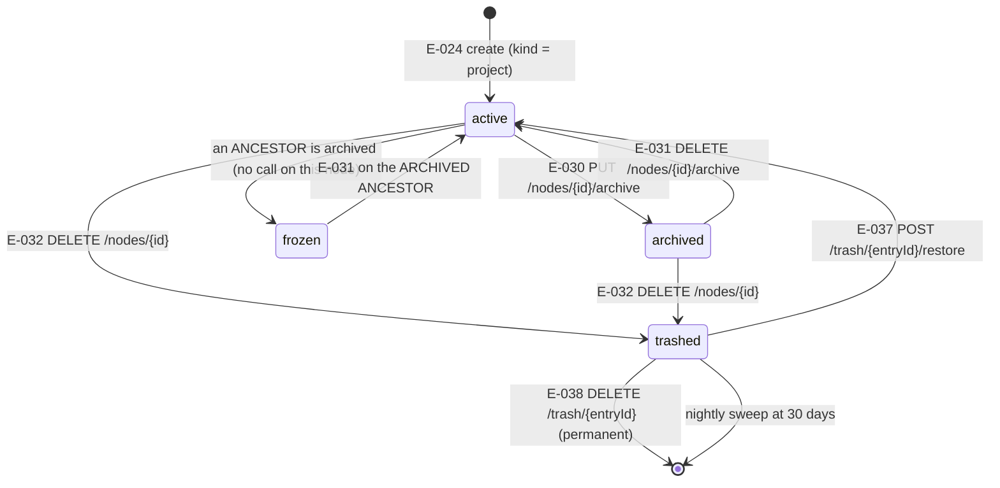
```mermaid
stateDiagram-v2
    [*] --> active : E-024 create (kind = project)
    active --> archived : E-030 PUT /nodes/{id}/archive
    archived --> active : E-031 DELETE /nodes/{id}/archive
    active --> trashed : E-032 DELETE /nodes/{id}
    archived --> trashed : E-032 DELETE /nodes/{id}
    trashed --> active : E-037 POST /trash/{entryId}/restore
    trashed --> [*] : E-038 DELETE /trash/{entryId}  (permanent)
    trashed --> [*] : nightly sweep at 30 days
    active --> frozen : an ANCESTOR is archived (no call on this node)
    frozen --> active : E-031 on the ARCHIVED ANCESTOR
```

Read the diagram with four rules:

1. **`frozen` has no endpoint of its own.** A node becomes frozen because something above it was
   archived, and it leaves that state only when the ancestor is restored. `E-031` on a frozen node is
   refused with `NODE_ARCHIVE_INHERITED` (409 / `conflict`) — *"a page inside an archived project
   cannot be thawed on its own — the project has to be restored first"*
   (`src/lib/archive.ts:30-36`). This is why `archiveSourceOf` walks **root-first** and returns the
   *outermost* archived ancestor (`src/lib/archive.ts:19-28`), and why the Archive listing shows only
   topmost archived nodes (`src/components/collections/archive-page.tsx:28-34`): restoring a child
   would do nothing.
2. **`archived` is read-only, not hidden.** *"Archived means frozen, not hidden away: the content
   stays readable and addressable, and every write path is closed until it is restored"*
   (`src/lib/archive.ts:4-11`). An archived project stays out of the working drive listing
   (`src/hooks/use-drive-location.ts:47-49`) and out of the sidebar tree
   (`src/components/tree/folder-tree.tsx:53`), and stays searchable and reachable by URL.
3. **`trashed` accepts exactly one key.** `can()` short-circuits: `if (node?.isTrashed) return key
   === "node.delete"` (`src/lib/permissions/evaluate.ts:79-81`). Not rename, not move, not archive,
   not restore-from-archive. The restore that *does* work is E-037, which addresses the **trash
   entry**, not the node.
4. **`archived → trashed` is legal, `trashed → archived` is not.** Deleting an archived project is an
   ordinary delete; archiving a trashed one is refused by rule 3.

**Archiving does not cascade to a `project_status` of `archived`.** `ProjectStatus` and `archived_at`
are two spellings of overlapping facts, and part 4's `nodes` table resolves it (OQ-56): `archived_at`
is the single source of truth for the freeze, `project_status` stays a product status (`active` /
`paused`), and the API **rejects `projectStatus: "archived"` on write** with `VALIDATION_FAILED`.
`setNodeArchived` writes `isArchived` and never touches `status`
(`src/store/workspace-store.ts:592-611`), which is the frontend behaviour this preserves.

---

### `POST /api/v1/workspaces/{workspaceId}/nodes` — creating a project

**Purpose** — Create a node. One endpoint for all creatable kinds, discriminated by `kind` in the
body (canon E-024). This section documents the `project` arm; §11 documents the `folder` arm and
§12 the `document`/`page` arm.

**Authentication** — Required.

**Permission** — `node.create` on the **parent** — the workspace root when `parentId` is `null` —
plus membership. Manager+ (`src/lib/permissions/roles.ts:39`). The `project` arm needs no second key;
`board.create` and `document.create` are the extra keys the board and document arms require
(canon §3.3).

The check is on the parent, not on the new node, because the new node does not exist yet and its
effective role is whatever it will inherit. `effectiveAccess` on the parent
(`src/lib/permissions/inheritance.ts:91-120`) is the role the check runs against, and visibility of
the parent is gate 2.

**Path Params**

| Name | Type | Description |
| --- | --- | --- |
| `workspaceId` | UUID | The tenant the node is created in. Never taken from the body. |

**Query Params** — None.

**Request Body**

```ts
/** canon §5.4 CreateNodeRequest — a discriminated union on `kind` (canon C-05). */
type CreateNodeRequest =
  | CreateProjectNodeRequest
  | CreateFolderNodeRequest
  | CreateDocumentNodeRequest
  | CreateBoardNodeRequest;

interface CreateNodeRequestBase {
  /** Container to create inside. `null` is the workspace root and is always legal. */
  readonly parentId: string | null;
  readonly name: string;
}

interface CreateProjectNodeRequest extends CreateNodeRequestBase {
  readonly kind: "project";
  readonly color: string;                    // REQUIRED — ProjectNode.color is not optional
  readonly description?: string;
  readonly projectStatus?: ProjectStatus;    // "active" | "paused"; defaults to "active"
}
```

There is **no `file` arm.** A file node is created by the upload flow (E-110 / E-111), which inserts
`file_assets`, `file_nodes` and the `nodes` row together; the frontend's equivalent is
`addUploadedAsset` (`src/store/workspace-store.ts:716-743`), a separate action from every other
create.

`slug`, `id`, `ownerId`, `createdAt`, `isFavorite`, `isShared`, `isArchived` and `accessMode` are
**never accepted.** All are server-owned.

Validation:

| Field | Rule | Grounding |
| --- | --- | --- |
| `name` | Trimmed; **empty falls back to a default**, it is not rejected. For a project, `"Untitled project"`. | The three existing create paths all coerce: `"Untitled folder"` (`src/store/workspace-store.ts:326`), `"Untitled"` (`:759`), `"Untitled board"` (`:810`). |
| `parentId` | `NULL`, or a live node in the same workspace with `kind IN ('project','folder')`. | `isContainer` (`src/types/node.ts:146-147`); the refusal message the frontend shows for the document arm is *"Pages can only live inside folders"* (`:752`). |
| `color` | Required, non-empty. A CSS colour token; the frontend uses `var(--…)` custom properties (`src/lib/workspace-access.ts:180-187`), so do not validate it as a hex triple. | `src/types/node.ts:84` |
| `description` | ≤ 280 characters. Trimmed; stored `NULL` when empty. | Consistent with `WORKSPACE_DESCRIPTION_MAX`; `ProjectNode.description?` is optional (canon C-08). |
| `projectStatus` | `active` \| `paused`. **`archived` is rejected** — see §10.1. | `src/types/node.ts:46` + part 4's OQ-56 position. |

**Nesting a project inside a project is legal.** `isContainer` admits both kinds and nothing
anywhere restricts a project to the root. The PRD's `Workspace → Project → Folder → Content` is the
*intended* shape, not an enforced one, and enforcing it would be a new rule the frontend does not
have (ground rule 3). **RECOMMENDATION:** allow it, and let the UI stop offering it.

**Response** — `DriveNode` (the `project` variant), `201 Created`.

```jsonc
// 201 POST /api/v1/workspaces/{workspaceId}/nodes
{
  "id": "b21f…", "kind": "project",
  "name": "NexDrop Express", "slug": "nexdrop-express",
  "parentId": null, "workspaceId": "9f1c…",
  "owner": { "id": "usr_…", "name": "Khanh Luu", "email": "khanh@nexdrop.vn", "initials": "KL" },
  "createdAt": "2026-08-27T09:30:00.000Z",
  "updatedAt": "2026-08-27T09:30:00.000Z",
  "isFavorite": false, "isTrashed": false, "isShared": false,
  "state": "active",
  "color": "var(--accent)", "status": "active",
  "description": "Delivery platform",
  "children": []
}
```

`isArchived` and `accessMode` are **omitted**, not `null` (canon C-08): absent means `false` and
`"inherit"` respectively (`src/types/node.ts:66, 77`; `accessModeOf`,
`src/lib/permissions/visibility.ts:47-50`). `children` is `[]` and is **derived** from `parent_id`,
never stored (canon §1.3.1).

**Database**

| Table | Operation | Detail |
| --- | --- | --- |
| `workspace_members` | READ | Gate 1: membership + role. |
| `nodes` | READ | The parent, `WHERE id = :parentId AND workspace_id = :ws AND deleted_at IS NULL FOR UPDATE`. Assert `kind IN ('project','folder')`. Skipped when `parentId IS NULL`. |
| `nodes` | READ | The parent's ancestor chain, for gate 2 (visibility) and the frozen check — `archived_at IS NOT NULL` anywhere above → `NODE_FROZEN_BY_ANCESTOR`. |
| `access_rules` | READ | Rows on the ancestor chain, to resolve the caller's effective role on the parent. |
| `nodes` | READ | Live sibling slugs: `SELECT slug FROM nodes WHERE parent_id IS NOT DISTINCT FROM :parentId AND workspace_id = :ws AND deleted_at IS NULL`. Seeds `uniqueSlug`. |
| `nodes` | INSERT | `workspace_id`, `parent_id`, `kind='project'`, `name`, `slug`, `owner_id=:session_user`, `access_mode='inherit'`, `color`, `description`, `project_status`, `created_at`, `updated_at`, `created_by=:session_user`. Every other kind-specific column stays `NULL` — the `nodes_extras_confined` check enforces it. |
| `audit_events` | INSERT | module `node`, action `node.create`, severity `info`, target = the project name, `detail` = `Created in {parent path}.` |

**No side table.** Unlike `board`, `document`, `config`, `secret` and `file`, a project has no 1:1
content row: `color`, `description` and `project_status` are columns on `nodes` itself. That is why
this arm is the simplest of the four.

**Transaction** — **Required**, and it takes the same per-workspace advisory lock as every other
write that changes the shape of the tree (create, move, trash, restore), so slug minting and the
container check cannot race a concurrent move.

```
BEGIN;
  pg_advisory_xact_lock(hash(:workspaceId));
  <gate 1, gate 2, container check, frozen check>
  slug := uniqueSlug(slugify(:name), liveSiblingSlugs(:parentId));
  INSERT INTO nodes (...);
  INSERT INTO audit_events (...);
COMMIT;
```

Atomic together: the node row and its audit row. (For the `board` and `document` arms the side-table
row joins them — a board node with no `boards` row is a 404 on a URL the sidebar is already showing.)

**Realtime** — `node.changed` (RT-11) with
`{ workspaceId, nodeId, change: "created" }`. Ids only; the receiver refetches
(canon §7.2). Scoped to subscribers who can see the parent — a project created inside a restricted
folder must not announce itself to people who cannot see that folder (**OQ-100**).

**Possible Errors**

| HTTP | Code | Reason |
| --- | --- | --- |
| 400 | `validation` | `VALIDATION_FAILED` — `color` missing, `description` > 280, `projectStatus` = `"archived"`, `kind` not a `NodeKind` member. |
| 401 | `permission_denied` | `AUTH_REQUIRED` |
| 403 | `permission_denied` | `PERMISSION_DENIED` — no `node.create` on the parent. `detail` = `Needs the Manager role or above`. |
| 403 | `permission_denied` | `NODE_FROZEN_BY_ANCESTOR` — the parent chain contains an archived node. |
| 403 | `permission_denied` | `NODE_TRASHED_READ_ONLY` — the parent is in the trash. |
| 404 | `not_found` | `WORKSPACE_NOT_FOUND`; `NODE_NOT_FOUND` for a parent that does not exist **or that the caller may not see**. |
| 409 | `conflict` | `NODE_NOT_CONTAINER` — the parent is a document, board or file. |
| 409 | `conflict` | `NODE_SLUG_CONFLICT` — the mint lost twice under concurrency. |
| 500 | `unknown` | `INTERNAL_ERROR` |

**Frontend Used By** — **None for the `project` arm** (see OQ-11 above). The nearest callers are
`src/components/layout/sidebar/app-sidebar.tsx:102` and
`src/components/shared/create-menu-items.tsx:63`, which both create a **folder**, through
`src/store/workspace-store.ts:516` (`createFolder`).

---

### `GET /api/v1/nodes/{nodeId}` — reading a project

**Purpose** — One node with the caller's capabilities on it.

**Authentication** — Required.

**Permission** — **Visibility** on the node — the resource-access axis, not the capability axis. The
two are never merged: *"a Viewer who is granted a restricted folder sees it and edits nothing, a
Manager who is not granted it does not see it, whatever their role"*
(`src/lib/permissions/visibility.ts:15-33`). A node the caller may not see answers
`NODE_NOT_FOUND` (404), never 403.

**Path Params**

| Name | Type | Description |
| --- | --- | --- |
| `nodeId` | UUID | — |

**Query Params**

| Name | Type | Required | Default | Description |
| --- | --- | --- | --- | --- |
| `includeChildren` | boolean | no | `false` | When true, `children` carries the node's **direct** children, pruned by visibility. When false it is `[]`. Use E-023 for a listing; this flag exists so a project page can render in one round trip. |

**Request Body** — None.

**Response** — the `project` variant of `DriveNode`, plus the caller's `CapabilitySet`.

```ts
/** canon E-022 returns DriveNode + CapabilitySet. */
interface NodeResponse {
  readonly node: DriveNode;
  readonly capabilities: CapabilitySet;   // { view, edit, upload, delete, share, manage }
  readonly state: NodeState;              // derived; also mirrored onto the node
}
```

`CapabilitySet` is a **projection of the catalogue, never declared beside it** — `capabilitiesFor`
derives all six from `can` so *"`capabilities.edit` and `can("row.update")` can never disagree"*
(`src/lib/permissions/evaluate.ts:116-132`). For a project, `edit` resolves through
`editKeyFor(node)` to `node.rename` (`:108-114`, the default branch), `delete` to `node.delete`,
`share` to `node.share`, `manage` to `node.archive`.

**Database**

| Table | Operation | Detail |
| --- | --- | --- |
| `workspace_members` | READ | Gate 1 + workspace role floor. |
| `nodes` | READ | PK lookup, then the **ancestor chain root-ward** by recursive CTE on `parent_id`, depth-bounded (part 4's `nodes` documentation SQL). |
| `access_rules` | READ | `WHERE node_id = ANY(:chain)`, index `access_rules_workspace_idx (workspace_id, node_id)`. Feeds both `admits()` (gate 2) and `effectiveAccess` (gate 3). |
| `node_favorites` | READ | `WHERE user_id = :session_user AND node_id = :nodeId` → `isFavorite`. **Per user** (canon OQ-07), even though the frontend types it as a plain boolean on the node. |
| `nodes` | READ | `EXISTS (SELECT 1 FROM access_rules WHERE node_id = :nodeId)` → `isShared`, which is derived and never stored (canon §1.3.1). |
| `users` | READ | `owner_id` → `UserSummary`. |
| `nodes` | READ | Direct children when `includeChildren=true`, index `nodes_parent_idx`, then pruned. |

**Transaction** — Not required.

**Realtime** — None.

**Possible Errors**

| HTTP | Code | Reason |
| --- | --- | --- |
| 401 | `permission_denied` | `AUTH_REQUIRED` |
| 404 | `not_found` | `NODE_NOT_FOUND` — unknown, trashed-and-purged, in another workspace, **or not visible to the caller**. The refusal names nothing: `DENIED_REASON` is deliberately name-free (`src/lib/permissions/evaluate.ts:155-167`). |
| 500 | `unknown` | `INTERNAL_ERROR` |

**Frontend Used By** — `src/hooks/use-drive-location.ts:42` (through `resolvePath` over the loaded
tree), `src/components/drive/node-detail.tsx`, and `src/hooks/use-permissions.ts:130`
(`useCapabilities`) for the capability half.

---

### `PATCH /api/v1/nodes/{nodeId}` — updating a project

**Purpose** — Rename a node, and change the presentation fields its kind carries.

**Authentication** — Required.

**Permission** — `node.rename` on the node, plus membership and visibility. Manager+ **or the node's
owner**: `node.rename` is in `OWNER_ESCALATIONS` (`src/lib/permissions/roles.ts:102-108`), which
applies from `member` upward (`src/lib/permissions/evaluate.ts:72-74` — `roleRank(role) >=
roleRank("member")`). A Viewer who owns a project still cannot rename it.

**Path Params**

| Name | Type | Description |
| --- | --- | --- |
| `nodeId` | UUID | — |

**Query Params** — None.

**Request Body**

```ts
/** canon §5.4 RenameNodeRequest. `name` is EXISTING; the rest is RECOMMENDATION —
 *  ProjectNode carries these fields and no other endpoint can write them. */
interface RenameNodeRequest {
  readonly name?: string;
  readonly description?: string | null;    // project only; null clears
  readonly color?: string;                 // project | folder only
  readonly projectStatus?: ProjectStatus;  // project only; "archived" rejected
}
```

Rules:

- `name` — trimmed; **an empty name is a no-op, not an error** (`renameNode` returns the state
  untouched, `src/store/workspace-store.ts:483-486`). The database also refuses it
  (`nodes_name_not_blank`), so the API returns the current record rather than writing.
- **The slug is not re-minted.** Canon OQ-09 position: minted once at creation, re-uniquified only on
  move. This is the one place the frontend contradicts itself and canon picks a side: `renameNode`
  from the drive tree *does* re-slug (`src/store/workspace-store.ts:494-497`) while
  `applyDocumentSummary` deliberately does not — *"The slug is the routing key and is minted once, at
  creation: renaming a page the user is standing on must not break its URL"*
  (`src/store/workspace-store.ts:883-885`). Canon takes the second, so a rename never breaks a
  stored link.
- Fields that do not belong to the node's kind are rejected with `VALIDATION_FAILED`, not ignored —
  `color` on a document, `projectStatus` on a folder. Silently dropping them makes a client that
  sends the wrong shape look like it worked.
- `parentId` is **not** patchable here. Moving is E-026 and has its own transaction, its own
  rejections and its own realtime frame.

**Response** — `DriveNode` (the `project` variant), the authoritative record.

**Database**

| Table | Operation | Detail |
| --- | --- | --- |
| `workspace_members` | READ | Gate 1. |
| `nodes` | READ | The node + its ancestor chain: gate 2 (visibility), gate 3 (`node.rename`, with owner escalation from `owner_id`), and the narrowing layers — `deleted_at IS NOT NULL` → refuse; any ancestor `archived_at IS NOT NULL` → refuse. |
| `access_rules` | READ | Chain rules, for `effectiveAccess`. |
| `nodes` | UPDATE | `name`, `description`, `color`, `project_status` as supplied; always `updated_at = now()`, `updated_by = :session_user`. **`slug` is not in the statement.** |
| `audit_events` | INSERT | module `node`, action `node.rename`, severity `info`, target = the **new** name, `detail` = `Renamed from "{old}".` |

`nodes.search_vector` is `GENERATED … STORED` over `name` and `excerpt`, so the rename reindexes
itself with no extra statement.

**Transaction** — Required (update + audit). **No advisory lock**: a rename does not change the shape
of the tree, and because the slug is not re-minted it cannot collide with a sibling.

**Realtime** — `node.changed` (RT-11), `{ workspaceId, nodeId, change: "renamed" }`.

**Possible Errors**

| HTTP | Code | Reason |
| --- | --- | --- |
| 400 | `validation` | `VALIDATION_FAILED` — a field that does not belong to this kind, `description` > 280, `projectStatus` = `"archived"`. |
| 401 | `permission_denied` | `AUTH_REQUIRED` |
| 403 | `permission_denied` | `PERMISSION_DENIED` — no `node.rename` and not the owner. |
| 403 | `permission_denied` | `NODE_TRASHED_READ_ONLY` — a trashed node accepts only `node.delete`. |
| 403 | `permission_denied` | `NODE_FROZEN_BY_ANCESTOR` |
| 404 | `not_found` | `NODE_NOT_FOUND` |
| 500 | `unknown` | `INTERNAL_ERROR` |

**Frontend Used By** — `src/components/shared/rename-dialog.tsx:63` and
`src/components/shared/node-title-input.tsx:60`, both through
`src/store/workspace-store.ts:482` (`renameNode`); reachable from
`src/components/drive/drive-item-menu.tsx:101` (`requestRename`) and the tree row.

---

### `PUT /api/v1/nodes/{nodeId}/archive` — archiving a project

**Purpose** — Freeze a project and everything under it (SY-ARC-37): still readable, still
addressable, accepting no writes.

**Authentication** — Required.

**Permission** — `node.archive` on the node, plus membership and visibility. Manager+ **or the
owner** (`node.archive` is in `OWNER_ESCALATIONS`, `src/lib/permissions/roles.ts:105`).

**Path Params**

| Name | Type | Description |
| --- | --- | --- |
| `nodeId` | UUID | — |

**Query Params** — None.

**Request Body** — None. `PUT` on a boolean sub-resource is idempotent (canon P-07): archiving an
already-archived project is `200` with the unchanged record, not an error. The frontend short-circuits
the same way (`src/store/workspace-store.ts:594-595` — `if (!node || isArchivedNode(node) ===
isArchived) return state`).

*(Canon §5.4 also names a `SetNodeArchivedRequest`; it is the body of the single-endpoint form
`{ isArchived: boolean }`. This specification uses the `PUT` / `DELETE` pair canon §3.3 lists as
E-030 / E-031, so the body is empty in both directions.)*

**Response** — `DriveNode`, with `isArchived: true` and `state: "archived"`.

**Database**

| Table | Operation | Detail |
| --- | --- | --- |
| `workspace_members` | READ | Gate 1. |
| `nodes` | READ | Node + ancestor chain, `FOR UPDATE` on the node. Gate 2, gate 3, `deleted_at IS NULL`. |
| `nodes` | READ | **The ancestor check that matters**: if any ancestor already has `archived_at IS NOT NULL`, the node is already frozen and `node.archive` is closed for it — `can()` returns false for every write key when `isFrozen` (`src/lib/permissions/evaluate.ts:83`). Refuse with `NODE_FROZEN_BY_ANCESTOR`. |
| `nodes` | UPDATE | `SET archived_at = now(), archived_by = :session_user, updated_at = now()` **on this row only**. |
| `audit_events` | INSERT | module `node`, action `node.archive`, severity `info`, target = the project name. |

**Archiving writes one row.** It does **not** stamp descendants. The freeze is *resolved* by walking
the ancestor chain on read (`archiveSourceOf` / `inheritedArchiveOf`, `src/lib/archive.ts:19-45`) —
*"a board inside an archived project is read-only even though its own flag is unset — so nothing
branches on `node.isArchived` directly"* (`:9-11`). Archiving a project with ten thousand descendants
is one `UPDATE`, exactly as restricting a folder is one `INSERT` (§11).

The consequence a backend developer must hold: **every capability check on every descendant must walk
the chain.** There is no denormalised `is_frozen` column, and adding one would need a subtree rewrite
on every archive and every move.

**Transaction** — Required (update + audit). No advisory lock: archiving does not re-parent anything.

**Realtime** — `node.changed` (RT-11), `{ workspaceId, nodeId, change: "archived" }`. Every client
holding a descendant re-resolves its own capabilities; because the freeze is derived from the chain,
nothing else needs to be pushed.

**Possible Errors**

| HTTP | Code | Reason |
| --- | --- | --- |
| 401 | `permission_denied` | `AUTH_REQUIRED` |
| 403 | `permission_denied` | `PERMISSION_DENIED` — no `node.archive` and not the owner. |
| 403 | `permission_denied` | `NODE_TRASHED_READ_ONLY` |
| 403 | `permission_denied` | `NODE_FROZEN_BY_ANCESTOR` — already frozen from above; archive the ancestor's ancestor or restore it first. |
| 404 | `not_found` | `NODE_NOT_FOUND` |
| 500 | `unknown` | `INTERNAL_ERROR` |

**Frontend Used By** — `src/components/drive/drive-item-menu.tsx:150`, through
`src/store/workspace-store.ts:592` (`setNodeArchived`). Feedback copy: *"Archived project “{name}” —
it is read-only until restored"* (`:604-605`, via `archiveLabelFor`, `src/lib/archive.ts:56-68`).

---

### `DELETE /api/v1/nodes/{nodeId}/archive` — restoring a project from the archive

**Purpose** — Thaw a project.

**Authentication** — Required.

**Permission** — `node.archive` on the node, plus membership and visibility. **This is the one write
key a node in the `archived` state still holds**, and that is deliberate: `can()` reads
`isFrozen` from the **ancestors only** and never from the node's own flag, *"because a surface must
keep offering Restore on the thing you are standing on"*
(`src/lib/permissions/evaluate.ts:57-62`).

**Path Params**

| Name | Type | Description |
| --- | --- | --- |
| `nodeId` | UUID | — |

**Query Params** — None.

**Request Body** — None. Idempotent: restoring an unarchived project is `200`.

**Response** — `DriveNode`, with `isArchived` omitted and `state: "active"` — unless an ancestor is
still archived, in which case the call is refused rather than returning `frozen`.

**Database**

| Table | Operation | Detail |
| --- | --- | --- |
| `workspace_members` | READ | Gate 1. |
| `nodes` | READ | Node + ancestor chain `FOR UPDATE`. |
| `nodes` | READ | **`inheritedArchiveOf`**: the chain excluding the node itself (`src/lib/archive.ts:37-45`). Any ancestor with `archived_at IS NOT NULL` → refuse `NODE_ARCHIVE_INHERITED` (409 / `conflict`). |
| `nodes` | UPDATE | `SET archived_at = NULL, archived_by = NULL, updated_at = now()`. The `nodes_archive_pair` check keeps the two columns as one fact. |
| `audit_events` | INSERT | module `node`, action `node.archive`, severity `info`, `detail` = `Restored from the archive.` |

**Why the ancestor refusal is a hard rule, not a nicety.** Clearing this node's own flag while an
ancestor is archived produces a node that *looks* active in the drive listing and refuses every write
anyway, because the capability resolver reads the chain. The user would restore something, watch it
reappear, and find it read-only with no explanation. The frontend prevents the situation from the
other end: the Archive page lists only **topmost** archived nodes
(`src/components/collections/archive-page.tsx:28-34, 114-128`), so the Restore button is never
rendered for a node whose restore would do nothing.

**Transaction** — Required (update + audit).

**Realtime** — `node.changed` (RT-11), `{ workspaceId, nodeId, change: "restored" }`.

**Possible Errors**

| HTTP | Code | Reason |
| --- | --- | --- |
| 401 | `permission_denied` | `AUTH_REQUIRED` |
| 403 | `permission_denied` | `PERMISSION_DENIED` |
| 403 | `permission_denied` | `NODE_TRASHED_READ_ONLY` — a trashed node is restored by E-037, not here. |
| 404 | `not_found` | `NODE_NOT_FOUND` |
| 409 | `conflict` | `NODE_ARCHIVE_INHERITED` — an archived ancestor holds this node frozen. `message` = `That project is inside an archived item`, `detail` = `Restore the item above it first.` |
| 500 | `unknown` | `INTERNAL_ERROR` |

**Frontend Used By** — `src/components/collections/archive-page.tsx:101` and
`src/components/shared/archived-banner.tsx:57` (which restores `archiveSourceOf(node)` — the
outermost archived ancestor, not the node the user is looking at), both through
`src/store/workspace-store.ts:592`.

---

### `DELETE /api/v1/nodes/{nodeId}` — moving a project to the trash

**Purpose** — Soft-delete a project and detach its whole subtree (SY-TRH-38).

**Authentication** — Required.

**Permission** — `node.delete` on the node, plus membership and visibility. Manager+ **or the owner**
(`src/lib/permissions/roles.ts:104`). It is also the **only** key a trashed node still holds
(`src/lib/permissions/evaluate.ts:79-81`), which is what lets E-037 and E-038 work.

**Path Params**

| Name | Type | Description |
| --- | --- | --- |
| `nodeId` | UUID | — |

**Query Params** — None.

**Request Body** — None.

**The PRD's re-type-the-name rule.** `WS-ARC-02` states: *"Xóa Project đang có thành viên làm việc:
Bắt buộc nhập lại tên Project để xác nhận"* — deleting a project with members working in it requires
the caller to re-type the project's name.

**This is a frontend confirmation, not a backend requirement.** Three reasons, stated so nobody
re-opens it:

1. A `confirmName` field on the wire verifies nothing. The server would compare a string the client
   just sent against a string the client already had; a script sends both. The only real control is
   the permission key, and `node.delete` is Manager-or-owner.
2. The product already has exactly this pattern, and it lives entirely in the client:
   `src/components/workspace/workspace-danger-zone.tsx:29` gates the Delete button on
   `typed.trim() === workspace.name` and the API takes nothing (see E-011).
3. Part 4 takes the same position for the same PRD sentence in its `workspaces` table (OQ-02):
   *"treat the PRD rule as a client-side gate for projects (E-032 on a node of kind `project`) and add
   nothing to the wire for it."*

**GAP — the frontend does not implement it today.** `src/components/drive/drive-item-menu.tsx:161`
calls `trashNode(node.id)` straight from the menu item with no confirmation of any kind, for every
node kind including `project`. The confirmation dialog that WS-ARC-02 requires does not exist. What
the backend owes instead is the trail: the audit row below is written at `warn` for a project, so a
deletion is always answerable after the fact even when nobody was asked to type anything.

**Response** — `TrashEntry`, `200`.

```ts
/** src/types/system.ts:171-180 — unchanged. */
interface TrashEntry {
  readonly id: string;                              // == the deleted node's id
  readonly node: DriveNode;                         // the whole subtree, marked isTrashed
  readonly deletedAt: string;                       // ISO 8601
  readonly deletedBy: UserSummary;
  readonly originalAncestorIds: readonly string[];  // root first
  readonly originalPath: string;                    // "Development / Backend"
  readonly purgeAt: string;                         // ISO 8601 — RECOMMENDATION (canon OQ-14)
}
```

`purgeAt` is `deletedAt + TRASH_RETENTION_DAYS` (30, `src/config/app.ts:41-42`). It is returned
because *"the backend owns the sweep, so the UI reports 'due' rather than inventing it"*
(`src/lib/trash.ts:127-130`); `daysRemaining` currently recomputes it client-side from the constant
(`:131-138`), which is a duplicated rule the server should end.

**Database**

| Table | Operation | Detail |
| --- | --- | --- |
| `workspace_members` | READ | Gate 1. |
| `nodes` | READ | Node + ancestor chain `FOR UPDATE`. Gate 2, gate 3 (`node.delete`, owner escalation), `deleted_at IS NULL`. A frozen node **can** be trashed: `can()` refuses writes when `isFrozen`, and `node.delete` is a write — so **an archived ancestor does block the delete** (`evaluate.ts:83`, before the lock check). Refuse `NODE_FROZEN_BY_ANCESTOR`. |
| `nodes` | READ | `originalAncestorIds` — the chain **excluding the node itself**, root first (`src/lib/trash.ts:37`), and `originalPath` = the ancestors' names joined `" / "`, or `"Workspace root"` (`pathLabel`, `src/lib/tree.ts:74-78`). **Resolved now, while the ancestors still exist** (`src/lib/trash.ts:49-51`) — after a purge there is nothing left to resolve it from. |
| `nodes` | UPDATE | The whole subtree in one statement, driven by a downward recursive CTE on `parent_id`: `SET deleted_at = now(), deleted_by = :session_user`. `parent_id` is **not** changed — the row keeps its place so a restore can put it back. |
| `trash_entries` | INSERT | `node_id`, `workspace_id`, `deleted_by`, `deleted_at`, `original_parent_id`, `original_ancestor_ids UUID[]`, `original_path TEXT`, `purge_at`. One row for the **root** of the deleted subtree; descendants get `deleted_at` and no entry, which is what makes the trash listing show one item rather than a subtree's worth. |
| `audit_events` | INSERT | module `node`, action `node.delete`, severity `warn` for `kind = 'project'` (`info` for a leaf), target = the project name, `detail` = `Moved to Trash from {originalPath}; {n} items.` |

**Slug uniqueness releases immediately.** The partial unique indexes carry `WHERE deleted_at IS NULL`
(part 4, `nodes`), so a trashed project stops reserving its slug the moment it is deleted. That is
what makes E-037 have to re-uniquify on restore.

**Content is not touched.** No `documents`, `boards`, `config_documents`, `secret_documents` or
`file_nodes` row is written or deleted. *"Deleting a document must not delete its content. Trash
detaches the node subtree; content stays keyed by `nodeId` and comes back intact on restore."* The
frontend never calls `documentService.remove` at all (`src/hooks/use-document-actions.ts:114-121`).

**Transaction** — **Required**, with the per-workspace advisory lock. Subtree `UPDATE`, trash entry
and audit row are one unit. A trash entry without the `deleted_at` stamps would list an item that is
still in the tree; the stamps without the entry would hide a subtree nobody can restore.

**Realtime** — `node.changed` (RT-11), `{ workspaceId, nodeId, change: "trashed" }`. One frame for
the subtree root, not one per descendant: the receiver refetches the tree.

**Possible Errors**

| HTTP | Code | Reason |
| --- | --- | --- |
| 401 | `permission_denied` | `AUTH_REQUIRED` |
| 403 | `permission_denied` | `PERMISSION_DENIED` — no `node.delete` and not the owner. |
| 403 | `permission_denied` | `NODE_FROZEN_BY_ANCESTOR` |
| 404 | `not_found` | `NODE_NOT_FOUND` — including a node already in the trash (it is no longer in the tree). |
| 500 | `unknown` | `INTERNAL_ERROR` |

**Frontend Used By** — `src/components/drive/drive-item-menu.tsx:161` (single) and
`src/components/drive/drive-toolbar.tsx:108` (multi-select, one write for the whole selection),
through `src/store/workspace-store.ts:612` / `:614` (`trashNode` / `trashNodes`). Also
`src/hooks/use-document-actions.ts:118` for a page.

---

### `POST /api/v1/trash/{entryId}/restore` — restoring a project from the trash

**Purpose** — Put a deleted project back, and say where it landed when its original home is gone.

**Authentication** — Required.

**Permission** — `node.delete` on the trashed node, plus membership. Canon E-037 names this key
deliberately: `node.delete` is the only key a trashed node holds
(`src/lib/permissions/evaluate.ts:79-81`), so gating restore on `node.create` or `node.archive`
would make it uncallable.

**Path Params**

| Name | Type | Description |
| --- | --- | --- |
| `entryId` | UUID | The trash entry's id, which equals the deleted node's id (`src/lib/trash.ts:44`). |

**Query Params** — None.

**Request Body** — None. The destination is **not** a parameter: it is computed from the recorded
ancestor chain, so a restore cannot be used to relocate something into a folder the caller could not
otherwise write to.

**Response** — `RestoreOutcome`, `200`.

```ts
/** src/types/system.ts:182-188 — unchanged. */
interface RestoreOutcome {
  readonly node: DriveNode;              // the restored subtree root, isTrashed: false
  readonly parentId: string | null;      // where it actually landed
  readonly isRelocated: boolean;         // true when that is NOT the original parent
  readonly location: string;             // the parent's name, or "Workspace"
}
```

```jsonc
// 200 POST /api/v1/trash/{entryId}/restore
{
  "node": { "id": "b21f…", "kind": "project", "name": "NexDrop Express", "parentId": null, "…": "…" },
  "parentId": null,
  "isRelocated": true,
  "location": "Workspace"
}
```

**The destination algorithm** — `restoreTargetFor` (`src/lib/trash.ts:96-114`), reproduced exactly:

```
FUNCTION restoreTargetFor(entry):
  original := entry.node.parentId

  # originalAncestorIds is root-first, so reversing walks from the DEEPEST
  # recorded ancestor upward: the closest surviving home wins.
  FOR candidate IN reverse(entry.originalAncestorIds):
      n := node(candidate)
      IF n IS NULL:            CONTINUE      # purged
      IF NOT isContainer(n):   CONTINUE      # no longer able to hold children
      IF n.deleted_at:         CONTINUE      # itself in the trash
      RETURN { parentId: candidate, isRelocated: candidate <> original }

  # Nothing on the chain survives — the workspace root always does.
  RETURN { parentId: null, isRelocated: original IS NOT NULL }
```

This is precisely PRD `SY-TRH-38`'s edge case: *"Khôi phục 1 Document nhưng Folder cha của nó đã bị
xóa vĩnh viễn: Khôi phục Doc ra ngoài Root của Project."* `isRelocated` is **not an error** — canon
§4.3 records `TRASH_RESTORE_RELOCATED` explicitly as a `200` outcome reported in the body, so no
chapter mistakes it for a failure. The frontend renders it as a different sentence, not a different
result: *"Restored “{name}” to {location} — its original folder no longer exists"*
(`src/store/workspace-store.ts:670-676`).

**Database**

| Table | Operation | Detail |
| --- | --- | --- |
| `workspace_members` | READ | Gate 1. |
| `trash_entries` | READ | `WHERE id = :entryId FOR UPDATE`. |
| `nodes` | READ | The trashed subtree root: `WHERE id = :entryId AND deleted_at IS NOT NULL`. Gate 3 (`node.delete`). |
| `nodes` | READ | `WHERE id = ANY(entry.original_ancestor_ids)` — resolve survivors for the algorithm above. Also gate 2 on the chosen destination: the caller must be able to **see** where it is going. |
| `nodes` | READ | Live sibling slugs at the destination. |
| `nodes` | UPDATE | The subtree: `SET deleted_at = NULL, deleted_by = NULL`. Plus, on the root row only, `parent_id = :destination`, `slug = :newSlug`, `updated_at = now()`, `updated_by = :session_user`. |
| `trash_entries` | DELETE | The entry is consumed. |
| `audit_events` | INSERT | module `node`, action `node.delete`, severity `info`, `detail` = `Restored to {location}.` (or `… — its original folder no longer exists.`) |

**The slug must be re-uniquified.** Because the sibling-uniqueness indexes exclude trashed rows, the
slug was released at deletion and something else may have taken it — or the node is landing in a
different parent entirely after a relocation. `newSlug := uniqueSlug(node.slug,
liveSiblingSlugs(destination))`, exactly as E-026 does on move. Without it the restore violates
`nodes_slug_child_uniq` and fails on a write the user has no way to understand.

**Transaction** — **Required**, with the per-workspace advisory lock (it re-parents a subtree, so it
is one of the four shape-changing writes). Subtree un-stamp, re-parent, slug mint, entry delete and
audit row are one unit.

**Realtime** — `node.changed` (RT-11), `{ workspaceId, nodeId, change: "restored" }`. When the restore
relocated the node into a different access chain, **also** publish `permission.changed` (RT-05) with
the ids of members whose visibility changed — the same computation E-026 performs
(`moveVisibilityImpact`, `src/lib/permissions/visibility.ts:313-333`), because a relocation is a move.

**Possible Errors**

| HTTP | Code | Reason |
| --- | --- | --- |
| 401 | `permission_denied` | `AUTH_REQUIRED` |
| 403 | `permission_denied` | `PERMISSION_DENIED` — no `node.delete` on the trashed node. |
| 404 | `not_found` | `TRASH_ENTRY_NOT_FOUND` — unknown, already restored, or purged. |
| 409 | `conflict` | `NODE_SLUG_CONFLICT` — the mint lost twice at the destination. |
| 500 | `unknown` | `INTERNAL_ERROR` |

**Frontend Used By** — `src/components/collections/trash-page.tsx:91`, through
`src/store/workspace-store.ts:653` (`restoreNode`).

**Permanent deletion** — `DELETE /trash/{entryId}` (E-038) and `DELETE /workspaces/{id}/trash`
(E-039, `EmptyTrashResponse`) end the lifecycle. They are `system`-module endpoints and are
specified with the trash chapter, not here; §10.1's diagram names them so the state machine is
complete. Both hard-delete through the `nodes` cascade, decrement `workspaces.used_bytes` under
`SELECT … FOR UPDATE` for every reachable `file_assets` row, and write their audit row **before**
the delete — because afterwards there is nothing left to describe.
`src/components/collections/trash-page.tsx:108` and `:120` are their callers.


---

## 11. Folder APIs

Module `drive` for the tree operations, `governance` for access. **A folder is not a table either.**
It is a `nodes` row whose `kind` is `folder` — the second of the two container kinds
(`isContainer`, `src/types/node.ts:146-147`).

```ts
interface FolderNode extends DriveNodeBase {
  readonly type: "folder";                  // → wire field `kind`
  readonly children: readonly DriveNode[];  // DERIVED from parent_id, never stored
  readonly color?: string;                  // OPTIONAL, unlike ProjectNode.color
}
```

Four of this section's endpoints — archive, un-archive, trash and restore-from-trash — are
**kind-agnostic** and are specified in full in §10. They are repeated here in the required shape with
only their folder-specific deltas spelled out, so a reader working on folders does not have to
reconstruct them.

PRD `WS-FLD-03` fixes the operation set — *create, rename, drag-move, duplicate, archive, soft-delete,
share* — the containment set (sub-folders, documents, boards, files, config documents, secret
documents), a depth floor of **at least 10 levels with unbounded node count**, and the cycle rule.

---

### `POST /api/v1/workspaces/{workspaceId}/nodes` — creating a folder

**Purpose** — Create a folder inside a project, another folder, or at the workspace root.

**Authentication** — Required.

**Permission** — `node.create` on the parent (the workspace root when `parentId` is `null`), plus
membership and visibility of the parent. Manager+ (`src/lib/permissions/roles.ts:39`).

**Path Params**

| Name | Type | Description |
| --- | --- | --- |
| `workspaceId` | UUID | — |

**Query Params** — None.

**Request Body**

```ts
interface CreateFolderNodeRequest extends CreateNodeRequestBase {
  readonly kind: "folder";
  readonly color?: string;   // optional, unlike a project's
}
```

- `name` — trimmed; **empty falls back to `"Untitled folder"`**, never rejected
  (`src/store/workspace-store.ts:326`).
- `parentId` — `NULL` (root), or a live `project` / `folder` in this workspace. A folder under a
  document, board or file is `NODE_NOT_CONTAINER`.
- `slug` — server-minted, `uniqueSlug(slugify(name), liveSiblingSlugs)`
  (`src/store/workspace-store.ts:521`).
- `accessMode` — **not accepted.** A new folder always starts `inherit`; restricting it is E-041, a
  separate, audited write.

**Response** — `DriveNode` (the `folder` variant), `201 Created`, with `children: []`,
`isFavorite: false`, `isTrashed: false`, `isShared: false`, and `isArchived` / `accessMode` omitted.

The frontend's create-then-rename flow matters for the response: after creating, the store sets
`renameRequestId` to the new node so the caret lands in the name
(`src/store/workspace-store.ts:342-347`) — *"creating one and having to hunt for 'Rename' afterwards
is two steps where one will do."* The API's part of that contract is simply returning the node with
its id; the focus handoff is the client's.

**Database** — identical to §10's project arm, with `kind = 'folder'`, `color` nullable, and
`description` / `project_status` left `NULL` (enforced by `nodes_extras_confined`).

| Table | Operation | Detail |
| --- | --- | --- |
| `workspace_members` | READ | Gate 1. |
| `nodes` | READ | Parent `FOR UPDATE` + ancestor chain (gate 2, frozen check, container check). |
| `access_rules` | READ | Chain rules → the caller's effective role on the parent. |
| `nodes` | READ | Live sibling slugs for the mint. |
| `nodes` | INSERT | `kind='folder'`, `access_mode='inherit'`, `owner_id = :session_user`. |
| `audit_events` | INSERT | module `node`, action `node.create`, severity `info`. |

**Transaction** — Required, under the per-workspace advisory lock.

**Realtime** — `node.changed` (RT-11), `{ workspaceId, nodeId, change: "created" }`.

**Possible Errors** — as §10's project arm, minus the `color`-required and `projectStatus` rows:

| HTTP | Code | Reason |
| --- | --- | --- |
| 400 | `validation` | `VALIDATION_FAILED` — `description`, `projectStatus` or `icon` sent on a folder. |
| 401 | `permission_denied` | `AUTH_REQUIRED` |
| 403 | `permission_denied` | `PERMISSION_DENIED`, `NODE_FROZEN_BY_ANCESTOR`, `NODE_TRASHED_READ_ONLY` |
| 404 | `not_found` | `WORKSPACE_NOT_FOUND`, `NODE_NOT_FOUND` |
| 409 | `conflict` | `NODE_NOT_CONTAINER`, `NODE_SLUG_CONFLICT` |
| 500 | `unknown` | `INTERNAL_ERROR` |

**Frontend Used By** — `src/components/shared/create-menu-items.tsx:63`,
`src/components/drive/drive-toolbar.tsx:194`, `src/components/drive/drive-view.tsx:160`,
`src/components/search/global-search-dialog.tsx:143`, and
`src/components/layout/sidebar/app-sidebar.tsx:102` (which creates a root-level folder labelled
*"Untitled project folder"* — see §10's OQ-11). All through `src/store/workspace-store.ts:516`.

---

### `PATCH /api/v1/nodes/{nodeId}` — renaming a folder

**Purpose** — Change a folder's name, and its optional colour.

**Authentication** — Required.

**Permission** — `node.rename` on the node, plus membership and visibility. Manager+ **or the
owner** (owner escalation, `src/lib/permissions/roles.ts:103`).

**Path Params** — `nodeId` (UUID).

**Query Params** — None.

**Request Body** — `RenameNodeRequest` (§10). For `kind = 'folder'` the accepted fields are `name?`
and `color?`; `description` and `projectStatus` are rejected with `VALIDATION_FAILED`.

**Response** — `DriveNode` (the `folder` variant).

**Database** — as §10: gate reads over `nodes` + `access_rules`, one `UPDATE nodes` touching
`name` / `color` / `updated_at` / `updated_by`, one `audit_events` insert
(module `node`, action `node.rename`, severity `info`). **`slug` is not in the `UPDATE`.**

**Transaction** — Required (update + audit). No advisory lock.

**Realtime** — `node.changed` (RT-11), `change: "renamed"`.

**Possible Errors** — as §10's `PATCH /nodes/{nodeId}`.

**Frontend Used By** — `src/components/shared/rename-dialog.tsx:63`,
`src/components/shared/node-title-input.tsx:60`, reached from
`src/components/drive/drive-item-menu.tsx:101` and the sidebar tree row.

**A divergence a backend developer must know about.** The frontend's `renameNode` **does** re-mint
the slug (`src/store/workspace-store.ts:494-499`) — it computes `uniqueSlug(slugify(trimmed),
siblingSlugs)` and writes it. Canon (OQ-09 position) says the slug is minted once and re-uniquified
only on move, and this specification follows canon. The frontend's own document path already behaves
canon's way and says why: *"renaming a page the user is standing on must not break its URL"*
(`:883-885`). Follow canon; the client's re-navigation after a rename becomes unnecessary rather than
wrong.

---

### `POST /api/v1/nodes/{nodeId}/move`

**Purpose** — Re-parent a folder (and, unchanged, everything under it) into a different container.

**Authentication** — Required.

**Permission** — `node.move` on the node being moved, plus membership, **plus visibility of both the
node and the destination**. Manager+ (`src/lib/permissions/roles.ts:41`); `node.move` is **not** in
`OWNER_ESCALATIONS`, so an owning Member cannot move their own folder.

Requiring visibility of the destination is not decoration: without it, a caller could relocate a
subtree into a restricted folder they cannot see, learn from the response whether the target exists,
and hand the subtree to a group they are not part of.

**Path Params**

| Name | Type | Description |
| --- | --- | --- |
| `nodeId` | UUID | The node being moved. |

**Query Params** — None.

**Request Body**

```ts
/** canon §5.4. */
interface MoveNodeRequest {
  /** Destination container. `null` is the workspace root. */
  readonly targetParentId: string | null;
}
```

**Response** — `MoveNodeResponse`, `200`.

```ts
/** canon §5.5 names it; this is its shape, built from MoveResult
 *  (src/lib/tree.ts:160-164) and MoveImpact (src/lib/permissions/visibility.ts:304-309). */
interface MoveNodeResponse {
  readonly node: DriveNode;                  // authoritative, with the NEW parentId and slug
  readonly previousParentId: string | null;
  /** True when the slug had to change to fit the new sibling set (OQ-10). */
  readonly didSlugChange: boolean;
  readonly impact: MoveImpact;
}

interface MoveImpact {
  /** Members who could see it before and cannot now. Ids only. */
  readonly losing: readonly string[];
  /** Members who could not see it before and can now. Ids only. */
  readonly gaining: readonly string[];
}
```

`impact` exists because *"Moving something is a permission change wearing the costume of a drag: a
board dropped into a restricted folder becomes invisible to everybody the folder is not shared with,
and nothing about the board itself changed. The only honest thing to do is say so before it
happens"* (`src/lib/permissions/visibility.ts:293-302`). The store renders the count as feedback:
*"Moved “{name}” to {target} — 3 people can no longer see it"*
(`src/store/workspace-store.ts:571-589`). **Ids only, never names** — the same rule as the RT-05
frame.

`didSlugChange` is returned because the client re-navigates after a move
(`src/hooks/use-document-actions.ts:126-129` — the move *"changed the node's path, so its old URL is
now stale"*), and a changed slug is the difference between re-navigating and 404-ing.

#### Cycle prevention — the validation, as pseudocode

**EXISTING REQUIREMENT.** PRD `WS-FLD-03`: *"Kéo Folder cha vào chính Folder con của nó: Chặn thao
tác và báo lỗi cấu trúc vòng lặp."* The frontend implements it in `moveNode`
(`src/lib/tree.ts:170-197`) and the rejection vocabulary is a closed, **kebab-case** enum
(canon §2.3):

```ts
type MoveRejection = "same-parent" | "into-self" | "into-descendant" | "invalid-target";
```

| `MoveRejection` | Error reason | HTTP / code | Frontend sentence (`src/store/workspace-store.ts:977-988`) |
| --- | --- | --- | --- |
| `same-parent` | `NODE_MOVE_SAME_PARENT` | 409 / `conflict` | "Item is already in that folder" — a **no-op the caller should treat as success**; the store returns state untouched and shows nothing (`:555`). |
| `into-self` | `NODE_MOVE_INTO_SELF` | 409 / `conflict` | "A folder cannot be moved into itself" |
| `into-descendant` | `NODE_MOVE_INTO_DESCENDANT` | 409 / `conflict` | "A folder cannot be moved into one of its own subfolders" |
| `invalid-target` | `NODE_MOVE_INVALID_TARGET` | 409 / `conflict` | "That destination cannot hold items" |

```
FUNCTION move(actor, nodeId, targetParentId) -> MoveNodeResponse:

  BEGIN TRANSACTION
  # One workspace-wide advisory lock, held for the transaction. Two moves that
  # each pass in isolation can still produce a cycle: A→B and B→A concurrently
  # are both legal alone and illegal together, and no constraint can catch it
  # afterwards. Moves are human-paced; the lock costs nothing real.
  pg_advisory_xact_lock(hash(workspace_id))

  node := SELECT * FROM nodes WHERE id = nodeId FOR UPDATE
  IF node IS NULL:                          REJECT NODE_NOT_FOUND

  # --- gates, before any structural reasoning --------------------------------
  REQUIRE membership(actor, node.workspace_id)      ELSE WORKSPACE_NOT_FOUND
  REQUIRE visible(actor, nodeId)                    ELSE NODE_NOT_FOUND
  REQUIRE visible(actor, targetParentId)            ELSE NODE_NOT_FOUND
  REQUIRE capability(actor, nodeId, "node.move")    ELSE PERMISSION_DENIED
  REQUIRE node.deleted_at IS NULL                   ELSE NODE_TRASHED_READ_ONLY
  REQUIRE no ancestor of nodeId has archived_at     ELSE NODE_FROZEN_BY_ANCESTOR

  # --- the two trivial rejections, in the frontend's order -------------------
  IF targetParentId = nodeId:                       REJECT NODE_MOVE_INTO_SELF
  IF node.parent_id IS NOT DISTINCT FROM targetParentId:
                                                    REJECT NODE_MOVE_SAME_PARENT

  # --- the destination -------------------------------------------------------
  IF targetParentId IS NOT NULL:
      target := SELECT * FROM nodes WHERE id = targetParentId FOR UPDATE
      IF target IS NULL
         OR target.deleted_at IS NOT NULL
         OR target.workspace_id <> node.workspace_id
         OR target.kind NOT IN ('project','folder'):
                                                    REJECT NODE_MOVE_INVALID_TARGET
      IF EXISTS ancestor of targetParentId with archived_at:
                                                    REJECT NODE_FROZEN_BY_ANCESTOR

      # ----- THE CYCLE CHECK ------------------------------------------------
      # Walk ROOT-WARD from the destination. If the node being moved appears
      # anywhere on that chain, the destination is inside the node: the move
      # would detach the subtree into itself. The rows survive, every walk from
      # the root stops finding them, and the branch is silently orphaned.
      #
      # Direction matters. The frontend walks DOWN from the node
      # (isDescendantOf, src/lib/tree.ts:147-156) because it holds the whole
      # tree in memory. The backend walks UP: the answer is identical and the
      # cost is bounded by depth (<= 10 in practice, 64 as a runaway stop)
      # instead of by subtree size, which WS-FLD-03 declares unbounded.
      ancestors := ancestorChainOf(targetParentId)      # [target, parent, …, root]
      IF nodeId IN ancestors:                     REJECT NODE_MOVE_INTO_DESCENDANT

      # ----- depth guard, a runaway stop and not a product limit ------------
      IF depthOf(targetParentId) + 1 + heightOf(nodeId) > MAX_TREE_DEPTH:  # 64
                                                  REJECT NODE_MOVE_INVALID_TARGET

  # --- slug, re-uniquified against the NEW siblings (canon OQ-10) ------------
  # The slug is minted once and never re-minted on rename, but a move can land
  # it beside a sibling that already holds it, and the partial unique index
  # nodes_slug_child_uniq would refuse the write with an error the user cannot
  # act on.
  newSlug := uniqueSlug(node.slug, liveSiblingSlugsOf(targetParentId))

  # --- visibility impact, computed BEFORE the write --------------------------
  impact := visibilityImpact(node, targetParentId)      # see below

  UPDATE nodes
     SET parent_id  = targetParentId,
         slug       = newSlug,
         updated_at = now(),
         updated_by = actor.id
   WHERE id = nodeId

  INSERT INTO audit_events (module: 'node', action: 'node.move',
                            severity: 'info', target: node.name,
                            detail: 'Moved from {oldPath} to {newPath}.')
  COMMIT

  publish RT-11 node.changed      { workspaceId, nodeId, change: "moved" }
  IF impact.losing OR impact.gaining:
      publish RT-05 permission.changed { workspaceId, nodeId,
                                         userIds: impact.losing ∪ impact.gaining }

  RETURN { node, previousParentId, didSlugChange: newSlug <> node.slug, impact }
```

The ancestor chain as documentation SQL:

```sql
-- documentation only. Root-ward from :target_id, cycle-safe, depth-bounded.
WITH RECURSIVE chain(id, parent_id, depth) AS (
    SELECT n.id, n.parent_id, 0 FROM nodes n WHERE n.id = :target_id
  UNION ALL
    SELECT n.id, n.parent_id, chain.depth + 1
      FROM nodes n JOIN chain ON n.id = chain.parent_id
     WHERE chain.depth < 64        -- runaway stop; if the data already holds a
)                                  -- cycle, fail fast instead of spinning
SELECT id FROM chain;
```

`MAX_TREE_DEPTH = 64` is a **RECOMMENDATION** and six times the PRD's floor of 10. It is not a product
limit and must never be described to a user as one.

#### What a move does to descendants' effective access

This is the question the endpoint exists to answer carefully, so it is stated in full.

**No row below the moved node is written. Not one.** `UPDATE nodes … WHERE id = nodeId` touches
exactly the moved row. No `access_rules` row is created, copied, deleted or re-pointed; no
descendant's `access_mode` changes; no descendant's `archived_at` changes. The frontend's model is
identical — `moveNode` returns `{ ...removed, parentId: targetParentId }` and re-inserts the same
subtree object (`src/lib/tree.ts:192-196`).

**And yet every descendant's effective access can change, because access is resolved and never
stored.** `visibility.ts:29-33`: *"Nothing is copied down the tree. Access is resolved by walking from
the root to the node, so restricting a folder with ten thousand descendants writes one field, and a
child's own mode is the only thing that can change what it inherited."* The walk is one boolean
carried root-ward-to-node (`admits`, `src/lib/permissions/visibility.ts:121-135`):

```
admits(n, inherited):
  switch n.access_mode:
    case 'workspace':  return isMember                        # opens up, from here down
    case 'restricted': return isMember AND hasGrantOn(n)      # discards what flowed in
    default:           return inherited                       # 'inherit' passes it through
```

A move replaces the **chain prefix** of every descendant. For a descendant `D` whose chain was
`[W … P_old, F … D]`, after moving `F` under `P_new` it is `[W … P_new, F … D]`. Everything from `F`
downward is recomputed on the next read, from the new prefix.

The consequences, each with its rule:

| Situation | Effect on the subtree | Grounding |
| --- | --- | --- |
| `F.access_mode = 'inherit'` (the majority) | The whole subtree adopts whatever flows out of `P_new`. Members who could see `P_old` but not `P_new` lose the entire subtree; members granted `P_new` gain it. | `admits` default branch |
| `F.access_mode = 'restricted'` | The flow into `F` is discarded at `F`, so *within* the subtree nothing changes — the same grants admit the same people. **But `F` itself is still gated by the path above it**, so a person not admitted by `P_new` cannot reach `F` at all, and therefore cannot reach anything under it. | `nodeVisibility` returns at the first refusing node (`visibility.ts:167-173`) |
| `F.access_mode = 'workspace'` | Same: `workspace` widens **from `F` downward** and **cannot punch back up** through a restriction above it. Moving a `workspace` folder under a restricted one hides it from everyone not granted the restricted parent. | `visibility.ts:109-120` — *"a tree cannot render a child whose parent is missing, and showing one anyway would leak the name of the folder it sits in"* |
| A descendant declares its own `workspace` mode | Unchanged by the move in itself, and still unreachable if the new prefix refuses `F`. | same |
| `F` has an owner | The owner is always admitted **on `F`** (`hasGrantOn`, `visibility.ts:87-93`), but that admission does not survive a refusing ancestor. An owner **can** lose sight of their own folder when it is moved under a restriction they are not in. | `nodeVisibility` walks the whole chain |
| `P_new` (or an ancestor of it) is archived | The subtree becomes `frozen`: every write refused, reads intact, and no descendant can be thawed on its own. Nothing is written; `inheritedArchiveOf` resolves it. | `src/lib/archive.ts:30-45` |
| Favourites, Recent and notification entries pointing into the subtree | Dropped **entirely, name and all**, for anyone who lost visibility — `keepVisibleRefs` filters against the visible tree so *"the resource is gone, and its name is still on screen"* cannot happen. | `src/lib/permissions/visibility.ts:242-268` |
| A refused node in any flat read | Takes its whole subtree with it: search, favourites and relation pickers all read the pruned tree, not the raw one. | `visibleTree` (`:197-240`), `collectAllowed` (`src/lib/tree.ts:297-320`) |

**Computing `impact` — and one place the frontend under-reports.** `moveVisibilityImpact`
(`src/lib/permissions/visibility.ts:313-333`) iterates the workspace's members and compares
`canSeeNode(node.id)` **now** with `canSeeNode(targetParentId)` **now**, using the destination's
current visibility as a proxy for the node's future visibility. That proxy is exact for an inheriting
node. But the function opens with

```ts
if (accessModeOf(node) !== "inherit") return NO_IMPACT;   // visibility.ts:318
```

which is **not** exact: as the table above shows, a `workspace` or `restricted` folder moved under a
restriction still becomes invisible to everyone not admitted by the new parent, through path gating.
The resolver (`nodeVisibility`) is the authority and gets this right; the notice under-reports.

**RECOMMENDATION** — the backend must compute `impact` from the resolver, not from the shortcut:
for each workspace member, evaluate `canSeeNode` against the pre-move chain and against the
hypothetical post-move chain, and diff. It is one chain walk per member over a chain bounded by
depth, inside a transaction that already holds a workspace lock. Do not port the early return.

**Database**

| Table | Operation | Detail |
| --- | --- | --- |
| `workspace_members` | READ | Gate 1; also the member list for the impact computation. |
| `nodes` | READ | The node `FOR UPDATE`; the destination `FOR UPDATE`; both ancestor chains by recursive CTE (`nodes_pkey`, then `parent_id`). |
| `access_rules` | READ | Rules on both chains, `access_rules_workspace_idx (workspace_id, node_id)`. |
| `nodes` | READ | Live sibling slugs at the destination (`nodes_parent_idx`). |
| `nodes` | UPDATE | **One row.** `parent_id`, `slug`, `updated_at`, `updated_by`. |
| `audit_events` | INSERT | module `node`, action `node.move`, severity `info`, target = the folder name, `detail` naming the old and new paths. |

Cardinality note: the composite foreign key `(parent_id, workspace_id) → nodes(id, workspace_id)`
makes a cross-workspace move structurally impossible, which is why the pseudocode's
`target.workspace_id <> node.workspace_id` check is a fast refusal rather than the only defence.

**Transaction** — **Required**, with the per-workspace advisory lock held for its duration. A cycle is
a property of a *set* of rows and PostgreSQL has no constraint that can express one — no `CHECK`, no
`EXCLUDE`, no race-free trigger. The alternatives are `SERIALIZABLE` for the whole endpoint or this
lock; the lock is cheaper and does not make unrelated writes retryable. Take the same lock in create
(E-024), trash (E-032) and restore (E-037) so the invariant holds across all four shape-changing
writes, not only against other moves.

**Realtime** — two frames, both ids-only:

- `node.changed` (RT-11), `{ workspaceId, nodeId, change: "moved" }` — sidebars converge.
- `permission.changed` (RT-05), `{ workspaceId, nodeId, userIds: losing ∪ gaining }` — canon §7.1
  lists a move explicitly as an RT-05 trigger *"which relocates a node under a different access
  chain."* Receivers re-resolve their own access and drop what they may no longer hold
  (`src/hooks/use-access-sync.ts`). Emit it only when the impact is non-empty.

**Possible Errors**

| HTTP | Code | Reason |
| --- | --- | --- |
| 401 | `permission_denied` | `AUTH_REQUIRED` |
| 403 | `permission_denied` | `PERMISSION_DENIED` — no `node.move` (Manager+; ownership does not escalate it). |
| 403 | `permission_denied` | `NODE_TRASHED_READ_ONLY`, `NODE_FROZEN_BY_ANCESTOR` |
| 404 | `not_found` | `NODE_NOT_FOUND` — the node or the destination is unknown **or invisible**. |
| 409 | `conflict` | `NODE_MOVE_SAME_PARENT` — treat as success. |
| 409 | `conflict` | `NODE_MOVE_INTO_SELF` |
| 409 | `conflict` | `NODE_MOVE_INTO_DESCENDANT` |
| 409 | `conflict` | `NODE_MOVE_INVALID_TARGET` — missing, not a container, another workspace, or past the depth guard. |
| 409 | `conflict` | `NODE_SLUG_CONFLICT` — the re-mint lost twice. |
| 500 | `unknown` | `INTERNAL_ERROR` |

**Frontend Used By** — `src/hooks/use-node-dnd.ts:138` (drive grid drag-and-drop),
`src/components/tree/arborist-tree.tsx:27` (sidebar tree drop, one call per dragged id),
`src/hooks/use-document-actions.ts:126` (the page's "Move to…" dialog,
`src/components/document/move-page-dialog.tsx:44`). All through
`src/store/workspace-store.ts:549` (`moveNode`).

---

### `POST /api/v1/nodes/{nodeId}/duplicate`

**Purpose** — Copy a folder and everything inside it, beside the original.

**Authentication** — Required.

**Permission** — `node.create` on the **parent** of the source (the copy lands as a sibling), plus
membership and visibility of the source. Manager+ (canon E-027).

**RECOMMENDATION — additionally require, for every descendant being copied, the read visibility the
caller already has.** Because the copy is server-side and recursive, a caller who can see a folder but
not one restricted sub-folder inside it must not receive a copy that contains it. Duplicate the
**visible** subtree — the same pruning `visibleTree` performs (`src/lib/permissions/visibility.ts:197-240`)
— and report what was skipped. The frontend cannot express this: `cloneNode` runs over the tree the
store already pruned (`src/lib/tree.ts:203-217`), so it never sees the invisible parts in the first
place.

**Path Params**

| Name | Type | Description |
| --- | --- | --- |
| `nodeId` | UUID | The folder to copy. |

**Query Params** — None.

**Request Body**

```ts
/** canon §5.4. Both fields optional; the defaults reproduce the frontend. */
interface DuplicateNodeRequest {
  /** Where the copy goes. Defaults to the source's own parent — beside it. */
  readonly targetParentId?: string | null;
  /** Defaults to `${source.name} (copy)`. */
  readonly name?: string;
}
```

**Response** — `DriveNode` — the new subtree root, `201 Created`.

**What the copy is** — `cloneNode` (`src/lib/tree.ts:203-217`) plus the store's two additions
(`src/store/workspace-store.ts:853-859`):

| Property | Value on the copy | Grounding |
| --- | --- | --- |
| `id` | fresh UUID, **for every descendant** | `cloneNode` mints per node via `idFactory` |
| `parentId` | the target (default: the source's parent) | `:209` |
| `name` | `"{source.name} (copy)"` | `:854` |
| `slug` | `uniqueSlug(slugify(copyName), liveSiblingSlugs(target))` — *"Slug uniqueness is deliberately the caller's job because it needs the sibling list"* (`src/lib/tree.ts:200-202`) | `:858` |
| `isFavorite` | **`false`**, always | `src/lib/tree.ts:209` |
| `isShared` | **`false`**, always | `:209` |
| `owner` | **the caller**, not the source's owner | RECOMMENDATION — ownership escalates five keys on your own things (`src/lib/permissions/roles.ts:102-108`), and inheriting somebody else's ownership hands those keys to the wrong person. The frontend's `cloneNode` copies `owner` because it has no session concept. |
| `accessMode` | **`'inherit'`**, not copied | RECOMMENDATION — see below |
| `access_rules` | **none copied** | RECOMMENDATION — `isShared: false` is the frontend already saying so |
| `archived_at` | `NULL` | The copy is new and active. |
| `deleted_at` | `NULL` | Trashed descendants are not copied at all. |
| content | **copied** — every descendant document, board, config and file reference | canon OQ-12 position |

`accessMode` and the rules are not copied because `cloneNode` sets `isShared: false`, and `isShared`
is derived from *"any `access_rules` row exists on the node"* (canon §1.3.1). A copy that carried the
grants would be `isShared: true` on the first read, contradicting the record the frontend produces.
Duplicating a restricted folder therefore yields an **inheriting** folder — which is more open, so
the endpoint must say so in its response and the client must warn. **This is the single most
dangerous default in the section.**

**Content duplication, per descendant kind** (canon OQ-12):

| Kind | What is copied |
| --- | --- |
| `folder`, `project` | the row only; children recursively |
| `document` (`page`) | the `documents` row with **fresh block ids**, `version: 1`, `is_pinned: false`, lock cleared, and **no version history** — `documentService.duplicate` (`src/services/document-service.ts:243-267`) |
| `board` | the `boards` row, its `board_columns`, its `board_views`, and its `board_rows` with fresh ids and a `next_sequence` restarted — specified in the boards chapter |
| `config` | the `config_documents` row; no version history |
| `secret` | **keys only, values empty.** Never duplicate ciphertext. The copy is audited at `warn`. |
| `file` | a new `file_nodes` row pointing at the **same** `file_assets` row — the bytes are not re-uploaded, and `workspaces.used_bytes` is **not** incremented, because `file_assets.size_bytes` is counted once per asset (canon §1.3.4) |

**Database**

| Table | Operation | Detail |
| --- | --- | --- |
| `workspace_members` | READ | Gate 1. |
| `nodes` | READ | Source + ancestor chain (gates); then the **whole subtree** by downward recursive CTE on `parent_id WHERE deleted_at IS NULL`. |
| `access_rules` | READ | Chain + subtree, to prune invisible descendants. |
| `nodes` | READ | Live sibling slugs at the destination. |
| `nodes` | INSERT | One row per copied node, parents before children, `owner_id = :session_user`, `access_mode = 'inherit'`, `created_by = :session_user`. |
| `documents`, `document_versions` | INSERT / — | One `documents` row per copied page with fresh block ids; **no** `document_versions` rows (a copy has no history). A version-1 row is written at creation per part 6's recommendation. |
| `boards`, `board_columns`, `board_views`, `board_rows` | INSERT | Per copied board. |
| `config_documents`, `secret_documents`, `secrets` | INSERT | Per copied config / secret; `secrets.value_encrypted` is **not** copied. |
| `file_nodes` | INSERT | Per copied file, `asset_id` **reused**. |
| `file_assets`, `workspaces.used_bytes` | *(no write)* | Assets are shared; the quota counter does not move. |
| `node_favorites` | *(no write)* | `isFavorite: false` on the copy. |
| `audit_events` | INSERT | module `node`, action `node.create`, severity `info` (`warn` when a secret document was copied), `detail` = `Duplicated “{name}” — {n} items.` |

**Transaction** — **Required**, and it is a large one: the whole subtree lands or none of it does. The
frontend's two-call sequence (`duplicateNode` then `documentService.duplicate`,
`src/hooks/use-document-actions.ts:90-99`) can leave an orphan node when the second call fails and
has **no compensating delete** — which is precisely why this must be one server-side transaction.

**RECOMMENDATION — a size ceiling.** A recursive duplicate of a large project is unbounded work in
one transaction. Cap it (subtree node count, and total `file_assets.size_bytes` against the remaining
quota) and refuse past the cap with `VALIDATION_FAILED` rather than starting. Serve the cap from
`GET /config` (E-139).

**Realtime** — `node.changed` (RT-11), `{ workspaceId, nodeId: <the copy's root>, change: "created" }`.
One frame; the receiver refetches the tree rather than reconstructing a subtree from frames.

**Possible Errors**

| HTTP | Code | Reason |
| --- | --- | --- |
| 400 | `validation` | `VALIDATION_FAILED` — past the duplicate size cap. |
| 401 | `permission_denied` | `AUTH_REQUIRED` |
| 403 | `permission_denied` | `PERMISSION_DENIED`, `NODE_FROZEN_BY_ANCESTOR`, `NODE_TRASHED_READ_ONLY` |
| 404 | `not_found` | `NODE_NOT_FOUND` — source or destination. |
| 409 | `conflict` | `NODE_NOT_CONTAINER` — the destination cannot hold children. |
| 409 | `conflict` | `NODE_SLUG_CONFLICT` |
| 507 | `upload_failed` | `QUOTA_EXCEEDED` — only if a chosen implementation copies bytes; the specified one does not, so this should never fire. |
| 500 | `unknown` | `INTERNAL_ERROR` |

**Frontend Used By** — `src/hooks/use-document-actions.ts:93` (`duplicateNode`) through
`src/store/workspace-store.ts:840`. There is **no folder-duplicate control in the UI today** — the
drive item menu offers Open, Favourite, Rename, Share link, Manage access, Roles, Download, Archive
and Trash (`src/components/drive/drive-item-menu.tsx:86-166`) and no Duplicate. PRD `WS-FLD-03` lists
duplicate among the required folder operations, so the endpoint is owed and the control is missing.

---

### `PUT /api/v1/nodes/{nodeId}/archive` — archiving a folder

**Purpose** — Freeze a folder and, by inheritance, everything under it.

**Authentication** — Required.

**Permission** — `node.archive`, Manager+ or owner. Identical to §10.

**Path Params**

| Name | Type | Description |
| --- | --- | --- |
| `nodeId` | UUID | — |

**Query Params** — None.

**Request Body** — None. Idempotent, as in §10.

**Response** — `DriveNode` (`folder` variant), `isArchived: true`, `state: "archived"`.

**Database** — identical to §10: gate reads, then `UPDATE nodes SET archived_at = now(), archived_by
= :session_user, updated_at = now() WHERE id = :nodeId` — **one row**, never the subtree — plus one
`audit_events` insert (module `node`, action `node.archive`, severity `info`). The freeze on
descendants is derived by walking the chain (`src/lib/archive.ts:19-45`); there is no `is_frozen`
column and adding one would mean a subtree rewrite on every archive **and every move**.

**Transaction** — Required (update + audit). No advisory lock.

**Realtime** — `node.changed` (RT-11), `change: "archived"`.

**Possible Errors** — as §10: `AUTH_REQUIRED` (401), `PERMISSION_DENIED` /
`NODE_TRASHED_READ_ONLY` / `NODE_FROZEN_BY_ANCESTOR` (403), `NODE_NOT_FOUND` (404),
`INTERNAL_ERROR` (500).

**Frontend Used By** — `src/components/drive/drive-item-menu.tsx:150` through
`src/store/workspace-store.ts:592`. Feedback: *"Archived folder “{name}” — it is read-only until
restored"* (`archiveLabelFor` returns `"folder"`, `src/lib/archive.ts:60-61`).

**Un-archiving** is `DELETE /api/v1/nodes/{nodeId}/archive` (E-031), specified in full in §10. For a
folder the behaviour is identical, including the `NODE_ARCHIVE_INHERITED` refusal when an ancestor is
still archived. Callers: `src/components/collections/archive-page.tsx:101`,
`src/components/shared/archived-banner.tsx:57`.

---

### `DELETE /api/v1/nodes/{nodeId}` — moving a folder to the trash

**Purpose** — Soft-delete a folder and detach its whole subtree.

**Authentication** — Required.

**Permission** — `node.delete`, Manager+ or owner. Identical to §10.

**Path Params**

| Name | Type | Description |
| --- | --- | --- |
| `nodeId` | UUID | — |

**Query Params** — None.

**Request Body** — None.

**Response** — `TrashEntry` (§10), whose `node` carries the **whole subtree** marked `isTrashed`
(`markTrashed`, `src/lib/trash.ts:21-26`) and whose `originalPath` is the ancestors' names joined
`" / "`, resolved at deletion.

**Database** — identical to §10: chain reads for the gates and for `originalAncestorIds` /
`originalPath`; one subtree `UPDATE nodes SET deleted_at, deleted_by` driven by a downward recursive
CTE; one `trash_entries` INSERT for the **subtree root only**; one `audit_events` INSERT (module
`node`, action `node.delete`, severity `info` for a folder, `warn` for a project). `parent_id` is not
changed. No content table is touched.

The folder-specific note: because one entry covers the subtree, deleting a folder that already
contains individually-trashed items leaves those items' own entries in the bin. That is deliberate —
*"a folder can be purged for good while a page deleted out of it earlier survives, which is the one
case where restoring has to find the item a new home — and say so"* (`src/lib/trash.ts:6-13`). It is
also exactly what makes E-037's relocation branch reachable.

**Transaction** — Required, with the per-workspace advisory lock.

**Realtime** — `node.changed` (RT-11), `change: "trashed"`. One frame for the subtree root.

**Possible Errors** — as §10.

**Frontend Used By** — `src/components/drive/drive-item-menu.tsx:161`,
`src/components/drive/drive-toolbar.tsx:108` (multi-select — *"One state write for a multi-select
delete, not one per item"*, `src/store/workspace-store.ts:187-188`).

---

### `POST /api/v1/trash/{entryId}/restore` — restoring a folder

**Purpose** — Put a deleted folder subtree back, relocating it when its original home is gone.

**Authentication** — Required.

**Permission** — `node.delete` on the trashed node. Identical to §10.

**Path Params**

| Name | Type | Description |
| --- | --- | --- |
| `entryId` | UUID | Equal to the deleted node's id. |

**Query Params** — None.

**Request Body** — None. The destination is computed, never supplied.

**Response** — `RestoreOutcome` (§10) — `{ node, parentId, isRelocated, location }`.

**Database** — identical to §10, including the deepest-surviving-ancestor walk
(`restoreTargetFor`, `src/lib/trash.ts:96-114`) and the **mandatory slug re-mint** against the
destination's live siblings.

One folder-specific consequence worth stating: `untrash` clears `isTrashed` down the whole subtree and
re-points each child's `parentId` at its restored parent (`src/lib/trash.ts:117-125`). Server-side
that is a single subtree `UPDATE … SET deleted_at = NULL, deleted_by = NULL`; the `parent_id` values
below the root were never changed by the delete, so nothing else needs re-pointing.

**Transaction** — Required, with the per-workspace advisory lock.

**Realtime** — `node.changed` (RT-11), `change: "restored"`; plus `permission.changed` (RT-05) when
the restore relocated the subtree under a different access chain.

**Possible Errors** — as §10: `TRASH_ENTRY_NOT_FOUND` (404), `PERMISSION_DENIED` (403),
`NODE_SLUG_CONFLICT` (409).

**Frontend Used By** — `src/components/collections/trash-page.tsx:91` through
`src/store/workspace-store.ts:653`.

---

### `GET /api/v1/nodes/{nodeId}/children`

**Purpose** — The direct children of one container.

**Authentication** — Required.

**Permission** — Visibility of `{nodeId}`. The children are additionally pruned by their own
visibility, subtree-wide.

**Path Params**

| Name | Type | Description |
| --- | --- | --- |
| `nodeId` | UUID | Must be a `project` or `folder`. |

**Query Params**

| Name | Type | Required | Default | Description |
| --- | --- | --- | --- | --- |
| `includeArchived` | boolean | no | `false` | The drive listing excludes archived children (`src/hooks/use-drive-location.ts:47-49`); the Archive view needs them. |
| `includeTrashed` | boolean | no | `false` | Trashed nodes are detached and normally absent. `true` is for an admin diagnostic, never a product surface. |
| `limit` | integer | no | 500 | Hard cap 1000. Unpaginated (canon §6.3). |

Sort is **not** a query parameter: `sortNodes` runs client-side over the loaded array
(`src/hooks/use-drive-location.ts:54`, `src/lib/tree.ts:255-276`) and `ViewMode` / `SortKey` are
drive-listing-only, `ViewMode` explicitly never persisted server-side (canon §2.6).

**Request Body** — None.

**Response** — `readonly DriveNode[]`, ordered deterministically as
`(container_first, lower(name), id)` — matching the client's default
`{ key: "name", direction: "asc" }` (`src/store/workspace-store.ts:234`) and its `TYPE_WEIGHT`
grouping (`project` 0, `folder` 1, `document` 2, `board` 3, `file` 4 — `src/lib/tree.ts:247-253`).
`id` is the tiebreaker so two same-named siblings never swap between requests. Each element's
`children` is `[]`; use this endpoint again, or E-020, to go deeper.

**Database**

| Table | Operation | Detail |
| --- | --- | --- |
| `workspace_members` | READ | Gate 1. |
| `nodes` | READ | `{nodeId}` + ancestor chain — gate 2 on the container itself. |
| `nodes` | READ | `WHERE parent_id = :nodeId AND deleted_at IS NULL` (+ `archived_at IS NULL` unless `includeArchived`), index `nodes_parent_idx (parent_id) WHERE deleted_at IS NULL`. |
| `access_rules` | READ | Rows on the chain **and on each child**, to run `admits` per child. |
| `node_favorites` | READ | `WHERE user_id = :session_user AND node_id = ANY(:children)` → each child's `isFavorite`. |
| `users` | READ | Owners. |
| `boards`, `documents`, `file_nodes`, `file_assets` | READ | The kind-specific projected fields — `templateId`, `blockCount`/`excerpt`, `sizeBytes`/`extension`/`mimeType`/`version`. |

**Pruning is subtree-wide, and that is the point.** A child the caller may not see is **absent**, not
greyed out — and because a refused node takes its whole subtree with it, the invisible child's own
descendants can never leak into a later call either (`collectAllowed`, `src/lib/tree.ts:297-320`).

**Transaction** — Not required.

**Realtime** — None on read.

**Possible Errors**

| HTTP | Code | Reason |
| --- | --- | --- |
| 401 | `permission_denied` | `AUTH_REQUIRED` |
| 404 | `not_found` | `NODE_NOT_FOUND` — unknown or invisible. |
| 409 | `conflict` | `NODE_NOT_CONTAINER` — `{nodeId}` is a document, board or file. |
| 500 | `unknown` | `INTERNAL_ERROR` |

**Frontend Used By** — `src/hooks/use-drive-location.ts:42-49` (`location.children`, filtered and
sorted into `visibleChildren`), rendered by `src/components/drive/drive-view.tsx` and
`src/components/drive/drive-grid.tsx`. The sidebar's recursive tree reads the same data from the
store (`src/components/tree/folder-tree.tsx:48-104`).

---

### `GET /api/v1/workspaces/{workspaceId}/tree`

**Purpose** — The whole drive tree of a workspace, nested, as the caller is allowed to know it.

**Authentication** — Required.

**Permission** — Membership. Per-node visibility is applied inside the response, not as a gate on the
call.

**Path Params**

| Name | Type | Description |
| --- | --- | --- |
| `workspaceId` | UUID | — |

**Query Params**

| Name | Type | Required | Default | Description |
| --- | --- | --- | --- | --- |
| `depth` | integer | no | unlimited | **RECOMMENDATION** (canon OQ-13). Children beyond `depth` are omitted and their container carries `hasMoreChildren: true`, to be fetched with E-023. The frontend tolerates a partial tree already: `resolvePath` returns `isNotFound` with the crumbs it did resolve (`src/lib/tree.ts:40-60`). |
| `includeArchived` | boolean | no | `true` | Archived nodes stay **in** the tree — they are filtered at the listing layer, not here (`src/hooks/use-drive-location.ts:47-49`), and the Archive view needs them (`src/components/collections/archive-page.tsx:28-34`). |

**Request Body** — None.

**Response** — `readonly DriveNode[]` — the root-level nodes, each container carrying its
`children` array recursively. Trashed nodes are **never** included: they are detached and live in the
trash listing (E-036).

**The pruning contract** — `visibleTree` (`src/lib/permissions/visibility.ts:197-240`), and this is
the single most load-bearing read in the product:

- Pruned **once, from the root down, carrying the decision** — one pass over the tree rather than a
  chain walk per node.
- A refused node **takes its whole subtree with it**. *"That is what stops a board inside a restricted
  folder from surfacing in search, favourites or a relation picker just because the board itself
  carries no restriction of its own."*
- A non-member gets `[]` (`:201`) — not an error, not a partial tree.
- Everything downstream reads *this* tree: *"no surface asks 'may I show this', because what it was
  handed is already the answer"* (`:192-196`). Search (E-035, E-133), favourites (E-033), My Work
  (E-134), the dashboard (E-135) and the relation picker (E-071) all resolve against the pruned set,
  which is why this endpoint's correctness is not a listing concern.

**Database**

| Table | Operation | Detail |
| --- | --- | --- |
| `workspace_members` | READ | Gate 1 + the caller's workspace role, which is the floor for `effectiveAccess`. |
| `nodes` | READ | **One flat scan**: `WHERE workspace_id = :ws AND deleted_at IS NULL`, index `nodes_workspace_kind_idx (workspace_id, kind) WHERE deleted_at IS NULL`. Nested in memory by `parent_id`. No recursive CTE — the whole workspace is being read anyway, and a CTE would be strictly more work. |
| `access_rules` | READ | **All rules for the workspace**, `WHERE workspace_id = :ws`, index `access_rules_workspace_idx`. Loaded into a `Record<nodeId, AccessRule[]>` — exactly the shape the resolver walks (`src/store/permission-store.ts:21-31`). |
| `node_favorites` | READ | `WHERE user_id = :session_user AND workspace_id = :ws`, one set membership test per node. |
| `users` | READ | Every distinct `owner_id`, resolved once and shared. |
| `boards`, `documents`, `file_nodes ⋈ file_assets` | READ | The projected per-kind fields, one batch join each. **Never a board's rows** — E-048 makes that rule explicit and it applies here too. |

The whole read is `O(nodes + rules)` with no per-node query. That is the reason for the flat scan:
one round trip, one prune pass, one response.

**Transaction** — Not required. Use one read-only snapshot so the tree cannot be internally
inconsistent (a child present whose parent was concurrently trashed).

**Realtime** — None on read. Convergence comes from `node.changed` (RT-11) and `permission.changed`
(RT-05).

**Possible Errors**

| HTTP | Code | Reason |
| --- | --- | --- |
| 401 | `permission_denied` | `AUTH_REQUIRED` |
| 404 | `not_found` | `WORKSPACE_NOT_FOUND` — unknown or not a member. |
| 500 | `unknown` | `INTERNAL_ERROR` |

**Frontend Used By** — `src/store/workspace-store.ts:1041` (`selectTree`) and
`src/hooks/use-workspace-access.ts:88` (`useVisibleTree`), which together feed
`src/components/tree/folder-tree.tsx`, `src/components/drive/drive-view.tsx`,
`src/hooks/use-drive-location.ts:33`, `src/lib/breadcrumbs.ts` and every smart-view page under
`src/components/collections/`.

---

### `GET /api/v1/nodes/{nodeId}/access`

**Purpose** — Who can see this folder, what each of them can do once inside, and **where each answer
came from**. This one endpoint serves both "get access" and "list who has access": the mode and the
list are one read because the dialog asks one question in two halves — *is this shut*, and if so,
*who is in* (`src/components/permissions/node-access-dialog.tsx:117-127`).

**Authentication** — Required.

**Permission** — `node.access.manage` on the node, **or** `workspace.permission.manage`, plus
membership. That disjunction is the frontend's:
`canManage = can("node.access.manage") || can("workspace.permission.manage")`
(`src/hooks/use-node-access.ts:80`). `node.access.manage` is Manager+ — *"Restricting a folder is
structural, not administrative: a project lead shuts their own folder without waiting on a workspace
admin"* (`src/lib/permissions/roles.ts:44-47`) — and `workspace.permission.manage` is Admin.

**RECOMMENDATION — the read and the write need different keys.** The dialog renders for anybody who
can open the menu entry and shows *"You can see who has access, but not change it"* when they cannot
manage (`src/components/permissions/node-access-dialog.tsx:301-305`), so the **read** should require
only visibility, and the response should carry a `canManage` flag. Canon E-040 lists
`node.access.manage`; this specification follows canon for the gate and adds the flag, so a future
loosening is additive.

**Path Params**

| Name | Type | Description |
| --- | --- | --- |
| `nodeId` | UUID | Any node. **Not folders only** — the mode has always been on the base node type and the resolver has always walked every kind; *"the restriction was only ever in the menu"* (`src/hooks/use-node-access.ts:52-60`). Restricting a single `.env` file is the case people reach for first. |

**Query Params** — None.

**Request Body** — None.

**Response** — `NodeAccessResponse`, `200`.

```ts
/** canon E-040. */
interface NodeAccessResponse {
  readonly accessMode: NodeAccessMode;              // "inherit" | "workspace" | "restricted"
  /** The nearest ancestor that actually decides something, for the
   *  "Right now that is Backend" line on the Inherit card. Null when the
   *  chain is unbroken `inherit` all the way up — the UI then says
   *  "the whole workspace". */
  readonly inheritedFrom: AccessOrigin | null;      // { nodeId, name }
  /** One row per workspace member, plus one per role-scoped rule anywhere on
   *  the chain. Sorted by roleRank DESCENDING. */
  readonly entries: readonly ResolvedAccess[];
  /** Whether THIS caller may write the endpoints below. RECOMMENDATION. */
  readonly canManage: boolean;
}

/** src/types/permission.ts:160-171 — unchanged. */
interface ResolvedAccess {
  readonly subject: AccessSubject;                  // { kind:"user", userId } | { kind:"role", role }
  readonly role: WorkspaceRole;                     // what they effectively hold HERE
  readonly source: AccessSource;                    // workspace | inherited | explicit | override
  readonly origin: AccessOrigin | null;             // node the rule is written on; null = workspace default
  readonly inheritedRole: WorkspaceRole | null;     // what they would have had with no rule here
  readonly inheritedFrom: AccessOrigin | null;      // ancestor the inherited value came from
  /** RECOMMENDATION, additive: the id DELETE .../access-rules/{ruleId} needs.
   *  Null when `source` is "workspace" or "inherited" — there is no rule here
   *  to revoke. */
  readonly ruleId: string | null;
}
```

```jsonc
// 200 GET /api/v1/nodes/{nodeId}/access
{
  "accessMode": "restricted",
  "inheritedFrom": { "nodeId": "a11e…", "name": "Development" },
  "canManage": true,
  "entries": [
    {
      "subject": { "kind": "user", "userId": "usr_duc" },
      "role": "member", "source": "override",
      "origin": { "nodeId": "b22f…", "name": "Backend" },
      "inheritedRole": "manager",
      "inheritedFrom": { "nodeId": "a11e…", "name": "Development" },
      "ruleId": "d4c1…"
    },
    {
      "subject": { "kind": "role", "role": "viewer" },
      "role": "member", "source": "explicit",
      "origin": { "nodeId": "b22f…", "name": "Backend" },
      "inheritedRole": null, "inheritedFrom": null,
      "ruleId": "e5b2…"
    }
  ]
}
```

**The four `AccessSource` values, and exactly what each means**
(`src/types/permission.ts:146-153`, computed at `src/lib/permissions/inheritance.ts:108-119`):

| `source` | Meaning | How it is decided |
| --- | --- | --- |
| `workspace` | No rule anywhere on the chain; they hold their workspace role. | `chain` has no match at all |
| `inherited` | A rule on an **ancestor** reaches them; nothing is written here. | `own` is null, `inherited` is not |
| `explicit` | A rule **is** written here, and it agrees with what would have flowed down. | `own.role === wouldHave` |
| `override` | A rule is written here and **replaces** what would have flowed down. | `own.role !== wouldHave` |

Badge labels: `"Workspace role"`, `"Inherited"`, `"Explicit"`, `"Override"`
(`src/lib/permissions/inheritance.ts:170-175`).

**Row composition** — `resolveAccess` (`src/lib/permissions/inheritance.ts:127-167`):

1. One row for **every workspace member**, whether or not any rule names them.
2. Plus one row for **every role-scoped rule anywhere on the chain** whose subject is not already
   listed — *"a grant that covers a group is never invisible just because it names no one"*
   (`:136-146`).
3. Sorted `roleRank(b.role) - roleRank(a.role)` — admins first (`:166`).

**Matching, within one node** — `matchIn` (`src/lib/permissions/inheritance.ts:55-79`): a rule naming
the **person** outranks a rule naming their **role** at the same depth, and the **deepest** node on
the chain wins overall. That is canon's OQ-22 position — *"Deepest node wins; at one node a
user-scoped rule beats a role-scoped rule; the workspace role is the floor"* — and it is deliberately
**not** the PRD's `SY-INH-43` edge case, which says *"Áp dụng mức quyền cao hơn (Union of
permissions)."* Follow canon; the code is the deepest-wins version and a union would silently widen
every override that narrows.

**Database**

| Table | Operation | Detail |
| --- | --- | --- |
| `workspace_members` | READ | Gate 1, the caller's role, **and** the full member list — every member becomes a row. |
| `nodes` | READ | The node + its ancestor chain, root-first, by recursive CTE. `accessMode` and `inheritedFrom` both come from this walk: `inheritedFrom` is the deepest ancestor (excluding self) whose `access_mode <> 'inherit'` (`src/hooks/use-node-access.ts:104-116`); when there is none, the client renders *"the whole workspace"*. |
| `access_rules` | READ | `WHERE node_id = ANY(:chain)` → `{ id, node_id, subject_kind, subject_user_id, subject_role, role, granted_at, granted_by }`. Index `access_rules_workspace_idx (workspace_id, node_id)`. |
| `users` | READ | Names for the subjects. |

Cardinality: at most one rule per `(node_id, subject)` — enforced by the two partial unique indexes
`access_rules_node_user_uniq` and `access_rules_node_role_uniq`, because `matchIn` takes the **first**
match within a node and a duplicate would make resolution order-dependent.

**Transaction** — Not required.

**Realtime** — None on read.

**Possible Errors**

| HTTP | Code | Reason |
| --- | --- | --- |
| 401 | `permission_denied` | `AUTH_REQUIRED` |
| 403 | `permission_denied` | `PERMISSION_DENIED` — neither `node.access.manage` nor `workspace.permission.manage`. |
| 404 | `not_found` | `NODE_NOT_FOUND` — unknown or invisible. |
| 500 | `unknown` | `INTERNAL_ERROR` |

**Frontend Used By** — `src/hooks/use-node-access.ts:82-116` (`granted`, `candidates`,
`inheritedFrom`) and `src/hooks/use-permissions.ts:148-157` (`useAccessList` → `resolveAccess`),
rendered by `src/components/permissions/node-access-dialog.tsx:223-291` and
`src/components/permissions/access-list.tsx:22-27`.

**One deliberate omission.** The response never carries `NodeVisibility.deniedAt` — the node that
refused. It exists for the server's own bookkeeping and is *"never rendered to the person who was
refused, who is not entitled to learn that a folder called Finance exists"*
(`src/lib/permissions/visibility.ts:137-145`).

---

### `PUT /api/v1/nodes/{nodeId}/access-mode`

**Purpose** — Set how a folder decides who may see it: `inherit`, `workspace` or `restricted`.

**Authentication** — Required.

**Permission** — `node.access.manage` (Manager+) **or** `workspace.permission.manage` (Admin), plus
membership and visibility.

**Path Params**

| Name | Type | Description |
| --- | --- | --- |
| `nodeId` | UUID | Any node kind. |

**Query Params** — None.

**Request Body**

```ts
/** canon §5.4. */
interface SetNodeAccessModeRequest {
  readonly accessMode: NodeAccessMode;   // "inherit" | "workspace" | "restricted"
}
```

**What each mode does** (`src/lib/permissions/visibility.ts:35-45, 121-135`, and the three cards the
dialog renders):

| Mode | Behaviour | Card copy |
| --- | --- | --- |
| `inherit` | Passes through whatever flows in from the nearest deciding ancestor. **The default; almost every node.** | *"Whoever can see the folder this sits in."* + *"Right now that is {ancestor}."* |
| `workspace` | Every workspace member, **from this node downward**. Cannot punch back up through a restriction above. | *"Everyone in the workspace, whatever the parent says."* |
| `restricted` | Discards what flowed in. Only the subjects granted here — plus the node's owner — are admitted. Stops inheritance at this node. | *"Only the people listed below."* |

**Response** — `DriveNode` — the authoritative record, with `accessMode` set (and **omitted** from the
JSON when it is `inherit`, per canon C-08 and `accessModeOf`).

**The lock-out rule — this endpoint's one non-obvious obligation.**

```
IF accessMode = 'restricted' AND NOT hasGrantOn(node, actor):
    INSERT the actor's own access_rules row FIRST, at their current effective role
UPDATE nodes SET access_mode = 'restricted'
```

Both statements are in **one transaction, in that order**. `useNodeAccess.setMode`
(`src/hooks/use-node-access.ts:118-143`) does exactly this and says why:

> Grant before restricting, not after: the order is what makes it impossible to lock yourself out
> with one dropdown.

The role granted is the actor's own workspace role, falling back to `"manager"`
(`src/hooks/use-node-access.ts:132`). `wouldLockOut` (`src/lib/permissions/visibility.ts:342-348`) is
the predicate; it is checked **before** the write because *"a folder you cannot see is a folder you
cannot re-open."* A mode flip that commits without the grant produces a folder only its owner and the
admin recovery console can reopen.

`hasGrantOn` already admits the node's **owner** unconditionally
(`src/lib/permissions/visibility.ts:87-93`) — *"Somebody has to be able to get back into a folder they
shut, and 'whoever made it' is a rule a person can hold in their head"* — so an owner restricting
their own folder needs no extra row, and the guard correctly does nothing.

**Widening is the change worth confirming.** `restricted → workspace` shows a confirmation dialog
first (`src/components/permissions/node-access-dialog.tsx:165-173, 316-327`) — *"Widening access is
the change worth stopping to confirm: it is the one that shows a folder to people who could not see it
a moment ago."* That is a client gate; the API takes no confirmation field, for the same reason E-011
and E-032 do not.

**Existing grants survive a mode change.** Switching to `workspace` does not delete the
`access_rules` rows — the dialog says so: *"The people listed here keep the roles they were given"*
(`:320`). They stop gating **visibility** (because `admits` returns `isMember` for `workspace`) while
continuing to decide **capability** through `effectiveAccess`. The two axes stay separate, which is
the whole design.

**Database**

| Table | Operation | Detail |
| --- | --- | --- |
| `workspace_members` | READ | Gate 1, the caller's role, and the role the self-grant will use. |
| `nodes` | READ | Node + ancestor chain `FOR UPDATE` on the node — gate 2, gate 3, `deleted_at IS NULL`, no archived ancestor. |
| `access_rules` | READ | Rows on this node — is the actor already granted? |
| `access_rules` | INSERT | **Conditionally**, the actor's own rule, before the update. `ON CONFLICT (node_id, subject_user_id) WHERE subject_kind='user' DO UPDATE SET role = EXCLUDED.role`. |
| `nodes` | UPDATE | `SET access_mode = :mode, updated_at = now(), updated_by = :session_user`. **One row.** Descendants are never stamped: `tests/folder-access.test.ts:423-442` builds a 201-deep tree, restricts the root, and asserts exactly one rule key exists. |
| `audit_events` | INSERT | module `workspace`, action `workspace.permission.manage`, severity **`warn`**, target = the node name, `detail` = e.g. `Access set to Restricted.` The frontend already audits both rule writes at `warn` (`src/store/permission-store.ts:71-78, 99-106`); the mode change belongs in the same trail. |

`is_shared` on the wire is derived — `EXISTS(access_rules WHERE node_id = …)` — so the conditional
self-grant flips it as a side effect, correctly.

**Transaction** — **Required.** Self-grant, mode update and audit row are one unit. This is the second
transaction in the specification whose ordering is a correctness property rather than tidiness.

**Realtime** — `permission.changed` (RT-05), `{ workspaceId, nodeId, userIds }` where `userIds` is
every member whose visibility of this node changed — computed the same way as E-026's `impact`, by
evaluating `canSeeNode` before and after. Ids only: *"a frame announcing a revocation must not be the
thing that leaks what was revoked"* (`src/types/realtime.ts:20-25`). The same write must bust any
server-side authorisation cache keyed `(workspaceId, userId)`.

**Possible Errors**

| HTTP | Code | Reason |
| --- | --- | --- |
| 400 | `validation` | `VALIDATION_FAILED` — `accessMode` is not one of the three. |
| 401 | `permission_denied` | `AUTH_REQUIRED` |
| 403 | `permission_denied` | `PERMISSION_DENIED` |
| 403 | `permission_denied` | `NODE_TRASHED_READ_ONLY`, `NODE_FROZEN_BY_ANCESTOR` |
| 404 | `not_found` | `NODE_NOT_FOUND` |
| 500 | `unknown` | `INTERNAL_ERROR` |

**Frontend Used By** — `src/hooks/use-node-access.ts:136` (`setNodeAccessMode`) through
`src/store/workspace-store.ts:412`, driven by
`src/components/permissions/node-access-dialog.tsx:200-215` (the three `RadioCard`s).

---

### `PUT /api/v1/nodes/{nodeId}/access-rules`

**Purpose** — Grant a user (or a whole role) a role on this folder, or change the one they already
have. Upsert by `(node, subject)`.

**Authentication** — Required.

**Permission** — `node.access.manage` **or** `workspace.permission.manage`, plus membership and
visibility.

**Path Params**

| Name | Type | Description |
| --- | --- | --- |
| `nodeId` | UUID | — |

**Query Params** — None.

**Request Body**

```ts
/** canon §5.4. */
interface SetAccessRuleRequest {
  readonly subject: AccessSubject;   // { kind: "user", userId } | { kind: "role", role }
  readonly role: WorkspaceRole;
}
```

`PUT` rather than `POST` because it is idempotent: *"upsert by `(node, subject)`; **replaces any
existing rule for the same subject**"* (canon E-042). The frontend's write path is the same function
for "add somebody" and "change their role" — `access.grant(userId, role)` is called from the add box
(`src/components/permissions/node-access-dialog.tsx:181`) and from the per-row role select (`:249`).

**The subject must be a workspace member.** Folder access is downstream of membership and never a way
around it — the add box's empty state says so: *"Nobody matching “{query}” is a member of this
workspace. Invite them in Workspace settings first"*
(`src/components/permissions/node-access-dialog.tsx:100-115`), with the comment *"silently pulling
them in here would make a folder dialog a membership control."* A `user` subject that is not a member
is `MEMBER_NOT_FOUND` (404).

**The default role when adding somebody** is the role they already hold in the workspace
(`:178-182` — *"Somebody is added at the role they already hold in the workspace; the select on their
row is where it gets narrowed afterwards"*). The client sends it explicitly; the API has no default.

**Response** — `AccessRule`, `200` (or `201` when the row is new).

```ts
/** src/types/permission.ts:136-144 — unchanged. */
interface AccessRule {
  readonly id: string;
  readonly nodeId: string;
  readonly subject: AccessSubject;
  readonly role: WorkspaceRole;
  readonly grantedAt: string;   // ISO 8601, server clock
  readonly grantedBy: string;   // user id, FROM THE SESSION (canon C-09)
}
```

**Database**

| Table | Operation | Detail |
| --- | --- | --- |
| `workspace_members` | READ | Gate 1 + the caller's role. |
| `nodes` | READ | Node + chain — gate 2, gate 3, `deleted_at IS NULL`, no archived ancestor. |
| `workspace_members` | READ | The **subject**, for a `user` subject: must be a member of this workspace. |
| `access_rules` | UPSERT | `INSERT … ON CONFLICT (node_id, subject_user_id) WHERE subject_kind='user' DO UPDATE SET role = EXCLUDED.role, granted_at = now(), granted_by = :session_user` (and the mirror index for `role` subjects). One row per `(node, subject)`; the `subject_is_exclusive` check keeps `subject_user_id` and `subject_role` mutually exclusive. |
| `audit_events` | INSERT | module `workspace`, action `workspace.permission.manage`, severity **`warn`**, target = the node name, `detail` = `{subjectLabel} set to {Role} on this item.` — verbatim from `src/store/permission-store.ts:71-78`, where `subjectLabel` is the person's name or *"everyone with the {Role} role"* (`:42-45`). |

**Transaction** — Required (upsert + audit). No advisory lock: this does not change the tree's shape,
and the unique indexes make the upsert race-safe on their own.

**Realtime** — `permission.changed` (RT-05), `{ workspaceId, nodeId, userIds }`. For a `user`
subject, `userIds` is that one id. For a `role` subject it is **every member currently holding that
role** — the grant reaches them by role, and each of them must re-resolve.

**Possible Errors**

| HTTP | Code | Reason |
| --- | --- | --- |
| 400 | `validation` | `VALIDATION_FAILED` — malformed `subject`, unknown `role`, or a `user` subject naming the node's owner with a role that would be ignored anyway (accept it; the owner is admitted regardless). |
| 401 | `permission_denied` | `AUTH_REQUIRED` |
| 403 | `permission_denied` | `PERMISSION_DENIED`, `NODE_TRASHED_READ_ONLY`, `NODE_FROZEN_BY_ANCESTOR` |
| 404 | `not_found` | `NODE_NOT_FOUND`; `MEMBER_NOT_FOUND` — the subject is not in this workspace. |
| 500 | `unknown` | `INTERNAL_ERROR` |

**Frontend Used By** — `src/hooks/use-node-access.ts:145-151` (`grant`) through
`src/store/permission-store.ts:56` (`setAccessRule`), driven by
`src/components/permissions/node-access-dialog.tsx:181, 249` and
`src/components/permissions/access-list.tsx:25` (`onGrant`), and by the admin recovery surface
`src/components/workspace/workspace-restricted-tab.tsx:39`.

---

### `DELETE /api/v1/nodes/{nodeId}/access-rules/{ruleId}`

**Purpose** — Revoke one grant, so the subject inherits again.

**Authentication** — Required.

**Permission** — `node.access.manage` **or** `workspace.permission.manage`, plus membership and
visibility.

**Path Params**

| Name | Type | Description |
| --- | --- | --- |
| `nodeId` | UUID | — |
| `ruleId` | UUID | The `access_rules` row. Comes from `AccessRule.id` (E-042's response) or from `ResolvedAccess.ruleId` (E-040's response, the additive field). |

**Query Params** — None.

**Request Body** — None.

**Response** — `204 No Content`. This is the second documented exception to canon C-10: the resource
is gone, and the client re-reads E-040 to see the node's new resolved state — which it must anyway,
because removing one rule can change several rows' `source` from `override` to `inherited`.

**What revoking means.** *"Remove the rule written here, so the node inherits again"*
(`src/store/permission-store.ts:37`). It does not deny anybody: it deletes the local decision and
lets the ancestor's decision flow through. On a `restricted` node that is effectively a removal,
because nothing flows through a restriction; on an `inherit` or `workspace` node the subject keeps
whatever they had from above.

**A no-op writes nothing, including no audit row.** `clearAccessRule` returns the state unchanged
when nothing matched (`src/store/permission-store.ts:97`) and therefore records nothing —
`tests/audit.test.ts:275-284` asserts it. The API's equivalent: a `ruleId` that does not exist on
this node is `404`, and no audit row is written.

**Revoking the last grant is allowed, and announced.** `useNodeAccess.revoke`
(`src/hooks/use-node-access.ts:153-169`) pushes feedback when `granted.length === 1`: *"{name} now has
nobody but its owner. An admin can reopen it from Workspace settings."* The API does **not** refuse
it — the owner is always admitted (`src/lib/permissions/visibility.ts:87-93`) and the admin recovery
console (E-046) can always reach it — so no folder can be locked beyond recovery.

**Owners cannot be revoked from their own node.** The dialog hides the control for the owner row
(`src/components/permissions/node-access-dialog.tsx:257`) and, more importantly, the owner's admission
does not come from a rule at all: `hasGrantOn` returns true on the first line, before any rule is
consulted. Deleting an owner's explicit rule (if one exists) is legal and changes nothing about their
visibility; it may change their **capability**, which comes from `effectiveAccess`.

**Database**

| Table | Operation | Detail |
| --- | --- | --- |
| `workspace_members` | READ | Gate 1 + the caller's role. |
| `nodes` | READ | Node + chain — gate 2, gate 3, `deleted_at IS NULL`, no archived ancestor. |
| `access_rules` | READ | `WHERE id = :ruleId AND node_id = :nodeId FOR UPDATE`. The `node_id` predicate is not redundant: without it a rule id from another node would delete somebody else's grant. |
| `access_rules` | DELETE | The row. **Hard delete** — a grant is either written here or not; a soft-deleted grant is a third state the resolver has no branch for. |
| `audit_events` | INSERT | module `workspace`, action `workspace.permission.manage`, severity **`warn`**, target = the node name, `detail` = `{subjectLabel} now inherits access instead of holding it here.` — verbatim from `src/store/permission-store.ts:99-106`. |

**Transaction** — Required (delete + audit).

**Realtime** — `permission.changed` (RT-05), `{ workspaceId, nodeId, userIds }` — the revoked user, or
every member holding the revoked role. This is the frame that matters most: without it a revoked user
keeps a loaded board on screen until they reload, and the load already happened
(`src/hooks/use-access-sync.ts:19-91` — *"stop showing it"* is free because the tree is derived,
*"drop what was already loaded"* is not, because *"those are copies, and a copy does not re-derive
itself"*).

**Possible Errors**

| HTTP | Code | Reason |
| --- | --- | --- |
| 401 | `permission_denied` | `AUTH_REQUIRED` |
| 403 | `permission_denied` | `PERMISSION_DENIED`, `NODE_TRASHED_READ_ONLY`, `NODE_FROZEN_BY_ANCESTOR` |
| 404 | `not_found` | `NODE_NOT_FOUND`, or no such rule on this node. |
| 500 | `unknown` | `INTERNAL_ERROR` |

**Frontend Used By** — `src/hooks/use-node-access.ts:153-169` (`revoke`) through
`src/store/permission-store.ts:92` (`clearAccessRule`), driven by
`src/components/permissions/node-access-dialog.tsx:262` and
`src/components/permissions/access-list.tsx:26` (`onReset`).

**A wire mismatch a backend developer will hit immediately.** The frontend revokes **by subject** —
`clearAccessRule(workspaceId, node, { kind: "user", userId })` — and never handles a rule id. Canon
E-043 addresses the rule by id. Follow canon; the `ruleId` field recommended on `ResolvedAccess`
(E-040) is what closes the gap, and it is additive. See Chapter notes.

**Node ownership transfer.** There is no endpoint for it and canon reserves none.
`nodes.owner_id` is genuinely load-bearing — it escalates `node.rename`, `node.delete`,
`node.archive`, `file.delete` and `document.lock` from `member` upward
(`src/lib/permissions/roles.ts:102-108`) and it unconditionally admits the owner to a restricted node
(`src/lib/permissions/visibility.ts:87-93`) — so a transfer moves real authority, unlike the
workspace-ownership attribute in §9. Nothing in the frontend changes `owner`: the only writer is
creation, and `cloneNode` copies it (`src/lib/tree.ts:209`). If a transfer endpoint is ever added it
belongs beside these four, gated on `workspace.permission.manage`, restricted to targets who are
workspace members, audited at `warn`, and emitting RT-05 for both the old and the new owner — because
the old owner may lose sight of a restricted node the moment they stop owning it.


---

## 12. Page APIs

Module `documents`. A **page** is a `nodes` row with `kind = 'document'` and `document_kind = 'page'`
(absent means `page` — `documentKindOf`, `src/types/node.ts:144`), plus its 1:1 content row in
`documents` (T-18). Config and secret documents are the same node kind with a different content
table and are specified in the devtools chapter; everything in this section is the `page` kind.

Canon P-04 governs the addressing: **content is entered through its node.** `GET
/nodes/{nodeId}/document` returns the document including `document.id`; the node id is the routing
key every endpoint here takes, and it is what the frontend already holds
(`WorkspaceDocument.nodeId`, *"Drive node this document is addressed by"*,
`src/types/document.ts:119-120`).

### 12.0 The content model, stated once

**EXISTING REQUIREMENT.** `WorkspaceDocument.blocks: readonly Block[]` — **a flat, ordered array. No
nesting, no `position` field, no per-block endpoint anywhere in the frontend.**

- Order **is** array order. Every structural operation is an array transform:
  `insertBlockAt`, `insertBlockAfter`, `removeBlock`, `duplicateBlock`, `moveBlock`,
  `moveBlockToInsertionIndex`, `moveBlockBy` (`src/lib/blocks.ts:117-200`).
- Numbered-list ordinals are **derived at render time** by counting consecutive `numberedList`
  blocks and resetting on anything else
  (`src/components/document/block-editor.tsx:29-38`). No ordinal is stored.
- **A page is never blockless.** Removing the last block yields a fresh empty paragraph
  (`src/lib/blocks.ts:139-147`), and a new page starts with exactly one
  (`emptyDocumentBlocks`, `src/lib/blocks.ts:78-80`).
- **Block ids are client-minted and unique only within a document** — `blk_<n>` from `useBlockIds`,
  `blk_<nodeId>_<n36>` at creation (`src/hooks/use-create-document.ts:75`), `blk_<seq>` on duplicate
  (`src/services/document-service.ts:251`), and hand-written ids like `pin_1` in the seed data
  (`src/mock/document-content.ts:9`). They are **not** UUIDs and are **not** globally unique.

`Block` is a 9-interface discriminated union over 14 `BlockType` values
(`src/types/document.ts:4-110`); its JSONB structure and the validation rules for each arm are
specified with the `documents` table in part 6, and this section does not restate them.

Three derived values the server owns, because both sides otherwise compute them and drift:

| Value | Definition | Used by |
| --- | --- | --- |
| `documentLines(blocks)` | The structural line projection — `# `, `## `, `> `, `• `, `[x] `, fenced code, `[image] …`, `[file] …`, `[link] …`, `\| a \| b \|`, `[board] …` (`src/lib/blocks.ts:371-393`). | version summaries, diffs, search |
| `documentExcerpt(blocks, 120)` | Plain text collapsed to single spaces, trimmed, truncated with `…` (`src/lib/blocks.ts:395-398`). | `nodes.excerpt`, drive listing subtitle |
| `blocks.length` | — | `nodes.block_count` |

---

### `POST /api/v1/workspaces/{workspaceId}/nodes` — creating a page

**Purpose** — Create a page: the drive node and its first block array, in one call.

**Authentication** — Required.

**Permission** — `node.create` **and** `document.create` on the parent, plus membership and
visibility of the parent. Both are Manager+ (`src/lib/permissions/roles.ts:39, 58`); canon E-024
requires the second key *"by kind"*.

**Path Params**

| Name | Type | Description |
| --- | --- | --- |
| `workspaceId` | UUID | — |

**Query Params** — None.

**Request Body**

```ts
interface CreateDocumentNodeRequest extends CreateNodeRequestBase {
  readonly kind: "document";
  /** Absent means "page" — the original document kind (src/types/node.ts:97-98). */
  readonly documentKind?: DocumentKind;   // "page" | "config" | "secret"
  /** Emoji. Defaults by kind: page 📄, config ⚙️, secret 🔐. */
  readonly icon?: string;
  /** Config documents only; ignored by every other kind. */
  readonly format?: ConfigFormat;
}
```

`blocks` is **not** a field. A new page's content is fixed: exactly one empty paragraph
(`src/hooks/use-create-document.ts:69-76` seeds `emptyDocumentBlocks`). Accepting a block array here
would be a second write path into `documents.blocks` with none of E-092's validation, folding or
version accounting.

Defaults, reproduced from `createDocument` (`src/store/workspace-store.ts:745-790`) and
`useCreateDocument` (`src/hooks/use-create-document.ts:14-18, 40-88`):

| Field | Default | Grounding |
| --- | --- | --- |
| `name` | `"Untitled"` when the trimmed value is empty | `src/store/workspace-store.ts:759` |
| `icon` | `"📄"` for `page` | `src/hooks/use-create-document.ts:15` |
| `documentKind` | `"page"`; **omitted from the stored row and from the wire when it is `page`** | `src/store/workspace-store.ts:774` — `...(documentKind === "page" ? {} : { documentKind })` |
| `blocks` | one empty `paragraph` block | `src/lib/blocks.ts:78-80` |
| `blockCount` | `1` | `src/store/workspace-store.ts:776` |
| `excerpt` | `""` | `:777` |
| `isPinned`, `isLocked`, `isArchived` | `false` | `:778-780` |
| `version` | `1` | `src/services/document-service.ts:294` |

**Containment is enforced, with the frontend's own sentence.** A page under a document, board or file
is refused: *"Pages can only live inside folders"* (`src/store/workspace-store.ts:749-755`) →
`NODE_NOT_CONTAINER` (409 / `conflict`).

**Response** — `DriveNode` (the `document` variant), `201 Created`.

**RECOMMENDATION** — return `{ node, document }` so the client can navigate straight into an editor
without a second round trip. The frontend performs two calls today (`createNode` then
`documentService.create`, `src/hooks/use-create-document.ts:50, 69`) precisely because the mock has
no combined endpoint; the response shape is additive and the `node`-only form stays valid.

**Database**

| Table | Operation | Detail |
| --- | --- | --- |
| `workspace_members` | READ | Gate 1. |
| `nodes` | READ | Parent `FOR UPDATE` + chain: gate 2, gate 3 (both keys), container check, frozen check. |
| `access_rules` | READ | Chain rules → effective role on the parent. |
| `nodes` | READ | Live sibling slugs for the mint. |
| `nodes` | INSERT | `kind='document'`, `document_kind` (`NULL` for a page), `icon`, `name`, `slug`, `owner_id = :session_user`, `is_pinned = false`, `locked_at = NULL`, `block_count = 1`, `excerpt = ''`, `access_mode = 'inherit'`. |
| `documents` | INSERT | `node_id` (**`UNIQUE NOT NULL`**), `workspace_id`, `blocks = [one paragraph]`, `plain_text = ''`, `version = 1`, `created_by`/`updated_by = :session_user`. |
| `document_versions` | INSERT | The version-1 snapshot, `is_autosave = false`, `summary` = `"1 lines"`. Part 6 recommends writing it here rather than lazily on first read, *"so a read is never a write"* — the frontend seeds it on read today (`src/services/document-service.ts:72-90`). |
| `audit_events` | INSERT | module `node`, action `node.create`, severity `info`. |

**Transaction** — **Required.** The `nodes` row, the `documents` row and the version-1 snapshot land
together. A document node with no `documents` row is a `404` on a URL the sidebar is already
showing — the client navigates to the new page immediately
(`src/hooks/use-create-document.ts:80`). The per-workspace advisory lock applies, as for every
create.

**Realtime** — `node.changed` (RT-11), `{ workspaceId, nodeId, change: "created" }`.

**Possible Errors**

| HTTP | Code | Reason |
| --- | --- | --- |
| 400 | `validation` | `VALIDATION_FAILED` — `documentKind` not one of the three; `format` sent for a non-config kind; `color` sent on a document. |
| 400 | `validation` | `CONFIG_FORMAT_UNKNOWN` — `documentKind: "config"` with a `format` outside the 15 `ConfigFormat` values. |
| 401 | `permission_denied` | `AUTH_REQUIRED` |
| 403 | `permission_denied` | `PERMISSION_DENIED` — missing `node.create` or `document.create`. |
| 403 | `permission_denied` | `NODE_FROZEN_BY_ANCESTOR`, `NODE_TRASHED_READ_ONLY` |
| 404 | `not_found` | `WORKSPACE_NOT_FOUND`, `NODE_NOT_FOUND` (parent). |
| 409 | `conflict` | `NODE_NOT_CONTAINER` — *"Pages can only live inside folders"*. |
| 409 | `conflict` | `NODE_SLUG_CONFLICT` |
| 500 | `unknown` | `INTERNAL_ERROR` |

**Frontend Used By** — `src/hooks/use-create-document.ts:50` and `:69`, called from
`src/components/shared/create-menu-items.tsx:57` (the "Page" item),
`src/components/search/global-search-dialog.tsx` and the drive toolbar. Through
`src/store/workspace-store.ts:745` and `src/services/document-service.ts:270`.

---

### `GET /api/v1/nodes/{nodeId}/document`

**Purpose** — Read a page: its title, icon, block array, lock state and version.

**Authentication** — Required.

**Permission** — Visibility of `{nodeId}`. Reading is unaffected by the lock and by archiving —
*"Archived means frozen, not hidden away: the content stays readable and addressable"*
(`src/lib/archive.ts:7-9`), and locking narrows only `edit` and `upload`
(`src/lib/permissions/evaluate.ts:134-141`).

**Path Params**

| Name | Type | Description |
| --- | --- | --- |
| `nodeId` | UUID | Must be `kind = 'document'` with `document_kind` `page` or `NULL`. |

**Query Params** — None.

**Request Body** — None.

**Response** — `WorkspaceDocument`, `200`.

```ts
/** src/types/document.ts:117-134 — unchanged. */
interface WorkspaceDocument {
  readonly id: string;              // documents.id
  readonly nodeId: string;          // the routing key
  readonly workspaceId: string;
  readonly title: string;           // PROJECTED from nodes.name
  readonly icon: string;            // PROJECTED from nodes.icon (emoji)
  readonly blocks: readonly Block[];
  readonly isPinned: boolean;       // PROJECTED from nodes.is_pinned
  readonly isLocked: boolean;       // nodes.locked_at IS NOT NULL
  readonly lockedBy: UserSummary | null;   // nodes.locked_by; null when unlocked
  readonly isArchived: boolean;     // nodes.archived_at IS NOT NULL — REQUIRED here,
                                    //   unlike the optional isArchived? on DriveNodeBase
  readonly owner: UserSummary;      // nodes.owner_id
  readonly createdAt: string;
  readonly updatedAt: string;
  readonly version: number;         // documents.version
}
```

Six fields are **projections of the node, not duplicated columns** (canon OQ-30 position): `title`
from `nodes.name`, `icon`, `isPinned`, `isLocked`/`lockedBy`, `isArchived`, `owner`. One source of
truth, and the join is on a unique index.

`isArchived` is **required** on `WorkspaceDocument` and on `DocumentNode`
(`src/types/node.ts:103`), unlike the optional `isArchived?` on `DriveNodeBase` (`:66`). Emit it
always for documents; omit it when false everywhere else.

**Database**

| Table | Operation | Detail |
| --- | --- | --- |
| `workspace_members` | READ | Gate 1. |
| `nodes` | READ | `{nodeId}` + ancestor chain — gate 2, and `kind`/`document_kind` assertion. |
| `access_rules` | READ | Chain rules for gate 2 and for the `CapabilitySet` the page surface needs. |
| `documents` | READ | `WHERE node_id = :nodeId` — `documents_node_id_key` unique index, one probe. |
| `users` | READ | `owner_id` and `locked_by`. |

**Transaction** — Not required.

**Realtime** — None on read.

**Possible Errors**

| HTTP | Code | Reason |
| --- | --- | --- |
| 401 | `permission_denied` | `AUTH_REQUIRED` |
| 404 | `not_found` | `DOCUMENT_NOT_FOUND` — `That document could not be found`. Also the answer for a node the caller may not see. |
| 409 | `conflict` | `NODE_KIND_MISMATCH` — the node exists and is a board, a folder or a config document. |
| 500 | `unknown` | `INTERNAL_ERROR` |

**Frontend Used By** — `src/hooks/use-document.ts:53-57` (`documentService.get` inside
`useAsyncResource`), rendered by `src/components/document/document-page.tsx:37`.

---

### `PUT /api/v1/nodes/{nodeId}/document`

**Purpose** — Save a page. This is the auto-save endpoint and the only write path into
`documents.blocks`.

**Authentication** — Required.

**Permission** — `document.update` on the node, plus membership and visibility. Manager+
(`src/lib/permissions/roles.ts:59`). `document.update` is in `CONTENT_WRITE_KEYS`
(`src/lib/permissions/evaluate.ts:36-49`), which is exactly the set a lock closes — so a locked page
refuses this call at the permission layer *and* at the service layer, below.

**Path Params**

| Name | Type | Description |
| --- | --- | --- |
| `nodeId` | UUID | — |

**Query Params** — None.

**Request Body**

```ts
/** canon §5.4 — SaveDocumentRequest wraps DocumentDraft plus two optional fields. */
interface SaveDocumentRequest {
  readonly title: string;
  readonly icon: string;
  readonly blocks: readonly Block[];
  /** Optimistic concurrency (canon OQ-57). Absent = last-write-wins. */
  readonly expectedVersion?: number;
  /** True when the debounce produced this write rather than a person
   *  (⌘S, the Save button). Drives the version fold (canon OQ-59). */
  readonly isAutosave?: boolean;
}

/** src/types/document.ts:137-141 — the frontend's own body, unchanged. */
interface DocumentDraft {
  readonly title: string;
  readonly icon: string;
  readonly blocks: readonly Block[];
}
```

#### Auto-save: what "500 ms after typing stops" means for this endpoint

**EXISTING REQUIREMENT.** `AUTOSAVE_DEBOUNCE_MS = 500` (`src/lib/autosave.ts:3`), matching PRD
`WS-DOC-05`: *"Tự động lưu (Auto-save) sau mỗi 500ms khi ngừng gõ."* Config documents deliberately
use a slower one, `CONFIG_AUTOSAVE_MS = 1500` (`src/hooks/use-config-document.ts:21`).

**The method is `PUT` with the whole draft, not `PATCH` with the changed blocks.** That is a
consequence of the client, not a preference, and there are five independent reasons — any one of
which would be sufficient:

1. **The client never computes a delta.** `useDocument.edit` builds `{ ...draft, ...patch }` — the
   complete draft — and hands that to the scheduler (`src/hooks/use-document.ts:92-101`). There is no
   diff, no dirty-block set and no baseline anywhere in the write path. A delta protocol would mean
   inventing all three.
2. **The scheduler coalesces, so intermediate states never reach the wire.** `schedule(draft)`
   overwrites `pending` and restarts the timer (`src/lib/save-scheduler.ts:90-102`); an edit landing
   while a request is in flight replaces `pending` and is re-sent whole once the request settles
   (`:56-87`). A delta stream requires every intermediate to arrive, in order. A coalescing client
   cannot produce one, and the guarantee the scheduler *does* make — *"the last thing the user typed
   always reaches the service"* (`:31-37`) — is a whole-state guarantee.
3. **A failed save keeps the draft pending and re-sends the same body** (`:78`, so `retry` has
   something to send). Re-sending a delta computed against a baseline the server may have moved past
   is unsound; re-sending the whole document is idempotent.
4. **Blocks have no positions and no server-stable identity.** Order is array order, and ids are
   client-minted and unique only within a document (§12.0). A patch expressing a reorder or a
   deletion would have to carry the resulting order — which is the whole array. The only "delta" that
   is expressible is the array itself.
5. **A version snapshot holds the full array anyway** (`DocumentVersion.blocks`,
   `src/types/system.ts:196`), so the server needs the complete document on every version-cutting
   save regardless of how the request was framed.

The endpoint is therefore a **full replace of the three draft fields**, and it is idempotent apart
from version accounting — which the fold rule below makes idempotent in practice too.

Three further behaviours the scheduler imposes on the server:

- **Navigating away still saves.** `dispose({ flushPending: true })` fires the pending draft
  fire-and-forget (`src/lib/save-scheduler.ts:114-122`), so the request outlives the component. The
  endpoint must not depend on the connection staying open past the write.
- **Cancellation is not a failure.** An aborted request is swallowed rather than reported
  (`:73-79`; `isCancellation`, mapping to `AppErrorCode` `cancelled`, `src/services/errors.ts:55-57`).
  Canon C-12 makes this a wire rule: an abort is `cancelled`, never a network error, and it is never
  an HTTP status because it never reaches one.
- **Saving is disabled lazily.** `isEnabled()` is re-read before every attempt, so a page locked
  mid-debounce stops saving before the server refuses it (`:61-62`). That is a courtesy; the server
  still refuses, because a stale tab in another window has no such courtesy.

**Write volume, and why it is not alarming.** A 500 ms debounce caps one editor at roughly two writes
per second while typing continuously, and in practice far fewer. **RECOMMENDATION:** rate-limit per
`(nodeId, userId)` at ~5 writes/second with `RATE_LIMITED` (429, `retryAfterSeconds`,
`isRetryable: true`), which no honest client can hit. The expensive half — cutting a version — is
folded away by the rule below, so a burst of autosaves is one `UPDATE documents` each and one
`UPDATE document_versions` on the head row, not 20 inserts.

#### Server-side rules on the body

| Rule | Behaviour | Grounding |
| --- | --- | --- |
| Blank title | **Coerced, not rejected**: `draft.title.trim().length > 0 ? draft.title : "Untitled"`. Note it stores the *untrimmed* original when non-blank. | `src/services/document-service.ts:207` |
| `version` | Incremented by exactly 1 on a non-folded save, server-side. Never accepted from the body. | `:211` |
| `updatedAt` | Server clock. Never accepted from the body. | `:210` |
| Locked page | **Refused before content is touched**: `conflict("This page is locked", "Unlock it before saving further changes.")` → `DOCUMENT_LOCKED`, 409. | `:192-194` |
| Block validation | Reject an unknown `type`, a `code` block with no `language`, a ragged `table.rows`, an `image` block whose `images[].assetId` names an asset the caller cannot reach. | part 6, `documents.blocks` |
| Size ceiling | ≤ 5000 blocks and ≤ 1 MB serialised → `DOCUMENT_TOO_LARGE` (400). | part 6 `documents_block_ceiling`; canon OQ-58 |
| Never blockless | An empty array is rejected; the client cannot produce one (`src/lib/blocks.ts:139-147`). | `documents_never_blockless` |
| `assetId` references | `url` and `thumbnailUrl` inside image blocks are **ignored on write** — only `assetId` is persisted, and URLs are minted per response as short-lived signed URLs (canon OQ-75). | `src/types/document.ts:58-63` |

#### Concurrency

Canon §6.4: **optional `expectedVersion`; `409` `DOCUMENT_VERSION_CONFLICT` when stale,
last-write-wins when absent.**

```
IF request.expectedVersion IS PRESENT AND request.expectedVersion <> documents.version:
    REJECT DOCUMENT_VERSION_CONFLICT (409 / conflict)
    body: { error: {...}, current: <the authoritative WorkspaceDocument> }
```

Returning the current document in the error body is what lets a client say *"someone else edited this
page"* and show what it now holds. `DocumentDraft` carries no version today
(`src/types/document.ts:137-141`) and `save` compares none
(`src/services/document-service.ts:184-216`), so the field must be **tolerated when absent** or every
current client breaks on its first keystroke.

The silent-clobber risk is real and worth naming: the client keeps a local overlay draft that wins
over server data for non-content actions (`src/hooks/use-document.ts:103-119`), so a lost paragraph
never even flickers on screen.

#### Versioning — the fold rule

**EXISTING REQUIREMENT with a canon correction (OQ-59).** The mock cuts a version on **every**
successful save (`src/services/document-service.ts:214`), which at a 500 ms debounce means twenty
half-second pauses consume the entire 20-entry history (`VERSION_HISTORY_LIMIT`,
`src/config/app.ts:63`). The config service already solved this and the document service never
adopted it (`src/services/devtools-service.ts:160-187`). Canon's position: **fold consecutive
autosaves by the same author.**

```
foldsIn := request.isAutosave = true
        AND a head version exists
        AND head.is_autosave = true
        AND head.author_id = session.user

IF foldsIn:
    UPDATE document_versions          -- SAME row, SAME version number
       SET blocks = :blocks, title = :title,
           summary = describeDiff(pre-fold head.blocks -> :blocks),
           updated_at = now()
     WHERE id = head.id
    -- documents.version does NOT advance
ELSE:
    documents.version := documents.version + 1
    INSERT INTO document_versions (version = documents.version, is_autosave = :isAutosave, ...)
```

A manual save (⌘S, `src/components/document/document-page.tsx:59`) always starts a new version, and
so does another author's edit landing in between. The `summary` is recomputed against the **pre-fold
head's** blocks, not against the previous document — matching `devtools-service.ts:181` — so a folded
entry describes the whole span it now covers.

Retention: never drop the lowest version, never drop the head, then trim to the cap. Part 6
recommends 200 per page once folding is in place.

**Response** — `WorkspaceDocument`, `200`, the authoritative record (canon C-10). The client assigns
it directly: `resource.setData(saved)` (`src/hooks/use-document.ts:80`).

**RECOMMENDATION** — also return the updated `DriveNode`, so the client stops deriving the tree
summary itself:

```ts
interface SaveDocumentResponse {
  readonly document: WorkspaceDocument;
  readonly node: DriveNode;          // RECOMMENDATION, additive
}
```

The frontend computes `summarize(saved)` and applies it to the tree
(`src/hooks/use-document.ts:81`, `src/services/document-service.ts:160-171`); computing it
server-side inside the same transaction is one fewer rule living in two places.

**Database**

| Table | Operation | Detail |
| --- | --- | --- |
| `workspace_members` | READ | Gate 1 + role. |
| `nodes` | READ | `{nodeId}` + ancestor chain `FOR UPDATE` on the node — gate 2, gate 3 (`document.update`), `deleted_at IS NULL` → else `NODE_TRASHED_READ_ONLY`, no archived ancestor → else `NODE_FROZEN_BY_ANCESTOR`, `locked_at IS NULL` → else `DOCUMENT_LOCKED`. |
| `access_rules` | READ | Chain rules → effective role. |
| `documents` | READ | `WHERE node_id = :nodeId FOR UPDATE` — the concurrency check and the version read. |
| `documents` | UPDATE | `blocks`, `plain_text = documentPlainText(blocks)`, `version` (unless folded), `updated_at = now()`, `updated_by = :session_user`. `search_vector` is `GENERATED … STORED` over `plain_text`, so it reindexes with no extra statement. |
| `nodes` | UPDATE | The summary projection: `name = :coercedTitle`, `icon`, `block_count = length(blocks)`, `excerpt = documentExcerpt(blocks, 120)`, `updated_at = now()`, `updated_by`. **`slug` is NOT in the statement** — *"The slug is the routing key and is minted once, at creation: renaming a page the user is standing on must not break its URL"* (`src/store/workspace-store.ts:883-885`). |
| `document_versions` | INSERT or UPDATE | Per the fold rule. Unique `(document_id, version)`; a fold rewrites the same row at the same number and does not violate it. |
| `document_versions` | DELETE | Retention trim, if the cap is exceeded. |
| `document_asset_refs` | DELETE + INSERT | The `(node_id, block_id, asset_id)` projection of image and attachment blocks, rewritten to match the new array — it is what makes orphan collection and quota one query (canon T-31). |
| `audit_events` | — | **No row.** A page edit is ordinary activity, not an audit event; the audit log covers governance, secrets and structural actions (`src/services/audit-service.ts` seed set). Version history is the record of an edit. |

**Transaction** — **Required.** `documents`, the `nodes` summary, the version row and
`document_asset_refs` are one unit. A `documents` row whose `nodes.block_count` disagrees renders a
drive listing that contradicts the page; a version row without the content write is a history entry
for something that never happened.

**Realtime** — **None.** Canon §7 ships no document frame: RT-01…RT-05 cover comments,
notifications and permissions, and the recommended RT-06…RT-11 cover rows, board schema and the drive
tree. A page save emits nothing, so a second viewer sees stale content until they refetch. That is a
known gap (canon OQ-99), not an omission here — real-time co-editing of blocks is a different feature
with a different data model, and canon RT-12 (`presence.changed`) is explicitly *"Do not build this
until a surface asks for it."*

**Possible Errors**

| HTTP | Code | Reason |
| --- | --- | --- |
| 400 | `validation` | `VALIDATION_FAILED` — malformed body. |
| 400 | `validation` | `BLOCK_TYPE_PAYLOAD_MISMATCH` — a block body that does not match its `type`. |
| 400 | `validation` | `DOCUMENT_TOO_LARGE` — past the block-count or byte ceiling. |
| 401 | `permission_denied` | `AUTH_REQUIRED` |
| 403 | `permission_denied` | `PERMISSION_DENIED` — no `document.update`. |
| 403 | `permission_denied` | `NODE_TRASHED_READ_ONLY`, `NODE_FROZEN_BY_ANCESTOR` |
| 409 | `conflict` | `DOCUMENT_LOCKED` — `This page is locked` / `Unlock it before saving further changes.` |
| 409 | `conflict` | `DOCUMENT_VERSION_CONFLICT` — `expectedVersion` is stale. |
| 404 | `not_found` | `DOCUMENT_NOT_FOUND` |
| 429 | `validation` | `RATE_LIMITED` — carries `retryAfterSeconds`, `isRetryable: true`. |
| 500 | `unknown` | `INTERNAL_ERROR` |
| 503 | `network` | `DEPENDENCY_UNAVAILABLE` — retryable; the client keeps the draft and offers Retry (`src/lib/autosave.ts:46-53`). |

Note `NODE_FROZEN_BY_ANCESTOR` and `NODE_TRASHED_READ_ONLY` are `403`, not `409`: they are permission
narrowings (`src/lib/permissions/evaluate.ts:79-84`), and canon §4.3 files them under
`permission_denied`.

**Frontend Used By** — `src/hooks/use-document.ts:77-84` (`persist`), driven by
`src/hooks/use-autosave.ts:32-77` and `src/lib/save-scheduler.ts:38-129`. Reachable from every edit
in `src/components/document/block-editor.tsx`, the title and icon in
`src/components/document/document-header.tsx`, and `⌘S`
(`src/components/document/document-page.tsx:59`). The status the user sees —
`Saving… / Saved · HH:MM / Unsaved changes / <error> + Retry` — is
`src/components/document/save-indicator.tsx:44-76`, and `beforeunload` is armed whenever
`hasPendingChanges || status === "saving" || status === "error"` (`src/lib/autosave.ts:66-68`,
`src/hooks/use-unsaved-warning.ts`).

---

### `DELETE /api/v1/nodes/{nodeId}` — deleting a page

**Purpose** — Move a page to the trash. The "D" of the block-document CRUD.

**Authentication** — Required.

**Permission** — `node.delete` on the node, plus membership and visibility. Manager+ **or the owner**.
Note the key is `node.delete`, not a `document.*` key: deleting a page is a drive operation, and the
frontend's page menu gates it on `capabilities.delete`, which projects `node.delete`
(`src/components/document/document-actions-menu.tsx:101`; `capabilitiesFor`,
`src/lib/permissions/evaluate.ts:128`).

**Path Params**

| Name | Type | Description |
| --- | --- | --- |
| `nodeId` | UUID | — |

**Query Params** — None.

**Request Body** — None.

**Response** — `TrashEntry` (§10).

**Database** — as §10 and §11, with one page-specific rule stated as an **EXISTING REQUIREMENT**:

**No `documents`, `document_versions` or `document_asset_refs` row is touched.** Trash detaches the
node; content stays keyed by `node_id` and comes back intact on restore. The frontend proves it by
omission: the delete path calls `trashNode(node.id)` and navigates to the parent
(`src/hooks/use-document-actions.ts:114-121`); `documentService.remove` exists
(`src/services/document-service.ts:298-301`) and **no component calls it**. Part 6 makes the same
point from the schema side: `documents` has no `deleted_at` and is never soft-deleted.

The content dies only when the node is hard-deleted — E-038, E-039 or the 30-day sweep — through
`ON DELETE CASCADE`.

**Transaction** — Required, with the per-workspace advisory lock: subtree `deleted_at` stamp (a page
has no subtree, so one row), `trash_entries` insert, audit row.

**Realtime** — `node.changed` (RT-11), `change: "trashed"`.

**Possible Errors** — as §10: `PERMISSION_DENIED` / `NODE_FROZEN_BY_ANCESTOR` (403),
`NODE_NOT_FOUND` (404).

**Frontend Used By** — `src/hooks/use-document-actions.ts:118`, from
`src/components/document/document-actions-menu.tsx:102`; also
`src/components/drive/drive-item-menu.tsx:161`. Restore is E-037 (§10).

---

### `PUT /api/v1/nodes/{nodeId}/document/lock`

**Purpose** — Lock a page against edits, or unlock it.

**Authentication** — Required.

**Permission** — `document.lock` on the node **or** the document's owner — `canToggleLock`
(`src/lib/permissions/evaluate.ts:143-153`):

```ts
export function canToggleLock(resolve, document, user): boolean {
  return resolve("document.lock") || document.owner.id === user.id;
}
```

`document.lock` is Manager+ (`src/lib/permissions/roles.ts:60`) **and** is in `OWNER_ESCALATIONS`
(`:107`), so the owner path is doubly expressed; the escalation applies only from `member` upward
(`src/lib/permissions/evaluate.ts:72-74`), meaning a Viewer who owns the page still cannot lock it.

**`document.lock` is NOT in `CONTENT_WRITE_KEYS`** (`src/lib/permissions/evaluate.ts:36-49`), which is
what makes unlocking possible: a lock closes the content keys, and if it closed its own key the page
would be permanently frozen.

**Path Params**

| Name | Type | Description |
| --- | --- | --- |
| `nodeId` | UUID | — |

**Query Params** — None.

**Request Body**

```ts
/** canon §5.4. One endpoint, both directions — PUT on a boolean sub-resource. */
interface SetDocumentLockedRequest {
  readonly isLocked: boolean;
}
```

**`lockedBy` is never in the body.** It is taken from the session (canon C-09, canon E-094 — *"`lockedBy`
is taken from the session, never the body"*). The frontend passes `CURRENT_USER`
(`src/hooks/use-document-actions.ts:83`) because a mock has no session; a real client passes nothing.

**Response** — `WorkspaceDocument`, `200`, with `isLocked` and `lockedBy` updated. Idempotent:
locking a locked page returns the record unchanged.

**What a lock is, and is not.**

- It is a **flag, not a lease**: no expiry, no heartbeat, no "locked for editing by me". Anyone with
  the key can unlock anyone's lock.
- It **narrows capabilities**: `edit` and `upload` become false
  (`documentCapabilities`, `src/lib/permissions/evaluate.ts:134-141`). Reading is unaffected.
- It is **a write barrier, not a UI state**: the service refuses the save as well
  (`src/services/document-service.ts:192-194`), *"so a stale editor can never write over a page
  somebody froze."* The backend must refuse the same way.
- **Commenting is not editing.** The comment panel stays enabled on a locked page, gated on the
  *pre-lock* capability (`src/components/document/document-page.tsx:137-143`). A lock must not close
  `comment.create`.
- Unlocking clears `lockedBy` (`src/services/document-service.ts:232`); the pair is one fact and the
  `nodes_lock_pair` check enforces it.

**Database**

| Table | Operation | Detail |
| --- | --- | --- |
| `workspace_members` | READ | Gate 1 + role. |
| `nodes` | READ | Node + chain — gate 2, `deleted_at IS NULL`, no archived ancestor, and `owner_id` for the `canToggleLock` disjunction. |
| `access_rules` | READ | Chain rules → effective role. |
| `nodes` | UPDATE | `locked_at = now(), locked_by = :session_user` on lock; `locked_at = NULL, locked_by = NULL` on unlock. Plus `updated_at`, `updated_by`. |
| `documents` | UPDATE | `updated_at = now()` only. **`version` does not advance** — a lock is not an edit and must not appear in the history (`src/services/document-service.ts:223-235` bumps `updatedAt` and no version). |
| `document_versions` | *(no write)* | — |
| `audit_events` | INSERT | **RECOMMENDATION**: module `document`, action `document.lock`, severity `info`, target = the page title. The frontend records nothing, and canon OQ-25 leaves the emitter set open; a lock is a governance-adjacent act on shared content and is cheap to record. |

**Transaction** — Required (both updates + audit together).

**Realtime** — **None today** (canon OQ-99). The consequence is real: a second editor keeps typing
into a page that has just been locked and discovers it on their next debounce, as a `409` surfaced as
*"This page is locked"* with their draft still pending and retryable. **RECOMMENDATION:** when a
document frame is added, lock/unlock is its first justified use, because it changes what other people
may do rather than only what they see.

**Possible Errors**

| HTTP | Code | Reason |
| --- | --- | --- |
| 400 | `validation` | `VALIDATION_FAILED` — `isLocked` missing or not a boolean; `lockedBy` present in the body (reject it rather than ignoring it, so a client sending a claim learns it is not a fact). |
| 401 | `permission_denied` | `AUTH_REQUIRED` |
| 403 | `permission_denied` | `PERMISSION_DENIED` — neither `document.lock` nor the owner. |
| 403 | `permission_denied` | `NODE_TRASHED_READ_ONLY`, `NODE_FROZEN_BY_ANCESTOR` |
| 404 | `not_found` | `DOCUMENT_NOT_FOUND` |
| 500 | `unknown` | `INTERNAL_ERROR` |

**Frontend Used By** — `src/hooks/use-document-actions.ts:77-88` (`toggleLock`), from
`src/components/document/document-actions-menu.tsx:66` and the banner's Unlock button
(`src/components/document/locked-banner.tsx:31-52`, which names the locker). Gated by
`actions.canToggleLock` (`src/hooks/use-document-actions.ts:135`).

---

### `PUT /api/v1/nodes/{nodeId}/document/pin`

**Purpose** — Pin a page to the sidebar, or unpin it.

**Authentication** — Required.

**Permission** — `document.update` on the node, plus membership and visibility (canon E-093,
OQ-08). Manager+.

The frontend gates the menu item on **nothing at all** —
`src/components/document/document-actions-menu.tsx:59-62` has no `disabled` prop, unlike every
neighbouring item. That is a gap, not a rule: `documentService.setPinned` checks no permission either
(`src/services/document-service.ts:218-221`), which is the class of omission canon OQ-16 names
(*"40+ write operations carry no permission check in the mock"*) and canon's position closes
(*"Every write is gated server-side with the catalogue key the matrix defines"*).

**Path Params**

| Name | Type | Description |
| --- | --- | --- |
| `nodeId` | UUID | — |

**Query Params** — None.

**Request Body**

```ts
/** canon §5.4. */
interface SetDocumentPinnedRequest {
  readonly isPinned: boolean;
}
```

**Response** — `WorkspaceDocument`, `200`. Idempotent.

**Pinning is global, not per-user — and that is a decision, not an accident.** The flag lives on the
shared record (`src/types/document.ts:126`, `nodes.is_pinned`), so one person's pinned page appears
in **everyone's** sidebar. The sidebar filter is
`isDocument(node) && node.isPinned && !node.isTrashed && !node.isArchived`
(`src/components/layout/sidebar/pinned-pages.tsx:26`). Only documents can be pinned; no other node
kind has the field.

**OPEN QUESTION (OQ-08)** — should pinning be per user?
**What is unclear** — the flag is global, yet the menu labels are *"Pin to sidebar"* / *"Unpin from
sidebar"* (`src/components/document/document-actions-menu.tsx:61`), and a sidebar is a personal
surface.
**Evidence** — `WorkspaceDocument.isPinned: boolean` and `DocumentNode.isPinned: boolean` are plain
booleans on the shared record. Favourites, the neighbouring concept, have the same tension
(`src/types/node.ts:58`) and canon **resolves that one the other way**: OQ-07's position is per user,
in `node_favorites` (T-07). Pinning gets no such table — canon OQ-08's position is *"Per user…
pinning follows the same shape once confirmed"*, which is a position deferred.
**Recommendation** — keep it global for v1 to match the frontend exactly, and document the migration:
a `node_pins (user_id, node_id)` join table, `is_pinned` becoming a per-request projection exactly as
`isFavorite` already is. Do not build the table now — nothing in the frontend reads a per-user list,
and building it would put `isPinned` and `isFavorite` on two different mechanisms for no benefit.
**Impact if wrong** — on a 40-person workspace the Pinned section fills with other people's pages and
becomes unusable, and the fix is a data migration rather than a schema addition.

**Database**

| Table | Operation | Detail |
| --- | --- | --- |
| `workspace_members` | READ | Gate 1 + role. |
| `nodes` | READ | Node + chain — gate 2, gate 3 (`document.update`), `deleted_at IS NULL`, no archived ancestor. **A locked page may still be pinned**: `document.update` is in `CONTENT_WRITE_KEYS`, so a lock *does* close it — pinning a locked page is refused with `DOCUMENT_LOCKED`. That follows the frontend's capability model exactly, even though the menu item is not disabled. |
| `nodes` | UPDATE | `is_pinned = :isPinned`, `updated_at`, `updated_by`. |
| `documents` | UPDATE | `updated_at = now()` only. **`version` does not advance** (`src/services/document-service.ts:218-221`). |
| `audit_events` | *(no row)* | Pinning is a listing preference, not a governance act. |

**Transaction** — Required (both updates together), so the node and its content row cannot report
different `updatedAt` values.

**Realtime** — **RECOMMENDATION:** `node.changed` (RT-11) with `change: "renamed"` is the wrong verb
and there is no `"pinned"` member of the change enum (canon §7.2). Emit nothing today; when the enum
grows, a pin is a sidebar-convergence event and belongs there. Until then a second tab shows a stale
Pinned section until it refetches — a cosmetic staleness, unlike a permission one.

**Possible Errors**

| HTTP | Code | Reason |
| --- | --- | --- |
| 400 | `validation` | `VALIDATION_FAILED` — `isPinned` missing or not a boolean. |
| 401 | `permission_denied` | `AUTH_REQUIRED` |
| 403 | `permission_denied` | `PERMISSION_DENIED`, `NODE_TRASHED_READ_ONLY`, `NODE_FROZEN_BY_ANCESTOR` |
| 404 | `not_found` | `DOCUMENT_NOT_FOUND` |
| 409 | `conflict` | `DOCUMENT_LOCKED` |
| 500 | `unknown` | `INTERNAL_ERROR` |

**Frontend Used By** — `src/hooks/use-document-actions.ts:68-75` (`togglePin`), from
`src/components/document/document-actions-menu.tsx:59`; the result is folded back with
`applyDocument`, which **protects an unsaved local draft** — *"Those actions never touch content, so
a local draft that has not been saved yet wins — otherwise toggling Pin would silently revert what
was typed"* (`src/hooks/use-document.ts:103-119`). The API's part of that contract is simply not
returning stale `blocks`: it returns what is stored, and the client decides.

---

### `POST /api/v1/nodes/{nodeId}/duplicate` — duplicating a page

**Purpose** — Copy a page beside itself, content included.

**Authentication** — Required.

**Permission** — `node.create` on the parent (the copy is a sibling) **and** `document.create`, plus
membership and visibility of the source. Manager+.

**Path Params**

| Name | Type | Description |
| --- | --- | --- |
| `nodeId` | UUID | The page to copy. |

**Query Params** — None.

**Request Body** — `DuplicateNodeRequest` (§11): optional `targetParentId` and `name`.

**Response** — `DriveNode` (the `document` variant), `201 Created`.
**RECOMMENDATION**: `{ node, document }`, as for create, so the client can navigate straight in — it
does exactly that today (`src/hooks/use-document-actions.ts:97`).

**What the copy is** — the node rules from §11, plus the content reset from
`documentService.duplicate` (`src/services/document-service.ts:243-267`):

| Property | Value on the copy |
| --- | --- |
| `blocks` | copied, with **fresh block ids** for every block (`:251`) |
| `title` | the new node's name — `"{source.name} (copy)"` by default |
| `icon` | copied |
| `version` | **`1`** — the copy has no history |
| `document_versions` | **none copied**; a version-1 snapshot is written for the copy |
| `isPinned` | `false` (`:259`) |
| `isLocked` / `lockedBy` | `false` / `null` (`:260-261`) |
| `isArchived` | `false` (`:262`) |
| `createdAt` / `updatedAt` | now (`:263-264`) |
| `owner` | **the caller** (RECOMMENDATION, §11) |
| `isFavorite`, `isShared`, `accessMode` | `false`, `false`, `inherit` |
| `document_asset_refs` | rewritten for the new node id, pointing at the **same** `file_assets` rows — no bytes are copied and `workspaces.used_bytes` does not move |

**Database**

| Table | Operation | Detail |
| --- | --- | --- |
| `workspace_members` | READ | Gate 1. |
| `nodes` | READ | Source + chain (gates); destination parent + live sibling slugs. |
| `access_rules` | READ | Chain rules. |
| `nodes` | INSERT | The new document node. |
| `documents` | READ | The source's `blocks`. |
| `documents` | INSERT | The copy, fresh block ids, `version = 1`. |
| `document_versions` | INSERT | Version 1 for the copy. |
| `document_asset_refs` | INSERT | `(new_node_id, new_block_id, asset_id)` per image/attachment block. |
| `audit_events` | INSERT | module `node`, action `node.create`, severity `info`. |

**Transaction** — **Required, and this is the specific failure the frontend cannot recover from.**
The client makes two calls — `duplicateNode(node.id)` then
`documentService.duplicate(sourceNodeId, clone.id, clone.name)`
(`src/hooks/use-document-actions.ts:90-99`) — and **has no compensating delete**, so a failure between
them leaves an orphan node with no content: a `404` on a URL the tree is already rendering. One
server-side transaction removes the state entirely.

**Realtime** — `node.changed` (RT-11), `change: "created"`.

**Possible Errors** — as §11's duplicate, plus `DOCUMENT_NOT_FOUND` (404) when the source node has no
`documents` row.

**Frontend Used By** — `src/hooks/use-document-actions.ts:90-99`, from
`src/components/document/document-actions-menu.tsx:79`.

---

### `GET /api/v1/nodes/{nodeId}/versions`

**Purpose** — The page's version history, projected into the shape the shared history dialog reads.

**Authentication** — Required.

**Permission** — Visibility of `{nodeId}`. Reading history is reading.

**Path Params**

| Name | Type | Description |
| --- | --- | --- |
| `nodeId` | UUID | Page, config document or secret document — one endpoint family serves all three, and the node's kind selects the store (canon §3.14). |

**Query Params**

| Name | Type | Required | Default | Description |
| --- | --- | --- | --- | --- |
| `cursor` | opaque base64 | no | — | Keyset cursor over `(version DESC)`. Never constructed or parsed by a client (canon §6.3). |
| `limit` | integer | no | 20 | Hard cap 100. |

**Request Body** — None.

**Response** — `VersionPage`, `200`.

```ts
interface VersionPage {
  readonly items: readonly VersionEntry[];
  readonly nextCursor: string | null;
}

/** src/types/system.ts:208-221 — unchanged. */
interface VersionEntry {
  readonly id: string;
  readonly version: number;
  readonly createdAt: string;
  readonly author: UserSummary;
  readonly summary: string;               // "+3 −1 lines" | "no line changes" | "renamed · …"
  readonly lines: readonly string[];      // documentLines(version.blocks)
  /** False when the version records THAT something changed without holding the
   *  value — a rotated secret. Never diffable, never restorable. */
  readonly hasSnapshot: boolean;
}
```

For a page: `lines = documentLines(version.blocks)` and `hasSnapshot: true`
(`documentVersionEntry`, `src/lib/versions.ts:21-31`). For a config: `content.split("\n")`,
`hasSnapshot: true`. For a secret: `lines: []`, `hasSnapshot: false` (`:50-62`) — and the UI hides
View, Compare and Restore entirely for those (`src/components/versions/version-list.tsx:84`).

**The projection is the server's job.** Returning `VersionEntry` already projected is what keeps the
three subjects identical on the client; returning `DocumentVersion` would put `documentLines` in the
browser for pages and `split("\n")` for configs, which is exactly the drift `src/lib/versions.ts`
exists to prevent.

**Return a copy, not a live list.** The config service snapshots the array on read for this reason
(`src/services/devtools-service.ts:224-237`); server-side it is simply a `SELECT`, and the note
exists so nobody hands back a mutable cache.

**Ordering** — `version DESC` (newest first). The frontend's history is newest-first by construction
(`history.unshift(...)`, `src/services/document-service.ts:101`).

**Database**

| Table | Operation | Detail |
| --- | --- | --- |
| `workspace_members` | READ | Gate 1. |
| `nodes` | READ | Node + chain — gate 2, and the kind that selects the store. |
| `documents` | READ | `WHERE node_id = :nodeId` → `documents.id`. |
| `document_versions` | READ | `WHERE document_id = :id ORDER BY version DESC LIMIT :limit+1`, index `UNIQUE (document_id, version DESC)`. |
| `users` | READ | `author_id` → `UserSummary`. |

**Transaction** — Not required.

**Realtime** — None.

**Possible Errors**

| HTTP | Code | Reason |
| --- | --- | --- |
| 401 | `permission_denied` | `AUTH_REQUIRED` |
| 404 | `not_found` | `DOCUMENT_NOT_FOUND` |
| 500 | `unknown` | `INTERNAL_ERROR` |

**Frontend Used By** — `src/components/versions/version-dialogs.tsx:46-52` (`load`), through
`src/hooks/use-version-history.ts:58` and `src/services/document-service.ts:114`. Loaded **only while
the dialog is open** (`enabled`, `src/hooks/use-version-history.ts:22-31`): *"A version list read at
mount is stale by the time somebody opens it — the page has been edited since."*

---

### `GET /api/v1/nodes/{nodeId}/versions/{versionId}`

**Purpose** — One stored snapshot in full.

**Authentication** — Required.

**Permission** — Visibility of `{nodeId}`.

**Path Params**

| Name | Type | Description |
| --- | --- | --- |
| `nodeId` | UUID | — |
| `versionId` | UUID | Must belong to this node's document. |

**Query Params** — None.

**Request Body** — None.

**Response** — `DocumentVersion` for a page (`ConfigVersion` for a config document), `200`.

```ts
/** src/types/system.ts:192-201 — unchanged. */
interface DocumentVersion {
  readonly id: string;
  readonly version: number;
  readonly title: string;                 // the title AT that version — a real snapshot
  readonly blocks: readonly Block[];      // full snapshot, never a delta
  readonly createdAt: string;
  readonly author: UserSummary;
  readonly summary: string;               // "+3 −1 lines"
}
```

**Snapshots, never deltas** — *"so restoring never has to replay a chain"*
(`src/services/document-service.ts:63-69`). `summary` is server-computed:
`describeDiff(summarizeDiff(diffLines(documentLines(before), documentLines(after))))`, prefixed
`renamed · ` when the title also changed (`:99-109`; label forms `+3 −1 lines` / `no line changes`,
`src/lib/diff.ts:87-93`). It is never sent by a client.

**A secret version is refused here.** Canon E-096: *"`404`-equivalent refusal for a secret version"* —
`VERSION_NOT_RESTORABLE` (409) if the caller reached a rotation row by id, because a rotation records
*that* a key changed and holds no value (canon T-24, `src/lib/versions.ts:45-62`).

**Database**

| Table | Operation | Detail |
| --- | --- | --- |
| `workspace_members` | READ | Gate 1. |
| `nodes` | READ | Node + chain — gate 2. |
| `documents` | READ | `WHERE node_id = :nodeId`. |
| `document_versions` | READ | `WHERE id = :versionId AND document_id = :documentId` — **both predicates.** Without the second, a version id from another document would be readable through any node the caller can see. |
| `users` | READ | `author_id`. |

**Transaction** — Not required.

**Realtime** — None.

**Possible Errors**

| HTTP | Code | Reason |
| --- | --- | --- |
| 401 | `permission_denied` | `AUTH_REQUIRED` |
| 404 | `not_found` | `VERSION_NOT_FOUND` — `That version could not be found`. Also the answer for a version belonging to a different document. |
| 404 | `not_found` | `DOCUMENT_NOT_FOUND` |
| 409 | `conflict` | `VERSION_NOT_RESTORABLE` — a secret rotation has no snapshot and can never be read, diffed or restored. |
| 500 | `unknown` | `INTERNAL_ERROR` |

**Frontend Used By** — `src/components/versions/version-detail.tsx:39` and
`src/components/versions/version-list.tsx`, which read the `lines` already carried by
`VersionEntry` from E-095. A page that needs the raw `blocks` — a future "open this version
read-only" surface — calls this endpoint directly.

**Compare stays on the client.** `diffLines` is an LCS line diff degrading past 2000 lines
(`src/lib/diff.ts:14-77`), and the comparison is always **stored version → what is on screen now**,
not version → version (`src/hooks/use-version-history.ts:16-18`,
`src/components/versions/version-detail.tsx:39`) — for a config that "now" includes the **unsaved
draft** (`src/components/versions/version-dialogs.tsx:115`), which is state the server has never seen.
`GET /nodes/{nodeId}/versions/{versionId}/diff?against=` (E-098) exists for version-to-version
comparison and is not what this surface uses.

---

### `POST /api/v1/nodes/{nodeId}/versions/{versionId}/restore`

**Purpose** — Bring a stored snapshot back as the current content.

**Authentication** — Required.

**Permission** — `document.version.restore` on the node, plus membership and visibility. Manager+
(`src/lib/permissions/roles.ts:61`). The key is also in `CONTENT_WRITE_KEYS`
(`src/lib/permissions/evaluate.ts:42`), so a lock and an archived ancestor both close it — which is
the correct behaviour and the same one `save` has.

**Path Params**

| Name | Type | Description |
| --- | --- | --- |
| `nodeId` | UUID | — |
| `versionId` | UUID | Must belong to this node's document. |

**Query Params** — None.

**Request Body**

```ts
/** canon §5.4. Empty; the version is addressed by path. */
interface RestoreVersionRequest {}
```

**Response** — `WorkspaceDocument` (or `ConfigDocument` for a config node), `200` — the document as it
now stands, at `version = previous + 1`.

**Restoring writes forward; it never rewinds.** `restoreVersion`
(`src/services/document-service.ts:126-135`) is literally implemented as a save:

```
restoreVersion(nodeId, versionId):
  version := the snapshot                       -> 404 VERSION_NOT_FOUND if absent
  RETURN save(nodeId, { title:  version.title,
                        icon:   <the CURRENT icon>,   -- not the version's
                        blocks: version.blocks })
```

Five consequences the backend must preserve, each an EXISTING REQUIREMENT:

1. **Restore inherits every rule `save` has.** A locked page refuses a restore for exactly the reason
   it refuses an edit (`:122-125`) → `DOCUMENT_LOCKED` (409). So do a trashed node and an archived
   ancestor.
2. **The icon is not restored.** Only `title` and `blocks`. The current icon is kept
   (`:134`).
3. **The new version number is `current + 1`**, not the restored number. The restore itself cuts a
   version, and *"the record of what happened stays complete, which is the whole point of keeping
   it"* (`:63-69`).
4. **A restore is never folded.** It is not an autosave: `isAutosave` is false, so it always inserts.
5. **The client reloads the list afterwards** rather than assuming what is on top
   (`src/hooks/use-version-history.ts:71`), because the restore added an entry.

Additionally: content restore **replaces the local draft outright**, unlike pin and lock which protect
it — *"the content is what changed, so the draft is replaced rather than protected. Anything unsaved
would otherwise sit on top of the version that was just brought back"*
(`src/hooks/use-document.ts:121-133`). The API's obligation is to return the authoritative document;
`applyRestoredDocument` does the rest.

**Database**

| Table | Operation | Detail |
| --- | --- | --- |
| `workspace_members` | READ | Gate 1 + role. |
| `nodes` | READ | Node + chain `FOR UPDATE` — gate 2, gate 3 (`document.version.restore`), `deleted_at IS NULL`, no archived ancestor, `locked_at IS NULL`. |
| `access_rules` | READ | Chain rules. |
| `documents` | READ | `WHERE node_id = :nodeId FOR UPDATE` — the current version and blocks. |
| `document_versions` | READ | `WHERE id = :versionId AND document_id = :documentId` — both predicates. |
| `documents` | UPDATE | `blocks = version.blocks`, `plain_text`, `version = version + 1`, `updated_at`, `updated_by`. `icon` is **not** written. |
| `nodes` | UPDATE | Summary projection: `name = version.title`, `block_count`, `excerpt`, `updated_at`, `updated_by`. **`slug` unchanged**, **`icon` unchanged**. |
| `document_versions` | INSERT | The new head, `is_autosave = false`, `summary` computed from the pre-restore blocks to the restored blocks, prefixed `renamed · ` when the title moved. |
| `document_versions` | DELETE | Retention trim, never touching the lowest version or the head. |
| `document_asset_refs` | DELETE + INSERT | Rewritten to match the restored block array. **This is the step most likely to be forgotten**: restoring an old version brings back image blocks whose assets may have been orphaned since, and the refs table is what keeps quota and garbage collection honest. An asset that was hard-deleted in the interim must be surfaced as a broken reference, not resurrected (canon OQ-72). |
| `audit_events` | INSERT | **RECOMMENDATION**: module `document`, action `document.version.restore`, severity `info`, target = the page title, `detail` = `Restored version {n}.` A restore discards everything since that version in one click; it is worth a row where an ordinary edit is not. |

**Transaction** — **Required.** Content update, node summary, new version row, retention trim and the
asset-ref rewrite are one unit.

**Realtime** — None today (canon OQ-99), same gap as E-092.

**Possible Errors**

| HTTP | Code | Reason |
| --- | --- | --- |
| 401 | `permission_denied` | `AUTH_REQUIRED` |
| 403 | `permission_denied` | `PERMISSION_DENIED` — no `document.version.restore`. |
| 403 | `permission_denied` | `NODE_TRASHED_READ_ONLY`, `NODE_FROZEN_BY_ANCESTOR` |
| 404 | `not_found` | `VERSION_NOT_FOUND`, `DOCUMENT_NOT_FOUND` |
| 409 | `conflict` | `DOCUMENT_LOCKED` |
| 409 | `conflict` | `VERSION_NOT_RESTORABLE` — a secret rotation. |
| 400 | `validation` | `DOCUMENT_TOO_LARGE` — cannot occur for a snapshot this server wrote; listed because a restored version from before a ceiling change could exceed it, and the honest answer is to refuse rather than to write an over-size row. |
| 500 | `unknown` | `INTERNAL_ERROR` |

**Frontend Used By** — `src/components/versions/version-dialogs.tsx:54-59` (`restore`), through
`src/hooks/use-version-history.ts:63-80` and `src/services/document-service.ts:126`. The result is
folded in with `applyRestoredDocument` (`src/hooks/use-document.ts:126-133`).

**OPEN QUESTION (OQ-61)** — does `document.version.restore` gate restore, or is `edit` enough?
**What is unclear** — which key the endpoint checks.
**Evidence** — the key exists in the catalogue and the matrix at Manager+
(`src/lib/permissions/roles.ts:61`, `src/lib/permissions/catalog.ts`) and **no frontend call site
uses it**. The dialog gates on `capabilities.edit`
(`src/components/document/document-page.tsx:160`), which a Member holds through node capabilities,
and `documentService.restoreVersion` checks nothing at all.
**Recommendation** — enforce `document.version.restore` server-side, as canon E-097 already names,
and change the client's gate to read the same key. Restoring is destructive in a way an ordinary edit
is not: it discards everything since that version in one action, and the diff the user saw was
against their *unsaved* screen state, not against the stored head.
**Impact if wrong** — either Members lose an ability the UI visibly offers them and every Restore
button returns `403`, or a Member rolls a shared page back a month without holding the key the matrix
says they need — and the only trace is a version entry that looks like an ordinary edit.

---

### Chapter notes — divergences, decisions and traps

Ordered by how much they matter to a reader of the assembled document.

1. **§9 contains one endpoint that is not in canon's registry.**
   `POST /workspaces/{workspaceId}/ownership` ("transfer ownership") is marked **RECOMMENDATION, not
   in canon §3.2** in its own heading and again in its first line. Canon numbers 140 endpoints,
   E-001 … E-140, and E-007 … E-019 contain no transfer. The chapter brief asked for it explicitly,
   so it is specified rather than omitted, and it is specified as inert on purpose (it moves
   `workspaces.created_by` and grants nothing) so that adopting it cannot smuggle in the fifth role
   canon OQ-03 rejected. **If canon is extended, it wants an E-number between E-014 and E-015.** If it
   is not, delete the block and keep the OQ-02 discussion attached to §9.0.

2. **E-043 revokes by `ruleId`; the frontend revokes by subject, and E-040 does not return a rule id.**
   Canon E-042/E-043 address a grant as `PUT /nodes/{nodeId}/access-rules` then
   `DELETE /nodes/{nodeId}/access-rules/{ruleId}`, but the read that populates the dialog (E-040)
   returns `ResolvedAccess[]`, and `ResolvedAccess` (`src/types/permission.ts:160-171`) has **no
   `id`**. As written, a client cannot obtain the `ruleId` it needs to revoke. §11 follows canon and
   closes the gap by adding `ruleId: string | null` to `ResolvedAccess` on the wire — additive,
   `null` when `source` is `workspace` or `inherited` because there is no rule here to revoke. The
   frontend's own action is subject-keyed (`clearAccessRule(workspaceId, node, subject)`,
   `src/store/permission-store.ts:92`). **Either canon §5.2 gains the `ruleId` field, or E-043 should
   accept a subject in the body instead of an id in the path.** One of the two must happen or the
   revoke flow does not close.

3. **The frontend re-mints the slug on rename; canon says it does not.** §10 and §11 follow canon
   (OQ-09: minted once, re-uniquified only on move) and flag the divergence at
   `src/store/workspace-store.ts:494-499` in place, because a backend developer will otherwise read
   the store and implement the other behaviour. The frontend already contradicts itself here — the
   document summary path deliberately does not re-slug (`:883-885`) — so canon is picking the
   consistent side, not overruling a settled rule.

4. **`moveVisibilityImpact` under-reports, and §11 says so.** `src/lib/permissions/visibility.ts:318`
   returns `NO_IMPACT` for any node whose own `accessMode` is not `inherit`, on the reasoning that
   *"a node with a mode of its own carries that mode with it, so nothing shifts."* That is untrue for
   path gating: a `workspace` or `restricted` folder moved under a restriction still disappears for
   everyone not admitted by the new parent, because `nodeVisibility` refuses at the first refusing
   node on the chain (`:167-173`). §11 specifies that the backend compute `impact` from the resolver
   rather than porting the early return. This is a **frontend defect**, not a canon question, and it
   is worth a ticket against the UI notice as well.

5. **Two `204` responses exist, against canon C-10.** `DELETE /workspaces/{id}` (E-011),
   `DELETE .../members/{userId}` (E-015), `DELETE .../members/me` (E-016) and
   `DELETE /nodes/{id}/access-rules/{ruleId}` (E-043) return `204`. Canon C-10 says *"No endpoint
   returns `204` where the frontend expects an object."* These are the cases where there is no
   authoritative record left to return, and canon §3.2 itself lists `204` for E-011, E-015 and E-016,
   so the rule and the registry already agree. Flagged only so a reviewer checking C-10 mechanically
   does not file it as a defect.

6. **§10's "delete a project requires re-typing the name" answer is: frontend confirmation.** Stated
   under E-032, with the reasoning and with the note that the frontend **does not implement it at
   all** today (`src/components/drive/drive-item-menu.tsx:161` trashes straight from the menu). This
   matches the position part 4 takes for the same PRD sentence in its `workspaces` table. If a later
   reviewer wants it server-verified, the change is a `confirmName` field on E-032 for
   `kind = 'project'` — and it should be argued against part 4's OQ-02 block, not decided here.

7. **§12's auto-save answer is: `PUT` with the whole draft.** Five independent reasons are given
   under E-092. The one that settles it on its own is that the client's scheduler **coalesces** —
   intermediate drafts never reach the wire (`src/lib/save-scheduler.ts:56-102`) — so no delta
   protocol is expressible against it. Two fields are added to the body beyond `DocumentDraft`:
   `expectedVersion?` (canon OQ-57) and `isAutosave?` (canon OQ-59, and part 6 requires it for the
   fold rule). Both must be **tolerated when absent** or the current client breaks on its first
   keystroke.

8. **Endpoints documented in more than one section.** E-024 appears three times (project arm §10,
   folder arm §11, page arm §12) because it is one endpoint with a discriminated body and each arm
   has different required fields, permissions and side tables. E-030/E-031/E-032/E-037 are specified
   in full in §10 and repeated in §11 in the required shape with folder-specific deltas only, each
   cross-referenced. E-027 appears in §11 (recursive, the general case) and §12 (the page's content
   reset). If the editor prefers single-location endpoints, the natural home for the kind-agnostic
   four is §10 and §11 should keep only its cross-references.

9. **`GET /workspaces/{id}/storage` (E-017) is not documented here.** It is a workspace-module
   endpoint but reads `workspaces.used_bytes` and the plan quota, both of which belong to the files
   and quota chapter. §9's E-009 documents how `storage` is composed into `Workspace`; the standalone
   endpoint is owed by whoever writes the quota section.

10. **PRD `SY-INH-43` says "union of permissions"; §11 implements "deepest wins".** Canon OQ-22's
    position is deepest-wins with a user-scoped rule beating a role-scoped rule at the same node, and
    the code is unambiguous (`matchIn`, `src/lib/permissions/inheritance.ts:55-79`). §11 states the
    conflict in place rather than silently following one. It is the single most consequential
    PRD-vs-code disagreement in these four sections.

---

## 13. Board APIs

### 13.0 What a board is, and what it is not

**EXISTING REQUIREMENT.** One board owns **one schema** and **one record set**. Table, Kanban,
Calendar and Gantt are projection functions over the same rows; there is no per-view record store
(`docs/BOARD.md:11-13`, `src/lib/board-view.ts:15-20`).

```
nodes (kind='board')  ──1:1──  boards ──1:N── board_columns      the schema
                                      ──1:N── board_views        presentation (§ Views)
                                      ──1:N── board_rows         the records
                                                     ├─self FK── board_rows.parent_row_id  (§16)
                                                     └─1:N────── board_row_relations       (§17)
```

Grounded: `src/types/board.ts:412-427` (`Board`), `src/lib/board-view.ts:194` (`queryRowIds`),
`src/store/board-store.ts:53-59` ("The board is the single source of truth… There is deliberately no
per-view copy of the data").

**Board id and node id are two identifiers, both kept** (canon §8.8, OQ-30). The mock derives one
from the other — `boardIdFor(nodeId) => "brd_" + nodeId`, `nodeIdFromBoardId` strips the prefix
(`src/services/board-service.ts:120-126`) — and every permission call converts board id back to node
id (`:564`, `:600`, `:653`, `:672`, `:687`, `:728`, `:1189`). The API does **not** reproduce that
trick: `boards.node_id` is a real `UNIQUE NOT NULL` foreign key and both ids ship on every `Board`,
exactly as `src/types/board.ts:413-417` already declares them.

#### 13.0.1 Why schema and rows are separate calls — EXISTING REQUIREMENT

The frontend already ships the seam: `BoardSnapshot.nextCursor` exists and is `null` today
(`src/types/board.ts:434-435`; `src/services/board-service.ts:239-240` — "The whole record set
arrives in one page today; see the API report"), and `docs/BOARD.md:271-276` marks record pagination
**blocking**: "At 5.000 rows that is already a multi-megabyte payload and it does not scale."

The concrete numbers, from the code:

| Payload | Size driver | Citation |
| --- | --- | --- |
| Schema (`columns` + `views`) | 5–15 columns, 1–6 views. A select column with 6 options, an availability `ConditionGroup` and a transition table is the largest single object, and is still under 4 KB. | `src/lib/board-templates.ts:126-406` |
| One record | 12 cells ≈ 1–3 KB of `CellValue` JSON, more when an attachment cell holds files | `src/types/board.ts:219-230`, canon §1.3.2 |
| 5 000 records | 5–15 MB in one response | `docs/BOARD.md:271-276` |

Three consequences make the split structural, not an optimisation:

1. **The schema is re-read wholesale, the rows are not.** Canon C-11: a schema response is a
   complete array, never a delta — the store overwrites `board.columns` and `board.views` outright
   (`src/store/board-store.ts:687-699`, `:827-835`). A realtime `board.schema.changed` frame (RT-10)
   carries `{ boardId }` and nothing else, so the client must be able to refetch the schema **without
   refetching 5 000 rows**. `GET /boards/{boardId}` (E-049) is that call.
2. **Rows page, the schema cannot.** Cursor pagination on `(position, id)` (canon §6.3) needs a
   stable column list to render the first page against; a client that pages rows asks for the schema
   once and the rows N times.
3. **Column writes rewrite rows.** Deleting, duplicating or converting a column rewrites `cells` on
   every record and bumps every `revision` (`src/services/board-service.ts:700-707`, `:621-629`,
   `:742-752`). Those endpoints return the **schema** plus only the rows they touched — never the
   whole board — which is only expressible if the two are separately addressable.

`GET /nodes/{nodeId}/board` (E-047) stays as the **first-paint** call because that is what the store
does today (one request, then render); it returns the schema plus the *first page* of rows and a real
`nextCursor`. `GET /boards/{boardId}` (E-049) returns schema and views with **no** `rows` key at all.

---

### 13.1 Tables owned by this chapter

#### `boards` — T-10

```sql
-- documentation only
CREATE TABLE boards (
  id                uuid PRIMARY KEY DEFAULT gen_random_uuid(),
  node_id           uuid NOT NULL UNIQUE REFERENCES nodes(id) ON DELETE CASCADE,
  workspace_id      uuid NOT NULL REFERENCES workspaces(id) ON DELETE CASCADE,
  name              text NOT NULL,
  template_id       text,                     -- BoardTemplateId | user template uuid | NULL (OQ-47)
  row_id_prefix     text NOT NULL CHECK (row_id_prefix ~ '^[A-Z]{1,6}$'),
  primary_column_id uuid NOT NULL REFERENCES board_columns(id) DEFERRABLE INITIALLY DEFERRED,
  next_sequence     bigint NOT NULL DEFAULT 0,
  -- Column roles for the four indexed projections on board_rows (OQ-48).
  status_column_id   uuid REFERENCES board_columns(id) ON DELETE SET NULL,
  assignee_column_id uuid REFERENCES board_columns(id) ON DELETE SET NULL,
  due_column_id      uuid REFERENCES board_columns(id) ON DELETE SET NULL,
  created_at        timestamptz NOT NULL DEFAULT now(),
  updated_at        timestamptz NOT NULL DEFAULT now(),
  created_by        uuid NOT NULL REFERENCES users(id),
  updated_by        uuid REFERENCES users(id)
);
CREATE INDEX boards_workspace_idx ON boards (workspace_id);
```

| Column | Meaning | Grounding |
| --- | --- | --- |
| `node_id` | The drive node the board is addressed by. `UNIQUE` — a node is at most one board. | `src/types/board.ts:416-417`; canon §8.8 OQ-30 |
| `name` | **Projected from `nodes.name`, not a second copy** (canon §8.8 OQ-30). The API resolves it on read and the column exists only as a denormalised read cache maintained in the same transaction as a node rename. | `src/store/workspace-store.ts:811` writes the name on the node |
| `row_id_prefix` | `TASK`, `BUG`, `QA`, `API`. Seeded from the template. `^[A-Z]{1,6}$` matches `normalizePrefix` exactly. | `src/lib/row-id.ts:9,18-20`; `src/mock/board.ts:71-73` |
| `primary_column_id` | The one column that titles a record. Deferrable because the board and its first column are inserted in the same statement pair. | `src/types/board.ts:422`; `src/lib/board-schema.ts:132-134` |
| `next_sequence` | The atomic row-id counter. **Monotonic; a deleted number is never re-issued.** Allocated with `UPDATE boards SET next_sequence = next_sequence + 1 WHERE id = $1 RETURNING next_sequence` inside the row's transaction — never `MAX(sequence)+1`. | `src/services/board-service.ts:66-68`, `:304`; `docs/BOARD.md:277-280`; PRD `BD-RID-10` |
| `status_column_id` / `assignee_column_id` / `due_column_id` | Which column plays each role. The frontend guesses by name today (`/status\|result\|state/i`, `/assign\|owner\|tester\|responsible/i`, `/due\|deadline/i` — `src/lib/my-work.ts:22-67`); the backend stores the answer so a rename cannot silently move it. **RECOMMENDATION**, OQ-48. Seeded from the heuristic at board creation. | `src/lib/my-work.ts:22-67`; canon §1.3.2 |
| `template_id` | Reference only. Nothing may branch on it except `SearchResultKind` bucketing and the API duplicate detector. | `src/types/board.ts:414-415`; `src/lib/api-catalog.ts:28-40`; canon §1.3.5 |

**Cardinality.** `nodes` 1:1 `boards`; `workspaces` 1:N `boards`; `boards` 1:N `board_columns`
(5–15 typical), 1:N `board_views` (1–6), 1:N `board_rows` (target 5 000, `docs/BOARD.md:271`).

**Delete behaviour.** `nodes` are **soft**-deleted (`deleted_at`, canon §1.4); the `ON DELETE
CASCADE` on `node_id` only fires when the trash sweep purges the node for good (OQ-14). Trashing a
board therefore leaves `boards`, `board_columns` and `board_rows` intact and restorable —
which is what `POST /trash/{entryId}/restore` (E-037) needs.

#### `board_columns` — T-11

```sql
-- documentation only
CREATE TABLE board_columns (
  id         uuid PRIMARY KEY DEFAULT gen_random_uuid(),
  board_id   uuid NOT NULL REFERENCES boards(id) ON DELETE CASCADE,
  name       text NOT NULL,
  type       column_type NOT NULL,             -- ENUM: text,longText,select,date,user,attachment,relation
  position   int  NOT NULL CHECK (position >= 0),
  width      int  NOT NULL DEFAULT 180 CHECK (width BETWEEN 88 AND 720),
  hidden     boolean NOT NULL DEFAULT false,
  is_primary boolean NOT NULL DEFAULT false,
  config     jsonb NOT NULL DEFAULT '{}'::jsonb,   -- ColumnConfigByType[type]; §14.1
  created_at timestamptz NOT NULL DEFAULT now(),
  updated_at timestamptz NOT NULL DEFAULT now(),
  UNIQUE (board_id, position) DEFERRABLE INITIALLY DEFERRED
);
CREATE UNIQUE INDEX board_columns_one_primary
  ON board_columns (board_id) WHERE is_primary;
-- matches normalizeColumnName(): trim, lower-case, strip non-alphanumerics
CREATE UNIQUE INDEX board_columns_unique_name
  ON board_columns (board_id, lower(regexp_replace(name, '[^a-zA-Z0-9]', '', 'g')));
CREATE INDEX board_columns_board_position_idx ON board_columns (board_id, position);
```

`column_type` is a Postgres `ENUM` whose values are the frontend literals verbatim, `longText`
included (canon §2.0). `position` is `0..n-1`, densely renumbered across the whole schema on every
insert, move and delete — `reposition` (`src/lib/board-schema.ts:202-206`) — which is why the
`UNIQUE (board_id, position)` must be `DEFERRABLE`.

**Cardinality.** `boards` 1:N `board_columns`; exactly one row per board has `is_primary = true`.
**Delete behaviour.** `ON DELETE CASCADE` from `boards`. The primary column itself cannot be deleted
(§14.7); `boards.primary_column_id` has no `ON DELETE` action, so the FK refuses.

#### `board_rows` — T-12

```sql
-- documentation only
CREATE TABLE board_rows (
  id            uuid PRIMARY KEY DEFAULT gen_random_uuid(),
  board_id      uuid NOT NULL REFERENCES boards(id) ON DELETE CASCADE,
  sequence      bigint NOT NULL,
  custom_id     text   NOT NULL,                    -- 'TASK-001'; business id, never the PK (C-02)
  parent_row_id uuid   REFERENCES board_rows(id) ON DELETE SET NULL,
  position      numeric NOT NULL,                   -- fractional index (OQ-34)
  cells         jsonb  NOT NULL DEFAULT '{}'::jsonb, -- Record<columnId, CellValue>
  revision      bigint NOT NULL DEFAULT 1,
  archived_at   timestamptz,
  created_at    timestamptz NOT NULL DEFAULT now(),
  updated_at    timestamptz NOT NULL DEFAULT now(),
  created_by    uuid NOT NULL REFERENCES users(id),
  -- Indexed projections out of `cells`, maintained with every write (OQ-48, canon §1.3.2)
  due_date          date,
  due_at            timestamptz,
  status_option_id  text,
  assignee_ids      uuid[] NOT NULL DEFAULT '{}',
  search_tsv        tsvector,
  UNIQUE (board_id, sequence),
  UNIQUE (board_id, custom_id)
);
CREATE INDEX board_rows_order_idx     ON board_rows (board_id, position, id);
CREATE INDEX board_rows_parent_idx    ON board_rows (parent_row_id);
CREATE INDEX board_rows_cells_gin     ON board_rows USING gin (cells jsonb_path_ops);
CREATE INDEX board_rows_due_idx       ON board_rows (board_id, due_date) WHERE archived_at IS NULL;
CREATE INDEX board_rows_status_idx    ON board_rows (board_id, status_option_id) WHERE archived_at IS NULL;
CREATE INDEX board_rows_assignee_gin  ON board_rows USING gin (assignee_ids);
CREATE INDEX board_rows_search_gin    ON board_rows USING gin (search_tsv);
CREATE INDEX board_rows_active_idx    ON board_rows (board_id) WHERE archived_at IS NULL;
```

| Column | Contract |
| --- | --- |
| `sequence` | From `boards.next_sequence`. `UNIQUE (board_id, sequence)`. |
| `custom_id` | `formatRowId(prefix, sequence)` = `` `${prefix}-${String(sequence).padStart(3,"0")}` ``; numbers past the padding simply grow (`TASK-1024`). Written by the service in the same transaction that allocates `sequence`. `UNIQUE (board_id, custom_id)`. Unique **per board only** — two boards may both hold `TASK-001`. On the wire it is `displayId`. | 
| `position` | `NUMERIC` fractional index. Defaulted on insert to `max(position)+1024` for an append, or the midpoint between the anchor and its successor for an insert. `board_rows_order_idx` is the keyset for E-061. |
| `cells` | `Record<columnId, CellValue>`. The `CellValue` union is canon §2.5; §15.4 restates it. Dense by construction — the frontend writes an explicit empty `CellValue` per column, never `null` (`src/lib/cell-values.ts:24-36`, `src/services/board-service.ts:537-539`). |
| `revision` | The optimistic-concurrency token, `+1` per write, **once per row per call however many cells that call touched** (`src/services/board-service.ts:514-519`). |
| `archived_at` | `NULL` = active. `isRowArchived` is `typeof archivedAt === "string" && length > 0` (`src/lib/archive.ts:52-53`). Archived records are frozen, not deleted. |
| `search_tsv` | `to_tsvector` over the text projection of every cell (`cellText`, `src/lib/cell-values.ts:87-124`) plus `custom_id`. Feeds E-069 and E-133. Canon §1.2 — no separate `search_index` table. |

`due_date` / `due_at` are **two columns, never one** (canon C-04, OQ-32): a `date` column whose
`DateConfig.includesTime` is false projects into `due_date` and a date-only value never passes
through UTC; one with `includesTime: true` projects into `due_at`.

**Cardinality.** `boards` 1:N `board_rows` (5 000 target). `board_rows` 1:N `board_rows` through
`parent_row_id` (§16, depth cap 5 per OQ-33).
**Delete behaviour.** `ON DELETE CASCADE` from `boards`. `parent_row_id … ON DELETE SET NULL` is the
database half of "children are lifted to the top level, never cascade-deleted"
(`src/services/board-service.ts:460-470`).

---

### 13.2 `POST /api/v1/workspaces/{workspaceId}/nodes` — create a board (blank or from a template)

**Purpose** — Create a board. One endpoint creates every node kind; `kind: "board"` selects this
branch, and `templateId` selects the schema it starts from. There is no separate
`POST /boards` (canon P-04: content is entered through its node).

**Authentication** — Required.

**Permission** — `node.create` **and** `board.create` on the parent node (workspace root when
`parentId` is `null`), plus workspace membership. Both keys are Manager-and-above
(`src/lib/permissions/roles.ts:38-48`). The parent must be a container: a board under a document or
a file is refused, matching `src/store/workspace-store.ts:800-806` — "Boards can only live inside
folders".

**Path Params**

| Name | Type | Meaning |
| --- | --- | --- |
| `workspaceId` | `uuid` | Tenant. Must be a workspace the caller is a member of, or `WORKSPACE_NOT_FOUND`. |

**Query Params** — None.

**Request Body** — `CreateNodeRequest`, board branch. The drive chapter owns the shared fields; the
board-specific ones are `templateId`, `boardKind` and `rowIdPrefix`.

```ts
/** E-024, board branch. `kind` discriminates; the other four branches live in the drive chapter. */
interface CreateBoardNodeRequest {
  readonly kind: "board";
  /** Container the board is created in. `null` = workspace root. */
  readonly parentId: string | null;
  /** Trimmed. Empty falls back to the template name, then to "Untitled board". */
  readonly name?: string;
  /**
   * Built-in id (`task` | `bug` | `qa` | `apiDocs`) or a user template's uuid (OQ-47).
   * Omitted or null = a blank board: one primary text column named "Name", one table view.
   */
  readonly templateId?: BoardTemplateId | string | null;
  /** Presentation hint stored on the node. Defaults to "table". Never validated against BoardViewType (OQ-31). */
  readonly boardKind?: BoardKind;
  /** Overrides the template's prefix. `^[A-Z]{1,6}$` after normalisation. */
  readonly rowIdPrefix?: string;
}
```

**Response** — `DriveNode` (the `BoardNode` variant), `201`. The caller then opens the board with
E-047; creation deliberately does not return a `BoardSnapshot`, because the frontend navigates by
node id and loads the board on the next route
(`src/hooks/use-create-board.ts:28-29` — `createNode(...)` then `openNode(hrefForNode(...))`).

```jsonc
// 201
{
  "id": "0f3a…", "type": "board", "name": "Task board", "slug": "task-board",
  "parentId": "9c21…", "workspaceId": "4a77…",
  "owner": { "id": "usr_…", "name": "Mai Linh", "email": "…", "isActive": true },
  "createdAt": "2026-08-27T09:30:00.000Z", "updatedAt": "2026-08-27T09:30:00.000Z",
  "isFavorite": false, "isTrashed": false, "isShared": false, "isArchived": false,
  "boardKind": "table", "templateId": "task", "itemCount": 0, "openCount": 0,
  "state": "active"
}
```

`itemCount` and `openCount` are **DERIVED** projections onto the node, not stored twice
(`src/types/node.ts:112-113`; canon §1.3.1): `itemCount` = `count(*) FROM board_rows WHERE board_id
= $1 AND archived_at IS NULL`, `openCount` = the same restricted to rows whose `status_option_id`
is not in `SelectConfig.completedOptionIds`.

**Database**

| Table | Operation |
| --- | --- |
| `nodes` | `INSERT` — one row, `kind='board'`, `slug` minted once from the name and uniquified against the surviving (non-trashed) siblings (canon §8.8 OQ-09). |
| `boards` | `INSERT` — one row. `next_sequence = 0`, `row_id_prefix` from the request or the template (`prefixForBoard`, `src/mock/board.ts:71-73`), `template_id` recorded for reference. |
| `board_templates` | `SELECT` — the template row, when `templateId` is given. Read-only; a template is inert data (canon §1.3.5). |
| `board_columns` | `INSERT` — one row per template column, **deep-copied**: config, every `SelectOption`, every option's `availability` `ConditionGroup` recursively, `completedOptionIds`, and each target array inside `transitionRules.transitions`. New `id` per column and per option. (`instantiateColumns`, `src/lib/board-templates.ts:422-479`.) A blank board gets one `text` column named "Name", `is_primary = true`, `width = 280`. |
| `boards` | `UPDATE` — `primary_column_id` set once the columns exist. |
| `board_views` | `INSERT` — one row per `TemplateView`, with the missing fields defaulted: `filterConjunction:"and"`, `columnOrder:[]`, `columnWidths:{}`, `rowHeight:"medium"`, `hideEmptyGroups:false`, `null` anchors (`src/mock/board.ts:80-96`). The view whose `type` matches the node's `boardKind` is hoisted to `position 0` (`src/mock/board.ts:98-102`, via `VIEW_TYPE_BY_BOARD_KIND` which maps the tree's legacy `timeline` onto `gantt` — `src/services/board-service.ts:76-81`). A blank board gets one `table` view named "All records". |
| `audit_events` | `INSERT` — `module: "board"`, `action: "board.create"`, `outcome: "allowed"`. |

**No rows are created.** A board from a template starts empty; the mock's `rowCount: node.itemCount`
(`src/services/board-service.ts:96`) is fixture generation, not product behaviour —
`createBoard` sets `itemCount: 0` (`src/store/workspace-store.ts:827`).

**Transaction** — **Required.** Node, board, every column, `primary_column_id` and every view land
together or none do. A board with columns but no primary column is unreadable: `cellOf`,
`relationIndex` and every title projection dereference `board.primaryColumnId`
(`src/services/board-service.ts:1306`, `:1312`).

**Realtime** — `node.changed` (RT-11) with `change: "created"` to the workspace channel. No board
frame: nobody has the board open yet.

**Possible Errors**

| HTTP | Code | Reason |
| --- | --- | --- |
| 400 | `validation` | `VALIDATION_FAILED` — `kind` missing, `name` past the length cap, unknown `boardKind`. |
| 400 | `validation` | `ROW_ID_PREFIX_INVALID` — `rowIdPrefix` is not `^[A-Z]{1,6}$` after normalisation. |
| 403 | `permission_denied` | `PERMISSION_DENIED` — caller lacks `node.create` or `board.create` on the parent. |
| 403 | `permission_denied` | `NODE_FROZEN_BY_ANCESTOR` — the parent sits under an archived ancestor. |
| 404 | `not_found` | `WORKSPACE_NOT_FOUND` — unknown workspace, or one the caller is not a member of. |
| 404 | `not_found` | `NODE_NOT_FOUND` — unknown `parentId`, or one the caller may not see. |
| 404 | `not_found` | `TEMPLATE_NOT_FOUND` → served as `not_found` with message `That template could not be found`. |
| 409 | `conflict` | `NODE_NOT_CONTAINER` — the parent is a document, board or file. Message: `Boards can only live inside folders`. |
| 409 | `conflict` | `NODE_SLUG_CONFLICT` — the slug is taken among the target's surviving siblings. |

**Frontend Used By** — `src/components/shared/create-menu-items.tsx:70-95` (the Board → template
submenu) and `src/components/dashboard/onboarding-panel.tsx:19-22`, both through
`src/hooks/use-create-board.ts:23-35` → `src/store/workspace-store.ts:794-838`.

> **RECOMMENDATION — blank boards.** The frontend offers **only** the four templates
> (`src/components/shared/create-menu-items.tsx:77`); `BOARD_TEMPLATES` is the whole menu. Omitting
> `templateId` is an API affordance, not a shipped surface. It exists because
> `templateForBoard(name, templateId)` falls back to `task` when nothing is declared
> (`src/mock/board.ts:57-69`), and a fallback that silently gives a user a Status column with five
> options they did not ask for is worse than an explicit blank board.

---

### 13.3 `GET /api/v1/nodes/{nodeId}/board` — open a board (schema + views + first page)

**Purpose** — Everything one board needs before its first paint: the schema, the saved views, the
first page of records, and the directory the `user` cells render from.

**Authentication** — Required.

**Permission** — Visibility on the node (`effectiveAccess` through the inheritance chain,
`src/services/authz.ts:36-53`). No action key: reading a board is not an action
(`src/lib/permissions/roles.ts:11-16` — viewer holds zero action keys, and still reads).

**Path Params**

| Name | Type | Meaning |
| --- | --- | --- |
| `nodeId` | `uuid` | The drive node. Must be `kind='board'` or `NODE_KIND_MISMATCH`. |

**Query Params**

| Name | Type | Default | Meaning |
| --- | --- | --- | --- |
| `limit` | `int 1..500` | `200` | Records in the first page. |
| `includeArchived` | `boolean` | `false` | Archived records are excluded from every view until the board is asked for them (`src/lib/board-view.ts:187,212`; `src/components/board/board-toolbar.tsx:45`). |
| `viewId` | `uuid` | — | Optional. When present the server applies that view's filters, sorts and grouping order server-side (§15.1). Absent = board order. |

**Request Body** — None.

**Response** — `BoardSnapshot` (canon §5.5).

```ts
interface BoardSnapshot {
  readonly board: Board;
  readonly rows: readonly BoardRow[];
  readonly people: readonly DirectoryUser[];
  /** Null when the whole record set arrived in one page. */
  readonly nextCursor: string | null;
}

interface Board {
  readonly id: string;
  readonly templateId?: BoardTemplateId | string;
  readonly nodeId: string;
  readonly workspaceId: string;
  readonly name: string;
  readonly rowIdPrefix: string;
  readonly primaryColumnId: string;
  readonly columns: readonly BoardColumn[];   // ordered by position, ASC
  readonly views: readonly SavedView[];       // ordered by position, ASC
  readonly createdAt: string;
  readonly updatedAt: string;
}
```

`people` is the **whole workspace directory including deactivated members**, flagged
`isActive: false` — a user removed from the workspace must keep rendering their name with an
`(Inactive)` tag (canon E-006; `src/mock/users.ts:41-58`; PRD `BD-CEL-09`;
`src/components/board/drawer/subtask-composer.tsx:85`).

**Database**

| Table | Operation |
| --- | --- |
| `nodes` | `SELECT` by id; assert `kind='board'`, `deleted_at IS NULL`. |
| `access_rules`, `workspace_members`, `nodes` (ancestor walk) | `SELECT` — resolve visibility. |
| `boards` | `SELECT` by `node_id`. |
| `board_columns` | `SELECT … WHERE board_id = $1 ORDER BY position`. |
| `board_views` | `SELECT … WHERE board_id = $1 ORDER BY position`. |
| `board_view_preferences` | `SELECT` for the caller, merged onto the views (OQ-46; § Views owns the merge). |
| `board_rows` | `SELECT … WHERE board_id = $1 [AND archived_at IS NULL] ORDER BY position, id LIMIT $limit+1`. |
| `workspace_members` ⨝ `users` | `SELECT` — the directory. |

**Transaction** — Not required. A single read-only snapshot (`REPEATABLE READ` is sufficient if the
schema and the first row page must agree; a client that sees a newer schema than its rows already
copes — `cellOf` reads a mismatched cell as empty, `src/lib/cell-values.ts:43-46`).

**Realtime** — None.

**Possible Errors**

| HTTP | Code | Reason |
| --- | --- | --- |
| 403 | `permission_denied` | `PERMISSION_DENIED` — visible node, no read access. |
| 404 | `not_found` | `NODE_NOT_FOUND` — unknown node **or** one the caller may not see; the two answer identically (canon §4.2). |
| 404 | `not_found` | `BOARD_NOT_FOUND` — the node exists but no `boards` row hangs off it. Message: `That board could not be found`. |
| 409 | `conflict` | `NODE_KIND_MISMATCH` — the node is not a board. |

**Frontend Used By** — `src/hooks/use-board.ts:25-28` → `src/store/board-store.ts:269-291`
(`load`) → `src/services/board-service.ts:229-242`. Also
`src/hooks/use-embedded-board.ts:57-65` for the `DV-EMB-25` embedded-view block, which reads a board
it does not own and writes back through the same cell endpoint.

---

### 13.4 `GET /api/v1/boards/{boardId}` — the schema and views alone

**Purpose** — Refetch a board's schema and saved views **without its records**. This is the call a
client makes after an `RT-10 board.schema.changed` frame, and the call a second surface makes when it
needs the column list to render something it already holds rows for.

**Authentication** — Required.
**Permission** — Visibility on `boards.node_id`. No action key.

**Path Params**

| Name | Type | Meaning |
| --- | --- | --- |
| `boardId` | `uuid` | `boards.id`. |

**Query Params** — None.
**Request Body** — None.

**Response** — `Board`, exactly the interface above, with **no `rows` key**. Returning `Board` bare
rather than wrapping it in a `GetBoardResponse` follows canon §5.1: a response that is a domain
object is returned as that domain object.

**Database** — `boards` `SELECT` by id → `nodes` `SELECT` for visibility and `name` →
`board_columns` `SELECT … ORDER BY position` → `board_views` `SELECT … ORDER BY position` →
`board_view_preferences` `SELECT` for the caller.

**Transaction** — Not required.
**Realtime** — None.

**Possible Errors**

| HTTP | Code | Reason |
| --- | --- | --- |
| 403 | `permission_denied` | `PERMISSION_DENIED` |
| 404 | `not_found` | `BOARD_NOT_FOUND` |

**Frontend Used By** — **RECOMMENDATION.** No component calls it today: the frontend reads the board
out of `BoardSnapshot` and re-reads the whole snapshot on `reload`
(`src/store/board-store.ts:293-296`). It is owed because C-11 ("a schema response is a complete
array, never a delta") plus RT-10 (`{ boardId }`, ids only) together require a schema-only refetch;
without it, every column rename by a colleague costs a 5 000-row download.

---

### 13.5 `PATCH /api/v1/boards/{boardId}` — update a board

**Purpose** — Change board-level settings: the record-id prefix and the three column roles. The
board's **name is not editable here** — the node owns it (canon §8.8 OQ-30), so a rename is
`PATCH /nodes/{nodeId}` (E-025).

**Authentication** — Required.
**Permission** — `board.manage` on `boards.node_id` (Manager and above,
`src/lib/permissions/roles.ts:45`), plus workspace membership.

**Path Params**

| Name | Type | Meaning |
| --- | --- | --- |
| `boardId` | `uuid` | `boards.id`. |

**Query Params** — None.

**Request Body**

```ts
/** E-050. Every field optional; an omitted field is untouched (canon P-07: PATCH is a merge). */
interface UpdateBoardRequest {
  /** Normalised with normalizePrefix(): strip non-letters, upper-case, cap at 6. */
  readonly rowIdPrefix?: string;
  /** Column roles for the four indexed projections (OQ-48). `null` clears the role. */
  readonly statusColumnId?: string | null;
  readonly assigneeColumnId?: string | null;
  readonly dueColumnId?: string | null;
}
```

**Response** — `Board`.

**Database**

| Table | Operation |
| --- | --- |
| `boards` | `UPDATE` — the named fields, `updated_at = now()`, `updated_by`. |
| `board_columns` | `SELECT` — validate that each role id belongs to this board and is of the right type (`statusColumnId` must be `select`, `assigneeColumnId` `user`, `dueColumnId` `date`). |
| `board_rows` | `UPDATE` — **only** when a role column changes: the four indexed projections are recomputed for every row of the board. Not when only `rowIdPrefix` changes. |
| `audit_events` | `INSERT` — `board.update`. |

**Transaction** — **Required** when a role column changes: the role and the projections it drives
must not disagree, or My Work and the dashboard read a stale lens.

**Realtime** — `board.schema.changed` (RT-10), `{ boardId }`.

**Possible Errors**

| HTTP | Code | Reason |
| --- | --- | --- |
| 400 | `validation` | `ROW_ID_PREFIX_INVALID` — not `^[A-Z]{1,6}$` after normalisation. |
| 400 | `validation` | `COLUMN_TYPE_CONFIG_MISMATCH` — a role id points at a column of the wrong type. |
| 403 | `permission_denied` | `PERMISSION_DENIED` — needs `board.manage`. |
| 404 | `not_found` | `BOARD_NOT_FOUND` / `COLUMN_NOT_FOUND` |
| 409 | `conflict` | `ROW_ID_PREFIX_LOCKED` → served as `conflict` — see the open question below. |

**Frontend Used By** — **RECOMMENDATION.** `board.rowIdPrefix` is *rendered*
(`src/components/board/board-toolbar.tsx:67` — the `TASK-000` badge) and never written;
`normalizePrefix` is exported and called by nothing in `src/components/**` or `src/store/**`
(`src/lib/row-id.ts:18-20`). The role columns are guessed by name today
(`src/lib/my-work.ts:22-67`) and have no editor at all.

> **OPEN QUESTION (OQ-43)** — may `rowIdPrefix` change after records exist?
> **Evidence** — `custom_id` is stored per row, not derived on read
> (`src/types/board.ts:240-243`; `src/services/board-service.ts:308-310`), so changing the prefix
> would leave `TASK-001 … TASK-041` beside `BUG-042`. `extractRowReferences`
> (`src/lib/row-id.ts:37-43`) turns `TASK-041` in a comment body into a link, and those links would
> silently stop resolving.
> **Recommendation** — refuse the change once `next_sequence > 0`, with
> `conflict` / `ROW_ID_PREFIX_LOCKED`. If a rename is wanted later, make it an explicit background
> job that rewrites every `custom_id`, writes one `row_activity` entry per record and one
> `audit_events` row for the run.
> **Impact if wrong** — mixed prefixes on one board, dead `TASK-041` references in comments, and a
> `UNIQUE (board_id, custom_id)` collision the moment the old prefix is re-selected.

---

### 13.6 `DELETE /api/v1/nodes/{nodeId}` — delete a board

**Purpose** — Move a board to the Trash. Deleting a board is deleting its **node**; there is no
`DELETE /boards/{boardId}`.

**Authentication** — Required.
**Permission** — `node.delete` on the node (Manager and above, or the node's **owner** from `member`
upward via `OWNER_ESCALATIONS` — `src/lib/permissions/roles.ts:98-105`,
`src/lib/permissions/evaluate.ts:71-74`).

**Path Params**

| Name | Type | Meaning |
| --- | --- | --- |
| `nodeId` | `uuid` | The board's node. |

**Query Params** — None.
**Request Body** — None.

**Response** — `TrashEntry` (owned by the system chapter), carrying `purgeAt` (OQ-14).

**Database**

| Table | Operation |
| --- | --- |
| `nodes` | `UPDATE` — `deleted_at = now()`, `deleted_by`. Soft, never a hard delete (canon §1.4). |
| `trash_entries` | `INSERT` — actor, timestamp, `original_ancestor_ids`, the human path resolved **at deletion time**. |
| `boards`, `board_columns`, `board_rows`, `board_views`, `row_activity` | **Untouched.** Nothing is deleted; the board is simply unreachable until it is restored or the sweep purges the node. |
| `board_row_relations` | **Untouched** — including rows on *other* boards that point into this one. A relation whose target board is trashed resolves to nothing on the next `relation-index` read and renders `[Deleted Item]`, exactly as a deleted row does (§17.4). |
| `audit_events` | `INSERT` — `node.delete`, severity `warn`. |

**Transaction** — **Required.** Node flag, trash entry and audit row are one write.

**Realtime** — `node.changed` (RT-11) with `change: "trashed"`.

**Possible Errors**

| HTTP | Code | Reason |
| --- | --- | --- |
| 403 | `permission_denied` | `PERMISSION_DENIED` — needs `node.delete`. |
| 403 | `permission_denied` | `NODE_FROZEN_BY_ANCESTOR` — an archived ancestor refuses every write. |
| 404 | `not_found` | `NODE_NOT_FOUND` |

**Frontend Used By** — `src/components/drive/drive-item-menu.tsx:156-163` ("Move to Trash",
`disabled={!can("node.delete")}`) → `src/store/workspace-store.ts` `trashNode`.

> Note the asymmetry, and keep it: **a board node gets a 30-day trash; a board *record* does not.**
> `bulkDelete` is permanent — "records have no trash of their own"
> (`src/services/board-service.ts:1049`), and the confirm copy says so:
> "Records are removed outright — the Trash holds files, pages and boards, not rows"
> (`src/components/board/drawer/row-drawer.tsx:326`). Canon reserves **OQ-15** for whether that is
> intended; this chapter implements what the frontend does.

---

### 13.7 `POST /api/v1/nodes/{nodeId}/duplicate` — duplicate a board

**Purpose** — Copy a board: its node, its schema, its views and — per canon's position on OQ-12 —
its records.

**Authentication** — Required.
**Permission** — `node.create` on the **destination parent** (the source's parent), plus visibility
on the source. A caller who may not read the source may not copy it.

**Path Params**

| Name | Type | Meaning |
| --- | --- | --- |
| `nodeId` | `uuid` | The board node to copy. |

**Query Params** — None.

**Request Body**

```ts
/** E-027. Shared with the drive chapter; the board branch reads `includeRecords`. */
interface DuplicateNodeRequest {
  /** Destination container. Omitted = the source's own parent. */
  readonly parentId?: string | null;
  /** Defaults to `${source.name} (copy)` (src/store/workspace-store.ts:855). */
  readonly name?: string;
  /** Copy the records too. Default true — see the open question below. */
  readonly includeRecords?: boolean;
}
```

**Response** — `DriveNode` (the `BoardNode` variant), `201`.

**Database**

| Table | Operation |
| --- | --- |
| `nodes` | `INSERT` — new id, `parent_id` = destination, name `"… (copy)"`, **`is_favorite = false`, `is_shared = false`** (`cloneNode`, `src/lib/tree.ts:203-217`), slug re-uniquified against the destination's siblings. |
| `boards` | `INSERT` — new id, same `row_id_prefix` and `template_id`, `next_sequence` copied from the source when records come along (so the copy's ids continue rather than restart), `0` when they do not. |
| `board_columns` | `INSERT` — one per source column, **new ids**, config deep-copied including every option id. |
| `board_views` | `INSERT` — one per source view, new ids, with every `columnId` reference remapped old→new (`filters[].columnId`, `sorts[].columnId`, `hiddenColumnIds`, `columnOrder`, `columnWidths` keys, `columnDisplay` keys, `groupByColumnId`, `dateColumnId`, `endDateColumnId`). |
| `board_rows` | `INSERT` — one per source row when `includeRecords`, new ids, `cells` remapped old→new column id, `parent_row_id` remapped old→new row id, `position` copied, `revision = 1`, `created_by` = the **caller**, `created_at = now()`. |
| `board_row_relations` | `INSERT` — for relation cells whose target is **inside the copied board**, remapped to the new row ids. A relation pointing **outside** the board keeps the original target (the copy links to the same external record). |
| `row_activity` | **Not copied.** History belongs to the record it happened to. One `created` entry per new row is written instead. |
| `audit_events` | `INSERT` — `node.create` with a `context` naming the source. |

**Column id remapping is the whole difficulty here.** `cells` is keyed by column id and views name
columns by id, so a copy that reuses the old ids would have two boards sharing one column identity —
and a subsequent `DELETE` on either would orphan the other's cells. Build the old→new map once and
apply it to `cells`, every view field and every `SelectOption` id inside `config` before any insert.

**Transaction** — **Required**, one transaction over the whole subtree. A half-copied board — views
pointing at columns that were not inserted — is unreadable.

**Realtime** — `node.changed` (RT-11), `change: "created"`.

**Possible Errors**

| HTTP | Code | Reason |
| --- | --- | --- |
| 403 | `permission_denied` | `PERMISSION_DENIED` — needs `node.create` on the destination. |
| 404 | `not_found` | `NODE_NOT_FOUND` — source or destination. |
| 409 | `conflict` | `NODE_NOT_CONTAINER` — destination is not a container. |
| 409 | `conflict` | `NODE_SLUG_CONFLICT` |
| 409 | `conflict` | `BOARD_ROW_LIMIT_EXCEEDED` — the copy would exceed the row ceiling (OQ-36). |

**Frontend Used By** — **RECOMMENDATION.** `duplicateNode` exists in the store
(`src/store/workspace-store.ts:840-870`) but its only caller today is the document header
(`src/hooks/use-document-actions.ts:49,93`); `src/components/drive/drive-item-menu.tsx` has no
Duplicate item. The endpoint is owed because the store action is generic over `DriveNode` and the
board is the one kind whose duplication has non-trivial semantics.

> **OPEN QUESTION (OQ-12)** — does duplicating a board copy its records?
> **Evidence** — `cloneNode` (`src/lib/tree.ts:203-217`) copies the **tree node only**: it recurses
> into `children` and touches no content store. `duplicateNode`
> (`src/store/workspace-store.ts:840-870`) never calls the board service, so in the frontend a
> duplicated board would seed itself fresh from its template on first open
> (`seedFromNode`, `src/services/board-service.ts:83-108`) — i.e. schema and *fixture* rows, which is
> not a copy of anything.
> **Recommendation** — `includeRecords` defaults to `true`. A board is its records; a "duplicate"
> that produced an empty board would be a template instantiation wearing the wrong verb, and the
> product already has a verb for that. Offer `includeRecords: false` for the "same schema, fresh
> start" case rather than making it the default.
> **Impact if wrong** — a user who duplicates a 5 000-row board to try a schema change gets an empty
> board and has to import their own data back; or, in the other direction, a routine "duplicate for a
> new sprint" silently copies 5 000 stale records.

---

### 13.8 `GET /api/v1/workspaces/{workspaceId}/boards` — list boards

**Purpose** — Every board in the workspace the caller may see, named cheaply. This is the list a
relation column picks a target from and the list "Move records to…" offers.

**Authentication** — Required.
**Permission** — Workspace membership. Each board is then filtered by **visibility on its node** —
the caller never passes a `canView` flag (canon OQ-18: taking that from the caller is a
critical defect).

**Path Params**

| Name | Type | Meaning |
| --- | --- | --- |
| `workspaceId` | `uuid` | Tenant. |

**Query Params**

| Name | Type | Default | Meaning |
| --- | --- | --- | --- |
| `limit` | `int 1..500` | `200` | Hard server cap. An unbounded list is a spec defect (canon §6.3). |
| `excludeBoardId` | `uuid` | — | Optional. Drops one board from the result — what the move dialog does client-side today (`src/components/board/bulk/bulk-move-dialog.tsx:61`). |

**Request Body** — None.

**Response** — `readonly BoardDescriptor[]`.

```ts
/** canon §5.3. What listing a board costs: four ids and a name. */
interface BoardDescriptor {
  readonly boardId: string;
  readonly nodeId: string;
  readonly name: string;
  /** Active records. Projected from board_rows, not stored on the board. */
  readonly itemCount: number;
  readonly templateId?: BoardTemplateId | string;
}
```

**Database**

| Table | Operation |
| --- | --- |
| `nodes` | `SELECT … WHERE workspace_id = $1 AND kind = 'board' AND deleted_at IS NULL`, pruned to what the caller may see. **Trashed boards are excluded** (`boardNodes()`, `src/services/board-service.ts:1228-1232`). |
| `boards` | `SELECT` joined on `node_id`. |
| `board_rows` | `SELECT board_id, count(*) … WHERE archived_at IS NULL GROUP BY board_id` — one grouped aggregate for the whole page, never one query per board. |
| `access_rules`, `workspace_members` | `SELECT` — visibility resolution. |

**This endpoint must never read or seed a board's rows beyond that count.** The frontend is explicit:
"Derived from the tree, so listing them never seeds — a 5.000-record board is not built just to name
it" (`src/services/board-service.ts:1234-1237`), and the move dialog repeats it
(`src/components/board/bulk/bulk-move-dialog.tsx:26-29`). Canon E-048 states it as a rule.

**Transaction** — Not required.
**Realtime** — None.

**Possible Errors**

| HTTP | Code | Reason |
| --- | --- | --- |
| 400 | `validation` | `VALIDATION_FAILED` — `limit` out of range. |
| 404 | `not_found` | `WORKSPACE_NOT_FOUND` — unknown workspace or not a member. |

**Frontend Used By** — `src/hooks/use-board-list.ts:9-18` → `src/services/board-service.ts:1238-1246`,
consumed by `src/components/board/table/column-menu.tsx:90,231` (the relation column's "Linked board"
submenu) and `src/components/board/bulk/bulk-move-dialog.tsx:40-43`.

---

## 14. Column APIs

### 14.0 The two kinds of "hidden", and why they are different endpoints

**EXISTING REQUIREMENT.** A column has a schema-level `hidden` flag **and** a per-view
`hiddenColumnIds` list, and they are not the same thing:

| Gesture | Writes | Visible to | Endpoint |
| --- | --- | --- | --- |
| Column menu → "Hide column" | `SavedView.hiddenColumnIds` | that view only | `PATCH /boards/{boardId}/views/{viewId}` (E-080) |
| Column settings → schema `hidden` | `board_columns.hidden` | every view | `PATCH /boards/{boardId}/columns/{columnId}` (E-053) |

`src/components/board/table/column-menu.tsx:321-327` calls `setColumnHidden`, which patches the
**view** (`src/store/board-store.ts:1076-1091`), not the column. `resolveColumns` merges the two:
a column is hidden in a view when `view.hiddenColumnIds` contains it **or** the schema flag is set,
and **never when it is primary** (`src/lib/board-view.ts:24-41`). `docs/BOARD.md:106-118` states the
split as a rule: "Hiding a column in the table therefore cannot blank the Kanban card."

This chapter owns the schema flag. The view list belongs to the Views chapter.

### 14.1 `board_columns.config` — the complete JSONB contract

Canon C-06: no chapter writes `config JSONB` and stops. `config` is exactly
`ColumnConfigByType[type]`, validated at the boundary against the branch named by `type`
(`src/types/board.ts:99-170`):

```ts
type ColumnType = "text" | "longText" | "select" | "date" | "user" | "attachment" | "relation";

interface TextConfig { readonly placeholder?: string; }            // declared, unused (OQ-54)

interface StepNumbering {
  readonly enabled: boolean;
  readonly prefix: string;      // "B", "T", "Step " — may be empty
  readonly start: number;       // the number the first step takes
  readonly separator: string;   // ":" or "."
}
interface LongTextConfig {
  readonly rows: number;                        // preferred editor height; default 4
  readonly stepNumbering?: StepNumbering;
}

interface SelectOption {
  readonly id: string;                          // IMMUTABLE once minted — §14.9
  readonly label: string;                       // display only
  readonly color: SelectColor;                  // gray|blue|green|amber|red|violet|cyan|pink
  readonly isDisabled?: boolean;                // never selectable, whatever a record holds
  readonly availability?: ConditionGroup | null;// null/absent = always offered
}
interface TransitionRules {
  readonly enabled: boolean;
  readonly mode: "allow-list";                  // the only value today
  /** fromKey -> allowed toKeys. Keys are option ids, plus "__empty__". */
  readonly transitions: Readonly<Record<string, readonly string[]>>;
}
interface SelectConfig {
  readonly options: readonly SelectOption[];
  readonly isMulti: boolean;
  readonly unavailableBehavior?: "disabled" | "hidden";  // default "disabled"
  readonly completedOptionIds?: readonly string[];       // which options mean "finished"
  readonly transitionRules?: TransitionRules;
}

interface DateConfig       { readonly includesTime: boolean; }
interface UserConfig       { readonly isMulti: boolean; }
interface AttachmentConfig { readonly maxFiles: number; }
interface RelationConfig {
  readonly boardId: string | null;         // target board; null = this board
  readonly displayColumnId: string | null; // column whose value labels each chip
  readonly isMulti: boolean;
}

interface ColumnConfigByType {
  readonly text: TextConfig;           readonly longText: LongTextConfig;
  readonly select: SelectConfig;       readonly date: DateConfig;
  readonly user: UserConfig;           readonly attachment: AttachmentConfig;
  readonly relation: RelationConfig;
}
```

`Condition` / `ConditionGroup`, nested inside `SelectOption.availability`
(`src/types/board.ts:45-64`):

```ts
type ConditionOperator =
  | "is" | "isNot" | "contains" | "notContains"
  | "isAnyOf" | "isNoneOf" | "before" | "after" | "on"
  | "isEmpty" | "isNotEmpty";

interface Condition {
  readonly id: string;
  readonly columnId: string;
  /** Option id / user id / YYYY-MM-DD / free text — read the way the column reads it. */
  readonly operator: ConditionOperator;
  readonly value: string;
  readonly values?: readonly string[];   // the list for isAnyOf / isNoneOf
}
interface ConditionGroup {
  readonly id: string;
  readonly conjunction: "and" | "or";
  readonly conditions: readonly Condition[];
  readonly groups: readonly ConditionGroup[];   // A and (B or C)
}
```

**Defaults for a new column** (`DEFAULT_CONFIG`, `src/lib/board-schema.ts:36-44`):
`text` → `{}`; `longText` → `{ rows: 4 }`; `select` → `{ options: [], isMulti: false }`;
`date` → `{ includesTime: false }`; `user` → `{ isMulti: false }`;
`attachment` → `{ maxFiles: 10 }`; `relation` → `{ boardId: null, displayColumnId: null, isMulti: true }`.
A `longText` column with no `stepNumbering` reads as
`{ enabled: false, prefix: "", start: 1, separator: ":" }` (`src/lib/step-numbering.ts:29-34`).

**Validation rules at the boundary:**
1. `config` is validated against the branch named by the column's **current** `type`; unknown keys
   are rejected (`COLUMN_TYPE_CONFIG_MISMATCH`). The frontend never sends a config for another type.
2. `width` is clamped to `[88, 720]`, not rejected (`clampColumnWidth`, `src/lib/board-schema.ts:70-72`).
3. `"__empty__"` is a **reserved** option id and must be refused as a user-authored one
   (`OPTION_ID_RESERVED`, `src/lib/transition-rules.ts:28`).
4. A `ConditionGroup` past the nesting or size cap is refused with `CONDITION_TREE_TOO_DEEP`
   (OQ-38).

---

### 14.2 `GET /api/v1/boards/{boardId}/columns` — list columns

**Purpose** — The board's schema, ordered. Serves the surfaces that need a column list without the
records.

**Authentication** — Required.
**Permission** — Visibility on `boards.node_id`.

**Path Params** — `boardId` `uuid`.
**Query Params** — None.
**Request Body** — None.

**Response** — `readonly BoardColumn[]`, ordered by `position` ascending. A **complete array**,
never a delta (C-11).

```ts
interface ColumnBase {
  readonly id: string;
  readonly name: string;
  readonly position: number;   // 0-based, dense
  readonly width: number;      // 88..720
  readonly hidden: boolean;    // schema-level; never true on the primary column
  readonly isPrimary: boolean;
}
type BoardColumnOf<T extends ColumnType> = ColumnBase & {
  readonly type: T;
  readonly config: ColumnConfigByType[T];
};
type BoardColumn = { [T in ColumnType]: BoardColumnOf<T> }[ColumnType];
```

**Database** — `boards` `SELECT` (visibility) → `board_columns` `SELECT … WHERE board_id = $1 ORDER BY position`.
**Transaction** — Not required.
**Realtime** — None.

**Possible Errors**

| HTTP | Code | Reason |
| --- | --- | --- |
| 403 | `permission_denied` | `PERMISSION_DENIED` |
| 404 | `not_found` | `BOARD_NOT_FOUND` |

**Frontend Used By** — **RECOMMENDATION.** No component calls it; the schema arrives inside
`BoardSnapshot`. It is owed for the same reason as E-049: a client refetching after RT-10 must be
able to ask for the columns alone.

---

### 14.3 `POST /api/v1/boards/{boardId}/columns` — create a column

**Purpose** — Add a column, optionally at a position rather than at the end. **One endpoint** serves
Insert-left, Insert-right and Add-at-end; there is no `insert-left` route.

**Authentication** — Required.
**Permission** — `board.column.create` on `boards.node_id`, plus workspace membership. The service
already checks exactly this key today (`src/services/board-service.ts:564`).

**Path Params** — `boardId` `uuid`.
**Query Params** — None.

**Request Body**

```ts
/** E-052. */
interface CreateColumnRequest {
  readonly type: ColumnType;
  /** Requested name. De-duplicated server-side — see below. */
  readonly name: string;
  /**
   * Anchor. The new column takes the slot immediately after this one.
   *   omitted            -> append at the end
   *   null               -> insert at the very front (position 0)
   *   "<columnId>"       -> insert directly after that column
   * Insert-left of column C is `insertAfterColumnId` = the id of C's predecessor,
   * or null when C is first.
   */
  readonly insertAfterColumnId?: string | null;
  /** Optional initial config; validated against `type`. Omitted = defaultConfigFor(type). */
  readonly config?: ColumnConfigByType[ColumnType];
}
```

> **RECOMMENDATION — `insertAfterColumnId` rather than an index.** The frontend passes an
> **index**: `createColumn(boardId, type, name, atIndex?)`
> (`src/services/board-service.ts:555-583`), and the column menu computes it as `index` for
> Insert-left and `index + 1` for Insert-right
> (`src/components/board/table/column-menu.tsx:306-313`). An index is a claim about a list the
> caller does not own: two managers inserting at the same moment, or an insert racing a reorder,
> place a column somewhere neither asked for. An anchor id is unambiguous under both.
> Canon reserves **OQ-39** for exactly this gap ("`ColumnPatch` has no `type` and no `position`").
> The **index → anchor** mapping is mechanical and belongs in the client: `atIndex` → the id of the
> column currently at `atIndex - 1`, or `null` at 0.

**Name de-duplication — EXISTING REQUIREMENT.** The server makes the name unique against the board's
*current* schema before inserting: `Notes`, then `Notes 2`, `Notes 3`, up to 999
(`uniqueColumnName`, `src/lib/board-schema.ts:170-180`). Collision is tested on the **normalised**
name — trimmed, lower-cased, non-alphanumerics stripped (`normalizeColumnName`, `:148-153`) — so
`Due date`, `due-date` and `DueDate` are one name. An empty or whitespace name becomes
`New column`. **This is a silent de-duplication, not a `409`**: `COLUMN_NAME_CONFLICT` is reserved
for a caller that demanded an exact name (canon §4.3). The reason is in the code: "Two columns
called the same thing is how a board becomes ambiguous — to the person reading it, and to the
importer, which pairs source columns to board columns by name"
(`src/services/board-service.ts:550-553`).

**Response** — `BoardColumn`, `201` — the column as stored, with the name the server actually chose
and its final `position`.

**Database**

| Table | Operation |
| --- | --- |
| `board_columns` | `SELECT … FOR UPDATE` on the board's columns (to renumber safely) → `INSERT` the new column → `UPDATE` `position = position + 1` for every column at or after the insert point. Dense `0..n` throughout (`reposition`, `src/lib/board-schema.ts:202-206`). |
| `boards` | `UPDATE updated_at`. |
| `board_rows` | **Not written.** A new column adds no key to any `cells` document; `cellOf` reads a missing key as the column's empty value (`src/lib/cell-values.ts:43-46`). This is why adding a column to a 5 000-row board is O(columns), not O(rows). |
| `audit_events` | `INSERT` — `board.column.create`. |

**Transaction** — **Required.** The insert and the renumbering are one write, or the deferred
`UNIQUE (board_id, position)` fires.

**Realtime** — `board.schema.changed` (RT-10), `{ boardId }`. Ids only; the receiver refetches the
schema (C-11).

**Possible Errors**

| HTTP | Code | Reason |
| --- | --- | --- |
| 400 | `validation` | `VALIDATION_FAILED` — `type` not a `ColumnType`, `name` past the length cap. |
| 400 | `validation` | `COLUMN_TYPE_CONFIG_MISMATCH` — `config` does not match `type`. |
| 400 | `validation` | `OPTION_ID_RESERVED` — an initial select option claims `"__empty__"`. |
| 400 | `validation` | `CONDITION_TREE_TOO_DEEP` — an option's `availability` is past the cap (OQ-38). |
| 403 | `permission_denied` | `PERMISSION_DENIED` — needs `board.column.create`. Copy: `You do not have permission to add a column` / `Needs the Manager role or above` (`src/services/authz.ts:67-74`). |
| 403 | `permission_denied` | `NODE_FROZEN_BY_ANCESTOR` / `NODE_TRASHED_READ_ONLY`. |
| 404 | `not_found` | `BOARD_NOT_FOUND`, or `COLUMN_NOT_FOUND` when `insertAfterColumnId` names nothing on this board. |

**Frontend Used By** — `src/components/board/table/column-menu.tsx:109-112` (Insert left / Insert
right), `src/components/board/table/grid-header.tsx:61,75` (the `+` header button) and
`src/hooks/use-import-wizard.ts` (the importer creates the columns its mapping needs before writing a
single record), all through `src/store/board-store.ts:675-702`.

---

### 14.4 `PATCH /api/v1/boards/{boardId}/columns/{columnId}` — rename and reconfigure

**Purpose** — Change a column's name, its schema-level width and hidden flag, and its typed config —
including a select column's whole option list, its conditional rules and its transition table.
**It never changes `type` and never changes `position`.**

**Authentication** — Required.
**Permission** — `board.column.update` on `boards.node_id`. Checked in the service today
(`src/services/board-service.ts:653`), with the reasoning stated in the code: "a member who may write
a Status cell is not thereby entitled to rewrite the workflow that governs every card on the board"
(`:636-645`).

**Path Params**

| Name | Type | Meaning |
| --- | --- | --- |
| `boardId` | `uuid` | |
| `columnId` | `uuid` | Must belong to `boardId`. |

**Query Params** — None.

**Request Body** — `ColumnPatch` (the frontend's own name, `src/types/board.ts:446-451`), sent as
`UpdateColumnRequest`.

```ts
/** E-053. Every field optional; an omitted field is untouched. */
interface UpdateColumnRequest {
  readonly name?: string;
  /** Clamped to [88,720], never rejected. */
  readonly width?: number;
  /** Silently ignored on the primary column. */
  readonly hidden?: boolean;
  /** Shallow-merged over the stored config, validated against the column's CURRENT type. */
  readonly config?: Partial<ColumnConfigByType[ColumnType]>;
}
```

Three behaviours are load-bearing and must be reproduced exactly (`patchColumn`,
`src/lib/board-schema.ts:86-104`):

1. **`hidden` on the primary column is ignored, not refused.** `...(patch.hidden === undefined ||
   column.isPrimary ? {} : { hidden: patch.hidden })` — the primary column titles the row and can
   never be hidden. Canon E-053 states it as a rule.
2. **`config` is a shallow merge**, one level deep: `{ ...column.config, ...patch.config }`. Sending
   `{ config: { stepNumbering: {...} } }` leaves `rows` alone; sending
   `{ config: { options: [...] } }` **replaces the whole options array**, which is exactly how the
   options dialog commits (`src/components/board/config/select-column-dialog.tsx` →
   `onSave(config)` → `src/components/board/table/column-menu.tsx:350`).
3. **`width` is clamped, not validated.** A caller sending `9999` gets `720` back, not a `400`.

**Renaming and the name conflict.** Unlike creation, a rename **refuses** a colliding name rather
than de-duplicating: `findColumnByName(board.columns, trimmed, columnId)` and a refusal reading
`This board already has a column called "{name}"`
(`src/store/board-store.ts:739-759`). The backend must do the same —
`409` / `COLUMN_NAME_CONFLICT` — because a rename is a caller demanding an exact name. An empty or
whitespace-only name is refused with `VALIDATION_FAILED`.

**Response** — `BoardColumn` — the authoritative column (C-10).

**Database**

| Table | Operation |
| --- | --- |
| `board_columns` | `SELECT … FOR UPDATE` the target → `UPDATE name/width/hidden/config`, `updated_at = now()`. |
| `board_rows` | **Not written.** Renaming a column, adding an option or rewriting a transition table touches no record. This is the entire reason option ids are immutable (§14.9). |
| `board_row_relations` | **Not written** by a config change — including a change to `RelationConfig.boardId`. Existing cells keep pointing where they pointed; the chips simply stop resolving against the new target board and render as unknown until they are re-picked (`relationResolved`, `src/lib/cell-values.ts:14-22`). |
| `boards` | `UPDATE updated_at`. |
| `audit_events` | `INSERT` — `board.column.update`. |

**Transaction** — **Required** when `config.options` shrinks: the option removal, the pruning of
`completedOptionIds` and the pruning of `transitionRules.transitions` (both keys and target lists)
are one write. The frontend already does all three together
(`src/components/board/config/select-column-dialog.tsx:180-190`; `pruneTransitionRules`,
`src/lib/transition-rules.ts:256-268`) — "Removing an option must take its rules with it, or the
table keeps referring to a status that no longer exists."

**Realtime** — `board.schema.changed` (RT-10).

**Possible Errors**

| HTTP | Code | Reason |
| --- | --- | --- |
| 400 | `validation` | `VALIDATION_FAILED` — empty name. |
| 400 | `validation` | `COLUMN_TYPE_CONFIG_MISMATCH` — `config` names a key from another branch. |
| 400 | `validation` | `OPTION_ID_RESERVED` — an option in the replacement list claims `"__empty__"`. |
| 400 | `validation` | `CONDITION_TREE_TOO_DEEP` (OQ-38). |
| 403 | `permission_denied` | `PERMISSION_DENIED` — needs `board.column.update`. |
| 404 | `not_found` | `COLUMN_NOT_FOUND` — message `That column could not be found`. |
| 409 | `conflict` | `COLUMN_NAME_CONFLICT` — the name is taken by another column on this board. |

**Frontend Used By** — `src/components/board/table/grid-header.tsx:181,225` (double-click rename) →
`src/store/board-store.ts:739-759`; `src/components/board/table/column-menu.tsx:89,135,236,350,356`
(step numbering, linked board, the options-and-rules dialog);
`src/components/board/config/view-config-bar.tsx:74` — all through
`src/store/board-store.ts:761-790` (`updateColumnConfig`).

---

### 14.5 `POST /api/v1/boards/{boardId}/columns/{columnId}/convert` — change a column's type

**Purpose** — Change a column's type and rewrite every record's value into the new type. Values the
target type cannot parse are **kept as text and flagged**, never dropped.

**Authentication** — Required.
**Permission** — `board.column.update` on `boards.node_id` (`src/services/board-service.ts:728`).

**Path Params** — `boardId`, `columnId`.

**Query Params**

| Name | Type | Default | Meaning |
| --- | --- | --- | --- |
| `dryRun` | `boolean` | `false` | `true` computes and returns a `ConversionPreview` and **writes nothing**. |

**Request Body**

```ts
/** E-057. */
interface ConvertColumnRequest {
  readonly type: ColumnType;
  /** Optional config for the new type. Omitted = defaultConfigFor(type) — the FE always omits it. */
  readonly config?: ColumnConfigByType[ColumnType];
}
```

#### The conversion contract — EXISTING REQUIREMENT

This is `BD-TBL-08`'s named edge case ("changing Text→Date keeps the unparseable text and warns
rather than dropping it") and it is implemented as a property of the model, not a special case:

1. **Every conversion goes through the cell's plain-text projection.** `convertCell(value, source,
   target, context)` renders the old value with `cellText` and re-parses it with `parseTextIntoCell`
   (`src/lib/cell-conversion.ts:85-100`).
2. **Three short-circuits, in order** (`:91-97`):
   - same type in and out → the value is returned untouched, `ok: true`;
   - `isCellEmpty(value)` → `emptyCellFor(target.type)`, `ok: true`;
   - `attachment → attachment` → returned untouched. Files survive a round trip.
3. **A value that will not parse is preserved as `text` on the new value**, and the cell renders that
   string with a warning badge (`hasUnparsedText`, `src/lib/cell-values.ts:67-74`;
   `src/components/board/cells/select-cell.tsx:73`, `date-cell.tsx:29`, `relation-cell.tsx:96`):

| Target | Parses when | Preserved shape when it does not |
| --- | --- | --- |
| `text` / `longText` | always | — (never fails) |
| `select` | every comma-split label matches an option, case-insensitively | `{kind:"select", optionIds:[…matched…], text: trimmed}` |
| `date` | ISO, then `DD/MM/YYYY` (**day-first**), then `YYYY/MM/DD`, then `Date.parse` | `{kind:"date", iso:null, text: trimmed}` |
| `user` | every name or email matches a directory entry | `{kind:"user", userIds:[…], text: trimmed}` |
| `attachment` | **never** — "files cannot be recreated from their names" | `{kind:"attachment", attachments:[], text: trimmed}` |
| `relation` | every token resolves to a row id or a display label | `{kind:"relation", rowIds:[…], text: trimmed}` |

   (`src/lib/cell-conversion.ts:25-82`.)
4. **`text` is opaque payload.** Do not strip it, normalise it or try to re-parse it server-side. It
   is cleared only when the cell is written with a value that parses.
5. **The config is reset to `defaultConfigFor(type)`.** `retypeColumn`
   (`src/lib/board-schema.ts:209-220`) does not attempt to carry a select's options into a date
   column. A conversion away from `select` and back does **not** restore the old options.
6. **Date parsing is day-first before the engine.** `03/04/2026` is 3 April, and `buildIso` rejects
   rolled-over dates such as 31 February (`src/lib/cell-conversion.ts:176-207`). A server-side
   importer or paste path must match this exactly or the same file lands differently in two places.

**Response**

```ts
/** E-057, dryRun=false. */
interface ConvertColumnResponse {
  readonly column: BoardColumn;
  /** ONLY the rows whose value changed, authoritative, revision already bumped. */
  readonly rows: readonly BoardRow[];
  /** How many values were kept as text with a warning. */
  readonly preserved: number;
  /** Null when every changed row fitted in this response — see the scale note. */
  readonly nextCursor: string | null;
}

/** E-057, dryRun=true. Same shape the client computes locally today. */
interface ConversionPreview {
  readonly total: number;      // converted + preserved (empty cells are not counted)
  readonly converted: number;
  readonly preserved: number;
  readonly samples: readonly string[];  // at most 5 source strings that will be preserved
}
```

`ConversionPreview` is the frontend's own interface (`src/types/board.ts:453-460`) and
`previewConversion` already produces exactly this, capped at 5 samples
(`src/lib/cell-conversion.ts:103-128`). Serving it from `?dryRun=true` lets the dialog stop
recomputing the answer over a record set it may only partly hold.

**Conversion is deliberately NOT optimistic.** The server rewrites the rows and returns them; the
store replaces the column and reconciles the rows from the response
(`docs/BOARD.md:255-256`; `src/store/board-store.ts:792-815`).

> **RECOMMENDATION — conversion at scale.** `docs/BOARD.md:301-305` flags returning every rewritten
> row as unworkable at 5 000. Contract: return at most `limit` (default 500) changed rows plus a
> `nextCursor`; a client that receives a non-null cursor may either page the rest or refetch. The
> `preserved` count is always the **whole-board** figure, because the warning it drives is about the
> conversion, not about the page.

**Database**

| Table | Operation |
| --- | --- |
| `board_columns` | `SELECT … FOR UPDATE` → `UPDATE type = $new, config = defaultConfigFor($new)`. |
| `board_rows` | `SELECT … WHERE board_id = $1` (streamed) → `UPDATE cells = jsonb_set(cells, '{<columnId>}', $converted), revision = revision + 1, updated_at = now()` for **every row that holds a value in this column** (`src/services/board-service.ts:742-752`). Rows with no key for the column are skipped. The four indexed projections are recomputed when the converted column is a role column. |
| `boards` | `UPDATE updated_at`. |
| `row_activity` | **Not written.** The mock writes no activity for a conversion, and one entry per row on a 5 000-row board would drown every record's history. **RECOMMENDATION:** one `audit_events` row for the operation instead. |
| `audit_events` | `INSERT` — `board.column.update`, `context` carrying `{ from, to, converted, preserved }`. |

**Transaction** — **Required, and all-or-nothing.** A column that is `date` while half its cells are
still `select` is not a state any reader can make sense of — although note that a reader would *cope*
(`cellOf` reads a mismatched cell as empty, `src/lib/cell-values.ts:43-46`), which is the safety net,
not the design. `?dryRun=true` opens no write transaction at all.

**Realtime** — `board.schema.changed` (RT-10) **and** `row.updated` (RT-07) per changed row, or one
batched frame carrying `rowIds`. Ids only.

**Possible Errors**

| HTTP | Code | Reason |
| --- | --- | --- |
| 400 | `validation` | `VALIDATION_FAILED` — `type` is not a `ColumnType`. |
| 400 | `validation` | `COLUMN_TYPE_CONFIG_MISMATCH` — `config` does not match the requested `type`. |
| 403 | `permission_denied` | `PERMISSION_DENIED` — needs `board.column.update`. |
| 404 | `not_found` | `COLUMN_NOT_FOUND` |
| 409 | `conflict` | `COLUMN_CONVERT_UNSUPPORTED` — no conversion path. **Reserved, not currently reachable**: every pair is expressible through the text projection, and the "unconvertible" cases (anything → `attachment`) preserve rather than fail. Keep the code for a future type that genuinely has no text form. |

**Frontend Used By** — `src/components/board/table/convert-column-dialog.tsx:36,52` (the preview
dialog) and `src/components/board/table/column-menu.tsx:82,132` (the "Steps" preset, which converts
to `longText` and then switches numbering on in a second call), both through
`src/store/board-store.ts:792-815`.

---

### 14.6 `POST /api/v1/boards/{boardId}/columns/reorder` — reorder columns

**Purpose** — Move a column in the board's schema order. Positions are renumbered densely across the
whole schema.

**Authentication** — Required.
**Permission** — `board.column.update` on `boards.node_id` (`src/services/board-service.ts:672`).

**Path Params** — `boardId`.
**Query Params** — None.

**Request Body**

```ts
/** E-056. Either form is accepted; `columnIds` is authoritative when both are sent. */
interface ReorderColumnsRequest {
  /** The board's complete column order, every id exactly once. */
  readonly columnIds?: readonly string[];
  /** Single-column move — what the FE's `moveColumn(columnId, toIndex)` sends. */
  readonly columnId?: string;
  readonly toIndex?: number;
}
```

The frontend moves one column at a time (`moveColumn`, `src/lib/board-schema.ts:183-200`;
`reorderColumn`, `src/services/board-service.ts:664-678`), clamping `toIndex` into
`[0, length - 1]` and returning the array unchanged when nothing moved. `columnIds` is the
**RECOMMENDATION**: it is idempotent and cannot be misapplied against a schema that changed
underneath the caller.

**Response** — `readonly BoardColumn[]` — the whole renumbered schema, `position` dense `0..n-1`.
A complete array (C-11).

**Database**

| Table | Operation |
| --- | --- |
| `board_columns` | `SELECT … FOR UPDATE ORDER BY position` → `UPDATE position` for every column whose position changed. Renumber to `0..n-1`; the deferrable `UNIQUE (board_id, position)` permits the intermediate states inside the statement. |
| `boards` | `UPDATE updated_at`. |
| `board_rows`, `board_views` | **Not written.** `cells` is keyed by column id and a view's `columnOrder` is its own list; neither is affected by schema position. |
| `audit_events` | `INSERT` — `board.column.update`. |

**Note the interaction with per-view order.** A view with a non-empty `columnOrder` renders in *its*
order and ignores the schema order entirely; ids missing from `columnOrder` fall back to
`position + 1000` (`resolveColumns`, `src/lib/board-view.ts:40`). Dragging a header in the grid
writes the **view**, not the schema (`moveColumnTo`, `src/store/board-store.ts:1093-1117`). This
endpoint therefore changes the fallback order and the order a view with no `columnOrder` shows.

**Transaction** — **Required.** All positions or none.
**Realtime** — `board.schema.changed` (RT-10).

**Possible Errors**

| HTTP | Code | Reason |
| --- | --- | --- |
| 400 | `validation` | `VALIDATION_FAILED` — `columnIds` is not a permutation of the board's columns, or `toIndex` is out of range. |
| 403 | `permission_denied` | `PERMISSION_DENIED` — needs `board.column.update`. Copy: `You do not have permission to reorder columns`. |
| 404 | `not_found` | `COLUMN_NOT_FOUND` |

**Frontend Used By** — `src/services/board-service.ts:664-678` (`reorderColumn`). No component calls
it today: the header drag writes the view instead
(`src/components/board/table/grid-header.tsx:60,70`). It is owed because the schema order is what a
board with no per-view order shows, and what a new view inherits.

---

### 14.7 `POST /api/v1/boards/{boardId}/columns/{columnId}/duplicate` — duplicate a column

**Purpose** — Copy a column, its configuration **and its values**, immediately to the right of the
original.

**Authentication** — Required.
**Permission** — `board.column.create` on `boards.node_id` (`src/services/board-service.ts:600`) —
duplicating is adding, not updating.

**Path Params** — `boardId`, `columnId`.
**Query Params** — None.
**Request Body** — None.

**Response**

```ts
/** E-055. */
interface DuplicateColumnResponse {
  readonly column: BoardColumn;
  /** Every row that gained a value, authoritative, revision already bumped. */
  readonly rows: readonly BoardRow[];
  readonly nextCursor: string | null;   // same scale escape hatch as convert
}
```

**Contract — EXISTING REQUIREMENT** (`src/services/board-service.ts:593-633`):

- **The values come too.** "A duplicate that carried the shape but not the contents would be a
  differently-named empty column, which is what Insert right already gives you" (`:585-591`).
- **The copy is never primary.** `isPrimary: false` is forced — "a board has exactly one column that
  titles a row" (`:610-611`).
- **The copy lands at `source.position + 1`**, renumbering everything after it.
- **The name is de-duplicated** with `uniqueColumnName`, so `Notes` becomes `Notes 2`.
- **Select option ids are copied verbatim.** The two columns then share option ids. That is
  deliberate and harmless: option ids are only ever looked up *within their column*
  (`optionById(column.config.options, id)`, `src/lib/cell-values.ts:76-81`), and copying the cells
  without copying the ids would blank every value.

**Database**

| Table | Operation |
| --- | --- |
| `board_columns` | `INSERT` the copy at `position + 1`; `UPDATE position = position + 1` for everything at or after it. |
| `board_rows` | `UPDATE cells = jsonb_set(cells, '{<newColumnId>}', cells->'<sourceColumnId>'), revision = revision + 1` for every row that **holds a key** for the source column (`:622-629` — rows without one are skipped, not given an empty value). |
| `boards` | `UPDATE updated_at`. |
| `board_row_relations` | `INSERT` — when the source is a **relation** column, the projection rows are duplicated for the new column id, so backlinks through the copy are indexed too (§17.3). |
| `audit_events` | `INSERT` — `board.column.create`. |

**Transaction** — **Required.** Column, renumbering and every rewritten row.
**Realtime** — `board.schema.changed` (RT-10) plus `row.updated` (RT-07) for the changed rows.

**Possible Errors**

| HTTP | Code | Reason |
| --- | --- | --- |
| 403 | `permission_denied` | `PERMISSION_DENIED` — needs `board.column.create`. |
| 404 | `not_found` | `COLUMN_NOT_FOUND` |
| 409 | `conflict` | `BOARD_ROW_LIMIT_EXCEEDED` — reserved; a duplicate adds no rows, so unreachable today. |

**Frontend Used By** — `src/components/board/table/column-menu.tsx:88,114-117,314-317`
("Duplicate column", which then opens the new header for renaming) →
`src/store/board-store.ts:704-729`.

---

### 14.8 `DELETE /api/v1/boards/{boardId}/columns/{columnId}` — delete a column

**Purpose** — Remove a column from the schema, from every record's `cells`, and from every view that
referenced it.

**Authentication** — Required.
**Permission** — `board.column.delete` on `boards.node_id` (`src/services/board-service.ts:687`).
This is the one column operation with its own key — deleting a column destroys data on every record.

**Path Params** — `boardId`, `columnId`.
**Query Params** — None.
**Request Body** — None.

**Response** — `readonly BoardColumn[]` — the whole remaining schema, renumbered. A complete array
(C-11), which is what the store assigns (`src/store/board-store.ts:817-836`).

#### The protected-column error — EXISTING REQUIREMENT

**Exactly one column is protected: the primary.** `isProtectedColumn(column)` is
`column.isPrimary`, and nothing else (`src/lib/board-schema.ts:132-134`). The comment is emphatic
and must be honoured: "A column is not made permanent by where it came from: one an import created
is a column like any other, and there is no `system`, `locked` or `isImported` flag anywhere in the
schema for it to be caught by."

The refusal is `409` / `COLUMN_PRIMARY_PROTECTED` with the message, verbatim, from
`src/services/board-service.ts:693-695`:

```jsonc
// 409 DELETE /api/v1/boards/{boardId}/columns/{columnId}
{
  "error": {
    "code": "conflict",
    "message": "“Title” titles every record and cannot be deleted",
    "isRetryable": false,
    "reason": "COLUMN_PRIMARY_PROTECTED",
    "requestId": "01JB9…"
  }
}
```

The curly quotes are the frontend's (`“${target.name}”`) and are rendered to the user verbatim
(canon §4.4 rule 1). `removeColumn` returns the list unchanged rather than throwing
(`src/lib/board-schema.ts:136-144`); the **service** is where the refusal lives, and the UI disables
the menu item on top of it (`src/components/board/table/column-menu.tsx:328-338`).

**Database**

| Table | Operation |
| --- | --- |
| `board_columns` | `SELECT … FOR UPDATE`; refuse if `is_primary`. `DELETE` the row; `UPDATE position` to renumber `0..n-1`. |
| `board_rows` | `UPDATE cells = cells - '<columnId>', revision = revision + 1, updated_at = now()` for every row that holds the key (`src/services/board-service.ts:700-705`). Rows without it are untouched. |
| `board_views` | `UPDATE` — **prune every reference in the same transaction**: `filters` and `sorts` entries naming the column, `hidden_column_ids`, `column_order`, `column_widths` keys, `column_display` keys, and `group_by_column_id` / `date_column_id` / `end_date_column_id` set to `NULL`. This is `pruneView` (`src/lib/board-view.ts`), applied by the store at `src/store/board-store.ts:832`; canon E-054 makes it a rule. The three anchor FKs carry `ON DELETE SET NULL` so the database enforces half of it; the JSONB half is the service's. |
| `board_row_relations` | `DELETE … WHERE source_column_id = $1` — the projection rows for a deleted relation column go with it. |
| `board_columns` (other) | `UPDATE config` — any **other** select column whose `availability` conditions reference the deleted column. **Not required**: `evaluateCondition` returns `true` for a condition pointing at a deleted column — it is ignored, not failed closed (`src/lib/conditions.ts:189-198`), and that behaviour is load-bearing ("a deleted column must not silently lock every option"). Leave the stale condition in place. |
| `boards` | `UPDATE updated_at`; `status_column_id` / `assignee_column_id` / `due_column_id` set to `NULL` by their own `ON DELETE SET NULL`. |
| `audit_events` | `INSERT` — `board.column.delete`, severity `warn`. |

**Transaction** — **Required.** Column, every row's `cells`, every view's references and the
relation projection land together. A view holding a filter on a column that no longer exists renders
nothing and offers no way back.

**Realtime** — `board.schema.changed` (RT-10) plus `row.updated` (RT-07) for the rewritten rows.

**Possible Errors**

| HTTP | Code | Reason |
| --- | --- | --- |
| 403 | `permission_denied` | `PERMISSION_DENIED` — needs `board.column.delete`. |
| 404 | `not_found` | `COLUMN_NOT_FOUND` |
| 409 | `conflict` | `COLUMN_PRIMARY_PROTECTED` — see above. |

**Frontend Used By** — `src/components/board/table/column-menu.tsx:86,142-145,362-376` (the confirm
dialog counts the records that hold a value first, with `countFilledCells`) and
`src/hooks/use-import-wizard.ts` (the importer removes columns the mapping dropped), through
`src/store/board-store.ts:817-836`.

---

### 14.9 Select options — the rule everything else depends on

**Option ids are immutable, and rules reference ids, not labels.**

**EXISTING REQUIREMENT**, stated in the code and relied on by four separate structures:

| Structure | References an option by | Citation |
| --- | --- | --- |
| A cell value | `optionIds: string[]` | `src/types/board.ts:222` |
| `SelectConfig.completedOptionIds` | ids; `isRowCompleted` builds a `Set` of ids | `src/types/board.ts:136`; `src/lib/board-hierarchy.ts:149-160` |
| `TransitionRules.transitions` | ids on **both** sides, plus `"__empty__"` | `src/types/board.ts:93`; `src/lib/transition-rules.ts:28` |
| `SelectOption.availability` conditions | ids in `Condition.value` / `Condition.values` | `src/types/board.ts:45-51` |

"Nothing here reads a label, so renaming 'Done' to 'Shipped' changes nothing"
(`src/lib/board-hierarchy.ts:130-137`); "the table the user wrote, keyed by immutable option id, so
renaming a status never breaks the workflow" (`src/lib/transition-rules.ts:6-11`).

**Backend rules that follow:**
1. **Renaming an option never re-mints its id.** A `PATCH` that changes `label` changes only `label`.
2. **Deleting an option cascades inside the config**: out of `completedOptionIds`, out of
   `transitions` (both keys and every target list), and out of any `availability` condition naming
   it. The frontend already does all three locally
   (`src/components/board/config/select-column-dialog.tsx:180-190`; `pruneTransitionRules`,
   `src/lib/transition-rules.ts:256-268`).
3. **Deleting an option does NOT prune cells.** Records keep the orphaned id and the UI renders it as
   an unknown option rather than an empty cell. Canon E-060 states it: "cells keep the orphaned id;
   the frontend renders it as unknown, not deleted." `cellText` falls back to `value.text ?? ""` when
   no label resolves (`src/lib/cell-values.ts:93-99`).
4. **`"__empty__"` is reserved.** A user-authored id equal to it is refused with
   `OPTION_ID_RESERVED` (`400`).
5. **There is one label lookup, and it is on the read side only**: filters and conditions accept an
   id *or* the rendered label so a hand-written rule agrees with a UI-written one
   (`src/lib/board-view.ts:63-84`; `matchesIdentity`, `src/lib/conditions.ts:141-155`), and
   `parseTextIntoCell` matches an incoming *label* case-insensitively on import and paste
   (`findOptionId`, `src/lib/cell-conversion.ts:140-147`). Neither writes an id.

---

### 14.10 `POST /api/v1/boards/{boardId}/columns/{columnId}/options` — add an option

**Purpose** — Add one option to a select column. This is the create-on-type path: a user types a
value that does not exist yet in a select cell and the option is minted for the whole board.

**Authentication** — Required.
**Permission** — `board.column.update` on `boards.node_id`.

> **EXISTING REQUIREMENT vs. the mock.** `createSelectOption` checks **no** permission today
> (`src/services/board-service.ts:758-786`) — canon OQ-16 records that the gaps in the mock's
> permission column are gaps in the mock, not intended policy, and `src/services/authz.ts:16-33` is
> explicit that the real API re-checks every key. Minting a board-wide status from a cell editor is a
> schema write; it takes the schema key.

**Path Params** — `boardId`, `columnId`.
**Query Params** — None.

**Request Body**

```ts
/** E-058. */
interface CreateSelectOptionRequest {
  /** Trimmed server-side before matching and before storing. */
  readonly label: string;
  /**
   * Picked client-side by cycling the palette; the server stores what it is given,
   * validated against SelectColor. Omitted = nextOptionColor(existing options).
   */
  readonly color?: SelectColor;
}
```

The client picks the colour by cycling `blue, green, amber, red, violet, cyan, pink, gray` at
`options.length % 8` (`src/store/board-store.ts:845-847`; `SELECT_COLORS`,
`src/lib/board-schema.ts:25-34`; `nextOptionColor`, `:225-227`). Canon §1.3.3 fixes the policy: the
backend stores what it is given.

**Response** — `SelectOption`. **`200` with the existing option** when the label already exists;
`201` when a new one is minted.

#### Dedupe by label — EXISTING REQUIREMENT

`docs/BOARD.md:298-300`, listed among the contracts the backend still owes:

> **Select option creation must dedupe by label.** Two users typing "Blocked" at the same moment must
> end up with one option. Contract: `POST` returns the existing option when the label already exists
> (**200, not 409**).

Matching is on the **trimmed, case-folded** label — `findOptionByLabel` compares
`label.trim().toLowerCase()` against `option.label.toLowerCase()`
(`src/lib/board-schema.ts:231-237`). Note it is *not* the aggressive `normalizeColumnName`
normalisation used for column names: `In progress` and `In-progress` are two distinct options,
because a status label is content the user chose, not an identifier.

Canon OQ-53 asks for this to be confirmed; canon §1.3.3 has already taken the position. Implement it
with `INSERT … ON CONFLICT DO NOTHING` semantics inside a row-locked read of the column, so the race
the requirement names actually cannot happen: `SELECT … FOR UPDATE` the column, re-check the label,
then append.

**Database**

| Table | Operation |
| --- | --- |
| `board_columns` | `SELECT … FOR UPDATE` the column; assert `type = 'select'`. If a case-folded label match exists, **return it and write nothing.** Otherwise `UPDATE config = jsonb_set(config, '{options}', config->'options' \|\| $newOption)`. The new id is minted server-side. |
| `boards` | `UPDATE updated_at` (only on a real insert). |
| `audit_events` | `INSERT` — `board.column.update` (only on a real insert). |
| `board_rows` | **Never.** Adding an option does not touch a record — and adding a status never freezes the board, because a key the transition table does not mention is ungoverned (`isGoverned`, `src/lib/transition-rules.ts:63-65`). |

**Option id format.** The frontend mints `opt_<columnId>_<base36 counter>`
(`src/components/board/config/select-column-dialog.tsx:79`) precisely because "option ids key the
completed set, the transition table and the conditions written against them, and two columns sharing
one is a collision waiting for whichever of those looks an id up without its column" (`:70-78`).
Server-minted ids are `nextId("opt")` (`src/services/board-service.ts:773`). **RECOMMENDATION:** the
server mints `opt_<uuid-v4-without-dashes>`; ids are opaque to every reader, and template seeds keep
their stable synthetic ids (`status_0`…`status_4`, `env_0`…`env_2`, `method_0`… —
`src/lib/board-templates.ts:20-22`) so a seeded rule keeps pointing at the right option.

**Transaction** — **Required** (the `FOR UPDATE` read, the label re-check and the append).
**Realtime** — `board.schema.changed` (RT-10), on a real insert only.

**Possible Errors**

| HTTP | Code | Reason |
| --- | --- | --- |
| 400 | `validation` | `VALIDATION_FAILED` — empty label after trimming, or `color` not a `SelectColor`. |
| 400 | `validation` | `OPTION_ID_RESERVED` — reserved for a request that supplies its own id. |
| 403 | `permission_denied` | `PERMISSION_DENIED` — needs `board.column.update`. |
| 404 | `not_found` | `SELECT_COLUMN_NOT_FOUND` — the column is missing **or is not of type `select`**. The mock conflates the two (`src/services/board-service.ts:770` — `notFound("That select column")`) and so does the API. |

**Frontend Used By** — `src/components/board/table/table-grid.tsx:75,201` and
`src/components/board/drawer/row-drawer.tsx:61,221` (`onCreateOption`), through
`src/store/board-store.ts:838-875`.

---

### 14.11 `PATCH /api/v1/boards/{boardId}/columns/{columnId}/options/{optionId}` — update an option

**Purpose** — Change one option's label, colour, disabled flag or availability rule. **Never its id.**

**Authentication** — Required.
**Permission** — `board.column.update` on `boards.node_id`.

**Path Params** — `boardId`, `columnId`, `optionId`.
**Query Params** — None.

**Request Body**

```ts
/** E-059. `id` is not a field: an option's id is immutable. */
interface UpdateSelectOptionRequest {
  readonly label?: string;
  readonly color?: SelectColor;
  /** Switched off in column settings — never selectable, whatever a record holds. */
  readonly isDisabled?: boolean;
  /** null clears the rule; omitted leaves it untouched (C-08). */
  readonly availability?: ConditionGroup | null;
}
```

`availability` is a whole-tree replace, not a merge — it is a recursive structure and there is no
sensible partial form.

**Response** — `SelectOption`.

**Database** — `board_columns` `SELECT … FOR UPDATE` → `UPDATE config` with the option replaced in
place, **at its existing index** (order is meaningful: select cells sort by option order,
`cellSortKey`, `src/lib/cell-values.ts:148-153`, and Kanban builds its columns from the schema order,
`docs/BOARD.md`). `boards` `UPDATE updated_at`. `audit_events` `INSERT`.
**No `board_rows` write** — a rename changes what every cell *displays* and nothing about what any
cell *stores*.

**Transaction** — Required (read-modify-write of one JSONB document).
**Realtime** — `board.schema.changed` (RT-10).

**Possible Errors**

| HTTP | Code | Reason |
| --- | --- | --- |
| 400 | `validation` | `VALIDATION_FAILED` — empty label, bad colour. |
| 400 | `validation` | `CONDITION_TREE_TOO_DEEP` — `availability` past the cap (OQ-38). |
| 403 | `permission_denied` | `PERMISSION_DENIED` |
| 404 | `not_found` | `SELECT_COLUMN_NOT_FOUND` / `OPTION_NOT_FOUND` |
| 409 | `conflict` | `OPTION_LABEL_CONFLICT` → served as `conflict` when the new label case-folds onto another option on the same column. **RECOMMENDATION**: creation dedupes silently, but a *rename* onto an existing label is a caller demanding an exact name, and two options labelled "Done" make the board unreadable. |

**Frontend Used By** — `src/components/board/config/select-column-dialog.tsx:152-157` (`patchOption`)
— but note the dialog commits the **whole config in one write** through `updateColumnConfig`
(`src/components/board/table/column-menu.tsx:350`), "so a half-written rule never lands"
(`:342-343`). This single-option endpoint is therefore a **RECOMMENDATION**: it exists so the
create-on-type path and a future inline colour picker do not have to send the whole option array.

---

### 14.12 Reordering options — **no dedicated endpoint**

**EXISTING REQUIREMENT.** Reordering options is a `config` rewrite through
`PATCH /boards/{boardId}/columns/{columnId}` (E-053) carrying the complete `options` array in the new
order. That is exactly what the dialog does: `move(index, delta)` splices the local draft
(`src/components/board/config/select-column-dialog.tsx:159-168`) and the whole draft is committed
once on save.

There is deliberately **no** `POST /columns/{columnId}/options/reorder` in canon §3.7, and this
chapter does not add one. The reasons are worth recording, because the symmetric operation on
*columns* does get its own endpoint (E-056):

- Options live inside one JSONB document with three structures that reference them by id
  (`completedOptionIds`, `transitions`, `availability`). A reorder that arrived separately from a
  concurrent option delete would have to be merged against a document that had already changed.
- The option list is small and always read whole. Sending it whole is neither expensive nor lossy.
- Column `position` is a real indexed column with a uniqueness constraint; option order is an array
  index. They are not the same problem.

**Server-side rule:** on an E-053 write that replaces `options`, the server verifies the new array is
a **permutation-or-subset** of the stored ids plus any newly minted ones — an id that appears twice
is `VALIDATION_FAILED`, and an id that disappears is treated as a delete and triggers the
`completedOptionIds` / `transitions` / `availability` pruning described in §14.4.

---

### 14.13 `DELETE /api/v1/boards/{boardId}/columns/{columnId}/options/{optionId}` — delete an option

**Purpose** — Remove one option from a select column and every rule that referenced it. Records keep
the orphaned id.

**Authentication** — Required.
**Permission** — `board.column.update` on `boards.node_id`.

**Path Params** — `boardId`, `columnId`, `optionId`.
**Query Params** — None.
**Request Body** — None.

**Response** — `readonly SelectOption[]` — the column's remaining options, in order. A complete array
(C-11), matching canon E-060.

**Database**

| Table | Operation |
| --- | --- |
| `board_columns` | `SELECT … FOR UPDATE` → one `UPDATE config` that does **all four** things at once: removes the option from `options`; removes it from `completedOptionIds`; removes it as a key **and** as a target from `transitions` (`pruneTransitionRules`, `src/lib/transition-rules.ts:256-268`); removes any `Condition` naming it from every remaining option's `availability` tree. |
| `board_rows` | **Never.** "The frontend keeps an unknown option id rather than dropping it, so the backend must not prune cells silently" (canon §1.3.3). A record that held the deleted status still shows *something* rather than silently becoming empty, and the record's history stays honest. |
| `boards` | `UPDATE updated_at`. |
| `audit_events` | `INSERT` — `board.column.update`, `context` naming the removed option and how many records still reference it (a `SELECT count(*) … WHERE cells->'<columnId>'->'optionIds' ? '<optionId>'`, which the GIN index on `cells` serves). |

**Transaction** — **Required.** The option and its three rule references are one write; a transition
table pointing at an option that no longer exists strands every card in that bucket.

**Realtime** — `board.schema.changed` (RT-10).

**Possible Errors**

| HTTP | Code | Reason |
| --- | --- | --- |
| 403 | `permission_denied` | `PERMISSION_DENIED` |
| 404 | `not_found` | `SELECT_COLUMN_NOT_FOUND` / `OPTION_NOT_FOUND` |

**Frontend Used By** — `src/components/board/config/select-column-dialog.tsx:180-190`
(`removeOption`), committed as part of the whole-config write. As with the option `PATCH`, the
single-option endpoint is a **RECOMMENDATION** that spares a caller the whole array.

---

## 15. Row APIs

### 15.0 The record, and the cell update contract

#### 15.0.1 `BoardRow` on the wire

```ts
interface BoardRow {
  readonly id: string;
  readonly boardId: string;
  /** `TASK-001` — assigned by the backend, never derived on the client. */
  readonly displayId: string;
  /** Numeric part of the display id; monotonic per board, never reused. */
  readonly sequence: number;
  readonly cells: Readonly<Record<string, CellValue>>;
  readonly createdAt: string;                 // ISO 8601
  readonly updatedAt: string;                 // ISO 8601
  readonly createdBy: string;                 // user id
  /** Bumped by the server on every write — the optimistic-concurrency token. */
  readonly revision: number;
  /** When the record was archived (SY-ARC-37). Null/absent = active. */
  readonly archivedAt?: string | null;
  /** Parent record in the task hierarchy, or null/absent at the top level (§16). */
  readonly parentRowId?: string | null;
  /** CLIENT-ONLY. True while the row exists optimistically. The API never sends it. */
  readonly isPending?: boolean;
}
```

`src/types/board.ts:236-266`. Two fields deserve emphasis:

- **`isPending` never crosses the wire.** It marks a `tmp_…` row the client invented while a create
  is in flight (`src/store/board-store.ts:360-377`). A server response carrying it would make a real
  row render as a placeholder.
- **`BoardRow` has `createdBy` and no `updatedBy`** (canon OQ-35). This chapter follows the
  frontend: `board_rows` stores `created_by` only, and "who changed this" is answered by
  `row_activity`, which is where the drawer already reads it from
  (`src/components/board/drawer/activity-timeline.tsx`).

#### 15.0.2 `CellValue` — the value union

```ts
type CellValue =
  | { readonly kind: "text";       readonly value: string }
  | { readonly kind: "longText";   readonly value: string }
  | { readonly kind: "select";     readonly optionIds: readonly string[]; readonly text?: string }
  | { readonly kind: "date";       readonly iso: string | null;           readonly text?: string }
  | { readonly kind: "user";       readonly userIds: readonly string[];   readonly text?: string }
  | { readonly kind: "attachment"; readonly attachments: readonly CellAttachment[]; readonly text?: string }
  | { readonly kind: "relation";   readonly rowIds: readonly string[];    readonly text?: string };

interface CellAttachment {
  readonly id: string;              // file_assets.id — the ONLY thing persisted
  readonly name: string;
  readonly mimeType: string;
  readonly sizeBytes: number;
  /** Minted per response as a short-lived signed URL. NEVER accepted on write (OQ-75). */
  readonly url: string | null;
  readonly thumbnailUrl: string | null;
  readonly uploadedBy?: string;
  readonly createdAt?: string;
}
```

`src/types/board.ts:201-230`. Five rules bind every write path:

1. **The `kind` lives on the value, not on the column, and a mismatch is legal.** After a conversion
   a `date` column can hold `{kind:"date", iso:null, text:"sometime next sprint"}`; a reader that
   sees a `kind` disagreeing with its column's `type` reads the cell as **empty**, never as an error
   (`cellOf`, `src/lib/cell-values.ts:43-46`). **The API must not normalise a mismatch away**
   (canon §2.5).
2. **`text` is opaque payload.** It holds the original string the target type could not parse. Do
   not strip, normalise or re-parse it server-side; it is cleared only when the cell is rewritten
   with a value that parses (§14.5).
3. **Validation is on the tag, not on the column.** `CELL_VALUE_KIND_INVALID` (`400`) fires when
   `kind` is not a `ColumnType` member. It does **not** fire when `kind !== column.type`.
4. **Dates.** For a column with `DateConfig.includesTime === false` the `iso` must be a `YYYY-MM-DD`
   day key or a midnight-UTC instant, and it **must never be converted through a local timezone**
   (canon C-04; `src/lib/calendar.ts:1-24` — "A due date is a square on a calendar, not a moment";
   `isoOfDayKey`, used by the subtask composer at
   `src/components/board/drawer/subtask-composer.tsx:105`). A malformed value is
   `DATE_VALUE_INVALID` (`400`). Canon §8.8 OQ-32: store the string as sent, project into
   `due_date` or `due_at` by `includesTime`.
5. **Attachments.** Only `assetId` (`CellAttachment.id`) is persisted. `url` and `thumbnailUrl` are
   minted per response and **rejected on write** (canon §1.3.4, OQ-75). The uploader also writes a
   `cell_attachments` row (T-29) in the same transaction — that table, not the JSONB, is what
   quota accounting and cascade-on-row-delete read.

#### 15.0.3 Which columns changed, and what one write costs

**EXISTING REQUIREMENT.** The unit of a cell write is `CellEdit`, and the unit of the *response* is
the whole row:

```ts
interface CellEdit {
  readonly rowId: string;
  readonly columnId: string;
  readonly value: CellValue;
}
```

- The caller names **exactly the cells it changed** — never the whole `cells` document. A `PATCH`
  that carried the whole document would overwrite a concurrent edit to a column this caller never
  touched, and the conflict policy below could not tell the two apart.
- The server merges each edit into the row's `cells` (`{ ...current.cells, [columnId]: value }`,
  `src/services/board-service.ts:514-518`) and returns the **authoritative row** (C-10).
- **`revision` is bumped once per row per call, however many cells that call touched**
  (`:514-519`). Ten edits on one row is `revision + 1`, not `+10`. The activity log follows the same
  rule: "a write that changes Status and Due Date together is a single line in the timeline with two
  changes under it, never two lines racing for the same second"
  (`src/services/board-service.ts:157-163`; PRD `SY-ACT-40`).
- Edits are applied **in request order**, and a second edit to the same row in the same call reads
  the already-touched row (`touched.get(edit.rowId) ?? record.rows.get(edit.rowId)`, `:501`).
- An edit naming a row that does not exist is **silently skipped**, not an error (`:502` —
  `if (!current) continue;`). The response's `rows` array is the answer to what happened.

#### 15.0.4 Optimistic concurrency — last-write-wins **plus a notice**, never a `409`

**EXISTING REQUIREMENT**, and the single most easily got-wrong rule in this chapter.
`docs/BOARD.md:237-242`, PRD `BD-COR-07`, canon E-066 and canon §6.4 all say the same thing:

> The client sends the `revision` each edit was based on. If the server has moved on it **applies the
> write anyway** and returns a `ConflictNotice`, which the board renders as a dismissible banner.

`E-066` **always returns `200`.** `CONCURRENCY_CONFLICT` is explicitly *never* used for cell writes
(canon §4.3, cross-cutting table).

Detection reproduces three properties exactly (`src/services/board-service.ts:504-512`):

| Property | Rule |
| --- | --- |
| Absent base | `baseRevisions[rowId] === undefined` → **never** conflicts. A caller that does not claim a base is not making a stale claim. |
| Comparison | `base < current.revision` conflicts. `base === current.revision` and `base > current.revision` do **not**. |
| At most one notice per row per call | Raised by the **first** edit that touches the row (`&& !touched.has(edit.rowId)`), so a five-cell edit on a stale row produces one banner, not five. |

```ts
interface ConflictNotice {
  readonly id: string;        // server-minted; the client dismisses by it
  readonly rowId: string;
  readonly columnId: string;  // the FIRST edit that touched the row
  readonly message: string;   // rendered verbatim
}
```

The message is fixed: `` `${displayId} changed elsewhere — your edit was kept` ``
(`src/services/board-service.ts:510`). The trailing clause is the contract in one phrase: the edit
was kept.

**Bulk writes carry no concurrency token at all** (canon §6.4, OQ-55) — `bulkUpdate`,
`bulkArchive`, `bulkDelete` and `bulkMove` are unconditional, and refusals surface as `BulkSkip`
rather than as conflicts, because the client has no conflict UI for them
(`src/store/board-store.ts:565-657`).

---

### 15.1 `GET /api/v1/boards/{boardId}/rows` — list records

**Purpose** — A page of a board's records, optionally narrowed by a saved view, ad-hoc filters, a
sort and a search term.

**Authentication** — Required.
**Permission** — Visibility on `boards.node_id`. No action key — reading records is not an action.

**Path Params** — `boardId` `uuid`.

**Query Params**

| Name | Type | Default | Meaning |
| --- | --- | --- | --- |
| `cursor` | `string` | — | Opaque base64 of the sort-key tuple. **A client must never construct or parse one** (canon §6.3). |
| `limit` | `int 1..500` | `200` | Page size. Hard server cap. |
| `includeArchived` | `boolean` | `false` | Archived records stay out of every view until asked for (`src/lib/board-view.ts:187,212`; the toolbar's "Show archived" toggle, `src/components/board/board-toolbar.tsx:45`). |
| `viewId` | `uuid` | — | Apply this saved view's `filters`, `filterConjunction` and `sorts` server-side. |
| `filter` | repeated | — | Ad-hoc filter, `columnId:operator:value`. Combined with `viewId`'s filters under `conjunction`. |
| `conjunction` | `and` \| `or` | `and` | How the filters combine (`FilterConjunction`). |
| `sort` | repeated | — | `columnId:asc` / `columnId:desc`. Multi-level, **earlier entries win and later ones break ties** (`src/types/board.ts:341`). Overrides the view's sorts when present. |
| `search` | `string` | — | Free text across every visible column. |
| `parentRowId` | `uuid` \| `null` | — | Restrict to one parent's direct children (§16.1 is the named alias for this). |

#### Pagination: keyset on `(position, id)` — and why

**Keyset (cursor), not offset.** Canon §6.3 fixes it board-wide, and for rows specifically:

- `BoardSnapshot.nextCursor` **already exists in the frontend contract**
  (`src/types/board.ts:434-435`) and is `null` today — the seam is shipped, only the server side is
  missing.
- The sort key is `(position, id)`. `position` is the `NUMERIC` fractional index (OQ-34), `id` breaks
  ties, and `board_rows_order_idx (board_id, position, id)` serves it directly.
- Offset pagination re-shuffles records across page boundaries: a create files itself
  *after a named anchor* (`afterRowId`) or *after its parent's last descendant*
  (`lastDescendantOf`, `src/services/board-service.ts:342-352`) — i.e. **in the middle of the
  order**, not at the end. Every concurrent insert would shift a page-2 reader's window.
- No `page` or `offset` parameter exists anywhere in this API.

When a `sort` is applied the cursor encodes `(sortKey…, position, id)`; the trailing pair keeps the
key total even when the sorted columns tie.

#### Server-side query — RECOMMENDATION, with the semantics fixed by the frontend

Filter, sort and search run **in the browser** today, over the full record set
(`queryRowIds`, `src/lib/board-view.ts:194-236`). `docs/BOARD.md:306-310` calls that "fine at 5.000
rows and wrong at 100.000", and canon OQ-36 rates it **critical**. Because every view funnels through
one pure function, a server-side query can be swapped in without touching a view — but it must
reproduce that function's semantics **exactly**, or the same board reads differently before and after
the swap:

| Rule | Behaviour | Citation |
| --- | --- | --- |
| Filter order | filters → search → sort, in that order | `src/lib/board-view.ts:206-235` |
| Unknown column | a filter or sort naming a column that no longer exists is **dropped**, not failed | `:204`, `:230` |
| `isEmpty` / `isNotEmpty` | tested with `isCellEmpty`, which is per-kind and *not* just "no key" | `src/lib/cell-values.ts:48-64` |
| Identity columns (`select`, `user`, `relation`) | match the stored **id** first, then the whole rendered **label**, case-insensitively; `contains` / `notContains` additionally allow a substring of the label | `src/lib/board-view.ts:63-84` |
| Dates | compared as **calendar days**, never instants; an unparsable bound returns `true` (permissive); a null `iso` returns `false` | `:112-126` |
| Everything else | `cellText(...).toLowerCase()` compared with the trimmed, lower-cased needle | `:87-101` |
| Sort: empties | **always sink**, whichever direction the sort runs | `src/lib/board-view.ts:158-160`; `cellSortKey`, `src/lib/cell-values.ts:137-142` |
| Sort: select | sorts by **option order within the column**, not by label — the meaningful order for statuses; an unknown option id sorts last (`Number.MAX_SAFE_INTEGER`) | `src/lib/cell-values.ts:148-153` |
| Sort: date | by parsed instant | `:144-146` |
| Sort: everything else | `cellText` lower-cased, `localeCompare` | `:155`, `src/lib/board-view.ts:170-173` |
| Search | substring of the text projection of any **visible** column | `rowMatchesSearch`, `src/lib/board-view.ts:238+` |

`search` is served by `board_rows.search_tsv` for the coarse pass and re-checked against the same
`cellText` projection for the exact substring semantics; the two must agree on which columns are
visible in the requested view.

**Request Body** — None.

**Response**

```ts
/** E-061. */
interface RowPage {
  readonly items: readonly BoardRow[];
  /** Null on the last page. Opaque. */
  readonly nextCursor: string | null;
}
```

No `total`. Canon §6.3 records why: the board's counts that matter (`itemCount`, `openCount`) are
projections onto the node, and a count over a filtered 100 000-row board is a second query nobody
renders.

**Database** — `boards` `SELECT` (visibility) → `board_views` `SELECT` when `viewId` is given →
`board_columns` `SELECT` (needed to interpret filters and sorts) →
`board_rows` `SELECT … WHERE board_id = $1 [AND archived_at IS NULL] [AND (position,id) > cursor]
ORDER BY … LIMIT $limit + 1`. The `+1` decides `nextCursor` without a second query.

**Transaction** — Not required.
**Realtime** — None.

**Possible Errors**

| HTTP | Code | Reason |
| --- | --- | --- |
| 400 | `validation` | `VALIDATION_FAILED` — malformed `cursor`, `limit` out of range, unparseable `filter`/`sort`. |
| 400 | `validation` | `DATE_VALUE_INVALID` — a date filter bound that is neither `YYYY-MM-DD` nor ISO 8601. |
| 403 | `permission_denied` | `PERMISSION_DENIED` |
| 404 | `not_found` | `BOARD_NOT_FOUND` / `VIEW_NOT_FOUND` |

**Frontend Used By** — **RECOMMENDATION for the paging half.** The store loads rows through
`BoardSnapshot` (`src/store/board-store.ts:274`) and holds the whole set; `nextCursor` is read but
never followed because it is always `null` (`src/services/board-service.ts:239-240`). Canon's
position on OQ-36 is that the client fetches pages **eagerly** until the server-side query lands, so
this endpoint is the second and subsequent pages of E-047.

---

### 15.2 `GET /api/v1/boards/{boardId}/rows/{rowId}` — one record

**Purpose** — One record, authoritative. What a deep link into a drawer resolves, and what a client
re-reads after a realtime frame it cannot apply from ids alone.

**Authentication** — Required.
**Permission** — Visibility on `boards.node_id`.

**Path Params** — `boardId`, `rowId`. `rowId` must belong to `boardId` or `ROW_NOT_FOUND`.
**Query Params** — None.
**Request Body** — None.

**Response** — `BoardRow`. The example in canon §6.2 is this endpoint's response.

**Database** — `boards` `SELECT` (visibility) → `board_rows` `SELECT … WHERE id = $1 AND board_id = $2`.
**Transaction** — Not required.
**Realtime** — None.

**Possible Errors**

| HTTP | Code | Reason |
| --- | --- | --- |
| 403 | `permission_denied` | `PERMISSION_DENIED` |
| 404 | `not_found` | `BOARD_NOT_FOUND` |
| 404 | `not_found` | `ROW_NOT_FOUND` — message `That record could not be found` (`src/services/board-service.ts:153`). |

**Frontend Used By** — **RECOMMENDATION.** The drawer reads `rowsById[drawerRowId]` from the store
(`src/components/board/drawer/row-drawer.tsx:55`) and never fetches a single record. It is owed for
the RT-07 path: `row.updated` carries `{ boardId, rowId, revision }` and nothing else (canon §7.2),
so the receiver must be able to fetch one row.

---

### 15.3 `POST /api/v1/boards/{boardId}/rows` — create a record

**Purpose** — Create one record. The **backend owns the id sequence**; the client never invents a
`TASK-00n`.

**Authentication** — Required.
**Permission** — `row.create` on `boards.node_id` (Member and above,
`src/lib/permissions/roles.ts:23-25`), plus workspace membership.

**Path Params** — `boardId` `uuid`.
**Query Params** — None.

**Request Body**

```ts
/** E-062. */
interface CreateRowRequest {
  /** Insert directly after this record. Omitted/null = append at the end. */
  readonly afterRowId?: string | null;
  /** Initial values, keyed by column id. Omitted = an empty CellValue per column. */
  readonly cells?: Readonly<Record<string, CellValue>>;
  /** Parent record, for a subtask (§16.2). Overrides `afterRowId` for placement. */
  readonly parentRowId?: string | null;
}
```

`src/services/board-service.ts:277-288`. When `cells` is omitted the server writes
`emptyCellFor(column.type)` for **every** column (`:312`, `:537-539`) — records are dense by
construction, which is why the JSONB choice loses nothing on sparsity (canon §1.3.2).

#### Atomic custom-id generation — EXISTING REQUIREMENT

PRD `BD-RID-10`: "100 % unique under concurrent creation via an atomic counter"; "deleting
`TASK-005` must never re-issue `005`". `docs/BOARD.md:277-280` names it **blocking**:

> `displayId` must come from a real database sequence, not `MAX(sequence) + 1`. Two simultaneous
> creates must never produce `TASK-005` twice, and a deleted number must never be reissued.

The exact procedure, inside the create transaction:

```sql
-- documentation only
UPDATE boards
   SET next_sequence = next_sequence + 1,
       updated_at    = now()
 WHERE id = $boardId
RETURNING next_sequence, row_id_prefix;
-- then, in the same transaction:
INSERT INTO board_rows (board_id, sequence, custom_id, position, cells, created_by, ...)
VALUES ($boardId, $seq, $prefix || '-' || lpad($seq::text, 3, '0'), $position, $cells, $actor, ...);
```

The `UPDATE … RETURNING` takes a row lock on the `boards` row, which serialises concurrent creates on
one board and makes the counter genuinely atomic. It is **not** a Postgres `SEQUENCE`: a sequence is
not transactional (a rolled-back create would burn a number, producing a gap) and it cannot be
per-board without one sequence object per board.

Formatting matches `formatRowId` exactly: `` `${prefix}-${String(sequence).padStart(3,"0")}` `` —
`TASK-007`, and numbers past the padding simply grow to `TASK-1024`
(`src/lib/row-id.ts:13-15`).

**The counter only ever increases.** `deleteRow` and `bulkDelete` never decrement it
(`src/services/board-service.ts:449-470`, `:1050-1070`), so `005` is gone for good.

#### Placement

```
parentRowId given  ->  directly after that parent's LAST DESCENDANT in board order
afterRowId given   ->  directly after that record
neither            ->  at the end
```

`src/services/board-service.ts:320-324`. The subtask rule ("the board's own order already reads as
the tree even before a view nests it") is why `position` must be a fractional index and not an
integer: a child is inserted *between* two existing rows.

`position` is computed as: append → `max(position) + 1024`; insert after `A` with successor `B` →
`(A.position + B.position) / 2`; insert after the last row → `A.position + 1024`. When the gap
between two neighbours shrinks below the representable step, the board's positions are renumbered in
the same transaction (a rare `UPDATE` over the board).

**Response** — `BoardRow`, `201`. `revision: 1`, `displayId` and `sequence` server-assigned.

**Database**

| Table | Operation |
| --- | --- |
| `boards` | `UPDATE next_sequence = next_sequence + 1 … RETURNING` — the row lock. |
| `board_rows` | `SELECT` the anchor (and, for a subtask, the parent's subtree, to find its last descendant) → `INSERT` one row. The four indexed projections are computed from `cells` on insert. |
| `board_row_relations` | `INSERT` — one row per target id in every relation cell of `cells` (§17.3). |
| `cell_attachments` | `INSERT` — one row per attachment id in every attachment cell. |
| `row_activity` | `INSERT` — `kind: "created"`, summary `created TASK-042`, or `created TASK-042 under TASK-041` when a parent is named. **Plus a second entry on the parent**: `added subtask TASK-042`, `kind: "updated"` (`src/services/board-service.ts:327-336`). |
| `nodes` | `UPDATE itemCount` / `openCount` projections (or leave them derived; §13.2). |
| `audit_events` | Not written. Record creation is board traffic, not governance traffic (canon OQ-25). |

**Transaction** — **Required.** Counter, row, relation projection, attachment links and both
activity entries are one write. A record that exists without having consumed its sequence number, or
a sequence consumed without a record, both break `UNIQUE (board_id, sequence)` on the next create.

**Realtime** — `row.created` (RT-06), `{ boardId, rowId, revision }`. Ids only; the receiver fetches.

**Possible Errors**

| HTTP | Code | Reason |
| --- | --- | --- |
| 400 | `validation` | `VALIDATION_FAILED` — `cells` names a column that is not on this board. |
| 400 | `validation` | `CELL_VALUE_KIND_INVALID` — a `CellValue.kind` that is not a `ColumnType`. |
| 400 | `validation` | `DATE_VALUE_INVALID` |
| 403 | `permission_denied` | `PERMISSION_DENIED` — needs `row.create`. |
| 403 | `permission_denied` | `NODE_FROZEN_BY_ANCESTOR` / `NODE_TRASHED_READ_ONLY` |
| 404 | `not_found` | `BOARD_NOT_FOUND` |
| 404 | `not_found` | `PARENT_ROW_NOT_FOUND` — message `That parent record could not be found` (`src/services/board-service.ts:302`). |
| 409 | `conflict` | `ROW_PARENT_TOO_DEEP` — the parent is already at the depth cap (§16, OQ-33). |
| 409 | `conflict` | `TRANSITION_NOT_ALLOWED` / `OPTION_UNAVAILABLE` — an initial `select` value the column's rules refuse. The subtask composer already filters its status list by availability with `ignoreTransitions: true` (`src/components/board/drawer/subtask-composer.tsx:60-73`), so a create is gated by `isDisabled` and `availability` but **not** by transitions — there is no "from" state to transition out of. |
| 409 | `conflict` | `BOARD_ROW_LIMIT_EXCEEDED` (OQ-36). |

**Frontend Used By** — `src/components/board/board-toolbar.tsx:47,171` ("Add record"),
`src/components/board/table/table-grid.tsx` (the trailing add row),
`src/components/board/views/kanban-board.tsx` (add-in-column), and
`src/components/board/drawer/subtask-panel.tsx:55` / `src/components/board/table/row-actions-menu.tsx:35,64`
for the subtask branch — all through `src/store/board-store.ts:356-398` (`addRow`) and `:464-515`
(`createSubtask`).

---

### 15.4 `POST /api/v1/boards/{boardId}/rows/{rowId}/duplicate` — duplicate a record

**Purpose** — Copy one record's values into a new record placed directly after it.

**Authentication** — Required.
**Permission** — `row.create` on `boards.node_id` — duplicating is creating
(`src/components/board/table/row-actions-menu.tsx:55` gates on `row.create`).

**Path Params** — `boardId`, `rowId`.
**Query Params** — None.
**Request Body** — None.

**Response** — `BoardRow`, `201`.

**Contract — EXISTING REQUIREMENT** (`src/services/board-service.ts:433-447`): a copy is a
**sibling**. It keeps the source's `parentRowId`, not the source itself — duplicating a subtask
produces another subtask of the same parent, never a child of the record you copied. It takes
`afterRowId = rowId`, a fresh `id`, a fresh `displayId` from the counter, and `revision: 1`.
`archivedAt` is **not** copied: a duplicate of an archived record is active.

**Database** — identical to §15.3, with `cells` read from the source row inside the same transaction.
`row_activity` gets a `created` entry on the copy; the source is untouched.

**Transaction** — **Required**, same reasons as §15.3.
**Realtime** — `row.created` (RT-06).

**Possible Errors** — as §15.3, plus:

| HTTP | Code | Reason |
| --- | --- | --- |
| 404 | `not_found` | `ROW_NOT_FOUND` — the source. |

**Frontend Used By** — `src/components/board/table/row-actions-menu.tsx:32,55-58` and
`src/components/board/drawer/row-drawer.tsx:59,281-288` → `src/store/board-store.ts:400-431`.

---

### 15.5 `PATCH /api/v1/boards/{boardId}/rows/cells` — write cells (single and batch)

**Purpose** — The one endpoint every cell write goes through, from one keystroke in the table to a
300-cell paste. **Always `200`.**

**Authentication** — Required.
**Permission** — `row.update` on `boards.node_id` (Member and above), plus workspace membership.

**Path Params** — `boardId` `uuid`.
**Query Params** — None.

**Request Body**

```ts
/** E-066. A single-cell edit is an array of length 1 — there is no second endpoint. */
interface UpdateCellsRequest {
  readonly edits: readonly CellEdit[];
  /**
   * The revision each edit was based on, per row. A row absent from this map
   * never conflicts. See §15.0.4.
   */
  readonly baseRevisions?: Readonly<Record<string, number>>;
}
```

**Batch size.** `docs/BOARD.md:281-285`: "One paste can produce hundreds of edits…
needs a documented max batch size." **RECOMMENDATION:** 1 000 `CellEdit`s per call, refused with
`REQUEST_TOO_LARGE` (`413`) beyond it. A 200-column × 5-row paste is 1 000 edits; the clipboard path
already bounds itself to the grid (`pasteRange`, `src/lib/grid-clipboard.ts:50-82`).

**Response**

```ts
/** E-066. ALWAYS 200. Never 409. */
interface UpdateCellsResponse {
  /** Authoritative rows, revision already bumped. Only the rows that changed. */
  readonly rows: readonly BoardRow[];
  readonly conflicts: readonly ConflictNotice[];
}
```

```jsonc
// 200
{
  "rows": [
    {
      "id": "3f1c…", "boardId": "9a2e…", "displayId": "TASK-042", "sequence": 42,
      "cells": {
        "col_title":  { "kind": "text",   "value": "Fix the export encoding" },
        "col_status": { "kind": "select", "optionIds": ["status_2"] },
        "col_due":    { "kind": "date",   "iso": "2026-09-04" }
      },
      "createdAt": "2026-08-20T11:02:00.000Z",
      "updatedAt": "2026-08-27T09:31:12.004Z",
      "createdBy": "usr_7f…", "revision": 8, "archivedAt": null, "parentRowId": null
    }
  ],
  "conflicts": [
    {
      "id": "cfl_01JB…",
      "rowId": "3f1c…",
      "columnId": "col_status",
      "message": "TASK-042 changed elsewhere — your edit was kept"
    }
  ]
}
```

#### 15.5.1 CRITICAL — a status change is validated wherever it arrives from

**EXISTING REQUIREMENT, and the reason this endpoint is singular.** The Table, the Drawer, the
Kanban drag, the Gantt bar, the Calendar drop, the subtask checkbox and a clipboard paste **all** hit
this endpoint. `src/lib/board-write-rules.ts:6-13` states the rule:

> Transition rules and conditional options are *record* rules: they hold wherever the value is
> written from — a Kanban drag, a cell editor, the drawer, a paste. Enforcing them in one place is
> what stops the Kanban rule being bypassable by opening the same record's Status cell in the table.

Today `guardCellEdits` is **client-side only**: `boardService.updateCells` never calls it
(`src/services/board-service.ts:488-535`). Canon OQ-16 records that this is a gap in the mock, and
`src/services/authz.ts:16-33` is unambiguous: "Hiding a button is a courtesy. This is the refusal."
**The backend MUST re-run the gate.** Without it the workflow is advisory and one `curl` bypasses it.

`docs/BOARD.md` and `src/lib/board-write-rules.ts:15-18` also insist the two checks stay separate and
are never collapsed into one boolean: **permission** answers "may this person edit Status at all";
a **transition rule** answers "may Status go from here to there". A refusal from each says something
different, and the copy differs accordingly.

#### 15.5.2 The ordered flow

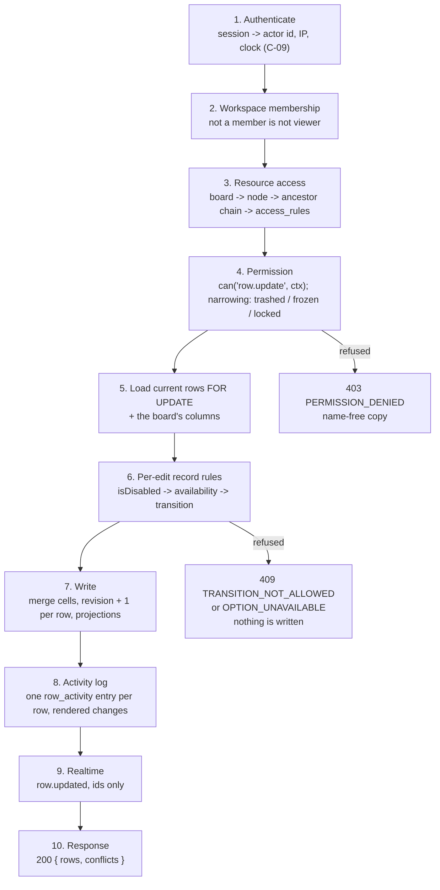
```mermaid
flowchart TD
  A["1. Authenticate<br/>session -> actor id, IP, clock (C-09)"] --> B
  B["2. Workspace membership<br/>not a member is not viewer"] --> C
  C["3. Resource access<br/>board -> node -> ancestor chain -> access_rules"] --> D
  D["4. Permission<br/>can('row.update', ctx); narrowing: trashed / frozen / locked"] --> E
  E["5. Load current rows FOR UPDATE<br/>+ the board's columns"] --> F
  F["6. Per-edit record rules<br/>isDisabled -> availability -> transition"] --> G
  G["7. Write<br/>merge cells, revision + 1 per row, projections"] --> H
  H["8. Activity log<br/>one row_activity entry per row, rendered changes"] --> I
  I["9. Realtime<br/>row.updated, ids only"] --> J
  J["10. Response<br/>200 { rows, conflicts }"]
  F -->|refused| K["409 TRANSITION_NOT_ALLOWED<br/>or OPTION_UNAVAILABLE<br/>nothing is written"]
  D -->|refused| L["403 PERMISSION_DENIED<br/>name-free copy"]
```

**1. Authenticate.** The actor id, role, IP and clock come from the session and the socket, never
from the body (C-09; `src/services/audit-service.ts:280-285`). A `createdBy` or `actorId` in the body
is ignored.

**2. Workspace membership.** Resolved before anything else. "Not a member" answers as
`WORKSPACE_NOT_FOUND` (`404`), not as `permission_denied` — a non-member must not learn the workspace
exists (`src/lib/workspace-access.ts:4-14`).

**3. Resource access.** `boardId` → `boards.node_id` → the node's ancestor chain →
`access_rules` + `workspace_members` → the caller's **effective role on that node**
(`effectiveAccess`, `src/services/authz.ts:36-53`). Deepest node wins; at one node a user-scoped rule
beats a role-scoped rule; the workspace role is the floor (canon §8.8, OQ-22). A node the caller may
not see answers `404` / `NODE_NOT_FOUND` — identical to "does not exist" (canon §4.2).

**4. Permission.** `can("row.update", { role, user, node, isFrozen, isLocked })`
(`src/lib/permissions/evaluate.ts:69-87`). Three layers only ever **narrow**:
- `node.isTrashed` → only `node.delete` passes (`:81`);
- `isFrozen` (an **archived ancestor**; the node's own flag is deliberately not read) → every write
  refused (`:83`; `src/lib/archive.ts:30-45`);
- `isLocked` → `row.update` is in `CONTENT_WRITE_KEYS`, so a lock refuses it (`:84`, `:36-49`).

Then the **row-level** freeze: an archived record is read-only until it is restored
(`src/lib/archive.ts:5-11`; `src/components/board/drawer/row-drawer.tsx:93-95` —
`isEditable = canEdit && !isArchived`). An edit naming an archived row is refused with
`409` / `ROW_ARCHIVED_READ_ONLY`.

**5. Load current values.** `SELECT … FOR UPDATE` the addressed rows, ordered by `id` to avoid
deadlocks between two concurrent batches, plus the board's columns. This is where `revision` is read
for the conflict comparison (§15.0.4) and where the **current** option is read for the transition
check.

**6. Record rules.** For each edit, in this order (`guardCellEdits`,
`src/lib/board-write-rules.ts:43-90`; `resolveOptionAvailability`,
`src/lib/select-availability.ts:69-115`):

  a. **Not a select write?** The edit passes untouched. Only edits where the column is `select`
     **and** `value.kind === "select"` are gated (`:54-57`).

  b. **No rules on the column?** Pass. The short-circuit is
     `transitionRules?.enabled === false` **and** no option is `isDisabled` or condition-gated
     (`:59-68`) — a rule-free board pays one map lookup per edit.

  c. **Clearing is always legal.** `optionIds: []` is never gated; only *arriving* somewhere is
     (`:77-78`).

  d. **Gate 1 — `option.isDisabled`.** Refusal reason `disabled`, explanation
     `Turned off in column settings`.

  e. **Gate 2 — `availability`.** The option's `ConditionGroup` is evaluated against **the record as
     it will be after this batch's earlier edits**, using `evaluateConditionGroup`
     (`src/lib/conditions.ts:258-273`). Semantics that must be reproduced exactly:
     an **empty group is satisfied** ("no conditions means no gate"); a condition pointing at a
     **deleted column returns `true`** — ignored, not failed closed (`:189-198`); dates compare
     calendar days; identity cells match the stored id first, then the rendered label. Explanation:
     `` `Requires ${describeConditionGroup(...)}` `` — e.g.
     `Requires Blocked by is empty` (`src/lib/board-templates.ts:118-124` ships exactly this rule on
     the Task template's "Done").

  f. **Gate 3 — transition rules.** `evaluateTransition(column, fromKey, toKey)`
     (`src/lib/transition-rules.ts:102-133`). `fromKey` is the record's **first current option id**,
     or `"__empty__"` (`currentKey`, `src/lib/select-availability.ts:55-62`). It returns *allowed*
     when **any** of: rules are off; `from === to`; **either end is ungoverned**
     (`Object.hasOwn(transitions, key)` is false — this is what makes adding a status safe); or
     `transitions[from]` includes `to`. Otherwise the refusal message names both ends and the way
     out: `` `Status cannot go straight from Debug to Done. Debug can move to Review, Blocked.` ``

  g. A refused edit **is not written**. In a single-cell call the whole call is
     `409` / `TRANSITION_NOT_ALLOWED` (or `OPTION_UNAVAILABLE` for gates 1 and 2) with the
     explanation as `message`. In a batch, the refused edits are reported and the rest still apply —
     which is what the client already does for bulk (`src/store/board-store.ts:569-587`): "Refusing
     the whole batch because one record cannot make the move would be worse than telling the user
     which ones could not." **RECOMMENDATION:** the batch form returns `200` with the refusals in
     `conflicts` alongside the stale-write notices, each carrying the rule's own sentence; the
     frontend renders `ConflictNotice.message` verbatim and needs no new shape
     (`src/components/board/conflict-notices.tsx`).

**7. Write.** Per row, once: `cells = cells || $merged`, `revision = revision + 1`,
`updated_at = now()`, plus the four indexed projections recomputed. Then the relation and attachment
projections for the columns this call touched.

**8. Activity log.** One `row_activity` entry per row, whatever the number of cells
(`src/services/board-service.ts:524-532`), with `changes` **already rendered to text**:

```ts
interface FieldChange {
  readonly columnName: string;
  readonly from: string;      // cellText of the old value
  readonly to: string;        // cellText of the new value
}
```
Cells whose text projection did not change are dropped from `changes` entirely
(`describeEdits`, `:209-216`). The summary is `changed Status` for one field,
`changed 3 fields` for more, and `updated TASK-042` when nothing rendered differently
(`editSummary`, `:221-225`). Canon §8.8 OQ-51: store **both** the rendered `changes` (returned) and
an internal `raw_changes` (never returned).

**9. Realtime.** One `row.updated` (RT-07) per changed row, or one batched frame carrying `rowIds`.
Ids and `revision` only — no cell content ever crosses a permission boundary in a frame (canon §7.2,
following the RT-05 precedent).

**10. Response.** `200` with the authoritative rows and the notices. The store replaces its
optimistic state from `rows` and appends `conflicts` (`src/store/board-store.ts:350-353`).

**Database**

| Table | Operation |
| --- | --- |
| `boards`, `nodes`, `access_rules`, `workspace_members` | `SELECT` — steps 2–4. |
| `board_columns` | `SELECT` — needed for the rule gate, the text projection and the value validation. |
| `board_rows` | `SELECT … FOR UPDATE` (step 5) → `UPDATE cells, revision, updated_at, due_date, due_at, status_option_id, assignee_ids, search_tsv` (step 7). |
| `board_row_relations` | `DELETE … WHERE source_row_id = $r AND source_column_id = $c` then `INSERT` the new target list, for each relation cell written (§17.3). |
| `cell_attachments` | `INSERT` / `DELETE` to match the new attachment list, for each attachment cell written. |
| `row_activity` | `INSERT` — one row per changed record. |
| `notifications`, `watches` | Out of scope here; the collaboration chapter owns whether a cell write notifies watchers (canon OQ-88). |

**Transaction** — **Required, one transaction for the whole batch.** Rows, relation projection,
attachment links and activity entries land together. The rule gate runs **inside** the transaction,
after `FOR UPDATE`, because it reads the current option — running it before the lock would let two
concurrent drags both pass a rule only one of them may.

**Realtime** — `row.updated` (RT-07) per changed row.

**Possible Errors**

| HTTP | Code | Reason |
| --- | --- | --- |
| 400 | `validation` | `VALIDATION_FAILED` — `edits` empty, or a `columnId` not on this board. |
| 400 | `validation` | `CELL_VALUE_KIND_INVALID` — the `CellValue` tag is not a `ColumnType` member. |
| 400 | `validation` | `DATE_VALUE_INVALID` — not `YYYY-MM-DD` for a date-only column, not ISO 8601 for a timestamp column (OQ-32). |
| 403 | `permission_denied` | `PERMISSION_DENIED` — needs `row.update`. Copy is name-free (`src/lib/permissions/evaluate.ts:155-163`). |
| 403 | `permission_denied` | `NODE_TRASHED_READ_ONLY` / `NODE_FROZEN_BY_ANCESTOR` / `NODE_LOCKED` |
| 404 | `not_found` | `BOARD_NOT_FOUND` |
| 409 | `conflict` | `ROW_ARCHIVED_READ_ONLY` — an archived record is read-only until restored. |
| 409 | `conflict` | `TRANSITION_NOT_ALLOWED` — gate 3. Single-edit calls only; batches report it. |
| 409 | `conflict` | `OPTION_UNAVAILABLE` — gates 1 and 2. Same rule. |
| 413 | `validation` | `REQUEST_TOO_LARGE` — past the batch cap. |
| — | — | **`CONCURRENCY_CONFLICT` is never returned by this endpoint.** |

**Frontend Used By** — `src/store/board-store.ts:315-354` (`editCells`) is the only caller, and
everything funnels through it: `src/components/board/table/table-grid.tsx:74` (grid cells),
`src/components/board/drawer/row-drawer.tsx:58,111-114` (drawer fields),
`src/components/board/views/kanban-board.tsx:67-95` (drag),
`src/components/board/views/calendar-board.tsx` (day drop),
`src/components/board/gantt/gantt-board.tsx` (bar drag),
`src/components/board/drawer/subtask-panel.tsx:57,67-81` (the completion checkbox),
`src/hooks/use-grid-clipboard.ts` (paste, cut and Delete) and
`src/hooks/use-attachment-field.ts`. Plus `src/hooks/use-embedded-board.ts:120-124`, which writes
straight back to the source board from inside a document.

---

### 15.6 `POST /api/v1/boards/{boardId}/rows/bulk/update` — write the same values across a selection

**Purpose** — Write one set of values to many records in **one request, never a loop**
(PRD `SY-BLK-34`: 100 records in under 1.5 s).

**Authentication** — Required.
**Permission** — `row.update` on `boards.node_id`.

**Path Params** — `boardId`.
**Query Params** — None.

**Request Body**

```ts
/** E-074. */
interface BulkUpdateRowsRequest {
  readonly rowIds: readonly string[];
  /** One value per column, written to every record the action may touch. */
  readonly values: Readonly<Record<string, CellValue>>;
}
```

**Response**

```ts
interface BulkSkip {
  readonly rowId: string;
  readonly displayId: string;   // the rowId itself when the record was not found
  readonly reason: BulkSkipReason;
}
type BulkSkipReason = "archived" | "not_found" | "permission_denied";

interface BulkResult {
  readonly requested: number;
  /** Authoritative records for the ids that changed. */
  readonly rows: readonly BoardRow[];
  readonly applied: readonly string[];
  readonly skipped: readonly BulkSkip[];
}
```

`src/types/system.ts:15-50`. **The invariant is `requested === applied.length + skipped.length`** —
"a bulk write that silently drops a record is worse than one that refuses"
(`src/services/board-service.ts:958-965`). Canon §6.2 forbids returning an error body for a partial
success: this is a `200`.

`permission_denied` is added to `BulkSkipReason` per canon §2.7 — `src/types/system.ts:29-32` says
permission skips "report through this same channel", so they are a reason, not a parallel array.

**Partitioning — EXISTING REQUIREMENT** (`partitionBulkTargets`, `src/lib/bulk.ts:30-55`):
a missing id → `{reason:"not_found", displayId: rowId}`; an **archived** row → `{reason:"archived"}`
unless the call is one of the two that may target archived rows. `bulkUpdate` **skips** archived
rows.

**The record rules apply to a hundred records exactly as to one.** `src/store/board-store.ts:558-564`:
"a bulk status change is still a status change, so the selection is split into the records the rules
permit and the ones they do not before anything is written." The server runs step 6 of §15.5.2 per
row; refused rows land in `skipped` with `reason: "permission_denied"` and the rule's sentence.

**Database** — as §15.5 step 7–8, over the partitioned target set. One `row_activity` entry per
record, with the rendered `FieldChange`s (`src/services/board-service.ts:991-992`).

**Transaction** — **Required, one transaction per call** (`docs/BOARD.md:330-334`;
board.md R-10). Documented maximum: **500 rows** per bulk call, `413` beyond it.

**Realtime** — `row.updated` (RT-07), one batched frame carrying `rowIds`.

**Possible Errors**

| HTTP | Code | Reason |
| --- | --- | --- |
| 400 | `validation` | `VALIDATION_FAILED` — `rowIds` empty, `values` names an unknown column. |
| 400 | `validation` | `CELL_VALUE_KIND_INVALID` / `DATE_VALUE_INVALID` |
| 403 | `permission_denied` | `PERMISSION_DENIED` — needs `row.update`. A **whole-call** refusal; per-row refusals are skips. |
| 404 | `not_found` | `BOARD_NOT_FOUND` |
| 413 | `validation` | `REQUEST_TOO_LARGE` |

**Frontend Used By** — `src/hooks/use-bulk-actions.ts:67` (the status and assignee actions, which
resolve their target columns by **role** — `lensesFor(board)`, `src/lib/my-work.ts:22-67` — because a
selection may span templates) → `src/store/board-store.ts:565-598`, rendered by
`src/components/board/bulk/bulk-action-bar.tsx`.

---

### 15.7 `PATCH /api/v1/boards/{boardId}/rows/{rowId}/position` — move a record

**Purpose** — Reposition one record in the board's canonical order.

**Authentication** — Required.
**Permission** — `row.move` on `boards.node_id` (Member and above,
`src/lib/permissions/roles.ts:25`).

**Path Params** — `boardId`, `rowId`.
**Query Params** — None.

**Request Body**

```ts
/** E-073. Exactly one of the two anchors is given. */
interface SetRowPositionRequest {
  /** Place directly after this record. null = the very front of the board. */
  readonly afterRowId?: string | null;
  /** Place directly before this record. */
  readonly beforeRowId?: string;
}
```

Anchors, not an index — for the same reason as §14.3: an index is a claim about a list the caller
does not own, and rows are inserted mid-order routinely.

**Response** — `BoardRow` — with its new `position` reflected in the board's order and `revision`
bumped.

**Database** — `board_rows` `SELECT … FOR UPDATE` the moved row and its two new neighbours →
`UPDATE position = midpoint, revision = revision + 1, updated_at = now()`. A renumbering pass over
the board when the gap is exhausted. `row_activity` `INSERT` with `kind: "moved"`.

**Transaction** — **Required** (the midpoint read and the write).
**Realtime** — `row.updated` (RT-07).

**Possible Errors**

| HTTP | Code | Reason |
| --- | --- | --- |
| 400 | `validation` | `VALIDATION_FAILED` — both anchors given, or neither. |
| 403 | `permission_denied` | `PERMISSION_DENIED` — needs `row.move`. |
| 404 | `not_found` | `ROW_NOT_FOUND` — the row or an anchor. |
| 409 | `conflict` | `ROW_ARCHIVED_READ_ONLY` |

**Frontend Used By** — **RECOMMENDATION.** Nothing calls it. `rowOrder` is "the array the server
sent" (`docs/BOARD.md:355-358`) and the grid offers no row drag.

> **OPEN QUESTION (OQ-34)** — how are records ordered with no sort applied, and is manual reordering
> required?
> **Evidence** — `rowOrder` is documented as "canonical server order"
> (`src/store/board-store.ts:69`, `docs/BOARD.md:26`), and an order already carries meaning: a create
> files itself after `afterRowId` (`src/services/board-service.ts:322-324`) and a subtask after its
> parent's **last descendant** (`lastDescendantOf`, `:342-352`). `docs/BOARD.md:302-305` asks for "an
> explicit order key (fractional index / LexoRank) and `PATCH /rows/:id/position`". No component
> offers a row drag.
> **Recommendation** — canon has taken the position: `board_rows.position NUMERIC` fractional index,
> defaulted on insert, with this endpoint reserved. It costs one column now and is a full-table
> rewrite later.
> **Impact if wrong** — without an order key two concurrent inserts race for the same slot and the
> board's order differs per client, which then makes `SY-BLK-34`'s shift-click range selection select
> **different records for different people** (`extendRowSelection`,
> `src/store/grid-store.ts:204-222`).

---

### 15.8 `POST /api/v1/boards/{boardId}/rows/bulk/archive` — archive and restore

**Purpose** — Freeze or unfreeze records. **This is the archive endpoint and the restore endpoint**;
`isArchived` selects the direction, and there is no single-record variant.

**Authentication** — Required.
**Permission** — `row.archive` on `boards.node_id` (Manager and above,
`src/lib/permissions/roles.ts:56`).

**Path Params** — `boardId`.
**Query Params** — None.

**Request Body**

```ts
/** E-075. */
interface BulkArchiveRowsRequest {
  readonly rowIds: readonly string[];
  /** true = archive, false = restore. */
  readonly isArchived: boolean;
}
```

**Response** — `BulkResult`.

**Contract — EXISTING REQUIREMENT** (`src/services/board-service.ts:1002-1047`):

- **This is the one call that may target archived records.** `partitionBulkTargets(…,
  { allowArchived: true })` (`:1015-1017`) — restoring is the write a frozen record must still
  accept.
- Sets `archived_at = now()` or `NULL`, and bumps `revision` either way.
- **A no-op re-archive is honoured but not logged twice**: the `row_activity` entry is written only
  when `wasArchived !== isArchived` (`:1036-1043`).
- Archived means **frozen, not hidden**: content stays readable, still commentable
  (`src/components/board/drawer/row-drawer.tsx:265` — "Commenting is not editing: a frozen record
  still takes one"), and every write path is closed
  (`src/lib/archive.ts:5-11`; PRD `SY-ARC-37`).

**A single-record archive goes through this endpoint too.** Both single-row surfaces call
`bulkArchive([row.id], !isArchived)` — the drawer footer
(`src/components/board/drawer/row-drawer.tsx:62,290-297`) and the row actions menu
(`src/components/board/table/row-actions-menu.tsx:34,89-90`). No `PUT /rows/{rowId}/archive` exists
and none is needed.

**Database** — `board_rows` `SELECT … FOR UPDATE` → `UPDATE archived_at, revision, updated_at`.
`row_activity` `INSERT` with `kind: "archived"` / `"restored"`, summary `archived this record` /
`restored this record`. `nodes` `UPDATE` the `itemCount` / `openCount` projections (archived records
are excluded from both).

**Transaction** — **Required**, one per call. Cap 500 rows.
**Realtime** — `row.archived` (RT-08), `{ boardId, rowId, revision, isArchived }`.

**Possible Errors**

| HTTP | Code | Reason |
| --- | --- | --- |
| 400 | `validation` | `VALIDATION_FAILED` — `rowIds` empty. |
| 403 | `permission_denied` | `PERMISSION_DENIED` — needs `row.archive`. |
| 403 | `permission_denied` | `NODE_FROZEN_BY_ANCESTOR` — an archived **board** refuses even this. |
| 404 | `not_found` | `BOARD_NOT_FOUND` |
| 413 | `validation` | `REQUEST_TOO_LARGE` |

**Frontend Used By** — `src/hooks/use-bulk-actions.ts` (the bulk bar's Archive / Restore),
`src/components/board/drawer/row-drawer.tsx:292-300`,
`src/components/board/table/row-actions-menu.tsx:89-90` — all through
`src/store/board-store.ts:600-613`.

---

### 15.9 `DELETE /api/v1/boards/{boardId}/rows/{rowId}` — delete one record

**Purpose** — Remove one record permanently. **Records have no trash of their own.**

**Authentication** — Required.
**Permission** — `row.delete` on `boards.node_id` (Manager and above,
`src/lib/permissions/roles.ts:57`).

**Path Params** — `boardId`, `rowId`.
**Query Params** — None.
**Request Body** — None.

**Response**

```ts
/** E-065. */
interface DeleteRowResponse {
  readonly deletedRowId: string;
  /**
   * The deleted record's children, lifted to the top level and returned so the
   * client reconciles rather than guesses. Empty when it had none.
   */
  readonly detachedRows: readonly BoardRow[];
}
```

**Children are lifted, never cascade-deleted — EXISTING REQUIREMENT.**
`detachOrphans` sets `parentRowId: null` and bumps `revision` on every child of a removed row
(`src/services/board-service.ts:460-470`): "Deleting a container must not silently delete work nobody
asked about — the subtasks stay, addressable, as records of their own." The client mirror is
`detachChildren` (`src/lib/board-records.ts:158-180`). The database half is
`parent_row_id … ON DELETE SET NULL`; the service still returns the affected rows because their
`revision` changed and the client's copy is now stale.

Permanent is said at the call site, in the confirm copy: "Records are removed outright — the Trash
holds files, pages and boards, not rows. This cannot be undone."
(`src/components/board/drawer/row-drawer.tsx:326`). Canon reserves **OQ-15** for whether the
asymmetry with node deletion is intended.

**Database**

| Table | Operation |
| --- | --- |
| `board_rows` | `DELETE … WHERE id = $1 AND board_id = $2`. Children's `parent_row_id` set to `NULL` by the FK; the service additionally bumps their `revision` and `updated_at`. |
| `row_activity` | `DELETE … WHERE row_id = $1` — the record's history goes with it (`src/services/board-service.ts:1066` does this for the bulk path). |
| `board_row_relations` | `DELETE` — both `source_row_id = $1` (its outbound links) and `target_row_id = $1` (the inbound projection) by `ON DELETE CASCADE`. |
| `board_rows` (other) | **`cells` is NOT rewritten.** Rows on this or another board that pointed at the deleted record **keep the dangling id** in their relation cell, so `[Deleted Item]` keeps rendering and history stays honest (canon §8.8 OQ-44; `src/lib/cell-values.ts:22,117-122`). |
| `cell_attachments` | `DELETE … WHERE row_id = $1` — cascade. The `file_assets` rows survive until orphan collection; `workspaces.used_bytes` is decremented in the same transaction for assets that lost their last reference. |
| `comments` | Comments whose target is this row: out of scope here (the collaboration chapter owns it; canon OQ-87 covers watch pruning). |
| `nodes` | `UPDATE` the `itemCount` / `openCount` projections. |

**Transaction** — **Required.** Row, activity, relation projection, attachment links, child
detachment and the quota decrement are one write.

**Realtime** — `row.deleted` (RT-09), `{ boardId, rowIds: [rowId] }`, **plus** `row.updated` (RT-07)
for each detached child, whose `revision` moved.

**Possible Errors**

| HTTP | Code | Reason |
| --- | --- | --- |
| 403 | `permission_denied` | `PERMISSION_DENIED` — needs `row.delete`. |
| 403 | `permission_denied` | `NODE_FROZEN_BY_ANCESTOR` / `NODE_TRASHED_READ_ONLY` |
| 404 | `not_found` | `ROW_NOT_FOUND` / `BOARD_NOT_FOUND` |

Note there is **no** `ROW_ARCHIVED_READ_ONLY` here: "archiving freezes edits, not removal — a frozen
record can still be binned" (`src/services/board-service.ts:1058`).

**Frontend Used By** — `src/components/board/table/row-actions-menu.tsx:33` and
`src/components/board/drawer/row-drawer.tsx:60,299-306` → `src/store/board-store.ts:433-453`.

---

### 15.10 `POST /api/v1/boards/{boardId}/rows/bulk/delete` — delete many records

**Purpose** — Remove a selection permanently, in one request.

**Authentication** — Required.
**Permission** — `row.delete` on `boards.node_id`.

**Path Params** — `boardId`.
**Query Params** — None.

**Request Body**

```ts
/** E-076. The shared shape for the bulk calls that need only ids. */
interface BulkDeleteRowsRequest {
  readonly rowIds: readonly string[];
}
```

**Response** — `BulkResult` with **`rows: []`** and the deleted ids in `applied`
(`src/services/board-service.ts:1069`) — there are no authoritative records to return, and the client
uses `applied` to drop them (`removeRows`, `src/store/board-store.ts:625`).

**Contract** — may target **archived** rows (`allowArchived: true`, `:1059-1061`). Children of every
deleted parent are lifted to the top level, exactly as §15.9.

**Database** — as §15.9, over the target set; one `DELETE` per table rather than per row.
**Transaction** — **Required**, one per call. Cap 500 rows.
**Realtime** — `row.deleted` (RT-09), one frame carrying every id, plus `row.updated` for detached
children.

**Possible Errors** — as §15.9, plus `VALIDATION_FAILED` for an empty `rowIds` and
`REQUEST_TOO_LARGE` past the cap.

**Frontend Used By** — `src/hooks/use-bulk-actions.ts` → `src/store/board-store.ts:615-628`,
behind the same confirm copy as the single delete.

---

### 15.11 `POST /api/v1/boards/{boardId}/rows/bulk/move` — move records to another board

**Purpose** — Move a selection onto a different board, converting every cell into the destination's
schema.

**Authentication** — Required.
**Permission** — `row.delete` on the **source** board's node **and** `row.create` on the
**target** board's node (canon E-077, OQ-17). Records leave one board and are created on the other;
gating only one of them is the critical defect canon OQ-17 records — the mock gates **neither**
(`src/services/board-service.ts:1088-1104`).

**Path Params** — `boardId` (the source).
**Query Params** — None.

**Request Body**

```ts
/** E-077. */
interface BulkMoveRowsRequest {
  readonly rowIds: readonly string[];
  /** Drive node of the destination board — a node id, not a board id. */
  readonly targetNodeId: string;
}
```

The frontend picks a **node** id, not a board id
(`src/components/board/bulk/bulk-move-dialog.tsx:77` — `setTargetId(board.nodeId)`), because that is
what the permission chain is keyed by.

**Response**

```ts
interface BulkMoveResult extends BulkResult {
  readonly targetBoardId: string;
  readonly targetNodeId: string;
  /** Source columns the target has no counterpart for, by name. */
  readonly droppedColumns: readonly string[];
}
```

**The two halves land in two different places** (`src/store/board-store.ts:630-657`):
`applied` carries the **source** ids the client must forget; `rows` carries the records' **new**
identities on the destination.

**Contract — EXISTING REQUIREMENT** (`src/services/board-service.ts:1080-1168`):

- A move to the **same board** is refused: `409` / `BULK_TARGET_BOARD_SAME`, message
  `Those records are already on that board` (`:1097-1099`).
- `targetNodeId` that is not a board is `409` / `BULK_TARGET_NOT_A_BOARD` — the mock does not check
  this (canon OQ-17).
- **Columns are paired by normalised name**: lower-cased with every non-alphanumeric stripped
  (`normalizeName`, `:1077-1078`). `Due date` on the source pairs with `due-date` on the target.
- **Every cell travels through `convertCell`** into the destination column's type, so the
  preserve-as-`text` rule of §14.5 applies unchanged (`:1130`).
- **Source columns with no counterpart are named in `droppedColumns`**, never dropped silently
  (`:1114-1116`). The dialog says so up front: "Columns are matched by name. Anything the destination
  has no column for is reported before it is dropped."
  (`src/components/board/bulk/bulk-move-dialog.tsx:52-55`).
- **The destination assigns its own record ids** from its own counter; the source `displayId` is not
  carried (`:1133-1137`). `createdAt` and `createdBy` are carried over; `updatedAt` is now and
  `revision` restarts at `1` (`:1140-1143`).
- The source rows **and their activity** are deleted (`:1151-1156`).
- Archived rows are **skipped** (the default partition).

> **OPEN QUESTION (OQ-40)** — how do select values migrate across boards?
> **Evidence** — `convertCell` on a `select → select` pair takes the same-type short-circuit and
> returns the value **untouched** (`src/lib/cell-conversion.ts:91`), so the moved record keeps the
> **source board's option ids**, which mean nothing on the destination: `cellText` finds no label and
> falls back to `value.text ?? ""` (`src/lib/cell-values.ts:93-99`), rendering an empty Status.
> **Recommendation** — when both columns are `select`, re-map by **label** (trimmed, case-folded)
> against the destination's options, and preserve the source label as `text` when no option matches —
> the same shape `parseTextIntoCell` already produces for an unmatched label
> (`src/lib/cell-conversion.ts:40-48`). Report the count in `droppedColumns`' sibling field rather
> than silently blanking a status.
> **Impact if wrong** — a 100-record move onto a board with the same status names silently blanks
> every Status cell, and the bulk result reports full success.

**Database** — one transaction spanning **both** boards:

| Table | Operation |
| --- | --- |
| `boards` (target) | `UPDATE next_sequence = next_sequence + $n … RETURNING` — one allocation for the batch. |
| `board_rows` (target) | `INSERT` one per moved record, converted `cells`, new `custom_id`, `position` appended, `revision = 1`. |
| `board_rows` (source) | `DELETE` the moved records; children left behind are detached (`parent_row_id` → `NULL`). **`parentRowId` is not carried across** — the mock's `moved` row omits it entirely (`:1134-1144`), so a moved subtask arrives at the top level of the destination. |
| `row_activity` (source) | `DELETE` for the moved ids. |
| `row_activity` (target) | `INSERT` — `kind: "moved"`, summary `moved TASK-042 from Frontend Sprint` (`:1148`). |
| `board_row_relations` | `DELETE` the source projections; `INSERT` new ones for relation cells whose target still resolves. A relation pointing at a record left behind on the source board keeps its dangling id in the cell. |
| `cell_attachments` | `UPDATE row_id` to the new record — the asset does not move, only its reference. |
| `nodes` (both) | `UPDATE` the `itemCount` / `openCount` projections. |
| `audit_events` | `INSERT` — one row for the operation, naming both boards. |

**Transaction** — **Required, one transaction over both boards.** Half a move is records existing
twice or not at all.

**Realtime** — `row.deleted` (RT-09) on the **source** board's channel and `row.created` (RT-06) on
the **target's**.

**Possible Errors**

| HTTP | Code | Reason |
| --- | --- | --- |
| 400 | `validation` | `VALIDATION_FAILED` — `rowIds` empty. |
| 403 | `permission_denied` | `PERMISSION_DENIED` — needs `row.delete` on the source **or** `row.create` on the target. The refusal does not say which (canon §4.4 rule 3). |
| 404 | `not_found` | `BOARD_NOT_FOUND` — source; `NODE_NOT_FOUND` — target, or one the caller may not see. |
| 409 | `conflict` | `BULK_TARGET_BOARD_SAME` — `Those records are already on that board`. |
| 409 | `conflict` | `BULK_TARGET_NOT_A_BOARD` — `targetNodeId` does not address a board. |
| 409 | `conflict` | `BOARD_ROW_LIMIT_EXCEEDED` — the destination would exceed the ceiling (OQ-36). |
| 413 | `validation` | `REQUEST_TOO_LARGE` |

**Frontend Used By** — `src/components/board/bulk/bulk-move-dialog.tsx` →
`src/hooks/use-bulk-actions.ts` → `src/store/board-store.ts:635-657`.

---

### 15.12 `row_activity` — T-14, the table these endpoints write

```sql
-- documentation only
CREATE TABLE row_activity (
  id          uuid PRIMARY KEY DEFAULT gen_random_uuid(),
  row_id      uuid NOT NULL REFERENCES board_rows(id) ON DELETE CASCADE,
  board_id    uuid NOT NULL REFERENCES boards(id) ON DELETE CASCADE,
  kind        activity_kind NOT NULL,     -- created|updated|commented|attached|archived|restored|imported|moved
  actor_id    uuid NOT NULL REFERENCES users(id),
  summary     text NOT NULL,              -- 'changed Status', 'created TASK-001'
  changes     jsonb NOT NULL DEFAULT '[]'::jsonb,   -- FieldChange[] — RETURNED
  raw_changes jsonb NOT NULL DEFAULT '[]'::jsonb,   -- before/after CellValue — NEVER returned (OQ-51)
  created_at  timestamptz NOT NULL DEFAULT now()
);
CREATE INDEX row_activity_row_idx ON row_activity (row_id, created_at DESC, id DESC);
```

```ts
/** row_activity.changes — already rendered to the text the column displays. */
interface FieldChange {
  readonly columnName: string;
  readonly from: string;
  readonly to: string;
}
/** row_activity.raw_changes — internal. RECOMMENDATION, canon §8.8 OQ-51. */
interface RawFieldChange {
  readonly columnId: string;
  readonly from: CellValue | null;
  readonly to: CellValue | null;
}
```

**One entry per write, however many fields it touched** (PRD `SY-ACT-40`;
`src/services/board-service.ts:157-163`). The timeline "reads these — it never sees, and never
renders, a raw payload" (`src/types/board.ts:479-482`), which is why `changes` is stored rendered:
a column renamed after the fact must not rewrite what the history says happened.

**Cardinality.** `board_rows` 1:N `row_activity`, unbounded — canon **OQ-52** covers retention and
paging. **Delete behaviour.** `ON DELETE CASCADE` on both FKs; the service also deletes explicitly on
bulk delete and bulk move (`:1066`, `:1156`) so the source board's history does not follow a moved
record.

`ActivityKind` = `created | updated | commented | attached | archived | restored | imported | moved`
(`src/types/board.ts:469-477`). `commented` and `attached` are written by the collaboration and files
chapters through the same table (`noteActivity`, `src/services/board-service.ts:911-918`), which is
why `row_activity` carries `board_id` as well as `row_id`: a writer outside this module has the
`EntityRef` (`{ kind:"row", boardId, rowId }`) and not the board lookup.

Read through `GET /boards/{boardId}/rows/{rowId}/activity` (E-070), cursor-paginated on
`(created_at DESC, id DESC)`, consumed by `src/hooks/use-row-activity.ts:19-32` and rendered by
`src/components/board/drawer/activity-timeline.tsx`.

---

## 16. Subtask APIs

### 16.0 A subtask is an ordinary board row with a `parent_row_id`

**EXISTING REQUIREMENT.** There is no subtask table, no subtask type and no nested array.

> "A subtask is a full board record — its own display id, status, assignee, attachments, comments and
> history — so the parent stores a pointer, never a nested copy."
> — `src/types/board.ts:257-263`

> "Everything here works on `parentRowId` alone — no nested arrays, no second copy of a record… TASK-001 containing TASK-002 is containment."
> — `src/lib/board-hierarchy.ts:6-18`

Storage is one nullable self-referential FK on `board_rows` (§13.1):

```sql
parent_row_id uuid REFERENCES board_rows(id) ON DELETE SET NULL
CREATE INDEX board_rows_parent_idx ON board_rows (parent_row_id);
```

**Cardinality.** `board_rows` 1:N `board_rows`. A parent has 0..N direct children; a child has 0..1
parent. Same board only (§16.4). **Delete behaviour.** `ON DELETE SET NULL` — children are lifted to
the top level, never cascade-deleted (§15.9).

#### 16.0.1 EXPLICITLY FORBIDDEN: serialising subtasks into the parent row

No endpoint in this specification may accept or return a nested `subtasks: BoardRow[]` array on a
`BoardRow`, and `board_rows.cells` may never hold a child's data. This is not a style preference;
five shipped behaviours depend on the pointer model:

| Behaviour | Why nesting breaks it | Citation |
| --- | --- | --- |
| A subtask has its own drawer, comments, attachments and activity | A nested object is not addressable — `openDrawer(row.id)` opens *its* drawer, with its own comment thread and its own `row_activity` | `src/components/board/drawer/subtask-panel.tsx:32-38`, `:146` |
| A subtask has its own `TASK-00n` from the same counter | A nested value has no `sequence`, so it cannot participate in `UNIQUE (board_id, sequence)` | `src/services/board-service.ts:304-310` |
| Ticking a subtask in the drawer updates the table row, and vice versa, with no synchronisation code | Both read the same normalised record; a nested copy is a second source of truth that must be kept in step | `src/components/board/drawer/subtask-panel.tsx:34-38` |
| A view can show subtasks `nested`, `flat` or `hidden` — **per view** | `flat` means "every record is a top-level row", which is only expressible if a subtask *is* a row | `src/types/board.ts:373-378`; `layoutHierarchy`, `src/lib/board-hierarchy.ts:244-284` |
| Deleting a parent keeps its children | A nested array would delete them with the parent, which the code refuses to do | `src/services/board-service.ts:460-470` |

A parent's `revision` is **not** bumped when a child changes. The only writes a parent takes because
of its children are the `added subtask X` activity entry at creation
(`src/services/board-service.ts:334-336`) and nothing else — progress is computed on read
(`subtaskProgress`, `src/lib/board-hierarchy.ts:182-199`), never stored.

#### 16.0.2 Completion and progress — configuration, not inference

Read-only, computed by the client from data it already holds; documented here because a server-side
`openCount` (§13.2) uses the same rule:

- The completion column is **the first `select` column that declares any `completedOptionIds`**
  (`completionColumnOf`, `src/lib/board-hierarchy.ts:139-147`). Nothing reads a label, so renaming
  "Done" to "Shipped" changes nothing.
- `isRowCompleted` = any of the row's `optionIds` is in that set (`:149-160`).
- Progress counts **direct children only** and returns `{total, completed, ratio, percent,
  isMeasurable}`; `isMeasurable` is false when no column declares completed options, and the bar is
  hidden (`:162-199`).
- **Completing every subtask deliberately does not complete the parent** — "that would be an
  automation rule, and no such rule has been configured; the progress bar reports, it does not act"
  (`src/components/board/drawer/subtask-panel.tsx:40-42`). **No endpoint may write the parent as a
  side effect of a child's status change.**

Canon **OQ-49** covers the competing definition of "done" (`completedOptionIds` vs the hard-coded
English label table); canon's position is to prefer `completedOptionIds` where configured.

---

### 16.1 `GET /api/v1/boards/{boardId}/rows/{rowId}/subtasks` — a parent's children

**Purpose** — One record's **direct** children, in board order.

**Authentication** — Required.
**Permission** — Visibility on `boards.node_id`. A subtask carries no access of its own: the whole
board is one permission surface (`src/lib/permissions/evaluate.ts:108-113` resolves a board node's
edit key to `row.update`; there is no row-level permission — canon `docs/BOARD.md:344` lists
field- and row-level permissions as a future module).

**Path Params** — `boardId`, `rowId`.

**Query Params**

| Name | Type | Default | Meaning |
| --- | --- | --- | --- |
| `includeArchived` | `boolean` | `false` | Same rule as every other record read. |
| `depth` | `int 1..5` | `1` | `1` = direct children (what the frontend shows). Greater values return the subtree, depth-first in board order. |

**Request Body** — None.

**Response** — `readonly BoardRow[]`, ordered by `position` ascending. Ordinary rows; nothing is
nested. Depth is expressed by `parentRowId`, which the client indexes itself
(`buildHierarchy`, `src/lib/board-hierarchy.ts:49-69`).

**Database** — `boards` `SELECT` (visibility) → `board_rows` `SELECT … WHERE board_id = $1 AND
parent_row_id = $2 [AND archived_at IS NULL] ORDER BY position, id`, served by
`board_rows_parent_idx`. For `depth > 1`, one recursive CTE bounded by the depth cap.

**Transaction** — Not required.
**Realtime** — None.

**Possible Errors**

| HTTP | Code | Reason |
| --- | --- | --- |
| 400 | `validation` | `VALIDATION_FAILED` — `depth` out of range. |
| 403 | `permission_denied` | `PERMISSION_DENIED` |
| 404 | `not_found` | `BOARD_NOT_FOUND` / `ROW_NOT_FOUND` |

**Frontend Used By** — `src/services/board-service.ts:414-431` (`listSubtasks`), described there as
"the seam the real `GET /boards/:id/rows/:rowId/subtasks` replaces". The drawer's subtask panel does
**not** call it — it derives children from the record set it already holds
(`src/hooks/use-subtasks.ts:42-72`), which is exactly why "editing a subtask anywhere updates every
one of them on the next frame". The endpoint exists for the surfaces that do not hold the board:
row-level deep links, notifications, and any client paging a 5 000-row board.

---

### 16.2 Creating a subtask — `POST /api/v1/boards/{boardId}/rows` with `parentRowId`

**Purpose** — Create a record under a parent. **There is no separate endpoint**: a subtask is
created by the ordinary row-create call with `parentRowId` set (§15.3), so nothing downstream has to
special-case it (`src/services/board-service.ts:283-287`).

Everything in §15.3 applies unchanged — the atomic counter, the dense empty cells, the permission
key (`row.create`). Four behaviours are specific to the parent branch:

| Behaviour | Rule | Citation |
| --- | --- | --- |
| Parent must exist | `404` / `PARENT_ROW_NOT_FOUND`, message `That parent record could not be found` | `src/services/board-service.ts:302` |
| Placement | The child is filed **directly after its parent's last descendant** in board order, so "the board's own order already reads as the tree even before a view nests it". `parentRowId` overrides `afterRowId`. | `:320-324`, `lastDescendantOf` `:342-352` |
| Two activity entries | `created TASK-042 under TASK-041` on the **child** (`kind: "created"`) and `added subtask TASK-042` on the **parent** (`kind: "updated"`) — one write, two records' histories | `:327-336` |
| Depth | Refused with `409` / `ROW_PARENT_TOO_DEEP` when the parent already sits at the cap (§16.4) | canon §4.3, OQ-33 |

The composer pre-fills title, status, assignee and a deadline by finding the **first** column of each
type (`src/components/board/drawer/subtask-composer.tsx:56-58`) and offers only statuses the
availability rules permit, with `ignoreTransitions: true` because no record exists yet to transition
*from* (`:60-73`). The server must gate an initial `select` value on `isDisabled` and `availability`
for the same reason, and must **not** run the transition gate on a create.

**Frontend Used By** — `src/components/board/drawer/subtask-panel.tsx:55,197-201` (the composer) and
`src/components/board/table/row-actions-menu.tsx:35,59-71` ("Add subtask", which then opens the new
record's own drawer), through `src/store/board-store.ts:464-515` (`createSubtask`).

---

### 16.3 `PUT /api/v1/boards/{boardId}/rows/{rowId}/parent` — reparent or promote

**Purpose** — Move a record under a new parent, or lift it back to the top level. `PUT` because it
replaces one value idempotently (canon P-07).

**Authentication** — Required.
**Permission** — `row.move` on `boards.node_id` (Member and above,
`src/lib/permissions/roles.ts:25`; the UI gates the promote item on exactly this key —
`src/components/board/table/row-actions-menu.tsx:75`).

**Path Params** — `boardId`, `rowId`.
**Query Params** — None.

**Request Body**

```ts
/** E-067. */
interface SetRowParentRequest {
  /** null promotes the record to the top level. */
  readonly parentRowId: string | null;
}
```

`parentRowId` is **nullable, not optional** (C-08): `null` is the promote operation, and a missing
key is a malformed request.

**Response** — `BoardRow` — the authoritative record, `revision` bumped
(`src/services/board-service.ts:394-399`).

#### The four refusals

| Condition | Reason | HTTP | Message |
| --- | --- | --- | --- |
| `parentRowId === rowId` | `ROW_PARENT_SELF` | 409 | `A record cannot be its own parent` (`src/services/board-service.ts:384`) |
| The proposed parent is already a **descendant** of this record | `ROW_PARENT_CYCLE` | 409 | `` `${parent.displayId} is already under ${row.displayId}` `` (`:389-391`) |
| The proposed parent is on a **different board** | `ROW_PARENT_CROSS_BOARD` | 409 | Parent and child must share a board (OQ-33) |
| The move would push the subtree past the depth cap | `ROW_PARENT_TOO_DEEP` | 409 | (OQ-33) |

**The cycle guard is the last line, not the first.** The client checks too
(`wouldCreateCycle`, `src/lib/board-hierarchy.ts:118-127`, called before the optimistic write at
`src/store/board-store.ts:529-532`), and the service comment says why the server must repeat it:
"The cycle guard lives here as well as in the client: a hierarchy that loops would hang every reader,
and the backend is the last place that can refuse" (`src/services/board-service.ts:367-372`).

Server-side detection is a recursive CTE, evaluated inside the write transaction after
`SELECT … FOR UPDATE` on both rows:

```sql
-- documentation only: is $newParent already inside $row's subtree?
WITH RECURSIVE up AS (
  SELECT id, parent_row_id, 1 AS depth FROM board_rows WHERE id = $newParent
  UNION ALL
  SELECT r.id, r.parent_row_id, up.depth + 1
    FROM board_rows r JOIN up ON r.id = up.parent_row_id
   WHERE up.depth < 64                       -- hard stop; corrupt data must not spin
)
SELECT EXISTS (SELECT 1 FROM up WHERE id = $row) AS would_cycle,
       max(depth)                            AS ancestor_depth
  FROM up;
```

The `depth < 64` bound mirrors the client's `seen`-guards, which exist for the same reason: "cycle-safe
… so a cyclic write can never hang a render" (`src/lib/board-hierarchy.ts:80-110`). The same query
yields `ancestor_depth`, which the depth check reads.

**A no-op is success, not an error.** `(row.parentRowId ?? null) === parentRowId` returns early with
`true` in the store (`src/store/board-store.ts:527`); the API returns `200` and the unchanged row
without bumping `revision`.

**Database**

| Table | Operation |
| --- | --- |
| `board_rows` | `SELECT … FOR UPDATE` the row and the proposed parent; the recursive CTE above; then `UPDATE parent_row_id, revision = revision + 1, updated_at = now()`. |
| `board_rows` | `UPDATE position` — **RECOMMENDATION**: re-file the record after its new parent's last descendant, matching the create rule (§16.2). Without it a nested view shows a child that sits far from its parent in board order. The mock does not do this (`setRowParent` only writes the pointer), which is visible today as a subtask that keeps its old row position. |
| `row_activity` | `INSERT` — `kind: "moved"`, summary `moved under TASK-041` or `moved to the top level` (`src/services/board-service.ts:403-409`). |
| `board_row_relations` | Untouched. **Containment is not a relation** and never writes one (`src/lib/board-hierarchy.ts:14-18`). |

**Transaction** — **Required.** The cycle check must read the same snapshot the write commits
against, or two concurrent reparents can each pass the check and together close a loop.

**Realtime** — `row.updated` (RT-07), `{ boardId, rowId, revision }`.

**Possible Errors**

| HTTP | Code | Reason |
| --- | --- | --- |
| 400 | `validation` | `VALIDATION_FAILED` — `parentRowId` key missing. |
| 403 | `permission_denied` | `PERMISSION_DENIED` — needs `row.move`. |
| 403 | `permission_denied` | `NODE_FROZEN_BY_ANCESTOR` / `NODE_TRASHED_READ_ONLY` |
| 404 | `not_found` | `ROW_NOT_FOUND` / `PARENT_ROW_NOT_FOUND` |
| 409 | `conflict` | `ROW_PARENT_SELF` |
| 409 | `conflict` | `ROW_PARENT_CYCLE` |
| 409 | `conflict` | `ROW_PARENT_CROSS_BOARD` |
| 409 | `conflict` | `ROW_PARENT_TOO_DEEP` |
| 409 | `conflict` | `ROW_ARCHIVED_READ_ONLY` — an archived record accepts only archive/restore. |

**Frontend Used By** — `src/components/board/drawer/subtask-panel.tsx:56,183-190` (the Unlink button,
titled "Move to the top level — the record itself is kept") and
`src/components/board/table/row-actions-menu.tsx:36,73-81` ("Move to the top level"), through
`src/store/board-store.ts:523-554`.

---

### 16.4 Depth, cross-board parents and the archive cascade

> **OPEN QUESTION (OQ-33)** — what bounds the subtask hierarchy?
>
> **What is unclear.** The frontend bounds **nothing** except cycles. Depth, cross-board parents and
> what archiving or deleting a parent does to its subtree are all unstated, and two of them are
> stated as *deliberate* non-limits.
>
> **Evidence.**
> - **Depth is explicitly unbounded.** `src/lib/board-hierarchy.ts:6-12`: "no nested arrays, no
>   second copy of a record, and **no depth limit**. `TASK-002` can own `TASK-006` the day someone
>   needs it, and every helper below already walks that far."
>   `src/types/board.ts:259-262`: "Nothing here caps the depth: a subtask may itself be a parent, and
>   the hierarchy helpers walk as far as the data goes." `SubtaskEntry.childCount` is documented as
>   "the hierarchy is not depth-capped" (`src/hooks/use-subtasks.ts:18-19`), and `layoutHierarchy`
>   recurses until the data stops (`src/lib/board-hierarchy.ts:265-275`).
> - **Cross-board parents are impossible by construction, and nowhere refused.**
>   `setRowParent(boardId, rowId, parentRowId)` looks the parent up in the *same* `BoardRecord`
>   (`src/services/board-service.ts:386-388`), so a cross-board id reads as `notFound`. No rule says
>   it should not be allowed — it simply never comes up.
> - **Archiving a parent does not cascade.** `bulkArchive` writes `archived_at` on exactly the ids it
>   was given (`src/services/board-service.ts:1022-1031`); children are untouched and stay visible.
> - **Deleting a parent does not cascade** — children are lifted (`detachOrphans`, `:460-470`). This
>   one **is** settled; it is stated as a rule and mirrored on the client.
> - An orphan whose parent is missing is treated as a **root** rather than disappearing
>   (`buildHierarchy`, `src/lib/board-hierarchy.ts:49-69`), and in a nested view a child whose parent
>   was filtered out is **promoted to the top level** rather than vanishing (`:239-242`, `:277-283`).
>
> **Recommendation** — canon has already taken the position (§8.8, OQ-33) and this chapter implements
> it: **same board; depth cap 5; cycles rejected by a recursive CTE; archiving a parent does not
> cascade; deleting a parent lifts its children.** The depth cap is the only one of the four that
> contradicts a frontend comment, and it is worth the contradiction: an unbounded hierarchy makes the
> "last descendant" insert rule (§16.2) an unbounded walk on every create, makes a nested layout an
> unbounded recursion on every render, and makes `GET …/subtasks?depth=` unanswerable. Five levels is
> more than any of the four shipped templates suggests and is enforced at the two write points
> (`POST /rows` with `parentRowId`, `PUT /rows/{rowId}/parent`) rather than on read, so existing data
> can never become unreadable.
>
> **Impact if wrong** — too low a cap refuses a legitimate breakdown and there is no migration back
> from data that was never allowed to exist; too high (or none) and one malformed import can produce
> a 10 000-deep chain that times out every board read. Allowing cross-board parents would be worse
> than either: `lastDescendantOf`, `layoutHierarchy` and `subtaskProgress` all operate over one
> board's record map and would silently drop the half of the tree they cannot see, while
> `parent_row_id`'s `ON DELETE SET NULL` would let a delete on board A silently restructure board B.

**How the cap is enforced.** On both write paths, inside the transaction, the recursive CTE of §16.3
returns `ancestor_depth` for the proposed parent and a second CTE returns the moved record's own
subtree height. `ancestor_depth + subtree_height > 5` → `409` / `ROW_PARENT_TOO_DEEP`. Enforcing on
the **sum** is what stops a legal-looking single move from burying a deep subtree.

**Cross-board is enforced by the query, not by a check**: every subtask read and write is scoped
`WHERE board_id = $boardId`, so a `parentRowId` from another board resolves to nothing and answers
`PARENT_ROW_NOT_FOUND`. `ROW_PARENT_CROSS_BOARD` is returned only when the id *does* resolve on
another board and the caller can see it — the more useful message.

---

## 17. Relation and Blocked-By APIs

### 17.0 A relation is a cell, not an edge

**EXISTING REQUIREMENT, and the single most important thing in this section.**

- A relation **column** declares its target board: `RelationConfig { boardId, displayColumnId,
  isMulti }` (`src/types/board.ts:152-160`).
- A relation **cell** stores target **row ids**, in order:
  `{ kind: "relation", rowIds: string[], text?: string }` (`src/types/board.ts:230`).
- "Blocked by" is **a relation column named "Blocked by"**, shipped by the `task` template
  (`col_blocks`, `src/lib/board-templates.ts:188`). `bug` and `apiDocs` ship `col_task`
  "Related task"; `qa` ships `col_bug` "Related bug".
- **Containment is not relation.** "TASK-003 blocked by TASK-002 is a dependency, TASK-001 containing
  TASK-002 is containment. The two live side by side and never read each other's data"
  (`src/lib/board-hierarchy.ts:14-18`, restated for the Gantt at `src/lib/board-gantt.ts:29-32`).

Consequently **there is no "create relation" endpoint and no "delete relation" endpoint.**
Creating a link is a cell write (E-066) that adds a row id to `rowIds`; deleting one is a cell write
that removes it. Everything in §15.5 — the permission chain, the conflict policy, the activity
entry — applies unchanged.

**Canon forbids inventing a typed edge.** §2.9: "`RelationType` — reserved and deliberately not
defined… No chapter may introduce a `RelationType` enum or a typed edge kind without resolving
OQ-45." This chapter does not.

### 17.1 `board_row_relations` — T-13, the projection

The JSONB cell stays **authoritative** — the frontend reads `rowIds` in order and an ordered list is
not a set. `board_row_relations` is a projection written in the same transaction, so a backlink is an
indexed query instead of a scan over every board.

```sql
-- documentation only
CREATE TABLE board_row_relations (
  id               uuid PRIMARY KEY DEFAULT gen_random_uuid(),
  source_row_id    uuid NOT NULL REFERENCES board_rows(id)    ON DELETE CASCADE,
  source_column_id uuid NOT NULL REFERENCES board_columns(id) ON DELETE CASCADE,
  source_board_id  uuid NOT NULL REFERENCES boards(id)        ON DELETE CASCADE,
  target_row_id    uuid NOT NULL REFERENCES board_rows(id)    ON DELETE CASCADE,
  target_board_id  uuid NOT NULL REFERENCES boards(id)        ON DELETE CASCADE,
  position         int  NOT NULL,                 -- index within the cell's rowIds array
  created_at       timestamptz NOT NULL DEFAULT now(),
  UNIQUE (source_row_id, source_column_id, target_row_id)
);
CREATE INDEX board_row_relations_target_idx ON board_row_relations (target_row_id);
CREATE INDEX board_row_relations_source_idx ON board_row_relations (source_row_id);
CREATE INDEX board_row_relations_target_board_idx ON board_row_relations (target_board_id);
```

| Column | Why it is there |
| --- | --- |
| `source_column_id` | A backlink names the column it came through — `via Blocked by` (`src/components/board/drawer/backlinks-panel.tsx:57-59`). Without it a record linked from two columns of one board reads as one backlink. |
| `source_board_id` / `target_board_id` | Denormalised so E-072 filters by the caller's access on the source board's node without a join back through `board_rows`. |
| `position` | The cell's array index. Rebuilt on every write; it exists so the projection can be read back in the cell's own order for diagnostics. |
| `UNIQUE (source, column, target)` | A cell holding the same id twice is a client bug; the projection de-duplicates it rather than doubling a backlink. |

**Cardinality.** One `board_rows` row has 0..N outbound relations per relation column and 0..N
inbound. **Delete behaviour.** `ON DELETE CASCADE` on all four FKs. Deleting a row removes both its
outbound and its inbound projection rows — **but never rewrites another row's `cells`** (§17.4).

**Maintenance.** On every write that touches a relation cell (E-062, E-064, E-066, E-074, E-077,
E-085, and the row-rewriting halves of E-054, E-055, E-057), the same transaction runs
`DELETE … WHERE source_row_id = $r AND source_column_id = $c` followed by an `INSERT` of the new
list. Never a partial diff: the cell is the truth and the projection is rebuilt from it.

**A target id that does not resolve is still projected** when the target row exists on a board the
writer could see; an id that resolves to nothing is **not** inserted (the FK would fail) but
**stays in the cell**. That asymmetry is deliberate and is §17.4.

### 17.2 Creating and deleting a relation — `PATCH /api/v1/boards/{boardId}/rows/cells`

**Purpose** — Link or unlink records. Documented here as the relation-shaped use of E-066; the full
contract is §15.5.

**Request Body** — an ordinary `UpdateCellsRequest` whose `value` is a relation cell:

```jsonc
// PATCH /api/v1/boards/9a2e…/rows/cells
{
  "edits": [
    {
      "rowId": "3f1c…",
      "columnId": "col_blocks",
      "value": { "kind": "relation", "rowIds": ["7b02…", "c910…"] }
    }
  ],
  "baseRevisions": { "3f1c…": 7 }
}
```

**The whole list is sent, always.** There is no add-one or remove-one form: the editor commits the
selected set (`src/components/board/cells/relation-cell.tsx:138-141` — a single-value column commits
`[rowId]` outright; a multi column commits the toggled array). Unlinking is the same call with the id
absent.

**Validation specific to relation cells:**

| Rule | Behaviour |
| --- | --- |
| `isMulti === false` | More than one id is `VALIDATION_FAILED`. |
| A target id that does not exist | **Accepted and stored.** The cell keeps it; the projection row is not written; the chip renders `[Deleted Item]`. See §17.4. |
| A target on a board the caller may not see | **Accepted and stored.** Access is resolved at *read* time (§17.5), not at write time — refusing the write would tell the caller the record exists. |
| `RelationConfig.boardId` is `null` | The target board is **this** board (`src/components/board/cells/relation-cell.tsx:104-106`). |
| Self-reference | Accepted at the storage layer. The Gantt already skips `blockerId === row.rowId` when drawing (`src/lib/board-gantt.ts:377`). See §17.6. |

**Database, Transaction, Realtime, Errors** — §15.5, plus the `board_row_relations` rebuild described
in §17.1, inside the same transaction.

**Frontend Used By** — `src/components/board/cells/relation-cell.tsx:112-160`
(`RelationCellEditor`) via the grid's and drawer's cell commit paths, and
`src/components/board/drawer/drawer-field.tsx`.

---

### 17.3 `GET /api/v1/boards/{boardId}/relation-index` — resolve chips

**Purpose** — Every linkable record of one board, reduced to what a chip needs. **One request per
target board, never one per cell.**

**Authentication** — Required.
**Permission** — Visibility on the **target** board's node — i.e. on `boards.node_id` for the
`boardId` in the path. This is the read that decides whether a chip may reveal a record's display id
and title (canon OQ-44).

**Path Params**

| Name | Type | Meaning |
| --- | --- | --- |
| `boardId` | `uuid` | The **target** board a relation column points at. |

**Query Params**

| Name | Type | Default | Meaning |
| --- | --- | --- | --- |
| `ids` | repeated `uuid` | — | Sparse resolution: only these records. Omitted = every record of the board, capped by `limit`. |
| `limit` | `int 1..2000` | `1000` | Hard cap on the whole-board form. |
| `cursor` | `string` | — | Keyset on `(position, id)`, for a board past the cap. |

**Request Body** — None.

**Response**

```ts
/** canon §5.3. */
interface RelationTarget {
  readonly rowId: string;
  readonly displayId: string;
  /** The primary column's text value. Empty string when the record is untitled. */
  readonly title: string;
  readonly boardId: string;
  readonly boardName: string;
}
```

`src/services/board-service.ts:1290-1324`. The chip label is
`` `${displayId} · ${title}` `` when a title exists, else `displayId`
(`src/hooks/use-relation-index.ts:58-62`).

#### `relationResolved` — the rule this endpoint exists to serve

**EXISTING REQUIREMENT.** Until **every** referenced board has answered, an id missing from the map
is **unknown**, never `[Deleted Item]`:

```ts
// src/lib/cell-values.ts:14-22, 117-122
readonly relationResolved?: boolean;   // "an id that is missing from the map is unknown, not deleted"
```
`src/hooks/use-relation-index.ts:17-18,74-76` returns `PENDING` (`isResolved: false`) until all
requests settle, and `RelationCellView` only paints the danger style when `isResolved`
(`src/components/board/cells/relation-cell.tsx:64,36`).

The backend consequence: **a filtered-out record and a deleted record must be indistinguishable to
this endpoint's caller.** When the caller may not see the target board at all, answer `404` /
`BOARD_NOT_FOUND` — the client then never reaches `isResolved: true` for that board and renders the
ids raw rather than as deletions. When the caller may see the board, return the surviving subset;
canon's position on OQ-44 is that "the FE already treats an unresolved id as *unknown*, not deleted,
so a filtered-out row degrades gracefully."

**Database** — `boards` `SELECT` + node visibility → `board_columns` `SELECT primary_column_id`'s row
→ `board_rows` `SELECT id, custom_id, cells->'<primaryColumnId>' … WHERE board_id = $1 [AND id =
ANY($ids)] [AND archived_at IS NULL] ORDER BY position, id LIMIT $limit`. Only the primary cell is
projected; the rest of `cells` is not read.

**Transaction** — Not required.
**Realtime** — None.

**Possible Errors**

| HTTP | Code | Reason |
| --- | --- | --- |
| 400 | `validation` | `VALIDATION_FAILED` — `limit` out of range, more than 500 `ids`. |
| 403 | `permission_denied` | `PERMISSION_DENIED` — reserved; visibility failures answer `404`. |
| 404 | `not_found` | `BOARD_NOT_FOUND` — unknown board **or** one the caller may not see. |

**Frontend Used By** — `src/hooks/use-relation-index.ts:31-72`, which collects the distinct
`config.boardId` values across the board's relation columns and issues one request each
(`:35-40, 51`). Consumed by `src/components/board/cells/relation-cell.tsx:47-100` and by every
`cellText` projection that renders a relation (`src/lib/cell-values.ts:117-122`).

---

### 17.4 `GET /api/v1/boards/{boardId}/rows/{rowId}/backlinks` — the other direction

**Purpose** — Which records point **at** this one, through any relation column, on any board.

**Authentication** — Required.
**Permission** — Visibility on the **target** record's board node, plus per-result filtering by
visibility on each **source** board's node. A backlink from a board the caller may not open is
dropped from the list, not returned with a redacted name.

**Path Params** — `boardId`, `rowId`.

**Query Params**

| Name | Type | Default | Meaning |
| --- | --- | --- | --- |
| `limit` | `int 1..200` | `50` | Hard cap. |
| `cursor` | `string` | — | Keyset on `(source_board_id, source_row_id)`. |

**Request Body** — None.

**Response**

```ts
/** canon §5.3. */
interface Backlink {
  readonly boardId: string;
  readonly boardNodeId: string;   // so the panel can build an href
  readonly boardName: string;
  readonly columnName: string;    // "via Blocked by"
  readonly rowId: string;
  readonly displayId: string;
  readonly title: string;
}
```

**Backlinks are derived, never stored — EXISTING REQUIREMENT.**

> "Nothing is stored for a backlink: it is derived by asking which rows point here, so the two
> directions can never disagree."
> — `src/components/board/drawer/backlinks-panel.tsx:14-18`; PRD `DV-REL-24`

`board_row_relations` is not a contradiction of that rule: it is a projection of the cells, rebuilt
from them on every write, with no independent write path. **No endpoint may write it directly, and
no endpoint may write a mirrored value into the target record's cells** (canon §8.8, OQ-44: "no
mirrored value").

The mock scans every loaded board (`listBacklinks`, `src/services/board-service.ts:1342-1376`) and
says so: "A real backend answers this from a link table" (`:1339-1341`). Canon E-072 makes it a rule:
"an indexed query over `board_row_relations`, never a scan."

**Database**

```sql
-- documentation only
SELECT r.source_board_id, r.source_row_id, r.source_column_id
  FROM board_row_relations r
 WHERE r.target_row_id = $rowId
 ORDER BY r.source_board_id, r.source_row_id
 LIMIT $limit + 1;
```
served by `board_row_relations_target_idx`, then joined to `board_rows` (for `custom_id` and the
primary cell), `board_columns` (for `name`) and `boards` ⨝ `nodes` (for `name`, `node_id` and the
visibility filter). Rows whose source board fails the visibility check are dropped **before**
`limit` is applied, so a page is never short for a reason the caller cannot see.

**"Nothing links here" and "the lookup failed" are different facts, and only one of them is about the
record** (`src/components/board/drawer/backlinks-panel.tsx:27-29`): an empty list is `200` with
`items: []`, never an error, and an error is never rendered as emptiness.

**Transaction** — Not required.
**Realtime** — None. A backlink appears when the *source* record is written, which already emits
`row.updated` on the source board's channel; the target's drawer refetches on open.

**Possible Errors**

| HTTP | Code | Reason |
| --- | --- | --- |
| 400 | `validation` | `VALIDATION_FAILED` — bad cursor or limit. |
| 403 | `permission_denied` | `PERMISSION_DENIED` |
| 404 | `not_found` | `BOARD_NOT_FOUND` / `ROW_NOT_FOUND` |

**Frontend Used By** — `src/components/board/drawer/backlinks-panel.tsx:19-30`, mounted in the record
drawer's Details tab beneath the subtask panel, deliberately kept apart from it: "Relations are
dependencies, not containment — kept apart from Subtasks on purpose"
(`src/components/board/drawer/row-drawer.tsx:253-254`).

#### Deleted targets — EXISTING REQUIREMENT

When a target record is deleted (§15.9):

1. `board_row_relations` rows naming it are removed by `ON DELETE CASCADE`.
2. **The dangling id stays in the source cell.** No `cells` document is rewritten. Canon §8.8,
   OQ-44: "leave the dangling id in the JSONB cell so `[Deleted Item]` keeps rendering and the
   history stays honest."
3. On the next read the id resolves to nothing in the relation index; once `relationResolved` is
   true the chip renders `[Deleted Item]` in the danger style with an unlink affordance
   (`DELETED_LABEL`, `src/lib/cell-values.ts:22`;
   `src/components/board/cells/relation-cell.tsx:64,75-77`). PRD `DV-REL-24` requires exactly this.
4. Cleaning up dangling ids is an explicit maintenance action, never a silent rewrite.

---

### 17.5 `GET /api/v1/boards/{boardId}/rows/search` — pick a target

**Purpose** — Find records on a board by display id or primary text. This is the relation picker's
lookup; it is scoped to one board and is **not** the workspace-wide search (E-133).

**Authentication** — Required.
**Permission** — Visibility on `boards.node_id` — the **target** board's node, which is the same
gate as §17.3.

**Path Params** — `boardId` `uuid`.

**Query Params**

| Name | Type | Default | Meaning |
| --- | --- | --- | --- |
| `q` | `string` | `""` | Empty returns the first `limit` records in board order — how the picker opens (`src/services/board-service.ts:267`). |
| `limit` | `int 1..100` | `20` | The frontend's default is 20 (`src/components/board/cells/relation-cell.tsx:127`). |

**Request Body** — None.
**Response** — `readonly BoardRow[]`, in board order, capped at `limit`.

**Matching — EXISTING REQUIREMENT** (`src/services/board-service.ts:244-272`,
`matchesRowId`, `src/lib/row-id.ts:46-62`). A record matches when **either**:

1. `matchesRowId(displayId, q)`:
   - a case-insensitive **substring** of the upper-cased display id (`ASK-04` finds `TASK-042`); or
   - a `prefix + digits` split on whitespace or hyphens where the prefix matches exactly and the
     numbers compare **numerically** — so `TASK 7`, `task-7` and `Task 007` all find `TASK-007`.
2. The **primary column's** text value contains `q`, lower-cased.

Only the primary column is searched. `cellText` over every column is what E-133 does; this endpoint
is the cheap one.

**Database** — `board_rows` `SELECT … WHERE board_id = $1 AND (upper(custom_id) LIKE '%'||upper($q)||'%'
OR lower(cells->'<primaryColumnId>'->>'value') LIKE '%'||lower($q)||'%') ORDER BY position, id LIMIT
$limit`. The `prefix + digits` form is resolved by parsing `q` server-side into
`(prefix, sequence)` and adding `OR (sequence = $n AND row_id_prefix = $prefix)`, which the
`UNIQUE (board_id, sequence)` index answers directly rather than by scanning.

**Transaction** — Not required.
**Realtime** — None.

**Possible Errors**

| HTTP | Code | Reason |
| --- | --- | --- |
| 400 | `validation` | `VALIDATION_FAILED` — `limit` out of range. |
| 403 | `permission_denied` | `PERMISSION_DENIED` |
| 404 | `not_found` | `BOARD_NOT_FOUND` |

**Frontend Used By** — `src/components/board/cells/relation-cell.tsx:126-131`
(`RelationCellEditor`'s debounced lookup) → `src/services/board-service.ts:244-272`.

---

### 17.6 Cross-board relations

**EXISTING REQUIREMENT.** A relation column names its target board and `null` means "this board"
(`RelationConfig.boardId`, `src/types/board.ts:157`;
`src/components/board/cells/relation-cell.tsx:104-106`). The target board is chosen from
`GET /workspaces/{workspaceId}/boards` (§13.8) in the column menu
(`src/components/board/table/column-menu.tsx:224-247`).

Four backend consequences:

1. **`board_row_relations` spans boards.** `source_board_id` and `target_board_id` are separate
   columns and are routinely different. Backlinks are therefore a cross-board query, which is why
   `board_row_relations_target_idx` exists.
2. **Resolution is one request per target board, not one per cell.**
   `src/hooks/use-relation-index.ts:32-51` collects the distinct `config.boardId` values across the
   whole schema. An endpoint shaped per-cell would be N+1 on a 5 000-row board (canon OQ-44 (d)).
3. **Permission is resolved on the target board's node, at read time** (§17.3). A chip must not
   reveal the display id or title of a record on a board the viewer cannot open — canon OQ-44 (c)
   calls this "exactly the kind of leak nobody audits", and the `relationResolved` flag is what makes
   a filtered-out record degrade into "unknown" rather than into "deleted".
4. **Changing a column's `RelationConfig.boardId` does not rewrite any cell** (§14.4). Existing ids
   keep pointing where they pointed; they simply stop resolving against the new target board.

**A cross-board move (`E-077`) does not carry relations.** A moved record's relation cells keep their
ids, which now point at records on the board it left; the projection is rebuilt against whatever
still resolves (§15.11). This follows from the move contract, not from a relation rule.

---

### 17.7 Cycle detection for BLOCKED_BY

> **OPEN QUESTION (OQ-45)** — should a relation cycle be rejected, and by what rule?
>
> **What is unclear.** `SavedView.showDependencies` draws "blocked by" connectors on the Gantt
> (`src/types/board.ts:369-370`), but **no dependency type exists** and nothing anywhere refuses a
> cycle. A relation column is a generic link; the fact that one of them is *called* "Blocked by" is a
> template's column name (`src/lib/board-templates.ts:188`), not a schema fact. There is nothing in
> the data that says which relation columns are dependencies.
>
> **Evidence.**
> - `buildGanttLinks` skips only **self**-blocking — `if (blockerId === row.rowId) continue;` — and
>   de-duplicates by `` `${blockerId}->${row.rowId}` ``. It has no cycle guard
>   (`src/lib/board-gantt.ts:356-395`). A → B → A draws two connectors and terminates, because the
>   builder iterates rows once rather than walking the graph.
> - A dependency conflict is **reported, never corrected**: "A conflict is *reported*, never
>   corrected. 'Blocked by' states an intent about order; it is not permission for the chart to move
>   someone's dates" (`src/lib/board-gantt.ts:350-354`). `GanttLink.isConflict` is
>   `dayIndex(row.start) < dayIndex(blocker.end)` and drives an amber connector, nothing more.
> - Containment **is** cycle-guarded, in two places and with an explicit reason
>   (`wouldCreateCycle`, `src/lib/board-hierarchy.ts:118-127`; `setRowParent`,
>   `src/services/board-service.ts:384-392`) — so the codebase clearly distinguishes "a loop would
>   hang every reader" (containment) from "a loop is a plan somebody wrote" (relation).
> - Canon §2.9 forbids introducing a `RelationType` enum or a typed edge kind to resolve this.
>
> **Recommendation — reject cycles, on one narrowly defined edge, and only there.**
>
> 1. **Do not add a `RelationType`.** Instead add one boolean to `RelationConfig`:
>    `isDependency?: boolean` — "links in this column express an ordering constraint". It defaults to
>    `false`, so every relation column that exists today is unaffected, and the `task` template's
>    `col_blocks` ships with it `true`. This is the smallest thing that can distinguish a dependency
>    from a link without inventing an edge vocabulary, and it lives where the frontend already puts
>    per-column behaviour.
> 2. **Reject a cycle only among columns with `isDependency: true`.** A "Related task" link that
>    happens to loop is not a contradiction and must keep working.
> 3. **Detection.** On a cell write to a dependency column, inside the same transaction as §15.5 step
>    6, run a recursive CTE over `board_row_relations` restricted to dependency columns:
>
> ```sql
> -- documentation only: would linking $source -> $target close a loop?
> WITH RECURSIVE reach AS (
>   SELECT r.target_row_id AS row_id, 1 AS depth
>     FROM board_row_relations r
>     JOIN board_columns c ON c.id = r.source_column_id
>    WHERE r.source_row_id = $target
>      AND (c.config -> 'isDependency')::boolean IS TRUE
>   UNION                                   -- UNION, not UNION ALL: the set prunes revisits
>   SELECT r.target_row_id, reach.depth + 1
>     FROM board_row_relations r
>     JOIN reach ON r.source_row_id = reach.row_id
>     JOIN board_columns c ON c.id = r.source_column_id
>    WHERE (c.config -> 'isDependency')::boolean IS TRUE
>      AND reach.depth < 256                -- hard stop, as the client's `seen` guards do
> )
> SELECT EXISTS (SELECT 1 FROM reach WHERE row_id = $source) AS would_cycle;
> ```
>
>    Plain `UNION` (not `UNION ALL`) makes the CTE terminate on already-cyclic legacy data by
>    discarding rows it has already produced; the `depth < 256` bound is the belt to that braces.
>    The walk is **cross-board** — dependencies may span boards (§17.6) — and is served by
>    `board_row_relations_source_idx`.
> 4. **The refusal** is `409` / `RELATION_CYCLE` with a message shaped like the containment one so
>    the two read alike: `` `${target.displayId} already depends on ${source.displayId}` ``. In a
>    batch it is reported per edit, exactly as a transition refusal is (§15.5.2 step 6g).
> 5. **Self-reference is refused on the same edge** (`source === target`) rather than skipped
>    silently, because the Gantt's `continue` is a rendering accommodation for data that should never
>    have been written.
> 6. **Existing data is never invalidated.** Detection runs on write only; a board that already holds
>    a cycle keeps rendering, and the Gantt keeps drawing both connectors.
>
> **Impact if wrong.**
> - **If we reject and should not have**: a team using "Blocked by" to mean "related to" hits a
>   refusal they cannot reason about. Mitigated by `isDependency` defaulting to `false` — only the
>   `task` template's column opts in, and a manager can switch it off through `board.column.update`.
> - **If we allow and should have rejected**: every consumer that walks the dependency graph has to
>   carry its own cycle guard forever. The Gantt's current builder does not walk the graph, so it
>   survives — but the first feature that does (critical path, "what unblocks this", auto-scheduling,
>   a dependency-ordered export) hangs on real customer data, and the fix is then a data migration
>   over cycles that were legal when they were written.
> - **If we add a `RelationType` enum instead**: canon §2.9 is violated, every relation cell grows a
>   discriminant the frontend does not send, and the "Blocked by" column stops being an ordinary
>   relation column that a user may rename, retype or delete — which is the property `DV-TMP-19`
>   exists to protect.

**Until OQ-45 is resolved**, the shipped behaviour is: **cycles are stored, and reported nowhere.**
No endpoint in this specification rejects one today, and `board_row_relations` carries no constraint
that would prevent one. A backend implementing this chapter before the question is answered should
add the `isDependency` flag and the CTE behind a configuration switch that is **off**, so turning it
on is a decision rather than a migration.

---

### Chapter notes — divergences, decisions and traps

1. **Path parameter syntax.** The brief's endpoint template shows `### METHOD /api/v1/path/:param`,
   while canon P-02 says "Path parameters are `{camelCase}` UUIDs". I followed canon and used
   `{boardId}` / `{rowId}` / `{columnId}` throughout, on the assumption that nineteen files agreeing
   on one syntax matters more than the template's illustrative colon. If the editor prefers `:param`,
   it is a mechanical substitution over the headings in §§13–17.

2. **Canon §1.3.2 calls the four `board_rows` projections "generated columns, maintained by
   Postgres".** A Postgres `GENERATED ALWAYS AS … STORED` expression may only reference columns of
   the same row, and these projections must read `boards.status_column_id` /
   `assignee_column_id` / `due_column_id` to know *which* key of `cells` to project. I have
   documented them as ordinary columns maintained by the same statement that writes `cells` (a
   `BEFORE INSERT OR UPDATE` trigger is the mechanical equivalent). The contract canon states — four
   indexed projections, always in step with `cells`, `due_date` and `due_at` never collapsed into one
   — is unchanged. Canon may want to soften the word "generated".

3. **Canon has no endpoint for reordering select options** (§3.7 lists E-058 create, E-059 update,
   E-060 delete). I did not add one: the frontend reorders options inside the column-config dialog
   and commits the whole `config` through E-053, so a reorder endpoint would be a second write path
   into one JSONB document. §14.9 documents the omission explicitly so a reader who came looking for
   it finds the reason rather than a gap. If canon wants the symmetry with E-056, the endpoint should
   be added to §3.7 rather than invented here.

4. **`CreateColumnRequest.insertAfterColumnId` deviates from the frontend**, which passes an index
   (`atIndex`). The brief named the field; I have documented the index→anchor mapping and marked the
   deviation as a RECOMMENDATION citing OQ-39. If the editor would rather keep the frontend's index,
   §14.3 is the only place to change.

5. **`BulkSkipReason` gains `permission_denied`** per canon §2.7's instruction to add it "rather than
   a parallel array". Since §15.5 also reports *rule* refusals (transition and availability) in bulk
   calls, those reuse `permission_denied` as the skip reason. That is slightly imprecise — a
   transition refusal is not a permission refusal, and the code is emphatic that the two are
   different things (`src/lib/board-write-rules.ts:15-18`). A future `rule_refused` member would be
   cleaner; adding one is a canon change, so I did not.

6. **§15.5 returns rule refusals in `conflicts` for batch calls and as a `409` for single-edit
   calls.** That asymmetry is not stated in canon; it follows from E-066 being "always 200" while a
   one-cell Kanban drag needs a hard refusal the client can show as a toast. The frontend already
   refuses the drag locally before any request leaves (`src/components/board/views/kanban-board.tsx:79-86`),
   so the `409` path is only reachable by a stale tab or a direct API call — which is exactly when it
   should be a hard refusal.

7. **Single-record archive has no endpoint of its own, by design.** Both single-row surfaces call
   `bulkArchive([rowId], …)` (`src/components/board/drawer/row-drawer.tsx:292-300`,
   `src/components/board/table/row-actions-menu.tsx:89-90`). If another chapter documents a
   `PUT /boards/{boardId}/rows/{rowId}/archive`, it is a duplicate and should be removed.

8. **Error reasons this chapter needs that canon §4.3 does not yet register.** All four are marked
   RECOMMENDATION where they appear; each should be added to the registry (or the endpoint changed to
   use an existing reason) before another chapter reaches for a different name:

   | Reason | HTTP | `code` | Raised by |
   | --- | --- | --- | --- |
   | `TEMPLATE_NOT_FOUND` | 404 | `not_found` | §13.2 — `templateId` names nothing. Message `That template could not be found`. |
   | `ROW_ID_PREFIX_LOCKED` | 409 | `conflict` | §13.5 — the prefix cannot change once records exist (OQ-43). |
   | `OPTION_LABEL_CONFLICT` | 409 | `conflict` | §14.11 — a rename onto an existing option's label. Creation still dedupes silently (E-058). |
   | `RELATION_CYCLE` | 409 | `conflict` | §17.7 — only if OQ-45 is resolved in favour of rejecting cycles. |

9. **`RelationConfig.isDependency` (§17.7) is a new config field, not a new enum.** It is the
   smallest thing that lets a cycle check distinguish "Blocked by" from "Related task" without
   violating canon §2.9's ban on a `RelationType`. It is a RECOMMENDATION attached to OQ-45 and is
   not implemented until that question is answered. Nothing else in this chapter reads it.

---

## 18. Kanban Transition Rules

### What a transition rule is, and what it is not

A transition rule answers one question: **may this record's status go from where it is to where it
is being put?** It is authored by a user, stored as data on the select column, and keyed by
immutable option id — "nothing in this file, or anywhere else, knows that *Debug* may not reach
*Done*: it only knows how to read the table the user wrote"
(`src/lib/transition-rules.ts:4-25`).

Three separate gates stand between a Kanban drop and a written cell. They are deliberately not
merged, because each one refuses for a different reason and each one says something different:

| # | Gate | Question | Where it is answered | Refusal |
| --- | --- | --- | --- | --- |
| 1 | **Permission** | May this person edit Status at all? | `row.update` on the board's node (`src/services/authz.ts:67-74`) | `403` `PERMISSION_DENIED` |
| 2 | **Option availability** | Is this option offered for *this* record? | `option.isDisabled`, then `option.availability` (`src/lib/select-availability.ts:82-102`) | `409` `OPTION_UNAVAILABLE` |
| 3 | **Transition** | May Status move *from here to there*? | `TransitionRules` (`src/lib/transition-rules.ts:102-133`) | `409` `TRANSITION_NOT_ALLOWED` |

Gate 1 is about the person; gates 2 and 3 are about the record. The source says so in three
separate places and the backend must keep them separate too — "Permission answers 'may this person
edit Status at all'; a transition rule answers 'may Status go from here to there'. Both are checked,
separately, before a drop is written" (`src/lib/transition-rules.ts:22-24`;
`src/lib/select-availability.ts:24-29`; `src/lib/board-write-rules.ts:11-18`).

**Grounding.** Transition rules are an **EXISTING REQUIREMENT** of the frontend, not of the PRD.
The PRD's Kanban requirement (`VW-KAN-12`) asks only for the permission bounce — "Kéo thẻ vào cột mà
user không có quyền chuyển: Thẻ tự động bật ngược lại vị trí cũ kèm thông báo"
(`PRD_FSD_All_in_One_Workspace_45_Detailed.md:72`). The rule engine, its data shape, its evaluation
order and its refusal copy are all settled by the shipped frontend, and this chapter transcribes
them rather than proposing them.

---

### 18.1 Data model recap

**Storage: `board_columns.config.transitionRules`, a member of the `SelectConfig` JSONB document
(T-11). There is no `transition_rules` table and no chapter may add one.** The decision and its
reasoning belong to canon §1.3.3 and the schema chapter §4.14; what follows is the recap this
chapter's endpoints depend on.

```ts
/** src/types/board.ts:89-94. Stored at board_columns.config.transitionRules. */
interface TransitionRules {
  /** Off by default. With `false` every move is permitted. */
  readonly enabled: boolean;
  /** Only declared transitions pass. The single value today; the field exists
   *  so a future deny-list is an added member, not a schema change. */
  readonly mode: "allow-list";
  /** fromKey -> the keys it may move to. Keys and targets are BOTH
   *  `board_columns.config.options[].id` values, plus the sentinel "__empty__". */
  readonly transitions: Readonly<Record<string, readonly string[]>>;
}
```

| Property | Value | Grounding |
| --- | --- | --- |
| Owning table | `board_columns` (T-11), column `config jsonb` | canon §1.1 |
| Cardinality | **0..1 per select column.** Never present on a non-select column. | `SelectConfig.transitionRules?` (`src/types/board.ts:137`) |
| Absent reads as | `{ enabled: false, mode: "allow-list", transitions: {} }` | `NO_TRANSITION_RULES`, `src/lib/transition-rules.ts:35-39` |
| Key domain | every `options[].id` of the **same column**, plus `"__empty__"` | `transitionKeys`, `src/lib/transition-rules.ts:46-48` |
| Target domain | identical to the key domain | same |
| Reserved id | `"__empty__"` (`EMPTY_OPTION_KEY`) may never be a user-authored option id | `src/lib/transition-rules.ts:28`; `OPTION_ID_RESERVED` (canon §4.3) |
| Referential integrity | **none available.** The referenced ids live in a sibling key of the same JSONB document, so no FK can protect them. Boundary validation on write and `pruneTransitionRules` on option delete are the whole defence. | canon §1.3.3 |
| Index | **none.** The table is never queried; it is read with its column, always. | `transitionRulesOf`, `src/lib/transition-rules.ts:41-43` |
| Size bound | at most `N+1` keys × `N` targets for `N` options, inside the 64 KB `config` ceiling (§4.12, OQ-38) | — |

**The `__empty__` sentinel stands on both sides.** A record with no status is a legitimate source
("a record with no status has to start somewhere",
`src/lib/transition-rules.ts:181-185`) and a legitimate target (clearing the cell). Kanban's own
ungrouped column key is a *different* constant, `UNGROUPED_KEY = "__ungrouped__"`
(`src/lib/board-grouping.ts:14`), translated at the boundary by `transitionKeyOf`
(`src/lib/transition-rules.ts:31-33`). **`"__ungrouped__"` must never appear in stored data.** A
write carrying it is a client bug; reject it with `VALIDATION_FAILED`.

**What a stored table looks like.** The `bug` template ships this one, seeded and disabled
(`src/lib/board-templates.ts:249-260`):

```json
{
  "enabled": false,
  "mode": "allow-list",
  "transitions": {
    "status_0": ["status_1", "status_5"],
    "status_1": ["status_2", "status_5"],
    "status_2": ["status_3", "status_1"],
    "status_3": ["status_4", "status_2"],
    "status_4": ["status_2"],
    "status_5": ["status_1"],
    "__empty__": ["status_0"]
  }
}
```

Two built-ins ship a table — `task` (`src/lib/board-templates.ts:163-170`) and `bug`
(`:249-260`) — both with `enabled: false`, because "a board should behave exactly as it always has
until someone opts into the rules" (`src/lib/board-templates.ts:159-161`). `qa` and `apiDocs` ship
none. The backend seeds these as ordinary `board_templates` rows and deep-copies them at
instantiation (§4.20); **no code path anywhere depends on the pairs declared there**
(`src/lib/board-templates.ts:104-109`).

---

### 18.2 The evaluation contract the backend must reproduce exactly

`evaluateTransition(column, fromKey, toKey)` (`src/lib/transition-rules.ts:102-133`).

**The move is ALLOWED when any one of these holds**, tested in this order:

1. `rules.enabled === false`. Off by default; a board behaves like a plain Kanban until someone opts
   in (`:108`).
2. `transitionKeyOf(fromKey) === transitionKeyOf(toKey)` — a move that changes nothing (`:112`).
3. `!isGoverned(from) || !isGoverned(to)`, where `isGoverned(k)` is `Object.hasOwn(transitions, k)`
   (`:63-65`, `:115`). **A key the table does not mention is ungoverned and unrestricted, on either
   side of the move.** This is load-bearing: "an allow-list that silently strands every new status
   would be a trap, and 'configure it or the board stops working' is not a reasonable default"
   (`:55-61`). Adding an option therefore never freezes it and never freezes the board around it.
4. `transitions[from]` contains `to` (`:118`).

**Otherwise the move is REFUSED**, and the refusal sentence names both ends *and* where the record
can go instead (`:120-132`). Two exact templates, reproduced verbatim on the wire:

```
{column.name} cannot go straight from {fromLabel} to {toLabel}. {fromLabel} can move to {a}, {b}.
{column.name} cannot go straight from {fromLabel} to {toLabel}. {fromLabel} has no permitted moves.
```

The second form is used when `transitions[from]` is empty. Labels come from
`transitionLabel(key, options)`: the option's `label`, or the literal **`No value`** for
`"__empty__"`, or the raw key when the option is gone (`:50-53`). Targets are joined with `", "` in
the order the table stores them.

**Three details that are easy to get wrong.**

- **The source key is the record's *first* option id**, or `"__empty__"` when the cell is empty —
  even on a multi-select column (`currentKey`, `src/lib/select-availability.ts:57-62`).
- **Clearing a status is always legal.** Only *arriving* somewhere is gated; an edit whose
  `optionIds` is `[]` has no target to test (`src/lib/board-write-rules.ts:77-80`).
- **A multi-value write is refused if *any* target option is unavailable.** The guard maps every
  `optionId` in the incoming value through the availability table and takes the first failure
  (`src/lib/board-write-rules.ts:78-85`).

**`allowedTargets(column, fromKey)`** (`src/lib/transition-rules.ts:141-155`) is the set Kanban
precomputes when a drag starts, so hovering a column is a set lookup rather than a rule evaluation
and never a request. It is `[from, ...transitions[from], ...ungovernedKeys]`, or every key when the
rules are off or the source is ungoverned. **The backend does not need to expose it** — it is
derivable from the stored table, which the client already has.

**Diagnostics the editor renders, also pure functions over the stored table:**

| Helper | Meaning | Source |
| --- | --- | --- |
| `ungovernedKeys(rules, options)` | keys the table says nothing about — what the editor offers to set up | `:68-73` |
| `strandedKeys(rules, options)` | governed keys whose target list is empty — cards there cannot leave | `:76-83` |

Neither is an endpoint. Both are computed client-side from the column the read already returned.

**Truth table for the `bug` table above, with `enabled: true`:**

| from | to | Verdict | Why |
| --- | --- | --- | --- |
| `status_0` (New) | `status_1` (Triaged) | allowed | rule 4 |
| `status_0` | `status_4` (Verified) | **refused** | governed both ends, not listed |
| `status_0` | `status_0` | allowed | rule 2 |
| `__empty__` | `status_0` | allowed | rule 4 |
| `__empty__` | `status_3` (Fixed) | **refused** | `__empty__` is governed and lists only `status_0` |
| `status_0` | `status_9` (an option added after the table was written) | allowed | rule 3 — target ungoverned |
| `status_9` | `status_4` | allowed | rule 3 — source ungoverned |
| anything | anything | allowed | rule 1 when `enabled: false` |

---

### 18.3 Why there is no `/transition-rules` sub-resource

The rules have no endpoints of their own. They are read with their column and written with their
column, for three reasons that are all settled elsewhere:

1. **Canon P-03** caps nesting at one level below the owning aggregate;
   `/boards/{boardId}/columns/{columnId}/transition-rules` is two.
2. **Canon §1.3.3** keeps the whole select configuration atomic: the transition table, the
   `completedOptionIds` list and each option's `availability` tree all reference option ids by
   value, so a write that touches options and rules together must be one write or the references
   can disagree. The frontend already commits them as one draft — the Options & rules dialog builds
   a single `SelectConfigDraft` and saves it once
   (`src/components/board/config/select-column-dialog.tsx:113-124`, `:425-437`).
3. **The frontend has no such call.** `updateColumnConfig(columnId, { config })` is the only write
   path (`src/store/board-store.ts:761-790`), reached from
   `src/components/board/config/view-config-bar.tsx:164-173` and
   `src/components/board/table/column-menu.tsx:344-351`.

So: **read through E-051, write through E-053.** Both are documented in full below, scoped to what
this chapter owns.

---

### `GET /api/v1/boards/{boardId}/columns`

**Purpose** — Return the board's column schema, including each select column's `config`, which is
where the transition table lives. This is the only read a client needs to evaluate, render or
explain a transition rule.
**Authentication** — Required.
**Permission** — **Visibility** on the board's node: workspace membership on `boards.node_id`'s
workspace, plus the resolved access chain granting `view` on that node (canon E-051, §3.7).
**No `board.column.update` is required to read the rules.** Below that permission the editor renders
read-only rather than hidden — "the rule that refuses your drag is worth being able to look up, and
a board whose workflow is invisible to the people working it is one where every refusal reads as a
bug" (`src/components/board/config/transition-rules-editor.tsx:30-37`, `:70-73`).

**Path Params**

| Name | Type | Description |
| --- | --- | --- |
| `boardId` | UUID | `boards.id`. |

**Query Params** — None.

**Request Body** — None.

**Response** — `BoardColumn[]`, in ascending `position` order.

```ts
type ColumnType = "text" | "longText" | "select" | "date" | "user" | "attachment" | "relation";

interface SelectOption {
  readonly id: string;
  readonly label: string;
  readonly color: SelectColor;
  readonly isDisabled?: boolean;
  readonly availability?: ConditionGroup | null;
}

interface SelectConfig {
  readonly options: readonly SelectOption[];
  readonly isMulti: boolean;
  readonly unavailableBehavior?: "disabled" | "hidden";
  readonly completedOptionIds?: readonly string[];
  readonly transitionRules?: TransitionRules;
}

type BoardColumnOf<T extends ColumnType> = {
  readonly id: string;
  readonly name: string;
  readonly position: number;
  readonly width: number;
  readonly hidden: boolean;
  readonly isPrimary: boolean;
  readonly type: T;
  readonly config: ColumnConfigByType[T];
};

type BoardColumn = { [T in ColumnType]: BoardColumnOf<T> }[ColumnType];
```

```jsonc
// 200 — the select column of a bug board, rules on
[
  {
    "id": "3b0d…",
    "name": "Status",
    "position": 1,
    "width": 150,
    "hidden": false,
    "isPrimary": false,
    "type": "select",
    "config": {
      "isMulti": false,
      "unavailableBehavior": "disabled",
      "completedOptionIds": ["status_4", "status_5"],
      "options": [
        { "id": "status_0", "label": "New",        "color": "gray"   },
        { "id": "status_1", "label": "Triaged",    "color": "violet" },
        { "id": "status_2", "label": "In progress","color": "blue"   },
        { "id": "status_3", "label": "Fixed",      "color": "cyan"   },
        { "id": "status_4", "label": "Verified",   "color": "green"  },
        { "id": "status_5", "label": "Won't fix",  "color": "pink"   }
      ],
      "transitionRules": {
        "enabled": true,
        "mode": "allow-list",
        "transitions": {
          "status_0": ["status_1", "status_5"],
          "status_1": ["status_2", "status_5"],
          "status_2": ["status_3", "status_1"],
          "status_3": ["status_4", "status_2"],
          "status_4": ["status_2"],
          "status_5": ["status_1"],
          "__empty__": ["status_0"]
        }
      }
    }
  }
]
```

**Database**

| Table | Access | Detail |
| --- | --- | --- |
| `boards` | read | `id = :boardId` → `node_id`, `workspace_id`. |
| `nodes` | read | the board's node, for the visibility check and its state (trashed / archived ancestors). |
| `workspace_members` | read | membership floor for the caller. |
| `access_rules` | read | the ancestor chain, resolved deepest-first (canon OQ-22). |
| `board_columns` | read | `WHERE board_id = :boardId ORDER BY position`. Index `(board_id, position)`. `config` is returned whole. |

No writes.

**Transaction** — Not required. A single consistent read; a repeatable-read snapshot is enough so
the option list and the transition table returned in one response cannot disagree.

**Realtime** — None.

**Possible Errors**

| HTTP | Code | Reason |
| --- | --- | --- |
| 401 | `permission_denied` | `AUTH_REQUIRED` — no session. |
| 404 | `not_found` | `BOARD_NOT_FOUND` — unknown board, **or one the caller may not see** (canon §4.2: the two answer identically). |
| 404 | `not_found` | `WORKSPACE_NOT_FOUND` — the caller is not a member of the board's workspace. |
| 503 | `network` | `DEPENDENCY_UNAVAILABLE`. |

**Frontend Used By** — `boardService.getBoard` (`src/services/board-service.ts:229-242`) delivers the
same columns inside `BoardSnapshot.board.columns`; the dedicated list is the seam E-051 replaces.
Readers of the rules: `transitionRulesOf` (`src/lib/transition-rules.ts:41-43`),
`KanbanBoard` (`src/components/board/views/kanban-board.tsx:78-109`),
`TransitionRulesEditor` (`src/components/board/config/transition-rules-editor.tsx:60-73`),
`ViewConfigBar`'s workflow button (`src/components/board/config/view-config-bar.tsx:86-98`),
`guardCellEdits` (`src/lib/board-write-rules.ts:59-68`).

---

### `PATCH /api/v1/boards/{boardId}/columns/{columnId}`

**Purpose** — Reshape a column. For this chapter: enable, replace, disable or clear its transition
table. It is the same call the Options & rules dialog makes when it commits its draft, which is why
options, conditions, the completed set and the transition table all land in one write.
**Authentication** — Required.
**Permission** — **`board.column.update`** on the board's node, plus workspace membership. Manager
and above hold it (`src/lib/permissions/roles.ts:37-63`); member and viewer do not. The service
already re-checks it —
`requirePermission(nodeId, "board.column.update", "change this column")`
(`src/services/board-service.ts:652`) — with the rationale spelled out at `:637-644`: "a member who
may write a Status cell is not thereby entitled to rewrite the workflow that governs every card on
the board." The frontend gate at `src/components/board/config/view-config-bar.tsx:75` "is not
security" (canon P-09).

**Path Params**

| Name | Type | Description |
| --- | --- | --- |
| `boardId` | UUID | `boards.id`. |
| `columnId` | UUID | `board_columns.id`, must belong to `boardId`. |

**Query Params** — None.

**Request Body** — `UpdateColumnRequest`. Only the `config` branch matters here; the other members
are documented in §4.12.

```ts
/** The transition-rule half of a select column's config patch.
 *  `null` on `transitionRules` REMOVES the key; omitting it leaves it alone. */
interface SelectConfigPatch {
  readonly options?: readonly SelectOption[];
  readonly isMulti?: boolean;
  readonly unavailableBehavior?: "disabled" | "hidden";
  readonly completedOptionIds?: readonly string[];
  readonly transitionRules?: TransitionRules | null;
}

interface UpdateColumnRequest {
  readonly name?: string;
  readonly width?: number;
  readonly hidden?: boolean;
  readonly config?: SelectConfigPatch | TextConfigPatch | LongTextConfigPatch
                 | DateConfigPatch | UserConfigPatch | AttachmentConfigPatch | RelationConfigPatch;
}
```

**Merge semantics — one level deep, no deeper.** `config` is shallow-merged over the stored object
(`patchColumn`, `src/lib/board-schema.ts:85-104`; §4.12). So a `transitionRules` object in the body
**replaces the stored one wholesale**; there is no per-edge patch and no deep merge of
`transitions`. The frontend relies on this: the editor's `toggleTransition`, `setTransitions` and
`clearTransitionsFor` all return a **new whole table** and the dialog saves it as one draft
(`src/lib/transition-rules.ts:224-253`;
`src/components/board/config/select-column-dialog.tsx:425-437`).

**The three write intents, and the exact body for each:**

| Intent | Body | Result | Grounding |
| --- | --- | --- | --- |
| **Turn rules on** (first time) | `{"config":{"transitionRules":{"enabled":true,"mode":"allow-list","transitions":{…}}}}` | stored as sent | the editor seeds `linearTransitions(options,{allowBackward:true})` client-side and sends the result (`src/lib/transition-rules.ts:217-219`; `transition-rules-editor.tsx:81-92`) |
| **Replace the table** | same shape, different `transitions` | stored as sent | `toggleTransition` / `setTransitions` / the four presets |
| **Turn rules off, keep the table** | `{"config":{"transitionRules":{"enabled":false,"mode":"allow-list","transitions":{…}}}}` | `enabled` flips; the table survives so re-enabling restores it | "Re-enabling keeps whatever table was already written" (`transition-rules-editor.tsx:83-90`) |
| **Remove the rules entirely** — RECOMMENDATION | `{"config":{"transitionRules":null}}` | the key is deleted from `config`; reads fall back to `NO_TRANSITION_RULES` | the frontend never sends this; it is the only way to express "delete" through a shallow merge, since JSON cannot carry `undefined` |

**The backend never computes a preset.** `allowAllTransitions`, `clearAllTransitions`,
`linearTransitions` and `seedTransitionRules` (`src/lib/transition-rules.ts:160-219`) are client-side
authoring helpers; the API stores the table it is given. The one exception is board creation from a
template, which deep-copies the template's stored table (§4.20;
`src/lib/board-templates.ts:427-450`).

**Validation on write — boundary validation, not a database constraint.** The referenced ids live
in a sibling key of the same JSONB document, so nothing in Postgres can enforce them:

| Rule | Failure |
| --- | --- |
| `transitionRules` is only accepted on a `select` column | `400` `COLUMN_TYPE_CONFIG_MISMATCH` |
| `mode` must be exactly `"allow-list"` | `400` `COLUMN_TYPE_CONFIG_MISMATCH` |
| `enabled` must be a boolean; `transitions` must be an object of string arrays | `400` `VALIDATION_FAILED` |
| every **key** is an existing `options[].id` of this column, or `"__empty__"` | `400` `OPTION_NOT_FOUND` (unknown id) |
| every **target** is an existing `options[].id` of this column, or `"__empty__"` | `400` `OPTION_NOT_FOUND` |
| `"__ungrouped__"` appears nowhere | `400` `VALIDATION_FAILED` — a client bug; `transitionKeyOf` should have translated it (`src/lib/transition-rules.ts:31-33`) |
| a user-authored option id equal to `"__empty__"` in the same `options` patch | `400` `OPTION_ID_RESERVED` (`src/lib/transition-rules.ts:28`) |
| duplicate targets within one list | accepted and de-duplicated on write — `toggleTransition` cannot produce one, and rejecting is harsher than the UI implies |
| serialised `config` past 64 KB | `400` `VALIDATION_FAILED` (§4.12, OQ-38) |

**Validation order matters when options and rules arrive together.** Validate the incoming
`options` array first, then the transition table against **the post-merge option set** — otherwise a
single draft that renames and re-links statuses at once would be rejected against the stale list.
This mirrors the dialog, which prunes the table against its own draft options immediately before
sending (`src/components/board/config/select-column-dialog.tsx:433-435`).

**Response** — `BoardColumn` — the authoritative column, config included (canon C-10; the store
replaces its optimistic copy with it, `src/store/board-store.ts:784-789`).

**Database**

| Table | Access | Detail |
| --- | --- | --- |
| `boards` | read | `id = :boardId` → `node_id`. |
| `nodes` | read | permission chain + state (`NodeState`: a trashed or frozen node refuses this write). |
| `access_rules`, `workspace_members` | read | permission resolution. |
| `board_columns` | **write** | `UPDATE … SET config = :config, updated_at = now(), updated_by = :actor WHERE id = :columnId AND board_id = :boardId`. Row-level lock for the read-modify-write of the shallow merge: `SELECT config … FOR UPDATE`. |
| `boards` | **write** | `updated_at = now()` — the service touches the board on every schema write (`src/services/board-service.ts:656`). |
| `audit_events` | **write** | one row, module `board`, action `board.column.update`, `context` naming the column and whether `transitionRules.enabled` changed (T-36, OQ-25). |

**No row is rewritten.** Changing the workflow never touches `board_rows`. A record already sitting
in a status the new table forbids **stays there** — the rules gate *arriving*, not *being*. This
follows from `evaluateTransition` never being consulted on read, and from `pruneTransitionRules`
being the only cleanup the frontend performs (`src/lib/transition-rules.ts:256-269`).

**Transaction** — **Required.** The `SELECT … FOR UPDATE` of the existing `config`, the merged
write, the `boards.updated_at` touch and the audit row are one transaction. Two managers editing the
same column's rules must serialise; the shallow merge is a read-modify-write and last-write-wins on
the whole `config` document is only safe under the row lock.

**Realtime** — **RT-10 `board.schema.changed`** with payload `{ boardId }`. Ids only; the client
refetches the whole schema, matching canon C-11. This is what makes a second tab's Kanban stop
offering a move the rules no longer permit.

**Possible Errors**

| HTTP | Code | Reason |
| --- | --- | --- |
| 400 | `validation` | `COLUMN_TYPE_CONFIG_MISMATCH` — `transitionRules` sent to a non-select column, or `mode` not `"allow-list"`. |
| 400 | `validation` | `OPTION_ID_RESERVED` — an option was authored with the id `"__empty__"`. |
| 400 | `validation` | `VALIDATION_FAILED` — malformed table, `"__ungrouped__"` present, or `config` past its ceiling. |
| 400 | `validation` | `CONDITION_TREE_TOO_DEEP` — when the same draft also carries `options[].availability` (§4.15). |
| 403 | `permission_denied` | `PERMISSION_DENIED` — below manager. `message`: `You do not have permission to change this column`; `detail`: `Needs the Manager role or above`. |
| 403 | `permission_denied` | `NODE_TRASHED_READ_ONLY` / `NODE_FROZEN_BY_ANCESTOR`. |
| 404 | `not_found` | `BOARD_NOT_FOUND`. |
| 404 | `not_found` | `COLUMN_NOT_FOUND` — `That column could not be found`. |
| 404 | `not_found` | `OPTION_NOT_FOUND` — a key or target names an option this column does not have. |
| 409 | `conflict` | `CONCURRENCY_CONFLICT` — reserved; only if a future `expectedConfigVersion` is added. Not used today. |

**Frontend Used By** — `boardService.updateColumn` (`src/services/board-service.ts:645-662`) behind
`useBoardStore.updateColumnConfig` (`src/store/board-store.ts:761-790`), called from
`src/components/board/config/view-config-bar.tsx:170-172` (the board's **Transition rules** button,
shown whenever a Kanban view groups by a select column, `:70-71`) and from
`src/components/board/table/column-menu.tsx:350` (the column header's **Options & rules**). The
dialog itself is `src/components/board/config/select-column-dialog.tsx`, whose transition section is
`src/components/board/config/transition-rules-editor.tsx`.

---

### 18.4 Rules that keep the stored table honest

These are consequences of §18.1's "no FK can protect the option ids". Each belongs to another
endpoint, and each is listed here so the transition table is never the thing that was forgotten.

| Event | Endpoint | Obligation | Grounding |
| --- | --- | --- | --- |
| An option is **deleted** | E-060 `DELETE …/options/{optionId}`, or E-053 with a shorter `options` array | Drop the option's **key** and remove it from **every** target list, in the same transaction. This is `pruneTransitionRules` (`src/lib/transition-rules.ts:256-269`), which the dialog already runs locally (`select-column-dialog.tsx:180-190`). Also strip it from `completedOptionIds`. | `select-column-dialog.tsx:184-189` |
| An option is **renamed** | E-059 | Nothing. The table is keyed by id, so "renaming a status never breaks the workflow" (`src/lib/transition-rules.ts:10-11`). **The id must never be re-minted on rename.** | §4.13 |
| An option is **created** | E-058 | Nothing. The new key is ungoverned, therefore unrestricted (rule 3). | `src/lib/transition-rules.ts:16-20` |
| The column is **converted** away from `select` | E-057 | The whole `config` branch is replaced by `defaultConfigFor(newType)`; the rules are gone. This is why the endpoint offers `?dryRun=true`. | `retypeColumn`, `src/lib/board-schema.ts:209-220` |
| The column is **duplicated** | E-055 | The copy carries the same `config`, transition table included, and is never primary. | `src/services/board-service.ts:606-613` |
| The column is **deleted** | E-054 | Refused on the primary column; otherwise the rules go with it. No other column can reference them. | `src/services/board-service.ts:680-707` |

**A stored table may legitimately name an option that no longer exists** if a write slipped past a
prune. The reader must survive it: `transitionLabel` falls back to the raw key (`:52`) and
`isGoverned` still reports `true`, so the pair is simply unmatched. **Never repair on read** — a
read that rewrites data is a read that can lose a concurrent write.

---

### 18.5 The validation contract

#### Where it is enforced

**EXISTING REQUIREMENT — one gate, every write path.** `guardCellEdits`
(`src/lib/board-write-rules.ts:43-91`) exists precisely so the Kanban rule cannot be bypassed by
opening the same record's Status cell somewhere else: "Transition rules and conditional options are
*record* rules: they hold wherever the value is written from — a Kanban drag, a cell editor, the
drawer, a paste. Enforcing them in one place is what stops the Kanban rule being bypassable by
opening the same record's Status cell in the table" (`:7-13`).

Every one of these frontend surfaces funnels into `useBoardStore.editCells`, which runs the guard
before it writes anything:

| Surface | Call site |
| --- | --- |
| Kanban drop | `src/components/board/views/kanban-board.tsx:93`, `:276` |
| Table cell editor | `src/components/board/table/table-grid.tsx:195` |
| Record drawer field | `src/components/board/drawer/row-drawer.tsx:113` |
| Subtask completion tick | `src/components/board/drawer/subtask-panel.tsx:80` |
| Calendar drag | `src/components/board/views/calendar-board.tsx:72` |
| Gantt bar drag | `src/components/board/gantt/gantt-board.tsx:178` |
| Clipboard paste / cut / clear | `src/hooks/use-grid-clipboard.ts:40`, `:57`, `:76` |
| Attachment field | `src/hooks/use-attachment-field.ts:58` |
| Bulk edit | `src/store/board-store.ts:565-585` (a second, independent call to the same guard) |

**RECOMMENDATION — the backend must re-run the identical gate.** Today `guardCellEdits` is
client-side only: `board-service.updateCells` does not call it
(`src/services/board-service.ts:488-534`), and neither does `bulkUpdate` (`:966-1000`). Without a
server-side gate the workflow is advisory and any direct API call, or any tab holding a stale
schema, bypasses it. The endpoints that must enforce it:

| Endpoint | Enforce? | Why |
| --- | --- | --- |
| E-066 `PATCH /boards/{boardId}/rows/cells` | **Yes** | The one call behind every surface in the table above. |
| E-074 `POST /boards/{boardId}/rows/bulk/update` | **Yes** | "The same record rules apply to a hundred records as to one" (`src/store/board-store.ts:557-564`). |
| E-077 `POST /boards/{boardId}/rows/bulk/move` | **Yes**, on the destination board | A cross-board move re-reads values into the destination's columns; the destination's rules govern them. |
| E-057 `POST …/columns/{columnId}/convert` | **No** | A conversion rewrites every cell mechanically; a rule that refused the rewrite would strand the board mid-conversion, and the target type's config is fresh anyway. |
| E-062 / E-064 / E-085 (record creation, duplication, import) | **See the open question below** | — |

#### OPEN QUESTION (OQ-102) — do record rules gate record *creation*?

**What is unclear.** Whether a transition rule may refuse an edit that has no "from" — creating a
record with a status already set (E-062), duplicating a record (E-064), or importing a file whose
Status column is populated (E-085).

**Evidence.** The frontend never gates any of them: `guardCellEdits` is called only from
`editCells` and `bulkUpdate` (`src/store/board-store.ts:324`, `:569`), not from `addRow`
(`:356-397`), `duplicateRow` (`:400-…`) or the import commit. On the service side, `createRow`
(`src/services/board-service.ts:294-313`) and `importRows` (`:1183-1216`) write `cells` straight
through. Meanwhile **both** shipped templates govern the empty bucket with a single target —
`"__empty__": ["status_0"]` (`src/lib/board-templates.ts:169`, `:259`) — so gating creation on a
board with rules enabled would refuse every import that carries any status other than the first, and
would refuse duplicating a *Verified* bug.

**Recommendation.** **Gate transitions, not creations.** Run the record-rule gate on E-066, E-074
and E-077's destination writes; do **not** run it on E-062, E-064 or E-085. A transition presumes a
prior state, and a record being born has none. Keep the *availability* half of the gate
(`option.isDisabled`) on creation paths, because "switched off in column settings — never
selectable, whatever a record holds" (`src/types/board.ts:72-73`) is a statement about the option,
not about a move; refuse those with `OPTION_UNAVAILABLE`. Note that this narrows the board fact
sheet's R-03, which listed E-085 as a gated path.

**Impact if wrong.** Gating creation makes import unusable on any board with rules on, and makes
"Duplicate record" fail on exactly the records people duplicate most. Not gating it leaves one hole:
a member with `row.create` can reach a forbidden status by creating a new record rather than moving
an existing one — which is a *new* record in that status, not a record that skipped the workflow, and
is visible in `row_activity` as a `created` entry.

#### The gate, in order

For each incoming `CellEdit` on a **select** column whose incoming `value.kind === "select"`
(anything else passes straight through, `src/lib/board-write-rules.ts:54-57`):

1. **Short-circuit.** If `transitionRules.enabled` is false **and** no option is `isDisabled` **and**
   no option carries a non-empty `availability` group, the edit is allowed with no further work
   (`:59-68`). A rule-free board pays one map lookup per edit.
2. **Clearing.** If `value.optionIds` is empty, allow (`:77-80`).
3. For each `optionId` in `value.optionIds`, resolve availability in this order and take the **first**
   failure (`resolveOptionAvailability`, `src/lib/select-availability.ts:82-117`):
   1. `option.isDisabled` → refuse, `explanation` = `Turned off in column settings`.
   2. `option.availability` does not hold for this record → refuse,
      `explanation` = `` `Requires ${describeConditionGroup(...)}` `` (§4.15).
   3. `evaluateTransition(column, currentKey(row), option.id)` refuses → refuse, `explanation` =
      the verdict's own sentence (§18.2).
4. If any option failed, the edit is rejected and carries that `explanation` as its message
   (`src/lib/board-write-rules.ts:82-85`).

**The source row must be read under the same lock as the write.** `currentKey` reads the record's
*stored* first option id, so the "from" the server evaluates is the committed state, not the state
the client believed. A batch that moves the same row twice evaluates the second edit against the
first edit's result — the frontend's guard reads `rowsById` once and does not, so the backend is
**stricter here by construction**; this is correct and must not be softened.

#### What the error looks like

**E-066 refuses the whole batch.** `UpdateCellsResponse` carries exactly `rows` and `conflicts`
(canon §5.5) and has no channel for a per-edit rejection, and E-066 is one transaction. So a batch
containing any rule-refused edit applies **nothing** and returns:

```jsonc
// 409 PATCH /api/v1/boards/9a2e…/rows/cells
{
  "error": {
    "code": "conflict",
    "message": "Status cannot go straight from New to Verified. New can move to Triaged, Won't fix.",
    "detail": "TASK-042",
    "isRetryable": false,
    "reason": "TRANSITION_NOT_ALLOWED",
    "requestId": "01JB9…"
  }
}
```

`message` is `evaluateTransition`'s sentence **verbatim** — the UI shows it unchanged, which is the
whole point of the API returning it rather than a code the client has to re-render (canon §4.4 rule
1). `detail` carries the offending record's `displayId` so the toast can name it; it is omitted, not
`null`, when a single-record surface made the call. `reason` is `OPTION_UNAVAILABLE` instead when
gate 3.1 or 3.2 fired, and the `message` is that gate's `explanation`.

**Canon's "E-066 is always 200, never 409" is about *concurrency*, not about record rules.** The
sentence in canon §3.8 and §6.4 governs stale-revision collisions: those are applied last-write-wins
and reported as `ConflictNotice[]`. A transition refusal is not a collision — it is a business rule
saying the write must not happen at all — and canon §4.3 registers it as `409 / conflict`. See
Chapter notes.

**E-074 skips the refused records and applies the rest.** `BulkResult` has the channel that
`UpdateCellsResponse` lacks, and the frontend's own bulk path already splits the selection rather
than refusing it: "Refusing the whole batch because one record cannot make the move would be worse
than telling the user which ones could not" (`src/store/board-store.ts:557-564`).

```jsonc
// 200 POST /api/v1/boards/9a2e…/rows/bulk/update
{
  "requested": 100,
  "rows": [ /* 97 authoritative records */ ],
  "applied": ["…", "…"],
  "skipped": [
    { "rowId": "…", "displayId": "BUG-014", "reason": "rule_blocked" },
    { "rowId": "…", "displayId": "BUG-031", "reason": "rule_blocked" },
    { "rowId": "…", "displayId": "BUG-077", "reason": "archived" }
  ]
}
```

`requested === applied.length + skipped.length` holds, as it must for every bulk response
(canon §3.9).

**RECOMMENDATION — one new `BulkSkipReason` member: `rule_blocked`.** `BulkSkipReason` is
`archived | not_found` today (`src/types/system.ts:24`), and canon §2.7 already sanctions extending
it with `permission_denied` "rather than a parallel array". The type's own comment anticipates
exactly this: "Per-row ACLs live on the backend; when they land they report through this same channel
rather than a second one" (`src/types/system.ts:18-23`). Add the label
`rule_blocked: "blocked by a rule"` beside the two in `BULK_SKIP_LABELS`
(`src/lib/bulk.ts:14-17`), so `describeBulkResult` renders
`Updated 97 records · 3 skipped (blocked by a rule, archived)` with no other change.

#### What the frontend does with it

**In the ordinary case, nothing — because the request is never made.** The client evaluates the same
rules from the schema it already holds and refuses locally, so no round trip happens and the card
never visits the column it was refused from. Two layers do this:

1. **Kanban refuses the drop.** `drop()` checks permission, then `evaluateTransition`, and returns
   before the optimistic write; it nudges the card (`setRefusedId`) and pushes the verdict's
   sentence as an error toast (`src/components/board/views/kanban-board.tsx:67-95`). Dragging is
   deliberately never blocked — "a drag that dies under the cursor with no explanation is worse than
   one that is refused out loud" (`:30-35`). Columns the card cannot reach are dimmed from a set
   precomputed at drag start (`allowedTargets`, `:100-108`, `:120-122`).
2. **The store refuses the edit.** `editCells` runs `guardCellEdits` first: "an edit a transition
   rule or a conditional option refuses never becomes an optimistic write, so nothing has to be
   rolled back and no request leaves the client" (`src/store/board-store.ts:317-332`). Each rejection
   becomes one error toast.

**When the server refuses anyway** — a tab whose schema predates a rule change, or a non-browser
client — the store's `write` wrapper catches it, runs the rollback and shows `error.message`:
`revertCellEdits` puts the cell back exactly as `captureCells` recorded it
(`src/store/board-store.ts:190-203`, `:334-348`). The card returns to its column and the toast is the
server's sentence. This is the same rollback the table uses, and it is the PRD's stated Kanban
behaviour — "Thẻ tự động bật ngược lại vị trí cũ kèm thông báo" (`VW-KAN-12`).

For a bulk call the store reports both halves rather than rolling back:
`` `${blocked.size} records could not make that change — ${firstMessage}` ``
(`src/store/board-store.ts:580-585`), then `describeBulkResult` renders the server's `skipped` list
(`src/lib/bulk.ts:57-60`).

#### Sequence — a status change being rejected

```mermaid
sequenceDiagram
    autonumber
    actor U as Member
    participant K as kanban-board.tsx
    participant S as board-store.editCells
    participant G as guardCellEdits
    participant API as E-066 PATCH rows/cells
    participant PG as PostgreSQL

    U->>K: drop BUG-014 on the "Verified" column
    K->>K: evaluateTransition(Status, "status_0", "status_4")

    alt refused by the rules already loaded (the normal case)
        K-->>U: toast "Status cannot go straight from New to Verified.<br/>New can move to Triaged, Won't fix."
        Note over K,API: no request is made; the card never leaves "New"
    else allowed on the client
        K->>S: editCells([{ rowId, columnId: Status, value }])
        S->>G: same gate over the batch
        G-->>S: allowed
        S->>S: optimistic write + captureCells(reverts)
        S->>API: { edits, baseRevisions }
        API->>PG: BEGIN · SELECT board_rows.cells FOR UPDATE<br/>SELECT board_columns.config
        PG-->>API: committed first option id + stored transitionRules
        API->>API: gate 1 permission · gate 2 availability · gate 3 transition

        alt the tab held a stale schema, so the server refuses
            API->>PG: ROLLBACK
            API-->>S: 409 { error: { code: "conflict",<br/>reason: "TRANSITION_NOT_ALLOWED", message } }
            S->>S: revertCellEdits(reverts)
            S-->>U: toast error.message · card returns to "New"
        else server allows
            API->>PG: UPDATE board_rows SET cells, revision + 1<br/>INSERT row_activity · COMMIT
            API-->>S: 200 UpdateCellsResponse { rows, conflicts }
            S->>S: reconcileRows(result.rows)
            API-->>U: RT-07 row.updated { boardId, rowId, revision } to other tabs
        end
    end
```

---

### 18.6 Audit and realtime, stated once

| Event | Audit row | Realtime |
| --- | --- | --- |
| Rules enabled, replaced, disabled or cleared (E-053) | `audit_events`: module `board`, action `board.column.update`, severity `info`, `detail` naming the column; `context` records `transitionRulesEnabled` before/after (T-36, OQ-25) | RT-10 `board.schema.changed { boardId }` |
| A cell write refused by a rule | **No audit row.** A refused business-rule write is not a governance event; `audit_events` records `denied` outcomes for *permission*, not for record rules (`src/types/audit.ts:20`; canon §4.3 `AuditOutcome`) | none |
| A cell write allowed | `row_activity` entry, kind `updated`, one entry per write however many fields it touched (T-14) | RT-07 `row.updated` |

---

## 19. Saved Views

### A saved view stores configuration only, and never records

This is the load-bearing sentence of the whole module, and the frontend states it three times:

> "Presentation only. Records and schema live on the board, so switching views never copies data — a
> view just describes how to read it." — `src/types/board.ts:330-333`

> "A view never owns records — it describes how to read the board's." — `src/lib/board-view.ts:15-21`

> "A saved view is configuration only. Creating one never touches a record."
> — `src/services/board-service.ts:817`

It is enforced by test, not by convention. Three tests assert that `rowsById` keeps its **object
identity** across a view write:

| Test | Asserts | Location |
| --- | --- | --- |
| filters, conjunction and sorts round-trip | `rowsById` is the same object after three view writes | `tests/board-view-config.test.ts:68-90` |
| duplicating copies the configuration, not the records | the copy carries the filters and grouping; `rowsById` unchanged | `:145-165` |
| records are never touched by a reorder | `rowsById` unchanged after `moveViewTo` | `:305-312` |

**Consequences a backend developer must honour:**

- `board_views` (T-15) has **no** foreign key to `board_rows` and no column that could hold one.
- No view endpoint reads, writes, counts or paginates rows. `GET /boards/{boardId}/views` (E-078)
  never touches `board_rows`.
- Switching views is **client-side only**. There is no "activate view" endpoint; the active view id
  lives in the store (`activeViewId`, `src/store/board-store.ts:307`) and is not persisted anywhere
  server-side.
- Deleting a view deletes configuration. The confirm dialog says so: "Everyone on this board loses
  this view, with its filters, sorting and grouping. The records themselves are not affected."
  (`src/components/board/config/view-tabs.tsx:374-379`).
- A view is **shared per board**, not per reader. "A saved view is shared, and so is where it sits"
  (`src/services/board-service.ts:851-857`). Per-viewer overrides live in the companion table
  `board_view_preferences` (T-16, E-083, canon OQ-46), never on `board_views`.

PRD anchor: `VW-SAV-18` — "Lưu trữ các góc nhìn, bộ lọc và cách sắp xếp yêu thích thành các Tab truy
cập nhanh", with the edge case "Cột bị xóa trong cấu hình Saved View: Tự động loại bỏ điều kiện lọc
của cột đó và giữ nguyên View"
(`PRD_FSD_All_in_One_Workspace_45_Detailed.md:96`), which §19's `pruneView` obligation satisfies.

---

### The `SavedViewConfig` contract

`SavedViewConfig` names the whole presentation payload; `SavedView` is that payload plus identity.
Every member maps to one `board_views` column (§4.19); the six documented as JSONB are stored as
documents, the rest as scalars.

```ts
/* ---------------------------------------------------------------- vocabulary */

type BoardViewType     = "table" | "kanban" | "calendar" | "gantt";
type FilterConjunction = "and" | "or";
type SortDirection     = "asc" | "desc";
type CellDisplayMode   = "compact" | "wrap" | "full";
type RowHeight         = "short" | "medium" | "tall";
type SubtaskDisplay    = "nested" | "flat" | "hidden";
type GanttZoom         = "week" | "month" | "quarter";   // "day" accepted, coerced to "week"

type FilterOperator =
  | "isNotEmpty" | "isEmpty" | "contains" | "notContains"
  | "is" | "isNot" | "before" | "after" | "onOrBefore" | "onOrAfter";

/* -------------------------------------------------------------------- parts */

/** board_views.filters — a FLAT list. There is no nesting; see §19.1. */
interface ViewFilter {
  readonly id: string;                 // client-minted, stable within the view
  readonly columnId: string;           // board_columns.id on THIS board
  readonly operator: FilterOperator;
  /** Read the way the column reads it: an option id OR its label for select, a
   *  user id OR the person's name for user, `YYYY-MM-DD` for date, free text
   *  otherwise. Always present; the empty string is a value, not an absence. */
  readonly value: string;
}

/** board_views.sorts — multi-level; earlier entries win, later ones break ties. */
interface ViewSort {
  readonly columnId: string;
  readonly direction: SortDirection;
}

/* ------------------------------------------------------------------ payload */

interface SavedViewConfig {
  readonly filters: readonly ViewFilter[];                             // jsonb
  readonly filterConjunction: FilterConjunction;
  readonly sorts: readonly ViewSort[];                                 // jsonb
  readonly hiddenColumnIds: readonly string[];                         // jsonb
  /** Per-view column order. Ids missing from it fall back to schema position,
   *  appended after every explicitly ordered column. */
  readonly columnOrder: readonly string[];                             // jsonb
  readonly columnWidths: Readonly<Record<string, number>>;             // jsonb
  /** A column missing from the map is `compact`. */
  readonly columnDisplay?: Readonly<Record<string, CellDisplayMode>>;  // jsonb
  readonly rowHeight: RowHeight;
  readonly groupByColumnId: string | null;
  readonly hideEmptyGroups: boolean;
  readonly dateColumnId: string | null;
  readonly endDateColumnId: string | null;
  readonly subtaskDisplay?: SubtaskDisplay;                            // default "nested"
  readonly ganttZoom?: GanttZoom;                                      // default "week"
  readonly showDependencies?: boolean;                                 // default true
}

/** The wire shape. `id` and `boardId` are forcibly preserved against any patch. */
interface SavedView extends SavedViewConfig {
  readonly id: string;
  readonly boardId: string;
  readonly name: string;
  readonly type: BoardViewType;
}
```

Source: `src/types/board.ts:334-371`. **Optional versus nullable is not collapsible** (canon C-08):
`columnDisplay?`, `subtaskDisplay?`, `ganttZoom?` and `showDependencies?` may be *absent* and each
absence has a defined default; `groupByColumnId`, `dateColumnId` and `endDateColumnId` are *always
present* and may be `null`. The API must emit them that way — omit the optional keys rather than
sending `null`, and always send the three nullable ones.

**Defaults for a fresh view**, written by the server and not sent by the client
(`src/services/board-service.ts:827-843`):

```json
{
  "filters": [], "filterConjunction": "and", "sorts": [],
  "hiddenColumnIds": [], "columnOrder": [], "columnWidths": {},
  "rowHeight": "medium", "groupByColumnId": null, "hideEmptyGroups": false,
  "dateColumnId": null, "endDateColumnId": null
}
```

`columnDisplay`, `subtaskDisplay`, `ganttZoom` and `showDependencies` are **absent** from a fresh
view, not defaulted into it. They acquire values only when a control writes one.

**`ganttZoom` and the legacy `"day"` — mandatory.** A stored view may still hold `"day"`, a per-day
scale that was removed (`src/types/board.ts:272-281`). The API **accepts `"day"` on read and on
write and coerces it to `"week"`**; it never rejects it (canon §2.6). Storage is `text` with a check
that admits all four values, never an enum that refuses `'day'`.

---

### Which config keys each view type actually reads

Only these combinations are consumed. Everything else is stored and ignored — a view that switches
type keeps the keys the new type does not read, which is what makes switching back lossless.

| Key | table | kanban | calendar | gantt | Reader |
| --- | :-: | :-: | :-: | :-: | --- |
| `filters`, `filterConjunction` | yes | yes | yes | yes | `queryRowIds`, `src/lib/board-view.ts:194-236` |
| `sorts` | yes | yes | yes | yes | same |
| `hiddenColumnIds` | yes | yes | yes | yes | `resolveColumns`, `:24-41` — also narrows what free-text search scans (`use-board-view.ts:106`) |
| `columnOrder` | yes | yes | yes | yes | `resolveColumns`, `:28`, `:40` |
| `columnWidths` | yes | — | — | — | the table grid only; clamped to `[88,720]` on read (`:38`). The Gantt's task-panel width is **local component state**, not this key (`src/components/board/gantt/gantt-board.tsx:73`) |
| `columnDisplay` | yes | — | — | — | `src/components/board/table/table-grid.tsx:132`; only `text` and `longText` are flexible (`isFlexibleColumn`, `src/lib/cell-display.ts:60-69`) |
| `rowHeight` | yes | — | — | — | the control is rendered only for `type === "table"` (`view-config-bar.tsx:119-134`) |
| `groupByColumnId` | optional | **required** | — | — | `use-board-view.ts:147`, `:152`; Kanban *is* grouping |
| `hideEmptyGroups` | yes | forced `false` | — | — | `use-board-view.ts:158` — Kanban always shows empty buckets |
| `dateColumnId` | — | — | **required** | start anchor | `use-board-view.ts:148` |
| `endDateColumnId` | — | — | — | end anchor | `use-board-view.ts:149` |
| `subtaskDisplay` | yes | yes | yes | yes | applied **before** grouping (`use-board-view.ts:120-133`) |
| `ganttZoom` | — | — | — | yes | `src/components/board/gantt/gantt-board.tsx:82-83`; normalised on read |
| `showDependencies` | — | — | — | yes | same |

**`VIEW_TYPE_REQUIRES_COLUMN` fires on a *bad* anchor, never on a *missing* one.** The frontend
creates and retypes views into the "required column is null" state as a matter of course:
`createView(name, type)` sends only a name and a type (`view-tabs.tsx:138`) and the service defaults
`groupByColumnId` to `null` (`board-service.ts:838`); `setViewType(type)` patches the type alone
(`src/store/board-store.ts:919-921`, reached from `view-tabs.tsx:312-337`). Kanban renders a helpful
empty state for it — "Pick a column to group by · Kanban needs a Select or User column to build its
columns from" (`src/components/board/views/kanban-board.tsx:111-122`). So:

- A missing `groupByColumnId` on a Kanban view, or a missing `dateColumnId` on a calendar view, is
  **accepted** and returned as `null`.
- A `groupByColumnId` / `dateColumnId` / `endDateColumnId` that does not name a column of this board
  is `404` `COLUMN_NOT_FOUND`.
- A `dateColumnId` or `endDateColumnId` naming a column whose `type` is not `date` is `400`
  `VIEW_TYPE_REQUIRES_COLUMN`.
- A `groupByColumnId` naming a column whose `type` is not one of `select`, `user`, `date`, `text`
  is `400` `VIEW_TYPE_REQUIRES_COLUMN` — **RECOMMENDATION**, grounded in the picker's own candidate
  set (`GROUPABLE`, `src/components/board/config/group-menu.tsx:16`). Tolerate such a value on
  **read** if one was ever stored; `groupKeyOf` has a working fallback for every column type
  (`src/lib/board-grouping.ts:45-46`).

See Chapter notes — the schema chapter reads this error more strictly.

---

### `GET /api/v1/boards/{boardId}/views`

**Purpose** — List the board's saved views, in tab-strip order. This is what the tab strip renders
and what every filter, sort and grouping control reads its current state from.
**Authentication** — Required.
**Permission** — **Visibility** on the board's node plus workspace membership. Reading a board
through a view "takes nothing" — the filter, sort and group controls below the tabs are ungated
reading affordances (`src/components/board/config/view-tabs.tsx:61-66`).

**Path Params**

| Name | Type | Description |
| --- | --- | --- |
| `boardId` | UUID | `boards.id`. |

**Query Params** — None. The list is bounded by construction (canon §6.3); it still honours a
server-side hard cap, and a board past it is a spec defect rather than a paging problem.

**Request Body** — None.

**Response** — `SavedView[]`, ordered by `position` ascending.

```jsonc
// 200
[
  {
    "id": "7c11…", "boardId": "9a2e…", "name": "Triage", "type": "kanban",
    "filters": [
      { "id": "f1", "columnId": "3b0d…", "operator": "isNot", "value": "status_5" }
    ],
    "filterConjunction": "and",
    "sorts": [{ "columnId": "8ee1…", "direction": "desc" }],
    "hiddenColumnIds": [], "columnOrder": [], "columnWidths": {},
    "rowHeight": "medium",
    "groupByColumnId": "3b0d…", "hideEmptyGroups": false,
    "dateColumnId": null, "endDateColumnId": null,
    "subtaskDisplay": "nested"
  }
]
```

**Database**

| Table | Access | Detail |
| --- | --- | --- |
| `boards` | read | `id = :boardId` → `node_id`. |
| `nodes`, `access_rules`, `workspace_members` | read | visibility resolution. |
| `board_views` | read | `WHERE board_id = :boardId ORDER BY position`. Index `(board_id, position)`. |

**No read of `board_rows`, ever.**

**Transaction** — Not required.

**Realtime** — None.

**Possible Errors**

| HTTP | Code | Reason |
| --- | --- | --- |
| 401 | `permission_denied` | `AUTH_REQUIRED`. |
| 404 | `not_found` | `BOARD_NOT_FOUND` — unknown, or not visible to the caller. |
| 503 | `network` | `DEPENDENCY_UNAVAILABLE`. |

**Frontend Used By** — delivered inside `BoardSnapshot.board.views` by
`boardService.getBoard` (`src/services/board-service.ts:229-242`); consumed by
`src/components/board/config/view-tabs.tsx:96-118` (the strip),
`selectActiveView` (`src/store/board-store.ts:1126-1129`) and
`useBoardView` (`src/hooks/use-board-view.ts:57`).

---

### `POST /api/v1/boards/{boardId}/views`

**Purpose** — Create a saved view, optionally by copying an existing one. **`from` is how
"duplicate" works** — there is no separate duplicate endpoint, because a duplicate is a create whose
configuration came from somewhere.
**Authentication** — Required.
**Permission** — **`board.view.manage`** on the board's node, plus workspace membership. Manager and
above (`src/lib/permissions/roles.ts:52`). "Creating, renaming and deleting a saved view changes
what the whole team sees, so it takes `board.view.manage`"
(`src/components/board/config/view-tabs.tsx:61-66`).

**Path Params**

| Name | Type | Description |
| --- | --- | --- |
| `boardId` | UUID | `boards.id`. |

**Query Params** — None.

**Request Body** — `CreateViewRequest`.

```ts
interface CreateViewRequest {
  readonly name: string;                 // 1..120 chars after trim; not unique
  readonly type: BoardViewType;
  /** Copy every SavedViewConfig key from this view. Must belong to the same
   *  board. Absent = a fresh view with the documented defaults. */
  readonly fromViewId?: string;
  /** Explicit overrides applied ON TOP of the copy or the defaults. */
  readonly config?: Partial<SavedViewConfig>;
}
```

**`fromViewId`, not `from`.** The in-memory service takes the whole source object
(`CreateViewInput.from`, `src/services/board-service.ts:810-816`) because it has it in hand; over
HTTP the client must send an id and let the server read the source, or a caller could inject a
configuration the board never held. Everything else about the contract is unchanged.

**Precedence** — defaults, then `fromViewId`'s config, then `config`, then the forced values:
`id` is minted, `boardId` is the path's, `name` and `type` are the body's, `position` is
`max(position) + 1`. Copying never carries the source's `id`, `boardId` or `position`
(`src/services/board-service.ts:845`).

**Duplicate naming is the client's.** The store sends `` `${source.name} copy` ``
(`src/store/board-store.ts:961-975`); the server stores the name it is given and does **not**
de-duplicate. View names are deliberately not unique.

**Response** — `SavedView` — the created view, complete.

**Database**

| Table | Access | Detail |
| --- | --- | --- |
| `boards`, `nodes`, `access_rules`, `workspace_members` | read | permission and node state. |
| `board_views` | read | `fromViewId` when present — must satisfy `board_id = :boardId`. |
| `board_views` | read | `SELECT max(position) FROM board_views WHERE board_id = :boardId FOR UPDATE` — the strip is densely ordered, so the tail must be taken under a lock. |
| `board_columns` | read | validating `groupByColumnId` / `dateColumnId` / `endDateColumnId` and pruning any copied ids the schema no longer has. |
| `board_views` | **write** | one `INSERT`. |
| `boards` | **write** | `updated_at = now()` (`src/services/board-service.ts:846`). |
| `audit_events` | **write** | module `board`, action `board.view.manage` (OQ-25). |

**Transaction** — **Required.** The position allocation, the insert, the board touch and the audit
row are atomic. Two managers adding a tab at once must not collide on
`UNIQUE (board_id, position)`.

**Realtime** — **RT-10 `board.schema.changed { boardId }`**. Ids only; the receiver refetches the
schema, matching canon C-11 ("a schema response is a complete array, never a delta").

**Possible Errors**

| HTTP | Code | Reason |
| --- | --- | --- |
| 400 | `validation` | `VALIDATION_FAILED` — empty `name`, unknown `type`, malformed `config`. |
| 400 | `validation` | `VIEW_TYPE_REQUIRES_COLUMN` — an anchor of the wrong column type. |
| 403 | `permission_denied` | `PERMISSION_DENIED` — `You do not have permission to create a view` / `Needs the Manager role or above`. |
| 403 | `permission_denied` | `NODE_TRASHED_READ_ONLY` / `NODE_FROZEN_BY_ANCESTOR`. |
| 404 | `not_found` | `BOARD_NOT_FOUND`. |
| 404 | `not_found` | `VIEW_NOT_FOUND` — `fromViewId` unknown or on another board. |
| 404 | `not_found` | `COLUMN_NOT_FOUND` — an anchor names a column this board does not have. |

**Frontend Used By** — `boardService.createView` (`src/services/board-service.ts:818-848`) behind
`useBoardStore.createView` (`src/store/board-store.ts:943-959`) and
`useBoardStore.duplicateView` (`:961-984`); the controls are the strip's **+** menu
(`src/components/board/config/view-tabs.tsx:119-147`) and the tab menu's **Duplicate view**
(`:306-309`). Both set the new view active on success.

---

### `PATCH /api/v1/boards/{boardId}/views/{viewId}`

**Purpose** — Partially update a saved view: rename it, change its type, or write any
`SavedViewConfig` key. This is the single endpoint behind every filter, sort, group, date-anchor,
row-height, subtask, Gantt and column-presentation control on the board.
**Authentication** — Required.
**Permission** — **`board.view.manage`** on the board's node, plus workspace membership.

**Path Params**

| Name | Type | Description |
| --- | --- | --- |
| `boardId` | UUID | `boards.id`. |
| `viewId` | UUID | `board_views.id`; must satisfy `board_id = :boardId`. |

**Query Params** — None.

**Request Body** — `UpdateViewRequest`.

```ts
interface UpdateViewRequest extends Partial<SavedViewConfig> {
  readonly name?: string;
  readonly type?: BoardViewType;
}
```

**Patch semantics — replace per key, never merge inside a key.** `columnWidths` and `columnDisplay`
are maps, and the client always sends the **whole** map after spreading its own copy
(`src/store/board-store.ts:1048-1074`). The server stores what it is given. Sending
`{"columnWidths": {"3b0d…": 240}}` therefore **discards every other width**, which is exactly what
the client intends and exactly what it sends.

**`id` and `boardId` are forcibly preserved against the patch**, even if present in the body:
`{ ...view, ...patch, id: view.id, boardId: view.boardId }`
(`src/services/board-service.ts:800-802`). **`position` is not patchable here** — the tab strip is
reordered by E-082 alone.

**Changing the type is an ordinary patch.** `{"type": "kanban"}` and nothing else. The view keeps
every key the new type does not read, so switching table → kanban → table is lossless
(`src/store/board-store.ts:919-921`; the menu at
`src/components/board/config/view-tabs.tsx:312-337` also sets the view active first, "so the type
change lands on this view, whichever tab was active when the menu opened").

**Response** — `SavedView` — the authoritative view. Every caller replaces its optimistic copy with
it (canon C-10; `patchActiveView`'s rollback closes over the fields it touched,
`src/store/board-store.ts:245-259`).

**Database**

| Table | Access | Detail |
| --- | --- | --- |
| `boards`, `nodes`, `access_rules`, `workspace_members` | read | permission and node state. |
| `board_views` | read | `SELECT … WHERE id = :viewId AND board_id = :boardId FOR UPDATE`. |
| `board_columns` | read | validating anchors and every `columnId` inside `filters`, `sorts`, `columnOrder`, `hiddenColumnIds`, `columnWidths`, `columnDisplay`. |
| `board_views` | **write** | one `UPDATE` of the named columns plus `updated_at`. |
| `boards` | **write** | `updated_at = now()` (`src/services/board-service.ts:803`). |
| `audit_events` | **write** | one row per patch, action `board.view.manage`. **RECOMMENDATION:** coalesce the high-frequency presentation writes (a column resize commits one call per drag) — see the note under E-083. |

**Transaction** — **Required**, and short. The read-modify-write of a single row plus the board
touch and the audit row. No cross-row work: a view patch never reaches `board_rows` and never
reaches another view.

**Realtime** — **RT-10 `board.schema.changed { boardId }`**.

**Possible Errors**

| HTTP | Code | Reason |
| --- | --- | --- |
| 400 | `validation` | `VALIDATION_FAILED` — unknown key, wrong JSON type, empty `name`, a `columnWidths` value outside `[88,720]` after rounding (clamp rather than refuse, matching `clampColumnWidth`, `src/lib/board-schema.ts:70-72`), a duplicate `columnId` in `sorts`. |
| 400 | `validation` | `VIEW_TYPE_REQUIRES_COLUMN` — an anchor of the wrong column type. |
| 403 | `permission_denied` | `PERMISSION_DENIED` — `Needs the Manager role or above`. |
| 403 | `permission_denied` | `NODE_TRASHED_READ_ONLY` / `NODE_FROZEN_BY_ANCESTOR`. |
| 404 | `not_found` | `VIEW_NOT_FOUND` — `That view could not be found` (`src/services/board-service.ts:806`). |
| 404 | `not_found` | `BOARD_NOT_FOUND`, `COLUMN_NOT_FOUND`. |

**Frontend Used By** — `boardService.updateView` (`src/services/board-service.ts:790-808`) behind
`patchActiveView` (`src/store/board-store.ts:245-259`), which every one of these actions calls:
`setSorts`, `setFilters`, `setFilterConjunction`, `setGroupBy`, `setHideEmptyGroups`,
`setDateColumn`, `setEndDateColumn`, `setViewType`, `setRowHeight`, `setSubtaskDisplay`,
`setGanttZoom`, `setShowDependencies` (`:879-941`), plus `renameView` (`:985-999`),
`commitColumnWidth` (`:1048-1060`), `setColumnDisplay` (`:1062-1074`), `setColumnHidden`
(`:1076-1091`) and `moveColumnTo` (`:1093-1119`). UI: `FilterMenu`, `SortMenu`, `GroupMenu`,
`DateMenu` (`src/components/board/config/`), the row-height and subtask pickers
(`view-config-bar.tsx:102-134`) and the tab menu (`view-tabs.tsx:300-337`).

---

### `DELETE /api/v1/boards/{boardId}/views/{viewId}`

**Purpose** — Remove a saved view from the board. The records are untouched.
**Authentication** — Required.
**Permission** — **`board.view.manage`** on the board's node, plus workspace membership.

**Path Params**

| Name | Type | Description |
| --- | --- | --- |
| `boardId` | UUID | `boards.id`. |
| `viewId` | UUID | `board_views.id`; must satisfy `board_id = :boardId`. |

**Query Params** — None.

**Request Body** — None.

**Response** — `SavedView[]` — **the remaining views, in order**, not `204`. The store assigns the
response straight into `board.views` and re-points `activeViewId` at `views[0]` when it deleted the
active tab (`src/store/board-store.ts:1024-1039`). Canon C-10 makes this the rule, not a preference.

**A board always keeps at least one view.** Deleting the last one is refused with `409`
`VIEW_LAST_REMAINING`, message `A board needs at least one view`
(`src/services/board-service.ts:887-892`). The check reads the **current committed count** inside
the transaction, not a count the client sent.

**Database**

| Table | Access | Detail |
| --- | --- | --- |
| `boards`, `nodes`, `access_rules`, `workspace_members` | read | permission and node state. |
| `board_views` | read | `SELECT count(*) … WHERE board_id = :boardId FOR UPDATE` — the last-view guard. |
| `board_views` | **write** | `DELETE WHERE id = :viewId`, then a dense renumber of the survivors to `0..n-1`. |
| `board_view_preferences` | **write** | `ON DELETE CASCADE` from `board_views` (T-16) — per-viewer overrides die with the view they override. |
| `boards` | **write** | `updated_at = now()`. |
| `audit_events` | **write** | action `board.view.manage`, `detail` naming the deleted view. |

**Transaction** — **Required.** The count check, the delete, the renumber and the cascade are one
unit. Without it two concurrent deletes each see two views and leave the board with none.

**Realtime** — **RT-10 `board.schema.changed { boardId }`**.

**Possible Errors**

| HTTP | Code | Reason |
| --- | --- | --- |
| 403 | `permission_denied` | `PERMISSION_DENIED` / `NODE_TRASHED_READ_ONLY` / `NODE_FROZEN_BY_ANCESTOR`. |
| 404 | `not_found` | `VIEW_NOT_FOUND`, `BOARD_NOT_FOUND`. |
| 409 | `conflict` | `VIEW_LAST_REMAINING` — `A board needs at least one view`. |

**Frontend Used By** — `boardService.deleteView` (`src/services/board-service.ts:878-897`) behind
`useBoardStore.deleteView` (`src/store/board-store.ts:1024-1039`), from the tab menu's **Delete
view** behind a `ConfirmDialog` (`src/components/board/config/view-tabs.tsx:361-383`).

---

### `POST /api/v1/boards/{boardId}/views/reorder`

**Purpose** — Move a saved view along the tab strip. The frontend drags view tabs, and the same
move is reachable from the tab menu's **Move left** / **Move right** for anyone without a pointer.
**Authentication** — Required.
**Permission** — **`board.view.manage`** on the board's node, plus workspace membership. This is the
one presentation write that is explicitly *not* a free reader preference: "The order is the board's,
not the reader's: a saved view is shared, and so is where it sits. Which is why this takes
`board.view.manage` — the same key that guards creating and deleting one"
(`src/services/board-service.ts:851-857`). The service checks it before anything else
(`:865`), and a test asserts the refusal (`tests/board-view-config.test.ts:361-364`).

**Path Params**

| Name | Type | Description |
| --- | --- | --- |
| `boardId` | UUID | `boards.id`. |

**Query Params** — None.

**Request Body** — `ReorderViewsRequest`.

```ts
interface ReorderViewsRequest {
  readonly viewId: string;
  /** Destination index in the strip, 0-based. CLAMPED, not validated:
   *  a drop past the last tab means "last", which is what the gesture
   *  looked like (src/lib/board-view.ts:258-262, :271). */
  readonly toIndex: number;
}
```

`toIndex` is `Math.min(Math.max(Math.trunc(toIndex), 0), views.length - 1)`
(`src/lib/board-view.ts:271`). A non-integer, a negative or an out-of-range index is **never an
error**.

**Response** — `SavedView[]` — the whole strip in its new order. A move that changes nothing returns
the strip unchanged and writes nothing (`src/services/board-service.ts:871-872`;
`reorderViews` returns the identical array, `src/lib/board-view.ts:269`, `:272`). That identity check
is what lets the client skip the round trip for a drop that landed back where it started
(`src/store/board-store.ts:1005-1007`).

**Database**

| Table | Access | Detail |
| --- | --- | --- |
| `boards`, `nodes`, `access_rules`, `workspace_members` | read | permission and node state. |
| `board_views` | read | `SELECT id, position … WHERE board_id = :boardId ORDER BY position FOR UPDATE`. |
| `board_views` | **write** | dense renumber of the whole strip to `0..n-1` in one statement, under the deferred `UNIQUE (board_id, position)`. |
| `boards` | **write** | `updated_at = now()`. |
| `audit_events` | **write** | action `board.view.manage`. |

**Transaction** — **Required**, over the whole strip. `UNIQUE (board_id, position)` is
`DEFERRABLE INITIALLY DEFERRED` (§4.19) precisely so the renumber can be a single statement that
passes through intermediate collisions.

**Realtime** — **RT-10 `board.schema.changed { boardId }`**.

**Possible Errors**

| HTTP | Code | Reason |
| --- | --- | --- |
| 403 | `permission_denied` | `PERMISSION_DENIED` — `You do not have permission to reorder views` / `Needs the Manager role or above` (`src/services/board-service.ts:865`). |
| 403 | `permission_denied` | `NODE_TRASHED_READ_ONLY` / `NODE_FROZEN_BY_ANCESTOR`. |
| 404 | `not_found` | `VIEW_NOT_FOUND` — an unknown `viewId`. **`reorderViews` treats it as a no-op client-side** (`src/lib/board-view.ts:269`); the API is stricter because a request naming a view that is not there is a real mismatch worth reporting. |
| 404 | `not_found` | `BOARD_NOT_FOUND`. |

**Frontend Used By** — `boardService.reorderView` (`src/services/board-service.ts:859-876`) behind
`useBoardStore.moveViewTo` (`src/store/board-store.ts:998-1022`), from the tab drag
(`src/components/board/config/view-tabs.tsx:75-83`, `:205-233`) and the tab menu's **Move left** /
**Move right** (`:339-354`). The rollback is instructive and the backend should not fight it: it
undoes the move **by moving the view back**, not by restoring a snapshot of the array, because "a
rename that landed while this was in flight lives in that array too, and undoing the move should not
undo somebody else's edit with it" (`src/store/board-store.ts:1014-1021`).

---

### `PUT /api/v1/boards/{boardId}/views/{viewId}/preferences`

**Purpose** — Store one viewer's private overrides on a shared view: their column widths and their
collapsed groups. **RECOMMENDATION (canon OQ-46, E-083).** It exists so a Viewer can resize a column
without holding `board.view.manage` and without changing the board for everyone else.
**Authentication** — Required.
**Permission** — **Visibility** on the board's node plus workspace membership. No
`board.view.manage`: the row is the caller's own and can affect nobody else.

**Path Params**

| Name | Type | Description |
| --- | --- | --- |
| `boardId` | UUID | `boards.id`. |
| `viewId` | UUID | `board_views.id`; must satisfy `board_id = :boardId`. |

**Query Params** — None.

**Request Body** — `UpdateViewPreferencesRequest` — a whole-document replace, per canon P-07.

```ts
interface ViewPreferences {
  readonly viewId: string;
  /** Per-viewer overrides of the shared view's widths. Same clamp, [88,720]. */
  readonly columnWidths: Readonly<Record<string, number>>;
  /** Group keys this viewer has folded, including "__ungrouped__". */
  readonly collapsedGroupKeys: readonly string[];
  /** Parent record ids whose subtasks this viewer has folded. */
  readonly collapsedParentRowIds: readonly string[];
}

type UpdateViewPreferencesRequest = Omit<ViewPreferences, "viewId">;
```

**Response** — `ViewPreferences` — the stored document.

**Resolution order the client already implements.** `resolveColumns` merges schema and view in one
function (`src/lib/board-view.ts:24-41`); preferences slot in as the last, narrowest layer:
effective width = `preferences.columnWidths[id] ?? view.columnWidths[id] ?? column.width`, clamped.
Because the merge point is a single function, adding the layer is contained
(`docs/BOARD.md:312-315`).

**What stays shared, and why.** Canon's position on OQ-46: `board_views` keeps `filters`, `sorts`,
`groupByColumnId`, `hideEmptyGroups`, the date anchors, `type` and `name` — **"filters and sorts stay
shared: they are what a named view *is*"**. "This Sprint" has to mean the same thing to everyone on
the board, or it is not a view a team can agree on.

**What this endpoint changes about today's behaviour.** Column widths and collapse state are the two
that move:

| State | Today | With E-083 |
| --- | --- | --- |
| `columnWidths` | written to the shared view (`src/store/board-store.ts:1048-1060`) — one person's resize reaches everyone | per viewer, shared value as the default |
| collapsed groups / parents | **in-memory only**, per view id, lost on reload (`src/store/grid-store.ts:49-56`, `:169-192`; the store is not persisted) | per viewer, durable |
| `hiddenColumnIds`, `columnOrder`, `rowHeight`, `columnDisplay` | shared | **stay shared** — canon OQ-46 moves only widths and collapse state |

**Database**

| Table | Access | Detail |
| --- | --- | --- |
| `boards`, `nodes`, `access_rules`, `workspace_members` | read | visibility. |
| `board_views` | read | existence and ownership by `boardId`. |
| `board_view_preferences` | **write** | `INSERT … ON CONFLICT (view_id, user_id) DO UPDATE` — one row per `(view, user)`, T-16. `user_id` comes from the session and **never** from the body (canon C-09). |

**Transaction** — Not required beyond the single upsert's own atomicity. Nothing else is written; no
board touch, because the shared view did not change.

**Realtime** — **None.** The row is visible to one person; a frame would tell other viewers about a
change they cannot see (canon RT-05's precedent: a frame must never be the thing that leaks).

**Possible Errors**

| HTTP | Code | Reason |
| --- | --- | --- |
| 400 | `validation` | `VALIDATION_FAILED` — a width outside `[88,720]` after rounding is clamped, not refused; a non-numeric width is refused. |
| 404 | `not_found` | `VIEW_NOT_FOUND`, `BOARD_NOT_FOUND`. |
| 403 | `permission_denied` | `NODE_TRASHED_READ_ONLY` — a trashed node accepts nothing but `node.delete`. **`NODE_FROZEN_BY_ANCESTOR` does not apply**: a per-viewer reading preference on an archived board is a read affordance, not a write to the board. |

**Frontend Used By** — **nothing today.** The store writes widths to the shared view
(`useBoardStore.commitColumnWidth`, `src/store/board-store.ts:1048-1060`) and keeps collapse state in
`useGridStore` (`setCollapsedGroups` / `setCollapsedParents`, `src/store/grid-store.ts:177-192`,
read through `selectCollapsedGroups` / `selectCollapsedParents`, `:268-279`). Those two call sites
are the migration surface; `resolveColumns` is where the merge lands.

**RECOMMENDATION on write volume.** A column drag commits one `PUT` on mouse-up
(`commitColumnWidth`, not the per-frame `resizeColumn`, `src/store/board-store.ts:1041-1046`), so the
rate is already bounded. Collapse toggles are not: coalesce them behind the client's existing debounce
before this endpoint ships, and do **not** write an audit row for a preference — it is not a
governance event.

---

### 19.1 Filter Engine

**PRD anchor `VW-FLT-15`** — "Người dùng thiết lập điều kiện lọc (VD: `Status != Done AND Priority =
High AND Assignee = Thanh`). Hệ thống áp dụng bộ lọc tức thì trên Table, Kanban, Calendar và
Timeline", p95 < 200 ms over 5 000 rows, and an empty result is a state rather than an error
(`PRD_FSD_All_in_One_Workspace_45_Detailed.md:84`).

#### The DTO — flat, not nested

**There is no `FilterGroup` and no `FilterCondition` in this system.** A view's filter set is a
**flat array plus one conjunction**:

```ts
interface ViewFilter {
  readonly id: string;
  readonly columnId: string;
  readonly operator: FilterOperator;
  readonly value: string;
}

type FilterConjunction = "and" | "or";

// on SavedView:
//   readonly filters: readonly ViewFilter[];
//   readonly filterConjunction: FilterConjunction;
```

`src/types/board.ts:296-309`. The nested shape does exist in this codebase — `ConditionGroup` /
`Condition`, with arbitrary nesting and its own operator set (`src/types/board.ts:38-64`) — but it
governs **conditional select-option availability** (§4.15, §18.5), not view filters, and the two
vocabularies are different (see below). Canon §5.2 fixes both names; a chapter must not rename or
re-scope them.

**Why the flat shape is right here and must not be "upgraded".** One conjunction over a flat list is
what the filter bar renders — a row of removable pills plus an all-of/any-of toggle
(`src/components/board/config/filter-menu.tsx:36-59`, and the pill strip at
`src/components/board/config/view-config-bar.tsx:136-162`). Nesting would need an expression editor
the product does not have, and it would change the meaning of every saved view already stored.

**`ConditionOperator` is not a superset of `FilterOperator`,** despite the comment at
`src/types/board.ts:20-24` claiming it is (canon §2.5, OQ-37). They overlap:

| | `FilterOperator` (views) | `ConditionOperator` (option availability) |
| --- | --- | --- |
| shared | `is`, `isNot`, `contains`, `notContains`, `before`, `after`, `isEmpty`, `isNotEmpty` | same |
| only here | `onOrBefore`, `onOrAfter` | `isAnyOf`, `isNoneOf`, `on` |

**Ship two enums.** A backend that folds them into one will accept `isAnyOf` on a view filter, which
`matchesFilter` cannot evaluate (it falls through to `default: return true`,
`src/lib/board-view.ts:99-100`) — a filter that silently matches everything.

#### The exact operator set per column type

Transcribed from `OPERATORS_BY_TYPE` (`src/lib/board-filters.ts:24-59`). **The order is the offered
order**, and the first entry is what `makeFilter` selects when a filter is added (`:80-83`).

| Column type | Operators, in offer order |
| --- | --- |
| `text` | `is`, `isNot`, `contains`, `notContains`, `isEmpty`, `isNotEmpty` |
| `longText` | `is`, `isNot`, `contains`, `notContains`, `isEmpty`, `isNotEmpty` |
| `select` | `is`, `isNot`, `isEmpty`, `isNotEmpty` |
| `user` | `is`, `isNot`, `isEmpty`, `isNotEmpty` |
| `date` | `is`, `before`, `after`, `onOrBefore`, `onOrAfter`, `isEmpty`, `isNotEmpty` |
| `attachment` | `isEmpty`, `isNotEmpty` |
| `relation` | `contains`, `isEmpty`, `isNotEmpty` |

"Operators are per cell type: 'contains' is meaningless on a date and 'before' is meaningless on a
select, so neither is offered there" (`src/lib/board-filters.ts:4-9`).

**Server-side validation.** A `ViewFilter` whose `operator` is not in its column's row is `400`
`VALIDATION_FAILED` on E-079 / E-080. The client cannot produce one: changing a filter's column runs
`reconcileOperator`, which keeps the operator if the new type supports it and otherwise takes that
type's first (`src/lib/board-filters.ts:86-89`).

**The value input the UI renders**, for completeness — `valueKindFor`
(`src/lib/board-filters.ts:64-77`): presence operators → `none`; `select` → `option` picker; `user` →
`user` picker; `date` → date picker; everything else → free text.

#### Matching semantics, per branch

`matchesFilter(row, filter, column, context)` (`src/lib/board-view.ts:49-102`). The cell is read
through `cellOf`, which returns the column's **empty value** when the stored cell's `kind` no longer
matches the column's `type` — a schema change that raced an edit is treated as empty, never rendered
by the wrong reader (`src/lib/cell-values.ts:38-46`).

**1 — Presence operators, first and unconditional.**
`isEmpty` → `isCellEmpty(value)`; `isNotEmpty` → its negation. `filter.value` is **ignored entirely**
(`:57-58`). Emptiness per kind (`isCellEmpty`, `src/lib/cell-values.ts:48-64`):

| Kind | Empty when |
| --- | --- |
| `text`, `longText` | `value.trim().length === 0` |
| `select` | `optionIds.length === 0` **and** no `text` escape hatch |
| `date` | `iso === null` **and** no `text` |
| `user` | `userIds.length === 0` **and** no `text` |
| `attachment` | `attachments.length === 0` |
| `relation` | `rowIds.length === 0` **and** no `text` |

The `text` clause matters: a select cell holding unparsed text from a column conversion is **not
empty** (`src/types/board.ts:214-218`).

**2 — Date cells** (`matchesDate`, `src/lib/board-view.ts:112-139`). **Calendar days, never
instants** (canon C-04):

- `iso === null` → **`false`**, for every operator. A record with no date never matches a date
  comparison.
- `Date.parse(filter.value)` is `NaN` → **`true`**, permissive. An unparsable or empty bound does not
  hide rows.
- otherwise compare `dayNumber(iso.slice(0,10))` against `dayNumber(bound)`, where
  `dayNumber(iso) = Math.floor(Date.parse(iso.slice(0,10)) / 86_400_000)`:
  `is` → `=`; `before` → `<`; `after` → `>`; `onOrBefore` → `<=`; `onOrAfter` → `>=`.
- any other operator → `true`.

**The `.slice(0,10)` is the whole date-key layer in one call.** A `date` column with
`includesTime: true` still filters by its calendar day; the instant is never widened or narrowed
through a timezone (`src/lib/calendar.ts:1-24`).

**3 — Identity cells** (`select`, `user`, `relation`) (`src/lib/board-view.ts:64-85`). The needle is
`filter.value.trim().toLowerCase()`; the haystack is the cell's **ids** and its **rendered label**:

```
hit = ids.any(id => id.toLowerCase() === needle)
   || label === needle
   || (operator is contains|notContains && label.includes(needle))
```

`is`/`contains` return `hit`; `isNot`/`notContains` return `!hit`; anything else returns `true`.
`label` is `cellText(value, column, context)` lower-cased — option labels joined with `", "`, people's
names joined with `", "`, relation targets' display ids or `[Deleted Item]`
(`src/lib/cell-values.ts:83-121`).

**Matching an id *or* a label is deliberate**: "a filter written by the UI (an id) and one written by
hand (a name) agree" (`src/lib/board-view.ts:62-63`). The backend must accept both. It also means
`Status is status_4` and `Status is Verified` are the same filter, and both survive a rename of the
option in only one direction — the id form survives, the label form starts matching a different
status. That is the FE's behaviour and this spec does not change it.

**4 — Everything else** (`text`, `longText`, `attachment`) (`:87-101`). Compare
`cellText(...).toLowerCase()` against the trimmed lower-cased needle: `contains` → `includes`;
`notContains` → `!includes`; `is` → `===`; `isNot` → `!==`; anything else → `true`.

#### How an empty value behaves — the exact rule

`makeFilter` creates every new filter with `value: ""` (`src/lib/board-filters.ts:80-83`), so this is
not an edge case: **it is the state of every filter the moment it is added.** The empty string is a
**value**, not an absence, and it is compared as one. There is no "ignore filters with no value"
guard anywhere in `matchesFilter`.

| Branch | Operator | Behaviour with `value: ""` |
| --- | --- | --- |
| any | `isEmpty` / `isNotEmpty` | value ignored; the filter is fully meaningful |
| `date` | any | rows **with** a date match; rows with `iso === null` do **not** — `Date.parse("")` is `NaN`, so the bound is permissive, but the null guard fires first |
| identity, text | `contains` | matches **every** row — `"anything".includes("")` is always true |
| identity, text | `notContains` | matches **no** row |
| identity, text | `is` | matches rows whose rendered label is exactly `""`, i.e. effectively the empty ones |
| identity, text | `isNot` | the complement of the above |

**Consequence the UI shows and the backend must reproduce.** For a `text` column the offered order
puts `is` first, so adding a Title filter immediately narrows the board to records with an empty
Title. The pill renders `Name is` with no value (`describeFilter`,
`src/lib/board-filters.ts:91-97`), which is the honest rendering of exactly that. **Do not "fix" this
server-side.** A backend that skips valueless filters would return a different row set from the one
the client shows, and the disagreement would be invisible until someone counted.

#### Conjunction

One conjunction governs the whole flat list (`src/lib/board-view.ts:219-221`):

- `filterConjunction === "or"` → `filters.some(test)`;
- anything else (including a missing value) → `filters.every(test)`;
- **zero filters → everything passes**, checked before either branch (`filters.length === 0`).

**Filters naming a column the schema no longer has are dropped before evaluation, not failed**
(`src/lib/board-view.ts:204`). This is the same tolerance `pruneView` makes permanent
(`:288-334`) and the same rule `VW-SAV-18` states: "Cột bị xóa trong cấu hình Saved View: Tự động
loại bỏ điều kiện lọc của cột đó và giữ nguyên View."

**Free-text search is not a filter.** `search` is a separate needle matched against `row.displayId`
**and** the text of every *visible* column (`rowMatchesSearch`, `src/lib/board-view.ts:238-249`; the
columns passed in are `columnsShown`, `src/hooks/use-board-view.ts:106`). It is not stored on the
view and never persists. The order of operations in `queryRowIds` is fixed:

```
archived exclusion  ->  filters (+conjunction)  ->  free-text search  ->  sort
```

(`src/lib/board-view.ts:194-236`.) Any server-side implementation must apply the same order, because
search scans only the columns the view leaves visible and a filter on a hidden column still applies.

---

#### Passing a filter to the row list — the transport

##### EXISTING REQUIREMENT: today, you do not

`GET /boards/{boardId}/rows` (E-061) takes `?cursor=&limit=&includeArchived=` and **no filter
parameter** (canon §3.8). The frontend loads the whole record set and filters it in the browser:
`getBoard` returns every row with `nextCursor: null`
(`src/services/board-service.ts:229-242`, and the comment at `:239` — "The whole record set arrives
in one page today"), and `queryRowIds` runs over `rowOrder` on every keystroke
(`src/hooks/use-board-view.ts:100-112`). Canon's position on OQ-36 is the same: "Real `nextCursor`
on `(position, id)`; the client fetches pages eagerly until server-side query lands."

**So the filter transport is a RECOMMENDATION for a capability that does not exist yet.** Nothing
calls it today, and it must not be built before the threshold below is crossed.

##### RECOMMENDATION: a JSON body on a POST query endpoint

**Decision: `POST /api/v1/boards/{boardId}/rows/query` with the filter set in the request body.**
This is a **new endpoint** — canon's registry ends at E-140 and does not carry it; adding it requires
appending to canon §3.8. See Chapter notes.

**The two candidates.**

| | `GET …/rows?filter=<encoded>` | `POST …/rows/query` with a JSON body |
| --- | --- | --- |
| Payload size | capped by the URL limit | capped by the body limit (`REQUEST_TOO_LARGE`, 413) |
| Encoding | the filter set must be base64url'd or percent-encoded; `+`, `&`, `#` and non-ASCII labels all need care, and a double-encoding bug is silent | JSON, exactly the shape the view already stores |
| Cacheability | cacheable in principle | not cacheable |
| Bookmarkable | yes | no |
| REST purity | a read is a GET | a read behind a POST |

**Why POST wins here.**

1. **URL length is a real ceiling, and this payload has no bound.** A `ViewFilter` carries a UUID
   `columnId` (36 bytes), an operator and a free-text value; a `ViewSort` carries another UUID. A
   ten-filter view with three sort levels, a search term and a cursor is roughly 700–1 200 bytes
   before encoding and 950–1 600 after base64url — already past IE-era limits and uncomfortably close
   to the 2 048-byte figure many corporate proxies and WAFs still enforce. And the payload grows
   without a bound the product controls: a user may type a paragraph into a `contains` value, and if
   the availability vocabulary (`isAnyOf` with a `values` list, §4.15) is ever admitted into view
   filters the set operators alone can carry dozens of ids. A transport whose failure mode is a
   truncated or refused request at an unpredictable size is not a transport.
2. **The cache benefit is not available anyway.** The response is permission-filtered per caller
   (subtree-wide pruning, canon E-020) and invalidated by every cell write on the board, so no shared
   cache may hold it and a private cache would be stale within seconds.
3. **The body is already the shape.** The request is `SavedViewConfig`'s `filters`,
   `filterConjunction` and `sorts` verbatim — the same JSON the view stores and the same JSON E-080
   accepts. No second encoding, no second parser, no drift.
4. **Canon already permits the verb.** P-05: a verb is a path segment when REST cannot express the
   operation, and `/query` joins `/search`, `/reorder`, `/convert` and `/bulk/*` on that list. P-03 is
   satisfied — `/boards/{boardId}/rows/query` is one level below the aggregate.

**Bookmarkability is not lost**, because the thing worth bookmarking is the *view*, which already has
a URL and an id. An ad-hoc filter set is transient by design — the pill strip's "Clear all" is one
click (`src/components/board/config/view-config-bar.tsx:157-160`).

**E-061 stays.** The unfiltered `GET` remains the cheap path for "give me this board's rows"; the
POST is the query form, and the two return the same `RowPage`.

```ts
interface RowQueryRequest {
  /** Same DTO the saved view stores. An empty array matches everything. */
  readonly filters?: readonly ViewFilter[];
  readonly filterConjunction?: FilterConjunction;   // default "and"
  /** Multi-level; earlier entries win. See §19.2. */
  readonly sorts?: readonly ViewSort[];
  /** Free-text needle. Scanned across displayId and the columns named in
   *  `visibleColumnIds`, matching rowMatchesSearch exactly. */
  readonly search?: string;
  /** The view's visible columns, so search scans what the reader can see.
   *  Absent = every column. */
  readonly visibleColumnIds?: readonly string[];
  /** SY-ARC-37: archived records stay out unless asked for. Default false. */
  readonly includeArchived?: boolean;
  /** Opaque; base64 of the sort-key tuple. Never constructed by a client. */
  readonly cursor?: string | null;
  readonly limit?: number;                           // server-capped
}

interface RowPage {
  readonly items: readonly BoardRow[];
  readonly nextCursor: string | null;
}
```

**Alternatively, and preferably where it fits: `viewId`.** A client rendering a saved view should
send `{ "viewId": "7c11…", "search": "…", "cursor": null }` and let the server read the stored
configuration, so the filter set travels once (at save time) instead of on every page. The inline
`filters`/`sorts` form is for the unsaved, in-flight state the pill strip produces. Both forms return
the same `RowPage`; sending both is `400` `VALIDATION_FAILED`.

**Permission** — visibility on the board's node, exactly as E-061. A query endpoint must not become a
way to learn about rows a `GET` would not return.
**Errors** — `BOARD_NOT_FOUND`, `COLUMN_NOT_FOUND` (a filter or sort names a column this board does
not have — **or drop it silently, matching `queryRowIds`; pick one and state it in the endpoint
doc**; this spec recommends **dropping silently for `filters`/`sorts` supplied inline** so a stale
tab behaves like the client does, and `COLUMN_NOT_FOUND` when `viewId` is used, since the stored view
should have been pruned), `VALIDATION_FAILED` (operator not offered for the column type),
`REQUEST_TOO_LARGE` (413).

#### When the backend must filter, and the migration path

**The threshold.** Two numbers in the source agree, and they are the same number:

- `docs/BOARD.md:317` — client-side query "is fine at 5.000 rows and wrong at 100.000".
- `VW-FLT-15` — p95 < 200 ms over **5 000 rows**; `docs/BOARD.md:145` — "the target is 5.000 records
  with no jank".
- `IMPORT_MAX_ROWS = 5_000` (`src/config/app.ts:48`) already caps a single import at the same figure.

**RECOMMENDATION — `BOARD_CLIENT_QUERY_MAX_ROWS = 5000`, served from `GET /config` (E-139) so the two
sides cannot disagree** (canon E-139 already ships the client's limits this way). The rule:

| Board's live (non-archived) row count | Who filters |
| --- | --- |
| ≤ 5 000 | **The client.** E-047 returns the whole set with `nextCursor: null`; `queryRowIds` runs in the browser, which is what makes filter, sort, group and search feel instant and lets an offline tab keep working. |
| > 5 000 | **The server.** E-047 returns the first page with a real `nextCursor`; the client sends its filter set to the query endpoint and renders what comes back. |

The switch must be **observable to the client** rather than inferred: `BoardSnapshot` already carries
`nextCursor`, and a non-null value is the signal that the client no longer holds the whole set and
must stop filtering locally (`src/types/board.ts:434-435`). No new field is needed.

**Migration path, in the order it must happen.**

1. **Make `nextCursor` real** (canon OQ-36). E-047 and E-061 page on `(position, id)`. The client
   already fetches pages eagerly, so nothing else changes yet and `queryRowIds` still runs over the
   full set once the pages have landed.
2. **Move archived exclusion server-side.** `includeArchived` already exists on E-061; make it the
   authoritative filter rather than a client-side `continue` (`src/lib/board-view.ts:212`). This is
   the only filter the server owns today and it is the cheapest one to prove correct.
3. **Ship `POST …/rows/query`** implementing §19.1 and §19.2 **exactly** — including "empties always
   sink", select-by-option-order sorting, id-or-label matching, and the empty-value rules above.
   Verify it against the frontend's own comparator on a seeded board before switching anything over.
4. **Flip one board.** `use-board-view.ts` funnels every view through one call
   (`queryRowIds`, `src/hooks/use-board-view.ts:100-112`), so the swap is a single call site —
   "the client already funnels every view through one function, so the swap is contained"
   (`docs/BOARD.md:316-320`).
5. **Move grouping last**, and only if §19.3's precondition is met.

**What must not change during the migration.** The saved view's stored shape. `SavedViewConfig` is
the query language; making the server understand it is an implementation change, not a contract
change, and every view already stored must keep meaning what it meant.

#### Reaching inside `cells` — how the operators land in PostgreSQL

Documentation of the mapping, so step 3 above is unambiguous. `board_rows.cells` is
`Record<columnId, CellValue>` (canon §1.3.2); `:col` is the column's id used as a JSONB key.

| Column type | Projection used for comparison | Notes |
| --- | --- | --- |
| `text`, `longText` | `cells -> :col ->> 'value'` | lower-cased both sides; `contains` is a substring test |
| `select` | `cells -> :col -> 'optionIds'` (a JSON array) plus the rendered label | id match is array containment; label match needs the option list from `board_columns.config` |
| `user` | `cells -> :col -> 'userIds'` plus the directory name | same shape |
| `relation` | `cells -> :col -> 'rowIds'` plus the target's `display_id` | same shape |
| `date` | the **generated columns** `due_date DATE` / `due_at TIMESTAMPTZ` where the board designates the role, else `left(cells -> :col ->> 'iso', 10)` | compare day keys, never instants (canon §1.3.2, C-04) |
| `attachment` | `jsonb_array_length(cells -> :col -> 'attachments')` | only presence operators exist |

**Indexes.** GIN `jsonb_path_ops` on `cells` serves containment for the identity kinds; the three
generated projections canon §1.3.2 requires (`due_date`, `due_at`, `status_option_id`,
`assignee_ids`) serve the hot filters the product actually runs — My Work, the deadline dashboard and
"my open bugs". **Do not index the whole document for substring search**; free-text search is the
`tsvector` column on `board_rows` (canon §1.2), not a `LIKE` over JSONB.

**The label half of an identity match cannot be indexed** and must not be pretended otherwise: it
requires the column's option list or the directory. Resolve labels to ids **before** the query where
possible — the UI already sends an option id from its picker (`valueKindFor` → `option`,
`src/lib/board-filters.ts:68-70`) — and treat the label path as the compatibility branch it is.

---

### 19.2 Sorting

**PRD anchor `VW-SRT-16`** — multi-level sort, "Cấp 1 sắp xếp theo `Priority DESC`, Cấp 2 sắp xếp
theo `Due Date ASC`", p95 < 100 ms, and the edge case that decides everything below: "Ô có giá trị
Null/Rỗng: Luôn tự động đưa về cuối danh sách"
(`PRD_FSD_All_in_One_Workspace_45_Detailed.md:85`).

#### The DTO

```ts
interface ViewSort {
  readonly columnId: string;
  readonly direction: "asc" | "desc";
}

// on SavedView:  readonly sorts: readonly ViewSort[];
```

`src/types/board.ts:311-314`. **Multi-level: earlier entries win, later ones break ties**
(`:341`). There is no `id` on a sort level — the array position *is* the level, and the level's own
identity is its `columnId`.

**One level per column.** The sort menu offers each column to at most one level: a level keeps its
own column and offers the ones no other level has claimed, because "taking one twice would make the
second copy dead weight, since the first already settled that key"
(`src/components/board/config/sort-menu.tsx:26-27`, `:64-70`). **RECOMMENDATION:** enforce it —
a duplicate `columnId` in `sorts` is `400` `VALIDATION_FAILED` on E-079/E-080 and on the query
endpoint. The natural ceiling on the number of levels is therefore the board's column count; no
separate cap is needed or offered.

**Level order is edited, not implied.** The menu moves a level up or down by splicing the array
(`sort-menu.tsx:33-43`), so the stored order is exactly the priority order and the server stores it
as sent.

#### The comparator, exactly

`compareRows(a, b, sorts, columns, context)` (`src/lib/board-view.ts:143-166`):

```
for each sort level, in array order:
    column = columns.get(sort.columnId)
    if the column is missing -> skip this level entirely            (:151-152)

    left  = cellSortKey(cellOf(a, column), column, context)
    right = cellSortKey(cellOf(b, column), column, context)

    if left.isEmpty !== right.isEmpty  ->  return left.isEmpty ? 1 : -1     (:158)
    if left.isEmpty                    ->  continue to the next level       (:159)

    order = compareKeys(left.key, right.key)
    if order !== 0 -> return sort.direction === "asc" ? order : -order      (:161-162)

return 0
```

**Three properties the backend must reproduce, in this order:**

1. **Empty always sinks, in both directions.** The comparator returns **before** `direction` is
   applied (`:158`), so a `desc` sort does not float empties to the top. This is the PRD's rule and
   it is restated at `docs/BOARD.md:369-372`.
2. **Both empty falls through to the next level** (`:159`), rather than declaring a tie. Two records
   with no Due Date are still ordered by the level below.
3. **Ties fall out of the loop as `0`**, and `Array.prototype.sort` is stable, so the final order for
   fully tied records is the order they arrived in — which is `rowOrder`, the board's own order
   (`src/lib/board-view.ts:209`, `:232-235`).

**`compareKeys`** (`:168-171`): two numbers compare numerically (`a - b`); anything else compares
with `String(a).localeCompare(String(b))` — a locale collation, not a byte comparison.

#### Sort keys per cell type

`cellSortKey(value, column, context)` (`src/lib/cell-values.ts:133-156`):

| Cell | `isEmpty` | `key` |
| --- | --- | --- |
| any empty cell (per `isCellEmpty`, §19.1) | `true` | `""` — never compared |
| `date` with a non-null `iso` | `false` | `Date.parse(iso)` — a **number**, so instants sort chronologically |
| `select` on a `select` column | `false` | the **index of the first option id in `config.options`** — status order, not alphabetical. An id not in the list sorts to `Number.MAX_SAFE_INTEGER` |
| everything else | `false` | `cellText(value, column, context).toLowerCase()` |

**Select sorts by option order** because "that is the meaningful one for statuses"
(`src/lib/cell-values.ts:146-149`). Sorting Status ascending gives *To do, In progress, In review,
Blocked, Done* — the workflow order the user authored — not the alphabetical order. **A backend that
sorts select cells by label is wrong**, and the error is silent.

An unknown option id sorts **last among non-empty values in `asc`** and **first in `desc`**, because
`MAX_SAFE_INTEGER` is an ordinary key and only `isEmpty` gets the direction-independent treatment.

#### How PostgreSQL expresses it

**The rule to express:** empties last in both directions, both-empty falls through to the next level.

**Do not rely on `NULLS LAST` alone.** Postgres defaults to `NULLS LAST` for `ASC` and `NULLS FIRST`
for `DESC`, so a naive `ORDER BY key DESC` floats empties to the top — the exact behaviour the PRD
forbids. Every descending level must say `NULLS LAST` explicitly:

```
ORDER BY  key1 ASC  NULLS LAST,
          key2 DESC NULLS LAST,
          position ASC, id ASC
```

**But "empty" is not `NULL`.** The frontend writes an explicit empty `CellValue` of the column's
kind rather than a null — `emptyCellFor` (`src/lib/cell-values.ts:24-36`) — so rows are dense by
construction (canon §1.3.2) and `cells -> :col` is an object, never SQL `NULL`. The projection must
therefore map empty to `NULL` first, per §19.1's `isCellEmpty` table: an empty string, a zero-length
`optionIds`/`userIds`/`rowIds`/`attachments` array, or a null `iso` — **and, for the four kinds that
have one, only when the `text` escape hatch is also absent.**

**RECOMMENDATION — express it as a two-key sort per level, which reproduces the comparator
literally and needs no `NULLS` reasoning at all:**

```
ORDER BY  (key1 IS NULL) ASC,  key1 ASC,      -- level 1: empties last, then value
          (key2 IS NULL) ASC,  key2 DESC,     -- level 2: empties last, then value
          position ASC, id ASC                -- the stable tiebreak
```

`(key IS NULL) ASC` puts `false` (0) before `true` (1) in both directions and is never negated by the
level's own direction — which is precisely `if (left.isEmpty !== right.isEmpty) return left.isEmpty ? 1 : -1`.
And because the emptiness key and the value key are separate terms, two empty cells compare equal on
both and the sort proceeds to the next level on its own, which is
`if (left.isEmpty) continue`.

**The trailing `position ASC, id ASC` is mandatory**, for two reasons: it reproduces the stable
JavaScript sort's fallback to board order, and it is canon's cursor key for E-047/E-061
(canon §6.3), so the sort a page is cut on and the sort the client renders are the same sort. A
cursor over a non-total order re-shuffles rows across page boundaries.

**Per-type key expressions**, documenting §19.1's projection table for the ordering case:

| Column type | Value key | Empty key |
| --- | --- | --- |
| `text`, `longText` | `lower(cells -> :col ->> 'value')` | that expression is `''` |
| `date` | the generated `due_at` / `due_date`, else `(cells -> :col ->> 'iso')::timestamptz` | `iso` is JSON `null` and no `text` |
| `select` | the option's **ordinal** in `board_columns.config.options`, obtained by joining `jsonb_array_elements(config -> 'options') WITH ORDINALITY` on the cell's first option id; no match ⇒ the `MAX_SAFE_INTEGER` sentinel | `optionIds` is `[]` and no `text` |
| `user`, `relation`, `attachment` | `lower(<rendered label>)` — names, display ids, file names, joined with `", "` | the array is empty and no `text` |

The select case is the one that needs the join, and it is the one worth getting right: the ordinal
must come from the column's **stored option order**, which is also what a Kanban's column order and
a group catalogue use (§19.3).

#### Sorts and the rest of the query

- **A sort naming a column the schema no longer has is dropped**, not failed — twice: skipped inside
  the comparator (`src/lib/board-view.ts:151-152`) and filtered out of the query before it starts
  (`:230`), and removed permanently by `pruneView` (`:293`).
- **Sorting is applied after filtering and after search** (`:231-233`), so a sort never changes which
  rows are returned.
- **Sorting does not reorder inside a group.** Grouping consumes the already-sorted list and keeps
  arrival order within each bucket (§19.3).
- **`setSort(columnId, direction)`** — the column header's one-click sort — **replaces the whole
  multi-level list** with a single level, or clears it when `direction` is `null`
  (`src/store/board-store.ts:879-881`). The backend sees an ordinary `PATCH` with a one-element or
  empty `sorts`.

---

### 19.3 Grouping

**PRD anchor `VW-GRP-17`** — group into collapsible blocks by Status, Priority, Assignee, Sprint or
Environment; collapse/expand under 50 ms; "Nhóm không có phần tử: Ẩn nhóm hoặc hiển thị count = 0
theo tùy chọn" (`PRD_FSD_All_in_One_Workspace_45_Detailed.md:95`) — which is exactly
`SavedView.hideEmptyGroups`.

#### Grouping needs no API, and this section adds none

**Grouping is a pure function of data the client already holds.** `buildGroups` takes the row ids the
view query already produced, the row map already in the store, and the column already in the schema,
and returns buckets (`src/lib/board-grouping.ts:85-115`). It issues no request, and the two surfaces
that consume it — the table's collapsible blocks and Kanban's columns — read the same result: "the
same function feeds the table's collapsible blocks and Kanban's columns — a Kanban column *is* a
group. Neither owns records; both name row ids" (`:6-11`).

The only server-side artefact grouping has is the **configuration** that selects it, and that already
travels on the saved view: `groupByColumnId` and `hideEmptyGroups`, written by E-080
(`setGroupBy`, `setHideEmptyGroups`, `src/store/board-store.ts:897-907`; UI at
`src/components/board/config/group-menu.tsx:22-90`).

**No endpoint is specified here, because nothing calls one.**

#### The algorithm, documented so a future server-side implementation matches

**1 — Which bucket a row lands in** (`groupKeyOf`, `src/lib/board-grouping.ts:27-48`):

| Cell kind | Group key |
| --- | --- |
| empty (per `isCellEmpty`) | `UNGROUPED_KEY` = `"__ungrouped__"` |
| `select` | `optionIds[0]` — **the first value**; a multi-select cell groups by its first option |
| `user` | `userIds[0]` — likewise |
| `date` | `iso.slice(0, 10)` — the **day key**, never the instant |
| anything else | `cellText(value, column).trim()`, or `UNGROUPED_KEY` when blank |

**2 — Which buckets exist at all** (`bucketsFor`, `:55-72`). **The catalogue comes from the schema,
not from the records**, which is why a status with no records still gets a Kanban column:

- `select` → one bucket per option, **in the column's option order**, carrying the option's `color`;
- `user` → one bucket per directory entry, in directory order, an inactive person labelled
  `` `${name} (inactive)` ``;
- every other type → **no catalogue**; buckets come only from the data.

**3 — Assembly** (`buildGroups`, `:85-115`). The final bucket order is:

```
[ ...catalogue, ...extras, UNGROUPED_BUCKET ]
```

where *extras* are keys present in the data but absent from the catalogue — free text, or a stale
option id left behind by an option delete — so **nothing is ever silently dropped** (`:104-107`).
`UNGROUPED_BUCKET` is `{ key: "__ungrouped__", label: "No value" }` and is **always last**
(`:74`, `:110`).

**4 — `hideEmpty`** (`:114`) removes buckets with no rows, **including the ungrouped bucket**. Kanban
forces it to `false` regardless of what the view stores — Kanban always shows its empty columns
(`src/hooks/use-board-view.ts:158`).

**5 — Row order inside a bucket is the order the rows arrived in**, "so filters and sorts stay in
charge of sequencing" (`src/lib/board-grouping.ts:80-83`). Grouping never re-sorts.

**6 — Counts are `group.rowIds.length`**, computed from the same array (`:113`), and rendered by the
table's group headers and Kanban's column badges.

**7 — Collapse is UI state, not view state.** Collapsed group keys live per view id in
`useGridStore` (`collapsedByView`, `src/store/grid-store.ts:49-50`, `:169-178`), which is **not
persisted** — the store has no `persist` middleware, so collapse is lost on reload today. A collapsed
group contributes its header and nothing else (`flattenGroups`,
`src/lib/board-grouping.ts:191-222`), which is what makes collapsing O(1) at any record count and
meets the PRD's 50 ms. Canon reserves collapse state for `board_view_preferences` (T-16, E-083) —
that endpoint, documented in §19, is the **only** place grouping state ever becomes server-side, and
it is per viewer.

**8 — What a Kanban drop writes** (`groupValueFor`, `:126-137`) — the tie back to §18:
`select` → `{ kind: "select", optionIds: [key] }`, or `[]` for the empty bucket;
`user` → `{ kind: "user", userIds: [key] }`, or `[]`;
**every other column type returns `null`**, i.e. it cannot be set by grouping alone and the drop is a
no-op. So a table grouped by a `date` or `text` column has no drag-to-regroup gesture, and no
endpoint is needed for one.

#### A group-count endpoint: not now, and the exact precondition for later

**Do not build one.** Today a group count is `rowIds.length` over a set the client already holds, and
an endpoint returning the same number would be a second source of truth for a number the client
cannot get wrong.

**RECOMMENDATION — the precondition.** A group-count endpoint becomes owed **only** when §19.1's
server-side query lands and E-047 stops returning the whole record set (canon OQ-36). At that moment
two things break at once and both are counts:

- Kanban's per-column badge would count only the cards on the loaded page, and Kanban already mounts
  at most `CARDS_PER_PAGE = 40` cards per column (`src/components/board/views/kanban-board.tsx:19`),
  so the badge would be wrong before the first scroll.
- The table's group headers would show a page-local count while claiming to describe the group.
- `hideEmptyGroups` becomes undecidable: a bucket that is empty *on this page* is not an empty
  bucket.

**Until then the numbers are honest, so the endpoint is not owed.** When it is, the shape it should
take is `POST /api/v1/boards/{boardId}/rows/group-counts` alongside `…/rows/query`, taking the same
`RowQueryRequest` plus `groupByColumnId` and returning
`{ groups: { key: string; count: number }[]; ungroupedCount: number }` — the counts only, never the
rows, computed with the *same* filter set so the badge and the list cannot disagree. It must
reproduce the catalogue rule above: buckets come from the schema, so an option with zero matching
records must come back with `count: 0` rather than being absent, or Kanban loses the column a card is
meant to be dragged into.

This mirrors canon's own treatment of RT-12 `presence.changed`: the shape is written down so nobody
invents a different one, and the instruction is **do not build it until a surface asks for it**.

---

#### Chapter notes — divergences, decisions and traps

1. **`FilterGroup` / `FilterCondition` do not exist.** The brief for §19.1 named them; the frontend
   and canon §5.2 name `ViewFilter` + `FilterConjunction` (flat) for view filters, and
   `ConditionGroup` + `Condition` (nested, different operator set) for select-option availability. I
   followed canon and documented the distinction rather than introducing the brief's names, because
   introducing them would create a third vocabulary for a thing that already has two.

2. **`VIEW_TYPE_REQUIRES_COLUMN` — I read it more narrowly than §4.19 does.** The schema chapter says
   to "refuse the write that would create or patch a view into that state". The frontend creates
   Kanban views with `groupByColumnId: null` on every use of the **+** menu
   (`view-tabs.tsx:138` → `board-service.ts:838`) and retypes into that state with `setViewType`
   (`board-store.ts:919-921`), and Kanban renders a designed empty state for it
   (`kanban-board.tsx:111-122`). So §19 fires the error on an anchor of the **wrong column type**,
   never on a **missing** anchor. Canon §4.3 registers the code but not its trigger, so neither
   reading contradicts canon — but the two chapters must be reconciled before publication, and I
   believe the FE evidence settles it.

3. **E-066 and "always 200, never 409".** Canon §3.8 and §6.4 state this for E-066. I read it as
   scoped to *optimistic-concurrency* collisions, which are applied last-write-wins and reported as
   `ConflictNotice[]`; a transition or availability refusal is a business rule that must prevent the
   write, and canon §4.3 registers `TRANSITION_NOT_ALLOWED` and `OPTION_UNAVAILABLE` as `409`. §18.5
   therefore has E-066 refuse the whole batch with `409`. If canon means "never 409 under any
   circumstance", then `UpdateCellsResponse` needs a third member to report per-edit rejections and
   canon §5.5 must change — please decide one way and make both chapters say it.

4. **Two additions to registered enums / DTOs, both marked RECOMMENDATION in place:**
   - `BulkSkipReason` gains `rule_blocked` (§18.5). Canon §2.7 already sanctions extending this enum
     with `permission_denied`, and `src/types/system.ts:18-23` says per-row refusals "report through
     this same channel rather than a second one".
   - `SelectConfigPatch.transitionRules` accepts `null` to remove the key (§18.3). The frontend never
     sends it; it is the only way to express "delete" through a shallow merge, since JSON has no
     `undefined`.

5. **`CreateViewRequest.fromViewId`, not `from`.** Canon E-079 says "`from` copies an existing view".
   The in-memory service takes the whole source object because it has it in hand
   (`board-service.ts:810-816`); over HTTP it must be an id, or a caller could inject a configuration
   the board never held. Same semantics, safer wire.

6. **`POST /boards/{boardId}/rows/query` is not in canon's registry.** §19.1 recommends it as the
   filter transport for the day server-side query lands (canon OQ-36). Canon's count is 140 endpoints
   ending at E-140; if this is adopted it needs an id and a row in canon §3.8, together with the
   companion `…/rows/group-counts` that §19.3 defers. Neither should be built before the 5 000-row
   threshold is crossed.

7. **New open question raised by this chapter: OQ-102** (§18.5 — do record rules gate record
   *creation* as well as transitions?). Canon §8 ends at OQ-101, so I have numbered it OQ-102 and
   marked it *proposed*. If a sibling chapter claimed 102 in the same pass, renumber it here; nothing
   else cites it. The question is real and blocking for import: both shipped templates govern
   `__empty__` with a single target, so gating creation would refuse most imports on any board with
   rules enabled.

8. **`ConditionOperator` is not a superset of `FilterOperator`** (canon §2.5, OQ-37). §19.1 restates
   this with the exact overlap table, because a backend that merges them will accept `isAnyOf` on a
   view filter, which `matchesFilter` evaluates as "match everything"
   (`src/lib/board-view.ts:99-100`) — a silent bug.

9. **An empty filter value is a value, not an absence** (§19.1). This is unusual enough to be worth
   the editor's attention: `makeFilter` creates every filter with `value: ""` and `matchesFilter` has
   no guard for it, so a freshly added `text` filter narrows the board to records with an empty cell.
   A backend that "helpfully" skips valueless filters would return a different row set from the one
   the client renders.

---

## 20. Comments / Mentions

Module: `collab`. Tables touched: `comments` (T-33), `comment_attachments` (T-30),
`watches` (T-34), `notifications` (T-35), `row_activity` (T-14), `file_assets` (T-27),
`users` (T-01), `nodes` (T-06), `boards` (T-10), `board_rows` (T-12).
Endpoints: **E-119 … E-125**. Realtime: **RT-01**, **RT-02**, **RT-03**.

Canon bindings inherited without re-litigation: C-03 (instants are ISO 8601), C-05 (no
`any`), C-07 (`readonly` everywhere), C-08 (optional ≠ nullable), C-09 (the actor comes
from the session, never the body), C-10 (every write returns the authoritative record),
§1.4 (soft delete is a timestamp, never a boolean), §6.2 (no success envelope), §6.3
(comments page **oldest-first** on `(created_at ASC, id ASC)`).

The column set of `comments` and `comment_attachments` is defined in the schema chapter and
is not restated here; every **Database** block below names the columns it reads and writes
by that chapter's names.

---

### 20.1 The address every comment carries: `EntityRef` and `targetKey`

**EXISTING REQUIREMENT.** One shape addresses everything collaboration points at
(`src/types/collab.ts:16-26`). Comments, watches, notifications, search hits, My Work items
and recent entries all use it, which is why one navigation helper routes any of them
(`src/hooks/use-entity-navigation.ts:19-47`).

```ts
/** src/types/collab.ts:7 */
type EntityKind = "project" | "folder" | "board" | "document" | "file" | "row";

/** src/types/collab.ts:16-26. Returned by every endpoint in this section. */
interface EntityRef {
  readonly kind: EntityKind;
  /** Drive node that addresses the target — the routing anchor. */
  readonly nodeId: string;
  /** Board record, when `kind` is `"row"`. */
  readonly rowId?: string;
  /** Board the record belongs to, when `kind` is `"row"`. */
  readonly boardId?: string;
  /** Denormalised label so a notification renders without a second lookup. */
  readonly label: string;
}
```

`targetKey` is a **derived string**, minted by the API exactly as the frontend mints it.
`src/lib/entity-ref.ts:21-23` is the only place in the codebase that knows the format, and
the backend must reproduce it byte for byte, because the frontend uses it as a `Map` key,
as a React key, as the realtime routing key (`src/hooks/use-comments.ts:60`) and as the
`localStorage` draft key (`src/hooks/use-comment-draft.ts:75-80`):

| `kind` | Grammar | Segments | Example |
| --- | --- | --- | --- |
| `row` | `row:<boardId>:<rowId>` | 3 | `row:brd_9a2e:row_7` |
| `document` | `document:<nodeId>` | 2 | `document:nd_handbook` |
| `board` | `board:<nodeId>` | 2 | `board:nd_payment_sprint` |
| `project` / `folder` / `file` | `<kind>:<nodeId>` | 2 | `file:nd_x` |

Two exact behaviours the server-side formatter must reproduce:

1. For `kind === "row"` the **middle segment is `boardId`, falling back to `nodeId`** when
   `boardId` is absent (`ref.boardId ?? ref.nodeId`). The grammar admits the fallback even
   though `rowRef` always supplies all four fields (`src/lib/entity-ref.ts:50-52`).
2. `refEquals` is `refKey(a) === refKey(b)` (`:25-27`) — **the key is the identity**, not a
   field-by-field tuple comparison.

`targetKey` is **never a request parameter and never a stored column.** E-119 takes the
decomposed parts (`targetKind`, `targetNodeId`, `targetBoardId`, `targetRowId`) because
those are what join to `nodes`, `boards` and `board_rows`, what carry the `ON DELETE
CASCADE`, and what the permission filter runs against. An opaque text key would make every
one of those a `LIKE`. The string is computed on the way out.

**`EntityRef.label` is resolved live on read for comments** (canon §1.4: only
`notifications` freezes it). `comments.target_label` is kept as a forensic snapshot for a
target that has since been purged; it is display text, never an authorisation input
(`src/lib/permissions/visibility.ts:242-252` — the frontend already treats a stale label as
the leak, and the backend must not rely on the client dropping it).

---

### 20.2 The wire model

```ts
/** src/types/collab.ts:39-58. `isPending` is CLIENT-ONLY and never on the wire. */
interface Comment {
  readonly id: string;
  /** `row:brd_x:row_y` or `document:nd_z` — always refKey(target). Derived. */
  readonly targetKey: string;
  readonly target: EntityRef;
  /** Root comment this replies to; null for a root comment. */
  readonly parentId: string | null;
  readonly author: DirectoryUser;
  /** Raw body, mentions encoded as `@[Name](usr_id)`. Stored verbatim, trimmed. */
  readonly body: string;
  readonly mentionedUserIds: readonly string[];
  readonly attachments: readonly CommentAttachment[];
  readonly createdAt: string;   // ISO 8601
  readonly updatedAt: string;   // ISO 8601
  /** Derived: comments.edited_at IS NOT NULL. */
  readonly isEdited: boolean;

  /* --- additive, RECOMMENDATION (canon OQ-80) --- */
  /** Derived: comments.resolved_at IS NOT NULL. Roots only; always false on a reply. */
  readonly isResolved: boolean;
  readonly resolvedAt: string | null;
  readonly resolvedBy: UserSummary | null;
  /** True on a tombstone. `body` is "", `attachments` is []. */
  readonly isDeleted: boolean;
}

/** E-119, E-125. Canon §5.5 names it; this is its shape. Oldest-first. */
interface CommentPage {
  readonly items: readonly Comment[];
  readonly nextCursor: string | null;
  /** Root comment id → count of its non-deleted replies. Roots only. */
  readonly replyCounts: Readonly<Record<string, number>>;
}

/** src/types/collab.ts:30-37, assembled from comment_attachments ⋈ file_assets. */
interface CommentAttachment {
  readonly id: string;          // = file_assets.id, the assetId — never the join-row id
  readonly name: string;
  readonly mimeType: string;
  readonly sizeBytes: number;
  /** Short-lived signed URL, minted per response; null when the caller may not
   *  read the object. Never accepted on write (canon OQ-75). */
  readonly url: string | null;
}
```

`CommentThread { root, replies }` (`src/types/collab.ts:61-64`) is **built on the client**
by `buildThreads` (`src/lib/comments.ts:67-87`) and is never a response shape. The API ships
a flat `Comment[]`; the client threads it. Three rules of that client model constrain the
server:

- roots are `parentId === null`, sorted oldest-first by `createdAt`, ties broken by
  `id.localeCompare` (`src/lib/comments.ts:11-14`) — so **the API must sort the same way**
  or the optimistic insert and the server page disagree on order;
- **an orphan reply — one whose root is missing — is promoted to a root**, not dropped
  (`:72-84`). This is why `comments.parent_id` is `ON DELETE SET NULL` and why delete is
  soft: a hard delete of a root silently restructures a live thread;
- every writer goes through `upsertComment` (id-keyed), so a realtime echo of a write the
  client already applied replaces it instead of duplicating it (`src/lib/comments.ts:23-39`).

**`isPending` must never appear on the wire.** It is set by the optimistic insert
(`src/hooks/use-comments.ts:93`) on a `tmp_cmt_*` id and removed by `replaceComment` when
the server answers. A server that echoed it back would leave a comment permanently greyed
out.

---

### 20.3 Threading — two levels, enforced at write time

**EXISTING REQUIREMENT** (`src/services/comment-service.ts:149-156`):

```
rootIdFor(comments, parentId):
  parentId === null        → null                    (this is a root)
  parent not found         → 404 COMMENT_NOT_FOUND
  otherwise                → parent.parentId ?? parent.id
```

So `parent_id` always points at a **root** or is null. Posting a reply whose `parentId` is
itself a reply **silently re-parents it to that reply's root — it is not an error**
(canon E-125: "a reply to a reply re-parents to the root"). A `CHECK` constraint cannot
express this (it would need a subquery); the service enforces it, and the database backs it
up with `CHECK (parent_id IS DISTINCT FROM id)`.

The UI reflects the rule rather than creating it: `CommentItem` renders a Reply button only
on a root (`onReply` is absent on replies — `src/components/comments/comment-item.tsx:20-22`,
`src/components/comments/comment-panel.tsx:74-83`).

---

### 20.4 Mentions: the format, and why parsing is a backend job

**EXISTING REQUIREMENT — the storage format.** A mention lives **inside the body** as
`@[Display Name](user_id)`. The regex source is `src/lib/mentions.ts:13`:

```
@\[([^\]]{1,64})\]\(([A-Za-z0-9_-]{1,64})\)
```

Group 1 is the label (1–64 characters, anything but `]`); group 2 is the user id (1–64
characters, `A-Za-z0-9_-` only). `mentionToken({id, name})` builds it (`:23-25`). The body
is stored raw — the label is what renders, the id is what the fan-out reads.

Three derivations the backend owns:

| Derivation | Function | Rule |
| --- | --- | --- |
| `mentioned_user_ids` | `extractMentionIds` (`src/lib/mentions.ts:94-103`) | de-duplicated through a `Set`, **in first-appearance order** |
| `body_plain` | `plainBody` (`:133-135`) | `@[Name](id)` → `@Name`; feeds `search_tsv` and the notification preview |
| notification preview | `preview` (`src/services/comment-service.ts:47-50`) | `plainBody`, whitespace collapsed (`/\s+/g` → `" "`), trimmed, truncated to **140 characters** with a trailing `…` (`PREVIEW_LENGTH = 140`, `:25`) |

**Where mention parsing happens: the backend, on create and on edit. `mentionedUserIds` in
a request body is ignored.** Canon E-120 states this. Four reasons, and each one is
sufficient on its own:

1. **It is a claim, not a fact (C-09).** A client that could name the recipients could post
   a comment on a record only it can see and notify every person in the workspace, with an
   attacker-chosen title and a 140-character body — a spam and phishing primitive delivered
   through the product's own inbox.
2. **The array is a cache of the body, not a second source of truth.** Both are written by
   the same statement from the same parse, so they cannot disagree. Accepting the array from
   the client creates exactly the drift the single-statement write exists to prevent: a body
   naming Mai and an array naming Duc.
3. **The frontend already treats its own copy as disposable.** `useComments.post` computes
   `extractMentionIds(trimmed)` only for the optimistic row (`src/hooks/use-comments.ts:88`)
   and then throws it away — `replaceComment` swaps the whole optimistic comment for the
   server's answer (`:101`). Nothing in the client depends on its own parse surviving.
4. **Edit must recompute it anyway.** `commentService.edit` re-runs `extractMentionIds` on
   the new body (`src/services/comment-service.ts:192`), so the parser has to exist
   server-side regardless; having it exist twice with a client override is strictly worse.

**Rendering is never the backend's job.** `parseBody` (`src/lib/mentions.ts:109-130`)
tokenises mentions and `QA-128`-style record references **in one pass, in document order**
(`SEGMENT_PATTERN = MENTION_SOURCE | ROW_REFERENCE_SOURCE`, `:16`), and
`CommentBody` maps the segments straight onto elements without re-parsing
(`src/components/comments/comment-body.tsx:16`). The API stores the raw string and the
flattened `body_plain`, and returns the raw string.

**The mention picker is not filtered by node access.** `mentionCandidates`
(`src/lib/mentions.ts:74-91`) filters on `isActive` only — *"former members are resolvable
but not mentionable"* — then does a case-insensitive substring match on `name` **or**
`email`, capped at `MENTION_LIMIT = 6`. It is fed by `GET /workspaces/{workspaceId}/directory`
(E-006), which **includes deactivated members flagged `isActive: false`** so old mentions
still render a name. Filtering that list by who can see the target would turn the picker
into an access-mapping oracle; the correct place to act on an unreachable mention is the
response (OQ-85, below).

---

### `GET /api/v1/comments`

**Purpose** — Every comment on one target, oldest-first, so the client can build its
two-level thread model. One endpoint serves a record drawer and a page, because a thread
only needs its target (`src/services/comment-service.ts:15-22`).

**Authentication** — Required.

**Permission** — Visibility on `targetNodeId`, resolved through the ancestor chain
(`nodeVisibility`, `src/lib/permissions/visibility.ts:156-174`). No action key: a read-only
viewer still sees the thread and is shown *"You have read-only access to this thread."*
instead of a composer (`src/components/comments/comment-panel.tsx:125-129`). A caller who
may not see the node gets `NODE_NOT_FOUND` (404), never `403` — canon §4.2, the two answer
identically.

**Path Params** — None.

**Query Params**

| Name | Type | Required | Default | Notes |
| --- | --- | --- | --- | --- |
| `targetKind` | `EntityKind` | yes | — | One of the six §2.3 members. |
| `targetNodeId` | UUID | yes | — | The routing anchor and the permission join key. |
| `targetBoardId` | UUID | only when `targetKind = "row"` | — | Rejected with `VALIDATION_FAILED` on any other kind. |
| `targetRowId` | UUID | only when `targetKind = "row"` | — | Same. |
| `cursor` | opaque base64 | no | — | Keyset on `(created_at ASC, id ASC)`. Never constructed or parsed by a client (§6.3). |
| `limit` | int | no | `50` | Server cap **200**. `VALIDATION_FAILED` above the cap rather than a silent clamp. |
| `includeDeleted` | boolean | no | `true` | **RECOMMENDATION.** `true` returns tombstones for deleted comments that still have replies; `false` omits every deleted row. See E-122. |

**Request Body** — None.

**Response** — `CommentPage` (§20.2). `200`.

```jsonc
{
  "items": [
    {
      "id": "0192f4c1-…",
      "targetKey": "row:9a2e…:3f1c…",
      "target": {
        "kind": "row", "nodeId": "nd_…", "boardId": "9a2e…",
        "rowId": "3f1c…", "label": "BUG-007"
      },
      "parentId": null,
      "author": {
        "id": "usr_lan", "name": "Lan Nguyen", "email": "lan@nexdrop.io",
        "initials": "LN", "accentColor": "violet", "isActive": true
      },
      "body": "Reproduced on staging. @[Mai Tran](usr_mai) can you confirm QA-128?",
      "mentionedUserIds": ["usr_mai"],
      "attachments": [],
      "createdAt": "2026-08-27T09:30:00.000Z",
      "updatedAt": "2026-08-27T09:30:00.000Z",
      "isEdited": false,
      "isResolved": false,
      "resolvedAt": null,
      "resolvedBy": null,
      "isDeleted": false
    }
  ],
  "nextCursor": null,
  "replyCounts": { "0192f4c1-…": 2 }
}
```

**Database**

| Table | Access | Detail |
| --- | --- | --- |
| `nodes` | read | Ancestor-chain walk for visibility, and the live `target_label`. |
| `boards`, `board_rows` | read | Only when `targetKind = "row"`; the live label is `board_rows.custom_id`. |
| `comments` | read | `WHERE target_node_id = $1 AND target_kind = $2 AND target_row_id IS NOT DISTINCT FROM $3` ordered `created_at ASC, id ASC`, `LIMIT $limit + 1`. Index `comments_thread_idx`. |
| `comment_attachments` ⋈ `file_assets` | read | One query for the whole page: `WHERE comment_id = ANY($ids)`, never one query per comment. |
| `users` | read | `author_id` → `DirectoryUser`; `resolved_by` → `UserSummary`. |

`replyCounts` is a second aggregate over `comments_replies_idx`:
`SELECT parent_id, count(*) FROM comments WHERE parent_id = ANY($rootIds) AND deleted_at IS NULL GROUP BY parent_id`.

**Transaction** — Not required. A single read-committed snapshot; the two queries may see a
comment posted between them, which is harmless because the client upserts by id.

**Realtime** — None (this is a read).

**Possible Errors**

| HTTP | Code | Reason |
| --- | --- | --- |
| 400 | `validation` | `VALIDATION_FAILED` — `targetBoardId`/`targetRowId` present on a non-`row` kind, or absent on `row`; `limit` above the cap. |
| 404 | `not_found` | `NODE_NOT_FOUND` — unknown node, or one the caller may not see. |
| 404 | `not_found` | `ROW_NOT_FOUND` — `targetRowId` does not exist on that board. |
| 429 | `validation` | `RATE_LIMITED` — carries `retryAfterSeconds`, `isRetryable: true`. |
| 503 | `network` | `DEPENDENCY_UNAVAILABLE`. |

**Frontend Used By** — `src/hooks/use-comments.ts:48-53` (`commentService.list(targetKey, signal)`),
rendered by `src/components/comments/comment-panel.tsx:29-46`, mounted from
`src/components/board/drawer/row-drawer.tsx:266` and
`src/components/document/document-page.tsx:139-143`.

---

### `POST /api/v1/comments`

**Purpose** — Post a comment or a reply. Beyond storing it, this is the one place the
collaboration fan-out happens: the author starts watching the target, mentioned people get a
`mention` notification, the remaining watchers get a `comment` one, and a record target
gains an activity entry — *"so the drawer's two panels never disagree"*
(`src/services/comment-service.ts:92-99`).

**Authentication** — Required.

**Permission** — `comment.create` on the target's node (Member and above,
`src/lib/permissions/roles.ts:26`), **plus** visibility on the node.

> **EXISTING REQUIREMENT vs the catalogue — they do not match today.** Both frontend call
> sites gate the composer on the coarse `edit` capability, not on `comment.create`:
> `canComment={canEdit}` (`src/components/board/drawer/row-drawer.tsx:266`) and
> `canComment={baseCapabilities.edit}` (`src/components/document/document-page.tsx:139-143`).
> They agree with the catalogue today only because Member is the first role to hold both.
> The **backend authorises on `comment.create`** (canon E-120) and the frontend gate is
> corrected to `can("comment.create")`; server authorisation must never be derived from the
> edit capability, or a role that may comment but not edit is unrepresentable. See OQ-86.

**Commenting on a frozen, archived or locked subject is allowed.** Both call sites say so in
as many words — *"Commenting is not editing: a frozen record still takes one"*
(`row-drawer.tsx:264`), *"Commenting is not editing: a locked page still takes one"*
(`document-page.tsx:137`). So `comment.create` is **not** narrowed by the archive/lock
layers of `evaluate.ts`; it behaves like the `READ_ONLY_KEYS` set in that respect. It **is**
narrowed by `trashed`: a trashed node accepts nothing but `node.delete`
(`NODE_TRASHED_READ_ONLY`, canon §4.3).

**Path Params** — None.

**Query Params** — None.

**Request Body** — `CreateCommentRequest`.

```ts
/** Canon §5.4, `collab`. */
interface CreateCommentRequest {
  /** Only these four fields of EntityRef are read. `label` is ignored — the
   *  server resolves it — and a client-supplied label is never stored. */
  readonly target: {
    readonly kind: EntityKind;
    readonly nodeId: string;
    readonly boardId?: string;
    readonly rowId?: string;
  };
  readonly body: string;
  /** Root being replied to. Absent and null both mean "this is a root". */
  readonly parentId?: string | null;
  /** Asset ids from a completed upload (E-111 with purpose "comment").
   *  Order is preserved into comment_attachments.position. */
  readonly attachmentAssetIds?: readonly string[];
}
```

Fields the server **ignores if present**: `mentionedUserIds` (§20.4), `author`, `createdAt`,
`updatedAt`, `isEdited`, `isPending`, `targetKey`, and any `url` inside an attachment.

**Response** — `Comment`, `201`. Plus one additive field on this endpoint only:

```ts
/** RECOMMENDATION (OQ-85). Present only on E-120, never on a read. */
interface CreateCommentResponse extends Comment {
  /** Mentioned people who cannot see `target.nodeId`. The comment was still
   *  created and their ids are still in `mentionedUserIds`, but NO notification
   *  was written, because it would route them somewhere they cannot open. */
  readonly unreachableMentions: readonly UserSummary[];
}
```

**Database** — all inside one transaction:

| # | Table | Access | Detail |
| --- | --- | --- | --- |
| 1 | `nodes` (+ `boards`, `board_rows`) | read | Existence, kind match, visibility, `comment.create`, and the live label for `target_label`. |
| 2 | `comments` | read | `rootIdFor`: resolve `parent_id` when `parentId` is given. |
| 3 | `file_assets` | read | Each `attachmentAssetIds` entry must exist, belong to this workspace, and have been completed by this caller. |
| 4 | `comments` | **insert** | `body` (trimmed), `body_plain`, `mentioned_user_ids` (server-parsed), `target_*`, `parent_id`, `author_id` = session user, `created_at = updated_at = now()`. `search_tsv` is generated. |
| 5 | `comment_attachments` | **insert** | One row per asset id, `position` densely `0..n-1`. |
| 6 | `watches` | **upsert** | Auto-watch the author on the target when the target is watchable. |
| 7 | `notifications` | **insert** | The fan-out, §20.5. |
| 8 | `row_activity` | **insert** | Only when `target.kind = "row"`: `kind = 'commented'`, `summary = 'commented on <label>'`, `changes = []`. |

**Transaction** — **Required.** Steps 4–8 are one atomic unit. The reasons are specific,
not general:

- **The auto-watch must land before the fan-out**, because `watchersOf(targetKey,
  exceptUserId)` is what the fan-out reads and the author must already be a watcher so the
  `exceptUserId` exclusion is what keeps them from notifying themselves
  (`src/services/comment-service.ts:140-141`, and `docs/COLLABORATION.md:176-177` — *"Commenting
  on something starts following it. Without that rule the Following tab stays empty for
  everybody who never found the button."*). Two transactions could interleave a second
  comment between the watch and the read.
- **A comment without its notifications is worse than no comment.** The frontend's whole
  inbox contract is *"posting is the only place a notification is created for
  collaboration, which is what keeps the inbox consistent with what was actually said"*
  (`src/services/comment-service.ts:18-22`). A partial fan-out means somebody is named in a
  thread they will never hear about.
- **The activity entry and the comment are two renderings of one event.** The drawer shows
  both panels side by side (`src/components/board/drawer/row-drawer.tsx:262-274`); one
  without the other reads as data loss.
- The fan-out is described as *"synchronous on purpose: it runs inside another write, where
  a second round trip would only make the fan-out partially applied"*
  (`src/services/notification-service.ts:82-87`).

Isolation: `READ COMMITTED` is sufficient. The one read-then-write is the watcher list; a
watcher added concurrently simply misses this one comment, which is the same outcome as
watching a second later.

**Realtime** — **RT-01 `comment.created`** `{ targetKey, comment }`, published **after
commit** to every subscriber with that `targetKey` open, and **RT-03 `notification.created`**
`{ notification }` published **after commit** to each recipient and to nobody else
(canon §7.1; the frontend drops frames addressed elsewhere at
`src/store/notification-store.ts:112`, but the server must not send them at all). Publishing
inside the transaction would emit a frame for a write that can still roll back — a phantom
the client dedups by id but cannot un-render.

**Possible Errors**

| HTTP | Code | Reason |
| --- | --- | --- |
| 400 | `validation` | `COMMENT_EMPTY` — trimmed body is empty **and** there are no attachments. Message *"A comment needs a message or an attachment"*, `isRetryable: false` (`src/services/comment-service.ts:106-111`). |
| 400 | `validation` | `VALIDATION_FAILED` — `boardId`/`rowId` inconsistent with `kind`; `body` past the length ceiling; an `attachmentAssetIds` entry that is not a UUID. |
| 403 | `permission_denied` | `PERMISSION_DENIED` — no `comment.create`. |
| 403 | `permission_denied` | `NODE_TRASHED_READ_ONLY` — the target is in the trash. |
| 404 | `not_found` | `NODE_NOT_FOUND` / `ROW_NOT_FOUND` — unknown target, or one the caller may not see. |
| 404 | `not_found` | `COMMENT_NOT_FOUND` — `parentId` names a comment that is not on this target. Reproduces `rootIdFor`'s `throw notFound("That comment")` (`:153`). |
| 404 | `not_found` | `ASSET_NOT_FOUND` — an attachment asset id is unknown or belongs to another workspace. |
| 413 | `validation` | `REQUEST_TOO_LARGE`. |
| 429 | `validation` | `RATE_LIMITED`. |
| 500 | `unknown` | `INTERNAL_ERROR` — *"Something went wrong"*. The mock's simulated failure surfaces as *"Your comment could not be posted"* (`:115-117`); production uses the canon message. |

**Frontend Used By** — `src/hooks/use-comments.ts:73-117` (`post`), called from
`src/components/comments/comment-composer.tsx:53-67` (`send`) through
`src/components/comments/comment-panel.tsx:97-105` (reply) and `:123` (root).
After a successful post the hook calls `useWatchStore.getState().refresh()`
(`use-comments.ts:106`) — *"Posting makes the author a watcher; the follow button has to
hear about it or its next click would be a no-op that toasts 'Following'."* That is an
**EXISTING REQUIREMENT on the backend**: the client deliberately does not invent auto-watch
locally.

---

### `PATCH /api/v1/comments/:commentId`

**Purpose** — Change the body of a comment already posted. Editing always stamps the
"edited" label; the service sets it, never the UI.

**Authentication** — Required.

**Permission** — **Author only.** Not a catalogue key: `comments.author_id` must equal the
session user. `comment.delete` does not imply edit, and neither does `manager`. Anyone else
gets `COMMENT_NOT_AUTHOR` with the exact copy
*"You can only edit your own comments"* / detail *"Reply instead to add to the thread."*
(`src/services/comment-service.ts:171-176`). Visibility on the target is still required —
losing access to the node loses the ability to edit a comment on it.

**Path Params**

| Name | Type | Notes |
| --- | --- | --- |
| `commentId` | UUID | The comment. Its target is read from the row, not from the request. |

**Query Params** — None.

**Request Body** — `UpdateCommentRequest`.

```ts
interface UpdateCommentRequest {
  readonly body: string;
}
```

**Attachments are immutable after posting** and this DTO has no field for them:
`commentService.edit` takes only a body (`src/services/comment-service.ts:159-164`), and the
remove button is rendered only in the composer, never on a posted comment
(`src/components/comments/comment-attachments.tsx:9-11`, `:40`). See OQ-82.

**Response** — `Comment`, `200`, with `isEdited: true`.

**Database**

| Table | Access | Detail |
| --- | --- | --- |
| `comments` | read | The row, its `author_id`, its target columns, its `deleted_at`. |
| `comment_attachments` | read | Count, for the "body empty but attachments present" rule. |
| `nodes` | read | Visibility on `target_node_id`. |
| `comments` | **update** | `body`, `body_plain`, `mentioned_user_ids` (re-parsed), `updated_at = now()`, `edited_at = now()`. `search_tsv` regenerates. |
| `notifications` | **insert** | **RECOMMENDATION (OQ-84)** — one `mention` row per id that is *newly* present in `mentioned_user_ids`. Never a `comment` notification, never a re-notify. |

**Transaction** — Required when the OQ-84 diff-notify behaviour is implemented (the update
and the new notifications must land together, for the same reason as E-120). Without it, a
single `UPDATE`.

**Realtime** — **RT-02 `comment.updated`** `{ targetKey, comment }` after commit.

**Possible Errors**

| HTTP | Code | Reason |
| --- | --- | --- |
| 400 | `validation` | `COMMENT_EMPTY` — trimmed body empty **and** the comment has no attachments. Message *"A comment cannot be emptied"*, `isRetryable: false` (`:178-183`). |
| 403 | `permission_denied` | `COMMENT_NOT_AUTHOR`. |
| 403 | `permission_denied` | `NODE_TRASHED_READ_ONLY`. |
| 404 | `not_found` | `COMMENT_NOT_FOUND` — unknown, deleted, or on a target the caller may not see. |
| 409 | `conflict` | `CONCURRENCY_CONFLICT` — **not used.** Comment edits are unconditional last-write-wins (canon §6.4, "Everything else: unconditional"). Listed here only so no chapter adds it. |
| 429 | `validation` | `RATE_LIMITED`. |

**Frontend Used By** — `src/hooks/use-comments.ts:119-135` (`edit`), triggered from
`src/components/comments/comment-item.tsx:44-47` (`save`), whose Edit button is rendered
only when `comment.author.id === CURRENT_USER.id` (`:41`, `:132`).

---

### `DELETE /api/v1/comments/:commentId`

**Purpose** — Remove a comment from a thread without restructuring it.

**Authentication** — Required.

**Permission** — `comment.delete` (Member and above, `src/lib/permissions/roles.ts:28`),
**scoped by ownership** per canon OQ-24: **own comment at `member`; anyone else's at
`manager`.** The bare Member-level key with no ownership scope would let any member delete
any colleague's comment, which is a moderation hole the frontend never exercises — the only
ownership rule it enforces today is the author-only edit check.

**Path Params**

| Name | Type | Notes |
| --- | --- | --- |
| `commentId` | UUID | |

**Query Params** — None.

**Request Body** — None.

**Response** — `Comment`, `200`. C-10: the write returns the authoritative record, which
here is the **tombstone**:

```jsonc
{
  "id": "0192f4c1-…",
  "targetKey": "row:9a2e…:3f1c…",
  "target": { "kind": "row", "…": "…" },
  "parentId": null,
  "author": { "id": "usr_lan", "name": "Lan Nguyen", "…": "…" },
  "body": "",
  "mentionedUserIds": [],
  "attachments": [],
  "createdAt": "2026-08-27T09:30:00.000Z",
  "updatedAt": "2026-08-27T11:02:44.000Z",
  "isEdited": false,
  "isResolved": false,
  "resolvedAt": null,
  "resolvedBy": null,
  "isDeleted": true
}
```

**The tombstone rule** (canon OQ-80's position, and `src/lib/comments.ts:67-87` is why):
a deleted comment **with replies** is returned as a tombstone — author preserved, `body`
emptied, `attachments` emptied — so the thread keeps its shape. A deleted comment **with no
replies** is omitted from E-119 entirely. `buildThreads` promotes an orphan reply to a root,
so hard-deleting a root would turn a colleague's replies into new top-level comments, which
reads as data corruption.

**Database**

| Table | Access | Detail |
| --- | --- | --- |
| `comments` | read | The row, `author_id`, target columns, and `EXISTS (SELECT 1 FROM comments r WHERE r.parent_id = $id AND r.deleted_at IS NULL)` to decide tombstone vs omit. |
| `workspace_members` | read | The caller's role, for the ownership scope. |
| `comments` | **update** | `deleted_at = now()`, `deleted_by = $session`. **Soft delete — never a `DELETE`** (canon §1.4). `body` and `body_plain` are **kept in the row**; they are redacted in the projection, not erased, so a moderation dispute is answerable. |
| `comment_attachments` | untouched | Rows survive the soft delete; they are collected when the comment is purged. The tombstone renders `attachments: []`. |

**Transaction** — Not required. One `UPDATE`.

**Realtime** — **RT-02 `comment.updated`** carrying the tombstone. Not a `comment.deleted`
frame: the frontend has exactly two comment frame types (`src/types/realtime.ts:16-17`) and
unknown types are ignored (`:14`), so a new type would silently do nothing until a client
release. `upsertComment` replaces the row in place, which is what a tombstone needs.

**Possible Errors**

| HTTP | Code | Reason |
| --- | --- | --- |
| 403 | `permission_denied` | `PERMISSION_DENIED` — someone else's comment below `manager`. |
| 404 | `not_found` | `COMMENT_NOT_FOUND` — unknown, already deleted, or on an invisible target. |
| 429 | `validation` | `RATE_LIMITED`. |

**Frontend Used By** — **None today.** No component renders a delete control:
`CommentItem` offers only Reply and Edit (`src/components/comments/comment-item.tsx:119-143`),
and `commentService` exports no `remove` (`:257-266`). The endpoint exists because the
permission key does (`src/types/permission.ts:74`,
`src/lib/permissions/catalog.ts:59`) and `docs/COLLABORATION.md:349` names it. **RECOMMENDATION**,
canon OQ-80.

---

### `POST /api/v1/comments/:commentId/resolve`

**Purpose** — Mark a thread resolved.

**Authentication** — Required.

**Permission** — `comment.resolve` (Member and above, `src/lib/permissions/roles.ts:27`)
plus visibility on the target. Not author-scoped: resolving is a thread-management action,
not an authorship one.

**Path Params**

| Name | Type | Notes |
| --- | --- | --- |
| `commentId` | UUID | **Must be a root** (`parent_id IS NULL`). |

**Query Params** — None.

**Request Body** — None.

**Response** — `Comment` (the root, with `isResolved: true`), `200`.

**Database**

| Table | Access | Detail |
| --- | --- | --- |
| `comments` | read | `parent_id` (must be null), `resolved_at` (must be null), target columns. |
| `comments` | **update** | `resolved_at = now()`, `resolved_by = $session`, `updated_at = now()`. |

Resolution is a property of the **thread**, carried on the root only — enforced by
`CHECK (resolved_at IS NULL OR parent_id IS NULL)`. Modelling it per comment would make
"resolve this thread" an N-row write and would leave the frontend's `CommentThread` model
with nowhere to put the flag.

**Transaction** — Not required.

**Realtime** — **RT-02 `comment.updated`** with the updated root.

**Possible Errors**

| HTTP | Code | Reason |
| --- | --- | --- |
| 403 | `permission_denied` | `PERMISSION_DENIED`. |
| 404 | `not_found` | `COMMENT_NOT_FOUND`. |
| 409 | `conflict` | `COMMENT_RESOLVE_NOT_ROOT` — the id names a reply. |
| 409 | `conflict` | `COMMENT_ALREADY_RESOLVED`. |

**Frontend Used By** — **None today.** `Comment` carries no `isResolved` field
(`src/types/collab.ts:39-58`) and no component renders a resolve control. **RECOMMENDATION**,
canon OQ-80.

---

### `DELETE /api/v1/comments/:commentId/resolve`

**Purpose** — Reopen a resolved thread.

**Authentication** — Required.

**Permission** — `comment.resolve` plus visibility on the target. The same key both ways:
whoever may close a thread may reopen it.

**Path Params** — `commentId` (UUID), must be a root.

**Query Params** — None.

**Request Body** — None.

**Response** — `Comment` with `isResolved: false`, `200`.

**Database** — `comments`: read `parent_id` and `resolved_at`; **update**
`resolved_at = NULL`, `resolved_by = NULL`, `updated_at = now()`. The `CHECK
((resolved_at IS NULL) = (resolved_by IS NULL))` keeps the pair honest.

**Transaction** — Not required.

**Realtime** — **RT-02 `comment.updated`**.

**Possible Errors**

| HTTP | Code | Reason |
| --- | --- | --- |
| 403 | `permission_denied` | `PERMISSION_DENIED`. |
| 404 | `not_found` | `COMMENT_NOT_FOUND`. |
| 409 | `conflict` | `COMMENT_RESOLVE_NOT_ROOT`. |

Reopening an already-open thread is a **no-op returning `200`**, not `409` — the state
requested is the state achieved, and idempotence is what lets the client retry.

**Frontend Used By** — **None today.** **RECOMMENDATION**, canon OQ-80.

---

### `GET /api/v1/comments/:commentId/replies`

**Purpose** — The replies of one root, paged, for a thread too long to ship whole.

**Authentication** — Required.

**Permission** — Visibility on the root's target node. The target is read from the root row,
never from the request.

**Path Params**

| Name | Type | Notes |
| --- | --- | --- |
| `commentId` | UUID | **Must be a root.** A reply has no replies — the thread is exactly two levels deep. |

**Query Params**

| Name | Type | Required | Default | Notes |
| --- | --- | --- | --- | --- |
| `cursor` | opaque base64 | no | — | Keyset on `(created_at ASC, id ASC)`. |
| `limit` | int | no | `50` | Server cap 200. |
| `includeDeleted` | boolean | no | `true` | Tombstones, as E-119. |

**Request Body** — None.

**Response** — `CommentPage`. `replyCounts` is `{}` on this endpoint — a reply has no
replies of its own.

**Database** — `comments` read on `comments_replies_idx (parent_id, created_at ASC, id ASC)
WHERE parent_id IS NOT NULL`; `comment_attachments ⋈ file_assets` for the page's ids;
`users` for authors; `nodes` for visibility.

**Transaction** — Not required.

**Realtime** — None.

**Possible Errors**

| HTTP | Code | Reason |
| --- | --- | --- |
| 404 | `not_found` | `COMMENT_NOT_FOUND` — unknown root, or a target the caller may not see. |
| 409 | `conflict` | `COMMENT_RESOLVE_NOT_ROOT` — the id names a reply. Reused deliberately rather than inventing a second "not a root" reason. |
| 429 | `validation` | `RATE_LIMITED`. |

**Frontend Used By** — **None today.** `commentService.list` returns everything for a target
in one call with no cursor (`src/services/comment-service.ts:54-57`) and the panel renders
every thread (`src/components/comments/comment-panel.tsx:63-111`). The endpoint ships
now because adding pagination to a shipped unpaginated endpoint is a breaking change
(canon OQ-83).

---

### 20.5 The write transaction, and the fan-out inside it

**EXISTING REQUIREMENT — the fan-out, reproduced verbatim**
(`src/services/comment-service.ts:223-250`):

```
mentioned := set(comment.mentioned_user_ids) − { comment.author_id }

for each id in mentioned:
    INSERT notification { reason: 'mention',
                          title: `${author.name} mentioned you`,
                          body:  preview(comment.body),
                          target }

for each id in watchersOf(targetKey) − { comment.author_id }:
    if id ∈ mentioned: continue          -- hears about it exactly once
    INSERT notification { reason: 'comment',
                          title: `${author.name} commented on ${target.label}`,
                          body:  preview(comment.body),
                          target }
```

Three rules to preserve exactly:

1. **The author is never notified** — excluded from both loops, by set subtraction on the
   mention side and by `exceptUserId` on the watcher side (`watchersOf`,
   `src/services/watch-service.ts:93-103`).
2. **A mentioned watcher gets only the `mention`, never both.** The `continue` is the whole
   rule.
3. **The auto-watch runs before the fan-out**, so the author is already in the watcher set
   and rule 1 is what keeps them out of their own inbox.

**RECOMMENDATION (OQ-85) layered on top:** before writing a `mention` row, resolve the
recipient's visibility of `target_node_id`. If they cannot see it, **still create the
comment and still keep the id in `mentioned_user_ids`**, but write no notification — the
recipient's inbox would drop it anyway (`keepVisibleRefs`,
`src/hooks/use-notifications.ts:58-64`), so today they are pinged into a void. Report them
in `unreachableMentions` so the UI can offer to grant access, which is what the PRD asks for
(`CO-MEN-27`: *"Hệ thống nhắc nhở cấp quyền truy cập"*).

#### Sequence: a comment with a mention

```mermaid
sequenceDiagram
    autonumber
    actor Lan as Lan — author
    participant FE as CommentComposer<br/>use-comments.ts
    participant API as POST /api/v1/comments
    participant DB as PostgreSQL
    participant RT as Redis pub/sub → WS
    participant Mai as Mai — mentioned
    participant Duc as Duc — watcher

    Lan->>FE: types "…@[Mai Tran](usr_mai) can you confirm?" ⌘↵
    FE->>FE: insert optimistic tmp_cmt_* (isPending: true)
    FE->>API: { target, body, parentId: null, attachmentAssetIds: [] }

    rect rgb(238, 244, 252)
    note over API,DB: ONE TRANSACTION
    API->>DB: SELECT node + ancestors → visibility, comment.create
    API->>API: trim(body); reject if empty AND no attachments
    API->>API: mentionedUserIds := extractMentionIds(body)  ← SERVER-SIDE
    API->>API: bodyPlain := plainBody(body)
    API->>DB: SELECT rootIdFor(parentId) → parent_id
    API->>DB: INSERT comments (body, body_plain, mentioned_user_ids, target_*)
    API->>DB: INSERT comment_attachments (position 0..n-1)
    API->>DB: UPSERT watches (author, target)  ← BEFORE the fan-out
    API->>DB: SELECT watchersOf(target) EXCEPT author → {Mai, Duc}
    API->>DB: INSERT notifications (reason 'mention', recipient Mai)
    note right of DB: Mai is mentioned AND a watcher →<br/>skipped by the watcher loop.<br/>She hears about it exactly once.
    API->>DB: INSERT notifications (reason 'comment', recipient Duc)
    API->>DB: INSERT row_activity (kind 'commented')
    end

    API->>DB: COMMIT
    API-->>FE: 201 Comment (+ unreachableMentions: [])
    FE->>FE: replaceComment(tmp_cmt_*, saved) → one copy
    FE->>FE: watchStore.refresh() — the author is now a watcher

    API->>RT: publish RT-01 comment.created { targetKey, comment }
    API->>RT: publish RT-03 notification.created → Mai only
    API->>RT: publish RT-03 notification.created → Duc only

    RT-->>Mai: bell badge +1, Mentions tab
    RT-->>Duc: bell badge +1, Following tab
    RT-->>FE: RT-01 echo → upsertComment by id → no duplicate
```

---

### 20.6 Open questions

> **OPEN QUESTION (OQ-81) — does the PRD's "keep the edit history" require a revisions table?**
> **Evidence** — the PRD edge case for `CO-CMT-26` asks to label the comment "(đã chỉnh
> sửa)" **and keep the edit history**. The frontend keeps only `updatedAt` + `isEdited`
> (`src/types/collab.ts:52-55`) and `commentService.edit` overwrites the body in place
> (`src/services/comment-service.ts:189-195`). Canon's 39-table registry has no such table.
> **Recommendation** — follow canon and do not add one now. If confirmed, it is one
> append-only child table (`comment_id`, `body`, `edited_by`, `edited_at`) and one extra
> `INSERT` on the existing E-121 transaction; no endpoint in this section changes shape.
> **Impact if wrong** — the history is unrecoverable, because it was never written; it
> cannot be back-filled from data that does not exist.

> **OPEN QUESTION (OQ-84) — does editing a comment notify people newly mentioned in the edit?**
> **Evidence** — `edit` recomputes `mentionedUserIds` (`src/services/comment-service.ts:192`)
> but only `add` calls `fanOut` (`:141` vs `:159-201`). Somebody named for the first time in
> an edit is never notified.
> **Recommendation** — on E-121, diff `mentioned_user_ids` before and after and emit a
> `mention` notification only for ids that are **newly** present. Never re-notify someone
> already named; never emit a `comment` notification on an edit.
> **Impact if wrong** — either people are pulled into threads silently and never see the
> mention, or every typo fix re-pings the whole thread.

> **OPEN QUESTION (OQ-82) — are comment attachments mutable after posting?**
> **Evidence** — `Comment.attachments` is fixed at post time; `commentService.edit` accepts
> only a body (`src/services/comment-service.ts:159-164`), and the remove control is
> rendered only in the composer, never on a posted comment
> (`src/components/comments/comment-attachments.tsx:9-11`, `:40`).
> **Recommendation** — immutable. `UpdateCommentRequest` carries no attachment field.
> Deleting a comment stops rendering them; purging it deletes the join rows and the orphan
> sweep collects the objects.
> **Impact if wrong** — a `PATCH` that accepts attachments has to reconcile orphaned objects
> in storage and decide what a removed-then-restored asset means. Designing that in later is
> cheap; designing it in wrongly now is not.

> **OPEN QUESTION (OQ-83) — comment threads are unbounded and unpaged, and so is a comment body.**
> **Evidence** — the frontend imposes no length limit on a comment body: `MentionTextarea`
> renders a bare `<textarea>` with no `maxLength`
> (`src/components/comments/mention-textarea.tsx:84-90`), and `commentService.add` checks only
> that the trimmed body is non-empty
> (`src/services/comment-service.ts:106-111`). `commentService.list` returns every comment
> on a target with no cursor (`:54-57`).
> **Recommendation** — cap the body at **10 000 characters** (`VALIDATION_FAILED`, so the
> composer can say so), cap attachments per comment at **10**, and page threads at 50 roots
> with `replyCounts`. All three are server-owned limits served from `GET /config` (E-139) so
> the client cannot disagree.
> **Impact if wrong** — a record with a thousand comments returns a single multi-megabyte
> payload and the drawer stalls; an unbounded body is a cheap denial-of-service against
> every reader of the thread.

> **OPEN QUESTION (OQ-86) — is commenting gated on `comment.create` or on edit access?**
> **Evidence** — the catalogue says `comment.create` (`src/types/permission.ts:72`, granted
> at Member, `src/lib/permissions/roles.ts:26`), but both frontend call sites gate on the
> coarse `edit` capability (`src/components/board/drawer/row-drawer.tsx:266`,
> `src/components/document/document-page.tsx:139-143`). They agree today only because Member
> is the first role to hold both.
> **Recommendation** — authorise on `comment.create` server-side, as canon E-120 requires,
> and correct the frontend gate to `can("comment.create")`.
> **Impact if wrong** — a Viewer granted commenting rights still cannot comment, or an
> edit-capable role gains commenting it was never granted.

---

---

## 21. Attachments

Module: `files`. Tables touched: `uploads` (T-32), `file_assets` (T-27), `file_nodes`
(T-28), `cell_attachments` (T-29), `comment_attachments` (T-30), `document_asset_refs`
(T-31), `nodes` (T-06), `workspaces` (T-03, the `used_bytes` counter).
Endpoints: **E-110, E-111, E-112, E-113, E-114, E-116, E-117**.

Canon §1.3.4 settles the storage model and it is not re-litigated: **one `file_assets`
table holding the object's metadata exactly once, plus four typed join tables recording
where it is used.** Bytes live in S3-compatible object storage behind
`file_assets.storage_key`; no table in this schema holds file bytes.

---

### 21.1 What the frontend's upload store and queue actually do

This has to be read before the flow is chosen, because the client's contract is already
written and the API has to fit it rather than the other way round.

**`src/store/upload-store.ts` — the single funnel.** Every upload path in the product goes
through `startUploads(files, folderId, { tag?, openPanel? })`. The comment at
`:102-108` states why: *"Every upload path — dropzone, toolbar, drag onto a folder, editor
block — funnels through here, so the permission check belongs here too."* Its call sites:

| Surface | Call site |
| --- | --- |
| Files screen dropzone / picker | `src/components/files/file-dropzone.tsx:46`, `:123` |
| Files screen manager | `src/components/files/file-manager.tsx:57` |
| Drag a file onto a folder in the tree | `src/hooks/use-node-dnd.ts:135` |
| Document image block | `src/components/document/blocks/image-block.tsx:43` |
| Document attachment block | `src/components/document/blocks/attachment-block.tsx:30` (via `uploadOne`) |
| Board attachment cell and drawer panel | `src/hooks/use-attachment-field.ts:81` |

The ordered flow inside it (`:97-142`):

1. `canUploadTo(folderId)` — resolve the caller's role and the destination node, then
   `capabilitiesFor({ role, user, node }).upload` (`:182-190`). One check, at the funnel.
2. `partitionUploads(files)` (`src/lib/file-validation.ts:61-78`) — split into accepted and
   rejected; every rejection becomes its own toast (`:111-113`).
3. `createUploadTask` per accepted file; the client mints the task id `upload_<n36>`
   (`:25-28`). **The `assetId` is the server's and arrives on success** (`:77`).
4. `Promise.all` over the whole batch — **uploads run in parallel, not serialised**
   (`:126-131`).
5. Per task: a fresh `AbortController` (`:63-64`), `fileService.upload({ file, folderId,
   owner, onProgress, signal })`, then `addUploadedAsset(folderId, asset)` inserts a
   `FileNode` into the tree (`:76`).
6. On failure: `isCancellation(appError)` → `cancel`, else `error` with the `AppError`
   (`:79-86`). The `File` handle is retained outside the store so a retry needs no re-pick
   (`:59`, `:89`, `:154-161`).

**`src/lib/upload-queue.ts` — the pure reducer.** Nine events, and the transitions the API
has to make possible:

| Client state | Meaning | What the API step is |
| --- | --- | --- |
| `queued` | accepted, not started | after E-110 returns, before the `PUT` |
| `uploading` | bytes moving, `progress` 0–1 | the `PUT` to object storage |
| `success` | `assetId` set, `progress` 1 | E-111 returned a `FileAsset` |
| `error` | carries an `AppError` | any step failed |
| `cancelled` | user aborted | `AbortController.abort()` + E-112 |

- `queued` and `uploading` are the **active** statuses (`:3`, `:114-115`).
- A `progress` event on a **cancelled** task is ignored — cancellation wins (`:49-53`).
- A `cancel` on a **succeeded** task is ignored (`:67-71`).
- `progress` is clamped to `[0,1]`; non-finite becomes `0` (`:97-100`).
- `retry` resets to `queued`, `progress: 0`, `error: null` (`:72-78`).

**`UploadStatus` is client-side only** (canon §2.8). The server's own lifecycle lives on
`uploads.state` — `pending`, `completed`, `aborted`, `expired` — and the two never need to
agree, because the client's queue tracks a *transfer* while the server's row tracks a
*reservation*.

---

### 21.2 The flow the frontend expects: presigned `PUT`, in three steps

**A presigned-URL flow is the right fit, and the frontend already assumes its shape.**
The evidence is behavioural, not aspirational:

1. **The client needs byte-level progress.** `onProgress(progress: number)` is in the
   service signature (`src/services/file-service.ts:47`) and drives a real progress bar
   (`src/components/files/upload-task-row.tsx`, `UploadSummary.progress`). Backend multipart
   through the API server gives the same callback via `XMLHttpRequest.upload.onprogress`,
   so this alone does not decide it — but it does rule out any flow where the client cannot
   observe the transfer.
2. **The client needs per-file abort mid-transfer.** One `AbortController` per task
   (`src/store/upload-store.ts:21`, `:149-152`), and an abort must map to `cancelled`, never
   to a network error (C-12, `src/services/errors.ts:55-57`). A presigned `PUT` is a single
   request the client owns and can abort locally; the reservation is then released by E-112.
3. **The client needs the transfer to survive navigation.** *"Uploads keep running while the
   user navigates, so their progress has to live outside any one screen"*
   (`src/components/files/upload-queue-panel.tsx:12-15`). This is satisfied either way, but
   it means the transfer must not be tied to a modal's lifetime.
4. **Validation must happen before the bytes move.** `validateUpload` runs client-side in
   `partitionUploads` *and again* inside the service before the transfer
   (`src/services/file-service.ts:56-57`). A presigned flow reproduces exactly that: E-110
   validates name, size, extension and **quota** and refuses **before** issuing a target, so
   a 100 MB file over quota never crosses the wire.
5. **The bytes are large and the API server is not a proxy.** The ceiling is 100 MB (canon
   OQ-69). Streaming that through the application tier costs a request-duration worker per
   upload and makes `Promise.all` over a ten-file drop ten concurrent long-lived
   connections to the API. The object store is built for it; the API server is not.

**The decision: three steps.**

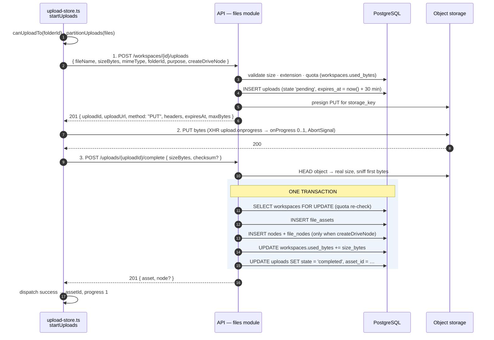
```mermaid
sequenceDiagram
    autonumber
    participant FE as upload-store.ts<br/>startUploads
    participant API as API — files module
    participant DB as PostgreSQL
    participant S3 as Object storage

    FE->>FE: canUploadTo(folderId) · partitionUploads(files)
    FE->>API: 1. POST /workspaces/{id}/uploads<br/>{ fileName, sizeBytes, mimeType, folderId, purpose, createDriveNode }
    API->>DB: validate size · extension · quota (workspaces.used_bytes)
    API->>DB: INSERT uploads (state 'pending', expires_at = now() + 30 min)
    API->>S3: presign PUT for storage_key
    API-->>FE: 201 { uploadId, uploadUrl, method: "PUT", headers, expiresAt, maxBytes }

    FE->>S3: 2. PUT bytes (XHR upload.onprogress → onProgress 0..1, AbortSignal)
    S3-->>FE: 200

    FE->>API: 3. POST /uploads/{uploadId}/complete { sizeBytes, checksum? }
    API->>S3: HEAD object → real size, sniff first bytes
    rect rgb(238, 244, 252)
    note over API,DB: ONE TRANSACTION
    API->>DB: SELECT workspaces FOR UPDATE (quota re-check)
    API->>DB: INSERT file_assets
    API->>DB: INSERT nodes + file_nodes  (only when createDriveNode)
    API->>DB: UPDATE workspaces.used_bytes += size_bytes
    API->>DB: UPDATE uploads SET state = 'completed', asset_id = …
    end
    API-->>FE: 201 { asset, node? }
    FE->>FE: dispatch success → assetId, progress 1
```

**What this changes in the frontend, stated plainly.** `fileService.upload` today is one
call (`src/services/file-service.ts:55-90`). It becomes three, behind the same signature:
`upload({ file, folderId, owner, onProgress, signal })` still returns a `Promise<FileAsset>`
and still reports progress and still aborts. **No store, no reducer, no component changes** —
the seam is exactly where the mock already put it.

**Direct-to-storage upload constraints the backend must honour:**

- The presigned `PUT` is bound to the exact `storage_key`, the declared `Content-Type` and
  a `Content-Length` range up to `maxBytes`. A client that lies about the size fails the
  `PUT` at the store, and fails E-111 at the `HEAD` re-check regardless.
- CORS on the bucket allows `PUT` from the app origin with `Content-Type` only. No
  `x-amz-meta-*` from the client: metadata the server cares about is in `uploads`, not in
  object headers a client can write.
- The presigned target expires in **15 minutes** and the `uploads` row in **30 minutes**
  (`expires_at`), so a half-finished upload cannot hold quota indefinitely. A nightly sweep
  moves `pending` rows past `expires_at` to `expired` and deletes any orphan object.
- **The object is never public.** Reads go through E-117 / E-116, which mint short-lived
  signed `GET` URLs.

---

### `POST /api/v1/workspaces/:workspaceId/uploads`

**Purpose** — Reserve an upload: validate everything that can be validated before the bytes
move, then hand back a presigned `PUT` target and the `uploadId` that step 3 completes.

**Authentication** — Required.

**Permission** — `file.upload` on the destination, **plus** workspace membership. The
destination is the folder named by `folderId`; `null` means the workspace root and the check
is then `capabilitiesFor({ role, user, node: null }).upload`, exactly as `canUploadTo` does
(`src/store/upload-store.ts:182-190`). The `upload` capability is narrowed to false by lock
and by archive (`src/lib/permissions/evaluate.ts:139-140`, `src/lib/archive.ts:48-50`) — you
cannot add files to a frozen folder.

**Additionally, per `purpose`:**

| `purpose` | Extra check |
| --- | --- |
| `drive` | none beyond `file.upload` on `folderId` |
| `documentBlock` | `document.update` on the page node named by `ownerNodeId` |
| `boardCell` | `row.update` on the board node named by `ownerNodeId` |
| `comment` | `comment.create` on the target node named by `ownerNodeId` |

The `comment` case is the one worth spelling out. Canon binds E-110 to `file.upload`; the
collaboration fact sheet argues for `comment.create` because the upload is part of posting a
comment (OQ-73). **Both are required, never either** — the two narrow, they do not widen,
and Member holds both, so nothing observable changes today while a future role that may
comment but not upload is representable.

**Path Params**

| Name | Type | Notes |
| --- | --- | --- |
| `workspaceId` | UUID | Quota scope and tenant boundary. |

**Query Params** — None.

**Request Body** — `CreateUploadRequest`.

```ts
/** Canon §5.4, `files`. */
interface CreateUploadRequest {
  /** Original file name, as picked. The server derives `extension` from it and
   *  never trusts a client-supplied extension field — there is no such field. */
  readonly fileName: string;
  /** Declared byte count. Re-verified against the landed object at E-111. */
  readonly sizeBytes: number;
  /** `File.type`, which is "" for many files and is ATTACKER-CONTROLLED.
   *  Recorded as declared, sniffed and cross-checked at E-111 (canon OQ-70). */
  readonly mimeType: string;
  /** Destination folder for a drive upload; null is the workspace root
   *  (src/types/file.ts:17-18). */
  readonly folderId: string | null;
  /** Where the asset will be referenced from. Decides the extra permission
   *  check above and the default for `createDriveNode`. */
  readonly purpose: UploadPurpose;
  /** The node the reference will hang off: the page for a document block, the
   *  board for a cell, the comment's target for a comment. Absent for `drive`. */
  readonly ownerNodeId?: string;
  /** Canon OQ-74. Default TRUE for `drive` and `documentBlock`,
   *  FALSE for `boardCell` and `comment`. */
  readonly createDriveNode?: boolean;
}

/** RECOMMENDATION (canon OQ-74). No frontend counterpart; the mock has one path. */
type UploadPurpose = "drive" | "documentBlock" | "boardCell" | "comment";
```

**Response** — `CreateUploadResponse`, `201`.

```ts
interface CreateUploadResponse {
  readonly uploadId: string;
  /** Presigned target. Single-use, bound to one key, one content type, one
   *  size ceiling. Never a URL the client composes. */
  readonly uploadUrl: string;
  readonly method: "PUT";
  /** Headers the client MUST send with the PUT, verbatim. */
  readonly headers: Readonly<Record<string, string>>;
  /** ISO 8601. The PUT must start before this. */
  readonly expiresAt: string;
  /** Server-owned ceiling, echoed so the client can fail fast on a re-pick. */
  readonly maxBytes: number;
}
```

```jsonc
{
  "uploadId": "0192f5aa-…",
  "uploadUrl": "https://objects.example.net/ws-9a2e/up/0192f5aa…?X-Amz-Signature=…",
  "method": "PUT",
  "headers": { "Content-Type": "image/png" },
  "expiresAt": "2026-08-27T09:45:00.000Z",
  "maxBytes": 104857600
}
```

**Database**

| Table | Access | Detail |
| --- | --- | --- |
| `workspace_members` | read | Membership + role. |
| `nodes` | read | `folderId` must exist, be a container, be visible, and not be trashed/archived/locked; `ownerNodeId` likewise for the non-`drive` purposes. |
| `workspaces` | read | `used_bytes` and the plan's `totalBytes`, for the quota pre-check. |
| `uploads` | **insert** | One row, `state = 'pending'`. |

`uploads` (canon T-32) is the only table this endpoint writes. Its column set, reproduced
here because every endpoint in this section reads or writes it:

| Column | Type | Nullable | Notes |
| --- | --- | --- | --- |
| `id` | `UUID` PK | no | `gen_random_uuid()`; the `uploadId` on the wire. |
| `workspace_id` | `UUID` | no | FK → `workspaces(id)` `ON DELETE CASCADE`. |
| `created_by` | `UUID` | no | FK → `users(id)` `ON DELETE CASCADE`. Session user; **only this user may complete or abort it.** |
| `storage_key` | `TEXT` | no | `UNIQUE`. Minted by the server; the client never sees it, only the signed URL that wraps it. |
| `declared_name` | `TEXT` | no | `fileName` as sent. |
| `declared_size_bytes` | `BIGINT` | no | `> 0`. |
| `declared_mime_type` | `TEXT` | no | `File.type`, or `application/octet-stream`. |
| `extension` | `TEXT` | no | Derived server-side from `declared_name` by `extensionOf` (`src/lib/node-visuals.ts:211-214`) — lower-cased, no dot, `''` when the name has no dot. |
| `folder_id` | `UUID` | yes | FK → `nodes(id)` `ON DELETE CASCADE`. |
| `purpose` | `upload_purpose` | no | Postgres enum, four members. |
| `owner_node_id` | `UUID` | yes | FK → `nodes(id)` `ON DELETE CASCADE`. |
| `create_drive_node` | `BOOLEAN` | no | Resolved default written at insert, so E-111 does not re-derive it. |
| `state` | `upload_state` | no | `pending` \| `completed` \| `aborted` \| `expired`. Default `pending`. |
| `asset_id` | `UUID` | yes | FK → `file_assets(id)` `ON DELETE SET NULL`. Set by E-111. |
| `expires_at` | `TIMESTAMPTZ` | no | `now() + interval '30 minutes'`. |
| `created_at` / `completed_at` | `TIMESTAMPTZ` | no / yes | |

Constraints: `CHECK ((state = 'completed') = (asset_id IS NOT NULL))`,
`CHECK (declared_size_bytes > 0)`,
`CHECK ((purpose = 'drive') = (owner_node_id IS NULL))`.
Indexes: `UNIQUE (storage_key)`; `uploads_sweep_idx (state, expires_at) WHERE state =
'pending'` for the reaper; `uploads_owner_idx (created_by, created_at DESC)`.

**Transaction** — Not required. One insert, and the presign is a pure computation. The quota
read here is **advisory**; the authoritative check is E-111's `SELECT … FOR UPDATE`.

**Realtime** — None. A reservation is not an event.

**Possible Errors**

| HTTP | Code | Reason |
| --- | --- | --- |
| 400 | `validation` | `FILE_EMPTY` — `sizeBytes` is 0. Message `“{name}” is empty` / detail *"Files must contain at least one byte."* (`src/lib/file-validation.ts:29-36`). |
| 400 | `validation` | `FILE_TOO_LARGE` — past the server ceiling. Message `“{name}” exceeds the {N} MB limit` (`:38-45`). |
| 400 | `validation` | `FILE_TYPE_REJECTED` — extension not on the allow-list. Detail is the `ACCEPTED_HINT` string (`:22`, `:47-55`). |
| 400 | `validation` | `VALIDATION_FAILED` — `purpose` unknown; `ownerNodeId` present on `drive` or absent on the other three. |
| 403 | `permission_denied` | `PERMISSION_DENIED` — no `upload` capability on the destination. |
| 403 | `permission_denied` | `NODE_FROZEN_BY_ANCESTOR` / `NODE_TRASHED_READ_ONLY` / `NODE_LOCKED`. |
| 404 | `not_found` | `FOLDER_NOT_FOUND` — `“{name}” could not be found`; also the answer when the folder is invisible. |
| 404 | `not_found` | `NODE_NOT_FOUND` — unknown `ownerNodeId`. |
| 429 | `validation` | `RATE_LIMITED`. |
| 502 | `network` | `UPLOAD_STORAGE_UNAVAILABLE` — the object store would not issue a presigned target. |
| **507** | `upload_failed` | `QUOTA_EXCEEDED` — `used_bytes + sizeBytes > totalBytes` (canon OQ-05). |

**Frontend Used By** — `src/store/upload-store.ts:68-78` (`fileService.upload`), reached
from every call site listed in §21.1. The `folderId` for a document block is the page's own
parent folder (`src/components/document/document-page.tsx:133` →
`src/components/document/block-editor.tsx:17`); for a board cell it is the board's parent
(`src/hooks/use-attachment-field.ts:81`).

---

### `POST /api/v1/uploads/:uploadId/complete`

**Purpose** — Turn a landed object into a `file_assets` row, optionally a drive node, and
charge it against the workspace quota. This is the only endpoint that creates a
`file_assets` row.

**Authentication** — Required.

**Permission** — `file.upload`, re-checked against the destination recorded on the `uploads`
row, **and the caller must be `uploads.created_by`**. A reservation is not transferable: the
`uploadId` is a capability and completing somebody else's would attribute their bytes to
your quota and your name.

**Path Params**

| Name | Type | Notes |
| --- | --- | --- |
| `uploadId` | UUID | Must be `state = 'pending'` and not past `expires_at`. |

**Query Params** — None.

**Request Body** — `CompleteUploadRequest`.

```ts
interface CompleteUploadRequest {
  /** Bytes the client believes it sent. Compared with the object store's HEAD;
   *  a mismatch is UPLOAD_INCOMPLETE, not a silent correction. */
  readonly sizeBytes: number;
  /** Optional SHA-256 of the object, hex. Recorded on file_assets.checksum. */
  readonly checksum?: string;
}
```

**Response** — `201`.

```ts
/** The asset always; the node only when the upload asked for one. */
interface CompleteUploadResponse {
  readonly asset: FileAsset;
  /** Present iff `uploads.create_drive_node`. Exactly the FileNode the mock
   *  builds today at src/store/workspace-store.ts:716-743. */
  readonly node: FileNode | null;
}
```

```jsonc
{
  "asset": {
    "id": "0192f5b0-…",
    "name": "payment-error.png",
    "extension": "png",
    "mimeType": "image/png",
    "sizeBytes": 248113,
    "kind": "image",
    "owner": { "id": "usr_lan", "name": "Lan Nguyen", "initials": "LN" },
    "createdAt": "2026-08-27T09:31:04.000Z",
    "updatedAt": "2026-08-27T09:31:04.000Z",
    "folderId": null
  },
  "node": null
}
```

**Database** — all inside one transaction:

| # | Table | Access | Detail |
| --- | --- | --- | --- |
| 1 | `uploads` | read `FOR UPDATE` | The row, its state, `expires_at`, `created_by`, `purpose`, `create_drive_node`, `folder_id`, `storage_key`. Locking it makes completion idempotent under a double-submit. |
| 2 | — | object store | `HEAD storage_key` → real `Content-Length`; read the first bytes for the sniff. |
| 3 | `workspaces` | read `FOR UPDATE` | `used_bytes` and the plan ceiling. C-§1.4: the counter is maintained transactionally, never recomputed by aggregate. |
| 4 | `file_assets` | **insert** | `name`, `extension`, `mime_type`, `size_bytes` (the **HEAD** value, not the declared one), `kind` (derived from extension), `storage_key`, `checksum`, `owner_id`, `folder_id`, `workspace_id`. |
| 5 | `nodes` + `file_nodes` | **insert** | Only when `create_drive_node`. `slug` de-duplicated against the destination's siblings (`uniqueSlug`, mirroring `src/store/workspace-store.ts:719-722`), `owner` = uploader, `is_favorite/is_trashed/is_shared = false`, `file_nodes.version = 1`. |
| 6 | `workspaces` | **update** | `used_bytes = used_bytes + file_assets.size_bytes`. |
| 7 | `uploads` | **update** | `state = 'completed'`, `asset_id`, `completed_at = now()`. |

The **reference row is not written here.** `cell_attachments`, `comment_attachments` and
`document_asset_refs` are written by the endpoint that stores the reference — E-066 for a
cell, E-120 for a comment, E-092 for a document block — in *their* transactions, because
that is the only way the reference and the value it projects cannot drift. Between E-111 and
that write the asset is an orphan; the sweep's grace window (below) is what keeps it alive.

**Transaction** — **Required.** The asset row, the node, the quota increment and the state
transition are one unit. A quota increment without an asset row leaks capacity nobody can
reclaim; an asset row without the increment lets the workspace exceed its plan one upload at
a time. Isolation: `READ COMMITTED` with the two `FOR UPDATE` locks. The workspace row lock
serialises concurrent uploads into the same workspace, which is exactly what a counter
needs.

**Realtime** — **RT-11 `node.changed`** `{ workspaceId, nodeId, change: "created" }` when a
drive node was created, so a second tab's sidebar converges without polling. No frame when
`createDriveNode` is false — a cell or comment attachment announces itself through
RT-07/RT-01 when the referencing write lands.

**Possible Errors**

| HTTP | Code | Reason |
| --- | --- | --- |
| 400 | `validation` | `FILE_TYPE_REJECTED` — the sniffed type is on the deny-list, whatever the name says. |
| 400 | `validation` | `FILE_CONTENT_TYPE_MISMATCH` — sniffed content contradicts the declared extension (canon OQ-70). |
| 403 | `permission_denied` | `PERMISSION_DENIED` — the caller is not `created_by`, or lost `upload` on the destination between the two calls. |
| 404 | `not_found` | `UPLOAD_NOT_FOUND` — unknown, already completed, aborted, or expired. One reason for all four: an expired reservation and a stolen one must be indistinguishable. |
| 404 | `not_found` | `FOLDER_NOT_FOUND` — the destination was deleted while the bytes were moving. |
| 409 | `conflict` | `NODE_SLUG_CONFLICT` — only if slug de-duplication is exhausted; normally impossible. |
| **422** | `upload_failed` | `UPLOAD_INCOMPLETE` — the `HEAD` shows no object, or a size that disagrees with `sizeBytes`. `isRetryable: true`. |
| 502 | `network` | `UPLOAD_STORAGE_UNAVAILABLE`. |
| 507 | `upload_failed` | `QUOTA_EXCEEDED` — the authoritative check. A workspace that filled up while the bytes were in flight is refused here; the object is deleted and the row goes to `aborted`. |

**Frontend Used By** — the tail of `src/store/upload-store.ts:68-78`; the returned asset is
handed to `useWorkspaceStore.addUploadedAsset` (`:76`) and then, per surface, to
`attachmentFromAsset` (`src/hooks/use-attachment-field.ts:87-90`), to a `DocumentImage`
(`src/components/document/blocks/image-block.tsx:44-47`) or to an `AttachmentBlock`
(`src/components/document/blocks/attachment-block.tsx:30`).

---

### `DELETE /api/v1/uploads/:uploadId`

**Purpose** — Abort a reservation: the user cancelled, or the transfer failed and will not
be retried.

**Authentication** — Required.

**Permission** — `file.upload`, and the caller must be `uploads.created_by`.

**Path Params** — `uploadId` (UUID).

**Query Params** — None.

**Request Body** — None.

**Response** — `204`, no body. The one endpoint in this section that returns nothing:
there is no authoritative record to return, because the point is that no record was created
(C-10 is about writes that produce a resource).

**Database** — `uploads`: **update** `state = 'aborted'`. The object at `storage_key` is
deleted best-effort; if the delete fails the nightly sweep collects it. `workspaces.used_bytes`
is **not** touched, because E-111 never ran.

**Transaction** — Not required.

**Realtime** — None.

**Possible Errors**

| HTTP | Code | Reason |
| --- | --- | --- |
| 403 | `permission_denied` | `PERMISSION_DENIED` — not the reservation's owner. |
| 404 | `not_found` | `UPLOAD_NOT_FOUND` — unknown or already terminal. |

Aborting an already-aborted upload returns `204`, not `404`: the state requested is the
state achieved, and the client's `cancelUpload` fires the abort locally first
(`src/store/upload-store.ts:149-152`), so a retry is normal.

**Frontend Used By** — `src/store/upload-store.ts:149-152` (`cancelUpload`) and `:163-167`
(`removeTask`, which also aborts). Surfaced by the cancel control on
`src/components/files/upload-task-row.tsx` inside `upload-queue-panel.tsx` and
`upload-dialog.tsx`.

---

### 21.3 Listing attachments

There is **no** `GET /attachments` and there must not be one. An attachment is reached
through the thing that owns it, which is what makes the permission check the owner's check
rather than a second, parallel one that can disagree.

| Owner | How the attachments arrive | Endpoint |
| --- | --- | --- |
| Board record cell | inside `BoardRow.cells[columnId]` as `CellValue { kind: "attachment", attachments }` | E-047, E-061, E-063 |
| Comment | inside `Comment.attachments` | E-119, E-125 |
| Document block | inside `WorkspaceDocument.blocks[]` as `ImageBlock.images[]` / `AttachmentBlock` | E-091 |
| Drive folder | as `FileNode[]` | **E-113**, below |

In every case the response embeds the metadata (`name`, `mimeType`, `sizeBytes`) joined from
`file_assets`, plus a freshly minted `url`. The join tables are read by the owning
endpoint's query, never by a second round trip per attachment.

---

### `GET /api/v1/folders/:nodeId/files`

**Purpose** — The files directly inside one folder, for the Files screen.

**Authentication** — Required.

**Permission** — Visibility on `nodeId`, **resolved server-side**. The mock takes a
`canView` boolean from the caller (`src/services/file-service.ts:92-98`), which canon OQ-18
marks `critical`: the API must never accept an access decision as an input.

**Path Params**

| Name | Type | Notes |
| --- | --- | --- |
| `nodeId` | UUID | The folder or project. A literal `root` addresses the workspace root, matching `folderId: null` in the client. |

**Query Params**

| Name | Type | Required | Default | Notes |
| --- | --- | --- | --- | --- |
| `limit` | int | no | `500` | Hard server cap 1000 (§6.3: no list is unbounded). |

**Request Body** — None.

**Response** — `FileNode[]`, `200`. Trashed files are excluded, matching
`src/services/file-service.ts:124`. `previewUrl` and `thumbnailUrl` are short-lived signed
URLs minted per response; `sizeBytes`, `mimeType`, `extension` and `kind` come from
`file_assets`; `version` from `file_nodes`.

**Database** — `nodes` (visibility walk, then `WHERE parent_id = $1 AND kind = 'file' AND
deleted_at IS NULL`), `file_nodes`, `file_assets`, `users` (owner), `node_favorites`
(`isFavorite` for **this** viewer), `access_rules` (`isShared` = a rule exists).

**Transaction** — Not required.

**Realtime** — None.

**Possible Errors**

| HTTP | Code | Reason |
| --- | --- | --- |
| 403 | `permission_denied` | `PERMISSION_DENIED` — message `You do not have access to “{name}”`, detail *"Ask the owner to share it with you."* (`src/services/file-service.ts:113-118`). Note this is the one place the frontend does name the folder, because the caller reached it by navigating to it. |
| 404 | `not_found` | `FOLDER_NOT_FOUND` — `That folder could not be found`. |
| 409 | `conflict` | `NODE_KIND_MISMATCH` — `nodeId` is not a container. |

**Frontend Used By** — `src/hooks/use-file-catalog.ts:43-46` → `fileService.listFiles`,
rendered by `src/components/files/files-view.tsx` and `src/components/files/file-table.tsx`.

---

### `GET /api/v1/assets/:assetId/url`

**Purpose** — Turn a stored `assetId` into a short-lived signed URL. This is how a board
cell, a document block and a comment attachment all get their bytes, and it is the reason
nothing persists a URL.

**Authentication** — Required.

**Permission** — **Visibility on any owner.** The caller must be able to see at least one of
the places the asset is referenced from — a four-way `EXISTS` across `file_nodes`,
`cell_attachments`, `comment_attachments` and `document_asset_refs`, each resolved to a node
and each node run through the visibility walk. An asset with no surviving reference is
`ASSET_NOT_FOUND` even to its uploader: the reference is the grant.

**Path Params**

| Name | Type | Notes |
| --- | --- | --- |
| `assetId` | UUID | `file_assets.id` — the same value as `CellAttachment.id` and `CommentAttachment.id`. |

**Query Params**

| Name | Type | Required | Default | Notes |
| --- | --- | --- | --- | --- |
| `variant` | `"original" \| "thumbnail"` | no | `"original"` | `thumbnail` returns a URL for `thumb_key`; **falls back to the original** when `thumb_key` is null, because the client's contract is "a URL or null", and a null thumbnail already means "use the original" (`src/hooks/use-attachment-field.ts:89`). |
| `disposition` | `"inline" \| "attachment"` | no | `"inline"` | Forced to `attachment` for the non-renderable set, whatever is asked. |

**Request Body** — None.

**Response** — `SignedUrlResponse`, `200`.

```ts
interface SignedUrlResponse {
  readonly url: string;
  /** ISO 8601. The client treats the URL as ephemeral, which it already does. */
  readonly expiresAt: string;
  /** Echoed so a caller can tell a real thumbnail from the original fallback. */
  readonly variant: "original" | "thumbnail";
}
```

**Database** — `file_assets` (read: `storage_key`, `thumb_key`, `mime_type`, `name`);
`file_nodes` / `cell_attachments` / `comment_attachments` / `document_asset_refs` (read:
the ownership `EXISTS`); `nodes`, `boards`, `board_rows`, `comments` (read: resolve each
reference to a node id for the visibility walk).

**Transaction** — Not required. Read-only.

**Realtime** — None.

**Possible Errors**

| HTTP | Code | Reason |
| --- | --- | --- |
| 404 | `not_found` | `ASSET_NOT_FOUND` — unknown asset, or one with no reference the caller may see. Never `403`: distinguishing them tells the caller an asset exists. |
| 429 | `validation` | `RATE_LIMITED` — this endpoint is called once per attachment chip and must be throttled per user, not per asset. |
| 502 | `network` | `UPLOAD_STORAGE_UNAVAILABLE`. |

**Frontend Used By** — `src/services/file-service.ts:247-251` (`getAssetUrl`), called from
`src/hooks/use-attachment-field.ts:87-90` (cell attachments, minting both `url` and
`thumbnailUrl`) and `src/components/document/blocks/image-block.tsx:44-46`. Consumed by
`src/components/board/attachments/attachment-viewer.tsx:46-58` and
`src/components/comments/comment-attachments.tsx:23-29`.

**Caching.** Signed URLs are minted per response with a **15-minute** lifetime and the
response carries `Cache-Control: private, no-store`. A board page with forty attachment
chips therefore mints forty URLs; batch them by returning `url` and `thumbnailUrl` already
populated inside `BoardSnapshot` and `CommentPage` rather than making the client call this
endpoint forty times. E-117 exists for the cases the batch cannot cover — a lightbox opened
long after the page loaded, and a URL that has since expired.

---

### `GET /api/v1/nodes/:nodeId/file/download`

**Purpose** — A URL suitable for an `<a download>`.

**Authentication** — Required.

**Permission** — Visibility on `nodeId`. `canDownload` is gated on `capabilities.view` in
the frontend (`src/components/files/file-preview-dialog.tsx:55`) — reading a file is
downloading it, so there is no separate download key.

**Path Params** — `nodeId` (UUID), must address a `file` node.

**Query Params** — None.

**Request Body** — None.

**Response** — `SignedUrlResponse`. The signed `GET` carries
`Content-Disposition: attachment; filename="<original name>"` **server-side**, so the browser
honours the original name even though the client also sets `anchor.download`
(`src/hooks/use-file-preview.ts:63-72`) — a signed URL alone does not carry a filename.

**Database** — `nodes` (visibility, kind), `file_nodes`, `file_assets` (`storage_key`,
`name`, `mime_type`).

**Transaction** — Not required.

**Realtime** — None.

**Possible Errors**

| HTTP | Code | Reason |
| --- | --- | --- |
| 404 | `not_found` | `NODE_NOT_FOUND` / `ASSET_NOT_FOUND`. |
| 409 | `conflict` | `NODE_KIND_MISMATCH` — the node is not a file. |
| 502 | `network` | `UPLOAD_STORAGE_UNAVAILABLE`. |

**Frontend Used By** — `src/hooks/use-file-preview.ts:37-43` (`download`) and `:49-54`
(`useFileDownload`), from the viewer header (`src/components/files/preview/viewer-header.tsx`),
the file table, the drive item menu (`src/components/drive/drive-item-menu.tsx:135-140`) and
the document attachment block (`src/components/document/blocks/attachment-block.tsx:45-63`).

---

### `GET /api/v1/nodes/:nodeId/file/preview`

**Purpose** — Everything the preview surface needs, resolved server-side into a
discriminated union, so the client never decides how to render bytes it has not seen.

**Authentication** — Required.

**Permission** — Visibility on `nodeId`.

**Path Params** — `nodeId` (UUID), must address a `file` node.

**Query Params** — None.

**Request Body** — None.

**Response** — `FilePreview` (`src/types/file.ts:21-27`), `200` in every case including
`unsupported`.

```ts
type FilePreview =
  | { readonly kind: "image"; readonly url: string; readonly alt: string }
  | { readonly kind: "pdf"; readonly url: string }
  | { readonly kind: "text"; readonly content: string; readonly language: ConfigFormat }
  | { readonly kind: "sheet"; readonly rows: readonly (readonly string[])[]; readonly sheetName: string }
  | { readonly kind: "unsupported"; readonly reason: string };
```

- `image` and `pdf` carry a **signed URL**, not bytes. For `image` that URL is the
  **original**, never the thumbnail — see §21.5.
- `text` carries the **content itself**, not a URL (`src/services/file-service.ts:147-150`).
  `language` is typed as `ConfigFormat` on the wire and derived from the extension,
  defaulting to `"text"` (canon OQ-76; the frontend field is a bare `string` today).
- `sheet` carries the parsed grid and a `sheetName` — the filename minus its extension,
  truncated to 31 characters (Excel's limit), falling back to `"Sheet1"`
  (`src/services/file-service.ts:301-303`).
- `unsupported` is **not an error**: canon §4.3 records `PREVIEW_UNSUPPORTED` explicitly as a
  `200` outcome. Its `reason` is the human sentence
  `"{EXT} files cannot be previewed in the browser. Download the file to open it."`
  (`:337-340`), which is the PRD's "download button with a warning".

**The strategy is decided by extension first, MIME second** (`previewStrategyFor`,
`src/lib/preview-strategy.ts:89-105`), and the comment at `:92-93` is the rule:
*"A recognised extension is authoritative — MIME types are often generic and sometimes plain
wrong."* Order: 7 image extensions → `pdf` → 3 sheet extensions → 31 text extensions →
24 known-binary extensions → then the MIME fallbacks (`kind === "image"`,
`application/pdf`, `text/*`) → else `none`.

**Database** — `nodes`, `file_nodes`, `file_assets`; the object store for `text` and `sheet`
(the bytes are read and parsed server-side).

**Transaction** — Not required.

**Realtime** — None.

**Possible Errors**

| HTTP | Code | Reason |
| --- | --- | --- |
| 404 | `not_found` | `NODE_NOT_FOUND` / `ASSET_NOT_FOUND`. |
| 409 | `conflict` | `NODE_KIND_MISMATCH`. |
| 502 | `network` | `UPLOAD_STORAGE_UNAVAILABLE`. |

**Frontend Used By** — `src/hooks/use-file-preview.ts:26-35`, rendered by
`src/components/files/preview/preview-surface.tsx` and its five per-kind children.

---

### 21.4 Deleting an attachment

**There is no `DELETE /assets/{assetId}`, and no chapter may add one.** An asset is
removed by removing the **reference**; the object is collected afterwards.

| What the user did | Endpoint | Effect |
| --- | --- | --- |
| Removed a file from a board attachment cell | E-066 `PATCH /boards/{boardId}/rows/cells` | The cell value is rewritten without it; the `cell_attachments` row is deleted in the same transaction. `src/hooks/use-attachment-field.ts:98-104` (`remove`) writes exactly this. |
| Removed an image from a document block | E-092 `PUT /nodes/{nodeId}/document` | `blocks` is rewritten; `document_asset_refs` is rewritten in the same transaction. |
| Deleted a comment | E-122 (soft) → purge (hard) | The tombstone renders `attachments: []`; `comment_attachments` rows survive the soft delete and cascade on purge. |
| Trashed a drive file | E-032 `DELETE /nodes/{nodeId}` | Soft delete on `nodes`. The asset and `file_nodes` row survive — a restore must restore the bytes. |
| Purged a drive file | E-038 / E-039 / the nightly trash sweep | `nodes` row is hard-deleted; `file_nodes` cascades. |

**The orphan sweep.** A `file_assets` row with no row in `file_nodes`, `cell_attachments`,
`comment_attachments` or `document_asset_refs`, **and** older than a **24-hour grace
window**, is deleted along with its object, and `workspaces.used_bytes` is decremented in the
same transaction. The grace window exists because E-111 creates the asset before the
referencing write lands; without it, a slow comment post would race the sweep.

Every reference table uses `asset_id → file_assets(id) ON DELETE RESTRICT`. That is
deliberate: `RESTRICT` turns a sweep bug into a loud error instead of a silently broken
thumbnail on a colleague's record. Canon OQ-72 — what happens to a document image block when
its drive file is deleted — is answered by the same constraint: the block's
`document_asset_refs` row keeps the asset alive, so trashing the *node* never destroys the
*object* the page still shows.

---

### 21.5 Validation, trust, and the image viewer

#### Size

**EXISTING REQUIREMENT (frontend).** `MAX_UPLOAD_BYTES = 25 * 1024 * 1024`
(`src/lib/file-validation.ts:4`), with the message `“{name}” exceeds the 25 MB limit` and
the hint *"PDF, PNG, JPG, XLSX, CSV, TXT and source code · up to 25 MB"* (`:22`, `:38-45`).
The PRD `WS-FIL-06` says 100 MB.

**Canon's position (OQ-69) is binding: 100 MB is the API and storage contract, and the
client's pre-check number is served from `GET /config` (E-139) so the two cannot disagree.**
The hint string and the message are rendered from that value, not from a constant. Empty
files are refused at 0 bytes (`FILE_EMPTY`) — `file_assets` carries
`CHECK (size_bytes > 0)`, and the ceiling is deliberately **not** a check constraint so
raising it is a config change, not a migration.

Enforced **three times**: in the client for a fast toast, at E-110 against the declared size
and the quota, and at E-111 against the object store's `HEAD`. Only the third is
authoritative.

#### MIME type, and why the extension is not trusted either

**Both inputs are attacker-controlled and the frontend says so.**

- `mimeType` is `file.type || "application/octet-stream"` (`src/services/file-service.ts:82`,
  `src/lib/upload-queue.ts:16`) — a browser-supplied string with no verification anywhere.
- The extension is part of a filename the user typed.
- `src/lib/file-validation.ts` validates the **extension only**; the MIME type is **not
  validated at all**.
- `src/lib/attachments.ts:33-38` states the rule the backend inherits: *"A declared MIME
  type is not trustworthy on its own, and neither is a file extension — the client may set
  either. Both have to agree before the byte stream is put in an ``."*

**The server-side rule, in order:**

1. **Derive** `extension` from the filename with `extensionOf` semantics — lower-cased, no
   dot, `""` when there is no dot (`src/lib/node-visuals.ts:211-214`). Never accept an
   `extension` field.
2. **Check the extension against the allow-list** at E-110. The list is server config served
   by `GET /config`, seeded from `ACCEPTED_EXTENSIONS` (19 entries:
   `pdf txt md · png jpg jpeg · xlsx csv · ts tsx js jsx json sql py go sh yml yaml`,
   `src/lib/file-validation.ts:7-14`). Canon OQ-70 records that this list blocks formats the
   previewer handles (`gif webp svg tsv xml html css env markdown`) and recommends adding at
   least those while keeping `exe dmg bin iso` out.
3. **Sniff the landed object at E-111** — read the leading bytes and compare the detected
   type with what the extension implies. Disagreement is `FILE_CONTENT_TYPE_MISMATCH` (400):
   the upload is aborted, the object deleted, the quota untouched.
4. **Store `mime_type` as the sniffed type**, not the declared one, when the sniff is
   confident; otherwise store the declared value and mark `kind` from the extension. `kind`
   is always derived server-side (`kindFromFileName`, `src/lib/node-visuals.ts:206-209`),
   never accepted.
5. **Serve with the stored type, never with a client-supplied one.** The signed `GET`
   carries `Content-Type` from `file_assets.mime_type` and `X-Content-Type-Options: nosniff`.

#### Never rendered inline — the stored-XSS rule

**EXISTING REQUIREMENT.** `NON_RENDERABLE_TYPES = { "image/svg+xml", "text/html",
"application/xhtml+xml" }` with the reason written down at `src/lib/attachments.ts:24-29`:
*"SVG is markup, and rendering uploaded markup in the app's own origin is how an upload
becomes stored XSS."*

Backend obligations:

- Serve every user-uploaded object from a **separate origin** from the application, so even
  a bypass cannot reach the app's cookies or `localStorage`.
- Force `Content-Disposition: attachment` for anything in that set, whatever `disposition`
  E-117 was asked for.
- Send `Content-Security-Policy: default-src 'none'; sandbox` on object responses.
- `isImageAttachment` requires the declared MIME **and** the extension to agree
  (`src/lib/attachments.ts:39-43`); the server reproduces that check before it ever labels an
  asset `kind: "image"`.

#### The image viewer needs the original, at its own resolution

**EXISTING REQUIREMENT, and it constrains the API.** The viewer is a pan/zoom canvas, not a
box:

- `ImageCanvas` documents its `url` prop as *"Full-resolution asset. Thumbnails belong in
  cells and lists, not here."* (`src/components/shared/image-canvas.tsx:11-13`).
- The canvas sizes itself from `image.naturalWidth` / `naturalHeight` on load
  (`:77-81`) and offers **Fit** and **100%** controls with `=` / `-` / `0` hotkeys
  (`:49-51`). *"100%"* is a promise about pixels: if the URL served a 1600 px derivative of a
  3200 px screenshot, 100% would show the image at half size and every measurement taken off
  it would be wrong.
- `AttachmentViewer` says it again: *"The full-resolution asset is what the viewer loads;
  thumbnails stay in the cell and the drawer list."*
  (`src/components/board/attachments/attachment-viewer.tsx:29-30`), and passes
  `url: current.url` with `thumbnailUrl` handed separately as the blurred placeholder
  (`:48-53` → `ImageLightbox` → `ImageCanvas.placeholderUrl`).

Therefore:

1. **E-117 `variant=original` returns the untouched uploaded object.** No server-side
   resize, no re-encode, no EXIF-driven rotation baked in, no format substitution.
2. **`thumbnailUrl` is a separate field and a separate object** (`file_assets.thumb_key`),
   never a resized rendering of the same URL. `CellAttachment` carries both
   (`src/types/board.ts:206-208`) and the cell renders the thumbnail while the viewer renders
   the original.
3. **`thumbnailUrl` may be `null` and the client already handles it** — it falls back to the
   original (`src/hooks/use-attachment-field.ts:89`). So thumbnail generation is
   asynchronous and non-blocking: E-111 returns before it exists.
4. The recommended derivative (canon OQ-71): longest edge **400 px**, WebP or JPEG, EXIF
   stripped, images only, `thumb_key` written when it lands. A grid of twenty chips must not
   download twenty full-size photographs.

---

### 21.6 Open questions

> **OPEN QUESTION (OQ-73) — comment attachments bypass validation, permission and the node model.**
> **Evidence** — `commentService.attach` mints a session object URL and nothing more
> (`src/services/comment-service.ts:209-219`). It does not call `validateUpload`, does not
> touch the upload store, does not check `file.upload`, and does not create a node;
> `addFiles` calls `onAttach` directly (`src/components/comments/comment-composer.tsx:69-80`).
> `docs/COLLABORATION.md:330` records that the attachments do not survive a reload.
> **Recommendation** — route them through E-110/E-111 with `purpose: "comment"` and
> `createDriveNode: false`, applying the same size ceiling, the same allow-list and the same
> sniff, and requiring **both** `file.upload` and `comment.create`. Store them in
> `comment_attachments` referencing `file_assets`, and mint `CommentAttachment.url` per
> response.
> **Impact if wrong** — an unvalidated upload path exists on the busiest surface in the
> product: a 4 GB executable reaches object storage through a comment box, uncounted against
> any quota.

> **OPEN QUESTION (OQ-74) — should a document-block or board-cell upload appear in Drive?**
> **Evidence** — it does today, unavoidably: `startUploads` always calls
> `addUploadedAsset` (`src/store/upload-store.ts:76`), and every block passes the page's own
> parent folder (`src/components/document/document-page.tsx:133`). Nobody chose it per
> surface; it falls out of the shared funnel. The board type comment says the opposite —
> a cell attachment *"does not create a file node beside the board"* (`src/types/board.ts:198-200`).
> **Recommendation** — canon's position: `createDriveNode` on `CreateUploadRequest`, default
> `true` for `drive` and `documentBlock` (a page's images live beside the page and inherit
> its folder permissions) and `false` for `boardCell` and `comment`. Confirm with product
> before changing what ships.
> **Impact if wrong** — either every project folder fills with `Screenshot 2026-08-27.png`,
> or a page's images become orphans nobody can find, share or permission.

> **OPEN QUESTION (OQ-75) — stored attachment URLs are session object URLs.**
> **Evidence** — `CellAttachment.url` is documented as *"Session URL for the real bytes;
> null once the session that made it ends"* (`src/types/board.ts:206-207`); the same for
> `CommentAttachment.url` (`src/types/collab.ts:35-36`) and `DocumentImage.url`.
> `getAssetUrl` returns null once the blob is gone (`src/services/file-service.ts:247-251`).
> **Recommendation** — persist **only** `assetId` in cells, blocks and comments. Mint `url`
> and `thumbnailUrl` per response as short-lived signed URLs (E-117) and never accept either
> on write; strip them from any request body that carries them.
> **Impact if wrong** — every attachment renders broken the moment the uploading tab closes,
> and the database fills with `blob:` strings that mean nothing to anyone else.

---

---

## 22. Config Documents

Module `devtools` (canon C-14). Endpoints **E-099** and **E-100** (canon §3.15), plus the config
projection of the shared version family **E-095 … E-098** (canon §3.14). Tables `config_documents`
(T-20) and `config_versions` (T-21), joined to `nodes` (T-06), `environments` (T-26) and `users`
(T-01). Requirement codes: `DV-CFG-22` (the editor), `DV-ENV-21` (the environment label),
`SY-VER-39` (version history).

### 22.0 What a config document is, and the six rules every endpoint below inherits

A config document is a **drive node whose `kind` is `document` and whose `documentKind` is
`config`**, with one row of content beside it. It is not a separate kind of node and it is not a
file: it shares routing, permissions, favourites, pin/lock/archive and the trash lifecycle with
every other document — *"Documents come in three shapes. They share routing, permissions and the
pin/lock/archive lifecycle; only their editor differs."* (`src/types/node.ts:40-44`). The
frontend picks the editor at render time from `documentKindOf(node)`
(`src/components/drive/drive-view.tsx:118-123`), and the backend picks the content table the same
way.

Six rules bind E-099, E-100 and the four version endpoints, and are not restated in each:

1. **The wire field is `format`, never `language`.** *"`format` rather than `language` on the wire:
   it is what the field has always been called and what the stored documents carry. The UI says
   'Language'."* (`src/types/devtools.ts:19-21`). Canon §2.1 records this as the one place a
   proposed name (`DocumentLanguage`) loses to the frontend's (`ConfigFormat`). No endpoint, column,
   query parameter or error message in this chapter uses the word `language`.

2. **`name` is not stored on the config row.** It is read from `nodes.name` on every read, so a
   rename cannot leave the page header and the breadcrumb disagreeing about what you are looking at
   — the frontend refreshes it explicitly for exactly that reason
   (`src/services/devtools-service.ts:100-118`). Model it as a join, never a column. There is no
   config-rename endpoint: renaming is `PATCH /api/v1/nodes/{nodeId}` (E-025).

3. **`content` is opaque.** The backend stores the bytes it was sent, verbatim. It does not format,
   re-indent, normalise line endings, strip a BOM, sort `.env` keys, or reject malformed content.
   See §22.2 — this is a decision, not an omission.

4. **Content and metadata land in one write.** Changing the format or the environment sends the
   current content along, *"so the language and the text land in one version rather than in two that
   disagree"* (`src/hooks/use-config-document.ts:109-113`, and the two callers at `:114-139`).
   E-100 therefore accepts `content`, `format` and `environmentOptionId` in a single request and
   must never require three.

5. **Every write returns the authoritative record** (canon C-10). `useConfigDocument` assigns the
   response with `setData(saved)` and does **not** touch the local draft
   (`src/hooks/use-config-document.ts:73-82`), because *"replacing the draft with the server's copy
   is correct only if nothing was typed while the request was in flight, and on a code surface
   something usually was; doing it anyway is how an editor eats a sentence"* (`:45-54`). The
   response is the record and nothing more — no echo of the draft, no diff, no formatted body.

6. **The three narrowing layers apply.** A config document under a **trashed** node accepts nothing
   but `node.delete`; one under an **archived ancestor** is frozen and refuses every write; a
   **locked** document refuses `document.update` because that key is in `CONTENT_WRITE_KEYS`
   (`src/lib/permissions/evaluate.ts:36-49, 79-85`). These are resolved before the permission key is
   even consulted and produce `NODE_TRASHED_READ_ONLY`, `NODE_FROZEN_BY_ANCESTOR` and `NODE_LOCKED`
   respectively (canon §4.3).

---

### 22.1 `ConfigFormat` — the language enum

**EXISTING REQUIREMENT.** Fifteen members, a closed union, stored on the document
(`src/types/devtools.ts:22-37`):

```ts
/** src/types/devtools.ts:22-37 — canon §2.8. Config documents only. */
type ConfigFormat =
  | "json" | "env" | "yaml"
  | "javascript" | "typescript" | "jsx" | "tsx"
  | "html" | "xml" | "css"
  | "sql" | "shell" | "dockerfile" | "nginx"
  | "text";
```

The union is *"deliberately short and deliberately not extensible from data … so a document cannot
be saved in a language nothing can colour, and every branch that switches on it is checked
exhaustively at build time"* (`src/types/devtools.ts:13-17`).

| Member | Display label | Formatter (client-side) | Notes |
| --- | --- | --- | --- |
| `json` | JSON | `JSON.parse` + `JSON.stringify` | The only format that is linted. |
| `env` | ENV | bespoke, whitespace around the first `=` only | The detection fallback and the storage default. |
| `yaml` | YAML | Prettier `yaml` | |
| `javascript` | JavaScript | Prettier `babel` | |
| `typescript` | TypeScript | Prettier `typescript` | |
| `jsx` | JSX | Prettier `babel` | |
| `tsx` | TSX | Prettier `typescript` | |
| `html` | HTML | Prettier `html` | |
| `xml` | XML | **none** | Button shown and disabled. |
| `css` | CSS | Prettier `css` | |
| `sql` | SQL | **none** | |
| `shell` | Shell | **none** | |
| `dockerfile` | Dockerfile | **none** | |
| `nginx` | Nginx | **none** | |
| `text` | Plain Text | **none** | |

Labels and picker order: `CONFIG_FORMAT_LABELS` (`src/lib/syntax/grammars.ts:167-185`); the picker
iterates `CONFIG_FORMATS`, which is `Object.keys` of that map, so **the declaration order above is
the order the dropdown shows** (`src/lib/syntax/grammars.ts:185`;
`src/components/shared/create-menu-items.tsx:107-121`). Parser assignment:
`src/lib/code-format.ts:51-64`.

**Storage.** A Postgres `ENUM` named `config_format` whose values are the frontend literals verbatim
(canon §2.0):

```sql
-- Documentation of intent, not a migration.
CREATE TYPE config_format AS ENUM (
  'json','env','yaml','javascript','typescript','jsx','tsx',
  'html','xml','css','sql','shell','dockerfile','nginx','text'
);
```

Do **not** normalise `javascript` to `js` or introduce a `long_text`-style rewrite: the wire value
and the stored value must be identical so no mapping layer can drift.

**The enum is closed on write.** A `format` outside those fifteen is `400 / validation`, reason
`CONFIG_FORMAT_UNKNOWN` (canon §4.3). It is never stored as free text and never coerced to `text`.
The frontend has a matching type guard, `isConfigFormat`, for anything arriving from storage or a
paste (`src/lib/syntax/grammars.ts:187-190`).

**`ConfigFormat` is not `CodeLanguage`.** A fenced code *block* inside a page uses a different,
eight-member enum — `plaintext`, `typescript`, `javascript`, `json`, `sql`, `bash`, `python`, `go`
(`src/types/document.ts:20-28`, canon §2.8). Two independent enums, two independent columns. They
must not be merged, and a `ConfigFormat` value must never be written into a code block's `language`
field or vice versa.

**Detection at creation is a client-side guess, and only a starting point.** `formatFromName`
resolves by exact name first (`dockerfile`, `containerfile`, `.env`, `nginx`, `makefile`), then by
the last dotted segment against a 24-entry extension map, then a `.env*` prefix, then falls back to
**`env`** (`src/lib/syntax/detect.ts:14-68`). *"Nothing infers a language from the content: a JSON
object and a JavaScript object literal are the same bytes, and choosing between them by sniffing
would silently switch a document's language out from under whoever wrote it."*
(`src/lib/syntax/detect.ts:8-11`). **The backend must not sniff content either.** The author picks
the format in the create menu precisely because the guess gets "Payment Service Config" wrong
(`src/services/devtools-service.ts:196-203`), so `format` arrives on the create request and the
server stores what it is given.

---

### 22.2 Formatting and linting are client concerns — the backend offers neither

**EXISTING REQUIREMENT, stated as plainly as the brief asks: there is no formatter endpoint, and
none may be added.**

Reformatting happens entirely in the browser, in `src/lib/code-format.ts`, with Prettier loaded **on
demand** — *"nothing here is in the page's bundle until somebody presses Format, and only the one
parser that language needs is fetched"* (`src/lib/code-format.ts:8-14`). Plugins are dynamically
imported and cached per parser (`:98-137`). JSON and ENV deliberately bypass Prettier: JSON because
`JSON.parse`/`JSON.stringify` are already exact and already loaded, ENV because Prettier has no
parser for it and *"format" here means only the whitespace around the first `=`* — **order is never
touched**, because `.env` files are read top to bottom by tools that let a later line win, so
sorting one alphabetically can change what a service boots with (`src/lib/code-format.ts:16-26`,
implementation at `:66-89`).

Six consequences the backend must honour:

| # | Consequence |
| --- | --- |
| F-1 | **No `POST /config/format` endpoint, no `?format=true` parameter, no server-side pretty-printer.** The Format button calls `formatSource` locally and then `controller.setDraft(result.text)` — a local state write, not a request (`src/components/devtools/config-document-page.tsx:52-61`). |
| F-2 | **The stored bytes are the submitted bytes.** No trailing-newline insertion, no CRLF→LF rewrite, no whitespace trimming, no re-encoding. A `PUT` followed by a `GET` must return a byte-identical `content`. |
| F-3 | **Malformed content is never rejected.** Linting is JSON-only, runs on the *draft* while typing, and is a client-side call to `lintJson` (`src/lib/json-lint.ts:20-30`, wired at `src/hooks/use-config-document.ts:69`). It disables the Format button, not the Save button (`src/components/devtools/config-document-page.tsx:116, 142-146`). A server that refused invalid JSON would make it impossible to save a half-typed file. |
| F-4 | If server-side validation is ever wanted, it is **advisory metadata on the response**, never a rejection. That is a new optional field, not a new status code. **RECOMMENDATION**, not required today. |
| F-5 | **A failed format produces no replacement text.** `FormatResult` is a discriminated union — `{ ok: true, text }` or `{ ok: false, message }` (`src/lib/code-format.ts:34-36`) — so a caller can never write a half-formatted document over a good one. Any future server-side equivalent must keep that property. |
| F-6 | **Syntax highlighting is client-side too**, a pure tokenizer over grammars-as-data (`src/lib/syntax/grammars.ts`, `src/lib/syntax/tokenize.ts`). The API sends text and a format; it never sends tokens, spans or HTML. |

**What the backend does own:** persisting `content` and `format`, cutting versions, resolving the
environment reference, enforcing `document.update`, and auditing a Production save (OQ-62).

---

### 22.3 Content persistence, versioning and the fold rule

**Content** is one `TEXT` column holding the raw text (`src/types/devtools.ts:44`). No blocks, no
AST, no per-line rows — a config document is a string, and the frontend's editor is a controlled
`<textarea>`-class surface over that string (`src/components/devtools/code-editor.tsx`).

**Versioning.** Every save writes to `config_versions` in the same transaction as the content write.
`ConfigVersion` holds a **full snapshot, never a delta** (`src/types/devtools.ts:51-64`) so a
restore never has to replay a chain.

**The fold rule, stated once** (`src/services/devtools-service.ts:156-187`):

```
foldsIn = isAutosave === true
       && a head version exists
       && head.is_autosave = true
       && head.author_id = the session user
```

- `foldsIn` → **`UPDATE` the head row**: same `id`, same `version`, new `content`, new `summary`,
  new `updated_at`. `config_documents.version` is unchanged and the response carries the same
  number.
- otherwise → **`INSERT`** at `config_documents.version + 1`, and advance the document's `version`.

*"It is the difference between 'I have finished this edit' and 'you stopped typing for a moment',
and history should only record the first. Consecutive autosaves by the same author fold into one
version rather than cutting a new one every second and a half — a history of four hundred entries,
each a keystroke apart, is not a history anybody can restore from."*
(`src/services/devtools-service.ts:125-133`.)

A **manual** save always starts a new version, and so does **another author's** edit landing in
between. The client's autosave debounce is `CONFIG_AUTOSAVE_MS = 1_500`, deliberately longer than a
page's, and the comment is explicit that this figure *"is about traffic rather than about history"*
(`src/hooks/use-config-document.ts:12-21`) — the fold is what protects history, so the backend must
not treat the debounce as a substitute for it.

**`summary`** is computed server-side at write time and stored, never derived on read. It is a
line-count delta: `+N lines`, `−N lines`, or `N lines` when the count is unchanged
(`describeChange`, `src/services/devtools-service.ts:215-222`). When folding, the delta is computed
against the **pre-fold head's** content, not against the current document
(`src/services/devtools-service.ts:181`) — otherwise a fold would report `0 lines` for an edit that
added ten.

**Retention.** Config history is **uncapped** (canon OQ-59). `VERSION_HISTORY_LIMIT = 20`
(`src/config/app.ts:62-63`) is applied to pages only (`src/services/document-service.ts:111`) and
deliberately not to configs (`src/services/devtools-service.ts:186`). A config file is small text
and `DV-CFG-22` asks for *"100% of edits recorded, none missed"*.

**Reads return a copy.** `listConfigVersions` snapshots the array — *"Handing out the record's own
list meant a caller holding yesterday's history watched it grow as new versions landed — the
'before' in a comparison quietly became the 'after'."* (`src/services/devtools-service.ts:224-237`).
On a real backend this is a `SELECT` and is a copy by construction; the rule to carry over is that
a version list is a point-in-time read and is never a live handle.

---

### 22.4 Endpoints

#### `POST /api/v1/workspaces/:workspaceId/nodes`

**Purpose** — Create a config document. This is **E-024, the one node-creation endpoint** (canon
§3.3); this entry documents only its config slice — the fields it takes for
`documentKind: "config"` and the rows it writes in `config_documents` and `config_versions`. The
drive chapter owns the endpoint in full.

**Authentication** — Required.

**Permission** — `node.create` **and** `document.create` on the target parent node, plus workspace
membership. Both are Manager+ (`src/lib/permissions/roles.ts:48, 58`). There is no config-specific
key: a config document is a document.

**Path Params**

| Name | Type | Description |
| --- | --- | --- |
| `workspaceId` | UUID | The tenant. Membership is checked before anything else (canon §4.3 `WORKSPACE_NOT_FOUND`). |

**Query Params** — None.

**Request Body** — `CreateNodeRequest` (canon §5.4), config slice:

```ts
interface CreateNodeRequest {
  readonly kind: NodeKind;              // "document"
  readonly parentId: string | null;     // must address a project or folder
  readonly name: string;                // "Untitled JSON config" by default
  readonly documentKind?: DocumentKind; // "config"
  readonly icon?: string;               // "⚙️" — src/hooks/use-create-document.ts:14-18
  /** Config only. The author's choice, not a guess. Defaults to "env". */
  readonly format?: ConfigFormat;
  /** Config only. Defaults to the workspace's first environment. */
  readonly environmentOptionId?: string;
}
```

`format` is on the create request because the client sends it there: the create menu offers a
Language submenu and passes the chosen format straight through
(`src/components/shared/create-menu-items.tsx:107-121` →
`src/hooks/use-create-document.ts:60-66`). In the mock this is a second call,
`devtoolsService.createConfig({ nodeId, format })` (`src/services/devtools-service.ts:204-213`);
**the API folds it into E-024 so a node cannot exist for a moment with the wrong format** and so a
half-completed creation cannot leave a document with no content row at all.

**Response** — `DriveNode` (the `DocumentNode` variant), `200`. Content is not returned; the client
navigates to the node and then calls E-099.

**Database**

| Table | Operation | Detail |
| --- | --- | --- |
| `nodes` | READ | Parent lookup; must be a `project` or `folder` else `NODE_NOT_CONTAINER` (409) — *"Pages can only live inside folders"* (`src/store/workspace-store.ts:749-755`). |
| `nodes` | READ | Sibling slugs for `uniqueSlug(slugify(name), taken)` (`src/store/workspace-store.ts:757, 764`). Excludes trashed rows so a restore never collides. |
| `nodes` | INSERT | One row: `kind = 'document'`, `document_kind = 'config'`, `icon`, `owner_id` = session user. |
| `environments` | READ | Resolve `environmentOptionId`, or take the workspace's first environment by `position` when absent. `ENVIRONMENT_NOT_FOUND` (404) if the id is unknown. |
| `config_documents` | INSERT | `node_id`, `workspace_id`, `format`, `environment_id`, `content = ''`, `version = 1`, `created_by`/`updated_by` = session user. |
| `config_versions` | INSERT | Version 1, `content = ''`, `summary = '1 lines'`, `is_autosave = false`, `author_id` = session user. Seeded so history is never empty — the frontend seeds a v1 entry on first read for the same reason (`src/services/devtools-service.ts:84-94`). |
| `audit_events` | INSERT | `module: "node"`, `action: "node.create"`, severity `info`. |

**Transaction** — **Required.** The `nodes` row, the `config_documents` row and the v1
`config_versions` row commit together or not at all. A node whose content row is missing renders as
a broken document with no recovery path.

**Realtime** — `node.changed` (RT-11) with `change: "created"` — ids only.

**Possible Errors**

| HTTP | Code | Reason |
| --- | --- | --- |
| 400 | `validation` | `CONFIG_FORMAT_UNKNOWN` — `format` is not one of the fifteen. |
| 400 | `validation` | `VALIDATION_FAILED` — empty `name` after trim, or `documentKind` outside `page \| config \| secret`. |
| 403 | `permission_denied` | `PERMISSION_DENIED` — no `node.create` / `document.create`. |
| 403 | `permission_denied` | `NODE_FROZEN_BY_ANCESTOR` — the parent is under an archived node. |
| 404 | `not_found` | `WORKSPACE_NOT_FOUND`, `NODE_NOT_FOUND` (unknown parent), `ENVIRONMENT_NOT_FOUND`. |
| 409 | `conflict` | `NODE_NOT_CONTAINER` — the parent is a document, board or file. |
| 409 | `conflict` | `NODE_SLUG_CONFLICT` — only if the caller supplied a slug; the server mints one otherwise. |
| 500 | `unknown` | `INTERNAL_ERROR` |

**Frontend Used By** — `src/hooks/use-create-document.ts:40-88` (`useCreateDocument`), invoked from
`src/components/shared/create-menu-items.tsx:99-124`.

---

#### `GET /api/v1/nodes/:nodeId/config`

**Purpose** — Return one config document: its text, its format, its environment label and its
version. This is the read the editor opens with.

**Authentication** — Required.

**Permission** — **Visibility** on the node, resolved server-side through the access chain
(`src/lib/permissions/visibility`, entered via `effectiveAccess`), plus workspace membership. No
action key: reading a config document is reading a document. A node the caller may not see answers
`404 NODE_NOT_FOUND`, identically to one that does not exist.

**Path Params**

| Name | Type | Description |
| --- | --- | --- |
| `nodeId` | UUID | The drive node. Must be `kind = 'document'` with `document_kind = 'config'`. |

**Query Params** — None.

**Request Body** — None.

**Response** — `ConfigDocument`.

```ts
/** src/types/devtools.ts:39-49 — unchanged. */
interface ConfigDocument {
  readonly nodeId: string;
  /** Projected from nodes.name on every read. Never a stored column. */
  readonly name: string;
  readonly format: ConfigFormat;
  /** Option id from the shared environment list (DV-ENV-21). */
  readonly environmentOptionId: string;
  readonly content: string;
  readonly version: number;
  readonly updatedAt: string;          // ISO 8601 (C-03)
  readonly updatedBy: UserSummary;
}
```

```jsonc
// 200 GET /api/v1/nodes/7c1e…/config
{
  "nodeId": "7c1e2a90-…",
  "name": "Payment Service Config",
  "format": "json",
  "environmentOptionId": "b2d0…",          // the Production environment row
  "content": "{\n  \"port\": 6868,\n  \"apiUrl\": \"https://api.nexdrop.vn\"\n}\n",
  "version": 7,
  "updatedAt": "2026-08-27T09:31:12.004Z",
  "updatedBy": { "id": "usr_khanh-…", "name": "Khanh Luu", "email": "khanh@nexdrop.vn", "initials": "KL" }
}
```

`ConfigDocument` carries **no `id` of its own** — `node_id` is the primary key (canon T-20,
`src/types/devtools.ts:40`). This is the deliberate asymmetry with `WorkspaceDocument` and `Board`,
which do carry an id (canon OQ-30).

**Database**

| Table | Operation | Detail |
| --- | --- | --- |
| `nodes` | READ | By PK. Supplies `name`, and the ancestor walk for visibility and freeze resolution. Refuses when `document_kind <> 'config'`. |
| `access_rules` | READ | Ancestor-chain resolution for visibility (deepest node wins; a user rule beats a role rule at the same node — canon OQ-22). |
| `workspace_members` | READ | The role floor. |
| `config_documents` | READ | By PK `node_id`. |
| `users` | READ | `updated_by` → `UserSummary`. |
| `environments` | READ | Not required for the response (the id is returned raw), but joined when the caller also needs the label; the picker gets labels from E-106. |

**Transaction** — Not required. A single read-only snapshot.

**Realtime** — None. See canon OQ-99 — no realtime frame exists for config content today, and
adding one is out of scope for this chapter.

**Possible Errors**

| HTTP | Code | Reason |
| --- | --- | --- |
| 401 | `permission_denied` | `AUTH_REQUIRED` |
| 404 | `not_found` | `NODE_NOT_FOUND` — unknown node, **or one the caller may not see**. |
| 404 | `not_found` | `DOCUMENT_NOT_FOUND` — the node exists and is visible but has no `config_documents` row (a data fault; log it at `error`). |
| 409 | `conflict` | `NODE_KIND_MISMATCH` — the node is a page, a secret document, a board or a file. |
| 500 | `unknown` | `INTERNAL_ERROR` |

**Frontend Used By** — `src/hooks/use-config-document.ts:59-64` (the `useAsyncResource` loader),
rendered by `src/components/devtools/config-document-page.tsx:37, 65`.

---

#### `PUT /api/v1/nodes/:nodeId/config`

**Purpose** — Save a config document: its text, and optionally its format and its environment. Cuts
a version, or folds into the open one.

**Authentication** — Required.

**Permission** — **`document.update` on this node**, plus workspace membership. Manager+
(`src/lib/permissions/roles.ts:59`). This is one of the few frontend endpoints that *already*
enforces — `requirePermission(nodeId, "document.update", "edit this config document")`
(`src/services/devtools-service.ts:148`) — so the server is reproducing an existing check, not
inventing one. The refusal message is `You do not have permission to edit this config document`
with `detail` = `Needs the Manager role or above` (`src/services/authz.ts:67-74`;
`src/lib/permissions/evaluate.ts:173-176`).

Narrowing, in this order, before the key is consulted: trashed → `NODE_TRASHED_READ_ONLY`; frozen by
an archived ancestor → `NODE_FROZEN_BY_ANCESTOR`; locked → `NODE_LOCKED`
(`src/lib/permissions/evaluate.ts:79-85`).

**Path Params**

| Name | Type | Description |
| --- | --- | --- |
| `nodeId` | UUID | The config document's node. |

**Query Params** — None.

**Request Body** — `SaveConfigRequest` (canon §5.4), mirroring `SaveConfigInput`
(`src/services/devtools-service.ts:120-135`):

```ts
interface SaveConfigRequest {
  /** The full text. Always sent, even when only the format changed. */
  readonly content: string;
  /** OPTIONAL: omitted means unchanged (C-08). Never null. */
  readonly format?: ConfigFormat;
  /** OPTIONAL: omitted means unchanged. Wire name keeps the frontend's field name. */
  readonly environmentOptionId?: string;
  /** This save came from the debounce, not from a person. Default false. */
  readonly isAutosave?: boolean;
  /** OPTIONAL optimistic-concurrency token (canon OQ-57). Omitted = last-write-wins. */
  readonly expectedVersion?: number;
}
```

Validation:

- `content` — required, a string. Any bytes, including empty. Capped by the service body limit
  (`413 REQUEST_TOO_LARGE`), not by a config-specific rule.
- `format` — when present, one of the fifteen, else `400 CONFIG_FORMAT_UNKNOWN`.
- `environmentOptionId` — when present, an existing `environments` row **in this workspace**, else
  `404 ENVIRONMENT_NOT_FOUND`.
- `expectedVersion` — when present and `<> config_documents.version`, `409
  DOCUMENT_VERSION_CONFLICT`. When absent, last-write-wins (canon §6.4).

**Response** — `ConfigDocument`, `200`, the authoritative record. Same shape as E-099. `version` is
the **post-save** number: `previous.version` on a fold, `previous.version + 1` otherwise.

**Database**

| Table | Operation | Detail |
| --- | --- | --- |
| `nodes` | READ | Visibility, kind check, ancestor archive resolution, `name` for the response and for the audit `target`. |
| `access_rules`, `workspace_members` | READ | Effective role for `document.update`. |
| `config_documents` | READ `… FOR UPDATE` | Row lock on `node_id`. Two concurrent autosaves must not both read version 6 and both write 7. |
| `config_versions` | READ | The head row — `WHERE node_id = :n ORDER BY version DESC LIMIT 1` on `UNIQUE (node_id, version DESC)` — to evaluate `foldsIn` (`is_autosave` and `author_id`). |
| `environments` | READ | Only when `environmentOptionId` is present. Also identifies whether the target is the workspace's Production environment (OQ-63). |
| `config_documents` | UPDATE | `content`, `format`, `environment_id`, `version`, `updated_at = now()`, `updated_by = :session_user`. |
| `config_versions` | UPDATE **or** INSERT | Fold → `UPDATE` the head row (same `id`, same `version`). Otherwise → `INSERT` at the new version. |
| `nodes` | UPDATE | `updated_at = now()`, so the tree, Recent and drive sorting reflect the edit. |
| `audit_events` | INSERT | **Conditional** — only for a Production-environment save. See OQ-62 below. Module `document`, action `document.update`, severity `warn`, `target` = the node name, `detail` = `Environment changed to Production` or `Production config saved`. **No content in the row, ever.** |

**Transaction** — **Required.** The content update, the version fold-or-insert, the `nodes` touch
and the conditional audit row are one atomic unit. Two properties depend on it: `config_documents.version`
and the head `config_versions.version` can never disagree, and *"100% of edits recorded, none
missed"* (`DV-CFG-22`) cannot hold if a content write can commit without its version row.

**Realtime** — None (canon OQ-99). A second tab converges on its next read; the drive tree converges
through `node.changed` (RT-11) only when the node's own row changes in a way the tree renders,
which a content save does not.

**Possible Errors**

| HTTP | Code | Reason |
| --- | --- | --- |
| 400 | `validation` | `CONFIG_FORMAT_UNKNOWN` — `format` is not a `ConfigFormat` member. |
| 400 | `validation` | `VALIDATION_FAILED` — `content` missing or not a string; `isAutosave` not a boolean. |
| 401 | `permission_denied` | `AUTH_REQUIRED` |
| 403 | `permission_denied` | `PERMISSION_DENIED` — no `document.update`. |
| 403 | `permission_denied` | `NODE_TRASHED_READ_ONLY` |
| 403 | `permission_denied` | `NODE_FROZEN_BY_ANCESTOR` |
| 403 | `permission_denied` | `NODE_LOCKED` |
| 404 | `not_found` | `NODE_NOT_FOUND`, `DOCUMENT_NOT_FOUND`, `ENVIRONMENT_NOT_FOUND` |
| 409 | `conflict` | `NODE_KIND_MISMATCH` |
| 409 | `conflict` | `DOCUMENT_VERSION_CONFLICT` — `expectedVersion` is stale (canon OQ-57). |
| 413 | `validation` | `REQUEST_TOO_LARGE` |
| 500 | `unknown` | `INTERNAL_ERROR` |

**Frontend Used By** — three call sites, all in `src/hooks/use-config-document.ts`:
`:73-82` (`persist`, the 1 500 ms autosave, sends `isAutosave: true`), `:114-125` (`setFormat`,
sends the current content plus the new format), `:127-139` (`setEnvironment`, sends the current
content plus the new environment). Surfaced by
`src/components/devtools/config-document-page.tsx:89-95, 139-146` and the `mod+s` hotkey at `:42`.

**OPEN QUESTION (OQ-62)** — a Production config change is announced as audited, and nothing audits it.
**Evidence** — the confirmation dialog says *"Production configuration is read by live services.
This change is recorded against your account."* (`src/components/devtools/environment-picker.tsx:100-103`)
and the Production option is disabled without `document.update`, labelled "admins only" (`:79, 90-92`).
But `saveConfig` writes no `auditService.record` call anywhere
(`src/services/devtools-service.ts:142-189`); only the secret operations do (`:382-395`). PRD
`DV-ENV-21` requires confirmation for a Production config change.
**Recommendation** — E-100 writes one `audit_events` row **in the same transaction** whenever the
save either moves `environment_id` to the workspace's Production environment or saves a document
already pointing at it: module `document`, action `document.update`, severity `warn`, `target` = the
node name, `detail` = `Environment changed to Production` / `Production config saved`, outcome
`allowed`. No content, no diff, no excerpt in the row.
**Impact if wrong** — the product makes a compliance promise in a modal that the log cannot keep,
and a change to a configuration live services boot from is untraceable.

**OPEN QUESTION (OQ-63)** — the Production environment has no stable identity once environments
become rows.
**Evidence** — the frontend's environment ids are derived string constants `env_0`, `env_1`, `env_2`
(`src/lib/board-templates.ts:28-37`), and the Production guard is a literal equality check against
`PRODUCTION_OPTION_ID = "env_2"` (`:37`), consumed by the picker
(`src/components/devtools/environment-picker.tsx:51, 78`). Canon §5.3 shapes `Environment` as
`{ id, workspaceId, label, color, position }` with UUID ids (C-01) — nothing is left for that
equality check to bind to.
**Recommendation** — give `environments` a stable non-display discriminator (`slug TEXT`, unique per
workspace, seeded `development` / `staging` / `production`) and have both the frontend guard and the
OQ-62 audit trigger read the slug rather than the id. Refuse to delete a seeded row in v1.
**Impact if wrong** — every stored `environment_id` still resolves, but the Production guard, the
"admins only" narrowing and the audit trigger silently stop guarding anything, because no id equals
`"env_2"` any more.

---

#### `GET /api/v1/nodes/:nodeId/versions`

**Purpose** — The version list for a config document. This is **E-095**, the shared version family
(canon §3.14); the node's kind selects the store, and this entry documents the config store's
behaviour. Pages and secrets enter the same path.

**Authentication** — Required.

**Permission** — Visibility on the node, plus workspace membership. Reading history is reading the
document.

**Path Params**

| Name | Type | Description |
| --- | --- | --- |
| `nodeId` | UUID | The config document's node. |

**Query Params**

| Name | Type | Required | Default | Description |
| --- | --- | --- | --- | --- |
| `cursor` | string | no | — | Opaque base64 of the sort-key tuple. Never constructed or parsed by a client (canon §6.3). |
| `limit` | integer | no | 50 | Hard server cap 200. |

**Request Body** — None.

**Response** — `VersionPage` of `VersionEntry`, newest first, sorted `(version DESC)`.

```ts
interface VersionPage {
  readonly items: readonly VersionEntry[];
  readonly nextCursor: string | null;
}

/** src/types/system.ts:208-221 — unchanged. */
interface VersionEntry {
  readonly id: string;
  readonly version: number;
  readonly createdAt: string;
  readonly author: UserSummary;
  readonly summary: string;              // "+3 lines" | "−1 lines" | "12 lines"
  readonly lines: readonly string[];     // content.split("\n")
  readonly hasSnapshot: boolean;         // ALWAYS true for a config version
}
```

The projection is `configVersionEntry` (`src/lib/versions.ts:33-43`): `lines =
version.content.split("\n")`, `hasSnapshot: true`. **The server performs the split**, so all three
subjects arrive in the same shape and the three clients stay identical — the frontend does this
today only because the mock hands it a `ConfigVersion`.

**`lines` carries the full snapshot of every version in the page.** That is required, not
incidental: the compare view diffs `entry.lines` against the content on screen entirely client-side
(`src/components/versions/version-detail.tsx:34-39`), and for a config that "on screen" includes the
**unsaved draft** (`src/components/versions/version-dialogs.tsx:115`) — content the server has never
seen. A page of 50 versions of a 200-line file is roughly 500 KB of JSON; the `limit` cap is what
bounds it.

**Database**

| Table | Operation | Detail |
| --- | --- | --- |
| `nodes` | READ | Visibility, kind check. |
| `access_rules`, `workspace_members` | READ | Visibility resolution. |
| `config_versions` | READ | `WHERE node_id = :n ORDER BY version DESC LIMIT :limit + 1`, on `UNIQUE (node_id, version DESC)`. The extra row decides `nextCursor`. |
| `users` | READ | `author_id` → `UserSummary`, batched with one `WHERE id = ANY(...)`. |

**Transaction** — Not required. Read-only, and a point-in-time read by construction.

**Realtime** — None.

**Possible Errors**

| HTTP | Code | Reason |
| --- | --- | --- |
| 401 | `permission_denied` | `AUTH_REQUIRED` |
| 404 | `not_found` | `NODE_NOT_FOUND`, `DOCUMENT_NOT_FOUND` |
| 409 | `conflict` | `NODE_KIND_MISMATCH` |
| 500 | `unknown` | `INTERNAL_ERROR` |

**Frontend Used By** — `src/components/versions/version-dialogs.tsx:100-106` (`ConfigVersionsDialog`'s
`load`), driven by `src/hooks/use-version-history.ts:58-61`, opened from
`src/components/devtools/config-document-page.tsx:126-134, 180-187`. The dialog loads **only while
open** (`enabled: isOpen`) — *"A version list read at mount is stale by the time somebody opens it"*
(`src/hooks/use-version-history.ts:23-30`).

---

#### `GET /api/v1/nodes/:nodeId/versions/:versionId`

**Purpose** — One config version in full. This is **E-096**; for a config node it returns a
`ConfigVersion`.

**Authentication** — Required.

**Permission** — Visibility on the node, plus workspace membership.

**Path Params**

| Name | Type | Description |
| --- | --- | --- |
| `nodeId` | UUID | The config document's node. |
| `versionId` | UUID | `config_versions.id`. Must belong to this node — a version id from another document answers `404 VERSION_NOT_FOUND`, never that document's content. |

**Query Params** — None.

**Request Body** — None.

**Response** — `ConfigVersion`.

```ts
/** src/types/devtools.ts:51-64 — unchanged. */
interface ConfigVersion {
  readonly id: string;
  readonly version: number;
  readonly content: string;
  readonly createdAt: string;
  readonly author: UserSummary;
  readonly summary: string;
  /** OPTIONAL: present only when true (C-08). Omitted, never false, never null. */
  readonly isAutosave?: boolean;
}
```

`isAutosave` is omitted rather than sent as `false` because the frontend spreads it conditionally —
`...(isAutosave ? { isAutosave: true } : {})` (`src/services/devtools-service.ts:182`) — and the
fold predicate reads `head.isAutosave === true` (`:161`). The column is `NOT NULL DEFAULT false`;
the serialiser drops it when false.

**Database**

| Table | Operation | Detail |
| --- | --- | --- |
| `nodes` | READ | Visibility, kind check. |
| `config_versions` | READ | By PK `id`, **with `AND node_id = :nodeId`** in the same predicate. |
| `users` | READ | `author_id` → `UserSummary`. |

**Transaction** — Not required.

**Realtime** — None.

**Possible Errors**

| HTTP | Code | Reason |
| --- | --- | --- |
| 401 | `permission_denied` | `AUTH_REQUIRED` |
| 404 | `not_found` | `NODE_NOT_FOUND`, `VERSION_NOT_FOUND` |
| 409 | `conflict` | `NODE_KIND_MISMATCH` |
| 500 | `unknown` | `INTERNAL_ERROR` |

**Frontend Used By** — **None today.** The client already holds `lines` from E-095 and renders the
selected version from them (`src/components/versions/version-detail.tsx:34-39`). This endpoint
exists so a future client can page the list cheaply — serving `VersionEntry` without `lines` and
fetching one snapshot on demand — without a new route. Ship it; do not wait for a caller.

---

#### `POST /api/v1/nodes/:nodeId/versions/:versionId/restore`

**Purpose** — Restore a config document to an earlier version by **writing that content forward as a
new version**. This is **E-097**.

**Authentication** — Required.

**Permission** — **`document.version.restore`** on this node, plus workspace membership. Manager+
(`src/lib/permissions/roles.ts:61`). Canon §3.14 names this key; canon OQ-61 records that the
frontend dialog gates on `capabilities.edit` instead
(`src/components/devtools/config-document-page.tsx:184` passes `canRestore={canEdit}`) and the mock
service checks nothing. **Enforce the key server-side.** Restoring is destructive in a way an
ordinary edit is not: it discards everything since that version in one click.

Restore additionally **inherits every rule the save has** — the trashed, frozen and locked layers
all apply, because a restore *is* a save (`src/services/devtools-service.ts:239-250`).

**Path Params**

| Name | Type | Description |
| --- | --- | --- |
| `nodeId` | UUID | The config document's node. |
| `versionId` | UUID | The version to restore. Must belong to this node. |

**Query Params** — None.

**Request Body** — `RestoreVersionRequest` (canon §5.4). Empty object today; reserved so a reason
string can be added without a route change.

```ts
interface RestoreVersionRequest {
  /** RECOMMENDATION, unused by the frontend: a note recorded on the new version's summary. */
  readonly note?: string;
}
```

**Response** — `ConfigDocument`, `200` — the document **after** the restore, with
`version = previous.version + 1`. Not the restored version's number. The client reloads the list
afterwards rather than assuming what is now on top (`src/hooks/use-version-history.ts:70-72`).

**Database**

| Table | Operation | Detail |
| --- | --- | --- |
| `nodes` | READ | Visibility, kind, archive and lock state. |
| `access_rules`, `workspace_members` | READ | `document.version.restore` resolution. |
| `config_versions` | READ | The source snapshot, `WHERE id = :versionId AND node_id = :nodeId`. |
| `config_documents` | READ `… FOR UPDATE` | Row lock. |
| `config_documents` | UPDATE | `content` = the snapshot's content, `version + 1`, `updated_at = now()`, `updated_by` = session user. **`format` and `environment_id` are not restored** — see below. |
| `config_versions` | INSERT | A new row at the new version, `is_autosave = false`, `summary` = the delta from the pre-restore content. A restore **never folds**: `isAutosave` is not sent (`src/services/devtools-service.ts:249`). |
| `nodes` | UPDATE | `updated_at = now()`. |
| `audit_events` | INSERT | Conditional, exactly as E-100: a restore of a Production-labelled document is a Production config save (OQ-62). |

**A restore replaces content only.** The frontend's restore call passes `{ nodeId, content }` and
nothing else (`src/services/devtools-service.ts:249`), so `format` and `environmentOptionId` fall
through the `?? previous` defaults in `saveConfig` (`:168-169`) and keep their **current** values.
This matches the page editor, where *"the icon is not restored — only title and blocks"*
(`src/services/document-service.ts:134`). A restore must not silently move a document back to
Staging.

**Transaction** — **Required.** Snapshot read, content update, version insert, node touch and the
conditional audit row are one unit.

**Realtime** — None.

**Possible Errors**

| HTTP | Code | Reason |
| --- | --- | --- |
| 401 | `permission_denied` | `AUTH_REQUIRED` |
| 403 | `permission_denied` | `PERMISSION_DENIED` — no `document.version.restore`. |
| 403 | `permission_denied` | `NODE_TRASHED_READ_ONLY`, `NODE_FROZEN_BY_ANCESTOR`, `NODE_LOCKED` |
| 404 | `not_found` | `NODE_NOT_FOUND`, `DOCUMENT_NOT_FOUND`, `VERSION_NOT_FOUND` |
| 409 | `conflict` | `NODE_KIND_MISMATCH` |
| 409 | `conflict` | `VERSION_NOT_RESTORABLE` — only reachable when `nodeId` addresses a **secret** document; see §23. |
| 500 | `unknown` | `INTERNAL_ERROR` |

**Frontend Used By** — `src/components/versions/version-dialogs.tsx:108-113`
(`ConfigVersionsDialog`'s `restore`) → `src/hooks/use-version-history.ts:63-80` → the result is
handed back through `onRestored` to `controller.applyDocument`
(`src/hooks/use-config-document.ts:101-107`), which **clears the local draft** — a content restore
replaces what is on screen outright.

---

#### `GET /api/v1/nodes/:nodeId/versions/:versionId/diff`

**Purpose** — The line diff between one stored version and another. This is **E-098**.

**Authentication** — Required.

**Permission** — Visibility on the node, plus workspace membership.

**Path Params**

| Name | Type | Description |
| --- | --- | --- |
| `nodeId` | UUID | The config document's node. |
| `versionId` | UUID | The left-hand side. |

**Query Params**

| Name | Type | Required | Description |
| --- | --- | --- | --- |
| `against` | UUID | yes | The right-hand side. Another version of the **same** node; a foreign id is `404 VERSION_NOT_FOUND`. |

**Request Body** — None.

**Response** — `DiffResponse`.

```ts
interface DiffResponse {
  readonly lines: readonly DiffLine[];
  readonly summary: DiffSummary;
}

/** src/types/system.ts:225-238 — unchanged. */
type DiffKind = "same" | "added" | "removed";      // no "changed", deliberately
interface DiffLine { readonly kind: DiffKind; readonly text: string; }
interface DiffSummary { readonly added: number; readonly removed: number; }
```

There is deliberately **no `changed` kind**: a modification is a `removed` followed by an `added`
(canon §2.7). The algorithm is an LCS line diff, degrading to "delete everything / add everything"
past 2 000 lines on either side (`src/lib/diff.ts:14-77`); a server implementation must reproduce
that degradation so the two sides cannot disagree about a large file.

**Database**

| Table | Operation | Detail |
| --- | --- | --- |
| `nodes` | READ | Visibility, kind check. |
| `config_versions` | READ | Two rows, both constrained by `node_id = :nodeId`. |

**Transaction** — Not required.

**Realtime** — None.

**Possible Errors**

| HTTP | Code | Reason |
| --- | --- | --- |
| 400 | `validation` | `VALIDATION_FAILED` — `against` missing or not a UUID. |
| 401 | `permission_denied` | `AUTH_REQUIRED` |
| 404 | `not_found` | `NODE_NOT_FOUND`, `VERSION_NOT_FOUND` (either side) |
| 409 | `conflict` | `NODE_KIND_MISMATCH`, `VERSION_NOT_RESTORABLE` (a secret version has no snapshot to diff) |
| 500 | `unknown` | `INTERNAL_ERROR` |

**Frontend Used By** — **None today, and by design.** The frontend compares *stored version → what
is on screen now*, never version → version (`src/hooks/use-version-history.ts:16-18`;
`src/components/versions/version-detail.tsx:34-39`), and for a config that "now" includes the
unsaved draft the server has never seen (`src/components/versions/version-dialogs.tsx:115`). Keep
the client diff. This endpoint serves version-to-version comparison, which no surface offers yet.

---

#### Deleting a config document — no endpoint of its own

There is **no `DELETE /nodes/{nodeId}/config`**, and none may be added. A config document is deleted
by deleting its node — `DELETE /api/v1/nodes/{nodeId}` (E-032), permission `node.delete`, which
soft-deletes the node and detaches the subtree, returning a `TrashEntry`. `config_documents` and
`config_versions` carry no `deleted_at`: they survive the trash and are removed by the permanent
purge through `ON DELETE CASCADE` on `node_id`. Restoring from trash therefore restores the content
and the whole history with it, which is the behaviour the 30-day window exists to provide (canon
OQ-14).

The same applies to rename (E-025), move (E-026), duplicate (E-027), favourite (E-028/E-029) and
archive (E-030/E-031): a config document is a node, and the drive chapter owns those six.

---

### 22.5 Config documents — open questions carried

| OQ | What it decides for this chapter | Position taken |
| --- | --- | --- |
| OQ-57 | Whether config saves are concurrency-checked | Optional `expectedVersion`; `409 DOCUMENT_VERSION_CONFLICT` when stale, last-write-wins when absent. |
| OQ-59 | Version folding and the retention cap | Fold consecutive autosaves by the same author. **Uncapped** for config. Never drop the first or the current version. |
| OQ-61 | Whether `document.version.restore` gates restore | Enforce the key (Manager+); the client should read the same key rather than `capabilities.edit`. |
| OQ-62 | Whether a Production config change is audited | Yes — one `audit_events` row inside E-100's transaction. Detailed above. |
| OQ-63 | How the Production environment is identified once environments are rows | A stable `slug` on `environments`, not the literal id `"env_2"`. Detailed above. |
| OQ-77 | Three version shapes, one table or three | Three tables (`document_versions`, `config_versions`, `secret_rotations`), one **read model** (`VersionEntry`) and one endpoint family. The shapes differ in what they can hold; the projection is where they meet. |

---

## 23. Secret Documents

Module `devtools` (canon C-14). Endpoints **E-101 … E-105** (canon §3.16), plus the secret
projection of **E-095** and the deliberate refusals on **E-096 … E-098**. Tables `secret_documents`
(T-22), `secrets` (T-23), `secret_rotations` (T-24), `secret_access_events` (T-25), joined to
`nodes` (T-06), `environments` (T-26), `users` (T-01) and `audit_events` (T-36). Requirement codes:
`DV-SEC-23` (the vault), `SY-AUD-41` (the workspace audit log), `SY-VER-39` (rotation history),
`SY-RBC-42` (the role matrix).

**This section is written to be read by a security reviewer.** §23.1 states the rules that are not
negotiable; §23.2 states the permission model; §23.3 the response headers; §23.4 the audit contract;
§23.5 the reveal path as a diagram; §23.6 the endpoints; §23.7 a checklist a reviewer can run
against an implementation.

---

### 23.1 The five non-negotiable rules

These are not recommendations and no endpoint below may weaken one. Each is grounded in the
frontend, which was built to hold this shape — *"The secret half is deliberately shaped like a
service that holds encrypted material: `getSecrets` can only ever return masks, and plaintext leaves
the module through one permission-checked call that also writes an audit entry. Nothing here — and
nothing that calls it — persists a revealed value."* (`src/services/devtools-service.ts:26-33`).

**S-1 · The list endpoint never returns a plaintext value.**
`GET /api/v1/nodes/{nodeId}/secrets` (E-101) returns masks and metadata only. `SecretEntry` has no
`value` field, and the omission is documented as intentional: *"There is no `value` here on purpose:
plaintext only ever arrives from an explicit, permission-checked reveal, and it is never written
back into this shape."* (`src/types/devtools.ts:68-73`). The service comment is stronger still:
*"Masks only. There is no code path that returns a value from this call."*
(`src/services/devtools-service.ts:288`). Implementation obligation: E-101's query selects
`id, key, environment_id, note, position, rotated_by, updated_at` and **never** `value_encrypted`,
`value_iv`, `value_auth_tag` or `value_key_id`. Express it in the database too — a `secrets_masked`
view over exactly those columns, with the application role granted `SELECT` on the ciphertext
columns only through the reveal path — so a future `SELECT *` cannot become an incident.

**S-2 · The mask is a constant.**
`maskedValue` is twelve `U+2022` bullets, `MASK = "••••••••••••"`
(`src/services/devtools-service.ts:35`), *"Fixed-width mask; never derived from the real value's
length."* (`src/types/devtools.ts:76-77`). It is **minted by the server on every read** and there is
no `masked_value` column: storing it would be storing a fact about the plaintext. A mask whose
length tracks the value is an oracle — it distinguishes a 12-character password from a 64-character
API key, which is exactly the information an attacker wants first.

**S-3 · Only the reveal endpoints return plaintext, and each writes its audit rows in the same
transaction.**
Two endpoints decrypt: E-103 (one secret) and E-104 (several, as a clipboard blob). Both are gated
on `secret.reveal`. Both write a `secret_access_events` row **and** an `audit_events` row before the
response is produced — *"It checks the role, records an audit entry with a timestamp and the
caller's address, and returns the value once."* (`src/services/devtools-service.ts:329-332`) — and
both do so **on refusal as well**: *"Recorded even when refused: a denied attempt is worth
auditing."* (`:343`), *"A denied attempt is recorded exactly as carefully as an allowed one — a
refusal nobody can see is not a control."* (`:360-362`). There is no third decrypting path, no
`?includeValues=true`, and no bulk endpoint that returns a per-secret plaintext map.

**S-4 · Values are encrypted at rest, and nothing plaintext is ever logged, cached, or put in an
error message.**
Envelope encryption: one AES-256-GCM data key per workspace, wrapped by a KMS master key that never
leaves the key service (canon OQ-65; the architecture is set out under "Encryption at rest for
secret values" in §4). Enumerated:
- Not in `secrets` (ciphertext, IV, tag, key id only), not in `secret_rotations`, not in
  `secret_access_events`, not in `audit_events`, not in `config_versions`, not in a temp table, not
  in a queue, not in object storage, not in Redis.
- Not in request logs, access logs, error bodies, stack traces or APM spans. `RevealSecretResponse`
  and `CopySecretsResponse` are the only carriers, and neither is logged, echoed or retained.
- Not in an error message. `SECRET_NOT_FOUND` is `That secret could not be found`;
  `SECRET_REVEAL_DENIED` is `Revealing {key} needs the Admin role` — the **key name**, never the
  value. `SECRET_KEY_INVALID` and `SECRET_KEY_DUPLICATE` interpolate the key, never the value
  (`src/services/devtools-service.ts:505, 516`).
- A GCM tag mismatch is `500 INTERNAL_ERROR`, never `404` and never a plausible-looking wrong
  value. A tag failure means the row or the key is wrong; that is a fault, not an answer.
- Redis holds the reveal throttle counter and nothing else about secrets.

**S-5 · Versions of a secret are encrypted — because there are none.**
A secret document's history is **rotation events with no snapshot**. `secret_rotations` (T-24) has
no `value`, `before`, `after`, `content` or JSONB column and **must never acquire one**; adding one
is a schema change that has to be refused in review. `VersionEntry.hasSnapshot` is the literal
`false` and `lines` is `[]` (`src/lib/versions.ts:50-62`), which makes View, Compare and Restore
disappear from the dialog (`src/components/versions/version-list.tsx:84`) and puts a standing notice
in its place: *"Rotation history only. Secret values are never held by this client, so there is
nothing here to compare or restore — reveal a value from the vault instead."*
(`src/components/versions/version-dialogs.tsx:140-141`). `restore: null` is passed explicitly
(`:155`). Where a secret *value* is stored — the `secrets` row and any re-encryption of it during a
data-key rotation — it is ciphertext under the rules of S-4, so the statement "versions of a secret
are also encrypted" holds vacuously in the only direction it can: **there is no unencrypted
historical copy anywhere, because there is no historical copy at all.**

---

### 23.2 Who may do what

**EXISTING REQUIREMENT.** `secret.reveal` and `secret.rotate` are **Admin-only** in the role matrix
(`src/lib/permissions/roles.ts:66-75`, cumulative accumulation at `:84-96`). Neither key is in
`OWNER_ESCALATIONS` (`:102-108`), so **owning a secret document does not let you read it** — the one
place in the whole matrix where ownership buys nothing.

| Key | Roles holding it | Governs |
| --- | --- | --- |
| `secret.reveal` | `admin` only | E-103 (reveal one, copy one), E-104 (copy several), E-105 (read the trail). **`copy` has no key of its own** — it is gated by `secret.reveal` and audited as a reveal (canon §2.8; `src/services/devtools-service.ts:384-386`). |
| `secret.rotate` | `admin` only | E-102 (the whole-list replace: add, rename, replace, reorder, delete). |
| `node.create` + `document.create` | `manager`, `admin` | Creating the secret document node itself (E-024). |
| visibility | any member with access to the node | E-101 — the masked list. |

**`secret.reveal` is in `READ_ONLY_KEYS`** (`src/lib/permissions/evaluate.ts:29-33`), so it survives
all three narrowing layers: a trashed, frozen or locked secret document can still be **read**, but
`secret.rotate` is a write and is refused by every one of them.

**The two-question check the frontend already models.** `mayUnlock` asks twice and both must say yes
(`src/services/devtools-service.ts:301-320`):

```ts
function mayUnlock(nodeId, role, key: "secret.reveal" | "secret.rotate") {
  return roleHas(role, key)        // the role the CLIENT is running as — the preview
      && callerCan(nodeId, key);   // the real signed-in user's effective role on this node
}
```

The comment is the specification: the client-supplied `role` *"can only ever narrow"*, and the
authoritative answer is `callerCan`, resolved from the store, *"because a role arriving in a call is
a claim, and an endpoint that trusts one is asking the caller how much access they would like."*

**On the wire this becomes:** the server resolves the caller's effective role from the session and
the node's access chain — never from a body field (canon C-09). The role-preview mode reaches the
API as an optional `previewAs` narrowing filter that may only reduce the answer; a `previewAs` that
outranks the caller's real role is `400 PREVIEW_ROLE_ESCALATES` (canon §4.3, OQ-21). **`RevealInput.role`
and `SaveSecretsInput.role` (`src/services/devtools-service.ts:325, 476`) do not appear in any
request body in this specification.**

**OPEN QUESTION (OQ-23)** — the PRD says Admin *or Manager* may reveal; the frontend says Admin only.
**Evidence** — PRD `DV-SEC-23` (`PRD_FSD_All_in_One_Workspace_45_Detailed.md:126`) grants Reveal and
Copy to Admin/Manager. The matrix puts both keys under `ADMIN`
(`src/lib/permissions/roles.ts:73-74`), and **every** user-facing string in the app says Admin:
`Revealing ${entry.key} needs the Admin role` (`src/services/devtools-service.ts:346`),
`Copying these values needs the Admin role` (`:441`), `Changing these secrets needs the Admin role`
(`:497`), `Copying values needs the Admin role` (`src/components/devtools/secret-list.tsx:145, 161`),
`Changing secrets needs the Admin role` (`src/components/devtools/secret-document-page.tsx:111`),
and *"Only owners and admins can reveal or copy these values."* (`:157`).
**Recommendation** — follow the frontend: **Admin only**, expressed as `secret.reveal` /
`secret.rotate` so that moving the line later is one row in the matrix and no endpoint change.
Canon §8.8 has already taken this position. Confirm with the product owner before the first release.
**Impact if wrong** — either Managers cannot do their job and six user-facing strings are lies, or
Managers can read production credentials the UI told them they could not.

---

### 23.3 Response headers — every endpoint in this section

**Every response from E-101 … E-105, success and failure alike, carries:**

```
Cache-Control: no-store
Pragma: no-cache
```

| Header | Value | Why |
| --- | --- | --- |
| `Cache-Control` | `no-store` | The only directive that forbids writing the response to **any** store, including disk. `no-cache` alone permits storage and merely requires revalidation, which is not the property wanted here. |
| `Pragma` | `no-cache` | HTTP/1.0 belt-and-braces for intermediaries that predate `Cache-Control`. Redundant on a modern stack, required by the brief, and harmless. |
| `Expires` | `0` | **RECOMMENDATION.** Same reasoning as `Pragma`. |
| `X-Content-Type-Options` | `nosniff` | **RECOMMENDATION.** Stops a browser re-interpreting a JSON body as something renderable. |
| `Referrer-Policy` | `no-referrer` | **RECOMMENDATION.** No secret id or node id leaves in a `Referer`. |
| `X-Request-Id` | ULID | Echoed on every response (§7.10). It is the join key between an error, a log line and an `audit_events` row. |

`no-store` is applied to the **masked** endpoints too, not only the revealing ones. E-101 returns
key names, environment labels and rotation timestamps; that is an inventory of a workspace's
credentials, and it does not belong in a shared proxy cache or a disk cache either. There are no
`ETag`s and no conditional requests anywhere in this API (§7.5), so nothing is lost by refusing to
cache.

**Nothing in this section is ever served from a CDN, and no response body from it is written to
Redis.** The reveal throttle counter is the only secret-related value in Redis, and it is a count.

---

### 23.4 The audit contract — two sinks, one transaction

**EXISTING REQUIREMENT.** Every secret operation writes to **two** places, and canon OQ-68 settles
that both are real rows in one transaction rather than one being a projection of the other:

1. **`secret_access_events`** (T-25) — the document's own trail, rendered by the right-hand panel as
   `SecretAuditEntry[]` (`src/components/devtools/secret-audit-panel.tsx`). Per-document,
   per-secret, with the key name and the caller's address.
2. **`audit_events`** (T-36) — the workspace log (`SY-AUD-41`), read by the admin audit screen
   through E-136. Per-tenant, filterable by module, severity and actor.

They exist side by side because they answer different questions: *"who has touched this vault"* and
*"what has happened in this workspace"*. The frontend writes both from one function
(`pushAudit`, `src/services/devtools-service.ts:363-396`) — *"One write, two readers: the document's
own trail and the workspace audit log (SY-AUD-41)."*

**The mapping, exactly as implemented** (`src/services/devtools-service.ts:382-395`):

| Operation | `secret_access_events.action` | `.outcome` | `audit_events.action` | `.severity` | `.outcome` |
| --- | --- | --- | --- | --- | --- |
| Reveal, allowed | `reveal` | `allowed` | `secret.reveal` | `warn` | `allowed` |
| Reveal, refused | `reveal` | `denied` | `secret.reveal` | `error` | `denied` |
| Copy one, allowed | `copy` | `allowed` | `secret.reveal` | `warn` | `allowed` |
| Copy one, refused | `copy` | `denied` | `secret.reveal` | `error` | `denied` |
| Copy several, allowed | `copy` (one row **per key**) | `allowed` | `secret.reveal` (one row per key) | `warn` | `allowed` |
| Copy several, refused | `copy` (one row **per chosen key**) | `denied` | `secret.reveal` (per key) | `error` | `denied` |
| Rotate / rename / add / delete | `rotate` (one row per changed or removed entry) | `allowed` | `secret.rotate` | `warn` | `allowed` |
| Rotate, refused | *(none — the check precedes the per-entry loop)* | — | `secret.rotate` | `error` | `denied` |

Copy files under `secret.reveal` in the workspace log because *"Copying is a read of plaintext, so
it files under reveal. Only an actual write to the stored value is a rotation."*
(`src/services/devtools-service.ts:384-386`). The two are still kept apart in
`secret_access_events.action` because they carry different risk: *"one puts a value on a screen for
thirty seconds, the other puts it on a clipboard indefinitely"* (`src/types/devtools.ts:90-96`).

**`audit_events.detail` is a fixed, value-free sentence chosen by `(action, outcome)`**
(`src/services/devtools-service.ts:566-571`):

| Case | `detail` |
| --- | --- |
| `rotate`, allowed | `Stored value replaced. The value itself is not recorded.` |
| `copy`, allowed | `Value placed on the clipboard once. Not stored by the client.` |
| `reveal`, allowed | `Value returned once and cleared from the client on a timer.` |
| any, denied | `Refused: the role does not hold the permission for this action.` |

**`target` is the key name and nothing else** — *"Human label of the thing acted on — never an id,
never a payload."* (`src/types/audit.ts:35-36`). **There is no `detail` column on
`secret_access_events`**: the panel derives the sentence from `(action, outcome)` at render time.

**`ip` is server-sourced from the socket, never accepted from a client.** Both type comments say so
(`src/types/devtools.ts:106`, `src/types/audit.ts:32`), and the mock's placeholder exists precisely
to stand in for it (`src/services/devtools-service.ts:369-370`). A client-supplied address in an
audit row makes the whole log worthless.

**Ordering, which is the part most easily got wrong.** On a refusal the audit rows are written
**before** the `403` is returned and are **committed even though the request fails**. That means the
audit write is its own committed transaction, not a rollback casualty of the business transaction
that never happened. On a bulk copy refusal, one row per chosen key is written before the single
`403` (`src/services/devtools-service.ts:436-444`). On success the audit rows commit **with** the
operation, so a reveal that returns a value it did not record is impossible.

**The workspace log is append-only by construction.** The service exposes `record` and `list` and
nothing else, *"so no screen can grow an Edit button that quietly works"*
(`src/types/audit.ts:4-10`; `src/services/audit-service.ts:14-19`). There is no write endpoint for
`audit_events` and no chapter may add one (canon §3.23). `secret_access_events` and
`secret_rotations` follow the same rule: no `UPDATE` grant, no `DELETE` grant, no soft-delete
column.

**OPEN QUESTION (OQ-68)** — `SecretAuditEntry` cannot distinguish an allowed access from a denied one.
**Evidence** — the interface has no `outcome` field (`src/types/devtools.ts:99-108`), and the mock
smuggles the distinction into the address string as `` `${ip} (denied)` ``
(`src/services/devtools-service.ts:379`), which the panel then renders verbatim
(`src/components/devtools/secret-audit-panel.tsx:53`).
**Recommendation** — return `ip` as the bare address and add `outcome: AuditOutcome` to
`SecretAuditEntry`. The field is additive, today's client ignores unknown fields, and the panel can
then badge a denial instead of reading it out of a malformed IP string.
**Impact if wrong** — either the API emits a fake IP forever, or denials become invisible in the one
panel a security reviewer opens first.

---

### 23.5 The reveal path

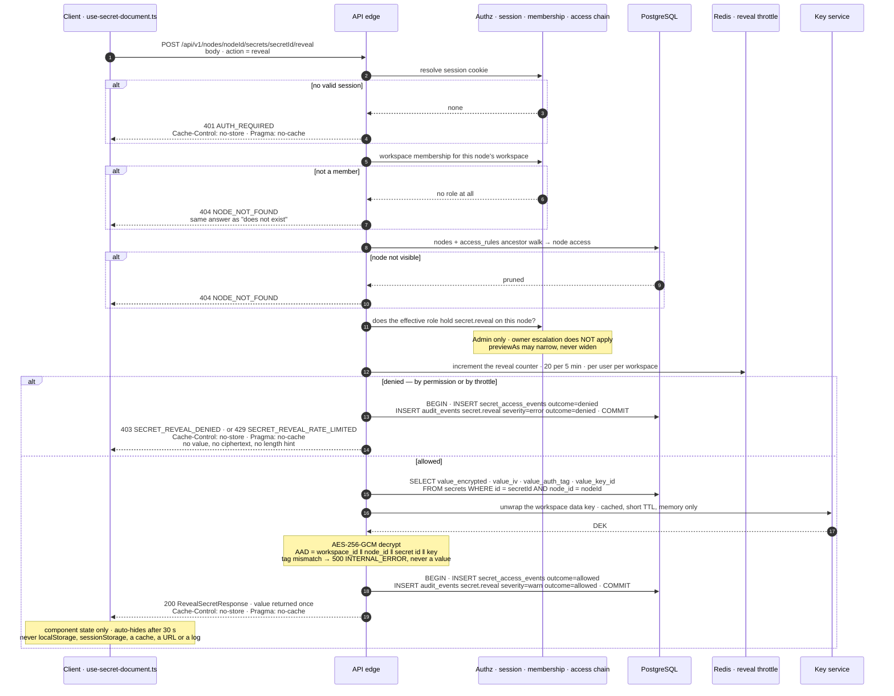
```mermaid
sequenceDiagram
    autonumber
    participant C as Client · use-secret-document.ts
    participant API as API edge
    participant AZ as Authz · session · membership · access chain
    participant DB as PostgreSQL
    participant R as Redis · reveal throttle
    participant KMS as Key service

    C->>API: POST /api/v1/nodes/nodeId/secrets/secretId/reveal<br/>body · action = reveal

    API->>AZ: resolve session cookie
    alt no valid session
        AZ-->>API: none
        API-->>C: 401 AUTH_REQUIRED<br/>Cache-Control: no-store · Pragma: no-cache
    end

    API->>AZ: workspace membership for this node's workspace
    alt not a member
        AZ-->>API: no role at all
        API-->>C: 404 NODE_NOT_FOUND<br/>same answer as "does not exist"
    end

    API->>DB: nodes + access_rules ancestor walk → node access
    alt node not visible
        DB-->>API: pruned
        API-->>C: 404 NODE_NOT_FOUND
    end

    API->>AZ: does the effective role hold secret.reveal on this node?
    Note over AZ: Admin only · owner escalation does NOT apply<br/>previewAs may narrow, never widen

    API->>R: increment the reveal counter · 20 per 5 min · per user per workspace

    alt denied — by permission or by throttle
        API->>DB: BEGIN · INSERT secret_access_events outcome=denied<br/>INSERT audit_events secret.reveal severity=error outcome=denied · COMMIT
        API-->>C: 403 SECRET_REVEAL_DENIED · or 429 SECRET_REVEAL_RATE_LIMITED<br/>Cache-Control: no-store · Pragma: no-cache<br/>no value, no ciphertext, no length hint
    else allowed
        API->>DB: SELECT value_encrypted · value_iv · value_auth_tag · value_key_id<br/>FROM secrets WHERE id = secretId AND node_id = nodeId
        API->>KMS: unwrap the workspace data key · cached, short TTL, memory only
        KMS-->>API: DEK
        Note over API: AES-256-GCM decrypt<br/>AAD = workspace_id ‖ node_id ‖ secret id ‖ key<br/>tag mismatch → 500 INTERNAL_ERROR, never a value
        API->>DB: BEGIN · INSERT secret_access_events outcome=allowed<br/>INSERT audit_events secret.reveal severity=warn outcome=allowed · COMMIT
        API-->>C: 200 RevealSecretResponse · value returned once<br/>Cache-Control: no-store · Pragma: no-cache
        Note over C: component state only · auto-hides after 30 s<br/>never localStorage, sessionStorage, a cache, a URL or a log
    end
```

Two properties of the diagram are load-bearing:

- **The audit write precedes the response on both branches.** The denial branch commits its rows and
  *then* answers `403`; the success branch commits its rows in the same transaction boundary as the
  read and *then* answers `200`. There is no path from "decrypted" to "returned" that skips the
  write.
- **404 before 403.** Membership and node visibility answer `404 NODE_NOT_FOUND` — identical to a
  node that does not exist — so the URL cannot be used to discover that a secret document exists. The
  `403` is reserved for a caller who *can* see the vault but may not open it, which is exactly the
  case the UI already renders (`src/components/devtools/secret-document-page.tsx:153-161`).

---

### 23.6 Endpoints

#### `POST /api/v1/workspaces/:workspaceId/nodes`

**Purpose** — Create a secret document. This is **E-024**, the one node-creation endpoint; this
entry documents only its secret slice — the fields it takes for `documentKind: "secret"` and the
row it writes in `secret_documents`.

**Authentication** — Required.

**Permission** — `node.create` **and** `document.create` on the target parent, plus workspace
membership. Manager+ (`src/lib/permissions/roles.ts:48, 58`).

**A reviewer should notice what this means, because it is deliberate and it is not obvious:** a
Manager can create an empty secret document but can neither fill it (`secret.rotate` is Admin) nor
read it (`secret.reveal` is Admin). The frontend confirms this is the intent — the create menu item
is gated only by the create flow (`src/components/shared/create-menu-items.tsx:126-133`), and
`useCreateDocument` calls **no** devtools service at all for `kind === "secret"`
(`src/hooks/use-create-document.ts:60-66`), so the vault is created empty by construction. It is not
a privilege escalation: creating a container grants no access to anything, and the Edit button is
disabled with the tooltip *"Changing secrets needs the Admin role"*
(`src/components/devtools/secret-document-page.tsx:107-112`).

**Path Params**

| Name | Type | Description |
| --- | --- | --- |
| `workspaceId` | UUID | The tenant. |

**Query Params** — None.

**Request Body** — `CreateNodeRequest`, secret slice:

```ts
interface CreateNodeRequest {
  readonly kind: NodeKind;              // "document"
  readonly parentId: string | null;
  readonly name: string;                // "Untitled secrets" by default
  readonly documentKind?: DocumentKind; // "secret"
  readonly icon?: string;               // "🔐" — src/hooks/use-create-document.ts:14-18
}
```

There is **no `entries` field.** A vault is never created with credentials in it: entries arrive
only through E-102, which is Admin-gated and audited per key. Accepting values on a create request
would give `node.create` a path to writing secrets.

**Response** — `DriveNode` (the `DocumentNode` variant), `200`.

**Database**

| Table | Operation | Detail |
| --- | --- | --- |
| `nodes` | READ | Parent must be a container; sibling slugs for uniquification. |
| `nodes` | INSERT | `kind = 'document'`, `document_kind = 'secret'`, `icon = '🔐'`. |
| `secret_documents` | INSERT | `node_id`, `workspace_id`, `created_by`/`updated_by` = session user. **No entries.** |
| `audit_events` | INSERT | `module: "node"`, `action: "node.create"`, severity `info`. |

**Transaction** — **Required.** The `nodes` row and the `secret_documents` row commit together.

**Realtime** — `node.changed` (RT-11), `change: "created"`, ids only.

**Possible Errors**

| HTTP | Code | Reason |
| --- | --- | --- |
| 400 | `validation` | `VALIDATION_FAILED` — empty `name`, unknown `documentKind`. |
| 401 | `permission_denied` | `AUTH_REQUIRED` |
| 403 | `permission_denied` | `PERMISSION_DENIED`, `NODE_FROZEN_BY_ANCESTOR` |
| 404 | `not_found` | `WORKSPACE_NOT_FOUND`, `NODE_NOT_FOUND` |
| 409 | `conflict` | `NODE_NOT_CONTAINER` |
| 500 | `unknown` | `INTERNAL_ERROR` |

**Frontend Used By** — `src/hooks/use-create-document.ts:40-88`, invoked from
`src/components/shared/create-menu-items.tsx:126-133`.

**Response Headers** — the standard §23.3 set. Even though this response carries no secret material,
it carries the existence of a vault.

---

#### `GET /api/v1/nodes/:nodeId/secrets`

**Purpose** — Return the secret document's metadata **and its entry list, masked**. One endpoint
serves both: `SecretDocument` is `{ nodeId, name, entries }`, so "get the metadata" and "list the
entries" are the same read (`src/types/devtools.ts:84-88`).

**Authentication** — Required.

**Permission** — **Visibility** on the node, plus workspace membership. **No `secret.reveal`
required** — a Viewer with access to the folder sees the key names and the masks, which is the
screen the UI renders with the banner *"Only owners and admins can reveal or copy these values.
Asking anyway is refused by the server and still recorded."*
(`src/components/devtools/secret-document-page.tsx:153-161`).

**Path Params**

| Name | Type | Description |
| --- | --- | --- |
| `nodeId` | UUID | The secret document's node. Must be `document_kind = 'secret'`. |

**Query Params** — None. The list is bounded by construction (a vault holds tens of keys, not
thousands) and is returned whole, in stored order.

**Request Body** — None.

**Response** — `SecretDocument`.

```ts
/** src/types/devtools.ts:84-88 — unchanged. */
interface SecretDocument {
  readonly nodeId: string;
  /** Projected from nodes.name on every read. Never a stored column. */
  readonly name: string;
  /** THE ORDER IS THE STORED ORDER — secrets.position ASC. */
  readonly entries: readonly SecretEntry[];
}

/** src/types/devtools.ts:73-82 — unchanged. NO `value` FIELD, DELIBERATELY. */
interface SecretEntry {
  readonly id: string;
  readonly key: string;                  // e.g. DATABASE_PASSWORD
  /** Constant: twelve U+2022 bullets. Never derived from the real length. */
  readonly maskedValue: string;
  readonly environmentOptionId: string;
  readonly updatedAt: string;            // last rotation, ISO 8601
  readonly rotatedBy: UserSummary;
  /** OPTIONAL: omitted when absent, never null (C-08). */
  readonly note?: string;
}
```

```jsonc
// 200 GET /api/v1/nodes/9b3f…/secrets
// Cache-Control: no-store
// Pragma: no-cache
{
  "nodeId": "9b3f7c21-…",
  "name": "Payment Secrets",
  "entries": [
    {
      "id": "4a1c…",
      "key": "DATABASE_PASSWORD",
      "maskedValue": "••••••••••••",
      "environmentOptionId": "b2d0…",
      "updatedAt": "2026-08-21T14:02:55.100Z",
      "rotatedBy": { "id": "usr_khanh-…", "name": "Khanh Luu", "email": "khanh@nexdrop.vn", "initials": "KL" },
      "note": "Rotate with the quarterly credential review."
    },
    {
      "id": "77e2…",
      "key": "STRIPE_SECRET_KEY",
      "maskedValue": "••••••••••••",
      "environmentOptionId": "b2d0…",
      "updatedAt": "2026-08-19T08:11:03.000Z",
      "rotatedBy": { "id": "usr_mai-…", "name": "Mai Tran", "email": "mai@nexdrop.vn", "initials": "MT" }
    }
  ]
}
```

Every `maskedValue` in that response is the identical twelve-bullet constant. Two secrets of wildly
different lengths are indistinguishable, which is the point (S-2).

**Database**

| Table | Operation | Detail |
| --- | --- | --- |
| `nodes` | READ | Visibility, kind check, `name` for the response. |
| `access_rules`, `workspace_members` | READ | Visibility resolution. |
| `secret_documents` | READ | By PK `node_id`. |
| `secrets` | READ | **`SELECT id, key, environment_id, note, position, rotated_by, updated_at … ORDER BY position ASC`** on `UNIQUE (node_id, position)`. **The four ciphertext columns are not in the projection.** Serve it through the `secrets_masked` view (S-1). |
| `users` | READ | `rotated_by` → `UserSummary`, batched. |
| `environments` | READ | Not needed for the response; the id is returned raw and the picker resolves labels from E-106. |

**No audit row.** Reading the masked list is not a privileged read: it returns no plaintext and no
length information. Canon OQ-26 audits privileged *reads* — E-046, the admin recovery console, and
E-137, the audit export — and this is not one. Auditing every vault page-view would bury the reveals
that matter in noise.

**Transaction** — Not required. A single read-only snapshot.

**Realtime** — None, and deliberately so: a frame announcing that a credential document changed is
worth nothing to a client that must refetch through a permission check anyway, and RT-05's precedent
is that *"a frame announcing a revocation must not be the thing that leaks what was revoked"*
(`src/types/realtime.ts:20-25`).

**Response Headers** — `Cache-Control: no-store`, `Pragma: no-cache` (§23.3).

**Possible Errors**

| HTTP | Code | Reason |
| --- | --- | --- |
| 401 | `permission_denied` | `AUTH_REQUIRED` |
| 404 | `not_found` | `NODE_NOT_FOUND` — unknown node **or one the caller may not see**. |
| 404 | `not_found` | `DOCUMENT_NOT_FOUND` — visible node with no `secret_documents` row. |
| 409 | `conflict` | `NODE_KIND_MISMATCH` — the node is a page, a config document, a board or a file. |
| 500 | `unknown` | `INTERNAL_ERROR` |

**Frontend Used By** — `src/hooks/use-secret-document.ts:60-64` (the `useAsyncResource` loader),
rendered by `src/components/devtools/secret-list.tsx:30-83` via
`src/components/devtools/secret-document-page.tsx:43, 178`.

---

#### `PUT /api/v1/nodes/:nodeId/secrets`

**Purpose** — Write the document's secrets. **This is the add endpoint, the update endpoint, the
delete endpoint and the reorder endpoint, all at once**: the request carries the whole list in the
order it should be stored, and the server makes the stored list match it.

**Why one endpoint and not four.** *"The whole list is replaced in the order given, which is what
makes reordering, renaming and deleting one operation rather than three endpoints."*
(`src/services/devtools-service.ts:479-487`). The consequence is worth stating for a reviewer: there
is exactly **one** write path into `secrets`, it is Admin-gated, and it audits per key. Four
narrower endpoints would be four places to get the permission check right.

**Authentication** — Required.

**Permission** — **`secret.rotate` on this node**, plus workspace membership. Admin only
(`src/lib/permissions/roles.ts:74`). Not owner-escalatable. `secret.rotate` is a **write**, so the
trashed, frozen and locked narrowing layers all refuse it
(`src/lib/permissions/evaluate.ts:79-85`).

**Path Params**

| Name | Type | Description |
| --- | --- | --- |
| `nodeId` | UUID | The secret document's node. |

**Query Params** — None.

**Request Body** — `SaveSecretsRequest` (canon §5.4):

```ts
interface SaveSecretsRequest {
  /** THE WHOLE LIST, in the order it should be stored. */
  readonly entries: readonly SecretDraftEntry[];
}

/** canon §5.3, mirroring src/services/devtools-service.ts:458-471. */
interface SecretDraftEntry {
  /** The id of an existing secret, or null for one being added. */
  readonly id: string | null;
  readonly key: string;
  /**
   * OPTIONAL, and this is the load-bearing part: an OMITTED value means
   * "leave the stored value untouched". Never null — `null` is not a way
   * to clear a secret, and there is no clear operation.
   */
  readonly value?: string;
}
```

**The omitted `value` is the security property of this endpoint.** *"That is what lets the editor
rename a key, reorder the list or delete a neighbour without ever holding the plaintext of the rows
it is not changing — the stored value stays where it is and is never round-tripped through the
client."* (`src/services/devtools-service.ts:462-470`; the client side is
`src/hooks/use-secret-editor.ts:16-33, 69-76`, where an untouched row carries `value: null` and the
DTO builder simply omits the key). The server carries the **ciphertext, IV, tag and key id forward
unchanged**; it does **not** decrypt and re-encrypt, because there is no reason to bring plaintext
into memory for a rename.

**The four operations, expressed in this one body.** Given a stored list of
`[{A}, {B}, {C}]`:

| Operation | Request `entries` | Effect |
| --- | --- | --- |
| **Add** an entry | `[{id:"A"}, {id:"B"}, {id:"C"}, {id:null, key:"NEW_KEY", value:"…"}]` (keys elided) | One `INSERT`, `position = 3`. `secret_rotations.change_kind = 'added'`. |
| **Update** a value | `[{id:"A", key:"A_KEY", value:"new"}, {id:"B"…}, {id:"C"…}]` | `A` re-encrypted with a **fresh IV**; `updated_at`/`rotated_by` move. `change_kind = 'rotated'`. |
| **Rename** a key | `[{id:"A", key:"RENAMED"}, …]` — no `value` | `A.key` updated, ciphertext untouched; `updated_at`/`rotated_by` still move, because a rename **is** a change (`src/services/devtools-service.ts:538`). `change_kind = 'renamed'`. |
| **Delete** an entry | `[{id:"A"…}, {id:"C"…}]` — `B` simply absent | `B` hard-deleted. A `secret_rotations` and a `secret_access_events` row are still written for it — *"A removed secret is a rotation too — the trail has to show where it went."* (`:554-558`). `change_kind = 'removed'`. |
| **Reorder** | the same three ids in a different order | `position` renumbered `0..n-1`. `isChanged` is false for all three, so **no** `updated_at` move and **no** audit rows: reordering is not a rotation. |

Note the last row carefully: `isChanged = !existing || existing.key !== key || value was supplied`
(`src/services/devtools-service.ts:538`). Position is not in that predicate. A pure reorder is a
metadata write, not a credential event, and must not fill the trail with false rotations.

**Validation, in this exact order** (`src/services/devtools-service.ts:488-521`):

1. **`secret.rotate`** on this node, resolved from the session → else `403 SECRET_ROTATE_DENIED`,
   message `Changing these secrets needs the Admin role`, detail
   `Ask a workspace admin to rotate them for you.` This check comes **first**, before any key
   validation, so a caller without the permission learns nothing about which keys are acceptable.
2. **Every key valid**: non-empty after trim, and free of whitespace, `=`, `"` and `'`
   (`isValidSecretKey`, `src/lib/env-file.ts:122-124`) → else `400 SECRET_KEY_INVALID`,
   `"{key}" is not a usable name for a secret`, detail
   `A name cannot be empty or contain spaces, quotes or an equals sign.` The rule is **deliberately
   permissive** — *"Plenty of real deployments use keys this side of the `UPPER_SNAKE` convention —
   dotted namespaces, hyphens, lowercase — and refusing to store one because it is unfashionable
   would make the editor useless for the config it was needed for."* (`src/lib/env-file.ts:113-121`).
3. **No duplicate trimmed keys** → else `400 SECRET_KEY_DUPLICATE`, `"{key}" appears twice`, detail
   `Every secret in a document needs its own name.`

`isConventionalSecretKey` — `/^[A-Za-z_][A-Za-z0-9_]*$/` (`src/lib/env-file.ts:127-129`) — is a
**client-side warning only** and **must never become a server rejection**. The editor renders it as
amber text (`src/components/devtools/secret-editor-panel.tsx:118-123`).

**`environmentOptionId` and `note` are not writable here today.** They are carried over from the
existing entry, and a newly added entry defaults to the workspace's first environment
(`src/services/devtools-service.ts:38, 544, 547`). See OQ-64.

**Response** — `SecretDocument`, `200` — the whole masked list in its new order, exactly the E-101
shape. **It contains no values**, even for the entries the caller just supplied values for. The
client applies it through `controller.apply`, which *"forgets every revealed value, because it has
to: a save can rename, replace or remove any of them, and a plaintext still on screen under a key
that no longer holds it is worse than no plaintext at all"* (`src/hooks/use-secret-document.ts:37-45,
170-178`).

**Database**

| Table | Operation | Detail |
| --- | --- | --- |
| `nodes` | READ | Visibility, kind, trashed/frozen/locked state, `name` for the response and the audit `target`. |
| `access_rules`, `workspace_members` | READ | `secret.rotate` resolution. |
| `secret_documents` | READ `… FOR UPDATE` | Row lock. Serialises two concurrent whole-list replaces and guards the `secret_rotations.version` counter (canon §1.4). |
| `secrets` | READ | The current list, `WHERE node_id = :n`, **including** ciphertext sidecars for the rows being carried forward. |
| `environments` | READ | Only for newly added entries, to resolve the default. |
| `secrets` | INSERT / UPDATE / DELETE | Upsert the supplied list; renumber `position` `0..n-1`; hard-delete every existing row whose id is absent from the request. `UNIQUE (node_id, position)` is `DEFERRABLE INITIALLY DEFERRED` because the renumber transiently collides. |
| `secret_rotations` | INSERT | One row per **changed** entry and one per **removed** entry. `version` from the per-document counter, `key` snapshotted as it stood, `change_kind`, `summary` rendered at write time, `rotated_by` from the session. **No value column.** |
| `secret_access_events` | INSERT | One row per changed and removed entry: `action = 'rotate'`, `outcome = 'allowed'`, `key`, `actor_id`, `ip` from the socket. |
| `audit_events` | INSERT | `module: "secret"`, `action: "secret.rotate"`, severity `warn`, `target` = the key name, `detail` = `Stored value replaced. The value itself is not recorded.`, outcome `allowed`. One per changed/removed entry. |
| `secret_documents` | UPDATE | `updated_at = now()`, `updated_by` = session user. |
| `nodes` | UPDATE | `updated_at = now()`. |

**On refusal** (step 1 above) the transaction that would have written the list never opens; instead a
**separate committed transaction** writes one `audit_events` row — `secret.rotate`, severity
`error`, outcome `denied`, detail `Refused: the role does not hold the permission for this action.`
The mock writes no per-entry `secret_access_events` rows on a rotate refusal, because the check
precedes the per-entry loop (`src/services/devtools-service.ts:495-500`); reproduce that.

**Transaction** — **Required, and it is the widest transaction in this chapter.** Atomic together:
every `secrets` insert, update and delete; every `secret_rotations` row; every
`secret_access_events` row; every `audit_events` row; the `secret_documents` and `nodes` touches.
Two failure modes this prevents: a partially-applied list (some keys rotated, some not, with no way
for the client to tell which), and a rotation that lands without its trail. The client's contract
depends on the first — *"A failed save keeps the draft: a network error does not cost someone the
credential they just pasted in."* (`src/hooks/use-secret-editor.ts:94-106, 236-243`) — which is only
safe if a failed save changed nothing.

**Realtime** — None. See E-101.

**Response Headers** — `Cache-Control: no-store`, `Pragma: no-cache`.

**Possible Errors**

| HTTP | Code | Reason |
| --- | --- | --- |
| 400 | `validation` | `SECRET_KEY_INVALID` — a key is empty after trim or contains whitespace, `=`, `"` or `'`. |
| 400 | `validation` | `SECRET_KEY_DUPLICATE` — two entries carry the same trimmed key. |
| 400 | `validation` | `VALIDATION_FAILED` — `entries` missing or not an array; an entry's `value` is `null` rather than omitted; an `id` that is neither `null` nor a UUID. |
| 401 | `permission_denied` | `AUTH_REQUIRED` |
| 403 | `permission_denied` | `SECRET_ROTATE_DENIED` — **audited before the refusal is returned.** |
| 403 | `permission_denied` | `NODE_TRASHED_READ_ONLY`, `NODE_FROZEN_BY_ANCESTOR`, `NODE_LOCKED` |
| 404 | `not_found` | `NODE_NOT_FOUND`, `DOCUMENT_NOT_FOUND` |
| 404 | `not_found` | `SECRET_NOT_FOUND` — an `id` in the request does not belong to this document. **A foreign id is never silently treated as a new entry.** |
| 409 | `conflict` | `NODE_KIND_MISMATCH` |
| 413 | `validation` | `REQUEST_TOO_LARGE` |
| 500 | `unknown` | `INTERNAL_ERROR` — includes any encryption failure. |

**Frontend Used By** — `src/hooks/use-secret-editor.ts:222-244` (`save`), whose body is built by
`toDraft` at `:69-76`; surfaced by `src/components/devtools/secret-editor-panel.tsx:35-144` and the
Save button at `src/components/devtools/secret-document-page.tsx:92-99`. The `.env` paste path feeds
the same draft: parsing is entirely client-side and pure — *"takes a string and returns a structure.
Nothing here logs, caches, or persists"* (`src/lib/env-file.ts:10-12`) — and the pasted text lives in
one component's state and dies with it (`src/components/devtools/secret-env-paste.tsx:28-29`).
**No `.env` text is ever posted to the API**; it is parsed to entries first.

**OPEN QUESTION (OQ-64)** — a secret's environment and note have no write path.
**Evidence** — both fields exist on `SecretEntry` (`src/types/devtools.ts:78, 81`), are rendered
(`src/components/devtools/secret-list.tsx:224-226, 255`) and are seeded
(`src/mock/devtools.ts:51-79`), but `saveSecrets` preserves rather than accepts them
(`src/services/devtools-service.ts:544, 547`) and the editor panel has no control for either
(`src/components/devtools/secret-editor-panel.tsx:51-127`).
**Recommendation** — extend `SecretDraftEntry` with optional `environmentOptionId?: string` and
`note?: string`, omission meaning "unchanged", exactly like `value`. Changing either moves
`updated_at` and writes an `audit_events` row, but **must not** be filed as `rotate` and must not
write a `secret_rotations` row: it is not a write to the stored value. File it as `document.update`.
**Impact if wrong** — a secret created in the UI is stuck on the first environment forever and its
note can never be written; the seeded data implies a feature the app cannot perform.

---

#### `POST /api/v1/nodes/:nodeId/secrets/:secretId/reveal`

**Purpose** — Return one secret's plaintext, once. This is **the only single-value door**, and it
serves both the eye icon (reveal to screen) and the copy icon (reveal to clipboard) — the two are
distinguished by `action`, not by endpoint.

**Authentication** — Required.

**Permission** — **`secret.reveal` on this node**, plus workspace membership. Admin only
(`src/lib/permissions/roles.ts:73`). Not owner-escalatable. `secret.reveal` is in `READ_ONLY_KEYS`
(`src/lib/permissions/evaluate.ts:29-33`), so it survives the trashed, frozen and locked layers — a
credential in an archived project can still be read, which is deliberate: archiving a project must
not lock an on-call engineer out of a production key.

**`action: "copy"` has no permission key of its own.** It is gated by the same `secret.reveal` and
filed in the workspace log as `secret.reveal`, because *"Copying is a read of plaintext, so it files
under reveal. Only an actual write to the stored value is a rotation."*
(`src/services/devtools-service.ts:384-386`).

**Path Params**

| Name | Type | Description |
| --- | --- | --- |
| `nodeId` | UUID | The secret document's node. |
| `secretId` | UUID | `secrets.id`. **Must belong to this node** — the query predicate is `WHERE id = :secretId AND node_id = :nodeId`, so a secret id from another vault answers `404 SECRET_NOT_FOUND`, never that vault's value. |

**Query Params** — None.

**Request Body** — `RevealSecretRequest` (canon §5.4):

```ts
interface RevealSecretRequest {
  /**
   * Which read this is. Not a permission distinction — both need
   * `secret.reveal` — but a RISK distinction, and it is recorded:
   * reveal puts a value on a screen for thirty seconds, copy puts it
   * on a clipboard indefinitely (src/types/devtools.ts:90-96).
   */
  readonly action: "reveal" | "copy";
}
```

`"rotate"` is a member of `SecretAction` but is **not accepted here**: rotation is E-102. A body
carrying `action: "rotate"` is `400 VALIDATION_FAILED`. **No `role` field**, and no other field —
the caller's identity and role come from the session (C-09).

**Response** — `RevealSecretResponse`, `200`.

```ts
interface RevealSecretResponse {
  /** The plaintext. Returned once. Never stored by the client, never logged by the server. */
  readonly value: string;
  /** Echoed so the client can label the field it just filled without a second lookup. */
  readonly key: string;
  /** Server clock, for the client's 30-second auto-hide timer. */
  readonly revealedAt: string;
}
```

```jsonc
// 200 POST /api/v1/nodes/9b3f…/secrets/77e2…/reveal   { "action": "reveal" }
// Cache-Control: no-store
// Pragma: no-cache
{
  "value": "sk_live_51NdX2mKq7RfP0aZ4tYb8Uv",
  "key": "STRIPE_SECRET_KEY",
  "revealedAt": "2026-08-27T09:31:12.004Z"
}
```

**Rate limiting.** Per user, per workspace: **20 reveals / 5 minutes** (§7.9, `RECOMMENDATION` — no
frontend evidence sets a number), counter in Redis. A throttled reveal is a **denial** and is
audited as one before the `429` is returned. Both E-103 and E-104 draw on the same bucket, and E-104
draws `keys.length` from it — otherwise "Copy all" would be an unlimited reveal wearing a different
name.

**Database**

| Table | Operation | Detail |
| --- | --- | --- |
| `nodes` | READ | Visibility, kind check, ancestor walk. |
| `access_rules`, `workspace_members` | READ | `secret.reveal` resolution. |
| `secret_documents` | READ | By PK; supplies `workspace_id` for the data key. |
| `secrets` | READ | `SELECT key, value_encrypted, value_iv, value_auth_tag, value_key_id WHERE id = :secretId AND node_id = :nodeId`. This is the **only** query in the system that selects the ciphertext columns, alongside E-104's. |
| `secret_access_events` | INSERT | `action` = the request's action, `outcome` = `allowed` \| `denied`, `key`, `secret_id`, `actor_id`, `ip` from the socket, `at = now()`. |
| `audit_events` | INSERT | `module: "secret"`, `action: "secret.reveal"`, severity `warn` (allowed) or `error` (denied), `target` = the key name, `detail` per §23.4, outcome to match. |

**Transaction** — **Required**, and the ordering matters more than the atomicity:

- **Allowed:** the `secret_access_events` and `audit_events` inserts commit **before the response
  body is written**. If the audit write fails, the request fails with `500` and **no value is
  returned**. A reveal the log does not know about must be impossible.
- **Denied:** the two audit rows are written in their **own committed transaction**, and only then is
  the `403` (or `429`) returned. They are not rolled back by the failure of the request they
  describe — *"a refusal nobody can see is not a control"* (`src/services/devtools-service.ts:360-362`).
- The audit rows for a denial are written **even when the secret id does not exist**? **No** — the
  order is: resolve the node → resolve the secret (`404 SECRET_NOT_FOUND` with no audit row, because
  there is no key to name) → check the permission (`403` **with** audit rows, naming the key). This
  is the frontend's order exactly (`src/services/devtools-service.ts:338-349`) and it is the right
  one: auditing a reveal attempt against a non-existent id would let an attacker write arbitrary key
  names into the security log.

**Realtime** — None. A frame announcing that somebody revealed a credential would broadcast to every
open tab in the workspace the fact that a specific key was read, which is information the workspace
log already holds behind `workspace.audit.view`.

**Response Headers** — `Cache-Control: no-store`, `Pragma: no-cache`. Non-negotiable on this
endpoint above all others: the response body is a live credential.

**Possible Errors**

| HTTP | Code | Reason |
| --- | --- | --- |
| 400 | `validation` | `VALIDATION_FAILED` — `action` missing, or not `reveal` \| `copy`. |
| 401 | `permission_denied` | `AUTH_REQUIRED` |
| 403 | `permission_denied` | `SECRET_REVEAL_DENIED` — `Revealing {key} needs the Admin role`, detail `Ask a workspace admin to share it with you.` **Two audit rows are written first.** |
| 404 | `not_found` | `NODE_NOT_FOUND` — unknown node or one the caller may not see. |
| 404 | `not_found` | `SECRET_NOT_FOUND` — `That secret could not be found`. Also the answer for a `secretId` belonging to a different document. |
| 409 | `conflict` | `NODE_KIND_MISMATCH` |
| 429 | `validation` | `SECRET_REVEAL_RATE_LIMITED` — `isRetryable: true` and `retryAfterSeconds` set explicitly; `Retry-After` header. **Audited as a denial first.** |
| 500 | `unknown` | `INTERNAL_ERROR` — includes a GCM tag mismatch, a missing data key, and a failed audit write. |

**Frontend Used By** — three call sites in `src/hooks/use-secret-document.ts`:
`:97-120` (`reveal`, `action: "reveal"` — puts the value in component state and starts the 30-second
timer), `:134-156` (`copy`, `action: "copy"` — writes to the clipboard and **does not** put the value
in `revealed`, so the screen stays masked), `:122-132` (`take`, `action: "reveal"` — hands one value
to the editor's field without revealing it on the read view or starting a timer). Rendered by
`src/components/devtools/secret-list.tsx:233-252` and
`src/components/devtools/secret-editor-panel.tsx:38-46, 89-100`.

**Client-side lifetime the backend must not undermine** (`src/hooks/use-secret-document.ts`): a
revealed value lives in component state only — never `localStorage`, `sessionStorage`, a cache, a URL
or a log (`:48-55`) — auto-hides after `AUTO_HIDE_MS = 30_000` (`:11-12`), and every timer is cleared
and every value dropped on unmount (`:87-95`). The server supports this by returning the plaintext
**once**, with `no-store`, and by offering no endpoint that would let a client populate a whole page
with values.

---

#### `POST /api/v1/nodes/:nodeId/secrets/copy`

**Purpose** — Reveal **several** secrets at once, as a single `.env`-formatted clipboard blob. This
is both "Copy selected" and "Copy all" — one endpoint, one permission check, one audit row per key.

**Why not a loop of E-103 calls.** *"The values assembled here rather than fetched one at a time by
the client — a loop of single reveals would write the same audit trail but leave every value sitting
in the page in between."* (`src/services/devtools-service.ts:412-418`). And why the response is a
blob rather than a map: *"The values go from the service straight to the clipboard; none of them
enters `revealed`, so the screen stays masked throughout. That separation is the point of having a
bulk copy at all — the alternative, revealing everything and letting the user select the text, puts a
whole credential file on a screen in an office."* (`src/hooks/use-secret-document.ts:158-169`).
**There is no endpoint that returns a per-secret plaintext map, and none may be added.**

**Authentication** — Required.

**Permission** — **`secret.reveal` on this node**, plus workspace membership. Admin only. *"There are
no per-secret permissions in this model, so the check is per-document and the answer is all or
nothing. If per-secret scopes are ever added, this is the one function that has to learn to return a
subset."* (`src/services/devtools-service.ts:419-422`).

**Path Params**

| Name | Type | Description |
| --- | --- | --- |
| `nodeId` | UUID | The secret document's node. |

**Query Params** — None.

**Request Body** — `CopySecretsRequest` (canon §5.4):

```ts
interface CopySecretsRequest {
  /**
   * Which secrets. minItems: 1 — an empty array is REFUSED, never
   * interpreted as "every secret" (canon OQ-66).
   */
  readonly secretIds: readonly string[];
}
```

**`minItems: 1` is a security decision, not a validation preference.** The frontend's service treats
an empty list as "every secret in the document — Copy all" (`src/services/devtools-service.ts:400-401,
431-434`), and "Copy all" is wired as `controller.copyMany([])`
(`src/components/devtools/secret-list.tsx:63`). Canon OQ-66 rejects that as *"an unsafe wire
default"*: a bug that drops the id list — a serialisation failure, a filter that matched nothing, a
stale selection — would silently escalate a two-key copy into a whole-vault export, and the audit
trail would faithfully record it as intended. **"Copy all" must send the full id list explicitly**,
which the client already has (`document.entries.map(entry => entry.id)`, the shape used by "Select
every secret" at `src/components/devtools/secret-list.tsx:60`). An empty array is
`400 SECRET_SELECTION_EMPTY`.

**Response** — `CopySecretsResponse`, `200`.

```ts
interface CopySecretsResponse {
  /** `KEY=value` lines, ready for the clipboard. */
  readonly text: string;
  /** Keys included, so the caller can say how many without reading values. */
  readonly keys: readonly string[];
}
```

```jsonc
// 200 POST /api/v1/nodes/9b3f…/secrets/copy   { "secretIds": ["4a1c…", "77e2…"] }
// Cache-Control: no-store
// Pragma: no-cache
{
  "text": "DATABASE_PASSWORD=pg-3f9c-Ab21-Qz77-payments\nSTRIPE_SECRET_KEY=sk_live_51NdX2mKq7RfP0aZ4tYb8Uv\n",
  "keys": ["DATABASE_PASSWORD", "STRIPE_SECRET_KEY"]
}
```

`keys` exists *"so the caller can say how many without reading values"*
(`src/services/devtools-service.ts:405-410`) — the client renders
`Copied ${keys.length} secret(s) — the values were not stored`
(`src/hooks/use-secret-document.ts:187-190`) without ever parsing `text`.

**`.env` serialisation, server-side.** `toEnvText` (`src/lib/env-file.ts:149-153`) emits
`KEY=value` lines in the order given, one trailing newline. A value is quoted **only** where leaving
it bare would change it — leading or trailing whitespace, a newline, a `#`, or empty — escaping
`\\`, `"`, `\n` and `\r` (`:131-147`). *"Quoting everything makes a copied file noisier to read for
no gain."* Reproduce this exactly: a round trip through `parseEnv`
(`src/lib/env-file.ts:73-111`) must return the same values, and the rule that *"a value is everything
after the **first** `=`"* (`:14-17`) is what makes that true for connection strings, base64 and JWTs.

**Ordering.** The response follows the **stored** order (`secrets.position ASC`) filtered to the
requested ids, not the order of `secretIds`. The frontend filters `document.entries` and so is
already in stored order (`src/services/devtools-service.ts:431-434`).

**Database**

| Table | Operation | Detail |
| --- | --- | --- |
| `nodes` | READ | Visibility, kind check. |
| `access_rules`, `workspace_members` | READ | `secret.reveal` resolution. |
| `secret_documents` | READ | By PK; `workspace_id` for the data key. |
| `secrets` | READ | `WHERE node_id = :n AND id = ANY(:secretIds) ORDER BY position ASC`, selecting the ciphertext sidecars. If the result is empty → `404 SECRET_NOT_FOUND`, `Those secrets could not be found` (`src/services/devtools-service.ts:436`). |
| `secret_access_events` | INSERT | **One row per key**, `action = 'copy'`, outcome to match. |
| `audit_events` | INSERT | **One row per key**, `action = 'secret.reveal'`, severity `warn` or `error`, `target` = the key name. |

**Transaction** — **Required.** All decryptions and all audit rows are one unit; the response is
written only after the audit rows commit. On refusal, one `secret_access_events` row and one
`audit_events` row are written **per chosen key** in their own committed transaction, and only then
is the `403` returned (`src/services/devtools-service.ts:438-444`) — the trail must show which keys
somebody tried to take, not merely that they tried.

**Realtime** — None.

**Response Headers** — `Cache-Control: no-store`, `Pragma: no-cache`.

**Possible Errors**

| HTTP | Code | Reason |
| --- | --- | --- |
| 400 | `validation` | `SECRET_SELECTION_EMPTY` — `secretIds` must carry at least one id (canon OQ-66). |
| 400 | `validation` | `VALIDATION_FAILED` — `secretIds` missing, not an array, or containing a non-UUID. |
| 401 | `permission_denied` | `AUTH_REQUIRED` |
| 403 | `permission_denied` | `SECRET_REVEAL_DENIED` — `Copying these values needs the Admin role`, detail `Ask a workspace admin to share them with you.` **One audit row per chosen key is written first.** |
| 404 | `not_found` | `NODE_NOT_FOUND` |
| 404 | `not_found` | `SECRET_NOT_FOUND` — none of the ids match this document. **RECOMMENDATION:** a *partial* match returns the matched subset with `200`; the client already prunes ids that no longer exist (`src/components/devtools/secret-list.tsx:36-40`). |
| 409 | `conflict` | `NODE_KIND_MISMATCH` |
| 429 | `validation` | `SECRET_REVEAL_RATE_LIMITED` — draws `keys.length` from the reveal bucket. |
| 500 | `unknown` | `INTERNAL_ERROR` |

**Frontend Used By** — `src/hooks/use-secret-document.ts:180-198` (`copyMany`), called from
`src/components/devtools/secret-list.tsx:62-63` — "Copy selected" passes the live selection, "Copy
all" passes `[]` today and must be changed to pass every id (OQ-66).

---

#### `GET /api/v1/nodes/:nodeId/secrets/audit`

**Purpose** — The document's own access trail: every reveal, copy and rotation, **allowed and denied
alike**, with who, when and from which address, and **no values**.

**Authentication** — Required.

**Permission** — **`secret.reveal` on this node**, plus workspace membership. Admin only. The trail
names which keys exist and who has been reading them; that is not information a Viewer with folder
access should hold. (The frontend renders the panel behind a button available to anyone
(`src/components/devtools/secret-document-page.tsx:132-141`) and the mock's `listSecretAudit` checks
nothing (`src/services/devtools-service.ts:573-579`); canon §3.16 sets the key, and the client should
gate the button on `can("secret.reveal")` to match.)

**Path Params**

| Name | Type | Description |
| --- | --- | --- |
| `nodeId` | UUID | The secret document's node. |

**Query Params**

| Name | Type | Required | Default | Description |
| --- | --- | --- | --- | --- |
| `cursor` | string | no | — | Opaque base64 of `(at, id)`. Never constructed or parsed by a client. |
| `limit` | integer | no | 50 | Hard server cap 200. |

**Request Body** — None.

**Response** — `SecretAccessPage` of `SecretAuditEntry`, newest first, `(at DESC, id DESC)`.

```ts
interface SecretAccessPage {
  readonly items: readonly SecretAuditEntry[];
  readonly nextCursor: string | null;
}

/** src/types/devtools.ts:99-108 — unchanged. */
interface SecretAuditEntry {
  readonly id: string;
  readonly action: SecretAction;     // "reveal" | "copy" | "rotate"
  readonly secretId: string;
  readonly key: string;
  readonly actor: UserSummary;
  readonly at: string;
  /** Recorded by the server — the client never sources this. */
  readonly ip: string;
  /** RECOMMENDATION, additive — see OQ-68. */
  readonly outcome?: AuditOutcome;   // "allowed" | "denied"
}
```

**There is no value field and no `detail` field.** *"Every reveal, copy and rotation, allowed or
refused, with who and when — and no values. A trail that recorded what was revealed would be a
second copy of the secrets, in a log, readable by everyone who can read logs."*
(`src/components/devtools/secret-audit-panel.tsx:11-17`.)

**Database**

| Table | Operation | Detail |
| --- | --- | --- |
| `nodes` | READ | Visibility, kind check. |
| `access_rules`, `workspace_members` | READ | `secret.reveal` resolution. |
| `secret_access_events` | READ | `WHERE node_id = :n ORDER BY at DESC, id DESC LIMIT :limit + 1`, on `(node_id, at DESC, id DESC)`. |
| `users` | READ | `actor_id` → `UserSummary`, batched. |

**Transaction** — Not required. Read-only.

**Realtime** — None. The panel reloads on open (`keepPreviousData: true`,
`src/components/devtools/secret-audit-panel.tsx:24-26`).

**Response Headers** — `Cache-Control: no-store`, `Pragma: no-cache`.

**Possible Errors**

| HTTP | Code | Reason |
| --- | --- | --- |
| 401 | `permission_denied` | `AUTH_REQUIRED` |
| 403 | `permission_denied` | `PERMISSION_DENIED` — no `secret.reveal`. |
| 404 | `not_found` | `NODE_NOT_FOUND`, `DOCUMENT_NOT_FOUND` |
| 409 | `conflict` | `NODE_KIND_MISMATCH` |
| 500 | `unknown` | `INTERNAL_ERROR` |

**Frontend Used By** — `src/components/devtools/secret-audit-panel.tsx:19-26`, toggled from
`src/components/devtools/secret-document-page.tsx:132-141, 184`.

---

#### `GET /api/v1/nodes/:nodeId/versions` — the secret projection

**Purpose** — A secret document's history: **which key rotated, by whom, when.** No snapshots, no
values, no diffs, no restore. This is **E-095** entered on a secret node; canon §3.14 makes the
node's kind select the store, and for a secret the store is `secret_rotations` (T-24).

**Authentication** — Required.

**Permission** — Visibility on the node, plus workspace membership. The rotation history names keys
and actors but no values; it is the same disclosure level as E-101's masked list, so it takes the
same gate.

**Path Params** — `nodeId` (UUID), the secret document's node.

**Query Params** — `cursor`, `limit` — as E-095 for config. Sort key `(version DESC)`.

**Request Body** — None.

**Response** — `VersionPage` of `VersionEntry`, **every entry with `hasSnapshot: false` and
`lines: []`**.

```jsonc
// 200 GET /api/v1/nodes/9b3f…/versions
// Cache-Control: no-store
// Pragma: no-cache
{
  "items": [
    {
      "id": "0f2a…",
      "version": 14,
      "createdAt": "2026-08-21T14:02:55.100Z",
      "author": { "id": "usr_khanh-…", "name": "Khanh Luu", "email": "khanh@nexdrop.vn", "initials": "KL" },
      "summary": "rotated DATABASE_PASSWORD",
      "lines": [],
      "hasSnapshot": false
    },
    {
      "id": "c81b…",
      "version": 13,
      "createdAt": "2026-08-19T08:11:03.000Z",
      "author": { "id": "usr_mai-…", "name": "Mai Tran", "email": "mai@nexdrop.vn", "initials": "MT" },
      "summary": "removed SANDBOX_API_KEY",
      "lines": [],
      "hasSnapshot": false
    }
  ],
  "nextCursor": null
}
```

`hasSnapshot: false` is what makes the shared dialog safe for this subject: View, Compare and Restore
disappear (`src/components/versions/version-list.tsx:84`), `restore` is `null`
(`src/components/versions/version-dialogs.tsx:155`), and `useVersionHistory.restore` returns early
for any entry without a snapshot even if a caller tried (`src/hooks/use-version-history.ts:65`).

**Why this must be served from a table and not projected from live rows.** The frontend derives the
history from the *current* entries' `updatedAt`/`rotatedBy` (`src/lib/versions.ts:50-62`), which
means a **deleted secret vanishes from its own history** and a key rotated three times shows once.
`secret_rotations` fixes that (canon OQ-67): it snapshots `key` as it stood, keeps `secret_id`
without a foreign key so a removal row can outlive its row, and is indexed on
`(node_id, key, rotated_at DESC)` — *the* index for "when was this key last rotated, and by whom",
which is the exact question a quarterly credential review asks.

**Database**

| Table | Operation | Detail |
| --- | --- | --- |
| `nodes`, `access_rules`, `workspace_members` | READ | Visibility. |
| `secret_rotations` | READ | `WHERE node_id = :n ORDER BY version DESC LIMIT :limit + 1`. **No value column exists to select.** |
| `users` | READ | `rotated_by` → `UserSummary`. |

**Transaction** — Not required.

**Realtime** — None.

**Response Headers** — `Cache-Control: no-store`, `Pragma: no-cache`.

**Possible Errors**

| HTTP | Code | Reason |
| --- | --- | --- |
| 401 | `permission_denied` | `AUTH_REQUIRED` |
| 404 | `not_found` | `NODE_NOT_FOUND`, `DOCUMENT_NOT_FOUND` |
| 500 | `unknown` | `INTERNAL_ERROR` |

**Frontend Used By** — `src/components/versions/version-dialogs.tsx:148-174`
(`SecretVersionsDialog`), opened from `src/components/devtools/secret-document-page.tsx:119-128,
145-151`. Today it computes entries locally from `secretRotationEntries(document)`
(`src/lib/versions.ts:50-62`); pointing its `load` at this endpoint is a one-line change and the
dialog needs nothing else — *"The FE needs no change: it already renders whatever entries it is
given."*

#### E-096, E-097 and E-098 on a secret node — refused, not served

**E-096, E-097 and E-098 answer `409 / conflict`, reason `VERSION_NOT_RESTORABLE`, on any secret
node.** *"A secret version has no snapshot and can never be diffed or restored"* (canon §4.3). The
refusal is a `409` rather than a `404` because the version genuinely exists — the entry is listed by
E-095 — it simply has nothing to serve. Message: `That version cannot be restored`, detail
`A secret's history records that a key changed, not what it changed to.`

No frontend caller reaches these paths for a secret: `restore: null` is passed explicitly, and the
list hides the buttons. The refusal exists for a hand-written request, and it is the one a reviewer
should try first.

---

### 23.7 What a reviewer must be able to check

A checklist that maps one-to-one onto testable assertions. Every line is grounded above.

| # | Assertion | How to check |
| --- | --- | --- |
| R-1 | `GET /nodes/{id}/secrets` never returns a value or a length hint. | Inspect the SQL projection; assert every `maskedValue` in a response with mixed-length secrets is byte-identical and 12 `U+2022`. |
| R-2 | No endpoint other than E-103 and E-104 selects `value_encrypted`. | `grep` the repository for the column name; two call sites. |
| R-3 | A denied reveal writes both audit rows **and** returns 403. | Call E-103 as a Manager; assert one `secret_access_events` row with `outcome='denied'` and one `audit_events` row with `severity='error'`, both committed. |
| R-4 | A reveal whose audit write fails returns 500 and no value. | Fault-inject the audit insert. |
| R-5 | A throttled reveal is audited as a denial before the 429. | Exceed the bucket; assert the rows exist. |
| R-6 | A secret id from another document answers 404, not the value. | Call E-103 with a foreign `secretId`. |
| R-7 | `secretIds: []` is refused. | Assert `400 SECRET_SELECTION_EMPTY`, not a whole-vault export. |
| R-8 | A rename does not decrypt. | Send E-102 with a changed key and no `value`; assert the DEK unwrap counter does not move and the ciphertext bytes are unchanged. |
| R-9 | A pure reorder writes no rotation rows. | Send E-102 with the same ids reordered; assert `secret_rotations` and `secret_access_events` are unchanged and `updated_at` has not moved. |
| R-10 | A deleted secret still leaves a trail. | Delete an entry via E-102; assert a `secret_rotations` row with `change_kind='removed'` and the snapshotted key. |
| R-11 | `secret_rotations` and `secret_access_events` have no value column and no UPDATE/DELETE grant. | Inspect the schema and the role grants. |
| R-12 | Every response in §23 carries `Cache-Control: no-store` and `Pragma: no-cache`. | Assert on every status code, including 403, 404 and 429. |
| R-13 | No plaintext appears in any log. | Reveal a secret with a known sentinel value; grep application logs, access logs, the audit tables and any APM export for it. |
| R-14 | Owning a secret document grants nothing. | As the node's owner at `member`, call E-101 (200, masked), E-103 (403), E-102 (403). |
| R-15 | A GCM tag mismatch is 500, not a value and not a 404. | Corrupt a `value_auth_tag` in a test fixture. |
| R-16 | E-096 / E-097 / E-098 refuse on a secret node. | Assert `409 VERSION_NOT_RESTORABLE`. |
| R-17 | The IP in an audit row comes from the socket. | Send `X-Forwarded-For` and a body claiming an address; assert neither reaches the row except through the trusted proxy chain. |

---

### 23.8 Secret documents — open questions carried

| OQ | What it decides | Position taken |
| --- | --- | --- |
| OQ-12 | What a container duplicate does to a secret document | Copy keys, environments, notes and order; **every value empty**; one `secret_rotations` row of kind `added` per copied entry. Never copy ciphertext into a node with a different access chain. Refusing the duplicate outright is the acceptable alternative. |
| OQ-23 | Admin only, or Admin and Manager | **Admin only**, per the frontend and canon §8.8. Detailed in §23.2. |
| OQ-64 | Whether `environmentOptionId` and `note` are writable | Not today. Extend `SecretDraftEntry` with two optional fields, omission meaning unchanged; file the change as `document.update`, not `rotate`. |
| OQ-65 | How values are encrypted and what the reveal contract is | Envelope encryption, one AES-256-GCM data key per workspace wrapped by a KMS master key; ciphertext, IV, tag and key id in the row; AAD binds the ciphertext to `workspace_id ‖ node_id ‖ secrets.id ‖ key`. Reveal returns plaintext once, always audits, always rate-limited. |
| OQ-66 | `secretIds: []` | `minItems: 1`. "Copy all" sends every id explicitly. |
| OQ-67 | How rotation history is persisted with no snapshot | `secret_rotations` (T-24), append-only, no value column, projected to `VersionEntry` with `hasSnapshot: false`. |
| OQ-68 | Whether `SecretAuditEntry` is its own table or a projection | Both tables are written, in one transaction. Add `outcome` to the wire type; stop encoding a denial in the IP string. |

---

### Chapter notes — divergences, decisions and traps

1. **The brief asked for six secret endpoints that canon has as one.** The task specified "add an
   entry, update an entry, delete an entry" as separate APIs. Canon §3.16 has only E-101 … E-105,
   and canon T-23 plus `src/services/devtools-service.ts:479-487` make the whole-list replace
   (E-102) the single write path — *"which is what makes reordering, renaming and deleting one
   operation rather than three endpoints."* I followed canon and documented how each of the four
   operations is expressed inside E-102's body (the recipe table under that endpoint). If the editor
   wants three narrower endpoints, that is a canon change, not a chapter change — and it would need
   a story for how a rename and a reorder in the same edit stay atomic, which the current shape gets
   for free.

2. **The brief's list shape `{ id, key, maskedValue, hasValue }` is not the frontend's.**
   `SecretEntry` is `{ id, key, maskedValue, environmentOptionId, updatedAt, rotatedBy, note? }`
   (`src/types/devtools.ts:73-82`), and all seven fields are rendered
   (`src/components/devtools/secret-list.tsx:212-255`). I followed the frontend and canon §5.2.
   **`hasValue` is worth adding as an additive field, though**, and the reason is concrete: E-102
   falls back to the empty string when a new entry arrives with no value
   (`const value = draft.value ?? … ?? ""`, `src/services/devtools-service.ts:535`), so an entry
   whose stored value is `""` is representable — and today it renders as twelve bullets that lie
   about holding something. `hasValue: boolean` costs nothing, leaks nothing (it is one bit, not a
   length), and lets the list badge an empty credential. Not adopted here because no OQ id covers
   it; raise it as a new OQ if you want it.

3. **The brief asked for "reveal several".** There is no such endpoint and there should not be: the
   only multi-secret read is E-104, which returns a `.env` blob for the clipboard rather than a
   per-secret map, precisely so that revealing several never puts several values on the screen
   (`src/hooks/use-secret-document.ts:158-169`). I documented E-104 under both "reveal several" and
   "copy all" and said why the two are one call.

4. **E-095 for a config document ships the full text of every version in the page.**
   `VersionEntry.lines` is required, not optional (`src/types/system.ts:216`), and the client diffs
   locally against an unsaved draft the server has never seen. That is correct behaviour and I have
   specified it, but it means the version list is the heaviest read in the devtools module. E-096
   exists as the lazy path if that ever bites; adopting it would mean making `lines` optional, which
   is a frontend type change and therefore a canon question (closest: OQ-59).

5. **`GET /nodes/{nodeId}/secrets/audit` is gated on `secret.reveal` here**, per canon §3.16, but the
   frontend's Audit log button is available to everyone
   (`src/components/devtools/secret-document-page.tsx:132-141`) and the mock service checks nothing.
   The client needs a one-line change to hide the button behind `can("secret.reveal")`, or a Viewer
   will see a panel that always errors.

6. **Canon §3.15 lists E-100 as `PUT`, and the mock's `saveConfig` is a partial update** (`format`
   and `environmentOptionId` are both optional, meaning "unchanged"). That is `PATCH` semantics under
   canon P-07. It is a `PUT` because `content` — the resource's substance — is always sent in full,
   so replaying the request lands the same state, which is the property P-07 actually cares about.
   Flagging it so nobody "fixes" it to `PATCH` and breaks the idempotency note in §7.8.

---

## 24. Import / Export

Module `system` (canon C-14). Two features, `SY-IMP-35` and `SY-EXP-36`, that share one property:
**the file is the browser's problem, not the server's.** Nothing in this chapter parses a
spreadsheet on the backend, and no endpoint here accepts `multipart/form-data`.

Endpoints: **E-084**, **E-085**, **E-086** (canon §3.11), plus one addition, **E-141**, that canon's
own `EXPORT_JOB_NOT_READY` error already implies. Tables: **T-38 `import_jobs`**, **T-39
`export_jobs`**. Permission keys: `board.import`, `board.export` (canon §2.10). Realtime: RT-06 and
RT-10 on a committed import; nothing on an export.

---

### 24.1 What the frontend actually does — read this before designing anything

The single most consequential fact about this chapter, established by reading the wizard rather than
assuming a shape: **the frontend parses the spreadsheet entirely client-side and posts normalised
records.** There is no upload, no staging object, no server-side parse, and no session to resume.

`useImportWizard` reads the picked `File` in the browser and never sends the bytes anywhere:

```ts
// src/hooks/use-import-wizard.ts:156-159
const parsed =
  extension === "xlsx"
    ? await parseXlsx(new Uint8Array(await file.arrayBuffer()))
    : { rows: parseDelimited(await file.text(), delimiterFor(extension)), sheetName: null };
```

`parseXlsx` is a hand-rolled single-sheet XLSX reader over the unzipped package parts
(`src/lib/xlsx.ts:1-12`, `:67-84`). `parseDelimited` is an RFC 4180 CSV/TSV reader
(`src/lib/csv.ts:3-6`, `:7-51`). Both produce a `Grid` — `readonly (readonly string[])[]`
(`src/lib/grid.ts:3`) — padded rectangular by `normalizeGrid` (`src/lib/grid.ts:12-21`). The `Grid`
lives in React state (`src/hooks/use-import-wizard.ts:82`); `ImportSource` and `ImportPlan` are both
`useMemo` derivations over it (`:100-116`); `reset()` throws all of it away (`:118-129`).

The module header states the design intent outright:

> Everything before "confirm" is a computation over the parsed file: the board is not touched until
> the user has seen exactly which rows would fail and chosen what should happen to them.
> — `src/hooks/use-import-wizard.ts:38-42`

**The four wizard steps** are `upload | mapping | validation | result` (`ImportStep`,
`src/types/system.ts:145`). Canon §2.7 marks `ImportStep` **UI-only — it never crosses the wire**.
There is no partial-import resume, because there is nothing on the server to resume from.

| Stage | Where it runs today | Citation |
| --- | --- | --- |
| Extension gate (`xlsx` / `csv` / `tsv`) | browser | `src/hooks/use-import-wizard.ts:74`, `:136-145` |
| Size / type gate (`validateUpload`) | browser | `src/hooks/use-import-wizard.ts:147-151`; `src/lib/file-validation.ts:28-58` |
| Parse to `Grid` | browser | `src/hooks/use-import-wizard.ts:156-159` |
| Number the source rows, split the header | browser | `readImportSource`, `src/lib/import-mapping.ts:55-78` |
| Guess the mapping | browser | `autoMapColumns`, `src/lib/import-mapping.ts:145-184` |
| Parse every mapped cell, collect issues | browser | `planImport`, `src/lib/import-mapping.ts:357-423` |
| Choose the invalid-value policy | browser | `src/components/board/import/import-validation-step.tsx:60-74` |
| **Write** | server | `src/hooks/use-import-wizard.ts:224-290` |

**EXISTING REQUIREMENT.** Do not specify a server-side spreadsheet parser, an upload-then-parse
pipeline, an `import_sessions` table, or a `multipart` variant of any endpoint in this chapter. Part
6 of this document already recorded the same decision for `import_sessions`; this chapter is the
other half of it.

**Where this chapter deliberately extends what the frontend does.** The frontend's final call today
is `boardService.importRows({ boardId, rows })` where `rows` is
`readonly Readonly<Record<columnId, CellValue>>[]` (`src/services/board-service.ts:1171-1176`) — a
bare array of cell maps with **the source row number stripped off**. That is a fidelity loss the
frontend itself warns against three files earlier (§24.3), and it is why row-level errors cannot be
reported back today. E-085 therefore carries the `ImportSource` — the numbered rows of strings —
and lets the server re-derive the cells. Reasons, in order of weight:

1. **Row-level errors need the row number.** The frontend wants them (`ImportIssue.rowNumber` is
   rendered verbatim at `src/components/board/import/import-validation-step.tsx:89`), and a response
   cannot name a row it was never told about.
2. **The server must not trust a client-supplied `CellValue`.** A hostile client can post a
   `select` cell naming an option that does not exist, a `user` cell naming somebody outside the
   workspace, or a `relation` cell naming a row on a board it may not read. Parsing text against the
   board's own schema server-side closes all three by construction.
3. **The lookups live server-side anyway.** `parseTextIntoCell` needs the column's `SelectConfig`
   options, the workspace directory and the relation target index
   (`src/lib/cell-conversion.ts:25-82`) — all three are server data the client is holding a copy of.

The wire payload is still **already-parsed JSON, not a spreadsheet**: headers plus rows of strings.

---

### 24.2 The parse layer the backend inherits but does not run

The backend never executes this code. It is documented because two of its rules are correctness
rules the backend must not undo, and because a future "re-import server-side" feature would have to
reproduce them exactly.

**XLSX — a sheet is addressed, not sequential.** Excel writes no `<row>` element for a row nobody
touched and no `<c>` for an empty cell, so document order is not position:

> a sheet whose rows 4 and 5 are blank jumps straight from `r="3"` to `r="6"`. Reading the elements
> in document order therefore pulls every later row up by the number of blank ones above it, which
> is how a value that belongs to source row 8 ends up against row 5.
> — `src/lib/xlsx.ts:98-104`

`readSheet` reads the `r="N"` attribute and fills the gaps with empty rows
(`src/lib/xlsx.ts:109-128`); `readRow` does the same one level down with `r="C2"` cell references
(`:131-146`). Row indices are capped at `MAX_SHEET_ROWS = 100_000` so a hostile `r` cannot allocate
the sheet's whole 1 048 576-row address space (`:25-30`, `:120`). Both inline strings
(`t="inlineStr"`) and the shared-string table (`t="s"`) are resolved, and rich text split across
several `<t>` runs is concatenated (`:148-164`).

**A multi-sheet workbook imports its first worksheet only.** `parseXlsx` takes
`xl/worksheets/sheet1.xml`, or the first entry under `xl/worksheets/` if that name is absent
(`src/lib/xlsx.ts:71-75`). Documented as a known limitation at `docs/SYSTEM.md:338-340`. The
`ImportSource.sheetName` field exists so the user is told which sheet they got
(`src/components/board/import/import-mapping-step.tsx:142`).

**CSV / TSV** is RFC 4180: quoted fields, `""` escapes, embedded separators and newlines
(`src/lib/csv.ts:7-51`). The delimiter is a tab for `.tsv` and a comma for everything else
(`:70-72`).

**`normalizeGrid` pads every row to the widest one** so the grid is rectangular
(`src/lib/grid.ts:12-21`). The backend receives a rectangular grid as a consequence, but must
**still tolerate a short row** and read a missing index as `""` — that is exactly what the planner
does (`row.cells[mapping.sourceIndex] ?? ""`, `src/lib/import-mapping.ts:390`).

---

### 24.3 The row-alignment invariant — the bug this chapter exists to prevent

**EXISTING REQUIREMENT.** This is the one rule in the chapter that is stated as an invariant in the
frontend's own source, in three separate files, because it was a real defect that shipped and was
fixed. A backend that re-derives rows by any other shape will reintroduce it.

> **A row is a row.** Cells are carried per source row, with the file's own row number attached, and
> nothing is ever filtered out of a column and zipped back together by position. **That is the shape
> of the bug where a blank cell high in the file pulls every value below it up a row.**
> — `src/lib/import-mapping.ts:30-35`

The failure mode, concretely. A file has a Tester column where rows 2 and 3 are blank. A pipeline
that reads one column at a time and drops the blanks produces a five-element list of testers for an
eight-row file, then zips it back against the eight rows by index. Every tester from row 4 onwards is
now attached to a row three earlier than its own. Nothing throws, nothing is logged, and the import
reports success. The QA lead discovers it a week later when the wrong person is chased for a failed
regression case.

Three mechanisms hold it straight, and all three matter:

**1 · The number travels with the cells, never in a parallel array.**

```ts
// src/types/system.ts:62-65
export interface ImportSourceRow {
  /** 1-based row in the sheet, counting the header — what Excel shows. */
  readonly sourceRowNumber: number;
  readonly cells: readonly string[];
}
```

> The number travels with the cells rather than beside them. Every findings list, preview and error
> message downstream quotes it, and a row number kept in a parallel array is one filter away from
> describing a different row than the one it is printed next to.
> — `src/types/system.ts:55-59`

**2 · Numbering happens before the header is removed and before the row cap is applied.**

```ts
// src/lib/import-mapping.ts:70-77
const numbered: ImportSourceRow[] = normalized.map((cells, index) => ({
  sourceRowNumber: index + 1,
  cells,
}));

const body = hasHeaderRow ? numbered.slice(1) : numbered;

return { fileName, sheetName, headers, rows: body.slice(0, IMPORT_MAX_ROWS) };
```

So `sourceRowNumber` always means "the row Excel would show you", whatever the wizard does with the
rows afterwards (`src/lib/import-mapping.ts:49-53`). With a header row, the first data row is
`sourceRowNumber: 2`. **This is why `hasHeaderRow` is not a wire field** — the numbering already
encodes it.

**3 · Emptiness is a property of the row in the file, not of the mapped columns.**

```ts
// src/lib/import-mapping.ts:376-380
// Whole-row emptiness, decided before anything is mapped.
if (row.cells.every((cell) => cell.trim().length === 0)) {
  blankCount += 1;
  continue;
}
```

> deciding it per mapped column made a row that carried data the user chose not to import disappear,
> taking its row number with it.
> — `src/lib/import-mapping.ts:352-355`

And within a row, an empty cell is written, not skipped:

```ts
// src/lib/import-mapping.ts:392-395
// An empty source cell stays empty. It is never filled from a
// neighbouring row, and it never causes the row to be dropped.
cells[column.id] = result.value;
```

#### 24.3.1 The rules this puts on the backend

These are normative. Every one of them is the negative of a way the bug comes back.

| # | Rule | What breaks if it is ignored |
| --- | --- | --- |
| IA-1 | **Never re-sort `request.source.rows`.** The supplied order is the file's order and is the order records are created in. No `ORDER BY`, no set-returning function whose order is unspecified, no parallel insert. | `TASK-042 … TASK-141` stops matching the file, and the result step's promise "They were imported in the file's row order" (`src/components/board/import/import-result-step.tsx:51-58`) becomes false. |
| IA-2 | **Never renumber.** `sourceRowNumber` is supplied and is carried, unchanged, into every `ImportIssue`, every `ImportSkippedRow` and every `ImportedRow`. The server does not compute it from an array index. | Error messages name a row the user cannot find in their sheet. |
| IA-3 | **Never filter a column and re-zip.** Do not build `array_agg(cell) FILTER (WHERE cell <> '')` per column. Iterate rows; index cells within the row. | The original defect, verbatim. |
| IA-4 | **A blank cell produces an empty `CellValue` of the column's type, never a skipped key and never `NULL`.** `parseTextIntoCell` returns `emptyCellFor(column.type)` with `ok: true` for whitespace-only text (`src/lib/cell-conversion.ts:30-31`). | Rows become sparse; `cellOf` falls back per read; and a `cells` map with holes cannot be told apart from one where a column was never mapped. |
| IA-5 | **A row is dropped only when *every* cell in it is whitespace.** Not "every mapped cell", not "the primary column is empty". | A row whose only populated column the user chose to ignore vanishes silently, taking its number with it. |
| IA-6 | **Row identity within one commit is `sourceRowNumber`, and it is unique per request.** Reject a request with a duplicate `sourceRowNumber` as `VALIDATION_FAILED`. | Two issues reported against "row 7" with no way to tell which. |
| IA-7 | **A short `cells` array is read as trailing blanks**, not as an error and not as a shift. | A CSV whose last field is empty on some lines shifts those lines. |

`IA-1` has a concrete consequence for the write: the per-board record counter must be advanced **in
the request's row order**, so record *i* in the file gets sequence `base + i`. The frontend's mock
does exactly this with a sequential loop (`src/services/board-service.ts:1195-1214`). A backend that
reserves a block of sequence numbers and then assigns them from an unordered insert satisfies "no
gaps" and still breaks the contract.

---

### 24.4 Column mapping

```ts
// src/types/system.ts:85-93 — verbatim
export type MappingTarget =
  | { readonly kind: "ignore" }
  | { readonly kind: "existing"; readonly columnId: string }
  | { readonly kind: "create"; readonly name: string; readonly type: ColumnType };

export interface ColumnMapping {
  readonly sourceIndex: number;
  readonly target: MappingTarget;
}
```

`MappingTargetKind` = `ignore | existing | create` (canon §2.7). A tagged union rather than a bag of
optional fields, "so 'ignored', 'into an existing column' and 'into a column this import creates'
cannot overlap and a half-set target cannot exist" (`src/types/system.ts:76-83`). Each source column
owns exactly one target; there is no shared draft.

**Auto-mapping** (`autoMapColumns`, `src/lib/import-mapping.ts:145-184`) — a client-side convenience
the backend does not reproduce, documented because it explains the shapes that arrive:

1. Names are normalised by lower-casing and stripping every non-alphanumeric character
   (`normalizeName`, `:87-89`).
2. Exact normalised match first, then a containment match in either direction; **each board column
   is claimed at most once** (`:151-157`).
3. Anything left over becomes a `create` target named after the file's own header — "which is what
   makes an extra column in the sheet arrive as a column on the board rather than being silently
   dropped" (`:138-144`).
4. The type guess is deliberately shallow (`guessColumnType`, `:129-136`): a header matching
   `/(^|[^a-z])(date|due|deadline|start|end|created|updated)([^a-z]|$)/i` → `date`; one matching
   `/(step|description|note|notes|detail|details|summary|expected|actual|result)/i` → `longText`;
   otherwise `text`. "Text takes anything, so being wrong costs a dropdown rather than a failed
   import" (`:122-127`). The dialog's own "Create new column" default is `text`
   (`src/components/board/import/import-mapping-step.tsx:122`).

**Changing one mapping releases nothing.** Pointing a source column at a board column another source
column already writes leaves the first one in place and reports a conflict — "a change the user did
not ask for is worse than an error they can see" (`setMappingTarget`,
`src/lib/import-mapping.ts:186-204`).

**The four blocking conflicts** (`mappingConflicts`, `src/lib/import-mapping.ts:255-316`), each
reported against the `sourceIndex` that has to change:

| # | Condition | Message rendered to the user |
| --- | --- | --- |
| MC-1 | Two source columns target one board column | `“{column}” is already taken by “{first header}”` |
| MC-2 | A `create` target with an empty name | `A new column needs a name` |
| MC-3 | A `create` name that a board column already has (normalised) | `The board already has a column called “{name}” — map onto it instead` |
| MC-4 | Two `create` targets with the same normalised name | `“{first header}” is already creating a column called “{name}”` |

`plan.conflicts.length > 0` blocks the wizard's Confirm button entirely
(`src/hooks/use-import-wizard.ts:225`; `ValidateButton`,
`src/components/board/import/import-dialog.tsx:194-218`).

**Provisional column ids.** A column the import would create is addressed as `` `new_${sourceIndex}` ``
during planning (`provisionalColumnId`, `src/lib/import-mapping.ts:113-119`), and `planColumns`
appends a stand-in `BoardColumn` for each so values can be parsed against the right type (`:331-345`).
`resolveProvisionalIds` swaps them for the real ids after the columns are created, and **a
provisional id with no real column behind it has its cell dropped, never invented** (`:477-502`).

**On the wire, provisional ids do not exist.** E-084 and E-085 both take `ColumnMapping[]`, so the
server allocates real ids inside its own transaction and never sees a `new_*` key. This is one of the
two things the two-call client sequence collapses into one server call (the other is ordering, §24.9).

---

### 24.5 Validation and the invalid-value policy

`planImport` parses every mapped cell with `parseTextIntoCell` and records, per row, which columns
could not read their value (`src/lib/import-mapping.ts:357-423`). **Nothing is thrown and nothing is
written** — "an unparsable date is a finding, not a failure" (`:348-350`).

```ts
// src/types/system.ts:101-113 — verbatim
export interface ImportIssue {
  /** Row number in the file, header included — what the sheet itself shows. */
  readonly rowNumber: number;
  readonly sourceHeader: string;
  readonly columnName: string;
  readonly value: string;
  readonly message: string;
}

export interface ImportDraftRow {
  /** The file's own row number, never the board's. */
  readonly rowNumber: number;
  readonly cells: Readonly<Record<string, CellValue>>;
  /** Columns whose source value the type could not parse. */
  readonly invalidColumnIds: readonly string[];
}
```

**Per-type failure messages** (`messageFor`, `src/lib/import-mapping.ts:425-440`) — reproduce these
strings verbatim; they are user-facing copy:

| Column type | `ImportIssue.message` |
| --- | --- |
| `date` | `Not a date the column can read — try DD/MM/YYYY or YYYY-MM-DD` |
| `select` | `` `No option named this on “${column.name}”` `` |
| `user` | `No workspace member with that name or email` |
| `relation` | `No record on the linked board with that id or title` |
| `attachment` | `Files cannot be created from a spreadsheet cell` |
| `text` / `longText` (never reached) | `` `Could not be read as ${column.type}` `` |

**What "could not read" means per type** (`parseTextIntoCell`, `src/lib/cell-conversion.ts:25-82`):

- `text` / `longText` — always succeed. The raw string is stored, untrimmed.
- `select` — labels are matched case-insensitively against `config.options[].label`
  (`findOptionId`, `:140-147`); a multi-select splits the cell on commas (`splitList`, `:132-138`).
  Any unmatched label makes the whole cell `ok: false`, and the value stored is
  `{ kind: "select", optionIds: <the ones that matched>, text: <the raw cell> }`.
- `date` — `parseDate` accepts ISO (with optional `T`/space time), **day-first `DD/MM/YYYY`**,
  `YYYY/MM/DD`, and anything `Date.parse` understands; day-first is tested before the engine "so
  `03/04/2026` reads as 3 April, matching the locale this workspace is written for"
  (`src/lib/cell-conversion.ts:170-195`). `31/02/2026` is rejected rather than rolled over (`:198-204`).
- `user` — matched against the directory by exact lower-cased `name` **or** `email`
  (`findUserId`, `:149-158`).
- `relation` — matched against the target board by exact row id **or** lower-cased display label
  (`findRelationId`, `:160-168`).
- `attachment` — **always `ok: false`**. "Files cannot be recreated from their names; keep the text
  as evidence" (`:67-69`).

**Three things an import must never do, and the frontend proves each one:**

| Rule | Evidence |
| --- | --- |
| **Never create a select option from an imported value.** An unmatched label is a finding; the option list is not grown. | `parseTextIntoCell` case `select` returns `ok: false` and preserves the raw text; it has no write path (`src/lib/cell-conversion.ts:40-48`). Option creation is E-058 and needs `board.column.update`. |
| **Never invent a user.** An unmatched name is a finding. | `findUserId` returns `null` (`:149-158`). |
| **Never create a record on a relation target board.** | `findRelationId` returns `null` (`:160-168`); the unmatched ids are simply absent from `rowIds`. |

This is why a `create` mapping of type `select` is a trap the UI steers away from: a newly created
select column has `defaultConfigFor("select")` — an empty option list — so **every** value in that
source column would be flagged. `guessColumnType` never guesses `select`, `user`, `relation` or
`attachment` (`src/lib/import-mapping.ts:129-136`).

**The invalid-value policy.**

```ts
// src/types/system.ts:134
export type ImportInvalidPolicy = "skip" | "blank";
```

- `skip` — **the default** (`src/hooks/use-import-wizard.ts:87`), and canon's position on OQ-41.
  Flagged rows are left out entirely.
- `blank` — the row is imported with the offending cells replaced by `emptyCellFor(column.type)`.

Both from `rowsToCreate` (`src/lib/import-mapping.ts:449-468`), and they are the two answers the PRD
gives (`SY-IMP-35`: "a badly formatted date leaves the cell blank or is reported per row for the user
to fix"). Neither is chosen silently — the validation step makes it a radio group
(`src/components/board/import/import-validation-step.tsx:60-74`).

**A flagged row is flagged as a whole, not per cell.** `invalidCount` counts *rows* that have at
least one invalid column (`src/lib/import-mapping.ts:411`), and `skip` drops the whole row even if
eleven of its twelve cells parsed. That is the behaviour the count on the Import button promises
(`import-dialog.tsx:172-177`).

**Limits.**

| Constant | Value | Where | Enforced by |
| --- | --- | --- | --- |
| `IMPORT_MAX_ROWS` | `5_000` | `src/config/app.ts:48` | **Server**, as `IMPORT_ROW_LIMIT_EXCEEDED` (400). The client's `.slice(0, IMPORT_MAX_ROWS)` and its `isTruncated` banner are a courtesy, not the control (`src/lib/import-mapping.ts:77`, `:81-83`; `import-mapping-step.tsx:148-153`). |
| `IMPORT_PREVIEW_ROWS` | `8` | `src/config/app.ts:45` | Client only — the mapping-step preview table. |
| `IMPORT_ISSUE_LIMIT` | `50` | `src/config/app.ts:51` | Client display cap (`import-validation-step.tsx:26`). See §24.9 for the separate server cap on the returned `issues` array. |

All three are already in canon's `GET /config` payload family (E-139) and must be served from there
so the two sides cannot disagree.

---

### 24.6 Does an import need a session or a staging table? — **DECIDED: no**

**Decision.** There is **no `import_sessions` table, no `import_drafts` table, no staged file object
and no `planId`.** E-084 is a pure function of its request body and persists nothing. E-085 is a
single self-contained transaction that does not require E-084 to have been called.

**Reasoning, from the frontend.**

1. **There is nothing to stage.** The bytes never leave the browser
   (`src/hooks/use-import-wizard.ts:156-159`). A session table exists to hold the parsed file between
   two calls; here the client is already holding it, in a `useMemo` chain over React state
   (`:100-116`).
2. **The wizard has no resume, by construction.** `reset()` clears grid, file name, sheet name,
   mappings, policy, removal flag, outcome and error (`:118-129`), and it is called both by "Choose
   another file" and by closing the dialog (`import-dialog.tsx:55-58`, `:141-145`). A closed wizard
   is a wizard that starts again.
3. **Canon says the plan is not persisted.** E-084 returns "`ImportPlan` — computed before anything
   is written; not persisted" (canon §3.11).
4. **A session table would be the only thing in the schema with no reader.** Nothing in
   `src/types/system.ts` addresses an import by id before the commit; `ImportOutcome` has no session
   field.

**The cost of this decision, stated honestly.** The `ImportSource` is sent twice when the client
calls E-084 and then E-085. For a 5 000-row × 12-column sheet of short strings that is roughly
1.5–4 MB of JSON per call. **RECOMMENDATION:** accept it. The alternative — a Redis-cached plan under
a `planId`, with a TTL, an eviction story and a "your plan expired, start again" error the wizard has
no state for — buys nothing the user can see, and E-085 has to re-derive and re-validate the plan
anyway (§24.8, the re-plan rule), so the cached copy could never be authoritative. Set the JSON body
limit for these two routes to **16 MB** (against a 1 MB default elsewhere) and let
`REQUEST_TOO_LARGE` (413) be the guard.

**What does get a row is `import_jobs` (T-38)** — written *after* the fact, inside the commit
transaction, so a strange import is diagnosable a week later. It is a record, not a session: nothing
reads it to continue an operation.

---

### 24.7 Table: `import_jobs` (T-38)

Module `system`. **RECOMMENDATION** — the frontend has no counterpart; canon reserves the table and
OQ-41 covers it.

```sql
-- Documentation only.
CREATE TABLE import_jobs (
  id                  UUID PRIMARY KEY DEFAULT gen_random_uuid(),
  board_id            UUID NOT NULL REFERENCES boards(id) ON DELETE CASCADE,
  actor_id            UUID NOT NULL REFERENCES users(id) ON DELETE RESTRICT,

  file_name           TEXT NOT NULL,
  sheet_name          TEXT,                       -- NULL for csv/tsv

  requested_count     INTEGER NOT NULL,           -- source.rows.length
  created_count       INTEGER NOT NULL,
  skipped_count       INTEGER NOT NULL,           -- policy-skipped rows only
  blank_count         INTEGER NOT NULL,           -- whole-blank source rows

  invalid_policy      import_invalid_policy NOT NULL DEFAULT 'skip',

  issues              JSONB NOT NULL DEFAULT '[]'::jsonb,   -- ImportIssue[], capped
  issue_count         INTEGER NOT NULL DEFAULT 0,           -- uncapped
  skipped_row_numbers INTEGER[] NOT NULL DEFAULT '{}',      -- source row numbers, in file order

  created_column_ids  UUID[]  NOT NULL DEFAULT '{}',
  removed_columns     JSONB   NOT NULL DEFAULT '[]'::jsonb, -- string[] of column names

  created_at          TIMESTAMPTZ NOT NULL DEFAULT now(),

  CONSTRAINT import_jobs_counts_add_up
    CHECK (requested_count = created_count + skipped_count + blank_count)
);

CREATE INDEX import_jobs_board_idx ON import_jobs (board_id, created_at DESC);
CREATE INDEX import_jobs_actor_idx ON import_jobs (actor_id, created_at DESC);
```

**Columns, and why each is there.**

| Column | Type | Why |
| --- | --- | --- |
| `id` | UUID PK | Canon C-01. Returned as `ImportOutcome.jobId`. |
| `board_id` | UUID FK → `boards.id`, CASCADE | The import is a board event. Deleting the board takes its import history. |
| `actor_id` | UUID FK → `users.id`, RESTRICT | From the session, never the body (canon C-09). RESTRICT because `users` is soft-deactivated and never hard-deleted (canon T-01). |
| `file_name` | TEXT | The seeded audit detail quotes it: "48 records imported from **sprint-backlog.xlsx**, 3 rows left out" (`src/services/audit-service.ts:93`). |
| `sheet_name` | TEXT NULL | A multi-sheet workbook imports its first sheet; the job must say which one that was. `ImportSource.sheetName` is `string \| null` (`src/types/system.ts:71`). |
| `requested_count` | INTEGER | `source.rows.length`. |
| `created_count` | INTEGER | `ImportOutcome.created`. |
| `skipped_count` | INTEGER | `ImportOutcome.skipped` — **policy-skipped only**, matching the frontend's arithmetic `plan.drafts.length - rows.length` (`src/hooks/use-import-wizard.ts:279`). |
| `blank_count` | INTEGER | `ImportPlan.blankCount` (`src/types/system.ts:128`). Without it the CHECK cannot be written and "where did the other 40 rows go" has no answer. |
| `invalid_policy` | ENUM `import_invalid_policy` | `skip` \| `blank`, canon §2.7, values verbatim. |
| `issues` | JSONB | `ImportIssue[]`, capped (§24.9). |
| `issue_count` | INTEGER | The uncapped count, so a truncated `issues` array is never mistaken for the whole story. |
| `skipped_row_numbers` | INTEGER[] | Which rows of the file did not land, by the file's own numbering. This is the column somebody opens the table for. |
| `created_column_ids` | UUID[] | Which columns this import added — the first question when a board suddenly has four new columns. |
| `removed_columns` | JSONB | `string[]` of names, matching `ImportOutcome.removedColumns` (`src/types/system.ts:142`). Names, not ids, because the columns no longer exist. |
| `created_at` | TIMESTAMPTZ | Canon C-03. |

**JSONB structure — `import_jobs.issues`** (canon C-06):

```ts
/** One entry per (row, column) whose source value the column could not read. */
interface ImportIssue {
  readonly rowNumber: number;      // the FILE's row number, header counted
  readonly sourceHeader: string;   // the spreadsheet column's header text
  readonly columnName: string;     // the board column's final name
  readonly value: string;          // the raw cell text, verbatim
  readonly message: string;        // user-facing, from the table in §24.5
}
```

**JSONB structure — `import_jobs.removed_columns`:** `readonly string[]` — board column names, in
the order they were removed, which is board column `position` order.

**Cardinality.** One `boards` row → 0..N `import_jobs`. One `users` row → 0..N. No row references an
`import_jobs` row; it is a leaf.

**Unique constraints.** None. Two identical imports are two facts, not a conflict. Replay protection
for E-085 is the Redis `Idempotency-Key` ledger, not a database constraint.

**Indexes.** `(board_id, created_at DESC)` — "what has been imported into this board" is the only
listing query. `(actor_id, created_at DESC)` — the governance question "what did this person load".

**Delete behaviour.** `board_id` CASCADE (the board's history goes with the board); `actor_id`
RESTRICT. **`created_column_ids` carries no FK** — deliberately: it must survive a later
`DELETE FROM board_columns`, and a job row whose columns were dropped afterwards is exactly the
diagnostic somebody needs. Same reasoning as canon's rule for a relation cell keeping a dangling id.

**Retention.** **RECOMMENDATION** — keep indefinitely. A row is ~1 KB and a workspace produces a
handful a week. If a sweep is ever wanted, key it on `created_at` and drop `issues` before dropping
the row.

---

### 24.8 Error semantics — all-or-nothing vs partial success

The frontend wants **row-level errors**. Canon E-085 mandates **one transaction**. Both are
satisfiable, because they are answers to two different questions, and the contract below says which
question each row's outcome belongs to.

#### 24.8.1 The two candidate designs, analysed

**Design A — partial success, the `BulkResult` shape.** Insert what can be inserted; report the rest
as skips. This is what canon §6.2 mandates for the four bulk endpoints: `requested === applied.length
+ skipped.length`, and "a bulk write that silently drops a record is worse than one that refuses"
(`src/services/board-service.ts:958-965`).

**Design B — all-or-nothing.** Everything lands or nothing does.

**Why import is not a bulk write.** A bulk endpoint (E-074 … E-077) acts on records that **already
exist**. A skipped record leaves the board byte-for-byte as it was, so a partial result is a complete
and honest description of the world. An import is different in four ways:

| | Bulk (E-074 – E-077) | Import (E-085) |
| --- | --- | --- |
| Touches rows that already exist | yes | **no — it creates them** |
| May change the board's *schema* | no | **yes — it may create and remove columns** |
| Burns a monotonic counter that never reissues | no | **yes — `boards.next_sequence`** (`src/types/board.ts:240`; canon E-062) |
| Has an undo the user can reach | the selection is still there to retry | **no** — the wizard's only exit is Done (`import-dialog.tsx:156-157`) |

A half-applied import therefore leaves a board with new columns it did not have, some of the records,
a spent block of `TASK-nnn` identifiers, and no way back. The frontend already says so, in the one
place it can partially fail today — when a column cannot be created mid-confirm:

```ts
// src/hooks/use-import-wizard.ts:246-251
appError("conflict", `Could not create the “${draft.name.trim()}” column`, {
  detail: "Nothing was imported. Map that column onto an existing one and try again.",
  isRetryable: false,
})
```

**DECIDED: Design B for execution, with per-row reporting for validation.**

#### 24.8.2 The contract

**Two classes of row outcome, and they are not the same thing.**

| Class | Decided | Effect on the transaction | Reported as |
| --- | --- | --- | --- |
| **Validation outcome** — a cell the column cannot read, or a whole-blank row | Before any insert, by `ImportInvalidPolicy` | **None.** The transaction still commits. | `ImportIssue[]` (per cell) + `ImportSkippedRow[]` (per row) + the three counts |
| **Execution failure** — permission, row ceiling, unresolved mapping, column-name collision, storage fault | At commit | **Full rollback. Zero rows, zero columns, `next_sequence` unchanged.** | An `ErrorResponse` with the `reason` from the endpoint's error table |

**The re-plan rule.** E-085 does not trust and does not require a plan computed by the client. It
re-derives the whole plan from `source` + `mappings` against the board's schema **inside the
transaction**, after any new columns are created. A value that was valid when the wizard planned it
and is invalid at commit — an option deleted, a relation target trashed, a member deactivated between
the two calls — is treated exactly as a plan-time failure: the policy decides, and it appears in
`issues`. **The commit never fails for a data reason.** It fails only for a structural one.

That is what makes all-or-nothing acceptable: by the time E-085 can fail, the user has already seen
every row-level problem in the validation step, and none of them can fail the call.

**What comes back for a row that did not land:**

```ts
/** RECOMMENDATION — snake_case to match BulkSkipReason (canon §2.7). */
type ImportSkipReason =
  | "invalid_value"   // at least one cell the column could not read, under policy "skip"
  | "blank_row";      // every cell in the source row was whitespace

interface ImportSkippedRow {
  /** The FILE's row number. Never an array index. (IA-2) */
  readonly sourceRowNumber: number;
  readonly reason: ImportSkipReason;
  /** Board column names that failed. Empty for "blank_row". */
  readonly columnNames: readonly string[];
}
```

Every `invalid_value` entry is joined to its `ImportIssue`s by `sourceRowNumber`, and every issue
carries the raw `value` and the user-facing `message`. That is the row-level error the frontend
wants, and it arrives on a `200`.

**What comes back for a row that *did* land:**

```ts
interface ImportedRow {
  readonly sourceRowNumber: number;   // the file's row
  readonly rowId: string;             // the board's UUID
  readonly displayId: string;         // TASK-042 — assigned by the server, never the client
}
```

`importedRows` is in the request's row order (IA-1). **No parallel arrays** — the identity travels
with the record, for the same reason `ImportSourceRow` carries its own number
(`src/types/system.ts:55-59`).

**The four arithmetic invariants**, all checkable by the client and all asserted server-side before
the response is written:

```
created            === importedRows.length === rowIds.length
skipped            === skippedRows.filter(r => r.reason === "invalid_value").length
blankCount         === skippedRows.filter(r => r.reason === "blank_row").length
source.rows.length === created + skipped + blankCount
```

The second one is the frontend's existing meaning of `skipped`
(`plan.drafts.length - rows.length`, `src/hooks/use-import-wizard.ts:279`) — blank rows never became
drafts and are therefore not in it. `blankCount` is the third number that makes the total add up.

#### 24.8.3 What partial success would have cost, for the record

Had Design A been chosen, `ImportOutcome` would need to describe a board in an intermediate state:
which columns were created before the failure, which records landed, what `next_sequence` now is, and
which of the created columns are now empty. There is no frontend surface that renders any of that —
`ImportResultStep` renders four sentences and a column list
(`src/components/board/import/import-result-step.tsx:14-60`). Specifying a state nothing can display
is how a spec grows a feature nobody asked for.

---

### 24.9 Import endpoints

#### `POST /api/v1/boards/:boardId/import/plan`

**Purpose** — Compute what an import *would* write, without writing anything. Returns the per-row
findings, the counts and the blocking mapping conflicts, so the user fixes the mapping while it is
still fixable. Canon E-084.

**Authentication** — Required.

**Permission** — `board.import` on the board's node, plus workspace membership. The board's node is
resolved from `boards.node_id`; visibility on that node is checked first, so an unreadable board
answers `BOARD_NOT_FOUND` (404) rather than `403` (canon §4.2). `board.import` is a
`CONTENT_WRITE_KEY` (`src/lib/permissions/evaluate.ts:45`), so a trashed node, an archived ancestor
or a lock refuses it (`evaluate.ts:79-86`) — planning is gated exactly as the write it previews,
because offering a plan for a write that cannot happen is a worse answer than refusing.

**Path Params**

| Name | Type | Notes |
| --- | --- | --- |
| `boardId` | UUID | `boards.id`, not `nodes.id` (canon P-04). |

**Query Params**

| Name | Type | Default | Notes |
| --- | --- | --- | --- |
| `includeDrafts` | `boolean` | `false` | When `false`, `ImportPlan.drafts` is returned as `[]`. **Every count is still computed over the full set** — `validCount + invalidCount` is the true draft count. The frontend computes its own drafts locally (`src/lib/import-mapping.ts:357-423`) and needs only the issues, the counts and the conflicts; returning 5 000 parsed `CellValue` maps it will discard is 3–5 MB of nothing. Set it to `true` only for a client that has stopped planning locally. |

**Request Body**

```ts
interface PlanImportRequest {
  /**
   * The parsed sheet. The browser produced this; the server never sees the file.
   * `rows` is in the file's order and carries the file's own row numbers (IA-1, IA-2).
   */
  readonly source: ImportSource;
  readonly mappings: readonly ColumnMapping[];
}

interface ImportSource {
  readonly fileName: string;              // 1..255
  readonly sheetName: string | null;      // null for csv/tsv
  readonly headers: readonly string[];    // one per source column; synthesised "Column A" when absent
  readonly rows: readonly ImportSourceRow[];
}

interface ImportSourceRow {
  readonly sourceRowNumber: number;       // >= 1, unique within the request (IA-6)
  readonly cells: readonly string[];      // shorter than `headers` means trailing blanks (IA-7)
}

type MappingTarget =
  | { readonly kind: "ignore" }
  | { readonly kind: "existing"; readonly columnId: string }
  | { readonly kind: "create"; readonly name: string; readonly type: ColumnType };

interface ColumnMapping {
  readonly sourceIndex: number;           // 0-based index into `source.headers`
  readonly target: MappingTarget;
}
```

Validation at the boundary: `source.rows.length <= IMPORT_MAX_ROWS`; every `sourceIndex` in range and
appearing at most once; every `sourceRowNumber >= 1` and unique; every `existing.columnId` a live
column of this board; every `create.type` a `ColumnType` member (canon §2.5). `hasHeaderRow` is
**not** a field — the numbering already encodes it (§24.3).

**Response** — `200` `ImportPlan`, the frontend's interface verbatim
(`src/types/system.ts:119-130`):

```ts
interface ImportPlan {
  readonly drafts: readonly ImportDraftRow[];   // [] unless ?includeDrafts=true
  readonly issues: readonly ImportIssue[];      // capped; see issueCount
  readonly mappedColumnCount: number;           // targets of kind "existing"
  readonly newColumnCount: number;              // targets of kind "create"
  readonly validCount: number;                  // drafts with no invalid column
  readonly invalidCount: number;                // drafts with at least one
  readonly blankCount: number;                  // whole-blank source rows
  readonly conflicts: readonly MappingConflict[]; // empty when the mapping is runnable
}

interface MappingConflict {
  readonly sourceIndex: number;
  readonly message: string;   // the four messages in the MC table, §24.4
}
```

**RECOMMENDATION — one additive field.** `issues` is capped server-side at
`IMPORT_ISSUE_CAP = 500` (ten times the client's display limit of 50) because a 5 000-row file with
a wholly mis-typed column produces 60 000 findings. The response therefore also carries
`readonly issueCount: number`, the uncapped total. The frontend's "…and N more findings across the
file" line currently computes `plan.issues.length - shown.length`
(`src/components/board/import/import-validation-step.tsx:106-110`); it becomes
`issueCount - shown.length`. One line. `IMPORT_ISSUE_CAP` is served from `GET /config` (E-139).

```jsonc
// 200 POST /api/v1/boards/9a2e…/import/plan?includeDrafts=false
{
  "drafts": [],
  "issues": [
    {
      "rowNumber": 7,
      "sourceHeader": "Executed",
      "columnName": "Executed on",
      "value": "sprint 4",
      "message": "Not a date the column can read — try DD/MM/YYYY or YYYY-MM-DD"
    },
    {
      "rowNumber": 7,
      "sourceHeader": "Owner",
      "columnName": "Tester",
      "value": "h.nguyen",
      "message": "No workspace member with that name or email"
    }
  ],
  "issueCount": 2,
  "mappedColumnCount": 6,
  "newColumnCount": 1,
  "validCount": 47,
  "invalidCount": 1,
  "blankCount": 3,
  "conflicts": []
}
```

**Database** — reads only, no writes.

| Table | Read |
| --- | --- |
| `boards` | `id`, `node_id`, `workspace_id`, `row_id_prefix`, `primary_column_id` — one row. |
| `nodes` | The board's node and its ancestor chain, for visibility, archive-freeze and lock. |
| `board_columns` | Every column of the board: `id`, `name`, `type`, `position`, `is_primary`, `config`. `config.options` is what a `select` value is matched against. |
| `workspace_members` + `users` | The directory, for `user` cells (`findUserId`). Includes deactivated members, flagged (canon E-006). |
| `board_rows` | **Only** on the target board of a `relation` column, and only `id` + the primary cell, for `findRelationId`. One query per distinct target board, never one per cell (canon E-071). |
| `access_rules` | Via the resolver, for visibility on each relation target board — a value must not resolve to a record the caller cannot read. |

No writes. No `import_jobs` row: a plan that is never committed leaves no trace, which is the point
of §24.6.

**Transaction** — Not required. A single `REPEATABLE READ` snapshot so the schema cannot change
between the column read and the cell parse.

**Realtime** — None. Nothing changed.

**Possible Errors**

| HTTP | Code | Reason |
| --- | --- | --- |
| 400 | `validation` | `IMPORT_ROW_LIMIT_EXCEEDED` — `source.rows.length > IMPORT_MAX_ROWS` (5 000). |
| 400 | `validation` | `VALIDATION_FAILED` — duplicate `sourceRowNumber` (IA-6), duplicate or out-of-range `sourceIndex`, `create.type` not a `ColumnType`, `sourceRowNumber < 1`. |
| 400 | `validation` | `IMPORT_FILE_UNPARSEABLE` — reserved. It cannot be raised here (the server never parses a file); it exists for a future server-parse path and must not be repurposed. |
| 403 | `permission_denied` | `PERMISSION_DENIED` — no `board.import`. |
| 403 | `permission_denied` | `NODE_TRASHED_READ_ONLY` / `NODE_FROZEN_BY_ANCESTOR` / `NODE_LOCKED`. |
| 404 | `not_found` | `BOARD_NOT_FOUND` — unknown board, or one the caller may not see. |
| 404 | `not_found` | `COLUMN_NOT_FOUND` — an `existing.columnId` that is not a live column of this board. |
| 413 | `validation` | `REQUEST_TOO_LARGE` — body past the 16 MB route limit. |
| 429 | `validation` | `RATE_LIMITED` — the general per-session bucket. |

Note what is **not** here: nothing about an unreadable cell. A cell the column cannot read is an
`ImportIssue` on a `200`, never an error. That is the whole point of the endpoint.

**Frontend Used By** — the `plan` memo in `src/hooks/use-import-wizard.ts:105-116`, which today calls
`planImport` locally (`src/lib/import-mapping.ts:357-423`). Rendered by
`src/components/board/import/import-validation-step.tsx` and read for the conflict badges by
`src/components/board/import/import-mapping-step.tsx:110-113` and the gate in
`src/components/board/import/import-dialog.tsx:194-218`.

---

#### `POST /api/v1/boards/:boardId/import`

**Purpose** — Commit an import: create the columns the mapping asks for, insert the records in the
file's order, and optionally remove the board columns the file had no data for. Canon E-085 — **one
transaction; all of it lands or none of it does.**

**Authentication** — Required.

**Permission** — `board.import` on the board's node, plus workspace membership. **Two conditional
keys**, and this expands canon's Perm column rather than contradicting it:

| Condition | Additional key | Grounding |
| --- | --- | --- |
| any `mappings[].target.kind === "create"` | `board.column.create` | The wizard's confirm calls `boardStore.addColumn` (`src/hooks/use-import-wizard.ts:243`) → `boardService.createColumn`, which is canon E-052, `board.column.create`. |
| `removeUnmappedColumns === true` | `board.column.delete` | The same confirm calls `boardStore.deleteColumn` (`:233`) → canon E-054, `board.column.delete`. |

This composition is not cosmetic. `board.import` and `board.column.create` are both Manager keys
(`src/lib/permissions/roles.ts:50`, `:52`, `:55`), so today no role can hold one without the
others and the frontend never notices. A backend that checks only `board.import` grants column creation to any
future role that gains import and not schema rights. Check all three, and check them **before** the
transaction opens so the refusal names the missing key.

`board.import` is a `CONTENT_WRITE_KEY` (`src/lib/permissions/evaluate.ts:45`): a trashed node, an
archived ancestor, an archived board or a lock refuses it. `docs/SYSTEM.md:179-180` states the
resulting behaviour: on an archived board "Import is disabled. **Export stays enabled** — archiving
stops writes, not reads."

**Path Params**

| Name | Type | Notes |
| --- | --- | --- |
| `boardId` | UUID | `boards.id`. |

**Query Params** — None.

**Headers** — `Idempotency-Key` (recommended, per §7.8): up to 5 000 rows and a spent block of
`TASK-nnn` identifiers make a blind retry expensive. Keyed on
`(user_id, POST, /boards/{boardId}/import, key)` in Redis, 24 h TTL.

**Request Body**

```ts
interface CommitImportRequest {
  /** Identical shape to PlanImportRequest.source. The file's rows, in the file's order. */
  readonly source: ImportSource;
  readonly mappings: readonly ColumnMapping[];
  /** What to do with a row holding a value a column cannot read. Default "skip" (OQ-41). */
  readonly policy?: ImportInvalidPolicy;
  /**
   * Remove the board columns this import writes nothing into.
   * Default false, and deliberately: "Dropping a column takes its value off every record
   * already on the board. That is a reasonable thing to want when a file defines the real
   * schema, and never a reasonable thing to do because nobody said otherwise."
   * — src/hooks/use-import-wizard.ts:88-94
   */
  readonly removeUnmappedColumns?: boolean;
}
```

**No `planId`, and no client-supplied `CellValue`.** Both are deliberate (§24.6, §24.1).

**Response** — `200`.

```ts
interface ImportOutcome {
  /** RECOMMENDATION — the import_jobs row, so a run is addressable afterwards. */
  readonly jobId: string;

  // ---- the frontend's existing fields (src/types/system.ts:136-143) ----
  readonly created: number;
  readonly skipped: number;                          // policy-skipped rows only
  readonly issues: readonly ImportIssue[];           // capped at IMPORT_ISSUE_CAP
  readonly rowIds: readonly string[];                // === importedRows.map(r => r.rowId)
  readonly removedColumns?: readonly string[];       // omitted, not null, when nothing was removed

  // ---- RECOMMENDATION, additive ----
  readonly issueCount: number;                       // uncapped
  readonly blankCount: number;                       // whole-blank source rows
  readonly importedRows: readonly ImportedRow[];     // in the file's order
  readonly skippedRows: readonly ImportSkippedRow[];
  readonly createdColumns: readonly BoardColumn[];   // authoritative, with real ids and positions
}

interface ImportedRow {
  readonly sourceRowNumber: number;
  readonly rowId: string;
  readonly displayId: string;
}

interface ImportSkippedRow {
  readonly sourceRowNumber: number;
  readonly reason: ImportSkipReason;                 // "invalid_value" | "blank_row"
  readonly columnNames: readonly string[];
}
```

`rowIds` is retained unchanged because the frontend reads it
(`src/hooks/use-import-wizard.ts:281`); it is exactly `importedRows.map(r => r.rowId)`, same order.
`createdColumns` is returned so the store does not have to refetch the schema to render the new
columns — it is the same reason canon C-10 exists.

```jsonc
// 200 POST /api/v1/boards/9a2e…/import
{
  "jobId": "01JB9K7M2Q8V4X6Z0A1B2C3D4E",
  "created": 47,
  "skipped": 1,
  "blankCount": 3,
  "issueCount": 2,
  "issues": [
    {
      "rowNumber": 7,
      "sourceHeader": "Executed",
      "columnName": "Executed on",
      "value": "sprint 4",
      "message": "Not a date the column can read — try DD/MM/YYYY or YYYY-MM-DD"
    },
    {
      "rowNumber": 7,
      "sourceHeader": "Owner",
      "columnName": "Tester",
      "value": "h.nguyen",
      "message": "No workspace member with that name or email"
    }
  ],
  "rowIds": ["3f1c…", "3f1d…"],
  "importedRows": [
    { "sourceRowNumber": 2, "rowId": "3f1c…", "displayId": "QA-118" },
    { "sourceRowNumber": 3, "rowId": "3f1d…", "displayId": "QA-119" }
  ],
  "skippedRows": [
    { "sourceRowNumber": 7,  "reason": "invalid_value", "columnNames": ["Executed on", "Tester"] },
    { "sourceRowNumber": 51, "reason": "blank_row",     "columnNames": [] }
  ],
  "createdColumns": [
    {
      "id": "c81f…", "name": "Browser", "type": "text", "position": 10,
      "width": 200, "hidden": false, "isPrimary": false, "config": {}
    }
  ],
  "removedColumns": ["Story points"]
}
```

**Database** — every read and write, in the order the transaction performs them.

*Reads, before anything is written:*

| Table | Read |
| --- | --- |
| `nodes` | The board's node and ancestors — visibility, `deleted_at`, ancestor archive, lock. |
| `boards` | `SELECT … FOR UPDATE` on the board row. This is the lock that serialises `next_sequence` and makes "no gaps" true (canon §1.4). |
| `board_columns` | Every column: `id`, `name`, `type`, `position`, `is_primary`, `config`. Needed for conflict re-check, for parsing, and for the dense-cell fill. |
| `board_rows` | `MAX(position)` on this board, for the append point. Plus `id` + primary cell on each distinct **relation target** board. |
| `workspace_members` + `users` | The directory, for `user` cells. |
| `access_rules` | Visibility on each relation target board's node. |

*Writes, in this exact order:*

| # | Table | Write |
| --- | --- | --- |
| 1 | `board_columns` | One `INSERT` per `create` mapping, **in ascending `sourceIndex` order** — "so a new column lands where the file puts it rather than in whatever order the promises settle" (`src/hooks/use-import-wizard.ts:238-239`). `position` = current max + 1, +2, …; `is_primary = false`; `config = defaultConfigFor(type)`; `width = DEFAULT_COLUMN_WIDTH`. Real UUIDs are minted here and replace the provisional `new_<i>` keys the client's plan used. |
| 2 | `boards` | `UPDATE boards SET next_sequence = next_sequence + $N` under the `FOR UPDATE` lock, reserving a contiguous block of N sequence numbers. |
| 3 | `board_rows` | N `INSERT`s, **in the request's row order** (IA-1). Per row: `id` = `gen_random_uuid()`; `sequence` = `base + i`; `custom_id` = `formatRowId(board.row_id_prefix, sequence)` (`src/lib/row-id.ts:13-15`); `position` = an increasing fractional index after the current max (canon OQ-34); `cells` = **the type's empty value for every column, overwritten by the mapped ones** (`{ ...emptyCells(columns), ...cells }`, `src/services/board-service.ts:1203`); `revision = 1`; `created_by` = the session user; `parent_row_id = NULL`; `archived_at = NULL`. |
| 4 | `board_row_relations` | For every relation cell whose ids resolved: one row per `(source_row_id, source_column_id, target_row_id)`. Rebuilt, never diffed (part 8, §17.1). |
| 5 | `row_activity` | One row per imported record: `kind = 'imported'`, `summary = 'imported {custom_id}'`, actor = the session user. Verbatim from `src/services/board-service.ts:1212`. `ActivityKind` includes `imported` (canon §2.5). |
| 6 | `board_columns` | *Only when `removeUnmappedColumns`*: `DELETE` each unmapped, non-primary column. |
| 7 | `board_rows` | *Only when columns were removed*: `UPDATE board_rows SET cells = cells - $columnId` for **every** row on the board, new and pre-existing. This is what "taking their value off every record already on the board" means (`import-mapping-step.tsx:260-262`). |
| 8 | `board_views` | *Only when columns were removed*: prune every reference — filters, sorts, `group_by_column_id`, `date_column_id`, `end_date_column_id`, `column_widths`, `column_display` — in the same transaction, exactly as canon E-054 requires. |
| 9 | `import_jobs` | One row (§24.7). |
| 10 | `audit_events` | One row: `module = 'board'`, `action = 'board.import'`, `severity = 'info'`, `outcome = 'allowed'`, `target` = the board's name, `detail` = `` `${created} records imported from ${fileName}, ${skipped} rows left out.` `` — the seeded format, verbatim (`src/services/audit-service.ts:85-94`). Actor, IP and clock from the session (canon C-09). |

**Two ordering rules that are not interchangeable, even inside one transaction:**

- **Columns are created before rows** because a record cannot carry a value for a column that does
  not exist yet (`src/hooks/use-import-wizard.ts:42-47`), and because step 3's dense-cell fill must
  be computed against the **post-creation** schema, or the new columns arrive empty on the very rows
  that brought them.
- **Columns are removed after rows** because the dense-cell fill must be computed against the
  **pre-removal** schema, and because — outside a transaction, which is where the frontend lives —
  "a failed import must never be the thing that emptied the board's schema"
  (`src/hooks/use-import-wizard.ts:273-274`). Inside one transaction the rollback covers it, but the
  order still matters for step 7: removing first would mean rewriting `cells` on rows that do not
  exist yet.

**Transaction** — **Required. One transaction, `READ COMMITTED`, covering steps 1–10.** Canon E-085:
"column creation, column removal and row inserts all land or none do", and canon's position on
OQ-41: "One transaction covering column creation, column removal and row inserts." The `SELECT …
FOR UPDATE` on `boards` is taken first and held for the whole transaction; it serialises concurrent
imports and concurrent `POST /rows` on the same board, which is what makes the record identifiers
contiguous.

Rollback surface: the created columns, every inserted record, every relation projection row, every
activity row, the column removals, the `cells` rewrite on pre-existing rows, the view pruning, the
`import_jobs` row, the `audit_events` row, and `boards.next_sequence`. **All of it.** A refused
import leaves `next_sequence` untouched, so no `TASK-nnn` is burned.

**Realtime** — two frames, emitted after commit:

| Frame | Payload | Note |
| --- | --- | --- |
| RT-10 `board.schema.changed` | `{ boardId }` | **Only when columns were created or removed.** Ids only; the client refetches the whole schema, matching canon C-11. |
| RT-06 `row.created` | `{ boardId, rowIds, revision }` | **One batched frame carrying every created `rowId`**, not 5 000 frames. Canon §7.2 explicitly allows "one batched frame carrying `rowIds`". Ids only — no cell content ever crosses a realtime frame (canon §7.2). |

Order matters: RT-10 first, so a receiving tab has the new columns before it fetches rows that fill
them.

**Possible Errors**

| HTTP | Code | Reason |
| --- | --- | --- |
| 400 | `validation` | `IMPORT_MAPPING_UNRESOLVED` — the server's own re-check of `mappingConflicts` against the **current** schema is non-empty. The `MappingConflict[]` is returned in `error.fields`, one entry per conflict, `path` = `mappings[<sourceIndex>].target`. |
| 400 | `validation` | `IMPORT_ROW_LIMIT_EXCEEDED` — `source.rows.length > IMPORT_MAX_ROWS`. **Refused, never truncated.** Silently importing 5 000 of 6 000 rows is the same class of defect as §24.3. |
| 400 | `validation` | `VALIDATION_FAILED` — duplicate `sourceRowNumber`, duplicate/out-of-range `sourceIndex`, `policy` not `skip`/`blank`, `create.name` empty after trimming. |
| 400 | `validation` | `COLUMN_TYPE_CONFIG_MISMATCH` — a `create.type` outside `ColumnType`. |
| 400 | `validation` | `DATE_VALUE_INVALID` — **never raised by this endpoint.** An unparseable date is an `ImportIssue`, governed by the policy. Listed so nobody adds it. |
| 403 | `permission_denied` | `PERMISSION_DENIED` — missing `board.import`, or missing `board.column.create` with a `create` mapping, or missing `board.column.delete` with `removeUnmappedColumns`. The `detail` names the role, never the column (canon §4.4 rule 3). |
| 403 | `permission_denied` | `NODE_TRASHED_READ_ONLY` / `NODE_FROZEN_BY_ANCESTOR` / `NODE_LOCKED`. |
| 404 | `not_found` | `BOARD_NOT_FOUND`. |
| 404 | `not_found` | `COLUMN_NOT_FOUND` — an `existing.columnId` deleted between plan and commit. |
| 409 | `conflict` | `COLUMN_NAME_CONFLICT` — a `create` name taken by a column added between plan and commit. **Refused, not silently de-duplicated to `Notes 2`**: the user's mapping said "a new column", and the right answer is the frontend's own message, "map onto it instead" (`src/lib/import-mapping.ts:296-299`). |
| 409 | `conflict` | `COLUMN_PRIMARY_PROTECTED` — `removeUnmappedColumns` reached the primary column. Cannot happen from this client (`unmappedBoardColumns` excludes `isProtectedColumn`, `src/lib/import-mapping.ts:233`) and must still be refused. |
| 409 | `conflict` | `BOARD_ROW_LIMIT_EXCEEDED` — `existing rows + created rows` exceeds the board ceiling (OQ-36). Checked **before** any insert. |
| 409 | `conflict` | `CONCURRENCY_CONFLICT` — an `Idempotency-Key` replay while the first call is still in flight. |
| 413 | `validation` | `REQUEST_TOO_LARGE`. |
| 429 | `validation` | `RATE_LIMITED`. |
| 500 | `unknown` | `INTERNAL_ERROR` — full rollback; nothing landed. |

**Transition rules are deliberately NOT enforced here.** Part 9 settled it under OQ-102: run the
record-rule gate on E-066, E-074 and E-077's destination writes, and **not** on E-062, E-064 or
E-085 — "a transition presumes a prior state, and a record being born has none". Both shipped
templates govern the empty bucket with a single target, so gating creation would refuse every import
carrying any status but the first. The *availability* half still applies: an option switched off in
column settings is refused with `OPTION_UNAVAILABLE`. This chapter follows part 9.

**Frontend Used By** — `confirm` in `src/hooks/use-import-wizard.ts:224-290`, which today performs
the three calls this endpoint collapses: `boardStore.addColumn` (`:243`), `boardStore.importRows`
(`:271`) → `src/store/board-store.ts:659-671` → `src/services/board-service.ts:1183-1216`, and
`boardStore.deleteColumn` (`:233`). The result is rendered by
`src/components/board/import/import-result-step.tsx`.

**One note the result step depends on.** Records are appended at the end of the board's order, in the
file's order (`appendRows`, `src/lib/board-records.ts:197-209`), and the result step says so when the
active view sorts: "They were imported in the file's row order. This view is sorted, so it is showing
them in the sort's order instead" (`import-result-step.tsx:54-58`). IA-1 is what makes that sentence
true.

---

### 24.10 A QA/QC import, end to end

The concrete case: a QA lead has a `regression-suite.xlsx` with 52 rows (a header, 47 good cases, one
case whose *Executed* column says `sprint 4` and whose *Owner* is an ex-contractor, and three blank
rows at the bottom left over from a filter). The board came from the `qa` template — `Test case`,
`Result`, `Suite`, `Environment`, `Tester`, `Planned on`, `Executed on`, `Expected result`,
`Evidence`, `Related bug` (`src/lib/board-templates.ts:282-327`), prefix `QA`. The sheet has one
column the board lacks, `Browser`, and the board has one column the sheet lacks, `Story points`.

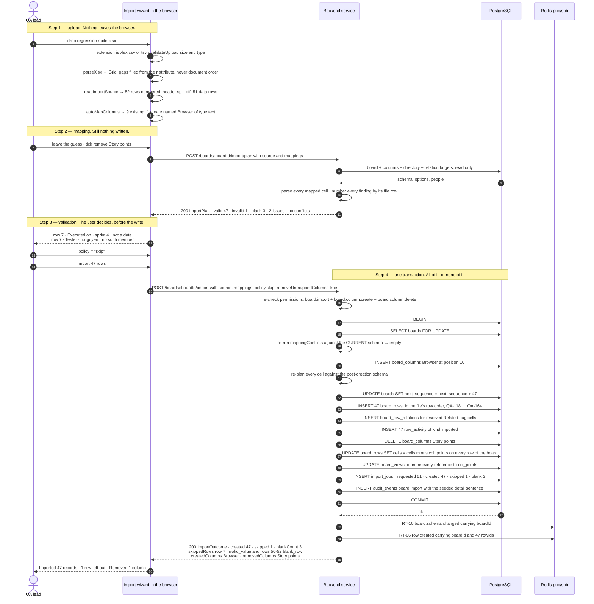
```mermaid
sequenceDiagram
    autonumber
    actor QA as QA lead
    participant W as Import wizard in the browser
    participant API as Backend service
    participant PG as PostgreSQL
    participant RT as Redis pub/sub

    Note over QA,W: Step 1 — upload. Nothing leaves the browser.
    QA->>W: drop regression-suite.xlsx
    W->>W: extension is xlsx csv or tsv · validateUpload size and type
    W->>W: parseXlsx → Grid, gaps filled from the r attribute, never document order
    W->>W: readImportSource → 52 rows numbered, header split off, 51 data rows
    W->>W: autoMapColumns → 9 existing, 1 create named Browser of type text

    Note over QA,W: Step 2 — mapping. Still nothing written.
    QA->>W: leave the guess · tick remove Story points
    W->>API: POST /boards/:boardId/import/plan with source and mappings
    API->>PG: board + columns + directory + relation targets, read only
    PG-->>API: schema, options, people
    API->>API: parse every mapped cell · number every finding by its file row
    API-->>W: 200 ImportPlan · valid 47 · invalid 1 · blank 3 · 2 issues · no conflicts

    Note over QA,W: Step 3 — validation. The user decides, before the write.
    W-->>QA: row 7 · Executed on · sprint 4 · not a date<br/>row 7 · Tester · h.nguyen · no such member
    QA->>W: policy = "skip"
    QA->>W: Import 47 rows

    Note over API,PG: Step 4 — one transaction. All of it, or none of it.
    W->>API: POST /boards/:boardId/import with source, mappings, policy skip, removeUnmappedColumns true
    API->>API: re-check permissions: board.import + board.column.create + board.column.delete
    API->>PG: BEGIN
    API->>PG: SELECT boards FOR UPDATE
    API->>API: re-run mappingConflicts against the CURRENT schema → empty
    API->>PG: INSERT board_columns Browser at position 10
    API->>API: re-plan every cell against the post-creation schema
    API->>PG: UPDATE boards SET next_sequence = next_sequence + 47
    API->>PG: INSERT 47 board_rows, in the file's row order, QA-118 … QA-164
    API->>PG: INSERT board_row_relations for resolved Related bug cells
    API->>PG: INSERT 47 row_activity of kind imported
    API->>PG: DELETE board_columns Story points
    API->>PG: UPDATE board_rows SET cells = cells minus col_points on every row of the board
    API->>PG: UPDATE board_views to prune every reference to col_points
    API->>PG: INSERT import_jobs · requested 51 · created 47 · skipped 1 · blank 3
    API->>PG: INSERT audit_events board.import with the seeded detail sentence
    API->>PG: COMMIT
    PG-->>API: ok

    API->>RT: RT-10 board.schema.changed carrying boardId
    API->>RT: RT-06 row.created carrying boardId and 47 rowIds
    API-->>W: 200 ImportOutcome · created 47 · skipped 1 · blankCount 3<br/>skippedRows row 7 invalid_value and rows 50-52 blank_row<br/>createdColumns Browser · removedColumns Story points
    W-->>QA: Imported 47 records · 1 row left out · Removed 1 column
```

Read the diagram for two things. First, **every step before the last box is a read**: the board is
untouched while the user is still able to change their mind. Second, **the numbers on the way out are
the numbers on the way in** — row 7 is row 7 of the sheet in the plan, in the outcome and in the
audit trail, because `sourceRowNumber` never left the row it belongs to.

---

### 24.11 Export — scopes, formats, and what never reaches a file

```ts
// src/types/system.ts:149-160 — verbatim
export type ExportFormat = "xlsx" | "csv" | "pdf";
export type ExportScope  = "board" | "view" | "selection";

export interface ExportOutcome {
  readonly fileName: string;
  readonly rowCount: number;
  readonly columnCount: number;
  /** Columns withheld because the viewer may not read them. */
  readonly omittedColumns: readonly string[];
}
```

Permission: **`board.export`**, a **Member** key — "Taking data out of the product is a step past
reading it, so it starts here rather than at Viewer" (`src/lib/permissions/roles.ts:32-34`). It is
one of three `READ_ONLY_KEYS` (`src/lib/permissions/evaluate.ts:28-33`), so it survives every
narrowing layer: an archived board, an archived ancestor and a lock all still permit export
(`evaluate.ts:77`, `:94-101`; `docs/SYSTEM.md:179-180`). A **trashed** node is the one exception —
`can` refuses everything but `node.delete` on a trashed node (`evaluate.ts:79-81`), and a
`READ_ONLY_KEY` returns before that check, so export of a trashed board is permitted by the client
resolver; the server must still refuse it with `NODE_TRASHED_READ_ONLY`, because a record in the bin
is not a record you export.

#### 24.11.1 The three scopes

| Scope | Label | Rows | Includes archived? | Citation |
| --- | --- | --- | --- | --- |
| `board` | "Entire board" | `rowOrder` — every record on the board | **Yes.** It does not pass through `queryRowIds`. | `src/hooks/use-board-export.ts:61`; `docs/SYSTEM.md:346-348` |
| `view` | "Current view" | `model.rowIds` — the active view's filters, sort, grouping, `subtaskDisplay` **and the active search term** | No, unless the view is showing archived | `src/hooks/use-board-export.ts:61`; `queryRowIds`, `src/lib/board-view.ts:194-234` |
| `selection` | "Selected records" | the ticked `selectedIds` | whatever was ticked | `src/hooks/use-board-export.ts:61` |

**`view` includes the search term** — canon §2.7 states it and `queryRowIds` proves it (`search`
is a first-class parameter at `src/lib/board-view.ts:200`, applied at `:225`). A backend that
reproduces only the saved view's filters and sorts exports a **different set of records** from the
one on the user's screen. The search term must therefore be in the request body.

A scope with zero records stays visible and unpickable in the dialog, "so the reason the export is
empty is on screen" (`src/components/board/export/export-dialog.tsx:120-123`).

#### 24.11.2 One projection, three writers

`buildExportGrid` (`src/lib/board-export.ts:86-106`) builds one rectangular `Grid` that all three
formats consume, "so XLSX, CSV and PDF cannot disagree about what a record says" (`:7-14`):

- **Header row** = `["ID", ...columns.map(c => c.name)]`.
- **One body row per record** = `[row.displayId, ...cellText(value, column, context)]`, an empty
  string for an absent cell.

**Leading every record with its display id is deliberate — "so an export round-trips"**
(`src/lib/board-export.ts:81`). `includeRecordId` defaults to `true` (`:82`, `:91`). Keep it: an
exported `QA-118` re-imported into a `Related bug` relation column resolves, because
`findRelationId` matches on the row id *or* the display label (`src/lib/cell-conversion.ts:160-167`).

| Format | Writer | Details the backend must reproduce |
| --- | --- | --- |
| `xlsx` | `buildXlsx(grid, boardName)` | Single sheet, cells as inline strings, no shared-string table (`src/lib/xlsx.ts:4-12`, `:53-65`). The sheet name is sanitised by `safeSheetName`: `: \ / ? * [ ]` replaced with a space, trimmed to 31 characters, fallback `Sheet1` — "Excel refuses to open a workbook whose sheet name it considers invalid, so a board called 'Q3: Launch' has to be cleaned" (`:32-39`). |
| `csv` | `toDelimited(grid)` | RFC 4180 quoting (`src/lib/csv.ts:55-67`), prefixed with a **UTF-8 byte-order mark** — "what makes Excel read the file as UTF-8 rather than Latin-1" (`src/hooks/use-board-export.ts:130-131`). |
| `pdf` | `buildPdf({ title, lines: pdfLinesFrom(grid) })` | One line per record: cells whitespace-collapsed, joined with `"  ·  "`, clipped to `EXPORT_PDF_LINE_WIDTH = 92` characters with an ellipsis (`src/lib/board-export.ts:126-136`). The writer paginates and substitutes glyphs its single-byte Helvetica cannot draw (`src/lib/pdf.ts:1-9`, `:28-34`). The dialog is explicit that PDF is "A paginated list, for reading rather than re-importing" (`export-dialog.tsx:38`) — it is **not** required to round-trip. |

**MIME types** (`src/lib/board-export.ts:28-32`) —
`application/vnd.openxmlformats-officedocument.spreadsheetml.sheet`, `text/csv;charset=utf-8`,
`application/pdf`.

**File name** (`exportFileName`, `src/lib/board-export.ts:109-119`):
`` `${slugify(boardName) || "board"}${scope === "board" ? "" : "-" + slugify(scopeLabel)}-${YYYY-MM-DD}.${ext}` `` —
e.g. `regression-suite-current-view-2026-08-27.csv`. The date is `nowIso.slice(0, 10)`, a **date key,
never converted through UTC** (canon C-04).

#### 24.11.3 Permission-sensitive fields are excluded — EXISTING REQUIREMENT

`SY-EXP-36`: "a column the caller may not read is removed from the exported file." The frontend
implements it by removing the column from the projection **before any writer sees it**:

```ts
// src/lib/board-export.ts:64-75
export function selectExportColumns(
  columns: readonly BoardColumn[],
  { canViewSensitive }: ColumnFilterOptions,
): ColumnSelection {
  if (canViewSensitive) return { columns, omitted: [] };

  const kept = columns.filter((column) => !isSensitiveColumn(column));
  return { columns: kept, omitted: columns.filter(isSensitiveColumn).map((c) => c.name) };
}
```

- **The test** is the column's **name** against
  `/secret|token|password|credential|api[\s_-]?key|private[\s_-]?key/i`
  (`src/lib/board-export.ts:48-51`).
- **The gate** is `can("secret.reveal")` (`src/components/board/board-page.tsx:82`) — "Columns that
  look like credentials only leave the workspace with someone who is allowed to read a secret in the
  first place" (`:80-81`).
- **The report** is `ExportOutcome.omittedColumns`, rendered as a warning line naming every withheld
  column (`src/components/board/export/export-dialog.tsx:129-138`).
- The code is explicit that this is a stand-in: "Column-level ACLs are a backend concern; until they
  exist this name test is the honest stand-in, and it is deliberately conservative — a column called
  'API key' leaves the file rather than leaking into a spreadsheet somebody mails on"
  (`src/lib/board-export.ts:42-47`).

**Also excluded, by construction rather than by rule.** State these, because a backend writer
reproducing "export the board" from scratch will otherwise include them:

| Not in the file | Why |
| --- | --- |
| Attachment bytes and URLs | An `attachment` cell renders as a comma-joined list of file **names** (`cellText`, `src/lib/cell-values.ts:114-115`). No signed URL, ever — canon's OQ-75 position is that URLs are minted per response and never persisted; putting one in a spreadsheet that gets mailed on is exactly the leak that rule exists to prevent. |
| `revision`, `createdBy`, `createdAt`, `updatedAt`, `archivedAt`, `parentRowId` | Not in `buildExportGrid`'s projection (`src/lib/board-export.ts:97-103`). The parent/child relationship is therefore invisible in an export. |
| Comments and activity | Different aggregates; not reachable from the grid. |
| A relation target's cells | A `relation` cell renders as the target's resolved label only (`src/lib/cell-values.ts:117-123`). |

**Not excluded, deliberately: hidden columns.** `model.columns` is documented as "Every column in
view order, hidden ones included" (`src/hooks/use-board-view.ts:21-23`) and it is what reaches
`selectExportColumns` (`src/hooks/use-board-export.ts:53-56`). Hiding a column is a presentation
choice, not a permission. **The server must not "helpfully" filter hidden columns** — that would
silently change what an export contains.

**The honest security note, and it belongs in this document.** As long as the client holds the whole
board — which it does today, because `BoardSnapshot` ships every row and `nextCursor` is always
`null` (canon OQ-36) — the export column gate is **advisory, not a boundary**. A client that ignores
`omittedColumns` can build the same file from cells it already has. The real boundary is the *read*:
if a viewer may not read a column, that column must not be in the snapshot. Until column-level ACLs
exist (OQ-29), E-086's `omittedColumns` is an honest report of the server's decision and a correct
input to the audit trail, and it is not a control.

**RECOMMENDATION.** Move the pattern and the gating key into `GET /config` (E-139) — as
`sensitiveColumnPattern: string` and `sensitiveColumnPermission: PermissionKey` — so the two sides
cannot disagree, exactly as canon does for the upload ceiling under OQ-69 ("the client pre-check is
served from `GET /config` so the two cannot disagree"). The server remains the authority: it
recomputes the selection and returns the authoritative `omittedColumns`, whoever wrote the bytes.
Do **not** add an `is_sensitive` column to `board_columns` — canon T-11 fixes that table's column
list and part 4 fixes its `config` contract; a real solution is column-level ACLs under OQ-29, not a
boolean smuggled in ahead of the decision.

---

### 24.12 Sync vs async — the threshold, and the recommendation

**Today the server is not involved at all.** `useBoardExport.run` makes **no service call**: it
builds the grid, writes the bytes and triggers a browser download
(`src/hooks/use-board-export.ts:79-113`, `writeFile` at `:118-137`). Two consequences follow, and
both are reasons E-086 must exist even for the small cases:

1. **The `board.export` audit row can never be written.** The seed advertises one — `module: "board"`,
   `action: "board.export"`, detail "31 records exported to XLSX. 1 sensitive column omitted."
   (`src/services/audit-service.ts:197-206`) — and nothing can produce it while the export never
   reaches a server. `SY-EXP-36` and `SY-AUD-41` together make an unaudited data egress a compliance
   defect.
2. **The permission decision is made by the client.** See §24.11.3.

**DECIDED, following canon E-086.** The **response shape is chosen by scope**, not by row count:

| Scope | Response | Who writes the bytes |
| --- | --- | --- |
| `view`, `selection` | `200` `ExportOutcome` | The **client**, from rows it already holds. The server's job is the authoritative `omittedColumns`, the `rowCount`/`columnCount` it agrees to, the canonical `fileName`, and the audit row. |
| `board` | `ExportJob` | The **server**, into S3-compatible object storage, delivered as a short-lived signed URL. |

**The sync/async threshold sits inside the `board` scope**, and it decides the job's *state in the
first response*, not the response's shape:

> **RECOMMENDATION — `EXPORT_SYNC_ROW_LIMIT = 5 000`.** When the resolved row count for a `board`
> scope export is at or below it, generate inline and answer `200` with
> `state: "ready"` and a `downloadUrl`. Above it, enqueue and answer `202` with `state: "pending"`;
> the client polls E-141.

Why 5 000 and not a guess:

- `SY-EXP-36`'s own performance target is **5 000 rows to Excel in under 2 s** (PRD, feature 36).
  A number the product already committed to is the number to hold a synchronous request open for.
- It is the same ceiling as `IMPORT_MAX_ROWS` (`src/config/app.ts:48`), so a board a user can fill
  in one import is a board they can export in one request.
- `docs/SYSTEM.md:331-334` draws the line at exactly this scale: "Excel and CSV are streamed from one
  projection and are fine at board scale, but a 500.000-record export belongs on the server."
- It is a config value, not a constant in code: serve it from `GET /config` as
  `exportSyncRowLimit` so it can be lowered without a client release.

Two refinements, both cheap:

- **PDF is capped lower.** A PDF draws one line per record with ~34 lines per page
  (`src/lib/pdf.ts:22-26`), so 5 000 records is a ~150-page document nobody reads. **RECOMMENDATION:**
  async for `format: "pdf"` above **1 000** rows, and keep generating it — refusing a large PDF is a
  worse answer than making the user wait for one.
- **Never truncate.** An export that silently stops at 5 000 rows and calls itself "the board" is the
  export equivalent of §24.3. Cross the threshold, do not shrink the answer.

**Job delivery, retention and cleanup.**

| Question | Answer |
| --- | --- |
| Where do the bytes go? | S3-compatible object storage, key `exports/{workspaceId}/{jobId}/{fileName}`. **Not** `file_assets` — an export is not a workspace file, it has no drive node, and it must not count against `StorageQuota.usedBytes` (canon §1.3.4 reserves `file_assets.size_bytes` for the quota). |
| How is it fetched? | A signed URL on `ExportJob.downloadUrl`, minted per response, never stored on the row. Same rule as canon's OQ-75 position for attachments. |
| How long does it live? | **RECOMMENDATION** — `expires_at = created_at + 24 h`. A nightly sweep deletes the object and the row. The signed URL's own TTL is shorter: **15 minutes**, re-mintable by calling E-141 again. |
| What if it fails? | `state = 'failed'`, `error` carries an `AppError` with `isRetryable: true`; the client re-POSTs E-086. |

---

### 24.13 Table: `export_jobs` (T-39)

Module `system`. **RECOMMENDATION** — the frontend has no counterpart; canon reserves the table and
OQ-42 covers it.

**Scope of the table: server-generated exports only.** A `view` or `selection` export writes **no
row here** — the bytes were never on the server, so a row would record a file that does not exist.
That export's permanent record is its `audit_events` row, which is the thing a compliance question
actually asks about.

```sql
-- Documentation only.
CREATE TABLE export_jobs (
  id              UUID PRIMARY KEY DEFAULT gen_random_uuid(),
  board_id        UUID NOT NULL REFERENCES boards(id) ON DELETE CASCADE,
  actor_id        UUID NOT NULL REFERENCES users(id)  ON DELETE RESTRICT,

  scope           export_scope  NOT NULL,          -- always 'board' today; see the CHECK
  format          export_format NOT NULL,          -- 'xlsx' | 'csv' | 'pdf'
  view_id         UUID REFERENCES board_views(id) ON DELETE SET NULL,

  state           TEXT NOT NULL DEFAULT 'pending'
                  CHECK (state IN ('pending','running','ready','failed')),

  file_name       TEXT NOT NULL,
  row_count       INTEGER,                         -- NULL until counted
  column_count    INTEGER,
  omitted_columns JSONB NOT NULL DEFAULT '[]'::jsonb,   -- string[] of column names

  storage_key     TEXT,                            -- NULL until state = 'ready'
  error_reason    TEXT,                            -- ErrorReason, set only when state = 'failed'

  expires_at      TIMESTAMPTZ,
  completed_at    TIMESTAMPTZ,
  created_at      TIMESTAMPTZ NOT NULL DEFAULT now(),

  CONSTRAINT export_jobs_server_generated CHECK (scope = 'board'),
  CONSTRAINT export_jobs_ready_has_key
    CHECK ((state = 'ready') = (storage_key IS NOT NULL)),
  CONSTRAINT export_jobs_failed_has_reason
    CHECK ((state = 'failed') = (error_reason IS NOT NULL))
);

CREATE INDEX export_jobs_board_idx  ON export_jobs (board_id, created_at DESC);
CREATE INDEX export_jobs_queue_idx  ON export_jobs (state, created_at)
  WHERE state IN ('pending','running');
CREATE INDEX export_jobs_reaper_idx ON export_jobs (expires_at)
  WHERE state = 'ready';
```

**Columns, and why each is there.**

| Column | Type | Why |
| --- | --- | --- |
| `id` | UUID PK | Canon C-01. Addressed by E-141. |
| `board_id` | UUID FK → `boards.id`, CASCADE | The export belongs to a board. |
| `actor_id` | UUID FK → `users.id`, RESTRICT | Session-derived (canon C-09). Only the actor may poll or download (§24.14). |
| `scope` | ENUM `export_scope` | Canon §2.7, values `board`/`view`/`selection` verbatim. The CHECK pins it to `board` because only that scope produces a server-side file; the column is typed for the full enum so lifting the restriction later is a CHECK drop, not a migration. |
| `format` | ENUM `export_format` | `xlsx` \| `csv` \| `pdf`, canon §2.7. |
| `view_id` | UUID FK → `board_views.id`, SET NULL | Unused while `scope = 'board'`; kept so a future `view`-scope job can name the view it froze. SET NULL because a deleted view must not delete the record that an export happened. |
| `state` | TEXT + CHECK | Four values. **Not a Postgres ENUM** — part 2 already fixed this: "`export_jobs.state` is a job-runner state with no frontend counterpart and no exhaustive switch." A job-runner state changes more often than a domain enum. |
| `file_name` | TEXT | Computed by the server with `exportFileName`'s rule, so the download's name matches what the dialog promised. |
| `row_count` / `column_count` | INTEGER NULL | Mirror `ExportOutcome`. NULL until the worker has resolved the scope. |
| `omitted_columns` | JSONB | The withheld column **names**, as `ExportOutcome.omittedColumns`. Names, because that is what the warning line renders. |
| `storage_key` | TEXT NULL | The object key. Never the URL — URLs are minted per response with a 15-minute TTL. |
| `error_reason` | TEXT NULL | An `ErrorReason` (canon §4.3), so a failure is classifiable without parsing a message. |
| `expires_at` | TIMESTAMPTZ NULL | When the object and this row are swept. |
| `completed_at` | TIMESTAMPTZ NULL | For the "how long do exports take" question the first incident asks. |
| `created_at` | TIMESTAMPTZ | Canon C-03. |

**JSONB structure — `export_jobs.omitted_columns`** (canon C-06): `readonly string[]`, board column
names in `position` order, exactly the array `ExportOutcome.omittedColumns` carries.

**Cardinality.** One `boards` row → 0..N `export_jobs`. One `users` row → 0..N. One `board_views`
row → 0..N (all NULL today). Leaf table; nothing references it.

**Unique constraints.** None. Two identical exports are two events. E-086 replay protection, if
wanted, is an `Idempotency-Key`; it is **not** on part 1's list of five, and it should not be — a
duplicate export costs one object, and the audit trail wants both rows anyway.

**Indexes.** `(board_id, created_at DESC)` for the per-board history; a partial
`(state, created_at)` for the worker's claim query, partial so the index holds only live work; a
partial `(expires_at)` for the reaper.

**Delete behaviour.** `board_id` CASCADE — deleting a board removes its export history, and the
sweep must also delete the orphaned objects (a `DELETE` trigger enqueuing the storage key, or the
nightly reaper reconciling storage against the table). `actor_id` RESTRICT. `view_id` SET NULL.

**Retention.** Rows are removed with their object at `expires_at` (24 h). The permanent record of
"an export happened" lives in `audit_events`, which has its own 12-month retention question
(OQ-27) — that separation is deliberate: the file is transient, the fact is not.

---

### 24.14 Export endpoints

#### `POST /api/v1/boards/:boardId/export`

**Purpose** — Resolve an export's scope and column selection server-side, record that it happened,
and either hand back the authoritative `ExportOutcome` for the client to write the file
(`view`/`selection`) or start a server-side generation (`board`). Canon E-086.

**Authentication** — Required.

**Permission** — `board.export` on the board's node, plus workspace membership. A **Member** key
(`src/lib/permissions/roles.ts:32-34`). Because it is a `READ_ONLY_KEY`
(`src/lib/permissions/evaluate.ts:28-33`) it passes the archive, freeze and lock narrowings — an
archived board still exports. **The server must additionally refuse a trashed node** with
`NODE_TRASHED_READ_ONLY`: the client resolver returns early for read-only keys and never reaches the
trashed check (`evaluate.ts:77-81`), and a record in the bin is not a record you take out of the
product.

`secret.reveal` on the same node is read separately — not as a gate on the call, but as the input to
the column selection (§24.11.3). Absence narrows the file; it never refuses the request.

**Path Params**

| Name | Type | Notes |
| --- | --- | --- |
| `boardId` | UUID | `boards.id`. |

**Query Params** — None.

**Request Body**

```ts
interface CreateExportRequest {
  readonly scope: ExportScope;            // "board" | "view" | "selection"
  readonly format: ExportFormat;          // "xlsx" | "csv" | "pdf"

  /** Required when scope === "view". The saved view whose filters, sorts and grouping apply. */
  readonly viewId?: string;

  /**
   * The active search term. Part of what "the current view" MEANS — queryRowIds applies it
   * alongside the filters (src/lib/board-view.ts:200, :225). Omitted or "" means no search.
   * Ignored for the other two scopes.
   */
  readonly search?: string;

  /** Required when scope === "selection". minItems: 1. */
  readonly rowIds?: readonly string[];

  /**
   * Lead every record with its display id. Default true — "so an export round-trips"
   * (src/lib/board-export.ts:81).
   */
  readonly includeRecordId?: boolean;

  /**
   * Default true for scope "board" (rowOrder carries archived records), and for scope "view"
   * it defaults to the view's own archived toggle. src/hooks/use-board-export.ts:58-68.
   */
  readonly includeArchived?: boolean;
}
```

**Response** — a discriminated union on `scope`, because the two branches are genuinely different
answers and collapsing them would need `null`s in both.

```ts
type CreateExportResponse =
  | { readonly kind: "outcome"; readonly outcome: ExportOutcome }   // scope view | selection
  | { readonly kind: "job";     readonly job: ExportJob };          // scope board

/** Verbatim from src/types/system.ts:154-160. */
interface ExportOutcome {
  readonly fileName: string;
  readonly rowCount: number;
  readonly columnCount: number;
  readonly omittedColumns: readonly string[];
}

type ExportJobState = "pending" | "running" | "ready" | "failed";

interface ExportJob {
  readonly id: string;
  readonly boardId: string;
  readonly scope: ExportScope;
  readonly format: ExportFormat;
  readonly state: ExportJobState;
  readonly fileName: string;
  readonly rowCount: number | null;              // null until resolved
  readonly columnCount: number | null;
  readonly omittedColumns: readonly string[];
  /** Signed, 15-minute TTL, minted per response. null unless state === "ready". */
  readonly downloadUrl: string | null;
  readonly expiresAt: string | null;             // ISO 8601
  readonly error: AppError | null;               // set only when state === "failed"
  readonly createdAt: string;
}
```

Status: `200` for `kind: "outcome"`; `200` for `kind: "job"` with `state: "ready"` (generated
inline, under the threshold); `202` for `kind: "job"` with `state: "pending"`.

```jsonc
// 200 POST /api/v1/boards/9a2e…/export   { "scope": "view", "format": "csv", "viewId": "v_1", "search": "smoke" }
{
  "kind": "outcome",
  "outcome": {
    "fileName": "regression-suite-current-view-2026-08-27.csv",
    "rowCount": 31,
    "columnCount": 9,
    "omittedColumns": ["API key"]
  }
}
```

```jsonc
// 202 POST /api/v1/boards/9a2e…/export   { "scope": "board", "format": "xlsx" }
{
  "kind": "job",
  "job": {
    "id": "01JB9M…", "boardId": "9a2e…", "scope": "board", "format": "xlsx",
    "state": "pending",
    "fileName": "regression-suite-2026-08-27.xlsx",
    "rowCount": null, "columnCount": null, "omittedColumns": [],
    "downloadUrl": null, "expiresAt": null, "error": null,
    "createdAt": "2026-08-27T09:30:00.000Z"
  }
}
```

**Database**

*Reads:*

| Table | Read |
| --- | --- |
| `nodes` | The board's node and ancestors — visibility, `deleted_at`. |
| `boards` | `id`, `node_id`, `name` (the file name and the sheet name come from it), `row_id_prefix`. |
| `board_columns` | Every column, hidden ones included, in `position` order. The selection is computed here. |
| `board_views` | The named view, when `scope = "view"`: filters, `filter_conjunction`, sorts, grouping, `subtask_display`. |
| `board_rows` | The resolved set. `scope: "board"` → every row including archived; `scope: "view"` → filters + search + sort applied; `scope: "selection"` → `WHERE id = ANY($rowIds) AND board_id = $boardId` (an id from another board is dropped, not an error — the frontend filters unknown ids the same way, `src/components/board/board-page.tsx:72-75`). |
| `workspace_members` + `users` | To render `user` cells as names. |
| `board_row_relations` / `board_rows` | To render `relation` cells as target labels, one query per target board. |
| `access_rules` | Visibility on the board's node and on relation target boards. |

*Writes:*

| Table | Write |
| --- | --- |
| `export_jobs` | One row — **only for `scope: "board"`** (§24.13). |
| `audit_events` | One row, **every scope**: `module = 'board'`, `action = 'board.export'`, `severity = 'info'`, `outcome = 'allowed'`, `target` = the board's name, `detail` = `` `${rowCount} records exported to ${FORMAT}. ${n} sensitive column omitted.` `` — the seeded format verbatim (`src/services/audit-service.ts:197-206`), with the second sentence omitted when `n === 0`. |

**Transaction** — **Required, but small.** The `export_jobs` insert and the `audit_events` insert are
one transaction. The row read is not inside it: an export is a snapshot of a moving board and does
not need repeatable-read isolation across a 5 000-row scan. **Nothing about generating the file is
in a transaction** — the worker writes to object storage and then flips `state` in its own short
transaction.

**Realtime** — **None.** An export changes nothing anybody else is looking at, and canon defines no
frame for it. A client waiting on a job polls E-141; adding a frame for one client's own job would be
a socket message with an audience of one.

**Possible Errors**

| HTTP | Code | Reason |
| --- | --- | --- |
| 400 | `validation` | `EXPORT_SCOPE_INVALID` — `scope: "selection"` with `rowIds` absent or empty, or `scope: "view"` with no `viewId`. Canon §4.3 names exactly these two cases. |
| 400 | `validation` | `VALIDATION_FAILED` — `format` or `scope` outside its enum; `rowIds` longer than the board's row count. |
| 403 | `permission_denied` | `PERMISSION_DENIED` — no `board.export`. |
| 403 | `permission_denied` | `NODE_TRASHED_READ_ONLY` — the board is in the bin. |
| 404 | `not_found` | `BOARD_NOT_FOUND` — unknown board, or one the caller may not see. |
| 404 | `not_found` | `VIEW_NOT_FOUND` — `viewId` is not a view of this board. |
| 429 | `validation` | `RATE_LIMITED` — see the note below. |
| 502 | `network` | `UPLOAD_STORAGE_UNAVAILABLE` — object storage refused the inline generation. `isRetryable: true`. |
| 500 | `unknown` | `INTERNAL_ERROR`. |

**Rate limiting — RECOMMENDATION.** A whole-board export is the cheapest way to exfiltrate a
workspace and the most expensive read the API offers. Add a fifth bucket to part 1's four: **10
exports / 5 minutes, per user per workspace**, returning `RATE_LIMITED` with `retryAfterSeconds` and
`isRetryable: true`. Unlike the secret bucket, a throttled export is **not** audited as a denial —
nothing was read.

**Frontend Used By** — `run` in `src/hooks/use-board-export.ts:79-113`, called from
`src/components/board/export/export-dialog.tsx:153-155`. The dialog is opened from
`src/components/board/board-toolbar.tsx:148-157` (scope `board`) and from
`src/components/board/bulk/bulk-action-bar.tsx:190-199` (scope `selection`), and the two are kept
apart by remounting on the scope key (`src/components/board/board-page.tsx:186-193`).

---

#### `GET /api/v1/boards/:boardId/export/:jobId`

**RECOMMENDATION — E-141.** Canon's registry stops at 140 endpoints and has no read for an export
job, yet canon §4.3 already defines `EXPORT_JOB_NOT_READY` (409 / `conflict`, "The async export is
still running"), which nothing in the registry can raise. This endpoint is the missing half of that
error. Flagged for the editor at the end of this chapter.

**Purpose** — Poll an asynchronous whole-board export, and mint a fresh signed download URL once it
is ready.

**Authentication** — Required.

**Permission** — `board.export` on the board's node, **and** `export_jobs.actor_id = session.user.id`.
An export job is personal: the file may contain columns the requester could read and a colleague
could not, so a second user with `board.export` must start their own. A job belonging to somebody
else answers `404` `EXPORT_JOB_NOT_FOUND`, never `403` — canon §4.2's rule that "the resource does
not exist" and "the caller may not see it" answer identically.

**Path Params**

| Name | Type | Notes |
| --- | --- | --- |
| `boardId` | UUID | `boards.id`. Must match `export_jobs.board_id`. |
| `jobId` | UUID | `export_jobs.id`. |

**Query Params**

| Name | Type | Default | Notes |
| --- | --- | --- | --- |
| `redirect` | `boolean` | `false` | When `true` and the job is ready, answer `302` to the signed URL instead of a JSON body — so the job id can be a plain link. When `true` and the job is not ready, answer `409` `EXPORT_JOB_NOT_READY`. |

**Request Body** — None.

**Response** — `200` `ExportJob` (the interface in E-086). `downloadUrl` is minted on every call with
a fresh 15-minute TTL and is `null` unless `state === "ready"`.

```jsonc
// 200 GET /api/v1/boards/9a2e…/export/01JB9M…
{
  "id": "01JB9M…", "boardId": "9a2e…", "scope": "board", "format": "xlsx",
  "state": "ready",
  "fileName": "regression-suite-2026-08-27.xlsx",
  "rowCount": 41230, "columnCount": 9,
  "omittedColumns": ["API key"],
  "downloadUrl": "https://objects.example.net/exports/…?X-Amz-Expires=900&…",
  "expiresAt": "2026-08-28T09:30:00.000Z",
  "error": null,
  "createdAt": "2026-08-27T09:30:00.000Z"
}
```

**Database**

| Table | Read/Write |
| --- | --- |
| `export_jobs` | **Read** one row by `(id, board_id)`, plus `actor_id` for the ownership check. |
| `nodes` | **Read** the board's node, for visibility. |

No writes. The signed URL is minted from `storage_key`; it is never stored.

**Transaction** — Not required. A single-row read.

**Realtime** — None.

**Possible Errors**

| HTTP | Code | Reason |
| --- | --- | --- |
| 403 | `permission_denied` | `PERMISSION_DENIED` — no `board.export` on the board. |
| 404 | `not_found` | `EXPORT_JOB_NOT_FOUND` — unknown job, a job on another board, a job belonging to another user, or one already swept at `expires_at`. **RECOMMENDATION**: this reason is not in canon §4.3 and needs adding. |
| 404 | `not_found` | `BOARD_NOT_FOUND`. |
| 409 | `conflict` | `EXPORT_JOB_NOT_READY` — `?redirect=true` on a job that is `pending` or `running`. Canon §4.3 already defines it. |
| 502 | `network` | `UPLOAD_STORAGE_UNAVAILABLE` — the object store could not issue a signed URL. |

**Frontend Used By** — nothing today. `useBoardExport` writes the bytes itself
(`src/hooks/use-board-export.ts:118-137`) and has no polling state. The change is contained: `run`
gains a branch on `kind === "job"` and a poll loop, and the dialog's existing `isExporting` spinner
covers the wait.

---

### 24.15 Open questions

#### OPEN QUESTION (OQ-42) — are import parsing and export generation client-side by design, or by absence of a server?

**What is unclear** — whether the browser should keep owning the spreadsheet, or whether a real
backend is expected to take it.

**Evidence** — the whole import pipeline is browser code: XLSX unzip and parse (`src/lib/xlsx.ts`),
CSV/TSV parse (`src/lib/csv.ts`), mapping (`src/lib/import-mapping.ts:145-184`), validation
(`:357-423`). The only thing crossing the wire is a batch of cells
(`src/services/board-service.ts:1171-1176`). Export makes **no service call at all**
(`src/hooks/use-board-export.ts:79-113`) and writes XLSX, CSV and PDF in the browser
(`src/lib/xlsx.ts`, `src/lib/csv.ts`, `src/lib/pdf.ts`). `IMPORT_MAX_ROWS = 5 000`
(`src/config/app.ts:48`) is a ceiling a browser holds comfortably, and `SY-EXP-36`'s own target is
5 000 rows to Excel in under 2 s — a browser figure.

**Recommendation** — **keep it, with the server as the authority.** The browser parses the file
(that is where the file is, and it is what gives the user errors while the mapping is still
editable); the server parses the *cells* against the board's schema and owns the write. Export stays
client-generated for `view` and `selection`, becomes server-generated for `board`, and E-086 is
called in every case so the audit row lands and the column decision is the server's. This is canon's
position on E-084/E-085/E-086 and part 1's §7.11, and this chapter follows it.

**Impact if wrong** — if the server must parse the file, E-084 and E-085 gain a
`multipart/form-data` variant, part 1's "JSON only" rule gains an exception, `import_jobs` gains a
staged-object reference, and the row-alignment rules in §24.3 stop being inherited and become code
somebody has to write correctly a second time. The endpoint shapes survive; the content-type contract
does not.

#### OPEN QUESTION (OQ-41) — default invalid-value policy, transactionality, and the row ceiling

**What is unclear** — the frontend defaults the policy and truncates the file client-side; neither is
stated as a rule the server enforces.

**Evidence** — `useState<ImportInvalidPolicy>("skip")` (`src/hooks/use-import-wizard.ts:87`) is a
component default, not a contract. `readImportSource` does `.slice(0, IMPORT_MAX_ROWS)`
(`src/lib/import-mapping.ts:77`) and the banner says "Only the first 5,000 rows of this file will be
imported" (`import-mapping-step.tsx:148-153`). The mock service has no transaction at all — it
mutates a `Map` in a loop (`src/services/board-service.ts:1195-1214`).

**Recommendation** — canon has already taken the position and this chapter implements it: **default
`skip`; one transaction covering column creation, column removal and row inserts.** Add: the row
ceiling is **enforced with a 400, never by truncation** (§24.9), because truncating is the same class
of silent data loss as §24.3.

**Impact if wrong** — a `blank` default would import flagged rows nobody agreed to import. Truncation
instead of refusal would put 5 000 of 6 000 records on a board and report success.

#### OPEN QUESTION (OQ-29) — `ExportOutcome.omittedColumns` implies column-level permissions that exist nowhere

**What is unclear** — `SY-EXP-36` requires that "a column the caller may not read is removed from the
exported file", but there is no column-scoped permission key and no column-scoped ACL anywhere.

**Evidence** — the 39-key catalogue has no column-level key (`src/types/permission.ts:31-78`), and
the frontend stands in a **name regex** for the missing rule:
`/secret|token|password|credential|api[\s_-]?key|private[\s_-]?key/i` gated on `secret.reveal`
(`src/lib/board-export.ts:48-51`; `src/components/board/board-page.tsx:80-82`). The code says so:
"Column-level ACLs are a backend concern; until they exist this name test is the honest stand-in"
(`:42-45`). `docs/SYSTEM.md:335-337` repeats it.

**Recommendation** — for this release, **reproduce the heuristic server-side, exactly**, gated on
`secret.reveal`, and serve the pattern and the key from `GET /config` so the two sides cannot
disagree. Do **not** add `board_columns.is_sensitive` and do **not** invent a `board.column.read`
key ahead of the decision — either would freeze a workaround into the schema. And record, in this
document, that the gate is advisory while the client holds the whole board (§24.11.3): the real fix
is that a column a viewer may not read is absent from `BoardSnapshot`, which is a change to E-047,
not to E-086.

**Impact if wrong** — a column named "Client token" leaves the workspace in a spreadsheet, or a
column innocently named "Password policy" is withheld from an export that needed it. The first is a
breach; the second is a support ticket.

#### OPEN QUESTION (OQ-88) — does a committed import notify watchers?

**What is unclear** — an import creates 47 records on a board people are watching. Nothing says
whether that is 47 notifications, one, or none.

**Evidence** — `WatchKind` includes `board` (`src/types/collab.ts:86`), so a board is watchable, but
the only fan-out in the frontend is the comment path (`src/services/comment-service.ts:222-266`).
`notificationService.emit` is never called from any board write. Canon's RT-06 covers the realtime
frame — which is not a notification.

**Recommendation** — **one notification per watcher per import**, `reason: "system"`, title
`` `${created} records imported into ${boardName}` ``, linking to the board. Never one per record: 47
inbox rows for one action is how a notification centre becomes something people mute. Emit it in the
same transaction as the commit, as canon requires for the comment fan-out.

**Impact if wrong** — either a silent bulk change on a watched board, or an inbox flooded 5 000
deep by one import.

#### Two frontend defects found while writing this chapter

Neither changes a backend contract; both are recorded so nobody specifies around a bug.

**FE-1 · `.tsv` is offered and then rejected.** `useImportWizard` accepts the extension
(`SPREADSHEET_EXTENSIONS = { xlsx, csv, tsv }`, `src/hooks/use-import-wizard.ts:74`), the upload step
advertises it (`ACCEPT = ".xlsx,.csv,.tsv"`, `import-upload-step.tsx:18`; the hint says "XLSX, CSV or
TSV", `:70-72`), and `delimiterFor` handles it (`src/lib/csv.ts:70-72`). But the very next gate,
`validateUpload`, tests against `ALL_ACCEPTED_EXTENSIONS`, which contains `xlsx` and `csv` and **not**
`tsv` (`src/lib/file-validation.ts:7-14`). Every `.tsv` file is refused with "is not an accepted file
type". **Backend position:** the API accepts a parsed `ImportSource` and does not care what the file
was called, so nothing here changes; but `GET /config`'s accepted-extension list must include `tsv`
if the wizard is to keep advertising it.

**FE-2 · `importRows` drops `sourceRowNumber`.** `rowsToCreate` returns
`readonly Readonly<Record<string, CellValue>>[]` (`src/lib/import-mapping.ts:449-453`) — the row
number that `ImportDraftRow` carefully carried (`src/types/system.ts:107-113`) is discarded at the
last step before the write. It is why `ImportOutcome` can report a count of skipped rows but not
*which* rows, and why the store cannot map a created record back to a line in the sheet.
**Backend position:** E-085 takes the `ImportSource` and returns `importedRows` and `skippedRows`,
both keyed by `sourceRowNumber` (§24.8.2), which closes it.

---

### Chapter notes — divergences, decisions and traps

Canon was followed everywhere below; each entry is a **canon edit**, not a chapter edit, and is
recorded here rather than resolved in place.

1. **One endpoint added: E-141 `GET /boards/{boardId}/export/{jobId}`.** Canon §3.11 gives E-086 an
   `ExportJob` response for `board` scope but no way to read the job afterwards, while canon §4.3
   already defines `EXPORT_JOB_NOT_READY` (409) — an error no registered endpoint can raise. §24.14
   specifies the missing read. Canon's endpoint count becomes **141**. If the editor prefers not to
   grow the registry, the alternative is re-POSTing E-086 with the same `Idempotency-Key`, which
   returns the stored response and therefore can never show a state change — it does not work.

2. **One error reason added: `EXPORT_JOB_NOT_FOUND`** (404 / `not_found`, module `system`), for
   E-141. Canon §4.3's import/export block has `EXPORT_SCOPE_INVALID` and `EXPORT_JOB_NOT_READY` but
   no not-found for a job.

3. **One enum added: `ImportSkipReason`** = `invalid_value` \| `blank_row`, snake_case to match
   `BulkSkipReason` (canon §2.7). It carries the per-row reason in `ImportOutcome.skippedRows`, which
   is what "the frontend wants row-level errors" resolves to. Canon's enum count becomes 69 (61 on
   the wire). **One enum documented, not added: `ExportJobState`** = `pending` \| `running` \|
   `ready` \| `failed` — part 2 already fixed these four values and stored them as TEXT with a CHECK
   rather than a Postgres ENUM; this chapter follows that and does not register it as a domain enum.

4. **E-085's Perm column is composed, not replaced.** Canon lists `board.import`. §24.9 additionally
   requires `board.column.create` when the mapping contains a `create` target and
   `board.column.delete` when `removeUnmappedColumns` is true, because the frontend's confirm makes
   exactly those three calls (`src/hooks/use-import-wizard.ts:233`, `:243`, `:271`). Both extra keys
   are Manager keys alongside `board.import`, so no role today can hold one without the others and
   nothing observable changes — but a future role that gains import and not schema rights would
   otherwise get column creation for free. Suggest amending canon §3.11's Perm cell to
   `board.import` (+ `board.column.create` / `board.column.delete` conditionally).

5. **Three additive fields on `ImportOutcome`, and one on `ImportPlan`.** `ImportOutcome` gains
   `jobId`, `issueCount`, `blankCount`, `importedRows`, `skippedRows`, `createdColumns`; `ImportPlan`
   gains `issueCount`. Every existing field keeps its name, type and meaning, so no frontend read
   breaks. The one frontend line that changes is
   `src/components/board/import/import-validation-step.tsx:106-110`, which currently derives "…and N
   more findings" from `plan.issues.length` and must derive it from `issueCount` once the array is
   capped.

6. **Three columns on `import_jobs` and five on `export_jobs` beyond part 2's ERD.** `import_jobs`
   gains `sheet_name`, `blank_count`, `issue_count`, `skipped_row_numbers` and `created_column_ids`;
   `export_jobs` gains `file_name`, `row_count`, `column_count`, `omitted_columns`, `error_reason`
   and `completed_at`. Each is justified at its table (§24.7, §24.13); `blank_count` in particular is
   what makes the counts add up, and without it the `CHECK` constraint cannot be written. Part 2's
   ERD should be reconciled to match, or these treated as its detail.

7. **`export_jobs` holds server-generated exports only**, pinned by
   `CHECK (scope = 'board')`. Canon T-39 describes it as "Async whole-board export", which this
   follows; the consequence worth stating in canon is that a `view` or `selection` export's only
   permanent record is its `audit_events` row.

8. **Three constants proposed for `GET /config` (E-139)**, whose canon payload list is
   "max upload bytes, accepted extensions, trash retention days, import max rows, version history
   limit, search group limit, my-work widget limit, audit page size": add `importIssueCap` (500),
   `exportSyncRowLimit` (5 000) and the pair `sensitiveColumnPattern` /
   `sensitiveColumnPermission`. The last two exist so the export column gate cannot drift between
   client and server, which is the same reasoning canon already applied to the upload ceiling under
   OQ-69.

9. **A fifth rate-limit bucket proposed:** whole-workspace export, 10 per 5 minutes per user per
   workspace (§24.14). Part 1 defines four buckets and states each exists because a specific endpoint
   is abusable; E-086 with `scope: "board"` is the cheapest bulk-egress path in the API.

10. **A per-route body limit proposed:** 16 MB for E-084 and E-085, against a 1 MB default. Part 1
    names `REQUEST_TOO_LARGE` but sets no number, and a 5 000-row × 12-column `ImportSource` is
    1.5–4 MB of JSON. §24.6 explains why sending it twice is preferable to caching a plan.

11. **Two sub-questions filed under existing OQ ids rather than new ones**, per canon §8's rule
    against inventing ids: the "is sending `ImportSource` twice acceptable" question sits under
    OQ-42 (§24.6), and "does the row ceiling truncate or refuse" sits under OQ-41 (§24.15). If the
    editor would rather they were separately traceable, they need their own ids appended to canon.

12. **Part 9's OQ-102 is followed over the board fact sheet's R-03.** R-03 listed E-085 as a path
    that must enforce select transition rules; part 9 narrowed that to "gate transitions, not
    creations" and excluded E-085. §24.9 follows part 9. Flagging it so the two do not both stand.

---

## 25. Notifications

Module: `collab`. Tables touched: `notifications` (T-35), `users` (T-01), `nodes` (T-06),
`boards` (T-10), `board_rows` (T-12), `watches` (T-34, read by the producer).
Endpoints: **E-129, E-130, E-131, E-132**. Realtime: **RT-03**, **RT-04**.

**One row per recipient — fan-out on write.** There is no shared "event" row and no
subscription join at read time. That is what makes every read a single-table index scan on
a leading `recipient_id`, and it is what lets `list` only ever return the signed-in user's
inbox (`src/services/notification-service.ts:8-15`).

---

### 25.1 The wire model

```ts
/** src/types/collab.ts:97 */
type NotificationReason = "mention" | "assigned" | "comment" | "watch" | "system";

/** src/types/collab.ts:101-113 */
interface AppNotification {
  readonly id: string;
  readonly reason: NotificationReason;
  /** Inbox this belongs to. Every read is already scoped to the caller; the
   *  field is on the wire because the realtime ingest checks it
   *  (src/store/notification-store.ts:112). */
  readonly recipientId: string;
  readonly actor: UserSummary;
  readonly title: string;
  readonly body: string;
  /** Null for workspace-level system notices that route nowhere. */
  readonly target: EntityRef | null;
  readonly createdAt: string;   // ISO 8601
  /** Derived: notifications.read_at IS NOT NULL. */
  readonly isRead: boolean;
}

/** E-129, E-130, E-131. Canon §3.21. */
interface NotificationPage {
  readonly items: readonly AppNotification[];
  readonly nextCursor: string | null;
  /** Total unread in this inbox, AFTER the write this response reports.
   *  Every read-state mutation therefore returns a fresh, authoritative badge. */
  readonly unreadCount: number;
}
```

**`title` and `body` are fully rendered strings stored on the row** — not templates, not
i18n keys, no variable bag. There is no `payload` field anywhere in the frontend's type.
A notification is a **historical statement**: it says what was true when it was written, and
canon OQ-79 makes `notifications` the one table whose `target_label` is **frozen at creation**
rather than re-resolved on read.

**`isRead` is the only mutable field.** There is no `readAt` on the wire, no archive, no
dismiss and no delete (`src/types/collab.ts:112`). The database stores `read_at TIMESTAMPTZ`
and derives the boolean, so the frontend contract is unchanged and the "when" comes free
(canon §1.4 — never a boolean where a timestamp answers both questions).

---

### 25.2 The four tabs, and exactly how each query is served

**EXISTING REQUIREMENT.** Tabs are a **projection of `reason`**, never a stored field. The
map is `TAB_REASONS` (`src/lib/notifications.ts:7-13`), and the module comment states the
invariant: *"Inbox tabs are a projection of `reason`, not a second field on the record — one
notification can never disagree with the tab it lands in"* (`:3-6`).

**The API filters by `reason` and never by tab name** (canon OQ-90). The mapping stays in the
frontend, where `NOTIFICATION_TABS` (`:20-25`) already owns it, so there is exactly one copy
of it and no way for the two sides to drift.

| Tab (`NotificationTab`) | Label | Reasons | Request | Index used | Predicate |
| --- | --- | --- | --- | --- | --- |
| `all` | All | *(none — no filter)* | `GET /me/notifications?cursor=&limit=` | `notifications_inbox_idx (recipient_id, created_at DESC, id DESC)` | `recipient_id = $me` |
| `mentions` | Mentions | `mention` | `?reason=mention` | `notifications_reason_idx (recipient_id, reason, created_at DESC, id DESC)` | `recipient_id = $me AND reason = 'mention'` |
| `assigned` | Assigned | `assigned` | `?reason=assigned` | `notifications_reason_idx` | `recipient_id = $me AND reason = 'assigned'` |
| `following` | Following | `watch`, `comment` | `?reason=watch&reason=comment` | `notifications_reason_idx` | `recipient_id = $me AND reason IN ('watch','comment')` |

**Why those two indexes and not one.**

- The **All** tab has no `reason` predicate, so an index led by `(recipient_id, reason, …)`
  cannot serve its ordering: Postgres would have to sort, because the index orders by
  `reason` before `created_at`. `notifications_inbox_idx` puts `created_at DESC, id DESC`
  directly after `recipient_id`, so All is an index scan that stops after `limit + 1` rows —
  no sort node, and the keyset cursor is a direct seek into the same order.
- The three filtered tabs each have an equality on `reason`, which makes
  `notifications_reason_idx` an index scan over one contiguous range per reason value,
  already in `created_at DESC` order. `following` scans two such ranges and merges them; the
  planner does this as a `BitmapOr` or two index scans with a merge append, and both stop
  early because the ordering is preserved within each range.
- Both indexes carry `id DESC` as the tie-breaker so the keyset cursor is **total**. Without
  it, two notifications written in the same transaction (the fan-out writes several) share a
  `created_at` and a cursor built on `created_at` alone would skip or repeat one of them.

**`reason` is a repeatable query parameter, OR-combined.** **RECOMMENDATION**: canon's E-129
signature is `?reason=` and does not say how a set is expressed; `following` needs two
values. Repeating the parameter avoids inventing a comma-splitting rule that would then need
escaping for a value set that is a closed enum anyway. An unknown value is
`VALIDATION_FAILED` (400), never a silently empty page.

**Ordering is `created_at DESC, id DESC` on every tab** — `newestFirst`
(`src/services/notification-service.ts:24-26`).

---

### `GET /api/v1/me/notifications`

**Purpose** — The signed-in user's inbox, newest first, optionally filtered by reason, with
the authoritative unread count attached.

**Authentication** — Required.

**Permission** — Session only. **There is no `userId` parameter** (P-06, C-09): the recipient
is the session user. The mock takes `userId` as an argument
(`src/services/notification-service.ts:28`), which canon OQ-19 marks `critical` — an inbox
addressed by a parameter is every inbox.

**Path Params** — None.

**Query Params**

| Name | Type | Required | Default | Notes |
| --- | --- | --- | --- | --- |
| `reason` | `NotificationReason`, repeatable | no | *(none = All)* | OR-combined. Unknown value → `VALIDATION_FAILED`. |
| `cursor` | opaque base64 | no | — | Keyset on `(created_at DESC, id DESC)`. Never constructed or parsed by a client. |
| `limit` | int | no | `50` | Server cap 100. |
| `workspaceId` | UUID | no | — | **RECOMMENDATION.** Scope the inbox to one workspace. The frontend has one active workspace at a time (`selectActiveWorkspace`) and `notifications.workspace_id` is `NOT NULL`, so an unscoped inbox mixes tenants in the bell. Omitted = every workspace the caller is still a member of. |

**Request Body** — None.

**Response** — `NotificationPage`, `200`.

```jsonc
{
  "items": [
    {
      "id": "0192f6a0-…",
      "reason": "mention",
      "recipientId": "usr_mai",
      "actor": { "id": "usr_lan", "name": "Lan Nguyen", "initials": "LN", "accentColor": "violet" },
      "title": "Lan Nguyen mentioned you",
      "body": "Reproduced on staging. Can you confirm the signature check is the one failing?",
      "target": {
        "kind": "row", "nodeId": "nd_bug_tracker", "boardId": "brd_bug_tracker",
        "rowId": "row_7", "label": "BUG-007"
      },
      "createdAt": "2026-08-27T09:30:00.000Z",
      "isRead": false
    },
    {
      "id": "0192f5f1-…",
      "reason": "system",
      "recipientId": "usr_mai",
      "actor": { "id": "usr_system", "name": "NexDrop", "initials": "ND" },
      "title": "Storage is at 52% of the team plan",
      "body": "Archive the 2026 incident bundles to free the largest share.",
      "target": null,
      "createdAt": "2026-08-26T05:30:00.000Z",
      "isRead": true
    }
  ],
  "nextCursor": "eyJhdCI6IjIwMjYtMDgtMjZUMDU6MzA6MDBaIiwiaWQiOiIwMTkyZjVmMS0ifQ==",
  "unreadCount": 4
}
```

**Server-side visibility filtering is mandatory, not optional.** An inbox outlives the
access that filled it, and a notification carries the **name** of what it is about. The
frontend already re-resolves every item against the tree the reader can see **now** and
drops the ones whose node is gone or no longer visible — `keepVisibleRefs`
(`src/hooks/use-notifications.ts:58-64`, `src/lib/permissions/visibility.ts:242-268`), with
the reason written out at `:49-57`: *"one that arrived while somebody held a folder keeps
naming that folder after they lose it… which also stops the click-through from being a way
back in."* The backend applies the same rule in the query and never relies on the client
dropping them. **Items with `target === null` are always kept** — a workspace announcement
has no node to check.

The filter is a join, not a post-pass: `LEFT JOIN nodes … WHERE n.id IS NULL OR
<visible(n.id, $me)>`, so the `limit` still returns a full page. This is the same
correctness argument as §27.3.

**Database**

| Table | Access | Detail |
| --- | --- | --- |
| `notifications` | read | `WHERE recipient_id = $me [AND reason = ANY($reasons)] [AND workspace_id = $ws]` ordered `created_at DESC, id DESC`, `LIMIT $limit + 1`. Index per the table in §25.2. |
| `nodes` | read | Visibility resolution for every non-null `target_node_id` — an ancestor-chain walk, batched for the page's node ids. |
| `users` | read | `actor_id` → `UserSummary`. |
| `notifications` | read | `unreadCount`: `count(*) WHERE recipient_id = $me AND read_at IS NULL`, over the partial index `notifications_unread_idx`. |

`target_label` is **not** re-resolved (OQ-79). `board_rows` and `boards` are not joined on
this path at all — the label the notification shows is the one it was written with.

**Transaction** — Not required.

**Realtime** — None (read).

**Possible Errors**

| HTTP | Code | Reason |
| --- | --- | --- |
| 400 | `validation` | `VALIDATION_FAILED` — unknown `reason`, `limit` above the cap, malformed `cursor`. |
| 401 | `permission_denied` | `AUTH_REQUIRED`. |
| 404 | `not_found` | `WORKSPACE_NOT_FOUND` — `workspaceId` names a workspace the caller is not a member of. |
| 429 | `validation` | `RATE_LIMITED`. |

**Frontend Used By** — `src/store/notification-store.ts:60-71` (`refresh`, via
`notificationService.list(CURRENT_USER.id)`), reached by `load()` (load-once, `:55-58`) from
`src/hooks/use-notifications.ts:45-47`. Rendered by
`src/components/notifications/notification-feed.tsx` inside both
`notification-bell.tsx:70-75` and `notifications-page.tsx:55`.

---

### `POST /api/v1/me/notifications/read`

**Purpose** — Mark specific notifications read. Opening a notification is reading it: the
feed marks read **and** routes in the same handler
(`src/components/notifications/notification-feed.tsx:31-38`), so this endpoint fires on
every click.

**Authentication** — Required.

**Permission** — Session only.

**Path Params** — None.

**Query Params** — None.

**Request Body** — `MarkNotificationsReadRequest`.

```ts
/** Canon §5.4, `collab`. */
interface MarkNotificationsReadRequest {
  readonly ids: readonly string[];
}
```

**Response** — `NotificationPage`, `200`. The **caller's list plus the fresh
`unreadCount`** — the store assigns the response directly
(`src/store/notification-store.ts:84`), which is why this is not a `204`.

**Ids outside the caller's own inbox are ignored, not applied — and not an error.**
`src/services/notification-service.ts:43-48` intersects the requested ids with the set the
caller actually owns, then marks only that. Not `403`, not `404`, and not a partial-failure
report: a `404` on a foreign id would confirm that the id exists, turning the endpoint into
an existence oracle over every inbox in the system. Canon's `NOTIFICATION_NOT_FOUND` is
reserved for a route that addresses a **single** notification, and this is not one.

`ids: []` is a valid request and a no-op that still returns the current page — the client's
`markRead` guards against it locally (`src/store/notification-store.ts:78`) but the server
must not depend on that.

**Database**

| Table | Access | Detail |
| --- | --- | --- |
| `notifications` | **update** | `UPDATE notifications SET read_at = now() WHERE recipient_id = $me AND id = ANY($ids) AND read_at IS NULL RETURNING id`. The `recipient_id` predicate **is** the scoping, done in the statement rather than in a check-then-write. `read_at IS NULL` keeps the first read time. |
| `notifications` | read | The page and the recomputed `unreadCount`. |

**Transaction** — Not required. One `UPDATE` and one read; the read is allowed to see a
notification that arrived in between, which is the desired behaviour.

**Realtime** — **RT-04 `notification.read`** `{ notificationIds }`, carrying **only the ids
actually scoped to that recipient** — the `RETURNING` set, not the requested set. Delivered
to that recipient's own sockets only. A client must not be able to learn that an id it
guessed exists by seeing it echoed back.

**Possible Errors**

| HTTP | Code | Reason |
| --- | --- | --- |
| 400 | `validation` | `VALIDATION_FAILED` — `ids` is not an array of strings, or is longer than 500. |
| 401 | `permission_denied` | `AUTH_REQUIRED`. |
| 429 | `validation` | `RATE_LIMITED`. |

**Frontend Used By** — `src/store/notification-store.ts:76-88` (`markRead`), optimistic with
rollback: it applies `markReadLocally` first *"so the badge drops on click, not on the round
trip"* (`:80-81`) and restores the previous array on failure (`:85-87`). Triggered from
`src/components/notifications/notification-feed.tsx:32`.

---

### `POST /api/v1/me/notifications/read-all`

**Purpose** — Empty the badge.

**Authentication** — Required.

**Permission** — Session only.

**Path Params** — None.

**Query Params**

| Name | Type | Required | Default | Notes |
| --- | --- | --- | --- | --- |
| `workspaceId` | UUID | no | — | **RECOMMENDATION**, matching E-129. Scopes the clear to one workspace so "Mark all read" in one tenant does not silently clear another. |

**Request Body** — None.

**Response** — `NotificationPage`, `200`, with `unreadCount: 0` (for the given scope).

**It clears every unread notification in the inbox, not the active tab's.** The control sits
in the popover header and the page header, outside the tab strip, and is disabled on
`controller.unread === 0` — the **total**, not the tab count
(`src/components/notifications/notification-bell.tsx:49-58`,
`src/components/notifications/notifications-page.tsx:29-38`).

**Database** — `notifications`: **update**
`SET read_at = now() WHERE recipient_id = $me AND read_at IS NULL [AND workspace_id = $ws]
RETURNING id`, driven by the partial index `notifications_unread_idx`, which stays small
however long the read history grows. Then one read for the page.

**Transaction** — Not required.

**Realtime** — **RT-04 `notification.read`** with the `RETURNING` ids — the ones actually
marked, matching `src/services/notification-service.ts:63-68`.

**Possible Errors**

| HTTP | Code | Reason |
| --- | --- | --- |
| 401 | `permission_denied` | `AUTH_REQUIRED`. |
| 404 | `not_found` | `WORKSPACE_NOT_FOUND`. |
| 429 | `validation` | `RATE_LIMITED`. |

**Frontend Used By** — `src/store/notification-store.ts:90-106` (`markAllRead`), also
optimistic with rollback.

---

### `GET /api/v1/me/notifications/unread-count`

**Purpose** — The bell badge, computed by the server over the whole inbox.

**Authentication** — Required.

**Permission** — Session only.

**Path Params** — None.

**Query Params**

| Name | Type | Required | Default | Notes |
| --- | --- | --- | --- | --- |
| `workspaceId` | UUID | no | — | **RECOMMENDATION**, matching E-129. |

**Request Body** — None.

**Response** — `UnreadCountResponse`, `200`.

```ts
interface UnreadCountResponse {
  /** Total unread — the bell badge, and the All tab's badge. */
  readonly unreadCount: number;
  /** Per-reason unread, so the four tab badges are exact without loading the
   *  inbox. RECOMMENDATION; `unreadCount` is what canon E-132 requires.
   *  The frontend sums watch + comment for Following, using the TAB_REASONS
   *  map it already owns (src/lib/notifications.ts:12). */
  readonly byReason: Readonly<Record<NotificationReason, number>>;
}
```

```jsonc
{
  "unreadCount": 4,
  "byReason": { "mention": 2, "assigned": 1, "comment": 1, "watch": 0, "system": 0 }
}
```

**Why this endpoint exists.** The frontend derives every badge from the loaded array:
`countUnread` (`src/lib/notifications.ts:39-41`), the memoised
`all.filter(item => !item.isRead).length` (`src/hooks/use-notifications.ts:66`), and
`unreadByTab`, which computes all four counts in one pass over the inbox
(`src/lib/notifications.ts:44-62`). That is deliberate and correct **while the inbox is
unpaginated** — the badge cannot drift from the list because it is the list. The moment
E-129 pages, the badge silently becomes *"unread among the ones we loaded"*, which is canon
OQ-91's exact complaint. E-132 restores the invariant from the other side: the count is
authoritative and the list is a window onto it.

**Database** — `notifications`: one index-only scan over
`notifications_unread_idx (recipient_id, reason) WHERE read_at IS NULL`, producing
`count(*)` and the `GROUP BY reason` in the same pass. The index is partial, so its size is
a function of *unread* rows, not of all history — a user with 40 000 read notifications and
3 unread pays for 3.

**Transaction** — Not required.

**Realtime** — None. The count moves through RT-03 (an insert) and RT-04 (a read), and the
client recomputes; this endpoint is the resync, not the stream.

**Possible Errors**

| HTTP | Code | Reason |
| --- | --- | --- |
| 401 | `permission_denied` | `AUTH_REQUIRED`. |
| 404 | `not_found` | `WORKSPACE_NOT_FOUND`. |
| 429 | `validation` | `RATE_LIMITED`. |

**Frontend Used By** — **None today** — the badge is derived
(`src/hooks/use-notifications.ts:66`, rendered at
`src/components/notifications/notification-bell.tsx:35-39`). It becomes the badge's source
the moment E-129 is paged. **RECOMMENDATION**, canon OQ-91.

---

### 25.3 Who writes a notification

**Never a client.** There is no `POST /me/notifications` and no chapter may add one. Rows
are inserted by the endpoint performing the action, inside its transaction — the same rule
as `audit_events` (canon §3.23), for the same reason: a writable inbox is a spam primitive.

| `reason` | Icon | Producer today | Producer owed |
| --- | --- | --- | --- |
| `mention` | `AtSign` | **E-120** — `fanOut` (`src/services/comment-service.ts:226-235`) | — |
| `comment` | `MessageSquare` | **E-120** — `fanOut` (`:238-249`) | — |
| `assigned` | `UserPlus` | **none** — seed data only (`src/mock/collab.ts:189-206`) | E-066 / E-074 (OQ-89) |
| `watch` | `Eye` | **none** — seed data only (`:216-225`) | E-066, E-092 (OQ-88) |
| `system` | `Bell` | **none** — seed data only (`:226-235`) | quota, membership, deadlines (OQ-89) |

Icon mapping: `src/components/notifications/notification-item.tsx:10-16`. The comment
fan-out itself is specified in full in §20.5 and is not repeated here.

---

### 25.4 Open questions

> **OPEN QUESTION (OQ-89) — nothing emits `assigned`, `watch` or `system` notifications.**
> **Evidence** — all three reasons exist (`src/types/collab.ts:97`), own tabs
> (`src/lib/notifications.ts:11-12`) and have seed rows (`src/mock/collab.ts:189-235`), but
> no code path emits one: the cell-edit path writes an activity entry
> (`src/services/board-service.ts:531`) and no notification. The single `system` seed is
> attributed to a real colleague (`:226-235`), which is wrong for a machine notice, and
> `AppNotification.actor` is non-nullable (`src/types/collab.ts:106`).
> **Recommendation** — (a) `assigned`: when the **assignee-lens** user column
> (`src/lib/my-work.ts:57-67`, OQ-48) gains a user id, emit one row per newly added
> assignee, excluding the actor; emit nothing on removal. (b) `watch`: see OQ-88.
> (c) `system`: reserve a synthetic actor row in `users` (`usr_system`, name "NexDrop") so
> the non-nullable contract holds. Note that `system` appears in **All only**, because it is
> in no other tab's reason list — so the PRD's "Deadline tomorrow: TASK-81" must be emitted
> as `assigned`, or it lands where nobody is looking.
> **Impact if wrong** — the Assigned and Following tabs are permanently empty in production
> while the fixtures show them populated, which reads as a regression.

> **OPEN QUESTION (OQ-88) — which non-comment events notify watchers?**
> **Evidence** — the PRD for `CO-WAT-28` promises notifications on status change, new
> comment and deadline update. The frontend fans out **only** on a new comment
> (`src/services/comment-service.ts:238-249` is the sole producer), and the watch button's
> own tooltip says only *"You get notified about new comments here"*
> (`src/components/collab/watch-button.tsx:51-53`).
> **Recommendation** — emit a `watch` notification to watchers, excluding the actor, when a
> watched row's **status-lens** column changes, when its **due-lens** column changes, and
> when a watched **document is saved**. Use the same lenses My Work uses
> (`src/lib/my-work.ts:59-68`) so "status" and "due" mean one thing across surfaces.
> Debounce per `(watcher, target)` under the OQ-91 coalescing window.
> **Impact if wrong** — either the Following tab only ever shows comments and the PRD
> promise is unmet, or every cell edit on a busy board floods every watcher's inbox.

> **OPEN QUESTION (OQ-91) — retention, coalescing and paging.**
> **Evidence** — `emit` creates one row per recipient per event with no coalescing
> (`src/services/notification-service.ts:88-109`), and the inbox is unpaginated and returns
> everything (`:28-33`). Ten comments on a watched record are ten rows for every watcher.
> **Recommendation** — cursor-page at 50 (canon §6.3); within a **15-minute** window, a
> second `comment` notification for the same `(recipient_id, reason, target, actor_id)`
> updates the existing **unread** row's `created_at` and `body` instead of inserting, over
> `notifications_coalesce_idx`; **never coalesce `mention`** — being named twice is two
> distinct asks; purge **read** notifications after 90 days by a nightly sweep and never
> purge an unread one.
> **Impact if wrong** — a busy thread makes the inbox unusable and the bell badge
> meaningless. Retrofitting coalescing after users have unread history is messy, because the
> rows to merge are already distinct facts on somebody's screen.

---

---

## 26. Favorites / Recent

Module: `drive`. Tables touched: `node_favorites` (T-07), `nodes` (T-06).
Endpoints: **E-028, E-029, E-033**. Not a table: `recent_entries` (canon §1.2).

Two features that look alike and are not. A favourite is a **durable, per-user, per-node
fact** that belongs in the database. A recent visit is a **per-device navigation
convenience** that canon keeps in `localStorage`. §26.4 says exactly what changes if that
decision is ever reversed.

---

### 26.1 Favourites are per user, and generic over the node

**EXISTING REQUIREMENT.** `isFavorite: boolean` sits on `DriveNodeBase`
(`src/types/node.ts:58`), so **all five `NodeKind` values are starrable** — project, folder,
document, board and file. The Favorites page groups exactly those five
(`GROUP_ORDER`, `src/components/collections/favorites-page.tsx:24-32`).

**Canon settles the per-user question (OQ-07, position in §8.8): per user, in
`node_favorites (user_id, node_id)`, never a flag on the node.** The frontend stores it on
the node only because the whole tree is a single-user in-memory mock
(`src/store/workspace-store.ts:454-470`); a shared boolean would mean two colleagues fighting
over one star.

So `DriveNode.isFavorite` is a **DERIVED, per-viewer** field on the wire:

```sql
EXISTS (SELECT 1 FROM node_favorites f WHERE f.user_id = $me AND f.node_id = n.id)
```

Two viewers reading the same node get different values for the same field. That is the
point, and it is why the column does not exist on `nodes`.

**The generic resource is `nodes`.** There is no `favorites (resource_kind, resource_id)`
table, because a board record, a comment and a version are not favouritable — only things
with a place in the tree are, and everything with a place in the tree is a `nodes` row
(canon §1.3.1). A polymorphic favourite would trade a real foreign key for a generality
nothing asks for.

**The Favorites view adds no second list.** *"Starring already lives on the drive node, so
this view adds no second list — it groups what the tree already knows, which is why
un-starring here updates the sidebar and the drive grid in the same frame"*
(`src/components/collections/favorites-page.tsx:16-22`).

---

### `PUT /api/v1/nodes/:nodeId/favorite`

**Purpose** — Star a node for the signed-in user.

**Authentication** — Required.

**Permission** — **Visibility on `nodeId`. No action key.** Starring changes nothing about
the node and is invisible to everyone else, so a Viewer may star what a Viewer may see.
Requiring `node.rename` or any write key would make "keep a link to this" a privilege.

Starring is **not** blocked by archive, freeze or lock. Those layers narrow *writes to the
node*; a favourite is a write to the reader's own row. It **is** blocked on a trashed node,
which accepts nothing but `node.delete` (`NODE_TRASHED_READ_ONLY`) — and E-033 filters
trashed nodes out anyway.

**Path Params**

| Name | Type | Notes |
| --- | --- | --- |
| `nodeId` | UUID | Any `NodeKind`. |

**Query Params** — None.

**Request Body** — None. `PUT` on a boolean sub-resource, per P-07: the path *is* the
assertion.

**Response** — `204`, no body. Canon E-028 specifies it, and it is the deliberate exception
to C-10: there is no authoritative record to return, because the resource is the presence or
absence of a row. The client already knows what it asked for and the tree read that follows
carries `isFavorite`.

**Database** — `nodes` (read: existence, visibility walk, `deleted_at IS NULL`);
`node_favorites` (**insert**): `INSERT … ON CONFLICT (user_id, node_id) DO NOTHING`.

**Idempotent.** The unique constraint `(user_id, node_id)` is the conflict target, so
starring twice is a no-op — which is what lets the frontend's optimistic toggle retry
safely.

**Transaction** — Not required. One statement.

**Realtime** — **None.** A favourite is private to one person. Emitting RT-11
`node.changed` would broadcast one person's private list to every subscriber on that node; a
second tab of the *same* user converges on its next tree read.

**Possible Errors**

| HTTP | Code | Reason |
| --- | --- | --- |
| 403 | `permission_denied` | `NODE_TRASHED_READ_ONLY`. |
| 404 | `not_found` | `NODE_NOT_FOUND` — unknown node, **or one the caller may not see** (canon §4.2: the two answer identically). |
| 429 | `validation` | `RATE_LIMITED`. |

**Frontend Used By** — `src/store/workspace-store.ts:454-470` (`toggleFavorite`), reached
from `src/components/shared/favorite-star.tsx:66` (`FavoriteButton`), the drive item menu
(`src/components/drive/drive-item-menu.tsx:93`), the drive toolbar's multi-select
(`src/components/drive/drive-toolbar.tsx:100` — `selectedIds.forEach(toggleFavorite)`, i.e.
**N independent calls, not a bulk endpoint**), the node detail panel
(`src/components/drive/node-detail.tsx:81`), the file manager
(`src/components/files/file-manager.tsx:111`) and the file viewer header
(`src/components/files/preview/viewer-header.tsx:118`).

> The toolbar's `selectedIds.forEach(toggleFavorite)` is a **toggle** per node, so a mixed
> selection ends up mixed. Because the API splits the toggle into `PUT` and `DELETE`, the
> client resolves each node's current state before choosing the verb — which is strictly
> better than today: a re-issued toggle over a partly-starred selection currently inverts
> each node independently, and two clicks are not a no-op. Splitting the verb makes both
> operations idempotent.

---

### `DELETE /api/v1/nodes/:nodeId/favorite`

**Purpose** — Un-star a node for the signed-in user.

**Authentication** — Required.

**Permission** — Visibility on `nodeId`, exactly as E-028.

**Path Params** — `nodeId` (UUID).

**Query Params** — None.

**Request Body** — None.

**Response** — `204`.

**Database** — `node_favorites` (**delete**): `DELETE WHERE user_id = $me AND node_id = $1`.
**Hard delete** — there is nothing to keep. Deleting a favourite that is not there returns
`204`, not `404`: the state requested is the state achieved.

**Transaction** — Not required.

**Realtime** — None.

**Possible Errors**

| HTTP | Code | Reason |
| --- | --- | --- |
| 404 | `not_found` | `NODE_NOT_FOUND` — unknown or invisible node. Note the asymmetry: a **missing favourite** is not an error, but a **missing node** is, because the route addresses the node. |
| 429 | `validation` | `RATE_LIMITED`. |

**Frontend Used By** — the same `toggleFavorite` call sites as E-028; the unstar branch is
reached from the Favorites page, where every row is starred by definition
(`src/components/collections/favorites-page.tsx:99-101`).

---

### `GET /api/v1/workspaces/:workspaceId/favorites`

**Purpose** — Everything the signed-in user has starred in one workspace, for the Favorites
smart view.

**Authentication** — Required.

**Permission** — Workspace membership. Each returned node is additionally filtered by the
caller's visibility of it.

**Path Params**

| Name | Type | Notes |
| --- | --- | --- |
| `workspaceId` | UUID | Membership gate; "not a member" is not "viewer" (`src/lib/workspace-access.ts:4-14`). |

**Query Params**

| Name | Type | Required | Default | Notes |
| --- | --- | --- | --- | --- |
| `limit` | int | no | `500` | Hard cap 1000. §6.3 lists favourites as bounded-by-construction, but an unbounded list is a spec defect. |

**Request Body** — None.

**Response** — `DriveNode[]`, `200`. Flat, not nested — the page groups by `type` itself
(`src/components/collections/favorites-page.tsx:42-52`), and a nested tree would have to
carry unstarred ancestors just to hold the shape.

**Three exclusions, matching `isVisible` at
`src/components/collections/favorites-page.tsx:35-36`:**

1. **trashed nodes** — `deleted_at IS NOT NULL`;
2. **archived pages** — `isDocument(node) && node.isArchived`; archived pages have their own
   smart view (E-034) and appearing in both reads as a duplicate;
3. **nodes the caller can no longer see** — the visibility walk, which is also what stops a
   star surviving as the name of a folder somebody was shut out of.

**The favourite row is kept when the node is trashed.** Restoring the node restores the
star. Filtering happens on read, not by deleting the row — a delete would make Trash
restore a node the user has to re-star, which is data loss dressed as tidiness.

Ordering is left to the client: the page sorts within each group by
`a.name.localeCompare(b.name)` (`:49`). The API returns rows ordered
`(kind, name)` so a client that does not sort still renders sensibly.

**Database**

| Table | Access | Detail |
| --- | --- | --- |
| `node_favorites` | read | `WHERE user_id = $me`, leading column of the `UNIQUE (user_id, node_id)` index. |
| `nodes` | read | Join on `node_id`, `WHERE workspace_id = $ws AND deleted_at IS NULL AND NOT (kind = 'document' AND archived_at IS NOT NULL)`, then the visibility walk. |
| `users` | read | `owner_id` → `UserSummary`. |
| `access_rules` | read | `isShared` = a rule exists on the node. |
| per-kind side tables | read | `boards` / `documents` / `file_nodes` for the kind-specific fields of each `DriveNode` variant. |

**Transaction** — Not required.

**Realtime** — None.

**Possible Errors**

| HTTP | Code | Reason |
| --- | --- | --- |
| 401 | `permission_denied` | `AUTH_REQUIRED`. |
| 404 | `not_found` | `WORKSPACE_NOT_FOUND` — unknown, or one the caller is not a member of. |
| 429 | `validation` | `RATE_LIMITED`. |

**Frontend Used By** — `src/components/collections/favorites-page.tsx:42-52`, which today
derives the list from the already-loaded tree via `collectNodes(tree, isVisible)`. The
sidebar's Favorites smart view links to it (`src/config/app.ts:85-89`,
`src/components/layout/sidebar/app-sidebar.tsx:46`).

---

### 26.2 Recents: how they are recorded today

**EXISTING REQUIREMENT — this is `localStorage`, and canon keeps it there.**
`recent_entries` is one of the eight explicitly-not-tables (canon §1.2), citing
`src/store/recent-store.ts:9-18`:

> Recent (CO-REC-33). A least-recently-used list of the last {@link RECENT_LIMIT} places
> visited, **kept in this browser only**. It is a navigation convenience, so best-effort
> storage is the right trade: a blocked storage API costs the history, nothing else.

| Fact | Where |
| --- | --- |
| Storage key `nexdrop-recent` | `src/store/recent-store.ts:18` |
| `RECENT_LIMIT = 10` | `src/config/app.ts:36` |
| Entry shape `{ ref: EntityRef, visitedAt: ISO }` | `src/types/collab.ts:184-187` |
| LRU: touching moves to the front, the tail past the limit is dropped | `touchEntry`, `src/lib/lru.ts:7-19` |
| Keyed by `refKey(entry.ref)` | `src/store/recent-store.ts:35` |
| Every read is shape-validated entry-by-entry and anything malformed is **dropped rather than trusted** | `:42-65` (`isRecentEntry`) |
| Every write is `try/catch`; failing silently is designed behaviour | `:67-73` |
| `isHydrated` starts `false` so SSR and client markup agree | `:23`, `src/hooks/use-recent.ts:23` |
| Entries are re-resolved against the visible tree on render and **dropped outright** when invisible | `src/components/collections/recent-page.tsx:37-40` (`keepVisibleRefs`) |
| Cleared wholesale when access is lost | `src/hooks/use-access-sync.ts:68` |

**Recording is implicit, on read — and it already is.** There is no explicit "record a
visit" call anywhere in the frontend's UI layer. `useOpenEntity` calls `visit(ref)` on every
successful navigation (`src/hooks/use-entity-navigation.ts:34`), before it routes, and
`useTrackRecent(ref)` records a visit from an effect keyed on `refKey(ref)` and the label —
*"Keyed on the target, so re-rendering a page does not push a new entry — only actually
arriving somewhere else does"* (`src/hooks/use-recent.ts:28-46`).

**What changes when there is a backend: nothing.** Canon's position (OQ-96): Recent stays in
`localStorage`. The client keeps writing `nexdrop-recent`, the API gains no endpoint, and no
table is created. Two consequences a backend developer must know so they do not go looking:

- **The Recent list is not in any response.** `GET /workspaces/{id}/tree` does not carry
  `visitedAt`, and the empty-query state of the search palette reads Recent from the store,
  not from the API (`src/components/search/global-search-dialog.tsx:117-133`).
- **The server-side filter that Recent needs is already free.** The client re-resolves every
  entry against the tree the API returned, so a person who lost a folder stops seeing its
  name without the server ever knowing they had it in a list.

**Why not a table.** A Recent list answers *"where was I just now?"* on **this device**.
Making it server state means **one write per navigation for every user** — which would be
the highest-volume write in the product, higher than cell edits — to produce a list that is
wrong the moment somebody switches laptops mid-task, and that carries a denormalised label
with the same leak surface as the inbox but none of the inbox's reason to exist.

---

### 26.3 If Recent is promoted: keep top N **at query time**

**RECOMMENDATION, deferred, canon OQ-96.** Do not build this until product asks for
cross-device Recent. When they do, this is the shape — and the wire type does not change,
because the frontend already speaks `RecentEntry`.

```sql
-- Documentation of intent, not a migration. Only if OQ-96 is resolved "yes".
CREATE TABLE recent_visits (
  id              UUID PRIMARY KEY DEFAULT gen_random_uuid(),
  user_id         UUID NOT NULL REFERENCES users(id)      ON DELETE CASCADE,
  workspace_id    UUID NOT NULL REFERENCES workspaces(id) ON DELETE CASCADE,
  target_kind     entity_kind NOT NULL,
  target_node_id  UUID NOT NULL REFERENCES nodes(id)      ON DELETE CASCADE,
  target_board_id UUID NULL     REFERENCES boards(id)     ON DELETE CASCADE,
  target_row_id   UUID NULL     REFERENCES board_rows(id) ON DELETE CASCADE,
  visited_at      TIMESTAMPTZ NOT NULL DEFAULT now(),

  CONSTRAINT recent_row_board CHECK ((target_kind = 'row') = (target_board_id IS NOT NULL)),
  CONSTRAINT recent_row_id    CHECK ((target_kind = 'row') = (target_row_id   IS NOT NULL)),
  CONSTRAINT recent_identity  UNIQUE NULLS NOT DISTINCT
    (user_id, target_kind, target_node_id, target_row_id)
);

CREATE INDEX recent_visits_read_idx ON recent_visits (user_id, workspace_id, visited_at DESC);
```

`UNIQUE … NULLS NOT DISTINCT` is load-bearing: without it, `target_row_id IS NULL` on a
document visit would never conflict with itself and every visit would insert a new row.

**No `target_label` column.** Recent is the one place a stale label buys nothing: the read
already joins `nodes` for visibility, so it can take the live name in the same query.

**The write is an upsert, and only an upsert:**

```sql
INSERT INTO recent_visits (user_id, workspace_id, target_kind, target_node_id,
                           target_board_id, target_row_id)
VALUES (…)
ON CONFLICT (user_id, target_kind, target_node_id, target_row_id)
DO UPDATE SET visited_at = now();
```

**The read caps at query time. It does not delete on write.**

```sql
SELECT … FROM recent_visits r
  JOIN nodes n ON n.id = r.target_node_id
 WHERE r.user_id = $me AND r.workspace_id = $ws
   AND n.deleted_at IS NULL AND <visible(n.id, $me)>
 ORDER BY r.visited_at DESC
 LIMIT $n;                                  -- RECENT_LIMIT = 10 today
```

**Why limiting at query time beats deleting on every write** — five reasons, in the order
they matter:

1. **The write is the hot path, and pruning doubles it.** A visit is one upsert. Trimming on
   write turns it into an upsert **plus** a `DELETE … WHERE id NOT IN (SELECT id … ORDER BY
   visited_at DESC LIMIT 10)` — a sort and a second write, per navigation, per user. The read
   happens when somebody opens the Recent page or ⌘K; the write happens on every click in
   the product. Paying the cost on the rare side is the whole argument.
2. **Pruning on write serialises concurrent visits.** Two tabs navigating at once both run
   the delete over the same user's rows and take conflicting row locks; one waits. The
   upsert alone touches exactly one row.
3. **The visibility filter makes a fixed-size table wrong anyway.** The read drops entries
   whose node the caller can no longer see. If the table held exactly 10 rows and 4 of them
   are now invisible, the page shows 6 and there is nothing to fall back to. Keeping more
   rows than the display limit is what makes "the last 10 things you can actually open"
   answerable.
4. **`LIMIT` on `(user_id, workspace_id, visited_at DESC)` stops after N rows.** It is an
   index scan with an early exit; the table's size does not enter the plan. There is no
   query the cap makes faster.
5. **The display limit is a product decision that will change.** `RECENT_LIMIT` is a
   frontend constant today (`src/config/app.ts:36`) and belongs in `GET /config` (E-139).
   Raising it from 10 to 25 must be a config change, not a backfill of rows that were
   deleted.

**Bound the table with a sweep, not with the write path.** A nightly job deletes rows past
rank **100** per `(user_id, workspace_id)` and rows older than 90 days, with
`ON DELETE CASCADE` from `users`, `nodes`, `boards` and `board_rows` handling the rest.
100 is ten times the display limit — enough headroom that the visibility filter never
empties a page, small enough that the table stays a rounding error.

---

### 26.4 Open questions

> **OPEN QUESTION (OQ-96) — should Recent become cross-device server state?**
> **Evidence** — the store is explicit that it is *"kept in this browser only"*
> (`src/store/recent-store.ts:9-18`), and canon §1.2 lists `recent_entries` among the tables
> that deliberately do not exist. Nothing in the frontend reads a Recent list from a service.
> **Recommendation** — keep it in `localStorage`. Build §26.3 only when product asks for
> cross-device Recent; the wire type (`RecentEntry`) does not change either way, so the
> decision is reversible at any time and costs one table and two endpoints.
> **Impact if wrong** — building it now adds the product's highest-volume write for a
> convenience that already works; not building it means Recent does not follow a person from
> their laptop to their desktop.

> **OPEN QUESTION (OQ-08) — is `isPinned` per user or global, like `isFavorite`?**
> **Evidence** — `DocumentNode.isPinned` sits on the node
> (`src/types/node.ts:101`) exactly as `isFavorite` does, and the sidebar's pinned-pages
> section reads it from the tree (`src/components/layout/sidebar/pinned-pages.tsx`). But
> pinning is written through `PUT /nodes/{nodeId}/document/pin` (E-093) gated on
> `document.update` — a **write key**, unlike a favourite's visibility-only gate — which
> reads as a shared, workspace-wide pin rather than a private one.
> **Recommendation** — canon's §8.8 position is *"per user; pinning follows the same shape
> once confirmed"*. Confirm with product: if pinning is private, E-093 must drop to a
> visibility gate and gain a `node_pins` table shaped like `node_favorites`; if it is
> shared, `nodes.is_pinned` stays and `document.update` is correct. **They cannot both be
> right**, and the current pairing — a per-node column written with a shared write key while
> its twin is per-user — is the inconsistency.
> **Impact if wrong** — either one person's pin rearranges everybody's sidebar, or a
> workspace-wide "these are the pages that matter" convention becomes unexpressible.

---

---

## 27. Search

Module: `search`. Endpoint: **E-133** — one endpoint over every resource type the frontend
searches. Reads `nodes` (T-06), `boards` (T-10), `board_rows` (T-12), `documents` (T-18),
`comments` (T-33), `access_rules` (T-08), `workspace_members` (T-04), `users` (T-01).
**Writes nothing.**

E-035 `GET /workspaces/{workspaceId}/nodes/search?q=` is a **different endpoint** — the
drive's cheap name-only quick-find, returning `SearchHit[]` (canon OQ-94, position: two
endpoints). It belongs to the `drive` chapter and is not documented here. Anything a user
types into ⌘K goes to E-133.

---

### 27.1 What is searchable, and what a hit looks like

**EXISTING REQUIREMENT.** Eight result kinds, from four underlying sources
(`src/types/collab.ts:153-161`, `src/services/search-service.ts`):

| Kind | Group label | Source | Fields matched |
| --- | --- | --- | --- |
| `document` | Documents | `nodes` where `kind = 'document'` | `name`; then `excerpt` at 0.4 weight, **only when the name scored zero** |
| `api` | API endpoints | `board_rows` whose board's `template_id` is `apiDocs` | `custom_id` (row-id match) and the row's title |
| `bug` | Bugs | rows whose board's `template_id` is `bug` | as above |
| `qa` | QA cases | rows whose board's `template_id` is `qa` | as above |
| `row` | Records | **every other** board row | as above |
| `file` | Files | `nodes` where `kind = 'file'` | `name`; then `excerpt ?? ""` at 0.4 |
| `comment` | Comments | `comments` | `body_plain` at 0.4, with a snippet |
| `place` | Places | every other visible node — projects, folders, boards | `name` only; the body is `""` |

`api` / `bug` / `qa` are **derived from `boards.template_id` at read time**
(`TEMPLATE_KINDS`, `src/services/search-service.ts:39-43`) — a projection, never a schema
(canon §1.3.5). A board reshaped after it was created from a template keeps reporting the
template it came from here, which is the one place `templateId` is load-bearing.

**Group order is fixed and is not a ranking**: `document → api → bug → qa → row → file →
comment → place` (`SEARCH_GROUP_ORDER`, `src/lib/search-index.ts:11-20`). Labels at `:22-31`.
**Empty groups are omitted entirely** (`:84-85`).

```ts
/** src/types/collab.ts:163-180 */
interface SearchResult {
  /** Node id, row id, or comment id. Unique only within its kind — the palette
   *  keys on `${kind}:${id}` (src/components/search/global-search-dialog.tsx:112). */
  readonly id: string;
  readonly kind: SearchResultKind;
  readonly title: string;
  /** Where it lives — the board name or the folder path. */
  readonly subtitle: string;
  /** Matching excerpt, for comments and long text. Null when the hit was on the title. */
  readonly snippet: string | null;
  readonly ref: EntityRef;
  /** Higher sorts first inside its group. */
  readonly score: number;
}

interface SearchGroup {
  readonly kind: SearchResultKind;
  readonly label: string;
  readonly results: readonly SearchResult[];
  /** RECOMMENDATION (canon OQ-93). Matches BEFORE the per-group cap, so the
   *  palette can say "5 of 41" instead of implying there were five. */
  readonly total: number;
}
```

**Subtitle construction** — reproduce exactly:

| Kind | `subtitle` |
| --- | --- |
| node kinds (`document`, `file`, `place`) | `` `${Kind} · ${pathLabel}` `` — kind capitalised, then the ancestor chain joined by `" / "`, or `"Workspace root"` (`src/services/search-service.ts:156`, `src/lib/tree.ts:74-78`) |
| row kinds (`api`, `bug`, `qa`, `row`) | `` `${row.displayId} · ${boardNodeName}` `` (`:103`) |
| `comment` | `"Record comment"` when the target is a row, `"Page comment"` otherwise (`:127`) |

For a comment the **title** is `` `${author.name} on ${target.label}` `` (`:126`), and
`target.label` is resolved live — the comment's frozen `target_label` is not used here.

**Snippet** — `snippetAround(text, needle, radius = 48)`: 48 characters either side of the
match, `…` where truncated, falling back to the first 96 characters when the needle is
absent (`src/lib/search-index.ts:55-63`).

---

### 27.2 Ranking — explainable, not fuzzy, and reproduced verbatim

**EXISTING REQUIREMENT.** `src/lib/search-index.ts:3-9` states the constraint:
*"Scoring is deliberately explainable rather than fuzzy… The result order is therefore
reproducible in a test."*

`scoreMatch(haystack, needle)` (`:39-52`), both sides trimmed and lower-cased:

| Condition | Score |
| --- | --- |
| exact equality | **100** |
| `startsWith` | **70** |
| substring whose preceding character is one of `\s / _ - . :` (a word start) | **50** |
| any other substring | **30** |
| no match | **0** — the caller drops it |

Modifiers:

- a **row-id match floors at 90** (`ROW_ID_SCORE`, `src/services/search-service.ts:35`), and
  the row's final score is `max(idScore, scoreMatch(title, needle))` (`:93-96`);
- **body and excerpt hits are multiplied by 0.4** (`BODY_WEIGHT`, `:37`), so a name match
  always beats a body match. For nodes the body is scored **only when the name scored zero**
  (`:147`) — a document whose title matches never also reports a body snippet;
- within a group: `score DESC`, ties by `title.localeCompare` (`src/lib/search-index.ts:91`),
  then the per-group cap.

**Reproduce these bands explicitly in SQL. Do not use `ts_rank`.** `ts_rank` is
length-normalised, corpus-dependent and not reproducible in a test — it would change the
order of two documents because a third one was edited. The bands are a `CASE` expression over
`position()` and `starts_with()` on the same normalised text the `tsvector` was built from:

```sql
-- Documentation of intent. `hay` is the lower-cased trimmed candidate text,
-- `q` the lower-cased trimmed query.
CASE
  WHEN hay = q                                             THEN 100
  WHEN hay LIKE q || '%'                                   THEN  70
  WHEN substr(hay, position(q in hay) - 1, 1) ~ '[\s/_.:-]' THEN  50
  WHEN position(q in hay) > 0                              THEN  30
  ELSE 0
END
```

The `tsvector` index decides **which rows are candidates**; this expression decides **what
order they come back in**. Splitting the two is what keeps the ranking testable while the
scan stays index-backed.

---

### 27.3 The permission rule — and why it must be in the query

**EXISTING REQUIREMENT.** Permission is resolved **once, at the node, with inheritance**, and
every result kind inherits it (`src/services/search-service.ts:26-32`, `:61-72`):

```ts
const visible = collectAllowed(
  tree,
  (node) => !node.isTrashed && capabilitiesFor({ role, user, node }).view,
);
const visibleNodeIds = new Set(visible.map((n) => n.id));
```

`collectAllowed` (`src/lib/tree.ts:304-320`) prunes a refused node **together with its whole
subtree** — it does not descend past a refusal. The doc comment says why:
*"a file inside a folder the viewer cannot open must not surface in search results just
because the file itself carries no restriction of its own."* Consequences the backend
inherits:

- board rows are scanned only for boards whose node id is in the visible set (`:81-84`);
- comments are kept only when `visibleNodeIds.has(comment.target.nodeId)` (`:117`);
- the tree the service reads is **already** the visibility-pruned one
  (`visibleTree`, `src/lib/permissions/visibility.ts:197-240`).

**The funnel runs before scanning, never after** (canon E-133: *"The permission funnel runs
before scanning, not after"*). In SQL that means the visible node-id set is computed first
and appears as a **predicate inside every scan**, not as a filter applied to a result set:

```sql
WITH visible AS (
  -- recursive walk of `nodes` applying accessMode + access_rules + workspace role,
  -- pruning a refused node together with its subtree; materialised per request
  SELECT id FROM …
)
SELECT … FROM board_rows r
  JOIN boards b ON b.id = r.board_id
 WHERE b.node_id IN (SELECT id FROM visible)     -- the funnel, in the query
   AND r.archived_at IS NULL
   AND (r.search_tsv @@ plainto_tsquery('simple', $q) OR r.custom_id ILIKE $prefix)
```

**Why post-filtering breaks pagination — and it is not only a leak.**

1. **The page size becomes non-deterministic.** Fetch 5 rows, drop 3 as invisible, return 2.
   The client sees a group of 2 with a "more" affordance that is wrong in both directions:
   there may be 40 more, or none. There is no over-fetch factor that fixes this, because the
   ratio of visible to invisible rows is a property of the *user*, not of the query — for a
   Viewer with one shared folder in a workspace of 400 restricted ones, a page of 5 needs a
   scan of thousands.
2. **The cursor stops being a position.** A keyset cursor encodes the sort key of the last
   row **returned**. If rows were dropped after the ordering, the last returned row is not
   the last row *examined*, so the next page re-examines everything between them — an
   O(n²) walk that also re-drops the same invisible rows on every page. Encoding the last
   *examined* row instead means the cursor names a row the caller may not see, which is a
   disclosure in a value the client stores and replays.
3. **Every count is a lie.** `total` per group, "Nothing matches", the group heading
   `${label} (${n})` (`src/components/search/global-search-dialog.tsx:109`) — all of them are
   computed over the pre-filter set. A user learns that 41 things match a competitor's name
   and is shown 3, which is precisely the fact the restriction exists to withhold.
4. **The cap becomes a denial of service against the reader.** `SEARCH_GROUP_LIMIT = 5` is
   applied after ordering. Post-filtering means the 5 slots may be filled by rows that are
   then dropped, so a user with narrow access sees empty groups for kinds that do have
   matches they *may* see, further down the list.
5. **It is a leak even when nothing is rendered.** Timing and result counts are observable.
   A scan that touches restricted rows and discards them is slower in a measurable,
   query-dependent way.

The correct construction, therefore: **one `visible` CTE per request, referenced by every
branch of the union, with the per-group cap applied after ordering *within already-filtered
rows*.** `LIMIT 5` then means "the 5 best of what this person may see", which is the only
statement that survives paging.

**Nothing about visibility comes from the request.** The mock takes `role` and `user` as
input (`src/services/search-service.ts:45-50`), which canon OQ-20 marks `critical`. Both come
from the session (C-09). `previewAs` may only ever **narrow** (canon OQ-21), never widen; a
`previewAs` above the caller's real role is `PREVIEW_ROLE_ESCALATES` (400).

---

### 27.4 Row-id lookup (QA-128) — a distinct fast path

**EXISTING REQUIREMENT (PRD `BD-RID-10`).** *"Use the ID for global search, to attach a link
or to refer to it in a comment (e.g. `QA-128 Failed do BUG-042`)."* This is a different query
from a text search and must not be buried inside one.

**The format.** `formatRowId(prefix, sequence)` = `` `${prefix}-${String(sequence).padStart(3,"0")}` ``
(`src/lib/row-id.ts:8`, `:13-15`). Prefixes are **uppercase letters only, at most 6**
(`normalizePrefix`, `:18-20`). The sequence comes from an **atomic counter owned by the
backend**, uniqueness is total, and **a deleted row's number is never reused**
(`src/lib/row-id.ts:1-6`, canon E-062). `custom_id` is a separate column; the PK is a UUID
(C-02).

**The matcher — reproduce both rules exactly** (`matchesRowId`, `src/lib/row-id.ts:46-62`):

1. Upper-case both sides. **If `displayId` contains the query, it matches.** This is what
   makes partial ids work: `API-0` finds `API-003`, and `128` finds `QA-128`.
2. Otherwise split the query on `[\s-]+`. If that yields **exactly two** parts
   `[prefix, digits]` with `digits` all numeric, compare `prefix` against the id's prefix and
   compare the **integer values** of the digit groups. So `task 7` and `task-7` both find
   `TASK-007`, while `TASK-8` does not.

Rule 2 is an integer comparison, not a string one — which is why it cannot be expressed as a
`LIKE` and needs its own branch.

**Detection.** A query is a **row-id candidate** when it matches
`^\s*[A-Za-z]{1,6}[\s-]*\d{1,6}\s*$` (rule 2's shape) or when, upper-cased, it is a
substring of some `custom_id` (rule 1). The second is not detectable from the query alone, so
the fast path is always attempted and simply returns nothing when it does not apply.

**The plan.**

```sql
-- Fast path. Runs against board_rows.custom_id only, over visible boards.
SELECT r.id, r.custom_id, r.board_id
  FROM board_rows r
  JOIN boards b ON b.id = r.board_id
 WHERE b.node_id IN (SELECT id FROM visible)
   AND r.archived_at IS NULL
   AND (
        r.custom_id ILIKE '%' || $qUpper || '%'                       -- rule 1
     OR (r.row_id_prefix = $prefix AND r.sequence = $digits::bigint)  -- rule 2
   )
 LIMIT 25;
```

- Rule 1 is a **leading-wildcard `ILIKE`**, which no btree can serve. It is served by a
  **`GIN (custom_id gin_trgm_ops)`** index from `pg_trgm` — the single reason the extension is
  needed at all.
- Rule 2 is an equality on `(row_id_prefix, sequence)` and is served by the plain btree
  `board_rows_custom_id_idx (board_id, custom_id)` plus the board's `row_id_prefix`; `sequence`
  is already a column (canon T-12), so no parsing happens in the query.
- A hit scores `max(90, scoreMatch(custom_id, q))` and lands in its template-derived group
  (`api` / `bug` / `qa` / `row`), so `QA-128` surfaces under **QA cases**, above every text
  match in that group.

**This fast path also backs E-069** `GET /boards/{boardId}/rows/search?q=&limit=` — the
board-scoped relation and subtask pickers — with one extra predicate (`r.board_id = $1`) and
a primary-column substring fallback. Same index, same two rules, one implementation.

**Cross-board ambiguity is real and unresolved.** The prefix is configured **per board**
(`normalizePrefix`; `prefixForBoard`, `src/services/board-service.ts:1417`) with nothing
enforcing uniqueness across boards, so two boards may both use `QA` and `QA-128` may name two
records. Today that is harmless — search shows both, in their own groups, with the board name
in the subtitle. It stops being harmless the moment a `QA-128` token in a comment body is
expected to resolve to a link. See OQ-95.

---

### `GET /api/v1/workspaces/:workspaceId/search`

**Purpose** — One ranked, grouped, permission-filtered search across documents, board
records, files, comments and places. Serves ⌘K and nothing else needs a second search
endpoint.

**Authentication** — Required.

**Permission** — **Workspace membership** for the endpoint; **per-node visibility** for every
result, applied inside the query (§27.3). No action key: search returns what you may see, and
seeing is not an action.

**Path Params**

| Name | Type | Notes |
| --- | --- | --- |
| `workspaceId` | UUID | Tenant scope. Every branch of the union is filtered on it before anything else. Not a member → `WORKSPACE_NOT_FOUND` (404). |

**Query Params**

| Name | Type | Required | Default | Notes |
| --- | --- | --- | --- | --- |
| `q` | string | yes | — | Trimmed. **An empty or whitespace-only `q` returns `[]`, not an error** (`src/services/search-service.ts:56-57`) — the palette shows Recent and quick actions instead (`src/components/search/global-search-dialog.tsx:117-172`). Max 200 characters. |
| `limitPerGroup` | int | no | `5` | `SEARCH_GROUP_LIMIT` (`src/config/app.ts:30`). Hard cap 50. |
| `kind` | `SearchResultKind`, repeatable | no | *(all eight)* | **RECOMMENDATION (canon OQ-93).** The type filter. Restricts which groups are computed **and scanned**, so `?kind=comment` does not touch `nodes` or `board_rows` at all. Unknown value → `VALIDATION_FAILED`. |
| `offset` | int | no | `0` | **RECOMMENDATION (canon OQ-93).** The "see all" drill-down, and **valid only with exactly one `kind`** — an offset across eight independently-capped groups has no meaning. `VALIDATION_FAILED` when `offset > 0` and `kind` is absent or repeated. Hard cap 500; deep ranked paging is a different feature. |

**Pagination, stated plainly.** Canon §6.3 puts search under **"neither"** — no cursor and no
offset in the baseline. The baseline response is capped at `limitPerGroup` per group *"so one
noisy board cannot crowd out a kind"*. `offset` above is the additive drill-down canon OQ-93
reserves, and it is offset-based rather than keyset **because ranked results are ordered by a
computed score, not by a stored key** — there is no column a cursor could encode, and the
ordering is stable only for the duration of one query. That is the one place in this API where
offset is correct, and it is capped precisely because it is O(offset).

**Request Body** — None.

**Response** — `SearchGroup[]`, `200`. A bare array (§6.2: no envelope), in the fixed group
order, empty groups omitted.

```jsonc
[
  {
    "kind": "qa",
    "label": "QA cases",
    "total": 3,
    "results": [
      {
        "id": "0192f7b1-…",
        "kind": "qa",
        "title": "Refund flow rejects an expired card",
        "subtitle": "QA-128 · Payment QA",
        "snippet": null,
        "ref": {
          "kind": "row", "nodeId": "nd_payment_qa", "boardId": "brd_payment_qa",
          "rowId": "0192f7b1-…", "label": "QA-128"
        },
        "score": 100
      }
    ]
  },
  {
    "kind": "comment",
    "label": "Comments",
    "total": 12,
    "results": [
      {
        "id": "0192f4c1-…",
        "kind": "comment",
        "title": "Lan Nguyen on BUG-007",
        "subtitle": "Record comment",
        "snippet": "…confirm the signature check is the one failing? QA-128 covers it…",
        "ref": { "kind": "row", "nodeId": "nd_bug_tracker", "boardId": "brd_bug_tracker", "rowId": "row_7", "label": "BUG-007" },
        "score": 12
      }
    ]
  }
]
```

Note the comment's `score` of `12`: `scoreMatch` returned `30` for a plain substring and
`BODY_WEIGHT = 0.4` applied. The number is on the wire because the frontend's type declares it
(`src/types/collab.ts:173`); nothing renders it, but it makes the order auditable.

**Database** — one query per kind, unioned, all sharing the `visible` CTE:

| Table | Access | Detail |
| --- | --- | --- |
| `workspace_members` | read | Membership and the caller's role — the floor for the visibility walk. |
| `nodes` | read | The recursive `visible` CTE (accessMode + inherited grants + subtree pruning), then the `document` / `file` / `place` branches: `name` scored always, `excerpt` scored only when `name` scored zero. |
| `access_rules` | read | Feeds the `visible` CTE. |
| `boards` | read | `template_id` → the `api` / `bug` / `qa` / `row` bucket; `node_id` → the visibility join; `name` → the row subtitle. |
| `board_rows` | read | `search_tsv` over the primary-column text, `custom_id` for the fast path. `archived_at IS NULL`. |
| `documents` | read | `search_tsv` over `plain_text`, **when full-body indexing is enabled** (OQ-93); otherwise this branch reads only `nodes.excerpt`. |
| `comments` | read | `search_tsv` over `body_plain`, `deleted_at IS NULL`, `target_node_id IN (SELECT id FROM visible)`. |
| `users` | read | Comment author names for the comment title. |

**Writes: none.** Search is a pure read. It writes no audit row either — canon OQ-26 asks
which privileged *reads* must be audited, and search is not on the list; only
`GET /workspaces/{id}/restricted-nodes` (E-046) and the audit export (E-137) are.

**Transaction** — **Not required.** A single read-committed snapshot. Running the union
inside one statement (or one implicit transaction) matters only so that all eight branches
see the same `visible` set — a permission revoked mid-query must not leave one group filtered
and another not.

**Realtime** — None.

**Possible Errors**

| HTTP | Code | Reason |
| --- | --- | --- |
| 400 | `validation` | `VALIDATION_FAILED` — `q` longer than 200; unknown `kind`; `limitPerGroup` above the cap; `offset > 0` without exactly one `kind`. |
| 400 | `validation` | `PREVIEW_ROLE_ESCALATES` — `previewAs` outranks the caller's real role (OQ-21). |
| 401 | `permission_denied` | `AUTH_REQUIRED`. |
| 404 | `not_found` | `WORKSPACE_NOT_FOUND` — unknown workspace, **or one the caller is not a member of**. |
| 429 | `validation` | `RATE_LIMITED` — the frontend debounces at 180 ms (`SEARCH_DEBOUNCE_MS`, `src/config/app.ts:33`, applied at `src/hooks/use-global-search.ts:33`), but a debounce is a courtesy, not a limit. |
| 503 | `network` | `DEPENDENCY_UNAVAILABLE`. |

**A failed search must be an error, not an empty result.** The palette renders a distinct
failure state and says so: *"A failed search is not an empty one. Without this branch the
dialog answers 'nothing matches' when the request never came back — the quietest kind of
wrong answer a search box can give"*
(`src/components/search/global-search-dialog.tsx:51-56`, rendered at `:84-91`). Never return
`[]` on a partial backend failure; if one branch of the union fails, the request fails.

**Frontend Used By** — `src/hooks/use-global-search.ts:35-44` (`searchService.search`,
`enabled` only when the trimmed query is non-empty, `keepPreviousData: true`), rendered by
`src/components/search/global-search-dialog.tsx:106-115`, opened by ⌘K
(`src/components/layout/app-shell.tsx:30`) and the header search button
(`src/components/layout/header/global-search.tsx:17`).

---

### 27.5 The PostgreSQL approach: `tsvector` + GIN, plus `pg_trgm` for ids

**RECOMMENDATION**, and canon §1.2 already takes the shape: *"a separate `search_index`
table"* is one of the things that deliberately does not exist — **`tsvector` columns on
`documents`, `board_rows`, `comments` and `nodes`, with GIN indexes.**

**Why generated columns on the source tables rather than one index table.** A single
`search_index (entity_kind, entity_id, tsv)` needs a trigger or an application write on every
insert and update of four tables, and it holds a copy of text that can silently fall behind.
A `GENERATED ALWAYS AS (…) STORED` column cannot fall behind: Postgres recomputes it in the
same statement that changed the text, and there is no code path that can forget to. The cost
is that the four branches must be unioned at read time — which they must be anyway, because
each one joins to different tables for its subtitle and its `EntityRef`.

**What is indexed, exactly:**

| Table | Column | Definition | Index |
| --- | --- | --- | --- |
| `documents` | `plain_text TEXT` | server-side `documentPlainText(blocks)` (`src/lib/blocks.ts:333-354`), recomputed on every save (E-092), never returned on the wire | — |
| `documents` | `search_tsv` | `GENERATED ALWAYS AS (to_tsvector('english', plain_text)) STORED` | `GIN (search_tsv)` |
| `comments` | `body_plain TEXT` | `plainBody(body)` — mention tokens flattened to `@Name` (`src/lib/mentions.ts:133-135`) | — |
| `comments` | `search_tsv` | `GENERATED ALWAYS AS (to_tsvector('simple', body_plain)) STORED` | `GIN (search_tsv)` |
| `board_rows` | `primary_text TEXT` | generated projection of the primary column's cell text, alongside the `due_date` / `status_option_id` / `assignee_ids` projections canon §1.3.2 already requires | — |
| `board_rows` | `search_tsv` | `GENERATED ALWAYS AS (to_tsvector('simple', primary_text)) STORED` | `GIN (search_tsv)` |
| `board_rows` | `custom_id TEXT` | `TASK-001` (C-02) | `GIN (custom_id gin_trgm_ops)` **and** btree `(board_id, custom_id)` |
| `nodes` | `name TEXT` | | `GIN (name gin_trgm_ops)` — the drive quick-find (E-035) and the `place` branch both do substring matching on names |
| `nodes` | `excerpt TEXT` | derived summary, 120 characters (`src/services/document-service.ts:165`) | covered by the `nodes` name index; not separately indexed |

**Text-search configuration.** `'simple'` for comments, row text and names — no stemming, no
stop-word removal. Product identifiers, code fragments and names are what people search for
here, and an English stemmer turns `parsing` into `pars` and drops `a`, `the`, `on` and `to`
from a body that may be nothing but those. `'english'` is used **only** on `documents.plain_text`,
where the text really is prose and stemming earns its keep. Two configurations, each with a
stated reason, is better than one that is wrong half the time.

**`pg_trgm` is needed for exactly two things** and should not be reached for beyond them:

1. `custom_id` partial matching — rule 1 of §27.4 is a leading-wildcard `ILIKE`;
2. `nodes.name` substring matching — `scoreMatch` awards 30 for *any* substring
   (`src/lib/search-index.ts:47-51`), so `ayment` must find `Payment Sprint`, which a
   `tsvector` on a lexeme boundary will not do.

Both are `GIN … gin_trgm_ops`. `pg_trgm`'s similarity operators (`%`, `<->`) are **not** used
— that is fuzzy matching, and the scoring contract is explicitly not fuzzy.

**The full-text index is a candidate filter, not the ranking.** The `@@` operator narrows the
scan; the `CASE` of §27.2 orders what survives. Where the two disagree — a query that is a
substring but not a lexeme prefix — the trigram index is the one that finds the row, and the
`CASE` still scores it 30. Neither index is authoritative on its own, which is why both exist.

**Cost control.** GIN indexes are written lazily via `fastupdate` and read cheaply, which is
the right trade for four tables that are written far more often than they are searched. The
`documents.search_tsv` column is the only large one; a page past a few hundred kilobytes of
text should have its `plain_text` truncated for indexing purposes at a documented ceiling
(the same ceiling as `DOCUMENT_TOO_LARGE`, canon OQ-58) rather than growing the index without
bound.

---

### 27.6 Open questions

> **OPEN QUESTION (OQ-93) — is search paginated, and are document bodies indexed at all?**
> **Evidence** — the frontend caps at 5 per group with no "show more"
> (`src/config/app.ts:30`, `src/lib/search-index.ts:91-92`) and matches documents on `name`
> and `excerpt` only, never on full block content (`src/services/search-service.ts:146`).
> The `excerpt` is a 120-character summary (`src/services/document-service.ts:165`).
> **Recommendation** — index the full block text server-side into `documents.plain_text` and
> keep returning the top `limitPerGroup` per group **plus a per-group `total`**, with the
> `?kind=&offset=` drill-down above for "see all".
> **Impact if wrong** — search silently misses most document content, and the capped groups
> hide the fact: a user searching for a phrase from the middle of a page gets "Nothing
> matches" for text that is definitely there, which reads as the product being broken rather
> than as a limitation.

> **OPEN QUESTION (OQ-94) — one search endpoint or two?**
> **Evidence** — the frontend has two surfaces with two shapes: `SearchHit`
> (`{ node, path, href }`, the drive quick-find, `src/lib/tree.ts:279-295`) and `SearchResult`
> (the ranked, grouped, cross-kind palette result).
> **Recommendation** — canon's position: **two endpoints.** E-035 stays a cheap
> name-only prefix match over `nodes` for the drive's own filter box, and E-133 is the
> full-text search. Collapsing them would make every keystroke in a folder filter run the
> eight-branch union.
> **Impact if wrong** — either the drive filter becomes slow enough to feel, or the palette
> stops finding comments and records.

> **OPEN QUESTION (OQ-95) — do `QA-128` references in comment bodies resolve, and are board prefixes unique?**
> **Evidence** — `parseBody` emits a `{ kind: "record", displayId }` segment
> (`src/lib/mentions.ts:122`) and `CommentBody` renders it as a **styled chip with no link and
> no click handler** (`src/components/comments/comment-body.tsx:23-32`), while the composer's
> placeholder invites the syntax: *"Leave a comment… @ to mention, or reference records like
> QA-128"* (`src/components/comments/comment-panel.tsx:119`). `extractRowReferences`
> (`src/lib/row-id.ts:37-43`) is exported and unit-tested but called nowhere in `src/`. The
> prefix is per board (`prefixForBoard`, `src/services/board-service.ts:1417`) with nothing
> enforcing cross-board uniqueness.
> **Recommendation** — resolve references **server-side at read time, never at write time**:
> E-119 and E-125 return `references: { raw: string; ref: EntityRef | null }[]` alongside the
> body, resolved against the boards the **reading** user may see. Resolving at write time
> would bake in the author's access and turn the chip into a disclosure of a record the reader
> cannot open; `null` keeps today's plain-chip rendering as the correct fallback.
> Additionally enforce **workspace-unique `boards.row_id_prefix`** at board creation and on
> E-050 (canon OQ-43).
> **Impact if wrong** — resolving at write time leaks record titles across permission
> boundaries; leaving prefixes non-unique makes every cross-board reference ambiguous and the
> feature unshippable.

> **OPEN QUESTION (OQ-92) — which timezone defines a date, for the search-adjacent surfaces?**
> **Evidence** — not a search question directly, but E-133's row branch shares
> `board_rows`' generated projections with My Work and the dashboard, and every date
> comparison there goes through `dayKey`, which slices the UTC ISO string
> (`src/lib/board-dates.ts:6-10`).
> **Recommendation** — canon's position: UTC day-keys everywhere, `due_date` stored as `DATE`
> so no conversion is possible (C-04). Search itself does no date arithmetic; this is recorded
> so no chapter adds a `?dueBefore=` filter with different semantics.
> **Impact if wrong** — a date filter on search would disagree with My Work and the dashboard
> for every user outside UTC.

---

### Chapter notes — divergences, decisions and traps

1. **§21 documents E-113, E-114 and E-116 in full.** They are `files`-module endpoints and
   may also appear in the files chapter. They are here because the brief for this section
   asks for "list" and "get a download/preview URL" as part of the attachment story, and an
   attachment chapter that stops at the upload is not usable on its own. If the files chapter
   documents them too, keep one copy and leave a cross-reference here — the two must not
   diverge on the extension-over-MIME rule or on the original-resolution rule.

2. **The `uploads` table (T-32) column set is reproduced in §21.** No existing part appears
   to own it, and every endpoint in that section reads or writes it, so the depth bar could
   not be met by reference alone. If a files chapter defines it, delete the inline table here
   and keep only the FK and index notes.

3. **`UploadPurpose` is a new enum this section names** (`drive` | `documentBlock` |
   `boardCell` | `comment`). It has no frontend counterpart — the mock has one upload path —
   and it exists to carry canon OQ-74's `createDriveNode` default and the per-surface
   permission check. Canon §2 counts 68 enums; if this one is adopted, it is the 69th and
   should be registered in §2.8 beside `UploadStatus`.

4. **Four additive fields on `Comment`** — `isResolved`, `resolvedAt`, `resolvedBy`,
   `isDeleted` — follow canon's OQ-80 position (`is_resolved`/`resolved_by`/`resolved_at` on
   the root, `deleted_at`/`deleted_by` for a tombstone) but are not in
   `src/types/collab.ts:39-58` today. They are marked RECOMMENDATION at their definition. The
   frontend ignores unknown fields, so shipping them is safe ahead of the UI.

5. **`SearchGroup.total` is additive** and is not in `src/types/collab.ts:176-180`. It is
   required for canon OQ-93's "see all" drill-down to be honest, and it mirrors what
   `MyWorkWidget.total` already does for the same reason ("12 of 40" stays honest,
   `src/types/collab.ts:143-144`).

6. **`?workspaceId=` on E-129, E-131 and E-132 is additive** and not in canon's §3.21
   signatures. `notifications.workspace_id` is `NOT NULL` and the frontend has exactly one
   active workspace at a time, so an unscoped bell mixes tenants. If the editor prefers to
   stay strictly on canon's signature, the parameter can be dropped and the scope taken from
   the session's active workspace instead — but it must be scoped somewhere.

7. **E-119 and E-125 gain `?includeDeleted=`.** Canon's signatures do not have it. It exists
   because canon OQ-80's tombstone rule needs a way to express "omit deleted comments with no
   replies" versus "show tombstones", and the default (`true`) reproduces the shape
   `buildThreads` expects. Drop it if the editor would rather hard-code the default.

8. **Canon E-028/E-029 return `204`, which is the one documented exception to C-10.** It is
   called out at the endpoint so no reviewer files it as a violation.

9. **The `reason` query parameter on E-129 is repeatable.** Canon writes `?reason=` without
   saying how the two-value `following` tab is expressed. If the editor prefers a
   comma-separated list, change it in one place — but repeated parameters avoid an escaping
   rule for a closed enum.

10. **§21 asserts that both `file.upload` and `comment.create` gate a comment attachment.**
    Canon E-110 says `file.upload`; the collaboration fact sheet argues `comment.create`
    (OQ-73). Requiring both narrows and never widens, and Member holds both, so nothing
    observable changes today. If canon is amended to pick one, this section follows it.

---

## 28. RBAC / Permissions

This is the chapter a security reviewer reads first, so it states its own thesis before anything
else: **the frontend enforces nothing.** Three separate files say so in their own words —
`src/lib/permissions/evaluate.ts:22-26` (*"None of this is security. It decides what the UI offers;
the backend decides what actually happens, and must re-check every one of these keys"*),
`src/hooks/use-permissions.ts:31-34` (*"Hiding a button is a courtesy to the user; the backend still
has to refuse the call"*), and the permission dialog's own footer, rendered next to the control,
which tells the user: *"Preview only narrows what you see. The server re-checks every one of these
on its own."* (`src/components/permissions/permission-dialog.tsx:182-185`).

Everything below is therefore a transcription of a model the frontend already built and a
specification of the enforcement it deliberately does not have.

Requirement codes covered: `SY-RBC-42` (role-based access control), `SY-INH-43` (permission
inheritance), `SY-FAC` (folder/resource access), `SY-WSA` (workspace membership).

---

### 28.1 The model, in one sentence per axis

There are **two independent questions** and the system never merges them.

| Axis | Question | Frontend module | Answer is |
| --- | --- | --- | --- |
| **ACCESS** | *May I see this resource at all?* | `src/lib/permissions/visibility.ts` | a boolean, decided by walking the ancestor chain and reading each node's `accessMode` |
| **CAPABILITY** | *Given that I can see it, what may I do to it?* | `src/lib/permissions/evaluate.ts` | a boolean per `PermissionKey`, decided by the role matrix + ownership, then narrowed by lifecycle state |

`src/lib/permissions/visibility.ts:15-33` is the design statement, and it is worth quoting in full
because it is the property the whole chapter exists to preserve:

> This is a different question from the one `evaluate.ts` answers. That one decides what somebody
> may **do** once they are looking at something; this one decides whether they get to look. Keeping
> them apart is the whole point:
>
>   - a Viewer who is granted a restricted folder **sees it** and edits nothing,
>   - a Manager who is not granted it **does not see it**, whatever their role.
>
> Merging the two would make "high enough role" a way into a folder somebody deliberately shut,
> which is exactly the property a restricted folder exists to have.

**Say this unmistakably, because it is the rule most likely to be implemented wrong:**

> **A manager who is not granted a RESTRICTED folder does not see it. Not greyed out, not
> read-only, not "visible but locked" — absent.** It is missing from the drive tree, missing from
> search results, missing from the relation picker, missing from favourites, missing from Recent,
> and a direct URL to it or to anything inside it answers exactly as a URL to a node that never
> existed. Their role is irrelevant. An **Admin** is in the same position: the one and only surface
> that looks past this is the recovery console in §28.12.3, which shows names and paths and no
> content.

`tests/folder-access.test.ts:176-195` asserts each of those five surfaces; `:395-408` asserts that
a Recent entry pointing at a now-hidden node is dropped **name and all**, because the denormalised
label is the leak.

The mirror-image property is asserted just as hard. `tests/permissions.test.ts:66-78` and
`tests/rbac.test.ts:137-147` both show `can()` returning **`true`** on a restricted node for a role
that could never reach it:

```ts
// tests/rbac.test.ts:137-147 — this is not a bug.
expect(can("board.export", { role: "admin", user: CURRENT_USER, node: restricted })).toBe(true);
expect(can("row.update",   { role: "member", user: memberAt(3), node: restricted })).toBe(true);
```

The capability evaluator is only ever called with a node the access walk already admitted. **A
backend that runs the capability check alone leaks every restricted folder to anybody who can guess
a node id.** Both gates, every request, in the order given in §28.8.

---

### 28.2 The four roles

#### 28.2.1 EXISTING REQUIREMENT — the ladder

```ts
// src/types/permission.ts:8-20
export type WorkspaceRole = "viewer" | "member" | "manager" | "admin";

export const WORKSPACE_ROLES: readonly WorkspaceRole[] = [
  "viewer", "member", "manager", "admin",
] as const;

/** Rank, used to compare two grants — never to derive what a role may do. */
export function roleRank(role: WorkspaceRole): number {
  return WORKSPACE_ROLES.indexOf(role);   // viewer=0, member=1, manager=2, admin=3
}
```

**Order is rank.** `roleRank` is `indexOf`, so declaring the Postgres enum in the same order makes
rank reproducible in SQL:

```sql
-- documentation only
CREATE TYPE workspace_role AS ENUM ('viewer', 'member', 'manager', 'admin');
-- rank(role)  ==  array_position(enum_range(NULL::workspace_role), role) - 1
-- role >= 'member'::workspace_role  is a valid rank comparison
```

`roleRank` is used for **comparison only** — clamping a role preview (`src/hooks/use-permissions.ts:54-57`),
sorting the access list (`src/lib/permissions/inheritance.ts:166`) and the owner-escalation floor
(`src/lib/permissions/evaluate.ts:73-74`). It is **never** used to decide whether a role holds a
key; that is always a set lookup (`roleHas`, `src/lib/permissions/roles.ts:125-127`).

**Four roles, not five.** The PRD names a "Super Admin" in two places — `WS-ARC-02` (*"Super Admin
khởi tạo Workspace"*) and `SY-AUD-41`'s edge case (*"Chỉ có role Super Admin mới có quyền truy cập
và xuất file Audit Log"*) — but its own `SY-RBC-42` matrix declares exactly four, and the frontend
has four. **Canon OQ-03 has decided: four roles; the workspace creator is an ownership attribute,
not a fifth role.** Do not add one. Read the PRD's "Super Admin" as "Admin", which is what holds
`workspace.audit.view` and `workspace.delete`.

There are **no custom roles** and no role editor: `docs/GOVERNANCE.md:315-317` — *"Four roles, as
specified."* This is why `workspace_role` is an enum and not a table (canon §1.2).

#### 28.2.2 EXISTING REQUIREMENT — the sets accumulate; they are not declared independently

`src/lib/permissions/roles.ts:84-96` builds each role as *the role below it plus what it adds*,
carrying a single `Set` forward through `WORKSPACE_ROLES` in ladder order:

```ts
// src/lib/permissions/roles.ts:84-96
function accumulate(): Readonly<Record<WorkspaceRole, PermissionSet>> {
  const result: Partial<Record<WorkspaceRole, PermissionSet>> = {};
  const carried = new Set<PermissionKey>();

  for (const role of WORKSPACE_ROLES) {
    for (const key of ADDITIONS[role]) carried.add(key);
    result[role] = new Set(carried);
  }

  return result as Record<WorkspaceRole, PermissionSet>;
}
```

The invariant this produces, and which the backend must preserve: **every permission held by a
lower role is held by every higher role.** `tests/rbac.test.ts:68-77` asserts it for all 39 keys ×
all 4 roles:

```ts
for (const key of ROLE_PERMISSIONS[lower]) {
  expect(roleHas(higher, key), `${higher} must hold ${key} because ${lower} does`).toBe(true);
}
```

**RECOMMENDATION for the backend.** Store the **additions** (four literal arrays) and accumulate at
boot, exactly as the frontend does — or, if the accumulated sets are stored, assert containment on
every deploy. Four independently-maintained permission lists will drift the first time a key is
added, and the drift is silent: a Member holding something a Manager does not.

#### 28.2.3 The four addition sets, transcribed verbatim

**VIEWER — 0 keys.**

```ts
// src/lib/permissions/roles.ts:11-16
/**
 * Viewer holds no action keys at all. "Read only" is exactly that: being able
 * to see a node is decided by access resolution, not by an action — so the
 * viewer column of the matrix is empty by construction rather than by omission.
 */
const VIEWER: readonly PermissionKey[] = [];
```

`tests/rbac.test.ts:79-81` asserts `ROLE_PERMISSIONS.viewer.size === 0`. A Viewer who can see a node
can read it and **cannot export it** — export starts at Member.

**MEMBER — adds 10, total 10.**

```ts
// src/lib/permissions/roles.ts:22-35
const MEMBER: readonly PermissionKey[] = [
  "row.create", "row.update", "row.move",
  "comment.create", "comment.resolve", "comment.delete",
  "file.upload", "file.update",
  "node.share",
  // Taking data out of the product is a step past reading it, so it starts
  // here rather than at Viewer.
  "board.export",
];
```

**MANAGER — adds 21, total 31.**

```ts
// src/lib/permissions/roles.ts:38-63
const MANAGER: readonly PermissionKey[] = [
  "node.create", "node.rename", "node.move", "node.delete", "node.archive",
  // Restricting a folder is structural, not administrative: a project lead
  // shuts their own folder without waiting on a workspace admin. It only ever
  // applies to a folder they can already see, so it hands out nothing.
  "node.access.manage",
  "board.create", "board.manage",
  "board.column.create", "board.column.update", "board.column.delete",
  "board.view.manage", "board.template.manage", "board.import",
  "row.archive", "row.delete",
  "document.create", "document.update", "document.lock", "document.version.restore",
  "file.delete",
];
```

**ADMIN — adds 8, total 39 (the whole catalogue).**

```ts
// src/lib/permissions/roles.ts:66-75
const ADMIN: readonly PermissionKey[] = [
  "workspace.manage", "workspace.settings.view", "workspace.member.manage",
  "workspace.permission.manage", "workspace.audit.view", "workspace.delete",
  "secret.reveal", "secret.rotate",
];
```

`tests/rbac.test.ts:106-117` asserts `minimumRoleFor` is `"admin"` for `workspace.manage`,
`workspace.member.manage`, `workspace.permission.manage`, `workspace.audit.view`, `secret.reveal`
and `secret.rotate`.

#### 28.2.4 The role × permission matrix, in full

`✓` = held, `·` = not held. Transcribed from `src/lib/permissions/roles.ts` and identical to what
`src/components/permissions/role-matrix.tsx:57-100` renders on screen — *"It is not a picture of the
rules — it **is** the rules, read out"* (`role-matrix.tsx:9-12`).

| # | Permission key | Module | Viewer | Member | Manager | Admin |
| --- | --- | --- | :---: | :---: | :---: | :---: |
| 1 | `workspace.manage` | workspace | · | · | · | ✓ |
| 2 | `workspace.settings.view` | workspace | · | · | · | ✓ |
| 3 | `workspace.member.manage` | workspace | · | · | · | ✓ |
| 4 | `workspace.permission.manage` | workspace | · | · | · | ✓ |
| 5 | `workspace.audit.view` | workspace | · | · | · | ✓ |
| 6 | `workspace.delete` | workspace | · | · | · | ✓ |
| 7 | `node.create` | node | · | · | ✓ | ✓ |
| 8 | `node.rename` | node | · | · | ✓ | ✓ |
| 9 | `node.move` | node | · | · | ✓ | ✓ |
| 10 | `node.delete` | node | · | · | ✓ | ✓ |
| 11 | `node.share` | node | · | ✓ | ✓ | ✓ |
| 12 | `node.archive` | node | · | · | ✓ | ✓ |
| 13 | `node.access.manage` | node | · | · | ✓ | ✓ |
| 14 | `board.create` | board | · | · | ✓ | ✓ |
| 15 | `board.manage` | board | · | · | ✓ | ✓ |
| 16 | `board.column.create` | board | · | · | ✓ | ✓ |
| 17 | `board.column.update` | board | · | · | ✓ | ✓ |
| 18 | `board.column.delete` | board | · | · | ✓ | ✓ |
| 19 | `board.view.manage` | board | · | · | ✓ | ✓ |
| 20 | `board.template.manage` | board | · | · | ✓ | ✓ |
| 21 | `board.import` | board | · | · | ✓ | ✓ |
| 22 | `board.export` | board | · | ✓ | ✓ | ✓ |
| 23 | `row.create` | row | · | ✓ | ✓ | ✓ |
| 24 | `row.update` | row | · | ✓ | ✓ | ✓ |
| 25 | `row.move` | row | · | ✓ | ✓ | ✓ |
| 26 | `row.archive` | row | · | · | ✓ | ✓ |
| 27 | `row.delete` | row | · | · | ✓ | ✓ |
| 28 | `document.create` | document | · | · | ✓ | ✓ |
| 29 | `document.update` | document | · | · | ✓ | ✓ |
| 30 | `document.lock` | document | · | · | ✓ | ✓ |
| 31 | `document.version.restore` | document | · | · | ✓ | ✓ |
| 32 | `file.upload` | file | · | ✓ | ✓ | ✓ |
| 33 | `file.update` | file | · | ✓ | ✓ | ✓ |
| 34 | `file.delete` | file | · | · | ✓ | ✓ |
| 35 | `comment.create` | comment | · | ✓ | ✓ | ✓ |
| 36 | `comment.resolve` | comment | · | ✓ | ✓ | ✓ |
| 37 | `comment.delete` | comment | · | ✓ | ✓ | ✓ |
| 38 | `secret.reveal` | secret | · | · | · | ✓ |
| 39 | `secret.rotate` | secret | · | · | · | ✓ |
| | **Totals** | | **0** | **10** | **31** | **39** |

Two rows in that table are deliberate product decisions, not accidents, and a reviewer will ask
about both:

- **`board.export` is a Member key, not a Viewer key.** *"A viewer can read a board in the product;
  taking the data out is a step past reading. Reasonable products disagree, and it is one line in
  the matrix"* (`docs/GOVERNANCE.md:350-354`; `src/lib/permissions/roles.ts:32-34`).
- **`node.access.manage` is a Manager key, not an Admin key.** *"Restricting a folder is structural,
  not administrative: a project lead shuts their own folder without waiting on a workspace admin. It
  only ever applies to a folder they can already see, so it hands out nothing"*
  (`src/lib/permissions/roles.ts:44-47`). Note the safety property in that last clause: because gate
  2 runs first, a Manager can only restrict a folder they can already reach, so the key can never be
  used to acquire access.

#### 28.2.5 Role metadata the API may surface

```ts
// src/lib/permissions/roles.ts:110-122
ROLE_LABELS = { viewer: "Viewer", member: "Member", manager: "Manager", admin: "Admin" };

ROLE_SUMMARIES = {
  viewer:  "Reads everything they are given access to. Changes nothing.",
  member:  "Works inside boards: cells, records, comments, uploads.",
  manager: "Everything a member does, plus the structure it lives in.",
  admin:   "The workspace itself — people, access, audit and secrets.",
};
```

These strings are rendered verbatim in the role picker, the matrix header tooltips and every
`Needs the {Role} role or above` refusal. Do not paraphrase them server-side.

---

### 28.3 The permission catalogue — 39 keys and what each one guards

#### 28.3.1 The module is derived from the key, never declared beside it

```ts
// src/lib/permissions/catalog.ts:65-68
/** First segment of the key — `board.column.create` lives under `board`. */
export function moduleOf(key: PermissionKey): PermissionModule {
  return key.slice(0, key.indexOf(".")) as PermissionModule;
}
```

*"A key can therefore never be filed under a module it does not belong to"*
(`src/lib/permissions/catalog.ts:8-14`). `tests/rbac.test.ts:48-53` asserts
`definition.key.startsWith(definition.module + ".")` for all 39. **The backend must derive it the
same way and must not store a module column beside a key.**

| Module | Display label | Keys |
| --- | --- | ---: |
| `workspace` | Workspace | 6 |
| `node` | Drive | 7 |
| `board` | Boards | 9 |
| `row` | Records | 5 |
| `document` | Documents | 4 |
| `file` | Files | 3 |
| `comment` | Comments | 3 |
| `secret` | Secrets | 2 |
| | | **39** |

Labels from `src/lib/permissions/catalog.ts:79-88`. Module order from `PERMISSION_MODULES`
(`:90-99`) — it is the order the matrix renders in, so serve the catalogue in it.

#### 28.3.2 The contract

```ts
// src/types/permission.ts:101-107 — EXISTING, do not re-scope (canon §5.2)
export interface PermissionDefinition {
  readonly key: PermissionKey;
  readonly module: PermissionModule;
  /** Imperative label for the matrix row: "Create columns". */
  readonly label: string;
  readonly summary: string;
}

export type PermissionSet = ReadonlySet<PermissionKey>;
/** Answers one question about one subject. Handed to components as `can`. */
export type PermissionResolver = (key: PermissionKey) => boolean;
```

#### 28.3.3 The catalogue, key by key

`Label` and `Summary` are transcribed verbatim from `src/lib/permissions/catalog.ts:16-63` — they
are user-visible copy. `Class` is the classification from §28.3.4. "Guards" names the real
enforcement point where one exists.

**Module `workspace` — "Workspace" (6 keys, all Admin)**

| Key | Label | Summary | Class | Guards |
| --- | --- | --- | --- | --- |
| `workspace.manage` | Manage workspace | Rename the workspace, change its plan and settings | write | E-010 `PATCH /workspaces/{id}`. Gates the editable General tab (`src/components/workspace/workspace-settings-dialog.tsx:31`, `workspace-general-tab.tsx`). |
| `workspace.settings.view` | Open workspace settings | See the workspace settings screen at all | write¹ | Gates the General tab's existence (`workspace-settings-dialog.tsx:31`). |
| `workspace.member.manage` | Manage members | Invite people and change what role they hold | write | E-013/E-014/E-015. Gates the Members tab and the Invite button (`workspace-settings-dialog.tsx:32`, `workspace-members-tab.tsx:73`). |
| `workspace.permission.manage` | Manage access | Write and remove access rules on any node | write | E-042/E-043 (as the admin-wide alternative to `node.access.manage`), E-046. Gates the Access tab (`workspace-settings-dialog.tsx:33`), the access-list editor (`permission-dialog.tsx:97`) and the recovery console (`workspace-restricted-tab.tsx`). |
| `workspace.audit.view` | Read the audit log | Open the workspace audit trail | **read-only** | E-136, E-137. `src/hooks/use-audit-log.ts:37`; the denied panel at `src/components/audit/audit-page.tsx:31-41`. |
| `workspace.delete` | Delete the workspace | Destroy the workspace and everything in it | write | E-011. Gates the Danger zone tab (`workspace-settings-dialog.tsx:34`). |

¹ `workspace.settings.view` is a *read* by name but is **not** in `READ_ONLY_KEYS`, so it is
classified `write` by `isWrite` (`evaluate.ts:67`) and is narrowed by trash/freeze/lock like any
other write. That is the literal behaviour of the shipped code; it is harmless because the key is
only ever evaluated at workspace scope where `node` is `null` and no narrowing layer applies.

**Module `node` — "Drive" (7 keys)**

| Key | Label | Summary | Class | Guards |
| --- | --- | --- | --- | --- |
| `node.create` | Create folders | Add projects and folders to the drive | write | E-024, E-027. |
| `node.rename` | Rename items | Change the name of a folder, board, page or file | write · **owner-escalated** | E-025. Also the `edit` capability for a project/folder (`evaluate.ts:108-114`). |
| `node.move` | Move items | Drag items to another place in the tree | write | E-026. **A move is a visibility change** — §28.5.5. |
| `node.delete` | Delete items | Send items to Trash | write · **owner-escalated** | E-032, E-037, E-038, E-039. **The only key a trashed node still accepts** (`evaluate.ts:79-81`). |
| `node.share` | Share items | Create links and invite people to one item | write | The one Member key in this module. |
| `node.archive` | Archive items | Freeze an item and everything under it | write · **owner-escalated** | E-030, E-031. Projected as `capabilities.manage` (`evaluate.ts:130`). |
| `node.access.manage` | Manage folder access | Restrict a folder, and choose who may see it | write | E-040 – E-043. `useNodeAccess` accepts **either** this **or** `workspace.permission.manage` (`src/hooks/use-node-access.ts:80`). |

**Module `board` — "Boards" (9 keys)**

| Key | Label | Summary | Class | Guards |
| --- | --- | --- | --- | --- |
| `board.create` | Create boards | Add a board from a template | write | E-024 with `kind: "board"`. |
| `board.manage` | Manage boards | Rename a board and change its settings | write | E-050. |
| `board.column.create` | Create columns | Add a column to a board | **content write** | E-052, E-055. Enforced today at `src/services/board-service.ts:564` and `:600`. |
| `board.column.update` | Edit columns | Rename, resize, hide and convert columns | **content write** | E-053, E-056, E-057, E-058 – E-060. Enforced at `board-service.ts:653`, `:672`, `:728`. |
| `board.column.delete` | Delete columns | Remove a column and its values | **content write** | E-054. Enforced at `board-service.ts:687`. |
| `board.view.manage` | Manage saved views | Create, rename, retype and delete a shared view | write | E-079 – E-082. Enforced at `board-service.ts:865`. |
| `board.template.manage` | Manage templates | Save a board as a template and apply one | write | E-089, E-090. |
| `board.import` | Import records | Load records into a board from a file | **content write** | E-084, E-085. Enforced at `board-service.ts:1189`. |
| `board.export` | Export records | Download a board as XLSX, CSV or PDF | **read-only** | E-086. Survives freeze and lock (`evaluate.ts:29-33`). |

**Module `row` — "Records" (5 keys)**

| Key | Label | Summary | Class | Guards |
| --- | --- | --- | --- | --- |
| `row.create` | Add records | Create a record on a board | **content write** | E-062, E-064, and the target half of E-077. |
| `row.update` | Edit cells | Change the value in a record's cell | **content write** | E-066, E-074. Also the `edit` capability for a **board** node (`evaluate.ts:112`). |
| `row.move` | Move records | Drag a record between Kanban columns and dates | **content write** | E-067, E-073. |
| `row.archive` | Archive records | Freeze records out of every view | write | E-075. |
| `row.delete` | Delete records | Remove records from a board | **content write** | E-065, E-076, and the **source** half of E-077 — *"Bulk 'Move to board' is gated on `row.delete`, because it removes records from the source board. It is the destructive half that decides"* (`docs/GOVERNANCE.md:350-351`). |

**Module `document` — "Documents" (4 keys)**

| Key | Label | Summary | Class | Guards |
| --- | --- | --- | --- | --- |
| `document.create` | Create pages | Add a page, config or secret document | write | E-024 with `kind: "document"`. |
| `document.update` | Edit pages | Write in a page and change its blocks | **content write** | E-092, E-093, E-100. Enforced at `src/services/devtools-service.ts:148` for config documents. |
| `document.lock` | Lock pages | Take a page out of edit mode for everyone | write · **owner-escalated** | E-094. **Deliberately not a content write**, so the person who locked a page can unlock it (`evaluate.ts:84`; `tests/permissions.test.ts:117-125`). |
| `document.version.restore` | Restore versions | Write an earlier version back over a page | **content write** | E-097. |

**Module `file` — "Files" (3 keys)**

| Key | Label | Summary | Class | Guards |
| --- | --- | --- | --- | --- |
| `file.upload` | Upload files | Add files to a folder or a record | **content write** | E-110, E-111. Projected as `capabilities.upload`. |
| `file.update` | Edit files | Change the contents of a text or sheet file | **content write** | E-115. The `edit` capability for a **file** node (`evaluate.ts:111`). |
| `file.delete` | Delete files | Send a file to Trash | write · **owner-escalated** | E-032 on a file node. |

**Module `comment` — "Comments" (3 keys, all Member)**

| Key | Label | Summary | Class | Guards |
| --- | --- | --- | --- | --- |
| `comment.create` | Comment | Post comments and replies, and mention people | write | E-120. |
| `comment.resolve` | Resolve threads | Close a comment thread | write | E-123, E-124. |
| `comment.delete` | Delete comments | Remove a comment from a thread | write | E-122. **Scoped by ownership server-side** — canon OQ-24: own comment at `member`, anyone else's at `manager`. |

**Module `secret` — "Secrets" (2 keys, both Admin)**

| Key | Label | Summary | Class | Guards |
| --- | --- | --- | --- | --- |
| `secret.reveal` | Reveal secrets | Read a secret value in plaintext, once, audited | **read-only** | E-103, E-104, E-105. `copy` has **no key of its own** — it is gated by `secret.reveal` and audited as a reveal (`src/services/devtools-service.ts:384-386`). Classified read-only so a **frozen** node still allows it. Enforced by the two-part check at `devtools-service.ts:302-317`. |
| `secret.rotate` | Rotate secrets | Replace a secret value with a new one | write | E-102. Enforced at `devtools-service.ts:493`. |

**Documentation drift, decided.** `docs/GOVERNANCE.md:52` claims *"36 keys"* and its listing omits
`workspace.settings.view`, `workspace.delete` and `node.access.manage`. `src/types/permission.ts:31-78`
contains all 39 and `tests/rbac.test.ts:37-46` asserts the catalogue length against it.
**Build against the 39 in the code.** The doc is stale.

#### 28.3.4 The two classification sets — the only thing that decides how a key is narrowed

```ts
// src/lib/permissions/evaluate.ts:28-49
/** Keys that read rather than write. A frozen or locked node still allows them. */
const READ_ONLY_KEYS: ReadonlySet<PermissionKey> = new Set([
  "board.export",
  "workspace.audit.view",
  "secret.reveal",
]);

/** Writes that put *content* into a node, which is what a lock stops. */
const CONTENT_WRITE_KEYS: ReadonlySet<PermissionKey> = new Set([
  "row.create", "row.update", "row.move", "row.delete",
  "document.update", "document.version.restore",
  "file.update", "file.upload",
  "board.import",
  "board.column.create", "board.column.update", "board.column.delete",
]);

const isWrite = (key: PermissionKey): boolean => !READ_ONLY_KEYS.has(key);
```

Three keys are read-only; twelve are content writes; the other twenty-four are ordinary writes.

- **Everything not in `READ_ONLY_KEYS` is a write** and is refused by a trashed node, an archived
  ancestor, or (if it is also a content write) a lock.
- **Everything not in `CONTENT_WRITE_KEYS` is unaffected by a lock** — including `document.lock`
  itself, which is what lets the locker unlock.
- The three read-only keys pass through **all** narrowing layers. `board.export` on an archived
  board is the case this exists for: *"reads stay open — export above all"*
  (`docs/SYSTEM.md:178-180`, `tests/permissions.test.ts:108-115`).

**RECOMMENDATION.** Ship these two sets as service constants next to the catalogue, and expose the
classification on E-045's payload only if canon's `PermissionDefinition` is ever widened (§28.12.2
and the editor note). Do not re-derive them from key names — `secret.reveal` reads and
`secret.rotate` writes, and no naming convention separates them.

---

### 28.4 The CAPABILITY algorithm, verbatim

```ts
// src/lib/permissions/evaluate.ts:51-87
export interface PermissionContext {
  /** Effective role on this node, already resolved through inheritance. */
  readonly role: WorkspaceRole;
  readonly user: UserSummary;
  /** Node being acted on; omit for workspace-level checks. */
  readonly node?: DriveNode | null;
  /**
   * An archived *ancestor* holds this node frozen. The node's own archive flag
   * is deliberately not read here: a surface must keep offering Restore on the
   * thing you are standing on.
   */
  readonly isFrozen?: boolean;
  /** Document lock — stops content writes, never the unlock itself. */
  readonly isLocked?: boolean;
}

export function can(key: PermissionKey, context: PermissionContext): boolean {
  const { role, user, node, isFrozen = false, isLocked = false } = context;

  const owns = Boolean(node) && node?.owner.id === user.id;
  const isEscalated =
    owns && OWNER_ESCALATIONS.has(key) && roleRank(role) >= roleRank("member");

  if (!roleHas(role, key) && !isEscalated) return false;     // (1) matrix + ownership
  if (!isWrite(key)) return true;                            // (2) reads stop here

  // (3) A trashed node accepts nothing but the calls that get it out of the
  //     bin again, or end it for good.
  if (node?.isTrashed) return key === "node.delete";

  if (isFrozen) return false;                                // (4) archived ancestor
  if (isLocked && CONTENT_WRITE_KEYS.has(key)) return false;  // (5) document lock

  return true;
}
```

Five steps, and **steps 2–5 can only subtract**. `tests/rbac.test.ts:149-159` runs all 39 keys × all
4 roles and asserts that no narrowing layer ever returns `true` where the open answer was `false`:

```ts
expect(can(key, { ...base, role, isFrozen: true })  && !open, key).toBe(false);
expect(can(key, { ...base, role, isLocked: true }) && !open, key).toBe(false);
```

**The backend must preserve monotonicity.** A layer that can hand a permission back is a bug that
will be found by a fuzzer before it is found by a reviewer.

Three details worth stating on their own:

1. **`isFrozen` counts ancestors only.** The node's own `isArchived` is deliberately not read here,
   so a board archived in its own right keeps `node.archive` and can therefore be restored
   (`evaluate.ts:57-61`; `tests/rbac.test.ts:170-182`). The server resolves it as
   `inheritedArchiveOf(nodeId) !== null` — the archived ancestor **strictly above** the node
   (`src/lib/archive.ts:36-43`, `src/services/authz.ts:51`).
2. **A trashed node accepts exactly one key.** `if (node?.isTrashed) return key === "node.delete"`.
   `tests/rbac.test.ts:161-168` and `tests/permissions.test.ts:80-88` assert that even an **Admin**
   on a trashed node gets `node.delete` and nothing else — no rename, no upload, no share. Note the
   overload: `node.delete` is the key for moving to trash **and** for restoring **and** for purging;
   there is no `node.restore` and no `node.purge` in the catalogue.
3. **A lock refuses only content writes.** `tests/permissions.test.ts:117-125`:
   `document.update` false, `document.lock` true, `node.share` true.

---

### 28.5 Node access modes — INHERIT / WORKSPACE / RESTRICTED

#### 28.5.1 Three modes, on every node kind

```ts
// src/types/node.ts:3-21
export type NodeAccessMode =
  /** Whatever the nearest ancestor decided. The default. */
  | "inherit"
  /** Every member of the workspace, regardless of what an ancestor said. */
  | "workspace"
  /** Only the subjects granted here. Stops inheritance at this node. */
  | "restricted";

export const NODE_ACCESS_MODES: readonly NodeAccessMode[] = ["inherit", "workspace", "restricted"];
```

The field is **optional on the wire and absent means `inherit`** (`src/types/node.ts:61-77`,
normalised by `accessModeOf`, `src/lib/permissions/visibility.ts:47-50`). In the database it is
`nodes.access_mode node_access_mode NOT NULL DEFAULT 'inherit'` (part-03), so absence and `inherit`
are one value at rest and the API emits `inherit` explicitly.

UI copy, which the API may serve but must not paraphrase (`visibility.ts:35-45`):

| Mode | Label | Summary |
| --- | --- | --- |
| `inherit` | Inherit from parent | Whoever can see the folder this sits in. |
| `workspace` | All workspace members | Everyone in the workspace, whatever the parent says. |
| `restricted` | Restricted | Only the people listed below. |

**The mode lives on `nodes`, not on a folders table.** `src/hooks/use-node-access.ts:52-60`:
*"It works on any node, not only a folder. `accessMode` has always been on the base node type and
`visibility.ts` has always walked every node in the chain without asking whether it holds children —
the restriction was only ever in the menu that opened this. A single `.env` file being readable by
everyone who can reach its folder is exactly the case the model was built for."*

`tests/folder-access.test.ts:464-530` covers a restricted **file** end to end: invisible to an
ungranted Manager, visible to its owner, pruned out of the tree while its neighbours stay, listed in
the admin recovery path, correctly named by `deniedAt`, and covered by the lock-out guard.

#### 28.5.2 The resolution algorithm — prose

Access **gates the path, not the node**. To decide whether subject *S* may see node *N*:

1. If *S* is not a member of the workspace, the answer is **no** and there is nothing more to ask.
   *"Not a member" is not "viewer"* (`src/lib/workspace-access.ts:12-13`).
2. If *N* is `null` — the workspace root — the answer is **yes**.
3. Otherwise build the **ancestor chain root → N, inclusive**. If the chain is empty (the node is
   not in the tree at all) the answer is **visible**; the caller turns that into a *not found*. The
   access engine deliberately does not manufacture a denial for a node that does not exist
   (`visibility.ts:164-165`).
4. Walk the chain from the root, carrying a boolean `allowed`, initially `true`. At each node:
   - `workspace` → `allowed := isMember` (**re-opens**, from this node downward),
   - `restricted` → `allowed := isMember AND hasGrantOn(node, S)` (**stops inheritance**; only the
     grants written here, plus the owner, admit),
   - `inherit` → `allowed` is unchanged (**passes through**).
5. The first node that sets `allowed` to `false` **stops the walk**. Record which node it was for
   the server's own bookkeeping; never tell the caller.

The critical asymmetry: **`workspace` cannot punch back up.** Because the walk short-circuits, a
`workspace` node inside a restricted folder is still invisible to somebody not granted the parent —
*"a tree cannot render a child whose parent is missing, and showing one anyway would leak the name
of the folder it sits in"* (`visibility.ts:109-120`; `tests/folder-access.test.ts:266-301`).

Whether a grant **written on one node** admits a subject:

- the node's **owner** is always admitted, unconditionally (`visibility.ts:93`);
- a rule whose subject is exactly *S* admits;
- a rule whose subject is a **role** admits if *S* holds that **workspace** role — the workspace
  role, not their effective node role, so this is **not recursive** (`visibility.ts:66-73`).

#### 28.5.3 The resolution algorithm — pseudocode

```
# EXISTING REQUIREMENT. src/lib/permissions/visibility.ts:87-174, transcribed.

hasGrantOn(node, subject, rules, members) -> bool:
    if subject.kind == 'user' and node.owner_id == subject.userId:
        return true                              # the owner is always in
    written := rules[node.id] or []
    if any(r in written where sameSubject(r.subject, subject)):
        return true
    role := (subject.kind == 'role') ? subject.role
                                     : members[subject.userId]?.role   # NULL if not a member
    if role is NULL:
        return false
    return any(r in written where r.subject.kind == 'role' and r.subject.role == role)

admits(node, inherited, subject) -> bool:
    switch node.access_mode:
        case 'workspace':  return isMember
        case 'restricted': return isMember and hasGrantOn(node, subject, rules, members)
        default:           return inherited          # 'inherit', including an absent value

nodeVisibility(nodeId, subject) -> { isVisible, deniedAt }:
    if not isMember:        return { false, null }
    if nodeId is NULL:      return { true,  null }        # the workspace root

    chain := ancestors_inclusive(nodeId)                  # root -> node, ORDERED
    if chain is empty:      return { true,  null }        # not in the tree: a 404, not a denial

    allowed := true
    for node in chain:                                    # root first
        allowed := admits(node, allowed, subject)
        if not allowed:
            return { false, { nodeId: node.id, name: node.name } }

    return { true, null }
```

**SQL shape.** One recursive CTE for the chain and one indexed fetch for every rule written on any
node in it — the same two queries gate 3 needs, so run them once and use the result for both:

```sql
-- documentation only
WITH RECURSIVE chain(id, parent_id, access_mode, owner_id, depth) AS (
    SELECT id, parent_id, access_mode, owner_id, 0
      FROM nodes WHERE id = :node_id AND workspace_id = :workspace_id
  UNION ALL
    SELECT n.id, n.parent_id, n.access_mode, n.owner_id, chain.depth + 1
      FROM nodes n JOIN chain ON n.id = chain.parent_id
     WHERE chain.depth < 64
)
SELECT c.*, r.id AS rule_id, r.subject_kind, r.subject_user_id, r.subject_role, r.role
  FROM chain c
  LEFT JOIN access_rules r
    ON r.node_id = c.id
   AND (r.subject_user_id = :actor_id
        OR (r.subject_kind = 'role' AND r.subject_role = :actor_workspace_role))
 ORDER BY c.depth DESC;    -- depth 0 is the node itself; DESC gives root-first
```

`SY-INH-43` sets the budget at *"Duyệt cây quyền hạn kế thừa < 50ms khi truy vấn"* and `SY-RBC-42`
at *"Kiểm tra quyền hạn p99 < 10ms ở tầng Middleware/Guard"*. A depth-bounded CTE over
`nodes_parent_idx` plus one probe on `access_rules_workspace_node_idx` meets both without a
materialised path. **Do not add an `ancestor_ids UUID[]` column speculatively** — it buys one array
containment and costs a rewrite of the whole subtree on every move.

#### 28.5.4 What happens to descendants — nothing is written to them

`src/lib/permissions/visibility.ts:29-33`: *"Nothing is copied down the tree. Access is resolved by
walking from the root to the node, so restricting a folder with ten thousand descendants writes one
field, and a child's own mode is the only thing that can change what it inherited."*

`tests/folder-access.test.ts:423-442` builds a 201-deep tree, restricts the root, and asserts
`Object.keys(rules) === ["root"]` — one row, and the leaf 200 levels down is correctly invisible.

| Descendant's own `access_mode` | Effect of an ancestor's restriction |
| --- | --- |
| `inherit` (the default, and almost everything) | Follows the decision flowing in from above, unchanged. Nothing is stored on it. |
| `restricted` | Discards what flowed in **only if the chain reached it**. Its own grants (plus its owner) decide. It cannot become visible to somebody who was already refused higher up. |
| `workspace` | Re-opens to every member **from this node downwards** — and only if the chain reached it. It cannot punch back up through a restriction above. |

**A refused node takes its whole subtree with it.** `visibleTree` prunes once, root-down, carrying
the decision (`visibility.ts:184-240`) — cost is one pass, not a chain-walk per node. This is what
stops a board inside a restricted folder from surfacing in search, favourites or a relation picker
just because the board itself carries no restriction of its own
(`tests/folder-access.test.ts:182-190`).

The tree-prune function returns **the array it was given** when it removed nothing
(`visibility.ts:203-236`, `tests/folder-access.test.ts:445-450`). That is a React re-render
optimisation, not a server concern, but it tells the backend something useful: the common case is a
workspace with no restricted node at all, so the pruning path should be a cheap "are there any
restricted nodes in this workspace" check (`nodes_restricted_idx`) before any per-node work.

#### 28.5.5 On move — a move is a permission change

`src/lib/permissions/visibility.ts:293-302`:

> Moving something is a permission change wearing the costume of a drag: a board dropped into a
> restricted folder becomes invisible to everybody the folder is not shared with, and nothing about
> the board itself changed. The only honest thing to do is say so before it happens.

**What moves and what does not.**

| Thing | On `POST /nodes/{nodeId}/move` (E-026) |
| --- | --- |
| `nodes.access_mode` on the moved node | **Unchanged.** A node with its own mode carries it (`visibility.ts:318`). |
| `access_rules` rows on the moved node and its descendants | **Unchanged.** Rules are written on nodes, and the nodes still exist. |
| `nodes.owner_id` | **Unchanged.** |
| The ancestor chain | **Changed** — which is the entire effect. Everyone's visibility of the subtree is re-resolved on the next read. |
| `nodes.slug` | **Re-uniquified against the new siblings** (canon OQ-10 position). Not a permission concern, but it happens in the same transaction. |

**The pre-flight the frontend already computes.**

```ts
// src/lib/permissions/visibility.ts:304-333
export interface MoveImpact {
  /** Members who can see it now and would not afterwards. */
  readonly losing: readonly string[];
  /** Members who cannot see it now and would afterwards. */
  readonly gaining: readonly string[];
}

export function moveVisibilityImpact(input, node, targetParentId): MoveImpact {
  if (accessModeOf(node) !== "inherit") return NO_IMPACT;   // carries its own mode
  // per member: compare canSeeNode(node.id) with canSeeNode(targetParentId)
}
```

`src/store/workspace-store.ts:562-589` calls it on **every** move and folds the count into the
feedback toast: *"Moved 'Payment' to Backend — 3 people can no longer see it"*.

**EXISTING REQUIREMENT for the backend.** E-026 must compute the same impact inside its transaction
and publish **RT-05 `permission.changed`** with `userIds = losing ∪ gaining` and the moved node's
id. Without it, a user who just lost access keeps the board on screen until they reload
(`src/hooks/use-access-sync.ts:19-91`).

**RECOMMENDATION (canon has no endpoint for this).** Expose the pre-flight so the confirmation can
be honest before the write, not only after it:

```
GET /api/v1/nodes/{nodeId}/move-impact?targetParentId={uuid|null}
→ 200 { "losing": ["usr_…"], "gaining": ["usr_…"] }
```

Gated on `node.move` plus visibility of both the node and the target. It is a read; it emits no
audit row. If canon declines to register it, E-026's response should carry the same two arrays so
the toast text can be produced from the write's own result.

#### 28.5.6 On parent deletion, and the trash gap

**Soft delete (E-032).** Deleting **detaches** the subtree from the tree and parks it in the bin
with a record of where it came from (`src/lib/trash.ts:6-12`, `:29-54`). The whole subtree is
stamped `isTrashed` recursively; `access_rules` rows are **not touched** — the FK is
`ON DELETE CASCADE` against `nodes`, and a soft delete removes no `nodes` row.

**Permanent delete (E-038 / E-039 / the retention sweep).** The `nodes` rows go, and
`access_rules ON DELETE CASCADE` takes every grant on the subtree with them. That cascade is not
merely tidiness: it guarantees a purged-and-recreated id can never inherit a stale grant.

**The gap the frontend has, stated plainly, because a security reviewer will find it.**

**RECOMMENDATION — resolve gate 2 for a trashed node against its recorded ancestor chain, not
against the live tree.**

*What the frontend does today.* A trashed node is detached, so `findPathToId` returns `[]`. Two
functions then take their empty-chain branch:

- `nodeVisibility` → `if (chain.length === 0) return VISIBLE` (`visibility.ts:164-165`);
- `effectiveAccess` → `if (chain.length === 0) return { role: base, source: "workspace", origin: null }`
  (`inheritance.ts:101-102`).

*The consequence.* **Deleting a restricted folder un-restricts it.** Every workspace member can see
the entry in Trash, and their role on it is their plain workspace role — so any Manager, and any
Member who owns it, can restore it (`src/components/collections/trash-page.tsx:141-143` gates both
Restore and Delete permanently on `can("node.delete")` against the detached node). The governance
audit reaches the same conclusion from the other direction (canon OQ-10's evidence).

*Why the fix is available.* `TrashEntry` already carries the chain, resolved at deletion time
precisely because it cannot be resolved afterwards:

```ts
// src/types/system.ts:171-180
export interface TrashEntry {
  readonly id: string;
  readonly node: DriveNode;                         // the whole subtree, flagged isTrashed
  readonly deletedAt: string;
  readonly deletedBy: UserSummary;
  /** Ancestors at the moment of deletion, root first. */
  readonly originalAncestorIds: readonly string[];
  /** `Development / Backend` — resolved at deletion, so it survives a purge. */
  readonly originalPath: string;
}
```

*The rule.* For a node whose `deleted_at IS NOT NULL`, gate 2 and gate 3 walk
`trash_entries.original_ancestor_ids ++ [node]` instead of the live chain, skipping ancestors that
have themselves been purged. A skipped ancestor is treated as `inherit` — it can no longer refuse,
but the node's **own** `access_mode` and its own grants still apply, which is what preserves the
restriction on the thing that was actually restricted. E-036 (`GET /trash`) then lists only entries
the caller could have seen before the delete, and E-037 / E-038 refuse anything else with
`TRASH_ENTRY_NOT_FOUND` (404).

*Impact if this is not done.* "Restrict the folder, then delete it" is a one-click declassification
of everything inside it to every member of the workspace, followed by a one-click restore by anyone
who holds `node.delete`. It also contradicts the promise the recovery console is sold on — that a
restricted node is invisible to an admin until somebody grants it.

*Grounding note.* This is a **RECOMMENDATION**, not a transcription: the frontend's behaviour is as
described above and there is no counter-evidence. It sits between canon **OQ-14** (trash retention
and the purge sweep) and **OQ-15** (soft-delete scope); see the editor note at the end of this file.

#### 28.5.7 Switching to `restricted` — the lock-out guard

```ts
// src/hooks/use-node-access.ts:118-140
if (mode === "restricted" && !hasGrantOn(rules, node, ME, workspace.members)) {
  // Grant before restricting, not after: the order is what makes it
  // impossible to lock yourself out with one dropdown.
  setAccessRule(workspace.id, node, ME, myWorkspaceRole ?? "manager");
}
setNodeAccessMode(node.id, mode);
```

`wouldLockOut` (`visibility.ts:342-348`) is the predicate; `tests/folder-access.test.ts:310-317` and
`:524-530` assert it for a folder and for a file.

**EXISTING REQUIREMENT.** E-041 switching a node to `restricted` must insert the actor's grant and
write the mode **in one transaction**. A mode flip that commits without the grant produces a node
only its owner and the recovery console can reopen. The order matters less on a server than the
atomicity; do both.

**Revoking the last grant is allowed and announced, never blocked** (`use-node-access.ts:153-169`):
*"{name} now has nobody but its owner. An admin can reopen it from Workspace settings."*

---

### 28.6 Permission inheritance: Workspace → Project → Folder → Content

This is `SY-INH-43`, and it is the **role** axis (gate 3) — distinct from visibility (gate 2), over
the same chain.

#### 28.6.1 The hierarchy

```
Workspace          workspace_members.role                     the default, when no rule applies
   └─ Project      access_rules on the project node
        └─ Folder  access_rules on the folder node            each level may write a rule
             └─ Content (board / document / config / secret / file)
```

`SY-INH-43` states it: *"Quyền được phân bổ theo thứ bậc: Workspace → Project → Folder → Content
(Board/Doc/File). Ví dụ: User được cấp quyền Manager tại Folder 'Backend' thì tự động có quyền
Manager ở toàn bộ Board/File con bên trong."* The frontend implements exactly that, plus the
"Override Permission" the same requirement asks for.

There is nothing special about the levels. The resolver walks `parent_id` and does not ask whether a
node is a project, a folder or a leaf — which is why a **board** or a **single file** can carry a
rule of its own.

#### 28.6.2 The algorithm, verbatim

```ts
// src/lib/permissions/inheritance.ts:55-79
/**
 * The deepest rule reaching `chain` for one subject. A rule naming the person
 * outranks one naming their role at the same depth — the more specific subject
 * wins, exactly as the deeper node does.
 */
function matchIn(chain, rules, subject, memberRole): Match | null {
  let found: Match | null = null;

  for (const node of chain) {                       // root -> node
    const written = rules[node.id] ?? [];

    const direct = written.find((rule) => sameSubject(rule.subject, subject));
    const viaRole =
      subject.kind === "user" && memberRole !== null
        ? written.find((r) => r.subject.kind === "role" && r.subject.role === memberRole)
        : undefined;

    const rule = direct ?? viaRole;                 // person beats role, same node
    if (rule) found = { role: rule.role, origin: originOf(node) };   // overwrite: deepest wins
  }

  return found;
}
```

```ts
// src/lib/permissions/inheritance.ts:91-120
export function effectiveAccess({ tree, nodeId, rules, members }, subject): EffectiveAccess {
  const memberRole =
    subject.kind === "user"
      ? members.find((m) => m.id === subject.userId)?.role ?? null
      : subject.role;

  const base: WorkspaceRole = memberRole ?? "viewer";
  const chain = chainFor(tree, nodeId);                          // root -> node
  if (chain.length === 0) return { role: base, source: "workspace", origin: null };

  const self      = chain[chain.length - 1];
  const inherited = matchIn(chain.slice(0, -1), rules, subject, memberRole);
  const own       = matchIn(self ? [self] : [], rules, subject, memberRole);

  if (!own) {
    return inherited
      ? { role: inherited.role, source: "inherited", origin: inherited.origin }
      : { role: base,           source: "workspace", origin: null };
  }

  const wouldHave = inherited?.role ?? base;
  return {
    role: own.role,
    source: own.role === wouldHave ? "explicit" : "override",
    origin: own.origin,
  };
}
```

#### 28.6.3 The nine resolution rules, each with its test

| Rule | Code | Test |
| --- | --- | --- |
| No rule anywhere → the workspace role, `source: "workspace"` | `inheritance.ts:100-102` | `tests/permission-inheritance.test.ts:55-61` |
| A rule on an ancestor flows down; `source: "inherited"`, `origin` names the ancestor | `:109-111` | `:63-70` |
| **The deepest rule wins, not the strongest** — a project-level Manager is taken back down to Viewer inside one folder | `:63-77` | `:72-83` |
| A rule written here that **agrees** with what would arrive → `source: "explicit"` | `:114-118` | `:85-92` |
| A rule written here that **replaces** it → `source: "override"` | `:114-118` | `:94-103` |
| A role-scoped rule reaches everyone holding that **workspace** role | `:67-73` | `:105-111` |
| A user-scoped rule beats a role-scoped rule **at the same node** (`direct ?? viaRole`) | `:74` | `:113-120` |
| The workspace itself (`nodeId === null`) has no node to write a rule on | `:102` | `:122-127` |
| A non-member resolves to `viewer` as a **base**, never as an entitlement | `:100` | `:129-131` |

#### 28.6.4 Replacement, not maximum — the correction the prose gets wrong

`docs/GOVERNANCE.md:147` says *"the workspace role is the floor under all of it"*, and
`src/lib/permissions/inheritance.ts:14-22` repeats it. **The code does not floor.** `matchIn`
overwrites `found` unconditionally and `effectiveAccess` returns `own.role` / `inherited.role`
directly, so **a rule can take a Manager down to Viewer on a subtree**.
`tests/permission-inheritance.test.ts:72-83` asserts exactly that.

Read "floor" as *"the default when no rule applies"*, and **implement replacement, not maximum.**

The PRD disagrees. `SY-INH-43`'s edge case says *"Xung đột quyền giữa Group và User: Áp dụng mức
quyền cao hơn (Union of permissions)"* — take the higher of the two. **Canon OQ-22 has decided in
favour of the code:** deepest node wins; at one node a user-scoped rule beats a role-scoped rule;
the workspace role is the default. Do not re-litigate it. A union implementation would silently
widen every override that was written to narrow — which is the only reason anyone writes one.

#### 28.6.5 The read model E-040 returns

Documented in full in §11 (part-07) as `GET /nodes/{nodeId}/access`. Repeated here only for the
two properties a reviewer needs:

- `resolveAccess` emits a row for **every workspace member**, plus one for **every role-scoped rule
  anywhere on the chain** — *"a grant that covers a group is never invisible just because it names
  no one"* (`inheritance.ts:136-146`) — sorted by `roleRank` **descending** (`:166`).
- Badge labels (`inheritance.ts:170-175`): `workspace` → "Workspace role", `inherited` →
  "Inherited", `explicit` → "Explicit", `override` → "Override".

#### 28.6.6 The uniqueness constraint that makes resolution deterministic

`matchIn` uses `Array.find`, which takes the **first** matching rule within one node. Two rules on
the same node naming the same subject would therefore make the answer depend on physical row order —
the same person resolving to `member` or `manager` depending on which row the planner returned
first. `setAccessRule` removes any existing rule for the subject before appending
(`src/store/permission-store.ts:86`), so the frontend can never produce a duplicate.

**The database must guarantee it too** (part-03 owns the DDL; restated here because it is a
correctness constraint, not hygiene):

```sql
-- documentation only
CREATE UNIQUE INDEX access_rules_node_user_uniq
  ON access_rules (node_id, subject_user_id) WHERE subject_kind = 'user';
CREATE UNIQUE INDEX access_rules_node_role_uniq
  ON access_rules (node_id, subject_role)    WHERE subject_kind = 'role';
```

Two partial indexes rather than one, because the two subject columns are mutually exclusive and a
single index over both would treat `(node, NULL)` pairs as distinct.

---

### 28.7 Node ownership — a separate axis

#### 28.7.1 EXISTING REQUIREMENT — ownership is not a role

`src/types/permission.ts:3-7`: *"Ownership of a node is a separate axis — it escalates a few actions
on the things you made, it is not a role."*

```ts
// src/lib/permissions/roles.ts:98-108
/**
 * Actions a node's owner keeps even below the role that normally grants them.
 * Ownership is not a role — it escalates these few keys on your own things.
 */
export const OWNER_ESCALATIONS: PermissionSet = new Set<PermissionKey>([
  "node.rename",
  "node.delete",
  "node.archive",
  "file.delete",
  "document.lock",
]);
```

**Exactly five keys.** Applied at `evaluate.ts:72-76` with a rank floor:

```ts
const owns = Boolean(node) && node?.owner.id === user.id;
const isEscalated = owns && OWNER_ESCALATIONS.has(key) && roleRank(role) >= roleRank("member");
if (!roleHas(role, key) && !isEscalated) return false;
```

#### 28.7.2 The three properties, each with its test

| Property | Where | Test |
| --- | --- | --- |
| A **Member** who owns a node may rename, delete and archive it, delete their file and lock their page | `evaluate.ts:73-74` | `tests/rbac.test.ts:184-193`, `tests/permissions.test.ts:90-96` |
| A **Viewer** who owns a node gets **nothing** — the `roleRank >= member` floor | `evaluate.ts:74` | `tests/permissions.test.ts:98-101` |
| Owning a folder does **not** make you a manager of what is inside it | the fixed 5-key set | `tests/rbac.test.ts:190-192` — `board.column.create` and `workspace.audit.view` stay false |

**The role compared against `member` is the effective role on this node** — gate 3's output, not the
workspace role (`src/hooks/use-permissions.ts:103-117` feeds `useEffectiveRole(node)` into the
context). A Member demoted to Viewer on one subtree **loses their owner escalation inside it**. The
backend must compare the same resolved value.

#### 28.7.3 Ownership on the ACCESS axis too

Separately from escalation, `hasGrantOn` admits the owner as its first line
(`visibility.ts:87-93`): *"Somebody has to be able to get back into a folder they shut, and 'whoever
made it' is a rule a person can hold in their head — which an emergency override buried in an admin
console is not."* `tests/folder-access.test.ts:203-206` and `:487-489`.

So ownership grants **visibility unconditionally** and **five capabilities from Member upward**.
Those are two different rules with two different floors, and both must be implemented.

#### 28.7.4 In the data model

`owner` is embedded on every node as a `UserSummary` (`src/types/node.ts:53`). Stored as an id and
joined (part-03):

```sql
-- documentation only
-- nodes.owner_id UUID NOT NULL REFERENCES users(id) ON DELETE RESTRICT
CREATE INDEX nodes_owner_idx ON nodes (workspace_id, owner_id);
```

`ON DELETE RESTRICT`, not `CASCADE`: users are soft-deactivated and never hard-deleted
(`src/types/user.ts:14-17` — *"Members removed from the workspace stay resolvable so their name
still renders — flagged inactive, never dropped"*), so the restriction never fires, and declaring a
cascade would declare an intent the product does not have.

**OPEN QUESTION (OQ-02) — can ownership be transferred, and what happens when an owner leaves?**
**What is unclear** — there is no transfer path and no cleanup on member removal.
**Evidence** — no transfer exists anywhere in `src/`; `owner` is set at creation by the node
factories in `src/store/workspace-store.ts` and never written again. `withoutMember`
(`src/lib/workspace-access.ts:261-263`) removes the membership row and touches nothing else. The
directory keeps departed users resolvable, so `node.owner.id` still resolves to a name — but gate 1
refuses them, so the "owner is always in" safety net at `visibility.ts:93` silently stops protecting
the node.
**Recommendation** — add `POST /nodes/{nodeId}/owner` gated on `workspace.permission.manage` (or
`node.access.manage` plus current ownership), audited as a `node`-module event at `warn` with
`context.kind = "node"`. On member removal (E-015), either reassign owned nodes to the actor or
surface them in the recovery console.
**Impact if wrong** — a restricted node whose owner has left and whose grants have been revoked is
reachable only through the admin recovery console. Survivable, but it turns "the console must never
be removed" into an unstated invariant.

**OPEN QUESTION (OQ-60) — a Viewer-owner and `canToggleLock`.**
**What is unclear** — two functions disagree about whether a Viewer who owns a page may lock it.
**Evidence** — `can("document.lock", …)` requires `roleRank(role) >= roleRank("member")` for the
owner escalation (`evaluate.ts:74`), but `canToggleLock` (`evaluate.ts:147-153`) is
`resolve("document.lock") || document.owner.id === user.id` — an unconditional owner clause with no
rank floor. `tests/permissions.test.ts:147-154` covers only Member and Manager, so the Viewer-owner
case is untested.
**Recommendation** — make the server consistent with `can`: require the same `roleRank >= member`
floor, i.e. evaluate `can("document.lock", ctx)` with the node supplied, and treat `canToggleLock`
as a UI convenience that the API does not mirror.
**Impact if wrong** — a Viewer who owns a page could lock it and freeze editing for the whole
workspace, which no other Viewer capability allows.

---

### 28.8 The authorization pipeline

Every request that touches a workspace resource runs these six stages **in this order**. Each stage
can only refuse; none can restore what an earlier one took away.

#### 28.8.1 The flowchart

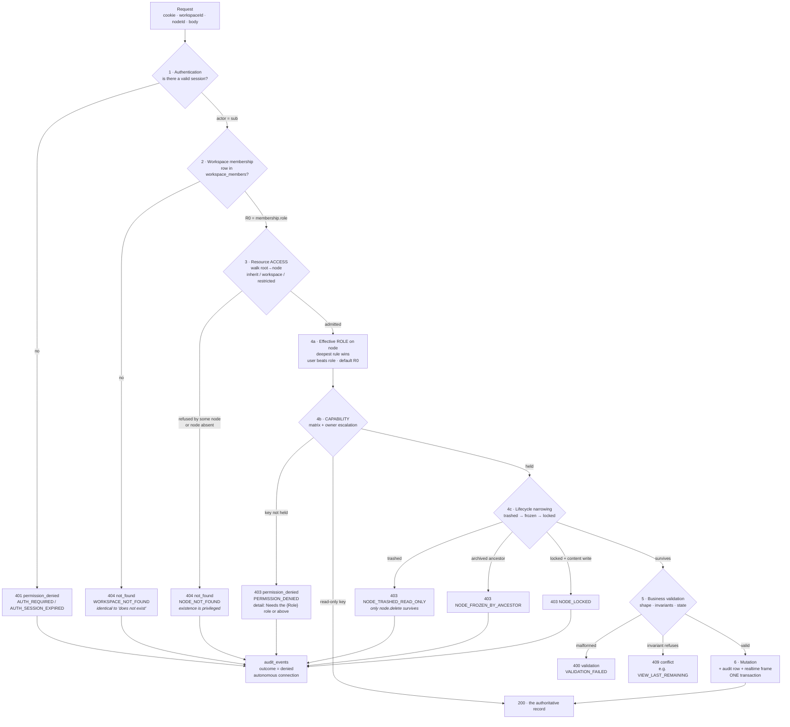
```mermaid
flowchart TD
    REQ["Request<br/>cookie · workspaceId · nodeId · body"] --> S1{"1 · Authentication<br/>is there a valid session?"}
    S1 -- no --> E401["401 permission_denied<br/>AUTH_REQUIRED / AUTH_SESSION_EXPIRED"]
    S1 -- "actor = sub" --> S2{"2 · Workspace membership<br/>row in workspace_members?"}

    S2 -- no --> E404W["404 not_found<br/>WORKSPACE_NOT_FOUND<br/><i>identical to 'does not exist'</i>"]
    S2 -- "R0 = membership.role" --> S3{"3 · Resource ACCESS<br/>walk root→node<br/>inherit / workspace / restricted"}

    S3 -- "refused by some node<br/>or node absent" --> E404N["404 not_found<br/>NODE_NOT_FOUND<br/><i>existence is privileged</i>"]
    S3 -- admitted --> S4["4a · Effective ROLE on node<br/>deepest rule wins<br/>user beats role · default R0"]

    S4 --> S5{"4b · CAPABILITY<br/>matrix + owner escalation"}
    S5 -- "key not held" --> E403["403 permission_denied<br/>PERMISSION_DENIED<br/>detail: Needs the {Role} role or above"]
    S5 -- "read-only key" --> OK
    S5 -- held --> S6{"4c · Lifecycle narrowing<br/>trashed → frozen → locked"}

    S6 -- trashed --> E403T["403 NODE_TRASHED_READ_ONLY<br/><i>only node.delete survives</i>"]
    S6 -- "archived ancestor" --> E403F["403 NODE_FROZEN_BY_ANCESTOR"]
    S6 -- "locked + content write" --> E403L["403 NODE_LOCKED"]
    S6 -- survives --> S7{"5 · Business validation<br/>shape · invariants · state"}

    S7 -- "malformed" --> E400["400 validation<br/>VALIDATION_FAILED"]
    S7 -- "invariant refuses" --> E409["409 conflict<br/>e.g. VIEW_LAST_REMAINING"]
    S7 -- valid --> S8["6 · Mutation<br/>+ audit row + realtime frame<br/>ONE transaction"]

    S8 --> OK["200 · the authoritative record"]

    E401 --> AUD["audit_events<br/>outcome = denied<br/>autonomous connection"]
    E404W --> AUD
    E404N --> AUD
    E403 --> AUD
    E403T --> AUD
    E403F --> AUD
    E403L --> AUD
```

#### 28.8.2 The same thing as prose, with the error each stage returns

**Stage 1 — Authentication.** Resolve the session (§8, part-01). The actor id, the client IP and
the clock all come from the session and the socket, never from the body (canon C-09;
`src/services/authz.ts:24-28`; `src/services/audit-service.ts:276-285`). No session on a protected
route → **401**, `code: "permission_denied"`, `reason: AUTH_REQUIRED`; an expired access token →
`AUTH_SESSION_EXPIRED` so the client knows to refresh. The frontend cannot distinguish 401 from 403,
which is why the refresh flow branches on `reason`.

**Stage 2 — Workspace membership.** `SELECT role FROM workspace_members WHERE workspace_id = :ws AND
user_id = :actor`. **No row is not "viewer"; it is "no".** `src/lib/workspace-access.ts:30-36`:
*"The role held, or null — never a default. A default here is a way in."* Refusal is **404**,
`WORKSPACE_NOT_FOUND` — *identical* to the answer for a workspace that does not exist, because
`workspaceAccess` returns the same shape for both *"so the URL cannot be used to learn which
workspaces exist"* (`workspace-access.ts:60-66`; `tests/workspace-access.test.ts:81-91`). The result
of this stage is `R0`, the caller's workspace role, used by gates 3 and 4.

**Stage 3 — Resource ACCESS.** §28.5. Refusal is **404**, `NODE_NOT_FOUND`, with the generic
name-free body. The node that refused is recorded in `context.gate` for the audit row and is
**never** returned (`visibility.ts:137-145`).

**Stage 4 — Permission / RBAC.** Three sub-steps that share one context:

- **4a, effective role.** §28.6. Walk the same chain and resolve `R` — replacement, not maximum,
  defaulting to `R0`.
- **4b, capability.** `roleHas(R, key) || ownerEscalation`. Refusal is **403**,
  `PERMISSION_DENIED`, `message` = `You do not have permission to {action}`, `detail` =
  `requirementFor(key)` = `Needs the {Role} role or above` (`src/services/authz.ts:67-74`;
  `evaluate.ts:169-176`). A read-only key returns ALLOW here and skips 4c.
- **4c, lifecycle narrowing.** Trashed → frozen → locked, in that order. Refusals are **403** with
  `NODE_TRASHED_READ_ONLY`, `NODE_FROZEN_BY_ANCESTOR` and `NODE_LOCKED` respectively (canon §4.3).
  These are 403 and not 404: the caller can see the thing, they simply may not do this to it.

**Stage 5 — Business validation.** Shape, enums, ranges, referential existence, and the invariants
that are not permissions: `WORKSPACE_LAST_ADMIN`, `VIEW_LAST_REMAINING`, `ROW_PARENT_CYCLE`,
`COLUMN_PRIMARY_PROTECTED`, `SECRET_KEY_DUPLICATE`, and so on. **400** for a malformed request
(`VALIDATION_FAILED`, with `fields: FieldError[]`), **409** for an invariant that refuses a
well-formed one. This stage runs **after** authorization on purpose: a validation message is a
richer oracle than a refusal, and handing one to somebody who may not touch the resource leaks the
resource's shape.

**Stage 6 — Mutation.** The write, its audit row and its realtime frame, in **one transaction**
(§29.9). The response is the authoritative record (canon C-10), never `204` where the frontend
expects an object.

#### 28.8.3 Why a denied resource answers 404 and not 403

**This is the rule, stated once, because it is the most commonly mis-implemented line in the
chapter.**

| Situation | Status | Reason | Why |
| --- | --- | --- | --- |
| No session | 401 | `AUTH_REQUIRED` | Nothing has been named yet. |
| Workspace does not exist | 404 | `WORKSPACE_NOT_FOUND` | — |
| Workspace exists, caller is not a member | **404** | `WORKSPACE_NOT_FOUND` | **Identical to the row above.** Otherwise the URL enumerates which workspaces are real. |
| Node does not exist | 404 | `NODE_NOT_FOUND` | — |
| Node exists, gate 3 refuses | **404** | `NODE_NOT_FOUND` | **Identical to the row above.** A 403 here confirms the existence and the id of a folder somebody was deliberately shut out of. |
| Node exists, caller can see it, lacks the key | **403** | `PERMISSION_DENIED` | The caller already knows the resource exists — they are looking at it. Telling them which role they would need is useful and leaks nothing. |
| Node exists, caller can see it, node is trashed/frozen/locked | **403** | `NODE_TRASHED_READ_ONLY` / `NODE_FROZEN_BY_ANCESTOR` / `NODE_LOCKED` | Same reasoning. The state is already visible on the surface. |

The frontend already reasons this way at the workspace level
(`src/components/workspace/workspace-guard.tsx:20-27`) and at the node level
(`visibility.ts:137-145`, `tests/permissions.test.ts:157-167` asserts the refusal text does not
contain the node name).

**The 403 body, when the caller may see the resource** (`src/services/authz.ts:73`):

```jsonc
// 403 POST /api/v1/boards/{boardId}/columns
{
  "error": {
    "code": "permission_denied",
    "message": "You do not have permission to add a column",
    "detail": "Needs the Manager role or above",
    "isRetryable": false,
    "reason": "PERMISSION_DENIED",
    "requestId": "01JB9…"
  }
}
```

**The 404 body, when existence itself is the secret.** Use the fixed `not_found` template and
nothing else (canon §4.4 rule 2):

```jsonc
// 404 GET /api/v1/nodes/{nodeId}
{
  "error": {
    "code": "not_found",
    "message": "That item could not be found",
    "isRetryable": false,
    "reason": "NODE_NOT_FOUND",
    "requestId": "01JB9…"
  }
}
```

Where a surface is *known* to be a share-request flow rather than an enumeration risk, the frontend
has a second string it renders instead — `DENIED_REASON`, *"You do not have access to this item. Ask
somebody who does to share it with you."* (`evaluate.ts:155-167`). That is a **client-side** panel
built from context the client already has; it is not what the API returns for a gate-3 refusal, and
an API that returned it would be confirming the resource exists.

**Message-writing rules the whole pipeline obeys** (canon §4.4, `evaluate.ts:155-163`):

1. `message` is rendered to the user verbatim; it is a sentence, sentence-cased.
2. `not_found` messages are always `` `${what} could not be found` `` — a fixed template.
3. **A refusal must never name something the caller was denied.** No node name, no folder name, no
   secret key, no member name, no rule id.
4. `detail` is the secondary line — what to do about it. Omitted, not `null`, when absent.
5. `isRetryable` is `false` for every refusal in this pipeline.

#### 28.8.4 Timing and side-channels

Stages 2 and 3 both answer 404 with the same body, but they do different amounts of work. A
`WORKSPACE_NOT_FOUND` returned after one index probe and a `NODE_NOT_FOUND` returned after a
recursive CTE are distinguishable by latency. **RECOMMENDATION:** this is acceptable — the
distinction leaks "you are not in this workspace" versus "you are in it and cannot see that node",
which the caller already knows from the rest of the session. Do **not** add artificial delay. Do
ensure the two bodies are byte-identical apart from `reason` and `requestId`, and that `reason` is
never used by a client to branch (it is additive; the frontend ignores it — canon §4.1).

---

### 28.9 Where enforcement belongs

#### 28.9.1 The rule

**Every rule the frontend checks must be re-checked server-side, per call, per node.** The frontend
says it in three places (quoted at the head of this chapter) and `docs/GOVERNANCE.md:326-330` lists
it as the first backend obligation: *"Enforcement of all keys, per call, per node."*

#### 28.9.2 `src/services/authz.ts` is the model to copy

The frontend already built the shape of the check. It is 75 lines and the backend's middleware
should be structurally identical:

```ts
// src/services/authz.ts:35-74 — the model, transcribed
/** The caller's effective role on a node, through the inheritance chain. */
function contextFor(nodeId: string | null) {
  const workspace = selectActiveWorkspace(useWorkspaceStore.getState());
  const tree  = getFullTree();
  const rules = usePermissionStore.getState().rulesByWorkspace[workspace.id] ?? {};

  const { role } = effectiveAccess(
    { tree, nodeId, rules, members: workspace.members },
    { kind: "user", userId: CURRENT_USER.id },       // ← resolved, never an argument
  );

  return {
    role,
    user: CURRENT_USER,
    node: nodeId ? findNodeById(tree, nodeId) : null,
    isFrozen: inheritedArchiveOf(tree, nodeId) !== null,
  };
}

/** Whether the caller holds `key` on `nodeId`. Never throws. */
export function callerCan(nodeId: string | null, key: PermissionKey): boolean {
  return can(key, contextFor(nodeId));
}

/** Refuse the call unless the caller holds `key` on `nodeId`. */
export function requirePermission(nodeId: string | null, key: PermissionKey, action: string): void {
  if (callerCan(nodeId, key)) return;
  throw permissionDenied(`You do not have permission to ${action}`, requirementFor(key));
}
```

Four properties to carry over verbatim:

1. **It resolves the caller itself rather than taking a role as an argument.**
   `src/services/authz.ts:24-28`: *"A role the client sends is a claim, not a fact, and an endpoint
   that trusts one is not enforcing anything — it is asking the caller how much access they would
   like."*
2. **It runs the same evaluator the UI runs** — one matrix, one inheritance chain, one `can` —
   *"so a control that is offered and a call that is accepted cannot drift apart the way two copies
   of a rule always eventually do"* (`authz.ts:18-22`). Ship the catalogue from E-045 and the matrix
   from one place so this stays true across a backend rewrite.
3. **It takes a `nodeId`, always.** A workspace-scoped check passes `null`; everything else names
   the node the action lands on. There is no global permission check in this system.
4. **Two entry points, not one.** `callerCan` for shaping a response (which capabilities to report,
   which rows to include); `requirePermission` for refusing a call. A handler that only ever throws
   cannot build a `CapabilitySet`.

The module also states its own honest caveat (`authz.ts:29-33`): *"there is no server here. This
module reads the same process's stores, so it is a faithful model of the check a real API must make,
not a substitute for it."*

#### 28.9.3 What the frontend actually gates today — the eleven call sites, and the gap

Every `requirePermission` / `callerCan` in `src/services/`:

| # | File:line | Key | Action string |
| --- | --- | --- | --- |
| 1 | `src/services/board-service.ts:564` | `board.column.create` | `add a column` |
| 2 | `src/services/board-service.ts:600` | `board.column.create` | `duplicate a column` |
| 3 | `src/services/board-service.ts:653` | `board.column.update` | `change this column` |
| 4 | `src/services/board-service.ts:672` | `board.column.update` | `reorder columns` |
| 5 | `src/services/board-service.ts:687` | `board.column.delete` | `delete this column` |
| 6 | `src/services/board-service.ts:728` | `board.column.update` | `change this column's type` |
| 7 | `src/services/board-service.ts:865` | `board.view.manage` | `reorder views` |
| 8 | `src/services/board-service.ts:1189` | `board.import` | `import into this board` |
| 9 | `src/services/devtools-service.ts:148` | `document.update` | `edit this config document` |
| 10 | `src/services/devtools-service.ts:316` | `secret.reveal` (via `mayUnlock`) | reveal / copy |
| 11 | `src/services/devtools-service.ts:316` | `secret.rotate` (via `mayUnlock`) | rotate |

**Eleven checks against 140 endpoints.** That is canon **OQ-16** — *"40+ write operations carry no
permission check in the mock"* — and canon's position is unambiguous: *"Every write is gated
server-side with the catalogue key the matrix defines."* The **Perm** column of canon §3 is
normative; §28.3.3 above names the key for every one of the 39.

The five inputs the mock takes from the caller and the server must resolve instead (canon OQ-17 –
OQ-21, part-01 §8.7):

| Input | Taken from the caller today | Must come from |
| --- | --- | --- |
| `userId` | `WatchService.list/set`, `NotificationService.*`, `MyWorkInput.userId` (`src/services/my-work-service.ts:47-48`), `SearchInput.user` (`src/services/search-service.ts:45-48`) | the session (`sub`) |
| `role` | `SearchInput.role`, `RevealInput.role` (`src/services/devtools-service.ts:322-327`) | `workspace_members` + the chain; a declared role may only **narrow** (§28.11) |
| Node visibility | `ListFilesInput.canView` (`src/services/file-service.ts:96`, `:105`, `:113`) | gate 3, server-side |
| IP | never sent (correct today) | the socket / a trusted proxy header |
| The clock | `MOCK_NOW` (`src/config/app.ts:10`) | `now()` |

Two specific holes worth naming because they are cross-resource:

- **`bulkMove` (E-077) gates neither board and does not verify the target is a board** (OQ-17). It
  must require `row.delete` on the **source** node and `row.create` on the **target** node, and
  refuse `BULK_TARGET_NOT_A_BOARD` (409) when `targetNodeId` does not address a board.
- **Search (E-133) must run the permission funnel before scanning, not after** (canon §3.22). A
  ranked list truncated after filtering is a different list from one filtered after ranking, and the
  cheap version leaks the existence of matches through result counts.

#### 28.9.4 Caching, and why revocation must not wait for a TTL

`SY-RBC-42` budgets `p99 < 10ms` for the check, which invites a cache. If gate 2/3/4a results are
cached:

- key it by **`(workspaceId, userId)`**, never by `(nodeId)` alone;
- bust it on **every** `workspace_members` write (E-013 – E-016), **every** `access_rules` write
  (E-042, E-043), **every** `nodes.access_mode` write (E-041), and **every node move** (E-026);
- publish **RT-05 `permission.changed`** in the same transaction.

*"Revocation that takes effect on the next cache expiry is not revocation."* The realtime frame is
not optional either: without it a revoked user keeps a loaded board on screen until they reload
(`src/hooks/use-access-sync.ts:19-91`), and `SY-RBC-42`'s own edge case requires the opposite —
*"Người dùng bị hạ quyền khi đang mở màn hình: UI tự động vô hiệu hóa các nút chức năng bị khóa."*

The frame carries **ids only** (`src/types/realtime.ts:20-32`):

```ts
| {
    readonly type: "permission.changed";
    readonly workspaceId: string;
    /** Null when the change is workspace membership rather than one node. */
    readonly nodeId: string | null;
    readonly userIds: readonly string[];
  }
```

*"Carries no resource content on purpose — a frame announcing a revocation must not be the thing
that leaks what was revoked."*

---

### 28.10 The capability projection (`CapabilitySet`)

Six coarse flags that older surfaces branch on. They are a **projection** of the catalogue, not a
parallel rule set — *"so `capabilities.edit` and `can('row.update')` can never disagree"*
(`evaluate.ts:116-132`).

```ts
// src/types/permission.ts:109-127
export type Capability = "view" | "edit" | "upload" | "delete" | "share" | "manage";
export type CapabilitySet = Readonly<Record<Capability, boolean>>;

export const NO_CAPABILITIES: CapabilitySet = {
  view: false, edit: false, upload: false, delete: false, share: false, manage: false,
};
```

```ts
// src/lib/permissions/evaluate.ts:121-132
export function capabilitiesFor(context: PermissionContext): CapabilitySet {
  const resolve = resolverFor(context);
  return {
    view:   true,                              // ← see the warning below
    edit:   resolve(editKeyFor(context.node)),
    upload: resolve("file.upload"),
    delete: resolve("node.delete"),
    share:  resolve("node.share"),
    manage: resolve("node.archive"),
  };
}
```

`editKeyFor` (`evaluate.ts:103-114`) — one word, four permissions:

| Node kind | `edit` resolves to |
| --- | --- |
| `document` (page, config or secret) | `document.update` |
| `file` | `file.update` |
| `board` | `row.update` |
| `project` / `folder` | `node.rename` |
| no node at all | `row.update` |

**`view: true` is hard-coded, and the backend must not copy that literal.** In the frontend it is
correct because by the time `can()` runs, gate 2 has already admitted the node. On the server,
`view` **is** gate 2 — compute it. An endpoint that reports `view: true` unconditionally has
inverted the meaning of the field.

Two narrowing helpers the response shaping must mirror:

```ts
// src/lib/permissions/evaluate.ts:94-101 — a node archived in its OWN right
export function frozenResolver(resolve: PermissionResolver): PermissionResolver {
  return (key: PermissionKey) => (isWrite(key) ? false : resolve(key));
}

// src/lib/permissions/evaluate.ts:134-141
export function documentCapabilities(
  base: CapabilitySet,
  document: Pick<WorkspaceDocument, "isLocked" | "isArchived">,
): CapabilitySet {
  if (!document.isLocked && !document.isArchived) return base;
  return { ...base, edit: false, upload: false };
}

// src/lib/archive.ts:47-50 — identical shape for an inherited freeze
export function archivedCapabilities(base: CapabilitySet): CapabilitySet {
  return { ...base, edit: false, upload: false };
}
```

The distinction between `frozenResolver` and `can` is the subtle one:
`tests/rbac.test.ts:170-182` asserts that on a node archived **in its own right**, `can("node.archive")`
is **true** (so Restore can be offered) while the *surface's* wrapped resolver reports **false** for
every write — and `board.export` stays **true** through both. Reproduce this in the response, not in
the authorization decision: E-044's `manage` flag for a self-archived node should still be `true`,
and E-030/E-031 must still accept the call.

---

### 28.11 Role preview

#### 28.11.1 EXISTING REQUIREMENT — preview can only ever narrow

```ts
// src/hooks/use-permissions.ts:49-57
/**
 * Previewing narrows, never widens. A member previewing as admin still sees a
 * member's app — otherwise the preview would be a privilege escalation with a
 * dropdown in front of it.
 */
function clamp(real: WorkspaceRole, preview: WorkspaceRole | null): WorkspaceRole {
  if (preview === null) return real;
  return roleRank(preview) < roleRank(real) ? preview : real;
}
```

Effective role = **`min(real, preview)`** by rank. Applied to the workspace role
(`use-permissions.ts:67-72`) and to the resolved node role (`:83-100`).

State lives in `src/store/permission-store.ts:23-31` as `previewRole: WorkspaceRole | null`, is
initialised to `null` (`:47-51`), is **never persisted**, and is set from the dialog footer
(`src/components/permissions/permission-dialog.tsx:162-186`) with a standing banner offering an exit
(`src/components/permissions/role-preview-banner.tsx:9-15`).

`docs/GOVERNANCE.md:358-359`: *"Role preview is not a session switch. It narrows what the interface
offers; it does not re-authenticate, and a reload clears it."*

#### 28.11.2 What the backend MUST do

1. **Never accept a role as authority.** Resolve `R` from `workspace_members` and the chain, per
   request. A role in a body or a header is a claim.
2. **Where a role is declared, treat it as an additional narrowing input only.** Compute
   `effective = min(serverResolvedRole, declaredRole)`. Never `max`, never `declaredRole` alone.
   The one place the frontend passes a role across a service boundary models this as **two checks
   that must both pass** (`src/services/devtools-service.ts:302-317`):

```ts
/**
 * `role` is the role the *client* is running as, which includes the role
 * preview — a workspace admin reading the app as a member has to be refused,
 * or the preview would be a demo rather than a check. It can only ever narrow.
 *
 * `callerCan` is the real one: the signed-in user's effective role on this
 * node, resolved from the store rather than taken from the request.
 */
function mayUnlock(nodeId: string, role: WorkspaceRole, key: "secret.reveal" | "secret.rotate") {
  return roleHas(role, key) && callerCan(nodeId, key);
}
```

3. **Ignore a declared role that is higher, do not reject it.** Canon OQ-21's position: *"A declared
   role that is higher than the server's must be ignored, not rejected — rejecting would let a stale
   tab break rather than degrade."* Canon §4.3 registers `PREVIEW_ROLE_ESCALATES` (400,
   `validation`) for the strict alternative; **this specification never emits it**, and a
   deployment that turns on strict validation must do so behind a flag. See the editor note.
4. **A preview must never change what is audited.** A `secret.reveal` refused because of a preview
   is still a refusal and is still recorded, with `outcome: "denied"` and `severity: "error"`
   (`devtools-service.ts:341-348`; `tests/audit.test.ts:223-242`). The audit row records the
   **real** actor and the **server-resolved** role in `context`; the declared role goes in
   `context` too, never in `detail`.

#### 28.11.3 What the backend MUST NOT do

- **Do not build a server-side "acting as" session mode.** No impersonation state, no
  `POST /sessions/preview`, no role claim in the access token. `docs/GOVERNANCE.md:358-359` is
  explicit that preview is not a session switch, and part-01 R-4 keeps every role out of the token
  precisely so that adding a fifth role later is a matrix change and not a session change.
  *"A server that maintains 'acting as' session state is one bug away from an escalation
  primitive."*
- **Do not let preview widen anything, ever** — not a list, not a count, not a capability flag, not
  a facet.
- **Do not persist it.** It dies with the tab, by design.

**Transport, decided.** Canon does not register a preview parameter on any endpoint except the
existing `role` field on the secret reveal/copy requests. **RECOMMENDATION:** if a transport is
needed, accept an `X-Preview-Role: <WorkspaceRole>` request header, apply the `min` rule, and
document it as advisory. A header is right rather than a body field because it applies uniformly to
`GET`s and never becomes part of a resource representation. Do **not** add `previewAs` to request
bodies, where it would be indistinguishable from a real field on a create.

---

### 28.12 Endpoints

E-040 (`GET /nodes/{nodeId}/access`), E-041 (`PUT /nodes/{nodeId}/access-mode`), E-042
(`PUT /nodes/{nodeId}/access-rules`) and E-043 (`DELETE /nodes/{nodeId}/access-rules/{ruleId}`) are
specified in **§11, Folder APIs** (part-07) and are not repeated here. The three that belong to this
chapter follow.

#### 28.12.1 `GET /api/v1/nodes/{nodeId}/capabilities`

**Purpose** — The six coarse flags for one node, resolved for this caller through the full pipeline,
so a surface can decide what to render without re-deriving the rules or shipping the rule engine to
the client. It is the read that makes `usePermissions` / `useCapabilities` honest against a real
server.

**Authentication** — Required.

**Permission** — **Visibility only** (gates 1–3). No catalogue key. Reaching this endpoint means the
caller can see the node; the response then says what they may do with it. Canon E-044 lists the
permission as `visibility`.

**Path Params**

| Name | Type | Description |
| --- | --- | --- |
| `nodeId` | UUID | Any node of any kind. The projection's `edit` key varies by kind (§28.10). |

**Query Params** — None.

**Request Body** — None.

**Response** — `CapabilitySet`, `200`. Canon §5.2 lists `CapabilitySet` as an EXISTING domain
interface; it is returned **bare**, with no envelope (canon §6.2).

```ts
/** src/types/permission.ts:116-118 — returned verbatim. */
type Capability = "view" | "edit" | "upload" | "delete" | "share" | "manage";
type CapabilitySet = Readonly<Record<Capability, boolean>>;
```

```jsonc
// 200 GET /api/v1/nodes/{nodeId}/capabilities
// A Member who owns an unlocked, unarchived board.
{
  "view":   true,     // gate 2 said yes, which is why this response exists at all
  "edit":   true,     // row.update — the board's edit key
  "upload": true,     // file.upload
  "delete": true,     // node.delete, held here only by owner escalation
  "share":  true,     // node.share
  "manage": false     // node.archive — owner-escalated, so actually true here too
}
```

**How each flag is computed** — run the pipeline once, then evaluate six keys against the resulting
context:

| Flag | Key | Note |
| --- | --- | --- |
| `view` | *(none)* | **Gate 2's answer.** Do not hard-code `true` — see §28.10. |
| `edit` | `editKeyFor(node.kind)` | `document.update` / `file.update` / `row.update` / `node.rename` |
| `upload` | `file.upload` | content write |
| `delete` | `node.delete` | owner-escalated |
| `share` | `node.share` | Member key |
| `manage` | `node.archive` | owner-escalated |

Then apply the narrowing the surfaces apply: if the node is **frozen by an ancestor**,
`archivedCapabilities` clears `edit` and `upload`; if it is a document that is **locked or archived
in its own right**, `documentCapabilities` clears the same two
(`src/hooks/use-permissions.ts:130-137`, `evaluate.ts:134-141`). Note the asymmetry deliberately
preserved: a node archived in its own right keeps `manage: true`, because Restore has to remain
offerable.

**Database**

| Table | Operation | Detail |
| --- | --- | --- |
| `workspace_members` | READ | Gate 1: `(workspace_id, user_id)` → `role`. Unique index `workspace_members_pkey`. One row. |
| `nodes` | READ | The recursive chain root → node: `id, parent_id, workspace_id, access_mode, owner_id, is_archived, deleted_at, kind, is_locked`. Index `nodes_parent_idx`. Depth-bounded at 64. |
| `access_rules` | READ | `WHERE node_id = ANY(:chain) AND (subject_user_id = :actor OR (subject_kind='role' AND subject_role = :R0))`. Index `access_rules_workspace_node_idx (workspace_id, node_id)`. |

Cardinality: 1 membership row, ≤ 64 chain rows, ≤ 2 rules per chain node (one user-scoped, one
role-scoped — the two partial unique indexes guarantee it). No writes.

**Transaction** — Not required. It is a read; a single `REPEATABLE READ` snapshot is enough to keep
the chain and the rules consistent with each other.

**Realtime** — None emitted. The client refetches this on **RT-05 `permission.changed`** when
`userIds` contains it and `nodeId` is null or matches.

**Possible Errors**

| HTTP | Code | Reason |
| --- | --- | --- |
| 401 | `permission_denied` | `AUTH_REQUIRED` — no session. |
| 404 | `not_found` | `WORKSPACE_NOT_FOUND` — the node's workspace, and the caller is not a member. |
| 404 | `not_found` | `NODE_NOT_FOUND` — unknown node **or** gate 3 refused it. |
| 500 | `unknown` | `INTERNAL_ERROR` |

Note what is **not** on that list: there is no 403. Every refusal at or before gate 3 is a 404, and
gates 4–6 do not run — a capability the caller lacks is reported as `false`, not as an error.

**Frontend Used By** — `src/hooks/use-permissions.ts:130-137` (`useCapabilities`), consumed by
`src/components/drive/drive-view.tsx:52`, `src/components/drive/drive-toolbar.tsx:73`,
`src/components/document/document-page.tsx:38`, `src/components/devtools/config-document-page.tsx:34`,
`src/components/files/file-preview-dialog.tsx:33`, `src/hooks/use-file-catalog.ts:40`,
`src/hooks/use-document.ts:50` and `src/components/layout/sidebar/new-item-menu.tsx:30` (with no
node, for the workspace-level Create menu).

**RECOMMENDATION — batch it.** Six flags per node, one CTE per call, and the drive grid renders a
hundred nodes. Either fold `capabilities` into the `DriveNode` payload of E-020 / E-023 (the chain
is already walked to prune the tree, so the marginal cost is the six `roleHas` lookups), or accept
`?nodeIds=` here and return `Record<nodeId, CapabilitySet>`. Canon registers neither; the first is
additive to an existing response and is the cheaper change.

#### 28.12.2 `GET /api/v1/permissions/catalog`

**Purpose** — The static 39-key catalogue, served from the backend so the matrix the UI renders and
the matrix the API enforces cannot drift apart. It is the list a reviewer checks an implementation
against.

**Authentication** — Required (any session). It is not workspace-scoped: the catalogue is identical
for every tenant.

**Permission** — None beyond a session. Canon E-045 lists the permission as `session`. The catalogue
is a description of the product's vocabulary and grants nothing; `src/components/permissions/role-matrix.tsx`
renders it to anybody who can open the dialog, including a Viewer.

**Path Params** — None.

**Query Params** — None. The response is small (39 entries, ~4 KB) and is not paginated
(canon §6.3: "bounded by construction").

**Request Body** — None.

**Response** — `readonly PermissionDefinition[]`, `200`, bare. **In `PERMISSION_KEYS` source order**
(`src/types/permission.ts:31-78`), which is also `PERMISSION_MODULES` order, which is the order the
matrix renders in.

```ts
/** src/types/permission.ts:101-107 — EXISTING. Not re-scoped. */
interface PermissionDefinition {
  readonly key: PermissionKey;          // one of the 39
  readonly module: PermissionModule;    // DERIVED from key.slice(0, key.indexOf("."))
  /** Imperative label for the matrix row: "Create columns". */
  readonly label: string;
  readonly summary: string;
}
```

```jsonc
// 200 GET /api/v1/permissions/catalog  — first three of thirty-nine
[
  { "key": "workspace.manage",
    "module": "workspace",
    "label": "Manage workspace",
    "summary": "Rename the workspace, change its plan and settings" },
  { "key": "workspace.settings.view",
    "module": "workspace",
    "label": "Open workspace settings",
    "summary": "See the workspace settings screen at all" },
  { "key": "workspace.member.manage",
    "module": "workspace",
    "label": "Manage members",
    "summary": "Invite people and change what role they hold" }
]
```

**Cacheability** — The payload changes only on deploy. Serve it with
`Cache-Control: public, max-age=3600` and a build-stamped `ETag`. It contains no tenant data and no
caller data, so a shared cache is safe. (Canon §7.5 in part-01 says the API has no `ETag` layer;
this endpoint is the one place where one is worth the exception, and it is optional.)

**Database** — **None.** The catalogue is a service constant, not a table. Canon §1.2 lists
`permission_definitions` among the tables that deliberately do not exist: *"The 39-key catalogue is
static config shipped from the backend, not a table."* A row store would be a second copy of a rule
the code already owns, and the two would drift the first time a key was added.

**Transaction** — Not required.

**Realtime** — None.

**Possible Errors**

| HTTP | Code | Reason |
| --- | --- | --- |
| 401 | `permission_denied` | `AUTH_REQUIRED` |
| 500 | `unknown` | `INTERNAL_ERROR` |

**Frontend Used By** — `src/lib/permissions/catalog.ts:70-77` (`PERMISSIONS`, `PERMISSION_BY_KEY`)
and `permissionsByModule()` (`:102-112`), rendered by
`src/components/permissions/role-matrix.tsx:57-100` and used for audit-row labels by
`src/lib/audit.ts:42-49` (`auditActionLabel`). The frontend holds it as a local constant today; the
endpoint exists so that stops being true.

**The role matrix itself is not on this endpoint.** `PermissionDefinition` carries no `heldBy`, and
canon §5.2 forbids re-scoping an existing domain interface. The four role sets therefore remain
service config on both sides, identical to `src/lib/permissions/roles.ts`.

**RECOMMENDATION — assert the two copies agree at deploy time.** Ship a startup check that the
accumulated backend sets satisfy (a) containment across the ladder, (b) `|viewer| = 0`,
`|member| = 10`, `|manager| = 31`, `|admin| = 39`, and (c) every key in `PERMISSION_KEYS` is held by
at least one role (`minimumRoleFor(key) !== null`, asserted at `tests/rbac.test.ts:119-123`). Those
three assertions catch every drift a shared endpoint would have caught. If the editor prefers to
serve the matrix, the additive shape is a sibling endpoint returning
`{ role, label, summary, rank, keys }[]` — see the editor note.

#### 28.12.3 `GET /api/v1/workspaces/{workspaceId}/restricted-nodes`

**Purpose** — The admin recovery console: every restricted node in the workspace, **whether or not
the caller can see it**. It exists so a node can never be locked beyond recovery — a folder whose
last grantee leaves and whose owner has gone would otherwise be unreachable forever.

**This is the one read in the entire system that deliberately looks past gate 3**, and the trade is
stated in the product rather than hidden (`src/lib/permissions/visibility.ts:270-278`,
`src/components/workspace/workspace-restricted-tab.tsx:15-30`):

> An admin sees **that** a restricted node exists, what it is called and where it sits — and nothing
> inside it. They still do not appear in its access list, they are still not counted as a member of
> it, and the tree, search, favourites and every other surface still hide it from them until
> somebody grants it. The alternative — an admin implicitly inside every restricted folder — makes
> "restricted" mean "restricted unless you outrank it", which is not a promise anybody can rely on.

**Authentication** — Required.

**Permission** — `workspace.permission.manage` (Admin only), plus workspace membership. There is no
node-scoped alternative: `node.access.manage` is **not** accepted here, because a Manager holding it
on one folder must not be able to enumerate every restricted node in the tenant.

**Path Params**

| Name | Type | Description |
| --- | --- | --- |
| `workspaceId` | UUID | The tenant. Gate 2 applies; a non-member gets `WORKSPACE_NOT_FOUND`. |

**Query Params**

| Name | Type | Required | Default | Description |
| --- | --- | --- | --- | --- |
| `limit` | integer | no | 200 | Hard server cap 500. Unpaginated by construction — canon §6.3 puts this in the "bounded" class; the partial index it reads is tiny. |

**Request Body** — None.

**Response** — `readonly RestrictedNodeEntry[]`, `200`.

Canon E-046 says the response is `DriveNode[]`. **Returning a full `DriveNode` here would violate
the endpoint's own contract**: `DriveNode` carries `excerpt`, `blockCount`, `itemCount`,
`openCount`, `previewUrl`, `thumbnailUrl` and `children` — content about a node the caller is not
allowed to see. This specification returns the narrow shape the surface actually renders and flags
the divergence for the editor.

```ts
/** RECOMMENDATION. Names and paths and nothing else. */
interface RestrictedNodeEntry {
  readonly nodeId: string;
  readonly name: string;
  /** `Development / Backend` — the ancestor path, resolved server-side.
   *  "Workspace root" when the node is top-level. `src/lib/tree.ts:74-78`. */
  readonly path: string;
  readonly kind: NodeKind;                 // project | folder | document | board | file
  /** How many subjects are granted here, owner excluded.
   *  `grantedSubjectsOn(rules, nodeId).length`, visibility.ts:104-107. */
  readonly grantedCount: number;
  /** Whether THIS caller can already see it, so the console can say so. */
  readonly isVisibleToCaller: boolean;
}
```

```jsonc
// 200 GET /api/v1/workspaces/{workspaceId}/restricted-nodes
[
  { "nodeId": "b22f…", "name": "Payroll",          "path": "Development / Backend",
    "kind": "folder", "grantedCount": 3, "isVisibleToCaller": false },
  { "nodeId": "c33a…", "name": ".env.production",  "path": "Development / Backend / Payment",
    "kind": "file",   "grantedCount": 1, "isVisibleToCaller": false }
]
```

**Explicitly absent from the payload, and it must stay absent:** children, excerpts, block counts,
row counts, file sizes, preview or thumbnail URLs, the granted subjects' identities, and the node's
own `owner`. Names, paths and a count. Nothing else.

**Database**

| Table | Operation | Detail |
| --- | --- | --- |
| `workspace_members` | READ | Gate 1 + the `workspace.permission.manage` check (`role = 'admin'`). |
| `nodes` | READ | `WHERE workspace_id = :ws AND access_mode = 'restricted' AND deleted_at IS NULL` → `id, name, kind, parent_id`. Partial index `nodes_restricted_idx (workspace_id) WHERE access_mode = 'restricted' AND deleted_at IS NULL` — most workspaces have a handful. |
| `nodes` | READ | The ancestor chain of each hit, for `path`. Batch it: one recursive CTE seeded with all hit ids, not one per row. |
| `access_rules` | READ | `SELECT node_id, count(*) FROM access_rules WHERE node_id = ANY(:hits) GROUP BY node_id` for `grantedCount`. |
| `audit_events` | **WRITE** | **One row, always.** See below. |

**Transaction** — **Required**, and this is the unusual part: a `GET` that writes. The audit row and
the read must be atomic, so a listing that reaches the caller is always accompanied by a record that
it did. Part-01 §7.8 already carves this out: *"Safe and idempotent. Never mutates, never audits —
with one deliberate exception: `GET /workspaces/{workspaceId}/restricted-nodes` (E-046) writes an
audit row at `warn`."*

**Audit** — module `workspace`, action `workspace.permission.manage`, severity **`warn`**,
`outcome: "allowed"`, `target: "Restricted items"`,
`detail: "Listed every restricted item in the workspace."`,
`context: { kind: "system", job: "restricted_nodes_listing" }`. A refusal is audited too, at
`error` / `denied`. Rationale, canon OQ-26: the console promises that *"granting yourself access is
recorded in the audit log"* (`workspace-restricted-tab.tsx:56-60`) — the grant is, and without this
row the **listing** is not, so an admin could enumerate every restricted folder and leave no trace.

**Realtime** — None.

**Possible Errors**

| HTTP | Code | Reason |
| --- | --- | --- |
| 401 | `permission_denied` | `AUTH_REQUIRED` |
| 403 | `permission_denied` | `PERMISSION_DENIED` — not `workspace.permission.manage`. `detail`: `Needs the Admin role or above`. **Audited at `error` / `denied`.** |
| 404 | `not_found` | `WORKSPACE_NOT_FOUND` — unknown workspace, or one the caller is not in. |
| 500 | `unknown` | `INTERNAL_ERROR` |

A 403 rather than a 404 on the permission failure is correct here: the caller is a member and the
workspace's existence is not the secret. The *contents* of the list are, and they are not returned.

**Frontend Used By** — `src/hooks/use-workspace-access.ts:105-117` (`useRestrictedNodes`), rendered
by `src/components/workspace/workspace-restricted-tab.tsx:36-92`, which computes `path` via
`pathLabel(tree, node.id)` (`src/lib/tree.ts:74-78`) and `granted` via
`grantedSubjectsOn(rules, node.id).length` (`src/lib/permissions/visibility.ts:104-107`) — both of
which move server-side, because the client will not have the full tree.

The tab's "Manage access" button opens `NodeAccessDialog` on a node the admin may not be able to
see, which resolves through E-040 → E-042. **E-040 and E-042 must therefore accept
`workspace.permission.manage` as an alternative to gate 3 for this one flow.** That is already the
disjunction the frontend uses (`src/hooks/use-node-access.ts:80`), and every grant it writes is an
ordinary audited rule write (§29.6).

---

### 28.13 The governance data model, recapped

The DDL is owned by §4 (part-03) for `nodes`, `workspace_members` and `access_rules`, and by §4
(part-05) for `audit_events`. Repeated here in compressed form because a reviewer reading this
chapter first should not have to page back.

```sql
-- documentation only — the four objects §28 depends on

CREATE TYPE workspace_role      AS ENUM ('viewer', 'member', 'manager', 'admin');  -- order = rank
CREATE TYPE node_access_mode    AS ENUM ('inherit', 'workspace', 'restricted');
CREATE TYPE access_subject_kind AS ENUM ('user', 'role');
CREATE TYPE access_source       AS ENUM ('workspace', 'inherited', 'explicit', 'override');
--   access_source is the vocabulary of the READ MODEL. It is NOT a column;
--   it is derived per request by inheritance.ts:108-119.

-- workspace_members  (T-04) — the outermost gate
--   PK (workspace_id, user_id); role workspace_role NOT NULL; joined_at TIMESTAMPTZ NOT NULL
--   "not a member" is the absence of a row, never role='viewer'

-- nodes  (T-06) — the two governance columns
ALTER TABLE nodes
  ADD COLUMN access_mode node_access_mode NOT NULL DEFAULT 'inherit',
  ADD COLUMN owner_id    UUID             NOT NULL REFERENCES users(id) ON DELETE RESTRICT;

CREATE INDEX nodes_owner_idx      ON nodes (workspace_id, owner_id);
CREATE INDEX nodes_restricted_idx ON nodes (workspace_id)
       WHERE access_mode = 'restricted' AND deleted_at IS NULL;

-- access_rules  (T-08) — one grant, one node, one subject
CREATE TABLE access_rules (
  id              UUID PRIMARY KEY DEFAULT gen_random_uuid(),
  workspace_id    UUID                NOT NULL,
  node_id         UUID                NOT NULL,
  subject_kind    access_subject_kind NOT NULL,
  subject_user_id UUID REFERENCES users(id) ON DELETE RESTRICT,
  subject_role    workspace_role,
  role            workspace_role      NOT NULL,
  granted_at      TIMESTAMPTZ         NOT NULL DEFAULT now(),
  granted_by      UUID                NOT NULL REFERENCES users(id) ON DELETE RESTRICT,

  CONSTRAINT access_rules_node_fk FOREIGN KEY (node_id, workspace_id)
    REFERENCES nodes(id, workspace_id) ON DELETE CASCADE,

  CONSTRAINT access_rules_subject_exclusive CHECK (
    (subject_kind = 'user' AND subject_user_id IS NOT NULL AND subject_role    IS NULL) OR
    (subject_kind = 'role' AND subject_role    IS NOT NULL AND subject_user_id IS NULL)
  )
);

CREATE UNIQUE INDEX access_rules_node_user_uniq
  ON access_rules (node_id, subject_user_id) WHERE subject_kind = 'user';
CREATE UNIQUE INDEX access_rules_node_role_uniq
  ON access_rules (node_id, subject_role)    WHERE subject_kind = 'role';
CREATE INDEX access_rules_workspace_node_idx ON access_rules (workspace_id, node_id);
CREATE INDEX access_rules_subject_idx        ON access_rules (subject_user_id)
       WHERE subject_kind = 'user';
```

The five facts a reviewer will check:

| Question | Answer |
| --- | --- |
| Cardinality, node → rules | 1 : N, at most one per `(node, subject)` — two partial unique indexes. |
| Delete behaviour | Rule cascades with the **node** (hard delete only) and with the **workspace**. It does **not** cascade with the user: `RESTRICT`, because the rows are evidence. |
| What a soft-deleted node does to its rules | Nothing. See §28.5.6 and the recommendation there. |
| Where the "restricted" bit lives | `nodes.access_mode`, on **every** node kind, not on a folders table. |
| Where ownership lives | `nodes.owner_id`. It is not a role and it is not an access rule. |

---

### 28.14 Non-functional requirements

| Budget | Source | How it is met |
| --- | --- | --- |
| Permission check `p99 < 10ms` at the guard layer | `SY-RBC-42` | One membership probe + one depth-bounded CTE + one indexed `access_rules` fetch, all on primary-key or covering indexes. Optional per-request memo so a handler that checks three keys walks the chain once. |
| Inheritance-chain walk `< 50ms` | `SY-INH-43` | Same two queries. Depth cap 64; `WS-FLD-03` only requires 10 levels. |
| Folder tree depth | `WS-FLD-03` — *"tối thiểu 10 cấp không giới hạn node"* | The CTE's 64-level bound is the safety valve against a cycle, not a product limit. |
| Restricting a folder is O(1) writes regardless of subtree size | `visibility.ts:29-33`; `tests/folder-access.test.ts:423-442` | One `nodes.access_mode` update + one `access_rules` insert. Never a subtree rewrite. |

**One memo per request, not a global cache.** Resolve `(R0, chain, rules)` once at the start of a
request and hand it to every check the handler makes. That is what makes a handler that evaluates
`row.update` and then `file.upload` cost one chain walk rather than two, and it has none of the
invalidation problems of a cross-request cache (§28.9.4).

---

### 28.15 Open questions carried by this section

| id | Question | Position taken here |
| --- | --- | --- |
| OQ-03 | Is there a fifth role, "Super Admin"? | **No.** Four roles; the PRD's "Super Admin" reads as "Admin". Canon §8.8. |
| OQ-16 | 40+ writes carry no permission check in the mock | Every write is gated with the key named in §28.3.3; canon §3's **Perm** column is normative. |
| OQ-17 | `bulkMove` gates neither board | `row.delete` on the source **and** `row.create` on the target; `BULK_TARGET_NOT_A_BOARD` (409) when the target is not a board. |
| OQ-18 | `listFiles` takes `canView` from the caller | Deleted. Gate 3 resolves visibility server-side. |
| OQ-19 / OQ-20 | `userId`, `role` and `user` are request parameters | Deleted. Resolved from the session (part-01 §8.7). |
| OQ-21 | How does role preview reach a real API? | §28.11. `min(server, declared)`; a higher declared role is **ignored**, not rejected; no server-side impersonation. |
| OQ-22 | "Deepest wins" (code) vs "union of permissions" (PRD) | **Deepest wins**, replacement not maximum. §28.6.4. |
| OQ-23 | Who may reveal a secret — Admin only, or Admin/Manager? | **Admin only**, expressed as `secret.reveal`, so moving it is one row in the matrix. |
| OQ-24 | `comment.delete` at Member — whose comments? | Own comment at `member`; anyone else's at `manager`, enforced as an ownership check on the comment row. |
| OQ-02 | Ownership transfer and departed owners | §28.7.4. `POST /nodes/{nodeId}/owner`, audited; reassign or flag on member removal. |
| OQ-60 | Viewer-owner and `canToggleLock` | §28.7.4. Apply the same `roleRank >= member` floor as `can`. |
| OQ-14 / OQ-15 | Trash retention and soft-delete scope | §28.5.6 adds a governance consequence to both: resolve gate 2/3 for a trashed node against `original_ancestor_ids`. |

---

## 29. Audit Logs

`SY-AUD-41`. The workspace security trail: who did what, from where, to what, and whether it was
allowed. It is **evidence**, not a feed — timestamps are absolute, targets are human labels, details
are sentences, and the table cannot be edited or deleted.

---

### 29.1 Append-only by construction, not by discipline

`src/types/audit.ts:4-10` and `src/services/audit-service.ts:14-20` say the same thing twice:

> The record is append-only by construction: the service exposes `record` and `list`, and nothing
> else. There is no update path and no delete path, so no surface can offer one.

```ts
// src/services/audit-service.ts:335
export const auditService = { record, list, reset };   // reset is the test seam only
```

`tests/audit.test.ts:88-92` asserts the **shape of the object itself** —
`expect(Object.keys(auditService).sort()).toEqual(["list", "record", "reset"])` — because *"a
missing capability is the only kind of guarantee a UI cannot undo"*. `:94-107` asserts that a
returned page is a copy, so mutating it changes nothing in the store. The page states the promise
where somebody would look for the button: *"Append-only · entries cannot be edited or deleted"*
(`src/components/audit/audit-page.tsx:58-62`), and the table has six columns and no seventh —
*"there is no actions column, because a record of what happened that someone can tidy up is not a
record"* (`src/components/audit/audit-table.tsx:22-27`).

**Three consequences that are all normative:**

1. **There is no write endpoint for the audit log, and no chapter may add one** (canon §3.23). Rows
   are written by the endpoint performing the action, inside its transaction. `POST /audit`,
   `PATCH /audit/{id}` and `DELETE /audit/{id}` do not exist.
2. **Enforce it in the database, not the service layer.** A promise the database does not enforce is
   a comment:

```sql
-- documentation only
REVOKE UPDATE, DELETE ON audit_events FROM app_user;
GRANT  INSERT, SELECT  ON audit_events TO   app_user;

-- Plus a BEFORE UPDATE OR DELETE trigger that RAISEs, so a future migration
-- cannot quietly re-grant it:
CREATE FUNCTION audit_events_immutable() RETURNS trigger AS $$
BEGIN
  RAISE EXCEPTION 'audit_events is append-only (SY-AUD-41)';
END;
$$ LANGUAGE plpgsql;

CREATE TRIGGER audit_events_no_update_delete
  BEFORE UPDATE OR DELETE ON audit_events
  FOR EACH ROW EXECUTE FUNCTION audit_events_immutable();
```

3. **The retention sweep runs as a different, privileged role** that the application user cannot
   assume, and is itself audited (§29.10).

---

### 29.2 The record shape

```ts
// src/types/audit.ts:12-40 — EXISTING, returned verbatim on the wire
export type AuditSeverity = "info" | "warn" | "error";

/** Everything the RBAC catalogue governs, plus `system` for events no user initiated. */
export type AuditModule = PermissionModule | "system";
//  = "workspace" | "node" | "board" | "row" | "document" | "file" | "comment" | "secret" | "system"

export type AuditOutcome = "allowed" | "denied";

export interface AuditEvent {
  readonly id: string;
  readonly at: string;                 // ISO 8601, absolute
  readonly module: AuditModule;
  /**
   * What happened, as a catalogue key where one exists (`secret.reveal`) so a
   * row can be traced back to the permission that governs it.
   */
  readonly action: string;
  readonly actor: UserSummary;
  /** Address the call came from. Recorded by the backend, never derived here. */
  readonly ip: string;
  readonly severity: AuditSeverity;
  /** Human label of the thing acted on — never an id, never a payload. */
  readonly target: string | null;
  /** One sentence. The UI never renders a raw audit payload (SY-ACT-40). */
  readonly detail: string | null;
  readonly outcome: AuditOutcome;
}
```

Field by field, with the rule attached to each:

| Field | Wire type | Rule | Source |
| --- | --- | --- | --- |
| `id` | `string` (UUID) | Opaque, server-minted. Never guessable, never sequential. | `audit-service.ts:290` |
| `at` | ISO 8601 | **Absolute, never relative** — *"an audit row is evidence"*. Rendered `26 Aug 2026 · 16:20`. | `src/lib/audit.ts:51-54`; `docs/GOVERNANCE.md:217` |
| `module` | `AuditModule` | One of the 8 permission modules, or `system`. For a catalogue action it **must equal `moduleOf(action)`** — the two vocabularies are the same vocabulary. | `src/types/audit.ts:14-18`; `src/lib/audit.ts:13-28` |
| `action` | `string` | **A free-form dotted string, constrained by convention to be a `PermissionKey` wherever one governs the event.** Anything else is humanised by taking the tail after the first dot: `system.retention.sweep` → *"Retention sweep"*. | `src/lib/audit.ts:38-49`; `tests/audit.test.ts:186-190` |
| `actor` | `UserSummary` | `{ id, name, email, initials, avatarUrl?, accentColor? }`. **From the session, never the body.** | `src/types/audit.ts:31`; canon C-09 |
| `ip` | `string` | **Stamped off the socket. The client never sends one** — which is why it is set in the service and in no hook. | `audit-service.ts:276-285`; `docs/GOVERNANCE.md:223-224` |
| `severity` | `AuditSeverity` | `info` / `warn` / `error`. **Independent of `outcome`** — §29.7. Defaults to `error` when `outcome === "denied"`, `info` otherwise. | `audit-service.ts:296`; `tests/audit.test.ts:119-130` |
| `target` | `string \| null` | The **human label** of the thing acted on. *Never an id, never a payload.* `null` for an event with no subject (a session start). | `src/types/audit.ts:35-36` |
| `detail` | `string \| null` | **One sentence, written server-side.** Never serialised JSON. | `src/types/audit.ts:37-38`; `docs/GOVERNANCE.md:228-229` |
| `outcome` | `AuditOutcome` | `allowed` / `denied`. Defaults to `allowed`. | `audit-service.ts:299` |

The append itself, which the backend reproduces including its two defaults:

```ts
// src/services/audit-service.ts:287-304
/** Append one event. Nothing in this module can change or remove it again. */
function record(input: AuditInput): AuditEvent {
  const event: AuditEvent = {
    id: nextId("aud"),
    at: nowIso(),
    module: input.module,
    action: input.action,
    actor: input.actor,
    ip: input.ip ?? LOCAL_IP,
    severity: input.severity ?? (input.outcome === "denied" ? "error" : "info"),
    target: input.target ?? null,
    detail: input.detail ?? null,
    outcome: input.outcome ?? "allowed",
  };

  events = [event, ...events];        // newest first; the log only grows at the head
  return event;
}
```

`tests/audit.test.ts:111-117` asserts newest-first ordering; `:119-130` asserts the severity
defaulting.

**The `target` is a label and stays a label.** The reason is a security property, not a stylistic
one: the audit page is read by an admin who may not have access to the resource the row describes,
and a resolvable id would be a lookup key. A name is a fact about what happened; an id is a handle
onto something that still exists. The ids live in `context` (§29.4), which no endpoint returns.

---

### 29.3 The table

Owned by §4 (part-05); the columns and indexes that matter to this chapter, restated:

```sql
-- documentation only
CREATE TYPE audit_severity AS ENUM ('info', 'warn', 'error');
CREATE TYPE audit_outcome  AS ENUM ('allowed', 'denied');
CREATE TYPE audit_module   AS ENUM (
  'workspace', 'node', 'board', 'row', 'document', 'file', 'comment', 'secret', 'system'
);

CREATE TABLE audit_events (
  id           UUID PRIMARY KEY DEFAULT gen_random_uuid(),
  workspace_id UUID           NOT NULL REFERENCES workspaces(id) ON DELETE CASCADE,
  at           TIMESTAMPTZ    NOT NULL DEFAULT now(),
  module       audit_module   NOT NULL,
  action       TEXT           NOT NULL,     -- dotted key; a PermissionKey where one governs
  actor_id     UUID           NOT NULL REFERENCES users(id) ON DELETE RESTRICT,
  actor_name   TEXT           NOT NULL,     -- denormalised: the row must still read
  actor_email  TEXT           NOT NULL,
  ip           INET           NOT NULL,
  severity     audit_severity NOT NULL,
  target       TEXT,                        -- human label only
  detail       TEXT,                        -- one sentence, server-written
  outcome      audit_outcome  NOT NULL DEFAULT 'allowed',
  context      JSONB,                       -- §29.4. NEVER returned by any endpoint.

  CHECK (length(action) > 0 AND action LIKE '%.%'),
  CHECK (length(actor_name) > 0),
  CHECK (context IS NULL OR jsonb_typeof(context) = 'object')
);

CREATE INDEX audit_events_page_idx     ON audit_events (workspace_id, at DESC, id DESC);
CREATE INDEX audit_events_module_idx   ON audit_events (workspace_id, module,   at DESC, id DESC);
CREATE INDEX audit_events_actor_idx    ON audit_events (workspace_id, actor_id, at DESC, id DESC);
CREATE INDEX audit_events_severity_idx ON audit_events (workspace_id, severity, at DESC, id DESC);
CREATE INDEX audit_events_search_idx   ON audit_events USING GIN (
  to_tsvector('simple',
    coalesce(target,'') || ' ' || coalesce(detail,'') || ' ' ||
    action || ' ' || actor_name || ' ' || host(ip)));
CREATE INDEX audit_events_retention_idx ON audit_events (workspace_id, at)
       WHERE severity <> 'error' AND outcome = 'allowed';
```

The five facts a reviewer will check:

| Question | Answer |
| --- | --- |
| FKs | `workspace_id → workspaces` **CASCADE** (the trail is the tenant's). `actor_id → users` **RESTRICT** — the trail must never lose its actor; `actor_name`/`actor_email` are the second line of defence. |
| FKs to the **subjects** | **None**, deliberately — and it is the opposite of every other table in the schema. An audit row must survive the deletion of what it describes: *"Moved to Trash with 2 items under it"* is exactly the row you need after the purge. That is why `target` is a denormalised label and the ids live in `context` with no referential integrity. |
| Unique constraints | **None.** Two identical actions a second apart are two events. |
| Delete behaviour | Nothing deletes a row except the retention sweep, running as a privileged role the app cannot assume. |
| `severity` vs `outcome` | **No check ties them.** The seed proves independence: `file.upload` at `severity: 'error'`, `outcome: 'allowed'` — an allowed action that failed technically (`audit-service.ts:107-115`). |

`host(ip)` is in the search index because `matchesSearch` spans the IP column
(`src/lib/audit.ts:67-79`) and `tests/audit.test.ts:152-158` asserts a **partial** IP hit
(`"10.4.31"`). A `to_tsvector` over `host(ip)` will not serve a partial-octet prefix; see §29.11 for
how the search is actually executed.

---

### 29.4 `audit_events.context` — the JSONB structure

**RECOMMENDATION (canon OQ-25).** The frontend never renders it; it exists so an investigation can
reach the ids the human sentence deliberately omits. Discriminated on `kind`, no `any` (canon C-05,
C-06):

```ts
import type { PermissionKey, WorkspaceRole } from "./permission";

/** audit_events.context. Never rendered, never returned by any endpoint. */
export type AuditContext =
  | { readonly kind: "node";
      readonly nodeId: string;
      /** Root → node at the time of the action. Survives the tree changing. */
      readonly ancestorIds: readonly string[] }
  | { readonly kind: "access_rule";
      readonly nodeId: string;
      readonly subject:
        | { readonly kind: "user"; readonly userId: string }
        | { readonly kind: "role"; readonly role: WorkspaceRole };
      readonly roleBefore: WorkspaceRole | null;
      readonly roleAfter:  WorkspaceRole | null }
  | { readonly kind: "access_mode";
      readonly nodeId: string;
      readonly modeBefore: NodeAccessMode;
      readonly modeAfter:  NodeAccessMode;
      /** Ids only — who lost and gained sight of it. Never names. */
      readonly losing:  readonly string[];
      readonly gaining: readonly string[] }
  | { readonly kind: "membership";
      readonly targetUserId: string;
      readonly roleBefore: WorkspaceRole | null;
      readonly roleAfter:  WorkspaceRole | null }
  | { readonly kind: "secret";
      readonly nodeId: string;
      readonly secretId: string;
      /** Key name only. The value never enters the audit trail. */
      readonly secretKey: string }
  | { readonly kind: "bulk";
      readonly boardId: string;
      readonly requested: number;
      readonly applied: number;
      readonly skipped: number }
  | { readonly kind: "export";
      readonly boardId: string | null;
      readonly scope: "board" | "view" | "selection";
      readonly format: "xlsx" | "csv" | "pdf";
      readonly rowCount: number;
      readonly omittedColumnIds: readonly string[] }
  | { readonly kind: "version";
      readonly nodeId: string;
      readonly versionId: string;
      readonly versionNumber: number }
  | { readonly kind: "comment";
      readonly commentId: string;
      readonly targetNodeId: string;
      readonly wasAuthor: boolean }
  | { readonly kind: "denial";
      readonly permissionKey: PermissionKey;
      /** Which gate refused. NEVER returned to the caller. */
      readonly gate: "membership" | "visibility" | "capability" | "trashed" | "frozen" | "locked";
      /** The role the client declared, when it declared one (§28.11). */
      readonly declaredRole: WorkspaceRole | null;
      readonly resolvedRole: WorkspaceRole | null }
  | { readonly kind: "system"; readonly job: string };
```

**The invariant the frontend forces on this column, and the single most important line in this
section:**

> **No secret value, no cell value, no block content, no file bytes and no plaintext of any kind may
> ever be written into `detail` or `context`.**

`src/types/audit.ts:35-38` — `target` is a label, `detail` is a sentence. `auditDetail`
(`src/services/devtools-service.ts:567-571`) is the model: *"What the trail says happened. Never the
value — that is the whole point."*

```ts
// src/services/devtools-service.ts:567-571
function auditDetail(action: SecretAction): string {
  if (action === "rotate") return "Stored value replaced. The value itself is not recorded.";
  if (action === "copy")   return "Value placed on the clipboard once. Not stored by the client.";
  return "Value returned once and cleared from the client on a timer.";
}
```

**`context` is never returned.** Not by E-136, not by E-137, not by any read. It is reached by a
direct database query during an investigation, by someone whose access to the database is itself
controlled. Adding it to a response would turn the audit page into an id-enumeration surface for
resources the reader may not be able to see.

---

### 29.5 Every audited action

#### 29.5.1 The two categories of evidence in the frontend

**Wired emitters — the only two that actually call `record`:**

| Emitter | `module` | `action` | `severity` | `outcome` | `target` | `detail` |
| --- | --- | --- | --- | --- | --- | --- |
| `setAccessRule` (`src/store/permission-store.ts:71-78`) | `workspace` | `workspace.permission.manage` | `warn` | `allowed` | node name | *"{subject} set to {Role} on this item."* |
| `clearAccessRule` (`src/store/permission-store.ts:99-106`) | `workspace` | `workspace.permission.manage` | `warn` | `allowed` | node name | *"{subject} now inherits access instead of holding it here."* |
| `pushAudit` on reveal / copy (`src/services/devtools-service.ts:382-395`) | `secret` | `secret.reveal` | `warn` / `error` | `allowed` / `denied` | secret **key** | reveal detail, or *"Refused: the role does not hold the permission for this action."* |
| `pushAudit` on rotate (same function, `action === "rotate"`) | `secret` | `secret.rotate` | `warn` / `error` | `allowed` / `denied` | secret **key** | *"Stored value replaced. The value itself is not recorded."* |

`subjectLabel` (`permission-store.ts:42-45`) renders a role subject as *"everyone with the {Role}
role"* and a user subject as their directory name. **A clear that matched nothing writes no row** —
`clearAccessRule` returns the state unchanged (`:97`) and `tests/audit.test.ts:275-284` asserts the
total does not move. Reproduce that: a no-op is not an event.

`devtools-service.ts:384-386` files a **copy** under `secret.reveal`, *"because copying is a read of
plaintext; only a write to the stored value is a rotation."*

**Seeded vocabulary — the 19 `(module, action)` pairs the UI is built to render**
(`src/services/audit-service.ts:44-248`). This is the set the backend must be able to produce:

| # | `module` | `action` | Severities seen | Outcomes seen | Example `detail` |
| --- | --- | --- | --- | --- | --- |
| 1 | `secret` | `secret.reveal` | `warn`, `error` | allowed, denied | *"Revealed once and cleared after 30 seconds."* / *"Refused: the Viewer role does not hold Reveal secrets."* |
| 2 | `secret` | `secret.rotate` | `warn` | allowed | *"Rotated. The previous value is no longer readable."* |
| 3 | `workspace` | `workspace.permission.manage` | `warn` | allowed | *"Duc Pham set to Member on this folder, overriding Manager."* |
| 4 | `workspace` | `workspace.member.manage` | `warn` | allowed | *"Role changed from Member to Viewer."* (target = **the person**) |
| 5 | `workspace` | `workspace.audit.view` | `error` | denied | *"Refused: the Viewer role does not hold Read the audit log."* |
| 6 | `node` | `node.archive` | `info` | allowed | *"Archived out of the active workspace."* |
| 7 | `node` | `node.delete` | `warn` | allowed | *"Moved to Trash with 2 items under it."* |
| 8 | `node` | `node.share` | `info` | allowed | *"Link created for the workspace, view only."* |
| 9 | `board` | `board.import` | `info` | allowed | *"48 records imported from sprint-backlog.xlsx, 3 rows left out."* |
| 10 | `board` | `board.export` | `info` | allowed | *"31 records exported to XLSX. 1 sensitive column omitted."* |
| 11 | `board` | `board.column.delete` | `warn` | allowed | *"Column "Story points" removed with its values."* |
| 12 | `row` | `row.delete` | `warn` | allowed | *"12 records deleted in one action."* |
| 13 | `row` | `row.update` | `info` | allowed | *"Status moved to In review."* (target = `TASK-118`) |
| 14 | `document` | `document.lock` | `info` | allowed | *"Locked for editing while the release is cut."* |
| 15 | `document` | `document.update` | `error` | denied | *"Refused: the page is locked."* |
| 16 | `file` | `file.upload` | `error` | **allowed** | *"Upload failed after 3 attempts: the connection dropped."* |
| 17 | `comment` | `comment.delete` | `info` | allowed | *"Removed a reply on a resolved thread."* |
| 18 | `system` | `system.retention.sweep` | `info` | allowed | *"4 items past the 30-day window were purged."* (target `"Trash"`, ip `127.0.0.1`) |
| 19 | `system` | `system.session.start` | `info` | allowed | *"Signed in from a new device."* (target `null`) |

Two observations a backend developer needs:

1. **`system` actions are not permission keys.** `auditActionLabel` falls back to humanising the
   tail after the first dot (`src/lib/audit.ts:42-49`), so `action` is a free-form dotted string
   constrained by convention. `tests/audit.test.ts:186-190` asserts
   `auditActionLabel("system.retention.sweep") === "Retention sweep"`.
2. **Row 16 is not a typo.** `severity: "error"` with `outcome: "allowed"` — an allowed action that
   failed technically. Severity is an independent operational signal, not a function of outcome.

#### 29.5.2 The audit action registry — what the backend emits

**RECOMMENDATION (canon OQ-25).** Only two emitters exist in the frontend, so the policy below is a
decision, not a transcription. The rule, stated once:

> **Audit every action whose permission key is held only from `manager` or `admin` — all 29 of them
> — plus `node.share` and `board.export`, plus every `system.*` event, plus every denial of any key.
> Do not audit routine `row.update` / `comment.create` / `file.upload` successes: `row_activity`
> already covers that traffic, and mixing the two makes the log unreadable at volume.**

**Tier A — always audited, allowed and denied alike (31 catalogue actions).**

| `action` | `module` | Severity when allowed | Endpoint(s) | `context.kind` | `target` |
| --- | --- | --- | --- | --- | --- |
| `workspace.manage` | `workspace` | `warn` | E-010 | `system` | workspace name |
| `workspace.settings.view` | `workspace` | `info` | (tab open — client-side only) | `system` | workspace name |
| `workspace.member.manage` | `workspace` | **`warn`** | E-013, E-014, E-015, E-016 | `membership` | **the person's name** |
| `workspace.permission.manage` | `workspace` | **`warn`** | E-042, E-043, E-046 | `access_rule` / `system` | node name |
| `workspace.audit.view` | `workspace` | `warn` | E-136, E-137 | `system` | `"Audit log"` |
| `workspace.delete` | `workspace` | **`warn`** | E-011 | `system` | workspace name |
| `node.create` | `node` | `info` | E-024, E-027 | `node` | node name |
| `node.rename` | `node` | `info` | E-025 | `node` | the **new** name |
| `node.move` | `node` | **`warn`** | E-026 | `node` | node name |
| `node.delete` | `node` | **`warn`** | E-032, E-037, E-038, E-039 | `node` | node name |
| `node.share` | `node` | `info` | (share flow) | `node` | node name |
| `node.archive` | `node` | `info` | E-030, E-031 | `node` | node name |
| `node.access.manage` | `node` | **`warn`** | E-041 | `access_mode` | node name |
| `board.create` | `board` | `info` | E-024 (`kind: board`) | `node` | board name |
| `board.manage` | `board` | `info` | E-050 | `node` | board name |
| `board.column.create` | `board` | `info` | E-052, E-055 | `node` | board name |
| `board.column.update` | `board` | `info` | E-053, E-056, E-058 – E-060 | `node` | board name |
| `board.column.update` (convert) | `board` | **`warn`** | E-057 (not `dryRun`) | `node` | board name |
| `board.column.delete` | `board` | **`warn`** | E-054 | `node` | board name |
| `board.view.manage` | `board` | `info` | E-079 – E-082 | `node` | board name |
| `board.template.manage` | `board` | `info` | E-089, E-090 | `node` | template name |
| `board.import` | `board` | `info` | E-085 | `bulk` | board name |
| `board.export` | `board` | `info` (scope `view`/`selection`) · **`warn`** (scope `board`) | E-086, E-137 | `export` | board name |
| `row.archive` | `row` | `info` | E-075 | `bulk` | board name |
| `row.delete` | `row` | **`warn`** | E-065, E-076, E-077 | `bulk` | board name |
| `document.create` | `document` | `info` | E-024 (`kind: document`) | `node` | page name |
| `document.update` | `document` | `info` | E-092, E-100 — **only when not an autosave fold** | `node` | page name |
| `document.lock` | `document` | `info` | E-094 | `node` | page name |
| `document.version.restore` | `document` | **`warn`** | E-097 | `version` | page name |
| `file.delete` | `file` | **`warn`** | E-032 on a file node | `node` | file name |
| `secret.reveal` | `secret` | **`warn`** | E-103, E-104 | `secret` | **the key name** |
| `secret.rotate` | `secret` | **`warn`** | E-102 | `secret` | **the key name** |

**Tier B — audited only on failure or refusal (the 8 remaining Member keys).** A successful
`row.update` goes to `row_activity` (T-14) and not here. A `row.update` that is **denied** is a Tier
A-grade event and is written at `error` / `denied`; a `file.upload` that is **allowed but failed
technically** is written at `error` / `allowed`, which is exactly seed row 16.

| `action` | `module` | On success | On technical failure | On refusal |
| --- | --- | --- | --- | --- |
| `row.create`, `row.update`, `row.move` | `row` | `row_activity` only | `error` / `allowed` | `error` / `denied` |
| `comment.create`, `comment.resolve`, `comment.delete` | `comment` | `row_activity` only | `error` / `allowed` | `error` / `denied` |
| `file.upload`, `file.update` | `file` | `row_activity` only | `error` / `allowed` | `error` / `denied` |

**Divergence from the seed, flagged.** Seed rows 13 (`row.update`, `info`, allowed) and 17
(`comment.delete`, `info`, allowed) are Tier B successes and would **not** be written under this
policy. They exist in the fixture to prove the table can render every module, and the audit page's
module filter offers all nine. Nothing breaks if a deployment chooses to write them — the schema,
the filters and the UI all accommodate it — but at real volume the 9 `error` rows disappear into
88,000 `info` rows and the severity filter stops being useful. **This is canon OQ-25; the position
taken here is the one canon's §8.8 endorses.**

**Tier C — `system.*` events, no permission key, no interactive actor.**

| `action` | `module` | Severity | Fires when | `target` | `context` |
| --- | --- | --- | --- | --- | --- |
| `system.session.start` | `system` | `info` | A successful login (E-001) | `null` | `{ kind: "system", job: "login" }` |
| `system.session.end` | `system` | `info` | Explicit logout (E-002) | `null` | `{ kind: "system", job: "logout" }` |
| `system.session.reuse` | `system` | `error` | Refresh-token replay detected; the family is revoked | `null` | `{ kind: "system", job: "refresh_reuse" }` |
| `system.retention.sweep` | `system` | `info` | The nightly trash purge (canon OQ-14) | `"Trash"` | `{ kind: "system", job: "trash_retention" }` |
| `system.audit.sweep` | `system` | `warn` | The audit retention purge (§29.10) | `"Audit log"` | `{ kind: "system", job: "audit_retention" }` |
| `system.upload.reap` | `system` | `info` | Expired `uploads` rows reaped | `null` | `{ kind: "system", job: "upload_reap" }` |

`actor_id` for a `system.*` row is the account the job runs as; `ip` is the loopback address
(`127.0.0.1`, as the seed shows at `audit-service.ts:187-196`). Login/logout positions are inherited
from §8 (part-01), which already took them.

#### 29.5.3 The security actions that MUST be audited

Non-negotiable. Each row names the endpoint, and each is `PRD` where `SY-AUD-41` or `DV-SEC-23`
names it and `FE` where the frontend already emits it.

| # | Action | Endpoint(s) | `module` | `action` | Severity | `target` | Grounding |
| --- | --- | --- | --- | --- | --- | --- | --- |
| 1 | **Reveal a secret** | E-103 (`action: "reveal"`) | `secret` | `secret.reveal` | `warn` allowed · `error` denied | the key name | **PRD** `DV-SEC-23` (*"Mọi thao tác Reveal/Copy tự động ghi nhận vào Workspace Audit Log"*, *"100% hành vi Reveal/Copy phải sinh Audit Log kèm IP và Timestamp"*); **FE** `devtools-service.ts:382-395` |
| 2 | **Copy a secret** | E-103 (`action: "copy"`), E-104 | `secret` | `secret.reveal` — **one row per key copied** | `warn` allowed · `error` denied | the key name | **PRD** `DV-SEC-23`; **FE** `devtools-service.ts:384-386`, `:446-452` |
| 3 | **Change a member's role** | E-014 | `workspace` | `workspace.member.manage` | `warn` | **the person's name** | **PRD** `SY-AUD-41` (*"Thay đổi Role thành viên"*); **FE** seed `audit-service.ts:137-145` |
| 4 | **Change a permission (an access rule)** | E-042, E-043 | `workspace` | `workspace.permission.manage` | `warn` | the node name | **FE** `permission-store.ts:71-78`, `:99-106`; `tests/audit.test.ts:261-274` |
| 5 | **Change a node's access mode** | E-041 | `node` | `node.access.manage` | `warn` | the node name | **RECO** — `setNodeAccessMode` (`workspace-store.ts:412-418`) emits nothing today, and a restriction that leaves no trace is the one change most worth tracing |
| 6 | **Delete a board** | E-032 on a board node; E-038 / E-039 to purge | `node` | `node.delete` | `warn` | the board name | **PRD** `SY-AUD-41` (*"Xóa Board"*); **FE** seed `audit-service.ts:126-135` |
| 7 | **Restore a config version** | E-097 on a `config` document | `document` | `document.version.restore` | `warn` | the document name | **PRD** `SY-AUD-41` (*"Khôi phục Config"*), `DV-ENV-21` (*"Thay đổi cấu hình Prod: Bắt buộc yêu cầu xác nhận role Admin/Manager"*); canon OQ-62 records that this is *"announced as audited and is not"* |
| 8 | **Remove a workspace member** | E-015, and E-016 for a self-removal | `workspace` | `workspace.member.manage` | `warn` | **the person's name** | **PRD** `SY-AUD-41`; the same key as #3, distinguished by `context.roleAfter === null` |
| 9 | **Export** | E-086 (board data), E-137 (the audit log itself) | `board` / `workspace` | `board.export` / `workspace.audit.view` | `info` for a view/selection export · **`warn`** for a whole-board export and **always** for the audit export | the board name / `"Audit log"` | **PRD** `SY-AUD-41` (*"Chỉ có role Super Admin mới có quyền truy cập và xuất file Audit Log"*), `SY-EXP-36`; **FE** seed `audit-service.ts:197-206` |

Four more that belong on the same list even though the brief does not name them, because each is a
one-click irreversible or privileged operation with no other trace:

| # | Action | Endpoint | `module` | `action` | Severity |
| --- | --- | --- | --- | --- | --- |
| 10 | **Empty the trash** | E-039 | `node` | `node.delete` | `warn`, `context.kind = "bulk"` with the count |
| 11 | **Delete the workspace** | E-011 | `workspace` | `workspace.delete` | `warn` |
| 12 | **List every restricted node** | E-046 | `workspace` | `workspace.permission.manage` | `warn` — §28.12.3, canon OQ-26 |
| 13 | **Read the audit log** | E-136 | `workspace` | `workspace.audit.view` | `warn` — canon OQ-26; the refusal is already audited by the seed, the success is not |

**Which privileged *reads* are audited, decided (canon OQ-26).** Reads are normally silent. These
five are not, and each is a `warn`:

- `secret.reveal` and the multi-key copy (E-103, E-104) — already done by the frontend;
- the restricted-node recovery list (E-046) — §28.12.3;
- a **successful** `workspace.audit.view` (E-136) — the refusal is already in the seed;
- the audit export (E-137);
- a node's access list (E-040) — **RECOMMENDATION**, and the weakest of the five: it is read
  every time the access dialog opens, which is often. If the volume is unacceptable, drop this one
  and keep the other four; do not drop E-046.

Everything else — reading a board, a page, a file, a comment thread — is not audited. That traffic
belongs to `row_activity` and to ordinary request logs.

---

### 29.6 Severity policy

Severity is an **independent operational signal**, not a function of outcome. `docs/GOVERNANCE.md:225-226`
states the default: *"A refusal defaults to Error, a privileged read to Warn."*

| Situation | Severity | Outcome | Evidence |
| --- | --- | --- | --- |
| Any denial, at any gate | **`error`** (the default when `outcome = 'denied'`) | `denied` | `audit-service.ts:296`; `tests/audit.test.ts:119-130` |
| Privileged read of plaintext (`secret.reveal`, allowed) | **`warn`** | `allowed` | `devtools-service.ts:389`; `tests/audit.test.ts:244-259` |
| Any access-rule or access-mode write | **`warn`** | `allowed` | `permission-store.ts:75`, `:103` |
| Membership or role change | **`warn`** | `allowed` | seed `audit-service.ts:137-145` |
| Bulk or irreversible destruction (`row.delete`, `board.column.delete`, `node.delete`, `workspace.delete`, empty trash) | **`warn`** | `allowed` | seed `:76-84`, `:146-155`, `:126-135` |
| A privileged **read** on the list in §29.5.3 | **`warn`** | `allowed` | canon OQ-26 |
| Routine allowed action in Tier A | `info` | `allowed` | default |
| **Technical failure of an allowed action** | **`error`** | **`allowed`** | seed `:106-115` — the row that proves the two axes are independent |

**Do not add a check constraint tying `severity` to `outcome`.** The `error`/`allowed` combination
is load-bearing: it is how an operator finds the uploads that were permitted and still did not land.

The severity is also what the audit page's facet counts and colour ramp read
(`src/components/audit/audit-table.tsx:11-20`: `info` neutral, `warn` amber, `error` red), so it is
user-visible and must be chosen deliberately per emitter rather than defaulted.

---

### 29.7 Refusals are recorded exactly as carefully as successes

```ts
// src/services/devtools-service.ts:341-348
if (!mayReveal(nodeId, role)) {
  // Recorded even when refused: a denied attempt is worth auditing.
  pushAudit(record, entry, action, false);
  throw permissionDenied(
    `Revealing ${entry.key} needs the Admin role`,
    "Ask a workspace admin to share it with you.",
  );
}
```

`devtools-service.ts:358-361`: *"A denied attempt is recorded exactly as carefully as an allowed one
— a refusal nobody can see is not a control."* `tests/audit.test.ts:223-242` asserts the denied row
carries `outcome: "denied"`, `severity: "error"` and the correct `target`.

**Every DENY branch of the §28.8 pipeline appends a row**, including the ones that answer 404:

| Gate that refused | `module` | `action` | `severity` | `outcome` | `context.gate` |
| --- | --- | --- | --- | --- | --- |
| 1 · authentication | `system` | `system.session.denied` | `error` | `denied` | — (no workspace, so no row is written; log it to the request log instead) |
| 2 · workspace membership | `workspace` | the key the call needed | `error` | `denied` | `"membership"` |
| 3 · resource access | the key's module | the key the call needed | `error` | `denied` | `"visibility"` |
| 4b · capability | the key's module | the key | `error` | `denied` | `"capability"` |
| 4c · trashed | the key's module | the key | `error` | `denied` | `"trashed"` |
| 4c · frozen | the key's module | the key | `error` | `denied` | `"frozen"` |
| 4c · locked | the key's module | the key | `error` | `denied` | `"locked"` |

Two rules that apply to every one of them:

1. **The `detail` names the missing role, never the resource.** *"Refused: the Viewer role does not
   hold Reveal secrets."* — the seed's own phrasing (`audit-service.ts:63`, `:235`). The `target`
   may be a resource label because the reader of the audit log is an admin; the **response** to the
   refused caller names nothing (§28.8.3). These are two different audiences and two different
   strings.
2. **A gate-2 or gate-3 refusal is written even though the caller was told 404.** The row is the
   only record that somebody probed a resource they could not see, which is precisely the signal an
   investigation is looking for. `context.gate` distinguishes them; it is never returned.

**Gate 1 has no workspace**, so there is no `workspace_id` to write and no row. Failed
authentication belongs to the request log and to whatever rate-limiting counter backs
`AUTH_RATE_LIMITED`; `system.session.start` covers the success. This is the one deliberate hole in
"every denial is audited", and it is bounded: an unauthenticated caller has named no resource.

---

### 29.8 What must never enter the log

A checklist, because every item on it has been got wrong in some product:

| Never in `target` or `detail` | Instead |
| --- | --- |
| A secret's **value** | the key name in `target`; `context.secretKey` |
| A cell value, a block's text, a comment body, a file's bytes | a count or a column name in `detail` |
| A raw id | the human label in `target`; the id in `context` |
| Serialised JSON of a request or a response | one sentence, written by the service |
| A node name in a **refusal returned to the caller** | the audit row may carry it; the API response may not (§28.8.3) |
| A password, a token, a refresh-token family id, a signed URL | nothing; `context.kind = "system"` with a job name |
| Another tenant's data | `workspace_id` scopes every read; there is no cross-workspace audit query |

`docs/GOVERNANCE.md:228-229` and `src/types/audit.ts:35-38` are the grounding: *"the detail line is
a sentence the service wrote — never a payload rendered as JSON"*, *"the UI never renders a raw
audit payload (SY-ACT-40)"*.

---

### 29.9 Transactionality

**Two different rules, and getting them the wrong way round loses the evidence.**

| Case | Rule | Why |
| --- | --- | --- |
| **Allowed action** | `INSERT` the audit row in the **same transaction** as the mutation. | A rollback must take the row with it. An audit row for a write that did not happen is worse than no row: it is a false record. |
| **Refusal** | Write on an **autonomous connection**, outside the transaction that is about to abort. | Otherwise the denial record rolls back with the refusal it was recording — and *"a refusal nobody can see is not a control"* (`devtools-service.ts:358-361`). |

`docs/GOVERNANCE.md:329-330` names it as a backend obligation: *"Server-stamped audit entries with a
real client address, written inside the same transaction as the action — including refusals."*

**Implementation shape.** A request-scoped audit buffer with two sinks:

```
begin request
  audit.deferred := []          # flushed with the transaction
  audit.immediate := []         # flushed on an autonomous connection, always

  ... pipeline ...
  on DENY:  audit.immediate.push(row)   ; abort ; flush(immediate) ; respond
  on ALLOW: audit.deferred.push(row)    ; commit (rows land with the write) ; respond
end
```

Ordering within a transaction does not matter — the row and the mutation are visible together or not
at all. **Do not** write the audit row before the permission check "so it is not forgotten": a row
describing an action that was then refused, with `outcome: "allowed"`, is worse than a missing row.

**One action, one row — with two deliberate exceptions.** `SY-ACT-40` sets the principle for the
activity stream (*"Thay đổi nhiều trường cùng lúc: Gộp chung vào 1 record log duy nhất"*) and the
audit log follows it: a bulk delete of twelve records is **one** row with
`detail: "12 records deleted in one action."` and `context.kind = "bulk"`, not twelve rows. The two
exceptions:

- **`secret.reveal` on a multi-key copy (E-104) writes one row per key.** `copySecrets` loops
  `pushAudit(record, entry, "copy", true)` per entry (`devtools-service.ts:446-452`) — *"a loop of
  single reveals would write the same audit trail but leave every value sitting in the page in
  between"*. Each key that left the server is its own event.
- **`secret.rotate` on a whole-list save writes one row per key touched**, including one for each
  key that was **removed** — *"A removed secret is a rotation too — the trail has to show where it
  went"* (`devtools-service.ts:553-557`).

---

### 29.10 Retention

**EXISTING REQUIREMENT — 12 months.** `SY-AUD-41`'s metrics say it in one line: *"Bảng Audit Log là
Append-only (Tuyệt đối không cho phép sửa/xóa log). Thời gian lưu trữ 12 tháng."* Append-only, and
retained for twelve months.

Note carefully what the frontend does **not** say. `TRASH_RETENTION_DAYS = 30`
(`src/config/app.ts:41-42`) is the **trash** window and is unrelated; the only retention signal in
the audit domain is the seeded `system.retention.sweep` event, whose `target` is `"Trash"`
(`audit-service.ts:187-196`) — it describes the trash sweep, not an audit sweep. So the PRD is the
only source, and it is enough.

**The policy, decided:**

| Rule | Value | Grounding |
| --- | --- | --- |
| Baseline retention | **12 months** from `at` | **PRD** `SY-AUD-41` |
| Rows with `severity = 'error'` **or** `outcome = 'denied'` | **24 months**, never purged earlier | **RECOMMENDATION** (canon OQ-27). These are the rows a breach investigation needs and they are a small minority — the seed's ratio is 3 in 20. |
| Free plan | 12 months, same as everyone. **RECOMMENDATION:** do not shorten it by plan. The audit page promises permanence in writing and a plan-dependent trail is a support burden that buys very little storage. | canon OQ-27 |
| Sweep cadence | Nightly, off `audit_events_retention_idx (workspace_id, at) WHERE severity <> 'error' AND outcome = 'allowed'` | — |
| Who runs it | A **separate database role** with `DELETE` on `audit_events`, which the application user cannot assume (§29.1) | `docs/GOVERNANCE.md:331` |
| The sweep is itself audited | `system` / `system.audit.sweep`, `severity: "warn"`, `target: "Audit log"`, `detail: "{N} entries past the 12-month window were removed."`, `context: { kind: "system", job: "audit_retention" }` | mirrors the shape of `system.retention.sweep` |

**The in-product contradiction, and how to resolve it.** The audit page currently renders *"the trail
itself is never trimmed"* in its empty state (`src/components/audit/audit-page.tsx:96-100`) and
*"Append-only · entries cannot be edited or deleted"* in its header. Both are true of the API
surface and neither is true of a 12-month sweep. **Whichever window is chosen must be stated in the
product**, next to those two sentences: *"Append-only · entries cannot be edited or deleted ·
retained for 12 months"*. A promise of permanence that a cron job breaks is worse than a shorter
promise that holds.

*Impact if wrong:* too short and a breach investigation has no trail; too long and the severity
filter drowns while the storage bill grows in a table nothing ever deletes from.

---

### 29.11 The read API

#### 29.11.1 `GET /api/v1/workspaces/{workspaceId}/audit`

**Purpose** — Read the workspace security trail, newest first, narrowed by module, severity, actor,
free text and a date range. It is the only way to read `audit_events`, and there is no companion
write endpoint by construction.

**Authentication** — Required.

**Permission** — `workspace.audit.view` (Admin only), plus workspace membership.
`src/hooks/use-audit-log.ts:36-37` gates the whole hook on it; the page renders a permission-denied
panel otherwise (`src/components/audit/audit-page.tsx:31-41`) with the exact copy:
*"The audit log is open to workspace admins"* / *"Your role does not hold "Read the audit log". Ask
an admin if you need it."*

`workspace.audit.view` is one of the three `READ_ONLY_KEYS` (§28.3.4), so it survives a frozen or
locked context — but that is academic here: the key is evaluated at workspace scope with `node: null`
and no narrowing layer applies.

**Path Params**

| Name | Type | Description |
| --- | --- | --- |
| `workspaceId` | UUID | Every read is workspace-scoped. There is no cross-workspace audit query and no global audit endpoint. |

**Query Params**

| Name | Type | Required | Default | Description |
| --- | --- | --- | --- | --- |
| `module` | `AuditModule \| "all"` | no | `"all"` | One of the 9 values. `"all"` and absent are **equivalent** (`audit-service.ts:307`). |
| `severity` | `AuditSeverity \| "all"` | no | `"all"` | `info` / `warn` / `error`. |
| `actorId` | UUID \| `"all"` | no | `"all"` | `event.actor.id`. The picker lists workspace members (`src/components/audit/audit-filters.tsx:64-73`). |
| `search` | string | no | `""` | Case-insensitive substring. Spans **actor name, raw action, humanised action label, target, detail and IP** — see below. An empty or whitespace-only value matches everything (`src/lib/audit.ts:68-69`; `tests/audit.test.ts:196-199`). |
| `from` | ISO 8601 | no | — | Inclusive lower bound on `at`. **RECOMMENDATION** (canon OQ-28) — the frontend has no date filter today; canon E-136 registers the parameter. |
| `to` | ISO 8601 | no | — | Exclusive upper bound on `at`. Same. |
| `cursor` | opaque base64 | no | — | Keyset cursor over `(at DESC, id DESC)`. Opaque; a client must never construct or parse one (canon §6.3). |
| `limit` | integer | no | **40** | `AUDIT_PAGE_SIZE` (`src/config/app.ts:56-57`). Hard server cap **200**. |

**Filters are AND-combined** (`audit-service.ts:306-311`). An unknown `module` or `severity` value is
a `VALIDATION_FAILED` (400), not a silent `"all"`.

**Request Body** — None.

**Response** — `AuditPage`, `200`.

```ts
/** src/types/audit.ts:50-55, plus the cursor canon §6.3 requires. */
interface AuditPage {
  readonly events: readonly AuditEvent[];
  /** Matches BEFORE the limit was applied, so the table can say "of N". */
  readonly total: number;
  readonly bySeverity: Readonly<Record<AuditSeverity, number>>;
  /** Null when this page is the last. Additive to the existing interface. */
  readonly nextCursor: string | null;
}
```

```jsonc
// 200 GET /api/v1/workspaces/{workspaceId}/audit?module=secret&severity=error&limit=40
{
  "events": [
    {
      "id": "9f31c0e2-…",
      "at": "2026-08-26T09:24:00.000Z",
      "module": "secret",
      "action": "secret.reveal",
      "actor": {
        "id": "usr_hai", "name": "Hai Vo", "email": "hai@nexdrop.io", "initials": "HV"
      },
      "ip": "10.4.31.87",
      "severity": "error",
      "target": "STRIPE_SECRET_KEY",
      "detail": "Refused: the Viewer role does not hold Reveal secrets.",
      "outcome": "denied"
    }
  ],
  "total": 128,
  "bySeverity": { "info": 88, "warn": 31, "error": 9 },
  "nextCursor": "eyJhdCI6IjIwMjYtMDgtMjZUMDk6MjQ6MDAuMDAwWiIsImlkIjoiOWYzMWMwZTIifQ"
}
```

**`total` and `bySeverity` are facets over the WHOLE filtered set, not the page.**
`audit-service.ts:318-322` counts `matched`, not `matched.slice(0, limit)`, and
`src/types/audit.ts:52-53` says so in a comment: *"Matches before the limit was applied, so the
table can say 'of N'."* `tests/audit.test.ts:144-150` asserts
`bySeverity.info + bySeverity.warn + bySeverity.error === total` while `events.length === 2`. The
header renders both (`src/components/audit/audit-page.tsx:98-115`), including
*"Showing the {n} most recent"* when `events.length < total`.

Two extra aggregate queries per request, both served by the filter indexes:

```sql
-- documentation only — three queries, one predicate
-- 1. the page
SELECT * FROM audit_events
 WHERE workspace_id = :ws AND :predicate
   AND (at, id) < (:cursor_at, :cursor_id)      -- keyset, omitted on the first page
 ORDER BY at DESC, id DESC
 LIMIT :limit + 1;                              -- the extra row decides nextCursor

-- 2. total
SELECT count(*) FROM audit_events WHERE workspace_id = :ws AND :predicate;

-- 3. bySeverity
SELECT severity, count(*) FROM audit_events
 WHERE workspace_id = :ws AND :predicate GROUP BY severity;
```

**Ordering is newest-first, always** (`audit-service.ts:302` — *"the log only ever grows at the
head"*), and there is **no sort parameter**. Offset paging cannot survive a live-appending log:
`page=2` re-shuffles the moment a row is written, so canon §6.3 puts this resource in the cursor
class.

**Executing `search`.** `matchesSearch` is a case-insensitive `includes` over six fields
(`src/lib/audit.ts:66-79`), two of which are not columns:

```ts
return [
  event.actor.name,
  event.action,
  auditActionLabel(event.action),   // ← the catalogue LABEL, e.g. "Create columns"
  event.target ?? "",
  event.detail ?? "",
  event.ip,
].some((field) => field.toLowerCase().includes(needle));
```

- `auditActionLabel` must be resolved server-side from the catalogue, so searching *"Reveal
  secrets"* finds rows whose `action` is `secret.reveal`. Materialise it: keep a lookup of
  `PermissionKey → label` in the service and expand the needle into
  `action = ANY(:keys_whose_label_matches)` before the text predicate.
- `ip` is `INET` and `tests/audit.test.ts:152-158` asserts a **partial-octet** match (`"10.4.31"`).
  `to_tsvector` will not serve that, so the predicate is
  `host(ip) LIKE :needle || '%'` OR the tsquery over the other fields. Add
  `CREATE INDEX audit_events_ip_prefix_idx ON audit_events (workspace_id, (host(ip)) text_pattern_ops)`
  so the prefix form is indexed.
- The GIN `to_tsvector` index serves the word-boundary case for `target`, `detail`, `action` and
  `actor_name`. For a true substring (`"STRIPE_SEC"`), fall back to `pg_trgm`:
  `CREATE INDEX audit_events_trgm_idx ON audit_events USING GIN (target gin_trgm_ops, detail gin_trgm_ops)`.
  **RECOMMENDATION:** ship the trigram index; the frontend's contract is substring, not full-text,
  and a full-text-only implementation silently fails to find `STRIPE_SECRET_KEY` from `SECRET_KEY`.

**Database**

| Table | Operation | Detail |
| --- | --- | --- |
| `workspace_members` | READ | Gate 1 + the `workspace.audit.view` check (`role = 'admin'`). One row via `workspace_members_pkey`. |
| `audit_events` | READ ×3 | The page (`audit_events_page_idx` or one of the three filter indexes), `count(*)`, and the severity `GROUP BY`. `context` is **excluded from the projection** — never selected, never returned. |
| `users` | READ | Not required. `actor_name` and `actor_email` are denormalised on the row; join only to enrich `avatarUrl` / `initials` / `accentColor` for the `UserSummary`, and tolerate a missing user. |
| `audit_events` | **WRITE** | One row: this read is itself audited at `warn` (§29.5.3 #13, canon OQ-26). |

**Transaction** — **Required**, for the same reason as E-046: the read and its own audit row must be
atomic. The three read queries additionally want one snapshot so `total`, `bySeverity` and `events`
agree; `REPEATABLE READ` is sufficient.

**Realtime** — **None, and none should be added.** An audit frame would push security events to
whoever happens to be connected; the log is read deliberately, through a gated endpoint. No frame in
canon §7 targets `audit_events`.

**Possible Errors**

| HTTP | Code | Reason |
| --- | --- | --- |
| 401 | `permission_denied` | `AUTH_REQUIRED` |
| 403 | `permission_denied` | `PERMISSION_DENIED` — the role does not hold `workspace.audit.view`. `message`: `The audit log is open to workspace admins`; `detail`: `Your role does not hold “Read the audit log”. Ask an admin if you need it.` **Audited at `error` / `denied`** — the seed carries exactly this row (`audit-service.ts:228-237`). |
| 404 | `not_found` | `WORKSPACE_NOT_FOUND` — unknown workspace, or one the caller is not in. |
| 400 | `validation` | `VALIDATION_FAILED` — unknown `module` / `severity`, malformed `cursor`, `limit` out of range, `from` after `to`. |
| 500 | `unknown` | `INTERNAL_ERROR` |
| 503 | `network` | `DEPENDENCY_UNAVAILABLE` — *"Could not reach the workspace service"*. The page renders a retry (`AsyncBoundary`), and `tests/audit.test.ts:170-173` asserts a failing backend **rejects** rather than returning half a trail. |

**An empty result is a `200` with an empty page, never an error.**
`tests/audit.test.ts:161-168`: `{ events: [], total: 0, bySeverity: { info: 0, warn: 0, error: 0 } }`.
The page then renders *"Nothing has been recorded yet"* or *"No entries match those filters"*
(`audit-page.tsx:88-100`).

**Frontend Used By** — `src/hooks/use-audit-log.ts:50-55` (`auditService.list(query, signal)`),
rendered by `src/components/audit/audit-page.tsx:29` with filters from
`src/components/audit/audit-filters.tsx:20-88` and rows from
`src/components/audit/audit-table.tsx:29-116`. The route is
`src/app/(workspace)/audit/page.tsx`.

**Cancellation** — the hook passes an `AbortSignal` (`use-audit-log.ts:51`); an aborted request maps
to `cancelled` client-side and is never a server response (canon C-12).

#### 29.11.2 `GET /api/v1/workspaces/{workspaceId}/audit/export`

**Purpose** — Stream the filtered trail as CSV, for an investigation, a compliance request or an
external archive. `SY-AUD-41`'s edge case requires it: *"Chỉ có role Super Admin mới có quyền truy
cập và **xuất file** Audit Log."*

**Authentication** — Required.

**Permission** — `workspace.audit.view` (Admin), plus workspace membership. Same key as E-136; there
is no separate export key in the catalogue and none should be added — the PRD couples access and
export in the same sentence.

**Path Params**

| Name | Type | Description |
| --- | --- | --- |
| `workspaceId` | UUID | — |

**Query Params** — **Identical to E-136** (`module`, `severity`, `actorId`, `search`, `from`, `to`),
minus `cursor` and `limit`: an export is the whole filtered set, streamed. A missing `from`/`to`
exports the full retained window, which may be twelve months of rows.

**Request Body** — None.

**Response** — `200`, `Content-Type: text/csv; charset=utf-8`,
`Content-Disposition: attachment; filename="audit-{workspaceSlug}-{YYYY-MM-DD}.csv"`, streamed with
`Transfer-Encoding: chunked`. Not a JSON body, and therefore the one endpoint in this chapter that
does not return a domain object.

Columns, in the order the table renders them (`src/components/audit/audit-table.tsx:36-44`) plus the
two fields the table folds into the Action cell:

```csv
at,module,action,action_label,actor_name,actor_email,ip,severity,target,detail,outcome
2026-08-26T09:24:00.000Z,secret,secret.reveal,Reveal secrets,Hai Vo,hai@nexdrop.io,10.4.31.87,error,STRIPE_SECRET_KEY,Refused: the Viewer role does not hold Reveal secrets.,denied
```

- `at` is **ISO 8601, not the rendered form** — a CSV is machine input.
- `action_label` is `auditActionLabel(action)`, included so a reader without the catalogue can read
  the file.
- **`context` is not a column.** It is never exported, for the same reason it is never returned.
- **`id` is not a column.** It is an internal handle; the row's identity for an investigator is
  `(at, actor, action, target)`.
- Escaping: RFC 4180. `detail` routinely contains commas and typographic quotes
  (*"Column "Story points" removed with its values."*), so every field is quoted and inner quotes
  doubled. **Prefix any field beginning with `=`, `+`, `-` or `@` with a single quote** — a CSV
  opened in a spreadsheet is a formula-injection surface, and `detail` is server-written but
  `target` is a user-chosen node name.

**Database**

| Table | Operation | Detail |
| --- | --- | --- |
| `workspace_members` | READ | Gate 1 + `workspace.audit.view`. |
| `audit_events` | READ | A **server-side cursor** over the same predicate as E-136, ordered `at DESC, id DESC`, streamed in batches. No `count(*)`, no facets. |
| `audit_events` | **WRITE** | One row, **before the stream opens** — see below. |

**Transaction** — The audit row is committed **before** the first byte of the stream is written, on
its own transaction. This is the inverse of the §29.9 rule and the exception is deliberate: a stream
that fails halfway has still disclosed rows, so the record of the attempt must not roll back with
it. The read itself then runs on a `REPEATABLE READ` snapshot so the file is internally consistent.

**Audit** — module `workspace`, action `workspace.audit.view`, severity **`warn`**,
`outcome: "allowed"`, `target: "Audit log"`,
`detail: "Exported the audit log as CSV."` (plus the filter summary when one was applied, e.g.
*"Exported the audit log as CSV, filtered to Secrets."*),
`context: { kind: "system", job: "audit_export" }`. A refusal is audited at `error` / `denied`.
Canon E-137 states it: *"the export is itself audited at `warn`"*.

**Rate limiting** — **RECOMMENDATION:** one export per workspace per minute, `429` with
`RATE_LIMITED`, `retryAfterSeconds` and `isRetryable: true` (canon §4.2). A twelve-month export is
the most expensive read in the system and the most useful one to abuse.

**Realtime** — None.

**Possible Errors**

| HTTP | Code | Reason |
| --- | --- | --- |
| 401 | `permission_denied` | `AUTH_REQUIRED` |
| 403 | `permission_denied` | `PERMISSION_DENIED` — not `workspace.audit.view`. Audited at `error` / `denied`. |
| 404 | `not_found` | `WORKSPACE_NOT_FOUND` |
| 400 | `validation` | `VALIDATION_FAILED` — malformed filter, `from` after `to`. |
| 429 | `validation` | `RATE_LIMITED`, `isRetryable: true`, `retryAfterSeconds` set. |
| 500 | `unknown` | `INTERNAL_ERROR` — **before** the first byte. Once the stream has started there is no way to signal an error in-band; truncate and rely on the audit row plus server logs. |

**Frontend Used By** — **None today.** No component calls it; the audit page offers filtering and
nothing else (*"Filtering is the only thing anyone can do to it"*,
`src/components/audit/audit-filters.tsx:17`). This endpoint exists because `SY-AUD-41` requires it
and canon registers it as E-137 (RECO, OQ-27). When the button lands it belongs in the audit page
header beside the append-only badge, gated on the same `canView` the hook already exposes
(`src/hooks/use-audit-log.ts:32`).

---

### 29.12 The relationship to `row_activity`

Named here so no one merges them. `row_activity` (T-14) and `audit_events` (T-36) look similar — an
actor, a timestamp, a thing acted on, a sentence — and §4 (part-05) sets out six reasons they are
two tables. The two that matter to a security reviewer:

1. **Different readers, different gates.** `row_activity` is read by anyone who can see the record,
   through the row drawer's Activity tab (`SY-ACT-40`). `audit_events` is read only by an Admin
   holding `workspace.audit.view`. Merging them would mean either leaking security events to every
   member or hiding the record's own history from the people working on it.
2. **Different lifetimes and different delete behaviour.** `row_activity` cascades away with its
   row. `audit_events` has **no foreign key to what it describes**, precisely so it survives the
   purge — *"Moved to Trash with 2 items under it"* is exactly the row you need after the subtree is
   gone.

The practical rule for an implementer choosing where a write goes: **if the permission key that
governs it is held from `manager` or `admin`, it is an audit event; if it is a Member key and it
succeeded, it is row activity.** §29.5.2's tiers are that rule made explicit.

---

### 29.13 Open questions carried by this section

| id | Question | Position taken here |
| --- | --- | --- |
| OQ-25 | Which actions must emit an audit row? | §29.5.2. Tier A (31 catalogue actions) always; Tier B (8 Member keys) on failure or refusal only; Tier C `system.*`; every denial of any key. |
| OQ-26 | Which privileged **reads** must themselves be audited? | §29.5.3. Five, all at `warn`: `secret.reveal`/copy, E-046, a successful E-136, E-137, and (weakest) E-040. |
| OQ-27 | Audit retention and export | §29.10. **12 months** — and this is an EXISTING REQUIREMENT from `SY-AUD-41`, not a recommendation. `error`/`denied` rows kept 24 months. E-137 exists, is gated on `workspace.audit.view`, and is audited at `warn`. The in-product copy must state the window. |
| OQ-28 | Audit list has a limit but no cursor and no date range | §29.11.1. Keyset cursor on `(at DESC, id DESC)`; `from`/`to` added as canon E-136 registers them; `total` and `bySeverity` stay facets over the whole filtered set. |
| OQ-68 | Is `SecretAuditEntry` a separate table, or a projection of `AuditEvent`? | Canon's position (OQ-68): **write both**, in one transaction — a `secret_access_events` row (T-25, the per-document trail the secret panel renders) and an `audit_events` row (the workspace trail). `devtools-service.ts:382-395` does exactly that in one function. |
| OQ-62 | Changing a Production config is announced as audited and is not | §29.5.3 #7. `document.version.restore` and `document.update` on a config document both emit, at `warn` and `info` respectively. |
| OQ-03 | "Super Admin" in `SY-AUD-41` | Read as Admin. `workspace.audit.view` and E-137 are Admin-gated; no fifth role. |

---

### Chapter notes — divergences, decisions and traps

1. **E-046's response shape diverges from canon.** Canon §3.5 says
   `GET /workspaces/{workspaceId}/restricted-nodes` returns `DriveNode[]`. §28.12.3 returns a narrow
   `RestrictedNodeEntry[]` instead, because a `DriveNode` carries `excerpt`, `blockCount`,
   `itemCount`, `openCount`, `previewUrl`, `thumbnailUrl` and `children` — content about a node the
   caller is explicitly **not** allowed to see, which contradicts the endpoint's own contract
   (*"it exposes names and paths and no content"*, `src/lib/permissions/visibility.ts:270-278`). I
   believe canon is wrong here and have said so rather than following it silently; if canon is
   right, the response must at minimum be a `DriveNode` with those seven fields stripped, which is
   a `DriveNode` in name only. This is the one place in this file where I did not follow canon
   literally. **Please decide.**

2. **`PREVIEW_ROLE_ESCALATES` is registered with no emitter.** Canon §4.3 lists it (400,
   `validation`) while canon §8.8's OQ-21 position says a higher declared role is *"ignored, not
   rejected"*. Both cannot be the default. §28.11.2 follows the OQ-21 position and marks the error
   reason as reserved for an opt-in strict mode. If the editor prefers the error to be live, three
   things change: the header becomes rejected rather than clamped, a stale tab breaks rather than
   degrades, and the error-reason count in canon §9 stays right either way.

3. **E-045 serves the catalogue but not the matrix.** `PermissionDefinition`
   (`src/types/permission.ts:101-107`) has no `heldBy`, and canon §5.2 forbids re-scoping an
   existing domain interface, so the four role sets stay as service config on both sides.
   `spec/audit/governance.md:420-450` proposed a richer `{ roles, permissions }` body with `heldBy`
   and a `classification` field. If the editor wants the matrix served, the additive shape that
   breaks nothing is a **sibling** endpoint — `GET /permissions/roles` →
   `{ role, label, summary, rank, keys }[]` — rather than widening `PermissionDefinition`. I have
   specified the deploy-time containment assertions as the alternative.

4. **A governance consequence of soft delete has no canon id.** §28.5.6 shows that deleting a
   restricted node detaches it from the tree, which makes `findPathToId` return `[]`, which makes
   `nodeVisibility` return **visible** and `effectiveAccess` return the plain workspace role — so
   "restrict, then delete" declassifies a subtree to every member. The fix (resolve gate 2/3 against
   `trash_entries.original_ancestor_ids`) is available because the chain is already captured at
   deletion. I cited **OQ-14** and **OQ-15** because ground rule 3 forbids inventing an id, but this
   is really its own question and deserves one — suggest appending it to canon §8.2 or §8.3.

5. **Two seed rows are excluded by the audit policy I specified.** Seed rows 13 (`row.update`,
   `info`, allowed) and 17 (`comment.delete`, `info`, allowed) in `src/services/audit-service.ts`
   are Tier B successes and would not be written under §29.5.2. They stay renderable — nothing in
   the schema, the filters or the table changes — but a reader comparing the fixture to the policy
   will notice. This is canon OQ-25's own recommendation, followed.

6. **Audit retention is an EXISTING REQUIREMENT, not an open question.** Canon OQ-27 and
   `spec/audit/governance.md:2044-2064` both state that *"there is no audit retention period
   anywhere in the frontend"*. That is true of the frontend and false of the PRD:
   `SY-AUD-41` says *"Thời gian lưu trữ 12 tháng"* in its Metrics. §29.10 treats 12 months as
   settled and keeps only the `error`/`denied` extension as a recommendation. Suggest updating
   OQ-27's entry in canon §8.3 to "retention settled at 12 months by `SY-AUD-41`; export and the
   denial-row extension remain open".

7. **`workspace.settings.view` is classified as a write.** It is not in `READ_ONLY_KEYS`
   (`src/lib/permissions/evaluate.ts:29-33`), so `isWrite` returns true for it and it is narrowed by
   trash/freeze/lock like any mutation. That is the shipped behaviour and it is harmless because the
   key is only ever evaluated with `node: null`. Flagging it in case a reviewer reads the name and
   expects it in the read-only set; adding it there would be a behaviour change, not a fix, and I
   did not make one.

8. **Scope boundary.** I documented E-044, E-045, E-046, E-136 and E-137 in full endpoint shape.
   E-040 – E-043 are specified in §11 (part-07) and I referenced rather than duplicated them; the
   `access_rules` and `audit_events` DDL is owned by §4 (part-03 and part-05) and appears here only
   in compressed recap form, with the same column names, index names and delete behaviour. If any
   of those three recaps has drifted from its owning chapter, the owning chapter wins.

---

## 30. Realtime Events

Module: `realtime` (canon C-14). Endpoint: **E-138** — `GET /api/v1/realtime?workspaceId=`,
WebSocket upgrade. Infrastructure: Redis pub/sub for cross-instance fan-out; no queue, no
broker, no job runner (canon scope statement).

**Tables owned: none.** Realtime is the only module in this specification with no table of its
own. It *reads* `workspace_members` (T-04), `nodes` (T-06), `access_rules` (T-08),
`users.is_active` (T-01) and `user_sessions` (T-02) to decide who may receive what, and it
writes nothing to PostgreSQL. Its own state lives in Redis and in per-connection process
memory, and every key it uses is registered in §30.4.6. **Losing Redis entirely must cost a
reconnect, never a record** (part-01 §2, infrastructure table).

Frames: **RT-01 … RT-12** (canon §7). Payload interface names: canon §5.6.
Open questions this section answers under an explicit position: **OQ-99**, **OQ-100**, **OQ-101**.

---

### 30.1 What the frontend already is

Nothing in this section is a greenfield design. The frontend ships a complete realtime
architecture with the socket removed, and the shape of what the backend must build is fixed by
it. Read this first; everything after it is a consequence.

**EXISTING REQUIREMENT — the seam is declared, in the type file, as a promise to the backend:**

> Realtime is expressed as a transport interface, not as a socket client. The backend does not
> expose a realtime endpoint yet, so the only transport wired today is the in-process one. When
> a socket does land, it implements this interface and `createTransport` returns it — nothing
> above this line changes.
> — `src/types/realtime.ts:3-10`

Four files and three subscribers:

| File | What it is |
| --- | --- |
| `src/types/realtime.ts` | The contract: `RealtimePayload`, `RealtimeEvent`, `RealtimeTransport`, `RealtimeStatus`. 56 lines, no `any`, every field `readonly`. |
| `src/lib/realtime/transport.ts` | The interface's only implementation today — an in-process bus (`createLocalTransport`, `:21-53`) and the factory that would choose a socket (`createTransport`, `:62-68`). |
| `src/lib/realtime/client.ts` | The shared client: dedupe by event id, then fan-out to subscribers. Created and **connected at import time** (`:130-132`). |
| `src/config/app.ts:65-69` | `REALTIME_ENDPOINT: string \| null = null` — "Null while the backend exposes no socket, which is what keeps `lib/realtime/transport` on the in-process bus." |

| Subscriber | Site | What it does with a frame |
| --- | --- | --- |
| `useComments` | `src/hooks/use-comments.ts:55-65` | Ignores anything that is not `comment.created` / `comment.updated`, then ignores any frame whose `targetKey` is not this thread's, then `upsertComment(current, payload.comment)`. |
| `useNotificationStore.ingest` | `src/store/notification-store.ts:108-126`, subscribed once at `:130` | `notification.created` → re-checks `recipientId === CURRENT_USER.id` (`:112`) and upserts; `notification.read` → marks the named ids read. A frame arriving before the first load flips `status: "idle" → "ready"` so the inbox populates from the socket alone (`:115-116`). |
| `useAccessSync` | `src/hooks/use-access-sync.ts:74-83` | Ignores anything that is not `permission.changed`; ignores it unless `userIds.includes(CURRENT_USER.id)`; then re-resolves the viewer's own access and, if the open node is no longer visible, resets `boardService`, the board store, the grid store and the recent store (`:41-69`). |

**The two guarantees the client already has, and which the backend must not undermine**
(`docs/COLLABORATION.md:62-76`; `src/lib/realtime/client.ts:13-17`):

1. **Delivery** — every frame carries an `id`; the client remembers the last
   `SEEN_LIMIT = 512` ids in insertion order and drops a repeat, counting it in
   `duplicatesDropped` (`src/lib/realtime/client.ts:21`, `:52-67`).
2. **Application** — every writer goes through an id-keyed upsert (`upsertComment`,
   `upsertNotification`). Applying the same *record* twice replaces it rather than appending.

The unread badge is **derived** from the inbox (`countUnread`), never incremented
(`src/store/notification-store.ts:140-141`), which removes the third way a count can drift.

**Consequence for the backend, stated once and relied on everywhere below: delivery is
at-least-once. Exactly-once is not required and must not be engineered for.** Canon §7 says
so; the client's dedupe window says so; the id-keyed upserts say so twice.

**The one behaviour that has no analogue in the local bus.** `RealtimeStatus` declares four
states — `idle`, `connecting`, `open`, `closed` (`src/types/realtime.ts:12`) — and the local
transport only ever produces three: it starts `idle`, `connect()` sets `open`, `close()` sets
`closed` (`src/lib/realtime/transport.ts:23`, `:33`, `:36`). `connecting` exists in the type
and is unreachable in the implementation. That is not an oversight; it is the shape of a
socket transport showing through a type written for one.

---

### 30.2 The transport: WebSocket, not SSE

**DECIDED (canon E-138): one WebSocket per workspace, Redis pub/sub for fan-out across
instances.** This section justifies that against the interface the frontend actually declares,
because the interface is narrow enough that both options are technically expressible and the
reasons to prefer one are specific rather than general.

#### 30.2.1 The interface the transport must satisfy

```ts
/** src/types/realtime.ts:47-56 — reproduced verbatim. Note that `connect`,
 *  `close`, `publish` and `subscribe` are the two deliberate exceptions to
 *  canon C-07 ("every field is readonly"). */
export interface RealtimeTransport {
  /** Shown in diagnostics so it is obvious which transport is live. */
  readonly name: string;
  readonly status: RealtimeStatus;
  connect: () => void;
  close: () => void;
  /** Send a frame. The local transport echoes it back to its own subscribers. */
  publish: (event: RealtimeEvent) => void;
  subscribe: (handler: RealtimeHandler) => () => void;
}
```

There is **no `join`, no `leave`, no `subscribeTo(room)`, no cursor, no `since`, no resume
token** on this interface. That single fact settles §30.4: the client cannot name a room, so
the server must decide the audience. It is not a simplification the backend chose; it is the
contract.

#### 30.2.2 The comparison, member by member

| `RealtimeTransport` member / requirement | WebSocket | SSE (`EventSource`) |
| --- | --- | --- |
| `connect()` | `new WebSocket(url)` | `new EventSource(url)` |
| `close()` | `ws.close(1000)` | `es.close()` |
| `subscribe(handler)` | `onmessage` → parse → deliver | `onmessage` → parse → deliver |
| `status: RealtimeStatus` (4 states) | `CONNECTING`→`connecting`, `OPEN`→`open`, `CLOSING`/`CLOSED`→`closed`, pre-`connect()`→`idle`. All four used. | `readyState` 0/1/2 maps the same way. All four used. |
| `publish(event)` | Local echo only; nothing goes upstream (§30.2.4). | Local echo only; SSE is one-way by construction. |
| **Authentication on connect** | **A control frame sent after the upgrade.** No credential in the URL, no credential in a log. | **Impossible without one.** `EventSource` cannot set headers; the refresh cookie is scoped `Path=/api/v1/auth` (part-01 §8.3) and is therefore not attached to `/api/v1/realtime`; the access token is held in a JavaScript variable, never in a cookie (part-01 §8.3, J-3). SSE leaves only `?access_token=` — a 15-minute bearer credential in every access log, proxy log and `Referer`. |
| **Connections per origin** | One socket, no meaningful cap. | HTTP/1.1 allows **6 per origin**, shared with ordinary API calls. Three tabs open plus a board loading is a real starvation risk. HTTP/2 fixes it and binds the deployment to h2 end-to-end through every proxy and load balancer. |
| **Control channel** (heartbeat, resume handshake, drain notice) | Native — ping/pong plus application control frames. | None. Every control interaction becomes a side-channel HTTP call. |
| **Reconnect** | Hand-written backoff (§30.3.6). | **Built in**, plus `Last-Event-ID` replay for free. |
| Message framing | Binary or text, no per-message HTTP overhead. | Text only, `data:`-prefixed lines. Fine here — every frame is small JSON. |
| Proxy tolerance | Needs `Upgrade` to survive the path; a misconfigured proxy fails loudly at connect. | Needs response buffering disabled; a misconfigured proxy fails *silently* by buffering, which presents as "realtime is slow" rather than "realtime is broken". |

#### 30.2.3 The decision, and what it costs

**WebSocket.** The deciding argument is authentication, and it is not stylistic. The session
model this specification already fixed (part-01 §8.3–8.4) puts the access token in an
`Authorization: Bearer` header held in memory, and deliberately scopes the refresh cookie to
`Path=/api/v1/auth` so that *"the 95 % of requests that are ordinary API calls carry no ambient
credential at all"*. An `EventSource` can present neither. Choosing SSE would mean either
putting a bearer token in a query string — reversing a decision made for CSRF and log-hygiene
reasons — or minting a second cookie scoped to `/api/v1/realtime`, which re-introduces the
ambient credential the design removed. WebSocket lets the credential travel in the first
application frame, over an already-established TLS connection, where nothing logs it.

Everything else is secondary but consistent: one connection instead of one of six, a real
control channel, and a failure mode that is loud.

**What SSE would have given free and we must therefore build:**

| Free with SSE | Built here |
| --- | --- |
| Automatic reconnect with backoff | §30.3.6 — client-side, in the one factory branch. |
| `Last-Event-ID` resume | §30.5.5 — an explicit `lastEventId` in the `auth` control frame, served from a capped Redis Stream. |

Neither is large, and both end up better specified for having been written down: the replay
window is bounded to half the client's dedupe window (§30.5.4), which `Last-Event-ID` would
not have been.

**The frontend cost of the decision is one factory branch.** `createTransport`
(`src/lib/realtime/transport.ts:62-68`) already reserves it: *"A socket transport plugs in here
once the endpoint exists. Until then the branch is unreachable by construction rather than by
accident."* Setting `REALTIME_ENDPOINT` (`src/config/app.ts:69`) to the socket URL and
returning `createSocketTransport()` is the whole change. No store, no hook and no component
moves.

#### 30.2.4 `publish` is a local echo. It never travels upstream.

**This is a security rule, not an implementation detail.**

The client's `emit` builds a frame and hands it to `transport.publish` rather than calling
handlers directly, *"so a local write and a remote one travel the identical code path"*
(`src/lib/realtime/client.ts:114-117`). In the local bus, `publish` loops over subscribers
(`src/lib/realtime/transport.ts:41-44`). If a socket transport forwarded that frame to the
server instead, a browser would be able to author a `notification.created` frame addressed to
somebody else's inbox, or a `comment.created` frame carrying a body nobody wrote.

Two rules, both required, because either alone can be defeated:

| # | Rule | Enforced by |
| --- | --- | --- |
| RT-P1 | The socket transport's `publish` delivers to this tab's subscribers and **sends nothing upstream**. | Frontend, in the one factory branch. |
| RT-P2 | **The server accepts exactly two inbound frame types — `auth` and `resume-ack` — plus protocol-level pong. Any other inbound frame closes the connection with `4400`.** A `RealtimePayload` arriving from a client is never parsed, never routed, and never logged with its body. | Backend. Non-negotiable. |

RT-P2 stands whether or not RT-P1 is implemented correctly, which is the point of writing both
down. The server has no reason to ever trust a client-authored domain frame: every frame the
system produces is produced by a committed transaction (§30.5.1).

#### 30.2.5 Wire format

Text frames, UTF-8 JSON, one JSON value per frame. Two families, distinguished by shape:

- an **event frame** is exactly a `RealtimeEvent` — `{ id, at, origin, payload }`, four keys, no
  more. The socket transport delivers these to `subscribe` handlers unmodified.
- a **control frame** carries a top-level `"control"` key and never a `payload` key. The socket
  transport consumes these and never delivers them to a subscriber. A client that does not
  understand a control frame ignores it, which is the same additive rule the payload union
  already has (`src/types/realtime.ts:14`).

```ts
/* ---------------------------------------------- client → server (only these) */

/** First frame after the upgrade. Nothing else is accepted before it. */
interface RealtimeAuthFrame {
  readonly control: "auth";
  /** The 15-minute access JWT (part-01 §8.4 R-1). Never in the URL. */
  readonly accessToken: string;
  /** Resume point from a previous connection's `ready`/`event` frames.
   *  Absent on a first connection. See §30.5.5. */
  readonly lastEventId?: string;
}

/** Sent once after a resumed connection has applied its replay. Advisory:
 *  it lets the server close the replay cursor early and is safe to omit. */
interface RealtimeResumeAckFrame {
  readonly control: "resume-ack";
  readonly lastEventId: string;
}

type RealtimeInboundFrame = RealtimeAuthFrame | RealtimeResumeAckFrame;

/* ---------------------------------------------- server → client (control) */

/** Sent once, after a successful `auth`. The connection is live from here. */
interface RealtimeReadyFrame {
  readonly control: "ready";
  readonly workspaceId: string;
  /** Opaque resume token for the next connection's `auth.lastEventId`.
   *  A Redis Stream entry id; the client stores it and never parses it. */
  readonly resumeToken: string;
  /** True when `auth.lastEventId` was inside the replay window and the
   *  backlog that follows is complete. False means frames were missed and
   *  §30.5.6 applies. Absent on a first connection. */
  readonly resumed?: boolean;
  /** Server clock at ready, ISO 8601 (C-03). Diagnostics only. */
  readonly at: string;
}

/** The server is shutting this connection down on purpose. Sent immediately
 *  before a close frame so the client can distinguish a drain from a fault. */
interface RealtimeClosingFrame {
  readonly control: "closing";
  /** Matches the close code that follows. §30.3.5. */
  readonly code: 1000 | 1001 | 1013 | 4400 | 4401 | 4403 | 4409;
  /** Name-free, per canon §4.4 rule 3. Never identifies a resource. */
  readonly reason: string;
  /** Seconds the client should wait before reconnecting. Present on 1013. */
  readonly retryAfterSeconds?: number;
}

type RealtimeControlFrame = RealtimeReadyFrame | RealtimeClosingFrame;
```

**Compression.** `permessage-deflate` is enabled with `server_no_context_takeover`. Frames are
small and highly repetitive JSON; context takeover across frames is disabled because these
frames carry attacker-influenceable content (a comment body) alongside stable structure, which
is the shape a CRIME-style compression-ratio attack needs. This costs a few percent of
compression ratio and removes the class.

**Size cap.** An outbound frame larger than **64 KiB** is a defect: it means a payload rule was
broken (§30.6). The publisher rejects it at publish time with an internal error rather than
truncating. Inbound frames are capped at **8 KiB** (an access token plus a resume token is well
under 1 KiB); anything larger closes the connection with `4400`.

---

### 30.3 Connection lifecycle

#### 30.3.1 `GET /api/v1/realtime` — E-138

**Purpose** — Upgrade an HTTP connection to a WebSocket carrying one workspace's realtime
frames to one browser tab.

**Authentication** — Required, but **not at the handshake**. See §30.3.2.

**Permission** — Membership of `workspaceId`, resolved server-side after authentication. Canon
P-09: every endpoint re-checks its gate; the frontend's checks "are not security"
(`src/lib/permissions/evaluate.ts:24-25`).

**Path Params** — None.

**Query Params**

| Name | Type | Required | Notes |
| --- | --- | --- | --- |
| `workspaceId` | UUID | **yes** | One socket per workspace. Malformed or missing → the handshake is refused **before** the upgrade with `400` and the standard error envelope (canon §6.2). |

**Request Body** — None (it is a `GET` upgrade).

**Response** — `101 Switching Protocols`, then the frame protocol in §30.2.5.

**Why the handshake does not check membership.** It cannot: the caller is anonymous until the
`auth` frame arrives, so `workspaceId` is at that point an unverified string. Refusing an
unknown workspace pre-upgrade would make the handshake an existence oracle for workspace ids —
exactly the leak canon closes by making `WORKSPACE_NOT_FOUND` answer identically for "unknown"
and "not a member" (canon §4.3). The handshake therefore validates only that `workspaceId` is
a syntactically valid UUID, and every authorization answer is a close code (§30.3.5).

**Frontend used by** — Nothing today. `REALTIME_ENDPOINT` is `null`
(`src/config/app.ts:65-69`), so `createTransport` returns the in-process bus
(`src/lib/realtime/transport.ts:62-68`). The caller to be built is one factory branch;
`docs/COLLABORATION.md:322` lists `WS /realtime` in "what a real backend still has to provide"
with the note *"the transport interface is already the contract"*.

#### 30.3.2 Authentication on connect

**RECOMMENDATION (OQ-01, OQ-100).** The frontend has no authentication of any kind, so the
mechanism is inherited from part-01 §8 rather than read off the source.

```
client                                             server
  │  GET /api/v1/realtime?workspaceId=…              │
  │ ────────────────────── Upgrade ────────────────► │  validate UUID only
  │ ◄───────────────────── 101 ─────────────────────  │  state: UNAUTHENTICATED
  │                                                   │  arm 5s auth deadline
  │  {"control":"auth","accessToken":"eyJ…",          │
  │   "lastEventId":"1756272000123-4"}                │
  │ ──────────────────────────────────────────────►  │  verify JWT (EdDSA, JWKS `kid`)
  │                                                   │  load session by `sid`; users.is_active
  │                                                   │  SELECT role FROM workspace_members
  │                                                   │  resolve visible node set (§30.4.4)
  │                                                   │  join rooms (§30.4.2)
  │ ◄─── {"control":"ready","resumeToken":"…", …} ──  │  state: LIVE
  │ ◄─── replay frames, oldest first (§30.5.5) ─────  │
  │ ◄─── live frames ───────────────────────────────  │
```

| # | Rule | Reasoning |
| --- | --- | --- |
| A-1 | **The access token travels in the first application frame, never in the URL, never in a subprotocol header, never in a cookie.** | A query-string token lands in access logs, proxy logs and any `Referer` a redirect produces. A subprotocol header (`Sec-WebSocket-Protocol`) is a real workaround but it *is* a header, and headers are the thing this deployment's access logs record. The first-frame form puts the credential inside the TLS stream and inside a body nobody logs. |
| A-2 | **A connection that has not authenticated within 5 seconds is closed `4401`.** It is subscribed to nothing and delivered nothing in the meantime. | An unauthenticated socket is a free file descriptor. Five seconds is generous for a frame the client sends in its `onopen` handler. |
| A-3 | **The token is the same 15-minute access JWT the HTTP API takes** (part-01 §8.4 R-1): claims `iss`, `aud`, `sub`, `sid`, `jti`, `iat`, `exp` and nothing else. | R-3/R-4: the token is a bearer of identity only. No role and no workspace is in it, so the socket resolves both itself and a demotion cannot be papered over by a stale claim. |
| A-4 | **`sid` is checked against `user_sessions`** — the row must exist, `revoked_at IS NULL`, and `users.is_active` must be true (part-01 §8.4 R-9). | A revoked session must not keep a socket alive for the remaining 15 minutes of its token. This is one indexed lookup at connect, not per frame. |
| A-5 | **A connection outlives its access token.** The token authenticates the *establishment* of the connection; it is not re-presented, and the connection is not closed at `exp`. | The client would otherwise have to re-authenticate every 15 minutes over a channel that has no request/response shape, and a socket that dies on a schedule turns a 15-minute token into a 15-minute reconnect storm across every connected tab at once. |
| A-6 | **What A-5 costs is paid by liveness checks instead** (§30.3.4): a revocation, a deactivation or a membership removal closes the socket within one heartbeat interval. Authorization for content is re-resolved per frame against server state (§30.4.4), never against the token. | This is the only defensible reading of `SY-RBC-42` — *"a downgrade takes effect on open screens"* — for a long-lived connection. |
| A-7 | **The `auth` frame is accepted exactly once.** A second `auth` frame on a live connection closes it with `4400`. | Re-authenticating in place would let a connection change identity while keeping its resolved room set. Reconnect instead; it is cheap. |

#### 30.3.3 What the server resolves at authentication, and in what order

Every step is a refusal point. None of them is a filter.

| # | Step | Query | Failure |
| --- | --- | --- | --- |
| 1 | Verify the JWT signature and `exp` against the JWKS `kid`. | none | close `4401` |
| 2 | Load `user_sessions` by `sid`; require `revoked_at IS NULL` and `expires_at > now()`. | `user_sessions_pkey` | close `4401` |
| 3 | Load `users` by `sub`; require `is_active = true`. | `users_pkey` | close `4401` |
| 4 | Load membership: `SELECT role FROM workspace_members WHERE workspace_id = $1 AND user_id = $2`. **"Not a member" is not "viewer"** (`src/lib/workspace-access.ts:4-14`). | `workspace_members_pkey (workspace_id, user_id)` | close `4403` |
| 5 | Enforce the per-user connection cap (§30.3.7). | Redis `rt:conn:{userId}` | close `4409` |
| 6 | Resolve the visible node set (§30.4.4) and join rooms (§30.4.2). | `nodes_parent_idx`, `access_rules_node_idx` | close `1013` on a database fault |
| 7 | Emit `ready`, then the replay backlog, then live frames. | Redis `rt:log:{workspaceId}` | — |

Steps 1–4 are indistinguishable to the caller in *timing* only to the extent that is free; no
effort is spent on constant-time behaviour here, because a socket that reaches step 4 has
already presented a valid session for a real user, and the only fact leaked is whether that
user is in that workspace — which the user's own workspace list (E-007) already tells them.

#### 30.3.4 Heartbeats and liveness

| # | Rule |
| --- | --- |
| H-1 | The server sends a protocol-level **ping every 30 s**. A connection that has not produced a pong within **10 s** is closed `1001`. |
| H-2 | The client sends nothing periodic. The FE's transport interface has no timer and does not need one — a dead socket surfaces as `status: "closed"` and the reconnect loop takes over. |
| H-3 | **Every ping is also a re-authorization tick.** Before writing the ping, the server checks the connection's `authCheckedAt`; if it is older than **60 s**, it re-runs steps 2–4 of §30.3.3 (three indexed point lookups). A revoked session, a deactivated user or a removed membership closes the connection with `4401`/`4403` at that tick. |
| H-4 | H-3 bounds A-5. **Worst case, a revocation reaches an open tab in 60 seconds** without any client-side polling and without shortening the access token. A membership removal is faster than that in practice because E-015 also publishes RT-05, which closes the socket immediately (§30.3.8). |
| H-5 | Idle timeout: none. A workspace with no activity produces no frames and the connection stays open on heartbeats alone. Closing an idle socket would only produce a reconnect. |

#### 30.3.5 Close codes

A WebSocket close carries a code and a reason string, not an `ErrorResponse` body. The mapping
to canon §4.3 is fixed here so a log line from either side is comparable.

| Code | Sent when | Canon `ErrorReason` | `AppErrorCode` | Reason string (name-free, canon §4.4 r3) |
| --- | --- | --- | --- | --- |
| `1000` | The client called `close()`. | — | — | `""` |
| `1001` | Heartbeat timeout, or the server is draining for a deploy. | — | — | `"going away"` |
| `1013` | Backpressure, shedding, or a dependency fault at connect (step 6). Carries `retryAfterSeconds` in the preceding `closing` frame. | `DEPENDENCY_UNAVAILABLE` | `network` | `"try again later"` |
| `4400` | An inbound frame that is not `auth` or `resume-ack`, a second `auth`, malformed JSON, or an inbound frame over 8 KiB. | `VALIDATION_FAILED` | `validation` | `"bad frame"` |
| `4401` | No `auth` within 5 s; invalid, expired or unverifiable token; revoked session; deactivated user; or the same discovered at a heartbeat tick (H-3). | `AUTH_REQUIRED` / `AUTH_SESSION_EXPIRED` | `permission_denied` | `"unauthenticated"` |
| `4403` | Authenticated, but **not a member of `workspaceId`** — whether the workspace does not exist, was deleted, or the caller was never in it or has just been removed. **One code for all four**, matching canon's rule that `WORKSPACE_NOT_FOUND` answers identically for "unknown" and "not a member". | `WORKSPACE_NOT_FOUND` | `not_found` | `"forbidden"` |
| `4409` | The per-user connection cap is already met (§30.3.7). | `RATE_LIMITED` | `validation` | `"too many connections"` |

**No close reason ever names a workspace, a node, a board or a person.** Canon §4.4 rule 3 —
*"A refusal must not leak the name of something the caller was denied"* — applies to a close
frame exactly as it applies to an error body.

**Reconnect policy by code, for the client transport:**

| Code | Reconnect? |
| --- | --- |
| `1000` | No. The application asked to close. |
| `1001`, `1013` | Yes, after backoff (`retryAfterSeconds` when given). |
| `4400` | Yes, once, from a clean state. A repeat indicates a client defect and should stop retrying. |
| `4401` | Only after a successful HTTP refresh (E-003). Reconnecting with the same dead token is a loop. |
| `4403`, `4409` | **No.** Nothing the client can do changes the answer; the surface must fall back to HTTP reads. |

#### 30.3.6 Reconnect

**RECOMMENDATION (OQ-101).** The frontend has no reconnect logic because the local bus never
disconnects. This belongs to the socket transport — one factory branch — and is specified here
because the server's replay window (§30.5.5) is meaningless without a stated client policy.

- Exponential backoff from **500 ms**, doubling, capped at **30 s**, with **full jitter**
  (`delay = random(0, min(cap, base * 2^attempt))`). Full jitter, not equal jitter, because a
  deploy disconnects every socket in the fleet at the same instant and a synchronised
  reconnect is the failure mode that turns a rolling restart into an outage.
- `status` goes `open` → `closed` → `connecting` → `open`, which is the first time all four
  `RealtimeStatus` values (`src/types/realtime.ts:12`) are used by a real transport.
- The client presents the last `resumeToken` it holds in `auth.lastEventId`. It never
  constructs or parses one (canon §6.3's rule for cursors applies here unchanged).
- The client does **not** clear its seen-id set on reconnect. `reset()` exists
  (`src/lib/realtime/client.ts:120-125`) and is a test seam; calling it on reconnect would
  discard the exact protection replay depends on.

**Server-side drain.** On shutdown the server sends `{"control":"closing","code":1001}` then
closes, and the load balancer stops routing new upgrades to that instance first. Because every
frame is in Redis (§30.5.5) and the resume token is a stream id, a client that reconnects to a
*different* instance resumes correctly — the replay buffer is workspace-scoped, not
instance-scoped. That is the property that makes a rolling deploy invisible.

#### 30.3.7 Limits and backpressure

**RECOMMENDATION.** No frontend or PRD evidence sets any of these; they are named so an
operator has numbers to move rather than a blank.

| Limit | Value | What happens at the limit |
| --- | --- | --- |
| Concurrent connections per user per workspace | **5** | The *newest* connection is refused `4409`. Refusing the new one rather than evicting the oldest means a runaway tab cannot silently kill a working one. |
| Concurrent connections per user, all workspaces | **12** | Same. |
| Handshake rate per user | 30 per minute, token bucket in Redis | `4409`, `retryAfterSeconds` set. A reconnect loop is throttled rather than amplified. |
| Outbound queue depth per connection | **256 frames** | The connection is closed `1013`. A client too slow to drain 256 frames is a client that will be better served by a reconnect and a refetch than by a growing buffer. |
| Outbound frame size | 64 KiB | Publisher-side defect (§30.2.5). |
| Inbound frame size | 8 KiB | Close `4400`. |
| Inbound frames per connection | 2 (`auth`, `resume-ack`) plus pongs | Anything else closes `4400` (RT-P2). |

**Backpressure is a close, never a buffer, and never a drop.** Silently dropping frames from
the middle of a stream would break the one thing replay depends on: that the frames between two
resume tokens are contiguous. Closing is honest, and the client's reconnect re-establishes a
correct stream from a known point.

#### 30.3.8 Losing access while connected

Three distinct events, three distinct handlings. This is the `SY-CIV` case the frontend already
models in `useAccessSync` (`src/hooks/use-access-sync.ts:19-37`) — *"a board full of somebody's
data is still sitting on screen until the page is reloaded"* — and the socket is what makes it
timely.

| Event | Endpoint | Server does |
| --- | --- | --- |
| **Membership removed or the caller left** | E-015, E-016, E-011 | Publish **RT-05** with `nodeId: null` to that user, deliver it, **then close every one of that user's connections on that workspace with `4403`**. Order matters: the frame is what causes `useAccessSync` to drop the loaded board (`:41-69`); closing first would leave the caches populated until a reload. |
| **Role downgraded** | E-014 | Publish **RT-05** with `nodeId: null`. Do **not** close: the user is still a member and their socket is still valid. Mark the connection's cached visible set dirty (§30.4.5) so the next `node`-audience frame re-resolves. |
| **Access rule or access mode changed, or a node moved** | E-041, E-042, E-043, E-026 | Publish **RT-05** with `nodeId` set, to the affected users only (§30.7 RT-05). Mark those connections dirty. No close — the user may still see plenty else. |
| **Session revoked / user deactivated** | E-002, admin action | Detected at the next heartbeat tick (H-3), within 60 s; close `4401`. |

---

### 30.4 Rooms: a subscription is an authorization decision

#### 30.4.1 The principle, and why it is not optional here

**A client never names a room.** There is no wire format in which it can: `RealtimeTransport`
has `connect`, `close`, `publish` and `subscribe` and nothing else
(`src/types/realtime.ts:47-56`), and the only inbound frames the server accepts are `auth` and
`resume-ack` (RT-P2). Room membership is therefore a **server-computed consequence** of
`workspace_members` (T-04) and `access_rules` (T-08), re-derived whenever either changes.

That is the strong form of the rule the brief states: a subscription is an authorization
decision, not a filter. Concretely, three things are forbidden:

| Forbidden | Why |
| --- | --- |
| A client asking to join `node:{id}` and the server obliging. | The request itself is unauthenticated intent; obliging it makes the room list an existence oracle for node ids. |
| Broadcasting to the workspace and letting the client discard what it may not see. | `useComments` does discard by `targetKey` (`src/hooks/use-comments.ts:59-60`) and `notification-store` does re-check `recipientId` (`:112`) — but those are conveniences on top of a boundary, not the boundary. The audit fact sheet says it plainly: *"Never trust a client-side recipient check — the FE's is a convenience, not a boundary"* (`spec/audit/collab.md`, OQ-100). |
| Resolving the audience once, at publish time, and reusing it after an access change. | A frame sitting in a replay buffer must be re-authorized at delivery, not at publish (§30.5.5). |

#### 30.4.2 The three room kinds

| Room | Key | A connection joins it | Proof required | Frames published to it |
| --- | --- | --- | --- | --- |
| **User** | `user:{userId}` | At authentication, always. | The `sub` claim of a verified JWT whose `sid` resolves to a live `user_sessions` row for an active user. Nothing else can produce membership of this room, and no other connection can be in it. | RT-03 `notification.created`, RT-04 `notification.read`, RT-05 `permission.changed` |
| **Workspace** | `ws:{workspaceId}` | At authentication, if and only if a `workspace_members` row exists for `(workspaceId, sub)`. | `SELECT role FROM workspace_members WHERE workspace_id = $1 AND user_id = $2` returning a row. **Absence is a `4403` close, not a viewer role** (`src/lib/workspace-access.ts:4-14`). | RT-11 `node.changed` where the anchor set is empty (a root-level node), RT-12 `presence.changed` |
| **Node** | `node:{nodeId}` | Never joined as a durable set. Evaluated per frame against the connection's resolved visible-node set (§30.4.4). | `nodeVisibility(input, nodeId, {kind:"user", userId}).isVisible === true`, computed by the resolver E-020 already uses (`src/lib/permissions/visibility.ts:156-182`). | RT-01, RT-02, RT-06 – RT-11 |

**Why the node room is evaluated rather than joined.** A workspace can hold tens of thousands
of nodes. Materialising one durable room membership per visible node, per connection, would
cost a set the size of the tree per tab and would have to be rebuilt on every access change.
The resolved *visible-node set* is the same information in the compact direction, and the
evaluation is a set membership test (`O(1)`) with a resolver fallback on a miss (§30.4.4). The
authorization content is identical; only the representation differs.

#### 30.4.3 Redis topology and the internal envelope

**One pub/sub channel per workspace: `rt:ws:{workspaceId}`.** Every instance with at least one
live connection in a workspace subscribes to that workspace's channel and unsubscribes when its
last connection there closes.

**RECOMMENDATION — one channel, not one per room.** A channel per node would make Redis do the
routing, at the cost of one `SUBSCRIBE` per visible node per instance — the same explosion
§30.4.2 rejects, moved into Redis. A channel per user would halve the parse cost of
notification fan-out on large instances and is the escape hatch if instance count grows; it is
not needed at one backend service. Per-workspace is the smallest topology that fan-outs
correctly, and it has the property that **all frames for one workspace pass through one ordered
channel**, which is what makes the ordering guarantee in §30.5.2 true.

The thing on the channel is **not** the frame the browser receives:

```ts
/** Redis only. NEVER serialised to a client — the delivering instance strips
 *  everything but `event`, and narrows `event.payload` per recipient where the
 *  frame requires it (RT-05). */
interface RealtimeEnvelope {
  /** Exactly what the browser will receive, minus per-recipient narrowing. */
  readonly event: RealtimeEvent;
  readonly workspaceId: string;
  /** Who is entitled to this frame. Evaluated per connection at delivery. */
  readonly audience: RealtimeAudience;
  /** Redis Stream entry id of this envelope in `rt:log:{workspaceId}`.
   *  Monotonic per workspace; the resume token (§30.5.5). */
  readonly streamId: string;
  /** Instance that published it. Diagnostics and loop detection only. */
  readonly publisherId: string;
}

/** The audience vocabulary. Three members, closed, no `any` (C-05). */
type RealtimeAudience =
  /** Every connection authenticated into this workspace. */
  | { readonly kind: "workspace" }
  /** Exactly these users, and nobody else. The delivering instance narrows
   *  `payload.userIds` to the receiving connection's own id (§30.7 RT-05). */
  | { readonly kind: "user"; readonly userIds: readonly string[] }
  /** Any connection that can see at least ONE of these nodes. Multiple
   *  anchors exist for moves and for tree writes that must reach both the
   *  old and the new parent's viewers. An EMPTY array degrades to
   *  `{ kind: "workspace" }` — used for a node at the tree root, whose
   *  "parent" is the workspace itself. */
  | { readonly kind: "node"; readonly nodeIds: readonly string[] };
```

#### 30.4.4 The per-connection visible-node set

**What it is.** A `Set<string>` of node ids held in the connection's process memory, plus a
small negative cache, plus a timestamp. It is the same answer `GET /workspaces/{id}/tree`
(E-020) computes when it prunes the tree to what the caller may see
(`visibleTree`, `src/lib/permissions/visibility.ts:197-240`).

**How it is built.** One recursive CTE over `nodes` walking `parent_id` from the workspace
roots, joined to `access_rules`, applying the three-mode rule per level exactly as `admits`
does (`src/lib/permissions/visibility.ts:121-135`):

| `nodes.access_mode` | Effect on the walk |
| --- | --- |
| `inherit` | Pass the inherited decision through. |
| `workspace` | Admit every member, *from this node downwards*. It cannot punch back up through a restriction above it, because the walk never reaches a node whose ancestor refused. |
| `restricted` | Discard the inherited decision; admit only on a grant written here — a rule naming the user, a rule naming the user's workspace role, or `nodes.owner_id = $user` (`src/lib/permissions/visibility.ts:87-102`). |

Indexes: `nodes (parent_id)` for the walk, `nodes (workspace_id, parent_id) WHERE deleted_at IS NULL`
for the root set, `access_rules (node_id)` for the join, `workspace_members (workspace_id, user_id)`
for the role. Trashed nodes are excluded (`deleted_at IS NULL`), because a trashed node is not
in anybody's tree.

**Four rules that make it correct rather than merely fast:**

| # | Rule | Why |
| --- | --- | --- |
| V-1 | **A miss is not a denial.** A node id absent from the set means "not known", not "not permitted". On a miss the delivering instance resolves that one node with a single ancestor-chain walk (`nodeVisibility`, `:156-182`) and caches the answer, positive or negative. | The set is a snapshot. A node created after it was built — a board created in another tab, a page created by a colleague — is legitimately absent, and dropping its frames would mean a brand-new board never converges. |
| V-2 | **The negative answer is cached too**, for 60 s, keyed by node id. | Without it, a frame stream for a node the connection genuinely cannot see would trigger one chain walk per frame. |
| V-3 | **The whole set expires after 60 s** and is rebuilt lazily on the next `node`-audience frame. | The backstop for a missed invalidation. Sixty seconds is the same bound as the heartbeat re-authorization tick (H-3), so there is one number to reason about rather than two. |
| V-4 | **RT-05 invalidates it immediately**, on every instance, whether or not that instance delivers the frame (§30.4.5). | This is the path that makes `SY-RBC-42` — "a downgrade takes effect on open screens" — true in under a second in the normal case, with V-3 as the ceiling. |

**Cost.** One CTE per connection at authentication and at most one per 60 s thereafter. For a
5 000-node workspace the result set is 5 000 UUIDs — roughly 80 KB as a `Set<string>` per
connection, and a workspace with 200 people at three tabs each is 600 connections × 80 KB =
~48 MB per instance in the worst case. **RECOMMENDATION:** where a workspace has no
`restricted` node at all — which `visibleTree` itself observes is the common case, returning
the input array unchanged when it removed nothing (`:203-210`) — skip the set entirely and mark
the connection `seesEverything: true`. That collapses the common case to a boolean and leaves
the set for workspaces that actually restrict something.

#### 30.4.5 Invalidation

Every instance processes **every** envelope on a workspace channel, including ones it will not
deliver. RT-05 is therefore a reliable cross-instance invalidation signal at no extra cost:

1. An instance receives an envelope with `event.payload.type === "permission.changed"`.
2. For every local connection whose `userId` is in `audience.userIds`, it clears the visible-node
   set, the negative cache and `seesEverything`, and stamps the connection dirty.
3. **Then** it applies the ordinary delivery rules and sends the frame to those same
   connections. The invalidation happens whether or not delivery does — they are separate
   steps, and a future frame with a narrower audience must still invalidate.
4. The next `node`-audience frame for a dirty connection rebuilds the set before evaluating.

There is no separate epoch counter and no second Redis key. The invalidation rides on the frame
that already has to exist, which is why RT-05 is described in canon §7.1 as *not optional*.

#### 30.4.6 Redis key registry

Realtime owns four Redis keys and no PostgreSQL table. Documented to the same standard a table
would be, because they are the module's persistent state.

| Key | Type | Written by | Read by | TTL / bound | Contents |
| --- | --- | --- | --- | --- | --- |
| `rt:ws:{workspaceId}` | pub/sub channel | The publisher, after commit (§30.5.1) | Every instance with a live connection in that workspace | n/a | One `RealtimeEnvelope` as JSON per message. |
| `rt:log:{workspaceId}` | Stream | The same publisher, in the same Lua script as the `PUBLISH` | The resume path (§30.5.5) | `XADD … MAXLEN ~ 2048`, plus an `XTRIM MINID` to `now − 120 s` on each write | The replay buffer. Same envelope, same order, same ids. |
| `rt:vis:{workspaceId}:{userId}` | Set | The instance that resolved it | Any instance resolving a `node` audience for that user | 60 s (V-3) | Visible node ids. Shared across that user's connections on the same instance and across instances. **RECOMMENDATION** — an in-process cache alone is correct; the Redis copy exists so a reconnect to a different instance does not repeat the CTE. |
| `rt:conn:{userId}` | Set | Connection open / close | The connection cap (§30.3.7) | Members expire with a 90 s heartbeat refresh; the key expires when empty | `{instanceId}:{connectionId}` per live connection. A crashed instance's entries expire rather than leaking cap. |

**On `rt:log` being a Stream.** A capped Redis Stream is a bounded circular buffer with a
monotonic id, which is exactly what a resume token needs and exactly what pub/sub cannot
provide. It is used with `XADD` and `XRANGE` only — **no consumer groups, no acknowledgements,
no pending-entries list, no dead-letter handling**. It is not a queue and this system has no
job broker (canon scope; ground rule 8). If replay is dropped (§30.5.6, the fallback), this key
disappears and nothing else in the design changes.

#### 30.4.7 One socket per workspace, and what that costs

E-138 takes `workspaceId`, so a user with three workspaces open in three tabs holds three
sockets, each authorized independently. Two consequences the frontend must live with:

1. **Notifications only arrive live for the workspace the tab is looking at.**
   `notifications.workspace_id` is `NOT NULL` (part-05), so a notification is published to its
   own workspace's channel. A mention in workspace B does not reach a tab connected to
   workspace A. The badge converges on the next `GET /me/notifications/unread-count` (E-132) —
   which canon requires to be server-computed precisely so the badge is not "unread among the
   ones we loaded" (OQ-91) — and on workspace switch, which rebuilds the socket anyway.
   The frontend's inbox is not workspace-scoped today
   (`notificationService.list(CURRENT_USER.id)`, `src/store/notification-store.ts:64`), so this
   is a real, small gap and it is recorded rather than hidden.
2. **A cross-workspace socket was considered and rejected.** It would need a room set that
   changes as membership changes across tenants, it would make the ordering guarantee
   (§30.5.2) span workspaces for no benefit, and it contradicts E-138's signature. One socket
   per workspace keeps the authorization decision at connect where it is cheapest to prove.

---

### 30.5 Ordering, delivery guarantees, and missed frames

#### 30.5.1 Publish after commit. Never inside the transaction.

**Rule.** A frame is *composed* inside the transaction that produces it and *published* after
that transaction commits. A transaction that rolls back publishes nothing.

The mechanism is a per-request outbox held in memory: the endpoint appends envelopes to a list
on the request context, and a commit hook flushes the list to Redis in order. No table, no
polling, no broker.

**Why not inside.** Canon RT-01 says the comment frame fires *"inside the same transaction as
the fan-out"* — that is a statement about the **rows**: the comment, the auto-watch, the mention
notifications, the watcher notifications and the row-activity entry are one transaction (E-120),
so a partial fan-out is impossible. It is not a statement about the socket. Publishing before
commit produces two defects, both real:

- a receiver refetches on the frame and reads pre-commit state, so `row.updated` at revision 8
  is followed by a `GET` returning revision 7;
- a rolled-back write announces itself, and every receiver refetches to discover nothing
  changed — or worse, `comment.created` announces a comment that does not exist.

**What publishing after commit costs.** If the process dies between `COMMIT` and `PUBLISH`, the
frame is lost. That is accepted: delivery is at-least-once, not exactly-once, and a lost frame
degrades to "stale until the next HTTP read" — the same state a client that was offline is in.
A durable outbox table with a relay would close the gap and is **deliberately not built**: it
adds a table, a background worker and an ordering problem to protect a window measured in
microseconds, against a failure whose consequence is a stale tab.

**Ordering within one transaction.** The outbox is a list, flushed in append order, in one Lua
script per envelope. E-065 (delete a row, lift its children) therefore always publishes RT-09
for the deleted row before RT-07 for the lifted children, and never the reverse.

#### 30.5.2 Ordering guarantees

| Scope | Guarantee | Mechanism |
| --- | --- | --- |
| Frames for one workspace, to one connection | **Total order, and it is the server's publish order.** | One pub/sub channel per workspace (§30.4.3); Redis preserves per-channel order from one publisher, and the single backend service is one publisher role. Per-connection outbound queues are FIFO. |
| Frames for one workspace, across connections | Same order for every connection, minus the frames a connection is not entitled to. Authorization removes frames; it never reorders them. | — |
| Frames across workspaces | **None.** Different sockets, different channels. | Irrelevant: no client surface reads two workspaces at once. |
| A frame versus the HTTP response of the write that caused it | **None.** Either may arrive first. | The publish happens after commit; the HTTP response happens after commit. They race. |
| A frame versus a refetch it triggered | **None.** A refetch issued on frame *N* may return state that already includes frame *N+2*. | Unavoidable and harmless, given the next rule. |

**The rule that makes the last two rows safe: every receiver must be revision-tolerant.**
`BoardRow.revision` is *"bumped by the server on every write — the optimistic-concurrency
token"* (`src/types/board.ts:248-249`), and that is exactly what the row frames carry. A receiver
applies a refetched row only when its `revision` is greater than or equal to the one it holds.
This matters because `reconcileRows` overwrites by id unconditionally
(`src/lib/board-records.ts:109-116`) — it is a merge, not a compare — so the comparison has to
happen before it is called. The frames carry `revision` for no other reason.

**Consequence for the backend:** every row frame must carry the post-write revision, and it
must be the revision the row actually has after the committed write, not an increment computed
optimistically. Canon E-066's contract already guarantees one revision bump per row per call
however many cells the call touched (`src/services/board-service.ts:500-520`), so there is
exactly one correct number to put in the frame.

#### 30.5.3 Delivery guarantee

**At-least-once, deduplicated by `RealtimeEvent.id` on the client.** Canon §7. This is not a
compromise the backend settled for; it is what the client was built for
(`src/lib/realtime/client.ts:13-17`).

Delivery is best-effort in three specific places, each named so none of them is a surprise:

| Frame is lost when | Consequence | Recovery |
| --- | --- | --- |
| The process dies between commit and publish (§30.5.1). | One frame missing for everybody. | Next HTTP read. |
| Redis pub/sub drops a message (it has no delivery guarantee at all — a subscriber that is disconnected at that instant never sees it). | One frame missing for the connections on that instance. | The replay buffer covers a reconnect; a *live* connection on a healthy instance does not experience this, because the instance's subscription is what dropped, and a dropped subscription is a reconnect. |
| The connection's outbound queue overflows (§30.3.7). | The connection is closed, not thinned. | Reconnect + replay. |

#### 30.5.4 What the client's dedupe requires of the server

The client remembers the last 512 delivered ids in insertion order and drops a repeat
(`src/lib/realtime/client.ts:21`, `:52-67`). Six obligations follow, and every one of them is a
server obligation:

| # | Obligation | What breaks if it is not met |
| --- | --- | --- |
| D-1 | **One id per logical delivery, minted once, at publish, by the publishing transaction — not by the delivering instance.** The same envelope replayed, redelivered after a reconnect, or delivered by a different instance carries the **same** `id`. | An id minted at delivery makes every redelivery look new. The dedupe becomes decorative and `duplicatesDropped` reads zero forever. |
| D-2 | **Ids are globally unique and never reused**, including across workspaces, instances and restarts. Two different logical events with identical content — the same comment body posted twice — have different ids. | A reused id silently swallows a real frame. |
| D-3 | **A replay must not exceed 256 frames.** Half the dedupe window, so two consecutive reconnects cannot together evict an id that is about to be redelivered. | Beyond 512 frames the FIFO evicts an id; redelivering it afterwards re-admits it. The second guarantee (id-keyed upsert) then absorbs it for comments and notifications, but nothing absorbs a duplicate `row.deleted`. |
| D-4 | **A replay must also be time-bounded (120 s buffer, §30.5.5) and never redeliver a frame after 512 newer frames have gone to that client.** | The count bound alone is insufficient: a client that stayed connected through 600 frames and then reconnects has already evicted the old ids. The time bound makes the case unreachable. |
| D-5 | **Ids are opaque strings.** The client stores them in a `Set` and compares by equality; it never parses one (`admit`, `:52-67`). | Nothing — this is a licence, not a constraint. It is recorded so no chapter proposes encoding routing information in an id. |
| D-6 | **A per-recipient payload gets a per-recipient id.** RT-03 fans out one row per recipient (T-35, fan-out on write), so five recipients is five envelopes and five ids. A frame with an identical payload for every recipient — RT-06, RT-10 — is one envelope with one id delivered N times. | Sharing an id across differing payloads would make the second delivery to a client that somehow sees both a silent drop of real content. |

**Id format — RECOMMENDATION: ULID**, 26 characters, Crockford base32, lexicographically
sortable, millisecond-prefixed. Chosen for D-2 (128 bits, no coordination) and because sortable
ids make a log of frames readable in publish order. The frontend's own ids look like
`evt_1abc` (`src/lib/realtime/client.ts:25-28`) but that generator is only ever used for
locally-emitted frames and the client never parses either form (D-5), so the server is free.
**A UUIDv7 is an equally acceptable choice**; a UUIDv4 is not, because losing sortability
removes the only cheap way to read a frame log.

#### 30.5.5 Reconnect and replay

**POSITION TAKEN (OQ-101). The server replays a bounded backlog. It does not tell the client
to refetch, because there is no frame that says so and no client-side reconnect hook to hang
it on.**

```
auth { lastEventId: "1756272000123-4" }
   │
   ├─ absent ─────────────────► ready { resumeToken: <stream tail>, resumed: absent }
   │                            live frames only. First connection.
   │
   ├─ inside the window ──────► ready { resumeToken: <stream tail>, resumed: true }
   │                            then XRANGE (lastEventId .. tail], oldest first,
   │                            each envelope re-authorized (below), capped at 256.
   │
   └─ outside the window ─────► ready { resumeToken: <stream tail>, resumed: false }
      (older than the MINID,     then ONE synthetic RT-05 (see §30.5.6),
       or > 256 frames behind)   then live frames only.
```

| # | Rule |
| --- | --- |
| R-1 | The resume token is the **Redis Stream entry id** of the last envelope written to `rt:log:{workspaceId}` — monotonic per workspace, opaque to the client, never constructed by it. It is delivered on the `ready` frame and re-delivered implicitly with every event frame (the client can simply remember the stream id it was given at `ready` and advance it as frames arrive; the socket transport keeps one variable). |
| R-2 | **Every replayed envelope is re-authorized at delivery**, against the connection's *current* visible-node set — not against the audience as it stood at publish time. A user who lost access to a board while disconnected receives none of that board's backlog. A user who *gained* access receives it, which is correct: they may read it now. |
| R-3 | The replay window is bounded on **both** axes: `MAXLEN ~ 2048` entries per workspace and `MINID` trimmed to `now − 120 s`. The delivery cap is **256 frames** per reconnect (D-3). Whichever binds first, binds. |
| R-4 | Replay is emitted **before** any live frame, in stream order, so the client's view of order (§30.5.2) is preserved across a reconnect. Live frames arriving during the replay are queued behind it, and the outbound-queue cap (§30.3.7) applies to the combined stream — a client that cannot drain a 256-frame replay plus the live traffic is closed `1013`, which is a correct outcome. |
| R-5 | `resume-ack` is advisory: it lets the server release the replay cursor and log a completed resume. Its absence changes nothing. |

**Why replay rather than refetch.** The audit fact sheet's recommendation was the opposite —
*"on connect, the client re-reads the affected resources over HTTP … the socket carries live
frames only"* (`spec/audit/collab.md`, OQ-21 local numbering) — and canon deliberately left
OQ-101 open rather than adopting it. The reason to take the other side is mechanical: **there
is no code in the frontend that a reconnect could call.** `useComments` exposes `reload`
(`src/hooks/use-comments.ts:30`) and the notification store exposes `refresh`
(`src/store/notification-store.ts:60`), but nothing between the transport and those surfaces
knows a reconnect happened, and the transport interface has no hook to add one without changing
the file the frontend promises will not change (`src/types/realtime.ts:6-9`). Replay converges
the existing subscribers with **zero** frontend change beyond the factory branch, and the
client was explicitly built for it: 512 remembered ids described as *"well past any reconnect
replay window"* (`src/lib/realtime/client.ts:20-21`).

#### 30.5.6 What happens when frames are missed anyway

Frames are missed when a disconnection outlasts the 120-second buffer, when 256 frames is not
enough, or in the three loss cases of §30.5.3. **The client does not know it happened** — there
is no gap detection above the transport line, and no sequence number in `RealtimeEvent`.

**The security-relevant half is closed with a frame that already exists.** On a non-resumable
reconnect (`resumed: false`), the server sends exactly one synthetic frame before going live:

```jsonc
{
  "id": "01JB9…",
  "at": "2026-08-27T09:31:12.004Z",
  "origin": "remote",
  "payload": {
    "type": "permission.changed",
    "workspaceId": "0192e1…",
    "nodeId": null,
    "userIds": ["0192a7…"]          // the reconnecting user, and only them
  }
}
```

`useAccessSync` receives it, sees its own id in `userIds` (`src/hooks/use-access-sync.ts:81`)
and calls `dropIfUnreachable` (`:41-69`), which **re-resolves the viewer's own access and
returns immediately if nothing was lost** (`:61`). So the frame is free when access is intact
and correct when it is not: a revocation that happened while the tab was disconnected clears the
loaded board, the grid and the recent list at reconnect instead of at reload. No new frame type,
no client release, no cost in the common case. It is a deliberate second use of RT-05 and it is
sound because RT-05 carries no content by construction (§30.6).

**The convergence half is left honest.** The remaining surfaces are stale until their next HTTP
read, and this table says exactly which and for how long:

| Surface | Stale after a missed frame | Converges on |
| --- | --- | --- |
| Notification inbox and badge | Missing items; badge under-counts. The badge is derived from the loaded list (`countUnread`, `src/store/notification-store.ts:140-141`), so it inherits the gap. | `refresh()` — panel open, page mount, or workspace switch. E-132 gives the authoritative count independently. |
| An open comment thread | Missing comments; an edited body shows its old text. | `reload()` on the controller (`src/hooks/use-comments.ts:30`), or navigating away and back. |
| An open board | Missing rows, stale cells, a stale schema. | Navigation, or an explicit refresh. **Not a correctness problem for writes**: E-066 is last-write-wins with a `ConflictNotice`, never a `409` (canon §6.4), so a stale client's edit is applied and the collision is reported. |
| The drive tree / sidebar | A node created, renamed or moved elsewhere is missing or wrong. | The next `GET /workspaces/{id}/tree` (E-020) — every navigation. |
| Access | **Closed by the synthetic RT-05 above.** | Immediately at reconnect. |

**This is the honest ceiling, and it is bounded by the one thing that matters**: no surface can
show content the viewer is no longer entitled to, because the only cache that holds foreign
content is the board store and the synthetic RT-05 clears it.

> **OPEN QUESTION (OQ-101) — reconnect and replay: backlog or refetch?**
>
> **What is unclear** — Whether a client that missed frames should be sent a backlog or told to
> re-read. Canon §7 records the question and takes no position; the audit fact sheet
> recommended refetch.
>
> **Evidence** — The client is built for replay: `SEEN_LIMIT = 512` ids, commented *"Well past
> any reconnect replay window"* (`src/lib/realtime/client.ts:20-21`), and id-keyed upserts in
> every consumer (`upsertComment`, `upsertNotification`). Against that, nothing in the frontend
> requests a replay: there is no cursor, no `since` and no resume token anywhere in
> `RealtimeTransport` (`src/types/realtime.ts:47-56`), and no reconnect hook exists to trigger
> a refetch either.
>
> **Recommendation** — Bounded replay, as specified above: 2 048 entries / 120 s buffer, 256
> frames per reconnect, every replayed frame re-authorized at delivery, plus one synthetic
> RT-05 when the window is exceeded. Refetch is the fallback if the Redis Stream is judged out
> of scope; dropping replay costs one Redis key and changes nothing else, and the surfaces that
> then stay stale are enumerated above.
>
> **Impact if wrong** — Contained and asymmetric. Too small a window: some tabs stay stale
> longer, which is the status quo. Too large a window (over 512 frames): redelivered frames are
> re-admitted, and only the id-keyed upserts stand between that and a duplicated inbox row — so
> the 256-frame cap is the number that must not be raised without raising `SEEN_LIMIT` in the
> frontend first.

---

### 30.6 The payload rule

> **A frame carries enough to invalidate or patch a cache, and no more.**

Stated hard, as four rules that a reviewer can check a proposed frame against without knowing
anything about the feature it belongs to:

| # | Rule |
| --- | --- |
| **P-1** | **Ids and version stamps only, by default.** A new frame carries the identifiers needed to locate a cache entry and the version needed to decide whether to replace it. The receiver refetches over HTTP, where the permission check is unambiguous and already written. This is canon's position on OQ-99: *"Ship RT-06 … RT-11, ids only, no cell content."* |
| **P-2** | **A frame that does carry content must have an audience computed to exactly the read set of that content**, at delivery, per connection. There are three such frames and they are grandfathered, not precedents (below). |
| **P-3** | **A frame announcing a loss of access carries no resource content, ever.** Not the name, not the kind, not the parent, not a preview. |
| **P-4** | **Nothing crosses the socket that has its own confidentiality mechanism.** Named exhaustively in the deny-list below, so "we did not think of it" is not available. |

#### 30.6.1 Why `permission.changed` must not carry what it revoked

The frontend states the rule in the type file, and this specification adopts it verbatim:

> Somebody's access changed. Carries no resource content on purpose — a frame announcing a
> revocation must not be the thing that leaks what was revoked. Receivers re-resolve their own
> access and drop what they may no longer hold.
> — `src/types/realtime.ts:20-25`

The argument, made explicit because it is the load-bearing one for the whole section:

1. **The recipients of RT-05 are, by construction, the people whose entitlement just changed.**
   The frame's audience is `losing ∪ gaining` — the same computation `moveVisibilityImpact`
   performs client-side before a drag (`src/lib/permissions/visibility.ts:304-333`).
2. **At publish time the server has just decided that some of those people may no longer read
   the resource.** That is the entire content of the message.
3. **So attaching the resource to the message ships content to the exact set of people who were
   just told they cannot have it.** A frame carrying `{ nodeId, name: "Q4 Compensation" }` to a
   user being removed from that folder hands them the folder's name at the moment it becomes
   private — the one moment it is most sensitive and the one moment they will notice.
4. **And it would be unfixable by filtering,** because the filter would have to run *after* the
   access change, on a frame whose whole purpose is to tell someone their post-change access is
   different. There is no ordering in which the check is meaningful.

The frame therefore carries `{ workspaceId, nodeId | null, userIds }` and the receiver does the
work: `useAccessSync` re-resolves its own access and drops the loaded board, grid and recent
list if the open node is no longer visible (`src/hooks/use-access-sync.ts:41-69`). The same
file names the reason in its own comment: *"The frame carries no resource content — the
announcement of a revocation must not be the thing that leaks what was revoked — so it is
treated purely as a signal to re-check"* (`:74-78`).

**This is also why RT-05's `userIds` is narrowed per recipient** (§30.7 RT-05). The payload's
own list would otherwise tell each recipient which of their colleagues' access also changed —
a smaller leak of the same kind, and free to close.

#### 30.6.2 The three content-carrying frames, and the condition that makes them safe

RT-01, RT-02 and RT-03 carry whole domain objects. They are **EXISTING REQUIREMENTS**: the
frontend reads `payload.comment` and upserts it (`src/hooks/use-comments.ts:62`) and reads
`payload.notification` and upserts that (`src/store/notification-store.ts:114`). The API cannot
change them without changing the two files the transport interface promises will not change.

They are safe only under P-2, and the condition must be met for each:

| Frame | Content | Audience that makes it safe | Check |
| --- | --- | --- | --- |
| RT-01 `comment.created` | The whole `Comment`: body, author, mentions, attachments. | `{ kind: "node", nodeIds: [comments.target_node_id] }` — evaluated per connection against the visible-node set (§30.4.4). | The comment's read set *is* the target node's read set: E-119 gates comment reads on "visibility on the target". Identical predicate, identical answer. |
| RT-02 `comment.updated` | The same, or a tombstone. | Same. | Same. Plus: a soft-deleted comment's frame carries the **tombstone E-122 returns**, with the body already redacted — the frame never carries a body that the corresponding `GET` would not return. |
| RT-03 `notification.created` | The whole `AppNotification`, including a frozen `target.label`. | `{ kind: "user", userIds: [recipientId] }` — exactly one user. | A notification's read set is one inbox by construction (T-35, one row per recipient). Canon §7.1 is explicit that the server *"must not send them at all"* to anyone else — the frontend's own `recipientId` re-check (`src/store/notification-store.ts:112`) is a convenience on top of that boundary, not the boundary. |

**The known soft edge on RT-03.** `AppNotification.target.label` is a display snapshot frozen at
creation (canon OQ-79) and may name a node the recipient cannot see — for instance a mention on
a restricted board (canon OQ-85, *"mentioning somebody who has no access to the target"*). The
socket does not make this worse: E-129 returns the identical row over HTTP, and
`use-notifications.ts:5` runs `keepVisibleRefs` over the loaded inbox, dropping entries whose
node is not in the visible tree precisely because *"an entry outlives the access that produced
it and the stale label becomes the leak"* (`src/lib/permissions/visibility.ts:242-251`). The
frame follows the row. **Resolving it belongs to OQ-85, not to realtime**, and realtime must
not invent a divergent rule.

#### 30.6.3 What never crosses the socket

Exhaustive. A frame carrying any of these is a defect, whatever its audience.

| Never on a frame | Why |
| --- | --- |
| A secret value, a secret key name, or the fact that a secret was revealed | `secrets.value_encrypted` is envelope-encrypted and revealed once, over an audited, rate-limited `POST` (E-103, canon OQ-65). A socket has no per-frame audit row and no rate limiter, so it cannot satisfy either half of that contract. **No realtime frame exists for any `devtools` secret endpoint, and none may be added.** |
| A `CellValue`, a cell's text, an attachment name | P-1. The row frames carry `{ boardId, nodeId, rowIds, revision }` and the client refetches (canon OQ-99). |
| A document `Block`, an excerpt, a config document's `content` | Same, and documents have no frame at all (§30.8.3). |
| A signed URL (`SignedUrlResponse`, `CellAttachment.url`, `thumbnailUrl`) | Canon OQ-75: these are minted per response, short-lived, and never persisted. A frame is not a response and has no expiry semantics; a URL in a frame outlives the request that authorized it. |
| An `AuditEvent`, a `SecretAuditEntry`, an `AuditContext` | The audit log is read through E-136 behind `workspace.audit.view`, and reading it is itself audited (canon OQ-26). A frame would be an unaudited read. |
| A user's email address, or any `DirectoryUser` field beyond what the carried domain object already includes | E-006 is the directory endpoint and it is membership-gated. |
| The name, kind, path or parent of any node, on RT-05 | §30.6.1. |
| A `previewAs` role or any role claim | Canon C-09 and part-01 R-10: role preview *"is not a session switch"*; a frame carrying a role would be a second, unauthenticated channel for one. |

**One more, which is a shape rule rather than a content rule.** A frame must never carry a
*delta* of something the API returns whole. Canon C-11 — *"A schema response is a complete
array, never a delta — the store re-reads it wholesale"* (`src/store/board-store.ts:698`) —
is why RT-10 `board.schema.changed` carries `{ boardId }` and not the column that changed. A
delta frame would create a second, weaker representation of the schema that the store would
have to merge, and merging is exactly what C-11 forbids.

---

### 30.7 The event catalogue

#### 30.7.1 The envelope, unchanged

```ts
/** src/types/realtime.ts:36-43 — EXISTING. The API emits exactly this shape. */
export interface RealtimeEvent {
  /** Delivery identity. The client drops a repeat of an id it has already
   *  seen. ULID; see D-1 … D-6 (§30.5.4). */
  readonly id: string;
  /** ISO 8601 (C-03). The COMMIT time of the transaction that produced the
   *  frame, not the publish time, so `at` matches the record's `updatedAt`. */
  readonly at: string;
  /** `local` when this tab produced it, `remote` when the transport delivered
   *  it. The server ALWAYS writes "remote": a client-authored frame never
   *  travels upstream (RT-P1/RT-P2), so the server never has occasion to
   *  write "local". */
  readonly origin: "local" | "remote";
  readonly payload: RealtimePayload;
}

/** Additive by contract: "unknown types are ignored" (src/types/realtime.ts:14).
 *  A new frame ships without a client release. */
export type RealtimePayload =
  // EXISTING — the five the frontend handles today (canon §7.1)
  | CommentCreatedEvent
  | CommentUpdatedEvent
  | NotificationCreatedEvent
  | NotificationReadEvent
  | PermissionChangedEvent
  // RECOMMENDATION — canon §7.2, OQ-99
  | BoardRowCreatedEvent
  | BoardRowUpdatedEvent
  | BoardRowArchivedEvent
  | BoardRowDeletedEvent
  | BoardSchemaChangedEvent
  | NodeChangedEvent
  | PresenceChangedEvent;

export type RealtimeEventType = RealtimePayload["type"];
```

The first five interfaces below are **structurally identical to the frontend's inline union
members** (`src/types/realtime.ts:15-32`); they are given canon's `<Subject><PastTense>Event`
names (canon §5.1, §5.6) and nothing else about them changes.

#### 30.7.2 Summary

| # | `type` | Status | Audience | Payload carries |
| --- | --- | --- | --- | --- |
| RT-01 | `comment.created` | EXISTING | node: comment's target node | the whole `Comment` |
| RT-02 | `comment.updated` | EXISTING | node: comment's target node | the whole `Comment`, or a tombstone |
| RT-03 | `notification.created` | EXISTING | user: the recipient, alone | the whole `AppNotification` |
| RT-04 | `notification.read` | EXISTING | user: the caller's own sessions | ids |
| RT-05 | `permission.changed` | EXISTING | user: each affected user, narrowed | ids, and deliberately nothing else |
| RT-06 | `row.created` | RECO (OQ-99) | node: the board's node | ids |
| RT-07 | `row.updated` | RECO (OQ-99) | node: the board's node | ids + revisions |
| RT-08 | `row.archived` | RECO (OQ-99) | node: the board's node | ids + revisions + flag |
| RT-09 | `row.deleted` | RECO (OQ-99) | node: the board's node | ids |
| RT-10 | `board.schema.changed` | RECO (OQ-99) | node: the board's node | ids |
| RT-11 | `node.changed` | RECO (OQ-99) | node: the node and/or its parents | ids + a change discriminator |
| RT-12 | `presence.changed` | **NOT BUILT** | node | ids |

---

#### RT-01 · `comment.created`

**Status** — **EXISTING REQUIREMENT.** `src/types/realtime.ts:16`; emitted by the mock at
`src/services/comment-service.ts:144`; consumed at `src/hooks/use-comments.ts:57-64`.

**Fires when** — A comment or reply is posted: **E-120 `POST /comments`**, once per comment,
after the transaction commits (§30.5.1). The transaction that commits contains the comment row,
the author's auto-watch, the mention notifications, the watcher notifications and the row
activity entry (canon E-120) — the frame follows all of it or none of it.

**Who receives it** — Audience `{ kind: "node", nodeIds: [comments.target_node_id] }`. Every
connection whose user can see the target node, which is the same predicate E-119 uses to gate
reading the thread. The author's own other tabs included; their current tab already has the
comment optimistically and `upsertComment` makes the second arrival a replacement
(`src/hooks/use-comments.ts:36-42`).

**Payload**

```ts
interface CommentCreatedEvent {
  readonly type: "comment.created";
  /** `refKey(target)` — `row:{boardId}:{rowId}` or `document:{nodeId}`.
   *  src/lib/entity-ref.ts:21-23. The subscriber compares this against its own
   *  thread key and ignores anything else (use-comments.ts:60). */
  readonly targetKey: string;
  /** The whole comment, exactly as E-120 returns it — content-carrying under
   *  P-2 (§30.6.2), safe only because the audience is the node's read set. */
  readonly comment: Comment;
}
```

**What the receiver does** — `upsertComment(current, payload.comment)`. Idempotent by comment
id, so the optimistic copy, the HTTP response and this frame converge on one entry whichever
order they arrive in (`docs/COLLABORATION.md:118-121`).

**Notes** — `targetKey` for a row target is `row:{boardId}:{rowId}`, but the **permission anchor
is `target_node_id`** (the board's node), not the board id: `comments.target_node_id` is
described in the schema as *"Routing anchor and the permission join key"*. Do not derive the
audience from `targetKey`.

---

#### RT-02 · `comment.updated`

**Status** — **EXISTING REQUIREMENT.** `src/types/realtime.ts:17`; emitted at
`src/services/comment-service.ts:198`; consumed by the same subscriber as RT-01, with identical
handling.

**Fires when** — Any state change to an existing comment:

| Endpoint | Change | Frame carries |
| --- | --- | --- |
| E-121 `PATCH /comments/{id}` | Body edited by its author; `edited_at` set. | The updated `Comment`. |
| E-122 `DELETE /comments/{id}` | Soft delete. | **The tombstone E-122 returns** — body already redacted. §30.6.2. |
| E-123 `POST /comments/{id}/resolve` | Thread resolved. Root comments only. | The updated root `Comment`. |
| E-124 `DELETE /comments/{id}/resolve` | Thread unresolved. | Same. |

**Who receives it** — Identical to RT-01.

**Payload**

```ts
interface CommentUpdatedEvent {
  readonly type: "comment.updated";
  readonly targetKey: string;
  readonly comment: Comment;
}
```

**What the receiver does** — The same `upsertComment`. There is no separate delete path in the
subscriber, which is why E-122 must publish a tombstone rather than a removal instruction: the
client replaces the entry by id and `buildThreads` renders the tombstone
(`src/lib/comments.ts:60-86`).

**Notes** — Editing a comment may add mentions; those produce RT-03 frames of their own if the
backend decides to notify newly-mentioned users (canon **OQ-84**, unresolved). RT-02 itself is
unaffected either way.

---

#### RT-03 · `notification.created`

**Status** — **EXISTING REQUIREMENT.** `src/types/realtime.ts:18`; emitted at
`src/services/notification-service.ts:105`, and note that the mock already guards it —
`if (recipientId === CURRENT_USER.id)` (`:104-106`); consumed at
`src/store/notification-store.ts:111-119`.

**Fires when** — A `notifications` row is inserted. One frame per row, so a comment mentioning
three people and watched by four more produces up to seven frames from one E-120 call, each to
one inbox. Today E-120 is the only producer; `assigned`, `watch` and `system` producers are owed
and unbuilt (canon **OQ-89**), and each will publish this frame the same way.

**Who receives it** — `{ kind: "user", userIds: [recipientId] }`. **One user.** Canon §7.1:
*"Delivered only to its `recipientId` — the frontend drops frames for anyone else … but the
server must not send them at all."*

**Payload**

```ts
interface NotificationCreatedEvent {
  readonly type: "notification.created";
  /** The whole notification, exactly as E-129 would return it. `title` and
   *  `body` are fully rendered strings; `target.label` is frozen at creation
   *  (canon OQ-79). No template, no i18n key, no variable bag. */
  readonly notification: AppNotification;
}
```

**What the receiver does** — Re-checks `recipientId`, upserts by id (newest first), and flips
`status: "idle" → "ready"` so a frame arriving before the first load populates the inbox on its
own (`src/store/notification-store.ts:113-117`). The unread badge is recomputed, never
incremented.

**Notes** — D-6: one envelope and one `id` **per recipient**, because the payload differs per
recipient. Publishing one envelope with a multi-user audience would be wrong here even though
the audience mechanism supports it.

---

#### RT-04 · `notification.read`

**Status** — **EXISTING REQUIREMENT.** `src/types/realtime.ts:19`; emitted at
`src/services/notification-service.ts:51` and `:68`; consumed at
`src/store/notification-store.ts:121-125`.

**Fires when** — **E-130 `POST /me/notifications/read`** and **E-131 `POST
/me/notifications/read-all`**.

**Who receives it** — `{ kind: "user", userIds: [callerId] }` — the caller's **other** sessions.
This frame exists so a badge cleared on a phone clears on a laptop.

**Payload**

```ts
interface NotificationReadEvent {
  readonly type: "notification.read";
  /** ONLY the ids that were actually applied. E-130 ignores ids outside the
   *  caller's own inbox rather than applying them
   *  (src/services/notification-service.ts:43-51), and the frame must carry
   *  the same filtered list — echoing an unowned id back would tell the
   *  caller that somebody else's notification exists. */
  readonly notificationIds: readonly string[];
}
```

**What the receiver does** — `markRead(state.notifications, ids)`, preserving array identity
when nothing changed.

**Notes** — E-131 can produce a large list. Cap the frame at **500 ids**; beyond that, send the
frame with the first 500 and rely on the receiving tab's next `refresh()`. A read-all of 5 000
notifications is a 200 KB frame otherwise, and the payload rule (§30.2.5, 64 KiB) binds.

---

#### RT-05 · `permission.changed`

**Status** — **EXISTING REQUIREMENT, and not optional.** `src/types/realtime.ts:26-32`.
**Nothing in the frontend emits it** — it is the one frame that exists purely as a promise to
the backend. Consumed at `src/hooks/use-access-sync.ts:79-83`. Canon §7.1: *"without it a
revoked user keeps a loaded board on screen until they reload."* Part-01 §2 marks it the one
**P0** frame in a P1 module.

**Fires when**

| Endpoint | `nodeId` | Affected users |
| --- | --- | --- |
| E-041 `PUT /nodes/{id}/access-mode` | the node | `losing ∪ gaining` over the workspace's members |
| E-042 `PUT /nodes/{id}/access-rules` | the node | same |
| E-043 `DELETE /nodes/{id}/access-rules/{ruleId}` | the node | same |
| E-026 `POST /nodes/{id}/move` | the node | same — *"a board dropped into a restricted folder becomes invisible to everybody the folder is not shared with, and nothing about the board itself changed"* (`src/lib/permissions/visibility.ts:293-303`) |
| E-013 / E-019 member added or invitation accepted | `null` | the new member |
| E-014 role changed | `null` | that member |
| E-015 / E-016 member removed or left | `null` | that member — **then close their sockets `4403`** (§30.3.8) |
| E-011 workspace deleted | `null` | every member, then close every socket `4403` |

**How the affected set is computed.** Exactly the frontend's own algorithm, moved server-side:
for each workspace member, evaluate `canSeeNode` before the write and after it, and collect the
ones whose answer changed (`moveVisibilityImpact`,
`src/lib/permissions/visibility.ts:313-333`). Cost is O(members) ancestor-chain walks against
the pre- and post-write `access_rules` — bounded by workspace size, not by tree size, and it
runs once per access write, which is a rare operation. **RECOMMENDATION:** skip members with no
live connection in that workspace (`rt:conn:{userId}` is already maintained for the connection
cap); a user with no socket learns about it on their next read regardless.

**Who receives it** — `{ kind: "user", userIds }`, the same set. **Narrowed at delivery:** the
delivering instance rewrites `payload.userIds` to `[thisConnectionsUserId]` before serialising.
The subscriber only ever asks `userIds.includes(CURRENT_USER.id)`
(`src/hooks/use-access-sync.ts:81`), so narrowing is compatible, and it stops each recipient
learning whose access also changed (§30.6.1).

**Payload**

```ts
interface PermissionChangedEvent {
  readonly type: "permission.changed";
  readonly workspaceId: string;
  /** Null when the change is workspace membership rather than one node.
   *  src/types/realtime.ts:29-30. */
  readonly nodeId: string | null;
  /** Narrowed to the receiving connection's own user id at delivery. */
  readonly userIds: readonly string[];
}
```

**Three fields. No name, no kind, no parent, no path, no preview.** §30.6.1.

**What the receiver does** — `dropIfUnreachable`: re-resolve the viewer's own access; if the
open node is still visible, **return immediately and change nothing** (`:61`); otherwise reset
`boardService`, the board store, the grid store and the recent store (`:63-68`). *"Cached
records are the sensitive part: the tree can be re-derived, a loaded board cannot un-load
itself"* (`:63-64`).

**Notes** — Three second uses of this frame, all deliberate, none requiring a new type:
(a) it is the cross-instance cache invalidation signal (§30.4.5);
(b) it is the synthetic frame sent on a non-resumable reconnect (§30.5.6);
(c) it is what makes `SY-RBC-42` — *"a downgrade takes effect on open screens"* — true without
a shortened access token.

**Known gap.** A role change (E-014) or a membership change also invalidates the *member list*
every other member has loaded, and there is no frame for that. Other members converge on their
next `GET /workspaces/{id}/members` (E-012). Not worth a frame: no surface renders a member list
continuously.

---

#### RT-06 · `row.created`

**Status** — **RECOMMENDATION** (canon §7.2, OQ-99).

**Fires when** — **E-062** create row, **E-064** duplicate row, **E-085** import commit, and the
**target half** of **E-077** bulk cross-board move.

**Who receives it** — `{ kind: "node", nodeIds: [board's node id] }`.

**Payload**

```ts
interface BoardRowCreatedEvent {
  readonly type: "row.created";
  readonly boardId: string;
  /** The board's drive node. The permission anchor, AND the id the client
   *  refetches by: E-047 is `GET /nodes/{nodeId}/board`, and the board store
   *  is keyed by node id (src/hooks/use-access-sync.ts:44). */
  readonly nodeId: string;
  /** One or more. A single-row write carries exactly one; an import commit
   *  carries the batch. No revision: a created row is always revision 1
   *  (canon E-062). */
  readonly rowIds: readonly string[];
}
```

**What the receiver does** — Refetch the named rows (E-063) or the page (E-061). It must **not**
insert a placeholder: the row's `displayId`, `sequence`, `position` and `cells` are all
server-assigned and none of them is in the frame.

**Notes** — **Batching is mandatory above a threshold.** An import of 5 000 rows must publish
**one** frame carrying 5 000 ids, not 5 000 frames: 5 000 frames would exceed both the
per-connection queue cap (256, §30.3.7) and the client's dedupe window (512) in a single write.
The threshold is the write: one frame per E-062/E-064 call, one frame per E-085 commit, one
frame per E-077 commit. If a single frame's `rowIds` would exceed the 64 KiB cap (~1 800 UUIDs),
split it into consecutive frames of at most 1 000 ids each.

---

#### RT-07 · `row.updated`

**Status** — **RECOMMENDATION** (canon §7.2, OQ-99).

**Fires when**

| Endpoint | Note |
| --- | --- |
| E-066 `PATCH /boards/{id}/rows/cells` | The batch cell write. One frame for the whole call, listing every row the call touched — matching the "one revision per row per call" contract (`src/services/board-service.ts:500-520`). |
| E-067 `PUT /rows/{id}/parent` | Re-parenting. |
| E-073 `PATCH /rows/{id}/position` | Manual reorder (canon OQ-34). |
| E-074 `POST /rows/bulk/update` | Bulk field set. **Only the rows in `applied`** — a row in `skipped` did not change and must not be announced. |
| E-065 `DELETE /rows/{rowId}` | **Second frame.** The deleted row's children are lifted to top level with `parentRowId: null` and `revision + 1` (`src/services/board-service.ts:465-470`), so they are updated rows and need their own RT-07 after the RT-09 (§30.5.1 ordering). |
| E-077 `POST /rows/bulk/move` | The **target** half, for rows that landed with dropped columns. |

**Who receives it** — `{ kind: "node", nodeIds: [board's node id] }`.

**Payload**

```ts
interface RowRevisionStamp {
  readonly rowId: string;
  /** The revision the row HAS after the committed write. Not an optimistic
   *  increment. src/types/board.ts:248-249. */
  readonly revision: number;
}

interface BoardRowUpdatedEvent {
  readonly type: "row.updated";
  readonly boardId: string;
  readonly nodeId: string;
  readonly rows: readonly RowRevisionStamp[];
}
```

**What the receiver does** — For each stamp, compare `revision` against the cached row and
refetch only those that are behind (§30.5.2). Discard a stamp whose revision is less than or
equal to the cached one — that is the client's own optimistic write coming back.

**Notes** — **No cell content, ever** (P-1, canon OQ-99: *"ids only, no cell content"*). The
revision is what makes the frame useful without it: a client that already applied its own edit
sees a revision it already holds and does nothing, so the common case — you editing your own
board — produces zero refetches.

---

#### RT-08 · `row.archived`

**Status** — **RECOMMENDATION** (canon §7.2, OQ-99).

**Fires when** — **E-075 `POST /rows/bulk/archive`**, the one bulk call that may target rows
that are already archived (canon §3.9). It covers restore as well as archive: `isArchived`
carries the direction.

**Who receives it** — `{ kind: "node", nodeIds: [board's node id] }`.

**Payload**

```ts
interface BoardRowArchivedEvent {
  readonly type: "row.archived";
  readonly boardId: string;
  readonly nodeId: string;
  readonly rows: readonly RowRevisionStamp[];
  /** true = archived, false = restored. One frame is one direction; a mixed
   *  bulk call publishes two frames. */
  readonly isArchived: boolean;
}
```

**What the receiver does** — Archived rows are hidden from every view by default and are
read-only until restored (`src/types/board.ts:250-254`), so the receiver removes them from the
loaded set or refetches with `includeArchived` if the current view shows them.

**Notes** — A separate frame from RT-07 because the client's reaction differs: RT-07 means
"refetch and replace", RT-08 means "this row may need to leave the view entirely". Only the
rows in `applied` are announced; `skipped` rows (canon `BulkSkip`) did not change.

---

#### RT-09 · `row.deleted`

**Status** — **RECOMMENDATION** (canon §7.2, OQ-99).

**Fires when** — **E-065** delete row, **E-076** bulk delete, and the **source half** of
**E-077** bulk cross-board move.

**Who receives it** — `{ kind: "node", nodeIds: [board's node id] }`. For E-077 that is the
**source** board's node; the target board's node gets RT-06 in the same commit's outbox flush,
and the two boards may have different audiences.

**Payload**

```ts
interface BoardRowDeletedEvent {
  readonly type: "row.deleted";
  readonly boardId: string;
  readonly nodeId: string;
  readonly rowIds: readonly string[];
}
```

**What the receiver does** — Drop the rows from the cache and the row order, and close the
drawer if it is open on one of them. There is nothing to refetch: E-063 on a deleted row is
`ROW_NOT_FOUND`.

**Notes** — Rows are **hard-deleted**; there is no row trash (canon **OQ-15** records the
asymmetry with nodes, which get 30 days). So this frame is terminal, which is exactly why it
must never be produced by an uncommitted transaction (§30.5.1) — an unrecoverable client-side
delete on a write that rolled back would be the worst bug this module can produce.

---

#### RT-10 · `board.schema.changed`

**Status** — **RECOMMENDATION** (canon §7.2, OQ-99).

**Fires when** — Any column or view write:

| Endpoints | Writes |
| --- | --- |
| E-052 … E-060 | Column create, patch, delete, duplicate, reorder, convert; select option create, patch, delete. |
| E-079 … E-082 | View create, patch, delete, reorder. |
| E-050 | `PATCH /boards/{boardId}` — `rowIdPrefix` (canon OQ-43). **RECOMMENDATION**, beyond canon's list: `rowIdPrefix` is a field of `Board`, and `Board` is what the client re-reads on this frame. A board **rename** does not use this frame — the name lives on the node (canon OQ-30), so it is RT-11 `renamed`. |

**Who receives it** — `{ kind: "node", nodeIds: [board's node id] }`.

**Payload**

```ts
interface BoardSchemaChangedEvent {
  readonly type: "board.schema.changed";
  readonly boardId: string;
  readonly nodeId: string;
}
```

**Two ids. No column, no view, no delta.** Canon C-11: *"A schema response is a complete array,
never a delta — the store re-reads it wholesale"* (`src/store/board-store.ts:698`).

**What the receiver does — and this is the one place the frame's name understates it.** Canon
describes RT-10 as *"the client refetches the whole schema"*. Three of the writes that fire it
also rewrite **cells**:

| Write | Also rewrites |
| --- | --- |
| E-057 convert column | Every row's cell for that column; unparseable values are preserved as `CellValue.text` (canon §3.7). |
| E-054 delete column | Every row's `cells`, pruning the orphaned key in the same transaction (canon §1.3.2). |
| E-060 delete select option | Nothing server-side — cells keep the orphaned id deliberately — but the option catalogue the cells render through has changed. |

Emitting one RT-07 per row for a 5 000-row conversion is not an option (§30.7 RT-06's batching
note). **Therefore RT-10 means "re-read `GET /nodes/{nodeId}/board`" — the snapshot, not the
schema alone.** That is a reading of canon, not a contradiction of it: E-047 returns
`BoardSnapshot { board, rows, people, nextCursor }`, so one refetch satisfies both meanings and
there is no cheaper correct answer.

---

#### RT-11 · `node.changed`

**Status** — **RECOMMENDATION** (canon §7.2, OQ-99). *"Lets a second tab's sidebar converge
without polling."*

**Fires when**

| Endpoint | `change` |
| --- | --- |
| E-024 create node, E-027 duplicate node, E-111 upload complete with `createDriveNode: true` | `created` |
| E-025 rename, E-050 board rename | `renamed` |
| E-026 move | `moved` — **plus RT-05**, because a move relocates the node under a different access chain (canon §7.1) |
| E-030 archive | `archived` |
| E-031 unarchive, E-037 restore from trash | `restored` |
| E-032 delete (soft) | `trashed` |
| E-038, E-039 permanent purge | **no frame** — the node left every visible tree when it was trashed; the client already dropped it |

**Who receives it** — `{ kind: "node", nodeIds: [...] }`, with the anchor chosen so the frame
reaches the people who need it *and nobody else*:

| `change` | Anchors | Why |
| --- | --- | --- |
| `renamed`, `archived`, `restored` | `[nodeId]` | Whoever can see it wants to know. |
| `created` | `[parentId]` | The node itself is not in anyone's cached visible set yet (V-1 would resolve it, but the parent is the honest question: can you see where it appeared). |
| `trashed` | `[parentId]` | Post-write the node is in nobody's tree, so anchoring on it would deliver to nobody. |
| `moved` | `[oldParentId, newParentId]` | Both sides of the move need to repaint. "Any one visible ⇒ deliver" is exactly right here. |

An anchor list that is empty — a node at the workspace root, whose parent is the workspace —
degrades to `{ kind: "workspace" }` (§30.4.3).

**Payload**

```ts
interface NodeChangedEvent {
  readonly type: "node.changed";
  readonly workspaceId: string;
  readonly nodeId: string;
  readonly change:
    | "created"
    | "renamed"
    | "moved"
    | "archived"
    | "trashed"
    | "restored";
}
```

**No name, no kind, no parent id, no slug, no path.** The receiver refetches
`GET /workspaces/{id}/tree` (E-020), which is pruned to what it may see
(`visibleTree`, `src/lib/permissions/visibility.ts:197-240`) — so the refetch answers the
question the frame deliberately does not.

**What the receiver does** — Re-read the tree. The frontend's tree is derived
(`src/hooks/use-access-sync.ts:24-27` — *"the tree the surfaces read is derived, so a rule
change repaints them on the next frame with no work here at all"*), so one re-read repaints the
sidebar, the breadcrumb, the drive listing and every picker at once.

**Notes** — `change` is a closed union of six members, matching canon §7.2 exactly. There is
deliberately **no `updated`**: a document body change, a config save or a file content save does
not produce this frame (§30.8.3).

---

#### RT-12 · `presence.changed`

**Status** — **RECOMMENDATION, AND DELIBERATELY NOT BUILT.** Canon §7.2: *"Optional. … **Do not
build this until a surface asks for it** — no frontend component consumes presence today."*

**The justification for not building it, stated so it is not revisited casually.** Presence is
the only frame in this catalogue with no consumer, no store, no type and no PRD requirement.
Building it would mean: a per-connection heartbeat write on every node open, a Redis key per
`(node, user)` with TTL semantics, a join/leave frame pair whose ordering matters, and an
audience that is the node's read set evaluated far more often than any other frame — all to
render a component that does not exist. The registry entry exists so that when a surface does
ask, the name, the payload and the audience are already decided.

**Payload, reserved**

```ts
interface PresenceChangedEvent {
  readonly type: "presence.changed";
  readonly workspaceId: string;
  readonly nodeId: string;
  /** Who is currently viewing. Ids only — the client resolves names through
   *  the directory it already has (E-006). */
  readonly userIds: readonly string[];
}
```

**Audience if built** — `{ kind: "node", nodeIds: [nodeId] }`. Presence must never reveal a
viewer to somebody who cannot see what they are viewing.

---

### 30.8 Which mutation emits which event

Exhaustive over every write endpoint in canon §3. **"—" means the endpoint deliberately emits
nothing**, and §30.8.2 / §30.8.3 explain the clusters where that is a real gap rather than a
non-event. Every frame in this table is published **after commit**, from the request's outbox,
in the listed order (§30.5.1).

#### 30.8.1 The table

| Endpoint | Mutation | Frames, in publish order | Audience |
| --- | --- | --- | --- |
| **`identity`** | | | |
| E-001 | `POST /auth/login` | — | |
| E-002 | `POST /auth/logout` | — · that device's sockets close `4401` at the next heartbeat tick (≤60 s, H-3) | |
| E-003 | `POST /auth/refresh` | — | |
| E-005 | `PATCH /me` | — *(a display-name change goes stale in loaded `Comment.author` and `AppNotification.actor` until the next read; no frame exists and none is proposed — see §30.8.2)* | |
| **`workspace`** | | | |
| E-008 | `POST /workspaces` | — *(the creator has no socket on a workspace that did not exist a moment ago)* | |
| E-010 | `PATCH /workspaces/{id}` | — | |
| E-011 | `DELETE /workspaces/{id}` | **RT-05** `{nodeId:null}` → every member · then **close every socket `4403`** | user × N |
| E-013 | `POST /workspaces/{id}/members` | **RT-05** `{nodeId:null}` → the invited user *(only once they accept; an invitation creates no membership — canon OQ-04)* | user |
| E-014 | `PATCH /workspaces/{id}/members/{userId}` | **RT-05** `{nodeId:null}` → that user · connection marked dirty (§30.4.5), **not** closed | user |
| E-015 | `DELETE /workspaces/{id}/members/{userId}` | **RT-05** `{nodeId:null}` → that user · then **close their sockets `4403`** | user |
| E-016 | `DELETE /workspaces/{id}/members/me` | Same as E-015, for the caller | user |
| E-019 | `POST /invitations/{token}/accept` | **RT-05** `{nodeId:null}` → the accepting user | user |
| **`drive`** | | | |
| E-024 | `POST /workspaces/{id}/nodes` | **RT-11** `created` | node: `[parentId]` |
| E-025 | `PATCH /nodes/{id}` (rename) | **RT-11** `renamed` | node: `[nodeId]` |
| E-026 | `POST /nodes/{id}/move` | **RT-11** `moved` · **RT-05** `{nodeId}` → `losing ∪ gaining` | node: `[oldParentId,newParentId]` · user × N |
| E-027 | `POST /nodes/{id}/duplicate` | **RT-11** `created` *(one frame for the copied root; descendants are inside it and the receiver re-reads the tree)* | node: `[parentId]` |
| E-028 / E-029 | favourite / unfavourite | — *(per-user state, T-07; the caller's own other tabs go stale until their next E-033)* | |
| E-030 | `PUT /nodes/{id}/archive` | **RT-11** `archived` | node: `[nodeId]` |
| E-031 | `DELETE /nodes/{id}/archive` | **RT-11** `restored` | node: `[nodeId]` |
| E-032 | `DELETE /nodes/{id}` (soft) | **RT-11** `trashed` | node: `[parentId]` |
| **`system` (trash)** | | | |
| E-037 | `POST /trash/{entryId}/restore` | **RT-11** `restored` *(anchored on the **surviving** parent the restore actually chose — `RestoreOutcome.isRelocated`)* | node: `[newParentId]` |
| E-038 | `DELETE /trash/{entryId}` | — *(already out of every tree)* | |
| E-039 | `DELETE /workspaces/{id}/trash` | — | |
| **`governance`** | | | |
| E-041 | `PUT /nodes/{id}/access-mode` | **RT-05** `{nodeId}` | user × N |
| E-042 | `PUT /nodes/{id}/access-rules` | **RT-05** `{nodeId}` | user × N |
| E-043 | `DELETE /nodes/{id}/access-rules/{ruleId}` | **RT-05** `{nodeId}` | user × N |
| **`boards`** | | | |
| E-050 | `PATCH /boards/{id}` | **RT-10** *(`rowIdPrefix`)* · **RT-11** `renamed` *(name — it lives on the node, canon OQ-30)* | node: `[boardNodeId]` |
| E-052 | `POST /boards/{id}/columns` | **RT-10** | node: `[boardNodeId]` |
| E-053 | `PATCH …/columns/{columnId}` | **RT-10** | node |
| E-054 | `DELETE …/columns/{columnId}` | **RT-10** *(also rewrites every row's `cells` — §30.7 RT-10)* | node |
| E-055 | `POST …/columns/{columnId}/duplicate` | **RT-10** | node |
| E-056 | `POST …/columns/reorder` | **RT-10** | node |
| E-057 | `POST …/columns/{columnId}/convert` | **RT-10** *(never on `?dryRun=true` — a dry run writes nothing)* | node |
| E-058 | `POST …/options` | **RT-10** — **including the dedupe path.** Canon §3.7: creating an option with an existing trimmed, case-folded label returns `200` with the existing option. That write changed nothing, so **suppress the frame**: publish only when a row was actually written. | node |
| E-059 | `PATCH …/options/{optionId}` | **RT-10** | node |
| E-060 | `DELETE …/options/{optionId}` | **RT-10** | node |
| **`boards` (rows)** | | | |
| E-062 | `POST /boards/{id}/rows` | **RT-06** | node: `[boardNodeId]` |
| E-064 | `POST …/rows/{rowId}/duplicate` | **RT-06** | node |
| E-065 | `DELETE …/rows/{rowId}` | **RT-09** *(the row)* · **RT-07** *(children lifted to top level, `revision + 1` — `src/services/board-service.ts:465-470`)* | node |
| E-066 | `PATCH …/rows/cells` | **RT-07** — one frame, every touched row, post-commit revisions. **Emitted even when the response carries `ConflictNotice[]`**: a conflicted write is still applied (canon §6.4, last-write-wins). | node |
| E-067 | `PUT …/rows/{rowId}/parent` | **RT-07** *(the child; and the old and new parents if their derived counts change)* | node |
| E-073 | `PATCH …/rows/{rowId}/position` | **RT-07** | node |
| E-074 | `POST …/rows/bulk/update` | **RT-07** — `applied` only | node |
| E-075 | `POST …/rows/bulk/archive` | **RT-08** — `applied` only; one frame per direction | node |
| E-076 | `POST …/rows/bulk/delete` | **RT-09** — `applied` only | node |
| E-077 | `POST …/rows/bulk/move` | **RT-09** on the source board · **RT-06** on the target board · **RT-07** on the target for rows with `droppedColumns` | two different node audiences |
| **`views`** | | | |
| E-079 | `POST /boards/{id}/views` | **RT-10** | node: `[boardNodeId]` |
| E-080 | `PATCH …/views/{viewId}` | **RT-10** | node |
| E-081 | `DELETE …/views/{viewId}` | **RT-10** | node |
| E-082 | `POST …/views/reorder` | **RT-10** | node |
| E-083 | `PUT …/views/{viewId}/preferences` | — *(per-viewer state, T-16; canon OQ-46 keeps widths and collapse state out of the shared view on purpose)* | |
| **`system` (io)** | | | |
| E-084 | `POST …/import/plan` | — *(computes, persists nothing)* | |
| E-085 | `POST …/import` | **RT-10** *(if the commit created or removed columns)* · **RT-06** *(one batched frame, all inserted row ids)* | node |
| E-086 | `POST …/export` | — *(read-only; the async `board` scope produces an `ExportJob` the caller polls — canon OQ-42)* | |
| **`templates`** | | | |
| E-089 / E-090 | create / delete board template | — *(the picker re-reads E-087 when it opens)* | |
| **`documents`** | | | |
| E-092 | `PUT /nodes/{id}/document` | — · **§30.8.3** | |
| E-093 | `PUT /nodes/{id}/document/pin` | — *(canon OQ-08 leaves pin per-user vs global open; no frame until it is settled)* | |
| E-094 | `PUT /nodes/{id}/document/lock` | — · **§30.8.3** | |
| E-097 | `POST /nodes/{id}/versions/{versionId}/restore` | — *(writes a new document or config version; same gap as E-092)* | |
| **`devtools`** | | | |
| E-100 | `PUT /nodes/{id}/config` | — · **§30.8.3** | |
| E-102 | `PUT /nodes/{id}/secrets` | — **and never.** §30.6.3 | |
| E-103 | `POST …/secrets/{id}/reveal` | — **and never.** | |
| E-104 | `POST …/secrets/copy` | — **and never.** | |
| E-107 / E-108 / E-109 | environments | — *(a workspace-scoped label list re-read on open)* | |
| **`files`** | | | |
| E-110 / E-112 | create / abort upload | — *(in-flight state, T-32, belongs to one client)* | |
| E-111 | `POST /uploads/{id}/complete` | **RT-11** `created` **only when `createDriveNode` is true** (canon OQ-74). A cell or comment attachment creates no node and emits nothing. | node: `[parentId]` |
| E-115 | `PUT /nodes/{id}/file/content` | — · **§30.8.3** | |
| E-118 | `POST /links/resolve` | — *(a cached server-side fetch; no workspace state changes)* | |
| **`collab`** | | | |
| E-120 | `POST /comments` | **RT-01** · then **RT-03** × one per notification row inserted | node · then user × N |
| E-121 | `PATCH /comments/{id}` | **RT-02** *(· RT-03 for newly mentioned users if canon OQ-84 is resolved that way)* | node |
| E-122 | `DELETE /comments/{id}` | **RT-02** carrying the tombstone | node |
| E-123 / E-124 | resolve / unresolve | **RT-02** | node |
| E-127 / E-128 | `PUT` / `DELETE /me/watches` | — *(per-user; the frontend refreshes the watch store itself after posting — `src/hooks/use-comments.ts:104-106`)* | |
| E-130 | `POST /me/notifications/read` | **RT-04** — the **applied** ids only | user: the caller |
| E-131 | `POST /me/notifications/read-all` | **RT-04** — capped at 500 ids (§30.7 RT-04) | user: the caller |

#### 30.8.2 Writes that emit nothing because there is nothing to converge

Grouped so the "—" rows above are not read as omissions.

| Cluster | Endpoints | Why no frame |
| --- | --- | --- |
| **Per-user state** | E-028, E-029 (favourites), E-083 (view preferences), E-127, E-128 (watches) | The write belongs to one person. Their other tabs go briefly stale; nobody else is affected. A frame would need a `user` audience and would exist to synchronise a checkbox. |
| **In-flight state** | E-110, E-112, E-084, E-086 | Belongs to one request or one client. An import plan is not persisted; an export job is polled. |
| **Read-mostly reference data** | E-087–E-090 (templates), E-106–E-109 (environments) | Small lists re-read whenever the surface that uses them opens. |
| **Session state** | E-001, E-002, E-003 | Handled by close codes, not frames (§30.3.5). |
| **Secrets** | E-102, E-103, E-104 | Prohibited, not merely absent (§30.6.3). |
| **Already invisible** | E-038, E-039 | The node left every tree at E-032. |

#### 30.8.3 The real gap: documents, config documents and file content have no frame

**EXISTING, and it is a gap, not a decision.** Canon §7.2's recommended frames cover boards and
the drive tree. They do not cover document bodies, config document content or file text — so
**E-092, E-094, E-097, E-100 and E-115 emit nothing**, and two people editing one page discover
each other only when one of them saves.

**Why this specification does not invent a `document.changed` frame.** Canon fixes the frame
list at twelve and its position on OQ-99 is *"Ship RT-06 … RT-11, ids only, no cell content."*
Adding a thirteenth type here would put a frame in the wire vocabulary that no other chapter
knows about. It is recorded instead, with the mitigations that already exist:

| Surface | What protects it without a frame |
| --- | --- |
| Pages (E-092) | Optional `expectedVersion`; a stale save is refused `409 DOCUMENT_VERSION_CONFLICT` rather than silently overwriting (canon §6.4, OQ-57). A lost race costs a re-read, not data. |
| Config documents (E-100) | The same, plus the autosave fold. |
| Locked pages (E-094) | A save into a locked page is refused `409 DOCUMENT_LOCKED` (canon E-092). A second editor keeps typing until they save — the frame would have told them sooner; the refusal tells them eventually. Canon **OQ-60** already flags the lock model. |
| File text (E-115) | `SaveTextResult` bumps `file_nodes.version`; last-write-wins. |
| The tree's derived summaries (`blockCount`, `excerpt`) | Re-read with the tree on any navigation. |

**RECOMMENDATION for a future release, so the shape is agreed before somebody needs it:** a
`document.changed` frame with payload `{ workspaceId, nodeId, version }` — ids and a version
stamp, exactly RT-07's shape one level up — anchored `{ kind: "node", nodeIds: [nodeId] }`.
It would fire on E-092, E-097, E-100 and E-115. It must **not** carry blocks, an excerpt, or
content of any kind (P-1). Raising it requires amending canon §7.2, not this section.

---

### 30.9 The publish path, end to end

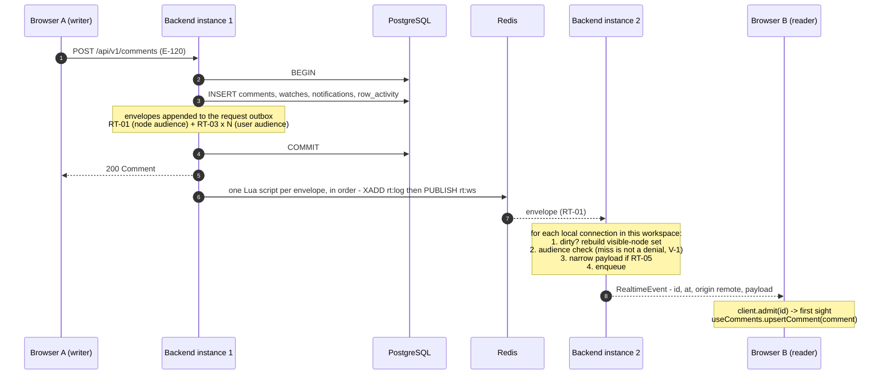
```mermaid
sequenceDiagram
    autonumber
    participant C as Browser A (writer)
    participant API as Backend instance 1
    participant PG as PostgreSQL
    participant R as Redis
    participant I2 as Backend instance 2
    participant B as Browser B (reader)

    C->>API: POST /api/v1/comments  (E-120)
    API->>PG: BEGIN
    API->>PG: INSERT comments, watches, notifications, row_activity
    Note over API: envelopes appended to the request outbox<br/>RT-01 (node audience) + RT-03 x N (user audience)
    API->>PG: COMMIT
    API-->>C: 200 Comment
    API->>R: one Lua script per envelope, in order - XADD rt:log then PUBLISH rt:ws
    R-->>I2: envelope (RT-01)
    Note over I2: for each local connection in this workspace:<br/>1. dirty? rebuild visible-node set<br/>2. audience check (miss is not a denial, V-1)<br/>3. narrow payload if RT-05<br/>4. enqueue
    I2-->>B: RealtimeEvent - id, at, origin remote, payload
    Note over B: client.admit(id) -> first sight<br/>useComments.upsertComment(comment)
```

**Steps 4 and 6 are the two that must not be reordered.** The outbox is filled inside the
transaction and flushed after it; the Redis write is one Lua script per envelope so the stream
entry and the published message carry the same `streamId` and can never disagree (§30.4.6).

---

### 30.10 Errors, limits and observability

#### 30.10.1 Errors

Realtime produces two kinds of failure and they use two different mechanisms.

| Stage | Mechanism | Shape |
| --- | --- | --- |
| Before the upgrade | HTTP status + the standard error envelope (canon §6.2) | `{ "error": { "code": "validation", "message": "…", "isRetryable": false, "reason": "VALIDATION_FAILED", "requestId": "01JB9…" } }` — used only for a malformed or missing `workspaceId` (`400`). |
| After the upgrade | WebSocket close code, preceded by a `closing` control frame | §30.3.5. |

```jsonc
// 400 GET /api/v1/realtime  (no workspaceId)
{
  "error": {
    "code": "validation",
    "message": "That request is missing a workspace",
    "isRetryable": false,
    "reason": "VALIDATION_FAILED",
    "requestId": "01JB9…",
    "fields": [
      { "path": "workspaceId", "reason": "VALIDATION_FAILED", "message": "Required" }
    ]
  }
}
```

**A publish failure is never an error to the caller.** If Redis is unreachable when the outbox
flushes, the write has already committed and the HTTP response has already been decided. The
flush logs at `error`, increments `realtime_publish_failures_total`, and returns. Turning a
successful write into a failed response because a notification could not be broadcast would be
the wrong trade in every case (`DEPENDENCY_UNAVAILABLE` is for a dependency the *response*
needs).

**No realtime failure is audited.** `audit_events` records what a person did, not what the
transport managed; canon §3.23 forbids a write endpoint for the audit log and this module has
no endpoint that performs an auditable action. A connection close is a log line and a metric.

#### 30.10.2 Limits, collected

| Limit | Value | Section |
| --- | --- | --- |
| Auth deadline after upgrade | 5 s | 30.3.2 A-2 |
| Heartbeat ping / pong deadline | 30 s / 10 s | 30.3.4 |
| Re-authorization tick | 60 s | 30.3.4 H-3 |
| Visible-node set TTL | 60 s | 30.4.4 V-3 |
| Negative visibility cache TTL | 60 s | 30.4.4 V-2 |
| Connections per user per workspace / overall | 5 / 12 | 30.3.7 |
| Handshakes per user per minute | 30 | 30.3.7 |
| Outbound queue depth per connection | 256 frames | 30.3.7 |
| Outbound frame size | 64 KiB | 30.2.5 |
| Inbound frame size | 8 KiB | 30.2.5 |
| Replay buffer | `MAXLEN ~ 2048`, `MINID` = now − 120 s | 30.5.5 R-3 |
| Replay delivered per reconnect | 256 frames | 30.5.5 R-3 / D-3 |
| `notification.read` ids per frame | 500 | 30.7 RT-04 |
| Row ids per `row.created` / `row.deleted` frame | 1 000 | 30.7 RT-06 |

**None of these is served from `GET /config` (E-139).** Canon fixes that response's fields, and
none of them is a realtime limit — correctly, because every one of these numbers is consumed by
the server or by the transport's own reconnect loop, and no client surface needs to agree with
the server about any of them. Adding a realtime block to `AppConfigResponse` would create a
second place for the numbers to live.

#### 30.10.3 Metrics

| Metric | Type | Labels | Why it is the one that matters |
| --- | --- | --- | --- |
| `realtime_connections_active` | gauge | `workspace_id` bucketed | Capacity. |
| `realtime_connection_closes_total` | counter | `code` | `4401` climbing means token or session handling is wrong; `1013` climbing means a slow-client or fan-out problem; `4409` climbing means a reconnect loop. |
| `realtime_publish_latency_seconds` | histogram | `type` | The PRD targets **< 500 ms** for comment delivery (`CO-CMT-26`) and notification push (`CO-NOT-29`). Measured commit → enqueue on the receiving connection. |
| `realtime_publish_failures_total` | counter | `type` | §30.10.1. Every increment is a frame nobody received. |
| `realtime_audience_evaluations_total` | counter | `result` = `hit` / `miss_resolved` / `denied` | A rising `miss_resolved` means the visible-node set is being invalidated too aggressively (§30.4.5) and every frame is paying for a chain walk. |
| `realtime_replay_frames_total` | counter | `outcome` = `resumed` / `window_exceeded` | `window_exceeded` is the direct measure of §30.5.6 — how often a client silently missed frames. If it is not near zero, the buffer bounds (R-3) are wrong for this deployment. |
| `realtime_queue_depth` | histogram | — | Feeds the 256 cap. |

**One log line per connection, at close**, carrying `connectionId`, `userId`, `workspaceId`,
duration, frames delivered, frames dropped by audience, close code — and **no frame bodies**.
A comment body in a log is the same leak as a comment body in a frame with the wrong audience.

---

### 30.11 Open questions

> **OPEN QUESTION (OQ-99) — realtime covers comments, notifications and permissions, but not
> boards.**
>
> **What is unclear** — Whether board and document activity should reach other viewers live at
> all, and if so with what payload.
>
> **Evidence** — `RealtimePayload` has exactly five members: two comment frames, two
> notification frames and `permission.changed` (`src/types/realtime.ts:15-32`). There is no
> `row.created`, no `row.updated`, no column frame and no presence frame — yet
> `BoardRow.revision` is *"the optimistic-concurrency token"* (`src/types/board.ts:248-249`) and
> `ConflictNotice` (`src/types/board.ts:462-467`) exists specifically to report a lost race.
> The type file says plainly that *"the backend does not expose a realtime endpoint yet"*
> (`:6-7`).
>
> **Recommendation** — Canon's position, adopted unchanged: ship RT-06 … RT-11, **ids only, no
> cell content** (canon §8.8). Frames are additive and unknown types are ignored
> (`src/types/realtime.ts:14`), so they land without a client release, and each can ship
> independently. RT-12 presence is specified and not built (§30.7 RT-12). Documents remain
> uncovered (§30.8.3).
>
> **Impact if wrong** — Asymmetric, which is why shipping is safe. Without row frames, two
> people on one board discover a collision when a write reports a `ConflictNotice` — degraded,
> not broken, and canon §6.4 already makes that path lossless (last-write-wins plus a notice,
> never a `409`). Putting cell content *into* a frame, by contrast, would leak values across a
> permission boundary and is not recoverable by a later fix, because the frames would already
> have been delivered.

> **OPEN QUESTION (OQ-100) — frame scoping and authorization: who receives which frame, and how
> is that proved?**
>
> **What is unclear** — The frontend has no scoping model to copy. The local transport
> broadcasts to every subscriber in the tab and has no concept of a recipient
> (`src/lib/realtime/transport.ts:41-44`).
>
> **Evidence** — Three different disciplines coexist in the five existing frames, and they are
> not consistent with each other. `comment.created` carries the **whole `Comment`, body and
> author included** (`src/types/realtime.ts:16`) and is filtered by the *receiver* on
> `targetKey` (`src/hooks/use-comments.ts:59-60`). `notification.created` is filtered by
> recipient on **both** send and receive (`src/services/notification-service.ts:104-106`,
> `src/store/notification-store.ts:112`). `permission.changed` carries no content at all and is
> filtered by the receiver on `userIds` (`src/hooks/use-access-sync.ts:81`). None of the three
> receiver-side checks is a security boundary; all three run after the bytes arrived.
>
> **Recommendation** — §30.4, in full: the client can name no room; the server computes the
> audience for every frame from `workspace_members` and `access_rules`; a `node` audience is
> evaluated per connection against a server-resolved visible-node set with V-1 … V-4; a `user`
> audience is one inbox; RT-05's `userIds` is narrowed per recipient; every replayed frame is
> re-authorized at delivery against the connection's *current* state (R-2). The receiver-side
> checks stay exactly where they are — as conveniences on top of a boundary, not as the
> boundary.
>
> **Impact if wrong** — This is the **security** severity in canon's registry and it deserves
> it. A `comment.created` broadcast to the workspace room leaks the text of comments on
> restricted boards to every connected session, silently, with no audit trail and no error. A
> `notification.created` sent to more than its recipient leaks a rendered sentence naming a
> resource the receiver may not open. Both are unrecoverable after the fact.

**OQ-101** is answered in §30.5.5 with its own four-part block.

---

### Chapter notes — divergences, decisions and traps

Every item below is a place where this section followed canon and would have written something
different on its own, or where it read canon in a way another chapter should confirm.

1. **Frame names.** The brief for this section asked for `board.row.created` /
   `board.row.updated` / `board.row.deleted`, `board.column.*`, `board.view.*` and
   `node.moved` / `node.renamed` / `node.trashed`. Canon §7.2 registers **`row.created`,
   `row.updated`, `row.archived`, `row.deleted`, `board.schema.changed`** and a single
   **`node.changed`** carrying a `change` discriminator with exactly those members. Canon's
   names are used throughout. Canon is also right on the merits for the two collapses:
   `board.column.*` and `board.view.*` would both mean "re-read the schema", and C-11 forbids a
   delta, so two frame types would carry identical information and identical client behaviour.

2. **`row.created` payload.** Canon §7.2 gives `{ boardId, rowId, revision }` and then sanctions
   *"one frame per row, or one batched frame carrying `rowIds`"* in the same cell. §30.7 ships
   **one** shape — `{ boardId, nodeId, rowIds }` — because the batched form subsumes the single
   form, and drops `revision` because canon E-062 fixes a created row's revision at `1`. If the
   editor prefers canon's literal singular shape, the change is mechanical, but the batching
   requirement in §30.7 RT-06 must survive it: an import of 5 000 rows publishing 5 000 frames
   overruns both the outbound queue cap and the client's 512-id dedupe window in one write.

3. **`nodeId` added to every board frame.** Canon's sketches carry `boardId` alone. §30.7 adds
   `nodeId` because the audience anchor is a node, the refetch route is
   `GET /nodes/{nodeId}/board` (E-047) and the frontend's board store is keyed by node id
   (`src/hooks/use-access-sync.ts:44`). Without it every receiver must maintain its own
   board→node map to act on the frame.

4. **`row.updated` / `row.archived` carry `rows: RowRevisionStamp[]`,** not a single
   `{rowId, revision}`, for the same batching reason (E-066 is a batch endpoint by definition,
   E-074 and E-075 are bulk).

5. **RT-10 is read as "re-read the board snapshot", not "re-read the schema array".** Canon's
   wording is *"The client refetches the whole schema"*. Three of the writes that fire RT-10 —
   E-054, E-057, E-060 — also change cells, and E-047 returns board and rows together, so one
   refetch satisfies both. Flagged because a reader of canon alone would implement the narrower
   thing.

6. **E-050 added to RT-10's firing list**, which canon gives as E-052–E-060 and E-079–E-082.
   `rowIdPrefix` is a field of `Board` and `Board` is what the client re-reads. A board
   **rename** is RT-11 `renamed`, because canon OQ-30 puts `name` on the node.

7. **OQ-101 is answered with bounded replay, against the audit fact sheet's recommendation of
   refetch.** Canon deliberately left the question open. The reason for the other choice is in
   §30.5.5: there is no reconnect hook anywhere in the frontend to hang a refetch on, and adding
   one means changing the file `src/types/realtime.ts:6-9` promises will not change. If the
   editor prefers refetch, delete `rt:log` and §30.5.5 R-1 … R-5; §30.5.6's table of stale
   surfaces then becomes the whole answer, and the synthetic RT-05 becomes more important, not
   less.

8. **RT-05's `userIds` is narrowed to one id per recipient at delivery.** Canon's payload is
   `{ workspaceId, nodeId | null, userIds }` and does not say whether the list is the full
   affected set. Narrowing is wire-compatible (`use-access-sync.ts:81` only tests membership)
   and closes a small leak. If another chapter relies on a recipient seeing the full list — no
   chapter does today — this must be revisited.

9. **A `document.changed` frame is proposed and not shipped** (§30.8.3). Adding it means
   amending canon §7.2 and canon §5.6, which this section may not do. It is the largest
   remaining gap in the module.

10. **Two Redis facilities are used: pub/sub and one capped Stream.** Canon's scope line says
    "Redis (pub/sub + short-lived cache)". The Stream is a bounded circular buffer read with
    `XRANGE` — no consumer groups, no acknowledgements, no pending-entries list — and is
    argued in §30.4.6 to be a short-lived cache rather than a queue. If the editor reads the
    scope line more strictly, see note 7: dropping replay removes this key and nothing else.

11. **The `auth` control frame and the `ready` / `closing` control frames are new wire
    vocabulary.** They are not `RealtimePayload` members and never reach a `subscribe` handler,
    so they do not touch the frontend's union or its "unknown types are ignored" rule
    (`src/types/realtime.ts:14`). They are recorded here because they are the only part of the
    protocol that is not in canon at all.

12. **Canon's endpoint count is unchanged at 140.** This section adds no endpoint. In
    particular it does **not** add a `POST /realtime/ticket`: authentication happens in the
    first application frame instead, which is why §30.2.3's argument against SSE is the
    deciding one rather than a preference.

---

## 31. Error Codes

Module ownership: every module in canon C-14 produces errors, so this chapter is owned by none of
them and binds all of them. It is the normative catalogue behind canon §4 and §7.4 of this
document. Where §7.4 states the envelope rules, this chapter states the **values**: every
`ErrorReason` the service may emit, the HTTP status and `AppErrorCode` each maps to, the exact
copy the frontend renders, the structured `details` each carries, and what the frontend does when
it arrives.

### 31.0 The one thing that is frozen, and the one thing that is not

There are two vocabularies and they are not interchangeable.

**`AppErrorCode` is frozen at eight values.** `src/types/async.ts:2-10`. It is not decoration: the
client branches on it in three places that ship today —

| Site | What it does with `code` |
| --- | --- |
| `src/hooks/use-embedded-board.ts:138-141` | `error.code === "not_found"` → renders the embed as **missing**, not as a failure. Any other code renders an error panel. |
| `src/components/shared/async-boundary.tsx:32-36` | `state.error.code === "permission_denied"` → `PermissionDeniedState` (no retry control); anything else → `ErrorState` (retry control, if retryable). |
| `src/components/board/board-page.tsx:133-138` | The same split, hand-written for the board because the board owns its own loading shell. |

and a fourth derives the retry default from it:

```ts
// src/services/errors.ts:28-31
return { code, message, detail, isRetryable: isRetryable ?? DEFAULT_RETRYABLE.has(code) };
const DEFAULT_RETRYABLE = new Set<AppErrorCode>(["network", "upload_failed", "unknown"]);
```

Adding a ninth code, renaming one, or changing which code an existing failure carries is a
**breaking change to a shipped client**. It does not happen inside `v1`.

**`ErrorReason` is additive and is where all the precision lives.** Eight codes cannot specify a
backend: "conflict" covers a locked page, a slug collision, a cycle in the subtask tree and a
board that already holds the records being moved. So every error carries a second field —
`reason`, SCREAMING_SNAKE_CASE, one value per distinguishable failure. Canon §4.3 registers 104 of
them. The frontend ignores `reason` today; the backend, the logs, support and every future client
branch on it.

**The mapping is a function, not a table lookup in both directions.** One `reason` → exactly one
`code` and exactly one HTTP status. Many reasons share a code. A writer specifying a failure names
the **reason**; the code and the status follow from §31.4 and are never chosen independently.

---

### 31.1 The error envelope

Success has no envelope — the body is the resource (§7.3). **Errors, and only errors, are
wrapped**, in the one wrapper the frontend actually declares:

```ts
// src/types/board.ts:507-509 — EXISTING REQUIREMENT
export interface BoardError {
  readonly error: AppError;
}
```

The wire shape, complete:

```ts
/**
 * The API error envelope. `ErrorResponse` is the canon name for what the frontend
 * calls `BoardError`; the JSON is identical.
 */
interface ErrorResponse {
  readonly error: ApiError;
}

/**
 * The four fields at the top are EXISTING REQUIREMENT — src/types/async.ts:12-20.
 * They must not change name, type, optionality or meaning inside /api/v1.
 * Everything below the divider is RECOMMENDATION and additive; the frontend
 * ignores all of it today and must keep compiling if it appears.
 */
interface ApiError {
  readonly code: AppErrorCode;                 // one of eight — §31.2
  readonly message: string;                    // rendered to the user VERBATIM
  readonly detail?: string;                    // OPTIONAL, never nullable — omit the key
  readonly isRetryable: boolean;               // drives the "Try again" control
  // ------------------------------------------------------------------ additive
  readonly reason?: ErrorReason;               // §31.4 — 104 values
  readonly requestId?: string;                 // ULID, echoed from X-Request-Id (§7.10)
  readonly fields?: readonly FieldError[];     // VALIDATION_FAILED only — §31.5.1
  readonly retryAfterSeconds?: number;         // 429 only — §7.9
  readonly details?: ErrorDetails;             // structured payload per reason — §31.5
}

/** One failed field. For developers and support; the user still reads `message`. */
interface FieldError {
  /** Pointer into the request body: `cells[0].value.iso`, `entries[3].key`. */
  readonly path: string;
  readonly reason: ErrorReason;
  /** Sentence for a form control that can render an inline error. */
  readonly message: string;
}
```

`ApiError` is a superset of the frontend's `AppError`. A response body assigned to `AppError`
compiles unchanged; the five additive keys are excess properties the structural type ignores.

Worked example — a locked page refusing a save (E-092):

```jsonc
// 409 PUT /api/v1/nodes/01J8.../document
{
  "error": {
    "code": "conflict",
    "message": "This page is locked",
    "detail": "Unlock it before saving further changes.",
    "isRetryable": false,
    "reason": "DOCUMENT_LOCKED",
    "requestId": "01JB9Z7QF3K8W2N6R4T5Y0X1M3",
    "details": {
      "reason": "DOCUMENT_LOCKED",
      "nodeId": "01J8C4V7QZ9K2M5N8P1R3T6W0X",
      "lockedBy": {
        "id": "01J7A2B3C4D5E6F7G8H9J0K1L2",
        "name": "Khanh Luu",
        "email": "khanhluu95@gmail.com",
        "initials": "KL"
      }
    }
  }
}
```

The `message` and `detail` are verbatim from `src/services/document-service.ts:193`. Nothing in
`details` is rendered; the panel renders `message` as its title and `detail` as its body
(`src/components/shared/state-panels.tsx:118-128`).

**Nine rules bind the envelope.** Six restate §7.4 because a writer reading only this chapter must
still get them right; three are new here.

| # | Rule | Grounding |
| --- | --- | --- |
| V-1 | `detail` is **optional, not nullable**. Omit the key. `"detail": null` violates C-08 and would render the string `null` in nothing — but it is still wrong, because `detail?: string` says absent, not empty. | `src/types/async.ts:17` |
| V-2 | The **body is authoritative, the status is advisory**. `toAppError` never sees a status code — it normalises a thrown object and nothing else (`src/services/errors.ts:52-64`). Send a complete `ApiError` on every failure including `500`, `502` and `503`. A status with an empty or non-JSON body reaches the client as `{ code: "unknown", message: "Something went wrong" }` and the user learns nothing. | `src/services/errors.ts:52-64` |
| V-3 | `isRetryable` is set **explicitly** whenever it differs from the §31.2 default. The two that matter: `429` (code `validation`, default `false`, must be `true`) and a `conflict` that genuinely is worth retrying (there is none today — every `conflict` in §31.4 is `false`). | canon §4.4 rule 5 |
| V-4 | **A refusal must not name what was denied.** `permission_denied` copy is deliberately name-free — *"A refusal that reads 'Finance is restricted' hands the name of a private folder to the one person who was told they may not have it"* (`src/lib/permissions/evaluate.ts:155-161`). This governs `message`, `detail` **and** `details`. §31.9.2 lists what may appear in a refusal. | `src/lib/permissions/evaluate.ts:155-165` |
| V-5 | `not_found` messages use the fixed template `` `${what} could not be found` `` and nothing else. The `what` values are enumerated in §31.4 and come straight from the service call sites. | `src/services/errors.ts:36-37` |
| V-6 | **Never return an error body for a partial success.** `BulkResult`, `BulkMoveResult` and `ImportOutcome` are `200`s that report what did and did not apply. `requested === applied.length + skipped.length` is the invariant. §31.6. | `src/services/board-service.ts:958-965` |
| V-7 | `details` is **machine-readable only**. Nothing in it is ever rendered. If a fact needs to reach the user it goes in `message` or `detail` as a sentence. This is why `details` may safely carry ids while `message` may not. | new here; follows from V-4 and `state-panels.tsx:118-128` |
| V-8 | `details.reason` **repeats** `error.reason`. The duplication is deliberate: it makes `ErrorDetails` a self-contained discriminated union that a client can narrow without reading its parent, satisfying C-05. A response where the two disagree is a server bug. | new here |
| V-9 | `requestId` is echoed on **every** response, success and failure. In an error it also appears in the body so a user can paste it into a support ticket from a screenshot. It never appears inside `message` or `detail`. | §7.10 |

---

### 31.2 `AppErrorCode` → HTTP → default retryability → what the frontend does

| `code` | HTTP | Default `isRetryable` | Meaning | Frontend behaviour |
| --- | --- | --- | --- | --- |
| `validation` | **400** (also 413, 415, 429) | `false` | The request is malformed, or breaks a business rule the caller can fix by changing the request. | **Read:** `ErrorState` panel, title = `message`, body = `detail`, **no** Try again (not retryable). **Write:** optimistic state reverted, toast with `message`. **Wizard/form:** rendered inline in the panel (`use-import-wizard.ts:136-150`). |
| `permission_denied` | **403** (and **401**, mapped) | `false` | Authenticated but not permitted — or not authenticated at all. | **Dedicated screen**: `PermissionDeniedState`, shield icon, no Try again control, default body *"Ask a workspace admin to grant you access."* (`async-boundary.tsx:32-33`, `board-page.tsx:134`, `state-panels.tsx:130-138`). **Write:** toast only. On `reason: AUTH_SESSION_EXPIRED` the HTTP client refreshes once and replays instead (§8, and §31.3 B-8). |
| `not_found` | **404** | `false` | The resource does not exist **or the caller may not see it**. The two answer identically (§31.9.1). | **Embedded board:** status becomes `missing` — an empty-state, not an error (`use-embedded-board.ts:138-141`). **Everywhere else:** `ErrorState` with no Try again. **Write:** revert + toast; the store drops the local copy of the id. |
| `conflict` | **409** | `false` | A precondition or invariant refuses the write. The caller can usually fix it by reloading and retrying deliberately — never automatically. | Revert + toast. Never auto-retried: a `conflict` re-sent unchanged fails identically, and re-sending a *stale* write is the failure mode `expectedVersion` exists to stop. |
| `upload_failed` | **422** (object did not land) / **507** (out of space) | `true` | The bytes did not land. | The upload task row goes to `status: "error"` and shows a **Retry** control because `task.error?.isRetryable` (`src/components/files/upload-task-row.tsx:66-72`). The retry payload is kept (`src/store/upload-store.ts:88`). |
| `network` | **502 / 503** | `true` | A dependency — object store, database, unfurl target — is unreachable. | `ErrorState` **with** Try again, wired to the resource's `reload()` (`state-panels.tsx:126`, `use-async-resource.ts:84`). |
| `unknown` | **500** | `true` | Unclassified server fault. `message` is `Something went wrong`; the original text goes in `detail` **in non-production only**. | `ErrorState` with Try again. |
| `cancelled` | *never a response* | `false` | Client-side abort only. Produced by `toAppError` from a `DOMException` named `AbortError` (`src/services/errors.ts:55-57`). | **Swallowed everywhere.** Four separate stores drop it before it can reach a panel or a toast (§31.3 B-6). **The server must never emit this code.** C-12. |

Two statuses have no `AppErrorCode` of their own and must be mapped rather than invented:

- **`401`** → `code: "permission_denied"`, with `reason` one of `AUTH_REQUIRED`,
  `AUTH_SESSION_EXPIRED`, `AUTH_INVALID_CREDENTIALS`, `AUTH_REFRESH_REUSED`. The client cannot tell
  401 from 403 by code alone, which is precisely why the refresh interceptor branches on `reason`
  (§8.3, J-5).
- **`429`** → `code: "validation"`, `isRetryable: true` **set explicitly** (V-3), plus
  `retryAfterSeconds` in the body and a `Retry-After` header (§7.9).

**Two statuses that are deliberately never used.** `201` — a create returns `200` with the record,
because the frontend treats a create response exactly like an update response and introducing a
second success status adds a branch nobody has. `304` — there is no `ETag`/`If-None-Match` layer;
freshness comes from realtime frames and explicit refetch.

---

### 31.3 The frontend behaviour vocabulary

The **Frontend behaviour** column in §31.4 uses these ten labels. Each is a real code path, cited.
A backend developer choosing between two candidate reasons should pick the one whose behaviour is
what the user should actually get.

| # | Label | What happens | Where |
| --- | --- | --- | --- |
| **B-1** | **Permission screen** | The whole surface is replaced by `PermissionDeniedState`: shield icon, title = `message`, body = `detail` or the fallback *"Ask a workspace admin to grant you access."* There is **no retry control**, regardless of `isRetryable`. | `src/components/shared/async-boundary.tsx:32-33`; `src/components/board/board-page.tsx:133-135`; `src/components/shared/state-panels.tsx:130-138` |
| **B-2** | **Error panel, retryable** | `ErrorState`: warning icon, title = `message`, body = `detail` or *"The request did not complete. Nothing was changed."*, plus a **Try again** button wired to `reload()`. Shown only when `isRetryable && onRetry`. | `src/components/shared/state-panels.tsx:119-128`; `src/hooks/use-async-resource.ts:84` |
| **B-3** | **Error panel, terminal** | The same panel with **no** button, because `isRetryable` is false. The user's only move is to change something and act again. | `state-panels.tsx:126` (the conditional) |
| **B-4** | **Revert + toast** | A write path. The store rolls the optimistic state back and pushes `error.message` as a danger toast. The counter is settled in `finally` so the pending-write badge cannot stick. | `src/store/board-store.ts:188-202`; `src/hooks/use-embedded-board.ts:126-129`; `src/hooks/use-secret-document.ts:113-117, 126-129, 149-153, 191-193` |
| **B-5** | **Missing, not failed** | `not_found` on an embedded board becomes `status: "missing"` — the embed renders its own empty state rather than an error. A deleted board inside a page is not an error on the page. | `src/hooks/use-embedded-board.ts:134-141` |
| **B-6** | **Silent** | The error is dropped before it reaches any surface. Four stores do this for `cancelled`, and `useAsyncResource` additionally drops anything that arrives after `signal.aborted`. | `use-async-resource.ts:58-62`; `board-store.ts:198`; `notification-store.ts:68`; `upload-store.ts:80-86` |
| **B-7** | **Upload row + retry** | The task in the upload tray shows `status: "error"` with the `AppError` attached, and a Retry control appears when `isRetryable`. The file and destination are cached so the retry needs no new picker. | `src/components/files/upload-task-row.tsx:66-72`; `src/store/upload-store.ts:79-89` |
| **B-8** | **Refresh session, replay once** | The shared HTTP client sees `reason === "AUTH_SESSION_EXPIRED"`, calls `POST /auth/refresh`, and replays the original request exactly once. Only on failure does the error reach a surface as B-1. **RECOMMENDATION** (OQ-01), specified in §8.7. | §8.3 J-4/J-5; §8.7 |
| **B-9** | **Inline in the wizard** | The import wizard holds an `AppError` in local state and renders it in the dialog beside the controls that produced it — not as a toast, because the user is mid-flow and the fix is one field away. | `src/hooks/use-import-wizard.ts:136-150, 244-254` |
| **B-10** | **Re-resolve access, drop what is gone** | Not an error path at all: an `RT-05 permission.changed` frame arrives, the client re-resolves its own access and discards anything it may no longer hold. This is what turns a would-be `403` on the *next* request into no request at all. | `src/types/realtime.ts:20-25`; `src/hooks/use-access-sync.ts`; canon §7.1 RT-05 |

**The write-path default is B-4.** Every service call the stores make is wrapped in a try/catch that
calls `toAppError` and pushes `message` as a toast; the read-path default is B-2 or B-3 depending on
`isRetryable`. When §31.4 names a behaviour, it names the *distinctive* one — the row for
`DOCUMENT_LOCKED` says B-4 because a locked page refuses a save, and the save is a write.

---

### 31.4 The `ErrorReason` catalogue

104 reasons, grouped by the module that owns the endpoints producing them (canon C-14). Two further
rows — `TRASH_RESTORE_RELOCATED` and `PREVIEW_UNSUPPORTED` — appear at the end of §31.6 because
they are `200` outcomes recorded here only so no chapter mistakes them for failures.

Columns: **Reason** · **HTTP** · **`code`** · **Meaning, and the message the API sends** ·
**Frontend behaviour**. Where a message is quoted with `` ` `` it is **verbatim from the frontend**
and must not be reworded; `${…}` marks interpolation. Where a message is unquoted the frontend has
no copy for it and the text is a **RECOMMENDATION** following the rules in §31.7.

#### 31.4.1 Authentication and session — `identity`

Endpoints E-001 … E-006. Every reason here is **RECOMMENDATION** under **OQ-01** — the frontend has
no authentication of any kind (§8.1). They are catalogued because §8 needs them and because
`AUTH_SESSION_EXPIRED` is the one reason the HTTP client is required to branch on.

| Reason | HTTP | `code` | Meaning / message | Frontend behaviour |
| --- | --- | --- | --- | --- |
| `AUTH_REQUIRED` | 401 | `permission_denied` | No valid session on a protected route. `Sign in to continue` · detail `Your session is not active on this device.` | B-1. The client has no signed-out state (`src/types/async.ts:23-27`), so this renders as a permission screen until §8's route guard lands. |
| `AUTH_INVALID_CREDENTIALS` | 401 | `permission_denied` | Email or password wrong. **The same message, and the same response timing, for a wrong password, an unknown email and a deactivated account** (§8, R-12): `Those credentials did not work` · detail `Check the email address and password and try again.` | B-3 on the login form (E-001 has no session to screen). |
| `AUTH_SESSION_EXPIRED` | 401 | `permission_denied` | The access token is past `exp`, its session was revoked, or the user was deactivated. `Your session has expired` · detail `Sign in again to continue.` | **B-8** — this is the one reason the client must not surface directly. Refresh once, replay, and only then fall through to B-1. |
| `AUTH_REFRESH_REUSED` | 401 | `permission_denied` | A refresh token was presented twice. The whole family is revoked in the same transaction (§8, R-6). `Your session has expired` · detail `Sign in again to continue.` — **deliberately identical to `AUTH_SESSION_EXPIRED`**, so a replay attacker learns nothing from the copy. | B-1. The client must **not** retry the refresh; `reason` is what distinguishes the two. |
| `AUTH_RATE_LIMITED` | 429 | `validation` | Too many attempts, per IP **and** per submitted email (§7.9). `Too many attempts` · detail `` `Try again in ${n} seconds.` ``. `isRetryable: true` **explicit**, `retryAfterSeconds` set. | B-3 with a countdown; the form disables submit until the window passes. |
| `INVITATION_INVALID` | 404 | `not_found` | The token is unknown, already consumed, or expired (E-019). `That invitation could not be found` · detail `Ask for a new invitation link.` | B-3. **RECOMMENDATION** under OQ-04. |

#### 31.4.2 Workspaces and membership — `workspace`

Endpoints E-007 … E-019.

| Reason | HTTP | `code` | Meaning / message | Frontend behaviour |
| --- | --- | --- | --- | --- |
| `WORKSPACE_NOT_FOUND` | 404 | `not_found` | An unknown workspace **or one the caller is not a member of**. The two answer identically — *"a workspace that does not exist and one the person is not in return the same shape on purpose: the surface shows the same screen either way, so the URL cannot be used to learn which workspaces exist"* (`src/lib/workspace-access.ts:60-64`). `That workspace could not be found` | B-3, via `WorkspaceGuard`, which already renders one screen for both cases (`src/components/workspace/workspace-guard.tsx:22-25`). |
| `WORKSPACE_SLUG_TAKEN` | 409 | `conflict` | The slug is not unique across the tenant (`src/types/workspace.ts:17-18` — "unique across the tenant"). `That workspace address is already taken` · detail `` `Try “${suggestion}”.` `` | B-4. `details` carries the free suggestion `uniqueSlug` would have produced. |
| `WORKSPACE_NAME_INVALID` | 400 | `validation` | Empty, or past 60 characters. Messages verbatim from the frontend validator: `Give the workspace a name.` / `` `Keep the name under ${WORKSPACE_NAME_MAX} characters.` `` (`src/lib/workspace-access.ts:196-207`). | B-3 inline on the create dialog, which already renders exactly these strings before the button is enabled. |
| `WORKSPACE_LAST_ADMIN` | 409 | `conflict` | The change would leave the workspace with no admin. The frontend has three guards that read `isLastAdmin` (`src/lib/workspace-access.ts:84-157`); the API must be the fourth and the authoritative one. `The workspace needs at least one admin` · detail `Make somebody else an admin first.` | B-4. Applies to E-014 (demotion), E-015 (removal) and E-016 (leaving). |
| `MEMBER_NOT_FOUND` | 404 | `not_found` | No such membership on this workspace. `That member could not be found` | B-4. |
| `MEMBER_ALREADY_EXISTS` | 409 | `conflict` | Already a member, or already holding a live invitation. `That person is already in this workspace` · detail `Change their role instead.` | B-4. |
| `QUOTA_EXCEEDED` | **507** | `upload_failed` | The upload would push `usedBytes` past `totalBytes` (`src/types/workspace.ts:5-10`). `` `“${fileName}” would exceed the workspace storage limit` `` · detail `` `${used} of ${total} used.` `` | **B-7** — it arrives on an upload, so it lands on the task row. `isRetryable` is `true` by the code's default, which is correct: freeing space and retrying is exactly the fix. **OQ-05.** |

> **OPEN QUESTION (OQ-05) — nothing maintains `usedBytes`, and no rule says what happens at 100 %.**
>
> **Evidence** — `StorageQuota` is two numbers on the workspace (`src/types/workspace.ts:5-10`),
> seeded at `{ usedBytes: 0, totalBytes: 15 GiB }` by `makeWorkspace`
> (`src/lib/workspace-access.ts:239`) and never incremented anywhere. `validateUpload`
> (`src/lib/file-validation.ts:28-58`) checks emptiness, size and extension — **never the quota**.
> No surface renders a quota refusal.
>
> **Recommendation** — as canon §8.8 takes it: `workspaces.used_bytes` maintained transactionally
> with every `file_assets` insert and delete, checked at **E-110** (issue the presigned target)
> rather than at E-111, so the bytes are never uploaded at all. `507` + `QUOTA_EXCEEDED` +
> `details.usedBytes/totalBytes/requestedBytes`.
>
> **Impact if wrong** — checking at E-111 instead means a 90 MB upload completes over a slow link
> and is then refused, which is the worst possible place to learn. Not checking at all means the
> product has a storage plan it does not enforce.

#### 31.4.3 Permissions, access and audit — `governance`

Endpoints E-040 … E-046, E-136, E-137, plus the three narrowing layers that apply to **every** write
in the system.

| Reason | HTTP | `code` | Meaning / message | Frontend behaviour |
| --- | --- | --- | --- | --- |
| `PERMISSION_DENIED` | 403 | `permission_denied` | The generic refusal, and by volume the most common error in the system — it guards all 140 endpoints (P-09). Message `` `You do not have permission to ${action}` ``, detail `requirementFor(key)` → `` `Needs the ${Role} role or above` `` — both verbatim from `src/services/authz.ts:67-74`. `${action}` is the endpoint's own phrase (`add a column`, `change this column's type`, `import into this board`); §31.7.3 lists them. | B-1 on a read, B-4 on a write. **`details` carries `requiredKey` and `requiredRole` and nothing else** — never the node, never who does hold it (V-4). |
| `NODE_TRASHED_READ_ONLY` | 403 | `permission_denied` | A trashed node accepts **nothing but `node.delete`**. Resolved before the permission key is consulted (`src/lib/permissions/evaluate.ts:69-88`). `That item is in Trash` · detail `Restore it before making changes.` | B-4. The client should already have hidden the control; the API is the refusal. |
| `NODE_FROZEN_BY_ANCESTOR` | 403 | `permission_denied` | An archived **ancestor** refuses every write. The node's own archive flag is deliberately **not** read for this — *"you can always restore the thing you are standing on, but a page inside an archived project cannot be thawed on its own"* (`src/lib/archive.ts:30-36`). `` `“${ancestorName}” is archived` `` · detail `Restore it to make changes below it.` | B-4. **This is the one `permission_denied` that may name a node**: the frontend already renders the ancestor's name on screen — *"Inside the archived project “Acme Rebuild” — this board is read-only until that project is restored"* (`src/components/shared/archived-banner.tsx:36-42`, fed by `archiveSourceOf`) — so the name is not a secret, and the caller can already see the node. |
| `NODE_LOCKED` | 403 | `permission_denied` | A document lock refuses the content-write key set. The lock never blocks the unlock itself (`src/lib/permissions/evaluate.ts:63-64`). See also `DOCUMENT_LOCKED`, which is the same situation reported by the document endpoint as a `conflict` — §31.9.4 explains why both exist. | B-4. |
| `PREVIEW_ROLE_ESCALATES` | 400 | `validation` | A `previewAs` parameter naming a role that outranks the caller's real role. Preview may only **narrow**. `A preview cannot grant more access than you hold` | B-3. **OQ-21.** |
| `ACCESS_RULE_NOT_FOUND` | 404 | `not_found` | E-043 on an id that is not a rule on that node. `That access rule could not be found` | B-4. |
| `ACCESS_SUBJECT_INVALID` | 400 | `validation` | The subject is neither `{ kind: "user", userId }` nor `{ kind: "role", role }` (`src/types/permission.ts:132-134`), or names a user who is not a member of the workspace. `That person is not in this workspace` | B-3, inline in the access dialog. |

> **OPEN QUESTION (OQ-16) — 40+ write operations carry no permission check in the mock.**
>
> **Evidence** — `requirePermission` is called at exactly nine sites, all in `board-service.ts` and
> `devtools-service.ts` (`src/services/authz.ts:67-74` and its callers). `createRow`,
> `updateCells`, every bulk operation, every view write, every comment write, every watch write and
> every document write reach the store with no check at all. The module says so itself: *"there is
> no server here… a faithful model of the check a real API must make, not a substitute for it"*
> (`src/services/authz.ts:29-33`).
>
> **Recommendation** — every endpoint re-checks the `PermissionKey` its row in canon §3 names,
> server-side, before any other validation, and emits `PERMISSION_DENIED`. The **Perm** column of
> canon §3 is normative, not advisory.
>
> **Impact if wrong** — the entire RBAC matrix (`SY-RBC-42`) becomes decoration. A downgraded user
> in a stale tab keeps every capability the tab was rendered with, which is precisely the scenario
> `SY-RBC-42`'s "a downgrade takes effect on open screens" exists to prevent.

#### 31.4.4 Drive tree — `drive`

Endpoints E-020 … E-035.

| Reason | HTTP | `code` | Meaning / message | Frontend behaviour |
| --- | --- | --- | --- | --- |
| `NODE_NOT_FOUND` | 404 | `not_found` | An unknown node, **or one the caller may not see**. §31.9.1. `That item could not be found` | B-3 on a read; B-4 on a write, and the store drops its local copy. |
| `NODE_SLUG_CONFLICT` | 409 | `conflict` | The slug is taken among the target's siblings. *"two siblings sharing one is not a cosmetic clash: `resolvePath` walks the chain and takes the first match, so the loser becomes unreachable and every link to it silently opens the other"* (`src/store/workspace-store.ts:472-480`). `` `“${name}” already exists here` `` · detail `` `Saved as “${suggestion}”.` `` where the API de-duplicated, omitted where it refused. | B-4. In practice the API **de-duplicates rather than refusing** on create and move (`uniqueSlug`), so this reason fires only where the caller demanded an exact slug. |
| `NODE_MOVE_SAME_PARENT` | 409 | `conflict` | `same-parent` — the node is already there. `That item is already there` | B-6-adjacent: the frontend's drag layer never issues this call (`src/lib/tree.ts:170-197` rejects it client-side), so the API refusal exists only for a non-UI caller. Treat as success in a client. |
| `NODE_MOVE_INTO_SELF` | 409 | `conflict` | `into-self`. `An item cannot be moved into itself` | B-4. |
| `NODE_MOVE_INTO_DESCENDANT` | 409 | `conflict` | `into-descendant` — the cycle rule. `` `“${name}” cannot be moved into something inside it` `` | B-4. |
| `NODE_MOVE_INVALID_TARGET` | 409 | `conflict` | `invalid-target` — the destination is missing, trashed, or not a container. `That is not a place items can go` | B-4. |
| `NODE_NOT_CONTAINER` | 409 | `conflict` | A document, board or file was addressed as a parent on create. `Pages can only live inside folders` | B-4. Distinct from `NODE_MOVE_INVALID_TARGET`: that one is a move, this one is a create (E-024). |
| `NODE_KIND_MISMATCH` | 409 | `conflict` | The node exists but is not the kind this route addresses — `GET /nodes/{id}/board` on a document node. Grounded: `if (!node || !isBoard(node)) throw notFound("That board")` (`src/services/board-service.ts:85`) collapses both cases into `not_found`; **the API separates them**, because a caller holding the id already knows the node exists. `That item is not a board` | B-3. See the note below. |
| `NODE_ARCHIVE_INHERITED` | 409 | `conflict` | E-031 restore on a node whose **ancestor** is archived. `` `“${ancestorName}” is archived` `` · detail `Restore it first.` | B-4. |
| `NODE_NAME_INVALID` | 400 | `validation` | Empty after trimming, or past the name ceiling. The frontend refuses an empty rename silently (`src/store/workspace-store.ts:483-485`); the API must say why. `Give it a name` | B-3. |
| `TRASH_ENTRY_NOT_FOUND` | 404 | `not_found` | E-037/E-038 on an unknown entry id. `That item could not be found` | B-4. |

**A note on `NODE_KIND_MISMATCH` versus `NODE_NOT_FOUND`.** The frontend collapses "no such node"
and "wrong kind of node" into one `notFound("That board")`. The API must not, and the reason is
security-neutral: reaching `GET /nodes/{nodeId}/board` requires the caller to already hold `nodeId`
and to have passed the visibility check, so they already know the node exists and what it is called.
Answering `404` there would send a client into B-5 (render as missing) for a node that is sitting in
its own sidebar. **Where visibility fails, the answer is `NODE_NOT_FOUND` and nothing else.**

#### 31.4.5 Trash and system-wide operations — `system`

Endpoints E-036 … E-039, E-139, E-140.

| Reason | HTTP | `code` | Meaning / message | Frontend behaviour |
| --- | --- | --- | --- | --- |
| `TRASH_ALREADY_PURGED` | 404 | `not_found` | The entry was swept by the retention job between the list read and the restore. `That item could not be found` · detail `` `Items are removed permanently after ${TRASH_RETENTION_DAYS} days.` `` | B-4; the row disappears from the list on the next read. **RECOMMENDATION**, OQ-14. |
| `REQUEST_TOO_LARGE` | 413 | `validation` | The body is past the service limit. Not the same as `FILE_TOO_LARGE`: this is the JSON body, and the two ceilings are different numbers. `That request was too large` | B-4. |
| `RATE_LIMITED` | 429 | `validation` | The general or link-unfurl throttle (§7.9). `Too many requests` · detail `` `Try again in ${n} seconds.` ``. `isRetryable: true` **explicit**. | B-2 — the retry control is correct here and the only place a `validation` error gets one. |
| `CONCURRENCY_CONFLICT` | 409 | `conflict` | A generic optimistic-concurrency refusal. **Never used for cell writes** — those are last-write-wins with a `ConflictNotice` and always answer `200` (E-066, §31.6). `This was changed by somebody else` · detail `Reload to see the current version.` | B-4. |
| `DEPENDENCY_UNAVAILABLE` | 503 | `network` | Postgres, Redis or the object store is unreachable. Message verbatim from the frontend's own constructor: `Could not reach the workspace service` (`src/services/errors.ts:39-40`). | **B-2** — the Try again button, and the only common error where an automatic client retry with backoff is also appropriate. |
| `INTERNAL_ERROR` | 500 | `unknown` | Anything unclassified. `Something went wrong` — verbatim from `toAppError` (`src/services/errors.ts:60`). The original text goes in `detail` **in non-production only**; in production `detail` is omitted entirely and the text lives only in the log line keyed by `requestId`. | B-2. |

#### 31.4.6 Boards and records — `boards`

Endpoints E-047 … E-050, E-061 … E-073.

| Reason | HTTP | `code` | Meaning / message | Frontend behaviour |
| --- | --- | --- | --- | --- |
| `BOARD_NOT_FOUND` | 404 | `not_found` | `That board could not be found` — verbatim, `src/services/board-service.ts:85`. | B-5 in an embedded board (`use-embedded-board.ts:140`); B-3 on the board page. |
| `ROW_NOT_FOUND` | 404 | `not_found` | `That record could not be found` — verbatim, `board-service.ts:153` (`rowOrThrow`). | B-4; the drawer closes and the row is dropped from the local map. |
| `PARENT_ROW_NOT_FOUND` | 404 | `not_found` | `That parent record could not be found` — verbatim, `board-service.ts:302` and `:388`. | B-4. |
| `ROW_PARENT_SELF` | 409 | `conflict` | `A record cannot be its own parent` — verbatim, `board-service.ts:384`. | B-4. |
| `ROW_PARENT_CYCLE` | 409 | `conflict` | `` `${parent.displayId} is already under ${row.displayId}` `` — verbatim, `board-service.ts:390`. Both display ids are already on the caller's screen, so naming them is safe. | B-4. |
| `ROW_PARENT_CROSS_BOARD` | 409 | `conflict` | Parent and child must share a board. `That record is on another board` · detail `Subtasks live on the same board as their parent.` **OQ-33.** | B-4. |
| `ROW_PARENT_TOO_DEEP` | 409 | `conflict` | Past the hierarchy depth cap. `` `Subtasks can only go ${MAX_SUBTASK_DEPTH} levels deep` `` **OQ-33** — canon §8.8 takes depth 5. | B-4. |
| `ROW_ARCHIVED_READ_ONLY` | 409 | `conflict` | An archived record is read-only until restored (`src/types/board.ts:250-254`). `That record is archived` · detail `Restore it before making changes.` | B-4. **In bulk this is not an error** — it is a `BulkSkip` with `reason: "archived"` inside a `200` (§31.6). |
| `ROW_ID_PREFIX_INVALID` | 400 | `validation` | Not `^[A-Z]{1,6}$` after normalisation (`src/lib/row-id.ts:9,17-20`). `A record prefix is one to six capital letters` | B-3, inline in board settings. **OQ-43** governs whether it may change at all once rows exist. |
| `CELL_VALUE_KIND_INVALID` | 400 | `validation` | The `CellValue` tag is not a `ColumnType` member. **Note carefully what this does *not* cover:** a `kind` that disagrees with its column's `type` is **legal** and must be stored as sent — *"A converted column can therefore keep the text it could not parse instead of dropping the user's data"* (`src/types/board.ts:214-218`). Only an unknown tag is an error. `That value is not one this column understands` | B-4. |
| `DATE_VALUE_INVALID` | 400 | `validation` | Not `YYYY-MM-DD` on a date-only column, or not ISO 8601 on a timestamp column. C-04, **OQ-32**. `That is not a date` | B-4. |
| `BOARD_ROW_LIMIT_EXCEEDED` | 409 | `conflict` | The board is at its documented row ceiling. `` `This board is at its limit of ${limit} records` `` **OQ-36.** | B-4. |
| `CURSOR_INVALID` | 400 | `validation` | An opaque cursor that does not decode, or decodes to a sort key from a different query. Cursors are never constructed by a client (§7.6). `That page could not be loaded` · detail `Reload the list.` | B-2 — the reload is the fix and the panel offers it. |

#### 31.4.7 Columns, options and transition rules — `boards`

Endpoints E-051 … E-060, and the select gate that fires on E-066 and E-074.

| Reason | HTTP | `code` | Meaning / message | Frontend behaviour |
| --- | --- | --- | --- | --- |
| `COLUMN_NOT_FOUND` | 404 | `not_found` | `That column could not be found` — verbatim, `board-service.ts:604, 660, 691, 732, 736`. | B-4. |
| `SELECT_COLUMN_NOT_FOUND` | 404 | `not_found` | Missing **or not of type `select`** — the frontend collapses both: `if (!column \|\| column.type !== "select") throw notFound("That select column")` (`board-service.ts:770`). `That select column could not be found`. Kept as one reason because, unlike the node case, the caller is addressing a column *by role* rather than by identity. | B-4. |
| `COLUMN_PRIMARY_PROTECTED` | 409 | `conflict` | `` `“${target.name}” titles every record and cannot be deleted` `` — verbatim, `board-service.ts:694`. Also the refusal for converting or unsetting the primary column. | B-4. |
| `COLUMN_TYPE_CONFIG_MISMATCH` | 400 | `validation` | The `config` does not match the branch named by `type` — a `SelectConfig` on a `date` column. The seven branches are `ColumnConfigByType` (`src/types/board.ts:162-170`). `That column setting does not match its type` · `fields` names the offending path. | B-4. |
| `COLUMN_NAME_CONFLICT` | 409 | `conflict` | Only where the caller demanded an exact name. Creation otherwise **de-duplicates silently** to `Notes`, `Notes 2`, … — *"Two columns called the same thing is how a board becomes ambiguous — to the person reading it, and to the importer, which pairs source columns to board columns by name"* (`board-service.ts:550-554`). `` `“${name}” is already a column here` `` | B-4. |
| `COLUMN_CONVERT_UNSUPPORTED` | 409 | `conflict` | No conversion path between the two types. **Rare by design**: the conversion engine preserves anything it cannot parse as `CellValue.text` rather than refusing (`board-service.ts:720-757`), so this fires only where the target type has no text escape hatch at all. `` `A ${from} column cannot become a ${to} column` `` | B-4. |
| `OPTION_NOT_FOUND` | 404 | `not_found` | E-059/E-060 on an unknown option id. `That option could not be found` | B-4. |
| `OPTION_ID_RESERVED` | 400 | `validation` | `"__empty__"` is the reserved key standing for the empty bucket on both sides of a transition (`src/lib/transition-rules.ts:27-28`). A user-authored option may not claim it. `That option id is reserved` | B-4. |
| `OPTION_LABEL_EMPTY` | 400 | `validation` | An option label that is empty after trimming. `Give the option a name` | B-3. |
| `TRANSITION_NOT_ALLOWED` | 409 | `conflict` | The select column's transition rules refuse this move. The message is verbatim from `evaluateTransition` (`src/lib/transition-rules.ts:118-132`) and **names the way out, not just the wrong turn** — *"a rejection worth reading tells you the way out"* (`:98-100`): `` `${column} cannot go straight from ${from} to ${to}. ${from} can move to ${a}, ${b}.` ``, or `` `… ${from} has no permitted moves.` `` when the source is a dead end. **Clearing a status is always legal; only arriving somewhere is gated** (`src/lib/board-write-rules.ts:77-80`). Two rules make this fire less than it looks: the whole gate is off unless `transitionRules.enabled`, and **a status the table does not mention is not governed** (`:114-115`), so adding an option never freezes the board around it. | B-4. The Kanban drag is reverted and the card returns to its column. |
| `OPTION_UNAVAILABLE` | 409 | `conflict` | The option's `availability` conditions do not hold for this record, or it is `isDisabled`. Messages verbatim: `Turned off in column settings` (`select-availability.ts:88`) or `` `Requires ${describeConditionGroup(...)}` `` (`:99`). | B-4. |
| `CONDITION_TREE_TOO_DEEP` | 400 | `validation` | Past the nesting or size cap on a `ConditionGroup`. `That rule is too complex` · detail `` `Rules can nest ${maxDepth} levels deep and hold ${maxConditions} conditions.` `` **OQ-38.** | B-3, inline in the rule builder. |

**One rule binds this whole group and is easy to get wrong.** Transition rules and option
availability are **record rules, not permission**: *"Permission answers 'may this person edit Status
at all'; a transition rule answers 'may Status go from here to there'. Both are checked, separately,
before a drop is written"* (`src/lib/transition-rules.ts:22-24`; the same statement again at
`src/lib/board-write-rules.ts:15-17`). They therefore produce `conflict`, never `permission_denied`,
and they are evaluated **after** `row.update` has already passed. Emitting `permission_denied` for a
refused transition would send the user to a permission screen (B-1) for a rule that has nothing to
do with their role.

**And one rule about creating an option, which is a `200` and not an error.** *"Creating an option
must dedupe by trimmed, case-insensitive label and return the existing option with `200`, never
`409`"* (canon §1.3.3, OQ-53). E-058 has no `OPTION_LABEL_DUPLICATE` reason and must not grow one.

#### 31.4.8 Saved views — `views`

Endpoints E-078 … E-083.

| Reason | HTTP | `code` | Meaning / message | Frontend behaviour |
| --- | --- | --- | --- | --- |
| `VIEW_NOT_FOUND` | 404 | `not_found` | `That view could not be found` — verbatim, `board-service.ts:806`. | B-4; the board falls back to its first view. |
| `VIEW_LAST_REMAINING` | 409 | `conflict` | `A board needs at least one view` — verbatim, `board-service.ts:889-891`. | B-4. |
| `VIEW_TYPE_REQUIRES_COLUMN` | 400 | `validation` | A kanban view with no `groupByColumnId`, or a calendar/gantt view with no `dateColumnId`. `` `A ${type} view needs a ${field} column` `` · `details` names which. | B-3, inline in the view editor. |
| `VIEW_COLUMN_UNKNOWN` | 400 | `validation` | A `columnId` in `filters`, `sorts`, `columnOrder`, `columnWidths`, `columnDisplay`, `hiddenColumnIds`, `groupByColumnId`, `dateColumnId` or `endDateColumnId` that is not on the board. **The API prunes rather than refusing on a column delete** (E-054 "prunes every view of references in the same transaction"); this reason is for a client that *sends* an unknown id. `That column is not on this board` | B-4. |
| `VIEW_NAME_EMPTY` | 400 | `validation` | Empty after trimming. `Give the view a name` | B-3. |

**`GanttZoom` never produces an error.** A saved view may still hold `"day"`, a scale that was
removed. **The API accepts `"day"` on write and on read and coerces it to `"week"`** — it never
rejects it (`src/types/board.ts:272-281`, `normalizeGanttZoom`). There is no
`VIEW_ZOOM_INVALID` reason and no chapter may add one without a data migration first.

#### 31.4.9 Bulk operations — `system` + `boards`

Endpoints E-074 … E-077. **Read §31.6 before this table**: almost everything that goes wrong in a
bulk call is *not* an error.

| Reason | HTTP | `code` | Meaning / message | Frontend behaviour |
| --- | --- | --- | --- | --- |
| `BULK_TARGET_BOARD_SAME` | 409 | `conflict` | `Those records are already on that board` — verbatim, `board-service.ts:1098`. | B-4. |
| `BULK_TARGET_NOT_A_BOARD` | 409 | `conflict` | `targetNodeId` does not address a board. `That is not a board` · detail `Pick a board to move the records into.` **OQ-17** — the frontend verifies neither the target's kind nor either board's permissions. | B-4. |
| `BULK_SELECTION_EMPTY` | 400 | `validation` | `rowIds` is empty. The frontend never sends it, but an empty bulk write that answers `200` with `requested: 0` is indistinguishable from a silent no-op. `Select at least one record` | B-3. |
| `BULK_SELECTION_TOO_LARGE` | 400 | `validation` | Past the per-call selection ceiling. `` `Bulk actions handle up to ${limit} records at a time` `` **RECOMMENDATION** — the frontend caps nothing. | B-3. |

Everything else a bulk call meets is a `BulkSkip` inside a `200`: a row that is archived
(`reason: "archived"`), a row that no longer exists (`reason: "not_found"`), and — once server-side
ACLs land — a row the caller may not touch. The frontend's own comment settles the last one:
*"Per-row ACLs live on the backend; when they land they report through this same channel rather
than a second one"* (`src/types/system.ts:20-23`). Canon §2.7 therefore adds `permission_denied` to
`BulkSkipReason` rather than creating a parallel array.

#### 31.4.10 Import and export — `system`

Endpoints E-084 … E-086.

| Reason | HTTP | `code` | Meaning / message | Frontend behaviour |
| --- | --- | --- | --- | --- |
| `IMPORT_MAPPING_UNRESOLVED` | 400 | `validation` | `ImportPlan.conflicts` is non-empty — the mapping is not runnable. `Finish the column mapping first` · `details.conflicts` carries the `MappingConflict[]` the wizard already knows how to render. | **B-9** — inline in the wizard, next to the mapping table. |
| `IMPORT_ROW_LIMIT_EXCEEDED` | 400 | `validation` | Past `IMPORT_MAX_ROWS = 5 000` (`src/config/app.ts:48` — *"so a mis-picked file cannot flood a board"*). `` `That file has ${n} rows; the limit is ${IMPORT_MAX_ROWS}` `` | B-9. |
| `IMPORT_FILE_UNPARSEABLE` | 400 | `validation` | Not a readable `.xlsx` / `.csv` / `.tsv`. Message verbatim from the wizard's own client-side check: `` `“${file.name}” is not a spreadsheet` `` · detail `Import accepts .xlsx, .csv and .tsv files.` (`src/hooks/use-import-wizard.ts:138-142`). | B-9. |
| `IMPORT_COLUMN_CREATE_FAILED` | 409 | `conflict` | A column the plan said it would create could not be created — the wizard already models this outcome and its copy is unambiguous about the transaction: `` `Could not create the “${name}” column` `` · detail `Nothing was imported. Map that column onto an existing one and try again.` (`use-import-wizard.ts:246-252`). | B-9. **The detail is a promise the API must keep**: E-085 is one transaction (canon §3.11), so "nothing was imported" is literally true. |
| `EXPORT_SCOPE_INVALID` | 400 | `validation` | `selection` with no ids, or `view` with no view. `Choose what to export` | B-3. |
| `EXPORT_JOB_NOT_READY` | 409 | `conflict` | The async whole-board export is still running. `That export is still being prepared` · detail `Try again in a moment.` **OQ-42.** | B-2 — retryable in substance; set `isRetryable: true` explicitly (V-3). |

**Row-level import errors are not errors.** They travel inside the `200` `ImportOutcome` as
`ImportIssue[]` — `{ rowNumber, sourceHeader, columnName, value, message }`
(`src/types/system.ts:101-108`) — with `rowNumber` being *"Row number in the file, header included —
what the sheet itself shows"*. The first `IMPORT_ISSUE_LIMIT = 50` are listed and the rest collapse
to a count (`src/config/app.ts:51`). A row whose value the column cannot parse is **skipped or
blanked** according to `ImportInvalidPolicy` (`src/types/system.ts:133-134`), never fatal. §31.5.4
gives the shape.

#### 31.4.11 Documents, versions and diffs — `documents`, `system`

Endpoints E-091 … E-098.

| Reason | HTTP | `code` | Meaning / message | Frontend behaviour |
| --- | --- | --- | --- | --- |
| `DOCUMENT_NOT_FOUND` | 404 | `not_found` | `That document could not be found` — verbatim, `document-service.ts:139` and `devtools-service.ts:57`. | B-3. |
| `DOCUMENT_LOCKED` | 409 | `conflict` | `This page is locked` · detail `Unlock it before saving further changes.` — verbatim, `document-service.ts:193`. | B-4. The editor keeps the user's text — it does **not** discard the draft on a failed save. |
| `DOCUMENT_VERSION_CONFLICT` | 409 | `conflict` | The `expectedVersion` on the save is stale. `This page was changed by somebody else` · detail `Reload to see their version before saving.` · `details` carries `currentVersion`, `expectedVersion`, `updatedAt` and `updatedBy`. **OQ-57.** | B-4, and the draft is kept. |
| `DOCUMENT_TOO_LARGE` | 400 | `validation` | Past the block-count or byte ceiling. `` `That page is too long to save` `` · detail `` `Pages hold up to ${maxBlocks} blocks.` `` **OQ-58.** | B-4. |
| `BLOCK_TYPE_PAYLOAD_MISMATCH` | 400 | `validation` | A block body that does not match its `type` — a `code` block with `images`, a `table` block with ragged rows (`src/types/document.ts:87-92`: *"Rectangular grid — every row carries the same number of cells"*). `That page could not be saved` · `fields` names the block. | B-4. |
| `VERSION_NOT_FOUND` | 404 | `not_found` | `That version could not be found` — verbatim, `document-service.ts:132` and `devtools-service.ts:247`. | B-4. |
| `VERSION_NOT_RESTORABLE` | 409 | `conflict` | A secret version has no snapshot and can never be diffed or restored — *"Such an entry can be read but never diffed or restored, because the client never holds the plaintext to restore"* (`src/types/system.ts:215-220`). `That version cannot be restored` · detail `A rotated secret records that it changed, not what it changed to.` | B-4. The history list already renders these rows without a Restore control, from `hasSnapshot: false`. |
| `DIFF_TARGET_INVALID` | 400 | `validation` | `?against=` names a version on a different node, or a version with `hasSnapshot: false`. `Those versions cannot be compared` | B-3. |

#### 31.4.12 Config documents, environments and secrets — `devtools`

Endpoints E-099 … E-109.

| Reason | HTTP | `code` | Meaning / message | Frontend behaviour |
| --- | --- | --- | --- | --- |
| `CONFIG_FORMAT_UNKNOWN` | 400 | `validation` | Not one of the 15 `ConfigFormat` values. The enum is *"deliberately short and deliberately not extensible from data… so a document cannot be saved in a language nothing can colour"* (`src/types/devtools.ts:12-16`). `That is not a format this workspace can store` | B-4. |
| `ENVIRONMENT_NOT_FOUND` | 404 | `not_found` | An `environmentOptionId` that is not in the workspace's environment list (DV-ENV-21). `That environment could not be found` | B-4. |
| `ENVIRONMENT_IN_USE` | 409 | `conflict` | E-109 delete while a config document or secret still points at it. `` `“${label}” is still in use` `` · detail `` `${n} items point at it.` `` | B-4. **OQ-63.** |
| `ENVIRONMENT_LABEL_DUPLICATE` | 409 | `conflict` | Two environments with the same trimmed, case-folded label in one workspace. `` `“${label}” already exists` `` | B-4. **OQ-63.** |
| `SECRET_NOT_FOUND` | 404 | `not_found` | `That secret could not be found` / `Those secrets could not be found` — verbatim, `devtools-service.ts:340`, `:352` and `:436`. Note `:352`: the entry exists but no plaintext does, and it answers **the same way**, because distinguishing them would confirm a key's existence to somebody who cannot read it. | B-4. |
| `SECRET_KEY_INVALID` | 400 | `validation` | `` `“${key}” is not a usable name for a secret` `` · detail `A name cannot be empty or contain spaces, quotes or an equals sign.` — both verbatim, `devtools-service.ts:504-510`. | B-4. |
| `SECRET_KEY_DUPLICATE` | 400 | `validation` | `` `“${key}” appears twice` `` · detail `Every secret in a document needs its own name.` — verbatim, `devtools-service.ts:515-521`. | B-4. |
| `SECRET_REVEAL_DENIED` | 403 | `permission_denied` | `` `Revealing ${entry.key} needs the Admin role` `` · detail `Ask a workspace admin to share it with you.` — verbatim, `devtools-service.ts:345-348`. For the multi-key path: `Copying these values needs the Admin role` · `Ask a workspace admin to share them with you.` (`:440-443`). **Two audit rows are written before the refusal returns** — §31.9.3. | B-4. This is the one `permission_denied` the frontend surfaces as a toast rather than a screen, because the reveal happens inside an open document. |
| `SECRET_ROTATE_DENIED` | 403 | `permission_denied` | `Changing these secrets needs the Admin role` · detail `Ask a workspace admin to rotate them for you.` — verbatim, `devtools-service.ts:496-499`. | B-4. |
| `SECRET_REVEAL_RATE_LIMITED` | 429 | `validation` | The per-user reveal throttle (§7.9: 20 / 5 min). `Too many reveals` · detail `` `Try again in ${n} seconds.` ``. `isRetryable: true` **explicit**. **A throttled reveal is a denial and is audited as one** before the `429` returns. | B-4. |
| `SECRET_SELECTION_EMPTY` | 400 | `validation` | `secretIds` must carry at least one id. **This reason exists to close a hole**: the frontend treats `secretIds: []` as *"every secret in the document — 'Copy all'"* (`devtools-service.ts:400-401`), which makes an empty array the most dangerous possible wire default. `Choose at least one secret` **OQ-66.** | B-4. |

**`copy` has no permission key of its own.** It is gated by `secret.reveal` and audited as a reveal
(`src/types/devtools.ts:90-97`; `src/services/devtools-service.ts:384-386`). There is no
`SECRET_COPY_DENIED`; the reason is `SECRET_REVEAL_DENIED` with the multi-key copy.

#### 31.4.13 Files, uploads and links — `files`

Endpoints E-110 … E-118.

| Reason | HTTP | `code` | Meaning / message | Frontend behaviour |
| --- | --- | --- | --- | --- |
| `FOLDER_NOT_FOUND` | 404 | `not_found` | `That folder could not be found` — verbatim, `file-service.ts:111`. | B-3. |
| `ASSET_NOT_FOUND` | 404 | `not_found` | E-117 on an asset id the caller cannot reach through any owner. `That file could not be found` | B-4. |
| `FILE_EMPTY` | 400 | `validation` | `` `“${file.name}” is empty` `` · detail `Files must contain at least one byte.` — verbatim, `src/lib/file-validation.ts:29-36`. | **B-7**, and the client refuses it before the request (`partitionUploads`, `:60-78`); the API is the second gate. |
| `FILE_TOO_LARGE` | 400 | `validation` | `` `“${file.name}” exceeds the ${N} MB limit` `` · detail `` `The file is ${n} MB.` `` — the template is verbatim from `file-validation.ts:38-45`; **`${N}` is served by `GET /config`, not hard-coded**. **OQ-69**: the frontend says 25 MB, the PRD says 100 MB. | B-7. |
| `FILE_TYPE_REJECTED` | 400 | `validation` | `` `“${file.name}” is not an accepted file type` `` · detail = the accepted-type hint, served by `GET /config` (the frontend's own string is `PDF, PNG, JPG, XLSX, CSV, TXT and source code · up to 25 MB`, `file-validation.ts:22`). **OQ-70.** | B-7. |
| `FILE_CONTENT_TYPE_MISMATCH` | 400 | `validation` | Sniffed content contradicts the declared extension. **Nothing in the frontend does this** — `validateUpload` checks the extension string and nothing else. `` `“${name}” is not the kind of file it claims to be` `` **OQ-70, security.** | B-7. |
| `FILE_NOT_TEXT` | 409 | `conflict` | `` `“${node.name}” is not a text file` `` — verbatim, `file-service.ts:176-178`. E-115 on a binary asset. | B-4. |
| `FILE_NOT_SPREADSHEET` | 409 | `conflict` | `` `“${node.name}” is not a spreadsheet` `` — verbatim, `file-service.ts:207-209`. | B-4. |
| `UPLOAD_NOT_FOUND` | 404 | `not_found` | An unknown or expired `uploadId` on E-111/E-112. `That upload could not be found` · detail `Start the upload again.` | B-7. |
| `UPLOAD_INCOMPLETE` | **422** | `upload_failed` | E-111 called before the object landed, or with a size that does not match what was reserved. `` `Upload of “${name}” failed` `` · detail `The connection dropped before the transfer finished.` — both verbatim, `src/services/errors.ts:42-43` and `file-service.ts:67`. | **B-7 with Retry** — `isRetryable` is `true` by the code's default and that is right. |
| `UPLOAD_STORAGE_UNAVAILABLE` | 502 | `network` | The object store refused the presign or the completion. `Could not reach the workspace service` | B-7 with Retry. |
| `LINK_URL_INVALID` | 400 | `validation` | `That does not look like a valid URL` · detail `Include the protocol, for example https://example.com/page.` — verbatim, `src/services/link-service.ts:18-24`. | B-4, inline on the bookmark block. |
| `LINK_TARGET_BLOCKED` | 400 | `validation` | The SSRF guard: a private, loopback, link-local or metadata address, or a redirect into one. `That address cannot be reached` · detail `Only public web addresses can be unfurled.` **The message must not distinguish "blocked" from "unreachable"** — a distinguishable refusal turns E-118 into an internal port scanner. | B-4. |
| `LINK_FETCH_FAILED` | 502 | `network` | The unfurl timed out, was refused, or exceeded the response-size cap. `Could not reach that page` | B-4; the block still saves with the raw URL as its title. |

#### 31.4.14 Comments, watches and notifications — `collab`

Endpoints E-119 … E-132.

| Reason | HTTP | `code` | Meaning / message | Frontend behaviour |
| --- | --- | --- | --- | --- |
| `COMMENT_NOT_FOUND` | 404 | `not_found` | `That comment could not be found` — verbatim, `comment-service.ts:153` (unknown `parentId` on post) and `:169` (unknown id on edit). | B-4. |
| `COMMENT_EMPTY` | 400 | `validation` | `A comment needs a message or an attachment` on post (`comment-service.ts:108-110`); `A comment cannot be emptied` on edit (`:180-182`). Two different sentences for two different moments, both verbatim. | B-4; the composer keeps the text. |
| `COMMENT_NOT_AUTHOR` | 403 | `permission_denied` | `You can only edit your own comments` · detail `Reply instead to add to the thread.` — verbatim, `comment-service.ts:171-176`. Editing is **author-only, full stop** — no role escalates it. | B-4. |
| `COMMENT_ALREADY_RESOLVED` | 409 | `conflict` | E-123 on a thread that is already resolved. `That thread is already resolved` | B-4. **OQ-80.** |
| `COMMENT_RESOLVE_NOT_ROOT` | 409 | `conflict` | Resolution is a property of the **thread**, and only a root comment carries it (`src/types/collab.ts:60-64`: *"Replies never nest further than one level"*). `Only the first comment in a thread can be resolved` | B-4. |
| `COMMENT_DELETE_DENIED` | 403 | `permission_denied` | Someone else's comment, below `manager`. Canon's position on **OQ-24**: own comment at `member`, anyone else's at `manager`. `` `You do not have permission to delete this comment` `` · detail `Needs the Manager role or above` | B-4. |
| `WATCH_TARGET_UNSUPPORTED` | 400 | `validation` | `` `A ${ref.kind} has no activity to follow` `` — verbatim, `src/services/watch-service.ts:73-75`. Only `row`, `document` and `board` are watchable (`src/types/collab.ts:85-86`); a folder, project or file is refused rather than silently ignored. | B-4. |
| `WATCH_TARGET_NOT_FOUND` | 404 | `not_found` | The `EntityRef` addresses something that does not exist or the caller cannot see. `That item could not be found` | B-4. |
| `NOTIFICATION_NOT_FOUND` | 404 | `not_found` | **Only** where a single notification is addressed. `markRead` deliberately does **not** produce it: *"Ids outside the caller's own inbox are ignored, not applied"* (`src/services/notification-service.ts:35-53`) — E-130 filters foreign ids out and answers `200`. `That notification could not be found` | B-4. |

#### 31.4.15 Search, insights and realtime — `search`, `insights`, `realtime`

Endpoints E-133 … E-135, E-138.

| Reason | HTTP | `code` | Meaning / message | Frontend behaviour |
| --- | --- | --- | --- | --- |
| `SEARCH_QUERY_EMPTY` | *(not an error)* | — | A blank query is `200` with `[]`, not a refusal: `if (needle.length === 0) return []` (`src/services/search-service.ts:56-57`). Listed so no chapter adds a `400`. | The palette renders its idle state. |
| `SEARCH_QUERY_TOO_LONG` | 400 | `validation` | Past the query-length ceiling. `That search is too long` **RECOMMENDATION** — the frontend caps nothing but debounces at 180 ms (`src/config/app.ts:33`). | B-3. |
| `REALTIME_UNAUTHORIZED` | 401 | `permission_denied` | The socket upgrade (E-138) presented no session, or one for a workspace the caller is not a member of. Sent as a WebSocket close frame with code `4401`, **not** as an HTTP error body — the upgrade has already happened. | The transport reports `status: "closed"` (`src/types/realtime.ts:12`); no panel and no toast. The client falls back to explicit refetch. |
| `REALTIME_WORKSPACE_MISMATCH` | 400 | `validation` | `?workspaceId=` does not match the session's active workspace. Close code `4400`. | Same. |

---

### 31.5 The `details` object

`details` is the **machine-readable** half of an error. It is a discriminated union on `reason`, it
is never rendered, and it is omitted — not `null` — for every reason not listed below. Sixty-odd
reasons carry no structured data at all: `message` and `detail` say everything the caller needs.

```ts
/**
 * Structured payload beside the human sentence. Discriminated on `reason`,
 * which repeats `error.reason` so the union narrows on its own (V-8).
 * Every variant is exhaustive: there is no index signature and no `unknown`.
 */
type ErrorDetails =
  // ---- governance
  | PermissionDeniedDetails
  | NodeFrozenDetails
  | NodeLockedDetails
  // ---- drive
  | SlugConflictDetails
  | MoveRejectedDetails
  // ---- workspace / storage
  | QuotaExceededDetails
  | LastAdminDetails
  // ---- boards
  | RowParentCycleDetails
  | RowParentDepthDetails
  | RowLimitDetails
  | ColumnConvertDetails
  | ColumnNameConflictDetails
  | TransitionDetails
  | OptionUnavailableDetails
  | ConditionTreeDetails
  | ViewRequiresColumnDetails
  // ---- bulk / io
  | BulkTargetKindDetails
  | ImportMappingDetails
  | ImportLimitDetails
  | ExportJobDetails
  // ---- documents / devtools
  | VersionConflictDetails
  | DocumentTooLargeDetails
  | SecretKeyDetails
  | EnvironmentInUseDetails
  // ---- files
  | FileSizeDetails
  | FileTypeDetails
  | UploadIncompleteDetails
  | LinkBlockedDetails
  // ---- cross-cutting
  | RequestTooLargeDetails
  | ConcurrencyDetails;
```

#### 31.5.1 Validation failures — the one that is *not* in `details`

Canon §6.2 puts field-level validation in a **top-level** `fields` array, not in `details`:

```ts
// error.fields?: readonly FieldError[]   — VALIDATION_FAILED and any `validation` code
interface FieldError {
  readonly path: string;      // "cells[0].value.iso", "entries[3].key", "views[1].ganttZoom"
  readonly reason: ErrorReason;
  readonly message: string;
}
```

`VALIDATION_FAILED` is the generic reason for a schema failure with no more specific reason of its
own; where a specific reason exists (`SECRET_KEY_INVALID`, `DATE_VALUE_INVALID`,
`ROW_ID_PREFIX_INVALID`) the API sends **that** reason and may still populate `fields` to point at
the offending path. `fields` is for developers and support; the user-facing sentence is always
`message` (canon §6.2, §7.4 E-8).

Example — a batched cell write with two bad values (E-066):

```jsonc
// 400 PATCH /api/v1/boards/{boardId}/rows/cells
{
  "error": {
    "code": "validation",
    "message": "Some of those values could not be saved",
    "detail": "Two cells were rejected. Nothing was written.",
    "isRetryable": false,
    "reason": "VALIDATION_FAILED",
    "requestId": "01JB9Z7QF3K8W2N6R4T5Y0X1M3",
    "fields": [
      { "path": "edits[0].value.iso",  "reason": "DATE_VALUE_INVALID",
        "message": "Dates on this column are written as YYYY-MM-DD." },
      { "path": "edits[3].value.kind", "reason": "CELL_VALUE_KIND_INVALID",
        "message": "“duration” is not a value kind this board understands." }
    ]
  }
}
```

Note what this example is **not**: it is not a concurrency failure. A stale cell write is applied
last-write-wins and reported as a `ConflictNotice` inside a `200` — E-066 never answers `409`
(§31.6).

#### 31.5.2 Governance and drive

```ts
/**
 * PERMISSION_DENIED. Deliberately minimal: the required key and the minimum
 * role, both of which the caller can already read from GET /permissions/catalog
 * (E-045). NEVER the node, the resource name, the rule that denied it, or who
 * does hold it — V-4.
 */
interface PermissionDeniedDetails {
  readonly reason: "PERMISSION_DENIED" | "COMMENT_DELETE_DENIED"
                 | "SECRET_REVEAL_DENIED" | "SECRET_ROTATE_DENIED";
  readonly requiredKey: PermissionKey;
  /** Minimum role holding `requiredKey`; null when no role does. */
  readonly requiredRole: WorkspaceRole | null;
}

/**
 * NODE_FROZEN_BY_ANCESTOR / NODE_ARCHIVE_INHERITED. Names the ancestor because
 * the caller can see it — ArchivedBanner already renders exactly this from
 * archiveSourceOf and rendered by ArchivedBanner
 * (src/lib/archive.ts:19-27; src/components/shared/archived-banner.tsx:36-42).
 */
interface NodeFrozenDetails {
  readonly reason: "NODE_FROZEN_BY_ANCESTOR" | "NODE_ARCHIVE_INHERITED";
  readonly frozenByNodeId: string;
  readonly frozenByName: string;
}

/** NODE_LOCKED / DOCUMENT_LOCKED. `lockedBy` is already on WorkspaceDocument. */
interface NodeLockedDetails {
  readonly reason: "NODE_LOCKED" | "DOCUMENT_LOCKED";
  readonly nodeId: string;
  readonly lockedBy: UserSummary | null;
}

/** NODE_SLUG_CONFLICT / WORKSPACE_SLUG_TAKEN. `suggestion` is what uniqueSlug would mint. */
interface SlugConflictDetails {
  readonly reason: "NODE_SLUG_CONFLICT" | "WORKSPACE_SLUG_TAKEN";
  readonly slug: string;
  readonly suggestion: string;
  /** Null for a workspace slug, which is tenant-scoped rather than sibling-scoped. */
  readonly parentId: string | null;
}

/**
 * The four NODE_MOVE_* reasons. `rejection` is the frontend's own MoveRejection
 * enum (src/lib/tree.ts:170-197, kebab-case), so a client can reuse the copy it
 * already has for the client-side check.
 */
interface MoveRejectedDetails {
  readonly reason: "NODE_MOVE_SAME_PARENT" | "NODE_MOVE_INTO_SELF"
                 | "NODE_MOVE_INTO_DESCENDANT" | "NODE_MOVE_INVALID_TARGET";
  readonly rejection: MoveRejection;
  readonly nodeId: string;
  readonly targetParentId: string | null;
}
```

#### 31.5.3 Storage, membership and concurrency

```ts
/** QUOTA_EXCEEDED. The three numbers the "N of M used" line needs. */
interface QuotaExceededDetails {
  readonly reason: "QUOTA_EXCEEDED";
  readonly usedBytes: number;
  readonly totalBytes: number;
  /** Size of the object that would not fit. */
  readonly requestedBytes: number;
}

/** WORKSPACE_LAST_ADMIN. A count, never the admins' identities. */
interface LastAdminDetails {
  readonly reason: "WORKSPACE_LAST_ADMIN";
  readonly workspaceId: string;
  readonly adminCount: number;   // always 1 when this fires
}

/**
 * DOCUMENT_VERSION_CONFLICT. Everything the "changed by somebody else" banner
 * needs without a second request.
 */
interface VersionConflictDetails {
  readonly reason: "DOCUMENT_VERSION_CONFLICT";
  readonly currentVersion: number;
  readonly expectedVersion: number;
  readonly updatedAt: string;          // ISO 8601, C-03
  readonly updatedBy: UserSummary;
}

/** CONCURRENCY_CONFLICT — the generic form, for resources with no richer shape. */
interface ConcurrencyDetails {
  readonly reason: "CONCURRENCY_CONFLICT";
  readonly currentVersion: number;
  readonly expectedVersion: number;
}

/** REQUEST_TOO_LARGE. Both numbers in bytes. */
interface RequestTooLargeDetails {
  readonly reason: "REQUEST_TOO_LARGE";
  readonly sizeBytes: number;
  readonly maxBytes: number;
}
```

#### 31.5.4 Boards

```ts
/** ROW_PARENT_CYCLE. The path is root-first and every id in it is already on screen. */
interface RowParentCycleDetails {
  readonly reason: "ROW_PARENT_CYCLE";
  readonly rowId: string;
  readonly parentRowId: string;
  /** The existing ancestry that the requested parent already sits inside. */
  readonly pathRowIds: readonly string[];
}

interface RowParentDepthDetails {
  readonly reason: "ROW_PARENT_TOO_DEEP";
  readonly depth: number;
  readonly maxDepth: number;      // canon §8.8 OQ-33: 5
}

interface RowLimitDetails {
  readonly reason: "BOARD_ROW_LIMIT_EXCEEDED";
  readonly rowCount: number;
  readonly limit: number;
}

interface ColumnConvertDetails {
  readonly reason: "COLUMN_CONVERT_UNSUPPORTED";
  readonly columnId: string;
  readonly fromType: ColumnType;
  readonly toType: ColumnType;
}

interface ColumnNameConflictDetails {
  readonly reason: "COLUMN_NAME_CONFLICT";
  readonly name: string;
  /** What uniqueColumnName would have produced: "Notes 2". */
  readonly suggestion: string;
}

/**
 * TRANSITION_NOT_ALLOWED. `fromOptionId` and `toOptionId` may be the reserved
 * "__empty__" key, which stands for the empty bucket on both sides
 * (src/lib/transition-rules.ts:27-28).
 */
interface TransitionDetails {
  readonly reason: "TRANSITION_NOT_ALLOWED";
  readonly boardId: string;
  readonly rowId: string;
  readonly columnId: string;
  readonly fromOptionId: string;
  readonly toOptionId: string;
  /** Option ids the record may move to from here. Empty means nowhere. */
  readonly allowedOptionIds: readonly string[];
}

/**
 * OPTION_UNAVAILABLE. `unavailableReason` is the frontend's UnavailableReason
 * (src/lib/select-availability.ts:32) — NOT an ErrorReason. The field is renamed
 * on the wire so the two vocabularies cannot be confused.
 */
interface OptionUnavailableDetails {
  readonly reason: "OPTION_UNAVAILABLE";
  readonly boardId: string;
  readonly rowId: string;
  readonly columnId: string;
  readonly optionId: string;
  readonly unavailableReason: "disabled" | "condition";
}

interface ConditionTreeDetails {
  readonly reason: "CONDITION_TREE_TOO_DEEP";
  readonly depth: number;
  readonly maxDepth: number;
  readonly conditionCount: number;
  readonly maxConditions: number;
}

interface ViewRequiresColumnDetails {
  readonly reason: "VIEW_TYPE_REQUIRES_COLUMN";
  readonly viewType: BoardViewType;
  readonly missingField: "groupByColumnId" | "dateColumnId";
}

interface BulkTargetKindDetails {
  readonly reason: "BULK_TARGET_NOT_A_BOARD";
  readonly targetNodeId: string;
  readonly actualKind: NodeKind;
}
```

#### 31.5.5 Import, export and files

```ts
/**
 * IMPORT_MAPPING_UNRESOLVED. Carries ImportPlan.conflicts verbatim, so the
 * wizard renders the API's refusal with the component it already has
 * (src/types/system.ts:95-99).
 */
interface ImportMappingDetails {
  readonly reason: "IMPORT_MAPPING_UNRESOLVED";
  readonly conflicts: readonly MappingConflict[];
}

interface ImportLimitDetails {
  readonly reason: "IMPORT_ROW_LIMIT_EXCEEDED";
  readonly rowCount: number;
  readonly limit: number;          // IMPORT_MAX_ROWS, served by GET /config
}

interface ExportJobDetails {
  readonly reason: "EXPORT_JOB_NOT_READY";
  readonly jobId: string;
  readonly state: "queued" | "running";
  readonly retryAfterSeconds: number;
}

interface FileSizeDetails {
  readonly reason: "FILE_TOO_LARGE" | "DOCUMENT_TOO_LARGE";
  readonly sizeBytes: number;
  readonly maxBytes: number;
}

interface DocumentTooLargeDetails {
  readonly reason: "DOCUMENT_TOO_LARGE";
  readonly blockCount: number;
  readonly maxBlocks: number;
}

interface FileTypeDetails {
  readonly reason: "FILE_TYPE_REJECTED" | "FILE_CONTENT_TYPE_MISMATCH";
  readonly extension: string;
  /** Declared MIME on FILE_CONTENT_TYPE_MISMATCH; null when only the extension was checked. */
  readonly declaredMimeType: string | null;
  readonly acceptedExtensions: readonly string[];
}

interface UploadIncompleteDetails {
  readonly reason: "UPLOAD_INCOMPLETE";
  readonly uploadId: string;
  readonly expectedBytes: number;
  /** Bytes the object store actually holds; null when the object is absent. */
  readonly actualBytes: number | null;
}

/**
 * LINK_TARGET_BLOCKED. `host` is echoed from the caller's own URL, so it leaks
 * nothing. The API never says WHY it was blocked — see §31.4.13.
 */
interface LinkBlockedDetails {
  readonly reason: "LINK_TARGET_BLOCKED";
  readonly host: string;
}
```

#### 31.5.6 Devtools

```ts
interface SecretKeyDetails {
  readonly reason: "SECRET_KEY_INVALID" | "SECRET_KEY_DUPLICATE";
  readonly key: string;
  /** Indices in the submitted `entries` array holding the offending key. */
  readonly positions: readonly number[];
}

interface EnvironmentInUseDetails {
  readonly reason: "ENVIRONMENT_IN_USE";
  readonly environmentId: string;
  readonly configDocumentCount: number;
  readonly secretCount: number;
}
```

**A secret error never carries a value.** `SecretKeyDetails` carries the *key*, which is not a
secret (it is rendered in the list). No `ErrorDetails` variant anywhere in this catalogue carries
plaintext, ciphertext, an IV or a key id. `secret_rotations` exists precisely so that "what changed"
can be recorded without "what it changed to" (T-24, OQ-67), and an error envelope must hold to the
same line.

---

### 31.6 What is not an error

Four things go wrong in this product without producing an error body. Getting any of them wrong
turns a working feature into a broken one.

**1. Partial success is a `200`.** `BulkResult`, `BulkMoveResult` and `ImportOutcome` report what
did and did not apply. *"a bulk write that silently drops a record is worse than one that refuses"*
(`src/services/board-service.ts:958-965`), and the invariant is
`requested === applied.length + skipped.length` (`src/types/system.ts:32-36`). The frontend renders
this as one toast whose tone is derived from the result, not from an exception
(`src/store/board-store.ts:185-186` — `report(result, verb)`).

**2. A stale cell write is a `200` with a notice.** E-066 is last-write-wins: the stale write is
**applied**, the revision bumped, and the collision reported per `(rowId, columnId)` as a
`ConflictNotice`. Three properties must be reproduced exactly
(`src/services/board-service.ts:504-512`): a missing `baseRevisions[rowId]` never conflicts;
`base < current.revision` conflicts while equal or greater does not; and **at most one notice per
row per call**, raised by the first edit that touches it. There is no `409` on this endpoint and no
`ErrorReason` for it.

**3. `TRASH_RESTORE_RELOCATED` is a `200` field.** When the original parent is gone, the restore
walks `originalAncestorIds` for the deepest surviving container and reports where it landed:
`RestoreOutcome { node, parentId, isRelocated, location }` (`src/types/system.ts:182-188`). It is
registered in canon §4.3 only so that no chapter mistakes it for a failure.

**4. `PREVIEW_UNSUPPORTED` is a `200` body.** E-114 answers
`FilePreview { kind: "unsupported", reason }` (`src/types/file.ts:27`) rather than refusing. A file
the previewer cannot render is a normal state of the file browser, not an error condition.

And one more, easy to miss: **an empty search is `[]`, not a `400`**
(`src/services/search-service.ts:56-57`).

---

### 31.7 Writing the copy

#### 31.7.1 The five rules

Grounded in `src/services/errors.ts:33-49`, `src/lib/permissions/evaluate.ts:155-165` and
`src/components/shared/state-panels.tsx:118-138`.

1. **`message` is rendered verbatim.** It is a sentence, sentence-cased, with **no trailing period**
   unless it is two sentences. It is the panel title and the toast text. Every quoted string in
   §31.4 obeys this.
2. **`not_found` uses one template**: `` `${what} could not be found` ``, where `${what}` is a
   capitalised noun phrase beginning with "That" or "Those" — `That board`, `That record`,
   `That parent record`, `That column`, `That select column`, `That view`, `That document`,
   `That version`, `That folder`, `That comment`, `That secret`, `Those secrets`. The complete list
   is `src/services/errors.ts:36-37` plus its twelve call sites.
3. **A refusal names nothing it was protecting.** `permission_denied` copy is deliberately name-free:
   *"A refusal that reads 'Finance is restricted' hands the name of a private folder to the one
   person who was told they may not have it"* (`src/lib/permissions/evaluate.ts:155-158`). The one
   sanctioned exception is `NODE_FROZEN_BY_ANCESTOR`, where the caller can already see the ancestor.
4. **`detail` is the second line: what to do about it.** `Needs the Manager role or above`,
   `Ask the owner to share it with you.`, `Unlock it before saving further changes.` It is
   **optional** and omitted, never `null`. Unlike `message`, `detail` **does** take a trailing
   period, because the frontend's own strings do.
5. **`isRetryable` drives a button, so it is a product decision, not a technical one.** Set it
   explicitly whenever it differs from the §31.2 default. The user reads it as "is trying again
   worth my time".

#### 31.7.2 What a message never contains

| Never | Because |
| --- | --- |
| A stack trace, a SQL fragment, a table or column name | `message` is rendered to the user verbatim. In production `INTERNAL_ERROR` sends `Something went wrong` and omits `detail` entirely; the original text lives in the log line keyed by `requestId`. |
| A UUID, a node id, a request id | `message` is prose. Ids belong in `details` (V-7) and `requestId` has its own field (V-9). A **display id** (`TASK-042`) is different and is allowed — the frontend already puts them in messages (`board-service.ts:390`). |
| The name of a resource the caller may not see | V-4. |
| An email address or a person's name, in a refusal | V-4. `ROW_PARENT_CYCLE` naming two display ids is fine; "Ask Priya" is not. |
| A secret key's **value**, in any form | §31.5.6. |
| An internal service name, host or port | It tells an attacker about the topology and tells a user nothing. |

#### 31.7.3 The `${action}` phrases in `PERMISSION_DENIED`

`authz.ts:73` builds the message as `` `You do not have permission to ${action}` ``. The nine
phrases the frontend already ships must be reused verbatim so a user who sees the refusal twice
sees the same sentence twice:

| Endpoint | `${action}` | Site |
| --- | --- | --- |
| E-052 | `add a column` | `board-service.ts:566` |
| E-055 | `duplicate a column` | `board-service.ts:602` |
| E-053 | `change this column` | `board-service.ts:655` |
| E-056 | `reorder columns` | `board-service.ts:674` |
| E-054 | `delete this column` | `board-service.ts:689` |
| E-057 | `change this column's type` | `board-service.ts:730` |
| E-085 | `import into this board` | `board-service.ts:1191` |
| E-100 | `edit this config document` | `devtools-service.ts:148` |
| E-102 | *(role-specific copy)* `Changing these secrets needs the Admin role` | `devtools-service.ts:496-499` |

Every other endpoint needs a phrase minted to the same pattern: a lower-case verb phrase that
completes "You do not have permission to …". `delete this record`, `move these records`,
`resolve this thread`, `restore this version`, `share this folder`.

---

### 31.8 Error surface per endpoint

Which reasons an endpoint may produce. `+base` means the four that every authenticated endpoint may
produce and which are therefore not repeated: `AUTH_REQUIRED`, `AUTH_SESSION_EXPIRED`,
`RATE_LIMITED`, `INTERNAL_ERROR` / `DEPENDENCY_UNAVAILABLE`. Every endpoint below `/workspaces/{id}`
or `/nodes/{id}` may additionally produce `WORKSPACE_NOT_FOUND` or `NODE_NOT_FOUND` from the
visibility check, also not repeated.

| Endpoints | Reasons, beyond `+base` |
| --- | --- |
| E-001 `POST /auth/login` | `AUTH_INVALID_CREDENTIALS`, `AUTH_RATE_LIMITED`, `VALIDATION_FAILED` |
| E-002 `POST /auth/logout` | — |
| E-003 `POST /auth/refresh` | `AUTH_SESSION_EXPIRED`, `AUTH_REFRESH_REUSED` |
| E-004/E-005 `/me` | `VALIDATION_FAILED` (E-005) |
| E-006 directory | — |
| E-007 … E-009 workspaces read | — |
| E-010 `PATCH /workspaces/{id}` | `PERMISSION_DENIED`, `WORKSPACE_NAME_INVALID`, `WORKSPACE_SLUG_TAKEN` |
| E-011 `DELETE /workspaces/{id}` | `PERMISSION_DENIED` |
| E-008 `POST /workspaces` | `WORKSPACE_NAME_INVALID`, `WORKSPACE_SLUG_TAKEN` |
| E-013 invite | `PERMISSION_DENIED`, `MEMBER_ALREADY_EXISTS`, `VALIDATION_FAILED` |
| E-014 role change | `PERMISSION_DENIED`, `MEMBER_NOT_FOUND`, `WORKSPACE_LAST_ADMIN` |
| E-015 / E-016 remove / leave | `PERMISSION_DENIED` (E-015), `MEMBER_NOT_FOUND`, `WORKSPACE_LAST_ADMIN` |
| E-017 storage | — |
| E-018 / E-019 invitations | `PERMISSION_DENIED` (E-018), `INVITATION_INVALID` (E-019) |
| E-020 / E-021 tree, resolve | — (a missing path is `DriveLocation.isNotFound`, not a `404`) |
| E-022 / E-023 node read | — |
| E-024 create node | `PERMISSION_DENIED`, `NODE_NOT_CONTAINER`, `NODE_NAME_INVALID`, `NODE_SLUG_CONFLICT` |
| E-025 rename | `PERMISSION_DENIED`, `NODE_NAME_INVALID`, `NODE_TRASHED_READ_ONLY`, `NODE_FROZEN_BY_ANCESTOR` |
| E-026 move | `PERMISSION_DENIED`, all four `NODE_MOVE_*`, `NODE_SLUG_CONFLICT`, `NODE_FROZEN_BY_ANCESTOR` |
| E-027 duplicate | `PERMISSION_DENIED`, `NODE_NOT_CONTAINER`, `QUOTA_EXCEEDED` |
| E-028 / E-029 favourite | — |
| E-030 archive | `PERMISSION_DENIED`, `NODE_TRASHED_READ_ONLY` |
| E-031 restore-from-archive | `PERMISSION_DENIED`, `NODE_ARCHIVE_INHERITED` |
| E-032 delete | `PERMISSION_DENIED`, `NODE_FROZEN_BY_ANCESTOR` |
| E-033 … E-035 favourites, archive, quick-find | — |
| E-036 trash list | — |
| E-037 restore | `PERMISSION_DENIED`, `TRASH_ENTRY_NOT_FOUND`, `TRASH_ALREADY_PURGED` |
| E-038 / E-039 purge, empty | `PERMISSION_DENIED`, `TRASH_ENTRY_NOT_FOUND` |
| E-040 / E-044 access read, capabilities | `PERMISSION_DENIED` (E-040) |
| E-041 access mode | `PERMISSION_DENIED`, `VALIDATION_FAILED` |
| E-042 upsert rule | `PERMISSION_DENIED`, `ACCESS_SUBJECT_INVALID` |
| E-043 delete rule | `PERMISSION_DENIED`, `ACCESS_RULE_NOT_FOUND` |
| E-045 catalogue | — |
| E-046 restricted nodes | `PERMISSION_DENIED` |
| E-047 board snapshot | `NODE_KIND_MISMATCH`, `CURSOR_INVALID` |
| E-048 / E-049 board list, read | `NODE_KIND_MISMATCH` (E-049 via its node) |
| E-050 `PATCH /boards/{id}` | `PERMISSION_DENIED`, `ROW_ID_PREFIX_INVALID`, `NODE_FROZEN_BY_ANCESTOR` |
| E-051 columns read | — |
| E-052 create column | `PERMISSION_DENIED`, `COLUMN_NAME_CONFLICT`, `COLUMN_TYPE_CONFIG_MISMATCH`, `NODE_FROZEN_BY_ANCESTOR` |
| E-053 update column | `PERMISSION_DENIED`, `COLUMN_NOT_FOUND`, `COLUMN_TYPE_CONFIG_MISMATCH`, `CONDITION_TREE_TOO_DEEP`, `OPTION_ID_RESERVED` |
| E-054 delete column | `PERMISSION_DENIED`, `COLUMN_NOT_FOUND`, `COLUMN_PRIMARY_PROTECTED` |
| E-055 duplicate column | `PERMISSION_DENIED`, `COLUMN_NOT_FOUND` |
| E-056 reorder columns | `PERMISSION_DENIED`, `COLUMN_NOT_FOUND` |
| E-057 convert column | `PERMISSION_DENIED`, `COLUMN_NOT_FOUND`, `COLUMN_PRIMARY_PROTECTED`, `COLUMN_CONVERT_UNSUPPORTED` |
| E-058 create option | `PERMISSION_DENIED`, `SELECT_COLUMN_NOT_FOUND`, `OPTION_ID_RESERVED`, `OPTION_LABEL_EMPTY` — **never a duplicate-label conflict** |
| E-059 / E-060 update / delete option | `PERMISSION_DENIED`, `SELECT_COLUMN_NOT_FOUND`, `OPTION_NOT_FOUND` |
| E-061 rows page | `CURSOR_INVALID` |
| E-062 create row | `PERMISSION_DENIED`, `PARENT_ROW_NOT_FOUND`, `ROW_PARENT_CROSS_BOARD`, `ROW_PARENT_TOO_DEEP`, `BOARD_ROW_LIMIT_EXCEEDED`, `CELL_VALUE_KIND_INVALID`, `DATE_VALUE_INVALID` |
| E-063 read row | `ROW_NOT_FOUND` |
| E-064 duplicate row | `PERMISSION_DENIED`, `ROW_NOT_FOUND`, `BOARD_ROW_LIMIT_EXCEEDED` |
| E-065 delete row | `PERMISSION_DENIED`, `ROW_NOT_FOUND` |
| E-066 update cells | `PERMISSION_DENIED`, `ROW_NOT_FOUND`, `COLUMN_NOT_FOUND`, `CELL_VALUE_KIND_INVALID`, `DATE_VALUE_INVALID`, `ROW_ARCHIVED_READ_ONLY`, `TRANSITION_NOT_ALLOWED`, `OPTION_UNAVAILABLE` — **never `CONCURRENCY_CONFLICT`** |
| E-067 set parent | `PERMISSION_DENIED`, `ROW_NOT_FOUND`, `PARENT_ROW_NOT_FOUND`, `ROW_PARENT_SELF`, `ROW_PARENT_CYCLE`, `ROW_PARENT_CROSS_BOARD`, `ROW_PARENT_TOO_DEEP` |
| E-068 subtasks | `ROW_NOT_FOUND` |
| E-069 row search | — |
| E-070 activity | `ROW_NOT_FOUND`, `CURSOR_INVALID` |
| E-071 relation index | `BOARD_NOT_FOUND` |
| E-072 backlinks | `ROW_NOT_FOUND` |
| E-073 set position | `PERMISSION_DENIED`, `ROW_NOT_FOUND` |
| E-074 bulk update | `PERMISSION_DENIED`, `BULK_SELECTION_EMPTY`, `BULK_SELECTION_TOO_LARGE`, `TRANSITION_NOT_ALLOWED`, `OPTION_UNAVAILABLE` |
| E-075 / E-076 bulk archive / delete | `PERMISSION_DENIED`, `BULK_SELECTION_EMPTY`, `BULK_SELECTION_TOO_LARGE` |
| E-077 bulk move | `PERMISSION_DENIED`, `BULK_TARGET_BOARD_SAME`, `BULK_TARGET_NOT_A_BOARD`, `BULK_SELECTION_EMPTY`, `BOARD_ROW_LIMIT_EXCEEDED` |
| E-078 views read | — |
| E-079 create view | `PERMISSION_DENIED`, `VIEW_NAME_EMPTY`, `VIEW_TYPE_REQUIRES_COLUMN`, `VIEW_COLUMN_UNKNOWN`, `VIEW_NOT_FOUND` (the `from` view) |
| E-080 update view | `PERMISSION_DENIED`, `VIEW_NOT_FOUND`, `VIEW_NAME_EMPTY`, `VIEW_TYPE_REQUIRES_COLUMN`, `VIEW_COLUMN_UNKNOWN` |
| E-081 delete view | `PERMISSION_DENIED`, `VIEW_NOT_FOUND`, `VIEW_LAST_REMAINING` |
| E-082 reorder views | `PERMISSION_DENIED`, `VIEW_NOT_FOUND` |
| E-083 view preferences | `VIEW_NOT_FOUND`, `VIEW_COLUMN_UNKNOWN` |
| E-084 import plan | `PERMISSION_DENIED`, `IMPORT_FILE_UNPARSEABLE`, `IMPORT_ROW_LIMIT_EXCEEDED` |
| E-085 import commit | `PERMISSION_DENIED`, `IMPORT_MAPPING_UNRESOLVED`, `IMPORT_ROW_LIMIT_EXCEEDED`, `IMPORT_COLUMN_CREATE_FAILED`, `BOARD_ROW_LIMIT_EXCEEDED` |
| E-086 export | `PERMISSION_DENIED`, `EXPORT_SCOPE_INVALID`, `EXPORT_JOB_NOT_READY`, `VIEW_NOT_FOUND` |
| E-087 / E-088 templates read | — |
| E-089 / E-090 template write | `PERMISSION_DENIED`, `VALIDATION_FAILED` (E-090 also refuses a built-in with `PERMISSION_DENIED`) |
| E-091 document read | `DOCUMENT_NOT_FOUND`, `NODE_KIND_MISMATCH` |
| E-092 document save | `PERMISSION_DENIED`, `DOCUMENT_LOCKED`, `DOCUMENT_VERSION_CONFLICT`, `DOCUMENT_TOO_LARGE`, `BLOCK_TYPE_PAYLOAD_MISMATCH`, `NODE_FROZEN_BY_ANCESTOR` |
| E-093 pin | `PERMISSION_DENIED` |
| E-094 lock | `PERMISSION_DENIED` (unless owner), `DOCUMENT_NOT_FOUND` |
| E-095 versions page | `CURSOR_INVALID` |
| E-096 version read | `VERSION_NOT_FOUND`, `VERSION_NOT_RESTORABLE` (a secret version) |
| E-097 version restore | `PERMISSION_DENIED`, `VERSION_NOT_FOUND`, `VERSION_NOT_RESTORABLE`, `DOCUMENT_LOCKED` |
| E-098 diff | `VERSION_NOT_FOUND`, `DIFF_TARGET_INVALID`, `VERSION_NOT_RESTORABLE` |
| E-099 config read | `DOCUMENT_NOT_FOUND`, `NODE_KIND_MISMATCH` |
| E-100 config save | `PERMISSION_DENIED`, `CONFIG_FORMAT_UNKNOWN`, `ENVIRONMENT_NOT_FOUND`, `DOCUMENT_LOCKED`, `NODE_FROZEN_BY_ANCESTOR` |
| E-101 secrets read | `DOCUMENT_NOT_FOUND`, `NODE_KIND_MISMATCH` |
| E-102 secrets save | `SECRET_ROTATE_DENIED`, `SECRET_KEY_INVALID`, `SECRET_KEY_DUPLICATE`, `SECRET_NOT_FOUND`, `ENVIRONMENT_NOT_FOUND` |
| E-103 reveal | `SECRET_REVEAL_DENIED`, `SECRET_NOT_FOUND`, `SECRET_REVEAL_RATE_LIMITED` |
| E-104 copy | `SECRET_REVEAL_DENIED`, `SECRET_NOT_FOUND`, `SECRET_SELECTION_EMPTY`, `SECRET_REVEAL_RATE_LIMITED` |
| E-105 secret audit | `SECRET_REVEAL_DENIED`, `CURSOR_INVALID` |
| E-106 … E-109 environments | `PERMISSION_DENIED`, `ENVIRONMENT_NOT_FOUND`, `ENVIRONMENT_LABEL_DUPLICATE`, `ENVIRONMENT_IN_USE` |
| E-110 create upload | `PERMISSION_DENIED`, `FILE_EMPTY`, `FILE_TOO_LARGE`, `FILE_TYPE_REJECTED`, `QUOTA_EXCEEDED`, `FOLDER_NOT_FOUND` |
| E-111 complete upload | `UPLOAD_NOT_FOUND`, `UPLOAD_INCOMPLETE`, `UPLOAD_STORAGE_UNAVAILABLE`, `FILE_CONTENT_TYPE_MISMATCH`, `QUOTA_EXCEEDED` |
| E-112 abort upload | `UPLOAD_NOT_FOUND` |
| E-113 folder files | `FOLDER_NOT_FOUND` |
| E-114 preview | — (`kind: "unsupported"` is a `200`) |
| E-115 save file content | `PERMISSION_DENIED`, `FILE_NOT_TEXT`, `FILE_NOT_SPREADSHEET`, `FILE_TOO_LARGE`, `QUOTA_EXCEEDED` |
| E-116 / E-117 signed URLs | `ASSET_NOT_FOUND`, `UPLOAD_STORAGE_UNAVAILABLE` |
| E-118 resolve link | `LINK_URL_INVALID`, `LINK_TARGET_BLOCKED`, `LINK_FETCH_FAILED`, `RATE_LIMITED` |
| E-119 comments page | `CURSOR_INVALID` |
| E-120 post comment | `PERMISSION_DENIED`, `COMMENT_EMPTY`, `COMMENT_NOT_FOUND` (unknown `parentId`), `NODE_FROZEN_BY_ANCESTOR` |
| E-121 edit comment | `COMMENT_NOT_FOUND`, `COMMENT_NOT_AUTHOR`, `COMMENT_EMPTY` |
| E-122 delete comment | `COMMENT_NOT_FOUND`, `COMMENT_DELETE_DENIED` |
| E-123 / E-124 resolve | `COMMENT_NOT_FOUND`, `COMMENT_RESOLVE_NOT_ROOT`, `COMMENT_ALREADY_RESOLVED`, `PERMISSION_DENIED` |
| E-125 replies | `COMMENT_NOT_FOUND`, `CURSOR_INVALID` |
| E-126 … E-128 watches | `WATCH_TARGET_UNSUPPORTED`, `WATCH_TARGET_NOT_FOUND` |
| E-129 … E-132 notifications | `CURSOR_INVALID`. **E-130 never produces `NOTIFICATION_NOT_FOUND`** — foreign ids are filtered. |
| E-133 search | `SEARCH_QUERY_TOO_LONG` |
| E-134 / E-135 my work, dashboard | — |
| E-136 audit | `PERMISSION_DENIED`, `CURSOR_INVALID`, `VALIDATION_FAILED` (a bad `from`/`to` range) |
| E-137 audit export | `PERMISSION_DENIED` |
| E-138 realtime | `REALTIME_UNAUTHORIZED`, `REALTIME_WORKSPACE_MISMATCH` (as close frames) |
| E-139 `/config` | — |
| E-140 `/health` | — (unauthenticated; the only endpoint with no `+base`) |

---

### 31.9 Four rules that are security rules, not style

#### 31.9.1 `404` and `403` are chosen by *visibility*, never by convenience

A resource the caller **may not see** answers `404` with the ordinary not-found copy, identically to
one that does not exist. A resource the caller **may see but may not act on** answers `403`. The
frontend already reasons this way at the workspace boundary: *"a workspace that does not exist and
one the person is not in return the same shape on purpose: the surface shows the same screen either
way, so the URL cannot be used to learn which workspaces exist"* (`src/lib/workspace-access.ts:60-64`;
the same statement in the guard at `src/components/workspace/workspace-guard.tsx:22-25`).

The rule extends down the tree, because access is inherited: a node inside a `restricted` folder the
caller has no rule on is invisible, and every endpoint addressing it answers `NODE_NOT_FOUND`. This
includes `PATCH`, `DELETE` and every sub-resource — an endpoint that answers `403` where a sibling
answers `404` is an enumeration oracle.

#### 31.9.2 What a `permission_denied` may contain

| Field | Allowed | Reason |
| --- | --- | --- |
| `message` | `` `You do not have permission to ${action}` `` — the action, never the object | `authz.ts:73` |
| `detail` | `` `Needs the ${Role} role or above` `` — the minimum role, never the holder | `requirementFor`, `evaluate.ts:168-176` |
| `details.requiredKey` | The `PermissionKey`. It is public: `GET /permissions/catalog` (E-045) serves all 39. | canon §2.10 |
| `details.requiredRole` | The minimum role. Also public, from the same catalogue. | — |
| **Never** | The node name, the folder name, the rule that denied it, who granted it, who holds it, whether the resource exists at all | `evaluate.ts:155-158` |

#### 31.9.3 A denied secret read is audited **before** it is refused

`DV-SEC-23`. The frontend's mock already does this and says why: *"Recorded even when refused: a
denied attempt is worth auditing"* (`src/services/devtools-service.ts:342-349`) and
*"A denied attempt is recorded exactly as carefully as an allowed one"* (`:358-360`). The order is
not negotiable — the audit write and the refusal are one transaction, and the audit row commits
whether or not the caller gets a value:

1. Resolve the secret. If it does not exist → `SECRET_NOT_FOUND`, **no audit row** (there is nothing
   to attribute).
2. Check the permission. On refusal: write a `secret_access_events` row **and** an `audit_events`
   row with `outcome: "denied"`, `severity: "warn"` (canon OQ-68 — both, one transaction), commit,
   **then** return `403 SECRET_REVEAL_DENIED`.
3. On the rate limit: the same two rows with `outcome: "denied"`, then `429`.
4. On success: the same two rows with `outcome: "allowed"`, then the plaintext, once.

The same discipline applies to E-046 (the restricted-node recovery console) and E-137 (audit
export), both of which are **privileged reads audited at `warn`** (OQ-26, OQ-27).

#### 31.9.4 Why `NODE_LOCKED` and `DOCUMENT_LOCKED` both exist

They describe the same state through two doors and carry two different codes on purpose.

- **`NODE_LOCKED` (403, `permission_denied`)** is produced by the **permission evaluator**, which
  treats a lock as one of three narrowing layers alongside trashed and frozen
  (`src/lib/permissions/evaluate.ts:63-88`). It fires on any endpoint whose key is in
  `CONTENT_WRITE_KEYS` — a board write on a locked board node, a file write on a locked file.
- **`DOCUMENT_LOCKED` (409, `conflict`)** is produced by the **document endpoint itself**, verbatim
  from `document-service.ts:193`, because that is what the frontend already shows and the copy is
  specific and actionable: `This page is locked` / `Unlock it before saving further changes.`

A save to a locked page (E-092) sends `DOCUMENT_LOCKED`. Anything else blocked by a lock sends
`NODE_LOCKED`. Collapsing them would either lose the shipped copy or send the editor to a permission
screen (B-1) for something the user can fix in one click.

---

### 31.10 Open questions carried by this chapter

Every one is already registered in canon §8; this chapter adds no new ids. Listed here because the
error catalogue is where their absence shows up first.

| OQ | What is unsettled | What §31 does anyway |
| --- | --- | --- |
| **OQ-01** | No authentication exists, so §31.4.1 is entirely a proposal. | Catalogues six reasons and makes `AUTH_SESSION_EXPIRED` the one the client branches on (B-8). |
| **OQ-05** | Nothing maintains `usedBytes`. | `QUOTA_EXCEEDED` at 507, checked at E-110 rather than E-111. |
| **OQ-16 – OQ-21** | 40+ writes carry no permission check; `canView`, `userId` and `role` are request parameters. | Every endpoint in §31.8 lists `PERMISSION_DENIED`. |
| **OQ-32** | Whether a date cell holds a day key or an instant. | `DATE_VALUE_INVALID` refuses both wrong shapes; canon's two-generated-column position decides which is which. |
| **OQ-33** | Nothing bounds the subtask hierarchy. | Three reasons — `ROW_PARENT_CROSS_BOARD`, `ROW_PARENT_TOO_DEEP`, `ROW_PARENT_CYCLE` — reserved even though only the third is enforced today. |
| **OQ-36** | Row pagination does not exist. | `CURSOR_INVALID` reserved. |
| **OQ-38** | No cap on condition-tree depth. | `CONDITION_TREE_TOO_DEEP` reserved with both numbers in `details`. |
| **OQ-41** | Import transactionality and the row ceiling. | `IMPORT_COLUMN_CREATE_FAILED` carries the frontend's own promise that nothing was written. |
| **OQ-57** | `DocumentDraft` carries no version. | `DOCUMENT_VERSION_CONFLICT` fires only when `expectedVersion` is sent; absent means last-write-wins. |
| **OQ-58** | No document size ceiling. | `DOCUMENT_TOO_LARGE` reserved. |
| **OQ-66** | `secretIds: []` means "every secret". | `SECRET_SELECTION_EMPTY` closes it. |
| **OQ-69 / OQ-70** | 25 MB vs 100 MB; the allow-list blocks previewable formats and nothing sniffs MIME. | `FILE_TOO_LARGE` and `FILE_TYPE_REJECTED` take their numbers from `GET /config`; `FILE_CONTENT_TYPE_MISMATCH` is new and has no frontend counterpart. |
| **OQ-80** | `comment.resolve` has no state and no endpoint. | Two reasons reserved for E-123/E-124. |
| **OQ-91** | Notification retention, dedupe and paging. | `NOTIFICATION_NOT_FOUND` restricted to the single-notification case. |
| **OQ-100** | Realtime frame scoping and authorisation. | Two close-frame reasons; the socket never sends an HTTP error body after upgrade. |


---

## 32. TypeScript Contract Interfaces

This is the wire contract in one place: every interface the API emits or accepts, in dependency
order, with no `any` anywhere. It is the authority a backend developer generates serialisers from
and a frontend developer type-checks against.

**Where these types come from.** 84 of them already exist in `src/types/` and are reproduced here
**verbatim, name for name and field for field**. Eleven are added by canon §5.3 because the API
needs a shape the frontend has no counterpart for. Nothing else is invented. Where a domain
interface differs from its database row — casing, a computed field, a masked value, a field that
exists on the wire and not in the table — the difference is stated in a comment on the field itself,
and §32.5 collects them into one table.

### 32.0 The rules this chapter obeys

| # | Rule | Grounding |
| --- | --- | --- |
| T-1 | **Every field is `readonly`.** Universally true across `src/types/`, with two deliberate exceptions that are both UI-only and neither of which crosses the wire: `RealtimeTransport`'s four methods and the inner objects of `BreadcrumbItem.siblings`. | C-07; `src/types/` |
| T-2 | **Optional and nullable are different and must not be collapsed.** `x?: T` = may be absent, and absence has a defined default. `x: T \| null` = always present, may be empty. `BoardRow.archivedAt?: string \| null` is deliberately both: absent means never archived, `null` means restored. | C-08; `src/types/board.ts:76-79` vs `:223` vs `:254` |
| T-3 | **No `any`, ever.** Every dynamic value is a discriminated union with a literal tag: `CellValue.kind`, `Block.type`, `AccessSubject.kind`, `FilePreview.kind`, `MappingTarget.kind`, `RealtimePayload.type`, `ErrorDetails.reason`. `Record<string, T>` is used only where the key is genuinely an id (`cells`, `columnWidths`, `transitions`). | C-05; ground rule 6 |
| T-4 | **The wire is `camelCase`; the database is `snake_case`.** The conversion happens once, at the HTTP boundary. No interface here carries a `snake_case` field and no table carries a `camelCase` column. | canon §1 |
| T-5 | **Enum members are the exact frontend string literal, casing included.** `longText`, `apiDocs`, `dueToday`, `bulletList`, `permission_denied`, `not_found`, `into-self`, `my-work`… the four casing styles coexist and are not normalised. | C-13; canon §2.0 |
| T-6 | **Instants are ISO 8601 strings; date-only values are `YYYY-MM-DD` strings.** Both are typed `string` because that is what the frontend declares; the distinction is carried in the field comment and enforced by the endpoint. A date-only value never passes through UTC. | C-03, C-04; `src/lib/calendar.ts:1-24` |
| T-7 | **Ids are `string` on the wire.** They are UUIDs (C-01), but nothing in the contract narrows them to a branded type, because the frontend does not and mints `tmp_` ids client-side for optimistic rows (`src/types/board.ts:237`). | C-01; `src/types/board.ts:236-238` |
| T-8 | **A domain object is returned bare.** A response DTO exists only where the response is not a domain object. `POST /workspaces` returns `Workspace`, not `CreateWorkspaceResponse`. | canon §5.1 |
| T-9 | **Forbidden names**: `I`-prefixes, `Dto`/`Model`/`Entity`/`Data`/`Info` suffixes, bare `Payload` on a domain type, and any plural interface name. | canon §5.1 |

#### 32.0.1 Alias resolution — the brief's names → the canonical names

The specification brief proposed names for several of these types before the frontend was read.
**The frontend's name wins in every case** (canon §5.2). This table exists so a reader following a
reference from the brief lands on the right interface rather than concluding it is missing.

| Proposed name | Canonical name | Note |
| --- | --- | --- |
| `User` | **`UserSummary`** / **`DirectoryUser`** | Two shapes, not one. `DirectoryUser` adds `isActive` and is what any list of people returns. `src/types/user.ts:4-20` |
| `Node` | **`DriveNode`** | The union. Its members are `ProjectNode`, `FolderNode`, `DocumentNode`, `BoardNode`, `FileNode`. `src/types/node.ts:130` |
| `Project` / `Folder` | **`ProjectNode`** / **`FolderNode`** | Variants of `DriveNode`, not standalone entities. |
| `Page` / `Document` | **`WorkspaceDocument`** | `src/types/document.ts:117`. The tree-side projection is `DocumentNode`. |
| `DocumentBlock` | **`Block`** | 14 `BlockType` values collapsing into 9 interfaces. `src/types/document.ts:101-110` |
| `NodeAccess` | **`AccessRule`** (stored) + **`ResolvedAccess`** (computed) + **`NodeAccessResponse`** (the endpoint) | Three different things the brief's one name conflated. §32.1.3 |
| `BoardColumnConfig` | **`ColumnConfigByType`** | A mapped type over seven per-type interfaces, not one shape. `src/types/board.ts:162-170` |
| `BoardColumnOption` | **`SelectOption`** | `src/types/board.ts:68-79` |
| `TransitionRuleConfig` | **`TransitionRules`** | Lives inside `SelectConfig`, not beside it. `src/types/board.ts:89-94` |
| `SavedViewConfig` | *(no such type)* | `SavedView` is **flat**. There is no nested config object; the 17 presentation fields sit directly on it. §32.1.7 |
| `FilterGroup` | *(no such type for views)* | View filters are a **flat array plus one conjunction** (`filters`, `filterConjunction`). Nesting exists only in `ConditionGroup`, which governs select-option availability — a different feature with a different operator enum. §32.1.4 and the warning box there. |
| `FilterCondition` | **`ViewFilter`** | `src/types/board.ts:301-306` |
| `SortRule` | **`ViewSort`** | `src/types/board.ts:311-314` |
| `GroupRule` | *(no such type)* | Grouping is two fields on `SavedView`: `groupByColumnId` and `hideEmptyGroups`. |
| `Attachment` | **`CellAttachment`** / **`CommentAttachment`** / **`FileAsset`** / **`DocumentImage`** | Four divergent shapes over one `file_assets` row. Canon §1.3.4 keeps them apart deliberately. §32.5.2 |
| `RowRelation` | *(no such type)* | A relation is a **relation-type column** whose cell holds `rowIds`. The read models are `RelationTarget` and `Backlink`. **No `RelationType` enum and no typed edge may be introduced** (canon §2.9, OQ-45). |
| `Mention` | *(no such type)* | A mention is an encoding inside `Comment.body` — `@[Name](usr_id)` — plus the parsed `mentionedUserIds`. The parsed segment type `BodySegment` is UI-only and never crosses the wire. §32.1.12 |
| `Notification` | **`AppNotification`** | `src/types/collab.ts:101-113`. Named `App…` because `Notification` is a DOM global. |
| `NotificationPayload` | *(no such type)* | A notification carries **pre-rendered `title` and `body`**, not a per-reason payload. §32.1.12 and the OQ-89 block there. |
| `Favorite` | *(not a wire type)* | Per-user, stored in `node_favorites` (T-07), projected onto `DriveNode.isFavorite`. §32.5.1 |
| `RecentResource` | **`RecentEntry`** | Stays in `localStorage` under `nexdrop-recent`; **not a table and not an endpoint** (OQ-96). `src/types/collab.ts:184-187` |
| `ActivityLog` | **`ActivityEntry`** (+ `ActivityPage`) | `src/types/board.ts:496-505` |
| `AuditLog` | **`AuditEvent`** (+ `AuditPage`) | `src/types/audit.ts:22-55` |
| `SecretEntryMasked` | **`SecretEntry`** | There is only the masked shape. *"There is no `value` here on purpose"* (`src/types/devtools.ts:68-73`). |
| `ConfigDocument`, `SecretDocument`, `Condition`, `ConditionGroup`, `SavedView`, `Comment`, `Watch`→`WatchEntry`, `DocumentVersion`, `BoardRow`, `CellValue`, `Board`, `BoardColumn`, `Workspace`, `WorkspaceMember` | **unchanged** | The brief's name is already the frontend's name. |

---

### 32.1 Domain interfaces

Fifteen layers. Nothing in a layer references anything below it, so the file compiles top to bottom.

#### 32.1.0 Layer 0 — the enum vocabulary

Reproduced as type aliases so this chapter compiles standalone. **§6 is the authority**; if a member
here disagrees with §6, §6 wins. Every literal is the exact frontend string (T-5).

```ts
/* identity, tenancy, governance ------------------------------------------ */
type WorkspaceRole   = "viewer" | "member" | "manager" | "admin";   // order IS the rank
type WorkspacePlan   = "free" | "team" | "enterprise";
type NodeAccessMode  = "inherit" | "workspace" | "restricted";
type AccessSource    = "workspace" | "inherited" | "explicit" | "override";
type Capability      = "view" | "edit" | "upload" | "delete" | "share" | "manage";
type PermissionModule =
  | "workspace" | "node" | "board" | "row" | "document" | "file" | "comment" | "secret";
type PermissionKey   = /* the 39 keys — canon §2.10, src/types/permission.ts:31-78 */ string & {};
type AuditSeverity   = "info" | "warn" | "error";
type AuditModule     = PermissionModule | "system";
type AuditOutcome    = "allowed" | "denied";

/* drive ------------------------------------------------------------------ */
type NodeKind        = "project" | "folder" | "document" | "board" | "file";
type DocumentKind    = "page" | "config" | "secret";      // absent means "page"
type BoardKind       = "kanban" | "table" | "timeline" | "doc";
type ProjectStatus   = "active" | "paused" | "archived";
type FileKind =
  | "image" | "document" | "spreadsheet" | "pdf" | "video" | "audio" | "archive" | "code" | "other";
type MoveRejection   = "same-parent" | "into-self" | "into-descendant" | "invalid-target";
type EntityKind      = NodeKind | "row";                  // NodeKind PLUS row
type WatchKind       = "row" | "document" | "board";      // a strict subset of EntityKind
type BreadcrumbKind  = NodeKind | "workspace";
type NodeState       = "trashed" | "frozen" | "archived" | "active";   // derived, §32.1.2

/* board schema and cells ------------------------------------------------- */
type ColumnType      = "text" | "longText" | "select" | "date" | "user" | "attachment" | "relation";
type SelectColor     = "gray" | "blue" | "green" | "amber" | "red" | "violet" | "cyan" | "pink";
type ConditionOperator =
  | "is" | "isNot" | "contains" | "notContains" | "isAnyOf" | "isNoneOf"
  | "before" | "after" | "on" | "isEmpty" | "isNotEmpty";
type ConditionConjunction   = "and" | "or";
type UnavailableOptionBehavior = "disabled" | "hidden";
type BoardTemplateId = "task" | "bug" | "qa" | "apiDocs";
type ActivityKind =
  | "created" | "updated" | "commented" | "attached" | "archived" | "restored" | "imported" | "moved";

/* views ------------------------------------------------------------------ */
type BoardViewType   = "table" | "kanban" | "calendar" | "gantt";
type FilterOperator =
  | "isNotEmpty" | "isEmpty" | "contains" | "notContains" | "is" | "isNot"
  | "before" | "after" | "onOrBefore" | "onOrAfter";
type FilterConjunction = "and" | "or";
type SortDirection   = "asc" | "desc";
type CellDisplayMode = "compact" | "wrap" | "full";       // a column missing from the map is compact
type RowHeight       = "short" | "medium" | "tall";
type SubtaskDisplay  = "nested" | "flat" | "hidden";
type GanttZoom       = "week" | "month" | "quarter";      // "day" is ACCEPTED on the wire and coerced

/* documents, devtools, files --------------------------------------------- */
type BlockType =
  | "heading1" | "heading2" | "heading3" | "paragraph" | "quote" | "checklist"
  | "bulletList" | "numberedList" | "code" | "image" | "attachment" | "link" | "table" | "embed";
type CodeLanguage =
  | "plaintext" | "typescript" | "javascript" | "json" | "sql" | "bash" | "python" | "go";
type ConfigFormat =
  | "json" | "env" | "yaml" | "javascript" | "typescript" | "jsx" | "tsx" | "html"
  | "xml" | "css" | "sql" | "shell" | "dockerfile" | "nginx" | "text";
type SecretAction    = "reveal" | "copy" | "rotate";
type UploadState     = "pending" | "completed" | "aborted" | "expired";  // server-side; T-32

/* system ----------------------------------------------------------------- */
type BulkSkipReason  = "archived" | "not_found" | "permission_denied";
type ImportInvalidPolicy = "skip" | "blank";
type ExportFormat    = "xlsx" | "csv" | "pdf";
type ExportScope     = "board" | "view" | "selection";
type DiffKind        = "same" | "added" | "removed";      // no "changed": a modification is removed+added

/* collaboration, search, insights ---------------------------------------- */
type NotificationReason = "mention" | "assigned" | "comment" | "watch" | "system";
type SearchResultKind =
  | "document" | "api" | "bug" | "qa" | "row" | "file" | "comment" | "place";
type MyWorkWidgetId  = "assigned" | "mentioned" | "dueToday" | "overdue" | "recentlyUpdated";
type DashboardWidgetId = "task" | "qa" | "deadline";
type TaskBucketId    = "todo" | "doing" | "review" | "done";
type QaBucketId      = "passed" | "failed" | "blocked";
type DeadlineBucketId = "overdue" | "today" | "thisWeek";
type DashboardBucketId = TaskBucketId | QaBucketId | DeadlineBucketId;

/* errors ----------------------------------------------------------------- */
type AppErrorCode =
  | "permission_denied" | "not_found" | "network" | "validation"
  | "upload_failed" | "conflict" | "cancelled" | "unknown";
```

**Eight enums are UI-only and never appear in any interface below**: `ViewMode`, `SortKey`,
`ImportStep`, `DocumentActionId`, `SaveStatus`, `NotificationTab`, `BodySegmentKind`, `SmartViewId`.
`UploadStatus` (`queued`/`uploading`/`success`/`error`/`cancelled`) is a **client queue state** and
is likewise absent; the server's own upload state is `UploadState` above.

`PermissionKey` is written above as `string & {}` only so this block compiles without inlining 39
literals; the real declaration is the union at `src/types/permission.ts:31-78` and canon §2.10, and
the API validates against exactly those 39 values.

#### 32.1.1 Layer 1 — identity and tenancy

```ts
/**
 * Minimal identity, embedded in nodes, activity, comments, versions and audit rows.
 * DB: `users`. `initials` is DERIVED server-side from `name`; it is not a column
 * (the frontend renders it as an avatar fallback, src/types/user.ts:8-9).
 */
interface UserSummary {
  readonly id: string;
  readonly name: string;
  readonly email: string;
  /** Two letters, rendered when `avatarUrl` is absent. DERIVED from `name`. */
  readonly initials: string;
  readonly avatarUrl?: string;
  readonly accentColor?: string;
}

/**
 * A person as the directory knows them. `isActive` is `users.is_active`.
 * A removed member stays resolvable so their name still renders on old
 * assignments — flagged inactive, never dropped (src/types/user.ts:14-20).
 * E-006 MUST include deactivated members.
 */
interface DirectoryUser extends UserSummary {
  readonly isActive: boolean;
}

/**
 * A membership row, flattened onto the person. DB: `workspace_members` joined
 * to `users`. `role` and `joinedAt` are the join row's columns; everything
 * else is the user's.
 */
interface WorkspaceMember extends UserSummary {
  readonly role: WorkspaceRole;
  readonly joinedAt: string;   // ISO 8601
}

/**
 * DB: `workspaces.used_bytes` and the plan's allowance. `totalBytes` is NOT a
 * column — it comes from static plan config (canon §1.2, OQ-06). `usedBytes` IS
 * a column, maintained transactionally with every asset insert and delete (OQ-05).
 */
interface StorageQuota {
  readonly usedBytes: number;
  readonly totalBytes: number;
}

/**
 * DB: `workspaces`. Two fields are joins, not columns:
 *   - `members` — the whole `workspace_members` join, embedded because the
 *     frontend resolves the caller's own role from it (memberRoleOf,
 *     src/lib/workspace-access.ts:29-35). See the note below on `role`.
 *   - `storage` — one column plus one config lookup.
 * `description` is OPTIONAL, not nullable (src/types/workspace.ts:15-16): the
 * frontend omits the key when it is empty (workspace-access.ts:233).
 */
interface Workspace {
  readonly id: string;
  readonly name: string;
  readonly description?: string;
  /** URL-safe, unique across the tenant. Minted at creation, never re-minted. */
  readonly slug: string;
  readonly plan: WorkspacePlan;
  /** 1–2 characters for the switcher tile. */
  readonly badge: string;
  /** A CSS colour token, e.g. "var(--kind-video)". Stored as sent. */
  readonly color: string;
  readonly members: readonly WorkspaceMember[];
  readonly storage: StorageQuota;
}
```

> **There is no `role` field on `Workspace`, and adding one would be a mistake.**
> The brief asked for a computed `role`. The frontend does not have one: it derives the caller's
> role with `memberRoleOf(workspace, userId)` over the embedded `members` array
> (`src/lib/workspace-access.ts:29-35`), and the module exists specifically to stop the fallback
> that a nullable convenience field invites — *"The rule this file exists to stop is the quiet one:
> falling back to the lowest role for somebody who holds no role. 'Not a member' is not 'viewer'"*
> (`:11-14`). A `role: WorkspaceRole` field would have to be nullable to be honest, and a nullable
> role is exactly the shape that gets defaulted to `"viewer"` at the first call site that forgets.
> `members` is already on the wire; the caller's row is in it. **RECOMMENDATION: keep it derived.**

#### 32.1.2 Layer 2 — the drive tree

```ts
/**
 * The shared column set of every node. Not exported by the frontend (it is a
 * bare `interface DriveNodeBase` at src/types/node.ts:48), reproduced here
 * because five interfaces extend it.
 *
 * DB: `nodes` (T-06), one table for all five kinds (canon §1.3.1).
 * THREE fields are DERIVED and are not columns:
 *   - `isTrashed`  = `deleted_at IS NOT NULL`
 *   - `isShared`   = an `access_rules` row exists on this node
 *   - `isFavorite` = a `node_favorites` row exists for (this node, the CALLER).
 *     Per user, not a flag on the node (OQ-07) — so two people reading the same
 *     node see different values in this field, which is correct.
 */
interface DriveNodeBase {
  readonly id: string;
  readonly name: string;
  /** URL-safe segment, unique among siblings EXCLUDING trashed rows. The routing key. */
  readonly slug: string;
  readonly parentId: string | null;
  readonly workspaceId: string;
  readonly owner: UserSummary;          // join on nodes.owner_id
  readonly createdAt: string;
  readonly updatedAt: string;
  readonly isFavorite: boolean;         // DERIVED, per caller
  readonly isTrashed: boolean;          // DERIVED from deleted_at
  readonly isShared: boolean;           // DERIVED from access_rules
  /**
   * This node's OWN archive flag. Archiving is inherited, and a consumer must
   * resolve it through the ancestor chain rather than reading this alone
   * (src/types/node.ts:61-66). Use `state` for the resolved answer.
   */
  readonly isArchived?: boolean;
  /** Absent means `inherit`. Resource visibility, not capability. */
  readonly accessMode?: NodeAccessMode;
  /**
   * RECOMMENDATION (OQ-11), additive. The resolved lifecycle state, precedence
   * top-down: trashed > frozen (an ANCESTOR is archived) > archived (this node's
   * own flag) > active. Never a stored column. `isArchived` and `isTrashed` stay
   * on the wire because the frontend reads them.
   */
  readonly state?: NodeState;
}

/**
 * `children` is DERIVED from `parent_id` and is never stored (src/types/node.ts:150-151).
 * A leaf has no `children` field at all — not an empty array.
 */
interface ProjectNode extends DriveNodeBase {
  readonly type: "project";
  readonly description?: string;
  readonly status: ProjectStatus;
  readonly color: string;
  readonly children: readonly DriveNode[];
}

interface FolderNode extends DriveNodeBase {
  readonly type: "folder";
  readonly children: readonly DriveNode[];
  readonly color?: string;
}

/**
 * The tree-side projection of a page, config document or secret document.
 * `blockCount` and `excerpt` are DERIVED projections kept in sync by the
 * documents module (DocumentSummaryPatch, src/services/document-service.ts:149-158);
 * `isPinned`, `isLocked` and `isArchived` are the NODE's columns and the
 * document row must not duplicate them (canon OQ-30, OQ-56).
 */
interface DocumentNode extends DriveNodeBase {
  readonly type: "document";
  /** Absent means a block page — the original document kind. */
  readonly documentKind?: DocumentKind;
  readonly icon: string;
  readonly blockCount: number;          // DERIVED
  readonly isPinned: boolean;
  readonly isLocked: boolean;
  readonly isArchived: boolean;         // NON-optional here, unlike the base
  readonly excerpt: string;             // DERIVED, first ~120 chars of text
}

/**
 * `itemCount` and `openCount` are DERIVED counts over `board_rows`.
 * `templateId` is a bare `string`, "for reference only" (src/types/node.ts:110-111)
 * — it is NOT `BoardTemplateId`, because a user template carries a UUID.
 */
interface BoardNode extends DriveNodeBase {
  readonly type: "board";
  readonly boardKind: BoardKind;        // presentation hint; NOT validated against BoardViewType (OQ-31)
  readonly templateId?: string;
  readonly itemCount: number;           // DERIVED
  readonly openCount: number;           // DERIVED
}

/**
 * DB: `nodes` joined to `file_nodes` (T-28) joined to `file_assets` (T-27).
 * `previewUrl` and `thumbnailUrl` are MINTED PER RESPONSE as short-lived signed
 * URLs and are NEVER accepted on write (OQ-75). `sizeBytes`, `mimeType` and
 * `extension` are the asset's, not the node's.
 */
interface FileNode extends DriveNodeBase {
  readonly type: "file";
  readonly kind: FileKind;
  readonly extension: string;
  readonly mimeType: string;
  readonly sizeBytes: number;
  readonly previewUrl?: string;         // signed, short-lived, response-only
  readonly thumbnailUrl?: string;       // signed, short-lived, response-only
  readonly excerpt?: string;            // DERIVED, text-like files only
  readonly version: number;             // file_nodes.version
}

type DriveNode    = ProjectNode | FolderNode | DocumentNode | BoardNode | FileNode;
type ContainerNode = ProjectNode | FolderNode;    // can hold children, and are drop targets
type LeafNode      = DocumentNode | BoardNode | FileNode;

/** E-021. `isNotFound` is true when the URL names a segment that does not exist. */
interface DriveLocation {
  readonly node: DriveNode | null;                 // null at the workspace root
  readonly ancestors: readonly DriveNode[];        // root down to, EXCLUDING, `node`
  readonly children: readonly DriveNode[];
  readonly isNotFound: boolean;
}

/** E-035, the cheap drive quick-find. Distinct from `SearchResult` (OQ-94). */
interface SearchHit {
  readonly node: DriveNode;
  /** `Development / Backend` — the ancestor path, resolved for display. */
  readonly path: string;
  readonly href: string;
}

/**
 * Computed for a header, never stored. The one place C-07 is relaxed: the inner
 * sibling objects are not `readonly` in the frontend (src/types/breadcrumb.ts:14).
 * The API emits them readonly anyway; the frontend's looser type still accepts it.
 */
interface BreadcrumbItem {
  readonly id: string;
  readonly label: string;
  readonly href: string;
  readonly kind: BreadcrumbKind;
  readonly isCurrent: boolean;
  readonly siblings: readonly { readonly id: string; readonly label: string; readonly href: string }[];
}

type BreadcrumbTrail = readonly BreadcrumbItem[];

/**
 * DB: `trash_entries` (T-09). `node` is the DETACHED subtree root — it is not in
 * the tree any more, which is why the entry carries its own ancestry.
 * `originalPath` is resolved AT DELETION so it survives the purge of its
 * ancestors (src/types/system.ts:176-179).
 */
interface TrashEntry {
  readonly id: string;
  readonly node: DriveNode;
  readonly deletedAt: string;
  readonly deletedBy: UserSummary;
  /** Ancestors at the moment of deletion, root first. Walked in order on restore. */
  readonly originalAncestorIds: readonly string[];
  readonly originalPath: string;
  /**
   * RECOMMENDATION (OQ-14), additive: `deletedAt + TRASH_RETENTION_DAYS`.
   * The frontend already tells the user "purged after 30 days"
   * (src/config/app.ts:41-42, SMART_VIEWS trash description).
   */
  readonly purgeAt?: string;
}

/** E-037. `isRelocated` is TRUE when the original parent is gone. Not an error. */
interface RestoreOutcome {
  readonly node: DriveNode;
  readonly parentId: string | null;
  readonly isRelocated: boolean;
  /** Human path of where it actually landed. */
  readonly location: string;
}
```

#### 32.1.3 Layer 3 — governance

```ts
/** Who a rule is about. Roles cover everyone holding them; users are exact. */
type AccessSubject =
  | { readonly kind: "user"; readonly userId: string }
  | { readonly kind: "role"; readonly role: WorkspaceRole };

/**
 * DB: `access_rules` (T-08). One grant, written on one node, for one subject.
 * The subject is stored decomposed — `subject_kind` plus one of
 * `subject_user_id` / `subject_role` — and recomposed into the union on read,
 * because a polymorphic pair cannot carry a foreign key (the same reasoning as
 * canon §1.3.4). `grantedBy` is a user id, NOT a UserSummary — the frontend
 * types it `string` (src/types/permission.ts:143).
 */
interface AccessRule {
  readonly id: string;
  readonly nodeId: string;
  readonly subject: AccessSubject;
  readonly role: WorkspaceRole;
  readonly grantedAt: string;
  readonly grantedBy: string;
}

/** Node a rule is written on, for "Inherited from Backend". Never a whole node. */
interface AccessOrigin {
  readonly nodeId: string;
  readonly name: string;
}

/**
 * One row of the access list. FULLY DERIVED — nothing here is stored.
 * `source` distinguishes: `inherited` (nothing written here), `explicit`
 * (written here and agrees with what would flow down), `override` (written here
 * and REPLACES it), `workspace` (the membership floor).
 */
interface ResolvedAccess {
  readonly subject: AccessSubject;
  readonly role: WorkspaceRole;
  readonly source: AccessSource;
  readonly origin: AccessOrigin | null;
  /** What the subject would have had with no rule here. Null when nothing. */
  readonly inheritedRole: WorkspaceRole | null;
  readonly inheritedFrom: AccessOrigin | null;
}

/**
 * What ONE subject holds on ONE node, and where it came from. Declared outside
 * src/types/ (src/lib/permissions/inheritance.ts:81-85) but it is a wire shape:
 * it is what E-044 resolves before projecting to a CapabilitySet.
 */
interface EffectiveAccess {
  readonly role: WorkspaceRole;
  readonly source: AccessSource;
  readonly origin: AccessOrigin | null;
}

/**
 * Coarse flags, a PROJECTION of the 39-key catalogue via capabilitiesFor
 * (src/types/permission.ts:111-118). Returned by E-022 and E-044 so a surface
 * does not have to hold the whole catalogue to grey out a button.
 */
type CapabilitySet = Readonly<Record<Capability, boolean>>;

/**
 * Static config served by E-045 so both sides agree on the copy. NOT a table
 * (canon §1.2). `module` is DERIVED from the key's first segment and is never
 * declared beside it (src/lib/permissions/catalog.ts:8-14).
 */
interface PermissionDefinition {
  readonly key: PermissionKey;
  readonly module: PermissionModule;   // DERIVED from `key`
  /** Imperative: "Create columns". */
  readonly label: string;
  readonly summary: string;
}

/**
 * DB: `audit_events` (T-36). Append-only by construction — the service exposes
 * `record` and `list` and nothing else, "so no screen can grow an Edit button
 * that quietly works" (src/services/audit-service.ts:14-20). There is NO write
 * endpoint and no chapter may add one.
 *
 * `target` and `detail` are HUMAN strings and are nullable, never ids and never
 * a payload: "The UI never renders a raw audit payload (SY-ACT-40)"
 * (src/types/audit.ts:35-38). The structured payload lives in the internal
 * `context` column and is NEVER returned — see `AuditContext`.
 *
 * `ip` is stamped by the server off the socket. C-09: "the client must never
 * send one" (src/services/audit-service.ts:280-285).
 */
interface AuditEvent {
  readonly id: string;
  readonly at: string;
  readonly module: AuditModule;
  /** A catalogue key where one exists (`secret.reveal`), so a row traces to its permission. */
  readonly action: string;
  readonly actor: UserSummary;
  readonly ip: string;
  readonly severity: AuditSeverity;
  readonly target: string | null;
  readonly detail: string | null;
  readonly outcome: AuditOutcome;
}

/**
 * RECOMMENDATION (canon §5.3, OQ-25). The internal structured payload beside the
 * human `detail`. Stored in `audit_events.context JSONB`. NEVER serialised into
 * any response, including E-136 and the E-137 CSV export.
 */
interface AuditContext {
  readonly requestId: string;                    // the ULID from X-Request-Id (§7.10)
  readonly nodeId?: string;
  readonly boardId?: string;
  readonly rowId?: string;
  readonly secretId?: string;
  readonly targetUserId?: string;
  /** The permission key checked, when the row records an authorisation decision. */
  readonly permissionKey?: PermissionKey;
  readonly errorReason?: ErrorReason;
  readonly userAgent?: string;
}
```

#### 32.1.4 Layer 4 — board schema

```ts
/**
 * One test against one column of the record being evaluated.
 * `value` is read the way the column reads it: an option id for select, a user
 * id for user, `YYYY-MM-DD` for date, free text otherwise. `values` carries the
 * list for the set operators; single-value operators ignore it
 * (src/types/board.ts:38-51).
 */
interface Condition {
  readonly id: string;
  readonly columnId: string;
  readonly operator: ConditionOperator;
  readonly value: string;
  readonly values?: readonly string[];
}

/** Conditions plus nested groups. Nesting is what makes `A and (B or C)` expressible. */
interface ConditionGroup {
  readonly id: string;
  readonly conjunction: ConditionConjunction;
  readonly conditions: readonly Condition[];
  readonly groups: readonly ConditionGroup[];       // recursive; depth capped by OQ-38
}

/**
 * A select option. Lives INSIDE board_columns.config — there is no
 * `select_options` table (canon §1.3.3), because three sibling structures in the
 * same config reference option ids by value.
 *
 * `id` is minted by the client today (src/store/board-store.ts:844) and the
 * backend stores what it is given; `"__empty__"` is RESERVED and must be refused
 * (src/lib/transition-rules.ts:27-28).
 */
interface SelectOption {
  readonly id: string;
  readonly label: string;
  readonly color: SelectColor;
  /** Switched off in column settings — never selectable, whatever a record holds. */
  readonly isDisabled?: boolean;
  /** Null or absent means "always offered". */
  readonly availability?: ConditionGroup | null;
}

/**
 * What a Kanban drag, or a status edit, is allowed to do. Data, keyed by option
 * id, authored by the user: "nothing in the codebase knows that 'debug' may not
 * reach 'done'" (src/types/board.ts:82-88).
 *
 * `transitions` maps a SOURCE option id to the option ids it may move to.
 * `"__empty__"` stands for the empty bucket ON BOTH SIDES.
 * `mode` is a one-member union today, "left open for a future deny-list" (:91-92).
 */
interface TransitionRules {
  readonly enabled: boolean;
  readonly mode: "allow-list";
  readonly transitions: Readonly<Record<string, readonly string[]>>;
}

/** Turning a long-text column into numbered steps: `B1:`, `T2.` — three fields, not a template language. */
interface StepNumbering {
  readonly enabled: boolean;
  readonly prefix: string;       // may be empty
  readonly start: number;
  readonly separator: string;
}

/* ---- the seven JSONB payloads. One per ColumnType; C-06 requires all seven. --- */

interface TextConfig       { readonly placeholder?: string; }          // declared, unused today (OQ-54)
interface LongTextConfig   { readonly rows: number; readonly stepNumbering?: StepNumbering; }
interface SelectConfig {
  readonly options: readonly SelectOption[];
  readonly isMulti: boolean;
  readonly unavailableBehavior?: UnavailableOptionBehavior;
  /** Options meaning "finished". Subtask progress counts against these. */
  readonly completedOptionIds?: readonly string[];
  readonly transitionRules?: TransitionRules;
}
interface DateConfig       { readonly includesTime: boolean; }         // picks due_date vs due_at (OQ-32)
interface UserConfig       { readonly isMulti: boolean; }
interface AttachmentConfig { readonly maxFiles: number; }
interface RelationConfig {
  readonly boardId: string | null;
  readonly displayColumnId: string | null;
  readonly isMulti: boolean;
}

/** The mapped type that makes a column's config depend on its type. */
interface ColumnConfigByType {
  readonly text: TextConfig;
  readonly longText: LongTextConfig;
  readonly select: SelectConfig;
  readonly date: DateConfig;
  readonly user: UserConfig;
  readonly attachment: AttachmentConfig;
  readonly relation: RelationConfig;
}

/**
 * DB: `board_columns` (T-11). `config` is the JSONB column, and the pairing of
 * `type` with `config` is what COLUMN_TYPE_CONFIG_MISMATCH enforces (§31.4.7).
 */
interface ColumnBase {
  readonly id: string;
  readonly name: string;
  readonly position: number;       // INT, densely renumbered 0..n-1 on reorder
  readonly width: number;          // clamped [88, 720] by E-053
  readonly hidden: boolean;        // silently ignored on the primary column
  /** The one column that titles a row. It can never be hidden or deleted. */
  readonly isPrimary: boolean;
}

type BoardColumnOf<T extends ColumnType> = ColumnBase & {
  readonly type: T;
  readonly config: ColumnConfigByType[T];
};

type BoardColumn = { [T in ColumnType]: BoardColumnOf<T> }[ColumnType];
```

> **`ConditionOperator` is not a superset of `FilterOperator`, despite the comment saying it is.**
> `src/types/board.ts:20-23` claims *"Deliberately a superset of `FilterOperator`"*. It is not:
> `FilterOperator` uniquely has `onOrBefore` and `onOrAfter`; `ConditionOperator` uniquely has
> `isAnyOf`, `isNoneOf` and `on`. **Ship two enums, exactly as the code has them** (canon §2.5,
> OQ-37). They govern two different features — view filtering and select-option availability — and
> a backend that merges them will accept `onOrBefore` in an availability rule that no evaluator can
> read.
>
> **And view filters do not nest.** `SavedView.filters` is a flat `ViewFilter[]` with a single
> `filterConjunction` (`src/types/board.ts:339-340`). `ConditionGroup` — the recursive one — is used
> **only** by `SelectOption.availability`. There is no `FilterGroup`, and adding one would give the
> filter bar an expressive power the frontend cannot render.

#### 32.1.5 Layer 5 — cell values

```ts
/**
 * A file attached to a RECORD. The board holds a reference, never the bytes.
 * Attachments belong to the record, not to the Drive tree — "uploading one into
 * a task does not create a file node beside the board" (src/types/board.ts:198-200).
 *
 * DB: `cell_attachments` (T-29) joined to `file_assets` (T-27). Only `assetId`
 * is persisted in the cell; `url` and `thumbnailUrl` are MINTED PER RESPONSE as
 * short-lived signed URLs and are NEVER accepted on write (OQ-75). The
 * frontend's own comment says why they cannot be stored: "Session URL for the
 * real bytes; null once the session that made it ends" (:206-207).
 *
 * `id` here IS the asset id. `uploadedBy` and `createdAt` are OPTIONAL on the
 * frontend type and the API always sends them.
 */
interface CellAttachment {
  readonly id: string;
  readonly name: string;
  readonly mimeType: string;
  readonly sizeBytes: number;
  readonly url: string | null;            // signed, short-lived, response-only
  readonly thumbnailUrl: string | null;   // signed, short-lived, response-only
  readonly uploadedBy?: string;           // directory id
  readonly createdAt?: string;
}

/**
 * THE discriminated union of the system. Tagged with its own `kind` rather than
 * inferred from the column, so a converted column can keep the text it could
 * not parse instead of dropping the user's data (src/types/board.ts:214-218).
 *
 * A cell's `kind` MAY legitimately disagree with its column's `type`. The API
 * must not normalise that away (canon §2.5). Only an unknown tag is an error.
 *
 * The optional `text` on five of the seven branches is the escape hatch that
 * carries an unparseable value through a conversion. It is OPTIONAL, not
 * nullable: absent means there was nothing to preserve.
 *
 * DB: `board_rows.cells JSONB`, `Record<columnId, CellValue>` (canon §1.3.2).
 * There is no `cell_values` table.
 */
type CellValue =
  | { readonly kind: "text";       readonly value: string }
  | { readonly kind: "longText";   readonly value: string }
  | { readonly kind: "select";     readonly optionIds: readonly string[]; readonly text?: string }
  /** `iso` is `YYYY-MM-DD` when the column's DateConfig.includesTime is false,
   *  and full ISO 8601 when it is true. Stored as the string it was sent as; a
   *  date-only value NEVER passes through UTC (C-04, OQ-32). */
  | { readonly kind: "date";       readonly iso: string | null;           readonly text?: string }
  | { readonly kind: "user";       readonly userIds: readonly string[];   readonly text?: string }
  | { readonly kind: "attachment"; readonly attachments: readonly CellAttachment[]; readonly text?: string }
  /** `rowIds` may hold ids of DELETED rows. The frontend renders those as
   *  `[Deleted Item]`; the backend must NOT prune them (OQ-44). */
  | { readonly kind: "relation";   readonly rowIds: readonly string[];    readonly text?: string };

type CellValueOf<T extends ColumnType> = Extract<CellValue, { kind: T }>;
```

**A cell is never `null`.** The frontend writes an explicit **empty `CellValue` of the column's
kind** rather than deleting the key (`emptyCellFor`, `src/lib/cell-values.ts`), which is why
`board_rows.cells` is dense by construction and the sparsity argument for an EAV table is theoretical
(canon §1.3.2). The API does the same: clearing a cell writes `{ kind: "text", value: "" }`,
`{ kind: "select", optionIds: [] }`, `{ kind: "date", iso: null }` — never `undefined`, never a
missing key.

#### 32.1.6 Layer 6 — records

```ts
/**
 * DB: `board_rows` (T-12). One record.
 *
 * `displayId` is `custom_id` — "assigned by the BACKEND, never derived on the
 * client" (src/types/board.ts:240) — and `sequence` is its numeric part, from
 * `boards.next_sequence`, which ONLY INCREASES: deleting TASK-005 never
 * re-issues 005.
 *
 * `revision` is the optimistic-concurrency token, bumped once per WRITE however
 * many cells it touched (src/services/board-service.ts:500-520).
 *
 * `isPending` is a CLIENT-ONLY flag for an optimistic row and must never appear
 * in a response (src/types/board.ts:264-265). `id` may be a `tmp_` value on the
 * client for the same reason; the API only ever emits a UUID.
 *
 * `archivedAt` is optional AND nullable, deliberately: absent means never
 * archived, `null` means archived and then restored.
 */
interface BoardRow {
  readonly id: string;
  readonly boardId: string;
  readonly displayId: string;                       // `custom_id`, e.g. TASK-042
  readonly sequence: number;                        // monotonic per board, never reused
  readonly cells: Readonly<Record<string, CellValue>>;
  readonly createdAt: string;
  readonly updatedAt: string;
  readonly createdBy: string;                       // a user id, NOT a UserSummary (OQ-35)
  readonly revision: number;
  readonly archivedAt?: string | null;
  readonly parentRowId?: string | null;
  readonly isPending?: boolean;                     // CLIENT ONLY — never emitted
}

/** One cell write. The unit of E-066's batch. */
interface CellEdit {
  readonly rowId: string;
  readonly columnId: string;
  readonly value: CellValue;
}

/**
 * A partial column update. Note what it does NOT carry: no `type` and no
 * `position` (OQ-39). Conversion is E-057, reordering is E-056 — both separate
 * endpoints, because both rewrite every row.
 *
 * `config` is `Partial<...>` on the frontend, which loses the type/config
 * pairing. The API narrows it back: the patch's config branch must match the
 * column's CURRENT type, or COLUMN_TYPE_CONFIG_MISMATCH.
 */
interface ColumnPatch {
  readonly name?: string;
  readonly width?: number;
  readonly hidden?: boolean;
  readonly config?: Partial<ColumnConfigByType[ColumnType]>;
}

/** What a conversion WOULD do, shown before the user commits. E-057 `?dryRun=true`. */
interface ConversionPreview {
  readonly total: number;
  readonly converted: number;
  /** Values kept as `CellValue.text` with a warning because they could not be parsed. */
  readonly preserved: number;
  readonly samples: readonly string[];
}

/**
 * A stale write that was APPLIED anyway. E-066 is last-write-wins and always
 * answers 200 (§31.6). At most ONE notice per row per call.
 */
interface ConflictNotice {
  readonly id: string;
  readonly rowId: string;
  readonly columnId: string;
  readonly message: string;
}

/** One field that changed, ALREADY RENDERED to the text the column displays. */
interface FieldChange {
  readonly columnName: string;
  readonly from: string;
  readonly to: string;
}

/**
 * DB: `row_activity` (T-14). One entry per WRITE however many fields it touched:
 * "changed Status and Due Date" is one line with two changes under it rather
 * than two competing lines at the same second (src/types/board.ts:489-495).
 *
 * `changes` is the RENDERED form and is what the timeline reads — "it never
 * sees, and never renders, a raw payload" (:480-482). The internal
 * `raw_changes` column holding before/after CellValues is stored and NEVER
 * returned (OQ-51).
 */
interface ActivityEntry {
  readonly id: string;
  readonly rowId: string;
  readonly kind: ActivityKind;
  readonly actor: DirectoryUser;
  /** Human sentence fragment: `changed Status`, `created TASK-001`. */
  readonly summary: string;
  readonly changes: readonly FieldChange[];
  readonly createdAt: string;
}
```

#### 32.1.7 Layer 7 — saved views

```ts
/**
 * One filter condition. `value` is interpreted by the column's type: an option
 * id or label for select, a user id or name for user, `YYYY-MM-DD` for date,
 * free text otherwise (src/types/board.ts:296-300).
 */
interface ViewFilter {
  readonly id: string;
  readonly columnId: string;
  readonly operator: FilterOperator;
  readonly value: string;
}

/** Multi-level: earlier entries win, later ones break ties. */
interface ViewSort {
  readonly columnId: string;
  readonly direction: SortDirection;
}

/**
 * DB: `board_views` (T-15). SHARED per board and governed by `board.view.manage`
 * — "the order is the board's, not the reader's" (E-082). Filters and sorts stay
 * shared: they are what a named view IS (OQ-46).
 *
 * Presentation only. "Records and schema live on the board, so switching views
 * never copies data" (src/types/board.ts:330-333).
 *
 * FLAT by design: there is no nested config object and no filter group.
 * Seventeen fields, five of them optional with defined defaults (T-2):
 *   columnDisplay absent  -> every column is `compact`
 *   subtaskDisplay absent -> `nested`
 *   ganttZoom absent      -> `week` (DEFAULT_GANTT_ZOOM, src/lib/board-timeline.ts:42);
 *                            a stored "day" is COERCED to "week", never rejected (:65-67)
 *   showDependencies absent -> false
 */
interface SavedView {
  readonly id: string;
  readonly boardId: string;
  readonly name: string;
  readonly type: BoardViewType;
  readonly filters: readonly ViewFilter[];
  readonly filterConjunction: FilterConjunction;
  readonly sorts: readonly ViewSort[];
  readonly hiddenColumnIds: readonly string[];
  /** Per-view column order; ids missing from it fall back to schema position. */
  readonly columnOrder: readonly string[];
  readonly columnWidths: Readonly<Record<string, number>>;
  readonly columnDisplay?: Readonly<Record<string, CellDisplayMode>>;
  readonly rowHeight: RowHeight;
  readonly groupByColumnId: string | null;
  readonly hideEmptyGroups: boolean;
  readonly dateColumnId: string | null;
  readonly endDateColumnId: string | null;
  readonly subtaskDisplay?: SubtaskDisplay;
  readonly ganttZoom?: GanttZoom;
  readonly showDependencies?: boolean;
}

/**
 * RECOMMENDATION (canon §5.3, OQ-46). DB: `board_view_preferences` (T-16),
 * keyed `(view_id, user_id)`. What one VIEWER overrides on a SHARED view.
 * Deliberately narrow: widths and collapse state, never filters or sorts.
 */
interface ViewPreferences {
  readonly viewId: string;
  readonly columnWidths: Readonly<Record<string, number>>;
  /** Group keys the viewer has collapsed. `__ungrouped__` is a legal key. */
  readonly collapsedGroupKeys: readonly string[];
  /** Row ids whose subtask children this viewer has collapsed. */
  readonly collapsedRowIds: readonly string[];
}
```

#### 32.1.8 Layer 8 — the board aggregate, templates and relations

```ts
/**
 * DB: `boards` (T-10). `node_id` is UNIQUE NOT NULL — the board keeps BOTH ids
 * and nothing re-derives either (OQ-30, P-04).
 *
 * `name` is PROJECTED from `nodes.name`, not duplicated: renaming is E-025 on
 * the node, and there is no board-rename endpoint.
 *
 * `columns` and `views` are embedded because C-11 makes a schema response a
 * COMPLETE ARRAY, never a delta — the store re-reads it wholesale
 * (src/store/board-store.ts:698).
 *
 * `templateId` is typed `BoardTemplateId` on the frontend but a user template
 * carries a UUID in the same field, so the wire type widens (OQ-47).
 */
interface Board {
  readonly id: string;
  readonly templateId?: BoardTemplateId | string;   // "for reference only"
  readonly nodeId: string;
  readonly workspaceId: string;
  readonly name: string;                            // PROJECTED from nodes.name
  /** `TASK`, `BUG`, `QA`. `^[A-Z]{1,6}$`. */
  readonly rowIdPrefix: string;
  readonly primaryColumnId: string;
  readonly columns: readonly BoardColumn[];
  readonly views: readonly SavedView[];
  readonly createdAt: string;
  readonly updatedAt: string;
}

/**
 * RECOMMENDATION (canon §5.3). E-048. What a board list returns WITHOUT seeding
 * or reading a single row — "Cheap — no seeding" (src/services/board-service.ts:1227).
 * The frontend's own `BoardDescriptor` (:1221-1225) carries three fields; the
 * API adds two counts it can serve from an index.
 */
interface BoardDescriptor {
  readonly boardId: string;
  readonly nodeId: string;
  readonly name: string;
  readonly itemCount: number;
  readonly templateId?: BoardTemplateId | string;
}

/** A view as a TEMPLATE declares it — ids are minted when it is instantiated. */
interface TemplateView {
  readonly name: string;
  readonly type: BoardViewType;
  readonly groupByColumnId?: string;
  readonly dateColumnId?: string;
  readonly endDateColumnId?: string;
  readonly hiddenColumnIds?: readonly string[];
  readonly sorts?: readonly ViewSort[];
  readonly filters?: readonly ViewFilter[];
}

/**
 * DB: `board_templates` (T-17), with `columns` and `views` as JSONB — a template
 * is inert data, deep-copied at instantiation, never queried per column.
 *
 * The four built-ins ship as seed rows with `is_builtin = true`. There is NO
 * tasks table, NO bugs table, NO qa_cases table and NO api_endpoints table, and
 * no chapter may introduce one (canon §1.3.5).
 *
 * `id` widens to `string` for user-authored templates (OQ-47).
 */
interface BoardTemplate {
  readonly id: BoardTemplateId | string;
  readonly name: string;
  readonly description: string;
  readonly rowIdPrefix: string;
  readonly primaryColumnId: string;
  readonly columns: readonly BoardColumn[];
  readonly views: readonly TemplateView[];
  /** RECOMMENDATION, additive: false for a workspace-authored template. */
  readonly isBuiltin?: boolean;
  /** RECOMMENDATION, additive: null for a built-in. */
  readonly workspaceId?: string | null;
}

/**
 * E-071. Every linkable row of ONE board, so relation chips resolve in ONE
 * request per target board rather than one per cell (OQ-44).
 * Filtered by read access on the target board's node.
 */
interface RelationTarget {
  readonly rowId: string;
  readonly displayId: string;
  readonly title: string;              // the primary column's rendered text
  readonly boardId: string;
  readonly boardName: string;
}

/**
 * E-072. Rows pointing AT this row through any relation column.
 * DB: an indexed query over `board_row_relations` (T-13), never a scan —
 * "the two directions can never disagree"
 * (src/components/board/drawer/backlinks-panel.tsx:14-19). There is no
 * `backlinks` table and no mirrored value.
 */
interface Backlink {
  readonly boardId: string;
  readonly boardNodeId: string;
  readonly boardName: string;
  readonly columnName: string;
  readonly rowId: string;
  readonly displayId: string;
  readonly title: string;
}
```

#### 32.1.9 Layer 9 — documents, blocks and versions

```ts
/** Every block carries an id. Nine interfaces cover fourteen BlockType values. */
interface BlockBase { readonly id: string; }

/** Five BlockTypes, one interface: a single editable line of prose. */
interface TextBlock extends BlockBase {
  readonly type: "heading1" | "heading2" | "heading3" | "paragraph" | "quote";
  readonly text: string;
}

interface ChecklistBlock extends BlockBase {
  readonly type: "checklist";
  readonly text: string;
  readonly isChecked: boolean;
}

interface ListBlock extends BlockBase {
  readonly type: "bulletList" | "numberedList";
  readonly text: string;
}

interface CodeBlock extends BlockBase {
  readonly type: "code";
  readonly code: string;
  readonly language: CodeLanguage;      // NOT ConfigFormat — code blocks only
}

/**
 * One picture inside an image block. `assetId` is what is PERSISTED;
 * `url` is minted per response as a signed URL (OQ-75). The frontend types
 * `assetId` as nullable only because the mock dataset seeds images without one
 * (src/types/document.ts:58-60) — the API always sends an asset id.
 */
interface DocumentImage {
  readonly assetId: string | null;
  readonly url: string;                 // signed, short-lived, response-only
  readonly alt: string;
}

interface ImageBlock extends BlockBase {
  readonly type: "image";
  readonly images: readonly DocumentImage[];   // a block holds as many as you add
  readonly caption: string;
}

interface AttachmentBlock extends BlockBase {
  readonly type: "attachment";
  readonly assetId: string | null;
  readonly name: string;
  readonly sizeBytes: number;
  readonly mimeType: string;
}

/** Unfurled by E-118, server-side and SSRF-guarded. The four fields are stored. */
interface LinkBlock extends BlockBase {
  readonly type: "link";
  readonly url: string;
  readonly title: string;
  readonly description: string;
  readonly siteName: string;
}

interface TableBlock extends BlockBase {
  readonly type: "table";
  readonly hasHeaderRow: boolean;
  /** RECTANGULAR — every row carries the same number of cells. Validated on write. */
  readonly rows: readonly (readonly string[])[];
}

/** DV-EMB-25: two ids, never a copy of the board's records. */
interface EmbedBlock extends BlockBase {
  readonly type: "embed";
  readonly boardNodeId: string | null;
  readonly viewId: string | null;
}

type Block =
  | TextBlock | ChecklistBlock | ListBlock | CodeBlock
  | ImageBlock | AttachmentBlock | LinkBlock | TableBlock | EmbedBlock;

/** Blocks that hold a single editable `text` field. */
type TextualBlock = TextBlock | ChecklistBlock | ListBlock;
type TextualBlockType = TextualBlock["type"];

/**
 * DB: `documents` (T-18), `node_id` UNIQUE NOT NULL. `blocks` is the JSONB column.
 *
 * FIVE fields are PROJECTED from `nodes`, not stored twice (OQ-30, OQ-56):
 * `title` (= nodes.name), `icon`, `isPinned`, `isLocked`, `isArchived`.
 * The node owns them; the document row must not carry a second copy.
 *
 * `lockedBy` is resolved from the SESSION at lock time, never from the request
 * body (C-09, OQ-60).
 */
interface WorkspaceDocument {
  readonly id: string;
  readonly nodeId: string;
  readonly workspaceId: string;
  readonly title: string;               // PROJECTED from nodes.name
  readonly icon: string;                // emoji
  readonly blocks: readonly Block[];
  readonly isPinned: boolean;           // PROJECTED
  readonly isLocked: boolean;           // PROJECTED
  readonly lockedBy: UserSummary | null;
  readonly isArchived: boolean;         // PROJECTED
  readonly owner: UserSummary;
  readonly createdAt: string;
  readonly updatedAt: string;
  readonly version: number;             // bumped per saved version, not per keystroke
}

/** What E-092 accepts. Never the whole document — no ids, no flags, no owner. */
interface DocumentDraft {
  readonly title: string;
  readonly icon: string;
  readonly blocks: readonly Block[];
}

/**
 * DB: `document_versions` (T-19). A FULL block snapshot per version.
 * `summary` is `+3 −1 lines`, computed at write time.
 */
interface DocumentVersion {
  readonly id: string;
  readonly version: number;
  readonly title: string;
  readonly blocks: readonly Block[];
  readonly createdAt: string;
  readonly author: UserSummary;
  readonly summary: string;
}

/**
 * The SHARED history read model, "whatever produced it" — a page, a config
 * document, or a rotated secret (src/types/system.ts:203-207). E-095 returns
 * these for all three; the node's kind selects the store.
 *
 * `hasSnapshot: false` is the secret case: the entry records THAT something
 * changed without holding the value, and can be read but never diffed or
 * restored (:215-220). `lines` is empty for such an entry.
 */
interface VersionEntry {
  readonly id: string;
  readonly version: number;
  readonly createdAt: string;
  readonly author: UserSummary;
  readonly summary: string;
  readonly lines: readonly string[];
  readonly hasSnapshot: boolean;
}

interface DiffLine { readonly kind: DiffKind; readonly text: string; }
interface DiffSummary { readonly added: number; readonly removed: number; }
```

#### 32.1.10 Layer 10 — devtools

```ts
/**
 * RECOMMENDATION (canon §5.3, OQ-63). DB: `environments` (T-26), workspace-scoped,
 * seeded Development / Staging / Production. DV-ENV-21 requires ONE shared list
 * that the bug board, the QA board, the API board, config documents and secrets
 * all point at rather than re-declaring (src/lib/board-templates.ts:24-34).
 *
 * Shaped like SelectOption on purpose: the config editor and the secret panel
 * render it with the same control the select columns use.
 */
interface Environment {
  readonly id: string;
  readonly workspaceId: string;
  readonly label: string;
  readonly color: SelectColor;
  readonly position: number;
}

/**
 * DB: `config_documents` (T-20), `node_id` as the PK — a config document has NO
 * id of its own (OQ-30; the frontend type carries only `nodeId`).
 *
 * The wire field is `format`, NEVER `language`: "It is what the field has always
 * been called and what the stored documents carry. The UI says 'Language'"
 * (src/types/devtools.ts:19-21).
 *
 * `name` is PROJECTED from nodes.name. `environmentOptionId` references
 * `environments.id`.
 */
interface ConfigDocument {
  readonly nodeId: string;
  readonly name: string;                // PROJECTED from nodes.name
  readonly format: ConfigFormat;
  readonly environmentOptionId: string;
  readonly content: string;             // opaque; stored verbatim, never reformatted
  readonly version: number;
  readonly updatedAt: string;
  readonly updatedBy: UserSummary;
}

/**
 * DB: `config_versions` (T-21). A full content snapshot per version.
 * `isAutosave` drives the FOLD RULE: "The next autosave by the same author
 * rewrites this entry instead of adding one" (src/types/devtools.ts:59-63).
 * OPTIONAL, and absent means false.
 */
interface ConfigVersion {
  readonly id: string;
  readonly version: number;
  readonly content: string;
  readonly createdAt: string;
  readonly author: UserSummary;
  readonly summary: string;             // `+3 −1 lines`
  readonly isAutosave?: boolean;
}

/**
 * DB: `secrets` (T-23). THE ONLY SHAPE THE CLIENT EVER HOLDS.
 *
 * "There is no `value` here on purpose: plaintext only ever arrives from an
 * explicit, permission-checked reveal, and it is never written back into this
 * shape" (src/types/devtools.ts:68-72).
 *
 * `maskedValue` is a CONSTANT twelve U+2022 bullets — "never derived from the
 * real value's length" (:76), because a length is information.
 * `value_encrypted BYTEA` is NEVER selected on a list read.
 */
interface SecretEntry {
  readonly id: string;
  readonly key: string;
  readonly maskedValue: string;         // always "••••••••••••" — 12 bullets, constant
  readonly environmentOptionId: string;
  readonly updatedAt: string;
  readonly rotatedBy: UserSummary;
  readonly note?: string;
}

/** DB: `secret_documents` (T-22) — the container only, `node_id` as the PK. */
interface SecretDocument {
  readonly nodeId: string;
  readonly name: string;                // PROJECTED from nodes.name
  readonly entries: readonly SecretEntry[];
}

/**
 * RECOMMENDATION (canon §5.3), and it exists in the frontend as
 * `SecretDraftEntry` (src/services/devtools-service.ts:458-471).
 * What E-102 accepts, in the order given — the whole list is replaced.
 *
 * An OMITTED `value` means "leave the stored ciphertext untouched". That is what
 * lets the editor rename a key, reorder the list or delete a neighbour "without
 * ever holding the plaintext of the rows it is not changing" (:462-469).
 * `value: ""` is therefore NOT the same as omitting it — it sets the secret to
 * the empty string. T-2, and here it has teeth.
 */
interface SecretDraftEntry {
  readonly id: string | null;           // null for a secret being added
  readonly key: string;
  readonly value?: string;              // OMITTED means untouched
  readonly environmentOptionId?: string;
  readonly note?: string;
}

/**
 * DB: `secret_access_events` (T-25). Per-secret reveal/copy/rotate trail,
 * ALLOWED AND DENIED ALIKE. `ip` is recorded by the server — "the client never
 * sources this" (src/types/devtools.ts:106-107).
 *
 * Written in the SAME TRANSACTION as an `audit_events` row (OQ-68): two readers,
 * one write.
 */
interface SecretAuditEntry {
  readonly id: string;
  readonly action: SecretAction;
  readonly secretId: string;
  readonly key: string;
  readonly actor: UserSummary;
  readonly at: string;
  readonly ip: string;
  /** RECOMMENDATION, additive: false for a denied or throttled attempt. */
  readonly wasAllowed?: boolean;
}
```

#### 32.1.11 Layer 11 — files

```ts
/**
 * DB: `file_assets` (T-27). The STORED OBJECT, independent of where it is
 * referenced from. One row per set of bytes; four typed join tables record where
 * it is used (canon §1.3.4).
 *
 * `folderId` is a convenience join through `file_nodes`, null for an asset that
 * is not in the tree at all — a board-cell or comment attachment (OQ-74).
 * `size_bytes` is the SINGLE SOURCE for the workspace quota counter.
 */
interface FileAsset {
  readonly id: string;
  readonly name: string;
  readonly extension: string;
  readonly mimeType: string;
  readonly sizeBytes: number;
  readonly kind: FileKind;              // DERIVED from extension, then MIME
  readonly owner: UserSummary;
  readonly createdAt: string;
  readonly updatedAt: string;
  readonly folderId: string | null;
}

/** A rectangular grid of text cells. src/lib/grid.ts:3. */
type Grid = readonly (readonly string[])[];

/**
 * E-114. Everything the preview surface needs, RESOLVED BY THE SERVER.
 * Strategy is decided by EXTENSION FIRST, MIME second.
 * `unsupported` is a 200, not an error (§31.6).
 *
 * `language` is a bare `string` in the frontend (src/types/file.ts:25);
 * RECOMMENDATION: type it `ConfigFormat`, derived from the extension, defaulting
 * to "text" (OQ-76). Widening it later is additive; narrowing it later is not.
 */
type FilePreview =
  | { readonly kind: "image";       readonly url: string; readonly alt: string }
  | { readonly kind: "pdf";         readonly url: string }
  | { readonly kind: "text";        readonly content: string; readonly language: ConfigFormat }
  | { readonly kind: "sheet";       readonly rows: Grid; readonly sheetName: string }
  | { readonly kind: "unsupported"; readonly reason: string };

/** E-115. Both fields authoritative: the size the server stored, and when. */
interface SaveTextResult {
  readonly sizeBytes: number;
  readonly savedAt: string;
}

/** Rendered for any file, previewable or not. Label/value pairs, already formatted. */
interface FileMetadataEntry {
  readonly label: string;
  readonly value: string;
}

/** E-118. The unfurl result, stored into a LinkBlock by the caller. */
interface LinkMetadata {
  readonly url: string;                 // NORMALISED, not the raw input
  readonly title: string;
  readonly description: string;
  readonly siteName: string;
}
```

#### 32.1.12 Layer 12 — collaboration

```ts
/**
 * A pointer to one thing in the workspace. Comments, watches, notifications,
 * search hits, My Work items and the recent list all address their target
 * through this ONE shape, so a single navigation helper routes any of them
 * (src/types/collab.ts:9-15).
 *
 * DB: DECOMPOSED into columns on every table that carries one —
 * `target_kind`, `target_node_id`, `target_row_id`, `target_board_id` — never a
 * JSONB blob, because they are indexed and joined.
 *
 * `label` is RESOLVED LIVE on read everywhere EXCEPT on `notifications`, where
 * it is frozen at creation because a notification is a historical statement
 * (OQ-79).
 */
interface EntityRef {
  readonly kind: EntityKind;
  readonly nodeId: string;              // the routing anchor
  readonly rowId?: string;              // present iff kind === "row"
  readonly boardId?: string;            // present iff kind === "row"
  readonly label: string;
}

/**
 * DB: `comment_attachments` (T-30) joined to `file_assets`. Note it is a
 * DIFFERENT shape from CellAttachment — no thumbnail, no uploader, no timestamp
 * (src/types/collab.ts:30-37). Canon §1.3.4 keeps the three shapes apart
 * deliberately; only the underlying asset is unified.
 */
interface CommentAttachment {
  readonly id: string;                  // the asset id
  readonly name: string;
  readonly mimeType: string;
  readonly sizeBytes: number;
  readonly url: string | null;          // signed, short-lived, response-only
}

/**
 * DB: `comments` (T-33).
 *
 * `body` is the RAW text with mentions encoded as `@[Name](usr_id)`. The API
 * PARSES `mentionedUserIds` from it server-side and IGNORES any client-supplied
 * list (E-120) — a mention list a client can write is a notification a client
 * can forge.
 *
 * `targetKey` is DERIVED — `refKey(target)`, e.g. `row:brd_x:row_y` or
 * `document:nd_z`. It is the realtime channel key (RT-01/RT-02) and the
 * comment-draft localStorage key; store the decomposed columns and compute this.
 *
 * `parentId` is the ROOT being replied to. Replies never nest past one level:
 * a reply to a reply RE-PARENTS to the root (E-125).
 *
 * `isPending` is CLIENT ONLY and must never be emitted.
 */
interface Comment {
  readonly id: string;
  readonly targetKey: string;           // DERIVED from `target`
  readonly target: EntityRef;
  readonly parentId: string | null;
  readonly author: DirectoryUser;
  readonly body: string;
  readonly mentionedUserIds: readonly string[];   // PARSED SERVER-SIDE from `body`
  readonly attachments: readonly CommentAttachment[];
  readonly createdAt: string;
  readonly updatedAt: string;
  readonly isEdited: boolean;
  readonly isPending?: boolean;         // CLIENT ONLY — never emitted
  /** RECOMMENDATION, additive (OQ-80). Resolution is a ROOT-ONLY property. */
  readonly isResolved?: boolean;
  readonly resolvedBy?: UserSummary | null;
  readonly resolvedAt?: string | null;
  /** RECOMMENDATION, additive (OQ-80). A tombstone keeps thread structure intact. */
  readonly isDeleted?: boolean;
}

/** A root comment with its replies. Replies never nest further than one level. */
interface CommentThread {
  readonly root: Comment;
  readonly replies: readonly Comment[];
}

/**
 * DB: `watches` (T-34), keyed (user_id, target_kind, target_node_id, target_row_id).
 * Only `row`, `document` and `board` are watchable — "a file or folder has no
 * activity stream" (src/types/collab.ts:85-86). Anything else is refused with
 * WATCH_TARGET_UNSUPPORTED, not silently ignored.
 */
interface WatchEntry {
  readonly targetKey: string;           // DERIVED
  readonly ref: EntityRef;
  readonly since: string;
}

/**
 * DB: `notifications` (T-35). ONE ROW PER RECIPIENT — fan-out on write, not a
 * join at read time.
 *
 * `title` and `body` are PRE-RENDERED at creation and frozen. So is
 * `target.label`. A notification is a historical statement: it says what was
 * true when it was sent, and re-resolving the label later would rewrite history
 * (OQ-79).
 *
 * `isRead` is DERIVED from `read_at IS NOT NULL`.
 * `recipientId` is on the wire but is ALWAYS the caller: `list()` only ever
 * returns the signed-in user's inbox (:104), and RT-03 is delivered only to its
 * recipient.
 */
interface AppNotification {
  readonly id: string;
  readonly reason: NotificationReason;
  readonly recipientId: string;
  readonly actor: UserSummary;
  readonly title: string;               // PRE-RENDERED, frozen
  readonly body: string;                // PRE-RENDERED, frozen
  readonly target: EntityRef | null;    // null for workspace-level system notices
  readonly createdAt: string;
  readonly isRead: boolean;             // DERIVED from read_at
}

/**
 * Per-device by nature. STAYS IN localStorage under `nexdrop-recent`, capped at
 * RECENT_LIMIT = 10, least-recently-used out (src/store/recent-store.ts:9-18,
 * src/config/app.ts:36). NOT a table and NOT an endpoint (OQ-96).
 * Documented here because the brief asked for `RecentResource`.
 */
interface RecentEntry {
  readonly ref: EntityRef;
  readonly visitedAt: string;
}
```

> **There is no `Mention` type and no `NotificationPayload` union, and neither should be added.**
>
> **A mention is an encoding, not an entity.** It lives inside `Comment.body` as `@[Name](usr_id)`
> and is projected into `mentionedUserIds`. The parsed form — `BodySegment`, a union of
> `text | mention | record` (`src/types/collab.ts:69-72`) — is **UI-only** and never crosses the
> wire (canon §2.9). Canon §1.2 does not list a `comment_mentions` table; the array on the comment
> plus the fan-out into `notifications` is the whole model.
>
> **A notification carries pre-rendered copy, not a typed payload.** `AppNotification` has `title`
> and `body` as strings (`src/types/collab.ts:107-108`). A `NotificationPayload` union keyed by
> `reason` would mean the client renders the sentence, which breaks the freeze rule (OQ-79): the
> label a notification was sent with must not change when the thing it points at is renamed.
>
> **OPEN QUESTION (OQ-89) — nothing emits `assigned`, `watch` or `system` notifications.**
> **Evidence** — `notificationService.emit` has exactly two callers, both in `comment-service.ts`,
> both producing `mention` or `comment` (`src/services/comment-service.ts:120-150`). The other
> three `NotificationReason` members are declared and never produced.
> **Recommendation** — E-062/E-066 emit `assigned` when a user cell gains an id; the watcher fan-out
> emits `watch`; `system` stays reserved for workspace-level notices with `target: null`. All three
> render their copy **server-side at emission**, exactly as `mention` and `comment` already do.
> **Impact if wrong** — three of the four inbox tabs (`NotificationTab`) stay permanently empty, and
> the tab mapping in the frontend (OQ-90) becomes untestable.

#### 32.1.13 Layer 13 — search, My Work and the dashboard

```ts
/**
 * E-133. `api`, `bug` and `qa` are records whose board was generated from the
 * matching template — DERIVED from `boards.template_id` at read time
 * (src/services/search-service.ts:39-43), never a schema. `row` is every other
 * record; `place` is a folder or project.
 */
interface SearchResult {
  readonly id: string;
  readonly kind: SearchResultKind;
  readonly title: string;
  /** Where it lives — the board name or the folder path. */
  readonly subtitle: string;
  readonly snippet: string | null;      // matching excerpt, for comments and long text
  readonly ref: EntityRef;
  readonly score: number;               // higher sorts first WITHIN its group
}

/** Groups come back in a FIXED order, each capped at SEARCH_GROUP_LIMIT = 5. */
interface SearchGroup {
  readonly kind: SearchResultKind;
  readonly label: string;
  readonly results: readonly SearchResult[];
}

/**
 * E-134. `id` is "the row id, prefixed by the widget it belongs to"
 * (src/types/collab.ts:125) — one record can legitimately appear in two widgets
 * and must not collide as a React key.
 *
 * `dueIso` is `YYYY-MM-DD` or a full instant depending on the source column's
 * DateConfig.includesTime, carried through UNCHANGED (C-04, OQ-32).
 */
interface MyWorkItem {
  readonly id: string;                  // `${widgetId}:${rowId}`
  readonly ref: EntityRef;
  readonly displayId: string;
  readonly title: string;
  readonly boardName: string;
  readonly statusLabel: string | null;
  readonly statusColor: SelectColor | null;
  readonly dueIso: string | null;
  readonly updatedAt: string;
  readonly assignees: readonly DirectoryUser[];
}

/** `items` is capped at MY_WORK_WIDGET_LIMIT = 6; `total` is UNCAPPED, so "12 of 40" stays honest. */
interface MyWorkWidget {
  readonly id: MyWorkWidgetId;
  readonly label: string;
  readonly description: string;
  readonly items: readonly MyWorkItem[];
  readonly total: number;
}

interface DashboardBucket {
  readonly id: DashboardBucketId;
  readonly label: string;
  readonly count: number;
  readonly color: SelectColor;
}

/** A board that contributed to a widget, so a count can be traced back. */
interface DashboardSource {
  readonly nodeId: string;
  readonly name: string;
  readonly count: number;
}

/**
 * `unmapped` is records the widget SAW but could not place — "Reported rather
 * than silently dropped" (src/types/dashboard.ts:39-43). It is the honest
 * consequence of OQ-49: two competing definitions of "done".
 */
interface DashboardWidget {
  readonly id: DashboardWidgetId;
  readonly label: string;
  readonly description: string;
  readonly buckets: readonly DashboardBucket[];
  readonly total: number;
  readonly unmapped: number;
  readonly sources: readonly DashboardSource[];
}

/**
 * E-135. ONE aggregate call, not three. `isNewWorkspace` and `boardCount` are
 * cross-widget, which is why they cannot be assembled client-side from three
 * responses. Archived rows are excluded from EVERY tally.
 */
interface DashboardSummary {
  readonly widgets: readonly DashboardWidget[];
  readonly isNewWorkspace: boolean;
  readonly boardCount: number;
  readonly recordCount: number;
}
```

#### 32.1.14 Layer 14 — bulk, import and export

```ts
/** Why one selected record was left untouched. */
interface BulkSkip {
  readonly rowId: string;
  readonly displayId: string;
  readonly reason: BulkSkipReason;      // archived | not_found | permission_denied
}

/**
 * The answer to one bulk call. `applied` and `skipped` together account for
 * EVERY id the caller sent: requested === applied.length + skipped.length.
 * That invariant is what makes partial success reportable instead of silent
 * (src/types/system.ts:32-36).
 *
 * `rows` is empty on a delete; the ids are in `applied`.
 */
interface BulkResult {
  readonly requested: number;
  readonly rows: readonly BoardRow[];   // authoritative records for the ids that changed
  readonly applied: readonly string[];
  readonly skipped: readonly BulkSkip[];
}

/** Cross-board move. One transaction over BOTH boards. */
interface BulkMoveResult extends BulkResult {
  readonly targetBoardId: string;
  readonly targetNodeId: string;
  /** Source columns the target has no counterpart for. Named, never dropped quietly. */
  readonly droppedColumns: readonly string[];
}

/**
 * One row of the uploaded file. The row number travels WITH the cells rather
 * than beside them: "a row number kept in a parallel array is one filter away
 * from describing a different row than the one it is printed next to"
 * (src/types/system.ts:54-61).
 */
interface ImportSourceRow {
  readonly sourceRowNumber: number;     // 1-based, counting the header — what Excel shows
  readonly cells: readonly string[];
}

interface ImportSource {
  readonly fileName: string;
  readonly sheetName: string | null;
  readonly headers: readonly string[];
  readonly rows: readonly ImportSourceRow[];
}

/**
 * Where one source column's values go. A tagged union rather than a bag of
 * optional fields, "so 'ignored', 'into an existing column' and 'into a column
 * this import creates' cannot overlap and a half-set target cannot exist"
 * (src/types/system.ts:76-84).
 */
type MappingTarget =
  | { readonly kind: "ignore" }
  | { readonly kind: "existing"; readonly columnId: string }
  | { readonly kind: "create";   readonly name: string; readonly type: ColumnType };

interface ColumnMapping {
  readonly sourceIndex: number;
  readonly target: MappingTarget;
}

/** A mapping the import refuses to run with, named for the user to fix. */
interface MappingConflict {
  readonly sourceIndex: number;
  readonly message: string;
}

/** One row-level problem. Travels inside a 200, never as an error (§31.4.10). */
interface ImportIssue {
  readonly rowNumber: number;           // the FILE's number, header included
  readonly sourceHeader: string;
  readonly columnName: string;
  readonly value: string;
  readonly message: string;
}

interface ImportDraftRow {
  readonly rowNumber: number;           // the file's own, never the board's
  readonly cells: Readonly<Record<string, CellValue>>;
  readonly invalidColumnIds: readonly string[];
}

/** E-084. What an import WOULD write, computed before anything is sent. Not persisted. */
interface ImportPlan {
  readonly drafts: readonly ImportDraftRow[];
  readonly issues: readonly ImportIssue[];
  readonly mappedColumnCount: number;
  readonly newColumnCount: number;
  readonly validCount: number;
  readonly invalidCount: number;
  /** Source rows with nothing in ANY column — never imported, and not an issue. */
  readonly blankCount: number;
  /** Empty when the mapping is runnable. Non-empty means IMPORT_MAPPING_UNRESOLVED. */
  readonly conflicts: readonly MappingConflict[];
}

/** E-085. ONE transaction: column creation, column removal and row inserts all land or none do. */
interface ImportOutcome {
  readonly created: number;
  readonly skipped: number;
  readonly issues: readonly ImportIssue[];
  readonly rowIds: readonly string[];
  /** Columns the board had that the file did not, removed on the user's say-so. */
  readonly removedColumns?: readonly string[];
}

/**
 * E-086 for `view` and `selection` scope. `omittedColumns` implies column-level
 * permissions that exist NOWHERE in the frontend (OQ-29); until they do, the API
 * always sends an empty array rather than dropping the field.
 */
interface ExportOutcome {
  readonly fileName: string;
  readonly rowCount: number;
  readonly columnCount: number;
  readonly omittedColumns: readonly string[];
}

/**
 * RECOMMENDATION (OQ-42). E-086 for `board` scope, which is async.
 * DB: `export_jobs` (T-39).
 */
interface ExportJob {
  readonly id: string;
  readonly boardId: string;
  readonly scope: ExportScope;
  readonly format: ExportFormat;
  readonly state: "queued" | "running" | "ready" | "failed" | "expired";
  /** Signed URL, present only while `state === "ready"`. */
  readonly downloadUrl: string | null;
  readonly expiresAt: string | null;
  readonly createdAt: string;
}
```

#### 32.1.15 Layer 15 — errors and realtime frames

`AppErrorCode`, `ApiError`, `ErrorResponse`, `FieldError` and the full `ErrorDetails` union are
defined in **§31.1** and **§31.5** and are not repeated. `ErrorReason` is the union of the 104
SCREAMING_SNAKE_CASE literals catalogued in §31.4.

```ts
/**
 * The realtime frame envelope. Delivery is AT-LEAST-ONCE with client-side dedup
 * by `id` (src/lib/realtime/client.ts:21, SEEN_LIMIT = 512), so exactly-once is
 * not required. UNKNOWN TYPES ARE IGNORED by the client
 * (src/types/realtime.ts:14) — new frames ship without a client release.
 */
interface RealtimeEvent {
  readonly id: string;
  readonly at: string;
  readonly origin: "local" | "remote";
  readonly payload: RealtimePayload;
}

/**
 * Five EXISTING frames the client handles today, plus six RECOMMENDATION frames
 * (canon §7.2, OQ-99). Every added frame carries IDS ONLY, following the RT-05
 * precedent: "a frame announcing a revocation must not be the thing that leaks
 * what was revoked" (src/types/realtime.ts:20-25). The receiver refetches.
 */
type RealtimePayload =
  // ---- EXISTING
  | { readonly type: "comment.created";      readonly targetKey: string; readonly comment: Comment }
  | { readonly type: "comment.updated";      readonly targetKey: string; readonly comment: Comment }
  | { readonly type: "notification.created"; readonly notification: AppNotification }
  | { readonly type: "notification.read";    readonly notificationIds: readonly string[] }
  | { readonly type: "permission.changed";
      readonly workspaceId: string;
      readonly nodeId: string | null;        // null when the change is workspace membership
      readonly userIds: readonly string[] }
  // ---- RECOMMENDATION (OQ-99)
  | { readonly type: "row.created";  readonly boardId: string; readonly rowId: string; readonly revision: number }
  | { readonly type: "row.updated";  readonly boardId: string; readonly rowId: string; readonly revision: number }
  | { readonly type: "row.archived"; readonly boardId: string; readonly rowId: string;
      readonly revision: number; readonly isArchived: boolean }
  | { readonly type: "row.deleted";  readonly boardId: string; readonly rowIds: readonly string[] }
  | { readonly type: "board.schema.changed"; readonly boardId: string }
  | { readonly type: "node.changed";
      readonly workspaceId: string;
      readonly nodeId: string;
      readonly change: "created" | "renamed" | "moved" | "archived" | "trashed" | "restored" };

type RealtimeEventType = RealtimePayload["type"];
```

`presence.changed` (RT-12) is **deliberately omitted from the union**. No frontend component
consumes presence, and canon §7.2 says so: *"Do not build this until a surface asks for it."*
Adding it later is additive and costs a client release nothing (unknown types are ignored).


---

### 32.2 Request DTOs

One per mutating endpoint, named `<Verb><Noun>Request` (canon §5.1). A `GET` takes query
parameters, not a body; where a `GET`'s parameter set is complex enough to be worth naming, the
DTO below documents the **query string**, and the field name is the parameter name.

**Three rules bind every request DTO and are not repeated on each one:**

1. **The caller's identity, role, IP and clock never appear in a body.** *"A role the client sends
   is a claim, not a fact, and an endpoint that trusts one is not enforcing anything — it is asking
   the caller how much access they would like"* (`src/services/authz.ts:24-27`). Four shapes in the
   frontend violate this and are fixed here: `ListFilesInput.canView`, `MyWorkInput.userId`,
   `SetWatchInput.userId`, `SearchInput.role`/`.user`, and `RevealInput.role` (OQ-18 … OQ-21).
2. **Server-owned fields are refused, not ignored.** `id`, `createdAt`, `updatedAt`, `createdBy`,
   `revision`, `version`, `sequence`, `displayId`, `slug`, and every `url`/`thumbnailUrl` are
   rejected with `VALIDATION_FAILED` if present. Silently ignoring them hides a client bug for
   months.
3. **A `PATCH` body omits what it does not change.** `undefined` and "absent" are the same thing;
   `null` means "set to empty" and is only legal on a field typed `T | null`.

#### 32.2.0 Request-name alias resolution

| Proposed name | Canonical name | Why |
| --- | --- | --- |
| `CreateFolderRequest`, `CreateBoardRequest`, `CreatePageRequest` | **`CreateNodeRequest`** | One endpoint (E-024) with `kind` in the body. Five create endpoints over one `nodes` table would each need the same slug, parent, access and permission logic (canon §1.3.1). |
| `MoveFolderRequest` | **`MoveNodeRequest`** | Same reason: E-026 moves any node. |
| `UpdateFolderAccessRequest` | **`SetNodeAccessModeRequest`** + **`SetAccessRuleRequest`** | Two endpoints, because they are two different writes: E-041 changes the *mode*, E-042 upserts one *rule*. Collapsing them would make "restrict this folder" and "grant Priya edit" the same call. |
| `UpdateRowRequest` | **`UpdateCellsRequest`** | E-066 is a **batch of cell edits**, not a row patch — P-03 forbids a per-cell endpoint and the store sends many edits per call. |
| `BulkImportRowsRequest` | **`CommitImportRequest`** | The import is not a bulk row write: it creates columns, removes columns and inserts rows in one transaction (E-085). |
| `CreateSavedViewRequest` | **`CreateViewRequest`** | canon §5.4. |
| `RequestUploadRequest` | **`CreateUploadRequest`** | canon §5.4; also avoids `Request…Request`. |
| `CreateTransitionRuleRequest` | *(no such DTO)* | Transition rules are a field of `SelectConfig`, written through **`UpdateColumnRequest.config`** (E-053). They are not a separate resource: splitting them out would put one atomic configuration across two tables with no FK able to protect the option ids they reference (canon §1.3.3). |

#### 32.2.1 `identity`

```ts
/** E-001. RECOMMENDATION (OQ-01). */
interface LoginRequest {
  readonly email: string;
  readonly password: string;
}

/**
 * E-003. The body is EMPTY: the refresh token arrives in the httpOnly cookie
 * scoped to /api/v1/auth (§8.3). A token in the body would be readable by
 * JavaScript, which is the whole thing the cookie exists to prevent.
 */
interface RefreshSessionRequest { /* intentionally empty */ }

/** E-005. Only what a person may change about themselves. Never `email`, never a role. */
interface UpdateProfileRequest {
  readonly name?: string;
  readonly avatarUrl?: string | null;
  readonly accentColor?: string | null;
}
```

#### 32.2.2 `workspace`

```ts
/**
 * E-008. Mirrors NewWorkspaceInput (src/lib/workspace-access.ts:189-194).
 * `slug`, `plan` and `members` are NOT accepted: the slug is minted from the
 * name, the plan is `free`, and THE CREATOR BECOMES ADMIN IN THE SAME WRITE
 * (:212-238) — a workspace with no admin is a workspace nobody can administer.
 */
interface CreateWorkspaceRequest {
  readonly name: string;                // 1..60, trimmed
  readonly description?: string;        // 0..280
  readonly badge?: string;              // 1..2 chars; derived from `name` when absent
  readonly color?: string;              // CSS token; cycled from the palette when absent
}

/** E-010. `slug` may change; `plan` is a billing operation and is not here. */
interface UpdateWorkspaceRequest {
  readonly name?: string;
  readonly description?: string | null;
  readonly slug?: string;
  readonly badge?: string;
  readonly color?: string;
}

/** E-013. `role` is the role being GRANTED, not the caller's. */
interface InviteMemberRequest {
  readonly email: string;
  readonly role: WorkspaceRole;
}

/** E-014. Refused when it would leave zero admins — WORKSPACE_LAST_ADMIN. */
interface UpdateMemberRoleRequest {
  readonly role: WorkspaceRole;
}

/** E-019. The token is the path parameter; the body carries nothing else. */
interface AcceptInvitationRequest { /* intentionally empty */ }
```

#### 32.2.3 `drive`

```ts
/**
 * E-024. ONE create endpoint, discriminated by `kind`. The per-kind extras are
 * a discriminated union so a `templateId` cannot be sent for a folder.
 *
 * `slug` is NOT accepted — it is minted from `name` and uniquified against the
 * siblings, EXCLUDING trashed rows so a restore never collides
 * (src/store/workspace-store.ts:472-480). It is minted ONCE and never re-minted
 * on rename (OQ-09).
 */
type CreateNodeRequest =
  | { readonly kind: "project"; readonly name: string; readonly parentId: string | null;
      readonly description?: string; readonly color?: string; readonly status?: ProjectStatus }
  | { readonly kind: "folder";  readonly name: string; readonly parentId: string | null;
      readonly color?: string }
  | { readonly kind: "document"; readonly name: string; readonly parentId: string | null;
      readonly documentKind?: DocumentKind;      // absent means "page"
      readonly icon?: string;
      /** config documents only; ignored for a page or secret. */
      readonly format?: ConfigFormat;
      readonly environmentOptionId?: string }
  | { readonly kind: "board";   readonly name: string; readonly parentId: string | null;
      readonly boardKind?: BoardKind;
      /** A BoardTemplateId or a user template's UUID. Absent uses the default schema. */
      readonly templateId?: BoardTemplateId | string }
  /** A file node is NOT created here — it is created by E-111 with
   *  `createDriveNode: true`, because the bytes must land first (OQ-74). */
  ;

/** E-025. Rename only. The slug does NOT change (OQ-09). */
interface RenameNodeRequest {
  readonly name: string;
}

/**
 * E-026. `position` is reserved for ordered siblings; the tree is name-sorted
 * today. The slug IS re-uniquified against the new siblings here — that is the
 * one place it is re-minted (OQ-10).
 */
interface MoveNodeRequest {
  readonly targetParentId: string | null;   // null moves to the workspace root
  readonly position?: number;
}

/**
 * E-027. Recursive by default, content included (OQ-12).
 * `includeSecrets` defaults to FALSE: duplicating a folder must not silently
 * copy credentials into a second, differently-permissioned place.
 */
interface DuplicateNodeRequest {
  readonly targetParentId?: string | null;  // absent duplicates beside the original
  readonly name?: string;                   // absent appends " copy" and uniquifies
  readonly includeSecrets?: boolean;        // default false
}

/** E-030 / E-031 are PUT/DELETE on a boolean sub-resource; neither takes a body. */
interface SetNodeArchivedRequest { /* intentionally empty — the method is the verb */ }

/** E-021, as a query string: `?path=development/backend/api-notes`. */
interface ResolvePathRequest {
  /** Slash-joined slugs, no leading slash. An empty string resolves the root. */
  readonly path: string;
}

/** E-035, as a query string. Name match only — cheap, and not the full-text search (OQ-94). */
interface SearchNodesRequest {
  readonly q: string;
  readonly limit?: number;
}
```

#### 32.2.4 `governance`

```ts
/** E-041. Setting `inherit` does NOT delete the node's rules; it stops them applying. */
interface SetNodeAccessModeRequest {
  readonly accessMode: NodeAccessMode;
}

/**
 * E-042. UPSERT by (node, subject): a second write for the same subject REPLACES
 * the first rather than creating a duplicate. `grantedBy` and `grantedAt` come
 * from the session and the clock (C-09).
 */
interface SetAccessRuleRequest {
  readonly subject: AccessSubject;
  readonly role: WorkspaceRole;
}

/**
 * E-136, as a query string. Mirrors AuditQuery (src/types/audit.ts:42-48) and
 * adds the three the frontend lacks: a date range and a cursor (OQ-28).
 * `"all"` is a literal sentinel the frontend already sends, kept so the client
 * does not have to omit a key to mean "no filter".
 */
interface AuditQueryRequest {
  readonly module?: AuditModule | "all";
  readonly severity?: AuditSeverity | "all";
  readonly actorId?: string | "all";
  readonly search?: string;
  readonly from?: string;               // ISO 8601, inclusive
  readonly to?: string;                 // ISO 8601, exclusive
  readonly cursor?: string;
  readonly limit?: number;              // default AUDIT_PAGE_SIZE = 40
}
```

#### 32.2.5 `boards` — the board and its columns

```ts
/** E-050. `rowIdPrefix` is normalised to `^[A-Z]{1,6}$` before validation (OQ-43). */
interface UpdateBoardRequest {
  readonly name?: string;
  readonly rowIdPrefix?: string;
  readonly primaryColumnId?: string;    // must name an existing, non-hidden column
}

/**
 * E-052. `name` is DE-DUPLICATED silently against the board's current schema —
 * `Notes`, `Notes 2`, … — because the importer pairs source columns to board
 * columns by name (src/services/board-service.ts:550-554).
 *
 * `config` is optional; absent means the type's default config. When present it
 * MUST match the branch `type` names, or COLUMN_TYPE_CONFIG_MISMATCH.
 * `atIndex` inserts; absent appends.
 */
type CreateColumnRequest = {
  [T in ColumnType]: {
    readonly type: T;
    readonly name: string;
    readonly config?: ColumnConfigByType[T];
    readonly atIndex?: number;
  }
}[ColumnType];

/**
 * E-053. Mirrors ColumnPatch (src/types/board.ts:446-451) with the config
 * narrowed back to the column's CURRENT type.
 *
 * NO `type` and NO `position` (OQ-39): conversion is E-057, reorder is E-056.
 * `hidden` is SILENTLY IGNORED on the primary column — not an error, because
 * the frontend's own schema helper drops it rather than refusing.
 * `width` is clamped to [88, 720] rather than refused.
 */
interface UpdateColumnRequest {
  readonly name?: string;
  readonly width?: number;
  readonly hidden?: boolean;
  /** A partial config for the column's existing type. This is where transition
   *  rules, completedOptionIds, stepNumbering and unavailableBehavior are written. */
  readonly config?: Partial<ColumnConfigByType[ColumnType]>;
}

/** E-056. The complete, ordered id list. Positions are renumbered densely 0..n-1. */
interface ReorderColumnsRequest {
  readonly columnIds: readonly string[];
}

/**
 * E-057. `?dryRun=true` returns a ConversionPreview and writes nothing.
 * Unparseable values are PRESERVED as CellValue.text, never dropped.
 * `config` is the target type's config; absent means its default.
 */
interface ConvertColumnRequest {
  readonly type: ColumnType;
  readonly config?: ColumnConfigByType[ColumnType];
}

/**
 * E-058. Returns 200 WITH THE EXISTING OPTION when the trimmed, case-folded
 * label already exists — never 409 (canon §1.3.3, OQ-53).
 * `id` is accepted because the frontend mints it; `"__empty__"` is refused.
 * `color` is picked client-side by cycling the palette (src/store/board-store.ts:844).
 */
interface CreateSelectOptionRequest {
  readonly label: string;
  readonly color: SelectColor;
  readonly id?: string;
  readonly isDisabled?: boolean;
  readonly availability?: ConditionGroup | null;
}

/** E-059. */
interface UpdateSelectOptionRequest {
  readonly label?: string;
  readonly color?: SelectColor;
  readonly isDisabled?: boolean;
  readonly availability?: ConditionGroup | null;
}
```

#### 32.2.6 `boards` — records

```ts
/**
 * E-062. Mirrors CreateRowInput (src/services/board-service.ts:277-288), minus
 * `boardId`, which is the path parameter.
 *
 * The server assigns `id`, `displayId`, `sequence` and `revision: 1`. `cells` is
 * optional; absent means every column's EMPTY value of its own kind, never an
 * empty object (§32.1.5).
 */
interface CreateRowRequest {
  readonly afterRowId?: string | null;  // insert after; appended when omitted
  readonly cells?: Readonly<Record<string, CellValue>>;
  readonly parentRowId?: string | null;
}

/**
 * E-066. THE batched cell write. Mirrors UpdateCellsInput
 * (src/services/board-service.ts:472-477).
 *
 * `baseRevisions` is keyed by row id, NOT by edit: a missing entry never
 * conflicts, `base < current` conflicts, equal-or-greater does not, and at most
 * one ConflictNotice is raised per row per call (:504-512).
 *
 * ALWAYS answers 200. Never 409.
 */
interface UpdateCellsRequest {
  readonly edits: readonly CellEdit[];
  readonly baseRevisions?: Readonly<Record<string, number>>;
}

/** E-067. `null` clears the parent and lifts the row to the top level. */
interface SetRowParentRequest {
  readonly parentRowId: string | null;
}

/** E-073. RECOMMENDATION (OQ-34): fractional index between two neighbours. */
interface SetRowPositionRequest {
  readonly afterRowId: string | null;   // null moves to the top
  readonly beforeRowId: string | null;  // null moves to the bottom
}

/**
 * E-069, as a query string. `TASK 7` and `task-7` both resolve to `TASK-007`
 * (src/lib/row-id.ts:45-62); anything else is a primary-column substring match.
 */
interface SearchRowsRequest {
  readonly q: string;
  readonly limit?: number;
}
```

#### 32.2.7 `system` — bulk

```ts
/** The shared half of every bulk request. Mirrors BulkTargets (board-service.ts:948-951). */
interface BulkTargetsRequest {
  readonly rowIds: readonly string[];   // minItems 1
}

/** E-074. One value per column, written to every record the action may touch. */
interface BulkUpdateRowsRequest extends BulkTargetsRequest {
  readonly values: Readonly<Record<string, CellValue>>;
}

/** E-075. THE ONE CALL THAT MAY TARGET ARCHIVED ROWS — it is how they are restored. */
interface BulkArchiveRowsRequest extends BulkTargetsRequest {
  readonly isArchived: boolean;
}

/** E-076. Permanent: records have no trash of their own (OQ-15). May target archived rows. */
interface BulkDeleteRowsRequest extends BulkTargetsRequest { /* no extra fields */ }

/**
 * E-077. `targetNodeId`, not `targetBoardId` — the frontend addresses the
 * destination by its DRIVE NODE (board-service.ts:1072-1075), which is also what
 * the permission check needs. Cells travel through the column CONVERSION path,
 * matched by name; unmatched columns are named in `droppedColumns`.
 */
interface BulkMoveRowsRequest extends BulkTargetsRequest {
  readonly targetNodeId: string;
}
```

#### 32.2.8 `views`

```ts
/**
 * E-079. `fromViewId` is how DUPLICATE works — it copies an existing view's
 * configuration (src/services/board-service.ts:810-815). The frontend passes the
 * whole `SavedView`; the API takes the id, because it already has the view.
 */
interface CreateViewRequest {
  readonly name: string;
  readonly type: BoardViewType;
  readonly fromViewId?: string;
}

/**
 * E-080. Every SavedView field except `id` and `boardId`, which are FORCIBLY
 * PRESERVED against the patch. `ganttZoom: "day"` is accepted and coerced to
 * "week", never rejected.
 */
interface UpdateViewRequest {
  readonly name?: string;
  readonly type?: BoardViewType;
  readonly filters?: readonly ViewFilter[];
  readonly filterConjunction?: FilterConjunction;
  readonly sorts?: readonly ViewSort[];
  readonly hiddenColumnIds?: readonly string[];
  readonly columnOrder?: readonly string[];
  readonly columnWidths?: Readonly<Record<string, number>>;
  readonly columnDisplay?: Readonly<Record<string, CellDisplayMode>>;
  readonly rowHeight?: RowHeight;
  readonly groupByColumnId?: string | null;
  readonly hideEmptyGroups?: boolean;
  readonly dateColumnId?: string | null;
  readonly endDateColumnId?: string | null;
  readonly subtaskDisplay?: SubtaskDisplay;
  readonly ganttZoom?: GanttZoom | "day";
  readonly showDependencies?: boolean;
}

/** E-082. "The order is the board's, not the reader's" — this is a SHARED write. */
interface ReorderViewsRequest {
  readonly viewIds: readonly string[];
}

/** E-083. Per-viewer, resolved from the session. RECOMMENDATION (OQ-46). */
interface UpdateViewPreferencesRequest {
  readonly columnWidths?: Readonly<Record<string, number>>;
  readonly collapsedGroupKeys?: readonly string[];
  readonly collapsedRowIds?: readonly string[];
}
```

#### 32.2.9 `system` — import and export

```ts
/**
 * E-084. Sent as multipart: the file part plus a JSON part carrying the mapping.
 * Nothing is written; the response is an ImportPlan.
 *
 * PARSING MOVES TO THE SERVER. It is client-side today (OQ-42) — `lib/xlsx.ts`,
 * `lib/csv.ts` — which means a 5 000-row workbook is parsed in the main thread
 * and the server never sees what it is committing.
 */
interface PlanImportRequest {
  readonly mappings: readonly ColumnMapping[];
  readonly invalidPolicy?: ImportInvalidPolicy;   // default "skip" (OQ-41)
  /** Board columns the file did not carry, to remove. Requires board.column.delete. */
  readonly removeColumnIds?: readonly string[];
}

/**
 * E-085. The SAME shape as the plan, re-sent to commit. ONE TRANSACTION: column
 * creation, column removal and row inserts all land or none do.
 *
 * `planToken` is RECOMMENDATION: an opaque, short-lived token from the plan
 * response, so a commit cannot silently run against a file the user re-picked
 * between the two calls.
 */
interface CommitImportRequest {
  readonly mappings: readonly ColumnMapping[];
  readonly invalidPolicy?: ImportInvalidPolicy;
  readonly removeColumnIds?: readonly string[];
  readonly planToken?: string;
}

/**
 * E-086. `scope: "view"` includes the view's active SEARCH TERM, not only its
 * filters and sort (src/types/system.ts:151-153) — an export that quietly
 * ignored the search box would not match what is on screen.
 */
interface CreateExportRequest {
  readonly scope: ExportScope;
  readonly format: ExportFormat;
  readonly viewId?: string;             // required when scope === "view"
  readonly rowIds?: readonly string[];  // required, minItems 1, when scope === "selection"
  readonly searchTerm?: string;         // only meaningful with scope === "view"
}
```

#### 32.2.10 `templates`

```ts
/**
 * E-089. Save an existing board's schema as a template. The columns and views
 * are DEEP-COPIED server-side from the board; the caller sends an id, not a
 * schema, so a template can never describe a board that does not exist.
 * RECOMMENDATION (OQ-47).
 */
interface CreateBoardTemplateRequest {
  readonly name: string;
  readonly description: string;
  readonly fromBoardId: string;
  /** Absent copies the board's own prefix. */
  readonly rowIdPrefix?: string;
}
```

#### 32.2.11 `documents`

```ts
/**
 * E-092. Wraps DocumentDraft (src/types/document.ts:136-141) and adds the
 * concurrency token the frontend does not have (OQ-57).
 *
 * `expectedVersion` OPTIONAL: present means check it and answer
 * DOCUMENT_VERSION_CONFLICT when stale; absent means last-write-wins. The
 * frontend sends nothing today, so absence must remain safe.
 */
interface SaveDocumentRequest {
  readonly title: string;
  readonly icon: string;
  readonly blocks: readonly Block[];
  readonly expectedVersion?: number;
}

/** E-093. PUT sets, DELETE clears — the body carries nothing (OQ-08). */
interface SetDocumentPinnedRequest { /* intentionally empty */ }

/**
 * E-094. `lockedBy` is NOT accepted: it comes from the session (C-09, OQ-60).
 * Allowed for `document.lock` OR the document's owner (canToggleLock,
 * src/lib/permissions/evaluate.ts:147-152).
 */
interface SetDocumentLockedRequest { /* intentionally empty */ }

/**
 * E-097. RESTORE WRITES A NEW VERSION rather than rewinding, so history is never
 * lost. Refused on a secret version (hasSnapshot: false) and on a locked page.
 */
interface RestoreVersionRequest { /* intentionally empty — the version is the path parameter */ }
```

#### 32.2.12 `devtools`

```ts
/**
 * E-100. Mirrors SaveConfigInput (src/services/devtools-service.ts:120-140),
 * minus `nodeId` (the path parameter).
 *
 * CONTENT AND METADATA LAND IN ONE WRITE: changing the format sends the current
 * content with it, "so the language and the text land in one version rather than
 * in two that disagree".
 *
 * `isAutosave: true` FOLDS into the head version when that version is also an
 * autosave by the same author; otherwise `version + 1` (OQ-59).
 */
interface SaveConfigRequest {
  readonly content: string;
  readonly format?: ConfigFormat;
  readonly environmentOptionId?: string;
  readonly isAutosave?: boolean;        // default false
}

/**
 * E-102. THE WHOLE LIST, replaced in the order given — which is what makes
 * reordering, renaming and deleting one operation rather than three endpoints
 * (devtools-service.ts:479-487).
 *
 * `role` is NOT in the body: the frontend passes it (SaveSecretsInput.role,
 * :473-477) and that is exactly the C-09 violation this DTO fixes.
 *
 * An OMITTED `value` on an entry means the stored ciphertext is carried forward.
 * `value: ""` sets it to empty. They are different (T-2).
 */
interface SaveSecretsRequest {
  readonly entries: readonly SecretDraftEntry[];
}

/**
 * E-103. `action` distinguishes the two reads of plaintext, which "carry
 * different risk: one puts a value on a screen for thirty seconds, the other
 * puts it on a clipboard indefinitely" (src/types/devtools.ts:90-95).
 * Both are gated by `secret.reveal`; `copy` has no key of its own.
 *
 * TWO AUDIT ROWS ARE WRITTEN BEFORE THE RESPONSE, allowed or denied alike.
 */
interface RevealSecretRequest {
  readonly action: "reveal" | "copy";
}

/**
 * E-104. `secretIds` requires minItems: 1 (OQ-66). The frontend treats an empty
 * array as "every secret in the document" (devtools-service.ts:400-401) — the
 * most dangerous possible wire default, and the reason this DTO refuses it.
 */
interface CopySecretsRequest {
  readonly secretIds: readonly string[];   // minItems 1
}

/** E-107. RECOMMENDATION (OQ-63). Seeded Development / Staging / Production. */
interface CreateEnvironmentRequest {
  readonly label: string;
  readonly color: SelectColor;
  readonly position?: number;           // appended when absent
}

/** E-108. Refused on delete while referenced — ENVIRONMENT_IN_USE. */
interface UpdateEnvironmentRequest {
  readonly label?: string;
  readonly color?: SelectColor;
  readonly position?: number;
}
```

#### 32.2.13 `files`

```ts
/**
 * E-110. Validates size, extension AND QUOTA before issuing the presigned
 * target, so bytes are never uploaded only to be refused (OQ-05).
 *
 * `createDriveNode` is the answer to OQ-74: default TRUE for a drive upload or a
 * document block, FALSE for a board cell or a comment attachment — "uploading
 * one into a task does not create a file node beside the board"
 * (src/types/board.ts:198-200). The caller states its intent; the server does
 * not guess from the folder.
 */
interface CreateUploadRequest {
  readonly fileName: string;
  readonly sizeBytes: number;
  readonly mimeType: string;
  readonly folderId: string | null;     // null uploads to the workspace root
  readonly createDriveNode: boolean;
  /** Where the asset will be referenced from, so the join row lands in one write. */
  readonly reference?:
    | { readonly kind: "cell";     readonly boardId: string; readonly rowId: string; readonly columnId: string }
    | { readonly kind: "comment";  readonly commentId: string }
    | { readonly kind: "block";    readonly nodeId: string; readonly blockId: string };
}

/**
 * E-111. Called after the PUT to the presigned URL lands. Increments
 * workspaces.used_bytes IN THE SAME TRANSACTION as the file_assets insert.
 * `checksum` lets the server verify the object it is about to record.
 */
interface CompleteUploadRequest {
  readonly checksum?: string;           // hex SHA-256 of the uploaded bytes
}

/**
 * E-115. Text and spreadsheet files only — anything else is FILE_NOT_TEXT or
 * FILE_NOT_SPREADSHEET. Bumps file_nodes.version.
 */
type SaveFileContentRequest =
  | { readonly kind: "text";  readonly content: string }
  | { readonly kind: "sheet"; readonly rows: Grid; readonly sheetName?: string };

/**
 * E-118. SERVER-SIDE FETCH ONLY, SSRF-guarded: private, loopback and link-local
 * ranges blocked, redirects and response size capped, short timeout, cached by
 * normalised URL.
 */
interface ResolveLinkRequest {
  readonly url: string;
}
```

#### 32.2.14 `collab`

```ts
/**
 * E-120. Mirrors AddCommentInput (src/services/comment-service.ts:84-90).
 *
 * `mentionedUserIds` is DELIBERATELY ABSENT: the server parses `@[Name](usr_id)`
 * out of `body` and ignores anything a client claims. A client-supplied mention
 * list is a notification a client can forge.
 *
 * `attachmentIds`, not CommentAttachment objects: the client sends ids from
 * E-110/E-111, never names, sizes or URLs (OQ-73 — comment attachments bypass
 * validation, permissions and the node model today).
 *
 * `parentId` names the ROOT. A reply to a reply RE-PARENTS to the root.
 *
 * THE FAN-OUT IS ONE TRANSACTION: comment + auto-watch the author + mention
 * notifications + watcher notifications + row activity + the realtime frame.
 */
interface CreateCommentRequest {
  readonly target: EntityRef;
  readonly body: string;
  readonly parentId?: string | null;
  readonly attachmentIds?: readonly string[];
}

/** E-121. AUTHOR ONLY — no role escalates it. Sets `isEdited`. */
interface UpdateCommentRequest {
  readonly body: string;
  readonly attachmentIds?: readonly string[];   // OQ-82: are attachments mutable after posting?
}

/**
 * E-127 / E-128. Mirrors SetWatchInput (src/services/watch-service.ts:55-59)
 * MINUS `userId`, which is the C-09 violation this DTO fixes (OQ-19).
 * Only `row`, `document` and `board` are watchable; anything else is refused
 * with WATCH_TARGET_UNSUPPORTED.
 */
interface SetWatchingRequest {
  readonly ref: EntityRef;
}

/**
 * E-130. Ids outside the caller's own inbox are IGNORED, NOT APPLIED and NOT an
 * error (src/services/notification-service.ts:35-53). The response carries the
 * caller's whole inbox page, so the badge cannot drift.
 */
interface MarkNotificationsReadRequest {
  readonly notificationIds: readonly string[];
}
```

#### 32.2.15 `search` and `insights`

```ts
/**
 * E-133, as a query string. Mirrors SearchInput (src/services/search-service.ts:45-50)
 * MINUS `role` and `user`, which are resolved from the session (OQ-20).
 * An empty `q` is 200 with `[]`, not a 400.
 * THE PERMISSION FUNNEL RUNS BEFORE SCANNING, not after.
 */
interface SearchRequest {
  readonly q: string;
  readonly limitPerGroup?: number;      // default SEARCH_GROUP_LIMIT = 5
}

/**
 * E-134, as a query string. Mirrors MyWorkInput (src/services/my-work-service.ts:47-58)
 * MINUS `userId` and `allow`, both resolved server-side (OQ-19).
 *
 * `nowIso` is NOT accepted — the reference instant is the server's clock (C-09).
 * `timezone` IS accepted, because "today" and "overdue" are timezone-dependent
 * and the server cannot guess the viewer's (OQ-92).
 */
interface MyWorkRequest {
  readonly workspaceId: string;
  readonly limit?: number;              // default MY_WORK_WIDGET_LIMIT = 6
  /** IANA zone, e.g. "Asia/Ho_Chi_Minh". Defaults to UTC. */
  readonly timezone?: string;
}

/** E-135, as a query string. Same timezone reasoning as MyWorkRequest (OQ-92). */
interface DashboardRequest {
  readonly timezone?: string;
}
```

> **OPEN QUESTION (OQ-92) — nothing defines which timezone "today" and "overdue" mean.**
>
> **Evidence** — `MyWorkInput.nowIso` is *"the frozen clock in fixtures, `now` in production"*
> (`src/services/my-work-service.ts:55-56`), and the date layer is explicit that a due date is *"a
> square on a calendar, not a moment"* (`src/lib/calendar.ts:1-24`). Neither says whose calendar.
> `DASHBOARD_WEEK_DAYS = 7` (`src/config/app.ts:57`) counts days forward from an unspecified today.
>
> **Recommendation** — the client sends an IANA `timezone`; the server computes the day boundaries
> in that zone and compares **day keys to day keys**, never instants to instants. Absent, default to
> UTC and say so in the response. A date-only value must never be widened into an instant to make
> the comparison work (C-04).
>
> **Impact if wrong** — a user in `Asia/Ho_Chi_Minh` sees tasks due today as overdue for seven hours
> every morning, and the dashboard's three deadline buckets disagree with the calendar view of the
> same board. It is the single most visible timezone bug this product can have.


---

### 32.3 Response DTOs

**A domain object is returned bare.** `POST /workspaces` returns `Workspace`. `PATCH /nodes/{id}`
returns `DriveNode`. `POST /boards/{id}/rows` returns `BoardRow`. There is no `{ data: … }` wrapper
anywhere, because the frontend's stores assign a response directly — `setData(serverResponse)`,
`reconcileRows(rowsById, result.rows)` — and an envelope would be unwrapped in exactly one place and
then never used (canon §6.2). The shapes below are the ones that are **not** a bare domain object.

#### 32.3.1 The pagination wrapper

```ts
/**
 * The shape of every cursor-paginated response. `nextCursor` is an OPAQUE
 * base64 of the sort-key tuple; a client must never construct or parse one.
 * There is no `page`, no `offset` and no `hasMore` — `nextCursor === null` IS
 * "no more" (§7.6).
 *
 * This is a documentation type. Each concrete page below names its item field
 * explicitly rather than extending it, because two of them do not use `items`:
 * AuditPage says `events` and BoardSnapshot says `rows`, and both are already
 * in the frontend's contract.
 */
interface CursorPage<T> {
  readonly items: readonly T[];
  readonly nextCursor: string | null;
}
```

| Page type | Item field | Sort key | Extra facets |
| --- | --- | --- | --- |
| `RowPage` | `items` | `(position, id)` | — |
| `ActivityPage` | `items` | `(created_at DESC, id DESC)` | — |
| `CommentPage` | `items` | `(created_at ASC, id ASC)` — **oldest first**, a thread reads forwards | `replyCountByRootId` |
| `NotificationPage` | `items` | `(created_at DESC, id DESC)` | `unreadCount` |
| `VersionPage` | `items` | `(version DESC)` | — |
| `SecretAccessPage` | `items` | `(at DESC, id DESC)` | — |
| `AuditPage` | **`events`** | `(at DESC, id DESC)` | `total`, `bySeverity` — over the WHOLE filtered set |
| `BoardSnapshot` | **`rows`** | `(position, id)` | `board`, `people` |

#### 32.3.2 `identity`

```ts
/** E-001. RECOMMENDATION (OQ-01). The refresh token is a Set-Cookie header, NOT a field. */
interface LoginResponse {
  readonly user: UserSummary;
  readonly accessToken: string;         // JWT, 15 min; held in memory only (§8.3)
  readonly expiresAt: string;           // ISO 8601 — lets the client refresh proactively
  /** Workspaces the caller is a member of, so the shell renders without a second call. */
  readonly workspaces: readonly Workspace[];
}

/** E-003. The rotated refresh token is a Set-Cookie header, never a field. */
interface RefreshSessionResponse {
  readonly accessToken: string;
  readonly expiresAt: string;
}

/**
 * E-004. `activeWorkspaceId` is the server's memory of where the user was, so a
 * second device opens the same place. `sessionExpiresAt` lets the client
 * schedule a proactive refresh rather than discovering expiry through a failed
 * write (§8, R-7) — the worst place to discover it, given optimistic row and
 * comment writes.
 */
interface CurrentUserResponse {
  readonly user: UserSummary;
  readonly workspaces: readonly Workspace[];
  readonly activeWorkspaceId: string | null;
  readonly sessionExpiresAt: string;
}
```

#### 32.3.3 `drive` and `governance`

```ts
/**
 * E-026. The moved node PLUS the two parents, so a client can splice both
 * children lists without refetching the tree. `slug` on `node` may differ from
 * the one sent in: move re-uniquifies against the new siblings (OQ-10).
 */
interface MoveNodeResponse {
  readonly node: DriveNode;
  readonly previousParentId: string | null;
  readonly parentId: string | null;
}

/** E-039. What emptying the trash actually removed. */
interface EmptyTrashResponse {
  readonly purgedEntryIds: readonly string[];
  readonly purgedNodeCount: number;     // the whole subtree, not just the roots
  readonly freedBytes: number;          // so the storage meter updates without a refetch
}

/**
 * E-040. `entries` is sorted by roleRank DESCENDING, so the most capable subject
 * reads first. `inheritedFrom` is the ancestor the chain currently flows from,
 * null when this node is the origin or the mode is `workspace`.
 */
interface NodeAccessResponse {
  readonly nodeId: string;
  readonly accessMode: NodeAccessMode;
  readonly inheritedFrom: AccessOrigin | null;
  readonly entries: readonly ResolvedAccess[];
}
```

#### 32.3.4 `boards`

```ts
/**
 * E-047. Everything ONE board needs before its first paint
 * (src/types/board.ts:429-436). `people` is the directory subset the board's
 * user cells and activity actors reference, INCLUDING deactivated members so
 * old assignments still render a name.
 *
 * `nextCursor` is null when the whole record set arrived in one page. It exists
 * in the frontend contract already and is always null today (OQ-36).
 */
interface BoardSnapshot {
  readonly board: Board;
  readonly rows: readonly BoardRow[];
  readonly people: readonly DirectoryUser[];
  readonly nextCursor: string | null;
}

/** E-061. */
interface RowPage {
  readonly items: readonly BoardRow[];
  readonly nextCursor: string | null;
}

/**
 * E-066. ALWAYS 200. NEVER 409.
 * `rows` are authoritative with `revision` already bumped; the store replaces
 * its optimistic copies with these (reconcileRows, src/store/board-store.ts:348).
 * `conflicts` is at most one entry per row.
 */
interface UpdateCellsResponse {
  readonly rows: readonly BoardRow[];
  readonly conflicts: readonly ConflictNotice[];
}

/**
 * E-065. Children are LIFTED TO TOP LEVEL, never cascade-deleted (OQ-33), and
 * the response carries them so the client reconciles without a refetch.
 */
interface DeleteRowResponse {
  readonly deletedRowId: string;
  /** Former children, now parentRowId: null, with bumped revisions. */
  readonly liftedRows: readonly BoardRow[];
}

/**
 * E-055. The copy is NEVER primary and is inserted at `position + 1`.
 * `rows` carries every row whose cells gained the duplicated column's values —
 * "the reason to duplicate 'Expected result' is to start from what is in it"
 * (src/services/board-service.ts:586-592).
 */
interface DuplicateColumnResponse {
  readonly column: BoardColumn;
  readonly columns: readonly BoardColumn[];   // C-11: the COMPLETE schema, not a delta
  readonly rows: readonly BoardRow[];
}

/**
 * E-057. Mirrors ConvertColumnResult (src/services/board-service.ts:710-714) and
 * adds the complete column array (C-11). `preserved` counts values kept as
 * CellValue.text because the target type could not parse them.
 * With `?dryRun=true`, `preview` is present and `rows` is empty.
 */
interface ConvertColumnResponse {
  readonly column: BoardColumn;
  readonly columns: readonly BoardColumn[];
  readonly rows: readonly BoardRow[];
  readonly preserved: number;
  readonly preview?: ConversionPreview;
}

/** E-070. */
interface ActivityPage {
  readonly items: readonly ActivityEntry[];
  readonly nextCursor: string | null;
}
```

#### 32.3.5 `documents`, `devtools` and version history

```ts
/** E-095. Serves pages, config documents AND secrets; the node's kind selects the store. */
interface VersionPage {
  readonly items: readonly VersionEntry[];
  readonly nextCursor: string | null;
}

/** E-098. */
interface DiffResponse {
  readonly lines: readonly DiffLine[];
  readonly summary: DiffSummary;
  readonly fromVersion: number;
  readonly toVersion: number;
}

/**
 * E-103. THE ONLY RESPONSE IN THE SYSTEM THAT CARRIES PLAINTEXT.
 *
 * Returned ONCE, never cached, never logged, never written into SecretEntry.
 * `Cache-Control: no-store` is mandatory on this response.
 * `expiresAt` mirrors the client's 30-second auto-hide
 * (src/hooks/use-secret-document.ts:11-12) so the two cannot disagree.
 */
interface RevealSecretResponse {
  readonly secretId: string;
  readonly key: string;
  readonly value: string;               // PLAINTEXT. Once.
  readonly expiresAt: string;
}

/**
 * E-104. Mirrors CopySecretsResult (src/services/devtools-service.ts:405-410).
 * `text` is `KEY=value` lines ready for the clipboard; `keys` lets the caller
 * say "Copied 4 secrets" WITHOUT READING THE VALUES.
 * Also `Cache-Control: no-store`.
 */
interface CopySecretsResponse {
  readonly text: string;
  readonly keys: readonly string[];
}

/** E-105. */
interface SecretAccessPage {
  readonly items: readonly SecretAuditEntry[];
  readonly nextCursor: string | null;
}
```

#### 32.3.6 `files`

```ts
/**
 * E-110. The presigned target the client PUTs the bytes to. `headers` carries
 * anything the store requires on that PUT (Content-Type, checksum) so the client
 * does not have to know which object store is behind it.
 */
interface CreateUploadResponse {
  readonly uploadId: string;
  readonly uploadUrl: string;
  readonly method: "PUT" | "POST";
  readonly headers: Readonly<Record<string, string>>;
  readonly expiresAt: string;
  readonly maxBytes: number;
}

/**
 * E-111. `node` is present only when the request asked for one
 * (`createDriveNode: true`) — a board-cell or comment attachment gets an asset
 * and no node (OQ-74). `storage` is returned so the quota meter updates in the
 * same round trip.
 */
interface CompleteUploadResponse {
  readonly asset: FileAsset;
  readonly node: FileNode | null;
  readonly storage: StorageQuota;
}

/**
 * E-116 / E-117. Short-lived, signed. This is the ONLY way a client obtains a
 * URL for stored bytes; `url` and `thumbnailUrl` on domain objects are minted
 * the same way and are never accepted on write (OQ-75).
 */
interface SignedUrlResponse {
  readonly url: string;
  readonly expiresAt: string;
  /** Present for images that have one. */
  readonly thumbnailUrl?: string;
}
```

#### 32.3.7 `collab`

```ts
/**
 * E-119 / E-125. Roots first, oldest first. `replyCountByRootId` is a facet over
 * the whole thread set, so a collapsed thread can say "4 replies" without
 * loading them (OQ-83).
 */
interface CommentPage {
  readonly items: readonly Comment[];
  readonly nextCursor: string | null;
  readonly replyCountByRootId: Readonly<Record<string, number>>;
}

/**
 * E-129 / E-130 / E-131. `unreadCount` is SERVER-COMPUTED over the whole inbox,
 * so the badge is not "unread among the ones we loaded" (OQ-91) — the frontend
 * derives it client-side today (src/store/notification-store.ts:17).
 */
interface NotificationPage {
  readonly items: readonly AppNotification[];
  readonly nextCursor: string | null;
  readonly unreadCount: number;
}

/** E-132. One number, so the badge can poll without paging the inbox. */
interface UnreadCountResponse {
  readonly unreadCount: number;
}
```

#### 32.3.8 `governance` — audit

```ts
/**
 * E-136. Mirrors AuditPage (src/types/audit.ts:50-55) and adds the cursor the
 * frontend lacks (OQ-28).
 *
 * `total` and `bySeverity` are facets over the WHOLE FILTERED SET, not the page:
 * "Matches before the limit was applied, so the table can say 'of N'" (:52).
 * Computing them over the page would make the header lie.
 *
 * The item field is `events`, not `items` — the frontend's name wins.
 */
interface AuditPage {
  readonly events: readonly AuditEvent[];
  readonly total: number;
  readonly bySeverity: Readonly<Record<AuditSeverity, number>>;
  readonly nextCursor: string | null;
}
```

#### 32.3.9 `system` — meta

```ts
/**
 * E-139. SERVER-OWNED LIMITS, so the client's pre-checks and the API's refusals
 * cannot disagree. Every number here has a hard-coded twin in src/config/app.ts
 * or src/lib/file-validation.ts today; this endpoint is what retires them.
 */
interface AppConfigResponse {
  /** file-validation.ts:4 says 25 MiB; PRD WS-FIL-06 says 100 MB (OQ-69). */
  readonly maxUploadBytes: number;
  /** file-validation.ts:7-14, flattened. Lower-case, no leading dot. */
  readonly acceptedExtensions: readonly string[];
  /** The sentence rendered under a file picker — file-validation.ts:22. */
  readonly acceptedHint: string;
  readonly trashRetentionDays: number;      // TRASH_RETENTION_DAYS = 30
  readonly importMaxRows: number;           // IMPORT_MAX_ROWS = 5000
  readonly importIssueLimit: number;        // IMPORT_ISSUE_LIMIT = 50
  readonly versionHistoryLimit: number;     // VERSION_HISTORY_LIMIT = 20
  readonly searchGroupLimit: number;        // SEARCH_GROUP_LIMIT = 5
  readonly myWorkWidgetLimit: number;       // MY_WORK_WIDGET_LIMIT = 6
  readonly auditPageSize: number;           // AUDIT_PAGE_SIZE = 40
  readonly recentLimit: number;             // RECENT_LIMIT = 10
  readonly maxSubtaskDepth: number;         // OQ-33 — 5
  readonly boardRowLimit: number;           // OQ-36
  readonly maxRequestBytes: number;
  /** WebSocket URL, or null while no socket is exposed — mirrors REALTIME_ENDPOINT. */
  readonly realtimeEndpoint: string | null;
}

/** E-140. The only unauthenticated endpoint. */
interface HealthResponse {
  readonly status: "ok" | "degraded";
  readonly version: string;             // build identifier
  readonly time: string;                // ISO 8601 server clock
}
```

---

### 32.4 Endpoint → request and response index

Every one of the 140 endpoints, its request DTO (or `—` for a body-less call) and its response type.
`204` means no body. This table is the contract's checklist: a type that appears in no row is dead,
and an endpoint with no row is unspecified.

| # | Method · path | Request | Response |
| --- | --- | --- | --- |
| E-001 | POST `/auth/login` | `LoginRequest` | `LoginResponse` |
| E-002 | POST `/auth/logout` | — | `204` |
| E-003 | POST `/auth/refresh` | `RefreshSessionRequest` | `RefreshSessionResponse` |
| E-004 | GET `/me` | — | `CurrentUserResponse` |
| E-005 | PATCH `/me` | `UpdateProfileRequest` | `UserSummary` |
| E-006 | GET `/workspaces/{workspaceId}/directory` | — | `readonly DirectoryUser[]` |
| E-007 | GET `/workspaces` | — | `readonly Workspace[]` |
| E-008 | POST `/workspaces` | `CreateWorkspaceRequest` | `Workspace` |
| E-009 | GET `/workspaces/{workspaceId}` | — | `Workspace` |
| E-010 | PATCH `/workspaces/{workspaceId}` | `UpdateWorkspaceRequest` | `Workspace` |
| E-011 | DELETE `/workspaces/{workspaceId}` | — | `204` |
| E-012 | GET `/workspaces/{workspaceId}/members` | — | `readonly WorkspaceMember[]` |
| E-013 | POST `/workspaces/{workspaceId}/members` | `InviteMemberRequest` | `WorkspaceInvitation` |
| E-014 | PATCH `/workspaces/{workspaceId}/members/{userId}` | `UpdateMemberRoleRequest` | `WorkspaceMember` |
| E-015 | DELETE `/workspaces/{workspaceId}/members/{userId}` | — | `204` |
| E-016 | DELETE `/workspaces/{workspaceId}/members/me` | — | `204` |
| E-017 | GET `/workspaces/{workspaceId}/storage` | — | `StorageQuota` |
| E-018 | GET `/workspaces/{workspaceId}/invitations` | — | `readonly WorkspaceInvitation[]` |
| E-019 | POST `/invitations/{token}/accept` | `AcceptInvitationRequest` | `Workspace` |
| E-020 | GET `/workspaces/{workspaceId}/tree` | — | `readonly DriveNode[]` (nested) |
| E-021 | GET `/workspaces/{workspaceId}/nodes/resolve` | `ResolvePathRequest` (query) | `DriveLocation` |
| E-022 | GET `/nodes/{nodeId}` | — | `{ node: DriveNode; capabilities: CapabilitySet }` |
| E-023 | GET `/nodes/{nodeId}/children` | — | `readonly DriveNode[]` |
| E-024 | POST `/workspaces/{workspaceId}/nodes` | `CreateNodeRequest` | `DriveNode` |
| E-025 | PATCH `/nodes/{nodeId}` | `RenameNodeRequest` | `DriveNode` |
| E-026 | POST `/nodes/{nodeId}/move` | `MoveNodeRequest` | `MoveNodeResponse` |
| E-027 | POST `/nodes/{nodeId}/duplicate` | `DuplicateNodeRequest` | `DriveNode` |
| E-028 | PUT `/nodes/{nodeId}/favorite` | — | `204` |
| E-029 | DELETE `/nodes/{nodeId}/favorite` | — | `204` |
| E-030 | PUT `/nodes/{nodeId}/archive` | `SetNodeArchivedRequest` | `DriveNode` |
| E-031 | DELETE `/nodes/{nodeId}/archive` | — | `DriveNode` |
| E-032 | DELETE `/nodes/{nodeId}` | — | `TrashEntry` |
| E-033 | GET `/workspaces/{workspaceId}/favorites` | — | `readonly DriveNode[]` |
| E-034 | GET `/workspaces/{workspaceId}/archive` | — | `readonly DriveNode[]` |
| E-035 | GET `/workspaces/{workspaceId}/nodes/search` | `SearchNodesRequest` (query) | `readonly SearchHit[]` |
| E-036 | GET `/workspaces/{workspaceId}/trash` | — | `readonly TrashEntry[]` |
| E-037 | POST `/trash/{entryId}/restore` | — | `RestoreOutcome` |
| E-038 | DELETE `/trash/{entryId}` | — | `204` |
| E-039 | DELETE `/workspaces/{workspaceId}/trash` | — | `EmptyTrashResponse` |
| E-040 | GET `/nodes/{nodeId}/access` | — | `NodeAccessResponse` |
| E-041 | PUT `/nodes/{nodeId}/access-mode` | `SetNodeAccessModeRequest` | `DriveNode` |
| E-042 | PUT `/nodes/{nodeId}/access-rules` | `SetAccessRuleRequest` | `AccessRule` |
| E-043 | DELETE `/nodes/{nodeId}/access-rules/{ruleId}` | — | `204` |
| E-044 | GET `/nodes/{nodeId}/capabilities` | — | `CapabilitySet` |
| E-045 | GET `/permissions/catalog` | — | `readonly PermissionDefinition[]` |
| E-046 | GET `/workspaces/{workspaceId}/restricted-nodes` | — | `readonly DriveNode[]` |
| E-047 | GET `/nodes/{nodeId}/board` | — | `BoardSnapshot` |
| E-048 | GET `/workspaces/{workspaceId}/boards` | — | `readonly BoardDescriptor[]` |
| E-049 | GET `/boards/{boardId}` | — | `Board` |
| E-050 | PATCH `/boards/{boardId}` | `UpdateBoardRequest` | `Board` |
| E-051 | GET `/boards/{boardId}/columns` | — | `readonly BoardColumn[]` |
| E-052 | POST `/boards/{boardId}/columns` | `CreateColumnRequest` | `BoardColumn` |
| E-053 | PATCH `/boards/{boardId}/columns/{columnId}` | `UpdateColumnRequest` | `BoardColumn` |
| E-054 | DELETE `/boards/{boardId}/columns/{columnId}` | — | `readonly BoardColumn[]` |
| E-055 | POST `/boards/{boardId}/columns/{columnId}/duplicate` | — | `DuplicateColumnResponse` |
| E-056 | POST `/boards/{boardId}/columns/reorder` | `ReorderColumnsRequest` | `readonly BoardColumn[]` |
| E-057 | POST `/boards/{boardId}/columns/{columnId}/convert` | `ConvertColumnRequest` | `ConvertColumnResponse` |
| E-058 | POST `/boards/{boardId}/columns/{columnId}/options` | `CreateSelectOptionRequest` | `SelectOption` |
| E-059 | PATCH `/boards/{boardId}/columns/{columnId}/options/{optionId}` | `UpdateSelectOptionRequest` | `SelectOption` |
| E-060 | DELETE `/boards/{boardId}/columns/{columnId}/options/{optionId}` | — | `readonly SelectOption[]` |
| E-061 | GET `/boards/{boardId}/rows` | query `cursor,limit,includeArchived` | `RowPage` |
| E-062 | POST `/boards/{boardId}/rows` | `CreateRowRequest` | `BoardRow` |
| E-063 | GET `/boards/{boardId}/rows/{rowId}` | — | `BoardRow` |
| E-064 | POST `/boards/{boardId}/rows/{rowId}/duplicate` | — | `BoardRow` |
| E-065 | DELETE `/boards/{boardId}/rows/{rowId}` | — | `DeleteRowResponse` |
| E-066 | PATCH `/boards/{boardId}/rows/cells` | `UpdateCellsRequest` | `UpdateCellsResponse` |
| E-067 | PUT `/boards/{boardId}/rows/{rowId}/parent` | `SetRowParentRequest` | `BoardRow` |
| E-068 | GET `/boards/{boardId}/rows/{rowId}/subtasks` | — | `readonly BoardRow[]` |
| E-069 | GET `/boards/{boardId}/rows/search` | `SearchRowsRequest` (query) | `readonly BoardRow[]` |
| E-070 | GET `/boards/{boardId}/rows/{rowId}/activity` | query `cursor,limit` | `ActivityPage` |
| E-071 | GET `/boards/{boardId}/relation-index` | query `ids` | `readonly RelationTarget[]` |
| E-072 | GET `/boards/{boardId}/rows/{rowId}/backlinks` | — | `readonly Backlink[]` |
| E-073 | PATCH `/boards/{boardId}/rows/{rowId}/position` | `SetRowPositionRequest` | `BoardRow` |
| E-074 | POST `/boards/{boardId}/rows/bulk/update` | `BulkUpdateRowsRequest` | `BulkResult` |
| E-075 | POST `/boards/{boardId}/rows/bulk/archive` | `BulkArchiveRowsRequest` | `BulkResult` |
| E-076 | POST `/boards/{boardId}/rows/bulk/delete` | `BulkDeleteRowsRequest` | `BulkResult` (`rows: []`) |
| E-077 | POST `/boards/{boardId}/rows/bulk/move` | `BulkMoveRowsRequest` | `BulkMoveResult` |
| E-078 | GET `/boards/{boardId}/views` | — | `readonly SavedView[]` |
| E-079 | POST `/boards/{boardId}/views` | `CreateViewRequest` | `SavedView` |
| E-080 | PATCH `/boards/{boardId}/views/{viewId}` | `UpdateViewRequest` | `SavedView` |
| E-081 | DELETE `/boards/{boardId}/views/{viewId}` | — | `readonly SavedView[]` |
| E-082 | POST `/boards/{boardId}/views/reorder` | `ReorderViewsRequest` | `readonly SavedView[]` |
| E-083 | PUT `/boards/{boardId}/views/{viewId}/preferences` | `UpdateViewPreferencesRequest` | `ViewPreferences` |
| E-084 | POST `/boards/{boardId}/import/plan` | `PlanImportRequest` (multipart) | `ImportPlan` |
| E-085 | POST `/boards/{boardId}/import` | `CommitImportRequest` (multipart) | `ImportOutcome` |
| E-086 | POST `/boards/{boardId}/export` | `CreateExportRequest` | `ExportOutcome` \| `ExportJob` |
| E-087 | GET `/workspaces/{workspaceId}/board-templates` | — | `readonly BoardTemplate[]` |
| E-088 | GET `/board-templates/{templateId}` | — | `BoardTemplate` |
| E-089 | POST `/workspaces/{workspaceId}/board-templates` | `CreateBoardTemplateRequest` | `BoardTemplate` |
| E-090 | DELETE `/board-templates/{templateId}` | — | `204` |
| E-091 | GET `/nodes/{nodeId}/document` | — | `WorkspaceDocument` |
| E-092 | PUT `/nodes/{nodeId}/document` | `SaveDocumentRequest` | `WorkspaceDocument` |
| E-093 | PUT/DELETE `/nodes/{nodeId}/document/pin` | `SetDocumentPinnedRequest` | `WorkspaceDocument` |
| E-094 | PUT/DELETE `/nodes/{nodeId}/document/lock` | `SetDocumentLockedRequest` | `WorkspaceDocument` |
| E-095 | GET `/nodes/{nodeId}/versions` | query `cursor,limit` | `VersionPage` |
| E-096 | GET `/nodes/{nodeId}/versions/{versionId}` | — | `DocumentVersion` \| `ConfigVersion` |
| E-097 | POST `/nodes/{nodeId}/versions/{versionId}/restore` | `RestoreVersionRequest` | `WorkspaceDocument` \| `ConfigDocument` |
| E-098 | GET `/nodes/{nodeId}/versions/{versionId}/diff` | query `against` | `DiffResponse` |
| E-099 | GET `/nodes/{nodeId}/config` | — | `ConfigDocument` |
| E-100 | PUT `/nodes/{nodeId}/config` | `SaveConfigRequest` | `ConfigDocument` |
| E-101 | GET `/nodes/{nodeId}/secrets` | — | `SecretDocument` |
| E-102 | PUT `/nodes/{nodeId}/secrets` | `SaveSecretsRequest` | `SecretDocument` |
| E-103 | POST `/nodes/{nodeId}/secrets/{secretId}/reveal` | `RevealSecretRequest` | `RevealSecretResponse` |
| E-104 | POST `/nodes/{nodeId}/secrets/copy` | `CopySecretsRequest` | `CopySecretsResponse` |
| E-105 | GET `/nodes/{nodeId}/secrets/audit` | query `cursor,limit` | `SecretAccessPage` |
| E-106 | GET `/workspaces/{workspaceId}/environments` | — | `readonly Environment[]` |
| E-107 | POST `/workspaces/{workspaceId}/environments` | `CreateEnvironmentRequest` | `Environment` |
| E-108 | PATCH `/environments/{environmentId}` | `UpdateEnvironmentRequest` | `Environment` |
| E-109 | DELETE `/environments/{environmentId}` | — | `204` |
| E-110 | POST `/workspaces/{workspaceId}/uploads` | `CreateUploadRequest` | `CreateUploadResponse` |
| E-111 | POST `/uploads/{uploadId}/complete` | `CompleteUploadRequest` | `CompleteUploadResponse` |
| E-112 | DELETE `/uploads/{uploadId}` | — | `204` |
| E-113 | GET `/folders/{nodeId}/files` | — | `readonly FileNode[]` |
| E-114 | GET `/nodes/{nodeId}/file/preview` | — | `FilePreview` |
| E-115 | PUT `/nodes/{nodeId}/file/content` | `SaveFileContentRequest` | `SaveTextResult` |
| E-116 | GET `/nodes/{nodeId}/file/download` | — | `SignedUrlResponse` |
| E-117 | GET `/assets/{assetId}/url` | — | `SignedUrlResponse` |
| E-118 | POST `/links/resolve` | `ResolveLinkRequest` | `LinkMetadata` |
| E-119 | GET `/comments` | query `targetKind,targetNodeId,targetBoardId,targetRowId,cursor,limit` | `CommentPage` |
| E-120 | POST `/comments` | `CreateCommentRequest` | `Comment` |
| E-121 | PATCH `/comments/{commentId}` | `UpdateCommentRequest` | `Comment` |
| E-122 | DELETE `/comments/{commentId}` | — | `Comment` (tombstone) |
| E-123 | POST `/comments/{commentId}/resolve` | — | `Comment` |
| E-124 | DELETE `/comments/{commentId}/resolve` | — | `Comment` |
| E-125 | GET `/comments/{commentId}/replies` | query `cursor,limit` | `CommentPage` |
| E-126 | GET `/me/watches` | — | `readonly WatchEntry[]` |
| E-127 | PUT `/me/watches` | `SetWatchingRequest` | `readonly WatchEntry[]` |
| E-128 | DELETE `/me/watches` | `SetWatchingRequest` | `readonly WatchEntry[]` |
| E-129 | GET `/me/notifications` | query `reason,cursor,limit` | `NotificationPage` |
| E-130 | POST `/me/notifications/read` | `MarkNotificationsReadRequest` | `NotificationPage` |
| E-131 | POST `/me/notifications/read-all` | — | `NotificationPage` |
| E-132 | GET `/me/notifications/unread-count` | — | `UnreadCountResponse` |
| E-133 | GET `/workspaces/{workspaceId}/search` | `SearchRequest` (query) | `readonly SearchGroup[]` |
| E-134 | GET `/me/work` | `MyWorkRequest` (query) | `readonly MyWorkWidget[]` |
| E-135 | GET `/workspaces/{workspaceId}/dashboard` | `DashboardRequest` (query) | `DashboardSummary` |
| E-136 | GET `/workspaces/{workspaceId}/audit` | `AuditQueryRequest` (query) | `AuditPage` |
| E-137 | GET `/workspaces/{workspaceId}/audit/export` | query `AuditQueryRequest` | CSV stream |
| E-138 | GET `/realtime` | query `workspaceId` | WebSocket · `RealtimeEvent` frames |
| E-139 | GET `/config` | — | `AppConfigResponse` |
| E-140 | GET `/health` | — | `HealthResponse` |

**One response type this table introduces that canon §5.5 does not name**: `CompleteUploadResponse`
(E-111). Canon lists the return as *"`FileAsset` (+ the created `DriveNode` when `createDriveNode` is
true)"*, which is a two-shaped response and therefore needs a named wrapper. It also carries
`storage`, because E-111 is the one write that changes `usedBytes` and a second call to E-017 to
learn the new number would be a round trip for a value the server just computed.

**And one canon §5.3 type used above without being defined in §32.1**, because it belongs to the
identity chapter:

```ts
/** RECOMMENDATION (canon §5.3, OQ-04). DB: `workspace_invitations` (T-05). */
interface WorkspaceInvitation {
  readonly id: string;
  readonly workspaceId: string;
  readonly email: string;
  readonly role: WorkspaceRole;
  readonly invitedBy: UserSummary;
  readonly expiresAt: string;
  readonly acceptedAt: string | null;
  /** The token itself is NEVER returned — only its hash is stored, and the
   *  plaintext goes out in the invitation email and nowhere else. */
}
```


---

### 32.5 Where a domain interface differs from its database row

Collected in one place so a serialiser author does not have to find them in comments. Every entry is
either a **casing change**, a **computed field**, a **projection from another table**, a
**per-request value**, or a **field that exists on one side only**.

#### 32.5.1 Fields that are computed, not stored

| Interface · field | What it actually is | Grounding |
| --- | --- | --- |
| `DriveNodeBase.isTrashed` | `nodes.deleted_at IS NOT NULL` | canon §1.4 |
| `DriveNodeBase.isShared` | An `access_rules` row exists on this node | canon §1.3.1 |
| `DriveNodeBase.isFavorite` | A `node_favorites` row exists for **(this node, the caller)**. **Per user** — two people reading the same node get different values (OQ-07). This is the whole of what the brief called `Favorite`; there is no wire interface for it. | canon T-07 |
| `DriveNodeBase.state` | Derived precedence: trashed > frozen (an **ancestor** archived) > archived (own flag) > active. Never a column (OQ-11). | `src/lib/archive.ts:30-36` |
| `ProjectNode.children`, `FolderNode.children` | Derived from `parent_id`. **Never stored.** A leaf has no such field at all. | `src/types/node.ts:150-151` |
| `DocumentNode.blockCount`, `.excerpt` | Projections onto the node, kept in sync by the documents module | `src/services/document-service.ts:149-165` |
| `BoardNode.itemCount`, `.openCount` | Counts over `board_rows` | canon §1.3.1 |
| `FileNode.excerpt` | Derived on ingest for text-like files | `src/types/node.ts:125-126` |
| `UserSummary.initials` | Derived from `name` | `src/types/user.ts:8-9` |
| `Comment.targetKey`, `WatchEntry.targetKey` | `refKey(target)` over the decomposed target columns | `src/types/collab.ts:41` |
| `Comment.mentionedUserIds` | **Parsed server-side** from `body`; a client-supplied list is ignored | E-120 |
| `AppNotification.isRead` | `notifications.read_at IS NOT NULL` | canon T-35 |
| `PermissionDefinition.module` | The key's first segment. Derived, never declared beside it. | `src/lib/permissions/catalog.ts:8-14` |
| `ResolvedAccess.*`, `EffectiveAccess.*` | Entirely derived by walking the ancestor chain | `src/lib/permissions/inheritance.ts:91-120` |
| `SearchResult.kind` (`api`/`bug`/`qa`) | From `boards.template_id` **at read time**. A projection, not a schema — a board reshaped away from its template must follow what it became. | `src/services/search-service.ts:39-43`; `src/lib/dashboard.ts:86-96` |
| `BoardRow.displayId` | `boards.row_id_prefix` + zero-padded `custom_id` sequence | `src/lib/row-id.ts:12-15` |
| `StorageQuota.totalBytes` | Static plan config, not a column (OQ-06) | canon §1.2 |

#### 32.5.2 Fields projected from another table, never duplicated

| Interface · field | Source of truth | Why it matters |
| --- | --- | --- |
| `Board.name` | `nodes.name` | There is no board-rename endpoint; renaming is E-025. Two copies would let the header and the breadcrumb disagree. |
| `WorkspaceDocument.title` | `nodes.name` | Same. `DocumentDraft.title` writes **through** to the node. |
| `WorkspaceDocument.isPinned`, `.isLocked`, `.isArchived` | `nodes` | OQ-30, OQ-56: three copies of `isArchived` exist in the frontend; the **node** is canonical. |
| `ConfigDocument.name`, `SecretDocument.name` | `nodes.name` | Read as a join on every read. |
| `FileNode.extension`, `.mimeType`, `.sizeBytes`, `.kind` | `file_assets` | The node points at the asset; the asset owns the bytes' facts. |
| `CellAttachment.name`, `.mimeType`, `.sizeBytes` | `file_assets` | The cell stores only `assetId`. |
| `CommentAttachment.*` | `file_assets` | Same. |
| `Workspace.members` | `workspace_members` ⋈ `users` | Embedded because the caller's own role is read from it. |
| `AuditEvent.actor`, `ActivityEntry.actor`, `Comment.author` | `users` | A join, resolved live — a renamed user's old activity shows the new name. |
| `AppNotification.actor`, `.target.label` | **Frozen at creation** | The one exception to the line above (OQ-79). A notification is a historical statement. |

#### 32.5.3 Fields that exist on the wire and not in the table

| Field | Why |
| --- | --- |
| `CellAttachment.url`, `.thumbnailUrl`, `DocumentImage.url`, `FileNode.previewUrl`, `.thumbnailUrl` | **Minted per response** as short-lived signed URLs. Never accepted on write. The frontend's own comment says why they cannot be persisted: *"Session URL for the real bytes; null once the session that made it ends"* (`src/types/board.ts:206-207`). OQ-75. |
| `SecretEntry.maskedValue` | A constant twelve bullets. Not derived from the ciphertext and not stored. |
| `TrashEntry.purgeAt` | `deleted_at + TRASH_RETENTION_DAYS`, computed on read (OQ-14). |
| `BoardSnapshot.people` | A directory subset assembled per response. |
| `NotificationPage.unreadCount`, `AuditPage.total`, `AuditPage.bySeverity`, `CommentPage.replyCountByRootId`, `MyWorkWidget.total` | Facets computed per query, over the **whole filtered set** rather than the page. |
| `LoginResponse.accessToken`, `RefreshSessionResponse.accessToken` | Minted per call. The refresh token is a `Set-Cookie` header and appears in no interface at all. |
| `RevealSecretResponse.value` | Decrypted per call, returned once, never stored in any client shape. |

#### 32.5.4 Fields that exist in the table and never on the wire

| Column | Why |
| --- | --- |
| `secrets.value_encrypted`, and its IV and auth tag | Plaintext leaves only through E-103/E-104. Ciphertext leaves never. |
| `row_activity.raw_changes` | The internal before/after `CellValue` pair. The timeline *"never sees, and never renders, a raw payload"* (`src/types/board.ts:480-482`). OQ-51. |
| `audit_events.context` | `AuditContext` — the structured payload beside the human `detail`. Never serialised, including into the E-137 CSV. OQ-25. |
| `nodes.deleted_at`, `deleted_by` | Projected as `isTrashed` and, on a `TrashEntry`, as `deletedAt`/`deletedBy`. |
| `user_sessions.*` | No endpoint returns a session row. `CurrentUserResponse.sessionExpiresAt` is the only thing that escapes it. |
| `workspace_invitations.token_hash` | The plaintext token goes out in the email and nowhere else. |
| `boards.next_sequence` | An internal counter. `BoardRow.sequence` is the value it issued, not the counter. |
| `uploads.*` | Only `uploadId` and the presigned target escape, in `CreateUploadResponse`. |

#### 32.5.5 Three client-only fields that must never appear in a response

| Field | Where | Why |
| --- | --- | --- |
| `BoardRow.isPending` | `src/types/board.ts:264-265` | *"True while the row exists only optimistically."* A server-sent `isPending: true` would make a persisted row look unsaved forever. |
| `Comment.isPending` | `src/types/collab.ts:56-57` | Same. |
| A `tmp_`-prefixed `BoardRow.id` | `src/types/board.ts:236-238` | The client mints these for optimistic rows and replaces them with the response's id. The API only ever emits a UUID, and must **reject** a `tmp_` id in a request path or body. |

---

### 32.6 Open questions this chapter carries

| OQ | What the contract does about it |
| --- | --- |
| **OQ-01** | `LoginRequest`/`Response`, `RefreshSessionRequest`/`Response`, `CurrentUserResponse` are all new. The refresh token appears in **no interface** — it is a cookie. |
| **OQ-04** | `WorkspaceInvitation` added (canon §5.3); `token_hash` never on the wire. |
| **OQ-07 / OQ-08** | `isFavorite` and `isPinned` are per-user. `isFavorite` is a derived field whose value differs per caller; `isPinned` follows the same shape once confirmed. |
| **OQ-11** | `NodeState` added as an **optional, additive** field. `isArchived` and `isTrashed` stay. |
| **OQ-12** | `DuplicateNodeRequest.includeSecrets` defaults to **false**. |
| **OQ-14** | `TrashEntry.purgeAt` added as optional. |
| **OQ-18 … OQ-21** | Five request shapes lose a caller-supplied identity, role or visibility flag: `ListFilesInput.canView`, `MyWorkInput.userId`, `SetWatchInput.userId`, `SearchInput.role`/`.user`, `RevealInput.role`. |
| **OQ-29** | `ExportOutcome.omittedColumns` is kept and always empty until column-level permissions exist. |
| **OQ-30** | `Board` and `WorkspaceDocument` keep **both** `id` and `nodeId`; `ConfigDocument` and `SecretDocument` keep only `nodeId`, exactly as the frontend has them. |
| **OQ-32** | `CellValue.date.iso` is one field carrying either a day key or an instant, chosen by `DateConfig.includesTime`. Stored as sent. |
| **OQ-33** | `SetRowParentRequest` reserves cross-board and depth refusals; `AppConfigResponse.maxSubtaskDepth` publishes the cap. |
| **OQ-34** | `SetRowPositionRequest` uses two neighbour ids, not an index, so a fractional index can be computed server-side. |
| **OQ-36** | `RowPage` and `BoardSnapshot.nextCursor` are real; `AppConfigResponse.boardRowLimit` publishes the ceiling. |
| **OQ-37** | `ConditionOperator` and `FilterOperator` ship as two enums. |
| **OQ-42** | `PlanImportRequest`/`CommitImportRequest` are multipart and move parsing server-side; `ExportJob` covers the async board export. |
| **OQ-44 / OQ-45** | `RelationTarget` and `Backlink` are the only relation read models. **No `RowRelation`, no `RelationType`.** |
| **OQ-46** | `SavedView` stays shared; `ViewPreferences` is per viewer and carries widths and collapse state only. |
| **OQ-47** | `BoardTemplate.id` widens to `BoardTemplateId | string`; `isBuiltin` and `workspaceId` added. |
| **OQ-57** | `SaveDocumentRequest.expectedVersion` is optional; absence stays safe. |
| **OQ-63** | `Environment` added. |
| **OQ-66** | `CopySecretsRequest.secretIds` requires `minItems: 1`. |
| **OQ-74** | `CreateUploadRequest.createDriveNode` is explicit, plus a typed `reference`. |
| **OQ-75** | Every `url`/`thumbnailUrl` is response-only. |
| **OQ-76** | `FilePreview.text.language` narrowed from `string` to `ConfigFormat`. |
| **OQ-79** | `AppNotification` is documented as frozen copy; every other label resolves live. |
| **OQ-80** | `Comment.isResolved`/`resolvedBy`/`resolvedAt`/`isDeleted` added as optional. |
| **OQ-89** | `NotificationPayload` **deliberately not added**; the gap is the emitters, not the type. |
| **OQ-91** | `NotificationPage.unreadCount` and `UnreadCountResponse` make the badge server-computed. |
| **OQ-92** | `MyWorkRequest.timezone` and `DashboardRequest.timezone` added; `nowIso` refused. |
| **OQ-94** | Two search shapes kept: `SearchHit` (E-035) and `SearchResult` (E-133). |
| **OQ-96 / OQ-97** | `RecentEntry` documented as `localStorage`-only. No comment-draft type at all. |
| **OQ-99** | Six recommended realtime frames added, ids only. `presence.changed` omitted. |

---

### Chapter notes — divergences, decisions and traps

1. **`fields` and `details` are two carriers for one idea.** Canon §6.2 puts validation detail in a
   top-level `error.fields`, and §7.4 of this document reproduces it. §31.5 then adds `error.details`
   as a discriminated union for every other structured payload. I followed canon rather than folding
   `fields` into `details.validation`, but the result is a client that must look in two places.
   **Suggested for a canon revision:** make `details` the single carrier, with
   `{ reason: "VALIDATION_FAILED"; fields: FieldError[] }` as one more variant, and drop the
   top-level `fields`. It is a purely additive change today (nothing reads either field) and stops
   being one the moment a client does.

2. **Canon §4.3's count says 106 rows / 104 reasons; §31.4 catalogues 104 real reasons plus 2
   non-errors and then adds 21 more.** The additions are all endpoint-level failures canon's table
   did not enumerate but its endpoints imply — `WORKSPACE_NAME_INVALID`, `NODE_NAME_INVALID`,
   `ACCESS_RULE_NOT_FOUND`, `ACCESS_SUBJECT_INVALID`, `TRASH_ALREADY_PURGED`, `CURSOR_INVALID`,
   `OPTION_LABEL_EMPTY`, `VIEW_COLUMN_UNKNOWN`, `VIEW_NAME_EMPTY`, `BULK_SELECTION_EMPTY`,
   `BULK_SELECTION_TOO_LARGE`, `IMPORT_COLUMN_CREATE_FAILED`, `DIFF_TARGET_INVALID`,
   `ENVIRONMENT_LABEL_DUPLICATE`, `COMMENT_DELETE_DENIED`, `WATCH_TARGET_NOT_FOUND`,
   `SEARCH_QUERY_TOO_LONG`, `REALTIME_UNAUTHORIZED`, `REALTIME_WORKSPACE_MISMATCH`, and the
   `SEARCH_QUERY_EMPTY`/`PREVIEW_UNSUPPORTED` non-error rows. **If canon's §9 quick-index count is
   normative, it needs updating to 125.** I did not renumber or rename anything canon already
   registered.

3. **`ROW_ARCHIVED_READ_ONLY` sits at `409 conflict` in canon §4.3 while the three sibling
   narrowing states (`NODE_TRASHED_READ_ONLY`, `NODE_FROZEN_BY_ANCESTOR`, `NODE_LOCKED`) sit at
   `403 permission_denied`.** I followed canon. It is defensible — a row archive is a record state
   rather than an access decision, and the frontend surfaces it as a bulk *skip* rather than a
   refusal — but a reader will notice the asymmetry, and it means "this thing is frozen" reaches the
   client as two different `AppErrorCode`s depending on whether the frozen thing is a node or a row.

4. **Canon §2.7 says `BulkSkipReason` should gain `permission_denied`;** §32.1.0 and §32.1.14 ship it
   as a third member. The frontend's enum has two (`src/types/system.ts:24`). This is a **wire enum
   widening**, and the frontend's `BulkSkip.reason` union will not accept the third value until it
   is updated. It is the only place in this chapter where a canon decision requires a frontend type
   change rather than being purely additive. Worth flagging in the migration section.

5. **`FilePreview.text.language` is narrowed from `string` to `ConfigFormat`** per canon's OQ-76
   recommendation. Narrowing a field the frontend types as `string` is safe in that direction (every
   `ConfigFormat` is a `string`), but it means the server can never emit a language outside the 15.
   Given `CodeLanguage` (8 values, code blocks) and `ConfigFormat` (15 values, config documents) are
   two different enums, a `.py` file preview has no `ConfigFormat` member and must fall back to
   `"text"`. That is a real, if small, loss of fidelity, and it may be worth reopening OQ-76 with a
   third option: a `PreviewLanguage` enum that is the union of both.

6. **`AppConfigResponse` publishes `maxSubtaskDepth` and `boardRowLimit`, whose values OQ-33 and
   OQ-36 have not settled.** The endpoint is specified; the numbers are canon §8.8's position
   (depth 5) and an unfilled blank respectively. The blank must be filled before E-139 ships, or a
   client will read `undefined` and cap nothing.

7. **`PermissionKey` is written as `string & {}` in the §32.1.0 enum block** purely to keep that
   block short. Every generated client and the server's own validator must use the 39-literal union
   from `src/types/permission.ts:31-78`. If the assembled document is used to generate types
   mechanically, that line needs expanding first.

---

## 33. API ↔ Database Mapping

This chapter is the checklist a developer runs an implementation against: for each of the 140
endpoints in canon §3, which of the 39 tables in canon §1.1 it reads, which it writes, whether the
write must be one transaction, and which realtime frame it publishes. It invents nothing — every
row is either an endpoint canon already declares, a table canon already names, or a frame canon
already registers (§7).

### 33.0 How to read these tables

| Column | Meaning |
| --- | --- |
| **API** | The canon endpoint id, method and path, relative to `/api/v1` (canon P-01). |
| **Tables Read** | Tables the handler must `SELECT` from, including the ones read only to authorise the call. Authorisation reads are listed because forgetting them is the most common way an endpoint ends up unguarded (OQ-16). |
| **Tables Written** | Tables the handler `INSERT`s, `UPDATE`s or `DELETE`s. `audit_events` appears only where §33.26 says the action is auditable — it is not decoration. |
| **Transaction** | `—` = single statement, no explicit transaction needed. `single` = one row, one statement, but wrapped because it also writes an audit row. `TX` = two or more tables, or two or more rows, that must land together; the cell names what breaks without it. |
| **Realtime Event** | The frame id from canon §7. `—` = the endpoint publishes nothing. |

Four conventions apply to every row and are not repeated in the cells:

1. **Every read of a `nodes` row is also a read of `access_rules` and `workspace_members`.** Canon
   P-09 makes the server-side permission re-check normative, and `src/lib/permissions/evaluate.ts`
   resolves a capability by walking the ancestor chain (`src/lib/permissions/inheritance.ts:91-120`)
   with the workspace role as the floor (`src/lib/permissions/roles.ts:84-96`). Where those two
   tables are the *only* thing an endpoint reads them for, they are written as
   `nodes, access_rules, workspace_members` in the Tables Read cell; where an endpoint reads `nodes`
   for content as well, they still appear.
2. **The caller's identity never comes from the body** (canon C-09). No endpoint reads `users` to
   find out who is calling; the session supplies that. `users` appears in Tables Read only where a
   *name or avatar of somebody else* is projected into the response.
3. **Every write returns the authoritative record** (canon C-10), so every `W` endpoint also reads
   back what it wrote. That read-back is not listed separately.
4. **A trashed, frozen or locked target is refused before any write.** That check reads `nodes`
   (own `deleted_at`, own archive flag, and the ancestor chain for `frozen`) — canon §2.4,
   `src/lib/archive.ts:30-36`, `src/lib/permissions/evaluate.ts:79-88`.

---

### 33.1 Identity and session — `identity`

| API | Tables Read | Tables Written | Transaction | Realtime Event |
| --- | --- | --- | --- | --- |
| **E-001** `POST /auth/login` | `users` (by email, `is_active`), `workspace_members` (to pick the landing workspace) | `user_sessions` (new refresh family), `audit_events` | **TX** — the session row and the `allowed`/`denied` audit row must agree; a login that is recorded but hands out no token, or hands out a token it never recorded, is unauditable | — |
| **E-002** `POST /auth/logout` | `user_sessions` | `user_sessions` (revoke the family), `audit_events` | **single** | — |
| **E-003** `POST /auth/refresh` | `user_sessions` (family lookup), `users` | `user_sessions` (rotate; on replay **revoke the whole family**), `audit_events` (only on `AUTH_REFRESH_REUSED`) | **TX** — rotation is delete-old + insert-new; a crash between them logs the user out silently instead of detecting a replay | — |
| **E-004** `GET /me` | `users`, `workspace_members`, `workspaces`, `user_ui_preferences` | — | — | — |
| **E-005** `PATCH /me` | `users` | `users` | **—** | — |
| **E-006** `GET /workspaces/{workspaceId}/directory` | `workspace_members`, `users` | — | — | — |

**Notes.**

- E-001/E-003 are **RECO** (canon E-001, E-003, OQ-01): the frontend has no auth layer at all —
  `CURRENT_USER` is a module constant (`src/mock/users.ts`) imported by 14 files, so nothing in
  `src/` constrains the token model. Canon §8.8 takes the position (cookie session + rotating
  refresh family in `user_sessions`); this chapter maps that position and does not extend it.
- E-006 **must include deactivated members** flagged `isActive: false` (canon E-006). The query is
  `workspace_members JOIN users` with **no** `WHERE users.is_active` filter — canon T-01 keeps a
  user row forever precisely so an old `{ kind: "user" }` cell still renders a name.
- `user_ui_preferences` (T-37) is read on E-004 so the shell can restore sidebar collapse and drive
  view mode without a second round trip. It is a **RECOMMENDATION** (OQ-98); today those live in
  the Zustand store and die on reload (`src/store/workspace-store.ts:140`, `:118-119`).

---

### 33.2 Workspaces and membership — `workspace`

| API | Tables Read | Tables Written | Transaction | Realtime Event |
| --- | --- | --- | --- | --- |
| **E-007** `GET /workspaces` | `workspaces`, `workspace_members` | — | — | — |
| **E-008** `POST /workspaces` | `workspaces` (slug uniqueness) | `workspaces`, `workspace_members` (**creator → `admin`**), `audit_events` | **TX** — a workspace that exists with no admin cannot be administered by anyone; `src/lib/workspace-access.ts:212-238` creates the membership in the same act | — |
| **E-009** `GET /workspaces/{workspaceId}` | `workspaces`, `workspace_members`, `users` | — | — | — |
| **E-010** `PATCH /workspaces/{workspaceId}` | `workspaces` (slug uniqueness when `slug` is in the patch) | `workspaces`, `audit_events` | **single** | — |
| **E-011** `DELETE /workspaces/{workspaceId}` | `workspaces`, `workspace_members` | `workspaces` **+ every workspace-scoped table by FK cascade** (`workspace_members`, `workspace_invitations`, `nodes`→ all five side tables, `access_rules`, `trash_entries`, `board_*`, `document_*`, `config_*`, `secret_*`, `environments`, `file_assets`, `file_nodes`, `cell_attachments`, `comment_attachments`, `document_asset_refs`, `uploads`, `comments`, `watches`, `notifications`, `import_jobs`, `export_jobs`, `node_favorites`, `board_view_preferences`), `audit_events` | **TX** — and the audit row must be written to a trail that outlives the workspace, so `audit_events.workspace_id` is **`ON DELETE SET NULL`, not cascade** | — |
| **E-012** `GET /workspaces/{workspaceId}/members` | `workspace_members`, `users` | — | — | — |
| **E-013** `POST /workspaces/{workspaceId}/members` | `workspace_members`, `users` (does the email already hold an account), `workspace_invitations` (already invited) | `workspace_invitations`, `audit_events` | **TX** | **RT-05** `permission.changed` |
| **E-014** `PATCH /workspaces/{workspaceId}/members/{userId}` | `workspace_members` **`SELECT … FOR UPDATE` over the admin set** | `workspace_members`, `audit_events` | **TX** — `isLastAdmin` is a read-then-write race; two concurrent demotions each see one other admin and both succeed (`src/lib/workspace-access.ts:84-157`) | **RT-05** |
| **E-015** `DELETE /workspaces/{workspaceId}/members/{userId}` | `workspace_members` (same last-admin lock) | `workspace_members`, `audit_events` | **TX** | **RT-05** |
| **E-016** `DELETE /workspaces/{workspaceId}/members/me` | `workspace_members` (same lock) | `workspace_members`, `audit_events` | **TX** | **RT-05** |
| **E-017** `GET /workspaces/{workspaceId}/storage` | `workspaces` (`used_bytes`, plan) | — | — | — |
| **E-018** `GET /workspaces/{workspaceId}/invitations` | `workspace_invitations`, `users` | — | — | — |
| **E-019** `POST /invitations/{token}/accept` | `workspace_invitations` (by token hash, unexpired, unconsumed), `users` | `workspace_members`, `workspace_invitations` (`accepted_at`), `audit_events` | **TX** — consuming the token and creating the membership are the same act, or a replayed link mints a second membership | **RT-05** |

**Notes.**

- **E-017 never aggregates.** `StorageQuota.usedBytes` is read from the `workspaces.used_bytes`
  counter, maintained transactionally by E-111 and by every asset delete (canon §1.4, OQ-05).
  `SUM(file_assets.size_bytes)` on a sidebar render is the failure mode this counter exists to
  prevent — the meter is on every screen (`src/components/layout/sidebar/app-sidebar.tsx:164`).
- **E-014/E-015/E-016 share one guard.** All three read `isLastAdmin` and all three must hold the
  same row lock. `leaveWorkspace` delegates to `removeMember` in the frontend
  (`src/store/workspace-store.ts:410`), so the backend should share one internal routine too.
- **E-016 has a client-side consequence the backend must enable:** removing yourself from the
  workspace you are standing in switches you out in the same write
  (`src/store/workspace-store.ts:388-408`). The response must therefore be enough for the client to
  pick a new active workspace — return `204` and let the client re-read E-007, which is what canon
  specifies.
- **RT-05 on E-013 (invite).** Canon §7.1 lists E-013 among the frames' triggers. An invitation
  grants nothing until E-019, so the frame's `userIds` is empty unless the invited email already
  maps to a `users` row. See the note in Chapter notes.

---

### 33.3 Drive tree — `drive`

| API | Tables Read | Tables Written | Transaction | Realtime Event |
| --- | --- | --- | --- | --- |
| **E-020** `GET /workspaces/{workspaceId}/tree` | `nodes`, `access_rules`, `workspace_members`, `node_favorites`, and the five side tables for the derived summaries (`boards`, `documents`, `config_documents`, `secret_documents`, `file_nodes`) | — | — | — |
| **E-021** `GET /workspaces/{workspaceId}/nodes/resolve?path=` | `nodes` (walk by `slug` per level), `access_rules`, `workspace_members`, `node_favorites` | — | — | — |
| **E-022** `GET /nodes/{nodeId}` | `nodes`, `access_rules`, `workspace_members`, `node_favorites`, the one side table for its `kind` | — | — | — |
| **E-023** `GET /nodes/{nodeId}/children` | `nodes`, `access_rules`, `workspace_members`, `node_favorites` | — | — | — |
| **E-024** `POST /workspaces/{workspaceId}/nodes` | `nodes` (parent is a container; sibling slugs excluding trashed), `access_rules`, `workspace_members`, `board_templates` (when `kind = "board"`) | `nodes`, **plus by kind**: `boards` + `board_columns` + `board_views` (deep-copied from the template), `documents`, `config_documents`, `secret_documents`, `file_nodes`; `audit_events` | **TX** — a `nodes` row whose side table never landed is a node the router can address and no surface can render | **RT-11** `node.changed` (`created`) |
| **E-025** `PATCH /nodes/{nodeId}` | `nodes` | `nodes` (`name` only — **the slug is not re-minted**, OQ-09), `audit_events` | **single** | **RT-11** (`renamed`) |
| **E-026** `POST /nodes/{nodeId}/move` | `nodes` (recursive CTE for the descendant check; target sibling slugs), `access_rules`, `workspace_members` | `nodes` (`parent_id`, `slug` **re-uniquified against the new siblings**, OQ-10), `audit_events` | **TX** — the cycle check and the reparent must share a lock, or two concurrent moves make a detached ring | **RT-11** (`moved`) **and RT-05** — a move relocates the subtree under a different access chain (canon §7.1) |
| **E-027** `POST /nodes/{nodeId}/duplicate` | `nodes` (whole subtree), all five side tables, `board_columns`, `board_rows`, `board_views`, `document_asset_refs`, `cell_attachments` | `nodes` (N), `boards`, `board_columns`, `board_rows`, `board_views`, `documents`, `config_documents`, `secret_documents`, `file_nodes`, `cell_attachments`, `document_asset_refs`, `audit_events` | **TX** — a half-copied subtree has no correct partial state; see OQ-12 for secrets | **RT-11** (`created`) |
| **E-028** `PUT /nodes/{nodeId}/favorite` | `nodes`, `access_rules`, `workspace_members` | `node_favorites` (upsert) | **—** | — |
| **E-029** `DELETE /nodes/{nodeId}/favorite` | `nodes` | `node_favorites` | **—** | — |
| **E-030** `PUT /nodes/{nodeId}/archive` | `nodes` (ancestor chain) | `nodes` (`is_archived`, `archived_at`, `archived_by`), `audit_events` | **single** | **RT-11** (`archived`) |
| **E-031** `DELETE /nodes/{nodeId}/archive` | `nodes` (ancestor chain — **refused when an ancestor is archived**) | `nodes`, `audit_events` | **single** | **RT-11** (`restored`) |
| **E-032** `DELETE /nodes/{nodeId}` | `nodes` (whole subtree, ancestor chain for the human path) | `nodes` (`deleted_at`, `deleted_by` over the **whole subtree**), `trash_entries` (**one** row, for the subtree root), `audit_events` | **TX** — the subtree stamp and the single restore record are one fact; a `trash_entries` row pointing at a subtree that is still live is a restore that duplicates the tree | **RT-11** (`trashed`) |
| **E-033** `GET /workspaces/{workspaceId}/favorites` | `node_favorites`, `nodes`, `access_rules`, `workspace_members` | — | — | — |
| **E-034** `GET /workspaces/{workspaceId}/archive` | `nodes`, `access_rules`, `workspace_members` | — | — | — |
| **E-035** `GET /workspaces/{workspaceId}/nodes/search?q=` | `nodes` (name match), `access_rules`, `workspace_members` | — | — | — |

**Notes.**

- **E-020 prunes subtree-wide.** `collectAllowed` (`src/lib/tree.ts:297-320`) drops a node *and
  everything under it* when the caller may not see it — a child is never surfaced through a hidden
  parent. Implement as one recursive CTE that carries the resolved capability down, not as a
  post-filter over a flat list.
- **The four derived projections on `nodes` are read, never computed here.** `blockCount`,
  `excerpt`, `itemCount` and `openCount` are columns kept in sync by the owning module
  (canon §1.3.1; `src/services/document-service.ts:149-158` `DocumentSummaryPatch`). E-020 must not
  count `board_rows` — that is exactly what canon E-048 forbids for the board list, and the tree is
  the hotter path.
- **`is_shared` is derived**, not stored: `EXISTS (SELECT 1 FROM access_rules WHERE node_id = …)`.
- **Slug uniqueness excludes trashed rows** so a restore never collides
  (`src/store/workspace-store.ts:472-480`). The constraint is therefore a **partial unique index**:
  `UNIQUE (parent_id, slug) WHERE deleted_at IS NULL`, plus a second partial index scoped by
  `workspace_id` for `parent_id IS NULL` roots.
- **E-026 must also answer "who loses sight of this".** The frontend already renders that count
  before the move (`moveVisibilityImpact`, `src/store/workspace-store.ts:568`), which means the
  backend needs a "subjects who can see node X" query, not just a boolean check.
- **E-035 and E-133 are two different searches** (OQ-94): E-035 is a name-only quick-find over
  `nodes`; E-133 is the full-text one in §33.22.

---

### 33.4 Trash — `system`

| API | Tables Read | Tables Written | Transaction | Realtime Event |
| --- | --- | --- | --- | --- |
| **E-036** `GET /workspaces/{workspaceId}/trash` | `trash_entries`, `nodes`, `users` | — | — | — |
| **E-037** `POST /trash/{entryId}/restore` | `trash_entries`, `nodes` (walk `original_ancestor_ids` for the deepest **surviving** container) | `nodes` (`deleted_at = NULL` over the subtree; `parent_id` rewritten when relocated), `trash_entries` (delete), `audit_events` | **TX** — restoring the subtree and consuming the entry are one act | **RT-11** (`restored`) |
| **E-038** `DELETE /trash/{entryId}` | `trash_entries`, `nodes` (subtree), `file_assets` (bytes to reclaim) | `nodes` (hard delete → FK cascade over `boards`, `board_columns`, `board_rows`, `board_row_relations`, `row_activity`, `board_views`, `board_view_preferences`, `documents`, `document_versions`, `config_documents`, `config_versions`, `secret_documents`, `secrets`, `secret_rotations`, `secret_access_events`, `file_nodes`, `cell_attachments`, `document_asset_refs`, `comments`, `comment_attachments`, `watches`, `node_favorites`, `access_rules`), `file_assets` (orphans), `workspaces` (`used_bytes` decrement), `trash_entries`, `audit_events` | **TX** — the quota counter and the byte deletion cannot drift; object-store deletion is queued **after** commit, never inside it | **RT-11** |
| **E-039** `DELETE /workspaces/{workspaceId}/trash` | same as E-038, over every entry | same as E-038, over every entry | **TX** | **RT-11** (one frame; the client refetches) |

**Notes.**

- `purgeAt` on `TrashEntry` is `deleted_at + TRASH_RETENTION_DAYS` (30 —
  `src/config/app.ts:41`, and `src/hooks/use-trash.ts` renders the countdown). Canon OQ-14 makes
  retention a 30-day nightly sweep, and the sweep is E-038's logic on a schedule, not a second
  code path.
- **`isRelocated` is not an error.** When the original parent is gone, the entry restores to the
  deepest surviving ancestor and says so in `RestoreOutcome` (canon `TRASH_RESTORE_RELOCATED`, a
  `200` outcome; `restoreTargetFor`, `src/store/workspace-store.ts:653-679`).
- **Object bytes are deleted after commit.** An S3 delete inside a transaction cannot be rolled
  back; the correct order is commit the metadata, then reclaim. A crash in between leaves an
  orphan object, which the reaper collects — the opposite order loses a file that the database
  still says exists.

---

### 33.5 Access and permissions — `governance`

| API | Tables Read | Tables Written | Transaction | Realtime Event |
| --- | --- | --- | --- | --- |
| **E-040** `GET /nodes/{nodeId}/access` | `access_rules` (this node **and every ancestor**), `nodes`, `workspace_members`, `users` | — | — | — |
| **E-041** `PUT /nodes/{nodeId}/access-mode` | `nodes`, `access_rules`, `workspace_members` | `nodes` (`access_mode`), `audit_events` | **single** | **RT-05** |
| **E-042** `PUT /nodes/{nodeId}/access-rules` | `access_rules` (existing rule for the same subject), `nodes`, `workspace_members` (the subject must be a member) | `access_rules` (**upsert by `(node_id, subject_kind, subject_user_id, subject_role)`**), `audit_events` | **TX** — the replace-by-subject and the audit row are one act; two rules for one subject on one node is an unresolvable state | **RT-05** |
| **E-043** `DELETE /nodes/{nodeId}/access-rules/{ruleId}` | `access_rules`, `nodes` | `access_rules`, `audit_events` | **single** | **RT-05** |
| **E-044** `GET /nodes/{nodeId}/capabilities` | `nodes` (ancestor chain for `frozen`), `access_rules`, `workspace_members` | — | — | — |
| **E-045** `GET /permissions/catalog` | **none** — static service config | — | — | — |
| **E-046** `GET /workspaces/{workspaceId}/restricted-nodes` | `nodes`, `access_rules`, `workspace_members` | `audit_events` (**`severity: "warn"` — the read itself is audited**, OQ-26) | **single** | — |

**Notes.**

- **E-042's uniqueness is by subject, not by rule id.** `setAccessRule` replaces any existing rule
  for the same subject on the same node (`sameSubject` filter,
  `src/store/permission-store.ts:56-91`). Express it as
  `UNIQUE (node_id, subject_kind, COALESCE(subject_user_id, '00000000-…'), COALESCE(subject_role, ''))`
  or as two partial unique indexes, one per `subject_kind`.
- **E-043 clearing the last rule makes the node inherit again** (canon E-043;
  `clearAccessRule` deletes the node's key entirely, `src/store/permission-store.ts:92-113`). That
  is a consequence of `access_mode` staying `restricted` with zero rules being meaningless — the
  handler must either flip `access_mode` back to `inherit` or the resolver must treat
  `restricted` + zero rules as inherit. **RECOMMENDATION:** flip the column, so the stored state
  and the rendered state cannot disagree.
- **E-045 has no table on purpose.** Canon §1.2: the 39-key catalogue is static config
  (`src/lib/permissions/catalog.ts`), served so both sides agree rather than stored so both sides
  can drift.
- **E-046 is the recovery console.** It deliberately looks past resource access and returns name +
  path and nothing inside
  (`src/components/workspace/workspace-restricted-tab.tsx:15-31`) — which is exactly why the read
  is audited at `warn`.

**OPEN QUESTION (OQ-16)** — *Which endpoints actually enforce a permission key?*
**Evidence** — the mock enforces on a handful of board operations only:
`requirePermission(...)` appears at `src/services/board-service.ts:564`, `:601`, `:652`, `:668`,
and in `src/services/devtools-service.ts` for secrets; the entire drive tree, membership, trash and
access-rule surface is a client-side Zustand store with no check at all
(`src/store/workspace-store.ts` imports no service). The frontend's own gate is explicitly
disclaimed: *"this is not security"* (`src/lib/permissions/evaluate.ts:24-25`).
**Recommendation** — take the **Perm** column of canon §3 as normative and re-check it server-side
on every endpoint in this chapter, resolving the subject from the session (canon C-09). Treat a
missing check as a defect, not an omission.
**Impact if wrong** — a viewer can rename, move, archive, trash or re-share any node in the
workspace, because nothing but the button's `disabled` attribute stops them.

---

### 33.6 Boards — `boards`

| API | Tables Read | Tables Written | Transaction | Realtime Event |
| --- | --- | --- | --- | --- |
| **E-047** `GET /nodes/{nodeId}/board` | `nodes`, `access_rules`, `workspace_members`, `boards`, `board_columns`, `board_views`, `board_view_preferences`, `board_rows`, `cell_attachments`, `file_assets` (to mint signed URLs), `users` (the `people` directory) | — | — | — |
| **E-048** `GET /workspaces/{workspaceId}/boards` | `nodes` (`item_count` projection), `boards` | — | — | — |
| **E-049** `GET /boards/{boardId}` | `boards`, `board_columns`, `board_views`, `nodes`, `access_rules` | — | — | — |
| **E-050** `PATCH /boards/{boardId}` | `boards`, `nodes`, `access_rules` | `boards` (`name`, `row_id_prefix`), `audit_events` | **single** | **RT-10** `board.schema.changed` |

**Notes.**

- **E-047 is one snapshot, four views.** Table, Kanban, Calendar and Gantt all project the same
  `rowsById` + `rowOrder` through `useBoardView` (`src/hooks/use-board-view.ts:100`); switching
  views never refetches (`src/hooks/use-board.ts:15`). There must be **no per-view row endpoint**.
- `people` is the whole directory including inactive members — the same shape E-006 returns, embedded
  so the first paint of a board needs one request.
- **E-048 must not touch `board_rows`.** `listBoards` is documented as derived from the tree and
  forbidden from seeding a board (`src/services/board-service.ts:1234-1246`); `itemCount` comes from
  the `nodes` projection column.
- **E-050 and `rowIdPrefix`.** Changing the prefix after rows exist is OQ-43. Canon takes no
  position beyond validating `^[A-Z]{1,6}$` (`ROW_ID_PREFIX_INVALID`,
  `src/lib/row-id.ts:18-20`). **RECOMMENDATION:** accept the change, do **not** rewrite existing
  `board_rows.custom_id` — a `TASK-004` that silently becomes `BUG-004` breaks every comment that
  referenced it by name (OQ-95) and every export already downloaded.

---

### 33.7 Columns — `boards`

| API | Tables Read | Tables Written | Transaction | Realtime Event |
| --- | --- | --- | --- | --- |
| **E-051** `GET /boards/{boardId}/columns` | `board_columns`, `boards`, `nodes`, `access_rules` | — | — | — |
| **E-052** `POST /boards/{boardId}/columns` | `board_columns` (existing names for de-duplication, positions) | `board_columns`, `boards` (`updated_at`), `audit_events` | **TX** — `reposition` rewrites every column's `position` densely `0..n-1` when `atIndex` is given (`src/lib/board-schema.ts:144-167`) | **RT-10** |
| **E-053** `PATCH /boards/{boardId}/columns/{columnId}` | `board_columns` | `board_columns` (`name`, `width` clamped `[88,720]`, `hidden`, `config`), `boards` (`updated_at`) | **single** | **RT-10** |
| **E-054** `DELETE /boards/{boardId}/columns/{columnId}` | `board_columns` (primary guard), `board_rows`, `board_views` | `board_columns`, `board_rows` (**drop the key from `cells` on every row, `revision + 1`**), `board_views` (**prune `hiddenColumnIds`, `columnOrder`, `columnWidths`, `columnDisplay`, `filters`, `sorts`, `groupByColumnId`, `dateColumnId`, `endDateColumnId`**), `board_row_relations` (when the column was a relation), `cell_attachments` (when it was an attachment column), `audit_events` | **TX** — canon E-054 requires the view prune in the same transaction; a view pointing at a deleted column renders an empty grid | **RT-10** |
| **E-055** `POST /boards/{boardId}/columns/{columnId}/duplicate` | `board_columns`, `board_rows` | `board_columns` (copy at `position + 1`, never primary), `board_rows` (**copy the cell value on every row that has one, `revision + 1`**), `boards`, `audit_events` | **TX** — `src/services/board-service.ts:620-632` copies values row by row | **RT-10** |
| **E-056** `POST /boards/{boardId}/columns/reorder` | `board_columns` | `board_columns` (positions renumbered densely `0..n-1`), `boards` | **TX** | **RT-10** |
| **E-057** `POST /boards/{boardId}/columns/{columnId}/convert` | `board_columns`, `board_rows` | `board_columns` (`type`, new `config`), `board_rows` (**rewrite the cell on every row**), `board_row_relations` (drop when converting *away from* `relation`), `audit_events` | **TX** — `?dryRun=true` reads and returns `ConversionPreview` and writes **nothing** | **RT-10** (not fired on `dryRun`) |
| **E-058** `POST /boards/{boardId}/columns/{columnId}/options` | `board_columns` (`config.options` for the label de-duplication) | `board_columns` (`config`), `boards` | **single** | **RT-10** |
| **E-059** `PATCH …/options/{optionId}` | `board_columns` | `board_columns` (`config`) | **single** | **RT-10** |
| **E-060** `DELETE …/options/{optionId}` | `board_columns`, `board_rows` (orphan scan) | `board_columns` (`config`) — **`board_rows` is NOT written; cells keep the orphaned id** | **single** | **RT-10** |

**Notes.**

- **E-052 does not backfill cells.** `createColumn` writes only the schema
  (`src/services/board-service.ts:555-583`); the row's empty value for the new column is produced by
  `emptyCellFor` at render time (`src/lib/cell-values.ts`). A cell key that is absent is an empty
  value of the column's kind — canon §1.3.2 records that rows are dense by construction *for
  columns that existed when the row was written*, which is why the read path must still tolerate a
  missing key.
- **E-053 accepts no `type` and no `position`** (canon E-053, OQ-39): `ColumnPatch` is
  `{ name?, width?, config? }` (`src/types/board.ts:446`). Type change is E-057; position change is
  E-056. `hidden` on the primary column is **silently ignored**, not refused
  (`src/lib/board-schema.ts:60`, `:93-95`).
- **E-058 dedupes and returns `200`.** Trimmed, case-folded label match returns the existing
  option — never `409` (canon E-058, OQ-53, `docs/BOARD.md:300`). The colour is chosen client-side
  by cycling the palette and sent in the request (`src/store/board-store.ts:844`); the server
  validates it against `SelectColor` and stores what it is given.
- **E-060 deliberately leaves orphans.** The frontend renders an unknown option id as unknown rather
  than as deleted, so silently pruning `cells` would destroy data the user can still see. Canon
  E-060 is explicit.
- **`"__empty__"` is reserved** as an option id (`src/lib/transition-rules.ts:28`) — E-058/E-059
  reject it with `OPTION_ID_RESERVED`.
- **Every column write bumps `boards.updated_at`.** The mock does it on all six paths
  (`board-service.ts:579`, `:618`, `:657`, `:673`, `:700`); the board's `updatedAt` is what the tree
  renders as "last touched".

---

### 33.8 Rows — `boards`

| API | Tables Read | Tables Written | Transaction | Realtime Event |
| --- | --- | --- | --- | --- |
| **E-061** `GET /boards/{boardId}/rows` | `board_rows`, `cell_attachments`, `file_assets`, `nodes`, `access_rules` | — | — | — |
| **E-062** `POST /boards/{boardId}/rows` | `boards` (**`next_sequence` `SELECT … FOR UPDATE`**), `board_columns` (to build the empty cell set), `board_rows` (the parent, and its last descendant for placement) | `boards` (`next_sequence + 1`), `board_rows`, `row_activity` (**1 row, or 2 when it is a subtask**), `board_row_relations` (when `cells` carry a relation) | **TX** — counter increment + insert + order placement + activity are one fact; `src/services/board-service.ts:290-335` | **RT-06** `row.created` |
| **E-063** `GET /boards/{boardId}/rows/{rowId}` | `board_rows`, `cell_attachments`, `file_assets` | — | — | — |
| **E-064** `POST …/rows/{rowId}/duplicate` | same as E-062 plus the source row | same as E-062 (cells copied) | **TX** | **RT-06** |
| **E-065** `DELETE /boards/{boardId}/rows/{rowId}` | `board_rows` (the row and its children) | `board_rows` (delete the row; **children `parent_row_id → NULL`**), `row_activity` (purge the row's entries), `board_row_relations` (both directions), `cell_attachments` | **TX** — `detachOrphans` re-parents children in the same act (`src/services/board-service.ts:460-470`), and the response must carry those lifted children so `reconcileRows` sees them | **RT-09** `row.deleted` |
| **E-066** `PATCH /boards/{boardId}/rows/cells` | `board_rows` (**`SELECT … FOR UPDATE` per touched row**), `board_columns` (transition rules, option availability, `CellValue.kind` validation) | `board_rows` (`cells`, `revision + 1`, `updated_at`), `row_activity` (**one entry per row, however many fields it touched**), `board_row_relations` (rewrite the projection for relation cells), `cell_attachments` | **TX** — the revision compare and the write must be atomic per row, or two clients both read revision 7 and both write revision 8 | **RT-07** `row.updated` |
| **E-067** `PUT …/rows/{rowId}/parent` | `board_rows` (**recursive CTE cycle check inside the lock**) | `board_rows` (`parent_row_id`, `position` re-anchored after the parent's last descendant), `row_activity` | **TX** | **RT-07** |
| **E-068** `GET …/rows/{rowId}/subtasks` | `board_rows` | — | — | — |
| **E-069** `GET /boards/{boardId}/rows/search` | `board_rows` (`custom_id` exact, then primary-column substring) | — | — | — |
| **E-070** `GET …/rows/{rowId}/activity` | `row_activity`, `users` | — | — | — |
| **E-071** `GET /boards/{boardId}/relation-index?ids=` | `boards`, `board_rows` (target board), `nodes`, `access_rules` (**read access on the target board's node**) | — | — | — |
| **E-072** `GET …/rows/{rowId}/backlinks` | `board_row_relations`, `board_rows`, `boards`, `nodes`, `access_rules` | — | — | — |
| **E-073** `PATCH …/rows/{rowId}/position` | `board_rows` (neighbours, for the fractional index) | `board_rows` (`position`) | **single** | **RT-07** |

**Notes.**

- **E-062's counter is per board and only ever increases.** `boards.next_sequence BIGINT` under
  `SELECT … FOR UPDATE`; deleting `TASK-005` never re-issues `005`
  (`src/services/board-service.ts:290-293`). `custom_id` is
  `` `${prefix}-${String(n).padStart(3,"0")}` `` (`src/lib/row-id.ts:13-15`) with
  `UNIQUE (board_id, custom_id)`. A shared Postgres `SEQUENCE` is wrong — it is table-wide, and
  every board needs its own run of numbers.
- **E-065 lifts children, never cascades.** `ON DELETE SET NULL` on `board_rows.parent_row_id`
  expresses it in the schema; the response's `DeleteRowResponse` carries the lifted rows because
  `reconcileRows` is a pure overwrite by id and leaves rows the response does not mention alone
  (`src/lib/board-records.ts:109`).
- **E-066 is always `200`.** Last-write-wins plus `ConflictNotice[]` — never `409`
  (canon §6.4). Three properties reproduce exactly
  (`src/services/board-service.ts:504-512`): a missing `baseRevisions[rowId]` never conflicts;
  `base < current.revision` conflicts while equal-or-greater does not; **at most one notice per row
  per call**. N edits on one row produce **one** `revision + 1` and **one** `row_activity` entry.
- **Relation cells write two places.** The `cells` JSONB is the truth; `board_row_relations` is the
  indexed projection written in the same transaction, so `E-072` is a lookup rather than a scan
  (canon T-13; `src/components/board/drawer/backlinks-panel.tsx:14-19` — "the two directions can
  never disagree"). Dangling target ids stay in the cell so `[Deleted Item]` keeps rendering
  (canon OQ-44 position).
- **E-071 is one request per target board, never one per cell** (canon E-071, OQ-44;
  `src/hooks/use-relation-index.ts`). The `?ids=` list is a batch.
- **E-073 is RECO** (OQ-34). Canon's position: `board_rows.position NUMERIC` fractional index,
  defaulted on insert. The frontend has no drag-to-reorder for rows today — the order is the
  server-declared `rowOrder` array (`src/store/board-store.ts:68`).
- **Archived rows.** `board_rows.archived_at` freezes edits but not removal
  (`src/services/board-service.ts:1058`); E-066 and E-074 refuse an archived row with
  `ROW_ARCHIVED_READ_ONLY`, E-075 and E-076 may target it.

**OPEN QUESTION (OQ-51)** — *What does `row_activity` store for a cell change?*
**Evidence** — the frontend renders `ActivityEntry.changes` as already-rendered `FieldChange` text
(`src/types/board.ts:469-490`) and never reads a raw before/after value; the drawer's timeline
shows a sentence, not a diff (`src/components/board/drawer/activity-timeline.tsx`).
**Recommendation** — canon's position: store both. `row_activity.changes JSONB` holds the rendered
`FieldChange[]` that is returned, and `row_activity.raw_changes JSONB` holds the before/after
`CellValue` pair and is **never returned by E-070**. The second column is what makes an
"undo this change" feature or a support investigation possible later without a migration.
**Impact if wrong** — storing only rendered text makes the activity log unusable for anything but
display, and re-deriving it later is impossible because the old values are gone.

---

### 33.9 Bulk — `system` + `boards`

| API | Tables Read | Tables Written | Transaction | Realtime Event |
| --- | --- | --- | --- | --- |
| **E-074** `POST …/rows/bulk/update` | `board_rows` (`FOR UPDATE`, archived rows are skipped), `board_columns` (transition + availability rules) | `board_rows` (N rows, each `revision + 1`), `row_activity` (N entries), `board_row_relations`, `audit_events` | **TX** — `requested === applied.length + skipped.length` must hold for the whole call | **RT-07** (batched) |
| **E-075** `POST …/rows/bulk/archive` | `board_rows` (**may target archived rows**) | `board_rows` (`archived_at`), `row_activity` (conditional), `audit_events` | **TX** | **RT-08** `row.archived` |
| **E-076** `POST …/rows/bulk/delete` | `board_rows` (**may target archived rows**) | `board_rows` (delete; children lifted), `row_activity` (purge), `board_row_relations`, `cell_attachments`, `audit_events` | **TX** | **RT-09** |
| **E-077** `POST …/rows/bulk/move` | `board_rows` (source), `board_columns` (**both boards**, paired by normalised name), `boards` (target `next_sequence` `FOR UPDATE`), `nodes`, `access_rules` (**both boards**) | `boards` (target counter), `board_rows` (**insert on the target, delete on the source**), `row_activity` (moved), `board_row_relations`, `cell_attachments` (re-pointed), `audit_events` | **TX** — **one transaction spanning two boards**; a move that inserted on the target and failed to delete on the source duplicates every record | **RT-06** on the target + **RT-09** on the source |

**Notes.**

- **Partial success is a `200`, never an error body** (canon §6.2;
  `src/services/board-service.ts:958-965` — "a bulk write that silently drops a record is worse than
  one that refuses"). `BulkSkip.reason` is `BulkSkipReason` — `archived`, `not_found`, and canon
  §2.7 adds `permission_denied` to the same enum rather than a parallel array.
- **`bulkDelete` returns `rows: []`** and only `applied`; the store removes those ids
  (`src/store/board-store.ts:626`).
- **Column pairing on E-077 is by normalised name** — lowercase, strip non-alphanumerics
  (`src/services/board-service.ts:1080`). Source columns with no counterpart are named in
  `droppedColumns` and their values are discarded, which is the honest half of OQ-40. Select values
  migrating across two different option sets is the unresolved half.
- **Bulk writes carry no concurrency token** (canon §6.4; `baseRevisions` is not sent —
  `src/store/board-store.ts:565-635`). They are unconditional; refusals surface as `BulkSkip`,
  not as `409` (OQ-55).

---

### 33.10 Views — `views`

| API | Tables Read | Tables Written | Transaction | Realtime Event |
| --- | --- | --- | --- | --- |
| **E-078** `GET /boards/{boardId}/views` | `board_views`, `board_view_preferences`, `nodes`, `access_rules` | — | — | — |
| **E-079** `POST /boards/{boardId}/views` | `board_views` (the `from` source, and the max position) | `board_views`, `audit_events` | **single** | **RT-10** |
| **E-080** `PATCH /boards/{boardId}/views/{viewId}` | `board_views` | `board_views` (**`id` and `board_id` forcibly preserved against the patch** — `src/services/board-service.ts:801`) | **single** | **RT-10** |
| **E-081** `DELETE /boards/{boardId}/views/{viewId}` | `board_views` (**count check inside the lock**) | `board_views`, `board_view_preferences` (cascade), `audit_events` | **TX** — refused when it would leave zero views (`VIEW_LAST_REMAINING`, `src/services/board-service.ts:886-892`); two concurrent deletes on a two-view board would otherwise both succeed | **RT-10** |
| **E-082** `POST /boards/{boardId}/views/reorder` | `board_views` | `board_views` (`position` renumbered densely) | **TX** | **RT-10** |
| **E-083** `PUT /boards/{boardId}/views/{viewId}/preferences` | `board_views`, `board_view_preferences` | `board_view_preferences` (upsert on `(view_id, user_id)`) | **—** | — (per-viewer; no frame) |

**Notes.**

- **A saved view is shared, not per-viewer.** Reorder takes `board.view.manage` because "the order
  is the board's, not the reader's" (`src/services/board-service.ts:850-857`). Filters, sorts,
  grouping and the date anchors stay on `board_views` — they are what a named view *is*
  (canon OQ-46 position).
- **`board_view_preferences` (T-16, RECO, OQ-46)** carries only the two things that are genuinely
  per-reader: column widths and collapse state. Today `columnWidths` is on the shared `SavedView`
  and *is* written to the server (`src/store/board-store.ts:1048`), while collapsed groups are
  client-only in the grid store (`collapsedByView`, `src/store/grid-store.ts`) — the split is
  currently in the wrong place, and E-083 is where it moves.
- **`ganttZoom: "day"` must be accepted** on write and on read and coerced to `"week"`
  (canon §2.6, `normalizeGanttZoom`, `src/types/board.ts:272-281`). A Postgres enum that refuses
  `'day'` breaks every already-saved view.
- **Kanban requires `groupByColumnId`; calendar requires `dateColumnId`** —
  `VIEW_TYPE_REQUIRES_COLUMN`, validated on E-079 and E-080.

---

### 33.11 Import and export — `system`

| API | Tables Read | Tables Written | Transaction | Realtime Event |
| --- | --- | --- | --- | --- |
| **E-084** `POST /boards/{boardId}/import/plan` | `board_columns`, `boards` | **none** — the plan is computed and returned, never persisted | — | — |
| **E-085** `POST /boards/{boardId}/import` | `board_columns`, `boards` (`next_sequence` `FOR UPDATE`) | `board_columns` (**creations first**), `board_rows` (N inserts, contiguous display ids), `row_activity` (`imported`), `boards` (counter advanced N times), `board_columns` (**removals last**), `import_jobs`, `audit_events` | **TX** — canon E-085: column creation, column removal and row inserts all land or none do. The frontend already sequences it that way client-side so "a failed import can never be the thing that emptied the schema" (`src/hooks/use-import-wizard.ts:238-283`) | **RT-06** (batched `rowIds`) + **RT-10** when columns changed |
| **E-086** `POST /boards/{boardId}/export` | `board_columns`, `board_rows`, `board_views`, `nodes`, `access_rules`, `users`, `file_assets` | `export_jobs` (**`board` scope only**), `audit_events` | **TX** for the job row; the generation itself runs outside the request | — |

**Notes.**

- **`import_jobs` (T-38, RECO, OQ-41)** exists so a partial or surprising import is diagnosable:
  board, actor, counts, `ImportIssue[]`, and the `ImportInvalidPolicy` used. Default policy is
  `skip` (canon §2.7). `IMPORT_MAX_ROWS = 5000` per import (`src/config/app.ts:48`), enforced
  server-side as `IMPORT_ROW_LIMIT_EXCEEDED`.
- **Row ids from an import have no gaps** — the counter advances N times inside the same
  transaction (`src/services/board-service.ts:1196`).
- **E-086 splits by scope.** `view` and `selection` return `ExportOutcome` synchronously (they are
  bounded by what the client already has loaded); `board` scope writes an `export_jobs` row and
  returns a signed URL when ready (`EXPORT_JOB_NOT_READY` while running). `ExportScope.view`
  includes the active **search term**, not only filters and sort (canon §2.7,
  `src/types/system.ts:151-153`).
- **`ExportOutcome.omittedColumns` implies column-level permissions that exist nowhere** (OQ-29).
  The frontend drops columns the viewer may not read *before* any writer sees them
  (`selectExportColumns`, `src/hooks/use-board-export.ts`), but the only permission granularity in
  the catalogue is per node. **RECOMMENDATION:** populate `omittedColumns` as an empty array until
  column-level access exists, rather than inventing a rule.

---

### 33.12 Board templates — `templates`

| API | Tables Read | Tables Written | Transaction | Realtime Event |
| --- | --- | --- | --- | --- |
| **E-087** `GET /workspaces/{workspaceId}/board-templates` | `board_templates` (`is_builtin = true` **OR** `workspace_id = :id`) | — | — | — |
| **E-088** `GET /board-templates/{templateId}` | `board_templates` | — | — | — |
| **E-089** `POST /workspaces/{workspaceId}/board-templates` | `boards`, `board_columns`, `board_views` (the source board) | `board_templates`, `audit_events` | **TX** | — |
| **E-090** `DELETE /board-templates/{templateId}` | `board_templates` (**refused on `is_builtin`**) | `board_templates`, `audit_events` | **single** | — |

**Notes.**

- `columns` and `views` are JSONB on `board_templates` (canon T-17): a template is inert data,
  deep-copied at instantiation by E-024, never queried per column
  (`src/lib/board-templates.ts:12-18`).
- **There is no `tasks`, `bugs`, `qa_cases` or `api_endpoints` table** (canon §1.3.5). The four
  built-ins are seed rows. `BoardNode.templateId` is "for reference only"
  (`src/types/node.ts:111`), and the dashboard classifies a board by *what it became* — a status
  column offering `passed`/`failed` — not by template id (`src/lib/dashboard.ts:86-96`).
- E-089/E-090 are **RECO** (OQ-47): the frontend ships four constants and has no save-as-template
  UI, but `board.template.manage` is one of the 39 keys, which is the only evidence that
  user-authored templates are intended.

---

### 33.13 Documents (pages) — `documents`

| API | Tables Read | Tables Written | Transaction | Realtime Event |
| --- | --- | --- | --- | --- |
| **E-091** `GET /nodes/{nodeId}/document` | `nodes`, `access_rules`, `documents`, `document_asset_refs`, `file_assets` (signed URLs for image/attachment blocks), `users` (`lockedBy`) | — | — | — |
| **E-092** `PUT /nodes/{nodeId}/document` | `documents` (**`version` compare when `expectedVersion` is sent**), `nodes` (lock, archive, trash state) | `documents` (`title`, `icon`, `blocks`, `version + 1`), `document_versions` (**snapshot insert**), `document_asset_refs` (rewrite the projection of image/attachment blocks), `nodes` (`name`, `block_count`, `excerpt` projections) | **TX** — document update + version insert + the node summary patch are one fact (`src/services/document-service.ts:101-111`, `:149-158`) | **RT-11** (`renamed`) when the title changed |
| **E-093** `PUT /nodes/{nodeId}/document/pin` | `documents`, `nodes` | `documents` (`is_pinned`) **or** `nodes` — see the note | **single** | — |
| **E-094** `PUT /nodes/{nodeId}/document/lock` | `documents`, `nodes`, `access_rules` | `documents` (`is_locked`, `locked_by`, `locked_at`), `audit_events` | **single** | — |

**Notes.**

- **`lockedBy` is taken from the session, never the body** (canon E-094, C-09). Today it is
  client-supplied: `documentService.setLocked(nodeId, isLocked, CURRENT_USER)`
  (`src/hooks/use-document-actions.ts:79-84`) — OQ-60.
- **E-092 refuses a locked page with `DOCUMENT_LOCKED` (`409` / `conflict`)**, and refuses a stale
  `expectedVersion` with `DOCUMENT_VERSION_CONFLICT`. When `expectedVersion` is absent the write is
  last-write-wins (canon §6.4, OQ-57) — the frontend sends no version today
  (`DocumentDraft` is `{ title, icon, blocks }`, `src/hooks/use-document.ts:77`).
- **Pin storage.** Canon OQ-08 takes the position that pinning is per user, matching favourites
  (T-07). But `WorkspaceDocument.isPinned` is a document field the frontend toggles globally
  (`src/services/document-service.ts` `setPinned`), and the sidebar renders one shared
  "Pinned pages" list (`src/components/layout/sidebar/pinned-pages.tsx`).
  **RECOMMENDATION:** keep `documents.is_pinned BOOLEAN` — the workspace-wide semantic the UI
  actually implements — and revisit only if OQ-08 resolves the other way. Do not ship both.
- **`document_asset_refs` (T-31) is rewritten on every save**, not appended: it is a projection of
  the block tree, so garbage collection and quota are one query (canon §1.3.4). An image block
  removed from the body must remove its ref, or the asset is never collectable.
- **Archive, move, duplicate and delete of a page are drive operations**, not document ones:
  E-030/E-031, E-026, E-027, E-032. `documentService.setArchived` / `duplicate` / `remove` exist in
  the mock (`src/services/document-service.ts:309-322`) only because the mock has no node service;
  the real split is `nodes` owns lifecycle, `documents` owns content (canon OQ-30 position, OQ-56).

---

### 33.14 Version history — `system`

| API | Tables Read | Tables Written | Transaction | Realtime Event |
| --- | --- | --- | --- | --- |
| **E-095** `GET /nodes/{nodeId}/versions` | `nodes` (kind selects the store), then **one of** `document_versions` \| `config_versions` \| `secret_rotations`; `users` | — | — | — |
| **E-096** `GET /nodes/{nodeId}/versions/{versionId}` | `document_versions` \| `config_versions` — **a secret version is refused** (`VERSION_NOT_RESTORABLE`) | — | — | — |
| **E-097** `POST /nodes/{nodeId}/versions/{versionId}/restore` | `document_versions` \| `config_versions`, `documents` \| `config_documents`, `nodes` (lock state) | `documents` \| `config_documents` (`version + 1`), `document_versions` \| `config_versions` (**a new snapshot**), `document_asset_refs`, `nodes` (summary projections), `audit_events` | **TX** — restore is a save, not a rewind (`src/hooks/use-version-history.ts:44-50`) | — |
| **E-098** `GET …/versions/{versionId}/diff?against=` | `document_versions` \| `config_versions` | — | — | — |

**Notes.**

- **One endpoint family, three stores.** `VersionEntry` is the shared read model "whatever produced
  it" (`src/types/system.ts:208-221`); the node's `kind` and `document_kind` select the table
  (canon §3.14, OQ-77).
- **A secret's entries carry `hasSnapshot: false` and no `lines`** — `secret_rotations` records
  *that* a key rotated, by whom, when, and has **no value column, ever** (canon T-24, OQ-67). E-096,
  E-097 and E-098 all refuse it.
- **`DiffKind` has no `changed`** — a modification is `removed` + `added`
  (`src/types/system.ts:227`), which is why `document_versions` and `config_versions` store a full
  snapshot rather than a patch.
- **Version trimming is a scheduled job, not part of the write path.** `VERSION_HISTORY_LIMIT = 20`
  (`src/config/app.ts:64`) is what the mock enforces inline
  (`src/services/document-service.ts:101-111`); canon OQ-59's position is to fold consecutive
  autosaves by the same author, keep config and secrets uncapped, cap pages generously, and never
  drop the first or the current version.

---

### 33.15 Config documents — `devtools`

| API | Tables Read | Tables Written | Transaction | Realtime Event |
| --- | --- | --- | --- | --- |
| **E-099** `GET /nodes/{nodeId}/config` | `nodes`, `access_rules`, `config_documents`, `environments`, `users` | — | — | — |
| **E-100** `PUT /nodes/{nodeId}/config` | `config_documents`, `config_versions` (**the head version, to decide the fold**), `nodes` | `config_documents` (`content`, `format`, `environment_id`, `version`), `config_versions` (**insert a new row, or `UPDATE` the head row in place when the fold applies**), `nodes` (`excerpt` projection), `audit_events` | **TX** — the document update and the version insert-or-fold are one act | — |

**Notes.**

- **The fold is the whole point.** `isAutosave: true` collapses into the head version **when that
  version is also an autosave by the same author**; a manual save, or anyone else's edit landing in
  between, starts a new version (`src/services/devtools-service.ts:159-186`). Without it a 1.5 s
  debounce (`CONFIG_AUTOSAVE_MS`, `src/hooks/use-config-document.ts`) produces a history nobody can
  restore from. `config_versions.is_autosave BOOLEAN` is the column that drives it.
- **The wire field is `format`, never `language`** (canon §2.1;
  `src/types/devtools.ts:19-21` — "It is what the field has always been called and what the stored
  documents carry. The UI says 'Language'."). `ConfigFormat` is closed: an unknown format is
  rejected with `CONFIG_FORMAT_UNKNOWN`, never stored as free text.
- **Changing a Production config is announced as audited and is not** (OQ-62). The frontend renders
  a warning for `PRODUCTION_OPTION_ID` (`src/lib/board-templates.ts:37`) but writes no audit row.
  §33.26 lists `config.save` as auditable at `warn` when `environment_id` is the production
  environment.

---

### 33.16 Secret documents — `devtools`

| API | Tables Read | Tables Written | Transaction | Realtime Event |
| --- | --- | --- | --- | --- |
| **E-101** `GET /nodes/{nodeId}/secrets` | `nodes`, `access_rules`, `secret_documents`, `secrets` (**`key`, `environment_id`, `note`, `position`, `rotated_by` — never `value_encrypted`**), `environments`, `users` | — | — | — |
| **E-102** `PUT /nodes/{nodeId}/secrets` | `secrets` (existing rows, to carry ciphertext forward for omitted values), `secret_documents` | `secrets` (**whole list replaced in the order given**), `secret_rotations` (one per changed key), `secret_access_events` (`rotate`), `audit_events` (**one row per changed and per removed key**) | **TX** — `src/services/devtools-service.ts:479-560`; a partially-applied secret list is a deployment that half-works | — |
| **E-103** `POST /nodes/{nodeId}/secrets/{secretId}/reveal` | `secrets` (`value_encrypted`), `secret_documents`, `access_rules`, `workspace_members` | `secret_access_events`, `audit_events` | **TX** — **two rows written before the response, allowed or denied alike** (canon E-103, OQ-68) | — |
| **E-104** `POST /nodes/{nodeId}/secrets/copy` | `secrets` (N), `secret_documents` | `secret_access_events` (N), `audit_events` (N) | **TX** | — |
| **E-105** `GET /nodes/{nodeId}/secrets/audit` | `secret_access_events`, `users` | — | — | — |

**Notes.**

- **A denied reveal is audited before it is refused.** `SECRET_REVEAL_DENIED` is a `403` whose audit
  row is already committed (`src/services/devtools-service.ts:382-396`, `:424`). This is the one place
  where a failure path writes more than a success path in some systems does — it must not be
  optimised away.
- **`maskedValue` is a constant 12 `U+2022` bullets**, never derived from the real length
  (canon E-101) — a mask that leaks length is a mask that leaks entropy.
- **An omitted `value` in `SecretDraftEntry` means "leave the stored value untouched"**
  (`{ id: string | null; key: string; value?: string }`,
  `src/services/devtools-service.ts:458-470`). This is load-bearing: it is what lets the editor
  rename a key, reorder the list or delete a neighbour without ever holding the plaintext of rows it
  is not changing. Optional-vs-nullable here is canon C-08 in its sharpest form — `value: null`
  would mean "set it to empty".
- **Encryption** (canon OQ-65 position): envelope encryption, per-workspace data key wrapped by a
  KMS master key, AES-256-GCM; ciphertext + IV + tag in `secrets.value_encrypted BYTEA`.
- **`copy` has no permission key of its own** — it is gated by `secret.reveal` and audited as a
  reveal (`src/types/devtools.ts:97`; `src/services/devtools-service.ts:384-386`).
- **`secretIds` requires `minItems: 1`** on E-104 (`SECRET_SELECTION_EMPTY`). Today an empty array
  means "every secret" (`src/services/devtools-service.ts:398-419`), which is an unsafe wire default
  — OQ-66.

---

### 33.17 Environments — `devtools`

| API | Tables Read | Tables Written | Transaction | Realtime Event |
| --- | --- | --- | --- | --- |
| **E-106** `GET /workspaces/{workspaceId}/environments` | `environments` | — | — | — |
| **E-107** `POST /workspaces/{workspaceId}/environments` | `environments` (label uniqueness, max position) | `environments`, `audit_events` | **single** | — |
| **E-108** `PATCH /environments/{environmentId}` | `environments` | `environments`, `audit_events` | **single** | — |
| **E-109** `DELETE /environments/{environmentId}` | `environments`, `config_documents`, `secrets` (**reference check**) | `environments`, `audit_events` | **TX** — the reference check and the delete share a lock, or a config document is left pointing at nothing (`ENVIRONMENT_IN_USE`) | — |

**Notes.** `environments` (T-26, RECO, OQ-63) replaces the three hard-coded constants
`ENVIRONMENT_OPTIONS = [Development, Staging, Production]`
(`src/lib/board-templates.ts:28-37`), which are today shared between the config document picker
(`src/components/devtools/environment-picker.tsx:7`), the secret editor and the `bug` board
template's Environment column (`src/lib/board-templates.ts:259`). The table is workspace-scoped and
`SelectOption`-shaped (`{ id, label, color: SelectColor, position }`), seeded with those three, so
the bug template's column config can keep referencing them by id.

---

### 33.18 Files and uploads — `files`

| API | Tables Read | Tables Written | Transaction | Realtime Event |
| --- | --- | --- | --- | --- |
| **E-110** `POST /workspaces/{workspaceId}/uploads` | `workspaces` (`used_bytes` vs plan quota), `nodes` (destination folder), `access_rules` | `uploads` (`pending`, presigned target, expected size/mime, destination, `createDriveNode`) | **single** | — |
| **E-111** `POST /uploads/{uploadId}/complete` | `uploads`, object store (**HEAD the object: it landed, and its size matches**), `nodes` (destination) | `file_assets`, `file_nodes` **+ `nodes`** (only when `createDriveNode` is true), `uploads` (`completed`), `workspaces` (**`used_bytes + size` under `FOR UPDATE`**), `audit_events` | **TX** — canon E-111: the asset row and the quota counter increment in the same transaction. An asset without its bytes counted is a quota that drifts down forever | **RT-11** (`created`) when a drive node was made |
| **E-112** `DELETE /uploads/{uploadId}` | `uploads` | `uploads` (`aborted`) | **single** | — |
| **E-113** `GET /folders/{nodeId}/files` | `nodes`, `access_rules`, `workspace_members`, `file_nodes`, `file_assets` | — | — | — |
| **E-114** `GET /nodes/{nodeId}/file/preview` | `file_nodes`, `file_assets`, object store | — | — | — |
| **E-115** `PUT /nodes/{nodeId}/file/content` | `file_nodes`, `file_assets` | object store, `file_assets` (`size_bytes`, `updated_at`), `file_nodes` (`version + 1`), `workspaces` (**`used_bytes` delta**), `nodes` (`excerpt`) | **TX** — the size delta and the counter must agree | — |
| **E-116** `GET /nodes/{nodeId}/file/download` | `file_nodes`, `file_assets` | — | — | — |
| **E-117** `GET /assets/{assetId}/url` | `file_assets`, **and one of** `cell_attachments` \| `comment_attachments` \| `document_asset_refs` \| `file_nodes` (**to prove the caller may see at least one owner**), `nodes`, `access_rules` | — | — | — |
| **E-118** `POST /links/resolve` | — (external fetch, Redis cache by normalised URL) | — | — | — |

**Notes.**

- **The upload is three calls, not one.** The mock's single `fileService.upload` returning a
  `FileAsset` (`src/services/file-service.ts:56-90`) collapses presign → PUT → complete because it
  keeps bytes in a `Map`. The real shape is E-110/E-112/E-111, and the client's
  `onProgress(fraction)` contract does not change — it moves from a simulated step loop
  (`file-service.ts:55-72`) to `XMLHttpRequest.upload.onprogress`.
- **`owner` must stop being a request field.** `UploadInput.owner: UserSummary` is supplied by the
  client today (`src/services/file-service.ts:43-49`; `src/store/upload-store.ts` passes
  `CURRENT_USER`). Canon C-09: the owner is the session.
- **`canView` must stop being a request field.** `ListFilesInput.canView: boolean`
  (`src/services/file-service.ts:92-98`) is the caller telling the server what it is allowed to
  see — OQ-18. E-113 resolves it server-side.
- **`createDriveNode` is the answer to OQ-74**: default `true` for drive uploads and document
  blocks, `false` for board cells and comments — a cell attachment "does **not** create a file node
  beside the board" (`src/types/board.ts:198-200`).
- **`url` and `thumbnailUrl` are never accepted on write and never stored.** Only `assetId` is
  persisted; the URLs are minted per response as short-lived signed URLs
  (canon §1.3.4, OQ-75; `src/types/board.ts:206-207` — "session URL; null once the session ends").
  That is why E-047, E-091, E-101 and E-119 all read `file_assets`.
- **E-118 is SSRF-guarded** (canon E-118): private, loopback and link-local ranges blocked
  (`LINK_TARGET_BLOCKED`), redirects and response size capped, short timeout, cached by normalised
  URL. It touches no table.
- **`uploads` (T-32) has no frontend counterpart** — `UploadStatus`
  (`queued`/`uploading`/`success`/`error`/`cancelled`, `src/types/file.ts:29`) is the client queue.
  The server's `uploads.state` is `pending` / `completed` / `aborted` / `expired`
  (canon §2.8, RECOMMENDATION).

---

### 33.19 Comments — `collab`

| API | Tables Read | Tables Written | Transaction | Realtime Event |
| --- | --- | --- | --- | --- |
| **E-119** `GET /comments?targetKind=&targetNodeId=&targetBoardId=&targetRowId=` | `comments`, `comment_attachments`, `file_assets`, `users`, `nodes`, `access_rules` (**visibility on the target**) | — | — | — |
| **E-120** `POST /comments` | `nodes`, `access_rules` (target visibility), `users` (mention resolution), `watches` (**watchers of the target, minus the author**), `board_rows` (when the target is a row) | `comments`, `comment_attachments`, `watches` (**auto-watch the author**), `notifications` (**one row per recipient**: `mention` for mentioned users, `comment` for the remaining watchers), `row_activity` (when the target is a row) | **TX** — canon E-120: comment + auto-watch + mention notifications + watcher notifications + row activity + the realtime frame are one act (`src/services/comment-service.ts:139-145`) | **RT-01** `comment.created` **+ RT-03** `notification.created` per recipient |
| **E-121** `PATCH /comments/{commentId}` | `comments` (**author check**) | `comments` (`body`, `is_edited`, `updated_at`), `notifications` (only if newly-mentioned users are notified — OQ-84) | **single**, or **TX** if it notifies | **RT-02** `comment.updated` |
| **E-122** `DELETE /comments/{commentId}` | `comments`, `workspace_members` (own at `member`, anyone else's at `manager`) | `comments` (`deleted_at`, `deleted_by` — **tombstone, so replies do not orphan**), `audit_events` | **single** | **RT-02** |
| **E-123** `POST /comments/{commentId}/resolve` | `comments` (**root only**) | `comments` (`is_resolved`, `resolved_by`, `resolved_at`), `audit_events` | **single** | **RT-02** |
| **E-124** `DELETE /comments/{commentId}/resolve` | `comments` | `comments` | **single** | **RT-02** |
| **E-125** `GET /comments/{commentId}/replies` | `comments`, `comment_attachments`, `file_assets`, `users` | — | — | — |

**Notes.**

- **`mentionedUserIds` is parsed server-side and a client-supplied list is ignored** (canon E-120).
  The body format is `@[Name](usr_id)`; `extractMentionIds` runs client-side for the optimistic
  render (`src/lib/mentions.ts`, used at `src/services/comment-service.ts:130`) and again on the
  server, where it is authoritative.
- **The thread is exactly two levels.** A reply to a reply re-parents to the root — `rootIdFor`
  (`src/services/comment-service.ts:148-156`). Resolve on insert; store `parent_id` as the root id.
- **Ordering is oldest-first**, `(created_at ASC, id ASC)` — `upsertComment`
  (`src/lib/comments.ts:11-39`). A thread reads forwards; that is the opposite of notifications and
  activity, and the index must match.
- **`targetKey` is derived, not authoritative.** `refKey(ref)` is
  `row:${boardId ?? nodeId}:${rowId}` for rows and `${kind}:${nodeId}` otherwise
  (`src/lib/entity-ref.ts:20`). Store the structured columns (`target_kind`, `target_node_id`,
  `target_board_id`, `target_row_id`) as the truth and `target_key` as a generated column with an
  index, because it is what the realtime frame and the watch row both carry.
- **E-122/E-123/E-124 are MISSING from the frontend entirely** — no resolve or delete affordance
  exists in `src/components/comments/`, and `commentService` exposes only
  `list, countFor, listMentioning, scan, add, edit, attach`
  (`src/services/comment-service.ts:257-266`). The keys `comment.resolve` and `comment.delete`
  exist in the catalogue with nothing behind them (OQ-80). Canon's position — `is_resolved` on the
  root only, `deleted_at` tombstone — is what these three endpoints implement.

---

### 33.20 Watches — `collab`

| API | Tables Read | Tables Written | Transaction | Realtime Event |
| --- | --- | --- | --- | --- |
| **E-126** `GET /me/watches` | `watches`, `nodes`, `board_rows` (label resolution) | — | — | — |
| **E-127** `PUT /me/watches` | `nodes`, `access_rules` (visibility on the target) | `watches` (upsert) | **—** | — |
| **E-128** `DELETE /me/watches` | — | `watches` | **—** | — |

**Notes.**

- **Only `row`, `document`, `board` are watchable**; anything else is refused with
  `WATCH_TARGET_UNSUPPORTED` (`validation`), not ignored
  (`src/services/watch-service.ts:70-76`; `WatchKind` is a strict subset of `EntityKind`,
  `src/types/collab.ts:86`).
- **The user id is never a parameter** (canon P-06, OQ-19). Today it is:
  `watchService.list(userId)`, `setWatching({ ref, userId, isWatching })`
  (`src/services/watch-service.ts:55-59`).
- **`autoWatch` is not an endpoint** — it runs inside E-120's transaction
  (`src/services/watch-service.ts:113-121`). The client refreshes its watch list after posting
  precisely because the rule lives on the server (`src/hooks/use-comments.ts:106`).
- **Pruning on delete, trash or access loss is unresolved** (OQ-87). `watches.target_node_id`
  should be `ON DELETE CASCADE` so a hard-purged node cannot leave a dangling watch; whether losing
  *access* prunes the row is a product decision this chapter does not take.

---

### 33.21 Notifications — `collab`

| API | Tables Read | Tables Written | Transaction | Realtime Event |
| --- | --- | --- | --- | --- |
| **E-129** `GET /me/notifications?reason=` | `notifications` (**`recipient_id = session user`**), `users` (actor) | — | — | — |
| **E-130** `POST /me/notifications/read` | `notifications` | `notifications` (`read_at`; **ids outside the caller's own inbox are ignored, not applied**) | **single** — scope to the caller in the same `UPDATE … WHERE recipient_id = :me` | **RT-04** `notification.read` |
| **E-131** `POST /me/notifications/read-all` | `notifications` | `notifications` (`read_at` over the caller's unread set) | **single** | **RT-04** |
| **E-132** `GET /me/notifications/unread-count` | `notifications` (`COUNT(*) WHERE recipient_id = :me AND read_at IS NULL`) | — | — | — |

**Notes.**

- **One row per recipient — fan-out on write** (canon T-35). There is no join table and no
  "read receipts" table; `notifications` *is* the inbox.
- **The label is frozen at creation** (canon §1.4, OQ-79). `AppNotification` carries a denormalised
  `EntityRef.label` so an item renders without a second lookup
  (`src/types/collab.ts:16`); a notification is a historical statement, so unlike everywhere else the
  label is **not** resolved live.
- **Filtering is by `reason`, never by tab name** (canon E-129, OQ-90). The four `NotificationTab`
  values are a frontend mapping over the five `NotificationReason` values
  (`src/lib/notifications.ts` `filterByTab`).
- **The badge is server-computed** (E-132, OQ-91). Today it is derived from the loaded page
  (`countUnread`, `src/store/notification-store.ts:141`), which makes it "unread among the ones we
  fetched".
- **Nothing emits `assigned`, `watch` or `system` today** (OQ-89) — only `mention` and `comment`, both
  from E-120 (`src/services/comment-service.ts` `fanOut`). §33.26 lists where the other three would
  originate; this chapter does not invent the triggers.
- **E-130 must ignore foreign ids silently**, not `404` — `NOTIFICATION_NOT_FOUND` applies only when
  a single notification is addressed (canon §4.3).

---

### 33.22 Search and insights — `search`, `insights`

| API | Tables Read | Tables Written | Transaction | Realtime Event |
| --- | --- | --- | --- | --- |
| **E-133** `GET /workspaces/{workspaceId}/search?q=` | `nodes` (+ `tsvector`), `documents` (+ `tsvector`), `board_rows` (+ `tsvector`), `comments` (+ `tsvector`), `boards` (`template_id`, to bucket `api`/`bug`/`qa`), `access_rules`, `workspace_members`, `users` | — | — | — |
| **E-134** `GET /me/work?workspaceId=` | `board_rows` (generated columns `assignee_ids`, `due_date`, `due_at`, `status_option_id`), `board_columns`, `boards`, `nodes`, `access_rules`, `comments` (the `mentioned` widget), `users` | — | — | — |
| **E-135** `GET /workspaces/{workspaceId}/dashboard` | `board_rows` (generated columns), `board_columns` (`completedOptionIds`, option labels), `boards`, `nodes`, `access_rules`, `users` | — | — | — |

**Notes.**

- **The permission funnel runs before scanning, not after** (canon E-133). The frontend encodes the
  same intent by passing an `allow` predicate *into* the service
  (`src/hooks/use-my-work.ts:14-20`, `src/hooks/use-dashboard.ts:14-20`) so a board the user cannot
  open is never read — "so it cannot be counted and then filtered out of a number they already
  saw". Server-side that becomes a join against the resolved-visibility CTE, not a post-filter.
- **`role` and `user` must stop being request parameters.** `SearchInput` is
  `{ query, role, user, limitPerGroup }` (`src/services/search-service.ts:45`) and
  `useGlobalSearch` sends `role` from the store and `CURRENT_USER` from the mock
  (`src/hooks/use-global-search.ts:36-38`) — OQ-20. A role in a body is a claim, not a fact
  (canon C-09).
- **Search is capped, not paged**: `SEARCH_GROUP_LIMIT = 5` per group, fixed group order,
  `score DESC, title ASC` (`src/lib/search-index.ts:69-97`; `src/config/app.ts:30`). Deep paging a
  ranked search is a different feature (OQ-93).
- **My Work returns capped `items` *and* uncapped `total` per widget** so "12 of 40" stays honest
  (`MY_WORK_WIDGET_LIMIT = 6`, `src/config/app.ts:38`; `src/types/collab.ts:144`). Sort is
  `due_date ASC NULLS LAST, updated_at DESC` (`src/services/my-work-service.ts:145-157`).
- **Archived rows are excluded from every dashboard tally** (canon E-135), and `isNewWorkspace` and
  `boardCount` are cross-widget — one aggregate call, not three
  (`src/services/dashboard-service.ts:44-92`).
- **No `search_index` table** (canon §1.2): `tsvector` columns with GIN indexes on `documents`,
  `board_rows`, `comments` and `nodes`.

**OPEN QUESTION (OQ-92)** — *Which timezone defines "today" and "overdue"?*
**Evidence** — `MY_WORK_WIDGETS` compares with `isSameCalendarDay` / `isBeforeDay` against a
`nowIso` the client supplies (`src/lib/my-work.ts:57-67`, `src/services/my-work-service.ts:47-52`);
`src/lib/calendar.ts:1-24` insists a due date is "a square on a calendar, not a moment"; nothing
anywhere stores a user or workspace timezone.
**Recommendation** — add `users.timezone TEXT` (IANA name, defaulted from the browser at first
login) and compute "today" per recipient. E-134 and E-135 read it from the session; `due_date DATE`
is compared against `(now() AT TIME ZONE users.timezone)::date`, never against UTC midnight.
**Impact if wrong** — a task due 27 Aug shows as overdue at 17:00 on the 26th for a user in
UTC+7 and is still "today" at 06:00 on the 28th for a user in UTC−7. Both are the exact bug
`src/lib/calendar.ts` was written to prevent, resurfacing on the server side.

---

### 33.23 Audit — `governance`

| API | Tables Read | Tables Written | Transaction | Realtime Event |
| --- | --- | --- | --- | --- |
| **E-136** `GET /workspaces/{workspaceId}/audit` | `audit_events`, `users` | — | — | — |
| **E-137** `GET /workspaces/{workspaceId}/audit/export` | `audit_events`, `users` | `audit_events` (**the export is itself audited at `warn`**) | **single** | — |

**Notes.**

- **There is no write endpoint and no chapter may add one** (canon §3.23). The service exposes
  `record` and `list` and nothing else, "so no screen can grow an Edit button that quietly works"
  (`src/services/audit-service.ts:14-20`, `:335`). Grant the application role `INSERT` and `SELECT`
  on `audit_events` and **not** `UPDATE` or `DELETE`.
- **`total` and `bySeverity` are facets over the whole filtered set, not the page**
  (`src/services/audit-service.ts:311-325`; `src/types/audit.ts:50-55`). The header renders "of N".
  Two queries: the page, and `COUNT(*) … GROUP BY severity` over the same predicate.
- **`ip` is stamped by the server, never sent.** The mock says so at the constant:
  *"A real backend reads it off the socket — the client must never send one, which is why this lives
  here and not in any hook"* (`src/services/audit-service.ts:280-285`).
- **`severity` defaults from `outcome`**: `denied → error`, otherwise `info`
  (`src/services/audit-service.ts:295`).
- **`audit_events.context JSONB` is internal and never returned** (canon §5.3 `AuditContext`,
  OQ-25). `detail` is the human line the table renders; `context` is what an investigation needs.
- **Retention is unresolved** (OQ-27). The frontend has no retention affordance. **RECOMMENDATION:**
  no automatic deletion; partition `audit_events` by month so an operator can detach cold
  partitions deliberately.

---

### 33.24 Realtime and meta — `realtime`, `system`

| API | Tables Read | Tables Written | Transaction | Realtime Event |
| --- | --- | --- | --- | --- |
| **E-138** `GET /realtime?workspaceId=` | `workspace_members` (**at handshake**), `nodes`, `access_rules` (**per frame, to decide who may receive it**) | — | — | all of RT-01 … RT-11 |
| **E-139** `GET /config` | — (static service config) | — | — | — |
| **E-140** `GET /health` | — (a liveness probe; a readiness probe may `SELECT 1`) | — | — | — |

**Notes.**

- **One socket per workspace**, Redis pub/sub for fan-out across instances (canon §7). Delivery is
  at-least-once with client-side dedup by `RealtimeEvent.id`
  (`src/lib/realtime/client.ts:21`, `SEEN_LIMIT = 512`), so exactly-once is not required.
- **Unknown frame types are ignored by the client** (`src/types/realtime.ts:14`), so RT-06 … RT-12
  can ship before any client release consumes them.
- **`REALTIME_ENDPOINT` is `null` today** (`src/config/app.ts:69`), which keeps
  `createTransport` on an in-process, same-tab bus (`src/lib/realtime/transport.ts:56`). Adding a
  socket is a new `RealtimeTransport` implementation plus one line — nothing above it changes.
- **E-139 exists so the client cannot disagree with the server about a limit.** It serves the values
  that are duplicated as constants today: max upload bytes, accepted extensions,
  `TRASH_RETENTION_DAYS`, `IMPORT_MAX_ROWS`, `VERSION_HISTORY_LIMIT`, `SEARCH_GROUP_LIMIT`,
  `MY_WORK_WIDGET_LIMIT`, `AUDIT_PAGE_SIZE` — all currently in `src/config/app.ts:30-64`.

**OPEN QUESTION (OQ-100)** — *How does the server prove a subscriber may receive a frame?*
**Evidence** — the socket is scoped to a workspace (canon E-138), but access is per node and
resolved by walking an ancestor chain (`src/lib/permissions/inheritance.ts:91-120`). RT-03 is
already recipient-scoped by construction (`notifications.recipient_id`), and RT-05 deliberately
carries no content so it is safe to broadcast to the ids it names
(`src/types/realtime.ts:20-25`). RT-01, RT-06 … RT-11 carry a `nodeId` or `boardId` and nothing
in the frontend decides who may see them.
**Recommendation** — maintain a per-connection set of node ids the subscriber currently holds
`view` on, refreshed on RT-05 and on reconnect; publish content frames to a Redis channel per
node id and let the connection's subscription set be the filter. Frames carry ids only
(canon §7.2), so the worst case of a stale set is a refetch that then returns `404`/`403` — never
a leak of the payload.
**Impact if wrong** — a user who lost access to a board keeps receiving row ids from it, which is
a slow enumeration oracle even without cell content.

---

### 33.25 Reverse index — which endpoints write each table

Every one of the 39 tables, and the endpoints that write it. A table with no writer is a spec
defect; a writer not in this list is an endpoint that escaped the mapping.

| # | Table | Written by |
| --- | --- | --- |
| T-01 | `users` | E-005; E-019 (first login provisioning) |
| T-02 | `user_sessions` | E-001, E-002, E-003 |
| T-03 | `workspaces` | E-008, E-010, E-011; **`used_bytes`**: E-111, E-115, E-038, E-039 |
| T-04 | `workspace_members` | E-008, E-013 *(on accept)*, E-014, E-015, E-016, E-019, E-011 (cascade) |
| T-05 | `workspace_invitations` | E-013, E-018 *(read only)*, E-019 |
| T-06 | `nodes` | E-024, E-025, E-026, E-027, E-030, E-031, E-032, E-037, E-038, E-039, E-111; **projection columns** (`block_count`, `excerpt`, `item_count`, `open_count`, `name`): E-092, E-097, E-100, E-115, E-062, E-065, E-085 |
| T-07 | `node_favorites` | E-028, E-029, E-038/E-039 (cascade) |
| T-08 | `access_rules` | E-042, E-043, E-032/E-038 (cascade), E-011 (cascade) |
| T-09 | `trash_entries` | E-032, E-037, E-038, E-039 |
| T-10 | `boards` | E-024, E-050; **`next_sequence`**: E-062, E-064, E-077, E-085; **`updated_at`**: E-052 … E-060 |
| T-11 | `board_columns` | E-024 (from template), E-052, E-053, E-054, E-055, E-056, E-057, E-058, E-059, E-060, E-085, E-027 |
| T-12 | `board_rows` | E-062, E-064, E-065, E-066, E-067, E-073, E-074, E-075, E-076, E-077, E-085, E-027; **cell rewrites**: E-054, E-055, E-057 |
| T-13 | `board_row_relations` | E-062, E-066, E-065, E-074, E-076, E-077, E-054, E-057, E-085 |
| T-14 | `row_activity` | E-062, E-064, E-065, E-066, E-067, E-074, E-075, E-076, E-077, E-085, E-120 |
| T-15 | `board_views` | E-024 (from template), E-079, E-080, E-081, E-082, E-054 (prune) |
| T-16 | `board_view_preferences` | E-083, E-081 (cascade) |
| T-17 | `board_templates` | E-089, E-090 (+ seed migration for the four built-ins) |
| T-18 | `documents` | E-024, E-092, E-093, E-094, E-097, E-027 |
| T-19 | `document_versions` | E-092, E-097 (+ the trim job) |
| T-20 | `config_documents` | E-024, E-100, E-097, E-027 |
| T-21 | `config_versions` | E-100 (insert **or** in-place fold), E-097 |
| T-22 | `secret_documents` | E-024, E-027 (see OQ-12) |
| T-23 | `secrets` | E-102 |
| T-24 | `secret_rotations` | E-102 |
| T-25 | `secret_access_events` | E-102, E-103, E-104 |
| T-26 | `environments` | E-107, E-108, E-109 (+ seed) |
| T-27 | `file_assets` | E-111, E-115, E-038/E-039 (orphan collection) |
| T-28 | `file_nodes` | E-111, E-115, E-027 |
| T-29 | `cell_attachments` | E-066, E-074, E-065, E-076, E-077, E-054, E-057, E-027 |
| T-30 | `comment_attachments` | E-120, E-122 (cascade) |
| T-31 | `document_asset_refs` | E-092, E-097, E-027 |
| T-32 | `uploads` | E-110, E-111, E-112 (+ the expiry reaper) |
| T-33 | `comments` | E-120, E-121, E-122, E-123, E-124 |
| T-34 | `watches` | E-127, E-128, E-120 (auto-watch) |
| T-35 | `notifications` | E-120, E-121 *(conditional)*, E-130, E-131 |
| T-36 | `audit_events` | see §33.26 |
| T-37 | `user_ui_preferences` | **no endpoint yet** — RECO (OQ-98); today these live in Zustand and die on reload |
| T-38 | `import_jobs` | E-085 |
| T-39 | `export_jobs` | E-086 (`board` scope only) |

**`user_ui_preferences` is the one table in the registry with no writer in canon §3.** Either add
`PUT /me/preferences/{scope}` or drop T-37. **RECOMMENDATION:** add the endpoint — the sidebar
collapse state and the drive view mode + sort are the two things users notice resetting
(`src/store/workspace-store.ts:118-119`, `:140`), and the shape is a single JSONB upsert. Recorded
under Chapter notes because adding an endpoint id is canon's call, not this chapter's.

---

### 33.26 Which endpoints write `audit_events`

`audit_events` is the one table almost every module writes, so it gets its own list. The mock
seeds a trail advertising 19 distinct action types and then has exactly **three** places that
write one: `src/store/permission-store.ts:71` (grant), `:99` (revoke) and
`src/services/devtools-service.ts:382` (a secret reveal or copy). Two of those three are in a
*client-side store*, which is the shape of the problem — OQ-25. The rule below is this chapter's reading of
canon's Perm column, not an invention: **every endpoint whose permission key is a `manage`,
`delete`, `archive`, `rotate` or `reveal` key writes an audit row, plus the two privileged reads
canon names.**

| Module | Endpoints that write an audit row | Severity |
| --- | --- | --- |
| `identity` | E-001 (`allowed`/`denied`), E-002, E-003 (only on `AUTH_REFRESH_REUSED`) | `info` / `error` |
| `workspace` | E-008, E-010, E-011, E-013, E-014, E-015, E-016, E-019 | `info`; E-011 `warn` |
| `node` | E-024, E-025, E-026, E-027, E-030, E-031, E-032, E-037, E-038, E-039 | `info`; E-038/E-039 `warn` |
| `governance` | E-041, E-042, E-043, **E-046 (a read)**, **E-137 (a read)** | `info`; E-046/E-137 `warn` |
| `board` | E-050, E-052, E-054, E-055, E-057, E-085, E-086, E-089, E-090 | `info` |
| `row` | E-074, E-075, E-076, E-077 | `info`; a bulk delete of >10 rows `warn` |
| `document` | E-094 (lock/unlock), E-097 (version restore) | `info` |
| `devtools` | E-100 **when `environment_id` is the production environment** (OQ-62), E-107, E-108, E-109 | `warn` for production config |
| `secret` | E-102, **E-103 (allowed *and* denied)**, **E-104 (allowed *and* denied)** | `warn`; `denied` → `error` |
| `file` | E-111, E-115 | `info` |
| `comment` | E-122, E-123 | `info` |

**Every one of these rows is written inside the mutating transaction, never fire-and-forget.** An
audit trail that can disagree with the state it describes is worse than none — canon §3.23, and
the mock's own note that `record` is synchronous by design.

---

### 33.27 Transaction inventory — the twenty-one multi-table writes

The endpoints where getting the transaction boundary wrong produces a corrupt state rather than a
retryable failure. This is the list to review in code review.

| Endpoint | What must land together | The corrupt state if it does not |
| --- | --- | --- |
| E-008 | `workspaces` + `workspace_members(admin)` | A workspace nobody can administer. |
| E-014/E-015/E-016 | last-admin check + `workspace_members` write | Two concurrent demotions each see one other admin; the workspace loses its last admin. |
| E-019 | `workspace_invitations.accepted_at` + `workspace_members` | A replayed invite link mints a second membership. |
| E-024 | `nodes` + the side table for its kind | A node the router can address and no surface can render. |
| E-026 | descendant check + `nodes.parent_id` | Two concurrent moves create a detached ring the tree walk never terminates on. |
| E-027 | the whole subtree copy | A half-copied project with dangling parent ids. |
| E-032 | subtree `deleted_at` + `trash_entries` | A restore that duplicates the subtree, or a subtree nothing can restore. |
| E-037 | subtree un-delete + entry consumption | A restore that can be replayed. |
| E-038/E-039 | cascade + `workspaces.used_bytes` | The quota drifts and eventually blocks all uploads. |
| E-042 | rule upsert + audit | Two rules for one subject on one node — an unresolvable grant. |
| E-054/E-055/E-057 | schema change + a cell rewrite on every row + view prune | Views pointing at a dead column; cells keyed by a column that no longer exists. |
| E-062/E-064 | `next_sequence` + row + order + activity | A skipped or duplicated `TASK-nnn`. |
| E-065 | row delete + children lifted + activity purge | Orphaned subtasks that render under a parent that no longer exists. |
| E-066 | per-row `FOR UPDATE` + cells + revision + activity | Two clients both read revision 7 and both write revision 8; one edit vanishes with no conflict notice. |
| E-077 | insert on target + delete on source, **across two boards** | Every moved record exists twice. |
| E-085 | column create + rows + column remove | A failed import that emptied the schema. |
| E-092/E-097/E-100 | content + version snapshot (+ the config fold) | A version history with a gap, or a head version that does not match the document. |
| E-102 | `secrets` list replace + rotations + audit | A deployment reading half the new secrets and half the old. |
| E-103/E-104 | audit rows **before** the plaintext leaves | A reveal with no trail — the single worst failure in this system. |
| E-111 | `file_assets` + `file_nodes` + `nodes` + `workspaces.used_bytes` | Bytes stored and never counted, or counted and never stored. |
| E-120 | comment + auto-watch + N notifications + activity + frame | A comment nobody is told about, or notifications for a comment that was rolled back. |

---

## 34. Frontend ↔ API Mapping

Every frontend surface that needs the backend, walked from the real source: every route under
`src/app/`, every hook under `src/hooks/` that calls a service, and every store action that writes.

### Status definitions

| Status | Meaning |
| --- | --- |
| **EXISTS** | A mock service in `src/services/` already implements this operation, the frontend calls it through a service boundary, and the request and response shapes are settled. The backend implements the named endpoint against that contract. |
| **MOCKED** | The frontend fakes it. Either a Zustand store mutates in-memory state with no service call, or a module constant stands in for server data. The contract must be invented — the shape is a proposal, not a settled fact. |
| **MISSING** | The frontend needs it and nothing implements it, in the mock or otherwise. Usually a permission key with no endpoint behind it, or a rule the UI assumes the server will apply. |
| **UNKNOWN** | The frontend cannot tell us. Two readings of the same evidence are equally supported; an OQ id carries it. |

The honest headline: **the mock service layer covers boards, documents, config, secrets, files,
comments, notifications, watches, search, My Work, dashboard and audit — and covers the drive tree,
workspaces, membership, access rules and trash not at all.** `src/store/workspace-store.ts` (1 111
lines) and `src/store/permission-store.ts` (127 lines) import no service; they are seeded from
`src/mock/tree.ts` and `src/mock/access.ts` at module load. Those two stores are where every
MOCKED row in this section comes from.

---

### Routes under `src/app/`

Twelve addressable routes plus the shell layout. Every one renders inside `AppShell`
(`src/app/(workspace)/layout.tsx`), which is itself a consumer — see the next table.

| Frontend Feature | Component / Hook / Route | Required API | Status |
| --- | --- | --- | --- |
| Workspace home redirect | `src/app/(workspace)/page.tsx` → `/dashboard` | — | n/a |
| Dashboard | `/dashboard` → `DashboardPage` → `useDashboard` → `dashboardService.load({ nowIso, allow })` | **E-135** `GET /workspaces/{id}/dashboard` | **EXISTS** |
| My Work | `/my-work` → `MyWorkPage` → `useMyWork` → `myWorkService.load({ userId, nowIso, allow })` | **E-134** `GET /me/work` | **EXISTS** |
| Notifications page | `/notifications` → `NotificationsPage` → `useNotifications` → `notification-store` → `notificationService.list(userId)` | **E-129**, **E-130**, **E-131**, **E-132** | **EXISTS** (E-132 **MISSING** — the badge is client-derived, OQ-91) |
| Audit log | `/audit` → `AuditPage` → `useAuditLog` → `auditService.list(query)` | **E-136** `GET /workspaces/{id}/audit` | **EXISTS** |
| Favourites | `/favorites` → `FavoritesPage` → `workspace-store` selector over `node.isFavorite` | **E-033** `GET /workspaces/{id}/favorites` | **MOCKED** |
| Recent | `/recent` → `RecentPage` → `useRecent` → `recent-store` (localStorage `nexdrop-recent`) | **none** — canon OQ-96 keeps it client-side | **MOCKED** *(by design)* |
| Archive | `/archive` → `ArchivePage` → `workspace-store` + `src/lib/archive.ts` | **E-034** `GET /workspaces/{id}/archive` | **MOCKED** |
| Trash | `/trash` → `TrashPage` → `useTrash` → `workspace-store.trashByWorkspace` | **E-036**, **E-037**, **E-038**, **E-039** | **MOCKED** |
| Drive | `/drive/[[...path]]` → `DriveView` → `useDriveLocation` → `resolvePath` over the store tree | **E-021** `GET …/nodes/resolve?path=`, **E-020**, **E-023** | **MOCKED** |
| Files | `/files/[[...path]]` → `FilesView` → `useFileCatalog` → `fileService.listFiles({ folderId, canView })` | **E-113** `GET /folders/{nodeId}/files` | **EXISTS** — but `canView` is a caller-supplied boolean (OQ-18) |
| Design system | `/design-system` → `DesignSystemPage` | — (a static gallery) | n/a |
| Not found | `src/app/not-found.tsx` | — | n/a |

**Static export note.** `generateStaticParams` on `/drive` and `/files` enumerates every path chain
from the mock tree (`src/lib/static-paths.ts`, used at
`src/app/(workspace)/drive/[[...path]]/page.tsx:19-21`). Against a real backend that build-time
enumeration disappears — the routes become client-resolved via E-021, and `useRouteSegments` already
handles the address a node made after the build (`src/components/drive/drive-view.tsx:36-38`).

---

### Application shell — `AppShell`, sidebar, header

| Frontend Feature | Component / Hook / Route | Required API | Status |
| --- | --- | --- | --- |
| Sidebar tree | `src/components/tree/folder-tree.tsx` ← `selectTree` (`workspace-store:1000`, visibility-pruned) | **E-020** `GET /workspaces/{id}/tree` | **MOCKED** |
| Tree expand / collapse | `workspace-store.toggleExpanded` (`:420`), `expandToNode` (`:427`), `collapseAll` (`:435`) | — (pure UI) | n/a |
| Sidebar collapse state | `workspace-store.isSidebarCollapsed` (`:140`), `useResponsiveSidebar` | **RECO** `PUT /me/preferences/shell` → `user_ui_preferences` (OQ-98) | **MISSING** |
| Workspace switcher | `src/components/layout/sidebar/workspace-switcher.tsx` ← `workspace-store.workspaces` (from `src/mock/workspaces.ts`) | **E-007** `GET /workspaces`, **E-009** | **MOCKED** |
| Switch active workspace | `workspace-store.setActiveWorkspace` (`:270`) — refuses a non-member, clears selection/expansion/preview | — (client routing) + **E-020** for the new tree | **MOCKED** |
| Storage meter | `src/components/layout/sidebar/storage-meter.tsx` ← `workspace.storage` (`app-sidebar.tsx:164`) | **E-017** `GET /workspaces/{id}/storage` | **MOCKED** |
| Pinned pages | `src/components/layout/sidebar/pinned-pages.tsx` | **E-091**/`documents.is_pinned`, listed via **E-020** | **MOCKED** *(the list)* / **EXISTS** *(the toggle, E-093)* |
| Smart views nav | `SMART_VIEWS` constant (`src/config/app.ts:76-113`) | — (static config; could move to **E-139**) | **MOCKED** *(by design)* |
| New item menu | `src/components/layout/sidebar/new-item-menu.tsx` → `useCreateBoard` / `useCreateDocument` | **E-024** `POST /workspaces/{id}/nodes` | **MOCKED** *(the node)* / **EXISTS** *(the content, `documentService.create`, `devtoolsService.createConfig`)* |
| Breadcrumb | `src/components/layout/header/breadcrumb-nav.tsx` ← `buildBreadcrumbs` over the store tree | **E-021** (ancestors are part of `DriveLocation`) | **MOCKED** |
| Global search dialog | `src/components/search/global-search-dialog.tsx` → `useGlobalSearch` → `searchService.search({ query, role, user })` | **E-133** `GET /workspaces/{id}/search` | **EXISTS** — but `role` and `user` travel in the request (OQ-20) |
| Notification bell + badge | `src/components/notifications/notification-bell.tsx` → `notification-store` | **E-129**, **E-132** | **EXISTS** / badge **MISSING** |
| User menu | `src/components/layout/header/user-menu.tsx` ← `CURRENT_USER` (`src/mock/users.ts`) | **E-004** `GET /me`, **E-002** `POST /auth/logout` | **MOCKED** |
| Feedback toast | `workspace-store.pushFeedback` (`:919`) | — (pure UI) | n/a |
| Theme | `src/hooks/use-theme.ts`, localStorage `nexdrop-theme` | — (client-only by design) | n/a |
| Role preview banner | `src/components/permissions/role-preview-banner.tsx` → `permission-store.previewRole` | **RECO** — `previewAs` may only narrow (OQ-21) | **MOCKED** |

---

### Drive surface

Every row here is a `workspace-store` action. **None of them calls a service.**

| Frontend Feature | Component / Hook / Route | Required API | Status |
| --- | --- | --- | --- |
| Folder contents (grid / list) | `DriveGrid`, `DriveList` ← `useDriveLocation` | **E-021**, **E-023** | **MOCKED** |
| Create folder | `workspace-store.createFolder` (`:516`) | **E-024** with `kind: "folder"` | **MOCKED** |
| Create page / config / secret | `useCreateDocument` → `workspace-store.createDocument` (`:745`) **then** `documentService.create` / `devtoolsService.createConfig` | **E-024** (one call creates node **and** content) | **MOCKED** *(node)* / **EXISTS** *(content)* |
| Create board | `useCreateBoard` → `workspace-store.createBoard` (`:796`) | **E-024** with `kind: "board"` + `templateId` | **MOCKED** |
| Rename node | `workspace-store.renameNode` (`:482`) — **re-slugs** via `uniqueSlug(slugify(name), siblings)` | **E-025** `PATCH /nodes/{id}` — **and the slug is NOT re-minted** | **MOCKED**, and the FE contradicts itself (OQ-09) |
| Rename from a page title | `workspace-store.applyDocumentSummary` (`:870`) — deliberately **does not** touch the slug | **E-092** (the title is part of the document save) | **EXISTS** |
| Move node (drag or dialog) | `workspace-store.moveNode` (`:549`) + `useNodeDnd`; rejections `same-parent`/`into-self`/`into-descendant`/`invalid-target` (`:974`) | **E-026** `POST /nodes/{id}/move` | **MOCKED** |
| Move visibility impact ("N people lose sight of this") | `moveVisibilityImpact` (`workspace-store.ts:568`) | **E-026** response must carry it — needs a "who can see node X" query | **MISSING** |
| Duplicate node | `workspace-store.duplicateNode` (`:840`) + `documentService.duplicate` | **E-027** `POST /nodes/{id}/duplicate` | **MOCKED** *(tree)* / **EXISTS** *(page content)* |
| Favourite / unfavourite | `workspace-store.toggleFavorite` (`:454`) | **E-028**, **E-029** | **MOCKED** |
| Archive / restore | `workspace-store.setNodeArchived` (`:592`); `useDocumentActions.setArchived` → `documentService.setArchived` | **E-030**, **E-031** | **MOCKED** *(node)* / **EXISTS** *(document flag)* — three copies of `isArchived` (OQ-56) |
| Trash node(s) | `workspace-store.trashNode` (`:612`), `trashNodes` (`:614`) — detaches the subtree into `trashByWorkspace` | **E-032** `DELETE /nodes/{id}` | **MOCKED** |
| Restore from trash | `workspace-store.restoreNode` (`:653`) — relocates and says so | **E-037** `POST /trash/{entryId}/restore` | **MOCKED** |
| Delete forever / empty trash | `workspace-store.deleteForever` (`:681`), `emptyTrash` (`:705`) | **E-038**, **E-039** | **MOCKED** |
| Node preview dialog | `src/components/drive/drive-preview-dialog.tsx` ← `openPreview` (`:898`) | **E-114** for files | **EXISTS** *(preview)* |
| Node detail panel | `src/components/drive/node-detail.tsx` | **E-022** `GET /nodes/{id}` | **MOCKED** |
| Selection, sort, view mode | `setSelection` (`:437`), `setSort` (`:452`), `setViewMode` (`:451`) | `sort` + `viewMode` → **RECO** `user_ui_preferences` (OQ-98); selection is UI | **MISSING** / n/a |

---

### Files surface

| Frontend Feature | Component / Hook / Route | Required API | Status |
| --- | --- | --- | --- |
| File catalogue for a folder | `useFileCatalog` → `fileService.listFiles({ folderId, canView })` | **E-113** | **EXISTS** — `canView` must move server-side (OQ-18) |
| Upload queue | `upload-store.startUploads` (`:97`) → `fileService.upload({ file, folderId, owner, onProgress, signal })` | **E-110** → PUT → **E-111**; `owner` from the session, not the body | **EXISTS** *(one call today; the real flow is three)* |
| Cancel / retry upload | `upload-store.cancelUpload` (`:45`), `retryUpload` (`:46`) — `AbortController` outside the store | **E-112** `DELETE /uploads/{uploadId}` | **MOCKED** |
| Insert the uploaded file into the tree | `workspace-store.addUploadedAsset` (`:716`) | **E-111** with `createDriveNode: true` returns the `DriveNode` | **MOCKED** |
| Upload validation (size, extension) | `src/lib/file-validation.ts` → `partitionUploads` | **E-110** validates server-side; limits served by **E-139** | **EXISTS** *(client pre-check)* / server side **MISSING** (OQ-69, OQ-70) |
| File preview | `useFilePreview` → `fileService.getPreview(node)` — strategy by extension first, MIME second | **E-114** | **EXISTS** |
| Text file editing | `useFileEditor` → `fileService.saveText(node, content)` | **E-115** `PUT /nodes/{id}/file/content` | **EXISTS** |
| Spreadsheet editing | `useFileEditor` → `fileService.saveSheet(node, rows)` | **E-115** (same endpoint, xlsx/csv encoded server-side) | **EXISTS** |
| Download | `fileService.getDownloadUrl(node)` | **E-116** `GET /nodes/{id}/file/download` → signed URL | **EXISTS** |
| Asset URL for an attachment | `fileService.getAssetUrl(assetId)` → `URL.createObjectURL` | **E-117** `GET /assets/{assetId}/url` | **EXISTS** — but the current URL is a session object URL that cannot be persisted (OQ-75) |
| File metadata table | `src/components/files/file-metadata-table.tsx` ← `src/lib/file-metadata.ts` | **E-022** + **E-113** | **EXISTS** |
| Simulation menu (latency, failure modes) | `src/components/files/simulation-menu.tsx` → `src/services/simulation.ts` | — **must not ship** | n/a |

---

### Board surface

The board is the one area with a complete service boundary. Every row below is **EXISTS** unless
marked otherwise.

| Frontend Feature | Component / Hook / Route | Required API | Status |
| --- | --- | --- | --- |
| Load a board | `useBoard` → `board-store.load(nodeId)` → `boardService.getBoard(nodeId)` | **E-047** `GET /nodes/{id}/board` → `BoardSnapshot` | **EXISTS** |
| Row pagination | `BoardSnapshot.nextCursor`, hard-coded `null` (`board-service.ts:236`) | **E-047**/**E-061** with a real cursor on `(position, id)` | **MISSING** (OQ-36) |
| Board list (relation picker, bulk-move dialog) | `useBoardList` → `boardService.listBoards()` | **E-048** `GET /workspaces/{id}/boards` | **EXISTS** |
| Add row | `board-store.addRow` (`:356`) → `boardService.createRow` — optimistic `tmp_` placeholder | **E-062** `POST /boards/{id}/rows` | **EXISTS** |
| Duplicate row | `board-store.duplicateRow` (`:400`) | **E-064** | **EXISTS** |
| Delete row | `board-store.deleteRow` (`:433`) — children lifted, response carries them | **E-065** | **EXISTS** |
| Edit cells | `board-store.editCells` (`:315`) → `updateCells({ boardId, edits, baseRevisions })` | **E-066** `PATCH /boards/{id}/rows/cells` — always `200` + `ConflictNotice[]` | **EXISTS** |
| Conflict notices | `src/components/board/conflict-notices.tsx`, `dismissConflict` (`:310`) | **E-066** response field | **EXISTS** |
| Create subtask | `board-store.createSubtask` (`:464`) | **E-062** with `parentRowId` | **EXISTS** |
| Re-parent a row | `board-store.setRowParent` (`:523`), cycle-guarded by `wouldCreateCycle` | **E-067** `PUT …/rows/{id}/parent` | **EXISTS** |
| Subtask panel / progress | `useSubtasks` — derived from `rowsById`, no collection anywhere | **E-068** (or derived from **E-047**) | **EXISTS** *(derived)* |
| Row search (`TASK-7`, substring) | `boardService.searchRows(boardId, query)` | **E-069** | **EXISTS** |
| Row drawer activity | `useRowActivity` → `boardService.listActivity(boardId, rowId)` | **E-070** `GET …/rows/{id}/activity` | **EXISTS** — unpaged (OQ-52) |
| Relation cell resolution | `useRelationIndex` → `boardService.relationIndex(boardId, ids)` — one request per target board | **E-071** | **EXISTS** |
| Backlinks panel | `src/components/board/drawer/backlinks-panel.tsx` → `boardService.listBacklinks` | **E-072** | **EXISTS** |
| Manual row reordering | — **no drag-to-reorder for rows exists** | **E-073** `PATCH …/rows/{id}/position` | **MISSING** (OQ-34) |
| Add column | `board-store.addColumn` (`:675`) → `createColumn(boardId, type, name, atIndex)` | **E-052** | **EXISTS** |
| Rename column / patch config | `board-store.renameColumn` (`:761`), `updateColumnConfig` (`:761`) → `ColumnPatch` | **E-053** | **EXISTS** |
| Duplicate column | `board-store.duplicateColumn` (`:704`) — returns `{ column, rows }` | **E-055** | **EXISTS** |
| Reorder columns | `board-store.moveColumnTo` (`:1093`) → `reorderColumn(boardId, columnId, toIndex)` | **E-056** | **EXISTS** |
| Delete column | `board-store.deleteColumn` (`:817`) — store prunes views afterwards (`pruneView`, `:830`) | **E-054** — the **server** must prune views in the same transaction | **EXISTS**, with a rule the FE currently applies client-side |
| Convert column type | `src/components/board/table/convert-column-dialog.tsx` → `board-store.convertColumn` (`:792`) | **E-057** — `?dryRun=true` for the preview | **EXISTS** *(commit)* / **MISSING** *(dry-run preview endpoint; the dialog previews locally)* |
| Create select option | `board-store.createOption` (`:838`) — colour cycled client-side (`:844`) | **E-058** — dedupe by trimmed, case-folded label, return `200` | **EXISTS** |
| Rename / delete select option | `src/components/board/config/select-column-dialog.tsx` → `updateColumnConfig` | **E-059**, **E-060** | **MOCKED** — both go through the generic `config` patch today, not dedicated endpoints |
| Conditional option availability | `src/components/board/config/condition-builder.tsx`, `src/lib/select-availability.ts` | **E-053** (`config.options[].availability`) — server must re-evaluate on **E-066** | **EXISTS** *(config)* / enforcement **MISSING** |
| Transition rules | `src/components/board/config/transition-rules-editor.tsx`, `src/lib/transition-rules.ts` | **E-053** (`config.transitionRules`) — server must re-evaluate on **E-066** | **EXISTS** *(config)* / enforcement **MISSING** |
| Step numbering | `src/components/board/config/step-numbering-dialog.tsx`, `src/lib/step-numbering.ts` | **E-053** (`config.stepNumbering`) | **EXISTS** |
| Table view | `src/components/board/table/table-grid.tsx` ← `useBoardView` | **E-047** only | **EXISTS** |
| Kanban view | `src/components/board/views/kanban-board.tsx` | **E-047** + **E-080** (`groupByColumnId`) | **EXISTS** |
| Calendar view | `src/components/board/views/calendar-board.tsx`, `src/lib/board-calendar.ts` | **E-047** + **E-080** (`dateColumnId`) | **EXISTS** |
| Gantt view | `src/components/board/gantt/gantt-board.tsx`, `src/lib/board-gantt.ts` | **E-047** + **E-080** (`ganttZoom`, `endDateColumnId`, `showDependencies`) | **EXISTS** |
| Gantt dependency connectors | `src/components/board/gantt/gantt-dependencies.tsx`, `src/lib/gantt-connector.ts` | derived from a relation column named "Blocked by" — **no dependency type exists** | **UNKNOWN** (OQ-45) |
| Saved views: create / duplicate | `board-store.createView` (`:943`), `duplicateView` (`:961`) → `createView({ name, type, from })` | **E-079** | **EXISTS** |
| Saved views: rename / patch | `board-store.renameView` (`:985`), `patchActiveView` (`:245`) | **E-080** — `id`/`boardId` preserved against the patch | **EXISTS** |
| Saved views: reorder | `board-store.moveViewTo` (`:998`) | **E-082** | **EXISTS** |
| Saved views: delete | `board-store.deleteView` (`:1024`) — refused at one view | **E-081** | **EXISTS** |
| Filters | `src/components/board/config/filter-menu.tsx` → `setFilters` (`:931`), `setFilterConjunction` | **E-080** (`filters`, `filterConjunction`); querying stays **client-side** over the loaded set | **EXISTS** |
| Sorts | `src/components/board/config/sort-menu.tsx` → `setSorts` (`:925`) | **E-080** (`sorts`) | **EXISTS** |
| Groups | `src/components/board/config/group-menu.tsx` → `setGroupBy`, `setHideEmptyGroups` | **E-080** | **EXISTS** |
| Column width / hidden / display / order | `commitColumnWidth` (`:1048`), `setColumnHidden` (`:1076`), `setColumnDisplay` (`:1062`), `moveColumnTo` (`:1093`) | **E-080** today; **E-083** for the per-viewer half | **EXISTS** / **MISSING** *(per-viewer split, OQ-46)* |
| Collapsed groups / collapsed parents | `grid-store.collapsedByView`, `collapsedParentsByView` — client-only | **E-083** `PUT …/views/{id}/preferences` | **MISSING** (OQ-46) |
| Bulk update / archive / delete / move | `useBulkActions` → `board-store.bulkUpdate` (`:565`), `bulkArchive` (`:600`), `bulkDelete` (`:615`), `bulkMove` (`:635`) | **E-074**, **E-075**, **E-076**, **E-077** | **EXISTS** |
| Bulk move dialog | `src/components/board/bulk/bulk-move-dialog.tsx` | **E-077** + **E-048** for the target list | **EXISTS** |
| Import wizard | `useImportWizard` → `addColumn` → `board-store.importRows` (`:659`) → `deleteColumn` | **E-084** `POST …/import/plan` then **E-085** `POST …/import` — **one transaction** | **MOCKED** — parsing, mapping and validation are all client-side (`src/lib/import-mapping.ts`, `src/lib/xlsx.ts`, `src/lib/csv.ts`) |
| Export | `useBoardExport` — **no service call at all**; XLSX/CSV/PDF written in the browser | **E-086** `POST /boards/{id}/export` | **MOCKED** (OQ-42) |
| Attachment cell | `useAttachmentField` → `fileService.upload` + `getAssetUrl`; `src/components/board/cells/attachment-cell.tsx` | **E-110**/**E-111** with `createDriveNode: false`, then **E-066**; **E-117** for URLs | **EXISTS** |
| Attachment gallery / viewer | `src/components/board/attachments/*` | **E-117** | **EXISTS** |
| Embedded board in a page | `useEmbeddedBoard` → `getBoard` + `updateCells` | **E-047**, **E-066** | **EXISTS** |
| Board scan (search/My Work/dashboard engine) | `boardService.scanBoards` (`:1248-1290`) | **must not survive** — replaced by **E-133**, **E-134**, **E-135** | **MOCKED** *(deliberately)* |
| API-docs duplicate-endpoint banner | `src/components/board/api-duplicate-banner.tsx`, `src/lib/api-catalog.ts` | derived client-side from cells; **warned in amber, never blocked** (`DV-API-20`) | **EXISTS** *(client-side by design)* |

---

### Document (page) surface

| Frontend Feature | Component / Hook / Route | Required API | Status |
| --- | --- | --- | --- |
| Load a page | `useDocument` → `documentService.get(nodeId)` | **E-091** `GET /nodes/{id}/document` | **EXISTS** |
| Autosave | `useDocument.persist` + `useAutosave` → `documentService.save(nodeId, draft)` | **E-092** `PUT /nodes/{id}/document` | **EXISTS** |
| Optimistic concurrency on save | — `DocumentDraft` carries **no version** | **E-092** with `expectedVersion` | **MISSING** (OQ-57) |
| Block editor | `useBlockEditor`, `useBlockDnd`, `useBlockIds`, `src/lib/blocks.ts` | **E-092** (`blocks` JSONB) | **EXISTS** |
| Slash menu / block commands | `useSlashMenu`, `src/lib/block-commands.ts` | — (client-side) | n/a |
| Image block | `src/components/document/blocks/image-block.tsx` → `fileService.upload` | **E-110**/**E-111** with `createDriveNode: true`, then **E-092**; **E-117** for URLs | **EXISTS** |
| Attachment block | `src/components/document/blocks/attachment-block.tsx` | same as above | **EXISTS** |
| Link block unfurl | `src/components/document/blocks/link-block.tsx` → `linkService.resolve(url)` | **E-118** `POST /links/resolve` — SSRF-guarded | **EXISTS** |
| Embed block | `src/components/document/blocks/embed-block.tsx` | **E-118** | **EXISTS** |
| Table block | `src/components/document/blocks/table-block.tsx`, `src/lib/table.ts` | **E-092** | **EXISTS** |
| Code block | `src/components/document/blocks/code-block.tsx`, `src/lib/syntax/` | **E-092** (`CodeLanguage`) | **EXISTS** |
| Pin / unpin | `useDocumentActions.togglePin` → `documentService.setPinned` | **E-093** | **EXISTS** |
| Lock / unlock | `useDocumentActions.toggleLock` → `documentService.setLocked(nodeId, isLocked, CURRENT_USER)` | **E-094** — `lockedBy` from the **session** | **EXISTS**, with a contract defect (OQ-60) |
| Locked banner | `src/components/document/locked-banner.tsx` | **E-091** (`isLocked`, `lockedBy`) | **EXISTS** |
| Archive / restore page | `useDocumentActions.setArchived` → `documentService.setArchived` | **E-030**/**E-031** on the **node** | **EXISTS**, in the wrong place (OQ-56) |
| Duplicate page | `useDocumentActions.duplicate` → `workspace-store.duplicateNode` **then** `documentService.duplicate` | **E-027** — one call | **MOCKED** *(the node half)* |
| Move page | `src/components/document/move-page-dialog.tsx` → `workspace-store.moveNode` | **E-026** | **MOCKED** |
| Delete page | `useDocumentActions.remove` → `workspace-store.trashNode` | **E-032** | **MOCKED** |
| Save indicator | `src/components/document/save-indicator.tsx`, `SaveStatus` | — (UI only) | n/a |
| Unsaved-changes warning | `useUnsavedWarning` | — (UI only) | n/a |

---

### Version history

| Frontend Feature | Component / Hook / Route | Required API | Status |
| --- | --- | --- | --- |
| Version history dialog (pages) | `useVersionHistory` with `documentService.listVersions` / `restoreVersion` | **E-095**, **E-097** | **EXISTS** |
| Version history dialog (config) | same hook with `devtoolsService.listConfigVersions` / `restoreConfigVersion` | **E-095**, **E-097** | **EXISTS** |
| Version history (secrets) | same hook, `source.restore === null` → `canRestore: false` | **E-095** with `hasSnapshot: false` | **EXISTS** |
| Version detail / snapshot | `src/components/versions/version-detail.tsx` | **E-096** | **EXISTS** |
| Diff between versions | `src/components/versions/version-dialogs.tsx`, `src/lib/diff.ts` | **E-098** `GET …/diff?against=` | **MOCKED** — the diff is computed in the browser |
| Restore writes a new version | `useVersionHistory` (`:44-50`), reloads the list afterwards | **E-097** — a save, not a rewind | **EXISTS** |

---

### Config and secret documents (devtools)

| Frontend Feature | Component / Hook / Route | Required API | Status |
| --- | --- | --- | --- |
| Load a config document | `useConfigDocument` → `devtoolsService.getConfig(nodeId)` | **E-099** | **EXISTS** |
| Config autosave (1 500 ms) | `useConfigDocument` → `saveConfig({ nodeId, content, format, environmentOptionId, isAutosave })` | **E-100** — the autosave fold | **EXISTS** |
| Change format / environment | `setFormat`, `setEnvironment` — re-send the current content so both land in one version | **E-100** | **EXISTS** |
| Environment picker | `src/components/devtools/environment-picker.tsx` ← `ENVIRONMENT_OPTIONS` constant (`src/lib/board-templates.ts:28-37`) | **E-106** `GET /workspaces/{id}/environments` | **MOCKED** (OQ-63) |
| Manage environments | — **no UI exists** | **E-107**, **E-108**, **E-109** | **MISSING** (OQ-63) |
| Code editor + linting | `src/components/devtools/code-editor.tsx`, `src/lib/json-lint.ts`, `src/lib/code-format.ts` | — (client-side) | n/a |
| Load secrets (masked) | `useSecretDocument` → `devtoolsService.getSecrets(nodeId)` | **E-101** — masks only | **EXISTS** |
| Reveal one secret | `useSecretDocument.reveal` → `revealSecret({ nodeId, secretId, role, action })` | **E-103** — `role` from the session | **EXISTS**, with a contract defect (OQ-21, OQ-23) |
| Copy secrets | `useSecretDocument.copyMany` → `copySecrets({ nodeId, secretIds, role })` | **E-104** — `secretIds` `minItems: 1` | **EXISTS**, with an unsafe default (OQ-66) |
| Auto-hide revealed plaintext (30 s) | `useSecretDocument` (`AUTO_HIDE_MS`) | — (client-side, correctly) | n/a |
| Edit / rotate secrets | `useSecretEditor` → `saveSecrets({ nodeId, entries, role })` with `SecretDraftEntry` | **E-102** — omitted `value` means untouched | **EXISTS** |
| `.env` paste import | `src/components/devtools/secret-env-paste.tsx`, `src/lib/env-file.ts` | **E-102** (parsed client-side into entries) | **EXISTS** |
| Secret access trail | `src/components/devtools/secret-audit-panel.tsx` → `devtoolsService.listSecretAudit` | **E-105** | **EXISTS** |
| Secret note / environment per key | `SecretEntry.note`, `environmentOptionId` — **no write path** | **E-102** must accept both | **MISSING** (OQ-64) |

---

### Collaboration

| Frontend Feature | Component / Hook / Route | Required API | Status |
| --- | --- | --- | --- |
| Comment thread | `useComments` → `commentService.list(targetKey)` | **E-119** `GET /comments?targetKind=…` | **EXISTS** — unpaged (OQ-83) |
| Post a comment / reply | `useComments.post` → `commentService.add({ target, body, parentId, attachments })` — optimistic `tmp_cmt_` | **E-120** `POST /comments` | **EXISTS** |
| Edit a comment | `useComments.edit` → `commentService.edit(targetKey, commentId, body)` — author only | **E-121** | **EXISTS** |
| Resolve a thread | — **no UI, no service** | **E-123**, **E-124** | **MISSING** (OQ-80) |
| Delete a comment | — **no UI, no service** | **E-122** | **MISSING** (OQ-80) |
| Comment attachments | `src/components/comments/comment-attachments.tsx` → `commentService.attach(file)` | **E-110**/**E-111** with `createDriveNode: false` then **E-120** | **EXISTS**, bypassing validation and permissions (OQ-73) |
| Mentions | `useMentionPicker`, `src/components/comments/mention-textarea.tsx`, `src/lib/mentions.ts` | **E-006** for the picker; **E-120** parses `@[Name](usr_id)` server-side | **EXISTS** |
| Mentioning somebody without access | — the PRD says "prompt to grant"; nothing implements it | **E-120** + **E-042** | **MISSING** (OQ-85) |
| Comment draft persistence | `useCommentDraft` — localStorage `nexdrop-comment-draft:<key>` | **none** — canon OQ-97 keeps it client-side | **MOCKED** *(by design)* |
| Reply count per root | `commentService.countFor` | **E-119** (`replyCount` on each root) | **EXISTS** |
| Follow / unfollow | `useWatch` → `watch-store.toggle` → `watchService.setWatching({ ref, userId, isWatching })` | **E-127**, **E-128** — user from the session | **EXISTS**, with `userId` in the request (OQ-19) |
| Watch list | `watch-store.load` → `watchService.list(userId)` | **E-126** `GET /me/watches` | **EXISTS** |
| Auto-watch on first comment | `watchService.autoWatch` inside `commentService.add` (`comment-service.ts:141`); client refreshes afterwards (`use-comments.ts:106`) | **E-120** — server-side, in the transaction | **EXISTS** |
| Notification inbox | `notification-store.load` → `notificationService.list(userId)` | **E-129** | **EXISTS** |
| Notification tabs (all / mentions / assigned / following) | `src/components/notifications/notification-tabs.tsx`, `filterByTab` | **E-129** filters by `reason`; the tab mapping stays client-side | **EXISTS** |
| Mark one read / all read | `notification-store.markRead` (`:76`), `markAllRead` (`:90`) | **E-130**, **E-131** | **EXISTS** |
| Unread badge | `countUnread` over the loaded page (`notification-store.ts:141`) | **E-132** `GET /me/notifications/unread-count` | **MISSING** (OQ-91) |
| Re-filter the inbox against current access | `useNotifications` → `keepVisibleRefs` (`:58`) | **E-129** should already exclude them; the client keeps the belt-and-braces pass | **EXISTS** |
| `assigned` / `watch` / `system` notifications | — **nothing emits them** | **E-120**-style fan-out from **E-066**/**E-074** (assignment) and from workspace events | **MISSING** (OQ-89) |
| Realtime frames | `src/lib/realtime/client.ts`, `transport.ts`; `REALTIME_ENDPOINT = null` | **E-138** `GET /realtime?workspaceId=` | **MOCKED** — an in-process, same-tab bus |
| Access-loss handling | `useAccessSync` — drops the loaded board, clears Recent, re-resolves capabilities | **RT-05** `permission.changed` | **EXISTS** *(consumer)* / **MISSING** *(producer)* |

---

### Governance surfaces

| Frontend Feature | Component / Hook / Route | Required API | Status |
| --- | --- | --- | --- |
| Capability resolution for a node | `usePermissions`, `useCapabilities` → `src/lib/permissions/evaluate.ts` over the store | **E-044** `GET /nodes/{id}/capabilities` — and **P-09** re-check on every write | **MOCKED** |
| Node access dialog | `src/components/permissions/node-access-dialog.tsx` → `useNodeAccess` | **E-040** `GET /nodes/{id}/access` | **MOCKED** |
| Set access mode | `workspace-store.setNodeAccessMode` (`:412`) | **E-041** | **MOCKED** |
| Grant / change a rule | `permission-store.setAccessRule` (`:56`) — replaces by subject, **writes an audit row from the client** (`:71`) | **E-042** | **MOCKED** |
| Revoke a rule | `permission-store.clearAccessRule` (`:92`) — audit row at `:99` | **E-043** | **MOCKED** |
| Access list rendering | `src/components/permissions/access-list.tsx`, `ResolvedAccess`, `AccessSource` | **E-040** (sorted by `roleRank` desc) | **MOCKED** |
| Role matrix | `src/components/permissions/role-matrix.tsx` ← `src/lib/permissions/catalog.ts` | **E-045** `GET /permissions/catalog` | **MOCKED** *(static, correctly)* |
| Restricted-folder recovery console | `WorkspaceRestrictedTab` → `useRestrictedNodes` over `selectFullTree` | **E-046** — **and the read is audited at `warn`** | **MOCKED** |
| Role preview ("view as member") | `permission-store.setPreviewRole` (`:115`), clamped in `use-permissions.ts:54` | **RECO** — may only narrow; never a role claim in a body (OQ-21) | **MOCKED** |
| Workspace settings — general | `src/components/workspace/workspace-general-tab.tsx` → `workspace-store.updateWorkspace` | **E-010** | **MOCKED** |
| Workspace settings — members | `WorkspaceMembersTab` → `addMember` (`:362`), `setMemberRole` (`:369`), `removeMember` (`:388`) | **E-013**, **E-014**, **E-015** | **MOCKED** |
| Invite member dialog | `src/components/workspace/invite-member-dialog.tsx` | **E-013** → `WorkspaceInvitation`, then **E-019** | **MOCKED** (OQ-04) |
| Leave workspace | `workspace-store.leaveWorkspace` (`:410`) → delegates to `removeMember` | **E-016** | **MOCKED** |
| Create workspace | `src/components/workspace/create-workspace-dialog.tsx` → `createWorkspace` (`:290`) | **E-008** — creator becomes admin in the same write | **MOCKED** |
| Delete workspace (danger zone) | `WorkspaceDangerZone` → `deleteWorkspace` (`:338`) | **E-011** | **MOCKED** |
| Workspace guard (non-member) | `src/components/workspace/workspace-guard.tsx`, `src/lib/workspace-access.ts:4-14` | **E-009** must answer `WORKSPACE_NOT_FOUND`, not `403` | **MOCKED** |
| Audit log table + filters | `AuditPage`, `AuditFilters` → `useAuditLog` → `auditService.list({ module, severity, actorId, search, limit })` | **E-136** | **EXISTS** — no cursor, no date range (OQ-28) |
| Audit export | — **no UI** | **E-137** | **MISSING** (OQ-27) |
| Client-written audit rows | `permission-store.ts:71`, `:99` call `auditService.record(...)` directly | — **must be server-side only**; `ip` from the socket | **MOCKED** *(and wrong)* |

---

### Insights and collections

| Frontend Feature | Component / Hook / Route | Required API | Status |
| --- | --- | --- | --- |
| Dashboard widgets (task / QA / deadline) | `useDashboard` → `dashboardService.load({ nowIso, allow })`, `src/lib/dashboard.ts` | **E-135** — one aggregate call | **EXISTS** |
| Dashboard onboarding panel | `src/components/dashboard/onboarding-panel.tsx` ← `isNewWorkspace`, `boardCount` | **E-135** | **EXISTS** |
| My Work widgets (assigned / mentioned / dueToday / overdue / recentlyUpdated) | `useMyWork` → `myWorkService.load`, `src/lib/my-work.ts` | **E-134** — capped `items` + uncapped `total` | **EXISTS** |
| Column "lenses" (assignee / due / status) | `lensesFor` (`src/lib/my-work.ts:57-67`) — **name heuristics over column names** | **E-134**/**E-135** need designated column roles on the board | **UNKNOWN** (OQ-48) |
| "Done" definition | `completedOptionIds` on the column **vs** a hard-coded English label table | **E-135** | **UNKNOWN** (OQ-49) |
| Global search results | `useGlobalSearch` → `searchService.search`, `src/lib/search-index.ts` | **E-133** | **EXISTS** |
| Drive quick-find | `workspace-store` name match over the pruned tree | **E-035** | **MOCKED** |
| Favourites collection | `FavoritesPage` ← `node.isFavorite` on the store tree | **E-033** | **MOCKED** |
| Recent collection | `RecentPage` ← `recent-store` (localStorage) | — client-side by design (OQ-96) | **MOCKED** *(by design)* |
| Archive collection | `ArchivePage` ← `src/lib/archive.ts` over the store tree | **E-034** — outermost archived node per subtree only | **MOCKED** |
| Trash collection | `TrashPage` → `useTrash`, `src/lib/trash.ts`, `daysRemaining` vs `MOCK_NOW` | **E-036** with `purgeAt` | **MOCKED** |

---

### Status tally

Counted over the fourteen tables above. A handful of rows carry two statuses — the node half is
MOCKED while the content half EXISTS (create a page, duplicate a page, archive a page) — so the
marks total slightly more than the rows.

| Status | Marks | Where they cluster |
| --- | --- | --- |
| **EXISTS** | 112 | Boards (schema, rows, cells, views, bulk), documents, config, secrets, files, comments, watches, notifications, search, My Work, dashboard, audit read. |
| **MOCKED** | 63 | The entire drive tree, workspaces, membership, access rules, trash, favourites, archive; import parsing; export generation; version diffing; the realtime transport; environments; the current user. |
| **MISSING** | 23 | Auth and session; per-viewer view preferences; row cursor pagination; the unread count; comment resolve and delete; `assigned`/`watch`/`system` notifications; audit export; environment management; secret note and environment writes; UI preferences; move visibility impact; server-side enforcement of transition rules and conditional option availability; a dry-run column conversion. |
| **UNKNOWN** | 3 | Gantt dependency semantics (OQ-45); board column roles (OQ-48); the definition of "done" (OQ-49). |

**The most valuable rows in this section are the MOCKED ones for the drive tree and governance.**
Fifteen `workspace-store` actions and two `permission-store` actions carry business rules — slug
uniqueness among siblings, the four move rejection kinds, restore relocation, last-admin
protection, "pages can only live inside containers", subtree-wide visibility pruning — that exist
**only** as client code today. They are real requirements (the frontend behaves that way and the UI
depends on it) and they have no wire contract at all. Canon §3.3, §3.4 and §3.5 are that contract;
§33 above is what those endpoints touch.

---

### 34.1 Feature Coverage Matrix

Every module, without exception. Columns:

- **DB** — the tables from canon §1.1 that hold it. `—` means "no table by design", with the reason.
- **API** — the canon endpoint ids. `—` means no endpoint.
- **Realtime** — the canon §7 frame ids that announce a change to it.
- **Permission** — the `PermissionKey` (canon §2.10) that gates the writes. `membership` = any
  member; `visibility` = resolved `view` on the node; `session` = any authenticated caller.
- **Notes** — the one thing a developer gets wrong if they skim.

| Feature | DB | API | Realtime | Permission | Notes |
| --- | --- | --- | --- | --- | --- |
| **Workspace** | `workspaces` (T-03) | E-007 – E-011, E-017 | RT-05 (membership only) | `workspace.manage`, `workspace.delete`, `workspace.settings.view` | `used_bytes` is a transactional counter, never `SUM(file_assets)`. Slug is globally unique (OQ-02). Entirely **MOCKED** in the FE. |
| **Membership** | `workspace_members` (T-04), `workspace_invitations` (T-05) | E-012 – E-016, E-018, E-019 | RT-05 | `workspace.member.manage`; E-016 needs only membership | The last-admin guard is a read-then-write race — `SELECT … FOR UPDATE` over the admin set. "Not a member" answers `WORKSPACE_NOT_FOUND`, not `403`. |
| **Project** | `nodes` (T-06) `kind='project'` | E-020 – E-032 | RT-11 | `node.create`, `node.rename`, `node.move`, `node.archive`, `node.delete` | Not a separate table. `ProjectStatus` (`active`/`paused`/`archived`) is a nullable column on `nodes`. |
| **Folder** | `nodes` (T-06) `kind='folder'` | E-020 – E-032 | RT-11 | same as Project | `UNIQUE (parent_id, slug) WHERE deleted_at IS NULL` must hold **across kinds** — the reason for one `nodes` table (canon §1.3.1). |
| **Folder Access** | `access_rules` (T-08), `nodes.access_mode` | E-040 – E-044, E-046 | RT-05 | `node.access.manage`; E-046 `workspace.permission.manage` | Deepest node wins; at one node a user rule beats a role rule; the workspace role is the floor (OQ-22). Clearing the last rule makes the node inherit again. E-046 is audited at `warn`. |
| **Page / Document** | `nodes` (T-06) `kind='document'`, `documents` (T-18) | E-091 – E-094 (+ E-024, E-026, E-027, E-030 – E-032) | RT-11 (title/lifecycle) | `document.create`, `document.update`, `document.lock` \| owner | `blocks JSONB` is 14 `BlockType`s collapsing into 9 interfaces. `node_id` is `UNIQUE NOT NULL`; the node owns `name`, `isArchived`, and they are projected, not duplicated (OQ-30, OQ-56). |
| **Document Versions** | `document_versions` (T-19) | E-095 – E-098 | — | `document.version.restore`; read is `visibility` | Full snapshot per version, never a patch — `DiffKind` has no `changed`. Restore writes a **new** version. Trim by a scheduled job, not in the write path. |
| **Config Document** | `nodes` `kind='document'` + `document_kind='config'`, `config_documents` (T-20), `config_versions` (T-21) | E-099, E-100 (+ E-095 – E-098) | — | `document.update` | The wire field is `format`, never `language`. The autosave **fold** (`is_autosave` + same author) is what makes the history restorable. Production saves audit at `warn` (OQ-62). |
| **Secret Document** | `secret_documents` (T-22), `secrets` (T-23), `secret_rotations` (T-24), `secret_access_events` (T-25) | E-101 – E-105 (+ E-095) | — | `secret.reveal`, `secret.rotate` | `value_encrypted` is never in a list read. `maskedValue` is a constant 12 bullets. Reveal audits **before** returning, allowed or denied. `copy` has no key of its own. |
| **Board** | `nodes` `kind='board'`, `boards` (T-10) | E-047 – E-050 (+ E-024) | RT-10, RT-11 | `board.create`, `board.manage` | `next_sequence BIGINT` under `FOR UPDATE`, per board, monotonic. E-048 must never read `board_rows`. |
| **Columns** | `board_columns` (T-11) | E-051 – E-057 | RT-10 | `board.column.create` / `.update` / `.delete` | `position` is dense `0..n-1`, renumbered on every structural change. Exactly one primary column: never hidden, never deleted, never duplicated as primary. E-053 accepts no `type` and no `position`. |
| **Select Options** | `board_columns.config` JSONB (`SelectConfig.options`) | E-058 – E-060 | RT-10 | `board.column.update` | **No `select_options` table** (canon §1.3.3) — three sibling structures reference option ids by value. `"__empty__"` is reserved. Create dedupes by trimmed, case-folded label and returns `200`. Delete leaves orphaned ids in cells on purpose. |
| **Conditional Select** | `board_columns.config` (`options[].availability`, `unavailableBehavior`) | E-053 | RT-10 | `board.column.update` | The condition tree is `Condition` \| `ConditionGroup` with `ConditionOperator` — **not** `FilterOperator` (OQ-37). The server must re-evaluate it on E-066; `guardCellEdits` is a client courtesy (`src/lib/board-write-rules.ts:43`). Nesting depth is capped (`CONDITION_TREE_TOO_DEEP`, OQ-38). |
| **Transition Rules** | `board_columns.config.transitionRules` | E-053 | RT-10 | `board.column.update` | Keyed by option id with the reserved key `"__empty__"` (`src/lib/transition-rules.ts:28`). Enforced server-side on E-066 with `TRANSITION_NOT_ALLOWED`. Currently **MISSING** server-side. |
| **Rows** | `board_rows` (T-12) | E-061 – E-069, E-073 | RT-06, RT-07, RT-08, RT-09 | `row.create`, `row.update`, `row.move`, `row.archive`, `row.delete` | `position NUMERIC` fractional index (OQ-34). `archived_at` freezes edits but not removal. Rows have **no trash** — deletion is permanent by product decision (OQ-15). |
| **Custom Row ID** | `board_rows.custom_id`, `board_rows.sequence`, `boards.row_id_prefix`, `boards.next_sequence` | E-062, E-064, E-077, E-085 (assign); E-050 (prefix) | — | `row.create` | `` `${prefix}-${String(n).padStart(3,"0")}` ``, prefix `^[A-Z]{1,6}$`, `UNIQUE (board_id, custom_id)`. The counter only increases — deleting `TASK-005` never re-issues `005`. **Never the primary key** (canon C-02). |
| **Cells** | `board_rows.cells` JSONB + generated columns `due_date`, `due_at`, `status_option_id`, `assignee_ids` | E-066 (+ E-054, E-055, E-057 rewrites) | RT-07 | `row.update` | **No `cell_values` table** (canon §1.3.2). A cell's `kind` may legitimately disagree with its column's `type` after a conversion — do not normalise it. An empty value is an explicit empty `CellValue`, never `null`. Always `200` + `ConflictNotice[]`, never `409`. |
| **Subtasks** | `board_rows.parent_row_id` | E-062 (with `parentRowId`), E-067, E-068 | RT-06, RT-07 | `row.move` | Same board only, depth cap 5, cycles rejected by recursive CTE, archiving a parent does **not** cascade, deleting a parent **lifts** children (`ON DELETE SET NULL`) (OQ-33). There is no subtask collection anywhere — progress is derived. |
| **Relations / Blocked By** | `board_rows.cells` (`{ kind: "relation", rowIds }`) + `board_row_relations` (T-13) projection | E-071, E-072 (+ E-066 writes) | RT-07 | `row.update` | **No `RelationType` enum and no edge table** (canon §2.9). "Blocked by" is a relation column shipped by the `task` template. Backlinks are an indexed query, never a scan. Dangling ids stay in the cell so `[Deleted Item]` renders (OQ-44, OQ-45). |
| **Table view** | `board_views` (T-15) `type='table'` | E-078 – E-082 | RT-10 | `board.view.manage` | Column order, width, visibility and display mode live on the **view**, not the schema. `CellDisplayMode` absent means `compact`. |
| **Kanban** | `board_views` `type='kanban'` | E-078 – E-082 | RT-10 | `board.view.manage` | Needs `groupByColumnId` (`VIEW_TYPE_REQUIRES_COLUMN`). Grouping runs client-side over the loaded rows — no per-view row endpoint. |
| **Calendar** | `board_views` `type='calendar'` | E-078 – E-082 | RT-10 | `board.view.manage` | Needs `dateColumnId`. A due date is `YYYY-MM-DD` and **must never pass through UTC** (canon C-04, `src/lib/calendar.ts:1-24`). |
| **Gantt** | `board_views` `type='gantt'` (`ganttZoom`, `endDateColumnId`, `showDependencies`) | E-078 – E-082 | RT-10 | `board.view.manage` | **`ganttZoom: "day"` must be accepted and coerced to `"week"`** — saved views still hold it. An inverted date range is reported, never swapped (OQ-50). |
| **Saved Views** | `board_views` (T-15), `board_view_preferences` (T-16) | E-078 – E-083 | RT-10 | `board.view.manage`; E-083 `visibility` | A view is **shared**; the order is the board's, not the reader's. E-080 preserves `id` and `boardId` against the patch. Deleting the last view is refused. Per-viewer widths/collapse move to T-16 (OQ-46). |
| **Filters** | `board_views.filters`, `filter_conjunction` | E-080 | RT-10 | `board.view.manage` | `FilterOperator` has `onOrBefore`/`onOrAfter`; `ConditionOperator` does not. **Two enums** (OQ-37). Filtering executes client-side over the loaded set (`queryRowIds`) until server-side query lands (OQ-36). |
| **Sorts** | `board_views.sorts` | E-080 | RT-10 | `board.view.manage` | Multi-level; earlier entries win. `SortDirection` is `asc`/`desc`. |
| **Groups** | `board_views.group_by_column_id`, `hide_empty_groups` | E-080 | RT-10 | `board.view.manage` | Collapsed group state is per viewer and belongs in T-16, not here. |
| **Import** | `import_jobs` (T-38); writes `board_columns`, `board_rows` | E-084, E-085 | RT-06, RT-10 | `board.import` | **One transaction**: column creation, row inserts, column removal. Default `ImportInvalidPolicy` is `skip`. `IMPORT_MAX_ROWS = 5000`. Display ids are contiguous — no gaps. Parsing is client-side today (**MOCKED**). |
| **Export** | `export_jobs` (T-39) for `board` scope only | E-086 | — | `board.export` — a **`READ_ONLY_KEY`** that passes trashed/frozen/locked narrowing | `ExportScope.view` includes the active **search term**. `omittedColumns` implies column-level permissions that do not exist (OQ-29). Entirely client-side today (**MOCKED**). |
| **Attachments** | `file_assets` (T-27) + `cell_attachments` (T-29), `comment_attachments` (T-30), `document_asset_refs` (T-31) | E-117 (+ E-066, E-092, E-120 as writers) | RT-07 | `file.upload`, `file.delete`; read is `visibility` on any owner | **Typed join tables, not polymorphic** (canon §1.3.4) — every operation that matters is a foreign-key question. Only `assetId` is persisted; `url`/`thumbnailUrl` are minted per response and never accepted on write (OQ-75). A cell attachment does **not** create a file node. |
| **Uploads** | `uploads` (T-32), `file_assets` (T-27), `file_nodes` (T-28), `workspaces.used_bytes` | E-110 – E-112 | RT-11 (when a node is made) | `file.upload` | Presign → PUT → complete. Quota checked at presign **and** enforced at complete. `owner` from the session, never the body. `createDriveNode` decides whether a `nodes` row appears (OQ-74). |
| **Comments** | `comments` (T-33), `comment_attachments` (T-30) | E-119 – E-125 | RT-01, RT-02 | `comment.create`, `comment.resolve`, `comment.delete` | Exactly two levels — a reply to a reply re-parents to the root. Oldest-first, `(created_at ASC, id ASC)`. Soft delete is a tombstone so replies do not orphan. Resolve is a **root-only** property. E-122 – E-124 are **MISSING** from the FE. |
| **Mentions** | `comments.body` (`@[Name](usr_id)`), `comments.mentioned_user_ids`; drives `notifications` | E-120 (parse), E-006 (picker) | RT-03 | `comment.create` | Parsed **server-side**; a client-supplied list is ignored. Mentioning somebody without access is unhandled (OQ-85). Does editing notify the newly mentioned? Unresolved (OQ-84). |
| **Watches** | `watches` (T-34) | E-126 – E-128 | — | `visibility` on the target for E-127; `session` otherwise | Only `row`, `document`, `board` — anything else is `WATCH_TARGET_UNSUPPORTED`. Auto-watch on first comment happens inside E-120's transaction, not as a second call. `userId` must leave the request (OQ-19). |
| **Notifications** | `notifications` (T-35) | E-129 – E-132 | RT-03, RT-04 | `session` — always the caller's own inbox | **One row per recipient**, fan-out on write. The label is **frozen at creation** — the one place a denormalised label is not resolved live (OQ-79). Filter by `reason`, never by tab. RT-03 goes only to its `recipientId`. `assigned`/`watch`/`system` have no emitter (OQ-89). |
| **My Work** | *(no table)* — computed over `board_rows` generated columns + `comments` | E-134 | — | `session` | Five widgets, each with capped `items` **and** uncapped `total`. `MY_WORK_WIDGET_LIMIT = 6`. Sort `due_date ASC NULLS LAST, updated_at DESC`. The visibility filter runs **before** aggregation. Column roles are name heuristics (OQ-48); "today" needs a timezone (OQ-92). |
| **Search** | *(no `search_index` table)* — `tsvector` + GIN on `nodes`, `documents`, `board_rows`, `comments` | E-035 (drive quick-find), E-133 (global) | — | `membership` + per-node `visibility` | Two endpoints on purpose (OQ-94). The permission funnel runs **before** scanning. `SEARCH_GROUP_LIMIT = 5` per group, fixed group order, `score DESC, title ASC`. `api`/`bug`/`qa` buckets derive from `boards.template_id`. `role` and `user` must leave the request (OQ-20). |
| **Favourites** | `node_favorites` (T-07) | E-028, E-029, E-033 | — | `visibility` | **Per user, not a flag on the node** (OQ-07). The FE renders `node.isFavorite`, which the API must project per caller. |
| **Recent** | *(no table — `localStorage` `nexdrop-recent`)* | — | — | — | Per-device by nature; canon OQ-96 keeps it client-side. `RECENT_LIMIT = 10`, LRU, shape-validated on read. `useAccessSync` clears it on revocation. |
| **Dashboard** | *(no table)* — computed over `board_rows`, `board_columns`, `boards`, `nodes` | E-135 | — | `membership` | **One aggregate call, not three.** Archived rows excluded from every tally. A board is QA by *what it became*, not by template id. Two competing definitions of "done" (OQ-49). |
| **Activity Log** | `row_activity` (T-14) | E-070 (+ every row write as producer) | RT-07 | `visibility` to read | One entry per write however many fields it touched. Newest-first. Rendered `changes` returned; internal `raw_changes` never returned (OQ-51). The synthetic `created` entry must be either always synthesised or always persisted — not sometimes each. |
| **Audit Log** | `audit_events` (T-36) | E-136, E-137 — **no write endpoint, ever** | — | `workspace.audit.view` — a **`READ_ONLY_KEY`** | Append-only by grant: `INSERT` + `SELECT` only. `ip` off the socket. `severity` defaults from `outcome`. `total` and `bySeverity` are facets over the **whole filtered set**. `context JSONB` is internal. Rows are written inside the mutating transaction (§33.26). |
| **Trash** | `trash_entries` (T-09), `nodes.deleted_at` | E-036 – E-039 | RT-11 | `node.delete` | Delete **detaches the whole subtree** and writes **one** entry for the subtree root, with the human path resolved at deletion. Restore relocates to the deepest surviving ancestor and reports `isRelocated` — a `200`, not an error. 30-day retention, nightly sweep, `purgeAt` returned. |
| **Archive** | `nodes.is_archived`, `archived_at`, `archived_by` | E-030, E-031, E-034 | RT-11 | `node.archive` | An **ancestor's** archive flag freezes a node; its own flag makes it read-only with Restore offered — the precedence in `NodeState` (canon §2.4). A node under an archived ancestor cannot be thawed on its own. E-034 returns only the outermost archived node per subtree. |
| **RBAC** | `workspace_members.role`, `access_rules`; the 39-key catalogue is **static config, not a table** | E-044, E-045, E-040 – E-043; enforced on **all 140** | RT-05 | `workspace.permission.manage`, `node.access.manage` | Roles are cumulative: viewer 0 keys, member +10, manager +21, admin +8. Owner escalation applies from `member` up. Three narrowing layers (trashed, frozen, locked) only ever take away; `READ_ONLY_KEYS = { board.export, workspace.audit.view, secret.reveal }` pass through all three. `previewAs` may only narrow (OQ-21). |
| **Realtime** | *(no table)* — Redis pub/sub | E-138 | RT-01 … RT-12 | `membership` at handshake; per-frame `visibility` | At-least-once with client dedup by frame id. Unknown frame types are ignored, so new frames ship without a client release. RT-05 carries **no content on purpose**. RT-06 … RT-11 carry **ids only**. Scoping and replay are open (OQ-100, OQ-101). |
| **Auth** | `users` (T-01), `user_sessions` (T-02) | E-001 – E-005 | — | `session` | **Nothing in the frontend constrains this** (OQ-01) — `CURRENT_USER` is a module constant. Canon's position: cookie session, short-lived access token, rotating refresh family, replay revokes the family. Identity, role, IP and clock come from the session and the socket, never from a body (canon C-09). |

---

#### Chapter notes — divergences, decisions and traps

Five places where following canon exactly produced a result worth a second look. In every case
this chapter followed canon.

1. **RT-05 on E-013 (invite).** Canon §7.1 lists E-013 among `permission.changed`'s triggers, and
   §33.2 follows it. But an invitation grants no access until E-019 is accepted, and the frame's
   payload is `{ workspaceId, nodeId | null, userIds }` — for an invited email with no `users` row
   there is no id to put in `userIds`. Either the frame is a no-op for that case, or E-013 should
   be dropped from RT-05's trigger list and E-019 kept. **Suggestion:** drop E-013; keep E-014,
   E-015, E-016, E-019.

2. **`user_ui_preferences` (T-37) has no endpoint.** It is the only table in canon §1.1 with no
   writer anywhere in canon §3 (§33.25). Either add `PUT /me/preferences/{scope}` as E-141 (and
   `GET /me` already returns the read side), or remove T-37 and let OQ-98 stay unresolved. The
   frontend state that would fill it is real — sidebar collapse (`src/store/workspace-store.ts:140`)
   and drive view mode + sort (`:118-119`) — so this chapter recommends the endpoint.

3. **Document pinning: canon §8.8 (OQ-07/OQ-08) says "per user", the frontend says "per document".**
   `documentService.setPinned(nodeId, isPinned)` toggles a field on `WorkspaceDocument`
   (`src/services/document-service.ts:309-322`), the sidebar shows one shared list
   (`src/components/layout/sidebar/pinned-pages.tsx`), and canon E-093 returns a
   `WorkspaceDocument` rather than a `204` — which is the shape of a document-level flag, not a
   per-user one. §33.13 keeps `documents.is_pinned` and flags the divergence rather than shipping a
   `node_pins` table nothing asks for. Favourites (T-07) genuinely are per user; pinning, as
   implemented, is not.

4. **`GET /nodes/{nodeId}/versions/{versionId}/diff` (E-098) has no frontend consumer.** The diff is
   computed in the browser from two snapshots (`src/lib/diff.ts`,
   `src/components/versions/version-dialogs.tsx`), and both snapshots are already available from
   E-096. E-098 is therefore either a bandwidth optimisation for large pages or a redundant
   endpoint. It is mapped in §33.14 because canon declares it; a reviewer may wish to mark it
   deferred.

5. **`GET /boards/{boardId}/relation-index` (E-071) sits under `/boards/{boardId}` but reads the
   *target* board.** `boardService.relationIndex` is called once per target board with a batch of
   ids (`src/hooks/use-relation-index.ts`), so `{boardId}` in the path is the board being *read
   into*, while the rows returned belong to another board entirely — and canon E-071 says the
   result is "filtered by read access on the target board's node". The path reads as though the
   permission check is on `{boardId}`. It is not, and §33.8 lists both `nodes` and `access_rules`
   for the target. Consider `GET /boards/{targetBoardId}/rows/resolve?ids=` in a later revision.

---

## 35. Index Strategy

This section is the consolidated index registry. Every index that the 39 tables of canon §1.1 need
is listed once, with the query it exists for. Where a schema chapter (§4.x) already declared an
index, this section reproduces it under the same name so the two cannot drift; where a table has no
schema chapter yet, this section is the declaration.

### 35.1 The five rules that generated this list

| # | Rule | Consequence |
| --- | --- | --- |
| X-01 | **Every index names one query, and that query names an endpoint.** An index with no reader is a write cost with no benefit. | `row_activity_actor_idx` is listed and deliberately **not created** — there is no "what did this person do on this board" surface (§4.x, part 5). |
| X-02 | **The first column of a composite is the tenancy or ownership scope**, because every query in this API is already scoped by one: `workspace_id`, `board_id`, `node_id`, `recipient_id`, `user_id`. A leading `created_at` would be a full-table scan wearing an index's clothes. | `notifications (recipient_id, created_at DESC, id DESC)`, never `(created_at DESC)`. |
| X-03 | **Every cursor-paginated list gets an index whose column list is exactly its sort key, tiebreaker included** (canon §6.3). A cursor is a keyset seek; without the tiebreaker in the index the seek degrades to a sort. | `audit_events (workspace_id, at DESC, id DESC)`; `comments (target_node_id, target_kind, target_row_id, created_at ASC, id ASC)`. |
| X-04 | **Soft delete goes in the index predicate, not in the column list.** `WHERE deleted_at IS NULL` keeps the index the size of the live set. §35.4. | `nodes_parent_idx (parent_id) WHERE deleted_at IS NULL`. |
| X-05 | **JSONB gets a GIN index only where a query actually reaches inside it.** Everywhere else the JSONB is read whole, with the row, by primary key. §35.5. | `board_rows` gets `GIN (cells jsonb_path_ops)`; `board_columns.config`, `documents.blocks`, `board_templates.columns` and `notifications.context` get none. |

Naming convention: `<table>_<purpose>_idx` for a plain index, `<table>_<purpose>_uniq` for a unique
one, `<table>_pkey` for the primary key. The convention is not decoration — the audit chapter's
`EXPLAIN` budgets and the operational runbook both address indexes by name.

### 35.2 The registry

#### 35.2.1 `identity`

| Table | Index | Type | Query it serves |
| --- | --- | --- | --- |
| `users` | `users_pkey (id)` | btree, PK | Every join from `nodes.owner_id`, `workspace_members.user_id`, `access_rules.subject_user_id`, `comments.author_id`, `notifications.actor_id`, `audit_events.actor_id`. |
| `users` | `users_email_uniq UNIQUE (lower(email))` | btree, unique, expression | E-001 `POST /auth/login` — one probe by address. E-013 invite-by-address, which must not create a second account for `Mai@x.com` when `mai@x.com` exists. |
| `user_sessions` | `user_sessions_token_uniq UNIQUE (refresh_token_hash)` | btree, unique | E-003 `POST /auth/refresh` — resolve the presented token in one probe, then `FOR UPDATE` on the row it found (§36.11). |
| `user_sessions` | `user_sessions_family_idx (family_id) WHERE revoked_at IS NULL` | btree, partial | The replay response: `AUTH_REFRESH_REUSED` revokes every live row in the family in one statement. Partial, because a revoked family is never revoked again. |
| `user_sessions` | `user_sessions_user_idx (user_id, revoked_at)` | btree | E-002 logout-everywhere; deactivating a user (`users.is_active = false`) must close their sessions. |
| `user_sessions` | `user_sessions_expiry_idx (expires_at)` | btree | The nightly sweep of expired rows. |
| `user_ui_preferences` | `user_ui_preferences_uniq UNIQUE (user_id, scope)` | btree, unique | The whole table. Read is `WHERE user_id = $me`, write is an upsert on the pair. **RECOMMENDATION**, OQ-98 — build it only when OQ-98 is answered. |

#### 35.2.2 `workspace`

| Table | Index | Type | Query it serves |
| --- | --- | --- | --- |
| `workspaces` | `workspaces_pkey (id)` | btree, PK | Every workspace-scoped read; the `FOR UPDATE` that guards `used_bytes` (E-111, §36.11). |
| `workspaces` | `workspaces_slug_uniq UNIQUE (slug)` | btree, unique | Resolving a workspace from a URL segment; the `WORKSPACE_SLUG_TAKEN` check on E-008 and E-010. Globally unique — canon's OQ-02 position is one tenant level. |
| `workspace_members` | `workspace_members_pair_uniq UNIQUE (workspace_id, user_id) INCLUDE (role)` | btree, unique, covering | **The hottest index in the schema.** Gate 1 on every single request: "is this caller a member of this workspace, and with what role" (`isWorkspaceMember`, `src/lib/workspace-access.ts:4-14`). `INCLUDE (role)` makes it an index-only scan, which is what keeps SY-RBC-42's p99 budget reachable. |
| `workspace_members` | `workspace_members_user_idx (user_id)` | btree | E-007 `GET /workspaces` — the workspaces this person is in. The read starts here and joins outward to `workspaces`; it never scans `workspaces` and filters (`visibleWorkspaces`, `src/lib/workspace-access.ts:45-50`). |
| `workspace_members` | `workspace_members_admin_idx (workspace_id) WHERE role = 'admin'` | btree, partial | The last-admin guard on E-014, E-015 and E-016 (`isLastAdmin`, `src/lib/workspace-access.ts:84-157`). Partial because the question is only ever asked about admins, and it is asked under `FOR UPDATE` over the whole matched set (§37.6). |
| `workspace_invitations` | `workspace_invitations_token_uniq UNIQUE (token_hash)` | btree, unique | E-019 `POST /invitations/{token}/accept` — one probe, then `FOR UPDATE`. |
| `workspace_invitations` | `workspace_invitations_pending_uniq UNIQUE (workspace_id, lower(email)) WHERE accepted_at IS NULL AND revoked_at IS NULL` | btree, partial unique | E-018's listing, and the `MEMBER_ALREADY_EXISTS` check on E-013. Partial so that re-inviting somebody whose earlier invite was accepted or revoked is legal. |
| `workspace_invitations` | `workspace_invitations_expiry_idx (expires_at) WHERE accepted_at IS NULL` | btree, partial | The reaper. |

#### 35.2.3 `drive`

| Table | Index | Type | Query it serves |
| --- | --- | --- | --- |
| `nodes` | `nodes_pkey (id)` | btree, PK | E-022 `GET /nodes/{nodeId}`, and every step of every ancestor-chain walk (`findPathToId`, `src/lib/tree.ts`). |
| `nodes` | `nodes_id_workspace_uniq UNIQUE (id, workspace_id)` | btree, unique | Carries no business meaning. It is the target of the composite `(parent_id, workspace_id)` FK that makes a cross-tenant child impossible. |
| `nodes` | `nodes_slug_child_uniq UNIQUE (parent_id, slug) WHERE parent_id IS NOT NULL AND deleted_at IS NULL` | btree, partial unique | Slug uniqueness per sibling set. `resolvePath` takes the **first** match, so a duplicate makes the loser permanently unreachable (`src/store/workspace-store.ts:472-480`). Serves E-021 `nodes/resolve?path=`, and is the constraint E-024/E-026/E-037 retry against. |
| `nodes` | `nodes_slug_root_uniq UNIQUE (workspace_id, slug) WHERE parent_id IS NULL AND deleted_at IS NULL` | btree, partial unique | The same rule at the root, where `parent_id IS NULL` would otherwise make every row distinct. |
| `nodes` | `nodes_parent_idx (parent_id) WHERE deleted_at IS NULL` | btree, partial | E-023 `GET /nodes/{nodeId}/children`; the downward recursive CTE behind archive impact, move impact, subtree delete and subtree restore. |
| `nodes` | `nodes_workspace_kind_idx (workspace_id, kind) WHERE deleted_at IS NULL` | btree, partial | E-020 `GET /workspaces/{workspaceId}/tree` — one flat scan of the workspace, nested in memory, no CTE. Also E-048 `GET /workspaces/{workspaceId}/boards`, filtering `kind = 'board'`, which **must never seed or read a board's rows** (`src/services/board-service.ts:1234-1246`). |
| `nodes` | `nodes_owner_idx (workspace_id, owner_id) WHERE deleted_at IS NULL` | btree, partial | The owner-escalation path (`OWNER_ESCALATIONS`, `src/lib/permissions/evaluate.ts:71-74`) when it has to answer "which of these nodes do I own" for a page of nodes at once. |
| `nodes` | `nodes_archived_idx (workspace_id, archived_at DESC) WHERE archived_at IS NOT NULL AND deleted_at IS NULL` | btree, partial | E-034 `GET /workspaces/{workspaceId}/archive`, which returns **only the outermost archived node per subtree** — the index finds the candidates, the ancestor walk filters them (`src/lib/archive.ts:19-45`). |
| `nodes` | `nodes_trash_idx (workspace_id, deleted_at DESC) WHERE deleted_at IS NOT NULL` | btree, partial | E-036 trash listing, newest-deleted first (`sortTrash`, `src/lib/trash.ts:140-143`), and the nightly retention sweep on `deleted_at < now() - interval '30 days'` (OQ-14). |
| `nodes` | `nodes_restricted_idx (workspace_id) WHERE access_mode = 'restricted' AND deleted_at IS NULL` | btree, partial | E-046 `GET /workspaces/{workspaceId}/restricted-nodes` — the admin recovery console (`restrictedNodesOf`, `src/lib/permissions/visibility.ts:279-291`). Tiny in every real workspace. **This read is itself audited at `warn`** (OQ-26, §38.4). |
| `nodes` | `nodes_search_idx GIN (search_vector)` | GIN, tsvector | E-133 global search — the `document`, `file` and `place` buckets are produced from node `name` and `excerpt` (`src/services/search-service.ts:137-161`). §35.6. |
| `nodes` | `nodes_name_trgm_idx GIN (lower(name) gin_trgm_ops) WHERE deleted_at IS NULL` | GIN, `pg_trgm` | E-035 `GET /workspaces/{workspaceId}/nodes/search?q=` — drive quick-find. Its semantics are **substring**, not full-text: `searchNodes` does `name.toLowerCase().includes(needle)` (`src/lib/tree.ts:278-295`), which a `tsvector` cannot answer and a trigram index can. |
| `node_favorites` | `node_favorites_uniq UNIQUE (user_id, node_id)` | btree, unique | E-033 `GET /workspaces/{workspaceId}/favorites` (leading `user_id`); the E-028 `PUT` conflict target; the E-029 `DELETE`; and the `isFavorite` projection when a subtree is read for one viewer (`user_id = $me AND node_id = ANY($ids)`). Favourites are **per user**, never a flag on the node (OQ-07). |
| `node_favorites` | `node_favorites_node_idx (node_id)` | btree | Backs the `nodes` cascade. Without it, purging a project with 400 descendants sequential-scans this table 400 times. |
| `trash_entries` | `trash_entries_node_uniq UNIQUE (node_id)` | btree, unique | One entry per deleted subtree **root**; descendants get `nodes.deleted_at` and no entry, which is what makes the trash listing show one item rather than a subtree's worth. |
| `trash_entries` | `trash_entries_page_idx (workspace_id, deleted_at DESC, id DESC)` | btree | E-036 `GET /workspaces/{workspaceId}/trash`, newest-deleted first. |
| `trash_entries` | `trash_entries_purge_idx (purge_at)` | btree | The nightly retention sweep (OQ-14: 30 days, `TRASH_RETENTION_DAYS`, `src/config/app.ts:44`). |

#### 35.2.4 `governance`

| Table | Index | Type | Query it serves |
| --- | --- | --- | --- |
| `access_rules` | `access_rules_pkey (id)` | btree, PK | E-043 `DELETE /nodes/{nodeId}/access-rules/{ruleId}`. |
| `access_rules` | `access_rules_node_user_uniq UNIQUE (node_id, subject_user_id) WHERE subject_kind = 'user'` | btree, partial unique | **A correctness constraint, not hygiene.** `matchIn` takes the first matching rule within a node (`src/lib/permissions/inheritance.ts:63-76`), so a duplicate would make resolution order-dependent. Also the `ON CONFLICT` target that makes E-042 an upsert. |
| `access_rules` | `access_rules_node_role_uniq UNIQUE (node_id, subject_role) WHERE subject_kind = 'role'` | btree, partial unique | The same rule for the role-scoped branch. |
| `access_rules` | `access_rules_chain_idx (node_id) INCLUDE (subject_kind, subject_user_id, subject_role, role)` | btree, covering | **The hot governance query.** Given the ancestor chain of a node, fetch every rule written on any node in it: `WHERE node_id = ANY(:chain)`. `INCLUDE` makes it index-only, which matters because this runs on every permission resolution that is not answered from the Redis cache (§37.6). |
| `access_rules` | `access_rules_workspace_node_idx (workspace_id, node_id)` | btree | The bulk load when one request resolves many nodes at once — a tree read (E-020) or the search funnel (E-133). Mirrors the frontend's own index shape, `Record<workspaceId, Record<nodeId, AccessRule[]>>` (`src/store/permission-store.ts:21-31`). |
| `access_rules` | `access_rules_subject_idx (subject_user_id) WHERE subject_kind = 'user'` | btree, partial | "Which nodes is this person explicitly granted" — needed to compute the `userIds` payload of **RT-05 `permission.changed`** when a node's access mode changes (E-041). |
| `audit_events` | `audit_events_page_idx (workspace_id, at DESC, id DESC)` | btree | E-136 with no filters, and the keyset cursor. Offset paging cannot survive a log that appends at the head between two requests. |
| `audit_events` | `audit_events_module_idx (workspace_id, module, at DESC, id DESC)` | btree | E-136 `?module=` — the module dropdown. |
| `audit_events` | `audit_events_actor_idx (workspace_id, actor_id, at DESC, id DESC)` | btree | E-136 `?actorId=`. |
| `audit_events` | `audit_events_severity_idx (workspace_id, severity, at DESC, id DESC)` | btree | E-136 `?severity=`, and the `bySeverity` facet counts over the whole filtered set. |
| `audit_events` | `audit_events_search_idx GIN (to_tsvector('simple', coalesce(target,'') \|\| ' ' \|\| coalesce(detail,'') \|\| ' ' \|\| action \|\| ' ' \|\| actor_name \|\| ' ' \|\| host(ip)))` | GIN, expression | E-136 `?search=`. `matchesSearch` spans **actor name, raw action, humanised action label, target, detail and IP** (`src/lib/audit.ts:67-79`), and the tests assert a partial-IP hit — so `ip` must be inside the index expression or the search silently stops matching addresses. |
| `audit_events` | `audit_events_retention_idx (workspace_id, at) WHERE severity <> 'error' AND outcome = 'allowed'` | btree, partial | The retention sweep (OQ-27). The predicate is the safety rail: **the sweep can never reach a denial or an error**, because the index it drives does not contain one. |

#### 35.2.5 `boards`

| Table | Index | Type | Query it serves |
| --- | --- | --- | --- |
| `boards` | `boards_pkey (id)` | btree, PK | Every `/boards/{boardId}/…` route (E-049 … E-086), and the `UPDATE … RETURNING next_sequence` row lock (§37.1). |
| `boards` | `boards_node_uniq UNIQUE (node_id)` | btree, unique | E-047 `GET /nodes/{nodeId}/board` — the board-id ↔ node-id resolution the frontend performs today (`src/services/board-service.ts:120-126`) and which P-04 moves to the server. |
| `boards` | `boards_workspace_idx (workspace_id)` | btree | E-048; the workspace-wide fan-outs behind E-133 search and E-134 My Work. |
| `boards` | `boards_template_idx (template_id) WHERE template_id IS NOT NULL` | btree, partial | `SearchResultKind`'s `api` / `bug` / `qa` buckets, derived from `boards.template_id` at read time (`src/services/search-service.ts:39-43`). A projection, never a schema (canon §1.3.5). |
| `board_columns` | `board_columns_pkey (id)` | btree, PK | Every `/columns/{columnId}` route (E-053 … E-060). |
| `board_columns` | `board_columns_order_idx (board_id, position)` | btree | E-051 `GET /boards/{boardId}/columns`; the ordered column list inside every `BoardSnapshot` (E-047). |
| `board_columns` | `board_columns_primary_uniq UNIQUE (board_id) WHERE is_primary` | btree, partial unique | Resolving `boards.primary_column_id` and the record title for E-069, E-071, E-072. Also the guarantee behind `COLUMN_PRIMARY_PROTECTED`. |
| `board_columns` | `board_columns_relation_idx (board_id) WHERE type = 'relation'` | btree, partial | The `board_row_relations` writer needs every relation column of a board without scanning the schema, on every cell write (§36.5). |
| `board_columns` | `board_columns_position_uniq UNIQUE (board_id, position) DEFERRABLE INITIALLY DEFERRED` | btree, unique, deferrable | **RECOMMENDATION**, §37.9. Makes a lost update during a concurrent reorder a constraint error instead of two columns silently sharing a slot. Deferrable because E-056 renumbers `0..n-1` in one statement and transiently collides. |
| `board_rows` | `board_rows_pkey (id)` | btree, PK | E-063, E-064, E-065, E-067, E-070, E-072, E-073. |
| `board_rows` | `board_rows_sequence_uniq UNIQUE (board_id, sequence)` | btree, unique | The counter's guarantee written down (§37.1). Includes soft-deleted rows on purpose: **a number that has been issued is spent**. |
| `board_rows` | `board_rows_custom_id_uniq UNIQUE (board_id, custom_id)` | btree, unique | E-069 `GET /boards/{boardId}/rows/search` — `TASK 7` and `task-7` both resolve to `TASK-007` (`matchesRowId`, `src/lib/row-id.ts:46-62`); inline `TASK-001` references in comment bodies (`extractRowReferences`, `:37-43`, OQ-95). |
| `board_rows` | `board_rows_id_board_uniq UNIQUE (id, board_id)` | btree, unique | No business meaning. The target of the composite `(parent_row_id, board_id)` FK that makes `ROW_PARENT_CROSS_BOARD` a database guarantee. |
| `board_rows` | `board_rows_page_idx (board_id, position, id) WHERE deleted_at IS NULL AND archived_at IS NULL` | btree, partial | **The default read**: E-047 and E-061. The column list is exactly the cursor's sort key, `(position, id)` (canon §6.3), and archived records are hidden from every view by default (`src/types/board.ts:251-254`). |
| `board_rows` | `board_rows_page_all_idx (board_id, position, id) WHERE deleted_at IS NULL` | btree, partial | E-061 with `includeArchived=true`; E-075 `bulk/archive` and E-076 `bulk/delete`, the two calls that may target archived rows. |
| `board_rows` | `board_rows_parent_idx (parent_row_id) WHERE parent_row_id IS NOT NULL` | btree, partial | E-068 subtasks; the cycle-check recursive CTE on E-067; the lift-to-top-level `UPDATE` on E-065 (`detachOrphans`, `src/services/board-service.ts:460-470`). |
| `board_rows` | `board_rows_cells_gin GIN (cells jsonb_path_ops)` | GIN, JSONB | Reaching inside `cells` for a server-side filter that no projection column covers. §35.5. |
| `board_rows` | `board_rows_search_idx GIN (search_vector)` | GIN, tsvector | E-069 primary-column substring search; E-133 global search over records. |
| `board_rows` | `board_rows_due_date_idx (board_id, due_date) WHERE deleted_at IS NULL AND archived_at IS NULL AND due_date IS NOT NULL` | btree, partial | E-134 My Work `dueToday` / `overdue`; E-135 the deadline dashboard. **`due_date` is a `DATE` and is compared to a day key, never to an instant** (C-04, OQ-32). |
| `board_rows` | `board_rows_due_at_idx (board_id, due_at) WHERE deleted_at IS NULL AND archived_at IS NULL AND due_at IS NOT NULL` | btree, partial | The same three widgets for a due column whose `DateConfig.includesTime` is `true`. A **separate index on a separate column** — a date-only value is never widened into an instant. |
| `board_rows` | `board_rows_status_idx (board_id, status_option_id) WHERE deleted_at IS NULL AND archived_at IS NULL` | btree, partial | E-135's task and QA dashboards; Kanban grouping counts. |
| `board_rows` | `board_rows_assignee_gin GIN (assignee_ids)` | GIN, array | E-134 "assigned to me" across every board in the workspace: `assignee_ids @> ARRAY[$me]::uuid[]`. |
| `board_row_relations` | `board_row_relations_pkey (id)` | btree, PK | Maintenance only. |
| `board_row_relations` | `board_row_relations_edge_uniq UNIQUE (source_row_id, source_column_id, target_row_id)` | btree, unique | Makes the projection idempotent: rewriting a relation cell twice cannot produce two edges. |
| `board_row_relations` | `board_row_relations_source_idx (source_row_id, source_column_id, position)` | btree | Rewriting one cell's edges — delete-by-source then insert, in `position` order — inside the same transaction as the cell write (§36.5). |
| `board_row_relations` | `board_row_relations_target_idx (target_row_id)` | btree | **E-072 `GET /boards/{boardId}/rows/{rowId}/backlinks`** — "an indexed query over `board_row_relations`, never a scan". This index is the entire reason the table exists (`src/components/board/drawer/backlinks-panel.tsx:14-19`). |
| `board_row_relations` | `board_row_relations_target_board_idx (target_board_id, target_row_id)` | btree | E-071 `GET /boards/{boardId}/relation-index?ids=` — **one request per target board, never one per cell** (OQ-44). |
| `row_activity` | `row_activity_row_idx (row_id, created_at DESC, id DESC)` | btree | E-070 `GET /boards/{boardId}/rows/{rowId}/activity?cursor=&limit=` — the drawer timeline, keyset-paged (OQ-52). |
| `row_activity` | *(not created)* `row_activity_actor_idx (board_id, actor_id, created_at DESC)` | — | Listed to be explicit that it is **not** being built. It names a query no surface asks (X-01). |
| `board_views` | `board_views_pkey (id)` | btree, PK | E-080, E-081, E-083. |
| `board_views` | `board_views_position_uniq UNIQUE (board_id, position) DEFERRABLE INITIALLY DEFERRED` | btree, unique, deferrable | E-078 `GET /boards/{boardId}/views` and the `views` array inside every `Board`; the deferral is what lets E-082 renumber densely in one statement. "The order is the board's, not the reader's" — it is shared state, so a lost update is a real defect (§37.9). |
| `board_views` | `board_views_group_col_idx (group_by_column_id)`, `board_views_date_col_idx (date_column_id)`, `board_views_end_date_col_idx (end_date_column_id)` | btree ×3 | Required by the three `ON DELETE SET NULL` FKs, so E-054's column delete does not sequential-scan every view in the workspace (`pruneView`). |
| `board_view_preferences` | `board_view_preferences_uniq UNIQUE (view_id, user_id)` | btree, unique | The whole table: E-083 `PUT /boards/{boardId}/views/{viewId}/preferences` is an upsert on the pair, and the read is `WHERE view_id = ANY($views) AND user_id = $me`. **RECOMMENDATION**, OQ-46. |
| `board_templates` | `board_templates_pkey (id)` | btree, PK | E-088, E-090; the `boards.template_id` join. |
| `board_templates` | `board_templates_builtin_uniq UNIQUE (builtin_id)` | btree, unique | Resolving the wire value `"apiDocs"` back to a seed row. |
| `board_templates` | `board_templates_workspace_idx (workspace_id) WHERE workspace_id IS NOT NULL` | btree, partial | E-087 `GET /workspaces/{workspaceId}/board-templates` — built-ins (`workspace_id IS NULL`) plus this workspace's own (OQ-47). |
| `board_templates` | `board_templates_name_uniq UNIQUE (workspace_id, name) WHERE workspace_id IS NOT NULL` | btree, partial unique | Two user templates with the same name in one workspace are indistinguishable in the picker. |
| `import_jobs` | `import_jobs_board_idx (board_id, created_at DESC)` | btree | "What has been imported into this board" — the diagnosis path a partial import needs (OQ-41). |
| `import_jobs` | `import_jobs_idem_uniq UNIQUE (board_id, idempotency_key)` | btree, unique | **RECOMMENDATION**, §37.7. The retry guard: a replayed E-085 finds the committed job and returns its stored `ImportOutcome` instead of importing the file twice. |
| `export_jobs` | `export_jobs_board_idx (board_id, created_at DESC)` | btree | The job list for one board (OQ-42). |
| `export_jobs` | `export_jobs_expiry_idx (expires_at) WHERE state = 'ready'` | btree, partial | The reaper that deletes the generated object and the signed-URL key once it expires. |

#### 35.2.6 `documents` and `devtools`

| Table | Index | Type | Query it serves |
| --- | --- | --- | --- |
| `documents` | `documents_pkey (id)` | btree, PK | Sub-resource routing by document id. |
| `documents` | `documents_node_uniq UNIQUE (node_id)` | btree, unique | E-091, E-092, E-095, E-096, E-097 — every documents endpoint enters by node id (P-04). |
| `documents` | `documents_search_idx GIN (search_vector)` | GIN, tsvector | E-133 global search over page bodies (OQ-93). |
| `documents` | `documents_workspace_idx (workspace_id)` | btree | The search permission funnel, which scopes by workspace **before** scanning; the workspace purge. |
| `document_versions` | `document_versions_pkey (id)` | btree, PK | E-096, E-097, E-098 — fetch, restore or diff one version. |
| `document_versions` | `document_versions_uniq UNIQUE (document_id, version DESC)` | btree, unique | E-095's cursor page on `(version DESC)` (canon §6.3), and the "is the head a foldable autosave by the same author?" probe on every save (OQ-59). |
| `config_documents` | `config_documents_pkey (node_id)` | btree, PK | E-099, E-100, E-095 — every config endpoint enters by node id. |
| `config_documents` | `config_documents_env_idx (environment_id)` | btree | E-109's `ENVIRONMENT_IN_USE` check; "every document pointing at Production". |
| `config_documents` | `config_documents_workspace_idx (workspace_id)` | btree | Workspace purge; the environment-usage rollup. |
| `config_versions` | `config_versions_pkey (id)` | btree, PK | E-096, E-097, E-098. |
| `config_versions` | `config_versions_uniq UNIQUE (node_id, version DESC)` | btree, unique | E-095's cursor page, and the autosave-fold probe. The fold **rewrites the head row in place**, so it does not insert a second row at the same number and the constraint holds (see Chapter notes, item 3). |
| `secret_documents` | `secret_documents_pkey (node_id)` | btree, PK | E-101 … E-105 and E-095, all of which enter by node id. |
| `secret_documents` | `secret_documents_workspace_idx (workspace_id)` | btree | The purge and the admin console's "how many secret documents does this workspace hold". |
| `secrets` | `secrets_pkey (id)` | btree, PK | E-103 reveal, E-104 copy — by secret id. |
| `secrets` | `secrets_order_uniq UNIQUE (node_id, position)` | btree, unique | E-101's ordered list read. The order is the stored order (`src/types/devtools.ts:87`), and E-102 replaces the whole list in the order given. |
| `secrets` | `secrets_key_uniq UNIQUE (node_id, key)` | btree, unique | The `SECRET_KEY_DUPLICATE` check on E-102 — `"{key}" appears twice`. |
| `secrets` | `secrets_env_idx (environment_id)` | btree | E-109's referenced-check; "which credentials point at Production". |
| `secret_rotations` | `secret_rotations_pkey (id)` | btree, PK | Fetch one entry. |
| `secret_rotations` | `secret_rotations_version_uniq UNIQUE (node_id, version DESC)` | btree, unique | E-095's cursor page over a secret document's history, projected into `VersionEntry` with `hasSnapshot: false` (OQ-67). |
| `secret_rotations` | `secret_rotations_key_idx (node_id, key, rotated_at DESC)` | btree | "When was this key last rotated, and by whom" — the question a quarterly credential review asks, and the one a `VersionEntry` projection cannot answer after a rename. |
| `secret_access_events` | `secret_access_events_pkey (id)` | btree, PK | — |
| `secret_access_events` | `secret_access_events_page_idx (node_id, at DESC, id DESC)` | btree | E-105 `GET /nodes/{nodeId}/secrets/audit?cursor=&limit=` — the `SecretAuditEntry` list the secret panel renders. |
| `secret_access_events` | `secret_access_events_actor_idx (actor_id, at DESC)` | btree | Forensics ("everything this account revealed last Tuesday"), and the after-the-fact answer for the reveal throttle whose live counter lives in Redis (§38.7). |
| `environments` | `environments_label_uniq UNIQUE (workspace_id, label)` | btree, unique | Two "Production" labels in one workspace make DV-ENV-21's shared list meaningless. |
| `environments` | `environments_order_idx (workspace_id, position)` | btree | E-106 `GET /workspaces/{workspaceId}/environments` — the ordered `SelectOption`-shaped list (OQ-63). |

#### 35.2.7 `files`

| Table | Index | Type | Query it serves |
| --- | --- | --- | --- |
| `file_assets` | `file_assets_storage_uniq UNIQUE (storage_key)` | btree, unique | Idempotent E-111 completion (§37.7), and the orphan sweep's object lookup. |
| `file_assets` | `file_assets_quota_idx (workspace_id, created_at DESC)` | btree | The `StorageQuota` **reconciliation** job, not a read path — `workspaces.used_bytes` is maintained transactionally (canon §1.4) and never recomputed on read. |
| `file_assets` | `file_assets_checksum_idx (workspace_id, checksum_sha256)` | btree | De-duplication: the same bytes uploaded twice into one workspace reuse the object and are counted once against the quota. |
| `file_assets` | `file_assets_folder_idx (folder_id) WHERE folder_id IS NOT NULL` | btree, partial | E-113 `GET /folders/{nodeId}/files`, and the `SET NULL` on folder delete. |
| `file_nodes` | `file_nodes_pkey (node_id)` | btree, PK | E-114 preview, E-115 save text, E-116 download — all enter by node id. |
| `file_nodes` | `file_nodes_asset_idx (asset_id)` | btree | The orphan sweep, and the `ON DELETE RESTRICT` enforcement that stops an asset being deleted while a drive file points at it. |
| `cell_attachments` | `cell_attachments_uniq UNIQUE (row_id, column_id, asset_id)` | btree, unique | "Attachments of this record's attachment cell" — one query for a whole page of rows, `WHERE row_id = ANY($ids)`. A board attachment is owned by the record, **not** by the tree (`src/types/board.ts:198-200`). |
| `cell_attachments` | `cell_attachments_asset_idx (asset_id)` | btree | The orphan sweep's `NOT EXISTS`, E-117's owner check, and the `RESTRICT`. |
| `comment_attachments` | `comment_attachments_uniq UNIQUE (comment_id, asset_id)` | btree, unique | Loading a thread's attachments — `WHERE comment_id = ANY($ids)` on E-119 and E-125, one query for the whole page rather than one per comment. |
| `comment_attachments` | `comment_attachments_asset_idx (asset_id)` | btree | Orphan sweep, E-117 owner check, `RESTRICT`. |
| `document_asset_refs` | `document_asset_refs_uniq UNIQUE (node_id, block_id, asset_id)` | btree, unique | The rewrite on E-092: diff the desired reference set against the stored set for this page in one statement. |
| `document_asset_refs` | `document_asset_refs_asset_idx (asset_id)` | btree | **"Is anything still pointing at this asset?"** — the `file.delete` guard, orphan collection, and the `used_bytes` reconciliation. This index is what the table exists for (OQ-72). |
| `uploads` | `uploads_storage_uniq UNIQUE (storage_key)` | btree, unique | One in-flight upload per object key; the presign is never re-issued for a key already taken. |
| `uploads` | `uploads_reaper_idx (expires_at) WHERE state = 'pending'` | btree, partial | The reaper that aborts abandoned uploads and deletes their objects. Partial so a completed upload never keeps the index warm. |
| `uploads` | `uploads_actor_idx (created_by, state)` | btree | "What is this person currently uploading" — the per-user concurrent-upload cap (§38.7). |

#### 35.2.8 `collab`

| Table | Index | Type | Query it serves |
| --- | --- | --- | --- |
| `comments` | `comments_thread_idx (target_node_id, target_kind, target_row_id, created_at ASC, id ASC)` | btree | E-119 `GET /comments?targetKind=&targetNodeId=&targetBoardId=&targetRowId=` — one thread, **oldest first** (a thread reads forwards, matching `upsertComment`), keyset-paged on `(created_at, id)`. Also the drawer's comment-count badge (`commentService.countFor`, `src/services/comment-service.ts:60-62`). |
| `comments` | `comments_replies_idx (parent_id, created_at ASC, id ASC) WHERE parent_id IS NOT NULL` | btree, partial | E-125 `GET /comments/{commentId}/replies`, and the per-root reply count on `CommentPage` (OQ-83). |
| `comments` | `comments_mentions_gin GIN (mentioned_user_ids)` | GIN, array | E-134 My Work `mentioned` widget — `WHERE mentioned_user_ids @> ARRAY[$me]::uuid[]`, replacing the frontend's full-catalogue scan (`src/services/comment-service.ts:65-75`). |
| `comments` | `comments_search_idx GIN (search_tsv)` | GIN, tsvector | E-133 global search, `comment` group. The permission funnel runs **first** and yields a visible node-id set, so the scan is `target_node_id = ANY($visible) AND search_tsv @@ …` (§38.11). |
| `comments` | `comments_target_row_idx (target_row_id) WHERE target_row_id IS NOT NULL` | btree, partial | Backs the `board_rows` cascade, so a bulk row delete (E-076) does not sequential-scan `comments` once per row. |
| `watches` | `watches_uniq UNIQUE (user_id, target_kind, target_node_id, target_row_id)` | btree, unique | E-126 `GET /me/watches` (leading `user_id`), and the E-127 upsert conflict target. |
| `watches` | `watches_target_idx (target_kind, target_node_id, target_row_id)` | btree | **The fan-out**: "who watches this target, except the actor?" — run inside the E-120 transaction (`watchService.watchersOf`, `src/services/watch-service.ts:97-103`). Also backs the four cascades. |
| `notifications` | `notifications_inbox_idx (recipient_id, created_at DESC, id DESC)` | btree | E-129 `GET /me/notifications` with **no** `reason` filter — the **All** tab. Also the keyset cursor. |
| `notifications` | `notifications_reason_idx (recipient_id, reason, created_at DESC, id DESC)` | btree | E-129 `?reason=` — the **Mentions**, **Assigned** and **Following** tabs. The API filters by `reason`, never by tab name (OQ-90). |
| `notifications` | `notifications_unread_idx (recipient_id, reason) WHERE read_at IS NULL` | btree, partial | E-132 `GET /me/notifications/unread-count` (total and per reason), and E-131 `read-all` collecting the caller's unread ids. **Partial, so it stays small as read history grows** — this is the index that keeps the badge cheap forever (OQ-91). |
| `notifications` | `notifications_coalesce_idx (recipient_id, reason, target_node_id, target_row_id, actor_id) WHERE read_at IS NULL` | btree, partial | The coalescing probe on insert. **RECOMMENDATION** — build it only together with the coalescing rule (OQ-91). |
| `notifications` | `notifications_target_idx (target_node_id) WHERE target_node_id IS NOT NULL` | btree, partial | Backs the `nodes` cascade, and the server-side visibility filter that drops items whose node the reader can no longer see (`keepVisibleRefs`, `src/lib/permissions/visibility.ts:252-268`). |

**Index count: 103 indexes across 39 tables**, of which 32 are primary keys or unique constraints
doing double duty, 24 are partial, 11 are GIN, and 2 are listed as deliberately not created.

### 35.3 The brief's shorthand, mapped to the canonical names

The brief for this section named several indexes in a shorthand that predates canon. Each maps to
exactly one row above; the canonical name is the one to build.

| Named in the brief | Canonical | Why the difference |
| --- | --- | --- |
| `workspace_members(user_id, workspace_id)` | `workspace_members_user_idx (user_id)` **plus** `workspace_members_pair_uniq (workspace_id, user_id) INCLUDE (role)` | Two queries, two column orders. Gate 1 asks `(workspace_id, user_id)`; E-007 asks `(user_id)`. One composite cannot serve both leading columns. |
| `nodes(workspace_id, parent_id)` | `nodes_parent_idx (parent_id) WHERE deleted_at IS NULL` | `parent_id` is already unique to one workspace (the composite FK guarantees it), so `workspace_id` in front adds a column and no selectivity. The workspace-leading index that *is* needed is `nodes_workspace_kind_idx`, for the whole-tree read. |
| `nodes(parent_id, state)` | the four partial indexes `nodes_parent_idx`, `nodes_archived_idx`, `nodes_trash_idx`, `nodes_restricted_idx` | `NodeState` is **derived and never a stored column** (canon §2.4). It cannot be indexed. Each of its four values is a predicate over `deleted_at`, `archived_at` or the ancestor chain, so each gets a partial index instead. |
| `board_rows(board_id, position)` | `board_rows_page_idx (board_id, position, id) WHERE …` | `id` is the cursor's tiebreaker (X-03); without it the keyset seek is not total and the page boundary can skip or repeat a row. |
| `board_rows(board_id, parent_row_id)` | `board_rows_parent_idx (parent_row_id) WHERE parent_row_id IS NOT NULL` | Same reasoning as `nodes.parent_id`: the composite FK already confines a parent to one board, and the partial predicate removes every top-level row from the index. |
| `board_rows(board_id, custom_id)` unique | `board_rows_custom_id_uniq` | Exactly as asked. |
| `board_columns(board_id, position)` | `board_columns_order_idx` + the deferrable unique | As asked, plus §37.9's uniqueness. |
| "cell storage lookups" | `board_rows_cells_gin` + the four projection indexes | §35.5. |
| `notifications(user_id, read_at, created_at)` | `notifications_inbox_idx` + `notifications_unread_idx` | The column is `recipient_id`, not `user_id`. And the single composite is worse than the pair: a `read_at` in the middle of the sort key makes the index useless for the All tab (which does not filter on it) and larger than necessary for the badge (which only ever wants `read_at IS NULL`). A predicate beats a column here. |
| `comments(target…, created_at)` | `comments_thread_idx` | As asked, with the target decomposed into the three columns canon stores. |
| `audit_logs(workspace_id, created_at)` | `audit_events_page_idx (workspace_id, at DESC, id DESC)` | The table is `audit_events` (canon T-36) and the column is `at` (`src/types/audit.ts:23`). |
| `row_relations` both directions | `board_row_relations_source_idx` + `board_row_relations_target_idx` | The table is `board_row_relations` (canon T-13). |
| `favorites(user_id)` | `node_favorites_uniq (user_id, node_id)` | The unique constraint already leads with `user_id`; a second index would be redundant. |
| `attachments(owner…)` | `cell_attachments_uniq`, `comment_attachments_uniq`, `document_asset_refs_uniq`, `file_nodes_pkey` | There is no polymorphic owner. Canon §1.3.4 splits the reference into four typed tables precisely so each "owner" lookup is a real foreign key with a real index. |
| "search vectors" | `nodes_search_idx`, `board_rows_search_idx`, `documents_search_idx`, `comments_search_idx` | §35.6. |

### 35.4 Partial indexes and soft delete

Three tables soft-delete: `nodes`, `comments`, `board_rows` (canon §1.4). Two more carry a
lifecycle column that behaves the same way: `board_rows.archived_at` and `user_sessions.revoked_at`.

**The rule.** Where a query never wants the dead rows, `WHERE <col> IS NULL` goes in the index
predicate, not in the column list. Three reasons, in order of how much they matter here:

1. **Size.** A workspace that has been used for two years has a trash that has been swept and a
   `nodes` table whose live set is most of it — so far, so unimpressive. `board_rows` is the
   opposite: a busy board deletes and re-imports constantly, and the archived set grows without
   bound because archiving is explicitly *not* deletion (`src/lib/archive.ts` — "freeze, do not
   hide"). `board_rows_page_idx` excluding both means the default board read walks an index that is
   the size of the visible board, not the size of its history.
2. **Plan stability.** With the predicate in the index, the planner can prove that the index alone
   answers `deleted_at IS NULL` and never has to visit the heap to re-check it.
3. **Correctness of unique constraints.** `nodes_slug_child_uniq` *must* be partial. A trashed node
   is detached from the tree (`src/lib/trash.ts:6-13`), so it is not a sibling of anything; if it
   kept its slug reserved, restoring it into a parent that has since gained a node with the same
   name would have nowhere legal to land. The predicate is what makes E-037's re-uniquification
   possible at all.

**The two deliberate exceptions.**

- `board_rows_sequence_uniq (board_id, sequence)` and `board_rows_custom_id_uniq (board_id,
  custom_id)` **include** soft-deleted rows. A number that has been issued is spent, deleted or not
  (`src/types/board.ts:242-243` — "monotonic per board, never reused"). Making these partial would
  hand `TASK-005` to a second record after the first was deleted, which is the exact behaviour E-062
  forbids.
- `audit_events` has no soft delete and no partial index for one. The log is append-only by
  construction (`src/services/audit-service.ts:14-20`); the only deletion is the retention sweep,
  which has its own partial index whose predicate is a safety rail (§35.2.4).

**What a partial index costs.** A query that does not repeat the predicate cannot use the index. So
every read path that relies on one of these must carry `deleted_at IS NULL` (and, on the board's
default read, `archived_at IS NULL`) in its `WHERE` clause verbatim — not in an application filter,
not in a view that the planner has to inline. That is a code-review rule, and it is the reason
`board_rows` has *two* page indexes: `includeArchived=true` is a genuinely different predicate and
needs a genuinely different index.

### 35.5 When a JSONB column needs a GIN index — and when it does not

Canon §1.3.2 puts cell values in `board_rows.cells JSONB`, and canon §1.3.3 puts select options in
`board_columns.config JSONB`. Those two decisions have opposite indexing consequences, and the
difference is the rule.

**The test: does any query filter *by* a value inside the document, without already knowing the
row?** If yes, GIN. If the document is only ever read whole, alongside the row that owns it, then
the primary key is the index and GIN is pure write cost.

| JSONB column | GIN? | Why |
| --- | --- | --- |
| `board_rows.cells` | **Yes** — `GIN (cells jsonb_path_ops)` | Server-side filtering (`ViewFilter`), bulk selection and any future cross-board query must reach inside it without knowing which row. `jsonb_path_ops` rather than the default `jsonb_ops`: it is roughly a third the size and supports `@>`, which is the only operator these queries need. It does **not** support key-existence (`?`), which nothing here asks for. |
| `board_columns.config` | No | Options are never read without their column (canon §1.3.3), and a board has tens of columns, not millions. `board_columns_order_idx` already fetches the whole ordered set for a board in one seek. |
| `documents.blocks` | No | A page is read whole by node id. Full-text search goes through `documents.search_vector`, and asset references go through `document_asset_refs` (T-31) — *that table exists so that this index does not have to*. |
| `board_templates.columns` / `.views` | No | A template is inert data, deep-copied at instantiation, **never queried per column** (canon T-17). |
| `notifications.context` | No | It is read with its row and never filtered on. The `CHECK (context->>'kind' = reason::text)` keeps it honest without an index. |
| `user_ui_preferences.value` | No | Read by `(user_id, scope)`, written wholesale. |
| `row_activity.changes` / `.raw_changes` | No | Rendered for one row's timeline, never searched (OQ-51). |
| `import_jobs.issues`, `export_jobs`' scope payload | No | Diagnostic payloads read with their job row. |

**The four generated projection columns are not an alternative to the GIN index — they are the hot
path, and the GIN index is the cold one.** `due_date`, `due_at`, `status_option_id` and
`assignee_ids` (canon §1.3.2) each carry a btree or array GIN index of their own because My Work
(E-134) and the dashboard (E-135) run them across every board in the workspace. A GIN scan over
`cells` would answer the same question and would be an order of magnitude slower, because the
projection index is `(board_id, due_date)` — two columns, one range seek — while the GIN index has
to intersect posting lists and then re-check every candidate against the JSONB.

**Maintenance cost, stated plainly.** GIN's `fastupdate` defers index maintenance into a pending
list, which makes writes cheap and occasional autovacuum passes expensive and bursty. On
`board_rows`, where E-066 rewrites `cells` on every keystroke-batch, set `fastupdate = on` (the
default) and `gin_pending_list_limit` to a small value (~1–2 MB) so the flush happens often and
briefly rather than rarely and visibly.

### 35.6 Full-text: four `tsvector` columns, no `search_index` table

Canon §1.2 is explicit that there is **no separate search-index table**. The four vectors:

| Column | Source text | Serves |
| --- | --- | --- |
| `nodes.search_vector` | `name`, `excerpt` | E-133's `document`, `file` and `place` groups (`src/services/search-service.ts:137-161`). |
| `board_rows.search_vector` | the textual cells — `text` and `longText` values, plus `custom_id` | E-133's `row` / `api` / `bug` / `qa` groups, and E-069's primary-column substring search. |
| `documents.search_vector` | the flattened text of `blocks` | E-133 over page bodies (OQ-93). |
| `comments.search_tsv` | `body_plain` — mention tokens already flattened to `@Name` (`plainBody`, `src/lib/mentions.ts:133-135`) | E-133's `comment` group. |

Three rules that make these usable:

1. **Configuration is `'simple'`, not `'english'`.** The content is multilingual (the fixture
   workspace is Vietnamese and English), and the frontend's own matcher is a case-folded substring
   test (`src/lib/search-index.ts`). Stemming an identifier like `STRIPE_SECRET_KEY` or `TASK-042`
   loses more than it gains.
2. **Generated and stored, never trigger-maintained.** `GENERATED ALWAYS AS (…) STORED` where the
   source is columns of the same row (`comments`, `nodes`); an explicit `UPDATE` in the same
   statement as the content write where the source is JSONB that needs flattening (`board_rows`,
   `documents`). A trigger would put the flattening logic somewhere the service cannot test.
3. **Ranking is not the index's job.** `scoreMatch` gives an exact `custom_id` match the top score,
   a partial row-id match `ROW_ID_SCORE = 90`, and weights body and excerpt hits at
   `BODY_WEIGHT = 0.4` (`src/services/search-service.ts:34-37`). That ranking is computed in the
   service over the candidate set the GIN index returned; `ts_rank` is not used, because it cannot
   express the row-id rule.

`E-035` is deliberately **not** served by any of these. Drive quick-find is substring matching over
node names (`src/lib/tree.ts:278-295`), which is `pg_trgm`'s job, not `tsvector`'s — hence
`nodes_name_trgm_idx`. Canon OQ-94's position is two endpoints, and this is the schema-level reason
they cannot share one index.

### 35.7 What this costs on write

Three tables carry enough indexes to be worth a budget.

| Table | Indexes | Write amplification | Mitigation |
| --- | --- | --- | --- |
| `board_rows` | 12 | Every E-066 batch touches the page index (if `position` changed — it does not), the GIN on `cells`, the GIN on `search_vector`, and up to four projection btrees. In practice a cell edit dirties **2–3** indexes, because `due_date` / `status_option_id` / `assignee_ids` only change when the corresponding column was the one edited. | Set the four projections in the **same `UPDATE`** as `cells` (canon §1.3.2) so there is one row version, not five. Never `UPDATE` a projection to its own value — write it conditionally. |
| `nodes` | 11 | A rename dirties `nodes_search_idx` and `nodes_name_trgm_idx`; a move dirties `nodes_parent_idx` and both slug uniques. Both are human-paced. | None needed. The tree is a low-write, high-read structure. |
| `audit_events` | 6 | Every audited action pays six index inserts, inside the caller's transaction (§36.1). At the recommended coverage — every manager/admin-only key plus every denial (OQ-25) — this is a few writes per second per workspace, not per request. | Do **not** audit ordinary `row.update` / `comment.create` traffic at `info`; the activity stream already covers it. Over-auditing is the failure mode here, and it is an index cost before it is a readability cost. |

---

## 36. Transaction Requirements

### 36.0 The four rules that decide what goes inside

| # | Rule | Grounding |
| --- | --- | --- |
| T-01 | **The audit row is written inside the transaction that performs the action.** There is no write endpoint for the audit log and no chapter may add one; rows are written by the endpoint that performs the action, in its transaction (canon §3.23). If the action rolls back, so does the claim that it happened. | `src/services/audit-service.ts:14-20` |
| T-02 | **Realtime publishes happen after commit, never inside.** A frame published inside a transaction that then rolls back tells every other tab about a write that did not happen, and the client's dedup by `RealtimeEvent.id` cannot undo it. The transaction returns, the response is serialised, and *then* the frames are published. | `src/lib/realtime/client.ts:21`; canon §7 |
| T-03 | **Object-storage writes happen outside the transaction, and the transaction is the thing that decides whether they count.** S3 has no rollback. The order is always: object first, database second. An object with no row is garbage the reaper collects; a row with no object is a broken link the product cannot repair. | canon E-110/E-111; `src/lib/upload-queue.ts` |
| T-04 | **A transaction holds no network call, no signed-URL mint, no MIME sniff, no email.** Everything slow is either before `BEGIN` or after `COMMIT`. The longest thing legitimately inside a transaction in this system is E-085's bulk insert. | — |

**Default isolation is `READ COMMITTED`.** It is named explicitly below only where the flow would be
wrong without something stronger, or where a lock is doing the work that a stronger isolation level
would otherwise have to do. This system prefers an explicit row lock to `SERIALIZABLE`, because a
serialisation failure is a retry the client has to be taught about, and a `FOR UPDATE` is a wait the
client never sees.

### 36.1 Create workspace + creator membership — E-008

`POST /api/v1/workspaces`. **EXISTING REQUIREMENT**: "the creator becomes admin in the same write"
(`src/lib/workspace-access.ts:212-238`).

| Order | Table | Statement | Note |
| --- | --- | --- | --- |
| 1 | `workspaces` | `INSERT … RETURNING id` | `slug` from the name, uniquified. `used_bytes = 0`, `plan` from the request or `'free'`. |
| 2 | `workspace_members` | `INSERT (workspace_id, user_id, role, joined_at)` | `user_id` from the **session** (C-09), `role = 'admin'`. |
| 3 | `environments` | `INSERT ×3` | Development / Staging / Production, seeded (DV-ENV-21, OQ-63). Positions 0, 1, 2. |
| 4 | `audit_events` | `INSERT` | `module: 'workspace'`, `action: 'workspace.manage'`, `severity: 'info'`, `outcome: 'allowed'`. |

**Inside**: all four. A workspace with no admin is unreachable — nobody can invite anybody into it,
and `isLastAdmin` would refuse every subsequent change (`src/lib/workspace-access.ts:84-157`). This
is the clearest case in the system where two rows are one fact.

**Outside**: nothing. There is no realtime frame — the creator is the only member, and they get the
`Workspace` in the response.

**Isolation**: `READ COMMITTED`. The only contention is `workspaces_slug_uniq`; on `23505` retry once
with a suffixed slug, then return `WORKSPACE_SLUG_TAKEN` (409).

**Errors**: `WORKSPACE_SLUG_TAKEN`, `VALIDATION_FAILED`.
**Frontend caller**: `useWorkspaceStore` workspace creation; the response replaces optimistic state
wholesale (C-10).

### 36.2 Create board from template + columns + options — E-024 with `kind: "board"`

`POST /api/v1/workspaces/{workspaceId}/nodes`. `instantiateTemplate` deep-copies inert template data
(`src/lib/board-templates.ts:12-18`); the board it produces is an ordinary board.

| Order | Table | Statement | Note |
| --- | --- | --- | --- |
| 0 | — | `pg_advisory_xact_lock(hash(:workspaceId))` | The per-workspace tree lock. §37.4 explains why every node-creating write takes it. |
| 1 | `nodes` | `SELECT … FOR UPDATE` on the parent | Gate 2 (visibility), gate 3 (`node.create` + `board.create`), `NODE_NOT_CONTAINER` if the parent is not a project or folder, `deleted_at IS NULL`. |
| 2 | `board_templates` | `SELECT` | Built-in by `builtin_id`, or the workspace's own by `id`. Read-only. |
| 3 | `nodes` | `INSERT` | `kind = 'board'`, slug uniquified against live siblings, `owner_id` from the session. |
| 4 | `boards` | `INSERT` | `node_id`, `row_id_prefix` from the template, `next_sequence = 0`, `template_id`. |
| 5 | `board_columns` | `INSERT × n` | One per template column, `position` dense `0..n-1`. **`config` — select options included — is copied verbatim from the template's JSONB.** There is no `select_options` table (canon §1.3.3), so "create the options" is part of this insert, not a fifth step. |
| 6 | `boards` | `UPDATE primary_column_id` | Now that the primary column has an id. |
| 7 | `board_views` | `INSERT × m` | One per `TemplateView`, `position` dense. A board with zero views is illegal (`VIEW_LAST_REMAINING`). |
| 8 | `audit_events` | `INSERT` | `module: 'board'`, `action: 'board.create'`. |

**Inside**: 1–8. A board with no primary column cannot render a record title; a board with no views
cannot be opened. Half a template is not a board.

**Outside**: RT-11 `node.changed` (`created`). No RT-10 — nobody has the board open yet.

**Isolation**: `READ COMMITTED` under the advisory lock. The lock serialises slug allocation and the
container check against a concurrent move of the parent (§37.4).

**Errors**: `NODE_NOT_CONTAINER`, `NODE_SLUG_CONFLICT`, `ROW_ID_PREFIX_INVALID`, `PERMISSION_DENIED`,
`NODE_FROZEN_BY_ANCESTOR`.
**Frontend caller**: the create-node dialog in the drive; `useWorkspaceStore`.

### 36.3 Create row + custom id allocation — E-062

`POST /api/v1/boards/{boardId}/rows`. The whole of §37.1 hangs off step 2.

| Order | Table | Statement | Note |
| --- | --- | --- | --- |
| 1 | `boards` | `SELECT … FOR UPDATE`, or fold into step 2 | Existence, `row_id_prefix`, and gate 2/3 (`row.create`) through the board's node. |
| 2 | `boards` | `UPDATE boards SET next_sequence = next_sequence + 1 WHERE id = $1 RETURNING next_sequence` | **The allocation.** One statement, takes the row lock the transaction needs anyway. `MAX(sequence) + 1` is forbidden — §37.1. |
| 3 | `board_rows` | `SELECT … FOR SHARE` on `parent_row_id` | Only when a parent was given. `PARENT_ROW_NOT_FOUND`; the depth check; `lastDescendantOf` to compute `position` (`src/services/board-service.ts:342-356`). |
| 4 | `board_rows` | `INSERT` | `custom_id = format(prefix, sequence)`, `revision = 1`, `cells` = `emptyCellFor(column.type)` per column (never `null` — `src/lib/cell-values.ts`), the four projections computed from those cells, `created_by` from the session. |
| 5 | `board_row_relations` | `INSERT × k` | Only if the supplied `cells` carry relation values. §36.5. |
| 6 | `row_activity` | `INSERT ×1 or ×2` | `created {displayId}`, plus `added subtask {displayId}` on the **parent** when there is one (`src/services/board-service.ts:329-337`). |

**Inside**: 1–6. The `custom_id` and the row are one fact; an activity entry for a row that does not
exist is a lie.

**Outside**: RT-06 `row.created` `{ boardId, rowId, revision }` — ids only, no cell content
(canon §7.2).

**Isolation**: `READ COMMITTED`. Step 2's row lock is the serialisation point and is held to commit.

**Errors**: `BOARD_NOT_FOUND`, `PARENT_ROW_NOT_FOUND`, `ROW_PARENT_TOO_DEEP`,
`BOARD_ROW_LIMIT_EXCEEDED` (OQ-36), `PERMISSION_DENIED`.
**Frontend caller**: `useBoardStore.addRow` (`src/store/board-store.ts:357-397`) — the optimistic row
carries `` `${prefix}-…` ``, `sequence: 0`, `revision: 0`, `isPending: true` and is replaced in place
by `replaceRow` when the response lands.

### 36.4 Status update + activity log — E-066

`PATCH /api/v1/boards/{boardId}/rows/cells`. **Always `200`. Never `409` for staleness.**

| Order | Table | Statement | Note |
| --- | --- | --- | --- |
| 1 | `boards` + `nodes` | `SELECT` | Gate 2/3 (`row.update`), `NODE_TRASHED_READ_ONLY` / `NODE_FROZEN_BY_ANCESTOR`. |
| 2 | `board_columns` | `SELECT` whole schema | Needed to validate every `CellValue.kind`, to evaluate transition rules and conditional availability, and to know which columns are the projection roles. |
| 3 | `board_rows` | `SELECT … WHERE id = ANY($rowIds) FOR UPDATE` | **Ordered by `id`** so two concurrent batches touching the same rows cannot deadlock. Reads `revision` for the conflict comparison and `archived_at` for `ROW_ARCHIVED_READ_ONLY`. |
| 4 | — | rule evaluation | Transition rules and option availability, reproduced from `guardCellEdits` (`src/lib/board-write-rules.ts:43-90`). A refusal aborts the **whole batch** — §37.8. |
| 5 | `board_rows` | `UPDATE … SET cells, revision = revision + 1, updated_at, due_date, due_at, status_option_id, assignee_ids` | **One `UPDATE` per row, however many cells that row's edits touched** — one revision per write, not per cell (`src/services/board-service.ts:514-519`). The four projections are set in the same statement so they can never lag. |
| 6 | `board_row_relations` | `DELETE` by `(source_row_id, source_column_id)` then `INSERT` | Only for edited relation cells. §36.5. |
| 7 | `row_activity` | `INSERT × rows` | One entry per row, not per cell: `editSummary(changes, 'updated {displayId}')` with the rendered `changes` and the internal `raw_changes` (OQ-51). |

**Inside**: 1–7.
**Outside**: RT-07 `row.updated` per row, ids and `revision` only.
**Isolation**: `READ COMMITTED` with `FOR UPDATE` in a deterministic id order. The conflict test
(`base < current.revision`) reads the value it just locked, so it cannot see a torn revision.

**The `ConflictNotice` is not an error and does not affect the transaction.** It is computed during
step 3–5 and returned in the `200` body. `CONCURRENCY_CONFLICT` exists in the registry and is
explicitly never used here (canon §4.3).

**Errors**: `ROW_ARCHIVED_READ_ONLY`, `CELL_VALUE_KIND_INVALID`, `DATE_VALUE_INVALID`,
`TRANSITION_NOT_ALLOWED`, `OPTION_UNAVAILABLE`, `COLUMN_NOT_FOUND`.
**Frontend caller**: `useBoardStore.editCells` (`src/store/board-store.ts:315-354`) — optimistic
apply, `revertCellEdits` on failure, `reconcileRows` on success.

### 36.5 The relation projection, stated once

`board_row_relations` (T-13) is a **projection of relation cells**, written in the same transaction
as the cell (canon T-13). Wherever `cells` changes and a relation column is among the changed keys:

```sql
-- documentation only
DELETE FROM board_row_relations
 WHERE source_row_id = :row AND source_column_id = :column;
INSERT INTO board_row_relations (source_row_id, source_column_id, target_row_id,
                                 target_board_id, position)
SELECT :row, :column, t.id, t.board_id, ord
  FROM unnest(:targetRowIds) WITH ORDINALITY AS u(id, ord)
  JOIN board_rows t ON t.id = u.id;
```

Three consequences a writer must honour: a target row that no longer exists simply produces no edge,
while **the dangling id stays in the cell** so `[Deleted Item]` keeps rendering (canon OQ-44); the
delete-then-insert is why `board_row_relations_source_idx` leads with `(source_row_id,
source_column_id)`; and the two directions can never disagree, because there is only one write
(`src/components/board/drawer/backlinks-panel.tsx:14-19`).

### 36.6 Comment + mentions + notifications — E-120

`POST /api/v1/comments`. Canon: "the fan-out is one transaction".

| Order | Table | Statement | Note |
| --- | --- | --- | --- |
| 1 | `nodes` (+ `boards`, `board_rows`) | `SELECT` | Gate 2 on the **target**, gate 3 (`comment.create`), and resolution of `target_label`. |
| 2 | `comments` | `SELECT` the parent | Only when `parentId` is given. `rootIdFor`: unknown parent → `COMMENT_NOT_FOUND`; a parent that is itself a reply **silently re-parents to that reply's root** and is not an error (`src/services/comment-service.ts:149-156`). |
| 3 | `comments` | `INSERT` | `mentioned_user_ids` parsed **server-side** from `@[Name](usr_id)` (`src/lib/mentions.ts:13`); a client-supplied list is ignored (canon E-120). `body_plain` written in the same statement. |
| 4 | `comment_attachments` | `INSERT × k` | By `asset_id` only. `url` is never accepted on write (OQ-75). |
| 5 | `watches` | `INSERT … ON CONFLICT DO NOTHING` | **The author auto-watches the target** (`watchService.autoWatch`, `src/services/comment-service.ts:140`). |
| 6 | `watches` | `SELECT` watchers of the target, excluding the author | `watchService.watchersOf` (`src/services/watch-service.ts:97-103`). |
| 7 | `notifications` | `INSERT × mentioned` | `reason: 'mention'`, title `` `${author.name} mentioned you` ``, body = 140-char preview of `body_plain`. **Fan-out on write: one row per recipient** (canon T-35). The label is **frozen** here, not resolved on read (OQ-79). |
| 8 | `notifications` | `INSERT × (watchers − mentioned)` | `reason: 'comment'`. A person who was mentioned hears about it once, as a mention (`src/services/comment-service.ts:237-240`). |
| 9 | `row_activity` | `INSERT` | Only when the target is a row: `commented on {label}`, kind `commented` (`boardService.noteActivity`). |
| 10 | `audit_events` | — | **Not written.** Ordinary comment traffic is `info` noise the activity stream already covers (OQ-25 position). |

**Inside**: 1–9. A mention that produced no notification is the bug the fan-out exists to prevent.

**Outside**: RT-01 `comment.created` `{ targetKey, comment }` to everyone with that `targetKey` open,
and RT-03 `notification.created` **delivered only to its `recipientId`** — the frontend drops frames
for anyone else (`src/store/notification-store.ts:112`), and the server must not send them at all.

**Isolation**: `READ COMMITTED`. The one read-then-write is the watcher list; a watcher who
subscribes a millisecond later misses this one comment, which is correct — `WatchEntry.since` is a
timestamp, and they were not watching when it was posted.

**Errors**: `COMMENT_EMPTY`, `COMMENT_NOT_FOUND`, `PERMISSION_DENIED`, `NODE_NOT_FOUND`.
**Frontend caller**: `commentService.add` behind the comment composer; the optimistic comment carries
`isPending: true` and is replaced by `upsertComment` (`src/lib/comments.ts:23-39`).

### 36.7 Import — E-085

`POST /api/v1/boards/{boardId}/import`. Canon: "**one transaction**: column creation, column removal
and row inserts all land or none do".

| Order | Table | Statement | Note |
| --- | --- | --- | --- |
| 0 | `import_jobs` | `INSERT … ON CONFLICT (board_id, idempotency_key) DO NOTHING RETURNING id` | **RECOMMENDATION** (§37.7, OQ-41). Zero rows returned means this is a replay: read the stored `outcome` and return it with `200`, doing nothing else. |
| 1 | `boards` | `SELECT … FOR UPDATE` | The board's schema lock, and the counter's lock. Gate 2/3 (`board.import`). |
| 2 | `board_columns` | `INSERT × created` | Every `MappingTarget` of kind `create`. Names de-duplicated by `uniqueColumnName` (`src/lib/board-schema.ts:170-180`). Positions appended densely. |
| 3 | `board_columns` | `DELETE × unmapped` | Only the columns the plan named. **Never the primary column** (`COLUMN_PRIMARY_PROTECTED`). Each delete also prunes `board_views` references (the three `SET NULL` FKs do this) and orphan keys in `board_rows.cells`. |
| 4 | `boards` | `UPDATE next_sequence = next_sequence + :n RETURNING next_sequence` | One statement for the whole file, so the import lands as `TASK-042 … TASK-141` **with no gaps** (`src/services/board-service.ts:1196-1204`). |
| 5 | `board_rows` | `INSERT × n` | Bulk insert with the allocated sequence block. `cells` = `emptyCells(columns)` merged with the mapped values; the four projections computed per row. |
| 6 | `board_row_relations` | `INSERT` | If any created column is a relation. |
| 7 | `row_activity` | `INSERT × n` | `imported {displayId}` (`src/services/board-service.ts:1212`). |
| 8 | `import_jobs` | `UPDATE` | Counts, `issues`, `invalid_policy`, `completed_at`, and the serialised `ImportOutcome`. |
| 9 | `audit_events` | `INSERT` | `module: 'board'`, `action: 'board.import'`, `severity: 'info'`, detail in the shape the seed uses: *"48 records imported from sprint-backlog.xlsx, 3 rows left out."* (`src/services/audit-service.ts:86-95`). |

**Order matters**: create before delete before insert. Creating first means a mapped-to-a-new-column
value has a column to land in; deleting before inserting means the removed columns' keys are never
written into `cells` at all, so step 3 does not have to be repeated over the new rows.

**Inside**: 0–9.

**Outside**: RT-10 `board.schema.changed` (the schema moved, so every open client refetches it
wholesale — C-11), then RT-06 `row.created` as **one batched frame carrying `rowIds`**, not `n`
frames (canon §7.2). Parsing the `.xlsx`/`.csv` and computing the `ImportPlan` (E-084) happen before
`BEGIN` and are not persisted.

**Isolation**: `READ COMMITTED` under the board's `FOR UPDATE`. That lock is what makes E-085 and a
concurrent E-052/E-054/E-056 mutually exclusive (§37.9).

**Errors**: `IMPORT_MAPPING_UNRESOLVED`, `IMPORT_ROW_LIMIT_EXCEEDED` (`IMPORT_MAX_ROWS = 5000`,
`src/config/app.ts:48`), `IMPORT_FILE_UNPARSEABLE`, `COLUMN_PRIMARY_PROTECTED`,
`BOARD_ROW_LIMIT_EXCEEDED`.
**Frontend caller**: `useBoardStore.importRows` (`src/store/board-store.ts:659-668`).

### 36.8 Secret reveal + audit — E-103

`POST /api/v1/nodes/{nodeId}/secrets/{secretId}/reveal`. Canon: "**Writes two audit rows before
returning, allowed or denied alike.**"

| Order | Table | Statement | Note |
| --- | --- | --- | --- |
| 1 | Redis | throttle check | Outside the transaction. Over the limit → `SECRET_REVEAL_RATE_LIMITED` (429), **and the attempt is still audited** (steps 4–5 run in their own transaction). |
| 2 | `secret_documents` + `nodes` | `SELECT` | Gate 2, gate 3 (`secret.reveal` — Admin only, OQ-23). |
| 3 | `secrets` | `SELECT id, key, environment_id, value_encrypted` | The **only** query in the system that selects `value_encrypted`. Never `SELECT *` on this table. |
| 4 | `secret_access_events` | `INSERT` | `action` (`reveal` \| `copy`), `secret_id`, `key`, `actor_id`, `at`, `ip` from the socket. This is the `SecretAuditEntry` the panel renders. |
| 5 | `audit_events` | `INSERT` | `module: 'secret'`, `action: 'secret.reveal'` (a **copy files under reveal** — `src/services/devtools-service.ts:384-386`), `severity: 'warn'` allowed / `'error'` denied, `outcome`, `target = key`, `detail` = *"Revealed once and cleared after 30 seconds."* or *"Refused: the role does not hold the permission for this action."* **`detail` never contains the value.** |

**Inside**: 2–5, and 4–5 on the denied path too. **The audit rows commit before the plaintext is
returned** — a reveal whose audit row was lost is an unlogged disclosure, which is the one failure
this endpoint exists to prevent.

**Outside**: decryption. The envelope unwrap (KMS `Decrypt` of the workspace DEK, then AES-256-GCM of
the ciphertext) is a network call and must not be inside `BEGIN` (T-04). Order: commit the audit
rows, then decrypt, then respond. If decryption fails after the audit committed, the log records an
attempt that returned an error — which is the honest record.

**Isolation**: `READ COMMITTED`. No lock; a reveal takes nothing.

**Errors**: `SECRET_NOT_FOUND`, `SECRET_REVEAL_DENIED`, `SECRET_REVEAL_RATE_LIMITED`.
**Frontend caller**: the secret panel's reveal button; `devtoolsService.revealSecret`.
**No realtime frame.** A frame announcing a reveal would put the key name on every socket in the
workspace.

### 36.9 Delete board (node) + trash state + audit — E-032

`DELETE /api/v1/nodes/{nodeId}`. Soft delete; **detaches the whole subtree**.

| Order | Table | Statement | Note |
| --- | --- | --- | --- |
| 0 | — | `pg_advisory_xact_lock(hash(:workspaceId))` | It re-shapes the tree. |
| 1 | `nodes` | `SELECT` node + ancestor chain `FOR UPDATE` | Gate 2, gate 3 (`node.delete` or owner escalation). **`deleted_at IS NULL`.** An archived *ancestor* still blocks: `can()` refuses writes when `isFrozen`, and `node.delete` is a write → `NODE_FROZEN_BY_ANCESTOR` (`src/lib/permissions/evaluate.ts:83`). |
| 2 | `nodes` | recursive CTE → `UPDATE … SET deleted_at = now(), deleted_by = :me` over the whole subtree | One statement. Descendants get `deleted_at`; **only the root gets a trash entry**, which is what makes the trash listing show one item rather than a subtree's worth. |
| 3 | `trash_entries` | `INSERT` | `node_id`, `original_parent_id`, `original_ancestor_ids UUID[]`, `original_path TEXT` — **the human path resolved now, while the ancestors still exist** (`src/lib/trash.ts:49-51`) — and `purge_at = now() + 30 days`. |
| 4 | `audit_events` | `INSERT` | `module: 'node'`, `action: 'node.delete'`, `severity: 'warn'`. |

**Inside**: 0–4. The trash entry's frozen path is only correct if it is computed in the same
transaction that detaches the subtree; one statement later, an ancestor may itself be gone.

**Outside**: RT-11 `node.changed` (`trashed`). **No RT-05** — deleting does not change anybody's
access rules; the node simply stops being in the tree, and every client's derived tree repaints
(`use-access-sync.ts:24-31`).

**Isolation**: `READ COMMITTED` under the advisory lock.

**Nothing is removed from object storage, and no `used_bytes` is reclaimed.** A trashed node is
restorable for 30 days. Byte reclamation happens on **purge** (E-038 / E-039 / the sweep), which is a
different transaction: it computes reclaimed bytes and writes its audit row **before** issuing
`DELETE FROM nodes`, then deletes the objects after commit.

**Errors**: `NODE_NOT_FOUND`, `NODE_FROZEN_BY_ANCESTOR`, `PERMISSION_DENIED`.
**Frontend caller**: `useWorkspaceStore` delete action; the trash surface reads `TrashEntry[]`.

### 36.10 Role change + audit + `permission.changed` — E-014

`PATCH /api/v1/workspaces/{workspaceId}/members/{userId}`.

| Order | Table | Statement | Note |
| --- | --- | --- | --- |
| 1 | `workspace_members` | `SELECT user_id FROM workspace_members WHERE workspace_id = :ws AND role = 'admin' FOR UPDATE` | **Locks the admin *set*, not one row.** Without it, two concurrent demotions of the last two admins each see one other admin and both succeed. §37.6. |
| 2 | — | last-admin guard | `isLastAdmin` (`src/lib/workspace-access.ts:84-157`) → `WORKSPACE_LAST_ADMIN` (409). |
| 3 | `workspace_members` | `UPDATE role` | |
| 4 | `audit_events` | `INSERT` | `module: 'workspace'`, `action: 'workspace.member.manage'`, `severity: 'warn'`, `target` = the member's name, `detail` in the seed's shape: *"Duc Pham set to Member on this folder, overriding Manager."* |
| 5 | Redis | `INCR access-epoch:{workspaceId}` | §37.6. Inside the transaction's logical unit but not rollback-safe — bump it **after commit**, and accept that a rolled-back role change may over-invalidate a cache, which is harmless. |

**Inside**: 1–4.
**Outside**: the epoch bump, then **RT-05 `permission.changed` `{ workspaceId, nodeId: null, userIds: [thatUser] }`**. `nodeId` is `null` because the change is workspace membership rather than one
node (canon RT-05). The frame **carries no resource content on purpose** — "a frame announcing a
revocation must not be the thing that leaks what was revoked" (`src/types/realtime.ts:20-25`).
Receivers re-resolve their own access and drop what they may no longer hold.

**Isolation**: `READ COMMITTED`, and the `FOR UPDATE` over the matched set is not optional.

**Errors**: `WORKSPACE_LAST_ADMIN`, `MEMBER_NOT_FOUND`, `PERMISSION_DENIED`.
**Frontend caller**: the members table in workspace settings; `useAccessSync` is what acts on RT-05
in every other tab (`src/hooks/use-access-sync.ts:38-60`).

### 36.11 Move node + descendant access recomputation — E-026

`POST /api/v1/nodes/{nodeId}/move`. **There is no materialised access table, so there is nothing to
recompute in the database.** Effective access is resolved by walking the ancestor chain on read
(`chainFor`, `src/lib/permissions/inheritance.ts:41-43`), so relocating a node *is* the
recomputation. What the transaction owes is the slug, the audit row and the impact set.

| Order | Table | Statement | Note |
| --- | --- | --- | --- |
| 0 | — | `pg_advisory_xact_lock(hash(:workspaceId))` | **Mandatory.** A cycle is a property of a set of rows and cannot be expressed as a constraint; two concurrent moves that each pass their own check can still produce one (§37.4). |
| 1 | `nodes` | `SELECT` node `FOR UPDATE` + ancestor chain | Gate 2/3 (`node.move`), `deleted_at IS NULL`, frozen check. |
| 2 | `nodes` | `SELECT` target `FOR UPDATE` | `NODE_MOVE_INVALID_TARGET` when missing or not a container; `NODE_MOVE_SAME_PARENT`; `NODE_MOVE_INTO_SELF`. |
| 3 | `nodes` | recursive CTE downward from the node | `NODE_MOVE_INTO_DESCENDANT` when the target is inside the subtree (`isDescendantOf`, `src/lib/tree.ts:186-188`). |
| 4 | — | `moveVisibilityImpact` | Computed from `access_rules` + `workspace_members`, **before** the update: who can see it now and would not afterwards, and vice versa (`src/lib/permissions/visibility.ts:313-333`). Only meaningful when `access_mode = 'inherit'`; a node with a mode of its own carries it with it. |
| 5 | `nodes` | `UPDATE parent_id, slug, updated_at, updated_by` | **The slug is re-uniquified against the new siblings** and never re-minted from the name (OQ-09/OQ-10 position). |
| 6 | `audit_events` | `INSERT` | `module: 'node'`, `action: 'node.move'`, `severity: 'warn'` when `losing` is non-empty, `'info'` otherwise. |

**Inside**: 0–6. Step 4 must be inside, because it reads the pre-move chain; computing it after
commit would answer for the world the move created.

**Outside**: RT-11 `node.changed` (`moved`), then **RT-05 `permission.changed` `{ workspaceId, nodeId, userIds: [...losing, ...gaining] }`**. RT-05 on a move is not optional — canon lists a move
among the events that fire it, because *"moving something is a permission change wearing the costume
of a drag"* (`src/lib/permissions/visibility.ts:294-299`). Also outside: `INCR access-epoch:{workspaceId}`.

**Isolation**: `READ COMMITTED` under the advisory lock. The lock is doing the work `SERIALIZABLE`
would otherwise do, without teaching the client to retry.

**Errors**: the four `NODE_MOVE_*` reasons, `NODE_SLUG_CONFLICT`, `NODE_NOT_CONTAINER`,
`PERMISSION_DENIED`, `NODE_FROZEN_BY_ANCESTOR`.
**Frontend caller**: the drive's drag-and-drop and the Move dialog; `moveNode` (`src/lib/tree.ts:170-197`) is the client-side pre-check whose four rejections the API reproduces.

### 36.12 Isolation levels, summarised

| Level | Where | Why |
| --- | --- | --- |
| `READ COMMITTED` (default) | Every write in this specification. | Postgres's default; combined with explicit `FOR UPDATE` it is sufficient for every flow above, and it never produces a serialisation failure the client has to be taught to retry. |
| `READ COMMITTED` + `FOR UPDATE` on one row | E-062/E-064/E-077/E-085 (`boards.next_sequence`), E-111 (`workspaces.used_bytes`), E-003 (`user_sessions` by token hash), E-102 (`secret_documents.version`), E-037 (`trash_entries`), E-111 (`uploads`). | A counter or a state machine that must advance exactly once. |
| `READ COMMITTED` + `FOR UPDATE` on a **matched set** | E-014/E-015/E-016 (the admin set). | The invariant is over a set, not a row. §37.6. |
| `READ COMMITTED` + `pg_advisory_xact_lock(hash(workspace_id))` | E-024, E-026, E-032, E-037. | Tree-shape invariants — cycles and sibling-slug uniqueness — that no constraint can express. Moves are rare and human-paced; the lock costs nothing measurable. |
| `READ COMMITTED` + `FOR UPDATE` on `boards` | Every board **schema** write: E-052, E-054, E-055, E-056, E-057, E-058, E-059, E-060, E-085, and view writes E-079…E-082. | One serialisation point per board for everything that changes the shape of the board, so a column delete and a column reorder cannot interleave. **RECOMMENDATION**, §37.9. |
| `REPEATABLE READ`, read-only | E-047 `BoardSnapshot`, E-135 `DashboardSummary`, E-136 `AuditPage`, E-129 `NotificationPage`, E-134 `MyWorkWidget[]`. | These responses carry a page **and** an aggregate computed over more than the page — `AuditPage.total` and `bySeverity` are facets over the whole filtered set, `NotificationPage.unreadCount` is server-computed, `MyWorkWidget` carries `items` (capped) **and** `total` (uncapped), and `BoardSnapshot` ships `board`, `rows` and `people` together. Under `READ COMMITTED` each statement gets a fresh snapshot, so "12 of 40" can be computed against two different worlds. One snapshot makes the page and its facets agree. |
| `SERIALIZABLE` | **Nowhere.** | Every invariant in this system is expressible as a row lock, a set lock, an advisory lock or a unique constraint. `SERIALIZABLE` would add retry handling to every write path to buy nothing the locks above do not already give. |

### 36.13 Realtime publishing is at-least-once, and that is deliberate

Frames are published **after commit**, from the request thread, to Redis pub/sub. If the process dies
between `COMMIT` and `PUBLISH`, the frame is lost and the other tabs are stale until their next read.

**RECOMMENDATION.** Accept it. Delivery is already at-least-once with client-side dedup by
`RealtimeEvent.id` (`src/lib/realtime/client.ts:21`, `SEEN_LIMIT = 512`), unknown frame types are
ignored (`src/types/realtime.ts:14`), and every recommended frame carries **ids only**, so the client
refetches anyway. A transactional outbox table would make delivery exactly-once-ish at the cost of a
40th table, a poller, and an ordering guarantee the client does not need.

**The one frame this reasoning does not cover is RT-05 `permission.changed`**, because a lost RT-05
leaves a revoked user holding a loaded board until they reload
(`src/hooks/use-access-sync.ts`). Mitigate it without an outbox: the Redis access epoch (§37.6) is
bumped on the same path, and every subsequent request re-resolves access against the new epoch — so a
lost frame delays the drop until the tab's next request rather than until its next reload. See
**OQ-101** (reconnect and replay) for the general case.

---

## 37. Concurrency / Race Conditions

Nine races, each with the failure mode it produces, the mitigation, and the contract the frontend
sees. A summary table closes the section.

### 37.1 Custom row id generation under concurrent creates

**EXISTING REQUIREMENT.** `docs/BOARD.md:266-269` names it a blocking backend requirement: *"Two
simultaneous creates must never produce `TASK-005` twice."* The frontend never invents an id — the
optimistic row carries `` `${prefix}-…` `` with `sequence: 0` and `isPending: true`
(`src/store/board-store.ts:364-375`) — and the type comment is unambiguous: *"assigned by the
BACKEND, never derived on the client"* (`src/types/board.ts:240`).

**Failure mode.** Two `POST /boards/{boardId}/rows` arrive at two application instances at the same
millisecond. Both compute the next number from the current row set. Both get `5`. One of three things
then happens, all bad: two records both called `TASK-005` (no unique constraint), or a `23505` that
surfaces to the user as `unknown` / 500 on an ordinary create (with the constraint), or — worse and
silent — a retry loop that re-reads `MAX` and collides again under sustained load.

**The mechanism, precisely.** One `bigint` counter column, `boards.next_sequence`, allocated with a
single statement inside the row-insert transaction:

```sql
-- documentation only
UPDATE boards
   SET next_sequence = next_sequence + 1
 WHERE id = $1
RETURNING next_sequence;                       -- this row's `sequence`
```

For a batch (E-085 import, E-077 bulk move) the same statement adds `:n` and the service hands out
the returned block `[new − n + 1 … new]`, which is why an import lands as `TASK-042 … TASK-141` with
no gaps (`src/services/board-service.ts:1196-1204`).

**Why this is correct.** `UPDATE … RETURNING` takes a row-level exclusive lock on the `boards` row
and holds it until commit. A second transaction executing the same statement blocks, then re-reads
the *committed* value — under `READ COMMITTED`, an `UPDATE` that blocks re-evaluates its predicate
against the new version of the row. Serialisation is therefore total, per board, with no advisory
lock and no retry. The `UNIQUE (board_id, sequence)` and `UNIQUE (board_id, custom_id)` constraints
remain as backstops that should never fire.

**Why the naive `MAX(sequence) + 1` is wrong — three independent reasons, any one of them fatal.**

1. **It is not atomic under `READ COMMITTED`.** Two `SELECT MAX(sequence)` calls in two concurrent
   transactions both see the last committed value, because neither has inserted yet. Both return the
   same number. This is a lost update in its textbook form, and no isolation level below
   `SERIALIZABLE` prevents it — `REPEATABLE READ` does not either, because the two transactions
   insert *different* rows and never touch a common row to conflict on.
2. **It reuses numbers.** `board_rows` soft-deletes. If `MAX` is taken over live rows, deleting
   `TASK-005` — the highest — hands `005` straight back to the next record, which the contract
   forbids outright (`src/types/board.ts:242-243`, "monotonic per board, **never reused**"; canon
   E-062, "the counter only increases"). Taking `MAX` over *all* rows including soft-deleted ones
   fixes this one symptom and leaves reason 1 untouched.
3. **It gets slower as the board grows and is wrong for batches.** `MAX` over a 50 000-row board is
   an index scan even with a good index; allocating 5 000 import ids is 5 000 of them, inside one
   transaction, each blocking the next.

**Why not a Postgres `SEQUENCE` per board.** `nextval` is non-transactional, so a rolled-back create
burns a number — acceptable, since the contract permits gaps — but the real objections are
operational: one sequence object per board is runtime DDL, thousands of catalog entries, no cascade
when the board is deleted, and no foreign key relating the sequence to anything. The counter belongs
on the row every row-creating write already locks.

**Why not an advisory lock.** `pg_advisory_xact_lock(hash(board_id))` would also work. It is rejected
because it is a *second* lock on top of the row lock the insert needs anyway, it is invisible in
`pg_locks` as anything but an integer, and it serialises row creation against every other advisory
user of the same hash. The `UPDATE … RETURNING` is one statement doing one job.

**Deadlock rule.** Always take the `boards` row lock **before** any `board_rows` lock, and for E-077
(cross-board bulk move) lock the two boards in **ascending `board_id` order**. Two simultaneous moves
in opposite directions between the same pair of boards are otherwise a textbook deadlock.

**Contract**: `POST /boards/{boardId}/rows` → `BoardRow` with the server's `id`, `displayId`,
`sequence` and `revision: 1`. `displayId` is unique **per board**, not globally (OQ-95): two boards
may both hold `TASK-001`.

### 37.2 Two users editing the same cell

**EXISTING REQUIREMENT.** Last-write-wins plus a notice, never a rejection
(`src/services/board-service.ts:484-513`; canon §6.4 and E-066).

**Failure mode being avoided.** A `409` here would be the wrong answer twice over: the user has
already seen their value on screen (the store applies optimistically before the request leaves,
`src/store/board-store.ts:340`), and a spreadsheet grid that refuses a keystroke because somebody
else typed somewhere else in the same row is unusable.

**The contract, exactly.**

```ts
// Request — PATCH /api/v1/boards/{boardId}/rows/cells
interface UpdateCellsRequest {
  readonly edits: readonly CellEdit[];                         // { rowId, columnId, value }
  /** Revision each edit was based on. Optional, per row. */
  readonly baseRevisions?: Readonly<Record<string, number>>;
}

// Response — ALWAYS 200
interface UpdateCellsResponse {
  readonly rows: readonly BoardRow[];            // authoritative, revision already bumped
  readonly conflicts: readonly ConflictNotice[];
}

interface ConflictNotice {
  readonly id: string;
  readonly rowId: string;
  readonly columnId: string;
  readonly message: string;   // `${displayId} changed elsewhere — your edit was kept`
}
```

Three properties the backend must reproduce exactly (`src/services/board-service.ts:504-512`):

1. **A missing `baseRevisions[rowId]` never conflicts.** An unqualified write is an unconditional
   write.
2. **`base < current.revision` conflicts; equal or greater does not.** Never `base !== current`.
3. **At most one notice per row per call**, raised by the **first** edit that touches that row. The
   frontend's guard is `!touched.has(edit.rowId)` — once a row is in the working set, later edits to
   it in the same batch do not raise a second notice.

The stale write is **applied**. `revision` is bumped **once** for the row, however many of its cells
the batch touched. The response carries the authoritative rows so the client reconciles rather than
guesses (`reconcileRows`, `src/lib/board-records.ts:109-116`), and the notices land in
`useBoardStore.conflicts`, dismissed individually (`src/store/board-store.ts:310-311`).

**A known and accepted false positive.** The token is per *row*, not per cell. If A edits column 1
(revision 7 → 8) and B, who loaded at revision 7, then edits column 2, B's write raises a notice even
though the two edits do not overlap. This is what the frontend implements and what the message says —
*"changed elsewhere — your edit was kept"*, not "your edit overwrote theirs". Do **not** "fix" it by
tracking per-cell revisions: `baseRevisions` is typed `Record<rowId, number>` and `BoardRow.revision`
is a single number, so per-cell granularity is not expressible in the existing contract.

**What is *not* covered by last-write-wins.** A refusal by a transition rule or a conditional option
is a `409` (`TRANSITION_NOT_ALLOWED`, `OPTION_UNAVAILABLE`) and is not a conflict at all — §37.8.

### 37.3 Optimistic concurrency: the strategy, and the 409 the frontend needs

The frontend applies mutations optimistically and rolls back on failure — `editCells` captures
`reverts` before the write and calls `revertCellEdits` in the failure branch
(`src/store/board-store.ts:335-346`); `addRow` removes the temp row; view patches carry an explicit
`rollback` function (`src/store/board-store.ts:244-257`). The backend therefore needs a token the
client can send, and a refusal the client can act on.

**The three candidates, and the choice.**

| Strategy | Verdict |
| --- | --- |
| `updated_at` timestamp | **Rejected.** Two writes in the same millisecond are indistinguishable, and `now()` in Postgres is the transaction start time — two transactions that begin in the same statement-timestamp window produce identical values. It also invites clock reasoning into a comparison that is not about time. |
| HTTP `ETag` / `If-Match` | **Rejected.** It needs a stable serialisation of the resource to hash, it puts the token in a header the frontend's service layer does not read (every service returns the bare payload, canon §6.1), and it cannot express "this row, this version" for a batch that spans many rows. |
| **A monotonic integer column on the aggregate** | **Chosen.** It already exists in three places: `board_rows.revision`, `documents.version`, `config_documents.version`, and it is already on the wire (`BoardRow.revision`, `src/types/board.ts:245`). One counter, bumped exactly once per write, whatever the write touched. |

**The rule, stated once.** Every optimistic-concurrency check in this API compares an integer the
client sends against an integer the server holds, under a row lock taken in the same transaction. The
comparison is `client < server` (stale), never `client !== server` — a client that somehow holds a
*newer* number is not stale, it is confused, and refusing it buys nothing.

**Where it refuses and where it does not:**

| Subject | Token | On stale |
| --- | --- | --- |
| Board cells (E-066) | `baseRevisions[rowId]` | **Applied**, `ConflictNotice`, `200`. Never `409`. |
| Board bulk writes (E-074…E-077) | none | Applied unconditionally; refusals surface as `BulkSkip` (OQ-55). |
| Documents (E-092) | `expectedVersion?` | `409` `DOCUMENT_VERSION_CONFLICT` when present and stale; last-write-wins when **absent** (OQ-57 position). |
| Config documents (E-100) | `expectedVersion?` | Same, plus the autosave fold. |
| Secrets (E-102) | none | Whole-list replace; an omitted `value` carries the stored ciphertext forward (`src/services/devtools-service.ts:479-560`). |
| Everything else | none | Unconditional. |

**OPEN QUESTION (OQ-57) — what does the 409 body carry so the client can reconcile?**

**What is unclear.** Canon settles that E-092 returns `409 DOCUMENT_VERSION_CONFLICT` when
`expectedVersion` is stale. It does not say what the body carries, and the frontend has no
reconciliation UI to read one: `DocumentDraft` has no version field at all
(`src/types/document.ts`), and the save path treats any thrown error as a failed save.

**Evidence.** The error envelope is `{ error: AppError }` with `code`, `message`, `detail?`,
`isRetryable` frozen by the frontend contract (`src/types/async.ts:12-20`,
`src/types/board.ts:507-509`), and canon §6.2 already adds `reason`, `requestId` and an optional
`fields` array to it — so the envelope is extensible by precedent. `SaveStatus` (`idle` / `saving` /
`saved` / `error`) is UI-only and has no `conflict` member, so the page can only show "error" today.

**Recommendation.** Add one optional field, `current`, carrying the authoritative resource — the same
shape the successful response would have returned. Nothing else changes:

```ts
interface ConcurrencyConflictError extends AppError {
  readonly code: "conflict";
  readonly reason: "DOCUMENT_VERSION_CONFLICT" | "CONCURRENCY_CONFLICT";
  readonly message: string;    // "This page changed while you were editing"
  readonly detail: string;     // "Mai Tran saved it 2 minutes ago. Reload to see their version."
  readonly isRetryable: false;
  /** RECOMMENDATION (OQ-57). The authoritative resource, so the client can diff without a second round trip. */
  readonly current: WorkspaceDocument | ConfigDocument;
}
```

Body: `{ "error": { …, "current": { … } } }`. The frontend ignores unknown keys today, so this ships
without a client release and becomes useful the moment a reconcile dialog exists.

**Impact if wrong.** Without `current`, a conflicted save costs a second `GET` before the user can be
shown what changed, and the window between the `409` and that `GET` is another chance to be stale.
With it and no client support, the cost is a slightly larger error body — the response is already
being serialised.

### 37.4 Moving a folder while another user is inside it

**Three distinct races, one lock.**

**(a) Two concurrent moves producing a cycle.** A is moved under B and B under A, simultaneously.
Each transaction's recursive descendant check passes against a tree the other has not yet committed;
both commit; the two nodes are now unreachable from the root and every ancestor walk over them does
not terminate. **No constraint can express this** — a cycle is a property of a set of rows, and
Postgres has no `EXCLUDE` or check that spans them. **Mitigation:
`pg_advisory_xact_lock(hash(workspace_id))` held for the whole move transaction.** Moves are rare and
human-paced; the lock is free in practice and is the only correct answer short of `SERIALIZABLE`.
E-024, E-026, E-032 and E-037 all take it, because those four are the writes that change the shape of
the tree.

**(b) Someone has the moved node — or a descendant — open, and loses access.** The move relocates the
node under a different access chain. `moveVisibilityImpact` computes `losing` and `gaining` **before**
the update (§36.11), and RT-05 `permission.changed` carries the union as `userIds`, with `nodeId` set
and **no resource content**. The receiving tab re-resolves its own access and drops what it may no
longer hold — the tree repaints for free because it is derived, but a *loaded board's records* are a
copy and have to be thrown away explicitly (`src/hooks/use-access-sync.ts:19-37`). This is the
mechanism, and it is why RT-05 fires on a move at all.

**(c) Someone is mid-write on a descendant.** B's `PATCH …/rows/cells` resolved permission at the
start of its transaction, against the old chain. The move commits a millisecond later. B's write
lands under permission the move has just revoked.

**This window is real, is one transaction wide, and is accepted.** The alternative — making every
row write take a shared advisory lock on the workspace so it cannot interleave with a move — would put
a workspace-wide lock on the hottest path in the product to close a window measured in milliseconds,
for a permission change that RT-05 closes on the very next request. Document it, do not engineer it.
What the API *must* do is resolve permission **inside** the write transaction from the live ancestor
chain, never from a cached decision taken in middleware (§38.2), so the window is one transaction and
not one cache TTL.

**(d) The stale URL.** The drive addresses nodes by path, and `resolvePath` walks slugs
(`src/lib/tree.ts:48-57`). A move re-uniquifies the slug against the new siblings (OQ-10), so B's open
URL may no longer resolve. `GET /workspaces/{workspaceId}/nodes/resolve?path=` returns a
`DriveLocation` with `isNotFound` rather than a 404, which is exactly the shape a "this moved" screen
needs. RT-11 `node.changed` (`moved`) lets a second tab converge without waiting for the user to
click.

**Errors**: `NODE_MOVE_INTO_DESCENDANT`, `NODE_MOVE_INTO_SELF`, `NODE_MOVE_SAME_PARENT`,
`NODE_MOVE_INVALID_TARGET`, `NODE_SLUG_CONFLICT`.

### 37.5 Deleting a resource while someone is editing it

Four subjects, four different correct answers. The difference is whether the delete is soft.

| Deleted | Concurrent write | Answer | Grounding |
| --- | --- | --- | --- |
| **Node** (E-032, soft) | any write on it or a descendant | `403` `NODE_TRASHED_READ_ONLY`. A trashed node accepts nothing but `node.delete`. The check is `if (node?.isTrashed) return key === "node.delete"` — it runs **before** the frozen and locked narrowings. | `src/lib/permissions/evaluate.ts:79-81` |
| **Row** (E-065, hard) | `PATCH …/rows/cells` naming it | **Silently skipped.** The edit loop does `const current = …; if (!current) continue` — the row simply does not appear in `UpdateCellsResponse.rows`, and the call is still `200`. Not a `404`: a batch of 30 edits must not fail because one row was deleted under it. | `src/services/board-service.ts:498-502` |
| **Column** (E-054) | a cell write naming it | `404` `COLUMN_NOT_FOUND`, for the whole batch. E-054 takes the board's schema lock (§37.9), so the two are serialised: the edit commits first and E-054 then prunes the orphan key from `cells`, or E-054 commits first and the edit is refused. | canon E-054 — "prunes every view of references in the same transaction" |
| **Comment** (E-122, soft) | a reply to it | **Succeeds.** Delete is a tombstone precisely so replies do not orphan; the row is still present, so `rootIdFor` resolves. The reply hangs under a tombstone, which is what the thread renderer expects. | canon E-122; `src/lib/comments.ts:72-84` |

**The row case deserves the extra sentence.** Because the write is silently skipped, B's screen keeps
showing a record that no longer exists until something tells it otherwise. That something is **RT-09
`row.deleted` `{ boardId, rowIds }`** — and it is the reason RT-09 is on the recommended list rather
than optional. `reconcileRows` only overwrites by id and never removes
(`src/lib/board-records.ts:109-116`), so nothing else in the client can drop the row.

**Deleting a node while an upload into it is in flight.** The `uploads` row records its destination;
E-111 `complete` re-checks `file.upload` **against the destination recorded on the upload row**, and a
destination that is now trashed refuses with `NODE_TRASHED_READ_ONLY`. The object is already in the
bucket; the reaper collects it because no `file_assets` row was ever written (T-03).

### 37.6 Concurrent role or access change while a request is in flight

**Failure mode.** A revocation commits between the moment a request's permission check passed and the
moment its write commits. The write lands under permission that no longer exists.

**Three mitigations, in the order they matter.**

1. **Resolve permission inside the write transaction, from the live chain.** Gate 1 (membership) may
   be answered from cache; **gates 2 and 3 — visibility and the `PermissionKey` — must be a read in
   the same transaction as the write**, against `nodes` + `access_rules` + `workspace_members`. This
   is what bounds the window to one transaction. A middleware that decides and hands a boolean to a
   handler that then opens a transaction has a window as wide as the handler.
2. **A cache epoch, not a TTL.** Effective access is expensive enough to cache
   (`access:{workspaceId}:{epoch}:{userId}:{nodeId}`), and a TTL alone means a revocation is honoured
   *up to* the TTL late. Instead, every access-affecting write — E-013, E-014, E-015, E-016, E-041,
   E-042, E-043, E-026 — does `INCR access-epoch:{workspaceId}` after commit. The epoch is part of
   the cache key, so one `INCR` invalidates the whole workspace's cached decisions with no scan and
   no delete. Keep a short TTL (≤60 s) as well, purely so abandoned epochs expire.
3. **The last-admin invariant needs a set lock, not a row lock.** `SELECT user_id FROM
   workspace_members WHERE workspace_id = :ws AND role = 'admin' FOR UPDATE` locks every admin row.
   Without it, two concurrent demotions of the last two admins each see one other admin, both pass
   `isLastAdmin`, and the workspace ends with zero admins — unrecoverable, because
   `workspace.member.manage` is an admin key. The three guards that read `isLastAdmin`
   (`src/lib/workspace-access.ts:84-157`) all sit behind this lock: E-014 role change, E-015 removal,
   E-016 leave.

**What the client sees.** RT-05 `permission.changed` `{ workspaceId, nodeId | null, userIds }`, ids
only. `useAccessSync` drops the loaded board, the open drawer and the row cache for anything the
caller may no longer open (`src/hooks/use-access-sync.ts:38-60`). A request already in flight
completes and its response is applied; the *next* request is refused with `PERMISSION_DENIED` (403) or
`NODE_NOT_FOUND` (404), whichever the visibility rule dictates (§38.2).

**Preview mode is not a race and must not become one.** `previewAs` may only **narrow** the caller's
real role; a preview that outranks it is `PREVIEW_ROLE_ESCALATES` (400). The real role always comes
from the session (C-09) — the preview is a display filter applied on top, never a substitute
(`src/store/permission-store.ts:29,115`, OQ-21).

### 37.7 Import creating duplicate rows on a retry — idempotency

**Failure mode.** E-085 commits, the response is lost to a timeout, the client retries. Nothing in the
request distinguishes the retry from a second deliberate import of the same file, so 5 000 records
land twice, each with its own block of `TASK-` ids, and there is no way to undo it: E-076
`bulk/delete` needs the ids, and the operator does not have them.

**Mitigation — an idempotency key on `import_jobs` (T-38).** **RECOMMENDATION**, OQ-41.

- The client sends `Idempotency-Key: <uuid v4>` as a header on `POST /boards/{boardId}/import`,
  generated once when the wizard reaches the confirm step and **kept across retries of that step**.
- Step 0 of §36.7 is `INSERT INTO import_jobs (…, idempotency_key, …) ON CONFLICT (board_id,
  idempotency_key) DO NOTHING RETURNING id`.
- Zero rows returned means the key is already committed: read `import_jobs.outcome` and return the
  stored `ImportOutcome` with `200`. The body is byte-identical to the first response, which is what
  makes the retry safe rather than merely harmless.
- A row inserted but with `completed_at IS NULL` and `created_at` inside the last few minutes means a
  first attempt is still running: refuse with `409` `CONCURRENCY_CONFLICT`, `isRetryable: true`,
  `retryAfterSeconds`. This is one of the very few legitimate uses of that reason.
- Keys are scoped to the board and swept with the job rows.

**What else needs it, and what does not.**

| Endpoint | Idempotent today? | Note |
| --- | --- | --- |
| E-111 `POST /uploads/{uploadId}/complete` | **Yes, already.** | The `uploads` row is read `FOR UPDATE` and its `state` is the guard; `file_assets_storage_uniq (storage_key)` is the second one. A replay finds `state = 'completed'` and returns the existing `FileAsset`. |
| E-085 import | With the key above. | |
| E-062 create row, E-120 create comment | **No.** | A retry creates a second record or a second comment. This is *why* the frontend's optimistic create keys on a client temp id and replaces it with the response (`replaceRow`, `src/lib/board-records.ts:128-145`) rather than de-duplicating by content. |
| E-074…E-077 bulk | **No.** | Bulk writes carry no concurrency token and the client has no conflict UI for them — **OQ-55**. `bulk/archive` and `bulk/delete` are naturally idempotent (setting `archived_at` twice is the same state); `bulk/update` and `bulk/move` are not. |

**OPEN QUESTION (OQ-55) — should the idempotency key generalise to every write?**
**What is unclear.** Whether `Idempotency-Key` becomes a service-wide convention.
**Evidence.** No frontend call site sends one; the retry story is entirely optimistic-UI rollback
(`src/store/board-store.ts:335-346`), and the only retry the user can trigger is the "Try again"
button driven by `AppError.isRetryable` (`src/services/errors.ts:31`).
**Recommendation.** Require it on the three endpoints where a duplicate is expensive and
irreversible — E-085 import, E-086 export with `board` scope, E-110 create upload — and accept
at-most-once-in-practice elsewhere. A general key needs a store, and a general store is a 40th table
canon does not have.
**Impact if wrong.** A duplicated `POST /comments` on a flaky connection posts the same comment
twice, which is visible, embarrassing and manually fixable. A duplicated import is none of those.

### 37.8 Transition rules changed while a Kanban card is mid-drag

**Failure mode.** B has the Kanban open. The select column's `transitionRules` were loaded with the
board. A edits them (E-053) — turning them on, or removing a transition. B drops a card. B's
client-side guard evaluates against the **stale** configuration and lets the write leave.

**What the server does.** Re-evaluates against the current configuration, inside the write
transaction, having read the schema at step 2 of §36.4. If the rules now refuse:

```jsonc
// 409 PATCH /api/v1/boards/{boardId}/rows/cells
{
  "error": {
    "code": "conflict",
    "message": "In Progress cannot move to Done",
    "detail": "The board's status rules changed. Reload to see the current workflow.",
    "isRetryable": false,
    "reason": "TRANSITION_NOT_ALLOWED",
    "requestId": "01JB9…"
  }
}
```

**This does not contradict "E-066 is always 200".** The distinction is exact and load-bearing:

- **A stale *revision* is a conflict between two writers.** Last-write-wins plus a `ConflictNotice`,
  `200`. Nobody's write was wrong; they were merely ordered.
- **A refusal by a transition rule or a conditional option is an invalid write.** It is not a
  disagreement between two writers, it is a value the board does not accept. `409`
  `TRANSITION_NOT_ALLOWED` / `OPTION_UNAVAILABLE`. Canon lists both among E-066's errors.

The frontend already models these as two different things: `guardCellEdits` splits a batch into
`allowed` and `rejected` **before** anything optimistic happens — *"an edit a transition rule or a
conditional option refuses never becomes an optimistic write, so nothing has to be rolled back and no
request leaves the client"* (`src/store/board-store.ts:317-330`) — and the rejection is surfaced as
`feedback(rejection.message)`, not as a conflict banner. And the guard is deliberately not permission:
*"Permission answers 'may this person edit Status at all'; a transition rule answers 'may Status go
from here to there'. Both are checked, separately, before a drop is written."*
(`src/lib/transition-rules.ts:21-24`).

**Batch semantics: the whole batch is refused.** `UpdateCellsResponse` has `rows` and `conflicts` and
no `skipped` channel — unlike `BulkResult`, which does. There is nowhere to report "27 of 30 applied",
so a rule refusal aborts the transaction and nothing is written. The client's own pre-split means this
is rare by construction.

**What closes the window.** RT-10 `board.schema.changed` `{ boardId }` fires on every column write
(E-052…E-060) and the client refetches the **whole** schema, matching C-11. B's next drag is evaluated
against the current rules on both sides.

**Two related rules the server owns.** `"__empty__"` is a reserved option id and must be rejected as
user-authored (`OPTION_ID_RESERVED`, `src/lib/transition-rules.ts:28`); and **a status the rule table
does not mention is ungoverned** — moves in and out of it are allowed even while rules are on, which
is what makes adding a status safe (`src/lib/transition-rules.ts:56-60`). A backend that treats an
allow-list as "everything not listed is forbidden" freezes every newly added status, which is exactly
the trap the comment warns about.

### 37.9 Concurrent position updates — columns, rows, views

Three orderings, two mechanisms.

**(a) Column reorder (E-056) and view reorder (E-082) — dense integers.** `reposition` renumbers the
whole list `0..n-1` (`src/lib/board-schema.ts:163-167`), and both endpoints return the **complete
array** (C-11).

*Failure mode.* A reorder and a concurrent create/delete interleave: `createColumn` appends at
`MAX(position) + 1` computed against the pre-reorder list, and the new column lands on a position the
reorder has just given to somebody else. Two columns share a slot; the order becomes whatever the
index returns.

*Mitigation.* **Every board schema write takes `SELECT … FROM boards WHERE id = :boardId FOR UPDATE`
first** (RECOMMENDATION, §36.12). One serialisation point per board for E-052, E-054, E-055, E-056,
E-057, E-058, E-059, E-060, E-079…E-082 and E-085. Boards are edited by people, not by loops; the lock
costs nothing and removes the entire class. Second line of defence: `UNIQUE (board_id, position)
DEFERRABLE INITIALLY DEFERRED` on both `board_columns` and `board_views`, so a lost update becomes a
constraint error rather than silent duplication, and the deferral lets the dense renumber collide
transiently inside its own statement.

*Contract.* Last writer wins **wholesale** — a reorder replaces the entire ordering, so there is no
partial merge to get wrong. Views are shared state: *"the order is the board's, not the reader's"*, so
a lost update is visible to everybody, which is why the unique constraint is worth having here and not
merely tidy.

**(b) Row reorder (E-073) and insert-after (E-062) — a fractional index.** `board_rows.position` is
`NUMERIC` (OQ-34 position). Append is `COALESCE(MAX(position), 0) + 1`; insert after *R* is the
midpoint of *R* and its successor.

*Failure mode.* Two concurrent inserts after the same row compute the **same** midpoint and both write
it. This is not corruption: the cursor's sort key is `(position, id)` (canon §6.3), which stays total,
so pagination is still correct and no row is skipped or repeated. What is lost is only the relative
order of those two rows, which was never determined anyway.

*Mitigation.* Accept it. `NUMERIC` is arbitrary precision, so midpoints never run out; renormalise the
board to dense integers when any denominator exceeds ~40 digits, in a single ordered `UPDATE` under
the board's `FOR UPDATE`, emitting one RT-10. Do **not** put a unique constraint on `(board_id,
position)` — it would turn a harmless tie into a failed record creation, and the subtask rule ("a new
child files directly after its parent's last descendant", `lastDescendantOf`,
`src/services/board-service.ts:342-356`) makes ties genuinely common.

**(c) Deadlock avoidance, everywhere.** Lock in a fixed order: `boards` before `board_columns` before
`board_rows`; within a set, ascending `id`; across two boards (E-077), ascending `board_id`. Every
multi-row `SELECT … FOR UPDATE` in this specification carries an explicit `ORDER BY id`.

### 37.10 Summary

| # | Race | Failure mode | Mechanism | Client contract |
| --- | --- | --- | --- | --- |
| 1 | Custom row id | Two `TASK-005`, or a 500 on an ordinary create | `UPDATE boards SET next_sequence = next_sequence + 1 … RETURNING`, in the insert's transaction | `BoardRow` with the server's `displayId`; optimistic row replaced by id |
| 2 | Same cell, two users | A refused keystroke in a grid | Per-row `revision`; stale write applied | `200` + `ConflictNotice[]`, never `409` |
| 3 | Optimistic rollback | No token to send, no refusal to act on | Integer `revision` / `version` on the aggregate; `client < server` is stale | `409` + `reason` + (RECO) `current` |
| 4 | Move under an open node | Cycle; a loaded board outliving its access | Per-workspace advisory lock; `moveVisibilityImpact` before the update | RT-11 `node.changed`, RT-05 `permission.changed` |
| 5 | Delete under an editor | Orphaned writes; a ghost record on screen | Soft delete + `NODE_TRASHED_READ_ONLY`; skip-not-404 for rows | RT-09 `row.deleted` is what removes it |
| 6 | Role/access change in flight | A write under revoked permission | Permission resolved **inside** the write transaction; Redis access epoch; `FOR UPDATE` over the admin set | RT-05, then `403`/`404` on the next call |
| 7 | Import retry | 5 000 duplicate records | `Idempotency-Key` → `UNIQUE (board_id, idempotency_key)` on `import_jobs` | Replay returns the stored `ImportOutcome`, `200` |
| 8 | Rules changed mid-drag | A write the current workflow forbids | Re-evaluate server-side inside the transaction; whole batch refused | `409 TRANSITION_NOT_ALLOWED`; RT-10 to resync |
| 9 | Concurrent reorder | Two columns in one slot; a lost ordering | Board-level `FOR UPDATE` for schema; deferrable unique on `position`; fractional index for rows | Complete array returned (C-11) |

---

## 38. Security Requirements

The frontend is unusually explicit that its own checks are not security. `src/services/authz.ts:24-32`
says it in the file that performs them: *"a role the client sends is a claim, not a fact, and an
endpoint that trusts one is not enforcing anything — it is asking the caller how much access they
would like"*, and *"there is no server here… it is a faithful model of the check a real API must
make, not a substitute for it."* `src/lib/permissions/evaluate.ts:24-25` repeats it. Everything in
this section is the server half of that sentence.

### 38.1 Workspace isolation — enforced centrally, never per handler

**The requirement.** Every query that touches a workspace-scoped table is scoped by
`workspace_id`, and the scope comes from the request context, never from the request body.

**Where the scope comes from.** One middleware, once per request:

1. Resolve the session → `userId`. Never from a header, a query parameter or a body field (C-09).
2. Resolve the `workspaceId` from the **path** (`/workspaces/{workspaceId}/…`) or, for a
   resource-rooted route (`/nodes/{nodeId}`, `/boards/{boardId}`, `/comments/{commentId}`), from the
   resource's own `workspace_id` column in the same query that loads it.
3. Gate 1: `workspace_members_pair_uniq` probe. **Not a member → `WORKSPACE_NOT_FOUND` (404), never
   403.** "Not a member" is not "viewer" (`src/lib/workspace-access.ts:4-14`), and answering 403
   would confirm the workspace exists.
4. Bind `WorkspaceContext { workspaceId, userId, role, ip, requestId }` to the request. It is
   immutable and is the only source of these five values for the rest of the request.

**How "centrally, not per handler" is achieved.** Three mechanisms, in the order they should be
built:

- **A repository layer that cannot be called without a context.** Every read and write method takes
  `WorkspaceContext` as its first parameter and injects `workspace_id = :ctx.workspaceId` into the
  predicate itself. A handler never writes SQL. This is the primary control, because it is the only
  one that a code reviewer can verify by looking at a type signature.
- **Tables without a `workspace_id` reach it through a mandatory join, declared once.** `board_columns`
  and `board_rows` → `boards`; `secrets`, `secret_rotations`, `secret_access_events` →
  `secret_documents`; `document_versions` → `documents`; `config_versions` → `config_documents`;
  `cell_attachments` → `board_rows`; `comment_attachments` → `comments`; `board_view_preferences` →
  `board_views` → `boards`; `node_favorites` and `trash_entries` → `nodes`. The repository for each of
  these carries the join; there is no method that fetches one by id alone.
- **A test that fails the build.** One integration test per workspace-scoped endpoint: create the
  same-shaped resource in workspace A and workspace B, then call every endpoint as a member of A with
  B's id. Every one must answer `404`. This catches the handler somebody wrote by hand at 6pm.

**Postgres row-level security is defence in depth, not the primary control.** `ALTER TABLE … ENABLE
ROW LEVEL SECURITY` with a policy on `current_setting('app.workspace_id')`, set with `SET LOCAL` at
the start of every transaction, is worth adding: it turns a missed scope from a data leak into an
empty result set. It is not the primary control because it is invisible at the call site, it needs a
bypass role for the sweeps and the reconciliation jobs (which legitimately cross workspaces), and a
connection pooler that reuses a connection without resetting `app.workspace_id` fails open.

**The one deliberate exception.** `users` has no `workspace_id` and is intentionally global — a person
is a member of several workspaces, and E-006's directory is built from `workspace_members`, not from
a scan of `users`. `users` is never queried by anything but an id or an email that came from a
workspace-scoped row.

### 38.2 Node access isolation

Three gates, in this order, on every request that names a node. They are cumulative and they are not
interchangeable.

| Gate | Question | Failure |
| --- | --- | --- |
| 1 | Is the caller a member of this workspace? | `WORKSPACE_NOT_FOUND` (404) |
| 2 | May the caller **see** this node? `canSeeNode` over the ancestor chain. | `NODE_NOT_FOUND` (404) |
| 3 | Does the caller hold the endpoint's `PermissionKey` on this node? `can(key, context)`. | `PERMISSION_DENIED` (403) |

**Gate 2 answers 404, not 403.** Canon §4.2 is explicit: `not_found` means "the resource does not
exist, **or the caller may not see it** — the two answer identically". Distinguishing them would let
an outsider enumerate the tree by watching status codes.

**Pruning is subtree-wide.** `collectAllowed` drops a node **together with its whole subtree**: *"a
file inside a folder the viewer cannot open must not surface in search results just because the file
itself carries no restriction of its own"* (`src/lib/tree.ts:297-320`). Every list endpoint that
returns nodes — E-020 tree, E-023 children, E-033 favourites, E-034 archive, E-035 quick-find, E-113
folder files, E-133 search — prunes this way. Filtering leaf-by-leaf is a bug, not a shortcut.

**The three narrowing layers only ever take away** (`src/lib/permissions/evaluate.ts:69-88`):
trashed → only `node.delete`; frozen by an archived ancestor → no writes at all; locked → no content
writes. `READ_ONLY_KEYS = { board.export, workspace.audit.view, secret.reveal }` pass through all
three. Owner escalation (`node.rename`, `node.delete`, `node.archive`, `file.delete`,
`document.lock`) applies only from `member` upward, and is a widening that happens *before* the
narrowings, never after.

**A refusal must not name what was refused.** `DENIED_REASON` is *"You do not have access to this
item. Ask somebody who does to share it with you."* — deliberately name-free, because *"a refusal
that reads 'Finance is restricted' hands the name of a private folder to the one person who was told
they may not have it"* (`src/lib/permissions/evaluate.ts:154-163`). Applies to `message`, to
`detail`, and to every log line (§38.12).

**The one place that deliberately looks past access** is E-046 `GET /workspaces/{workspaceId}/restricted-nodes`, the admin recovery console. It is gated on `workspace.permission.manage`, it
exposes **names and paths and no content**, and — per canon OQ-26 — **the read itself is audited at
`warn`**. It exists because *"a workspace admin can already grant themselves any folder, so
withholding the name of one would buy nothing but a folder nobody can ever unlock"*
(`src/lib/permissions/visibility.ts:270-278`).

### 38.3 Secret encryption

**Envelope encryption** (canon OQ-65 position):

- A per-workspace **data key (DEK)**, generated on first use, wrapped by a **KMS master key (CMK)**
  and stored wrapped. The plaintext DEK lives only in process memory, cached briefly.
- `AES-256-GCM`. `secrets.value_encrypted BYTEA` holds `IV (12 bytes) ‖ ciphertext ‖ tag (16 bytes)`,
  with `dek_version` beside it so a rotation of the DEK does not require rewriting every row at once.
- **AAD = `secret_id ‖ node_id ‖ workspace_id`.** Without it, a ciphertext copied from one row into
  another decrypts happily; with it, a moved ciphertext fails authentication. This is cheap and it
  closes the one attack a database-level adversary can mount without the key.

**Handling rules, all grounded:**

- **`value_encrypted` is never selected on a list read.** Canon T-23 says so; the enforcement is that
  the `secrets` repository has two methods — a list method whose `SELECT` names
  `id, key, environment_id, note, position, rotated_by, updated_at` and nothing else, and a
  single-secret method used only by E-103/E-104. **`SELECT *` on `secrets` is a review-blocking
  defect.**
- **`maskedValue` is a constant 12 `U+2022` bullets, never derived from the real length**
  (`src/services/devtools-service.ts:35`; `src/types/devtools.ts:76-77` — *"Fixed-width mask; never
  derived from the real value's length"*). A length-preserving mask leaks the length of every
  credential in the workspace to every viewer.
- **`SecretEntry` has no `value` field, by design** — *"plaintext only ever arrives from an explicit,
  permission-checked reveal, and it is never written back into this shape"*
  (`src/types/devtools.ts:69-72`).
- **An omitted `value` on E-102 means "leave the stored value untouched"** — that is what lets the
  editor rename a key, reorder the list or delete a neighbour without the client ever holding the
  plaintext of the rows it is not changing (`SecretDraftEntry`, `src/services/devtools-service.ts:458-470`).
- **`secret_rotations` has no value column, ever** (canon T-24). Version history for a secret records
  *that* it rotated, by whom, when — and projects into `VersionEntry` with `hasSnapshot: false`, so
  E-096 and E-098 refuse a secret version with `VERSION_NOT_RESTORABLE`.
- **Reveal returns plaintext once**, in the response body, and is rate-limited (§38.7). The response
  is `Cache-Control: no-store`.
- `copy` has **no permission key of its own** — it is gated by `secret.reveal` and audited as a reveal
  (`src/services/devtools-service.ts:384-386`).

### 38.4 Audit coverage

**The log is append-only by construction.** No write endpoint exists and no chapter may add one
(canon §3.23). Enforce it in the database too: `GRANT SELECT, INSERT ON audit_events` to the
application role and **no `UPDATE`, no `DELETE`**. The retention sweep runs as a separate role whose
grant is scoped by the `audit_events_retention_idx` predicate — it can never reach a denial or an
error (§35.4).

**What is audited** (canon OQ-25 position: every action whose key is held only from `manager` or
`admin`, plus `node.share`, plus **every denial of any key**):

| Class | Actions | Severity | Outcome |
| --- | --- | --- | --- |
| Membership and roles | E-013, E-014, E-015, E-016, E-011 | `warn` | `allowed` |
| Access rules and mode | E-041, E-042, E-043 | `warn` | `allowed` |
| Node lifecycle | E-026 move, E-030/E-031 archive, E-032 delete, E-038/E-039 purge | `info`, or `warn` when a move takes access away | `allowed` |
| Board governance | E-050, E-054, E-057, E-085 import, E-086 export, E-090 | `info` | `allowed` |
| Documents | E-094 lock/unlock, E-097 version restore, E-100 on a Production config (OQ-62) | `info` / `warn` | `allowed` |
| Secrets | E-102 rotate, E-103 reveal, E-104 copy | `warn` | both |
| **Privileged reads** (OQ-26) | E-136 audit list, E-137 audit export, E-046 restricted nodes, E-040 node access list | `warn` | `allowed` |
| **Every denial** | any endpoint, any key | `error` | `denied` |

The severity default reproduces the frontend: `severity ?? (outcome === "denied" ? "error" : "info")`
(`src/services/audit-service.ts:296`).

**What is not audited.** Ordinary `row.update` and `comment.create` traffic at `info`. The activity
stream (`row_activity`, T-14) already covers it, and mixing them buries the nine error rows in
eighty-eight thousand info rows — at which point the severity filter stops being useful and so does
the log.

**Five rules about the row itself:**

1. **The IP is stamped by the server from the socket.** *"A real backend reads it off the socket — the
   client must never send one, which is why this lives here and not in any hook"*
   (`src/services/audit-service.ts:280-285`). Behind a proxy, take the last hop from a trusted
   `X-Forwarded-For` chain, never the first.
2. **`target` is a human label, never an id and never a payload** (`src/types/audit.ts:35-36`).
3. **`detail` is one sentence** the UI renders verbatim (`src/types/audit.ts:37-38`). It never
   contains a secret value, a cell value, a comment body or a token. §38.12.
4. **The structured payload goes in `context`**, an internal JSONB column that is **never returned by
   E-136** (`AuditContext`, canon §5.3, OQ-25).
5. **The row is written inside the action's transaction** (T-01), including on the denied path — for a
   secret reveal, *before* the refusal is returned (canon E-103).

### 38.5 Signed, expiring file URLs and private-by-default storage

**The bucket is private.** Block-all-public-access on, no object ACLs, no public bucket policy, no
CDN origin that bypasses signing. Nothing in this product is served by an unauthenticated URL.

**Persist only `assetId`** (canon OQ-75). `url` and `thumbnailUrl` are **minted per response** as
short-lived signed URLs and are **never accepted on write**. The frontend already says why: the URLs
it holds are `URL.createObjectURL` handles — *"Session object URL; null once the session that produced
it ends"* (`src/types/collab.ts:35-36`, `src/types/board.ts:206-207`). Persisting one stores a string
that is dead the moment the tab closes.

| Direction | Endpoint | TTL | Conditions on the signature |
| --- | --- | --- | --- |
| Upload | E-110 presigned `PUT` | **15 minutes**; the `uploads` row expires at 30 | Exact `storage_key`; `content-length-range` bounded by the declared size; `Content-Type` pinned to the declared type. No `x-amz-meta-*` accepted from the client. |
| Download | E-116 file, E-117 asset | **5 minutes** (RECOMMENDATION) | Exact key, `GET` only, `response-content-disposition: attachment; filename*=UTF-8''…`, `response-content-type` forced to the sniffed type. |
| Export | E-086 `board` scope | Job's `expires_at`, then the reaper deletes the object | Same as download. |

**A signed URL is a bearer token.** For its lifetime, anybody holding it can read the object with no
session and no permission check. Three consequences, all mandatory: the TTL is minutes, not hours; the
URL is **never logged and never written into an audit `detail`** (§38.12); and permission is checked
when the URL is *minted*, not when it is used — so `GET /assets/{assetId}/url` (E-117) must verify
that the caller may see **at least one owner** of the asset (`file_nodes`, `cell_attachments`,
`comment_attachments`, `document_asset_refs`) before signing. That check is the reason the four
`*_asset_idx` indexes exist (§35.2.7).

**Serve user content from a different origin.** Signed object URLs point at the storage host, not at
the API host, so a stored file can never execute against the application's origin. Add
`X-Content-Type-Options: nosniff` and `Content-Disposition: attachment` on every object response;
never `Content-Type: text/html` for user content.

### 38.6 Upload validation: MIME sniffing, size, and why the extension is not trusted

**What the frontend does, and why it is not enough.** `validateUpload` checks three things — non-empty,
`≤ MAX_UPLOAD_BYTES`, and extension on `ALL_ACCEPTED_EXTENSIONS` (`src/lib/file-validation.ts:28-57`).
The extension comes from the file name. Nothing sniffs content. This is **OQ-70**, marked
**security** in canon, and the server owns it.

**The four checks, and where each one runs:**

| # | Check | Where | Error |
| --- | --- | --- | --- |
| 1 | Non-empty | E-110, before signing | `FILE_EMPTY` (400) |
| 2 | Size ≤ limit | E-110 against the declared size; **E-111 against the object's real size from the store's `HEAD`**; and in the presigned policy's `content-length-range` | `FILE_TOO_LARGE` (400), `UPLOAD_INCOMPLETE` (422) |
| 3 | Extension on the allow-list | E-110 | `FILE_TYPE_REJECTED` (400) |
| 4 | **Sniffed content matches the extension** | **E-111, after the object lands, before `file_assets` is written** | `FILE_CONTENT_TYPE_MISMATCH` (400) |

Check 2 is done **three times on purpose**. The declared size is a claim; the policy condition is what
the storage service enforces; the `HEAD` is what the database records. A client that declares 1 MB and
uploads 90 MB is stopped by the policy; one that declares 90 MB and uploads 1 MB is caught by the
`HEAD` and refused with `UPLOAD_INCOMPLETE`.

**Check 4, precisely.** Read the first 4 096 bytes of the landed object, detect the type by magic
bytes, and compare against the set the extension permits. Refuse on mismatch, delete the object, mark
the `uploads` row `aborted`. Two clarifications: text and source-code extensions (`txt`, `md`, `ts`,
`json`, `sql`, `sh`, `yml`, …) have no magic bytes, so the check for those is a **UTF-8 validity and
control-character** check, not a signature match; and `xlsx`/`docx` are ZIP containers, so the
signature is `PK\x03\x04` and the discriminator is the archive's content-type part.

**The size limit is server-owned.** The frontend says 25 MB (`MAX_UPLOAD_BYTES`,
`src/lib/file-validation.ts:4`; `ACCEPTED_HINT`, `:22`); the PRD `WS-FIL-06` says 100 MB. **OQ-69**,
and canon's position is that **100 MB is the API and storage contract, and the client pre-check is
served from `GET /config` (E-139) so the two cannot disagree**. The extension allow-list ships from
the same endpoint for the same reason. Neither number is duplicated in the client.

**Two things the allow-list is doing quietly and must keep doing.** `svg` is **not** on it
(`images: ["png", "jpg", "jpeg"]`), which is what stops a stored SVG carrying script; and `html`,
`htm` and `xhtml` are not on it either. Any proposal to add them is a security change, not a
convenience change, and it needs §38.5's separate-origin rule to already be in place.

**Storage keys are server-generated.** `workspaces/{workspaceId}/assets/{uuid}` plus the extension.
The user's file name is stored in `file_assets.name` for display and **never** used to build a path —
path traversal in an object key is the same bug it is on a filesystem.

### 38.7 Rate limiting, per endpoint class

Redis token buckets. The key is `rl:{class}:{subject}`, where `subject` is the user id for an
authenticated call and the client IP for an unauthenticated one. Every refusal is `429` with
`retryAfterSeconds` and **`isRetryable: true` set explicitly** (canon §4.2 — `validation` defaults to
`false`, and this is the documented exception).

| Class | Endpoints | Limit (RECOMMENDATION) | Key | Reason |
| --- | --- | --- | --- | --- |
| `auth` | E-001, E-003, E-019 | 10 / 15 min per IP **and** per email | IP + email | `AUTH_RATE_LIMITED` |
| `secret-read` | E-103, E-104 | 20 / hour per user per secret document; 60 / hour per user | user | `SECRET_REVEAL_RATE_LIMITED` |
| `secret-write` | E-102 | 30 / hour per user | user | `RATE_LIMITED` |
| `write` | every `POST`/`PATCH`/`PUT`/`DELETE` not listed elsewhere | 600 / min per user | user | `RATE_LIMITED` |
| `read` | every `GET` | 3 000 / min per user | user | `RATE_LIMITED` |
| `search` | E-035, E-069, E-133 | 60 / min per user | user | `RATE_LIMITED` |
| `upload-presign` | E-110 | 120 / hour per user; **10 concurrent `pending` uploads** (`uploads_actor_idx`) | user | `RATE_LIMITED` |
| `bulk-import-export` | E-074…E-077, E-085, E-086 | 20 / hour per user; 1 concurrent import per board | user + board | `RATE_LIMITED` |
| `link-unfurl` | E-118 | 30 / min per user | user | `RATE_LIMITED` |
| `realtime` | E-138 | 10 connections per user per workspace; 5 handshakes / min | user | `RATE_LIMITED` |
| `audit-export` | E-137 | 5 / hour per workspace | workspace | `RATE_LIMITED` |

Three notes. The `search` class is separate because E-133 fans out across every visible board and is
the most expensive read in the product. The `secret-read` bucket is **per secret document as well as
per user**, so enumerating one vault is throttled even by somebody with a generous global budget —
and a throttled attempt **is still audited** (§36.8), because a refusal nobody can see is not a
control. And the `429` from `auth` must not distinguish "no such user" from "wrong password"; both
are `AUTH_INVALID_CREDENTIALS`, same message.

**SSRF is a rate-limit-adjacent control for E-118 `POST /links/resolve`** and canon states it: server-side
fetch only, **private, loopback and link-local ranges blocked** (`LINK_TARGET_BLOCKED`), redirects
followed at most twice and re-checked at each hop, response size capped, short timeout, and the result
cached by normalised URL. Resolve DNS **and check the resolved address**, not just the hostname — a
hostname that resolves to `169.254.169.254` is the whole attack.

### 38.8 Input validation at the boundary

**Schema validation runs before the handler**, on the parsed body, the path parameters and the query
string. A failure is `VALIDATION_FAILED` (400) with `fields: FieldError[]`; the user-facing sentence
is still `error.message` (canon §6.2). Unknown properties are **stripped**, not rejected — a client
that sends a field a newer server added must not break.

**The server-owned fields — stripped from every request body, always.** Sending one is not an error;
it is simply ignored. This is C-09 made concrete.

| Field | Where it really comes from |
| --- | --- |
| `id`, `createdAt`, `updatedAt`, `createdBy`, `updatedBy` | the server |
| `revision`, `version`, `sequence`, `displayId` | the server's counters (§37.1, §37.3) |
| `boardId`, `workspaceId`, `nodeId` on a nested resource | the path |
| `role`, `previewAs` beyond a narrowing, `userId`, `recipientId`, `actor` | the session (C-09, OQ-19, OQ-20) |
| `ip` | the socket (`src/services/audit-service.ts:280-285`) |
| `mentionedUserIds` | parsed server-side from the body text (canon E-120) |
| `lockedBy` | the session (OQ-60) |
| `url`, `thumbnailUrl` on any attachment | minted per response (OQ-75) |
| `canView` and any other permission input | resolved server-side (OQ-18 — `listFiles` takes `canView` from the caller today, `src/services/file-service.ts:105-113`) |
| `isShared`, `isFavorite`, `children`, `blockCount`, `excerpt`, `itemCount`, `openCount` | derived (canon §1.3.1) |

**Validation rules that are business rules, not shape checks** — each has its own reason code:

- `rowIdPrefix` matches `^[A-Z]{1,6}$` → `ROW_ID_PREFIX_INVALID` (`normalizePrefix`,
  `src/lib/row-id.ts:18-20`).
- A select option id of `"__empty__"` → `OPTION_ID_RESERVED` (`src/lib/transition-rules.ts:28`).
- A date-only cell is `YYYY-MM-DD` and **is never parsed through UTC** → `DATE_VALUE_INVALID`
  (C-04; `src/lib/calendar.ts:1-24` — *"A due date is a square on a calendar, not a moment"*). A
  timestamp cell is ISO 8601. Which one applies is decided by the column's `DateConfig.includesTime`,
  never guessed from the string.
- `CellValue.kind` must be a `ColumnType` member → `CELL_VALUE_KIND_INVALID`. It **may legitimately
  disagree with its column's `type`** after a conversion and must not be normalised away
  (canon §2.5).
- `config` must match the branch named by `type` → `COLUMN_TYPE_CONFIG_MISMATCH`.
- `ConditionGroup` nesting and size caps → `CONDITION_TREE_TOO_DEEP` (OQ-38).
- `secretIds` requires `minItems: 1` → `SECRET_SELECTION_EMPTY`. **An empty array must never mean
  "every secret"** — that is the unsafe wire default OQ-66 exists to remove
  (`src/services/devtools-service.ts:430-434`).
- Secret keys: non-empty after trim, and free of whitespace, `=`, `"` and `'` → `SECRET_KEY_INVALID`,
  because the copy-all output is `.env` syntax.
- `GanttZoom` accepts the legacy `"day"` on read **and** on write and coerces it to `"week"`; it never
  rejects it (canon §2.6). A Postgres enum that refuses `'day'` needs a data migration first.
- Body size → `REQUEST_TOO_LARGE` (413). Document block count / byte ceiling → `DOCUMENT_TOO_LARGE`
  (OQ-58). Import rows → `IMPORT_ROW_LIMIT_EXCEEDED` (`IMPORT_MAX_ROWS = 5000`).
- Every `limit` is clamped to a server cap from `GET /config`; an unbounded list is a spec defect
  (canon §6.3).

**Cursors are opaque and must be verified, not merely parsed.** A cursor is a base64 of the sort-key
tuple, and *"a client must never construct or parse one"* (canon §6.3). Sign it: `HMAC(secret, tuple ‖
queryFingerprint)`, where the fingerprint covers the filters the cursor was issued for. An
unverifiable or mismatched cursor is `VALIDATION_FAILED`, never a silently different page. Without the
signature, a cursor is an unvalidated tuple that goes straight into a `WHERE (position, id) > (…)`
comparison.

### 38.9 Parameterised queries

**Every value is bound. No exceptions, no string interpolation, no "it's only an integer".** Two
places in this system genuinely tempt dynamic SQL, and both have a rule:

1. **The audit search filter (E-136).** `matchesSearch` spans six fields including the IP
   (`src/lib/audit.ts:67-79`). The server-side form is a single `@@ websearch_to_tsquery('simple', $1)`
   against `audit_events_search_idx`. The user's text is **the bound parameter**, never concatenated
   into the tsquery.
2. **Sorting and filtering a board by a user-named column.** `ViewSort.columnId` and
   `ViewFilter.columnId` are ids the caller supplies. They are **identifiers, and identifiers cannot
   be bound**. The rule: resolve the id against `board_columns` for this board *first*, and use the
   resolved column's known `type` to pick from a fixed, code-level set of SQL fragments. The caller's
   string never reaches the query — only the branch it selected does. Same for `SortDirection`, which
   is a two-member enum mapped to a literal `ASC` / `DESC` by a lookup, not by interpolation.

**JSONB paths are built with functions, not strings.** `cells -> $1 ->> 'value'` with `$1` bound, or
`jsonb_extract_path_text(cells, $1, 'value')`. Never `cells #>> '{" + columnId + ",value}'` — a JSONB
path literal is a string, and a string built from input is an injection surface whether or not it is
SQL.

**Table and column names are never taken from input.** The dynamic-looking endpoints — E-057 column
conversion, E-084/E-085 import mapping, E-086 export scope — all operate on `cells` JSONB and on rows,
not on schema objects. Nothing in this API issues DDL at request time.

### 38.10 XSS and stored content

**The model: store raw, escape at render, never store HTML.** Two content types matter.

**Comment bodies.** Stored as raw text with mentions encoded as `@[Mai Tran](usr_mai)` and record
references as bare `TASK-042` (`src/lib/mentions.ts:12-16`, `src/lib/row-id.ts:29`). The parser
produces a `BodySegment[]` discriminated union — `text` / `mention` / `record` — which the renderer
maps to elements (`src/types/collab.ts:69-72`). **The body is never HTML and is never rendered as
HTML.** Three server rules follow:

- Store the trimmed body verbatim. Do **not** sanitise it into a different string: the body is the
  thing the author typed, `isEdited` is derived from it changing, and a silent rewrite would set that
  flag for nobody.
- `body_plain` — written in the same statement, used by the search index and the notification preview
  — is `plainBody(body)`, mention tokens flattened to `@Name`. It is plain text by construction.
- **Notification `title` and `body` are pre-rendered plain text** (canon T-35) with the label frozen at
  creation (OQ-79). They are the one place the server produces display strings, and they must be
  produced by concatenating known-safe pieces, never by templating raw user input into markup.

**Document blocks.** `Block` is a discriminated union of 14 types over 9 interfaces
(`src/types/document.ts:4-18`). The payload must match the type or `BLOCK_TYPE_PAYLOAD_MISMATCH`
(400). Three block types carry an attack surface and get an explicit rule:

- `LinkBlock` and `EmbedBlock` URLs: **the scheme must be `http` or `https`**. Reject `javascript:`,
  `data:`, `vbscript:`, `file:` at write time with `LINK_URL_INVALID`. `normalize` in the frontend
  prepends `https://` to a bare host and requires a dot in the hostname
  (`src/services/link-service.ts:38-50`) — the server reproduces that and adds the scheme allow-list,
  because the frontend's version would happily accept `javascript://x.y/…`.
- `ImageBlock` and `AttachmentBlock` carry an `assetId`, never a URL (OQ-75). An `ImageBlock` whose
  source is an arbitrary URL is both an XSS vector and a tracking pixel.
- `CodeBlock` content is text with a `CodeLanguage` tag from a closed 8-member enum. The language
  selects a highlighter; it never selects a renderer.

**Two more surfaces that are easy to miss:**

- **File names in headers.** `file_assets.name` is user input. Encode it into `Content-Disposition`
  with RFC 5987 `filename*=UTF-8''…` and strip CR, LF and `"` before it goes anywhere near a header —
  an unencoded newline in a header is response splitting.
- **Spreadsheet formula injection on export (E-086).** A cell whose text begins with `=`, `+`, `-`,
  `@`, tab or CR is executed as a formula by Excel and Sheets when the exported file is opened.
  `src/lib/csv.ts` is a correct RFC 4180 writer and does **not** guard against this, because it never
  had to — the file was generated in the user's own browser from data they already had. **The moment
  export moves server-side (OQ-42), the exported value must be prefixed with `'` — for `.csv`, `.tsv`
  and `.xlsx` alike.** A board is a place where one user types a value another user exports.

### 38.11 Search permission filtering

**The permission funnel runs before scanning, not after** (canon E-133). The frontend states the
principle and the reason: *"Everything searchable is reachable from the drive tree, so permission is
applied once — at the node — and every result kind inherits it: a record inside a board you cannot
open is never scanned, and a comment on it is never returned."*
(`src/services/search-service.ts:26-32`).

**The shape of the query, mandatory:**

1. Resolve the visible node-id set once: `collectAllowed(tree, node => !node.isTrashed &&
   capabilitiesFor({ role, user, node }).view)` — **subtree-wide pruning**
   (`src/services/search-service.ts:60-67`).
2. Every group's query then carries `… AND <table>.<node column> = ANY($visible)`:
   `nodes.id`, `board_rows.board_id → boards.node_id`, `documents.node_id`,
   `comments.target_node_id`.
3. Rank, group and cap **after** the filter. `SEARCH_GROUP_LIMIT = 5` per group, so one noisy board
   cannot crowd out a kind (`src/config/app.ts:31`, `src/lib/search-index.ts:69-97`).

**Filtering after ranking is a leak even when the results are correct**, because the group counts, the
score distribution and the "in Drive" fallback all become oracles for content the caller cannot see.
Same rule for the snippet: `snippetAround` must only ever run over text from a row that survived
step 2.

**Three related rules.** `role` and `user` are **request parameters on search today** (OQ-20,
`src/services/search-service.ts:45-50`) and must come from the session. E-035 drive quick-find applies
the same funnel with a cheaper matcher (OQ-94). And E-134 My Work and E-135 the dashboard are the same
shape — five readings of one record set, *"so a board they lose access to disappears from all five at
once"* (`src/services/my-work-service.ts:18-25`).

### 38.12 The no-secret-logging rule

**A secret value never leaves the process that decrypted it, except in the body of the response to the
reveal that was permitted, audited and rate-limited.** Not in a log line, not in an error message, not
in an exception's `detail`, not in a stack trace, not in an APM span attribute, not in a metrics label,
not in a database statement log, not in a crash dump, not in a test fixture.

Four concrete controls:

1. **Type the plaintext so it cannot be logged by accident.** The decrypted value is carried in a
   wrapper whose `toString()`, `toJSON()` and inspect hook all return `"[redacted]"`, and it is
   unwrapped exactly once, at the point of serialising the reveal response.
2. **`INTERNAL_ERROR`'s `detail` carries the original message in non-production only** (canon §4.3).
   In production the user gets *"Something went wrong"* and the detail goes to the server log — which
   means the server log is the place a leaked value would land, and is why control 1 exists.
3. **Statement logging must not log parameters** on any connection that touches `secrets`. If
   `log_min_duration_statement` is on, `log_parameter_max_length = 0`.
4. **The `secret_access_events` and `audit_events` rows record the key, never the value.** The
   frontend's fixture detail is the right register: *"Revealed once and cleared after 30 seconds."*
   (`src/services/audit-service.ts:50-54`).

### 38.13 What must never appear in a log line

Applies to application logs, access logs, error trackers, APM spans, metrics labels and audit `detail`
alike. The request id is what ties a line to a user; almost nothing else needs to.

| Never logged | Why | Log instead |
| --- | --- | --- |
| A secret value, plaintext or ciphertext | §38.12 | `secretId`, `key` |
| A KMS data key, wrapped or unwrapped | It is the whole vault | the `dek_version` integer |
| A session token, refresh token, invitation token, or their hashes | A hash in a log is still a lookup key into `user_sessions` / `workspace_invitations` | `sessionId`, `familyId`, `invitationId` |
| A signed URL, or its `X-Amz-Signature` / query string | It is a bearer credential for its whole TTL (§38.5) | `assetId`, `storageKey` |
| A password, in any form, at any stage | — | nothing |
| Cell values, comment bodies, document block content, config file content | Permission-bearing content. A log aggregator has no ACL for a restricted folder | `rowId`, `columnId`, `commentId`, `nodeId`, and counts |
| The **name** of a node the caller was denied | *"A refusal is not a place to describe the access-control graph to somebody outside it"* (`src/services/authz.ts:60-66`, `:150-158`) | `nodeId` and the `PermissionKey` that was missing |
| A user's email address, outside the auth flow's own audit row | It is the login identifier and a personal identifier | `userId` |
| Full `Authorization` / `Cookie` headers, and `Idempotency-Key` | — | the presence of the header |
| Raw request bodies on `POST /auth/login`, `PUT /nodes/{nodeId}/secrets`, `POST /links/resolve` | Credentials, secrets, and a URL that may itself be a capability | the endpoint, the outcome, the reason code |
| A file's bytes, or the sniffed first 4 KB | It is the file | `assetId`, detected type, size |
| `AuditContext` | It is the internal payload the API deliberately never returns (OQ-25) | the `auditEventId` |

**Always safe, and always worth logging:** `requestId`, `userId`, `workspaceId`, the resource id, the
endpoint id (`E-066`), the `ErrorReason`, the HTTP status, the duration, the row counts, and the
`Idempotency-Key`'s **presence**. That set is enough to reconstruct any incident in this system, and
none of it is a credential.

---

### Chapter notes — divergences, decisions and traps

These are places where I followed canon or an existing chapter that I believe needs one correction,
plus the drift I found between chapters. None of it changed what I wrote.

1. **`search_vector` vs `search_tsv` — pick one name.** The full-text column is called
   `search_vector` on `nodes` (part 3, §4.x indexes), `board_rows` (part 4, §4.16) and `documents`
   (part 6), and `search_tsv` on `comments` (part 5) and again in part 2's summary table for `nodes`.
   I used each chapter's own name in §35.2 so no chapter is contradicted, and §35.6 lists them
   together. **Recommendation: `search_vector` everywhere**, and one line in part 5.

2. **`secrets` foreign key column — `node_id` or `secret_document_id`?** Part 6 (the dedicated schema
   chapter) uses `secrets.node_id` and `UNIQUE (node_id, key)`; part 2 §5.5.1 uses
   `secret_document_id` and `UNIQUE (secret_document_id, key)`. They are the same column —
   `secret_documents`' primary key **is** `node_id` — but the two names will not merge cleanly. I
   followed part 6. The same drift affects `secret_rotations` and `secret_access_events`.

3. **`config_versions` — part 2 and part 6 disagree about a unique constraint.** Part 2 §5.5.1 says
   there is deliberately **no** `UNIQUE (node_id, version)` *"because a folded autosave rewrites the
   head at the same number"*; part 6 declares `UNIQUE (node_id, version DESC)`. Both are reconcilable
   and part 6 is right: an autosave fold is an `UPDATE` of the head row, not an `INSERT` at the same
   number, so uniqueness holds and is worth having. I listed the unique index and said why in §35.2.6.

4. **The brief for §35 named `notifications(user_id, read_at, created_at)`, `audit_logs`, `favorites`
   and `row_relations`.** Canon's names are `notifications.recipient_id`, `audit_events` with an `at`
   column, `node_favorites` and `board_row_relations`. §35.3 maps every one of them, and I built the
   canonical names.

5. **`NodeState` cannot be indexed.** The brief asked for `nodes(parent_id, state)`. `NodeState` is
   derived and explicitly never a stored column (canon §2.4), so I replaced it with the four partial
   indexes its four values actually reduce to. If a future chapter is tempted to materialise `state`
   as a column to make that index possible, note that `frozen` depends on an **ancestor**, so the
   column would have to be maintained across a subtree on every archive — which is precisely why it
   is derived.

6. **`ConflictNotice` granularity is per row, not per cell** (§37.2). This produces a notice for two
   users editing *different* columns of the same row. It is what the frontend implements
   (`baseRevisions: Record<rowId, number>`) and I documented it as intended rather than as a defect,
   but it is the kind of thing a reviewer will read as a bug. The message text — *"your edit was
   kept"* — is what makes it defensible.

7. **§37.3's `current` field on the 409 body is a genuine addition** to the error envelope, raised
   under OQ-57 with the four-part block. It is additive and the frontend ignores unknown keys today,
   but if the editor would rather the envelope stay exactly as canon §6.2 declares it, the fallback is
   one extra `GET` after every conflicted document save.

8. **The board-level schema lock in §36.12 and §37.9 is mine.** Canon and part 4 establish a
   `FOR UPDATE` on the *column* row for option creation (part 4, §4.13) and on the *board* row for the
   sequence counter (§4.11.1); I generalised the board-row lock to cover every schema write, so a
   column delete and a column reorder cannot interleave. It reuses a lock those endpoints already
   take for the counter, so it costs nothing new, but it is a decision rather than a citation.

9. **Spreadsheet formula injection on export (§38.10) has no OQ id** and is not mentioned anywhere in
   the frontend, because export is generated client-side today from data the user already has
   (`src/lib/csv.ts`, `src/lib/xlsx.ts`). It becomes a real issue the moment E-086 generates the file
   server-side, which is OQ-42's subject. If the editor wants it tracked, it belongs as a line under
   OQ-42 rather than as a new id.

10. **Rate-limit numbers in §38.7 are RECOMMENDATIONS with no frontend grounding whatsoever.** The
    frontend has exactly two rate-limit-shaped facts: canon says E-103 is *"rate-limited per user"*
    and the error registry has `AUTH_RATE_LIMITED` and `SECRET_REVEAL_RATE_LIMITED`. Everything else
    in that table is a starting point to be tuned against real traffic, and the endpoint **classes**
    are the durable part, not the numbers.

---

## 39. Backend Implementation Order

This section does not rank features by appeal. It reads the dependency graph that already exists in
the frontend — foreign keys that cannot be written, gates that cannot answer, screens that cannot
mount — and turns it into a build order. Everything here is a **RECOMMENDATION** about *sequence*;
every module, table, endpoint and priority band it schedules is settled elsewhere (canon §1, §3;
part 1 §2.3) and is reproduced, not re-decided.

Three constraints produce the order, in descending hardness:

| # | Constraint | The test |
| --- | --- | --- |
| O-1 | **A table cannot be created before the table its foreign keys point at.** | Can you run the `CREATE TABLE` at all? |
| O-2 | **An endpoint cannot be gated before `authorize()` can answer.** Every write re-checks its `PermissionKey` server-side; the frontend gate "is not security" (`src/lib/permissions/evaluate.ts:24-25`). | Can you serve a *correct* response, or only a permissive one? |
| O-3 | **A frontend screen is dark until every endpoint it mounts against exists.** | Does the route render, degrade honestly, or throw? |

O-1 and O-2 are absolute. O-3 is what decides the order among the things O-1 and O-2 leave free, and
it is why `insights` — a P1 module — lands before `files`, `devtools` and `collab`: `/` redirects to
`/dashboard` (`src/app/(workspace)/page.tsx`), so the landing route is the app's first impression.

---

### How to read the graph

| Edge | Means | Example |
| --- | --- | --- |
| `A --> B` (solid) | **A must exist before B.** Either B holds a column referencing a table A owns, or B cannot answer a request correctly without calling into A. | `drive --> boards`: `boards.node_id` is `UNIQUE NOT NULL` referencing `nodes` (canon T-10, OQ-30 position), and `seedFromNode` resolves the node before a board exists at all (`src/services/board-service.ts:83-98`). |
| `A -.-> B` (dashed) | **B ships without A and degrades honestly.** The dashed edge names what stays empty until A lands. | `collab -.-> files`: `comment_attachments` (T-30) is the one file table whose FK target does not exist until `collab` ships, so it waits for Phase 6. |

**Two edges are deliberately not drawn.**

- **Every module writes `audit_events` (T-36).** "Rows are written by the endpoint that performs the
  action, inside its transaction" (canon §3.23; `src/services/audit-service.ts:14-20`). That is a
  *write* dependency on a table that exists from Phase 1, not a build-order dependency, and drawing
  twelve arrows back to `governance` would hide the graph's real shape.
- **Every module emits realtime frames.** Frames are published **after commit** (part 17 §36, T-02),
  unknown frame types are ignored by the client (`src/types/realtime.ts:14`), and
  `REALTIME_ENDPOINT` is `null` today (`src/config/app.ts:65-69`) — so every module ships before its
  frames and gains them later without a client release.

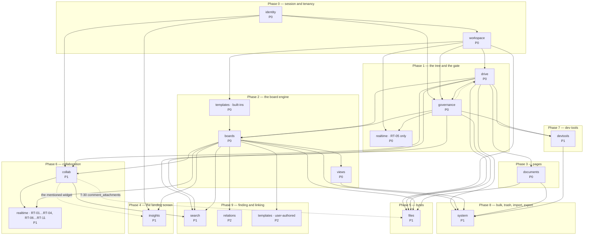
```mermaid
graph TD
    subgraph PH0["Phase 0 — session and tenancy"]
        identity["identity<br/>P0"]
        workspace["workspace<br/>P0"]
    end

    subgraph PH1["Phase 1 — the tree and the gate"]
        drive["drive<br/>P0"]
        governance["governance<br/>P0"]
        rt05["realtime · RT-05 only<br/>P0"]
    end

    subgraph PH2["Phase 2 — the board engine"]
        templates["templates · built-ins<br/>P0"]
        boards["boards<br/>P0"]
        views["views<br/>P0"]
    end

    subgraph PH3["Phase 3 — pages"]
        documents["documents<br/>P0"]
    end

    subgraph PH4["Phase 4 — the landing screen"]
        insights["insights<br/>P1"]
    end

    subgraph PH5["Phase 5 — bytes"]
        files["files<br/>P1"]
    end

    subgraph PH6["Phase 6 — collaboration"]
        collab["collab<br/>P1"]
        rtfull["realtime · RT-01…RT-04, RT-06…RT-11<br/>P1"]
    end

    subgraph PH7["Phase 7 — dev tools"]
        devtools["devtools<br/>P1"]
    end

    subgraph PH8["Phase 8 — bulk, trash, import, export"]
        system["system<br/>P1"]
    end

    subgraph PH9["Phase 9 — finding and linking"]
        search["search<br/>P1"]
        relations["relations<br/>P2"]
        usertpl["templates · user-authored<br/>P2"]
    end

    identity --> workspace
    identity --> governance
    identity --> collab
    identity --> insights

    workspace --> drive
    workspace --> governance
    workspace --> templates
    workspace --> files
    workspace --> rt05

    drive --> governance
    governance -.-> drive
    drive --> boards
    drive --> documents
    drive --> devtools
    drive --> files
    drive --> collab
    drive --> system
    drive --> search

    governance --> boards
    governance --> devtools
    governance --> files
    governance --> rt05
    governance --> search

    templates --> boards
    boards --> views
    boards --> insights
    boards --> files
    boards --> collab
    boards --> system
    boards --> search
    boards --> relations
    boards --> usertpl
    views --> system

    documents --> files
    documents --> system
    devtools --> system

    collab --> search
    collab -.->|T-30 comment_attachments| files
    collab -.->|the mentioned widget| insights
    collab --> rtfull
    boards --> rtfull
```

**The one real cycle is `drive` ⇄ `governance`, and it is a read-time cycle, not a schema cycle.**
`access_rules.node_id` references `nodes` — that is the hard direction, and it is why `nodes` is
created first. The other direction is a *read*: the tree endpoint is pruned by visibility **before**
it is returned (`visibleTree`, `src/lib/permissions/visibility.ts:197-240` — "no surface asks 'may I
show this', because what it was handed is already the answer"). Both live in Phase 1 and ship as one
milestone. Part 1 §2.3 states the same conclusion for the whole P0 band: "the eight P0 entries are
not eight milestones — they are one."

**The one edge whose direction the backend reverses.** In the frontend, `devtools-service.ts` imports
`ENVIRONMENT_OPTIONS` from `src/lib/board-templates.ts:28-37` — the deployment-label list DV-ENV-21
lives beside the board templates that use it. In the backend the owner is `environments` (T-26,
canon OQ-63 position), and a template's Environment column is an ordinary `select` column whose
options are copied verbatim out of the template's JSONB at instantiation (part 17 §36.2 step 5), so
it needs nothing from `devtools`. `environments` is therefore created in **Phase 0** — it has no
dependency beyond `workspaces`, and `POST /workspaces` seeds its three rows in the same transaction
(part 17 §36.1 step 3). Its endpoints (E-106 – E-109) wait for Phase 7, where something finally
reads them.

---

### The phased build order

| Phase | Modules | Depends on | Unblocks (FE screens) | Priority |
| --- | --- | --- | --- | --- |
| **0** | `identity`, `workspace` | — | Sign-in. `WorkspaceGuard` stops refusing (`src/components/workspace/workspace-guard.tsx:10-27`). `WorkspaceSwitcher`, `UserMenu`, `WorkspaceSettingsDialog` → General / Members / Danger zone, `InviteMemberDialog`, `StorageMeter` (reads `0 B`). | **P0** |
| **1** | `drive`, `governance`, `realtime` (RT-05 only) | 0 | `/drive` and every nested route, `AppSidebar` + `TreePanel`, `BreadcrumbNav`, `DriveView` / `DriveGrid` / `DriveList`, `RenameDialog`, `NodeDetail`, `/favorites`, `/archive`, `NodeAccessDialog` + `AccessList`, `PermissionDialog` + `RoleMatrix`, `RolePreviewBanner`, `WorkspaceRestrictedTab`, `/audit`. `useAccessSync` starts working. | **P0** |
| **2** | `templates` (built-ins), `boards`, `views`, `realtime` (RT-06 … RT-10) | 1 | `BoardPage` and every view: `TableGrid`, `KanbanBoard`, `CalendarBoard`, `GanttBoard`. `RowDrawer` + `ActivityTimeline` + `SubtaskPanel`. `ViewTabs`, `ViewConfigBar`, `FilterMenu`, `SortMenu`, `GroupMenu`, `DateMenu`. `ColumnMenu`, `ConvertColumnDialog`, `SelectColumnDialog`, `TransitionRulesEditor`, `ConditionBuilder`, `StepNumberingDialog`, `ApiDuplicateBanner`. | **P0** |
| **3** | `documents`, `system` (version history — pages half) | 1 | `DocumentPage`, `BlockEditor` + `BlockRow` + every block component, `EditorToolbar`, `SlashMenu`, `SaveIndicator`, `LockedBanner`, `DocumentActionsMenu`, `MovePageDialog`, `PinnedPages` in the sidebar, `VersionHistoryDialog` + `VersionList` + `VersionDetail` for pages. | **P0** |
| **4** | `insights` | 2 (3 for page counts) | `/dashboard` — **the app's landing route** — with `DashboardPage`, `DashboardWidget`, `OnboardingPanel`. `/my-work` with `MyWorkPage`, `WidgetCard`, `WorkItemRow`. | **P1**, first among P1 |
| **5** | `files` | 1, 2, 3 | `/files`, `FilesView` → `FileManager` → `FileTable` + `FileMetadataTable`, `FileDropzone`, `UploadDialog`, `UploadDropTarget`, `UploadQueuePanel` + `UploadTaskRow`, `FilePreviewDialog` and all six `preview/*` surfaces, `DrivePreviewDialog`. `AttachmentCell`, `AttachmentPanel`, `AttachmentGallery`, `AttachmentViewer`. `ImageBlock`, `AttachmentBlock`, `LinkBlock`. `StorageMeter` becomes truthful. | **P1** |
| **6** | `collab`, `realtime` (RT-01 … RT-04), `files` (T-30) | 1, 2, 3, 5 | `CommentPanel`, `CommentComposer`, `MentionTextarea`, `CommentItem`, `CommentBody`, `CommentAttachments`, the drawer's Comments tab (`DrawerTabs`), `WatchButton`, `NotificationBell`, `/notifications` with `NotificationFeed` + `NotificationTabs` + `NotificationItem`. The `mentioned` My Work widget stops being empty. | **P1** |
| **7** | `devtools`, `system` (version history — config/secret half) | 0 (T-26), 1 | `ConfigDocumentPage`, `CodeEditor`, `LanguagePicker`, `EnvironmentPicker`, `SecretDocumentPage`, `SecretList`, `SecretEditorPanel`, `SecretAuditPanel`, `SecretEnvPaste`, `VersionHistoryDialog` for config documents and secret rotations. | **P1** |
| **8** | `system` (trash console, bulk, import, export) | 1, 2, 3, 5, 7 | `/trash` with `TrashPage`, `BulkActionBar`, `BulkMoveDialog`, `ImportDialog` + `ImportUploadStep` / `ImportMappingStep` / `ImportValidationStep` / `ImportResultStep`, `ExportDialog`. | **P1** |
| **9** | `search`, `relations`, `templates` (user-authored) | 1, 2, 6 | `GlobalSearchDialog` and the header's `GlobalSearch` (⌘K). `RelationCell` chips resolve, `BacklinksPanel` fills, `GanttDependencies` draws its connectors. "Save board as template". | `search` **P1**, `relations` **P2**, user templates **P2** |

Phases 5, 6 and 7 have no ordering constraint between them beyond `collab`'s dependency on `files`
for `comment_attachments`. Two teams can run 5 → 6 and 7 in parallel from the end of Phase 3.
Phases 8 and 9 depend on almost everything and are genuinely last.

---

### Phase 0 — session and tenancy

**Tables:** T-01 `users`, T-02 `user_sessions`, T-03 `workspaces`, T-04 `workspace_members`,
T-05 `workspace_invitations`, T-26 `environments`, T-37 `user_ui_preferences`.

**Endpoints:** E-001 – E-006 (`identity`), E-007 – E-019 (`workspace`), E-139 `GET /config`,
E-140 `GET /health`.

**What the frontend can start using at the end of it.** The shell boots. `WorkspaceGuard` settles
membership before anything inside a workspace mounts (`src/components/layout/app-shell.tsx:49-52`),
so this is the first phase that produces a screen at all. The workspace switcher lists only
workspaces the caller is in (`visibleWorkspaces`, `src/lib/workspace-access.ts:45-50`); the members
tab reads E-012 and writes E-013 – E-016 with the last-admin guard live
(`isLastAdmin`, `src/lib/workspace-access.ts:84-157`); E-139 replaces `src/config/app.ts`'s
client-side constants so the browser's pre-checks and the server's limits cannot disagree
(`MAX_UPLOAD_BYTES`, `IMPORT_MAX_ROWS`, `TRASH_RETENTION_DAYS`, `SEARCH_GROUP_LIMIT`,
`MY_WORK_WIDGET_LIMIT`, `AUDIT_PAGE_SIZE`, `VERSION_HISTORY_LIMIT`).

**Still degraded.** `StorageMeter` renders `0 B of 15 GB` — `workspaces.used_bytes` is a real column
maintained transactionally (canon §1.4) but nothing increments it until Phase 5. Every navigation
below `/` is a dead end.

**Why T-26 is here and not in Phase 7.** `POST /workspaces` seeds Development / Staging / Production
inside its transaction (part 17 §36.1 step 3). Creating the table in Phase 7 would mean backfilling
every workspace made before it, which is a migration bought for nothing — the table has three rows
per workspace and one foreign key.

---

### Phase 1 — the tree and the gate

**Tables:** T-06 `nodes`, T-07 `node_favorites`, T-08 `access_rules`, T-36 `audit_events`,
T-09 `trash_entries`.

**Endpoints:** E-020 – E-035 (`drive`), E-040 – E-046 (`governance`), E-136 and E-137 (audit),
E-138 (the socket, carrying **RT-05 only**), E-135 as a **stub** returning a zeroed
`DashboardSummary` with `isNewWorkspace: true`.

**Why `trash_entries` is created here but its console is not.** E-032 `DELETE /nodes/{nodeId}`
returns a `TrashEntry` and writes the row — the frozen `original_path`, resolved while the ancestors
still exist, is only correct if it is written in the same transaction that detaches the subtree
(part 17 §36.9; `src/lib/trash.ts:49-51`). So the table must exist the moment delete does. The
console that reads it back (E-036 – E-039) is Phase 8. Between the two, nothing is lost — it is
merely unrecoverable through the UI.

**Why a one-frame realtime hub ships here.** RT-05 `permission.changed` is the one frame that is a
correctness requirement rather than a convergence convenience: without it a revoked user keeps a
loaded board on screen until they reload (canon §7.1; `src/hooks/use-access-sync.ts:74-83`). It
needs only `workspace_members` and `access_rules`, both delivered in this phase, and it carries ids
and nothing else — "a frame announcing a revocation must not be the thing that leaks what was
revoked" (`src/types/realtime.ts:20-25`). Shipping the hub here also means Phases 2 – 9 add frames
without touching the transport.

**Why E-135 ships as a stub.** `src/app/(workspace)/page.tsx` redirects `/` to `/dashboard`. Until
Phase 4 the real aggregate cannot be computed, and without *some* answer the first screen a user
sees is an error panel. A zeroed `DashboardSummary` with `isNewWorkspace: true` renders
`OnboardingPanel`, which is the correct screen for a workspace with no boards
(`src/components/dashboard/onboarding-panel.tsx`), and it is replaced in Phase 4 with no client
change.

**What the frontend can start using.** The whole drive: E-020's pruned tree feeds `AppSidebar`,
`TreePanel`, `BreadcrumbNav`, the drive grid and list, favourites and archive. Access management is
complete — mode (E-041), rules (E-042/E-043), the resolved list (E-040) and the admin recovery
console (E-046). The audit log renders with real facets over the whole filtered set (E-136).

**Still degraded.** Every leaf node in the tree — board, page, config, secret, file — resolves to a
node the surface cannot open. The drive lists them; opening one is Phases 2, 3, 5 and 7.

---

### Phase 2 — the board engine

**Tables:** T-17 `board_templates`, T-10 `boards`, T-11 `board_columns`, T-12 `board_rows`,
T-14 `row_activity`, T-15 `board_views`, T-16 `board_view_preferences`.

**Endpoints:** E-047 – E-050 (board), E-051 – E-060 (columns), E-061 – E-070 and E-073 (rows),
E-078 – E-083 (views), E-087 and E-088 (template reads). Frames RT-06 – RT-10.

**Not in this phase, deliberately:** E-071 and E-072 (`relations`, Phase 9), E-074 – E-077 (bulk,
Phase 8), E-084 – E-086 (import/export, Phase 8), E-089/E-090 (user-authored templates, Phase 9).

**What the frontend can start using.** Everything a board is. `BoardSnapshot` (E-047) is the one
call `use-board.ts` makes on open; every view type renders off the same loaded set because filtering,
sorting and grouping are client-side over `rowsById` (canon OQ-36 position). The record drawer, the
activity timeline, subtasks, the whole column-schema surface including transition rules and
conditional availability, and saved views with the "a board needs at least one view" guard
(`VIEW_LAST_REMAINING`, E-081).

**Still degraded, and how honestly.** Two cell types render but cannot complete:

- **Attachment cells** show the metadata stored in the cell value with `url: null`. The frontend
  already treats a null URL as "bytes this session cannot reach" (`isReachable`,
  `src/lib/attachments.ts:79-82`), so the degradation is designed, not accidental. Phase 5 fixes it.
- **Relation cells** render the stored row id rather than a resolved chip, and a dangling id renders
  `[Deleted Item]` with an unlink action — which is exactly the behaviour canon fixes in place
  (OQ-44/OQ-45 position: "dangling ids stay in the cell so `[Deleted Item]` keeps rendering").
  Phase 9 fixes it.

**Why `templates` is inside this phase and not before it.** Board creation goes through E-024 with
`kind: "board"`, which reads `board_templates` and deep-copies its columns and views into the new
board (part 17 §36.2 step 2; `src/lib/board-templates.ts:12-18`). The four built-ins are seed rows;
there is no `tasks`, `bugs`, `qa_cases` or `api_endpoints` table and no chapter may add one
(canon §1.3.5).

---

### Phase 3 — pages

**Tables:** T-18 `documents`, T-19 `document_versions`.

**Endpoints:** E-091 – E-094 (`documents`), and E-095 – E-098 (version history) **restricted to
nodes of kind `document` with `documentKind: "page"`**. The same four endpoints gain their config
and secret branches in Phase 7 — one endpoint family, the node's kind selects the store
(canon §3.14).

**What the frontend can start using.** `DocumentPage` and the whole block editor; autosave through
`use-autosave.ts` against E-092 with `expectedVersion`; the lock, allowed for `document.lock` **or
the document's owner**, with `lockedBy` taken from the session and never the body (E-094, OQ-60);
pinning (E-093), which also lights up `PinnedPages` in the sidebar; and version history — list,
detail, diff and restore — for pages.

**Still degraded.** `ImageBlock`, `AttachmentBlock` and `LinkBlock` render their placeholder states
until Phase 5 (E-117 signed URLs, E-118 link unfurl). Document text is not searchable until Phase 9.

**Why this phase is P0 rather than P1.** Document nodes are in the seeded tree from the first frame,
and boards, pages, config and secret documents all render *inside* `/drive/<path>`
(`src/components/drive/drive-view.tsx:11-14`). Shipping Phase 1 without Phase 3 means the sidebar
shows pages that 404 when clicked.

---

### Phase 4 — the landing screen

**Tables:** none. Both endpoints are projections computed on read; canon §1.2 lists
`my_work_items` and `dashboard_widgets` among the tables that deliberately do not exist.

**Endpoints:** E-135 `GET /workspaces/{workspaceId}/dashboard` (replacing the Phase 1 stub),
E-134 `GET /me/work`.

**What the frontend can start using.** `/dashboard` becomes real: Task, QA and Deadline widgets with
their ten buckets, `isNewWorkspace` and `boardCount` as cross-widget facts, and click-through to the
source board. `/my-work` renders five widgets, each with capped `items` **and** an uncapped `total`
so "12 of 40" stays honest (`src/types/collab.ts:144`).

**Still degraded.** The `mentioned` widget returns `{ items: [], total: 0 }` until Phase 6 — it is
the one bucket computed from comments (`src/services/my-work-service.ts` mentions branch), and the
widget's own empty state already reads correctly. The dashboard's QA widget classifies a board by
**what it became** — its status column offering a `passed` or `failed` option — and explicitly not
by template id (`src/lib/dashboard.ts:86-96`), so it works from Phase 2 data alone.

**Why a P1 module lands fourth.** O-3. `/` redirects to `/dashboard`, and every subsequent phase is
easier to demonstrate when the front door opens.

---

### Phase 5 — bytes

**Tables:** T-27 `file_assets`, T-32 `uploads`, T-28 `file_nodes`, T-29 `cell_attachments`,
T-31 `document_asset_refs`. **Not** T-30 `comment_attachments` — its FK target does not exist yet.

**Endpoints:** E-110 – E-118.

**What the frontend can start using.** `/files` and the whole file manager; the three-step presigned
upload behind the same `fileService.upload` signature the store already calls, so no store, reducer
or component changes (part 10 §21.2); previews for image, PDF, text and sheet; text and spreadsheet
save (E-115); downloads and signed asset URLs (E-116, E-117); board attachment cells and the drawer
attachment panel; document image and attachment blocks; link unfurl (E-118). `StorageMeter` becomes
truthful because `workspaces.used_bytes` is now incremented inside E-111's transaction.

**The rule this phase must not break.** Only `assetId` is persisted in cells, blocks and comments;
`url` and `thumbnailUrl` are minted per response as short-lived signed URLs and are never accepted on
write (canon §1.3.4, OQ-75; `src/types/board.ts:206-207`). And the reference row —
`cell_attachments`, `document_asset_refs` — is written by the endpoint that stores the reference
(E-066, E-092) in *its* transaction, not by E-111, so the reference and the cell value it projects
cannot drift (part 10 §21.2).

---

### Phase 6 — collaboration

**Tables:** T-33 `comments`, T-34 `watches`, T-35 `notifications`, T-30 `comment_attachments`.

**Endpoints:** E-119 – E-125 (comments), E-126 – E-128 (watches), E-129 – E-132 (notifications).
Frames RT-01 – RT-04.

**What the frontend can start using.** The comment panel on every target kind — `EntityKind` is
`NodeKind` plus `row` (`src/types/collab.ts:7`), so one thread model serves a record and a page; the
mention composer; watch/unwatch; the notification bell with a **server-computed** unread count
(E-132, OQ-91) rather than "unread among the ones we loaded"; and `/notifications` with its four
tabs, which are a client-side projection of `reason` and never a wire value (canon §2.9, OQ-90).

**The transaction this phase exists to get right.** E-120 is one transaction: the comment, the
author's auto-watch, the mention notifications, the watcher notifications, the row activity entry
and the attachment references (part 17 §36.6). `mentionedUserIds` is parsed **server-side** from
`@[Name](usr_id)` and a client-supplied list is ignored (canon E-120; `src/lib/mentions.ts`).

**What this phase also finishes.** The `mentioned` My Work widget (Phase 4) and
`comment_attachments`, the last of the five file reference tables.

---

### Phase 7 — dev tools

**Tables:** T-20 `config_documents`, T-21 `config_versions`, T-22 `secret_documents`,
T-23 `secrets`, T-24 `secret_rotations`, T-25 `secret_access_events`. (T-26 `environments` already
exists from Phase 0.)

**Endpoints:** E-099 – E-105, E-106 – E-109, and the config and secret branches of E-095 – E-098.

**What the frontend can start using.** The config document page with its fifteen `ConfigFormat`
values and the autosave fold — `isAutosave: true` folds into the head version when that version is
also an autosave by the same author (E-100, OQ-59 position). The secret document page: masks only on
read, whole-list replace on write with an omitted `value` meaning "leave the stored value untouched"
(E-102), audited reveal and copy (E-103, E-104), the per-document access trail (E-105), and the
environment picker (E-106).

**Ship it complete or not at all.** Part 1 §2.3 states this and it is the reason the module is one
phase rather than two: a half-built secret store with an unaudited reveal is worse than no secret
store. Concretely, E-103 must write `secret_access_events` **and** `audit_events` and commit them
*before* the plaintext is returned, on the allowed and the denied path alike (part 17 §36.8;
`src/services/devtools-service.ts:342-349` — "a refusal nobody can see is not a control").

---

### Phase 8 — bulk, trash, import and export

**Tables:** T-38 `import_jobs`, T-39 `export_jobs`.

**Endpoints:** E-036 – E-039 (trash console), E-074 – E-077 (bulk), E-084 – E-086 (import/export).

**What the frontend can start using.** `/trash` with restore that walks `original_ancestor_ids` for
the deepest surviving container and reports `isRelocated` (E-037); the bulk action bar over a grid
selection, including the cross-board move that runs one transaction over **both** boards and names
unmatched columns in `droppedColumns` (E-077); the import wizard end to end; and the export dialog
for all three scopes and three formats.

**Why it is this late.** E-077 needs two boards (Phase 2). Export scope `view` needs saved views
(Phase 2) and reads the active **search term**, not only filters and sort (canon §2.7). Version
history's config and secret branches need Phase 7. And the trash console's restore has to be able to
put a page, a board, a file and a secret document back, which means every content module must exist
first or restore will succeed into a node nothing can open.

---

### Phase 9 — finding and linking

**Tables:** T-13 `board_row_relations`. Search adds **no table** — `tsvector` columns with GIN
indexes on `documents`, `board_rows`, `comments` and `nodes` (canon §1.2, part 17 §35.6).

**Endpoints:** E-133 (search), E-071 and E-072 (relations), E-089 and E-090 (user-authored
templates).

**What the frontend can start using.** ⌘K opens a populated dialog with eight result kinds in fixed
group order, capped per group so one noisy board cannot crowd out a kind, and **the permission
funnel runs before scanning, not after** (canon E-133). Relation chips resolve through one request
per target board rather than one per cell (E-071), and `BacklinksPanel` becomes an indexed query over
`board_row_relations` rather than a scan (E-072). `GanttDependencies` draws its "blocked by"
connectors — which are a relation column named "Blocked by" shipped by the `task` template
(`src/lib/board-templates.ts:192`), not an edge type; no chapter may introduce a `RelationType`
without resolving OQ-45 (canon §2.9).

**Why `relations` is P2 and still gets built.** The degradation is already designed — a relation cell
renders its stored id and a deleted target renders `[Deleted Item]` — so nothing is broken without
it. But `board_row_relations` is written in the same transaction as the cell it projects
(canon T-13, part 17 §36.5), which means the **projection writer** has to exist from Phase 2 even
though the **readers** (E-071, E-072) land here. Ship the write side with the board engine and the
read side here; a projection that starts empty and is backfilled is a migration nobody needs.

---

### The P0 / P1 / P2 register

Bands are part 1 §2.3's and are not re-decided here. `P0` = the shell does not boot, or boots into a
refusal, without it. `P1` = the shell boots and P0 surfaces work, but a numbered PRD feature is dead.
`P2` = the feature degrades into behaviour the frontend already handles, or it is a
`RECOMMENDATION` whose OQ is still open.

| Module | Band | Phase | The sentence that decides the band | What the user sees without it |
| --- | --- | --- | --- | --- |
| `identity` | **P0** | 0 | 33 files import a hardcoded user (`src/mock/users.ts:3`); no request can name an actor. | Nothing. There is no caller. |
| `workspace` | **P0** | 0 | "Not a member" is not "viewer" (`src/lib/workspace-access.ts:4-14`), and `WorkspaceGuard` settles membership before anything mounts. | The refusal screen, for everyone. |
| `drive` | **P0** | 1 | Every route resolves a slug chain against the tree; boards, pages, config and secret documents all render **inside** `/drive/<path>`. | An empty sidebar and a dead URL space. |
| `governance` | **P0** | 1 | Not "no permissions" — **no safe read at all**. E-020 is pruned by visibility before it returns (`visibility.ts:197-240`). | Either everything, to everyone, or nothing. |
| `boards` | **P0** | 2 | `BD-COR-07`. Table view is the default surface of every board node. | Board nodes that cannot be opened. |
| `views` | **P0** | 2 | A board must have at least one view; E-081 refuses the delete that would leave zero (`VIEW_LAST_REMAINING`). | A board that loads and cannot render. |
| `templates` (built-ins) | **P0** | 2 | Board creation takes a `templateId`; the four seeds are what E-024 deep-copies. | No way to create a board with columns. |
| `documents` | **P0** | 3 | Document nodes exist in the seeded tree from the first frame. | A sidebar full of pages that 404. |
| `insights` | **P1** | 4 | `/` redirects to `/dashboard`, so this is the landing screen (`SY-DSH-44`, `CO-MYW-30`). | An error panel as the first screen. |
| `files` | **P1** | 5 | `WS-FIL-06` and the whole `/files` route. File **nodes** still list from `drive`. | The tree is intact; the bytes are not. |
| `collab` | **P1** | 6 | `CO-CMT-26`, `CO-MEN-27`, `CO-WAT-28`, `CO-NOT-29`. | The bell reads zero; the drawer's Comments tab is empty. |
| `realtime` | **P1**, one **P0** frame | 1 and 6 | RT-05 is not optional: a revoked user keeps a loaded board on screen (`use-access-sync.ts:74-83`). The other eleven frames are convergence, not correctness. | Stale tabs — and, without RT-05, a data-exposure window. |
| `devtools` | **P1** | 7 | `DV-CFG-22`, `DV-SEC-23`, `DV-ENV-21`. Ship it complete or not at all. | Config and secret nodes that cannot be opened. |
| `system` | **P1** | 1, 3, 7, 8 | `SY-BLK-34` … `SY-VER-39`. Node soft-delete itself is `drive` (E-032), so nothing is lost, only unrecoverable through the UI. | `/trash` empty; multi-select loses its action bar; no import, no export, no history. |
| `search` | **P1** | 9 | `CO-SCH-31`. The cheap drive quick-find (E-035) is a `drive` endpoint and survives (OQ-94). | ⌘K opens an empty dialog. |
| `relations` | **P2** | 2 (write) / 9 (read) | `DV-REL-24`. A relation cell renders its stored id; a deleted target renders `[Deleted Item]` with an unlink action. | Unresolved chips and an empty backlinks panel. |
| `templates` (user-authored) | **P2** | 9 | `RECOMMENDATION` under OQ-47 — the frontend has no surface that saves a board as a template. | Nothing; the control does not exist yet. |
| `board_view_preferences` (E-083) | **P2** | 2 | `RECOMMENDATION` under OQ-46 — per-viewer column widths and collapse state. | Widths reset between sessions, which is today's behaviour. |

---

### The smallest shippable slice

Part 1 §2.3 names it and this ordering preserves it, so it is repeated here as an acceptance test
rather than an aspiration:

> **sign in → list workspaces → read the pruned tree → open one board with one view → edit one cell
> → see it after a refresh.**

That slice is the end of **Phase 2** and touches exactly eleven endpoints: E-001, E-004, E-007,
E-009, E-020, E-022, E-044, E-047, E-062, E-066, E-139. If those eleven work against a real database
with a real session and a real permission check, every remaining phase is additive and — except for
`realtime`, which needs one constant changed (`REALTIME_ENDPOINT`, `src/config/app.ts:65-69`) — no
frontend release is required for any of them.

---

### One question this ordering raises

**OPEN QUESTION (new — proposed OQ-105; see Chapter notes)** — when a URL path resolves to
a node the caller may not see, does the API tell them *something* is there?

**Evidence.** The frontend renders a distinct refusal screen for this case. `useDriveLocation`
computes `isDenied` by resolving the path against the pruned tree **and** the full tree, and treating
"missing from one, present in the other" as a refusal
(`src/hooks/use-drive-location.ts:56`); `DriveView` then renders `PermissionDeniedState` with
"You don't have access to this item" *before* it considers `isNotFound`
(`src/components/drive/drive-view.tsx:87-98`). The frontend has reasoned about the leak explicitly
and accepted it: "knowing that *something* is there is unavoidable once a URL resolves, knowing what
it is called is not" (`use-drive-location.ts:21-27`), and the refusal deliberately names nothing
(`DENIED_REASON`, `src/lib/permissions/evaluate.ts:155-167`). But canon §4.2 says `not_found` means
"the resource does not exist, **or the caller may not see it** — the two answer identically", and
canon E-021's `DriveLocation` carries `isNotFound` and no `isDenied`. A real API serves only the
pruned tree, so `isDenied` computes to `false` for everyone and the screen becomes unreachable.

**Recommendation.** Follow canon: E-021 returns `isNotFound: true` with the crumbs resolved so far
and no `isDenied` field, and E-022 returns `404 NODE_NOT_FOUND`. Treat `isDenied` as dead frontend
code to be removed rather than as a contract to satisfy. If product wants the refusal screen back,
add it as an explicit, audited field on E-021 only — never on E-022 — and accept that it confirms the
existence of a node at a guessed path.

**Impact if wrong.** If the refusal screen must survive and E-021 does not carry the flag, a user who
follows a shared link into a folder they were not granted sees "Not found" and reasonably concludes
the link is broken — support cost, not a security defect. If the flag is added carelessly to E-022,
node ids become an existence oracle for the whole workspace, which is a security defect.

---

### 39.1 Example Flows

Seven flows, each drawn against the same five participants — **Frontend**, **API**, **DB**,
**Storage**, **Realtime** — with participants a flow does not touch named in the text rather than
drawn as an idle lane. Every diagram makes the authorization stages explicit, using one vocabulary
defined once here and never re-explained.

#### The five gates, stated once

Reproduced from the governance chapter's server-side algorithm, which is itself transcribed from
`src/lib/workspace-access.ts:67-76`, `src/lib/permissions/visibility.ts:156-174`,
`src/lib/permissions/inheritance.ts:91-120` and `src/lib/permissions/evaluate.ts:69-87`.

| Gate | Question | Source of truth | Refusal |
| --- | --- | --- | --- |
| **1 · Membership** | Is the caller in this workspace at all? | `workspace_members`. A missing row is **not** `viewer` — "a default here is a way in" (`src/lib/workspace-access.ts:30-36`). | `WORKSPACE_NOT_FOUND` 404 — identical to a workspace that does not exist. |
| **2 · Visibility** | May the caller *see* this node? | Walk `nodes` root → node. `inherit` passes the decision through, `workspace` opens to every member, `restricted` discards what flowed in and asks `hasGrantOn` (owner, then a user-scoped rule, then a role-scoped rule). | `NODE_NOT_FOUND` 404, or the node is simply absent from a listing. |
| **3 · Effective role** | Which role does the caller hold *here*? | Walk the same chain over `access_rules`; the **last** match wins, and a rule naming the person beats one naming their role at the same depth. It is not a `max()` — a rule can lower the role. The workspace role is the floor. | — (produces a role, never a refusal) |
| **4 · Capability** | Does that role hold this `PermissionKey`? | `ROLE_PERMISSIONS[R]`, plus owner escalation for the five keys in `OWNER_ESCALATIONS` from `member` upward. | `PERMISSION_DENIED` 403, `detail` = `Needs the {Role} role or above`. |
| **5 · Lifecycle** | Is the node in a state that accepts this write? | `nodes.deleted_at`, an archived **ancestor**, `nodes.is_locked`. The three layers only ever take away; `READ_ONLY_KEYS` pass through all of them. | `NODE_TRASHED_READ_ONLY` / `NODE_FROZEN_BY_ANCESTOR` / `NODE_LOCKED`, all 403. |

Gates 1 and 2 answer with `not_found`, never `permission_denied`, because "the resource does not
exist, or the caller may not see it — the two answer identically" (canon §4.2). Gates 4 and 5 answer
with `permission_denied` and the copy is deliberately name-free
(`src/lib/permissions/evaluate.ts:155-167`).

**Audit and gates.** A gate-4 or gate-5 refusal on a write is audited with `outcome: 'denied'`. A
gate-2 exclusion from a *listing* is not — it is a listing that legitimately contains nothing, not a
refusal, and `visibleTree` returns a pruned tree with no error at all
(`src/lib/permissions/visibility.ts:197-240`). Privileged **reads** that are audited at `warn` are
enumerated by canon OQ-26: E-040, E-046, E-136, E-137 — and E-103, which is audited on both paths.

---

#### 39.1.1 Create a workspace — the two-insert transaction

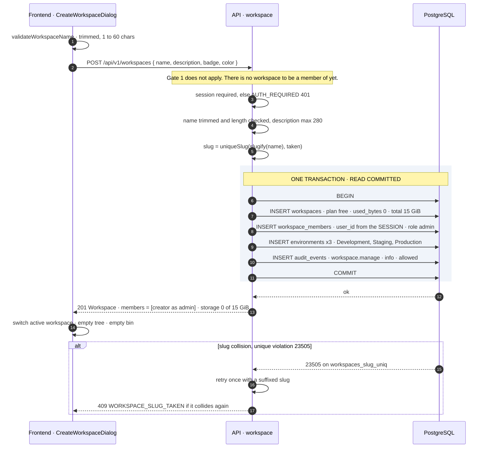
```mermaid
sequenceDiagram
    autonumber
    participant FE as Frontend · CreateWorkspaceDialog
    participant API as API · workspace
    participant DB as PostgreSQL

    FE->>FE: validateWorkspaceName · trimmed, 1 to 60 chars
    FE->>API: POST /api/v1/workspaces { name, description, badge, color }

    Note over API: Gate 1 does not apply. There is no workspace to be a member of yet.
    API->>API: session required, else AUTH_REQUIRED 401
    API->>API: name trimmed and length checked, description max 280
    API->>API: slug = uniqueSlug(slugify(name), taken)

    rect rgb(240, 244, 250)
    Note over API,DB: ONE TRANSACTION · READ COMMITTED
    API->>DB: BEGIN
    API->>DB: INSERT workspaces · plan free · used_bytes 0 · total 15 GiB
    API->>DB: INSERT workspace_members · user_id from the SESSION · role admin
    API->>DB: INSERT environments x3 · Development, Staging, Production
    API->>DB: INSERT audit_events · workspace.manage · info · allowed
    API->>DB: COMMIT
    end

    DB-->>API: ok
    API-->>FE: 201 Workspace · members = [creator as admin] · storage 0 of 15 GiB
    FE->>FE: switch active workspace · empty tree · empty bin

    alt slug collision, unique violation 23505
        DB-->>API: 23505 on workspaces_slug_uniq
        API->>API: retry once with a suffixed slug
        API-->>FE: 409 WORKSPACE_SLUG_TAKEN if it collides again
    end
```

**Participants not shown:** Storage (no object), Realtime (the creator is the only member and holds
the response).

**Walkthrough.**

1. **Endpoint.** `POST /api/v1/workspaces` — canon **E-008**. Request DTO `CreateWorkspaceRequest`
   `{ name: string; description?: string; badge?: string; color?: string }`, mirroring
   `NewWorkspaceInput` (`src/lib/workspace-access.ts:189-194`). Response is the bare `Workspace`
   (canon §5.1: a `POST` returning a `Workspace` returns `Workspace`, not
   `CreateWorkspaceResponse`).
2. **Permission checked.** Session only. Gate 1 cannot apply — the workspace does not exist yet, and
   canon's Perm column for E-008 is `session`. Gates 2 – 5 have no node.
3. **Validation, before `BEGIN`.** `name.trim()` must be non-empty and at most `WORKSPACE_NAME_MAX`
   = 60 (`src/lib/workspace-access.ts:196-207`); `description` is trimmed and **stored only when
   non-empty** (`:233`) — the frontend omits the key rather than storing `""`, and C-08 forbids
   collapsing optional into nullable. `badge` defaults to `badgeFor(name)`, two upper-case letters
   (`:167-177`); `color` defaults to the tile palette cycled by the number of existing slugs
   (`:180-187`). Refusals here are `VALIDATION_FAILED` 400 with a `fields` array.
4. **Tables touched.** `workspaces` (T-03) — insert; `workspace_members` (T-04) — insert;
   `environments` (T-26) — three inserts; `audit_events` (T-36) — insert. `users` (T-01) is read
   only to project the creator into the response's `members[0]`.
5. **Columns.** `workspaces`: `id`, `name`, `slug`, `description`, `plan = 'free'`, `badge`,
   `color`, `used_bytes = 0`, `total_bytes = 15 * 1024^3`, `created_at`, `created_by`.
   `workspace_members`: `(workspace_id, user_id)` composite unique, `role = 'admin'`, `joined_at`.
   **`user_id` comes from the session and never from the body** (C-09) — a `creatorId` in a request
   body is a claim, not a fact.
6. **The transaction boundary.** All four statements, one transaction, `READ COMMITTED` (part 17
   §36.1). This is the clearest case in the system where two rows are one fact: the frontend's own
   comment says a workspace whose creator has to be added afterwards "has a moment where nobody can
   administer it, and a failure in between leaves one that nobody can ever administer"
   (`src/lib/workspace-access.ts:211-218`). It is unrepairable from inside: with no admin, `isLastAdmin`
   refuses every subsequent change and nobody left can invite or promote anyone
   (`:84-157`, `:98-119`).
7. **Which frontend calls it.** `useWorkspaceStore.createWorkspace`
   (`src/store/workspace-store.ts:290-314`), from `CreateWorkspaceDialog`. Note what the store does
   next and the API must match: `treeByWorkspace[id] = []` and `trashByWorkspace[id] = []` —
   "a new workspace has no tree and no bin. Seeding it with either would put somebody else's
   fixtures inside something a person just made" (`:303-305`). **The API must not seed a sample
   project.**
8. **Realtime event.** None. There is exactly one member and they are holding the response.
9. **Errors.** `VALIDATION_FAILED` 400, `WORKSPACE_SLUG_TAKEN` 409, `AUTH_REQUIRED` 401. The slug is
   globally unique (canon OQ-02 position: single tenant), so the collision is real and is resolved
   by one retry with a suffix before the 409 is returned.

---

#### 39.1.2 Open a RESTRICTED folder — the allowed path and the denied path

The scenario is the seeded one: *Development* contains *Backend*, which is `restricted`. Duc holds a
user-scoped rule on *Backend*; Hai does not (`src/mock/access.ts:24-53`).

```mermaid
sequenceDiagram
    autonumber
    participant FE as Frontend · DriveView + useDriveLocation
    participant API as API · drive and governance
    participant DB as PostgreSQL

    FE->>API: GET /workspaces/{workspaceId}/nodes/resolve?path=development/backend
    API->>DB: SELECT role FROM workspace_members WHERE workspace_id AND user_id
    DB-->>API: role, or NULL

    Note over API,DB: GATE 1 · membership. NULL is not viewer.
    alt not a member
        API-->>FE: 404 WORKSPACE_NOT_FOUND
    else member, role R0
        API->>DB: SELECT nodes WHERE workspace_id AND deleted_at IS NULL
        API->>DB: SELECT access_rules WHERE workspace_id
        DB-->>API: the flat node set and every rule, keyed by node

        Note over API: GATE 2 · walk root to node, carrying the decision.<br/>inherit passes through · workspace opens to all members ·<br/>restricted discards what flowed in and asks hasGrantOn

        alt ALLOWED · Duc is granted on Backend
            Note over API: hasGrantOn(Backend, Duc) is true · owner, then user rule, then role rule
            API->>DB: SELECT node_favorites, owners, per-kind projections for the survivors
            API-->>FE: 200 DriveLocation · node Backend · ancestors [Development] · children · isNotFound false
            FE->>API: GET /nodes/{nodeId}/capabilities
            Note over API: GATE 3 · effective role on Backend · last rule on the chain wins<br/>GATE 4 · project the 39 keys into the six CapabilitySet flags<br/>GATE 5 · narrow for trashed, frozen, locked
            API-->>FE: 200 CapabilitySet
            FE->>FE: render the folder, its children and its enabled controls
        else DENIED · Hai has no grant on Backend
            Note over API: Backend is refused, and takes its WHOLE SUBTREE with it.<br/>No audit row · this is a listing that contains nothing, not a refusal
            API-->>FE: 200 DriveLocation · node Development · isNotFound true · children of Development
            FE->>FE: NotFoundState for the segment "backend"
        end
    end

    Note over FE,API: The direct lookup answers the same way
    FE->>API: GET /nodes/{backendNodeId}
    API-->>FE: 404 NODE_NOT_FOUND · never 403, never the folder's name
```

**Participants not shown:** Storage, Realtime — this is a pure read.

**Walkthrough.**

1. **Endpoints.** `GET /api/v1/workspaces/{workspaceId}/nodes/resolve?path=a/b/c` — canon **E-021**,
   returning `DriveLocation` `{ node, ancestors, children, isNotFound }`. Then
   `GET /api/v1/nodes/{nodeId}/capabilities` — **E-044** — returning `CapabilitySet`. The whole-tree
   read the sidebar uses is **E-020**; the direct lookup is **E-022**; the children listing is
   **E-023**.
2. **Permission checked.** E-021 and E-020: *membership* (gate 1). E-022, E-023, E-044:
   *visibility* (gates 1 – 2). None of them checks a `PermissionKey` — seeing a node is decided by
   access resolution, not by an action, which is why the viewer column of the role matrix is empty
   by construction (`src/lib/permissions/roles.ts:11-16`).
3. **The two axes are never merged.** "A Viewer who is granted a restricted folder **sees it** and
   edits nothing; a Manager who is not granted it **does not see it**, whatever their role"
   (`src/lib/permissions/visibility.ts:15-33`). Gate 2 does not consult the role matrix and gate 4
   does not consult the access mode. Merging them would make "high enough role" a way into a folder
   somebody deliberately shut.
4. **Tables touched.** `workspace_members` (T-04) — read, gate 1 and the floor role.
   `nodes` (T-06) — one flat read, `WHERE workspace_id = :ws AND deleted_at IS NULL`, nested in
   memory by `parent_id`; no recursive CTE, because the whole workspace is being read anyway.
   `access_rules` (T-08) — read, all rules for the workspace, loaded into `Record<nodeId, rules[]>`,
   exactly the shape the resolver walks (`src/store/permission-store.ts:21-31`).
   `node_favorites` (T-07), `users` (T-01) and the per-kind side tables (`boards`, `documents`,
   `file_nodes ⋈ file_assets`) — read, for the survivors only. **Never a board's rows.**
5. **The pruning rule the denied path depends on.** A refused node takes its whole subtree with it —
   "that is what stops a board inside a restricted folder from surfacing in search, favourites or a
   relation picker just because the board itself carries no restriction of its own"
   (`visibility.ts:184-196`). This is why the denial is a *listing* property and does not need to be
   re-checked by search (E-133), favourites (E-033), My Work (E-134), the dashboard (E-135) or the
   relation picker (E-071): they all resolve against the pruned set.
6. **The owner is always admitted.** `hasGrantOn` returns true for the node's owner before it looks
   at any rule (`visibility.ts:87-93`): "somebody has to be able to get back into a folder they
   shut, and 'whoever made it' is a rule a person can hold in their head — which an emergency
   override buried in an admin console is not."
7. **Transaction boundary.** None required. Use **one read-only snapshot** for E-020 and E-021 so
   the tree cannot be internally inconsistent — a child present whose parent was concurrently
   trashed.
8. **Which frontend calls it.** `useDriveLocation` (`src/hooks/use-drive-location.ts:32-58`) for the
   path resolve; `useCapabilities` for E-044; `selectTree` / `visibleTreeFor`
   (`src/store/workspace-store.ts:1063-1085`) for the sidebar. `DriveView` branches on the result
   (`src/components/drive/drive-view.tsx:87-115`).
9. **Realtime event.** None on read. Convergence comes from RT-11 `node.changed` and RT-05
   `permission.changed`; the latter is what makes a *revocation* take effect on an already-open tab
   (`src/hooks/use-access-sync.ts:74-83`).
10. **Errors.** `WORKSPACE_NOT_FOUND` 404 (gate 1), `NODE_NOT_FOUND` 404 (gate 2 on E-022/E-023/
    E-044). E-021's denied path is **not an error**: it is a `200` whose `isNotFound` is `true` and
    whose `node` is the deepest ancestor the caller *may* see. See the open question at the end of
    §39 for the one behaviour this changes on the client.
11. **The admin recovery path is the single deliberate bypass.** E-046
    `GET /workspaces/{workspaceId}/restricted-nodes` looks past gate 2 for a caller holding
    `workspace.permission.manage`, exposes names and paths and no content, and **the read itself is
    audited at `warn`** (`visibility.ts:270-291`; canon OQ-26).

---

#### 39.1.3 Update a status where a transition rule rejects it

```mermaid
sequenceDiagram
    autonumber
    participant FE as Frontend · KanbanBoard + board-store.editCells
    participant API as API · boards
    participant DB as PostgreSQL
    participant RT as Realtime

    FE->>FE: evaluateTransition(Status, from, to) against the loaded schema

    alt refused by rules the tab already holds · the normal case
        FE-->>FE: toast "Status cannot go straight from New to Verified. New can move to Triaged."
        Note over FE,API: no request leaves the client · the card never moves
    else allowed locally, but this tab's schema is stale
        FE->>FE: guardCellEdits splits the batch · optimistic write · captureCells reverts
        FE->>API: PATCH /boards/{boardId}/rows/cells { edits, baseRevisions }

        API->>DB: SELECT boards JOIN nodes · ancestor chain · access_rules
        Note over API,DB: GATES 1-4 · membership, visibility, effective role, row.update<br/>GATE 5 · trashed, frozen by an archived ancestor, locked
        API->>DB: SELECT board_columns · the whole schema, for kind and rule validation
        API->>DB: SELECT board_rows WHERE id = ANY($ids) FOR UPDATE ORDER BY id
        DB-->>API: committed cells and revisions

        Note over API: RECORD RULES · not permission, evaluated separately<br/>1 option isDisabled · 2 option availability conditions · 3 transitionRules
        API->>API: evaluateTransition against the COMMITTED first option id

        alt a rule refuses any edit in the batch
            API->>DB: ROLLBACK
            API-->>FE: 409 conflict · TRANSITION_NOT_ALLOWED · message verbatim from the rule
            FE->>FE: revertCellEdits · the card returns to New
            FE-->>FE: toast error.message
            Note over API,RT: no row_activity, no revision bump, no frame, no audit row
        else every edit passes
            API->>DB: UPDATE board_rows SET cells, revision + 1, updated_at, and the 4 projections
            API->>DB: INSERT row_activity · one entry per row, however many cells it touched
            API->>DB: COMMIT
            API-->>FE: 200 UpdateCellsResponse { rows, conflicts }
            FE->>FE: reconcileRows(result.rows)
            API->>RT: RT-07 row.updated { boardId, rowId, revision } · ids only
        end
    end
```

**Participants not shown:** Storage.

**Walkthrough.**

1. **Endpoint.** `PATCH /api/v1/boards/{boardId}/rows/cells` — canon **E-066**. Request
   `UpdateCellsRequest` `{ edits: CellEdit[]; baseRevisions?: Record<rowId, number> }`, matching
   `UpdateCellsInput` (`src/services/board-service.ts:472-477`). Response `UpdateCellsResponse`
   `{ rows, conflicts }` (canon §5.5).
2. **Permission checked.** `row.update`, resolved on `boards.node_id` — a Member key
   (`src/lib/permissions/roles.ts:22-35`). It is in `CONTENT_WRITE_KEYS`, so gate 5's lock check
   applies (`src/lib/permissions/evaluate.ts:36-49`).
3. **A transition rule is not a permission, and the two are never combined.** The frontend states it
   twice: "Permission answers 'may this person edit Status at all'; a transition rule answers 'may
   Status go from here to there'. Both are checked, separately, before a drop is written"
   (`src/lib/transition-rules.ts:22-25`), and `guardCellEdits` repeats it
   (`src/lib/board-write-rules.ts:14-18`). The server must keep them apart too: gate 4 produces
   `PERMISSION_DENIED` 403, the rule produces `TRANSITION_NOT_ALLOWED` 409.
4. **The evaluation the server must reproduce exactly** (`evaluateTransition`,
   `src/lib/transition-rules.ts:102-133`): rules that are `enabled: false` pass; a move where
   `from === to` passes; **a move touching a key the table does not govern passes** — adding a
   status must never freeze it; otherwise the target must appear in `transitions[from]`. The empty
   bucket is the reserved key `"__empty__"` (`:28`), which must be rejected as a user-authored
   option id (`OPTION_ID_RESERVED` 400).
5. **The server is stricter than the client, deliberately.** The client evaluates `from` against
   `rowsById`, read once; the server evaluates it against the row it just locked
   `FOR UPDATE`. A batch that moves the same row twice therefore evaluates the second edit against
   the first edit's result. That difference must not be softened.
6. **Tables touched.** `boards` (T-10), `nodes` (T-06), `access_rules` (T-08) — read, for the gates.
   `board_columns` (T-11) — read, `config.transitionRules` and `config.options[].availability` live
   in the JSONB (canon §1.3.3, there is no `select_options` table). `board_rows` (T-12) —
   `SELECT … FOR UPDATE` **ordered by `id`** so two concurrent batches cannot deadlock, then
   `UPDATE` only on the allowed path. `row_activity` (T-14) — insert only on the allowed path.
7. **Transaction boundary.** One transaction, `READ COMMITTED`, covering the gate reads, the rule
   evaluation, the updates and the activity inserts (part 17 §36.4). **A rule refusal aborts the
   whole batch**: `UpdateCellsResponse` carries exactly `rows` and `conflicts` and has no channel for
   a per-edit rejection. The bulk endpoints do have that channel — E-074 skips the refused records
   and applies the rest through `BulkSkip`, because "refusing the whole batch because one record
   cannot make the move would be worse than telling the user which ones could not"
   (`src/store/board-store.ts:557-564`).
8. **The one thing that is *not* a 409.** Canon's "E-066 is always `200`, never `409`" governs
   **staleness**. A stale `baseRevisions[rowId]` is applied last-write-wins, the revision is bumped,
   and the collision is reported as a `ConflictNotice` in the `200` body — at most one notice per row
   per call, raised by the first edit that touches it, and a missing `baseRevisions[rowId]` never
   conflicts (`src/services/board-service.ts:504-512`). `CONCURRENCY_CONFLICT` exists in the registry
   and is explicitly never used here.
9. **Which frontend calls it.** `useBoardStore.editCells` (`src/store/board-store.ts:315-354`) —
   from the Kanban drop (`src/components/board/views/kanban-board.tsx:79`), the cell editor, the row
   drawer and a grid paste. All four write through the same action, which is what stops the Kanban
   rule being bypassable by opening the same record's Status cell in the table.
10. **Realtime event.** On success, **RT-07** `row.updated` `{ boardId, rowId, revision }`, ids only,
    published after commit. On refusal, **nothing** — no frame, and **no audit row**: a refused
    business-rule write is not a governance event; `audit_events.outcome` records `denied` for
    permission, not for record rules (`src/types/audit.ts:20`).
11. **Errors.** `TRANSITION_NOT_ALLOWED` 409 and `OPTION_UNAVAILABLE` 409 (record rules);
    `ROW_ARCHIVED_READ_ONLY` 409; `CELL_VALUE_KIND_INVALID` 400; `DATE_VALUE_INVALID` 400;
    `COLUMN_NOT_FOUND` 404; `PERMISSION_DENIED` 403. `message` is the rule's own sentence
    **verbatim** — the API returns the prose because the UI renders `error.message` unchanged
    (canon §4.4 rule 1).

---

#### 39.1.4 Create a subtask

```mermaid
sequenceDiagram
    autonumber
    participant FE as Frontend · SubtaskPanel + board-store.createSubtask
    participant API as API · boards
    participant DB as PostgreSQL
    participant RT as Realtime

    FE->>FE: optimistic row · displayId "TASK-…" · sequence 0 · revision 0 · isPending
    FE->>API: POST /boards/{boardId}/rows { parentRowId, cells }

    API->>DB: SELECT boards JOIN nodes · ancestor chain · access_rules
    Note over API,DB: GATES 1-4 · membership, visibility, effective role, row.create<br/>GATE 5 · trashed, frozen, locked

    rect rgb(240, 244, 250)
    Note over API,DB: ONE TRANSACTION · READ COMMITTED
    API->>DB: BEGIN
    API->>DB: SELECT board_rows WHERE id = parentRowId FOR SHARE
    alt parent missing
        API->>DB: ROLLBACK
        API-->>FE: 404 PARENT_ROW_NOT_FOUND · "That parent record could not be found"
    else parent on another board
        API->>DB: ROLLBACK
        API-->>FE: 409 ROW_PARENT_CROSS_BOARD
    else parent already at the depth cap
        API->>DB: ROLLBACK
        API-->>FE: 409 ROW_PARENT_TOO_DEEP
    else ok
        API->>DB: UPDATE boards SET next_sequence = next_sequence + 1 RETURNING next_sequence
        API->>API: custom_id = formatRowId(prefix, sequence) · position after the parent's last descendant
        API->>DB: INSERT board_rows · cells dense with emptyCellFor per column · revision 1
        API->>DB: INSERT board_row_relations for any relation cells supplied
        API->>DB: INSERT row_activity · "created TASK-042 under TASK-041" on the CHILD
        API->>DB: INSERT row_activity · "added subtask TASK-042" on the PARENT
        API->>DB: COMMIT
    end
    end

    API-->>FE: 201 BoardRow · authoritative id, displayId, sequence, revision 1
    FE->>FE: replaceRow(tempId, created) · the placeholder becomes the real record
    API->>RT: RT-06 row.created { boardId, rowId, revision }
```

**Participants not shown:** Storage.

**Walkthrough.**

1. **Endpoint.** `POST /api/v1/boards/{boardId}/rows` — canon **E-062**, with `parentRowId` set.
   **There is no separate subtask endpoint**: "a subtask is a full board record — its own display id,
   status, assignee, attachments, comments and history — so the parent stores a pointer, never a
   nested copy" (`src/types/board.ts:257-263`). Request `CreateRowRequest`
   `{ afterRowId?: string | null; cells?: Record<columnId, CellValue>; parentRowId?: string | null }`
   (`CreateRowInput`, `src/services/board-service.ts:277-288`). Response is the bare `BoardRow`.
2. **Permission checked.** `row.create` on `boards.node_id` — a Member key. Nothing about the child
   is gated differently from a top-level record.
3. **Tables touched.** `boards` (T-10) — `UPDATE next_sequence … RETURNING`, which is both the
   allocation and the lock. `board_rows` (T-12) — one `SELECT … FOR SHARE` on the parent, one
   `INSERT`. `board_row_relations` (T-13) — inserts, only if the supplied `cells` carry relation
   values. `row_activity` (T-14) — **two** inserts.
4. **Columns and cardinality.** `board_rows.parent_row_id UUID NULL REFERENCES board_rows(id) ON
   DELETE SET NULL`, indexed. A parent has 0..N direct children; a child has 0..1 parent. `ON DELETE
   SET NULL` is the schema expressing a product rule: "children of a deleted parent are lifted to the
   top level rather than removed with it. Deleting a container must not silently delete work nobody
   asked about" (`src/services/board-service.ts:460-470`).
5. **The counter is the server's and only ever increases.** `UPDATE boards SET next_sequence =
   next_sequence + 1 … RETURNING` in one statement — never `MAX(sequence) + 1`. "Deleting `TASK-005`
   does not hand `005` to the next record" (`src/services/board-service.ts:290-293`). The optimistic
   row the client shows carries `` `${prefix}-…` `` precisely because the display id is not the
   client's to invent (`src/store/board-store.ts:363-367`).
6. **Placement.** The child is filed directly after its parent's **last descendant** in board order —
   `lastDescendantOf` (`src/services/board-service.ts:342-352`) — "so the board's own order already
   reads as the tree even before a view nests it" (`:320-321`). `parentRowId` overrides `afterRowId`.
   With `board_rows.position NUMERIC` as a fractional index (canon OQ-34 position), that is a midpoint
   between the last descendant and whatever follows it.
7. **Bounds.** Canon OQ-33 position: same board, depth cap 5, cycles rejected by a recursive CTE,
   archiving a parent does not cascade, deleting a parent lifts its children. A create cannot produce
   a cycle; `PUT /rows/{rowId}/parent` (E-067) can, and reproduces the client's guard
   (`isDescendant`, `src/services/board-service.ts:354-365`).
8. **Two activity entries, one write.** `created {child.displayId} under {parent.displayId}` with
   kind `created` on the child, and `added subtask {child.displayId}` with kind `updated` on the
   parent (`src/services/board-service.ts:327-336`). The **parent's `revision` is not bumped** — a
   parent takes no write because of its children beyond that one history line, and progress is
   computed on read (`subtaskProgress`, `src/lib/board-hierarchy.ts:182-199`), never stored.
9. **Do not run the transition gate on a create.** The composer offers statuses with
   `ignoreTransitions: true` because no record exists yet to transition *from*
   (`src/components/board/drawer/subtask-composer.tsx:60-73`). The server must still gate an initial
   `select` value on `isDisabled` and `availability`, and must not evaluate `transitionRules`.
10. **Transaction boundary.** One transaction, `READ COMMITTED`, covering the allocation, the insert,
    the relation projection and both activity rows (part 17 §36.3). The `custom_id` and the row are
    one fact; an activity entry for a row that does not exist is a lie.
11. **Which frontend calls it.** `useBoardStore.createSubtask`
    (`src/store/board-store.ts:464-515`), from `SubtaskPanel`'s composer
    (`src/components/board/drawer/subtask-panel.tsx:206`) and the row actions menu's "Add subtask".
12. **Realtime event.** **RT-06** `row.created` `{ boardId, rowId, revision }` after commit — ids
    only, no cell content (canon §7.2).
13. **Errors.** `BOARD_NOT_FOUND` 404, `PARENT_ROW_NOT_FOUND` 404, `ROW_PARENT_CROSS_BOARD` 409,
    `ROW_PARENT_TOO_DEEP` 409, `BOARD_ROW_LIMIT_EXCEEDED` 409, `PERMISSION_DENIED` 403.
    **Forbidden by construction:** no endpoint may accept or return a nested `subtasks: BoardRow[]`
    array on a `BoardRow`, and `board_rows.cells` may never hold a child's data.

---

#### 39.1.5 Upload an attachment to a board row cell

Three calls, and the third is the one that makes the file *belong* to anything.

```mermaid
sequenceDiagram
    autonumber
    participant FE as Frontend · useAttachmentField + upload-store
    participant API as API · files, then boards
    participant DB as PostgreSQL
    participant S3 as Object storage
    participant RT as Realtime

    FE->>FE: partitionUploads · size, extension · re-read the CURRENT cell for maxFiles headroom
    FE->>API: 1. POST /workspaces/{id}/uploads { fileName, sizeBytes, mimeType, folderId, createDriveNode false }
    Note over API,DB: GATES 1-5 on the destination · file.upload
    API->>DB: validate size, extension, and workspaces.used_bytes against the plan
    API->>DB: INSERT uploads · state pending · expires_at now + 30 min
    API->>S3: presign PUT bound to storage_key, content-type and a max length
    API-->>FE: 201 { uploadId, uploadUrl, headers, expiresAt, maxBytes }

    FE->>S3: 2. PUT bytes · XHR progress 0..1 · AbortSignal
    S3-->>FE: 200

    FE->>API: 3. POST /uploads/{uploadId}/complete { sizeBytes, checksum }
    API->>S3: HEAD object · real Content-Length · sniff the first bytes
    rect rgb(240, 244, 250)
    Note over API,DB: ONE TRANSACTION
    API->>DB: SELECT workspaces FOR UPDATE · quota re-check
    API->>DB: INSERT file_assets · size from the HEAD, never the declared value
    API->>DB: UPDATE workspaces SET used_bytes = used_bytes + size_bytes
    API->>DB: UPDATE uploads SET state completed, asset_id
    API->>DB: COMMIT
    end
    API-->>FE: 201 FileAsset · no drive node, because createDriveNode was false

    Note over FE,API: The asset is an orphan until the cell references it
    FE->>API: 4. PATCH /boards/{boardId}/rows/cells<br/>[{ rowId, columnId, value: { kind attachment, attachments } }]
    Note over API,DB: GATES 1-5 on the board's node · row.update
    rect rgb(240, 244, 250)
    Note over API,DB: ONE TRANSACTION
    API->>DB: SELECT board_rows FOR UPDATE · SELECT board_columns for AttachmentConfig.maxFiles
    API->>DB: UPDATE board_rows SET cells storing assetId ONLY, revision + 1
    API->>DB: DELETE then INSERT cell_attachments (row_id, column_id, asset_id)
    API->>DB: INSERT row_activity · kind attached
    API->>DB: COMMIT
    end
    API->>API: mint short-lived signed url and thumbnailUrl per attachment
    API-->>FE: 200 UpdateCellsResponse · rows carry resolved urls
    API->>RT: RT-07 row.updated { boardId, rowId, revision }
```

**Walkthrough.**

1. **Endpoints.** **E-110** `POST /workspaces/{workspaceId}/uploads` → `CreateUploadResponse`;
   the client's `PUT` straight at object storage; **E-111** `POST /uploads/{uploadId}/complete` →
   `FileAsset`; then **E-066** `PATCH /boards/{boardId}/rows/cells`. **E-117**
   `GET /assets/{assetId}/url` resolves an attachment reference later, on any surface.
2. **Permissions checked.** E-110 and E-111: `file.upload`, gate 4, on the destination node — the
   frontend funnels every upload path through one place for exactly this reason ("dropzone, toolbar,
   drag onto a folder, editor block — funnels through here, so the permission check belongs here
   too", `src/store/upload-store.ts:102-107`). E-066: `row.update` on `boards.node_id`. The two are
   different keys on different nodes and both are required.
3. **`createDriveNode` is `false` for a board cell.** Canon OQ-74 position. Today every upload
   funnels through `addUploadedAsset` and *does* create a drive node
   (`src/store/upload-store.ts:76`), which nobody chose per-surface — it falls out of the shared
   funnel. The request field makes it a decision: `true` for the drive, the files view and document
   blocks; `false` for board cells and comments, "where a folder full of screenshots named
   `Screenshot 2026-08-27.png` is noise".
4. **Tables touched.** `uploads` (T-32) — insert then update. `workspaces` (T-03) —
   `SELECT … FOR UPDATE` then `UPDATE used_bytes`; the counter is maintained transactionally, never
   recomputed by aggregate (canon §1.4). `file_assets` (T-27) — insert; `size_bytes` is the **HEAD**
   value, not the client's declaration. `board_rows` (T-12) — `UPDATE cells`, `revision + 1`.
   `cell_attachments` (T-29) — `(row_id, column_id, asset_id)` plus `uploaded_by` and `created_at`.
   `row_activity` (T-14) — one entry, kind `attached`.
5. **The cell *is* the storage.** "The board record's attachment cell **is** the storage. The table
   cell, the drawer section and the viewer all read and write that one value, so there is no
   `tableAttachments` and no `drawerAttachments` to keep in step" (`src/lib/attachments.ts:5-12`).
   `cell_attachments` is a **projection** of that value, written in the same transaction, and exists
   so orphan collection and quota are one query rather than a scan of every board's JSONB.
6. **What is persisted, and what is not.** Only `assetId`. `url` and `thumbnailUrl` are minted per
   response as short-lived signed URLs and are **never accepted on write** — `CellAttachment.url` is
   documented as a "session URL for the real bytes; null once the session that made it ends"
   (`src/types/board.ts:206-207`; canon OQ-75). A client-supplied `blob:` string means nothing to
   anyone else and must be rejected.
7. **The cap.** `AttachmentConfig.maxFiles` (`src/types/board.ts:148-150`), enforced server-side on
   the resulting list length. The client enforces it too, and does so by re-reading the *current*
   cell value at call time "so two drops in quick succession must not both start from the same stale
   list and lose one another's files" (`src/hooks/use-attachment-field.ts:63-96`) — the server's
   `FOR UPDATE` on the row is the authoritative version of that same care.
8. **Transaction boundaries — there are two, and one thing outside both.** E-111 is one transaction
   (asset row, quota increment, upload state). E-066 is a second (cell value, `cell_attachments`,
   activity). The `PUT` to object storage is outside both, and deliberately: S3 has no rollback, so
   the order is always **object first, database second** — an object with no row is garbage the
   reaper collects; a row with no object is a broken link the product cannot repair (part 17 §36,
   T-03). Between E-111 and E-066 the asset is an orphan; the sweep's grace window is what keeps it
   alive.
9. **Which frontend calls it.** `useAttachmentField` (`src/hooks/use-attachment-field.ts:37-115`),
   used by **both** `AttachmentCell` (`src/components/board/cells/attachment-cell.tsx:78`) and
   `AttachmentPanel` (`src/components/board/drawer/attachment-panel.tsx:61`) with the same
   `(rowId, columnId)`, writing through the same `editCells`. Uploads are tagged
   `cell:<rowId>:<columnId>` so progress survives the drawer closing and reopening (`:50`).
10. **Realtime events.** **RT-07** `row.updated` after E-066's commit. **No frame from E-111** when
    `createDriveNode` is false — a cell attachment announces itself through the referencing write, not
    through the upload (part 10 §21.2). When a drive node *is* created, E-111 emits **RT-11**
    `node.changed` (`created`).
11. **Errors.** E-110: `FILE_EMPTY` 400, `FILE_TOO_LARGE` 400, `FILE_TYPE_REJECTED` 400,
    `QUOTA_EXCEEDED` 507, `PERMISSION_DENIED` 403. E-111: `UPLOAD_NOT_FOUND` 404,
    `UPLOAD_INCOMPLETE` 422, `FILE_CONTENT_TYPE_MISMATCH` 400, `UPLOAD_STORAGE_UNAVAILABLE` 502.
    E-066: as §39.1.3, plus `ASSET_NOT_FOUND` 404 when the cell names an asset the caller cannot
    reach.
12. **One security rule that belongs to this flow.** SVG, HTML and XHTML are never rendered inline —
    "rendering uploaded markup in the app's own origin is how an upload becomes stored XSS"
    (`src/lib/attachments.ts:24-29`). The server must serve attachments with
    `Content-Disposition: attachment` and a non-executable content type for those, whatever the
    extension claims, and must sniff rather than trust the declared MIME (canon OQ-70).

---

#### 39.1.6 Import a QA/QC spreadsheet

The board came from the `qa` built-in — `Test case`, `Result`, `Suite`, `Environment`, `Tester`,
`Planned on`, `Executed on`, `Expected result`, `Evidence`, `Related bug`, prefix `QA`
(`src/lib/board-templates.ts:281-339`). The chapter-level worked example with the wizard's own steps
is §24.10; this one shows the gates and the transaction boundary.

```mermaid
sequenceDiagram
    autonumber
    participant FE as Frontend · useImportWizard
    participant API as API · system
    participant DB as PostgreSQL
    participant RT as Realtime

    Note over FE: The file never leaves the browser. Nothing is written yet.
    FE->>FE: extension must be xlsx, csv or tsv · validateUpload
    FE->>FE: parseXlsx or parseDelimited · readImportSource numbers every row BEFORE the header is split
    FE->>FE: autoMapColumns against the board's 10 columns · one create target for "Browser"

    FE->>API: POST /boards/{boardId}/import/plan { source, mappings, policy }
    Note over API,DB: GATES 1-5 on boards.node_id · board.import
    API->>DB: SELECT boards, board_columns, directory, relation targets · READ ONLY
    API->>API: re-parse every mapped cell against the CURRENT schema · number every finding by its file row
    API-->>FE: 200 ImportPlan · valid, invalid, blank, issues, conflicts
    FE-->>FE: the user reads the issues and picks skip or blank · nothing has been written

    FE->>API: POST /boards/{boardId}/import { source, mappings, policy, removeUnmappedColumns }
    Note over API,DB: GATES re-checked · board.import + board.column.create + board.column.delete
    API->>API: IMPORT_MAPPING_UNRESOLVED if conflicts is non-empty · IMPORT_ROW_LIMIT_EXCEEDED past 5000

    rect rgb(240, 244, 250)
    Note over API,DB: ONE TRANSACTION · create, then delete, then insert
    API->>DB: BEGIN
    API->>DB: INSERT import_jobs ON CONFLICT (board_id, idempotency_key) DO NOTHING
    API->>DB: SELECT boards FOR UPDATE · the board's schema lock and its counter lock
    API->>API: re-run the mapping conflicts against the locked schema
    API->>DB: INSERT board_columns · Browser, appended densely
    API->>DB: DELETE board_columns · Story points · never the primary column
    API->>DB: UPDATE boards SET next_sequence = next_sequence + 47 RETURNING
    API->>DB: INSERT board_rows x47 · QA-118 to QA-164, in the file's order, no gaps
    API->>DB: INSERT board_row_relations for resolved Related bug cells
    API->>DB: INSERT row_activity x47 · kind imported
    API->>DB: UPDATE import_jobs · counts, issues, policy, the serialised outcome
    API->>DB: INSERT audit_events · board.import · info · allowed
    API->>DB: COMMIT
    end

    API-->>FE: 200 ImportOutcome · created, skipped, issues, rowIds, removedColumns
    API->>RT: RT-10 board.schema.changed { boardId }
    API->>RT: RT-06 row.created { boardId, rowIds } · ONE batched frame, not 47
```

**Participants not shown:** Storage — the spreadsheet is never uploaded. `ExportJob` is the only
half of this module that touches object storage, and only for whole-board scope (canon E-086).

**Walkthrough.**

1. **Endpoints.** **E-084** `POST /api/v1/boards/{boardId}/import/plan` → `ImportPlan`, computed
   before anything is written and **not persisted**. **E-085**
   `POST /api/v1/boards/{boardId}/import` → `ImportOutcome`. E-085 does not require E-084 to have
   been called and does not trust a plan the client computed — it re-derives one against the locked
   schema.
2. **Permission checked.** `board.import` (gate 4) on `boards.node_id` — a Manager key
   (`src/lib/permissions/roles.ts:38-63`), and it is in `CONTENT_WRITE_KEYS`, so a locked or frozen
   node refuses it at gate 5. When the mapping creates or removes columns, `board.column.create` and
   `board.column.delete` are checked as well — all three are Manager keys, so in practice one role
   answers all of them, but the composition must be explicit because a future rule could separate
   them.
3. **What crosses the wire.** Not the file. The browser parses `.xlsx` with a hand-rolled
   single-sheet reader (`src/lib/xlsx.ts`) and `.csv`/`.tsv` per RFC 4180 (`src/lib/csv.ts:1-49`),
   and posts an `ImportSource` — `{ fileName, sheetName, headers, rows: ImportSourceRow[] }` — plus
   `ColumnMapping[]`. Canon and part 1 §2.4 keep it that way: the user gets errors while the mapping
   is still fixable, and the server needs no spreadsheet parser.
4. **The invariant this flow exists to protect.** `ImportSourceRow.sourceRowNumber` is 1-based
   **counting the header** — "what Excel shows" (`src/types/system.ts:62-66`) — and it travels *with*
   the cells, never in a parallel array. Numbering happens before the header is removed and before the
   5 000-row cap is applied. A row is dropped only when the **whole source row** is empty, because
   deciding it per mapped column "made a row that carried data the user chose not to import
   disappear, taking its row number with it" (`src/lib/import-mapping.ts:344-350`). Row 7 is row 7 in
   the plan, in the outcome and in the audit trail.
5. **Tables touched.** `import_jobs` (T-38) — insert then update; the `ON CONFLICT (board_id,
   idempotency_key) DO NOTHING RETURNING id` is the replay guard, and zero rows returned means read
   back the stored outcome and return it with `200`, doing nothing else. `boards` (T-10) —
   `SELECT … FOR UPDATE`, then the block allocation on `next_sequence`. `board_columns` (T-11) —
   inserts then deletes. `board_rows` (T-12) — bulk insert, and a rewrite of `cells` on every
   pre-existing row when a column is deleted. `board_views` (T-15) — references to a deleted column
   are pruned by the `SET NULL` foreign keys. `board_row_relations` (T-13), `row_activity` (T-14),
   `audit_events` (T-36) — inserts.
6. **Order inside the transaction matters.** Create columns → delete columns → allocate the sequence
   block → insert rows. Creating first means a value mapped to a new column has a column to land in;
   deleting before inserting means the removed columns' keys are never written into `cells` at all.
   The frontend does it in the opposite order for a different reason — it deletes **last, and only
   once the records are in**, because "a failed import must never be the thing that emptied the
   board's schema" (`src/hooks/use-import-wizard.ts:273-275`) — and the single transaction makes both
   orderings safe, which is precisely why canon requires one.
7. **One sequence allocation for the whole file.** `UPDATE boards SET next_sequence = next_sequence +
   :n RETURNING next_sequence`, so the import lands as `QA-118 … QA-164` with no gaps and no
   client-invented identifiers (`src/services/board-service.ts:1196-1204`).
8. **Removing a column is off by default and never touches the primary.** `isRemovingUnmapped`
   defaults to `false` — "dropping a column takes its value off every record already on the board.
   That is a reasonable thing to want when a file defines the real schema, and never a reasonable
   thing to do because nobody said otherwise" (`src/hooks/use-import-wizard.ts:88-95`). The primary
   column is never offered and the endpoint refuses it: `COLUMN_PRIMARY_PROTECTED` 409.
9. **Transaction boundary.** One transaction, `READ COMMITTED`, under the board's `FOR UPDATE` —
   which is also what makes E-085 and a concurrent column create, delete or reorder mutually
   exclusive (part 17 §36.7). Parsing and planning happen before `BEGIN` and persist nothing.
10. **Which frontend calls it.** `useImportWizard.confirm`
    (`src/hooks/use-import-wizard.ts:224-290`) via `useBoardStore.importRows`; the wizard's four
    steps are `ImportUploadStep`, `ImportMappingStep`, `ImportValidationStep`, `ImportResultStep`.
    `ImportStep` is UI-only and never crosses the wire (canon §2.7).
11. **Realtime events.** **RT-10** `board.schema.changed { boardId }` first — the schema moved, so
    every open client refetches it wholesale, matching C-11 ("a schema response is a complete array,
    never a delta"). Then **RT-06** `row.created` as **one batched frame carrying `rowIds`**, not 47
    frames.
12. **Audit.** One `audit_events` row, `module: 'board'`, `action: 'board.import'`,
    `severity: 'info'`, in the shape the seed already uses: *"48 records imported from
    sprint-backlog.xlsx, 3 rows left out."* (`src/services/audit-service.ts:86-95`).
13. **Errors.** `IMPORT_MAPPING_UNRESOLVED` 400 (`ImportPlan.conflicts` is non-empty, so the mapping
    is not runnable), `IMPORT_ROW_LIMIT_EXCEEDED` 400 (`IMPORT_MAX_ROWS = 5000`,
    `src/config/app.ts:48`), `IMPORT_FILE_UNPARSEABLE` 400, `COLUMN_PRIMARY_PROTECTED` 409,
    `BOARD_ROW_LIMIT_EXCEEDED` 409, `PERMISSION_DENIED` 403.
14. **A rule the create path shares with §39.1.4.** Imported records are being born, so
    `transitionRules` are **not** evaluated — "a transition presumes a prior state, and a record being
    born has none". Option `isDisabled` and `availability` still apply, and every incoming `CellValue`
    is validated against its column's type: a client could otherwise post a `select` value naming an
    option that does not exist, or a `relation` value naming a row on a board it cannot read.

---

#### 39.1.7 Reveal a secret

```mermaid
sequenceDiagram
    autonumber
    participant FE as Frontend · SecretList reveal button
    participant API as API · devtools
    participant DB as PostgreSQL
    participant KMS as KMS · envelope unwrap

    FE->>API: POST /nodes/{nodeId}/secrets/{secretId}/reveal { action: "reveal" }

    API->>API: per-user throttle in Redis, BEFORE the transaction
    alt over the limit
        Note over API,DB: still audited · steps below run in their own transaction
        API-->>FE: 429 SECRET_REVEAL_RATE_LIMITED
    end

    API->>DB: SELECT secret_documents JOIN nodes · ancestor chain · access_rules · workspace_members
    Note over API,DB: GATE 1 membership · GATE 2 visibility · GATE 3 effective role<br/>GATE 4 secret.reveal · Admin only · GATE 5 does not narrow it,<br/>secret.reveal is in READ_ONLY_KEYS
    API->>API: mayUnlock = roleHas(clientRole, key) AND serverResolvedCan(nodeId, key)

    alt DENIED
        rect rgb(240, 244, 250)
        Note over API,DB: ONE TRANSACTION · the refusal is audited BEFORE it is returned
        API->>DB: BEGIN
        API->>DB: INSERT secret_access_events · action reveal · key · actor · ip from the socket
        API->>DB: INSERT audit_events · secret.reveal · severity error · outcome denied
        API->>DB: COMMIT
        end
        API-->>FE: 403 SECRET_REVEAL_DENIED · "Revealing STRIPE_SECRET_KEY needs the Admin role"
    else ALLOWED
        rect rgb(240, 244, 250)
        Note over API,DB: ONE TRANSACTION · the audit rows COMMIT before the plaintext moves
        API->>DB: BEGIN
        API->>DB: SELECT id, key, environment_id, value_encrypted FROM secrets WHERE id
        API->>DB: INSERT secret_access_events · action reveal
        API->>DB: INSERT audit_events · secret.reveal · severity warn · outcome allowed
        API->>DB: COMMIT
        end
        API->>KMS: Decrypt the workspace data key
        KMS-->>API: plaintext DEK
        API->>API: AES-256-GCM decrypt ciphertext with iv and tag
        API-->>FE: 200 RevealSecretResponse { value }
        FE->>FE: component state only · auto-hide after 30 s · never storage, url or log
    end
```

**Participants not shown:** Storage (a secret has no object) and Realtime — **deliberately**. A frame
announcing a reveal would put the key name on every socket in the workspace.

**Walkthrough.**

1. **Endpoint.** `POST /api/v1/nodes/{nodeId}/secrets/{secretId}/reveal` — canon **E-103**. Body
   `RevealSecretRequest { action: "reveal" | "copy" }`. Response `RevealSecretResponse`. The bulk
   sibling is **E-104** `POST /nodes/{nodeId}/secrets/copy` → `CopySecretsResponse { text, keys }`,
   one permission check and **one audit entry per key**, with `secretIds` requiring
   `minItems: 1` (canon OQ-66 — the frontend's "empty means every secret" is an unsafe wire default).
   The trail is read back with **E-105**.
2. **Permission checked.** `secret.reveal` — an Admin key (`src/lib/permissions/roles.ts:66-75`),
   canon OQ-23 position. `copy` has **no permission key of its own**: it is gated by `secret.reveal`
   and audited as a reveal, because "copying is a read of plaintext… only an actual write to the
   stored value is a rotation" (`src/services/devtools-service.ts:384-386`).
3. **Two questions, both must say yes.** `mayUnlock(nodeId, role, key)` =
   `roleHas(role, key) && callerCan(nodeId, key)` (`src/services/devtools-service.ts:315-317`). The
   `role` in the request is the role the *client* is previewing as and **can only ever narrow** — a
   workspace admin reading the app as a member has to be refused, or the preview is a demo rather
   than a check. The authoritative answer is the server-resolved effective role. "A role arriving in
   a call is a claim, and an endpoint that trusts one is asking the caller how much access they would
   like" (`:301-314`). A `previewAs` that outranks the caller's real role is
   `PREVIEW_ROLE_ESCALATES` 400 (canon OQ-21).
4. **Gate 5 does not apply.** `secret.reveal` is one of the three `READ_ONLY_KEYS` — with
   `board.export` and `workspace.audit.view` — that pass through the trashed, frozen and locked
   layers (`src/lib/permissions/evaluate.ts:28-33, 67`).
5. **Tables touched.** `nodes` (T-06), `access_rules` (T-08), `workspace_members` (T-04) — read, for
   the gates. `secret_documents` (T-22) — read. `secrets` (T-23) — the **only** query in the system
   that selects `value_encrypted`; never `SELECT *` on this table. `secret_access_events` (T-25) —
   insert, on both paths. `audit_events` (T-36) — insert, on both paths.
6. **Columns.** `secrets`: `id`, `node_id`, `key`, `value_encrypted BYTEA`, `iv`, `tag`,
   `environment_id`, `note`, `position`, `rotated_by`, `updated_at`. `secret_access_events`:
   `action` (`reveal` | `copy` | `rotate`), `secret_id`, `key`, `actor_id`, `at`, `ip`.
   `SecretAuditEntry.ip` is documented as "recorded by the server — the client never sources this"
   (`src/types/devtools.ts:99-108`); the mock's placeholder says the same
   (`src/services/devtools-service.ts:369-370`). **Never accept an IP from the body.**
7. **Two sinks, one transaction.** The document's own trail (`secret_access_events`, what
   `SecretAuditPanel` renders) **and** the workspace audit log (`audit_events`, SY-AUD-41), written
   together (canon OQ-68 position). Severity `warn` when allowed, `error` when denied; `outcome`
   `allowed` / `denied`; `target` is the **key name only** and `detail` is one of four fixed,
   value-free sentences (`src/services/devtools-service.ts:566-571`). **No audit record ever contains
   a secret value.**
8. **Transaction boundary, and what is outside it.** The `SELECT` of the ciphertext and both audit
   inserts are one transaction, and **it commits before the plaintext moves** — a reveal whose audit
   row was lost is an unlogged disclosure, which is the one failure this endpoint exists to prevent.
   The KMS `Decrypt` and the AES-256-GCM unwrap are network and CPU work and must be **outside**
   `BEGIN` (part 17 §36, T-04). If decryption fails after the audit committed, the log records an
   attempt that returned an error — the honest record. The denied path is audited **before** the
   refusal is returned: "a refusal nobody can see is not a control"
   (`src/services/devtools-service.ts:342-349, 358-361`).
9. **The read path never returns a value.** `GET /nodes/{nodeId}/secrets` (E-101) returns masks only,
   and `maskedValue` is a constant twelve `U+2022` bullets — **never derived from the real length**
   (canon E-101). There is no code path from the list read to a plaintext value.
10. **Which frontend calls it.** The reveal and copy controls in `SecretList` /
    `SecretEditorPanel`, through `devtoolsService.revealSecret`. A revealed value lives in component
    state only — never `localStorage`, `sessionStorage`, a cache, a URL or a log — auto-hides after
    `AUTO_HIDE_MS = 30_000`, is cleared on unmount, and is dropped entirely when a save is applied,
    because a save can rename or replace any of them. A **single copy** goes through the same
    endpoint with `action: "copy"`, writes to the clipboard, and leaves the screen masked.
11. **Realtime event.** None, on either path, by design.
12. **Errors.** `SECRET_NOT_FOUND` 404, `SECRET_REVEAL_DENIED` 403 (message
    `Revealing {key} needs the Admin role`, detail `Ask a workspace admin to share it with you.`),
    `SECRET_REVEAL_RATE_LIMITED` 429 with `retryAfterSeconds` and `isRetryable: true`,
    `PERMISSION_DENIED` 403 for the generic gate-4 refusal.
13. **The one asymmetry with §39.1.2's gates.** A reveal refusal names the key
    (`Revealing STRIPE_SECRET_KEY needs the Admin role`). That is not a leak: the caller can already
    see the key list from E-101, which is masks-only and gated on visibility alone. The rule canon
    §4.4 states — "a refusal must not leak the name of something the caller was denied" — is about
    things the caller could not otherwise see, and a secret's *name* is not one of them. Its
    **value** is, and no refusal, audit row or frame ever carries it.

---

#### Chapter notes — divergences, decisions and traps

1. **A new open question is proposed as OQ-105.** §39's closing block ("when a URL path resolves to a
   node the caller may not see, does the API tell them *something* is there?") has no canon id.
   Canon §8 ends at OQ-101; part 9 has claimed OQ-102 and part 12 cites it. **OQ-105** was chosen to
   leave OQ-103 and OQ-104 free for parts still in flight. If the editor prefers a different number,
   the only text to change is the heading of that block and the cross-reference from §39.1.2 step 10.

2. **Canon §4.2 and `src/hooks/use-drive-location.ts:56` are in genuine tension and this chapter
   follows canon.** The frontend ships a distinct "You don't have access to this item" screen for a
   path that resolves in the full tree but not the pruned one. A real API serves only the pruned tree,
   so that screen becomes unreachable and `isDenied` becomes dead code. This is a **client-visible
   behaviour change** and should be flagged to product rather than discovered in QA.

3. **§39 reproduces part 1 §2.3's P0/P1/P2 bands verbatim and adds only the phase column.** If those
   bands move, §39's register and the phase table both need the same edit. Three entries in the
   register are finer-grained than §2.3's module rows — `templates` split into built-ins (P0) and
   user-authored (P2), `relations` split into the write side (Phase 2) and the read side (Phase 9),
   and `board_view_preferences` / E-083 called out as the P2 endpoint of a P0 module — but none of
   them contradicts §2.3; they refine it.

4. **Two schedule decisions are mine and are worth a second opinion.**
   (a) `environments` (T-26) is created in **Phase 0**, not with the rest of `devtools`, because part
   17 §36.1 seeds three rows inside `POST /workspaces`. The alternative is a backfill migration in
   Phase 7. (b) **E-135 ships as a zeroed stub in Phase 1** so `/` → `/dashboard` renders
   `OnboardingPanel` rather than an error panel from the first deploy. Both are cheap; both are
   reversible; neither changes a contract.

5. **§39.1.6 and part 12 §24.10 both diagram a QA/QC import, at different altitudes.** §24.10 shows
   the wizard's four steps and the full statement list; §39.1.6 shows the five gates and the
   transaction boundary and defers to §24.10 for the rest. They agree on every fact — the same
   template columns, the same re-plan-under-lock rule, the same create-then-delete-then-insert order,
   the same two frames. If either moves, they must move together. The same applies to §39.1.3 and
   part 9 §18.5, and to §39.1.5 and part 10 §21.2.

6. **§39.1's gate table is a condensation of the governance chapter's `authorize()` pseudocode.** It
   is reproduced here so the seven flows can say "Gate 2" without re-deriving it. If the governance
   chapter renumbers or merges gates, this table is the second place that needs the edit.

7. **One canon statement is quoted with a qualification, and the qualification is part 9's.** Canon
   §3.8 says E-066 is "always `200`… never `409`". §39.1.3 reads that as governing *concurrency*
   only, because canon §4.3 registers `TRANSITION_NOT_ALLOWED` and `OPTION_UNAVAILABLE` as `409`
   under E-066's own module, and part 9 §18.5 reaches the same reading. If canon means "never 409
   under any circumstances", then §39.1.3, part 9 §18.5 and canon §4.3 all need the same correction —
   not just this one.

8. **Two line citations were corrected against the real source and canon still carries the old
   ones.** Canon §2.9 cites the `task` template's "Blocked by" relation column at
   `src/lib/board-templates.ts:188`; it is at **`:192`** (line 188 is `col_due`). And the `qa`
   template referenced throughout §39.1.6 is at `src/lib/board-templates.ts:281-339`. Neither changes
   a decision — only the pointer. Worth a one-character fix in canon so the next writer following the
   citation lands on the relation column.

---

## 40. Open Questions

Every block below marks a place where **the frontend does not settle a business rule**. The
specification took a position anyway — it had to, or nineteen chapters could not agree — but a
position is not an answer, and the difference is what this section exists to make visible.

The ids are the ones reserved in canon §8. They are stable: cite them, never renumber them. The
eight audit fact sheets each numbered their own questions from `OQ-01`; those local numbers are
dead, and canon's `Raised in` column is the only map between them.

### How to read a block

| Field | What it holds |
| --- | --- |
| **Current evidence** | What the frontend and the PRD actually show, cited `path:line`. Nothing inferred. |
| **Unclear** | The precise question a human has to answer. One sentence, answerable yes/no or A/B. |
| **Recommendation** | What this document does, and why. Where canon §8.8 already took a position, this restates it — a chapter may expand a position, never contradict one. |
| **Impact if wrong** | What has to be rewritten if the answer is the other one. Schema, endpoint contract, or frontend change — named. |
| **Blocks** | The phase and module that cannot be *finished* until this is answered. Many questions do not block a start; they block a sign-off. |

The metadata line on each block reads **Severity · Module · Status**. Severity is canon's, unchanged.
`Module` is one of the sixteen in canon C-14. `Status` is one of:

| Status | Meaning |
| --- | --- |
| **Position taken** | Canon §8.8 decided it. Build to that. Confirmation is still owed, but work can proceed. |
| **Position taken here** | No canon position; this document takes one and names it. Same rule: build to it, confirm later. |
| **Answer required** | No safe default exists. Building either way risks a rewrite that is not mechanical. |

### Build phases used in the "Blocks" field

| Phase | Covers | Sections |
| --- | --- | --- |
| **P0 Foundation** | identity, sessions, workspaces, membership, the `nodes` tree, access rules, capabilities | §4 (`users` … `access_rules`), §8, §9–§11, §28 |
| **P1 Boards** | board aggregate, columns, cells, rows, subtasks, relations, views, filters | §13–§19 |
| **P2 Content** | pages and blocks, versions, config documents, secrets, files and uploads | §12, §21–§23 |
| **P3 Collaboration** | comments, mentions, watches, notifications, My Work, search, dashboard | §20, §25–§27 |
| **P4 System** | import/export, trash and archive lifecycle, audit, realtime, quota | §24, §29, §30, §36–§38 |

A question that blocks P0 blocks everything after it. That is why the eleven **blocking** and
**critical** entries in §40.12 are the only list a project manager needs from this section.

---

### Index

`Sev` is canon's severity. `Ph` is the earliest phase the question blocks.

| id | Question | Sev | Module | Ph |
| --- | --- | --- | --- | --- |
| OQ-01 | Authentication, session and token model | blocking | identity | P0 |
| OQ-02 | A tenant above the workspace, and who owns one | med | workspace | P0 |
| OQ-03 | A fifth role, "Super Admin" | high | governance | P0 |
| OQ-04 | The invitation flow implied by `joinedAt` | med | workspace | P0 |
| OQ-05 | Who maintains `usedBytes`, and what happens at 100 % | high | workspace | P2 |
| OQ-06 | Where `StorageQuota.totalBytes` comes from | low | workspace | P2 |
| OQ-07 | Is `isFavorite` per user or global | schema | drive | P0 |
| OQ-08 | Is `isPinned` per user or global | schema | documents | P2 |
| OQ-09 | Does renaming re-mint the slug | blocking | drive | P0 |
| OQ-10 | Does move re-uniquify the slug | blocking | drive | P0 |
| OQ-11 | Is the derived `NodeState` vocabulary wanted | low | drive | P0 |
| OQ-12 | Does duplicating a container duplicate content | high | drive | P0 |
| OQ-13 | Whole-tree endpoint, or lazy children | med | drive | P0 |
| OQ-14 | Trash retention, purge job, `purgeAt` | high | system | P4 |
| OQ-15 | Rows deleted permanently, nodes soft-deleted | med | boards | P1 |
| OQ-16 | Is the RBAC matrix the intended policy | critical | governance | P0 |
| OQ-17 | `bulkMove` gates neither board | critical | boards | P1 |
| OQ-18 | `listFiles` takes `canView` from the caller | critical | files | P2 |
| OQ-19 | `userId` is a request parameter | critical | collab | P3 |
| OQ-20 | `role` and `user` are request parameters on search | critical | search | P3 |
| OQ-21 | How role preview (`previewAs`) reaches a real API | critical | governance | P0 |
| OQ-22 | "Deepest wins" vs "union of permissions" | blocking | governance | P0 |
| OQ-23 | Who may reveal a secret | blocking | devtools | P2 |
| OQ-24 | `comment.delete` — whose comments | high | collab | P3 |
| OQ-25 | Which actions must emit an audit row | high | governance | P4 |
| OQ-26 | Which privileged *reads* must be audited | med | governance | P4 |
| OQ-27 | Audit retention and export | high | governance | P4 |
| OQ-28 | Audit list has no cursor and no date range | med | governance | P4 |
| OQ-29 | `omittedColumns` implies column-level permissions | high | system | P4 |
| OQ-30 | Board/document carry an id *and* a `nodeId` | schema | boards | P1 |
| OQ-31 | `BoardKind` vs `BoardViewType` | med | drive | P1 |
| OQ-32 | Day key or instant when `includesTime` is true | critical | boards | P1 |
| OQ-33 | What bounds the subtask hierarchy | high | boards | P1 |
| OQ-34 | Row ordering and manual reorder | schema | boards | P1 |
| OQ-35 | `BoardRow` has no `updatedBy` | low | boards | P1 |
| OQ-36 | Row pagination vs client-side filtering | critical | boards | P1 |
| OQ-37 | `ConditionOperator` vs `FilterOperator` | low | boards | P1 |
| OQ-38 | Condition-tree depth and `config` size caps | med | boards | P1 |
| OQ-39 | How a column type conversion is requested | med | boards | P1 |
| OQ-40 | Cross-board bulk move column matching | high | system | P1 |
| OQ-41 | Import default policy, atomicity, row ceiling | high | system | P4 |
| OQ-42 | Are import parsing and export generation client-side | high | system | P4 |
| OQ-43 | May `rowIdPrefix` change after rows exist | med | boards | P1 |
| OQ-44 | Relation semantics: mirroring, deletes, permission | high | relations | P1 |
| OQ-45 | `showDependencies` with no dependency type | high | relations | P1 |
| OQ-46 | Shared view definition vs per-viewer preferences | schema | views | P1 |
| OQ-47 | Board templates: seed data or user-authored | med | templates | P1 |
| OQ-48 | Column roles (assignee / due / status) are heuristics | high | boards | P1 |
| OQ-49 | Two definitions of "done" | high | insights | P3 |
| OQ-50 | Inverted date range: swap or report | med | boards | P1 |
| OQ-51 | Store raw before/after `CellValue`s in history | med | boards | P1 |
| OQ-52 | Row activity retention and pagination | med | boards | P1 |
| OQ-53 | Select option creation dedupes by label | low | boards | P1 |
| OQ-54 | `TextConfig.placeholder` is unused | low | boards | P1 |
| OQ-55 | Bulk writes carry no concurrency token | med | boards | P1 |
| OQ-56 | Three copies of `isArchived` | schema | documents | P2 |
| OQ-57 | Document saves are not concurrency-checked | blocking | documents | P2 |
| OQ-58 | Document size / block-count ceiling | low | documents | P2 |
| OQ-59 | Fold autosaves; is the 20-version cap acceptable | blocking | documents | P2 |
| OQ-60 | Document lock has no owner or permission check | high | documents | P2 |
| OQ-61 | Does `document.version.restore` gate restore | med | documents | P2 |
| OQ-62 | Production config change announced as audited, is not | high | devtools | P2 |
| OQ-63 | The shared environment list (DV-ENV-21) | schema | devtools | P2 |
| OQ-64 | A secret's environment and note have no write path | low | devtools | P2 |
| OQ-65 | Secret encryption and the reveal contract | critical | devtools | P2 |
| OQ-66 | `copySecrets` with an empty list means "all" | high | devtools | P2 |
| OQ-67 | Secret version history with no snapshot | med | devtools | P2 |
| OQ-68 | `SecretAuditEntry` — table or projection | med | devtools | P2 |
| OQ-69 | File-size ceiling: 25 MB or 100 MB | blocking | files | P2 |
| OQ-70 | Extension allow-list and MIME sniffing | security | files | P2 |
| OQ-71 | Thumbnail generation | low | files | P2 |
| OQ-72 | A document image block whose drive file is deleted | med | files | P2 |
| OQ-73 | Comment attachments bypass validation and permissions | security | files | P3 |
| OQ-74 | Should a cell or comment upload create a Drive node | schema | files | P2 |
| OQ-75 | Stored attachment URLs are session object URLs | blocking | files | P2 |
| OQ-76 | `FilePreview.text.language` is an untyped string | low | files | P2 |
| OQ-77 | Three version shapes — one table or three | med | system | P2 |
| OQ-78 | Three attachment shapes — unify or keep apart | schema | files | P2 |
| OQ-79 | Is `EntityRef.label` a live join or a snapshot | med | collab | P3 |
| OQ-80 | `comment.resolve` / `comment.delete` have no state | med | collab | P3 |
| OQ-81 | Comment edit history | med | collab | P3 |
| OQ-82 | Are comment attachments mutable after posting | low | collab | P3 |
| OQ-83 | Comment threads are unbounded and unpaged | high | collab | P3 |
| OQ-84 | Does editing a comment notify new mentions | low | collab | P3 |
| OQ-85 | Mentioning somebody without access to the target | med | collab | P3 |
| OQ-86 | Gate commenting on `comment.create` or on edit | low | collab | P3 |
| OQ-87 | Are watches pruned on delete, trash or access loss | med | collab | P3 |
| OQ-88 | Which non-comment events notify watchers | med | collab | P3 |
| OQ-89 | Nothing emits `assigned`, `watch` or `system` | high | collab | P3 |
| OQ-90 | `NotificationTab` → `NotificationReason` mapping | low | collab | P3 |
| OQ-91 | Notification retention, dedupe, digest, paging | high | collab | P3 |
| OQ-92 | Which timezone defines "today" and "overdue" | critical | insights | P3 |
| OQ-93 | Search pagination and document-body indexing | high | search | P3 |
| OQ-94 | Two search surfaces — one endpoint or two | low | search | P3 |
| OQ-95 | Do `TASK-001` inline references resolve | med | search | P3 |
| OQ-96 | Should Recent become server state | low | collab | P3 |
| OQ-97 | Should comment drafts become server state | low | collab | P3 |
| OQ-98 | Which per-viewer UI preferences persist | low | identity | P1 |
| OQ-99 | Realtime does not cover boards at all | high | realtime | P4 |
| OQ-100 | Frame scoping and authorisation | security | realtime | P4 |
| OQ-101 | Reconnect and replay | med | realtime | P4 |
| *OQ-102* | *Node ownership transfer* | *high* | *governance* | *P0* |
| *OQ-103* | *Workspace deletion: hard delete or retained* | *high* | *workspace* | *P0* |
| *OQ-104* | *Cross-workspace relations and multi-workspace membership* | *high* | *relations* | *P1* |
| *OQ-105* | *Access rules naming a person who has left* | *med* | *governance* | *P0* |
| *OQ-106* | *A Viewer who owns a page can lock it* | *med* | *governance* | *P0* |
| *OQ-107* | *Who may purge one item, and who may empty the bin* | *med* | *system* | *P4* |
| *OQ-108* | *Access resolution for a detached (trashed) subtree* | *med* | *governance* | *P4* |

The seven italic ids are **proposed, not reserved**. The audits raised them, canon §8 has no id for
them, and canon forbids inventing one "without appending it to this file". They are written in the
same format in §40.10 so they can be triaged now, and the editor is asked in the note at the end of
this file to append them to canon §8 before anyone cites them.

---

### 40.1 Identity, tenancy and plans

#### OQ-01 — There is no authentication, session or token model anywhere in the frontend

**Severity** blocking · **Module** identity · **Status** Position taken (canon §8.8; built out in §8)

**Current evidence** — The signed-in user is a module-level constant:
`CURRENT_USER = { id: "usr_khanh", name: "Khanh Luu", email: "khanhluu95@gmail.com", … }`
(`src/mock/users.ts:3-9`), imported by every store, every service and fourteen hooks. The permission
guard resolves the caller from it rather than from a request:
`contextFor` reads `CURRENT_USER.id` directly (`src/services/authz.ts:44`), and the module's own
header says why — *"A role the client sends is a claim, not a fact… The honest caveat: there is no
server here"* (`src/services/authz.ts:24-32`). There is no login route among the thirteen in the
`(workspace)` group; the Sign out menu item has no handler
(`src/components/layout/header/user-menu.tsx:61-64`); nothing but `nexdrop-recent`,
`nexdrop-comment-draft:<key>` and `nexdrop-theme` is persisted in the browser; `AsyncState` has four
states and none of them is "signed out" (`src/types/async.ts:23-27`); and `src/types/` contains no
credential, session, token or identity-provider type. Two facts do exist and constrain the design:
the seeded audit trail already names a successful sign-in
`system.session.start` with `severity: "info"` and `target: null`
(`src/services/audit-service.ts:238-247`), and the IP on an audit row is explicitly the server's to
stamp — *"A real backend reads it off the socket — the client must never send one"*
(`src/services/audit-service.ts:280-285`). The PRD covers no authentication feature at all
(`PRD_FSD_All_in_One_Workspace_45_Detailed.md`, features 1–45).

**Unclear** — Which authentication mechanism does the product use: email + password owned by this
service, an external identity provider (SSO/OIDC), or both; and is the session a cookie-borne
opaque session or a bearer JWT the client stores?

**Recommendation** — Email + password, Argon2id, with a short-lived access token and a rotating
refresh-token family in `user_sessions` (T-02), both carried in `httpOnly; Secure; SameSite=Lax`
cookies. Identity, role, IP and clock come from the session and the socket, never from a body
(canon C-09). No SSO in the first release: `SY-POS-45` does not scope it, and adding an OIDC
provider later is a new row in `user_sessions` plus a callback route, not a schema change. The
reason to prefer cookies over a client-stored JWT is `SY-RBC-42`'s explicit requirement that a role
downgrade *"takes effect on open screens"* — a self-contained bearer token cannot be narrowed
mid-flight, so authorisation must be re-resolved server-side on every request against
`workspace_members` and `access_rules` (which §28 does) and the token must be short enough that a
revoked session dies quickly.

**Impact if wrong** — Contained but wide. If the answer is SSO-only, `users.password_hash` and the
whole `/auth/login` + `/auth/refresh` pair (E-001, E-003) are deleted and replaced by an
authorisation-code callback; `user_sessions` survives unchanged, and so does every other table. If
the answer is a client-stored bearer JWT, the cookie handling in §8 is replaced and the
downgrade-on-open-screens requirement has to be met some other way (short TTL plus a deny-list),
which is strictly more machinery. **Nothing in the domain schema depends on the choice**, which is
why this is blocking-but-cheap: it blocks starting, not rewriting.

**Blocks** — **P0 Foundation, in its entirety.** Every endpoint's permission check, every
`created_by`/`updated_by` column, and every audit row is unattributable until a caller identity
exists. §28's permission model is a specification of a check that has nobody to check.

---

#### OQ-02 — Is there a tenant above the workspace, and who owns a workspace?

**Severity** med · **Module** workspace · **Status** Position taken (canon §8.8)

**Current evidence** — `Workspace.slug` is documented as *"URL-safe identifier, unique across the
tenant"* (`src/types/workspace.ts:17`), but no tenant or organisation type exists anywhere in
`src/types/`. `Workspace` has no `createdAt`, no `updatedAt` and no owner field
(`src/types/workspace.ts:6-24`). There is no `workspace.create` permission key — the catalogue has
`workspace.manage` and `workspace.delete` and nothing between them
(`src/types/permission.ts:35-38`). Creation puts the creator in as an admin in the same write:
`members: [{ ...creator, role: "admin", joinedAt }]` (`src/lib/workspace-access.ts:238`), with
the comment that a workspace whose creator is added afterwards *"has a moment where nobody can
administer it"* (`:211-218`). Membership is the only tenancy dimension the code has —
`visibleWorkspaces` filters by it (`src/lib/workspace-access.ts:44-49`) and `memberRoleOf` returns
`null` rather than a default, because *"a default here is a way in"* (`:29-35`).

**Unclear** — Is this deployment single-tenant (one `workspaces` table, globally unique slugs), or
does an organisation sit above the workspace with its own billing, member directory and slug
namespace?

**Recommendation** — Single tenant. `workspaces.slug` is globally unique; add `created_at`,
`updated_at` and `created_by` (`created_by` is the ownership attribute OQ-03 needs). Do not build an
`organizations` table: nothing in the frontend reads one, and the PRD's `WS-ARC-02` describes
"Super Admin khởi tạo Workspace" — creating a workspace, not creating a tenant that contains
workspaces.

**Impact if wrong** — Mechanical but broad. Real multi-tenancy adds `tenant_id` to `workspaces` and
to every workspace-scoped unique index (`workspaces_slug_uniq`, and the workspace-scoped uniqueness
on `environments` and `board_templates`). No FK direction reverses, no endpoint path changes except
that `/workspaces` becomes tenant-scoped. Estimate: one migration, one middleware, no rewrite.

**Blocks** — Nothing outright. It blocks **sign-off on §4 (`workspaces`) and §9 (Workspace APIs)**,
because a later `tenant_id` invalidates the unique indexes those sections declare.

---

#### OQ-03 — Is there a fifth role, "Super Admin"?

**Severity** high · **Module** governance · **Status** Position taken (canon §8.8)

**Current evidence** — The PRD contradicts itself. `WS-ARC-02` has *"Super Admin khởi tạo
Workspace"* and `SY-AUD-41` restricts the audit log to *"role Super Admin"*, while `SY-RBC-42`
specifies *"4 cấp bậc Role chuẩn"* and names Viewer, Member, Manager, Admin. The frontend ships
exactly four: `WORKSPACE_ROLES` is `["viewer", "member", "manager", "admin"]` with the comment that
*"order is the rank"* (`src/types/permission.ts:8-15`); the audit page is gated on
`workspace.audit.view`, which is in the ADMIN addition set (`src/lib/permissions/roles.ts:65-75`);
and `docs/GOVERNANCE.md` §6 lists *"No custom roles. Four roles, as specified"* as a deliberate
non-goal. The one place the code models "more than a role" is ownership, which escalates five keys
without being a role (`OWNER_ESCALATIONS`, `src/lib/permissions/roles.ts:98-108`).

**Unclear** — Does a workspace Admin get to read and export their own workspace's security audit
trail, or is that reserved for an operator role outside the tenant?

**Recommendation** — Four roles. Read "Super Admin" as the workspace's Admin, and model the creator
as an ownership attribute on the workspace row (`workspaces.created_by`, OQ-02), the same shape node
ownership already uses. If a genuine cross-workspace operator is needed, that is platform staff — a
separate authentication realm and a separate console, not a fifth member of `WorkspaceRole`.

**Impact if wrong** — Adding a fifth rank later is a migration over `workspace_members.role` and
over every `access_rules.subject_role` value, plus a re-ordering of `roleRank` that changes the
meaning of every stored rule (a rule granting "manager" means something different once a rank is
inserted above it). It also re-cuts the 39-key matrix. This is the most expensive "additive" change
in the governance model, which is why it is high and not medium.

**Blocks** — **P0 Foundation, §28 (RBAC).** The role enum is a Postgres `ENUM` whose *order* is
load-bearing; it must be right before `workspace_members` takes its first row.

---

#### OQ-04 — The invitation flow implied by `WorkspaceMember.joinedAt` is unmodelled

**Severity** med · **Module** workspace · **Status** Position taken (canon §8.8; E-013, E-018, E-019)

**Current evidence** — `WorkspaceMember.joinedAt` exists (`src/types/user.ts:24`) and is set at
membership creation (`src/lib/workspace-access.ts:246-256` `withMember`), but nothing produces it
except a direct add. The catalogue describes `workspace.member.manage` as *"Invite people and change
what role they hold"* (`src/lib/permissions/catalog.ts:19`) — an invitation, not an insertion. The
members tab adds a person from the in-memory directory with no email step at all
(`src/store/workspace-store.ts:362-372` `addMember`). There is no `WorkspaceInvitation` type, no
token, no expiry and no accept route among the thirteen frontend routes.

**Unclear** — Is a member invited by email link with an acceptance step, or added directly from a
directory the workspace already has (which is what the mock does)?

**Recommendation** — Email invitation. `workspace_invitations` (T-05) holds
`(id, workspace_id, email, role, token_hash, invited_by, expires_at, accepted_at)`; `POST
/workspaces/{workspaceId}/members` (E-013) returns a `WorkspaceInvitation` rather than a
`WorkspaceMember`, and `POST /invitations/{token}/accept` (E-019) creates the membership and stamps
`joined_at`. Direct-add is kept as a special case only when the invited email already belongs to an
active `users` row *and* the deployment is single-tenant — and even then the row is created through
the same code path so `joined_at` has one writer.

**Impact if wrong** — If invitations are not wanted, `workspace_invitations`, E-018 and E-019 are
dropped and E-013 returns a `WorkspaceMember`. One table, two endpoints. If they are wanted and we
skip them, `workspace.member.manage` cannot be implemented as its own catalogue text describes it.

**Blocks** — **P0 Foundation, §9 (Workspace APIs).** E-013's return type cannot be settled without
the answer, and the frontend's members tab reads the response.

---

#### OQ-05 — Storage quota: who maintains `usedBytes`, and what happens at 100 %?

**Severity** high · **Module** workspace · **Status** Position taken (canon §8.8)

**Current evidence** — `Workspace.storage` is `{ usedBytes, totalBytes }`
(`src/types/workspace.ts:5-10`) and the sidebar renders a meter against it, but **nothing ever
recomputes it**: `makeWorkspace` sets `storage: { usedBytes: 0, totalBytes: 15 * GIGABYTE }`
(`src/lib/workspace-access.ts:239`) and no upload path writes to it. `validateUpload` checks size,
emptiness and extension only (`src/lib/file-validation.ts:28-57`) — there is no quota branch, and no
upload is ever refused for space. The seeded notification fixtures nonetheless include *"Storage is
at 52% of the team plan"* (`src/mock/collab.ts:230`), so the product intends the meter to mean
something.

**Unclear** — Two questions, and the second is the one nobody has answered: (a) does a trashed item
still count toward the quota during its retention window, and (b) is the refusal at 100 % a hard
block on new uploads or a soft warning?

**Recommendation** — `workspaces.used_bytes BIGINT` maintained transactionally with every
`file_assets` insert and permanent delete, under `SELECT … FOR UPDATE` on the workspace row (canon
§1.4, and §37 for the lock order). Never recomputed by aggregate on read. An upload whose declared
size would exceed `total_bytes` is refused **before the presigned URL is issued** (E-110) with
`QUOTA_EXCEEDED` → `upload_failed` / **507**. Trashed items **do** count until purge — the bytes are
still stored, and telling a user they freed space they have not freed is worse than the alternative
— and `TrashEntry` already carries the information to explain it.

**Impact if wrong** — If trashed items must not count, `used_bytes` is decremented on soft delete
and re-incremented on restore, which makes restore able to fail for quota — a new error path on
E-037 that the frontend's trash UI has no branch for. If the refusal is meant to be soft, E-110 stops
returning 507 and the meter becomes advisory; that is a one-line change and cheap.

**Blocks** — **P2 Content, §21 (Attachments/uploads).** E-110's pre-flight validation cannot be
written without the rule.

---

#### OQ-06 — Where does `StorageQuota.totalBytes` come from?

**Severity** low · **Module** workspace · **Status** Position taken here

**Current evidence** — `WorkspacePlan` is `"free" | "team" | "enterprise"`
(`src/types/workspace.ts:3`) with **no size attached to it anywhere in `src/`**. The only number is a
literal in the constructor: every workspace, on every plan, is created with
`totalBytes: 15 * GIGABYTE` (`src/lib/workspace-access.ts:209` and `:239`), and `plan` is hard-coded
`"free"` on the same object. So the plan and the quota are unrelated in the shipped code.

**Unclear** — Is `totalBytes` a per-plan constant, or a per-workspace number an operator can raise
for one customer without changing their plan?

**Recommendation** — Static service config: a `Record<WorkspacePlan, number>` in the backend
configuration, plus a nullable `workspaces.storage_limit_bytes` override that wins when set. Canon
§1.2 is explicit that `plans` is **not a table** — three tiers with fixed quotas is service config,
not a row that can drift — and the override column is what makes "no plans table" survive the first
enterprise negotiation. `totalBytes` on the wire is `COALESCE(storage_limit_bytes, planQuota(plan))`.

**Impact if wrong** — If plans need to be data (per-customer pricing, more than three tiers), a
`plans` table appears and `workspaces.plan` becomes an FK. One migration, no endpoint change:
`StorageQuota` is computed either way.

**Blocks** — Nothing. It blocks **sign-off on §9's `GET /workspaces/{workspaceId}/storage`**
(E-017), not its implementation.

---

### 40.2 Drive tree

#### OQ-07 — Is `isFavorite` per user or a global flag on the node?

**Severity** schema · **Module** drive · **Status** Position taken (canon §8.8; T-07 `node_favorites`)

**Current evidence** — `DriveNodeBase.isFavorite: boolean` is a plain boolean on the node with no
user dimension (`src/types/node.ts:58`), and `toggleFavorite` flips it on the shared tree
(`src/store/workspace-store.ts:180`, declaration; the tree is shared state). But `SmartViewId` includes `"favorites"`
(`src/types/view.ts:15-20`) and the sidebar destination is described as *"Folders, boards and files
you starred"* (`src/config/app.ts`, `SMART_VIEWS`) — second person, per reader. `RecentEntry` next
to it is unambiguously per-user (`src/types/collab.ts:184`).

**Unclear** — Does one person favouriting a folder pin it into everybody's sidebar?

**Recommendation** — Per user. `node_favorites (user_id, node_id, created_at)` with
`PRIMARY KEY (user_id, node_id)`; `isFavorite` on the wire is projected for the requesting user by a
`LEFT JOIN` on the session's id. E-028/E-029 (`PUT`/`DELETE /nodes/{nodeId}/favorite`) carry no user
in path or body (canon P-06, C-09). `isShared` is the sibling case and is likewise derived — true
when any `access_rules` row exists on the node (canon §1.3.1).

**Impact if wrong** — If it is genuinely global, the join table collapses to a boolean column on
`nodes` and the join disappears from the tree read. That direction is trivial. The other direction —
shipping a boolean and discovering it must be per-user — is a migration plus a change to every read
that projects the tree. The per-user reading is the safe one because the failure it prevents (a
shared sidebar that reorders itself when a colleague stars something) is the one users report as a
bug.

**Blocks** — **P0 Foundation, §4 (`node_favorites`) and §11 (Folder/Drive APIs).** The tree read
(E-020) either joins or it does not.

---

#### OQ-08 — Is `isPinned` per user or global?

**Severity** schema · **Module** documents · **Status** Position taken (canon §8.8: "pinning follows the same shape once confirmed")

**Current evidence** — `DocumentNode.isPinned` sits on the node beside `isFavorite`
(`src/types/node.ts:88`), and `WorkspaceDocument` carries its own copy
(`src/types/document.ts:118-133`). The pin action goes through
`documentService.setPinned(nodeId, isPinned)` — no actor argument
(`src/services/document-service.ts`), and `DocumentActionId` lists `pin`/`unpin` as a page-level
menu item, not a personal bookmark (`src/types/document.ts:153-162`). Nothing in the copy says
"your pinned pages". That is the whole difference from OQ-07: favourites read as personal in the
product copy, pins do not.

**Unclear** — Is a pin a property of the page (it sits at the top of the folder for everybody) or of
the reader (it sits at the top of *my* list)?

**Recommendation** — **Global, on the node.** `nodes.is_pinned BOOLEAN NOT NULL DEFAULT false`,
written under `document.update`. This deliberately diverges from OQ-07 rather than following it,
because the frontend evidence diverges: the pin has no actor anywhere, and the two properties sit
in different UI registers ("pin this page for the team" vs "star this for me"). Canon §8.8 says
pinning "follows the same shape once confirmed" — that confirmation is exactly what this block asks
for, and until it arrives the node column is the smaller commitment.

**Impact if wrong** — If pins are personal, `nodes.is_pinned` becomes
`node_pins (user_id, node_id)` — the same shape as `node_favorites`, one migration, and E-093's
response is projected per reader instead of shared. Cheap either way; the cost is a wrong default
being visible to a whole team for one release.

**Blocks** — **P2 Content, §12 (Page APIs).** E-093 `PUT /nodes/{nodeId}/document/pin`.

---

#### OQ-09 — Does renaming re-mint the slug?

**Severity** blocking · **Module** drive · **Status** Position taken (canon §8.8)

**Current evidence** — **The frontend does both, in two places, for the same logical action.**
`renameNode` re-slugs and de-duplicates against siblings
(`src/store/workspace-store.ts:498`, and the uniqueness guard the comment at `:472-480` explains). `applyDocumentSummary`
deliberately does not, and says why: *"the slug is the routing key and is minted once, at creation:
renaming a page the user is standing on must not break its URL"*
(`src/store/workspace-store.ts:883-885`). So renaming from the tree changes the URL and renaming from the
page header does not.

**Unclear** — Is the slug the routing key (mint once, never re-mint) or a derived display value
(re-mint on every rename)?

**Recommendation** — **Mint once at creation. Never re-mint on rename.** E-025 `PATCH /nodes/{nodeId}`
changes `name` and leaves `slug` alone. Re-uniquification happens only on **move** (OQ-10), against
the new sibling set. The frontend needs one change: remove the re-slug from `renameNode`. If human-
readable URLs must track the name, the escape hatch is a `nodes.slug_history` table and a 301, which
is additive and can land later.

**Impact if wrong** — If slugs must track names, every existing link, bookmark and pasted URL to a
renamed item breaks on the day of the rename, and — worse — a slug collision inside a sibling set
makes the *losing* sibling unreachable, which is precisely the hazard the store's own comment at
`workspace-store.ts:472-480` warns about. If we mint once and the product wanted tracking, the cost
is cosmetic: URLs carry a stale word.

**Blocks** — **P0 Foundation, §11 (Folder APIs) and every route in §12/§13** that addresses content
by path. E-021 `GET /nodes/resolve?path=` is unimplementable until the rule is fixed.

---

#### OQ-10 — Move does not re-uniquify the slug against its new siblings

**Severity** blocking · **Module** drive · **Status** Position taken (canon §8.8)

**Current evidence** — `moveNode` relocates a node by rewriting `parentId` and re-writing the tree;
it does not touch `slug` (`src/store/workspace-store.ts:183`, delegating to `moveNode` in
`src/lib/tree.ts:170-197`, which validates `same-parent` / `into-self` / `into-descendant` /
`invalid-target` and nothing else). Uniqueness is enforced only at creation and at rename
(`uniqueSlug(slugify(name), taken)`, `src/lib/workspace-access.ts` and
`src/store/workspace-store.ts:489-498`). Two folders each holding `notes` therefore collide the
moment one is moved into the other's parent.

**Unclear** — On move, does the moved node keep its slug (and the collision is refused), or does the
server re-uniquify it (`notes` → `notes-2`) and the URL changes?

**Recommendation** — **Re-uniquify on move, silently, against the new siblings.** `UNIQUE
(parent_id, slug) WHERE deleted_at IS NULL` is the constraint (canon §1.3.1 — it must hold *across
kinds*, and it must exclude trashed rows so a restore never collides). E-026 returns the node with
its possibly-new slug, and `MoveNodeResponse` carries it so the client re-routes rather than
404-ing. Refusing the move instead would make "move" fail for a reason the user cannot see or fix
from the drag they just performed.

**Impact if wrong** — If moves must refuse rather than rename, `MoveRejection` grows a fifth member
(`slug-conflict`), which is a wire-enum change the frontend switch at `src/lib/tree.ts:170-197`
must learn. If we refuse and the product wanted renaming, every move into a populated folder is a
coin flip. Note this interacts with OQ-09: mint-once-plus-re-uniquify-on-move is one coherent rule;
mint-once-and-never-touch-it is not, because it cannot satisfy the unique index.

**Blocks** — **P0 Foundation, §11 (Folder APIs).** E-026 and the `nodes` unique index are the same
decision.

---

#### OQ-11 — Is a derived `NodeState` vocabulary wanted, and is the precedence right?

**Severity** low · **Module** drive · **Status** Position taken (canon §2.4, §8.8)

**Current evidence** — The frontend has no such enum. It carries `isArchived` and `isTrashed` as
separate booleans (`src/types/node.ts:56-70`) and resolves "frozen by an archived ancestor"
separately, in `inheritedArchiveOf` (`src/lib/archive.ts:19-45`), which deliberately does **not**
read the node's own flag: *"a surface must keep offering Restore on the thing you are standing on"*
(`src/lib/permissions/evaluate.ts:58-62`). The permission evaluator applies the three narrowing
layers in a fixed order — trashed first (`if (node?.isTrashed) return key === "node.delete"`), then
frozen, then locked (`src/lib/permissions/evaluate.ts:79-85`).

**Unclear** — Should the API expose a single derived `state` field, and is `trashed > frozen >
archived > active` the precedence the product wants?

**Recommendation** — Yes, additive. `state: NodeState` is computed on read, never stored, and
`isArchived` / `isTrashed` stay on the wire unchanged because the frontend reads them. The
precedence is transcribed from `evaluate.ts:79-85`, so it cannot disagree with the permission check
that actually refuses writes.

**Impact if wrong** — Zero schema impact — it is a projection. If the vocabulary is unwanted, delete
one field from the node response; nothing reads it today.

**Blocks** — Nothing.

---

#### OQ-12 — Does duplicating a container duplicate its descendants' *content*, and what happens to secrets?

**Severity** high · **Module** drive · **Status** Answer required

**Current evidence** — The frontend duplicates **structure only**. `cloneNode` copies the node,
resets `isFavorite` and `isShared`, and recurses into `children`
(`src/lib/tree.ts:203-217`) — it never touches board rows, document blocks, config content or
secrets. Content duplication is a *separate, single-node* call made afterwards by the page that
initiated it: `duplicateNode(node.id)` then `documentService.duplicate(document.nodeId, clone.id,
clone.name)` (`src/hooks/use-document-actions.ts:90-99`). There is no equivalent call for boards,
and no traversal that would issue one per descendant. So duplicating a project today produces a tree
of empty shells, and nothing in the code says that is intended.

**Unclear** — Three sub-questions, and all three need an answer: (a) does duplicating a folder or
project copy the *content* of every descendant board, page, config and file, (b) does it copy a
descendant secret document's **values**, and (c) does it copy `access_rules` written on descendants?

**Recommendation** — (a) **Yes**, deep-copy content: a duplicate that produces empty boards is not a
duplicate, and the frontend's per-node content call is a limitation of a mock that cannot traverse,
not a design. (b) **No — never copy secret values.** Copy the `secret_documents` container and the
`secrets` rows' `key`, `environment_id`, `note` and `position`, and leave `value_encrypted` NULL,
marking each entry as needing a value. Copying ciphertext duplicates the blast radius of one leak
and produces two rows that a rotation cannot keep in step. Write one `audit_events` row per copied
secret container at `warn`. (c) **No**, do not copy access rules: `cloneNode` already resets
`isShared` (`src/lib/tree.ts:209`), and a copy that silently carries a grant is a share nobody
performed. The copy inherits from its new parent.

**Impact if wrong** — If content must not be copied, E-027 becomes a structure-only clone and is
cheap. If secrets must be copied with values, the encryption design (OQ-65) grows a re-wrap step and
the audit story changes materially. If access rules must be copied, E-027 gains a transaction over
`access_rules` and a second permission check (`node.share`) — which the endpoint currently does not
require.

**Blocks** — **P0 Foundation, §11 (E-027 `POST /nodes/{nodeId}/duplicate`)**, and P2 for the secret
branch. A deep duplicate is also the single largest transaction in the drive module (§36), so its
scope has to be known before §36 can bound it.

---

#### OQ-13 — Does the tree endpoint serve the whole workspace, or lazy children beyond a depth?

**Severity** med · **Module** drive · **Status** Position taken here

**Current evidence** — The client holds the entire tree in memory and every helper walks it:
`getFullTree()` returns all nodes for the active workspace (`src/store/workspace-store.ts`),
`flattenTree` recurses without bound (`src/lib/tree.ts:221-223`), `collectAllowed` prunes whole
subtrees on a predicate (`src/lib/tree.ts:297-320`), and the sidebar renders from the same array.
Search resolves visibility once over that array before scanning anything
(`src/services/search-service.ts:64-70`). There is no page size, no depth parameter and no lazy
loader anywhere in `src/store/workspace-store.ts`.

**Unclear** — At what workspace size does the whole-tree read stop being acceptable, and is lazy
loading required in v1?

**Recommendation** — Serve the whole tree in v1 (E-020), pruned by visibility server-side, with a
hard server cap (`AppConfigResponse.treeMaxNodes`) that returns `409` rather than a truncated tree —
a silently truncated tree is a tree with missing folders. The escape hatch is already shaped: E-023
`GET /nodes/{nodeId}/children` exists, so lazy expansion is a client change plus a `hasChildren`
boolean on the node, not a new endpoint. Do not build it speculatively.

**Impact if wrong** — If lazy loading is required from day one, `DriveNode.children` stops being
"always the full set" and every frontend helper that walks the tree (`resolvePath`, `collectAllowed`,
`effectiveAccess`, breadcrumbs) needs a "not loaded yet" state. That is a substantial frontend
change, not a backend one — which is the argument for deciding it before the frontend is adapted.

**Blocks** — Nothing to start. It blocks **sign-off on §11 (E-020)** and on §35's index plan for
`nodes_parent_idx`.

---

#### OQ-14 — Trash retention window, purge job, and whether `purgeAt` is returned

**Severity** high · **Module** system · **Status** Position taken (canon §8.8)

**Current evidence** — `TRASH_RETENTION_DAYS = 30` exists with the comment *"How long Trash holds a
deleted item before **the backend sweeps it** (SY-TRH-38)"* (`src/config/app.ts:42`). `TrashEntry`
carries `deletedAt` and `deletedBy` but **no `purgeAt`** (`src/types/system.ts:171-180`), and the UI
computes `daysLeft` client-side against the frozen clock (`src/hooks/use-trash.ts:35`). Nothing
sweeps: `trashByWorkspace` is an in-memory map that only ever grows
(`src/store/workspace-store.ts:341-344`).

**Unclear** — Is 30 days the retention window for every entity, is the window per-plan, and does the
purge cascade into the deleted subtree's content (board rows, document versions, stored objects)?

**Recommendation** — 30 days, workspace-wide, one number served from `GET /config` (E-139) so the
client cannot disagree with the sweeper. A nightly job purges `nodes` with
`deleted_at < now() - interval '30 days'`, and the purge is a **cascade**: the node's side table,
its rows and their activity, its versions, its `file_assets` rows and the objects behind them, and
`workspaces.used_bytes` decremented in the same transaction. `TrashEntry.purgeAt` is returned, so
"deleted in 12 days" is the server's statement rather than the client's arithmetic.

**Impact if wrong** — A shorter window loses work. A longer one is additive. Not purging at all is
the real failure: `used_bytes` (OQ-05) counts bytes nobody can reach, and the product advertises an
expiry that never happens — a retention-compliance gap, not a cosmetic one.

**Blocks** — **P4 System, §36–§38 (the sweeper transaction and the quota counter).** Also blocks
sign-off on E-036, which returns `purgeAt`.

---

#### OQ-15 — Rows are deleted permanently while nodes get a 30-day trash — is that intended?

**Severity** med · **Module** boards · **Status** Position taken here

**Current evidence** — Row deletion is permanent and the mock says so at the call site: *"Permanent,
and said so at the call site: records have no trash of their own"*
(`src/services/board-service.ts:1049`), and `bulkDelete` also purges the deleted rows' activity
history (`:1066`). Nodes, by contrast, go through `TrashEntry` with a 30-day window
(`src/types/system.ts:162-180`, `src/config/app.ts:42`). The audit seed contains a real example of
the hazard — a bulk action that removed twelve records in one call
(`src/services/audit-service.ts:78-85`). Meanwhile canon §1.4 puts `deleted_at` on `board_rows`
alongside `nodes` and `comments`.

**Unclear** — Should a deleted record be recoverable, and if so by whom — the user (a records bin in
the UI) or only an operator (a soft delete with no UI)?

**Recommendation** — Keep the product decision — records have no trash, and no UI offers one — but
make the deletion **operationally** recoverable: `board_rows.deleted_at` + `deleted_by`, filtered
out of every read, swept by the same job as the trash on the same 30-day window. Row activity is
retained for the same period rather than purged immediately, so "what was in TASK-042" is answerable
for as long as the row is. This costs one predicate on every row read (`WHERE deleted_at IS NULL`,
which goes in the index predicate — §35) and buys back an accidental twelve-record bulk delete.

**Impact if wrong** — If records must be user-recoverable, `TrashEntry` grows a `row` variant, E-036
returns two shapes, and the trash UI grows a second list — a real feature, not a flag. If hard
deletes are genuinely required (a data-erasure obligation), the sweeper becomes an immediate
`DELETE` and the `deleted_at` column is dropped; that direction is one migration.

**Blocks** — **P1 Boards, §15 (Row APIs).** E-065 and E-076's delete semantics, and every row-read
predicate in §35.

---

### 40.3 Governance, permissions and audit

#### OQ-16 — 40+ write operations carry no permission check in the mock — is the matrix the intended policy?

**Severity** critical · **Module** governance · **Status** Position taken (canon §8.8)

**Current evidence** — Nine of `board-service`'s thirty-one operations call `requirePermission`; the
other twenty-two do not. `importRows` checks `board.import`, `createColumn`/`duplicateColumn` check
`board.column.create`, `updateColumn`/`reorderColumn`/`convertColumn` check `board.column.update`,
`deleteColumn` checks `board.column.delete`, `reorderView` checks `board.view.manage` — and
`createRow`, `updateCells`, `deleteRow`, `setRowParent`, `duplicateRow`, all four bulk operations,
`createSelectOption`, `createView`, `updateView` and `deleteView` check nothing at all
(`src/services/board-service.ts:1383-1415`, and the per-operation bodies). Every one of them **is**
gated in the UI. `src/services/authz.ts:16-33` states the intent plainly: the guard exists so that a
call must get past it *"whether it came from the app's own UI, from a stale tab whose role was
downgraded a minute ago, or from a console"*, and `src/lib/permissions/evaluate.ts:24-25` says
*"None of this is security. It decides what the UI offers; the backend decides what actually
happens, and must re-check every one of these keys."*

**Unclear** — Is the 39-key matrix in `src/lib/permissions/roles.ts:20-96` the intended
authorisation policy in full, or is it a UI affordance list that the real policy will differ from?

**Recommendation** — Treat the matrix as the policy, and gate **every** write with the catalogue key
the endpoint's **Perm** column in canon §3 names. The gaps are gaps in the mock, not in the design —
the UI already gates all of them, and the two files above say so. Canon P-09 makes the Perm column
normative for exactly this reason.

**Impact if wrong** — If the real policy differs from the matrix, the divergence is not a code change
but a product decision replayed across 140 endpoints, and every frontend `can(...)` call becomes a
lie in a different direction. There is no cheap direction here: the matrix is either authoritative or
the whole permission layer is decorative.

**Blocks** — **P0 Foundation, §28 (RBAC), and the sign-off of every write endpoint in §9–§27.**

---

#### OQ-17 — `bulkMove` gates neither board and does not verify the target is a board

**Severity** critical · **Module** boards · **Status** Position taken (canon §3.9, E-077)

**Current evidence** — `bulkMove` reads the source board, reads a target by node id and writes rows
into it with **no `requirePermission` on either side** (`src/services/board-service.ts:1100-1160`).
It is the only operation in the codebase that writes into two aggregates at once, and
`BulkMoveResult.droppedColumns` shows it also reshapes data on the way
(`src/types/system.ts:45-50`). Nothing checks that `targetNodeId` addresses a board rather than a
folder.

**Unclear** — Which permission does a cross-board move require: `row.move` on both, or `row.delete`
on the source plus `row.create` on the target?

**Recommendation** — `row.delete` on the source **and** `row.create` on the target, checked
independently, because that is what the operation actually is: the record ceases to exist on one
board and comes into existence on another with a new `displayId` from the target's counter
(`src/services/board-service.ts:1137`). `row.move` is the *within-board* re-parent key (E-067) and
must not be overloaded. The target is resolved through `nodes` and refused with
`BULK_TARGET_NOT_A_BOARD` when its `kind` is not `board`, and with `BULK_TARGET_BOARD_SAME` when it
is the source. One transaction over both boards (canon §3.9).

**Impact if wrong** — If the intended key is `row.move` on both, a Member who may reorder records
but not delete them gains the ability to empty a board into another one — which is a delete wearing
a move's clothes. Changing the check later is one line; changing it after a leak is an incident.

**Blocks** — **P1 Boards, §15 (E-077)** and §36's two-aggregate transaction.

---

#### OQ-18 — `listFiles` takes `canView` from the caller

**Severity** critical · **Module** files · **Status** Position taken (canon §8.8, E-113)

**Current evidence** — `fileService.listFiles({ folderId, canView, signal })` takes the **answer** to the permission
question as an input: `if (!canView) throw permissionDenied(...)`
(`src/services/file-service.ts:105-118`). The caller decides whether the caller may read the folder.
This is the same class of defect as OQ-19 and OQ-20 and the same fix applies. Canon C-09 states the
rule the frontend's own guard already articulates: identity, role and visibility come from the
session (`src/services/authz.ts:24-32`).

**Unclear** — Nothing about the policy; only whether any client-supplied visibility hint should
survive into the API as an optimisation.

**Recommendation** — No. E-113 `GET /folders/{nodeId}/files` resolves visibility server-side from
the session against the node's access chain and never accepts a predicate, a role or a user id.
Client-side filtering stays in the client as a rendering convenience.

**Impact if wrong** — There is no "wrong" direction here — a caller-supplied visibility filter is
not a policy option. The block exists so the reviewer can see that the mock's shape was noticed and
deliberately not carried forward.

**Blocks** — **P2 Content, §21 (E-113).**

---

#### OQ-19 — `userId` is a request parameter on watches, notifications and My Work

**Severity** critical · **Module** collab · **Status** Position taken (canon P-06, C-09)

**Current evidence** — `watchService.list(userId)`, `watchService.setWatching(...)`,
`notificationService.list(userId)`, `notificationService.markRead(userId, ids)`,
`notificationService.markAllRead(userId)` and `myWorkService`'s `MyWorkInput.userId` all take the
subject as an argument (`src/services/watch-service.ts:49,65`,
`src/services/notification-service.ts:28,36,57`, `src/services/my-work-service.ts:48`). Every call
site passes `CURRENT_USER.id` (`src/store/watch-store.ts:58,82`,
`src/store/notification-store.ts:64,84,102`).

**Unclear** — Nothing about the policy; only whether an operator surface ever needs to read another
user's inbox.

**Recommendation** — Session-scoped collections live under `/me` and take no user parameter in path
or body: `/me/watches` (E-126–E-128), `/me/notifications` (E-129–E-132), `/me/work` (E-134). Mark-read
(E-130) **ignores ids outside the caller's own inbox rather than refusing** — the frontend already
sends whatever it has loaded, and a 403 there would be a worse contract than a no-op. If an
operator ever needs another user's inbox, that is a new, separately-audited endpoint, not a
parameter on this one.

**Impact if wrong** — None in this direction. If an admin inbox view is later required, `/me/...`
stays and `/workspaces/{id}/users/{userId}/notifications` is added under `workspace.member.manage`
with an audit row.

**Blocks** — **P3 Collaboration, §25 (Notifications) and §26.**

---

#### OQ-20 — `role` and `user` are request parameters on search

**Severity** critical · **Module** search · **Status** Position taken (canon C-09, E-133)

**Current evidence** — `SearchInput` is `{ query, role, user, limitPerGroup? }`
(`src/services/search-service.ts:45-50`), and the permission funnel is computed from those two
supplied values: `capabilitiesFor({ role, user, node })` inside `collectAllowed`
(`src/services/search-service.ts:64-70`). A caller who claims `role: "admin"` gets an admin's search
results.

**Unclear** — Nothing about the policy. The related real question is whether the funnel can be
pushed into SQL rather than run as a pre-pass.

**Recommendation** — Resolve role and identity from the session. Keep the funnel-before-scan
ordering the frontend already has — visibility is resolved once at the node and every result kind
inherits it, so *"a record inside a board you cannot open is never scanned, and a comment on it is
never returned"* (`src/services/search-service.ts:26-31`) — but express it as a visible-node-id set
computed in the query, so the scan is `target_node_id = ANY($visible) AND search_tsv @@ …` rather
than a post-filter (§27, §38).

**Impact if wrong** — None in this direction.

**Blocks** — **P3 Collaboration, §27 (E-133).**

---

#### OQ-21 — How does the role-preview narrowing (`previewAs`) reach a real API?

**Severity** critical · **Module** governance · **Status** Position taken (canon §8.8)

**Current evidence** — Preview is client state: `permissionStore.previewRole: WorkspaceRole | null`,
*"It can only ever narrow what is on screen"* (`src/store/permission-store.ts:23-31`), applied by
`clamp(real, preview) = roleRank(preview) < roleRank(real) ? preview : real`
(`src/hooks/use-permissions.ts:49-57`). `docs/GOVERNANCE.md:358-359` says it *"is not a session
switch… it does not re-authenticate, and a reload clears it"*. But three service operations already
take a `role` argument that comes from that clamped value —
`revealSecret({ nodeId, secretId, role, action })` and
`copySecrets({ nodeId, secretIds, role })` (`src/services/devtools-service.ts:333-336`, `:424-427`)
— so a narrowing meant for the UI is already crossing a service boundary.

**Unclear** — Does preview exist server-side at all, and if so how does the server prove that the
previewed role is a narrowing rather than an escalation?

**Recommendation** — Preview is a **request-scoped narrowing header**, never a session mutation:
`X-Preview-Role: member`. The server computes `effective = min(real, preview)` by `roleRank` and
uses it for the whole request. A `previewAs` that outranks the caller's real role is refused with
`PREVIEW_ROLE_ESCALATES` → `validation` / **400** rather than silently clamped, because a client
sending an escalation is either broken or probing and both deserve a visible answer. Preview never
appears in a request body (a body role is a claim, canon C-09), never widens, and is recorded in the
audit `context` of any write made under it so the log can explain a surprising refusal.

**Impact if wrong** — If preview must be purely cosmetic, the header is dropped and the three
service signatures lose their `role` argument — cheap. If it is meant to be a genuine session
switch ("act as"), that is a different feature with its own audit obligations and it must not be
built on this mechanism.

**Blocks** — **P0 Foundation, §28 (RBAC)** and the devtools reveal path in §23.

---

#### OQ-22 — "Deepest wins" (code) vs "union of permissions" (PRD `SY-INH-43`)

**Severity** blocking · **Module** governance · **Status** Position taken (canon §8.8)

**Current evidence** — The PRD says both. `SY-INH-43`'s body describes an **Override Permission**
isolating a child — a deeper rule *reducing* access — while its edge case says *"Xung đột quyền giữa
Group và User: Áp dụng mức quyền cao hơn (Union of permissions)"*. The frontend resolves it by
scope: **depth** decides between nodes — `matchIn` walks the chain root-to-node and keeps the last
match, *"Root → node, so the last match is always the most specific one"*
(`src/lib/permissions/inheritance.ts:40-42`, loop at `:60-76`) — and **specificity** decides between
subjects at one node: a rule naming the person beats one naming their role
(`const rule = direct ?? viaRole`, `src/lib/permissions/inheritance.ts:73`, with the comment at
`:49-53`). `docs/GOVERNANCE.md` §3 states it as *"The deepest rule wins, not the strongest. A
project-level grant of Manager is taken back down to Member inside one folder."* The union rule
appears nowhere in the code.

**Unclear** — When a project grants Manager and a folder inside it grants Member, does the person
hold Manager or Member in that folder?

**Recommendation** — Member. Deepest node wins; at one node a user-scoped rule beats a role-scoped
rule; the workspace role is the floor. Read the PRD's "union" as applying only to two rules of the
**same subject kind at the same node**, where taking the higher is unambiguous and harmless — which
is the only reading under which Override Permission is expressible at all.

**Impact if wrong** — A true union makes every Override Permission a no-op, and "cô lập bảo mật" —
the stated purpose of the override — becomes impossible to build. In the other direction, a user who
is Manager via their role and Member via a personal rule is under-privileged. The algorithm sits at
the centre of §28 and of the `access_rules` chain query in §35; changing it later changes the
meaning of every stored rule, not just the code.

**Blocks** — **P0 Foundation, §28 (RBAC)** and §11's tree pruning.

---

#### OQ-23 — Who may reveal a secret — Admin only (FE) or Admin/Manager (PRD `DV-SEC-23`)?

**Severity** blocking · **Module** devtools · **Status** Position taken (canon §8.8)

**Current evidence** — `DV-SEC-23` says *"Người dùng có quyền (Role Admin/Manager) bấm nút Reveal"*
and its edge case refuses Member/Viewer. `SY-RBC-42` gives Admin *"Toàn quyền Workspace… Audit Log,
Trash, Cấu hình hệ thống"* and lists neither secrets nor audit under Manager. The frontend chose
Admin-only: `secret.reveal` and `secret.rotate` are in the ADMIN addition set
(`src/lib/permissions/roles.ts:65-75`), and the refusal reads *"Revealing {key} needs the Admin
role"* (`src/services/devtools-service.ts:344-348`). `docs/GOVERNANCE.md` §2 agrees.

**Unclear** — Does a Manager hold `secret.reveal`?

**Recommendation** — Admin only, expressed as the permission key `secret.reveal` rather than a role
literal, so moving it to Manager later is one row in `roles.ts` and one row in the matrix — not a
code change. Keep the conservative reading until product confirms: the expensive direction is
granting it.

**Impact if wrong** — If Manager is entitled, every Manager is refused today and the audit log fills
with false denials (which are recorded — `src/services/devtools-service.ts:341-343`), so the mistake
is at least *visible*. If Admin-only was intended and Manager is granted, production credentials
reach every project lead and nothing in the log distinguishes an intended read from a leak.

**Blocks** — **P2 Content, §23 (Secret Documents)** — E-101 through E-105.

---

#### OQ-24 — `comment.delete` is a Member key with no ownership scope — whose comments?

**Severity** high · **Module** collab · **Status** Position taken (canon §8.8)

**Current evidence** — `comment.delete` is granted at Member (`src/lib/permissions/roles.ts:28`) and
the catalogue text does not scope it. The comment service has **no delete operation at all** —
`commentService` exports `list`, `countFor`, `listMentioning`, `scan`, `add`, `edit`, `attach`,
`reset` (`src/services/comment-service.ts:257`) — so nothing in the code demonstrates the intended
scope. `edit` does model ownership: it refuses a non-author with *"You can only edit your own
comments"* (`src/services/comment-service.ts:174-178`).

**Unclear** — May a Member delete anyone's comment, or only their own?

**Recommendation** — Own comment at `member`; anyone else's at `manager`. This mirrors the
ownership axis the codebase already uses for edit and the `OWNER_ESCALATIONS` pattern
(`src/lib/permissions/roles.ts:98-108`) — the key names the action, ownership decides the scope.
Deletion is a **tombstone** (`deleted_at`, `deleted_by`), never a row removal, so replies do not
orphan (OQ-80).

**Impact if wrong** — If Members may delete anything, a single Member can erase a thread and the
tombstone is the only trace. If only Managers may delete anything at all, authors cannot retract
their own comment — which the edit path shows the product does care about. Changing the scope later
is one predicate, but the deleted rows do not come back.

**Blocks** — **P3 Collaboration, §20 (E-122).**

---

#### OQ-25 — Which actions must emit an audit row? The seed advertises 19; two emitters exist

**Severity** high · **Module** governance · **Status** Answer required

**Current evidence** — `auditService.record` is called from exactly three sites: the secret path
(`pushAudit`, both allowed and denied — `src/services/devtools-service.ts:373-395`) and the access
rule writer in the permission store (`src/store/permission-store.ts:71-78`). The seeded log,
however, advertises nineteen distinct `action` strings across all nine `AuditModule` values —
`system.session.start`, `row.bulk.delete`, `secret.reveal`, `node.access.change` and others
(`src/services/audit-service.ts:200-250`). So the vocabulary is designed and the emission is not.
`SY-AUD-41` requires an actor and an IP on every record, and the service exposes `record` and `list`
and nothing else *"so no screen can grow an Edit button that quietly works"*
(`src/services/audit-service.ts:14-20`).

**Unclear** — Is the audit log a **security** log (privileged and destructive actions only) or an
**activity** log (every write)?

**Recommendation** — A security log. Audit: every key held only by Manager or Admin; every
**denial** of any key; every secret reveal/copy/rotate (allowed and denied); every access-rule and
access-mode write; every membership and role change; every permanent delete and trash-empty; every
export; session start and end; and the privileged reads of OQ-26. Do **not** audit ordinary
`row.update` / `comment.create` traffic — the row activity stream (T-14) already covers it, and
over-auditing costs six index inserts per event inside the caller's transaction (§35, §36) before it
costs readability. The seeded nineteen action strings are the starting vocabulary and must be used
verbatim so the shipped fixture and the real log agree.

**Impact if wrong** — Under-auditing is a compliance gap discovered during an incident, when the
missing rows cannot be reconstructed. Over-auditing makes the log unreadable and makes every write
pay for it. There is no cheap correction in the first direction, which is why this is high.

**Blocks** — **P4 System, §29 (Audit Logs) and §4 (`audit_events`)**, and it touches the transaction shape of every
write in §36.

---

#### OQ-26 — Which privileged *reads* must themselves be audited?

**Severity** med · **Module** governance · **Status** Position taken (canon §3.5, §3.23)

**Current evidence** — The frontend audits exactly one read: a secret reveal, and it audits the
denial too (`src/services/devtools-service.ts:373-395`). The admin recovery console — which lists
every restricted node in the workspace regardless of grants — is a plain read with no audit at all
(`restrictedNodesOf`, `src/lib/permissions/visibility.ts:279-291`, surfaced by
`src/components/workspace/workspace-restricted-tab.tsx`). The audit log itself is read without a
record.

**Unclear** — Which reads are privileged enough that reading them is itself an event?

**Recommendation** — Three, at `warn`: the secret reveal/copy (already), E-046
`GET /workspaces/{workspaceId}/restricted-nodes` (the deliberate access bypass), and E-137
`GET /workspaces/{workspaceId}/audit/export` (exfiltration of the log itself). Reading the audit
*page* (E-136) is not audited — it is the surface an auditor uses, and auditing it makes the log
grow by looking at it.

**Impact if wrong** — If more reads must be audited, adding one is a line inside the endpoint's
existing transaction. If these must not be, three rows too many appear at `warn`. Genuinely cheap in
both directions — it is medium because it is a compliance question someone must sign, not a
technical one.

**Blocks** — Sign-off on **§28 (E-046)** and **§4 (`audit_events`)**.

---

#### OQ-27 — Audit retention period and export

**Severity** high · **Module** governance · **Status** Answer required

**Current evidence** — There is no retention rule anywhere. The log is an in-memory array that
*"only ever grows at the head"* (`src/services/audit-service.ts:265`), `AUDIT_PAGE_SIZE = 40`
(`src/config/app.ts:57`) is the only bound, and `AuditQuery` has no `from`/`to`
(`src/types/audit.ts:42-48`). No export exists in the frontend at all — `AuditPage` is
`{ events, total, bySeverity }` and the page renders filters and a reload
(`src/hooks/use-audit-log.ts`).

**Unclear** — How long are audit events retained, and is a CSV export required in v1?

**Recommendation** — **12 months**, then partition-drop by month (`audit_events` is monthly-
partitioned on `at` in §35, which makes retention a `DETACH PARTITION` rather than a delete storm).
Twelve months is the shortest window that survives an annual review cycle, and it is a number
somebody in compliance has to actually approve — hence "answer required" rather than "position
taken". Ship E-137 as a CSV stream gated on `workspace.audit.view`, and audit the export itself at
`warn` (OQ-26).

**Impact if wrong** — A shorter retention destroys evidence that a regulator may ask for. A longer
one is storage, and with monthly partitions it is cheap. Getting the *partitioning* wrong is the
expensive part: switching to partitions after the table is large is an offline rewrite, so the
decision has to be made before the first row lands, even if the number is later changed.

**Blocks** — **P4 System, §4 (`audit_events` partitioning) and §35.** The partition scheme has to be
in the first migration.

---

#### OQ-28 — Audit list has a limit but no cursor and no date range

**Severity** med · **Module** governance · **Status** Position taken (canon §6.3)

**Current evidence** — `auditService.list` slices `matched.slice(0, query.limit ?? AUDIT_PAGE_SIZE)`
— no offset, no cursor (`src/services/audit-service.ts`). `AuditQuery` offers `module`, `severity`,
`actorId`, `search`, `limit` (`src/types/audit.ts:42-48`). `AuditPage.total` is documented as
*"matches before the limit was applied"* (`src/types/audit.ts:52`), so more rows are known to exist
with no way to reach them.

**Unclear** — Nothing contentious; only confirmation that `total` and `bySeverity` are facets over
the **whole filtered set** rather than the page.

**Recommendation** — Keyset cursor on `(at DESC, id DESC)`, plus `from`/`to` as ISO 8601 query
parameters, `limit` capped at 200. `total` and `bySeverity` stay facets over the full match set —
that is how the header renders them today (`src/types/audit.ts:50-55`). Purely additive to the
frontend: the existing fields keep working.

**Impact if wrong** — If `total` was meant to be the page count, the header reads "40 of 40" forever
and the facets become meaningless. Cheap to correct.

**Blocks** — Sign-off on **E-136**; nothing to start.

---

#### OQ-29 — `ExportOutcome.omittedColumns` implies column-level permissions that exist nowhere

**Severity** high · **Module** system · **Status** Position taken here

**Current evidence** — The frontend does implement a withholding rule, and it is **not** an ACL: a
regex over the column *name*. `SENSITIVE_NAMES = /secret|token|password|credential|api[\s_-]?key|
private[\s_-]?key/i` and `isSensitiveColumn` tests the name
(`src/lib/board-export.ts:40-51`); `selectExportColumns` drops those columns unless
`canViewSensitive` (`:63-75`); and `canViewSensitive` is `can("secret.reveal")`
(`src/components/board/board-page.tsx:82`). The dialog then tells the user *"…are left out — your
role cannot read those columns"* (`src/components/board/export/export-dialog.tsx:129-136`). The file
comments call this out itself: *"Column-level ACLs are a backend concern; until they exist this name
test is the honest stand-in"* (`src/lib/board-export.ts:41-47`). Nothing in `src/types/` models a
per-column ACL — `BoardColumn.hidden` is a schema flag and `SavedView.hiddenColumnIds` is a view
flag, neither is a permission, and `AccessRule` is per node.

**Unclear** — Is the name heuristic the intended rule, is it meant to become a real per-column
permission, or should it be dropped?

**Recommendation** — Reproduce the shipped rule **server-side, verbatim**, including the regex and
the `secret.reveal` gate, and return the withheld column names in `ExportOutcome.omittedColumns`.
Do **not** build a column-level ACL: nothing else in the model has one, and inventing it is exactly
the speculative generality ground rule 8 forbids. Note the rule honestly in §24 as a heuristic, not
a control — a column named "Prod credentials" is caught and one named "PW" is not.

**Impact if wrong** — If real per-column permissions are intended, this is a genuine data-leak
surface with its own design: a `column_access_rules` table, a resolution order against node access,
and a change to every board read — not just export. That is a feature, and it must be scoped as one.
If the heuristic is meant to be dropped, deleting it is one function.

**Blocks** — **P4 System, §24 (Export).** E-086's response cannot be specified without it.

---

### 40.4 Boards — records, schema, views, import and export

#### OQ-30 — Board and document carry an id *and* a `nodeId`; config and secret carry only a `nodeId`

**Severity** schema · **Module** boards · **Status** Position taken (canon §8.8)

**Current evidence** — `Board` has both `id` and `nodeId` (`src/types/board.ts:412` and `:416`), and so
does `WorkspaceDocument` (`src/types/document.ts:118-119`). `ConfigDocument` and `SecretDocument`
have **no** separate id — they are keyed by `nodeId` alone (`src/types/devtools.ts:40`, `:85`). Both
ids are genuinely used as foreign keys in different places: `BoardRow.boardId`
(`src/types/board.ts:239`) and `EmbedBlock.boardNodeId`. `Board.name` duplicates the node's name, and
`WorkspaceDocument` duplicates `title`, `icon`, `isPinned`, `isLocked` and `isArchived` from the node.

**Unclear** — Should the two ids be collapsed into one, and which side owns the duplicated lifecycle
fields?

**Recommendation** — Keep both ids: the frontend relies on both, and collapsing them would touch
every board route. `node_id` is `UNIQUE NOT NULL` on `boards` and on `documents`. The **node owns**
`name`, `is_pinned`, `is_locked`, `is_archived`, `deleted_at` — they are stored once and **projected**
into the board/document response, never stored twice. Canon P-04 makes this the routing rule too:
content is entered through its node (`GET /nodes/{nodeId}/board`) and then addressed by its own id
(`/boards/{boardId}/...`).

**Impact if wrong** — Storing the lifecycle fields on both sides guarantees drift, and the frontend
reads both copies (`DocumentNode.isLocked` in the tree, `WorkspaceDocument.isLocked` on the page).
If the ids were meant to be one, the change is a migration plus every `/boards/{boardId}` path
becoming `/nodes/{nodeId}` — a full re-cut of §13–§19.

**Blocks** — **P1 Boards, §4 (`boards`, `documents`) and §13.**

---

#### OQ-31 — `BoardKind` and `BoardViewType` are different vocabularies

**Severity** med · **Module** drive · **Status** Position taken (canon §8.8)

**Current evidence** — `BoardNode.boardKind` is `"kanban" | "table" | "timeline" | "doc"`
(`src/types/node.ts:38`); `SavedView.type` is `"table" | "kanban" | "calendar" | "gantt"`
(`src/types/board.ts:270`). `"doc"` has no view counterpart and `"timeline"` is presumably `"gantt"`
under an older name. A board has many saved views, so one `boardKind` cannot be "the view type".

**Unclear** — Is `boardKind` the default view a board opens on, or only the icon the sidebar draws?

**Recommendation** — A **presentation hint on the tree node**. Stored as sent, not validated against
`BoardViewType`, not used to pick a view. The authoritative view list is `Board.views`, and the view
a board opens on is the first in `position` order.

**Impact if wrong** — If it was meant to be the default view, boards open on the wrong one. One
column, one line of read logic — cheap to change, which is why it is medium and not schema-blocking.

**Blocks** — Sign-off on **§4 (`nodes.board_kind`)**.

---

#### OQ-32 — Does a date cell hold a day key or an instant when `includesTime` is true?

**Severity** critical · **Module** boards · **Status** Position taken (canon §8.8, C-04)

**Current evidence** — One field serves both cases:
`{ kind: "date"; iso: string | null; text?: string }` (`src/types/board.ts:223`). `Condition.value`
and `ViewFilter.value` are both documented as `YYYY-MM-DD` for date columns
(`src/types/board.ts:41-43`, `:296-300`). Everything downstream reads through `dayKey`, which slices
the first ten characters of a UTC ISO string (`src/lib/board-dates.ts:6-10`) — the dashboard
(`src/lib/dashboard.ts:104-118`), My Work (`isSameCalendarDay` / `isBeforeDay`,
`src/lib/my-work.ts:151-163`), the Gantt (`dayIndex`, `src/lib/board-dates.ts:18-20`). And
`src/lib/calendar.ts:1-16` exists entirely to prevent the classic bug: *"A due date is a square on a
calendar, not a moment… pick the 27th, save it, reload it as the 26th — happens the instant that
square is turned into a timestamp in one zone and read back in another."*

**Unclear** — When `DateConfig.includesTime` is true, is `iso` a full instant, and if so is the
day-key comparison still the right one for filters and deadline buckets?

**Recommendation** — **Store the string exactly as the frontend sends it** inside the `cells` JSONB:
`YYYY-MM-DD` when `includesTime` is false, a full ISO 8601 instant when it is true. Never normalise
one into the other, never widen a date through UTC. For indexing, expose **two** generated columns on
`board_rows` — `due_date DATE` and `due_at TIMESTAMPTZ` — and index those (canon §1.3.2). All
filtering and all deadline bucketing compare on the day key. `DATE_VALUE_INVALID` rejects a value
that does not match its column's `includesTime`.

**Impact if wrong** — This is the highest-risk item in the whole data model. Parsing a date-only
value through a timezone shifts every due date by a day for half the world, silently, and the wrong
value is then the stored value — there is nothing to recover from. The frontend built an entire
day-key layer specifically to avoid it, and a backend that re-introduces the conversion undoes that
work invisibly.

**Blocks** — **P1 Boards, §4 (`board_rows` generated columns), §15 (E-066), §19.1 (filters)** and
**P3 (§27 My Work, dashboard)**.

---

#### OQ-33 — What bounds the subtask hierarchy — depth, cross-board parents, cycles, archive cascade?

**Severity** high · **Module** boards · **Status** Position taken (canon §8.8)

**Current evidence** — The type comment is explicit: *"Nothing here caps the depth: a subtask may
itself be a parent, and the hierarchy helpers walk as far as the data goes"*
(`src/types/board.ts:255-262`), and `src/lib/board-hierarchy.ts:5-16` repeats it — *"no nested
arrays, no second copy of a record, and no depth limit"*. Cycles are guarded **defensively at read
time**, not rejected at write time: `descendantIdsOf` carries a `seen` set *"Guarded so a cyclic
write cannot hang a render"* (`src/lib/board-hierarchy.ts:79-95`) and `ancestorIdsOf` does the same
(`:98-110`). At write time, `setRowParent` refuses self-parenting and refuses a parent that is
already a descendant (`src/services/board-service.ts:384-392`), and it looks the parent up inside the
**same board record** (`record.rows.get(parentRowId)`, `:387`), so a cross-board parent is
structurally impossible today. Deleting a parent lifts its children rather than cascading (canon
§3.8, E-065).

**Unclear** — Is there a maximum nesting depth, and is a cross-board parent ever wanted?

**Recommendation** — (a) parent and child on the **same board**, refused with
`ROW_PARENT_CROSS_BOARD`; (b) **depth cap 5**, refused with `ROW_PARENT_TOO_DEEP`; (c) cycles
rejected at write time by a recursive CTE over `parent_row_id`, under the board's advisory lock
(§37) because a cycle is a property of a set of rows and two concurrent legal moves can produce one;
(d) archiving a parent does **not** cascade — children are full records with their own lifecycle
(`src/types/board.ts:257-259`); (e) deleting a parent **lifts** its children to top level and returns
them in `DeleteRowResponse` so the client reconciles.

**Impact if wrong** — A cycle makes every hierarchy walk on the server unbounded (the client is
guarded; SQL is not). A cross-board parent breaks `SubtaskDisplay: "nested"`, which renders within
one board's row set (`src/types/board.ts:378`). If the depth cap is unwanted it can be raised
without a migration; if it is wanted and absent, a pathological import can build a 500-deep chain.

**Blocks** — **P1 Boards, §16 (Subtask APIs), E-067** and §37's lock plan.

---

#### OQ-34 — How are rows ordered with no sort applied, and is manual reordering required?

**Severity** schema · **Module** boards · **Status** Position taken (canon §8.8)

**Current evidence** — `BoardRow` has no `position` or `rank` field (`src/types/board.ts:236-266`).
`sequence` exists but is *"the numeric part of the display id; monotonic per board, never reused"*
(`src/types/board.ts:242`) — an identity, not an order. `SavedView.sorts` is multi-level and may be
empty (`src/types/board.ts:342`). Insertion already carries meaning: a new row goes after
`afterRowId`, and a subtask is filed after its parent's last descendant
(`src/services/board-service.ts:320-341`). `row.move` is a permission key and `BulkActionId` has
`"move"`, but `BulkMoveResult` shows `move` means **move to another board**
(`src/types/system.ts:45-50`), not reorder. `docs/BOARD.md` §5.7 names this outstanding:
*"`rowOrder` is currently the array the server sent. Manual reordering and concurrent inserts need
an explicit order key (fractional index / LexoRank) and `PATCH /rows/:id/position`."*

**Unclear** — May a user drag records into an order, and does Kanban card position within a column
persist?

**Recommendation** — `board_rows.position NUMERIC NOT NULL`, a fractional index, defaulted on insert
(midpoint between neighbours, or `max + 1` at the end). Default order is `(position, id)`, which is
also the row-pagination sort key (OQ-36). `PATCH /boards/{boardId}/rows/{rowId}/position` (E-073) is
specified and reserved even though no frontend surface calls it yet. Kanban card position within a
column follows the view's sort and is not separately stored.

**Impact if wrong** — Without an order key, two concurrent inserts race for the same slot and the
board's order differs per client — which then makes `SY-BLK-34`'s shift-click range selection select
*different records for different people*. Adding the column later is a full-table backfill and a
change to the row read contract. It costs one column now.

**Blocks** — **P1 Boards, §4 (`board_rows`), §15 (E-061, E-062, E-073)** and §35's
`board_rows_position_idx`.

---

#### OQ-35 — `BoardRow` has `createdBy` but no `updatedBy`

**Severity** low · **Module** boards · **Status** Position taken here

**Current evidence** — `BoardRow` carries `createdAt`, `updatedAt`, `createdBy` and no `updatedBy`
(`src/types/board.ts:245-247`). The information exists elsewhere: `ActivityEntry.actor` records who
made each change (`src/types/board.ts:500`).

**Unclear** — Should the last editor be a column on the row, or only reconstructible from activity?

**Recommendation** — Add `board_rows.updated_by UUID REFERENCES users(id)` and return `updatedBy`.
It is one column, it is already implied by the activity stream, and every list that renders "updated
2h ago" eventually wants "by whom" without a join against a table that may have been pruned
(OQ-52).

**Impact if wrong** — Purely additive in both directions. If it is unwanted, one column goes unread.

**Blocks** — Nothing.

---

#### OQ-36 — Row pagination: `nextCursor` exists and is always `null`; filtering is client-side

**Severity** critical · **Module** boards · **Status** Position taken (canon §8.8, §6.3)

**Current evidence** — `BoardSnapshot.nextCursor` is typed `string | null` with the comment *"Null
when the whole record set arrived in one page"* (`src/types/board.ts:433`) and the service returns
`null` unconditionally, saying *"The whole record set arrives in one page today"*
(`src/services/board-service.ts:236-241`). The store has no cursor state and no fetch-on-scroll;
`use-virtual-rows.ts` virtualises a fully-loaded array. **Every view filters, sorts and groups
client-side over `rowsById`** (`src/store/board-store.ts`, and the whole of `src/lib/board-filter.ts`
/ `board-sort.ts` / `board-group.ts`). The only row-count ceiling anywhere is `IMPORT_MAX_ROWS =
5_000` (`src/config/app.ts:48`), and it bounds one import, not a board.

**Unclear** — Does the server take over filtering, sorting and grouping, or does the client keep
them and simply fetch every page?

**Recommendation** — Return a **real** `nextCursor` on `(position, id)` (E-047, E-061) and have the
client fetch pages **eagerly until the set is complete**, keeping client-side filtering exactly as
it is. Cap a board at a documented row count served from `GET /config`, and refuse a create past it
with `BOARD_ROW_LIMIT_EXCEEDED` → `conflict` rather than truncating a read. Server-side query is a
separate, later feature (§19.1 specifies the filter semantics precisely enough to move them, when
someone asks).

**Impact if wrong** — Server-side pagination **without** server-side filtering is the single
highest-risk mismatch in the audit: the UI would render "12 of 5000 matches" where the 5000 is a
page, and every count, every group header and every bulk-select range would be silently wrong. In
the other direction, eager paging of a 10 000-row board is slow but correct, and correctness is the
one that cannot be patched later.

**Blocks** — **P1 Boards, §13 (E-047), §15 (E-061)**, and it is a precondition for OQ-42's
board-scope export.

---

#### OQ-37 — `ConditionOperator` is documented as a superset of `FilterOperator` and is not

**Severity** low · **Module** boards · **Status** Position taken (canon §2.5)

**Current evidence** — `src/types/board.ts:21-23` claims `ConditionOperator` is *"deliberately a
superset of `FilterOperator`"*. It is not: `FilterOperator` uniquely has `onOrBefore` and `onOrAfter`
(`src/types/board.ts:284-294`); `ConditionOperator` uniquely has `isAnyOf`, `isNoneOf` and `on`
(`src/types/board.ts:25-36`). Eight operators are shared.

**Unclear** — Were they meant to be one vocabulary?

**Recommendation** — Ship **two** Postgres enums, exactly as the code has them, and flag the comment
as stale to the product owner. Unifying them silently would either drop `onOrBefore`/`onOrAfter`
from view filters or add set operators to a UI with no control for them.

**Impact if wrong** — If they were meant to be one, we ship two enums where one would do — cosmetic.
If we unify them wrongly, every saved view holding `onOrBefore` breaks on read.

**Blocks** — Nothing.

---

#### OQ-38 — How deep may a `ConditionGroup` nest, and how large may a column `config` be?

**Severity** med · **Module** boards · **Status** Position taken here

**Current evidence** — `ConditionGroup.groups: readonly ConditionGroup[]` is recursive with no
stated bound (`src/types/board.ts:63`), and the tree is stored inside
`SelectConfig.options[].availability`, i.e. inside a column's `config` JSONB. Evaluation recurses
without a depth guard (`src/lib/conditions.ts`). The UI offers no control for nesting past one
level.

**Unclear** — What are the caps, and are they product limits or safety limits?

**Recommendation** — Safety limits, enforced at the validation boundary and served from
`GET /config` so the client can pre-check: **depth 3**, **50 conditions per group**, and a
**256 KB** ceiling on the whole `board_columns.config` document. Past any of them,
`CONDITION_TREE_TOO_DEEP` → `validation` / **400**.

**Impact if wrong** — Without a cap, a hand-crafted payload blows the evaluator's stack on both
client and server, and a column config can grow past a sane row size. Caps that turn out to be too
low are raised in config, with no migration.

**Blocks** — Sign-off on **§14 (Column APIs)** and §18's rule evaluation.

---

#### OQ-39 — How is a column type conversion requested? `ColumnPatch` has no `type` and no `position`

**Severity** med · **Module** boards · **Status** Position taken (canon §3.7)

**Current evidence** — `ColumnPatch` is `{ name?, width?, hidden?, config?: Partial<...> }` —
**no `type`, no `position`** (`src/types/board.ts:446-451`). `ConversionPreview` exists for a
conversion flow (`src/types/board.ts:453-460`), the service has a `convertColumn` operation gated on
`board.column.update` (`src/services/board-service.ts:1402`), and the catalogue describes the key as
*"Rename, resize, hide and convert columns"* (`src/lib/permissions/catalog.ts`).

**Unclear** — Nothing about intent; only confirmation that conversion and reorder stay off the
patch.

**Recommendation** — Three endpoints, not one overloaded patch: `PATCH
/boards/{boardId}/columns/{columnId}` for name/width/hidden and a **discriminated** config patch
(`{ type: "select"; config: Partial<SelectConfig> } | …`, never a union-indexed `Partial`);
`POST .../convert` with `?dryRun=true` returning `ConversionPreview` without writing; and
`POST /boards/{boardId}/columns/reorder`. `COLUMN_TYPE_CONFIG_MISMATCH` rejects a `select` config
sent against a `date` column.

**Impact if wrong** — A single loose PATCH invites exactly that mismatch, and conversion is where
the `CellValue.text` preservation rule lives (`src/types/board.ts:214-218`) — it must be its own
audited operation with its own dry run.

**Blocks** — **P1 Boards, §14 (E-053, E-056, E-057).**

---

#### OQ-40 — How does a cross-board bulk move match columns, and how do select values migrate?

**Severity** high · **Module** system · **Status** Position taken here

**Current evidence** — `BulkMoveResult.droppedColumns` is documented as *"Columns of the source
board that the target has no counterpart for"* (`src/types/system.ts:48-49`) — so matching happens,
but the rule is nowhere. Column ids are per-board (`src/lib/board-templates.ts` mints
`col_status`-style ids per template, and instantiation deep-copies them), so matching must be by
name, by type, or both. `bulkMove` re-issues `displayId` from the target board's counter
(`src/services/board-service.ts:1137`).

**Unclear** — Match on name, on type, or on both; and what happens to a select value whose option id
does not exist on the target?

**Recommendation** — Match on **case-insensitive trimmed name AND identical `ColumnType`**. A name
match with a different type goes to `droppedColumns` rather than attempting a conversion — a bulk
move is not the place to run a type conversion the user did not ask for. Select values migrate by
option **label**: a label present on the target maps to that option's id; a label that is not falls
back to the `CellValue.text` escape hatch (`src/types/board.ts:214-218`) rather than being dropped.
User and attachment values carry over by id. Relation values are dropped into `droppedColumns` when
the target board's relation column points at a different board.

**Impact if wrong** — Silent data loss on a bulk move, which is exactly what `droppedColumns` exists
to prevent. Matching on id alone would drop everything; matching on name alone would put dates into
a text column.

**Blocks** — **P1 Boards, §15 (E-077).**

---

#### OQ-41 — Default `ImportInvalidPolicy`, transactionality, and the row ceiling

**Severity** high · **Module** system · **Status** Position taken (canon §8.8)

**Current evidence** — `ImportInvalidPolicy = "skip" | "blank"` with **no default stated**
(`src/types/system.ts:134`). `ImportPlan` is computed before anything is sent
(`src/types/system.ts:118`), an import may both create columns (`MappingTarget kind: "create"`) and
remove them (`ImportOutcome.removedColumns`), and `ImportOutcome` reports `created` and `skipped`
counts — implying partial success is acceptable. `IMPORT_MAX_ROWS = 5_000` exists as a client
ceiling *"so a mis-picked file cannot flood a board"* (`src/config/app.ts:48`).

**Unclear** — Is a half-applied import acceptable, and what is the server's row ceiling?

**Recommendation** — Default `"skip"` — never write a record the user did not intend. **One
transaction** covering column creation, column removal and every row insert: all of it lands or none
of it does. `ImportOutcome` then reports what happened rather than what survived. Server ceiling
`IMPORT_MAX_ROWS`, served from `GET /config` so the client's pre-check and the server's refusal are
the same number; past it, `IMPORT_ROW_LIMIT_EXCEEDED` → `validation`. A committed run is recorded in
`import_jobs` (T-38) with an idempotency key so a retried request returns the stored outcome instead
of importing twice (§37).

**Impact if wrong** — A non-transactional import that fails halfway leaves a board with new columns
and half its rows, and `ImportOutcome` has no rollback field — the frontend has no repair path. If
`"blank"` was the intended default, the change is one line, and it is visible in the plan step before
anyone commits.

**Blocks** — **P4 System, §24 (E-084, E-085)** and §36's import transaction.

---

#### OQ-42 — Are import parsing and export generation client-side by design?

**Severity** high · **Module** system · **Status** Position taken (canon §3.11, §8.8)

**Current evidence** — Both are entirely in the browser. `use-board-export.ts` makes **no service
call**: it builds the grid from the store and writes the file locally
(`src/hooks/use-board-export.ts:79-100`), and the permission filter runs on the projection before
any writer sees it (`:53-56`). Import parses the spreadsheet client-side and sends only the resulting
rows — the service operation is `importRows({ boardId, rows })`
(`src/services/board-service.ts:1396`). Both work only because the whole board is loaded (OQ-36).

**Unclear** — At what scope does export become a server job, and does import ever need to accept a
file?

**Recommendation** — Keep client-side generation for `view` and `selection` scopes: they are bounded
by what is on screen and the round trip buys nothing. Add a **server-side async job for the `board`
scope**, returning an `ExportJob` and, when it completes, a short-lived signed URL (`export_jobs`,
T-39). The threshold is not a row count, it is the **scope**: `board` means "everything, including
what this client has not fetched", and only the server can answer that. `EXPORT_JOB_NOT_READY` →
`conflict` while it runs. Import stays client-parsed; the server validates the mapped rows it
receives and owns the plan (E-084).

**Impact if wrong** — A paginated board that exports client-side exports one page and calls it the
board — silent, and the file looks correct. If server-side export is built for all three scopes, two
scopes gain a round trip and a job table for no benefit.

**Blocks** — **P4 System, §24 (E-086).** Depends on OQ-36.

---

#### OQ-43 — May `rowIdPrefix` change after rows exist?

**Severity** med · **Module** boards · **Status** Position taken here

**Current evidence** — `Board.rowIdPrefix` is a live field (`src/types/board.ts:420`) and the
display id is formatted from it **at write time**, then stored:
`displayId: formatRowId(record.board.rowIdPrefix, record.sequence)`
(`src/services/board-service.ts:310`, and again at `:1137`, `:1201`). So existing rows keep the
prefix they were created with. `normalizePrefix` constrains it to upper-case letters, capped at six
(`src/lib/row-id.ts:8-20`). The toolbar renders the prefix as a badge
(`src/components/board/board-toolbar.tsx:67`) but offers no editor; canon E-050 nonetheless lists
`rowIdPrefix` as patchable on `PATCH /boards/{boardId}`.

**Unclear** — When the prefix changes, do existing `displayId`s stay as they are (mixed prefixes on
one board) or are they rewritten?

**Recommendation** — Allow the change, **do not rewrite existing rows**, and say so in the response.
`displayId` is a stored identity — it appears in comment bodies as a `TASK-001` reference
(`src/lib/row-id.ts:29`), in search results, in exports and in links people have already sent.
Rewriting it breaks every one of those. New rows use the new prefix; the board displays both. Prefix
must match `^[A-Z]{1,6}$` (`ROW_ID_PREFIX_INVALID`).

**Impact if wrong** — If the product wants a rewrite, it is a bulk update over every row plus an
activity entry per row, and every external reference to an old id becomes dangling — which
`extractRowReferences` will happily fail to resolve (OQ-95). If mixed prefixes are unacceptable, the
alternative is to forbid the change once rows exist, which is one guard.

**Blocks** — Sign-off on **§13 (E-050)**.

---

#### OQ-44 — Relation semantics: mirroring, deleted targets, cross-board permission, bulk resolver

**Severity** high · **Module** relations · **Status** Position taken (canon §8.8)

**Current evidence** — A relation cell stores target row ids and nothing else:
`{ kind: "relation"; rowIds: readonly string[]; text?: string }` (`src/types/board.ts:230`).
`RelationConfig` names a target board and a display column
(`src/types/board.ts:152-160`). Backlinks are **derived by scanning**, not stored —
`listBacklinks` (`src/services/board-service.ts:1342`) — and the panel says why: the two directions
*"can never disagree"* (`src/components/board/drawer/backlinks-panel.tsx:14-19`). `bulkDelete`
removes rows **without touching relation cells that point at them**
(`src/services/board-service.ts:1050-1070`), so dangling ids are the normal state, and `DV-REL-24`
specifies the display for one: `[Deleted Item]` plus an unlink affordance.

**Unclear** — Four sub-questions: does a relation mirror onto the target board; does deleting a row
cascade into the cells that point at it; is the target board's read permission checked before a
chip's title is returned; and is a relation column resolved in one request or one per chip?

**Recommendation** — (a) **No mirroring.** Write a `board_row_relations` projection row in the same
transaction as the cell, and derive backlinks from it — the only shape in which the two directions
cannot disagree. (b) **No cascade into the cell.** The projection row goes on `ON DELETE CASCADE`,
the **id stays in the cell**, and `[Deleted Item]` keeps rendering — deleting the target must not
silently edit somebody else's record. (c) **Yes**, check the target board's node visibility before
returning a title; an unreadable target resolves to a chip with no title, not to a leaked one.
(d) One request per target board — E-071 `GET /boards/{boardId}/relation-index?ids=`, never one per
chip.

**Impact if wrong** — Mirrored writes drift the moment one side fails. Cascading into cells loses a
link with no trace of what it pointed at. Skipping (c) leaks the titles of records on boards the
caller cannot open, through a chip — the kind of leak nobody audits.

**Blocks** — **P1 Boards, §17 (Relation APIs), §4 (`board_row_relations`), E-071, E-072.**

---

#### OQ-45 — `showDependencies` draws "blocked by" connectors, but no dependency type exists

**Severity** high · **Module** relations · **Status** Position taken (canon §2.9, §8.8)

**Current evidence** — `SavedView.showDependencies?: boolean` — *"Draw the 'blocked by' connectors.
Off is a legitimate way to read a plan"* (`src/types/board.ts:369-370`). Nothing models a dependency:
no `RowDependency`, no `blockedBy` field, no `CellValue` variant. The Gantt builds links **from
relation columns**: `relationColumnsOf(columns)` filters `type === "relation"` and every id in every
relation cell becomes an edge (`src/lib/board-gantt.ts:341-394`), with the comment *"Relation
columns are where 'blocked by' lives — never the hierarchy"* (`:342`). The `task` template ships a
relation column literally named "Blocked by" (`src/lib/board-templates.ts:192`). A conflict — the
blocked record starting before its blocker ends — is *reported*, never corrected
(`src/lib/board-gantt.ts:352-355`). **Self-blocking is skipped** (`if (blockerId === row.rowId)
continue`, `:377`) — but nothing rejects a two-node cycle A→B→A, and nothing rejects one at write
time.

**Unclear** — Two questions. (a) Is "blocked by" a typed edge (finish-to-start, lag, hard vs soft)
or a relation column by convention? (b) **Are BLOCKED_BY cycles rejected or allowed?**

**Recommendation** — (a) A **relation column by convention**. Do not introduce a `RelationType` enum
or a `row_dependencies` table: canon §2.9 forbids it without resolving this question, and
`RelationConfig` is already described as *"wired for the module that lands later"*
(`src/types/board.ts:152-154`). (b) **Allow cycles; do not reject them.** Three reasons, all from the
code: any relation column is a candidate dependency edge, so a cycle check on write would have to run
on every relation cell write on every board, including columns that mean "related to" rather than
"blocked by"; the Gantt already treats an impossible ordering as data to *report*, not to refuse
(`src/lib/board-gantt.ts:352-355`); and the only cycle the frontend refuses is the degenerate
self-edge, which it drops at render rather than at write. So: reject the self-edge at write time
(`ROW_PARENT_SELF`'s relation sibling), tolerate longer cycles in storage, and have the Gantt's link
builder carry the same `seen` guard the server-side projection uses so a cycle cannot make a traversal
diverge. **Containment is the opposite** — `parentRowId` cycles *are* rejected (OQ-33), because
containment defines a tree and a tree with a cycle has no root.

**Impact if wrong** — If dependencies are meant to be first-class typed edges with lag, a relation
column cannot express it and a real table is needed — which changes the Gantt's read model, the
column vocabulary and `showDependencies`' meaning. If cycles must be rejected, every relation cell
write gains a recursive CTE over the whole board's relation graph plus the board advisory lock, and
a user who legitimately links two mutually-related records is refused with an error about a feature
they were not using. Flag this to the product owner before the Gantt is built.

**Blocks** — **P1 Boards, §17 (Relation and Blocked-By APIs)** and the Gantt read model in §19.

---

#### OQ-46 — Saved views: shared definition vs per-viewer presentation preferences

**Severity** schema · **Module** views · **Status** Position taken (canon §8.8)

**Current evidence** — `SavedView` has no `createdBy`, no owner and no `isShared` flag
(`src/types/board.ts:334-371`); it hangs off `Board.views`, one list per board.
`board.view.manage` is labelled *"Create, rename, retype and delete a **shared** view"*
(`src/lib/permissions/catalog.ts`) and is a Manager key (`src/lib/permissions/roles.ts`).
`reorderView` requires it because *"the order is the board's, not the reader's"*
(`src/services/board-service.ts:850`). **But** `columnWidths` — a per-viewer ergonomic — is written
to that shared view by `commitColumnWidth` (`src/store/board-store.ts:1048`), so one person's drag
resizes the column for everyone, and collapsed groups and collapsed subtask parents live in
`grid-store` keyed by view id and survive nothing (`src/store/grid-store.ts:49-56`, reset on every
board change at `src/hooks/use-board.ts:26`). `docs/BOARD.md` §5.11 names the split as owed.

**Unclear** — Which fields of a view are the team's and which are the reader's?

**Recommendation** — Split the row. `board_views` holds the shared definition — type, filters, sorts,
grouping, hidden columns, row height, `showDependencies` — governed by `board.view.manage`.
`board_view_preferences (view_id, user_id, prefs JSONB)` holds the per-viewer presentation: column
widths, collapsed groups, collapsed subtask parents. **Filters and sorts stay shared** — they are
what a named view *is*. E-083 `PUT /boards/{boardId}/views/{viewId}/preferences` requires only
visibility, so a Viewer can resize a column without holding a Manager key.

**Impact if wrong** — Leaving everything shared means a Viewer needs `board.view.manage` to resize a
column, which makes a shared board unusable for a viewer. Making everything per-user means "This
Sprint" stops being a thing a team can agree on. The split is the only reading under which both
sentences in the catalogue are true.

**Blocks** — **P1 Boards, §4 (`board_views`, `board_view_preferences`), §19 (E-078–E-083).**

---

#### OQ-47 — Are board templates static seed data or user-authored rows?

**Severity** med · **Module** templates · **Status** Position taken (canon §8.8)

**Current evidence** — `BoardTemplateId` is a closed four-value union
(`src/types/board.ts:382`) and the type comment says *"Templates are read-only data: instantiating
one deep-copies its schema, so editing the board it produced can never reach back"*
(`src/types/board.ts:395-398`). But `board.template.manage` exists and is labelled *"Save a board as
a template and apply one"* (`src/lib/permissions/catalog.ts`), which requires generated ids. And
`BoardNode.templateId` is already typed as a bare `string` (`src/types/node.ts:111`), not as the
union.

**Unclear** — Does the product ship user-authored templates in v1?

**Recommendation** — One `board_templates` table. The four built-ins are **seed rows** with
`is_builtin = true`, `workspace_id NULL`, and their union values as the id/slug. User templates are
additional rows with UUID ids and a `workspace_id`. The wire type is `BoardTemplateId | string`.
E-089/E-090 exist and are gated on `board.template.manage`; E-090 refuses a built-in.

**Impact if wrong** — If templates stay static, one table holds four rows and two endpoints go
unused. If they are dynamic and we hard-code them, `board.template.manage` cannot be implemented at
all — the key would be in the matrix guarding nothing.

**Blocks** — Sign-off on **§4 (`board_templates`)** and E-087–E-090.

---

#### OQ-48 — Board column roles (assignee / due / status) are name heuristics, not schema

**Severity** high · **Module** boards · **Status** Answer required

**Current evidence** — Cross-template queries — My Work, the dashboard, search titles — need to know
which column on an arbitrary board means "assignee", "due date" and "status". Nothing declares it.
`lensesFor(board)` picks them by inspecting column names and types
(`src/lib/my-work.ts:57-67`), and the dashboard does the same
(`src/lib/dashboard.ts:86-96`). Every consumer goes through those two helpers, so the heuristic is
consistent — and entirely undeclared. Canon §1.3.2 requires generated columns `due_date`, `due_at`,
`status_option_id` and `assignee_ids` on `board_rows`, each *"derived from the column the board
designates for that role"* — a designation that does not exist.

**Unclear** — Should a board declare its role columns explicitly (`boards.assignee_column_id`,
`due_column_id`, `status_column_id`), or should the server reproduce the name heuristic?

**Recommendation** — **Declare them.** Three nullable FK columns on `boards`, defaulted at
instantiation from the template (the four built-ins all have an obvious mapping) and thereafter
editable through E-050. Reproducing the heuristic server-side means a generated column whose value
changes when somebody *renames a column*, which Postgres cannot express and which would make My Work
silently reshuffle. This is marked "answer required" rather than "position taken here" because it
adds a field to `PATCH /boards/{boardId}` that the frontend does not send today, and somebody has to
own that.

**Impact if wrong** — If the heuristic must be reproduced, the four generated columns become
maintained triggers over a name match, and every column rename rewrites every row on the board. If
the declaration is wrong for a board, My Work shows nothing for it — visible, and fixable by the
board's manager, which is the better failure.

**Blocks** — **P1 Boards, §4 (`board_rows` generated columns)** and **P3 (§27 My Work, dashboard)**.

---

#### OQ-49 — Two competing definitions of "done"

**Severity** high · **Module** insights · **Status** Position taken (canon §8.8)

**Current evidence** — `SelectConfig.completedOptionIds` is a **configured** list of options that
mean finished, and its comment insists completion is *"configured rather than inferred from a
label"* (`src/types/board.ts:132-136`). The dashboard nonetheless buckets records by matching the
status **label** against a hard-coded English word list
(`src/lib/dashboard.ts:29-79`) — exactly label inference. A board whose done option is labelled
"Terminé" counts correctly for subtask progress and lands in `DashboardWidget.unmapped`.

**Unclear** — Which definition wins, and is `unmapped` a bug indicator or a normal bucket?

**Recommendation** — Prefer `completedOptionIds` wherever it is configured; fall back to the label
table only when it is empty. Compute the dashboard **server-side** and return `DashboardSummary`
ready to render. Keep `unmapped` honest — it is the signal that a board needs configuring, and hiding
it hides the gap.

**Impact if wrong** — Non-English or customised workflows show a dashboard of zeros with a large
`unmapped` count — not data loss, but the feature is useless for exactly the teams that customised
their board. If `completedOptionIds` is meant to be advisory only, the fallback order flips; one
function.

**Blocks** — **P3 Collaboration, §27 (dashboard)** and E-135.

---

#### OQ-50 — An inverted date range: swap the cells or report it?

**Severity** med · **Module** boards · **Status** Position taken (canon §8.8)

**Current evidence** — The frontend contains both answers. `src/lib/board-timeline.ts:150` documents
*"PRD rule: a start after its end is not an error state, it is swapped"* and `orderRange` returns
`wasSwapped`. The shipped Gantt does the opposite: *"A start after its end is a mistake in the data.
It is reported, not silently reordered — swapping it would hide the error and rewrite what the user
actually typed"* (`src/lib/board-gantt.ts:194`), pushing the row into `unscheduled` with
`gap: "inverted"`. `orderRange` has **no remaining consumer** — every Gantt component imports
`board-gantt`. `VW-TIM-14` says *"Start Date lớn hơn End Date: Tự động đảo lại giá trị và cảnh báo"*.

**Unclear** — May the server rewrite two cells the user wrote?

**Recommendation** — **The backend never rewrites cells.** Store what was written; expose the
inversion as a derived flag on the read model; let the client offer a one-click "swap these dates"
that issues an ordinary cell write with a normal activity entry and a real actor. A server that
silently reorders user input cannot be audited honestly — `SY-ACT-40` would have to log a change
nobody made.

**Impact if wrong** — If the PRD literally wants a server-side swap, the timeline shows a bar where
the frontend currently shows an incomplete-schedule row, and the activity log gains entries with no
human actor. If the backend swaps and the PRD did not want it, a typo in a start date silently
rewrites a real end date and the original is unrecoverable.

**Blocks** — Sign-off on **§15 (E-066)** and the Gantt read model in §19.

---

#### OQ-51 — Should record history store raw before/after `CellValue`s as well as rendered text?

**Severity** med · **Module** boards · **Status** Position taken (canon §8.8)

**Current evidence** — `FieldChange` holds `columnName`, `from`, `to` as **display strings**
(`src/types/board.ts:483-487`) and the surrounding comment says the timeline *"never sees, and never
renders, a raw payload"*. `SY-ACT-40` says the same about the audit log
(`src/types/audit.ts:37`). The rendered string freezes the column's name at the time of the change.

**Unclear** — Is rendered-only history sufficient, or must the raw values be retained?

**Recommendation** — Store **both**: the rendered `FieldChange[]` in `row_activity.changes`
(returned to the client, exactly as today) and an internal
`raw_changes JSONB` holding `{ columnId, from: CellValue, to: CellValue }[]` that the API **never**
returns. That satisfies `SY-ACT-40` — the surface still shows no raw payload — while keeping history
usable for undo, diffing and compliance.

**Impact if wrong** — Rendered-only history cannot be replayed, cannot power an undo, and freezes a
column's old name into the record forever. Storing raw values as well costs disk and nothing else;
the only real risk is accidentally returning them, which is why the column is documented as
never-returned in §4.

**Blocks** — Sign-off on **§4 (`row_activity`)**.

---

#### OQ-52 — Retention and pagination of the row activity log

**Severity** med · **Module** boards · **Status** Position taken (canon §6.3)

**Current evidence** — `listActivity` is unbounded — no limit, no cursor
(`src/services/board-service.ts:1407`), and the drawer renders the whole list. `bulkDelete`
**purges** the activity of the rows it deletes (`src/services/board-service.ts:1066`), so activity
already has one deletion rule and it is a cascade.

**Unclear** — How long is row activity retained, and does it survive its row's deletion?

**Recommendation** — Cursor pagination on `(created_at DESC, id DESC)` (E-070). Retention follows the
row: activity is deleted with the row, by the same sweeper and on the same window as OQ-15's soft
delete, so "what happened to TASK-042" stays answerable for as long as TASK-042 is recoverable. No
separate retention number — a second window is a second thing to get wrong.

**Impact if wrong** — Unbounded activity on a busy row makes the drawer unopenable. A longer
retention than the row's is storage that nothing can reach.

**Blocks** — Sign-off on **§15 (E-070)** and §4 (`row_activity`).

---

#### OQ-53 — Creating a select option must dedupe by label and return `200` — confirm

**Severity** low · **Module** boards · **Status** Position taken (canon §1.3.3, E-058)

**Current evidence** — `docs/BOARD.md:300` states the contract: select option creation must dedupe by
label and return the existing option with `200`, not `409`. The frontend picks the option colour
client-side by cycling the palette and sends it (`src/store/board-store.ts:844`), and the inline
"create option" affordance fires on every keystroke-completed label — so a double-submit is the
normal case, not an edge case.

**Unclear** — Only confirmation: is the dedupe key the trimmed, case-folded label?

**Recommendation** — Yes. Trim, case-fold, compare; on a match return the existing `SelectOption`
with `200` and write nothing. Never `409`. The backend stores the colour it is given, validated
against `SelectColor`. `"__empty__"` is a reserved id and is refused with `OPTION_ID_RESERVED`
(`src/lib/transition-rules.ts:28`).

**Impact if wrong** — A `409` here surfaces as an error toast on a perfectly ordinary action, and the
frontend has no branch for it.

**Blocks** — Nothing.

---

#### OQ-54 — `TextConfig.placeholder` is declared and never used

**Severity** low · **Module** boards · **Status** Position taken here

**Current evidence** — `TextConfig` declares `placeholder?: string` (`src/types/board.ts:99-101`)
and no component reads it — the text cell editor renders no placeholder. It is carried through
`ColumnConfigByType` into the `config` JSONB regardless.

**Unclear** — Is it a planned feature or dead weight?

**Recommendation** — Persist it. It is one optional string inside a JSONB document that is stored
whole; validating it away would mean rejecting a config the frontend's own type permits. Document it
in §14 as accepted-and-unused so nobody builds a feature on the assumption that it is enforced.

**Impact if wrong** — None either way.

**Blocks** — Nothing.

---

#### OQ-55 — Bulk writes carry no concurrency token and the client has no conflict UI for them

**Severity** med · **Module** boards · **Status** Position taken (canon §6.4, §8.8)

**Current evidence** — `updateCells` sends `baseRevisions` and receives `ConflictNotice[]`
(`src/services/board-service.ts:484-513`). `bulkUpdate`, `bulkArchive`, `bulkDelete` and `bulkMove`
send **no** token, and their `onError` handlers are empty; `useBulkActions` clears the selection in a
`finally` (`src/hooks/use-bulk-actions.ts:69-80`), so a rejected bulk write loses both the change and
the selection.

**Unclear** — Should bulk writes be conditional?

**Recommendation** — Keep them unconditional and last-write-wins, matching the cell policy. Return
the authoritative `rows` so the client reconciles, and report every refusal through `skipped` with a
`BulkSkipReason` — including `permission_denied`, which canon §2.7 folds into the same enum rather
than a parallel array. `requested === applied.length + skipped.length` is the invariant.

**Impact if wrong** — If bulk writes start rejecting on staleness, the frontend has no retry and no
conflict UI, and the user loses the selection as well as the change. If they must be conditional
later, `baseRevisions` is additive on the request and `ConflictNotice[]` is additive on the response
— the same shape E-066 already uses.

**Blocks** — Sign-off on **§15 (E-074–E-077)** and §37.

---

### 40.5 Documents, config, secrets and files

#### OQ-56 — Three copies of `isArchived` (node, document, tree summary) — which is canonical?

**Severity** schema · **Module** documents · **Status** Position taken (canon §8.8 under OQ-30)

**Current evidence** — `DriveNodeBase.isArchived` sits on the node (`src/types/node.ts:66`),
`WorkspaceDocument.isArchived` on the document (`src/types/document.ts:129`), and the tree summary
patch carries it a third time (`applyDocumentSummary`, `src/store/workspace-store.ts:869-885`). The
archive **effect** is resolved from neither: `inheritedArchiveOf` walks the ancestor chain
(`src/lib/archive.ts:19-45`), and the permission evaluator reads the resolved `isFrozen`, not the
node's own flag (`src/lib/permissions/evaluate.ts:58-62`, `:84`).

**Unclear** — Which copy is the stored one?

**Recommendation** — **The node.** `nodes.archived_at TIMESTAMPTZ NULL` is the only stored value;
`WorkspaceDocument.isArchived` is projected from it on every read and is not writable through
`PUT /nodes/{nodeId}/document`. Archive/restore is E-030/E-031 on the node, gated on `node.archive`,
and a node under an archived ancestor cannot be thawed on its own
(`NODE_ARCHIVE_INHERITED`, `src/lib/archive.ts:30-36`).

**Impact if wrong** — Two stored copies drift within a release: the tree shows an archived page and
the page shows an active one, and neither is wrong from where it is standing. There is no cheap
repair once both have been written.

**Blocks** — **P2 Content, §4 (`nodes`, `documents`) and §12.**

---

#### OQ-57 — `DocumentDraft` carries no version, so document saves are not concurrency-checked

**Severity** blocking · **Module** documents · **Status** Position taken (canon §6.4, §8.8)

**Current evidence** — `DocumentDraft` is `{ title, icon, blocks }` and sends the **whole** block
array (`src/types/document.ts:136-141`). `WorkspaceDocument.version` exists
(`src/types/document.ts:133`) but is not in the draft, and `documentService.save` takes no token.
Contrast `BoardRow.revision`, which is explicitly *"the optimistic-concurrency token"*
(`src/types/board.ts:248-249`) and is sent as `baseRevisions` on every cell write. The frontend's
answer to concurrent editing is the **lock** (`isLocked` / `lockedBy`), which is advisory — the owner
can always unlock (`src/lib/permissions/evaluate.ts:147-153`).

**Unclear** — Is a lost update on an unlocked page acceptable?

**Recommendation** — Accept an **optional** `expectedVersion` on `PUT /nodes/{nodeId}/document`
(E-092). When present and stale, refuse with `DOCUMENT_VERSION_CONFLICT` → `conflict` / **409**.
When absent, last-write-wins as today. Bump `version` on every save and write a `document_versions`
row. Optional, because that lets the frontend adopt it without a breaking change — the field is
additive to `SaveDocumentRequest`.

**Impact if wrong** — Two people editing an unlocked page silently lose one person's work, and the
whole-array save means the loss is the *entire document*, not one paragraph. If a hard version check
is mandated instead, the frontend's autosave loop needs a conflict UI it does not have — which is
the argument for optional.

**Blocks** — **P2 Content, §12 (E-092).**

---

#### OQ-58 — Document size / block-count ceiling

**Severity** low · **Module** documents · **Status** Position taken here

**Current evidence** — None. `WorkspaceDocument.blocks` is an unbounded array
(`src/types/document.ts:125`), the editor appends without limit, and the whole array is sent on every
save. There is no size constant anywhere in `src/config/app.ts`.

**Unclear** — What is the ceiling, and is it block count or bytes?

**Recommendation** — Bytes, because that is what the transport and TOAST actually care about:
**2 MB** on the serialised `blocks` document and **5 000** blocks as a secondary guard, both served
from `GET /config`. Past either, `DOCUMENT_TOO_LARGE` → `validation` / **400**. Also cap the request
body globally (`REQUEST_TOO_LARGE` → **413**).

**Impact if wrong** — A ceiling that is too low is raised in config with no migration. No ceiling at
all means one pasted document can exceed the request-body limit at the proxy and fail with an opaque
error the frontend cannot explain.

**Blocks** — Nothing.

---

#### OQ-59 — Version policy: fold autosaves? Is the 20-version cap acceptable?

**Severity** blocking · **Module** documents · **Status** Position taken (canon §8.8)

**Current evidence** — The two subjects disagree. **Config documents fold**: a save marked
`isAutosave` merges into the head version when that version is also an autosave by the same author,
otherwise the version increments — *"It is the difference between 'I have finished this edit' and
'you stopped typing for a moment'"* (`src/services/devtools-service.ts:124-131`, fold at `:156-186`).
**Pages do not fold and are capped**: every save cuts a version and
`if (history.length > VERSION_HISTORY_LIMIT) history.length = VERSION_HISTORY_LIMIT` drops the oldest
(`src/services/document-service.ts:111`, `VERSION_HISTORY_LIMIT = 20`, `src/config/app.ts:63`). The
page editor autosaves on a debounce (`WS-DOC-05`), so twenty versions is roughly the last few
minutes. `DV-CFG-22` demands *"Lưu lịch sử thay đổi phiên bản 100% không sót lần edit nào."*

**Unclear** — One policy for all three subjects, or three? And is dropping the oldest page version
acceptable?

**Recommendation** — **One policy.** Fold consecutive autosaves by the same author within a short
window into the open version — the config rule, applied to pages as well. Keep the resulting versions
**uncapped for config and secrets** and **generously capped for pages** (canon §8.8; §12 sets the
number). **Never drop the first version or the current one.** Record the fold in the version row
(`is_autosave`) so the history is honest about what it merged.

**Impact if wrong** — Capping at 20 with no folding means a page edited over a month has no
restorable state from before last Tuesday — a data-loss complaint dressed as a feature. Not folding
at all makes the restore list unusable and the storage cost of a snapshot-per-keystroke real. The
folding rule cannot be retrofitted onto history that was already written unfolded.

**Blocks** — **P2 Content, §12 (document versions) and §22 (config versions).**

---

#### OQ-60 — Document lock has no owner or permission check; `lockedBy` is client-supplied

**Severity** high · **Module** documents · **Status** Position taken (canon §3.13, E-094)

**Current evidence** — `documentService.setLocked(nodeId, isLocked, CURRENT_USER)` takes the actor
as an **argument** from the caller (`src/hooks/use-document-actions.ts:85-89`), and the service
performs no permission check. The UI gate is `canToggleLock`, which is
`resolve("document.lock") || document.owner.id === user.id` — an **unconditional owner clause with no
rank floor** (`src/lib/permissions/evaluate.ts:147-153`) — while `can("document.lock", …)` requires
`roleRank(role) >= roleRank("member")` for the owner escalation
(`src/lib/permissions/evaluate.ts:73-74`). The two disagree for a Viewer who owns a page.

**Unclear** — Who may lock and unlock a page, and what does a lock actually stop?

**Recommendation** — `PUT /nodes/{nodeId}/document/lock` (E-094) is allowed for a caller holding
`document.lock` **or** the document's owner **at `member` or above** — `can`'s rule, not
`canToggleLock`'s, which resolves the disagreement in the safe direction (see OQ-106). `lockedBy` is
taken from the session and never from the body (canon C-09). A lock refuses the `CONTENT_WRITE_KEYS`
set (`src/lib/permissions/evaluate.ts:35-49`) with `NODE_LOCKED`, and never refuses the unlock
itself.

**Impact if wrong** — If the owner clause is copied literally, a Viewer who owns a page can freeze
editing for the whole workspace — a capability no other Viewer action has. If locking is meant to be
Manager-only, the owner clause is dropped and one line changes.

**Blocks** — **P2 Content, §12 (E-094).**

---

#### OQ-61 — Does `document.version.restore` gate restore, or is edit permission enough?

**Severity** med · **Module** documents · **Status** Position taken here

**Current evidence** — `document.version.restore` is a **Manager** key
(`src/lib/permissions/roles.ts:61`) and is in `CONTENT_WRITE_KEYS`, so a lock refuses it
(`src/lib/permissions/evaluate.ts:41`). `documentService.restoreVersion` performs no check at all.
The catalogue text describes it as restoring a previous version. Meanwhile `document.update` is a
Member key, and a restore is — mechanically — an ordinary save of old content.

**Unclear** — Is restore a privileged action, or a save with a convenient source?

**Recommendation** — Gate it on `document.version.restore` (Manager), separately from
`document.update`. A restore discards everything written since the chosen version in one click, which
is a different act from editing, and the matrix already separates them. Restore **writes a new
version** rather than rewinding (canon E-097), so the discarded work is still in history — which is
what makes the Manager gate proportionate rather than punitive.

**Impact if wrong** — If Members are meant to restore, one row in the matrix. If Managers are meant
to and Members can, one Member undoes a week for everyone with no confirmation step in the API.

**Blocks** — Sign-off on **§12 (E-097)**.

---

#### OQ-62 — Changing a Production config is announced as audited and is not

**Severity** high · **Module** devtools · **Status** Position taken here

**Current evidence** — `saveConfig` writes the document, cuts or folds a version, and **records no
audit event** (`src/services/devtools-service.ts:143-188`) — the only audit emitters in the codebase
are the secret path and the access-rule writer (OQ-25). But `ConfigDocument.environmentOptionId`
exists precisely to mark a config as Production (`src/types/devtools.ts:43-44`), the environment
label is rendered on the config header, and `DV-CFG-22` asks for a complete change history.

**Unclear** — Is an environment-scoped config change an audit event, and does the answer depend on
which environment?

**Recommendation** — Audit **every** config save whose `environment_id` resolves to a
production-flagged environment, at `warn`, module `document`, action `document.config.save`, target
the config's name — regardless of who made it. Non-production saves are not audited: the config
version history already records them, and auditing every autosave would flood the log. This requires
one boolean on `environments` (`is_production`) that the frontend does not have — hence "position
taken here" and not "position taken".

**Impact if wrong** — If every config change must be audited, the fold rule (OQ-59) means one audit
row per folded window rather than per keystroke, which is manageable. If none must be, one column
and one insert go unused. The compliance failure — a production configuration changed with no
attributable record — is the expensive direction.

**Blocks** — **P2 Content, §22 (E-100)**, and it depends on OQ-63's environment model.

---

#### OQ-63 — The shared environment list (DV-ENV-21) has no type

**Severity** schema · **Module** devtools · **Status** Position taken (canon §8.8)

**Current evidence** — Both `ConfigDocument.environmentOptionId` and
`SecretEntry.environmentOptionId` are documented as *"Option id from the shared environment list
(DV-ENV-21)"* (`src/types/devtools.ts:43-44`, `:78`). **No such list type exists in `src/types/`.**
The name "option id" points at `SelectOption` (`src/types/board.ts:68-79`), and the mock seeds
`env_0` / `env_1` / `env_2` as bare string constants.

**Unclear** — Are environments fixed constants (Development/Staging/Production, everywhere, forever)
or workspace-owned data a team can extend?

**Recommendation** — Workspace-owned data. `environments (id, workspace_id, label, color, position)`
(T-26), shaped like `SelectOption`, seeded with Development / Staging / Production on workspace
creation. `config_documents.environment_id` and `secrets.environment_id` are FKs; a delete is
refused while referenced (`ENVIRONMENT_IN_USE`). E-106–E-109 manage the list under
`workspace.manage`. Add `is_production BOOLEAN` for OQ-62.

**Impact if wrong** — If environments are fixed, the table holds three rows per workspace and three
endpoints go unused — cheap. If they are free text and we build the table, nothing breaks. If they
are meant to be a real dimension (and "secrets per environment" says they are) and we ship a free-text
column, "show me every production secret" is unanswerable.

**Blocks** — **P2 Content, §4 (`environments`), §22, §23.**

---

#### OQ-64 — A secret's `environmentOptionId` and `note` have no write path

**Severity** low · **Module** devtools · **Status** Position taken here

**Current evidence** — `SecretEntry` carries `environmentOptionId` (`src/types/devtools.ts:78`) and
the panel renders a note, but `saveSecrets` accepts only `{ id, key, value? }` per entry
(`src/services/devtools-service.ts:479-560`) — neither field can be written. They are seeded and
never change.

**Unclear** — Should the rotate/save path accept them?

**Recommendation** — Yes. Extend `SecretDraftEntry` to `{ id: string | null, key, value?,
environmentId?, note? }` on `PUT /nodes/{nodeId}/secrets` (E-102), keeping the established rule that
an **omitted** field means "leave the stored value untouched" — which is already how `value` behaves
and is what makes the whole-list replace safe. Changing `environment_id` or `note` is **not** a
rotation: it does not touch `value_encrypted`, so it writes no `secret_rotations` row and audits at
`info`, not `warn`.

**Impact if wrong** — Additive. If they must stay read-only, the request fields are ignored.

**Blocks** — Nothing.

---

#### OQ-65 — How are secret values encrypted, and what exactly is the reveal contract?

**Severity** critical · **Module** devtools · **Status** Position taken (canon §8.8)

**Current evidence** — `SecretEntry` has **no `value` field**, on purpose: *"plaintext only ever
arrives from an explicit, permission-checked reveal, and it is never written back into this shape"*
(`src/types/devtools.ts:68-72`). `maskedValue` must be fixed-width and must not leak length
(`src/types/devtools.ts:76-77`). `secret.reveal` is in `READ_ONLY_KEYS`
(`src/lib/permissions/evaluate.ts:28-32`), so it works on a frozen or locked node. `SecretAction`
separates `reveal` from `copy` because *"one puts a value on a screen for thirty seconds, the other
puts it on a clipboard indefinitely"* (`src/types/devtools.ts:90-96`). The mock holds plaintext in a
`Map` (`record.plaintext`, `src/services/devtools-service.ts:351`) and returns it once
(`:351-355`), auditing before it returns and auditing the denial too (`:341-343`, `:373-395`).

**Unclear** — Where does the key material live, how is it rotated, and who owns that rotation?

**Recommendation** — **Envelope encryption.** A per-workspace data key, wrapped by a KMS master key
supplied through the environment; values encrypted with **AES-256-GCM**; ciphertext, IV and auth tag
stored in `secrets.value_encrypted BYTEA` with the wrapped data key on the workspace. The secret's
`id` is bound in as additional authenticated data so a ciphertext cannot be moved between rows.
`secrets.value_encrypted` is **never** in a `SELECT` list on a list read (canon T-23). Reveal (E-103)
returns plaintext once, writes both a `secret_access_events` row and an `audit_events` row **before**
returning, allowed or denied alike, and is rate-limited per user
(`SECRET_REVEAL_RATE_LIMITED` → **429**). `maskedValue` is a constant twelve `U+2022` bullets
generated server-side. **Master-key rotation is an operations task** (re-wrap every workspace data
key; no ciphertext is rewritten); **data-key rotation** re-encrypts one workspace's secrets in a
background job; **secret-value rotation** is a user action (E-102) that writes a `secret_rotations`
row. Those three are different things and the runbook must name which one it means.

**Impact if wrong** — The highest-consequence unknown in the system. A mask derived from the real
length leaks entropy. Plaintext or a reversible obfuscation makes a database dump fatal. A key stored
in the same database as the ciphertext makes the envelope decorative. None of these is recoverable
after the fact — the secrets have to be rotated by their owners, which the product cannot do for
them.

**Blocks** — **P2 Content, §4 (`secrets`), §23 (E-101–E-105), §38 (Security).**

---

#### OQ-66 — `copySecrets` with `secretIds: []` means "every secret"

**Severity** high · **Module** devtools · **Status** Position taken (canon §8.8)

**Current evidence** — Documented and implemented: *"Empty means every secret in the document —
'Copy all'"* (`src/services/devtools-service.ts:397-399`), and
`wanted.size === 0 || wanted.has(entry.id)` selects everything on an empty set
(`src/services/devtools-service.ts:431-434`).

**Unclear** — Nothing about intent; only whether the wire should keep the default.

**Recommendation** — **No.** `secretIds` requires `minItems: 1` on E-104; an empty array is
`SECRET_SELECTION_EMPTY` → `validation` / **400**. "Copy all" is the client sending every id it has.
A wire default in which the absence of a selection means *every credential in the document* is a
default that fails open, and a serialisation bug becomes an exfiltration.

**Impact if wrong** — If "copy all" must be expressible without enumerating ids, add an explicit
`{ all: true }` discriminant — never an empty list. The frontend change is one line at the call site.

**Blocks** — **P2 Content, §23 (E-104).**

---

#### OQ-67 — Secret version history deliberately has no snapshot — how is it persisted?

**Severity** med · **Module** devtools · **Status** Position taken (canon §8.8)

**Current evidence** — `VersionEntry.hasSnapshot` exists precisely so a secret's entry *"can be read
but never diffed or restored, because the client never holds the plaintext to restore"*
(`src/types/system.ts:215-220`). `docs/SYSTEM.md` §7: *"A secret's history records that a key rotated
and by whom. There is no snapshot."* The audit detail string is explicit: *"Stored value replaced.
The value itself is not recorded."* (`src/services/devtools-service.ts:568`). But `SY-VER-39` lists
Secret Document among the three subjects with *"xem lại bản cũ, so sánh sự khác biệt và bấm Restore
Version"* — which implies retained plaintext.

**Unclear** — Does the business need to roll a secret back to a previous value?

**Recommendation** — **No retained values.** `secret_rotations` (T-24) records `secret_id`,
`rotated_by`, `rotated_at` and **no value column, ever**. It projects into `VersionEntry` with
`hasSnapshot: false` and no `lines`. E-096 refuses a secret version, E-097 refuses to restore one
(`VERSION_NOT_RESTORABLE` → `conflict`). State this in §23 as a **deliberate deviation** from
`SY-VER-39`, not as a gap: a rotation whose predecessor is still readable is not a rotation.

**Impact if wrong** — If rollback is genuinely required, the backend must keep an encrypted history
and add a restore path that re-audits — a materially larger security surface, a key-management
decision about how long old data keys must be kept, and a UI the frontend does not have. Discovering
it after launch means a schema change plus that key decision.

**Blocks** — **P2 Content, §23** and §14's unified version endpoints (E-095–E-098).

---

#### OQ-68 — Is `SecretAuditEntry` a separate table from `AuditEvent`, or a projection?

**Severity** med · **Module** devtools · **Status** Position taken (canon §8.8)

**Current evidence** — Two shapes exist. `AuditEvent` is generic with `module`, `severity`,
`outcome` and a `target` that is *"a human label — never an id"* (`src/types/audit.ts:22-40`).
`SecretAuditEntry` is narrow and carries `secretId`, `key` and `action: SecretAction`
(`src/types/devtools.ts:99-108`). The mock writes **both** in one call — `record.audit.unshift(...)`
then `auditService.record(...)` (`src/services/devtools-service.ts:373-395`).

**Unclear** — Should the per-secret trail be served from the generic log?

**Recommendation** — Two tables, one transaction, exactly as the mock does it:
`secret_access_events` (T-25) for the per-secret trail the panel renders (E-105), and `audit_events`
(T-36) for the workspace-wide log. The generic log cannot serve the panel because it has nowhere to
put `secretId` — and giving it one would violate `SY-ACT-40`'s rule that the audit target is a human
label.

**Impact if wrong** — One log means either the secret panel cannot filter by secret, or `audit_events`
grows an id column the requirement says it must not expose. Two tables cost one extra insert per
reveal.

**Blocks** — Sign-off on **§4 (`secret_access_events`)** and E-105.

---

#### OQ-69 — File-size ceiling: 25 MB (frontend) or 100 MB (PRD `WS-FIL-06`)?

**Severity** blocking · **Module** files · **Status** Position taken (canon §8.8)

**Current evidence** — `WS-FIL-06` says *"Hỗ trợ file đơn lẻ dung lượng tối đa 100MB."* The frontend
validates at `MAX_UPLOAD_BYTES = 25 * 1024 * 1024` (`src/lib/file-validation.ts:4`), refuses with
*"exceeds the 25 MB limit"* (`:40-44`), and the hint text says *"up to 25 MB"* (`:22`). `README.md`
documents 25 MB as the product rule.

**Unclear** — Which number is the contract?

**Recommendation** — **100 MB is the API and storage contract** (the PRD is authoritative). The 25 MB
client pre-check stays, but it is **served from `GET /config`** (E-139) rather than hard-coded, so the
two can never disagree and the ceiling can be raised without a frontend deployment. The presigned
`PUT` (E-110) is issued only for a declared size within the server limit, and E-111 re-checks the
landed object's size — a client that lies about the size is refused at completion with
`UPLOAD_INCOMPLETE` → `upload_failed` / **422**.

**Impact if wrong** — Building for 25 MB means a 100 MB upload dies at the proxy or the request-body
limit with an opaque error nobody can explain. Building for 100 MB with a 25 MB client check merely
means users cannot reach headroom that exists. The infrastructure decisions — multipart upload,
proxy body limits, object-store part size — follow from this number and are expensive to revisit.

**Blocks** — **P2 Content, §21 (E-110, E-111)** and the deployment's proxy configuration.

---

#### OQ-70 — The extension allow-list blocks formats the previewer supports, and nothing sniffs MIME

**Severity** security · **Module** files · **Status** Position taken here

**Current evidence** — The allow-list is
`{ documents: ["pdf","txt","md"], images: ["png","jpg","jpeg"], data: ["xlsx","csv"], code:
["ts","tsx","js","jsx","json","sql","py","go","sh","yml","yaml"] }`
(`src/lib/file-validation.ts:6-14`), and validation tests the **extension only** —
`ALL_ACCEPTED_EXTENSIONS.includes(extensionOf(file.name))`
(`src/lib/file-validation.ts:47-55`). Nothing reads the bytes. Meanwhile `FileKind` includes
`video`, `audio` and `archive` (`src/types/node.ts:27-36`) and the preview surface has a `pdf` and a
`sheet` strategy, so the type model expects formats the allow-list refuses. Canon E-114 says preview
strategy is decided by *extension first, MIME second* — which is the same trust order.

**Unclear** — Is the allow-list the product's intended set, and is content sniffing required?

**Recommendation** — Keep an **allow-list** (deny-lists fail open), serve it from `GET /config`, and
extend it to the kinds `FileKind` already names once product confirms. Add **content sniffing on
completion** (E-111): read the object's magic bytes, and refuse with
`FILE_CONTENT_TYPE_MISMATCH` → `validation` when the sniffed type contradicts the declared
extension. Always store and serve with a server-derived `Content-Type` and
`Content-Disposition: attachment` for anything not on a short inline-safe list (images, PDF, plain
text), plus `X-Content-Type-Options: nosniff`. Never echo a client-declared MIME type back into a
response header.

**Impact if wrong** — Extension-only validation means an `.png` that is actually HTML is served from
the asset origin and executes in the viewer's session — the classic stored-XSS-via-upload. Adding
sniffing later is cheap; the objects uploaded before it are not re-validated by adding it.

**Blocks** — **P2 Content, §21 (E-110, E-111, E-114)** and §38 (Security).

---

#### OQ-71 — Thumbnail generation is unspecified

**Severity** low · **Module** files · **Status** Position taken here

**Current evidence** — `CellAttachment.thumbnailUrl` exists and is nullable
(`src/types/board.ts:206-207`); the frontend never produces one — the field is `null` in every
fixture. `FilePreview`'s `image` variant carries a full `url`, not a thumbnail
(`src/types/file.ts:23`).

**Unclear** — Are thumbnails generated, at what sizes, and synchronously or in the background?

**Recommendation** — Generate one derivative per image asset (long edge 512 px, WebP) in a
background job after E-111 completes, stored under a derived key beside the original.
`thumbnailUrl` is minted per response as a signed URL (OQ-75) and is `null` until the derivative
exists — which the frontend already handles, because it is null today. Do not generate derivatives
for PDFs or video in v1.

**Impact if wrong** — Additive. Without thumbnails an attachment grid downloads full images, which is
slow but correct.

**Blocks** — Nothing.

---

#### OQ-72 — What happens to a document image block when its drive file is deleted?

**Severity** med · **Module** files · **Status** Position taken here

**Current evidence** — An image block holds a `DocumentImage` with a URL and, when it came from an
upload, a drive node beside it (`src/types/document.ts`, and the upload path in
`src/hooks/use-document-upload.ts`). Deleting the drive node soft-deletes it (`deleted_at`), and
**nothing** walks documents to find blocks that referenced it — there is no reverse index in the
frontend at all. Canon adds one: `document_asset_refs` (T-31), *"projection of image/attachment
blocks, so garbage collection and quota are one query"*.

**Unclear** — Does deleting a drive file break the image in every page that embeds it, and should
deletion warn?

**Recommendation** — The block references the **asset**, not the node (OQ-74, OQ-75). Deleting the
drive *node* removes the tree entry and leaves `file_assets` intact while any `document_asset_refs`
row still points at it, so **the image keeps rendering**. The asset's bytes are collected only when
the last reference of any kind is gone — which is exactly what the four typed join tables make
answerable in one query. On node delete, `GET /nodes/{nodeId}` reports a reference count so the
client can warn ("used on 3 pages") rather than the server refusing.

**Impact if wrong** — Cascading the asset with the node breaks images in documents nobody touched,
silently and irreversibly. Never collecting means orphaned bytes count against the quota forever
(OQ-05).

**Blocks** — **P2 Content, §21 (deletion and garbage collection)** and §4 (`document_asset_refs`).

---

#### OQ-73 — Comment attachments bypass validation, permissions and the node model

**Severity** security · **Module** files · **Status** Position taken here

**Current evidence** — `commentService.attach(file)` takes a `File` and returns a
`CommentAttachment` with **no permission check, no size check and no extension check**
(`src/services/comment-service.ts:209-219`) — it does not call `validateUpload`, and it does not go
through `fileService` at all. `CommentAttachment` is the thinnest of the three attachment shapes: no
thumbnail, no uploader, no timestamp (`src/types/collab.ts:30-37`).

**Unclear** — Nothing about intent; only which permission gates it.

**Recommendation** — Comment attachments go through the **same** upload pipeline as everything else:
E-110 → object `PUT` → E-111, gated on `file.upload` **and** visibility on the comment's target, with
`createDriveNode: false` (OQ-74). The resulting `asset_id` is linked by `comment_attachments`
(T-30). Same size ceiling, same allow-list, same sniffing. `CommentAttachment` on the wire gains
nothing it does not already have — the fix is entirely in what the server accepts.

**Impact if wrong** — As it stands, a comment box is an unvalidated, unauthenticated file-upload
endpoint that writes to the same object store as everything else. There is no reading of the product
under which that is intended.

**Blocks** — **P3 Collaboration, §20 (E-120)** and **P2 §21**.

---

#### OQ-74 — Should a cell or comment upload create a Drive node?

**Severity** schema · **Module** files · **Status** Position taken (canon §8.8)

**Current evidence** — The type comment is unambiguous for cells: an attachment *"belongs to the
record, not to the Drive tree — uploading one into a task does not create a file node beside the
board"* (`src/types/board.ts:196-200`). A **document** image upload, by contrast, does produce both an
asset and a drive node in the frontend's flow. Comments do neither in any deliberate way (OQ-73).

**Unclear** — Which owners create a tree entry?

**Recommendation** — `createDriveNode: boolean` on `POST /workspaces/{workspaceId}/uploads`
(E-110). Default **`true`** for a drive upload and for a document block; **`false`** for a board cell
and a comment. The server validates the request against the destination — asking for a drive node
while uploading into a cell is `validation`, not silently honoured — so the flag is a declaration of
intent, not a switch the client can misuse.

**Impact if wrong** — Creating nodes for cell attachments floods the drive tree with files nobody
filed there, which the type comment explicitly forbids. Not creating them for document images loses
the "manage this file in Drive" affordance the document flow has today.

**Blocks** — **P2 Content, §21 (E-110, E-111).**

---

#### OQ-75 — Stored attachment URLs are session object URLs and cannot be persisted

**Severity** blocking · **Module** files · **Status** Position taken (canon §8.8)

**Current evidence** — `CellAttachment.url` is documented as a *"Session URL for the real bytes;
null once the session that made it ends"* (`src/types/board.ts:205-206`) — a `blob:` URL from
`URL.createObjectURL`. It is stored **inside the cell value**, which is persisted. So a board reloaded
in another tab has attachments whose URLs point at nothing.

**Unclear** — Nothing about intent; only the signed-URL lifetime.

**Recommendation** — **Persist only `assetId`.** `url` and `thumbnailUrl` are minted per response as
short-lived signed URLs and are **never accepted on write** — a client that sends one has it
ignored, not stored. E-117 `GET /assets/{assetId}/url` resolves a reference for cells, blocks and
comments, checking visibility on *any* owner of the asset. Signed URLs live **15 minutes**: long
enough for a page session, short enough that a leaked URL in a log or a referrer is not a standing
grant.

**Impact if wrong** — If a URL is stored, every attachment is broken on the second load and the cell
holds a value that was never valid to persist. If the lifetime is too long, the signed URL becomes a
capability that outlives the permission that issued it.

**Blocks** — **P1 Boards (§15 cell writes) and P2 Content (§21).** The cell-value contract depends on
it.

---

#### OQ-76 — `FilePreview.text.language` is an untyped `string`

**Severity** low · **Module** files · **Status** Position taken (canon §2.8)

**Current evidence** — `{ kind: "text"; content: string; language: string }` — a bare `string`
(`src/types/file.ts:25`), while `CodeLanguage` (8 values, `src/types/document.ts:20-28`) and
`ConfigFormat` (15 values, `src/types/devtools.ts:22-37`) both exist as closed unions for the same
concept.

**Unclear** — Which closed union, if any?

**Recommendation** — Type it as `ConfigFormat` on the wire — the wider list, and the one already used
for arbitrary file content — derived server-side from `file_assets.extension` and defaulting to
`"text"` for anything unrecognised. Ground rule 6 (no `any`; dynamic values are unions) argues for
tightening it.

**Impact if wrong** — The highlighter gets a language it cannot colour and falls back to plain text —
cosmetic. If a format outside `ConfigFormat` must be expressible, the default already covers it.

**Blocks** — Nothing.

---

#### OQ-77 — Three version shapes (`ConfigVersion`, `DocumentVersion`, `VersionEntry`) — one table or three?

**Severity** med · **Module** system · **Status** Position taken (canon §3.14)

**Current evidence** — `ConfigVersion` holds `content: string` plus `isAutosave`
(`src/types/devtools.ts:51-64`); `DocumentVersion` holds `blocks: Block[]` plus `title`
(`src/types/system.ts:192-201`); `VersionEntry` is the unified **read** model —
*"One version as the shared history UI reads it, whatever produced it"*
(`src/types/system.ts:208-221`), carrying `lines: string[]` and `hasSnapshot`.

**Unclear** — Nothing contentious; only confirmation that the storage stays split.

**Recommendation** — **Three storage tables** — `document_versions`, `config_versions`,
`secret_rotations` — because their payloads genuinely differ, and **one read endpoint family**
(E-095–E-098) that projects all three into `VersionEntry`, selecting the store by the node's kind. A
single polymorphic table would be a nullable-column-per-payload mess; the projection is one service
method.

**Impact if wrong** — If one table is required, the migration is a union insert. If three are shipped
and one was wanted, nothing breaks — the read model already hides the difference.

**Blocks** — Sign-off on **§14 (version endpoints)**.

---

#### OQ-78 — Three attachment shapes (`CellAttachment`, `CommentAttachment`, `FileAsset`) — unify or keep apart?

**Severity** schema · **Module** files · **Status** Position taken (canon §1.3.4, §8.8)

**Current evidence** — Three shapes with overlapping but non-identical fields: `CellAttachment` has
`thumbnailUrl`, `uploadedBy`, `createdAt` (`src/types/board.ts:201-212`); `CommentAttachment` has
none of those (`src/types/collab.ts:30-37`); `FileAsset` has `owner`, `kind`, `extension`, `folderId`
(`src/types/file.ts:7-19`). The cell comment is explicit that a board attachment *"does not create a
file node beside the board"* (`src/types/board.ts:198-200`), so the **reference** differs by owner
while the **object** does not.

**Unclear** — Nothing contentious; only confirmation that the wire shapes stay as they are.

**Recommendation** — One physical `file_assets` table plus four typed reference tables:
`file_nodes` (the tree), `cell_attachments`, `comment_attachments`, `document_asset_refs`. Not
polymorphic: a `(owner_kind, owner_id)` pair cannot carry a foreign key, and every operation that
matters — cascade on row delete, cascade on comment delete, quota accounting, orphan collection — is
exactly a foreign-key question. The three wire shapes stay exactly as the frontend declares them and
are projections of `file_assets` joined to their reference row.

**Impact if wrong** — Three blob stores means three quota calculations, three cleanup jobs, and no
way to answer "how much space does this workspace use" — which `StorageQuota.usedBytes` requires
(OQ-05). Unifying the *wire* shapes instead would be a breaking frontend change for no gain.

**Blocks** — **P2 Content, §4 (`file_assets` and the four join tables), §21.**

---

### 40.6 Collaboration, search and insights

#### OQ-79 — Is `EntityRef.label` a live join or a point-in-time snapshot?

**Severity** med · **Module** collab · **Status** Position taken (canon §8.8)

**Current evidence** — `EntityRef.label` is documented as *"Denormalised label so a notification
renders without a second lookup"* (`src/types/collab.ts:24-25`), and the same `EntityRef` is embedded
in `Comment.target`, `AppNotification.target`, `WatchEntry.ref`, `MyWorkItem.ref`,
`SearchResult.ref` and `RecentEntry.ref` — six consumers, one shape
(`src/types/collab.ts:9-14`).

**Unclear** — When a board is renamed, do existing comments, watches and notifications show the new
name or the old one?

**Recommendation** — **Resolve on read everywhere except notifications.** Store the id columns only,
and join the current name when composing a `Comment`, `WatchEntry`, `MyWorkItem`, `SearchResult` or
`RecentEntry`. For `notifications`, freeze the label at creation in a real column — a notification is
a historical statement about a moment, and rewriting it rewrites history. That split is why
`notifications` is the one table in canon §1.4 exempted from the resolve-on-read rule.

**Impact if wrong** — Frozen labels everywhere means renaming a board leaves stale names across
comments, My Work and recents — visible and confusing. Live labels on notifications means
"Mai commented on Sprint 4" silently becomes "Mai commented on Archive 2024".

**Blocks** — Sign-off on **§20, §25, §26, §27** — the shape of every `EntityRef` in a response.

---

#### OQ-80 — `comment.resolve` and `comment.delete` are permission keys with no state and no endpoint

**Severity** med · **Module** collab · **Status** Position taken (canon §8.8)

**Current evidence** — Both keys are in `PERMISSION_KEYS` and both are granted at Member
(`src/lib/permissions/roles.ts:27-28`). `Comment` has **no** `isResolved`, `resolvedBy` or
`resolvedAt`, and no soft-delete flag (`src/types/collab.ts:39-58`). `CommentThread` has no
thread-level state either (`src/types/collab.ts:61-64`). The service has neither operation —
`commentService` exports `list`, `countFor`, `listMentioning`, `scan`, `add`, `edit`, `attach`,
`reset` (`src/services/comment-service.ts:257`).

**Unclear** — Is resolution a property of the thread or of each comment, and does deletion remove the
row or leave a tombstone?

**Recommendation** — Resolution is a **thread** property, stored on the **root** comment only:
`is_resolved`, `resolved_by`, `resolved_at`. E-123/E-124 refuse a non-root with
`COMMENT_RESOLVE_NOT_ROOT` → `conflict`. Deletion is a **tombstone**: `deleted_at` + `deleted_by`,
the body cleared, the row kept so replies do not orphan and the thread's shape survives. E-122
returns the tombstone rather than `204`, because the client replaces the comment in place.

**Impact if wrong** — Additive fields the frontend can ignore until it grows the UI. The one
expensive direction is hard-deleting: replies re-parent to nothing and a thread becomes unreadable,
with no way back.

**Blocks** — **P3 Collaboration, §4 (`comments`), §20 (E-122–E-124).**

---

#### OQ-81 — The PRD requires comment edit history; the frontend stores none

**Severity** med · **Module** collab · **Status** Answer required

**Current evidence** — `edit` replaces the body in place and sets `isEdited`
(`src/services/comment-service.ts:159-207`); nothing retains the previous text. `Comment.isEdited`
is the only trace (`src/types/collab.ts`). `CO-CMT-26` asks for an edit history.

**Unclear** — Must a comment's previous versions be retained, and for how long?

**Recommendation** — Do **not** build a `comment_versions` table in v1. Retain `is_edited`,
`edited_at` and `edited_by`, and — if history is genuinely required — store the previous body in an
append-only `comment_edits (comment_id, body, edited_at, edited_by)` table with the same retention as
the comment itself. This is marked "answer required" because it is a product/compliance question with
no safe default: retaining edit history of free text is a data-protection decision, not a technical
one, and a comment can contain anything.

**Impact if wrong** — If history is required and absent, an edited comment is unauditable — someone
can rewrite what they said after a decision was made. If it is stored and should not have been,
deleting it later is straightforward but the retention window it existed for is not undoable.

**Blocks** — Sign-off on **§4 (`comments`) and §20 (E-121)**.

---

#### OQ-82 — Are comment attachments mutable after posting?

**Severity** low · **Module** collab · **Status** Position taken here

**Current evidence** — `edit` accepts a body and leaves `attachments` untouched
(`src/services/comment-service.ts:159-207`), and the composer only attaches before posting. But the
empty check reads `trimmed.length === 0 && current.attachments.length === 0`
(`src/services/comment-service.ts:181-186`) — so a comment may be body-less if it has an attachment,
which means removing the last attachment from a body-less comment would empty it.

**Unclear** — May an author add or remove attachments after posting?

**Recommendation** — **No.** `PATCH /comments/{commentId}` (E-121) accepts `body` only. Attachments
are fixed at post time. An author who wants to change one deletes the comment and posts again —
which the tombstone (OQ-80) records honestly. This also avoids the empty-comment edge the check
above hints at.

**Impact if wrong** — If mutation is wanted, the patch grows an `attachmentIds` field and the
`COMMENT_EMPTY` rule has to be re-checked after the change. Small, additive.

**Blocks** — Nothing.

---

#### OQ-83 — Comment threads are unbounded and unpaged; global search flattens every comment

**Severity** high · **Module** collab · **Status** Position taken (canon §6.3)

**Current evidence** — `commentService.list(targetKey)` returns the whole bucket with no limit and no
cursor (`src/services/comment-service.ts:54-58`), and `scan()` returns **every comment in the
workspace** so search can filter them (`src/services/comment-service.ts:78-96`, consumed at
`src/services/search-service.ts:113-131`). Neither has a bound.

**Unclear** — Nothing contentious; the shape of the pagination is the only decision.

**Recommendation** — Cursor pagination on `(created_at ASC, id ASC)` — **oldest first**, because a
thread reads forwards and that is the order `upsertComment` maintains. E-119 returns roots with a
reply count per root; E-125 pages the replies of one root. Search never flattens: the comment bucket
is a `tsvector` query scoped by the visible-node-id set (`comments_search_idx`, §35), so it scans an
index, not an array.

**Impact if wrong** — A thread with a thousand replies makes the drawer unopenable, and `scan()` as
an API shape makes global search cost the whole workspace's comment corpus per keystroke.

**Blocks** — **P3 Collaboration, §20 (E-119, E-125), §27 (E-133).**

---

#### OQ-84 — Does editing a comment notify people newly mentioned in the edit?

**Severity** low · **Module** collab · **Status** Position taken here

**Current evidence** — `add` fans out mention notifications (`fanOut`,
`src/services/comment-service.ts:223-249`). `edit` re-parses the body and updates
`mentionedUserIds` but **calls no fan-out** (`src/services/comment-service.ts:159-207`). So adding a
mention by editing notifies nobody.

**Unclear** — Should an edit notify the newly mentioned?

**Recommendation** — **Yes, for the newly mentioned only.** On E-121, diff `mentioned_user_ids`
before and after; emit a `mention` notification to each id in the added set, and to nobody else — the
already-mentioned must not be notified twice. Removing a mention notifies nobody and revokes nothing:
the earlier notification is a historical statement (OQ-79).

**Impact if wrong** — Not notifying means "@Mai" added in an edit reaches Mai only if she happens to
reopen the thread — the frontend's own mention parser makes that the *expected* way to mention
somebody you forgot. Notifying everyone again on every edit is spam. The diff is the only reading
that is not one of those two.

**Blocks** — Sign-off on **§20 (E-121)** and §25.

---

#### OQ-85 — Mentioning somebody who has no access to the target

**Severity** med · **Module** collab · **Status** Answer required

**Current evidence** — `fanOut` emits a `mention` notification to every mentioned id with **no
access check on the target** (`src/services/comment-service.ts:223-233`), and the mention picker
offers the whole directory (`src/lib/mentions.ts`, `MENTION_LIMIT = 6`). The notification carries
`target.label` — the board or page name — so a person with no access to a restricted folder receives
its name. `CO-MEN-27` says the product should *prompt to grant access*.

**Unclear** — Refuse the mention, notify without the label, or notify and prompt the author to grant
access?

**Recommendation** — This needs a product answer, but the **security floor is not negotiable**: a
notification must never carry a label the recipient may not see. Serve the notification with the
label replaced by a neutral phrase when the recipient cannot view the target at read time, and return
`unresolvedMentions` on the E-120 response so the client can offer the "grant access" prompt
`CO-MEN-27` asks for. Do not refuse the comment — refusing a comment because of who was named in it
is a surprising failure mode for the author.

**Impact if wrong** — Notifying with the label leaks the existence and name of restricted content
through the one surface nobody audits. Refusing the mention outright breaks the PRD's prompt-to-grant
flow before it is built.

**Blocks** — **P3 Collaboration, §20 (E-120), §25.**

---

#### OQ-86 — Is commenting gated on `comment.create` or on edit capability for the target?

**Severity** low · **Module** collab · **Status** Position taken here

**Current evidence** — `comment.create` is a Member key (`src/lib/permissions/roles.ts:26`).
`commentService.add` performs **no** permission check at all
(`src/services/comment-service.ts:100-147`). So there is no evidence either way beyond the key's
existence.

**Unclear** — May a Viewer comment?

**Recommendation** — Gate on `comment.create` **and** `view` on the target node — not on edit
capability. A Viewer holds zero permission keys (`src/lib/permissions/roles.ts`, VIEWER is empty), so
this makes commenting a Member capability, which is what the matrix says. Commenting is not editing
the target: it must work on a **locked** page (`comment.create` is not in `CONTENT_WRITE_KEYS`,
`src/lib/permissions/evaluate.ts:35-49`) and it must not work on a trashed or frozen one, which the
narrowing layers already handle.

**Impact if wrong** — If Viewers are meant to comment, one row in the matrix. If commenting were
gated on edit capability instead, a Member could not comment on a locked page — which is the one
place a comment is most useful.

**Blocks** — Sign-off on **§20 (E-120)**.

---

#### OQ-87 — Are watches pruned on delete, trash or access loss?

**Severity** med · **Module** collab · **Status** Position taken here

**Current evidence** — `watchService` has `list`, `setWatching`, `watchersOf`, `autoWatch`, `reset`
(`src/services/watch-service.ts:123`) — **no prune, no cleanup on any lifecycle event**. `watchersOf`
walks every user's inbox looking for a `targetKey` (`src/services/watch-service.ts:93-104`), so a
stale watch keeps generating notifications for a target its watcher can no longer open. `autoWatch`
adds a watch on first comment (`:106-116`), so watches accumulate without anyone choosing them.

**Unclear** — Are watches deleted, or filtered on read?

**Recommendation** — **Filter on read, delete on purge.** A watch on a trashed target is hidden from
`GET /me/watches` and produces no notifications, but the row survives so a restore restores the
watch. A watch whose target is **permanently purged** is deleted by the same sweeper. A watch whose
watcher has **lost access** is filtered on read and generates nothing — but is not deleted, because
access can be restored and silently dropping the row loses a choice the user made. The visibility
check happens at fan-out time, not at watch time.

**Impact if wrong** — Deleting on access loss loses user intent on a temporary revocation. Not
filtering at fan-out leaks the target's name through a notification (OQ-85 again). Never pruning
leaves rows pointing at ids that no longer exist, which makes `watchersOf` slower every month.

**Blocks** — Sign-off on **§4 (`watches`), §25 (fan-out)**.

---

#### OQ-88 — Which non-comment events notify watchers?

**Severity** med · **Module** collab · **Status** Answer required

**Current evidence** — Exactly one event notifies watchers: a comment.
`fanOut` emits `reason: "comment"` to `watchService.watchersOf(...)` minus the author and minus the
already-mentioned (`src/services/comment-service.ts:238-248`). Nothing else in the codebase calls
`notificationService.emit` with `reason: "watch"` — the reason exists in the enum
(`src/types/collab.ts:97`) and has no producer. Yet the "Following" tab exists
(`src/types/collab.ts:99`) and implies more than comments.

**Unclear** — Which writes on a watched row, document or board notify its watchers?

**Recommendation** — A shortlist, and it needs product sign-off because every addition is a
notification somebody receives: status change (the row's status column, OQ-48), assignee change, due
date change, archive, and delete. Not every cell edit — a watched row edited ten times in a minute
must not produce ten notifications, which is where OQ-91's dedupe rule applies. Emit with
`reason: "watch"`, so the "Following" tab has a producer.

**Impact if wrong** — Too few and the watch feature does nothing but forward comments, which the
comment reason already covers. Too many and the inbox is unusable within a day, which is the failure
that makes people turn notifications off entirely.

**Blocks** — **P3 Collaboration, §25.** `reason: "watch"` cannot be implemented without the list.

---

#### OQ-89 — Nothing emits `assigned`, `watch` or `system` notifications

**Severity** high · **Module** collab · **Status** Answer required

**Current evidence** — `NotificationReason` has five members
(`src/types/collab.ts:97`). The **only** producer in the codebase is `fanOut`, which emits `mention`
and `comment` (`src/services/comment-service.ts:223-249`). `assigned`, `watch` and `system` appear
only in the seeded fixtures (`src/mock/collab.ts`), including *"Storage is at 52% of the team plan"*
(`src/mock/collab.ts:230`) — a `system` notification with no actor.

**Unclear** — Three separate questions: what produces `assigned`; what produces `system`, and who is
its actor; and is a deadline reminder `system` or `assigned`?

**Recommendation** — `assigned`: emitted when a user id is **added** to the board's assignee column
(OQ-48) by somebody other than themselves — a self-assignment notifies nobody. `watch`: the OQ-88
shortlist. `system`: workspace-level events with **no human actor** — quota thresholds, an import
that finished, an export ready — with `actor` nullable on the wire for this reason alone, and a
scheduled emitter rather than a request-path one. A **deadline reminder is `system`**, not
`assigned`: nobody performed it, and filing it under `assigned` would put a robot in the "Assigned"
tab. Each of these is a real feature with a trigger somebody must own, which is why this is "answer
required" and not a position.

**Impact if wrong** — Three of five reasons never fire, three of four inbox tabs stay empty, and the
notification feature is a comment relay. If a reason is wired to the wrong trigger, the tab mapping
(OQ-90) puts it in the wrong place and the user cannot find it.

**Blocks** — **P3 Collaboration, §25.**

---

#### OQ-90 — How do the four `NotificationTab` values map onto the five `NotificationReason` values?

**Severity** low · **Module** collab · **Status** Position taken (canon §8.8)

**Current evidence** — Tabs are `all | mentions | assigned | following`
(`src/types/collab.ts:99`); reasons are `mention | assigned | comment | watch | system`
(`src/types/collab.ts:97`). Three tabs map obviously; `comment` and `system` belong to no tab except
`all`.

**Unclear** — Where do `comment` and `system` notifications appear?

**Recommendation** — `all` → everything; `mentions` → `mention`; `assigned` → `assigned`;
`following` → `watch` **and** `comment`. **The API filters by `reason`, never by tab name**
(`GET /me/notifications?reason=watch&reason=comment`), so the mapping lives in the frontend where the
tabs are and can change without a backend release. `system` appears only in `all`.

**Impact if wrong** — Comment notifications land in the wrong tab — trivial to change precisely
because the backend does not know about tabs.

**Blocks** — Nothing.

---

#### OQ-91 — Notification retention, dedupe, digest and inbox paging; the badge is derived client-side

**Severity** high · **Module** collab · **Status** Position taken here (paging/badge: canon §6.3)

**Current evidence** — `notificationService.list(userId)` returns the whole inbox newest-first with
no limit, no cursor and no retention rule (`src/services/notification-service.ts:28-34`).
`notification-store.load()` is load-once and the unread badge is counted from the loaded array
(`src/store/notification-store.ts`, `countUnread`). There is no dedupe anywhere: `emit` appends
unconditionally (`src/services/notification-service.ts:88-110`).

**Unclear** — Retention window, and whether repeated events on one target collapse into one
notification.

**Recommendation** — Four rules. **Paging:** cursor on `(created_at DESC, id DESC)` (E-129).
**Badge:** server-computed, `GET /me/notifications/unread-count` (E-132), so it is not "unread among
the ones we loaded". **Dedupe:** collapse within a **15-minute window** on
`(recipient_id, reason, target_key, actor_id)` by updating the existing unread row's `created_at` and
body rather than inserting — so ten edits by one person on one row are one notification. A **read**
notification never absorbs a new event. **Retention:** purge read notifications after 90 days,
unread after 180. Digest (an email summary) is out of scope for v1 — there is no email channel.

**Impact if wrong** — Without dedupe, one busy row buries an inbox. Without server-side counting the
badge silently becomes wrong the moment the inbox is larger than a page. Without retention the table
grows forever, and it is the highest-insert-rate table in the system.

**Blocks** — **P3 Collaboration, §4 (`notifications`), §25 (E-129, E-132).**

---

#### OQ-92 — Which timezone defines "today" and "overdue" for My Work and the deadline dashboard?

**Severity** critical · **Module** insights · **Status** Answer required

**Current evidence** — **Everything is UTC, and it is not an accident — it is an unexamined
default.** `dayKey(iso)` is `new Date(at).toISOString().slice(0, 10)`
(`src/lib/board-dates.ts:6-10`) — the UTC day. `isSameCalendarDay` and `isBeforeDay` compare day keys
*"both read in UTC"* (`src/lib/my-work.ts:151-163`). My Work buckets `dueToday` and `overdue` against
`nowIso` through those helpers (`src/services/my-work-service.ts:109-110`), and the dashboard's
deadline widget does the same (`src/lib/dashboard.ts:104-118`). The reference instant is a parameter
— *"Reference instant — the frozen clock in fixtures, `now` in production"*
(`src/services/my-work-service.ts:55-56`) — so the *instant* is injectable and the *zone* is not.
Meanwhile `src/lib/calendar.ts:1-16` argues at length that a due date has no zone at all.

**Unclear** — Whose midnight ends "today": UTC, the workspace's configured zone, or the viewer's
browser zone?

**Recommendation** — **The viewer's zone**, supplied per request. The client already knows it
(`Intl.DateTimeFormat().resolvedOptions().timeZone`); send it as a query parameter on E-134 and
E-135, validate it against the IANA database, and default to `UTC` when absent. The server computes
the reference day key in that zone and compares day keys — never instants. A workspace-wide zone is
the wrong unit: a distributed team does not share a midnight, and "overdue" is a statement about the
reader's day, not the workspace's. This is "answer required" because it adds a parameter the frontend
does not send today and because a product owner may reasonably prefer a workspace zone.

**Impact if wrong** — Pure UTC means a user in UTC+7 sees a task due today marked overdue for the
first seven hours of their morning, every day — and a user in UTC−8 sees tomorrow's tasks in "Due
today" all evening. It is not a rounding error; it is wrong for most of the world for most of the
day, and it looks like a data bug rather than a timezone bug, so it will be reported as one.

**Blocks** — **P3 Collaboration, §27 (E-134, E-135).**

---

#### OQ-93 — Search pagination, and whether document bodies are indexed at all

**Severity** high · **Module** search · **Status** Position taken here

**Current evidence** — **Document bodies are not searched.** `nodeResult` matches a document on its
`name` and, at a lower weight, on `node.excerpt` — a short summary field, not the blocks
(`src/services/search-service.ts:135-160`, `BODY_WEIGHT = 0.4` at `:36`). Board rows match on the
title column and the display id (`:88-96`); comments match on `plainBody`
(`:113-131`). Results are capped per group at `SEARCH_GROUP_LIMIT = 5`
(`src/config/app.ts:30`) and there is no cursor.

**Unclear** — Must the full text of document blocks be searchable, and is deep paging of ranked
results required?

**Recommendation** — **Index the bodies.** A `documents.search_vector tsvector` maintained from the
concatenated text of the block array, with a GIN index (§35) — the frontend's excerpt-only matching
is a limitation of a store that holds documents in memory, not a product decision, and "find the page
that mentions X" is the thing global search is for. **No deep paging in v1**: keep the per-group cap,
returning the top 5 per `SearchResultKind` in the fixed group order, `score DESC, title ASC`. Deep
paging a ranked search is a different feature with a different UI. On a **dedicated search engine**:
PostgreSQL `tsvector` + GIN, plus `pg_trgm` for the `TASK-001` id path, is the whole of v1 — no
Elasticsearch, no OpenSearch (ground rule 8). Revisit only when a measured query on real data fails
its latency budget, and note that the permission funnel (a visible-node-id set) is the hard part to
port to an external engine, not the ranking.

**Impact if wrong** — Without body indexing, search finds titles and misses content, which users read
as "search is broken". If deep paging is required, `SearchGroup` grows a per-group cursor — additive.
If an external engine turns out to be necessary, the funnel has to be reproduced there, and getting
it wrong there is a cross-tenant leak.

**Blocks** — **P3 Collaboration, §27 (E-133)** and §35's `tsvector` columns.

---

#### OQ-94 — Two search surfaces (`SearchHit` vs `SearchResult`) — one endpoint or two?

**Severity** low · **Module** search · **Status** Position taken (canon §8.8)

**Current evidence** — `SearchHit` is nodes-only with a `path` and an `href`
(`src/types/view.ts:42-47`); `SearchResult`/`SearchGroup` covers eight kinds including records,
comments and places, with a `score` and a `snippet` (`src/types/collab.ts:153-180`). They share
nothing structurally and have different latency budgets — one backs a sidebar filter, the other a
command palette.

**Unclear** — Nothing contentious.

**Recommendation** — Two endpoints: E-035 `GET /workspaces/{workspaceId}/nodes/search?q=` (drive
quick-find, name match only, cheap) and E-133 `GET /workspaces/{workspaceId}/search?q=` (global
full-text, grouped). Both filter through node visibility.

**Impact if wrong** — Serving the quick-find from the global index makes the sidebar sluggish for no
benefit. Merging them later is a client change.

**Blocks** — Nothing.

---

#### OQ-95 — Do `TASK-001`-style inline record references in comment bodies resolve, and are prefixes unique?

**Severity** med · **Module** search · **Status** Position taken here

**Current evidence** — The token is parsed but **not resolved**. `ROW_REFERENCE_SOURCE =
"\\b([A-Z]{2,6})-(\\d{1,6})\\b"` (`src/lib/row-id.ts:29`) is shared by the comment parser and search
so they tokenise identically (`src/lib/mentions.ts:15-16`), `parseBody` emits
`{ kind: "record", displayId }` (`src/lib/mentions.ts:122`), and the renderer draws it as a **static
chip with no link** (`src/components/comments/comment-body.tsx:23-32`). Nothing looks the id up.
Crucially, **`rowIdPrefix` is not unique across boards**: it comes from the template
(`src/lib/board-templates.ts:134`, `:211`, `:285`, `:349`), so every board made from the `task`
template has prefix `TASK`, and `TASK-007` is ambiguous the moment a workspace has two of them.

**Unclear** — Should `TASK-007` in a comment become a link, and if so which board's TASK-007?

**Recommendation** — Resolve **within the comment's own board first**: a `row` -targeted comment
resolves the reference against its own `board_id`, which is unambiguous and covers the overwhelming
majority of real uses. Outside that scope, resolve across the workspace and return **all** matches;
the client renders a chip that is a link when there is exactly one and a disambiguating popover when
there are several. Return the resolution as a side-channel on the comment response
(`resolvedReferences: { displayId, boardId, rowId, title }[]`) rather than rewriting the body — the
body is the user's text and must stay as typed. Do **not** make `row_id_prefix` unique per workspace:
it comes from templates, existing data already collides, and enforcing it would break board creation.

**Impact if wrong** — Linking to the wrong board's TASK-007 is worse than not linking at all. Not
resolving leaves a feature that looks like a link and is not, which the renderer already ships.

**Blocks** — Sign-off on **§20 (E-119, E-120)**.

---

#### OQ-96 — Should Recent become cross-device server state?

**Severity** low · **Module** collab · **Status** Position taken (canon §1.2, §8.8)

**Current evidence** — `recent-store.ts:9-18` calls it *"a navigation convenience, kept in this
browser only"*, backed by `localStorage` under `nexdrop-recent` with best-effort writes. It is an LRU
of `RECENT_LIMIT = 10` (`src/config/app.ts:36`) with **no time window** — while `SMART_VIEWS`
advertises Recent as *"Items you touched in the last 7 days"* (`src/config/app.ts`), which is a time
window. So the description and the implementation already disagree.

**Unclear** — Is Recent per-device or per-account?

**Recommendation** — Keep it client-side. It is per-device by nature, it is already access-filtered
on read because it renders through the visible tree, and `useAccessSync` can wipe it on revocation —
none of which a server-side list gets for free. Fix the `SMART_VIEWS` description to match the LRU
rather than the reverse.

**Impact if wrong** — If cross-device is required, `RECENT_LIMIT` and the LRU semantics move to the
server, `useTrackRecent` becomes a fire-and-forget write on **every navigation** — the highest-write-
rate endpoint in the product — and the access filter has to be reproduced at read time.

**Blocks** — Nothing.

---

#### OQ-97 — Should comment drafts become server state?

**Severity** low · **Module** collab · **Status** Position taken (canon §1.2, §8.8)

**Current evidence** — `use-comment-draft.ts:5-17` cites the PRD directly — *"closing the drawer must
not lose what you were typing"* — and satisfies it with `localStorage` under
`nexdrop-comment-draft:<key>` plus an in-memory map.

**Unclear** — Is a draft expected to follow the user to another device?

**Recommendation** — Leave it client-side. A draft is per-device by nature, and syncing it means
writing partial comment text to the server on every keystroke — a write rate and a data-retention
question out of all proportion to the feature.

**Impact if wrong** — If cross-device drafts are required, this needs a debounced upsert keyed by
`(user_id, draft_key)` and a delete on successful post.

**Blocks** — Nothing.

---

#### OQ-98 — Which per-viewer UI preferences persist, and where?

**Severity** low · **Module** identity · **Status** Position taken (canon T-37)

**Current evidence** — Collapsed groups and collapsed subtask parents are kept in `grid-store` keyed
by view id *"so switching views restores them"* (`src/store/grid-store.ts:49-56`) — but
`grid-store.reset()` runs on every board change (`src/hooks/use-board.ts:26`), so they do not survive
navigating away. Sidebar collapse, drive `viewMode` and `sort` live in `workspace-store` and survive
nothing.

**Unclear** — Which of these are worth persisting, and at what scope?

**Recommendation** — One `user_ui_preferences (user_id, scope, prefs JSONB)` table, written debounced,
covering: sidebar collapsed, drive view mode and sort. **Per-view** column widths, collapsed groups
and collapsed parents go to `board_view_preferences` instead (OQ-46), because they are keyed by view,
not by user alone. Every JSONB payload is documented as a named TypeScript interface (canon C-06).

**Impact if wrong** — Low individually, but every one of these silently resets on reload, which reads
as the app forgetting what you did.

**Blocks** — Nothing.

---

### 40.7 Realtime

#### OQ-99 — Realtime covers comments, notifications and permissions — but not boards at all

**Severity** high · **Module** realtime · **Status** Position taken (canon §7.2, §8.8)

**Current evidence** — `RealtimePayload` has exactly five variants: `comment.created`,
`comment.updated`, `notification.created`, `notification.read`, `permission.changed`
(`src/types/realtime.ts:15-32`). There is **no** `row.created`, `row.updated`, `column.*` or presence
frame — yet `BoardRow.revision` is *"the optimistic-concurrency token"* (`src/types/board.ts:248-249`)
and `ConflictNotice` exists specifically to report a lost race
(`src/types/board.ts:462-467`). The file says plainly that *"the backend does not expose a realtime
endpoint yet"* (`src/types/realtime.ts:5-9`), and `REALTIME_ENDPOINT` is `null`
(`src/config/app.ts:69`), which is what keeps the transport on the in-process bus
(`src/lib/realtime/transport.ts:53-60`).

**Unclear** — Are board frames wanted in v1, and does a second person's edit appear without a
refresh?

**Recommendation** — Ship RT-06 … RT-11 (`row.created`, `row.updated`, `row.archived`,
`row.deleted`, `board.schema.changed`, `node.changed`), each carrying **ids only** — no cell content —
following the `permission.changed` precedent, where the frame's own comment says *"a frame announcing
a revocation must not be the thing that leaks what was revoked"* (`src/types/realtime.ts:20-25`). The
receiver refetches. **Do not build RT-12 `presence.changed`** until a surface asks for it: no frontend
component consumes presence today, and presence is the one frame with a continuous write rate. Unknown
frame types are ignored by the client (`src/types/realtime.ts:14`), so all of this ships without a
frontend release.

**Impact if wrong** — Without row frames, two people on one board discover a collision only when a
write returns a `ConflictNotice` — degraded, not broken, because last-write-wins means nothing is
lost. Sending cell content in a frame, by contrast, leaks values across a permission boundary and
cannot be walked back.

**Blocks** — **P4 System, §30 (Realtime Events).**

---

#### OQ-100 — Frame scoping and authorisation: who receives which frame, and how is that proved?

**Severity** security · **Module** realtime · **Status** Answer required

**Current evidence** — There is no server, so there is no scoping. The local transport delivers every
published frame to **every subscriber in the tab**
(`src/lib/realtime/transport.ts:41-44`), and filtering is done by the receiving store:
`notification-store` drops frames whose `recipientId` is not the current user
(`src/store/notification-store.ts:112`). The frontend's own model is therefore "broadcast then
filter", which is exactly what a server must not do. The one frame designed with scoping in mind is
`permission.changed`, which carries ids only and no content (`src/types/realtime.ts:20-25`).

**Unclear** — Is the subscription unit the workspace, the node, or the target key; and is
authorisation checked at subscribe time, at publish time, or both?

**Recommendation** — **One socket per workspace** (E-138), authorised at connect against
`workspace_members`. Within it, the client subscribes to **topics** — `node:{nodeId}`,
`board:{boardId}`, `comments:{targetKey}`, and an implicit `user:{selfId}` — and the server checks
node visibility **at subscribe time** and **re-checks at publish time** for anything content-bearing.
`notification.created` is delivered **only to its `recipientId`**; the server must not send it to
anyone else and rely on the client's filter. On a `permission.changed` affecting a subscriber, the
server **drops their affected topic subscriptions** rather than waiting for the client to unsubscribe
— the whole point of RT-05 is that a revoked user must not keep receiving. This is "answer required"
because subscribe-time-only checking is cheaper and may be judged sufficient, and that is a security
trade-off somebody has to sign.

**Impact if wrong** — Broadcast-then-filter puts every workspace event on every member's socket, and
the filter is client code. A revocation that does not tear down subscriptions leaves a stream open
to somebody who has just lost access — which is the exact failure RT-05 exists to prevent.

**Blocks** — **P4 System, §30, §38 (Security).**

---

#### OQ-101 — Reconnect and replay: does a client that missed frames get a backlog, or refetch?

**Severity** med · **Module** realtime · **Status** Position taken here

**Current evidence** — The client is built for **at-least-once** delivery: every frame carries an id
and a repeat is dropped, with `SEEN_LIMIT = 512` remembered ids — *"Well past any reconnect replay
window"* (`src/lib/realtime/client.ts:11-21`, `:50-62`). So the frontend anticipates a replay. But
nothing produces one: the local transport has no buffer, and `RealtimeStatus` is
`idle | connecting | open | closed` with no "resyncing" state (`src/types/realtime.ts:12`).

**Unclear** — Does the server buffer frames per connection and replay on reconnect, or does the
client refetch on reconnect?

**Recommendation** — **Refetch, do not replay.** On reconnect the client re-reads what it has open —
the board snapshot, the comment page, the notification page — and the server sends nothing
retrospective. Reasons: every recommended frame carries ids only (OQ-99), so a missed frame costs a
refetch and nothing else; a replay buffer is per-connection state that has to survive an instance
restart, which means Redis streams and a retention decision; and the dedup window the client already
has (512 ids) makes an *overlapping* refetch safe. The server sends a `resync` hint on connect
carrying the workspace's current access epoch, so a client that reconnects after a permission change
knows to re-resolve rather than trusting what it holds.

**Impact if wrong** — Without replay, a client that misses frames during a 30-second network blip
shows stale data until it refetches — bounded by the refetch, which the reconnect triggers. With a
replay buffer, the cost is a Redis stream per workspace and a retention window that is wrong in one
direction or the other. If a surface later needs true continuity (a collaborative editor), that is a
different transport with a different consistency model, not an extension of this one.

**Blocks** — Sign-off on **§30**.

---

### 40.8 Questions the audits raised for which canon reserved no id

These seven are real, they came out of the audit fact sheets or out of the frontend directly, and
**canon §8 has no id for any of them**. Canon forbids inventing an id "without appending it to this
file", so the ids below are **proposed**: they are written in the same format so they can be triaged
now, and the note at the end of this file asks the editor to append them to canon §8 before any
chapter cites one. Until then, cite them as *"§40.8, proposed OQ-102"*, never as a settled id.

#### OQ-102 — Can node ownership be transferred, and what happens when the owner leaves?

**Severity** high (proposed) · **Module** governance · **Status** Answer required

**Current evidence** — `owner` is embedded on every node as a `UserSummary`
(`src/types/node.ts:55`) and is set at creation by the node factories
(`src/store/workspace-store.ts:529`, `:767`, `:818`) and **never written again** — there is no
transfer path anywhere in `src/`. Ownership is load-bearing in two places: it escalates five keys
(`OWNER_ESCALATIONS = { node.rename, node.delete, node.archive, file.delete, document.lock }`,
`src/lib/permissions/roles.ts:98-108`) from `member` upward, and it is an unconditional grant on the
**access** axis — `if (subject.kind === "user" && node.owner.id === subject.userId) return true;`
(`src/lib/permissions/visibility.ts:93`). The directory keeps departed users resolvable
(`isActive: false`, `src/mock/users.ts:38-58`), so `node.owner.id` still renders a name after they
leave — but membership gate 1 refuses them (`nodeVisibility` returns `isVisible: false` when
`!isMember`, `src/lib/permissions/visibility.ts:161`), so the owner-is-always-in safety net silently
stops protecting the node.

**Unclear** — Is ownership transferable, and on member removal are their owned nodes reassigned,
left dangling, or flagged?

**Recommendation** — Add `POST /nodes/{nodeId}/owner`, gated on `workspace.permission.manage`
(or `node.access.manage` **plus** current ownership), audited at `warn` in the `node` module. On
member removal, **reassign** every node they owned to the actor performing the removal, in the same
transaction, and record one audit row per reassignment batch. Do not leave nodes owned by a
non-member: the resulting node is reachable only through the admin recovery console (E-046), and that
is an unstated invariant nobody will remember.

**Impact if wrong** — If ownership must not transfer, a restricted node whose owner has left and
whose grants were revoked is recoverable only by an admin who knows the console exists. If it
transfers automatically to the wrong person, five escalated keys move with it.

**Blocks** — **P0 Foundation, §9 (member removal), §28 (ownership axis).**

---

#### OQ-103 — Workspace deletion: hard delete, or retained for a window?

**Severity** high (proposed) · **Module** workspace · **Status** Answer required

**Current evidence** — The frontend deletes immediately and irreversibly. The danger zone requires
typing the workspace name and says *"Every folder, board, page and file in {name} goes with it, for
everybody. This cannot be undone."* (`src/components/workspace/workspace-danger-zone.tsx:45-49`), and
the store drops the workspace, its whole tree and its trash bin in one `set`
(`src/store/workspace-store.ts:338-360`). The action is gated on `workspace.delete`, an Admin key
(`src/lib/permissions/roles.ts:72`), surfaced as its own tab
(`src/components/workspace/workspace-settings-dialog.tsx:34`). Canon has E-011
`DELETE /workspaces/{workspaceId}` returning `204` and says nothing about retention. Trash, by
contrast, has a documented 30-day window (OQ-14) — so the product retains a deleted *folder* for a
month and destroys a deleted *workspace* instantly.

**Unclear** — Does deleting a workspace destroy the data immediately, or soft-delete it with a
retention window and a restore path?

**Recommendation** — **Soft delete with a 30-day window, no user-facing restore.**
`workspaces.deleted_at` + `deleted_by`; every read filters it out, every membership stops resolving,
and the workspace disappears exactly as the copy promises. A scheduled job purges the whole tenant —
nodes, boards, rows, documents, secrets, assets and the objects behind them — after 30 days. Restore
is an **operator** action, not an endpoint. The reason not to hard-delete: this is the only action in
the product that destroys a whole tenant, it is reachable by any Admin, and the confirmation is a
typed name — which stops a misclick, not a bad afternoon. `secrets` are the exception: purge
`value_encrypted` **immediately** on delete, because retaining credentials for a workspace somebody
asked to destroy is the wrong trade in the other direction.

**Impact if wrong** — Immediate hard delete means a mistaken deletion is unrecoverable, and the
`used_bytes` and object-store cleanup have to be transactional with a very large cascade. Retaining
when the product promised destruction is a data-protection problem, which is why the copy must change
if the recommendation is adopted — "This cannot be undone" would become "This cannot be undone from
here."

**Blocks** — **P0 Foundation, §9 (E-011)** and **P4 (§36, the purge transaction).**

---

#### OQ-104 — Cross-workspace relations and multi-workspace membership

**Severity** high (proposed) · **Module** relations · **Status** Answer required

**Current evidence** — A user is genuinely in many workspaces: `visibleWorkspaces` filters the full
list by membership (`src/lib/workspace-access.ts:44-49`) and the switcher renders the result, with a
per-workspace role. Nothing constrains a **relation** to one workspace: `RelationConfig.boardId` is a
bare board id with no workspace scoping (`src/types/board.ts:156-159`), and `relationIndex` resolves
target rows without checking which workspace the target board is in
(`src/services/board-service.ts:1299-1340`). The same is true of `EmbedBlock.boardNodeId` in documents.
Search, My Work and the dashboard, by contrast, are all explicitly workspace-scoped — they read
`getActiveTree()` (`src/services/search-service.ts:59`).

**Unclear** — May a relation column, or a document embed, point at a board in a **different**
workspace?

**Recommendation** — **No.** Enforce it structurally: `board_row_relations` carries a
`workspace_id` and a `CHECK` that source and target share it, and E-071 refuses a target board in
another workspace with `BULK_TARGET_NOT_A_BOARD`'s sibling (`validation`). Reasons: the permission
model resolves access through **one workspace's** tree and membership gate
(`nodeVisibility` starts with `if (!input.isMember) return { isVisible: false }`,
`src/lib/permissions/visibility.ts:161`), so a cross-workspace chip would have to resolve a second
membership check that no code path performs; and `workspaces.used_bytes`, the audit trail and the
realtime socket are all per-workspace, so a cross-workspace edge has no home in any of them.
Multi-workspace **membership** stays fully supported — that is a property of the user, not of the
data.

**Impact if wrong** — If cross-workspace relations are a product requirement, the permission
resolution, the realtime scoping (OQ-100) and the search funnel all need a second workspace context,
and the `access_rules` chain query stops being answerable in one index probe. That is a design, not a
setting.

**Blocks** — **P1 Boards, §17 (E-071, E-072)** and §4 (`board_row_relations`).

---

#### OQ-105 — Access rules naming a person who has left the workspace

**Severity** med (proposed) · **Module** governance · **Status** Position taken here

**Current evidence** — `withoutMember` removes the membership row and touches **no**
`access_rules` (`src/lib/workspace-access.ts:260-262`). A **role**-scoped rule stops matching them
immediately, because `roleOf` returns `null` for a non-member. A **user**-scoped rule still matches
by id — `hasGrantOn` would admit them (`src/lib/permissions/visibility.ts:87-96`) — but
`nodeVisibility` refuses first because `isMember` is false
(`src/lib/permissions/visibility.ts:161`). Net effect today: harmless, and the orphaned rows persist.
`docs/GOVERNANCE.md:336-337` lists this as unresolved.

**Unclear** — Are the rules deleted on removal, or kept?

**Recommendation** — **Keep the rows.** They are audit evidence of who was granted what and when, and
they make a re-invite predictable. Two conditions make keeping them safe: (a) the membership gate is
**authoritative and first**, so a rule can never be the thing that lets somebody back in; and (b)
`resolveAccess` filters non-members out of the rows it returns, so the access dialog does not list
ghosts. Both are already how the frontend behaves; the API must not lose either.

**Impact if wrong** — Deleting the rows loses the record of a grant. Keeping them **without** gate 1
being authoritative silently restores access on re-invite to a folder nobody re-shared — which is the
failure mode worth writing down.

**Blocks** — Sign-off on **§28 (E-040)** and §9 (member removal).

---

#### OQ-106 — A Viewer who owns a page can lock it

**Severity** med (proposed) · **Module** governance · **Status** Position taken here

**Current evidence** — The two functions disagree. `can("document.lock", ctx)` requires the owner
escalation to clear a rank floor — `owns && OWNER_ESCALATIONS.has(key) && roleRank(role) >=
roleRank("member")` (`src/lib/permissions/evaluate.ts:73-74`). `canToggleLock` has **no floor**:
`resolve("document.lock") || document.owner.id === user.id`
(`src/lib/permissions/evaluate.ts:147-153`). `tests/permissions.test.ts:147-154` covers Member and
Manager only, so the Viewer-owner case is untested.

**Unclear** — Is the unconditional owner clause intentional?

**Recommendation** — Follow `can`, not `canToggleLock`: require `roleRank >= member` for the owner
escalation on `document.lock`. A Viewer holds zero permission keys by design, and locking is the one
action in the product that stops *other people* writing — no other Viewer capability does that.
Report the frontend inconsistency so `canToggleLock` can be brought in line.

**Impact if wrong** — If the backend copies `canToggleLock` literally, a Viewer who owns a page can
freeze editing for the whole workspace and only they (or a `document.lock` holder) can undo it. If
the floor is applied and the unconditional clause was intended, a Viewer-owner loses an action they
had — visible and easy to grant back.

**Blocks** — Sign-off on **§12 (E-094), §28.**

---

#### OQ-107 — Who may purge one item, and who may empty the whole bin?

**Severity** med (proposed) · **Module** system · **Status** Position taken here

**Current evidence** — The two actions are gated **differently, and one is not gated at all.** A
single item's Restore and Delete-permanently are resolved against the node —
`const can = usePermissions(row.entry.node); const canRestore = can("node.delete");`
(`src/components/collections/trash-page.tsx:141-143`), with the comment that *"Restore and permanent
deletion are gated on the node's own permissions, which is why the row is a component rather than
markup in a map"* (`:127-129`). **Empty trash** is rendered whenever the bin is non-empty, with no
permission test at all (`src/components/collections/trash-page.tsx:51-61`), and calls
`emptyTrash()` which drops every entry in the workspace
(`src/store/workspace-store.ts:705`). Its confirmation says *"All N items will be deleted for good,
along with everything inside them."*

**Unclear** — Is emptying the bin a per-node operation repeated, or a workspace-level one; and does
`node.delete` cover both?

**Recommendation** — Per item (E-038): `node.delete` **on that node**, exactly as the row does today.
Empty trash (E-039): a **workspace-level** action that purges only the entries the caller holds
`node.delete` on, and reports what it skipped in `EmptyTrashResponse` — never a silent partial. A
Member emptying the bin must not destroy an Admin's restricted folder that happens to be in it, and
gating the whole button on `workspace.delete` would make the ordinary case unusable.

**Impact if wrong** — Ungated, one Member permanently destroys everything anyone deleted in the last
30 days. Over-gated, the button is invisible to the people who use it most.

**Blocks** — **P4 System, §11/§36 (E-038, E-039).**

---

#### OQ-108 — Access resolution for a detached (trashed) subtree

**Severity** med (proposed) · **Module** governance · **Status** Position taken here

**Current evidence** — Deleting **detaches**: `trashNodeFrom` lifts the node and its subtree out of
the tree into the bin (`trashNodeFrom`, `src/lib/trash.ts`, called at `src/store/workspace-store.ts:620`), so a
trashed node has **no ancestor chain** in the live tree. But access resolution is entirely
chain-based: `chainFor` is `findPathToId(tree, nodeId)` and returns `[]` for a node not in the tree
(`src/lib/permissions/inheritance.ts:40-43`), and `nodeVisibility` returns `VISIBLE` when the chain
is empty (`src/lib/permissions/visibility.ts:164-165`). So a trashed restricted folder resolves to
*visible* — it is only kept out of surfaces because the trash view filters and the permission
evaluator refuses every key but `node.delete`
(`src/lib/permissions/evaluate.ts:79-81`).

**Unclear** — Whose access governs a trashed subtree: the rules that applied before deletion, or
nothing at all?

**Recommendation** — The rules that applied before deletion. `trash_entries` already stores
`originalAncestorIds` for the restore walk (canon T-09); resolve a trashed node's access against
**that stored chain**, not against the live tree. Concretely: the trash listing (E-036) returns only
entries whose stored chain the caller could see, and E-037/E-038 re-resolve against it. Without this,
a restricted folder becomes visible to everyone the moment somebody deletes it — which is a way to
leak a folder's existence by destroying it.

**Impact if wrong** — Resolving against the empty chain means the bin is the one place access does
not apply. Resolving against the stored chain has one cost: a rule written **after** the deletion is
not seen by the trashed node, which is correct — it was not there when the rule was written.

**Blocks** — **P4 System, §11 (E-036–E-039), §28.**

---

### 40.9 Decisions canon closed — recorded so no chapter reopens them

These came up during the audit and are **not** open questions. Canon settled them with reasoning, and
a chapter that re-litigates one is a defect. They are listed here because a reader arriving at "Open
Questions" looking for one of them should find the answer, not silence.

| Question | Decision | Where |
| --- | --- | --- |
| **Cell storage: `cells JSONB` on the row, or a `cell_values` table?** | **`cells JSONB` on `board_rows`.** The row is always read whole and always written whole; a cell's `kind` may legitimately disagree with its column's `type` after a conversion, which a typed EAV column cannot represent; N edits on one row must produce **one** revision bump. Column delete is the one axis EAV wins, and it is a per-row rewrite the frontend already performs. Four **generated columns** (`due_date`, `due_at`, `status_option_id`, `assignee_ids`) carry the indexed projections. | canon §1.3.2; §4 reproduces the full trade-off table |
| One `nodes` table or five per kind? | **One**, discriminated by `kind`, with five 1:1 side tables. `UNIQUE (parent_id, slug)` must hold **across** kinds, which a split schema cannot express. | canon §1.3.1 |
| A `select_options` table? | **No.** Options live in `board_columns.config`, because `completedOptionIds`, `transitionRules` and `options[].availability` all reference option ids by value inside the same document. | canon §1.3.3 |
| `tasks` / `bugs` / `qa_cases` / `api_endpoints` tables? | **No.** They are rows in `board_templates`. The dashboard reads a board as QA **by what it became**, not by its template id. | canon §1.3.5 |
| A response envelope (`{ data: … }`)? | **No.** The body *is* the resource. Errors are `{ "error": AppError }`, grounded in `BoardError` (`src/types/board.ts:507-509`). | canon §6.2 |
| Offset pagination anywhere? | **No.** Keyset (`?cursor=&limit=`) everywhere it is paginated at all. | canon §6.3 |
| A `RelationType` enum or a typed dependency edge? | **Reserved and deliberately not defined.** See OQ-45. | canon §2.9 |
| Cell-write concurrency | **Last-write-wins plus `ConflictNotice[]`, always `200`, never `409`.** | canon §6.4 |
| A write endpoint for the audit log | **Does not exist and may not be added.** The log is append-only by construction. | canon §3.23 |

---

### 40.10 The blocking set

Twelve rows below — fourteen ids — must be answered before the phase they gate can be **finished**.
Everything else can proceed on the position this document takes.

| id | Question | Phase | Why it cannot wait |
| --- | --- | --- | --- |
| OQ-01 | Authentication mechanism | P0 | Nothing downstream has a caller. |
| OQ-03 | Four roles or five | P0 | The role `ENUM`'s **order** is load-bearing; inserting a rank later changes the meaning of every stored rule. |
| OQ-09 / OQ-10 | Slug minting and re-uniquification | P0 | One coherent rule, and the `UNIQUE (parent_id, slug)` index depends on it. |
| OQ-16 | Is the matrix the policy | P0 | Every write endpoint's gate. |
| OQ-22 | Deepest wins vs union | P0 | Changing it later changes the meaning of every `access_rules` row. |
| OQ-32 | Day key vs instant | P1 | A wrong conversion is written into the stored value and is unrecoverable. |
| OQ-36 | Row pagination vs client-side filtering | P1 | Paginating without server-side filtering makes every count silently wrong. |
| OQ-46 | Shared view vs per-viewer preferences | P1 | Two tables or one, decided before the first view is written. |
| OQ-57 / OQ-59 | Document concurrency and version policy | P2 | Both destroy work silently, and the fold rule cannot be retrofitted onto unfolded history. |
| OQ-65 | Secret encryption | P2 | Not recoverable after the fact — the secrets have to be rotated by their owners. |
| OQ-69 | 25 MB or 100 MB | P2 | Proxy limits, multipart strategy and object-store part size all follow from it. |
| OQ-92 | Which timezone is "today" | P3 | Wrong for most of the world for most of the day, and it reads as a data bug. |

Two more are **security** rather than blocking, and must be closed before the surface they concern is
exposed to real data: **OQ-70** (extension allow-list and MIME sniffing — stored XSS via upload) and
**OQ-100** (realtime frame scoping — broadcast-then-filter puts every workspace event on every
member's socket). **OQ-73** (comment attachments bypass validation and permissions) is the third, and
it is closed by routing comment uploads through the ordinary pipeline.

---

## 41. Backend Readiness Checklist

Marked honestly against the assembled document as it stands, not against the intent. **Complete**
means a backend developer can build the item without asking a question. **Partial** means something
real is missing and the gap is named. **Blocked** means an open question has to be answered first,
and the OQ is named. Where an item is complete *except* for a branch an OQ gates, it says so — a
green tick that hides an OQ is worse than an amber one.

| Item | Status | Where in this document |
| --- | --- | --- |
| **Database schema complete** | ⚠️ **Partial** — 39 tables are registered (canon §1.1) and **35** carry a full column specification. Four do not: `environments` (T-26) is deferred by §4 to the devtools reference data and is then never given a column table — it exists only as an FK target and an `is_production`/`slug` recommendation (OQ-63); `trash_entries` (T-09) has its column set enumerated inside §10's E-032 (`DELETE /nodes/{nodeId}`) write plan but no table block of its own; `board_view_preferences` (T-16) is specified by its unique index and its write plan rather than by a column table (OQ-46); `user_ui_preferences` (T-37) is registered, indexed, and has **no endpoint and no writer** — build it only when OQ-98 is answered. | §4 (parts covering `users` … `secret_access_events`, §4.10–§4.20 for the board engine); `import_jobs` / `export_jobs` in §24; `uploads` in §21; `boards` / `board_columns` / `board_rows` / `board_row_relations` in §4.11–§4.18 |
| **Relationships defined** | ✅ **Complete** — every FK, its cardinality and its `ON DELETE` behaviour, including the two that are deliberately **not** cascades: `secrets.environment_id` and `config_documents.environment_id` are `RESTRICT` so E-109 refuses a referenced environment, and `audit_events.workspace_id` is `SET NULL` so the trail outlives the workspace it describes. | §5, plus the per-table Relationships blocks in §4 and the write plans in §33 |
| **Indexes defined** | ✅ **Complete** — per table, with the query each one serves, including the partial indexes (`nodes_parent_idx WHERE deleted_at IS NULL`, `workspace_members_admin_idx WHERE role = 'admin'`, `nodes_restricted_idx`), the four `tsvector` GIN indexes, the single JSONB GIN (`board_rows.cells`), and the two deferrable uniques on `(board_id, position)`. | §35 |
| **Constraints defined** | ✅ **Complete** — PKs, uniques, `CHECK`s and the `EXCLUDE`-free design are stated per table, including the three that carry business rules rather than data hygiene: `UNIQUE (parent_id, slug) WHERE deleted_at IS NULL` across node kinds (OQ-09/OQ-10), `UNIQUE (board_id, sequence)` including soft-deleted rows (a number that has been issued is spent), and the deferrable `UNIQUE (board_id, position)` on columns and views. | §4 (per table), §35 (the index-backed ones), §37.9 (why the two are deferrable) |
| **Enums defined** | ✅ **Complete** — native Postgres `ENUM` per stored enum, values verbatim from the frontend literals including `longText`, `apiDocs` and `into-self`; the three documented exceptions to the native-enum policy; `workspace_role`'s declaration order as the rank; and the `GanttZoom` legacy `'day'` coercion. 68 registered enums, 60 on the wire. | §6, catalogued against canon §2 |
| **API contracts defined** | ✅ **Complete** — all 140 endpoints (E-001 … E-140), each with method, path, request, response, permission key, transaction, frontend caller, realtime frame and error set. | §7 (conventions), §9–§27 (per module), §33 (endpoint → tables) |
| **DTOs defined** | ✅ **Complete** — every domain interface, request DTO and response DTO as TypeScript, no `any`, every JSONB payload as a named interface, `readonly` throughout, optional vs nullable kept distinct (canon C-08). | §32, with the JSONB structures also inline in §4 |
| **Auth defined** | ⚠️ **Partial — by design, and it is the one blocking gap.** The session model, token lifetimes, refresh rotation, `user_sessions`, the login/refresh/logout endpoints and the downgrade-takes-effect-on-open-screens rule are fully specified. But the *mechanism* is a recommendation, not a requirement: the frontend has a hardcoded `CURRENT_USER` and no auth of any kind, so **OQ-01** must be answered before this section can be signed off. Nothing in the domain schema depends on the answer. | §8; OQ-01 in §40.1 |
| **Permissions defined** | ✅ **Complete** for the model — four roles, 39 keys, the cumulative sets, the ACCESS/CAPABILITY split, the three narrowing layers, `READ_ONLY_KEYS`, ownership escalation, the three node access modes, inheritance and the admin recovery path. Three branches remain open and are named at the point of use: **OQ-03** (four roles or five — the enum's *order* is load-bearing), **OQ-22** (deepest-wins vs union), **OQ-21** (how `previewAs` reaches the API). | §28; OQ-03, OQ-16, OQ-21, OQ-22 in §40.3 |
| **Upload defined** | ✅ **Complete** — the three-step presigned flow (E-110 → object `PUT` → E-111), abort, quota pre-check, the four typed reference tables, signed-URL minting, preview strategy and text/sheet saving. Two branches are gated: **OQ-69** (25 MB or 100 MB — proxy and multipart strategy follow from it) and **OQ-70** (content sniffing and the extension allow-list, a security item). | §21; OQ-69, OQ-70, OQ-73, OQ-74, OQ-75 in §40.5 |
| **Realtime defined** | ✅ **Complete** — WebSocket transport and why not SSE, connection lifecycle, room model, the five existing frames plus RT-06 … RT-11, the ids-only payload rule, which mutation emits which frame, and the publish path. **OQ-100** (frame scoping, a security item) and **OQ-101** (reconnect/replay) are answered with positions that a reviewer should confirm; RT-12 presence is deliberately **not** built (OQ-99). | §30; OQ-99, OQ-100, OQ-101 in §40.7 |
| **Transactions defined** | ✅ **Complete** — the write plan for every mutating endpoint, statement by statement, with isolation level, lock order, the per-workspace advisory lock for tree writes, the `FOR UPDATE` on matched sets for the last-admin guard, and the "object-store deletion is queued after commit, never inside it" rule. | §36, with the race analysis in §37 |
| **Error codes defined** | ✅ **Complete** — 104 `ErrorReason` values over the eight frozen `AppErrorCode` values, each with HTTP status, exact user-facing copy, `detail`, `isRetryable`, structured `details`, and what the frontend does on receipt. Includes the two entries that are `200` outcomes rather than failures (`TRASH_RESTORE_RELOCATED`, `PREVIEW_UNSUPPORTED`). | §31, envelope rules in §7.4 |
| **Frontend mapping defined** | ✅ **Complete** — every frontend service method and store action mapped to the endpoint that replaces it, plus a feature coverage matrix over the 45 PRD features. The one honest hole it reports: `user_ui_preferences` (T-37) is the only registered table with no endpoint in canon §3 (OQ-98). | §34, §34.1; endpoint→table direction in §33 |
| **Open questions documented** | ✅ **Complete** — all 101 canon ids, each with evidence, the precise question, a recommendation, the impact of the other answer and what it blocks; plus seven the audits raised that canon reserved no id for, written in the same format and flagged as proposed; plus the decisions canon closed, recorded so no chapter reopens them; plus the blocking set. | §40 |

### Additional coverage, for completeness

| Item | Status | Where |
| --- | --- | --- |
| Response envelope and pagination | ✅ Complete — no success envelope, `{ "error": AppError }` on failure, keyset pagination everywhere it paginates, per-resource sort keys and facets | §7, canon §6 |
| Concurrency and race conditions | ✅ Complete — cell writes last-write-wins with `ConflictNotice`, document `expectedVersion`, the row-id counter, the last-admin set lock, import idempotency | §37; OQ-55, OQ-57 |
| Audit log | ✅ Complete for shape and read API; **OQ-25** (which actions emit) and **OQ-27** (retention, and therefore the partition scheme) must be answered before the first migration, because monthly partitioning cannot be retrofitted cheaply | §29; OQ-25, OQ-26, OQ-27 in §40.3 |
| Security requirements | ✅ Complete — SSRF guard on link unfurl, signed-URL lifetimes, secret envelope encryption, rate limits, the permission funnel in the query. Two security items remain open: **OQ-70** (upload sniffing) and **OQ-100** (frame scoping) | §38 |
| Implementation order | ✅ Complete — the build sequence with example end-to-end flows | §39, §39.1 |
| Seed data | ⚠️ Partial — the four built-in `board_templates` rows and the three seeded `environments` rows are specified as seed, but there is no single section that lists everything a fresh database must contain before it can serve a request | §4 (`board_templates`), §22 (environments); no consolidated seed section |

### What a reviewer should do with this

1. Answer the **fourteen blocking ids** listed in §40.10. Thirteen of them cannot be worked around
   once data exists; OQ-01 blocks starting rather than rewriting, so it is the one to answer first.
2. Close the **three security items** — OQ-70, OQ-73, OQ-100 — before any of those surfaces touches
   real data.
3. Fill the **four schema gaps** named in the first row: `environments`, `trash_entries`,
   `board_view_preferences` and `user_ui_preferences`. The first three are small; the fourth should
   not be built at all until OQ-98 is answered.
4. Append the **seven proposed ids** in §40.8 to canon §8 so chapters can cite them.

Everything else in the document can be built as written.

---

### Chapter notes — divergences, decisions and traps

1. **Canon §8 has no id for seven questions the audits raised.** They are written in §40.8 as
   proposed `OQ-102` … `OQ-108`. Canon says an id may not be invented "without appending it to this
   file", and this chapter cannot edit canon, so they are marked proposed and italicised in the
   index. Please append these seven rows to canon §8 (§8.1 for OQ-103, §8.3 for OQ-102/105/106/108,
   §8.4 for OQ-104, §8.2 or §8.3 for OQ-107) and drop the "proposed" wording here. They are:
   OQ-102 node ownership transfer (governance, from `governance.md` OQ-04);
   OQ-103 workspace deletion retention (workspace, from `src/components/workspace/workspace-danger-zone.tsx`);
   OQ-104 cross-workspace relations (relations, raised by the brief's "multi-workspace membership");
   OQ-105 access rules naming a departed person (governance, from `governance.md` OQ-02);
   OQ-106 a Viewer-owner can lock a page (governance, from `governance.md` OQ-03);
   OQ-107 who may purge and who may empty the bin (system, from `governance.md` OQ-10);
   OQ-108 access resolution for a detached subtree (governance, from `governance.md` OQ-11).

2. **The brief asked this section to cover "cell storage: JSONB vs cell table (if canon left it
   open)". Canon did not leave it open** — §1.3.2 decides `cells JSONB` with a full trade-off table,
   and §4 reproduces it. It is recorded in §40.9 as a closed decision rather than as an open
   question, so a reader looking for it finds the answer.

3. **Two `Blocks` targets name sections by number that a reader may not find under that name.**
   §40 cites §29 as *Audit Logs* (part-13), §33 as *API ↔ Database Mapping* and §34 as
   *Frontend ↔ API Mapping* (part-16), and §39 as *Backend Implementation Order* (part-18). Those
   titles were read off the drafted parts, not off canon — canon does not name the section list.
   If the assembled titles change, the cross-references in §40 and §41 need one pass.

4. **`OQ-45` is the only block where this chapter takes a position that a reader may find
   surprising: BLOCKED_BY cycles are *allowed*, while `parentRowId` cycles are *rejected*.** The
   asymmetry is deliberate and grounded (containment defines a tree; a relation column is a generic
   edge that any board may use for any meaning), but it is the kind of thing an implementer will
   read twice. If §17 wants to reject relation cycles instead, that changes §37's lock plan for
   every relation cell write, and canon §8.8's position on OQ-44/OQ-45 would need to change first.

5. **`OQ-08` deliberately diverges from canon §8.8.** Canon says pinning "follows the same shape
   once confirmed" as favourites, i.e. per user. This chapter recommends **global on the node**,
   because the frontend evidence for pins (no actor anywhere, a page-level menu action, no "your
   pinned pages" copy) points the other way, and canon's own wording defers to a confirmation that
   has not happened. If canon means the per-user shape to be binding rather than provisional, change
   §40.2's OQ-08 recommendation and the `nodes.is_pinned` column in §4 together — not one of them.

6. **Two frontend inconsistencies are reported here rather than fixed silently, and both need a
   frontend ticket:** `renameNode` re-slugs while `applyDocumentSummary` refuses to (OQ-09), and
   `canToggleLock` has no rank floor while `can("document.lock", …)` does (OQ-106). The backend
   follows the safer branch in each case; the frontend should be brought in line so the UI gate and
   the server refusal do not disagree.
