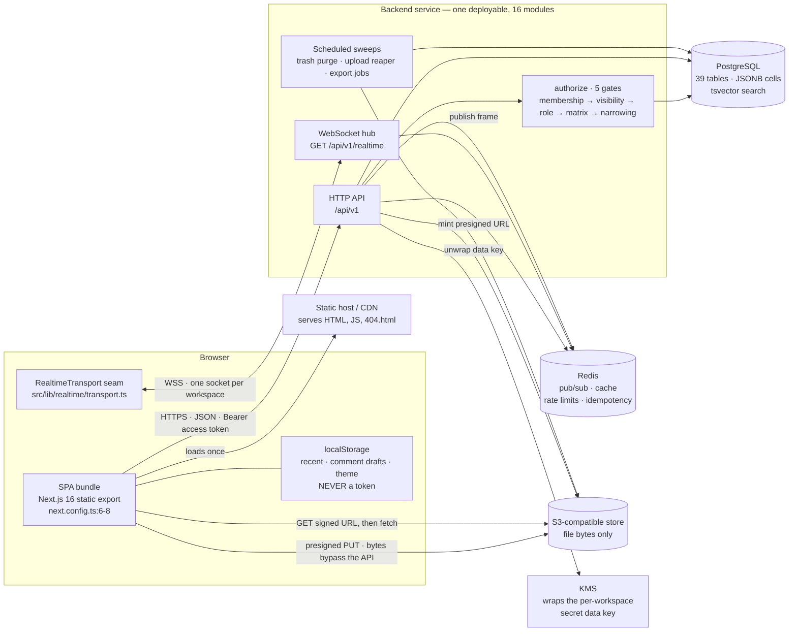
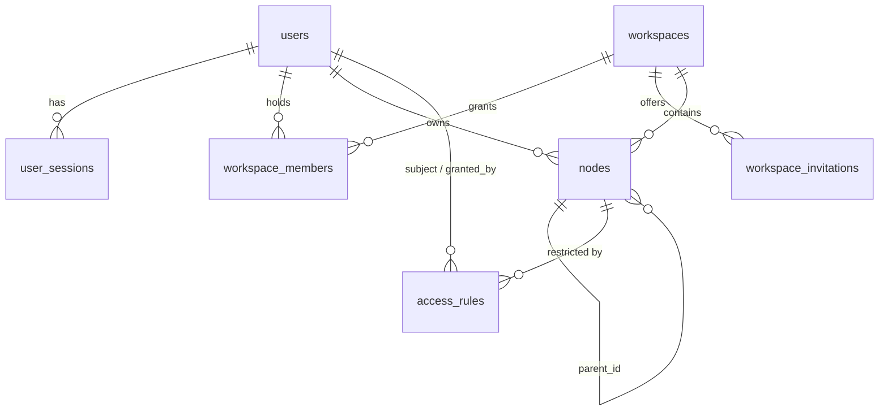
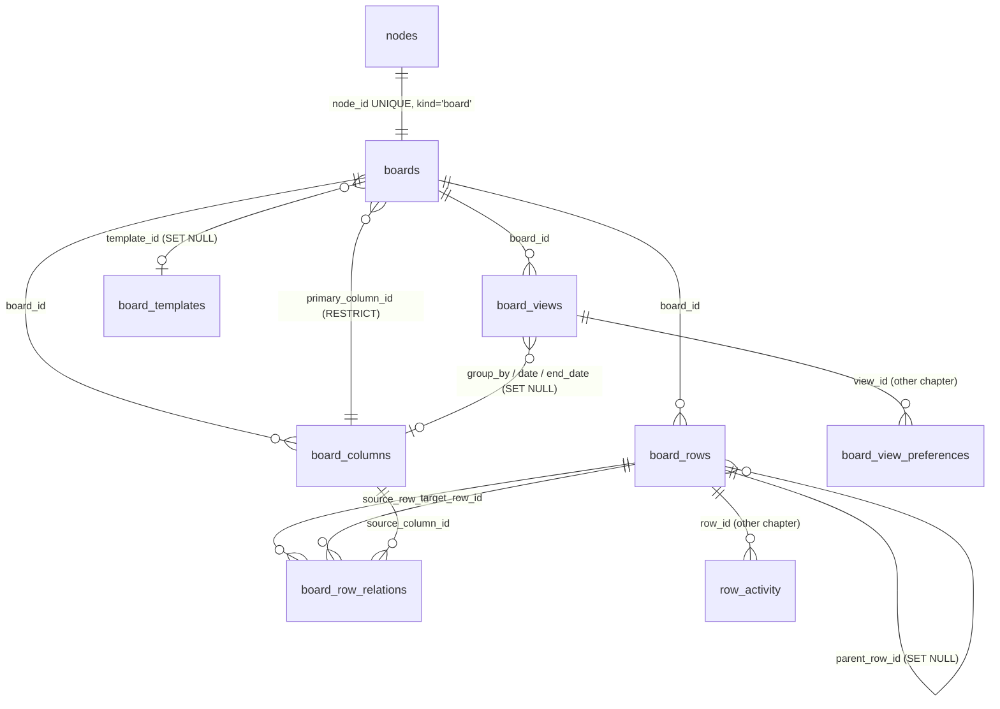
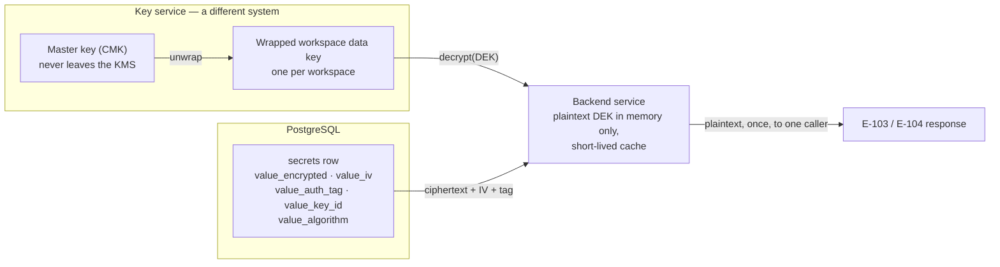
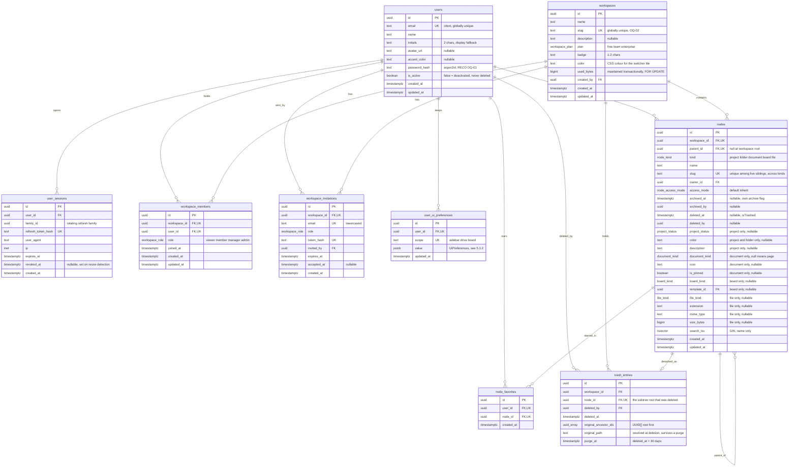
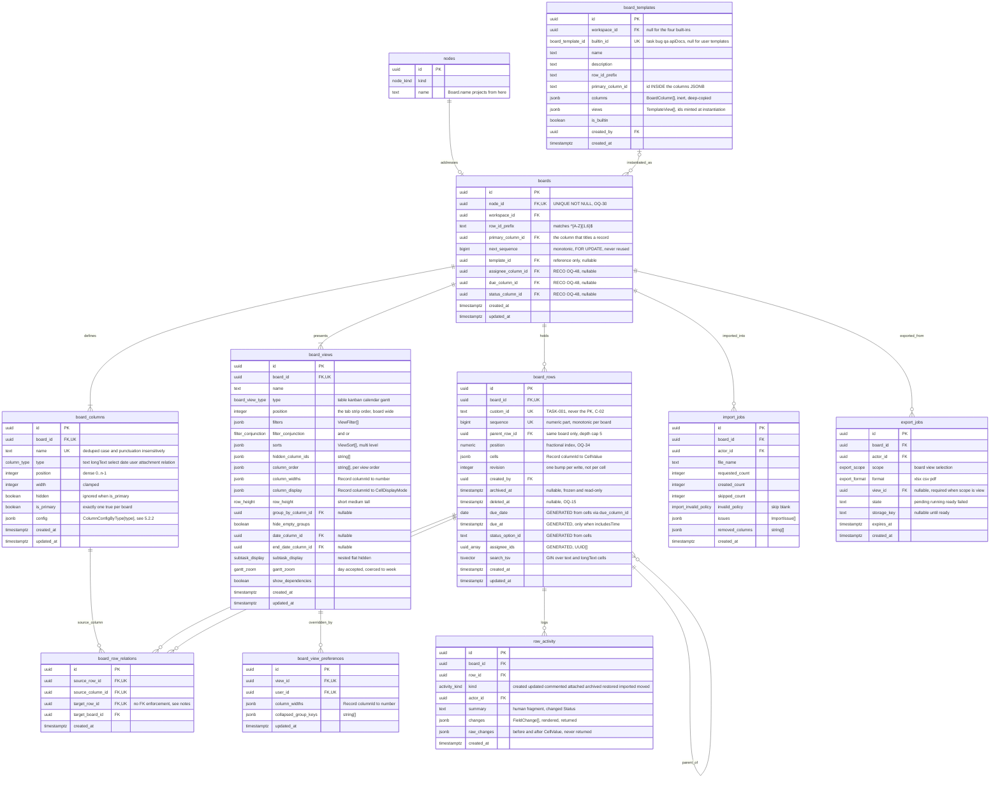
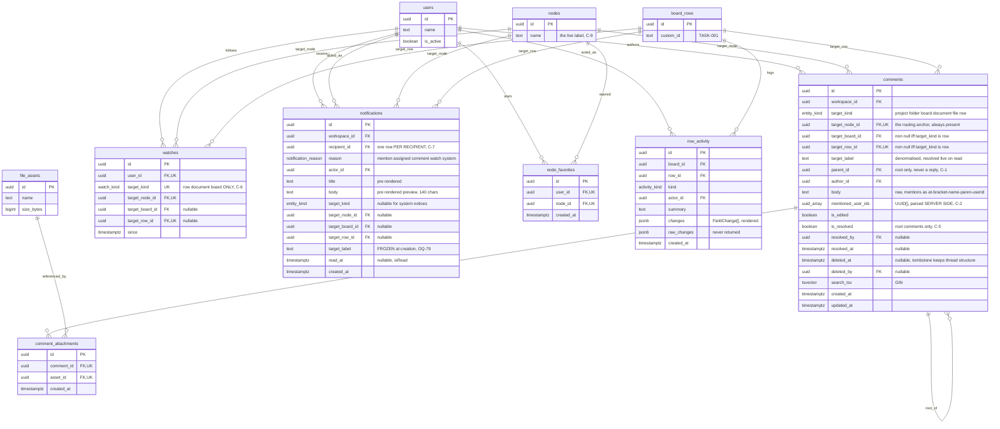
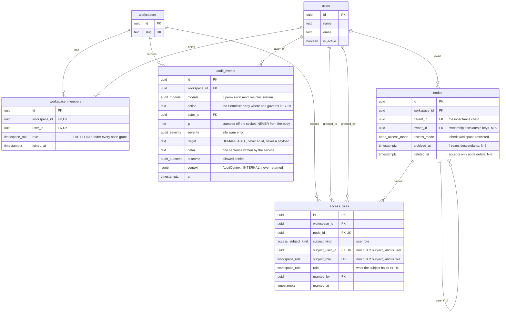
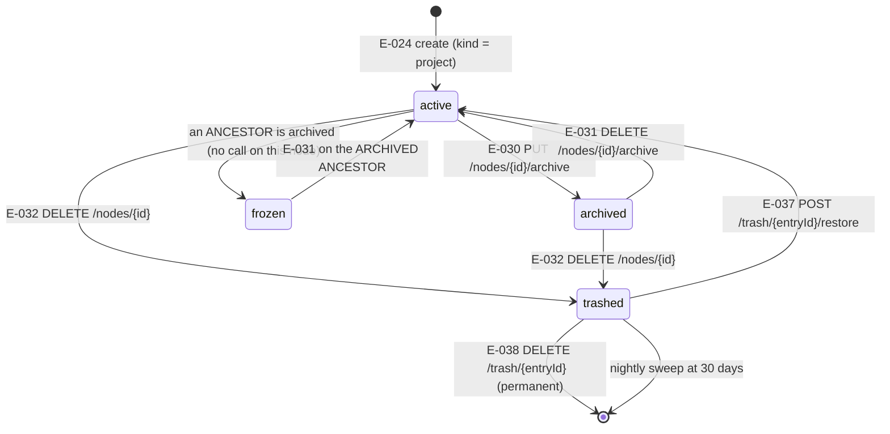

# BACKEND_SPEC — NexDrop Workspace

<!--TOC_PLACEHOLDER-->

---

## 1. Tổng quan hệ thống

### 1.1 Sản phẩm này là gì

**All-in-One Workspace** (phát hành dưới tên `Nekotic Workspace` / NexDrop —
`src/config/app.ts:3-4`) là một mặt phẳng điều hướng duy nhất phủ lên bảy thứ mà thông thường phải là
bảy sản phẩm riêng biệt. PRD phát biểu ràng buộc đó thẳng thắn trong `WS-OVW-01`: một mặt phẳng duy nhất
phủ lên Project / Folder / File / Task / QA / API Doc / Config / Discussion, trong đó *một thao tác ghi vào
một nguồn phải hiển thị ngay lập tức với mọi công cụ liên quan*. Toàn bộ phần bên dưới chính là câu nói ấy
được chuyển thành schema.

Sáu phân hệ, và chúng không độc lập với nhau — mỗi phân hệ đều được truy cập thông qua phân hệ đứng trước nó:

| # | Phân hệ | Nó là gì | Căn cứ |
| --- | --- | --- | --- |
| 1 | **Cây Drive** | Một cây tự tham chiếu duy nhất gồm các *node*. Năm loại — `project`, `folder`, `document`, `board`, `file` — dùng chung một không gian id, một URL dựa trên slug, một chủ sở hữu, một vòng đời archive/trash và một chuỗi phân quyền truy cập. Mọi phân hệ khác đều móc vào một node. | `src/types/node.ts:24` `DriveNodeType`; `src/types/node.ts:48-78` `DriveNodeBase`; canon T-06 |
| 2 | **Tài liệu dạng block** | Một page là một mảng có thứ tự các block có kiểu — 14 giá trị `BlockType` gom lại thành 9 interface — kèm autosave, ghim, khoá, nhân bản, di chuyển, lưu trữ, xoá và lịch sử phiên bản đầy đủ. Config document và secret document dùng đúng vòng đời node đó, chỉ khác trình soạn thảo. | `src/types/document.ts:4-18`; PRD `WS-DOC-05`; canon T-18, T-20, T-22 |
| 3 | **Board engine, bốn view** | Một board sở hữu một schema (7 `ColumnType`) và một tập bản ghi. Table, Kanban, Calendar và Gantt là **các phép chiếu của cùng một tập row, không bao giờ là bản sao**. Saved view mang theo bộ lọc, sắp xếp, gom nhóm và cách trình bày cột. | `src/types/board.ts:7-14`, `:270` `BoardViewType`, `:331-380` `SavedView`; PRD `BD-COR-07` — "Table / Kanban / Calendar / Timeline là phép chiếu, không bao giờ là bản sao" |
| 4 | **Config document và secret document** | Một config document là văn bản thô ở một trong 15 `ConfigFormat`, có lịch sử phiên bản. Một secret document là một danh sách khoá mà giá trị được mã hoá khi lưu, bị che trong mọi danh sách, và chỉ role có đặc quyền mới hiện được — kèm việc mọi lần hiện và sao chép đều được ghi vào audit trail của workspace. | `src/types/devtools.ts:22-37`, `:97`; PRD `DV-CFG-22`, `DV-SEC-23`; canon T-20 – T-25 |
| 5 | **Cộng tác** | Bình luận phân luồng (hai cấp, mention mã hoá dạng `@[Name](usr_id)`), theo dõi trên row / document / board, hộp thư thông báo theo từng người nhận, My Work, tìm kiếm toàn cục, mục yêu thích và truy cập gần đây. | `src/types/collab.ts`; `docs/COLLABORATION.md`; canon T-33 – T-35 |
| 6 | **Quản trị** | Bốn role tích luỹ, 39 khoá quyền, các access rule chảy xuống theo cây kèm override ở từng node, ba lớp thu hẹp (trashed / frozen / locked) chỉ có thể *lấy bớt đi*, và một audit log chỉ ghi thêm. | `src/types/permission.ts:8`, `:30-77`; `src/lib/permissions/`; PRD `SY-RBC-42`, `SY-INH-43`, `SY-AUD-41`; canon §2.10 |

Ranh giới phạm vi tự nó cũng là một yêu cầu. `SY-POS-45`: mọi tính năng phải phục vụ **Organize /
Connect / View**, còn Workflow Automation, API Gateway và Email Client là *nằm ngoài phạm vi một cách
tường minh*. Đó là lý do §1.4 dừng lại đúng ở chỗ nó dừng.

### 1.2 Hiện trạng: một frontend hoàn chỉnh chạy trên một server được mô hình hoá

Đã có một frontend Next.js 16 App Router hoàn chỉnh — 470 file TypeScript dưới `src/`, 764 unit test,
ngưỡng coverage được ép ở mức 80 % (`vitest.config.mts`) — và **hoàn toàn không có server nào cả**.
`next.config.ts:6` đặt `output: "export"`, nên ứng dụng biên dịch ra HTML và JavaScript tĩnh, hiện đang
được publish lên GitHub Pages dưới `basePath: "/Nekotic-Workspace"` (`src/config/base-path.ts:8`).

Mọi thứ mà backend sẽ sở hữu hiện đang là một **mock chạy trong tiến trình** dưới `src/services/` — 17
file, 4 455 dòng, các `Map` ở cấp module chết cùng với tab trình duyệt. Một lần refresh cứng là mất sạch
mọi thay đổi.

**Mock này không phải một stub. Nó là một mô hình, và nó được viết ra để làm đúng việc đó.** Nguyên văn
lời của frontend:

> Backend board trong bộ nhớ. Nó được cố ý tạo hình giống hệt HTTP API sẽ thay thế nó: đọc và ghi đều
> bất đồng bộ, mọi thao tác ghi đều trả về bản ghi có thẩm quyền, và chuỗi sinh row id nằm *ở đây* —
> client không bao giờ tự bịa ra một `TASK-00n`.
> — `src/services/board-service.ts:55-61`

> Nói cho sòng phẳng: ở đây không có server nào cả. Module này đọc các store của cùng một tiến trình, nên
> nó là một *mô hình* trung thực của phép kiểm tra mà một API thật phải thực hiện, chứ không phải vật thay
> thế cho nó.
> — `src/services/authz.ts:29-33`

#### 1.2.1 "Một mô hình trung thực" mang lại gì cho lập trình viên backend

Đây là dữ kiện hữu ích nhất trong toàn bộ tài liệu này, nên nó được viết ra thật rõ. Mock đã tự áp lên
chính nó sáu thuộc tính mà một API thật buộc phải có. **Chúng không phải nguyện vọng; chúng được ép bởi
các test đã phát hành.** Một backend tái tạo được chúng thì không cần thương lượng gì với đội frontend.

| Thuộc tính mock đã có | Nó nằm ở đâu | Nó có nghĩa gì với bạn |
| --- | --- | --- |
| **Mọi lời gọi đều bất đồng bộ và nhận một `AbortSignal`.** Huỷ bỏ sẽ reject với `cancelled`, không bao giờ là lỗi mạng. | `src/services/backend.ts:13-32`; C-12 | Hợp đồng huỷ bỏ đã chốt. Một client bị ngắt kết nối không phải là lỗi cần ghi log. |
| **Mọi thao tác ghi đều trả về bản ghi có thẩm quyền**, và các store thay thế trạng thái lạc quan bằng phản hồi đó. | `src/services/board-service.ts:55-61`; `src/hooks/use-async-resource.ts:86-89` `setData`; C-10 | Không có `204` ở nơi đang chờ một object. Không có vòng round trip "fetch lại sau khi ghi". |
| **Chuỗi sinh row id nằm ở phía server của đường ranh.** Placeholder lạc quan đúng nghĩa đen là `` `${prefix}-…` `` với một dấu ba chấm. | `src/store/board-store.ts:363-366`; `src/types/board.ts:239-240` — "do backend gán, không bao giờ suy ra ở client" | `custom_id` là một bộ đếm theo từng board mà bạn sở hữu, đơn điệu tăng, không bao giờ cấp lại (C-02, `BD-RID-10`). |
| **Người gọi được phân giải, không phải được khai báo.** Mô hình quyền từ chối nhận role như một tham số. | `src/services/authz.ts:24-28` — "Một role mà client gửi lên là một lời khẳng định, không phải một sự thật" | Danh tính, role, IP và đồng hồ đến từ session và từ socket. Hãy xoá `userId`, `role`, `actor`, `owner`, `grantedBy` khỏi mọi request body (C-09). |
| **Một hình dạng lỗi duy nhất, và mã lỗi là thứ chịu tải.** Tám giá trị `AppErrorCode`; `use-embedded-board.ts:140` rẽ nhánh theo `error.code === "not_found"`, `errors.ts:31` suy ra `isRetryable` từ mã lỗi. | `src/types/async.ts:2-20`; `src/services/errors.ts` | Phong bì lỗi ở §7.4 không phải một đề xuất. Đổi nó là làm hỏng các nhánh đã phát hành. |
| **Thành công một phần luôn được báo cáo, không bao giờ im lặng.** `requested === applied.length + skipped.length` được test khẳng định. | `src/services/board-service.ts:958-965` | Bulk và import là phản hồi `200` mang theo một báo cáo, không phải `4xx`. |

#### 1.2.2 Frontend đang giả lập những gì, và do đó bạn sở hữu trọn vẹn những gì

| Đang giả lập hôm nay | Ở đâu | Sẽ trở thành |
| --- | --- | --- |
| Người dùng hiện tại — một hằng số hardcode được **33 file** import | `src/mock/users.ts:3-9` | Một session. **Xem §8: xác thực là greenfield.** |
| Toàn bộ cây drive, workspace, thành viên, thùng rác, access rule | `src/mock/tree.ts`, `src/mock/workspaces.ts`, `src/mock/access.ts`, seed lúc nạp module | `nodes`, `workspaces`, `workspace_members`, `trash_entries`, `access_rules` |
| Id: `nextId(prefix)` — một bộ đếm base-36 toàn cục của tiến trình | `src/services/backend.ts:4-10` | `UUID PRIMARY KEY DEFAULT gen_random_uuid()` (C-01) |
| Đồng hồ: một `MOCK_NOW` bị đóng băng, được dùng như một giá trị *được ghi xuống* | `src/config/app.ts:10` | `now()`, `TIMESTAMPTZ` (C-03) |
| Audit log, được ghi **bởi client** | `src/store/permission-store.ts:71`, `:99` | Các bản ghi do chính endpoint thực hiện hành động ghi, bên trong transaction của nó (canon §3.23) |
| Byte của attachment và blob file — `Map<assetId, Blob>` phát ra các object URL chết cùng tab | `src/services/file-service.ts:35-37`; `src/services/comment-service.ts:209-219` | Object storage tương thích S3 + signed URL vòng đời ngắn (OQ-75) |
| Unfurl link — một tiêu đề được tổng hợp từ slug của URL | `src/services/link-service.ts:15` | Một lần fetch phía server, có chống SSRF (E-118) |
| Fan-out thông báo, thực hiện bên trong `commentService.add` | `src/services/comment-service.ts:223` | Vẫn fan-out đó, nhưng trong cùng transaction với lệnh insert comment (E-120) |
| Realtime — một bus trong tiến trình, vì `REALTIME_ENDPOINT` là `null` | `src/config/app.ts:65-69` | Một WebSocket cho mỗi workspace, Redis pub/sub để fan-out (E-138) |

Dòng `REALTIME_ENDPOINT: string | null = null` đáng để dừng lại một nhịp: đường ranh cho socket đã được
cắt sẵn. Đặt hằng số đó thành một URL là toàn bộ thay đổi cần làm ở phía client.

### 1.3 Stack mục tiêu, và vì sao nó nhỏ một cách có chủ ý

**Bốn bộ phận chuyển động. Không hơn.**

| Bộ phận | Vai trò | Vì sao nó có mặt ở đây |
| --- | --- | --- |
| **PostgreSQL** | Nguồn sự thật duy nhất. 39 bảng (canon §1.1). JSONB cho hai cấu trúc luôn được đọc trọn vẹn — `board_rows.cells` và `board_columns.config` — kèm generated column và GIN index cho những lát cắt thực sự được truy vấn. `tsvector` + GIN cho tìm kiếm thay vì một index store riêng. | Mọi câu hỏi khó trong sản phẩm này đều là một câu hỏi về khoá ngoại: cascade khi xoá row, cascade khi xoá comment, hạch toán quota, thu gom bản ghi mồ côi (canon §1.3.4). Postgres trả lời tất cả bằng một engine duy nhất. |
| **Một backend service** | Mười sáu **module** bên trong một đơn vị triển khai: `identity`, `workspace`, `drive`, `boards`, `views`, `templates`, `documents`, `devtools`, `files`, `relations`, `collab`, `search`, `insights`, `system`, `governance`, `realtime` (C-14). | Chính cách phân tầng của frontend đã là như vậy: `services/` là một đường ranh duy nhất, và một phép kiểm tra quyền phải cắt ngang drive + board + document + governance trong một lời gọi (`src/services/authz.ts:36-53`). Chẻ nó ra qua các ranh giới mạng sẽ biến một `authorize()` thành một distributed transaction. |
| **Redis** | Fan-out pub/sub cho WebSocket giữa các instance của service; cache vòng đời ngắn (phân giải quyền, `/config`); token bucket cho rate limit; bản ghi idempotency key. **Không queue, không job broker, không dữ liệu gốc.** | Chỉ realtime cần fan-out xuyên instance, ngoài ra không gì cần. Việc Redis mất sạch dataset chỉ được phép trả giá bằng một lần kết nối lại, không bao giờ bằng một bản ghi. |
| **Object storage tương thích S3** | Chỉ chứa byte của file, định địa chỉ bằng `file_assets.storage_key`. Upload đi **thẳng** tới store qua một `PUT` presigned; download và thumbnail là signed URL vòng đời ngắn, được cấp riêng cho từng phản hồi. | `WS-FIL-06` nói rõ là object storage. Byte không bao giờ đi xuyên qua API service, nên một lần upload 100 MB không chiếm một request worker. |

**Cộng thêm một phụ thuộc không phải bộ phận chuyển động.** Một **KMS** (của nhà cung cấp cloud, hoặc một
Vault transit engine) giữ một master key duy nhất, dùng để bọc data key theo từng workspace phục vụ mã hoá
secret (canon OQ-65: envelope encryption, AES-256-GCM, ciphertext + IV + tag nằm trong bản ghi). Nó không
được liệt kê ở trên vì nó không lưu trạng thái ứng dụng nào và không nằm trên đường đọc nào ngoài
`POST /nodes/{nodeId}/secrets/{secretId}/reveal` (E-103). Nó xuất hiện trong sơ đồ topology cho đầy đủ.

**Và những gì vắng mặt một cách có chủ ý** — đây là một quyết định, không phải một thiếu sót (canon,
phần tuyên bố phạm vi, nguyên tắc nền số 8):

> Không Kafka. Không microservice. Không CQRS. Không event sourcing. Không GraphQL. Không API gateway.

Lý do nằm ở chính hình dạng của sản phẩm. Có 140 endpoint trên 39 bảng phục vụ đúng một frontend. Thao tác
ghi nặng nhất trong hệ thống là một lần bulk move xuyên board chạm vào hai board trong một transaction
(E-077); thao tác đọc nặng nhất là snapshot của một board (E-047). Cả hai đều không phải bài toán quy mô mà
message bus giải được, và cả hai đều là bài toán tính đúng đắn mà một ACID transaction đơn lẻ giải được.
`SY-POS-45` đặt "API Gateway" vào danh sách ngoài phạm vi tường minh của *sản phẩm*; cùng phán đoán đó áp
dụng cho hạ tầng của nó.

### 1.4 Topology lúc chạy



Sơ đồ này khẳng định bốn điều, mỗi điều là một quyết định:

1. **SPA nói chuyện với đúng một API origin.** Nó là một bundle tĩnh; nó không có đường server-render và
   do đó không có session phía server. §8 được viết dựa trên đúng sự thật đó.
2. **Byte của file không bao giờ đi xuyên qua API service.** Upload là một `PUT` presigned thẳng tới object
   store (E-110/E-111); download là một signed URL (E-116/E-117). API cấp URL và hạch toán quota; nó không
   proxy byte.
3. **Redis nằm giữa API và socket, không nằm giữa API và cơ sở dữ liệu.** Một frame được publish lên Redis
   và được chuyển đi bởi bất kỳ instance nào đang giữ socket của người nhận. Không có gì đọc trạng thái gốc
   của nó từ Redis.
4. **Quyết định về quyền là một hàm duy nhất, được gọi trước tiên.** `authorize()` chạy năm cổng theo thứ
   tự — thành viên, khả năng nhìn thấy, role hiệu lực, ma trận/quyền sở hữu, rồi phép thu hẹp
   trashed/frozen/locked — trước khi bất kỳ trạng thái nào được đọc hay ghi. Frontend mô hình hoá đúng như
   vậy và nêu tên ba cổng mà mô hình của nó bỏ qua (`src/services/authz.ts:36-53`, và OQ-16 – OQ-22).

### 1.5 Những gì backend thừa hưởng như đã-chốt

Lập trình viên backend không nên mở lại bất kỳ điều nào dưới đây. Mỗi điều hoặc là hành vi frontend đã phát
hành, hoặc là một quyết định canon đặt trên nền hành vi đó.

| Quyết định | Nơi nó đã được chốt |
| --- | --- |
| Khoá chính UUID; `TASK-001` là một cột `custom_id` riêng | C-01, C-02 |
| `TIMESTAMPTZ` + ISO 8601 cho thời điểm; `DATE` + `YYYY-MM-DD` cho giá trị chỉ có ngày, **không bao giờ quy đổi qua UTC** | C-03, C-04, `src/lib/calendar.ts:1-16`. Xem §7.12. |
| Không có `any` trong bất kỳ hợp đồng nào; mọi giá trị động đều là một discriminated union | C-05, và `src/types/` không chứa cái nào |
| Mọi cột JSONB đều có một interface TypeScript được đặt tên mô tả cấu trúc của nó | C-06 |
| Optional (`x?: T`) và nullable (`x: T \| null`) là hai thứ khác nhau và không được gộp | C-08, `src/types/board.ts:76-79` so với `:223` |
| Thành viên enum trên đường truyền là đúng chuỗi literal của frontend, kể cả cách viết hoa — `longText`, `permission_denied`, `into-self`, `my-work` | C-13, canon §2.0 |
| Một bảng `nodes` duy nhất với cột phân biệt `kind` và năm bảng phụ 1:1 | canon §1.3.1 |
| `cells` là JSONB trên row, không phải một bảng EAV `cell_values` | canon §1.3.2 |
| Các tuỳ chọn select nằm trong `board_columns.config`, không phải một bảng `select_options` | canon §1.3.3 |
| Một bảng `file_assets` cộng bốn bảng nối có kiểu — **không** phải một cặp owner đa hình | canon §1.3.4 |
| Task / Bug / QA / API-catalogue là **board template**, không phải bảng. Không chương nào được phép thêm một bảng cho chúng. | canon §1.3.5 |
| Phản hồi thành công không mang phong bì; lỗi là `{ "error": AppError }` | canon §6.2, §7.3–7.4 bên dưới |
| Phân trang bằng cursor ở mọi nơi có phân trang; không tồn tại tham số `page` hay `offset` nào trong API này | canon §6.3, §7.6 bên dưới |

---

---

## 2. Phạm vi backend

### 2.1 Trong phạm vi

Backend sở hữu mọi mẩu trạng thái phải sống sót qua một lần refresh trình duyệt, phải được người thứ hai
nhìn thấy, hoặc phải bị từ chối với người thứ ba. Cụ thể là mười sáu module của C-14, phục vụ 140 endpoint
của canon §3 trên 39 bảng của canon §1.1, cộng bốn nghĩa vụ cắt ngang không thuộc về module đơn lẻ nào:

| Nghĩa vụ cắt ngang | Vì sao nó thuộc về backend | Căn cứ |
| --- | --- | --- |
| **Mọi quyết định về quyền đều được kiểm tra lại phía server.** Cổng chặn ở frontend chỉ là UX. | "Quyền ở frontend chỉ là UX — một nút bị ẩn nói 'cái này không dành cho bạn' trước khi một request bị từ chối; nó không phải một ranh giới, và backend vẫn phải kiểm tra lại từng khoá." | `README.md` § Governance; `src/lib/permissions/evaluate.ts:24-25`; P-09 |
| **Danh tính, role, IP và đồng hồ.** Được phân giải từ session và socket, không bao giờ đọc từ request body. | "Một role mà client gửi lên là một lời khẳng định, không phải một sự thật." | `src/services/authz.ts:24-28`; C-09; OQ-16 – OQ-21 |
| **Mọi định danh do server gán**: node id, row id, `custom_id`/`displayId`, column id, option id, view id, comment id, asset id, audit id. | Client đúc ra các placeholder `tmp_`/`new_`/`acl_` rồi tráo chúng bằng phản hồi. | `src/store/board-store.ts:360-366`; canon C-01, C-02 |
| **Mọi bản ghi audit.** Được ghi bởi chính endpoint thực hiện hành động, bên trong transaction của nó. Không có endpoint ghi audit nào và không chương nào được phép thêm một cái. | "Service chỉ phơi ra `record` và `list`, không gì khác… nên không màn hình nào có thể mọc ra một nút Edit lặng lẽ hoạt động." | `src/services/audit-service.ts:14-20`; canon §3.23 |

### 2.2 Tường minh KHÔNG trong phạm vi — những mối bận tâm chỉ của frontend

Đợt rà soát frontend tìm ra bảy nhóm trạng thái và hành vi sống trong trình duyệt **và phải ở lại đó**.
Mỗi nhóm được liệt kê kèm đúng module sở hữu nó, để không ai vô tình dựng một endpoint cho nó.

| # | Mối bận tâm | Sống ở | Vì sao nó không phải trạng thái backend |
| --- | --- | --- | --- |
| 1 | **Vùng chọn của grid** — con trỏ ô `range`, ô đang `editing`, `drawerRowId`, `isDragSelecting`, `selectedRowIds`, mỏ neo shift-click `lastSelectedRowId`, `renamingColumnId`, `detailCell` | `src/store/grid-store.ts:45-81` | Mọi trường đều là trạng thái tương tác phù du. `reset()` được gọi khi **board thay đổi bất kỳ lúc nào** (`src/hooks/use-board.ts:23-28`), và `useBulkActions` lọc bỏ id cũ trước mọi thao tác ghi (`use-bulk-actions.ts:54`). Lưu lại một vùng chọn nghĩa là lưu lại một vị trí con trỏ vốn đã biến mất trước cả khi nó kịp tới nơi. |
| 2 | **Trạng thái kéo thả** — `draggingNodeId`, `isFileDrag` | `src/store/dnd-store.ts:5-25` | Cố ý giữ ngoài workspace store: "nó thay đổi theo từng cử chỉ kéo và không component dữ liệu nào nên render lại vì nó" (`:15-18`). *Kết quả* của một lần kéo là một `POST /nodes/{nodeId}/move` (E-026); còn cử chỉ thì không. |
| 3 | **Ảo hoá danh sách** — cửa sổ row đang hiển thị, dải overscan, offset row đã đo, vị trí cuộn | `src/hooks/use-virtual-rows.ts:35-78`; `src/components/board/table/table-grid.tsx:58`; `src/components/board/gantt/gantt-board.tsx:49` | Đó là một chiến lược render trên một trang row mà API đã trả về. Đơn vị của API là một trang cursor (§7.6), không phải một khung nhìn. |
| 4 | **Theme** | `src/lib/theme.ts:11-27`; `localStorage["nexdrop-theme"]` | Được áp bởi một script boot chạy trước hydration để lần vẽ đầu tiên đã đúng; `<html class="dark">` mới là nguồn sự thật, **không phải giá trị đã lưu** (`:19-24`). Trong một static export, không thể có một round trip tới server trước lần vẽ đầu tiên, nên một theme lưu ở server sẽ gây nháy màn hình. |
| 5 | **Thu gọn sidebar** | `src/store/workspace-store.ts:140`, `:254`, `:914-916`; điều khiển bởi `useResponsiveSidebar` khi dưới `SIDEBAR_COLLAPSE_BREAKPOINT = 1024` (`src/config/app.ts:20-24`) | Nó được đặt bởi **khung nhìn**, không phải bởi một cú click, mỗi khi cửa sổ hẹp. Một giá trị giữ ở server sẽ bị ghi đè bởi lần resize kế tiếp. Xem phần loại trừ ở §2.2.1. |
| 6 | **Định dạng trình bày phía client** — kích thước byte (`formatBytes`), thời gian tương đối (`12m ago`), cách render ngày kiểu `en-GB`, cắt ngắn khi hiển thị ô, dựng lưới lịch | `src/lib/format.ts:7`, `:29`; `src/lib/cell-display.ts`; `src/lib/calendar.ts:283-364` | Đây là các quyết định về locale và khung nhìn. Các formatter `Intl` được cache theo từng locale (`calendar.ts:283-293`) chính vì locale là một *tham số*, không phải một giá trị được lưu. **Xem ranh giới ở §2.2.2 — có một phần văn bản thực sự thuộc về server.** |
| 7 | **Sinh bảng tính và tài liệu phía client** — đọc/ghi XLSX, phân tích CSV/TSV, ZIP, ghi PDF | `src/lib/xlsx.ts:1-12`, `src/lib/csv.ts:1-6`, `src/lib/zip.ts`, `src/lib/pdf.ts` | Import phân tích file **ngay trong trình duyệt** rồi post lên một `ImportSource` đã được parse dưới dạng JSON (`src/types/system.ts:67-74`); export dựng byte hoàn toàn phía client và không bao giờ gọi một service nào (`src/hooks/use-board-export.ts:20-27`). Do đó API nhận và trả JSON, không bao giờ `multipart/form-data`, cho import và export phạm vi view/selection (§7.11). |

Cũng không phải trạng thái backend, và được gom ở đây để danh sách là đầy đủ:

| Mối bận tâm | Ở đâu | Ghi chú |
| --- | --- | --- |
| Trạng thái mở rộng cây (`expandedIds`), chọn nhiều node, `previewNodeId` | `src/store/workspace-store.ts:112-120` | Trạng thái điều hướng. |
| Bàn giao ý định: `rowRequest`, `renameRequestId`, `titleFocusNodeId` | `src/store/workspace-store.ts:118-140` | "Tạo xong → đưa con trỏ vào ô tên" là một pha bàn giao UI giữa hai component, không phải một bản ghi. |
| Toast phản hồi (`Feedback`, `pushFeedback`) | `src/store/workspace-store.ts:100-104` | Được render từ chính phản hồi mà API đã trả về. |
| **Xem trước theo role** (`previewAs`) | `src/store/permission-store.ts:47-51` | *"Xem trước theo role không phải một lần đổi session. Nó thu hẹp những gì giao diện cung cấp; nó không xác thực lại, và một lần reload sẽ xoá nó"* (`docs/GOVERNANCE.md:359-360`). **Đừng dựng chế độ mạo danh phía server** — xem OQ-21. Nếu một role có bao giờ được khai báo trên đường truyền, server áp dụng `min(serverResolvedRole, declaredRole)` chứ không bao giờ `max`. |
| Bảng mô phỏng — ép lỗi mạng / quyền / rỗng / upload / lưu, và các hồ sơ độ trễ | `src/services/simulation.ts:9-73` | Tồn tại để mọi nhánh lỗi trong UI đều tới được. **Không phần nào của nó được phát hành và API không cần thứ tương đương.** |
| Tám enum chỉ dùng cho UI, không bao giờ đi qua đường truyền: `ViewMode`, `SortKey`, `ImportStep`, `DocumentActionId`, `SaveStatus`, `NotificationTab`, `BodySegmentKind`, `SmartViewId` | canon §2.10, ghi chú kết | Cụ thể, API lọc thông báo theo `reason`, **không bao giờ theo tên tab** (OQ-90). |
| `Recent` — một LRU gồm 10 `EntityRef` | `localStorage["nexdrop-recent"]`, `src/store/recent-store.ts:9-18` | "chỉ giữ trong trình duyệt này". Lập trường của canon: nó ở lại đó (OQ-96). |
| Bản nháp bình luận | `localStorage["nexdrop-comment-draft:<key>"]`, `src/hooks/use-comment-draft.ts:5-17` | Tương tự. Lập trường của canon: nó ở lại đó (OQ-97). |

**Một bất biến đáng nêu trong một buổi rà soát bảo mật:** không có gì khác được lưu trong trình duyệt.
Không token xác thực, không user id, không dữ liệu board, không nội dung tài liệu nháp, và — được nêu như
một bất biến thiết kế ở hai chỗ — **không có secret dạng bản rõ** (`src/hooks/use-secret-document.ts:48-55`,
`src/hooks/use-secret-editor.ts:92-105`). §8 được thiết kế để không phá vỡ điều đó.

#### 2.2.1 Phần loại trừ: những tuỳ chọn mà *giá trị* được lưu dù *tương tác* thì không

Ba trong số các mối bận tâm ở trên có một nửa mang giá trị được lưu, và canon đã dành sẵn một bảng cho
chúng. Hãy đọc phần này trước khi kết luận "backend không lưu gì về UI cả".

| Giá trị | Bảng | Trạng thái |
| --- | --- | --- |
| Độ rộng cột theo từng người xem và trạng thái nhóm bị thu gọn trên một board view | `board_view_preferences` (T-16) | **KHUYẾN NGHỊ**, OQ-46. Bộ lọc và sắp xếp vẫn **dùng chung** — đó chính là bản chất của một view có tên. Độ rộng và thu gọn là theo từng người xem. |
| Thu gọn sidebar, chế độ xem drive (`grid`/`list`), khoá sắp xếp drive và chiều sắp xếp | `user_ui_preferences` (T-37) | **KHUYẾN NGHỊ**, OQ-98. Chưa dựng cho tới khi OQ-98 được trả lời; trước đó client giữ chúng và không có gì hỏng. |
| Recent, bản nháp bình luận | *không có bảng* | Lập trường của canon dưới OQ-96 / OQ-97 là cả hai ở lại `localStorage`. |

Sự phân biệt hữu ích là ở chỗ: **con trỏ của grid không bao giờ được lưu; một cột người dùng đã kéo rộng
thì có.** `collapsedByView` và `collapsedParentsByView` được đánh khoá theo view id để các nhóm thu gọn sống
sót qua một lần chuyển view (`src/store/grid-store.ts:50-56`) — đó đúng là hình dạng mà T-16 sẽ mang.

#### 2.2.2 Ranh giới bên trong "định dạng": server *thực sự* render cái gì

Mục 6 ở trên là mục dễ làm sai nhất theo cả hai hướng. Quy tắc:

**Client render giá trị. Server render câu chữ về lịch sử.**

| Server render — một chuỗi được lưu | Căn cứ |
| --- | --- |
| `AuditEvent.detail` — "Một câu. UI không bao giờ render một payload audit thô" | `src/types/audit.ts:37-38` |
| `AuditEvent.target` — "Nhãn cho người đọc của thứ bị tác động — không bao giờ là một id, không bao giờ là một payload" | `src/types/audit.ts:35-36` |
| `ActivityEntry.summary` — "Mẩu câu cho người đọc: `changed Status`, `created TASK-001`" | `src/types/board.ts:501-502` |
| Tiêu đề và nội dung `AppNotification` được render sẵn, đóng băng tại thời điểm tạo vì một thông báo là một phát biểu mang tính lịch sử | canon T-35, OQ-79 |
| `UserSummary.initials` và `accentColor` — là trường được phục vụ, không phải suy ra | `src/types/user.ts:8-11`; `src/mock/users.ts:3-17` |

| Client render — không bao giờ gửi đi dưới dạng chuỗi | Căn cứ |
| --- | --- |
| `1.4 MB` từ `sizeBytes` | `src/lib/format.ts:7-19` |
| `12m ago` từ một thời điểm ISO | `src/lib/format.ts:29` |
| `27 Aug 2026` từ một khoá ngày `YYYY-MM-DD`, theo `en-GB` | `src/lib/calendar.ts:57`, `:300-317` |
| Cắt ngắn nội dung ô theo `compact` / `wrap` / `full` | `src/types/board.ts:316-326`; `src/lib/cell-display.ts` |

Gửi đi một số byte đã định dạng hay một thời gian tương đối là đóng băng một quyết định của khung nhìn vào
trong một bản ghi, và nó sẽ cũ đi ngay khi tab được để mở.

### 2.3 Độ ưu tiên của module

**Các dải được định nghĩa thế nào.**

- **P0** — thiếu nó thì vỏ ứng dụng không boot được, hoặc boot vào một màn hình từ chối. `AppShell` gắn
  `WorkspaceGuard` và không gì bên trong một workspace được render cho tới khi tư cách thành viên được
  giải quyết (`src/components/layout/app-shell.tsx:49-52`, `src/components/workspace/workspace-guard.tsx:10-27`).
- **P1** — vỏ ứng dụng boot được và các bề mặt P0 hoạt động, nhưng một tính năng PRD có số hiệu thì chết.
- **P2** — tính năng suy giảm êm ái thành hành vi mà frontend đã xử lý sẵn, hoặc nó là một
  `KHUYẾN NGHỊ` mà OQ tương ứng vẫn còn mở.

| Module | Dải | Sở hữu | Thiếu nó thì hỏng gì | Endpoint (canon §3) | Bảng |
| --- | --- | --- | --- | --- | --- |
| `identity` | **P0** | Xác thực, session, người gọi. Đọc danh bạ. | **Mọi thứ.** 33 file import một user hardcode (`src/mock/users.ts:3`); không request nào nêu được tên một chủ thể. Xem §8. | E-001 – E-006 | T-01, T-02, T-37 |
| `workspace` | **P0** | Tenancy, thành viên, role, quota lưu trữ, lời mời. | `WorkspaceGuard` render màn hình từ chối cho tất cả mọi người. "Không phải thành viên" không phải là "viewer" (`src/lib/workspace-access.ts:4-14`). | E-007 – E-019 | T-03, T-04, T-05 |
| `drive` | **P0** | Cây node, slug, phân giải đường dẫn, move/duplicate/rename, yêu thích, lưu trữ, xoá mềm. | Mọi route đều phân giải một chuỗi slug trên cây (`src/app/(workspace)/drive/[[...path]]/page.tsx`). Board, page, config và secret document đều render **bên trong** `/drive/<path>`. | E-020 – E-035 | T-06, T-07 |
| `governance` | **P0** | `authorize()`, access rule, tập capability, danh mục quyền, audit log. | Không phải "không có quyền" — mà là **không có thao tác đọc an toàn nào cả**. Endpoint cây bị cắt tỉa theo khả năng nhìn thấy trước khi trả về (E-020, `src/lib/tree.ts:297-320`). | E-040 – E-046, E-136, E-137 | T-08, T-36 |
| `boards` | **P0** | Tập hợp board, cột, row, ô, bộ đếm `custom_id`, hoạt động của row. | `BD-COR-07`, trung tâm của sản phẩm. Table view là bề mặt mặc định của mọi board node. | E-047 – E-073 | T-10 – T-12, T-14 |
| `views` | **P0** | Saved view: kiểu, bộ lọc, sắp xếp, gom nhóm, cách trình bày cột. | Một board phải có **ít nhất một view** — E-081 từ chối lệnh xoá sẽ khiến còn số không (`VIEW_LAST_REMAINING`). Một board không có view thì không render được. | E-078 – E-083 | T-15, T-16 |
| `documents` | **P0** | Page dạng block, autosave, ghim, khoá. | `WS-DOC-05`. Node document tồn tại trong cây được seed ngay từ khung hình đầu tiên; mở một node như vậy mà thiếu module này là một lỗi 404 trên chính node mà sidebar đang hiển thị. | E-091 – E-094 | T-18, T-19 |
| `templates` | **P0** *(bản dựng sẵn)* / **P2** *(do người dùng tạo)* | Bốn bản thiết kế dựng sẵn dưới dạng bản ghi seed; việc khởi tạo từ template. | Tạo board nhận một `templateId` (`src/store/workspace-store.ts` `createBoard`), nên bốn bản seed là P0. Lưu một board **thành** template (E-089/E-090) là `KHUYẾN NGHỊ` dưới OQ-47 → P2. | E-087, E-088 *(P0)*; E-089, E-090 *(P2)* | T-17 |
| `files` | **P1** | Upload presigned, hạch toán quota, xem trước, lưu text/bảng tính, download, signed URL, unfurl link. | `WS-FIL-06` và toàn bộ route `/files`. **Node** file vẫn được liệt kê từ `drive`, nên cây vẫn nguyên vẹn; chỉ có byte của chúng là không. | E-110 – E-118 | T-27 – T-32 |
| `collab` | **P1** | Bình luận, mention, theo dõi, thông báo — và pha fan-out có transaction. | `CO-CMT-26`, `CO-MEN-27`, `CO-WAT-28`, `CO-NOT-29`. Chuông render số không; tab bình luận trong drawer trống rỗng. | E-119 – E-132 | T-33 – T-35 |
| `system` | **P1** | Bảng điều khiển thùng rác, thao tác hàng loạt, import/export, lịch sử phiên bản xuyên page/config/secret. | `SY-BLK-34` … `SY-VER-39`. `/trash` và `/archive` render rỗng; chọn nhiều mục mất thanh hành động. Bản thân việc xoá mềm node thuộc `drive` (E-032), nên không mất gì cả, chỉ là không khôi phục được qua UI. | E-036 – E-039, E-074 – E-077, E-084 – E-086, E-095 – E-098 | T-09, T-38, T-39 |
| `devtools` | **P1** | Config document, secret document, mã hoá, reveal/copy/rotate, dấu vết truy cập secret, môi trường. | `DV-CFG-22`, `DV-SEC-23`, `DV-ENV-21`. **Làm trọn vẹn hoặc đừng làm**: một kho secret xây dở với một thao tác reveal không được audit còn tệ hơn là không có kho secret nào. | E-099 – E-109 | T-20 – T-26 |
| `search` | **P1** | Tìm kiếm toàn văn toàn cục trên 8 loại kết quả, được lọc qua phễu quyền trước khi quét. | `CO-SCH-31`. `⌘K` mở ra một hộp thoại rỗng. Phần tìm nhanh rẻ tiền của drive (E-035) là một endpoint `drive` riêng và vẫn sống sót (OQ-94). | E-133 | *(các cột tsvector trên bảng có sẵn; không có bảng riêng)* |
| `insights` | **P1** — *hạ cánh trước tiên trong nhóm P1* | Các số liệu tổng hợp cho dashboard và My Work. | `SY-DSH-44`, `CO-MYW-30`. **`/` chuyển hướng tới `/dashboard`**, nên đây là màn hình đích của ứng dụng; thiếu nó, thứ đầu tiên người dùng thấy là một bảng lỗi thay vì trạng thái onboarding. | E-134, E-135 | *(phép chiếu; canon §1.2 — không có bảng)* |
| `realtime` | **P1** — *với một frame thuộc P0* | WebSocket hub và fan-out qua Redis. | **RT-05 `permission.changed` không phải tuỳ chọn**: thiếu nó, một người bị thu hồi quyền vẫn giữ một board đã nạp trên màn hình cho tới khi họ reload (`src/hooks/use-access-sync.ts:74-83`; canon §7.1). Các frame còn lại là hội tụ, không phải tính đúng đắn. Đường ranh đã có sẵn — `REALTIME_ENDPOINT` là `null` (`src/config/app.ts:65-69`) và các loại frame lạ bị client bỏ qua (`src/types/realtime.ts:14`), nên có thể phát hành từng frame một. | E-138 | *(không — Redis pub/sub)* |
| `relations` | **P2** | Phép chiếu `board_row_relations`, bộ phân giải quan hệ hàng loạt, backlink. | `DV-REL-24`. Một ô quan hệ render id đã lưu của nó và một mục tiêu đã bị xoá render `[Deleted Item]` kèm hành động gỡ liên kết, nên phần suy giảm đã được thiết kế sẵn. Template dựng sẵn `task` có kèm một cột quan hệ "Blocked by", cột đó sẽ render rỗng. | E-071, E-072 | T-13 |

**Một ghi chú về việc bàn giao, suy ra từ chính bảng trên chứ không phải một ý kiến.** Tám mục P0 không
phải tám cột mốc — chúng là một. `authorize()` cần tư cách thành viên (`workspace`), chuỗi tổ tiên
(`drive`) và trạng thái khoá của node (`documents`) trong một lần đọc duy nhất; endpoint cây drive bị
`governance` cắt tỉa trước khi trả về; một board node không có `views` thì không render được. Lát cắt nhỏ
nhất có thể phát hành là: **đăng nhập → liệt kê workspace → đọc cây đã cắt tỉa → mở một board với một view
→ sửa một ô → thấy nó còn đó sau một lần refresh.** Mọi thứ trong P1 đều móc vào lát cắt đó, và mọi module
P1 đều có thể thêm vào mà không cần phát hành lại client, ngoại trừ `realtime`, thứ cần đổi đúng một hằng số.

### 2.4 Hai câu hỏi về phạm vi mà frontend không chốt

**CÂU HỎI MỞ (OQ-42) — việc phân tích import và sinh export là ở phía client vì thiết kế, hay vì thiếu một
server?**
**Bằng chứng** — frontend phân tích `.xlsx`/`.csv`/`.tsv` ngay trong trình duyệt
(`src/lib/xlsx.ts:1-12`, `src/lib/csv.ts:1-6`) và post lên một `ImportSource` đã được parse sẵn
(`src/types/system.ts:67-74`); export dựng byte XLSX, CSV và PDF hoàn toàn phía client và không bao giờ gọi
một service nào (`src/hooks/use-board-export.ts:20-27`, `src/lib/pdf.ts`). `IMPORT_MAX_ROWS = 5 000`
(`src/config/app.ts:48`) là một trần mà trình duyệt gánh được; `SY-EXP-36` yêu cầu 5 000 row ra Excel trong
dưới 2 giây, điều mà trình duyệt đáp ứng được.
**Khuyến nghị** — giữ việc phân tích và sinh nội dung phạm vi nhỏ ở trong trình duyệt. API nhận JSON cho
`POST /boards/{boardId}/import/plan` và `/import` (E-084, E-085) và trả về `ExportOutcome` cho phạm vi
`view` và `selection`; chỉ **export toàn bộ board** (E-086, phạm vi `board`) mới trở thành một `ExportJob`
bất đồng bộ ghi vào object storage kèm một signed URL, bởi đó là trường hợp duy nhất mà số lượng row không
bị chặn trên.
**Hệ quả nếu sai** — nếu server buộc phải parse, `POST /import/plan` sẽ mọc thêm một biến thể
`multipart/form-data` và toàn bộ quy tắc "chỉ JSON" ở §7.11 sẽ có một ngoại lệ. Phạm vi ảnh hưởng hẹp,
nhưng nó làm thay đổi hợp đồng về content-type.

**CÂU HỎI MỞ (OQ-29) — `ExportOutcome.omittedColumns` ngụ ý một cơ chế phân quyền cấp cột mà chẳng tồn tại
ở đâu cả.**
**Bằng chứng** — export loại bỏ những cột mà người xem không được đọc *trước khi* bất kỳ bộ ghi nào nhìn
thấy chúng (`src/hooks/use-board-export.ts:20-27`, `selectExportColumns(..., { canViewSensitive })`), và
`SY-EXP-36` nêu rằng "một cột mà người gọi không được đọc sẽ bị loại khỏi file xuất ra". Nhưng danh mục 39
khoá **không có khoá nào phạm vi cột** (`src/types/permission.ts:30-77`), và `canViewSensitive` được suy ra
ở client từ một phép suy đoán theo tên.
**Khuyến nghị** — đừng đưa vào ACL cấp cột. Hãy coi "nhạy cảm" là một thuộc tính của board schema mà
backend đánh giá được, và giải quyết nó cùng với OQ-48 (vai trò của cột là suy đoán theo tên, không phải
schema) thay vì mở rộng danh mục quyền.
**Hệ quả nếu sai** — nếu thực sự cần phân quyền cấp cột, `access_rules` sẽ mọc thêm một phạm vi
`column_id` và mọi thao tác đọc board sẽ mọc thêm một bộ lọc theo từng cột. Đó là một thay đổi schema trên
đường đọc nóng nhất của sản phẩm.
---

---

## 3. Mô hình miền

### 3.0 Cách đọc phần này

Phần này gọi tên các aggregate, vạch ranh giới của chúng và phát biểu các bất biến. Nó không vẽ schema —
§5 làm việc đó, và chương schema mới mang danh sách cột. Mọi khẳng định ở đây hoặc là một
**YÊU CẦU ĐÃ CÓ** (frontend tại `/Users/chikarin/Projects/NexDrop/Gen fe` hoặc PRD đã chốt nó, trích dẫn
`path:line`), hoặc là một **KHUYẾN NGHỊ** mang theo **mã OQ** của canon đang giữ chỗ cho quyết định đó.
Tên bảng, thành viên enum và mã endpoint là của canon (`spec/canon.md` §1, §2, §3) và không được đem ra
tranh luận lại ở đây.

---

### 3.1 Ý tưởng quan trọng nhất trong hệ thống này

> **Một board sở hữu một schema và một tập bản ghi. Một view không sở hữu gì ngoài cách trình bày.**

Đây không phải một sở thích thiết kế. Nó đã là cách frontend được dựng, và dựng backend theo bất kỳ cách
nào khác là phá vỡ nó.

**YÊU CẦU ĐÃ CÓ.** Có đúng một kho bản ghi cho mỗi board và đúng một truy vấn trên nó.
`src/lib/board-view.ts:15-21` phát biểu quy tắc ngay ở phần đầu file:

> *"Một view không bao giờ sở hữu bản ghi — nó mô tả cách đọc bản ghi của board. Schema (tên, kiểu,
> config) nằm trên cột và được mọi view dùng chung. Cách trình bày (thứ tự, độ rộng, hiển thị) là theo
> từng view, nên ẩn một cột trong table không thể làm thay đổi những gì Kanban hay Calendar hiển thị."*

và `src/lib/board-view.ts:190-193` phát biểu cơ chế:

> *"Truy vấn duy nhất mà cả board chạy: lọc, rồi tìm kiếm, rồi sắp xếp. Table, Kanban, Calendar và
> Timeline đều tiêu thụ các row id mà nó trả về."*

`queryRowIds` (`src/lib/board-view.ts:194-236`) chính là truy vấn duy nhất đó. Nó nhận `rowsById`,
`rowOrder`, `SavedView` đang hoạt động và một chuỗi tìm kiếm, rồi trả về `readonly string[]` — các row id.
Table, Kanban, Calendar và Gantt là **các hàm chiếu trên tập id đó**, không phải các kho:

| Bề mặt | Component | Nó chiếu cùng tập id qua cái gì |
| --- | --- | --- |
| Table | `src/components/board/table/table-grid.tsx` | thứ tự + độ rộng + hiển thị của `resolveColumns` |
| Kanban | `src/components/board/views/kanban-board.tsx` | các thùng `groupByColumnId` trên các tuỳ chọn của cột select |
| Calendar | `src/components/board/views/calendar-board.tsx` | `dateColumnId` → một khoá ngày cho mỗi row (`src/lib/board-calendar.ts`) |
| Gantt | `src/components/board/gantt/gantt-board.tsx` | `dateColumnId` + `endDateColumnId` → một thanh (`src/lib/board-gantt.ts`) |

**Điều này chốt vĩnh viễn những gì cho backend.**

1. **Không có bảng bản ghi riêng cho từng view**. Không `kanban_cards`, không `calendar_events`, không
   `gantt_tasks`, không `timeline_bars`. Một view là một bản ghi trong `board_views` (T-15), không gì khác.
2. Chuyển view là một **phép chiếu lại phía client trên các row đã nạp sẵn**. Nó không phát ra thao tác ghi
   nào và không cần endpoint nào. E-078…E-082 ghi *cấu hình* view; chúng không bao giờ chạm vào `board_rows`.
3. Một thao tác ghi schema (`board_columns`) hiển thị với **mọi** view của board. Một thao tác ghi trình bày
   (`board_views`) chỉ hiển thị với **view đó**. Sự phân chia chính xác là:

   | Thao tác | Ghi vào | Hiển thị với | Endpoint |
   | --- | --- | --- | --- |
   | Đổi tên cột, đổi kiểu, đổi config, thêm/xoá/sắp lại cột | `board_columns` | mọi view | E-052…E-060 |
   | Đổi kích thước, ẩn/hiện, sắp lại, sắp xếp, lọc, gom nhóm, chiều cao row, chế độ hiển thị, mức zoom Gantt | một bản ghi `board_views` | chỉ view đó | E-080 |
   | Độ rộng và trạng thái thu gọn theo từng người xem | `board_view_preferences` | chỉ người xem đó | E-083 (KHUYẾN NGHỊ, OQ-46) |

4. Xoá một cột phải **cắt tỉa mọi view của board trong cùng một transaction** (E-054). Hàm `pruneView` của
   frontend (`src/lib/board-view.ts:288-334`) loại bỏ các filter, sort, `columnOrder`, `hiddenColumnIds`,
   `columnDisplay`, `columnWidths`, `groupByColumnId`, `dateColumnId` và `endDateColumnId` trỏ tới một cột mà
   schema không còn nữa. Backend thực hiện đúng phép cắt tỉa đó ở phía server; một view mang một tham chiếu
   chết là một lỗi so với đặc tả.
5. Realtime tuân theo cùng hình dạng đó. `board.schema.changed` (RT-10) mang `{ boardId }` và không gì khác;
   client fetch lại toàn bộ schema, đúng theo C-11 ("một phản hồi schema là một **mảng đầy đủ**, không bao
   giờ là một delta", `src/store/board-store.ts:698`).

#### 3.1.1 Hệ quả: QA, Task, Bug và API Catalogue là *template* của board, không phải các miền

**YÊU CẦU ĐÃ CÓ.** `src/lib/board-templates.ts:12-18`:

> *"Một template là dữ liệu trơ: `instantiateTemplate` sao chép sâu mọi thứ nó trao ra, nên một board có
> thể thêm, đổi tên hay xoá cột mà template gốc không bao giờ thay đổi — đó là tiêu chí nghiệm thu cho
> DV-TMP-19."*

**Không có bảng `tasks`, không có bảng `bugs`, không có bảng `qa_cases` và không có bảng `api_endpoints`**
(canon §1.2, §1.3.5). `task`, `bug`, `qa` và `apiDocs` là bốn bản ghi seed trong `board_templates` (T-17).
Một board tạo ra từ một trong số đó là một board bình thường ngay từ khoảnh khắc nó tồn tại.

Bằng chứng rằng đây là một quy tắc cứng chứ không phải một tiện lợi:

- **Sản phẩm đọc một board theo cái nó đã trở thành, không theo cái nó được tạo ra từ đâu.** `isQaBoard`
  (`src/lib/dashboard.ts:92-99`) không nhìn vào `templateId`. Nó hỏi xem cột trạng thái của board có cung
  cấp một tuỳ chọn nhãn `passed` hay `failed` không. Chú thích tại `src/lib/dashboard.ts:87-91` nói rõ:
  *"Template id là không đủ: một board được tạo từ template QA rồi bị định hình lại thì phải theo cái nó đã
  trở thành, không phải cái nó được tạo ra từ đâu."*
- **Các truy vấn xuyên template định địa chỉ cột theo *vai trò*, không bao giờ theo id.** `lensesFor`
  (`src/lib/my-work.ts:59-68`) chọn cột assignee / due / status bằng cách khớp *tên* cột với
  `/assign|owner|tester|responsible/i`, `/due|deadline/i` và `/status|result|state/i`. Một board không có
  cột cho một vai trò thì *không đóng góp gì* cho widget cần vai trò đó, thay vì đoán mò
  (`src/lib/my-work.ts:14-21`).
- **Các nhóm `api` / `bug` / `qa` của `SearchResultKind` là một phép chiếu lúc đọc.**
  `src/services/search-service.ts:39-43` là một map ba mục từ template id sang loại kết quả. Nó là một thấu
  kính đặt lên `boards.template_id`, không phải một schema.
- **`BoardNode.templateId` là một `string` trần, "chỉ để tham khảo"** (`src/types/node.ts:110-111`,
  `src/types/board.ts:414-415`).
- **Một quy tắc riêng cho template là một cảnh báo, không bao giờ là một ràng buộc.** Phép kiểm tra endpoint
  trùng lặp của board tài liệu API (`DV-API-20`, `src/components/board/api-duplicate-banner.tsx`) là *"cảnh
  báo bằng màu hổ phách, không bao giờ chặn"* — một phép kiểm tra mà một bảng `api_endpoints` chuyên dụng sẽ
  buộc phải biến thành lỗi.

**Một người viết cảm thấy bị lôi kéo về phía một bảng có kiểu cho một trong bốn thứ này thực ra đang nhìn
vào một danh sách cột của template.** Hãy ghi tài liệu cho bản ghi template, đừng ghi cho một bảng.

---

### 3.2 Phân cấp aggregate

Sáu aggregate. Thụt lề là quan hệ chứa; dấu `→` đánh dấu một tham chiếu cắt ngang ranh giới aggregate và do
đó là một id, không bao giờ là một object nhúng.

- **Workspace** — ranh giới tenant. `workspaces` (T-03)
  - `plan`, `badge`, `color`, `slug`, bộ đếm `used_bytes`
  - **Member** — `workspace_members` (T-04), `(workspace_id, user_id)` → `WorkspaceRole` + `joined_at`
    - → `users` (T-01) — vô hiệu hoá mềm, không bao giờ xoá cứng
    - `workspace_invitations` (T-05) — lời mời qua email đang chờ → role, hash token, hạn dùng *(KHUYẾN NGHỊ, OQ-04)*
  - `environments` (T-26) — danh sách nhãn triển khai dùng chung, có hình dạng `SelectOption` (DV-ENV-21)
  - `board_templates` (T-17) — bốn bản ghi seed dựng sẵn cộng với các bản của chính workspace này
  - **Cây node** — `nodes` (T-06). Một bảng duy nhất, phân biệt bằng `kind`. Chính là drive.
    - `project` — `status`, `color`, `description`
    - `folder` — `color`
    - `document` — `document_kind` ∈ `page | config | secret`, `icon`, trạng thái ghim và khoá
      - `page` → nội dung **Document**: `documents` (T-18) + `document_versions` (T-19)
      - `config` → nội dung **Config**: `config_documents` (T-20) + `config_versions` (T-21)
      - `secret` → vật chứa **Secret**: `secret_documents` (T-22)
        - `secrets` (T-23) — một khoá mỗi bản ghi, `value_encrypted BYTEA`
        - `secret_rotations` (T-24) — ghi *việc* một khoá đã xoay vòng. **Không bao giờ có cột giá trị.**
        - `secret_access_events` (T-25) — dấu vết reveal / copy / rotate theo từng secret
    - `board` — `board_kind`, `template_id`
      - → nội dung **Board**: `boards` (T-10)
    - `file` — `file_kind`, `extension`, `mime_type`, `size_bytes`
      - → `file_nodes` (T-28) → `file_assets` (T-27)
    - `node_favorites` (T-07) — theo từng người dùng, không phải một cờ trên node *(OQ-07)*
    - `trash_entries` (T-09) — siêu dữ liệu khôi phục cho một cây con đã bị xoá
    - `access_rules` (T-08) — xem **Governance**
  - **Board** — `boards` (T-10). Nguồn sự thật duy nhất cho các bản ghi.
    - **Columns** — `board_columns` (T-11): `type`, `position`, `width`, `hidden`, `is_primary`,
      `config` JSONB
      - **Options** — `SelectConfig.options[]` **bên trong** `board_columns.config`, không phải một bảng *(canon §1.3.3)*
        - `availability` — một cây `ConditionGroup` cho mỗi tuỳ chọn
        - `transitionRules.transitions` — đánh khoá theo option id, khoá dành riêng `"__empty__"`
        - `completedOptionIds` — những tuỳ chọn nào mang nghĩa "đã hoàn thành"
    - **Rows** — `board_rows` (T-12): `custom_id`, `sequence`, `parent_row_id`, `position`, `revision`
      - **Cells** — `board_rows.cells` JSONB, `Record<columnId, CellValue>` *(canon §1.3.2)*
      - quan hệ chứa của subtask — `parent_row_id`, tự tham chiếu, cùng một board *(OQ-33)*
    - **Relations** — `board_row_relations` (T-13): một phép chiếu của các ô quan hệ để backlink trở thành
      một truy vấn có index. Được ghi trong cùng transaction với ô.
    - **Views** — `board_views` (T-15): `type`, bộ lọc, sắp xếp, gom nhóm, cách trình bày cột
      - `board_view_preferences` (T-16) — override theo từng người xem *(KHUYẾN NGHỊ, OQ-46)*
    - **Activity** — `row_activity` (T-14): một mục cho mỗi thao tác ghi, bất kể nó chạm bao nhiêu trường
    - `import_jobs` (T-38), `export_jobs` (T-39) *(KHUYẾN NGHỊ, OQ-41 / OQ-42)*
  - **Cộng tác**
    - **Comments** — `comments` (T-33): nội dung, mục tiêu đã phân rã, `parent_id`, các cột resolve và
      tombstone
      - **Mentions** — `comments.mentioned_user_ids`, được parse phía server từ `@[Name](usr_id)`.
        **Không phải một bảng.**
      - `comment_attachments` (T-30) → `file_assets`
    - **Watches** — `watches` (T-34): `(user_id, target_kind, target_node_id, target_row_id)` + `since`
    - **Notifications** — `notifications` (T-35): một bản ghi **cho mỗi người nhận**, fan-out lúc ghi
    - **Favourites** — `node_favorites` (T-07), liệt kê dưới cây node vì nó đánh khoá theo một node
    - **Recents** — *không phải một bảng.* `localStorage` dưới khoá `nexdrop-recent` *(OQ-96)*
    - **Activity** — `row_activity` (T-14), liệt kê dưới Board vì nó đánh khoá theo một row
  - **Quản trị**
    - **Roles** — `WorkspaceRole`, bốn thành viên, tích luỹ. Không phải một bảng: ma trận nằm trong code
      (`src/lib/permissions/roles.ts:77-96`).
    - **Permissions** — danh mục `PermissionKey` gồm 39 khoá. **Không phải một bảng**: cấu hình tĩnh được
      phục vụ từ E-045 để hai phía đồng thuận (canon §1.2).
    - **Access grants** — `access_rules` (T-08): một lượt cấp, trên một node, cho một chủ thể
    - **Audit** — `audit_events` (T-36): chỉ ghi thêm. **Không tồn tại endpoint ghi nào và không chương nào
      được phép thêm một cái** (canon §3.23).
  - `user_sessions` (T-02), `user_ui_preferences` (T-37) — đánh khoá theo người dùng, không theo workspace

---

### 3.3 Lần lượt từng aggregate

#### 3.3.1 Workspace — ranh giới tenant

**Gốc.** `workspaces` (T-03). **Nội dung.** `workspace_members`, `workspace_invitations`,
`environments`, `board_templates` (những bản của chính workspace), và — một cách bắc cầu — mọi bản ghi
`nodes`.

**Ranh giới.** Workspace là cổng ngoài cùng. Vượt qua nó không phải một câu hỏi về quyền, nó là một câu hỏi
về sự tồn tại.

**Bất biến.**

| # | Bất biến | Căn cứ |
| --- | --- | --- |
| W-1 | **"Không phải thành viên" không phải là "viewer".** Một workspace mà người gọi không phải thành viên trả lời y hệt một workspace không tồn tại: `WORKSPACE_NOT_FOUND`, `404`, `not_found`. | `src/lib/workspace-access.ts:4-14`; canon §4.3 |
| W-2 | **Workspace không bao giờ mất người admin cuối cùng.** `isLastAdmin` (`src/lib/workspace-access.ts:85-88`) canh giữ thao tác rời đi (`:106-119`), gỡ bỏ (`:122-138`) và hạ quyền. E-014/E-015/E-016 đều từ chối với `WORKSPACE_LAST_ADMIN`, `409`. | `src/lib/workspace-access.ts:84-157` |
| W-3 | **Người tạo trở thành admin trong cùng thao tác ghi.** E-008 chèn `workspaces` và `workspace_members` trong một transaction. Không có khoảng thời gian nào mà một workspace không có người quản trị. | `src/lib/workspace-access.ts:212-238` |
| W-4 | `workspaces.slug` là duy nhất trên toàn cục. Một tenant duy nhất; không có bảng tenant. | *(OQ-02, đã có lập trường tại canon §8.8)* |
| W-5 | `workspaces.used_bytes` được duy trì **theo transaction** cùng với mọi lần insert và delete `file_assets`, dùng `SELECT … FOR UPDATE`. Nó không bao giờ được tính lại bằng phép gộp lúc đọc. Một lần upload vượt quá `StorageQuota.totalBytes` bị từ chối với `QUOTA_EXCEEDED`, `507`. | canon §1.4, §8.8 (OQ-05); `src/types/workspace.ts:5-10` |
| W-6 | `StorageQuota.totalBytes` đến từ cấu hình tĩnh của service theo từng gói, không phải một bảng `plans`. Ba bậc với quota cố định không thể trôi lệch nếu chúng không phải các bản ghi. | canon §1.2 *(OQ-06)* |
| W-7 | Rời khỏi workspace bạn đang đứng trong đó sẽ chuyển bạn ra ngoài trong cùng thao tác ghi (E-016). | `src/lib/workspace-access.ts:106-119` |

**Quy tắc transaction.** Tạo workspace, đổi thành viên và xoá workspace, mỗi việc hạ cánh như một
transaction. Việc đổi thành viên còn phát thêm `permission.changed` (RT-05) với `nodeId: null` — bởi vì một
lần đổi role sẽ phân giải lại quyền truy cập trên **mọi** node trong workspace.

#### 3.3.2 Member — con người bên trong tenant

**Gốc.** `workspace_members` (T-04). Nó là một bản ghi nối có trạng thái, không phải một bảng liên kết: nó
mang `role` và `joined_at`, và `WorkspaceMember` là hình dạng mà API trả về (`src/types/user.ts:22-25`).

**Ranh giới.** `users` (T-01) sống *bên ngoài* aggregate workspace. Một người có thể là thành viên của
nhiều workspace với role khác nhau ở mỗi nơi. `workspace_members` là nơi duy nhất một role được lưu.

**Bất biến.**

| # | Bất biến | Căn cứ |
| --- | --- | --- |
| M-1 | **Một người dùng bị vô hiệu hoá mềm, không bao giờ bị xoá cứng.** `users.is_active = false`. Endpoint danh bạ (E-006) trả về các thành viên đã bị vô hiệu hoá kèm cờ `isActive: false` để một lượt phân công cũ vẫn render được tên. | `src/types/user.ts:14-20`; `src/mock/users.ts:41-58` |
| M-2 | Role đến từ `workspace_members`, được phân giải từ **session**. Một role trong request body là một lời khẳng định, không phải một sự thật. | C-09; `src/services/authz.ts:24-27` |
| M-3 | Thứ tự của `WorkspaceRole` **chính là** thứ hạng, tăng dần: `viewer < member < manager < admin`. `roleRank` là `WORKSPACE_ROLES.indexOf(role)`. | `src/types/permission.ts:10-20` |
| M-4 | Các role là **tích luỹ**: mỗi role là role dưới nó cộng thêm phần nó bổ sung. Viewer giữ **không** khoá nào, do cách xây dựng chứ không phải do bỏ sót. | `src/lib/permissions/roles.ts:16, 84-96` |
| M-5 | Quyền sở hữu là một **trục riêng**, không phải một role thứ năm. Nó nâng cấp năm khoá (`node.rename`, `node.delete`, `node.archive`, `file.delete`, `document.lock`) trên những thứ bạn tạo ra, và chỉ từ `member` trở lên. | `src/lib/permissions/roles.ts:99-108`; `src/lib/permissions/evaluate.ts:71-74` |

**KHUYẾN NGHỊ.** `workspace_invitations` (T-05) mô hình hoá luồng được ngụ ý bởi
`WorkspaceMember.joinedAt`, thứ mà frontend mang theo nhưng không bao giờ tạo ra *(OQ-04)*. E-013 tạo một
lời mời; E-019 tiêu thụ nó và chèn bản ghi `workspace_members` trong cùng một transaction.

#### 3.3.3 Cây node — drive

**Gốc.** `nodes` (T-06). **Một bảng duy nhất, phân biệt bằng `kind`**, với tập cột dùng chung là các cột
thật và các phần bổ sung theo từng loại là các cột nullable (canon §1.3.1). Nội dung sống trong năm bảng phụ
1:1 đánh khoá theo `node_id`: `boards`, `documents`, `config_documents`, `secret_documents`, `file_nodes`.

**Ranh giới.** Node là **đơn vị của việc định địa chỉ, định tuyến, phân quyền và vòng đời**. Nội dung được
đi vào qua node của nó rồi sau đó được định địa chỉ bằng id của chính nó (P-04): `GET /nodes/{nodeId}/board`
trả về snapshot bao gồm `board.id`, và mọi tài nguyên con của board sau đó móc vào `/boards/{boardId}`.

**Bất biến.**

| # | Bất biến | Căn cứ |
| --- | --- | --- |
| N-1 | `children` được **SUY RA** từ `parent_id` và không bao giờ được lưu. | `src/types/node.ts:149-151` |
| N-2 | `slug` là duy nhất trong số các **anh em còn sống, xuyên qua mọi loại**. Một bản ghi đã vào thùng rác bị loại trừ để một lần khôi phục không bao giờ va chạm. Được đúc một lần lúc tạo, chỉ được làm-duy-nhất-lại khi **di chuyển**, không bao giờ đúc lại khi đổi tên. | `src/store/workspace-store.ts:472-490`; canon §8.8 *(OQ-09 / OQ-10)* |
| N-3 | Chỉ `project` và `folder` là vật chứa. `isContainer` (`src/types/node.ts:146-147`) là toàn bộ quy tắc. Một document hay board đặt dưới một node lá sẽ bị từ chối: `NODE_NOT_CONTAINER`, `409` — *"Page chỉ có thể nằm trong folder."* | `src/store/workspace-store.ts:748-753` |
| N-4 | **Di chuyển bị từ chối theo bốn cách**, và chúng là bốn kết cục khác nhau, không phải một lỗi: `same-parent`, `into-self`, `into-descendant`, `invalid-target`. `same-parent` là một thao tác không làm gì cả và người gọi nên coi đó là thành công. | `src/lib/tree.ts:170-197` |
| N-5 | **Lưu trữ là kế thừa và không giống với việc bị lưu trữ.** Một node nằm dưới một tổ tiên đã lưu trữ thì bị *đóng băng*: mọi thao tác ghi đều bị từ chối và nó **không thể tự rã đông một mình**. Một node bị lưu trữ theo quyền riêng của nó thì chỉ đọc nhưng vẫn cung cấp nút Restore. `inheritedArchiveOf` nhìn vào `path.slice(0, -1)` — cờ của chính nó cố ý không được đọc. | `src/lib/archive.ts:30-45`; `src/lib/permissions/evaluate.ts:56-62, 79-85` |
| N-6 | `archiveSourceOf` duyệt **từ gốc trước** để tổ tiên đã lưu trữ **ngoài cùng nhất** là cái được báo cáo và là cái mà nút Restore của nó chấm dứt trạng thái đóng băng. Do đó E-034 chỉ liệt kê node đã lưu trữ ngoài cùng nhất cho mỗi cây con. | `src/lib/archive.ts:19-28` |
| N-7 | Xoá là xoá mềm: `deleted_at` + `deleted_by`, không bao giờ là một boolean. `isTrashed` trên đường truyền là `deleted_at IS NOT NULL`. Xoá sẽ **tách rời cả cây con**, nên xoá vĩnh viễn một folder không thể kéo theo một node con vốn đã bị xoá từ trước. | canon §1.4; `src/types/system.ts:164-169` |
| N-8 | Một node đã vào thùng rác không chấp nhận **gì ngoài `node.delete`**. `can()` trả về false cho mọi khoá khác. | `src/lib/permissions/evaluate.ts:79-81` |
| N-9 | Khôi phục duyệt `originalAncestorIds` từ gốc trước để tìm vật chứa còn sống sâu nhất, và báo `isRelocated` khi cha gốc đã biến mất. Đây là một kết cục `200`, không bao giờ là một lỗi. | `src/types/system.ts:171-188`; canon §4.3 |
| N-10 | **Việc cắt tỉa theo khả năng nhìn thấy áp dụng cho cả cây con.** `collectAllowed` bỏ qua một node *và toàn bộ cây con của nó* khi vị từ thất bại: *"một file bên trong một folder mà người xem không mở được thì không được nổi lên trong kết quả tìm kiếm chỉ vì bản thân file đó không mang một hạn chế riêng nào."* | `src/lib/tree.ts:296-320` |
| N-11 | `is_shared` được **SUY RA**: đúng khi tồn tại bất kỳ bản ghi `access_rules` nào trên node. | canon §1.3.1 |
| N-12 | `blockCount`, `excerpt`, `itemCount`, `openCount` là các phép chiếu **SUY RA** được module sở hữu giữ đồng bộ. `summarize()` là payload chính xác cho một page. | `src/services/document-service.ts:148-171` |
| N-13 | `is_favorite` là **theo từng người dùng**, phân giải từ `node_favorites` cho người gọi — không phải một cột trên node. | canon §8.8 *(OQ-07)* |

**Vì sao một bảng chứ không phải năm.** Mọi biến thể node đều dùng chung một tập cột (`DriveNodeBase`,
`src/types/node.ts:48-78`), một khoá định tuyến, một chuỗi phân quyền và một vòng đời archive/trash;
`resolvePath`, `collectAllowed`, `moveNode`, `cloneNode` và `effectiveAccess` đều nhận `DriveNode` mà không
thu hẹp kiểu (`src/lib/tree.ts:15-320`, `src/lib/permissions/inheritance.ts:91-120`); và
`UNIQUE (parent_id, slug)` phải đúng **xuyên qua các loại**, điều mà một schema bị chẻ ra không diễn đạt được.

**CÂU HỎI MỞ (OQ-56)** — ba bản sao của `isArchived`
**Điều chưa rõ.** `DriveNodeBase.isArchived?` (`src/types/node.ts:66`), `DocumentNode.isArchived`
(bắt buộc, `:103`) và `WorkspaceDocument.isArchived` (`src/types/document.ts:129`) là ba trường giữ cùng một
sự thật, và `summarize()` chép giá trị của document lên node (`src/services/document-service.ts:168`).
Không có gì tuyên bố cái nào là chuẩn.
**Bằng chứng.** Bộ phân giải đóng băng đọc chuỗi **node** và chỉ chuỗi node
(`src/lib/archive.ts:37-45` → `findPathToId` trên `DriveNode[]`). `documentCapabilities`
(`src/lib/permissions/evaluate.ts:135-141`) đọc bản sao của **document**. Hai bên không bao giờ bất đồng
trong mock chỉ vì `summarize` chạy sau mỗi lần lưu.
**Khuyến nghị.** **Node sở hữu nó.** Một cột duy nhất, `nodes.archived_at TIMESTAMPTZ NULL`.
`WorkspaceDocument.isArchived` và `DocumentNode.isArchived` đều là phép chiếu của
`nodes.archived_at IS NOT NULL`, tính lúc đọc. `PUT /nodes/{nodeId}/archive` (E-030) là bộ ghi duy nhất.
**Hệ quả nếu sai.** Hai bản sao có thể ghi sẽ trôi lệch; một page bị lưu trữ ở một bề mặt nhưng vẫn sửa được
ở bề mặt khác là một lỗi toàn vẹn dữ liệu chỉ lộ ra dưới dạng "cái khoá không ăn".

**CÂU HỎI MỞ (OQ-12)** — nhân bản một vật chứa
**Điều chưa rõ.** E-027 nhân bản đệ quy. `cloneNode` (`src/lib/tree.ts:200-230`) đúc một id mới cho mọi hậu
duệ nhưng chỉ chép **siêu dữ liệu của cây** — nó không bao giờ với tới `boards`, `documents`,
`config_documents` hay `secret_documents`. Việc một project được nhân bản có mang theo các row của board,
các block của page, hay giá trị secret của nó hay không thì chưa được quyết định.
**Bằng chứng.** `documentService.duplicate` tồn tại và chép các block
(`src/services/document-service.ts:313`), nên việc nhân bản nội dung theo từng node đã được mô hình hoá cho
một loại. Không có gì tương đương cho board hay secret. `SecretEntry` cố ý không có trường `value` nào cả
(`src/types/devtools.ts:68-73`).
**Khuyến nghị.** Nhân bản nội dung cho `project`, `folder`, `document(page)`, `board` và `file`
(asset được tham chiếu, không upload lại — một bản ghi `file_assets`, hai bản ghi `file_nodes`).
**Từ chối nhân bản một node `secret`**, và từ chối toàn bộ thao tác nếu cây con chứa một node như vậy, với
nội dung `409` cùng loại `PERMISSION_DENIED`. Chép ciphertext một cách lặng lẽ sẽ nhân đôi bán kính thiệt
hại của một vụ rò rỉ và tạo ra một lịch sử xoay vòng thứ hai mà không audit trail nào giải thích được.
**Hệ quả nếu sai.** Hoặc là nhân bản một project sẽ lặng lẽ tạo ra các board rỗng, hoặc nó sẽ lặng lẽ nhân
bản mọi secret production trong đó.

#### 3.3.4 Board — bản ghi, schema, view

**Gốc.** `boards` (T-10), gắn khoá tới đúng một bản ghi `nodes` (`node_id UNIQUE NOT NULL`).

**Nội dung.** `board_columns`, `board_rows`, `board_views`, `board_view_preferences`,
`board_row_relations`, `row_activity`, `import_jobs`, `export_jobs`.

**Ranh giới.** Board là một **ranh giới nhất quán cho tập bản ghi và schema của nó**. Một thao tác ghi cột
và các lần ghi lại ô mà nó gây ra là một transaction. Một thao tác ghi row cùng mục `row_activity` và phép
chiếu `board_row_relations` của nó là một transaction. Hai board là hai ranh giới — thao tác duy nhất bắc
qua cả hai, `bulkMove` (E-077), được nêu rõ là *"một transaction trên **cả hai** board"* và cần `row.delete`
ở nguồn **và** `row.create` ở đích *(OQ-17)*.

**Bất biến.**

| # | Bất biến | Căn cứ |
| --- | --- | --- |
| B-1 | **`displayId` do backend đúc ra, không bao giờ suy ra ở client.** `boards.next_sequence` đơn điệu và chỉ tăng: xoá `TASK-005` không bao giờ cấp lại `005`. `formatRowId(prefix, sequence)` đệm tới 3 chữ số và vượt qua đó khi cần. | `src/types/board.ts:240-243`; `src/lib/row-id.ts:1-15`; `src/services/board-service.ts:65-68` |
| B-2 | `row_id_prefix` khớp `^[A-Z]{1,6}$` — chỉ chữ hoa, tối đa sáu ký tự. | `src/lib/row-id.ts:9-20`; `ROW_ID_PREFIX_INVALID` |
| B-3 | **`kind` của ô có thể bất đồng một cách chính đáng với `type` của cột.** Một phép chuyển kiểu bảo toàn giá trị không parse được dưới dạng `CellValue.text` thay vì vứt bỏ nó. API không được chuẩn hoá làm mất cái nhãn đó. | `src/types/board.ts:214-218`; canon §2.5 |
| B-4 | Frontend ghi một **`CellValue` rỗng tường minh theo đúng kind của cột**, không bao giờ ghi `null` hay bỏ khuyết khoá. Các row là dày đặc theo cách xây dựng. | `src/lib/cell-values.ts:20-36` `emptyCellFor` |
| B-5 | **Một thao tác ghi tăng `revision` đúng một lần, bất kể nó chạm bao nhiêu ô.** `updateCells` dựng một map `touched` đánh khoá theo row id và tăng một lần cho mỗi row. | `src/services/board-service.ts:500-520` |
| B-6 | **Ghi ô là last-write-wins cộng một `ConflictNotice`. Không bao giờ `409`.** Ba thuộc tính chính xác: thiếu `baseRevisions[rowId]` thì không bao giờ xung đột; `base < current.revision` thì xung đột còn bằng-hoặc-lớn-hơn thì không; **tối đa một thông báo cho mỗi row trong mỗi lời gọi**, do lần sửa đầu tiên chạm vào nó phát ra. | `src/services/board-service.ts:504-512` |
| B-7 | **Cột chính** đặt tiêu đề cho mọi bản ghi. Nó không bao giờ có thể bị ẩn và không bao giờ có thể bị xoá. `hidden` bị *lặng lẽ bỏ qua* trên nó, không phải bị từ chối. | `src/types/board.ts:178-179`; `src/lib/board-schema.ts:98-99` |
| B-8 | Tên cột tự khử trùng lặp một cách lặng lẽ: `Notes`, `Notes 2`, `Notes 3`. Hai tên va nhau khi chúng chỉ khác nhau ở chữ hoa/thường và dấu câu. | `src/lib/board-schema.ts:150-179` |
| B-9 | `width` của cột bị kẹp trong khoảng, không bị từ chối: `[MIN_COLUMN_WIDTH, MAX_COLUMN_WIDTH]`, làm tròn. | `src/lib/board-schema.ts:70-72` |
| B-10 | `position` của cột được **đánh số lại dày đặc `0..n-1`** khi sắp xếp lại. Thứ tự của view là một mảng riêng trên `board_views.column_order`. | `src/lib/board-schema.ts:163-167`; `src/lib/board-view.ts:263-280` |
| B-11 | **Các tuỳ chọn select sống bên trong `board_columns.config`.** Ba cấu trúc anh em tham chiếu option id theo giá trị — `completedOptionIds`, `transitionRules.transitions`, và cây `availability` của từng tuỳ chọn — nên tách chúng ra là đặt một cấu hình nguyên tử lên hai bảng mà không khoá ngoại nào bảo vệ được bất kỳ tham chiếu nào. | canon §1.3.3; `src/types/board.ts:120-138` |
| B-12 | `"__empty__"` là một **option id dành riêng** đại diện cho nhóm rỗng ở cả hai phía của một phép chuyển trạng thái. Nó phải bị từ chối khi người dùng đặt làm id: `OPTION_ID_RESERVED`, `400`. | `src/lib/transition-rules.ts:27-32` |
| B-13 | Tạo một tuỳ chọn sẽ **khử trùng lặp theo nhãn đã trim và gộp hoa/thường, rồi trả về tuỳ chọn đã có với mã `200`** — không bao giờ `409`. Màu được chọn ở client bằng cách xoay vòng bảng tám màu và gửi kèm trong request. | canon §3.7 E-058; `src/store/board-store.ts:844-851` |
| B-14 | Xoá một tuỳ chọn để lại id mồ côi trong `cells`. Frontend render nó là "không rõ", không phải "đã xoá", nên backend **không được lặng lẽ cắt tỉa các ô**. | canon §1.3.3 |
| B-15 | **Quy tắc chuyển trạng thái không phải là quyền.** *"Quyền trả lời 'người này có được sửa Status hay không'; một quy tắc chuyển trạng thái trả lời 'Status có được đi từ đây sang kia hay không'. Cả hai đều được kiểm tra, riêng rẽ, trước khi một thao tác thả được ghi xuống."* | `src/lib/transition-rules.ts:22-25` |
| B-16 | **Quan hệ chứa không phải là Quan hệ liên kết.** `parentRowId` là quan hệ chứa; một phụ thuộc "blocked by" là một *cột quan hệ* giữ các row id. *"Hai thứ sống cạnh nhau và không bao giờ đọc dữ liệu của nhau."* | `src/lib/board-hierarchy.ts:12-16` |
| B-17 | Xoá một row cha sẽ **nâng các row con của nó lên cấp cao nhất**; nó không bao giờ cascade. E-065 trả về các row con đã được nâng lên để client đối soát. | canon §3.8 E-065 |
| B-18 | **Backlink được suy ra, không bao giờ được lưu.** *"Không có gì được lưu cho một backlink: nó được suy ra bằng cách hỏi xem row nào trỏ tới đây, nên hai chiều không bao giờ có thể bất đồng."* `board_row_relations` là một index trên các ô, được ghi trong cùng transaction với ô — không phải một bản sao thứ hai của sự thật. | `src/components/board/drawer/backlinks-panel.tsx:14-18` |
| B-19 | **Bản ghi đã lưu trữ thì bị đóng băng, không phải bị xoá.** Chúng bị loại khỏi mọi view theo mặc định và chỉ đọc cho tới khi được khôi phục. `includeArchived` là công tắc duy nhất. `bulkArchive` (E-075) là lời gọi duy nhất được phép nhắm vào một row đã lưu trữ; `bulkDelete` (E-076) cũng được. | `src/lib/board-view.ts:183-187`; `src/lib/archive.ts:52-53` |
| B-20 | **Một phản hồi bulk hạch toán cho mọi id được gửi lên**: `requested === applied.length + skipped.length`. *"Một thao tác ghi hàng loạt lặng lẽ đánh rơi một bản ghi còn tệ hơn một thao tác từ chối thẳng."* Thành công một phần là một `200`, không bao giờ là một body lỗi. | `src/services/board-service.ts:957-965` |
| B-21 | Một mục hoạt động cho mỗi thao tác ghi, bất kể nó chạm bao nhiêu trường — *"'đã đổi Status và Due Date' là một dòng trong dòng thời gian với hai thay đổi bên dưới, thay vì hai dòng cạnh tranh nhau ở cùng một giây."* | `src/types/board.ts:489-495`; `src/services/board-service.ts:526-531` |
| B-22 | Một board mang **ít nhất một** view: E-081 từ chối lệnh xoá sẽ khiến còn số không (`VIEW_LAST_REMAINING`, `409`). | canon §3.10 |
| B-23 | `id` và `boardId` được **bảo toàn cưỡng bức** trước một lệnh patch view (E-080). | canon §3.10 |
| B-24 | Liệt kê board được **suy ra từ cây và không bao giờ được seed hay đọc các row của một board** — *"một board 5.000 bản ghi không được dựng lên chỉ để gọi tên nó."* | `src/services/board-service.ts:1232-1245` |
| B-25 | Một ô chỉ-có-ngày là một khoá ngày `YYYY-MM-DD` và **không bao giờ được quy đổi qua UTC**. *"Một hạn chót là một ô vuông trên tờ lịch, không phải một khoảnh khắc."* | `src/lib/calendar.ts:1-24`; C-04 |

**CÂU HỎI MỞ (OQ-48)** — *vai trò* của cột trong board là suy đoán theo tên, và các generated column của
canon phụ thuộc vào chúng
**Điều chưa rõ.** Canon §1.3.2 yêu cầu bốn generated column trên `board_rows` — `due_date DATE`,
`due_at TIMESTAMPTZ`, `status_option_id TEXT`, `assignee_ids UUID[]` — *"mỗi cái suy ra từ cột mà board chỉ
định cho vai trò đó"*. **Không có gì trong frontend lưu một sự chỉ định như vậy.**
**Bằng chứng.** `lensesFor` (`src/lib/my-work.ts:59-68`) phân giải ba vai trò lúc đọc bằng regex trên *tên*
cột (`/assign|owner|tester|responsible/i`, `/due|deadline/i`, `/status|result|state/i`), với
`fallbackToFirst` bằng true cho assignee và status, và bằng **false** cho due
(*"'Found on' và 'Executed on' là lịch sử, không phải công việc đến hạn"*, `:63-64`). `Board` mang
`primaryColumnId` và không gì khác mang dáng dấp vai trò (`src/types/board.ts:412-427`).
**Khuyến nghị.** Thêm ba cột nullable vào `boards`: `assignee_column_id`, `due_column_id`,
`status_column_id`, mỗi cái là `UUID NULL REFERENCES board_columns(id) ON DELETE SET NULL`. Điền chúng lúc
tạo board từ template, và **seed chúng bằng cách chạy đúng regex hiện có một lần lúc migration**, để không
board nào đổi hành vi vào ngày backend hạ cánh. `PATCH /boards/{boardId}` (E-050) mọc thêm chúng. Các
generated column khi đó đọc một id được chỉ định thay vì một cái tên. Hãy giữ regex làm *phương án dự phòng*
khi phần chỉ định là null, để một board tạo ra trước khi trường này tồn tại vẫn đóng góp cho My Work.
**Hệ quả nếu sai.** Nếu các vai trò vẫn dựa trên tên, các generated column không thể tồn tại (một generated
column không được phụ thuộc vào một bảng khác), nên My Work, dashboard hạn chót và mọi bộ lọc theo ngày sẽ
trở thành một lượt quét toàn bộ `cells` JSONB trên mọi board mà người gọi nhìn thấy được. Nếu các vai trò
trở thành *chỉ* dựa trên schema mà không có dự phòng, mọi board có cột tên là "Owner" sẽ lặng lẽ rơi khỏi
My Work vào ngày chuyển đổi.

**CÂU HỎI MỞ (OQ-15)** — row bị xoá vĩnh viễn trong khi node có thùng rác 30 ngày
**Điều chưa rõ.** `DELETE /nodes/{nodeId}` (E-032) xoá mềm vào `trash_entries` với thời hạn lưu 30 ngày.
`DELETE /boards/{boardId}/rows/{rowId}` (E-065) và `bulkDelete` (E-076) là xoá vĩnh viễn. Sự bất đối xứng
đó có phải là chủ ý hay không thì không được nêu ở đâu cả.
**Bằng chứng.** `board_rows` mang `archived_at` (`src/types/board.ts:250-254`) nhưng không có `deleted_at`;
canon §1.4 liệt kê `deleted_at` trên `nodes`, `comments` và `board_rows` — nên canon kỳ vọng cột đó tồn tại
dù không endpoint nào đặt nó. Archive được trình bày với người dùng như thao tác đảo ngược được, còn Delete
là thao tác kết liễu (`src/components/board/table/row-actions-menu.tsx`).
**Khuyến nghị.** Giữ sự bất đối xứng và làm nó tường minh: `board_rows.deleted_at` tồn tại và E-065 đặt nó,
nhưng các row **không** nổi lên trong `/workspaces/{workspaceId}/trash` và được quét dọn bởi cùng job hằng
đêm với cùng chân trời 30 ngày. Điều này cho bộ phận hỗ trợ một đường khôi phục mà không phải thêm một bề
mặt "thùng rác cho bản ghi" vốn không có trong sản phẩm.
**Hệ quả nếu sai.** Nếu các row thực sự bị xoá cứng, thì `row_activity`, `comments`, `watches`,
`notifications` và `board_row_relations` đều cần được quyết định ngữ nghĩa cascade cùng một lúc, và một lần
lỡ tay bulk delete 200 bản ghi là không thể khôi phục.

#### 3.3.5 Cộng tác

**Gốc.** Không có một gốc duy nhất. Comment, watch và notification là ba aggregate ngang hàng, tất cả đều
định địa chỉ mục tiêu của mình qua một hình dạng duy nhất, `EntityRef` (`src/types/collab.ts:16-26`).

**Địa chỉ dùng chung.** `refKey` (`src/lib/entity-ref.ts:21-23`) là nơi duy nhất trong codebase biết định
dạng này:

| `kind` | Văn phạm của `targetKey` | Số đoạn |
| --- | --- | --- |
| `row` | `row:<boardId>:<rowId>` | 3 |
| `document` / `board` / `project` / `folder` / `file` | `<kind>:<nodeId>` | 2 |

**KHUYẾN NGHỊ.** Hãy lưu mục tiêu ở dạng **đã phân rã** — `target_kind`, `target_node_id`,
`target_board_id`, `target_row_id`, `target_label` — và *tuần tự hoá* `targetKey` lúc trả ra đúng như
`refKey` làm. Một khoá văn bản mờ đục duy nhất sẽ biến `ON DELETE CASCADE`, các phép join phân quyền và mọi
truy vấn My Work / tìm kiếm thành một câu `LIKE`.

**Bất biến.**

| # | Bất biến | Căn cứ |
| --- | --- | --- |
| C-1 | **Trả lời không bao giờ lồng quá một cấp.** Trả lời cho một trả lời sẽ được gán lại cha là gốc. Do đó `parent_id` luôn trỏ tới một comment gốc hoặc là null. | `src/types/collab.ts:60-64`; canon §3.19 E-125 |
| C-2 | **`mentionedUserIds` được parse phía server** từ `@[Name](usr_id)` trong nội dung. Một danh sách do client cung cấp sẽ bị bỏ qua. | canon §3.19 E-120; `src/lib/mentions.ts` |
| C-3 | **Đăng một bình luận là một transaction**: bình luận + tự động theo dõi cho tác giả + thông báo mention + thông báo cho người theo dõi + mục `row_activity` + frame realtime. *"Đăng bình luận cũng là nơi duy nhất một thông báo được tạo ra cho phần cộng tác, và đó là thứ giữ cho hộp thư nhất quán với những gì thực sự đã được nói."* | `src/services/comment-service.ts:15-22` |
| C-4 | Xoá là một **tombstone**, không phải xoá bản ghi, để các trả lời không bị mồ côi. Bình luận của chính mình ở mức `member`, của người khác ở mức `manager`. | canon §3.19 E-122 *(OQ-24)* |
| C-5 | **Việc giải quyết là một thuộc tính của luồng.** `is_resolved` / `resolved_by` / `resolved_at` chỉ sống trên comment **gốc**; giải quyết một trả lời là `COMMENT_RESOLVE_NOT_ROOT`, `409`. | canon §8.8 *(OQ-80)* |
| C-6 | **Chỉ `row`, `document` và `board` là theo dõi được** — *"một file hay folder không có dòng hoạt động"*. Bất kỳ thứ gì khác bị từ chối với `validation`. | `src/types/collab.ts:85-86`; `src/lib/entity-ref.ts:64-69` |
| C-7 | **Một thông báo là một bản ghi cho mỗi người nhận**, fan-out lúc ghi. `list()` chỉ bao giờ trả về hộp thư của người đang đăng nhập; `notification.created` (RT-03) **chỉ** được chuyển tới `recipientId` của nó. | `src/types/collab.ts:101-105`; `src/store/notification-store.ts:112` |
| C-8 | **Tab là một phép chiếu của `reason`, không phải một trường thứ hai** — *"một thông báo không bao giờ có thể bất đồng với cái tab nó rơi vào."* API lọc theo `reason`; ánh xạ bốn-thành-năm (`following` → `watch` + `comment`) ở lại frontend. | `src/lib/notifications.ts:3-13` *(OQ-90)* |
| C-9 | **`EntityRef.label` bị đóng băng trên `notifications` và được phân giải trực tiếp ở mọi nơi khác.** Một thông báo là một phát biểu mang tính lịch sử; một mục tiêu bình luận thì không. Nhãn là **văn bản hiển thị không đáng tin, không bao giờ là đầu vào cho phân quyền** — khả năng nhìn thấy được phân giải lại phía server trước khi trả về bất kỳ danh sách nào. | canon §1.4, §8.8 *(OQ-79)*; `src/lib/permissions/visibility.ts:252-268` |
| C-10 | Huy hiệu chưa đọc được **server tính** (E-132), nên nó không phải là "chưa đọc trong số những cái ta đã nạp". | canon §3.21 *(OQ-91)* |
| C-11 | `markRead` **lặng lẽ bỏ qua các id nằm ngoài hộp thư của chính người gọi** — nó không báo lỗi. | canon §3.21 E-130 |
| C-12 | **Recent không phải trạng thái server.** Theo từng thiết bị về bản chất; ở lại `localStorage` dưới khoá `nexdrop-recent`. Bản nháp bình luận cũng vậy, dưới `nexdrop-comment-draft:<key>`. | `src/store/recent-store.ts:9-18`; `src/hooks/use-comment-draft.ts:5-17` *(OQ-96 / OQ-97)* |
| C-13 | **Mục yêu thích là theo từng người dùng**, một bản ghi trong `node_favorites`, không phải một cờ trên node. | canon §8.8 *(OQ-07)* |
| C-14 | Row activity lưu **cả** phần `changes` đã render (trả về cho client) **và** một `raw_changes` nội bộ (không bao giờ trả về). *"Dòng thời gian đọc những thứ này — nó không bao giờ thấy, và không bao giờ render, một payload thô."* | `src/types/board.ts:479-482`; canon §8.8 *(OQ-51)* |
#### 3.3.6 Quản trị

**Gốc.** Không có — quản trị là một aggregate *cắt ngang*: `access_rules` đánh khoá theo node,
`audit_events` đánh khoá theo workspace, còn role và permission là code, không phải bản ghi.

**Hai trục, không bao giờ gộp.**

- **ACCESS** trả lời *"người này có được nhìn thấy node này hay không"*. Được phân giải xuyên cây bởi
  `effectiveAccess` (`src/lib/permissions/inheritance.ts:91-120`).
- **CAPABILITY** trả lời *"họ được làm gì với nó"*. Được phân giải bởi `can`
  (`src/lib/permissions/evaluate.ts:69-87`) từ role hiệu lực cộng với khoá.

**Bất biến.**

| # | Bất biến | Căn cứ |
| --- | --- | --- |
| G-1 | **Quyền truy cập chảy xuống theo cây; rule sâu nhất thắng.** `matchIn` duyệt chuỗi từ gốc→node và giữ lại match cuối cùng, nên node cụ thể nhất thắng. Tại một node, một **rule phạm vi người dùng thắng một rule phạm vi role**. Role ở cấp workspace là sàn. | `src/lib/permissions/inheritance.ts:55-79, 91-120`; canon §8.8 *(OQ-22)* |
| G-2 | `explicit` so với `override` là một câu hỏi duy nhất: **rule viết ở đây có trùng với cái lẽ ra đã chảy xuống hay không**. | `src/lib/permissions/inheritance.ts:114-119` |
| G-3 | **Tối đa một rule cho mỗi cặp `(node, subject)`.** Ghi là thay thế. Một bản trùng sẽ khiến việc phân giải phụ thuộc vào thứ tự. | canon §3.5 E-042 |
| G-4 | Xoá rule cuối cùng trên một node khiến nó **kế thừa trở lại**. | canon §3.5 E-043 |
| G-5 | Ba chế độ và không hơn: `inherit`, `workspace`, `restricted`. *"Điểm mấu chốt là một người bình thường nhìn vào một folder và nói được nó làm gì. Bất cứ thứ gì tinh vi hơn thì thuộc về ma trận role."* | `src/types/node.ts:3-15` |
| G-6 | **Ba lớp thu hẹp chỉ có thể lấy bớt đi**: trashed, frozen, locked. `READ_ONLY_KEYS = { board.export, workspace.audit.view, secret.reveal }` đi lọt qua cả ba. | `src/lib/permissions/evaluate.ts:29-33, 69-87` |
| G-7 | **Một cái khoá chặn các thao tác ghi nội dung và không bao giờ chặn chính thao tác mở khoá.** `CONTENT_WRITE_KEYS` là tập mười hai khoá mà một cái khoá đóng lại; `document.lock` không nằm trong đó. | `src/lib/permissions/evaluate.ts:36-49, 84` |
| G-8 | **`CapabilitySet` là một phép chiếu của danh mục, không phải một sự thật song song** — *"nên `capabilities.edit` và `can('row.update')` không bao giờ có thể bất đồng."* `edit` phân giải thành một *khoá khác nhau tuỳ theo loại node*. | `src/lib/permissions/evaluate.ts:108-132` |
| G-9 | **Cổng chặn ở frontend không phải bảo mật.** *"Nó quyết định UI cung cấp gì; backend quyết định điều gì thực sự xảy ra, và phải kiểm tra lại từng khoá một trong số này."* | `src/lib/permissions/evaluate.ts:24-26` |
| G-10 | **Một lời từ chối không nêu tên gì cả.** *"Một lời từ chối ghi 'Finance bị hạn chế' là trao tên của một folder riêng tư cho đúng người vừa được bảo rằng họ không được phép có nó."* `not_found` và "bạn không được nhìn thấy nó" trả lời y hệt nhau. | `src/lib/permissions/evaluate.ts:155-163`; canon §4.2 |
| G-11 | **`previewAs` chỉ được phép thu hẹp.** Một role xem trước cao hơn role thật của người gọi sẽ là `PREVIEW_ROLE_ESCALATES`, `400`. | canon §4.3 *(OQ-21)* |
| G-12 | **Di chuyển một node là một thay đổi về quyền.** Nó đặt node dưới một chuỗi phân quyền khác, nên E-026 phát ra `permission.changed` (RT-05). | canon §7.1 |
| G-13 | **Audit log chỉ ghi thêm theo cách xây dựng.** *"Service phơi ra `record` và `list`, không gì khác. Không có đường cập nhật và không có đường xoá, nên không bề mặt nào có thể cung cấp một cái."* Không tồn tại endpoint ghi nào và không chương nào được phép thêm một cái. | `src/types/audit.ts:4-10`; canon §3.23 |
| G-14 | `audit_events.ip` được **backend đóng dấu lấy từ socket. Client không bao giờ gửi một cái.** Tương tự cho `secret_access_events.ip`. | `src/types/audit.ts:32-33`; `src/types/devtools.ts:106-107` |
| G-15 | `audit_events.target` là **nhãn cho người đọc** của thứ bị tác động — không bao giờ là một id, không bao giờ là một payload. `detail` là một câu **do service viết** (SY-ACT-40). Payload có cấu trúc đi vào một cột `context` riêng, không bao giờ được trả về. | `src/types/audit.ts:35-38`; canon §5.3 `AuditContext` *(OQ-25)* |
| G-16 | **Các lượt từ chối được ghi lại cẩn thận như các lượt thành công.** Một lượt reveal secret bị từ chối vẫn ghi các bản ghi audit **trước khi** lời từ chối được trả về. Mức nghiêm trọng mặc định là `error` khi bị từ chối, `info` trong các trường hợp còn lại. | `src/services/devtools-service.ts:342-345, 370-396` |
| G-17 | `copy` **không có khoá quyền riêng** — nó được canh bởi `secret.reveal` và được audit như một lượt reveal. *"Sao chép là một lượt đọc bản rõ, nên nó xếp vào mục reveal. Chỉ một thao tác ghi thật sự lên giá trị đã lưu mới là một lượt xoay vòng."* | `src/services/devtools-service.ts:384-387` |
| G-18 | Danh mục 39 khoá là **cấu hình tĩnh được phục vụ từ backend** (E-045), không phải một bảng. `PermissionModule` được **suy ra từ đoạn đầu của khoá, không bao giờ khai báo bên cạnh nó** — *"do đó một khoá không bao giờ có thể bị xếp vào một module mà nó không thuộc về."* | `src/lib/permissions/catalog.ts:8-14`; canon §1.2 |
| G-19 | `audit_events.action` là *"khoá quyền ở bất cứ đâu có một khoá quản trị nó"*, nhưng trường này có kiểu `string`, không phải `PermissionKey` — một số hành động không có khoá nào. | `src/types/audit.ts:26-30` |

---

### 3.4 Suy ra, không bao giờ lưu

Đây là các phép chiếu lúc đọc. Một chương thêm một cột cho bất kỳ thứ nào trong số này là đã đưa vào một
sự thật thứ hai và nó sẽ trôi lệch.

| Trường | Suy ra từ | Căn cứ |
| --- | --- | --- |
| `DriveNode.children` | `nodes.parent_id` | `src/types/node.ts:149-151` |
| `DriveNode.isTrashed` | `nodes.deleted_at IS NOT NULL` | canon §1.4 |
| `DriveNode.isArchived` | `nodes.archived_at IS NOT NULL` | *(OQ-56 ở trên)* |
| `DriveNode.isShared` | `EXISTS (SELECT 1 FROM access_rules WHERE node_id = …)` | canon §1.3.1 |
| `DriveNode.isFavorite` | `node_favorites` cho người dùng đang gọi | *(OQ-07)* |
| `NodeState` | `deleted_at` → `archived_at` của tổ tiên → `archived_at` của chính nó → active | canon §2.4 *(OQ-11)* |
| `DocumentNode.blockCount`, `.excerpt` | `documents.blocks` | `src/services/document-service.ts:160-171` |
| `BoardNode.itemCount`, `.openCount` | `board_rows` | canon §1.3.1 |
| `WorkspaceDocument.isLocked` | `documents.locked_by IS NOT NULL` | `src/services/document-service.ts:229-234` |
| `Board.name`, `Document.title`, `ConfigDocument.name`, `SecretDocument.name` | `nodes.name` | canon §8.8 *(OQ-30)* |
| `Backlink[]` | truy vấn có index trên `board_row_relations` | `backlinks-panel.tsx:14-18` |
| `SearchResultKind` ∈ `api\|bug\|qa` | `boards.template_id` lúc đọc | `src/services/search-service.ts:39-43` |
| `MyWorkWidget[]`, `DashboardSummary` | quét trên các `board_rows` mà người gọi nhìn thấy được | `src/services/my-work-service.ts:18-25` |
| `CellAttachment.url`, `.thumbnailUrl`, `FileNode.previewUrl` | signed URL vòng đời ngắn, cấp riêng cho từng phản hồi, **không bao giờ được chấp nhận lúc ghi** | `src/types/board.ts:206-207`; canon §8.8 *(OQ-75)* |
| `ResolvedAccess.source`, `.inheritedRole`, `.inheritedFrom` | chuỗi tổ tiên | `src/lib/permissions/inheritance.ts:127-167` |
| `CapabilitySet` | `can()` trên danh mục | `src/lib/permissions/evaluate.ts:121-132` |
| `AuditPage.total`, `.bySeverity` | các facet trên **toàn bộ tập đã lọc**, không phải trên trang | `src/types/audit.ts:50-55` |

### 3.5 Ranh giới transaction

Một phát biểu cho mỗi ranh giới. Một chương đặc tả một trong các thao tác này phải tái hiện lại danh sách.

| Thao tác | Phải hạ cánh nguyên tử | Endpoint |
| --- | --- | --- |
| Tạo workspace | `workspaces` + `workspace_members` (người tạo làm admin) | E-008 |
| Xoá node | `nodes.deleted_at` trên cả cây con + một bản ghi `trash_entries` với chuỗi tổ tiên đã phân giải và đường dẫn cho người đọc | E-032 |
| Khôi phục | xoá `trash_entries` + `nodes.deleted_at = NULL` trên cây con + làm-duy-nhất-lại slug | E-037 |
| Xoá cột | xoá `board_columns` + cắt tỉa khoá trong `cells` trên mọi row + `pruneView` trên mọi bản ghi `board_views` của board | E-054 |
| Chuyển kiểu cột | `board_columns.type` + `board_columns.config` + ghi lại khoá đó trên mọi row | E-057 |
| Ghi ô | `board_rows.cells` + `revision + 1` + một mục `row_activity` cho mỗi row + upsert `board_row_relations` cho các ô quan hệ | E-066 |
| Xoá row | `board_rows` + nâng các row con lên `parent_row_id = NULL` + cắt tỉa `board_row_relations` | E-065 |
| Bulk move | xoá `board_rows` ở nguồn + chèn `board_rows` ở đích, **một transaction trên cả hai board** | E-077 |
| Import | tạo cột + gỡ cột + chèn mọi row — *"tất cả cùng hạ cánh hoặc không cái nào cả"* | E-085 |
| Đăng bình luận | `comments` + tự động theo dõi cho tác giả + `notifications` cho mention + `notifications` cho người theo dõi + `row_activity` + frame realtime | E-120 |
| Reveal / copy secret | một bản ghi `secret_access_events` **và** một bản ghi `audit_events`, **trước** phản hồi — dù được phép hay bị từ chối | E-103, E-104 |
| Xoay vòng secret | thay thế trọn danh sách `secrets` theo đúng thứ tự đã cho + một bản ghi `secret_rotations` cho mỗi khoá bị chạm + audit | E-102 |
| Hoàn tất upload | chèn `file_assets` + tăng `workspaces.used_bytes` (`FOR UPDATE`) + tuỳ chọn chèn `nodes` + `file_nodes` | E-111 |
| Bất kỳ thao tác ghi quyền nào | ghi `access_rules` + một bản ghi `audit_events` + frame `permission.changed` | E-041, E-042, E-043 |

---

---

## 4. Schema cơ sở dữ liệu

Một cơ sở dữ liệu PostgreSQL, 39 bảng (canon §1.1). Phần này ghi tài liệu cho phần lõi của nó: sáu bảng mà
mọi bảng khác đều móc vào — `users`, `user_sessions`, `workspaces`, `workspace_members`,
`workspace_invitations` — và hai bảng làm cho drive trở thành drive: `nodes` và `access_rules`. Mọi thứ
khác trong sổ đăng ký hoặc là trỏ tới một node, hoặc trỏ tới một thành viên workspace, hoặc là nội dung
đánh khoá theo `node_id`.

**Các quy ước ràng buộc mọi bảng trong đặc tả.**

*Khoá chính.* Mọi bảng đều có `id UUID PRIMARY KEY DEFAULT gen_random_uuid()`. Không ngoại lệ, không khoá
chính tổ hợp, không số nguyên serial (canon C-01). Một bảng nối như `workspace_members` vẫn nhận một `id`
thay thế; cặp `(workspace_id, user_id)` của nó trở thành một ràng buộc `UNIQUE`, không phải khoá chính.
Đây không phải trang trí: `AccessRule.id` là một trường trên đường truyền mà frontend định địa chỉ tới
(`DELETE /nodes/{nodeId}/access-rules/{ruleId}`, E-043) và `src/store/permission-store.ts:63` đúc một cái
cho mỗi lượt cấp quyền, nên khoá thay thế vốn đã nằm trong hợp đồng.

*Định danh nghiệp vụ.* Một định danh hướng tới con người — `TASK-001`, một slug workspace, một slug node —
là một cột riêng và không bao giờ là khoá chính (canon C-02). `board_rows.custom_id` là ví dụ chuẩn mực:
`src/types/board.ts:240` ghi rằng nó *"do BACKEND gán, không bao giờ suy ra ở client"*, và `BD-RID-10` yêu
cầu rằng xoá `TASK-005` không bao giờ cấp lại `005`. Do đó một `custom_id` là một giá trị server sở hữu,
duy nhất trong phạm vi của nó, và có thể thay đổi độc lập — một slug có thể được làm-duy-nhất-lại khi di
chuyển (E-026) trong khi `id` của row thì không bao giờ nhúc nhích. Trong phần này, mẫu `custom_id` xuất
hiện hai lần, cả hai lần đều dưới một cái tên khác vì frontend đã đặt tên cho chúng: `workspaces.slug`
(duy nhất toàn cục) và `nodes.slug` (duy nhất trong số các anh em còn sống).

*Thời gian.* Mọi thời điểm là `TIMESTAMPTZ` trong cơ sở dữ liệu và ISO 8601 trên đường truyền — `nowIso()`
tại `src/services/backend.ts:64-66` tạo ra `2026-08-27T09:30:00.000Z` và không gì trong `src/types/` mang
một định dạng thời điểm nào khác (canon C-03). Một giá trị chỉ-có-ngày là `DATE` trong cơ sở dữ liệu và
`YYYY-MM-DD` trên đường truyền, và **không bao giờ được quy đổi qua UTC** (canon C-04) — frontend duy trì cả
một tầng khoá-ngày chính vì lý do đó (`src/lib/calendar.ts:1-24`, *"Một hạn chót là một ô vuông trên tờ
lịch, không phải một khoảnh khắc"*). Không bảng nào trong phần này giữ một giá trị chỉ-có-ngày; mọi dấu thời
gian ở đây đều là một thời điểm thật.

*Đặt tên.* Bảng viết `snake_case` số nhiều. Cột viết `snake_case`. API chuyển sang `camelCase` ở ranh giới,
vì frontend nhất quán dùng `camelCase` — `parent_id` truyền đi thành `parentId`, `is_active` thành
`isActive`. Kiểu enum viết `snake_case` (`workspace_role`, `node_access_mode`) nhưng **giá trị của chúng là
đúng nguyên văn chuỗi literal của frontend, kể cả cách viết hoa** (canon C-13, §2.0):
`CREATE TYPE node_kind AS ENUM ('project','folder','document','board','file')`. Không có gì chuẩn hoá
`longText` thành `long_text` ở bất kỳ đâu trong schema, nên không tồn tại tầng ánh xạ nào có thể trôi lệch.

*Xoá mềm.* Xoá mềm là `deleted_at TIMESTAMPTZ NULL` cộng `deleted_by UUID NULL`, không bao giờ là một
boolean (canon §1.4). Nó áp dụng cho đúng ba bảng trong toàn bộ schema: `nodes`, `comments` và
`board_rows`. `isTrashed` trên đường truyền là `deleted_at IS NOT NULL`. Mọi thứ khác bị xoá cứng, và các
lượt xoá cứng đó là có chủ ý: một bản ghi `workspace_members` bị xoá mềm là một tư cách thành viên tồn tại
nửa vời, và `src/lib/workspace-access.ts:4-14` nói rõ rằng *"không phải thành viên" không phải là "viewer"*
— một tư cách thành viên nửa vời chính xác là cái phương án dự phòng mà file đó tồn tại để ngăn chặn. Việc
lưu trữ dùng cùng hình dạng đó ở một cấp cao hơn: `archived_at` / `archived_by`, không bao giờ
`is_archived BOOLEAN`, để danh sách Archive (E-034) có thể sắp xếp theo thời điểm đóng băng và audit trail
biết ai đã làm việc đó.

*Các cột chủ thể.* Mọi bảng có thể thay đổi đều mang `created_at` và `updated_at`. Ở đâu có một chủ thể là
con người, nó cũng mang `created_by` và `updated_by` tham chiếu `users(id)`. Những cột này được phân giải
**từ session, không bao giờ từ request body** (canon C-09): `src/services/authz.ts:24-27` phát biểu quy
tắc — *"Một role mà client gửi lên là một lời khẳng định, không phải một sự thật, và một endpoint tin vào
nó là một endpoint không ép buộc điều gì cả."* Bản thân `users` không có `created_by` (một con người không
được tạo ra bởi một con người khác trong bất kỳ luồng nào frontend mô hình hoá), và `user_sessions` cũng
không có, vì cùng lý do.

*Người dùng không bao giờ bị xoá cứng.* `src/types/user.ts:14-17` — *"Thành viên bị gỡ khỏi workspace vẫn
phân giải được để tên của họ còn render — được đánh cờ không hoạt động, không bao giờ bị vứt bỏ"* — và
`src/mock/users.ts:41-58` có sẵn hai fixture (`usr_former_thanh`, `usr_former_quyen`) tồn tại chỉ để kiểm
chứng điều đó. Hệ quả là **mọi khoá ngoại trỏ tới `users(id)` đều là `ON DELETE RESTRICT`**. Đường xoá là
`users.is_active = false`, vốn là một lệnh `UPDATE` bình thường. Khai báo `CASCADE` trên một khoá ngoại tới
user là khai báo một kết cục mà sản phẩm đã quyết định không bao giờ tạo ra.

*JSONB.* Mọi cột JSONB trong đặc tả đều đi kèm cấu trúc của nó dưới dạng một interface TypeScript được đặt
tên trong cùng chương (canon C-06). **Không bảng nào trong phần này có cột JSONB.** Mọi phần bổ sung theo
loại trên `nodes` đều là một cột thật, có kiểu, nullable, nên nó có thể mang một `CHECK`, được đánh index,
và được cơ sở dữ liệu kiểm tra thay vì bằng hy vọng. Đó là một lựa chọn có chủ ý và nó được biện hộ ở phần
`nodes` bên dưới.

*Không `any`.* Mọi hợp đồng trên đường truyền trong phần này đều là một discriminated union đóng hoặc một
kiểu vô hướng cụ thể (canon C-05).

**Hình dạng của phần này.**



Hai trục chạy xuyên qua từng bảng trong số này và không bao giờ được gộp
(`src/lib/permissions/visibility.ts:15-33`):

- **ACCESS** — *người này có được nhìn thấy node này hay không.* Được quyết định bởi `nodes.access_mode`
  duyệt từ gốc → node, với `access_rules` cung cấp các lượt cấp quyền và `nodes.owner_id` làm lưới an toàn
  thường trực.
- **CAPABILITY** — *họ được làm gì một khi đã nhìn thấy.* Được quyết định bởi `workspace_members.role` qua
  ma trận role, thu hẹp bởi `access_rules` trên chuỗi, rồi thu hẹp lần nữa bởi trạng thái trashed / frozen
  / locked.

*"một Viewer được cấp một folder bị hạn chế thì **nhìn thấy nó** và không sửa được gì, một Manager không
được cấp thì **không nhìn thấy nó**, bất kể role của họ là gì"* (`visibility.ts:20-27`). Gộp hai trục lại sẽ
biến "role đủ cao" thành một lối vào một folder mà ai đó đã cố ý đóng lại. Không bảng nào trong phần này
được đọc như thể nó trả lời cả hai câu hỏi cùng lúc.

---

### Bảng: `users`

**Mục đích** — Một con người, một lần, cho toàn bộ hệ thống cài đặt. Mọi tên, ảnh đại diện và chữ cái viết
tắt được render ở bất kỳ đâu trong sản phẩm đều phân giải về đây: chủ sở hữu của một node, người được giao
của một ô, tác giả của một bình luận, chủ thể của một sự kiện audit. Nó cố ý là toàn cục thay vì theo từng
workspace, bởi vì một người có mặt trong nhiều workspace và danh tính của họ không được phân nhánh.

**Ai tạo ra một bản ghi** — Đăng ký (endpoint anh em của `POST /auth/login`) hoặc chấp nhận một lời mời vào
workspace (E-019). Cả hai đều thuộc địa hạt **KHUYẾN NGHỊ**: frontend không có bề mặt xác thực nào cả —
`src/mock/users.ts:3-9` hardcode `CURRENT_USER` và mọi store đọc thẳng nó (canon OQ-01, mức nghiêm trọng
*blocking*). Không đường nào khác tạo ra một user; cụ thể, E-013 (`POST /workspaces/{workspaceId}/members`)
tạo ra một bản ghi `workspace_invitations`, không phải một user.

**Vòng đời** — Vĩnh viễn. Một user **không bao giờ bị xoá cứng**. Việc gỡ khỏi một workspace sẽ xoá bản ghi
`workspace_members`; việc rời khỏi sản phẩm sẽ đặt `is_active = false` và `deactivated_at`, và mọi phép
chiếu vẫn tiếp tục render cái tên kèm cờ không hoạt động (`DirectoryUser.isActive`,
`src/types/user.ts:18-20`). E-006 (`GET /workspaces/{workspaceId}/directory`) **cố ý bao gồm cả các thành
viên đã bị vô hiệu hoá**, để một ô board được giao cho ai đó đã rời đi vẫn render ra một con người thay vì
một id.

**Các cột**

| Cột | Kiểu PostgreSQL | Nullable | Mặc định | Unique | Mô tả |
| ------ | --------------- | -------- | ------- | ------ | ----------- |
| `id` | `UUID` | không | `gen_random_uuid()` | PK | Khoá thay thế. Truyền đi dưới dạng `UserSummary.id`. |
| `email` | `CITEXT` | không | — | có | Danh tính đăng nhập và địa chỉ nhận lời mời. Dùng `CITEXT` vì `Khanh@x.io` và `khanh@x.io` là một người; `src/mock/users.ts:6` lưu chữ thường nhưng không có gì ép cách viết hoa ở bất kỳ đâu. |
| `name` | `TEXT` | không | — | không | Tên hiển thị. `UserSummary.name`. |
| `avatar_url` | `TEXT` | có | `NULL` | không | `UserSummary.avatarUrl`. **Optional, không phải nullable, trên đường truyền** (canon C-08): bỏ hẳn khoá khi cột là `NULL`, không bao giờ gửi `null` — `src/types/user.ts:10` khai báo `avatarUrl?: string`. |
| `accent_color` | `TEXT` | có | `NULL` | không | `UserSummary.accentColor`. Một tham chiếu CSS custom property như `var(--kind-image)` (`src/mock/users.ts:13-16`). Được gán một lần lúc tạo từ bảng màu rồi giữ ổn định, vì màu của một người tự đổi dưới chân họ là một lỗi chứ không phải một tính năng. Optional trên đường truyền. |
| `password_hash` | `TEXT` | có | `NULL` | không | **KHUYẾN NGHỊ** (OQ-01). Argon2id. `NULL` cho một user chỉ từng xác thực qua một đường SSO trong tương lai, để cột này không bao giờ bị đọc thành "không có mật khẩu nghĩa là mật khẩu nào cũng được". |
| `timezone` | `TEXT` | có | `NULL` | không | **KHUYẾN NGHỊ** (OQ-92). Tên múi giờ IANA. Không gì trong phần này đọc nó; nó được khai báo ở đây vì "hôm nay" và "quá hạn" phải được tính so với nửa đêm của *một ai đó*, và chương My Work / dashboard sở hữu quyết định đó. |
| `is_active` | `BOOLEAN` | không | `true` | không | `DirectoryUser.isActive`. False nghĩa là đã bị vô hiệu hoá, và mọi phép chiếu vẫn tiếp tục phân giải bản ghi. |
| `deactivated_at` | `TIMESTAMPTZ` | có | `NULL` | không | Thời điểm `is_active` chuyển thành false. Đi cặp với cờ để hai thứ không thể bất đồng (xem ràng buộc check). |
| `last_login_at` | `TIMESTAMPTZ` | có | `NULL` | không | **KHUYẾN NGHỊ** (OQ-01). Được E-001 cập nhật. Không đi trên đường truyền. |
| `created_at` | `TIMESTAMPTZ` | không | `now()` | không | — |
| `updated_at` | `TIMESTAMPTZ` | không | `now()` | không | Được E-005 chạm vào. |

`initials` **không phải một cột.** `UserSummary.initials` (`src/types/user.ts:9`) là một phương án dự phòng
hai chữ cái được render khi không có `avatarUrl`, và nó là một hàm thuần tuý của `name`. Lưu nó tạo ra một
bản sao thứ hai mà một lần đổi tên có thể để lại cũ kỹ; suy ra nó ở phía server lúc chiếu thì không thể như
vậy. Hãy suy ra nó bằng đúng quy tắc hai từ mà `badgeFor` dùng cho huy hiệu workspace
(`src/lib/workspace-access.ts:167-177`): chữ cái đầu của hai từ đầu tiên, viết hoa, dự phòng bằng hai ký tự
đầu của một từ đơn.

```sql
-- documentation only
CREATE TABLE users (
  id              UUID PRIMARY KEY DEFAULT gen_random_uuid(),
  email           CITEXT      NOT NULL,
  name            TEXT        NOT NULL,
  avatar_url      TEXT,
  accent_color    TEXT,
  password_hash   TEXT,
  timezone        TEXT,
  is_active       BOOLEAN     NOT NULL DEFAULT true,
  deactivated_at  TIMESTAMPTZ,
  last_login_at   TIMESTAMPTZ,
  created_at      TIMESTAMPTZ NOT NULL DEFAULT now(),
  updated_at      TIMESTAMPTZ NOT NULL DEFAULT now()
);
```

**Khoá chính** — `id`.

**Khoá ngoại** — không có. `users` là một bảng gốc; nó là thứ mà mọi thứ khác trỏ tới.

**Ràng buộc duy nhất**

| Ràng buộc | Cột | Vì sao |
| --- | --- | --- |
| `users_email_uniq` | `(email)` | Một tài khoản cho mỗi địa chỉ. `CITEXT` làm cho nó không phân biệt hoa thường mà không cần một functional index. Vi phạm → `MEMBER_ALREADY_EXISTS` khi chấp nhận lời mời, hoặc lỗi tương đương lúc đăng ký. |

**Index**

| Index | Định nghĩa | Truy vấn nó phục vụ |
| --- | --- | --- |
| `users_pkey` | `(id)` | Mọi phép join từ `nodes.owner_id`, `workspace_members.user_id`, `access_rules.subject_user_id`, `comments.author_id`, `audit_events.actor_id`. |
| `users_email_uniq` | `UNIQUE (email)` | E-001 đăng nhập bằng địa chỉ; E-013 mời bằng địa chỉ (`invite-member-dialog.tsx` lọc ứng viên theo `person.isActive && !isWorkspaceMember(...)`). |

Không có index trên `name` và không có index trên `is_active`. Không có truy vấn phía server nào lọc user
theo một trong hai: danh bạ (E-006) có phạm vi workspace và được điều khiển từ `workspace_members`, và mọi
bộ lọc theo tên trong sản phẩm — bộ chọn mention, combobox mời, danh sách ứng viên của hộp thoại phân quyền
— đều chạy phía client trên danh bạ đã nạp sẵn
(`src/components/permissions/node-access-dialog.tsx:99-115`). Một index không có truy vấn đứng sau là một
chi phí ghi không có người đọc.

**Ràng buộc check**

| Ràng buộc | Quy tắc | Vì sao |
| --- | --- | --- |
| `users_name_not_blank` | `char_length(btrim(name)) > 0` | Một cái tên trống render thành một avatar rỗng không có phương án dự phòng. |
| `users_deactivation_consistent` | `(is_active = true AND deactivated_at IS NULL) OR (is_active = false AND deactivated_at IS NOT NULL)` | Cờ và dấu thời gian của nó là một sự thật duy nhất. Hai cột có thể bất đồng thì rốt cuộc sẽ bất đồng. |

**Quan hệ**

| Lực lượng | Tới | Qua |
| --- | --- | --- |
| 1-N | `user_sessions` | `user_sessions.user_id` |
| N-N | `workspaces` | `workspace_members` (bảng nối mang `role`, `joined_at`) |
| 1-N | `nodes` | `nodes.owner_id`, cộng `created_by` / `updated_by` / `archived_by` / `deleted_by` / `locked_by` |
| 1-N | `access_rules` | `access_rules.subject_user_id` và `access_rules.granted_by` |
| 1-N | mọi thứ có một chủ thể | `comments.author_id`, `audit_events.actor_id`, `board_rows.created_by`, `secret_rotations.rotated_by`, … |

**Các API dùng nó**

| # | Endpoint | Đọc / ghi | Quyền |
| --- | --- | --- | --- |
| E-001 | `POST /auth/login` | đọc `email`, `password_hash`; ghi `last_login_at` | — (KHUYẾN NGHỊ, OQ-01) |
| E-004 | `GET /me` | đọc user của session | session |
| E-005 | `PATCH /me` | ghi `name`, `avatar_url`, `accent_color`, `timezone`; trả về `UserSummary` | session |
| E-006 | `GET /workspaces/{workspaceId}/directory` | join `workspace_members` → `users`, trả về `DirectoryUser[]` **bao gồm cả các bản ghi `isActive: false`** | tư cách thành viên |
| E-015 | `DELETE /workspaces/{workspaceId}/members/{userId}` | **không** chạm vào `users`; chỉ xoá tư cách thành viên | `workspace.member.manage` |

Mọi thao tác ghi đều trả về bản ghi có thẩm quyền — không có `204` ở nơi frontend chờ một object
(canon C-10), vì các store thay thế trạng thái lạc quan bằng phản hồi.

**Lỗi**

`AUTH_INVALID_CREDENTIALS` (401 / `permission_denied`) — cùng một thông điệp cho địa chỉ sai và mật khẩu
sai, để endpoint không thể bị dùng để dò tìm tài khoản. `AUTH_RATE_LIMITED`
(429 / `validation`, `isRetryable: true`, mang theo `retryAfterSeconds`).

---

### Bảng: `user_sessions`

**Mục đích** — Một họ refresh token cho mỗi thiết bị, để một session có thể bị thu hồi mà không thu hồi mọi
thiết bị khác, và để một refresh token bị đánh cắp có thể phát hiện được. Access token có vòng đời ngắn và
không được lưu; chỉ họ refresh mới là một bản ghi.

**Ai tạo ra một bản ghi** — E-001 (`POST /auth/login`). E-003 (`POST /auth/refresh`) xoay vòng họ đó: nó
đánh dấu bản ghi được xuất trình là `revoked_at` và chèn bản kế nhiệm với cùng `family_id`.

**Vòng đời** — Cho tới `expires_at`, cho tới khi E-002 thu hồi nó, hoặc cho tới khi một lượt replay thu hồi
cả họ. Một lượt quét dọn hằng đêm xoá cứng các bản ghi quá `expires_at + 30 ngày`; cửa sổ ân hạn tồn tại để
một câu hỏi hỗ trợ kiểu "vì sao tôi bị đăng xuất" là trả lời được.

**KHUYẾN NGHỊ** (canon OQ-01, mức nghiêm trọng *blocking*) — **toàn bộ bảng này.** *"Không có mô hình xác
thực, session hay token nào ở bất kỳ đâu trong frontend."* `src/types/` không chứa kiểu credential,
session, token, refresh token, danh tính OAuth hay audit đăng nhập nào. Canon §8.8 đưa ra lập trường: xác
thực bằng session cookie dựa trên `users`, một access token vòng đời ngắn cộng một họ refresh xoay vòng ở
đây, danh tính được phân giải từ session chứ không bao giờ từ request body.

**Các cột**

| Cột | Kiểu PostgreSQL | Nullable | Mặc định | Unique | Mô tả |
| ------ | --------------- | -------- | ------- | ------ | ----------- |
| `id` | `UUID` | không | `gen_random_uuid()` | PK | Một refresh token đã cấp. |
| `user_id` | `UUID` | không | — | không | Nó xác thực cho ai. |
| `family_id` | `UUID` | không | — | không | Không đổi qua mọi lần xoay vòng trên một thiết bị. Thu hồi một họ là đăng xuất thiết bị đó và không gì khác. |
| `refresh_token_hash` | `BYTEA` | không | — | có | SHA-256 của token. Bản thân token không bao giờ được lưu, nên một bản dump cơ sở dữ liệu không phải là một tập session còn sống. |
| `issued_at` | `TIMESTAMPTZ` | không | `now()` | không | — |
| `expires_at` | `TIMESTAMPTZ` | không | — | không | Hạn tuyệt đối của token này. |
| `revoked_at` | `TIMESTAMPTZ` | có | `NULL` | không | Được đặt khi xoay vòng, khi đăng xuất, và khi phát hiện replay. |
| `replaced_by_id` | `UUID` | có | `NULL` | không | Bản ghi kế nhiệm. Có mặt đúng khi bản ghi bị cho nghỉ bởi một lượt xoay vòng bình thường. |
| `user_agent` | `TEXT` | có | `NULL` | không | Được ghi lại cho bề mặt "thiết bị của bạn" mà một bản phát hành tương lai sẽ cần. Không bao giờ trả về cho ai ngoài chủ sở hữu. |
| `ip_address` | `INET` | có | `NULL` | không | Lấy từ socket, không bao giờ từ một header do client kiểm soát (canon C-09). |
| `last_used_at` | `TIMESTAMPTZ` | có | `NULL` | không | Được cập nhật sau mỗi lần refresh thành công. |
| `created_at` | `TIMESTAMPTZ` | không | `now()` | không | — |

**Khoá chính** — `id`.

**Khoá ngoại**

| Cột | Tham chiếu | ON DELETE | Lý do |
| --- | --- | --- | --- |
| `user_id` | `users(id)` | `RESTRICT` | User không bao giờ bị xoá cứng; `RESTRICT` khiến một lần xoá vô ý thất bại lớn tiếng thay vì lặng lẽ phá huỷ bản ghi duy nhất về việc thiết bị nào từng giữ một session. Việc vô hiệu hoá thu hồi các session một cách tường minh, trong cùng transaction, và đó là một thao tác ghi mà audit log nhìn thấy được. |
| `replaced_by_id` | `user_sessions(id)` | `SET NULL` | Bản kế nhiệm có thể bị quét dọn trước khi cửa sổ ân hạn của bản tiền nhiệm đóng lại. Mất con trỏ là vô hại; chặn lượt quét dọn thì không. |

**Ràng buộc duy nhất**

| Ràng buộc | Cột | Vì sao |
| --- | --- | --- |
| `user_sessions_token_uniq` | `(refresh_token_hash)` | Hai bản ghi cùng một hash token sẽ khiến việc phát hiện replay trở nên mơ hồ. |

**Index**

| Index | Định nghĩa | Truy vấn nó phục vụ |
| --- | --- | --- |
| `user_sessions_token_uniq` | `UNIQUE (refresh_token_hash)` | E-003: tra token được xuất trình trong một lần dò. |
| `user_sessions_family_idx` | `(family_id) WHERE revoked_at IS NULL` | Phản ứng với replay: thu hồi mọi bản ghi còn sống trong họ bằng một câu lệnh. |
| `user_sessions_user_idx` | `(user_id, revoked_at)` | E-002 đăng xuất mọi nơi; vô hiệu hoá một user. |
| `user_sessions_expiry_idx` | `(expires_at)` | Lượt quét dọn hằng đêm. |

**Ràng buộc check**

| Ràng buộc | Quy tắc | Vì sao |
| --- | --- | --- |
| `user_sessions_window_valid` | `expires_at > issued_at` | Một session hết hạn trước khi được cấp là một lỗi đồng hồ mà cơ sở dữ liệu bắt được. |
| `user_sessions_no_self_replace` | `replaced_by_id IS NULL OR replaced_by_id <> id` | — |

**Quan hệ** — N-1 tới `users`. Một chuỗi 1-1 tự tham chiếu qua `replaced_by_id` bên trong một `family_id`.

**Các API dùng nó** — E-001 (chèn), E-002 (thu hồi họ được xuất trình), E-003 (xoay vòng).
E-003 là endpoint trọng yếu về bảo mật: nếu `refresh_token_hash` được xuất trình phân giải ra một bản ghi
có `revoked_at IS NOT NULL`, đó là một lượt replay — **thu hồi toàn bộ `family_id`** và trả lời
`AUTH_REFRESH_REUSED` (401 / `permission_denied`). Việc này chạy trong một transaction với
`SELECT … FOR UPDATE` trên bản ghi khớp, nên hai lượt refresh đồng thời không thể cùng thành công.

**Lỗi** — `AUTH_REQUIRED` (401), `AUTH_SESSION_EXPIRED` (401), `AUTH_REFRESH_REUSED` (401), tất cả đều ánh
xạ về `AppErrorCode` `permission_denied` theo canon §4.2.

**Realtime** — không có. Một lượt thu hồi đến với một tab đang mở dưới dạng một `401` ở lời gọi kế tiếp, thứ
mà frontend đã ánh xạ sẵn qua `toAppError` (`src/services/errors.ts:52-64`).

---
### Bảng: `user_ui_preferences`

Canon T-37. **KHUYẾN NGHỊ, hoãn lại — OQ-98.** Đừng dựng bảng này cho tới khi OQ-98 được trả lời;
không có gì hỏng trong lúc nó chưa tồn tại.

**Mục đích** — một nhúm thiết lập mô tả cách một người thích nhìn sản phẩm, đối lập với việc sản
phẩm chứa những gì. Hôm nay chúng sống trong zustand store và không ở đâu khác:
`isSidebarCollapsed` (`src/store/workspace-store.ts:226`, `:916`), `viewMode` của drive là `grid`
hoặc `list` (`:118`, `:247`, `:451`) và khoá sắp xếp cùng chiều sắp xếp của drive. Vì store chỉ nằm
trong bộ nhớ, mọi thứ trong số đó bị reset khi reload — đó chính là toàn bộ lý lẽ cho cái bảng này,
và cũng là lý do sự vắng mặt của nó vẫn sống được.

**Ai tạo ra một bản ghi** — upsert ở lần ghi đầu tiên, bởi chủ sở hữu và không ai khác. Không có
endpoint tạo; E-141 `PUT /me/preferences/{scope}` ghi bản ghi hoặc tạo ra nó.

**Nó sống bao lâu** — lâu như người dùng. Cascade khi xoá user. Không bao giờ hết hạn, không bao
giờ lưu trữ; một tuỳ chọn cũ đơn giản là thứ cuối cùng người đó đã chọn.

**Nó bị xoá thế nào** — chỉ cùng với bản ghi user. Cố ý không có endpoint "reset tuỳ chọn của tôi":
client vốn đã biết mọi giá trị mặc định, nên một lần reset là một `PUT` các giá trị mặc định, không
phải một `DELETE`.

**Các cột**

| Cột | Kiểu PostgreSQL | Nullable | Mặc định | Unique | Mô tả |
| ------ | --------------- | -------- | ------- | ------ | ----------- |
| `user_id` | `UUID` | không | — | tổ hợp | Cái này dành cho ai. |
| `scope` | `TEXT` | không | — | tổ hợp | Bề mặt nào: `sidebar`, `drive`. Cố ý không phải một enum — một bề mặt mới không được phép cần một lần migration mới ghi nhớ được. |
| `preferences` | `JSONB` | không | `'{}'::jsonb` | không | Các giá trị. Cấu trúc được ghi tài liệu bên dưới, theo từng scope. |
| `updated_at` | `TIMESTAMPTZ` | không | `now()` | không | |

**`preferences` JSONB — hợp đồng đầy đủ, một biến thể cho mỗi `scope`**

```ts
/** scope = "sidebar" */
interface SidebarPreferences {
  readonly isCollapsed: boolean;
}

/** scope = "drive" */
interface DrivePreferences {
  readonly viewMode: "grid" | "list";
  readonly sortKey: "name" | "updatedAt" | "createdAt" | "size";
  readonly sortDirection: "asc" | "desc";
}
```

Mọi trường đều là tuỳ chọn lúc đọc: một khoá lạ bị bỏ qua và một khoá thiếu sẽ rơi về giá trị mặc
định của chính client, nên phát hành một tuỳ chọn mới không bao giờ cần backfill và không bao giờ
làm hỏng một client cũ.

**Khoá chính** — `(user_id, scope)`. Một khoá tổ hợp tự nhiên thay vì một `id` thay thế: cặp này
*chính là* danh tính, và một khoá thay thế sẽ cho phép hai bản ghi bất đồng về cùng một scope.

**Khoá ngoại**

| Cột | Tham chiếu | ON DELETE | Vì sao hành vi đó |
| --- | --- | --- | --- |
| `user_id` | `users(id)` | `CASCADE` | Một tuỳ chọn về cách render một workspace là vô nghĩa nếu không có người sở hữu tuỳ chọn đó. |

**Ràng buộc duy nhất** — khoá chính đã bao trọn.

**Index** — chỉ khoá chính. Mọi lượt đọc là `WHERE user_id = $1`, giới hạn trong một nhúm bản ghi.

**Check** — `CHECK (jsonb_typeof(preferences) = 'object')`, để một giá trị vô hướng hay một mảng
không thể được ghi vào nơi mà client sẽ truy cập theo khoá.

**Hành vi xoá** — xoá cứng cùng với user. Không xoá mềm: không có lợi ích audit nào trong việc
sidebar của ai đó từng trông ra sao.

**Quan hệ** — N-1 tới `users`. Cố ý **không** theo phạm vi workspace: sidebar thì hoặc thu gọn hoặc
không, bất kể workspace nào đang mở, và giới hạn nó theo từng workspace sẽ khiến sidebar của một
người nhấp nháy giữa hai trạng thái khi họ chuyển qua lại.

**Các API dùng nó** — E-140 `GET /me/preferences` trả về mọi scope dưới dạng một map duy nhất (một
round trip lúc boot, trước lần vẽ đầu tiên). E-141 `PUT /me/preferences/{scope}` thay thế một
scope. Cả hai đều theo phạm vi session; không endpoint nào nhận một `userId`, vì đọc hay ghi tuỳ
chọn của người khác không phải là điều API này diễn đạt được.

**CÂU HỎI MỞ (OQ-98)** — liệu những thứ này có nên là trạng thái server hay không. Chi phí là một
lượt ghi cho mỗi lần bật tắt sidebar; lợi ích là một thiết bị thứ hai mở ra đúng như thiết bị thứ
nhất đã để lại. Khuyến nghị là có cho `drive` và có cho `sidebar`, và không cho bất cứ thứ gì thay
đổi nhanh như vị trí cuộn.

---

### Bảng: `workspaces`

**Mục đích** — Ranh giới tenant. Mọi thứ khác trong schema đều thuộc phạm vi đúng một workspace, và tư cách
thành viên của một workspace là cổng ngoài cùng trong mô hình quyền
(`src/lib/workspace-access.ts:4-14`). Nó cũng mang phần trình bày của bộ chuyển workspace — huy hiệu và màu —
và bộ đếm dung lượng mà quota được kiểm tra dựa vào đó.

**Ai tạo ra một bản ghi** — E-008 (`POST /workspaces`). **Người tạo trở thành admin trong cùng một thao tác
ghi**, không phải ở một bước sau đó: `src/lib/workspace-access.ts:212-238` nói rõ vì sao — *"một workspace
mà người tạo phải được thêm vào sau đó sẽ có một khoảnh khắc không ai quản trị được nó, và một lần thất bại
ở giữa để lại một workspace mà không ai có thể quản trị được nữa."* Lệnh chèn `workspaces` và lệnh chèn
`workspace_members` là một transaction, nếu không endpoint sẽ có một chế độ thất bại tạo ra một tenant không
thể quản trị.

**Vòng đời** — Cho tới E-011 (`DELETE /workspaces/{workspaceId}`), vốn là một **xoá cứng** và kéo theo cả
tenant qua `ON DELETE CASCADE`: node, thành viên, lời mời, access rule, board, document, secret, môi trường,
sự kiện audit. Không có thùng rác cho workspace. Điều này khớp với frontend, thứ vứt bỏ cả cây và cả thùng
rác ngay lập tức (`src/store/workspace-store.ts:338-360`).

**Các cột**

| Cột | Kiểu PostgreSQL | Nullable | Mặc định | Unique | Mô tả |
| ------ | --------------- | -------- | ------- | ------ | ----------- |
| `id` | `UUID` | không | `gen_random_uuid()` | PK | — |
| `name` | `TEXT` | không | — | không | `Workspace.name`. 1–60 ký tự (`WORKSPACE_NAME_MAX = 60`, `src/lib/workspace-access.ts:196`). |
| `description` | `TEXT` | có | `NULL` | không | `Workspace.description?`. ≤ 280 ký tự (`WORKSPACE_DESCRIPTION_MAX`, `:197`). **Optional trên đường truyền** — bỏ hẳn khoá khi là `NULL`. |
| `slug` | `TEXT` | không | — | có | `Workspace.slug`, *"định danh an toàn cho URL, duy nhất trên toàn tenant"* (`src/types/workspace.ts:17`). Được đúc bởi `uniqueSlug(slugify(name), taken)` (`:234`). **Duy nhất toàn cục** — lập trường canon OQ-02: một tenant duy nhất, không có bảng tenant nằm trên workspace. |
| `plan` | `workspace_plan` | không | `'free'` | không | `free` \| `team` \| `enterprise` (`src/types/workspace.ts:3`). Một workspace mới khởi đầu ở `free` (`:235`). |
| `badge` | `TEXT` | không | — | không | 1–2 ký tự hiển thị trên ô của bộ chuyển. Suy ra từ tên bằng `badgeFor` khi người gọi không cung cấp, nếu không thì lấy giá trị của người gọi viết hoa và cắt còn 2 ký tự (`:236`). |
| `color` | `TEXT` | không | — | không | Màu CSS cho ô. Xoay vòng bảng màu `TILE_COLORS` khi không được chỉ định (`:180-187, :237`). |
| `used_bytes` | `BIGINT` | không | `0` | không | `StorageQuota.usedBytes`. **Một bộ đếm được duy trì theo transaction, không bao giờ là một phép gộp tính lúc đọc** (canon §1.4). Được E-111 tăng lên trong cùng transaction với lệnh chèn `file_assets`; bị giảm khi một asset bị huỷ. |
| `storage_limit_bytes` | `BIGINT` | có | `NULL` | không | Override quota của gói theo từng workspace. `NULL` nghĩa là "dùng quota của gói từ cấu hình service" — canon §1.2 nói rõ rằng **không có bảng `plans`**: ba bậc với quota cố định, cấu hình service tĩnh, *"không phải một bản ghi có thể trôi lệch"*. `StorageQuota.totalBytes` trên đường truyền là `COALESCE(storage_limit_bytes, quota_for(plan))` (OQ-06). |
| `created_at` | `TIMESTAMPTZ` | không | `now()` | không | **KHUYẾN NGHỊ** — `Workspace` không mang dấu thời gian nào (lập trường canon OQ-02: thêm chúng vào). |
| `updated_at` | `TIMESTAMPTZ` | không | `now()` | không | Được E-010 chạm vào. |
| `created_by` | `UUID` | không | — | không | Người tạo. Không phải một role thứ năm và không phải một lượt cấp quyền sở hữu — lập trường canon OQ-03: **bốn role**, và tính-người-tạo là một thuộc tính. Nó tồn tại để câu hỏi "ai đã tạo ra tenant này" là trả lời được. |

`members` và `storage` **không phải các cột.** `Workspace.members: readonly WorkspaceMember[]` và
`Workspace.storage: StorageQuota` (`src/types/workspace.ts:24-25`) được API tổ hợp lại: `members` từ
`workspace_members ⋈ users`, `storage` từ `used_bytes` và quota của gói. E-009 trả về chúng dưới dạng nhúng
vì đó là hình dạng của frontend; chúng không được lưu ở dạng nhúng.

```sql
-- documentation only
CREATE TYPE workspace_plan AS ENUM ('free', 'team', 'enterprise');

CREATE TABLE workspaces (
  id                  UUID PRIMARY KEY DEFAULT gen_random_uuid(),
  name                TEXT           NOT NULL,
  description         TEXT,
  slug                TEXT           NOT NULL,
  plan                workspace_plan NOT NULL DEFAULT 'free',
  badge               TEXT           NOT NULL,
  color               TEXT           NOT NULL,
  used_bytes          BIGINT         NOT NULL DEFAULT 0,
  storage_limit_bytes BIGINT,
  created_at          TIMESTAMPTZ    NOT NULL DEFAULT now(),
  updated_at          TIMESTAMPTZ    NOT NULL DEFAULT now(),
  created_by          UUID           NOT NULL REFERENCES users(id) ON DELETE RESTRICT
);
```

**Khoá chính** — `id`.

**Khoá ngoại**

| Cột | Tham chiếu | ON DELETE | Lý do |
| --- | --- | --- | --- |
| `created_by` | `users(id)` | `RESTRICT` | User không bao giờ bị xoá cứng. `RESTRICT` phát biểu bất biến đó ngay trong schema thay vì tin rằng mọi đường code tương lai sẽ nhớ nó. |

**Ràng buộc duy nhất**

| Ràng buộc | Cột | Vì sao |
| --- | --- | --- |
| `workspaces_slug_uniq` | `(slug)` | Slug định địa chỉ workspace. Hai workspace dùng chung một slug làm một URL trở nên mơ hồ. Vi phạm → `WORKSPACE_SLUG_TAKEN` (409 / `conflict`). API không nên chạy đua để giành nó: hãy đúc theo ngữ nghĩa `uniqueSlug` bên trong transaction chèn và thử lại một lần khi xung đột. |

**Index**

| Index | Định nghĩa | Truy vấn nó phục vụ |
| --- | --- | --- |
| `workspaces_pkey` | `(id)` | Mọi lượt đọc có phạm vi trong sản phẩm. |
| `workspaces_slug_uniq` | `UNIQUE (slug)` | Phân giải một workspace từ một đoạn URL; phép kiểm tra tính duy nhất ở E-008 / E-010. |

E-007 (`GET /workspaces`) **không** quét bảng này. Nó được điều khiển từ
`workspace_members (user_id)` — xem các index của bảng đó. `visibleWorkspaces`
(`src/lib/workspace-access.ts:45-50`) nói rõ rằng lọc một danh sách đầy đủ ở component sẽ để lại
*"mọi bên tiêu thụ khác — một URL, một phím tắt, một liên kết cũ — đọc được danh sách đầy đủ"*, nên lượt đọc
phía server bắt đầu từ tư cách thành viên và join ra ngoài.

**Ràng buộc check**

| Ràng buộc | Quy tắc | Vì sao |
| --- | --- | --- |
| `workspaces_name_length` | `char_length(btrim(name)) BETWEEN 1 AND 60` | `validateWorkspaceName` (`src/lib/workspace-access.ts:200-207`). |
| `workspaces_description_length` | `description IS NULL OR char_length(description) <= 280` | `WORKSPACE_DESCRIPTION_MAX`. |
| `workspaces_badge_length` | `char_length(badge) BETWEEN 1 AND 2` | *"Dấu ngắn được render trong ô của bộ chuyển (1–2 ký tự)"* (`src/types/workspace.ts:20`). |
| `workspaces_slug_shape` | `slug ~ '^[a-z0-9]+(-[a-z0-9]+)*$'` | Khớp với đầu ra của `slugify` (`src/lib/utils.ts:60-70`). |
| `workspaces_used_bytes_non_negative` | `used_bytes >= 0` | Một bộ đếm âm nghĩa là đã giảm hai lần; hãy bắt nó ngay lúc ghi. |
| `workspaces_storage_limit_positive` | `storage_limit_bytes IS NULL OR storage_limit_bytes > 0` | — |

**Quan hệ**

| Lực lượng | Tới | Qua |
| --- | --- | --- |
| N-N | `users` | `workspace_members` |
| 1-N | `workspace_members`, `workspace_invitations`, `nodes`, `access_rules`, `environments`, `board_templates` (do người dùng tạo), `audit_events`, `trash_entries` | cột `workspace_id` của từng bảng, tất cả đều `ON DELETE CASCADE` |

**Các API dùng nó**

| # | Endpoint | Hành vi | Quyền |
| --- | --- | --- | --- |
| E-007 | `GET /workspaces` | Chỉ những workspace mà người gọi là thành viên. Không bao giờ là danh sách đầy đủ. | session |
| E-008 | `POST /workspaces` | Chèn + tư cách admin của người tạo trong **một transaction** | session |
| E-009 | `GET /workspaces/{workspaceId}` | Trả về `Workspace` với `members` và `storage` đã được tổ hợp | tư cách thành viên |
| E-010 | `PATCH /workspaces/{workspaceId}` | `name`, `description`, `badge`, `color`, `plan` | `workspace.manage` |
| E-011 | `DELETE /workspaces/{workspaceId}` | Xoá cứng, cascade | `workspace.delete` |
| E-017 | `GET /workspaces/{workspaceId}/storage` | `{ usedBytes, totalBytes }` từ `used_bytes` + quota của gói | tư cách thành viên |
| E-110 | `POST /workspaces/{workspaceId}/uploads` | Đọc `used_bytes` và quota **trước khi** cấp một presigned URL | `file.upload` |
| E-111 | `POST /uploads/{uploadId}/complete` | `UPDATE workspaces SET used_bytes = used_bytes + $n` dưới `SELECT … FOR UPDATE`, trong cùng transaction với lệnh chèn asset | `file.upload` |

**Quy tắc transaction cho `used_bytes`** (canon §1.4, lập trường OQ-05): mọi lần thay đổi bộ đếm đều phải
lấy `SELECT used_bytes FROM workspaces WHERE id = $1 FOR UPDATE` trước. Hai lượt upload đồng thời mà mỗi
lượt đọc giá trị trước khi tăng sẽ cùng vượt qua phép kiểm tra quota và cùng ghi, và workspace rốt cuộc vượt
giới hạn mà không có lỗi ở đâu cả. Vượt quota → `QUOTA_EXCEEDED` (507 / `upload_failed`).

**Lỗi** — `WORKSPACE_NOT_FOUND` (404 / `not_found`) bao trùm cả một workspace không tồn tại **và một
workspace mà người gọi không phải thành viên**; chúng trả lời y hệt nhau để một URL không thể bị dùng để
biết được những workspace nào tồn tại (`src/lib/workspace-access.ts:60-66`). `WORKSPACE_SLUG_TAKEN` (409),
`QUOTA_EXCEEDED` (507).

**Realtime** — E-010 và E-011 không phát ra frame chuyên dụng nào. Một thay đổi về thành viên phát ra
`permission.changed` (RT-05) với `nodeId: null`; xem `workspace_members`.

**CÂU HỎI MỞ (OQ-02) — xác nhận cho thao tác xoá mang tính huỷ diệt.**
**Điều chưa rõ** — liệu E-011 có phải yêu cầu người gọi gõ lại tên workspace hay không.
**Bằng chứng** — PRD `WS-ARC-02` (`PRD_FSD_All_in_One_Workspace_45_Detailed.md:12`) yêu cầu đúng điều đó
cho một **project** đang có thành viên hoạt động: *"Xóa Project đang có thành viên làm việc: Bắt buộc nhập
lại tên Project để xác nhận."* Nó không nói gì về workspace. Hàm `deleteWorkspace` của frontend
(`src/store/workspace-store.ts:338-360`) không nhận một tham số xác nhận nào cả.
**Khuyến nghị** — hãy coi quy tắc PRD đó là một cổng chặn phía client cho project (E-032 trên một node loại
`project`) và đừng thêm gì vào đường truyền cho nó, vì backend không thể xác minh rằng một con người đã gõ
bất cứ thứ gì. Với E-011, thứ phá huỷ cả một tenant, hãy yêu cầu `workspace.delete` — vốn đã chỉ dành cho
Admin — và audit nó ở mức nghiêm trọng `error`. Đừng bịa ra một trường body `confirmName`: đó là kịch nghệ
mà server không ép buộc được.
**Hệ quả nếu sai** — nếu phần xác nhận được kỳ vọng là server xác minh, thì một lời gọi bằng script có thể
phá huỷ một workspace mà UI lẽ ra đã bắt ai đó gõ tên mới cho phá huỷ.

---

### Bảng: `workspace_members`

**Mục đích** — Phép nối giữa một con người và một tenant, mang theo role người đó giữ ở đó. Nó là
**cổng ngoài cùng**: trước bất kỳ câu hỏi nào về một folder, một board hay một access rule, đã có câu hỏi
*bạn có ở trong workspace này hay không* (`src/lib/workspace-access.ts:4-14`). Sự vắng mặt của một bản ghi
không phải là một bản ghi `viewer` — *"'Không phải thành viên' không phải là 'viewer'"* — và schema không
bao giờ được đọc như thể một bản ghi thiếu có một giá trị mặc định.

**Ai tạo ra một bản ghi** — E-008 (người tạo, với role `admin`, trong chính transaction của workspace) và
E-019 (`POST /invitations/{token}/accept`). E-013 **không** tạo ra một bản ghi ở đây; nó tạo một bản ghi
`workspace_invitations`. E-014 (`PATCH .../members/{userId}`) cập nhật `role` trên một bản ghi có sẵn.

**Vòng đời** — Cho tới E-015 (bị một admin gỡ bỏ) hoặc E-016 (`DELETE .../members/me`, tự rời đi). Cả hai
đều là **xoá cứng**. Không có tư cách thành viên bị xoá mềm, bởi vì một tư cách thành viên bị xoá mềm chính
xác là cái trạng thái "một người không giữ role nào nhưng cũng không vắng mặt" mà module này tồn tại để làm
cho bất khả thi. Con người đó vẫn sống sót trong `users` với `is_active` không bị chạm tới, nên mọi ô, bình
luận và bản ghi audit nêu tên họ vẫn render được.

**Các cột**

| Cột | Kiểu PostgreSQL | Nullable | Mặc định | Unique | Mô tả |
| ------ | --------------- | -------- | ------- | ------ | ----------- |
| `id` | `UUID` | không | `gen_random_uuid()` | PK | Khoá thay thế theo canon C-01, dù khoá tự nhiên là cặp bên dưới. |
| `workspace_id` | `UUID` | không | — | (tổ hợp) | — |
| `user_id` | `UUID` | không | — | (tổ hợp) | — |
| `role` | `workspace_role` | không | `'member'` | không | `viewer` \| `member` \| `manager` \| `admin` — **thứ tự khai báo chính là thứ hạng** (`src/types/permission.ts:8-20`; `roleRank` là `WORKSPACE_ROLES.indexOf(role)`). Hãy phát hành các giá trị enum theo đúng thứ tự đó để `roleRank` tái lập được ở phía server. |
| `joined_at` | `TIMESTAMPTZ` | không | `now()` | không | `WorkspaceMember.joinedAt` (`src/types/user.ts:24`). |
| `invited_by` | `UUID` | có | `NULL` | không | Ai đã mời họ. `NULL` cho người tạo workspace, người không được ai mời. |
| `created_at` | `TIMESTAMPTZ` | không | `now()` | không | Trên thực tế bằng `joined_at`; giữ lại cho đồng nhất với mọi bảng có thể thay đổi khác. |
| `updated_at` | `TIMESTAMPTZ` | không | `now()` | không | Được chạm tới bởi một lần đổi role. |
| `updated_by` | `UUID` | có | `NULL` | không | Ai đã đổi role lần cuối, lấy từ session (canon C-09). `NULL` cho tới lần đổi đầu tiên. |

`WorkspaceMember` trên đường truyền mở rộng `UserSummary` — API tổ hợp
`users ⋈ workspace_members` rồi làm phẳng. Lưu ý rằng nó **không mang `workspaceId`**
(`src/types/user.ts:22-25`): nó luôn được đọc trong ngữ cảnh của một workspace, dưới dạng
`Workspace.members` hoặc dưới dạng body của E-012.

```sql
-- documentation only
CREATE TYPE workspace_role AS ENUM ('viewer', 'member', 'manager', 'admin');

CREATE TABLE workspace_members (
  id           UUID PRIMARY KEY DEFAULT gen_random_uuid(),
  workspace_id UUID           NOT NULL REFERENCES workspaces(id) ON DELETE CASCADE,
  user_id      UUID           NOT NULL REFERENCES users(id)      ON DELETE RESTRICT,
  role         workspace_role NOT NULL DEFAULT 'member',
  joined_at    TIMESTAMPTZ    NOT NULL DEFAULT now(),
  invited_by   UUID           REFERENCES users(id) ON DELETE RESTRICT,
  created_at   TIMESTAMPTZ    NOT NULL DEFAULT now(),
  updated_at   TIMESTAMPTZ    NOT NULL DEFAULT now(),
  updated_by   UUID           REFERENCES users(id) ON DELETE RESTRICT,

  CONSTRAINT workspace_members_pair_uniq UNIQUE (workspace_id, user_id)
);
```

**Khoá chính** — `id`.

**Khoá ngoại**

| Cột | Tham chiếu | ON DELETE | Lý do |
| --- | --- | --- | --- |
| `workspace_id` | `workspaces(id)` | `CASCADE` | Tư cách thành viên của một workspace không còn tồn tại thì không phải là sự thật về bất cứ điều gì. E-011 có ý định kéo theo cả tenant và mọi thứ thuộc phạm vi của nó. |
| `user_id` | `users(id)` | `RESTRICT` | User không bao giờ bị xoá cứng (`src/types/user.ts:14-17`). `RESTRICT` biến một lần xoá cứng vô ý thành một câu lệnh thất bại thay vì một lượt gỡ tư cách thành viên hàng loạt trong im lặng. |
| `invited_by` | `users(id)` | `RESTRICT` | Cùng lý do; đây là lịch sử. |
| `updated_by` | `users(id)` | `RESTRICT` | Cùng lý do. |

**Ràng buộc duy nhất**

| Ràng buộc | Cột | Vì sao |
| --- | --- | --- |
| `workspace_members_pair_uniq` | `(workspace_id, user_id)` | Một tư cách thành viên cho mỗi người trong mỗi workspace. Hàm `withMember` của frontend vốn đã coi một lần thêm lặp lại là một lần đổi role thay vì một bản ghi thứ hai (`src/lib/workspace-access.ts:244-259`); ràng buộc này là thứ cho phép API hiện thực điều đó bằng `INSERT … ON CONFLICT (workspace_id, user_id) DO UPDATE SET role = …`. Nó cũng là đích của một khoá ngoại tổ hợp từ `access_rules` — xem bảng đó. |

**Index**

| Index | Định nghĩa | Truy vấn nó phục vụ |
| --- | --- | --- |
| `workspace_members_pair_uniq` | `UNIQUE (workspace_id, user_id)` | **Cổng 1 trên từng request một**: "người gọi này có phải thành viên của workspace này không, và với role gì". Đây là index nóng nhất trong schema — `SY-RBC-42` đặt ngân sách p99 < 10 ms ở tầng middleware. Một lần dò, phủ trọn, không cần lấy heap nếu `role` được include. |
| `workspace_members_user_idx` | `(user_id)` | E-007 (`GET /workspaces`) — những workspace mà người này ở trong đó. |
| `workspace_members_admin_idx` | `(workspace_id) WHERE role = 'admin'` | Phép kiểm tra admin cuối cùng (bên dưới). Là index từng phần, vì nó chỉ bao giờ được hỏi về admin. |

Dạng phủ trọn được khuyến nghị: `UNIQUE (workspace_id, user_id) INCLUDE (role)` để cổng 1 là một lượt quét
chỉ-trên-index.

**Ràng buộc check** — không có gì ngoài enum và các khoá ngoại. Quy tắc admin-cuối-cùng **không** phải một
ràng buộc check: nó là một bất biến xuyên bản ghi trên một tập đã lọc, thứ mà `CHECK` không diễn đạt được,
và dù sao nó cũng phải được ép buộc theo transaction.

**Bất biến admin-cuối-cùng** — **YÊU CẦU ĐÃ CÓ.** `src/lib/workspace-access.ts:84-162` định nghĩa nó một
lần và đọc nó từ ba hướng, và API phải từ chối cả ba:

| Endpoint | Từ chối | Quy tắc frontend |
| --- | --- | --- |
| E-014 hạ quyền admin cuối cùng | `WORKSPACE_LAST_ADMIN` (409 / `conflict`) | `canChangeRole` (`:149-162`) |
| E-015 gỡ bỏ admin cuối cùng | `WORKSPACE_LAST_ADMIN` | `canRemoveMember` (`:122-146`) |
| E-016 admin cuối cùng tự rời đi | `WORKSPACE_LAST_ADMIN` | `canLeaveWorkspace` (`:106-119`) |

*"Một workspace không có người quản trị thì không thể sửa chữa từ bên trong — những thành viên còn lại không
mời được ai mà cũng không thăng cấp được ai, và đó là một hình dạng mà sản phẩm không bao giờ được phép vô
tình rơi vào"* (`:98-105`).

**Transaction.** Phép kiểm tra và thao tác ghi là một transaction, và phép kiểm tra phải khoá:

```
BEGIN;
  SELECT user_id FROM workspace_members
    WHERE workspace_id = $ws AND role = 'admin'
    FOR UPDATE;                       -- locks the admin set, not just one row
  IF the result is exactly [$target] THEN raise WORKSPACE_LAST_ADMIN;
  <the demotion / removal / departure>
COMMIT;
```

Không có `FOR UPDATE` trên tập admin, hai lượt hạ quyền đồng thời của hai admin còn lại sẽ mỗi lượt nhìn
thấy một admin khác, mỗi lượt đều lọt, và workspace kết thúc với không admin nào. Đây là nơi duy nhất trong
phần này mà một tình huống đua tạo ra một trạng thái không khôi phục được, nên nó xứng đáng với cái khoá.

`canRemoveMember` cũng từ chối `actorId === targetId` với thông điệp *"Hãy dùng Rời workspace để tự đưa mình
ra — gỡ bỏ là dành cho người khác."* (`:122-132`) — E-015 phải từ chối một mục tiêu là chính mình và chỉ
sang E-016, bởi vì E-016 làm thêm một việc mà E-015 không làm (bên dưới).

**E-016 làm hai việc trong một thao tác ghi.** `removeMember` (`src/store/workspace-store.ts:388-408`):
khi người rời đi chính là người gọi *và* workspace họ đang rời chính là workspace họ đang đứng trong đó, thì
phản hồi cũng chuyển họ sang một workspace khác mà họ nắm giữ — *"không có khung hình nào mà ứng dụng đang
hiển thị một cây họ không còn nắm giữ."* API diễn đạt điều này bằng cách trả về `204` và để client đọc lại
E-007, nhưng nghĩa vụ phía server thì vẫn thế: publish `permission.changed` trước khi phản hồi trả về.

**Quan hệ**

| Lực lượng | Tới | Ghi chú |
| --- | --- | --- |
| N-1 | `workspaces` | — |
| N-1 | `users` | — |
| — | `access_rules` | Một rule phạm vi người dùng *nên* nêu tên một thành viên, nhưng cố ý **không có khoá ngoại** nào ép buộc điều đó. Xem `access_rules` → Khoá ngoại. |

**Các API dùng nó**

| # | Endpoint | Hành vi | Quyền |
| --- | --- | --- | --- |
| E-007 | `GET /workspaces` | Điều khiển toàn bộ lượt đọc | session |
| E-012 | `GET /workspaces/{workspaceId}/members` | `WorkspaceMember[]`, `users ⋈ workspace_members` | tư cách thành viên |
| E-013 | `POST /workspaces/{workspaceId}/members` | Tạo một bản ghi `workspace_invitations`, trả về `WorkspaceInvitation`. **Không** chèn vào đây. | `workspace.member.manage` |
| E-014 | `PATCH /workspaces/{workspaceId}/members/{userId}` | Đổi role; được canh bởi quy tắc admin cuối cùng | `workspace.member.manage` |
| E-015 | `DELETE /workspaces/{workspaceId}/members/{userId}` | Gỡ bỏ; được canh bởi quy tắc admin cuối cùng; từ chối mục tiêu là chính mình | `workspace.member.manage` |
| E-016 | `DELETE /workspaces/{workspaceId}/members/me` | Rời đi; được canh bởi quy tắc admin cuối cùng | tư cách thành viên |
| E-019 | `POST /invitations/{token}/accept` | Chèn bản ghi và tiêu thụ lời mời, một transaction | đã xác thực |
| — | *mọi request* | Cổng 1: tư cách thành viên + role, trước khi bất kỳ node nào bị chạm tới | — |

**Lỗi** — `WORKSPACE_LAST_ADMIN` (409 / `conflict`), `MEMBER_NOT_FOUND` (404 / `not_found`),
`MEMBER_ALREADY_EXISTS` (409 / `conflict`), `WORKSPACE_NOT_FOUND` (404) cho một người gọi không phải thành
viên.

**Realtime** — mọi thao tác ghi ở đây đều publish **RT-05 `permission.changed`** với
`{ workspaceId, nodeId: null, userIds }` (canon §7.1). `nodeId` là `null` chính xác vì thay đổi này là về tư
cách thành viên workspace chứ không phải về một node. Frame chỉ mang **các id**: *"một frame thông báo một
lượt thu hồi không được phép là thứ làm rò rỉ cái đã bị thu hồi"* (`src/types/realtime.ts:20-25`).
Thiếu nó, một người bị hạ quyền vẫn giữ một board đã nạp trên màn hình cho tới khi họ reload
(`src/hooks/use-access-sync.ts`), và do đó RT-05 không phải tuỳ chọn. Cùng sự kiện đó cũng phải làm mất hiệu
lực mọi cache phân quyền phía server đánh khoá theo `(workspaceId, userId)`.

**Audit** — mọi thao tác ghi ở đây là một bản ghi `audit_events` trong cùng transaction:
module `workspace`, hành động `workspace.member.manage`, mức nghiêm trọng `warn`.
---

### Bảng: `workspace_invitations`

**Mục đích** — Một lời đề nghị tư cách thành viên đang chờ, gửi tới một địa chỉ email có thể chưa có bản ghi
`users`. Nó tồn tại vì E-013 phải mời được một người chưa từng đăng nhập, và vì
`WorkspaceMember.joinedAt` ngụ ý một khoảnh khắc gia nhập mà không gì trong frontend mô hình hoá.

**Ai tạo ra một bản ghi** — E-013 (`POST /workspaces/{workspaceId}/members`), thứ trả về
`WorkspaceInvitation`, không phải `WorkspaceMember`.

**Vòng đời** — Cho tới khi được chấp nhận (E-019 đặt `accepted_at` và chèn tư cách thành viên trong một
transaction), bị thu hồi, hoặc hết hạn. Các bản ghi được giữ lại sau khi chấp nhận như bằng chứng ai đã mời
ai; một lượt quét dọn xoá cứng các bản ghi quá 90 ngày sau `expires_at` mà chưa từng được chấp nhận.

**KHUYẾN NGHỊ** — toàn bộ bảng này (canon OQ-04). *"Luồng mời được ngụ ý bởi `WorkspaceMember.joinedAt` là
chưa được mô hình hoá."* Hộp thoại mời của frontend thêm thẳng một người dùng có sẵn trong danh bạ vào
`Workspace.members` (`src/lib/workspace-access.ts:244-259`); không có trạng thái chờ nào ở bất kỳ đâu trong
`src/`. Interface `WorkspaceInvitation`
`{ id, workspaceId, email, role, invitedBy, expiresAt, acceptedAt }` được canon §5.3 bổ sung.

**Các cột**

| Cột | Kiểu PostgreSQL | Nullable | Mặc định | Unique | Mô tả |
| ------ | --------------- | -------- | ------- | ------ | ----------- |
| `id` | `UUID` | không | `gen_random_uuid()` | PK | — |
| `workspace_id` | `UUID` | không | — | (tổ hợp) | — |
| `email` | `CITEXT` | không | — | (tổ hợp) | Địa chỉ được mời. Cố ý không phải khoá ngoại tới `users`: người được mời có thể chưa tồn tại. |
| `role` | `workspace_role` | không | `'member'` | không | Role mà tư cách thành viên sẽ được tạo với. |
| `token_hash` | `BYTEA` | không | — | có | SHA-256 của token lời mời. Token được gửi qua email và không bao giờ được lưu, y hệt như với refresh token. |
| `invited_by` | `UUID` | không | — | không | Lấy từ session. |
| `expires_at` | `TIMESTAMPTZ` | không | — | không | **KHUYẾN NGHỊ**: 14 ngày. Được phục vụ cho client từ `GET /config` (E-139) để hai phía không thể bất đồng. |
| `accepted_at` | `TIMESTAMPTZ` | có | `NULL` | không | Được E-019 đặt. Khác null nghĩa là đã tiêu thụ. |
| `accepted_by` | `UUID` | có | `NULL` | không | Bản ghi `users` đã chấp nhận — có thể chính lần chấp nhận đó đã tạo ra nó. |
| `revoked_at` | `TIMESTAMPTZ` | có | `NULL` | không | Một admin rút lại lời mời. |
| `created_at` | `TIMESTAMPTZ` | không | `now()` | không | — |
| `updated_at` | `TIMESTAMPTZ` | không | `now()` | không | — |

**Khoá chính** — `id`.

**Khoá ngoại**

| Cột | Tham chiếu | ON DELETE | Lý do |
| --- | --- | --- | --- |
| `workspace_id` | `workspaces(id)` | `CASCADE` | Một lời mời vào một workspace đã bị phá huỷ thì không thể chấp nhận và không có ý nghĩa gì. |
| `invited_by` | `users(id)` | `RESTRICT` | Lịch sử. |
| `accepted_by` | `users(id)` | `RESTRICT` | Lịch sử. |

**Ràng buộc duy nhất**

| Ràng buộc | Cột | Vì sao |
| --- | --- | --- |
| `workspace_invitations_token_uniq` | `(token_hash)` | Một token, một lời mời. |
| `workspace_invitations_pending_uniq` | `(workspace_id, email) WHERE accepted_at IS NULL AND revoked_at IS NULL` | Tối đa một lời mời còn sống cho mỗi địa chỉ trong mỗi workspace. Một lời mời thứ hai tới cùng địa chỉ là `MEMBER_ALREADY_EXISTS` (409), khớp với *"Đã là thành viên hoặc đã được mời"* ở canon §4.3. Là index từng phần, nên mời lại một người có lời mời trước đó đã hết hạn thì được phép. |

**Index**

| Index | Định nghĩa | Truy vấn nó phục vụ |
| --- | --- | --- |
| `workspace_invitations_token_uniq` | `UNIQUE (token_hash)` | E-019: phân giải một token trong một lần dò. |
| `workspace_invitations_pending_uniq` | unique từng phần, như trên | E-018 (`GET .../invitations`) lọc theo các bản ghi còn sống; phép kiểm tra mời trùng ở E-013. |
| `workspace_invitations_expiry_idx` | `(expires_at) WHERE accepted_at IS NULL` | Lượt quét dọn. |

**Ràng buộc check**

| Ràng buộc | Quy tắc | Vì sao |
| --- | --- | --- |
| `workspace_invitations_not_both_terminal` | `NOT (accepted_at IS NOT NULL AND revoked_at IS NOT NULL)` | Một lời mời không thể vừa được chấp nhận vừa bị rút lại. |
| `workspace_invitations_accepted_pair` | `(accepted_at IS NULL) = (accepted_by IS NULL)` | Hai cột là một sự thật. |
| `workspace_invitations_window` | `expires_at > created_at` | — |

**Quan hệ** — N-1 tới `workspaces`; N-1 tới `users` hai lần (`invited_by`, `accepted_by`); 1-1 với bản ghi
`workspace_members` mà nó tạo ra, dù liên kết không được lưu — cột `invited_by` của tư cách thành viên mang
cùng một con người và như vậy là đủ.

**Các API dùng nó** — E-013 (chèn), E-018 (`GET /workspaces/{workspaceId}/invitations`, canh bởi
`workspace.member.manage`), E-019 (`POST /invitations/{token}/accept`, đã xác thực).

E-019 là một transaction: phân giải token, khẳng định `accepted_at IS NULL AND revoked_at IS NULL AND
expires_at > now()`, tạo hoặc tìm bản ghi `users`, chèn `workspace_members`, đặt `accepted_at` /
`accepted_by`, ghi bản ghi audit, publish RT-05. Bất kỳ thất bại nào cũng cuộn ngược toàn bộ — một lời mời
đã tiêu thụ mà không có tư cách thành viên đứng sau là thứ không khôi phục được từ UI.

**Lỗi** — `INVITATION_INVALID` (404 / `not_found`) cho một token không xác định, đã tiêu thụ, bị thu hồi
**hoặc đã hết hạn**; cả bốn đều trả lời y hệt nhau để một token không thể bị dò để biết trạng thái của nó.
`MEMBER_ALREADY_EXISTS` (409) khi mời trùng.

**Realtime** — E-019 publish RT-05 (`permission.changed`, `nodeId: null`), vì cây nhìn thấy được của một
thành viên mới vừa thay đổi từ không có gì thành có một thứ gì đó.

---

### Bảng: `nodes`

**Mục đích** — Cây drive, và là xương sống của cả sản phẩm. Mọi thứ có thể định địa chỉ đều sống ở đây dưới
dạng một bản ghi: một project, một folder, một page dạng block, một config document, một secret document,
một board, một file. Định tuyến phân giải dựa vào nó (`resolvePath`), quyền phân giải dựa vào nó
(`visibleTree`, `effectiveAccess`), lưu trữ và bỏ vào thùng rác là các trạng thái vòng đời trên nó, và năm
bảng nội dung — `boards`, `documents`, `config_documents`, `secret_documents`, `file_nodes` — là các bảng
phụ 1:1 đánh khoá theo `node_id`.

**Ai tạo ra một bản ghi** — E-024 (`POST /workspaces/{workspaceId}/nodes`, một endpoint duy nhất với `kind`
trong body), E-027 (`POST /nodes/{nodeId}/duplicate`, đệ quy), E-111 (`POST /uploads/{uploadId}/complete`
khi `createDriveNode` là true — lập trường canon OQ-74: mặc định `true` cho upload vào drive và vào block
document, `false` cho ô board và bình luận).

**Vòng đời** — Ba trạng thái và một lượt xoá sạch. Active → archived (`archived_at`, đảo ngược được qua
E-031) → trashed (`deleted_at`, E-032, thứ **tách rời cả cây con**) → bị xoá cứng bởi E-038, E-039 hoặc lượt
quét dọn theo thời hạn lưu 30 ngày (lập trường canon OQ-14; `TRASH_RETENTION_DAYS = 30`,
`src/config/app.ts:42`). Việc khôi phục duyệt chuỗi tổ tiên đã ghi lại để tìm vật chứa còn sống sâu nhất
(E-037), và đó là lý do việc xoá là xoá mềm và tách rời chứ không phải cascade.

#### Vì sao một bảng

**ĐÃ QUYẾT ĐỊNH (canon §1.3.1): một bảng `nodes` duy nhất**, phân biệt bằng `kind`, với tập cột dùng chung
là các cột thật và các phần bổ sung theo loại là các cột nullable.

Mọi biến thể node vốn đã dùng chung một tập cột (`DriveNodeBase`, `src/types/node.ts:48-78`), một khoá định
tuyến, một chuỗi phân quyền và một vòng đời archive/trash, và `parent_id` là **tự tham chiếu xuyên qua các
loại** — một board nằm trong một folder nằm trong một project. Năm bảng sẽ có nghĩa là một câu `UNION` năm
nhánh trên mọi lượt duyệt cây, mọi chuỗi tổ tiên, mọi lần phân giải quyền và mọi thanh breadcrumb.
`resolvePath`, `collectAllowed`, `moveNode`, `cloneNode` và `effectiveAccess` đều nhận `DriveNode` mà không
thu hẹp kiểu (`src/lib/tree.ts:15-320`, `src/lib/permissions/inheritance.ts:91-120`). Và
`UNIQUE (parent_id, slug)` phải đúng **xuyên qua các loại** — một folder và một board không thể cùng là
`payment` dưới cùng một node cha — điều mà một schema bị chẻ ra hoàn toàn không diễn đạt được.

**Và không dùng JSONB cho các phần bổ sung.** Các trường theo loại là mười một giá trị vô hướng có kiểu, chứ
không phải một cái túi mở: `color`, `description`, `project_status`, `document_kind`, `icon`, `board_kind`,
cộng bốn bộ đếm suy ra và `excerpt`. Là các cột thật, chúng mang được ràng buộc `CHECK` khiến một hình dạng
không hợp lệ trở nên bất khả thi (một project không có status, một board không có `board_kind`), và
`project_status` là một enum Postgres chứ không phải một chuỗi mà ai đó có thể gõ sai. Ở dạng JSONB thì
không có gì trong số đó khả dụng, còn toàn bộ lợi ích — một bản ghi cho mỗi node — thì vẫn y nguyên. Canon
C-06 cũng sẽ đòi hỏi một interface cho mỗi biến thể, tức là năm interface mô tả những cột lẽ ra đơn giản chỉ
là các cột.

#### Các cột

| Cột | Kiểu PostgreSQL | Nullable | Mặc định | Unique | Mô tả |
| ------ | --------------- | -------- | ------- | ------ | ----------- |
| `id` | `UUID` | không | `gen_random_uuid()` | PK | `DriveNode.id`. |
| `workspace_id` | `UUID` | không | — | (tổ hợp) | `DriveNode.workspaceId`. Được phi chuẩn hoá lên mọi node — nó cũng có mặt trên kiểu ở frontend (`src/types/node.ts:54`) — vì mọi truy vấn liệt kê, tìm kiếm và quota đều có phạm vi workspace và không truy vấn nào nên phải leo lên tận gốc để biết mình đang ở đâu. Được giữ trung thực bằng một khoá ngoại tổ hợp (bên dưới). |
| `parent_id` | `UUID` | có | `NULL` | (tổ hợp) | `DriveNode.parentId`. `NULL` nghĩa là gốc của workspace. Tự tham chiếu. |
| `kind` | `node_kind` | không | — | không | `project` \| `folder` \| `document` \| `board` \| `file`. Truyền đi dưới dạng `node.kind`. **Đây là lần đổi tên duy nhất của canon**: frontend gọi kiểu này là `DriveNodeType` và trường là `type` (`src/types/node.ts:24`); trường trên đường truyền là `kind` trên một bảng tên là `nodes`, và năm thành viên thì không đổi (canon §2.1). |
| `name` | `TEXT` | không | — | không | `DriveNode.name`. |
| `slug` | `TEXT` | không | — | (tổ hợp) | `DriveNode.slug` — *"đoạn an toàn cho URL, duy nhất trong số anh em — khoá định tuyến"* (`src/types/node.ts:51-52`). Được đúc một lần lúc tạo bởi `uniqueSlug(slugify(name), siblingSlugs)`; **không đúc lại khi đổi tên**, chỉ được làm-duy-nhất-lại **khi di chuyển** (lập trường canon OQ-09 / OQ-10). |
| `owner_id` | `UUID` | không | — | không | `DriveNode.owner` (một `UserSummary`, join lúc đọc). Quyền sở hữu là một **trục riêng so với role** (`src/types/permission.ts:3-7`): nó nâng cấp năm khoá trên những thứ của chính bạn và nó luôn cho bạn vào một node bị hạn chế (`src/lib/permissions/visibility.ts:76-93`). |
| `access_mode` | `node_access_mode` | không | `'inherit'` | không | `inherit` \| `workspace` \| `restricted`. Trên đường truyền nó là `accessMode?`, và **vắng mặt nghĩa là `inherit`** (`src/types/node.ts:77`, `accessModeOf` tại `visibility.ts:47-50`) — nên API bỏ hẳn khoá khi cột là `'inherit'`. Áp dụng cho **mọi loại**, kể cả file, không chỉ vật chứa. |
| `archived_at` | `TIMESTAMPTZ` | có | `NULL` | không | `isArchived` trên đường truyền là `archived_at IS NOT NULL`. Là một dấu thời gian thay vì một boolean để E-034 sắp xếp được danh sách lưu trữ và audit trail biết được thời điểm. |
| `archived_by` | `UUID` | có | `NULL` | không | Lấy từ session. |
| `deleted_at` | `TIMESTAMPTZ` | có | `NULL` | không | `isTrashed` trên đường truyền là `deleted_at IS NOT NULL` (canon §1.4). |
| `deleted_by` | `UUID` | có | `NULL` | không | Lấy từ session. Cung cấp cho `TrashEntry.deletedBy`. |
| `color` | `TEXT` | có | `NULL` | không | Bắt buộc cho `project` (`ProjectNode.color: string`), tuỳ chọn cho `folder` (`FolderNode.color?`), và phải là `NULL` cho ba loại còn lại. Sự bất đối xứng đó là có thật và nằm trong kiểu (`src/types/node.ts:84` so với `:91`). |
| `description` | `TEXT` | có | `NULL` | không | `ProjectNode.description?`. Chỉ dành cho project. |
| `project_status` | `project_status` | có | `NULL` | không | `active` \| `paused` \| `archived` (`src/types/node.ts:46`). Bắt buộc cho `project`, `NULL` trong các trường hợp khác. Xem câu hỏi mở bên dưới — nó chồng lấn với `archived_at`. |
| `document_kind` | `document_kind` | có | `NULL` | không | `page` \| `config` \| `secret`. **Vắng mặt nghĩa là `page`** (`documentKindOf`, `src/types/node.ts:144`), nên API bỏ hẳn khoá khi cột là `'page'`, đúng như factory của mock làm (`src/mock/factory.ts:169-172`). Chỉ dành cho document. Nó chọn ra bảng phụ nào giữ nội dung: `documents`, `config_documents` hay `secret_documents`. |
| `icon` | `TEXT` | có | `NULL` | không | `DocumentNode.icon` — một emoji. Bắt buộc cho `document`. |
| `board_kind` | `board_kind` | có | `NULL` | không | `kanban` \| `table` \| `timeline` \| `doc`. Bắt buộc cho `board`. **Là một gợi ý trình bày, được lưu đúng như nhận và không bao giờ được kiểm tra đối chiếu với `BoardViewType`** — hai bộ từ vựng thực sự khác nhau và canon OQ-31 giữ lập trường rằng chúng ở riêng. |
| `is_pinned` | `BOOLEAN` | không | `false` | không | `DocumentNode.isPinned`. Lập trường canon OQ-30: **node sở hữu nó**, và `documents` chiếu nó ra chứ không nhân bản nó. |
| `locked_at` | `TIMESTAMPTZ` | có | `NULL` | không | `isLocked` là `locked_at IS NOT NULL`. Một cái khoá đóng tập khoá ghi-nội-dung và không gì khác (`src/lib/permissions/evaluate.ts:36-49, 84`). |
| `locked_by` | `UUID` | có | `NULL` | không | `WorkspaceDocument.lockedBy` (`src/types/document.ts:128`). **Lấy từ session, không bao giờ từ request body** (canon OQ-60). Được giữ cạnh `locked_at` để hai cột không thể trôi lệch. |
| `block_count` | `INTEGER` | có | `NULL` | không | `DocumentNode.blockCount`. **Suy ra, phi chuẩn hoá, được module `documents` duy trì** trong cùng transaction với một lần lưu — `DocumentSummaryPatch` (`src/services/document-service.ts:148-170`) chính xác là phép chiếu này. |
| `excerpt` | `TEXT` | có | `NULL` | không | `DocumentNode.excerpt` (khoảng 120 ký tự đầu của các block) và `FileNode.excerpt?` (phần đầu dạng văn bản thuần của một file kiểu văn bản). Một cột, hai bên sản xuất, cùng một ý nghĩa: cả tìm kiếm nội dung lẫn dòng phụ đề trong danh sách đều đọc nó (`src/services/search-service.ts:145-146`). |
| `item_count` | `INTEGER` | có | `NULL` | không | `BoardNode.itemCount`. Bộ đếm phi chuẩn hoá, được module `boards` duy trì. |
| `open_count` | `INTEGER` | có | `NULL` | không | `BoardNode.openCount`. Tương tự. |
| `search_vector` | `tsvector` | không | generated | không | `GENERATED ALWAYS AS (to_tsvector('simple', coalesce(name,'') \|\| ' ' \|\| coalesce(excerpt,''))) STORED`. Canon §1.2: cố ý **không có bảng `search_index` riêng**; các cột `tsvector` với GIN index sống trên `documents`, `board_rows`, `comments` và `nodes`. |
| `created_at` | `TIMESTAMPTZ` | không | `now()` | không | `DriveNode.createdAt`. |
| `updated_at` | `TIMESTAMPTZ` | không | `now()` | không | `DriveNode.updatedAt`. Được chạm tới khi đổi tên, di chuyển, lưu nội dung, lưu trữ, khôi phục. |
| `created_by` | `UUID` | không | — | không | Bằng `owner_id` lúc tạo; hai cột phân kỳ nếu quyền sở hữu từng được chuyển giao. |
| `updated_by` | `UUID` | có | `NULL` | không | Lấy từ session. |

**Năm trường trên đường truyền KHÔNG phải là cột**, và không được trở thành cột:

| Trường trên đường truyền | Nó đến từ đâu |
| --- | --- |
| `children` | **Suy ra** từ `parent_id` (canon §1.3.1; `childrenOf`, `src/types/node.ts:150-151`). Lưu nó là lưu cây hai lần. |
| `isFavorite` | **Theo từng người dùng**, từ `node_favorites (user_id, node_id)` (T-07, lập trường canon OQ-07). Frontend mô hình hoá nó như một boolean trần trên node (`src/types/node.ts:58`), điều này sai với một server nhiều người dùng: hai người cùng đánh dấu sao một board sẽ tranh nhau một cột. Được ghi tài liệu ở một phần sau. |
| `isShared` | **Suy ra**: đúng khi tồn tại bất kỳ bản ghi `access_rules` nào trên node (canon §1.3.1). |
| `isTrashed` / `isArchived` | Suy ra từ `deleted_at` / `archived_at`. Cả hai vẫn ở trên đường truyền vì frontend đọc chúng (`src/types/node.ts:56-70`). |
| `templateId` (board) | Được chiếu ra từ `boards.template_id` bằng phép join 1:1. `BoardNode.templateId` là một `string` trần, *"chỉ để tham khảo"* (`src/types/node.ts:110-111`), và một nguồn sự thật thắng hai. Phép join là rẻ — `boards.node_id` đã có unique index — và nó không đọc các row của board, đúng điều mà E-048 cấm. |
| `previewUrl` / `thumbnailUrl` (file) | **Được đúc cho từng phản hồi** dưới dạng signed URL vòng đời ngắn, không bao giờ được lưu và không bao giờ được chấp nhận lúc ghi (lập trường canon OQ-75). Giá trị ở frontend là các object URL của phiên làm việc, chết cùng tab. |
| `kind`, `extension`, `mimeType`, `sizeBytes`, `version` (file) | Từ `file_nodes` → `file_assets` (T-27/T-28), không phải từ `nodes`. |
| `state` | `NodeState`, suy ra lúc đọc, không bao giờ được lưu. Xem bên dưới. |

**`NodeState`** (canon §2.4) — một trường suy ra, chỉ đọc, mang tính bổ sung. Nó không phải một cột; nó
được tính cho từng node trong từng request, và thứ tự ưu tiên của nó đúng như của frontend:

```ts
/** Derived on read. Never a stored column. Precedence is top to bottom. */
type NodeState =
  | "trashed"    // deleted_at IS NOT NULL — accepts nothing but node.delete
  | "frozen"     // an ANCESTOR is archived — every write refused, and the node
                 // cannot be thawed on its own
  | "archived"   // this node's own archived_at — read-only, but Restore is offered
  | "active";
```

`frozen` chỉ đọc **các tổ tiên** và cố ý không đọc cờ của chính node
(`src/lib/permissions/evaluate.ts:57-62`, `src/lib/archive.ts:30-45`): *"bạn luôn khôi phục được cái bạn
đang đứng trên đó, nhưng một page bên trong một project đã lưu trữ thì không thể tự rã đông một mình."*
E-031 phải từ chối một lệnh khôi phục trên một node có tổ tiên đã lưu trữ — `NODE_ARCHIVE_INHERITED`
(409 / `conflict`).

```sql
-- documentation only
CREATE TYPE node_kind        AS ENUM ('project', 'folder', 'document', 'board', 'file');
CREATE TYPE node_access_mode AS ENUM ('inherit', 'workspace', 'restricted');
CREATE TYPE document_kind    AS ENUM ('page', 'config', 'secret');
CREATE TYPE board_kind       AS ENUM ('kanban', 'table', 'timeline', 'doc');
CREATE TYPE project_status   AS ENUM ('active', 'paused', 'archived');

CREATE TABLE nodes (
  id             UUID PRIMARY KEY DEFAULT gen_random_uuid(),
  workspace_id   UUID             NOT NULL,
  parent_id      UUID,
  kind           node_kind        NOT NULL,
  name           TEXT             NOT NULL,
  slug           TEXT             NOT NULL,
  owner_id       UUID             NOT NULL REFERENCES users(id) ON DELETE RESTRICT,
  access_mode    node_access_mode NOT NULL DEFAULT 'inherit',

  archived_at    TIMESTAMPTZ,
  archived_by    UUID REFERENCES users(id) ON DELETE RESTRICT,
  deleted_at     TIMESTAMPTZ,
  deleted_by     UUID REFERENCES users(id) ON DELETE RESTRICT,

  color          TEXT,
  description    TEXT,
  project_status project_status,
  document_kind  document_kind,
  icon           TEXT,
  board_kind     board_kind,
  is_pinned      BOOLEAN          NOT NULL DEFAULT false,
  locked_at      TIMESTAMPTZ,
  locked_by      UUID REFERENCES users(id) ON DELETE RESTRICT,

  block_count    INTEGER,
  excerpt        TEXT,
  item_count     INTEGER,
  open_count     INTEGER,

  search_vector  tsvector GENERATED ALWAYS AS (
                   to_tsvector('simple', coalesce(name, '') || ' ' || coalesce(excerpt, ''))
                 ) STORED,

  created_at     TIMESTAMPTZ NOT NULL DEFAULT now(),
  updated_at     TIMESTAMPTZ NOT NULL DEFAULT now(),
  created_by     UUID NOT NULL REFERENCES users(id) ON DELETE RESTRICT,
  updated_by     UUID          REFERENCES users(id) ON DELETE RESTRICT,

  CONSTRAINT nodes_id_workspace_uniq UNIQUE (id, workspace_id),
  CONSTRAINT nodes_workspace_fk FOREIGN KEY (workspace_id)
    REFERENCES workspaces(id) ON DELETE CASCADE,
  CONSTRAINT nodes_parent_fk FOREIGN KEY (parent_id, workspace_id)
    REFERENCES nodes(id, workspace_id) ON DELETE CASCADE
);
```

**Khoá chính** — `id`.

**Khoá ngoại**

| Cột | Tham chiếu | ON DELETE | Lý do |
| --- | --- | --- | --- |
| `workspace_id` | `workspaces(id)` | `CASCADE` | E-011 phá huỷ tenant và mọi thứ thuộc phạm vi của nó. Một node có workspace đã biến mất là node không endpoint nào trong API với tới được — không có đường nào tới nó mà không bắt đầu từ một workspace. |
| `(parent_id, workspace_id)` | `nodes(id, workspace_id)` | `CASCADE` | Hai nhiệm vụ trong một ràng buộc. (a) **Một node con không bao giờ có thể ở một workspace khác với node cha của nó** — một khoá ngoại `parent_id → nodes(id)` thông thường cho phép điều đó, và chỉ một node xuyên tenant sẽ khiến `visibleTree` trả về cây con của một tenant khác. Dạng tổ hợp làm cho điều đó bất khả thi, và đó là lý do `nodes_id_workspace_uniq` tồn tại. (b) Phần cascade là thứ khiến một lượt xoá sạch chỉ cần một câu lệnh. Ba endpoint xoá cứng một node — E-038 (xoá sạch một mục trong thùng rác), E-039 (làm rỗng thùng rác), E-011 (xoá workspace) — đều có ý định để cả cây con ra đi, và cả ba đều tính số byte thu hồi được và ghi bản ghi audit **trước khi** phát lệnh xoá. **Không đường code nào khác được phép phát lệnh `DELETE FROM nodes`.** Mọi thứ khác là `UPDATE … SET deleted_at = now()`. |
| `owner_id` | `users(id)` | `RESTRICT` | Chủ sở hữu là lưới an toàn thường trực để vào một node bị hạn chế (`visibility.ts:87-93`): *"Phải có ai đó vào lại được một folder mà họ đã đóng."* Mất chủ sở hữu một cách lặng lẽ sẽ khiến node bị mắc kẹt phía sau bảng điều khiển khôi phục của admin. User bị vô hiệu hoá chứ không bao giờ bị xoá, nên điều này không bao giờ kích hoạt — và đó chính là mục đích của việc khai báo nó. |
| `archived_by`, `deleted_by`, `locked_by`, `created_by`, `updated_by` | `users(id)` | `RESTRICT` | Lịch sử. Mỗi cột trong số này đều xuất hiện trong một `TrashEntry`, một banner hoặc một bản ghi audit. |

**Ràng buộc duy nhất**

Tính duy nhất của slug là **theo từng tập anh em, giới hạn theo workspace ở mức gốc, và loại trừ các bản ghi
đã vào thùng rác** (canon §1.3.1). Nó cần hai unique index từng phần thay vì một ràng buộc, bởi vì trong
Postgres các `parent_id` bằng `NULL` đều khác biệt với nhau và sẽ không va chạm:

| Index | Định nghĩa | Vì sao |
| --- | --- | --- |
| `nodes_slug_child_uniq` | `UNIQUE (parent_id, slug) WHERE parent_id IS NOT NULL AND deleted_at IS NULL` | `resolvePath` duyệt chuỗi và lấy match **đầu tiên** (`src/lib/tree.ts:48-57`), nên hai anh em dùng chung một slug sẽ khiến kẻ thua cuộc vĩnh viễn không với tới được và mọi liên kết tới nó lặng lẽ mở ra cái kia. `src/store/workspace-store.ts:472-480` ghi đúng điều này: *"kẻ thua cuộc trở nên không với tới được và mọi liên kết tới nó lặng lẽ mở ra cái kia."* |
| `nodes_slug_root_uniq` | `UNIQUE (workspace_id, slug) WHERE parent_id IS NULL AND deleted_at IS NULL` | Các anh em ở mức gốc được giới hạn theo workspace, không theo một node cha vốn không tồn tại. |
| `nodes_id_workspace_uniq` | `UNIQUE (id, workspace_id)` | Không phải một quy tắc nghiệp vụ — nó là đích của khoá ngoại tổ hợp ở trên. Chi phí thêm bằng không: `id` vốn đã duy nhất. |

`deleted_at IS NULL` trong cả hai vị từ là thứ chịu tải. Một node đã vào thùng rác thì **bị tách rời** khỏi
cây (`src/lib/trash.ts:6-13`, *"Xoá là tách rời"*), nên nó không còn là anh em của bất cứ thứ gì nữa, và nếu
nó vẫn giữ chỗ cho slug của mình thì một lần khôi phục vào một node cha từ đó tới nay đã có thêm một node
cùng tên sẽ bị kẹt cứng: lượt khôi phục không có chỗ hợp lệ nào để hạ cánh. Loại trừ các bản ghi trong thùng
rác có nghĩa là E-037 phải **làm-duy-nhất-lại slug khi khôi phục** đối chiếu với các anh em còn sống của node
cha đích, đúng như E-026 làm khi di chuyển.

**Index**

| Index | Định nghĩa | Truy vấn nó phục vụ |
| --- | --- | --- |
| `nodes_pkey` | `(id)` | Mọi `GET /nodes/{nodeId}` (E-022) và mọi bước trong chuỗi tổ tiên. |
| `nodes_parent_idx` | `(parent_id) WHERE deleted_at IS NULL` | E-023 `GET /nodes/{nodeId}/children`; câu CTE duyệt cây con hướng xuống để tính tác động của archive/move/delete. |
| `nodes_workspace_kind_idx` | `(workspace_id, kind) WHERE deleted_at IS NULL` | E-020 `GET /workspaces/{workspaceId}/tree` — một lượt quét phẳng của workspace, lồng lại trong bộ nhớ, không cần CTE. Cũng phục vụ E-048 `GET /workspaces/{workspaceId}/boards`, thứ lọc `kind = 'board'` và **không bao giờ được seed hay đọc các row của một board** (`src/services/board-service.ts:1234-1246`). |
| `nodes_owner_idx` | `(workspace_id, owner_id) WHERE deleted_at IS NULL` | "Những thứ tôi sở hữu" — đường nâng cấp quyền của chủ sở hữu và mọi bảng điều khiển chuyển giao quyền sở hữu trong tương lai. |
| `nodes_archived_idx` | `(workspace_id, archived_at DESC) WHERE archived_at IS NOT NULL AND deleted_at IS NULL` | E-034 `GET /workspaces/{workspaceId}/archive`, thứ chỉ trả về **node đã lưu trữ ngoài cùng nhất của mỗi cây con** — index tìm ra các ứng viên, lượt duyệt tổ tiên lọc chúng lại. |
| `nodes_trash_idx` | `(workspace_id, deleted_at DESC) WHERE deleted_at IS NOT NULL` | E-036 liệt kê thùng rác, mới xoá trước (`sortTrash`, `src/lib/trash.ts:140-143`), và lượt quét dọn theo thời hạn lưu hằng đêm trên `deleted_at < now() - interval '30 days'`. |
| `nodes_restricted_idx` | `(workspace_id) WHERE access_mode = 'restricted' AND deleted_at IS NULL` | E-046 `GET /workspaces/{workspaceId}/restricted-nodes`, bảng điều khiển khôi phục của admin (`restrictedNodesOf`, `visibility.ts:270-291`). Là index từng phần và rất nhỏ — hầu hết workspace chỉ có một nhúm node bị hạn chế. **Bản thân lượt đọc này cũng được audit ở mức `warn`** (canon OQ-26). |
| `nodes_search_idx` | `GIN (search_vector)` | E-133 tìm kiếm toàn cục, thứ tạo ra các nhóm `document`, `file` và `place` từ `name` và `excerpt` của node (`src/services/search-service.ts:137-161`). |
| `nodes_name_trgm_idx` | `GIN (lower(name) gin_trgm_ops) WHERE deleted_at IS NULL` | E-035 `GET /workspaces/{workspaceId}/nodes/search?q=` — tìm nhanh trong drive. Ngữ nghĩa của nó là **chuỗi con**, không phải toàn văn: `searchNodes` chạy `name.toLowerCase().includes(needle)` (`src/lib/tree.ts:278-295`), điều mà `tsvector` không trả lời được. `pg_trgm` thì được. |

**Ràng buộc check**

| Ràng buộc | Quy tắc | Vì sao |
| --- | --- | --- |
| `nodes_no_self_parent` | `parent_id IS NULL OR parent_id <> id` | Chu trình tầm thường. Chu trình không tầm thường thì không thể là một ràng buộc check — xem bên dưới. |
| `nodes_name_not_blank` | `char_length(btrim(name)) > 0` | `renameNode` từ chối một cái tên rỗng (`src/store/workspace-store.ts:484-485`); cơ sở dữ liệu cũng từ chối nó. |
| `nodes_slug_shape` | `slug ~ '^[a-z0-9]+(-[a-z0-9]+)*$' AND char_length(slug) BETWEEN 1 AND 72` | Khớp với `slugify` (`src/lib/utils.ts:53-70`: chữ thường, bỏ dấu, `đ`→`d`, ký tự không phải chữ-số gộp thành `-`, cắt ở hai đầu, giới hạn 60) cộng với chỗ cho hậu tố `-2`… của `uniqueSlug` (`:73-80`). |
| `nodes_project_shape` | `kind <> 'project' OR (color IS NOT NULL AND project_status IS NOT NULL)` | `ProjectNode.color: string` và `status: ProjectStatus` đều bắt buộc (`src/types/node.ts:80-86`). |
| `nodes_document_shape` | `kind <> 'document' OR icon IS NOT NULL` | `DocumentNode.icon: string` là bắt buộc (`:99`). |
| `nodes_board_shape` | `kind <> 'board' OR board_kind IS NOT NULL` | `BoardNode.boardKind: BoardKind` là bắt buộc (`:109`). |
| `nodes_extras_confined` | `(kind = 'project' OR description IS NULL AND project_status IS NULL) AND (kind IN ('project','folder') OR color IS NULL) AND (kind = 'document' OR (document_kind IS NULL AND icon IS NULL AND is_pinned = false AND locked_at IS NULL)) AND (kind = 'board' OR (board_kind IS NULL AND item_count IS NULL AND open_count IS NULL)) AND (kind = 'document' OR block_count IS NULL)` | Một file có `board_kind` là dữ liệu mà không bên đọc nào biết diễn giải thế nào; quyết định dùng một bảng duy nhất chỉ an toàn nếu cột phân biệt thực sự được ép buộc. |
| `nodes_lock_pair` | `(locked_at IS NULL) = (locked_by IS NULL)` | Một sự thật, hai cột. |
| `nodes_archive_pair` | `(archived_at IS NULL) = (archived_by IS NULL)` | Tương tự. |
| `nodes_delete_pair` | `(deleted_at IS NULL) = (deleted_by IS NULL)` | Tương tự. |
| `nodes_counts_non_negative` | `coalesce(block_count, 0) >= 0 AND coalesce(item_count, 0) >= 0 AND coalesce(open_count, 0) >= 0 AND coalesce(open_count, 0) <= coalesce(item_count, 0)` | Một board có nhiều bản ghi đang mở hơn tổng số bản ghi là một bộ đếm đã trôi lệch; hãy làm thất bại thao tác ghi gây ra nó thay vì render nó ra. |

#### Quan hệ chứa: những loại nào được phép giữ node con

**YÊU CẦU ĐÃ CÓ.** `isContainer(node)` là `kind IN ('project','folder')`
(`src/types/node.ts:146-147`), và đó là định nghĩa duy nhất — `childrenOf` trả về `[]` cho mọi thứ khác
(`:150-151`). Frontend từ chối một document đặt dưới một node lá với *"Page chỉ có thể nằm trong folder"*
(`src/store/workspace-store.ts:752`) và một board với *"Board chỉ có thể nằm trong folder"* (`:803`);
`moveNode` từ chối một thao tác thả lên một node không phải vật chứa với `invalid-target`
(`src/lib/tree.ts:182-186`).

Backend ép buộc cùng quy tắc đó trên **E-024** và **E-026**:

```
parent must be NULL (workspace root) OR a live node with kind IN ('project','folder')
otherwise → NODE_NOT_CONTAINER (409 / conflict)  on create
         → NODE_MOVE_INVALID_TARGET (409 / conflict) on move
```

PRD `WS-FLD-03` xác nhận tập nội dung: *"Folder có thể chứa: Folder con, Document, Board, File,
Config Document, Secret Document"* — và config document cùng secret document là các giá trị `document_kind`,
không phải các loại mới. Đây **không** phải một ràng buộc check, bởi vì nó là một quy tắc về bản ghi của
*node cha*, thứ mà `CHECK` không với tới được. Nó là một chốt chặn bên trong cùng transaction với thao tác
ghi, dưới cùng cái khoá với phép kiểm tra chu trình.

#### Ngăn chặn chu trình khi di chuyển

**YÊU CẦU ĐÃ CÓ.** Trường hợp biên của PRD `WS-FLD-03`: *"Kéo Folder cha vào chính Folder con của nó:
Chặn thao tác và báo lỗi cấu trúc vòng lặp"* — kéo một folder cha vào một trong các hậu duệ của chính nó sẽ
bị chặn và được báo là lỗi chu trình. Frontend hiện thực nó trong `moveNode`
(`src/lib/tree.ts:170-197`) và các lượt từ chối là một enum đóng,
`MoveRejection = "same-parent" | "into-self" | "into-descendant" | "invalid-target"`
(**kebab-case**, canon §2.3). Lượt từ chối của client chỉ là UX; backend phải kiểm tra lại.

Mỗi lượt từ chối ánh xạ tới một lý do lỗi (canon §4.3):

| `MoveRejection` | Lý do | HTTP / mã | Thông điệp frontend (`src/store/workspace-store.ts:977-988`) |
| --- | --- | --- | --- |
| `same-parent` | `NODE_MOVE_SAME_PARENT` | 409 / `conflict` | "Mục này đã nằm trong folder đó" — *một thao tác không làm gì cả mà người gọi nên coi là thành công* |
| `into-self` | `NODE_MOVE_INTO_SELF` | 409 / `conflict` | "Một folder không thể được di chuyển vào chính nó" |
| `into-descendant` | `NODE_MOVE_INTO_DESCENDANT` | 409 / `conflict` | "Một folder không thể được di chuyển vào một folder con của chính nó" |
| `invalid-target` | `NODE_MOVE_INVALID_TARGET` | 409 / `conflict` | "Đích đến đó không thể chứa các mục" |

**Phép kiểm tra mà backend phải thực hiện.** Hãy chú ý chiều: frontend duyệt **xuống** từ node
(`isDescendantOf`, `src/lib/tree.ts:147-156`) vì nó vốn đã giữ cả cây trong bộ nhớ. Backend phải duyệt
**lên** từ đích — câu trả lời là như nhau và chi phí bị chặn bởi độ sâu (≤ 10 trong thực tế) thay vì bởi kích
thước cây con.

```
FUNCTION moveNode(actor, nodeId, targetParentId):

  # 0. Serialise structural writes for this workspace. Two moves that each pass
  #    their own check can still produce a cycle: A→B and B→A, concurrently,
  #    both legal in isolation, both illegal together. There is no constraint
  #    that can catch this after the fact, so it must not be allowed to happen.
  BEGIN TRANSACTION
  pg_advisory_xact_lock(hash(node.workspace_id))

  node := SELECT * FROM nodes WHERE id = nodeId FOR UPDATE
  IF node IS NULL OR node.deleted_at IS NOT NULL:
      REJECT NODE_NOT_FOUND

  # 1. Gate 1 and gate 2 before anything structural is considered.
  REQUIRE membership(actor, node.workspace_id)
  REQUIRE visible(actor, nodeId)              AND visible(actor, targetParentId)
  REQUIRE capability(actor, nodeId, "node.move")
  REQUIRE node.deleted_at IS NULL             ELSE NODE_TRASHED_READ_ONLY
  REQUIRE no archived ancestor of nodeId      ELSE NODE_FROZEN_BY_ANCESTOR

  # 2. The trivial cases, in the frontend's order.
  IF targetParentId == nodeId:            REJECT NODE_MOVE_INTO_SELF
  IF node.parent_id  == targetParentId:   REJECT NODE_MOVE_SAME_PARENT

  # 3. The target must be able to hold children, and be in the same workspace.
  IF targetParentId IS NOT NULL:
      target := SELECT * FROM nodes WHERE id = targetParentId FOR UPDATE
      IF target IS NULL
         OR target.deleted_at IS NOT NULL
         OR target.workspace_id <> node.workspace_id
         OR target.kind NOT IN ('project', 'folder'):
              REJECT NODE_MOVE_INVALID_TARGET

      # 4. THE CYCLE CHECK. Walk root-ward from the target. If the node being
      #    moved appears anywhere on that chain, the target is inside the node,
      #    and the move would detach a subtree into itself: the rows survive,
      #    every walk from the root stops finding them, and the whole branch is
      #    silently orphaned. Bounded by depth, so it cannot be expensive.
      ancestors := ancestorChainOf(targetParentId)     # [target, parent, …, root]
      IF nodeId IN ancestors:
              REJECT NODE_MOVE_INTO_DESCENDANT

      # 5. Depth guard — see below. Never a product limit; a runaway stop.
      IF depthOf(targetParentId) + 1 + heightOf(nodeId) > MAX_TREE_DEPTH:
              REJECT NODE_MOVE_INVALID_TARGET

  # 6. Re-uniquify the slug against the NEW siblings (canon OQ-10). The slug is
  #    minted once at creation and never re-minted on rename, but a move can
  #    land it beside a sibling that already holds it, and the partial unique
  #    index would refuse the write.
  newSlug := uniqueSlug(node.slug, liveSiblingSlugsOf(targetParentId))

  # 7. Compute who loses sight of it BEFORE the write, so the response can say
  #    so (moveVisibilityImpact, src/lib/permissions/visibility.ts:313-333).
  impact := visibilityImpact(node, targetParentId)

  UPDATE nodes
     SET parent_id = targetParentId, slug = newSlug,
         updated_at = now(), updated_by = actor.id
   WHERE id = nodeId

  writeAuditEvent(module: "node", action: "node.move", severity: "info", actor)
  COMMIT

  publish RT-11 node.changed { workspaceId, nodeId, change: "moved" }
  publish RT-05 permission.changed { workspaceId, nodeId, userIds: impact.losing ∪ impact.gaining }
  RETURN MoveNodeResponse
```
Chuỗi tổ tiên, viết dưới dạng SQL tài liệu:

```sql
-- documentation only. Root-ward from :target_id, cycle-safe, depth-bounded.
WITH RECURSIVE chain(id, parent_id, depth) AS (
    SELECT n.id, n.parent_id, 0
      FROM nodes n
     WHERE n.id = :target_id
  UNION ALL
    SELECT n.id, n.parent_id, chain.depth + 1
      FROM nodes n
      JOIN chain ON n.id = chain.parent_id
     WHERE chain.depth < 64            -- runaway stop, not a product rule
)
SELECT id FROM chain;
```

Dùng `UNION ALL` với một giới hạn `depth` tường minh thay vì đệ quy trần: nếu dữ liệu *quả thật* có chứa
một chu trình, một CTE không giới hạn sẽ quay vòng cho tới khi hết thời gian chờ của câu lệnh, còn giới hạn
biến điều đó thành một lần thất bại nhanh và chẩn đoán được. Trên PostgreSQL 14+, `CYCLE id SET is_cycle
USING path` diễn đạt cùng lớp bảo vệ đó theo kiểu khai báo; cả hai đều chấp nhận được, và không cái nào là
tuỳ chọn.

**Vì sao dùng `pg_advisory_xact_lock` chứ không phải một ràng buộc.** Một chu trình là thuộc tính của một
*tập* bản ghi, và PostgreSQL không có ràng buộc nào diễn đạt được điều đó — không `CHECK`, không `EXCLUDE`,
không trigger nào an toàn trước tình huống đua mà không cần một cái khoá. Các phương án thay thế là mức cô
lập `SERIALIZABLE` cho toàn bộ endpoint (thứ khiến mọi lần di chuyển đều phải thử lại được và mọi thao tác
ghi đồng thời không liên quan đều là một thất bại tuần tự hoá tiềm tàng), hoặc một advisory lock theo từng
workspace giữ trong suốt độ dài transaction. Việc di chuyển thì hiếm, theo nhịp con người, và PRD
`WS-FLD-03` đặt ngân sách 300 ms cho một lần, nên một cái khoá phạm vi workspace không tốn gì thật sự. Hãy
lấy đúng cái khoá đó trong E-024 (tạo), E-032 (bỏ vào thùng rác) và E-037 (khôi phục) — mọi thao tác ghi làm
thay đổi hình dạng của cây — để bất biến này đúng trên tất cả chúng chứ không chỉ đối với các lần di chuyển
khác.

**Độ sâu.** **YÊU CẦU ĐÃ CÓ** — PRD `WS-FLD-03`: *"Hỗ trợ độ sâu cây thư mục tối thiểu 10 cấp không giới
hạn node"* — ít nhất 10 cấp, **không giới hạn số node**. Frontend không áp đặt giới hạn độ sâu ở đâu cả:
`findNodeById`, `findPathToId`, `flattenTree` và `visibleTree` đều đệ quy không giới hạn
(`src/lib/tree.ts`, `src/lib/permissions/visibility.ts:211-237`). **KHUYẾN NGHỊ** —
`MAX_TREE_DEPTH = 64`, gấp sáu lần mức sàn của PRD, chỉ được ép buộc như một chốt chặn chống chạy loạn ở
trên. Nó không phải một giới hạn sản phẩm và không được mô tả với người dùng như vậy; nó tồn tại để một
chuỗi cha bị hỏng thất bại trong vài mili giây thay vì ngốn một kết nối. Hãy phục vụ nó từ `GET /config`
(E-139) nếu có client nào từng cần biết. Việc chuỗi tổ tiên có ≤ 64 bản ghi cũng chính là thứ khiến chiến
lược "duyệt lên từ đích" đúng đắn hơn "duyệt xuống từ node", vốn có chi phí bằng kích thước cây con và do
đó không bị chặn bởi chính điều "không giới hạn node" của PRD.

#### Thứ tự của các node anh em

**YÊU CẦU ĐÃ CÓ, và không có thứ tự nào được lưu.** Lưới drive sắp xếp phía client —
`sortNodes(visibleChildren, sort)` với `SortState` lấy từ store
(`src/hooks/use-drive-location.ts:54`, `src/lib/tree.ts:255-276`): vật chứa lên trước theo
`TYPE_WEIGHT` (project, folder, document, board, file), rồi theo `name` / `updatedAt` / `size` /
`type`. `SortKey` và `ViewMode` chỉ dành cho danh sách drive và `ViewMode` được nêu rõ là **UI, không bao
giờ lưu ở phía server** (canon §2.6). Kéo thả trong cây chỉ gán lại node cha và không gì khác: payload kéo
là `{ nodeId, type, name }` (`src/lib/dnd.ts:5-9`) và thao tác thả gọi
`moveNode(dragId, parentId)` (`src/components/tree/arborist-tree.tsx:25-30`). Không có endpoint sắp xếp lại
nào trong canon §3.3 và không có cột `position` nào trên `nodes`.

**KHUYẾN NGHỊ** — E-020 và E-023 trả về các node con theo một thứ tự tất định —
`(container_first, lower(name), id)` — khớp với `sortNodes` khi dùng giá trị mặc định
`{ key: "name", direction: "asc" }` (`src/store/workspace-store.ts:234`). `id` là tiêu chí phá hoà để hai
anh em cùng tên không bao giờ đổi chỗ giữa các request. Dù sao client cũng sắp xếp lại; điểm mấu chốt là để
việc phân trang và so sánh khác biệt được ổn định. Nếu về sau muốn có thứ tự anh em thủ công thì đó là một
thay đổi schema mang tính bổ sung (`position NUMERIC` cộng một endpoint sắp xếp lại), chứ không phải một
thay đổi với bất cứ điều gì được ghi tài liệu ở đây.

#### Phép chiếu `DriveNode` trên đường truyền

```ts
/** Shared by all five variants. src/types/node.ts:48-78. */
interface DriveNodeBase {
  readonly id: string;               // nodes.id
  readonly name: string;             // nodes.name
  readonly slug: string;             // nodes.slug
  readonly parentId: string | null;  // nodes.parent_id
  readonly workspaceId: string;      // nodes.workspace_id
  readonly owner: UserSummary;       // users ⋈ nodes.owner_id
  readonly createdAt: string;        // nodes.created_at, ISO 8601
  readonly updatedAt: string;        // nodes.updated_at, ISO 8601
  readonly isFavorite: boolean;      // EXISTS(node_favorites WHERE user_id = session.user)
  readonly isTrashed: boolean;       // nodes.deleted_at IS NOT NULL
  readonly isShared: boolean;        // EXISTS(access_rules WHERE node_id = nodes.id)
  readonly isArchived?: boolean;     // nodes.archived_at IS NOT NULL; omitted when false
  readonly accessMode?: NodeAccessMode; // nodes.access_mode; omitted when 'inherit'
}
```

`isArchived?` và `accessMode?` là **optional, không phải nullable** (canon C-08). Hãy bỏ hẳn khoá; không bao
giờ gửi `null`. `accessModeOf` đọc `node.accessMode ?? "inherit"` (`visibility.ts:47-50`) và
`isArchivedNode` đọc `node.isArchived === true` (`src/lib/archive.ts:13`), nên một giá trị `null` tường minh
sẽ là một lỗi kiểu trên một trường `readonly accessMode?: NodeAccessMode`.

Lưu ý một điểm thu hẹp mà frontend đã làm sẵn: `DocumentNode.isArchived: boolean` là **bắt buộc**, không
phải tuỳ chọn (`src/types/node.ts:103`), khác với kiểu cơ sở. Với document thì luôn phát ra trường này.

#### Phân giải quyền truy cập — `nodes` và `access_rules` làm việc cùng nhau thế nào

**YÊU CẦU ĐÃ CÓ**, `src/lib/permissions/visibility.ts:109-174`. Quyền truy cập canh giữ **đường đi**, không
phải node. Duyệt gốc → node, mang theo một giá trị boolean:

```
admits(node, inherited):
  switch node.access_mode:
    case 'workspace':  return isMember                       # opens back up, from here down
    case 'restricted': return isMember AND hasGrantOn(node)  # stops the flow
    default:           return inherited                      # 'inherit' passes it through
```

với

```
hasGrantOn(node, subject):
  if subject is the node's owner:                     return true   # the safety net
  if an access_rules row on this node names them:     return true
  if an access_rules row on this node names the workspace role they hold: return true
  return false
```

Các hệ quả mà schema phải hỗ trợ và không chương nào được phép làm nhẹ đi:

- **Một node bị hạn chế kéo theo cả cây con của nó.** `visibleTree` cắt tỉa một lần từ gốc, mang theo quyết
  định (`visibility.ts:197-240`), và `collectAllowed` làm y hệt cho các lượt đọc phẳng
  (`src/lib/tree.ts:297-320`): *"một file bên trong một folder mà người xem không mở được thì không được nổi
  lên trong kết quả tìm kiếm chỉ vì bản thân file đó không mang một hạn chế riêng nào."* Mọi endpoint liệt kê
  — tìm kiếm, mục yêu thích, bộ chọn quan hệ, My Work — đều đọc cây đã cắt tỉa, không phải cây thô.
- **Chế độ `workspace` mở rộng xuống dưới và không thể chọc ngược lên trên** xuyên qua một hạn chế nằm phía
  trên nó (`visibility.ts:109-120`): một cây không thể render một node con mà node cha của nó thiếu, và hiển
  thị nó bất chấp sẽ làm rò rỉ tên của folder mà nó nằm trong.
- **Lời từ chối không nêu tên gì cả.** `not_found` và "bạn không được nhìn thấy nó" trả lời y hệt nhau (canon
  §4.2), và `DENIED_REASON` (`evaluate.ts:162-163`) cố ý không có tên: *"Một lời từ chối ghi 'Finance bị hạn
  chế' là trao tên của một folder riêng tư cho đúng người vừa được bảo rằng họ không được phép có nó."*
  `NodeVisibility.deniedAt` tồn tại cho việc ghi sổ nội bộ của server và **không bao giờ** được tuần tự hoá
  gửi tới người gọi bị từ chối (`visibility.ts:137-145`).
- **Ngoại lệ cố ý duy nhất** là E-046, được canh bởi `workspace.permission.manage`, trả về tên và đường dẫn
  chứ không trả về nội dung, và được audit (`visibility.ts:270-278`).

**Capability**, trục thứ hai, sau đó thu hẹp lại (`evaluate.ts:69-87`), theo đúng thứ tự này:
ma trận role (hoặc nâng cấp theo chủ sở hữu, thứ đòi hỏi `roleRank >= member`) → **trashed** (một node trong
thùng rác không chấp nhận gì ngoài `node.delete`) → **frozen** (một tổ tiên đã lưu trữ từ chối mọi thao tác
ghi) → **locked** (từ chối tập khoá ghi-nội-dung). `READ_ONLY_KEYS = { board.export,
workspace.audit.view, secret.reveal }` đi lọt qua cả ba (`evaluate.ts:29-33`).

#### Quan hệ

| Lực lượng | Tới | Qua |
| --- | --- | --- |
| N-1 | `workspaces` | `workspace_id` |
| 1-N | `nodes` (tự tham chiếu) | `parent_id` — cái cây |
| N-1 | `users` | `owner_id`, cộng năm cột chủ thể |
| 1-N | `access_rules` | `access_rules.node_id` |
| 1-N | `node_favorites` | dấu sao theo từng người dùng (T-07) |
| 1-1 | `boards` | `boards.node_id UNIQUE NOT NULL`, khi `kind = 'board'` |
| 1-1 | `documents` | `documents.node_id UNIQUE NOT NULL`, khi `kind = 'document' AND document_kind = 'page'` |
| 1-1 | `config_documents` | `config_documents.node_id` là PK, khi `document_kind = 'config'` |
| 1-1 | `secret_documents` | `secret_documents.node_id` là PK, khi `document_kind = 'secret'` |
| 1-1 | `file_nodes` | `file_nodes.node_id` là PK, khi `kind = 'file'` |
| 1-N | `trash_entries` | siêu dữ liệu khôi phục cho một cây con đã bị xoá (T-09) |
| 1-N | `comments`, `watches`, `notifications` | qua các cột mục tiêu đã phân rã của chúng |

Năm bảng phụ đều là `ON DELETE CASCADE` từ `nodes`, và đó là thứ khiến lượt xoá sạch chỉ cần một câu lệnh.
Một vòng bỏ vào thùng rác → khôi phục **không** được chạm vào chúng: *"Xoá một document không được phép xoá
nội dung của nó. Thùng rác tách rời cây con node; nội dung vẫn được đánh khoá theo `nodeId` và quay lại
nguyên vẹn khi khôi phục."*

#### Các API dùng nó

| # | Endpoint | Hành vi | Quyền |
| --- | --- | --- | --- |
| E-020 | `GET /workspaces/{workspaceId}/tree` | `DriveNode[]` lồng nhau, **cắt tỉa theo cả cây con** dựa trên khả năng nhìn thấy | tư cách thành viên |
| E-021 | `GET /workspaces/{workspaceId}/nodes/resolve?path=a/b/c` | `DriveLocation` — node + tổ tiên + node con + `isNotFound`. Phân giải slug đối chiếu với cây **đã cắt tỉa**, nên một node bị hạn chế là *thiếu*, không phải bị vô hiệu hoá | tư cách thành viên |
| E-022 | `GET /nodes/{nodeId}` | `DriveNode` + `CapabilitySet` | khả năng nhìn thấy |
| E-023 | `GET /nodes/{nodeId}/children` | `DriveNode[]` | khả năng nhìn thấy |
| E-024 | `POST /workspaces/{workspaceId}/nodes` | Chèn. `kind` nằm trong body. Kiểm tra vật chứa, đúc slug, tạo bản ghi bảng phụ, tất cả trong một transaction | `node.create` (+ `board.create` / `document.create` tuỳ loại) |
| E-025 | `PATCH /nodes/{nodeId}` | Đổi tên. **Slug không được đúc lại** (OQ-09) | `node.rename` |
| E-026 | `POST /nodes/{nodeId}/move` | Thuật toán ở trên | `node.move` |
| E-027 | `POST /nodes/{nodeId}/duplicate` | Sao chép đệ quy, kèm nội dung, reset `isFavorite`/`isShared` (`cloneNode`, `src/lib/tree.ts:203-217`), tên được thêm hậu tố `" (copy)"`, slug được làm-duy-nhất-lại (OQ-12) | `node.create` |
| E-028/E-029 | `PUT`/`DELETE /nodes/{nodeId}/favorite` | Ghi vào `node_favorites`, **không** ghi vào `nodes` | khả năng nhìn thấy |
| E-030 | `PUT /nodes/{nodeId}/archive` | Đặt `archived_at`, `archived_by` | `node.archive` |
| E-031 | `DELETE /nodes/{nodeId}/archive` | Xoá chúng. **Bị từ chối khi một tổ tiên đang được lưu trữ** | `node.archive` |
| E-032 | `DELETE /nodes/{nodeId}` | Xoá mềm; **tách rời cả cây con**; ghi bản ghi `trash_entries` với `originalAncestorIds` và `originalPath` được phân giải *ngay lúc đó, khi các tổ tiên vẫn còn tồn tại* (`src/lib/trash.ts:49-51`) | `node.delete` |
| E-033 | `GET /workspaces/{workspaceId}/favorites` | Join `node_favorites` | tư cách thành viên |
| E-034 | `GET /workspaces/{workspaceId}/archive` | Chỉ node đã lưu trữ ngoài cùng nhất của mỗi cây con | tư cách thành viên |
| E-035 | `GET /workspaces/{workspaceId}/nodes/search?q=` | `SearchHit[]`, chỉ khớp chuỗi con trong tên, rẻ | tư cách thành viên |
| E-037 | `POST /trash/{entryId}/restore` | Xoá `deleted_at` xuống cả cây con, gán lại cha là tổ tiên còn sống sâu nhất, làm-duy-nhất-lại slug, báo `isRelocated` | `node.delete` |
| E-040–E-046 | các endpoint phân quyền | Đọc `access_mode`; ghi nó ở E-041 | `node.access.manage` |
| E-047, E-091, E-099, E-101, E-113, E-114 | các điểm vào nội dung | *"Nội dung được đi vào qua node của nó, rồi được định địa chỉ bằng id của chính nó"* (canon P-04) | khả năng nhìn thấy |

**Quy tắc transaction.**

- E-024, E-026, E-032, E-037 đều lấy advisory lock theo từng workspace. Chúng là bốn thao tác ghi làm thay
  đổi hình dạng của cây.
- E-024 chèn node **và** bản ghi bảng phụ của nó trong một transaction. Một board node không có bản ghi
  `boards` là một lỗi 404 trên một URL mà sidebar đang hiển thị.
- E-032 đánh dấu cả cây con trong một lệnh `UPDATE` được điều khiển bởi một CTE đệ quy hướng xuống, ghi bản
  ghi `trash_entries`, và ghi sự kiện audit — tất cả hoặc không gì cả.
- E-038 / E-039 tính số byte thu hồi được từ các `file_assets` với tới được qua cây con, giảm
  `workspaces.used_bytes` dưới `FOR UPDATE`, ghi bản ghi audit, **rồi mới** `DELETE FROM nodes` và để phần
  cascade lo phần còn lại.

**Lỗi** — `NODE_NOT_FOUND` (404 / `not_found`, và nó cũng là câu trả lời cho một node mà người gọi không
được nhìn thấy), `NODE_SLUG_CONFLICT` (409), `NODE_MOVE_SAME_PARENT` / `INTO_SELF` / `INTO_DESCENDANT` /
`INVALID_TARGET` (409), `NODE_NOT_CONTAINER` (409), `NODE_KIND_MISMATCH` (409 — node tồn tại nhưng không
phải loại mà route này định địa chỉ tới, ví dụ `GET /nodes/{id}/board` trên một folder),
`NODE_ARCHIVE_INHERITED` (409), `NODE_TRASHED_READ_ONLY` (403), `NODE_FROZEN_BY_ANCESTOR` (403),
`NODE_LOCKED` (403), `PERMISSION_DENIED` (403).

**Realtime** — **RT-11 `node.changed`** `{ workspaceId, nodeId, change: "created" | "renamed" |
"moved" | "archived" | "trashed" | "restored" }` trên mọi thao tác ghi vào cây drive, để sidebar của một tab
thứ hai hội tụ mà không cần polling (canon §7.2, OQ-99). **RT-05 `permission.changed`** được phát thêm ở
E-041 và ở E-026, bởi vì một lần di chuyển đặt node dưới một chuỗi phân quyền khác và là *"một thay đổi về
quyền khoác trang phục của một cú kéo"* (`visibility.ts:293-302`). Cả hai frame chỉ mang **các id**; bên nhận
sẽ fetch lại.

**Audit** — E-024, E-025, E-026, E-030/E-031, E-032, E-037, E-038 mỗi endpoint ghi một bản ghi
`audit_events` trong chính transaction của nó, module `node`. Các thay đổi về access mode thuộc module
`workspace`, hành động `workspace.permission.manage`, mức nghiêm trọng `warn`
(`src/store/permission-store.ts:71-78`).

**CÂU HỎI MỞ (OQ-56) — `project_status` chồng lấn với `archived_at`, và ba bản sao của `isArchived`.**
**Điều chưa rõ** — `ProjectStatus` có một thành viên `archived` (`src/types/node.ts:46`) trong khi việc lưu
trữ lại được diễn đạt riêng bởi `isArchived` trên kiểu cơ sở, và `DocumentNode.isArchived` cùng
`WorkspaceDocument.isArchived` là hai bản sao nữa của cùng một sự thật.
**Bằng chứng** — `ProjectStatus` được khai báo, được seed (`src/mock/factory.ts:35`, `src/mock/tree.ts:271`)
và **không bao giờ được component nào đọc** — `grep ProjectStatus src/` chỉ trả về phần khai báo, factory và
lệnh import kiểu. `setNodeArchived` ghi `isArchived` và không bao giờ chạm vào `status`
(`src/store/workspace-store.ts:592-611`). PRD `WS-ARC-02` liệt kê vòng đời project là
`Active / Archived / Restored / Moved to Trash`, đó chính là vòng đời của node, không phải một trường thứ tư.
**Khuyến nghị** — `archived_at` là nguồn sự thật duy nhất cho trạng thái đóng băng, cho mọi loại kể cả
project. Hãy giữ `project_status` như một trạng thái **sản phẩm** (`active` / `paused`) trực giao với việc
lưu trữ, và để API **từ chối `project_status = 'archived'` lúc ghi** với `VALIDATION_FAILED`, chỉ trả về nó
nếu một bản ghi cũ đang giữ giá trị đó. Đừng nhân bản `isArchived` sang `documents`; document đọc dấu thời
gian của node.
**Hệ quả nếu sai** — một project có thể báo `paused` trên màn hình của chính nó trong khi bị drive đóng
băng, hoặc `archived` ở một nơi và active ở nơi khác, và danh sách Archive (thứ đọc node,
`src/components/collections/archive-page.tsx:33`) sẽ bất đồng với bất cứ nơi nào đọc `status`.

---

### Bảng: `access_rules`

**Mục đích** — Một lượt cấp quyền, viết trên một node, cho một chủ thể (một người hoặc một role), nêu tên
role mà chủ thể đó nắm giữ từ node ấy trở xuống. Đây là toàn bộ phần lưu trữ đứng sau cơ chế kế thừa quyền
`SY-INH-43` và đứng sau access mode `restricted`. Không có gì được sao chép xuống theo cây: hạn chế một
folder có mười nghìn hậu duệ chỉ ghi **một bản ghi**, và quyền truy cập được *phân giải* bằng cách duyệt gốc
→ node (`src/lib/permissions/visibility.ts:29-33`).

Canon đặt tên bảng này là `access_rules` (T-08), khớp với `AccessRule` của frontend
(`src/types/permission.ts:136-144`).

**Ai tạo ra một bản ghi** — E-042 (`PUT /nodes/{nodeId}/access-rules`), vốn là một **upsert theo
`(node, subject)`: nó thay thế mọi rule hiện có cho cùng chủ thể**. Cũng bởi E-041 như một tác dụng phụ:
chuyển một node sang `restricted` sẽ **cấp quyền cho chính người thực hiện trước tiên**, trong cùng
transaction, bởi vì *"Thứ bạn không nhìn thấy được là thứ bạn không mở lại được"* (`src/hooks/use-node-access.ts:62-65,
118-134`). Còn E-024 thì không ghi rule nào — một node mới thì kế thừa.

**Vòng đời** — Cho tới E-043 (`DELETE /nodes/{nodeId}/access-rules/{ruleId}`), vốn là một **xoá cứng**; xoá
rule cuối cùng trên một node khiến nó kế thừa trở lại. Bị cascade đi cùng node (E-038) và cùng workspace
(E-011). Cố ý **không** bị xoá khi chủ thể rời khỏi workspace — xem câu hỏi mở.

**Các cột**

| Cột | Kiểu PostgreSQL | Nullable | Mặc định | Unique | Mô tả |
| ------ | --------------- | -------- | ------- | ------ | ----------- |
| `id` | `UUID` | không | `gen_random_uuid()` | PK | `AccessRule.id`. Được E-043 định địa chỉ trực tiếp, nên nó là một giá trị trên đường truyền, không phải một khoá nội bộ. |
| `workspace_id` | `UUID` | không | — | (tổ hợp) | Phi chuẩn hoá để phục vụ index hai cấp mà bộ phân giải duyệt qua. Được giữ trung thực bằng một khoá ngoại tổ hợp tới `nodes(id, workspace_id)`. |
| `node_id` | `UUID` | không | — | (tổ hợp) | `AccessRule.nodeId`. Node mà rule được **viết lên** — và đó chính xác là thứ phân biệt `explicit` với `inherited` trong mô hình đọc. |
| `subject_kind` | `access_subject_kind` | không | — | không | `user` \| `role` (`src/types/permission.ts:132-134`). |
| `subject_user_id` | `UUID` | có | `NULL` | (từng phần) | Được đặt khi `subject_kind = 'user'`. |
| `subject_role` | `workspace_role` | có | `NULL` | (từng phần) | Được đặt khi `subject_kind = 'role'`. *"Role bao trùm mọi người nắm giữ nó; user thì chính xác"* (`:131`). |
| `role` | `workspace_role` | không | — | không | Role mà chủ thể nắm giữ **từ node này trở xuống**. Không phải role ở cấp workspace của chủ thể — đó là cái sàn mà rule này thay thế. |
| `granted_at` | `TIMESTAMPTZ` | không | `now()` | không | `AccessRule.grantedAt`. |
| `granted_by` | `UUID` | không | — | không | `AccessRule.grantedBy` — một user id trên đường truyền, không phải một `UserSummary` (`:143`). Lấy từ session (canon C-09). |

`AccessSubject` là một discriminated union trên đường truyền và là hai cột nullable loại trừ nhau trong cơ
sở dữ liệu — một hình dạng mà ràng buộc check bên dưới làm cho kín kẽ:

```ts
/** src/types/permission.ts:131-144. No `any`; exactly two branches. */
type AccessSubject =
  | { readonly kind: "user"; readonly userId: string }
  | { readonly kind: "role"; readonly role: WorkspaceRole };

interface AccessRule {
  readonly id: string;
  readonly nodeId: string;
  readonly subject: AccessSubject;
  readonly role: WorkspaceRole;
  readonly grantedAt: string;   // ISO 8601
  readonly grantedBy: string;   // users.id
}
```

```sql
-- documentation only
CREATE TYPE access_subject_kind AS ENUM ('user', 'role');
CREATE TYPE access_source       AS ENUM ('workspace', 'inherited', 'explicit', 'override');

CREATE TABLE access_rules (
  id              UUID PRIMARY KEY DEFAULT gen_random_uuid(),
  workspace_id    UUID                NOT NULL,
  node_id         UUID                NOT NULL,
  subject_kind    access_subject_kind NOT NULL,
  subject_user_id UUID REFERENCES users(id) ON DELETE RESTRICT,
  subject_role    workspace_role,
  role            workspace_role      NOT NULL,
  granted_at      TIMESTAMPTZ         NOT NULL DEFAULT now(),
  granted_by      UUID                NOT NULL REFERENCES users(id) ON DELETE RESTRICT,

  CONSTRAINT access_rules_node_fk FOREIGN KEY (node_id, workspace_id)
    REFERENCES nodes(id, workspace_id) ON DELETE CASCADE,

  CONSTRAINT access_rules_subject_exclusive CHECK (
    (subject_kind = 'user' AND subject_user_id IS NOT NULL AND subject_role    IS NULL) OR
    (subject_kind = 'role' AND subject_role    IS NOT NULL AND subject_user_id IS NULL)
  )
);
```

`access_source` được khai báo ở đây vì nó là bộ từ vựng mà mô hình đọc sử dụng; nó **không** phải một cột.
`AccessSource` được suy ra cho từng request bằng cách so sánh điều mà rule của chính node nói với điều lẽ ra
đã đến từ phía trên (`inheritance.ts:108-119`).

**Khoá chính** — `id`.

**Khoá ngoại**

| Cột | Tham chiếu | ON DELETE | Lý do |
| --- | --- | --- | --- |
| `(node_id, workspace_id)` | `nodes(id, workspace_id)` | `CASCADE` | Một lượt cấp quyền trên một node không còn tồn tại thì không cấp gì cả, và dạng tổ hợp bảo đảm rule và node đồng thuận về việc chúng ở trong workspace nào. Phần cascade cũng có nghĩa là E-038 khi xoá sạch một cây con không thể để lại các rule mà sẽ lặng lẽ áp dụng trở lại nếu một id từng được tái sử dụng. |
| `subject_user_id` | `users(id)` | `RESTRICT` | **Cố ý không phải `CASCADE`.** User không bao giờ bị xoá cứng, nên điều này không bao giờ kích hoạt — nhưng khai báo `CASCADE` sẽ là khai báo một ý định mà sản phẩm không có: chính khuyến nghị của đợt rà soát quản trị là *giữ lại* các bản ghi khi ai đó rời đi, bởi vì *"chúng là bằng chứng audit và làm cho việc mời lại trở nên đoán trước được"*. Một lệnh cascade sẽ lặng lẽ phá huỷ đúng cái bằng chứng đó ngay khi ai đó chạy một lệnh xoá cứng. |
| `granted_by` | `users(id)` | `RESTRICT` | Lịch sử. "Ai đã cấp cái này và khi nào" là câu hỏi đầu tiên được đặt ra về một lượt cấp quyền bất ngờ. |

**Không có khoá ngoại tới `workspace_members`.** Một khoá ngoại tổ hợp
`(workspace_id, subject_user_id) → workspace_members(workspace_id, user_id)` là diễn đạt được — ràng buộc
duy nhất mà nó cần vốn đã tồn tại — và nó vẫn là ràng buộc sai. Với `CASCADE` nó sẽ xoá các lượt cấp quyền
khi ai đó rời đi; với `RESTRICT` nó sẽ làm cho việc gỡ một thành viên thất bại bất cứ khi nào người đó đang
giữ một lượt cấp quyền ở đâu đó trong cây. Thay vào đó, tư cách thành viên được ép buộc **ở tầng API** trên
E-042, và frontend đã nói sẵn câu đó: *"Không ai khớp với '{query}' là thành viên của workspace này. Hãy mời
họ trong phần cài đặt Workspace trước."* (`src/components/permissions/node-access-dialog.tsx:100-115`) —
*"Quyền truy cập folder nằm ở hạ nguồn của tư cách thành viên workspace và không bao giờ là đường vòng qua
nó."*

**Ràng buộc duy nhất**

| Index | Định nghĩa | Vì sao |
| --- | --- | --- |
| `access_rules_node_user_uniq` | `UNIQUE (node_id, subject_user_id) WHERE subject_kind = 'user'` | **Tối đa một rule cho mỗi cặp (node, subject).** Đây là một ràng buộc về tính đúng đắn, không phải vệ sinh: `matchIn` lấy rule khớp **đầu tiên** bên trong một node (`inheritance.ts:63-76`), nên một bản trùng sẽ khiến việc phân giải phụ thuộc vào thứ tự — cùng một người có thể phân giải ra `member` hoặc `manager` tuỳ theo thứ tự vật lý của các bản ghi. Store của frontend đã bảo đảm điều đó bằng cách thay thế lúc ghi (`src/store/permission-store.ts:86`); cơ sở dữ liệu cũng phải làm vậy. |
| `access_rules_node_role_uniq` | `UNIQUE (node_id, subject_role) WHERE subject_kind = 'role'` | Cùng quy tắc cho nhánh phạm vi role. Dùng hai index từng phần thay vì một, bởi vì hai cột chủ thể loại trừ nhau và một index duy nhất trên cả hai sẽ coi các cặp `(node, NULL)` là khác biệt. |

Đây là những thứ cho phép E-042 trở thành `INSERT … ON CONFLICT (node_id, subject_user_id) WHERE subject_kind =
'user' DO UPDATE SET role = EXCLUDED.role, granted_at = now(), granted_by = EXCLUDED.granted_by`. Lưu ý
rằng cách này giữ `id` của rule **ổn định**, trong khi store của frontend đúc một id mới sau mỗi lần ghi
(`permission-store.ts:63`). Ổn định thì tốt hơn: E-043 định địa chỉ một rule bằng id, và dù sao frontend cũng
đọc lại toàn bộ danh sách sau mỗi lần ghi (canon C-11), nên không có gì phụ thuộc vào việc id thay đổi.

**Index**

| Index | Định nghĩa | Truy vấn nó phục vụ |
| --- | --- | --- |
| `access_rules_pkey` | `(id)` | E-043. |
| `access_rules_node_user_uniq` / `_node_role_uniq` | các unique từng phần, như trên | Đường nóng: cho trước chuỗi tổ tiên của một node, lấy mọi rule được viết trên bất kỳ node nào trong chuỗi đó. `WHERE node_id = ANY(:chain)`. |
| `access_rules_workspace_node_idx` | `(workspace_id, node_id)` | Phản chiếu chính hình dạng index của frontend — các rule được đánh khoá `Record<workspaceId, Record<nodeId, AccessRule[]>>` (`src/store/permission-store.ts:21-31`) — và phục vụ lượt nạp hàng loạt khi một request phân giải nhiều node cùng lúc (một lượt đọc cây, một phễu tìm kiếm). |
| `access_rules_subject_idx` | `(subject_user_id) WHERE subject_kind = 'user'` | "Người này được cấp quyền tường minh trên những node nào", cần cho việc tính payload `userIds` của **RT-05** khi access mode của một node thay đổi, và để trả lời phần dọn dẹp bản ghi ma của OQ-02. |

**Ràng buộc check**

| Ràng buộc | Quy tắc | Vì sao |
| --- | --- | --- |
| `access_rules_subject_exclusive` | xem DDL ở trên | Discriminated union, đặt trong cơ sở dữ liệu. Không có nó, một bản ghi có thể nêu tên cả một người lẫn một role, và `sameSubject` (`inheritance.ts:24-28`) sẽ đánh khoá nó theo hai cách. |

**Quan hệ**

| Lực lượng | Tới | Ghi chú |
| --- | --- | --- |
| N-1 | `nodes` | Node mà rule được viết lên |
| N-1 | `users` | `subject_user_id` (khi phạm vi là user) và `granted_by` |
| N-1 | *một role* | `subject_role` là một giá trị enum, không phải một bản ghi — không có bảng `roles` nào (bên dưới) |
| suy ra | `nodes.isShared` | `EXISTS(SELECT 1 FROM access_rules WHERE node_id = nodes.id)` |

#### Các rule được đọc thế nào

**YÊU CẦU ĐÃ CÓ**, `src/lib/permissions/inheritance.ts:40-120`. Chuỗi được duyệt
**gốc → node, nên match cuối cùng luôn là match cụ thể nhất** (`:40-43`). Bên trong một node, một rule nêu
tên **con người** vượt trên một rule nêu tên **role** của họ — *"chủ thể cụ thể hơn thắng, y hệt như node
sâu hơn thắng"* (`:50-54`). Role ở cấp workspace là cái sàn nằm dưới tất cả.

```
effectiveAccess(node, subject):
  base      := subject's workspace_members.role   (or 'viewer' for a role-subject)
  chain     := [root, …, parent, node]            # ordered, root first
  inherited := deepest match in chain[0 .. -2]
  own       := match on chain[-1]

  if own is null:
      return inherited ? (inherited.role, source = 'inherited', origin = inherited.node)
                       : (base,           source = 'workspace', origin = null)

  wouldHave := inherited?.role ?? base
  return (own.role,
          source = own.role == wouldHave ? 'explicit' : 'override',
          origin = own.node)
```

Lập trường canon OQ-22: **node sâu nhất thắng**; tại một node, một rule phạm vi user thắng một rule phạm vi
role; role ở cấp workspace là cái sàn. Trường hợp biên của `SY-INH-43` trong PRD nói *"Xung đột quyền giữa
Group và User: Áp dụng mức quyền cao hơn (Union of permissions)"* — hợp, chứ không phải sâu nhất — còn code
thì làm theo sâu nhất. Canon đã quyết định; đừng đem ra tranh luận lại trong một chương.
**Phân giải chuỗi bằng SQL.** Vẫn là CTE đệ quy như ở phép kiểm tra chu trình, rồi một lượt lấy có index:

```sql
-- documentation only
WITH RECURSIVE chain(id, parent_id, depth) AS (
    SELECT id, parent_id, 0 FROM nodes WHERE id = :node_id
  UNION ALL
    SELECT n.id, n.parent_id, chain.depth + 1
      FROM nodes n JOIN chain ON n.id = chain.parent_id
     WHERE chain.depth < 64
)
SELECT r.*, c.depth
  FROM access_rules r
  JOIN chain c ON c.id = r.node_id
 WHERE r.subject_user_id = :user_id
    OR (r.subject_kind = 'role' AND r.subject_role = :caller_role)
 ORDER BY c.depth DESC;   -- depth 0 is the node itself; DESC gives node-first
```

Vì chuỗi bị chặn độ sâu, đây chỉ là một nhúm lượt dò index, và đó là thứ khiến yêu cầu
*"Duyệt cây quyền hạn kế thừa < 50ms khi truy vấn"* của `SY-INH-43` đạt được mà không cần một materialised
path. Nếu việc đo hiệu năng có bao giờ nói khác đi, phương án thay thế là một cột `ancestor_ids UUID[]`
trên `nodes` với một GIN index — một phép kiểm tra chứa mảng thay cho một CTE, đổi lại bằng việc phải ghi
lại cả cây con sau mỗi lần di chuyển. Đừng thêm nó một cách phỏng đoán.

#### Mô hình đọc mà E-040 trả về

`resolveAccess` (`inheritance.ts:127-167`) phát ra **một dòng cho mỗi thành viên workspace**, cộng thêm một
dòng riêng cho mỗi rule phạm vi role ở bất kỳ đâu trên chuỗi — *"một lượt cấp quyền bao trùm một nhóm không
bao giờ vô hình chỉ vì nó không nêu tên ai"* (`:136-138`), sắp xếp theo `roleRank` **giảm dần** (`:166`).

```ts
/** E-040 → NodeAccessResponse.entries[]. src/types/permission.ts:160-171. */
interface ResolvedAccess {
  readonly subject: AccessSubject;
  readonly role: WorkspaceRole;
  readonly source: AccessSource;              // workspace | inherited | explicit | override
  readonly origin: AccessOrigin | null;       // node the rule is written on; null = workspace default
  readonly inheritedRole: WorkspaceRole | null;
  readonly inheritedFrom: AccessOrigin | null;
}
interface AccessOrigin { readonly nodeId: string; readonly name: string; }
```

Nội dung huy hiệu, để một chương không tự bịa ra bản của riêng mình: `workspace` → "Workspace role",
`inherited` → "Inherited", `explicit` → "Explicit", `override` → "Override" (`inheritance.ts:170-175`).

Các fixture được seed để kiểm chứng mọi nhánh nằm ở `src/mock/access.ts:24-53`: Duc là `manager` trên
*Development* và bị hạ xuống `member` trên *Backend* (**override**); Lan được cấp `member` một cách tường
minh trên *Backend*, nơi dù sao cô ấy cũng đã kế thừa `member` (**explicit**); *Marketing* mang một lượt cấp
quyền phạm vi role nâng mọi `viewer` lên `member`.

#### Các API dùng nó

| # | Endpoint | Hành vi | Quyền |
| --- | --- | --- | --- |
| E-040 | `GET /nodes/{nodeId}/access` | `{ accessMode, inheritedFrom, entries: ResolvedAccess[] }`, sắp xếp theo `roleRank` giảm dần | `node.access.manage` |
| E-041 | `PUT /nodes/{nodeId}/access-mode` | Ghi `nodes.access_mode`. **Khi chuyển sang `restricted`, hãy chèn một lượt cấp quyền cho chính người thực hiện trước, trong cùng transaction** | `node.access.manage` |
| E-042 | `PUT /nodes/{nodeId}/access-rules` | Upsert theo `(node, subject)` | `node.access.manage` |
| E-043 | `DELETE /nodes/{nodeId}/access-rules/{ruleId}` | Xoá cứng; xoá cái cuối cùng khiến node kế thừa trở lại | `node.access.manage` |
| E-044 | `GET /nodes/{nodeId}/capabilities` | `CapabilitySet`, suy ra từ role đã phân giải | khả năng nhìn thấy |
| E-046 | `GET /workspaces/{workspaceId}/restricted-nodes` | Bảng điều khiển khôi phục của admin. Tên và đường dẫn, **không có nội dung**, được audit ở mức `warn` | `workspace.permission.manage` |
| — | *mọi lượt đọc một node* | Cổng 2 (khả năng nhìn thấy) và cổng 3 (capability) đều tra bảng này | — |

`node.access.manage` là một khoá của **Manager**, không phải của Admin (`src/lib/permissions/roles.ts:44-47`):
*"Hạn chế một folder là việc mang tính cấu trúc, không phải hành chính: một trưởng dự án đóng folder của
chính họ mà không phải chờ một admin workspace. Nó chỉ bao giờ áp dụng cho một folder mà họ vốn đã nhìn thấy
được, nên nó không trao đi thứ gì cả."*

**Transaction** — E-041 khi chuyển sang `restricted` là hai thao tác ghi không được phép tách rời: lượt cấp
quyền cho người thực hiện và việc đổi chế độ. `useNodeAccess.setMode` làm chúng theo đúng thứ tự đó chính vì
lý do này (`src/hooks/use-node-access.ts:118-140`) — *"Cấp quyền trước rồi mới hạn chế, không phải ngược
lại: thứ tự chính là thứ khiến việc tự khoá mình ra ngoài bằng một cái dropdown trở nên bất khả thi."* Trên
một server thì thứ tự ít quan trọng hơn tính nguyên tử, nhưng hãy làm cả hai: một lần sập giữa chừng không
được để lại một node bị hạn chế mà không có lượt cấp quyền nào.

**Lỗi** — `PERMISSION_DENIED` (403, nội dung không nêu tên theo canon §4.4 quy tắc 3), `NODE_NOT_FOUND` (404)
cho một node mà người gọi không được nhìn thấy, `MEMBER_NOT_FOUND` (404) khi E-042 nêu tên một người không
phải thành viên, `VALIDATION_FAILED` (400) khi union chủ thể sai dạng.

**Realtime** — mọi thao tác ghi ở đây đều publish **RT-05 `permission.changed`**
`{ workspaceId, nodeId, userIds }` (canon §7.1). `userIds` là tập những người mà quyền truy cập đã phân giải
của họ thực sự thay đổi: với một rule phạm vi user, đó là một người; với một rule phạm vi role, đó là mọi
thành viên đang giữ role đó; với một lần đổi chế độ, đó là hiệu đối xứng của các tập nhìn thấy được, tính
theo cách mà `moveVisibilityImpact` tính (`visibility.ts:313-333`). Frame **không mang nội dung tài nguyên**
nào — *"một frame thông báo một lượt thu hồi không được phép là thứ làm rò rỉ cái đã bị thu hồi"*
(`src/types/realtime.ts:20-25`). Cùng sự kiện đó phải làm mất hiệu lực mọi cache phân quyền phía server đánh
khoá theo `(workspaceId, userId)`: *một lượt thu hồi chỉ có hiệu lực khi cache hết hạn thì không phải là thu
hồi.*

**Audit** — mọi thao tác ghi ở đây là một bản ghi `audit_events` trong cùng transaction: module `workspace`,
hành động `workspace.permission.manage`, mức nghiêm trọng **`warn`**, `target` = tên node, `detail` = một câu
nêu tên chủ thể và role mới. Frontend đã ghi đúng như vậy trên cả hai đường
(`src/store/permission-store.ts:71-78` cho một lượt cấp, `:99-106` cho một lượt xoá), với nội dung dạng
*"{subject} được đặt thành {Role} trên mục này."* và *"{subject} giờ kế thừa quyền truy cập thay vì nắm giữ
nó tại đây."*

**CÂU HỎI MỞ (OQ-02) — các rule nêu tên một người đã rời khỏi workspace.**
**Điều chưa rõ** — liệu việc gỡ một thành viên có nên xoá các bản ghi `access_rules` của họ hay không.
**Bằng chứng** — `withoutMember` (`src/lib/workspace-access.ts:261-263`) gỡ tư cách thành viên và không chạm
vào rule nào. `roleOf` trả về `null` cho một người không phải thành viên (`visibility.ts:66-73`), nên một
rule **phạm vi role** lập tức ngừng khớp với họ; một rule **phạm vi user** vẫn khớp theo id và `hasGrantOn`
vẫn sẽ cho họ vào — nhưng `VisibilityInput.isMember` là false và `nodeVisibility` từ chối tại
`visibility.ts:161` trước khi tới được chỗ đó. Hiệu ứng ròng hôm nay: vô hại, nhưng các bản ghi vẫn tồn tại
và sẽ lặng lẽ kích hoạt lại khi mời lại.
**Khuyến nghị** — giữ các bản ghi (chúng là bằng chứng audit và làm cho việc mời lại đoán trước được), nhưng
(a) lọc bỏ những người không phải thành viên khỏi các mục `ResolvedAccess` mà E-040 trả về, để hộp thoại
không liệt kê ra những bóng ma, và (b) làm cho tư cách thành viên có thẩm quyền ở cổng 1, để một rule không
bao giờ có thể là thứ cho ai đó vào lại.
**Hệ quả nếu sai** — xoá chúng đi là mất hồ sơ về việc ai đã được cấp gì và khi nào; giữ chúng lại mà không
để cổng 1 có thẩm quyền sẽ lặng lẽ khôi phục quyền truy cập khi mời lại vào một folder mà không ai chia sẻ
lại cả.

---

### Bảng: `trash_entries`

Canon T-09.

**Mục đích** — mọi thứ cần thiết để đưa một cây con đã xoá trở lại, được ghi tại thời điểm xoá thay vì
được dựng lại tại thời điểm khôi phục. `TrashEntry` của frontend
(`src/types/system.ts:171-180`) mang theo node đã bị xoá, ai xoá nó và khi nào, chuỗi tổ tiên mà nó
từng treo vào, và `originalPath` — một chuỗi cho người đọc như `Development /
Backend`, được phân giải lúc xoá **để nó sống sót khi các tổ tiên của nó bị xoá sạch**. Trường cuối
cùng đó chính là lý do đây là một bảng chứ không phải một truy vấn: tới lúc ai đó mở thùng rác, folder
mà node từng nằm trong đó có thể chính nó cũng đã biến mất, và một đường dẫn tính lúc đọc sẽ là một
đường dẫn tới hư không.

**Ai tạo ra một bản ghi** — E-032 `DELETE /nodes/{nodeId}`, trong cùng transaction đặt
`nodes.deleted_at` trên cả cây con. Đúng một mục cho mỗi **cử chỉ** xoá, chỉ ghi cho gốc của cây
con: xoá một folder chứa bốn mươi page tạo ra một mục thùng rác, không phải bốn mươi, bởi vì một cử
chỉ mới là thứ người dùng sẽ muốn hoàn tác.

**Nó sống bao lâu** — 30 ngày kể từ `deleted_at`, rồi cây con bị xoá sạch và mục này ra đi cùng nó.
Khôi phục sẽ gỡ mục này ngay lập tức.

**Nó bị xoá thế nào** — ba cách, tất cả đều gỡ bỏ bản ghi: khôi phục (E-034), xoá sạch tường minh
(E-035), và lượt quét dọn theo thời hạn lưu. Bản ghi không bao giờ bị xoá mềm; một mục thùng rác về
một mục thùng rác không phải là một thứ tồn tại.

**Các cột**

| Cột | Kiểu PostgreSQL | Nullable | Mặc định | Unique | Mô tả |
| ------ | --------------- | -------- | ------- | ------ | ----------- |
| `id` | `UUID` | không | `gen_random_uuid()` | PK | |
| `workspace_id` | `UUID` | không | — | không | Phi chuẩn hoá từ node để danh sách thùng rác là một lượt đọc có index duy nhất, và để mục này vẫn còn phạm vi sau khi các tổ tiên của nó bị xoá sạch. |
| `node_id` | `UUID` | không | — | có | Gốc của cây con. Duy nhất: một node hoặc ở trong thùng rác một lần, hoặc không ở đó chút nào. |
| `deleted_by` | `UUID` | không | — | không | Được chiếu vào `TrashEntry.deletedBy` dưới dạng một `UserSummary`. |
| `deleted_at` | `TIMESTAMPTZ` | không | `now()` | không | Điểm bắt đầu của đồng hồ lưu giữ. Phải bằng `nodes.deleted_at` của cùng node đó. |
| `purge_after` | `TIMESTAMPTZ` | không | `deleted_at + interval '30 days'` | không | Được lưu thay vì tính ra, để việc đổi chính sách lưu giữ không lặng lẽ đổi ngày cho mọi thứ đã nằm sẵn trong thùng rác. |
| `original_parent_id` | `UUID` | có | — | không | Nó từng treo ở đâu. Null khi nó là một node ở gốc workspace. **Không** phải một khoá ngoại — xem bên dưới. |
| `original_ancestor_ids` | `UUID[]` | không | `'{}'` | không | `TrashEntry.originalAncestorIds`, gốc trước. Một mảng thuần, không phải một tập khoá ngoại: các id này là một *hồ sơ về quá khứ*, và một nửa trong số chúng có thể không còn phân giải được. |
| `original_path` | `TEXT` | không | — | không | `Development / Backend`, phân giải lúc xoá. Là lý do bảng này tồn tại. |

**Khoá chính** — `id`.

**Khoá ngoại**

| Cột | Tham chiếu | ON DELETE | Vì sao hành vi đó |
| --- | --- | --- | --- |
| `workspace_id` | `workspaces(id)` | `CASCADE` | Xoá một workspace sẽ xoá sạch thùng rác của nó theo. |
| `node_id` | `nodes(id)` | `CASCADE` | Mục này mô tả node; xoá sạch node sẽ xoá sạch mục này, trong một câu lệnh. |
| `deleted_by` | `users(id)` | `RESTRICT` | User bị vô hiệu hoá chứ không bao giờ bị xoá cứng (T-01), nên điều này không bao giờ kích hoạt — nó ở đó để bất biến ấy ép buộc được thay vì chỉ được giả định. |

`original_parent_id` và `original_ancestor_ids` cố ý **không** mang khoá ngoại. Chúng là lịch sử, và
một `RESTRICT` trên chúng sẽ khiến việc xoá một folder cũ trở nên bất khả thi chừng nào còn thứ gì nhớ
rằng nó từng sống trong đó; một `CASCADE` sẽ xoá sạch hồ sơ về nơi một thứ đến từ đâu đúng vào lúc hồ
sơ đó trở nên khó dựng lại nhất. Việc khôi phục phân giải chúng lúc đọc và có phương án dự phòng khi
chúng không còn tồn tại — đó chính xác là điều mà `RestoreOutcome.isRelocated` báo cáo
(`src/types/system.ts:182-188`).

**Ràng buộc duy nhất** — `trash_entries_node_uniq UNIQUE (node_id)`.

**Index**

| Index | Kiểu | Phục vụ |
| --- | --- | --- |
| `trash_entries_pkey` | btree, unique | |
| `trash_entries_node_uniq` | btree, unique | đường khôi phục và xoá sạch, vốn định địa chỉ theo node |
| `trash_entries_list_idx (workspace_id, deleted_at DESC)` | btree | E-033, danh sách thùng rác — lượt đọc duy nhất mà ai đó phân trang |
| `trash_entries_sweep_idx (purge_after)` | btree | job lưu giữ, thứ hỏi một câu duy nhất trên cả bảng |

**Check** — `CHECK (purge_after > deleted_at)`.

**Hành vi xoá** — xoá cứng, luôn luôn.

**Quan hệ** — 1-1 với bản ghi `nodes` mà nó trỏ tới, trong suốt thời gian bản ghi đó còn bị xoá mềm.
N-1 tới `workspaces` và tới `users`.

**Các API dùng nó** — E-032 ghi nó, E-033 `GET /workspaces/{workspaceId}/trash` liệt kê nó,
E-034 `POST /nodes/{nodeId}/restore` đọc và gỡ nó, E-035 xoá sạch. `RestoreOutcome` được lắp ráp từ
bản ghi này cộng một lượt tra cứu trực tiếp `original_parent_id`: khi node cha đó đã biến mất, node hạ
cánh ở gốc workspace và `isRelocated` là true, và đó là trường hợp duy nhất mà UI phải giải thích chứ
không chỉ đơn thuần báo cáo.

---

### Role và permission là code, không phải bảng

**ĐÃ QUYẾT ĐỊNH (canon §1.2).** Không có bảng `roles` và không có bảng `permission_definitions`, và không
chương nào được phép thêm một cái.

**`WorkspaceRole` là một enum Postgres**, `('viewer','member','manager','admin')`, và **thứ tự khai báo
chính là thứ hạng**: `roleRank` là `WORKSPACE_ROLES.indexOf(role)`
(`src/types/permission.ts:10-20`). Hãy khai báo enum theo đúng thứ tự đó và `roleRank` sẽ tái lập được trong
SQL bằng `array_position(enum_range(NULL::workspace_role), role)`.

**39 khoá quyền là cấu hình tĩnh của service**, không phải các bản ghi. `PERMISSION_KEYS`
(`src/types/permission.ts:31-78`) là một mảng `const`; `PermissionModule` được **suy ra từ đoạn đầu của
khoá, không bao giờ khai báo bên cạnh nó** (`src/lib/permissions/catalog.ts:8-14`) — *"do đó một khoá không
bao giờ có thể bị xếp vào một module mà nó không thuộc về."* Nhãn và mô tả tóm tắt của danh mục là nội dung
UI nằm trong cùng file đó. E-045 (`GET /permissions/catalog`) phục vụ
`PermissionDefinition[]` từ cấu hình ấy để hai phía đồng thuận, và không có endpoint ghi nào cho nó.

**Ma trận role là tích luỹ và sống trong một hàm duy nhất.** `src/lib/permissions/roles.ts:84-96`
tích luỹ dần: viewer giữ **không** khoá nào (*"cột viewer của ma trận là rỗng do cách xây dựng chứ không
phải do bỏ sót"*, `:11-16`), member thêm 10, manager thêm 21, admin thêm 8 — tổng cộng 39. Tập của một role
là *"tập của role dưới nó cộng phần nó bổ sung, nên một quyền không bao giờ có thể vô tình được cấp cho
Member mà lại giữ lại không cho Manager."*

**Nâng cấp theo quyền sở hữu là một tập năm khoá, không phải một role.** `OWNER_ESCALATIONS = { node.rename,
node.delete, node.archive, file.delete, document.lock }` (`roles.ts:102-108`), và nó **chỉ áp dụng từ
`member` trở lên**: `owns && OWNER_ESCALATIONS.has(key) && roleRank(role) >= roleRank("member")`
(`evaluate.ts:72-74`). Một Viewer sở hữu một node thì không được nâng cấp gì. Do đó quyền sở hữu cũng không
cần một bảng nào — nó là `nodes.owner_id`.

Lưu bất kỳ thứ nào trong số này sẽ tạo ra một bản sao thứ hai của một quy tắc mà code vốn đã sở hữu, và hai
bản sẽ trôi lệch ngay lần đầu tiên một khoá được thêm vào. Canon §1.2 nói rõ: *"Danh mục 39 khoá là cấu hình
tĩnh được phát hành từ backend, không phải một bảng."*

---

#### Ghi chú chương — các điểm phân kỳ, quyết định và cạm bẫy

1. **`node_access_grants` → `access_rules`.** Bản yêu cầu cho phần này gọi bảng đó là
   `node_access_grants`. Canon §1.1 T-08 đặt tên nó là **`access_rules`**, khớp với interface `AccessRule`
   của frontend (`src/types/permission.ts:136-144`) và các đường endpoint E-042 / E-043
   (`/nodes/{nodeId}/access-rules`). Tôi theo canon. Nếu cái tên trong bản yêu cầu là có chủ ý, nó cần được
   đổi trong canon trước, cùng với hai đường endpoint và một tên interface miền.

2. **Ranh giới phạm vi với phần tiếp theo.** Tôi đã ghi tài liệu cho `users`, `user_sessions`, `workspaces`,
   `workspace_members`, `workspace_invitations`, `nodes` và `access_rules` — mọi bảng mà canon gán cho các
   module `identity`, `workspace` và `drive`, ngoại trừ `node_favorites` (T-07) và
   `user_ui_preferences` (T-37), vốn được bản yêu cầu gán cho một phần sau cùng với recents. Nếu một phần
   khác cũng bao phủ `user_sessions` (T-02) hoặc `workspace_invitations` (T-05), hãy xoá một bản; cả hai đều
   là bảng **KHUYẾN NGHỊ** của canon (OQ-01, OQ-04) và một lập trình viên backend không thể hiện thực đăng
   nhập hay tư cách thành viên mà thiếu chúng, nên tôi đánh giá một bản trùng rẻ hơn một lỗ hổng.

3. **`nodes.template_id` không tồn tại.** `BoardNode.templateId` được chiếu ra từ
   `boards.template_id` bằng phép join 1:1, dựa trên căn cứ rằng frontend gán kiểu cho nó là một `string`
   trần *"chỉ để tham khảo"* (`src/types/node.ts:110-111`) và một nguồn sự thật thắng hai. Nếu chương
   `boards` giả định có một bản sao phi chuẩn hoá trên `nodes`, hãy hoà giải theo hướng dùng phép join —
   E-048 cấm đọc **các row** của một board, không cấm đọc bản ghi `boards` của nó.

4. **`locked_at` / `locked_by` sống trên `nodes`.** Lập trường của canon OQ-30 nói rằng node sở hữu
   `isLocked`, nên tôi đặt chủ thể và dấu thời gian bên cạnh nó thay vì chẻ một sự thật ra hai bảng. Chương
   `documents` phải chiếu `lockedBy` ra từ `nodes`, chứ không lưu bản sao của riêng nó.

5. **Các khoá ngoại tới user đều là `ON DELETE RESTRICT` xuyên suốt**, kể cả `access_rules.subject_user_id`,
   nơi mà `spec/audit/governance.md:1132-1170` phác thảo `ON DELETE CASCADE`. Lệnh cascade đó mâu thuẫn với
   chính khuyến nghị của tài liệu ấy là giữ lại các bản ghi làm bằng chứng audit, và dù sao user cũng không
   bao giờ bị xoá cứng, nên `RESTRICT` phát biểu đúng bất biến thật. Tôi nêu điều này ra vì DDL trong bản
   tóm tắt và DDL của phần này khác nhau đúng ở một từ đó.

6. **`nodes` không có cột `position`.** Không tồn tại thứ tự anh em thủ công nào ở bất kỳ đâu trong frontend:
   kéo thả chỉ gán lại node cha, và lưới drive sắp xếp phía client. Nếu một phần sau đưa vào một cột như
   vậy, nó mang tính bổ sung và không ảnh hưởng tới bất cứ điều gì được ghi tài liệu ở đây.

7. **Không có mã OQ mới nào được đúc ra.** Hai câu hỏi mở nêu trong phần này trích dẫn các mã canon đã có
   (OQ-56 cho phần chồng lấn trong cách biểu diễn việc lưu trữ, OQ-02 cho các lượt cấp quyền mồ côi). Sự mơ
   hồ của `project_status` thực sự là chất liệu mới nhưng nằm trong địa hạt của OQ-56 chứ không cần một mã
   riêng; nếu người biên tập không đồng ý, thì cần một mã mới được thêm vào canon §8.2.

### 4.10 Board engine — các bảng này là gì, và chúng khớp với nhau ra sao

Sáu bảng gánh cả board engine: `boards` (T-10), `board_columns` (T-11), `board_rows`
(T-12), `board_row_relations` (T-13), `board_views` (T-15) và `board_templates` (T-17). Hai bảng nữa nằm
cạnh chúng và thuộc về các chương khác: `row_activity` (T-14, module `boards`) và
`board_view_preferences` (T-16, module `views`).

Ba quyết định của canon định hình mọi thứ bên dưới, và không quyết định nào được mở lại ở đây:

| Quyết định | Ở đâu | Hệ quả cho chương này |
| --- | --- | --- |
| Giá trị ô sống trong `board_rows.cells JSONB`. Không có bảng `cell_values`. | canon §1.3.2 | §4.16 tái hiện đầy đủ phần phân tích đánh đổi. |
| Các tuỳ chọn select sống trong `board_columns.config JSONB`. Không có bảng `select_options` / `board_column_options`. | canon §1.3.3 | §4.13 ghi tài liệu cho tuỳ chọn dưới dạng một object JSONB kèm interface đầy đủ của nó. |
| `task` / `bug` / `qa` / `apiDocs` là các bản ghi trong `board_templates`. Không có bảng `tasks`, `bugs`, `qa_cases` hay `api_endpoints`. | canon §1.3.5 | §4.20 ghi tài liệu cho template; không chương nào được phép thêm một bảng có kiểu cho bốn thứ đó. |



Hình dạng của aggregate được frontend cố định và không được dẫn xuất lại: `Board` mang
`columns` và `views` nội tuyến (`src/types/board.ts:412-427`), `BoardSnapshot` là
`{ board, rows, people, nextCursor }` (`src/types/board.ts:430-436`), và một phản hồi schema là một mảng
đầy đủ chứ không phải một delta (canon C-11, `src/store/board-store.ts:698`).

---

### 4.11 Bảng: `boards`

**Mục đích** — aggregate board: một bản ghi cho mỗi drive node loại `board`. Nó sở hữu hai thứ mà một board
có còn một node thì không — tiền tố record id và bộ đếm chuỗi nguyên tử đúc ra `TASK-001` — cộng với con trỏ
tới cột đặt tiêu đề cho mọi bản ghi. Mọi thứ mà một board *chứa* (cột, row, view) đều móc vào bản ghi này.

**Ai tạo ra một bản ghi** — `POST /workspaces/{workspaceId}/nodes` với `kind: "board"` (E-024),
trong cùng transaction chèn bản ghi `nodes`. Khi request nêu tên một `templateId`, cùng transaction đó cũng
khởi tạo các cột và view của template (§4.20). Không gì khác tạo ra một board:
`GET /workspaces/{workspaceId}/boards` (E-048) bị cấm tường minh việc seed một board
(`src/services/board-service.ts:1234-1246` — "liệt kê chúng không bao giờ seed").

**Vòng đời** — đúng bằng vòng đời node của nó. Bỏ node vào thùng rác (E-032) là một lượt xoá mềm trên
`nodes` và để bản ghi này nguyên vẹn, nên một lần khôi phục (E-037) đưa board trở lại trọn vẹn. Bản ghi chỉ
bị xoá cứng khi node bị xoá sạch — `DELETE /trash/{entryId}` (E-038), `DELETE
/workspaces/{workspaceId}/trash` (E-039) hoặc lượt quét dọn 30 ngày (lập trường canon OQ-14) —
thông qua `ON DELETE CASCADE` từ `nodes`.

**Các cột**

| Cột | Kiểu PostgreSQL | Nullable | Mặc định | Unique | Mô tả |
| ------ | --------------- | -------- | ------- | ------ | ----------- |
| `id` | `uuid` | không | `gen_random_uuid()` | PK | Danh tính board. Trường trên đường truyền `board.id`. Được giữ song song với `node_id` một cách có chủ ý (canon OQ-30). |
| `node_id` | `uuid` | không | — | có | Drive node mà board được định địa chỉ qua đó. Trường trên đường truyền `board.nodeId` (`src/types/board.ts:417`). |
| `workspace_id` | `uuid` | không | — | không | Khoá tenant, phi chuẩn hoá từ `nodes.workspace_id` để các lượt đọc phạm vi board không bao giờ phải duyệt cây. Trường trên đường truyền `board.workspaceId` (`src/types/board.ts:418`). |
| `row_id_prefix` | `text` | không | — | không | `TASK`, `BUG`, `QA`, `API`. Chỉ chữ hoa, từ 1 đến 6 ký tự (`normalizePrefix`, `src/lib/row-id.ts:18-20`). Được seed từ template. |
| `primary_column_id` | `uuid` | không | — | không | Cột duy nhất đặt tiêu đề cho một bản ghi. Trường trên đường truyền `board.primaryColumnId`. |
| `next_sequence` | `bigint` | không | `0` | không | Bộ đếm record id nguyên tử. Đơn điệu, không bao giờ giảm, không bao giờ reset. Xem §4.11.1. |
| `template_id` | `uuid` | có | `NULL` | không | Template mà board này được sinh ra từ đó — **chỉ để tham khảo** (`src/types/board.ts:414-415`). Được chiếu lên đường truyền dưới dạng `builtin_id` của template khi nó có, để `board.templateId === "apiDocs"` vẫn hoạt động (`src/lib/api-catalog.ts:28-40`). |
| `assignee_column_id` | `uuid` | có | `NULL` | không | **KHUYẾN NGHỊ** (OQ-48). Cột đóng vai trò assignee. Xem §4.16.4. |
| `due_column_id` | `uuid` | có | `NULL` | không | **KHUYẾN NGHỊ** (OQ-48). Cột đóng vai trò hạn chót. |
| `status_column_id` | `uuid` | có | `NULL` | không | **KHUYẾN NGHỊ** (OQ-48). Cột đóng vai trò trạng thái. |
| `created_at` | `timestamptz` | không | `now()` | không | C-03. |
| `updated_at` | `timestamptz` | không | `now()` | không | Được đẩy lên bởi mọi thao tác ghi cột, view và board — frontend làm đúng như vậy (`src/services/board-service.ts:580, 657, 803`). |
| `created_by` | `uuid` | không | — | không | Lấy từ session, không bao giờ từ body (C-09). |

`boards` **không có cột `name`.** Lập trường của canon về OQ-30 là node sở hữu `name`,
`isPinned`, `isLocked` và `isArchived`, và chúng được *chiếu* lên board chứ không bị nhân bản.
`board.name` trên đường truyền chính là `nodes.name`. Xem ghi chú ở cuối file này.

**Khoá chính** — `id`.

**Khoá ngoại**

| Cột | Tham chiếu | ON DELETE | Vì sao hành vi đó |
| --- | --- | --- | --- |
| `node_id` | `nodes(id)` | `CASCADE` | Một board không có sự sống bên ngoài cái cây. Xoá sạch node phải xoá sạch board, các cột, các row và các view của nó trong một câu lệnh — bất cứ cách nào khác cũng để lại một aggregate không với tới được nhưng vẫn chiếm dung lượng và quota. |
| `workspace_id` | `workspaces(id)` | `CASCADE` | Xoá tenant (E-011) gỡ bỏ mọi thứ trong tenant đó. |
| `primary_column_id` | `board_columns(id)` `DEFERRABLE INITIALLY DEFERRED` | `RESTRICT` | E-054 vốn đã từ chối xoá cột chính (`COLUMN_PRIMARY_PROTECTED`, `src/services/board-service.ts:687-690`). `RESTRICT` là cơ sở dữ liệu nói cùng một điều, để một lỗi trong service không thể chặt đầu một board. Dùng deferred vì `boards` và bản ghi `board_columns` đầu tiên của nó được chèn trong cùng một transaction và tham chiếu lẫn nhau. |
| `template_id` | `board_templates(id)` | `SET NULL` | Template là dữ liệu tham chiếu. Xoá một template do người dùng tạo (E-090) không bao giờ được phép xoá hay đóng băng các board tạo ra từ nó — một board "có thể thêm, đổi tên, đổi kiểu và xoá cột và không bao giờ được bị ràng buộc bởi template mà nó đến từ đó" (canon §1.3.5). |
| `created_by` | `users(id)` | `RESTRICT` | User bị vô hiệu hoá mềm, không bao giờ bị xoá cứng (T-01), nên điều này không bao giờ kích hoạt được; `RESTRICT` ghi lại bất biến đó. |
| `assignee_column_id`, `due_column_id`, `status_column_id` | `board_columns(id)` | `SET NULL` | Xoá cột hạn chót phải làm My Work suy giảm thành "board này không đóng góp gì", đúng như phép suy đoán theo tên đang làm hôm nay (`src/lib/my-work.ts:99-110`), chứ không phải làm lệnh xoá thất bại. |

**Ràng buộc duy nhất**

- `UNIQUE (node_id)` — một board cho mỗi node. Đây là thứ khiến `GET /nodes/{nodeId}/board` (E-047) là một
  lượt tra cứu một bản ghi và là điều mà canon OQ-30 yêu cầu.

**Index**

| Index | Phục vụ |
| --- | --- |
| `boards_pkey (id)` | Mọi route `/boards/{boardId}/…` (E-049 … E-086). |
| `UNIQUE (node_id)` | E-047 `GET /nodes/{nodeId}/board`; phép phân giải board id ↔ node id mà frontend đang làm hôm nay (`src/services/board-service.ts:120-126`). |
| `(workspace_id)` | E-048 `GET /workspaces/{workspaceId}/boards`; các lượt quét toàn workspace đứng sau tìm kiếm (E-133) và My Work (E-134). |
| `(template_id) WHERE template_id IS NOT NULL` | Các nhóm `api` / `bug` / `qa` của `SearchResultKind`, suy ra từ `boards.template_id` lúc đọc (`src/services/search-service.ts:39-43`). |

**Ràng buộc check**

- `row_id_prefix ~ '^[A-Z]{1,6}$'` — đúng đầu ra của `normalizePrefix`
  (`src/lib/row-id.ts:9, 18-20`). Vi phạm → `ROW_ID_PREFIX_INVALID` (400 / `validation`).
- `next_sequence >= 0`.

**Quan hệ**

- 1-1 với `nodes` (`node_id` duy nhất).
- 1-N với `board_columns`, `board_rows`, `board_views` — tất cả đều `ON DELETE CASCADE` từ đây.
- N-1 với `board_templates` (nhiều board từ một template).
- N-1 với `workspaces`.

**Các API dùng nó**

| # | Endpoint | Quyền | Transaction | Realtime | Lỗi |
| --- | --- | --- | --- | --- | --- |
| E-024 | `POST /workspaces/{workspaceId}/nodes` (`kind: "board"`) | `node.create` + `board.create` | Một: `nodes` + `boards` + cột của template + view của template | RT-11 `node.changed` (`created`) | `NODE_NOT_CONTAINER`, `NODE_SLUG_CONFLICT`, `ROW_ID_PREFIX_INVALID` |
| E-047 | `GET /nodes/{nodeId}/board` → `BoardSnapshot` | khả năng nhìn thấy | chỉ đọc | — | `NODE_NOT_FOUND`, `NODE_KIND_MISMATCH` |
| E-048 | `GET /workspaces/{workspaceId}/boards` → `BoardDescriptor[]` | tư cách thành viên | chỉ đọc, **không được đọc row** | — | `WORKSPACE_NOT_FOUND` |
| E-049 | `GET /boards/{boardId}` → `Board` | khả năng nhìn thấy | chỉ đọc | — | `BOARD_NOT_FOUND` |
| E-050 | `PATCH /boards/{boardId}` → `Board` | `board.manage` (+ `node.rename` khi có `name`) | Một: `boards` + `nodes.name` | RT-10 `board.schema.changed`, RT-11 `node.changed` (`renamed`) | `BOARD_NOT_FOUND`, `ROW_ID_PREFIX_INVALID` |
**Bên gọi ở frontend** — `boardService.getBoard` (`src/services/board-service.ts:229-242`) đứng sau
`useBoardStore.loadBoard`; `boardService.listBoards` (`:1238-1246`) đứng sau
`useRelationIndex` (`src/hooks/use-relation-index.ts:35-73`) và bộ chọn đích của cột quan hệ
(`src/components/board/cells/relation-cell.tsx:104-106`).

#### 4.11.1 Bộ đếm record id — `next_sequence`

**YÊU CẦU ĐÃ CÓ.** Bộ đếm sống trên `boards`, dưới dạng một cột `bigint`. Canon T-10 và
canon §1.4 ("Counters") đều chốt điều này: **không có bảng `board_row_sequences`**, và không có đối tượng
`SEQUENCE` của Postgres cho từng board.

Việc cấp phát, nguyên văn, bên trong cùng transaction với lệnh chèn row:

```sql
-- documentation only
UPDATE boards
   SET next_sequence = next_sequence + 1
 WHERE id = $1
RETURNING next_sequence;                 -- the new row's `sequence`
```

Với một lô (import E-085, bulk move E-077), cùng câu lệnh đó cộng thêm `N` và service phát ra khối giá trị
trả về, nên một lượt import hạ cánh thành `TASK-042 … TASK-141` không có khoảng trống
(`src/services/board-service.ts:1183-1214`).

Bốn quy tắc, đều có căn cứ, đều không thương lượng:

1. **`MAX(sequence) + 1` bị cấm.** "Hai lượt tạo đồng thời không bao giờ được sinh ra `TASK-005`
   hai lần" — `docs/BOARD.md:266-269` gọi đây là một yêu cầu backend mang tính chặn.
2. **Bộ đếm chỉ tăng.** Xoá `TASK-005` không bao giờ trao `005` cho bản ghi kế tiếp. Service ở frontend làm
   đúng `record.sequence += 1` và không bao giờ soi tập row
   (`src/services/board-service.ts:290-293, 304`); chú thích kiểu nói thẳng — "Phần số của display id;
   đơn điệu theo từng board, **không bao giờ tái sử dụng**" (`src/types/board.ts:242-243`). Canon nhắc lại
   điều đó ở E-062.
3. **Lệnh `UPDATE … RETURNING` lấy một khoá bản ghi trên board**, và đó cũng là cái khoá tuần tự hoá lô.
   Cái khoá ấy chính là lý do bộ đếm là một cột ở đây thay vì một bảng riêng: mọi thao tác ghi tạo row đều
   đã chạm vào bản ghi này, nên một bảng `board_row_sequences` sẽ thêm một phép join và một cái khoá thứ hai
   để đổi lấy con số không.
4. **Client không bao giờ tự bịa một id.** Một row lạc quan mang `` `${prefix}-…` `` với
   `sequence: 0`, `revision: 0`, `isPending: true`, và được `replaceRow` thay tại chỗ khi phản hồi tới
   (`src/store/board-store.ts:368-375`, `src/lib/board-records.ts:128-145`).

`displayId` là duy nhất **theo từng board**, không phải toàn cục: hai board đều có thể có `TASK-001`. Một
lượt bulk move xuyên board (E-077) cấp cho các bản ghi được chuyển các id **mới** từ bộ đếm của board đích
và không mang theo id nguồn (`src/services/board-service.ts:1133-1144`).

**CÂU HỎI MỞ (OQ-43) — `rowIdPrefix` có được phép đổi sau khi đã có bản ghi không?**
**Bằng chứng** — `normalizePrefix` được export (`src/lib/row-id.ts:18`) nhưng không gì trong
`src/components/**` hay `src/store/**` gọi nó; tiền tố được đọc từ template đúng một lần, lúc tạo board
(`prefixForBoard`, `src/mock/board.ts:69-71`). `custom_id` được lưu theo từng row, nên đổi
`boards.row_id_prefix` sẽ để các bản ghi hiện có ở lại tiền tố cũ. Canon liệt kê `rowIdPrefix` là patch được
ở E-050 nhưng không có lập trường nào về việc ghi lại.
**Khuyến nghị** — chỉ chấp nhận lệnh patch khi `next_sequence = 0`. Quá mốc đó thì từ chối với
`ROW_ID_PREFIX_INVALID` và cung cấp một job ghi lại tường minh, cập nhật mọi `custom_id`, ghi một mục
`row_activity` cho mỗi board (không phải mỗi row), và phát lại RT-10.
**Hệ quả nếu sai** — một board mang hai tiền tố; `extractRowReferences`
(`src/lib/row-id.ts:37-43`) lặng lẽ ngừng liên kết những cái cũ, và mọi `TASK-nnn` đã viết vào nội dung một
bình luận trước lần đổi tên sẽ dẫn tới ngõ cụt.

---

### 4.12 Bảng: `board_columns`

**Mục đích** — một cột của một board: tên, kiểu, vị trí, độ rộng mặc định, có bị ẩn hay không, có đặt tiêu
đề cho bản ghi hay không, và toàn bộ phần cấu hình theo kiểu của nó.
Nó là *schema* của board, dùng chung cho mọi view — "schema nằm trên cột và được mọi view dùng chung; cách
trình bày là theo từng view" (`src/lib/board-view.ts:15-21`).

**Ai tạo ra một bản ghi** — `POST /boards/{boardId}/columns` (E-052); transaction tạo board khi một template
được khởi tạo (E-024, §4.20); `POST /boards/{boardId}/columns/{columnId}/duplicate`
(E-055); và `POST /boards/{boardId}/import` (E-085), thứ có thể tạo cột cho các cột nguồn không khớp, bên
trong transaction import.

**Vòng đời** — xoá cứng. `DELETE /boards/{boardId}/columns/{columnId}` (E-054) gỡ bản ghi, tước khoá của cột
khỏi `cells` của mọi bản ghi, cắt tỉa mọi view từng tham chiếu tới nó, và bỏ các cạnh
`board_row_relations` tương ứng — tất cả trong một transaction. Không có xoá mềm và không có thùng rác cho
một cột. Bị cascade đi cùng board của nó.

**Các cột**

| Cột | Kiểu PostgreSQL | Nullable | Mặc định | Unique | Mô tả |
| ------ | --------------- | -------- | ------- | ------ | ----------- |
| `id` | `uuid` | không | `gen_random_uuid()` | PK | Danh tính cột. **Các ô được đánh khoá theo giá trị này** (`board_rows.cells`), cũng như `columnOrder`, `columnWidths`, `columnDisplay`, `hiddenColumnIds`, các bộ lọc và sắp xếp của mọi view. |
| `board_id` | `uuid` | không | — | không | Board sở hữu. |
| `name` | `text` | không | — | không | Tên hiển thị. Duy nhất theo từng board, không phân biệt hoa thường và dấu câu (`normalizeColumnName`, `src/lib/board-schema.ts:151-153`). |
| `type` | `column_type` | không | — | không | Enum: `text`, `longText`, `select`, `date`, `user`, `attachment`, `relation` — nguyên văn các literal của frontend, `longText` **không** được chuẩn hoá thành `long_text` (canon §2.0). |
| `position` | `int` | không | — | không | Bắt đầu từ 0, được đánh số lại dày đặc trên cả schema sau mỗi lần chèn, di chuyển và xoá (`reposition`, `src/lib/board-schema.ts:202-206`). |
| `width` | `int` | không | `180` | không | Độ rộng mặc định của *schema*. `280` cho cột chính. Bị kẹp vào `[88, 720]` (`src/lib/board-schema.ts:10-13, 70-72`). Một view có thể override nó theo từng người xem; xem §4.19. |
| `hidden` | `boolean` | không | `false` | không | Cờ ẩn của *schema*. Một view chỉ có thể thêm việc ẩn lên trên nó, không bao giờ gỡ bỏ (`resolveColumns`, `src/lib/board-view.ts:34`). |
| `is_primary` | `boolean` | không | `false` | không | Cột duy nhất đặt tiêu đề cho một bản ghi. Không bao giờ bị ẩn, không bao giờ bị xoá, không bao giờ được nhân bản thành một cột chính thứ hai (`src/services/board-service.ts:610-612`). |
| `config` | `jsonb` | không | `'{}'::jsonb` | không | `ColumnConfigByType[type]` — nhánh discriminated được `type` gọi tên. Đặc tả đầy đủ ở §4.12.1. |
| `created_at` | `timestamptz` | không | `now()` | không | |
| `updated_at` | `timestamptz` | không | `now()` | không | |

**Khoá chính** — `id`.

**Khoá ngoại**

| Cột | Tham chiếu | ON DELETE | Vì sao hành vi đó |
| --- | --- | --- | --- |
| `board_id` | `boards(id)` | `CASCADE` | Một cột không có ý nghĩa nếu không có board của nó; xoá sạch board phải kéo theo schema trong một câu lệnh. |

**Ràng buộc duy nhất**

- `UNIQUE (board_id, position) DEFERRABLE INITIALLY DEFERRED` — các vị trí là dày đặc `0..n-1`
  (E-056 đánh số lại cả danh sách). Dùng deferred vì một lần sắp xếp lại ghi lại nhiều bản ghi trong một câu
  lệnh và đi qua các vị trí trùng nhau tạm thời.
- `UNIQUE (board_id, lower(regexp_replace(name, '[^A-Za-z0-9]', '', 'g')))
   WHERE regexp_replace(name, '[^A-Za-z0-9]', '', 'g') <> ''` — phản chiếu chính xác
  `normalizeColumnName`. Vị từ từng phần là quan trọng: một cái tên chỉ gồm dấu câu sẽ chuẩn hoá thành chuỗi
  rỗng, và `findColumnByName` trả về `undefined` với một chuỗi tìm kiếm rỗng
  (`src/lib/board-schema.ts:161`), nên hai cột như vậy là hợp lệ trong frontend và phải tiếp tục hợp lệ ở
  đây. Việc tạo cột khử trùng lặp lặng lẽ thành `Notes`, `Notes 2`, … (`uniqueColumnName`,
  `src/lib/board-schema.ts:170-180`), nên index này là một chốt chặn, không phải cơ chế;
  `COLUMN_NAME_CONFLICT` chỉ được nêu ra ở nơi người gọi đòi hỏi một cái tên chính xác.
- `UNIQUE (board_id) WHERE is_primary` — đúng một cột chính cho mỗi board.

**Index**

| Index | Phục vụ |
| --- | --- |
| `board_columns_pkey (id)` | Mọi route `/columns/{columnId}` (E-053 … E-060). |
| `(board_id, position)` | E-051 `GET /boards/{boardId}/columns`; danh sách cột có thứ tự bên trong mọi `BoardSnapshot` (E-047). |
| `UNIQUE (board_id) WHERE is_primary` | Phân giải `boards.primary_column_id` và tiêu đề row cho E-069, E-071, E-072. |
| `(board_id, type) WHERE type = 'relation'` | Các bên ghi backlink và relation index (§4.17) cần mọi cột quan hệ của một board mà không phải quét cả schema. |

**Ràng buộc check**

- `width BETWEEN 88 AND 720` — `MIN_COLUMN_WIDTH` / `MAX_COLUMN_WIDTH`
  (`src/lib/board-schema.ts:10-11`). E-053 kẹp giá trị chứ không từ chối, nên cái này chỉ có thể kích hoạt
  khi service có lỗi.
- `position >= 0`.
- `NOT (is_primary AND hidden)` — `patchColumn` từ chối ẩn cột chính
  (`src/lib/board-schema.ts:99`) và `resolveColumns` từ chối tôn trọng nó nếu có cái nào lọt qua
  (`src/lib/board-view.ts:34`). E-053 **lặng lẽ bỏ qua** `hidden` trên cột chính thay vì báo lỗi, nên ràng
  buộc này cũng chỉ có thể kích hoạt khi service có lỗi.
- `jsonb_typeof(config) = 'object'`.

Quy tắc đầy đủ về việc `config` phải khớp `type` **không** phải một ràng buộc check. Nó được kiểm tra ở ranh
giới API đối chiếu với JSON schema theo từng kiểu ở §4.12.1, bởi vì diễn đạt bảy hình dạng object loại trừ
nhau với các cây điều kiện lồng nhau bằng một `CHECK` là không đọc nổi và không bảo trì nổi. Vi phạm →
`COLUMN_TYPE_CONFIG_MISMATCH` (400 / `validation`).

**Quan hệ**

- N-1 với `boards`.
- 1-N với `board_row_relations` (ở vai trò `source_column_id`) — chỉ các cột quan hệ.
- 0-1 với `boards` (ở vai trò `primary_column_id`, `assignee_column_id`, `due_column_id`, `status_column_id`).
- Được `board_views` tham chiếu qua ba cột khoá ngoại và sáu payload JSONB (§4.19).
- Được `board_rows.cells` tham chiếu theo khoá — **một tham chiếu không có kiểu**. Không có khoá ngoại nào từ
  một khoá JSONB tới `board_columns.id`, nên E-054 phải cắt tỉa các khoá mồ côi trong chính transaction của
  nó. Canon §1.3.2 gọi đây là cái giá thật duy nhất của quyết định dùng JSONB.

**Các API dùng nó**

| # | Endpoint | Quyền | Transaction | Realtime | Lỗi |
| --- | --- | --- | --- | --- | --- |
| E-051 | `GET /boards/{boardId}/columns` → `BoardColumn[]` | khả năng nhìn thấy | chỉ đọc | — | `BOARD_NOT_FOUND` |
| E-052 | `POST /boards/{boardId}/columns` → `BoardColumn` | `board.column.create` | Một: chèn + đánh số lại phần còn lại | RT-10 | `COLUMN_TYPE_CONFIG_MISMATCH`, `COLUMN_NAME_CONFLICT` |
| E-053 | `PATCH /boards/{boardId}/columns/{columnId}` → `BoardColumn` | `board.column.update` | Một bản ghi | RT-10 | `COLUMN_NOT_FOUND`, `COLUMN_TYPE_CONFIG_MISMATCH`, `CONDITION_TREE_TOO_DEEP`, `OPTION_ID_RESERVED` |
| E-054 | `DELETE /boards/{boardId}/columns/{columnId}` → `BoardColumn[]` | `board.column.delete` | Một: xoá + đánh số lại + tước khoá khỏi `cells` của mọi row + tăng `revision` của từng row + cắt tỉa mọi view + xoá các cạnh quan hệ | RT-10, RT-07 cho mỗi row bị chạm | `COLUMN_NOT_FOUND`, `COLUMN_PRIMARY_PROTECTED` |
| E-055 | `POST /boards/{boardId}/columns/{columnId}/duplicate` → `DuplicateColumnResponse` | `board.column.create` | Một: chèn tại `position + 1` + chép mọi giá trị ô + tăng `revision` của từng row | RT-10, RT-07 | `COLUMN_NOT_FOUND` |
| E-056 | `POST /boards/{boardId}/columns/reorder` → `BoardColumn[]` | `board.column.update` | Một: đánh số lại dày đặc `0..n-1` | RT-10 | `COLUMN_NOT_FOUND` |
| E-057 | `POST /boards/{boardId}/columns/{columnId}/convert` → `ConvertColumnResponse` | `board.column.update` | Một: đổi kiểu + reset `config` về mặc định của kiểu + ghi lại mọi ô | RT-10, RT-07 | `COLUMN_NOT_FOUND`, `COLUMN_CONVERT_UNSUPPORTED` |
| E-058 – E-060 | các route tuỳ chọn select | `board.column.update` | Một lần ghi lại `config` | RT-10 | xem §4.13 |

**Bên gọi ở frontend** — `boardService.createColumn` / `updateColumn` / `reorderColumn` /
`deleteColumn` / `duplicateColumn` / `convertColumn`
(`src/services/board-service.ts:555-756`), tất cả đứng sau `useBoardStore`; hộp thoại Options & rules
(`src/components/board/config/select-column-dialog.tsx`); menu cột trong
`src/components/board/table/table-grid.tsx`.

#### 4.12.1 `board_columns.config` — hợp đồng JSONB đầy đủ

Nhánh được chọn bởi `type` của bản ghi. Đây là `ColumnConfigByType` của frontend
(`src/types/board.ts:162-170`) nguyên văn; không thêm trường nào và không bỏ trường nào.

```ts
/** Discriminated by `board_columns.type`. Exactly one branch is valid per row. */
interface ColumnConfigByType {
  readonly text: TextConfig;
  readonly longText: LongTextConfig;
  readonly select: SelectConfig;
  readonly date: DateConfig;
  readonly user: UserConfig;
  readonly attachment: AttachmentConfig;
  readonly relation: RelationConfig;
}

/** `{}` is the whole default. `placeholder` is declared and never written today (OQ-54). */
interface TextConfig {
  readonly placeholder?: string;
}

/** Turning a long-text column into numbered steps: `B1: …`, `T2: …`. */
interface StepNumbering {
  readonly enabled: boolean;
  /** Letters before the number — `B`, `T`, `Step `. May be empty. */
  readonly prefix: string;
  /** The number the first step takes. */
  readonly start: number;
  /** What follows the number — `:` or `.`. */
  readonly separator: string;
}

interface LongTextConfig {
  /** Preferred editor height in text rows. Default 4. */
  readonly rows: number;
  readonly stepNumbering?: StepNumbering;
}

interface SelectConfig {
  /** Ordered. The array index IS the option's position — see §4.13. */
  readonly options: readonly SelectOption[];
  readonly isMulti: boolean;
  /** What the dropdown does with an unavailable option. Default `"disabled"`. */
  readonly unavailableBehavior?: UnavailableOptionBehavior;   // "disabled" | "hidden"
  /** Option ids that mean "finished". Subtask progress counts against these. */
  readonly completedOptionIds?: readonly string[];
  readonly transitionRules?: TransitionRules;                  // §4.14
}

interface DateConfig {
  /** False → the cell is a calendar day. True → an instant. Governs C-04 vs C-03. */
  readonly includesTime: boolean;
}

interface UserConfig {
  readonly isMulti: boolean;
}

interface AttachmentConfig {
  readonly maxFiles: number;                                   // default 10
}

interface RelationConfig {
  /** Target board id. `null` means "this board" (`relation-cell.tsx:104-106`). */
  readonly boardId: string | null;
  /** Column whose value labels each chip. `null` falls back to the primary column. */
  readonly displayColumnId: string | null;
  readonly isMulti: boolean;
}
```

**Các giá trị mặc định được đúc cho một cột mới** (`DEFAULT_CONFIG`, `src/lib/board-schema.ts:36-44`) —
service ghi chúng, client không bao giờ gửi chúng:

| `type` | `config` được ghi lúc tạo |
| --- | --- |
| `text` | `{}` |
| `longText` | `{ "rows": 4 }` |
| `select` | `{ "options": [], "isMulti": false }` |
| `date` | `{ "includesTime": false }` |
| `user` | `{ "isMulti": false }` |
| `attachment` | `{ "maxFiles": 10 }` |
| `relation` | `{ "boardId": null, "displayColumnId": null, "isMulti": true }` |

Một cột `longText` không có `stepNumbering` được đọc thành
`{ enabled: false, prefix: "", start: 1, separator: ":" }` (`src/lib/step-numbering.ts:29-34`); giá trị mặc
định được phân giải lúc đọc, không được lưu.

**Ngữ nghĩa patch.** `ColumnPatch.config` được **merge nông** lên object đã lưu
(`patchColumn`, `src/lib/board-schema.ts:102`), không phải thay thế. Do đó `PATCH …/columns/{columnId}`
(E-053) chấp nhận `{"config": {"isMulti": true}}` trên một cột select mà không phải gửi lại mảng options.
Hai quy tắc theo sau:

1. Phép merge sâu một cấp. Gửi `{"config": {"options": [...]}}` sẽ thay thế **toàn bộ** mảng options — và
   đó chính xác là cách hộp thoại Options & rules commit, dưới dạng một bản nháp duy nhất
   (`src/components/board/config/select-column-dialog.tsx:80-92`).
2. Các khoá lạ bị từ chối, và một khoá thuộc về một nhánh khác cũng bị từ chối
   (`COLUMN_TYPE_CONFIG_MISMATCH`). Frontend không bao giờ gửi một config cho một kiểu mà cột không thuộc về.

**Chuyển kiểu sẽ reset `config`.** `POST …/convert` (E-057) ghi `defaultConfigFor(newType)` và
vứt bỏ hoàn toàn nhánh cũ (`retypeColumn`, `src/lib/board-schema.ts:209-220`;
`src/services/board-service.ts:734`). Các tuỳ chọn, quy tắc chuyển trạng thái và cây availability biến mất
ngay khoảnh khắc một cột select trở thành text — và đó là lý do endpoint cung cấp `?dryRun=true`.

**Trần kích thước — KHUYẾN NGHỊ (OQ-38).** `config` bị giới hạn **64 KB** khi tuần tự hoá. Xem §4.15 cho
các giới hạn của cây điều kiện bên trong nó.

---

### 4.13 Tuỳ chọn select — lưu bên trong `board_columns.config.options`

**Không có bảng `board_column_options`.** Canon §1.3.3 quyết định điều này và quyết định đó không được mở
lại ở đây. Lý lẽ, nhắc lại: các tuỳ chọn không bao giờ được đọc mà không có cột của chúng, và ba cấu trúc
anh em bên trong cùng một `config` tham chiếu option id theo giá trị — `completedOptionIds`,
`transitionRules.transitions` (đánh khoá theo option id, với khoá dành riêng `"__empty__"`) và cây điều
kiện `availability` của chính từng tuỳ chọn — nên tách các tuỳ chọn ra một bảng sẽ đặt một cấu hình nguyên
tử lên hai bảng mà không khoá ngoại nào bảo vệ được bất kỳ tham chiếu nào trong số đó. Một lượt commit đổi
tên một tuỳ chọn và ghi lại dòng chuyển trạng thái của nó sẽ trở thành hai câu lệnh có thể áp dụng nửa vời.

```ts
interface SelectOption {
  /** Immutable identity. Everything keys off this: cells, `completedOptionIds`,
   *  `transitionRules.transitions` (keys and targets) and condition values. */
  readonly id: string;
  /** Display only. Renaming an option changes nothing else. */
  readonly label: string;
  readonly color: SelectColor;          // gray|blue|green|amber|red|violet|cyan|pink
  /** Switched off in column settings — never selectable, whatever a record holds. */
  readonly isDisabled?: boolean;
  /** Extra gate: offered only while this holds against the record being edited.
   *  Null or absent means "always offered". §4.15. */
  readonly availability?: ConditionGroup | null;
}
```

**Vị trí của một tuỳ chọn chính là chỉ số của nó trong mảng `options`.** Không có trường `position` nào, và
thêm một cái sẽ là sai: thứ tự mảng vốn đã chịu tải ở ba chỗ, và một khoá sắp xếp thứ hai có thể bất đồng
với nó.

- `cellSortKey` sắp xếp một ô select theo **chỉ số** của tuỳ chọn trong `config.options`, bởi vì "select
  sắp xếp theo thứ tự tuỳ chọn, vốn là thứ tự có ý nghĩa với các trạng thái"
  (`src/lib/cell-values.ts:148-155`).
- `linearTransitions` đọc chính thứ tự của cột như một dây chuyền — mỗi trạng thái có thể đi tới trạng thái
  kế tiếp (`src/lib/transition-rules.ts:186-207`).
- Kanban dựng một thùng cho mỗi tuỳ chọn, theo thứ tự mảng, từ **schema** chứ không phải từ các bản ghi, nên
  một trạng thái không có bản ghi nào vẫn có một cột (`docs/BOARD.md`, "Group (`VW-GRP-17`)").

Do đó sắp xếp lại các tuỳ chọn là một lần ghi lại `config` thông thường qua E-053, không phải một route
`/reorder`.

**Option id — các quy tắc**

| Quy tắc | Chi tiết | Căn cứ |
| --- | --- | --- |
| Bất biến một khi đã đúc | Đổi tên một tuỳ chọn không bao giờ được đúc lại id của nó. Mọi thứ tham chiếu tới nó đều tham chiếu theo id. | `src/lib/board-hierarchy.ts:130-137` — "không gì ở đây đọc một nhãn, nên đổi Done thành Shipped không thay đổi gì cả" |
| Có phạm vi theo cột do cách xây dựng | Các id do UI đúc ra là `opt_<columnId>_<bộ đếm base36>` "vì hai cột dùng chung một id là một vụ va chạm đang chờ xảy ra" | `src/components/board/config/select-column-dialog.tsx:70-80` |
| Id do server đúc | E-058 tự đúc id khi client không gửi. Mọi chuỗi không va chạm đều hợp lệ; frontend không bao giờ parse một option id. | `src/services/board-service.ts:773` |
| Id của template được giữ nguyên văn | `status_0 … status_4`, `env_0 … env_2`, `method_0 …` sống sót qua lần khởi tạo mà không thay đổi (§4.20). | `src/lib/board-templates.ts:20-22, 422-454` |
| `"__empty__"` là dành riêng | Nó là khoá của bảng chuyển trạng thái dành cho nhóm rỗng. Một tuỳ chọn do người dùng tạo không bao giờ được phép lấy nó. | `EMPTY_OPTION_KEY`, `src/lib/transition-rules.ts:28` |
| Duy nhất trong phạm vi cột | Được ép buộc ở ranh giới API trên mọi lần ghi `config`. | — |

Vi phạm id dành riêng → `OPTION_ID_RESERVED` (400 / `validation`).

**Màu** được chọn phía client bằng cách xoay vòng bảng màu — `SELECT_COLORS[options.length % 8]`, theo thứ tự
`blue, green, amber, red, violet, cyan, pink, gray` (`src/lib/board-schema.ts:25-34, 225-227`) — rồi gửi
trong request. Backend lưu đúng thứ nó nhận được, kiểm tra đối chiếu với tám thành viên `SelectColor`, và
không bao giờ tính lại (canon §1.3.3).

**`isDisabled`** là cổng availability đầu tiên và rẻ nhất trong ba cổng: một tuỳ chọn bị tắt trong phần cài
đặt cột thì không bao giờ chọn được, bất kể một bản ghi đang giữ gì. Chuỗi từ chối là hằng số
`"Turned off in column settings"` (`src/lib/select-availability.ts:82-90`).

**Availability** là `ConditionGroup` ở §4.15. `null` và vắng mặt là cùng một thứ, và một group *rỗng* cũng
là cùng một thứ — "không có điều kiện nghĩa là không có cổng"
(`isConditionGroupEmpty`, `src/lib/conditions.ts:112-117`).

#### 4.13.1 Các endpoint vòng đời của tuỳ chọn

| # | Endpoint | Hành vi | Quyền |
| --- | --- | --- | --- |
| E-058 | `POST /boards/{boardId}/columns/{columnId}/options` → `SelectOption` | **Khử trùng lặp theo nhãn đã trim và gộp hoa thường, rồi trả về tuỳ chọn đã có với mã `200`. Không bao giờ `409`.** | `board.column.update` |
| E-059 | `PATCH …/options/{optionId}` → `SelectOption` | Nhãn, màu, `isDisabled`, `availability`. Id không bao giờ được đúc lại. | `board.column.update` |
| E-060 | `DELETE …/options/{optionId}` → `SelectOption[]` | Gỡ tuỳ chọn và cascade bên trong `config`. **Các ô vẫn giữ id mồ côi.** | `board.column.update` |

**Quy tắc khử trùng lặp của E-058 là một YÊU CẦU ĐÃ CÓ**, không phải một tiện nghi: "Hai người dùng cùng gõ
'Blocked' vào một khoảnh khắc phải kết thúc với một tuỳ chọn. Hợp đồng: `POST` trả về tuỳ chọn đã có khi
nhãn đó đã tồn tại (200, không phải 409)" (`docs/BOARD.md:297-300`). Phép khớp là
`option.label.toLowerCase() === label.trim().toLowerCase()` (`findOptionByLabel`,
`src/lib/board-schema.ts:231-237`). Hãy hiện thực nó bằng `SELECT … FOR UPDATE` trên bản ghi cột, rồi quét
`config.options`, rồi chèn — cái khoá trên bản ghi cột là thứ khiến hai lượt tạo đồng thời đồng thuận.

**Phần cascade của E-060, trong cùng một lần ghi lại `config`** — frontend đã làm toàn bộ những việc này ở
phía cục bộ, nên backend phải khớp chính xác:

1. Gỡ tuỳ chọn khỏi `options`.
2. Gỡ id của nó khỏi `completedOptionIds`.
3. `pruneTransitionRules` — bỏ khoá của tuỳ chọn khỏi `transitions` **và** bỏ nó khỏi danh sách đích của mọi
   khoá khác (`src/lib/transition-rules.ts:256-268`).
4. Bỏ mọi `Condition` trong `availability` của mọi tuỳ chọn còn lại mà `value` hoặc `values` của nó nêu tên
   id vừa xoá (`select-column-dialog.tsx:178-190`).
5. **Đừng chạm vào `board_rows.cells`.** Các bản ghi vẫn giữ option id mồ côi. `cellText` rơi về `text` của
   ô khi không id nào phân giải được (`src/lib/cell-values.ts:93-99`) và frontend render giá trị đó là
   "không rõ", không phải "đã xoá". Canon E-060 nói thẳng điều này: "các ô giữ lại id mồ côi; frontend render
   nó là không rõ, không phải đã xoá."

Lỗi: `SELECT_COLUMN_NOT_FOUND` (404 — thiếu **hoặc không phải kiểu `select`**), `OPTION_NOT_FOUND`
(404), `OPTION_ID_RESERVED` (400), `CONDITION_TREE_TOO_DEEP` (400).

---

### 4.14 Quy tắc chuyển trạng thái — lưu bên trong `board_columns.config.transitionRules`

**Quyết định lưu trữ, theo canon §1.3.3: một thành viên JSONB của `SelectConfig`, không phải bảng riêng.**
Bảng chuyển trạng thái được đánh khoá theo option id và các đích của nó là option id, nên nó là một phần của
cùng cấu hình nguyên tử với chính các tuỳ chọn. Một bảng riêng sẽ khiến mọi lần ghi phải bắc qua hai bảng mà
không khoá ngoại nào bảo vệ các tham chiếu tuỳ chọn — đúng cái chế độ thất bại mà canon §1.3.3 loại trừ.

```ts
interface TransitionRules {
  /** Off by default. With `false`, every move is permitted. */
  readonly enabled: boolean;
  /** Only value today. Left open for a future deny-list. */
  readonly mode: "allow-list";
  /** fromKey → the keys it may move to. Keys and targets are option ids,
   *  plus the sentinel "__empty__" on BOTH sides. */
  readonly transitions: Readonly<Record<string, readonly string[]>>;
}
```
Khi vắng config thì được đọc thành `{ enabled: false, mode: "allow-list", transitions: {} }`
(`NO_TRANSITION_RULES`, `src/lib/transition-rules.ts:35-39`).

**Đánh giá — backend phải tái hiện chính xác điều này** (`evaluateTransition`,
`src/lib/transition-rules.ts:102-133`). Phép chuyển được **cho phép** khi bất kỳ điều nào sau đây đúng:

1. `enabled === false`. Một board hành xử như một Kanban thuần cho tới khi có người bật lên.
2. `from === to` — một phép chuyển không thay đổi gì.
3. `!isGoverned(from) || !isGoverned(to)`, trong đó `isGoverned(k)` là `Object.hasOwn(transitions, k)`.
   **Một khoá mà bảng không nhắc tới thì không được quản trị và không bị hạn chế.** Đây là thứ khiến việc
   thêm một trạng thái mới trở nên an toàn: "một allow-list lặng lẽ bỏ rơi mọi trạng thái mới sẽ là một cái
   bẫy" (`src/lib/transition-rules.ts:55-61`).
4. `transitions[from]` có chứa `to`.

Ngoài ra thì bị từ chối, và lời từ chối nêu tên cả hai đầu *và* nơi bản ghi có thể đi tới thay thế:
`` `${column.name} cannot go straight from X to Y. X can move to A, B.` `` — hoặc
`` `… X has no permitted moves.` `` khi danh sách của nguồn là rỗng
(`src/lib/transition-rules.ts:120-132`). Câu đó là `message` trên lỗi; API trả nó về nguyên văn để UI hiển
thị không đổi.

Hai chi tiết dễ làm sai:

- **Khoá nguồn là option id *đầu tiên* của bản ghi**, hoặc `"__empty__"` khi ô rỗng
  (`currentKey`, `src/lib/select-availability.ts:56-62`).
- **Xoá trạng thái thì luôn hợp lệ.** Chỉ việc *đi tới* một nơi nào đó mới bị canh
  (`src/lib/board-write-rules.ts:74`).

**Nó được ép buộc ở đâu — KHUYẾN NGHỊ (canon R-03 trong bản tóm tắt về board).** Hôm nay
`guardCellEdits` chỉ ở phía client; `board-service.updateCells` không gọi nó
(`src/services/board-service.ts:484-535`). Backend **phải** chạy đúng cổng đó trên:

| Endpoint | Vì sao |
| --- | --- |
| E-066 `PATCH /boards/{boardId}/rows/cells` | Trình sửa ô trong table, trường trong drawer, thao tác thả ở Kanban và một lượt dán từ clipboard đều là cùng một lời gọi này (`src/lib/board-write-rules.ts:6-13`). |
| E-074 `POST /boards/{boardId}/rows/bulk/update` | Sửa hàng loạt ghi cùng các giá trị đó lên một vùng chọn. |
| E-085 `POST /boards/{boardId}/import` | Một lượt import không được phép đặt một bản ghi vào một trạng thái mà không thao tác kéo nào tới được. |
| E-077 `POST /boards/{boardId}/rows/bulk/move` | Di chuyển xuyên board sẽ đọc lại các giá trị vào các cột của board đích. |

Thiếu nó, quy trình chỉ mang tính khuyến nghị và mọi lời gọi API trực tiếp đều đi vòng qua nó. Từ chối →
`TRANSITION_NOT_ALLOWED` (409 / `conflict`).

**Kiểm tra lúc ghi** — mọi khoá và mọi đích phải hoặc là một option id đang tồn tại của cùng cột, hoặc là
`"__empty__"`; `mode` phải là `"allow-list"`. Từ chối mọi thứ khác với
`COLUMN_TYPE_CONFIG_MISMATCH`. Đây không phải một ràng buộc cơ sở dữ liệu; nó là kiểm tra ở ranh giới, bởi
vì các id được tham chiếu sống trong một khoá anh em của cùng tài liệu JSONB.

**Ai được sửa** — `board.column.update`, kiểm tra ở phía server. Lý do lấy thẳng từ code: "một member được
phép ghi vào một ô Status thì không vì thế mà có quyền viết lại quy trình chi phối mọi thẻ trên board"
(`src/services/board-service.ts:636-645`). Dưới mức quyền đó, trình soạn thảo render ở dạng **chỉ đọc chứ
không bị ẩn** — "cái quy tắc từ chối cú kéo của bạn thì đáng để tra cứu được"
(`src/components/board/config/transition-rules-editor.tsx:29-37`) — nên `GET
/boards/{boardId}/columns` (E-051) phải trả về `transitionRules` cho mọi người gọi có khả năng nhìn thấy.

**Không điều nào trong số này là quyền.** "Người dùng này có được sửa Status hay không" được trả lời riêng,
trước tất cả những thứ này, bởi `row.update` (`src/lib/select-availability.ts:24-29`).

---

### 4.15 Availability có điều kiện của select — schema JSONB `ConditionGroup` / `Condition`

Lưu tại `board_columns.config.options[i].availability`. Đặc tả đầy đủ, không `any`, tham chiếu option id và
không bao giờ tham chiếu nhãn.

```ts
type ConditionOperator =
  | "is" | "isNot" | "contains" | "notContains"
  | "isAnyOf" | "isNoneOf"
  | "before" | "after" | "on"
  | "isEmpty" | "isNotEmpty";

/** One test against one column of the record being evaluated. */
interface Condition {
  /** Stable within the tree. Used by the editor to patch and remove. */
  readonly id: string;
  /** A `board_columns.id` on THIS board. */
  readonly columnId: string;
  readonly operator: ConditionOperator;
  /**
   * Read the way the target column reads it:
   *   select   → a SelectOption.id      (never a label)
   *   user     → a users.id
   *   date     → `YYYY-MM-DD`           (a calendar day, never an instant — C-04)
   *   relation → a board_rows.id
   *   text     → free text
   * Empty string when the operator's arity is "none".
   */
  readonly value: string;
  /** The list for `isAnyOf` / `isNoneOf`. Single-value operators ignore it. */
  readonly values?: readonly string[];
}

type ConditionConjunction = "and" | "or";

/** Conditions plus nested groups, combined by one conjunction.
 *  Nesting is what makes `A and (B or C)` expressible without a second shape. */
interface ConditionGroup {
  readonly id: string;
  readonly conjunction: ConditionConjunction;
  readonly conditions: readonly Condition[];
  readonly groups: readonly ConditionGroup[];
}
```

**`ConditionOperator` KHÔNG phải là một tập cha của `FilterOperator`**, bất kể chú thích ở
`src/types/board.ts:20-23`. `FilterOperator` có riêng `onOrBefore` và `onOrAfter`;
`ConditionOperator` có riêng `isAnyOf`, `isNoneOf` và `on`. Hai enum được phát hành, đúng như code đang có
(canon §2.5, OQ-37).

**Các toán tử được cung cấp theo từng kiểu cột** (`OPERATORS_BY_TYPE`, `src/lib/conditions.ts:65-73`). Một
điều kiện nêu tên một toán tử mà cột của nó không cung cấp sẽ bị từ chối với `VALIDATION_FAILED`.

| Kiểu cột | Toán tử hợp lệ |
| --- | --- |
| `text`, `longText` | `is`, `isNot`, `contains`, `notContains`, `isEmpty`, `isNotEmpty` |
| `select` | `is`, `isNot`, `isAnyOf`, `isNoneOf`, `isEmpty`, `isNotEmpty` |
| `user` | `is`, `isNot`, `isEmpty`, `isNotEmpty` |
| `date` | `before`, `after`, `on`, `isEmpty`, `isNotEmpty` |
| `attachment` | `isEmpty`, `isNotEmpty` |
| `relation` | `contains`, `isEmpty`, `isNotEmpty` |

**Số lượng giá trị** (`valueArityFor`, `src/lib/conditions.ts:82-86`): `isEmpty` / `isNotEmpty` → không có;
`isAnyOf` / `isNoneOf` → danh sách, đọc từ `values` và rơi về `[value]` khi `values` vắng mặt hoặc rỗng
(`needlesOf`, `:135-138`); mọi thứ còn lại → một giá trị.

**Ngữ nghĩa đánh giá — backend phải tái hiện đủ cả sáu** (`evaluateCondition`,
`src/lib/conditions.ts:196-250`; `evaluateConditionGroup`, `:258-273`):

1. **Một điều kiện trỏ tới một cột đã bị xoá sẽ trả về `true`** — nó bị bỏ qua, không phải thất bại đóng
   (`:196-198`). Điều này chịu tải: "một cột đã bị xoá không được lặng lẽ khoá mọi tuỳ chọn."
2. **Một group rỗng thì được thoả mãn.** Các group rỗng lồng bên trong bị lọc bỏ trước khi kết hợp, và một
   group mà mọi con của nó bị lọc bỏ thì cũng được thoả mãn (`:262, 271`).
3. So sánh `date` là theo **ngày lịch**, tính từ `iso.slice(0, 10)`
   (`dayNumber`, `:129-132`). Một cận không parse được sẽ trả về `true` (dễ dãi); một giá trị ô `null` sẽ
   trả về `false`. **Không bao giờ có phép quy đổi UTC nào xảy ra** (C-04).
4. Các ô định danh (`select`, `user`, `relation`) khớp theo **id đã lưu trước, nhãn đã render sau**, cả hai
   đều gộp hoa thường (`matchesIdentity`, `:145-158`). Một rule do trình dựng viết ra (một id) và một rule
   viết tay (một cái tên) do đó đồng thuận với nhau.
5. Mọi thứ còn lại so sánh `cellText(...).toLowerCase()`.
6. `or` → `results.some`; mọi thứ khác → `results.every`.

**Chuỗi từ chối.** `describeConditionGroup` render cây đó thành một dòng cho người đọc — `QA Status is
Passed and Reviewer is not empty` — phân giải option id thành nhãn và user id thành tên, và bọc các group
lồng nhau trong ngoặc đơn (`src/lib/conditions.ts:278-321`). Phần giải thích mà API trả về là
`` `Requires ${describeConditionGroup(...)}` ``
(`src/lib/select-availability.ts:92-101`). Lỗi → `OPTION_UNAVAILABLE` (409 / `conflict`).

**Ba cổng, theo thứ tự** (`resolveOptionAvailability`, `src/lib/select-availability.ts:69-117`).
Backend chạy đúng ba cổng đó, theo cùng thứ tự, trên mọi đường ghi được liệt kê ở §4.14:

| # | Cổng | `reason` | Giải thích |
| --- | --- | --- | --- |
| 1 | `option.isDisabled` | `disabled` | `"Turned off in column settings"` |
| 2 | `availability` không thoả với bản ghi này | `condition` | `` `Requires ${describeConditionGroup(...)}` `` |
| 3 | một quy tắc chuyển trạng thái cấm đi tới đây từ tuỳ chọn hiện tại của bản ghi | `transition` | câu phán quyết ở §4.14 |

`unavailableBehavior` chỉ quyết định việc *dropdown* làm gì với một tuỳ chọn thất bại — `"disabled"`
(mặc định) giữ nó ở dạng mờ, `"hidden"` bỏ nó đi (`visibleOptions`, `:127-131`). Nó không bao giờ ảnh hưởng
tới việc một thao tác ghi có được chấp nhận hay không.

**CÂU HỎI MỞ (OQ-38) — một `ConditionGroup` được lồng sâu tới đâu, và một `config` được lớn tới đâu?**
**Bằng chứng** — `ConditionGroup.groups` là đệ quy không giới hạn (`src/types/board.ts:59-64`);
`evaluateConditionGroup`, `cloneConditionGroup` (`src/lib/board-templates.ts:474-483`) và
`describeConditionGroup` đều đệ quy mà không có chốt chặn độ sâu; không gì trong `src/config/app.ts` giới
hạn một config cột.
**Khuyến nghị** — giới hạn **độ sâu 5**, **50 điều kiện trên toàn cây**, và một `board_columns.config` tuần
tự hoá **64 KB**. Hãy kiểm tra lúc ghi, trước phép merge nông, và từ chối với
`CONDITION_TREE_TOO_DEEP` (400 / `validation`) hoặc `REQUEST_TOO_LARGE` (413). Độ sâu 5 vượt xa mọi cây mà
bất kỳ template hay UI nào tạo ra — rule dựng sẵn của `task` có độ sâu 1 với một điều kiện
(`whenEmpty`, `src/lib/board-templates.ts:118-125`).
**Hệ quả nếu sai** — một lượt ghi `config` được chế tác thủ công trở thành một lỗi tràn ngăn xếp và một cuộc
tấn công từ chối dịch vụ bằng CPU nhắm vào mọi người đọc board, bởi vì cây được đánh giá một lần cho mỗi tuỳ
chọn, mỗi bản ghi, mỗi lần render.

---

### 4.16 Bảng: `board_rows`

**Mục đích** — một bản ghi trên một board. Nó mang định danh nghiệp vụ của chính nó (`TASK-042`), vị trí của
nó trong thứ tự của board, node cha của nó khi nó là một subtask, token đồng thời lạc quan của nó, trạng
thái lưu trữ của nó, và toàn bộ giá trị ô của nó dưới dạng một tài liệu JSONB.

**Ai tạo ra một bản ghi** — `POST /boards/{boardId}/rows` (E-062), `POST
/boards/{boardId}/rows/{rowId}/duplicate` (E-064), `POST /boards/{boardId}/import` (E-085) và nửa đích của
`POST /boards/{boardId}/rows/bulk/move` (E-077). Mọi endpoint trong số đó đều cấp phát
`sequence` từ `boards.next_sequence` (§4.11.1); client không bao giờ tự bịa một id.

**Vòng đời** — xoá mềm, theo canon §1.4 (`deleted_at` + `deleted_by` trên `nodes`, `comments` và
`board_rows`). `DELETE /boards/{boardId}/rows/{rowId}` (E-065) và `POST …/rows/bulk/delete` (E-076)
đặt `deleted_at`; lượt quét dọn theo thời hạn lưu sẽ xoá cứng sau đó. **Xoá một row cha không bao giờ
cascade xuống các row con của nó** — chúng được nâng lên cấp cao nhất (`parent_row_id → NULL`,
`revision + 1`) và phản hồi mang chúng theo để client đối soát. Các row cũng bị cascade đi cùng board của
chúng khi node của board bị xoá sạch.

**Các cột**

| Cột | Kiểu PostgreSQL | Nullable | Mặc định | Unique | Mô tả |
| ------ | --------------- | -------- | ------- | ------ | ----------- |
| `id` | `uuid` | không | `gen_random_uuid()` | PK | Danh tính bản ghi. Trường trên đường truyền `row.id`. |
| `board_id` | `uuid` | không | — | không | Board sở hữu. |
| `sequence` | `bigint` | không | — | không (tổ hợp) | Phần số của định danh nghiệp vụ. Đơn điệu theo từng board, **không bao giờ tái sử dụng** (§4.11.1). Trường trên đường truyền `row.sequence`. |
| `custom_id` | `text` | không | — | không (tổ hợp) | `TASK-042`. Được service ghi dưới dạng `` `${board.row_id_prefix}-${lpad(sequence, 3, '0')}` ``; các số vượt quá phần đệm thì đơn giản là dài ra (`formatRowId`, `src/lib/row-id.ts:13-15`). **Không bao giờ là khoá chính** (C-02). Trường trên đường truyền `row.displayId`. |
| `parent_row_id` | `uuid` | có | `NULL` | không | Bản ghi cha trong phân cấp subtask. Một subtask là một bản ghi đầy đủ — có id, trạng thái, người được giao, tệp đính kèm, bình luận và lịch sử riêng — nên bản ghi cha lưu một con trỏ, không bao giờ là một bản sao lồng nhau (`src/types/board.ts:255-263`). |
| `position` | `numeric` | không | — | không | Chỉ số phân số tạo ra thứ tự của board (canon OQ-34). Xem §4.16.3. |
| `cells` | `jsonb` | không | `'{}'::jsonb` | không | `Record<columnId, CellValue>`. Toàn bộ §4.17. |
| `revision` | `bigint` | không | `1` | không | Token đồng thời lạc quan. **Một lần tăng cho mỗi thao tác ghi, bất kể thao tác đó chạm bao nhiêu ô** (`src/services/board-service.ts:514-519`). Trường trên đường truyền `row.revision`. |
| `archived_at` | `timestamptz` | có | `NULL` | không | SY-ARC-37. Khác null nghĩa là đã đóng băng: đọc được, giữ lịch sử, từ chối mọi lần sửa cho tới khi được khôi phục. Trường trên đường truyền `row.archivedAt`. |
| `deleted_at` | `timestamptz` | có | `NULL` | không | Xoá mềm (canon §1.4). Không có trên đường truyền; một row đã xoá đơn giản là không được trả về. |
| `deleted_by` | `uuid` | có | `NULL` | không | Lấy từ session. |
| `created_at` | `timestamptz` | không | `now()` | không | |
| `updated_at` | `timestamptz` | không | `now()` | không | |
| `created_by` | `uuid` | không | — | không | Trường trên đường truyền `row.createdBy`. Cố ý không có `updated_by` — frontend không có (OQ-35); chủ thể của lần ghi cuối cùng nằm trong `row_activity`. |
| `due_date` | `date` | có | `NULL` | không | Phép chiếu có index. §4.16.4. |
| `due_at` | `timestamptz` | có | `NULL` | không | Phép chiếu có index. **Là một cột riêng so với `due_date`, không bao giờ là một phiên bản mở rộng của nó** (C-04, OQ-32). |
| `status_option_id` | `text` | có | `NULL` | không | Phép chiếu có index. |
| `assignee_ids` | `uuid[]` | không | `'{}'` | không | Phép chiếu có index. |
| `search_vector` | `tsvector` | có | `NULL` | không | Toàn văn có GIN index trên các ô dạng văn bản của bản ghi; canon §1.2 đặt index trên row thay vì trong một bảng `search_index`. |

`isPending` (`src/types/board.ts:265`) chỉ tồn tại ở client và không bao giờ được lưu hay chấp nhận.

**Khoá chính** — `id`.

**Khoá ngoại**

| Cột | Tham chiếu | ON DELETE | Vì sao hành vi đó |
| --- | --- | --- | --- |
| `board_id` | `boards(id)` | `CASCADE` | Một bản ghi không có sự sống bên ngoài board của nó. |
| `(parent_row_id, board_id)` | `board_rows(id, board_id)` | `SET NULL (parent_row_id)` | Hai hành vi trong một ràng buộc. **`SET NULL` hiện thực chính xác "các row con được nâng lên cấp cao nhất, không bao giờ bị cascade-xoá"** (`detachOrphans`, `src/services/board-service.ts:460-470`; `DeleteRowResponse` của E-065 mang theo các row con đã được nâng lên để client đối soát). **Đích tổ hợp khiến `ROW_PARENT_CROSS_BOARD` thành một bảo đảm của cơ sở dữ liệu** thay vì một phép kiểm tra ở service: với `UNIQUE (id, board_id)` trên bảng này, một node cha ở board khác đơn giản là không có bản ghi nào khớp. Cần PostgreSQL 15+ cho `SET NULL` theo phạm vi cột. |
| `created_by` | `users(id)` | `RESTRICT` | User không bao giờ bị xoá cứng (T-01), nên các lượt phân công cũ vẫn render được một cái tên. |
| `deleted_by` | `users(id)` | `RESTRICT` | Tương tự. |

**Ràng buộc duy nhất**

- `UNIQUE (board_id, sequence)` — bảo đảm của bộ đếm, được viết ra.
- `UNIQUE (board_id, custom_id)` — `TASK-042` là duy nhất theo từng board. Hai board khác nhau đều có thể
  giữ `TASK-001`; canon không làm cho display id duy nhất toàn cục (OQ-95).
- `UNIQUE (id, board_id)` — tự nó không mang thông tin gì; nó tồn tại **chỉ** để khoá ngoại tổ hợp cho node
  cha ở trên có thể nhắm tới nó.

Cả `(board_id, sequence)` lẫn `(board_id, custom_id)` đều cố ý bao gồm các row đã xoá mềm: một con số đã
được cấp thì đã tiêu, dù bị xoá hay không.

**Index**

| Index | Phục vụ |
| --- | --- |
| `board_rows_pkey (id)` | E-063, E-064, E-065, E-067, E-070, E-072, E-073. |
| `(board_id, position, id) WHERE deleted_at IS NULL AND archived_at IS NULL` | E-047 và E-061 — lượt đọc mặc định. Phân trang keyset dựa trên `(position, id)` (canon §6.3), và các bản ghi đã lưu trữ bị ẩn khỏi mọi view theo mặc định (`src/types/board.ts:251-254`). |
| `(board_id, position, id) WHERE deleted_at IS NULL` | E-061 với `includeArchived=true`; E-075 `bulk/archive`, lời gọi duy nhất được phép nhắm vào các row đã lưu trữ. |
| `(parent_row_id) WHERE parent_row_id IS NOT NULL` | E-068 `GET …/rows/{rowId}/subtasks`; CTE đệ quy kiểm tra chu trình ở E-067; lệnh cập nhật nâng-lên-cấp-cao-nhất ở E-065. |
| `UNIQUE (board_id, custom_id)` | E-069 tìm kiếm row — `TASK 7` và `task-7` đều phân giải ra `TASK-007` (`matchesRowId`, `src/lib/row-id.ts:46-62`); các tham chiếu `TASK-001` nội tuyến trong nội dung bình luận (OQ-95). |
| `GIN (cells jsonb_path_ops)` | Với vào bên trong `cells` cho một bộ lọc phía server mà không cột chiếu nào bao phủ. |
| `GIN (search_vector)` | E-069 tìm kiếm chuỗi con trong cột chính; E-133 tìm kiếm toàn cục trên các bản ghi. |
| `(board_id, due_date) WHERE deleted_at IS NULL AND archived_at IS NULL` | E-134 My Work (`dueToday`, `overdue`), E-135 dashboard hạn chót. |
| `(board_id, status_option_id)` | E-135 dashboard task và QA. |
| `GIN (assignee_ids)` | E-134 "được giao cho tôi" trên mọi board trong workspace. |

**Ràng buộc check**

- `sequence > 0`.
- `custom_id ~ '^[A-Z]{1,6}-[0-9]+$'` — hình dạng mà `formatRowId` tạo ra.
- `parent_row_id IS DISTINCT FROM id` — tự làm cha chính mình. Service từ chối trước với
  `ROW_PARENT_SELF` ("Một bản ghi không thể là cha của chính nó", `src/services/board-service.ts:384`); ràng
  buộc là lớp chặn dự phòng.
- `jsonb_typeof(cells) = 'object'`.
- `position` không bị ràng buộc; nó là một `numeric` có thứ tự dày đặc không có cận nào có ý nghĩa.

**Chu trình thì không diễn đạt được bằng một ràng buộc check.** `PUT /boards/{boardId}/rows/{rowId}/parent`
(E-067) phải duyệt chuỗi bằng một CTE đệ quy bên trong transaction ghi và từ chối với
`ROW_PARENT_CYCLE` — thông điệp `` `${parent.displayId} is already under ${row.displayId}` ``
(`src/services/board-service.ts:389-391`). Cùng lượt duyệt đó ép buộc giới hạn độ sâu
(`ROW_PARENT_TOO_DEEP`); lập trường của canon về OQ-33 là **độ sâu 5**, thứ mà frontend không ép buộc
("không giới hạn độ sâu", `src/lib/board-hierarchy.ts:6-12`) và do đó API sở hữu một mình.

**Quan hệ**

- N-1 với `boards`.
- 1-N tự tham chiếu, qua `parent_row_id` (quan hệ chứa). Là danh sách kề, không phải nested set: mọi hàm trợ
  giúp trong `src/lib/board-hierarchy.ts` chỉ duyệt `parentRowId`.
- 1-N với `board_row_relations` ở cả vai trò nguồn và đích (phụ thuộc). **Quan hệ chứa và quan hệ liên kết
  "sống cạnh nhau và không bao giờ đọc dữ liệu của nhau"** (`src/lib/board-hierarchy.ts:14-18`).
- 1-N với `row_activity` (T-14), `comments` (T-33), `cell_attachments` (T-29), `watches` (T-34).

**Các API dùng nó**

| # | Endpoint | Quyền | Transaction | Realtime | Lỗi |
| --- | --- | --- | --- | --- | --- |
| E-047 | `GET /nodes/{nodeId}/board` → `BoardSnapshot` | khả năng nhìn thấy | chỉ đọc | — | `NODE_NOT_FOUND` |
| E-061 | `GET /boards/{boardId}/rows?cursor=&limit=&includeArchived=` → `RowPage` | khả năng nhìn thấy | chỉ đọc | — | `BOARD_NOT_FOUND` |
| E-062 | `POST /boards/{boardId}/rows` → `BoardRow` | `row.create` | Một: tăng `next_sequence`, chèn, đánh index quan hệ, ghi hoạt động | RT-06 `row.created` | `PARENT_ROW_NOT_FOUND`, `BOARD_ROW_LIMIT_EXCEEDED` |
| E-063 | `GET …/rows/{rowId}` → `BoardRow` | khả năng nhìn thấy | chỉ đọc | — | `ROW_NOT_FOUND` |
| E-064 | `POST …/rows/{rowId}/duplicate` → `BoardRow` | `row.create` | Một | RT-06 | `ROW_NOT_FOUND` |
| E-065 | `DELETE …/rows/{rowId}` → `DeleteRowResponse` | `row.delete` | Một: xoá mềm + nâng row con lên + bỏ các cạnh quan hệ | RT-09 `row.deleted`, RT-07 cho mỗi row con được nâng lên | `ROW_NOT_FOUND` |
| E-066 | `PATCH /boards/{boardId}/rows/cells` → `UpdateCellsResponse` | `row.update` | Một, trên mọi row bị chạm. **Luôn `200`; last-write-wins cộng `ConflictNotice[]`; không bao giờ `409`** | RT-07 cho mỗi row | `ROW_ARCHIVED_READ_ONLY`, `CELL_VALUE_KIND_INVALID`, `DATE_VALUE_INVALID`, `TRANSITION_NOT_ALLOWED`, `OPTION_UNAVAILABLE` |
| E-067 | `PUT …/rows/{rowId}/parent` → `BoardRow` | `row.move` | Một + CTE đệ quy | RT-07 | `PARENT_ROW_NOT_FOUND`, `ROW_PARENT_SELF`, `ROW_PARENT_CYCLE`, `ROW_PARENT_CROSS_BOARD`, `ROW_PARENT_TOO_DEEP` |
| E-068 | `GET …/rows/{rowId}/subtasks` → `BoardRow[]` | khả năng nhìn thấy | chỉ đọc | — | `ROW_NOT_FOUND` |
| E-069 | `GET /boards/{boardId}/rows/search?q=&limit=` → `BoardRow[]` | khả năng nhìn thấy | chỉ đọc | — | `BOARD_NOT_FOUND` |
| E-073 | `PATCH …/rows/{rowId}/position` → `BoardRow` | `row.move` | Một | RT-07 | `ROW_NOT_FOUND` |
| E-074 – E-077 | bulk update / archive / delete / move | `row.update` / `row.archive` / `row.delete` / cả hai | Mỗi cái một transaction; E-077 bắc qua **cả hai** board | RT-07 / RT-08 / RT-09 / RT-09 + RT-06 | `BULK_TARGET_BOARD_SAME`, `BULK_TARGET_NOT_A_BOARD` |
| E-085 | `POST /boards/{boardId}/import` → `ImportOutcome` | `board.import` | **Một**: tạo cột, gỡ cột và chèn row đều cùng hạ cánh hoặc không cái nào cả | RT-06 theo lô, RT-10 | `IMPORT_ROW_LIMIT_EXCEEDED`, `IMPORT_MAPPING_UNRESOLVED` |

**Bên gọi ở frontend** — `useBoardStore.addRow` / `editCells` / `setRowParent` / `removeRow` /
`bulkUpdate` (`src/store/board-store.ts`); `boardService.*` (`src/services/board-service.ts:1383-1415`);
`useSubtasks` và `src/components/board/drawer/subtask-panel.tsx` cho phần phân cấp;
`src/components/board/cells/relation-cell.tsx:127` cho E-069.

#### 4.16.1 Hợp đồng đồng thời

`revision` là token, và nó **không bao giờ được dùng để từ chối một lượt ghi ô**. Canon §6.4 và
`src/services/board-service.ts:484-535` chốt chính sách: last-write-wins cộng một thông báo.

`PATCH /boards/{boardId}/rows/cells` nhận `baseRevisions: Record<rowId, number>` và tái hiện chính xác ba
thuộc tính (`:504-512`):

1. Thiếu `baseRevisions[rowId]` thì **không bao giờ** xung đột.
2. `base < current.revision` thì xung đột; bằng hoặc lớn hơn thì không.
3. **Tối đa một thông báo cho mỗi row trong mỗi lời gọi**, do lần sửa đầu tiên chạm vào row đó phát ra.

Lượt ghi cũ vẫn được *áp dụng*, `revision` được tăng một lần, và va chạm được báo cáo dưới dạng
`ConflictNotice { id, rowId, columnId, message }` với
`` message = `${displayId} changed elsewhere — your edit was kept` ``. Phản hồi mang theo các row có thẩm
quyền để client đối soát thay vì đoán
(`reconcileRows`, `src/lib/board-records.ts:109-116`). `CONCURRENCY_CONFLICT` tồn tại trong sổ đăng ký lỗi
và **không bao giờ** được dùng cho các lượt ghi ô một cách tường minh.

#### 4.16.2 Lưu trữ

`archived_at` là một dấu thời gian, không phải một boolean (`isRowArchived` kiểm tra một chuỗi khác rỗng,
`src/lib/archive.ts:52-53`). Đã lưu trữ nghĩa là đóng băng, không phải bị giấu đi: bản ghi vẫn đọc được và
giữ lịch sử của nó, và mọi đường ghi đều bị đóng cho tới khi nó được khôi phục
(`ROW_ARCHIVED_READ_ONLY`, 409).

- Các row đã lưu trữ bị loại khỏi mọi view theo mặc định và khỏi mọi con số tổng hợp trên dashboard (E-135).
- `POST …/rows/bulk/archive` (E-075) là **lời gọi duy nhất được phép nhắm vào các row đã lưu trữ**;
  `bulk/delete` (E-076) cũng vậy, bởi vì "lưu trữ đóng băng việc sửa, không đóng băng việc gỡ bỏ"
  (`src/services/board-service.ts:1058`).
- `bulkUpdate` (E-074) bỏ qua chúng, báo cáo mỗi cái là `BulkSkip { reason: "archived" }`.
- Lưu trữ một row cha **không** cascade xuống các subtask của nó (lập trường canon OQ-33).
- Lưu trữ lại một thứ đã lưu trữ là một thao tác không làm gì cả và không ghi mục hoạt động nào
  (`src/services/board-service.ts:1034-1043`).

#### 4.16.3 Thứ tự — `position numeric`

**KHUYẾN NGHỊ (OQ-34), lập trường do canon §8.8 đưa ra.** `rowOrder` ở frontend là "cái mảng mà server đã
gửi" (`docs/BOARD.md:295-298`); cần một khoá tường minh cho việc sắp xếp lại thủ công và cho các lượt chèn
đồng thời.

- Thêm vào cuối: `COALESCE(MAX(position), 0) + 1` trong phạm vi board.
- Chèn sau row *R*: trung điểm giữa vị trí của *R* và của row kế tiếp, hoặc `R + 1` khi ở cuối.
- **Một subtask mới được xếp ngay sau hậu duệ cuối cùng của node cha của nó**, nên chính thứ tự của board đã
  đọc ra như một cái cây trước cả khi một view lồng nó lại (`lastDescendantOf`,
  `src/services/board-service.ts:322-352`). Đó là một quy tắc về thứ tự và nó cần một chỉ số phân số mới
  diễn đạt được.
- `numeric` có độ chính xác tuỳ ý, nên các trung điểm không bao giờ cạn. Hãy chuẩn hoá lại board về các số
  nguyên dày đặc khi một mẫu số nào đó vượt quá khoảng 40 chữ số; thao tác này là một lệnh `UPDATE` có thứ
  tự duy nhất và phát ra một RT-10.

Phân trang keyset sắp xếp theo `(position, id)`; `id` phá hoà để con trỏ là toàn phần.

#### 4.16.4 Các phép chiếu có index — `due_date`, `due_at`, `status_option_id`, `assignee_ids`

Canon §1.3.2 yêu cầu bốn cột này để việc lọc, My Work và dashboard không phải với vào bên trong `cells`. Mỗi
cột được suy ra từ cột mà board chỉ định cho vai trò đó.

`due_date` và `due_at` là **hai cột, không phải một**. Cột nào được ghi thì do `DateConfig.includesTime` của
cột hạn chót quyết định: `false` → ngày lịch đi vào `due_date` và `due_at` giữ nguyên
`NULL`; `true` → thời điểm đi vào `due_at` và `due_date` giữ nguyên `NULL`. **Một giá trị chỉ-có-ngày không
bao giờ được mở rộng thành một thời điểm** (C-04, lập trường canon OQ-32; `src/lib/calendar.ts:1-24` — "Một
hạn chót là một ô vuông trên tờ lịch, không phải một khoảnh khắc").

`status_option_id` là option id **đầu tiên** của bản ghi trong cột trạng thái, hoặc `NULL` — đúng giá trị mà
`currentKey` dùng làm nguồn chuyển trạng thái (`src/lib/select-availability.ts:56-62`) và đúng giá trị mà
`statusOf` đọc cho My Work (`src/lib/my-work.ts:127-137`).

`assignee_ids` là `userIds` của cột assignee, theo thứ tự.

Chúng được service duy trì **bên trong chính câu lệnh ghi `cells`** — lệnh `UPDATE` duy nhất ở E-066 đặt
`cells`, `revision`, `updated_at` và cả bốn phép chiếu cùng nhau, nên chúng không bao giờ có thể tụt lại
phía sau. Chúng cũng được ghi lại bởi E-053 (một lần lật `DateConfig.includesTime` sẽ chuyển một giá trị
giữa `due_date` và `due_at`), E-057 (chuyển kiểu), E-054 (cột đóng vai trò bị xoá → `NULL`) và
E-050 (một lần gán lại vai trò sẽ ghi lại toàn bộ phép chiếu của cả board trong một lượt).

**CÂU HỎI MỞ (OQ-48) — cột nào đóng vai trò nào?**
**Bằng chứng** — frontend chọn theo **suy đoán tên**, không theo schema: `ASSIGNEE_NAMES =
/assign|owner|tester|responsible/i`, `DUE_NAMES = /due|deadline/i`, `STATUS_NAMES =
/status|result|state/i` (`src/lib/my-work.ts:82-84`), với một sự bất đối xứng có chủ ý — assignee và
status rơi về cột đầu tiên thuộc kiểu đó, còn hạn chót thì **không**, "bởi vì 'Found on' và
'Executed on' là lịch sử, không phải công việc đến hạn" (`src/lib/my-work.ts:120-123`). Một định nghĩa thứ
hai, cạnh tranh, về "đã xong" tồn tại dưới dạng một bảng nhãn tiếng Anh hardcode, `DONE_LABELS`
(`src/lib/my-work.ts:87-100`), bên cạnh `completedOptionIds` được cấu hình (OQ-49).
**Khuyến nghị** — hãy lưu ba con trỏ vai trò một cách tường minh trên `boards`
(`assignee_column_id`, `due_column_id`, `status_column_id`, tất cả đều `NULL`-able, `ON DELETE SET NULL`),
đặt giá trị mặc định cho chúng lúc tạo board bằng cách chạy chính phép suy đoán hiện có một lần, và phơi
chúng ra trên E-050 để chủ sở hữu board có thể sửa một lần đoán sai. Một board có vai trò `NULL` thì không
đóng góp gì cho các widget cần nó — đúng như phép suy đoán vốn đã làm khi nó không tìm thấy kết quả khớp.
**Hệ quả nếu sai** — các phép chiếu được đánh index trên một cột mà sản phẩm không có ý nhắm tới, và My Work
lặng lẽ hiển thị nhầm bản ghi; tệ hơn, đổi tên một cột ("Due date" → "Target") hôm nay sẽ làm thay đổi bản
ghi nào bị quá hạn, mà không có thao tác ghi nào và không có mục audit nào để giải thích.

---
### 4.17 Giá trị ô — `board_rows.cells JSONB`

**ĐÃ QUYẾT ĐỊNH (canon §1.3.2): `cells jsonb NOT NULL DEFAULT '{}'` giữ `Record<columnId, CellValue>`.
Không có bảng `cell_values`.** Phần này tái hiện đầy đủ phần đánh đổi, như canon yêu cầu, rồi đặc tả hình
dạng JSONB của từng biến thể.

#### 4.17.1 Phần đánh đổi, tái hiện đầy đủ

| Trục | `cells JSONB` trên row (**ĐÃ CHỌN**) | `cell_values` một bản ghi cho mỗi ô |
| --- | --- | --- |
| **Đọc một board** | Một bản ghi cho mỗi record. `GET /nodes/{nodeId}/board` trả về cả tập (`src/services/board-service.ts:229-241`). | N×M bản ghi phải lấy về và xoay trục ở tầng ứng dụng. |
| **Một lượt đọc 5 000 row** | 5 000 bản ghi, mỗi cái ~1–3 KB — một lượt quét index trên `(board_id, position, id)`. | Một board 5 000 row × 12 cột là **60 000 bản ghi cho mỗi lần nạp trang**, cộng phép xoay trục. |
| **Cập nhật một phần** | Một `UPDATE` cho mỗi row. N lần sửa trên một row = **một** lần `revision + 1`, đúng hợp đồng đã ghi tài liệu (`src/services/board-service.ts:500-520`). | N lượt upsert. Quy tắc "một revision cho mỗi thao tác ghi, không phải cho mỗi ô" dù sao cũng cần một khoá cấp row trên `board_rows`, nên bảng riêng chẳng mua được gì mà lại tốn thêm một vòng upsert. |
| **An toàn kiểu** | Bản địa. Tagged union được lưu đúng như đã ghi, và `kind` của một ô có thể bất đồng một cách chính đáng với `type` của cột sau một lần chuyển kiểu — lối thoát `text` vẫn sống sót (`src/types/board.ts:214-218`). | Cần một cột `kind` bên cạnh `type` của cột **và** một cột giá trị nullable cho mỗi nhánh — bảy cái — hoặc một cột giá trị JSONB, tức là đúng vấn đề đó nhưng lùi thêm một phép join. |
| **Xoá / nhân bản / chuyển kiểu cột** | Ghi lại `cells` trên mọi row: một câu lệnh cho mỗi row, vốn đã là mô hình của frontend (`src/services/board-service.ts:691-756`). | `DELETE WHERE column_id = …` thực sự rẻ hơn. **Đây là trục duy nhất mà EAV thắng.** |
| **Khả năng truy vấn: lọc / sắp xếp theo một cột** | GIN `jsonb_path_ops` trên `cells`, cộng bốn cột chiếu ở §4.16.4 cho những lát cắt mà sản phẩm thực sự truy vấn. Lọc và sắp xếp hôm nay là phía client (`docs/BOARD.md:301-306`). | Btree bản địa cho mỗi cột. Tốt hơn cho truy vấn phía server tuỳ biến — là trục cần xem lại nếu OQ-36 hạ cánh thành một DSL truy vấn đầy đủ. |
| **Đánh index** | Một GIN index bao phủ mọi khoá; bốn index btree/GIN bao phủ các đường nóng. | Một btree cho mỗi `(column_id, value)` — nhiều index hơn, mỗi cái hẹp hơn. |
| **Board thưa** | Một khoá vắng mặt là một ô vắng mặt. Nhưng frontend ghi một **`CellValue` rỗng tường minh theo kind của cột**, không bao giờ `null` (`emptyCellFor`, `src/lib/cell-values.ts:24-36`; dùng trong mọi lệnh chèn, `src/services/board-service.ts:537-539`), nên các row là dày đặc do cách xây dựng và lợi thế về độ thưa chỉ là lý thuyết. | Thưa thật sự. |
| **Toàn vẹn tham chiếu trên `column_id`** | Không có. Các khoá mồ côi phải được cắt tỉa bởi chính transaction bỏ một cột (E-054). | Một khoá ngoại thật tới `board_columns`. |
| **Kích thước row** | Một bản ghi 12 cột là ~1–3 KB. Ngưỡng TOAST là 2 KB, nên các board rộng sẽ bị TOAST — ổn cho việc đọc cả row, tệ cho việc đọc một ô đơn lẻ, và **không có lượt đọc một ô đơn lẻ nào** (canon P-03 cấm route đó). | không áp dụng |
| **Chi phí migration nếu chúng ta sai** | `jsonb_each` → chèn. Máy móc, một lượt. | Chiều ngược lại là một phép xoay trục, cũng máy móc. |

Dữ kiện quyết định là mẫu truy cập: row luôn được đọc trọn vẹn và luôn được ghi trọn vẹn.
`BoardSnapshot` gửi đi mọi row; `reconcileRows` ghi đè theo id
(`src/lib/board-records.ts:109-116`). Một bảng EAV sẽ là chuẩn hoá dữ liệu vốn không bao giờ được truy vấn
theo từng ô một.

#### 4.17.2 Hình dạng lưu trữ của từng biến thể

```ts
/**
 * Cell values are tagged with their own kind rather than inferred from the
 * column. A converted column can therefore keep the text it could not parse
 * instead of dropping the user's data.  src/types/board.ts:219-230
 */
type CellValue =
  | { readonly kind: "text";       readonly value: string }
  | { readonly kind: "longText";   readonly value: string }
  | { readonly kind: "select";     readonly optionIds: readonly string[];        readonly text?: string }
  | { readonly kind: "date";       readonly iso: string | null;                  readonly text?: string }
  | { readonly kind: "user";       readonly userIds: readonly string[];          readonly text?: string }
  | { readonly kind: "attachment"; readonly attachments: readonly CellAttachment[]; readonly text?: string }
  | { readonly kind: "relation";   readonly rowIds: readonly string[];           readonly text?: string };

/** A file attached to a record. Metadata only — the board never holds bytes. */
interface CellAttachment {
  readonly id: string;              // = file_assets.id (T-27)
  readonly name: string;
  readonly mimeType: string;
  readonly sizeBytes: number;
  /** Minted per response as a short-lived signed URL. NEVER accepted on write. */
  readonly url: string | null;
  readonly thumbnailUrl: string | null;
  readonly uploadedBy?: string;     // users.id
  readonly createdAt?: string;      // ISO 8601
}

/** The whole cells document. Keys are board_columns.id values. */
type BoardRowCells = Readonly<Record<string, CellValue>>;
```

| `kind` | JSON được lưu | Giá trị rỗng được ghi lúc chèn | Phép kiểm tra rỗng |
| --- | --- | --- | --- |
| `text` | `{"kind":"text","value":"…"}` | `{"kind":"text","value":""}` | `value.trim().length === 0` |
| `longText` | `{"kind":"longText","value":"…"}` — giữ nguyên dấu xuống dòng | `{"kind":"longText","value":""}` | `value.trim().length === 0` |
| `select` | `{"kind":"select","optionIds":["status_4"]}` — **id, không bao giờ là nhãn** | `{"kind":"select","optionIds":[]}` | `optionIds.length === 0 && !text` |
| `date` | `{"kind":"date","iso":"2026-08-27"}` hoặc một thời điểm đầy đủ | `{"kind":"date","iso":null}` | `iso === null && !text` |
| `user` | `{"kind":"user","userIds":["usr_…"]}` | `{"kind":"user","userIds":[]}` | `userIds.length === 0 && !text` |
| `attachment` | `{"kind":"attachment","attachments":[…]}` | `{"kind":"attachment","attachments":[]}` | `attachments.length === 0` — **`text` cố ý không được tra tới** |
| `relation` | `{"kind":"relation","rowIds":["…uuid…"]}` — id của các row đích | `{"kind":"relation","rowIds":[]}` | `rowIds.length === 0 && !text` |

(`emptyCellFor` / `isCellEmpty`, `src/lib/cell-values.ts:24-64`.)

#### 4.17.3 Năm quy tắc backend không được phá

1. **`kind` của một ô có thể bất đồng một cách chính đáng với `type` của cột, và API không được chuẩn hoá
   làm mất nó đi** (canon §2.5). `cellOf` đọc một giá trị lệch kiểu thành *rỗng* thay vì báo lỗi
   (`src/lib/cell-values.ts:43-46`), nên một thay đổi schema chạy đua với một lần sửa không bao giờ có thể
   làm sập một bên đọc. Chỉ kiểm tra rằng `kind` là một thành viên của `ColumnType` —
   `CELL_VALUE_KIND_INVALID` (400) nếu không.
2. **`text` là payload mờ đục. Đừng tước nó, đừng chuẩn hoá nó, đừng parse lại nó ở phía server.** Nó giữ
   chuỗi gốc mà kiểu đích không parse được, để một lần chuyển kiểu, một lượt import hay một lần dán không
   bao giờ phá huỷ dữ liệu của người dùng
   (`parseTextIntoCell`, `src/lib/cell-conversion.ts:25-82`). Nó chỉ bị xoá khi ô được ghi bằng một giá trị
   parse được. `cellEquals` so sánh `text` như một phần của danh tính cấu trúc
   (`src/lib/cell-values.ts:167-193`), và việc cuộn ngược lạc quan được canh dựa trên sự bằng nhau chính
   xác — nên một lần ghi lại `text` ở phía server sẽ phá vỡ việc cuộn ngược, chứ không chỉ là mất gọn gàng.
3. **`date.iso` được lưu đúng là chuỗi mà client đã gửi.** Đừng ép kiểu nó bên trong JSONB. Một cột date có
   thể có hoặc không mang thời gian (`DateConfig.includesTime`), và `withDayKey` cố ý giữ lại thành phần
   thời gian khi chỉ có ngày thay đổi (`src/lib/calendar.ts:143-148`). Dạng có index sống trong
   `due_date` / `due_at` (§4.16.4), không bao giờ trong tài liệu. Sai dạng →
   `DATE_VALUE_INVALID` (400).
4. **Chỉ `assetId` được lưu lâu dài cho một tệp đính kèm.** `url` và `thumbnailUrl` được đúc cho từng phản
   hồi dưới dạng signed URL vòng đời ngắn và **không bao giờ được chấp nhận lúc ghi** (canon OQ-75;
   `src/types/board.ts:206-207` — "URL của phiên; null một khi phiên kết thúc"). Bản ghi có thẩm quyền cho
   tệp đính kèm là `cell_attachments` (T-29); JSONB mang tham chiếu có thứ tự.
5. **Các ô là dày đặc.** Mọi lệnh chèn đều ghi một giá trị rỗng tường minh cho mọi cột
   (`emptyCells`, `src/services/board-service.ts:537-539`), và E-054 xoá hẳn khoá thay vì đặt nó thành null.
   Không bao giờ ghi `null` làm một giá trị ô.

---

### 4.18 Bảng: `board_row_relations`

**Mục đích** — phép chiếu có index của mọi ô quan hệ, để một backlink là một truy vấn có index thay vì một
lượt quét mọi board. Danh sách có thẩm quyền và có thứ tự vẫn nằm trong
`board_rows.cells[columnId].rowIds`; bảng này được ghi trong cùng transaction và không bao giờ được đọc như
nguồn sự thật.

**Ai tạo ra một bản ghi** — cùng transaction với bất kỳ thao tác ghi nào chạm vào một ô quan hệ: E-066,
E-074, E-062, E-064, E-077, E-085 và E-057 (một lần chuyển kiểu vào hoặc ra khỏi `relation`). Không bao giờ
là client; không có endpoint nào ghi trực tiếp vào bảng này.

**Vòng đời** — gắn với ba thứ nó tham chiếu. Xoá row nguồn, cột nguồn hoặc row đích đều xoá cạnh này bằng
cascade. Nó không bao giờ bị xoá mềm: một phép chiếu có tombstone sẽ là hai trạng thái phải giữ đồng bộ.

**Các cột**

| Cột | Kiểu PostgreSQL | Nullable | Mặc định | Unique | Mô tả |
| ------ | --------------- | -------- | ------- | ------ | ----------- |
| `id` | `uuid` | không | `gen_random_uuid()` | PK | Danh tính cạnh. Không phơi ra trên đường truyền. |
| `source_row_id` | `uuid` | không | — | không (tổ hợp) | Bản ghi mà ô của nó giữ liên kết. |
| `source_column_id` | `uuid` | không | — | không (tổ hợp) | Cột quan hệ mà liên kết được viết vào. **Cột này chính là "kiểu" của quan hệ** — xem bên dưới. |
| `target_row_id` | `uuid` | không | — | không (tổ hợp) | Bản ghi được trỏ tới. |
| `target_board_id` | `uuid` | không | — | không | Phi chuẩn hoá từ row đích để một bộ lọc quyền xuyên board không cần join ngược về `board_rows`. |
| `position` | `int` | không | — | không | Chỉ số của liên kết bên trong `rowIds`. Frontend đọc `rowIds` **theo thứ tự** và render các chip theo thứ tự đó. |
| `created_at` | `timestamptz` | không | `now()` | không | |

**Không có cột `type`, và không chương nào được phép thêm một cái.** Canon §2.9 giữ chỗ cho `RelationType`
và cố ý không định nghĩa nó: frontend không có enum như vậy, và bịa ra một cái sẽ vi phạm nguyên tắc nền 3.
**Ý nghĩa của một quan hệ chính là cột nguồn của nó.** "Blocked by" là một *cột* quan hệ tên là "Blocked
by", do template `task` cung cấp (`col_blocks`,
`src/lib/board-templates.ts:188`); `bug` và `apiDocs` cung cấp "Related task" (`col_task`); `qa` cung cấp
"Related bug". Do đó `source_column_id` mang chính xác thông tin mà một cột `type` sẽ mang, với một khoá
ngoại bảo vệ nó và với việc người dùng tự do thêm một loại liên kết thứ tư bằng cách thêm một cột thứ tư.
Đưa vào một kiểu cạnh có kiểu thì phải giải quyết **OQ-45** trước.

Tương tự: **quan hệ chứa không phải quan hệ liên kết.** `board_rows.parent_row_id` là phân cấp subtask và
không bao giờ xuất hiện ở đây. "TASK-003 bị chặn bởi TASK-002 là một phụ thuộc, TASK-001 chứa TASK-002 là
quan hệ chứa. Hai thứ sống cạnh nhau và không bao giờ đọc dữ liệu của nhau"
(`src/lib/board-hierarchy.ts:14-18`, được nhắc lại cho Gantt ở `src/lib/board-gantt.ts:29-32`).

**Khoá chính** — `id`.

**Khoá ngoại**

| Cột | Tham chiếu | ON DELETE | Vì sao hành vi đó |
| --- | --- | --- | --- |
| `source_row_id` | `board_rows(id)` | `CASCADE` | Phép chiếu không có ý nghĩa nếu không có cái ô mà nó chiếu. |
| `source_column_id` | `board_columns(id)` | `CASCADE` | E-054 gỡ khoá của cột khỏi `cells` của mọi bản ghi; các cạnh phải ra đi trong cùng transaction, nếu không bảng backlink vẫn tiếp tục hiển thị một cột không còn tồn tại. |
| `target_row_id` | `board_rows(id)` | `CASCADE` | **Cạnh chết đi; cái id trong ô JSONB thì không.** Lập trường của canon OQ-44: hãy để lại id lơ lửng trong `cells.rowIds` để `[Deleted Item]` vẫn render được và lịch sử của bản ghi vẫn trung thực (`src/lib/cell-values.ts:22, 117-122`). Một hành động bảo trì "dọn dẹp các liên kết lơ lửng" mới là cách sửa đúng, không bao giờ là một lần ghi đè lặng lẽ. |
| `target_board_id` | `boards(id)` | `CASCADE` | Dư thừa so với cascade của row đích; có mặt để cột phi chuẩn hoá không thể sống lâu hơn board của nó. |

**Ràng buộc duy nhất**

- `UNIQUE (source_row_id, source_column_id, target_row_id)` — một cạnh cho mỗi liên kết. Một ô liệt kê cùng
  một đích hai lần sẽ gộp thành một cạnh; JSONB vẫn giữ bản trùng, bởi vì JSONB là thứ người dùng đã viết.

**Index**

| Index | Phục vụ |
| --- | --- |
| `board_row_relations_pkey (id)` | Chỉ để bảo trì. |
| `(source_row_id, source_column_id, position)` | Ghi lại các cạnh của một ô: xoá theo nguồn rồi chèn, theo thứ tự `position`. |
| `(target_row_id)` | **E-072 `GET /boards/{boardId}/rows/{rowId}/backlinks`** — "một truy vấn có index, không bao giờ là một lượt quét". Index này là toàn bộ lý do bảng này tồn tại. |
| `(target_board_id, target_row_id)` | E-071 `GET /boards/{boardId}/relation-index?ids=` — một request cho mỗi board đích, không bao giờ một request cho mỗi ô, được lọc theo quyền đọc trên node của board đích. |

**Ràng buộc check**

- `position >= 0`.
- `source_row_id <> target_row_id` **không** bị ràng buộc: một bản ghi hoàn toàn có thể tham chiếu chính nó
  trong một cột quan hệ, và không gì trong frontend cấm điều đó.

**Quan hệ**

- N-1 với `board_rows` hai lần (nguồn và đích) — một bảng nối N-N giữa các bản ghi, **xuyên board theo thiết
  kế**: `RelationConfig.boardId` nêu tên board đích và `null` nghĩa là "board này"
  (`src/components/board/cells/relation-cell.tsx:104-106`).
- N-1 với `board_columns` (cột nguồn).

**Các API dùng nó**

| # | Endpoint | Quyền | Transaction | Realtime | Lỗi |
| --- | --- | --- | --- | --- | --- |
| E-072 | `GET /boards/{boardId}/rows/{rowId}/backlinks` → `Backlink[]` | khả năng nhìn thấy | chỉ đọc | — | `ROW_NOT_FOUND` |
| E-071 | `GET /boards/{boardId}/relation-index?ids=` → `RelationTarget[]` | khả năng nhìn thấy **trên node của board đích** | chỉ đọc | — | `BOARD_NOT_FOUND` |
| E-066, E-074, E-062, E-064, E-077, E-085, E-057, E-054 | các bên ghi | theo endpoint sở hữu | việc ghi lại cạnh là một phần của transaction sở hữu | frame của endpoint sở hữu | — |

**Backlink được suy ra, không bao giờ lưu hai lần.** Không có giá trị đối gương nào trên bản ghi đích:
"Không có gì được lưu cho một backlink: nó được suy ra bằng cách hỏi xem row nào trỏ tới đây, nên hai chiều
không bao giờ có thể bất đồng" (`src/components/board/drawer/backlinks-panel.tsx:14-19`). Lập trường của
canon về OQ-44 xác nhận điều đó — không đối gương, các id lơ lửng được giữ lại.

`Backlink` và `RelationTarget` là hai hình dạng đọc (canon §5.3):

```ts
interface RelationTarget {
  readonly rowId: string;
  readonly displayId: string;
  readonly title: string;        // the target board's primary column, as text
  readonly boardId: string;
  readonly boardName: string;
}

interface Backlink {
  readonly boardId: string;
  readonly boardNodeId: string;
  readonly boardName: string;
  readonly columnName: string;   // the relation column the link was written in
  readonly rowId: string;
  readonly displayId: string;
  readonly title: string;
}
```

E-071 phải lọc kết quả theo quyền đọc của người gọi trên node của board **đích** và trả về tập con còn sống
sót. Frontend suy giảm êm ái: cho tới khi mọi board được tham chiếu đã trả lời,
`relationResolved` là false và một id chưa phân giải được sẽ render là *không rõ*, không bao giờ là
`[Deleted Item]` (`src/lib/cell-values.ts:14-22, 117-122`; `src/hooks/use-relation-index.ts:21-24`). Do đó
một row bị lọc bỏ không làm rò rỉ gì cả.

**Bên gọi ở frontend** — `src/components/board/drawer/backlinks-panel.tsx:21`
(`boardService.listBacklinks`); `src/hooks/use-relation-index.ts:51`
(`boardService.relationIndex`, một lời gọi cho mỗi board đích khác nhau).

---

### 4.19 Bảng: `board_views`

**Mục đích** — một cách đọc board đã được lưu: kiểu, bộ lọc, sắp xếp, gom nhóm, các mốc neo ngày và cách
trình bày cột. Một view không bao giờ sở hữu bản ghi — "chuyển view không bao giờ sao chép dữ liệu; một view
chỉ mô tả cách đọc nó" (`src/types/board.ts:330-333`). Các view là **dùng chung theo từng board**, và thứ tự
của chúng là của board, không phải của người đọc (canon E-082).

**Ai tạo ra một bản ghi** — `POST /boards/{boardId}/views` (E-079), nơi `from` sao chép một view có sẵn —
đó chính là cách "nhân bản" hoạt động; và transaction tạo board, thứ biến mỗi `TemplateView` thành một
`SavedView` đầy đủ (§4.20).

**Vòng đời** — xoá cứng qua `DELETE /boards/{boardId}/views/{viewId}` (E-081), **bị từ chối khi nó sẽ khiến
board còn không view nào** (`VIEW_LAST_REMAINING`, 409 — "Một board cần ít nhất một view",
`src/services/board-service.ts:887-892`). Bị cascade đi cùng board.

**Các cột**

| Cột | Kiểu PostgreSQL | Nullable | Mặc định | Unique | Mô tả |
| ------ | --------------- | -------- | ------- | ------ | ----------- |
| `id` | `uuid` | không | `gen_random_uuid()` | PK | Danh tính view. **Được bảo toàn cưỡng bức trước một lệnh patch** (E-080). |
| `board_id` | `uuid` | không | — | không | Board sở hữu. **Cũng được bảo toàn cưỡng bức trước một lệnh patch** (`src/services/board-service.ts:800-802`). |
| `name` | `text` | không | — | không | Nhãn tab. Không duy nhất — nhân bản sẽ đặt tên bản sao là `` `${source.name} copy` `` (`src/store/board-store.ts:967-975`) và không gì ép buộc thêm nữa. |
| `type` | `board_view_type` | không | — | không | Enum: `table`, `kanban`, `calendar`, `gantt`. |
| `position` | `int` | không | — | không | Thứ tự dải tab, dày đặc `0..n-1`, được E-082 ghi lại. |
| `filters` | `jsonb` | không | `'[]'::jsonb` | không | `ViewFilter[]`. §4.19.1. |
| `filter_conjunction` | `text` | không | `'and'` | không | `and` \| `or` — "tất cả" / "bất kỳ". |
| `sorts` | `jsonb` | không | `'[]'::jsonb` | không | `ViewSort[]`, nhiều cấp: mục trước thắng, mục sau phá hoà. |
| `hidden_column_ids` | `jsonb` | không | `'[]'::jsonb` | không | `string[]` của `board_columns.id`. |
| `column_order` | `jsonb` | không | `'[]'::jsonb` | không | `string[]`. Các id thiếu trong đó rơi về `position` của schema — được nối sau mọi cột đã sắp thứ tự tường minh (`src/lib/board-view.ts:40`). |
| `column_widths` | `jsonb` | không | `'{}'::jsonb` | không | `Record<columnId, number>`. Giá trị mặc định dùng chung; một người xem có thể override nó (T-16). |
| `column_display` | `jsonb` | không | `'{}'::jsonb` | không | `Record<columnId, CellDisplayMode>`. **Một cột thiếu trong map là `compact`.** §4.19.2. |
| `row_height` | `text` | không | `'medium'` | không | `short` \| `medium` \| `tall`. Chỉ cho table. |
| `group_by_column_id` | `uuid` | có | `NULL` | không | Cột gom nhóm cho table và Kanban. Kanban *chính là* gom nhóm, nên ở đó nó là bắt buộc. |
| `hide_empty_groups` | `boolean` | không | `false` | không | Bị ép thành `false` cho Kanban lúc đọc — Kanban luôn hiển thị các thùng rỗng (`src/hooks/use-board-view.ts:136-160`). |
| `date_column_id` | `uuid` | có | `NULL` | không | Mốc neo của Calendar; mốc neo bắt đầu của Gantt. |
| `end_date_column_id` | `uuid` | có | `NULL` | không | Mốc neo kết thúc của Gantt. |
| `subtask_display` | `text` | không | `'nested'` | không | `nested` \| `flat` \| `hidden`. Theo từng view, nên một view có thể lồng subtask trong khi view khác liệt kê mọi bản ghi phẳng. |
| `gantt_zoom` | `text` | không | `'week'` | không | `week` \| `month` \| `quarter` — **cộng giá trị cũ `day`**. Xem bên dưới. |
| `show_dependencies` | `boolean` | không | `true` | không | Vẽ các đường nối "blocked by". Tắt đi là một cách đọc kế hoạch hoàn toàn chính đáng. |
| `created_at` | `timestamptz` | không | `now()` | không | |
| `updated_at` | `timestamptz` | không | `now()` | không | |
| `created_by` | `uuid` | không | — | không | |

**`gantt_zoom` và giá trị cũ `"day"` — bắt buộc** (canon §2.6). Một view đã lưu vẫn có thể giữ
`"day"`, một thang theo ngày đã bị gỡ bỏ (`src/types/board.ts:272-281`). API **chấp nhận `"day"` cả lúc ghi
lẫn lúc đọc và ép nó thành `"week"`**; nó không bao giờ từ chối. Hãy lưu nó là `text` với
`CHECK (gantt_zoom IN ('week','month','quarter','day'))` — **không** phải một enum Postgres từ chối
`'day'`, thứ sẽ cần một lần migration dữ liệu trước.

**Khoá chính** — `id`.

**Khoá ngoại**

| Cột | Tham chiếu | ON DELETE | Vì sao hành vi đó |
| --- | --- | --- | --- |
| `board_id` | `boards(id)` | `CASCADE` | Một view không có ý nghĩa nếu không có board của nó. |
| `group_by_column_id` | `board_columns(id)` | `SET NULL` | Đây *chính là* `pruneView` cho trường này: "view sống sót qua lần xoá thay vì render dựa trên một cột đã biến mất" (`src/lib/board-view.ts:282-287`). Một view Kanban mà cột gom nhóm bị xoá vẫn phải mở được. |
| `date_column_id` | `board_columns(id)` | `SET NULL` | Tương tự. |
| `end_date_column_id` | `board_columns(id)` | `SET NULL` | Tương tự. |
| `created_by` | `users(id)` | `RESTRICT` | User không bao giờ bị xoá cứng. |

Sáu payload JSONB cũng giữ column id — `filters`, `sorts`, `column_order`,
`hidden_column_ids`, `column_widths`, `column_display` — **không thể** được bảo vệ bằng một khoá ngoại.
E-054 phải cắt tỉa cả sáu trong chính transaction của nó, tái hiện `pruneView`
(`src/lib/board-view.ts:288-334`) một cách chính xác. Một view được lưu lại mà giữ một column id chết là
một lỗi so với đặc tả.

**Ràng buộc duy nhất**

- `UNIQUE (board_id, position) DEFERRABLE INITIALLY DEFERRED` — thứ tự tab dày đặc; dùng deferred vì
  E-082 ghi lại cả dải trong một câu lệnh.

**Index**

| Index | Phục vụ |
| --- | --- |
| `board_views_pkey (id)` | E-080, E-081, E-083. |
| `(board_id, position)` | E-078 `GET /boards/{boardId}/views`; mảng `views` bên trong mọi `Board` (E-047, E-049). |
| `(group_by_column_id)`, `(date_column_id)`, `(end_date_column_id)` | Bắt buộc cho ba khoá ngoại để lệnh `SET NULL` của E-054 không quét tuần tự mọi view trong workspace. |

**Ràng buộc check**

- `position >= 0`.
- `filter_conjunction IN ('and','or')`.
- `row_height IN ('short','medium','tall')`.
- `subtask_display IN ('nested','flat','hidden')`.
- `gantt_zoom IN ('week','month','quarter','day')`.
- `jsonb_typeof(filters) = 'array'` và tương tự cho `sorts`, `hidden_column_ids`, `column_order`;
  `jsonb_typeof(column_widths) = 'object'` và tương tự cho `column_display`.

**`VIEW_TYPE_REQUIRES_COLUMN` là một phép kiểm tra lúc ghi, không phải một ràng buộc check.** Kanban cần
`group_by_column_id` và calendar cần `date_column_id` (canon §4.3), nhưng lệnh `SET NULL` của E-054 có thể
đặt null bất kỳ cái nào trong hai cái đó *sau khi* view đã được ghi một cách hợp lệ, và view phải sống sót
qua điều đó. Vậy nên: hãy từ chối thao tác ghi sẽ tạo ra hoặc patch một view vào trạng thái đó
(400 / `validation`); nhưng chấp nhận trạng thái đó khi một lệnh xoá cột tạo ra nó, và để view render trạng
thái rỗng của mình.

**Quan hệ**

- N-1 với `boards`.
- N-1 với `board_columns` ba lần, và theo tham chiếu qua sáu payload JSONB.
- 1-N với `board_view_preferences` (T-16) — bạn đồng hành theo từng người xem, bên dưới.

**Các API dùng nó**

| # | Endpoint | Quyền | Transaction | Realtime | Lỗi |
| --- | --- | --- | --- | --- | --- |
| E-078 | `GET /boards/{boardId}/views` → `SavedView[]` | khả năng nhìn thấy | chỉ đọc | — | `BOARD_NOT_FOUND` |
| E-079 | `POST /boards/{boardId}/views` → `SavedView` | `board.view.manage` | Một | RT-10 | `VIEW_TYPE_REQUIRES_COLUMN`, `COLUMN_NOT_FOUND` |
| E-080 | `PATCH /boards/{boardId}/views/{viewId}` → `SavedView` | `board.view.manage` | Một | RT-10 | `VIEW_NOT_FOUND`, `VIEW_TYPE_REQUIRES_COLUMN` |
| E-081 | `DELETE /boards/{boardId}/views/{viewId}` → `SavedView[]` | `board.view.manage` | Một: xoá + đánh số lại | RT-10 | `VIEW_NOT_FOUND`, `VIEW_LAST_REMAINING` |
| E-082 | `POST /boards/{boardId}/views/reorder` → `SavedView[]` | `board.view.manage` | Một: đánh số lại dày đặc | RT-10 | `VIEW_NOT_FOUND` |
| E-083 | `PUT /boards/{boardId}/views/{viewId}/preferences` → `ViewPreferences` | khả năng nhìn thấy | Một (ghi vào T-16, không phải bảng này) | — | `VIEW_NOT_FOUND` |
| E-054 | `DELETE …/columns/{columnId}` | `board.column.delete` | Cắt tỉa mọi view trong cùng transaction | RT-10 | — |

**Bên gọi ở frontend** — `boardService.createView` / `updateView` / `reorderView` / `deleteView`
(`src/services/board-service.ts:790-898`) đứng sau `useBoardStore.createView`, `patchView`,
`reorderView`, `deleteView`, `setColumnWidth`, `setColumnDisplay`, `setColumnHidden`,
`setColumnOrder` (`src/store/board-store.ts:229-257, 943-1120`);
`src/components/board/config/view-tabs.tsx` và `view-config-bar.tsx` cho các điều khiển;
`resolveColumns` (`src/lib/board-view.ts:24-41`) cho phép hợp nhất.

#### 4.19.1 `SavedViewConfig` — interface JSONB đầy đủ

Sáu cột JSONB ở trên là một tài liệu logic duy nhất. `SavedViewConfig` đặt tên cho nó, để một chương đọc
`filters jsonb` không bao giờ phải đoán:

```ts
type BoardViewType   = "table" | "kanban" | "calendar" | "gantt";
type FilterConjunction = "and" | "or";
type SortDirection   = "asc" | "desc";
type CellDisplayMode = "compact" | "wrap" | "full";
type RowHeight       = "short" | "medium" | "tall";
type SubtaskDisplay  = "nested" | "flat" | "hidden";
type GanttZoom       = "week" | "month" | "quarter";     // "day" accepted on the wire, coerced

type FilterOperator =
  | "isNotEmpty" | "isEmpty" | "contains" | "notContains"
  | "is" | "isNot" | "before" | "after" | "onOrBefore" | "onOrAfter";

/** board_views.filters — one element per condition. */
interface ViewFilter {
  readonly id: string;
  readonly columnId: string;      // board_columns.id on THIS board
  readonly operator: FilterOperator;
  /** Interpreted by the column's type: an option id OR label for select, a
   *  user id OR name for user, `YYYY-MM-DD` for date, free text otherwise. */
  readonly value: string;
}

/** board_views.sorts — multi-level; earlier entries win, later ones break ties. */
interface ViewSort {
  readonly columnId: string;
  readonly direction: SortDirection;
}

/**
 * The complete presentation payload of a saved view. Every member maps to one
 * `board_views` column; the six marked JSONB are stored as documents, the rest
 * as scalars. This interface is the contract for all of them together.
 */
interface SavedViewConfig {
  readonly filters: readonly ViewFilter[];                            // jsonb
  readonly filterConjunction: FilterConjunction;
  readonly sorts: readonly ViewSort[];                                // jsonb
  readonly hiddenColumnIds: readonly string[];                        // jsonb
  readonly columnOrder: readonly string[];                            // jsonb
  readonly columnWidths: Readonly<Record<string, number>>;            // jsonb
  /** Absent key = "compact". Only text/longText columns are flexible. */
  readonly columnDisplay?: Readonly<Record<string, CellDisplayMode>>; // jsonb
  readonly rowHeight: RowHeight;
  readonly groupByColumnId: string | null;
  readonly hideEmptyGroups: boolean;
  readonly dateColumnId: string | null;
  readonly endDateColumnId: string | null;
  readonly subtaskDisplay?: SubtaskDisplay;                           // default "nested"
  readonly ganttZoom?: GanttZoom;                                     // default "week"
  readonly showDependencies?: boolean;                                // default true
}

/** The wire shape: identity + config. `id` and `boardId` are forcibly preserved
 *  against any patch (src/services/board-service.ts:800-802). */
interface SavedView extends SavedViewConfig {
  readonly id: string;
  readonly boardId: string;
  readonly name: string;
  readonly type: BoardViewType;
}
```
**Các giá trị mặc định khi tạo một view mới** (`src/services/board-service.ts:827-843`) — service ghi
chúng, client chỉ gửi `name`, `type` và tuỳ chọn `from`:
`filters: []`, `filterConjunction: "and"`, `sorts: []`, `hiddenColumnIds: []`, `columnOrder: []`,
`columnWidths: {}`, `rowHeight: "medium"`, `groupByColumnId: null`, `hideEmptyGroups: false`,
`dateColumnId: null`, `endDateColumnId: null`.

**Loại view nào tiêu thụ trường nào** — backend kiểm tra dựa trên bảng này và không gì khác:

| Trường | table | kanban | calendar | gantt |
| --- | :-: | :-: | :-: | :-: |
| `filters`, `filterConjunction`, `sorts` | ✔ | ✔ | ✔ | ✔ |
| `hiddenColumnIds`, `columnOrder` | ✔ | ✔ | ✔ | ✔ |
| `columnWidths`, `columnDisplay`, `rowHeight` | ✔ | — | — | — |
| `groupByColumnId` | ✔ | **bắt buộc** | — | — |
| `hideEmptyGroups` | ✔ | ép `false` | — | — |
| `dateColumnId` | — | — | **bắt buộc** | mốc neo bắt đầu |
| `endDateColumnId` | — | — | — | mốc neo kết thúc |
| `subtaskDisplay` | ✔ | ✔ | ✔ | ✔ |
| `ganttZoom`, `showDependencies` | — | — | — | ✔ |

(`src/hooks/use-board-view.ts:126-160`; `src/components/board/config/view-config-bar.tsx:82-136`;
`src/components/board/gantt/gantt-board.tsx:82-83`. Độ rộng bảng tác vụ của Gantt là trạng thái cục bộ của
component, không phải `columnWidths` — `gantt-board.tsx:73`.)

**Bảng đồng hành (do chương views sở hữu): `board_view_preferences` (T-16, OQ-46, E-083).**
`(view_id, user_id)` → các override theo từng người xem cho độ rộng cột và trạng thái thu gọn, với view dùng
chung cung cấp giá trị mặc định. Lập trường của canon về OQ-46: `board_views` là dùng chung và được quản trị
bởi `board.view.manage`; **bộ lọc và sắp xếp vẫn dùng chung — đó chính là bản chất của một view có tên.**
Điểm hợp nhất vốn đã là một hàm duy nhất ở client (`resolveColumns`), nên phần chẻ ra là gọn. Vấn đề nó giải
quyết là có thật và được nêu tên trong mã nguồn: độ rộng cột hiện sống trên view dùng chung, nên một lần đổi
kích thước của một người sẽ chạm tới tất cả mọi người (`docs/BOARD.md:378-382`).

#### 4.19.2 Vì sao chế độ hiển thị cột sống trên saved view, không sống trên cột

**YÊU CẦU ĐÃ CÓ — frontend đã quyết định điều này, và schema đi theo.**

`CellDisplayMode` (`compact` | `wrap` | `full`) được lưu trong `board_views.column_display`, một
`Record<columnId, CellDisplayMode>`. Cố ý **không có cột `display_mode` trên `board_columns`**. Lý do được
viết ngay trong chính kiểu đó:

> "Chế độ hiển thị theo từng cột. Đây là trình bày, nên nó nằm cạnh `columnWidths` chứ không nằm trên schema:
> một saved view có thể đọc Step ở dạng đầy đủ trong khi một view khác giữ nó gọn trong một dòng, mà không
> view nào làm thay đổi bản chất *của* cột. Một cột thiếu trong map là `compact`."
> — `src/types/board.ts:347-353`

Trường hợp cụ thể là một board QA. "Các bước tái hiện" là một đoạn văn. View **Triage** muốn một dòng cho
mỗi bản ghi để một trăm lỗi vừa một màn hình; view **Execution** muốn toàn bộ nội dung bước hiện ngay tại
chỗ để một tester đọc được mà không phải mở drawer. Cả hai đang đọc cùng một cột của cùng một board tại cùng
một khoảnh khắc. Một chế độ lưu trên cột sẽ buộc một trong hai người đọc đó phải thua, và cách duy nhất của
kẻ thua cuộc là sửa schema dùng chung — một thay đổi sẽ chạm tới mọi người trên board.

Bốn dữ kiện hỗ trợ khiến đây là cách chẻ đúng về mặt schema, chứ không chỉ là một sở thích UI:

1. **Phần chẻ này vốn đã được mã hoá.** `resolveColumns(board, view)` là điểm hợp nhất duy nhất:
   độ rộng hiệu lực là `view.columnWidths[id] ?? column.width` (có kẹp), trạng thái ẩn hiệu lực là
   `!isPrimary && (view.hiddenColumnIds.has(id) || column.hidden)` — view chỉ có thể *thêm* việc ẩn lên trên
   cái của schema, không bao giờ gỡ bỏ (`src/lib/board-view.ts:24-41`). `columnDisplay` gia nhập
   `columnWidths`, `columnOrder` và `hiddenColumnIds` ở phía per-view của đúng đường ranh đó.
2. **Nó chỉ được đọc thông qua view.** `table-grid.tsx:132` đọc
   `view?.columnDisplay ?? EMPTY_DISPLAY` và không gì khác trong codebase đọc nó; nó chỉ được ghi bởi
   `useBoardStore.setColumnDisplay`, thứ patch vào view
   (`src/store/board-store.ts:1062-1073`). Không có đường code nào mà một cột lại cung cấp giá trị này.
3. **Nó không có tác dụng với hầu hết các kiểu.** Chỉ `text` và `longText` là linh hoạt; các chip, ngày,
   avatar và thumbnail file được bố trí chứ không chảy dòng, nên một dòng thứ hai sẽ chẳng hiện thêm gì
   (`isFlexibleColumn`, `src/lib/cell-display.ts:60-69`). Một trường schema vô nghĩa với năm trong bảy kiểu
   cột thì không phải schema.
4. **Nó chỉ dành cho table.** Kanban, calendar và Gantt không bao giờ tra tới nó. Một trường trên
   `board_columns` sẽ là một thuộc tính schema mà ba trong bốn loại view bỏ qua.

Cùng lập luận đó chốt luôn `columnWidths`, `columnOrder`, `hiddenColumnIds`, `rowHeight` và
`subtaskDisplay` — tất cả đều theo từng view. `board_columns.width` và `board_columns.hidden` vẫn ở lại như
*giá trị mặc định của schema* mà một view khởi đầu từ đó, và đó là lý do cả hai tồn tại ở cả hai nơi và lý do
phép hợp nhất có hướng.

**Hệ quả cho E-054.** Bởi vì `column_display` được đánh khoá theo column id bên trong một tài liệu JSONB,
một lệnh xoá cột phải tước khoá của nó trong cùng transaction — "một view vẫn nêu tên một cột đã xoá là một
view mang một tham chiếu chết" (`src/lib/board-view.ts:298-303`).

---

### 4.19.3 Bảng: `board_view_preferences`

Canon T-16. **KHUYẾN NGHỊ, hoãn lại — OQ-46.**

**Mục đích** — phần của một saved view thuộc về một người, được tách ra khỏi phần thuộc về tất cả
mọi người. Hôm nay `SavedViewConfig` giữ `columnWidths` và `columnDisplay` cùng chỗ với
`filters` và `sorts` trên cùng một bản ghi dùng chung (`src/types/board.ts:346-353`), nghĩa là
kéo một mép cột là sửa một view mà đồng nghiệp của bạn đang đọc. Bảng này là cách sửa được
khuyến nghị, và ranh giới nó vạch ra chính là toàn bộ khuyến nghị:

| Ở lại `board_views` (dùng chung) | Chuyển sang đây (theo từng người xem) |
| --- | --- |
| `filters`, `filterConjunction`, `sorts`, `groupByColumnId`, `hideEmptyGroups`, `hiddenColumnIds`, `columnOrder`, `dateColumnId`, `endDateColumnId`, `rowHeight` | `columnWidths`, `columnDisplay`, trạng thái nhóm bị thu gọn |

Bộ lọc và sắp xếp ở lại dùng chung bởi vì chúng **chính là bản chất của một view có tên** — "Bug đang
mở, mới nhất trước" sẽ hết nghĩa nếu bản sao của mỗi người xem lọc khác nhau. Độ rộng của một cột
không phải là một phần của ý nghĩa đó.

**Ai tạo ra một bản ghi** — upsert bởi người xem, ở lần kéo độ rộng hoặc thu gọn nhóm đầu tiên
của họ trong view đó. Không bao giờ tạo sẵn: một người chưa từng đổi kích thước gì thì không bao
giờ có một bản ghi.

**Nó sống bao lâu** — cho tới khi view hoặc user ra đi. Không có hạn.

**Nó bị xoá thế nào** — bị cascade từ cả hai phía. Không có endpoint xoá tường minh nào;
ghi một object `preferences` rỗng chính là thao tác reset, và bản ghi sau đó có thể bị thu gom hoặc
để lại, không quan trọng.

**Các cột**

| Cột | Kiểu PostgreSQL | Nullable | Mặc định | Unique | Mô tả |
| ------ | --------------- | -------- | ------- | ------ | ----------- |
| `view_id` | `UUID` | không | — | tổ hợp | |
| `user_id` | `UUID` | không | — | tổ hợp | |
| `preferences` | `JSONB` | không | `'{}'::jsonb` | không | Cấu trúc bên dưới. |
| `updated_at` | `TIMESTAMPTZ` | không | `now()` | không | |

**`preferences` JSONB — hợp đồng đầy đủ**

```ts
interface BoardViewPreferences {
  /** Column id → pixel width. A column absent from the map uses the view's own. */
  readonly columnWidths?: Readonly<Record<string, number>>;
  /** Column id → display mode. Absent means `compact`, as on the shared view. */
  readonly columnDisplay?: Readonly<Record<string, CellDisplayMode>>;
  /** Group keys the viewer has folded shut. Never persisted shared. */
  readonly collapsedGroupKeys?: readonly string[];
}
```

Mọi khoá đều là tuỳ chọn và mọi khoá lạ đều bị bỏ qua, nên client phân giải độ rộng của một cột
theo thứ tự *override của người xem → giá trị của view → `width` của schema* và luôn tìm được một
câu trả lời. Một column id không còn tồn tại sẽ bị bỏ lúc đọc thay vì báo lỗi: các thay đổi schema
không được làm view của ai đó trở nên không đọc được.

**Khoá chính** — `(view_id, user_id)`.

**Khoá ngoại**

| Cột | Tham chiếu | ON DELETE | Vì sao hành vi đó |
| --- | --- | --- | --- |
| `view_id` | `board_views(id)` | `CASCADE` | Một override của một view đã bị xoá thì không phải một override. |
| `user_id` | `users(id)` | `CASCADE` | |

**Ràng buộc duy nhất** — khoá chính.

**Index** — khoá chính. Mọi lượt đọc đều là `(view_id, user_id)`; không gì liệt kê bảng này.

**Check** — `CHECK (jsonb_typeof(preferences) = 'object')`.

**Hành vi xoá** — xoá cứng, cascade từ cả hai bên cha.

**Quan hệ** — N-1 tới `board_views`, N-1 tới `users`. Bởi vì nó được đánh khoá theo **view** chứ
không theo board, một người đã kéo rộng một cột trong "All bugs" thì chưa kéo rộng nó trong
"My bugs" — điều này khớp với cách hai view đó vốn đã khác nhau ở mọi khía cạnh khác.

**Các API dùng nó** — E-083 `PUT /views/{viewId}/preferences` ghi nó; các giá trị đi kèm ra ngoài
trong lượt đọc view (E-080/E-081) đã được hợp nhất sẵn, nên client không bao giờ phải thực hiện hai
lời gọi hay biết quy tắc hợp nhất. **Endpoint này không đòi hỏi `board.view.manage`** — đó chính là
điểm mấu chốt của việc chẻ ra. Tư cách thành viên cộng quyền đọc trên board là đủ để dịch mép cột
của chính bạn, trong khi để sửa view dùng chung thì không.

**CÂU HỎI MỞ (OQ-46)** — liệu có nên chẻ ra hay không, hay để độ rộng dùng chung và chấp nhận rằng
đổi kích thước là sửa view của tất cả mọi người. Khuyến nghị là chẻ ra, và phát hành phép hợp nhất ở
phía đọc trước để client không bao giờ biết tới hai nguồn.

---

### 4.20 Bảng: `board_templates`

**Mục đích** — một bản thiết kế board: các cột và view mà một board mới khởi đầu với, cộng tiền tố record
id của nó. Bốn bản dựng sẵn (`task`, `bug`, `qa`, `apiDocs`) là **các bản ghi seed trong bảng này**, không
phải các hằng số trong mã nguồn backend. `columns` và `views` là JSONB vì một template là dữ liệu trơ, được
sao chép sâu lúc khởi tạo và không bao giờ được truy vấn theo từng cột.

**Ai tạo ra một bản ghi** — bốn bản dựng sẵn bởi migration seed với `is_builtin = true` và
`workspace_id = NULL`. Các template do người dùng tạo bởi `POST
/workspaces/{workspaceId}/board-templates` (E-089, `board.template.manage`, **KHUYẾN NGHỊ**,
OQ-47) — "lưu một board thành template".

**Vòng đời** — `DELETE /board-templates/{templateId}` (E-090), **bị từ chối với một bản dựng sẵn**. Xoá một
template của người dùng sẽ đặt `boards.template_id` thành null trên mọi board tạo ra từ nó (`SET NULL`) và
không thay đổi gì khác về các board đó. Các bản dựng sẵn không bao giờ bị xoá; các template của riêng một
workspace bị cascade đi cùng workspace.

**Các cột**

| Cột | Kiểu PostgreSQL | Nullable | Mặc định | Unique | Mô tả |
| ------ | --------------- | -------- | ------- | ------ | ----------- |
| `id` | `uuid` | không | `gen_random_uuid()` | PK | Danh tính template (C-01). |
| `builtin_id` | `text` | có | `NULL` | có | `task` \| `bug` \| `qa` \| `apiDocs` cho bốn bản seed, `NULL` trong các trường hợp khác. **Đây là thứ mà `templateId` trên đường truyền mang theo cho một bản dựng sẵn**, để `board.templateId === "apiDocs"` vẫn hoạt động (`src/lib/api-catalog.ts:28-40`, `src/services/search-service.ts:39-43`). |
| `workspace_id` | `uuid` | có | `NULL` | không | `NULL` cho các bản dựng sẵn, vốn được mọi workspace nhìn thấy. Được đặt cho các template do người dùng tạo. |
| `is_builtin` | `boolean` | không | `false` | không | Canh giữ E-090 và đánh dấu các bản ghi seed. |
| `name` | `text` | không | — | không | `Task board`, `Bug board`, `QA / QC board`, `API documentation`. |
| `description` | `text` | không | `''` | không | Một dòng, hiển thị trong bộ chọn template. |
| `row_id_prefix` | `text` | không | — | không | `TASK`, `BUG`, `QA`, `API`. Được chép sang `boards.row_id_prefix` lúc khởi tạo. |
| `primary_column_id` | `text` | không | — | không | Một column id **cục bộ trong template** (`col_title`, `col_endpoint`), không phải UUID và không phải khoá ngoại — các column id của template được ánh xạ lại lúc khởi tạo. |
| `columns` | `jsonb` | không | `'[]'::jsonb` | không | `BoardTemplateColumn[]`. Bên dưới. |
| `views` | `jsonb` | không | `'[]'::jsonb` | không | `TemplateView[]`. Bên dưới. |
| `created_at` | `timestamptz` | không | `now()` | không | |
| `updated_at` | `timestamptz` | không | `now()` | không | |
| `created_by` | `uuid` | có | `NULL` | không | `NULL` cho các bản seed. |

**Khoá chính** — `id`.

**Khoá ngoại**

| Cột | Tham chiếu | ON DELETE | Vì sao hành vi đó |
| --- | --- | --- | --- |
| `workspace_id` | `workspaces(id)` | `CASCADE` | Các template của riêng một workspace ra đi cùng nó. `NULL` (bản dựng sẵn) không bao giờ bị ảnh hưởng. |
| `created_by` | `users(id)` | `RESTRICT` | User không bao giờ bị xoá cứng. |

**Ràng buộc duy nhất**

- `UNIQUE (builtin_id)` — một bản ghi cho mỗi bản dựng sẵn.
- `UNIQUE (workspace_id, lower(name)) WHERE workspace_id IS NOT NULL` — **KHUYẾN NGHỊ**: hai
  template cùng tên trong một workspace là một bộ chọn mà người dùng không đọc nổi. Frontend không có UI cho
  template người dùng, nên quy tắc này là đề xuất, không phải quan sát được (OQ-47).

**Index**

| Index | Phục vụ |
| --- | --- |
| `board_templates_pkey (id)` | E-088, E-090; phép join `boards.template_id`. |
| `UNIQUE (builtin_id)` | Phân giải giá trị trên đường truyền `"apiDocs"` về lại một bản ghi. |
| `(workspace_id) WHERE workspace_id IS NOT NULL` | E-087 `GET /workspaces/{workspaceId}/board-templates` — các bản dựng sẵn cộng các bản của riêng workspace này. |

**Ràng buộc check**

- `row_id_prefix ~ '^[A-Z]{1,6}$'`.
- `is_builtin = (builtin_id IS NOT NULL)` — hai cờ không thể bất đồng.
- `NOT (is_builtin AND workspace_id IS NOT NULL)` — một bản dựng sẵn không thuộc về workspace nào.
- `jsonb_typeof(columns) = 'array' AND jsonb_typeof(views) = 'array'`.

**Quan hệ**

- 1-N với `boards` qua `boards.template_id` (`SET NULL`).
- N-1 với `workspaces`, nullable.

**Các API dùng nó**

| # | Endpoint | Quyền | Transaction | Realtime | Lỗi |
| --- | --- | --- | --- | --- | --- |
| E-087 | `GET /workspaces/{workspaceId}/board-templates` → `BoardTemplate[]` | tư cách thành viên | chỉ đọc | — | `WORKSPACE_NOT_FOUND` |
| E-088 | `GET /board-templates/{templateId}` → `BoardTemplate` | tư cách thành viên | chỉ đọc | — | `not_found` |
| E-089 | `POST /workspaces/{workspaceId}/board-templates` → `BoardTemplate` | `board.template.manage` | Một | — | `BOARD_NOT_FOUND`, `VALIDATION_FAILED` |
| E-090 | `DELETE /board-templates/{templateId}` | `board.template.manage` | Một | — | `not_found`, `conflict` với một bản dựng sẵn |
| E-024 | `POST /workspaces/{workspaceId}/nodes` (`kind: "board"`, `templateId`) | `node.create` + `board.create` | Một: node + board + mọi cột + mọi view | RT-11 | `not_found` |

**Bên gọi ở frontend** — `templateById` / `BOARD_TEMPLATES` (`src/lib/board-templates.ts:408-419`)
đứng sau bộ chọn template; `useCreateBoard` (`src/hooks/use-create-board.ts:22-35`);
`prefixForBoard` (`src/mock/board.ts:69-71`).

#### 4.20.1 Hai payload JSONB

```ts
/**
 * A column as a template declares it. Identical to `BoardColumn` except that
 * `id` is a template-local string (`col_status`), not a UUID: real ids are
 * minted at instantiation. `config` is the same discriminated union as
 * `board_columns.config` (§4.12.1), option ids included.
 */
type BoardTemplateColumn = {
  readonly id: string;                       // template-local, e.g. "col_status"
  readonly name: string;
  readonly position: number;
  readonly width: number;
  readonly hidden: boolean;
  readonly isPrimary: boolean;
} & {
  [T in ColumnType]: { readonly type: T; readonly config: ColumnConfigByType[T] };
}[ColumnType];

/** A view as a template declares it — ids are minted when it is instantiated.
 *  Every optional field is defaulted at instantiation, not stored. */
interface TemplateView {
  readonly name: string;
  readonly type: BoardViewType;
  readonly groupByColumnId?: string;         // template-local column id
  readonly dateColumnId?: string;
  readonly endDateColumnId?: string;
  readonly hiddenColumnIds?: readonly string[];
  readonly sorts?: readonly ViewSort[];
  readonly filters?: readonly ViewFilter[];
}
```

#### 4.20.2 Khởi tạo — hợp đồng chính xác

**Một template là dữ liệu trơ. Khởi tạo một template là sao chép sâu schema của nó, nên việc sửa board mà
nó tạo ra không bao giờ có thể với ngược lại** (`src/types/board.ts:396-399`; danh mục được
`Object.freeze` sâu lúc nạp module, `src/lib/board-templates.ts:459-471`, nên một lần ghi tại chỗ vô ý sẽ
thất bại lớn tiếng). Canon §1.3.5 biến điều này thành một quy tắc cứng: board mà một template tạo ra là một
board bình thường, có thể thêm, đổi tên, đổi kiểu và xoá cột và không bao giờ được bị ràng buộc bởi template
mà nó đến từ đó.

Bên trong transaction của E-024:

1. **Đúc một UUID mới cho mọi cột của template.** Chèn chúng vào `board_columns` với `position`
   lấy từ template, `width` / `hidden` / `is_primary` được chép, và `config` được sao chép sâu.
2. **Giữ nguyên văn mọi option id của select** — `status_0 … status_4`, `env_0 … env_2`,
   `method_0 …`. `instantiateColumns` chép các object tuỳ chọn mà không đúc lại id của chúng
   (`src/lib/board-templates.ts:434-441`), và ba cấu trúc anh em bên trong cùng `config` tham chiếu tới
   chúng: `completedOptionIds`, `transitionRules.transitions` (cả khoá **và** mảng đích) và các điều kiện
   `availability` của từng tuỳ chọn. Đúc lại sẽ có nghĩa là phải ghi lại cả ba; giữ nguyên chúng thì không
   tốn gì, bởi vì một option id là một chuỗi có phạm vi cột bên trong một tài liệu JSONB, không phải một bản
   ghi cơ sở dữ liệu, và C-01 không với tới nó.
3. **Ánh xạ lại mọi *column* id cục bộ của template sang UUID mới**, ở cả bảy nơi nó có thể xuất hiện:
   `boards.primary_column_id`; `groupByColumnId`, `dateColumnId`, `endDateColumnId` và
   `hiddenColumnIds` của từng view; `sorts[].columnId` và `filters[].columnId` của từng view; và — dễ bỏ
   sót — **`Condition.columnId` bên trong cây `availability` của mọi tuỳ chọn**. Tuỳ chọn "Done" của
   template `task` bị canh bởi điều kiện `col_blocks` phải rỗng (`whenEmpty("status_4_rule", "col_blocks")`,
   `src/lib/board-templates.ts:118-125, 148-157`), và một lần bỏ sót ánh xạ ở đó sẽ lặng lẽ vô hiệu hoá
   quy tắc, bởi vì một điều kiện trỏ tới một cột không xác định sẽ đánh giá thành `true` (§4.15, quy tắc 1).
4. **Sao chép sâu mọi cấu trúc lồng nhau**: mỗi object tuỳ chọn, mỗi `ConditionGroup` của `availability`
   một cách đệ quy bao gồm cả các mảng `Condition.values` (`cloneConditionGroup`,
   `src/lib/board-templates.ts:474-483`), `completedOptionIds`, và map `transitions` với từng mảng đích được
   chép.
5. **Biến mỗi `TemplateView` thành một bản ghi `board_views` đầy đủ**, đặt giá trị mặc định cho mọi thứ mà
   template bỏ qua: `filterConjunction: "and"`, `columnOrder: []`, `columnWidths: {}`, `columnDisplay: {}`,
   `rowHeight: "medium"`, `hideEmptyGroups: false`, `subtaskDisplay: "nested"`,
   `ganttZoom: "week"`, `showDependencies: true`, và `null` cho mọi mốc neo chưa được đặt
   (`src/mock/board.ts:73-96`).
6. **Sắp thứ tự các view sao cho `boardKind` của node mở ra trước.** View khớp được đưa lên
   `position 0` (`src/mock/board.ts:98-99`), và loại `timeline` cũ của cây ánh xạ sang kiểu view
   `gantt` (`VIEW_TYPE_BY_BOARD_KIND`, `src/services/board-service.ts:76-81`).
7. **Chép `row_id_prefix`** sang `boards.row_id_prefix`, và đặt `boards.template_id` — chỉ để tham khảo.

#### 4.20.3 Bốn bản dựng sẵn, dưới dạng dữ liệu seed

| `builtin_id` | `name` | `row_id_prefix` | cột chính | Cấu hình đáng chú ý |
| --- | --- | --- | --- | --- |
| `task` | Task board | `TASK` | `col_title` (text) | Status với 5 tuỳ chọn; `completedOptionIds: ["status_4"]`; một bảng chuyển trạng thái đã seed nhưng **bị tắt**; **"Done" bị canh bởi điều kiện `Blocked by` phải rỗng** qua `availability`. Views: All records (table), Board (kanban trên `col_status`), Schedule (calendar trên `col_due`), Roadmap (gantt `col_start` → `col_due`). |
| `bug` | Bug board | `BUG` | `col_title` "Summary" | Severity; Status với 6 tuỳ chọn và `completedOptionIds: ["status_4","status_5"]`; một thang bậc đã seed — không gì nhảy thẳng từ New sang Verified; Environment lấy từ danh sách dùng chung. |
| `qa` | QA / QC board | `QA` | `col_title` "Test case" | Result với `completedOptionIds: ["result_1"]` (Passed); Suite; Environment; tệp đính kèm bằng chứng. |
| `apiDocs` | API documentation | `API` | `col_endpoint` (text) | Method với một màu cho mỗi động từ (`METHOD_OPTIONS`); Domain; Auth; Environment. |

(`src/lib/board-templates.ts:129-406`.) Hai bộ từ vựng được định nghĩa **một lần** và dùng chung:
`ENVIRONMENT_OPTIONS` = Development / Staging / Production với các id `env_0 … env_2` và
`PRODUCTION_OPTION_ID = "env_2"` (`:26-36`); `METHOD_OPTIONS` = GET / POST / PUT / PATCH / DELETE
(`:39-49`). Danh sách môi trường cũng là một bảng ở cấp workspace (T-26, DV-ENV-21, OQ-63); bản sao của
template là một ảnh chụp lấy lúc khởi tạo và tự do phân kỳ về sau, như mọi phần khác của một template.

Cả bốn đều phát hành bảng chuyển trạng thái của mình với `enabled: false` — "một board nên hành xử đúng như
nó vẫn luôn hành xử cho tới khi có người chọn bật các quy tắc" (`src/lib/board-templates.ts:103-113`).

**Không có bảng có kiểu nào cho bốn thứ đó.** Không có bảng `tasks`, `bugs`, `qa_cases` hay `api_endpoints`,
và canon §1.3.5 cấm thêm một cái. Bằng chứng rằng đây là quy tắc cứng chứ không phải một tiện lợi:
dashboard đọc một board là QA **theo cái nó đã trở thành** — cột trạng thái của nó cung cấp một tuỳ chọn
`passed` hay `failed` — và tường minh không theo template id, bởi vì "một board được tạo từ template QA rồi
bị định hình lại thì phải theo cái nó đã trở thành" (`src/lib/dashboard.ts:86-96`). Và quy tắc endpoint
trùng lặp của board API là "cảnh báo bằng màu hổ phách, **không bao giờ chặn**" (`DV-API-20`) — một phép
kiểm tra mà một bảng chuyên dụng sẽ buộc phải biến thành lỗi.

---

### Ghi chú chương — các điểm phân kỳ, quyết định và cạm bẫy

Bốn chỗ tôi theo canon thay vì theo cách đọc của chính mình, cộng một chỗ canon tự mâu thuẫn với chính nó.
Không chỗ nào thay đổi những gì tôi đã viết; tất cả đều đáng được rà một lượt trước khi tài liệu phát hành.

1. **Tên bảng.** Bản yêu cầu của tôi gọi tên `row_relations`, `saved_views` và `board_column_options`. Sổ
   đăng ký của canon gọi chúng là `board_row_relations` (T-13), `board_views` (T-15) và — với cái thứ ba —
   không bảng nào cả, bởi vì canon §1.3.3 quyết định các tuỳ chọn select sống trong `board_columns.config`.
   Tôi theo canon ở cả ba trường hợp. §4.13 ghi tài liệu cho tuỳ chọn dưới dạng một object JSONB được đặc tả
   đầy đủ, nên yêu cầu về nội dung của bản yêu cầu (id, nhãn, màu, vị trí, cờ disabled, quy tắc
   availability) vẫn được trả lời đầy đủ; câu trả lời cho "vị trí" là chỉ số mảng *chính là* vị trí, và điều
   đó chịu tải ở ba nơi.

2. **`board_rows.version` so với `revision`.** Bản yêu cầu của tôi nói `version`; trường ở frontend là
   `revision` (`src/types/board.ts:249`) và canon T-12 nói `revision`. Tôi dùng `revision` ở mọi nơi.

3. **Canon tự mâu thuẫn về `boards.name`.** Canon T-10 liệt kê `name` là một cột trên `boards`;
   lập trường của canon §8.8 về OQ-30 nói node sở hữu `name` và rằng nó được "**chiếu** ra, không nhân bản".
   Tôi theo §8.8, bởi nó là quyết định tường minh còn T-10 là một dòng tóm tắt.
   Hệ quả đáng xác nhận: E-050 `PATCH /boards/{boardId}` liệt kê `name` là patch được, nên trường đó ghi
   xuyên qua tới `nodes.name` bên trong transaction của board và cần `node.rename` bên cạnh
   `board.manage`. Nếu người biên tập thích một `boards.name` nhân bản, thì §4.11 và dòng quyền của E-050
   đều cần thay đổi.

4. **Canon nói bốn cột chiếu trên `board_rows` là "generated column … do Postgres duy trì" (§1.3.2).**
   Chúng không thể là các cột `GENERATED ALWAYS AS` theo nghĩa đen: biểu thức sẽ phải biết column id *nào*
   đóng vai trò hạn chót trên board *này*, và đó là dữ liệu ở cấp bản ghi board chứ không phải một hằng số,
   nên biểu thức không phải immutable. Tôi ghi tài liệu cho chúng như các phép chiếu do service duy trì bên
   trong cùng câu lệnh ghi `cells` (§4.16.4), thứ tạo ra cùng một bảo đảm — chúng không bao giờ có thể tụt
   sau một lượt ghi ô — mà không đòi hỏi một DDL bất khả thi. Một trigger `BEFORE INSERT OR UPDATE` đọc
   `boards` là phương án tương đương nếu người biên tập thích bất biến được ép buộc bên dưới tầng service.

5. **Xoá mềm của `board_rows`.** Canon §1.4 đặt `deleted_at` / `deleted_by` trên `board_rows`, nên tôi đưa
   chúng vào. Frontend xoá cứng các bản ghi — "bản ghi không có thùng rác của riêng chúng"
   (`src/services/board-service.ts:1049`) — và chính OQ-15 của canon hỏi liệu sự bất đối xứng đó với thùng
   rác node 30 ngày có phải là chủ ý hay không, mà không đưa ra lập trường nào. Nếu OQ-15 được giải quyết
   theo hướng "bản ghi thực sự là vĩnh viễn", thì hai cột đó bị bỏ khỏi §4.16 và E-065/E-076 trở thành xoá
   cứng; không gì khác trong chương này thay đổi, bởi vì `SET NULL` của khoá ngoại tổ hợp cho node cha vốn
   đã tạo ra hành vi nâng-lên-cấp-cao-nhất trong cả hai trường hợp.

### Lời mở đầu chung — mục tiêu đã phân rã, dùng bởi ba bảng
`comments` (T-33), `watches` (T-34) và `notifications` (T-35) đều trỏ tới cùng một thứ
thông qua cùng năm cột. Nó được viết một lần ở đây và được tham chiếu từ mỗi bảng thay vì
giải thích lại ba lần.

**YÊU CẦU ĐÃ CÓ.** Frontend định địa chỉ mọi mục tiêu cộng tác qua một hình dạng duy nhất,
`EntityRef` (`src/types/collab.ts:16-26`), và định danh nó bằng một chuỗi duy nhất,
`refKey` (`src/lib/entity-ref.ts:21-23`) — nơi duy nhất trong codebase biết định dạng đó:

```ts
export function refKey(ref: EntityRef): string {
  return ref.kind === "row"
    ? `row:${ref.boardId ?? ref.nodeId}:${ref.rowId}`
    : `${ref.kind}:${ref.nodeId}`;
}
```

| `kind` | Văn phạm của `targetKey` | Ví dụ |
| --- | --- | --- |
| `row` | `row:<boardId>:<rowId>` | `row:brd_nd_bug_tracker:brd_nd_bug_tracker_row_7` |
| `document` / `board` / `project` / `folder` / `file` | `<kind>:<nodeId>` | `document:nd_engineering_handbook` |

**QUYẾT ĐỊNH — lưu ở dạng phân rã, sinh chuỗi ra khi cần.** `targetKey` không bao giờ là một cột
và không bao giờ là một khoá chính. Năm cột thật mang nó:

| Cột | Kiểu PostgreSQL | Ý nghĩa |
| --- | --- | --- |
| `target_kind` | `entity_kind` | `EntityKind` (§2.3): `project`, `folder`, `board`, `document`, `file`, `row` |
| `target_node_id` | `UUID` | Drive node định địa chỉ cho mục tiêu — mốc neo định tuyến |
| `target_board_id` | `UUID` | Chỉ khác null khi `target_kind = 'row'` |
| `target_row_id` | `UUID` | Chỉ khác null khi `target_kind = 'row'` |
| `target_label` | `TEXT` | Ảnh chụp hiển thị của tên mục tiêu tại thời điểm ghi |

Lý do, trong một câu: `ON DELETE CASCADE`, phễu phân quyền, truy vấn `mentioned` của My Work
và phép join tìm kiếm toàn cục đều là những câu hỏi về khoá ngoại, và một khoá văn bản mờ đục duy
nhất sẽ biến từng thứ trong số đó thành một câu `LIKE`.

API tuần tự hoá `targetKey` trở lại vào mọi phản hồi đúng như `refKey` làm, nên các React key của
frontend, các store `Map<targetKey, …>` của nó và phần định tuyến realtime của nó
(`src/store/watch-store.ts:21`, `src/hooks/use-comments.ts:59`) tiếp tục hoạt động không đổi.

**Hai ràng buộc check đúng trên mọi bảng mang các cột này:**

```sql
CHECK ((target_kind = 'row') = (target_row_id   IS NOT NULL))
CHECK ((target_kind = 'row') = (target_board_id IS NOT NULL))
```

**`target_label` là văn bản hiển thị không đáng tin, không bao giờ là đầu vào cho phân quyền.** Nó là một
bản sao tên của mục tiêu lấy tại thời điểm ghi, và frontend vốn đã coi một nhãn cũ là một
rủi ro tiết lộ: nó phân giải lại mọi thông báo dựa trên cái cây mà người đọc nhìn thấy được
*ngay bây giờ* và bỏ đi những mục có node đã biến mất hoặc không còn nhìn thấy được
(`src/hooks/use-notifications.ts:58-64` → `keepVisibleRefs`,
`src/lib/permissions/visibility.ts:252-268` — *"tài nguyên đã biến mất, mà tên của nó thì
vẫn còn trên màn hình"*). **Backend phải áp dụng bộ lọc đó ở phía server và không bao giờ dựa vào
việc client bỏ chúng đi.**

Theo canon §1.4, nhãn được **phân giải trực tiếp lúc đọc** trên `comments` và `watches`, và
**đóng băng tại thời điểm tạo** trên `notifications` — một thông báo là một phát biểu mang tính lịch sử
(OQ-79).

---

### Bảng: `comments`

**Mục đích** — Một bình luận hoặc một trả lời trên một mục tiêu, cho mọi loại mục tiêu mà workspace
có. Một bản ghi và một page dùng chung một mô hình luồng, cùng các quy tắc trả lời và cùng cơ chế
fan-out mention, nên chỉ có một bảng chứ không phải một bảng cho mỗi bề mặt
(`src/services/comment-service.ts:15-22`). Nó cũng là nơi duy nhất một thông báo cộng tác được
tạo ra, và đó là thứ giữ cho hộp thư nhất quán với những gì thực sự đã được nói.

**Ai tạo ra một bản ghi** — `POST /comments` (E-120), được gọi bởi drawer bản ghi
(`src/components/board/drawer/row-drawer.tsx:266`) và trang document
(`src/components/document/document-page.tsx:139-143`) thông qua
`useComments().post` (`src/hooks/use-comments.ts:78-107`). Chủ thể là người dùng của session;
`author_id` không bao giờ được đọc từ body (C-09).

**Vòng đời** — **Xoá mềm.** `deleted_at` / `deleted_by` được E-122 đặt và bản ghi vẫn ở lại, bởi vì
`buildThreads` nâng một trả lời mồ côi lên thành gốc
(`src/lib/comments.ts:67-87`) — một lần xoá cứng một gốc sẽ lặng lẽ tái cấu trúc một luồng đang sống
thành thứ đọc ra như dữ liệu hỏng. Một bình luận đã xoá mềm được trả về như một tombstone khi nó có
trả lời và bị bỏ qua khi nó không có. Xoá cứng chỉ xảy ra bằng cascade: xoá sạch node mục tiêu khỏi
thùng rác, xoá cứng row mục tiêu (E-065), hoặc xoá workspace.

**Các cột**

| Cột | Kiểu PostgreSQL | Nullable | Mặc định | Unique | Mô tả |
| ------ | --------------- | -------- | ------- | ------ | ----------- |
| `id` | `UUID` | không | `gen_random_uuid()` | PK | C-01. |
| `workspace_id` | `UUID` | không | — | không | Phạm vi tenant. Mọi lượt tìm kiếm và mọi danh sách đều có phạm vi workspace trước khi có phạm vi node. |
| `target_kind` | `entity_kind` | không | — | không | Xem lời mở đầu chung. |
| `target_node_id` | `UUID` | không | — | không | Mốc neo định tuyến và khoá join cho phân quyền. |
| `target_board_id` | `UUID` | có | `NULL` | không | Khác null khi và chỉ khi `target_kind = 'row'`. |
| `target_row_id` | `UUID` | có | `NULL` | không | Khác null khi và chỉ khi `target_kind = 'row'`. |
| `target_label` | `TEXT` | không | — | không | Ảnh chụp hiển thị. Được phân giải lại trực tiếp lúc đọc; giữ lại để điều tra khi mục tiêu đã biến mất. |
| `parent_id` | `UUID` | có | `NULL` | không | **Gốc** mà nó trả lời. `NULL` trên một gốc. Không bao giờ trỏ tới một trả lời. |
| `author_id` | `UUID` | không | — | không | Người dùng của session lúc đăng. |
| `body` | `TEXT` | không | — | không | Nội dung thô, mention mã hoá dạng `@[Name](usr_id)`. Lưu đúng như nhận được, có trim. |
| `body_plain` | `TEXT` | không | — | không | `plainBody(body)` — các token mention được làm phẳng thành `@Name` (`src/lib/mentions.ts:133-135`). Được service ghi trong cùng câu lệnh; cả index tìm kiếm lẫn phần xem trước thông báo đều đọc nó. |
| `mentioned_user_ids` | `UUID[]` | không | `'{}'` | không | Được parse **ở phía server** từ `body` bằng regex tại `src/lib/mentions.ts:13`; khử trùng lặp, theo thứ tự xuất hiện lần đầu. Một danh sách do client cung cấp sẽ bị bỏ qua (E-120). |
| `search_tsv` | `tsvector` | không | generated | không | `GENERATED ALWAYS AS (to_tsvector('simple', body_plain)) STORED`. |
| `created_at` | `TIMESTAMPTZ` | không | `now()` | không | C-03. |
| `updated_at` | `TIMESTAMPTZ` | không | `now()` | không | Mọi thao tác ghi lên bản ghi. Trên đường truyền là `updatedAt`. |
| `edited_at` | `TIMESTAMPTZ` | có | `NULL` | không | Được đặt lần đầu tiên **nội dung** thay đổi sau khi đăng, và được làm mới ở mọi lần sửa sau đó. `isEdited` trên đường truyền là `edited_at IS NOT NULL`. |
| `resolved_at` | `TIMESTAMPTZ` | có | `NULL` | không | Việc giải quyết luồng. Chỉ bao giờ được đặt ở nơi `parent_id IS NULL` (OQ-80). |
| `resolved_by` | `UUID` | có | `NULL` | không | Người dùng của session đã giải quyết nó. |
| `deleted_at` | `TIMESTAMPTZ` | có | `NULL` | không | Xoá mềm (canon §1.4 — không bao giờ là một boolean). |
| `deleted_by` | `UUID` | có | `NULL` | không | Người dùng của session đã xoá nó. |

**Không có** cột `is_edited BOOLEAN` và **không có** cột `is_resolved BOOLEAN`: canon §1.4
cấm dùng một boolean ở nơi một dấu thời gian trả lời được cả "có hay không" lẫn "khi nào". Cả hai boolean
đều được suy ra lúc đọc, nên hợp đồng với frontend (`Comment.isEdited`,
`src/types/collab.ts:54-55`) không đổi.

**Không có cột JSONB.** Mục tiêu được phân rã thành các cột có kiểu chính là để nó có thể được
join, cascade và lọc theo quyền; còn nội dung là văn xuôi, không phải cấu trúc.

**Khoá chính** — `id`.

**Khoá ngoại**

| Cột | Tham chiếu | ON DELETE | Lý do |
| --- | --- | --- | --- |
| `workspace_id` | `workspaces(id)` | `CASCADE` | Một tenant đã bị xoá không để lại gì. |
| `target_node_id` | `nodes(id)` | `CASCADE` | Một node bị xoá sạch khỏi thùng rác kéo theo các luồng của nó. Một luồng mà `refKey` của nó không còn định tuyến đi đâu là không với tới được theo cách xây dựng, nên giữ nó lại chỉ bảo tồn cái tên của mục tiêu (một bề mặt rò rỉ, §lời mở đầu). |
| `target_board_id` | `boards(id)` | `CASCADE` | Tương tự, thấp hơn một cấp. Trên thực tế là dư thừa so với cascade của node; giữ lại để chính ràng buộc, chứ không phải một quy ước, bảo đảm điều đó. |
| `target_row_id` | `board_rows(id)` | `CASCADE` | Các row bị xoá cứng (E-065), và một bình luận trên một bản ghi không còn tồn tại thì không có drawer nào để render vào. **Lưu ý sự bất đối xứng với node, vốn có thùng rác 30 ngày — OQ-15.** |
| `parent_id` | `comments(id)` | `SET NULL` | Khớp chính xác với frontend: `buildThreads` nâng một trả lời mồ côi lên thành gốc thay vì vứt bỏ nó (`src/lib/comments.ts:72-84`). Bởi vì xoá là xoá mềm, điều này chỉ kích hoạt khi xoá sạch. `CASCADE` ở đây sẽ xoá trả lời của một đồng nghiệp như một tác dụng phụ của việc gỡ bỏ gốc. |
| `author_id` | `users(id)` | `RESTRICT` | User bị vô hiệu hoá mềm, không bao giờ bị xoá cứng (T-01), nên tác giả luôn render được. `RESTRICT` khiến một lần xoá cứng trong tương lai thất bại lớn tiếng thay vì xoá sạch quyền tác giả. |
| `resolved_by` | `users(id)` | `RESTRICT` | Tương tự. |
| `deleted_by` | `users(id)` | `RESTRICT` | Tương tự. |

**Ràng buộc duy nhất** — không có. Hai nội dung y hệt nhau do cùng một tác giả đăng hai lần là
hai bình luận; tính idempotent thuộc về `upsertComment` theo id ở client
(`src/lib/comments.ts:23-39`), không phải một ràng buộc cơ sở dữ liệu.

**Ràng buộc check**

```sql
CHECK ((target_kind = 'row') = (target_row_id   IS NOT NULL))
CHECK ((target_kind = 'row') = (target_board_id IS NOT NULL))
CHECK (parent_id IS DISTINCT FROM id)                              -- no self-parent
CHECK (resolved_at IS NULL OR parent_id IS NULL)                   -- resolution is a thread property
CHECK ((resolved_at IS NULL) = (resolved_by IS NULL))
CHECK ((deleted_at  IS NULL) = (deleted_by  IS NULL))
CHECK (edited_at IS NULL OR edited_at >= created_at)
```

Hai quy tắc mà một `CHECK` không diễn đạt được và do đó service phải ép buộc:

1. **`parent_id` phải tham chiếu một gốc.** Một `CHECK` không thể chứa truy vấn con. Service tái hiện
   `rootIdFor` (`src/services/comment-service.ts:149-156`) nguyên văn: một node cha không xác định là
   `COMMENT_NOT_FOUND` (404); một node cha mà bản thân nó là một trả lời sẽ **lặng lẽ được gán lại cha
   thành gốc của trả lời đó** và không phải là một lỗi (E-125 — "một trả lời cho một trả lời sẽ được gán
   lại cha thành gốc"). Kết quả là `parent_id` luôn là null hoặc là một gốc.
2. **Một bình luận cần một nội dung hoặc một tệp đính kèm.** `length(btrim(body)) > 0` HOẶC ít nhất một
   bản ghi `comment_attachments` — một điều kiện xuyên bảng. Được ép buộc ở E-120 và E-121 với
   `COMMENT_EMPTY` (400 / `validation`): *"Một bình luận cần một thông điệp hoặc một tệp đính kèm"* khi
   tạo, *"Một bình luận không thể bị làm rỗng"* khi sửa
   (`src/services/comment-service.ts:106-111`, `:178-183`).

**Index**

| Index | Truy vấn nó phục vụ |
| --- | --- |
| `comments_thread_idx (target_node_id, target_kind, target_row_id, created_at ASC, id ASC)` | E-119 — một luồng, cũ nhất trước, phân trang keyset trên `(created_at, id)` (§6.3). Cũng phục vụ huy hiệu đếm bình luận của drawer (`commentService.countFor`, `:60-62`). |
| `comments_replies_idx (parent_id, created_at ASC, id ASC) WHERE parent_id IS NOT NULL` | E-125 — các trả lời của một gốc, và số lượng trả lời theo từng gốc trên `CommentPage`. |
| `comments_mentions_idx GIN (mentioned_user_ids)` | Widget `mentioned` của E-134 My Work — `WHERE mentioned_user_ids @> ARRAY[$me]`, thay thế lượt quét toàn bộ danh mục ở frontend (`src/services/comment-service.ts:65-75`). |
| `comments_search_idx GIN (search_tsv)` | E-133 tìm kiếm toàn cục, nhóm `comment`. Phễu phân quyền chạy trước và cho ra một tập node id nhìn thấy được, nên lượt quét là `target_node_id = ANY($visible) AND search_tsv @@ …` (`src/services/search-service.ts:116-131`). |
| `comments_target_row_idx (target_row_id) WHERE target_row_id IS NOT NULL` | Hỗ trợ cascade của `board_rows` để một lệnh xoá row hàng loạt (E-076) không quét tuần tự `comments` một lần cho mỗi row. |

**Quan hệ**

- **N-1** tới `users` (`author_id`, `resolved_by`, `deleted_by`).
- **N-1** tới `nodes`, `boards`, `board_rows` — mục tiêu đã phân rã.
- **1-N** tự tham chiếu, đúng **hai cấp sâu**: một gốc có nhiều trả lời; một trả lời
  không có trả lời nào. Được ép buộc lúc ghi, không phải lúc render.
- **1-N** tới `comment_attachments`.
- **N-1** tới `workspaces`.
- **Không có** khoá ngoại từ `notifications` tới `comments`. Một thông báo là một phát biểu mang tính lịch
  sử với tiêu đề và nội dung đã đóng băng (OQ-79); xoá bình luận không được phép xoá hay viết lại thông báo
  đã loan báo về nó.

**Các API dùng nó**

| # | Endpoint | Quyền | Ghi chú |
| --- | --- | --- | --- |
| E-119 | `GET /comments?targetKind=&targetNodeId=&targetBoardId=&targetRowId=&cursor=&limit=` | khả năng nhìn thấy mục tiêu | `CommentPage`, các gốc trước, mỗi cái kèm một số lượng trả lời (OQ-83). |
| E-120 | `POST /comments` | `comment.create` | Một transaction — xem bên dưới. |
| E-121 | `PATCH /comments/{commentId}` | chỉ tác giả | Đặt `edited_at`, tính lại `mentioned_user_ids` và `body_plain`. |
| E-122 | `DELETE /comments/{commentId}` | `comment.delete` | Bình luận của chính mình ở mức `member`, của người khác ở mức `manager` (OQ-24). Trả về tombstone. |
| E-123 | `POST /comments/{commentId}/resolve` | `comment.resolve` | Chỉ các bình luận gốc (OQ-80). |
| E-124 | `DELETE /comments/{commentId}/resolve` | `comment.resolve` | |
| E-125 | `GET /comments/{commentId}/replies?cursor=&limit=` | khả năng nhìn thấy mục tiêu | |
| E-133 | `GET /workspaces/{workspaceId}/search` | tư cách thành viên | Nhóm `comment`; đoạn trích lấy từ `body_plain`. |
| E-134 | `GET /me/work` | session | Widget `mentioned`. |

**Hình dạng trang (KHUYẾN NGHỊ — canon §5.5 gọi tên `CommentPage` mà không định nghĩa nó):**

```ts
/** E-119, E-125. Oldest-first, keyset on (created_at ASC, id ASC) — §6.3. */
interface CommentPage {
  readonly items: readonly Comment[];
  readonly nextCursor: string | null;
  /** Root comment id → number of non-deleted replies. Roots only. */
  readonly replyCounts: Readonly<Record<string, number>>;
}
```

**Transaction — E-120 là một transaction, theo thứ tự này** (phản chiếu
`src/services/comment-service.ts:100-146`):

1. Kiểm tra: nội dung đã trim phải khác rỗng **hoặc** phải có ít nhất một tệp đính kèm, nếu không thì
   `COMMENT_EMPTY`.
2. Phân giải `parent_id` qua `rootIdFor`.
3. `INSERT` bình luận; `INSERT` các bản ghi `comment_attachments` của nó.
4. **Tự động cho tác giả theo dõi** — upsert vào `watches` (§`watches`). Việc này chạy *trước* pha
   fan-out để tác giả đã là một người theo dõi rồi và sau đó bị loại khỏi thông báo `comment` bởi
   `exceptUserId`.
5. Fan-out các thông báo (§`notifications`).
6. `INSERT` một mục `row_activity` với `kind = 'commented'` khi mục tiêu là một row.
7. `COMMIT`, rồi publish **RT-01 `comment.created`** tới mọi bên đăng ký đang mở `targetKey` đó.

Frame realtime được publish **sau khi commit**, không bao giờ bên trong nó: một frame cho một thao tác
ghi bị cuộn ngược là một bóng ma mà client khử trùng lặp theo id nhưng không thể un-render.

**Lỗi** — `COMMENT_NOT_FOUND` (404), `COMMENT_EMPTY` (400), `COMMENT_NOT_AUTHOR` (403,
*"Bạn chỉ có thể sửa bình luận của chính mình"* / *"Hãy trả lời để bổ sung vào luồng."*),
`COMMENT_ALREADY_RESOLVED` (409), `COMMENT_RESOLVE_NOT_ROOT` (409), `NODE_NOT_FOUND` /
`ROW_NOT_FOUND` (404), `PERMISSION_DENIED` (403).

**Realtime** — RT-01 `comment.created` ở E-120; RT-02 `comment.updated` ở E-121, E-122,
E-123 và E-124. Cả hai mang `{ targetKey, comment }`, và đó là nơi duy nhất canon cho phép một
frame mang nội dung — bên nhận vốn đã phải có khả năng nhìn thấy `targetKey` đó thì mới đăng ký được
(OQ-100).

> **CÂU HỎI MỞ (OQ-81) — yêu cầu "giữ lại lịch sử chỉnh sửa" của PRD có đòi hỏi một bảng
> `comment_revisions` không?**
> **Bằng chứng** — trường hợp biên của PRD cho `CO-CMT-26` nói *"Gắn nhãn '(đã chỉnh sửa)' và
> lưu lại lịch sử sửa"*. Frontend chỉ giữ `updatedAt` + `isEdited`
> (`src/types/collab.ts:52-55`) và không phơi ra cách nào để đọc các phiên bản trước;
> `commentService.edit` ghi đè nội dung tại chỗ
> (`src/services/comment-service.ts:189-195`). Sổ đăng ký 39 bảng của canon không có bảng nào như vậy.
> **Khuyến nghị** — theo canon và **đừng** thêm bảng ngay bây giờ. Nếu yêu cầu được xác nhận, nó là một
> bảng con chỉ ghi thêm (`comment_id`, `body`, `edited_by`, `edited_at`) và một lệnh `INSERT` trong
> transaction E-121 hiện có; không gì trong chương này thay đổi.
> **Hệ quả nếu sai** — lịch sử là không khôi phục được, bởi vì nó chưa bao giờ được ghi. Nó không thể được
> điền ngược từ dữ liệu vốn không tồn tại.

> **CÂU HỎI MỞ (OQ-84) — sửa một bình luận có thông báo cho những người được mention mới trong lần sửa
> đó không?**
> **Bằng chứng** — `edit` tính lại `mentionedUserIds`
> (`src/services/comment-service.ts:192`) nhưng chỉ `add` mới gọi `fanOut` (`:141`). Một người được nêu
> tên lần đầu trong một lần sửa thì hôm nay không bao giờ được thông báo.
> **Khuyến nghị** — ở E-121, hãy so sánh `mentioned_user_ids` trước và sau rồi phát ra một thông báo
> `mention` chỉ cho các id **mới** xuất hiện. Không bao giờ thông báo lại cho ai đó đã được nêu tên, và
> không bao giờ phát một thông báo `comment` khi sửa.
> **Hệ quả nếu sai** — hoặc là người ta bị kéo vào các luồng trong im lặng, hoặc mỗi lần sửa lỗi chính tả
> lại ping cả luồng.

> **CÂU HỎI MỞ (OQ-85) — mention một người không nhìn thấy được mục tiêu.**
> **Bằng chứng** — PRD cho `CO-MEN-27` yêu cầu hệ thống nhắc cấp quyền truy cập. Frontend không làm gì
> trong số đó: `mentionCandidates` chỉ lọc theo `isActive`
> (`src/lib/mentions.ts:80`) và `fanOut` thông báo cho mọi id được mention một cách vô điều kiện
> (`:224-235`) — sau đó hộp thư của người nhận bỏ mục đó đi
> (`src/hooks/use-notifications.ts:58-64`), nên họ bị ping vào hư không.
> **Khuyến nghị** — ở E-120, hãy phân giải khả năng nhìn thấy `target_node_id` của từng người được
> mention. Vẫn tạo bình luận và vẫn lưu id vào
> `mentioned_user_ids`, nhưng **đừng tạo một thông báo mà người nhận không hành động được**,
> và trả về `unreachableMentions: UserSummary[]` trong phản hồi để UI có thể đề nghị
> cấp quyền. **Đừng** lọc bộ chọn mention theo quyền truy cập node — làm vậy sẽ biến bộ chọn thành một
> tiên tri ánh xạ quyền truy cập.
> **Hệ quả nếu sai** — yêu cầu của PRD không được đáp ứng và các lượt mention thất bại trong im lặng;
> hoặc bộ chọn làm rò rỉ thông tin ai nhìn thấy được cái gì.

---

### Không phải một bảng: `comment_mentions`

**Canon chốt điều này và nó không được đem ra tranh luận lại ở đây.** Sổ đăng ký 39 bảng (§1.1) không có
`comment_mentions` và không có bảng `mentions` chung nào, và §1.2 cũng không liệt kê nó trong số các bảng
cố ý không tồn tại — nó đơn giản là không có trong schema. Một mention là một **phép chiếu của nội dung
bình luận**, được lưu ngay trên chính bình luận đó.

**YÊU CẦU ĐÃ CÓ — định dạng lưu trữ.** Một mention sống *bên trong* nội dung dưới dạng
`@[Display Name](user_id)`. Nguồn của regex là `src/lib/mentions.ts:13`:

```
@\[([^\]]{1,64})\]\(([A-Za-z0-9_-]{1,64})\)
```

Nhóm 1 là nhãn (1–64 ký tự, bất cứ gì trừ `]`), nhóm 2 là user id (1–64
ký tự, chỉ `A-Za-z0-9_-`). `extractMentionIds` (`:94-103`) khử trùng lặp bằng một
`Set` và giữ thứ tự xuất hiện lần đầu; `plainBody` (`:133-135`) làm phẳng token thành
`@Name` cho phần xem trước và tìm kiếm.

**Thứ thay thế cho cái bảng:** `comments.mentioned_user_ids UUID[] NOT NULL DEFAULT '{}'`
với một index `GIN`.

**Vì sao một cột mảng chứ không phải một bảng nối** — phần đánh đổi sòng phẳng:

| Trục | `mentioned_user_ids UUID[]` (ĐÃ CHỌN) | `comment_mentions (comment_id, user_id)` |
| --- | --- | --- |
| Chi phí ghi | Không thêm câu lệnh nào. Mảng được tính trong chính lệnh `INSERT`/`UPDATE` ghi nội dung. | Một `DELETE` + N lệnh `INSERT` cho mỗi lần sửa, vì một lần sửa viết lại cả tập. |
| "Các bình luận nhắc tới tôi" (E-134) | `WHERE mentioned_user_ids @> ARRAY[$me]`, một lượt dò GIN. | Một phép join, độ chọn lọc nhỉnh hơn chút. |
| Toàn vẹn tham chiếu trên user id | **Không có.** Một id mention chưa từng là một user, hoặc từng là và nay đã bị xoá cứng, vẫn ở lại trong mảng. | Một khoá ngoại tới `users`. **Đây là trục duy nhất mà bảng nối thắng.** |
| Nhất quán với nội dung | Được bảo đảm: cả hai đều được ghi bởi cùng một câu lệnh từ cùng một lần parse. | Hai lượt ghi có thể bất đồng nếu một lượt thất bại. |
| Suy ra tập hợp | Luôn suy lại được từ `body` — mảng là một cache, không bao giờ là nguồn sự thật. | Tương tự, nhưng cache lại là một cái bảng. |

Khoảng hở về toàn vẹn bị chặn trong thực tế: các bản ghi `users` bị vô hiệu hoá mềm và không bao giờ bị
xoá cứng (T-01), nên một id lơ lửng chỉ có thể phát sinh từ một nội dung chưa bao giờ là một mention thật
— và pha fan-out vốn đã phân giải từng id đối chiếu với danh bạ trước khi tạo một thông báo, bỏ đi bất cứ
thứ gì không xác định. Điều đó rẻ hơn một bảng nối mà nhiệm vụ duy nhất là nhắc lại điều nội dung đã nói.

**Các hệ quả mà người viết phải tôn trọng:**

- `mentioned_user_ids` được **suy ra ở phía server trong mọi lần ghi** (E-120, E-121). Một danh sách do
  client cung cấp sẽ bị bỏ qua — canon E-120 nói điều này một cách tường minh. Một client có thể nêu tên
  người nhận thì có thể thông báo cho bất kỳ ai trong workspace về một bình luận mà họ không đọc được.
- Bộ chọn mention (`GET /workspaces/{workspaceId}/directory`, E-006) trả về
  `DirectoryUser[]` **bao gồm cả các thành viên đã vô hiệu hoá kèm cờ `isActive: false`**, và
  trình soạn thảo lọc bỏ chúng ở phía client (`src/lib/mentions.ts:80`) — *"các cựu thành viên thì phân
  giải được nhưng không mention được"*. Backend không được loại các thành viên đã vô hiệu hoá khỏi
  danh bạ; các mention cũ vẫn phải render ra được một cái tên.
- Việc render là `parseBody` (`src/lib/mentions.ts:109-130`), thứ tách token cho các mention và
  các tham chiếu bản ghi kiểu `TASK-001` **trong một lượt duy nhất, theo thứ tự tài liệu**. Backend không
  bao giờ render một nội dung; nó lưu chuỗi thô và bản `body_plain` đã làm phẳng.

---

### Bảng: `watches`

Canon T-34. Bản yêu cầu gọi bảng này là `resource_watches`; tên chuẩn là `watches`, và
mọi chương đều dùng tên đó.

**Mục đích** — Ai theo dõi cái gì (`CO-WAT-28`). Một bản ghi cho mỗi cặp (người, thứ họ theo dõi).
Các watch được lưu theo từng người dùng, đúng như một backend sẽ làm, để pha fan-out bình luận có thể hỏi
"ai nên nghe về việc này?" mà không cần UI lắp ráp một danh sách người nhận
(`src/services/watch-service.ts:8-14`).

**Ai tạo ra một bản ghi** — `PUT /me/watches` (E-127) từ nút theo dõi trên thanh công cụ board
(`src/components/board/board-toolbar.tsx:136`), phần đầu drawer bản ghi
(`src/components/board/drawer/row-drawer.tsx:157`) và phần đầu document
(`src/components/document/document-header.tsx:142`); **và** một cách ngầm định bởi E-120, thứ
tự động cho tác giả bình luận theo dõi. `user_id` luôn là người dùng của session — canon P-06
đặt cả bộ sưu tập này dưới `/me` và user id không bao giờ là một tham số đường dẫn hay body
(C-09, OQ-19).

**Vòng đời** — **Xoá cứng.** Bỏ theo dõi (E-128) gỡ bản ghi; không có gì để đánh tombstone.
Cascade từ `users`, `nodes`, `boards` và `board_rows`. **Bỏ một node vào thùng rác thì giữ lại
watch** để một lần khôi phục cũng khôi phục việc theo dõi, nhưng E-126 lọc bỏ các mục tiêu đã vào thùng
rác và không còn nhìn thấy được ra khỏi phản hồi (OQ-87).

**Các cột**

| Cột | Kiểu PostgreSQL | Nullable | Mặc định | Unique | Mô tả |
| ------ | --------------- | -------- | ------- | ------ | ----------- |
| `id` | `UUID` | không | `gen_random_uuid()` | PK | C-01. Khoá tự nhiên là một ràng buộc `UNIQUE`, không phải khoá chính. |
| `user_id` | `UUID` | không | — | tổ hợp | Người theo dõi. Chỉ là người dùng của session. |
| `target_kind` | `entity_kind` | không | — | tổ hợp | Bị giới hạn trong ba loại theo dõi được. |
| `target_node_id` | `UUID` | không | — | tổ hợp | |
| `target_board_id` | `UUID` | có | `NULL` | không | Khác null khi và chỉ khi `target_kind = 'row'`. |
| `target_row_id` | `UUID` | có | `NULL` | tổ hợp | |
| `target_label` | `TEXT` | không | — | không | Ảnh chụp hiển thị; được phân giải lại trực tiếp lúc đọc. |
| `since` | `TIMESTAMPTZ` | không | `now()` | không | **"Theo dõi từ", không phải "lần đầu tiên từng theo dõi"** — được ghi lại ở mỗi lần theo dõi lại (`src/services/watch-service.ts:81`, `:114`). |

Không có `workspace_id`: khác với `comments` và `notifications`, một watch luôn có một
`target_node_id` khác null, và node mang theo workspace. Thêm một bản sao dư thừa sẽ tạo ra
một thứ thứ hai phải giữ đồng bộ qua mỗi lần di chuyển node.

Không có cột JSONB.

**Khoá chính** — `id`.

**Khoá ngoại**

| Cột | Tham chiếu | ON DELETE | Lý do |
| --- | --- | --- | --- |
| `user_id` | `users(id)` | `CASCADE` | Một watch không có ý nghĩa nếu không có người theo dõi của nó, và nó là riêng tư với họ — không ai khác đọc được, nên không mất gì khi gỡ bỏ nó. |
| `target_node_id` | `nodes(id)` | `CASCADE` | Trường hợp biên của PRD cho `CO-WAT-28` nói rõ: *"Tài nguyên bị xóa: Tự động gỡ khỏi danh sách Following"*. Một `targetKey` nêu tên một tài nguyên riêng tư đã bị xoá sạch không được phép tiếp tục đọc được bởi người theo dõi. |
| `target_board_id` | `boards(id)` | `CASCADE` | Tương tự. |
| `target_row_id` | `board_rows(id)` | `CASCADE` | Tương tự; các row bị xoá cứng. |

**Ràng buộc duy nhất**

```sql
UNIQUE (user_id, target_kind, target_node_id, target_row_id)
```

Đây là hình dạng lưu trữ của frontend được biến thành một ràng buộc: `Map<userId, Map<targetKey,
WatchEntry>>` (`src/services/watch-service.ts:17`). `target_row_id` là `NULL` cho một watch trên
document hoặc board, và Postgres coi các `NULL` là khác biệt nhau trong một unique index — nên
ràng buộc phải được khai báo `UNIQUE NULLS NOT DISTINCT`, hoặc `target_row_id` phải được đặt mặc
định thành UUID toàn số không. **Hãy dùng `NULLS NOT DISTINCT`** (PostgreSQL 15+); một UUID canh
gác là một giá trị mang nghĩa "không có giá trị", đúng cái lỗi mà giá trị null vốn có mặt để ngăn chặn.
E-127 là một **upsert**: `ON CONFLICT … DO UPDATE SET since = now(), target_label =
EXCLUDED.target_label`. Theo dõi một thứ hai lần là idempotent và làm mới `since`.

**Ràng buộc check**

```sql
CHECK (target_kind IN ('row', 'document', 'board'))                 -- WatchKind
CHECK ((target_kind = 'row') = (target_row_id   IS NOT NULL))
CHECK ((target_kind = 'row') = (target_board_id IS NOT NULL))
```

Cái đầu tiên là `WatchKind` (`src/types/collab.ts:86`) — *"Chỉ ba loại này theo dõi được — một
file hay folder không có dòng hoạt động."* Cố theo dõi một `project`, `folder` hay
`file` là **bị từ chối, không phải bị bỏ qua**: `WATCH_TARGET_UNSUPPORTED`, 400 / `validation`,
thông điệp `` `A ${kind} has no activity to follow` `` (`src/services/watch-service.ts:72-76`).
Nút tự ẩn với các mục tiêu không được hỗ trợ (`src/hooks/use-watch.ts:38`), nên một request
tới được phép kiểm tra này thì đến từ một thứ gì đó khác UI.

**Index**

| Index | Truy vấn nó phục vụ |
| --- | --- |
| Index của ràng buộc `UNIQUE` `(user_id, target_kind, target_node_id, target_row_id)` | E-126 `GET /me/watches` (cột dẫn đầu `user_id`), và đích xung đột của lệnh upsert E-127. |
| `watches_target_idx (target_kind, target_node_id, target_row_id)` | **Pha fan-out**: "ai theo dõi mục tiêu này, trừ người thực hiện?" — chạy bên trong transaction E-120 (`watchService.watchersOf`, `:93-103`). Cũng hỗ trợ bốn lệnh cascade. |

**Quan hệ**

- **N-1** tới `users`.
- **N-1** tới `nodes`, `boards`, `board_rows`.
- **N-N** giữa `users` và các mục tiêu theo dõi được, với `since` là thuộc tính của cạnh.
- Không có quan hệ nào với `notifications`: một watch quyết định *ai* nhận một thông báo `comment`,
  nhưng bản ghi thông báo không trỏ ngược lại watch đã tạo ra nó.

**Các API dùng nó**

| # | Endpoint | Quyền | Ghi chú |
| --- | --- | --- | --- |
| E-126 | `GET /me/watches` | session | Trả về `WatchEntry[]`, lọc theo các mục tiêu mà người gọi vẫn nhìn thấy được. |
| E-127 | `PUT /me/watches` | khả năng nhìn thấy mục tiêu | Body là một `EntityRef`. Trả về **toàn bộ danh sách** của người gọi, thứ mà store đánh index lại toàn bộ (`src/store/watch-store.ts:67-103`). |
| E-128 | `DELETE /me/watches` | session | Cùng hợp đồng phản hồi. |
| E-120 | `POST /comments` | `comment.create` | Tự động theo dõi, rồi đọc `watchersOf` — cả hai bên trong cùng một transaction. |

`watchersOf` là **nội bộ và không bao giờ được phơi ra thành một endpoint.** Nó trả lời "ai đang
theo dõi cái này?", vốn là một danh sách mối quan tâm của người ta với một tài nguyên — một lỗ rò rỉ
riêng tư mà không bề mặt sản phẩm nào yêu cầu.

**Tự động theo dõi là một yêu cầu cứng, không phải một tiện nghi.** `docs/COLLABORATION.md:176-177`:
*"Bình luận về một thứ gì đó là bắt đầu theo dõi nó. Không có quy tắc đó, tab Following sẽ vẫn rỗng
với mọi người chưa bao giờ tìm ra cái nút."*

**Lỗi** — `WATCH_TARGET_UNSUPPORTED` (400), `NODE_NOT_FOUND` / `ROW_NOT_FOUND` (404),
`PERMISSION_DENIED` (403 — người gọi phải nhìn thấy được thứ họ theo dõi).

**Realtime** — không có. Một watch là riêng tư với một người và không có bề mặt thứ hai nào trong
cùng session cần hội tụ. Thao tác bật tắt lạc quan có cuộn ngược
(`src/store/watch-store.ts:67-103`) là toàn bộ câu chuyện về tính nhất quán.

> **CÂU HỎI MỞ (OQ-88) — những sự kiện không phải bình luận nào sẽ thông báo cho người theo dõi?**
> **Bằng chứng** — PRD cho `CO-WAT-28` hứa hẹn thông báo khi *"đổi status, có
> comment mới, cập nhật deadline"*. Frontend chỉ bao giờ fan-out khi có **bình luận mới**;
> lý do `watch` chỉ tồn tại **trong dữ liệu seed** (`src/mock/collab.ts:216-225`), và
> chính tooltip của nút theo dõi chỉ nói *"Bạn sẽ được thông báo về các bình luận mới ở đây"*
> (`src/components/collab/watch-button.tsx:51-53`).
> **Khuyến nghị** — phát một thông báo `watch` tới những người theo dõi, trừ người thực hiện, khi
> cột **status** của một row được theo dõi thay đổi, khi cột **hạn chót** của nó thay đổi, và khi một
> **document được theo dõi được lưu** (E-092). Hãy nhận diện "status" và "due" qua chính các thấu kính
> cột mà My Work dùng (`src/lib/my-work.ts:57-67`, OQ-48) để hai bề mặt không thể
> bất đồng về việc một cột trạng thái là gì. Chống dội theo từng cặp `(watcher, target)` — xem OQ-91.
> **Hệ quả nếu sai** — hoặc là tab Following chỉ bao giờ hiển thị bình luận và lời hứa của PRD không
> được đáp ứng, hoặc mọi lần sửa ô trên một board bận rộn sẽ làm ngập hộp thư của mọi người theo dõi.

---

### Bảng: `notifications`

Canon T-35. **Một bản ghi cho mỗi người nhận — fan-out lúc ghi.**

**Mục đích** — Một mục trong hộp thư của một người (`CO-NOT-29`). Một thông báo là một **phát biểu
mang tính lịch sử**: `title` và `body` là các chuỗi đã render đầy đủ được lưu trên bản ghi, không phải
các mẫu, và nhãn mục tiêu của nó bị đóng băng tại thời điểm tạo (OQ-79). Fan-out xảy ra lúc ghi,
một bản ghi cho mỗi người nhận, nên `list` chỉ bao giờ trả về được hộp thư của người đang đăng nhập và
huy hiệu chưa đọc là một phép đếm bản ghi thay vì một phỏng đoán suy ra
(`src/services/notification-service.ts:8-15`).

**Ai tạo ra một bản ghi** — Không bao giờ là một client. Các bản ghi được chèn bởi endpoint thực hiện
hành động, bên trong transaction của nó. Hôm nay chính xác một endpoint làm điều đó: **E-120
`POST /comments`**, thông qua pha fan-out tại `src/services/comment-service.ts:223-250`.
Ba bên sản xuất nữa còn nợ và chưa được dựng (OQ-89): `assigned`, `watch` và `system`.

**Vòng đời** — Sống cho tới khi bị xoá sạch. Không có xoá, không có bỏ qua và không có lưu trữ trong
frontend — trạng thái đã đọc là phép biến đổi duy nhất (`src/types/collab.ts:112`). Cascade từ
`users` (người nhận) và `workspaces`; `target_node_id` cascade từ `nodes` để một
hộp thư không thể sống lâu hơn thứ mà nó nêu tên. **KHUYẾN NGHỊ (OQ-91):** xoá sạch các thông báo đã
đọc sau 90 ngày bằng một lượt quét hằng đêm; không bao giờ xoá sạch một thông báo chưa đọc.

**Các cột**

| Cột | Kiểu PostgreSQL | Nullable | Mặc định | Unique | Mô tả |
| ------ | --------------- | -------- | ------- | ------ | ----------- |
| `id` | `UUID` | không | `gen_random_uuid()` | PK | C-01. |
| `workspace_id` | `UUID` | không | — | không | **Bắt buộc**, bởi vì một thông báo `system` không có mục tiêu nào cả và nếu không thì sẽ không có phạm vi. |
| `recipient_id` | `UUID` | không | — | không | Hộp thư của ai. Là cột dẫn đầu của mọi lượt đọc. |
| `reason` | `notification_reason` | không | — | không | `mention`, `assigned`, `comment`, `watch`, `system` (§2.9). Bốn tab UI là một phép chiếu của cột này và không gì khác. |
| `actor_id` | `UUID` | không | — | không | Ai đã gây ra nó. Không nullable, khớp với `AppNotification.actor` (`src/types/collab.ts:106`). |
| `title` | `TEXT` | không | — | không | Được render đầy đủ lúc ghi, ví dụ `` `${author.name} mentioned you` ``. Không bao giờ là một mẫu, không bao giờ là một khoá i18n. |
| `body` | `TEXT` | không | — | không | Bản xem trước đã render. Với một bình luận: `plainBody`, gộp khoảng trắng, trim, cắt còn **140 ký tự** kèm một dấu `…` ở cuối (`src/services/comment-service.ts:25`, `:47-50`). |
| `target_kind` | `entity_kind` | có | `NULL` | không | Cả năm cột mục tiêu cùng là `NULL` với một thông báo `system`. |
| `target_node_id` | `UUID` | có | `NULL` | không | |
| `target_board_id` | `UUID` | có | `NULL` | không | |
| `target_row_id` | `UUID` | có | `NULL` | không | |
| `target_label` | `TEXT` | có | `NULL` | không | **Đóng băng tại thời điểm tạo** (OQ-79) — bảng duy nhất mà nhãn không được phân giải lại lúc đọc. |
| `created_at` | `TIMESTAMPTZ` | không | `now()` | không | Khoá sắp xếp, mới nhất trước. |
| `read_at` | `TIMESTAMPTZ` | có | `NULL` | không | `isRead` trên đường truyền là `read_at IS NOT NULL`. Hợp đồng với frontend không đổi và phần "khi nào" thì có miễn phí. |
| `context` | `JSONB` | có | `NULL` | không | **KHUYẾN NGHỊ (OQ-89/OQ-91).** Các id có cấu trúc mà câu đã render cố ý bỏ qua. Không bao giờ trả về cho client, không bao giờ được render. Interface bên dưới. |

Không có `is_read BOOLEAN` (canon §1.4) và **không có cột `tab`**: các tab là một
phép chiếu của `reason`, nên một thông báo không bao giờ có thể bất đồng với cái tab nó rơi vào
(`src/lib/notifications.ts:4-6`).

#### `notifications.context` — cấu trúc JSONB, một biến thể cho mỗi loại thông báo

**KHUYẾN NGHỊ, không phải một yêu cầu đã có.** Frontend không có trường `payload`:
`title` và `body` được render sẵn và hợp đồng đó không được thay đổi
(`src/types/collab.ts:101-113`). Cột này tồn tại vì cùng lý do mà
`audit_events.context` tồn tại — việc gộp (OQ-91) cần biết *bình luận nào* đã tạo ra một
bản ghi, và các bên sản xuất `assigned` / `watch` / `system` chưa được dựng (OQ-89) cần một chỗ để
đặt các id mà không làm bẩn câu chữ. Nó được **phân biệt theo `kind`, khớp một-đối-một với
`reason`, và không chứa `any` nào** (C-05).

```ts
import type { WorkspaceRole } from "./permission";

/** notifications.context. Never returned by any endpoint; investigation and
 *  coalescing only. `kind` always equals the row's `reason`. */
export type NotificationContext =
  | {
      readonly kind: "mention";
      /** The comment whose body named the recipient. */
      readonly commentId: string;
      /** Root of the thread; equal to `commentId` when the comment is a root. */
      readonly rootCommentId: string;
      /** `refKey` of the target, as the frontend stores it. */
      readonly targetKey: string;
    }
  | {
      readonly kind: "comment";
      readonly commentId: string;
      readonly rootCommentId: string;
      readonly targetKey: string;
      /** Why this person is here: they follow the target. */
      readonly viaWatchSince: string;
    }
  | {
      readonly kind: "assigned";
      readonly boardId: string;
      readonly rowId: string;
      /** The user-typed column the assignee lens resolved to (OQ-48). */
      readonly columnId: string;
      readonly displayId: string;
    }
  | {
      readonly kind: "watch";
      readonly nodeId: string;
      readonly boardId: string | null;
      readonly rowId: string | null;
      /** What changed on the watched thing (OQ-88). */
      readonly trigger: "status" | "due" | "document_saved";
      /** Set for `status` and `due`; the column the lens resolved to. */
      readonly columnId: string | null;
    }
  | {
      readonly kind: "system";
      readonly notice: SystemNotice;
    };

/** The machine-readable half of a `system` notice (OQ-89). */
export type SystemNotice =
  | { readonly code: "storage_quota"; readonly usedBytes: number; readonly totalBytes: number }
  | { readonly code: "role_changed"; readonly roleBefore: WorkspaceRole; readonly roleAfter: WorkspaceRole }
  | { readonly code: "membership_removed"; readonly workspaceName: string }
  | { readonly code: "deadline"; readonly boardId: string; readonly rowId: string; readonly dueDate: string };
```

`SystemNotice.deadline.dueDate` là một chuỗi **chỉ-có-ngày dạng `YYYY-MM-DD`** và không bao giờ được
quy đổi qua UTC (C-04, `src/lib/calendar.ts:1-24`). "Hạn chót ngày mai" là một ô vuông
trên tờ lịch, không phải một thời điểm.

**Khoá chính** — `id`.

**Khoá ngoại**

| Cột | Tham chiếu | ON DELETE | Lý do |
| --- | --- | --- | --- |
| `workspace_id` | `workspaces(id)` | `CASCADE` | Một tenant đã xoá không để lại hộp thư nào. |
| `recipient_id` | `users(id)` | `CASCADE` | Một hộp thư thuộc về đúng một người và không ai khác đọc được. |
| `actor_id` | `users(id)` | `RESTRICT` | Tên của chủ thể được render vào `title`, nhưng bản ghi vẫn join tới `users` để lấy avatar và màu nhấn. User bị vô hiệu hoá mềm (T-01), nên điều này không bao giờ kích hoạt trong vận hành bình thường. |
| `target_node_id` | `nodes(id)` | `CASCADE` | Một hộp thư không được sống lâu hơn tài nguyên mà nó nêu tên — nhãn cũ chính là chỗ rò rỉ (`src/lib/permissions/visibility.ts:245-252`). |
| `target_board_id` | `boards(id)` | `CASCADE` | Tương tự. |
| `target_row_id` | `board_rows(id)` | `CASCADE` | Tương tự. |

**Không có khoá ngoại tới `comments`.** Xoá một bình luận không được phép xoá thông báo đã
loan báo về nó; thông báo là một phát biểu về quá khứ. Liên kết được mang trong
`context.commentId`, cố ý không có toàn vẹn tham chiếu.

**Ràng buộc duy nhất** — **không có.** Được thông báo hai lần là hai sự thật, không phải một vi phạm.
Việc khử trùng lặp là một quyết định *gộp* (OQ-91), không phải một ràng buộc: trong một cửa sổ ngắn, một
thông báo `comment` thứ hai cho cùng `(recipient_id, reason, target, actor_id)`
sẽ **cập nhật `created_at` và `body` của bản ghi chưa đọc hiện có** thay vì chèn mới.
**`mention` không bao giờ được gộp** — được nêu tên hai lần là hai lời nhờ vả riêng biệt.

**Ràng buộc check**

```sql
-- All five target columns are present together, or absent together.
CHECK (num_nonnulls(target_kind, target_node_id, target_label) IN (0, 3))
CHECK ((target_kind = 'row') = (target_row_id   IS NOT NULL))
CHECK ((target_kind = 'row') = (target_board_id IS NOT NULL))
-- Only a system notice may route nowhere (src/types/collab.ts:109-110).
CHECK (reason = 'system' OR target_node_id IS NOT NULL)
CHECK (read_at IS NULL OR read_at >= created_at)
CHECK (context IS NULL OR context->>'kind' = reason::text)
CHECK (length(title) > 0)
```

Phép check áp chót là thứ giữ cho JSONB trung thực: một `context` mà `kind` của nó bất đồng
với `reason` của bản ghi chính là kiểu trôi lệch mà một cột JSONB mời gọi, và chỉ cần một dòng để
cấm nó.

**Index**

| Index | Truy vấn nó phục vụ |
| --- | --- |
| `notifications_inbox_idx (recipient_id, created_at DESC, id DESC)` | E-129 **không** có bộ lọc `reason` — tab **All**. Cũng phục vụ con trỏ keyset (§6.3). |
| `notifications_reason_idx (recipient_id, reason, created_at DESC, id DESC)` | E-129 có `reason` — các tab **Mentions**, **Assigned** và **Following**. |
| `notifications_unread_idx (recipient_id, reason) WHERE read_at IS NULL` | E-132 `unread-count` (tổng và theo từng reason), và E-131 `read-all` thu thập các id chưa đọc của người gọi. Là index từng phần, nên nó vẫn nhỏ khi lịch sử đã đọc lớn dần. |
| `notifications_coalesce_idx (recipient_id, reason, target_node_id, target_row_id, actor_id) WHERE read_at IS NULL` | Lượt dò gộp lúc chèn (OQ-91). **KHUYẾN NGHỊ** — chỉ dựng nó cùng với quy tắc gộp. |
| `notifications_target_idx (target_node_id) WHERE target_node_id IS NOT NULL` | Hỗ trợ cascade của `nodes`, và bộ lọc khả năng nhìn thấy phía server bỏ đi các mục thuộc về các node mà người đọc không còn nhìn thấy được. |

**Quan hệ**

- **N-1** tới `users` hai lần — `recipient_id` (hộp thư) và `actor_id` (ai gây ra nó).
- **N-1** tới `nodes`, `boards`, `board_rows` — mục tiêu đã phân rã, tất cả đều nullable.
- **N-1** tới `workspaces`.
- **1-N từ một sự kiện**: một bình luận tạo ra *N* bản ghi thông báo, một cho mỗi người nhận.
  Không có bản ghi "sự kiện" dùng chung nào; fan-out lúc ghi là mô hình, và đó là thứ khiến đường đọc
  là một lượt quét index trên một bảng duy nhất theo `(recipient_id, …)`.

#### Bốn tab của frontend, và chính xác truy vấn nào phục vụ từng tab

**YÊU CẦU ĐÃ CÓ.** Các tab là một phép chiếu của `reason`
(`src/lib/notifications.ts:7-13`, `NOTIFICATION_TABS` tại `:20-25`). API lọc theo
`reason` và **không bao giờ** theo tên tab — ánh xạ ở lại frontend (OQ-90), nên phép
chiếu không thể trôi lệch ở phía server.

| Tab (`NotificationTab`) | Nhãn | Reason | Request | Index dùng | `WHERE` |
| --- | --- | --- | --- | --- | --- |
| `all` | All | *(không lọc)* | `GET /me/notifications?cursor=&limit=` | `notifications_inbox_idx` | `recipient_id = $me` |
| `mentions` | Mentions | `mention` | `GET /me/notifications?reason=mention&cursor=&limit=` | `notifications_reason_idx` | `recipient_id = $me AND reason = 'mention'` |
| `assigned` | Assigned | `assigned` | `GET /me/notifications?reason=assigned&cursor=&limit=` | `notifications_reason_idx` | `recipient_id = $me AND reason = 'assigned'` |
| `following` | Following | `watch`, `comment` | `GET /me/notifications?reason=watch&reason=comment&cursor=&limit=` | `notifications_reason_idx` | `recipient_id = $me AND reason IN ('watch','comment')` |

**`reason` là một tham số truy vấn lặp lại được, kết hợp bằng OR** — **KHUYẾN NGHỊ**, bởi vì
`following` ánh xạ tới một tập hai phần tử (`TAB_REASONS.following = ["watch", "comment"]`,
`src/lib/notifications.ts:12`) và chữ ký E-129 của canon (`?reason=`) không nói cách diễn đạt một
tập hợp. Lặp lại tham số tránh việc bịa ra một quy tắc tách theo dấu phẩy mà sau đó lại cần cơ chế
escape. Một giá trị `reason` không xác định là `VALIDATION_FAILED` (400), không phải một trang rỗng
trong im lặng.

**Thứ tự là `created_at DESC, id DESC` trên mọi tab** (`newestFirst`,
`src/services/notification-service.ts:24-26`).

**Các huy hiệu.** `unreadByTab` tính cả bốn con số trong một lượt trên hộp thư đã nạp
(`src/lib/notifications.ts:44-62`), khiến huy hiệu trở thành *"chưa đọc trong số những cái ta
đã nạp"* — đúng kiểu trôi lệch mà OQ-91 nêu tên. E-132 sửa nó ở phía server:

```ts
/** E-132. Server-computed, so the bell badge is not a count of what happened to load. */
interface UnreadCountResponse {
  /** Total unread in this inbox — the bell badge. Equals the `all` tab's badge. */
  readonly unreadCount: number;
  /** Per-reason unread, so the four tab badges are exact without loading the inbox.
   *  The frontend sums `watch + comment` for the Following badge, using the same
   *  TAB_REASONS map it already owns. */
  readonly byReason: Readonly<Record<NotificationReason, number>>;
}
```

Một lượt quét chỉ-trên-index duy nhất trên `notifications_unread_idx` tạo ra mọi con số trong object
đó. **KHUYẾN NGHỊ** cho `byReason`; `unreadCount` là bắt buộc theo E-132 của canon.

`NotificationPage` (E-129, E-130, E-131) là `{ items, nextCursor, unreadCount }` —
canon §3.21 — nên mọi phép biến đổi trạng thái đã đọc đều trả về một huy hiệu mới, có thẩm quyền.

**Các API dùng nó**

| # | Endpoint | Quyền | Ghi chú |
| --- | --- | --- | --- |
| E-129 | `GET /me/notifications?reason=&cursor=&limit=` | session | Theo bảng ở trên. |
| E-130 | `POST /me/notifications/read` | session | **Các id nằm ngoài hộp thư của chính người gọi thì bị bỏ qua, không được áp dụng** (`src/services/notification-service.ts:43-48`) — không phải 403, không phải 404. Trả về `NotificationPage`. |
| E-131 | `POST /me/notifications/read-all` | session | Được giới hạn phạm vi ở phía server cho người gọi. |
| E-132 | `GET /me/notifications/unread-count` | session | |
| E-120 | `POST /comments` | `comment.create` | Bên sản xuất duy nhất được đấu nối hôm nay. |

**Transaction — pha fan-out bình luận, chính xác** (`src/services/comment-service.ts:223-250`).
Ba quy tắc phải giữ nguyên văn:

```
mentioned := set(comment.mentioned_user_ids) − { comment.author_id }
for each id in mentioned                                → INSERT (reason='mention')
for each id in watchersOf(target) − { comment.author_id }:
    if id ∈ mentioned: continue                         → hears about it exactly once
    else                                                → INSERT (reason='comment')
```

1. **Tác giả không bao giờ được thông báo** — bị loại khỏi cả hai vòng lặp.
2. **Một người theo dõi được mention chỉ nhận `mention`**, không bao giờ cả hai.
3. **Lượt tự động theo dõi của tác giả chạy trước pha fan-out**, nên nó không thể tự thông báo cho mình.

Tất cả đều nằm trong transaction E-120. **RT-03 `notification.created` được publish sau khi
commit và chỉ tới `recipient_id` của bản ghi** — frontend vốn đã bỏ các frame dành cho người khác
(`src/store/notification-store.ts:112`), nhưng server phải không gửi chúng đi ngay từ đầu
(canon §7.1).

**Lỗi** — `NOTIFICATION_NOT_FOUND` (404) chỉ khi một thông báo đơn lẻ được định địa chỉ;
E-130 lặng lẽ bỏ qua các id lạ. `RATE_LIMITED` (429) trên các endpoint đọc.

**Realtime** — RT-03 `notification.created` (chỉ người nhận); RT-04 `notification.read`
chỉ mang **các id thực sự thuộc phạm vi người nhận đó**, để một client không thể biết được rằng
một id nó đoán ra là có tồn tại.

> **CÂU HỎI MỞ (OQ-89) — không gì phát ra thông báo `assigned`, `watch` hay `system`.**
> **Bằng chứng** — cả ba lý do đều tồn tại trong enum (`src/types/collab.ts:97`), có tab riêng
> (`src/lib/notifications.ts:11-12`) và có các bản ghi seed (`src/mock/collab.ts:189-235`), nhưng
> không đường code nào phát ra một cái; đường sửa ô của board ghi một mục hoạt động
> (`src/services/board-service.ts:531`) chứ không ghi thông báo nào. Bản seed `system` duy nhất được
> gán cho một đồng nghiệp thật (`src/mock/collab.ts:226-235`), điều này sai với một thông báo máy,
> và `AppNotification.actor` là không nullable.
> **Khuyến nghị** — (a) `assigned`: khi cột user của **thấu kính assignee**
> (`src/lib/my-work.ts:57-67`, OQ-48) có thêm một user id, hãy phát một bản ghi cho mỗi người được giao
> mới thêm vào, trừ người thực hiện; không phát gì khi gỡ bỏ. (b) `watch`: xem OQ-88.
> (c) `system`: hãy dành sẵn một bản ghi chủ thể tổng hợp trong `users` (`usr_system`, tên "NexDrop",
> avatar của chính workspace) để hợp đồng không-nullable vẫn đúng mà không quy các thông báo máy cho
> một đồng nghiệp. Lưu ý rằng một thông báo `system` chỉ rơi vào **All**, bởi vì
> `system` không nằm trong danh sách reason của tab nào khác — nên một lời nhắc hạn chót nên được phát
> dưới dạng `assigned`, không phải `system`, nếu không nó sẽ không bao giờ được nhìn thấy ở nơi có
> công việc.
> **Hệ quả nếu sai** — các tab Assigned và Following sẽ rỗng vĩnh viễn trên production trong khi
> các fixture cho thấy chúng có dữ liệu, và điều đó đọc ra như một lần thoái lui; hoặc mọi thông báo
> máy trông như đến từ một đồng đội ngẫu nhiên.

> **CÂU HỎI MỞ (OQ-91) — lưu giữ, gộp và phân trang.**
> **Bằng chứng** — `emit` tạo một bản ghi cho mỗi người nhận cho mỗi sự kiện mà không gộp
> (`src/services/notification-service.ts:88-109`) và hộp thư thì không phân trang
> (`:28-33`). Mười bình luận trên một bản ghi được theo dõi tạo ra mười bản ghi cho mỗi người theo dõi.
> **Khuyến nghị** — phân trang bằng cursor ở mức 50 (canon §6.3); gộp như mô tả ở trên với một
> cửa sổ 15 phút, không bao giờ cho `mention`; xoá sạch các thông báo **đã đọc** sau 90 ngày,
> không bao giờ xoá một thông báo chưa đọc. Hãy lưu `context` để lượt dò gộp phân biệt được "một bình
> luận nữa trên cùng luồng" với "một luồng khác".
> **Hệ quả nếu sai** — một luồng bận rộn khiến hộp thư không dùng được và huy hiệu chuông
> trở nên vô nghĩa. Gắn thêm cơ chế gộp sau khi người dùng đã có lịch sử chưa đọc là rắc rối, bởi vì
> các bản ghi cần gộp thì đã là những sự thật riêng biệt trên màn hình rồi.

---

### Bảng: `node_favorites`

Canon T-07. Bản yêu cầu gọi bảng này là `favorites`; tên chuẩn là `node_favorites`.

**Mục đích** — Một người đánh dấu sao một node (`CO-FAV-32`). Việc đánh dấu yêu thích là **theo từng
người dùng**, không phải một cờ trên node, nên hai người không thể tranh nhau một ngôi sao (OQ-07, lập
trường đã đưa ra ở canon §8.8). Trang Favorites không thêm một danh sách thứ hai nào: nó gom nhóm những
gì cái cây vốn đã biết, *"và đó là lý do bỏ đánh dấu sao ở đây cập nhật sidebar và lưới drive trong cùng
một khung hình"* (`src/components/collections/favorites-page.tsx:16-22`).

**Ai tạo ra một bản ghi** — `PUT /nodes/{nodeId}/favorite` (E-028), từ nút ngôi sao
(`src/components/shared/favorite-star.tsx:55-72`), thanh công cụ drive
(`src/components/drive/drive-toolbar.tsx:81`) và bảng file
(`src/components/files/file-table.tsx:147-148`). Người dùng là người dùng của session.

**Vòng đời** — **Xoá cứng.** `DELETE /nodes/{nodeId}/favorite` (E-029) gỡ bản ghi.
Cascade từ `users` và `nodes`. **Bỏ một node vào thùng rác thì giữ lại bản ghi**, nên khôi phục nó
sẽ khôi phục cả ngôi sao; E-033 lọc bỏ các node trong thùng rác khỏi phản hồi, khớp với
`isVisible` tại `src/components/collections/favorites-page.tsx:35-36`.

**Các cột**

| Cột | Kiểu PostgreSQL | Nullable | Mặc định | Unique | Mô tả |
| ------ | --------------- | -------- | ------- | ------ | ----------- |
| `id` | `UUID` | không | `gen_random_uuid()` | PK | C-01. |
| `user_id` | `UUID` | không | — | tổ hợp | Ngôi sao của ai. Chỉ là người dùng của session. |
| `node_id` | `UUID` | không | — | tổ hợp | Node được đánh dấu sao — bất kỳ giá trị nào trong năm `NodeKind`. |
| `created_at` | `TIMESTAMPTZ` | không | `now()` | không | Thời điểm được đánh dấu sao. Hiện chưa được render; nó là cách duy nhất để sau này có thể cung cấp "vừa đánh dấu sao gần đây" mà không cần migration. |

Không có `workspace_id`: node mang nó, và một mục yêu thích không thể tồn tại nếu không có node của nó.

Không có cột JSONB.

**Khoá chính** — `id`.

**Khoá ngoại**
| Cột | Tham chiếu | ON DELETE | Lý do |
| --- | --- | --- | --- |
| `user_id` | `users(id)` | `CASCADE` | Riêng tư với một người; không mất gì khi gỡ nó đi cùng họ. |
| `node_id` | `nodes(id)` | `CASCADE` | Một ngôi sao trên một node đã bị xoá sạch thì không định tuyến được, và bản ghi cũng không giữ thông tin hữu ích nào — khác với một bình luận, nó không mang nội dung. |

**Ràng buộc duy nhất**

```sql
UNIQUE (user_id, node_id)
```

E-028 là một upsert đối chiếu với ràng buộc này (`ON CONFLICT DO NOTHING`), nên đánh dấu sao hai lần
là một thao tác không làm gì cả và cả E-028 lẫn E-029 đều idempotent — và đó là thứ cho phép thao tác
bật tắt lạc quan của frontend (`src/store/workspace-store.ts:454-470`) thử lại một cách an toàn.

**Ràng buộc check** — không có. Mọi `NodeKind` đều đánh dấu sao được: trang Favorites gom nhóm cả
năm loại (`GROUP_ORDER`, `src/components/collections/favorites-page.tsx:24`), nên không có loại nào
cần loại trừ.

**Index**

| Index | Truy vấn nó phục vụ |
| --- | --- |
| Index `UNIQUE` `(user_id, node_id)` | E-033 `GET /workspaces/{workspaceId}/favorites` (cột dẫn đầu `user_id`), đích xung đột của E-028, lệnh xoá của E-029, và phép chiếu `isFavorite` khi đọc một cây con cho một người xem (`user_id = $me AND node_id = ANY($ids)`). |
| `node_favorites_node_idx (node_id)` | Hỗ trợ cascade của `nodes`. Không có nó, xoá một project với 400 hậu duệ sẽ quét tuần tự bảng này 400 lần. |

**Quan hệ**

- **N-N** giữa `users` và `nodes`, không có thuộc tính cạnh nào ngoài `created_at`.
- **N-1** tới `users`; **N-1** tới `nodes`.

`DriveNode.isFavorite` (`src/types/node.ts:58`) là một boolean **SUY RA** trên đường truyền —
`EXISTS (SELECT 1 FROM node_favorites WHERE user_id = $me AND node_id = n.id)` — tính cho từng
người xem, không bao giờ lưu trên `nodes`. Hai người xem đọc cùng một node sẽ nhận giá trị khác nhau
cho cùng một trường, và đó chính xác là điểm mấu chốt.

**Các API dùng nó**

| # | Endpoint | Quyền | Ghi chú |
| --- | --- | --- | --- |
| E-028 | `PUT /nodes/{nodeId}/favorite` | khả năng nhìn thấy | `204`. Idempotent. |
| E-029 | `DELETE /nodes/{nodeId}/favorite` | khả năng nhìn thấy | `204`. Idempotent. |
| E-033 | `GET /workspaces/{workspaceId}/favorites` | tư cách thành viên | `DriveNode[]`, cắt tỉa theo khả năng nhìn thấy và loại trừ các node trong thùng rác cùng các page đã lưu trữ. |
| E-020 / E-022 / E-023 | các lượt đọc cây và node | khả năng nhìn thấy | Chiếu `isFavorite` cho người xem đang gọi. |

Quyền là **khả năng nhìn thấy, không phải `node.rename` hay bất kỳ khoá ghi nào**: đánh dấu sao không
thay đổi gì về node và vô hình với mọi người khác, nên một Viewer có thể đánh dấu sao thứ mà một
Viewer nhìn thấy được.

**Lỗi** — `NODE_NOT_FOUND` (404) — cũng chính là câu trả lời khi người gọi không được nhìn thấy
node, theo canon §4.2.

**Realtime** — không có. Một mục yêu thích là riêng tư với một người; một tab thứ hai hội tụ ở
lượt đọc cây kế tiếp. Phát RT-11 `node.changed` cho một ngôi sao sẽ là phát tán danh sách riêng tư
của một người tới mọi bên đăng ký trên node đó.

---

### Không phải một bảng: `recent_resources`

**Canon chốt điều này** (§1.2): `recent_entries` là một trong tám thứ tường minh không-phải-bảng.
*"Theo từng thiết bị về bản chất; ở lại `localStorage` dưới khoá `nexdrop-recent`."* (OQ-96)

**YÊU CẦU ĐÃ CÓ — bằng chứng.** `src/store/recent-store.ts:9-18`:

> Recent (CO-REC-33). Một danh sách LRU gồm {@link RECENT_LIMIT} nơi được ghé thăm gần nhất,
> **chỉ giữ trong trình duyệt này**. Nó là một tiện ích điều hướng, nên lưu trữ theo kiểu
> nỗ-lực-tốt-nhất là đánh đổi đúng: một API lưu trữ bị chặn chỉ tốn phần lịch sử, không gì khác.

- Khoá lưu trữ `nexdrop-recent`, `RECENT_LIMIT = 10` (`src/config/app.ts:36`).
- Mọi lượt đọc đều phòng thủ: một lần parse ra không phải mảng, hoặc một mục không đạt kiểm tra
  hình dạng, đều bị **bỏ đi thay vì được tin tưởng** (`src/store/recent-store.ts:42-65`).
- Mọi lượt ghi được bọc trong `try/catch` và thất bại trong im lặng là hành vi đã thiết kế
  (`:67-73`).
- `visit(ref)` được `useOpenEntity` gọi trong mọi lần điều hướng
  (`src/hooks/use-entity-navigation.ts` — *"Mỗi lần mở cũng ghi lại một lượt ghé thăm Recent"*).

**Vì sao nó không phải một bảng.** Một danh sách Recent trả lời "vừa nãy tôi ở đâu?" trên *thiết bị
này*. Biến nó thành trạng thái server nghĩa là một lượt ghi cho mỗi lần điều hướng của mọi người dùng
— lượt ghi có khối lượng cao nhất trong sản phẩm — để tạo ra một danh sách sai ngay khoảnh khắc người
đó đổi laptop giữa chừng, và mang theo một nhãn phi chuẩn hoá với cùng bề mặt rò rỉ như hộp thư
(`src/lib/permissions/visibility.ts:245-252`) mà không có lý do tồn tại như của hộp thư.
Frontend vốn đã phân giải lại nó đối chiếu với cây nhìn thấy được, nên không có bộ lọc phía server nào
đang bị bỏ qua.

**Nếu nó có bao giờ được nâng cấp (KHUYẾN NGHỊ, hoãn lại, OQ-96)** thì nó là một bảng với
các cột mục tiêu dùng chung cộng `visited_at TIMESTAMPTZ`, `UNIQUE (user_id, target_kind,
target_node_id, target_row_id) NULLS NOT DISTINCT`, một lệnh upsert lúc ghé thăm ghi lại
`visited_at`, một index trên `(user_id, visited_at DESC)`, và một trigger hoặc lượt quét định kỳ
cắt mỗi người dùng còn `RECENT_LIMIT` bản ghi. Không gì về hình dạng trên đường truyền (`RecentEntry` —
`{ ref, visitedAt }`, `src/types/collab.ts:184-187`) thay đổi, bởi vì frontend đã nói ngôn ngữ đó rồi.
**Đừng dựng nó cho tới khi phía sản phẩm yêu cầu Recent xuyên thiết bị.**

---

### Quyết định: tệp đính kèm — một bảng `file_assets` cộng các bảng nối có kiểu

**Canon §1.3.4 chốt điều này và nó được tái hiện ở đây, không được tranh luận lại.**

**Quyết định.** `file_assets` (T-27) giữ siêu dữ liệu của các byte đúng **một lần**. Bốn
bảng tham chiếu có kiểu ghi lại *nơi* một asset được dùng: `file_nodes` (T-28, cây),
`cell_attachments` (T-29), `comment_attachments` (T-30), `document_asset_refs` (T-31).
**Không có** bảng đa hình `attachments (owner_kind, owner_id)` nào.

**Lý do (một câu).** Một cặp đa hình `(owner_kind, owner_id)` không mang được một
khoá ngoại, và mọi thao tác quan trọng ở đây — cascade khi xoá row, cascade khi xoá
bình luận, hạch toán quota cho `StorageQuota.usedBytes`, thu gom mồ côi — đều chính xác là một câu hỏi
về khoá ngoại.

**Phần đánh đổi, đầy đủ.** Phương án thay thế là có thật: bản tóm tắt về files đề xuất một
bảng `asset_references (asset_id, owner_kind, owner_id, owner_slot)` duy nhất.

| Trục | `file_assets` + 4 bảng nối có kiểu (ĐÃ CHỌN) | Một bảng đa hình `asset_references` |
| --- | --- | --- |
| Toàn vẹn tham chiếu trên chủ sở hữu | Một khoá ngoại cho mỗi bảng: `board_rows`, `comments`, `nodes`. Cơ sở dữ liệu từ chối một bản mồ côi. | **Không có.** `owner_id` là một UUID trần có thể nêu tên bất cứ thứ gì hoặc không gì cả. |
| Cascade khi xoá chủ sở hữu | Miễn phí. Xoá một bình luận kéo theo các bản ghi `comment_attachments` của nó. | Một trigger cho mỗi loại chủ sở hữu, hoặc một job quét. Mỗi loại chủ sở hữu mới là một trigger mà ai đó sẽ quên. |
| Thêm một loại chủ sở hữu thứ năm | Một bảng mới và một lần migration. **Đây là trục duy nhất mà bảng đa hình thắng.** | Thêm một giá trị vào `CHECK`. |
| Cột "slot" | Có kiểu theo từng bảng: `column_id TEXT` trên cells, `block_id TEXT` trên document refs, không có trên comments. Mỗi cái đúng là thứ mà chủ sở hữu đó cần. | Một `owner_slot TEXT` nullable duy nhất mang ba nghĩa khác nhau tuỳ theo `owner_kind`, và chẳng mang gì với loại thứ tư. |
| Hạch toán quota (`StorageQuota.usedBytes`) | `SUM(size_bytes)` trên `file_assets` cho workspace, một lần. Giống hệt nhau ở cả hai phương án — và đó chính là điểm mấu chốt của việc tách đối tượng khỏi các tham chiếu tới nó. | Giống hệt. |
| Thu gom mồ côi | Các `file_assets` không có bản ghi nào ở cả bốn bảng — một `NOT EXISTS` bốn nhánh, mỗi nhánh có index hỗ trợ. | Một `NOT EXISTS`, đơn giản hơn chút xíu. |
| Truy vấn "mọi thứ đính kèm vào bản ghi này" | Một lượt quét index trên `cell_attachments (row_id)`. | Một lượt quét index trên `(owner_kind, owner_id)` — cùng chi phí, thêm một phép so bằng. |
| Điều mà frontend vốn đã tin | Ba hình dạng phân kỳ — `CellAttachment` (`src/types/board.ts:201-212`), `CommentAttachment` (`src/types/collab.ts:30-37`), `FileAsset` (`src/types/file.ts:7-19`) — và một quy tắc tường minh: một tệp đính kèm ô **không** tạo ra một file node bên cạnh board (`src/types/board.ts:198-200`). **Tham chiếu** thì khác nhau tuỳ chủ sở hữu; **đối tượng** thì không. | Vẫn ba hình dạng đó, được chiếu ra từ một bảng bằng một câu `CASE` trên `owner_kind`. |

**Dữ liệu nhị phân sống trong object storage. Không bao giờ trong PostgreSQL.**

Đây không phải một sở thích. Không bảng nào trong schema này có một cột `BYTEA` hay `TEXT` giữ
byte của file, dù base64 hay không. `file_assets.storage_key` là một object key tương thích S3
và các byte nằm phía sau nó. Các lý do, nêu một lần để không chương nào mở lại:

- **Sao lưu và WAL.** Một lượt upload 100 MB ghi vào một bảng là 100 MB WAL, sao chép tới
  mọi standby và ghi lại vào mọi bản base backup. Thời gian khôi phục trở thành một hàm của
  số ảnh chụp màn hình mà người ta đính kèm.
- **Streaming và range request.** Một trình xem PDF và một trình phát video đều cần range
  request. Postgres không có câu trả lời nào cho `Range: bytes=…` mà không phải là "đọc cả
  `BYTEA` vào bộ nhớ trước".
- **Signed URL.** `url` và `thumbnailUrl` được đúc cho từng phản hồi dưới dạng signed URL vòng đời
  ngắn (OQ-75) và không bao giờ được chấp nhận lúc ghi. Object store cấp chúng; cơ sở dữ liệu thì
  không thể.
- **Ngoại lệ duy nhất không phải một file.** `secrets.value_encrypted BYTEA` (T-23) giữ một
  ciphertext vài chục byte, không phải một đối tượng được upload, và nó cố ý không bao giờ được
  select trong một lượt đọc danh sách.

**Các hệ quả mà người viết phải tôn trọng** (canon §1.3.4):

- Chỉ `assetId` được lưu lâu dài trong các ô, block và bình luận. `url` và `thumbnailUrl` được
  **đúc cho từng phản hồi** và không bao giờ được chấp nhận lúc ghi — `src/types/board.ts:206-207`
  mô tả các giá trị hôm nay là *"URL của phiên; null một khi phiên kết thúc"*, thứ không thể
  lưu được.
- `file_assets.size_bytes` là **nguồn duy nhất** cho bộ đếm quota của workspace
  `workspaces.used_bytes`. Một con số không thể tính từ ba kho blob (OQ-78).

---

### Bảng: `file_assets`

Canon T-27. Thuộc module `files`; được ghi tài liệu ở đây vì các bảng cộng tác
tham chiếu tới nó và bản yêu cầu đòi hỏi `storage_key`, `mime`, `size` và `uploaded_by` ở cùng một
chỗ.

**Mục đích** — Đối tượng được lưu trữ, độc lập với việc nó được tham chiếu từ đâu
(`src/types/file.ts:6`). Một bản ghi cho mỗi blob được upload. Nó là nơi duy nhất một số đếm byte
tồn tại, và đó là thứ khiến `StorageQuota.usedBytes` là một phép tổng duy nhất thay vì một lần
đối soát.

**Ai tạo ra một bản ghi** — `POST /uploads/{uploadId}/complete` (E-111), sau khi client
đã `PUT` các byte tới đích presigned do E-110 cấp. Không bao giờ được tạo bởi một lượt ghi trực tiếp
của client; bản ghi chỉ tồn tại một khi đối tượng đã hạ cánh.

**Vòng đời** — Sống chừng nào còn bất kỳ tham chiếu nào tới nó. Bị xoá bởi một **lượt quét mồ côi**: một
bản ghi không có `file_nodes`, `cell_attachments`, `comment_attachments` hay
`document_asset_refs` nào tham chiếu tới, và cũ hơn một cửa sổ ân hạn, sẽ bị xoá cùng với
đối tượng của nó và `workspaces.used_bytes` bị giảm trong cùng transaction. Xoá cứng;
không có tombstone nào cho các byte đã ra đi.

**Các cột**

| Cột | Kiểu PostgreSQL | Nullable | Mặc định | Unique | Mô tả |
| ------ | --------------- | -------- | ------- | ------ | ----------- |
| `id` | `UUID` | không | `gen_random_uuid()` | PK | Cũng là `assetId` trên đường truyền, và là `id` của `CellAttachment` và `CommentAttachment`. |
| `workspace_id` | `UUID` | không | — | không | Phạm vi quota. |
| `name` | `TEXT` | không | — | không | Tên file gốc lúc upload. |
| `extension` | `TEXT` | không | `''` | không | Viết thường, không có dấu chấm. `''` khi tên không có dấu chấm (`extensionOf`, `src/lib/node-visuals.ts:211-214`). |
| `mime_type` | `TEXT` | không | `'application/octet-stream'` | không | Kiểu **được khai báo**, được đánh hơi và đối chiếu chéo ở E-111 (OQ-70). |
| `size_bytes` | `BIGINT` | không | — | không | Nguồn duy nhất cho bộ đếm quota. |
| `kind` | `file_kind` | không | — | không | `FileKind` (§2.3), suy ra ở phía server từ `extension` (`src/lib/node-visuals.ts:162-209`), mặc định là `other`. |
| `storage_key` | `TEXT` | không | — | có | Object key tương thích S3. **Các byte nằm ở đó, không bao giờ trong bảng này.** |
| `thumb_key` | `TEXT` | có | `NULL` | không | Object key của bản dẫn xuất, chỉ với ảnh (OQ-71). |
| `checksum` | `TEXT` | có | `NULL` | không | SHA-256 của đối tượng, ghi lại tại E-111 để kiểm tra toàn vẹn và khử trùng lặp trong tương lai. |
| `owner_id` | `UUID` | không | — | không | Ai đã upload nó — **chính là `uploaded_by` mà bản yêu cầu đòi hỏi**, được đặt tên `owner_id` vì `FileAsset.owner` là trường trên đường truyền (`src/types/file.ts:14`). |
| `folder_id` | `UUID` | có | `NULL` | không | Folder đích cho các lượt upload vào drive; `NULL` cho một lượt upload ở cấp workspace và cho các tệp đính kèm ô/bình luận (`src/types/file.ts:17-18`). |
| `created_at` | `TIMESTAMPTZ` | không | `now()` | không | |
| `updated_at` | `TIMESTAMPTZ` | không | `now()` | không | Được E-115 đẩy lên (lưu nội dung văn bản). |

Không có cột JSONB.

**Khoá chính** — `id`.

**Khoá ngoại**

| Cột | Tham chiếu | ON DELETE | Lý do |
| --- | --- | --- | --- |
| `workspace_id` | `workspaces(id)` | `CASCADE` | Xoá một tenant giải phóng dung lượng của nó; lượt quét sẽ xoá các đối tượng. |
| `owner_id` | `users(id)` | `RESTRICT` | Người upload được render trong bảng siêu dữ liệu file (`src/lib/file-metadata.ts:9-19`, dòng Owner) và phải tiếp tục phân giải được. |
| `folder_id` | `nodes(id)` | `SET NULL` | Xoá folder không được phá huỷ một asset mà một ô board hay một bình luận vẫn tham chiếu. Asset trở thành ở cấp workspace, đúng như `folderId: null` vốn đã mang nghĩa. |

**Ràng buộc duy nhất** — `UNIQUE (storage_key)`. Hai bản ghi trỏ tới một đối tượng sẽ khiến
một lượt quét mồ côi xoá mất các byte mà bản ghi kia vẫn đang tuyên bố sở hữu.

**Ràng buộc check**

```sql
CHECK (size_bytes > 0)                      -- FILE_EMPTY is refused before this row exists
CHECK (length(storage_key) > 0)
CHECK (extension = lower(extension))
```

**Trần kích thước không phải một ràng buộc check.** Lập trường của canon về OQ-69 là 100 MB là
hợp đồng của API và của kho lưu trữ, và phép kiểm tra trước ở client được phục vụ từ `GET /config` (E-139)
*"để hai bên không thể bất đồng"*. Một `CHECK (size_bytes <= 104857600)` sẽ khiến việc nâng
giới hạn thành một lần migration. E-110 kiểm tra kích thước, phần mở rộng và quota **trước khi** cấp
đích presigned; E-111 kiểm tra lại đối tượng đã hạ cánh.

**Index**

| Index | Truy vấn nó phục vụ |
| --- | --- |
| `UNIQUE (storage_key)` | Việc hoàn tất E-111 một cách idempotent, và lượt tra cứu đối tượng của lượt quét. |
| `file_assets_quota_idx (workspace_id)` | Việc tính lại `StorageQuota` (một job đối soát, không phải một đường đọc — `workspaces.used_bytes` được duy trì theo transaction, canon §1.4). |
| `file_assets_folder_idx (folder_id) WHERE folder_id IS NOT NULL` | E-113 `GET /folders/{nodeId}/files`, và lệnh `SET NULL` khi xoá folder. |

**Quan hệ**

- **1-1** tới `file_nodes` (một file trong drive).
- **1-N** tới `cell_attachments`, `comment_attachments`, `document_asset_refs` — một đối tượng
  có thể được tham chiếu từ nhiều nơi, và đó chính xác là lý do tham chiếu không phải một cột
  trên asset.
- **N-1** tới `users` (`owner_id`), `workspaces`, `nodes` (`folder_id`).

**Các API dùng nó** — E-110 (`POST /workspaces/{workspaceId}/uploads`), E-111
(`POST /uploads/{uploadId}/complete` — chèn bản ghi **và** tăng
`workspaces.used_bytes` trong cùng transaction), E-112 (huỷ bỏ), E-113, E-114, E-115,
E-116, và **E-117 `GET /assets/{assetId}/url`**, là cách một ô, một block hay một bình luận
biến một `assetId` đã lưu thành một signed URL vòng đời ngắn (OQ-75). Quyền của E-117 là
*khả năng nhìn thấy bất kỳ chủ sở hữu nào*: người gọi phải nhìn thấy được ít nhất một trong những nơi
asset được tham chiếu, và đó là một câu `EXISTS` bốn nhánh trên các bảng nối.

**Lỗi** — `ASSET_NOT_FOUND` (404), `FILE_EMPTY` (400), `FILE_TOO_LARGE` (400),
`FILE_TYPE_REJECTED` (400), `FILE_CONTENT_TYPE_MISMATCH` (400), `UPLOAD_NOT_FOUND` (404),
`UPLOAD_INCOMPLETE` (422), `UPLOAD_STORAGE_UNAVAILABLE` (502), `QUOTA_EXCEEDED` (507).

---

### Bảng: `comment_attachments`

Canon T-30. `(comment_id, asset_id)`.

**Mục đích** — Những đối tượng đã lưu nào được đính kèm vào bình luận nào. Không gì khác: tên, kiểu
MIME và kích thước đều sống trên `file_assets`, nên một file đính kèm vào một bình luận và cùng file đó
trong drive là một đối tượng với một kích thước, được tính một lần vào quota.

**Ai tạo ra một bản ghi** — `POST /comments` (E-120), trong cùng transaction với
bình luận. Client upload trước (E-110 + E-111 với `createDriveNode: false`, canon
OQ-74) rồi post các `assetId` thu được kèm nội dung bình luận.

**Vòng đời** — Bị xoá bằng cascade khi bình luận bị xoá cứng, và không bởi gì khác.
**Tệp đính kèm là bất biến sau khi đăng**: `commentService.edit` chỉ nhận một nội dung
(`src/services/comment-service.ts:159-164`) và nút gỡ bỏ chỉ được render trong
trình soạn thảo, không bao giờ trên một bình luận đã đăng
(`src/components/comments/comment-attachments.tsx:9-11`, `:40`). Xoá mềm một bình luận
(E-122) **không** xoá các bản ghi này; tombstone render với `attachments: []` và
các bản ghi được thu gom khi bình luận bị xoá sạch.

**Các cột**

| Cột | Kiểu PostgreSQL | Nullable | Mặc định | Unique | Mô tả |
| ------ | --------------- | -------- | ------- | ------ | ----------- |
| `id` | `UUID` | không | `gen_random_uuid()` | PK | C-01. |
| `comment_id` | `UUID` | không | — | tổ hợp | Bình luận sở hữu. |
| `asset_id` | `UUID` | không | — | tổ hợp | Đối tượng đã lưu. |
| `position` | `INT` | không | `0` | không | Thứ tự các tệp đính kèm được gửi lên, để các chip render theo thứ tự tác giả đã thêm chúng. Được đánh số lại dày đặc `0..n-1` lúc chèn. |
| `created_at` | `TIMESTAMPTZ` | không | `now()` | không | |

Không có `uploaded_by`: người upload là `file_assets.owner_id`, và nhân bản nó ở đây sẽ để
hai bên bất đồng.

Không có cột JSONB.

**Khoá chính** — `id`.

**Khoá ngoại**

| Cột | Tham chiếu | ON DELETE | Lý do |
| --- | --- | --- | --- |
| `comment_id` | `comments(id)` | `CASCADE` | Một tham chiếu không thể sống lâu hơn thứ nắm giữ nó. Đây là lệnh cascade mà một bảng đa hình sẽ không thể có. |
| `asset_id` | `file_assets(id)` | `RESTRICT` | Một asset không được phép xoá được trong khi một bình luận vẫn đang hiển thị nó. Các asset bị gỡ bởi lượt quét mồ côi, thứ kiểm tra bảng này trước — `RESTRICT` biến một lỗi trong lượt quét thành một lỗi thay vì một thumbnail hỏng. |

**Ràng buộc duy nhất** — `UNIQUE (comment_id, asset_id)`. Đính cùng một đối tượng hai lần
vào một bình luận là một chip trùng, không phải một tính năng.

**Ràng buộc check** — `CHECK (position >= 0)`.

**Index**

| Index | Truy vấn nó phục vụ |
| --- | --- |
| `UNIQUE (comment_id, asset_id)` | Nạp các tệp đính kèm của một luồng — `WHERE comment_id = ANY($ids)` ở E-119 và E-125, một truy vấn cho cả trang thay vì một truy vấn cho mỗi bình luận. |
| `comment_attachments_asset_idx (asset_id)` | Câu `NOT EXISTS` của lượt quét mồ côi, phép kiểm tra chủ sở hữu của E-117, và việc ép buộc `RESTRICT`. |

**Quan hệ** — **N-N** giữa `comments` và `file_assets`, với `position` là thuộc tính
cạnh. **N-1** tới mỗi bên.

**Các API dùng nó** — E-120 (tạo), E-119 / E-125 (đọc, chiếu vào
`Comment.attachments`), E-117 (đúc một signed URL cho mỗi asset), E-122 (tombstone ẩn
chúng đi).

**Phép chiếu trên đường truyền.** `CommentAttachment` (`src/types/collab.ts:30-37`) được lắp ráp từ
phép nối cộng `file_assets`:

```ts
interface CommentAttachment {
  readonly id: string;          // = file_assets.id — the assetId, never the join-row id
  readonly name: string;        // file_assets.name
  readonly mimeType: string;    // file_assets.mime_type
  readonly sizeBytes: number;   // file_assets.size_bytes
  /** Short-lived signed URL, minted per response. `null` when the caller may
   *  not read the object. Never accepted on write (OQ-75). */
  readonly url: string | null;
}
```

**Các quy tắc bảo mật chuyển sang từ đường drive và cũng phải được ép buộc ở đây:**

- Cùng `MAX_UPLOAD_BYTES` và cùng danh sách phần mở rộng được phép như mọi lượt upload khác. Hôm nay
  đường bình luận không gọi cái nào cả: `addFiles` gọi thẳng `onAttach`
  (`src/components/comments/comment-composer.tsx:69-80`), đi vòng qua `validateUpload`
  (`src/lib/file-validation.ts:28-78`) — **OQ-73**, được canon đánh cờ `security`.
- `image/svg+xml`, `text/html` và `application/xhtml+xml` **không bao giờ được phục vụ nội tuyến**
  (`NON_RENDERABLE_TYPES`, `src/lib/attachments.ts:29`): *"render markup được upload trong chính
  origin của ứng dụng là cách một lượt upload trở thành stored XSS."* Signed URL cho các kiểu này
  mang `Content-Disposition: attachment`.
- Một lượt upload từ bình luận đặt `createDriveNode: false` (OQ-74) — một tệp đính kèm bình luận không
  bao giờ là một drive node, nên một folder không bị lấp đầy bởi `Screenshot 2026-08-27.png`.
- Canh bằng **`comment.create`**, không phải `file.upload`: lượt upload là một phần của việc đăng một
  bình luận.

---

### Bảng: `cell_attachments`

Canon T-29. `(row_id, column_id, asset_id)` + người upload + dấu thời gian. Thuộc `files`;
được tóm tắt ở đây vì nó là chủ sở hữu thứ ba trong quyết định về tệp đính kèm và bản yêu cầu đòi hỏi
phần đánh đổi về tính đa hình phải đầy đủ.

**Mục đích** — Một tệp đính kèm của board thuộc sở hữu của **bản ghi**, không phải của cây
(`src/types/board.ts:198-200`). Bảng này là phép chiếu có index của mọi
`CellValue { kind: "attachment" }` trong `board_rows.cells`, được ghi trong cùng transaction
với ô.

**Ai tạo ra một bản ghi** — E-066 `PATCH /boards/{boardId}/rows/cells`, khi lô đó
ghi một ô tệp đính kèm. **Vòng đời** — cascade từ `board_rows`; một lệnh xoá row kéo theo
các tham chiếu tệp đính kèm của nó, và các asset sau đó được lượt quét mồ côi thu gom.

| Cột | Kiểu PostgreSQL | Nullable | Mặc định | Unique | Mô tả |
| ------ | --------------- | -------- | ------- | ------ | ----------- |
| `id` | `UUID` | không | `gen_random_uuid()` | PK | |
| `row_id` | `UUID` | không | — | tổ hợp | |
| `column_id` | `TEXT` | không | — | tổ hợp | Id của cột tệp đính kèm **bên trong `board_columns`**, lưu dưới dạng text vì nó cũng là một khoá JSONB trong `cells`. |
| `asset_id` | `UUID` | không | — | tổ hợp | |
| `uploaded_by` | `UUID` | không | — | không | Phi chuẩn hoá từ session lúc ghi, bởi vì `CellAttachment.uploadedBy` có mặt trên đường truyền (`src/types/board.ts:209`) và JSON của ô mang nó. |
| `created_at` | `TIMESTAMPTZ` | không | `now()` | không | `CellAttachment.createdAt`. |

**Khoá ngoại** — `row_id → board_rows(id) ON DELETE CASCADE` (bằng chứng của một bản ghi chết cùng
bản ghi); `asset_id → file_assets(id) ON DELETE RESTRICT` (cùng lý do như
`comment_attachments`); `uploaded_by → users(id) ON DELETE RESTRICT`. **Không có** khoá ngoại trên
`column_id`: canon §1.3.2 chấp nhận rằng `cells` không có toàn vẹn tham chiếu trên các column id
và yêu cầu chính transaction bỏ một cột phải cắt tỉa các bản mồ côi — bảng này cũng được cắt tỉa ở
đó, bởi E-054.

**Ràng buộc duy nhất** — `UNIQUE (row_id, column_id, asset_id)`.
**Index** — index duy nhất đó (phục vụ "các tệp đính kèm của bản ghi này"), cộng
`cell_attachments_asset_idx (asset_id)` cho lượt quét mồ côi và E-117.
**Quan hệ** — N-N giữa `board_rows` và `file_assets`, được đánh khoá thêm theo
cột.
**Các API** — E-066 (ghi), E-047 / E-061 / E-063 (đọc, chiếu vào ô), E-117.

---

### Bảng: `file_nodes`

Canon T-28. `node_id` (PK) → `asset_id` + `version`.

**Mục đích** — Một file trong drive là một asset **đồng thời** có một vị trí trong cây. Đây là
bảng phụ 1:1 nối hai thứ đó, và đó là lý do `nodes` có thể ở lại là một bảng duy nhất xuyên năm
loại (canon §1.3.1).

| Cột | Kiểu PostgreSQL | Nullable | Mặc định | Unique | Mô tả |
| ------ | --------------- | -------- | ------- | ------ | ----------- |
| `node_id` | `UUID` | không | — | PK | Drive node. Canon T-28 biến đây thành khoá chính — ngoại lệ được ghi tài liệu với C-01 dành cho các bảng phụ 1:1, dùng chung với `config_documents` và `secret_documents`. |
| `asset_id` | `UUID` | không | — | không | Đối tượng đã lưu. |
| `version` | `INT` | không | `1` | không | Được E-115 `PUT /nodes/{nodeId}/file/content` đẩy lên. Render thành dòng siêu dữ liệu Version. |
**Khoá ngoại** — `node_id → nodes(id) ON DELETE CASCADE` (bảng phụ là một phần của node);
`asset_id → file_assets(id) ON DELETE RESTRICT` (một node không bao giờ được trỏ tới một đối tượng đã
bị xoá).
**Index** — khoá chính, cộng `file_nodes_asset_idx (asset_id)` cho lượt quét và cho
`RESTRICT`.
**Quan hệ** — **1-1** `nodes` ↔ `file_nodes`; **N-1** tới `file_assets` (một bản sao lưu-thành
có thể dùng chung một đối tượng).
**Các API** — E-111 (khi `createDriveNode: true`), E-113, E-114, E-115, E-116.

---

### `document_asset_refs` — được đặc tả trong chương `documents`

Canon T-31. Được viết ra đầy đủ ở phía sau trong phần này, dưới mục
[Bảng: `document_asset_refs`](#table-document_asset_refs) — bảng này thuộc module
`files` nhưng bên ghi duy nhất của nó là đường lưu document, nên nó được ghi tài liệu bên cạnh
thứ ghi nó. `(node_id, block_id, asset_id)`, duy nhất trên cả ba; `node_id → nodes(id)
ON DELETE CASCADE`, `asset_id → file_assets(id) ON DELETE RESTRICT`. Chính `RESTRICT` đó là thứ
trả lời **OQ-72**: file của một block ảnh không thể bị xoá trong khi block vẫn tham chiếu nó.

---

### Bảng: `uploads`

Canon T-32.

**Mục đích** — một lượt upload đang bay, từ khoảnh khắc server cấp một đích presigned tới
khoảnh khắc các byte được hạch toán. Nó tồn tại vì trình duyệt `PUT` thẳng tới
object storage và backend không bao giờ nhìn thấy phần thân: không có một bản ghi được ghi **trước khi**
presigned URL được trao ra, sẽ không có hồ sơ nào cho thấy một lượt upload đã được cấp phép, không có cách
nào biết một đối tượng dở dang trong bucket là rác, và không có cách nào tính các byte đó vào quota của một
workspace sau đó. Bảng này là thứ khiến đường đi thẳng-tới-kho-lưu-trữ có thể audit được chứ không chỉ
đơn thuần là nhanh.

Nó không có bản đối ứng ở frontend, và điều đó là có chủ ý. `UploadTask` và `UploadStatus`
(`src/types/file.ts:29-47`) mô tả hàng đợi của **client** — `queued`, `uploading`,
`success`, `error`, `cancelled`, cộng một số thực `progress` mà server không bao giờ quan sát được.
`state` của server là một thứ khác, nhỏ hơn, và hai thứ không được lẫn lộn.

**Ai tạo ra một bản ghi** — E-110 `POST /workspaces/{workspaceId}/uploads`, và không gì khác.
Nó kiểm tra trước khi cấp bất cứ thứ gì: kích thước đối chiếu `MAX_UPLOAD_BYTES` (25 MB,
`src/lib/file-validation.ts:4`), phần mở rộng đối chiếu `ALL_ACCEPTED_EXTENSIONS` (`:14`), và
quota còn lại của workspace đối chiếu `expected_size_bytes`. Một request không qua được kiểm tra thì
không tạo bản ghi nào và không cấp URL nào.

**Nó sống bao lâu** — cho tới khi hoàn tất, bị huỷ, hoặc hết hạn. `expires_at` là hạn của chính
presigned URL; một bản ghi vẫn `pending` sau mốc đó thì đã chết theo định nghĩa. Các bản ghi đã hoàn
tất được giữ trong một cửa sổ ngắn như dấu vết audit về việc ai đã upload cái gì, rồi bị thu gom —
hồ sơ bền vững của file là `file_assets`, không phải cái này.

**Nó bị xoá thế nào** — bởi bộ thu gom, thứ quét `expires_at < now() AND state = 'pending'`,
đánh dấu chúng là `expired` và xoá mọi đối tượng mồ côi khỏi kho lưu trữ. E-112 huỷ một lượt
một cách tường minh. Không bao giờ bị xoá bởi một lệnh xoá file kết quả từ phía người dùng.

**Các cột**

| Cột | Kiểu PostgreSQL | Nullable | Mặc định | Unique | Mô tả |
| ------ | --------------- | -------- | ------- | ------ | ----------- |
| `id` | `UUID` | không | `gen_random_uuid()` | PK | `uploadId` mà client gửi lại cho E-111. |
| `workspace_id` | `UUID` | không | — | không | Quota nào bị trừ vào. |
| `actor_id` | `UUID` | không | — | không | Ai đã cấp phép. Sống tiếp vào `file_assets.owner_id` khi hoàn tất. |
| `storage_key` | `TEXT` | không | — | có | Object key mà lệnh `PUT` presigned nhắm tới. Do server đúc, không bao giờ suy ra từ tên file của client — xem phần Check. |
| `file_name` | `TEXT` | không | — | không | Tên gốc, giữ lại cho `file_assets.name` sau này. |
| `expected_size_bytes` | `BIGINT` | không | — | không | Do client khai báo, được kiểm chứng đối chiếu với đối tượng đã lưu khi hoàn tất. |
| `expected_mime_type` | `TEXT` | không | — | không | Do client khai báo. Không được tin — xem phần Check. |
| `destination_kind` | `upload_destination` | không | — | không | `drive`, `cell`, `comment`, `document`. Quyết định E-111 ghi vào bảng nối nào. |
| `destination_node_id` | `UUID` | có | — | không | Folder, node document, hoặc null cho một lượt upload vào gốc workspace. |
| `destination_row_id` | `UUID` | có | — | không | Được đặt cho `cell`. |
| `destination_column_id` | `UUID` | có | — | không | Được đặt cho `cell`. |
| `destination_comment_id` | `UUID` | có | — | không | Được đặt cho `comment`. |
| `state` | `upload_state` | không | `'pending'` | không | `pending`, `completed`, `aborted`, `expired`. Bốn trạng thái, không cái nào là năm trạng thái của client. |
| `asset_id` | `UUID` | có | — | không | Được E-111 đặt. Null khi còn pending. |
| `created_at` | `TIMESTAMPTZ` | không | `now()` | không | |
| `expires_at` | `TIMESTAMPTZ` | không | — | không | Hạn của presigned URL, được phản chiếu lại để lượt quét là một lượt quét index chứ không phải một lời gọi tới kho lưu trữ. |
| `completed_at` | `TIMESTAMPTZ` | có | — | không | |

**Khoá chính** — `id`.

**Khoá ngoại**

| Cột | Tham chiếu | ON DELETE | Vì sao hành vi đó |
| --- | --- | --- | --- |
| `workspace_id` | `workspaces(id)` | `CASCADE` | |
| `actor_id` | `users(id)` | `RESTRICT` | User bị vô hiệu hoá chứ không bị xoá; ràng buộc giữ bất biến đó. |
| `asset_id` | `file_assets(id)` | `SET NULL` | Asset sống lâu hơn bản ghi upload và có thể bị xoá độc lập; mất con trỏ ngược không được phép xoá bản ghi audit. |

Bốn cột `destination_*` **không** mang khoá ngoại nào. Đích được kiểm tra tại
E-110 và một lần nữa tại E-111, và một folder bị xoá giữa chừng lượt upload nên làm lượt hoàn tất thất
bại lớn tiếng với một 404 chứ không phải làm bản ghi không ghi được ở mức cơ sở dữ liệu.

**Ràng buộc duy nhất** — `uploads_storage_key_uniq UNIQUE (storage_key)`. Hai bản ghi trỏ
tới một đối tượng sẽ khiến lượt hoàn tất của upload này tiêu thụ các byte của upload kia.

**Index**

| Index | Kiểu | Phục vụ |
| --- | --- | --- |
| `uploads_pkey` | btree, unique | E-111 và E-112, vốn định địa chỉ theo id |
| `uploads_storage_key_uniq` | btree, unique | tính duy nhất ở trên |
| `uploads_sweep_idx (expires_at) WHERE state = 'pending'` | btree, từng phần | bộ thu gom. Là từng phần, bởi vì các bản ghi đã hoàn tất chiếm áp đảo và không cái nào bị quét |
| `uploads_actor_idx (actor_id, state)` | btree | "người này đang upload cái gì lúc này", và giới hạn đồng thời theo từng người dùng |

**Check**

- `CHECK (expected_size_bytes > 0 AND expected_size_bytes <= 26214400)` — trần 25 MB
  dưới dạng một ràng buộc cơ sở dữ liệu, không chỉ là một quy tắc ứng dụng, để không đường code tương
  lai nào có thể cấp một URL cho nhiều hơn thế.
- `CHECK (expires_at > created_at)`.
- `CHECK ((state = 'completed') = (asset_id IS NOT NULL))` — một lượt upload đã hoàn tất có một
  asset; một lượt đang pending thì không. Đây là bất biến mà mọi bên tiêu thụ bảng này đều giả định.
- `CHECK (destination_kind <> 'cell' OR (destination_row_id IS NOT NULL AND destination_column_id IS NOT NULL))`
  và tương đương cho `comment` và `document`.

**MIME và phần mở rộng được kiểm tra, không được tin.** Phép kiểm tra phần mở rộng ở E-110 chỉ là một
bộ lọc sơ bộ. Ở E-111 server đánh hơi các byte đầu của đối tượng đã lưu và so sánh
chúng với `expected_mime_type`; một sai lệch sẽ huỷ lượt upload và xoá đối tượng. Một phần mở rộng
đơn thuần không bao giờ quyết định một file là gì — một `.png` mà magic byte nói khác đi sẽ bị
từ chối, và `storage_key` do server đúc chính là để một tên file được chế tác không bao giờ có thể
ảnh hưởng tới nơi các byte hạ cánh.

**Hành vi xoá** — xoá cứng bởi bộ thu gom. Không xoá mềm; hồ sơ bền vững là
`file_assets` cộng bản ghi `audit_events` mà E-111 ghi.

**Quan hệ** — N-1 tới `workspaces` và `users`; 0-1 tới `file_assets`. Một bản ghi `uploads`
trở thành nhiều nhất một bản ghi `file_assets`, và rồi nhiều nhất một bản ghi trong đúng một trong
các bảng `file_nodes`, `cell_attachments`, `comment_attachments` hoặc `document_asset_refs`, được chọn bởi
`destination_kind`.

**Các API dùng nó** — E-110 tạo, E-111 `POST /uploads/{uploadId}/complete` hoàn tất
(kiểm chứng đối tượng, tạo `file_assets`, ghi bản ghi nối ở đích và tăng
`workspaces.used_bytes`, tất cả trong một transaction), E-112 `DELETE /uploads/{uploadId}` huỷ bỏ.
Việc tăng quota thuộc về E-111 và không thuộc về gì khác: đếm các byte ở E-110 sẽ là
tính tiền cho những lượt upload chưa bao giờ xảy ra.

---

### Bảng: `row_activity`

Canon T-14. Bản yêu cầu gọi bảng này là `activity_logs`; tên chuẩn là `row_activity`.

**Mục đích** — Lịch sử của một bản ghi (`SY-ACT-40`), được render lúc ghi. **Một lời gọi là một
mục, bất kể nó chạm bao nhiêu trường** — trường hợp biên của PRD yêu cầu chính xác điều này:
*"Thay đổi nhiều trường cùng lúc: Gộp chung vào 1 record log duy nhất"*. Nên *"đã đổi
Status và Due Date"* là một dòng trong dòng thời gian của drawer với hai thay đổi bên dưới, không bao
giờ là hai dòng đua nhau ở cùng một giây (`src/services/board-service.ts:156-161`).

**Ai tạo ra một bản ghi** — Không bao giờ là một client. Được ghi bởi endpoint thực hiện thao tác ghi,
bên trong transaction của nó: E-062 và E-064 (`created`), E-066 và E-074 (`updated`), E-075
(`archived` / `restored`), E-077 (`moved`), E-085 (`imported`), E-120 (`commented`).
**Không có** `POST /activity` và không chương nào được phép thêm một cái.

**Vòng đời** — Được giữ trong suốt vòng đời của bản ghi. Cascade từ `board_rows`, nên
xoá một bản ghi sẽ xoá lịch sử của nó; **lưu trữ thì không** (OQ-52). Không xoá mềm: một
mục mà người dùng không sửa được cũng không gỡ được thì chẳng có gì để đánh tombstone.

**Các cột**

| Cột | Kiểu PostgreSQL | Nullable | Mặc định | Unique | Mô tả |
| ------ | --------------- | -------- | ------- | ------ | ----------- |
| `id` | `UUID` | không | `gen_random_uuid()` | PK | C-01. |
| `board_id` | `UUID` | không | — | không | Phi chuẩn hoá từ row, để route E-070 (`/boards/{boardId}/rows/{rowId}/activity`) kiểm tra board và row trong một vị từ duy nhất. |
| `row_id` | `UUID` | không | — | không | Bản ghi. |
| `kind` | `activity_kind` | không | — | không | `ActivityKind` (§2.5): `created`, `updated`, `commented`, `attached`, `archived`, `restored`, `imported`, `moved`. |
| `actor_id` | `UUID` | không | — | không | Người dùng của session. |
| `summary` | `TEXT` | không | — | không | **Mẩu câu** cho người đọc, render ở phía server: `changed Status`, `changed 3 fields`, `created TASK-001`, `commented on TASK-004`, `moved TASK-011 from Frontend Sprint`. |
| `changes` | `JSONB` | không | `'[]'` | không | `FieldChange[]` — đã được render thành văn bản mà cột hiển thị. Interface bên dưới. |
| `raw_changes` | `JSONB` | có | `NULL` | không | `CellValue` có kiểu, trước/sau theo từng column id. **Không bao giờ được endpoint nào trả về** (OQ-51). Interface bên dưới. |
| `created_at` | `TIMESTAMPTZ` | không | `now()` | không | Khoá sắp xếp, mới nhất trước. |

#### `row_activity.changes` — cấu trúc JSONB

**YÊU CẦU ĐÃ CÓ.** Hình dạng payload là `FieldChange[]` và không gì khác.
`src/lib/activity.ts:6-13` nói rõ: *"Không gì ở đây từng với tới một payload, bởi vì
không có payload nào để với tới: người dùng không bao giờ được cho xem một khối audit đã tuần tự hoá."*

```ts
/** row_activity.changes. Already rendered to the text the column displays. */
interface FieldChange {
  /** The column's name **at the time of the write**, not resolved live. */
  readonly columnName: string;
  /** Rendered `from`. `""` means empty; the UI renders "—". */
  readonly from: string;
  /** Rendered `to`. */
  readonly to: string;
}

type RowActivityChanges = readonly FieldChange[];
```

**`from` và `to` được render ở phía server lúc ghi**, bởi thứ tương đương với
`describeEdits` (`src/services/board-service.ts:194-217`) với một `CellContext` phân giải
user id thành tên và relation row id thành display id (`:183-192`). Đó là khoảnh khắc duy nhất mà
định nghĩa cột, các tuỳ chọn select của nó và danh bạ đều nằm trong tay — một giá trị được render sau
đó dựa trên một tuỳ chọn đã đổi tên sẽ viết lại lịch sử.

Một trường mà `from` đã render bằng `to` đã render thì **không được ghi lại** (`:210`), nên
một lượt ghi không thay đổi gì sẽ tạo ra một mục có không thay đổi nào thay vì một thay đổi giả.
`editSummary` (`:221-225`): không thay đổi → câu dự phòng; một → `` `changed ${columnName}` ``;
nhiều hơn → `` `changed ${n} fields` ``.

#### `row_activity.raw_changes` — cấu trúc JSONB

**KHUYẾN NGHỊ (OQ-51), lập trường đã đưa ra ở canon §8.8:** *"Lưu cả hai: `changes` đã render
(được trả về) và `raw_changes` nội bộ (không bao giờ trả về)."*

```ts
import type { CellValue } from "./board";   // the discriminated union, never `any`

/** row_activity.raw_changes. Internal. The only path to a record-level rollback. */
interface RawFieldChange {
  readonly columnId: string;
  /** Absent-before is `null`; an empty cell is an empty `CellValue` of the
   *  column's kind, which is what `emptyCellFor` writes — the two are different. */
  readonly from: CellValue | null;
  readonly to: CellValue | null;
}

type RowActivityRawChanges = readonly RawFieldChange[];
```

`raw_changes` là `NULL` với các mục không mang khác biệt trường nào (`created`, `commented`,
`imported`, `moved`), và không bao giờ được E-070 trả về.

**Khoá chính** — `id`.

**Khoá ngoại**

| Cột | Tham chiếu | ON DELETE | Lý do |
| --- | --- | --- | --- |
| `board_id` | `boards(id)` | `CASCADE` | Dư thừa so với cascade của row; được khai báo để bảo đảm đó là một ràng buộc. |
| `row_id` | `board_rows(id)` | `CASCADE` | Lịch sử thuộc về bản ghi. Một bản ghi không còn tồn tại thì không có drawer nào để render dòng thời gian của nó, và các row bị xoá cứng (E-065). |
| `actor_id` | `users(id)` | `RESTRICT` | *"Thanh đã đổi Status: Doing → Done"* phải tiếp tục nêu tên Thanh. User bị vô hiệu hoá mềm (T-01). |

**Ràng buộc duy nhất** — không có. Hai lượt ghi trong cùng một giây là hai mục, và đó chính là
điểm mấu chốt của việc `(created_at DESC, id DESC)` là khoá sắp xếp.

**Ràng buộc check**

```sql
CHECK (jsonb_typeof(changes) = 'array')
CHECK (raw_changes IS NULL OR jsonb_typeof(raw_changes) = 'array')
CHECK (length(summary) > 0)
```

**Index**

| Index | Truy vấn nó phục vụ |
| --- | --- |
| `row_activity_row_idx (row_id, created_at DESC, id DESC)` | E-070 `GET /boards/{boardId}/rows/{rowId}/activity?cursor=&limit=` — dòng thời gian trong drawer, phân trang keyset. |
| `row_activity_actor_idx (board_id, actor_id, created_at DESC)` | **KHUYẾN NGHỊ** — chỉ dựng nó khi có một bề mặt "người này đã làm gì trên board này". Hôm nay nó không có truy vấn nào. |

Dòng thứ hai được liệt kê để nói rõ rằng nó **không** đang được tạo: quy tắc của canon là
mọi index đều phải nêu tên truy vấn nó phục vụ, và cái này nêu tên một truy vấn chưa tồn tại.

**Quan hệ**

- **N-1** tới `board_rows`, `boards`, `users`.
- **Không** có quan hệ với `comments`. Một mục `commented` ghi lại *việc* một bình luận đã
  được đăng, bằng chính ngôn ngữ của bản ghi; nó không liên kết tới bản ghi bình luận. Xoá
  bình luận không được viết lại lịch sử của bản ghi.
- **Không** có quan hệ với `audit_events`. Xem phần tiếp theo.

**Các API dùng nó**

| # | Endpoint | Quyền | Ghi chú |
| --- | --- | --- | --- |
| E-070 | `GET /boards/{boardId}/rows/{rowId}/activity?cursor=&limit=` | khả năng nhìn thấy | `ActivityPage` = `{ items: ActivityEntry[], nextCursor }` (§6.3 — không có `total`). Mới nhất trước. |

**Mục `created` được tổng hợp.** `listActivity` trả về các mục đã lưu **cộng** một
mục `created` được dựng từ `row.createdAt` / `row.createdBy`
(`src/services/board-service.ts:921-943`). Thay vào đó backend ghi một bản ghi `created` thật ở
E-062, nên phần tổng hợp biến mất; E-070 vẫn phải bảo đảm rằng mục cũ nhất của mọi bản ghi là một
mục `created`, được điền ngược cho các row có trước bảng này.

**Một chỗ chỉnh sửa mà backend KHÔNG được tái hiện.** `noteActivity`
(`src/services/board-service.ts:911-918`) lặng lẽ bỏ qua mục đó khi board không được nạp
trong tab hiện tại, và không ghi gì cả với một mục tiêu là document. Chú thích của chính nó
nói rằng một backend thật sẽ ghi nó ở phía server bất kể thế nào (`:906-910`). Vậy nên: **luôn luôn** ghi
mục `commented` cho một mục tiêu là row, bên trong transaction E-120. **Không bao giờ** ghi
row activity cho một mục tiêu là document — lịch sử của một page là lịch sử phiên bản (E-095), không
phải một dòng row.

**Transaction** — mọi mục đều được chèn trong cùng transaction với thao tác ghi mà nó
mô tả. Một lần cuộn ngược kéo theo cả mục đó, và đó là hành vi đúng cho một log
"đã có gì xảy ra với bản ghi này": không có gì xảy ra cả.

**Realtime** — không có frame riêng. Frame row đi kèm thao tác ghi (RT-06 `row.created`,
RT-07 `row.updated`, RT-08 `row.archived`) là tín hiệu; một client đang mở drawer sẽ
fetch lại E-070. Thêm một frame `activity.created` sẽ mang văn bản ô đã render đi qua một
ranh giới quyền, điều mà canon §7.2 cấm về mặt nguyên tắc.

**Lỗi** — `BOARD_NOT_FOUND` (404), `ROW_NOT_FOUND` (404), `PERMISSION_DENIED` (403).

---

### Bảng: `audit_events`

Canon T-36. Bản yêu cầu gọi bảng này là `audit_logs`; tên chuẩn là `audit_events`.

**Mục đích** — Dấu vết bảo mật của workspace (`SY-AUD-41`). Ai đã làm gì, từ đâu, lên
cái gì, và nó có được phép hay không. Nó là **bằng chứng**, không phải một dòng tin: các dấu thời gian
là tuyệt đối, các mục tiêu là nhãn cho người đọc, các chi tiết là câu chữ, và cả bảng chỉ ghi thêm theo
cách xây dựng (`src/types/audit.ts:4-10`).

**Ai tạo ra một bản ghi** — Không bao giờ là một client. **Không có endpoint ghi nào cho audit log,
và không chương nào được phép thêm một cái** (canon §3.23). Các bản ghi được ghi bởi endpoint thực hiện
hành động, bên trong transaction của nó. Bề mặt của service là hai lời gọi — `record` và `list` —
*"để không màn hình nào có thể mọc ra một nút Edit lặng lẽ hoạt động"*
(`src/services/audit-service.ts:14-20`).

**Vòng đời** — Chỉ ghi thêm và không bao giờ được cập nhật. Chỉ bị xoá sạch bởi một lượt quét theo thời
hạn lưu chạy dưới một vai trò riêng, có đặc quyền (OQ-27). Cascade từ `workspaces`.

**Các cột**

| Cột | Kiểu PostgreSQL | Nullable | Mặc định | Unique | Mô tả |
| ------ | --------------- | -------- | ------- | ------ | ----------- |
| `id` | `UUID` | không | `gen_random_uuid()` | PK | Mờ đục, do server đúc. |
| `workspace_id` | `UUID` | không | — | không | Mọi lượt đọc đều có phạm vi workspace và bị canh bởi `workspace.audit.view`. |
| `at` | `TIMESTAMPTZ` | không | `now()` | không | **Tuyệt đối, không bao giờ tương đối** — *"một bản ghi audit là bằng chứng"* (`src/lib/audit.ts:51-54`). Render thành `26 Aug 2026 · 16:20`. |
| `module` | `audit_module` | không | — | không | 8 giá trị `PermissionModule` cộng `system` (§2.2). |
| `action` | `TEXT` | không | — | không | **Chuỗi có dấu chấm tự do, được quy ước ràng buộc phải là một `PermissionKey` ở nơi có một khoá quản trị sự kiện đó.** `auditActionLabel` tra nó trong danh mục và nếu không có thì nhân-hoá phần đuôi sau dấu chấm đầu tiên: `system.retention.sweep` → *"Retention sweep"* (`src/lib/audit.ts:42-49`). |
| `actor_id` | `UUID` | không | — | không | Lấy từ session. **Không bao giờ từ request body** (C-09). |
| `actor_name` | `TEXT` | không | — | không | Phi chuẩn hoá, để bản ghi vẫn đọc được nếu bản ghi user có bao giờ thay đổi hoặc biến mất. |
| `actor_email` | `TEXT` | không | — | không | Tương tự. Cũng là thứ mà `search` khớp vào. |
| `ip` | `INET` | không | — | không | **Được backend đóng dấu lấy từ socket. Client không bao giờ gửi một cái** (`src/services/audit-service.ts:276-285`). |
| `severity` | `audit_severity` | không | — | không | `info` / `warn` / `error`. **Độc lập với `outcome`** — xem bảng chính sách. |
| `target` | `TEXT` | có | `NULL` | không | **Nhãn cho người đọc** của thứ bị tác động. *Không bao giờ là một id, không bao giờ là một payload* (`src/types/audit.ts:35-36`). `NULL` với các sự kiện không có chủ thể tác động (một lần bắt đầu session). |
| `detail` | `TEXT` | có | `NULL` | không | **Một câu, do service viết.** *"UI không bao giờ render một payload audit thô"* (`:37-38`). |
| `outcome` | `audit_outcome` | không | `'allowed'` | không | `allowed` / `denied`. |
| `context` | `JSONB` | có | `NULL` | không | Các id có cấu trúc mà câu chữ cố ý bỏ qua. **Không bao giờ được endpoint nào trả về.** Interface bên dưới. |

#### `audit_events.context` — cấu trúc JSONB

**KHUYẾN NGHỊ (OQ-25).** Frontend không bao giờ render nó; nó tồn tại để một cuộc điều tra
có thể với tới các id mà câu chữ cho người đọc bỏ qua. Phân biệt theo `kind`, không có `any` nào:

```ts
import type { PermissionKey, WorkspaceRole } from "./permission";

/** audit_events.context. Never rendered, never returned. Investigation only. */
export type AuditContext =
  | { readonly kind: "node"; readonly nodeId: string;
      /** Root → node at the time of the action. */
      readonly ancestorIds: readonly string[] }
  | { readonly kind: "access_rule"; readonly nodeId: string;
      readonly subject:
        | { readonly kind: "user"; readonly userId: string }
        | { readonly kind: "role"; readonly role: WorkspaceRole };
      readonly roleBefore: WorkspaceRole | null;
      readonly roleAfter: WorkspaceRole | null }
  | { readonly kind: "membership"; readonly targetUserId: string;
      readonly roleBefore: WorkspaceRole | null;
      readonly roleAfter: WorkspaceRole | null }
  | { readonly kind: "secret"; readonly nodeId: string; readonly secretId: string;
      /** Key name only. The value never enters the audit trail. */
      readonly secretKey: string }
  | { readonly kind: "bulk"; readonly boardId: string;
      readonly requested: number; readonly applied: number; readonly skipped: number }
  | { readonly kind: "denial"; readonly permissionKey: PermissionKey;
      /** Which gate refused. Never returned to the caller. */
      readonly gate: "membership" | "visibility" | "capability" | "trashed" | "frozen" | "locked" }
  | { readonly kind: "comment"; readonly commentId: string; readonly targetNodeId: string;
      readonly wasAuthor: boolean }
  | { readonly kind: "system"; readonly job: string };
```

**Bất biến mà frontend ép lên cột này: không giá trị secret nào, không giá trị ô nào, không nội dung
block nào và không byte file nào được phép ghi vào `detail` hay `context`.**
`target` là một nhãn; `detail` là một câu (`src/types/audit.ts:35-38`).

**Khoá chính** — `id`.

**Khoá ngoại**

| Cột | Tham chiếu | ON DELETE | Lý do |
| --- | --- | --- | --- |
| `workspace_id` | `workspaces(id)` | `CASCADE` | Dấu vết thuộc về tenant; xoá tenant thì xoá nó. |
| `actor_id` | `users(id)` | `RESTRICT` | **Dấu vết không bao giờ được mất chủ thể của nó.** `actor_name` và `actor_email` được phi chuẩn hoá như một tuyến phòng thủ thứ hai, nhưng `RESTRICT` khiến một nỗ lực xoá sạch một user có lịch sử audit thất bại lớn tiếng thay vì lặng lẽ làm mồ côi bằng chứng. |

**Không có khoá ngoại tới `nodes`, `boards`, `board_rows` hay `comments`.** Có chủ ý, và ngược lại
với mọi bảng khác trong chương này: một bản ghi audit phải sống sót qua việc xoá thứ mà nó
mô tả. *"Đã chuyển vào Thùng rác cùng 2 mục bên dưới"* chính xác là bản ghi bạn cần sau
lượt xoá sạch. Đó là lý do `target` là một nhãn phi chuẩn hoá và các id sống trong `context` mà không có
toàn vẹn tham chiếu.

**Ràng buộc duy nhất** — không có. Hai hành động y hệt nhau cách nhau một giây là hai sự kiện.

**Ràng buộc check**

```sql
CHECK (length(action) > 0 AND action LIKE '%.%')      -- dotted key, always
CHECK (length(actor_name) > 0)
CHECK (context IS NULL OR jsonb_typeof(context) = 'object')
```

**Không có** phép check nào ràng buộc `severity` với `outcome`. Dữ liệu seed chứng minh chúng độc lập:
`file.upload` xuất hiện với `severity: 'error'` và `outcome: 'allowed'`
(`src/services/audit-service.ts:107-115`) — một hành động được phép nhưng thất bại về mặt kỹ thuật.
**Chỉ ghi thêm, được ép buộc trong cơ sở dữ liệu chứ không chỉ trong service:**

```sql
-- documentation only
REVOKE UPDATE, DELETE ON audit_events FROM app_user;
GRANT  INSERT, SELECT  ON audit_events TO   app_user;
-- plus a BEFORE UPDATE OR DELETE trigger that RAISEs, so a future migration
-- cannot quietly re-grant it. The retention sweep runs as a different role.
```

Trang này nêu lời hứa ở đúng chỗ người ta sẽ tìm cái nút:
*"Chỉ ghi thêm · các mục không thể sửa hay xoá"*
(`src/components/audit/audit-page.tsx:58-62`). Một lời hứa mà cơ sở dữ liệu không ép buộc thì chỉ là một
dòng chú thích.

**Index**

| Index | Truy vấn nó phục vụ |
| --- | --- |
| `audit_events_page_idx (workspace_id, at DESC, id DESC)` | E-136 không có bộ lọc, và con trỏ keyset. Phân trang theo offset không sống nổi trên một log đang được ghi thêm liên tục. |
| `audit_events_module_idx (workspace_id, module, at DESC, id DESC)` | E-136 `?module=` — dropdown module. |
| `audit_events_actor_idx (workspace_id, actor_id, at DESC, id DESC)` | E-136 `?actorId=`. |
| `audit_events_severity_idx (workspace_id, severity, at DESC, id DESC)` | E-136 `?severity=`, và các con số facet `bySeverity`. |
| `audit_events_search_idx GIN (to_tsvector('simple', coalesce(target,'') \|\| ' ' \|\| coalesce(detail,'') \|\| ' ' \|\| action \|\| ' ' \|\| actor_name \|\| ' ' \|\| host(ip)))` | E-136 `?search=`. Hàm `matchesSearch` của frontend trải trên **tên chủ thể, action thô, nhãn action đã nhân-hoá, target, detail và IP** (`src/lib/audit.ts:67-79`), và các test khẳng định một lượt khớp IP một phần — nên `ip` phải nằm trong index. |
| `audit_events_retention_idx (workspace_id, at) WHERE severity <> 'error' AND outcome = 'allowed'` | Lượt quét theo thời hạn lưu (OQ-27), thứ không bao giờ được chạm vào một lượt từ chối hay một lỗi. |

**Các bộ lọc kết hợp bằng AND; `"all"` và vắng mặt là tương đương**
(`src/services/audit-service.ts:306-311`).

**Quan hệ**

- **N-1** tới `workspaces` và `users`.
- **Cố ý không liên quan tới mọi thứ khác.** Việc thiếu khoá ngoại tới các chủ thể tác động
  là thiết kế, không phải một thiếu sót.

**Các API dùng nó**

| # | Endpoint | Quyền | Ghi chú |
| --- | --- | --- | --- |
| E-136 | `GET /workspaces/{workspaceId}/audit?module=&severity=&actorId=&search=&from=&to=&cursor=&limit=` | `workspace.audit.view` | `AuditPage` = `{ events, total, bySeverity, nextCursor }`. `limit` mặc định = `AUDIT_PAGE_SIZE = 40` (`src/config/app.ts:56-57`). |
| E-137 | `GET /workspaces/{workspaceId}/audit/export` | `workspace.audit.view` | Luồng CSV. **Bản thân lượt export cũng được audit ở mức `warn`** (OQ-27). |

**`total` và `bySeverity` là các facet trên TOÀN BỘ tập đã lọc, không phải trên trang.**
`src/services/audit-service.ts:320-322` đếm `matched`, không phải `matched.slice(0, limit)`,
và `src/types/audit.ts:52-53` nói vậy trong một chú thích: *"Số lượt khớp trước khi áp
limit, để bảng có thể nói 'trong tổng N'."* Hai truy vấn tổng hợp phụ cho mỗi request, cả hai đều
được các index lọc ở trên phục vụ.

Các lượt đọc bị từ chối bản thân chúng cũng được audit: dữ liệu seed mang một `workspace.audit.view` bị
từ chối (`src/services/audit-service.ts:228-237`) — **cố đọc audit log là một sự kiện được
audit.**

**Chính sách mức nghiêm trọng, theo thực hành** (`docs/GOVERNANCE.md:225-226`, dữ liệu seed,
`tests/audit.test.ts:119-130`):

| Tình huống | Mức nghiêm trọng | Kết cục |
| --- | --- | --- |
| Bất kỳ lượt từ chối nào | `error` (mặc định khi `outcome = 'denied'`) | `denied` |
| Lượt đọc bản rõ có đặc quyền (`secret.reveal`, được phép) | `warn` | `allowed` |
| Bất kỳ lượt ghi access rule nào (`workspace.permission.manage`) | `warn` | `allowed` |
| Thay đổi tư cách thành viên hoặc role (`workspace.member.manage`) | `warn` | `allowed` |
| Phá huỷ hàng loạt hoặc không đảo ngược được (`row.delete`, `board.column.delete`, `node.delete`) | `warn` | `allowed` |
| Hành động thường lệ được phép | `info` | `allowed` |
| Thất bại kỹ thuật của một hành động được phép | `error` | `allowed` |

**Tính transaction — hai quy tắc khác nhau, và làm sai chúng là mất bằng chứng:**

- **Hành động được phép:** `INSERT` bản ghi audit trong **cùng transaction** với phép biến đổi,
  để một lần cuộn ngược kéo theo cả bản ghi đó. Một bản ghi audit cho một lượt ghi đã không xảy ra thì
  còn tệ hơn không có gì.
- **Lượt từ chối:** ghi trên một **kết nối tự trị, bên ngoài transaction đã bị huỷ**,
  nếu không bản ghi từ chối sẽ cuộn ngược cùng với chính lời từ chối mà nó đang ghi lại. Đây là toàn bộ
  điểm mấu chốt của `src/services/devtools-service.ts:341-345`: *"Được ghi lại ngay cả khi bị từ chối:
  một nỗ lực bị từ chối là đáng audit"*, và `:358-361`: *"Một lời từ chối mà không ai nhìn thấy thì không
  phải một biện pháp kiểm soát."*

**Realtime** — không có, và cũng không nên thêm. Một frame audit sẽ đẩy các sự kiện bảo mật tới
bất cứ ai tình cờ đang kết nối; log được đọc một cách có chủ đích, qua một endpoint có cổng chặn.

**Lỗi** — `PERMISSION_DENIED` (403) với nội dung *"Audit log mở cho các admin của
workspace"* / *"Role của bạn không giữ 'Đọc audit log'."*; `WORKSPACE_NOT_FOUND` (404)
cho một workspace mà người gọi không phải thành viên.

> **CÂU HỎI MỞ (OQ-27) — thời hạn lưu và export audit.**
> **Bằng chứng** — không có thời hạn lưu audit nào ở bất kỳ đâu trong frontend.
> `TRASH_RETENTION_DAYS = 30` (`src/config/app.ts:41-42`) là cửa sổ của **thùng rác** và
> không liên quan; tín hiệu duy nhất về thời hạn lưu trong miền audit là sự kiện được seed
> `system.retention.sweep`, mà `target` của nó là `"Trash"`
> (`src/services/audit-service.ts:187-196`) — nó mô tả lượt quét thùng rác, không phải một lượt quét
> audit. Trong khi đó trang audit lại khẳng định tính vĩnh viễn bằng văn bản.
> **Khuyến nghị** — lưu 12 tháng trên các gói trả phí và 90 ngày trên gói `free`; **không bao giờ xoá
> sạch một bản ghi có `severity = 'error'` hoặc `outcome = 'denied'` trước 24 tháng**; phơi E-137
> dưới dạng một lượt export CSV được canh bởi `workspace.audit.view` và audit chính lượt export đó ở
> mức `warn`. Bất cứ lựa chọn nào cũng phải được nêu ngay trong sản phẩm, bởi vì trang này hiện
> đang hứa hẹn tính vĩnh viễn.
> **Hệ quả nếu sai** — quá ngắn thì một cuộc điều tra vi phạm không có dấu vết; quá dài thì một
> lượt quét thời hạn lưu xoá các bản ghi lại mâu thuẫn với lời hứa "không thể xoá" mà UI
> đưa ra trên màn hình.

> **CÂU HỎI MỞ (OQ-25) — những hành động nào phải phát ra một bản ghi audit?**
> **Bằng chứng** — dấu vết trong fixture định nghĩa 19 cặp `(module, action)`
> (`src/services/audit-service.ts:44-248`) nhưng chỉ **hai** bên phát ra được đấu nối trong `src/`:
> các lượt ghi access rule (`src/store/permission-store.ts:71-78`, `:99-106`) và
> reveal/rotate secret (`src/services/devtools-service.ts:382-394`). Xoá node, lưu trữ,
> thay đổi thành viên, import, export và xoá cột đều xuất hiện trong dữ liệu seed và không cái nào
> gọi `auditService.record`.
> **Khuyến nghị** — audit **mọi** hành động mà khoá quyền của nó chỉ được giữ từ mức
> `manager` hoặc `admin` (29 trong 39), cộng `node.share`, cộng **mọi lượt từ chối của bất kỳ khoá nào**.
> **Đừng** audit lưu lượng `row.update` / `comment.create` thông thường ở mức `info`: `row_activity`
> đã bao phủ nó rồi, và trộn hai thứ sẽ làm log không đọc nổi khi khối lượng lớn.
> **Hệ quả nếu sai** — audit thiếu thì mất dấu vết đúng cho những hành động mà log
> tồn tại vì chúng; audit thừa thì chôn 9 bản ghi lỗi dưới 88.000 bản ghi info và bộ lọc mức nghiêm
> trọng hết còn hữu dụng.

> **CÂU HỎI MỞ (OQ-26) — những lượt đọc có đặc quyền nào phải tự nó được audit?**
> **Bằng chứng** — frontend audit một lượt `workspace.audit.view` *bị từ chối* nhưng không audit một
> lượt thành công, và `src/components/workspace/workspace-restricted-tab.tsx:56-60`
> hứa rằng *"việc tự cấp quyền cho mình được ghi vào audit log"* — lượt cấp thì có,
> còn việc **liệt kê** các folder bị hạn chế thì không.
> **Khuyến nghị** — audit các thứ sau ở mức `warn`: một lượt `workspace.audit.view` thành công (E-136),
> danh sách khôi phục node bị hạn chế (E-046), danh sách quyền truy cập của bất kỳ node nào (E-040),
> lượt export audit (E-137), và mọi `secret.reveal` (E-103, đã làm rồi).
> **Hệ quả nếu sai** — một admin có thể liệt kê mọi folder bị hạn chế trong workspace và
> không để lại dấu vết nào, điều đó làm suy yếu chính lý lẽ mà bảng điều khiển khôi phục dựa vào để
> tồn tại.

---

### `row_activity` so với `audit_events` — vì sao đây là hai bảng

Chúng trông giống nhau — một chủ thể, một dấu thời gian, một thứ bị tác động, một câu chữ — và gộp
chúng lại là phép đơn giản hoá hấp dẫn nhất trong schema này. Nó là sai, vì sáu lý do
độc lập. Bất kỳ lý do nào cũng đủ.

**1. Chúng trả lời những câu hỏi khác nhau cho những người khác nhau.**
`row_activity` trả lời *"chuyện gì đã xảy ra với TASK-042?"* và được đọc bởi bất cứ ai nhìn thấy được
bản ghi — kể cả một Viewer, qua E-070 với khả năng nhìn thấy thuần tuý. `audit_events` trả lời
*"ai đã làm điều gì nhạy cảm trong workspace này, và họ có được phép không?"* và chỉ được đọc
bởi người giữ `workspace.audit.view` (E-136), thứ nằm ở mức **admin**. Một bảng duy nhất sẽ có
nghĩa là hoặc phơi các sự kiện bảo mật cho mọi Viewer, hoặc giấu lịch sử bản ghi phía sau
một khoá admin.

**2. Vòng đời của chúng đối lập nhau.**
`row_activity` **cascade** từ `board_rows`: xoá bản ghi thì lịch sử của nó ra đi,
bởi vì một dòng thời gian không có drawer nào để render vào là gánh nặng chết. `audit_events` cố ý
**không có khoá ngoại** tới chủ thể tác động của nó và phải sống sót qua lượt xoá sạch — *"Đã chuyển vào
Thùng rác cùng 2 mục bên dưới"* chính xác là bản ghi mà một cuộc điều tra cần sau khi thùng rác đã
rỗng. Một bảng duy nhất không thể vừa cascade vừa sống sót.

**3. Quy tắc về khả năng thay đổi của chúng đối lập nhau.**
`audit_events` chỉ ghi thêm, được ép buộc ở mức grant của cơ sở dữ liệu: `REVOKE UPDATE, DELETE`
cộng một trigger phát lỗi, với các lượt xoá sạch theo thời hạn lưu chạy dưới một vai trò khác. `row_activity`
là một bảng bình thường mà một lệnh xoá row cascade xuyên qua. Áp các grant của audit lên
lịch sử bản ghi sẽ khiến việc xoá một bản ghi trở nên bất khả thi; áp các quy tắc của bản ghi lên
dấu vết audit sẽ vô hiệu hoá lời hứa chỉ-ghi-thêm mà UI đưa ra bằng văn bản.

**4. Quy tắc ghi-khi-thất-bại của chúng đối lập nhau.**
Một hành động bị từ chối ghi một bản ghi `audit_events` trên một **kết nối tự trị bên ngoài
transaction đã bị huỷ**, bởi vì một lượt từ chối bị cuộn ngược là một biện pháp kiểm soát mà không ai
nhìn thấy. Một hành động bị từ chối **không** ghi `row_activity` nào cả — không có gì xảy ra với bản ghi.
Một bảng duy nhất sẽ cần cả hai hành vi được chọn bởi một cột, và đó là một cái bảng đang giả vờ
là hai.

**5. Khối lượng và thời hạn lưu của chúng chênh nhau vài bậc độ lớn.**
`row_activity` là một bản ghi cho mỗi lượt ghi bản ghi: đường ghi có khối lượng cao nhất trong sản phẩm,
được giữ trong suốt vòng đời của bản ghi. `audit_events` là vài chục bản ghi một ngày là cùng, theo
thiết kế — khuyến nghị của OQ-25 loại trừ tường minh lưu lượng `row.update` thường lệ *"bởi vì
trộn chúng lại làm audit log không đọc nổi khi khối lượng lớn"*. Gộp chúng lại là chôn chín bản ghi lỗi
mà log tồn tại vì chúng dưới tám mươi tám nghìn bản ghi info và bộ lọc mức nghiêm trọng hết còn
hữu dụng.

**6. Payload của chúng mang những thứ khác nhau và bị ràng buộc bởi những quy tắc khác nhau.**
`row_activity.changes` giữ **các giá trị ô đã render** — `Doing → Done`, tên một người, một
display id của bản ghi — bởi vì drawer render chúng. `audit_events.detail` là *"một
câu, không bao giờ là một payload"* và `context` bị ràng buộc bởi một bất biến tường minh: **không giá
trị secret nào, không giá trị ô nào, không nội dung block nào, không byte file nào, không bao giờ**
(`src/types/audit.ts:35-38`). Gộp hai bảng sẽ đặt một cột có mục đích là
mang các giá trị ô cạnh một cột có mục đích là không bao giờ mang một giá trị nào như vậy.

**Cái gì thuộc về bảng nào, dưới dạng một quy tắc mà một lập trình viên áp dụng được mà không cần hỏi:**

| | `row_activity` (T-14) | `audit_events` (T-36) |
| --- | --- | --- |
| **Phạm vi** | Một bản ghi board | Một workspace |
| **Câu hỏi** | Chuyện gì đã xảy ra với bản ghi này? | Ai đã làm điều gì nhạy cảm, và họ có được phép không? |
| **Quyền đọc** | Khả năng nhìn thấy trên node của board (E-070) | `workspace.audit.view` (E-136) |
| **Được ghi cho** | Mọi lượt ghi bản ghi: tạo, sửa ô, lưu trữ, khôi phục, di chuyển, import, bình luận | Các hành động bị canh ở mức manager/admin, `node.share`, mọi lượt từ chối (OQ-25) |
| **Ghi cho một lượt từ chối?** | Không | **Có**, trên một kết nối tự trị |
| **Chủ thể** | Người ghi vào board | Bất kỳ người gọi nào, kể cả các job hệ thống gần như vô danh (`system.retention.sweep`, ip `127.0.0.1`) |
| **Ghi lại IP?** | Không | **Có**, `INET`, đóng dấu lấy từ socket |
| **Ghi lại kết cục?** | Không — một lượt ghi thất bại không để lại gì | **Có**, `allowed` / `denied` |
| **Mức nghiêm trọng?** | Không | **Có**, và độc lập với kết cục |
| **Payload** | `changes` = `FieldChange[]` đã render, cộng `raw_changes` nội bộ | `detail` = một câu, cộng `context` nội bộ (chỉ id, không bao giờ giá trị) |
| **Khoá ngoại tới chủ thể tác động** | `row_id → board_rows ON DELETE CASCADE` | **Không có, có chủ ý** |
| **Khả năng thay đổi** | Bảng bình thường | `REVOKE UPDATE, DELETE` + trigger phát lỗi |
| **Thời hạn lưu** | Vòng đời của bản ghi | 12 tháng / 90 ngày, các lượt từ chối 24 tháng (OQ-27) |
| **Sắp xếp con trỏ** | `(created_at DESC, id DESC)` | `(at DESC, id DESC)` |
| **Facet** | Không có | `total` + `bySeverity` trên toàn bộ tập đã lọc |

**Phần chồng lấn, nói cho sòng phẳng.** Một số hành động ghi vào cả hai: xoá mười hai bản ghi trong một
lời gọi bulk sẽ ghi mười hai bản ghi `row_activity` (một cho mỗi bản ghi — có điều các bản ghi đã
biến mất, nên trên thực tế lệnh cascade gỡ chúng đi) **và** một bản ghi `audit_events` với
`action: 'row.delete'`, `severity: 'warn'`, `target: 'Backend Roadmap'`,
`detail: '12 records deleted in one action.'` và `context: { kind: 'bulk', … }`
(`src/services/audit-service.ts:76-84`). Đó không phải trùng lặp: một cái là tự truyện của bản ghi,
cái kia là sổ cái an ninh của workspace, và chỉ cái thứ hai là sống sót.

---

#### Ghi chú chương — các điểm phân kỳ, quyết định và cạm bẫy

Đây là những chỗ mà bản yêu cầu, canon và frontend không khớp nhau. **Trong mọi trường hợp
canon được tuân theo** và ghi chú được ghi lại ở đây thay vì giải quyết trong phần thân.

1. **`comment_mentions` không tồn tại.** Bản yêu cầu đòi hỏi `comment_mentions` "hoặc bảng
   `mentions` chung theo canon". Sổ đăng ký 39 bảng của canon (§1.1) không có cái nào,
   và §1.2 cũng không liệt kê nó trong số các không-phải-bảng có chủ ý — nó đơn giản là vắng mặt.
   Tôi theo canon: mention sống trong `comments.mentioned_user_ids UUID[]` với một GIN
   index, được ghi tài liệu dưới mục "Không phải một bảng: `comment_mentions`" kèm phần đánh đổi
   mảng-so-với-bảng-nối viết ra đầy đủ. Nếu người biên tập muốn một bảng thứ bốn mươi, canon §1.1 phải
   thay đổi trước, và con số ở §9 cũng thay đổi theo.

2. **`notifications` không có payload JSONB nào trong frontend.** Bản yêu cầu đòi hỏi
   "interface JSONB payload, một biến thể cho mỗi loại thông báo". Canon và
   frontend nói rõ rằng không có: `title` và `body` là các chuỗi đã render đầy đủ
   được lưu trên bản ghi, *"không `payload`, không khoá i18n, không túi biến"*
   (`src/types/collab.ts:101-113`, bản tóm tắt collab §4.1). Tôi không thay đổi hợp đồng
   render. Tôi thêm một cột **`context JSONB` nullable**, được đánh dấu rõ là **KHUYẾN NGHỊ**,
   có kiểu `NotificationContext` với đúng một biến thể cho mỗi `NotificationReason`, theo cùng tiền lệ
   với `audit_events.context` (thứ mà canon T-36 có gọi tên). Nó không bao giờ được endpoint nào trả về.
   Nó được biện minh bởi hai câu hỏi mở mà canon đã dành sẵn — OQ-89 (ba bên sản xuất chưa được dựng
   cần chỗ đặt các id) và OQ-91 (việc gộp cần biết bình luận nào đã tạo ra một bản ghi). **Nếu người
   biên tập thích một `notifications` đúng nguyên văn canon, hãy xoá cột `context`, interface
   `NotificationContext`, phép check `context->>'kind' = reason` và index gộp; không gì khác
   trong chương này phụ thuộc vào chúng.**

3. **`recent_resources` không phải một bảng.** Canon §1.2 đặt `recent_entries` trong
   `localStorage` dưới khoá `nexdrop-recent` (OQ-96). Được ghi tài liệu như một không-phải-bảng kèm
   bằng chứng và kèm hình dạng nó sẽ mang nếu được nâng cấp, nhưng không thêm vào schema.

4. **`is_edited BOOLEAN` → `edited_at TIMESTAMPTZ`.** Schema được đề xuất trong bản tóm tắt collab
   có `is_edited boolean NOT NULL DEFAULT false`; bản yêu cầu đòi hỏi `edited_at`.
   Canon T-33 chỉ nói "các cột resolve và xoá mềm" còn canon §1.4 cấm dùng một boolean
   ở nơi có sẵn một dấu thời gian ("Không bao giờ là một boolean"). Tôi dùng `edited_at` và suy ra
   `isEdited` lúc đọc, nên hợp đồng với frontend (`Comment.isEdited`) không đổi. Cùng
   lý lẽ đó cho `resolved_at` / `deleted_at`, thứ mà canon vốn đã nêu.

5. **Trần kích thước của `comment_attachments`.** Bản tóm tắt collab đề xuất
   `CHECK (size_bytes <= 26214400)` (25 MB, từ `src/lib/file-validation.ts:4`). Lập trường của
   canon về OQ-69 là **100 MB** mới là hợp đồng của API và phép kiểm tra trước ở client được
   phục vụ từ `GET /config` "để hai bên không thể bất đồng". Do đó tôi không đặt trần nào trong một
   `CHECK` cả — một giới hạn trong ràng buộc khiến việc nâng nó lên thành một lần migration — và đặt
   việc ép buộc vào E-110/E-111 đọc giá trị đã cấu hình. Ngoài ra: `comment_attachments`
   không mang `name` / `mime_type` / `size_bytes` của riêng nó (canon T-30 là
   `(comment_id, asset_id)`); những thứ đó sống trên `file_assets`.

6. **`watches` không có `workspace_id`.** Bảng `comments` trong bản tóm tắt collab có một cột như vậy còn
   `watches` của nó thì không; tôi giữ sự bất đối xứng đó và nêu lý do trong phần thân (một watch
   luôn có một `target_node_id` khác null, thứ mang theo workspace; một thông báo có thể
   không, nên nó giữ cột của riêng nó). Nếu sau này có thêm một `GET /me/watches?workspaceId=`, thì
   phép join là `watches → nodes`.

7. **`UNIQUE … NULLS NOT DISTINCT` là thứ chịu tải** trên `watches`. Canon T-34 nêu
   khoá duy nhất là `(user_id, target_kind, target_node_id, target_row_id)`, và
   `target_row_id` là `NULL` với các watch trên document và board. Không có `NULLS NOT DISTINCT`
   (PostgreSQL 15+) thì ràng buộc đó không ép buộc được gì cho hai trong ba loại theo dõi được.
   Điều này đáng một dòng trong phần điều kiện tiên quyết khi triển khai: **schema đòi hỏi
   PostgreSQL 15 trở lên.**

8. **`file_nodes.node_id` làm khoá chính là một ngoại lệ đã được nêu với C-01.** Canon T-28
   ("`node_id` (PK)") và T-20/T-22 cũng làm y vậy cho các bảng phụ 1:1, nên "không có ngoại lệ" của
   C-01 và sổ đăng ký bất đồng với nhau ngay trên bề mặt. Tôi theo sổ đăng ký cho các
   bảng phụ và theo C-01 ở mọi nơi khác (một `id` thay thế cộng một `UNIQUE` trên khoá tự
   nhiên). Đáng một câu ở §0 để mười chín người viết không mỗi người tự quyết một kiểu.

9. **Các bảng tệp đính kèm trải trên hai chương.** `file_assets` (T-27), `file_nodes` (T-28),
   `cell_attachments` (T-29) và `document_asset_refs` (T-31) là các bảng của module `files` và
   chương files cũng sẽ bao phủ chúng. Chúng ở đây vì bản yêu cầu đòi hỏi
   quyết định về tệp đính kèm và phần đánh đổi về tính đa hình phải đầy đủ, và vì
   `comment_attachments` không đọc nổi nếu thiếu chúng. **Nếu chương files ghi tài liệu cho chúng
   sâu hơn, hãy cắt `file_nodes` và `document_asset_refs` khỏi phần này và giữ lại
   phần quyết định, `comment_attachments` và `cell_attachments`** — hai cái sau là những thứ mà một
   lập trình viên phần cộng tác sẽ với tới.

Phần này bao phủ module `documents` (T-18, T-19), các bảng nội dung của module `devtools`
(T-20 … T-25) và một bảng `files` thuộc về một document chứ không thuộc về
drive (T-31). Nó kết lại bằng kiến trúc mã hoá khi lưu cho các secret và bằng
hai không-phải-bảng có chủ ý.

Các ràng buộc canon mà phần này thừa hưởng mà không tranh luận lại: C-01 (khoá chính UUID), C-03/C-04
(thời điểm so với ngày), C-05 (không `any`), C-06 (mọi cột JSONB đều có một interface được đặt tên),
C-07 (`readonly` ở mọi nơi), C-08 (optional ≠ nullable), C-09 (danh tính lấy từ session),
C-10 (mọi lượt ghi đều trả về bản ghi có thẩm quyền), §1.4 (xoá mềm, các cột audit,
`position`, các bộ đếm).

**Các kiểu enum mà phần này dùng.** `config_format` (15 thành viên, §2.8), `secret_action`
(`reveal`, `copy`, `rotate`, §2.8), `audit_outcome` (`allowed`, `denied`, §2.2). Tất cả đều là
các kiểu `ENUM` của Postgres mà giá trị là nguyên văn các literal của frontend (§2.0). `block_type`
(14 thành viên) và `code_language` (8 thành viên) **không** phải enum của Postgres — chúng là các
nhãn bên trong một tài liệu JSONB và được ép buộc bởi bộ kiểm tra lúc ghi được mô tả ở
§"Kiểm tra `blocks` lúc ghi".

**Những cột mà các bảng này cố ý không sở hữu.** Theo canon OQ-30, node sở hữu `name`,
`isPinned`, `isLocked` và `isArchived`; theo §1.3.1 node cũng mang các giá trị suy ra
`blockCount` và `excerpt`. Không gì bên dưới nhân bản chúng:

| Trường trên đường truyền | Lưu ở đâu | Được ghi bởi |
| --- | --- | --- |
| `WorkspaceDocument.title`, `ConfigDocument.name`, `SecretDocument.name` | `nodes.name` | E-025, và E-092 trong cùng transaction với lượt ghi block |
| `DocumentNode.icon` | `nodes.icon` | E-024 lúc tạo (`page → 📄`, `config → ⚙️`, `secret → 🔐`, `src/hooks/use-create-document.ts:14-18`), E-092 về sau |
| `WorkspaceDocument.isPinned` | `nodes.is_pinned` | E-093 |
| `WorkspaceDocument.isLocked` / `lockedBy` | `nodes.locked_by`, `nodes.locked_at` — `isLocked` được suy ra là `locked_by IS NOT NULL` | E-094 |
| `WorkspaceDocument.isArchived` | `nodes.archived_at` | E-030 / E-031 |
| `WorkspaceDocument.owner` | `nodes.owner_id` | E-024 |
| `DocumentNode.blockCount`, `DocumentNode.excerpt` | `nodes.block_count`, `nodes.excerpt` | E-092, trong cùng transaction (`DocumentSummaryPatch`, `src/services/document-service.ts:149-171`) |
| `ConfigDocument.environmentOptionId`, `SecretEntry.environmentOptionId` → nhãn và màu đứng sau id | `environments` (T-26) | E-106 … E-109 |

`environments` (T-26) được hai khoá ngoại bên dưới tham chiếu nhưng được ghi tài liệu cùng với
phần còn lại của dữ liệu tham chiếu `devtools`, không phải ở đây.

---

### Bảng: `documents`

**Mục đích** — nội dung của một page dạng block (WS-DOC-05): mảng block có thứ tự,
`version` đơn điệu của nó, và phần văn bản đã làm phẳng mà index tìm kiếm và excerpt của node
được suy ra từ đó. Nó là bảng phụ nội dung 1:1 cho một bản ghi `nodes` có `kind` là `document`
và có `documentKind` là `page`; các page config và secret là cùng loại node đó với một
bảng nội dung khác (§1.3.1, `src/types/node.ts:41-44`).

**Ai tạo ra một bản ghi** — E-024 `POST /workspaces/{workspaceId}/nodes` khi
`kind: "document"` và `documentKind` vắng mặt hoặc là `"page"`, trong cùng transaction
chèn node. E-027 `POST /nodes/{nodeId}/duplicate` tạo một bản ghi thứ hai bằng sao chép sâu.
Không endpoint nào khác chèn một bản ghi.

**Vòng đời** — dài bằng node của nó. Bản ghi **không bao giờ** bị xoá mềm và không có
`deleted_at`: bỏ một page vào thùng rác là một lượt xoá mềm trên `nodes` (`deleted_at`), nên bản ghi này
sống sót nguyên vẹn và quay lại nguyên vẹn khi khôi phục. Đó là một yêu cầu đã có —
đường xoá của frontend gọi `trashNode`, không bao giờ gọi `documentService.remove`
(`src/hooks/use-document-actions.ts:114-121`; `documentService.remove` tồn tại ở
`src/services/document-service.ts:298` và không component nào gọi nó). Bản ghi chỉ chết khi
bản ghi node bị xoá cứng bởi một lượt xoá sạch vĩnh viễn (E-038, E-039, hoặc lượt quét hằng đêm ở
`TRASH_RETENTION_DAYS = 30`, `src/config/app.ts:42`), thông qua `ON DELETE CASCADE`.

**Các cột**

| Cột | Kiểu PostgreSQL | Nullable | Mặc định | Unique | Mô tả |
| ------ | --------------- | -------- | ------- | ------ | ----------- |
| `id` | `UUID` | không | `gen_random_uuid()` | PK | `WorkspaceDocument.id`. Được giữ song song với `node_id` theo OQ-30 để các tài nguyên con của board và document có thể móc vào id aggregate của chính chúng (P-04). |
| `node_id` | `UUID` | không | — | có | Drive node mà page này được định địa chỉ qua đó. `WorkspaceDocument.nodeId`, khoá định tuyến mà mọi endpoint documents đều nhận. |
| `workspace_id` | `UUID` | không | — | không | `WorkspaceDocument.workspaceId`. Phi chuẩn hoá từ `nodes.workspace_id` và bất biến — một page không thể di chuyển giữa các workspace (E-026 từ chối với `invalid-target` khi xuyên tenant). Có mặt để tìm kiếm (E-133) và các lượt quét quota không phải join `nodes`. |
| `blocks` | `JSONB` | không | `'[]'::jsonb` | không | Toàn bộ mảng block có thứ tự, `Block[]`. Cấu trúc bên dưới. |
| `plain_text` | `TEXT` | không | `''` | không | **KHUYẾN NGHỊ.** Bản tương đương phía server của `documentPlainText(blocks)` (`src/lib/blocks.ts:333-354`), được tính lại ở mọi lượt ghi. Cung cấp cho `search_vector` và `nodes.excerpt`. Không bao giờ trả về trên đường truyền. |
| `search_vector` | `TSVECTOR` | không | `GENERATED ALWAYS AS (to_tsvector('english', plain_text)) STORED` | không | **KHUYẾN NGHỊ** (OQ-93). Canon §1.2 đặt một cột `tsvector` với một GIN index trên `documents` thay vì một bảng `search_index` riêng. |
| `version` | `INTEGER` | không | `1` | không | `WorkspaceDocument.version`. Tăng đúng 1 cho mỗi lượt lưu không-gộp (`src/services/document-service.ts:211`). Là token đồng thời lạc quan cho `expectedVersion` (OQ-57). |
| `created_at` | `TIMESTAMPTZ` | không | `now()` | không | `WorkspaceDocument.createdAt`. |
| `updated_at` | `TIMESTAMPTZ` | không | `now()` | không | `WorkspaceDocument.updatedAt`. Server đặt ở mọi lượt lưu; không bao giờ nhận từ body. |
| `created_by` | `UUID` | không | — | không | Tác giả của mảng block đầu tiên. `owner` trên đường truyền đến từ `nodes.owner_id`, không phải từ cột này. |
| `updated_by` | `UUID` | không | — | không | Người dùng của session ở lượt lưu gần nhất (C-09). |

```sql
-- Documentation of intent, not a migration.
CREATE TABLE documents (
  id            UUID PRIMARY KEY DEFAULT gen_random_uuid(),
  node_id       UUID NOT NULL UNIQUE REFERENCES nodes(id) ON DELETE CASCADE,
  workspace_id  UUID NOT NULL REFERENCES workspaces(id) ON DELETE CASCADE,
  blocks        JSONB NOT NULL DEFAULT '[]'::jsonb,
  plain_text    TEXT NOT NULL DEFAULT '',
  search_vector TSVECTOR NOT NULL
                GENERATED ALWAYS AS (to_tsvector('english', plain_text)) STORED,
  version       INTEGER NOT NULL DEFAULT 1,
  created_at    TIMESTAMPTZ NOT NULL DEFAULT now(),
  updated_at    TIMESTAMPTZ NOT NULL DEFAULT now(),
  created_by    UUID NOT NULL REFERENCES users(id) ON DELETE RESTRICT,
  updated_by    UUID NOT NULL REFERENCES users(id) ON DELETE RESTRICT,

  CONSTRAINT documents_version_positive CHECK (version > 0),
  CONSTRAINT documents_blocks_is_array  CHECK (jsonb_typeof(blocks) = 'array'),
  CONSTRAINT documents_never_blockless  CHECK (jsonb_array_length(blocks) >= 1),
  CONSTRAINT documents_block_ceiling    CHECK (jsonb_array_length(blocks) <= 5000)
);
```

#### Cấu trúc JSONB của `blocks`

`BlockType` có 14 thành viên gom lại thành 9 interface (§2.8,
`src/types/document.ts:4-110`). Đây là hình dạng lưu trữ chính xác — không có object bao bọc, không có
trường `position`, không lồng nhau. Thứ tự là thứ tự mảng.

```ts
/** src/types/document.ts:4-18. Fourteen tags, nine payload shapes. */
type BlockType =
  | "heading1" | "heading2" | "heading3" | "paragraph" | "quote"
  | "checklist" | "bulletList" | "numberedList"
  | "code" | "image" | "attachment" | "link" | "table" | "embed";

/** src/types/document.ts:20-28. Code BLOCKS only. Not `ConfigFormat` (15 members). */
type CodeLanguage =
  | "plaintext" | "typescript" | "javascript" | "json"
  | "sql" | "bash" | "python" | "go";

interface BlockBase {
  /** Client-minted, opaque, unique WITHIN this document only — never a UUID.
   *  Real values seen in the frontend: `blk_3`, `blk_<nodeId>_1`, `pin_1`. */
  readonly id: string;
}

interface TextBlock extends BlockBase {
  readonly type: "heading1" | "heading2" | "heading3" | "paragraph" | "quote";
  readonly text: string;
}

interface ChecklistBlock extends BlockBase {
  readonly type: "checklist";
  readonly text: string;
  readonly isChecked: boolean;
}

interface ListBlock extends BlockBase {
  readonly type: "bulletList" | "numberedList";
  readonly text: string;
  /** No ordinal is stored. Numbered-list numbers are derived at render time by
   *  counting consecutive `numberedList` blocks
   *  (src/components/document/block-editor.tsx:29-38). */
}

interface CodeBlock extends BlockBase {
  readonly type: "code";
  /** `code`, NOT `text`. `blockText()` special-cases it (src/lib/blocks.ts:93-104). */
  readonly code: string;
  readonly language: CodeLanguage;
}

/** One picture inside an image block. A block holds as many as were added. */
interface DocumentImage {
  /** The only persisted reference. `null` only for seeded content that never
   *  had an asset (src/types/document.ts:59-60). */
  readonly assetId: string | null;
  /** MINTED PER RESPONSE as a short-lived signed URL (OQ-75). Never accepted on
   *  write, never stored: the frontend's value is a `blob:` object URL that dies
   *  with the tab (src/services/file-service.ts:247-267). */
  readonly url: string;
  readonly alt: string;
}

interface ImageBlock extends BlockBase {
  readonly type: "image";
  /** A gallery, not one image (src/components/document/blocks/image-block.tsx:38-53). */
  readonly images: readonly DocumentImage[];
  /** One caption shared by the whole gallery. */
  readonly caption: string;
}

interface AttachmentBlock extends BlockBase {
  readonly type: "attachment";
  readonly assetId: string | null;
  /** name / sizeBytes / mimeType are RESOLVED FROM `file_assets` ON READ when
   *  `assetId` is non-null; the stored copy is a fallback for seeded content. */
  readonly name: string;
  readonly sizeBytes: number;
  readonly mimeType: string;
}

interface LinkBlock extends BlockBase {
  readonly type: "link";
  readonly url: string;
  /** Produced by the server-side unfurl E-118, never invented by the client
   *  (src/services/link-service.ts:15-37). Stored as returned. */
  readonly title: string;
  readonly description: string;
  readonly siteName: string;
}

interface TableBlock extends BlockBase {
  readonly type: "table";
  readonly hasHeaderRow: boolean;
  /** Rectangular: every row carries the same number of cells. Plain strings —
   *  no column types, no widths, no cell ids (src/lib/blocks.ts:71-75). */
  readonly rows: readonly (readonly string[])[];
}

/** DV-EMB-25: two ids and nothing else. Writes go to the source board, so an
 *  embed is a pointer, never a copy of the board's records
 *  (src/components/document/blocks/embed-block.tsx:31-37). */
interface EmbedBlock extends BlockBase {
  readonly type: "embed";
  readonly boardNodeId: string | null;
  readonly viewId: string | null;
}

type Block =
  | TextBlock | ChecklistBlock | ListBlock | CodeBlock
  | ImageBlock | AttachmentBlock | LinkBlock | TableBlock | EmbedBlock;

/** The stored column type. */
type DocumentBlocksJson = readonly Block[];
```

#### Vì sao `blocks JSONB` chứ không phải một bảng `document_blocks`

**ĐÃ QUYẾT ĐỊNH: JSONB trên bản ghi document**, khớp với canon T-18. Phần đánh đổi, theo hình dạng
mà canon §1.3.2 dùng cho cells:

| Trục | `blocks JSONB` trên bản ghi (ĐÃ CHỌN) | `document_blocks`, một bản ghi cho mỗi block |
| --- | --- | --- |
| Đọc một page | Một bản ghi. `GET /nodes/{nodeId}/document` trả về cả tài liệu; trình soạn thảo render cả mảng (`src/components/document/block-editor.tsx`). | N bản ghi cộng một ORDER BY ở mỗi lần nạp trang. |
| Ghi một lần sửa | Một `UPDATE`. API lưu là toàn-tài-liệu theo cách xây dựng: `DocumentDraft` là `{ title, icon, blocks }` (`src/types/document.ts:137-141`) và `save` thay thế `blocks` trọn vẹn (`src/services/document-service.ts:205-212`). **Không có endpoint theo từng block nào ở bất kỳ đâu trong frontend**, và P-03 cấm thêm một cái. | So sánh mảng với các bản ghi đã lưu ở mỗi lần debounce 500 ms, rồi chèn/cập nhật/xoá/đánh số lại. Tất cả những thứ đó để phục vụ một client vốn chỉ bao giờ gửi cả mảng. |
| Thứ tự | Thứ tự mảng. Không có cột `position` nào trong frontend và không cần cái nào; mọi thao tác cấu trúc là một phép biến đổi mảng (`insertBlockAt`, `moveBlock`, `mergeWithPrevious`, `src/lib/blocks.ts:117-328`). | Một cột `position`, được đánh số lại dày đặc ở mỗi lần sắp xếp lại — và một lần sắp xếp lại là một cú gõ phím (Alt+↑). |
| Block id làm khoá | Mờ đục, do client đúc, duy nhất **chỉ bên trong một tài liệu** (`blk_3`, `pin_1`). Hoàn toàn đủ dùng làm khoá của object JSON. | Khoá bản ghi kém. Hoặc đúc một UUID phía server cho mỗi block và dịch qua lại ở mọi lượt đọc/ghi, hoặc chấp nhận một khoá tự nhiên không duy nhất. |
| Ảnh chụp phiên bản | Một ảnh chụp là chính mảng đó, được chép lại (`DocumentVersion.blocks`, `src/types/system.ts:196`). Một lần chép cột. | Mọi ảnh chụp dù sao cũng phải vật chất hoá lại N bản ghi vào một bảng phiên bản riêng — nên dạng chuẩn hoá chỉ tồn tại cho bản đang sống. |
| Tìm block nào tham chiếu asset nào | Không trả lời được một cách rẻ tiền từ JSONB. **Đây là trục mà mô hình một-bản-ghi-cho-mỗi-block thắng.** Nó được mua lại bằng `document_asset_refs` (T-31), vốn chính xác là phép chiếu mà GC và quota cần. | Bản địa. |
| Tìm kiếm toàn văn | `plain_text` + `search_vector`, một generated column. | Tổng hợp N bản ghi cho mỗi tài liệu cho mỗi truy vấn. |
| Toàn vẹn tham chiếu trên `assetId` | Không có bên trong JSONB. `document_asset_refs` mang khoá ngoại. | Bản địa. |
| Kích thước bản ghi | Một page 50 block là ~10–40 KB và sẽ bị TOAST. Ổn: lượt đọc duy nhất là toàn-tài-liệu. | không áp dụng |
| Migration nếu sai | `jsonb_array_elements` → chèn, một lượt. | Chiều ngược lại là `jsonb_agg`, cũng một lượt. |

#### Kiểm tra `blocks` lúc ghi

Union này không ép buộc được bằng một `CHECK` của Postgres ngoài phần hình dạng, nên service kiểm tra
trước lệnh `UPDATE`. Mọi thất bại đều là `BLOCK_TYPE_PAYLOAD_MISMATCH` (400, `validation`)
trừ nơi có ghi chú khác:

1. `blocks` là một mảng có ít nhất một phần tử — một tài liệu không bao giờ không có block
   (`src/lib/blocks.ts:139-147`). Vi phạm → `BLOCK_TYPE_PAYLOAD_MISMATCH`.
2. Mọi phần tử đều có một `id` là chuỗi khác rỗng, và các id là duy nhất trong mảng.
3. `type` là một trong 14 thành viên `BlockType`; bất cứ thứ gì khác bị từ chối, không bao giờ được lưu.
4. Payload khớp với nhánh: `code` mang `code` **và** một `language` từ union
   `CodeLanguage` 8 thành viên (không phải `ConfigFormat`); `checklist` mang `isChecked`;
   `table.rows` là hình chữ nhật; `image.images` là một mảng; `embed` mang đúng
   `boardNodeId` và `viewId`.
5. Các giá trị `assetId`, ở đâu khác null, phải phân giải ra một bản ghi `file_assets` mà người gọi
   được đọc. Một id không phân giải được sẽ bị bỏ khỏi `document_asset_refs` nhưng **giữ lại trong block**,
   để phần render "không còn khả dụng" của frontend vẫn kích hoạt
   (`src/components/document/blocks/attachment-block.tsx:46-56`).
6. Số block ≤ 5 000 và kích thước tuần tự hoá ≤ 1 MB → `DOCUMENT_TOO_LARGE` (400). Xem
   câu hỏi mở bên dưới.
7. `url` trên một block ảnh và `url`/`thumbnailUrl` ở bất kỳ đâu khác đều **bị bỏ qua lúc ghi**
   (OQ-75). Một chuỗi `blob:` không bao giờ được lưu.

**CÂU HỎI MỞ (OQ-58)** — trần kích thước tài liệu chưa được định nghĩa.
**Bằng chứng** — PRD `WS-DOC-05` nhắm "< 500 ms cho một tài liệu 50 trang"; bộ máy so sánh khác biệt
suy giảm thành "xoá hết / thêm hết" khi vượt 2 000 dòng
(`src/lib/diff.ts:11-21`); không gì trong frontend giới hạn số block hay kích thước payload.
**Khuyến nghị** — 5 000 block và 1 MB tuần tự hoá, cả hai được phục vụ từ `GET /config`
(E-139) để client không thể bất đồng, cả hai bị từ chối với `DOCUMENT_TOO_LARGE`.
**Hệ quả nếu sai** — một tài liệu được dán vào sẽ nhân lên qua mọi ảnh chụp phiên bản
(tới tận trần lịch sử), mọi lần tính lại excerpt và mọi lần so sánh khác biệt, và chỉ số nạp trang
thất bại trong im lặng trên một workspace.

**Khoá chính** — `id`.

**Khoá ngoại**

| Cột | Tham chiếu | ON DELETE | Vì sao hành vi đó |
| --- | --- | --- | --- |
| `node_id` | `nodes(id)` | `CASCADE` | Nội dung không thể sống lâu hơn địa chỉ của nó. Thùng rác là một lượt xoá mềm trên `nodes` (§1.4), nên cascade không bao giờ kích hoạt khi bỏ vào thùng rác — chỉ khi xoá sạch vĩnh viễn, và đó chính xác là lúc nội dung cũng phải ra đi. Đây là thứ khiến "xoá một document không được xoá nội dung của nó" trở thành đúng mà không cần một cờ thứ hai. |
| `workspace_id` | `workspaces(id)` | `CASCADE` | Xoá một workspace (E-011) gỡ bỏ nội dung của nó. Giá trị là bất biến, nên khoá ngoại là một lời khẳng định về tenancy. |
| `created_by`, `updated_by` | `users(id)` | `RESTRICT` | User bị vô hiệu hoá mềm (`is_active`), không bao giờ bị xoá cứng (T-01), nên `RESTRICT` khẳng định bất biến đó thay vì lặng lẽ làm mồ côi quyền tác giả. |

**Ràng buộc duy nhất** — `UNIQUE (node_id)`. Một page cho mỗi node; đó là thứ khiến
`GET /nodes/{nodeId}/document` là một lượt tra cứu một bản ghi và là điều canon OQ-30 yêu cầu.

**Index**

| Index | Truy vấn nó phục vụ |
| --- | --- |
| `documents_pkey (id)` | Định tuyến tài nguyên con theo document id. |
| `UNIQUE (node_id)` | E-091, E-092, E-095, E-096, E-097 — mọi endpoint documents đều đi vào bằng node id (P-04). |
| `GIN (search_vector)` | E-133 tìm kiếm toàn cục trên nội dung page. |
| `(workspace_id)` | Phễu phân quyền của tìm kiếm, thứ giới hạn phạm vi theo workspace **trước khi** quét (E-133), và lượt xoá sạch workspace. |

Không có index nào trên chính `blocks`. Việc tra cứu asset đi qua `document_asset_refs` (T-31); đó
là mục đích tồn tại của nó.

**Ràng buộc check** — `version > 0`; `jsonb_typeof(blocks) = 'array'`;
`jsonb_array_length(blocks) >= 1` (không bao giờ không có block); `jsonb_array_length(blocks) <= 5000`.
Trần 1 MB theo byte được ép buộc trong service, không phải bằng một `CHECK`, bởi vì một phép kiểm tra
kích thước trên một giá trị đã bị TOAST ở mọi lượt ghi là một đánh đổi tệ hơn một phép kiểm tra độ dài
trong code.

**Quan hệ**

| Lực lượng | Tới | Ghi chú |
| --- | --- | --- |
| 1–1 | `nodes` | Được ép buộc bởi `UNIQUE (node_id)`. Node sở hữu danh tính, tên, icon, ghim, khoá, lưu trữ và thùng rác; bảng này sở hữu nội dung. |
| 1–N | `document_versions` | Các ảnh chụp, mới nhất trước. |
| 1–N | `document_asset_refs` | Một bản ghi cho mỗi cặp (block, asset) được một block ảnh hoặc tệp đính kèm tham chiếu. |
| N–1 | `workspaces`, `users` ×2 | — |

**Các API dùng nó**

| # | Endpoint | Quyền | Transaction | Bên gọi ở frontend | Lỗi |
| --- | --- | --- | --- | --- | --- |
| E-091 | `GET /nodes/{nodeId}/document` → `WorkspaceDocument` | khả năng nhìn thấy | chỉ đọc | `documentService.get` → `useDocument` (`src/hooks/use-document.ts`) | `DOCUMENT_NOT_FOUND`, `NODE_KIND_MISMATCH` |
| E-092 | `PUT /nodes/{nodeId}/document` → `WorkspaceDocument` | `document.update` (Manager+, `src/lib/permissions/roles.ts:59`) | một transaction: kiểm tra block → `UPDATE documents` → `UPDATE nodes` (name, icon, block_count, excerpt, updated_at) → `INSERT document_versions` (hoặc gộp) → ghi lại `document_asset_refs` | `useAutosave` → `saveScheduler` → `documentService.save` | `DOCUMENT_LOCKED` (409), `DOCUMENT_VERSION_CONFLICT` (409), `DOCUMENT_TOO_LARGE` (400), `BLOCK_TYPE_PAYLOAD_MISMATCH` (400), `NODE_TRASHED_READ_ONLY`, `NODE_FROZEN_BY_ANCESTOR`, `PERMISSION_DENIED` |
| E-093 | `PUT /nodes/{nodeId}/document/pin` | `document.update` | chỉ ghi `nodes.is_pinned`; trả về `WorkspaceDocument` đã chiếu | `useDocumentActions` | `PERMISSION_DENIED` |
| E-094 | `PUT /nodes/{nodeId}/document/lock` | `document.lock` **hoặc** chủ sở hữu của node | ghi `nodes.locked_by`/`locked_at` lấy từ session, không bao giờ từ body (OQ-60) | `useDocumentActions` | `PERMISSION_DENIED` |
| E-097 | `POST /nodes/{nodeId}/versions/{versionId}/restore` | `document.version.restore` | đi qua đường E-092, nên một page bị khoá sẽ từ chối một lượt khôi phục vì đúng lý do nó từ chối một lần sửa (`src/services/document-service.ts:122-135`) | `useVersionHistory` | `VERSION_NOT_FOUND`, `DOCUMENT_LOCKED` |
| E-027 | `POST /nodes/{nodeId}/duplicate` | `node.create` + `document.create` | một transaction: chép node → chép bản ghi `documents` với **các block id mới**, reset ghim, khoá, lưu trữ và `version: 1` (`src/services/document-service.ts:243-267`) | `useDocumentActions` | `NODE_NOT_CONTAINER`, `PERMISSION_DENIED` |
| E-133 | `GET /workspaces/{workspaceId}/search` | tư cách thành viên | chỉ đọc, quét GIN phía sau phễu phân quyền | `searchService` | — |

**Ngữ nghĩa lưu mà E-092 phải tái hiện** (tất cả đều là yêu cầu đã có):

- Một tiêu đề trống bị **ép giá trị, không bị từ chối**: `title.trim().length > 0 ? title : "Untitled"`
  (`src/services/document-service.ts:207`).
- `version` tăng đúng 1 và `updatedAt` do server đặt
  (`src/services/document-service.ts:210-211`).
- Một page bị khoá sẽ từ chối với `conflict("Trang này đang bị khoá", "Hãy mở khoá trước khi lưu
  thêm thay đổi.")` → 409 `DOCUMENT_LOCKED` (`src/services/document-service.ts:192-194`).
  Việc khoá thu hẹp `edit` và `upload` và để yên việc đọc và bình luận
  (`src/lib/permissions/evaluate.ts:135-141`; `src/components/document/document-page.tsx:137-143`).
- `expectedVersion` là tuỳ chọn: cũ → 409 `DOCUMENT_VERSION_CONFLICT`; vắng mặt →
  last-write-wins (canon OQ-57).
- Toàn bộ bản nháp tới trong một lời gọi. Dây chuyền lưu của client bảo đảm lần sửa cuối cùng
  tới được server, xả ra khi bị huỷ, và coi một lần abort là `cancelled` chứ không phải một
  lỗi (`src/lib/save-scheduler.ts:56-122`; C-12).

**Realtime** — không có. Không frame nào ở §7 bao phủ nội dung document; RT-11 `node.changed` chỉ mang
`created | renamed | moved | archived | trashed | restored`, và một lượt lưu không phải bất kỳ
cái nào trong số đó. Một tab thứ hai hội tụ ở lượt đọc kế tiếp của nó. Xem OQ-99.

---

### Bảng: `document_versions`

**Mục đích** — một ảnh chụp đầy đủ của một page cho mỗi phiên bản (SY-VER-39): tiêu đề và mảng
block như chúng đã đứng, tác giả, và bản tóm tắt `+3 −1 lines` mà danh sách lịch sử render
mà không cần mở một bản so sánh. Là các ảnh chụp, không bao giờ là các delta, "để việc khôi phục không bao
giờ phải phát lại một chuỗi" (`src/services/document-service.ts:63-69`).

**Ai tạo ra một bản ghi** — E-092 `PUT /nodes/{nodeId}/document`, bên trong cùng
transaction với lượt ghi block. E-097 (khôi phục) cũng tạo một cái, bởi vì một lượt khôi phục là một
lượt lưu. Không gì khác ghi vào đây, và không có endpoint nào sửa hay xoá một phiên bản.

**Vòng đời** — bị chặn bởi quy tắc lưu giữ bên dưới và bởi tài liệu của nó: `ON DELETE CASCADE`
từ `documents`, thứ mà bản thân nó chỉ chết khi xoá sạch vĩnh viễn. Các bản ghi bị xoá cứng bởi
lượt quét theo thời hạn lưu; một phiên bản không bao giờ bị xoá mềm, bởi vì một lịch sử có tombstone
trong đó thì không phải một lịch sử ai đọc nổi.

**Các cột**

| Cột | Kiểu PostgreSQL | Nullable | Mặc định | Unique | Mô tả |
| ------ | --------------- | -------- | ------- | ------ | ----------- |
| `id` | `UUID` | không | `gen_random_uuid()` | PK | `DocumentVersion.id`, `VersionEntry.id`. |
| `document_id` | `UUID` | không | — | không | Document sở hữu. |
| `version` | `INTEGER` | không | — | cùng với `document_id` | `DocumentVersion.version`. Giá trị mà `documents.version` đã giữ **sau** lượt lưu mà ảnh chụp này ghi lại. |
| `title` | `TEXT` | không | — | không | Tiêu đề tại phiên bản đó — một ảnh chụp thực sự, không phải một phép chiếu, bởi vì `nodes.name` sẽ đi tiếp và `DocumentVersion.title` là thứ mà một lượt khôi phục ghi ngược lại (`src/types/system.ts:195`). |
| `blocks` | `JSONB` | không | — | không | Ảnh chụp `Block[]` đầy đủ. Cùng cấu trúc với `documents.blocks`; interface ở trên là hợp đồng cho cả hai cột. |
| `summary` | `TEXT` | không | — | không | `+3 −1 lines`, hoặc `no line changes`, có tiền tố `renamed · ` khi tiêu đề cũng thay đổi (`src/services/document-service.ts:99-109`; `describeDiff`, `src/lib/diff.ts:87-93`). Được tính ở phía server trên `documentLines`, không bao giờ do client gửi. |
| `is_autosave` | `BOOLEAN` | không | `false` | không | Được ghi bởi cơ chế debounce chứ không phải bởi một con người. Điều khiển quy tắc gộp. |
| `author_id` | `UUID` | không | — | không | `DocumentVersion.author`. Lấy từ session (C-09). |
| `created_at` | `TIMESTAMPTZ` | không | `now()` | không | `DocumentVersion.createdAt`. |
| `updated_at` | `TIMESTAMPTZ` | không | `now()` | không | Dịch chuyển khi một lượt gộp ghi lại bản ghi này tại chỗ; bằng `created_at` trong các trường hợp khác. |

#### Chiến lược ảnh chụp — cái gì kích hoạt một ảnh chụp

**YÊU CẦU ĐÃ CÓ.** Một phiên bản được cắt ra ở mỗi lượt lưu thành công
(`src/services/document-service.ts:214`). Nếu để yên thì như thế là quá thường xuyên: cơ chế debounce của
page là `AUTOSAVE_DEBOUNCE_MS = 500` (`src/lib/autosave.ts:3`), nên hai mươi lần dừng nửa giây sẽ
ngốn hết toàn bộ lịch sử được lưu.

**Lập trường canon (OQ-59): gộp các lượt autosave liên tiếp của cùng một tác giả.** Service config đã
hiện thực chính xác điều này còn service page thì chưa
(`src/services/devtools-service.ts:160-187`). Hãy port nó nguyên văn:

```
foldsIn = isAutosave
       && head exists
       && head.is_autosave = true
       && head.author_id = session user
```

- `foldsIn` → **ghi lại bản ghi ở đầu tại chỗ**: cùng `id`, cùng `version`, `blocks` mới,
  `title` mới, `summary` mới (tính lại đối chiếu với các block của *bản đầu trước khi gộp*, không phải
  đối chiếu với tài liệu trước đó, `src/services/devtools-service.ts:181`), `updated_at` mới.
  `documents.version` **không** tiến lên.
- ngược lại → `INSERT` một bản ghi mới ở `documents.version + 1`, và đẩy
  `documents.version` lên.

Một lượt lưu thủ công (⌘S / nút Save) luôn bắt đầu một phiên bản mới, và một lần sửa của tác giả khác
xen vào giữa cũng vậy. Điều này đòi hỏi `isAutosave?: boolean` trong body request của E-092
— xem phần Ghi chú chương.

Một **mục phiên bản 1 được seed** ở lần đầu tiên một lịch sử được đọc, để danh sách không bao giờ
rỗng (`src/services/document-service.ts:72-90`). Hãy ưu tiên ghi nó lúc tạo (E-024)
thay vào đó, để một lượt đọc không bao giờ là một lượt ghi.

#### Thời hạn lưu

**YÊU CẦU ĐÃ CÓ** — `VERSION_HISTORY_LIMIT = 20`, cũ nhất bị bỏ
(`src/config/app.ts:62-63`, áp dụng tại `src/services/document-service.ts:111`). Giới hạn này do
server sở hữu và được phục vụ từ `GET /config` (E-139).

**Lập trường canon (OQ-59):** "giới hạn rộng rãi cho các page … không bao giờ bỏ phiên bản đầu tiên
hay phiên bản hiện tại." Cụ thể, sau mỗi lần chèn:

1. Không bao giờ xoá bản ghi có `version` thấp nhất (điểm khởi nguồn của page).
2. Không bao giờ xoá bản đầu.
3. Xoá các bản ghi cũ nhất còn lại cho tới khi số lượng bằng hoặc dưới trần.

**CÂU HỎI MỞ (OQ-59)** — con số trần cho các page.
**Bằng chứng** — frontend phát hành con số 20 (`src/config/app.ts:63`); lịch sử config thì không giới hạn
trong cùng codebase (`src/services/devtools-service.ts:186`), và đó là một điểm không nhất quán
mà hai service chưa bao giờ hoà giải.
**Khuyến nghị** — 200 cho mỗi tài liệu, kèm cơ chế gộp tại chỗ. Con số hai mươi được chọn khi mỗi
lần debounce đều cắt ra một phiên bản; một khi các lượt autosave được gộp, 200 là khoảng một năm các lần
sửa có chủ đích với một page hoạt động tích cực và tốn vài megabyte.
**Hệ quả nếu sai** — quá thấp thì phần lịch sử hữu ích biến mất trước giờ ăn trưa và PRD
`SY-VER-39` chỉ được đáp ứng trên câu chữ; quá cao thì một page 1 MB ghim 200 MB ảnh chụp mà
không gì cắt tỉa.

**Khoá chính** — `id`.

**Khoá ngoại**

| Cột | Tham chiếu | ON DELETE | Vì sao hành vi đó |
| --- | --- | --- | --- |
| `document_id` | `documents(id)` | `CASCADE` | Một ảnh chụp của một tài liệu không còn tồn tại thì không đọc được và không khôi phục được. Bản ghi cha chỉ chết khi xoá sạch vĩnh viễn, nên cascade là việc lượt xoá sạch hoàn tất công việc của nó. |
| `author_id` | `users(id)` | `RESTRICT` | Tác giả là một phần của hồ sơ. User bị vô hiệu hoá chứ không bị xoá (T-01), nên điều này khẳng định bất biến đó. |

**Ràng buộc duy nhất** — `UNIQUE (document_id, version)`. Một bản ghi cho mỗi số phiên bản. Một
lượt gộp không vi phạm nó: lượt gộp ghi lại *chính bản ghi đó* ở *cùng* phiên bản
(`src/services/devtools-service.ts:163, 176, 185`), nó không chèn một bản ghi thứ hai.

**Index**

| Index | Truy vấn nó phục vụ |
| --- | --- |
| `document_versions_pkey (id)` | E-096, E-097, E-098 — lấy hoặc khôi phục một phiên bản. |
| `UNIQUE (document_id, version DESC)` | E-095 `GET /nodes/{nodeId}/versions` — trang cursor trên `(version DESC)` (§6.3), và lượt tra cứu "bản đầu có phải một autosave gộp được của tôi không?" ở mỗi lần lưu. |

**Ràng buộc check** — `version > 0`; `jsonb_typeof(blocks) = 'array'`;
`jsonb_array_length(blocks) >= 1`.

**Quan hệ** — N–1 tới `documents` (gốc của aggregate); N–1 tới `users`. Không có
quan hệ nào với `config_versions` hay `secret_rotations`: ba chủ thể, ba bảng, một
mô hình đọc (canon T-19/T-21/T-24, giải quyết OQ-77).

**Các API dùng nó**

| # | Endpoint | Quyền | Transaction | Bên gọi ở frontend | Lỗi |
| --- | --- | --- | --- | --- | --- |
| E-095 | `GET /nodes/{nodeId}/versions?cursor=&limit=` → `VersionPage` gồm `VersionEntry` | khả năng nhìn thấy | chỉ đọc | `useVersionHistory`, chỉ khi hộp thoại đang mở (`src/hooks/use-version-history.ts:22-31`) | `DOCUMENT_NOT_FOUND` |
| E-096 | `GET /nodes/{nodeId}/versions/{versionId}` → `DocumentVersion` | khả năng nhìn thấy | chỉ đọc | `version-detail.tsx` | `VERSION_NOT_FOUND` |
| E-097 | `POST /nodes/{nodeId}/versions/{versionId}/restore` → `WorkspaceDocument` | `document.version.restore` | một transaction, qua đường lưu E-092 | `useVersionHistory.restore`, thứ nạp lại danh sách sau đó thay vì giả định cái gì đang ở trên cùng (`src/hooks/use-version-history.ts:71`) | `VERSION_NOT_FOUND`, `DOCUMENT_LOCKED`, `PERMISSION_DENIED` |
| E-098 | `GET /nodes/{nodeId}/versions/{versionId}/diff?against=` → `DiffResponse` | khả năng nhìn thấy | chỉ đọc | `version-dialogs.tsx` | `VERSION_NOT_FOUND` |

**Phép chiếu sang `VersionEntry`** (`src/lib/versions.ts:21-31`): `lines =
documentLines(blocks)` — dạng dòng theo cấu trúc (`# `, `> `, `• `, `[x] `, code có rào,
`[image] …`, `| a | b |`, `[board] …`, `src/lib/blocks.ts:356-393`) — và
`hasSnapshot: true`.

**Ngữ nghĩa khôi phục mà backend phải bảo toàn** (tất cả đều là yêu cầu đã có,
`src/services/document-service.ts:122-135`):

- Khôi phục **ghi tiến về phía trước**; nó không bao giờ tua ngược. Số phiên bản mới là
  `hiện tại + 1`, không phải số đã khôi phục.
- Khôi phục thừa hưởng mọi quy tắc mà `save` có, kể cả lượt từ chối do khoá.
- **Icon không được khôi phục** — chỉ `title` và `blocks`. Icon hiện tại được giữ nguyên.
- Bản so sánh hiển thị cho người dùng là *phiên bản đã lưu → cái đang trên màn hình lúc này*, bao gồm
  cả bản nháp chưa lưu của client, nên mục tiêu so sánh là trạng thái mà server chưa bao giờ thấy
  (`src/hooks/use-version-history.ts:16-18`). Hãy giữ việc so sánh ở phía client; server phục vụ
  các ảnh chụp và E-098 chỉ để so sánh phiên-bản-với-phiên-bản.

**CÂU HỎI MỞ (OQ-61)** — `document.version.restore` có canh giữ việc khôi phục không, hay `edit` là đủ?
**Bằng chứng** — khoá này tồn tại và ở mức Manager+ (`src/lib/permissions/roles.ts:61`) nhưng không
điểm gọi nào ở frontend dùng nó; hộp thoại canh theo `capabilities.edit`
(`src/components/document/document-page.tsx:160`), thứ mà một Member có.
**Khuyến nghị** — ép buộc `document.version.restore` ở phía server (canon E-097 vốn đã
gọi tên nó) và đổi cổng chặn của client để đọc cùng khoá đó. Một lượt khôi phục vứt bỏ mọi thứ
kể từ phiên bản đó chỉ trong một cú click; nó không phải một lần sửa thông thường.
**Hệ quả nếu sai** — hoặc các Member mất một khả năng mà UI cung cấp cho họ và mọi nút khôi phục
đều trả 403, hoặc một Member cuộn ngược một tài liệu về một tháng trước mà không giữ khoá mà ma trận
nói họ cần.

**Realtime** — không có. Xem OQ-99.

---

### Bảng: `config_documents`

**Mục đích** — nội dung của một config document (DV-CFG-22): văn bản thô, ngôn ngữ mà nó được
viết bằng, và nhãn triển khai mà nó trỏ tới. Nó là bảng phụ nội dung 1:1 cho một
bản ghi `nodes` có `documentKind` là `config`. Nội dung là một chuỗi mờ đục — không block, không
AST, không bản ghi theo từng dòng (`src/types/devtools.ts:39-49`).

**Ai tạo ra một bản ghi** — E-024 `POST /workspaces/{workspaceId}/nodes` với
`documentKind: "config"`, trong cùng transaction với node. Tác giả chọn
ngôn ngữ ngay từ đầu, bởi vì đoán nó từ cái tên sẽ làm sai với "Payment Service Config"
(`src/hooks/use-create-document.ts:57-66`; `src/services/devtools-service.ts:196-213`).

**Vòng đời** — dài bằng node của nó, y hệt `documents`: sống sót qua thùng rác, chết cùng một
lượt xoá sạch thông qua `ON DELETE CASCADE`. Không có `deleted_at`.

**Các cột**

| Cột | Kiểu PostgreSQL | Nullable | Mặc định | Unique | Mô tả |
| ------ | --------------- | -------- | ------- | ------ | ----------- |
| `node_id` | `UUID` | không | — | PK | Drive node. **Đây là khoá chính** — canon T-20. `ConfigDocument` không mang id riêng nào (`src/types/devtools.ts:40`), khác với `WorkspaceDocument`. |
| `workspace_id` | `UUID` | không | — | không | Phi chuẩn hoá, bất biến. Giới hạn phạm vi cho phép kiểm tra khoá ngoại environment và lượt xoá sạch workspace mà không cần join. |
| `format` | `config_format` | không | `'env'` | không | `ConfigDocument.format` — **tên trên đường truyền là `format`, không bao giờ là `language`**; nhãn trên UI ghi "Language" (`src/types/devtools.ts:19-21`). Enum đóng 15 thành viên; một giá trị lạ bị từ chối với `CONFIG_FORMAT_UNKNOWN`, không bao giờ được lưu dưới dạng văn bản tự do. Mặc định `env` khớp với phương án dự phòng khi phát hiện của client (`src/lib/syntax/detect.ts:50-68`). |
| `environment_id` | `UUID` | không | — | không | Khoá ngoại vào `environments` (T-26). Nổi lên thành `ConfigDocument.environmentOptionId` trên đường truyền (`src/types/devtools.ts:43-44`). |
| `content` | `TEXT` | không | `''` | không | Văn bản thô, nguyên văn. |
| `version` | `INTEGER` | không | `1` | không | `ConfigDocument.version`. Tiến lên ở mọi lượt lưu không-gộp. |
| `created_at` | `TIMESTAMPTZ` | không | `now()` | không | — |
| `updated_at` | `TIMESTAMPTZ` | không | `now()` | không | `ConfigDocument.updatedAt`. |
| `created_by` | `UUID` | không | — | không | — |
| `updated_by` | `UUID` | không | — | không | `ConfigDocument.updatedBy`. Lấy từ session. |

`name` cố ý vắng mặt — nó đến từ `nodes.name` ở mọi lượt đọc, để một lần đổi tên
không thể để phần header và breadcrumb bất đồng về việc bạn đang nhìn cái gì.
Frontend làm mới nó một cách tường minh chính vì lý do này
(`src/services/devtools-service.ts:100-118`). Hãy mô hình hoá nó như một phép join, không phải một cột.

**Nội dung được lưu và trả về từng byte một.** Backend không bao giờ định dạng, không bao giờ
thụt lề lại, không bao giờ chuẩn hoá ký tự xuống dòng, và không bao giờ từ chối nội dung sai dạng. Định dạng
là mối bận tâm của client (`src/lib/code-format.ts`), việc lint chỉ áp dụng cho JSON và chạy trên bản nháp
trong khi gõ (`src/hooks/use-config-document.ts:69`), và một lần định dạng thất bại trả về một lý do
với **không có văn bản thay thế** để một bên gọi không bao giờ có thể ghi một tài liệu định dạng dở lên trên
một tài liệu tốt (`src/lib/code-format.ts:152-186`). Nếu sau này muốn có kiểm tra JSON ở phía server
thì nó phải là siêu dữ liệu mang tính khuyến nghị trong phản hồi, không bao giờ là một lượt từ chối —
nếu không người dùng sẽ không lưu được một file đang gõ dở.

**Khoá chính** — `node_id`.

**Khoá ngoại**

| Cột | Tham chiếu | ON DELETE | Vì sao hành vi đó |
| --- | --- | --- | --- |
| `node_id` | `nodes(id)` | `CASCADE` | Cùng lý lẽ như `documents.node_id`: thùng rác là xoá mềm, nên cascade là lượt xoá sạch vĩnh viễn hoàn tất công việc của nó. |
| `workspace_id` | `workspaces(id)` | `CASCADE` | Xoá tenant. |
| `environment_id` | `environments(id)` | `RESTRICT` | E-109 phải từ chối xoá một environment vẫn đang được tham chiếu, với `ENVIRONMENT_IN_USE` (409). `RESTRICT` là quy tắc đó được diễn đạt trong schema thay vì chỉ trong một phép kiểm tra ở service. |
| `created_by`, `updated_by` | `users(id)` | `RESTRICT` | User bị vô hiệu hoá, không bị xoá. |

**Ràng buộc duy nhất** — khoá chính chính là tính duy nhất: một config document cho mỗi node.

**Index**

| Index | Truy vấn nó phục vụ |
| --- | --- |
| `config_documents_pkey (node_id)` | E-099, E-100, E-095 — mọi endpoint config đều đi vào bằng node id. |
| `(environment_id)` | Phép kiểm tra được-tham-chiếu của E-109, và "cho tôi xem mọi tài liệu đang trỏ tới Production". |
| `(workspace_id)` | Lượt xoá sạch workspace; phép tổng hợp mức sử dụng environment. |

**Không có** `tsvector` nào trên `content`. Canon §1.2 chỉ đặt các cột toàn văn trên `documents`,
`board_rows`, `comments` và `nodes`; một config document tới được trong tìm kiếm qua tên node của nó.
Đánh index văn bản config cận kề với thông tin đăng nhập là một quyết định chưa ai đưa ra.

**Ràng buộc check** — `version > 0`.

**Quan hệ** — 1–1 tới `nodes`; 1–N tới `config_versions`; N–1 tới `environments`,
`workspaces`, `users` ×2.

**Các API dùng nó**

| # | Endpoint | Quyền | Transaction | Bên gọi ở frontend | Lỗi |
| --- | --- | --- | --- | --- | --- |
| E-099 | `GET /nodes/{nodeId}/config` → `ConfigDocument` | khả năng nhìn thấy | chỉ đọc, join tới `nodes` để lấy `name` | `devtoolsService.getConfig` → `useConfigDocument` | `DOCUMENT_NOT_FOUND`, `NODE_KIND_MISMATCH` |
| E-100 | `PUT /nodes/{nodeId}/config` → `ConfigDocument` | `document.update` (endpoint này **vốn đã ép buộc** trong frontend, `src/services/devtools-service.ts:148`) | một transaction: `UPDATE config_documents` → gộp-hoặc-chèn `config_versions` → bản ghi `audit_events` có điều kiện | `useConfigDocument` (autosave) và `setFormat` / `setEnvironment` | `CONFIG_FORMAT_UNKNOWN`, `ENVIRONMENT_NOT_FOUND`, `DOCUMENT_VERSION_CONFLICT`, `NODE_TRASHED_READ_ONLY`, `NODE_FROZEN_BY_ANCESTOR`, `PERMISSION_DENIED` |
| E-095…E-098 | họ endpoint lịch sử phiên bản | khả năng nhìn thấy / `document.version.restore` | xem `config_versions` | `ConfigVersionsDialog` | `VERSION_NOT_FOUND` |

**Body request cho E-100** — `SaveConfigRequest`, phản chiếu `SaveConfigInput`
(`src/services/devtools-service.ts:120-135`):

```ts
interface SaveConfigRequest {
  readonly content: string;
  /** Omitted means unchanged. */
  readonly format?: ConfigFormat;
  /** Omitted means unchanged. Wire name keeps the frontend's field name. */
  readonly environmentOptionId?: string;
  /** This save came from the debounce, not from a person. Default false. */
  readonly isAutosave?: boolean;
  readonly expectedVersion?: number;
}
```

Các quy tắc lưu mà backend phải tái hiện:

- Cơ chế debounce cho autosave là **1 500 ms**, cố ý dài hơn 500 ms của một page:
  "code được gõ theo từng đợt với những khoảng dừng thật bên trong" (`src/hooks/use-config-document.ts:12-21`).
- Đổi ngôn ngữ hay environment sẽ gửi kèm **nội dung hiện tại**, để
  ngôn ngữ và văn bản hạ cánh trong một phiên bản thay vì hai phiên bản bất đồng nhau
  (`src/hooks/use-config-document.ts:109-139`). Endpoint phải chấp nhận cả ba trường
  trong một lời gọi.
- Một lượt autosave hoàn tất sẽ cập nhật tài liệu đã nạp nhưng để yên bản nháp của client, nên
  phản hồi phải là bản ghi có thẩm quyền (C-10) và không gì hơn.

**CÂU HỎI MỞ (OQ-62)** — một thay đổi config Production được loan báo là có audit mà chẳng gì audit nó.
**Bằng chứng** — hộp thoại xác nhận nói "Thay đổi này được ghi lại đối với tài khoản của bạn"
(`src/components/devtools/environment-picker.tsx:102`) và tuỳ chọn bị vô hiệu hoá nếu không có
`document.update`; nhưng `saveConfig` không ghi lời gọi `auditService.record` nào
(`src/services/devtools-service.ts:142-189`) — chỉ các thao tác trên secret mới làm vậy. PRD `DV-ENV-21`
yêu cầu xác nhận của Admin/Manager cho một thay đổi config Production.
**Khuyến nghị** — E-100 ghi một bản ghi `audit_events` trong cùng transaction bất cứ khi nào
lượt lưu hoặc đặt `environment_id` thành environment Production hoặc lưu một tài liệu
vốn đã trỏ tới đó: module `document`, hành động `document.update`, mức nghiêm trọng `warn`,
`target` là tên node, `detail` là "Environment changed to Production" hoặc "Production config
saved", kết cục `allowed`. Không có nội dung nào trong bản ghi.
**Hệ quả nếu sai** — sản phẩm đưa ra một lời hứa tuân thủ trong một modal mà log
không giữ nổi, và một thay đổi config Production là không truy vết được.

**CÂU HỎI MỞ (OQ-63)** — environment Production không có danh tính ổn định một khi các
environment trở thành các bản ghi.
**Bằng chứng** — các environment id ở frontend là các hằng chuỗi suy ra `env_0`,
`env_1`, `env_2` (`src/lib/board-templates.ts:20-37`), và cổng chặn Production là một
phép so bằng theo nghĩa đen với `PRODUCTION_OPTION_ID = "env_2"` (dòng 37), được tiêu thụ bởi
bộ chọn (`src/components/devtools/environment-picker.tsx`) và bởi các board template. Canon
§5.3 định hình `Environment` là `{ id, workspaceId, label, color, position }` — với các id UUID
theo C-01 thì chẳng còn gì cho phép so bằng đó bám vào.
**Khuyến nghị** — hãy cho `environments` một cột phân biệt ổn định không dùng để hiển thị (`slug TEXT`
với các giá trị seed `development` / `staging` / `production`, duy nhất theo từng workspace) và để
frontend canh theo slug thay vì theo id. Seed ba bản ghi cho mỗi workspace lúc
tạo và từ chối xoá một bản ghi đã seed trong v1.
**Hệ quả nếu sai** — mọi `environment_id` đã lưu thì vẫn ổn, nhưng cổng chặn Production —
hộp thoại xác nhận, phần thu hẹp "chỉ admin", trigger audit ở trên — lặng lẽ
ngừng canh giữ bất cứ thứ gì, bởi vì không id nào bằng `"env_2"` nữa.

**Realtime** — không có. Xem OQ-99.

---

### Bảng: `config_versions`

**Mục đích** — một ảnh chụp văn bản đầy đủ của một config document cho mỗi phiên bản (SY-VER-39), với
cờ `is_autosave` điều khiển quy tắc gộp. Hành vi duy nhất mà bảng này tồn tại để làm cho khả thi
là "100 % các lần sửa được ghi lại" (DV-CFG-22) mà không có một lịch sử bốn trăm mục
cách nhau một cú gõ phím (`src/services/devtools-service.ts:125-133`).

**Ai tạo ra một bản ghi** — E-100 `PUT /nodes/{nodeId}/config`, bên trong cùng transaction
với lượt ghi nội dung, và E-097 (khôi phục), vốn là một lượt lưu. Không gì khác.

**Vòng đời** — cascade từ `config_documents`. **Không giới hạn** theo canon OQ-59: lịch sử
config không bị cắt tỉa. Một file config là văn bản nhỏ, và toàn bộ điểm mấu chốt của tính năng là
một thay đổi với một cấu hình lúc khởi động có thể tìm lại được về sau.

**Các cột**

| Cột | Kiểu PostgreSQL | Nullable | Mặc định | Unique | Mô tả |
| ------ | --------------- | -------- | ------- | ------ | ----------- |
| `id` | `UUID` | không | `gen_random_uuid()` | PK | `ConfigVersion.id`. **Ổn định qua một lượt gộp** — một lượt gộp ghi lại bản ghi này thay vì chèn một bản mới (`src/services/devtools-service.ts:176`). |
| `node_id` | `UUID` | không | — | cùng với `version` | Config document sở hữu. |
| `version` | `INTEGER` | không | — | cùng với `node_id` | `ConfigVersion.version`. |
| `content` | `TEXT` | không | — | không | Ảnh chụp đầy đủ, không bao giờ là một delta. |
| `summary` | `TEXT` | không | — | không | `+3 lines` / `−1 lines` / `12 lines` — một delta số dòng, tính đối chiếu với nội dung của *bản đầu trước khi gộp* khi gộp, và đối chiếu với tài liệu trước đó trong các trường hợp khác (`src/services/devtools-service.ts:181, 215-222`). |
| `is_autosave` | `BOOLEAN` | không | `false` | không | `ConfigVersion.isAutosave`. **Optional trên đường truyền, không phải nullable** (C-08): trường này bị bỏ khi là false (`src/services/devtools-service.ts:182`), và đó là lý do cột là `NOT NULL DEFAULT false` trong DB và `isAutosave?: boolean` trong TypeScript. |
| `author_id` | `UUID` | không | — | không | `ConfigVersion.author`. Lấy từ session. |
| `created_at` | `TIMESTAMPTZ` | không | `now()` | không | `ConfigVersion.createdAt`. |
| `updated_at` | `TIMESTAMPTZ` | không | `now()` | không | Tiến lên khi gộp; bằng `created_at` trong các trường hợp khác. |

#### Quy tắc gộp, phát biểu một lần

```
foldsIn = isAutosave
       && head exists
       && head.is_autosave = true
       && head.author_id = session user
```
(`src/services/devtools-service.ts:157-163`.)

- `foldsIn` → `UPDATE` bản ghi ở đầu: cùng `id`, cùng `version`, `content` mới, `summary`
  mới, `updated_at` mới. `config_documents.version` không đổi.
- ngược lại → `INSERT` ở `config_documents.version + 1` và đẩy nó lên.

Một lượt lưu thủ công luôn bắt đầu một phiên bản mới, và một lần sửa của tác giả khác xen vào giữa
cũng vậy. Cùng quy tắc đó được port sang `document_versions`; hai bảng không được trôi lệch.

**Khoá chính** — `id`.

**Khoá ngoại**

| Cột | Tham chiếu | ON DELETE | Vì sao hành vi đó |
| --- | --- | --- | --- |
| `node_id` | `config_documents(node_id)` | `CASCADE` | Một ảnh chụp không có tài liệu của nó thì không đọc hay khôi phục được; bản ghi cha chỉ chết khi xoá sạch vĩnh viễn. |
| `author_id` | `users(id)` | `RESTRICT` | Tác giả là một phần của hồ sơ; user bị vô hiệu hoá, không bị xoá. |

**Ràng buộc duy nhất** — `UNIQUE (node_id, version)`. Điều này vẫn đúng **bất chấp** lượt gộp,
bởi vì một lượt gộp ghi lại bản ghi hiện có ở cùng số phiên bản thay vì chèn một
bản ghi thứ hai ở đó. Xem phần Ghi chú chương.

**Index**

| Index | Truy vấn nó phục vụ |
| --- | --- |
| `config_versions_pkey (id)` | E-096, E-097, E-098. |
| `UNIQUE (node_id, version DESC)` | Trang cursor của E-095 trên `(version DESC)`, và lượt tra cứu "bản đầu có phải một autosave gộp được của tôi không?" ở mỗi lần lưu. |

**Ràng buộc check** — `version > 0`.

**Quan hệ** — N–1 tới `config_documents`; N–1 tới `users`.

**Các API dùng nó**

| # | Endpoint | Quyền | Transaction | Bên gọi ở frontend | Lỗi |
| --- | --- | --- | --- | --- | --- |
| E-095 | `GET /nodes/{nodeId}/versions` → `VersionPage` | khả năng nhìn thấy | chỉ đọc; trả về một **bản sao**, không bao giờ là một danh sách sống (`src/services/devtools-service.ts:224-237`) | `ConfigVersionsDialog` → `useVersionHistory` | `DOCUMENT_NOT_FOUND` |
| E-096 | `GET /nodes/{nodeId}/versions/{versionId}` → `ConfigVersion` | khả năng nhìn thấy | chỉ đọc | `version-detail.tsx` | `VERSION_NOT_FOUND` |
| E-097 | `POST /nodes/{nodeId}/versions/{versionId}/restore` → `ConfigDocument` | `document.version.restore` | đi qua đường lưu E-100, nên nó cắt ra một phiên bản **mới** thay vì tua ngược (`src/services/devtools-service.ts:239-250`) | `useVersionHistory.restore` | `VERSION_NOT_FOUND`, `PERMISSION_DENIED` |
| E-098 | `.../diff?against=` → `DiffResponse` | khả năng nhìn thấy | chỉ đọc | `version-dialogs.tsx` | `VERSION_NOT_FOUND` |

**Phép chiếu sang `VersionEntry`** (`src/lib/versions.ts:33-43`): `lines =
content.split("\n")`, `hasSnapshot: true`.

**Realtime** — không có. Xem OQ-99.

---

### Bảng: `secret_documents`

**Mục đích** — vật chứa cho một tập thông tin đăng nhập có tên (DV-SEC-23), và không gì khác.
Nó không giữ giá trị nào, không giữ tên khoá nào và không giữ con số đếm nào; mọi thứ đó sống trên
`secrets`. Nhiệm vụ của nó là cho danh sách mục một chủ sở hữu mà một khoá ngoại có thể cascade từ đó
và một phép kiểm tra quyền có thể giới hạn phạm vi vào đó — "không có quyền theo từng secret trong mô hình
này, nên phép kiểm tra là theo từng tài liệu và câu trả lời là tất cả hoặc không gì cả"
(`src/services/devtools-service.ts:419-422`).

**Ai tạo ra một bản ghi** — E-024 `POST /workspaces/{workspaceId}/nodes` với
`documentKind: "secret"`, trong cùng transaction với node.

**Vòng đời** — dài bằng node của nó: sống sót qua thùng rác, chết cùng một lượt xoá sạch vĩnh viễn qua
`ON DELETE CASCADE`. Việc xoá sạch cascade tới `secrets`, `secret_rotations` và
`secret_access_events` — xem ghi chú dưới từng bảng để biết vì sao đó là câu trả lời đúng cho cái
đầu tiên và là một quyết định tuân thủ có chủ ý cho hai cái còn lại.

**Các cột**

| Cột | Kiểu PostgreSQL | Nullable | Mặc định | Unique | Mô tả |
| ------ | --------------- | -------- | ------- | ------ | ----------- |
| `node_id` | `UUID` | không | — | PK | Drive node. **Khoá chính** — canon T-22; `SecretDocument` không mang id riêng nào (`src/types/devtools.ts:84-88`). |
| `workspace_id` | `UUID` | không | — | không | Phi chuẩn hoá, bất biến. Chọn ra data key của workspace cho envelope encryption (xem bên dưới) mà không phải join ngược lên cây. |
| `created_at` | `TIMESTAMPTZ` | không | `now()` | không | — |
| `updated_at` | `TIMESTAMPTZ` | không | `now()` | không | Dịch chuyển ở mỗi lượt thay thế trọn danh sách (E-102). |
| `created_by` | `UUID` | không | — | không | — |
| `updated_by` | `UUID` | không | — | không | Chủ thể cuối cùng thay thế danh sách. |

`name` được chiếu ra từ `nodes.name`, y hệt như với config document và vì cùng lý do
(`src/services/devtools-service.ts:288-299`).

**Khoá chính** — `node_id`.

**Khoá ngoại**

| Cột | Tham chiếu | ON DELETE | Vì sao hành vi đó |
| --- | --- | --- | --- |
| `node_id` | `nodes(id)` | `CASCADE` | Cùng ngữ nghĩa xoá sạch như hai bảng nội dung kia. |
| `workspace_id` | `workspaces(id)` | `CASCADE` | Xoá một workspace phải kéo theo ciphertext của nó; để lại thông tin đăng nhập đã mã hoá sau khi một tenant rời đi là một thất bại về lưu giữ dữ liệu, không phải một lưới an toàn. |
| `created_by`, `updated_by` | `users(id)` | `RESTRICT` | — |

**Ràng buộc duy nhất** — khoá chính. Một secret document cho mỗi node.

**Index** — `secret_documents_pkey (node_id)` phục vụ E-101 … E-105 và E-095, tất cả đều
đi vào bằng node id. `(workspace_id)` phục vụ lượt xoá sạch và câu hỏi ở phạm vi toàn workspace
"có bao nhiêu secret document" mà bảng điều khiển admin đặt ra.

**Ràng buộc check** — không có. Mọi quy tắc về secret đều là quy tắc về `secrets`.

**Quan hệ** — 1–1 tới `nodes`; 1–N tới `secrets`, `secret_rotations`,
`secret_access_events`.

**Các API dùng nó** — mọi endpoint trong §3.16 đều phân giải bản ghi này trước và áp phép
kiểm tra quyền ở cấp tài liệu trước khi chạm vào `secrets`. Xem bảng endpoint dưới mục
`secrets`.

**Realtime** — không có, và cố ý như vậy: một frame loan báo rằng một tài liệu thông tin đăng nhập
đã thay đổi là một tín hiệu chẳng đáng gì với một client dù sao cũng phải fetch lại qua một phép kiểm
tra quyền. Xem OQ-99, và tiền lệ của RT-05 rằng một frame không bao giờ được là thứ làm rò rỉ
điều nó loan báo (`src/types/realtime.ts:20-25`).

---

### Bảng: `secrets`

**Mục đích** — một thông tin đăng nhập có tên: khoá của nó, giá trị **đã mã hoá** của nó và phần
vật liệu đi kèm cần để giải mã, cộng các trường hiển thị mà danh sách bị che render. Đây là
nơi duy nhất dữ liệu suy ra từ bản rõ tồn tại trong hệ thống, và nó tồn tại chỉ ở dạng ciphertext.
Canon T-23 nói rõ: "Không bao giờ được select trong một lượt đọc danh sách."

**Ai tạo ra một bản ghi** — E-102 `PUT /nodes/{nodeId}/secrets`. Đó là bên ghi duy nhất.
Không có endpoint tạo, cập nhật hay xoá theo từng secret: lượt lưu là một **lần thay thế trọn danh
sách theo thứ tự đã cho**, và đó là thứ khiến sắp xếp lại, đổi tên và xoá là một thao tác duy nhất
thay vì ba endpoint (`src/services/devtools-service.ts:479-487`).

**Vòng đời** — cho tới khi lượt thay thế trọn danh sách kế tiếp gỡ nó đi, hoặc tài liệu bị xoá sạch.
Các bản ghi bị **xoá cứng**, không bao giờ xoá mềm: một tombstone giữ ciphertext là một
thông tin đăng nhập không còn ai nhìn tới, và đó chính xác là thứ không nên
được giữ lại. Sự thật rằng một khoá đã từng tồn tại và đã bị gỡ bỏ vẫn sống trong `secret_rotations`,
thứ không giữ giá trị nào.

**Các cột**

| Cột | Kiểu PostgreSQL | Nullable | Mặc định | Unique | Mô tả |
| ------ | --------------- | -------- | ------- | ------ | ----------- |
| `id` | `UUID` | không | `gen_random_uuid()` | PK | `SecretEntry.id`. Ổn định qua một lần đổi tên — trình soạn thảo đánh khoá các dòng theo nó nên đổi tên không trông giống xoá-rồi-thêm (`src/hooks/use-secret-editor.ts:26-33`). |
| `node_id` | `UUID` | không | — | cùng với `key`, và cùng với `position` | Secret document sở hữu. |
| `key` | `TEXT` | không | — | cùng với `node_id` | `SecretEntry.key`, ví dụ `DATABASE_PASSWORD`. Một định danh nghiệp vụ, không bao giờ là khoá chính (C-02). |
| `value_encrypted` | `BYTEA` | không | — | không | Ciphertext AES-256-GCM của giá trị bản rõ. **Không bao giờ được lượt đọc danh sách nào select.** |
| `value_iv` | `BYTEA` | không | — | không | Nonce 96 bit cho ciphertext này. Duy nhất cho mỗi thao tác mã hoá; không bao giờ tái sử dụng giữa các bản ghi hay các lượt xoay vòng. |
| `value_auth_tag` | `BYTEA` | không | — | không | Thẻ xác thực GCM 128 bit. Một lần lệch thẻ là một lỗi 500 `INTERNAL_ERROR`, không bao giờ là một câu trả lời "giá trị sai". |
| `value_key_id` | `TEXT` | không | — | không | Xác định thế hệ data key đã bọc ciphertext này. Cho phép nhiều thế hệ cùng tồn tại trong một lượt xoay vòng. |
| `value_algorithm` | `TEXT` | không | `'AES-256-GCM'` | không | Được ghi theo từng bản ghi để một lần migration thuật toán có thể diễn ra tăng dần và audit được thay vì một ngày chuyển đổi ồ ạt. |
| `environment_id` | `UUID` | không | — | không | Khoá ngoại vào `environments`. Nổi lên thành `SecretEntry.environmentOptionId`. Mặc định là environment đầu tiên của workspace với một mục mới thêm (`src/services/devtools-service.ts:38, 544`). |
| `note` | `TEXT` | có | `NULL` | không | `SecretEntry.note` — **optional trên đường truyền, bị bỏ khi vắng mặt** (`note?: string`, `src/types/devtools.ts:81`; `src/services/devtools-service.ts:547`). |
| `position` | `INTEGER` | không | — | cùng với `node_id` | Thứ tự danh sách đã lưu. `SecretDocument.entries` được trả về theo thứ tự này, và E-102 ghi lại nó từ thứ tự trong request. |
| `rotated_by` | `UUID` | không | — | không | `SecretEntry.rotatedBy` — ai đã đổi mục này lần cuối. Lấy từ session. |
| `created_at` | `TIMESTAMPTZ` | không | `now()` | không | — |
| `updated_at` | `TIMESTAMPTZ` | không | `now()` | không | `SecretEntry.updatedAt` — lượt xoay vòng cuối cùng. Chỉ tiến lên khi mục thực sự thay đổi (xem bên dưới). |

```sql
-- Documentation of intent, not a migration.
CREATE TABLE secrets (
  id              UUID PRIMARY KEY DEFAULT gen_random_uuid(),
  node_id         UUID NOT NULL REFERENCES secret_documents(node_id) ON DELETE CASCADE,
  key             TEXT NOT NULL,
  value_encrypted BYTEA NOT NULL,
  value_iv        BYTEA NOT NULL,
  value_auth_tag  BYTEA NOT NULL,
  value_key_id    TEXT  NOT NULL,
  value_algorithm TEXT  NOT NULL DEFAULT 'AES-256-GCM',
  environment_id  UUID  NOT NULL REFERENCES environments(id) ON DELETE RESTRICT,
  note            TEXT  NULL,
  position        INTEGER NOT NULL,
  rotated_by      UUID NOT NULL REFERENCES users(id) ON DELETE RESTRICT,
  created_at      TIMESTAMPTZ NOT NULL DEFAULT now(),
  updated_at      TIMESTAMPTZ NOT NULL DEFAULT now(),

  CONSTRAINT secrets_key_shape     CHECK (btrim(key) <> '' AND key !~ '[\s="'']'),
  CONSTRAINT secrets_position_zero CHECK (position >= 0),
  CONSTRAINT secrets_iv_length     CHECK (octet_length(value_iv) = 12),
  CONSTRAINT secrets_tag_length    CHECK (octet_length(value_auth_tag) = 16),
  CONSTRAINT secrets_key_unique    UNIQUE (node_id, key),
  CONSTRAINT secrets_position_unique
    UNIQUE (node_id, position) DEFERRABLE INITIALLY DEFERRED
);
```

**Không có cột `masked_value` nào.** `SecretEntry.maskedValue` là một hằng số — mười hai
dấu chấm `U+2022`, `MASK = "••••••••••••"` (`src/services/devtools-service.ts:35`) — được server đúc
ở mọi lượt đọc. Nó **không được** mã hoá độ dài của giá trị thật
(`src/types/devtools.ts:76-77`), và lưu nó sẽ là lưu một sự thật về
bản rõ.

**Lượt đọc danh sách phải bất khả thi về mặt cấu trúc trong việc trả về ciphertext.** E-101 select
`id, key, environment_id, note, position, rotated_by, updated_at` và không gì khác.
**KHUYẾN NGHỊ:** hãy diễn đạt điều đó trong cả cơ sở dữ liệu chứ không chỉ trong code — một view
`secrets_masked` trên đúng các cột đó, với vai trò thông thường của ứng dụng được cấp
`SELECT` trên view và trên `secrets` chỉ cho bốn cột đi kèm mà nó cần lúc reveal.
Khi đó một câu `SELECT *` trong một handler tương lai không thể trở thành một sự cố.

#### Thay thế trọn danh sách (E-102) — thuật toán

`SaveSecretsRequest.entries` là `SecretDraftEntry[]` (canon §5.3):

```ts
interface SecretDraftEntry {
  /** The id of an existing secret, or null for one being added. */
  readonly id: string | null;
  readonly key: string;
  /** OMITTED where the value is untouched. Optional, never nullable (C-08). */
  readonly value?: string;
}
```

**Việc `value` bị bỏ đi là thứ chịu tải.** Nó là thứ cho phép ai đó đổi tên một khoá, sắp xếp lại
danh sách hay xoá một mục bên cạnh mà không một thông tin đăng nhập production nào từng đi vào trình
duyệt (`src/hooks/use-secret-editor.ts:16-33`; `src/services/devtools-service.ts:533-536`).
Ciphertext đã lưu được mang tiếp nguyên vẹn — nó **không** được giải mã rồi mã hoá lại,
bởi vì không có lý do gì để đưa bản rõ vào bộ nhớ chỉ để đổi một cái tên.

Kiểm tra, theo thứ tự này (`src/services/devtools-service.ts:488-521`):

1. `secret.rotate` trên node này, phân giải từ session — nếu không thì `SECRET_ROTATE_DENIED`
   (403), thông điệp `Đổi các secret này cần role Admin`.
2. Mọi khoá hợp lệ: khác rỗng sau khi trim và không chứa khoảng trắng, `=`, `"` và `'`
   (`isValidSecretKey`, `src/lib/env-file.ts:122-124`) — nếu không thì `SECRET_KEY_INVALID` (400),
   `"{key}" không phải một cái tên dùng được cho một secret`. Quy tắc cố ý dễ dãi:
   các khoá có dấu chấm, dấu gạch nối và chữ thường là có thật, và từ chối một khoá vì nó
   không hợp mốt sẽ khiến trình soạn thảo vô dụng với chính cấu hình mà nó được cần đến.
3. Không có khoá trùng sau khi trim — nếu không thì `SECRET_KEY_DUPLICATE` (400), `"{key}" xuất hiện hai lần`.
   `isConventionalSecretKey` (`/^[A-Za-z_][A-Za-z0-9_]*$/`) là một **cảnh báo chỉ ở phía
   client** và không bao giờ được trở thành một lượt từ chối ở server (`src/lib/env-file.ts:127-129`).

Rồi, trong một transaction:

- Với mỗi mục nháp, theo thứ tự request, gán `position = index`.
- Id đã có → giữ bản ghi; trim khoá; lấy ciphertext mới nếu `value` được
  cung cấp, ngược lại mang tiếp ciphertext, IV, thẻ và key id đã lưu mà không đổi.
- `id: null` → chèn, mã hoá giá trị được cung cấp, đặt mặc định `environment_id` là environment
  đầu tiên của workspace và `note` là `NULL`.
- `isChanged = !existing || existing.key !== key || value đã được cung cấp`. Chỉ khi có thay đổi
  thì `updated_at` và `rotated_by` mới dịch chuyển (`src/services/devtools-service.ts:538-546`).
- Xoá mọi bản ghi hiện có mà id của nó vắng mặt trong request.
- Ghi một bản ghi `secret_rotations` và một bản ghi `secret_access_events` cho mỗi mục thay đổi
  **và cho mỗi mục bị gỡ bỏ** — "một secret bị gỡ bỏ cũng là một lượt xoay vòng — dấu vết phải cho thấy
  nó đã đi đâu" (`src/services/devtools-service.ts:554-558`) — cộng một bản ghi `audit_events`
  cho mỗi cái (canon OQ-68).

`environment_id` và `note` được mang tiếp và **không** ghi được qua endpoint này
hôm nay (`src/services/devtools-service.ts:544, 547`).

**CÂU HỎI MỞ (OQ-64)** — environment và note của một secret không có đường ghi nào.
**Bằng chứng** — cả hai trường đều tồn tại trên `SecretEntry` (`src/types/devtools.ts:78, 81`), được
render (`src/components/devtools/secret-list.tsx:224-226, 255`) và được seed
(`src/mock/devtools.ts:51-79`), nhưng `saveSecrets` bảo toàn chứ không nhận chúng và
bảng trình soạn thảo không có điều khiển nào cho cái nào cả.
**Khuyến nghị** — mở rộng `SecretDraftEntry` với `environmentOptionId?: string` tuỳ chọn
và `note?: string`, việc bỏ qua mang nghĩa "không đổi", y hệt như `value`. Đổi một trong hai
tính là một thay đổi với `updated_at` và với audit, nhưng **không** được xếp vào loại `rotate`:
nó không phải một lượt ghi vào giá trị đã lưu. Hãy xếp nó là `document.update` trong `audit_events` và
để yên `secret_rotations`.
**Hệ quả nếu sai** — một secret tạo trong UI sẽ mắc kẹt ở environment đầu tiên vĩnh viễn
và note của nó không bao giờ ghi được; dữ liệu seed ngụ ý một tính năng mà ứng dụng không thực hiện được.

**CÂU HỎI MỞ (OQ-12)** — chuyện gì xảy ra với các secret khi một vật chứa bị nhân bản?
**Bằng chứng** — E-027 nhân bản một vật chứa một cách đệ quy "kèm cả nội dung", và
lệnh nhân bản document của frontend chép nội dung trọn gói
(`src/services/document-service.ts:243-267`). Không gì trong frontend nói một secret
document làm gì khi bị nhân bản, bởi vì frontend không có đường nhân bản nào cho nó.
**Khuyến nghị** — một bản nhân bản của một secret document chép **các khoá, environment,
note, thứ tự và không gì khác**; mọi giá trị được tạo rỗng và mỗi mục được chép nhận một
bản ghi `secret_rotations` loại `added`. Một bản sao là một cấu trúc, không phải một lần bàn giao thông
tin đăng nhập. Hãy từ chối thẳng lệnh nhân bản nếu điều đó không chấp nhận được với phía sản phẩm —
nhưng không bao giờ chép ciphertext vào một node có chuỗi phân quyền khác.
**Hệ quả nếu sai** — nhân bản một project sẽ lặng lẽ nhân bản các thông tin đăng nhập production vào một
folder có quyền khác, và audit trail cho thấy một `node.create`, chứ không phải một lần phân phát
thông tin đăng nhập.

**Khoá chính** — `id`.

**Khoá ngoại**

| Cột | Tham chiếu | ON DELETE | Vì sao hành vi đó |
| --- | --- | --- | --- |
| `node_id` | `secret_documents(node_id)` | `CASCADE` | Ciphertext không được sống lâu hơn vật chứa đang giới hạn phạm vi cho phép kiểm tra quyền của nó. Một lượt xoá sạch tài liệu là thứ duy nhất với tới được đây, và nó phải kéo theo các giá trị. |
| `environment_id` | `environments(id)` | `RESTRICT` | E-109 phải từ chối xoá một environment đang được tham chiếu với `ENVIRONMENT_IN_USE`. Lặng lẽ trỏ lại nhãn của một thông tin đăng nhập production còn tệ hơn một lỗi 409. |
| `rotated_by` | `users(id)` | `RESTRICT` | "Ai đã xoay vòng cái này lần cuối" không được trở thành null; user bị vô hiệu hoá, không bị xoá. |

**Ràng buộc duy nhất**

- `UNIQUE (node_id, key)` — quy tắc khoá trùng được ép buộc trong schema, không chỉ trong
  service. Service vẫn kiểm tra trước để lỗi là `SECRET_KEY_DUPLICATE` (400) có nêu tên khoá
  vi phạm, thay vì một lỗi vi phạm ràng buộc.
- `UNIQUE (node_id, position) DEFERRABLE INITIALLY DEFERRED` — một lượt thay thế trọn danh sách
  đánh số lại mọi bản ghi bên trong một transaction và sẽ va chạm tạm thời với một ràng buộc
  áp dụng tức thì.

**Index**

| Index | Truy vấn nó phục vụ |
| --- | --- |
| `secrets_pkey (id)` | E-103, E-104 — reveal hoặc copy theo secret id. |
| `UNIQUE (node_id, position)` | Lượt đọc danh sách có thứ tự của E-101 — thứ tự chính là thứ tự đã lưu (`src/types/devtools.ts:87`). |
| `UNIQUE (node_id, key)` | Phép kiểm tra trùng lặp ở E-102. |
| `(environment_id)` | Phép kiểm tra được-tham-chiếu của E-109; "thông tin đăng nhập nào trỏ tới Production". |

**Ràng buộc check** — `key` khác rỗng sau khi trim và không chứa khoảng trắng, `=`, `"`, `'`;
`position >= 0`; `octet_length(value_iv) = 12`; `octet_length(value_auth_tag) = 16`.
Không có `CHECK` nào khẳng định được rằng giá trị đã được mã hoá — đó là mục đích của quy tắc rà soát
code ở mục "Mã hoá khi lưu".

**Quan hệ** — N–1 tới `secret_documents`, `environments`, `users`. 1–N (về mặt logic, không
theo khoá ngoại) tới `secret_rotations` và `secret_access_events`, vốn tham chiếu `secret_id` mà không
có khoá ngoại một cách có chủ ý — xem các bảng đó.

**Các API dùng nó**

| # | Endpoint | Quyền | Transaction | Bên gọi ở frontend | Lỗi |
| --- | --- | --- | --- | --- | --- |
| E-101 | `GET /nodes/{nodeId}/secrets` → `SecretDocument` | khả năng nhìn thấy | chỉ đọc, **chỉ mặt nạ**; không đường code nào trả về một giá trị (`src/services/devtools-service.ts:288-299`) | `devtoolsService.getSecrets` → `useSecretDocument` | `DOCUMENT_NOT_FOUND`, `NODE_KIND_MISMATCH` |
| E-102 | `PUT /nodes/{nodeId}/secrets` → `SecretDocument` | `secret.rotate` (chỉ Admin) | một transaction: kiểm tra → upsert/xoá bản ghi → `secret_rotations` → `secret_access_events` → `audit_events` | `useSecretEditor.save` | `SECRET_ROTATE_DENIED` (403), `SECRET_KEY_INVALID` (400), `SECRET_KEY_DUPLICATE` (400), `NODE_TRASHED_READ_ONLY`, `NODE_FROZEN_BY_ANCESTOR` |
| E-103 | `POST /nodes/{nodeId}/secrets/{secretId}/reveal` → `RevealSecretResponse` | `secret.reveal` (chỉ Admin) | **ghi hai bản ghi audit trước khi trả về, dù được phép hay bị từ chối**, rồi giải mã và trả về bản rõ một lần | `useSecretDocument.reveal` / `.copy` / `.take` | `SECRET_NOT_FOUND` (404), `SECRET_REVEAL_DENIED` (403), `SECRET_REVEAL_RATE_LIMITED` (429) |
| E-104 | `POST /nodes/{nodeId}/secrets/copy` → `CopySecretsResponse` | `secret.reveal` | một phép kiểm tra quyền, **một bản ghi audit cho mỗi khoá**, các giá trị được lắp ráp ở phía server | `useSecretDocument.copyMany` | `SECRET_SELECTION_EMPTY` (400), `SECRET_NOT_FOUND`, `SECRET_REVEAL_DENIED` |
| E-095 | `GET /nodes/{nodeId}/versions` | khả năng nhìn thấy | chỉ đọc, phục vụ từ `secret_rotations` | `SecretVersionsDialog` | — |

**Body request của E-103** — `{ "action": "reveal" | "copy" }`. `copy` **không có khoá quyền
riêng**: nó được canh bởi `secret.reveal` và được xếp trong log của workspace là
`secret.reveal`, bởi vì "sao chép là một lượt đọc bản rõ… chỉ một thao tác ghi thật sự lên
giá trị đã lưu mới là một lượt xoay vòng" (`src/services/devtools-service.ts:384-386`). Hai thứ được
giữ riêng trong `secret_access_events.action` bởi vì chúng mang rủi ro khác nhau: reveal đưa một
giá trị lên màn hình trong ba mươi giây, copy đưa nó lên clipboard vô thời hạn
(`src/types/devtools.ts:90-96`).

**E-104** trả về `{ text, keys }` — các dòng `KEY=value` sẵn sàng cho clipboard, cộng
danh sách khoá để bên gọi có thể nói ra số lượng mà không cần đọc giá trị nào
(`src/services/devtools-service.ts:405-410`). Văn bản `.env` đặt dấu nháy cho một giá trị **chỉ** ở nơi mà
để trần sẽ làm nó thay đổi — khoảng trắng đầu/cuối, một ký tự xuống dòng, một dấu `#`, hoặc rỗng —
với escape cho `\\`, `"`, `\n`, `\r` (`src/lib/env-file.ts:131-153`). `secretIds` đòi hỏi
`minItems: 1` (canon OQ-66): mặc định "rỗng nghĩa là mọi secret" của frontend
(`src/services/devtools-service.ts:400-401`) là một giá trị mặc định không an toàn trên đường truyền, và
"Copy all" phải gửi danh sách id đầy đủ một cách tường minh.

**Reveal là cánh cửa duy nhất mà bản rõ đi qua**, và nó bị giới hạn tần suất theo từng người dùng
(`SECRET_REVEAL_RATE_LIMITED`, 429) với bộ đếm nằm trong Redis. Ai được mở nó thì chỉ có Admin —
`secret.reveal` và `secret.rotate` nằm trong tập bổ sung của `ADMIN`
(`src/lib/permissions/roles.ts:66-75`) và không cái nào nằm trong `OWNER_ESCALATIONS`
(`:102-108`), nên **sở hữu một secret document không cho phép bạn đọc nó**. Canon OQ-23 giải quyết
mâu thuẫn giữa "Admin/Manager" của PRD và "chỉ Admin" của frontend theo hướng của frontend.
`secret.reveal` cũng nằm trong `READ_ONLY_KEYS`, nên nó sống sót qua các lớp thu hẹp
trashed / frozen / locked (§2.10).

**Realtime** — không có, có chủ ý. Xem `secret_documents`.

---

### Bảng: `secret_rotations`

**Mục đích** — hồ sơ chỉ-ghi-thêm rằng một khoá đã thay đổi, bởi ai và khi nào. Nó là thứ mà
`GET /nodes/{nodeId}/versions` phục vụ cho một secret document, chiếu thành `VersionEntry`
với `hasSnapshot: false`. **Nó không có cột giá trị nào và không bao giờ được phép có một cái.**
Lịch sử ở frontend là một phép chiếu của các mục *hiện tại*
(`src/lib/versions.ts:45-62`), nghĩa là một secret đã xoá biến mất khỏi chính lịch sử của nó
và một khoá xoay vòng ba lần chỉ hiện một lần; bảng này là thứ sửa điều đó (canon OQ-67).

**Ai tạo ra một bản ghi** — E-102 `PUT /nodes/{nodeId}/secrets`, một bản ghi cho mỗi mục thay đổi
và một cho mỗi mục bị gỡ bỏ, bên trong transaction lưu. Không gì khác, không bao giờ. Không có
endpoint cập nhật và không có endpoint xoá.

**Vòng đời** — chỉ ghi thêm trong suốt vòng đời của secret document; chỉ bị cascade đi bởi một
lượt xoá sạch vĩnh viễn của node. Không có grant `UPDATE` và không có grant `DELETE` trên bảng.

**Các cột**

| Cột | Kiểu PostgreSQL | Nullable | Mặc định | Unique | Mô tả |
| ------ | --------------- | -------- | ------- | ------ | ----------- |
| `id` | `UUID` | không | `gen_random_uuid()` | PK | `VersionEntry.id`. |
| `node_id` | `UUID` | không | — | cùng với `version` | Secret document sở hữu. |
| `version` | `BIGINT` | không | — | cùng với `node_id` | `VersionEntry.version`. Một bộ đếm theo từng tài liệu chỉ tăng, được duy trì bằng `SELECT … FOR UPDATE` trên `secret_documents` (§1.4). Gỡ một khoá không bao giờ cấp lại số của nó. |
| `secret_id` | `UUID` | có | `NULL` | không | Mục mà nó liên quan tới. **Cố ý không phải một khoá ngoại** — một lượt gỡ bỏ ghi một bản ghi cho một secret đang bị xoá trong cùng transaction (`src/services/devtools-service.ts:554-558`), và toàn bộ điểm mấu chốt là hồ sơ sống lâu hơn bản ghi. |
| `key` | `TEXT` | không | — | không | Khoá **như nó đã đứng tại khoảnh khắc đó**. Một ảnh chụp, không phải một phép join, bởi vì các khoá đổi tên được và "`STRIPE_SECRET_KEY` được xoay vòng lần cuối khi nào" phải tiếp tục trả lời được sau khi nó bị đổi tên. |
| `change_kind` | `TEXT` | không | — | không | Chỉ nội bộ, không bao giờ đi trên đường truyền: `added`, `renamed`, `rotated`, `removed`. Tồn tại để `summary` được render nhất quán và để một cuộc rà soát thông tin đăng nhập có thể lọc. Xem phần Ghi chú chương. |
| `summary` | `TEXT` | không | — | không | `VersionEntry.summary`, render lúc ghi — `rotated DATABASE_PASSWORD`, `removed SANDBOX_API_KEY`. Theo tiền lệ của `row_activity` về việc lưu chuỗi đã render (canon T-14, OQ-51). |
| `rotated_by` | `UUID` | không | — | không | `VersionEntry.author`. Lấy từ session (C-09). |
| `rotated_at` | `TIMESTAMPTZ` | không | `now()` | không | `VersionEntry.createdAt`. |

**Không có cột `content`, `blocks`, `value`, `before` hay `after` nào, và không có JSONB.**
Đó là thuộc tính định danh của bảng, không phải một thiếu sót. `VersionEntry.hasSnapshot` được
trả về là giá trị `false` theo nghĩa đen và `lines` là `[]`; hộp thoại phiên bản khi đó ẩn hoàn toàn
View, Compare và Restore (`src/components/versions/version-list.tsx:84`) và hiển thị thông báo thường
trực "Chỉ có lịch sử xoay vòng. Các giá trị secret không bao giờ được client này giữ, nên
ở đây không có gì để so sánh hay khôi phục — hãy reveal một giá trị từ vault thay vào đó"
(`src/components/versions/version-dialogs.tsx:140-141`).

**Khoá chính** — `id`.

**Khoá ngoại**

| Cột | Tham chiếu | ON DELETE | Vì sao hành vi đó |
| --- | --- | --- | --- |
| `node_id` | `secret_documents(node_id)` | `CASCADE` | Lịch sử là một thuộc tính của tài liệu. Một lượt xoá sạch kéo nó theo; không gì khác có thể. |
| `rotated_by` | `users(id)` | `RESTRICT` | "Bởi ai" là câu hỏi mà bảng này tồn tại để trả lời; nó không được trở thành null. |
| `secret_id` | *(không có)* | — | **Không có khoá ngoại một cách có chủ ý.** Một bản ghi `removed` được ghi cho một secret bị xoá trong cùng câu lệnh; một khoá ngoại sẽ khiến lượt ghi đúng đắn đó trở nên bất khả thi. |

**Ràng buộc duy nhất** — `UNIQUE (node_id, version)`.

**Index**

| Index | Truy vấn nó phục vụ |
| --- | --- |
| `secret_rotations_pkey (id)` | Lấy một mục. |
| `UNIQUE (node_id, version DESC)` | Trang cursor của E-095 trên `(version DESC)` (§6.3). |
| `(node_id, key, rotated_at DESC)` | "Khoá này được xoay vòng lần cuối khi nào, và bởi ai" — chính xác là câu hỏi mà một cuộc rà soát thông tin đăng nhập hằng quý đặt ra, và là câu mà phép chiếu của frontend không trả lời được sau một lần đổi tên. |

**Ràng buộc check** — `version > 0`;
`change_kind IN ('added','renamed','rotated','removed')`; `btrim(key) <> ''`.

**Quan hệ** — N–1 tới `secret_documents` và `users`. Về mặt logic là N–1 tới `secrets`,
**cố ý không ép buộc**.

**Các API dùng nó**

| # | Endpoint | Quyền | Transaction | Bên gọi ở frontend | Lỗi |
| --- | --- | --- | --- | --- | --- |
| E-095 | `GET /nodes/{nodeId}/versions` → `VersionPage` gồm `VersionEntry`, mọi mục đều có `hasSnapshot: false` và `lines: []` | khả năng nhìn thấy | chỉ đọc | `SecretVersionsDialog` → `useVersionHistory` với `restore: null` (`src/components/versions/version-dialogs.tsx:155`) | `DOCUMENT_NOT_FOUND` |
| E-096 | `GET /nodes/{nodeId}/versions/{versionId}` | khả năng nhìn thấy | — | không được gọi cho các secret | **`VERSION_NOT_RESTORABLE`** (409) — một phiên bản secret không có ảnh chụp và không bao giờ đọc được như một ảnh chụp |
| E-097 | `POST .../restore` | — | — | không được gọi cho các secret | `VERSION_NOT_RESTORABLE` (409) |
| E-098 | `.../diff` | — | — | không được gọi cho các secret | `VERSION_NOT_RESTORABLE` (409) |
| E-102 | `PUT /nodes/{nodeId}/secrets` | `secret.rotate` | ghi vào đây trong transaction lưu | `useSecretEditor.save` | — |

**Realtime** — không có.

---

### Bảng: `secret_access_events`

**Mục đích** — dấu vết của chính secret document: mọi lượt reveal, copy và rotate, **dù được
phép hay bị từ chối**, kèm ai, khi nào và từ địa chỉ nào, và **không có giá trị nào**. Nó là thứ mà
bảng bên phải render dưới dạng `SecretAuditEntry[]`
(`src/components/devtools/secret-audit-panel.tsx`). Nó tồn tại bên cạnh `audit_events` thay vì
thay thế nó bởi vì bảng đó là một góc nhìn theo từng tài liệu còn log của workspace là một góc nhìn
theo từng tenant; canon OQ-68 quyết định cả hai đều được ghi, trong một transaction.

**Ai tạo ra một bản ghi** — E-103 (reveal, và copy-một), E-104 (copy-nhiều, một bản ghi cho mỗi khoá),
E-102 (rotate, một bản ghi cho mỗi mục thay đổi hoặc bị gỡ bỏ). Mỗi cái trong số đó cũng ghi một
bản ghi `audit_events` trong cùng transaction.

**Vòng đời** — chỉ ghi thêm. Không grant `UPDATE`, không grant `DELETE`, không cột xoá mềm. Chỉ bị
cascade đi bởi một lượt xoá sạch vĩnh viễn của node.

**Các cột**

| Cột | Kiểu PostgreSQL | Nullable | Mặc định | Unique | Mô tả |
| ------ | --------------- | -------- | ------- | ------ | ----------- |
| `id` | `UUID` | không | `gen_random_uuid()` | PK | `SecretAuditEntry.id`. |
| `node_id` | `UUID` | không | — | không | Secret document sở hữu. |
| `secret_id` | `UUID` | có | `NULL` | không | `SecretAuditEntry.secretId`. **Không phải một khoá ngoại**, vì cùng lý do như `secret_rotations.secret_id`. |
| `key` | `TEXT` | không | — | không | `SecretAuditEntry.key` — tên khoá tại khoảnh khắc đó, và **là thứ duy nhất về giá trị từng được ghi lại** (`src/types/audit.ts:36`). |
| `action` | `secret_action` | không | — | không | `reveal`, `copy` hoặc `rotate` (`src/types/devtools.ts:97`). |
| `outcome` | `audit_outcome` | không | — | không | `allowed` hoặc `denied`. **Một nỗ lực bị từ chối được ghi lại cẩn thận đúng như một nỗ lực được phép** — "một lời từ chối mà không ai nhìn thấy thì không phải một biện pháp kiểm soát" (`src/services/devtools-service.ts:343, 361`). |
| `actor_id` | `UUID` | không | — | không | `SecretAuditEntry.actor`. Lấy từ session, không bao giờ từ body (C-09). |
| `ip` | `INET` | không | — | không | `SecretAuditEntry.ip`. **Server lấy từ socket, không bao giờ nhận từ một client** (`src/types/devtools.ts:106`; `src/types/audit.ts:32`). |
| `at` | `TIMESTAMPTZ` | không | `now()` | không | `SecretAuditEntry.at`. |

Không có cột `detail`: bốn chuỗi chi tiết là cố định, không chứa giá trị và được suy ra từ
`(action, outcome)` lúc render (`src/services/devtools-service.ts:566-571`) —
"Giá trị đã lưu đã được thay thế. Bản thân giá trị thì không được ghi lại." / "Giá trị đã được đặt lên
clipboard một lần. Không được client lưu lại." / "Giá trị được trả về một lần và bị xoá khỏi client theo
một bộ đếm giờ." / "Bị từ chối: role không giữ quyền cho hành động này."

**Ánh xạ hai bồn chứa, chính xác như đã hiện thực** (`src/services/devtools-service.ts:363-396`):

| Thao tác | `action` / `outcome` của bảng này | `audit_events.action` | `audit_events.severity` |
| --- | --- | --- | --- |
| Reveal, được phép | `reveal` / `allowed` | `secret.reveal` | `warn` |
| Reveal, bị từ chối | `reveal` / `denied` | `secret.reveal` | `error` |
| Copy (đơn hoặc hàng loạt), được phép | `copy` / `allowed` | `secret.reveal` | `warn` |
| Copy, bị từ chối | `copy` / `denied` | `secret.reveal` | `error` |
| Rotate / rename / add / delete | `rotate` / `allowed` | `secret.rotate` | `warn` |

**Thứ tự là quan trọng.** Khi bị từ chối, các bản ghi audit được ghi **trước khi** mã 403 được
trả về, và chúng được commit dù request thất bại — nên lượt ghi audit là một transaction đã commit
riêng biệt so với lượt ghi nghiệp vụ (vốn không tồn tại), không phải một nạn nhân của lệnh cuộn ngược.
Với một lượt từ chối copy hàng loạt, một bản ghi được ghi **cho mỗi khoá đã chọn** trước một mã
403 duy nhất (`src/services/devtools-service.ts:436-444`).

**CÂU HỎI MỞ (OQ-68)** — `SecretAuditEntry` không phân biệt được một lượt truy cập được phép với một
lượt bị từ chối.
**Bằng chứng** — interface không có trường `outcome` nào (`src/types/devtools.ts:99-108`), và
mock lén nhét sự phân biệt đó vào chuỗi địa chỉ dưới dạng
`` `${ip} (denied)` `` (`src/services/devtools-service.ts:379`), thứ mà bảng sau đó
render nguyên văn (`src/components/devtools/secret-audit-panel.tsx:53`).
**Khuyến nghị** — trả `ip` về dưới dạng địa chỉ trần và thêm `outcome: AuditOutcome` vào
`SecretAuditEntry`. Trường này mang tính bổ sung, client hôm nay bỏ qua nó, và bảng khi đó
có thể gắn huy hiệu cho một lượt từ chối thay vì đọc nó ra từ một IP sai dạng.
**Hệ quả nếu sai** — hoặc API tiếp tục phát ra một chuỗi IP giả mãi mãi, hoặc các lượt từ chối
trở nên vô hình trong đúng cái bảng mà một người rà soát bảo mật sẽ mở.

**Khoá chính** — `id`.

**Khoá ngoại**

| Cột | Tham chiếu | ON DELETE | Vì sao hành vi đó |
| --- | --- | --- | --- |
| `node_id` | `secret_documents(node_id)` | `CASCADE` | Dấu vết là một thuộc tính của tài liệu. Lưu ý hệ quả: xoá sạch một secret document là phá huỷ dấu vết truy cập của nó. Các bản ghi `audit_events` ở cấp workspace vẫn sống sót, và chúng mới là hồ sơ tuân thủ (OQ-27); bảng này là góc nhìn tiện lợi của bảng điều khiển. |
| `actor_id` | `users(id)` | `RESTRICT` | Chủ thể chính là hồ sơ. |
| `secret_id` | *(không có)* | — | Không có khoá ngoại một cách có chủ ý: một bản ghi rotate được ghi cho một mục bị xoá trong cùng câu lệnh. |

**Ràng buộc duy nhất** — không có. Hai lượt reveal y hệt nhau cách nhau một giây là hai sự thật.

**Index**

| Index | Truy vấn nó phục vụ |
| --- | --- |
| `secret_access_events_pkey (id)` | — |
| `(node_id, at DESC, id DESC)` | E-105 `GET /nodes/{nodeId}/secrets/audit?cursor=&limit=` — trang cursor (§6.3). |
| `(actor_id, at DESC)` | Điều tra pháp chứng ("mọi thứ tài khoản này đã reveal hôm thứ Ba tuần trước") và phương án dự phòng cho phép chặn tần suất reveal. Bộ đếm chặn tần suất trực tiếp nằm trong Redis; index này là thứ trả lời câu hỏi sau khi sự việc đã xảy ra. |

**Ràng buộc check** — `btrim(key) <> ''`.

**Quan hệ** — N–1 tới `secret_documents` và `users`; về mặt logic là N–1 tới `secrets`,
không ép buộc.

**Các API dùng nó**

| # | Endpoint | Quyền | Transaction | Bên gọi ở frontend | Lỗi |
| --- | --- | --- | --- | --- | --- |
| E-105 | `GET /nodes/{nodeId}/secrets/audit?cursor=&limit=` → `SecretAccessPage` gồm `SecretAuditEntry` | `secret.reveal` | chỉ đọc | `SecretAuditPanel` qua `devtoolsService.listSecretAudit` | `DOCUMENT_NOT_FOUND`, `PERMISSION_DENIED` |
| E-102, E-103, E-104 | ghi vào đây | xem từng cái | bên trong transaction của thao tác | — | — |

**Realtime** — không có.

---

### Bảng: `environments`

Canon T-26. **KHUYẾN NGHỊ — OQ-63.**

**Mục đích** — danh sách nhãn triển khai, được định nghĩa một lần và được trỏ tới từ khắp nơi.
`ENVIRONMENT_OPTIONS` (`src/lib/board-templates.ts:28-35`) là ba `SelectOption` —
Development (cyan), Staging (hổ phách), Production (đỏ) — và các template board Bug, QA và API
cộng mọi config và secret document đều tham chiếu tới danh sách đó thay vì
khai báo lại (`docs/BOARD.md:434-441`). Nó là một bảng chứ không phải một hằng số bởi vì
một workspace triển khai tới bốn môi trường thì không nên cần một bản phát hành mới để nói ra điều đó.

**Hình dạng theo đúng `SelectOption`**, bởi vì frontend render chúng qua chính chip select của
board và không có điều khiển thứ hai nào cho chúng
(`src/components/devtools/environment-picker.tsx:17-21`).

**Ai tạo ra một bản ghi** — được seed với ba bản dựng sẵn khi một workspace được tạo;
sau đó là E-107 `POST /workspaces/{workspaceId}/environments`.

**Nó sống bao lâu** — trong suốt vòng đời của workspace, trừ khi bị xoá tường minh.

**Nó bị xoá thế nào** — E-109 `DELETE /environments/{environmentId}`, **bị từ chối chừng nào
còn thứ gì tham chiếu tới nó**. Xem phần Hành vi xoá.

**Các cột**

| Cột | Kiểu PostgreSQL | Nullable | Mặc định | Unique | Mô tả |
| ------ | --------------- | -------- | ------- | ------ | ----------- |
| `id` | `UUID` | không | `gen_random_uuid()` | PK | Chiếu thành `SelectOption.id`. |
| `workspace_id` | `UUID` | không | — | tổ hợp | |
| `label` | `TEXT` | không | — | tổ hợp | `Development`. Duy nhất theo từng workspace, không phân biệt hoa thường. |
| `color` | `select_color` | không | `'slate'` | không | Enum `SelectColor` dùng chung — chính là enum mà các tuỳ chọn select của board dùng, để một chip trông giống nhau ở bất cứ đâu nó được vẽ. |
| `position` | `INTEGER` | không | — | không | Thứ tự hiển thị. Không theo bảng chữ cái: Development / Staging / Production là một dây chuyền, và sắp xếp nó theo tên sẽ đọc ra như vô nghĩa. |
| `is_production` | `BOOLEAN` | không | `false` | không | Đánh dấu environment cần quyền quản trị mới chọn được. **Chịu tải** — xem bên dưới. |
| `created_at` | `TIMESTAMPTZ` | không | `now()` | không | |
| `updated_at` | `TIMESTAMPTZ` | không | `now()` | không | |

**`is_production` thay thế một id hardcode, và bắt buộc phải vậy.** Frontend hiện nhận diện
Production bằng phép so bằng theo nghĩa đen với `PRODUCTION_OPTION_ID = "env_2"`
(`src/lib/board-templates.ts:36`), và canh việc chuyển đổi phía sau quyền quản trị kèm một
xác nhận (`environment-picker.tsx:13`). Một khi các id này là UUID trong cơ sở dữ liệu thì chuỗi đó
không khớp với gì cả, và cổng chặn lặng lẽ ngừng kích hoạt — một phép kiểm tra quyền thất bại theo
hướng mở. Cờ này chuyển quyết định về phía server, nơi nó có thể được ép buộc thay vì được so sánh.
**Đây là một thay đổi bắt buộc ở frontend, không phải tuỳ chọn**, và nó là rủi ro migration duy nhất
trong bảng này.

**Khoá chính** — `id`.

**Khoá ngoại**

| Cột | Tham chiếu | ON DELETE | Vì sao hành vi đó |
| --- | --- | --- | --- |
| `workspace_id` | `workspaces(id)` | `CASCADE` | |

**Ràng buộc duy nhất** — `environments_label_uniq UNIQUE (workspace_id, lower(label))`. Hai
environment tên là "Staging" và "staging" là một environment được gõ hai lần.

**Index**

| Index | Kiểu | Phục vụ |
| --- | --- | --- |
| `environments_pkey` | btree, unique | |
| `environments_label_uniq` | btree, unique, biểu thức | tính duy nhất ở trên |
| `environments_list_idx (workspace_id, position)` | btree | E-106, lượt đọc danh sách duy nhất. Bị chặn theo cách xây dựng — canon giới hạn danh sách này là "tự nhiên, không phân trang" |

**Check** — `CHECK (btrim(label) <> '')`. Tối đa một environment production cho mỗi workspace
được ép buộc bằng một unique index từng phần thay vì một check:
`CREATE UNIQUE INDEX environments_prod_uniq ON environments (workspace_id) WHERE is_production`.

**Hành vi xoá** — xoá cứng, **bị từ chối chừng nào còn được tham chiếu**. Không có khoá ngoại nào để
từ chối nó, bởi vì các tham chiếu sống bên trong JSONB (`board_rows.cells` với một ô select mà
cột của nó là danh sách environment) và trong `config_documents.environment_id` và
`secrets.environment_id`. Do đó E-109 tự đếm các tham chiếu và trả về `409` kèm
số lượng khi nó tìm thấy bất kỳ tham chiếu nào. Đây là nơi duy nhất trong schema mà toàn vẹn tham chiếu
được ép buộc trong service thay vì bởi một ràng buộc, và nó được nêu ra ở đây để không bị
nhầm là một sơ suất: phương án thay thế hoặc là một khoá ngoại dựa trên quét mà PostgreSQL không
diễn đạt được trên JSONB, hoặc một `SET NULL` sẽ lặng lẽ gỡ nhãn của mọi bản ghi bị ảnh hưởng.

**Quan hệ** — N-1 tới `workspaces`. Được `config_documents.environment_id` và
`secrets.environment_id` tham chiếu (cả hai đều là khoá ngoại thật, `RESTRICT`), và — một cách mềm, qua
JSONB — bởi mọi ô select của board mà cột của nó được seed từ danh sách này.

**Các API dùng nó** — E-106 `GET /workspaces/{workspaceId}/environments` (tư cách thành viên;
trả về `Environment[]` theo thứ tự `position`), E-107 tạo, E-108 `PATCH`, E-109 xoá.
Ba lượt ghi đòi hỏi `workspace.manage` theo OQ-63.

**CÂU HỎI MỞ (OQ-63)** — liệu danh sách này có sửa được ở cấp workspace hay không, hay vẫn là ba
nhãn cố định mà frontend biên dịch sẵn hôm nay. Khuyến nghị là một bảng, bởi vì
phương án thay thế biến một environment thứ tư thành một lần triển khai; nhưng nếu phía sản phẩm nói
ba là câu trả lời mãi mãi, thì bảng này thu gọn thành dữ liệu seed và `is_production` vẫn bắt buộc.

---

### Mã hoá khi lưu cho các giá trị secret

Canon OQ-65 đưa ra lập trường và phần này lấp đầy nó. Chỉ kiến trúc — không lựa chọn thư viện,
không nhà cung cấp quản lý khoá, không code.

#### Mô hình: envelope encryption, một data key cho mỗi workspace



1. Một **master key (CMK)** sống trong key service và không bao giờ rời khỏi đó. Backend có thể yêu cầu
   KMS bọc và mở bọc, và không gì khác.
2. Mỗi workspace có một **data encryption key (DEK)**, 256 bit, được sinh ra ở lần đầu tiên
   workspace đó lưu một secret. DEK được lưu **đã bọc bởi CMK**, trong key
   service — không bao giờ trong PostgreSQL.
3. Các giá trị được mã hoá bằng DEK của workspace dùng **AES-256-GCM**.
4. Backend giữ một DEK đã mở bọc chỉ trong bộ nhớ, phía sau một cache TTL ngắn, và không bao giờ
   ghi nó xuống đĩa, xuống Redis, hay vào một log.

Theo từng workspace chứ không theo từng tài liệu, theo canon OQ-65: một secret document được tạo và
xoá sạch bởi người dùng thông thường, và buộc vật liệu khoá vào một đối tượng có vòng đời như vậy sẽ biến
mọi lệnh xoá node thành một sự kiện quản lý khoá. Theo từng workspace thì khớp với ranh giới tenancy
mà `secret_documents.workspace_id` vốn đã mang, và giữ số lần mở bọc ở mức một lần cho mỗi
tenant trong mỗi cửa sổ cache.

#### Cái gì được lưu bên cạnh ciphertext

| Cột | Giữ | Vì sao nó nằm trong bản ghi |
| --- | --- | --- |
| `value_encrypted` | ciphertext AES-256-GCM | — |
| `value_iv` | nonce 96 bit | GCM đòi hỏi một nonce duy nhất cho mỗi lần mã hoá **dưới cùng một khoá**; tái sử dụng là một sự phá vỡ hoàn toàn. Nó được sinh mới cho mọi lượt ghi, kể cả một giá trị tình cờ không đổi, và nó theo từng bản ghi nên không hai bản ghi nào có thể va chạm. |
| `value_auth_tag` | thẻ GCM 128 bit | Khiến việc can thiệp vào một ciphertext trong cơ sở dữ liệu trở nên phát hiện được thay vì lặng lẽ giải mã ra rác. |
| `value_key_id` | thế hệ DEK nào đã mã hoá bản ghi này | Cho phép các thế hệ cùng tồn tại. Một lượt xoay vòng khoá sẽ mã hoá lại các bản ghi ở nền; cho tới khi nó xong, một số bản ghi mang id cũ và một số mang id mới, và việc giải mã chọn theo cột này thay vì đoán. |
| `value_algorithm` | `AES-256-GCM` | Một lần migration thuật toán trở nên tăng dần và audit được thay vì một ngày chuyển đổi ồ ạt, và một bản ghi mã hoá bằng một thuật toán mà service không còn chấp nhận sẽ thất bại lớn tiếng. |

**Additional authenticated data (AAD).** Mọi lần mã hoá đều ràng buộc ciphertext với vị trí của nó:
`workspace_id ‖ node_id ‖ secrets.id ‖ key`. Một ciphertext được chép từ bản ghi này sang
bản ghi khác — bởi một lần migration tồi, một lần khôi phục sai bản dump, hoặc bởi ai đó có quyền truy cập
SQL — sẽ thất bại xác thực thay vì giải mã thành một thông tin đăng nhập trông có vẻ hợp lệ dưới một cái
tên khác.

#### Quy tắc mà cả thiết kế dựa vào

**Khoá không bao giờ sống trong cùng kho với dữ liệu.** DEK đã bọc nằm trong key
service; ciphertext nằm trong PostgreSQL. Một bản sao lưu PostgreSQL, một bản sao chép, một ảnh chụp
ổ đĩa bị đánh cắp hay một `pg_dump` trong một ticket hỗ trợ chỉ chứa **ciphertext, IV, thẻ và
key id**, và không thứ nào trong đó giải mã ra được cái gì. Cụ thể:

- Không bảng nào có cột giữ một DEK, dù đã bọc hay chưa. `value_key_id` là một
  tham chiếu, không phải vật liệu khoá.
- Redis là một cache và một bus pub/sub và không giữ vật liệu khoá cũng như không giữ bản rõ nào.
- Object storage không giữ giá trị secret nào; một secret document không có byte nào để lưu.
- Các bản sao lưu của PostgreSQL và các bản sao lưu của key service có kiểm soát truy cập riêng biệt; một
  thông tin đăng nhập đơn lẻ không được phép khôi phục được cả hai.

#### Những gì không bao giờ được phép xảy ra, phát biểu để một người rà soát kiểm tra được

1. **Không có bản rõ khi lưu, ở bất kỳ đâu.** Không trong `secrets`, không trong `secret_rotations`,
   không trong `secret_access_events`, không trong `audit_events`, không trong `document_versions`,
   không trong một bảng tạm, không trong một hàng đợi. `secret_rotations` và `secret_access_events`
   không có cột giá trị nào **theo thiết kế**, và thêm một cái là một thay đổi schema phải bị từ chối.
2. **Không có bản rõ trong log.** Không trong log request, không trong thông điệp lỗi, không trong một
   stack trace, không trong một span APM. `RevealSecretResponse` là vật mang duy nhất và nó không được
   ghi log.
3. **Không có bản rõ trong một ảnh chụp phiên bản.** Lịch sử của một secret là `secret_rotations`,
   `hasSnapshot: false`, và đó là lý do: "client không bao giờ giữ bản rõ để chụp lại — những mặt
   nạ mà nó có giữ sẽ so sánh ra giống hệt nhau và chẳng nói lên điều gì đúng cả"
   (`src/lib/versions.ts:45-49`).
4. **Không có bản rõ trên một đường đọc.** E-101 trả về mặt nạ; chỉ E-103 và E-104 giải mã, cả hai
   đều phía sau `secret.reveal`, cả hai đều được audit trước khi trả về, cả hai đều bị chặn tần suất.
5. **Không có vòng khứ hồi của bản rõ qua client.** Một `value` bị bỏ đi ở E-102 mang tiếp
   ciphertext đã lưu; nó không bao giờ được giải mã để mã hoá lại.
6. **Mặt nạ là một hằng số.** Mười hai dấu chấm, không bao giờ suy ra từ độ dài thật.
7. **Một lần giải mã thất bại là một lỗi 500 `INTERNAL_ERROR`**, không bao giờ là một `not_found` và
   không bao giờ là một giá trị sai trông có vẻ hợp lý. Một lần lệch thẻ GCM nghĩa là bản ghi hoặc khoá
   là sai, và đó là một lỗi hệ thống, không phải một câu trả lời.

#### Xoay vòng

- **Xoay vòng DEK** — sinh một thế hệ DEK mới, bọc nó lại, rồi mã hoá lại các bản ghi ở
  nền theo từng lô, ghi `value_key_id`, `value_iv`, `value_auth_tag` và
  `value_encrypted` cùng nhau. Nó vô hình với API và **không** ghi bản ghi
  `secret_rotations` nào: thông tin đăng nhập không thay đổi, chỉ có lớp bọc của nó thay đổi.
- **Xoay vòng CMK** — bọc lại các DEK trong key service. Không gì trong PostgreSQL thay đổi.
- **Xoay vòng thông tin đăng nhập** — đó là E-102, và nó là cái duy nhất trong ba cái là một
  sự kiện nghiệp vụ, một bản ghi audit và một mục `secret_rotations`.

#### Cách xử lý ở phía client mà backend không được làm hỏng

Dựa trên `src/hooks/use-secret-document.ts`: một giá trị đã reveal chỉ sống trong state của component
— không bao giờ `localStorage`, `sessionStorage`, một cache, một URL hay một log (`:48-55`) — tự ẩn
sau `AUTO_HIDE_MS = 30_000` (`:12`), và mọi bộ đếm giờ được xoá và mọi giá trị được bỏ đi khi
unmount (`:87-95`). Áp dụng một tài liệu đã lưu sẽ quên mọi giá trị đã reveal, bởi vì một lượt lưu
có thể đổi tên hoặc thay thế bất kỳ giá trị nào (`:170-178`). Backend hỗ trợ điều này bằng cách trả về
bản rõ **một lần**, trong một body phản hồi, với `Cache-Control: no-store`, và bằng cách không bao giờ
cung cấp một lượt đọc hàng loạt cho phép một client điền đầy một trang bằng các giá trị (E-104 trả về
một khối cho clipboard, không phải một map theo từng secret — và frontend không bao giờ đưa kết quả của
nó vào `revealed`, nên màn hình vẫn bị che suốt, `src/hooks/use-secret-document.ts:158-198`).

---

### Bảng: `document_asset_refs`

**Mục đích** — phép chiếu của mọi block ảnh và tệp đính kèm lên các asset mà nó
tham chiếu, để câu hỏi "file này còn được thứ gì dùng không?" là một truy vấn có index thay vì một
lượt quét trên JSONB của mọi tài liệu. Nó là một trong bốn bảng tham chiếu có kiểu mà canon §1.3.4
đã chọn thay vì một cặp chủ sở hữu đa hình, và nó là bảng duy nhất thuộc về
chương `documents`.

**Ai tạo ra một bản ghi** — E-092 `PUT /nodes/{nodeId}/document`, thứ ghi lại các bản ghi của node này
trong cùng transaction với lượt ghi block. E-027 (nhân bản) ghi các bản ghi của bản sao.
Không bao giờ được ghi trực tiếp; không có endpoint nào cho nó.

**Vòng đời** — đúng bằng vòng đời của block tham chiếu tới asset. Các bản ghi bị xoá cứng
rồi chèn lại như một phần của mỗi lượt lưu; bảng này không có vòng đời độc lập và không có
dấu thời gian nào ngoài `created_at`.

**Các cột**

| Cột | Kiểu PostgreSQL | Nullable | Mặc định | Unique | Mô tả |
| ------ | --------------- | -------- | ------- | ------ | ----------- |
| `id` | `UUID` | không | `gen_random_uuid()` | PK | — |
| `node_id` | `UUID` | không | — | cùng với hai cột dưới | Node document mà các block của nó giữ tham chiếu. Đánh khoá theo node thay vì `documents.id` để bản ghi sống sót khi một bản ghi document bị thay thế bằng một lần nhân-bản-rồi-hoán-đổi. |
| `block_id` | `TEXT` | không | — | cùng với hai cột kia | Id của chính block — do client đúc, mờ đục, chỉ duy nhất trong phạm vi tài liệu. Là `TEXT`, không phải `UUID`: các giá trị thật là `blk_3`, `blk_<nodeId>_1`, `pin_1`. |
| `asset_id` | `UUID` | không | — | cùng với hai cột kia | Bản ghi `file_assets` được tham chiếu. |
| `created_at` | `TIMESTAMPTZ` | không | `now()` | không | Khi tham chiếu này xuất hiện lần đầu. |

Một block `image` là một thư viện ảnh, nên một cặp `(node_id, block_id)` hoàn toàn có thể sinh ra
nhiều bản ghi — một cho mỗi `DocumentImage` có `assetId` khác null. Một block `attachment`
sinh ra nhiều nhất một.

**Khoá chính** — `id`.

**Khoá ngoại**

| Cột | Tham chiếu | ON DELETE | Vì sao hành vi đó |
| --- | --- | --- | --- |
| `node_id` | `nodes(id)` | `CASCADE` | Tham chiếu không thể sống lâu hơn page giữ nó. Chỉ kích hoạt khi xoá sạch, như với các bảng nội dung. |
| `asset_id` | `file_assets(id)` | `RESTRICT` | Đây chính là điểm mấu chốt của bảng này. Một asset mà một block tài liệu vẫn tham chiếu thì không được phép xoá được ngay dưới chân nó; đường xoá phải tra bảng này, tìm ra tham chiếu và từ chối — nếu không thì block render "không còn khả dụng" và không ai biết vì sao. |

**Ràng buộc duy nhất** — `UNIQUE (node_id, block_id, asset_id)`. Cùng một asset có thể xuất hiện
trong hai block khác nhau của cùng một page (hai bản ghi), và cùng một block có thể giữ hai asset
(hai bản ghi), nhưng một cặp ghép cụ thể chỉ xuất hiện một lần.

**Index**

| Index | Truy vấn nó phục vụ |
| --- | --- |
| `document_asset_refs_pkey (id)` | — |
| `UNIQUE (node_id, block_id, asset_id)` | Lượt ghi lại ở E-092: so tập mong muốn với tập đã lưu cho node này. |
| `(asset_id)` | "Còn thứ gì đang trỏ tới asset này không?" — chốt chặn `file.delete`, việc thu gom mồ côi và việc đối soát `workspaces.used_bytes`. Đây là index mà bảng này tồn tại vì nó. |

**Ràng buộc check** — `btrim(block_id) <> ''`.

**Quan hệ** — N–1 tới `nodes`, N–1 tới `file_assets`. Cùng với `file_nodes`,
`cell_attachments` và `comment_attachments`, nó tạo nên quan hệ N–N giữa các asset và
những nơi chúng được dùng, chẻ ra thành bốn bảng có kiểu để mỗi bảng đều mang được một khoá
ngoại thật (§1.3.4).

**Các API dùng nó**

| # | Endpoint | Quyền | Transaction | Bên gọi ở frontend | Lỗi |
| --- | --- | --- | --- | --- | --- |
| E-092 | `PUT /nodes/{nodeId}/document` | `document.update` | được ghi lại trong transaction lưu | `documentService.save` | — |
| E-091 | `GET /nodes/{nodeId}/document` | khả năng nhìn thấy | join chỉ đọc tới `file_assets`, đúc một `url` signed vòng đời ngắn cho mỗi `DocumentImage` và phân giải `name`/`sizeBytes`/`mimeType` cho mỗi `AttachmentBlock` (OQ-75) | `documentService.get` | — |
| E-117 | `GET /assets/{assetId}/url` | khả năng nhìn thấy bất kỳ chủ sở hữu nào | chỉ đọc; bảng này là một trong bốn nơi được kiểm tra để xác lập "bất kỳ chủ sở hữu nào" | `image-block.tsx`, `attachment-block.tsx` | `ASSET_NOT_FOUND` |
| các lệnh xoá của module files | — | `file.delete` | tra `(asset_id)` trước khi gỡ bỏ một đối tượng | — | — |

**CÂU HỎI MỞ (OQ-72)** — chuyện gì xảy ra với một block tài liệu khi file drive của nó bị xoá?
**Bằng chứng** — không gì liên kết chúng trong frontend. Bỏ `FileNode` vào thùng rác gỡ nó khỏi
cây và block vẫn giữ `assetId` của nó, render "Tệp đính kèm này không có file được lưu"
hoặc "Không còn khả dụng trong phiên này"
(`src/components/document/blocks/attachment-block.tsx:46-56`;
`src/components/document/blocks/image-block.tsx:96-102`). Không có số đếm tham chiếu nào và không
có cảnh báo nào khi xoá.
**Khuyến nghị** — giữ bản ghi `file_assets` sống độc lập với bản ghi `file_nodes`:
bỏ một file drive vào thùng rác là gỡ vị trí của nó trong cây, không phải gỡ đối tượng. `ON DELETE RESTRICT`
trên `asset_id` ở trên ép buộc rằng một lượt xoá sạch cứng không thể gỡ một đối tượng mà một block vẫn
trỏ tới; lượt xoá sạch hoặc từ chối hoặc phải tách block ra trước, và hai việc đó không được để đua nhau.
Hãy trả về một dấu hiệu "asset không khả dụng" mà block render được, thứ mà frontend vốn đã có UI cho.
**Hệ quả nếu sai** — hoặc các tài liệu lặng lẽ mất ảnh của chúng mỗi khi ai đó dọn dẹp
drive, hoặc object store phình mãi với những bản mồ côi mà không ai tìm ra và
`StorageQuota.usedBytes` trôi xa khỏi sự thật.

**Ghi chú về các bảng file khác.** `file_assets` (T-27), `file_nodes` (T-28),
`cell_attachments` (T-29), `comment_attachments` (T-30) và `uploads` (T-32) thuộc module
`files`, được ghi tài liệu cùng module đó. Chương này chỉ cần biết rằng `file_assets.id`
là đích của `asset_id`, và rằng `file_assets.size_bytes` là nguồn duy nhất cho bộ đếm
quota của workspace (§1.3.4).

---

### Không phải một bảng: `files`

Canon **đã** tách đối tượng được lưu khỏi những nơi nó được tham chiếu (§1.3.4), và
hệ quả là **không có bảng nào tên là `files`**. Một cặp đa hình
`(owner_kind, owner_id)` không mang được một khoá ngoại, và mọi thao tác quan trọng
ở đây — cascade khi xoá row, cascade khi xoá bình luận, hạch toán quota, thu gom mồ côi
— đều chính xác là một câu hỏi về khoá ngoại. Vậy nên: một bảng `file_assets` cho siêu dữ liệu của các
byte, và bốn bảng tham chiếu có kiểu cho những nơi chúng được dùng. Chương này ghi tài liệu cho
`document_asset_refs`, bảng tham chiếu mà một page sở hữu. Không chương nào được phép đưa vào một
bảng `files`.

### Không phải một bảng: `import_sessions`

**Canon quyết định là không.** Không có bảng `import_sessions` nào, và không được thêm một cái.

**Bằng chứng — trình hướng dẫn parse bảng tính hoàn toàn ở phía client.**
`useImportWizard` đọc file trong trình duyệt: `.xlsx` qua `parseXlsx`
(`src/lib/xlsx.ts` — một bộ đọc một sheet không phụ thuộc), `.csv` / `.tsv` qua
`parseDelimited` (`src/lib/csv.ts`), và chỉ `.xlsx`, `.csv` và `.tsv` được chấp nhận
(`src/hooks/use-import-wizard.ts:74, 131-141`). `Grid` đã parse sống trong state của component
(`:82`), `ImportSource` và `ImportPlan` đều là các dẫn xuất `useMemo` trên nó
(`:100-116`), và `reset()` vứt bỏ tất cả (`:118-129`). Không gì được upload và không gì được
lưu lâu dài trước khi Confirm: "mọi thứ trước 'confirm' là một phép tính trên file đã parse:
board không bị chạm tới cho tới khi người dùng đã thấy chính xác những row nào sẽ thất bại và
chọn điều gì nên xảy ra với chúng" (`:36-47`).

**Điều này có nghĩa gì với API.** Đừng bịa ra việc parse bảng tính ở phía server. Hai
endpoint import đều nhận các cấu trúc **đã được parse sẵn**:

- **E-084 `POST /boards/{boardId}/import/plan`** nhận `ImportSource` + `ColumnMapping[]`
  và trả về một `ImportPlan`. Canon nói rõ rằng kế hoạch được "tính trước khi bất cứ thứ gì
  được ghi; không được lưu lâu dài" — nên nó không có bản ghi và không có id, và không có phiên nào
  để tiếp tục. Một trình hướng dẫn bị đóng giữa chừng là một trình hướng dẫn bắt đầu lại, và đó là điều
  frontend vốn đã làm.
- **E-085 `POST /boards/{boardId}/import`** là **một transaction**: tạo cột, gỡ cột
  và chèn row đều cùng hạ cánh hoặc không cái nào cả. Chuỗi hai giai đoạn ở client — tạo
  cột, hoán đổi các id tạm vào các bản nháp, rồi ghi row
  (`src/hooks/use-import-wizard.ts:42-47`) — thu gọn lại thành một lời gọi duy nhất ở phía server.

**Các hằng số mà đường import dùng chung với `GET /config`** (E-139):
`IMPORT_MAX_ROWS = 5_000`, `IMPORT_ISSUE_LIMIT = 50`, `IMPORT_PREVIEW_ROWS = 8`
(`src/config/app.ts:44-51`). Trần số row được ép buộc ở phía server với
`IMPORT_ROW_LIMIT_EXCEEDED` (400); việc cắt bớt ở client là một phép lịch sự, không phải biện pháp
kiểm soát.

---

#### Ghi chú chương — các điểm phân kỳ, quyết định và cạm bẫy

Những chỗ tôi theo canon thay vì theo cách đọc của chính mình, hoặc những chỗ mà dòng trong sổ đăng ký
của canon và quyết định của canon bất đồng nhau và tôi phải chọn một. Mỗi điều trong số này là một
chỉnh sửa cho canon, không phải một chỉnh sửa cho chương.

1. **Ba tên bảng trong bản yêu cầu của tôi không phải tên của canon.** Nhiệm vụ của tôi gọi tên
   `config_document_versions`, `secret_entries` và `secret_entry_versions`. Canon T-21,
   T-23 và T-24 gọi chúng là **`config_versions`**, **`secrets`** và **`secret_rotations`**.
   Tôi dùng tên của canon xuyên suốt. Nếu canon được sửa đổi, ba tiêu đề và khoảng một tá
   tham chiếu chéo sẽ thay đổi.

2. **`node_id` làm khoá chính mâu thuẫn với C-01.** C-01 nói "Khoá chính là
   `UUID PRIMARY KEY DEFAULT gen_random_uuid()`. Không ngoại lệ." T-20 và T-22 nói
   `config_documents.node_id` và `secret_documents.node_id` **chính là** khoá chính, và điều đó
   khớp với frontend (`ConfigDocument` và `SecretDocument` không mang id riêng nào,
   khác với `WorkspaceDocument`). Tôi theo dòng cụ thể trong sổ đăng ký: khoá chính vẫn là một
   UUID, nó chỉ không có giá trị mặc định vì nó đồng thời là một khoá ngoại. C-01 nên được viết lại thành
   "Khoá chính UUID; một bảng phụ 1:1 có thể dùng id của chủ sở hữu làm khoá chính của nó."

3. **T-18 liệt kê `title` trên `documents`, và T-22 liệt kê `name` trên `secret_documents`, nhưng
   lập trường của OQ-30 nói node sở hữu cái tên.** Chúng không thể cùng đúng mà không
   nhân bản một trường có thể thay đổi vào hai bảng. Tôi theo OQ-30 và chiếu cái tên từ
   `nodes.name`, và đó cũng là điều frontend làm một cách tường minh cho config và secret
   document (`src/services/devtools-service.ts:100-118, 288-299`). `document_versions.title`
   vẫn là một cột thật, bởi vì một ảnh chụp phiên bản phải giữ tiêu đề như nó đã đứng.

4. **`config_versions` thực sự cần `UNIQUE (node_id, version)`.** Bản tóm tắt về documents
   (`spec/audit/documents.md`, §2.6) nói nó không được có ràng buộc đó vì một autosave được gộp
   dùng lại số phiên bản. Đó là một cách đọc sai: lượt gộp **ghi lại bản ghi ở đầu**, cùng
   `id` và cùng `version` (`src/services/devtools-service.ts:163, 176, 185`), nên còn lại đúng một
   bản ghi cho mỗi số phiên bản. Không có ràng buộc đó, một lỗi trong vị từ gộp
   sẽ lặng lẽ tạo ra hai phiên bản đầu và lịch sử ngừng là một dãy tuần tự.

5. **`isAutosave` bị thiếu trong `SaveDocumentRequest`.** Canon §5.4 định nghĩa nó là
   "bọc `DocumentDraft` + `expectedVersion?`", nhưng chính lập trường OQ-59 của canon — "gộp
   các autosave liên tiếp của cùng một tác giả" — là không hiện thực được cho các page nếu thiếu
   cờ đó, bởi vì server không phân biệt được một lần debounce với một lần ⌘S. §5.4 nên đọc là
   "`DocumentDraft` + `expectedVersion?` + `isAutosave?`", khớp với `SaveConfigRequest`.

6. **`SecretAuditEntry` cần `outcome`.** Canon §5.2 liệt kê nó là một interface miền đã có
   mà không được đổi phạm vi, nhưng như đang khai báo thì nó không biểu diễn được một lượt truy cập
   bị từ chối, điều mà frontend giả lập bằng cách nối `" (denied)"` vào chuỗi IP. Tôi
   ghi tài liệu cho trường bổ sung đó dưới OQ-68 thay vì tái hiện cái IP giả. Nếu canon
   thà đóng băng interface, thì API phải tiếp tục phát ra một địa chỉ sai dạng, và
   điều đó nên được viết xuống như một lựa chọn có chủ ý.

7. **`secret_rotations.change_kind` là một liệt kê nội bộ mới.** Canon §2 đăng ký 68
   enum và cấm bịa ra cái thứ 69. Tôi giữ `change_kind` là một cột `TEXT` bị ràng buộc bởi
   `CHECK`, không bao giờ đi qua đường truyền — đường truyền mang `summary` đã render — chính là
   để nó không phải một enum trên đường truyền. Nếu canon muốn đăng ký nó, bốn giá trị là
   `added`, `renamed`, `rotated`, `removed`.

8. **`environments` (T-26) không được ghi tài liệu ở đây.** Hai bảng của tôi mang một khoá ngoại
   `RESTRICT` vào nó và một câu hỏi mở (OQ-63) xoay quanh một cột mà nó chưa có.
   Nó thuộc về bất cứ ai sở hữu phần còn lại của dữ liệu tham chiếu `devtools`; nếu không ai có nó,
   thì nó vô chủ và cần được giao cho ai đó.

9. **Canon không có frame realtime nào cho các lượt ghi document, config hay secret.** RT-11 của §7
   `node.changed` bao phủ `created | renamed | moved | archived | trashed | restored` và một
   lượt lưu nội dung không phải cái nào trong số đó, nên tôi ghi "không có frame" một cách trung thực đối
   với OQ-99 thay vì bịa ra một RT-13. Một tab thứ hai đang sửa cùng page sẽ hội tụ ở lượt đọc kế tiếp
   của nó, và điều đó đáng được nêu ở §7 thay vì để như một khoảng trống.

---

## 5. Quan hệ giữa các thực thể

### 5.0 Cách đọc các sơ đồ này

Năm sơ đồ, bởi vì một sơ đồ sẽ không đọc nổi. Mọi bảng xuất hiện trong đúng một sơ đồ với tư cách một
thực thể **định nghĩa** kèm các cột của nó; các bảng mà nó tham chiếu xuyên qua ranh giới sơ đồ được vẽ
dưới dạng gốc rút gọn với chỉ các cột cần để cho thấy phép join. **39 bảng, cả năm sơ đồ cộng lại.**

Quy ước:

- Tên là của canon (§1.1). Tên cột viết `snake_case`; API chuyển sang `camelCase` ở
  ranh giới.
- Kiểu là kiểu của Postgres. `<enum_name>` nghĩa là một `ENUM` bản địa của Postgres — xem §6.
- `PK` khoá chính · `FK` khoá ngoại · `UK` tham gia vào một ràng buộc duy nhất hoặc một unique index
  từng phần.
- **C-01 đúng ở mọi nơi**: khoá chính là UUID. Ở đâu canon gọi tên một khoá tự nhiên
  (`(workspace_id, user_id)`, `(user_id, node_id)`), khoá đó là một **ràng buộc UNIQUE**, và
  khoá chính là một `id UUID` thay thế. Năm bảng phụ nội dung 1:1 là ngoại lệ có chủ ý mà canon
  đưa ra: khoá chính của chúng **chính là** `node_id`, thứ mà bản thân nó cũng là một UUID.
- Lực lượng quan hệ là thật, không phải trang trí. `||--o{` là một-tới-không-hoặc-nhiều; `||--||` là một
  quan hệ 1:1 thực sự; `}o--||` đọc từ phải sang trái là nhiều-tới-một.

---

### 5.1 ERD lõi Workspace



#### 5.1.1 Khoá, index và hành vi xoá

| Bảng | Ràng buộc duy nhất | Các index quan trọng | ON DELETE |
| --- | --- | --- | --- |
| `users` | `UNIQUE (email)` | — | không bao giờ bị xoá; `is_active = false` |
| `user_sessions` | `UNIQUE (refresh_token_hash)` | `(user_id, expires_at)`; `(family_id)` để thu hồi cả họ | `user_id` CASCADE |
| `workspaces` | `UNIQUE (slug)` | — | CASCADE tới members, invitations, nodes |
| `workspace_members` | `UNIQUE (workspace_id, user_id)` | `(user_id)` cho E-007 "các workspace tôi đang ở trong"; `(workspace_id, role)` từng phần `WHERE role = 'admin'` cho chốt chặn admin-cuối-cùng | `workspace_id` CASCADE; `user_id` CASCADE |
| `workspace_invitations` | `UNIQUE (token_hash)`; từng phần `UNIQUE (workspace_id, lower(email)) WHERE accepted_at IS NULL` | `(expires_at)` cho bộ thu gom | `workspace_id` CASCADE |
| `nodes` | từng phần `UNIQUE (workspace_id, COALESCE(parent_id, uuid_nil), slug) WHERE deleted_at IS NULL` | `(workspace_id, parent_id)` cho các node con; `(workspace_id, kind)`; `(workspace_id, archived_at)` từng phần `WHERE archived_at IS NOT NULL`; `(workspace_id, deleted_at)` từng phần cho thùng rác; GIN trên `search_tsv` | `parent_id` **RESTRICT** — cây con được transaction xoá tách rời, không bao giờ bởi cơ sở dữ liệu |
| `node_favorites` | `UNIQUE (user_id, node_id)` | `(user_id)` cho E-033 | cả hai CASCADE |
| `trash_entries` | `UNIQUE (node_id)` | `(workspace_id, deleted_at DESC)`; `(purge_at)` cho lượt quét hằng đêm | `node_id` CASCADE — xoá sạch node thì xoá sạch mục của nó |
| `user_ui_preferences` | `UNIQUE (user_id, scope)` | — | `user_id` CASCADE |

#### 5.1.2 Cột JSONB duy nhất ở đây

```ts
/** user_ui_preferences.value, discriminated by the `scope` column. RECOMMENDATION (OQ-98). */
type UiPreferences =
  | { readonly scope: "sidebar"; readonly isCollapsed: boolean }
  | { readonly scope: "drive"; readonly mode: ViewMode; readonly sortKey: SortKey; readonly sortDirection: SortDirection }
  | { readonly scope: "board"; readonly lastViewIdByBoardId: Readonly<Record<string, string>> };
```

`ViewMode`, `SortKey` và `SortDirection` nằm ở §6.7. Cột `scope` và cột phân biệt bên trong
JSON mang cùng một giá trị; cột mới là thứ mà unique index đặt trên đó.

#### 5.1.3 Những gì dễ làm sai ở đây

**`nodes.parent_id` là `ON DELETE RESTRICT`, không phải `CASCADE`.** Điều này trông ngược đời và là
có chủ ý. Xoá một node là một lượt xoá *mềm* tách rời cả cây con bằng cách đặt
`deleted_at` trên mọi hậu duệ trong một transaction (N-7) và ghi đúng **một**
bản ghi `trash_entries` cho gốc của cây con. Nếu `parent_id` cascade, thì lượt xoá vĩnh viễn một folder
sẽ lặng lẽ kéo theo một node con vốn đã ở trong thùng rác — và đó chính xác là trường hợp
mà `src/types/system.ts:164-169` nói không được xảy ra, bởi vì node con đó là cái mà lượt khôi phục phải
tìm một mái nhà mới cho.

**Index tính duy nhất của slug phải là từng phần và phải trải qua các loại.** `WHERE deleted_at IS NULL` là
thứ cho phép một lượt khôi phục thành công sau khi một anh em cùng slug được tạo ra trong lúc đó
(N-2). Bỏ qua `COALESCE(parent_id, uuid_nil)` sẽ phá vỡ tính duy nhất ở mức gốc, bởi vì `NULL` không
bằng `NULL` trong một unique index. Và index **không** được bao gồm `kind`: một folder và một board
tên là "Payments" thì va chạm nhau, bởi vì `resolvePath` duyệt các đoạn mà không biết nó sẽ tìm thấy gì.

**`workspace_members` là một bản ghi nối có trạng thái.** Rất dễ bị cám dỗ biến `(workspace_id, user_id)`
thành khoá chính tổ hợp. C-01 cấm điều đó, và còn có một lý do thực tế nữa: `audit_events` và
`access_rules` tham chiếu tới các role và thành viên, và một `id` thay thế cho mỗi bảng đó một đích khoá
ngoại duy nhất. Khoá tự nhiên sống tiếp dưới dạng ràng buộc duy nhất, và đó chính là thứ mà bất biến
"tối đa một tư cách thành viên" thực sự cần.

**Các cột theo từng loại trên `nodes` là nullable và không được ERD ép buộc.** Sơ đồ không thể hiện
được "`project_status` là NOT NULL khi `kind = 'project'`". Đó là một ràng buộc `CHECK` cho mỗi loại, và
chương schema sở hữu nó. Đọc sơ đồ thành "mọi node đều có một `board_kind`" là chỗ sai lầm.

**`trash_entries.original_path` được phân giải lúc xoá và bị đóng băng.** `Development / Backend` là một
chuỗi được tính khi lệnh xoá chạy, chính là để nó *"sống sót qua một lượt xoá sạch"*
(`src/types/system.ts:178-179`). Đừng join nó trực tiếp. `original_ancestor_ids` là mảng có thứ tự mà
lượt khôi phục duyệt, từ gốc trước, để tìm vật chứa còn sống sâu nhất (N-9).

---

### 5.2 ERD Board



#### 5.2.1 Khoá, index và hành vi xoá

| Bảng | Ràng buộc duy nhất | Các index quan trọng | ON DELETE |
| --- | --- | --- | --- |
| `boards` | `UNIQUE (node_id)` | `(workspace_id)` | `node_id` CASCADE |
| `board_columns` | `UNIQUE (board_id, id)`; khử trùng lặp tên ở tầng ứng dụng (B-8), **không** phải một unique của DB | `(board_id, position)` | `board_id` CASCADE |
| `board_rows` | `UNIQUE (board_id, custom_id)`; `UNIQUE (board_id, sequence)` | `(board_id, position, id)` — **khoá phân trang** (canon §6.3); `(board_id, parent_row_id)`; `(board_id, due_date)` từng phần `WHERE archived_at IS NULL`; GIN `(assignee_ids)`; `(board_id, status_option_id)`; GIN `jsonb_path_ops (cells)`; GIN `(search_tsv)` | `board_id` CASCADE; `parent_row_id` **SET NULL** — đây chính là B-17, các row con được nâng lên cấp cao nhất |
| `board_row_relations` | `UNIQUE (source_row_id, source_column_id, target_row_id)` | `(target_row_id)` — **đây là truy vấn backlink**; `(target_board_id)` | `source_row_id` CASCADE; `source_column_id` CASCADE; `target_row_id` **không có khoá ngoại** — xem ghi chú |
| `row_activity` | — | `(row_id, created_at DESC, id DESC)` — khoá phân trang | `row_id` CASCADE |
| `board_views` | `UNIQUE (board_id, position)` deferrable | `(board_id, position)` | `board_id` CASCADE; `group_by_column_id` / `date_column_id` / `end_date_column_id` **SET NULL** — phản chiếu `pruneView` |
| `board_view_preferences` | `UNIQUE (view_id, user_id)` | — | cả hai CASCADE |
| `board_templates` | `UNIQUE (builtin_id)`; `UNIQUE (workspace_id, name)` cho các template người dùng | `(workspace_id)` | `workspace_id` CASCADE; các bản dựng sẵn có `workspace_id IS NULL` và không bao giờ bị xoá (E-090 từ chối) |
| `import_jobs`, `export_jobs` | — | `(board_id, created_at DESC)`; `export_jobs (expires_at)` cho bộ thu gom | `board_id` CASCADE |

#### 5.2.2 `board_columns.config` — bảy nhánh JSONB

Được phân biệt bởi cột `type` anh em. `COLUMN_TYPE_CONFIG_MISMATCH`, `400`, khi nhánh
không khớp. Nguyên văn từ `src/types/board.ts:99-170`.

```ts
interface TextConfig { readonly placeholder?: string }                       // OQ-54: declared, never used

interface StepNumbering {
  readonly enabled: boolean;
  readonly prefix: string;      // "B", "T", "Step " — may be empty
  readonly start: number;       // the number the first step takes
  readonly separator: string;   // ":" or "."
}
interface LongTextConfig { readonly rows: number; readonly stepNumbering?: StepNumbering }

type SelectColor = "gray" | "blue" | "green" | "amber" | "red" | "violet" | "cyan" | "pink";
interface SelectOption {
  readonly id: string;                              // "__empty__" is RESERVED, B-12
  readonly label: string;
  readonly color: SelectColor;
  readonly isDisabled?: boolean;                    // never selectable, whatever a record holds
  readonly availability?: ConditionGroup | null;    // null or absent means always offered
}
interface Condition {
  readonly id: string;
  readonly columnId: string;
  readonly operator: ConditionOperator;
  readonly value: string;                           // option id / user id / YYYY-MM-DD / free text
  readonly values?: readonly string[];              // set operators only
}
interface ConditionGroup {
  readonly id: string;
  readonly conjunction: "and" | "or";
  readonly conditions: readonly Condition[];
  readonly groups: readonly ConditionGroup[];       // nesting, bounded by OQ-38
}
interface TransitionRules {
  readonly enabled: boolean;
  readonly mode: "allow-list";                      // one member; left open for a deny-list
  readonly transitions: Readonly<Record<string, readonly string[]>>;  // optionId -> allowed targets
}
interface SelectConfig {
  readonly options: readonly SelectOption[];
  readonly isMulti: boolean;
  readonly unavailableBehavior?: "disabled" | "hidden";
  readonly completedOptionIds?: readonly string[];  // what "finished" means, OQ-49
  readonly transitionRules?: TransitionRules;
}

interface DateConfig { readonly includesTime: boolean }   // decides due_date vs due_at, C-04
interface UserConfig { readonly isMulti: boolean }
interface AttachmentConfig { readonly maxFiles: number }
interface RelationConfig {
  readonly boardId: string | null;         // target board — a *reference*, not an FK
  readonly displayColumnId: string | null; // which column labels each chip
  readonly isMulti: boolean;
}

interface ColumnConfigByType {
  readonly text: TextConfig;
  readonly longText: LongTextConfig;
  readonly select: SelectConfig;
  readonly date: DateConfig;
  readonly user: UserConfig;
  readonly attachment: AttachmentConfig;
  readonly relation: RelationConfig;
}
```

#### 5.2.3 `board_rows.cells` — tagged union

```ts
/** board_rows.cells is Record<columnId, CellValue>. The tag is on the VALUE, not the column. */
type CellValue =
  | { readonly kind: "text";       readonly value: string }
  | { readonly kind: "longText";   readonly value: string }
  | { readonly kind: "select";     readonly optionIds: readonly string[]; readonly text?: string }
  | { readonly kind: "date";       readonly iso: string | null;           readonly text?: string }
  | { readonly kind: "user";       readonly userIds: readonly string[];   readonly text?: string }
  | { readonly kind: "attachment"; readonly attachments: readonly CellAttachment[]; readonly text?: string }
  | { readonly kind: "relation";   readonly rowIds: readonly string[];    readonly text?: string };
```

`src/types/board.ts:219-230`. Trường `text` tuỳ chọn trên năm nhánh là **lối thoát mà một lần chuyển
kiểu ghi vào** (B-3): giá trị mà kiểu đích không parse được, được giữ lại thay vì vứt bỏ. Một backend
tước nó đi là đang xoá dữ liệu của người dùng.

`CellAttachment` chỉ lưu lâu dài **`id`** (id của `file_assets`). `url` và `thumbnailUrl` được đúc
cho từng phản hồi dưới dạng signed URL vòng đời ngắn và **không bao giờ được chấp nhận lúc ghi**
(`src/types/board.ts:206-207`; OQ-75).

#### 5.2.4 Các hình dạng JSONB của `board_views`

```ts
interface ViewFilter { readonly id: string; readonly columnId: string; readonly operator: FilterOperator; readonly value: string }
interface ViewSort   { readonly columnId: string; readonly direction: "asc" | "desc" }
// hidden_column_ids : readonly string[]
// column_order      : readonly string[]                              — ids missing fall back to schema position
// column_widths     : Readonly<Record<string, number>>
// column_display    : Readonly<Record<string, CellDisplayMode>>      — a column missing from it is "compact"
```

`src/types/board.ts:301-371`. `board_view_preferences.column_widths` là **cùng một hình dạng** và
phủ lên nó theo từng người xem; `collapsed_group_keys` là `readonly string[]` gồm các khoá nhóm, với
nhóm không-gom-nhóm của Kanban/table mang khoá dành riêng từ `src/lib/board-grouping.ts`.

#### 5.2.5 Những gì dễ làm sai ở đây

**`board_row_relations.target_row_id` không mang khoá ngoại, một cách có chủ ý.** Một quan hệ có thể trỏ
tới một row trên một board mà *bên ghi* nhìn thấy được còn *bên đọc* thì không, và — quan trọng hơn — xoá
mục tiêu phải để lại cái id nguyên chỗ. Frontend render một id lơ lửng là `[Deleted Item]`; lập trường
của canon về OQ-44/OQ-45 nói rõ rằng *"các id lơ lửng ở lại trong ô"*. Một khoá ngoại với `CASCADE`
sẽ xoá bản ghi chiếu còn một khoá ngoại với `RESTRICT` sẽ từ chối lệnh xoá. Cả hai đều sai.
Bản ghi chiếu được chính transaction xoá mục tiêu quét dọn, hoặc để lơ lửng và
lọc lúc đọc — không bao giờ được cơ sở dữ liệu ép buộc.

**`board_row_relations` là một index, không phải sự thật.** Sự thật là
`board_rows.cells[columnId].rowIds`. Phép chiếu tồn tại để E-072 (backlinks) là một lượt tra cứu index
`(target_row_id)` thay vì một lượt quét mọi tài liệu `cells` trong workspace. Nó phải được ghi lại trong
**cùng transaction** với ô (canon T-13). Nếu nó trôi lệch, backlink sẽ nói dối và không gì khác
nhận ra.

**`boards` không có cột `name`.** Lập trường của canon §8.8 về OQ-30 là *"node sở hữu `name`,
`isPinned`, `isLocked`, `isArchived` và chúng được **chiếu** ra, không nhân bản"*. `Board.name` trên
đường truyền (`src/types/board.ts:419`) chính là `nodes.name`. Đổi tên một board là E-025 (`PATCH /nodes/{id}`),
không phải E-050. Dòng trong sổ đăng ký cho T-10 có liệt kê `name`; lập trường ở §8.8 mới là cái cần theo, và
điểm phân kỳ đó được ghi lại trong phần ghi chú của người biên tập.

**`board_rows.parent_row_id` là `ON DELETE SET NULL`, và đó là bất biến, không phải một phương án dự phòng.**
B-17 đòi hỏi các row con được nâng lên cấp cao nhất. `SET NULL` chính xác là hành vi đó, và E-065
phải **trả về** các row con đã được nâng lên để client đối soát — việc cơ sở dữ liệu làm đúng là
chưa đủ nếu phản hồi không nói ra điều đó.

**Bốn generated column là đường duy nhất có index để đi vào `cells`.** `due_date` và `due_at` là
**hai cột riêng biệt** được chọn bởi `DateConfig.includesTime`; một giá trị chỉ-có-ngày không bao giờ được
mở rộng thành một thời điểm (C-04, OQ-32). Một generated column không thể tham chiếu một bảng khác, và đó
chính xác là lý do OQ-48 ở trên đề xuất `boards.due_column_id` — nếu không có một chỉ định lưu *trên board*,
những cột này không thể viết được dưới dạng `GENERATED ALWAYS`.

**Tính duy nhất của tên `board_columns` là ở tầng ứng dụng, không phải một ràng buộc DB.** Việc tạo cột
khử trùng lặp một cách lặng lẽ thành `Notes 2` (B-8), nên một unique index sẽ biến một hành vi đúng và
lặng lẽ thành một lỗi `409`. `COLUMN_NAME_CONFLICT` chỉ tồn tại cho người gọi *đòi hỏi* một cái tên chính xác.

**`board_views.position` là thứ tự của board, không phải của người đọc.** Hợp đồng của E-082 là *"thứ tự là
của board, không phải của người đọc"*. Trạng thái theo từng người xem sống trong `board_view_preferences`, thứ
cố ý chỉ giữ **độ rộng và trạng thái thu gọn** — bộ lọc và sắp xếp vẫn dùng chung, bởi vì chúng
chính là bản chất của một view có tên (canon §8.8, OQ-46).

**`gantt_zoom` phải chấp nhận `'day'`.** Một saved view vẫn có thể giữ nó. API chấp nhận nó cả lúc ghi lẫn
lúc đọc và ép về `'week'`; nó không bao giờ từ chối. Một enum Postgres từ chối `'day'` sẽ thất bại trên
dữ liệu hiện có (canon §2.6).

---

### 5.3 ERD Cộng tác



#### 5.3.1 Khoá, index và hành vi xoá

| Bảng | Ràng buộc duy nhất | Các index quan trọng | ON DELETE |
| --- | --- | --- | --- |
| `comments` | — | `(target_kind, target_node_id, target_row_id, created_at ASC, id ASC)` — **khoá phân trang luồng, cũ nhất trước** (canon §6.3); `(parent_id, created_at)`; GIN `(mentioned_user_ids)` cho widget `mentioned` của My Work; GIN `(search_tsv)` | `target_node_id` CASCADE; `target_row_id` CASCADE; `parent_id` **RESTRICT** — một gốc được đánh tombstone, không bao giờ bị gỡ (C-4); `author_id` **RESTRICT** (user không bao giờ bị xoá, M-1) |
| `comment_attachments` | `UNIQUE (comment_id, asset_id)` | `(asset_id)` cho việc thu gom mồ côi | `comment_id` CASCADE; `asset_id` RESTRICT |
| `watches` | `UNIQUE (user_id, target_kind, target_node_id, target_row_id)` | `(target_kind, target_node_id, target_row_id)` — **truy vấn fan-out**; `(user_id)` cho E-126 | tất cả CASCADE *(OQ-87 — việc cắt tỉa khi mất quyền truy cập chưa được quyết định)* |
| `notifications` | — | `(recipient_id, created_at DESC, id DESC)` — khoá phân trang hộp thư; `(recipient_id, reason, created_at DESC)` cho `?reason=`; từng phần `(recipient_id) WHERE read_at IS NULL` cho E-132 | `recipient_id` CASCADE; các khoá ngoại mục tiêu **SET NULL**, không phải CASCADE — xem ghi chú |
| `node_favorites` | `UNIQUE (user_id, node_id)` | `(user_id)` | cả hai CASCADE |
| `row_activity` | — | `(row_id, created_at DESC, id DESC)` | `row_id` CASCADE |

#### 5.3.2 Các bảng cố ý vắng mặt khỏi sơ đồ này

| Không phải một bảng | Nó sống ở đâu thay vào đó | Căn cứ |
| --- | --- | --- |
| `mentions` | `comments.mentioned_user_ids UUID[]`, có GIN index | `src/types/collab.ts:50` |
| `recent_entries` | `localStorage` dưới khoá `nexdrop-recent`, giới hạn ở `RECENT_LIMIT = 10` | `src/store/recent-store.ts:9-18`; `src/config/app.ts:36` *(OQ-96)* |
| `comment_drafts` | `localStorage` dưới khoá `nexdrop-comment-draft:<key>` | `src/hooks/use-comment-draft.ts:5-17` *(OQ-97)* |
| `notification_tabs` | một phép chiếu phía client của `reason` | `src/lib/notifications.ts:7-13` *(OQ-90)* |
| `comment_threads` | suy ra: các gốc trước, các trả lời theo `parent_id` | `src/types/collab.ts:60-64` |

#### 5.3.3 Những gì dễ làm sai ở đây

**Các khoá ngoại mục tiêu của `notifications` là `ON DELETE SET NULL`, còn của `comments` là `CASCADE`.**
Chúng trông không nhất quán nhưng thực ra là nhất quán. Một bình luận trên một row đã xoá thì không còn gì
để nói và ra đi cùng nó. Một thông báo là *"một phát biểu mang tính lịch sử"* — "Ana đã nhắc tới bạn trong
TASK-042" vẫn đúng sau khi TASK-042 bị xoá, và `AppNotification.target` được khai báo nullable chính vì
điều đó (`src/types/collab.ts:109-110`). Frontend vốn đã giữ lại các mục có `target === null` và bỏ đi
các mục mà node của chúng đã biến mất hoặc không còn nhìn thấy được (`src/hooks/use-notifications.ts:58-64`).
Backend phải áp cùng bộ lọc khả năng nhìn thấy đó **ở phía server** trước khi trả về trang; dựa vào
client để bỏ chúng đi chính là chỗ rò rỉ.

**`notifications.target_label` bị đóng băng; mọi `*_label` khác đều được phân giải trực tiếp.** Đây là
ngoại lệ duy nhất mà canon §1.4 khoét ra, và nó tồn tại vì một thông báo là một hồ sơ về điều đã được nói
tại một khoảnh khắc. Phân giải nó trực tiếp sẽ viết lại lịch sử khi một bản ghi bị đổi tên. Ở mọi nơi khác —
`comments.target_label`, `EntityRef.label` trong tìm kiếm và My Work — nhãn được phân giải lại lúc đọc
và được coi là **văn bản hiển thị không đáng tin, không bao giờ là đầu vào cho phân quyền** (C-9).

**`watches.target_kind` là `watch_kind` (3 thành viên), không phải `entity_kind` (6).** Kiểu này hẹp hơn
một cách có chủ ý: *"chỉ ba loại này theo dõi được — một file hay folder không có dòng hoạt động"*
(`src/types/collab.ts:85-86`). E-127 từ chối mọi thứ khác với `WATCH_TARGET_UNSUPPORTED`, `400`.
Dùng `entity_kind` ở đây sẽ chuyển một bảo đảm lúc biên dịch thành một phép kiểm tra lúc chạy mà ai đó
sẽ quên.

**`comments.parent_id` là `RESTRICT`, không phải `CASCADE`, và đó là thứ khiến tombstone hoạt động.** C-4
đòi hỏi một gốc đã xoá phải sống sót để các trả lời của nó không mồ côi. Nếu `parent_id` cascade, một lượt
xoá cứng một gốc sẽ lặng lẽ kéo theo cả luồng; với `RESTRICT` thì thao tác hợp lệ duy nhất là đặt
`deleted_at`, và đó là điều E-122 làm. Phản hồi là một **`Comment` tombstone**, không phải `204`.

**Mục tiêu đã phân rã không phải tuỳ chọn.** Lưu `target_key` như một cột văn bản duy nhất sẽ khiến từng
index trong số này thành một câu `LIKE`, và sẽ khiến `ON DELETE CASCADE` trở nên bất khả thi. Một `CHECK`
ép buộc hình dạng: `target_kind = 'row'` kéo theo cả `target_board_id` lẫn `target_row_id` đều khác null;
bất kỳ loại nào khác kéo theo cả hai đều null. `targetKey` được *tuần tự hoá* lúc trả ra, đúng như
`refKey` dựng nó (`src/lib/entity-ref.ts:21-23`), nên các khoá lưu trữ, các React key và
phần định tuyến realtime của frontend tiếp tục hoạt động không đổi.

**`comments` không có `edit_history`.** PRD yêu cầu một cái; frontend không lưu gì cả, chỉ có
`is_edited` *(OQ-81)*. Đừng bịa ra cái bảng đó.

---
### 5.4 ERD Phân quyền



#### 5.4.1 Khoá, index và hành vi xoá

| Bảng | Ràng buộc duy nhất | Các index quan trọng | ON DELETE |
| --- | --- | --- | --- |
| `access_rules` | từng phần `UNIQUE (node_id, subject_user_id) WHERE subject_kind = 'user'`; từng phần `UNIQUE (node_id, subject_role) WHERE subject_kind = 'role'` | `(workspace_id, node_id)` — index hai cấp mà store của frontend vốn đã là; `(subject_user_id)` cho "mọi thứ được cấp cho người này" | `workspace_id` CASCADE; `node_id` CASCADE; `subject_user_id` CASCADE |
| `audit_events` | — | `(workspace_id, at DESC, id DESC)` — **khoá phân trang**; `(workspace_id, module, at DESC)`; `(workspace_id, severity, at DESC)`; `(workspace_id, actor_id, at DESC)`; GIN trên một biểu thức `to_tsvector(target \|\| ' ' \|\| detail)` cho `?search=` | **không có.** Không `ON DELETE` ở đâu cả: `workspace_id` và `actor_id` đều `RESTRICT`. Một bản ghi audit sống lâu hơn thứ nó mô tả, và đó là toàn bộ điểm mấu chốt |
| `workspace_members` | `UNIQUE (workspace_id, user_id)` | từng phần `(workspace_id) WHERE role = 'admin'` — chốt chặn admin-cuối-cùng đọc nó ở mọi lượt ghi tư cách thành viên | CASCADE |

Hai ràng buộc mà sơ đồ không thể hiện được:

```sql
-- access_rules: the subject is exactly one of the two, never both, never neither.
CONSTRAINT subject_is_exclusive CHECK (
  (subject_kind = 'user' AND subject_user_id IS NOT NULL AND subject_role IS NULL) OR
  (subject_kind = 'role' AND subject_role    IS NOT NULL AND subject_user_id IS NULL)
)

-- audit_events: append only. Enforced by grant, not by trigger.
REVOKE UPDATE, DELETE ON audit_events FROM application_role;
```

#### 5.4.2 Cột JSONB

```ts
/**
 * audit_events.context — RECOMMENDATION (OQ-25). INTERNAL. Never returned by E-136 or E-137.
 * The human-readable pair the UI renders is (target, detail); this is what an investigator needs.
 */
interface AuditContext {
  readonly requestId: string;
  readonly nodeId?: string;
  readonly boardId?: string;
  readonly rowId?: string;
  readonly subjectUserId?: string;
  readonly permissionKey?: PermissionKey;
  readonly effectiveRole?: WorkspaceRole;
  readonly userAgent?: string;
  readonly before?: Readonly<Record<string, string>>;
  readonly after?: Readonly<Record<string, string>>;
}
```

#### 5.4.3 Những gì dễ làm sai ở đây

**Không có bảng `roles` và không có bảng `permissions`, và không được có.** Bốn role nằm ở
`src/lib/permissions/roles.ts:77-96`; 39 khoá nằm ở `src/types/permission.ts:31-78`; danh mục
được phục vụ từ E-045 để hai phía đồng thuận (G-18). Canon §1.2 liệt kê `permission_definitions` dưới
mục "các bảng cố ý KHÔNG tồn tại". Một role sửa được lúc chạy là một sản phẩm khác — xem OQ-03,
nơi role thứ năm "Super Admin" của PRD được giải quyết tường minh thành **bốn role, với việc tạo
workspace là một thuộc tính quyền sở hữu**.

**`access_rules` cần *hai* unique index từng phần, không phải một index tổ hợp.** Chủ thể là một
discriminated union lưu trên hai cột nullable, nên một
`UNIQUE (node_id, subject_kind, subject_user_id, subject_role)` duy nhất chẳng làm gì cả: `NULL` không
bằng `NULL`, nên nó sẽ chấp nhận hai lượt cấp quyền theo role y hệt nhau trên một node. Điều đó quan
trọng vì `matchIn` (`src/lib/permissions/inheritance.ts:63-78`) lấy match **đầu tiên** bên trong một
node, và điều đó khiến việc phân giải phụ thuộc vào thứ tự ngay khoảnh khắc một bản trùng tồn tại.

**Chuỗi, chứ không phải node, mới là thứ mà việc phân giải đọc.** Cả cổng 2 lẫn cổng 3 đều cần danh sách
tổ tiên gốc→node **theo thứ tự** (`chainFor`, `src/lib/permissions/inheritance.ts:41-43`). Có hai phương án,
và chương schema phải chọn một và nhất quán: một CTE đệ quy trên `nodes.parent_id`, hoặc một cột
`ancestor_ids UUID[]` được vật chất hoá. Frontend vốn đã lưu một danh sách tổ tiên có thứ tự trên
các mục thùng rác (`src/types/system.ts:177-178`), nên một mảng có thứ tự là nhất quán với mô hình
hiện có — và nó biến quy tắc "sâu nhất thắng" thành một chỉ số mảng thay vì một phép đệ quy.

**`audit_events` không có khoá ngoại nào bạn có thể cascade, còn `workspace_members` thì có.** Gỡ một
thành viên sẽ gỡ các lượt cấp quyền của họ (`access_rules.subject_user_id` CASCADE) nhưng để lại mọi
bản ghi audit mà họ đã tạo ra. Sự bất đối xứng đó chính là toàn bộ lý do `audit_events.actor_id` là
`RESTRICT` và các `users` không bao giờ bị xoá cứng (M-1): log phải nêu tên được một người không còn
ở đây nữa.

**`audit_events.action` là `TEXT`, không phải enum `PermissionKey`.** `AuditEvent.action` được gán kiểu
`string` trong frontend (`src/types/audit.ts:30`) bởi vì *"chuyện gì đã xảy ra, dưới dạng một khoá
danh mục **ở đâu có một khoá**"* — một số hành động không có khoá. Biến nó thành một enum sẽ từ chối
các bản ghi mà log cần giữ. Xem §6.3.

**`nodes.access_mode` không phải một quyền.** Nó là trục ACCESS: ai được *nhìn thấy* node. Trục
CAPABILITY — họ được *làm* gì — là ma trận role, và hai thứ được phân giải riêng và
không bao giờ gộp (G-1, G-8). Một node có `access_mode = 'workspace'` thì mọi thành viên nhìn thấy được
và vẫn chỉ đọc với một viewer.

---

### 5.5 ERD Document

```mermaid
erDiagram
    nodes ||--o| documents : "page_content"
    nodes ||--o| config_documents : "config_content"
    nodes ||--o| secret_documents : "secret_container"
    nodes ||--o| file_nodes : "file_content"

    documents ||--o{ document_versions : "snapshots"
    config_documents ||--o{ config_versions : "snapshots"

    secret_documents ||--o{ secrets : "holds"
    secret_documents ||--o{ secret_rotations : "history_of"
    secret_documents ||--o{ secret_access_events : "trail_of"

    environments ||--o{ config_documents : "labels"
    environments ||--o{ secrets : "labels"

    file_assets ||--o{ file_nodes : "stored_as"
    file_assets ||--o{ cell_attachments : "referenced_by"
    file_assets ||--o{ comment_attachments : "referenced_by"
    file_assets ||--o{ document_asset_refs : "referenced_by"
    uploads |o--o| file_assets : "produces"

    board_rows ||--o{ cell_attachments : "owns"
    board_columns ||--o{ cell_attachments : "column_of"
    comments ||--o{ comment_attachments : "carries"
    nodes ||--o{ document_asset_refs : "blocks_reference"

    nodes {
        uuid id PK
        node_kind kind
        document_kind document_kind "null means page"
        text name "title and name are ONE column, OQ-30"
        boolean is_pinned
        timestamptz archived_at
    }

    documents {
        uuid id PK
        uuid node_id FK,UK "UNIQUE NOT NULL"
        uuid workspace_id FK
        text icon "emoji"
        jsonb blocks "Block[], flat ordered array, see 5.5.2"
        uuid locked_by FK "nullable, NULL means unlocked"
        timestamptz locked_at "nullable"
        integer version "optimistic token, OQ-57"
        uuid created_by FK
        tsvector search_tsv "GIN over rendered block text"
        timestamptz created_at
        timestamptz updated_at
    }

    document_versions {
        uuid id PK
        uuid node_id FK,UK
        integer version UK
        text title "the title AT THAT VERSION"
        jsonb blocks "full snapshot, Block[]"
        text summary "plus 3 minus 1 lines"
        boolean is_autosave "drives the fold rule, OQ-59"
        uuid author_id FK
        timestamptz created_at
    }

    config_documents {
        uuid node_id PK,FK "the PK IS the node id"
        config_format format "15 members, closed"
        uuid environment_id FK
        text content "raw text, never parsed server side"
        integer version
        uuid updated_by FK
        timestamptz created_at
        timestamptz updated_at
    }

    config_versions {
        uuid id PK
        uuid node_id FK
        integer version "NOT unique, a folded autosave rewrites the head"
        text content "full snapshot"
        text summary
        boolean is_autosave
        uuid author_id FK
        timestamptz created_at
    }

    secret_documents {
        uuid node_id PK,FK "container only"
        timestamptz created_at
        timestamptz updated_at
    }

    secrets {
        uuid id PK
        uuid secret_document_id FK,UK
        text key UK "business identifier, never the PK, C-02"
        bytea value_encrypted "AES-256-GCM ciphertext, OQ-65"
        bytea nonce
        text dek_id "wrapped data key reference"
        uuid environment_id FK
        text note "nullable"
        integer position "the list order the client sends"
        uuid rotated_by FK
        timestamptz created_at
        timestamptz updated_at
    }

    secret_rotations {
        uuid id PK
        uuid secret_document_id FK
        uuid secret_id "NOT an FK, the row may be gone by design"
        text key
        uuid rotated_by FK
        timestamptz created_at
    }

    secret_access_events {
        uuid id PK
        uuid secret_document_id FK
        uuid secret_id "NOT an FK"
        text key
        secret_action action "reveal copy rotate"
        audit_outcome outcome "allowed denied, both recorded"
        uuid actor_id FK
        inet ip "stamped off the socket"
        timestamptz at
    }

    environments {
        uuid id PK
        uuid workspace_id FK,UK
        text label UK "Development Staging Production, seeded"
        select_color color
        integer position
        timestamptz created_at
    }

    file_assets {
        uuid id PK
        uuid workspace_id FK
        text storage_key UK "S3 object key"
        text name
        text extension
        text mime_type "SNIFFED, not declared, OQ-70"
        bigint size_bytes "THE source for used_bytes"
        file_kind kind
        text checksum_sha256
        uuid owner_id FK
        timestamptz created_at
        timestamptz updated_at
    }

    file_nodes {
        uuid node_id PK,FK
        uuid asset_id FK
        integer version "bumped by PUT file content"
        timestamptz updated_at
    }

    cell_attachments {
        uuid id PK
        uuid row_id FK,UK
        uuid column_id FK,UK
        uuid asset_id FK,UK
        uuid uploaded_by FK
        timestamptz created_at
    }

    comment_attachments {
        uuid id PK
        uuid comment_id FK,UK
        uuid asset_id FK,UK
        timestamptz created_at
    }

    document_asset_refs {
        uuid id PK
        uuid node_id FK,UK
        text block_id UK "the Block.id inside documents.blocks"
        uuid asset_id FK,UK
        timestamptz created_at
    }

    uploads {
        uuid id PK
        uuid workspace_id FK
        uuid actor_id FK
        text storage_key UK "the presigned PUT target"
        text file_name
        bigint expected_size_bytes
        text expected_mime_type
        boolean create_drive_node "OQ-74"
        uuid destination_folder_id FK "nullable, workspace root"
        upload_state state "pending completed aborted expired"
        uuid asset_id FK "nullable until completed"
        timestamptz expires_at
        timestamptz created_at
    }

    board_rows {
        uuid id PK
        text custom_id
    }

    board_columns {
        uuid id PK
        column_type type
    }

    comments {
        uuid id PK
    }
```



#### 5.5.1 Khoá, index và hành vi xoá

| Bảng | Ràng buộc duy nhất | Các index quan trọng | ON DELETE |
| --- | --- | --- | --- |
| `documents` | `UNIQUE (node_id)` | GIN `(search_tsv)`; `(workspace_id)` | `node_id` CASCADE; `locked_by` **SET NULL** |
| `document_versions` | `UNIQUE (node_id, version)` | `(node_id, version DESC)` — khoá phân trang | `node_id` CASCADE |
| `config_documents` | Khoá chính là `node_id` | `(environment_id)` cho `ENVIRONMENT_IN_USE` | `node_id` CASCADE; `environment_id` **RESTRICT** |
| `config_versions` | **không có** `UNIQUE (node_id, version)` — một autosave được gộp ghi lại bản đầu ở *cùng* số phiên bản | `(node_id, version DESC, created_at DESC)` | `node_id` CASCADE |
| `secret_documents` | Khoá chính là `node_id` | — | `node_id` CASCADE |
| `secrets` | `UNIQUE (secret_document_id, key)` | `(secret_document_id, position)`; `(environment_id)` | `secret_document_id` CASCADE; `environment_id` **RESTRICT** |
| `secret_rotations` | — | `(secret_document_id, created_at DESC)` | `secret_document_id` CASCADE |
| `secret_access_events` | — | `(secret_document_id, at DESC, id DESC)` — khoá phân trang cho E-105 | `secret_document_id` CASCADE; chỉ ghi thêm theo grant |
| `environments` | `UNIQUE (workspace_id, label)` | `(workspace_id, position)` | `workspace_id` CASCADE |
| `file_assets` | `UNIQUE (storage_key)` | `(workspace_id, created_at DESC)`; `(checksum_sha256)` cho khử trùng lặp | `owner_id` RESTRICT |
| `file_nodes` | Khoá chính là `node_id` | `(asset_id)` | `node_id` CASCADE; `asset_id` **RESTRICT** |
| `cell_attachments` | `UNIQUE (row_id, column_id, asset_id)` | `(asset_id)` cho thu gom mồ côi | `row_id` CASCADE; `column_id` CASCADE; `asset_id` RESTRICT |
| `comment_attachments` | `UNIQUE (comment_id, asset_id)` | `(asset_id)` | `comment_id` CASCADE; `asset_id` RESTRICT |
| `document_asset_refs` | `UNIQUE (node_id, block_id, asset_id)` | `(asset_id)` | `node_id` CASCADE; `asset_id` RESTRICT |
| `uploads` | `UNIQUE (storage_key)` | `(expires_at)` cho bộ thu gom; `(actor_id, state)` | `workspace_id` CASCADE |

#### 5.5.2 `documents.blocks` — 14 kiểu, 9 interface

```ts
type BlockType =
  | "heading1" | "heading2" | "heading3" | "paragraph" | "quote"
  | "checklist" | "bulletList" | "numberedList"
  | "code" | "image" | "attachment" | "link" | "table" | "embed";

interface TextBlock       { readonly id: string; readonly type: "heading1"|"heading2"|"heading3"|"paragraph"|"quote"; readonly text: string }
interface ChecklistBlock  { readonly id: string; readonly type: "checklist"; readonly text: string; readonly isChecked: boolean }
interface ListBlock       { readonly id: string; readonly type: "bulletList"|"numberedList"; readonly text: string }
interface CodeBlock       { readonly id: string; readonly type: "code"; readonly code: string; readonly language: CodeLanguage }
interface DocumentImage   { readonly assetId: string | null; readonly url: string; readonly alt: string }
interface ImageBlock      { readonly id: string; readonly type: "image"; readonly images: readonly DocumentImage[]; readonly caption: string }
interface AttachmentBlock { readonly id: string; readonly type: "attachment"; readonly assetId: string | null; readonly name: string; readonly sizeBytes: number; readonly mimeType: string }
interface LinkBlock       { readonly id: string; readonly type: "link"; readonly url: string; readonly title: string; readonly description: string; readonly siteName: string }
interface TableBlock      { readonly id: string; readonly type: "table"; readonly hasHeaderRow: boolean; readonly rows: readonly (readonly string[])[] }
interface EmbedBlock      { readonly id: string; readonly type: "embed"; readonly boardNodeId: string | null; readonly viewId: string | null }

type Block = TextBlock | ChecklistBlock | ListBlock | CodeBlock | ImageBlock
           | AttachmentBlock | LinkBlock | TableBlock | EmbedBlock;
```

`src/types/document.ts:4-110`. `document_versions.blocks` giữ đúng hình dạng đó dưới dạng một
ảnh chụp đầy đủ. `BLOCK_TYPE_PAYLOAD_MISMATCH`, `400`, khi phần thân không khớp `type` của nó.

`ImageBlock.images[].assetId` và `AttachmentBlock.assetId` là những thứ mà `document_asset_refs` chiếu ra
(một bản ghi cho mỗi `(node_id, block_id, asset_id)`), để việc thu gom rác và quota là một truy vấn duy nhất.
`DocumentImage.url` là một **signed URL được đúc lúc đọc** và không bao giờ được chấp nhận lúc ghi (OQ-75).

`EmbedBlock` là *"hai id, không bao giờ là một bản sao các bản ghi của board"* (`src/types/document.ts:94`) —
quy tắc board-là-nguồn-sự-thật (§3.1) vươn vào tận trình soạn thảo document.

#### 5.5.3 Những gì dễ làm sai ở đây

**`boards` và `documents` mang `id` của riêng chúng; `config_documents`, `secret_documents` và
`file_nodes` thì không.** Sự bất đối xứng này là có chủ ý và là lập trường của canon về OQ-30: *"Giữ cả hai
id. `node_id` là `UNIQUE NOT NULL` trên `boards` và `documents`."* Nó phản chiếu frontend chính xác —
`Board.id` và `Board.nodeId` đều tồn tại (`src/types/board.ts:412-418`), `WorkspaceDocument.id` và
`.nodeId` đều tồn tại (`src/types/document.ts:117-120`), trong khi `ConfigDocument` và `SecretDocument`
**chỉ** mang `nodeId` (`src/types/devtools.ts:39-40, 84-85`). Đừng "dọn dẹp" cái này cho nhất quán:
`Board.id` là khoá định địa chỉ cho mười một endpoint và bịa ra một cái cho một config document sẽ là
một thay đổi trên đường truyền mà không có người đọc.

**Không `boards`, `documents`, `config_documents` hay `secret_documents` nào có cột `name` hay `title`.**
`summarize()` ghi `name: document.title` lên node
(`src/services/document-service.ts:160-171`), tức là tên của node **chính là** tiêu đề của tài liệu, được
giữ ở một chỗ. `Board.name`, `WorkspaceDocument.title`, `ConfigDocument.name` và `SecretDocument.name`
đều là phép chiếu của `nodes.name`. Hai bản sao ghi được của một tiêu đề là lỗi trôi lệch kinh điển: đổi
tên từ breadcrumb và đổi tên từ header trang sẽ ngừng đồng thuận.

**`config_versions` không có `UNIQUE (node_id, version)` còn `document_versions` thì có.** Một lượt
autosave config sẽ *gộp*: `isAutosave: true` ghi lại phiên bản đầu khi phiên bản đó cũng là một autosave
của cùng tác giả, ở cùng số phiên bản (E-100,
`src/services/devtools-service.ts:154-187`). Một lượt lưu thủ công luôn bắt đầu một phiên bản mới, và một
lần sửa của tác giả khác xen vào giữa cũng vậy. Thêm ràng buộc duy nhất vào `config_versions` sẽ phá vỡ
cơ chế gộp; bỏ nó khỏi `document_versions` sẽ chấp nhận các bản trùng.

**Lịch sử của một secret không có ảnh chụp, và đó là một yêu cầu cứng.** `secret_rotations` **không có
cột giá trị nào, không bao giờ** (canon T-24). Nó chiếu thành `VersionEntry` với `hasSnapshot: false`, và
một mục như vậy *"đọc được nhưng không bao giờ so sánh hay khôi phục được"* (`src/types/system.ts:215-220`;
`src/lib/versions.ts:43-61`). E-096 và E-097 từ chối một phiên bản secret:
`VERSION_NOT_RESTORABLE`, `409`. Các mặt nạ mà client giữ *"sẽ so sánh ra giống hệt nhau và chẳng nói
lên điều gì đúng cả"* (`src/lib/versions.ts:44-47`).

**`secret_rotations.secret_id` và `secret_access_events.secret_id` cố ý không phải khoá ngoại.**
Một sự kiện rotate được ghi cho một secret đang bị **gỡ bỏ trong cùng lời gọi** —
`saveSecrets` thay thế trọn danh sách theo thứ tự đã cho, nên một lệnh xoá và bản ghi audit của nó hạ
cánh cùng nhau (`src/services/devtools-service.ts:484-487, 554-558`). Một khoá ngoại sẽ từ chối lượt ghi
đó. `key` được mang kèm để dấu vết vẫn đọc được sau khi bản ghi biến mất.

**`secrets.value_encrypted` không bao giờ được select trong một lượt đọc danh sách.** `SecretEntry` hoàn
toàn không có trường `value` nào, một cách có chủ ý: *"bản rõ chỉ bao giờ đến từ một lượt reveal tường
minh, có kiểm tra quyền, và nó không bao giờ được ghi ngược vào hình dạng này"*
(`src/types/devtools.ts:68-72`). `maskedValue` là **một hằng số gồm 12 dấu chấm `U+2022`, không bao giờ
suy ra từ độ dài thật** (`:76-77`) — suy ra nó là làm rò rỉ độ dài mật khẩu. Một `value` **bị bỏ qua**
ở E-102 nghĩa là "để yên giá trị đã lưu" (`SecretDraftEntry`, canon §5.3).

**Một bảng `file_assets`, bốn bảng tham chiếu có kiểu — không phải một chủ sở hữu đa hình.** Một cặp
`(owner_kind, owner_id)` không mang được một khoá ngoại, và mọi thao tác quan trọng ở đây —
cascade khi xoá row, cascade khi xoá bình luận, hạch toán quota, thu gom mồ côi — đều chính xác là một
câu hỏi về khoá ngoại (canon §1.3.4). Frontend vốn đã có ba *hình dạng* tệp đính kèm phân kỳ
(`CellAttachment`, `CommentAttachment`, `FileAsset`) trên một *đối tượng*, và nói rõ rằng một tệp đính kèm
ô **không** tạo ra một file node bên cạnh board (`src/types/board.ts:198-200`).

**`file_assets` là `RESTRICT` từ mọi bảng tham chiếu, và việc thu gom mồ côi là một job, không phải một
cascade.** Xoá tham chiếu cuối cùng không xoá asset: `workspaces.used_bytes` phải được
giảm trong cùng transaction với việc xoá các byte (W-5), và đó là một lượt quét trên
`file_assets` không còn bản ghi nào sống sót ở bất kỳ bảng nào trong bốn bảng tham chiếu. Một cascade sẽ
xoá bản ghi và để lại đối tượng S3 cùng bộ đếm.

**`file_assets.mime_type` được đánh hơi, không phải được khai báo.** `FILE_CONTENT_TYPE_MISMATCH`, `400`,
khi nội dung được đánh hơi mâu thuẫn với phần mở rộng được khai báo. Chiến lược xem trước được quyết định
bởi **phần mở rộng trước, MIME sau** (E-114) — *"`xlsx` và `csv` đều là 'bảng tính', nhưng chỉ một trong
hai đọc được như văn bản"* (`src/lib/preview-strategy.ts:5-9`).

**`environments` là `RESTRICT` từ cả `config_documents` lẫn `secrets`.** E-109 từ chối một lệnh xoá
chừng nào nhãn còn được tham chiếu: `ENVIRONMENT_IN_USE`, `409`. Ba nhãn được seed là
Development / Staging / Production và có hình dạng `SelectOption`, phản chiếu
`ENVIRONMENT_OPTIONS` (`src/lib/board-templates.ts:28-37`) — nơi mà cùng ba nhãn đó
đã sống dưới dạng các tuỳ chọn select trên các template Bug, QA và API. **Hai danh sách phải đồng
thuận**: cột environment của một board và nhãn environment của một config document là cùng một bộ từ vựng
(DV-ENV-21).

---

---

## 6. Enum

### 6.1 Chính sách lưu trữ — ĐÃ QUYẾT ĐỊNH: dùng `ENUM` bản địa của PostgreSQL

**Mọi enum được lưu trong một cột đều là một kiểu `ENUM` bản địa của Postgres.** Không `VARCHAR + CHECK`,
không bảng tra cứu, không mã số nguyên.

Kiểu được đặt tên `snake_case` theo kiểu TypeScript (`column_type`, `workspace_role`,
`node_access_mode`). **Giá trị của nó là nguyên văn các chuỗi literal của frontend, có dấu nháy** — `longText`
vẫn là `longText`, `apiDocs` vẫn là `apiDocs`, `into-self` vẫn là `into-self`. Đây là C-13 và canon
§2.0, và nó không thương lượng: giá trị trên đường truyền và giá trị lưu trữ phải giống hệt nhau để không
tầng ánh xạ nào có thể trôi lệch.

```sql
-- documentation only
CREATE TYPE column_type      AS ENUM ('text','longText','select','date','user','attachment','relation');
CREATE TYPE workspace_role   AS ENUM ('viewer','member','manager','admin');   -- order IS the rank
CREATE TYPE node_access_mode AS ENUM ('inherit','workspace','restricted');
```

**Vì sao dùng `ENUM` bản địa chứ không phải `VARCHAR + CHECK`.**

| | `ENUM` bản địa | `VARCHAR + CHECK` |
| --- | --- | --- |
| Một định nghĩa, nhiều cột | `workspace_role` được dùng ở **bốn** chỗ — `workspace_members.role`, `access_rules.role`, `access_rules.subject_role`, `workspace_invitations.role`. Một kiểu, bốn cột. | Bốn danh sách `CHECK` phải giữ đồng bộ. Thêm một role nghĩa là phải tìm ra cả bốn. Đây chính là chế độ thất bại mà frontend vốn đã phòng ngừa trong code (*"một phép kiểm tra role rải rác khắp một component là một quy tắc mà danh mục không biết tới"*, `src/types/permission.ts:26-29`) — cơ sở dữ liệu không nên đưa nó trở lại. |
| Sắp xếp theo thứ hạng | Thứ tự của `WorkspaceRole` **chính là thứ hạng, tăng dần** (`src/types/permission.ts:10-20`). Một enum Postgres sắp xếp theo thứ tự khai báo, nên `ORDER BY role DESC` **chính là** `roleRank` — đúng thứ mà E-040 cần (`ResolvedAccess` sắp theo `roleRank` giảm dần, `src/lib/permissions/inheritance.ts:166`). | Cần một biểu thức `CASE` hoặc một bảng thứ hạng trong mọi truy vấn. |
| Lưu trữ và so sánh | 4 byte, so sánh số nguyên. | Toàn văn, so sánh có nhận biết collation. |
| Bắt lỗi gõ nhầm | `'longtext'` thất bại lúc insert với một lỗi kiểu rõ ràng. | Thất bại theo cùng cách, nhưng chỉ khi `CHECK` của bảng đó được viết đúng. |
| Khả năng khám phá | `\dT+ column_type` liệt kê bộ từ vựng. Cơ sở dữ liệu tự ghi tài liệu cho chính nó. | Bộ từ vựng là một biểu thức ràng buộc. |
| Thêm một thành viên | `ALTER TYPE … ADD VALUE` — không chặn trên PG 12+. Không chạy được bên trong một khối transaction cùng với DDL khác trên cùng kiểu đó; lần migration là một câu lệnh riêng. | `ALTER TABLE … DROP CONSTRAINT` + `ADD CONSTRAINT` cho mỗi bảng, mỗi cái lấy một khoá và quét lại. |
| Gỡ một thành viên | Thực sự khó: cần một kiểu mới, một lượt ghi lại cột và một lần hoán đổi. | Dễ hơn. |

Dòng cuối là cái giá sòng phẳng, và nó đáng trả **bởi vì các enum ở đây là những bộ từ vựng đóng mà
frontend switch vét cạn trên đó**. `ConfigFormat` *"cố ý không mở rộng được từ dữ liệu: nó là một union,
nên một tài liệu không thể được lưu bằng một ngôn ngữ mà không gì tô màu được, và mọi nhánh switch trên nó
đều được kiểm tra vét cạn lúc build"* (`src/types/devtools.ts:13-17`).
Một enum có thể bị gỡ lúc chạy là một enum mà frontend không switch vét cạn được, còn tất cả những cái này
thì đều như vậy.

**Chính sách có đúng ba ngoại lệ, và mỗi ngoại lệ đều có lý do:**

1. **Một enum chỉ bao giờ xuất hiện bên trong một tài liệu JSONB thì không phải một kiểu Postgres.** Postgres
   không thể gán kiểu cho một giá trị bên trong `jsonb`. `CellValueKind`, `ConditionOperator`, `ConditionConjunction`,
   `UnavailableOptionBehavior`, `SelectColor` (bên trong `SelectConfig.options[]`), `BlockType`,
   `CodeLanguage`, `FilterOperator`, `FilterConjunction`, `SortDirection` (bên trong `ViewSort`) và
   `CellDisplayMode` được kiểm tra bởi **bộ kiểm tra schema request ở ranh giới API** và bởi
   không gì khác. §6.11 liệt kê chúng kèm đường dẫn JSON. Viết một `CHECK` với `jsonb_path_exists`
   trên một mảng các tuỳ chọn là không bảo trì nổi và sẽ là thứ duy nhất đứng giữa bộ kiểm tra
   và dữ liệu — bộ kiểm tra mới là người gác.
2. **Hai cột là bộ từ vựng mở và vẫn là `TEXT`.** `audit_events.action` là *"khoá quyền
   **ở đâu có một khoá**"* và được gán kiểu `string` trong frontend (`src/types/audit.ts:26-30`) — một số
   hành động được audit không có khoá danh mục, và một enum sẽ từ chối các bản ghi mà log phải giữ.
   `export_jobs.state` là một trạng thái của bộ chạy job không có bản đối ứng ở frontend và không có
   switch vét cạn nào.
3. **`PermissionKey` hoàn toàn không phải một kiểu Postgres.** 39 khoá là cấu hình tĩnh được phục vụ từ
   E-045 (canon §1.2). Chúng không bao giờ là một cột. `AuditContext.permissionKey` bên trong
   `audit_events.context` là JSONB, thuộc ngoại lệ 1.

**Quy tắc migration.** Thêm một thành viên enum là `ALTER TYPE <t> ADD VALUE IF NOT EXISTS '<literal>'`, trong
một migration riêng, trước khi bất kỳ code nào phát ra nó được triển khai. Gỡ một thành viên đòi hỏi một lần
migration dữ liệu trước — xem `gantt_zoom` ở §6.7, đó là ví dụ sống.

### 6.2 Bản đồ tên kiểu

Tên kiểu `ENUM` viết `snake_case`; tên TypeScript là của canon (§2.1). Ở đâu canon đổi tên một
kiểu của frontend, bí danh được ghi lại để một người đọc đến từ `src/types/` hạ cánh đúng chỗ.

| TypeScript (canon) | Kiểu Postgres | Tên ở frontend, nếu khác |
| --- | --- | --- |
| `NodeKind` | `node_kind` | `DriveNodeType` (`src/types/node.ts:24`) — **lần đổi tên duy nhất** |
| `NodeAccessMode` | `node_access_mode` | — (bản yêu cầu gọi nó là `AccessMode`) |
| `NotificationReason` | `notification_reason` | — (bản yêu cầu gọi nó là `NotificationType`) |
| `ConfigFormat` | `config_format` | — (bản yêu cầu gọi nó là `DocumentLanguage`) |
| `UploadState` | `upload_state` | chỉ ở phía server; enum của client là `UploadStatus` |
| `NodeState` | *(không có — suy ra)* | mới, §6.5 |
| mọi enum khác | dạng `snake_case` của tên nó | — |

---

### 6.3 Danh tính, tenancy và quản trị

```ts
type WorkspaceRole   = "viewer" | "member" | "manager" | "admin";     // order IS the rank
type WorkspacePlan   = "free" | "team" | "enterprise";
type NodeAccessMode  = "inherit" | "workspace" | "restricted";
type AccessSubjectKind = "user" | "role";
type AccessSource    = "workspace" | "inherited" | "explicit" | "override";
type Capability      = "view" | "edit" | "upload" | "delete" | "share" | "manage";
type PermissionModule =
  | "workspace" | "node" | "board" | "row" | "document" | "file" | "comment" | "secret";
type AuditSeverity   = "info" | "warn" | "error";
type AuditModule     = PermissionModule | "system";
type AuditOutcome    = "allowed" | "denied";
// PermissionKey — 39 members, canon §2.10, src/types/permission.ts:31-78
```

| Enum | Postgres | Lưu tại / dùng tại | FE có gửi đúng các chuỗi này? | Ý nghĩa |
| --- | --- | --- | --- | --- |
| `WorkspaceRole` | `workspace_role` | `workspace_members.role`, `access_rules.role`, `access_rules.subject_role`, `workspace_invitations.role`; trên đường truyền ở `WorkspaceMember`, `AccessRule`, `ResolvedAccess`, `EffectiveAccess` | **Có, gửi và nhận.** Body của E-014, body của E-042, và `previewAs` trên mọi lượt đọc có cổng chặn *(OQ-21)* | Bốn role của workspace, tích luỹ. Thứ hạng là thứ tự khai báo (`src/types/permission.ts:8-20`) |
| `WorkspacePlan` | `workspace_plan` | `workspaces.plan`; trên đường truyền ở `Workspace` | **Chỉ nhận.** Hôm nay không bề mặt frontend nào ghi nó | Điều khiển `StorageQuota.totalBytes` từ cấu hình tĩnh của service, không phải một bảng `plans` *(OQ-06)* |
| `NodeAccessMode` | `node_access_mode` | `nodes.access_mode`; trên đường truyền ở `DriveNode.accessMode` | **Có, gửi.** E-041 `PUT /nodes/{id}/access-mode` | Ba chế độ và không hơn. Vắng mặt trên đường truyền nghĩa là `inherit` (`src/types/node.ts:70-72`) |
| `AccessSubjectKind` | `access_subject_kind` | `access_rules.subject_kind`; trên đường truyền là cột phân biệt của `AccessSubject` | **Có, gửi.** Body của E-042 mang `{ kind: "user", userId }` hoặc `{ kind: "role", role }` | Cột chủ thể nullable nào trong hai cột được điền. Được canh bởi `subject_is_exclusive` (§5.4.1) |
| `AccessSource` | `access_source` | **không bao giờ được lưu.** Suy ra ở mỗi lượt đọc trên `ResolvedAccess.source` | **Chỉ nhận.** | Lượt cấp quyền đến từ đâu. `explicit` so với `override` là *"liệu rule có đồng thuận với cái lẽ ra đã chảy xuống hay không"* (`src/lib/permissions/inheritance.ts:114-119`) |
| `Capability` | *(không có kiểu — một hình dạng object JSON)* | không bao giờ được lưu. `CapabilitySet` là `Record<Capability, boolean>` trên E-022 và E-044 | **Chỉ nhận.** | Sáu cờ thô, một **phép chiếu** của danh mục 39 khoá để hai bên không bao giờ có thể bất đồng (`src/lib/permissions/evaluate.ts:116-132`) |
| `PermissionModule` | `permission_module` (chỉ dùng làm nền của `audit_module`) | trên đường truyền ở `PermissionDefinition.module` (E-045) | **Chỉ nhận.** | **Suy ra từ đoạn đầu của khoá, không bao giờ khai báo bên cạnh nó** (`src/lib/permissions/catalog.ts:8-14`) |
| `PermissionKey` | **`TEXT`, không bao giờ là một enum** | danh mục tĩnh do E-045 phục vụ; xuất hiện bên trong `audit_events.context.permissionKey` (JSONB) | **Có, gửi** — chỉ như một mối bận tâm về đường dẫn/truy vấn trong các luồng `previewAs`; không bao giờ là một giá trị được lưu | 39 cổng chặn. Các role tích luỹ trên chúng: viewer 0, member +10, manager +21, admin +8 (`src/lib/permissions/roles.ts:16-96`) |
| `AuditSeverity` | `audit_severity` | `audit_events.severity`; các khoá của `AuditPage.bySeverity` | **Có, gửi** dưới dạng `?severity=` trên E-136 (cộng giá trị canh gác `"all"`, vốn là một giá trị truy vấn, không phải một thành viên) | Mặc định là `error` khi bị từ chối, `info` trong các trường hợp khác (`src/services/audit-service.ts:296`) |
| `AuditModule` | `audit_module` | `audit_events.module` | **Có, gửi** dưới dạng `?module=` trên E-136 (cộng `"all"`) | 8 module quyền cộng `system` cho các sự kiện không do người dùng nào khởi xướng (`src/types/audit.ts:14-18`) |
| `AuditOutcome` | `audit_outcome` | `audit_events.outcome`, `secret_access_events.outcome` | **Chỉ nhận.** | Các bản ghi `denied` được ghi cẩn thận như các bản ghi `allowed` (G-16) |

**Hai giá trị canh gác trong truy vấn không phải là thành viên enum.** `AuditQuery` gán kiểu cho `module`,
`severity` và `actorId` là `T | "all"` (`src/types/audit.ts:42-48`). `"all"` nghĩa là *bỏ bộ lọc*. Nó phải
không bao giờ được lưu và không bao giờ được thêm vào kiểu Postgres; API xử lý một tham số vắng mặt và
`"all"` y hệt nhau.

---

### 6.4 Drive

```ts
type NodeKind      = "project" | "folder" | "document" | "board" | "file";
type DocumentKind  = "page" | "config" | "secret";          // absent means "page"
type BoardKind     = "kanban" | "table" | "timeline" | "doc";
type ProjectStatus = "active" | "paused" | "archived";
type FileKind      = "image" | "document" | "spreadsheet" | "pdf" | "video"
                   | "audio" | "archive" | "code" | "other";
type MoveRejection = "same-parent" | "into-self" | "into-descendant" | "invalid-target";  // kebab
type EntityKind    = "project" | "folder" | "board" | "document" | "file" | "row";        // NodeKind + row
type WatchKind     = "row" | "document" | "board";                                        // ⊂ EntityKind
type BreadcrumbKind = NodeKind | "workspace";
type SmartViewId   = "my-work" | "favorites" | "recent" | "notifications" | "archive" | "trash";
```

| Enum | Postgres | Lưu tại / dùng tại | FE có gửi đúng các chuỗi này? | Ý nghĩa |
| --- | --- | --- | --- | --- |
| `NodeKind` | `node_kind` | `nodes.kind` | **Có, gửi.** E-024 `POST /workspaces/{id}/nodes` mang `kind` trong body; store hôm nay ghi `type: "document"` (`src/store/workspace-store.ts:773`) | Năm thứ định địa chỉ được. **Xem cảnh báo về tên trường bên dưới.** |
| `DocumentKind` | `document_kind` | `nodes.document_kind`, nullable | **Có, gửi.** `createDocument(parentId, name, icon, documentKind = "page")` (`src/store/workspace-store.ts:744`) | Ba hình dạng dùng chung định tuyến, quyền và vòng đời ghim/khoá/lưu trữ; *"chỉ trình soạn thảo của chúng là khác"* (`src/types/node.ts:40-44`). **Vắng mặt nghĩa là `page`** — `documentKindOf` phân giải nó (`:144`), nên cột là nullable và API bỏ hẳn khoá thay vì gửi `null` (C-08) |
| `BoardKind` | `board_kind` | `nodes.board_kind` | **Có, gửi.** `createBoard` đặt nó từ template | Một gợi ý trình bày trên node, **lưu nguyên như nhận và không kiểm tra đối chiếu với `BoardViewType`** *(OQ-31)*. Phép dịch là một map duy nhất: `table→table`, `kanban→kanban`, `timeline→gantt`, `doc→table` (`src/services/board-service.ts:74-79`) |
| `ProjectStatus` | `project_status` | `nodes.project_status`, nullable | **Có, gửi** khi tạo/cập nhật project | `active` / `paused` / `archived`. Khác với `nodes.archived_at` — đây là một *nhãn* project, không phải trạng thái đóng băng |
| `FileKind` | `file_kind` | `nodes.file_kind`, `file_assets.kind` | **Chỉ nhận** — suy ra ở phía server từ phần mở rộng | Phân loại thô điều khiển icon, màu và chiến lược xem trước (`src/types/node.ts:26-36`) |
| `MoveRejection` | **không bao giờ được lưu** | chỉ ở phản hồi / ánh xạ lỗi của E-026 | **Chỉ nhận.** | Bốn kết cục khác biệt, **kebab-case**. Mỗi cái ánh xạ tới một `ErrorReason` riêng: `NODE_MOVE_SAME_PARENT`, `NODE_MOVE_INTO_SELF`, `NODE_MOVE_INTO_DESCENDANT`, `NODE_MOVE_INVALID_TARGET`, tất cả đều `409` (canon §4.3). `same-parent` là *một thao tác không làm gì cả mà người gọi nên coi là thành công* (`src/lib/tree.ts:177-179`) |
| `EntityKind` | `entity_kind` | `comments.target_kind`, `notifications.target_kind` | **Có, gửi.** Mọi `EntityRef` trong một body E-120 hay E-127 đều mang nó | `NodeKind` **cộng `row`** — sáu thứ mà phần cộng tác có thể trỏ tới (`src/types/collab.ts:6-7`) |
| `WatchKind` | `watch_kind` | `watches.target_kind` | **Có, gửi** (body của E-127 là một `EntityRef`; một loại không theo dõi được sẽ bị từ chối) | Một **tập con nghiêm ngặt** của `EntityKind`. *"Chỉ ba loại này theo dõi được — một file hay folder không có dòng hoạt động"* (`src/types/collab.ts:85-86`). Một kiểu Postgres riêng, hẹp hơn, không phải tái sử dụng `entity_kind` |
| `BreadcrumbKind` | **không bao giờ được lưu** | `BreadcrumbItem.kind` trên mọi phản hồi breadcrumb | **Chỉ nhận.** | `NodeKind` + `workspace` cho mẩu breadcrumb gốc (`src/types/breadcrumb.ts:3`) |
| `SmartViewId` | **không bao giờ được lưu — chỉ UI** | `src/config/app.ts:77-114`, định tuyến sidebar | **Không bao giờ đi qua đường truyền.** | Sáu đích đến trên sidebar không thuộc drive. Mỗi cái được một endpoint *khác nhau* phục vụ (E-134, E-033, không có, E-129, E-034, E-036), nên bản thân id không bao giờ là một tham số |

**Cảnh báo về tên trường — `NodeKind` so với `DriveNode.type`.** Canon §2.1 đổi tên *kiểu* thành `NodeKind`
và đặt tên cột là `nodes.kind`. Trường JSON của frontend là **`type`**: `ProjectNode.type`,
`FolderNode.type`, `DocumentNode.type`, `BoardNode.type`, `FileNode.type`
(`src/types/node.ts:81, 89, 96, 108, 117`) và năm hàm guard đọc `node.type === "project"` v.v.
(`:138-142`). **Tên enum** là `NodeKind`; **cột** là `nodes.kind`; **trường trên đường truyền của
`DriveNode` phải giữ nguyên là `type`**, nếu không thì các guard và mọi câu `switch` trên chúng đều hỏng.
Bộ tuần tự hoá ánh xạ `nodes.kind → DriveNode.type`. Được ghi lại trong phần ghi chú của người biên tập.

**`FileNode.kind` là một trường khác với `DriveNode.type`.** `FileNode` có *cả hai*:
`type: "file"` (cột phân biệt) và `kind: FileKind` (phân loại)
(`src/types/node.ts:116-118`). Chúng là `node_kind` và `file_kind`, hai kiểu, trên cùng một bản ghi.

---

### 6.5 `NodeState` — enum duy nhất mà đặc tả này bịa ra

```ts
/** Derived on read. NEVER a stored column. Precedence is top to bottom. */
type NodeState =
  | "trashed"   // deleted_at IS NOT NULL — accepts nothing but node.delete
  | "frozen"    // an ANCESTOR is archived — every write refused, and the node
                //   cannot be thawed on its own
  | "archived"  // this node's own archive flag — read-only, but Restore is offered
  | "active";
```

**KHUYẾN NGHỊ** *(OQ-11)*. **Lưu trữ trong Postgres: không có.** Nó được tính ở mỗi lượt đọc.

| | |
| --- | --- |
| **Thành viên** | Bốn, được đánh giá theo thứ tự đã viết — match đầu tiên thắng |
| **Postgres** | **Không kiểu, không cột.** `trashed` là `deleted_at IS NOT NULL`; `frozen` là "một tổ tiên có `archived_at IS NOT NULL`"; `archived` là `archived_at IS NOT NULL` của chính node này; `active` trong các trường hợp còn lại |
| **Dùng tại** | Trường bổ sung trên `DriveNode` trong mọi phản hồi có mang node (E-020, E-022, E-023, E-047, E-091, …) |
| **FE có gửi?** | **Không gửi cũng không nhận.** Frontend hôm nay không có enum như vậy và không bao giờ gửi nó. Nó mang `isArchived` và `isTrashed` dưới dạng boolean (`src/types/node.ts:56-70`) và phân giải "frozen" riêng (`src/lib/archive.ts:37-45`) |
| **Vì sao nó tồn tại** | Các chương cứ bịa ra văn xuôi cho tổ hợp đó. Đường truyền **vẫn mang `isArchived` và `isTrashed`**, vì frontend đọc chúng; `state` thuần tuý mang tính bổ sung |
| **Căn cứ cho thứ tự ưu tiên** | `src/lib/permissions/evaluate.ts:79-85` (trashed ngắt mạch trước frozen, frozen trước locked) và `src/lib/archive.ts:30-36` (*"bạn luôn khôi phục được cái bạn đang đứng trên đó, nhưng một page bên trong một project đã lưu trữ thì không thể tự rã đông một mình"* — và đó là lý do `frozen` cao hơn `archived`) |

---

### 6.6 Schema board và các ô

```ts
type ColumnType    = "text" | "longText" | "select" | "date" | "user" | "attachment" | "relation";
type CellValueKind = ColumnType;                                   // the tag on CellValue
type SelectColor   = "gray" | "blue" | "green" | "amber" | "red" | "violet" | "cyan" | "pink";
type ConditionOperator =
  | "is" | "isNot" | "contains" | "notContains" | "isAnyOf" | "isNoneOf"
  | "before" | "after" | "on" | "isEmpty" | "isNotEmpty";
type ConditionConjunction = "and" | "or";
type UnavailableOptionBehavior = "disabled" | "hidden";
type BoardTemplateId = "task" | "bug" | "qa" | "apiDocs";          // built-ins; see the note
type ActivityKind =
  | "created" | "updated" | "commented" | "attached"
  | "archived" | "restored" | "imported" | "moved";
```

| Enum | Postgres | Lưu tại / dùng tại | FE có gửi đúng các chuỗi này? | Ý nghĩa |
| --- | --- | --- | --- | --- |
| `ColumnType` | `column_type` | `board_columns.type` | **Có, gửi.** `createColumn(boardId, type, name, atIndex)` (`src/services/board-service.ts:555-557`), `convertColumn(boardId, columnId, type)` (`:720-724`), và `MappingTarget` `{ kind: "create", name, type }` (`src/types/system.ts:88`) | Bảy kiểu ô mà engine table hiểu được. `longText` viết camelCase và **vẫn giữ camelCase** |
| `CellValueKind` | **JSONB — không có kiểu** | `board_rows.cells[columnId].kind` | **Có, gửi.** Mọi `CellEdit.value` đều mang nó (E-066) | Các thành viên y hệt `ColumnType`. **Kind của một ô có thể bất đồng một cách chính đáng với type của cột sau một lần chuyển kiểu; API không được chuẩn hoá làm mất nó** (B-3). `CELL_VALUE_KIND_INVALID`, `400`, chỉ khi cái nhãn hoàn toàn không phải một thành viên `ColumnType` |
| `SelectColor` | `select_color` | `environments.color`; và **bên trong JSONB** tại `board_columns.config.options[].color` | **Có, gửi.** Client xoay vòng bảng màu và gửi màu: `["blue","green","amber","red","violet","cyan","pink","gray"][options.length % 8]` (`src/store/board-store.ts:845-847`) | Tám ô màu. Cũng là kiểu của `MyWorkItem.statusColor` và `DashboardBucket.color`, cả hai đều là phép chiếu chỉ đọc |
| `ConditionOperator` | **JSONB — không có kiểu** | `board_columns.config.options[].availability.conditions[].operator` | **Có, gửi** bên trong một `ColumnPatch.config` | Ngôn ngữ quy tắc cho các tuỳ chọn select có điều kiện. `CONDITION_TREE_TOO_DEEP`, `400`, khi vượt trần lồng nhau *(OQ-38)* |
| `ConditionConjunction` | **JSONB — không có kiểu** | `…availability.conjunction` và mọi group lồng bên trong | **Có, gửi.** | `and` / `or`. Việc lồng nhau là thứ khiến `A and (B or C)` diễn đạt được mà không cần một hình dạng dữ liệu thứ hai (`src/types/board.ts:55-58`) |
| `UnavailableOptionBehavior` | **JSONB — không có kiểu** | `board_columns.config.unavailableBehavior` (chỉ select, tuỳ chọn) | **Có, gửi.** | Dropdown làm gì với một tuỳ chọn mà điều kiện của nó không thoả. Vắng mặt nghĩa là `disabled` — các template đặt nó tường minh (`src/lib/board-templates.ts:84`) |
| `BoardTemplateId` | `board_template_id` **chỉ** trên `board_templates.builtin_id` | `board_templates.builtin_id` (nullable, UNIQUE); **không phải** `boards.template_id`, vốn là một khoá ngoại UUID | **Có, gửi.** `createBoard(parentId, name, templateId)` (`src/store/workspace-store.ts:793`) | Bốn bản dựng sẵn. `boards.template_id` tham chiếu `board_templates.id` (một UUID, C-01); API chiếu ra **slug** cho một bản dựng sẵn và **UUID** cho một template người dùng, và đó là lý do trường trên đường truyền có kiểu `BoardTemplateId \| string` *(OQ-47)*. `src/services/search-service.ts:39-43` đọc các slug dựng sẵn để phân nhóm kết quả tìm kiếm |
| `ActivityKind` | `activity_kind` | `row_activity.kind` | **Chỉ nhận.** `noteActivity` là một đường ranh xuyên service mà backend sở hữu; không UI nào ghi một kind | Tám loại. `commented` và `attached` được module comment và file ghi bên trong transaction comment/upload (C-3), không phải bởi module board |

**`ConditionOperator` KHÔNG phải là tập cha của `FilterOperator`, bất chấp chú thích nói thế.** Chú thích
tài liệu tại `src/types/board.ts:20-23` khẳng định *"Cố ý là một tập cha của `FilterOperator`"*. Nó
không phải: `FilterOperator` có riêng `onOrBefore` và `onOrAfter`; `ConditionOperator` có riêng
`isAnyOf`, `isNoneOf` và `on`. **Hãy phát hành hai kiểu.** *(OQ-37; canon §2.5 giữ cùng lập trường.)*

**`board_templates.builtin_id` là nơi duy nhất `BoardTemplateId` là một cột, và nó nullable.**
C-01 đòi hỏi một khoá chính UUID. Bốn bản dựng sẵn là các bản ghi seed với `is_builtin = true`,
`workspace_id IS NULL` và `builtin_id` được đặt; các template người dùng mang `builtin_id IS NULL` và một
`workspace_id`. `UNIQUE (builtin_id)` bảo đảm có đúng một bản của mỗi bản dựng sẵn trong toàn bộ
cơ sở dữ liệu. Lập trường của canon §8.8 về OQ-47 nói *"các bản dựng sẵn là bản ghi seed … các template
người dùng là các bản ghi bổ sung với id UUID"*, mà nếu đọc theo nghĩa đen sẽ cho các bản dựng sẵn khoá
chính không phải UUID và phá vỡ C-01; cột này giải quyết căng thẳng đó mà không mâu thuẫn với bên nào.
Được ghi lại trong phần ghi chú của người biên tập.

---

### 6.7 View

```ts
type BoardViewType = "table" | "kanban" | "calendar" | "gantt";
type FilterOperator =
  | "isNotEmpty" | "isEmpty" | "contains" | "notContains"
  | "is" | "isNot" | "before" | "after" | "onOrBefore" | "onOrAfter";
type FilterConjunction = "and" | "or";
type SortDirection   = "asc" | "desc";
type SortKey         = "name" | "updatedAt" | "size" | "type";   // drive listing only
type ViewMode        = "grid" | "list";                          // drive listing only, UI
type CellDisplayMode = "compact" | "wrap" | "full";
type RowHeight       = "short" | "medium" | "tall";
type SubtaskDisplay  = "nested" | "flat" | "hidden";
type GanttZoom       = "week" | "month" | "quarter";             // 'day' is a legacy value — see below
```

| Enum | Postgres | Lưu tại / dùng tại | FE có gửi đúng các chuỗi này? | Ý nghĩa |
| --- | --- | --- | --- | --- |
| `BoardViewType` | `board_view_type` | `board_views.type` | **Có, gửi.** `createView(boardId, { name, type, from })` (`src/services/board-service.ts:818-822`) | Bốn thấu kính trên cùng một tập row (§3.1). **Không cùng bộ từ vựng với `BoardKind`** *(OQ-31)* |
| `FilterOperator` | **JSONB — không có kiểu** | `board_views.filters[].operator` | **Có, gửi** trong một lệnh patch view E-080 | Mười toán tử. `isEmpty`/`isNotEmpty` ngắt mạch trước khi giá trị được đọc (`src/lib/board-view.ts:57-58`); các toán tử ngày so sánh **theo ngày lịch, không theo thời điểm** (`:111-135`) |
| `FilterConjunction` | `filter_conjunction` | `board_views.filter_conjunction` — một cột thật, không phải JSONB | **Có, gửi.** | *"Tất cả"* so với *"bất kỳ"*. `or` nghĩa là `filters.some(test)`, mọi thứ khác nghĩa là `every` (`src/lib/board-view.ts:219-221`) |
| `SortDirection` | **JSONB — không có kiểu** | `board_views.sorts[].direction` | **Có, gửi.** | Nhiều cấp: mục trước thắng, mục sau phá hoà. **Giá trị rỗng luôn chìm xuống, bất kể sắp xếp chạy theo chiều nào** (`src/lib/board-view.ts:157-159`) — một lượt sắp xếp phía server phải tái hiện điều đó, nó không phải `NULLS LAST` chỉ theo một chiều |
| `SortKey` | **không bao giờ được lưu ở phía server** | UI danh sách drive; có thể lưu lâu dài trong JSONB `user_ui_preferences.value` | **Hôm nay không bao giờ đi qua đường truyền.** | Trường sắp xếp cho danh sách drive. Endpoint cây (E-020) sắp xếp **vật chứa trước, rồi tới `SortKey`** (canon §6.3) |
| `ViewMode` | **không bao giờ được lưu ở phía server** | UI danh sách drive; có thể lưu lâu dài trong JSONB `user_ui_preferences.value` | **Không bao giờ đi qua đường truyền.** Được canon §2.6 đánh dấu chỉ-UI | `grid` / `list`. Một lựa chọn render không có hệ quả gì với server |
| `CellDisplayMode` | **JSONB — không có kiểu** | `board_views.column_display[columnId]` | **Có, gửi.** | *"Một cột thiếu trong map là `compact`"* (`src/types/board.ts:352-353`) — nên map là thưa **theo thiết kế** và backend không được làm nó dày đặc |
| `RowHeight` | `row_height` | `board_views.row_height` — một cột thật | **Có, gửi.** | Chiều cao row đồng nhất cho table |
| `SubtaskDisplay` | `subtask_display` | `board_views.subtask_display` | **Có, gửi.** | `nested` thụt lề các con dưới cha của chúng; `flat` là hành vi trước khi có phân cấp; `hidden` bỏ hẳn các subtask (`src/types/board.ts:373-378`). **Theo từng view**, nên một view có thể lồng trong khi view khác liệt kê phẳng |
| `GanttZoom` | `gantt_zoom` | `board_views.gantt_zoom` | **Có, gửi.** | Tuần là mức sàn. **Xem quy tắc về giá trị cũ bên dưới** |

**Giá trị cũ của `GanttZoom` — bắt buộc, và nó làm thay đổi câu `CREATE TYPE`.** Một saved view vẫn có thể
giữ `"day"`, một thang đã bị gỡ bỏ: *"ở mức 44px một ngày, hai tuần lấp đầy khung nhìn và đọc một
kế hoạch nghĩa là cuộn nó, mà đó là điều duy nhất một roadmap tồn tại để tránh"*
(`src/types/board.ts:272-281`). API **chấp nhận `"day"` cả lúc ghi lẫn lúc đọc và ép nó thành
`"week"`**; nó không bao giờ từ chối (`normalizeGanttZoom`). Do đó:

```sql
-- documentation only. 'day' is a legacy member the type must admit.
CREATE TYPE gantt_zoom AS ENUM ('day','week','month','quarter');
```

Đừng tạo một kiểu từ chối `'day'` mà chưa migration dữ liệu trước (canon §2.6). Việc thu hẹp
diễn ra ở ranh giới API, không phải trong cột — và đó là hình dạng chung của mọi giá trị cũ
dưới một chính sách enum bản địa: **nới rộng kiểu, thu hẹp ở rìa**.

**`board_views.filter_conjunction` và `row_height` là các cột; các trường mang giá trị enum còn lại của
view sống bên trong JSONB.** Sự phân chia không tuỳ tiện: một giá trị vô hướng mà một truy vấn có thể lọc
theo thì là một cột; một giá trị chỉ tồn tại bên trong một mảng hay một map (`filters[]`, `sorts[]`,
`column_display{}`) thì là JSONB, bởi vì dù sao Postgres cũng không gán kiểu được cho nó ở đó (§6.1, ngoại lệ 1).

---
### 6.8 Các thao tác hệ thống

```ts
type BulkActionId  = "status" | "assign" | "move" | "archive" | "restore" | "delete" | "export";
type BulkSkipReason = "archived" | "not_found";                 // snake_case; see the note
type ImportInvalidPolicy = "skip" | "blank";
type ImportStep    = "upload" | "mapping" | "validation" | "result";   // UI only
type MappingTargetKind = "ignore" | "existing" | "create";
type ExportFormat  = "xlsx" | "csv" | "pdf";
type ExportScope   = "board" | "view" | "selection";
type DiffKind      = "same" | "added" | "removed";              // deliberately no "changed"
```

| Enum | Postgres | Lưu tại / dùng tại | FE có gửi đúng các chuỗi này? | Ý nghĩa |
| --- | --- | --- | --- | --- |
| `BulkActionId` | **không bao giờ được lưu** | thanh hành động hàng loạt; ánh xạ tới E-074…E-077 và E-086 | **Không bao giờ là một trường.** Nó chọn ra *endpoint*, nó không phải một tham số body | Bảy hành động mà thanh chọn cung cấp (`src/types/system.ts:15`). `status` và `assign` đều là E-074 với `values` khác nhau |
| `BulkSkipReason` | **JSONB — không có kiểu** | `BulkResult.skipped[].reason` trong body phản hồi của E-074…E-077 | **Chỉ nhận.** | Vì sao một bản ghi đã chọn bị để nguyên. **snake_case.** `archived` là quy tắc mà client chứng minh được; các lượt từ chối quyền theo từng row *"báo qua chính kênh này thay vì một kênh thứ hai"* (`src/types/system.ts:22-24`), nên **`permission_denied` được thêm làm thành viên thứ ba** thay vì một mảng song song (canon §2.7) |
| `ImportInvalidPolicy` | `import_invalid_policy` | `import_jobs.invalid_policy` | **Hôm nay thì không.** `importRows({ boardId, rows })` chỉ gửi các ô đã dựng sẵn (`src/services/board-service.ts:1183-1186`) — chính sách được áp ở phía client. E-085 thêm nó vào body | Làm gì với một giá trị mà cột không parse được. **Mặc định `skip`** *(OQ-41)* |
| `ImportStep` | **không bao giờ được lưu — chỉ UI** | hộp thoại import bốn bước | **Không bao giờ đi qua đường truyền.** Canon §2.7 đánh dấu nó chỉ-UI | Vị trí trong trình hướng dẫn. Không có việc tiếp tục một lượt import dở dang; E-085 là *"một transaction"* |
| `MappingTargetKind` | **JSONB — không có kiểu** | `ColumnMapping.target.kind` trong body của E-084/E-085 | **Có, gửi.** | Một union có nhãn *"để 'bỏ qua', 'vào một cột có sẵn' và 'vào một cột mà lượt import này tạo ra' không thể chồng lấn và một mục tiêu đặt nửa vời không thể tồn tại"* (`src/types/system.ts:76-84`) |
| `ExportFormat` | `export_format` | `export_jobs.format` | **Có, gửi** (body của E-086). Frontend hôm nay sinh file ở phía client *(OQ-42)* | Ba bộ ghi trên một phép chiếu (`src/lib/xlsx.ts`, `src/lib/csv.ts`, `src/lib/pdf.ts`) |
| `ExportScope` | `export_scope` | `export_jobs.scope` | **Có, gửi.** | Toàn bộ board · view hiện tại · vùng chọn. **`view` bao gồm cả từ khoá tìm kiếm đang hoạt động**, không chỉ bộ lọc và sắp xếp (`src/types/system.ts:151-152`) — một backend chỉ tái hiện các bộ lọc sẽ export ra một tập khác |
| `DiffKind` | **JSONB — không có kiểu** | `DiffLine.kind` trong phản hồi của E-098 | **Chỉ nhận.** | *"Cố ý không có `changed`; một lần sửa đổi là `removed` + `added`"* (canon §2.7, `src/types/system.ts:223`). Một backend phát ra `changed` sẽ phá vỡ bộ render, vốn tô các phần thêm màu xanh và các phần xoá màu đỏ và không có màu thứ ba |

**Trạng thái upload phía server — KHUYẾN NGHỊ, không phải enum của client.**

```ts
/** uploads.state. The server's view of an in-flight upload. RECOMMENDATION — no FE counterpart. */
type UploadState = "pending" | "completed" | "aborted" | "expired";
```

`upload_state` là một enum Postgres trên `uploads.state` (T-32). Nó **không phải** `UploadStatus` (§6.9),
vốn là bộ từ vựng của riêng hàng đợi phía client và không bao giờ tới được server. `expired` do
bộ thu gom đặt dựa trên `expires_at`; `aborted` do E-112; `completed` do E-111.

---

### 6.9 Documents, devtools và files

```ts
type BlockType =
  | "heading1" | "heading2" | "heading3" | "paragraph" | "quote"
  | "checklist" | "bulletList" | "numberedList"
  | "code" | "image" | "attachment" | "link" | "table" | "embed";          // 14 → 9 interfaces
type TextualBlockType =
  | "heading1" | "heading2" | "heading3" | "paragraph" | "quote"
  | "checklist" | "bulletList" | "numberedList";                          // the 8 with a `text` field
type CodeLanguage =
  | "plaintext" | "typescript" | "javascript" | "json" | "sql" | "bash" | "python" | "go";
type ConfigFormat =
  | "json" | "env" | "yaml" | "javascript" | "typescript" | "jsx" | "tsx"
  | "html" | "xml" | "css" | "sql" | "shell" | "dockerfile" | "nginx" | "text";
type SecretAction    = "reveal" | "copy" | "rotate";
type DocumentActionId =
  | "pin" | "unpin" | "lock" | "unlock" | "duplicate" | "move" | "archive" | "restore" | "delete";
type UploadStatus    = "queued" | "uploading" | "success" | "error" | "cancelled";   // client queue
type FilePreviewKind = "image" | "pdf" | "text" | "sheet" | "unsupported";
type SaveStatus      = "idle" | "saving" | "saved" | "error";                        // UI only
```

| Enum | Postgres | Lưu tại / dùng tại | FE có gửi đúng các chuỗi này? | Ý nghĩa |
| --- | --- | --- | --- | --- |
| `BlockType` | **JSONB — không có kiểu** | `documents.blocks[].type`, `document_versions.blocks[].type` | **Có, gửi.** Mọi `DocumentDraft` của E-092 đều mang cả mảng | 14 giá trị gom lại thành **9** interface (§5.5.2). `BLOCK_TYPE_PAYLOAD_MISMATCH`, `400`, khi phần thân không khớp `type` của nó |
| `TextualBlockType` | **không bao giờ được lưu riêng** | một phép thu hẹp của `BlockType`: 8 block giữ một trường `text` sửa được duy nhất | **Có**, như một phần của `BlockType` | `TextualBlock["type"]` (`src/types/document.ts:113-115`). Nó là một union *suy ra* — đừng tạo một kiểu Postgres tám thành viên |
| `CodeLanguage` | **JSONB — không có kiểu** | `documents.blocks[].language` **chỉ** trên các block `code` | **Có, gửi.** | Tám bộ ngữ pháp tô sáng. **Không cùng danh sách với `ConfigFormat`** và không được lẫn lộn: `CodeLanguage` dành cho một *block* code bên trong một page; `ConfigFormat` dành cho một *tài liệu* config |
| `ConfigFormat` | `config_format` | `config_documents.format` | **Có, gửi.** `saveConfig({ nodeId, content, format, environmentOptionId, isAutosave })` (`src/services/devtools-service.ts:142-144`) | 15 giá trị. **Đóng theo thiết kế**: *"một tài liệu không thể được lưu bằng một ngôn ngữ mà không gì tô màu được, và mọi nhánh switch trên nó đều được kiểm tra vét cạn lúc build"* (`src/types/devtools.ts:13-17`). Một format lạ là `CONFIG_FORMAT_UNKNOWN`, `400` — **không bao giờ lưu dưới dạng văn bản tự do**. Trường trên đường truyền là `format`, không bao giờ là `language`: *"nó là cái mà trường này vẫn luôn được gọi và là cái mà các tài liệu đã lưu đang mang. UI thì ghi 'Language'"* (`:19-21`) |
| `SecretAction` | `secret_action` | `secret_access_events.action` | **Có, gửi.** `revealSecret({ nodeId, secretId, role, action })` (`src/services/devtools-service.ts:333-335`); body của E-103 là `{ action: "reveal" \| "copy" }` | *"`reveal` và `copy` đều là các lượt đọc bản rõ và được giữ riêng vì chúng mang rủi ro khác nhau: một cái đưa một giá trị lên màn hình trong ba mươi giây, cái kia đưa nó lên clipboard vô thời hạn. `rotate` là lượt ghi"* (`src/types/devtools.ts:90-95`). **`copy` không có khoá quyền riêng** — được canh bởi `secret.reveal`, được audit như một lượt reveal (G-17). E-103 chỉ chấp nhận `reveal` và `copy`; `rotate` tới được dấu vết qua E-102 |
| `DocumentActionId` | **không bao giờ được lưu — menu UI** | menu hành động tài liệu | **Không bao giờ đi qua đường truyền.** | Chín mục menu. Nó không phải một enum trên đường truyền, **nhưng nó là danh sách vét cạn các endpoint document còn nợ**: E-093 (ghim/bỏ ghim), E-094 (khoá/mở khoá), E-027 (nhân bản), E-026 (di chuyển), E-030/E-031 (lưu trữ/khôi phục), E-032 (xoá) |
| `UploadStatus` | **không bao giờ được lưu** | `UploadTask.status` trong `src/store/upload-store.ts` | **Không bao giờ đi qua đường truyền.** Server nhìn thấy `uploads.state` thay vào đó | Trạng thái hàng đợi phía client. `cancelled` ánh xạ tới `AppErrorCode` `cancelled` (C-12), thứ *"không bao giờ là một phản hồi"* |
| `FilePreviewKind` | **không bao giờ được lưu** | cột phân biệt của `FilePreview` trong phản hồi của E-114 | **Chỉ nhận.** | Năm nhánh. **`unsupported` là một kết cục `200`, không phải một lỗi** — `FilePreview { kind: "unsupported", reason }` (canon §4.3). Chiến lược được quyết định bởi **phần mở rộng trước, MIME sau** (`src/lib/preview-strategy.ts:5-9`) |
| `SaveStatus` | **không bao giờ được lưu — chỉ UI** | chỉ báo lưu | **Không bao giờ đi qua đường truyền.** | `idle` / `saving` / `saved` / `error`. Trạng thái của chính cơ chế debounce autosave |

**`FilePreview.text.language` — KHUYẾN NGHỊ.** Nó là một `string` trần trong frontend
(`src/types/file.ts:25`). **Hãy gán kiểu nó là `ConfigFormat` trên đường truyền**, suy ra ở phía server từ
`file_assets.extension`, mặc định là `"text"` *(OQ-76)*. Như vậy bộ xem trước văn bản và
trình soạn thảo config dùng chung một bộ từ vựng tô sáng thay vì hai.

---

### 6.10 Cộng tác, tìm kiếm và insights

```ts
type NotificationReason = "mention" | "assigned" | "comment" | "watch" | "system";
type NotificationTab    = "all" | "mentions" | "assigned" | "following";           // UI only
type SearchResultKind =
  | "document" | "api" | "bug" | "qa" | "row" | "file" | "comment" | "place";
type MyWorkWidgetId   = "assigned" | "mentioned" | "dueToday" | "overdue" | "recentlyUpdated";
type DashboardWidgetId = "task" | "qa" | "deadline";
type TaskBucketId     = "todo" | "doing" | "review" | "done";
type QaBucketId       = "passed" | "failed" | "blocked";
type DeadlineBucketId = "overdue" | "today" | "thisWeek";
type DashboardBucketId = TaskBucketId | QaBucketId | DeadlineBucketId;             // 10 values
type BodySegmentKind  = "text" | "mention" | "record";                             // UI only
```

| Enum | Postgres | Lưu tại / dùng tại | FE có gửi đúng các chuỗi này? | Ý nghĩa |
| --- | --- | --- | --- | --- |
| `NotificationReason` | `notification_reason` | `notifications.reason` | **Có, gửi** dưới dạng `?reason=` trên E-129 | Năm lý do. **API lọc theo `reason`, không bao giờ theo tên tab** *(OQ-90)*. Lưu ý: hôm nay không gì trong frontend phát ra `assigned`, `watch` hay `system` — chỉ `mention` và `comment` được tạo ra, cả hai bởi pha fan-out bình luận *(OQ-89)* |
| `NotificationTab` | **không bao giờ được lưu — chỉ UI** | `src/lib/notifications.ts:7-13` | **Không bao giờ đi qua đường truyền.** | Ánh xạ bốn-thành-năm sống trong frontend: `all → null`, `mentions → [mention]`, `assigned → [assigned]`, `following → [watch, comment]`. *"Các tab hộp thư là một phép chiếu của `reason`, không phải một trường thứ hai trên bản ghi — một thông báo không bao giờ có thể bất đồng với cái tab nó rơi vào"* (`:3-6`) |
| `SearchResultKind` | **không bao giờ được lưu** | `SearchGroup.kind` trong phản hồi của E-133 | **Chỉ nhận.** | Tám nhóm. `api`/`bug`/`qa` được **suy ra từ `boards.template_id` lúc đọc** (`src/services/search-service.ts:39-43`); `row` là mọi bản ghi khác; `place` là một folder hoặc project. Đây là phép chiếu mà §3.1.1 mô tả — không phải một schema |
| `MyWorkWidgetId` | **không bao giờ được lưu** | `MyWorkWidget.id` trong phản hồi của E-134 | **Chỉ nhận.** | Năm widget, mỗi cái có `items` (giới hạn ở `MY_WORK_WIDGET_LIMIT = 6`) **và** `total` (không giới hạn) *"để '12 trong 40' vẫn trung thực"* (`src/types/collab.ts:143-144`) |
| `DashboardWidgetId` | **không bao giờ được lưu** | `DashboardWidget.id` trong phản hồi của E-135 | **Chỉ nhận.** | Ba cách đọc cùng một tập bản ghi — tiến độ task, kết quả QA, hạn chót |
| `TaskBucketId` | **không bao giờ được lưu** | `DashboardBucket.id` | **Chỉ nhận.** | Bốn nhóm, mỗi nhóm nhận về mình một **tập các nhãn trạng thái viết thường** (`src/lib/dashboard.ts:29-54`) — ví dụ `done` nhận `done, complete, completed, closed, resolved, fixed, verified, shipped, released`. *"Một nhãn không nhóm nào nhận sẽ được báo là `unmapped` thay vì lặng lẽ gộp vào nhóm gần nhất — một con số bạn không truy vết được còn tệ hơn một khoảng trống"* (`:11-18`) |
| `QaBucketId` | **không bao giờ được lưu** | `DashboardBucket.id` | **Chỉ nhận.** | `passed` / `failed` / `blocked`. `isQaBoard` đọc *các tuỳ chọn* để tìm `passed` hay `failed` (`src/lib/dashboard.ts:92-99`) |
| `DeadlineBucketId` | **không bao giờ được lưu** | `DashboardBucket.id` | **Chỉ nhận.** | `overdue` / `today` / `thisWeek`, trên chân trời `DASHBOARD_WEEK_DAYS = 7`. So sánh **theo ngày lịch** (`src/lib/dashboard.ts:106-120`) *(OQ-92 — múi giờ nào định nghĩa "hôm nay" thì chưa được giải quyết)* |
| `DashboardBucketId` | **không bao giờ được lưu** | hợp của ba cái trên — 10 giá trị | **Chỉ nhận.** | Một union suy ra, không phải một bộ từ vựng thứ tư. Đừng tạo một kiểu Postgres |
| `BodySegmentKind` | **không bao giờ được lưu — chỉ UI** | dạng đã parse của một nội dung bình luận | **Không bao giờ đi qua đường truyền.** | `text` / `mention` / `record`. Nội dung **thô** mới là thứ được lưu; việc parse diễn ra ở phía client để render, và ở phía server chỉ để trích ra `mentioned_user_ids` (C-2) |

**`RelationType` — được giữ chỗ và cố ý không định nghĩa.** Bản yêu cầu đòi hỏi một cái; frontend
không có enum như vậy, và bịa ra một cái là vi phạm nguyên tắc nền 3. Một quan hệ là một **cột kiểu quan hệ**
mà `RelationConfig` của nó nêu tên một board đích (`src/types/board.ts:152-160`); một phụ thuộc "blocked by"
là một cột quan hệ *tên là* "Blocked by", do template `task` cung cấp
(`src/lib/board-templates.ts:188`). Quan hệ chứa (`parentRowId`) và quan hệ liên kết *"sống cạnh nhau và
không bao giờ đọc dữ liệu của nhau"* (`src/lib/board-hierarchy.ts:12-16`). **Không chương nào được đưa vào
một enum `RelationType` hay một kiểu cạnh có kiểu mà chưa giải quyết OQ-45.**

---

### 6.11 Các enum chỉ sống bên trong JSONB

Những cái này **không có kiểu Postgres**. Chúng được ép buộc bởi bộ kiểm tra schema request ở ranh giới
API và không bởi gì khác. Được liệt kê kèm đường dẫn chính xác để người viết bộ kiểm tra không phải đoán.

| Enum | Đường dẫn JSONB | Cột |
| --- | --- | --- |
| `CellValueKind` | `$.<columnId>.kind` | `board_rows.cells` |
| `SelectColor` | `$.options[*].color` | `board_columns.config` (select) |
| `ConditionOperator` | `$.options[*].availability..conditions[*].operator` | `board_columns.config` (select) |
| `ConditionConjunction` | `$.options[*].availability..conjunction` | `board_columns.config` (select) |
| `UnavailableOptionBehavior` | `$.unavailableBehavior` | `board_columns.config` (select) |
| *(giá trị literal `"allow-list"`)* | `$.transitionRules.mode` | `board_columns.config` (select) — một union **một thành viên**, *"để mở cho một deny-list trong tương lai"* (`src/types/board.ts:91-92`). Hãy kiểm tra nó như một hằng số, không phải như một enum |
| `FilterOperator` | `$[*].operator` | `board_views.filters` |
| `SortDirection` | `$[*].direction` | `board_views.sorts` |
| `CellDisplayMode` | `$.<columnId>` | `board_views.column_display` |
| `BlockType` | `$[*].type` | `documents.blocks`, `document_versions.blocks` |
| `CodeLanguage` | `$[*].language` (chỉ các block code) | `documents.blocks`, `document_versions.blocks` |
| `MappingTargetKind` | `$[*].target.kind` | chỉ trong body request (E-084, E-085) |
| `BulkSkipReason` | `$.skipped[*].reason` | chỉ trong body phản hồi |
| `DiffKind` | `$.lines[*].kind` | chỉ trong body phản hồi |
| `PermissionKey`, `WorkspaceRole` | `$.permissionKey`, `$.effectiveRole` | `audit_events.context` (nội bộ, không bao giờ trả về) |

**Hai quy tắc bắt buộc cho bộ kiểm tra JSONB không thuộc loại "nó có phải một thành viên không".**

1. **`board_rows.cells[columnId].kind` không được ép phải bằng `board_columns.type`.** B-3. Bộ
   kiểm tra chỉ kiểm tra rằng cái nhãn là một *thành viên* của `ColumnType` rồi dừng ở đó.
2. **`"__empty__"` là một option id dành riêng** và phải bị từ chối khi là một `options[].id`
   do người dùng tạo — `OPTION_ID_RESERVED`, `400` (`src/lib/transition-rules.ts:27-28`). Nó hợp lệ khi là một
   **khoá** bên trong `transitionRules.transitions`, nơi nó đại diện cho nhóm rỗng.

---

### 6.12 Các enum không bao giờ tới được Postgres

Canon §2 đánh dấu **8 cái là chỉ-UI**. Chúng được liệt kê ở đây để một chương không với tới một cột
không nên tồn tại.

| Enum | Vì sao nó ở lại client |
| --- | --- |
| `ViewMode` | Một lựa chọn render không có hệ quả gì với server. Có thể lưu lâu dài theo từng người xem trong JSONB `user_ui_preferences.value` *(OQ-98)* |
| `SortKey` | Tương tự |
| `ImportStep` | Vị trí trong trình hướng dẫn. E-085 là một transaction; không có việc tiếp tục dở dang |
| `DocumentActionId` | Một menu, không phải một giá trị trên đường truyền. Nó là danh sách endpoint vét cạn, không hơn |
| `SaveStatus` | Trạng thái của chính cơ chế debounce autosave |
| `NotificationTab` | Một phép chiếu của `reason` *(OQ-90)* |
| `BodySegmentKind` | Dạng đã parse của một nội dung mà dạng **thô** của nó mới là thứ được lưu |
| `SmartViewId` | Định tuyến sidebar. Mỗi đích đến là một endpoint khác nhau |

Cộng thêm ba cái hoàn toàn không có trong sổ đăng ký của canon và không được trở thành cột: `RealtimeStatus`
(`idle`/`connecting`/`open`/`closed`, `src/types/realtime.ts:12`), `RealtimeEvent.origin`
(`local`/`remote`, `:41`) và `CaretPosition` (`start`/`end`, `src/types/document.ts:165`). Cả ba
đều là trạng thái vận chuyển hoặc trạng thái trình soạn thảo.

---

### 6.13 Bộ từ vựng lỗi

Được đăng ký ở §4, không phải ở đây, nhưng được gọi tên để con số khớp lại:

- **`AppErrorCode`** — 8 thành viên viết thường (`permission_denied`, `not_found`, `network`,
  `validation`, `upload_failed`, `conflict`, `cancelled`, `unknown`), `src/types/async.ts:2-10`.
  **Không bao giờ được lưu.** Nó là hợp đồng với frontend và **bị đóng băng**: `use-embedded-board.ts:140`
  rẽ nhánh theo `error.code === "not_found"` và `src/services/errors.ts:31` suy ra `isRetryable`
  từ nó. **Frontend nhận những cái này và không bao giờ gửi chúng.**
- **`ErrorReason`** — 104 thành viên SCREAMING_SNAKE, canon §4.3. **KHUYẾN NGHỊ**, không bao giờ được lưu,
  mang tính bổ sung trên đường truyền; hôm nay frontend bỏ qua nó.

Không cái nào là một kiểu Postgres. Cả hai đều thuộc sổ đăng ký của §4.

---

### 6.14 Đối chiếu số lượng

| Nhóm | Số lượng | Kiểu PG bản địa | Chỉ JSONB | Không bao giờ lưu |
| --- | --- | --- | --- | --- |
| §6.3 Danh tính, tenancy, quản trị | 11 | 7 | 1 | 3 |
| §6.4 Drive | 10 | 7 | 0 | 3 |
| §6.5 `NodeState` | 1 | 0 | 0 | 1 |
| §6.6 Schema board và các ô | 8 | 3 | 5 | 0 |
| §6.7 View | 10 | 4 | 4 | 2 |
| §6.8 Thao tác hệ thống | 8 | 3 | 3 | 2 |
| §6.9 Documents, devtools, files | 9 | 2 | 2 | 5 |
| §6.10 Cộng tác, tìm kiếm, insights | 10 | 1 | 0 | 9 |
| §4 `AppErrorCode` | 1 | 0 | 0 | 1 |
| **Tổng** | **68** | **27** | **15** | **26** |

Khớp với canon §9: **68 enum được đăng ký**, trong đó **8 cái chỉ-UI** (§6.12) còn lại **60 enum trên
đường truyền**. `NodeState` là enum duy nhất mà đặc tả này bịa ra. `UploadState` (§6.8) là một
**bộ từ vựng phía server không có bản đối ứng ở frontend**, được canon §2.8 đếm bên trong dòng
`UploadStatus` và được liệt kê riêng ở đây vì nó *là* một kiểu Postgres còn `UploadStatus` thì không.

Số kiểu Postgres được tạo: 27, cộng `upload_state` = **28 câu lệnh `CREATE TYPE`**.

---

### Ghi chú chương — các điểm phân kỳ, quyết định và cạm bẫy

Đây là những chỗ tôi theo canon một cách chính xác và tin rằng canon nên được điều chỉnh, hoặc những chỗ
hai phần của canon bất đồng nhau và tôi phải chọn một. Không điều nào trong số đó thay đổi những gì tôi
đã viết — canon được tuân theo trong mọi trường hợp.

1. **Canon §2.1 nói trường trên đường truyền là `node.kind`; frontend đọc `node.type`.** Việc đổi tên
   `DriveNodeType` → `NodeKind` là ổn với tư cách tên một *kiểu* và tên một *cột*. Nhưng
   `src/types/node.ts:81, 89, 96, 108, 117` khai báo trường JSON là `type`, và năm hàm guard ở
   `:138-142` cộng mọi câu `switch` trong `src/lib/node-visuals.ts` và `src/lib/archive.ts:56-68` đọc
   `node.type`. Phát ra `kind` trên `DriveNode` sẽ làm hỏng tất cả chúng. Tôi ghi tài liệu enum là
   `NodeKind`, cột là `nodes.kind`, và trường trên đường truyền là `type` (§6.4). Cụm từ *"trường trên
   đường truyền là `node.kind`"* của canon §2.1 nên nói *"cột là `nodes.kind`; trường trên đường truyền
   vẫn là `type`"*.

2. **T-10 liệt kê `name` trên `boards`; lập trường của §8.8 về OQ-30 nói node sở hữu `name` và nó được
   chiếu ra.** Cùng mâu thuẫn đó tồn tại với `documents.title` (T-18), `config_documents.name`
   (T-20) và `secret_documents.name` (T-22). Tôi theo §8.8 — một cái tên, trên `nodes`, chiếu vào
   cả bốn hình dạng — bởi vì `summarize()` (`src/services/document-service.ts:160-171`) vốn đã
   giữ chúng đồng bộ từ một nguồn và hai bản sao ghi được sẽ trôi lệch. Các dòng trong sổ đăng ký cho
   T-10, T-18, T-20 và T-22 nên bỏ `name`/`title`.

3. **Lập trường OQ-47 của §8.8 và C-01 không thể cùng đọc theo nghĩa đen.** *"Bốn bản dựng sẵn là các
   bản ghi seed với `is_builtin = true`; các template người dùng là các bản ghi bổ sung với id UUID"*
   ngụ ý rằng các bản dựng sẵn có khoá chính không phải UUID, điều mà C-01 cấm ("không ngoại lệ"). Tôi
   giải quyết nó bằng `board_templates.id UUID PK` + `builtin_id board_template_id NULL UNIQUE`, và để API
   chiếu ra slug cho một bản dựng sẵn và UUID cho một template người dùng — và đó chính xác là lý do
   canon gán kiểu cho trường trên đường truyền là `BoardTemplateId | string`. §8.8 nên nói *"…với một
   `builtin_id` nêu tên nó là bản dựng sẵn nào"*.

4. **Bản tóm tắt `documents.md` đặt `kind` (`page|config|secret`) trên `documents`; canon đặt các phần
   bổ sung theo loại trên `nodes` (§1.3.1).** Tôi theo canon: `nodes.document_kind`, nullable, vắng mặt
   nghĩa là `page` (`src/types/node.ts:44, 144`). Các chương thừa hưởng cách đặt của bản tóm tắt sẽ
   cần được sửa, bởi vì một node `config` **không** có bản ghi `documents` nào cả — nội dung của nó nằm
   trong `config_documents`.

5. **Bản tóm tắt `documents.md` dùng các tên bảng tiền-canon** — `drive_nodes`, `secret_entries`,
   `secret_audit_events`. Tên của canon là `nodes`, `secrets`, `secret_access_events`. Tôi dùng
   tên của canon xuyên suốt. Đáng một dòng cảnh báo ở đầu bản tóm tắt để không chương nào chép các
   tên cũ ra khỏi đó.

6. **Canon §1.3.2 đòi hỏi bốn generated column trên `board_rows` "suy ra từ cột mà board chỉ định cho
   vai trò đó", và một chỉ định như vậy chẳng tồn tại ở đâu cả.** Đây là chỗ duy nhất tôi
   phải đề xuất một cột mới để làm cho một yêu cầu của canon trở nên hiện thực được —
   `boards.assignee_column_id` / `due_column_id` / `status_column_id`, được viết ra dưới dạng khối OQ-48
   ở §3.3.4 với regex hiện có được giữ làm phương án dự phòng. Nếu người biên tập không muốn thêm chúng,
   thì các generated column của §1.3.2 phải bị hạ cấp thành các index biểu thức trên một *tên* cột cố định,
   và dòng "Lọc / sắp xếp theo một cột" trong bảng đánh đổi cần viết lại.

7. **Canon §1.4 liệt kê `deleted_at` trên `board_rows`, nhưng không endpoint nào trong §3 đặt nó** —
   E-065 và E-076 được mô tả là các lệnh xoá không có bề mặt thùng rác nào. Tôi viết nó ra dưới dạng khối
   OQ-15 (§3.3.4) và ghi tài liệu cho cột đó. Hoặc §3.8 nên nói rằng lệnh xoá là xoá mềm với một lượt quét
   30 ngày và không có thùng rác hướng tới người dùng, hoặc §1.4 nên bỏ `board_rows` khỏi danh sách xoá mềm.

8. **`environments` (T-26) và `ENVIRONMENT_OPTIONS` (`src/lib/board-templates.ts:28-37`) là cùng ba
   nhãn ở hai nơi.** Các template board Bug, QA và API cung cấp Development / Staging
   / Production dưới dạng *các tuỳ chọn select với id hardcode* (`env_0`, `env_1`, `env_2`, và
   `PRODUCTION_OPTION_ID = "env_2"` ở `:37`), trong khi các config document và secret tham chiếu bảng
   `environments`. DV-ENV-21 nói danh sách được định nghĩa một lần. Không gì trong canon nói hai thứ
   hoà giải với nhau thế nào lúc khởi tạo — liệu một board tạo từ template Bug có nhận các tuỳ chọn mang
   giá trị `environments.id` của workspace hay các giá trị seed `env_0`/`env_1`/`env_2` theo nghĩa đen.
   Tôi không bịa ra một quy tắc nào; §5.5.3 nêu cờ rằng hai danh sách phải đồng thuận. Việc này có thể
   xứng đáng có một mã OQ riêng.

---

## 7. Quy ước API

Mọi thứ trong phần này ràng buộc mọi endpoint trong mọi chương. Ở đâu canon đã quyết định một
quy tắc (§6, P-01 … P-10, C-01 … C-15) thì nó được tái hiện ở đây kèm căn cứ chứ không
được tranh luận lại.

### 7.1 Base URL và versioning

| Quy tắc | Chi tiết |
| --- | --- |
| **Đường dẫn gốc** | `/api/v1`. Mọi đường dẫn trong tài liệu này đều tương đối so với nó (P-01). |
| **Versioning** | Một thay đổi phá vỡ tương thích là một **tiền tố đường dẫn mới** — `/api/v2`. Không bao giờ là một header `Accept-Version`, không bao giờ là một tham số `?version=` (P-01). Một phiên bản được thương lượng trong header là vô hình trong log, trong khoá cache của CDN và trong bảng network của trình duyệt. |
| **Thay đổi mang tính bổ sung không tăng phiên bản** | Các trường phản hồi tuỳ chọn mới, các thành viên enum mới trên một enum chỉ-UI, và các loại frame realtime mới đều phát hành bên trong `v1`. Client vốn đã dung thứ cái cuối cùng — "Bổ sung: các loại lạ bị bỏ qua" (`src/types/realtime.ts:14`). |
| **Origin** | Một origin duy nhất cho cả API. SPA là một bundle tĩnh (`next.config.ts:6`) và với tới đúng một host. |
| **Client học origin từ một hằng số duy nhất** | Hãy phản chiếu `src/config/base-path.ts`, mà chú thích tài liệu của nó phát biểu quy tắc: *"`next.config.ts` và client đều cần cái này… Khai báo nó hai lần là cách chúng trôi lệch"* (`:1-7`). URL gốc của API được đối xử y hệt — một hằng số được export, được tiêm vào lúc build, không bao giờ nội tuyến tại một điểm gọi. |
| **`/health`** | `GET /api/v1/health` → `HealthResponse`, không cần xác thực (E-140). Nó là `GET` không cần xác thực duy nhất. |

### 7.2 Đặt tên tài nguyên

| # | Quy tắc | Ví dụ |
| --- | --- | --- |
| N-1 | Các collection là **danh từ viết thường, số nhiều, kebab-case**. Không dấu gạch dưới, không camelCase trong một đoạn đường dẫn (P-02). | `/workspaces`, `/nodes`, `/boards`, `/board-templates`, `/access-rules`, `/environments` |
| N-2 | Tham số đường dẫn là `{camelCase}` và mang một **UUID** (P-02). | `/nodes/{nodeId}`, `/boards/{boardId}/rows/{rowId}` |
| N-3 | Việc lồng nhau là **nhiều nhất một cấp dưới aggregate sở hữu** (P-03). | `/boards/{boardId}/rows/{rowId}` là hợp lệ. `/boards/{boardId}/rows/{rowId}/cells/{columnId}` thì **không** — các lượt ghi ô được gom lô qua E-066. |
| N-4 | **Nội dung được đi vào qua node của nó, rồi được định địa chỉ bằng id của chính nó** (P-04). `GET /nodes/{nodeId}/board` trả về một snapshot mang `board.id`; mọi tài nguyên con của board sau đó móc vào `/boards/{boardId}`. Cùng cách chẻ đó áp dụng cho document. | Căn cứ: frontend hôm nay suy ra một board id từ một node id (`src/services/board-service.ts:120-126`), và API trả về **cả hai** để không gì phải suy ra lại cái nào (OQ-30). |
| N-5 | Một **động từ là một đoạn đường dẫn chỉ ở nơi REST không diễn đạt được thao tác**, và nó luôn là `POST` (P-05). Danh sách trắng đầy đủ: `/reveal`, `/convert`, `/reorder`, `/restore`, `/duplicate`, `/move`, `/resolve`, `/read-all`, `/complete`, `/accept`, `/bulk/*`, `/import`, `/import/plan`, `/export`, `/links/resolve`. | `POST /boards/{boardId}/columns/reorder` |
| N-6 | Các collection theo phạm vi session sống dưới **`/me`** (P-06). User id **không bao giờ** là một tham số đường dẫn hay body. | `/me`, `/me/watches`, `/me/notifications`, `/me/work`. Đây là C-09 được diễn đạt trong văn phạm URL: hôm nay `userId` là một tham số request trên watches, notifications và My Work (OQ-19), và điều đó không được sống sót. |
| N-7 | Ngữ nghĩa của method (P-07): **`PUT`** thay thế cả một tài nguyên hoặc đặt một tài nguyên con dạng boolean; **`PATCH`** merge một phần; **`POST`** tạo hoặc thực hiện một hành động; **`DELETE`** gỡ bỏ hoặc xoá sạch. | `PUT /nodes/{nodeId}/favorite` (đặt) · `DELETE /nodes/{nodeId}/favorite` (xoá) · `PATCH /boards/{boardId}` (một phần) |
| N-8 | Tên interface số nhiều bị cấm, và các tiền tố `I`, các hậu tố `Dto`/`Model`/`Entity`/`Data`/`Info`, và `Payload` trần cũng vậy (canon §5.1). | `BoardRow`, không phải `IBoardRowDto`. `CreateRowRequest`, `RowPage`. |

### 7.3 Phong bì thành công — không có cái nào

**Phần thân *chính là* tài nguyên, danh sách, hoặc object trang.** Đây không phải một sở thích phong cách;
các store của frontend gán thẳng một phản hồi vào.

```jsonc
// 200 GET /api/v1/boards/9a2e.../rows/3f1c...
{
  "id": "3f1c8b1e-4a3e-4d21-9a2f-7c1d2e5b8a90",
  "boardId": "9a2e0c74-1f88-4a6b-b3d1-2f4e6a8c0d11",
  "displayId": "TASK-042",
  "sequence": 42,
  "cells": { "col_status": { "kind": "select", "optionIds": ["opt_2"] } },
  "parentRowId": null,
  "revision": 7,
  "archivedAt": null,
  "createdAt": "2026-08-27T09:30:00.000Z",
  "updatedAt": "2026-08-27T09:31:12.004Z",
  "createdBy": "1a2b3c4d-5e6f-4a7b-8c9d-0e1f2a3b4c5d"
}
```

Căn cứ, được kiểm tra đối chiếu với mã nguồn chứ không phải suy đoán:

- Mọi service đều trả về **payload trần** — `Promise<BoardRow>`, `Promise<WorkspaceDocument>`,
  `Promise<readonly SavedView[]>` (`src/services/board-service.ts:1383-1414`). Không có
  bao bọc `{ data: … }` nào ở bất kỳ đâu trong `src/`.
- Tầng bất đồng bộ gán thẳng nó vào: `setData(data)` đặt trạng thái tài nguyên thành
  `successState(data)` (`src/hooks/use-async-resource.ts:86-89`), và `reconcileRows` ghi đè theo
  id (`src/store/board-store.ts:350-352`).
- Do đó một phong bì sẽ chỉ được bóc ở đúng một chỗ và không bao giờ được dùng lại. Phong bì đáng giá
  khi các phản hồi mang siêu dữ liệu cắt ngang; ở đây siêu dữ liệu như vậy chỉ có phân trang,
  và các hình dạng `<Noun>Page` đã mang nó rồi.

Hai hệ quả dễ làm sai:

1. **Một endpoint danh sách trả về một mảng JSON trần**, không phải `{ "items": [...] }` — trừ khi nó
   phân trang, trong trường hợp đó nó trả về object `<Noun>Page` (§7.6).
2. **Mọi thao tác ghi đều trả về bản ghi có thẩm quyền** (C-10). Không có `204` ở nơi frontend chờ một
   object. Các ngoại lệ — những endpoint thực sự trả về `204` — là `POST /auth/logout`
   (E-002), cặp đặt/xoá mục yêu thích (E-028/E-029), gỡ thành viên (E-015/E-016), xoá lời mời
   và xoá environment (E-109), xoá vĩnh viễn khỏi thùng rác (E-038), huỷ upload (E-112) và
   xoá workspace (E-011). Không gì khác.

### 7.4 Phong bì lỗi

**Lỗi, và chỉ lỗi, mới được bọc:** `{ "error": AppError }`. Hình dạng này không phải một đề xuất —
`interface BoardError { readonly error: AppError }` được khai báo tại `src/types/board.ts:508-510` và
là bao bọc lỗi duy nhất mà frontend có.

```jsonc
// 409 PUT /api/v1/nodes/{nodeId}/document
{
  "error": {
    "code": "conflict",
    "message": "This page is locked",
    "detail": "Unlock it before saving further changes.",
    "isRetryable": false,
    "reason": "DOCUMENT_LOCKED",
    "requestId": "01JB9Z7QF3K8W2N6R4T5Y0X1M3"
  }
}
```

```ts
/** The four fields the frontend reads. EXISTING REQUIREMENT — src/types/async.ts:12-20. */
interface AppError {
  readonly code: AppErrorCode;      // one of eight; see §7.5
  readonly message: string;         // rendered to the user verbatim
  readonly detail?: string;         // OPTIONAL, not nullable — omit the key when absent
  readonly isRetryable: boolean;    // drives the "Try again" button
  // --- additive, RECOMMENDATION; the frontend ignores both today ---
  readonly reason?: ErrorReason;    // SCREAMING_SNAKE_CASE, canon §4.3 (104 values)
  readonly requestId?: string;      // §7.10
  readonly fields?: readonly FieldError[];  // only on VALIDATION_FAILED
  readonly retryAfterSeconds?: number;      // only on 429; see §7.9
}

interface FieldError {
  readonly path: string;            // JSON pointer-ish: "cells[0].value.iso"
  readonly reason: ErrorReason;
  readonly message: string;
}
```

Các quy tắc đi kèm:

| # | Quy tắc | Căn cứ |
| --- | --- | --- |
| E-1 | `code`, `message`, `detail?`, `isRetryable` **không được thay đổi**. `use-embedded-board.ts:140` rẽ nhánh theo `error.code === "not_found"`; `errors.ts:31` suy ra giá trị mặc định cho việc thử lại từ mã lỗi. | `src/services/errors.ts:31` — `DEFAULT_RETRYABLE = { network, upload_failed, unknown }` |
| E-2 | `detail` là **optional, không phải nullable**. Hãy bỏ hẳn khoá; không bao giờ gửi `"detail": null`. | `src/types/async.ts:17` (`detail?: string`), C-08 |
| E-3 | `message` được render nguyên văn: một câu, viết hoa đầu câu, không có dấu chấm cuối trừ khi nó là hai câu. | canon §4.4 |
| E-4 | Các thông điệp `not_found` dùng mẫu cố định `` `${what} could not be found` ``. | `src/services/errors.ts:36-37` |
| E-5 | **Một lời từ chối không được làm rò rỉ tên của thứ bị từ chối.** Nội dung `permission_denied` cố ý không nêu tên; lời từ chối chỉ nêu role tối thiểu và không gì khác. | `src/services/authz.ts:60-66`, `src/lib/permissions/evaluate.ts:155-161` |
| E-6 | **Phần thân có thẩm quyền**, mã trạng thái chỉ mang tính khuyến nghị: `toAppError` không bao giờ nhìn thấy một mã trạng thái (`src/services/errors.ts:52-64`). Hãy luôn gửi một `AppError` đầy đủ, kể cả với một mã `500`. | `src/services/errors.ts:52-64` |
| E-7 | Hãy đặt `isRetryable` **tường minh** bất cứ khi nào nó khác với giá trị mặc định ở §7.5 — đáng chú ý là `true` với một mã `429`. | canon §4.4 quy tắc 5 |
| E-8 | `fields` dành cho lập trình viên và bộ phận hỗ trợ. Câu hướng tới người dùng vẫn là `message`. | canon §6.2 |
| E-9 | **Không bao giờ trả về một body lỗi cho một thành công một phần.** `BulkResult` và `ImportOutcome` là các phản hồi `200` báo cáo cái gì đã và chưa được áp dụng, với `requested === applied.length + skipped.length`. | `src/services/board-service.ts:958-965` — "một lượt ghi hàng loạt lặng lẽ đánh rơi một bản ghi còn tệ hơn một lượt từ chối thẳng" |
| E-10 | Ở môi trường production, `detail` không bao giờ mang một stack, một chuỗi SQL hay một định danh nội bộ. `INTERNAL_ERROR` gửi `message: "Something went wrong"` và đặt văn bản gốc vào `detail` **chỉ ở môi trường không phải production**. | canon §4.3, cắt ngang |

### 7.5 Cách dùng mã trạng thái HTTP

`AppErrorCode` bị đóng băng ở tám giá trị (`src/types/async.ts:2-10`). Các mã trạng thái ánh xạ lên chúng
một-đối-một để `toAppError` tiếp tục hoạt động.

| `code` | HTTP | `isRetryable` mặc định | Dùng cho |
| --- | --- | --- | --- |
| `validation` | **400** | `false` | Request sai dạng, hoặc một quy tắc nghiệp vụ mà người gọi sửa được. |
| `permission_denied` | **403** | `false` | Đã xác thực nhưng không được phép. |
| `not_found` | **404** | `false` | Không tồn tại **hoặc người gọi không được nhìn thấy nó** — hai trường hợp trả lời y hệt nhau. |
| `conflict` | **409** | `false` | Một điều kiện tiên quyết hoặc một bất biến từ chối lượt ghi. |
| `upload_failed` | **422** / **507** | `true` | 422 = đối tượng không hạ cánh hoặc kích thước không khớp; 507 = workspace hết dung lượng. |
| `network` | **502 / 503** | `true` | Một phụ thuộc (object store, cơ sở dữ liệu, đích unfurl) không với tới được. |
| `unknown` | **500** | `true` | Lỗi server không phân loại được. |
| `cancelled` | *không bao giờ là một phản hồi* | `false` | Chỉ là một lần huỷ phía client, do `toAppError` tạo ra từ một `AbortError` (`src/services/errors.ts:55-57`). **Server không bao giờ được phát ra nó.** |

Hai mã trạng thái không có `AppErrorCode` và phải được ánh xạ:

- **`401`** → `code: "permission_denied"`, `reason: AUTH_REQUIRED` / `AUTH_SESSION_EXPIRED` /
  `AUTH_INVALID_CREDENTIALS` / `AUTH_REFRESH_REUSED`. Frontend không phân biệt được 401 với 403,
  và đó là lý do luồng refresh ở §8 được điều khiển bởi `reason`, không phải bởi mã trạng thái đơn thuần.
- **`429`** → `code: "validation"`, `isRetryable: true` **đặt tường minh**, cộng
  `retryAfterSeconds` trong body và một header `Retry-After` (§7.9).

Cũng đang được dùng:

| Trạng thái | Khi nào | Ghi chú |
| --- | --- | --- |
| **200** | Mọi lượt đọc thành công, mọi lượt ghi thành công có trả về một bản ghi, và **mọi thành công một phần** (bulk, import). | E-9 ở trên. |
| **201** | Không dùng. Một lượt tạo trả về **200** kèm bản ghi, bởi vì frontend xử lý một phản hồi tạo y hệt một phản hồi cập nhật (`replaceRow`, `src/store/board-store.ts`). Đưa vào 201 sẽ thêm một nhánh mà không ai có. | KHUYẾN NGHỊ |
| **204** | Tám endpoint được liệt kê ở §7.3. | |
| **304** | Không dùng. Không có tầng `ETag`/`If-None-Match` nào trong API này; độ tươi được xử lý bởi các frame realtime và việc fetch lại tường minh. | KHUYẾN NGHỊ |
| **413** | Body vượt giới hạn của service → `REQUEST_TOO_LARGE`, `code: "validation"`. | canon §4.3 |
| **507** | `QUOTA_EXCEEDED` — lượt upload sẽ vượt quá `StorageQuota.totalBytes`. | canon §4.3, OQ-05 |

**404 so với 403, phát biểu một lần vì nó là một quy tắc bảo mật.** Một node mà người gọi không được
*nhìn thấy* trả lời `404 NODE_NOT_FOUND`, y hệt một node không tồn tại. Một node mà người gọi nhìn thấy được
nhưng không được *tác động lên* trả lời `403 PERMISSION_DENIED`. Frontend vốn đã suy luận theo cách này —
workspace guard "trả lời y hệt nhau với một workspace không tồn tại và với một workspace họ không ở trong,
để URL không thể bị dùng để tìm ra workspace nào là có thật" (`src/components/workspace/workspace-guard.tsx:22-25`).

### 7.6 Phân trang

**Phân trang keyset (cursor) là mặc định và là phong cách duy nhất.** `?cursor=&limit=`; phản hồi là
`{ items, nextCursor: string | null }` cộng bất kỳ facet nào mà tài nguyên đó nợ. `nextCursor` là một
mã hoá base64 mờ đục của bộ khoá sắp xếp — **một client không bao giờ được dựng hay parse một cái**. Không có
tham số `page` và không có tham số `offset` ở bất kỳ đâu trong API này.

Hai lý do, cả hai đều cụ thể. Mọi collection có phân trang ở đây đều là một log ghi-thêm-ở-đầu được sắp
theo thời gian hoặc theo một chuỗi đơn điệu, nơi mà phân trang theo offset sẽ xáo trộn lại các mục qua các
ranh giới trang giữa các request. Và `BoardSnapshot.nextCursor: string | null` **vốn đã nằm trong hợp đồng
với frontend** (`src/types/board.ts:430-435`) — chỉ là hôm nay nó luôn bằng `null`.

| Tài nguyên | Phong cách | Khoá sắp xếp | Facet bổ sung | Vì sao lại thế, ở đây |
| --- | --- | --- | --- | --- |
| Board rows (E-047, E-061) | cursor | `(position, id)` | — | `nextCursor` vốn đã tồn tại trong `BoardSnapshot`. Lọc và gom nhóm chạy phía client trên tập đã nạp, nên client fetch các trang một cách háo hức cho tới khi truy vấn phía server hạ cánh (OQ-36). |
| Row activity (E-070) | cursor | `(created_at DESC, id DESC)` | — | Ghi thêm ở đầu; chỉ trang mới nhất mới bao giờ được đọc (OQ-52). |
| Comments (E-119, E-125) | cursor | `(created_at ASC, id ASC)` — **cũ nhất trước** | số lượng trả lời cho mỗi gốc | Một luồng đọc xuôi. Khớp với thứ tự `upsertComment` của frontend. |
| Notifications (E-129) | cursor | `(created_at DESC, id DESC)` | `unreadCount` | Ghi thêm ở đầu, và huy hiệu **phải** do server tính, không phải "chưa đọc trong số những cái ta đã nạp" (E-132, OQ-91). |
| Audit (E-136) | cursor | `(at DESC, id DESC)` | **`total`** và **`bySeverity`** | Header render "trong tổng N" và các facet mức nghiêm trọng trên **toàn bộ tập đã lọc, không phải trên trang** — `AuditPage.total` được ghi tài liệu là "Số lượt khớp trước khi áp limit" (`src/types/audit.ts:50-54`). Kích thước trang mặc định `AUDIT_PAGE_SIZE = 40` (`src/config/app.ts:57`). |
| Versions (E-095) | cursor | `(version DESC)` | — | Mới nhất trước; các mục của một secret mang `hasSnapshot: false` (OQ-67). |
| Dấu vết truy cập secret (E-105) | cursor | `(at DESC, id DESC)` | — | Cùng hình dạng với audit, giới hạn trong một secret document. |
| **Search (E-133)** | **không cái nào** | `score DESC, title ASC` bên trong mỗi nhóm | — | Giới hạn ở `SEARCH_GROUP_LIMIT = 5` cho mỗi nhóm (`src/config/app.ts:30`) để một board ồn ào không thể lấn át cả một loại kết quả (`src/lib/search-index.ts:69-97`). Phân trang sâu một lượt tìm kiếm có xếp hạng là một tính năng khác (OQ-93). |
| **My Work (E-134)** | **không cái nào** | theo từng widget | **`total` cho mỗi widget** | Mỗi widget trả về `MY_WORK_WIDGET_LIMIT = 6` mục **và** số lượt khớp không giới hạn, để "12 trong 40" vẫn trung thực (`src/config/app.ts:39`; `src/types/collab.ts:144`). |
| Dashboard (E-135) | không áp dụng | — | chỉ các con số | Một phép gộp thuần tuý; không có gì để phân trang. |
| Cây drive (E-020) | **không cái nào** | vật chứa trước, rồi tới `SortKey` của người gọi | — | Cả cây, đã cắt tỉa theo khả năng nhìn thấy. Nạp lười các node con vượt một độ sâu là lối thoát nếu nó phình to (OQ-13). |
| Members, columns, views, environments, danh sách board, watches, favourites, trash, subtasks, backlinks | **không cái nào** | tự nhiên | — | Bị chặn theo cách xây dựng. Nếu cái nào phình quá vài trăm, hãy nâng nó lên cursor — thay đổi mang tính bổ sung. |

**Mọi endpoint danh sách không phân trang vẫn chấp nhận `?limit=` và ép một trần cứng ở phía server. Một
danh sách không bị chặn là một lỗi so với đặc tả.** Các trần được phục vụ từ `GET /config` (§7.14) để client và
server không thể bất đồng về chúng.

### 7.7 Cú pháp truy vấn cho lọc và sắp xếp

**Không có DSL lọc tổng quát nào, và không được thêm một cái.** Có căn cứ, không phải theo phong cách:
bề mặt lọc phía server duy nhất mà cả frontend có là `AuditQuery` — năm trường
(`src/types/audit.ts:42-48`) — và việc lọc board là một engine phía client trên tập row đã nạp
(OQ-36). Bịa ra một `$filter` kiểu OData sẽ là xây một ngôn ngữ truy vấn cho một bên gọi duy nhất
mà bên đó không dùng.

**Các bộ lọc là các tham số truy vấn phẳng, có kiểu, có tên.**

```
GET /api/v1/workspaces/{workspaceId}/audit
      ?module=secret&severity=warn&actorId=1a2b…&search=stripe
      &from=2026-08-01T00:00:00.000Z&to=2026-08-27T23:59:59.999Z
      &cursor=eyJhdCI6…&limit=40
```

| Quy tắc | Chi tiết |
| --- | --- |
| **F-1 — một tham số cho mỗi chiều** | `module`, `severity`, `actorId`, `search`, `from`, `to`. Không bao giờ là một object lồng nhau hay được mã hoá. |
| **F-2 — một tham số bị bỏ qua nghĩa là "không lọc"** | Việc vắng mặt `severity` không phải là `severity=info`. |
| **F-3 — `"all"` là một từ đồng nghĩa được chấp nhận cho việc vắng mặt** | **Chịu tải.** `AuditQuery.module` có kiểu `AuditModule \| "all"` (`src/types/audit.ts:43`) và `useAuditLog` gửi **cả bốn khoá trong mọi lời gọi**, kể cả `"all"` (`src/hooks/use-audit-log.ts:23`, `:40-48`). Một API từ chối `module=all` sẽ làm hỏng trạng thái mặc định của trang audit. Điều này áp dụng cho `module`, `severity` và `actorId`. |
| **F-4 — các tham số lặp lại nghĩa là OR** | `?reason=mention&reason=assigned`. Được E-129 dùng. Không bao giờ là một chuỗi nối bằng dấu phẩy, ngoại trừ chỗ frontend vốn đã gửi như vậy — xem F-5. |
| **F-5 — hai ngoại lệ nối bằng dấu phẩy** | `GET /boards/{boardId}/relation-index?ids=a,b,c` (E-071) và các danh sách id trên body của bulk. Đây là các tập id, không phải các bộ lọc, và E-071 tồn tại chính là để client thực hiện **một request cho mỗi board đích, không bao giờ một request cho mỗi ô** (OQ-44). |
| **F-6 — văn bản tự do là `search=` trên một collection có phạm vi, `q=` trên một endpoint tìm kiếm** | `search=` lọc một danh sách vốn đã đầy đủ (audit). `q=` *chính là* truy vấn (E-035 tìm nhanh drive, E-069 tìm row, E-133 tìm kiếm toàn cục). Hai thứ không thay thế cho nhau: `q=` với một giá trị rỗng trả về một mảng rỗng, không bao giờ trả về cả collection (`src/services/search-service.ts:56-57` — `if (needle.length === 0) return []`). |
| **F-7 — các boolean là `true`/`false` viết thường** | `?includeArchived=true` (E-061), `?dryRun=true` (E-057). Vắng mặt nghĩa là `false`. |
| **F-8 — ngày trong một truy vấn dùng cùng quy tắc như trong body** | Một bộ lọc theo thời điểm là ISO 8601 (`from`, `to`); một bộ lọc chỉ-có-ngày là `YYYY-MM-DD`. §7.12. |

**Sắp xếp: không có tham số `sort=` nào ở bất kỳ đâu trong API này.** Mỗi collection có đúng một
thứ tự chuẩn, được endpoint của nó định nghĩa và được liệt kê trong bảng ở §7.6. Hai dữ kiện khiến đây là
lựa chọn đúng chứ không phải một lối tắt:

- Bộ từ vựng sắp xếp duy nhất của frontend cho dữ liệu *server* là `SortKey = "name" | "updatedAt" | "size" | "type"`
  trên danh sách drive — và canon đánh dấu nó là **chỉ-UI, không bao giờ lưu ở phía server** (canon §2.6),
  cùng với `ViewMode`. Danh sách drive được sắp xếp trong trình duyệt trên một cái cây nó vốn đã giữ.
- Việc sắp xếp của một board sống trong `SavedView.sorts: ViewSort[]` (`src/types/board.ts:311-314`) — một
  *định nghĩa view được lưu, dùng chung*, không phải một tham số request. Sắp xếp nhiều cấp với các cấp trước
  thắng, và các giá trị null chìm xuống cuối theo cả hai chiều (`VW-SRT-16`), là một thuộc tính của saved
  view, được engine view áp dụng.

Nếu truy vấn board phía server hạ cánh (OQ-36), việc sắp xếp sẽ đến như một phần của *việc phân giải một
saved view ở phía server* — `GET /boards/{boardId}/views/{viewId}/rows` — chứ không phải như một tham số
`sort=` tự do trên collection row.

### 7.8 Tính idempotent

| Method | Bảo đảm | Bằng cách nào |
| --- | --- | --- |
| `GET`, `HEAD` | An toàn và idempotent. | Không bao giờ biến đổi, không bao giờ audit — **với một ngoại lệ có chủ ý**: `GET /workspaces/{workspaceId}/restricted-nodes` (E-046) ghi một bản ghi audit ở mức `warn`, bởi vì nó là bảng điều khiển khôi phục của admin (OQ-26). |
| `PUT` | Idempotent theo cách xây dựng. | `PUT /nodes/{nodeId}/favorite`, `/archive`, `/document/pin`, `/document/lock`, `PUT /nodes/{nodeId}/document`, `PUT /nodes/{nodeId}/secrets` — mỗi cái đặt một trạng thái, nên phát lại nó sẽ hạ cánh vào cùng trạng thái. |
| `DELETE` | Idempotent. | Xoá một thứ đã bị xoá sẽ trả lời `204` hoặc cùng mã `404` như lần đầu; nó không bao giờ thất bại khác đi ở lời gọi thứ hai. |
| `PATCH` | Idempotent khi patch là tuyệt đối (một giá trị), không idempotent khi nó là tương đối. **Mọi `PATCH` trong API này đều đặt giá trị tuyệt đối**; không có patch tăng/giảm nào ở bất kỳ đâu. | `PATCH /boards/{boardId}/rows/cells` ghi các `CellValue`, không phải các delta (`src/types/board.ts:440-444` `CellEdit`). |
| `POST` | **Không idempotent.** Phát lại sẽ tạo một bản ghi thứ hai. | Năm endpoint cần bảo vệ được liệt kê bên dưới. |

**`Idempotency-Key`, chỉ trên năm endpoint.** Giới hạn phạm vi hẹp là có chủ ý — một tầng
idempotency phủ lên 140 endpoint chính là kiểu kỹ thuật thừa mà nguyên tắc nền 8 cấm.

| Endpoint | Vì sao nó cần một khoá |
| --- | --- |
| `POST /boards/{boardId}/rows` (E-062) | Bộ đếm chỉ tăng; một lượt tạo bị phát lại sẽ đốt một `TASK-nnn` không bao giờ được cấp lại (`BD-RID-10`). |
| `POST /uploads/{uploadId}/complete` (E-111) | Nó tăng `workspaces.used_bytes` theo transaction. Một lần phát lại sẽ đếm gấp đôi quota. **Và client có một đường thử lại thật**: `retryUpload` phát lại cùng một `File` (`src/store/upload-store.ts:154-166`). |
| `POST /comments` (E-120) | Một lệnh chèn bình luận fan-out ra tự động theo dõi, thông báo mention, thông báo cho người theo dõi, row activity và một frame realtime. Một lần phát lại sẽ nhân đôi cả năm. |
| `POST /boards/{boardId}/import` (E-085) | Tới `IMPORT_MAX_ROWS = 5 000` row trong một transaction (`src/config/app.ts:48`). |
| `POST /workspaces/{workspaceId}/nodes` (E-024) | Một lần phát lại tạo ra một node thứ hai với một slug thứ hai (`My folder`, `My folder-2`) mà người dùng không yêu cầu. |

Cơ chế:

```
Idempotency-Key: 018f2b1e-7c3a-7e21-9b44-0c9d1e2f3a4b   // client-generated UUIDv4/v7
```

- Server đánh khoá theo `(user_id, method, path_template, Idempotency-Key)` trong **Redis**, TTL **24 giờ**.
- Lời gọi đầu tiên: bản ghi được xác lập trước khi transaction mở ra; khi commit, body phản hồi đã tuần
  tự hoá và mã trạng thái được lưu vào khoá đó.
- Một lần phát lại trong khi lời gọi đầu tiên vẫn đang bay → `409 CONCURRENCY_CONFLICT`.
- Một lần phát lại sau khi hoàn tất → **phản hồi đã lưu, từng byte một**, kèm `Idempotency-Replayed: true`.
- Một lần phát lại cùng khoá đó với một **hash body khác** → `400 VALIDATION_FAILED`.
- Khoá là tuỳ chọn. Bỏ qua nó là hợp lệ và nghĩa là "không có bảo vệ phát lại" — client chịu trách nhiệm
  không thử lại một cách mù quáng.

**Hai lượt ghi cố ý không cần khoá.** `PATCH /boards/{boardId}/rows/cells` (E-066) là
last-write-wins với một `ConflictNotice` và **luôn trả lời `200`, không bao giờ `409`**
(`src/services/board-service.ts:484-513`), nên một lần phát lại là vô hại — nó áp lại cùng giá trị và
tăng revision. Các lượt ghi bulk hoàn toàn không mang token đồng thời nào và các lượt từ chối nổi lên
dưới dạng `BulkSkip` (OQ-55).

### 7.9 Giới hạn tần suất

Bốn bucket, tất cả nằm trong Redis, tất cả trả về `429` kèm `Retry-After`. Không có gì ở đây là một
phép chặn tổng quát cho có; mỗi bucket tồn tại vì một endpoint cụ thể là lạm dụng được.

| Bucket | Phạm vi | Giới hạn (**KHUYẾN NGHỊ** — không bằng chứng nào ở frontend đặt một con số) | `reason` |
| --- | --- | --- | --- |
| **Xác thực** | theo IP nguồn **và** theo địa chỉ email được gửi, cái nào chạm trước | 10 lần thử / 15 phút, với back-off theo hàm mũ sau 5 lần | `AUTH_RATE_LIMITED` |
| **Reveal / copy secret** | theo người dùng, theo workspace | 20 lượt reveal / 5 phút | `SECRET_REVEAL_RATE_LIMITED` |
| **Unfurl link** (E-118) | theo người dùng | 30 / phút | `RATE_LIMITED` |
| **Chung** | theo session | 600 request / phút, burst 60 | `RATE_LIMITED` |

Bucket cho secret không phải tuỳ chọn: E-103 vốn đã mang dòng "Bị giới hạn tần suất theo người dùng" trong
canon, và `DV-SEC-23` đòi hỏi rằng **mọi** lượt reveal — được phép hay bị từ chối — đều ghi một mục audit
kèm IP và dấu thời gian. Một lượt reveal bị chặn là một lượt từ chối và được audit như vậy trước khi mã
`429` được trả về.

Hình dạng phản hồi:

```
HTTP/1.1 429 Too Many Requests
Retry-After: 47
RateLimit-Limit: 20
RateLimit-Remaining: 0
RateLimit-Reset: 47
Content-Type: application/json; charset=utf-8
```
```jsonc
{
  "error": {
    "code": "validation",
    "message": "Too many attempts",
    "detail": "Try again in a minute.",
    "isRetryable": true,
    "reason": "SECRET_REVEAL_RATE_LIMITED",
    "retryAfterSeconds": 47,
    "requestId": "01JB9Z7QF3K8W2N6R4T5Y0X1M3"
  }
}
```

`isRetryable: true` được đặt **tường minh**, bởi vì mã là `validation` mà giá trị mặc định của nó là `false`
(`src/services/errors.ts:31`). Làm sai điều này sẽ ẩn mất nút "Thử lại" ở đúng cái lỗi mà thử lại là điều
hoàn toàn đúng đắn.

### 7.10 Request id

| Quy tắc | Chi tiết |
| --- | --- |
| **Header** | `X-Request-Id`. Được chấp nhận từ bên gọi nếu nó là một ULID hoặc UUID hợp lệ; nếu không thì được đúc ở phía server. Luôn được **lặp lại trên mọi phản hồi**, dù thành công hay thất bại. |
| **Định dạng** | ULID (26 ký tự, Crockford base32) — sắp thứ tự từ điển theo thời gian sinh, và điều đó khiến việc grep log có thứ tự một cách hiển nhiên. |
| **Trong body** | `error.requestId` trên mọi lỗi (ví dụ ở canon §6.2). Không bao giờ trong `message`; không bao giờ trong `detail`, vốn là nội dung hướng tới người dùng (E-5, canon §4.4 quy tắc 4). |
| **Trong log** | Mọi dòng log, `context` nội bộ của mọi bản ghi audit, và mọi frame realtime được publish do request đó đều mang nó. `AuditContext` (canon §5.3) là payload có cấu trúc nội bộ, không bao giờ trả về, nằm bên cạnh `detail` cho người đọc; request id thuộc về đó (OQ-25). |
| **`X-Correlation-Id`** | Không dùng. Một id, một chặng — API không có service hạ nguồn nào để tương quan. |

### 7.11 Content type

| Chiều | Kiểu | Ghi chú |
| --- | --- | --- |
| Body request | `application/json; charset=utf-8` | Là content type request **duy nhất** được chấp nhận. Một body với bất kỳ kiểu nào khác là `415`, ánh xạ tới `code: "validation"`, `reason: VALIDATION_FAILED`. |
| Body phản hồi | `application/json; charset=utf-8` | Với bốn ngoại lệ, bên dưới. |
| **Không bao giờ** | `multipart/form-data`, `application/x-www-form-urlencoded` | Xem bên dưới — không có endpoint nào nhận một file. |

Bốn ngoại lệ không phải JSON, mỗi cái đều có căn cứ:

1. **Byte của file không bao giờ tới được API.** Upload là một `PUT` presigned do E-110 cấp và được
   trình duyệt thực thi **trực tiếp lên object store**; E-111 chỉ ghi lại rằng nó đã hạ cánh. Download là
   một signed URL (E-116, E-117), không phải một luồng được proxy. Đó là lý do không endpoint nào chấp nhận
   `multipart/form-data`.
2. **Import post lên JSON đã parse, không phải một bảng tính.** Trình duyệt parse `.xlsx`/`.csv`/`.tsv`
   (`src/lib/xlsx.ts`, `src/lib/csv.ts`) và gửi một `ImportSource`
   (`src/types/system.ts:67-74`) — các tiêu đề cộng các dòng chuỗi. E-084 và E-085 là các endpoint JSON
   thông thường. (Đây là OQ-42; nếu nó bị đảo ngược, quy tắc này sẽ có thêm một ngoại lệ.)
3. **Export audit stream ra CSV.** `GET /workspaces/{workspaceId}/audit/export` (E-137) phản hồi
   `text/csv; charset=utf-8` với `Content-Disposition: attachment`. Bản thân lượt export cũng được audit ở
   mức `warn` (OQ-27).
4. **Export toàn bộ board tạo ra một file trong object storage**, không phải một body phản hồi. E-086 với
   `scope: "board"` trả về một `ExportJob` và một signed URL (OQ-42); phạm vi `view` và `selection`
   trả về một `ExportOutcome` dạng JSON và trình duyệt tự ghi các byte
   (`src/hooks/use-board-export.ts`).

Các header khác: `Accept-Encoding: gzip, br` được tôn trọng trên các phản hồi; một board snapshot là
payload duy nhất mà điều đó thực sự quan trọng. `Content-Length` luôn được đặt; các phản hồi chunked chỉ
được dùng cho lượt export CSV.

### 7.12 Dấu thời gian và ngày — quy tắc ngăn chặn lỗi kinh điển

Đây là quy ước dễ bị phá vỡ nhất bởi một giá trị mặc định thiện chí của một ORM, nên nó được phát biểu kèm
lý lẽ. Frontend duy trì cả một **tầng khoá-ngày** cho nó, và chính đoạn mở đầu của module là đặc tả:

> Một hạn chót là một ô vuông trên tờ lịch, không phải một khoảnh khắc. `27 Aug 2026` là cùng một ô vuông ở
> Hà Nội và ở London, và lỗi kinh điển — chọn ngày 27, lưu nó, nạp lại thành ngày 26 — xảy ra ngay
> khoảnh khắc ô vuông đó bị biến thành một dấu thời gian ở một múi giờ và được đọc lại ở một múi giờ khác.
> Nên đơn vị ở đây là một `DayKey`: chuỗi `"2026-08-27"`. Nó không có múi giờ nào để làm sai, nó sắp xếp
> theo thứ tự từ điển, nó so sánh bằng `===`.
> — `src/lib/calendar.ts:4-13`

| # | Quy tắc | Căn cứ |
| --- | --- | --- |
| T-1 | **Một thời điểm là `TIMESTAMPTZ` trong cơ sở dữ liệu và ISO 8601 với một `Z` trên đường truyền**: `2026-08-27T09:30:00.000Z`. Luôn là UTC, luôn ba chữ số mili giây. | C-03; `src/services/backend.ts:64-66` `nowIso()` = `new Date().toISOString()` |
| T-2 | **Không bao giờ dùng `timestamp without time zone`.** Không cho `created_at`, không cho `deleted_at`, không cho `at` trên một bản ghi audit. | C-03 |
| T-3 | **Một giá trị chỉ-có-ngày là `DATE` trong cơ sở dữ liệu và `YYYY-MM-DD` trên đường truyền, và nó không bao giờ được quy đổi qua UTC** — không lúc ghi, không lúc đọc, không lúc so sánh, không trong một index. | C-04; `src/lib/calendar.ts:20-21` `type DayKey = string` |
| T-4 | **Một giá trị chỉ-có-ngày không bao giờ được mở rộng thành một thời điểm.** `board_rows` mang **hai** generated column — `due_date DATE` và `due_at TIMESTAMPTZ` — được chọn bởi `DateConfig.includesTime`. Chúng không phải một cột nullable duy nhất với một quy ước. | canon §1.3.2; OQ-32 |
| T-5 | **Server lưu đúng chuỗi mà nó nhận được.** Một ô `date` là `{ kind: "date", iso: string \| null }` (`src/types/board.ts:222`); API kiểm tra định dạng và lưu nó nguyên văn. Nó không chuẩn hoá, không đổi múi giờ, không cho đi vòng qua một `Date`. | lập trường canon OQ-32; `src/lib/calendar.ts:143-148` `withDayKey` giữ phần thời gian của một thời điểm khi ngày thay đổi |
| T-6 | **So sánh các khoá ngày là so sánh chuỗi.** `compareDayKeys` là `a < b ? -1 : a > b ? 1 : 0` — "Các khoá ngày là ISO độ rộng cố định, nên thứ tự chuỗi chính là thứ tự ngày" (`src/lib/calendar.ts:198-201`). Một cột `DATE` đánh index và sắp xếp theo cùng cách. | `src/lib/calendar.ts:198-201` |
| T-7 | **Locale không bao giờ chạm vào đường truyền.** `en-GB` và tuần bắt đầu từ thứ Hai là các lựa chọn *render* với các hằng số riêng của chúng (`DEFAULT_DATE_LOCALE`, `DEFAULT_WEEK_START`, `src/lib/calendar.ts:45-57`); API gửi `YYYY-MM-DD` và ISO 8601 tới mọi bên gọi ở mọi locale. Không có nhánh `Accept-Language` nào. | `src/lib/calendar.ts:37-57` |
| T-8 | **Kiểm tra.** Một trường chỉ-có-ngày không khớp `^\d{4}-\d{2}-\d{2}$` **và không phải một ngày lịch có thật** là `400 DATE_VALUE_INVALID`. Bộ parse của chính frontend từ chối `2026-02-31` bằng cách cho đi vòng khứ hồi chứ không bằng một bảng độ dài tháng (`src/lib/calendar.ts:106-108`) — hãy làm y vậy ở phía server. | canon §4.3 `DATE_VALUE_INVALID` |
| T-9 | **Đồng hồ mock bị đóng băng không được phát hành.** `MOCK_NOW = "2026-08-26T09:30:00.000Z"` (`src/config/app.ts:10`) hôm nay được workspace store ghi vào `createdAt`, `updatedAt`, `joinedAt` và `deletedAt`. Mỗi cái trong số đó trở thành `now()` trên server. | `src/config/app.ts:6-10` |

**Cái gì vẫn còn mở.** "Hôm nay" và "quá hạn" không phải các câu hỏi chỉ-có-ngày — chúng cần một múi giờ để
phân giải. Các widget `dueToday`/`overdue` của My Work và các nhóm hạn chót của dashboard hôm nay nhận một
thời điểm tham chiếu `nowIso` (`src/services/my-work-service.ts:52-55`) và phân nhóm dựa trên nó.
Múi giờ nào định nghĩa ranh giới — của workspace, của người xem, hay UTC — là **OQ-92**, và không
chương nào được đơn phương chọn một. Mọi thứ trong T-1 … T-9 đều đúng bất kể OQ-92 được giải quyết thế nào.

### 7.13 Huỷ bỏ và ngắt kết nối client

Mọi lời gọi service ở frontend đều nhận một `AbortSignal` và mọi lần huỷ đều ánh xạ tới `cancelled`, không
bao giờ tới một lỗi mạng (`src/services/backend.ts:13-32`; C-12). `useAsyncResource` bỏ đi một lần huỷ
trong im lặng thay vì render nó như một lỗi (`src/hooks/use-async-resource.ts:58-62`). Ba
nghĩa vụ theo sau cho server:

1. **Một client bị ngắt kết nối không phải một lỗi.** Hãy ghi log ở mức `debug`; đừng phát ra một `500`, đừng
   gọi báo động ai, đừng ghi một bản ghi audit cho một request đã bị bỏ dở trước khi nó commit.
2. **Hãy huỷ công việc.** Huỷ truy vấn đang bay và cuộn ngược transaction. Một lượt đọc dài
   (tìm kiếm, dashboard, một board snapshot) phải quan sát được việc ngắt kết nối.
3. **Không bao giờ publish một frame realtime cho một lượt ghi đã bị cuộn ngược.** Các frame được publish
   bên trong ranh giới của transaction đang commit, không phải trước nó (canon §7.1, RT-01: "bên trong cùng
   transaction với pha fan-out").

Một lượt ghi bị huỷ sau khi nó đã commit là một kết cục không xác định với client. Điều đó an toàn ở đây
bởi vì C-10 khiến mọi lượt ghi đều trả về bản ghi có thẩm quyền và mọi store đều đối soát từ đó —
cách khôi phục của client là fetch lại, và nó vốn đã làm vậy.

### 7.14 Các giới hạn do server sở hữu

Mọi trần mà client ép buộc đều được API phục vụ, để hai bên không thể bất đồng. Đây là E-139,
và nó là thứ khép lại OQ-69 (trần kích thước file là 25 MB trong frontend và 100 MB trong PRD).

#### `GET /api/v1/config`

**Mục đích** — Trả về các giới hạn và danh sách cho phép của chính server để các phép kiểm tra trước của
client khớp chính xác với các lượt từ chối của server. Được fetch một lần lúc boot và cache cho cả phiên.
**Xác thực** — Bắt buộc.
**Quyền** — Không cần gì ngoài một session hợp lệ. Các giá trị không có phạm vi workspace và không làm rò rỉ gì.
**Tham số đường dẫn** — Không có.
**Tham số truy vấn** — Không có.
**Body request** — Không có.
**Phản hồi** — `AppConfigResponse`.

```ts
interface AppConfigResponse {
  /** OQ-69: 100 MB is the API and storage contract. The 25 MB in
   *  src/lib/file-validation.ts:4 is superseded by this value. */
  readonly maxUploadBytes: number;              // 104857600
  /** Lowercase, no leading dot. Superset of src/lib/file-validation.ts:6-14. */
  readonly acceptedExtensions: readonly string[];
  /** Human hint the uploader renders. Mirrors ACCEPTED_HINT. */
  readonly acceptedHint: string;
  readonly trashRetentionDays: number;          // 30  — src/config/app.ts:42
  readonly importMaxRows: number;               // 5000 — src/config/app.ts:48
  readonly importIssueLimit: number;            // 50   — src/config/app.ts:51
  readonly versionHistoryLimit: number;         // 20   — src/config/app.ts:63
  readonly searchGroupLimit: number;            // 5    — src/config/app.ts:30
  readonly myWorkWidgetLimit: number;           // 6    — src/config/app.ts:39
  readonly auditPageSize: number;               // 40   — src/config/app.ts:57
  readonly boardRowLimit: number;               // OQ-36
  readonly rowHierarchyMaxDepth: number;        // 5    — canon OQ-33
  readonly commentMaxLength: number;
  readonly documentMaxBlocks: number;           // OQ-58
  /** Null while no socket is deployed, which is what keeps the client on its
   *  in-process bus — mirrors REALTIME_ENDPOINT, src/config/app.ts:65-69. */
  readonly realtimeEndpoint: string | null;
  /** Seconds. How long a signed asset URL stays valid (OQ-75). */
  readonly signedUrlTtlSeconds: number;
}
```

**Cơ sở dữ liệu** — Không đọc, không ghi. Được phục vụ từ cấu hình tĩnh của service, cache trong Redis
trong suốt vòng đời tiến trình.
**Transaction** — Không cần.
**Realtime** — Không có.
**Các lỗi có thể xảy ra**

| HTTP | Mã | Lý do |
| --- | --- | --- |
| 401 | `permission_denied` | `AUTH_REQUIRED` |
| 500 | `unknown` | `INTERNAL_ERROR` |

**Được frontend dùng bởi** — Hôm nay chưa gì cả: các hằng số được biên dịch sẵn tại `src/config/app.ts` và
`src/lib/file-validation.ts:4-22`. Hai module đó trở thành bên tiêu thụ — chúng giữ nguyên tên export nên
không điểm gọi nào thay đổi, và đọc giá trị của mình từ phản hồi này thay vì từ một giá trị literal.

---

---

## 8. Xác thực

### 8.1 Frontend hôm nay giả định những gì

Trước khi thiết kế bất cứ điều gì, đây là chính xác những gì đang có. Mọi phát biểu bên dưới đều được đọc
ra từ mã nguồn.

**Có một người dùng, và nó là một hằng số.**

```ts
// src/mock/users.ts:3-9
export const CURRENT_USER: UserSummary = {
  id: "usr_khanh",
  name: "Khanh Luu",
  email: "khanhluu95@gmail.com",
  initials: "KL",
  accentColor: "var(--accent)",
};
```

Nó được **33 file** import — mọi store trừ `grid-store` và `dnd-store`, cộng mười bốn
hook và sáu component. Những chỗ nó đứng thay cho một giá trị mà backend phải sở hữu:

| Vị trí | Nó bịa ra cái gì |
| --- | --- |
| `src/services/authz.ts:44` | **Danh tính người gọi mà chính phép kiểm tra quyền phân giải.** `contextFor` đọc `CURRENT_USER.id` thay vì nhận một role hay một user làm tham số. |
| `src/store/workspace-store.ts:273`, `:346`, `:394` | Các phép kiểm tra tư cách thành viên workspace và danh sách workspace nhìn thấy được |
| `src/store/workspace-store.ts:529`, `:767`, `:818` | `owner` trên mọi node mà client tạo ra |
| `src/store/workspace-store.ts:622` | `deletedBy` trên một node đã vào thùng rác |
| `src/store/board-store.ts:374`, `:485` | `createdBy` trên một row lạc quan |
| `src/store/notification-store.ts:64`, `:84`, `:102`, `:112` | Chủ hộp thư, phạm vi đánh dấu đã đọc, và bộ lọc người nhận trên các frame realtime đến |
| `src/store/watch-store.ts:58`, `:82` | Danh tính người theo dõi |
| `src/store/permission-store.ts:68`, `:74` | `grantedBy` trên một access rule, và chủ thể của audit |
| `src/hooks/use-comments.ts:86`, `:158` | Tác giả bình luận, và bộ lọc loại-chính-mình trên các mention |
| `src/hooks/use-document-actions.ts:83` | `lockedBy` trên một page bị khoá |
| `src/components/permissions/node-access-dialog.tsx:333` | `ACCESS_ACTOR_ID` — "chuyển sang Restricted sẽ cấp quyền cho người thực hiện trước" |

**Không có xác thực dưới bất kỳ hình thức nào.**

| Thứ không tồn tại | Đã kiểm tra |
| --- | --- |
| Một route hay màn hình đăng nhập | Nhóm route `(workspace)` có 13 route; không cái nào là `/login` hay `/sign-in`. `src/app/(workspace)/layout.tsx:3` gọi chúng là "mọi bề mặt đã xác thực" — chú thích đó là nguyện vọng. |
| Một token, ở bất kỳ đâu | Không gì được lưu trong trình duyệt ngoài ba khoá: `nexdrop-recent`, `nexdrop-comment-draft:<key>` và `nexdrop-theme` (`src/store/recent-store.ts:18`, `src/hooks/use-comment-draft.ts:5`, `src/lib/theme.ts:13`). **Không token xác thực, không user id.** |
| Một header `Authorization` | Không service nào dựng một cái. Hoàn toàn không có HTTP client — `src/services/*` là các hàm trong tiến trình. |
| Một luồng refresh, một bộ xử lý 401, một trạng thái hết hạn phiên | `AsyncState` có bốn trạng thái — `idle`, `loading`, `success`, `error` (`src/types/async.ts:23-27`). Không cái nào là "đã đăng xuất". |
| Một **kiểu** credential, session, token, invitation hay identity-provider | `src/types/` không có cái nào. `UserSummary` (`src/types/user.ts:4-12`) mang `id`, `name`, `email` và hai trường trình bày. |
| Một chức năng đăng xuất hoạt động | Mục menu Sign out tồn tại và **không có handler** — một `<DropdownMenuItem variant="danger">` với một icon, một nhãn và không gì khác (`src/components/layout/header/user-menu.tsx:61-64`). |

**Hai thứ thì có tồn tại, và chúng là các đường ranh để dựng lên.**

1. **`WorkspaceMember.joinedAt`** (`src/types/user.ts:24`) ngụ ý một luồng mời mà ngoài ra không được mô
   hình hoá, và `workspace.member.manage` được mô tả là "Mời người và đổi role họ nắm giữ"
   (`src/lib/permissions/catalog.ts:19`). Đó là OQ-04, không phải vấn đề của §8, nhưng nó cùng một
   ranh giới `identity`/`workspace`.
2. **Audit log vốn đã biết một lượt đăng nhập trông ra sao.** Dấu vết được seed chứa, nguyên văn:

```ts
// src/services/audit-service.ts:238-247
{
  minutesAgo: 480,
  module: "system",
  action: "system.session.start",
  actorId: "usr_khanh",
  ip: "10.4.19.22",
  severity: "info",
  target: null,
  detail: "Signed in from a new device.",
}
```

   Nên *tên hành động*, module, mức nghiêm trọng và hình dạng target cho một lượt đăng nhập thành công
   đều đã được fixture đã phát hành chốt sẵn. §8.6 dùng chúng không đổi.

**Và một ràng buộc chi phối cả thiết kế.** Client không bao giờ biết được một địa chỉ IP:

> Địa chỉ mà backend mock quy một lời gọi cho. Một backend thật đọc nó ra từ socket —
> client không bao giờ được gửi một cái, và đó là lý do nó nằm ở đây chứ không ở bất kỳ hook nào.
> — `src/services/audit-service.ts:280-285`

### 8.2 Do đó: xác thực là GREENFIELD

**YÊU CẦU ĐÃ CÓ** — chỉ có hai điều:

- `SY-RBC-42` đòi hỏi bốn role và nêu rằng **"một lần hạ quyền có hiệu lực trên các màn hình đang mở"**.
  Đó là một ràng buộc cứng với thiết kế token và §8.4 được xây quanh nó.
- `DV-SEC-23` và `SY-AUD-41` đòi hỏi một chủ thể và một IP trên mọi hành động được audit, cả hai đều do
  server quy gán.

Mọi thứ khác trong §8 là **KHUYẾN NGHỊ** dưới **OQ-01**, và khối bên dưới được viết theo
nguyên tắc nền 3.

> **CÂU HỎI MỞ (OQ-01) — không có mô hình xác thực, session hay token nào ở bất kỳ đâu trong
> frontend.**
>
> **Bằng chứng** — `src/types/` không chứa kiểu credential, session, token, invitation hay
> identity-provider nào. `CURRENT_USER` là một hằng số module được 33 file import
> (`src/mock/users.ts:3-9`). Điều khiển Sign out không có handler
> (`src/components/layout/header/user-menu.tsx:61-64`). Không gì được lưu trong trình duyệt ngoài
> Recent, bản nháp bình luận và theme. Không có route đăng nhập. `src/services/authz.ts:29-33`
> nói thẳng: *"ở đây không có server nào cả."*
>
> **Khuyến nghị** — email + mật khẩu với Argon2id, một JWT access token vòng đời ngắn mang trong một
> header `Authorization: Bearer` và giữ **chỉ trong bộ nhớ**, và một refresh token mờ đục xoay vòng
> trong một cookie httpOnly giới hạn ở endpoint refresh. Các session sống trong `user_sessions` (T-02)
> dưới dạng các họ refresh token có phát hiện tái sử dụng. **Không role, không workspace và không claim
> quyền nào đi vào access token** (§8.4). Danh tính liên kết (OIDC/SAML) là một nhà cung cấp bổ sung
> trên cùng mô hình session, không phải một mô hình thứ hai.
>
> **Hệ quả nếu sai** — hẹp, và đó là lý do nên tiến hành thay vì chặn lại. Không gì khác
> trong schema phụ thuộc vào lựa chọn này: `users` (T-01) và `user_sessions` (T-02) là hai bảng duy nhất
> liên quan, không bảng miền nào tham chiếu một session, và không body request của endpoint miền nào
> thay đổi. Cái *sẽ* hỏng là sai lầm ngược lại — đặt role hoặc workspace vào token,
> thứ lặng lẽ vi phạm `SY-RBC-42` (xem §8.4, R-4) và không thể hoàn tác nếu không cấp lại mọi
> session. Hai thứ phải sống sót bất kể chọn gì: `WorkspaceMember.joinedAt`
> (`src/types/user.ts:24`) và `DirectoryUser.isActive` (`src/types/user.ts:18-20`), bởi vì các thành viên
> bị gỡ bỏ vẫn phải phân giải được để tên của họ còn render trên các lượt phân công cũ
> (`src/mock/users.ts:36-40`).

### 8.3 KHUYẾN NGHỊ — cơ chế, và vì sao, đối với một SPA static-export

**Quyết định: `Authorization: Bearer` cho access token, giữ trong bộ nhớ; một cookie httpOnly cho
refresh token, và không cho gì khác.**

Không phải một session thuần cookie, và không phải token trong `localStorage`. Lý lẽ đặc thù với hình dạng
của client này:

| # | Dữ kiện về frontend này | Nó loại trừ điều gì |
| --- | --- | --- |
| J-1 | `next.config.ts:6` đặt `output: "export"`. **Không có đường server-render nào.** Bundle là HTML tĩnh phục vụ từ một CDN; không request nào mà origin phục vụ có thể đọc một session cookie và cá nhân hoá một trang. | Một session thuần cookie chẳng mua được gì trên đường render ở đây, mà đó lại là lợi thế chính của nó ở nơi khác. |
| J-2 | Bundle hiện được phục vụ từ một **origin khác** với bất kỳ API nào sẽ có — GitHub Pages dưới `basePath: "/Nekotic-Workspace"` (`src/config/base-path.ts:8`). Một session cookie sẽ là cross-site: `SameSite=None; Secure`, phó mặc cho việc chặn cookie bên thứ ba. | Một thiết kế chỉ dùng cookie sẽ hỏng vào ngày Safari hay Chrome siết chặt cookie bên thứ ba. |
| J-3 | **Hôm nay không gì được lưu trong trình duyệt** ngoài Recent, bản nháp và theme — được nêu như một bất biến, và được củng cố bởi hai module từ chối lưu bản rõ của secret (`src/hooks/use-secret-document.ts:48-55`, `src/hooks/use-secret-editor.ts:92-105`). | Đặt một token dài hạn vào `localStorage`, thứ sẽ là credential đầu tiên trong ứng dụng có thể bị XSS rút ra. |
| J-4 | Mọi service đều đã ném ra một `ServiceError` mang một `AppError` sẵn sàng cho UI và mọi lời gọi đều nhận một `AbortSignal` (`src/services/errors.ts:4-12`, `src/services/backend.ts:13-32`). Một HTTP client dùng chung có thể giữ access token trong một closure và refresh trong suốt khi gặp `AUTH_SESSION_EXPIRED`. | Một hiện thực xác thực riêng cho từng service. Có đúng một chỗ để đặt việc này. |
| J-5 | `AsyncState` không có trạng thái "đã đăng xuất" (`src/types/async.ts:23-27`), và một mã 401 tới dưới dạng `code: "permission_denied"` (§7.5). | Dựa vào mã trạng thái đơn thuần để kích hoạt một lượt refresh — client phải rẽ nhánh theo `reason`. |

**Cái đó tạo ra:**

- **Access token** — JWT, TTL 15 phút, gửi dưới dạng `Authorization: Bearer <jwt>`, giữ trong một biến
  JavaScript bên trong HTTP client và **không bao giờ** được ghi vào `localStorage`, `sessionStorage`, một
  cookie, hay URL. Nó chết cùng tab, và điều đó khớp với bất biến ở J-3.
- **Refresh token** — mờ đục, 256 bit entropy CSPRNG, chỉ trả về dưới dạng một cookie:

  ```
  Set-Cookie: nd_refresh=<opaque>; HttpOnly; Secure; SameSite=Lax;
              Path=/api/v1/auth; Max-Age=2592000
  ```

  `Path=/api/v1/auth` nghĩa là cookie không được gắn vào bất kỳ endpoint nào trong 136 endpoint còn lại,
  nên 95 % số request vốn là các lời gọi API thông thường **không mang credential môi trường nào cả** và
  miễn nhiễm về mặt cấu trúc với CSRF: một form cross-site không thể đặt một header `Authorization`.

**Hệ quả về triển khai, và nó không phải tuỳ chọn.** Để `SameSite=Lax` hoạt động, SPA và API
phải dùng chung một tên miền đăng ký được — `app.example.com` + `api.example.com`. **KHUYẾN NGHỊ:** hãy
chuyển bundle tĩnh ra khỏi `github.io` về tên miền của sản phẩm trước khi phát hành cái này. Nếu điều đó
bất khả thi, phương án dự phòng là `SameSite=None; Secure` với một danh sách CORS cho phép tường minh
(không bao giờ `*`) và `Access-Control-Allow-Credentials: true` — và luồng refresh thừa hưởng một phụ
thuộc vào cookie bên thứ ba, đó là một rủi ro mục ruỗng đã biết và phải được ghi lại chứ không phải để
phát hiện ra sau.

**CSRF trên endpoint duy nhất mang cookie.** `POST /auth/refresh` là route duy nhất mà cookie
với tới. Ba lớp phòng vệ, đều rẻ: `SameSite=Lax` vốn đã chặn `POST` cross-site; endpoint
đòi hỏi `Content-Type: application/json` (§7.11), thứ mà một form HTML cross-site không gửi được nếu
không có một preflight; và cơ chế xoay vòng refresh có phát hiện tái sử dụng (§8.4, R-6) biến một lượt
phát lại thành công thành một lượt thu hồi cả họ ngay lập tức thay vì một vụ chiếm quyền lặng lẽ.

### 8.4 Mô hình session

| # | Quy tắc | Lý lẽ |
| --- | --- | --- |
| **R-1** | **Access token: JWT, EdDSA (Ed25519), TTL 15 phút.** Các claim: `iss`, `aud`, `sub` (UUID của người dùng), `sid` (id bản ghi `user_sessions`), `jti`, `iat`, `exp`. Không gì khác. | Đủ ngắn để một session bị thu hồi chết nhanh mà không cần tra cứu session cho mỗi request; đủ dài để việc refresh không nằm trên đường nóng. Ký bất đối xứng để một read replica hay một phép kiểm tra ở edge trong tương lai có thể xác minh mà không cần khoá ký. |
| **R-2** | **Xoay vòng khoá.** Các khoá ký được công bố tại một endpoint JWKS với một header `kid`; hai khoá sống cùng lúc (hiện tại + trước đó) để việc xoay vòng không bao giờ vô hiệu hoá một token còn sống. | Chuẩn mực, và nó khiến việc lộ khoá khôi phục được trong 15 phút thay vì 30 ngày. |
| **R-3** | **Token chỉ là vật mang danh tính.** | Xem R-4. |
| **R-4** | **Không `role`, không `workspaceId`, không tập quyền nào trong token — không bao giờ.** Role hiệu lực được phân giải cho từng request từ `workspace_members` join qua chuỗi tổ tiên của node. | Hai lý do độc lập. (a) `SY-RBC-42` đòi hỏi rằng **"một lần hạ quyền có hiệu lực trên các màn hình đang mở"**; một role nướng vào một token 15 phút nghĩa là một admin bị hạ quyền vẫn là admin tới 15 phút. (b) Role không phải một thuộc tính của *session*: nó là theo từng workspace (`memberRoleOf`, `src/lib/workspace-access.ts:29-35`) rồi theo từng node qua kế thừa (`effectiveAccess`, `src/services/authz.ts:42-45`). Một claim đơn lẻ không diễn đạt được điều đó. |
| **R-5** | **Refresh token: mờ đục, 32 byte ngẫu nhiên, base64url.** Chỉ hash SHA-256 của nó được lưu. TTL 30 ngày trượt, trần tuyệt đối 90 ngày. | Mờ đục vì dù sao cũng phải tra cứu cơ sở dữ liệu — một JWT chẳng mua được gì ở đây, và một refresh token dạng JWT không thể thu hồi được mà không cần đúng lượt tra cứu đó. |
| **R-6** | **Xoay vòng kèm phát hiện tái sử dụng.** Mỗi lượt refresh thành công cấp một refresh token mới và đánh dấu cái cũ là đã dùng. Xuất trình một token **đã dùng rồi** sẽ thu hồi **cả họ** và trả lời `401 AUTH_REFRESH_REUSED`. | Đây là thứ khiến một refresh token bị đánh cắp trở nên phát hiện được: lượt refresh kế tiếp của client hợp pháp sẽ kích hoạt báo động. `AUTH_REFRESH_REUSED` vốn đã có trong sổ đăng ký lỗi của canon (canon §4.3). |
| **R-7** | **Một bản ghi `user_sessions` cho mỗi thiết bị/họ.** `GET /me` báo cáo thời điểm hết hạn của session để client lên lịch một lượt refresh chủ động thay vì phát hiện việc hết hạn qua một lượt ghi thất bại. | Một lượt ghi thất bại là nơi tệ nhất để phát hiện một session đã chết — frontend có các lượt ghi row và bình luận lạc quan sẽ bị cuộn ngược vì một lý do chẳng liên quan gì tới lượt ghi. |
| **R-8** | **Đăng xuất thu hồi cả họ.** `revoked_at` được đặt trên mọi bản ghi trong họ và cookie bị xoá. Các session trên thiết bị khác không bị đụng tới. | "Đăng xuất" nghĩa là thiết bị này. Đăng xuất mọi thiết bị là một hành động riêng, tường minh (chưa dựng; **KHUYẾN NGHỊ**, ngoài bốn endpoint của §8). |
| **R-9** | **Một người dùng đã bị vô hiệu hoá (`users.is_active = false`) bị từ chối ở cả đăng nhập lẫn refresh**, và mọi access token còn sống của người dùng đó bị từ chối bởi một phép kiểm tra `sid`→session có đọc `users.is_active`. | T-01: user bị vô hiệu hoá mềm, không bao giờ bị xoá cứng, nên các lượt phân công cũ vẫn render được tên. Do đó việc vô hiệu hoá phải là một phép kiểm tra *trực tiếp*, không phải một lệnh xoá. |
| **R-10** | **`previewAs` không bao giờ là một khái niệm session.** Nếu một role có bao giờ được khai báo trên đường truyền, server tính `min(serverResolvedRole, declaredRole)` và bỏ qua một role khai báo cao hơn — bỏ qua, chứ không từ chối, để một tab cũ suy giảm chứ không vỡ. | `docs/GOVERNANCE.md:359-360`: *"Xem trước theo role không phải một lần đổi session. Nó thu hẹp những gì giao diện cung cấp; nó không xác thực lại, và một lần reload sẽ xoá nó."* Một chế độ "đóng vai" ở phía server chỉ cách một lỗi là thành một công cụ leo thang đặc quyền (OQ-21). |
| **R-11** | **Băm mật khẩu: Argon2id**, bộ nhớ 64 MiB, số vòng lặp 3, độ song song 4, salt 16 byte. Băm lại trong suốt khi đăng nhập lúc tham số thay đổi. | **KHUYẾN NGHỊ**, OQ-01. |
| **R-12** | **Đăng nhập trả lời y hệt nhau cho một mật khẩu sai, một email không tồn tại và một tài khoản đã vô hiệu hoá**: `401 AUTH_INVALID_CREDENTIALS`, cùng thông điệp, cùng thời gian (so sánh thời gian hằng, và một lượt xác minh hash giả khi email không tồn tại). | Chính ghi chú của canon về lý do đó: "Email hoặc mật khẩu sai. **Cùng một thông điệp cho cả hai.**" Mở rộng nó sang việc vô hiệu hoá sẽ ngăn endpoint trở thành một tiên tri về trạng thái tài khoản. |

### 8.5 Các bảng

Hai bảng gánh phần xác thực. `users` (T-01) được chương identity định nghĩa đầy đủ; các
cột mà **§8 đòi hỏi trên nó** được nêu ra ở đây để không bị mất. `user_sessions` (T-02) do
phần này sở hữu hoàn toàn.

```sql
-- T-01 · users · module: identity
-- Columns §8 depends on. The identity chapter owns the rest (name, initials,
-- avatar_url, accent_color, timestamps).
CREATE TABLE users (
  id             UUID PRIMARY KEY DEFAULT gen_random_uuid(),
  email          TEXT        NOT NULL,
  -- Argon2id PHC string. NULL only for a user who has never set a password
  -- (invited-but-not-accepted, or federated-only). Login refuses NULL.
  password_hash  TEXT        NULL,
  -- Soft deactivation. Never a hard delete: DirectoryUser.isActive is false and
  -- the name still renders on old assignments (src/types/user.ts:18-20).
  is_active      BOOLEAN     NOT NULL DEFAULT TRUE,
  last_login_at  TIMESTAMPTZ NULL,
  created_at     TIMESTAMPTZ NOT NULL DEFAULT now(),
  updated_at     TIMESTAMPTZ NOT NULL DEFAULT now()
);

-- Case-insensitive, because email is the login identifier.
CREATE UNIQUE INDEX users_email_lower_key ON users (lower(email));
```

```sql
-- T-02 · user_sessions · module: identity · RECOMMENDATION (OQ-01)
-- One row per refresh token. A family is a chain of rows linked by family_id;
-- rotation appends a row, it does not update the old one in place.
CREATE TABLE user_sessions (
  id                  UUID        PRIMARY KEY DEFAULT gen_random_uuid(),
  user_id             UUID        NOT NULL REFERENCES users(id) ON DELETE CASCADE,
  -- Constant across every rotation of one device's chain. This is what a reuse
  -- detection revokes, and what `sid` in the access token points at.
  family_id           UUID        NOT NULL,
  -- SHA-256 of the opaque refresh token. The token itself is never stored.
  refresh_token_hash  BYTEA       NOT NULL,
  -- The row this one replaced. NULL on the first token of a family.
  parent_id           UUID        NULL REFERENCES user_sessions(id) ON DELETE SET NULL,
  -- Set the moment this token is exchanged. A second presentation of a row that
  -- already has this set is a replay (R-6).
  used_at             TIMESTAMPTZ NULL,
  revoked_at          TIMESTAMPTZ NULL,
  -- Why it was revoked, for the audit trail. Never returned to a caller.
  revoked_reason      session_revoke_reason NULL,
  expires_at          TIMESTAMPTZ NOT NULL,
  -- Hard ceiling on the family, independent of sliding expiry (R-5).
  family_expires_at   TIMESTAMPTZ NOT NULL,
  -- Read off the socket and the request headers. NEVER from a request body
  -- (src/services/audit-service.ts:280-285).
  created_ip          INET        NOT NULL,
  user_agent          TEXT        NULL,
  last_seen_at        TIMESTAMPTZ NOT NULL DEFAULT now(),
  created_at          TIMESTAMPTZ NOT NULL DEFAULT now()
);

CREATE TYPE session_revoke_reason AS ENUM (
  'logout', 'rotated', 'reuse_detected', 'expired', 'user_deactivated', 'admin_revoked'
);

-- Refresh looks a token up by hash and nothing else. This index carries the
-- whole hot path of the endpoint.
CREATE UNIQUE INDEX user_sessions_token_key ON user_sessions (refresh_token_hash);
-- Family revocation on reuse detection: one indexed UPDATE.
CREATE INDEX user_sessions_family_idx ON user_sessions (family_id) WHERE revoked_at IS NULL;
-- "Sign out everywhere", and the deactivation sweep.
CREATE INDEX user_sessions_user_live_idx ON user_sessions (user_id) WHERE revoked_at IS NULL;
-- Nightly reaper.
CREATE INDEX user_sessions_expiry_idx ON user_sessions (expires_at) WHERE revoked_at IS NULL;
```

| Câu hỏi | Trả lời |
| --- | --- |
| **Lực lượng quan hệ** | `users` 1 : N `user_sessions`. Một bản ghi cho mỗi *token*, không phải cho mỗi thiết bị: một thiết bị đã refresh 40 lần thì có 40 bản ghi dùng chung một `family_id`. |
| **Khoá ngoại** | `user_sessions.user_id → users.id ON DELETE CASCADE`. `user_sessions.parent_id → user_sessions.id ON DELETE SET NULL` (tự tham chiếu; một tổ tiên bị thu gom không được kéo theo các con của nó). |
| **Ràng buộc duy nhất** | `users (lower(email))`; `user_sessions (refresh_token_hash)`. |
| **Hành vi xoá** | Các session không bao giờ bị một endpoint xoá — chúng bị **thu hồi** (`revoked_at` + `revoked_reason`). Một lượt quét hằng đêm xoá cứng các bản ghi có `expires_at < now() - 30 ngày`. Xoá một user thì cascade, nhưng một user không bao giờ bị xoá: R-9. |
| **Thời hạn lưu** | Các bản ghi bị thu hồi và hết hạn được giữ 30 ngày để một sự cố phát hiện tái sử dụng vẫn điều tra được, rồi bị xoá sạch. **KHUYẾN NGHỊ** — không bằng chứng nào ở frontend hay PRD đặt con số này; thời hạn lưu của chính audit trail là OQ-27. |
| **Tốc độ phình** | Khoảng 96 bản ghi cho mỗi thiết bị mỗi tháng với access token 15 phút và một lượt refresh khi hết hạn. Lượt quét là thứ giữ cho bảng này nhỏ; không có nó, nó là bảng phình nhanh nhất trong schema. |

**Thứ duy nhất không được lưu ở đây.** Không quyền, không role, không workspace. Một session nói *ai*, và
câu trả lời cho *họ được làm gì* được tính lại từ `workspace_members` và `access_rules` trên mọi
request (R-4).

### 8.6 Các endpoint

Bốn endpoint. Cả bốn đều là **KHUYẾN NGHỊ** dưới OQ-01: không cái nào tồn tại trong frontend hôm nay và
không cái nào có bên gọi. Trường "Được frontend dùng bởi" nói rõ điều đó và nêu tên cái phải được dựng,
bởi vì một đặc tả bịa ra một bên gọi còn tệ hơn một đặc tả thừa nhận là không có bên gọi nào.

**Ghi chú về đường dẫn của canon.** Bản yêu cầu cho chương này gọi tên endpoint người dùng hiện tại là
`GET /api/v1/auth/me`. Canon đăng ký nó là **E-004, `GET /api/v1/me`**, theo P-06 ("các collection theo
phạm vi session sống dưới `/me`"). Canon được tuân theo; xem phần Ghi chú chương.

---

#### `POST /api/v1/auth/login`

**Mục đích** — Đổi một email và mật khẩu lấy một access token và một cookie refresh token. Đây là
endpoint duy nhất đọc `users.password_hash`, và là cách duy nhất một session ra đời.

**Xác thực** — **Không bắt buộc.** Một trong đúng hai route không cần xác thực, cái còn lại là
`GET /health` (E-140).

**Quyền** — Không có. Không `PermissionKey` nào canh nó: các khoá quyền được đánh giá đối chiếu với một
tư cách thành viên workspace và một node, và tại thời điểm này người gọi chẳng có cái nào. Cổng chặn ở đây
là bộ giới hạn tần suất (§7.9, bucket xác thực, đánh khoá theo IP nguồn **và** email được gửi) và
lời từ chối đồng nhất của R-12.

**Tham số đường dẫn** — Không có.

**Tham số truy vấn** — Không có.

**Body request** — `LoginRequest`.

```ts
interface LoginRequest {
  /** Compared case-insensitively against users.email. Trimmed before lookup. */
  readonly email: string;
  /** 8–256 characters. Never logged, never echoed, never in an error detail. */
  readonly password: string;
}
```

**Phản hồi** — `200` với `LoginResponse`, cộng cookie refresh.

```ts
interface LoginResponse {
  readonly user: UserSummary;
  /** JWT. Held in memory by the client. Never persisted (J-3). */
  readonly accessToken: string;
  readonly tokenType: "Bearer";
  /** Seconds until accessToken expires. 900. */
  readonly expiresIn: number;
  /**
   * Which workspace the shell should open, or null when the caller is a member
   * of none. The store no longer falls back to "whatever is first" — a person
   * who holds nothing gets the first-run screen (src/store/workspace-store.ts:1003-1011,
   * src/components/workspace/workspace-guard.tsx:33). So the server must name one.
   */
  readonly defaultWorkspaceId: string | null;
}
```

```
HTTP/1.1 200 OK
Content-Type: application/json; charset=utf-8
Set-Cookie: nd_refresh=8f2b…; HttpOnly; Secure; SameSite=Lax; Path=/api/v1/auth; Max-Age=2592000
```
```jsonc
{
  "user": {
    "id": "1a2b3c4d-5e6f-4a7b-8c9d-0e1f2a3b4c5d",
    "name": "Khanh Luu",
    "email": "khanhluu95@gmail.com",
    "initials": "KL",
    "accentColor": "var(--accent)"
  },
  "accessToken": "eyJhbGciOiJFZERTQSIsImtpZCI6IjIwMjYtMDgifQ…",
  "tokenType": "Bearer",
  "expiresIn": 900,
  "defaultWorkspaceId": "7f3e1c22-9b04-4e58-a1d6-3c5b8e2f0a71"
}
```

`user` là một `UserSummary` trần (`src/types/user.ts:4-12`) — `id`, `name`, `email`, `initials`,
`avatarUrl` tuỳ chọn, `accentColor` tuỳ chọn. Nó **không phải** một `WorkspaceMember`: `role` là theo từng
workspace và đến cùng workspace (`src/types/user.ts:22-25`), không bao giờ đi cùng session (R-4).

**Cơ sở dữ liệu**

| Bảng | Thao tác |
| --- | --- |
| `users` | **ĐỌC** — `SELECT id, password_hash, is_active, … WHERE lower(email) = lower($1)`. Dùng `users_email_lower_key`. |
| `users` | **GHI** — `UPDATE … SET last_login_at = now(), updated_at = now()`; **và** `password_hash` khi các tham số Argon2id đã thay đổi và hash được nâng cấp tại chỗ (R-11). |
| `user_sessions` | **GHI** — một lệnh `INSERT`: `id` mới, `family_id = id`, `refresh_token_hash`, `parent_id = NULL`, `expires_at = now() + 30d`, `family_expires_at = now() + 90d`, `created_ip`, `user_agent`. |
| `workspace_members` | **ĐỌC** — `SELECT workspace_id … WHERE user_id = $1 ORDER BY joined_at ASC LIMIT 1` để phân giải `defaultWorkspaceId`. Trả về `null` khi người gọi không phải thành viên của workspace nào. |
| `audit_events` | **GHI** — một bản ghi: `module: "system"`, `action: "system.session.start"`, `actor` = người dùng, `ip` lấy từ socket, `severity: "info"`, `target: null`, `detail: "Signed in from a new device."`, `outcome: "allowed"`. Chép nguyên văn từ fixture đã phát hành (`src/services/audit-service.ts:238-247`). Chỉ được ghi ở token đầu tiên của một họ; một lượt refresh không audit lại. |
| `audit_events` | **GHI khi thất bại** — một bản ghi bị từ chối với `outcome: "denied"`, `severity: "error"`, `actor` = người dùng khớp được khi email phân giải ra, ngược lại là một chủ thể hệ thống, và `detail` chỉ nêu *loại* ("Sign-in refused."). **Email được gửi lên không được ghi vào `detail`** khi thất bại vì email không tồn tại: làm vậy sẽ biến audit log thành một danh sách các địa chỉ email mà người ta đã gõ. |

**Transaction** — **Bắt buộc.** Lệnh chèn `user_sessions`, lệnh cập nhật `users.last_login_at` và lệnh
chèn `audit_events` commit cùng nhau. Một session tồn tại mà không có bản ghi audit sẽ khiến câu
"mọi hành động hệ thống nhạy cảm đều được ghi thêm" của `SY-AUD-41` trở thành sai đúng vào lúc nó quan
trọng nhất. Bộ đếm giới hạn tần suất được tăng trong Redis **trước khi** transaction mở ra và không bị
cuộn ngược — một lần thử thất bại vẫn phải tốn của kẻ tấn công một token.

**Realtime** — Không có. Chưa có socket nào tồn tại ở điểm này trong luồng; client mở
`GET /realtime?workspaceId=` (E-138) sau khi nó đã có một token và một workspace.

**Các lỗi có thể xảy ra**

| HTTP | Mã | Lý do |
| --- | --- | --- |
| 400 | `validation` | `VALIDATION_FAILED` — thiếu hoặc sai dạng `email`/`password`; `fields` nêu tên cái nào. |
| 401 | `permission_denied` | `AUTH_INVALID_CREDENTIALS` — mật khẩu sai, email không tồn tại, **hoặc một tài khoản đã bị vô hiệu hoá**. Thông điệp giống hệt và thời gian giống hệt cho cả ba (R-12). |
| 413 | `validation` | `REQUEST_TOO_LARGE` |
| 429 | `validation` | `AUTH_RATE_LIMITED` — `isRetryable: true` và `retryAfterSeconds` được đặt tường minh (§7.9). |
| 500 | `unknown` | `INTERNAL_ERROR` |
| 503 | `network` | `DEPENDENCY_UNAVAILABLE` — `Could not reach the workspace service`. |

**Được frontend dùng bởi** — **Hôm nay chưa gì cả. Không có route đăng nhập và không có component đăng
nhập.** Cái phải được dựng: một route công khai bên ngoài nhóm `(workspace)` (vốn render `AppShell` và
do đó render `WorkspaceGuard`, `src/app/(workspace)/layout.tsx:4`), và một HTTP client dùng chung dưới
`src/services/` giữ access token trong một closure. Client là chỗ ở tự nhiên bởi vì
mọi service đều đã ném `ServiceError` và nhận một `AbortSignal`
(`src/services/errors.ts:4-12`, `src/services/backend.ts:13-32`), nên token và bộ chặn refresh
hạ cánh ở một chỗ thay vì mười bảy chỗ.

---

#### `POST /api/v1/auth/refresh`

**Mục đích** — Đổi cookie refresh lấy một access token mới và một refresh token đã xoay vòng. Đây
là thứ khiến một access token 15 phút dùng được, và là nơi một refresh token bị đánh cắp bị phát hiện.

**Xác thực** — **Bắt buộc, nhưng bằng cookie refresh, không phải bằng một access token.** Một người gọi có
một access token đã hết hạn — hoặc hoàn toàn không có — phải refresh được; đó là điểm mấu chốt. Nếu một
header `Authorization` cũng có mặt thì nó bị bỏ qua.

**Quyền** — Không có. Việc sở hữu một refresh token chưa dùng, chưa bị thu hồi, chưa hết hạn trong một họ
còn sống mà người dùng của nó vẫn `is_active` chính là toàn bộ phép kiểm tra.

**Tham số đường dẫn** — Không có.

**Tham số truy vấn** — Không có.

**Body request** — `RefreshSessionRequest`. **Các trình duyệt gửi một object rỗng.** Trường tuỳ chọn
tồn tại cho một client không phải trình duyệt (một ứng dụng native, một bài test tích hợp) không giữ được
cookie; khi cookie có mặt thì trường này bị bỏ qua.

```ts
interface RefreshSessionRequest {
  /** Omitted by every browser caller — the cookie carries it.
   *  Present only for clients with no cookie jar. */
  readonly refreshToken?: string;
}
```

**Phản hồi** — `200` với `RefreshSessionResponse`, cộng một cookie đã xoay vòng.

```ts
interface RefreshSessionResponse {
  readonly accessToken: string;
  readonly tokenType: "Bearer";
  readonly expiresIn: number;   // 900
}
```

Không có object `user`: người gọi vốn đã có một cái, và gửi lại nó ở mọi lượt refresh sẽ khiến một
lời gọi nền 15 phút mang theo một payload không ai đọc. Các thay đổi hồ sơ tới qua `GET /me`.

**Cơ sở dữ liệu**

| Bảng | Thao tác |
| --- | --- |
| `user_sessions` | **ĐỌC** — `SELECT … WHERE refresh_token_hash = $1 FOR UPDATE`, trên `user_sessions_token_key`. Khoá bản ghi là thứ tuần tự hoá hai lượt refresh đồng thời từ cùng một thiết bị để đúng một lượt thắng. |
| `users` | **ĐỌC** — `is_active` trên `user_id` của bản ghi. Một người dùng đã bị vô hiệu hoá bị từ chối ở đây cũng như ở lúc đăng nhập (R-9). |
| `user_sessions` | **GHI, đường thuận lợi** — `UPDATE` bản ghi được xuất trình: `used_at = now()`, `revoked_at = now()`, `revoked_reason = 'rotated'`. Rồi `INSERT` một bản kế nhiệm với cùng `family_id`, `parent_id` = bản ghi được xuất trình, một hash mới và `expires_at = now() + 30d`, bị chặn trên bởi `family_expires_at` của họ. |
| `user_sessions` | **GHI, khi phát hiện tái sử dụng** — bản ghi được xuất trình đã có `used_at`. `UPDATE user_sessions SET revoked_at = now(), revoked_reason = 'reuse_detected' WHERE family_id = $1 AND revoked_at IS NULL` — một câu lệnh có index duy nhất trên `user_sessions_family_idx`. |
| `audit_events` | **GHI, chỉ khi phát hiện tái sử dụng** — `module: "system"`, `action: "system.session.revoke"`, `severity: "error"`, `outcome: "denied"`, `detail: "A session was reused and the whole family was signed out."`, `ip` lấy từ socket. Một lượt xoay vòng thành công **không ghi gì**: ở mức khoảng 96 lượt xoay vòng mỗi thiết bị mỗi tháng thì nó sẽ nhấn chìm dấu vết (**KHUYẾN NGHỊ**; những hành động nào phải phát ra một bản ghi audit là OQ-25). |

**Transaction** — **Bắt buộc.** Việc thu hồi cái cũ và chèn cái mới phải nguyên tử: một lần sập giữa chúng
sẽ để một thiết bị không có refresh token hợp lệ nào và một lần đăng xuất cưỡng bức trong im lặng. Đường
phát hiện tái sử dụng là một câu lệnh duy nhất cộng lệnh chèn audit, cũng nguyên tử.

**Realtime** — Không có.

**Các lỗi có thể xảy ra**

| HTTP | Mã | Lý do |
| --- | --- | --- |
| 401 | `permission_denied` | `AUTH_REQUIRED` — không có cookie và không có trường `refreshToken`. |
| 401 | `permission_denied` | `AUTH_SESSION_EXPIRED` — token không xác định, quá `expires_at`, quá `family_expires_at`, đã bị thu hồi, hoặc người dùng đã bị vô hiệu hoá. Cả bốn trả lời y hệt nhau: một lời từ chối không được mô tả trạng thái của credential cho chính người đang giữ nó. |
| 401 | `permission_denied` | `AUTH_REFRESH_REUSED` — token được xuất trình đã được đổi rồi. **Cả họ bị thu hồi trước khi phản hồi được ghi ra.** |
| 429 | `validation` | `AUTH_RATE_LIMITED` |
| 500 | `unknown` | `INTERNAL_ERROR` |
| 503 | `network` | `DEPENDENCY_UNAVAILABLE` |

Mọi mã `401` từ endpoint này đều xoá cookie (`Set-Cookie: nd_refresh=; Max-Age=0`), để một client
đang giữ một token đã chết thôi xuất trình nó nữa.

**Được frontend dùng bởi** — **Hôm nay chưa gì cả.** Cái phải được dựng: một bộ chặn trong HTTP client
dùng chung, kích hoạt khi `error.reason === "AUTH_SESSION_EXPIRED"`, refresh một lần, rồi phát lại
request gốc. Ba ràng buộc từ code hiện có:

- Nó phải rẽ nhánh theo `reason`, không theo mã trạng thái — một `401` tới client dưới dạng
  `code: "permission_denied"` (§7.5), không phân biệt được với một `403` thật.
- Các lỗi 401 đồng thời phải dùng chung **một** lượt refresh đang bay, không phải một lượt cho mỗi lời
  gọi. Trang board phát ra vài lượt đọc song song lúc mount (`use-board.ts`, `use-directory.ts`, `use-comments.ts`).
- Một lượt refresh thất bại phải tạo ra một trạng thái đã đăng xuất. `AsyncState` hôm nay không có trạng
  thái như vậy (`src/types/async.ts:23-27`); nó thuộc về phía trên `AsyncBoundary`, ở gốc, không phải bên
  trong mỗi tài nguyên.

---

#### `POST /api/v1/auth/logout`

**Mục đích** — Kết thúc session của thiết bị này: thu hồi họ refresh token và xoá cookie. Nó
không đụng tới các session trên thiết bị khác.

**Xác thực** — **Bắt buộc — nhưng thoả mãn bởi một trong hai credential.** Một access token hợp lệ *hoặc*
một cookie refresh hợp lệ là đủ. Đòi hỏi access token sẽ có nghĩa là một người dùng có token hết hạn
trong lúc tab để không thì không đăng xuất được, mà đó lại là lúc họ muốn nhất.

**Quyền** — Không có. Một người gọi chỉ bao giờ có thể kết thúc session của chính họ; họ được phân giải
từ credential được xuất trình, không bao giờ từ một body.

**Tham số đường dẫn** — Không có.

**Tham số truy vấn** — Không có.

**Body request** — Không có.

**Phản hồi** — `204 No Content`, kèm cookie bị xoá.

```
HTTP/1.1 204 No Content
Set-Cookie: nd_refresh=; HttpOnly; Secure; SameSite=Lax; Path=/api/v1/auth; Max-Age=0
```

Đây là một trong tám endpoint được miễn khỏi C-10 (§7.3): không có bản ghi có thẩm quyền nào để
trả về, và frontend không chờ đợi một object nào.

**Cơ sở dữ liệu**

| Bảng | Thao tác |
| --- | --- |
| `user_sessions` | **ĐỌC** — phân giải ra họ: theo `refresh_token_hash` khi cookie có mặt, ngược lại theo claim `sid` của access token. |
| `user_sessions` | **GHI** — `UPDATE user_sessions SET revoked_at = now(), revoked_reason = 'logout' WHERE family_id = $1 AND revoked_at IS NULL`. Một câu lệnh trên `user_sessions_family_idx`. |
| `audit_events` | **GHI** — `module: "system"`, `action: "system.session.end"`, `severity: "info"`, `outcome: "allowed"`, `target: null`, `detail: "Signed out."` **KHUYẾN NGHỊ** — bộ từ vựng được seed có `system.session.start` (`src/services/audit-service.ts:238-247`) nhưng không có cái kết thúc tương ứng, và OQ-25 sở hữu việc hành động nào phải phát ra một bản ghi. Một dấu vết có các lượt đăng nhập mà không có lượt đăng xuất thì khó đọc. |

**Transaction** — **Bắt buộc**, dù nó nhỏ: lượt thu hồi và bản ghi audit commit
cùng nhau, để một session bị thu hồi không bao giờ không được giải thích trong dấu vết.

**Realtime** — Không có gì từ endpoint này. Socket mà client đang giữ (E-138) do client đóng lại;
server cũng đóng mọi socket có `sid` vừa bị thu hồi, ở nhịp heartbeat kế tiếp của nó.

**Các lỗi có thể xảy ra**

| HTTP | Mã | Lý do |
| --- | --- | --- |
| 500 | `unknown` | `INTERNAL_ERROR` |
| 503 | `network` | `DEPENDENCY_UNAVAILABLE` |

**Cố ý vắng mặt: không có mã `401` nào ở đây.** Đăng xuất là idempotent. Một request không mang
credential nào, mang một credential đã hết hạn, hoặc mang một credential đã bị thu hồi đều trả lời `204` —
"bạn không đang đăng nhập" chính xác là trạng thái mà người gọi yêu cầu, và một `401` sẽ khiến một client
đang giữ một token đã chết không dọn dẹp được. Gọi nó hai lần là `204` hai lần.

**Được frontend dùng bởi** — `src/components/layout/header/user-menu.tsx:61-64`, `DropdownMenuItem`
**Sign out**, thứ hôm nay có một icon, một nhãn và **không có handler `onSelect`**. Nó sẽ có một cái.
Handler cũng phải xoá access token trong bộ nhớ, đóng socket realtime, và bỏ các cache còn sống sót qua
một lần render lại — mẫu đã có sẵn trong `useAccessSync`, thứ khi mất quyền truy cập sẽ gọi
`boardService.reset()`, `useBoardStore.clear()`, `useGridStore.reset()` và `useRecentStore.clear()`
(`src/hooks/use-access-sync.ts:63-68`). Đăng xuất là chính lượt dọn dẹp đó cộng thêm phần session.

---

#### `GET /api/v1/me`

**Mục đích** — Phân giải người gọi từ session của họ. Đây là lời gọi đã xác thực đầu tiên mà vỏ ứng dụng
thực hiện và nó là thứ thay thế hằng số `CURRENT_USER`. **Đây là E-004; canon đặt nó dưới
`/me`, không phải `/auth/me` (P-06).**

**Xác thực** — **Bắt buộc.** Access token trong header `Authorization`.

**Quyền** — Không cần gì ngoài một session hợp lệ. Nó chỉ trả về danh tính của chính người gọi, nên không
có gì để canh — và không gì ở đây có phạm vi workspace, nên cũng không có phép kiểm tra tư cách thành viên nào.

**Tham số đường dẫn** — Không có.

**Tham số truy vấn** — Không có.

**Body request** — Không có.

**Phản hồi** — `200` với `CurrentUserResponse`.

```ts
interface CurrentUserResponse {
  /** Exactly src/types/user.ts:4-12. Replaces CURRENT_USER in all 33 importers. */
  readonly user: UserSummary;
  /**
   * Where to open. Null when the caller is a member of no workspace, which is
   * the first-run screen (src/components/workspace/workspace-guard.tsx:33) and
   * not an error. The store deliberately no longer falls back to the first
   * workspace in the list (src/store/workspace-store.ts:1003-1011).
   */
  readonly defaultWorkspaceId: string | null;
  /**
   * ISO 8601. When the access token presented on THIS call expires, so the
   * client can schedule a proactive refresh instead of discovering expiry
   * through a failed optimistic write (R-7).
   */
  readonly sessionExpiresAt: string;
}
```

```jsonc
{
  "user": {
    "id": "1a2b3c4d-5e6f-4a7b-8c9d-0e1f2a3b4c5d",
    "name": "Khanh Luu",
    "email": "khanhluu95@gmail.com",
    "initials": "KL",
    "accentColor": "var(--accent)"
  },
  "defaultWorkspaceId": "7f3e1c22-9b04-4e58-a1d6-3c5b8e2f0a71",
  "sessionExpiresAt": "2026-08-27T09:45:00.000Z"
}
```

**Những gì phản hồi này cố ý không mang theo, và vì sao:**

| Không có ở đây | Nó sống ở đâu | Lý do |
| --- | --- | --- |
| Danh sách workspace | `GET /workspaces` (E-007) — `Workspace[]`, chỉ những cái người gọi là thành viên | `Workspace` mang `members` và `storage` (`src/types/workspace.ts:12-26`); nhúng mảng đó vào đây sẽ khiến một lời gọi mà vỏ ứng dụng lặp lại ở mọi lần mount phải mang theo mọi thành viên của mọi workspace. |
| **Role** của người gọi | `Workspace.members[]` dưới dạng một `WorkspaceMember` (`src/types/user.ts:22-25`) | Role là theo từng workspace rồi được thu hẹp theo từng node bởi kế thừa (R-4). Không có thứ gọi là "role của người dùng". |
| Capability / các khoá quyền | `GET /nodes/{nodeId}/capabilities` (E-044), `GET /permissions/catalog` (E-045) | Được phân giải theo từng node. Một tập toàn cục sẽ vô nghĩa và sẽ mời gọi một client cache nó. |
| Một token đã làm mới | `POST /auth/refresh` | `/me` là một lượt đọc. Nó không bao giờ xoay vòng một credential. |

**Cơ sở dữ liệu**

| Bảng | Thao tác |
| --- | --- |
| `user_sessions` | **ĐỌC** — theo claim `sid`: xác nhận `revoked_at IS NULL` và `expires_at > now()`. **Lượt tra cứu này là thứ khiến việc thu hồi có hiệu lực bên trong cửa sổ token 15 phút**, và đó là lý do chữ ký của token đơn thuần không phải toàn bộ phép kiểm tra. Cache được trong Redis ≤ 60 giây theo khoá `sid`, với mục cache bị xoá đồng bộ khi thu hồi. |
| `users` | **ĐỌC** — `id, name, email, initials, avatar_url, accent_color, is_active`. `is_active = false` thì từ chối (R-9). |
| `workspace_members` | **ĐỌC** — `SELECT workspace_id … WHERE user_id = $1 ORDER BY joined_at ASC LIMIT 1`. |
| `user_sessions` | **GHI (tuỳ chọn)** — `last_seen_at = now()`, bị chặn tần suất ở mức nhiều nhất một lần mỗi phút cho mỗi session để một tab bận rộn không biến mọi lượt đọc thành một lượt ghi. |

**Transaction** — **Không bắt buộc.** Toàn là các lượt đọc; lượt chạm `last_seen_at` là một câu lệnh
bắn-rồi-quên duy nhất mà việc nó thất bại không được làm thất bại request.

**Realtime** — Không có.

**Các lỗi có thể xảy ra**

| HTTP | Mã | Lý do |
| --- | --- | --- |
| 401 | `permission_denied` | `AUTH_REQUIRED` — không có header `Authorization`, header sai dạng, chữ ký sai, `kid` không xác định. |
| 401 | `permission_denied` | `AUTH_SESSION_EXPIRED` — token quá `exp`, hoặc session của nó bị thu hồi, hoặc người dùng bị vô hiệu hoá. **Đây là lý do mà bộ chặn refresh của client rẽ nhánh theo.** |
| 500 | `unknown` | `INTERNAL_ERROR` |
| 503 | `network` | `DEPENDENCY_UNAVAILABLE` |

**Được frontend dùng bởi** — **Hôm nay chưa gì cả; `CURRENT_USER` được 33 file import trực tiếp.**
Việc di trú là máy móc và có đúng một hình dạng đúng: một session store duy nhất (hoặc một React context
gắn phía trên `AppShell`) giữ `CurrentUserResponse`, export một hook `useCurrentUser()`, và được
điền đầy trước khi `AppShell` render — bởi vì `WorkspaceGuard` quyết định tư cách thành viên trước khi bất
cứ thứ gì bên trong một workspace được mount (`src/components/layout/app-shell.tsx:49-52`,
`src/components/workspace/workspace-guard.tsx:10-16`). Mọi `import { CURRENT_USER } from "@/mock/users"`
trở thành một lượt đọc từ store đó. 33 vị trí được liệt kê ở §8.1.

**Ngoài phạm vi §8, cùng họ:** `PATCH /me` (E-005, `UpdateProfileRequest` → `UserSummary`) và
`GET /workspaces/{workspaceId}/directory` (E-006, `DirectoryUser[]` — **bao gồm cả các thành viên đã
vô hiệu hoá, đánh cờ `isActive: false`**, `src/mock/users.ts:36-58`) thuộc về chương `identity`.
Chúng được nêu tên ở đây chỉ để không ai dựng chúng hai lần.

### 8.7 Mọi endpoint khác lấy gì từ session

Hệ quả quan trọng nhất của §8, và là lý do OQ-16 – OQ-21 được đánh dấu là trọng yếu. Một khi
một session tồn tại, năm giá trị này được **phân giải, không bao giờ được chấp nhận**:

| Giá trị | Phân giải từ | Phải được xoá khỏi |
| --- | --- | --- |
| `userId` / chủ thể | claim `sub` | `WatchService.list/set` (hôm nay `userId` là một tham số), `NotificationService.list/markRead/markAllRead`, `MyWorkInput.userId` (`src/services/my-work-service.ts:47-48`), `SearchInput.user` (`src/services/search-service.ts:45-48`) — OQ-19, OQ-20 |
| Role hiệu lực | `workspace_members` join qua chuỗi tổ tiên của node, cho từng request | `SearchInput.role`, `RevealInput.role` — ở đâu một role *được* khai báo thì nó chỉ được phép thu hẹp, `min()` chứ không bao giờ `max()` (R-10, OQ-21) |
| Khả năng nhìn thấy node | `access_rules` + chuỗi tổ tiên, ở phía server | `ListFilesInput.canView` — hiện người gọi tự truyền vào vị từ khả năng nhìn thấy của chính mình (`src/services/file-service.ts:96`, `:105`, `:113` — OQ-18) |
| Địa chỉ IP | Socket / một header proxy đáng tin | Mọi thứ. *"Một backend thật đọc nó ra từ socket — client không bao giờ được gửi một cái"* (`src/services/audit-service.ts:280-285`) |
| Đồng hồ | `now()` trên server | `MOCK_NOW` hôm nay được workspace store ghi vào `createdAt`, `updatedAt`, `joinedAt` và `deletedAt` (`src/config/app.ts:10`) |

`owner`, `createdBy`, `deletedBy`, `grantedBy`, `lockedBy`, `recipientId` và `actor` đều theo
cùng quy tắc: server đóng dấu chúng từ `sub`. Một request body mang theo một cái sẽ bị bỏ qua, không phải
bị từ chối — một client cũ nên suy giảm, chứ không nên vỡ.

### 8.8 Các câu hỏi mở mà phần này nêu ra hoặc thừa hưởng

| id | Câu hỏi | Lập trường được đưa ra ở đây |
| --- | --- | --- |
| **OQ-01** | Không có mô hình xác thực, session hay token nào ở bất kỳ đâu trong frontend. | Khối ở §8.2 trên đây. Refresh dựa trên session cookie + access token JWT trong bộ nhớ; danh tính lấy từ session, không bao giờ từ body. |
| OQ-02 | Có một tenant nằm trên workspace không, và ai sở hữu một workspace? | Ngoài phạm vi §8. Canon: một tenant duy nhất, `workspaces.slug` duy nhất toàn cục. Do đó `defaultWorkspaceId` không cần phạm vi tenant. |
| OQ-03 | Có một role thứ năm, "Super Admin" không? | Ngoài phạm vi §8, và **nó phải ở ngoài**: R-4 giữ mọi role ra khỏi token, nên thêm một role thứ năm sau này là một thay đổi ma trận chứ không phải một thay đổi session. |
| OQ-04 | Luồng mời được ngụ ý bởi `WorkspaceMember.joinedAt` chưa được mô hình hoá. | Ngoài phạm vi §8; module `workspace`, E-013/E-018/E-019. Lưu ý rằng `POST /invitations/{token}/accept` (E-019) đòi hỏi một người gọi *đã xác thực*, nên một người được mời phải đăng ký hoặc đăng nhập **trước** rồi mới chấp nhận. |
| OQ-19 | `userId` là một tham số request trên watches, notifications và My Work. | §8.7. Được phân giải từ `sub`; các tham số bị xoá. |
| OQ-21 | Xem trước theo role (`previewAs`) tới được một API thật như thế nào? | R-10. Nó không trở thành một khái niệm session. `min(serverResolvedRole, declaredRole)`, không bao giờ `max`, và một role khai báo cao hơn thì bị bỏ qua chứ không bị từ chối. |
| OQ-25 | Những hành động nào phải phát ra một bản ghi audit? | §8.6 đưa ra lập trường cho ba: đăng nhập thì **luôn luôn** (căn cứ trên fixture đã phát hành), đăng xuất và phát hiện tái sử dụng là **KHUYẾN NGHỊ**; một lượt xoay vòng token thành công phát ra **không gì cả**. |
| OQ-65 | Các giá trị secret được mã hoá thế nào, và hợp đồng reveal là gì? | Ngoài phạm vi §8, nhưng nó phụ thuộc vào §8: envelope encryption dùng một data key theo từng workspace, và *lượt reveal* được canh bởi `secret.reveal` phân giải theo từng request — không bao giờ bởi một claim trong access token (R-4). |
| OQ-92 | Múi giờ nào định nghĩa "hôm nay" và "quá hạn"? | Ngoài phạm vi §8. Được nêu ở đây vì một cột `timezone` trên `users` là câu trả lời khả dĩ nhất và sẽ là một thay đổi schema cận kề §8 (§7.12). |

---

### Ghi chú chương — các điểm phân kỳ, quyết định và cạm bẫy

1. **`/auth/me` so với `/me`.** Bản yêu cầu của chương đòi hỏi `GET /api/v1/auth/me`. Canon đăng ký
   lượt đọc người dùng hiện tại là **E-004, `GET /api/v1/me`**, và P-06 biến `/me` thành tiền tố cho mọi
   tài nguyên theo phạm vi session (`/me/watches`, `/me/notifications`, `/me/work`). Tôi theo canon và
   ghi tài liệu cho `GET /api/v1/me`, nêu cờ điểm phân kỳ ngay trong §8.6. Nếu người biên tập thích
   `/auth/me`, thì ba thứ thay đổi cùng nhau: đường dẫn của E-004, cách diễn đạt của P-06, và họ `/me/*`
   trong canon §3.20–3.22 — nếu không thì API có dữ liệu session dưới hai tiền tố khác nhau.

2. **Hai DTO phản hồi có thêm các trường mà canon không đặc tả.** Canon §5.5 gọi tên `LoginResponse`,
   `RefreshSessionResponse` và `CurrentUserResponse` nhưng không định nghĩa hình dạng của chúng, nên §8.6
   định nghĩa chúng. Ba lựa chọn trường đáng để người biên tập để mắt:
   `LoginResponse.defaultWorkspaceId` và `CurrentUserResponse.defaultWorkspaceId` (cần thiết vì
   `selectActiveWorkspace` không còn rơi về workspace đầu tiên nữa,
   `src/store/workspace-store.ts:1003-1011`); `CurrentUserResponse.sessionExpiresAt` (để client
   refresh chủ động thay vì qua một lượt ghi thất bại); và sự **vắng mặt** có chủ ý của một mảng
   workspace trên cả hai, vốn giả định rằng E-007 được gọi lúc boot.

3. **`session_revoke_reason` là một enum Postgres mới** được tạo ở §8.5 cho `user_sessions.revoked_reason`.
   Nó không có trong sổ đăng ký 68 enum của canon §2 bởi vì nó không bao giờ đi qua đường truyền — nó là
   nội bộ, giống `AuditContext`. Nếu người biên tập muốn con số enum của canon vẫn vét cạn, thì nó nên
   được thêm vào đó kèm ghi chú *nội bộ, không bao giờ trên đường truyền*.

4. **`AppConfigResponse` (§7.14) đầy đủ hơn phần tóm tắt của canon E-139.** Canon liệt kê tám trường;
   §7.14 thêm `acceptedHint`, `importIssueLimit`, `rowHierarchyMaxDepth`, `commentMaxLength`,
   `documentMaxBlocks`, `realtimeEndpoint` và `signedUrlTtlSeconds`, mỗi cái phản chiếu một hằng số mà
   frontend vốn đã biên dịch sẵn. Nếu một chương khác cũng định nghĩa `AppConfigResponse`, danh sách này
   nên được hợp nhất chứ không nhân bản. Cũng lưu ý rằng mọi khối endpoint trong file này đều dùng một
   tiêu đề `####` để nó lồng dưới `###` có số của nó; nếu mười tám file kia dùng một `###` trần, hãy
   chuẩn hoá lúc lắp ráp.

5. **§7 khẳng định ba điều mà canon nêu nhưng không đánh số.** `201` không bao giờ được dùng (một lượt tạo
   trả về `200` kèm bản ghi, bởi vì các store xử lý phản hồi tạo và phản hồi cập nhật
   y hệt nhau); `304`/`ETag` không được dùng ở đâu cả; và `multipart/form-data` không bao giờ được chấp
   nhận, bởi vì các lượt upload là presigned và import post lên một `ImportSource` đã được trình duyệt
   parse. Cả ba đều được đánh dấu **KHUYẾN NGHỊ** ở §7.5 và §7.11. Nếu chương nào cần một ngoại lệ —
   việc parse bảng tính ở phía server dưới OQ-42 là ứng viên khả dĩ nhất — thì nó phải được nêu ra, chứ
   không được giả định.

6. **Giá trị canh gác `"all"` trên các bộ lọc audit (§7.7, F-3) rất dễ bỏ sót và nếu bỏ sót thì sẽ làm
   hỏng trang audit.** `useAuditLog` gửi `module=all&severity=all&actorId=all` ngay ở lần render đầu tiên
   (`src/hooks/use-audit-log.ts:23`, `:40-48`). Bất kỳ chương nào ghi tài liệu cho E-136 đều phải chấp nhận
   chuỗi `"all"` theo nghĩa đen như một từ đồng nghĩa với "bộ lọc vắng mặt".

7. **§2.2 và canon §1.1 cần được đọc cùng nhau.** §2.2 liệt kê thu gọn sidebar, chế độ xem drive,
   sắp xếp drive, các nhóm bị thu gọn và độ rộng cột là chỉ-frontend *hôm nay*, trong khi canon dành sẵn
   `board_view_preferences` (T-16, OQ-46) và `user_ui_preferences` (T-37, OQ-98) cho các giá trị của
   chúng. §2.2.1 nêu sự phân biệt đó một cách tường minh — con trỏ của grid không bao giờ được lưu, một
   cột đã kéo rộng thì có — nhưng nếu chương schema tạo ra T-16 và T-37 mà không có khung nhìn đó, thì hai
   phần sẽ trông như mâu thuẫn nhau.

---

## 9. API Workspace

Module `workspace` (canon C-14). Các endpoint E-007 … E-019 của sổ đăng ký (canon §3.2). Các bảng
`workspaces` (T-03), `workspace_members` (T-04), `workspace_invitations` (T-05), join tới `users`
(T-01).

### 9.0 Một workspace là gì, và quy tắc mà mọi endpoint bên dưới thừa hưởng

Một workspace là ranh giới tenant. Mọi bản ghi khác trong schema đều thuộc phạm vi đúng một workspace, và
tư cách thành viên của nó là **cổng ngoài cùng** — câu hỏi đến trước bất kỳ câu hỏi nào về một
folder, một board hay một role (`src/lib/workspace-access.ts:4-14`).

Ba thuộc tính ràng buộc cả mười một endpoint và không được nhắc lại trong từng cái:

1. **"Không phải thành viên" không phải là "viewer".** `memberRoleOf` trả về `WorkspaceRole | null` và
   không bao giờ trả về một giá trị mặc định (`src/lib/workspace-access.ts:30-36`) — *"Một giá trị mặc
   định ở đây là một lối vào."* Một người gọi không có bản ghi `workspace_members` thì hoàn toàn không giữ
   role nào; họ không rơi xuống đáy của cái thang.
2. **Một workspace bạn không ở trong và một workspace không tồn tại trả lời y hệt nhau.** `workspaceAccess`
   trả về cùng một hình dạng cho cả hai (`src/lib/workspace-access.ts:60-76`), *"để URL không thể bị dùng
   để biết được những workspace nào tồn tại."* Trên đường truyền đó là một mã lý do cho cả hai trường hợp:
   `WORKSPACE_NOT_FOUND` → **404 / `not_found`** (canon §4.3). Không endpoint nào bên dưới bao giờ trả lời
   `403` cho một workspace mà người gọi không ở trong.
3. **Workspace không bao giờ mất người admin cuối cùng.** Một quy tắc được đọc từ ba hướng —
   hạ quyền (E-014), gỡ bỏ (E-015), rời đi (E-016) — tất cả đều từ chối với `WORKSPACE_LAST_ADMIN`
   (`src/lib/workspace-access.ts:84-162`). *"Một workspace không có người quản trị thì không thể sửa chữa
   từ bên trong nó."*

**Thang role.** `viewer` < `member` < `manager` < `admin`; thứ tự khai báo chính là thứ hạng
(`src/types/permission.ts:8-20`). Sáu khoá workspace đều chỉ dành cho Admin
(`src/lib/permissions/roles.ts:66-75`): `workspace.manage`, `workspace.settings.view`,
`workspace.member.manage`, `workspace.permission.manage`, `workspace.audit.view`,
`workspace.delete`.

**Danh tính.** User id, role và IP của người gọi đến từ session và từ socket, không bao giờ từ một
request body (canon C-09, `src/services/authz.ts:24-27`). Không endpoint nào bên dưới nhận một `userId`
trong body, và `DELETE .../members/me` tồn tại chính là để "rời đi" không bao giờ cần một cái.

---

### `GET /api/v1/workspaces`

**Mục đích** — Liệt kê các workspace mà người dùng đang đăng nhập là thành viên. Đây là thứ mà bộ chuyển
render, và nó là danh sách duy nhất mà bất kỳ bề mặt nào đọc.

**Xác thực** — Bắt buộc.

**Quyền** — Chỉ session. Không khoá quyền nào. Lượt đọc **bắt đầu từ tư cách thành viên và join ra
ngoài**: nó không phải "mọi workspace, đã lọc". `visibleWorkspaces`
(`src/lib/workspace-access.ts:38-50`) nêu lý do — lọc một danh sách đầy đủ ở một chỗ *"sẽ để lại
mọi bên tiêu thụ khác — một URL, một phím tắt, một liên kết cũ — đọc được danh sách đầy đủ."*

**Tham số đường dẫn** — Không có.

**Tham số truy vấn**

| Tên | Kiểu | Bắt buộc | Mặc định | Mô tả |
| --- | --- | --- | --- | --- |
| `limit` | integer | không | 100 | Trần cứng ở server là 200. Bị chặn theo cách xây dựng (canon §6.3); không có cursor. |

**Body request** — Không có.

**Phản hồi** — `readonly Workspace[]`, sắp theo `name ASC, id ASC` để bộ chuyển ổn định giữa các
request.

```ts
/** src/types/workspace.ts:12-26 — unchanged. */
interface Workspace {
  readonly id: string;
  readonly name: string;
  readonly description?: string;        // OPTIONAL: omit the key when NULL (canon C-08)
  readonly slug: string;
  readonly plan: WorkspacePlan;         // "free" | "team" | "enterprise"
  readonly badge: string;               // 1–2 chars
  readonly color: string;               // CSS colour
  readonly members: readonly WorkspaceMember[];
  readonly storage: StorageQuota;       // { usedBytes, totalBytes }
}
```

`members` và `storage` được **tổ hợp, không lưu**: `members` từ `workspace_members ⋈ users`,
`storage` từ `workspaces.used_bytes` và quota của gói. Chúng được nhúng vào vì đó là
hình dạng của frontend (`src/types/workspace.ts:24-25`), và bộ chuyển đọc thẳng
`workspace.members.length` (`src/components/layout/sidebar/workspace-switcher.tsx:108`).

**Cơ sở dữ liệu**

| Bảng | Thao tác | Chi tiết |
| --- | --- | --- |
| `workspace_members` | ĐỌC | `SELECT workspace_id, role FROM workspace_members WHERE user_id = :session_user` — index `workspace_members_user_idx (user_id)`. Đây là lượt quét dẫn dắt. |
| `workspaces` | ĐỌC | `WHERE id = ANY(:ids)` trên khoá chính. Không bao giờ là một lượt quét toàn bảng. |
| `workspace_members` | ĐỌC | Lượt thứ hai trên `(workspace_id)` cho mỗi workspace được trả về, để dựng mảng `members` nhúng. |
| `users` | ĐỌC | `WHERE id = ANY(:member_ids)` để lấy các trường của `UserSummary`. Các user đã bị vô hiệu hoá vẫn được join — `users.is_active` không phải một bộ lọc ở đây, bởi vì một thành viên đã bị gỡ thì hoàn toàn không có bản ghi `workspace_members` nào. |

**Transaction** — Không bắt buộc. Một ảnh chụp chỉ đọc duy nhất (`REPEATABLE READ` là đủ nếu các
mảng thành viên phải nhất quán với các bản ghi workspace; `READ COMMITTED` mặc định thì chấp nhận được).

**Realtime** — Không có. Danh sách chỉ thay đổi như hệ quả của một lượt ghi tư cách thành viên, thứ phát ra
`permission.changed` (RT-05) và nhắc client đọc lại.

**Các lỗi có thể xảy ra**

| HTTP | Mã | Lý do |
| --- | --- | --- |
| 401 | `permission_denied` | `AUTH_REQUIRED` — không có session hợp lệ. |
| 500 | `unknown` | `INTERNAL_ERROR` |

Một mảng rỗng là `200`, không phải `404`. Frontend render một màn hình chạy-lần-đầu cho nó
(`src/components/workspace/workspace-guard.tsx:33` → `NoWorkspaces`).

**Được frontend dùng bởi** — `src/hooks/use-workspace-access.ts:41-45` (`useMyWorkspaces`), được
`src/components/layout/sidebar/workspace-switcher.tsx:56` và
`src/components/workspace/workspace-guard.tsx:30` tiêu thụ.

---

### `POST /api/v1/workspaces`

**Mục đích** — Tạo một workspace và biến người gọi thành admin đầu tiên của nó, trong một lượt ghi.

**Xác thực** — Bắt buộc.

**Quyền** — Chỉ session. Không có khoá nào cao hơn cái này: một người chưa có workspace nào phải tạo được
một cái (`src/components/workspace/workspace-guard.tsx:38-55` là màn hình cung cấp điều đó).

**Tham số đường dẫn** — Không có.

**Tham số truy vấn** — Không có.

**Body request**

```ts
/** canon §5.4. Mirrors NewWorkspaceInput, src/lib/workspace-access.ts:189-194. */
interface CreateWorkspaceRequest {
  readonly name: string;          // trimmed, 1–60 chars (WORKSPACE_NAME_MAX)
  readonly description?: string;  // trimmed, ≤ 280 chars (WORKSPACE_DESCRIPTION_MAX)
  readonly badge?: string;        // 1–2 chars; derived from the name when absent
  readonly color?: string;        // CSS colour; cycles the palette when absent
}
```

Việc kiểm tra là của frontend, được ép buộc ở phía server:

- `name` — `validateWorkspaceName` (`src/lib/workspace-access.ts:200-207`): độ dài sau khi trim từ 1…60.
  Rỗng → *"Hãy đặt tên cho workspace."*; quá 60 → *"Giữ tên dưới 60 ký tự."*
- `description` — trim; **chỉ được lưu khi khác rỗng** (`:233`), nên một chuỗi rỗng trở thành `NULL`
  và phản hồi bỏ hẳn khoá đó.
- `badge` — khi được cung cấp, `trim().slice(0, 2).toUpperCase()` (`:236`); ngược lại `badgeFor(name)`
  (`:167-177`: hai chữ cái đầu của một từ đơn, hoặc các chữ cái đầu của hai từ đầu tiên, viết hoa,
  dự phòng bằng `"W"`).
- `color` — khi vắng mặt, `TILE_COLORS[slugsTaken.length % 6]` (`:180-187, :237`). Bảng màu xoay vòng;
  backend chọn từ cùng sáu token đó.
- `slug` — **không bao giờ nhận từ người gọi.** Được đúc ở phía server thành
  `uniqueSlug(slugify(name), takenSlugs)` (`:234`) và duy nhất toàn cục (lập trường canon OQ-02: một
  tenant duy nhất, không có bảng tenant).
- `plan` — **không bao giờ được nhận.** Một workspace mới luôn là `free` với 15 GiB (`:235, :239`).

**Phản hồi** — `Workspace`, `201 Created`, với `members` đã mang sẵn đúng một mục: người
tạo ở mức `admin`.

```jsonc
// 201 POST /api/v1/workspaces
{
  "id": "9f1c2d7a-…",
  "name": "NexDrop Development",
  "description": "Development workspace for NexDrop products.",
  "slug": "nexdrop-development",
  "plan": "free",
  "badge": "ND",
  "color": "var(--accent)",
  "members": [
    {
      "id": "usr_khanh-…", "name": "Khanh Luu", "email": "khanh@nexdrop.vn",
      "initials": "KL", "role": "admin", "joinedAt": "2026-08-27T09:30:00.000Z"
    }
  ],
  "storage": { "usedBytes": 0, "totalBytes": 16106127360 }
}
```

**Cơ sở dữ liệu**

| Bảng | Thao tác | Chi tiết |
| --- | --- | --- |
| `workspaces` | ĐỌC | `SELECT slug FROM workspaces WHERE slug LIKE :base || '%'` để cung cấp đầu vào cho `uniqueSlug`. Dùng `workspaces_slug_uniq`. |
| `workspaces` | INSERT | `id`, `name`, `description`, `slug`, `plan='free'`, `badge`, `color`, `used_bytes=0`, `storage_limit_bytes=NULL`, `created_at`, `updated_at`, `created_by=:session_user`. |
| `workspace_members` | INSERT | `workspace_id=<bản ghi vừa chèn>`, `user_id=:session_user`, `role='admin'`, `joined_at=now()`, `invited_by=NULL`. |
| `audit_events` | INSERT | module `workspace`, hành động `workspace.manage`, mức nghiêm trọng `info`, target = tên workspace, kết cục `allowed`. |

**Không gì khác được seed.** Không cây, không thùng rác, không folder mặc định, không board mẫu. Frontend
nói rõ (`src/store/workspace-store.ts:304-307`): *"Một workspace mới không có cây và không có thùng rác.
Seed nó bằng một trong hai sẽ là đặt fixture của người khác vào bên trong một thứ mà một người vừa tạo ra."*

**Transaction** — **Bắt buộc.** Đây là endpoint duy nhất trong phần này mà tính nguyên tử là một
thuộc tính về tính đúng đắn chứ không phải một sở thích gọn gàng.

```
BEGIN;
  slug   := uniqueSlug(slugify(:name), SELECT slug FROM workspaces FOR SHARE);
  ws     := INSERT INTO workspaces (...) RETURNING id;
  INSERT INTO workspace_members (workspace_id, user_id, role, joined_at)
       VALUES (ws.id, :session_user, 'admin', now());
  INSERT INTO audit_events (...);
COMMIT;
```

Bản ghi workspace và tư cách admin của người tạo **phải cùng hạ cánh hoặc cùng thất bại.**
`makeWorkspace` trả về workspace với `members: [{ ...creator, role: "admin", joinedAt }]`
đã có sẵn bên trong (`src/lib/workspace-access.ts:210-241`) và chú thích phía trên nó chính là
đặc tả:

> Tư cách thành viên của người tạo là một phần của việc *làm ra* workspace chứ không phải một bước sau đó:
> một workspace mà người tạo phải được thêm vào sau đó sẽ có một khoảnh khắc không ai quản trị được nó,
> **và một lần thất bại ở giữa để lại một workspace mà không ai có thể quản trị được nữa.**

Không có đường sửa chữa nào cho trạng thái đó từ bên trong sản phẩm: các thành viên đang tồn tại (không ai)
không mời được ai, không thăng cấp được ai, và không xoá được workspace, bởi vì cả ba đều cần
`workspace.member.manage` hoặc `workspace.delete` — các khoá Admin. Do đó một workspace mà người tạo không
phải thành viên phải là **không biểu diễn được**, chứ không chỉ là khó xảy ra. Hai cơ chế ép buộc điều đó
và cả hai đều bắt buộc:

1. Hai lệnh chèn nằm trong một transaction, như trên.
2. Một lời khẳng định trì hoãn ở cơ sở dữ liệu — `workspaces` được kiểm tra lúc `COMMIT` xem có tồn tại ít
   nhất một bản ghi `workspace_members` với `role = 'admin'` hay không. Được diễn đạt bằng một
   `CONSTRAINT TRIGGER … DEFERRABLE INITIALLY DEFERRED` trên `workspaces` và trên `workspace_members`, nó
   cũng trở thành cơ chế ép buộc cho quy tắc admin-cuối-cùng (E-014/E-015/E-016) thay vì một cơ chế thứ
   hai riêng biệt. Nó không phải một `CHECK`: bất biến này là một phép đếm xuyên bảng, thứ mà `CHECK`
   không diễn đạt được.

Khi slug va chạm dưới điều kiện đồng thời: `workspaces_slug_uniq` phát lỗi, API thử đúc lại **một lần**
với hậu tố kế tiếp, và trả về `WORKSPACE_SLUG_TAKEN` nếu nó lại va chạm.

**Realtime** — Không có. Người tạo là thành viên duy nhất, và họ chính là người gọi; không có ai để
thông báo. (Đối lập với E-019, thứ có phát ra RT-05.)

**Các lỗi có thể xảy ra**

| HTTP | Mã | Lý do |
| --- | --- | --- |
| 400 | `validation` | `VALIDATION_FAILED` — tên rỗng, tên > 60, mô tả > 280, badge > 2 ký tự. `error.fields` nêu tên đường dẫn vi phạm. |
| 401 | `permission_denied` | `AUTH_REQUIRED` |
| 409 | `conflict` | `WORKSPACE_SLUG_TAKEN` — lượt đúc thua hai lần. |
| 500 | `unknown` | `INTERNAL_ERROR` |

**Được frontend dùng bởi** — `src/components/workspace/create-workspace-dialog.tsx:68`, thông qua
`src/store/workspace-store.ts:290` (`createWorkspace`).

---

### `GET /api/v1/workspaces/{workspaceId}`

**Mục đích** — Một workspace, kèm các thành viên và quota lưu trữ được nhúng vào.

**Xác thực** — Bắt buộc.

**Quyền** — Tư cách thành viên của `{workspaceId}`. Không có khoá. Một người không phải thành viên nhận
`WORKSPACE_NOT_FOUND`, không phải `PERMISSION_DENIED` (§9.0 quy tắc 2).

**Tham số đường dẫn**

| Tên | Kiểu | Mô tả |
| --- | --- | --- |
| `workspaceId` | UUID | — |

**Tham số truy vấn** — Không có.

**Body request** — Không có.

**Phản hồi** — `Workspace`. Hình dạng giống hệt một phần tử của E-007.

**Cơ sở dữ liệu**

| Bảng | Thao tác | Chi tiết |
| --- | --- | --- |
| `workspace_members` | ĐỌC | **Canh cổng trước**: `SELECT role FROM workspace_members WHERE workspace_id = :id AND user_id = :session_user` — một lượt dò trên `workspace_members_pair_uniq`, lý tưởng là chỉ-trên-index nhờ `INCLUDE (role)`. Không có bản ghi → 404 và dừng. |
| `workspaces` | ĐỌC | Tra cứu theo khoá chính. |
| `workspace_members ⋈ users` | ĐỌC | Mảng `members` nhúng, index `(workspace_id)`. |

`storage.totalBytes` là `COALESCE(workspaces.storage_limit_bytes, quota_for(workspaces.plan))` — các
quota theo gói là cấu hình tĩnh của service, cố ý không phải một bảng `plans` (canon §1.2, OQ-06).

**Transaction** — Không bắt buộc.

**Realtime** — Không có.

**Các lỗi có thể xảy ra**

| HTTP | Mã | Lý do |
| --- | --- | --- |
| 401 | `permission_denied` | `AUTH_REQUIRED` |
| 404 | `not_found` | `WORKSPACE_NOT_FOUND` — không tồn tại **hoặc** không phải thành viên. |
| 500 | `unknown` | `INTERNAL_ERROR` |

**Được frontend dùng bởi** — `src/store/workspace-store.ts:1010` (`selectActiveWorkspace`), được
`src/components/workspace/workspace-general-tab.tsx:24`,
`src/components/workspace/workspace-members-tab.tsx:60`,
`src/components/layout/sidebar/storage-meter.tsx:17` và `src/hooks/use-node-access.ts:71` đọc.

---

### `PATCH /api/v1/workspaces/{workspaceId}`

**Mục đích** — Đổi tên, mô tả và ô hiển thị trên bộ chuyển của workspace.

**Xác thực** — Bắt buộc.

**Quyền** — `workspace.manage` trên workspace, **cộng** tư cách thành viên. Chỉ dành cho Admin
(`src/lib/permissions/roles.ts:67`). Frontend render các trường ở dạng chỉ đọc thay vì ẩn
chúng với bất kỳ ai không có khoá (`src/components/workspace/workspace-general-tab.tsx:79, 119-127`)
— *"biết workspace tên là gì không phải một đặc quyền — chỉ việc đổi nó mới là"* — và đó là lý do
`workspace.settings.view` canh cái tab còn `workspace.manage` canh lời gọi này.

**Tham số đường dẫn**

| Tên | Kiểu | Mô tả |
| --- | --- | --- |
| `workspaceId` | UUID | — |

**Tham số truy vấn** — Không có.

**Body request**

```ts
/** canon §5.4. Every field optional — a partial merge (canon P-07). */
interface UpdateWorkspaceRequest {
  readonly name?: string;
  readonly description?: string;   // "" clears it to NULL
  readonly badge?: string;
  readonly color?: string;
  readonly plan?: WorkspacePlan;   // RECOMMENDATION — see below
}
```

Ngữ nghĩa merge tái hiện chính xác `updateWorkspace` (`src/store/workspace-store.ts:316-332`):

| Trường | Quy tắc | Căn cứ |
| --- | --- | --- |
| `name` | Chỉ được áp dụng **khi giá trị sau khi trim khác rỗng**. `{"name":"   "}` là một thao tác không làm gì cả, không phải một lỗi kiểm tra. | `:323` — `patch.name?.trim() ? …` |
| `description` | Được áp dụng bất cứ khi nào khoá **có mặt**, có trim. Một chuỗi rỗng đặt cột thành `NULL`. Đây là trường duy nhất mà "vắng mặt" và "rỗng" khác nhau. | `:324-326` — `patch.description !== undefined` |
| `badge` | Chỉ được áp dụng khi khác rỗng sau khi trim; rồi `slice(0,2).toUpperCase()`. | `:327` |
| `color` | Được áp dụng khi có giá trị truthy. | `:328` |
| `plan` | **KHUYẾN NGHỊ.** Frontend không bao giờ gửi nó (`NewWorkspaceInput` không có trường `plan`, `src/lib/workspace-access.ts:189-194`). Chỉ chấp nhận nó từ `workspace.manage`, và trên thực tế hãy kỳ vọng một hệ thống thanh toán sở hữu nó. | — |

`slug` **không** patch được. Nó được đúc lúc tạo và định địa chỉ cho workspace; đúc lại nó
sẽ làm hỏng mọi liên kết đã lưu, và đó cũng là lý lẽ giữ cho `nodes.slug` cố định khi đổi tên
(lập trường canon OQ-09).

**Phản hồi** — `Workspace` — bản ghi có thẩm quyền, theo canon C-10. Không phải `204`: frontend
thay thế trạng thái lạc quan của nó bằng phản hồi.

**Cơ sở dữ liệu**

| Bảng | Thao tác | Chi tiết |
| --- | --- | --- |
| `workspace_members` | ĐỌC | Cổng 1 + role, cho `workspace.manage`. |
| `workspaces` | UPDATE | Chỉ các cột có mặt trong patch đã merge, cộng `updated_at = now()`. |
| `workspaces`, `workspace_members`, `users` | ĐỌC | Tổ hợp lại phản hồi. |
| `audit_events` | INSERT | module `workspace`, hành động `workspace.manage`, mức nghiêm trọng `info`, target = tên mới, `detail` nêu những trường nào đã thay đổi. |

**Transaction** — Bắt buộc, nhưng chỉ để giữ lệnh `UPDATE` và bản ghi audit của nó cùng nhau. Không cần
khoá nào: ở đây không có bất biến xuyên bản ghi nào.

**Realtime** — Không có. **KHUYẾN NGHỊ:** cũng không cần cái nào — một workspace được đổi tên là chuyện
thẩm mỹ, và bộ chuyển đọc lại ở lần điều hướng kế tiếp. Đừng tái sử dụng `permission.changed` cho nó;
frame đó nghĩa là quyền truy cập đã thay đổi và bên nhận hành động dựa trên nó bằng cách vứt bỏ dữ liệu
đã nạp (`src/hooks/use-access-sync.ts`).

**Các lỗi có thể xảy ra**

| HTTP | Mã | Lý do |
| --- | --- | --- |
| 400 | `validation` | `VALIDATION_FAILED` — tên > 60, mô tả > 280, badge > 2. |
| 401 | `permission_denied` | `AUTH_REQUIRED` |
| 403 | `permission_denied` | `PERMISSION_DENIED` — là thành viên, nhưng không phải Admin. `message` = `You do not have permission to manage this workspace`, `detail` = `Needs the Admin role or above` (`src/services/authz.ts:67-74`, `src/lib/permissions/evaluate.ts:173-176`). |
| 404 | `not_found` | `WORKSPACE_NOT_FOUND` |
| 500 | `unknown` | `INTERNAL_ERROR` |

**Được frontend dùng bởi** — `src/components/workspace/workspace-general-tab.tsx:58`, thông qua
`src/store/workspace-store.ts:316`.

---

### `DELETE /api/v1/workspaces/{workspaceId}`

**Mục đích** — Phá huỷ một workspace và mọi thứ thuộc phạm vi của nó.

**Xác thực** — Bắt buộc.

**Quyền** — `workspace.delete` trên workspace, cộng tư cách thành viên. Chỉ dành cho Admin
(`src/lib/permissions/roles.ts:72`). Nó là khoá duy nhất canh tab "Danger zone"
(`src/components/workspace/workspace-settings-dialog.tsx:34`).

**Tham số đường dẫn**

| Tên | Kiểu | Mô tả |
| --- | --- | --- |
| `workspaceId` | UUID | — |

**Tham số truy vấn** — Không có.

**Body request** — Không có.

**Việc xác nhận là một cổng chặn ở frontend, không phải một trường trên đường truyền.** Danger zone yêu
cầu admin gõ đúng tên của workspace trước khi nút được bật (`src/components/workspace/workspace-danger-zone.tsx:29`
— `typed.trim() === workspace.name`), và chú thích nói vì sao: *"nó là lời xác nhận duy nhất không thể
đưa ra bằng phản xạ cơ bắp, và đây là hành động duy nhất trong sản phẩm kéo theo cả một tenant."*
API **không** nhận trường `confirmName` nào. Một server so sánh một chuỗi mà client vừa gửi lên thì chẳng
xác minh được gì về việc một con người có gõ nó hay không; biện pháp kiểm soát thật là `workspace.delete`
chỉ dành cho Admin và lượt xoá được audit ở mức nghiêm trọng `error`. (Đây là lập trường mà phần 4 đưa ra
cho cùng câu hỏi — xem bảng `workspaces` của nó, OQ-02.)

**Phản hồi** — `204 No Content`. Đây là ngoại lệ đã ghi tài liệu với canon C-10: không còn
bản ghi có thẩm quyền nào để trả về.

**Cơ sở dữ liệu**

| Bảng | Thao tác | Chi tiết |
| --- | --- | --- |
| `workspace_members` | ĐỌC | Cổng 1 + `workspace.delete`. |
| `file_assets` | ĐỌC | Cộng `size_bytes` cho mọi asset thuộc sở hữu của workspace này, để đưa vào `detail` của bản ghi audit — được ghi lại **trước** lệnh xoá, vì sau đó chẳng còn gì để đếm. |
| `audit_events` | INSERT | module `workspace`, hành động `workspace.delete`, mức nghiêm trọng `error`, target = tên workspace, `detail` = số node, thành viên và byte bị phá huỷ. Được ghi **trước** câu lệnh xoá. |
| `workspaces` | DELETE | Một câu lệnh. `ON DELETE CASCADE` kéo theo `workspace_members`, `workspace_invitations`, `nodes` (và qua chúng là `boards`, `documents`, `config_documents`, `secret_documents`, `file_nodes`, `access_rules`, `node_favorites`, `trash_entries`), `environments`, `board_templates` (do người dùng tạo), `comments`, `watches`, `notifications`. |
| object storage | DELETE | Mọi `file_assets.storage_key` của workspace, **sau** khi cơ sở dữ liệu commit, bởi một bộ thu gom nền đọc một danh sách tombstone. Không bao giờ bên trong transaction — một lỗi S3 không được cuộn ngược một lượt xoá đã commit, và một đối tượng mồ côi tốn tiền còn một bản ghi mồ côi tốn tính đúng đắn. |

**`audit_events` là bảng duy nhất phải sống sót.** Nó có phạm vi workspace và sẽ bị cascade,
điều đó phá huỷ hồ sơ về chính lượt phá huỷ. **KHUYẾN NGHỊ:** `audit_events.workspace_id` là
`ON DELETE SET NULL` với tên và id của workspace được giữ trong `target` và `context` của bản ghi, để
dấu vết của một tenant đã xoá vẫn đọc được với một người vận hành. Đây là một quyết định schema thuộc về
bảng `audit_events`; nó được nêu tên ở đây vì E-011 là endpoint phụ thuộc vào nó.

**Transaction** — Bắt buộc. Bản ghi audit, việc hạch toán byte và lệnh cascade là một transaction. Lượt
quét object store thì tường minh nằm ngoài nó.

**Realtime** — **KHUYẾN NGHỊ:** hãy publish `permission.changed` (RT-05) với
`{ workspaceId, nodeId: null, userIds: <mọi cựu thành viên> }` ngay trước khi commit, để các
tab đang mở vứt bỏ cái cây chúng đang giữ thay vì render một workspace không còn tồn tại
(`src/hooks/use-access-sync.ts:19-91`). Frame chỉ mang các id. Đây là chính frame mà một
thay đổi tư cách thành viên phát ra; một client nhận nó cho một workspace nó không còn đọc được sẽ rơi
về E-007, thấy nó đã biến mất, và chuyển đi (`src/store/workspace-store.ts:346-352`).

**Các lỗi có thể xảy ra**

| HTTP | Mã | Lý do |
| --- | --- | --- |
| 401 | `permission_denied` | `AUTH_REQUIRED` |
| 403 | `permission_denied` | `PERMISSION_DENIED` — không phải Admin. |
| 404 | `not_found` | `WORKSPACE_NOT_FOUND` |
| 500 | `unknown` | `INTERNAL_ERROR` |
| 503 | `network` | `DEPENDENCY_UNAVAILABLE` — cơ sở dữ liệu từ chối; không gì bị xoá. |

**Được frontend dùng bởi** — `src/components/workspace/workspace-danger-zone.tsx:35`, thông qua
`src/store/workspace-store.ts:338`.

---

### `GET /api/v1/workspaces/{workspaceId}/members`

**Mục đích** — Những người trong một workspace, mỗi người kèm role họ giữ và thời điểm họ gia nhập.

**Xác thực** — Bắt buộc.

**Quyền** — Tư cách thành viên. **Không có khoá.** Mọi thành viên đều được nhìn thấy còn ai khác trong
workspace: bảng thành viên render cho tất cả mọi người và chỉ các *điều khiển* của nó mới bị canh bởi
`workspace.member.manage` (`src/components/workspace/workspace-members-tab.tsx:72, 155-171, 175`).

**Tham số đường dẫn**

| Tên | Kiểu | Mô tả |
| --- | --- | --- |
| `workspaceId` | UUID | — |

**Tham số truy vấn**

| Tên | Kiểu | Bắt buộc | Mặc định | Mô tả |
| --- | --- | --- | --- | --- |
| `limit` | integer | không | 200 | Trần cứng 500. Không phân trang theo cách xây dựng (canon §6.3); hãy nâng lên cursor nếu một workspace có bao giờ vượt qua nó. |

Tìm kiếm **không** phải một tham số truy vấn. Frontend lọc mảng đã nạp theo tên và email
(`src/components/workspace/workspace-members-tab.tsx:74-83`), và danh sách bị chặn, nên một bộ lọc phía
server sẽ là một hiện thực thứ hai của cùng vị từ đó.

**Body request** — Không có.

**Phản hồi** — `readonly WorkspaceMember[]`, sắp theo `roleRank DESC, name ASC` để các admin đứng đầu.

```ts
/** src/types/user.ts:22-25. Extends UserSummary; carries NO workspaceId — it is
 *  always read in the context of one workspace. */
interface WorkspaceMember extends UserSummary {
  readonly role: WorkspaceRole;
  readonly joinedAt: string;   // ISO 8601
}
```

**Cơ sở dữ liệu**

| Bảng | Thao tác | Chi tiết |
| --- | --- | --- |
| `workspace_members` | ĐỌC | `WHERE workspace_id = :id`, cột dẫn đầu của index `workspace_members_pair_uniq`. |
| `users` | ĐỌC | `WHERE id = ANY(:member_ids)` → `id`, `name`, `email`, `initials`, `avatar_url`, `accent_color`. |

`isActive` **không** có trên `WorkspaceMember` — nó thuộc về `DirectoryUser` (E-006), và hộp thoại
mời cẩn thận không mang nó sang khi dựng một tư cách thành viên
(`src/components/workspace/invite-member-dialog.tsx:76-85`). Mọi người trong phản hồi này theo
định nghĩa đều là thành viên hiện tại.

**Transaction** — Không bắt buộc.

**Realtime** — Không có khi đọc.

**Các lỗi có thể xảy ra**

| HTTP | Mã | Lý do |
| --- | --- | --- |
| 401 | `permission_denied` | `AUTH_REQUIRED` |
| 404 | `not_found` | `WORKSPACE_NOT_FOUND` |
| 500 | `unknown` | `INTERNAL_ERROR` |

**Được frontend dùng bởi** — `src/components/workspace/workspace-members-tab.tsx:60` (thông qua
`Workspace.members`), `src/hooks/use-node-access.ts:85-102` (danh sách ứng viên của hộp thoại phân quyền),
`src/lib/permissions/inheritance.ts:131-134` (một dòng `ResolvedAccess` cho mỗi thành viên).

---

### `POST /api/v1/workspaces/{workspaceId}/members`

**Mục đích** — Mời ai đó vào workspace ở một role cho trước.

**Xác thực** — Bắt buộc.

**Quyền** — `workspace.member.manage`, cộng tư cách thành viên. Chỉ dành cho Admin
(`src/lib/permissions/roles.ts:69`).

**Tham số đường dẫn**

| Tên | Kiểu | Mô tả |
| --- | --- | --- |
| `workspaceId` | UUID | — |

**Tham số truy vấn** — Không có.

**Body request**

```ts
/** canon §5.4. */
interface InviteMemberRequest {
  readonly email: string;        // case-insensitive; the invitee need not have an account
  readonly role: WorkspaceRole;  // default "member" in the UI
}
```

`userId` cố ý **không** phải một trường. Frontend chọn một `DirectoryUser` rồi dựng lại một
`UserSummary` từ nó (`src/components/workspace/invite-member-dialog.tsx:76-85`), nhưng một địa chỉ là
định danh duy nhất hoạt động được với một người chưa từng đăng nhập — và đó chính xác là trường hợp mà
frontend từ chối xử lý và nói ra điều đó trên màn hình (`:167-173`): *"Gửi một lời mời tới một địa chỉ
không phải là một phần của bản dựng này — backend chưa có luồng mời nào, nên thêm họ vào một cách lặng lẽ
sẽ là một lời nói dối."*

**Phản hồi** — `WorkspaceInvitation`, `201 Created`. **Không phải** `WorkspaceMember`: chưa ai gia nhập cả.

```ts
/** canon §5.3 — RECOMMENDATION, no frontend counterpart (OQ-04). */
interface WorkspaceInvitation {
  readonly id: string;
  readonly workspaceId: string;
  readonly email: string;
  readonly role: WorkspaceRole;
  readonly invitedBy: string;          // user id, from the session
  readonly expiresAt: string;          // ISO 8601
  readonly acceptedAt: string | null;  // null while pending
}
```

**YÊU CẦU ĐÃ CÓ so với KHUYẾN NGHỊ — hãy nói thẳng điều này.** Hộp thoại của frontend thực hiện
`addMember(workspace.id, user, role)` (`:87`) và người đó là một thành viên đầy đủ ở khung hình kế tiếp
(`src/store/workspace-store.ts:362-367` → `withMember`, `src/lib/workspace-access.ts:244-259`). Không
có trạng thái chờ nào ở bất kỳ đâu trong `src/`. Bảng lời mời và hình dạng phản hồi này là lập trường
canon về **OQ-04**; hành vi thêm-ngay mà frontend phát hành là một tiện lợi của mock, không phải một
yêu cầu. Một backend hiện thực các lời mời phải kỳ vọng client hiện tại sẽ vỡ ở đúng endpoint này cho
tới khi nó được cập nhật — đây là điểm phân kỳ trên đường truyền lớn nhất trong §9.

**Cơ sở dữ liệu**

| Bảng | Thao tác | Chi tiết |
| --- | --- | --- |
| `workspace_members` | ĐỌC | Cổng 1 + `workspace.member.manage`. |
| `users` | ĐỌC | `WHERE lower(email) = lower(:email)` — để phát hiện một tài khoản đã có. Không bắt buộc cho lượt ghi. |
| `workspace_members` | ĐỌC | Nếu địa chỉ phân giải ra một user, `WHERE (workspace_id, user_id)` — đã là thành viên → `MEMBER_ALREADY_EXISTS`. |
| `workspace_invitations` | INSERT | `workspace_id`, `email` (`CITEXT`), `role`, `token_hash = sha256(token)`, `invited_by = :session_user`, `expires_at = now() + 14 ngày`. Token thô được gửi qua email và không bao giờ được lưu. |
| `audit_events` | INSERT | module `workspace`, hành động `workspace.member.manage`, mức nghiêm trọng `warn`, target = địa chỉ, `detail` = `Invited as {Role}.` |

Unique index từng phần `workspace_invitations_pending_uniq (workspace_id, email) WHERE accepted_at
IS NULL AND revoked_at IS NULL` là thứ khiến một lời mời trùng trở thành một `409` thay vì một bản ghi
thứ hai.

**Transaction** — Bắt buộc: bản ghi lời mời + bản ghi audit cùng nhau. Việc gửi email nằm **ngoài**
transaction và sau khi commit; một lỗi gửi không được làm mất lời mời, và admin có thể
cấp lại.

**Realtime** — Không có. Chưa quyền truy cập của ai thay đổi cả. RT-05 kích hoạt khi chấp nhận (E-019),
không phải ở đây.

**Các lỗi có thể xảy ra**

| HTTP | Mã | Lý do |
| --- | --- | --- |
| 400 | `validation` | `VALIDATION_FAILED` — địa chỉ sai dạng, hoặc `role` không phải một trong bốn. |
| 401 | `permission_denied` | `AUTH_REQUIRED` |
| 403 | `permission_denied` | `PERMISSION_DENIED` — không phải Admin. |
| 404 | `not_found` | `WORKSPACE_NOT_FOUND` |
| 409 | `conflict` | `MEMBER_ALREADY_EXISTS` — *"Đã là thành viên hoặc đã được mời"* (canon §4.3). |
| 429 | `validation` | `RATE_LIMITED` — bộ chặn spam lời mời, `retryAfterSeconds`, `isRetryable: true`. |
| 500 | `unknown` | `INTERNAL_ERROR` |

**Được frontend dùng bởi** — `src/components/workspace/invite-member-dialog.tsx:87`, thông qua
`src/store/workspace-store.ts:362` (`addMember`).

---

### `GET /api/v1/workspaces/{workspaceId}/invitations`

**Mục đích** — Các lời mời đang chờ, để một admin thấy được ai đã được mời và chưa gia nhập.

**Xác thực** — Bắt buộc.

**Quyền** — `workspace.member.manage`, cộng tư cách thành viên. **KHUYẾN NGHỊ** (canon OQ-04); hôm nay
không bề mặt frontend nào đọc nó.

**Tham số đường dẫn**

| Tên | Kiểu | Mô tả |
| --- | --- | --- |
| `workspaceId` | UUID | — |

**Tham số truy vấn**

| Tên | Kiểu | Bắt buộc | Mặc định | Mô tả |
| --- | --- | --- | --- | --- |
| `includeConsumed` | boolean | không | `false` | Khi true, cũng trả về các bản ghi đã chấp nhận và đã thu hồi, cho góc nhìn audit về việc ai đã mời ai. |
| `limit` | integer | không | 100 | Trần cứng 200. |

**Body request** — Không có.

**Phản hồi** — `readonly WorkspaceInvitation[]`, mới nhất trước (`created_at DESC, id DESC`).

**Cơ sở dữ liệu**

| Bảng | Thao tác | Chi tiết |
| --- | --- | --- |
| `workspace_members` | ĐỌC | Cổng 1 + `workspace.member.manage`. |
| `workspace_invitations` | ĐỌC | `WHERE workspace_id = :id AND accepted_at IS NULL AND revoked_at IS NULL AND expires_at > now()` trừ khi có `includeConsumed`. Được `workspace_invitations_pending_uniq` phục vụ. |
| `users` | ĐỌC | Phân giải `invited_by` để hiển thị. |

`token_hash` **không bao giờ** được select vào một phản hồi.

**Transaction** — Không bắt buộc.

**Realtime** — Không có.

**Các lỗi có thể xảy ra**

| HTTP | Mã | Lý do |
| --- | --- | --- |
| 401 | `permission_denied` | `AUTH_REQUIRED` |
| 403 | `permission_denied` | `PERMISSION_DENIED` |
| 404 | `not_found` | `WORKSPACE_NOT_FOUND` |
| 500 | `unknown` | `INTERNAL_ERROR` |

**Được frontend dùng bởi** — **Hôm nay chưa có.** Bề mặt sẽ tiêu thụ nó là
`src/components/workspace/workspace-members-tab.tsx`, thứ hiện chỉ render các thành viên hiện tại
(`:142-189`). Dựng luồng mời nghĩa là thêm một khu vực "Đang chờ" ở đó.

---

### `POST /api/v1/invitations/{token}/accept`

**Mục đích** — Biến một lời mời thành một tư cách thành viên.

**Xác thực** — Bắt buộc. Người gọi phải đang đăng nhập; lời mời nêu tên một địa chỉ, và
session nêu tên một con người.

**Quyền** — Chỉ cần đã xác thực. Bản thân lời mời chính là sự cho phép.

**Tham số đường dẫn**

| Tên | Kiểu | Mô tả |
| --- | --- | --- |
| `token` | chuỗi mờ đục | Token lời mời thô. Không bao giờ là một UUID từ bảng — bảng chỉ lưu `sha256(token)`. |

**Tham số truy vấn** — Không có.

**Body request**

```ts
/** canon §5.4. Empty today; reserved so the shape can grow. */
interface AcceptInvitationRequest {}
```

**Phản hồi** — `Workspace` — workspace vừa gia nhập, với `members` đã bao gồm người gọi,
để client chuyển thẳng vào nó mà không cần một lượt đọc thứ hai.

**Cơ sở dữ liệu**

| Bảng | Thao tác | Chi tiết |
| --- | --- | --- |
| `workspace_invitations` | ĐỌC | `WHERE token_hash = sha256(:token) FOR UPDATE`. Khẳng định `accepted_at IS NULL AND revoked_at IS NULL AND expires_at > now()`. |
| `users` | ĐỌC / INSERT | Phân giải người dùng của session. **KHUYẾN NGHỊ:** đòi hỏi `lower(session.email) = lower(invitation.email)`, hoặc chấp nhận bất kỳ người dùng đã đăng nhập nào và ghi lại sự không khớp — xem câu hỏi mở bên dưới. |
| `workspace_members` | INSERT | `ON CONFLICT (workspace_id, user_id) DO UPDATE SET role = EXCLUDED.role` — chấp nhận lại một lời mời cho ai đó vốn đã ở trong là một lần đổi role, khớp với `withMember` (`src/lib/workspace-access.ts:244-259`). |
| `workspace_invitations` | UPDATE | `accepted_at = now()`, `accepted_by = :session_user`. |
| `audit_events` | INSERT | module `workspace`, hành động `workspace.member.manage`, mức nghiêm trọng `warn`, target = tên người đó, `detail` = `Joined as {Role}.` |

**Transaction** — **Bắt buộc, và cả năm câu lệnh là một đơn vị.** Một lời mời đã tiêu thụ mà không có
tư cách thành viên đứng sau là thứ không khôi phục được từ UI: token đã tiêu, người đó không vào được, và
admin không có cách nào thấy điều đó từ
`src/components/workspace/workspace-members-tab.tsx`.

**Realtime** — `permission.changed` (RT-05) với `{ workspaceId, nodeId: null, userIds: [newMember] }`.
`nodeId` là `null` bởi vì thay đổi là về tư cách thành viên workspace chứ không phải về một node
(`src/types/realtime.ts:26-31`). Cây nhìn thấy được của thành viên mới vừa đi từ không có gì thành có
một thứ gì đó, và frame là thứ báo cho các tab đang mở khác của họ đọc lại.

**Các lỗi có thể xảy ra**

| HTTP | Mã | Lý do |
| --- | --- | --- |
| 401 | `permission_denied` | `AUTH_REQUIRED` |
| 404 | `not_found` | `INVITATION_INVALID` — không xác định, đã tiêu thụ, đã thu hồi **hoặc** đã hết hạn. Cả bốn trả lời y hệt nhau để một token không thể bị dò để biết trạng thái của nó. |
| 409 | `conflict` | `WORKSPACE_LAST_ADMIN` — không thể xảy ra ở đây; chỉ được liệt kê để ghi nhận rằng việc chấp nhận không bao giờ làm giảm số lượng admin. |
| 500 | `unknown` | `INTERNAL_ERROR` |

**Được frontend dùng bởi** — **Hôm nay chưa có.** Không có route `/invitations/[token]` nào trong `src/app/`.

**CÂU HỎI MỞ (OQ-04)** — email của session đang chấp nhận có phải khớp với địa chỉ được mời không?
**Bằng chứng** — frontend không mô hình hoá lời mời nào cả, nên không gì chốt điều đó. Chính văn bản từ
chối của hộp thoại (`src/components/workspace/invite-member-dialog.tsx:167-173`) nói rằng backend chưa có
luồng mời nào, và `WorkspaceMember.joinedAt` (`src/types/user.ts:24`) là dấu vết duy nhất cho thấy một
khoảnh khắc gia nhập có tồn tại.
**Khuyến nghị** — hãy đòi hỏi sự khớp. Một liên kết mời được chuyển tiếp cho một đồng nghiệp không nên cho
đồng nghiệp đó vào; admin đã chọn một địa chỉ. Ở đâu các địa chỉ khác nhau, hãy trả về `INVITATION_INVALID`
(cùng mã 404 như mọi thất bại khác, để một liên kết được chuyển tiếp không làm rò rỉ gì về việc ai đã được
mời).
**Hệ quả nếu sai** — một liên kết được chuyển tiếp hoặc bị rò rỉ trở thành một lượt cấp quyền truy cập
toàn workspace cho bất kỳ ai mở nó trước, và bản ghi audit nêu sai tên người được mời.

---

### `PATCH /api/v1/workspaces/{workspaceId}/members/{userId}`

**Mục đích** — Đổi role của một thành viên.

**Xác thực** — Bắt buộc.

**Quyền** — `workspace.member.manage`, cộng tư cách thành viên. Chỉ dành cho Admin.

**Tham số đường dẫn**

| Tên | Kiểu | Mô tả |
| --- | --- | --- |
| `workspaceId` | UUID | — |
| `userId` | UUID | Thành viên có role đang thay đổi. Không bao giờ là id của chính người gọi một cách ngầm định — tự hạ quyền là được phép và đi qua chính endpoint này, tuân theo quy tắc admin-cuối-cùng. |

**Tham số truy vấn** — Không có.

**Body request**

```ts
/** canon §5.4. */
interface UpdateMemberRoleRequest {
  readonly role: WorkspaceRole;   // "viewer" | "member" | "manager" | "admin"
}
```

**Phản hồi** — `WorkspaceMember` — bản ghi đã cập nhật, theo canon C-10.

**Cơ sở dữ liệu**

| Bảng | Thao tác | Chi tiết |
| --- | --- | --- |
| `workspace_members` | ĐỌC | Cổng 1 + `workspace.member.manage` cho người gọi. |
| `workspace_members` | ĐỌC | `SELECT user_id FROM workspace_members WHERE workspace_id = :ws AND role = 'admin' FOR UPDATE` — khoá **tập admin**, không phải một bản ghi. |
| `workspace_members` | UPDATE | `SET role = :role, updated_at = now(), updated_by = :session_user WHERE workspace_id = :ws AND user_id = :userId`. |
| `users` | ĐỌC | Tổ hợp phản hồi. |
| `audit_events` | INSERT | module `workspace`, hành động `workspace.member.manage`, mức nghiêm trọng `warn`, target = tên thành viên, `detail` = `{Name} is now {Role}.` |

**Chốt chặn admin-cuối-cùng.** `canChangeRole` (`src/lib/workspace-access.ts:149-162`):

```
IF :role <> 'admin' AND isLastAdmin(workspace, :userId):
    REJECT WORKSPACE_LAST_ADMIN
    message: "{workspace.name} would have no admin left. Promote somebody else first."
```

`isLastAdmin` là *"tập admin có đúng một thành viên và đó chính là người này"*
(`src/lib/workspace-access.ts:85-88`).

**Transaction** — **Bắt buộc, và cái khoá không phải tuỳ chọn.** Không có `FOR UPDATE` trên tập admin,
hai lượt hạ quyền đồng thời của hai admin còn lại sẽ mỗi lượt nhìn thấy một admin khác, mỗi lượt vượt qua
phép kiểm tra của chính nó, và workspace commit với không admin nào — đúng cái trạng thái không sửa được
mà transaction của E-008 tồn tại để ngăn chặn. Các lượt đọc tập admin và lượt ghi là một transaction;
constraint trigger trì hoãn mô tả ở E-008 là lớp chặn dự phòng.

**Realtime** — `permission.changed` (RT-05) với
`{ workspaceId, nodeId: null, userIds: [:userId] }`. Board đang mở của một người bị hạ quyền phải ngừng
chấp nhận các lần sửa mà không cần reload (`src/hooks/use-access-sync.ts`). Frame chỉ mang **các id** —
*"một frame thông báo một lượt thu hồi không được phép là thứ làm rò rỉ cái đã bị thu hồi"*
(`src/types/realtime.ts:20-25`). Cùng lượt ghi đó phải làm mất hiệu lực mọi cache phân quyền phía server
đánh khoá theo `(workspaceId, userId)`; một lượt thu hồi chỉ có hiệu lực khi cache hết hạn thì không phải
là thu hồi.

**Các lỗi có thể xảy ra**

| HTTP | Mã | Lý do |
| --- | --- | --- |
| 400 | `validation` | `VALIDATION_FAILED` — `role` không phải một trong bốn thành viên của `WorkspaceRole`. |
| 401 | `permission_denied` | `AUTH_REQUIRED` |
| 403 | `permission_denied` | `PERMISSION_DENIED` — không phải Admin. |
| 404 | `not_found` | `WORKSPACE_NOT_FOUND` (người gọi không phải thành viên) hoặc `MEMBER_NOT_FOUND` (mục tiêu không phải thành viên). |
| 409 | `conflict` | `WORKSPACE_LAST_ADMIN` |
| 500 | `unknown` | `INTERNAL_ERROR` |

**Được frontend dùng bởi** — `src/components/workspace/workspace-members-tab.tsx:94` (`changeRole`, thứ
tra `canChangeRole` trước ở `:88`), thông qua `src/store/workspace-store.ts:369`
(`setMemberRole`).

---

### `DELETE /api/v1/workspaces/{workspaceId}/members/{userId}`

**Mục đích** — Gỡ một người khác khỏi workspace.

**Xác thực** — Bắt buộc.

**Quyền** — `workspace.member.manage`, cộng tư cách thành viên. Chỉ dành cho Admin.

**Tham số đường dẫn**

| Tên | Kiểu | Mô tả |
| --- | --- | --- |
| `workspaceId` | UUID | — |
| `userId` | UUID | **Không được là chính người gọi.** Tự gỡ mình là một hành động khác với một cái tên khác và endpoint riêng của nó. |

**Tham số truy vấn** — Không có.

**Body request** — Không có.

**Phản hồi** — `204 No Content`.

**Cơ sở dữ liệu**

| Bảng | Thao tác | Chi tiết |
| --- | --- | --- |
| `workspace_members` | ĐỌC | Cổng 1 + `workspace.member.manage`. |
| `workspace_members` | ĐỌC | Tập admin `FOR UPDATE`, như ở E-014. |
| `workspace_members` | DELETE | `WHERE workspace_id = :ws AND user_id = :userId`. Một lượt **xoá cứng** — không có tư cách thành viên bị xoá mềm nào, bởi vì đó chính xác là trạng thái "không giữ role nào nhưng cũng không vắng mặt" mà §9.0 quy tắc 1 tồn tại để làm cho bất khả thi. |
| `access_rules` | *(không ghi)* | Các rule phạm vi user nêu tên người bị gỡ được **giữ nguyên** — xem câu hỏi mở. |
| `users` | *(không ghi)* | Con người đó không bị đụng tới. `users.is_active` là một cờ ở cấp danh bạ, không phải cấp tư cách thành viên; một thành viên bị gỡ vẫn phân giải được theo tên trên mọi bản ghi họ từng chạm vào (`src/types/user.ts:14-17`). |
| `audit_events` | INSERT | module `workspace`, hành động `workspace.member.manage`, mức nghiêm trọng `warn`, target = tên thành viên, `detail` = `Removed from the workspace.` |

**Hai chốt chặn, cả hai đều từ `canRemoveMember` (`src/lib/workspace-access.ts:122-146`):**

```
IF :userId == caller.id:
    REJECT — "Use Leave workspace to take yourself out — removing is for other people."
IF isLastAdmin(workspace, :userId):
    REJECT WORKSPACE_LAST_ADMIN
    message: "{workspace.name} would have no admin left. Make somebody else an admin first."
```

Việc từ chối mục tiêu là chính mình không phải là câu nệ: E-016 làm một việc mà endpoint này không làm (nó
chuyển người gọi ra khỏi workspace họ đang đứng trong đó, bên dưới), và gộp hai cái lại sẽ khiến việc tự
gỡ mình một cách vô ý trở nên khả thi từ một điều khiển có nhãn dành cho việc gỡ người khác. Frontend giữ
chúng là hai nút riêng với cách diễn đạt riêng vì cùng lý do
(`src/components/workspace/workspace-members-tab.tsx:47-58`).

**Transaction** — Bắt buộc, kèm khoá tập admin, đúng như E-014.

**Realtime** — `permission.changed` (RT-05), `{ workspaceId, nodeId: null, userIds: [:userId] }`,
được publish trước khi phản hồi trả về. Các tab đang mở của người bị gỡ phải vứt bỏ cây đã nạp, các bản ghi
của board đang mở và cache row — *"Đó là các bản sao, và một bản sao không tự dẫn xuất lại chính nó"*
(`src/hooks/use-access-sync.ts:19-91`).

**Các lỗi có thể xảy ra**

| HTTP | Mã | Lý do |
| --- | --- | --- |
| 400 | `validation` | `VALIDATION_FAILED` — `userId` là chính người gọi. `message` = `Use Leave workspace to take yourself out`, `detail` = `Removing is for other people.` |
| 401 | `permission_denied` | `AUTH_REQUIRED` |
| 403 | `permission_denied` | `PERMISSION_DENIED` — không phải Admin. |
| 404 | `not_found` | `WORKSPACE_NOT_FOUND` hoặc `MEMBER_NOT_FOUND`. |
| 409 | `conflict` | `WORKSPACE_LAST_ADMIN` |
| 500 | `unknown` | `INTERNAL_ERROR` |

**Được frontend dùng bởi** — `src/components/workspace/workspace-members-tab.tsx:227` (bên trong
`ConfirmDialog`, được `confirmRemove` canh ở `:98-106`), thông qua
`src/store/workspace-store.ts:388` (`removeMember`).

**CÂU HỎI MỞ (OQ-04, nửa về tư cách thành viên)** — chuyện gì xảy ra với các bản ghi `access_rules` nêu tên
một người đã bị gỡ khỏi workspace?
**Bằng chứng** — `withoutMember` (`src/lib/workspace-access.ts:261-263`) bỏ tư cách thành viên và
không đụng tới rule nào. `roleOf` trả về `null` cho một người không phải thành viên (`src/lib/permissions/visibility.ts:66-73`),
nên một rule **phạm vi role** lập tức ngừng khớp với họ; một rule **phạm vi user** vẫn khớp theo id
và `hasGrantOn` vẫn sẽ cho họ vào — nhưng `VisibilityInput.isMember` là `false`, nên
`nodeVisibility` từ chối ở `visibility.ts:161` trước khi lượt cấp quyền được tra tới. Hiệu ứng ròng hôm nay:
vô hại, và các bản ghi mồ côi vẫn tồn tại.
**Khuyến nghị** — giữ các bản ghi (chúng là bằng chứng audit và làm cho việc mời lại đoán trước được), nhưng
(a) lọc bỏ những người không phải thành viên khỏi các dòng `resolveAccess` để hộp thoại phân quyền không
liệt kê những bóng ma (`src/lib/permissions/inheritance.ts:131-146` hiện suy ra danh sách chủ thể của nó
từ `members`, nên điều này vốn đã đúng — hãy khẳng định nó), và (b) làm cho tư cách thành viên có thẩm quyền
trong bộ phân giải để một rule không bao giờ có thể là thứ cho ai đó vào lại.
**Hệ quả nếu sai** — xoá các bản ghi đi là mất hồ sơ về việc ai đã được cấp gì và khi nào; giữ
chúng lại mà *không* để tư cách thành viên có thẩm quyền sẽ lặng lẽ khôi phục quyền truy cập folder khi mời
lại vào một folder mà không ai chia sẻ lại cả.

---

### `DELETE /api/v1/workspaces/{workspaceId}/members/me`

**Mục đích** — Rời khỏi một workspace.

**Xác thực** — Bắt buộc.

**Quyền** — Tư cách thành viên. Không có khoá: rời đi là hành động của chính thành viên, không phải một
hành động hành chính. Một Viewer có thể rời đi; một Admin có thể rời đi trừ khi họ là người cuối cùng.

**Tham số đường dẫn**

| Tên | Kiểu | Mô tả |
| --- | --- | --- |
| `workspaceId` | UUID | — |

Đoạn `me` theo nghĩa đen chính là toàn bộ điểm mấu chốt (canon P-06): user id không bao giờ là một tham số
đường dẫn hay body, nên không có phiên bản nào của lời gọi này có thể đưa *người khác* ra.

**Tham số truy vấn** — Không có.

**Body request** — Không có.

**Phản hồi** — `204 No Content`.

**Cơ sở dữ liệu**

| Bảng | Thao tác | Chi tiết |
| --- | --- | --- |
| `workspace_members` | ĐỌC | Cổng 1. Vắng mặt → `WORKSPACE_NOT_FOUND` (`canLeaveWorkspace` từ chối một người không phải thành viên với *"Bạn không phải thành viên của workspace này."*, `src/lib/workspace-access.ts:107-109`). |
| `workspace_members` | ĐỌC | Tập admin `FOR UPDATE`. |
| `workspace_members` | DELETE | `WHERE workspace_id = :ws AND user_id = :session_user`. |
| `audit_events` | INSERT | module `workspace`, hành động `workspace.member.manage`, mức nghiêm trọng `warn`, chủ thể = người rời đi, target = tên của chính họ, `detail` = `Left the workspace.` |

**Chốt chặn admin-cuối-cùng**, `canLeaveWorkspace` (`src/lib/workspace-access.ts:106-119`):

```
IF NOT isWorkspaceMember(workspace, caller):  REJECT (404)
IF isLastAdmin(workspace, caller):            REJECT WORKSPACE_LAST_ADMIN
    message: "You are the only admin of {name}. Make somebody else an admin first,
              or delete the workspace."
```

Lưu ý rằng lời từ chối nêu tên cách khắc phục, và cách khắc phục là hai endpoint: E-014 (thăng cấp cho ai
đó) hoặc E-011 (xoá workspace). Câu đó được render nguyên văn trong tab thành viên
(`src/components/workspace/workspace-members-tab.tsx:203`).

**Client làm gì tiếp theo, và server nợ nó cái gì.** `removeMember`
(`src/store/workspace-store.ts:388-408`) làm hai việc trong một lượt ghi trạng thái khi người rời đi
chính là người gọi *và* workspace là workspace họ đang đứng trong đó: nó bỏ tư cách thành viên **và**
chuyển họ sang một workspace khác mà họ nắm giữ — *"để không có khung hình nào mà ứng dụng đang hiển thị
một cây họ không còn nắm giữ."* API không thể chuyển gì cả; nó trả về `204` và client đọc lại
E-007. Nghĩa vụ phía server thì hẹp hơn và chắc chắn: **publish RT-05 trước khi phản hồi
trả về**, để một tab thứ hai của cùng người dùng hội tụ thay vì render một cây cũ.

**Transaction** — Bắt buộc, kèm khoá tập admin.

**Realtime** — `permission.changed` (RT-05), `{ workspaceId, nodeId: null, userIds: [caller] }`.

**Các lỗi có thể xảy ra**

| HTTP | Mã | Lý do |
| --- | --- | --- |
| 401 | `permission_denied` | `AUTH_REQUIRED` |
| 404 | `not_found` | `WORKSPACE_NOT_FOUND` — không tồn tại, hoặc người gọi không phải thành viên. |
| 409 | `conflict` | `WORKSPACE_LAST_ADMIN` |
| 500 | `unknown` | `INTERNAL_ERROR` |

**Được frontend dùng bởi** — `src/components/workspace/workspace-members-tab.tsx:242` (hộp thoại
`ConfirmDialog` cho việc rời đi, được `leaveVerdict` canh ở `:85`), thông qua `src/store/workspace-store.ts:410`
(`leaveWorkspace`, thứ uỷ quyền cho `removeMember`).

---

### `POST /api/v1/workspaces/{workspaceId}/ownership` — **KHUYẾN NGHỊ, không có trong canon §3.2**

**Mục đích** — Trao thuộc tính quyền sở hữu của workspace cho một admin khác.

**Endpoint này không có trong sổ đăng ký endpoint của canon.** Canon đánh số 140 endpoint, E-001 … E-140,
và không có mục chuyển-quyền-sở-hữu nào trong E-007 … E-019. Nó được ghi tài liệu ở đây vì
bản yêu cầu của chương đòi hỏi nó, và nó được đánh dấu để không người đọc nào nhầm nó là đã chốt. Xem
"Ghi chú cho người biên tập".

**Trước hết, "quyền sở hữu workspace" thậm chí là cái gì.** Frontend **không có khái niệm chủ sở hữu cho
một workspace**. `Workspace` (`src/types/workspace.ts:12-26`) không có `ownerId`, không có `createdBy` và
không có `owner`. Thứ duy nhất giống quyền sở hữu là role `admin` cộng quy tắc admin-cuối-cùng, và canon
OQ-03 giữ lập trường rằng *"người tạo workspace là một thuộc tính quyền sở hữu, không phải một role thứ
năm."* Bảng `workspaces` của phần 4 cho thuộc tính đó một chỗ ở: `created_by UUID NOT NULL`, có mặt *"để
'ai đã tạo ra tenant này' là trả lời được"* — và không gì đọc nó cho việc phân quyền.

Vậy nên chuyển quyền sở hữu workspace nghĩa là đúng một điều: dịch chuyển `workspaces.created_by`. Nó cấp
gì cả và thu hồi gì cả. **Đừng dựng một phiên bản của cái này mà nó cấp bất cứ thứ gì**, bởi vì
khoảnh khắc `created_by` trao một khả năng nào đó thì nó trở thành role thứ năm mà canon OQ-03 đã bác bỏ.

*(Quyền sở hữu node — `nodes.owner_id` — là một trục thực sự chịu tải và là một câu hỏi khác. Nó
nâng cấp năm khoá trên những thứ của chính bạn (`src/lib/permissions/roles.ts:102-108`) và luôn cho bạn vào
một node bị hạn chế (`src/lib/permissions/visibility.ts:87-93`). Việc chuyển giao nó được bàn ở
§11 dưới các endpoint phân quyền folder.)*

**Xác thực** — Bắt buộc.

**Quyền** — `workspace.delete` trên workspace, cộng tư cách thành viên. Cố ý dùng khoá mạnh nhất
thay vì `workspace.member.manage`: nó là khoá vốn đã mang nghĩa "bạn có thể kết thúc tenant này", và
quyền sở hữu là cùng một hạng quyết định.

**Tham số đường dẫn**

| Tên | Kiểu | Mô tả |
| --- | --- | --- |
| `workspaceId` | UUID | — |

**Tham số truy vấn** — Không có.

**Body request**

```ts
/** RECOMMENDATION. Named per canon §5.1 (<Verb><Noun>Request). */
interface TransferWorkspaceOwnershipRequest {
  readonly userId: string;   // must be a current member holding role 'admin'
}
```

**Phản hồi** — `Workspace` — bản ghi có thẩm quyền (canon C-10), mà mảng `members` của nó
không đổi. Việc chuyển giao chỉ nhìn thấy được trong audit trail và trong bất kỳ bề mặt nào sau này chọn
render `created_by`.

**Cơ sở dữ liệu**

| Bảng | Thao tác | Chi tiết |
| --- | --- | --- |
| `workspace_members` | ĐỌC | Cổng 1 + `workspace.delete` cho người gọi. |
| `workspace_members` | ĐỌC | `WHERE workspace_id = :ws AND user_id = :userId` — mục tiêu phải là một thành viên, và phải đang giữ `role = 'admin'`. Quyền sở hữu không bao giờ thăng cấp: thăng cấp là E-014, và làm cả hai trong một lời gọi là giấu một lần đổi role bên trong một hành động mang tên khác. |
| `workspaces` | UPDATE | `SET created_by = :userId, updated_at = now()`. |
| `audit_events` | INSERT | module `workspace`, hành động `workspace.manage`, mức nghiêm trọng `warn`, target = tên workspace, `detail` = `Ownership transferred to {Name}.` |

**Transaction** — Bắt buộc: lệnh `UPDATE` và bản ghi audit cùng nhau. Không cần khoá: `created_by` không
phải một phần của bất kỳ bất biến xuyên bản ghi nào, và đó chính xác là vì nó không cấp gì cả.

**Realtime** — Không có. Quyền truy cập của ai cũng không thay đổi. Phát `permission.changed` ở đây sẽ khiến
bên nhận vứt bỏ dữ liệu đã nạp mà không có lý do (`src/hooks/use-access-sync.ts`).

**Các lỗi có thể xảy ra**

| HTTP | Mã | Lý do |
| --- | --- | --- |
| 400 | `validation` | `VALIDATION_FAILED` — `userId` là chủ sở hữu hiện tại (một thao tác không làm gì cả), hoặc mục tiêu là một thành viên nhưng không phải admin. `detail` = `Make them an admin first.` |
| 401 | `permission_denied` | `AUTH_REQUIRED` |
| 403 | `permission_denied` | `PERMISSION_DENIED` — không phải Admin. |
| 404 | `not_found` | `WORKSPACE_NOT_FOUND`, hoặc `MEMBER_NOT_FOUND` với một mục tiêu không ở trong workspace. |
| 500 | `unknown` | `INTERNAL_ERROR` |

**Được frontend dùng bởi** — **Không có.** Không component nào đọc hay ghi quyền sở hữu workspace; bề mặt
gần nhất là `src/components/workspace/workspace-danger-zone.tsx`, đó sẽ là nơi một điều khiển chuyển giao
thuộc về nếu có một cái được dựng.

**CÂU HỎI MỞ (OQ-02)** — có tồn tại một chủ sở hữu workspace hay không, và nó có trao gì không?
**Điều chưa rõ** — liệu "chuyển quyền sở hữu" nghĩa là dịch chuyển một thuộc tính `created_by` trơ (như đã
đặc tả ở trên), hay thăng cấp một chủ thể đặc biệt cao hơn `admin`.
**Bằng chứng** — frontend có bốn role và không có cái thứ năm (`src/types/permission.ts:8-15`,
`WORKSPACE_ROLES`), không có trường `owner` trên `Workspace`, và một quy tắc admin-cuối-cùng coi mọi admin
là thay thế được cho nhau (`src/lib/workspace-access.ts:80-88` — `adminsOf` trả về một tập, và `isLastAdmin`
là một phép kiểm tra lực lượng, không phải một phép kiểm tra danh tính). PRD có nhắc tới một "Super Admin"
người tạo ra workspace (`PRD_FSD_All_in_One_Workspace_45_Detailed.md:12`, `WS-ARC-02`), thứ mà canon ghi
lại là **OQ-03** và giải quyết là *"bốn role."*
**Khuyến nghị** — như đã đặc tả: `created_by` dịch chuyển, không gì khác. Nếu một chủ sở hữu đặc biệt thực
sự được mong muốn, thì nó phải là một thành viên `WorkspaceRole` thứ năm và một cột thứ năm của ma trận role
(`src/lib/permissions/roles.ts:77-82`), không phải một trường hợp đặc biệt gắn thêm vào `admin` — và đó là
một thay đổi cho canon §2.2, không phải cho chương này.
**Hệ quả nếu sai** — nếu quyền sở hữu được kỳ vọng trao thẩm quyền, thì endpoint này là một thao tác không
làm gì cả khoác một cái tên quan trọng, và mọi quy tắc "chỉ chủ sở hữu mới được…" viết sau này sẽ chẳng có
gì để bám vào. Nếu nó được kỳ vọng là trơ mà lại được dựng để trao thẩm quyền, thì ma trận bốn role lặng lẽ
thành năm và mọi quyết định về quyền đều có một nhánh không được ghi tài liệu.


---

## 10. API Project

Module `drive`. **Một project không phải một bảng.** Nó là một bản ghi trong `nodes` (T-06) có `kind` là
`project` (canon §2.3, `NodeKind`), và mọi endpoint trong phần này là một endpoint node —
E-022, E-024, E-025, E-030, E-031, E-032, E-037 — hành xử theo cách mà cột phân biệt `project`
chọn ra. Không có đường dẫn `/projects` nào trong canon §3.3 và không chương nào được phép thêm một cái.

### 10.0 Loại `project` thực sự là gì

**YÊU CẦU ĐÃ CÓ.** PRD `WS-ARC-02` cố định phân cấp: `Workspace → Project → Folder →
Content`, không giới hạn số project trong mỗi workspace, và vòng đời project là `Active / Archived /
Restored / Moved to Trash` (`PRD_FSD_All_in_One_Workspace_45_Detailed.md:12`).

Trong frontend một project là `ProjectNode` (`src/types/node.ts:80-86`): `DriveNodeBase` cộng bốn
trường.

```ts
interface ProjectNode extends DriveNodeBase {
  readonly type: "project";               // → wire field `kind` (canon §2.1, the one rename)
  readonly description?: string;
  readonly status: ProjectStatus;         // "active" | "paused" | "archived"
  readonly color: string;                 // REQUIRED — unlike FolderNode.color?
  readonly children: readonly DriveNode[];
}
```

Ba thuộc tính tách nó khỏi một folder, và chúng là toàn bộ sự khác biệt:

| Thuộc tính | Project | Folder |
| --- | --- | --- |
| `color` | **bắt buộc** (`src/types/node.ts:84`) | tuỳ chọn (`:91`) |
| `description` | tuỳ chọn, có mặt | không có trên kiểu |
| `status` | `ProjectStatus`, bắt buộc | không có trên kiểu |
| vật chứa | có (`isContainer`, `:146-147`) | có |
| sắp trước | có — `TYPE_WEIGHT.project = 0` (`src/lib/tree.ts:247-253`) | `1` |
| nhãn lưu trữ | `"project"` (`src/lib/archive.ts:58-59`) | `"folder"` |

Mọi thứ khác — quan hệ cha con, slug, mục yêu thích, access mode, lưu trữ, thùng rác, di chuyển, nhân bản —
đều là hành vi `DriveNodeBase` dùng chung, và đường code thì đúng nghĩa là dùng chung: `resolvePath`,
`collectAllowed`, `moveNode`, `cloneNode` và `effectiveAccess` đều nhận `DriveNode` mà không
thu hẹp kiểu (`src/lib/tree.ts:15-320`, `src/lib/permissions/inheritance.ts:91-120`).

**CÂU HỎI MỞ (OQ-11, nửa về project)** — frontend không có cách nào tạo một project.
**Điều chưa rõ** — liệu `POST /workspaces/{id}/nodes` với `kind: "project"` có phải một endpoint thật
mà sản phẩm cần hay không, hay các project chỉ là cấu trúc seed.
**Bằng chứng** — không component nào tạo một cái. Tiêu đề khu vực "Projects" ở sidebar có một nút `+`
mà handler của nó là `createFolder(null, "Untitled project folder")` — một **folder** ở gốc,
được gắn nhãn `aria-label="New top-level folder"`
(`src/components/layout/sidebar/app-sidebar.tsx:102-109`). Menu tạo cung cấp Page, Folder,
Board, Config document, Secret document, Upload — và không có Project
(`src/components/shared/create-menu-items.tsx:52-143`). Store có `createFolder`,
`createDocument` và `createBoard` và **không có** `createProject`
(`src/store/workspace-store.ts:181-206`). Mọi `ProjectNode` trong ứng dụng đang chạy đều đến từ
`src/mock/factory.ts:149-158`, được hydrate từ bốn spec `project(...)` trong `src/mock/tree.ts:142,
233, 266, 342`. `ProjectStatus` được khai báo, được seed, và **không component nào đọc** — `grep
ProjectStatus src/` trả về kiểu, factory và một lệnh import.
**Khuyến nghị** — hãy phát hành nhánh `project` của E-024 như đặc tả bên dưới. PRD nói rõ rằng một
người dùng *"có quyền tạo các Project độc lập"* (`WS-ARC-02`), và cái cây vốn đã là một discriminated
union năm loại nên viết thêm chẳng tốn gì. Đừng để loại `project` của backend phụ thuộc vào một bề mặt
frontend chưa tồn tại; nhưng hãy làm cho nút `+` của frontend tạo ra một project thay vì một folder tên là
"Untitled project folder", vốn là dấu hiệu cho thấy khái niệm này mới xây một nửa.
**Hệ quả nếu sai** — nếu các project thực sự chỉ là seed, thì endpoint này là bề mặt chết và
`nodes.color`/`nodes.project_status` là các cột không gì ghi vào. Nếu không phải vậy, thì sản phẩm phát hành
một phân cấp mà PRD nêu tên ở tính năng thứ hai của nó và không người dùng nào dựng được.

### 10.1 Vòng đời, và mọi phép chuyển trạng thái hợp lệ

**YÊU CẦU ĐÃ CÓ.** Bốn trạng thái, và frontend phân giải chúng qua hai cơ chế độc lập —
`deleted_at` (thùng rác) và `archived_at` (lưu trữ) — thứ mà canon gom lại thành `NodeState`
suy ra, chỉ đọc (canon §2.4). Thứ tự ưu tiên là từ trên xuống và không thương lượng:

```ts
type NodeState =
  | "trashed"    // deleted_at IS NOT NULL — accepts nothing but node.delete
  | "frozen"     // an ANCESTOR is archived — every write refused, and this node
                 //   cannot be thawed on its own
  | "archived"   // this node's own archived_at — read-only, but Restore is offered
  | "active";
```



Hãy đọc sơ đồ với bốn quy tắc:

1. **`frozen` không có endpoint riêng.** Một node trở nên đóng băng bởi vì thứ gì đó phía trên nó bị
   lưu trữ, và nó chỉ rời trạng thái đó khi tổ tiên được khôi phục. `E-031` trên một node đóng băng bị
   từ chối với `NODE_ARCHIVE_INHERITED` (409 / `conflict`) — *"một page bên trong một project đã lưu trữ
   thì không thể tự rã đông một mình — project phải được khôi phục trước"*
   (`src/lib/archive.ts:30-36`). Đó là lý do `archiveSourceOf` duyệt **từ gốc trước** và trả về
   tổ tiên đã lưu trữ *ngoài cùng nhất* (`src/lib/archive.ts:19-28`), và lý do danh sách Archive chỉ hiện
   các node đã lưu trữ ở trên cùng (`src/components/collections/archive-page.tsx:28-34`): khôi phục một
   node con sẽ chẳng làm gì cả.
2. **`archived` là chỉ đọc, không phải bị giấu.** *"Đã lưu trữ nghĩa là đóng băng, không phải bị giấu đi:
   nội dung vẫn đọc được và định địa chỉ được, và mọi đường ghi đều bị đóng cho tới khi nó được khôi phục"*
   (`src/lib/archive.ts:4-11`). Một project đã lưu trữ nằm ngoài danh sách drive đang làm việc
   (`src/hooks/use-drive-location.ts:47-49`) và ngoài cây sidebar
   (`src/components/tree/folder-tree.tsx:53`), và vẫn tìm kiếm được cũng như với tới được bằng URL.
3. **`trashed` chấp nhận đúng một khoá.** `can()` ngắt mạch: `if (node?.isTrashed) return key
   === "node.delete"` (`src/lib/permissions/evaluate.ts:79-81`). Không đổi tên, không di chuyển, không lưu
   trữ, không khôi phục-từ-lưu-trữ. Lượt khôi phục *thực sự* hoạt động là E-037, thứ định địa chỉ tới
   **mục trong thùng rác**, không phải tới node.
4. **`archived → trashed` là hợp lệ, `trashed → archived` thì không.** Xoá một project đã lưu trữ là một
   lượt xoá thông thường; lưu trữ một project đã vào thùng rác thì bị quy tắc 3 từ chối.

**Việc lưu trữ không cascade thành một `project_status` bằng `archived`.** `ProjectStatus` và `archived_at`
là hai cách viết cho các sự thật chồng lấn, và bảng `nodes` của phần 4 giải quyết điều đó (OQ-56):
`archived_at` là nguồn sự thật duy nhất cho trạng thái đóng băng, `project_status` vẫn là một trạng thái
sản phẩm (`active` / `paused`), và API **từ chối `projectStatus: "archived"` lúc ghi** với `VALIDATION_FAILED`.
`setNodeArchived` ghi `isArchived` và không bao giờ chạm vào `status`
(`src/store/workspace-store.ts:592-611`), và đó là hành vi frontend mà điều này bảo toàn.

---

### `POST /api/v1/workspaces/{workspaceId}/nodes` — tạo một project

**Mục đích** — Tạo một node. Một endpoint cho mọi loại tạo được, phân biệt bởi `kind` trong
body (canon E-024). Phần này ghi tài liệu cho nhánh `project`; §11 ghi tài liệu cho nhánh `folder` và
§12 cho nhánh `document`/`page`.

**Xác thực** — Bắt buộc.

**Quyền** — `node.create` trên **node cha** — gốc workspace khi `parentId` là `null` —
cộng tư cách thành viên. Manager+ (`src/lib/permissions/roles.ts:39`). Nhánh `project` không cần khoá thứ
hai; `board.create` và `document.create` là các khoá bổ sung mà nhánh board và document đòi hỏi
(canon §3.3).

Phép kiểm tra là trên node cha, không phải trên node mới, bởi vì node mới chưa tồn tại và role hiệu lực
của nó là bất cứ thứ gì nó sẽ kế thừa. `effectiveAccess` trên node cha
(`src/lib/permissions/inheritance.ts:91-120`) là role mà phép kiểm tra chạy đối chiếu với, và khả năng
nhìn thấy node cha là cổng 2.

**Tham số đường dẫn**

| Tên | Kiểu | Mô tả |
| --- | --- | --- |
| `workspaceId` | UUID | Tenant mà node được tạo trong đó. Không bao giờ lấy từ body. |

**Tham số truy vấn** — Không có.

**Body request**

```ts
/** canon §5.4 CreateNodeRequest — a discriminated union on `kind` (canon C-05). */
type CreateNodeRequest =
  | CreateProjectNodeRequest
  | CreateFolderNodeRequest
  | CreateDocumentNodeRequest
  | CreateBoardNodeRequest;

interface CreateNodeRequestBase {
  /** Container to create inside. `null` is the workspace root and is always legal. */
  readonly parentId: string | null;
  readonly name: string;
}

interface CreateProjectNodeRequest extends CreateNodeRequestBase {
  readonly kind: "project";
  readonly color: string;                    // REQUIRED — ProjectNode.color is not optional
  readonly description?: string;
  readonly projectStatus?: ProjectStatus;    // "active" | "paused"; defaults to "active"
}
```

**Không có nhánh `file`.** Một file node được tạo bởi luồng upload (E-110 / E-111), thứ chèn
`file_assets`, `file_nodes` và bản ghi `nodes` cùng nhau; bản tương đương ở frontend là
`addUploadedAsset` (`src/store/workspace-store.ts:716-743`), một action riêng biệt với mọi lượt
tạo khác.

`slug`, `id`, `ownerId`, `createdAt`, `isFavorite`, `isShared`, `isArchived` và `accessMode`
**không bao giờ được chấp nhận.** Tất cả đều do server sở hữu.

Kiểm tra:

| Trường | Quy tắc | Căn cứ |
| --- | --- | --- |
| `name` | Được trim; **rỗng thì rơi về một giá trị mặc định**, không bị từ chối. Với một project là `"Untitled project"`. | Cả ba đường tạo hiện có đều ép giá trị: `"Untitled folder"` (`src/store/workspace-store.ts:326`), `"Untitled"` (`:759`), `"Untitled board"` (`:810`). |
| `parentId` | `NULL`, hoặc một node còn sống trong cùng workspace với `kind IN ('project','folder')`. | `isContainer` (`src/types/node.ts:146-147`); thông điệp từ chối mà frontend hiển thị cho nhánh document là *"Page chỉ có thể nằm trong folder"* (`:752`). |
| `color` | Bắt buộc, khác rỗng. Một token màu CSS; frontend dùng các custom property `var(--…)` (`src/lib/workspace-access.ts:180-187`), nên đừng kiểm tra nó như một bộ ba hex. | `src/types/node.ts:84` |
| `description` | ≤ 280 ký tự. Được trim; lưu `NULL` khi rỗng. | Nhất quán với `WORKSPACE_DESCRIPTION_MAX`; `ProjectNode.description?` là tuỳ chọn (canon C-08). |
| `projectStatus` | `active` \| `paused`. **`archived` bị từ chối** — xem §10.1. | `src/types/node.ts:46` + lập trường OQ-56 của phần 4. |

**Lồng một project bên trong một project là hợp lệ.** `isContainer` chấp nhận cả hai loại và không gì
ở đâu hạn chế một project phải ở gốc. `Workspace → Project → Folder → Content` của PRD là hình dạng
*dự định*, không phải hình dạng được ép buộc, và ép buộc nó sẽ là một quy tắc mới mà frontend không
có (nguyên tắc nền 3). **KHUYẾN NGHỊ:** hãy cho phép nó, và để UI thôi cung cấp nó.

**Phản hồi** — `DriveNode` (biến thể `project`), `201 Created`.

```jsonc
// 201 POST /api/v1/workspaces/{workspaceId}/nodes
{
  "id": "b21f…", "kind": "project",
  "name": "NexDrop Express", "slug": "nexdrop-express",
  "parentId": null, "workspaceId": "9f1c…",
  "owner": { "id": "usr_…", "name": "Khanh Luu", "email": "khanh@nexdrop.vn", "initials": "KL" },
  "createdAt": "2026-08-27T09:30:00.000Z",
  "updatedAt": "2026-08-27T09:30:00.000Z",
  "isFavorite": false, "isTrashed": false, "isShared": false,
  "state": "active",
  "color": "var(--accent)", "status": "active",
  "description": "Delivery platform",
  "children": []
}
```

`isArchived` và `accessMode` bị **bỏ hẳn**, không phải `null` (canon C-08): vắng mặt nghĩa là `false` và
`"inherit"` tương ứng (`src/types/node.ts:66, 77`; `accessModeOf`,
`src/lib/permissions/visibility.ts:47-50`). `children` là `[]` và được **suy ra** từ `parent_id`,
không bao giờ được lưu (canon §1.3.1).

**Cơ sở dữ liệu**

| Bảng | Thao tác | Chi tiết |
| --- | --- | --- |
| `workspace_members` | ĐỌC | Cổng 1: tư cách thành viên + role. |
| `nodes` | ĐỌC | Node cha, `WHERE id = :parentId AND workspace_id = :ws AND deleted_at IS NULL FOR UPDATE`. Khẳng định `kind IN ('project','folder')`. Bỏ qua khi `parentId IS NULL`. |
| `nodes` | ĐỌC | Chuỗi tổ tiên của node cha, cho cổng 2 (khả năng nhìn thấy) và phép kiểm tra đóng băng — `archived_at IS NOT NULL` ở bất kỳ đâu phía trên → `NODE_FROZEN_BY_ANCESTOR`. |
| `access_rules` | ĐỌC | Các bản ghi trên chuỗi tổ tiên, để phân giải role hiệu lực của người gọi trên node cha. |
| `nodes` | ĐỌC | Các slug anh em còn sống: `SELECT slug FROM nodes WHERE parent_id IS NOT DISTINCT FROM :parentId AND workspace_id = :ws AND deleted_at IS NULL`. Cung cấp đầu vào cho `uniqueSlug`. |
| `nodes` | INSERT | `workspace_id`, `parent_id`, `kind='project'`, `name`, `slug`, `owner_id=:session_user`, `access_mode='inherit'`, `color`, `description`, `project_status`, `created_at`, `updated_at`, `created_by=:session_user`. Mọi cột đặc thù theo loại khác giữ nguyên `NULL` — check `nodes_extras_confined` ép buộc điều đó. |
| `audit_events` | INSERT | module `node`, hành động `node.create`, mức nghiêm trọng `info`, target = tên project, `detail` = `Created in {parent path}.` |

**Không có bảng phụ.** Khác với `board`, `document`, `config`, `secret` và `file`, một project không có
bản ghi nội dung 1:1: `color`, `description` và `project_status` là các cột trên chính `nodes`. Đó là lý do
nhánh này là nhánh đơn giản nhất trong bốn nhánh.

**Transaction** — **Bắt buộc**, và nó lấy cùng advisory lock theo từng workspace như mọi thao tác ghi khác
làm thay đổi hình dạng của cây (tạo, di chuyển, bỏ vào thùng rác, khôi phục), để việc đúc slug và
phép kiểm tra vật chứa không thể chạy đua với một lần di chuyển đồng thời.

```
BEGIN;
  pg_advisory_xact_lock(hash(:workspaceId));
  <gate 1, gate 2, container check, frozen check>
  slug := uniqueSlug(slugify(:name), liveSiblingSlugs(:parentId));
  INSERT INTO nodes (...);
  INSERT INTO audit_events (...);
COMMIT;
```

Nguyên tử cùng nhau: bản ghi node và bản ghi audit của nó. (Với nhánh `board` và `document` thì bản ghi
bảng phụ tham gia cùng chúng — một board node không có bản ghi `boards` là một lỗi 404 trên một URL mà
sidebar đang hiển thị.)

**Realtime** — `node.changed` (RT-11) với
`{ workspaceId, nodeId, change: "created" }`. Chỉ id; bên nhận fetch lại
(canon §7.2). Giới hạn cho những bên đăng ký nhìn thấy được node cha — một project tạo bên trong một
folder bị hạn chế không được tự loan báo với những người không nhìn thấy folder đó (**OQ-100**).

**Các lỗi có thể xảy ra**

| HTTP | Mã | Lý do |
| --- | --- | --- |
| 400 | `validation` | `VALIDATION_FAILED` — thiếu `color`, `description` > 280, `projectStatus` = `"archived"`, `kind` không phải một thành viên `NodeKind`. |
| 401 | `permission_denied` | `AUTH_REQUIRED` |
| 403 | `permission_denied` | `PERMISSION_DENIED` — không có `node.create` trên node cha. `detail` = `Needs the Manager role or above`. |
| 403 | `permission_denied` | `NODE_FROZEN_BY_ANCESTOR` — chuỗi cha chứa một node đã lưu trữ. |
| 403 | `permission_denied` | `NODE_TRASHED_READ_ONLY` — node cha đang ở trong thùng rác. |
| 404 | `not_found` | `WORKSPACE_NOT_FOUND`; `NODE_NOT_FOUND` cho một node cha không tồn tại **hoặc mà người gọi không được nhìn thấy**. |
| 409 | `conflict` | `NODE_NOT_CONTAINER` — node cha là một document, board hoặc file. |
| 409 | `conflict` | `NODE_SLUG_CONFLICT` — lượt đúc thua hai lần dưới điều kiện đồng thời. |
| 500 | `unknown` | `INTERNAL_ERROR` |

**Được frontend dùng bởi** — **Không có cho nhánh `project`** (xem OQ-11 ở trên). Các bên gọi gần nhất là
`src/components/layout/sidebar/app-sidebar.tsx:102` và
`src/components/shared/create-menu-items.tsx:63`, cả hai đều tạo một **folder**, thông qua
`src/store/workspace-store.ts:516` (`createFolder`).

---

### `GET /api/v1/nodes/{nodeId}` — đọc một project

**Mục đích** — Một node kèm các capability của người gọi trên nó.

**Xác thực** — Bắt buộc.

**Quyền** — **Khả năng nhìn thấy** node — trục truy cập tài nguyên, không phải trục capability. Hai thứ
không bao giờ được gộp: *"một Viewer được cấp một folder bị hạn chế thì nhìn thấy nó và không sửa được gì,
một Manager không được cấp thì không nhìn thấy nó, bất kể role của họ là gì"*
(`src/lib/permissions/visibility.ts:15-33`). Một node mà người gọi không được nhìn thấy trả lời
`NODE_NOT_FOUND` (404), không bao giờ 403.

**Tham số đường dẫn**

| Tên | Kiểu | Mô tả |
| --- | --- | --- |
| `nodeId` | UUID | — |

**Tham số truy vấn**

| Tên | Kiểu | Bắt buộc | Mặc định | Mô tả |
| --- | --- | --- | --- | --- |
| `includeChildren` | boolean | không | `false` | Khi true, `children` mang các node con **trực tiếp** của node, đã cắt tỉa theo khả năng nhìn thấy. Khi false thì nó là `[]`. Hãy dùng E-023 cho một danh sách; cờ này tồn tại để một trang project render được trong một round trip. |

**Body request** — Không có.

**Phản hồi** — biến thể `project` của `DriveNode`, cộng `CapabilitySet` của người gọi.

```ts
/** canon E-022 returns DriveNode + CapabilitySet. */
interface NodeResponse {
  readonly node: DriveNode;
  readonly capabilities: CapabilitySet;   // { view, edit, upload, delete, share, manage }
  readonly state: NodeState;              // derived; also mirrored onto the node
}
```

`CapabilitySet` là một **phép chiếu của danh mục, không bao giờ khai báo bên cạnh nó** — `capabilitiesFor`
suy ra cả sáu từ `can` để *"`capabilities.edit` và `can("row.update")` không bao giờ có thể bất đồng"*
(`src/lib/permissions/evaluate.ts:116-132`). Với một project, `edit` phân giải qua
`editKeyFor(node)` thành `node.rename` (`:108-114`, nhánh mặc định), `delete` thành `node.delete`,
`share` thành `node.share`, `manage` thành `node.archive`.

**Cơ sở dữ liệu**

| Bảng | Thao tác | Chi tiết |
| --- | --- | --- |
| `workspace_members` | ĐỌC | Cổng 1 + sàn role ở cấp workspace. |
| `nodes` | ĐỌC | Tra cứu theo khoá chính, rồi **chuỗi tổ tiên hướng lên gốc** bằng CTE đệ quy trên `parent_id`, có chặn độ sâu (SQL tài liệu cho `nodes` ở phần 4). |
| `access_rules` | ĐỌC | `WHERE node_id = ANY(:chain)`, index `access_rules_workspace_idx (workspace_id, node_id)`. Cung cấp cho cả `admits()` (cổng 2) và `effectiveAccess` (cổng 3). |
| `node_favorites` | ĐỌC | `WHERE user_id = :session_user AND node_id = :nodeId` → `isFavorite`. **Theo từng người dùng** (canon OQ-07), dù frontend gán kiểu cho nó là một boolean trần trên node. |
| `nodes` | ĐỌC | `EXISTS (SELECT 1 FROM access_rules WHERE node_id = :nodeId)` → `isShared`, thứ được suy ra và không bao giờ được lưu (canon §1.3.1). |
| `users` | ĐỌC | `owner_id` → `UserSummary`. |
| `nodes` | ĐỌC | Các node con trực tiếp khi `includeChildren=true`, index `nodes_parent_idx`, rồi cắt tỉa. |

**Transaction** — Không bắt buộc.

**Realtime** — Không có.

**Các lỗi có thể xảy ra**

| HTTP | Mã | Lý do |
| --- | --- | --- |
| 401 | `permission_denied` | `AUTH_REQUIRED` |
| 404 | `not_found` | `NODE_NOT_FOUND` — không tồn tại, đã vào thùng rác và bị xoá sạch, ở một workspace khác, **hoặc không nhìn thấy được với người gọi**. Lời từ chối không nêu tên gì cả: `DENIED_REASON` cố ý không có tên (`src/lib/permissions/evaluate.ts:155-167`). |
| 500 | `unknown` | `INTERNAL_ERROR` |

**Được frontend dùng bởi** — `src/hooks/use-drive-location.ts:42` (thông qua `resolvePath` trên cây đã
nạp), `src/components/drive/node-detail.tsx`, và `src/hooks/use-permissions.ts:130`
(`useCapabilities`) cho nửa capability.

---

### `PATCH /api/v1/nodes/{nodeId}` — cập nhật một project

**Mục đích** — Đổi tên một node, và đổi các trường trình bày mà loại của nó mang theo.

**Xác thực** — Bắt buộc.

**Quyền** — `node.rename` trên node, cộng tư cách thành viên và khả năng nhìn thấy. Manager+ **hoặc chủ sở
hữu của node**: `node.rename` nằm trong `OWNER_ESCALATIONS` (`src/lib/permissions/roles.ts:102-108`), thứ
áp dụng từ `member` trở lên (`src/lib/permissions/evaluate.ts:72-74` — `roleRank(role) >=
roleRank("member")`). Một Viewer sở hữu một project vẫn không đổi tên được nó.

**Tham số đường dẫn**

| Tên | Kiểu | Mô tả |
| --- | --- | --- |
| `nodeId` | UUID | — |

**Tham số truy vấn** — Không có.

**Body request**

```ts
/** canon §5.4 RenameNodeRequest. `name` is EXISTING; the rest is RECOMMENDATION —
 *  ProjectNode carries these fields and no other endpoint can write them. */
interface RenameNodeRequest {
  readonly name?: string;
  readonly description?: string | null;    // project only; null clears
  readonly color?: string;                 // project | folder only
  readonly projectStatus?: ProjectStatus;  // project only; "archived" rejected
}
```

Quy tắc:

- `name` — được trim; **một cái tên rỗng là một thao tác không làm gì cả, không phải một lỗi** (`renameNode`
  trả về trạng thái không đổi, `src/store/workspace-store.ts:483-486`). Cơ sở dữ liệu cũng từ chối nó
  (`nodes_name_not_blank`), nên API trả về bản ghi hiện tại thay vì ghi.
- **Slug không được đúc lại.** Lập trường canon OQ-09: đúc một lần lúc tạo, chỉ làm-duy-nhất-lại khi
  di chuyển. Đây là chỗ duy nhất frontend tự mâu thuẫn và canon chọn một phía: `renameNode`
  từ cây drive *có* đúc lại slug (`src/store/workspace-store.ts:494-497`) trong khi
  `applyDocumentSummary` cố ý không — *"Slug là khoá định tuyến và được đúc một lần, lúc
  tạo: đổi tên một page mà người dùng đang đứng trên đó không được làm hỏng URL của nó"*
  (`src/store/workspace-store.ts:883-885`). Canon chọn cái thứ hai, nên một lần đổi tên không bao giờ làm
  hỏng một liên kết đã lưu.
- Các trường không thuộc về loại của node bị từ chối với `VALIDATION_FAILED`, không phải bị bỏ qua —
  `color` trên một document, `projectStatus` trên một folder. Lặng lẽ vứt bỏ chúng khiến một client
  gửi sai hình dạng trông như đã hoạt động.
- `parentId` **không** patch được ở đây. Di chuyển là E-026 và có transaction riêng, các lượt từ chối
  riêng và frame realtime riêng của nó.

**Phản hồi** — `DriveNode` (biến thể `project`), bản ghi có thẩm quyền.

**Cơ sở dữ liệu**

| Bảng | Thao tác | Chi tiết |
| --- | --- | --- |
| `workspace_members` | ĐỌC | Cổng 1. |
| `nodes` | ĐỌC | Node + chuỗi tổ tiên của nó: cổng 2 (khả năng nhìn thấy), cổng 3 (`node.rename`, với nâng cấp theo chủ sở hữu từ `owner_id`), và các lớp thu hẹp — `deleted_at IS NOT NULL` → từ chối; bất kỳ tổ tiên nào có `archived_at IS NOT NULL` → từ chối. |
| `access_rules` | ĐỌC | Các rule trên chuỗi, cho `effectiveAccess`. |
| `nodes` | UPDATE | `name`, `description`, `color`, `project_status` như được cung cấp; luôn luôn `updated_at = now()`, `updated_by = :session_user`. **`slug` không nằm trong câu lệnh.** |
| `audit_events` | INSERT | module `node`, hành động `node.rename`, mức nghiêm trọng `info`, target = tên **mới**, `detail` = `Renamed from "{old}".` |

`nodes.search_vector` là `GENERATED … STORED` trên `name` và `excerpt`, nên lần đổi tên tự đánh index lại
mà không cần thêm câu lệnh nào.

**Transaction** — Bắt buộc (cập nhật + audit). **Không có advisory lock**: một lần đổi tên không làm thay
đổi hình dạng của cây, và bởi vì slug không được đúc lại nên nó không thể va chạm với một anh em.

**Realtime** — `node.changed` (RT-11), `{ workspaceId, nodeId, change: "renamed" }`.

**Các lỗi có thể xảy ra**

| HTTP | Mã | Lý do |
| --- | --- | --- |
| 400 | `validation` | `VALIDATION_FAILED` — một trường không thuộc về loại này, `description` > 280, `projectStatus` = `"archived"`. |
| 401 | `permission_denied` | `AUTH_REQUIRED` |
| 403 | `permission_denied` | `PERMISSION_DENIED` — không có `node.rename` và không phải chủ sở hữu. |
| 403 | `permission_denied` | `NODE_TRASHED_READ_ONLY` — một node trong thùng rác chỉ chấp nhận `node.delete`. |
| 403 | `permission_denied` | `NODE_FROZEN_BY_ANCESTOR` |
| 404 | `not_found` | `NODE_NOT_FOUND` |
| 500 | `unknown` | `INTERNAL_ERROR` |

**Được frontend dùng bởi** — `src/components/shared/rename-dialog.tsx:63` và
`src/components/shared/node-title-input.tsx:60`, cả hai thông qua
`src/store/workspace-store.ts:482` (`renameNode`); với tới được từ
`src/components/drive/drive-item-menu.tsx:101` (`requestRename`) và dòng trong cây.

---

### `PUT /api/v1/nodes/{nodeId}/archive` — lưu trữ một project

**Mục đích** — Đóng băng một project và mọi thứ dưới nó (SY-ARC-37): vẫn đọc được, vẫn
định địa chỉ được, không chấp nhận lượt ghi nào.

**Xác thực** — Bắt buộc.

**Quyền** — `node.archive` trên node, cộng tư cách thành viên và khả năng nhìn thấy. Manager+ **hoặc
chủ sở hữu** (`node.archive` nằm trong `OWNER_ESCALATIONS`, `src/lib/permissions/roles.ts:105`).

**Tham số đường dẫn**

| Tên | Kiểu | Mô tả |
| --- | --- | --- |
| `nodeId` | UUID | — |

**Tham số truy vấn** — Không có.

**Body request** — Không có. `PUT` trên một tài nguyên con dạng boolean là idempotent (canon P-07): lưu
trữ một project đã lưu trữ là `200` với bản ghi không đổi, không phải một lỗi. Frontend cũng ngắt mạch
theo cùng cách (`src/store/workspace-store.ts:594-595` — `if (!node || isArchivedNode(node) ===
isArchived) return state`).

*(Canon §5.4 cũng gọi tên một `SetNodeArchivedRequest`; nó là body của dạng một-endpoint
`{ isArchived: boolean }`. Đặc tả này dùng cặp `PUT` / `DELETE` mà canon §3.3 liệt kê là
E-030 / E-031, nên body là rỗng ở cả hai chiều.)*

**Phản hồi** — `DriveNode`, với `isArchived: true` và `state: "archived"`.

**Cơ sở dữ liệu**

| Bảng | Thao tác | Chi tiết |
| --- | --- | --- |
| `workspace_members` | ĐỌC | Cổng 1. |
| `nodes` | ĐỌC | Node + chuỗi tổ tiên, `FOR UPDATE` trên node. Cổng 2, cổng 3, `deleted_at IS NULL`. |
| `nodes` | ĐỌC | **Phép kiểm tra tổ tiên quan trọng**: nếu bất kỳ tổ tiên nào đã có `archived_at IS NOT NULL`, thì node vốn đã đóng băng và `node.archive` bị đóng với nó — `can()` trả về false cho mọi khoá ghi khi `isFrozen` (`src/lib/permissions/evaluate.ts:83`). Từ chối với `NODE_FROZEN_BY_ANCESTOR`. |
| `nodes` | UPDATE | `SET archived_at = now(), archived_by = :session_user, updated_at = now()` **chỉ trên bản ghi này**. |
| `audit_events` | INSERT | module `node`, hành động `node.archive`, mức nghiêm trọng `info`, target = tên project. |

**Việc lưu trữ ghi một bản ghi.** Nó **không** đóng dấu lên các hậu duệ. Trạng thái đóng băng được
*phân giải* bằng cách duyệt chuỗi tổ tiên lúc đọc (`archiveSourceOf` / `inheritedArchiveOf`, `src/lib/archive.ts:19-45`) —
*"một board bên trong một project đã lưu trữ thì chỉ đọc dù cờ của chính nó chưa được đặt — nên không gì
rẽ nhánh trực tiếp theo `node.isArchived`"* (`:9-11`). Lưu trữ một project có mười nghìn hậu duệ
là một lệnh `UPDATE`, đúng như hạn chế một folder là một lệnh `INSERT` (§11).

Hệ quả mà một lập trình viên backend phải nắm: **mọi phép kiểm tra capability trên mọi hậu duệ đều phải
duyệt chuỗi.** Không có cột `is_frozen` phi chuẩn hoá nào, và thêm một cái sẽ cần ghi lại cả cây con
ở mỗi lần lưu trữ và mỗi lần di chuyển.

**Transaction** — Bắt buộc (cập nhật + audit). Không có advisory lock: việc lưu trữ không gán lại cha cho
thứ gì cả.

**Realtime** — `node.changed` (RT-11), `{ workspaceId, nodeId, change: "archived" }`. Mọi client
đang giữ một hậu duệ sẽ phân giải lại capability của chính nó; bởi vì trạng thái đóng băng được suy ra từ
chuỗi, không gì khác cần được đẩy đi.

**Các lỗi có thể xảy ra**

| HTTP | Mã | Lý do |
| --- | --- | --- |
| 401 | `permission_denied` | `AUTH_REQUIRED` |
| 403 | `permission_denied` | `PERMISSION_DENIED` — không có `node.archive` và không phải chủ sở hữu. |
| 403 | `permission_denied` | `NODE_TRASHED_READ_ONLY` |
| 403 | `permission_denied` | `NODE_FROZEN_BY_ANCESTOR` — đã bị đóng băng từ phía trên; hãy lưu trữ tổ tiên của tổ tiên hoặc khôi phục nó trước. |
| 404 | `not_found` | `NODE_NOT_FOUND` |
| 500 | `unknown` | `INTERNAL_ERROR` |

**Được frontend dùng bởi** — `src/components/drive/drive-item-menu.tsx:150`, thông qua
`src/store/workspace-store.ts:592` (`setNodeArchived`). Nội dung phản hồi: *"Đã lưu trữ project “{name}” —
nó chỉ đọc cho tới khi được khôi phục"* (`:604-605`, qua `archiveLabelFor`, `src/lib/archive.ts:56-68`).

---

### `DELETE /api/v1/nodes/{nodeId}/archive` — khôi phục một project khỏi kho lưu trữ

**Mục đích** — Rã đông một project.

**Xác thực** — Bắt buộc.

**Quyền** — `node.archive` trên node, cộng tư cách thành viên và khả năng nhìn thấy. **Đây là khoá ghi duy
nhất mà một node ở trạng thái `archived` vẫn giữ**, và điều đó là có chủ ý: `can()` đọc
`isFrozen` từ **chỉ các tổ tiên** và không bao giờ từ cờ của chính node, *"bởi vì một bề mặt phải tiếp tục
cung cấp Restore trên chính thứ bạn đang đứng trên đó"*
(`src/lib/permissions/evaluate.ts:57-62`).

**Tham số đường dẫn**

| Tên | Kiểu | Mô tả |
| --- | --- | --- |
| `nodeId` | UUID | — |

**Tham số truy vấn** — Không có.

**Body request** — Không có. Idempotent: khôi phục một project chưa lưu trữ là `200`.

**Phản hồi** — `DriveNode`, với `isArchived` bị bỏ hẳn và `state: "active"` — trừ khi một tổ tiên vẫn
đang được lưu trữ, trong trường hợp đó lời gọi bị từ chối chứ không trả về `frozen`.

**Cơ sở dữ liệu**

| Bảng | Thao tác | Chi tiết |
| --- | --- | --- |
| `workspace_members` | ĐỌC | Cổng 1. |
| `nodes` | ĐỌC | Node + chuỗi tổ tiên `FOR UPDATE`. |
| `nodes` | ĐỌC | **`inheritedArchiveOf`**: chuỗi trừ chính node đó (`src/lib/archive.ts:37-45`). Bất kỳ tổ tiên nào có `archived_at IS NOT NULL` → từ chối `NODE_ARCHIVE_INHERITED` (409 / `conflict`). |
| `nodes` | UPDATE | `SET archived_at = NULL, archived_by = NULL, updated_at = now()`. Check `nodes_archive_pair` giữ hai cột như một sự thật duy nhất. |
| `audit_events` | INSERT | module `node`, hành động `node.archive`, mức nghiêm trọng `info`, `detail` = `Restored from the archive.` |

**Vì sao việc từ chối theo tổ tiên là một quy tắc cứng, không phải một tiện nghi.** Xoá cờ của chính node
này trong khi một tổ tiên đang được lưu trữ sẽ tạo ra một node *trông* như đang hoạt động trong danh sách
drive nhưng vẫn từ chối mọi lượt ghi, bởi vì bộ phân giải capability đọc cả chuỗi. Người dùng sẽ khôi phục
một thứ gì đó, thấy nó hiện lại, rồi thấy nó chỉ đọc mà không có lời giải thích nào. Frontend ngăn chặn
tình huống đó từ đầu bên kia: trang Archive chỉ liệt kê các node lưu trữ **trên cùng**
(`src/components/collections/archive-page.tsx:28-34, 114-128`), nên nút Restore không bao giờ được render
cho một node mà việc khôi phục nó sẽ chẳng làm gì.

**Transaction** — Bắt buộc (cập nhật + audit).

**Realtime** — `node.changed` (RT-11), `{ workspaceId, nodeId, change: "restored" }`.

**Các lỗi có thể xảy ra**

| HTTP | Mã | Lý do |
| --- | --- | --- |
| 401 | `permission_denied` | `AUTH_REQUIRED` |
| 403 | `permission_denied` | `PERMISSION_DENIED` |
| 403 | `permission_denied` | `NODE_TRASHED_READ_ONLY` — một node trong thùng rác được khôi phục bởi E-037, không phải ở đây. |
| 404 | `not_found` | `NODE_NOT_FOUND` |
| 409 | `conflict` | `NODE_ARCHIVE_INHERITED` — một tổ tiên đã lưu trữ đang giữ node này ở trạng thái đóng băng. `message` = `That project is inside an archived item`, `detail` = `Restore the item above it first.` |
| 500 | `unknown` | `INTERNAL_ERROR` |

**Được frontend dùng bởi** — `src/components/collections/archive-page.tsx:101` và
`src/components/shared/archived-banner.tsx:57` (thứ khôi phục `archiveSourceOf(node)` — tổ tiên đã lưu trữ
ngoài cùng nhất, không phải node mà người dùng đang nhìn), cả hai thông qua
`src/store/workspace-store.ts:592`.

---

### `DELETE /api/v1/nodes/{nodeId}` — chuyển một project vào thùng rác

**Mục đích** — Xoá mềm một project và tách rời cả cây con của nó (SY-TRH-38).

**Xác thực** — Bắt buộc.

**Quyền** — `node.delete` trên node, cộng tư cách thành viên và khả năng nhìn thấy. Manager+ **hoặc chủ
sở hữu** (`src/lib/permissions/roles.ts:104`). Nó cũng là khoá **duy nhất** mà một node trong thùng rác
còn giữ (`src/lib/permissions/evaluate.ts:79-81`), và đó là thứ cho phép E-037 và E-038 hoạt động.

**Tham số đường dẫn**

| Tên | Kiểu | Mô tả |
| --- | --- | --- |
| `nodeId` | UUID | — |

**Tham số truy vấn** — Không có.

**Body request** — Không có.

**Quy tắc gõ-lại-tên của PRD.** `WS-ARC-02` nêu: *"Xóa Project đang có thành viên làm việc:
Bắt buộc nhập lại tên Project để xác nhận"* — xoá một project đang có thành viên làm việc trong đó đòi hỏi
người gọi gõ lại tên của project.

**Đây là một lời xác nhận ở frontend, không phải một yêu cầu ở backend.** Ba lý do, được nêu ra để không ai
mở lại:

1. Một trường `confirmName` trên đường truyền chẳng xác minh gì cả. Server sẽ so sánh một chuỗi mà client
   vừa gửi lên với một chuỗi mà client vốn đã có; một script gửi cả hai. Biện pháp kiểm soát thật duy nhất
   là khoá quyền, và `node.delete` là Manager-hoặc-chủ-sở-hữu.
2. Sản phẩm vốn đã có chính xác mẫu này, và nó sống hoàn toàn ở client:
   `src/components/workspace/workspace-danger-zone.tsx:29` canh nút Delete theo
   `typed.trim() === workspace.name` và API không nhận gì cả (xem E-011).
3. Phần 4 giữ cùng lập trường cho cùng câu PRD đó trong bảng `workspaces` của nó (OQ-02):
   *"hãy coi quy tắc PRD đó là một cổng chặn phía client cho project (E-032 trên một node loại `project`)
   và đừng thêm gì vào đường truyền cho nó."*

**KHOẢNG TRỐNG — hôm nay frontend không hiện thực nó.** `src/components/drive/drive-item-menu.tsx:161`
gọi thẳng `trashNode(node.id)` từ mục menu mà không có xác nhận nào cả, cho mọi loại node kể cả
`project`. Hộp thoại xác nhận mà WS-ARC-02 đòi hỏi thì không tồn tại. Cái mà backend nợ thay vào đó là
dấu vết: bản ghi audit bên dưới được ghi ở mức `warn` cho một project, để một lượt xoá luôn trả lời được
sau khi sự việc đã xảy ra, ngay cả khi không ai bị bắt gõ gì cả.

**Phản hồi** — `TrashEntry`, `200`.

```ts
/** src/types/system.ts:171-180 — unchanged. */
interface TrashEntry {
  readonly id: string;                              // == the deleted node's id
  readonly node: DriveNode;                         // the whole subtree, marked isTrashed
  readonly deletedAt: string;                       // ISO 8601
  readonly deletedBy: UserSummary;
  readonly originalAncestorIds: readonly string[];  // root first
  readonly originalPath: string;                    // "Development / Backend"
  readonly purgeAt: string;                         // ISO 8601 — RECOMMENDATION (canon OQ-14)
}
```

`purgeAt` là `deletedAt + TRASH_RETENTION_DAYS` (30, `src/config/app.ts:41-42`). Nó được trả về
bởi vì *"backend sở hữu lượt quét, nên UI báo cáo 'đến hạn' thay vì tự bịa ra nó"*
(`src/lib/trash.ts:127-130`); `daysRemaining` hiện tính lại nó ở phía client từ hằng số
(`:131-138`), và đó là một quy tắc nhân bản mà server nên chấm dứt.

**Cơ sở dữ liệu**

| Bảng | Thao tác | Chi tiết |
| --- | --- | --- |
| `workspace_members` | ĐỌC | Cổng 1. |
| `nodes` | ĐỌC | Node + chuỗi tổ tiên `FOR UPDATE`. Cổng 2, cổng 3 (`node.delete`, nâng cấp theo chủ sở hữu), `deleted_at IS NULL`. Một node đóng băng **thì** bỏ vào thùng rác được: `can()` từ chối các lượt ghi khi `isFrozen`, và `node.delete` là một lượt ghi — nên **một tổ tiên đã lưu trữ có chặn lệnh xoá** (`evaluate.ts:83`, trước phép kiểm tra khoá). Từ chối `NODE_FROZEN_BY_ANCESTOR`. |
| `nodes` | ĐỌC | `originalAncestorIds` — chuỗi **không bao gồm chính node đó**, gốc trước (`src/lib/trash.ts:37`), và `originalPath` = tên các tổ tiên nối bằng `" / "`, hoặc `"Workspace root"` (`pathLabel`, `src/lib/tree.ts:74-78`). **Được phân giải ngay lúc này, khi các tổ tiên vẫn còn tồn tại** (`src/lib/trash.ts:49-51`) — sau một lượt xoá sạch thì chẳng còn gì để phân giải ra nó. |
| `nodes` | UPDATE | Cả cây con trong một câu lệnh, được điều khiển bởi một CTE đệ quy hướng xuống trên `parent_id`: `SET deleted_at = now(), deleted_by = :session_user`. `parent_id` **không** bị thay đổi — bản ghi giữ nguyên chỗ để một lượt khôi phục đưa nó về lại được. |
| `trash_entries` | INSERT | `node_id`, `workspace_id`, `deleted_by`, `deleted_at`, `original_parent_id`, `original_ancestor_ids UUID[]`, `original_path TEXT`, `purge_at`. Một bản ghi cho **gốc** của cây con đã xoá; các hậu duệ nhận `deleted_at` và không có mục nào, và đó là thứ khiến danh sách thùng rác hiện một mục thay vì cả một cây con. |
| `audit_events` | INSERT | module `node`, hành động `node.delete`, mức nghiêm trọng `warn` với `kind = 'project'` (`info` với một node lá), target = tên project, `detail` = `Moved to Trash from {originalPath}; {n} items.` |

**Tính duy nhất của slug được giải phóng ngay lập tức.** Các unique index từng phần mang
`WHERE deleted_at IS NULL` (phần 4, `nodes`), nên một project trong thùng rác thôi giữ chỗ cho slug của
nó ngay khoảnh khắc nó bị xoá. Đó là thứ khiến E-037 phải làm-duy-nhất-lại khi khôi phục.

**Nội dung không bị đụng tới.** Không bản ghi `documents`, `boards`, `config_documents`,
`secret_documents` hay `file_nodes` nào bị ghi hay xoá. *"Xoá một document không được xoá nội dung của nó.
Thùng rác tách rời cây con node; nội dung vẫn đánh khoá theo `nodeId` và quay lại nguyên vẹn khi khôi
phục."* Frontend hoàn toàn không bao giờ gọi `documentService.remove` (`src/hooks/use-document-actions.ts:114-121`).

**Transaction** — **Bắt buộc**, với advisory lock theo từng workspace. Lệnh `UPDATE` cây con, mục thùng
rác và bản ghi audit là một đơn vị. Một mục thùng rác không có các dấu `deleted_at` sẽ liệt kê một mục
vẫn còn trong cây; các dấu mà không có mục thì sẽ giấu đi một cây con mà không ai khôi phục được.

**Realtime** — `node.changed` (RT-11), `{ workspaceId, nodeId, change: "trashed" }`. Một frame cho
gốc cây con, không phải một frame cho mỗi hậu duệ: bên nhận fetch lại cây.

**Các lỗi có thể xảy ra**

| HTTP | Mã | Lý do |
| --- | --- | --- |
| 401 | `permission_denied` | `AUTH_REQUIRED` |
| 403 | `permission_denied` | `PERMISSION_DENIED` — không có `node.delete` và không phải chủ sở hữu. |
| 403 | `permission_denied` | `NODE_FROZEN_BY_ANCESTOR` |
| 404 | `not_found` | `NODE_NOT_FOUND` — kể cả một node vốn đã ở trong thùng rác (nó không còn trong cây nữa). |
| 500 | `unknown` | `INTERNAL_ERROR` |

**Được frontend dùng bởi** — `src/components/drive/drive-item-menu.tsx:161` (đơn lẻ) và
`src/components/drive/drive-toolbar.tsx:108` (chọn nhiều, một lượt ghi cho cả vùng chọn),
thông qua `src/store/workspace-store.ts:612` / `:614` (`trashNode` / `trashNodes`). Cũng có
`src/hooks/use-document-actions.ts:118` cho một page.

---

### `POST /api/v1/trash/{entryId}/restore` — khôi phục một project từ thùng rác

**Mục đích** — Đưa một project đã xoá trở lại, và nói ra nó hạ cánh ở đâu khi mái nhà cũ đã biến mất.

**Xác thực** — Bắt buộc.

**Quyền** — `node.delete` trên node trong thùng rác, cộng tư cách thành viên. Canon E-037 nêu tên khoá này
một cách có chủ ý: `node.delete` là khoá duy nhất mà một node trong thùng rác còn giữ
(`src/lib/permissions/evaluate.ts:79-81`), nên canh việc khôi phục bằng `node.create` hay `node.archive`
sẽ khiến nó không gọi được.

**Tham số đường dẫn**

| Tên | Kiểu | Mô tả |
| --- | --- | --- |
| `entryId` | UUID | Id của mục trong thùng rác, bằng id của node đã bị xoá (`src/lib/trash.ts:44`). |

**Tham số truy vấn** — Không có.

**Body request** — Không có. Đích đến **không** phải một tham số: nó được tính từ chuỗi tổ tiên đã ghi
lại, để một lượt khôi phục không thể bị dùng để chuyển một thứ vào một folder mà người gọi vốn không ghi
được vào đó.

**Phản hồi** — `RestoreOutcome`, `200`.

```ts
/** src/types/system.ts:182-188 — unchanged. */
interface RestoreOutcome {
  readonly node: DriveNode;              // the restored subtree root, isTrashed: false
  readonly parentId: string | null;      // where it actually landed
  readonly isRelocated: boolean;         // true when that is NOT the original parent
  readonly location: string;             // the parent's name, or "Workspace"
}
```

```jsonc
// 200 POST /api/v1/trash/{entryId}/restore
{
  "node": { "id": "b21f…", "kind": "project", "name": "NexDrop Express", "parentId": null, "…": "…" },
  "parentId": null,
  "isRelocated": true,
  "location": "Workspace"
}
```

**Thuật toán đích đến** — `restoreTargetFor` (`src/lib/trash.ts:96-114`), tái hiện chính xác:

```
FUNCTION restoreTargetFor(entry):
  original := entry.node.parentId

  # originalAncestorIds is root-first, so reversing walks from the DEEPEST
  # recorded ancestor upward: the closest surviving home wins.
  FOR candidate IN reverse(entry.originalAncestorIds):
      n := node(candidate)
      IF n IS NULL:            CONTINUE      # purged
      IF NOT isContainer(n):   CONTINUE      # no longer able to hold children
      IF n.deleted_at:         CONTINUE      # itself in the trash
      RETURN { parentId: candidate, isRelocated: candidate <> original }

  # Nothing on the chain survives — the workspace root always does.
  RETURN { parentId: null, isRelocated: original IS NOT NULL }
```

Đây chính xác là trường hợp biên của PRD `SY-TRH-38`: *"Khôi phục 1 Document nhưng Folder cha của nó đã bị
xóa vĩnh viễn: Khôi phục Doc ra ngoài Root của Project."* `isRelocated` **không phải một lỗi** — canon
§4.3 ghi `TRASH_RESTORE_RELOCATED` một cách tường minh là một kết cục `200` được báo cáo trong body, để
không chương nào nhầm nó là một thất bại. Frontend render nó thành một câu khác, không phải một kết quả
khác: *"Đã khôi phục “{name}” về {location} — folder gốc của nó không còn tồn tại"*
(`src/store/workspace-store.ts:670-676`).

**Cơ sở dữ liệu**

| Bảng | Thao tác | Chi tiết |
| --- | --- | --- |
| `workspace_members` | ĐỌC | Cổng 1. |
| `trash_entries` | ĐỌC | `WHERE id = :entryId FOR UPDATE`. |
| `nodes` | ĐỌC | Gốc cây con trong thùng rác: `WHERE id = :entryId AND deleted_at IS NOT NULL`. Cổng 3 (`node.delete`). |
| `nodes` | ĐỌC | `WHERE id = ANY(entry.original_ancestor_ids)` — phân giải các tổ tiên còn sống cho thuật toán ở trên. Cũng là cổng 2 trên đích đã chọn: người gọi phải **nhìn thấy được** nơi nó sẽ đi tới. |
| `nodes` | ĐỌC | Các slug anh em còn sống tại đích. |
| `nodes` | UPDATE | Cây con: `SET deleted_at = NULL, deleted_by = NULL`. Cộng thêm, chỉ trên bản ghi gốc, `parent_id = :destination`, `slug = :newSlug`, `updated_at = now()`, `updated_by = :session_user`. |
| `trash_entries` | DELETE | Mục này được tiêu thụ. |
| `audit_events` | INSERT | module `node`, hành động `node.delete`, mức nghiêm trọng `info`, `detail` = `Restored to {location}.` (hoặc `… — its original folder no longer exists.`) |

**Slug phải được làm-duy-nhất-lại.** Bởi vì các index tính duy nhất anh em loại trừ các bản ghi trong
thùng rác, slug đã được giải phóng lúc xoá và thứ khác có thể đã chiếm nó — hoặc node đang hạ cánh vào một
node cha hoàn toàn khác sau một lần di dời. `newSlug := uniqueSlug(node.slug,
liveSiblingSlugs(destination))`, đúng như E-026 làm khi di chuyển. Không có nó, lượt khôi phục vi phạm
`nodes_slug_child_uniq` và thất bại ở một lượt ghi mà người dùng không có cách nào hiểu được.

**Transaction** — **Bắt buộc**, với advisory lock theo từng workspace (nó gán lại cha cho một cây con, nên
nó là một trong bốn lượt ghi làm thay đổi hình dạng). Việc gỡ dấu trên cây con, gán lại cha, đúc slug,
xoá mục và bản ghi audit là một đơn vị.

**Realtime** — `node.changed` (RT-11), `{ workspaceId, nodeId, change: "restored" }`. Khi lượt khôi phục
đã di dời node vào một chuỗi phân quyền khác, hãy **cũng** publish `permission.changed` (RT-05) với
các id của những thành viên có khả năng nhìn thấy thay đổi — chính phép tính mà E-026 thực hiện
(`moveVisibilityImpact`, `src/lib/permissions/visibility.ts:313-333`), bởi vì một lần di dời là một lần
di chuyển.

**Các lỗi có thể xảy ra**

| HTTP | Mã | Lý do |
| --- | --- | --- |
| 401 | `permission_denied` | `AUTH_REQUIRED` |
| 403 | `permission_denied` | `PERMISSION_DENIED` — không có `node.delete` trên node trong thùng rác. |
| 404 | `not_found` | `TRASH_ENTRY_NOT_FOUND` — không xác định, đã khôi phục rồi, hoặc đã bị xoá sạch. |
| 409 | `conflict` | `NODE_SLUG_CONFLICT` — lượt đúc thua hai lần ở đích. |
| 500 | `unknown` | `INTERNAL_ERROR` |

**Được frontend dùng bởi** — `src/components/collections/trash-page.tsx:91`, thông qua
`src/store/workspace-store.ts:653` (`restoreNode`).

**Xoá vĩnh viễn** — `DELETE /trash/{entryId}` (E-038) và `DELETE /workspaces/{id}/trash`
(E-039, `EmptyTrashResponse`) kết thúc vòng đời. Chúng là các endpoint của module `system` và được
đặc tả cùng chương thùng rác, không phải ở đây; sơ đồ của §10.1 nêu tên chúng để máy trạng thái được
đầy đủ. Cả hai đều xoá cứng qua cascade của `nodes`, giảm `workspaces.used_bytes` dưới
`SELECT … FOR UPDATE` cho mọi bản ghi `file_assets` với tới được, và ghi bản ghi audit của chúng
**trước** lệnh xoá — bởi vì sau đó chẳng còn gì để mô tả.
`src/components/collections/trash-page.tsx:108` và `:120` là các bên gọi của chúng.


---

## 11. API Folder

Module `drive` cho các thao tác trên cây, `governance` cho phân quyền. **Một folder cũng không phải một
bảng.** Nó là một bản ghi `nodes` có `kind` là `folder` — loại vật chứa thứ hai trong hai loại
(`isContainer`, `src/types/node.ts:146-147`).

```ts
interface FolderNode extends DriveNodeBase {
  readonly type: "folder";                  // → wire field `kind`
  readonly children: readonly DriveNode[];  // DERIVED from parent_id, never stored
  readonly color?: string;                  // OPTIONAL, unlike ProjectNode.color
}
```

Bốn endpoint của phần này — lưu trữ, bỏ lưu trữ, bỏ vào thùng rác và khôi phục-từ-thùng-rác — là
**không phụ thuộc loại** và được đặc tả đầy đủ ở §10. Chúng được lặp lại ở đây theo hình dạng yêu cầu với
chỉ các điểm khác biệt riêng của folder được nêu rõ, để một người đọc đang làm việc với folder không phải
dựng lại chúng.

PRD `WS-FLD-03` cố định tập thao tác — *tạo, đổi tên, kéo-di chuyển, nhân bản, lưu trữ, xoá mềm,
chia sẻ* — tập nội dung chứa được (folder con, document, board, file, config document, secret
document), một mức sàn độ sâu **ít nhất 10 cấp với số node không giới hạn**, và quy tắc chu trình.

---

### `POST /api/v1/workspaces/{workspaceId}/nodes` — tạo một folder

**Mục đích** — Tạo một folder bên trong một project, một folder khác, hoặc ở gốc workspace.

**Xác thực** — Bắt buộc.

**Quyền** — `node.create` trên node cha (gốc workspace khi `parentId` là `null`), cộng
tư cách thành viên và khả năng nhìn thấy node cha. Manager+ (`src/lib/permissions/roles.ts:39`).

**Tham số đường dẫn**

| Tên | Kiểu | Mô tả |
| --- | --- | --- |
| `workspaceId` | UUID | — |

**Tham số truy vấn** — Không có.

**Body request**

```ts
interface CreateFolderNodeRequest extends CreateNodeRequestBase {
  readonly kind: "folder";
  readonly color?: string;   // optional, unlike a project's
}
```

- `name` — được trim; **rỗng thì rơi về `"Untitled folder"`**, không bao giờ bị từ chối
  (`src/store/workspace-store.ts:326`).
- `parentId` — `NULL` (gốc), hoặc một `project` / `folder` còn sống trong workspace này. Một folder dưới
  một document, board hay file là `NODE_NOT_CONTAINER`.
- `slug` — do server đúc, `uniqueSlug(slugify(name), liveSiblingSlugs)`
  (`src/store/workspace-store.ts:521`).
- `accessMode` — **không được chấp nhận.** Một folder mới luôn khởi đầu ở `inherit`; hạn chế nó là E-041,
  một lượt ghi riêng, có audit.

**Phản hồi** — `DriveNode` (biến thể `folder`), `201 Created`, với `children: []`,
`isFavorite: false`, `isTrashed: false`, `isShared: false`, và `isArchived` / `accessMode` bị bỏ hẳn.

Luồng tạo-rồi-đổi-tên của frontend là quan trọng với phản hồi: sau khi tạo, store đặt
`renameRequestId` thành node mới để con trỏ hạ cánh vào ô tên
(`src/store/workspace-store.ts:342-347`) — *"tạo một cái rồi phải đi săn 'Rename' sau đó là hai bước
trong khi một bước là đủ."* Phần của API trong hợp đồng đó đơn giản là trả về node kèm id của nó; việc
bàn giao tiêu điểm là của client.

**Cơ sở dữ liệu** — giống hệt nhánh project ở §10, với `kind = 'folder'`, `color` nullable, và
`description` / `project_status` để `NULL` (được `nodes_extras_confined` ép buộc).

| Bảng | Thao tác | Chi tiết |
| --- | --- | --- |
| `workspace_members` | ĐỌC | Cổng 1. |
| `nodes` | ĐỌC | Node cha `FOR UPDATE` + chuỗi tổ tiên (cổng 2, kiểm tra đóng băng, kiểm tra vật chứa). |
| `access_rules` | ĐỌC | Các rule trên chuỗi → role hiệu lực của người gọi trên node cha. |
| `nodes` | ĐỌC | Các slug anh em còn sống cho lượt đúc. |
| `nodes` | INSERT | `kind='folder'`, `access_mode='inherit'`, `owner_id = :session_user`. |
| `audit_events` | INSERT | module `node`, hành động `node.create`, mức nghiêm trọng `info`. |

**Transaction** — Bắt buộc, dưới advisory lock theo từng workspace.

**Realtime** — `node.changed` (RT-11), `{ workspaceId, nodeId, change: "created" }`.

**Các lỗi có thể xảy ra** — như nhánh project ở §10, trừ các dòng về `color` bắt buộc và `projectStatus`:

| HTTP | Mã | Lý do |
| --- | --- | --- |
| 400 | `validation` | `VALIDATION_FAILED` — gửi `description`, `projectStatus` hay `icon` trên một folder. |
| 401 | `permission_denied` | `AUTH_REQUIRED` |
| 403 | `permission_denied` | `PERMISSION_DENIED`, `NODE_FROZEN_BY_ANCESTOR`, `NODE_TRASHED_READ_ONLY` |
| 404 | `not_found` | `WORKSPACE_NOT_FOUND`, `NODE_NOT_FOUND` |
| 409 | `conflict` | `NODE_NOT_CONTAINER`, `NODE_SLUG_CONFLICT` |
| 500 | `unknown` | `INTERNAL_ERROR` |

**Được frontend dùng bởi** — `src/components/shared/create-menu-items.tsx:63`,
`src/components/drive/drive-toolbar.tsx:194`, `src/components/drive/drive-view.tsx:160`,
`src/components/search/global-search-dialog.tsx:143`, và
`src/components/layout/sidebar/app-sidebar.tsx:102` (thứ tạo một folder ở mức gốc có nhãn
*"Untitled project folder"* — xem OQ-11 ở §10). Tất cả thông qua `src/store/workspace-store.ts:516`.

---

### `PATCH /api/v1/nodes/{nodeId}` — đổi tên một folder

**Mục đích** — Đổi tên một folder, và màu tuỳ chọn của nó.

**Xác thực** — Bắt buộc.

**Quyền** — `node.rename` trên node, cộng tư cách thành viên và khả năng nhìn thấy. Manager+ **hoặc
chủ sở hữu** (nâng cấp theo chủ sở hữu, `src/lib/permissions/roles.ts:103`).

**Tham số đường dẫn** — `nodeId` (UUID).

**Tham số truy vấn** — Không có.

**Body request** — `RenameNodeRequest` (§10). Với `kind = 'folder'` các trường được chấp nhận là `name?`
và `color?`; `description` và `projectStatus` bị từ chối với `VALIDATION_FAILED`.

**Phản hồi** — `DriveNode` (biến thể `folder`).

**Cơ sở dữ liệu** — như §10: các lượt đọc canh cổng trên `nodes` + `access_rules`, một lệnh `UPDATE nodes`
chạm vào `name` / `color` / `updated_at` / `updated_by`, một lệnh chèn `audit_events`
(module `node`, hành động `node.rename`, mức nghiêm trọng `info`). **`slug` không nằm trong lệnh `UPDATE`.**

**Transaction** — Bắt buộc (cập nhật + audit). Không có advisory lock.

**Realtime** — `node.changed` (RT-11), `change: "renamed"`.

**Các lỗi có thể xảy ra** — như `PATCH /nodes/{nodeId}` ở §10.

**Được frontend dùng bởi** — `src/components/shared/rename-dialog.tsx:63`,
`src/components/shared/node-title-input.tsx:60`, với tới được từ
`src/components/drive/drive-item-menu.tsx:101` và dòng trong cây sidebar.

**Một điểm phân kỳ mà một lập trình viên backend phải biết.** Hàm `renameNode` của frontend **có** đúc lại
slug (`src/store/workspace-store.ts:494-499`) — nó tính `uniqueSlug(slugify(trimmed),
siblingSlugs)` và ghi nó. Canon (lập trường OQ-09) nói slug được đúc một lần và chỉ được làm-duy-nhất-lại
khi di chuyển, và đặc tả này theo canon. Chính đường document của frontend đã hành xử theo cách của canon
và nói vì sao: *"đổi tên một page mà người dùng đang đứng trên đó không được làm hỏng URL của nó"*
(`:883-885`). Hãy theo canon; việc client điều hướng lại sau một lần đổi tên trở thành không cần thiết chứ
không phải sai.

---

### `POST /api/v1/nodes/{nodeId}/move`

**Mục đích** — Gán lại cha cho một folder (và, không thay đổi, mọi thứ dưới nó) vào một vật chứa khác.

**Xác thực** — Bắt buộc.

**Quyền** — `node.move` trên node được di chuyển, cộng tư cách thành viên, **cộng khả năng nhìn thấy cả
node lẫn đích đến**. Manager+ (`src/lib/permissions/roles.ts:41`); `node.move` **không** nằm trong
`OWNER_ESCALATIONS`, nên một Member sở hữu không di chuyển được folder của chính mình.

Đòi hỏi khả năng nhìn thấy đích đến không phải trang trí: không có nó, một người gọi có thể chuyển một
cây con vào một folder bị hạn chế mà họ không nhìn thấy được, học được từ phản hồi rằng đích có tồn tại
hay không, và trao cây con đó cho một nhóm mà họ không thuộc về.

**Tham số đường dẫn**

| Tên | Kiểu | Mô tả |
| --- | --- | --- |
| `nodeId` | UUID | Node đang được di chuyển. |

**Tham số truy vấn** — Không có.

**Body request**

```ts
/** canon §5.4. */
interface MoveNodeRequest {
  /** Destination container. `null` is the workspace root. */
  readonly targetParentId: string | null;
}
```

**Phản hồi** — `MoveNodeResponse`, `200`.

```ts
/** canon §5.5 names it; this is its shape, built from MoveResult
 *  (src/lib/tree.ts:160-164) and MoveImpact (src/lib/permissions/visibility.ts:304-309). */
interface MoveNodeResponse {
  readonly node: DriveNode;                  // authoritative, with the NEW parentId and slug
  readonly previousParentId: string | null;
  /** True when the slug had to change to fit the new sibling set (OQ-10). */
  readonly didSlugChange: boolean;
  readonly impact: MoveImpact;
}

interface MoveImpact {
  /** Members who could see it before and cannot now. Ids only. */
  readonly losing: readonly string[];
  /** Members who could not see it before and can now. Ids only. */
  readonly gaining: readonly string[];
}
```

`impact` tồn tại bởi vì *"Di chuyển một thứ là một thay đổi về quyền khoác trang phục của một cú kéo: một
board được thả vào một folder bị hạn chế trở nên vô hình với mọi người mà folder không được chia sẻ cùng,
và không gì về bản thân board thay đổi cả. Điều trung thực duy nhất cần làm là nói ra điều đó trước khi
nó xảy ra"* (`src/lib/permissions/visibility.ts:293-302`). Store render con số đó thành phản hồi:
*"Đã chuyển “{name}” tới {target} — 3 người không còn nhìn thấy nó nữa"*
(`src/store/workspace-store.ts:571-589`). **Chỉ id, không bao giờ tên** — cùng quy tắc như frame RT-05.

`didSlugChange` được trả về bởi vì client điều hướng lại sau một lần di chuyển
(`src/hooks/use-document-actions.ts:126-129` — lần di chuyển đó *"đã đổi đường dẫn của node, nên URL cũ
của nó giờ đã lỗi thời"*), và một slug thay đổi là khác biệt giữa điều hướng lại và bị 404.

#### Ngăn chặn chu trình — phần kiểm tra, dưới dạng mã giả

**YÊU CẦU ĐÃ CÓ.** PRD `WS-FLD-03`: *"Kéo Folder cha vào chính Folder con của nó: Chặn thao
tác và báo lỗi cấu trúc vòng lặp."* Frontend hiện thực nó trong `moveNode`
(`src/lib/tree.ts:170-197`) và bộ từ vựng từ chối là một enum đóng, **kebab-case**
(canon §2.3):

```ts
type MoveRejection = "same-parent" | "into-self" | "into-descendant" | "invalid-target";
```

| `MoveRejection` | Lý do lỗi | HTTP / mã | Câu của frontend (`src/store/workspace-store.ts:977-988`) |
| --- | --- | --- | --- |
| `same-parent` | `NODE_MOVE_SAME_PARENT` | 409 / `conflict` | "Mục này đã nằm trong folder đó" — một **thao tác không làm gì cả mà người gọi nên coi là thành công**; store trả về trạng thái không đổi và không hiện gì (`:555`). |
| `into-self` | `NODE_MOVE_INTO_SELF` | 409 / `conflict` | "Một folder không thể được di chuyển vào chính nó" |
| `into-descendant` | `NODE_MOVE_INTO_DESCENDANT` | 409 / `conflict` | "Một folder không thể được di chuyển vào một folder con của chính nó" |
| `invalid-target` | `NODE_MOVE_INVALID_TARGET` | 409 / `conflict` | "Đích đến đó không thể chứa các mục" |

```
FUNCTION move(actor, nodeId, targetParentId) -> MoveNodeResponse:

  BEGIN TRANSACTION
  # One workspace-wide advisory lock, held for the transaction. Two moves that
  # each pass in isolation can still produce a cycle: A→B and B→A concurrently
  # are both legal alone and illegal together, and no constraint can catch it
  # afterwards. Moves are human-paced; the lock costs nothing real.
  pg_advisory_xact_lock(hash(workspace_id))

  node := SELECT * FROM nodes WHERE id = nodeId FOR UPDATE
  IF node IS NULL:                          REJECT NODE_NOT_FOUND

  # --- gates, before any structural reasoning --------------------------------
  REQUIRE membership(actor, node.workspace_id)      ELSE WORKSPACE_NOT_FOUND
  REQUIRE visible(actor, nodeId)                    ELSE NODE_NOT_FOUND
  REQUIRE visible(actor, targetParentId)            ELSE NODE_NOT_FOUND
  REQUIRE capability(actor, nodeId, "node.move")    ELSE PERMISSION_DENIED
  REQUIRE node.deleted_at IS NULL                   ELSE NODE_TRASHED_READ_ONLY
  REQUIRE no ancestor of nodeId has archived_at     ELSE NODE_FROZEN_BY_ANCESTOR

  # --- the two trivial rejections, in the frontend's order -------------------
  IF targetParentId = nodeId:                       REJECT NODE_MOVE_INTO_SELF
  IF node.parent_id IS NOT DISTINCT FROM targetParentId:
                                                    REJECT NODE_MOVE_SAME_PARENT

  # --- the destination -------------------------------------------------------
  IF targetParentId IS NOT NULL:
      target := SELECT * FROM nodes WHERE id = targetParentId FOR UPDATE
      IF target IS NULL
         OR target.deleted_at IS NOT NULL
         OR target.workspace_id <> node.workspace_id
         OR target.kind NOT IN ('project','folder'):
                                                    REJECT NODE_MOVE_INVALID_TARGET
      IF EXISTS ancestor of targetParentId with archived_at:
                                                    REJECT NODE_FROZEN_BY_ANCESTOR

      # ----- THE CYCLE CHECK ------------------------------------------------
      # Walk ROOT-WARD from the destination. If the node being moved appears
      # anywhere on that chain, the destination is inside the node: the move
      # would detach the subtree into itself. The rows survive, every walk from
      # the root stops finding them, and the branch is silently orphaned.
      #
      # Direction matters. The frontend walks DOWN from the node
      # (isDescendantOf, src/lib/tree.ts:147-156) because it holds the whole
      # tree in memory. The backend walks UP: the answer is identical and the
      # cost is bounded by depth (<= 10 in practice, 64 as a runaway stop)
      # instead of by subtree size, which WS-FLD-03 declares unbounded.
      ancestors := ancestorChainOf(targetParentId)      # [target, parent, …, root]
      IF nodeId IN ancestors:                     REJECT NODE_MOVE_INTO_DESCENDANT

      # ----- depth guard, a runaway stop and not a product limit ------------
      IF depthOf(targetParentId) + 1 + heightOf(nodeId) > MAX_TREE_DEPTH:  # 64
                                                  REJECT NODE_MOVE_INVALID_TARGET

  # --- slug, re-uniquified against the NEW siblings (canon OQ-10) ------------
  # The slug is minted once and never re-minted on rename, but a move can land
  # it beside a sibling that already holds it, and the partial unique index
  # nodes_slug_child_uniq would refuse the write with an error the user cannot
  # act on.
  newSlug := uniqueSlug(node.slug, liveSiblingSlugsOf(targetParentId))

  # --- visibility impact, computed BEFORE the write --------------------------
  impact := visibilityImpact(node, targetParentId)      # see below

  UPDATE nodes
     SET parent_id  = targetParentId,
         slug       = newSlug,
         updated_at = now(),
         updated_by = actor.id
   WHERE id = nodeId

  INSERT INTO audit_events (module: 'node', action: 'node.move',
                            severity: 'info', target: node.name,
                            detail: 'Moved from {oldPath} to {newPath}.')
  COMMIT

  publish RT-11 node.changed      { workspaceId, nodeId, change: "moved" }
  IF impact.losing OR impact.gaining:
      publish RT-05 permission.changed { workspaceId, nodeId,
                                         userIds: impact.losing ∪ impact.gaining }

  RETURN { node, previousParentId, didSlugChange: newSlug <> node.slug, impact }
```

Chuỗi tổ tiên dưới dạng SQL tài liệu:

```sql
-- documentation only. Root-ward from :target_id, cycle-safe, depth-bounded.
WITH RECURSIVE chain(id, parent_id, depth) AS (
    SELECT n.id, n.parent_id, 0 FROM nodes n WHERE n.id = :target_id
  UNION ALL
    SELECT n.id, n.parent_id, chain.depth + 1
      FROM nodes n JOIN chain ON n.id = chain.parent_id
     WHERE chain.depth < 64        -- runaway stop; if the data already holds a
)                                  -- cycle, fail fast instead of spinning
SELECT id FROM chain;
```

`MAX_TREE_DEPTH = 64` là một **KHUYẾN NGHỊ** và gấp sáu lần mức sàn 10 của PRD. Nó không phải một giới hạn
sản phẩm và không bao giờ được mô tả với người dùng như vậy.

#### Một lần di chuyển làm gì với quyền truy cập hiệu lực của các hậu duệ

Đây là câu hỏi mà endpoint tồn tại để trả lời một cách cẩn thận, nên nó được phát biểu đầy đủ.

**Không bản ghi nào bên dưới node được di chuyển bị ghi. Không một bản ghi nào.** `UPDATE nodes … WHERE id = nodeId` chạm tới
đúng bản ghi được di chuyển. Không bản ghi `access_rules` nào được tạo, chép, xoá hay trỏ lại; không
`access_mode` của hậu duệ nào thay đổi; không `archived_at` của hậu duệ nào thay đổi. Mô hình của frontend
cũng y hệt — `moveNode` trả về `{ ...removed, parentId: targetParentId }` và chèn lại cùng object cây con
đó (`src/lib/tree.ts:192-196`).

**Vậy mà quyền truy cập hiệu lực của mọi hậu duệ đều có thể thay đổi, bởi vì quyền truy cập được phân giải
chứ không bao giờ được lưu.** `visibility.ts:29-33`: *"Không có gì được chép xuống theo cây. Quyền truy cập
được phân giải bằng cách duyệt từ gốc tới node, nên hạn chế một folder có mười nghìn hậu duệ chỉ ghi một
trường, và chế độ của chính một node con là thứ duy nhất có thể thay đổi cái nó đã kế thừa."* Lượt duyệt là
một giá trị boolean được mang từ gốc-tới-node (`admits`, `src/lib/permissions/visibility.ts:121-135`):

```
admits(n, inherited):
  switch n.access_mode:
    case 'workspace':  return isMember                        # opens up, from here down
    case 'restricted': return isMember AND hasGrantOn(n)      # discards what flowed in
    default:           return inherited                       # 'inherit' passes it through
```

Một lần di chuyển thay thế **tiền tố chuỗi** của mọi hậu duệ. Với một hậu duệ `D` mà chuỗi của nó từng là
`[W … P_old, F … D]`, sau khi chuyển `F` xuống dưới `P_new` thì nó là `[W … P_new, F … D]`. Mọi thứ từ `F`
trở xuống được tính lại ở lượt đọc kế tiếp, từ tiền tố mới.

Các hệ quả, mỗi cái kèm quy tắc của nó:

| Tình huống | Ảnh hưởng lên cây con | Căn cứ |
| --- | --- | --- |
| `F.access_mode = 'inherit'` (đa số) | Cả cây con nhận lấy bất cứ thứ gì chảy ra từ `P_new`. Các thành viên nhìn thấy được `P_old` mà không thấy `P_new` mất cả cây con; các thành viên được cấp `P_new` thì có được nó. | nhánh mặc định của `admits` |
| `F.access_mode = 'restricted'` | Dòng chảy vào `F` bị loại bỏ tại `F`, nên *bên trong* cây con không gì thay đổi — vẫn các lượt cấp quyền đó cho vào vẫn những người đó. **Nhưng bản thân `F` vẫn bị canh bởi đường đi phía trên nó**, nên một người không được `P_new` cho vào thì hoàn toàn không với tới `F`, và do đó không với tới được gì dưới nó. | `nodeVisibility` trả về tại node từ chối đầu tiên (`visibility.ts:167-173`) |
| `F.access_mode = 'workspace'` | Tương tự: `workspace` mở rộng **từ `F` trở xuống** và **không thể chọc ngược lên trên** qua một hạn chế phía trên nó. Chuyển một folder `workspace` xuống dưới một folder bị hạn chế sẽ giấu nó khỏi mọi người không được cấp node cha bị hạn chế đó. | `visibility.ts:109-120` — *"một cây không thể render một node con mà node cha của nó thiếu, và hiển thị nó bất chấp sẽ làm rò rỉ tên của folder mà nó nằm trong"* |
| Một hậu duệ tự khai báo chế độ `workspace` của nó | Bản thân nó không bị lần di chuyển thay đổi, và vẫn không với tới được nếu tiền tố mới từ chối `F`. | như trên |
| `F` có một chủ sở hữu | Chủ sở hữu luôn được cho vào **trên `F`** (`hasGrantOn`, `visibility.ts:87-93`), nhưng lượt cho vào đó không sống sót qua một tổ tiên từ chối. Một chủ sở hữu **có thể** mất khả năng nhìn thấy chính folder của mình khi nó bị chuyển xuống dưới một hạn chế mà họ không thuộc về. | `nodeVisibility` duyệt cả chuỗi |
| `P_new` (hoặc một tổ tiên của nó) đang được lưu trữ | Cây con trở nên `frozen`: mọi lượt ghi bị từ chối, các lượt đọc nguyên vẹn, và không hậu duệ nào tự rã đông một mình được. Không gì được ghi; `inheritedArchiveOf` phân giải nó. | `src/lib/archive.ts:30-45` |
| Các mục yêu thích, Recent và thông báo trỏ vào cây con | Bị bỏ **hoàn toàn, cả tên lẫn tất cả**, với bất kỳ ai mất khả năng nhìn thấy — `keepVisibleRefs` lọc đối chiếu với cây nhìn thấy được để *"tài nguyên đã biến mất, mà tên của nó thì vẫn còn trên màn hình"* không thể xảy ra. | `src/lib/permissions/visibility.ts:242-268` |
| Một node bị từ chối trong bất kỳ lượt đọc phẳng nào | Kéo theo cả cây con của nó: tìm kiếm, mục yêu thích và bộ chọn quan hệ đều đọc cây đã cắt tỉa, không phải cây thô. | `visibleTree` (`:197-240`), `collectAllowed` (`src/lib/tree.ts:297-320`) |

**Tính `impact` — và một chỗ mà frontend báo cáo thiếu.** `moveVisibilityImpact`
(`src/lib/permissions/visibility.ts:313-333`) lặp qua các thành viên của workspace và so sánh
`canSeeNode(node.id)` **lúc này** với `canSeeNode(targetParentId)` **lúc này**, dùng khả năng nhìn thấy
hiện tại của đích làm đại diện cho khả năng nhìn thấy tương lai của node. Đại diện đó chính xác với một
node kế thừa. Nhưng hàm mở đầu bằng

```ts
if (accessModeOf(node) !== "inherit") return NO_IMPACT;   // visibility.ts:318
```

thứ **không** chính xác: như bảng ở trên cho thấy, một folder `workspace` hay `restricted` được chuyển
xuống dưới một hạn chế vẫn trở nên vô hình với mọi người không được node cha mới cho vào, thông qua việc
canh giữ đường đi. Bộ phân giải (`nodeVisibility`) mới là bên có thẩm quyền và làm đúng điều này; còn
thông báo thì báo cáo thiếu.

**KHUYẾN NGHỊ** — backend phải tính `impact` từ bộ phân giải, không phải từ lối tắt:
với mỗi thành viên workspace, hãy đánh giá `canSeeNode` đối chiếu với chuỗi trước khi di chuyển và với
chuỗi giả định sau khi di chuyển, rồi so sánh khác biệt. Đó là một lượt duyệt chuỗi cho mỗi thành viên trên
một chuỗi bị chặn bởi độ sâu, bên trong một transaction vốn đã giữ một khoá workspace. Đừng port cái lệnh
return sớm đó.

**Cơ sở dữ liệu**

| Bảng | Thao tác | Chi tiết |
| --- | --- | --- |
| `workspace_members` | ĐỌC | Cổng 1; cũng là danh sách thành viên cho phép tính impact. |
| `nodes` | ĐỌC | Node `FOR UPDATE`; đích `FOR UPDATE`; cả hai chuỗi tổ tiên bằng CTE đệ quy (`nodes_pkey`, rồi `parent_id`). |
| `access_rules` | ĐỌC | Các rule trên cả hai chuỗi, `access_rules_workspace_idx (workspace_id, node_id)`. |
| `nodes` | ĐỌC | Các slug anh em còn sống tại đích (`nodes_parent_idx`). |
| `nodes` | UPDATE | **Một bản ghi.** `parent_id`, `slug`, `updated_at`, `updated_by`. |
| `audit_events` | INSERT | module `node`, hành động `node.move`, mức nghiêm trọng `info`, target = tên folder, `detail` nêu đường dẫn cũ và mới. |

Ghi chú về lực lượng quan hệ: khoá ngoại tổ hợp `(parent_id, workspace_id) → nodes(id, workspace_id)`
khiến một lần di chuyển xuyên workspace là bất khả thi về mặt cấu trúc, và đó là lý do phép kiểm tra
`target.workspace_id <> node.workspace_id` trong mã giả là một lượt từ chối nhanh chứ không phải lớp phòng
vệ duy nhất.

**Transaction** — **Bắt buộc**, với advisory lock theo từng workspace được giữ suốt thời gian của nó. Một
chu trình là thuộc tính của một *tập* bản ghi và PostgreSQL không có ràng buộc nào diễn đạt được — không
`CHECK`, không `EXCLUDE`, không trigger nào an toàn trước tình huống đua. Các phương án thay thế là
`SERIALIZABLE` cho cả endpoint hoặc cái khoá này; cái khoá rẻ hơn và không khiến các lượt ghi không liên
quan phải thử lại được. Hãy lấy cùng cái khoá đó ở lệnh tạo (E-024), bỏ vào thùng rác (E-032) và khôi phục
(E-037) để bất biến đúng trên cả bốn lượt ghi làm thay đổi hình dạng, chứ không chỉ đối với các lần di
chuyển khác.

**Realtime** — hai frame, cả hai đều chỉ mang id:

- `node.changed` (RT-11), `{ workspaceId, nodeId, change: "moved" }` — các sidebar hội tụ.
- `permission.changed` (RT-05), `{ workspaceId, nodeId, userIds: losing ∪ gaining }` — canon §7.1
  liệt kê một lần di chuyển một cách tường minh là một tác nhân kích hoạt RT-05 *"vì nó đặt một node dưới
  một chuỗi phân quyền khác."* Bên nhận phân giải lại quyền truy cập của chính họ và vứt bỏ những gì họ
  có thể không còn nắm giữ (`src/hooks/use-access-sync.ts`). Chỉ phát nó khi impact khác rỗng.

**Các lỗi có thể xảy ra**

| HTTP | Mã | Lý do |
| --- | --- | --- |
| 401 | `permission_denied` | `AUTH_REQUIRED` |
| 403 | `permission_denied` | `PERMISSION_DENIED` — không có `node.move` (Manager+; quyền sở hữu không nâng cấp nó). |
| 403 | `permission_denied` | `NODE_TRASHED_READ_ONLY`, `NODE_FROZEN_BY_ANCESTOR` |
| 404 | `not_found` | `NODE_NOT_FOUND` — node hoặc đích không xác định **hoặc vô hình**. |
| 409 | `conflict` | `NODE_MOVE_SAME_PARENT` — hãy coi là thành công. |
| 409 | `conflict` | `NODE_MOVE_INTO_SELF` |
| 409 | `conflict` | `NODE_MOVE_INTO_DESCENDANT` |
| 409 | `conflict` | `NODE_MOVE_INVALID_TARGET` — thiếu, không phải vật chứa, ở workspace khác, hoặc vượt chốt chặn độ sâu. |
| 409 | `conflict` | `NODE_SLUG_CONFLICT` — lượt đúc lại thua hai lần. |
| 500 | `unknown` | `INTERNAL_ERROR` |

**Được frontend dùng bởi** — `src/hooks/use-node-dnd.ts:138` (kéo thả trên lưới drive),
`src/components/tree/arborist-tree.tsx:27` (thả trên cây sidebar, một lời gọi cho mỗi id được kéo),
`src/hooks/use-document-actions.ts:126` (hộp thoại "Move to…" của page,
`src/components/document/move-page-dialog.tsx:44`). Tất cả thông qua
`src/store/workspace-store.ts:549` (`moveNode`).

---

### `POST /api/v1/nodes/{nodeId}/duplicate`

**Mục đích** — Chép một folder và mọi thứ bên trong nó, đặt cạnh bản gốc.

**Xác thực** — Bắt buộc.

**Quyền** — `node.create` trên **node cha** của nguồn (bản sao hạ cánh như một anh em), cộng
tư cách thành viên và khả năng nhìn thấy nguồn. Manager+ (canon E-027).

**KHUYẾN NGHỊ — hãy đòi hỏi thêm, với mọi hậu duệ đang được chép, đúng khả năng nhìn thấy để đọc mà
người gọi vốn đã có.** Bởi vì bản sao được thực hiện ở phía server và đệ quy, một người gọi nhìn thấy được
một folder nhưng không thấy một folder con bị hạn chế bên trong nó thì không được nhận một bản sao có chứa
nó. Hãy nhân bản cây con **nhìn thấy được** — đúng phép cắt tỉa mà `visibleTree` thực hiện
(`src/lib/permissions/visibility.ts:197-240`) — và báo cáo cái gì đã bị bỏ qua. Frontend không diễn đạt
được điều này: `cloneNode` chạy trên cây mà store đã cắt tỉa sẵn (`src/lib/tree.ts:203-217`), nên nó không
bao giờ nhìn thấy các phần vô hình ngay từ đầu.

**Tham số đường dẫn**

| Tên | Kiểu | Mô tả |
| --- | --- | --- |
| `nodeId` | UUID | Folder cần chép. |

**Tham số truy vấn** — Không có.

**Body request**

```ts
/** canon §5.4. Both fields optional; the defaults reproduce the frontend. */
interface DuplicateNodeRequest {
  /** Where the copy goes. Defaults to the source's own parent — beside it. */
  readonly targetParentId?: string | null;
  /** Defaults to `${source.name} (copy)`. */
  readonly name?: string;
}
```

**Phản hồi** — `DriveNode` — gốc cây con mới, `201 Created`.

**Bản sao là cái gì** — `cloneNode` (`src/lib/tree.ts:203-217`) cộng hai bổ sung của store
(`src/store/workspace-store.ts:853-859`):

| Thuộc tính | Giá trị trên bản sao | Căn cứ |
| --- | --- | --- |
| `id` | UUID mới, **cho mọi hậu duệ** | `cloneNode` đúc cho từng node qua `idFactory` |
| `parentId` | đích (mặc định: node cha của nguồn) | `:209` |
| `name` | `"{source.name} (copy)"` | `:854` |
| `slug` | `uniqueSlug(slugify(copyName), liveSiblingSlugs(target))` — *"Tính duy nhất của slug cố ý là việc của bên gọi bởi vì nó cần danh sách anh em"* (`src/lib/tree.ts:200-202`) | `:858` |
| `isFavorite` | **`false`**, luôn luôn | `src/lib/tree.ts:209` |
| `isShared` | **`false`**, luôn luôn | `:209` |
| `owner` | **người gọi**, không phải chủ sở hữu của nguồn | KHUYẾN NGHỊ — quyền sở hữu nâng cấp năm khoá trên những thứ của chính bạn (`src/lib/permissions/roles.ts:102-108`), và thừa hưởng quyền sở hữu của người khác là trao những khoá đó cho sai người. `cloneNode` của frontend chép `owner` vì nó không có khái niệm session. |
| `accessMode` | **`'inherit'`**, không được chép | KHUYẾN NGHỊ — xem bên dưới |
| `access_rules` | **không chép cái nào** | KHUYẾN NGHỊ — `isShared: false` chính là frontend đã nói vậy |
| `archived_at` | `NULL` | Bản sao là mới và đang hoạt động. |
| `deleted_at` | `NULL` | Các hậu duệ trong thùng rác hoàn toàn không được chép. |
| nội dung | **được chép** — mọi document, board, config và tham chiếu file của các hậu duệ | lập trường canon OQ-12 |

`accessMode` và các rule không được chép bởi vì `cloneNode` đặt `isShared: false`, và `isShared`
được suy ra từ *"tồn tại bất kỳ bản ghi `access_rules` nào trên node"* (canon §1.3.1). Một bản sao mang
theo các lượt cấp quyền sẽ là `isShared: true` ở lượt đọc đầu tiên, mâu thuẫn với bản ghi mà frontend tạo
ra. Do đó nhân bản một folder bị hạn chế sẽ cho ra một folder **kế thừa** — thứ mở hơn, nên
endpoint phải nói ra điều đó trong phản hồi và client phải cảnh báo. **Đây là giá trị mặc định nguy hiểm
nhất trong phần này.**

**Nhân bản nội dung, theo từng loại hậu duệ** (canon OQ-12):

| Loại | Cái gì được chép |
| --- | --- |
| `folder`, `project` | chỉ bản ghi; các node con một cách đệ quy |
| `document` (`page`) | bản ghi `documents` với **các block id mới**, `version: 1`, `is_pinned: false`, khoá được xoá, và **không có lịch sử phiên bản** — `documentService.duplicate` (`src/services/document-service.ts:243-267`) |
| `board` | bản ghi `boards`, các `board_columns`, các `board_views`, và các `board_rows` với id mới cùng một `next_sequence` khởi động lại — được đặc tả trong chương boards |
| `config` | bản ghi `config_documents`; không có lịch sử phiên bản |
| `secret` | **chỉ các khoá, giá trị rỗng.** Không bao giờ nhân bản ciphertext. Bản sao được audit ở mức `warn`. |
| `file` | một bản ghi `file_nodes` mới trỏ tới **cùng** bản ghi `file_assets` — các byte không được upload lại, và `workspaces.used_bytes` **không** được tăng, bởi vì `file_assets.size_bytes` được đếm một lần cho mỗi asset (canon §1.3.4) |

**Cơ sở dữ liệu**

| Bảng | Thao tác | Chi tiết |
| --- | --- | --- |
| `workspace_members` | ĐỌC | Cổng 1. |
| `nodes` | ĐỌC | Nguồn + chuỗi tổ tiên (các cổng); rồi **cả cây con** bằng CTE đệ quy hướng xuống trên `parent_id WHERE deleted_at IS NULL`. |
| `access_rules` | ĐỌC | Chuỗi + cây con, để cắt tỉa các hậu duệ vô hình. |
| `nodes` | ĐỌC | Các slug anh em còn sống tại đích. |
| `nodes` | INSERT | Một bản ghi cho mỗi node được chép, cha trước con, `owner_id = :session_user`, `access_mode = 'inherit'`, `created_by = :session_user`. |
| `documents`, `document_versions` | INSERT / — | Một bản ghi `documents` cho mỗi page được chép với các block id mới; **không có** bản ghi `document_versions` nào (một bản sao không có lịch sử). Một bản ghi phiên bản 1 được ghi lúc tạo theo khuyến nghị của phần 6. |
| `boards`, `board_columns`, `board_views`, `board_rows` | INSERT | Cho mỗi board được chép. |
| `config_documents`, `secret_documents`, `secrets` | INSERT | Cho mỗi config / secret được chép; `secrets.value_encrypted` **không** được chép. |
| `file_nodes` | INSERT | Cho mỗi file được chép, `asset_id` được **dùng lại**. |
| `file_assets`, `workspaces.used_bytes` | *(không ghi)* | Các asset được dùng chung; bộ đếm quota không dịch chuyển. |
| `node_favorites` | *(không ghi)* | `isFavorite: false` trên bản sao. |
| `audit_events` | INSERT | module `node`, hành động `node.create`, mức nghiêm trọng `info` (`warn` khi một secret document được chép), `detail` = `Duplicated “{name}” — {n} items.` |

**Transaction** — **Bắt buộc**, và nó là một transaction lớn: cả cây con hạ cánh hoặc không phần nào cả.
Chuỗi hai lời gọi của frontend (`duplicateNode` rồi `documentService.duplicate`,
`src/hooks/use-document-actions.ts:90-99`) có thể để lại một node mồ côi khi lời gọi thứ hai thất bại và
**không có lệnh xoá bù trừ nào** — và đó chính xác là lý do việc này phải là một transaction phía server.

**KHUYẾN NGHỊ — một trần kích thước.** Một lượt nhân bản đệ quy của một project lớn là lượng công việc
không bị chặn trong một transaction. Hãy giới hạn nó (số node trong cây con, và tổng `file_assets.size_bytes`
đối chiếu với quota còn lại) và từ chối khi vượt trần với `VALIDATION_FAILED` thay vì bắt đầu. Hãy phục vụ
trần đó từ `GET /config` (E-139).

**Realtime** — `node.changed` (RT-11), `{ workspaceId, nodeId: <gốc của bản sao>, change: "created" }`.
Một frame; bên nhận fetch lại cây thay vì dựng lại một cây con từ các frame.

**Các lỗi có thể xảy ra**

| HTTP | Mã | Lý do |
| --- | --- | --- |
| 400 | `validation` | `VALIDATION_FAILED` — vượt trần kích thước nhân bản. |
| 401 | `permission_denied` | `AUTH_REQUIRED` |
| 403 | `permission_denied` | `PERMISSION_DENIED`, `NODE_FROZEN_BY_ANCESTOR`, `NODE_TRASHED_READ_ONLY` |
| 404 | `not_found` | `NODE_NOT_FOUND` — nguồn hoặc đích. |
| 409 | `conflict` | `NODE_NOT_CONTAINER` — đích không thể chứa các node con. |
| 409 | `conflict` | `NODE_SLUG_CONFLICT` |
| 507 | `upload_failed` | `QUOTA_EXCEEDED` — chỉ khi một hiện thực được chọn có chép byte; hiện thực được đặc tả thì không, nên cái này không bao giờ nên kích hoạt. |
| 500 | `unknown` | `INTERNAL_ERROR` |

**Được frontend dùng bởi** — `src/hooks/use-document-actions.ts:93` (`duplicateNode`) thông qua
`src/store/workspace-store.ts:840`. **Hôm nay không có điều khiển nhân bản folder nào trong UI** — menu
mục trong drive cung cấp Open, Favourite, Rename, Share link, Manage access, Roles, Download, Archive
và Trash (`src/components/drive/drive-item-menu.tsx:86-166`) và không có Duplicate. PRD `WS-FLD-03` liệt kê
duplicate trong số các thao tác folder bắt buộc, nên endpoint là món nợ và điều khiển thì đang thiếu.

---

### `PUT /api/v1/nodes/{nodeId}/archive` — lưu trữ một folder

**Mục đích** — Đóng băng một folder và, bằng kế thừa, mọi thứ dưới nó.

**Xác thực** — Bắt buộc.

**Quyền** — `node.archive`, Manager+ hoặc chủ sở hữu. Giống hệt §10.

**Tham số đường dẫn**

| Tên | Kiểu | Mô tả |
| --- | --- | --- |
| `nodeId` | UUID | — |

**Tham số truy vấn** — Không có.

**Body request** — Không có. Idempotent, như ở §10.

**Phản hồi** — `DriveNode` (biến thể `folder`), `isArchived: true`, `state: "archived"`.

**Cơ sở dữ liệu** — giống hệt §10: các lượt đọc canh cổng, rồi `UPDATE nodes SET archived_at = now(), archived_by
= :session_user, updated_at = now() WHERE id = :nodeId` — **một bản ghi**, không bao giờ cả cây con — cộng một
lệnh chèn `audit_events` (module `node`, hành động `node.archive`, mức nghiêm trọng `info`). Trạng thái
đóng băng trên các hậu duệ được suy ra bằng cách duyệt chuỗi (`src/lib/archive.ts:19-45`); không có cột
`is_frozen` nào và thêm một cái sẽ có nghĩa là ghi lại cả cây con ở mỗi lần lưu trữ **và mỗi lần di chuyển**.

**Transaction** — Bắt buộc (cập nhật + audit). Không có advisory lock.

**Realtime** — `node.changed` (RT-11), `change: "archived"`.

**Các lỗi có thể xảy ra** — như §10: `AUTH_REQUIRED` (401), `PERMISSION_DENIED` /
`NODE_TRASHED_READ_ONLY` / `NODE_FROZEN_BY_ANCESTOR` (403), `NODE_NOT_FOUND` (404),
`INTERNAL_ERROR` (500).

**Được frontend dùng bởi** — `src/components/drive/drive-item-menu.tsx:150` thông qua
`src/store/workspace-store.ts:592`. Phản hồi: *"Đã lưu trữ folder “{name}” — nó chỉ đọc cho tới khi được
khôi phục"* (`archiveLabelFor` trả về `"folder"`, `src/lib/archive.ts:60-61`).

**Bỏ lưu trữ** là `DELETE /api/v1/nodes/{nodeId}/archive` (E-031), được đặc tả đầy đủ ở §10. Với một
folder thì hành vi giống hệt, kể cả lượt từ chối `NODE_ARCHIVE_INHERITED` khi một tổ tiên vẫn đang được
lưu trữ. Các bên gọi: `src/components/collections/archive-page.tsx:101`,
`src/components/shared/archived-banner.tsx:57`.

---

### `DELETE /api/v1/nodes/{nodeId}` — chuyển một folder vào thùng rác

**Mục đích** — Xoá mềm một folder và tách rời cả cây con của nó.

**Xác thực** — Bắt buộc.

**Quyền** — `node.delete`, Manager+ hoặc chủ sở hữu. Giống hệt §10.

**Tham số đường dẫn**

| Tên | Kiểu | Mô tả |
| --- | --- | --- |
| `nodeId` | UUID | — |

**Tham số truy vấn** — Không có.

**Body request** — Không có.

**Phản hồi** — `TrashEntry` (§10), mà `node` của nó mang **cả cây con** được đánh dấu `isTrashed`
(`markTrashed`, `src/lib/trash.ts:21-26`) và `originalPath` của nó là tên các tổ tiên nối bằng
`" / "`, phân giải lúc xoá.

**Cơ sở dữ liệu** — giống hệt §10: các lượt đọc chuỗi cho các cổng và cho `originalAncestorIds` /
`originalPath`; một lệnh `UPDATE nodes SET deleted_at, deleted_by` trên cây con được điều khiển bởi một CTE
đệ quy hướng xuống; một lệnh INSERT vào `trash_entries` **chỉ cho gốc cây con**; một lệnh INSERT vào
`audit_events` (module `node`, hành động `node.delete`, mức nghiêm trọng `info` với một folder, `warn` với
một project). `parent_id` không bị thay đổi. Không bảng nội dung nào bị đụng tới.

Ghi chú riêng cho folder: bởi vì một mục bao trùm cả cây con, xoá một folder vốn đã chứa các mục
bị bỏ vào thùng rác riêng lẻ sẽ để lại các mục thùng rác riêng của những mục đó. Điều đó là có chủ ý —
*"một folder có thể bị xoá sạch vĩnh viễn trong khi một page bị xoá ra khỏi nó từ trước vẫn sống sót, và đó
là trường hợp duy nhất mà việc khôi phục phải tìm cho mục đó một mái nhà mới — và nói ra điều đó"*
(`src/lib/trash.ts:6-13`). Nó cũng chính xác là thứ khiến nhánh di dời của E-037 với tới được.

**Transaction** — Bắt buộc, với advisory lock theo từng workspace.

**Realtime** — `node.changed` (RT-11), `change: "trashed"`. Một frame cho gốc cây con.

**Các lỗi có thể xảy ra** — như §10.

**Được frontend dùng bởi** — `src/components/drive/drive-item-menu.tsx:161`,
`src/components/drive/drive-toolbar.tsx:108` (chọn nhiều — *"Một lượt ghi trạng thái cho một lệnh xoá
nhiều mục, không phải một lượt cho mỗi mục"*, `src/store/workspace-store.ts:187-188`).

---

### `POST /api/v1/trash/{entryId}/restore` — khôi phục một folder

**Mục đích** — Đưa một cây con folder đã xoá trở lại, di dời nó khi mái nhà gốc đã biến mất.

**Xác thực** — Bắt buộc.

**Quyền** — `node.delete` trên node trong thùng rác. Giống hệt §10.

**Tham số đường dẫn**

| Tên | Kiểu | Mô tả |
| --- | --- | --- |
| `entryId` | UUID | Bằng id của node đã bị xoá. |

**Tham số truy vấn** — Không có.

**Body request** — Không có. Đích đến được tính ra, không bao giờ được cung cấp.

**Phản hồi** — `RestoreOutcome` (§10) — `{ node, parentId, isRelocated, location }`.

**Cơ sở dữ liệu** — giống hệt §10, kể cả lượt duyệt tìm tổ tiên còn sống sâu nhất
(`restoreTargetFor`, `src/lib/trash.ts:96-114`) và **lượt đúc lại slug bắt buộc** đối chiếu với
các anh em còn sống ở đích.

Một hệ quả riêng của folder đáng nêu: `untrash` xoá `isTrashed` xuống cả cây con và
trỏ lại `parentId` của từng node con vào node cha đã khôi phục của nó (`src/lib/trash.ts:117-125`). Ở phía
server đó là một lệnh `UPDATE … SET deleted_at = NULL, deleted_by = NULL` duy nhất trên cây con; các giá trị
`parent_id` bên dưới gốc chưa bao giờ bị lệnh xoá thay đổi, nên không gì khác cần trỏ lại.

**Transaction** — Bắt buộc, với advisory lock theo từng workspace.

**Realtime** — `node.changed` (RT-11), `change: "restored"`; cộng `permission.changed` (RT-05) khi
lượt khôi phục đã di dời cây con xuống dưới một chuỗi phân quyền khác.

**Các lỗi có thể xảy ra** — như §10: `TRASH_ENTRY_NOT_FOUND` (404), `PERMISSION_DENIED` (403),
`NODE_SLUG_CONFLICT` (409).

**Được frontend dùng bởi** — `src/components/collections/trash-page.tsx:91` thông qua
`src/store/workspace-store.ts:653`.

---

### `GET /api/v1/nodes/{nodeId}/children`

**Mục đích** — Các node con trực tiếp của một vật chứa.

**Xác thực** — Bắt buộc.

**Quyền** — Khả năng nhìn thấy `{nodeId}`. Các node con còn được cắt tỉa thêm theo khả năng nhìn thấy của
chính chúng, trên cả cây con.

**Tham số đường dẫn**

| Tên | Kiểu | Mô tả |
| --- | --- | --- |
| `nodeId` | UUID | Phải là một `project` hoặc `folder`. |

**Tham số truy vấn**

| Tên | Kiểu | Bắt buộc | Mặc định | Mô tả |
| --- | --- | --- | --- | --- |
| `includeArchived` | boolean | không | `false` | Danh sách drive loại trừ các node con đã lưu trữ (`src/hooks/use-drive-location.ts:47-49`); góc nhìn Archive thì cần chúng. |
| `includeTrashed` | boolean | không | `false` | Các node trong thùng rác bị tách rời và thường vắng mặt. `true` là dành cho một công cụ chẩn đoán của admin, không bao giờ là một bề mặt sản phẩm. |
| `limit` | integer | không | 500 | Trần cứng 1000. Không phân trang (canon §6.3). |

Sắp xếp **không** phải một tham số truy vấn: `sortNodes` chạy ở phía client trên mảng đã nạp
(`src/hooks/use-drive-location.ts:54`, `src/lib/tree.ts:255-276`) và `ViewMode` / `SortKey` chỉ dành cho
danh sách drive, với `ViewMode` được nêu rõ là không bao giờ lưu ở phía server (canon §2.6).

**Body request** — Không có.

**Phản hồi** — `readonly DriveNode[]`, sắp thứ tự tất định là
`(container_first, lower(name), id)` — khớp với giá trị mặc định của client
`{ key: "name", direction: "asc" }` (`src/store/workspace-store.ts:234`) và cách gom nhóm `TYPE_WEIGHT`
của nó (`project` 0, `folder` 1, `document` 2, `board` 3, `file` 4 — `src/lib/tree.ts:247-253`).
`id` là tiêu chí phá hoà để hai anh em cùng tên không bao giờ đổi chỗ giữa các request. `children` của mỗi
phần tử là `[]`; hãy dùng lại endpoint này, hoặc E-020, để đi sâu hơn.

**Cơ sở dữ liệu**

| Bảng | Thao tác | Chi tiết |
| --- | --- | --- |
| `workspace_members` | ĐỌC | Cổng 1. |
| `nodes` | ĐỌC | `{nodeId}` + chuỗi tổ tiên — cổng 2 trên chính vật chứa. |
| `nodes` | ĐỌC | `WHERE parent_id = :nodeId AND deleted_at IS NULL` (+ `archived_at IS NULL` trừ khi có `includeArchived`), index `nodes_parent_idx (parent_id) WHERE deleted_at IS NULL`. |
| `access_rules` | ĐỌC | Các bản ghi trên chuỗi **và trên từng node con**, để chạy `admits` cho mỗi node con. |
| `node_favorites` | ĐỌC | `WHERE user_id = :session_user AND node_id = ANY(:children)` → `isFavorite` của từng node con. |
| `users` | ĐỌC | Các chủ sở hữu. |
| `boards`, `documents`, `file_nodes`, `file_assets` | ĐỌC | Các trường chiếu đặc thù theo loại — `templateId`, `blockCount`/`excerpt`, `sizeBytes`/`extension`/`mimeType`/`version`. |

**Việc cắt tỉa áp dụng cho cả cây con, và đó là điểm mấu chốt.** Một node con mà người gọi không được nhìn
thấy thì **vắng mặt**, không phải bị làm mờ — và bởi vì một node bị từ chối kéo theo cả cây con của nó, các
hậu duệ của node con vô hình đó cũng không bao giờ có thể rò rỉ vào một lời gọi sau này (`collectAllowed`,
`src/lib/tree.ts:297-320`).

**Transaction** — Không bắt buộc.

**Realtime** — Không có khi đọc.

**Các lỗi có thể xảy ra**

| HTTP | Mã | Lý do |
| --- | --- | --- |
| 401 | `permission_denied` | `AUTH_REQUIRED` |
| 404 | `not_found` | `NODE_NOT_FOUND` — không xác định hoặc vô hình. |
| 409 | `conflict` | `NODE_NOT_CONTAINER` — `{nodeId}` là một document, board hoặc file. |
| 500 | `unknown` | `INTERNAL_ERROR` |

**Được frontend dùng bởi** — `src/hooks/use-drive-location.ts:42-49` (`location.children`, được lọc và
sắp xếp thành `visibleChildren`), được `src/components/drive/drive-view.tsx` và
`src/components/drive/drive-grid.tsx` render. Cây đệ quy ở sidebar đọc cùng dữ liệu đó từ
store (`src/components/tree/folder-tree.tsx:48-104`).

---

### `GET /api/v1/workspaces/{workspaceId}/tree`

**Mục đích** — Toàn bộ cây drive của một workspace, lồng nhau, đúng như người gọi được phép biết về nó.

**Xác thực** — Bắt buộc.

**Quyền** — Tư cách thành viên. Khả năng nhìn thấy theo từng node được áp dụng bên trong phản hồi, không
phải như một cổng chặn trên lời gọi.

**Tham số đường dẫn**

| Tên | Kiểu | Mô tả |
| --- | --- | --- |
| `workspaceId` | UUID | — |

**Tham số truy vấn**

| Tên | Kiểu | Bắt buộc | Mặc định | Mô tả |
| --- | --- | --- | --- | --- |
| `depth` | integer | không | không giới hạn | **KHUYẾN NGHỊ** (canon OQ-13). Các node con vượt quá `depth` bị bỏ qua và vật chứa của chúng mang `hasMoreChildren: true`, để được fetch bằng E-023. Frontend vốn đã dung thứ một cây không đầy đủ: `resolvePath` trả về `isNotFound` kèm các mẩu breadcrumb nó đã phân giải được (`src/lib/tree.ts:40-60`). |
| `includeArchived` | boolean | không | `true` | Các node đã lưu trữ vẫn **ở trong** cây — chúng được lọc ở tầng danh sách, không phải ở đây (`src/hooks/use-drive-location.ts:47-49`), và góc nhìn Archive thì cần chúng (`src/components/collections/archive-page.tsx:28-34`). |

**Body request** — Không có.

**Phản hồi** — `readonly DriveNode[]` — các node ở mức gốc, mỗi vật chứa mang theo mảng
`children` của nó một cách đệ quy. Các node trong thùng rác **không bao giờ** được bao gồm: chúng bị tách
rời và sống trong danh sách thùng rác (E-036).

**Hợp đồng cắt tỉa** — `visibleTree` (`src/lib/permissions/visibility.ts:197-240`), và đây là
lượt đọc chịu tải nhất trong sản phẩm:

- Được cắt tỉa **một lần, từ gốc xuống, mang theo quyết định** — một lượt duyệt trên cây thay vì một
  lượt duyệt chuỗi cho mỗi node.
- Một node bị từ chối **kéo theo cả cây con của nó**. *"Đó là thứ ngăn một board bên trong một folder bị
  hạn chế nổi lên trong tìm kiếm, mục yêu thích hay một bộ chọn quan hệ chỉ vì bản thân board không mang
  hạn chế nào của riêng nó."*
- Một người không phải thành viên nhận `[]` (`:201`) — không phải một lỗi, không phải một cây không đầy đủ.
- Mọi thứ ở hạ nguồn đều đọc *cây này*: *"không bề mặt nào hỏi 'tôi có được hiển thị cái này không', bởi vì
  thứ nó được trao đã là câu trả lời"* (`:192-196`). Tìm kiếm (E-035, E-133), mục yêu thích (E-033), My Work
  (E-134), dashboard (E-135) và bộ chọn quan hệ (E-071) đều phân giải trên tập đã cắt tỉa,
  và đó là lý do tính đúng đắn của endpoint này không phải là chuyện của một danh sách.

**Cơ sở dữ liệu**

| Bảng | Thao tác | Chi tiết |
| --- | --- | --- |
| `workspace_members` | ĐỌC | Cổng 1 + role workspace của người gọi, vốn là cái sàn cho `effectiveAccess`. |
| `nodes` | ĐỌC | **Một lượt quét phẳng**: `WHERE workspace_id = :ws AND deleted_at IS NULL`, index `nodes_workspace_kind_idx (workspace_id, kind) WHERE deleted_at IS NULL`. Lồng lại trong bộ nhớ theo `parent_id`. Không có CTE đệ quy — cả workspace dù sao cũng đang được đọc, và một CTE sẽ là nhiều việc hơn hẳn. |
| `access_rules` | ĐỌC | **Mọi rule của workspace**, `WHERE workspace_id = :ws`, index `access_rules_workspace_idx`. Nạp vào một `Record<nodeId, AccessRule[]>` — đúng hình dạng mà bộ phân giải duyệt (`src/store/permission-store.ts:21-31`). |
| `node_favorites` | ĐỌC | `WHERE user_id = :session_user AND workspace_id = :ws`, một phép kiểm tra thuộc-tập cho mỗi node. |
| `users` | ĐỌC | Mọi `owner_id` khác nhau, được phân giải một lần và dùng chung. |
| `boards`, `documents`, `file_nodes ⋈ file_assets` | ĐỌC | Các trường chiếu theo từng loại, mỗi cái một phép join theo lô. **Không bao giờ các row của một board** — E-048 nêu quy tắc đó tường minh và nó cũng áp dụng ở đây. |

Cả lượt đọc là `O(số node + số rule)` với không truy vấn nào theo từng node. Đó là lý do của lượt quét
phẳng: một round trip, một lượt cắt tỉa, một phản hồi.

**Transaction** — Không bắt buộc. Hãy dùng một ảnh chụp chỉ đọc để cây không thể tự mâu thuẫn bên trong
(một node con có mặt mà node cha của nó bị bỏ vào thùng rác đồng thời).

**Realtime** — Không có khi đọc. Sự hội tụ đến từ `node.changed` (RT-11) và `permission.changed`
(RT-05).

**Các lỗi có thể xảy ra**

| HTTP | Mã | Lý do |
| --- | --- | --- |
| 401 | `permission_denied` | `AUTH_REQUIRED` |
| 404 | `not_found` | `WORKSPACE_NOT_FOUND` — không tồn tại hoặc không phải thành viên. |
| 500 | `unknown` | `INTERNAL_ERROR` |

**Được frontend dùng bởi** — `src/store/workspace-store.ts:1041` (`selectTree`) và
`src/hooks/use-workspace-access.ts:88` (`useVisibleTree`), hai thứ này cùng cung cấp cho
`src/components/tree/folder-tree.tsx`, `src/components/drive/drive-view.tsx`,
`src/hooks/use-drive-location.ts:33`, `src/lib/breadcrumbs.ts` và mọi trang smart-view dưới
`src/components/collections/`.

---

### `GET /api/v1/nodes/{nodeId}/access`

**Mục đích** — Ai nhìn thấy được folder này, mỗi người làm được gì một khi đã vào trong, và **mỗi câu trả
lời đến từ đâu**. Endpoint duy nhất này phục vụ cả "lấy quyền truy cập" lẫn "liệt kê ai có quyền truy cập":
chế độ và danh sách là một lượt đọc bởi vì hộp thoại hỏi một câu hỏi trong hai nửa — *cái này có bị đóng
không*, và nếu có, *ai ở trong* (`src/components/permissions/node-access-dialog.tsx:117-127`).

**Xác thực** — Bắt buộc.

**Quyền** — `node.access.manage` trên node, **hoặc** `workspace.permission.manage`, cộng
tư cách thành viên. Phép tuyển đó là của frontend:
`canManage = can("node.access.manage") || can("workspace.permission.manage")`
(`src/hooks/use-node-access.ts:80`). `node.access.manage` là Manager+ — *"Hạn chế một folder là việc mang
tính cấu trúc, không phải hành chính: một trưởng dự án đóng folder của chính họ mà không phải chờ một admin
workspace"* (`src/lib/permissions/roles.ts:44-47`) — và `workspace.permission.manage` là Admin.

**KHUYẾN NGHỊ — lượt đọc và lượt ghi cần các khoá khác nhau.** Hộp thoại render cho bất kỳ ai mở được mục
menu và hiển thị *"Bạn có thể xem ai có quyền truy cập, nhưng không đổi được nó"* khi họ không quản trị
được (`src/components/permissions/node-access-dialog.tsx:301-305`), nên **lượt đọc** chỉ nên đòi hỏi
khả năng nhìn thấy, và phản hồi nên mang một cờ `canManage`. Canon E-040 liệt kê
`node.access.manage`; đặc tả này theo canon cho phần cổng chặn và thêm cờ đó, để một lần nới lỏng trong
tương lai mang tính bổ sung.

**Tham số đường dẫn**

| Tên | Kiểu | Mô tả |
| --- | --- | --- |
| `nodeId` | UUID | Bất kỳ node nào. **Không chỉ folder** — chế độ này vẫn luôn nằm trên kiểu node cơ sở và bộ phân giải vẫn luôn duyệt mọi loại; *"hạn chế đó chỉ từng nằm trong cái menu"* (`src/hooks/use-node-access.ts:52-60`). Hạn chế một file `.env` đơn lẻ là trường hợp mà người ta với tới đầu tiên. |

**Tham số truy vấn** — Không có.

**Body request** — Không có.

**Phản hồi** — `NodeAccessResponse`, `200`.

```ts
/** canon E-040. */
interface NodeAccessResponse {
  readonly accessMode: NodeAccessMode;              // "inherit" | "workspace" | "restricted"
  /** The nearest ancestor that actually decides something, for the
   *  "Right now that is Backend" line on the Inherit card. Null when the
   *  chain is unbroken `inherit` all the way up — the UI then says
   *  "the whole workspace". */
  readonly inheritedFrom: AccessOrigin | null;      // { nodeId, name }
  /** One row per workspace member, plus one per role-scoped rule anywhere on
   *  the chain. Sorted by roleRank DESCENDING. */
  readonly entries: readonly ResolvedAccess[];
  /** Whether THIS caller may write the endpoints below. RECOMMENDATION. */
  readonly canManage: boolean;
}

/** src/types/permission.ts:160-171 — unchanged. */
interface ResolvedAccess {
  readonly subject: AccessSubject;                  // { kind:"user", userId } | { kind:"role", role }
  readonly role: WorkspaceRole;                     // what they effectively hold HERE
  readonly source: AccessSource;                    // workspace | inherited | explicit | override
  readonly origin: AccessOrigin | null;             // node the rule is written on; null = workspace default
  readonly inheritedRole: WorkspaceRole | null;     // what they would have had with no rule here
  readonly inheritedFrom: AccessOrigin | null;      // ancestor the inherited value came from
  /** RECOMMENDATION, additive: the id DELETE .../access-rules/{ruleId} needs.
   *  Null when `source` is "workspace" or "inherited" — there is no rule here
   *  to revoke. */
  readonly ruleId: string | null;
}
```

```jsonc
// 200 GET /api/v1/nodes/{nodeId}/access
{
  "accessMode": "restricted",
  "inheritedFrom": { "nodeId": "a11e…", "name": "Development" },
  "canManage": true,
  "entries": [
    {
      "subject": { "kind": "user", "userId": "usr_duc" },
      "role": "member", "source": "override",
      "origin": { "nodeId": "b22f…", "name": "Backend" },
      "inheritedRole": "manager",
      "inheritedFrom": { "nodeId": "a11e…", "name": "Development" },
      "ruleId": "d4c1…"
    },
    {
      "subject": { "kind": "role", "role": "viewer" },
      "role": "member", "source": "explicit",
      "origin": { "nodeId": "b22f…", "name": "Backend" },
      "inheritedRole": null, "inheritedFrom": null,
      "ruleId": "e5b2…"
    }
  ]
}
```

**Bốn giá trị `AccessSource`, và chính xác mỗi cái nghĩa là gì**
(`src/types/permission.ts:146-153`, được tính tại `src/lib/permissions/inheritance.ts:108-119`):

| `source` | Ý nghĩa | Nó được quyết định thế nào |
| --- | --- | --- |
| `workspace` | Không có rule nào ở bất kỳ đâu trên chuỗi; họ giữ role workspace của mình. | `chain` hoàn toàn không có match nào |
| `inherited` | Một rule trên một **tổ tiên** với tới họ; không gì được viết ở đây. | `own` là null, `inherited` thì không |
| `explicit` | Một rule **có** được viết ở đây, và nó trùng với cái lẽ ra đã chảy xuống. | `own.role === wouldHave` |
| `override` | Một rule được viết ở đây và **thay thế** cái lẽ ra đã chảy xuống. | `own.role !== wouldHave` |

Nhãn huy hiệu: `"Workspace role"`, `"Inherited"`, `"Explicit"`, `"Override"`
(`src/lib/permissions/inheritance.ts:170-175`).

**Cách tạo các dòng** — `resolveAccess` (`src/lib/permissions/inheritance.ts:127-167`):

1. Một dòng cho **mọi thành viên workspace**, bất kể có rule nào nêu tên họ hay không.
2. Cộng một dòng cho **mọi rule phạm vi role ở bất kỳ đâu trên chuỗi** mà chủ thể của nó chưa được liệt kê —
   *"một lượt cấp quyền bao trùm một nhóm không bao giờ vô hình chỉ vì nó không nêu tên ai"*
   (`:136-146`).
3. Sắp theo `roleRank(b.role) - roleRank(a.role)` — admin trước (`:166`).

**Việc khớp, bên trong một node** — `matchIn` (`src/lib/permissions/inheritance.ts:55-79`): một rule nêu tên
**con người** vượt trên một rule nêu tên **role** của họ ở cùng độ sâu, và node **sâu nhất** trên
chuỗi thắng về tổng thể. Đó là lập trường OQ-22 của canon — *"Node sâu nhất thắng; tại một node một
rule phạm vi user thắng một rule phạm vi role; role workspace là cái sàn"* — và nó cố ý
**không phải** trường hợp biên `SY-INH-43` của PRD, vốn nói *"Áp dụng mức quyền cao hơn (Union of
permissions)."* Hãy theo canon; code là phiên bản sâu-nhất-thắng và một phép hợp sẽ lặng lẽ nới rộng
mọi override vốn để thu hẹp.

**Cơ sở dữ liệu**

| Bảng | Thao tác | Chi tiết |
| --- | --- | --- |
| `workspace_members` | ĐỌC | Cổng 1, role của người gọi, **và** danh sách thành viên đầy đủ — mọi thành viên đều trở thành một dòng. |
| `nodes` | ĐỌC | Node + chuỗi tổ tiên của nó, gốc trước, bằng CTE đệ quy. `accessMode` và `inheritedFrom` đều đến từ lượt duyệt này: `inheritedFrom` là tổ tiên sâu nhất (không kể chính nó) có `access_mode <> 'inherit'` (`src/hooks/use-node-access.ts:104-116`); khi không có cái nào, client render *"the whole workspace"*. |
| `access_rules` | ĐỌC | `WHERE node_id = ANY(:chain)` → `{ id, node_id, subject_kind, subject_user_id, subject_role, role, granted_at, granted_by }`. Index `access_rules_workspace_idx (workspace_id, node_id)`. |
| `users` | ĐỌC | Tên cho các chủ thể. |

Lực lượng: tối đa một rule cho mỗi `(node_id, subject)` — được ép buộc bởi hai unique index từng phần
`access_rules_node_user_uniq` và `access_rules_node_role_uniq`, bởi vì `matchIn` lấy match **đầu tiên**
bên trong một node và một bản trùng sẽ khiến việc phân giải phụ thuộc vào thứ tự.

**Transaction** — Không bắt buộc.

**Realtime** — Không có khi đọc.

**Các lỗi có thể xảy ra**

| HTTP | Mã | Lý do |
| --- | --- | --- |
| 401 | `permission_denied` | `AUTH_REQUIRED` |
| 403 | `permission_denied` | `PERMISSION_DENIED` — không có `node.access.manage` cũng không có `workspace.permission.manage`. |
| 404 | `not_found` | `NODE_NOT_FOUND` — không xác định hoặc vô hình. |
| 500 | `unknown` | `INTERNAL_ERROR` |

**Được frontend dùng bởi** — `src/hooks/use-node-access.ts:82-116` (`granted`, `candidates`,
`inheritedFrom`) và `src/hooks/use-permissions.ts:148-157` (`useAccessList` → `resolveAccess`),
được `src/components/permissions/node-access-dialog.tsx:223-291` và
`src/components/permissions/access-list.tsx:22-27` render.

**Một điểm bỏ sót có chủ ý.** Phản hồi không bao giờ mang `NodeVisibility.deniedAt` — node đã từ
chối. Nó tồn tại cho việc ghi sổ nội bộ của server và *"không bao giờ được render cho người bị
từ chối, người không được quyền biết rằng một folder tên là Finance có tồn tại"*
(`src/lib/permissions/visibility.ts:137-145`).

---

### `PUT /api/v1/nodes/{nodeId}/access-mode`

**Mục đích** — Đặt cách một folder quyết định ai được nhìn thấy nó: `inherit`, `workspace` hay `restricted`.

**Xác thực** — Bắt buộc.

**Quyền** — `node.access.manage` (Manager+) **hoặc** `workspace.permission.manage` (Admin), cộng
tư cách thành viên và khả năng nhìn thấy.

**Tham số đường dẫn**

| Tên | Kiểu | Mô tả |
| --- | --- | --- |
| `nodeId` | UUID | Bất kỳ loại node nào. |

**Tham số truy vấn** — Không có.

**Body request**

```ts
/** canon §5.4. */
interface SetNodeAccessModeRequest {
  readonly accessMode: NodeAccessMode;   // "inherit" | "workspace" | "restricted"
}
```

**Mỗi chế độ làm gì** (`src/lib/permissions/visibility.ts:35-45, 121-135`, và ba thẻ mà hộp thoại
render):

| Chế độ | Hành vi | Nội dung thẻ |
| --- | --- | --- |
| `inherit` | Truyền tiếp bất cứ thứ gì chảy vào từ tổ tiên quyết định gần nhất. **Mặc định; gần như mọi node.** | *"Bất kỳ ai nhìn thấy được folder mà cái này nằm trong."* + *"Ngay lúc này đó là {ancestor}."* |
| `workspace` | Mọi thành viên workspace, **từ node này trở xuống**. Không thể chọc ngược lên trên qua một hạn chế phía trên. | *"Mọi người trong workspace, bất kể node cha nói gì."* |
| `restricted` | Loại bỏ cái đã chảy vào. Chỉ những chủ thể được cấp quyền ở đây — cộng chủ sở hữu của node — mới được vào. Chặn kế thừa tại node này. | *"Chỉ những người liệt kê bên dưới."* |

**Phản hồi** — `DriveNode` — bản ghi có thẩm quyền, với `accessMode` được đặt (và **bị bỏ hẳn** khỏi
JSON khi nó là `inherit`, theo canon C-08 và `accessModeOf`).

**Quy tắc chống tự-khoá-mình — nghĩa vụ không hiển nhiên duy nhất của endpoint này.**

```
IF accessMode = 'restricted' AND NOT hasGrantOn(node, actor):
    INSERT the actor's own access_rules row FIRST, at their current effective role
UPDATE nodes SET access_mode = 'restricted'
```

Cả hai câu lệnh nằm trong **một transaction, theo đúng thứ tự đó**. `useNodeAccess.setMode`
(`src/hooks/use-node-access.ts:118-143`) làm chính xác điều này và nói vì sao:

> Cấp quyền trước rồi mới hạn chế, không phải ngược lại: thứ tự là thứ khiến việc tự khoá mình ra ngoài
> bằng một cái dropdown trở nên bất khả thi.

Role được cấp là chính role workspace của người thực hiện, dự phòng bằng `"manager"`
(`src/hooks/use-node-access.ts:132`). `wouldLockOut` (`src/lib/permissions/visibility.ts:342-348`) là
vị từ; nó được kiểm tra **trước** lượt ghi bởi vì *"một folder bạn không nhìn thấy được là một folder bạn
không mở lại được."* Một lần lật chế độ commit mà không có lượt cấp quyền sẽ tạo ra một folder mà chỉ chủ
sở hữu và bảng điều khiển khôi phục của admin mở lại được.

`hasGrantOn` vốn đã cho **chủ sở hữu** của node vào một cách vô điều kiện
(`src/lib/permissions/visibility.ts:87-93`) — *"Phải có ai đó vào lại được một folder mà họ đã
đóng, và 'người nào tạo ra nó' là một quy tắc mà một người giữ được trong đầu"* — nên một chủ sở hữu hạn
chế folder của chính mình không cần bản ghi bổ sung nào, và chốt chặn đúng đắn không làm gì cả.

**Việc nới rộng mới là thay đổi đáng xác nhận.** `restricted → workspace` hiển thị một hộp thoại xác nhận
trước (`src/components/permissions/node-access-dialog.tsx:165-173, 316-327`) — *"Nới rộng quyền truy cập là
thay đổi đáng dừng lại để xác nhận: nó là thay đổi cho một folder hiện ra với những người vừa mới đây còn
không nhìn thấy nó."* Đó là một cổng chặn ở client; API không nhận trường xác nhận nào, vì cùng lý do mà
E-011 và E-032 không nhận.

**Các lượt cấp quyền hiện có sống sót qua một lần đổi chế độ.** Chuyển sang `workspace` không xoá các bản
ghi `access_rules` — hộp thoại nói vậy: *"Những người liệt kê ở đây vẫn giữ các role đã được cấp"*
(`:320`). Chúng thôi canh giữ **khả năng nhìn thấy** (bởi vì `admits` trả về `isMember` với `workspace`)
trong khi vẫn tiếp tục quyết định **capability** thông qua `effectiveAccess`. Hai trục vẫn tách biệt, và
đó là toàn bộ thiết kế.

**Cơ sở dữ liệu**

| Bảng | Thao tác | Chi tiết |
| --- | --- | --- |
| `workspace_members` | ĐỌC | Cổng 1, role của người gọi, và role mà lượt tự-cấp-quyền sẽ dùng. |
| `nodes` | ĐỌC | Node + chuỗi tổ tiên `FOR UPDATE` trên node — cổng 2, cổng 3, `deleted_at IS NULL`, không có tổ tiên đã lưu trữ. |
| `access_rules` | ĐỌC | Các bản ghi trên node này — người thực hiện đã được cấp quyền chưa? |
| `access_rules` | INSERT | **Có điều kiện**, rule của chính người thực hiện, trước lệnh cập nhật. `ON CONFLICT (node_id, subject_user_id) WHERE subject_kind='user' DO UPDATE SET role = EXCLUDED.role`. |
| `nodes` | UPDATE | `SET access_mode = :mode, updated_at = now(), updated_by = :session_user`. **Một bản ghi.** Các hậu duệ không bao giờ bị đóng dấu: `tests/folder-access.test.ts:423-442` dựng một cây sâu 201 cấp, hạn chế gốc, và khẳng định đúng một khoá rule tồn tại. |
| `audit_events` | INSERT | module `workspace`, hành động `workspace.permission.manage`, mức nghiêm trọng **`warn`**, target = tên node, `detail` = ví dụ `Access set to Restricted.` Frontend vốn đã audit cả hai lượt ghi rule ở mức `warn` (`src/store/permission-store.ts:71-78, 99-106`); lần đổi chế độ thuộc về cùng dấu vết đó. |

`is_shared` trên đường truyền được suy ra — `EXISTS(access_rules WHERE node_id = …)` — nên lượt
tự-cấp-quyền có điều kiện lật nó như một tác dụng phụ, một cách đúng đắn.

**Transaction** — **Bắt buộc.** Lượt tự-cấp-quyền, lệnh cập nhật chế độ và bản ghi audit là một đơn vị.
Đây là transaction thứ hai trong đặc tả mà thứ tự của nó là một thuộc tính về tính đúng đắn chứ không phải
sự gọn gàng.

**Realtime** — `permission.changed` (RT-05), `{ workspaceId, nodeId, userIds }` trong đó `userIds` là
mọi thành viên có khả năng nhìn thấy node này thay đổi — được tính theo cùng cách như `impact` của E-026,
bằng cách đánh giá `canSeeNode` trước và sau. Chỉ id: *"một frame thông báo một lượt thu hồi không được
phép là thứ làm rò rỉ cái đã bị thu hồi"* (`src/types/realtime.ts:20-25`). Cùng lượt ghi đó phải làm mất
hiệu lực mọi cache phân quyền phía server đánh khoá theo `(workspaceId, userId)`.

**Các lỗi có thể xảy ra**

| HTTP | Mã | Lý do |
| --- | --- | --- |
| 400 | `validation` | `VALIDATION_FAILED` — `accessMode` không phải một trong ba. |
| 401 | `permission_denied` | `AUTH_REQUIRED` |
| 403 | `permission_denied` | `PERMISSION_DENIED` |
| 403 | `permission_denied` | `NODE_TRASHED_READ_ONLY`, `NODE_FROZEN_BY_ANCESTOR` |
| 404 | `not_found` | `NODE_NOT_FOUND` |
| 500 | `unknown` | `INTERNAL_ERROR` |

**Được frontend dùng bởi** — `src/hooks/use-node-access.ts:136` (`setNodeAccessMode`) thông qua
`src/store/workspace-store.ts:412`, được điều khiển bởi
`src/components/permissions/node-access-dialog.tsx:200-215` (ba `RadioCard`).

---

### `PUT /api/v1/nodes/{nodeId}/access-rules`

**Mục đích** — Cấp cho một user (hoặc cả một role) một role trên folder này, hoặc đổi role họ đã
có. Upsert theo `(node, subject)`.

**Xác thực** — Bắt buộc.

**Quyền** — `node.access.manage` **hoặc** `workspace.permission.manage`, cộng tư cách thành viên và
khả năng nhìn thấy.

**Tham số đường dẫn**

| Tên | Kiểu | Mô tả |
| --- | --- | --- |
| `nodeId` | UUID | — |

**Tham số truy vấn** — Không có.

**Body request**

```ts
/** canon §5.4. */
interface SetAccessRuleRequest {
  readonly subject: AccessSubject;   // { kind: "user", userId } | { kind: "role", role }
  readonly role: WorkspaceRole;
}
```

Dùng `PUT` chứ không phải `POST` bởi vì nó idempotent: *"upsert theo `(node, subject)`; **thay thế mọi
rule hiện có cho cùng chủ thể**"* (canon E-042). Đường ghi của frontend là cùng một hàm cho cả "thêm ai đó"
lẫn "đổi role của họ" — `access.grant(userId, role)` được gọi từ ô thêm mới
(`src/components/permissions/node-access-dialog.tsx:181`) và từ select role trên từng dòng (`:249`).

**Chủ thể phải là một thành viên workspace.** Quyền truy cập folder nằm ở hạ nguồn của tư cách thành viên
và không bao giờ là đường vòng qua nó — trạng thái rỗng của ô thêm mới nói vậy: *"Không ai khớp với “{query}”
là thành viên của workspace này. Hãy mời họ trong phần cài đặt Workspace trước"*
(`src/components/permissions/node-access-dialog.tsx:100-115`), với chú thích *"lặng lẽ kéo họ vào ở đây sẽ
biến một hộp thoại folder thành một điều khiển về tư cách thành viên."* Một chủ thể `user` không phải thành
viên là `MEMBER_NOT_FOUND` (404).

**Role mặc định khi thêm ai đó** là role họ vốn đã giữ trong workspace
(`:178-182` — *"Ai đó được thêm vào ở role họ vốn đã giữ trong workspace; cái select trên
dòng của họ là nơi nó được thu hẹp lại sau đó"*). Client gửi nó tường minh; API không có giá trị mặc định nào.

**Phản hồi** — `AccessRule`, `200` (hoặc `201` khi bản ghi là mới).

```ts
/** src/types/permission.ts:136-144 — unchanged. */
interface AccessRule {
  readonly id: string;
  readonly nodeId: string;
  readonly subject: AccessSubject;
  readonly role: WorkspaceRole;
  readonly grantedAt: string;   // ISO 8601, server clock
  readonly grantedBy: string;   // user id, FROM THE SESSION (canon C-09)
}
```

**Cơ sở dữ liệu**

| Bảng | Thao tác | Chi tiết |
| --- | --- | --- |
| `workspace_members` | ĐỌC | Cổng 1 + role của người gọi. |
| `nodes` | ĐỌC | Node + chuỗi — cổng 2, cổng 3, `deleted_at IS NULL`, không có tổ tiên đã lưu trữ. |
| `workspace_members` | ĐỌC | **Chủ thể**, với một chủ thể `user`: phải là thành viên của workspace này. |
| `access_rules` | UPSERT | `INSERT … ON CONFLICT (node_id, subject_user_id) WHERE subject_kind='user' DO UPDATE SET role = EXCLUDED.role, granted_at = now(), granted_by = :session_user` (và index đối gương cho các chủ thể `role`). Một bản ghi cho mỗi `(node, subject)`; check `subject_is_exclusive` giữ `subject_user_id` và `subject_role` loại trừ nhau. |
| `audit_events` | INSERT | module `workspace`, hành động `workspace.permission.manage`, mức nghiêm trọng **`warn`**, target = tên node, `detail` = `{subjectLabel} set to {Role} on this item.` — nguyên văn từ `src/store/permission-store.ts:71-78`, trong đó `subjectLabel` là tên người đó hoặc *"mọi người có role {Role}"* (`:42-45`). |

**Transaction** — Bắt buộc (upsert + audit). Không có advisory lock: việc này không làm thay đổi hình dạng
của cây, và các unique index tự chúng đã khiến lượt upsert an toàn trước tình huống đua.

**Realtime** — `permission.changed` (RT-05), `{ workspaceId, nodeId, userIds }`. Với một chủ thể
`user`, `userIds` là đúng một id đó. Với một chủ thể `role` thì đó là **mọi thành viên đang giữ role
đó** — lượt cấp quyền với tới họ qua role, và mỗi người trong số họ phải phân giải lại.

**Các lỗi có thể xảy ra**

| HTTP | Mã | Lý do |
| --- | --- | --- |
| 400 | `validation` | `VALIDATION_FAILED` — `subject` sai dạng, `role` không xác định, hoặc một chủ thể `user` nêu tên chủ sở hữu của node với một role dù sao cũng sẽ bị bỏ qua (hãy chấp nhận nó; chủ sở hữu được cho vào bất kể). |
| 401 | `permission_denied` | `AUTH_REQUIRED` |
| 403 | `permission_denied` | `PERMISSION_DENIED`, `NODE_TRASHED_READ_ONLY`, `NODE_FROZEN_BY_ANCESTOR` |
| 404 | `not_found` | `NODE_NOT_FOUND`; `MEMBER_NOT_FOUND` — chủ thể không ở trong workspace này. |
| 500 | `unknown` | `INTERNAL_ERROR` |

**Được frontend dùng bởi** — `src/hooks/use-node-access.ts:145-151` (`grant`) thông qua
`src/store/permission-store.ts:56` (`setAccessRule`), được điều khiển bởi
`src/components/permissions/node-access-dialog.tsx:181, 249` và
`src/components/permissions/access-list.tsx:25` (`onGrant`), và bởi bề mặt khôi phục của admin
`src/components/workspace/workspace-restricted-tab.tsx:39`.

---

### `DELETE /api/v1/nodes/{nodeId}/access-rules/{ruleId}`

**Mục đích** — Thu hồi một lượt cấp quyền, để chủ thể kế thừa trở lại.

**Xác thực** — Bắt buộc.

**Quyền** — `node.access.manage` **hoặc** `workspace.permission.manage`, cộng tư cách thành viên và
khả năng nhìn thấy.

**Tham số đường dẫn**

| Tên | Kiểu | Mô tả |
| --- | --- | --- |
| `nodeId` | UUID | — |
| `ruleId` | UUID | Bản ghi `access_rules`. Đến từ `AccessRule.id` (phản hồi của E-042) hoặc từ `ResolvedAccess.ruleId` (phản hồi của E-040, trường bổ sung). |

**Tham số truy vấn** — Không có.

**Body request** — Không có.

**Phản hồi** — `204 No Content`. Đây là ngoại lệ thứ hai đã ghi tài liệu với canon C-10: tài nguyên
đã biến mất, và client đọc lại E-040 để thấy trạng thái đã phân giải mới của node — điều mà dù sao nó cũng
phải làm, bởi vì gỡ một rule có thể làm thay đổi `source` của nhiều dòng từ `override` sang `inherited`.

**Thu hồi nghĩa là gì.** *"Gỡ rule được viết ở đây, để node kế thừa trở lại"*
(`src/store/permission-store.ts:37`). Nó không từ chối ai cả: nó xoá quyết định cục bộ và
để quyết định của tổ tiên chảy qua. Trên một node `restricted` thì đó thực chất là một lượt gỡ bỏ,
bởi vì không gì chảy qua được một hạn chế; trên một node `inherit` hay `workspace` thì chủ thể giữ
lại bất cứ thứ gì họ có từ phía trên.

**Một thao tác không làm gì cả thì không ghi gì, kể cả không ghi bản ghi audit.** `clearAccessRule` trả về
trạng thái không đổi khi không có gì khớp (`src/store/permission-store.ts:97`) và do đó không ghi lại gì —
`tests/audit.test.ts:275-284` khẳng định điều đó. Bản tương đương của API: một `ruleId` không tồn tại trên
node này là `404`, và không bản ghi audit nào được ghi.

**Thu hồi lượt cấp quyền cuối cùng là được phép, và được loan báo.** `useNodeAccess.revoke`
(`src/hooks/use-node-access.ts:153-169`) đẩy ra một phản hồi khi `granted.length === 1`: *"{name} giờ không
còn ai ngoài chủ sở hữu của nó. Một admin có thể mở lại nó từ phần cài đặt Workspace."* API **không** từ
chối nó — chủ sở hữu luôn được cho vào (`src/lib/permissions/visibility.ts:87-93`) và bảng điều khiển khôi
phục của admin (E-046) luôn với tới được — nên không folder nào có thể bị khoá tới mức không khôi phục được.

**Chủ sở hữu không thể bị thu hồi khỏi chính node của họ.** Hộp thoại ẩn điều khiển đó với dòng của chủ
sở hữu (`src/components/permissions/node-access-dialog.tsx:257`) và, quan trọng hơn, việc cho chủ sở hữu vào
hoàn toàn không đến từ một rule: `hasGrantOn` trả về true ở dòng đầu tiên, trước khi bất kỳ rule nào được
tra tới. Xoá một rule tường minh của một chủ sở hữu (nếu có) là hợp lệ và không thay đổi gì về khả năng
nhìn thấy của họ; nó có thể thay đổi **capability** của họ, thứ đến từ `effectiveAccess`.

**Cơ sở dữ liệu**

| Bảng | Thao tác | Chi tiết |
| --- | --- | --- |
| `workspace_members` | ĐỌC | Cổng 1 + role của người gọi. |
| `nodes` | ĐỌC | Node + chuỗi — cổng 2, cổng 3, `deleted_at IS NULL`, không có tổ tiên đã lưu trữ. |
| `access_rules` | ĐỌC | `WHERE id = :ruleId AND node_id = :nodeId FOR UPDATE`. Vị từ `node_id` không thừa: không có nó, một rule id từ một node khác sẽ xoá mất lượt cấp quyền của người khác. |
| `access_rules` | DELETE | Bản ghi đó. **Xoá cứng** — một lượt cấp quyền hoặc được viết ở đây hoặc không; một lượt cấp quyền bị xoá mềm là một trạng thái thứ ba mà bộ phân giải không có nhánh nào cho nó. |
| `audit_events` | INSERT | module `workspace`, hành động `workspace.permission.manage`, mức nghiêm trọng **`warn`**, target = tên node, `detail` = `{subjectLabel} now inherits access instead of holding it here.` — nguyên văn từ `src/store/permission-store.ts:99-106`. |

**Transaction** — Bắt buộc (xoá + audit).

**Realtime** — `permission.changed` (RT-05), `{ workspaceId, nodeId, userIds }` — người dùng bị thu hồi,
hoặc mọi thành viên đang giữ role bị thu hồi. Đây là frame quan trọng nhất: không có nó, một người bị thu
hồi vẫn giữ một board đã nạp trên màn hình cho tới khi họ reload, và việc nạp thì đã xảy ra rồi
(`src/hooks/use-access-sync.ts:19-91` — *"ngừng hiển thị nó"* là miễn phí vì cây được suy ra,
*"vứt bỏ cái đã nạp"* thì không, bởi vì *"đó là các bản sao, và một bản sao không tự dẫn xuất lại
chính nó"*).

**Các lỗi có thể xảy ra**

| HTTP | Mã | Lý do |
| --- | --- | --- |
| 401 | `permission_denied` | `AUTH_REQUIRED` |
| 403 | `permission_denied` | `PERMISSION_DENIED`, `NODE_TRASHED_READ_ONLY`, `NODE_FROZEN_BY_ANCESTOR` |
| 404 | `not_found` | `NODE_NOT_FOUND`, hoặc không có rule như vậy trên node này. |
| 500 | `unknown` | `INTERNAL_ERROR` |

**Được frontend dùng bởi** — `src/hooks/use-node-access.ts:153-169` (`revoke`) thông qua
`src/store/permission-store.ts:92` (`clearAccessRule`), được điều khiển bởi
`src/components/permissions/node-access-dialog.tsx:262` và
`src/components/permissions/access-list.tsx:26` (`onReset`).

**Một điểm lệch trên đường truyền mà một lập trình viên backend sẽ gặp ngay lập tức.** Frontend thu hồi
**theo chủ thể** — `clearAccessRule(workspaceId, node, { kind: "user", userId })` — và không bao giờ xử lý
một rule id. Canon E-043 định địa chỉ rule theo id. Hãy theo canon; trường `ruleId` được khuyến nghị trên
`ResolvedAccess` (E-040) là thứ khép lại khoảng cách đó, và nó mang tính bổ sung. Xem Ghi chú chương.

**Chuyển giao quyền sở hữu node.** Không có endpoint nào cho nó và canon cũng không dành chỗ cho cái nào.
`nodes.owner_id` thực sự chịu tải — nó nâng cấp `node.rename`, `node.delete`,
`node.archive`, `file.delete` và `document.lock` từ `member` trở lên
(`src/lib/permissions/roles.ts:102-108`) và nó vô điều kiện cho chủ sở hữu vào một node bị hạn chế
(`src/lib/permissions/visibility.ts:87-93`) — nên một lần chuyển giao là dịch chuyển thẩm quyền thật, khác
với thuộc tính quyền sở hữu workspace ở §9. Không gì trong frontend đổi `owner`: bên ghi duy nhất là
lượt tạo, và `cloneNode` chép nó (`src/lib/tree.ts:209`). Nếu một endpoint chuyển giao có bao giờ được thêm
vào thì nó thuộc về bên cạnh bốn endpoint này, được canh bởi `workspace.permission.manage`, giới hạn ở các
mục tiêu là thành viên workspace, được audit ở mức `warn`, và phát ra RT-05 cho cả chủ sở hữu cũ lẫn mới —
bởi vì chủ sở hữu cũ có thể mất khả năng nhìn thấy một node bị hạn chế ngay khoảnh khắc họ thôi sở hữu nó.


---

## 12. API Page

Module `documents`. Một **page** là một bản ghi `nodes` với `kind = 'document'` và `document_kind = 'page'`
(vắng mặt nghĩa là `page` — `documentKindOf`, `src/types/node.ts:144`), cộng bản ghi nội dung 1:1 của nó
trong `documents` (T-18). Config và secret document là cùng loại node đó với một bảng nội dung khác
và được đặc tả trong chương devtools; mọi thứ trong phần này là loại `page`.

Canon P-04 chi phối việc định địa chỉ: **nội dung được đi vào qua node của nó.** `GET
/nodes/{nodeId}/document` trả về tài liệu bao gồm `document.id`; node id là khoá định tuyến mà mọi
endpoint ở đây đều nhận, và nó là thứ frontend vốn đã giữ
(`WorkspaceDocument.nodeId`, *"Drive node mà document này được định địa chỉ qua đó"*,
`src/types/document.ts:119-120`).

### 12.0 Mô hình nội dung, phát biểu một lần

**YÊU CẦU ĐÃ CÓ.** `WorkspaceDocument.blocks: readonly Block[]` — **một mảng phẳng, có thứ tự. Không lồng
nhau, không trường `position`, không endpoint theo từng block nào ở bất kỳ đâu trong frontend.**
